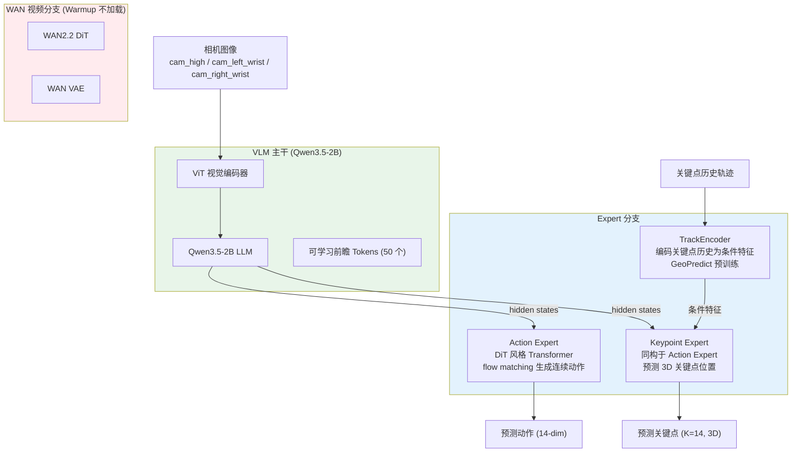
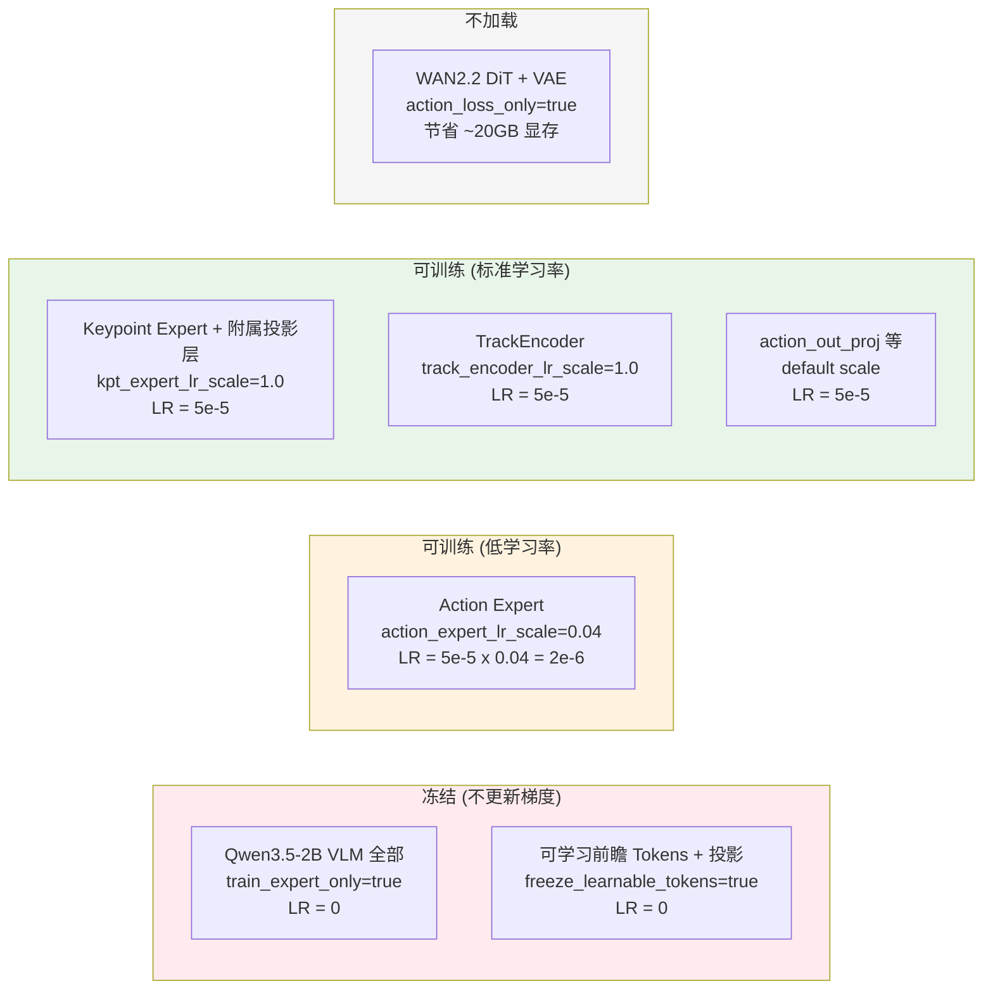
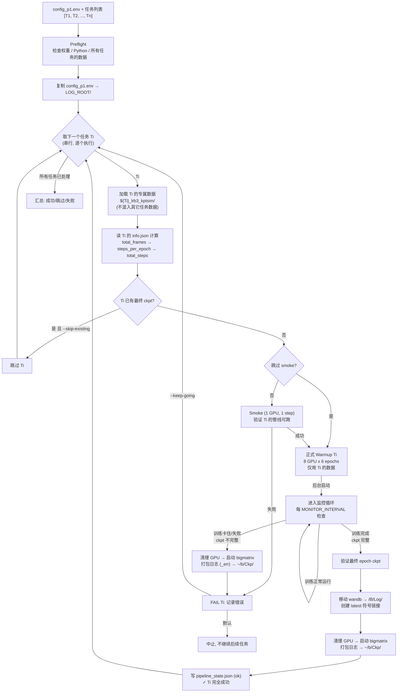
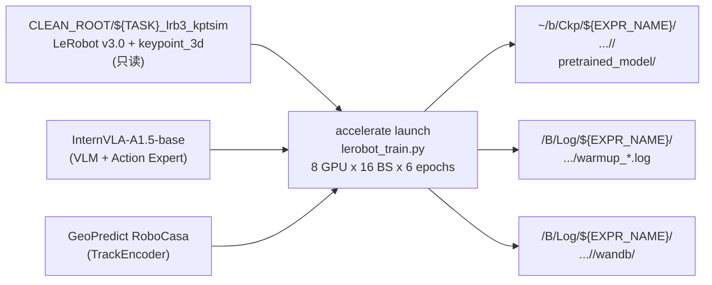
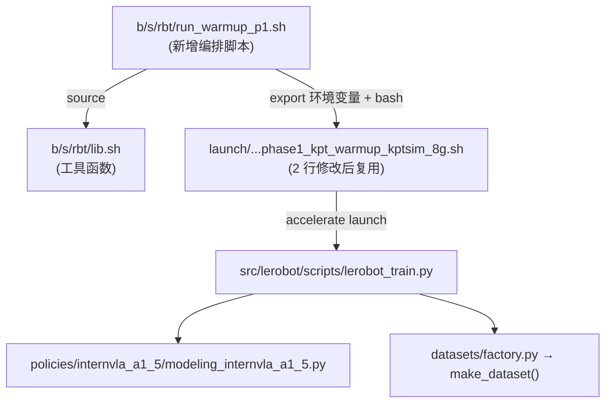
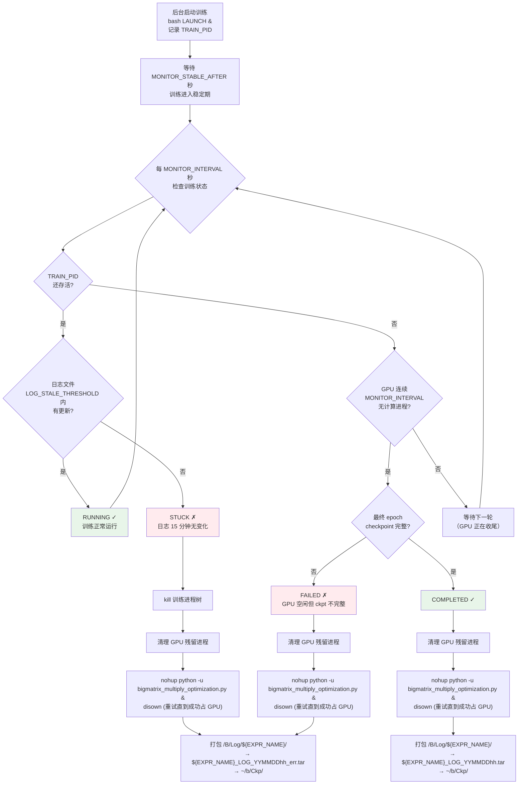

# RoboTwin 2.0 Phase 1: Keypoint Expert 6-Epoch Warmup 训练实施方案

> **目标**: 对 RoboTwin 2.0 的 50 个子任务**串行逐个**执行 6 个 epoch 的 Keypoint Expert 预热训练（Warmup）。支持指定**单个任务**、**任务列表**或**全量任务**。训练从 InternVLA-A1.5-base 出发，仅训练 action expert 和 keypoint expert（VLM 冻结），产出最终 epoch 的 checkpoint 供后续 Phase 2 SFT 使用。
>
> **串行训练原则**: 当指定多个任务时，脚本**按顺序逐个训练**——每个子任务只使用其自身对应的含 4D 关键点的数据（`${TASK}_lrb3_kptsim/`），**不混入任何其它子任务的数据**；前一个子任务的 warmup 训练**完全成功完成后**（checkpoint 验证通过、状态写入 `pipeline_state.json`），才进入下一个子任务的 warmup 训练。若某个任务失败，默认立即中止（`--keep-going` 可改为跳过失败任务继续后续任务，但**不会**回退重试失败任务）。
>
> **前置条件**: Phase 0 数据准备已完成——每个任务对应的 `{task}_lrb3_kptsim/` 目录已存在且通过 Layer-2 验证（出处: [`prepare_ech_rbt_p0.md`](prepare_ech_rbt_p0.md) Step 5）。
>
> **实验隔离**: 所有路径以 `EXPR_NAME`（默认 `ItvlaGpRbt0905`）做顶层隔离，不同实验互不覆盖。同一实验的不同运行批次以时间戳目录做隔离。
>
> **路径分离原则**:
> - 模型权重 checkpoint → `~/b/Ckp/${EXPR_NAME}/${TASK}/warmup/`
> - 训练日志 + wandb → `/B/Log/${EXPR_NAME}/${TASK}/warmup/`
>
> **复用**: 训练 launch 脚本 [`launch/internvla_a15_geop_phase1_kpt_warmup_kptsim_8g.sh`](../../launch/internvla_a15_geop_phase1_kpt_warmup_kptsim_8g.sh) 仅做 2 行兼容性修改（将 `scheduler_warmup_steps` 和 `scheduler_decay_lr` 参数化），其余 100% 复用。本方案新增一个编排脚本 `b/s/rbt/run_warmup_p1.sh`，通过环境变量覆盖 launch 脚本的默认值。
>
> **论文出处**:
> - InternVLA-A1.5: [arXiv:2607.04988](https://arxiv.org/abs/2607.04988)
> - GeoPredict: [arXiv:2512.16811](https://arxiv.org/abs/2512.16811)

---

## 目录

- [1. 目标与概述](#1-目标与概述)
- [2. 关键变量定义](#2-关键变量定义)
- [3. InternVLA-A1.5 Warmup 训练架构](#3-internvla-a15-warmup-训练架构)
- [4. 模块冻结与权重更新策略](#4-模块冻结与权重更新策略)
- [5. 训练生效超参详解](#5-训练生效超参详解)
- [6. 数据要求](#6-数据要求)
- [7. 目录布局与路径隔离](#7-目录布局与路径隔离)
- [8. 代码复用与变更清单](#8-代码复用与变更清单)
- [9. 流程架构](#9-流程架构)
- [10. 操作手册](#10-操作手册)
- [11. 故障排查](#11-故障排查)
- [附录 A: Warmup vs SFT 超参对照表](#附录-a-warmup-vs-sft-超参对照表)
- [附录 B: 参考文献与出处](#附录-b-参考文献与出处)

---

## 1. 目标与概述

### 1.1 目标

Phase 1 Warmup 的目的是：在有 kptsim 3D 关键点 GT（Ground Truth）的前提下，把 keypoint expert 从初始化状态拉到可用水平，作为后续 Phase 2 SFT 的起点。

训练 **6 个 epoch**，每 epoch 保存一次 checkpoint。最终取**最后一个 epoch** 的 checkpoint 作为产物。不同任务的帧数不同，因此实际训练步数不同：

$$
\text{steps\_per\_epoch} = \left\lceil \frac{N_{\text{frames}}}{\text{EBS}} \right\rceil, \quad \text{total\_steps} = \text{steps\_per\_epoch} \times N_{\text{epochs}}
$$

其中 \(N_{\text{frames}}\) 是该任务数据集的总帧数, \(\text{EBS} = \text{GPU} \times \text{BS} \times \text{nodes}\) 是有效批大小, \(N_{\text{epochs}} = 6\)。

**示例** (\(\text{EBS} = 8 \times 16 \times 1 = 128\)):

| 任务 | 帧数 | steps/epoch | 6-epoch 总步数 |
|:---|:---|:---|:---|
| click_bell | 3,855 | 31 | 186 |
| adjust_bottle | 5,100 | 40 | 240 |
| stack_bowls_three | ~25,000 | 196 | 1,176 |

> **为何改用 epoch 而非固定步数**: 不同任务的帧数差异大（3k–25k），固定 400 步对小数据集相当于多跑很多 epoch（可能过拟合），对大数据集则连 1 个 epoch 都跑不完（欠训练）。以 epoch 为单位可保证每个任务看到数据的次数一致。

### 1.2 输入

1. **Phase 0 产物数据**: `${CLEAN_ROOT}/${TASK}_lrb3_kptsim/`——含 `observation.keypoint_3d` 的 LeRobot v3.0 数据集（出处: [`prepare_ech_rbt_p0.md`](prepare_ech_rbt_p0.md)）。
2. **预训练权重**:
   - InternVLA-A1.5-base（[HuggingFace](https://huggingface.co/InternRobotics/InternVLA-A1.5-base)）: Qwen3.5-2B VLM + action expert
   - GeoPredict RoboCasa checkpoint（[arXiv:2512.16811](https://arxiv.org/abs/2512.16811)）: TrackEncoder 预训练权重
3. **任务名列表**: 单个任务名、逗号分隔列表、任务列表文件、或 `all`。

### 1.3 输出

| 产物 | 路径 |
|:---|:---|
| 最终 epoch checkpoint | `~/b/Ckp/${EXPR_NAME}/${TASK}/warmup/<job>/checkpoints/<final_step>/pretrained_model/` |
| 中间 epoch checkpoint | 每 epoch 保存一次，共 6 个 |
| `latest` 符号链接 | `~/b/Ckp/${EXPR_NAME}/${TASK}/warmup/latest` → 最新成功 job 目录 |
| 训练日志 | `/B/Log/${EXPR_NAME}/${TASK}/warmup/warmup_<timestamp>.log` |
| wandb 文件 | `/B/Log/${EXPR_NAME}/${TASK}/warmup/<job>/wandb/` |
| 阶段状态 | `/B/Log/${EXPR_NAME}/${TASK}/pipeline_state.json` |
| 配置快照 | `/B/Log/${EXPR_NAME}/config_p1.env` |

### 1.4 非目标

- 不做 Phase 0 数据准备（必须事先完成）。
- 不做 Phase 2 SFT（本文档仅覆盖 warmup）。
- 不并行训练多个任务——同一组 GPU 同一时刻只跑一个子任务，严格串行。
- 不混用其它子任务的数据——每个子任务的 warmup 只用自身对应的 `${TASK}_lrb3_kptsim/` 数据集。
- 不下载模型权重（A1.5-base 和 GeoPredict 必须事先放好）。
- 不加载 WAN 视频生成模型（`action_loss_only=true`）。

---

## 2. 关键变量定义

| 变量 | 含义 | 默认值 | 备注 |
|:---|:---|:---|:---|
| `EXPR_NAME` | 实验名称，用于路径隔离 | `ItvlaGpRbt0905` | **所有产物的顶层目录**，不同实验互不覆盖 |
| `CLEAN_ROOT` | Phase 0 产物所在父目录 | `/B/Dta/RoboTwin-Clean` | 含 `{task}_lrb3_kptsim/` 子目录 |
| `CKPT_ROOT` | 模型权重 checkpoint 根目录 | `~/b/Ckp/${EXPR_NAME}` | **仅存放模型权重** |
| `LOG_ROOT` | 训练日志 + wandb 根目录 | `/B/Log/${EXPR_NAME}` | **仅存放日志和 wandb 文件** |
| `ITVLAGP_ROOT` | itvlaGp 仓库根目录 | 脚本上溯 3 级 | 含 launch 脚本 |
| `VENV_ROOT` | 训练虚拟环境根 | `/B/VENV/itnvla15rbt20` | 含 accelerate, torch, lerobot |
| `TRAIN_PYTHON` | 训练用 Python 解释器 | `${VENV_ROOT}/bin/python` | 必须能 `import lerobot` |
| `HF_HOME` | HuggingFace 缓存/权重根 | `${VENV_ROOT}/var/hf_home` | A1.5-base 和 GeoPredict 在此下 |
| `HF_LEROBOT_HOME` | LeRobot 数据根 | `${CLEAN_ROOT}` | 训练通过此路径 + `DATA_REPO_ID` 找数据 |
| `PRETRAINED_PATH` | InternVLA-A1.5-base 权重目录 | `${HF_HOME}/ckpts/InternVLA-A1.5-base` | 含 `config.json` + `model.safetensors` |
| `GEOPREDICT_CKPT` | GeoPredict RoboCasa 权重 | `${HF_HOME}/ckpts/GeoPredict_robocasa.pth` | TrackEncoder 预训练 |
| `PROC_PER_NODE` | 每节点 GPU 数 | `8` | 与 H200/A100 等对齐 |
| `BATCH_SIZE` | 每卡 batch size | `16` | 有效 batch = GPU x BS |
| `NUM_EPOCHS` | Warmup 训练 epoch 数 | `6` | 每个任务统一跑 6 个 epoch |
| `WARMUP_MASTER_PORT` | accelerate 通信端口 | `36201` | 避免与其他训练冲突 |
| `DATA_SUFFIX` | Phase 0 产物目录后缀 | `_lrb3_kptsim` | 区别于旧命名 `_kptsim_lrbv30` |

**动态计算变量**（由脚本按任务自动推算）：

| 变量 | 公式 | 说明 |
|:---|:---|:---|
| `TOTAL_FRAMES` | 从 `meta/info.json` 读取 | 该任务的总帧数 |
| `EBS` | `PROC_PER_NODE * BATCH_SIZE * NODE_COUNT` | 有效批大小 |
| `STEPS_PER_EPOCH` | `ceil(TOTAL_FRAMES / EBS)` | 每 epoch 步数 |
| `TOTAL_STEPS` | `STEPS_PER_EPOCH * NUM_EPOCHS` | 总训练步数 |
| `SAVE_FREQ` | `STEPS_PER_EPOCH` | 每 epoch 存一次 checkpoint |
| `SCHED_WARMUP_STEPS` | `STEPS_PER_EPOCH` | LR 线性预热 1 个 epoch |

**训练后监控变量**（可通过 `config_p1.env` 或 CLI `--monitor-interval` 等覆盖）：

| 变量 | 含义 | 默认值 | 备注 |
|:---|:---|:---|:---|
| `MONITOR_INTERVAL` | 监控轮询间隔（秒） | `900`（15 分钟） | 训练进入稳定期后，每隔此时间检查一次训练状态 |
| `LOG_STALE_THRESHOLD` | 日志陈旧判定阈值（秒） | `900`（15 分钟） | 日志文件超过此时间未更新且 GPU 无进展，视为训练卡住 |
| `MONITOR_STABLE_AFTER` | 进入稳定期的等待时间（秒） | `180`（3 分钟） | 训练启动后等待此时间再开始定时监控，避免初始化阶段误判 |
| `BIGMATRIX_SCRIPT` | GPU 占位脚本路径 | `${ITVLAGP_ROOT}/b/d/rbt/bigmatrix_multiply_optimization.py` | 训练结束后启动此脚本占用 GPU |
| `BIGMATRIX_LOG` | GPU 占位脚本日志 | `/tmp/bigmatrix_multiply_optimization.log` | nohup 输出重定向 |

**监控状态机**（由 `monitor_training()` 函数驱动）：

| 状态 | 条件 | 动作 |
|:---|:---|:---|
| `RUNNING` | 训练进程存活 + 日志在 `LOG_STALE_THRESHOLD` 内有更新 | 继续监控 |
| `STUCK` | 训练进程存活但日志超过 `LOG_STALE_THRESHOLD` 未更新；或 GPU 持续 `LOG_STALE_THRESHOLD` 无进展且 checkpoint 不完整 | **先** 清理 GPU → 启动 bigmatrix，**再** 打包日志（`_err` 后缀）→ 拷贝到 `~/b/Ckp/` |
| `COMPLETED` | GPU 连续 `MONITOR_INTERVAL` 无计算进程 + 最终 epoch checkpoint 完整 | **先** 清理 GPU → 启动 bigmatrix，**再** 打包日志 → 拷贝到 `~/b/Ckp/` |
| `FAILED` | 训练进程退出 + GPU 空闲 + checkpoint 不完整 | 同 `STUCK`（**先** cleanup→bigmatrix，**再** 打包 `_err`） |

> **与 `run_each_rbt_p012.sh` 的差异**（出处: [`run_ech_rbt_p012.md` §3.2](run_ech_rbt_p012.md)、[`config.env.example`](../../s/rbt/config.env.example)）:
> - 新增 `EXPR_NAME` 做顶层路径隔离。
> - `CKPT_ROOT` 从 `~/Ckp/itvlaGp` 改为 `~/b/Ckp/${EXPR_NAME}`。
> - 新增 `LOG_ROOT=/B/Log/${EXPR_NAME}`，日志和 wandb 不再存放在 `CKPT_ROOT` 内。
> - 训练步数从固定 400 改为按 6 epoch 动态计算。
> - 数据目录后缀从 `_kptsim_lrbv30` 改为 `_lrb3_kptsim`。

---

## 3. InternVLA-A1.5 Warmup 训练架构

### 3.1 模型整体架构

InternVLA-A1.5（出处: [arXiv:2607.04988](https://arxiv.org/abs/2607.04988) §3）是一个 vision-language-action (VLA) 模型，由以下组件组成：



### 3.2 Warmup 阶段的训练目标

Warmup 的核心任务是让 **Keypoint Expert** 从初始化状态快速收敛到可用水平（出处: [`b/d/itrnVLA15_GeoP_3dtrj_3cn4_wrmup.md`](../itrnVLA15_GeoP_3dtrj_3cn4_wrmup.md) §2）：

1. **初始化 Keypoint Expert**: 从 Action Expert 拷贝权重（`init_kpt_expert_from_action=true`），因为两者结构相同（均为 Qwen3.5 TextModel），这比随机初始化收敛更快。
2. **加载 TrackEncoder**: 从 GeoPredict RoboCasa 预训练权重加载（`geopredict_checkpoint_path`），提供关键点历史编码能力。
3. **高权重训练关键点预测**: `kpt_loss_weight=10.0`，远高于 `action_loss_weight=2.0`，强调关键点预测是主要优化目标。
4. **抑制 Action Expert 漂移**: `action_expert_lr_scale=0.04`，即 Action Expert 学习率仅为 Keypoint Expert 的 4%，防止 warmup 过程中 action 能力退化。

### 3.3 损失函数

Warmup 的有效损失函数（出处: [`launch/internvla_a15_geop_phase1_kpt_warmup_kptsim_8g.sh`](../../launch/internvla_a15_geop_phase1_kpt_warmup_kptsim_8g.sh) 第 120–122 行，[arXiv:2607.04988](https://arxiv.org/abs/2607.04988) §3.4）：

$$
\mathcal{L}_{\text{warmup}} = \underbrace{2.0 \cdot \mathcal{L}_{\text{action}}}_{\text{action flow matching}} + \underbrace{10.0 \cdot \left( \mathcal{L}_{\text{kpt}}^{\text{cur}} + 0.2 \cdot \mathcal{L}_{\text{kpt}}^{\text{fut}} \right)}_{\text{3D 关键点 MSE}}
$$

其中：

| 符号 | 含义 | 权重 | 说明 |
|:---|:---|:---|:---|
| \(\mathcal{L}_{\text{action}}\) | Action Expert 的 flow matching 损失 | 2.0 | 条件流匹配（Conditional Flow Matching），在噪声空间中预测从噪声到目标动作的速度场 |
| \(\mathcal{L}_{\text{kpt}}^{\text{cur}}\) | 当前帧 \(K=14\) 个关键点的 MSE | 10.0 | 在体素坐标系下，shape=\([K, 3]\)，共 42 维 |
| \(\mathcal{L}_{\text{kpt}}^{\text{fut}}\) | 未来 \(H=50\) 步关键点序列的 MSE | 2.0 | shape=\([H, K, 3]\)，预测未来轨迹 |

> **为什么 \(\mathcal{L}_{\text{kpt}}^{\text{fut}}\) 的实际系数是 0.2？** 因为 `kpt_future_loss_weight=2.0` 在代码中被 `kpt_loss_weight=10.0` 除过一次，变成 \(2.0/10.0=0.2\)（出处: [`modeling_internvla_a1_5.py`](../../src/lerobot/policies/internvla_a1_5/modeling_internvla_a1_5.py) 的 `forward` 方法内部将 `kpt_future_loss_weight` 相对于 `kpt_loss_weight` 归一化）。

---

## 4. 模块冻结与权重更新策略

本章详细说明 Warmup 训练中每个模型模块的状态：是否被加载、是否被冻结、权重是否会被更新、以及更新时使用的学习率。

### 4.1 模块状态总览

| 模块 | 代码路径 | 状态 | 有效学习率 | 权重来源 |
|:---|:---|:---|:---|:---|
| ViT 视觉编码器 | `model.qwen3_5_with_expert.qwen3_5.visual` | 冻结 | 0 | Qwen3.5-2B 预训练 |
| Qwen3.5-2B LLM | `model.qwen3_5_with_expert.qwen3_5.language_model` | 冻结 | 0 | Qwen3.5-2B 预训练 |
| 可学习前瞻 Tokens | `model.learnable_tokens` + `learnable_tokens_in_proj` | 冻结 | 0 | A1.5-base |
| WAN 投影层 | `model.learnable_to_wan_proj` | 冻结 | 0 | A1.5-base |
| Action Expert | `model.qwen3_5_with_expert.action_expert` | **可训练（低 LR）** | 2e-6 | A1.5-base |
| Action 输出投影 | `model.action_out_proj` | **可训练** | 5e-5 | A1.5-base |
| Keypoint Expert | `model.qwen3_5_with_expert.keypoint_expert` | **可训练** | 5e-5 | 从 Action Expert 复制 |
| TrackEncoder | `model.track_encoder` | **可训练** | 5e-5 | GeoPredict RoboCasa |
| Keypoint 状态投影 | `model.kpt_state_proj` | **可训练** | 5e-5 | 随机初始化 |
| Keypoint 嵌入层 | `model.keypoint_embedding` | **可训练** | 5e-5 | 随机初始化 |
| Keypoint 输出投影 | `model.keypoint_out_proj` | **可训练** | 5e-5 | 随机初始化 |
| WAN2.2 DiT + VAE | `model.wan_video_model` | **不加载** | N/A | N/A |

### 4.2 冻结机制的代码实现

冻结逻辑在两个方法中实现（出处: [`modeling_internvla_a1_5.py`](../../src/lerobot/policies/internvla_a1_5/modeling_internvla_a1_5.py) 第 1101–1125 行、第 1467–1481 行）：

**`set_requires_grad()` 方法**（模型初始化时调用）：

```python
# 1. 冻结 VLM 主干 — 由 train_expert_only=true 触发
if self.config.train_expert_only:
    self.qwen3_5_with_expert.qwen3_5.eval()
    for params in self.qwen3_5_with_expert.qwen3_5.parameters():
        params.requires_grad = False
    # 效果: ViT + LLM 的所有参数梯度关闭

# 2. 冻结关键点模块 — 由 freeze_keypoint_modules=true 触发 (warmup 中为 false, 不触发)
if self.config.enable_keypoint_predictor and self.config.freeze_keypoint_modules:
    kpt_modules = [self.track_encoder, self.kpt_state_proj, self.keypoint_embedding,
                   self.keypoint_out_proj, self.qwen3_5_with_expert.keypoint_expert]
    for module in kpt_modules:
        module.eval()
        for params in module.parameters():
            params.requires_grad = False
```

**`_setup_wan_grad()` 方法**（训练设置时调用）：

```python
# 1. 冻结前瞻 tokens — 由 freeze_learnable_tokens=true 触发
if self.config.freeze_learnable_tokens:
    self.learnable_tokens.requires_grad = False
    for p in self.learnable_tokens_in_proj.parameters():
        p.requires_grad = False

# 2. 提前返回 — 由 action_loss_only=true 触发 (warmup 走此分支)
if self.config.action_loss_only:
    return  # WAN 模型未加载, 无需进一步配置
```

### 4.3 学习率分组的代码实现

不同模块使用不同学习率，通过 `get_optim_params()` 方法实现参数分组（出处: [`modeling_internvla_a1_5.py`](../../src/lerobot/policies/internvla_a1_5/modeling_internvla_a1_5.py) 第 2198–2248 行）：

```python
base_lr = cfg.optimizer_lr  # 5e-5

groups = [
    {"params": track_encoder_params, "lr": base_lr * cfg.track_encoder_lr_scale},  # 5e-5 × 1.0 = 5e-5
    {"params": kpt_expert_params,    "lr": base_lr * cfg.kpt_expert_lr_scale},     # 5e-5 × 1.0 = 5e-5
    {"params": action_params,        "lr": base_lr * cfg.action_expert_lr_scale},   # 5e-5 × 0.04 = 2e-6
    {"params": vlm_params,           "lr": base_lr * cfg.vlm_lr_scale},            # 空 (已冻结)
    {"params": other_params,         "lr": base_lr},                               # 5e-5
]
```

其中各参数组的划分逻辑：
- `track_encoder_params`: `model.track_encoder` 的所有参数（单独分组以便独立控制 LR）
- `kpt_expert_params`: `keypoint_expert` + `kpt_state_proj` + `keypoint_embedding` + `keypoint_out_proj`（不含 track_encoder）
- `action_params`: `action_expert` 的所有参数
- `vlm_params`: `qwen3_5` 的所有参数（因 `requires_grad=False` 而为空集）
- `other_params`: 不属于以上任何组的可训练参数（如 `action_out_proj`）

### 4.4 学习率详解



学习率调度（出处: launch 脚本第 107–110 行）：

$$
\text{LR}(t) = \begin{cases} \text{base\_lr} \times \frac{t}{\text{warmup\_steps}} & t \le \text{warmup\_steps} \\ \text{decay\_lr} + \frac{\text{base\_lr} - \text{decay\_lr}}{2} \left(1 + \cos\left(\pi \frac{t - \text{warmup\_steps}}{\text{decay\_steps} - \text{warmup\_steps}}\right)\right) & t > \text{warmup\_steps} \end{cases}
$$

其中:
- \(\text{base\_lr} = 5 \times 10^{-5}\)，各模块实际 LR 乘以对应的 `lr_scale`
- \(\text{warmup\_steps} = \text{steps\_per\_epoch}\)（1 个 epoch 的线性预热）
- \(\text{decay\_steps} = \text{total\_steps}\)（余弦衰减至训练结束）
- \(\text{decay\_lr} = 5 \times 10^{-6}\)（终点学习率）

### 4.5 Knowledge Insulation (KI)

KI（出处: [arXiv:2607.04988](https://arxiv.org/abs/2607.04988) §3.2）是一种注意力掩码机制：

| 参数 | Warmup 值 | 效果 |
|:---|:---|:---|
| `knowledge_insulation=true` | 启用 | Action Expert 的 cross-attention 不看 VLM prefix 上下文 |
| `knowledge_insulation_kpt=true` | 启用 | Keypoint Expert 的 cross-attention 不看 VLM prefix 上下文 |

**为何 warmup 启用 KI**: Expert 尚未充分训练时，如果让其看到 VLM 的完整表示，可能过拟合到特定 VLM 特征而非学到通用的动作/关键点预测能力。KI 迫使 expert 仅依赖局部输入（当前状态 + action/keypoint history）来学习，先打好基础。Phase 2 SFT 会关闭 KI，让 expert 利用完整上下文。

---

## 5. 训练生效超参详解

本章对训练时生效的每个超参数进行说明：生效值、定义位置、含义、不同值的影响、以及为什么设为当前值。

### 5.1 训练规模与调度参数

| 参数 | 生效值 | 定义位置 | 含义与作用 |
|:---|:---|:---|:---|
| `PROC_PER_NODE` | 8 | launch 脚本第 50 行 | 每节点 GPU 数。值越大并行度越高、每 step 数据吞吐越大，但需要更多 GPU |
| `BATCH_SIZE` | 16 | launch 脚本第 51 行 | 每 GPU 每 step 处理的样本数。受限于 GPU 显存；16 在 H200 80GB 下不会 OOM（action_loss_only 不加载 WAN 省 ~20GB） |
| `NUM_EPOCHS` | 6 | 编排脚本 | 训练轮数。6 轮保证模型充分看到训练数据，同时不过拟合（经验值） |
| `STEPS` | 动态计算 | 编排脚本 | \(\lceil N_{\text{frames}} / \text{EBS} \rceil \times 6\)。由任务帧数和 EBS 决定 |
| `SAVE_FREQ` | steps_per_epoch | 编排脚本 | 每 epoch 保存一次，既方便中途检查训练质量，又不因太频繁而拖慢 IO |
| `NUM_WORKERS` | 12 | launch 脚本第 53 行 | DataLoader 工作线程数。12 在多数 8-GPU 机器上能饱和 IO，值太大可能引起 OOM |
| `LOG_FREQ` | 10 | launch 脚本第 55 行 | 每 10 步打印一次 loss。太频繁影响训练速度，太稀疏影响监控 |
| `seed` | 42 | launch 脚本第 143 行 | 随机种子，保证可复现性 |

**为何 EBS=128**: 8 GPU x 16 BS x 1 node = 128。这是 InternVLA-A1.5 论文预训练的默认值（出处: [arXiv:2607.04988](https://arxiv.org/abs/2607.04988) §4.1），在 warmup 阶段沿用以保持训练动态一致。

### 5.2 优化器与学习率参数

| 参数 | 生效值 | 定义位置 | 含义与影响 | 为何设此值 |
|:---|:---|:---|:---|:---|
| `optimizer_lr` | 5e-5 | launch 脚本第 107 行 | 基础学习率。值太大导致 loss 震荡甚至发散；值太小导致收敛慢。5e-5 是 InternVLA-A1.5 预训练中验证有效的 warmup LR（出处: arXiv:2607.04988 §4.2） | 论文推荐值 |
| `scheduler_warmup_steps` | steps_per_epoch（动态） | launch 脚本第 108 行 → 编排脚本覆盖 | LR 线性预热步数。从 0 线性增长到 base_lr，防止训练初期因 LR 过大而 loss 爆炸 | 1 epoch 预热：第 1 轮作为"探索"期，LR 从 0 逐渐增大；第 2–6 轮为正式训练 |
| `scheduler_decay_steps` | total_steps（动态） | launch 脚本第 109 行 | 余弦衰减终点。LR 在 warmup_steps 到 decay_steps 之间按余弦退火到 decay_lr。设为 total_steps 保证训练结束时 LR 最低 | 与训练总步数对齐 |
| `scheduler_decay_lr` | 5e-6 | launch 脚本第 110 行 | 衰减终点 LR。是 base_lr 的 1/10，确保训练末期仍有微弱更新但不会大幅改变权重 | 经验值 |
| `action_expert_lr_scale` | 0.04 | launch 脚本第 128 行 | Action Expert 的 LR 缩放。实际 LR = 5e-5 x 0.04 = 2e-6。值越大 Action Expert 训练越快但越容易偏离预训练状态 | Warmup 主训 KE，AE 只需轻微调整以配合 KE。0.04 在 RoboCasa 预训练中验证有效（出处: arXiv:2607.04988 §4.2） |
| `kpt_expert_lr_scale` | 1.0 | launch 脚本第 129 行 | Keypoint Expert 的 LR 缩放。实际 LR = 5e-5 x 1.0 = 5e-5。无缩放，全速训练 | KE 是 warmup 的主要训练对象，需要最快的学习速度 |
| `track_encoder_lr_scale` | 1.0 | launch 脚本第 130 行 | TrackEncoder 的 LR 缩放。实际 LR = 5e-5 x 1.0 = 5e-5。无缩放，全速训练 | TE 需要从通用预训练适配到特定任务的关键点编码 |

### 5.3 模型训练模式参数

| 参数 | 生效值 | 定义位置 | 含义与影响 | 为何设此值 |
|:---|:---|:---|:---|:---|
| `train_expert_only` | true | launch 第 117 行 | true: 冻结 VLM，仅训练 expert 分支。false: VLM 也参与训练 | Warmup 目的是初始化 KE，不需要也不应该改动 VLM（改动 VLM 需要更大数据量和更长训练） |
| `action_loss_only` | true | launch 第 131 行 | true: 不加载 WAN 视频模型，不计算 video loss。节省 ~20GB GPU 显存和 ~2 分钟加载时间 | Warmup 不需要 video foresight 监督，且不加载 WAN 是推理部署的标准配置 |
| `enable_vqa_loss` | false | launch 第 112 行 | true: 对 VLM 输出的语言 token 计算交叉熵 loss。false: 不做 VQA 监督 | Warmup 阶段 VLM 冻结，VQA loss 无法反传梯度到 VLM，开启无意义 |
| `enable_keypoint_predictor` | true | launch 第 118 行 | true: 启用 Keypoint Expert + TrackEncoder。false: 模型无关键点预测能力 | Warmup 的核心就是训练关键点预测能力 |
| `init_kpt_expert_from_action` | true | launch 第 130 行 | true: 从 Action Expert 复制权重初始化 KE（首次训练时）。false: 随机初始化或从 checkpoint 加载 | AE 和 KE 架构完全相同（均为 Qwen3_5TextModel），复制权重比随机初始化收敛快很多 |
| `knowledge_insulation` | true | launch 第 123 行 | true: AE 的 cross-attention 不看 prefix。见 [§4.5](#45-knowledge-insulation-ki) | 防止未训练好的 expert 过拟合 VLM 表示 |
| `knowledge_insulation_kpt` | true | launch 第 124 行 | true: KE 的 cross-attention 不看 prefix | 同上 |
| `kpt_to_action_detach` | false | launch 第 125 行 | true: 关键点信息传给 AE 时截断梯度。false: 允许 KE 的梯度通过 AE 反传 | false 允许端到端训练，KE 的表示对 AE 有益 |
| `freeze_keypoint_modules` | false | launch 第 126 行 | true: 冻结所有关键点模块（KE + TE + 投影层）。false: 不冻结 | Warmup 的目的就是训练这些模块，当然不冻结 |
| `freeze_learnable_tokens` | true | launch 第 115 行 | true: 冻结 50 个可学习前瞻 tokens 及其投影。false: 让 tokens 可训练 | 前瞻 tokens 需要 WAN 监督才能学到有意义的表示，warmup 不加载 WAN，训练它们会学到噪声 |
| `tokenize_state` | true | launch 第 113 行 | true: 将机器人状态（14-dim 关节角）编码为文本 token 嵌入到 LLM prompt 中 | 提供当前关节角信息作为 expert 的额外上下文 |
| `use_fast_action_tokens` | true | dataset 参数第 139 行 | true: 使用 FAST 离散化 action token 监督 alongside flow matching | FAST tokens 提供额外的离散化监督信号，有助于 action 质量 |

### 5.4 Loss 权重参数

| 参数 | 生效值 | 定义位置 | 含义与影响 | 为何设此值 |
|:---|:---|:---|:---|:---|
| `action_loss_weight` | 2.0 | launch 第 120 行 | Action flow matching loss 的权重。值越大模型越重视 action 精度 | Warmup 主训 KE，AE 辅助。2.0 远小于 kpt_loss_weight(10.0)，确保 KE 训练为主导 |
| `kpt_loss_weight` | 10.0 | launch 第 121 行 | 当前帧关键点 MSE loss 的权重。值越大模型越重视当前帧关键点精度 | 10.0 是 action_loss_weight 的 5 倍，体现 warmup 对关键点预测的强调 |
| `kpt_future_loss_weight` | 2.0 | launch 第 122 行 | 未来关键点序列 MSE loss 的权重。在代码中实际系数为 2.0/10.0 = 0.2（归一化后） | 未来轨迹预测难度更大且噪声更多，权重适当降低避免梯度被未来帧噪声主导 |
| `video_loss_weight` | 1 | launch 第 114 行 | WAN 视频 loss 的权重。因 action_loss_only=true，此项**实际不生效** | 保持默认值即可，不影响训练 |

### 5.5 数据与编码参数

| 参数 | 生效值 | 定义位置 | 含义与影响 | 为何设此值 |
|:---|:---|:---|:---|:---|
| `dataset.type` | internvla_a1_5 | launch 第 133 行 | 数据集处理管线类型。选择 InternVLA-A1.5 专用的 transform 和 chat processor | 必须与 policy.type 匹配 |
| `dataset.action_mode` | abs | launch 第 137 行 | 绝对关节角目标（abs）vs 相对增量（delta）。abs 直接预测目标角度，delta 预测角度变化量 | RoboTwin 2.0 使用绝对角度模式（出处: `prepare_ech_rbt_p0.md` §2.2） |
| `dataset.video_backend` | torchcodec | launch 第 142 行 | 视频解码后端。torchcodec 基于 FFmpeg，性能好但偶有解码错误。替代: pyav（更稳定但更慢） | torchcodec 在 H200 上性能最优。偶发的 video_decode_error 不影响训练（自动用零帧替代） |
| `dataset.use_external_stats` | true | launch 第 140 行 | true: 从外部 JSON 加载归一化统计，而非从数据集在线计算 | Phase 0 已生成 norm_stat.json，直接加载更快且可保证一致性 |
| `dataset.external_stats_path` | `${NORM_STATS}` | launch 第 141 行 | 指向每任务的 `norm_stat.json` | 每任务有不同的关节角分布，必须使用本任务的统计 |
| `dataset.num_keypoint_joints` | 14 | launch 第 135 行 | 关键点数量 K=14。ALOHA-Agilex 双臂各 7 个活动关节 = 14 关键点 | 由机器人硬件决定，不可更改 |
| `num_learnable_tokens` | 50 | launch 第 116 行 | 可学习前瞻 tokens 的数量。注入 LLM 序列中 | 论文默认值（出处: arXiv:2607.04988 §3.3），warmup 中冻结不训练 |

### 5.6 wandb 参数

| 参数 | 生效值 | 定义位置 | 含义 |
|:---|:---|:---|:---|
| `wandb.enable` | true | launch 第 148 行 | 启用 wandb 记录训练曲线 |
| `wandb.mode` | offline | launch 第 150 行 | 离线模式，不需要网络连接。训练后可 `wandb sync` 上传 |
| `wandb.project` | internvla_a1_5 | launch 第 149 行 | wandb 项目名 |

---

## 6. 数据要求

### 6.1 Phase 0 产物格式

每个任务的训练数据位于 `${CLEAN_ROOT}/${TASK}_lrb3_kptsim/`，格式为 LeRobot v3.0（出处: [`prepare_ech_rbt_p0.md` §3](prepare_ech_rbt_p0.md)）。

**必须存在的文件**:

| 文件 | 说明 |
|:---|:---|
| `meta/info.json` | `codebase_version` 含 `v3.0`；`features` 含 `observation.keypoint_3d`；`total_frames` 用于计算 epoch 步数 |
| `norm_stat.json` | 归一化统计，键为 `observation.state` 和 `action` |
| `meta/keypoints_meta.json` | \(K=14\) 关键点元数据，含 `coord_offset`、`coord_mode=voxel` |
| `data/chunk-000/file-000.parquet` | v3.0 格式的合并 parquet |

**数据特征**:

| 特征 | 维度 | 说明 |
|:---|:---|:---|
| `observation.state` | 14 | ALOHA-Agilex 双臂 14 个活动关节角 |
| `observation.keypoint_3d` | 42 | \(K=14\) 个 3D 关键点（\(14 \times 3\)），体素坐标系 \([0, 1.6]^3\) |
| `action` | 14 | 关节角目标值 |
| `cam_high` | 视频 | 头部相机 |
| `cam_left_wrist` / `cam_right_wrist` | 视频 | 左/右腕相机 |

### 6.2 训练管线如何找到数据

LeRobot 训练入口（[`src/lerobot/scripts/lerobot_train.py`](../../src/lerobot/scripts/lerobot_train.py)）通过 `make_dataset()`（出处: [`src/lerobot/datasets/factory.py`](../../src/lerobot/datasets/factory.py)）加载数据。数据定位规则：

```
数据实际路径 = ${HF_LEROBOT_HOME} / ${DATA_REPO_ID} / meta / info.json
```

因此配置为：
- `HF_LEROBOT_HOME = ${CLEAN_ROOT}`（即 `/B/Dta/RoboTwin-Clean`）
- `DATA_REPO_ID = ${TASK}_lrb3_kptsim`
- 结果路径: `/B/Dta/RoboTwin-Clean/${TASK}_lrb3_kptsim/meta/info.json`

> **不要用 `--dataset.root`**：`factory.py` 会在 `root` 下再拼一层 `repo_id`，导致路径找不到 `info.json`。始终用 `HF_LEROBOT_HOME` + `repo_id` 的组合（出处: [`b/d/itrnVLA15_GeoP_3dtrj_3cn4_wrmup1G_LOG.md`](../itrnVLA15_GeoP_3dtrj_3cn4_wrmup1G_LOG.md) Phase 6.3 踩坑记录）。

### 6.3 任务间数据隔离

每个任务的以下对象**禁止跨任务复用**（出处: [`run_ech_rbt_p012.md` §3.1](run_ech_rbt_p012.md)）：

- `coord_offset` / `keypoints_meta.json`——每任务的世界系 → 体素系平移 \(\mathbf{o}\) 不同
- `norm_stat.json`——每任务的关节角分布不同
- `_lrb3_kptsim/` 数据目录
- Warmup 产出的 checkpoint（后续 Phase 2 SFT 只能用**本任务**的 warmup ckpt）

---

## 7. 目录布局与路径隔离

```
# ============ 实验级隔离 ============
# EXPR_NAME = ItvlaGpRbt0905 → 所有产物在 EXPR_NAME 目录下

# ============ 模型权重 (~/b/Ckp/${EXPR_NAME}/) ============
~/b/Ckp/ItvlaGpRbt0905/
  ${TASK}/
    warmup/
      ${JOB_NAME}/                           # 时间戳开头，如 2026_09_06_14_30_00-...-${TASK}
        checkpoints/
          000031/pretrained_model/            # epoch 1 (step = steps_per_epoch)
          000062/pretrained_model/            # epoch 2
          ...
          000186/pretrained_model/            # epoch 6 = 最终 checkpoint
      latest -> ${JOB_NAME}                  # 符号链接指向最新成功 run

# ============ 日志与 wandb (/B/Log/${EXPR_NAME}/) ============
/B/Log/ItvlaGpRbt0905/
  config_p1.env                              # 配置快照 (首次运行时复制)
  ${TASK}/
    warmup/
      ${JOB_NAME}/
        wandb/                               # wandb offline 文件 (训练后从 ckpt 目录移入)
      warmup_${JOB_STAMP}.log               # 训练 stdout/stderr (tee)
      warmup_smoke_${JOB_STAMP}.log          # smoke 测试日志
    pipeline_state.json                      # 阶段完成状态

# ============ 训练数据 (CLEAN_ROOT, 只读) ============
/B/Dta/RoboTwin-Clean/
  ${TASK}_lrb3_kptsim/                       # Phase 0 产物，训练时只读
    meta/info.json                           # 含 total_frames (用于计算 epoch 步数)
    meta/keypoints_meta.json
    norm_stat.json
    data/chunk-000/file-000.parquet
    videos/chunk-000/...
```

**路径隔离原则**:

1. **实验级隔离**: `EXPR_NAME` 作为 `CKPT_ROOT` 和 `LOG_ROOT` 的顶层目录。换实验只需改 `EXPR_NAME`，所有路径自动隔离。
2. **时间戳隔离**: 同一实验同一任务的不同运行批次以 `JOB_STAMP`（形如 `2026_09_06_14_30_00`）做隔离。`latest` 符号链接始终指向最新成功 run。
3. **checkpoint 目录不放日志**: `~/b/Ckp/` 只包含可迁移的模型权重。
4. **日志目录不放权重**: `/B/Log/` 存放 wandb、训练日志，不需要跨机器迁移。
5. **训练数据只读**: Phase 0 产物在 warmup 过程中不被修改。
6. **不要预创建 OUTPUT_DIR**: LeRobot 的 `TrainPipelineConfig` 发现 `OUTPUT_DIR` 已存在时会抛 `FileExistsError`（出处: [`run_ech_rbt_p012.md` §3.2](run_ech_rbt_p012.md)）。
7. **配置快照**: 首次运行时将 `config_p1.env` 复制到 `LOG_ROOT/config_p1.env`，保证实验可追溯。

---

## 8. 代码复用与变更清单

### 8.1 需要小改的脚本（2 行修改）

[`launch/internvla_a15_geop_phase1_kpt_warmup_kptsim_8g.sh`](../../launch/internvla_a15_geop_phase1_kpt_warmup_kptsim_8g.sh): 将 `scheduler_warmup_steps` 和 `scheduler_decay_lr` 从硬编码改为环境变量可覆盖。

**修改前** (第 108–110 行):
```bash
  --policy.scheduler_warmup_steps=50
  --policy.scheduler_decay_steps="${STEPS}"
  --policy.scheduler_decay_lr=5e-6
```

**修改后**:
```bash
  --policy.scheduler_warmup_steps="${SCHEDULER_WARMUP_STEPS:-50}"
  --policy.scheduler_decay_steps="${STEPS}"
  --policy.scheduler_decay_lr="${SCHEDULER_DECAY_LR:-5e-6}"
```

**向后兼容**: 默认值与原值完全一致（50 和 5e-6），对现有所有直接调用该脚本的场景无任何影响。编排脚本 `run_warmup_p1.sh` 通过 `export SCHEDULER_WARMUP_STEPS=...` 覆盖。

### 8.2 100% 复用的脚本

| 文件路径 | 用途 | 调用方式 |
|:---|:---|:---|
| [`b/s/rbt/lib.sh`](../../s/rbt/lib.sh) | 通用工具函数（日志、路径、JSON 操作） | `source` 引入 |

### 8.3 新增文件

| 文件路径 | 说明 |
|:---|:---|
| `b/s/rbt/run_warmup_p1.sh` | Phase 1 Warmup 编排脚本。动态计算 epoch 步数，循环任务，调用 launch 脚本，分离日志与 checkpoint。内含训练后监控功能：后台启动训练，定时轮询状态，训练结束/卡住时自动打包日志、清理 GPU、启动 bigmatrix 占位脚本 |
| `b/s/rbt/config_p1.env` | 机器本地配置（不提交 git）。含监控参数 `MONITOR_INTERVAL`、`LOG_STALE_THRESHOLD` 等 |

### 8.4 无需修改的其他文件

| 文件 | 原因 |
|:---|:---|
| `b/s/rbt/phase1_warmup.sh` | 原 P012 流水线的 warmup 入口；本方案用独立的 `run_warmup_p1.sh` 替代 |
| `b/s/rbt/discover_source_tasks.py` | 本方案直接扫描 `*_lrb3_kptsim/` 目录，不依赖此脚本 |

---

## 9. 流程架构

### 9.1 总体流程

> **串行逻辑**: 任务列表 `[T1, T2, ..., Tn]` 被顺序迭代。每轮迭代**只加载当前任务 Ti 的数据**（`${Ti}_lrb3_kptsim/`），在该任务的 warmup 训练**完全成功**（checkpoint 存在 + pipeline_state 写入 `ok`）之后，才进入 T(i+1)。不同任务的数据和 checkpoint 路径完全隔离，互不影响。



### 9.2 单任务 Warmup 数据流



### 9.3 静态组件图



### 9.4 训练后监控流程

训练以后台进程启动后，编排脚本进入一个定时监控循环。监控逻辑在训练进入稳定期（`MONITOR_STABLE_AFTER` 秒后）开始生效，之后每 `MONITOR_INTERVAL` 秒检查一次。



**打包命名规则**:

| 场景 | tar 包名称 | 示例 |
|:---|:---|:---|
| 训练成功完成 | `${EXPR_NAME}_LOG_<YYMMDDhh>.tar` | `ItvlaGpRbt0905_LOG_26090413.tar` |
| 训练卡住/失败 | `${EXPR_NAME}_LOG_<YYMMDDhh>_err.tar` | `ItvlaGpRbt0905_LOG_26090413_err.tar` |

> **时间戳格式**: `YYMMDDhh`，精确到小时，如 `26090413` 表示 2026-09-04 13:xx。

**后处理顺序**（成功和失败路径均相同，顺序不可颠倒）:

$$\text{清理 GPU} \rightarrow \text{启动 bigmatrix（重试直到成功占 GPU）} \rightarrow \text{打包日志 tar → 拷贝 ~/b/Ckp/}$$

> 先占 GPU 再打包，是因为打包耗时较长（可能数分钟），若先打包再占 GPU，会出现 GPU 空窗期被他人抢占的风险。

**成功判定**: GPU 连续 `MONITOR_INTERVAL`（默认 15 分钟）无计算进程，且最终 epoch checkpoint 完整（含 `model.safetensors` 和 `config.json`）。监控循环每 15 分钟轮询一次 `nvidia-smi`，发现 GPU 空闲后再次确认 checkpoint 完整性。

**GPU 清理**: 使用 `nvidia-smi --query-compute-apps=pid --format=csv,noheader` 获取所有占用 GPU 的计算进程 PID，逐个 `kill -9`，再 sleep 2 秒确认清退。

**bigmatrix 启动**: `nohup python -u <script> > /tmp/bigmatrix_multiply_optimization.log 2>&1 &` + `disown`。启动后等待 5 秒检查进程存活，不存活则重试，最多重试 3 次。

---

## 10. 操作手册

### Step 0: 环境准备

#### 0.1 验证训练 Python 环境

```bash
TRAIN_PYTHON="${VENV_ROOT:-//B/VENV/itnvla15rbt20}/bin/python"

${TRAIN_PYTHON} -c "import torch; print('torch', torch.__version__, 'cuda', torch.cuda.is_available())"
${TRAIN_PYTHON} -c "import accelerate; print('accelerate', accelerate.__version__)"
${TRAIN_PYTHON} -c "import lerobot; print('lerobot OK')"
${TRAIN_PYTHON} -c "import torchcodec; print('torchcodec OK')"
${TRAIN_PYTHON} -c "import torch; print('GPUs:', torch.cuda.device_count())"
```

#### 0.2 验证模型权重

```bash
HF_HOME="${VENV_ROOT:-//B/VENV/itnvla15rbt20}/var/hf_home"
ls "${HF_HOME}/ckpts/InternVLA-A1.5-base/config.json"
ls "${HF_HOME}/ckpts/GeoPredict_robocasa.pth"
```

#### 0.3 确认目录可写

```bash
EXPR_NAME="ItvlaGpRbt0905"
mkdir -p ~/b/Ckp/${EXPR_NAME} && touch ~/b/Ckp/${EXPR_NAME}/.test && rm ~/b/Ckp/${EXPR_NAME}/.test
mkdir -p /B/Log/${EXPR_NAME} && touch /B/Log/${EXPR_NAME}/.test && rm /B/Log/${EXPR_NAME}/.test
echo "OK"
```

---

### Step 1: 确认 Phase 0 数据

```bash
ls -d /B/Dta/RoboTwin-Clean/*_lrb3_kptsim 2>/dev/null | wc -l
# 预期: 50

python3 -c "
import json
from pathlib import Path
root = Path('/B/Dta/RoboTwin-Clean')
ok = fail = 0
for d in sorted(root.glob('*_lrb3_kptsim')):
    info = d / 'meta' / 'info.json'
    norm = d / 'norm_stat.json'
    meta = d / 'meta' / 'keypoints_meta.json'
    if info.is_file() and norm.is_file() and meta.is_file():
        frames = json.load(info.open())['total_frames']
        print(f'  OK  {d.name:45s}  frames={frames}')
        ok += 1
    else:
        print(f'  FAIL {d.name:45s}  info={info.is_file()} norm={norm.is_file()} meta={meta.is_file()}')
        fail += 1
print(f'\nPhase 0 data: {ok} ready, {fail} incomplete')
"
```

---

### Step 2: 应用 Launch 脚本修改

将 scheduler 参数从硬编码改为环境变量可覆盖（详见 [§8.1](#81-需要小改的脚本2-行修改)）：

```bash
cd /B/SRC/itvlaGp

# 修改 launch 脚本: scheduler_warmup_steps 参数化
sed -i 's/--policy.scheduler_warmup_steps=50/--policy.scheduler_warmup_steps="${SCHEDULER_WARMUP_STEPS:-50}"/' \
  launch/internvla_a15_geop_phase1_kpt_warmup_kptsim_8g.sh

# 修改 launch 脚本: scheduler_decay_lr 参数化
sed -i 's/--policy.scheduler_decay_lr=5e-6/--policy.scheduler_decay_lr="${SCHEDULER_DECAY_LR:-5e-6}"/' \
  launch/internvla_a15_geop_phase1_kpt_warmup_kptsim_8g.sh

# 验证修改
grep 'scheduler_warmup_steps\|scheduler_decay_lr' launch/internvla_a15_geop_phase1_kpt_warmup_kptsim_8g.sh
# 预期:
#   --policy.scheduler_warmup_steps="${SCHEDULER_WARMUP_STEPS:-50}"
#   --policy.scheduler_decay_lr="${SCHEDULER_DECAY_LR:-5e-6}"
```

---

### Step 3: 配置文件

保存为 `b/s/rbt/config_p1.env`，按实际环境修改：

```bash
# === 实验名 ===
EXPR_NAME=ItvlaGpRbt0905

# === 代码仓库 ===
ITVLAGP_ROOT=/B/SRC/itvlaGp

# === 数据 ===
CLEAN_ROOT=/B/Dta/RoboTwin-Clean

# === 权重/日志输出 (以 EXPR_NAME 隔离) ===
CKPT_ROOT=${HOME}/b/Ckp/${EXPR_NAME}
LOG_ROOT=/B/Log/${EXPR_NAME}

# === Python 环境 ===
VENV_ROOT=//B/VENV/itnvla15rbt20
TRAIN_PYTHON=${VENV_ROOT}/bin/python

# === 模型权重 ===
HF_HOME=${VENV_ROOT}/var/hf_home
PRETRAINED_PATH=${HF_HOME}/ckpts/InternVLA-A1.5-base
GEOPREDICT_CKPT=${HF_HOME}/ckpts/GeoPredict_robocasa.pth

# === 训练参数 ===
PROC_PER_NODE=8
BATCH_SIZE=16
NODE_COUNT=1
NUM_EPOCHS=6
WARMUP_MASTER_PORT=36201
CUDA_VISIBLE_DEVICES=0,1,2,3,4,5,6,7

# === 训练后监控 ===
MONITOR_INTERVAL=900           # 监控轮询间隔 (秒), 默认 15 分钟
LOG_STALE_THRESHOLD=900        # 日志陈旧判定阈值 (秒), 默认 15 分钟
MONITOR_STABLE_AFTER=180       # 训练启动后等待多久进入监控 (秒), 默认 3 分钟
# BIGMATRIX_SCRIPT 和 BIGMATRIX_LOG 有合理默认值, 一般无需配置
```

> **换机器时必须改的项**: `CLEAN_ROOT`、`VENV_ROOT`、`TRAIN_PYTHON`、`HF_HOME` 及其下的权重路径。
> **换实验时只需改**: `EXPR_NAME`。

---

### Step 4: 部署编排脚本

将以下脚本保存为 `b/s/rbt/run_warmup_p1.sh` 并赋予执行权限。

```bash
#!/usr/bin/env bash
# Phase 1 Warmup: 6-epoch keypoint expert warmup for RoboTwin 2.0 tasks.
# Input:  ${CLEAN_ROOT}/${TASK}_lrb3_kptsim/ (Phase 0 output)
# Output: ~/b/Ckp/${EXPR_NAME}/${TASK}/warmup/<job>/checkpoints/<final>/pretrained_model/
# Logs:   /B/Log/${EXPR_NAME}/${TASK}/warmup/
#
# Usage:
#   bash b/s/rbt/run_warmup_p1.sh --config b/s/rbt/config_p1.env --task click_bell
#   bash b/s/rbt/run_warmup_p1.sh --config b/s/rbt/config_p1.env --tasks click_bell,adjust_bottle
#   bash b/s/rbt/run_warmup_p1.sh --config b/s/rbt/config_p1.env               # all tasks
#   bash b/s/rbt/run_warmup_p1.sh --config b/s/rbt/config_p1.env --list-tasks
set -euo pipefail

SCRIPT_DIR="$(cd "$(dirname "${BASH_SOURCE[0]}")" && pwd)"
source "${SCRIPT_DIR}/lib.sh"

# ======================== Defaults ========================
EXPR_NAME="${EXPR_NAME:-ItvlaGpRbt0905}"
ITVLAGP_ROOT="${ITVLAGP_ROOT:-$(cd "${SCRIPT_DIR}/../../.." && pwd)}"
CLEAN_ROOT="${CLEAN_ROOT:-/B/Dta/RoboTwin-Clean}"
CKPT_ROOT="${CKPT_ROOT:-${HOME}/b/Ckp/${EXPR_NAME}}"
LOG_ROOT="${LOG_ROOT:-/B/Log/${EXPR_NAME}}"
VENV_ROOT="${VENV_ROOT:-//B/VENV/itnvla15rbt20}"
TRAIN_PYTHON="${TRAIN_PYTHON:-${VENV_ROOT}/bin/python}"
HF_HOME="${HF_HOME:-${VENV_ROOT}/var/hf_home}"
PRETRAINED_PATH="${PRETRAINED_PATH:-${HF_HOME}/ckpts/InternVLA-A1.5-base}"
GEOPREDICT_CKPT="${GEOPREDICT_CKPT:-${HF_HOME}/ckpts/GeoPredict_robocasa.pth}"

PROC_PER_NODE="${PROC_PER_NODE:-8}"
BATCH_SIZE="${BATCH_SIZE:-16}"
NODE_COUNT="${NODE_COUNT:-1}"
NODE_RANK="${NODE_RANK:-0}"
NUM_EPOCHS="${NUM_EPOCHS:-6}"
WARMUP_MASTER_PORT="${WARMUP_MASTER_PORT:-36201}"
CUDA_VISIBLE_DEVICES="${CUDA_VISIBLE_DEVICES:-$(build_cuda_devices "${PROC_PER_NODE}")}"
SMOKE_BATCH_SIZE="${SMOKE_BATCH_SIZE:-2}"

# 训练后监控
MONITOR_INTERVAL="${MONITOR_INTERVAL:-900}"             # 15 分钟
LOG_STALE_THRESHOLD="${LOG_STALE_THRESHOLD:-900}"       # 15 分钟
MONITOR_STABLE_AFTER="${MONITOR_STABLE_AFTER:-180}"     # 3 分钟
BIGMATRIX_SCRIPT="${BIGMATRIX_SCRIPT:-${ITVLAGP_ROOT}/b/d/rbt/bigmatrix_multiply_optimization.py}"
BIGMATRIX_LOG="${BIGMATRIX_LOG:-/tmp/bigmatrix_multiply_optimization.log}"

DATA_SUFFIX="_lrb3_kptsim"

# ======================== CLI ========================
TASKS=()
TASKS_SPEC=""
CONFIG_FILE=""
FORCE=0
SKIP_EXISTING=1
SKIP_SMOKE=0
KEEP_GOING=0
DRY_RUN=0
LIST_TASKS=0
GPUS=""

usage() {
  cat <<'USAGE'
用法:
  bash b/s/rbt/run_warmup_p1.sh --config config_p1.env
  bash b/s/rbt/run_warmup_p1.sh --config config_p1.env --task click_bell
  bash b/s/rbt/run_warmup_p1.sh --config config_p1.env --tasks click_bell,adjust_bottle
  bash b/s/rbt/run_warmup_p1.sh --config config_p1.env --tasks tasks.batch1.txt
  bash b/s/rbt/run_warmup_p1.sh --config config_p1.env --list-tasks

选项:
  --config PATH       机器本地配置文件
  --task NAME         单个任务名
  --tasks SPEC        逗号分隔任务名、任务列表文件、或 "all"
  --list-tasks        列出可 warmup 的任务后退出
  --gpus N            覆盖 GPU 数
  --skip-existing     已有最终 epoch ckpt 则跳过 (默认)
  --no-skip-existing  不因已有 ckpt 而跳过 (新 run 用新时间戳)
  --force             强制重跑 (等同于 --no-skip-existing)
  --skip-smoke        跳过 1-step smoke 测试
  --keep-going        单任务失败后继续下一个
  --dry-run           只打印命令不执行
  --monitor-interval N  监控轮询间隔 (秒, 默认 1800=30分钟)
  --log-stale N         日志陈旧判定阈值 (秒, 默认 900=15分钟)
  --no-monitor          禁用训练后监控 (同步等待训练结束)
USAGE
}

ENABLE_MONITOR=1

while [[ $# -gt 0 ]]; do
  case "$1" in
    --config)           CONFIG_FILE="$2"; shift 2 ;;
    --task)             TASKS+=("$2"); shift 2 ;;
    --tasks)            TASKS_SPEC="$2"; shift 2 ;;
    --list-tasks)       LIST_TASKS=1; shift ;;
    --gpus)             GPUS="$2"; shift 2 ;;
    --skip-existing)    SKIP_EXISTING=1; shift ;;
    --no-skip-existing) SKIP_EXISTING=0; shift ;;
    --force)            FORCE=1; SKIP_EXISTING=0; shift ;;
    --skip-smoke)       SKIP_SMOKE=1; shift ;;
    --keep-going)       KEEP_GOING=1; shift ;;
    --dry-run)          DRY_RUN=1; shift ;;
    --monitor-interval) MONITOR_INTERVAL="$2"; shift 2 ;;
    --log-stale)        LOG_STALE_THRESHOLD="$2"; shift 2 ;;
    --no-monitor)       ENABLE_MONITOR=0; shift ;;
    -h|--help)          usage; exit 0 ;;
    *)                  rbt_die "未知参数: $1 (见 --help)" ;;
  esac
done

# Load config
if [[ -n "${CONFIG_FILE}" ]]; then
  [[ -f "${CONFIG_FILE}" ]] || rbt_die "配置文件不存在: ${CONFIG_FILE}"
  set -a; source "${CONFIG_FILE}"; set +a
  # Re-evaluate dependent defaults after config load
  CKPT_ROOT="${CKPT_ROOT:-${HOME}/b/Ckp/${EXPR_NAME}}"
  LOG_ROOT="${LOG_ROOT:-/B/Log/${EXPR_NAME}}"
fi

# GPU override
if [[ -n "${GPUS}" ]]; then
  PROC_PER_NODE="${GPUS}"
  CUDA_VISIBLE_DEVICES="$(build_cuda_devices "${GPUS}")"
fi

# ======================== 辅助函数 ========================

data_ready() {
  local task="$1"
  local d="${CLEAN_ROOT}/${task}${DATA_SUFFIX}"
  [[ -f "${d}/meta/info.json" ]] && \
  [[ -f "${d}/norm_stat.json" ]] && \
  [[ -f "${d}/meta/keypoints_meta.json" ]]
}

get_total_frames() {
  local task="$1"
  python3 -c "import json; print(json.load(open('${CLEAN_ROOT}/${task}${DATA_SUFFIX}/meta/info.json'))['total_frames'])"
}

compute_steps() {
  local total_frames="$1"
  local ebs=$((PROC_PER_NODE * BATCH_SIZE * NODE_COUNT))
  STEPS_PER_EPOCH=$(( (total_frames + ebs - 1) / ebs ))
  TOTAL_STEPS=$((STEPS_PER_EPOCH * NUM_EPOCHS))
  SAVE_FREQ="${STEPS_PER_EPOCH}"
  SCHED_WARMUP_STEPS="${STEPS_PER_EPOCH}"
}

find_warmup_ckpt() {
  local task="$1"
  local warmup_dir="${CKPT_ROOT}/${task}/warmup"
  local latest="${warmup_dir}/latest"

  if [[ -L "${latest}" || -d "${latest}" ]]; then
    local ckpt_dir="${latest}/checkpoints"
    if [[ -d "${ckpt_dir}" ]]; then
      local highest
      highest="$(find "${ckpt_dir}" -maxdepth 2 -name config.json -path '*/pretrained_model/config.json' 2>/dev/null | sort | tail -1 || true)"
      if [[ -n "${highest}" ]]; then
        echo "$(dirname "${highest}")"
        return 0
      fi
    fi
  fi
  echo ""
}

discover_warmup_tasks() {
  for d in "${CLEAN_ROOT}"/*${DATA_SUFFIX}/; do
    [[ -d "${d}" ]] || continue
    local name
    name="$(basename "$d")"
    local task="${name%${DATA_SUFFIX}}"
    [[ -f "${d}meta/info.json" ]] || continue
    [[ -f "${d}norm_stat.json" ]] || continue
    [[ -f "${d}meta/keypoints_meta.json" ]] || continue
    echo "${task}"
  done
}

# ======================== 监控辅助函数 ========================

# 生成精确到小时的时间戳: YYMMDDhh, 如 26090413
make_hour_stamp() {
  date +'%y%m%d%H'
}

# 检查日志文件是否在 threshold 秒内有更新
log_is_fresh() {
  local log_file="$1" threshold="${2:-${LOG_STALE_THRESHOLD}}"
  [[ -f "${log_file}" ]] || return 1
  local now last_mod age
  now="$(date +%s)"
  last_mod="$(stat -c %Y "${log_file}" 2>/dev/null || echo 0)"
  age=$((now - last_mod))
  [[ ${age} -lt ${threshold} ]]
}

# 检查 GPU 上是否有计算进程
gpu_has_processes() {
  local pids
  pids="$(nvidia-smi --query-compute-apps=pid --format=csv,noheader 2>/dev/null | tr -d ' ')"
  [[ -n "${pids}" ]]
}

# 获取 GPU 上所有计算进程的 PID 列表
gpu_process_pids() {
  nvidia-smi --query-compute-apps=pid --format=csv,noheader 2>/dev/null | tr -d ' ' | sort -u
}

# 检查最终 checkpoint 是否完整
checkpoint_complete() {
  local output_dir="$1" total_steps="$2"
  local step_fmt
  step_fmt="$(printf '%06d' "${total_steps}")"
  local ckpt_path="${output_dir}/checkpoints/${step_fmt}/pretrained_model"
  [[ -f "${ckpt_path}/config.json" ]] && \
    { [[ -f "${ckpt_path}/model.safetensors" ]] || [[ -f "${ckpt_path}/model.safetensors.index.json" ]]; }
}

# 清理所有 GPU 上的计算进程
cleanup_gpu() {
  rbt_log "清理 GPU 残留进程..."
  local pids
  pids="$(gpu_process_pids)"
  if [[ -z "${pids}" ]]; then
    rbt_log "GPU 无残留进程"
    return 0
  fi
  local pid
  while IFS= read -r pid; do
    [[ -n "${pid}" ]] || continue
    rbt_log "  kill -9 ${pid} ($(ps -p "${pid}" -o comm= 2>/dev/null || echo 'unknown'))"
    kill -9 "${pid}" 2>/dev/null || true
  done <<< "${pids}"
  sleep 2
  if gpu_has_processes; then
    rbt_log "警告: 仍有 GPU 进程残留"
  else
    rbt_log "GPU 进程已全部清理"
  fi
}

# 打包日志目录到 tar 并拷贝到 ~/b/Ckp/
pack_logs() {
  local is_error="${1:-0}"
  local stamp
  stamp="$(make_hour_stamp)"
  local suffix=""
  [[ "${is_error}" == "1" ]] && suffix="_err"
  local tar_name="${EXPR_NAME}_LOG_${stamp}${suffix}.tar"
  local dest_dir="${HOME}/b/Ckp"
  mkdir -p "${dest_dir}"
  local log_dir="/B/Log/${EXPR_NAME}"
  if [[ ! -d "${log_dir}" ]]; then
    rbt_log "警告: 日志目录 ${log_dir} 不存在, 跳过打包"
    return 0
  fi
  rbt_log "打包日志: ${log_dir} → ${dest_dir}/${tar_name}"
  tar -cf "${dest_dir}/${tar_name}" -C "$(dirname "${log_dir}")" "$(basename "${log_dir}")" 2>/dev/null || {
    rbt_log "警告: tar 打包失败, 尝试继续"
  }
  rbt_log "日志包: ${dest_dir}/${tar_name}"
}

# 启动 bigmatrix 占位脚本 (nohup + disown)
launch_bigmatrix() {
  local script="${BIGMATRIX_SCRIPT}"
  local log="${BIGMATRIX_LOG}"
  if [[ ! -f "${script}" ]]; then
    rbt_log "警告: bigmatrix 脚本不存在: ${script}, 跳过"
    return 1
  fi
  local max_retries=3 attempt=0
  while [[ ${attempt} -lt ${max_retries} ]]; do
    attempt=$((attempt + 1))
    rbt_log "启动 bigmatrix (第 ${attempt} 次): nohup python -u ${script} > ${log} 2>&1 &"
    nohup "${TRAIN_PYTHON}" -u "${script}" > "${log}" 2>&1 &
    local bg_pid=$!
    disown "${bg_pid}" 2>/dev/null || true
    sleep 5
    if kill -0 "${bg_pid}" 2>/dev/null; then
      rbt_log "bigmatrix 已启动, PID=${bg_pid}"
      return 0
    else
      rbt_log "bigmatrix 启动后 5 秒内退出, 检查日志: ${log}"
      tail -5 "${log}" 2>/dev/null || true
    fi
  done
  rbt_log "错误: bigmatrix 连续 ${max_retries} 次启动失败"
  return 1
}

# 训练结束后的统一后处理: 先占 GPU 再打包 (避免 GPU 空窗)
# 顺序: 清理 GPU → 启动 bigmatrix → 打包日志 tar → 拷贝 ~/b/Ckp/
post_training_actions() {
  local is_error="${1:-0}"
  cleanup_gpu
  launch_bigmatrix || true
  pack_logs "${is_error}"
}

# 监控训练进程, 定时检查状态
# 参数: $1=训练进程 PID, $2=日志文件路径, $3=OUTPUT_DIR, $4=TOTAL_STEPS
# 返回: 0=训练成功完成, 1=训练卡住或失败
#
# 判定逻辑 (每 MONITOR_INTERVAL 秒检查一次):
#   RUNNING:   训练进程存活 + 日志在 LOG_STALE_THRESHOLD 内有更新
#   STUCK:     (a) 训练进程存活但日志超 LOG_STALE_THRESHOLD 无更新, 或
#              (b) GPU 有进程但日志+ckpt 都不完整且超 LOG_STALE_THRESHOLD 无进展
#   COMPLETED: GPU 连续 MONITOR_INTERVAL 无计算进程 + 最终 ckpt 完整
#   FAILED:    GPU 连续 MONITOR_INTERVAL 无计算进程 + 最终 ckpt 不完整
monitor_training() {
  local train_pid="$1" log_file="$2" output_dir="$3" total_steps="$4"
  local gpu_idle_since=0  # 首次发现 GPU 空闲的时间 (epoch seconds), 0=未空闲

  rbt_log "[监控] 等待 ${MONITOR_STABLE_AFTER} 秒进入稳定期..."
  local waited=0
  while [[ ${waited} -lt ${MONITOR_STABLE_AFTER} ]]; do
    if ! kill -0 "${train_pid}" 2>/dev/null; then
      rbt_log "[监控] 训练在稳定期前退出"
      wait "${train_pid}" 2>/dev/null || true
      # 即使提前退出, 也不立即判定 — 等 GPU 空闲后再判
      break
    fi
    sleep 10
    waited=$((waited + 10))
  done

  rbt_log "[监控] 已进入稳定期, 每 ${MONITOR_INTERVAL} 秒检查一次 (LOG_STALE=${LOG_STALE_THRESHOLD}s)"

  while true; do
    sleep "${MONITOR_INTERVAL}"
    local now
    now="$(date +%s)"

    # ---- 训练进程仍存活 ----
    if kill -0 "${train_pid}" 2>/dev/null; then
      gpu_idle_since=0  # 进程还在, 重置空闲计时
      if log_is_fresh "${log_file}"; then
        rbt_log "[监控] RUNNING — 日志活跃, 训练正常"
      else
        rbt_log "[监控] STUCK — 日志 ${LOG_STALE_THRESHOLD} 秒无更新, 训练进程仍存活"
        rbt_log "[监控] 终止训练进程树 (PID=${train_pid})"
        kill -TERM "${train_pid}" 2>/dev/null || true
        sleep 5
        kill -9 "${train_pid}" 2>/dev/null || true
        wait "${train_pid}" 2>/dev/null || true
        return 1
      fi
      continue
    fi

    # ---- 训练进程已退出 ----
    wait "${train_pid}" 2>/dev/null || true

    if gpu_has_processes; then
      # GPU 上仍有进程 (可能是 checkpoint 写入收尾)
      gpu_idle_since=0  # 有进程, 不算空闲
      if log_is_fresh "${log_file}"; then
        rbt_log "[监控] 训练 PID 退出但 GPU 有进程且日志活跃, 继续等待..."
        continue
      fi
      # 日志也不活跃了: GPU 有进程但无进展
      rbt_log "[监控] STUCK — 训练退出, GPU 有进程但日志 ${LOG_STALE_THRESHOLD}s 无更新"
      return 1
    fi

    # ---- GPU 空闲 (无计算进程) ----
    if [[ ${gpu_idle_since} -eq 0 ]]; then
      gpu_idle_since="${now}"
      rbt_log "[监控] GPU 首次检测到空闲, 开始计时 (需连续 ${MONITOR_INTERVAL}s 空闲才判定)"
      continue
    fi

    local idle_duration=$((now - gpu_idle_since))
    if [[ ${idle_duration} -lt ${MONITOR_INTERVAL} ]]; then
      rbt_log "[监控] GPU 空闲 ${idle_duration}s / 需 ${MONITOR_INTERVAL}s, 继续等待..."
      continue
    fi

    # GPU 已连续 MONITOR_INTERVAL 秒空闲 — 训练肯定结束了
    rbt_log "[监控] GPU 已连续 ${idle_duration}s 空闲, 判定训练已结束"
    if checkpoint_complete "${output_dir}" "${total_steps}"; then
      rbt_log "[监控] COMPLETED — checkpoint 完整"
      return 0
    else
      rbt_log "[监控] FAILED — GPU 空闲但 checkpoint 不完整"
      return 1
    fi
  done
}

# ======================== 任务解析 ========================

if [[ "${LIST_TASKS}" == "1" ]]; then
  rbt_log "CLEAN_ROOT=${CLEAN_ROOT}  EXPR_NAME=${EXPR_NAME}  可 warmup 的任务:"
  ebs=$((PROC_PER_NODE * BATCH_SIZE * NODE_COUNT))
  while IFS= read -r t; do
    frames="$(get_total_frames "${t}")"
    spe=$(( (frames + ebs - 1) / ebs ))
    total=$((spe * NUM_EPOCHS))
    local_ckpt="$(find_warmup_ckpt "${t}")"
    if [[ -n "${local_ckpt}" ]]; then
      echo "  ${t}  frames=${frames}  6ep=${total}steps  [已有 ckpt]"
    else
      echo "  ${t}  frames=${frames}  6ep=${total}steps"
    fi
  done < <(discover_warmup_tasks)
  exit 0
fi

# 解析 --tasks
if [[ -n "${TASKS_SPEC}" ]]; then
  if [[ "${TASKS_SPEC}" == "all" ]]; then
    while IFS= read -r t; do TASKS+=("${t}"); done < <(discover_warmup_tasks)
  elif [[ -f "${TASKS_SPEC}" ]]; then
    while IFS= read -r line || [[ -n "${line}" ]]; do
      line="${line%%#*}"
      line="${line#"${line%%[![:space:]]*}"}"
      line="${line%"${line##*[![:space:]]}"}"
      [[ -n "${line}" ]] && TASKS+=("${line}")
    done < "${TASKS_SPEC}"
  else
    IFS=',' read -ra TASKS <<< "${TASKS_SPEC}"
  fi
fi

# 默认: 全部任务
if [[ ${#TASKS[@]} -eq 0 ]]; then
  while IFS= read -r t; do TASKS+=("${t}"); done < <(discover_warmup_tasks)
fi

[[ ${#TASKS[@]} -gt 0 ]] || rbt_die "无可 warmup 的任务 (CLEAN_ROOT=${CLEAN_ROOT} 下未找到 *${DATA_SUFFIX}/ 目录)"

# ======================== Preflight ========================

rbt_log "==== Phase 1 Warmup Preflight ===="
rbt_log "EXPR_NAME=${EXPR_NAME}"
rbt_log "CLEAN_ROOT=${CLEAN_ROOT}"
rbt_log "CKPT_ROOT=${CKPT_ROOT}"
rbt_log "LOG_ROOT=${LOG_ROOT}"
rbt_log "NUM_EPOCHS=${NUM_EPOCHS}"
rbt_log "任务数=${#TASKS[@]}: ${TASKS[*]}"

LAUNCH="${ITVLAGP_ROOT}/launch/internvla_a15_geop_phase1_kpt_warmup_kptsim_8g.sh"
rbt_require_file "${LAUNCH}" "Launch 脚本"
rbt_require_file "${TRAIN_PYTHON}" "TRAIN_PYTHON"
rbt_require_file "${PRETRAINED_PATH}/config.json" "InternVLA-A1.5-base"
rbt_require_file "${GEOPREDICT_CKPT}" "GeoPredict checkpoint"

for t in "${TASKS[@]}"; do
  data_ready "${t}" || rbt_die "任务 ${t} 的 Phase 0 数据不完整: ${CLEAN_ROOT}/${t}${DATA_SUFFIX}"
done

ebs=$((PROC_PER_NODE * BATCH_SIZE * NODE_COUNT))
rbt_log "有效 batch = ${PROC_PER_NODE} GPU x ${BATCH_SIZE} BS x ${NODE_COUNT} nodes = ${ebs}"

# 配置快照
mkdir -p "${LOG_ROOT}"
if [[ -n "${CONFIG_FILE}" ]] && [[ ! -f "${LOG_ROOT}/config_p1.env" ]]; then
  cp "${CONFIG_FILE}" "${LOG_ROOT}/config_p1.env"
  rbt_log "配置快照: ${LOG_ROOT}/config_p1.env"
fi

# ======================== 主循环 (串行逐任务) ========================
# 每个任务 Ti 只用自身数据 ${Ti}_lrb3_kptsim/, 不混入其它任务数据.
# 前一个任务完全成功后才进入下一个; 失败时默认中止, --keep-going 可跳过继续.

SUCCEEDED=0 FAILED=0 SKIPPED=0
FAIL_LIST=()

for TASK in "${TASKS[@]}"; do
  rbt_log "======== 开始 ${TASK} ========"

  DATA_DIR="${CLEAN_ROOT}/${TASK}${DATA_SUFFIX}"
  TASK_CKPT="${CKPT_ROOT}/${TASK}"
  TASK_WARMUP="${TASK_CKPT}/warmup"
  TASK_LOG="${LOG_ROOT}/${TASK}"
  TASK_WARMUP_LOG="${TASK_LOG}/warmup"
  STATE_FILE="${TASK_LOG}/pipeline_state.json"

  # -- 计算 epoch 步数 --
  total_frames="$(get_total_frames "${TASK}")"
  compute_steps "${total_frames}"
  rbt_log "${TASK}: frames=${total_frames}  steps/epoch=${STEPS_PER_EPOCH}  total=${TOTAL_STEPS}  save_freq=${SAVE_FREQ}"

  # -- 跳过检查 --
  if [[ "${SKIP_EXISTING}" == "1" ]]; then
    existing="$(find_warmup_ckpt "${TASK}")"
    if [[ -n "${existing}" ]]; then
      rbt_log "跳过 ${TASK}: 已有 ckpt ${existing}"
      SKIPPED=$((SKIPPED + 1))
      continue
    fi
  fi

  # -- 生成 job 标识 --
  JOB_STAMP="$(date +'%Y_%m_%d_%H_%M_%S')"
  JOB_NAME="${JOB_STAMP}-internvla_a1_5-geop-kpt-warmup-${TASK}"
  OUTPUT_DIR="${TASK_WARMUP}/${JOB_NAME}"
  LOG_FILE="${TASK_WARMUP_LOG}/warmup_${JOB_STAMP}.log"
  SMOKE_LOG="${TASK_WARMUP_LOG}/warmup_smoke_${JOB_STAMP}.log"

  if [[ -e "${OUTPUT_DIR}" ]]; then
    JOB_STAMP="${JOB_STAMP}-p$$"
    JOB_NAME="${JOB_STAMP}-internvla_a1_5-geop-kpt-warmup-${TASK}"
    OUTPUT_DIR="${TASK_WARMUP}/${JOB_NAME}"
    LOG_FILE="${TASK_WARMUP_LOG}/warmup_${JOB_STAMP}.log"
    SMOKE_LOG="${TASK_WARMUP_LOG}/warmup_smoke_${JOB_STAMP}.log"
  fi

  mkdir -p "${TASK_WARMUP}" "${TASK_WARMUP_LOG}"

  rbt_log "JOB_NAME=${JOB_NAME}"
  rbt_log "OUTPUT_DIR=${OUTPUT_DIR} (checkpoints)"
  rbt_log "LOG_FILE=${LOG_FILE}"

  # -- 写 state: running --
  TASK_STATE="${STATE_FILE}" TASK_NAME="${TASK}" \
    write_state "warmup" "running" "{\"output_dir\":\"${OUTPUT_DIR}\",\"job_stamp\":\"${JOB_STAMP}\",\"total_steps\":${TOTAL_STEPS},\"num_epochs\":${NUM_EPOCHS}}"

  # -- export 环境变量 (覆盖 launch 脚本的默认值) --
  export VENV_ROOT
  export PROJ_ROOT="${ITVLAGP_ROOT}"
  export PYTHON="${TRAIN_PYTHON}"
  export HF_HOME
  export HF_LEROBOT_HOME="${CLEAN_ROOT}"
  export CUDA_VISIBLE_DEVICES PROC_PER_NODE BATCH_SIZE
  export NODE_COUNT NODE_RANK
  export DATA_REPO_ID="${TASK}${DATA_SUFFIX}"
  export NORM_STATS="${DATA_DIR}/norm_stat.json"
  export PRETRAINED_PATH GEOPREDICT_CKPT
  export MASTER_PORT="${WARMUP_MASTER_PORT}"
  export WANDB_NAME="${JOB_NAME}"
  export SCHEDULER_WARMUP_STEPS="${SCHED_WARMUP_STEPS}"
  export SCHEDULER_DECAY_LR="5e-6"

  if [[ "${DRY_RUN}" == "1" ]]; then
    rbt_log "DRY-RUN: STEPS=${TOTAL_STEPS} SAVE_FREQ=${SAVE_FREQ} bash ${LAUNCH}"
    rbt_log "  OUTPUT_DIR=${OUTPUT_DIR}"
    rbt_log "  SCHEDULER_WARMUP_STEPS=${SCHED_WARMUP_STEPS}"
    TASK_STATE="${STATE_FILE}" TASK_NAME="${TASK}" \
      write_state "warmup" "dry_run" "{\"output_dir\":\"${OUTPUT_DIR}\",\"total_steps\":${TOTAL_STEPS}}"
    SKIPPED=$((SKIPPED + 1))
    continue
  fi

  # -- 训练 --
  task_ok=1

  # Smoke test
  if [[ "${SKIP_SMOKE}" != "1" ]]; then
    rbt_log "[${TASK}] Smoke test (1 GPU, 1 step)"
    if ! SMOKE=1 STEPS=1 PROC_PER_NODE=1 BATCH_SIZE="${SMOKE_BATCH_SIZE}" \
         CUDA_VISIBLE_DEVICES="${CUDA_VISIBLE_DEVICES%%,*}" \
         OUTPUT_DIR="${OUTPUT_DIR}_smoke" \
         LOG_FILE="${SMOKE_LOG}" \
         JOB_NAME="${JOB_NAME}-smoke" WANDB_NAME="${JOB_NAME}-smoke" \
         WANDB_ENABLE=false \
         SCHEDULER_WARMUP_STEPS=0 \
         bash "${LAUNCH}"; then
      rbt_log "!!! ${TASK} smoke 失败 !!!"
      task_ok=0
    fi
    rm -rf "${OUTPUT_DIR}_smoke" 2>/dev/null || true
  fi

  # Full warmup (后台启动 + 监控)
  if [[ "${task_ok}" == "1" ]]; then
    rbt_log "[${TASK}] 正式 Warmup ${NUM_EPOCHS} epochs (${TOTAL_STEPS} steps)"

    if [[ "${ENABLE_MONITOR}" == "1" ]]; then
      # ---- 后台启动 + 定时监控 ----
      SMOKE=0 STEPS="${TOTAL_STEPS}" SAVE_FREQ="${SAVE_FREQ}" \
           OUTPUT_DIR="${OUTPUT_DIR}" LOG_FILE="${LOG_FILE}" \
           JOB_NAME="${JOB_NAME}" \
           bash "${LAUNCH}" &
      TRAIN_PID=$!
      rbt_log "[${TASK}] 训练已后台启动, PID=${TRAIN_PID}"

      if monitor_training "${TRAIN_PID}" "${LOG_FILE}" "${OUTPUT_DIR}" "${TOTAL_STEPS}"; then
        rbt_log "[${TASK}] 监控判定: 训练成功完成"
      else
        rbt_log "!!! ${TASK} 监控判定: 训练卡住或失败 !!!"
        post_training_actions 1   # is_error=1 → 打包 _err 后缀
        task_ok=0
      fi
    else
      # ---- 同步等待 (--no-monitor) ----
      if ! SMOKE=0 STEPS="${TOTAL_STEPS}" SAVE_FREQ="${SAVE_FREQ}" \
           OUTPUT_DIR="${OUTPUT_DIR}" LOG_FILE="${LOG_FILE}" \
           JOB_NAME="${JOB_NAME}" \
           bash "${LAUNCH}"; then
        rbt_log "!!! ${TASK} warmup 失败 !!!"
        task_ok=0
      fi
    fi
  fi

  if [[ "${task_ok}" == "0" ]]; then
    FAILED=$((FAILED + 1))
    FAIL_LIST+=("${TASK}")
    TASK_STATE="${STATE_FILE}" TASK_NAME="${TASK}" \
      write_state "warmup" "failed" "{\"output_dir\":\"${OUTPUT_DIR}\"}"
    if [[ "${KEEP_GOING}" != "1" ]]; then
      rbt_die "中止: ${TASK} 失败。使用 --keep-going 可继续后续任务"
    fi
    continue
  fi

  # -- 验证 checkpoint --
  step_fmt="$(printf '%06d' "${TOTAL_STEPS}")"
  CKPT_PATH="${OUTPUT_DIR}/checkpoints/${step_fmt}/pretrained_model"
  if [[ ! -f "${CKPT_PATH}/config.json" ]]; then
    rbt_log "!!! ${TASK} 训练完成但找不到 ckpt@${TOTAL_STEPS}: ${CKPT_PATH} !!!"
    FAILED=$((FAILED + 1))
    FAIL_LIST+=("${TASK}")
    TASK_STATE="${STATE_FILE}" TASK_NAME="${TASK}" \
      write_state "warmup" "failed" "{\"reason\":\"ckpt_not_found\",\"expected\":\"${CKPT_PATH}\"}"
    post_training_actions 1   # ckpt 不完整, 打包 _err
    if [[ "${KEEP_GOING}" != "1" ]]; then
      rbt_die "中止: ${TASK} 缺少 ckpt@${TOTAL_STEPS}"
    fi
    continue
  fi

  # -- latest 符号链接 --
  ln -sfn "${OUTPUT_DIR}" "${TASK_WARMUP}/latest"

  # -- 移动 wandb 到 LOG_ROOT --
  if [[ -d "${OUTPUT_DIR}/wandb" ]]; then
    WANDB_DEST="${TASK_WARMUP_LOG}/${JOB_NAME}/wandb"
    mkdir -p "$(dirname "${WANDB_DEST}")"
    mv "${OUTPUT_DIR}/wandb" "${WANDB_DEST}"
    ln -sfn "${WANDB_DEST}" "${OUTPUT_DIR}/wandb"
    rbt_log "wandb 已移至 ${WANDB_DEST}"
  fi

  # -- 写 state: ok --
  TASK_STATE="${STATE_FILE}" TASK_NAME="${TASK}" \
    write_state "warmup" "ok" "{\"ckpt\":\"${CKPT_PATH}\",\"output_dir\":\"${OUTPUT_DIR}\",\"total_steps\":${TOTAL_STEPS},\"num_epochs\":${NUM_EPOCHS},\"frames\":${total_frames}}"

  # -- video decode 检查 --
  if [[ -f "${LOG_FILE}" ]]; then
    decode_err=$(grep -c '\[video_decode_error\]' "${LOG_FILE}" || true)
    zero_frames=$(grep -c 'using_zeros' "${LOG_FILE}" || true)
    if [[ "${decode_err}" -ne 0 || "${zero_frames}" -ne 0 ]]; then
      rbt_log "警告: ${TASK} 有 video decode 异常 (decode_error=${decode_err}, zeros=${zero_frames})"
    fi
  fi

  # -- 训练成功后处理: 打包日志 + 清理 GPU + 启动 bigmatrix --
  if [[ "${ENABLE_MONITOR}" == "1" ]]; then
    post_training_actions 0   # is_error=0 → 正常打包 (无 _err 后缀)
  fi

  SUCCEEDED=$((SUCCEEDED + 1))
  rbt_log "======== ${TASK} 完成 ckpt=${CKPT_PATH} ========"
done

# ======================== 汇总 ========================
rbt_log "========================================"
rbt_log "Phase 1 Warmup 汇总 (${EXPR_NAME})"
rbt_log "  成功: ${SUCCEEDED}"
rbt_log "  跳过: ${SKIPPED}"
rbt_log "  失败: ${FAILED}"
if [[ ${FAILED} -gt 0 ]]; then
  rbt_log "  失败任务: ${FAIL_LIST[*]}"
fi
rbt_log "========================================"

[[ ${FAILED} -eq 0 ]]
```

**保存并赋予执行权限**:

```bash
chmod +x /B/SRC/itvlaGp/b/s/rbt/run_warmup_p1.sh
```

---

### Step 5: 试跑单任务

选择帧数最少的任务 `click_bell`（3855 帧）进行试跑：

```bash
cd /B/SRC/itvlaGp

# 查看动态计算的步数
bash b/s/rbt/run_warmup_p1.sh \
  --config b/s/rbt/config_p1.env \
  --task click_bell \
  --list-tasks
# 预期: click_bell  frames=3855  6ep=186steps

# dry-run 检查
bash b/s/rbt/run_warmup_p1.sh \
  --config b/s/rbt/config_p1.env \
  --task click_bell \
  --dry-run

# 正式运行 (含 smoke test)
bash b/s/rbt/run_warmup_p1.sh \
  --config b/s/rbt/config_p1.env \
  --task click_bell
```

**预期输出**:

```
[...] ==== Phase 1 Warmup Preflight ====
[...] EXPR_NAME=ItvlaGpRbt0905
[...] CKPT_ROOT=/home/a26113/b/Ckp/ItvlaGpRbt0905
[...] LOG_ROOT=/B/Log/ItvlaGpRbt0905
[...] NUM_EPOCHS=6
[...] ======== 开始 click_bell ========
[...] click_bell: frames=3855  steps/epoch=31  total=186  save_freq=31
[...] [click_bell] Smoke test (1 GPU, 1 step)
...
[...] [click_bell] 正式 Warmup 6 epochs (186 steps)
...
[...] ======== click_bell 完成 ckpt=.../000186/pretrained_model ========
```

**验收**:

```bash
TASK=click_bell
EXPR_NAME=ItvlaGpRbt0905
CKPT_ROOT=~/b/Ckp/${EXPR_NAME}

# 1. 最终 checkpoint 存在
ls "${CKPT_ROOT}/${TASK}/warmup/latest/checkpoints/000186/pretrained_model/config.json"
echo "final ckpt OK"

# 2. 所有 epoch checkpoint 存在 (共 6 个)
ls -d "${CKPT_ROOT}/${TASK}/warmup/latest/checkpoints/"/*/pretrained_model/ | wc -l
# 预期: 6

# 3. latest 符号链接
readlink "${CKPT_ROOT}/${TASK}/warmup/latest"

# 4. 日志在 /B/Log/ 下
ls /B/Log/${EXPR_NAME}/${TASK}/warmup/warmup_*.log

# 5. wandb 在 /B/Log/ 下
ls -d /B/Log/${EXPR_NAME}/${TASK}/warmup/*/wandb/
[[ -L "${CKPT_ROOT}/${TASK}/warmup/latest/wandb" ]] && echo "wandb symlink OK"

# 6. pipeline_state.json
python3 -c "
import json
state = json.load(open('/B/Log/${EXPR_NAME}/${TASK}/pipeline_state.json'))
w = state['phases']['warmup']
print(f'status: {w[\"status\"]}  steps: {w[\"total_steps\"]}  epochs: {w[\"num_epochs\"]}  frames: {w[\"frames\"]}')
"

# 7. 配置快照
ls /B/Log/${EXPR_NAME}/config_p1.env
```

---

### Step 6: 批量执行

#### 6.1 全量任务

```bash
cd /B/SRC/itvlaGp

bash b/s/rbt/run_warmup_p1.sh \
  --config b/s/rbt/config_p1.env \
  --keep-going \
  --skip-smoke
```

#### 6.2 指定任务列表

```bash
bash b/s/rbt/run_warmup_p1.sh \
  --config b/s/rbt/config_p1.env \
  --tasks place_bread_skillet,pick_dual_bottles \
  --skip-smoke

bash b/s/rbt/run_warmup_p1.sh \
  --config b/s/rbt/config_p1.env \
  --tasks b/s/rbt/tasks.batch1.txt \
  --skip-smoke
```

#### 6.3 监控进度

```bash
EXPR_NAME=ItvlaGpRbt0905

# 已完成任务数
find ~/b/Ckp/${EXPR_NAME}/*/warmup/latest/checkpoints/ -name config.json -path '*/pretrained_model/*' 2>/dev/null \
  | xargs -I{} dirname {} | sort -t/ -k8 -rn | awk -F/ '!seen[$6]++' | wc -l

# 当前训练
ls -lt /B/Log/${EXPR_NAME}/*/warmup/warmup_*.log 2>/dev/null | head -3

# 最新日志
tail -20 "$(ls -t /B/Log/${EXPR_NAME}/*/warmup/warmup_*.log 2>/dev/null | head -1)"
```

#### 6.4 中断后恢复

```bash
# 默认 --skip-existing，自动跳过已完成的任务
bash b/s/rbt/run_warmup_p1.sh --config b/s/rbt/config_p1.env --keep-going --skip-smoke
```

### Step 7: 验收

#### 7.1 批量 checkpoint 检查

```bash
python3 -c "
from pathlib import Path
import json

expr = 'ItvlaGpRbt0905'
ckpt_root = Path.home() / 'b' / 'Ckp' / expr
clean_root = Path('/B/Dta/RoboTwin-Clean')

tasks = sorted(
    d.name.replace('_lrb3_kptsim', '')
    for d in clean_root.glob('*_lrb3_kptsim')
    if (d / 'meta' / 'info.json').is_file()
)

ok = fail = skip = 0
for task in tasks:
    latest = ckpt_root / task / 'warmup' / 'latest'
    if not latest.is_symlink() and not latest.is_dir():
        print(f'NOT_RUN  {task}')
        skip += 1
        continue
    ckpt_dir = latest / 'checkpoints'
    if not ckpt_dir.is_dir():
        print(f'NO_CKPTS {task}')
        fail += 1
        continue
    ckpts = sorted(ckpt_dir.glob('*/pretrained_model/config.json'))
    if ckpts:
        last = ckpts[-1].parent
        has_weights = (last / 'model.safetensors').is_file() or (last / 'model.safetensors.index.json').is_file()
        step = last.parent.name
        if has_weights:
            print(f'OK       {task:45s}  final_step={step}  epochs={len(ckpts)}')
            ok += 1
        else:
            print(f'NO_WGHT  {task:45s}  step={step}')
            fail += 1
    else:
        print(f'EMPTY    {task}')
        fail += 1

print(f'\nWarmup: {ok} OK, {fail} FAIL, {skip} NOT_RUN (共 {len(tasks)} tasks)')
"
```

#### 7.2 日志检查

```bash
python3 -c "
from pathlib import Path
import re

expr = 'ItvlaGpRbt0905'
log_root = Path(f'/B/Log/{expr}')
issues = []
for log_file in sorted(log_root.glob('*/warmup/warmup_*.log')):
    if 'smoke' in log_file.name:
        continue
    task = log_file.parent.parent.name
    content = log_file.read_text()
    decode_err = len(re.findall(r'\[video_decode_error\]', content))
    zeros = len(re.findall(r'using_zeros', content))
    if decode_err or zeros:
        issues.append(f'{task}: decode_error={decode_err} zeros={zeros}')

if issues:
    print('有 video decode 警告的任务:')
    for i in issues:
        print(f'  {i}')
else:
    print('所有日志干净')
"
```

#### 7.3 确认路径分离

```bash
EXPR_NAME=ItvlaGpRbt0905

# Checkpoint 目录下无 wandb 实体目录 (只有符号链接)
find ~/b/Ckp/${EXPR_NAME}/*/warmup/ -name wandb -type d 2>/dev/null
# 预期: 无输出

# Log 目录下有 wandb
ls -d /B/Log/${EXPR_NAME}/*/warmup/*/wandb/ 2>/dev/null | head -5

# Log 目录下无 model.safetensors
find /B/Log/${EXPR_NAME}/ -name 'model.safetensors*' 2>/dev/null
# 预期: 无输出

# 配置快照存在
ls /B/Log/${EXPR_NAME}/config_p1.env
```

---

## 11. 故障排查

| 现象 | 原因 | 处理 |
|:---|:---|:---|
| `rbt_die "Launch 脚本"` | launch 脚本不存在 | 确认 `ITVLAGP_ROOT` 指向仓库根 |
| `rbt_die "InternVLA-A1.5-base"` | 权重未下载 | 下载到 `${HF_HOME}/ckpts/InternVLA-A1.5-base/` |
| `rbt_die "GeoPredict checkpoint"` | GeoPredict 权重未下载 | 下载 `GeoPredict_robocasa.pth` 到 `${HF_HOME}/ckpts/` |
| `rbt_die "Phase 0 数据不完整"` | `_lrb3_kptsim/` 缺少必要文件 | 重跑 Phase 0 |
| Smoke test 失败 | 环境问题（CUDA、torch、torchcodec） | 检查 smoke 日志 |
| `FileExistsError` | `OUTPUT_DIR` 已存在 | 脚本自动加 PID 后缀；若仍失败，删除同名目录或用 `--force` |
| OOM (GPU 显存不足) | 每卡 batch 太大 | 降低 `BATCH_SIZE`（如 8），epoch 步数自动重算 |
| `BackwardCompatibilityError` | 数据是 v2.1 而非 v3.0 | 重跑 Phase 0 |
| `video_decode_error` / `using_zeros` | torchcodec 解码异常 | 通常不影响训练；严重时检查 `LD_LIBRARY_PATH` |
| 找不到数据 `info.json` | `HF_LEROBOT_HOME` 或 `DATA_REPO_ID` 配置错误 | 确认 `HF_LEROBOT_HOME=${CLEAN_ROOT}` |
| `scheduler_warmup_steps` 不接受环境变量 | launch 脚本未修改 | 执行 Step 2 的 sed 命令 |
| accelerate 端口冲突 | 另一个训练占用 36201 | 改 `WARMUP_MASTER_PORT` |
| 大数据量任务 total_steps 过多 | 帧数太大导致 6 epoch 很长 | 可临时减小 `NUM_EPOCHS`（如 3） |
| `total_frames` 读取为 0 | `meta/info.json` 格式异常 | 检查 `python3 -c "import json; print(json.load(open('...'))['total_frames'])"` |
| 监控误判 STUCK | `LOG_STALE_THRESHOLD` 太短，checkpoint 保存期间日志不更新 | 增大 `LOG_STALE_THRESHOLD`（如 1800 秒）或 `--log-stale 1800` |
| bigmatrix 启动失败 | Python 环境缺少 torch 或 CUDA 初始化失败 | 检查 `/tmp/bigmatrix_multiply_optimization.log`，确认 `TRAIN_PYTHON` 可 `import torch` |
| 日志打包 tar 失败 | `/B/Log/${EXPR_NAME}` 目录权限或磁盘空间不足 | 确认 `~/b/Ckp/` 可写且空间充足 |
| 监控模式下训练卡在初始化 | 训练还在加载模型（可能需 >3 分钟），被误判为 STUCK | 增大 `MONITOR_STABLE_AFTER`（如 600 秒） |
| 清理 GPU 后仍有残留进程 | 僵尸进程或系统服务占 GPU | 手动 `nvidia-smi` 检查并 `kill -9` |

---

## 附录 A: Warmup vs SFT 超参对照表

对比 Warmup（Phase 1）与后续 SFT（Phase 2）的超参差异（出处: [`run_ech_rbt_p012.md` 附录 A](run_ech_rbt_p012.md)）。本文档仅实施 Warmup 列。

| 配置项 | Warmup (Phase 1) | SFT (Phase 2, 参考) |
|:---|:---|:---|
| **起点** | InternVLA-A1.5-base | **本任务** warmup 最终 ckpt |
| **训练量** | 6 epochs | 按任务定制 |
| `train_expert_only` | `true`（VLM 冻结） | `false`（VLM 也训） |
| `action_loss_only` | `true`（不加载 WAN） | `false`（加载 WAN） |
| `enable_vqa_loss` | `false` | `true` |
| `freeze_wan_dit` | N/A（不加载） | `true` |
| `freeze_learnable_tokens` | `true` | `true` |
| `knowledge_insulation` | `true` | `false` |
| `init_kpt_expert_from_action` | `true` | `false` |
| `geopredict_checkpoint_path` | 设置（加载 TrackEncoder） | 不设（已在 ckpt 中） |
| `action_loss_weight` | 2.0 | 10.0 |
| `kpt_loss_weight` | 10.0 | 1.0 |
| `kpt_future_loss_weight` | 2.0 | 1.5 |
| `action_expert_lr_scale` | 0.04 | 1.0 |

**设计逻辑**: Warmup 的 loss 权重偏向关键点（10.0 vs 2.0），Phase 2 反过来偏向 action（10.0 vs 1.0）。Warmup 阶段 action expert 以极低学习率（x0.04）"慢走"，避免退化；Phase 2 所有模块全速训练。KI 在 warmup 中打开以防止 expert 过拟合 VLM 表示，Phase 2 关闭以利用完整上下文。

---

## 附录 B: 参考文献与出处

**论文**:

- InternVLA-A1.5: [arXiv:2607.04988](https://arxiv.org/abs/2607.04988)，项目页 https://internrobotics.github.io/internvla-a15.github.io/
- GeoPredict: [arXiv:2512.16811](https://arxiv.org/abs/2512.16811)，项目页 https://jingjingqian75.github.io/GeoPredict-Page/

**本仓库已落地代码与文档**:

| 出处 | 引用内容 |
|:---|:---|
| [`launch/internvla_a15_geop_phase1_kpt_warmup_kptsim_8g.sh`](../../launch/internvla_a15_geop_phase1_kpt_warmup_kptsim_8g.sh) | 训练超参数、loss 权重、冻结策略、环境变量默认值 |
| [`b/s/rbt/lib.sh`](../../s/rbt/lib.sh) | 工具函数 `rbt_log`, `rbt_die`, `build_cuda_devices`, `write_state` 等 |
| [`b/s/rbt/phase1_warmup.sh`](../../s/rbt/phase1_warmup.sh) | 原 P012 流水线 warmup 入口（本方案参考其逻辑但独立实现） |
| [`b/s/rbt/run_each_rbt_p012.sh`](../../s/rbt/run_each_rbt_p012.sh) | CLI 解析、任务循环、`apply_defaults()` 默认值 |
| [`b/s/rbt/config.env.example`](../../s/rbt/config.env.example) | 配置模板 |
| [`b/d/rbt/prepare_ech_rbt_p0.md`](prepare_ech_rbt_p0.md) | Phase 0 数据准备方案（`_lrb3_kptsim` 命名、数据格式） |
| [`b/d/rbt/run_ech_rbt_p012.md`](run_ech_rbt_p012.md) | P0→P1→P2 总体编排设计（路径隔离、resume、数据查找） |
| [`b/d/itrnVLA15_GeoP_3dtrj_3cn4_wrmup8G.md`](../itrnVLA15_GeoP_3dtrj_3cn4_wrmup8G.md) | 8 卡 warmup 实验记录 |
| [`b/d/itrnVLA15_GeoP_3dtrj_3cn4_wrmup8G_LOG.md`](../itrnVLA15_GeoP_3dtrj_3cn4_wrmup8G_LOG.md) | 8 卡 warmup 落地日志 |
| [`src/lerobot/scripts/lerobot_train.py`](../../src/lerobot/scripts/lerobot_train.py) | 训练入口 |
| [`src/lerobot/datasets/factory.py`](../../src/lerobot/datasets/factory.py) | 数据定位: `HF_LEROBOT_HOME / repo_id` |
| [`src/lerobot/policies/internvla_a1_5/modeling_internvla_a1_5.py`](../../src/lerobot/policies/internvla_a1_5/modeling_internvla_a1_5.py) | 模型: `set_requires_grad()` (L1101–1125), `_setup_wan_grad()` (L1467–1481), `get_optim_params()` (L2198–2248), loss 计算 |

**HuggingFace 模型权重**:

- InternVLA-A1.5-base: https://huggingface.co/InternRobotics/InternVLA-A1.5-base
