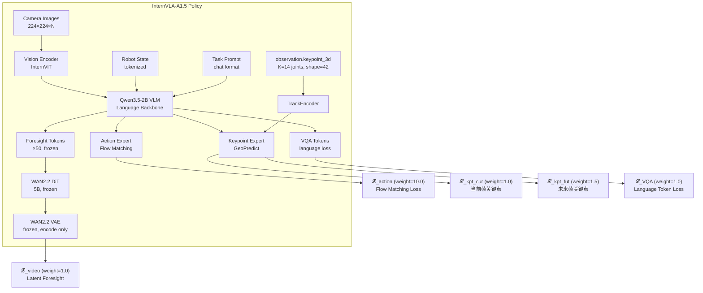
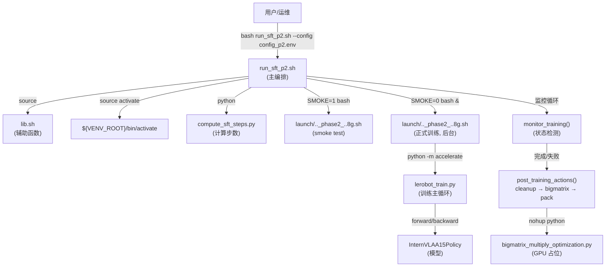
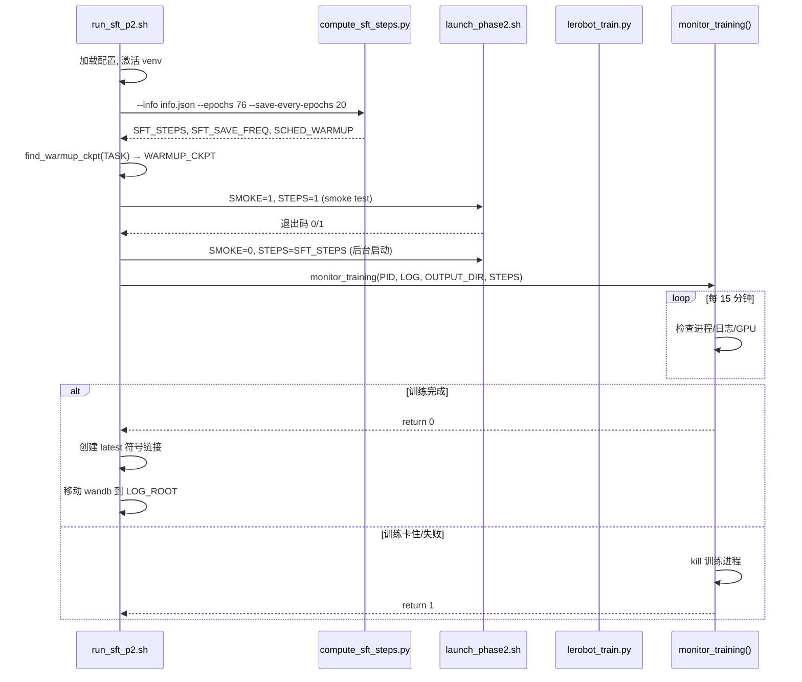
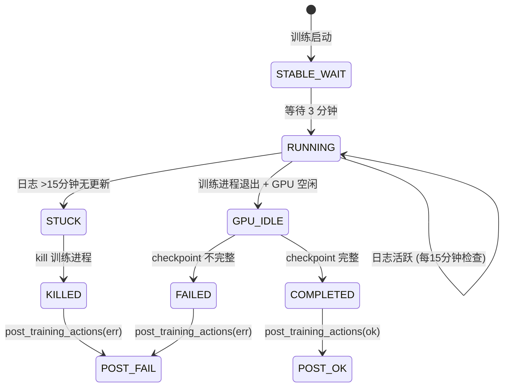

# RoboTwin 2.0 子任务 Phase 2 SFT 微调训练实施落地方案

> **文档定位**: Phase 2 SFT (Supervised Fine-Tuning) 是 GeoPredict 3D 关键点轨迹训练流水线 (P0 → P1 → P2) 的最后阶段。P0 准备含 4D 关键点的数据集, P1 以 expert-only 方式 warmup 关键点模块, P2 则在 warmup 权重基础上做全模型 SFT (VLM + 全部 expert + 关键点模块, 仅 WAN DiT 冻结)。
>
> **代码仓库**: [InternVLA-A-series](https://github.com/InternRobotics/InternVLA-A-series) / 本地路径 `${ITVLAGP_ROOT}`
>
> **论文**: [InternVLA-A1.5: Unifying Understanding, Latent Foresight, and Action for Compositional Generalization](https://arxiv.org/abs/2607.04988) ([HTML](https://arxiv.org/html/2607.04988v1))
>
> **模型权重**: [InternVLA-A1.5-base](https://huggingface.co/InternRobotics/InternVLA-A1.5-base)
>
> **前置文档**: [P0 数据准备](prepare_ech_rbt_p0.md) · [P1 Warmup](run_ech_rbt_p1.md) · [P0→P1→P2 全流程设计](run_ech_rbt_p012.md) · [SFT 实战日志](sft0827LOG.md)
>
> **日期**: 2026-09-06

---

## 目录

0. [阅读指南](#0-阅读指南)
1. [目标与概述](#1-目标与概述)
2. [关键变量定义](#2-关键变量定义)
3. [InternVLA-A1.5 SFT 训练架构](#3-internvla-a15-sft-训练架构)
4. [模块冻结与权重更新策略](#4-模块冻结与权重更新策略)
5. [训练生效超参详解](#5-训练生效超参详解)
6. [数据要求与前置条件](#6-数据要求与前置条件)
7. [目录布局与路径隔离](#7-目录布局与路径隔离)
8. [步数与保存点计算公式](#8-步数与保存点计算公式)
9. [代码复用与变更清单](#9-代码复用与变更清单)
10. [流程架构 (脚本调用与数据流)](#10-流程架构-脚本调用与数据流)
11. [操作手册](#11-操作手册)
12. [故障排查](#12-故障排查)
- [附录 A: Warmup (P1) vs SFT (P2) 超参对照表](#附录-a-warmup-p1-vs-sft-p2-超参对照表)
- [附录 B: 参考文献与出处](#附录-b-参考文献与出处)

---

## 0. 阅读指南

| 角色 | 建议阅读路径 |
|------|-------------|
| 算法研究员 | §3-5 (架构、冻结策略、超参) → §8 (步数公式) → §A (对照表) |
| 运维/工程师 | §2 (变量) → §7 (目录布局) → §9 (代码变更) → §11 (操作手册) → §12 (故障排查) |
| 全面了解 | 从 §1 顺序阅读 |

---

## 1. 目标与概述

### 1.1 Phase 2 SFT 的目标

在 Phase 1 Warmup (expert-only 训练) 完成后, Phase 2 SFT 解冻 Qwen3.5-2B VLM 骨干网络, 连同 Action Expert、Keypoint Expert、TrackEncoder 一起全量微调, 同时加载 WAN2.2-5B 视频生成模型提供 latent foresight supervision (WAN DiT 权重冻结)。

SFT 的训练目标:

$$\mathcal{L}_{\text{SFT}} = \lambda_a \cdot \mathcal{L}_{\text{action}} + \lambda_k \cdot \mathcal{L}_{\text{kpt}}^{\text{cur}} + \lambda_{kf} \cdot \mathcal{L}_{\text{kpt}}^{\text{fut}} + \lambda_v \cdot \mathcal{L}_{\text{video}} + \lambda_{\text{vqa}} \cdot \mathcal{L}_{\text{VQA}}$$

其中 $\lambda_a=10.0$, $\lambda_k=1.0$, $\lambda_{kf}=1.5$, $\lambda_v=1.0$, $\lambda_{\text{vqa}}=1.0$。

### 1.2 Phase 2 vs Phase 1 关键差异

| 维度 | Phase 1 Warmup | Phase 2 SFT |
|------|---------------|-------------|
| 起始权重 | InternVLA-A1.5-base | Warmup 最终 checkpoint |
| VLM 骨干 | 冻结 | **解冻, 全量训练** |
| Action Expert | 训练 (lr_scale=0.04) | 训练 (lr_scale=1.0) |
| Kpt Expert | 训练 (lr_scale=1.0) | 训练 (lr_scale=1.0) |
| WAN 视频分支 | **不加载** | 加载 (DiT 冻结, VAE 冻结) |
| VQA Loss | 关闭 | **开启** |
| Knowledge Insulation | 开启 | **关闭** |
| Gradient Checkpointing | 不需要 | **必须开启** (显存压力) |
| Epochs | 6 | **76** |
| 保存频率 | 每 epoch | **每 20 epoch + 最终** |
| video_micro_batch_size | N/A | **1** (防 OOM) |

### 1.3 执行模式

- **串行执行**: 对任务列表中的子任务逐个 SFT, 每次只用该任务自身的数据
- **路径隔离**: 不同任务的 norm_stat、keypoints_meta、coord_offset 严格隔离, 不会交叉污染
- **EXPR_NAME 隔离**: 日志和 checkpoint 按 `${EXPR_NAME}` 分目录, 同一实验的不同运行以时间戳子目录区分

---

## 2. 关键变量定义

> 对标 [run_ech_rbt_p1.md §2](run_ech_rbt_p1.md)。所有变量均可通过 `config_p2.env` 配置文件或 CLI 参数覆盖。

### 2.1 静态配置变量

| 变量名 | 默认值 | 说明 |
|--------|--------|------|
| `EXPR_NAME` | `ItvlaGpRbtSft` | 实验名, 决定日志和 checkpoint 的顶层目录 |
| `ITVLAGP_ROOT` | 脚本推导: `SCRIPT_DIR/../../..` | 代码仓库根目录 |
| `CLEAN_ROOT` | `/B/Dta/RoboTwin-Clean` | 含 `{task}_lrb3_kptsim/` 数据的根目录 |
| `CKPT_ROOT` | `${HOME}/b/Ckp/${EXPR_NAME}` | checkpoint 保存根目录 |
| `LOG_ROOT` | `/B/Log/${EXPR_NAME}` | 日志 / wandb 保存根目录 |
| `VENV_ROOT` | `/B/VENV/itnvla15rbt20` | Python 虚拟环境根目录 |
| `HF_HOME` | `${VENV_ROOT}/var/hf_home` | HuggingFace 缓存根 |
| `HF_LEROBOT_HOME` | `${CLEAN_ROOT}` | LeRobot 数据集查找路径 |
| `PRETRAINED_PATH` | `${HF_HOME}/ckpts/InternVLA-A1.5-base` | A1.5 base 权重 (仅用于兜底) |
| `GEOPREDICT_CKPT` | `${HF_HOME}/ckpts/GeoPredict_robocasa.pth` | GeoPredict 关键点模型权重 |
| `WAN_DIR` | `${HF_HOME}/hub/Wan2.2-TI2V-5B` | WAN2.2 视频模型目录 |

### 2.2 训练超参变量

| 变量名 | 默认值 | 说明 |
|--------|--------|------|
| `PROC_PER_NODE` | `8` | 每节点 GPU 数 |
| `BATCH_SIZE` | `16` | 每 GPU batch size |
| `NODE_COUNT` | `1` | 节点数 |
| `NUM_EPOCHS` | `76` | 总训练 epoch 数 |
| `SAVE_EVERY_EPOCHS` | `20` | 每 N epoch 保存一个 checkpoint |
| `NUM_WORKERS` | `12` | DataLoader 工作线程数 |
| `LOG_FREQ` | `50` | 每 N step 打印一次日志 |
| `SEED` | `42` | 随机种子 |
| `SFT_MASTER_PORT` | `36202` | DDP 通信端口 |
| `VIDEO_MICRO_BATCH_SIZE` | `1` | WAN VAE 视频编码 micro-batch |
| `DATA_SUFFIX` | `_lrb3_kptsim` | 数据集目录后缀 |
| `SMOKE_BATCH_SIZE` | `2` | Smoke 测试 batch size |

### 2.3 监控与后处理变量

| 变量名 | 默认值 | 说明 |
|--------|--------|------|
| `MONITOR_INTERVAL` | `900` (15分钟) | 监控轮询间隔 (秒) |
| `LOG_STALE_THRESHOLD` | `900` (15分钟) | 日志判定陈旧的阈值 (秒) |
| `MONITOR_STABLE_AFTER` | `180` (3分钟) | 训练启动后等待多久才开始监控 |
| `BIGMATRIX_SCRIPT` | `${ITVLAGP_ROOT}/b/d/rbt/bigmatrix_multiply_optimization.py` | GPU 占位脚本 |
| `BIGMATRIX_LOG` | `/tmp/bigmatrix_multiply_optimization.log` | bigmatrix 日志 |
| `ENABLE_MONITOR` | `1` | 是否开启训练后监控 (0=同步等待) |

### 2.4 Warmup checkpoint 定位变量

| 变量名 | 默认值 | 说明 |
|--------|--------|------|
| `WARMUP_CKPT_ROOT` | `""` (空=自动搜索) | 自定义 warmup ckpt 搜索根目录 |

搜索顺序:
1. `${WARMUP_CKPT_ROOT}/${TASK}/warmup/latest/checkpoints/*/pretrained_model/`
2. `${CKPT_ROOT}/${TASK}/warmup/latest/checkpoints/*/pretrained_model/`
3. `${CKPT_ROOT}/${TASK}/warmup/*/checkpoints/*/pretrained_model/` (兜底搜索)

### 2.5 动态计算变量 (运行时)

以下变量由脚本在运行时根据每个任务的 `info.json` 计算得出, 无需手动配置:

| 变量名 | 计算公式 | 说明 |
|--------|---------|------|
| `EBS` | `PROC_PER_NODE × BATCH_SIZE × NODE_COUNT` | 有效 batch size |
| `TOTAL_FRAMES` | 从 `info.json` 读取 | 任务总帧数 |
| `STEPS_PER_EPOCH` | $\lceil \text{TOTAL\_FRAMES} / \text{EBS} \rceil$ | 每 epoch 步数 |
| `SFT_STEPS` | `STEPS_PER_EPOCH × NUM_EPOCHS` | 总训练步数 |
| `SFT_SAVE_FREQ` | `STEPS_PER_EPOCH × SAVE_EVERY_EPOCHS` | checkpoint 保存间隔 (步) |
| `SCHED_WARMUP` | $\min(1000, \max(50, \text{SFT\_STEPS} / 10))$ | 学习率 warmup 步数 |

---

## 3. InternVLA-A1.5 SFT 训练架构

### 3.1 模型组件



### 3.2 Forward 数据流 (训练)

1. **视觉编码**: Camera images → InternViT → visual tokens
2. **语言编码**: Task prompt + robot state (tokenized) + visual tokens → Qwen3.5-2B → hidden states
3. **动作生成**: hidden states → Action Expert → flow matching loss ($\mathcal{L}_{\text{action}}$)
4. **关键点预测**: hidden states + TrackEncoder(observation.keypoint_3d) → Keypoint Expert → $\mathcal{L}_{\text{kpt}}^{\text{cur}}$ + $\mathcal{L}_{\text{kpt}}^{\text{fut}}$
5. **视频预测**: hidden states → foresight tokens (frozen) → WAN DiT (frozen) → WAN VAE (encode GT video) → $\mathcal{L}_{\text{video}}$
6. **VQA**: hidden states → language head → next token prediction → $\mathcal{L}_{\text{VQA}}$

### 3.3 Backward 梯度流 (训练)

```
𝓛_total = 10·𝓛_action + 1·𝓛_kpt + 1.5·𝓛_kpt_fut + 1·𝓛_video + 1·𝓛_VQA
    │
    ├─→ Action Expert ─→ VLM (Qwen3.5-2B) ─→ Vision Encoder   ← 全部可训练
    ├─→ Kpt Expert ─→ TrackEncoder ─→ VLM                      ← 全部可训练
    ├─→ WAN DiT (frozen, no grad) ←── foresight tokens (frozen) ← 梯度截断
    └─→ VQA head ─→ VLM                                        ← 可训练
```

关键点: WAN DiT 和 foresight tokens 不接收梯度, 但 WAN VAE 的编码结果作为 $\mathcal{L}_{\text{video}}$ 的 target, 间接通过 VLM hidden states 对模型产生监督信号。

> **来源**: 训练架构基于 [modeling_internvla_a1_5.py](../../src/lerobot/policies/internvla_a1_5/modeling_internvla_a1_5.py) 中 `InternVLAA15Policy.forward()` 的实现; 损失权重来自 [launch/internvla_a15_geop_phase2_finetune_kptsim_8g.sh](../../launch/internvla_a15_geop_phase2_finetune_kptsim_8g.sh) 第 175-178 行。

---

## 4. 模块冻结与权重更新策略

### 4.1 冻结/解冻矩阵

| 模块 | 参数量级 | Phase 2 状态 | lr_scale | 控制 flag |
|------|---------|-------------|----------|-----------|
| Vision Encoder (InternViT) | ~300M | **解冻** | 1.0 | `freeze_vision_encoder=false` |
| Qwen3.5-2B VLM | ~2.5B | **解冻** | 1.0 | `train_expert_only=false` |
| Action Expert | ~数十M | **解冻** | 1.0 | `action_expert_lr_scale=1.0` |
| Keypoint Expert | ~数十M | **解冻** | 1.0 | `kpt_expert_lr_scale=1.0` |
| TrackEncoder | ~数M | **解冻** | 1.0 | `track_encoder_lr_scale=1.0` |
| Foresight Tokens | 50 tokens | **冻结** | N/A | `freeze_learnable_tokens=true` |
| WAN2.2 DiT | ~5B | **冻结** | N/A | `freeze_wan_dit=true` |
| WAN2.2 VAE | ~数百M | **冻结** | N/A | (加载后 no_grad) |
| Keypoint 子模块 | 含在 Kpt Expert 中 | **解冻** | 同 Kpt Expert | `freeze_keypoint_modules=false` |

### 4.2 冻结策略的设计理由

1. **VLM 解冻 (`train_expert_only=false`)**: P2 需要将任务特定的 visual-language 理解能力写入 VLM, 仅训练 expert 不足以在 RoboTwin 复杂场景上泛化。
2. **WAN DiT 冻结 (`freeze_wan_dit=true`)**: WAN2.2 的 5B 参数如果解冻会导致显存和计算量剧增, 且 foresight supervision 只需冻结 DiT 提供稳定的视频生成 target。
3. **Foresight tokens 冻结 (`freeze_learnable_tokens=true`)**: 在 SFT 阶段冻结 foresight tokens 能避免过拟合到单一任务, 保持泛化能力。
4. **Knowledge Insulation 关闭 (`knowledge_insulation=false`)**: P1 中开启 KI 是为了防止随机初始化的 kpt expert 干扰已收敛的 action expert; P2 中两个 expert 都已有初步能力, 关闭 KI 让它们自由交互, 有助于学到 action-keypoint 联合表示。

### 4.3 lr_scale 的含义

所有 expert 的 `lr_scale=1.0` 意味着它们使用与 VLM 相同的基础学习率 (`optimizer_lr=5e-5`)。在 Phase 1 中, Action Expert 使用 `lr_scale=0.04` (即 $5 \times 10^{-5} \times 0.04 = 2 \times 10^{-6}$) 是为了在 warmup 阶段保持 action expert 稳定; P2 不再需要这种保护。

> **来源**: 冻结/lr_scale 配置来自 [launch/internvla_a15_geop_phase2_finetune_kptsim_8g.sh](../../launch/internvla_a15_geop_phase2_finetune_kptsim_8g.sh) 第 157-183 行; 设计理由参考 [InternVLA-A1.5 论文](https://arxiv.org/abs/2607.04988) §3.2 和 [sft0827LOG.md](sft0827LOG.md) 中的实验记录。

---

## 5. 训练生效超参详解

### 5.1 优化器

| 超参 | 值 | 定义位置 | 说明 |
|------|-----|---------|------|
| 类型 | AdamW | `configuration_internvla_a1_5.py` L280 | PyTorch 标准实现 |
| `optimizer_lr` | `5e-5` | launch script L153 | 基础学习率; config 默认 2.5e-5, launch 覆盖为 5e-5 |
| `optimizer_betas` | `(0.9, 0.95)` | `configuration_internvla_a1_5.py` L282 | Adam 一阶/二阶矩衰减 |
| `optimizer_weight_decay` | `0.01` | `configuration_internvla_a1_5.py` L283 | L2 权重衰减 |
| `optimizer_grad_clip_norm` | `1.0` | `configuration_internvla_a1_5.py` L285 | 梯度裁剪范数上限 |

### 5.2 学习率调度器

| 超参 | 值 | 说明 |
|------|-----|------|
| 类型 | CosineDecayWithWarmup | 先线性升温, 再余弦退火 |
| `scheduler_warmup_steps` | 动态: $\min(1000, \max(50, S/10))$ | 线性升温步数, S=总步数 |
| `scheduler_decay_steps` | $= S$ (总步数) | 余弦退火的总步数 |
| `scheduler_decay_lr` | `5e-6` | 退火终点学习率 |

学习率变化曲线:

$$\text{lr}(t) = \begin{cases}
\text{lr}_{\text{base}} \cdot \frac{t}{T_{\text{warmup}}} & t \le T_{\text{warmup}} \\
\text{lr}_{\text{decay}} + \frac{1}{2}(\text{lr}_{\text{base}} - \text{lr}_{\text{decay}})(1 + \cos(\pi \cdot \frac{t - T_{\text{warmup}}}{T_{\text{decay}} - T_{\text{warmup}}})) & t > T_{\text{warmup}}
\end{cases}$$

其中 $\text{lr}_{\text{base}}=5 \times 10^{-5}$, $\text{lr}_{\text{decay}}=5 \times 10^{-6}$。

### 5.3 损失权重

| 损失项 | 权重 | launch script 参数 | 说明 |
|--------|------|-------------------|------|
| $\mathcal{L}_{\text{action}}$ | 10.0 | `action_loss_weight=10.0` | 动作 flow matching 损失, 最核心的目标 |
| $\mathcal{L}_{\text{kpt}}^{\text{cur}}$ | 1.0 | `kpt_loss_weight=1.0` | 当前帧关键点回归损失 |
| $\mathcal{L}_{\text{kpt}}^{\text{fut}}$ | 1.5 | `kpt_future_loss_weight=1.5` | 未来帧关键点轨迹预测损失 |
| $\mathcal{L}_{\text{video}}$ | 1.0 | `video_loss_weight=1` | WAN latent foresight 损失 |
| $\mathcal{L}_{\text{VQA}}$ | 1.0 | `enable_vqa_loss=true` | 语言 token 预测损失 |

P2 SFT 中 `action_loss_weight=10.0` (P1 为 2.0) 反映出动作预测是 SFT 的核心优化目标; `kpt_loss_weight` 从 P1 的 10.0 降至 1.0 表示关键点模块已通过 warmup 收敛, 不再需要大幅监督。

### 5.4 内存管理超参

| 超参 | 值 | 说明 |
|------|-----|------|
| `gradient_checkpointing` | `true` | 用计算换显存: 激活值不全部保存, backward 时重算。**必须开启**, 否则 VLM+WAN 联合训练会 OOM |
| `video_micro_batch_size` | `1` | WAN VAE 编码 GT 视频时每次只处理 1 帧, 避免 VAE 显存峰值导致 OOM |
| `dtype` | `bfloat16` | 混合精度训练 |

> **教训**: 在 sft0827LOG.md 中记录: batch_size=16 + gradient_checkpointing=false 会导致首步 OOM; batch_size=4 + video_micro_batch_size=1 + gradient_checkpointing=true 可稳定运行。在 8×H200 (80GB) 上, batch_size=16 + gradient_checkpointing=true + video_micro_batch_size=1 是可行的最大配置。

### 5.5 其他训练配置

| 超参 | 值 | 说明 |
|------|-----|------|
| `tokenize_state` | `true` | 将 robot state 编码为 prompt tokens |
| `use_fast_action_tokens` | `true` | 使用 FAST 离散化动作 token |
| `init_kpt_expert_from_action` | `false` | P2 不再从 action expert 初始化 kpt expert (P1 中为 true) |
| `kpt_to_action_detach` | `false` | 关键点到动作的连接不做梯度截断 |
| `num_learnable_tokens` | `50` | foresight token 数量 |
| `num_keypoint_joints` | `14` | 关键点数 (K=14, 左右臂各 7 关节) |
| `action_mode` | `abs` | 绝对动作表示 |
| `video_backend` | `torchcodec` | 视频解码后端 |
| `dist_loading` | `false` | 单任务 SFT 不需要分布式数据加载 |

> **来源**: 全部超参值来自 [launch/internvla_a15_geop_phase2_finetune_kptsim_8g.sh](../../launch/internvla_a15_geop_phase2_finetune_kptsim_8g.sh); 默认值来自 [configuration_internvla_a1_5.py](../../src/lerobot/policies/internvla_a1_5/configuration_internvla_a1_5.py); 内存管理经验来自 [sft0827LOG.md](sft0827LOG.md)。

---

## 6. 数据要求与前置条件

### 6.1 数据目录结构

每个任务的训练数据由 Phase 0 准备, 存放在 `${CLEAN_ROOT}/${TASK}_lrb3_kptsim/` 下:

```
${CLEAN_ROOT}/
└── ${TASK}_lrb3_kptsim/
    ├── meta/
    │   ├── info.json              # 数据集元信息 (total_frames, total_episodes 等)
    │   ├── episodes.jsonl
    │   ├── stats.json
    │   └── keypoints_meta.json    # 14 关节名称与编号映射
    ├── data/
    │   └── chunk-000/
    │       ├── episode_000000.parquet   # 含 observation.keypoint_3d (shape=[42])
    │       ├── episode_000001.parquet
    │       └── ...
    ├── videos/
    │   └── chunk-000/
    │       └── observation.images.top/
    │           ├── episode_000000.mp4
    │           └── ...
    ├── norm_stat.json             # 归一化统计 (该任务独立计算)
    └── coord_offset.json          # 坐标偏移 (可选)
```

### 6.2 数据隔离约束

**每个子任务只使用自己的数据训练**, 不得共享以下文件:
- `norm_stat.json`: 每个任务的动作/状态归一化统计独立
- `keypoints_meta.json`: 关键点元信息独立
- `coord_offset.json`: 坐标系偏移独立

### 6.3 前置条件清单

| 条件 | 验证方式 |
|------|---------|
| Phase 0 完成 | `${CLEAN_ROOT}/${TASK}_lrb3_kptsim/meta/info.json` 存在 |
| norm_stat 存在 | `${CLEAN_ROOT}/${TASK}_lrb3_kptsim/norm_stat.json` 存在 |
| keypoints_meta 存在 | `${CLEAN_ROOT}/${TASK}_lrb3_kptsim/meta/keypoints_meta.json` 存在 |
| Phase 1 Warmup 完成 | `find_warmup_ckpt(TASK)` 返回非空 (含 `config.json`) |
| WAN 模型就绪 | `${WAN_DIR}/Wan2.2_VAE.pth` 存在 |
| GeoPredict 权重就绪 | `${GEOPREDICT_CKPT}` 存在 |
| Python 虚拟环境就绪 | `${VENV_ROOT}/bin/activate` 可 source |
| GPU 可用 | `nvidia-smi` 成功, 8 GPU 可见 |

---

## 7. 目录布局与路径隔离

### 7.1 总体布局

```
${HOME}/b/Ckp/${EXPR_NAME}/                 # Checkpoint 根 (CKPT_ROOT)
├── ${TASK}/
│   ├── warmup/                              # Phase 1 checkpoint (已完成)
│   │   ├── <warmup_job>/checkpoints/...
│   │   └── latest -> <warmup_job>
│   └── sft/                                 # Phase 2 checkpoint
│       ├── <sft_job_1>/
│       │   └── checkpoints/
│       │       ├── 001300/pretrained_model/  # epoch 20
│       │       ├── 002600/pretrained_model/  # epoch 40
│       │       ├── 003900/pretrained_model/  # epoch 60
│       │       └── 004940/pretrained_model/  # epoch 76 (final)
│       └── latest -> <sft_job_1>
└── ${EXPR_NAME}_LOG_26090613.tar            # 打包后的日志归档

/B/Log/${EXPR_NAME}/                         # 日志根 (LOG_ROOT)
├── config_p2.env                            # 配置快照
├── ${TASK}/
│   └── sft/
│       ├── sft_2026_09_06_13_00_00.log      # 训练 stdout/stderr
│       ├── sft_smoke_2026_09_06_13_00_00.log  # smoke 测试日志
│       └── <sft_job_1>/
│           └── wandb/                       # wandb offline 数据
```

### 7.2 路径隔离原则

1. **实验隔离**: `CKPT_ROOT` 和 `LOG_ROOT` 都以 `${EXPR_NAME}` 为顶层, 不同实验名互不干扰
2. **任务隔离**: 每个任务在 `${TASK}/sft/` 子目录下, 不同任务互不干扰
3. **运行隔离**: 每次运行生成唯一的 `JOB_STAMP` (精确到秒 + PID 防冲突), 作为 `OUTPUT_DIR` 名称
4. **日志与权重分离**: 训练日志 → `LOG_ROOT`, checkpoint → `CKPT_ROOT`, wandb 数据训练结束后从 `OUTPUT_DIR/wandb/` 移至 `LOG_ROOT`

### 7.3 训练输出目录说明

- `OUTPUT_DIR` 不可预创建: `TrainPipelineConfig` 会在 `OUTPUT_DIR` 已存在时抛出 `FileExistsError`
- 只需 `mkdir -p` 创建其父目录 (`${CKPT_ROOT}/${TASK}/sft/`)
- `LOG_FILE` 所在目录需要 `mkdir -p` 创建

---

## 8. 步数与保存点计算公式

### 8.1 核心公式

$$\text{EBS} = \text{PROC\_PER\_NODE} \times \text{BATCH\_SIZE} \times \text{NODE\_COUNT}$$

$$\text{steps\_per\_epoch} = \lceil \frac{\text{total\_frames}}{\text{EBS}} \rceil$$

$$\text{total\_steps} = \text{steps\_per\_epoch} \times \text{NUM\_EPOCHS}$$

$$\text{save\_freq} = \text{steps\_per\_epoch} \times \text{SAVE\_EVERY\_EPOCHS}$$

### 8.2 保存点逻辑

训练循环 (`lerobot_train.py` L362) 的保存条件:

```python
if step % save_freq == 0 or step == total_steps:
    save_checkpoint(...)
```

因此对于 `SAVE_EVERY_EPOCHS=20`, `NUM_EPOCHS=76`:
- epoch 20 → step = 20 × spe → 满足 `step % save_freq == 0`
- epoch 40 → step = 40 × spe → 满足
- epoch 60 → step = 60 × spe → 满足
- epoch 76 → step = total_steps → 满足 `step == total_steps`

共 4 个 checkpoint。

### 8.3 计算示例 (8 GPU, BS=16, EBS=128)

| 任务 | total_frames | steps/epoch | total_steps | save_freq | 保存点 (step) | warmup_steps |
|------|-------------|-------------|-------------|-----------|--------------|-------------|
| place_bread_skillet | 8277 | 65 | 4940 | 1300 | 1300, 2600, 3900, 4940 | 494 |
| pick_dual_bottles | 6129 | 48 | 3648 | 960 | 960, 1920, 2880, 3648 | 364 |
| click_bell | 3855 | 31 | 2356 | 620 | 620, 1240, 1860, 2356 | 235 |

### 8.4 计算工具

`b/s/rbt/compute_sft_steps.py` 提供了步数计算功能, P2 需要新增 `--save-every-epochs` 参数支持自定义保存间隔 (见 §9.1)。

调用方式:
```bash
python b/s/rbt/compute_sft_steps.py \
  --info "${CLEAN_ROOT}/${TASK}_lrb3_kptsim/meta/info.json" \
  --epochs 76 --save-every-epochs 20 \
  --n-gpus 8 --batch-size 16 --as-exports
```

输出 (以 place_bread_skillet 为例):
```
SFT_EPOCHS=76
SFT_STEPS=4940
SFT_SAVE_FREQ=1300
SFT_SAVE_EVERY_EPOCHS=20
SFT_SAVE_AT_EPOCHS=20,40,60,76
SFT_SAVE_STEPS=1300,2600,3900,4940
SFT_SCHEDULER_WARMUP=494
SFT_STEPS_PER_EPOCH=65
SFT_TOTAL_FRAMES=8277
SFT_EFFECTIVE_BATCH=128
```

> **来源**: 步数计算公式和保存逻辑来自 [compute_sft_steps.py](../../b/s/rbt/compute_sft_steps.py); 保存条件来自 [lerobot_train.py](../../src/lerobot/scripts/lerobot_train.py) L362。

---

## 9. 代码复用与变更清单

### 9.1 需修改: `b/s/rbt/compute_sft_steps.py`

**目的**: 原始脚本的保存间隔硬编码为 `epochs // 4`, 需要支持自定义 `--save-every-epochs`。

**修改内容**:

#### (1) `checkpoint_epochs()` 函数增加 `save_every` 参数

```python
# 修改前 (L22-34):
def checkpoint_epochs(total_epochs: int) -> list[int]:
    if total_epochs <= 0:
        raise ValueError("total_epochs must be > 0")
    every = max(total_epochs // 4, 1)
    ...

# 修改后:
def checkpoint_epochs(total_epochs: int, save_every: int = 0) -> list[int]:
    if total_epochs <= 0:
        raise ValueError("total_epochs must be > 0")
    every = save_every if save_every > 0 else max(total_epochs // 4, 1)
    ...
```

#### (2) `quarter_epoch_save_freq()` 函数增加 `save_every` 参数

```python
# 修改前 (L37-63):
def quarter_epoch_save_freq(
    steps: int, steps_per_epoch: int, epochs: int
) -> tuple[int, int, list[int], list[int]]:
    ...
    save_every_epochs = max(epochs // 4, 1)
    ...
    save_at_epochs = checkpoint_epochs(epochs)
    ...

# 修改后:
def quarter_epoch_save_freq(
    steps: int, steps_per_epoch: int, epochs: int, save_every: int = 0
) -> tuple[int, int, list[int], list[int]]:
    ...
    save_every_epochs = save_every if save_every > 0 else max(epochs // 4, 1)
    ...
    save_at_epochs = checkpoint_epochs(epochs, save_every)
    ...
```

#### (3) `compute_schedule()` 函数增加 `save_every` 参数

```python
# 修改前 (L66-96):
def compute_schedule(
    total_frames: int, epochs: int, n_gpus: int, batch_size: int, n_nodes: int = 1,
) -> dict:
    ...
    save_every_epochs, save_freq, save_steps, save_at_epochs = quarter_epoch_save_freq(
        steps, steps_per_epoch, epochs
    )
    ...

# 修改后:
def compute_schedule(
    total_frames: int, epochs: int, n_gpus: int, batch_size: int,
    n_nodes: int = 1, save_every: int = 0,
) -> dict:
    ...
    save_every_epochs, save_freq, save_steps, save_at_epochs = quarter_epoch_save_freq(
        steps, steps_per_epoch, epochs, save_every
    )
    ...
```

#### (4) `main()` 函数增加 CLI 参数

```python
# 在 parser.add_argument("--n-nodes", ...) 后添加:
parser.add_argument(
    "--save-every-epochs", type=int, default=0,
    help="Save every N epochs. 0=auto (E/4). Default: 0",
)

# compute_schedule 调用增加 save_every:
result = compute_schedule(
    total_frames=int(info["total_frames"]),
    epochs=args.epochs,
    n_gpus=args.n_gpus,
    batch_size=args.batch_size,
    n_nodes=args.n_nodes,
    save_every=args.save_every_epochs,
)
```

**向后兼容性**: 所有新增参数默认为 `0`, 等效于原来的 `E/4` 行为, 不影响 P1 warmup 和其他使用者。

### 9.2 新增: `b/s/rbt/run_sft_p2.sh`

Phase 2 SFT 的主编排脚本, 完整内容见 [§11.4 Step 4](#step-4-部署训练脚本)。功能:
- CLI 参数解析 (--config, --task, --tasks, --epochs, --save-every-epochs, ...)
- 加载配置文件
- `source` 激活虚拟环境
- 自动发现可 SFT 的任务
- Preflight 检查 (数据、warmup ckpt、模型权重、GPU)
- 串行逐任务训练: 计算步数 → smoke 测试 → 后台启动训练 → 监控
- 监控状态机: RUNNING / STUCK / COMPLETED / FAILED
- 训练后处理: 清理 GPU → 启动 bigmatrix → 打包日志 tar → 拷贝归档

### 9.3 新增: `b/s/rbt/config_p2.env`

Phase 2 SFT 的配置模板, 完整内容见 [§11.3 Step 3](#step-3-配置文件)。

### 9.4 原样复用 (无修改)

| 文件 | 用途 |
|------|------|
| `launch/internvla_a15_geop_phase2_finetune_kptsim_8g.sh` | SFT 训练启动脚本, 提供所有 CLI 参数映射 |
| `b/s/rbt/lib.sh` | 共享辅助函数 (rbt_log, rbt_die, write_state 等) |
| `b/s/rbt/discover_source_tasks.py` | 自动发现 CLEAN_ROOT 下的源任务 |
| `b/d/rbt/bigmatrix_multiply_optimization.py` | GPU 占位脚本 (训练结束后占住 GPU) |
| `src/lerobot/scripts/lerobot_train.py` | 训练主循环 |
| `src/lerobot/policies/internvla_a1_5/` | 模型实现 |

### 9.5 不再使用

| 文件 | 原因 |
|------|------|
| `b/s/rbt/phase2_sft.sh` | 功能被 `run_sft_p2.sh` 替代 (新脚本增加了监控、日志分离、bigmatrix 等) |
| `b/s/rbt/run_each_rbt_p012.sh` | P0→P1→P2 全流程编排; P2 独立执行时不需要 |

---

## 10. 流程架构 (脚本调用与数据流)

### 10.1 脚本调用流



### 10.2 单任务数据流



### 10.3 训练后处理流


---

## 11. 操作手册

### Step 0: 环境准备

#### 0.1 确认虚拟环境

```bash
# 确认 venv 可激活
source "${VENV_ROOT}/bin/activate"
python --version   # 应为 Python 3.11.x
python -c "import torch; print(torch.cuda.device_count())"  # 应为 8
deactivate
```

#### 0.2 确认 GPU 状态

```bash
nvidia-smi
# 应显示 8 张 GPU, 无占用进程
```

#### 0.3 确认目录权限

```bash
# 确认可写
mkdir -p ~/b/Ckp/test_write && rmdir ~/b/Ckp/test_write
mkdir -p /B/Log/test_write && rmdir /B/Log/test_write
```

### Step 1: 确认 Phase 0/1 完成

```bash
CLEAN_ROOT=/B/Dta/RoboTwin-Clean
TASK=place_bread_skillet  # 替换为你的任务名

# 检查 Phase 0 数据
ls "${CLEAN_ROOT}/${TASK}_lrb3_kptsim/meta/info.json"
ls "${CLEAN_ROOT}/${TASK}_lrb3_kptsim/norm_stat.json"
ls "${CLEAN_ROOT}/${TASK}_lrb3_kptsim/meta/keypoints_meta.json"

# 检查 Phase 1 warmup checkpoint
CKPT_ROOT=~/b/Ckp/ItvlaGpRbt0905   # 替换为你的 CKPT_ROOT
find "${CKPT_ROOT}/${TASK}/warmup" -name 'config.json' -path '*/pretrained_model/*' | sort | tail -1
```

### Step 2: 代码变更

修改 `b/s/rbt/compute_sft_steps.py`, 支持 `--save-every-epochs` 参数。

**修改 1**: `checkpoint_epochs()` (L22)

将:
```python
def checkpoint_epochs(total_epochs: int) -> list[int]:
```
改为:
```python
def checkpoint_epochs(total_epochs: int, save_every: int = 0) -> list[int]:
```

将 L26:
```python
    every = max(total_epochs // 4, 1)
```
改为:
```python
    every = save_every if save_every > 0 else max(total_epochs // 4, 1)
```

**修改 2**: `quarter_epoch_save_freq()` (L37)

将:
```python
def quarter_epoch_save_freq(
    steps: int, steps_per_epoch: int, epochs: int
) -> tuple[int, int, list[int], list[int]]:
```
改为:
```python
def quarter_epoch_save_freq(
    steps: int, steps_per_epoch: int, epochs: int, save_every: int = 0
) -> tuple[int, int, list[int], list[int]]:
```

将 L45:
```python
    save_every_epochs = max(epochs // 4, 1)
```
改为:
```python
    save_every_epochs = save_every if save_every > 0 else max(epochs // 4, 1)
```

将 L47:
```python
    save_at_epochs = checkpoint_epochs(epochs)
```
改为:
```python
    save_at_epochs = checkpoint_epochs(epochs, save_every)
```

**修改 3**: `compute_schedule()` (L66)

将:
```python
def compute_schedule(
    total_frames: int,
    epochs: int,
    n_gpus: int,
    batch_size: int,
    n_nodes: int = 1,
) -> dict:
```
改为:
```python
def compute_schedule(
    total_frames: int,
    epochs: int,
    n_gpus: int,
    batch_size: int,
    n_nodes: int = 1,
    save_every: int = 0,
) -> dict:
```

将 L80:
```python
    save_every_epochs, save_freq, save_steps, save_at_epochs = quarter_epoch_save_freq(
        steps, steps_per_epoch, epochs
    )
```
改为:
```python
    save_every_epochs, save_freq, save_steps, save_at_epochs = quarter_epoch_save_freq(
        steps, steps_per_epoch, epochs, save_every
    )
```

**修改 4**: `main()` — 在 `--n-nodes` 参数 (L112) 后添加:
```python
    parser.add_argument(
        "--save-every-epochs", type=int, default=0,
        help="Save every N epochs. 0=auto (E/4). Default: 0",
    )
```

修改 L117 的 `compute_schedule` 调用, 增加 `save_every`:
```python
    result = compute_schedule(
        total_frames=int(info["total_frames"]),
        epochs=args.epochs,
        n_gpus=args.n_gpus,
        batch_size=args.batch_size,
        n_nodes=args.n_nodes,
        save_every=args.save_every_epochs,
    )
```

**验证**:
```bash
# 应输出 save_every_epochs=20, save_at_epochs=[20,40,60,76]
python b/s/rbt/compute_sft_steps.py \
  --info "${CLEAN_ROOT}/place_bread_skillet_lrb3_kptsim/meta/info.json" \
  --epochs 76 --save-every-epochs 20

# 默认行为不变 (E/4=19)
python b/s/rbt/compute_sft_steps.py \
  --info "${CLEAN_ROOT}/place_bread_skillet_lrb3_kptsim/meta/info.json" \
  --epochs 76
```

### Step 3: 配置文件

创建 `b/s/rbt/config_p2.env`:

```bash
# ============================================================
# Phase 2 SFT 配置文件
# 用法: bash b/s/rbt/run_sft_p2.sh --config b/s/rbt/config_p2.env
# ============================================================

# === 实验名 (决定日志和 checkpoint 的顶层目录) ===
EXPR_NAME=ItvlaGpRbtSft

# === 代码仓库 ===
# ITVLAGP_ROOT 由脚本自动推导, 一般不需设置
# ITVLAGP_ROOT=/B/SRC/itvlaGp

# === 数据 ===
CLEAN_ROOT=/B/Dta/RoboTwin-Clean

# === 权重/日志输出 (以 EXPR_NAME 隔离) ===
CKPT_ROOT=${HOME}/b/Ckp/${EXPR_NAME}
LOG_ROOT=/B/Log/${EXPR_NAME}

# === Python 虚拟环境 ===
VENV_ROOT=/B/VENV/itnvla15rbt20

# === 模型权重 ===
HF_HOME=/B/VENV/hf_home
PRETRAINED_PATH=${HF_HOME}/ckpts/InternVLA-A1.5-base
GEOPREDICT_CKPT=${HF_HOME}/ckpts/GeoPredict_robocasa.pth
WAN_DIR=${HF_HOME}/hub/Wan2.2-TI2V-5B

# === Warmup checkpoint 搜索 ===
# 如果 P1 和 P2 共用相同的 CKPT_ROOT 前缀, 留空即可自动搜索
# 如果 P1 的 CKPT_ROOT 不同, 设置为 P1 的 CKPT_ROOT:
WARMUP_CKPT_ROOT=${HOME}/b/Ckp/ItvlaGpRbt0905

# === 训练参数 ===
PROC_PER_NODE=8
BATCH_SIZE=16
NODE_COUNT=1
NUM_EPOCHS=76
SAVE_EVERY_EPOCHS=20
NUM_WORKERS=12
LOG_FREQ=50
SEED=42
SFT_MASTER_PORT=36202
VIDEO_MICRO_BATCH_SIZE=1
DATA_SUFFIX=_lrb3_kptsim
CUDA_VISIBLE_DEVICES=0,1,2,3,4,5,6,7

# === 训练后监控 ===
MONITOR_INTERVAL=900
LOG_STALE_THRESHOLD=900
MONITOR_STABLE_AFTER=180
```

### Step 4: 部署训练脚本

创建 `b/s/rbt/run_sft_p2.sh`:

```bash
#!/usr/bin/env bash
# Phase 2 SFT: 76-epoch full finetune for RoboTwin 2.0 tasks.
# Input:  ${CLEAN_ROOT}/${TASK}_lrb3_kptsim/ (Phase 0 output)
#         ${CKPT_ROOT}/${TASK}/warmup/latest  (Phase 1 warmup checkpoint)
# Output: ~/b/Ckp/${EXPR_NAME}/${TASK}/sft/<job>/checkpoints/<step>/pretrained_model/
# Logs:   /B/Log/${EXPR_NAME}/${TASK}/sft/
#
# Usage:
#   bash b/s/rbt/run_sft_p2.sh --config b/s/rbt/config_p2.env --task click_bell
#   bash b/s/rbt/run_sft_p2.sh --config b/s/rbt/config_p2.env --tasks click_bell,adjust_bottle
#   bash b/s/rbt/run_sft_p2.sh --config b/s/rbt/config_p2.env               # all tasks
#   bash b/s/rbt/run_sft_p2.sh --config b/s/rbt/config_p2.env --list-tasks
set -euo pipefail

SCRIPT_DIR="$(cd "$(dirname "${BASH_SOURCE[0]}")" && pwd)"
source "${SCRIPT_DIR}/lib.sh"

# ======================== Defaults ========================
EXPR_NAME="${EXPR_NAME:-ItvlaGpRbtSft}"
ITVLAGP_ROOT="${ITVLAGP_ROOT:-$(cd "${SCRIPT_DIR}/../../.." && pwd)}"
CLEAN_ROOT="${CLEAN_ROOT:-/B/Dta/RoboTwin-Clean}"
CKPT_ROOT="${CKPT_ROOT:-${HOME}/b/Ckp/${EXPR_NAME}}"
LOG_ROOT="${LOG_ROOT:-/B/Log/${EXPR_NAME}}"
VENV_ROOT="${VENV_ROOT:-/B/VENV/itnvla15rbt20}"
HF_HOME="${HF_HOME:-${VENV_ROOT}/var/hf_home}"
PRETRAINED_PATH="${PRETRAINED_PATH:-${HF_HOME}/ckpts/InternVLA-A1.5-base}"
GEOPREDICT_CKPT="${GEOPREDICT_CKPT:-${HF_HOME}/ckpts/GeoPredict_robocasa.pth}"
WAN_DIR="${WAN_DIR:-${HF_HOME}/hub/Wan2.2-TI2V-5B}"

PROC_PER_NODE="${PROC_PER_NODE:-8}"
BATCH_SIZE="${BATCH_SIZE:-16}"
NODE_COUNT="${NODE_COUNT:-1}"
NODE_RANK="${NODE_RANK:-0}"
NUM_EPOCHS="${NUM_EPOCHS:-76}"
SAVE_EVERY_EPOCHS="${SAVE_EVERY_EPOCHS:-20}"
NUM_WORKERS="${NUM_WORKERS:-12}"
LOG_FREQ="${LOG_FREQ:-50}"
SEED="${SEED:-42}"
SFT_MASTER_PORT="${SFT_MASTER_PORT:-36202}"
VIDEO_MICRO_BATCH_SIZE="${VIDEO_MICRO_BATCH_SIZE:-1}"
CUDA_VISIBLE_DEVICES="${CUDA_VISIBLE_DEVICES:-$(build_cuda_devices "${PROC_PER_NODE}")}"
SMOKE_BATCH_SIZE="${SMOKE_BATCH_SIZE:-2}"

DATA_SUFFIX="${DATA_SUFFIX:-_lrb3_kptsim}"
WARMUP_CKPT_ROOT="${WARMUP_CKPT_ROOT:-}"

MONITOR_INTERVAL="${MONITOR_INTERVAL:-900}"
LOG_STALE_THRESHOLD="${LOG_STALE_THRESHOLD:-900}"
MONITOR_STABLE_AFTER="${MONITOR_STABLE_AFTER:-180}"
BIGMATRIX_SCRIPT="${BIGMATRIX_SCRIPT:-${ITVLAGP_ROOT}/b/d/rbt/bigmatrix_multiply_optimization.py}"
BIGMATRIX_LOG="${BIGMATRIX_LOG:-/tmp/bigmatrix_multiply_optimization.log}"

# ======================== CLI ========================
TASKS=()
TASKS_SPEC=""
CONFIG_FILE=""
FORCE=0
SKIP_EXISTING=1
SKIP_SMOKE=0
KEEP_GOING=0
DRY_RUN=0
LIST_TASKS=0
GPUS=""
ENABLE_MONITOR=1

usage() {
  cat <<'USAGE'
用法:
  bash b/s/rbt/run_sft_p2.sh --config config_p2.env
  bash b/s/rbt/run_sft_p2.sh --config config_p2.env --task click_bell
  bash b/s/rbt/run_sft_p2.sh --config config_p2.env --tasks click_bell,adjust_bottle
  bash b/s/rbt/run_sft_p2.sh --config config_p2.env --tasks tasks.batch1.txt
  bash b/s/rbt/run_sft_p2.sh --config config_p2.env --list-tasks

选项:
  --config PATH           机器本地配置文件
  --task NAME             单个任务名
  --tasks SPEC            逗号分隔任务名、任务列表文件、或 "all"
  --list-tasks            列出可 SFT 的任务后退出
  --gpus N                覆盖 GPU 数
  --epochs N              覆盖训练 epoch 数 (默认 76)
  --save-every-epochs N   覆盖保存间隔 (默认 20)
  --skip-existing         已有最终 ckpt 则跳过 (默认)
  --no-skip-existing      不因已有 ckpt 而跳过
  --force                 强制重跑 (等同于 --no-skip-existing)
  --skip-smoke            跳过 1-step smoke 测试
  --keep-going            单任务失败后继续下一个
  --dry-run               只打印命令不执行
  --monitor-interval N    监控轮询间隔 (秒, 默认 900=15分钟)
  --log-stale N           日志陈旧判定阈值 (秒, 默认 900=15分钟)
  --no-monitor            禁用训练后监控 (同步等待训练结束)
USAGE
}

while [[ $# -gt 0 ]]; do
  case "$1" in
    --config)             CONFIG_FILE="$2"; shift 2 ;;
    --task)               TASKS+=("$2"); shift 2 ;;
    --tasks)              TASKS_SPEC="$2"; shift 2 ;;
    --list-tasks)         LIST_TASKS=1; shift ;;
    --gpus)               GPUS="$2"; shift 2 ;;
    --epochs)             NUM_EPOCHS="$2"; shift 2 ;;
    --save-every-epochs)  SAVE_EVERY_EPOCHS="$2"; shift 2 ;;
    --skip-existing)      SKIP_EXISTING=1; shift ;;
    --no-skip-existing)   SKIP_EXISTING=0; shift ;;
    --force)              FORCE=1; SKIP_EXISTING=0; shift ;;
    --skip-smoke)         SKIP_SMOKE=1; shift ;;
    --keep-going)         KEEP_GOING=1; shift ;;
    --dry-run)            DRY_RUN=1; shift ;;
    --monitor-interval)   MONITOR_INTERVAL="$2"; shift 2 ;;
    --log-stale)          LOG_STALE_THRESHOLD="$2"; shift 2 ;;
    --no-monitor)         ENABLE_MONITOR=0; shift ;;
    -h|--help)            usage; exit 0 ;;
    *)                    rbt_die "未知参数: $1 (见 --help)" ;;
  esac
done

# Load config
if [[ -n "${CONFIG_FILE}" ]]; then
  [[ -f "${CONFIG_FILE}" ]] || rbt_die "配置文件不存在: ${CONFIG_FILE}"
  set -a; source "${CONFIG_FILE}"; set +a
  CKPT_ROOT="${CKPT_ROOT:-${HOME}/b/Ckp/${EXPR_NAME}}"
  LOG_ROOT="${LOG_ROOT:-/B/Log/${EXPR_NAME}}"
fi

# GPU override
if [[ -n "${GPUS}" ]]; then
  PROC_PER_NODE="${GPUS}"
  CUDA_VISIBLE_DEVICES="$(build_cuda_devices "${GPUS}")"
fi

# ======================== 激活虚拟环境 ========================
VENV_ACTIVATE="${VENV_ROOT}/bin/activate"
if [[ ! -f "${VENV_ACTIVATE}" ]]; then
  rbt_die "虚拟环境激活脚本不存在: ${VENV_ACTIVATE}"
fi
source "${VENV_ACTIVATE}"
rbt_log "已激活虚拟环境: ${VIRTUAL_ENV:-${VENV_ROOT}}"

# ======================== 辅助函数 ========================

data_ready() {
  local task="$1"
  local d="${CLEAN_ROOT}/${task}${DATA_SUFFIX}"
  [[ -f "${d}/meta/info.json" ]] && \
  [[ -f "${d}/norm_stat.json" ]] && \
  [[ -f "${d}/meta/keypoints_meta.json" ]]
}

get_total_frames() {
  local task="$1"
  python3 -c "import json; print(json.load(open('${CLEAN_ROOT}/${task}${DATA_SUFFIX}/meta/info.json'))['total_frames'])"
}

compute_steps() {
  local total_frames="$1"
  eval "$(python3 "${ITVLAGP_ROOT}/b/s/rbt/compute_sft_steps.py" \
    --info "${DATA_DIR}/meta/info.json" \
    --epochs "${NUM_EPOCHS}" \
    --save-every-epochs "${SAVE_EVERY_EPOCHS}" \
    --n-gpus "${PROC_PER_NODE}" \
    --batch-size "${BATCH_SIZE}" \
    --n-nodes "${NODE_COUNT}" \
    --as-exports)"
}

find_warmup_ckpt() {
  local task="$1"
  local search_roots=("${WARMUP_CKPT_ROOT:-}" "${CKPT_ROOT}")

  for root in "${search_roots[@]}"; do
    [[ -z "${root}" ]] && continue
    local latest="${root}/${task}/warmup/latest"
    if [[ -L "${latest}" || -d "${latest}" ]]; then
      local real
      real="$(readlink -f "${latest}" 2>/dev/null || echo "${latest}")"
      local found
      found="$(find "${real}/checkpoints" -maxdepth 3 -name 'config.json' \
        -path '*/pretrained_model/*' 2>/dev/null | sort -V | tail -1 || true)"
      if [[ -n "${found}" ]]; then
        echo "$(dirname "${found}")"
        return 0
      fi
    fi
    # 兜底: 搜索 warmup 目录下所有 pretrained_model
    local warmup_dir="${root}/${task}/warmup"
    if [[ -d "${warmup_dir}" ]]; then
      local found
      found="$(find "${warmup_dir}" -name 'config.json' -path '*/pretrained_model/*' \
        2>/dev/null | sort -V | tail -1 || true)"
      if [[ -n "${found}" ]]; then
        echo "$(dirname "${found}")"
        return 0
      fi
    fi
  done
  echo ""
}

find_sft_ckpt() {
  local task="$1"
  local sft_dir="${CKPT_ROOT}/${task}/sft/latest"
  if [[ -L "${sft_dir}" || -d "${sft_dir}" ]]; then
    local real
    real="$(readlink -f "${sft_dir}" 2>/dev/null || echo "${sft_dir}")"
    local found
    found="$(find "${real}/checkpoints" -maxdepth 3 -name 'config.json' \
      -path '*/pretrained_model/*' 2>/dev/null | sort -V | tail -1 || true)"
    if [[ -n "${found}" ]]; then
      echo "$(dirname "${found}")"
      return 0
    fi
  fi
  echo ""
}

discover_sft_tasks() {
  for d in "${CLEAN_ROOT}"/*${DATA_SUFFIX}/; do
    [[ -d "${d}" ]] || continue
    local name
    name="$(basename "$d")"
    local task="${name%${DATA_SUFFIX}}"
    [[ -f "${d}meta/info.json" ]] || continue
    [[ -f "${d}norm_stat.json" ]] || continue
    [[ -f "${d}meta/keypoints_meta.json" ]] || continue
    echo "${task}"
  done
}

# ======================== 监控辅助函数 ========================

make_hour_stamp() {
  date +'%y%m%d%H'
}

log_is_fresh() {
  local log_file="$1" threshold="${2:-${LOG_STALE_THRESHOLD}}"
  [[ -f "${log_file}" ]] || return 1
  local now last_mod age
  now="$(date +%s)"
  last_mod="$(stat -c %Y "${log_file}" 2>/dev/null || echo 0)"
  age=$((now - last_mod))
  [[ ${age} -lt ${threshold} ]]
}

gpu_has_processes() {
  local pids
  pids="$(nvidia-smi --query-compute-apps=pid --format=csv,noheader 2>/dev/null | tr -d ' ')"
  [[ -n "${pids}" ]]
}

gpu_process_pids() {
  nvidia-smi --query-compute-apps=pid --format=csv,noheader 2>/dev/null | tr -d ' ' | sort -u
}

checkpoint_complete() {
  local output_dir="$1" total_steps="$2"
  local step_fmt
  step_fmt="$(printf '%06d' "${total_steps}")"
  local ckpt_path="${output_dir}/checkpoints/${step_fmt}/pretrained_model"
  [[ -f "${ckpt_path}/config.json" ]] && \
    { [[ -f "${ckpt_path}/model.safetensors" ]] || \
      [[ -f "${ckpt_path}/model.safetensors.index.json" ]]; }
}

cleanup_gpu() {
  rbt_log "清理 GPU 残留进程..."
  local pids
  pids="$(gpu_process_pids)"
  if [[ -z "${pids}" ]]; then
    rbt_log "GPU 无残留进程"
    return 0
  fi
  local pid
  while IFS= read -r pid; do
    [[ -n "${pid}" ]] || continue
    rbt_log "  kill -9 ${pid} ($(ps -p "${pid}" -o comm= 2>/dev/null || echo 'unknown'))"
    kill -9 "${pid}" 2>/dev/null || true
  done <<< "${pids}"
  sleep 2
  if gpu_has_processes; then
    rbt_log "警告: 仍有 GPU 进程残留"
  else
    rbt_log "GPU 进程已全部清理"
  fi
}

pack_logs() {
  local is_error="${1:-0}"
  local stamp
  stamp="$(make_hour_stamp)"
  local suffix=""
  [[ "${is_error}" == "1" ]] && suffix="_err"
  local tar_name="${EXPR_NAME}_LOG_${stamp}${suffix}.tar"
  local dest_dir="${HOME}/b/Ckp"
  mkdir -p "${dest_dir}"
  local log_dir="/B/Log/${EXPR_NAME}"
  if [[ ! -d "${log_dir}" ]]; then
    rbt_log "警告: 日志目录 ${log_dir} 不存在, 跳过打包"
    return 0
  fi
  rbt_log "打包日志: ${log_dir} → ${dest_dir}/${tar_name}"
  tar -cf "${dest_dir}/${tar_name}" -C "$(dirname "${log_dir}")" \
    "$(basename "${log_dir}")" 2>/dev/null || {
    rbt_log "警告: tar 打包失败"
  }
  rbt_log "日志包: ${dest_dir}/${tar_name}"
}

launch_bigmatrix() {
  local script="${BIGMATRIX_SCRIPT}"
  local log="${BIGMATRIX_LOG}"
  if [[ ! -f "${script}" ]]; then
    rbt_log "警告: bigmatrix 脚本不存在: ${script}, 跳过"
    return 1
  fi
  local max_retries=3 attempt=0
  while [[ ${attempt} -lt ${max_retries} ]]; do
    attempt=$((attempt + 1))
    rbt_log "启动 bigmatrix (第 ${attempt} 次): nohup python -u ${script} > ${log} 2>&1 &"
    nohup python -u "${script}" > "${log}" 2>&1 &
    local bg_pid=$!
    disown "${bg_pid}" 2>/dev/null || true
    sleep 5
    if kill -0 "${bg_pid}" 2>/dev/null; then
      rbt_log "bigmatrix 已启动, PID=${bg_pid}"
      return 0
    else
      rbt_log "bigmatrix 启动后 5 秒内退出, 检查日志: ${log}"
      tail -5 "${log}" 2>/dev/null || true
    fi
  done
  rbt_log "错误: bigmatrix 连续 ${max_retries} 次启动失败"
  return 1
}

post_training_actions() {
  local is_error="${1:-0}"
  cleanup_gpu
  launch_bigmatrix || true
  pack_logs "${is_error}"
}

# 监控训练进程
# 参数: $1=PID, $2=日志路径, $3=OUTPUT_DIR, $4=总步数
# 返回: 0=成功, 1=失败
monitor_training() {
  local train_pid="$1" log_file="$2" output_dir="$3" total_steps="$4"
  local gpu_idle_since=0

  rbt_log "[监控] 等待 ${MONITOR_STABLE_AFTER} 秒进入稳定期..."
  local waited=0
  while [[ ${waited} -lt ${MONITOR_STABLE_AFTER} ]]; do
    if ! kill -0 "${train_pid}" 2>/dev/null; then
      rbt_log "[监控] 训练在稳定期前退出"
      wait "${train_pid}" 2>/dev/null || true
      break
    fi
    sleep 10
    waited=$((waited + 10))
  done

  rbt_log "[监控] 已进入稳定期, 每 ${MONITOR_INTERVAL} 秒检查一次 (LOG_STALE=${LOG_STALE_THRESHOLD}s)"

  while true; do
    sleep "${MONITOR_INTERVAL}"
    local now
    now="$(date +%s)"

    # ---- 训练进程仍存活 ----
    if kill -0 "${train_pid}" 2>/dev/null; then
      gpu_idle_since=0
      if log_is_fresh "${log_file}"; then
        rbt_log "[监控] RUNNING — 日志活跃, 训练正常"
      else
        rbt_log "[监控] STUCK — 日志 ${LOG_STALE_THRESHOLD} 秒无更新, 训练进程仍存活"
        rbt_log "[监控] 终止训练进程树 (PID=${train_pid})"
        kill -TERM "${train_pid}" 2>/dev/null || true
        sleep 5
        kill -9 "${train_pid}" 2>/dev/null || true
        wait "${train_pid}" 2>/dev/null || true
        return 1
      fi
      continue
    fi

    # ---- 训练进程已退出 ----
    wait "${train_pid}" 2>/dev/null || true

    if gpu_has_processes; then
      gpu_idle_since=0
      if log_is_fresh "${log_file}"; then
        rbt_log "[监控] 训练 PID 退出但 GPU 有进程且日志活跃, 继续等待..."
        continue
      fi
      rbt_log "[监控] STUCK — 训练退出, GPU 有进程但日志 ${LOG_STALE_THRESHOLD}s 无更新"
      return 1
    fi

    # ---- GPU 空闲 ----
    if [[ ${gpu_idle_since} -eq 0 ]]; then
      gpu_idle_since="${now}"
      rbt_log "[监控] GPU 首次检测到空闲, 开始计时 (需连续 ${MONITOR_INTERVAL}s 空闲才判定)"
      continue
    fi

    local idle_duration=$((now - gpu_idle_since))
    if [[ ${idle_duration} -lt ${MONITOR_INTERVAL} ]]; then
      rbt_log "[监控] GPU 空闲 ${idle_duration}s / 需 ${MONITOR_INTERVAL}s, 继续等待..."
      continue
    fi

    rbt_log "[监控] GPU 已连续 ${idle_duration}s 空闲, 判定训练已结束"
    if checkpoint_complete "${output_dir}" "${total_steps}"; then
      rbt_log "[监控] COMPLETED — checkpoint 完整"
      return 0
    else
      rbt_log "[监控] FAILED — GPU 空闲但 checkpoint 不完整"
      return 1
    fi
  done
}

# ======================== 任务解析 ========================

if [[ "${LIST_TASKS}" == "1" ]]; then
  rbt_log "CLEAN_ROOT=${CLEAN_ROOT}  EXPR_NAME=${EXPR_NAME}  可 SFT 的任务:"
  while IFS= read -r t; do
    frames="$(get_total_frames "${t}")"
    ebs=$((PROC_PER_NODE * BATCH_SIZE * NODE_COUNT))
    spe=$(( (frames + ebs - 1) / ebs ))
    total=$((spe * NUM_EPOCHS))
    warmup="$(find_warmup_ckpt "${t}")"
    sft_done="$(find_sft_ckpt "${t}")"
    if [[ -n "${sft_done}" ]]; then
      echo "  ${t}  frames=${frames}  ${NUM_EPOCHS}ep=${total}steps  [已有 SFT ckpt]"
    elif [[ -n "${warmup}" ]]; then
      echo "  ${t}  frames=${frames}  ${NUM_EPOCHS}ep=${total}steps  [warmup 就绪]"
    else
      echo "  ${t}  frames=${frames}  ${NUM_EPOCHS}ep=${total}steps  [缺 warmup ckpt!]"
    fi
  done < <(discover_sft_tasks)
  exit 0
fi

# 解析 --tasks
if [[ -n "${TASKS_SPEC}" ]]; then
  if [[ "${TASKS_SPEC}" == "all" ]]; then
    while IFS= read -r t; do TASKS+=("${t}"); done < <(discover_sft_tasks)
  elif [[ -f "${TASKS_SPEC}" ]]; then
    while IFS= read -r line || [[ -n "${line}" ]]; do
      line="${line%%#*}"
      line="${line#"${line%%[![:space:]]*}"}"
      line="${line%"${line##*[![:space:]]}"}"
      [[ -n "${line}" ]] && TASKS+=("${line}")
    done < "${TASKS_SPEC}"
  else
    IFS=',' read -ra TASKS <<< "${TASKS_SPEC}"
  fi
fi

# 默认: 全部任务
if [[ ${#TASKS[@]} -eq 0 ]]; then
  while IFS= read -r t; do TASKS+=("${t}"); done < <(discover_sft_tasks)
fi

[[ ${#TASKS[@]} -gt 0 ]] || rbt_die "无可 SFT 的任务 (CLEAN_ROOT=${CLEAN_ROOT} 下未找到 *${DATA_SUFFIX}/ 目录)"

# ======================== Preflight ========================

rbt_log "==== Phase 2 SFT Preflight ===="
rbt_log "EXPR_NAME=${EXPR_NAME}"
rbt_log "CLEAN_ROOT=${CLEAN_ROOT}"
rbt_log "CKPT_ROOT=${CKPT_ROOT}"
rbt_log "LOG_ROOT=${LOG_ROOT}"
rbt_log "NUM_EPOCHS=${NUM_EPOCHS}  SAVE_EVERY=${SAVE_EVERY_EPOCHS}"
rbt_log "任务数=${#TASKS[@]}: ${TASKS[*]}"

LAUNCH="${ITVLAGP_ROOT}/launch/internvla_a15_geop_phase2_finetune_kptsim_8g.sh"
rbt_require_file "${LAUNCH}" "SFT Launch 脚本"
rbt_require_file "${GEOPREDICT_CKPT}" "GeoPredict checkpoint"
rbt_require_file "${WAN_DIR}/Wan2.2_VAE.pth" "WAN2.2 VAE weights"

PREFLIGHT_FAIL=0
for t in "${TASKS[@]}"; do
  if ! data_ready "${t}"; then
    rbt_log "错误: 任务 ${t} 的 Phase 0 数据不完整: ${CLEAN_ROOT}/${t}${DATA_SUFFIX}"
    PREFLIGHT_FAIL=1
  fi
  warmup_ckpt="$(find_warmup_ckpt "${t}")"
  if [[ -z "${warmup_ckpt}" ]]; then
    rbt_log "错误: 任务 ${t} 找不到 warmup checkpoint (WARMUP_CKPT_ROOT=${WARMUP_CKPT_ROOT:-<auto>})"
    PREFLIGHT_FAIL=1
  fi
done
[[ "${PREFLIGHT_FAIL}" == "0" ]] || rbt_die "Preflight 检查失败, 请修复上述问题后重试"

ebs=$((PROC_PER_NODE * BATCH_SIZE * NODE_COUNT))
rbt_log "有效 batch = ${PROC_PER_NODE} GPU × ${BATCH_SIZE} BS × ${NODE_COUNT} nodes = ${ebs}"

# 配置快照
mkdir -p "${LOG_ROOT}"
if [[ -n "${CONFIG_FILE}" ]] && [[ ! -f "${LOG_ROOT}/config_p2.env" ]]; then
  cp "${CONFIG_FILE}" "${LOG_ROOT}/config_p2.env"
  rbt_log "配置快照: ${LOG_ROOT}/config_p2.env"
fi

# ======================== 主循环 (串行逐任务) ========================

SUCCEEDED=0 FAILED_COUNT=0 SKIPPED=0
FAIL_LIST=()

for TASK in "${TASKS[@]}"; do
  rbt_log "======== 开始 SFT: ${TASK} ========"

  DATA_DIR="${CLEAN_ROOT}/${TASK}${DATA_SUFFIX}"
  TASK_CKPT="${CKPT_ROOT}/${TASK}"
  TASK_SFT="${TASK_CKPT}/sft"
  TASK_LOG="${LOG_ROOT}/${TASK}"
  TASK_SFT_LOG="${TASK_LOG}/sft"
  STATE_FILE="${TASK_LOG}/pipeline_state.json"

  # -- 定位 warmup ckpt --
  WARMUP_CKPT="$(find_warmup_ckpt "${TASK}")"
  rbt_log "Warmup checkpoint: ${WARMUP_CKPT}"

  # -- 计算步数 --
  compute_steps "$(get_total_frames "${TASK}")"
  rbt_log "${TASK}: frames=${SFT_TOTAL_FRAMES}  EBS=${SFT_EFFECTIVE_BATCH}  steps/epoch=${SFT_STEPS_PER_EPOCH}"
  rbt_log "${TASK}: total_steps=${SFT_STEPS}  save_freq=${SFT_SAVE_FREQ}  save@epochs=${SFT_SAVE_AT_EPOCHS}"
  rbt_log "${TASK}: scheduler_warmup=${SFT_SCHEDULER_WARMUP}  scheduler_decay=${SFT_STEPS}"

  # -- 跳过检查 --
  if [[ "${SKIP_EXISTING}" == "1" ]]; then
    existing="$(find_sft_ckpt "${TASK}")"
    if [[ -n "${existing}" ]]; then
      rbt_log "跳过 ${TASK}: 已有 SFT ckpt ${existing}"
      SKIPPED=$((SKIPPED + 1))
      continue
    fi
  fi

  # -- 生成 job 标识 --
  JOB_STAMP="$(date +'%Y_%m_%d_%H_%M_%S')"
  JOB_NAME="${JOB_STAMP}-internvla_a1_5-geop-kpt-sft-${TASK}"
  OUTPUT_DIR="${TASK_SFT}/${JOB_NAME}"
  LOG_FILE="${TASK_SFT_LOG}/sft_${JOB_STAMP}.log"
  SMOKE_LOG="${TASK_SFT_LOG}/sft_smoke_${JOB_STAMP}.log"

  if [[ -e "${OUTPUT_DIR}" ]]; then
    JOB_STAMP="${JOB_STAMP}-p$$"
    JOB_NAME="${JOB_STAMP}-internvla_a1_5-geop-kpt-sft-${TASK}"
    OUTPUT_DIR="${TASK_SFT}/${JOB_NAME}"
    LOG_FILE="${TASK_SFT_LOG}/sft_${JOB_STAMP}.log"
    SMOKE_LOG="${TASK_SFT_LOG}/sft_smoke_${JOB_STAMP}.log"
  fi

  mkdir -p "${TASK_SFT}" "${TASK_SFT_LOG}"

  rbt_log "JOB_NAME=${JOB_NAME}"
  rbt_log "OUTPUT_DIR=${OUTPUT_DIR} (checkpoints)"
  rbt_log "LOG_FILE=${LOG_FILE}"

  # -- 写 state: running --
  TASK_STATE="${STATE_FILE}" TASK_NAME="${TASK}" \
    write_state "sft" "running" \
    "{\"output_dir\":\"${OUTPUT_DIR}\",\"job_stamp\":\"${JOB_STAMP}\",\"total_steps\":${SFT_STEPS},\"num_epochs\":${NUM_EPOCHS},\"warmup_ckpt\":\"${WARMUP_CKPT}\"}"

  # -- export 环境变量 --
  export VENV_ROOT
  export PROJ_ROOT="${ITVLAGP_ROOT}"
  export PYTHON="python"
  export HF_HOME
  export HF_LEROBOT_HOME="${CLEAN_ROOT}"
  export CUDA_VISIBLE_DEVICES PROC_PER_NODE BATCH_SIZE
  export NODE_COUNT NODE_RANK
  export DATA_REPO_ID="${TASK}${DATA_SUFFIX}"
  export NORM_STATS="${DATA_DIR}/norm_stat.json"
  export WARMUP_CKPT
  export WAN_DIR
  export GEOPREDICT_CKPT
  export MASTER_PORT="${SFT_MASTER_PORT}"
  export WANDB_NAME="${JOB_NAME}"
  export SCHEDULER_WARMUP="${SFT_SCHEDULER_WARMUP}"
  export VIDEO_MICRO_BATCH_SIZE
  export NUM_WORKERS LOG_FREQ
  export FLA_TILELANG=0
  export TRITON_CACHE_DIR="/tmp/triton_cache_${USER:-anon}"

  if [[ "${DRY_RUN}" == "1" ]]; then
    rbt_log "DRY-RUN: STEPS=${SFT_STEPS} SAVE_FREQ=${SFT_SAVE_FREQ} bash ${LAUNCH}"
    rbt_log "  OUTPUT_DIR=${OUTPUT_DIR}"
    rbt_log "  WARMUP_CKPT=${WARMUP_CKPT}"
    rbt_log "  SCHEDULER_WARMUP=${SFT_SCHEDULER_WARMUP}"
    TASK_STATE="${STATE_FILE}" TASK_NAME="${TASK}" \
      write_state "sft" "dry_run" \
      "{\"output_dir\":\"${OUTPUT_DIR}\",\"total_steps\":${SFT_STEPS}}"
    SKIPPED=$((SKIPPED + 1))
    continue
  fi

  # -- 训练 --
  task_ok=1

  # Smoke test (1 GPU, 1 step)
  if [[ "${SKIP_SMOKE}" != "1" ]]; then
    rbt_log "[${TASK}] Smoke test (1 GPU, 1 step, WAN 加载)"
    if ! SMOKE=1 STEPS=1 SAVE_FREQ=1 \
         PROC_PER_NODE=1 BATCH_SIZE="${SMOKE_BATCH_SIZE}" \
         CUDA_VISIBLE_DEVICES="${CUDA_VISIBLE_DEVICES%%,*}" \
         OUTPUT_DIR="${OUTPUT_DIR}_smoke" \
         LOG_FILE="${SMOKE_LOG}" \
         JOB_NAME="${JOB_NAME}-smoke" WANDB_NAME="${JOB_NAME}-smoke" \
         WANDB_ENABLE=false \
         bash "${LAUNCH}"; then
      rbt_log "!!! ${TASK} smoke 失败, 检查日志: ${SMOKE_LOG} !!!"
      task_ok=0
    else
      rbt_log "[${TASK}] Smoke test 通过"
    fi
    rm -rf "${OUTPUT_DIR}_smoke" 2>/dev/null || true
  fi

  # Full SFT (后台启动 + 监控)
  if [[ "${task_ok}" == "1" ]]; then
    rbt_log "[${TASK}] 正式 SFT ${NUM_EPOCHS} epochs (${SFT_STEPS} steps, save@${SFT_SAVE_AT_EPOCHS})"

    if [[ "${ENABLE_MONITOR}" == "1" ]]; then
      SMOKE=0 STEPS="${SFT_STEPS}" SAVE_FREQ="${SFT_SAVE_FREQ}" \
           OUTPUT_DIR="${OUTPUT_DIR}" LOG_FILE="${LOG_FILE}" \
           JOB_NAME="${JOB_NAME}" \
           bash "${LAUNCH}" &
      TRAIN_PID=$!
      rbt_log "[${TASK}] 训练已后台启动, PID=${TRAIN_PID}"

      if monitor_training "${TRAIN_PID}" "${LOG_FILE}" "${OUTPUT_DIR}" "${SFT_STEPS}"; then
        rbt_log "[${TASK}] 监控判定: 训练成功完成"
      else
        rbt_log "!!! ${TASK} 监控判定: 训练卡住或失败 !!!"
        task_ok=0
      fi
    else
      if ! SMOKE=0 STEPS="${SFT_STEPS}" SAVE_FREQ="${SFT_SAVE_FREQ}" \
           OUTPUT_DIR="${OUTPUT_DIR}" LOG_FILE="${LOG_FILE}" \
           JOB_NAME="${JOB_NAME}" \
           bash "${LAUNCH}"; then
        rbt_log "!!! ${TASK} SFT 失败 !!!"
        task_ok=0
      fi
    fi
  fi

  if [[ "${task_ok}" == "0" ]]; then
    FAILED_COUNT=$((FAILED_COUNT + 1))
    FAIL_LIST+=("${TASK}")
    TASK_STATE="${STATE_FILE}" TASK_NAME="${TASK}" \
      write_state "sft" "failed" "{\"output_dir\":\"${OUTPUT_DIR}\"}"
    if [[ "${KEEP_GOING}" != "1" ]]; then
      rbt_log "中止: ${TASK} 失败。使用 --keep-going 可继续后续任务"
      # 最后一个任务失败, 执行后处理
      post_training_actions 1
      exit 1
    fi
    continue
  fi

  # -- 验证 checkpoint --
  if ! checkpoint_complete "${OUTPUT_DIR}" "${SFT_STEPS}"; then
    rbt_log "!!! ${TASK} 训练完成但找不到最终 ckpt@${SFT_STEPS} !!!"
    FAILED_COUNT=$((FAILED_COUNT + 1))
    FAIL_LIST+=("${TASK}")
    TASK_STATE="${STATE_FILE}" TASK_NAME="${TASK}" \
      write_state "sft" "failed" \
      "{\"reason\":\"ckpt_not_found\",\"total_steps\":${SFT_STEPS}}"
    if [[ "${KEEP_GOING}" != "1" ]]; then
      post_training_actions 1
      exit 1
    fi
    continue
  fi

  # -- latest 符号链接 --
  ln -sfn "${OUTPUT_DIR}" "${TASK_SFT}/latest"

  # -- 移动 wandb 到 LOG_ROOT --
  if [[ -d "${OUTPUT_DIR}/wandb" ]]; then
    WANDB_DEST="${TASK_SFT_LOG}/${JOB_NAME}/wandb"
    mkdir -p "$(dirname "${WANDB_DEST}")"
    mv "${OUTPUT_DIR}/wandb" "${WANDB_DEST}"
    ln -sfn "${WANDB_DEST}" "${OUTPUT_DIR}/wandb"
    rbt_log "wandb 已移至 ${WANDB_DEST}"
  fi

  # -- 写 state: ok --
  step_fmt="$(printf '%06d' "${SFT_STEPS}")"
  CKPT_PATH="${OUTPUT_DIR}/checkpoints/${step_fmt}/pretrained_model"
  TASK_STATE="${STATE_FILE}" TASK_NAME="${TASK}" \
    write_state "sft" "ok" \
    "{\"ckpt\":\"${CKPT_PATH}\",\"output_dir\":\"${OUTPUT_DIR}\",\"total_steps\":${SFT_STEPS},\"num_epochs\":${NUM_EPOCHS},\"frames\":${SFT_TOTAL_FRAMES},\"warmup_ckpt\":\"${WARMUP_CKPT}\"}"

  # -- video decode 检查 --
  if [[ -f "${LOG_FILE}" ]]; then
    decode_err=$(grep -c '\[video_decode_error\]' "${LOG_FILE}" || true)
    zero_frames=$(grep -c 'using_zeros' "${LOG_FILE}" || true)
    if [[ "${decode_err}" -ne 0 || "${zero_frames}" -ne 0 ]]; then
      rbt_log "警告: ${TASK} 有 video decode 异常 (decode_error=${decode_err}, zeros=${zero_frames})"
    fi
  fi

  SUCCEEDED=$((SUCCEEDED + 1))
  rbt_log "======== ${TASK} SFT 完成 ckpt=${CKPT_PATH} ========"
done

# ======================== 训练后处理 ========================

if [[ ${FAILED_COUNT} -gt 0 ]]; then
  post_training_actions 1
else
  post_training_actions 0
fi

# ======================== 汇总 ========================
rbt_log "========================================"
rbt_log "Phase 2 SFT 汇总 (${EXPR_NAME})"
rbt_log "  成功: ${SUCCEEDED}"
rbt_log "  跳过: ${SKIPPED}"
rbt_log "  失败: ${FAILED_COUNT}"
if [[ ${FAILED_COUNT} -gt 0 ]]; then
  rbt_log "  失败任务: ${FAIL_LIST[*]}"
fi
rbt_log "========================================"

[[ ${FAILED_COUNT} -eq 0 ]]
```

### Step 5: 单任务试跑

#### 5.1 Dry-run 验证

```bash
# 只打印命令, 不实际执行
bash b/s/rbt/run_sft_p2.sh \
  --config b/s/rbt/config_p2.env \
  --task place_bread_skillet \
  --dry-run
```

检查输出中的关键信息:
- `WARMUP_CKPT` 路径是否正确
- `SFT_STEPS` 和 `SFT_SAVE_FREQ` 是否符合预期
- `OUTPUT_DIR` 是否在 `CKPT_ROOT` 下
- `LOG_FILE` 是否在 `LOG_ROOT` 下

#### 5.2 Smoke test

```bash
# 只跑 smoke test (1 GPU, 1 step), 不进入正式训练
bash b/s/rbt/run_sft_p2.sh \
  --config b/s/rbt/config_p2.env \
  --task place_bread_skillet \
  --no-monitor
# 按 Ctrl+C 在 smoke 通过后中断
```

Smoke test 验证:
- WAN 模型能正常加载 (不 OOM)
- 数据集能正常读取
- 梯度能正常反传
- 输出一行 `post_check: video_decode_error=0 using_zeros=0 exit=0`

#### 5.3 正式单任务 SFT

```bash
# 完整训练 (后台监控)
bash b/s/rbt/run_sft_p2.sh \
  --config b/s/rbt/config_p2.env \
  --task place_bread_skillet \
  --skip-smoke
```

或使用 nohup 防止断连:
```bash
nohup bash b/s/rbt/run_sft_p2.sh \
  --config b/s/rbt/config_p2.env \
  --task place_bread_skillet \
  --skip-smoke \
  > /tmp/sft_p2_main.log 2>&1 &
disown
echo "主控 PID: $!"
```

### Step 6: 多任务 / 全部任务批量执行

#### 6.1 列出可 SFT 的任务

```bash
bash b/s/rbt/run_sft_p2.sh \
  --config b/s/rbt/config_p2.env \
  --list-tasks
```

输出示例:
```
[2026-09-06 13:00:00] 可 SFT 的任务:
  adjust_bottle      frames=5421  76ep=3220steps  [warmup 就绪]
  click_bell         frames=3855  76ep=2356steps  [warmup 就绪]
  pick_dual_bottles  frames=6129  76ep=3648steps  [已有 SFT ckpt]
  place_bread_skillet frames=8277 76ep=4940steps  [warmup 就绪]
  ...
```

#### 6.2 指定多个任务

```bash
# 逗号分隔
bash b/s/rbt/run_sft_p2.sh \
  --config b/s/rbt/config_p2.env \
  --tasks click_bell,adjust_bottle,place_bread_skillet \
  --keep-going

# 从文件读取
bash b/s/rbt/run_sft_p2.sh \
  --config b/s/rbt/config_p2.env \
  --tasks b/s/rbt/tasks.batch1.txt \
  --keep-going
```

#### 6.3 全部子任务

```bash
nohup bash b/s/rbt/run_sft_p2.sh \
  --config b/s/rbt/config_p2.env \
  --tasks all \
  --keep-going \
  --skip-smoke \
  > /tmp/sft_p2_all.log 2>&1 &
disown
echo "主控 PID: $!"
```

### Step 7: 验收

#### 7.1 Checkpoint 验证

对每个任务检查最终 checkpoint 是否完整:

```bash
EXPR_NAME=ItvlaGpRbtSft
CKPT_ROOT=~/b/Ckp/${EXPR_NAME}

for task_dir in "${CKPT_ROOT}"/*/sft/latest; do
  task="$(basename "$(dirname "$(dirname "${task_dir}")")")"
  real_dir="$(readlink -f "${task_dir}" 2>/dev/null || echo "${task_dir}")"
  # 找最高步数的 checkpoint
  last_ckpt="$(find "${real_dir}/checkpoints" -name config.json \
    -path '*/pretrained_model/*' 2>/dev/null | sort -V | tail -1)"
  if [[ -n "${last_ckpt}" ]]; then
    step_dir="$(basename "$(dirname "$(dirname "${last_ckpt}")")")"
    echo "OK: ${task}  step=${step_dir}  path=$(dirname "${last_ckpt}")"
  else
    echo "FAIL: ${task}  no checkpoint found in ${real_dir}"
  fi
done
```

#### 7.2 日志检查

```bash
LOG_ROOT=/B/Log/${EXPR_NAME}

# 检查是否有 video decode 异常
for log in "${LOG_ROOT}"/*/sft/sft_*.log; do
  task="$(basename "$(dirname "$(dirname "${log}")")")"
  errors=$(grep -c '\[video_decode_error\]\|using_zeros' "${log}" 2>/dev/null || true)
  status=$(tail -5 "${log}" | grep -o 'exit=[0-9]*' || echo "exit=?")
  echo "${task}: decode_issues=${errors}  ${status}  log=${log}"
done
```

#### 7.3 pipeline_state.json 检查

```bash
for state in "${LOG_ROOT}"/*/sft/../pipeline_state.json; do
  python3 -c "
import json, sys
d = json.load(open(sys.argv[1]))
task = d.get('task', '?')
sft = d.get('phases', {}).get('sft', {})
print(f\"{task}: sft.status={sft.get('status','missing')}  steps={sft.get('total_steps','?')}\")
" "${state}" 2>/dev/null || true
done
```

#### 7.4 日志归档确认

```bash
ls -lh ~/b/Ckp/${EXPR_NAME}_LOG_*.tar
```

---

## 12. 故障排查

### 12.1 常见问题速查

| 现象 | 可能原因 | 解决方法 |
|------|---------|---------|
| 首步 OOM | gradient_checkpointing 未开启 / batch_size 过大 | 确认 `gradient_checkpointing=true`, 降 `BATCH_SIZE` 至 4 |
| WAN VAE OOM | video_micro_batch_size 过大 | 设 `VIDEO_MICRO_BATCH_SIZE=1` |
| Triton 编译卡住 | Triton cache 在网络文件系统上 | 设 `TRITON_CACHE_DIR=/tmp/triton_cache_${USER}` |
| 数据 I/O 阻塞 | 数据在 Ceph/NFS 上 | 将数据拷到本地 XFS/ext4 |
| `FileExistsError` | OUTPUT_DIR 已存在 | 换 EXPR_NAME 或删除旧目录 |
| 找不到 warmup ckpt | WARMUP_CKPT_ROOT 配置错误 | 检查 P1 的 CKPT_ROOT, 设置 `WARMUP_CKPT_ROOT` |
| 训练被判定 STUCK | 某些 step 特别慢 (如 WAN forward) | 增大 `LOG_STALE_THRESHOLD` 至 1800s |
| bigmatrix 启动失败 | CUDA 环境未初始化 | 检查 `nvidia-smi`, 确认脚本路径 |
| rsync 不可用 | 容器环境缺少 rsync | 脚本已改用 shutil.copytree |
| TileLang/nvcc 缺失 | FLA 编译需要 nvcc | 设 `FLA_TILELANG=0` |

### 12.2 训练恢复

当前版本不支持自动 resume。如果训练中断, 需要:

1. 找到最后一个完整 checkpoint: `ls ${OUTPUT_DIR}/checkpoints/`
2. 以该 checkpoint 作为 `WARMUP_CKPT` 重新启动
3. 计算剩余步数 (原 total_steps - 已完成 steps)
4. 手动设置 `STEPS`, `SAVE_FREQ`, `SCHEDULER_WARMUP`, `SCHEDULER_DECAY_STEPS`

### 12.3 监控状态机



### 12.4 手动清理 GPU

如果脚本异常退出, GPU 上可能残留训练进程:

```bash
# 查看 GPU 上的进程
nvidia-smi --query-compute-apps=pid,process_name --format=csv

# 杀掉所有 GPU 进程
nvidia-smi --query-compute-apps=pid --format=csv,noheader | tr -d ' ' | xargs -r kill -9

# 启动 bigmatrix 占位
nohup python -u b/d/rbt/bigmatrix_multiply_optimization.py > /tmp/bigmatrix.log 2>&1 &
```

---

## 附录 A: Warmup (P1) vs SFT (P2) 超参对照表

| 超参 | Phase 1 Warmup | Phase 2 SFT | 变化原因 |
|------|---------------|-------------|---------|
| `optimizer_lr` | 5e-5 | 5e-5 | 相同 |
| `scheduler_decay_lr` | 5e-6 | 5e-6 | 相同 |
| `action_loss_weight` | 2.0 | **10.0** | SFT 聚焦动作质量 |
| `kpt_loss_weight` | 10.0 | **1.0** | kpt 模块已 warmup 收敛 |
| `kpt_future_loss_weight` | 2.0 | **1.5** | 适度强调轨迹预测 |
| `video_loss_weight` | N/A | **1.0** | SFT 加入视频 foresight |
| `enable_vqa_loss` | false | **true** | SFT 加入语言 loss |
| `train_expert_only` | true | **false** | SFT 全量训练 |
| `action_loss_only` | true | **false** | SFT 加载 WAN |
| `freeze_vision_encoder` | (由 train_expert_only 控制) | **false** | VLM 全部解冻 |
| `knowledge_insulation` | true | **false** | experts 已有初步能力 |
| `action_expert_lr_scale` | 0.04 | **1.0** | SFT 不再限制 action expert lr |
| `init_kpt_expert_from_action` | true | **false** | kpt expert 已有自己的权重 |
| `gradient_checkpointing` | false | **true** | VLM+WAN 联合需要 |
| `video_micro_batch_size` | N/A | **1** | WAN VAE 防 OOM |
| epochs | 6 | **76** | SFT 需要更长训练 |
| save 策略 | 每 epoch | **每 20 epoch + 最终** | 减少 I/O 开销 |
| 起始权重 | A1.5-base | **warmup ckpt** | 链式训练 |

> **来源**: Phase 1 超参来自 [launch/internvla_a15_geop_phase1_kpt_warmup_kptsim_8g.sh](../../launch/internvla_a15_geop_phase1_kpt_warmup_kptsim_8g.sh); Phase 2 超参来自 [launch/internvla_a15_geop_phase2_finetune_kptsim_8g.sh](../../launch/internvla_a15_geop_phase2_finetune_kptsim_8g.sh)。

---

## 附录 B: 参考文献与出处

| 编号 | 来源 | 用途 |
|------|------|------|
| [1] | [InternVLA-A1.5 论文](https://arxiv.org/abs/2607.04988) | 模型架构、训练策略、损失函数设计 |
| [2] | [run_ech_rbt_p012.md](run_ech_rbt_p012.md) | P0→P1→P2 全流程设计, 路径隔离规范, 步数公式 |
| [3] | [run_ech_rbt_p1.md](run_ech_rbt_p1.md) | P1 Warmup 实施文档, 脚本结构模板, 监控状态机 |
| [4] | [prepare_ech_rbt_p0.md](prepare_ech_rbt_p0.md) | P0 数据准备, `_lrb3_kptsim` 命名约定 |
| [5] | [sft0827LOG.md](sft0827LOG.md) | SFT 实战故障记录: OOM/Ceph/Triton 问题及修复 |
| [6] | [sft0827.md](sft0827.md) | 早期 SFT 操作手册 (2 任务版本) |
| [7] | [launch/internvla_a15_geop_phase2_finetune_kptsim_8g.sh](../../launch/internvla_a15_geop_phase2_finetune_kptsim_8g.sh) | Phase 2 SFT 启动脚本, 全部训练超参 |
| [8] | [launch/internvla_a15_geop_phase1_kpt_warmup_kptsim_8g.sh](../../launch/internvla_a15_geop_phase1_kpt_warmup_kptsim_8g.sh) | Phase 1 Warmup 启动脚本 (对照) |
| [9] | [b/s/rbt/compute_sft_steps.py](../../b/s/rbt/compute_sft_steps.py) | 步数计算工具 |
| [10] | [b/s/rbt/lib.sh](../../b/s/rbt/lib.sh) | 共享辅助函数库 |
| [11] | [src/lerobot/policies/internvla_a1_5/configuration_internvla_a1_5.py](../../src/lerobot/policies/internvla_a1_5/configuration_internvla_a1_5.py) | 模型配置默认值 |
| [12] | [src/lerobot/scripts/lerobot_train.py](../../src/lerobot/scripts/lerobot_train.py) | 训练主循环, checkpoint 保存逻辑 |
| [13] | [b/d/rbt/bigmatrix_multiply_optimization.py](bigmatrix_multiply_optimization.py) | GPU 占位脚本 |
