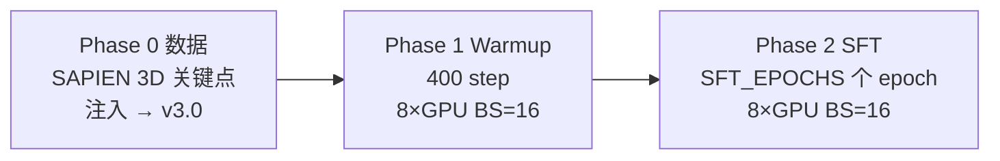
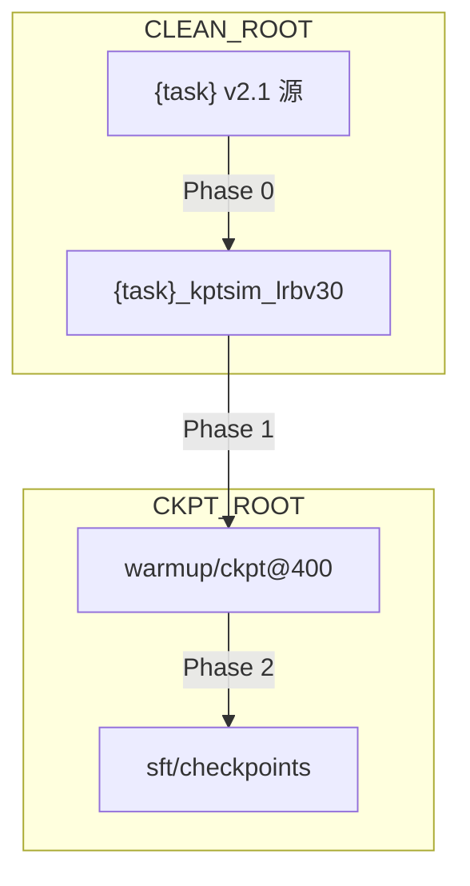

# RoboTwin 2.0 双任务微调操作手册（place_bread_skillet + pick_dual_bottles）

> **文档定位**: 在本机按顺序完成 RoboTwin 2.0 两个任务的 **数据准备 → Warmup 400 step → SFT 微调** 的**逐步操作手册**。读者无需事先熟悉 itvlaGp 内部实现，按章节执行即可。
>
> **设计依据**: [`run_ech_rbt_p012.md`](run_ech_rbt_p012.md)（编排逻辑、路径隔离、步数公式）
>
> **编排入口**: [`b/s/rbt/run_each_rbt_p012.sh`](../../s/rbt/run_each_rbt_p012.sh)
>
> **本手册任务**:
> | 任务名 | `TASK_NAMES` 下标（评测用） | 源数据帧数（本机） |
> |:---|:---:|:---:|
> | `place_bread_skillet` | **23** | 8277 |
> | `pick_dual_bottles` | **19** | 6129 |
>
> **执行顺序**: 先完整跑完 `place_bread_skillet`，再跑 `pick_dual_bottles`（编排脚本默认串行，避免 GPU / 端口冲突）。

---

## 目录

- [0. 30 秒总览](#0-30-秒总览)
- [1. 硬件、软件与仓库前提](#1-硬件软件与仓库前提)
- [2. 本机目录与路径约定](#2-本机目录与路径约定)
- [3. 环境搭建（一次性）](#3-环境搭建一次性)
- [4. 下载模型权重](#4-下载模型权重)
- [5. 编写机器配置 config.env](#5-编写机器配置-configenv)
- [6. 源数据验收](#6-源数据验收)
- [7. 预览与 dry-run](#7-预览与-dry-run)
- [8. 正式执行：三阶段流水线](#8-正式执行三阶段流水线)
- [9. 训练监控与验收](#9-训练监控与验收)
- [10. Checkpoint 与产物清单](#10-checkpoint-与产物清单)
- [11. 常见问题排查](#11-常见问题排查)
- [12. 评测衔接（可选）](#12-评测衔接可选)
- [附录 A：两任务 SFT 步数与保存点](#附录-a两任务-sft-步数与保存点)
- [附录 B：参考文档](#附录-b参考文档)

---

## 0. 30 秒总览

每个任务依次经过三个阶段：



**一条命令跑完全流程**（环境就绪后）：

```bash
cd /home/a26113/SRC/itvlaGp
bash b/s/rbt/run_each_rbt_p012.sh \
  --config /path/to/your/config.env \
  --gpus 8 \
  --skip-smoke
```

省略 `--tasks` 时默认读取 [`b/s/rbt/tasks.batch1.txt`](../../s/rbt/tasks.batch1.txt)，即上述两个任务。

**关键原则**（违反会导致训练失败或 silently 错误）：

1. **每个任务一套数据与 checkpoint**，禁止混用 `norm_stat`、`keypoints_meta`、`coord_offset`。
2. 训练找数据用 `HF_LEROBOT_HOME` + `repo_id={task}_kptsim_lrbv30`，**不要用** `--dataset.root` 直指数据集目录。
3. SAPIEN 提取与训练使用**两套 Python**（`EXTRACT_PYTHON` vs `TRAIN_PYTHON`）。
4. Phase 0 必须先提取再转 v3.0（提取器只读 v2.1 的 `episode_*.parquet`）。

---

## 1. 硬件、软件与仓库前提

### 1.1 硬件

| 项 | 要求 |
|:---|:---|
| GPU | **8 张** NVIDIA GPU（本机为 H200；A100/H100 亦可，OOM 时降 batch） |
| 显存 | Warmup 约 80 GB/卡（BS=16）；SFT 因加载 WAN 更高，同样 BS=16 起步 |
| CPU / 内存 | 建议 ≥ 64 核、≥ 256 GB RAM（`num_workers=12`/进程） |
| 磁盘 | 源数据 ~数十 GB；权重（A1.5 + GeoP + WAN + Qwen）~100 GB+；每任务 checkpoint 数 GB～数十 GB |

### 1.2 软件

| 项 | 版本 / 说明 |
|:---|:---|
| OS | Linux（本机 Ubuntu + CUDA 驱动） |
| Python（训练） | **3.11**（venv `/tmp/itnvla15rbt20`） |
| PyTorch | **2.10.0+cu128** |
| transformers | **5.2.0**（需打 Qwen3.5 patch） |
| torchcodec | **0.10.0+cu128** + `nvidia-npp-cu12` |
| SAPIEN | 装在 **RoboTwin / 独立 conda** 中，供 `EXTRACT_PYTHON` 使用 |

### 1.3 代码仓库

| 仓库 | 本机路径 | 用途 |
|:---|:---|:---|
| **itvlaGp** | `/home/a26113/SRC/itvlaGp` | 训练、注入、转换、编排脚本 |
| **GeoPredict** | `/home/a26113/SRC/GeoPredict` | SAPIEN 3D 关键点提取、`compute_robotwin_norm_stats.py` |
| **RoboTwin** | 用户自行 clone（见 §5） | 仅用于 **URDF** 路径（`arx5_description_isaac.urdf`） |

克隆与关系：

```bash
# 若尚未 clone
cd /home/a26113/SRC
git clone <itvlaGp-url> itvlaGp
git clone <GeoPredict-url> GeoPredict
git clone <RoboTwin-url> RoboTwin   # 或 RoboTwin 2.0 平台仓库
```

GeoPredict 须与 itvlaGp **并列**在同一父目录下（`../GeoPredict`），编排脚本默认自动发现。

---

## 2. 本机目录与路径约定

实施前理解下列路径（均可通过 `config.env` 覆盖）：

```
/home/a26113/Dta/RoboTwin-Clean/          # CLEAN_ROOT：源 v2.1 + 流水线产物
  place_bread_skillet/                    # 源任务（只读）
  place_bread_skillet_kptsim/             # Phase0：SAPIEN 输出
  place_bread_skillet_kptsim_lrb/         # Phase0：注入后 v2.1
  place_bread_skillet_kptsim_lrbv30/      # Phase0：训练用 v3.0
  pick_dual_bottles/                      # 第二个源任务
  pick_dual_bottles_kptsim_lrbv30/        # ...

/tmp/itnvla15rbt20/                       # VENV_ROOT：训练 venv（自包含）
  var/hf_home/ckpts/                      # A1.5-base、GeoPredict.pth
  var/hf_home/hub/                        # Qwen3.5-2B、WAN2.2-TI2V-5B
  var/datasets/                           # HF_LEROBOT_HOME（symlink 注册）

$HOME/Ckp/itvlaGp/                       # CKPT_ROOT：checkpoint 与日志
  norm_stats/robotwin_norm_stats_<task>.json
  place_bread_skillet/
    warmup/<timestamp>-.../checkpoints/000400/
    sft/<timestamp>-.../checkpoints/
    logs/
    pipeline_state.json
  pick_dual_bottles/
    ...
```



---

## 3. 环境搭建（一次性）

以下步骤在**任意一台新机器**上只需做一次。本机若已有 `/tmp/itnvla15rbt20` 且验收通过，可跳到 §3.6。

### 3.1 创建训练 venv

```bash
export VENV=/tmp/itnvla15rbt20
export PROJ=/home/a26113/SRC/itvlaGp

python3.11 -m venv "${VENV}"
"${VENV}/bin/pip" install -U pip setuptools wheel

# ffmpeg（视频解码依赖）
"${VENV}/bin/pip" install ffmpeg-python

# PyTorch cu128
"${VENV}/bin/pip" install torch==2.10.0 torchvision==0.25.0 \
  --index-url https://download.pytorch.org/whl/cu128

# 项目与 transformers
"${VENV}/bin/pip" install transformers==5.2.0
"${VENV}/bin/pip" install -e "${PROJ}"

# 性能相关（编译较慢）
"${VENV}/bin/pip" install flash-attn==2.8.3 flash-linear-attention==0.5.0 \
  causal-conv1d==1.6.1 --no-build-isolation
```

### 3.2 Transformers Qwen3.5 patch（必做）

```bash
TRANSFORMERS_DIR="${VENV}/lib/python3.11/site-packages/transformers/"
cp -r "${PROJ}/src/lerobot/policies/pi0/transformers_replace/models" "${TRANSFORMERS_DIR}"
cp -r "${PROJ}/src/lerobot/policies/pi05/transformers_replace/models" "${TRANSFORMERS_DIR}"
cp -r "${PROJ}/src/lerobot/policies/internvla_a1_5/transformers_replace/models" "${TRANSFORMERS_DIR}"
```

验收：

```bash
test -f "${TRANSFORMERS_DIR}/models/qwen3_5/modeling_qwen3_5.py" && echo "Qwen3.5 patch OK"
```

### 3.3 torchcodec GPU 解码（必做）

详见 [`itrnVLA15_GeoP_3dtrj_3cn4_wrmup8G.md` §2](../itrnVLA15_GeoP_3dtrj_3cn4_wrmup8G.md)。

```bash
# 必须用 cu128 索引，勿用 PyPI 默认 CPU wheel
"${VENV}/bin/pip" install --force-reinstall "torchcodec==0.10.0" \
  --index-url https://download.pytorch.org/whl/cu128
"${VENV}/bin/pip" install nvidia-npp-cu12
```

### 3.4 创建 venv 内 var/ 布局

```bash
mkdir -p "${VENV}/var/hf_home/ckpts"
mkdir -p "${VENV}/var/datasets"
```

### 3.5 SAPIEN 提取环境（第二套 Python）

Phase 0 的 SAPIEN FK 提取**不能**用训练 venv。须使用已安装 `sapien` 的解释器（通常为 RoboTwin 的 conda 环境）：

```bash
# 示例：替换为你的 RoboTwin conda python 路径
/path/to/robotwin/env/bin/python -c "import sapien; print('sapien OK')"
```

记下该路径，写入 `config.env` 的 `EXTRACT_PYTHON=`（§5）。

### 3.6 环境验收清单

在继续前，**全部通过**：

```bash
export VENV=/tmp/itnvla15rbt20
export PROJ=/home/a26113/SRC/itvlaGp

# 1. 包可导入
"${VENV}/bin/python" -c "
import torch, transformers, lerobot
print('torch', torch.__version__, 'cuda', torch.cuda.is_available())
print('lerobot OK')
"

# 2. GPU 数量
"${VENV}/bin/python" -c "import torch; print('GPUs', torch.cuda.device_count())"
# 期望: 8

# 3. editable 安装
"${VENV}/bin/pip" show internvla-a1-5 | grep -E 'Name|Editable'

# 4. accelerate
"${VENV}/bin/python" -c "import accelerate; print(accelerate.__version__)"
```

任一失败 → 回到 §3.1–3.3 修复，**不要开始训练**。

---

## 4. 下载模型权重

全部下载到 venv 内 **`${VENV}/var/hf_home/`**，不要写入 `$HOME/.cache/huggingface`。

### 4.1 InternVLA-A1.5-base + GeoPredict + Qwen3.5-2B

```bash
export VENV=/tmp/itnvla15rbt20
export HF_HOME="${VENV}/var/hf_home"
CKPT_DIR="${HF_HOME}/ckpts"
mkdir -p "${CKPT_DIR}"

"${VENV}/bin/python" <<'PY'
import os
from huggingface_hub import hf_hub_download, snapshot_download

hf_home = os.environ["HF_HOME"]
ckpt_dir = os.path.join(hf_home, "ckpts")

hf_hub_download(
    "Jingjing0601/GeoPredict-Robocasa",
    "GeoPredict_robocasa.pth",
    local_dir=ckpt_dir,
)
snapshot_download(
    "InternRobotics/InternVLA-A1.5-base",
    local_dir=os.path.join(ckpt_dir, "InternVLA-A1.5-base"),
)
snapshot_download(
    "Qwen/Qwen3.5-2B",
    cache_dir=os.path.join(hf_home, "hub"),
)
print("done:", ckpt_dir)
PY
```

验收：

```bash
test -f "${HF_HOME}/ckpts/GeoPredict_robocasa.pth" && echo "GeoPredict OK"
test -f "${HF_HOME}/ckpts/InternVLA-A1.5-base/config.json" && echo "A1.5-base OK"
ls "${HF_HOME}/hub/models--Qwen--Qwen3.5-2B/snapshots/" && echo "Qwen OK"
```

### 4.2 WAN2.2-TI2V-5B（SFT 必需；Warmup 不加载）

Warmup 使用 `action_loss_only=true`，**不下载 WAN 也能跑 Phase 1**。进入 Phase 2 前必须下载：

```bash
export VENV=/tmp/itnvla15rbt20
export HF_HOME="${VENV}/var/hf_home"
WAN_DIR="${HF_HOME}/hub/Wan2.2-TI2V-5B"

"${VENV}/bin/python" <<'PY'
import os
from huggingface_hub import snapshot_download

hf_home = os.environ["HF_HOME"]
wan_dir = os.path.join(hf_home, "hub", "Wan2.2-TI2V-5B")
snapshot_download("Wan-AI/Wan2.2-TI2V-5B", local_dir=wan_dir)
print("WAN:", wan_dir)
PY

test -f "${WAN_DIR}/Wan2.2_VAE.pth" && echo "WAN OK"
```

> WAN 约数十 GB，需稳定网络。若 HF 访问受限，可提前用镜像或离线下载后放到 `WAN_DIR`。

---

## 5. 编写机器配置 config.env

### 5.1 复制模板

```bash
cd /home/a26113/SRC/itvlaGp
cp b/s/rbt/config.env.example /home/a26113/Cfg/itvlaGp_rbt_batch1.env
```

### 5.2 必改项

编辑 `/home/a26113/Cfg/itvlaGp_rbt_batch1.env`，至少修改下列变量：

```bash
# --- 代码根 ---
ITVLAGP_ROOT=/home/a26113/SRC/itvlaGp
GEOPREDICT_ROOT=/home/a26113/SRC/GeoPredict
ROBOTWIN_ROOT=/path/to/your/RoboTwin          # ← 改成真实路径

# --- 数据 ---
CLEAN_ROOT=/home/a26113/Dta/RoboTwin-Clean    # 换机器必改

# --- checkpoint ---
CKPT_ROOT="${HOME}/Ckp/itvlaGp"

# --- Python ---
VENV_ROOT=/tmp/itnvla15rbt20
TRAIN_PYTHON="${VENV_ROOT}/bin/python"
EXTRACT_PYTHON=/path/to/robotwin/env/bin/python # ← SAPIEN 环境

# --- 权重（若按 §4 下载，默认路径即可）---
HF_HOME="${VENV_ROOT}/var/hf_home"
PRETRAINED_PATH="${HF_HOME}/ckpts/InternVLA-A1.5-base"
GEOPREDICT_CKPT="${HF_HOME}/ckpts/GeoPredict_robocasa.pth"
WAN_DIR="${HF_HOME}/hub/Wan2.2-TI2V-5B"
URDF_PATH="${ROBOTWIN_ROOT}/assets/embodiments/aloha-agilex/urdf/arx5_description_isaac.urdf"

# --- 训练规模 ---
PROC_PER_NODE=8
BATCH_SIZE=16
NODE_COUNT=1
WARMUP_STEPS=400
SFT_EPOCHS=76                              # 可改；保存点随 epoch 与帧数自动算
CUDA_VISIBLE_DEVICES=0,1,2,3,4,5,6,7
```

**URDF 验收**（配置保存前执行）：

```bash
test -f "${ROBOTWIN_ROOT}/assets/embodiments/aloha-agilex/urdf/arx5_description_isaac.urdf" \
  && echo "URDF OK" || echo "URDF 路径错误，请检查 ROBOTWIN_ROOT"
```

### 5.3 配置变量速查

| 变量 | 含义 |
|:---|:---|
| `SFT_EPOCHS` | SFT **总有效 epoch**（默认 76）；可用 CLI `--sft-epochs N` 覆盖 |
| `SFT_EFFECTIVE_BATCH_TARGET` | 目标有效 batch（默认 128 = 8×16×1） |
| `WARMUP_MASTER_PORT` / `SFT_MASTER_PORT` | accelerate 端口（默认 36201 / 36202） |

---

## 6. 源数据验收

### 6.1 确认源任务存在

```bash
source /home/a26113/Cfg/itvlaGp_rbt_batch1.env

ls -d "${CLEAN_ROOT}/place_bread_skillet" "${CLEAN_ROOT}/pick_dual_bottles"
```

或用编排脚本列出全部源任务：

```bash
cd /home/a26113/SRC/itvlaGp
bash b/s/rbt/run_each_rbt_p012.sh \
  --config /home/a26113/Cfg/itvlaGp_rbt_batch1.env \
  --list-tasks
```

### 6.2 检查 LeRobot v2.1 布局

每个源任务目录须包含：

```bash
TASK=place_bread_skillet
test -f "${CLEAN_ROOT}/${TASK}/meta/info.json"
ls "${CLEAN_ROOT}/${TASK}/data/chunk-000/episode_"*.parquet | head -3
```

`meta/info.json` 中 `codebase_version` 应为 **v2.1**（不是 v3.0）。

### 6.3 帧数核对（影响 SFT 步数）

```bash
python3 - <<'PY'
import json
from pathlib import Path
root = Path("/home/a26113/Dta/RoboTwin-Clean")
for t in ["place_bread_skillet", "pick_dual_bottles"]:
    info = json.loads((root/t/"meta/info.json").read_text())
    print(t, "episodes", info["total_episodes"], "frames", info["total_frames"])
PY
```

本机预期：`place_bread_skillet` 8277 frames / 50 episodes；`pick_dual_bottles` 6129 frames / 50 episodes。

### 6.4 勿把流水线产物当源任务

下列名称是**产物后缀**，不能写在任务列表里：

- `*_kptsim`、`*_kptsim_lrb`、`*_kptsim_lrbv30`

---

## 7. 预览与 dry-run

正式跑之前，用 **dry-run** 确认路径与命令无误（不执行重计算）：

```bash
cd /home/a26113/SRC/itvlaGp

bash b/s/rbt/run_each_rbt_p012.sh \
  --config /home/a26113/Cfg/itvlaGp_rbt_batch1.env \
  --dry-run
```

检查输出中的：

- `CLEAN_ROOT`、`CKPT_ROOT`、`TASK_SRC`、`TASK_V30`
- `EXTRACT_PYTHON`、`TRAIN_PYTHON`
- 两个任务是否按顺序列出

预览某任务 SFT 步数（默认 `SFT_EPOCHS=76`）：

```bash
python3 b/s/rbt/compute_sft_steps.py \
  --info /home/a26113/Dta/RoboTwin-Clean/place_bread_skillet/meta/info.json \
  --epochs 76 --n-gpus 8 --batch-size 16
```

数据准备好后，用 **真实 v30 的 info.json** 更准确：

```bash
# Phase 0 完成后
python3 b/s/rbt/compute_sft_steps.py \
  --info /home/a26113/Dta/RoboTwin-Clean/place_bread_skillet_kptsim_lrbv30/meta/info.json \
  --epochs 76 --n-gpus 8 --batch-size 16
```

---

## 8. 正式执行：三阶段流水线

### 8.1 推荐执行策略

| 步骤 | 命令范围 | 目的 |
|:---:|:---|:---|
| ① | `--until phase0` | 只做数据，验收 Layer-1 / v3.0 |
| ② | `--from warmup --until warmup` | 单任务 warmup 验收 |
| ③ | `--from warmup`（默认到 sft） | 两任务 warmup + SFT |

**首次建议分步**；环境稳定后可一条命令跑完全流程。

### 8.2 步骤 ①：Phase 0 数据准备（两任务）

```bash
cd /home/a26113/SRC/itvlaGp

bash b/s/rbt/run_each_rbt_p012.sh \
  --config /home/a26113/Cfg/itvlaGp_rbt_batch1.env \
  --until phase0
```

每个任务 Phase 0 内部顺序（自动执行）：

1. SAPIEN 提取 → `{task}_kptsim/`
2. 计算 norm stats → `CKPT_ROOT/norm_stats/robotwin_norm_stats_{task}.json`
3. 注入 `observation.keypoint_3d` → `{task}_kptsim_lrb/`
4. Layer-1 验收（6 项检查）
5. v2.1 → v3.0 转换 → `{task}_kptsim_lrbv30/`

**Phase 0 验收**（每个任务）：

```bash
TASK=place_bread_skillet
V30="${CLEAN_ROOT}/${TASK}_kptsim_lrbv30"

test -f "${V30}/meta/info.json" && echo "info OK"
test -f "${V30}/norm_stat.json" && echo "norm OK"
test -f "${V30}/meta/keypoints_meta.json" && echo "kpt meta OK"

python3 -c "
import json
info = json.load(open('${V30}/meta/info.json'))
assert 'observation.keypoint_3d' in info['features']
assert '3.0' in str(info.get('codebase_version',''))
print('Layer-2 OK', info['total_frames'], 'frames')
"
```

日志位置：`${CKPT_ROOT}/${TASK}/logs/phase0_<timestamp>.log`

若 Phase 0 已成功过，再次运行会 **跳过**（`--skip-existing` 默认开启）。强制重做：`--force`。

### 8.3 步骤 ②：Phase 1 Warmup（400 step）

确认 WAN **不必**在 Warmup 前下载（Warmup 不加载 WAN）。

```bash
cd /home/a26113/SRC/itvlaGp

# 可选：先对单任务试跑
bash b/s/rbt/run_each_rbt_p012.sh \
  --config /home/a26113/Cfg/itvlaGp_rbt_batch1.env \
  --tasks place_bread_skillet \
  --from warmup --until warmup \
  --gpus 8 \
  --skip-smoke
```

**两任务 warmup**（省略 `--tasks` 即 batch1 列表）：

```bash
bash b/s/rbt/run_each_rbt_p012.sh \
  --config /home/a26113/Cfg/itvlaGp_rbt_batch1.env \
  --from warmup --until warmup \
  --gpus 8 \
  --skip-smoke
```

编排器行为：

- 默认先跑 **1 GPU × 1 step smoke**（可用 `--skip-smoke` 跳过）
- 正式：8 GPU，`STEPS=400`，`SAVE_FREQ=100` → checkpoint **100 / 200 / 300 / 400**
- 使用 ckpt@**400** 作为 SFT 起点

**Warmup 验收**：

```bash
TASK=place_bread_skillet
CKPT="${CKPT_ROOT}/${TASK}/warmup/latest/checkpoints/000400/pretrained_model"
test -f "${CKPT}/config.json" && echo "warmup ckpt@400 OK: ${CKPT}"
```

训练日志：`${CKPT_ROOT}/${TASK}/logs/warmup_<timestamp>.log`

日志中应 **无** `video_decode_error` 与 `using_zeros`（全 0 表示视频解码静默失败）：

```bash
grep -c 'video_decode_error' "${CKPT_ROOT}/${TASK}/logs/warmup_"*.log
grep -c 'using_zeros' "${CKPT_ROOT}/${TASK}/logs/warmup_"*.log
# 期望均为 0
```

### 8.4 步骤 ③：Phase 2 SFT

**开始前确认 WAN 已下载**（§4.2）。

```bash
cd /home/a26113/SRC/itvlaGp

bash b/s/rbt/run_each_rbt_p012.sh \
  --config /home/a26113/Cfg/itvlaGp_rbt_batch1.env \
  --from warmup \
  --gpus 8 \
  --skip-smoke
```

若只需改 SFT epoch 数（例如 50 epoch）：

```bash
bash b/s/rbt/run_each_rbt_p012.sh \
  --config /home/a26113/Cfg/itvlaGp_rbt_batch1.env \
  --from warmup \
  --sft-epochs 50 \
  --gpus 8 \
  --skip-smoke
```

SFT 要点：

- 起点：**本任务** warmup `checkpoints/000400/pretrained_model`（不是 A1.5-base）
- 有效 batch：**128**（8×16）
- 总 step：\(S = \lceil N / 128 \rceil \times E\)，其中 \(E\) = `SFT_EPOCHS`，\(N\) = 该任务 `total_frames`
- Checkpoint：每 \(E/4\) 个 epoch 存一次 + **最后一步必存**

### 8.5 一条命令跑完全流程（环境已验证后）

```bash
cd /home/a26113/SRC/itvlaGp

bash b/s/rbt/run_each_rbt_p012.sh \
  --config /home/a26113/Cfg/itvlaGp_rbt_batch1.env \
  --gpus 8 \
  --skip-smoke
```

预计墙钟时间（8×H200，参考同类任务）：

| 阶段 | 单任务约 |
|:---|:---|
| Phase 0 | 数十分钟～数小时（SAPIEN 提取为主） |
| Warmup 400 step | ~15–25 分钟 |
| SFT（76 epoch） | ~2–4 小时（含 WAN video forward） |

两任务串行，总时间约为上表 ×2，再加 Phase 0。

---

## 9. 训练监控与验收

### 9.1 进程与 GPU

```bash
watch -n 5 nvidia-smi
```

期望：8 卡均有较高利用率；Warmup 约 80 GB/卡；SFT 可能更高。

### 9.2 日志与状态文件

| 文件 | 内容 |
|:---|:---|
| `${CKPT_ROOT}/${TASK}/pipeline_state.json` | 各阶段 `ok` / `skipped` / `running` |
| `${CKPT_ROOT}/${TASK}/logs/phase0_*.log` | 提取 / 注入 / 转换 |
| `${CKPT_ROOT}/${TASK}/logs/warmup_*.log` | Warmup 训练 |
| `${CKPT_ROOT}/${TASK}/logs/sft_*.log` | SFT 训练 |

查看状态：

```bash
cat "${CKPT_ROOT}/place_bread_skillet/pipeline_state.json"
```

### 9.3 WandB（offline）

本仓库训练**不使用 TensorBoard**。Launch 默认 `WANDB_MODE=offline`，曲线在：

```text
${CKPT_ROOT}/${TASK}/warmup/<job>/wandb/
${CKPT_ROOT}/${TASK}/sft/<job>/wandb/
```

### 9.4 SFT 结束判据

编排脚本在 SFT 正常结束后：

- 更新 `sft/latest` → 本次 job 目录
- `pipeline_state.json` 中 `sft.status = ok`
- 最后 checkpoint 在 `checkpoints/<final_step>/pretrained_model/`

```bash
TASK=place_bread_skillet
ls "${CKPT_ROOT}/${TASK}/sft/latest/checkpoints/"
```

---

## 10. Checkpoint 与产物清单

### 10.1 place_bread_skillet 完整产物（默认路径）

| 产物 | 路径 |
|:---|:---|
| 训练数据 v3.0 | `/home/a26113/Dta/RoboTwin-Clean/place_bread_skillet_kptsim_lrbv30/` |
| norm stats（原始键名） | `$HOME/Ckp/itvlaGp/norm_stats/robotwin_norm_stats_place_bread_skillet.json` |
| Warmup ckpt@400 | `$HOME/Ckp/itvlaGp/place_bread_skillet/warmup/latest/checkpoints/000400/pretrained_model/` |
| SFT checkpoints | `$HOME/Ckp/itvlaGp/place_bread_skillet/sft/latest/checkpoints/` |
| 关键点 meta（评测必用） | `.../place_bread_skillet_kptsim_lrbv30/meta/keypoints_meta.json` |

### 10.2 pick_dual_bottles

将上表路径中的 `place_bread_skillet` 替换为 `pick_dual_bottles` 即可。

### 10.3 多次运行与时间戳

同一任务重复训练时，编排器会生成带 **时间戳** 的新目录，**不覆盖**旧 checkpoint：

```text
sft/2026_08_27_12_30_45-internvla_a1_5-geop-kpt-sft-place_bread_skillet/
```

成功后 `sft/latest` 指向最新一次。旧目录可手动归档或删除。

---

## 11. 常见问题排查

| 现象 | 可能原因 | 处理 |
|:---|:---|:---|
| `请设置 ROBOTWIN_ROOT` | config 未填 RoboTwin 路径 | §5.2 设置 `ROBOTWIN_ROOT` 与 `URDF_PATH` |
| `import sapien` 失败 | 用训练 venv 做提取 | 设置正确的 `EXTRACT_PYTHON` |
| `源任务目录不存在` | `CLEAN_ROOT` 错误或任务名写错 | `--list-tasks` 核对；勿写 `_kptsim` 后缀 |
| Layer-1 Check 3 失败 | 关键点仍在世界坐标系 | 检查该任务 `keypoints_meta.json` 的 `coord_offset` |
| `BackwardCompatibilityError` | 训练指向 v2.1 | `repo_id` 必须是 `*_kptsim_lrbv30` |
| factory 找不到 `info.json` | 使用了 `--dataset.root` | 只用 `HF_LEROBOT_HOME` + `repo_id` |
| `FileNotFoundError: Wan2.2_VAE.pth` | 未下载 WAN | §4.2 |
| OOM @ BS=16 | WAN + 3 相机 + video loss | `config.env` 中 `BATCH_SIZE=12` 或 `8` |
| `video_decode_error` / `using_zeros` | torchcodec / npp 未装好 | §3.3；见 wrmup8G 附录 A |
| SFT 从 A1.5-base 起训 | warmup ckpt 未找到 | 确认 `warmup/latest/checkpoints/000400` 存在 |
| 任务锁 `.lock` 残留 | 上次进程被 kill | 确认无训练进程后 `rmdir $CKPT_ROOT/<task>/.lock` |
| 第二个任务 v30 被删 | 共用 convert 目录 | 本编排已隔离；勿手改 convert 路径 |
| 评测关键点漂移 | 用了 stack_bowls 默认 meta | 评测必须 `--kpt-meta-path` 指向本任务 meta |

---

## 12. 评测衔接（可选）

本流水线**不包含** RoboTwin 仿真评测。微调完成后，可用下列命令做闭环验证（需单独安装 RoboTwin 仿真环境）：

```bash
export CKPT_ROOT="${HOME}/Ckp/itvlaGp"
export CLEAN_ROOT=/home/a26113/Dta/RoboTwin-Clean

# place_bread_skillet: task_idx=23
TASK=place_bread_skillet
CKPT="${CKPT_ROOT}/${TASK}/sft/latest/checkpoints/<最后step>/pretrained_model"
META="${CLEAN_ROOT}/${TASK}_kptsim_lrbv30/meta/keypoints_meta.json"

cd /home/a26113/SRC/itvlaGp
"${TRAIN_PYTHON:-/tmp/itnvla15rbt20/bin/python}" evaluation/RoboTwin/inference.py \
  --ckpt-path "${CKPT}" \
  --task-idx 23 \
  --kpt-coord-mode voxel \
  --kpt-meta-path "${META}"

# pick_dual_bottles: task_idx=19
TASK=pick_dual_bottles
CKPT="${CKPT_ROOT}/${TASK}/sft/latest/checkpoints/<最后step>/pretrained_model"
META="${CLEAN_ROOT}/${TASK}_kptsim_lrbv30/meta/keypoints_meta.json"

"${TRAIN_PYTHON:-/tmp/itnvla15rbt20/bin/python}" evaluation/RoboTwin/inference.py \
  --ckpt-path "${CKPT}" \
  --task-idx 19 \
  --kpt-coord-mode voxel \
  --kpt-meta-path "${META}"
```

> `inference.py` 默认 `DEFAULT_KPT_META_PATH` 指向 `stack_bowls_three`，**必须**显式传 `--kpt-meta-path`。

---

## 附录 A：两任务 SFT 步数与保存点

默认 **`SFT_EPOCHS=76`**，**`B_eff=128`**（8 GPU × batch 16）：

| 任务 | \(N\) frames | \(s_{\text{epoch}}\) | 总 step \(S\) | 保存 epoch | 保存 step |
|:---|---:|---:|---:|:---|:---|
| `place_bread_skillet` | 8277 | 65 | **4940** | 19, 38, 57, 76 | 1235, 2470, 3705, 4940 |
| `pick_dual_bottles` | 6129 | 48 | **3648** | 19, 38, 57, 76 | 912, 1824, 2736, 3648 |

公式（\(E\) = `SFT_EPOCHS`）：

\[
B_{\text{eff}} = G \cdot B \cdot M,\quad
s_{\text{epoch}} = \left\lceil \frac{N}{B_{\text{eff}}} \right\rceil,\quad
S = s_{\text{epoch}} \cdot E
\]

\[
e_{\text{save}} = \max(\lfloor E/4 \rfloor, 1),\quad
\texttt{save\_freq} = s_{\text{epoch}} \cdot e_{\text{save}}
\]

若 `SFT_EPOCHS=50`，`place_bread_skillet` 变为：\(S=3250\)，保存 epoch **12, 24, 36, 48, 50**。

实时计算：

```bash
python3 b/s/rbt/compute_sft_steps.py \
  --info "${CLEAN_ROOT}/place_bread_skillet_kptsim_lrbv30/meta/info.json" \
  --epochs 76 --n-gpus 8 --batch-size 16
```

---

## 附录 B：参考文档

| 文档 | 内容 |
|:---|:---|
| [`run_ech_rbt_p012.md`](run_ech_rbt_p012.md) | 循环编排设计、路径隔离、CLI |
| [`itrnVLA15_GeoP_3dtrj_3cn4_wrmup8G.md`](../itrnVLA15_GeoP_3dtrj_3cn4_wrmup8G.md) | venv 自包含、torchcodec、Warmup 8 卡 |
| [`itrnVLA15_GeoP_3dtrj_3cn4_sft_rbt2.md`](../itrnVLA15_GeoP_3dtrj_3cn4_sft_rbt2.md) | Phase 2 SFT 超参、WAN 下载 |
| [`GeoPredict/b/d/3dkptraj_1.md`](../../../../GeoPredict/b/d/3dkptraj_1.md) | SAPIEN FK 提取原理 |
| InternVLA-A1.5 | [arXiv:2607.04988](https://arxiv.org/abs/2607.04988) |
| GeoPredict | [arXiv:2512.16811](https://arxiv.org/abs/2512.16811) |

---

**文档版本**: 2026-08-27  
**对应编排代码**: `b/s/rbt/`（`run_each_rbt_p012.sh` 及 phase0/1/2 脚本）
