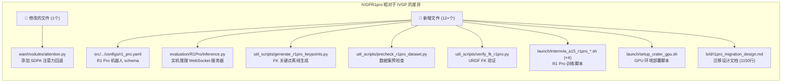
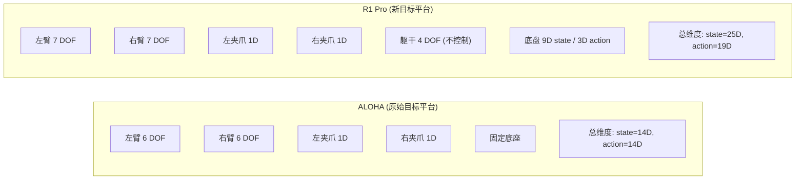
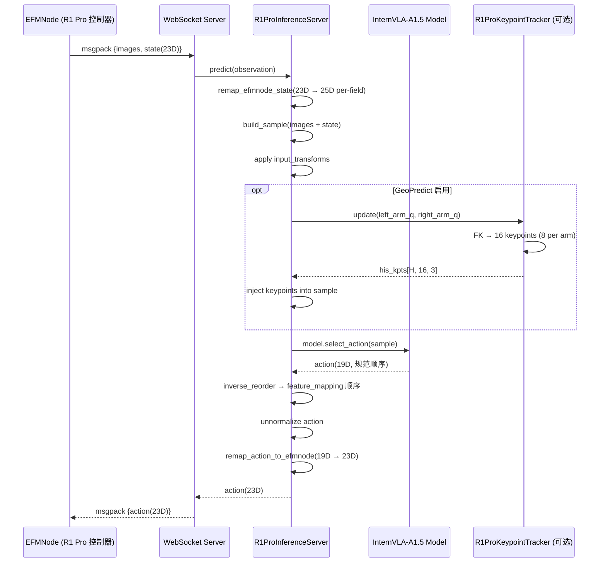
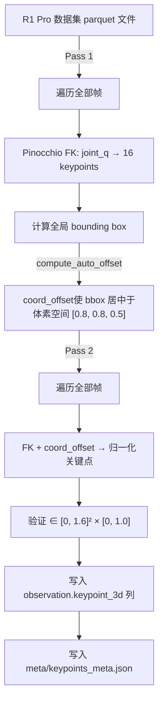
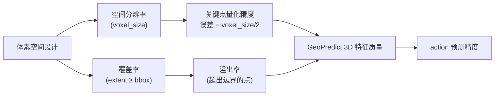
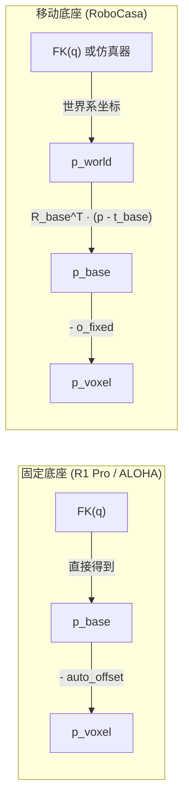
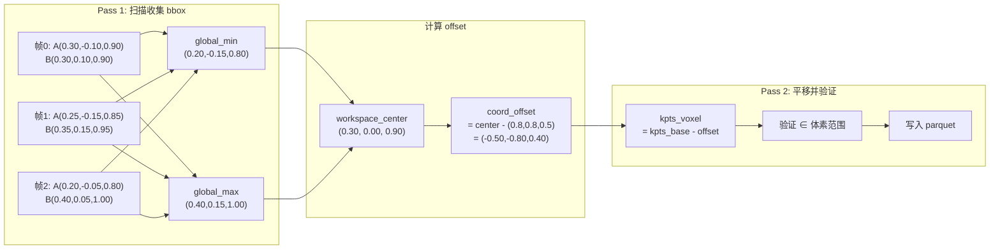
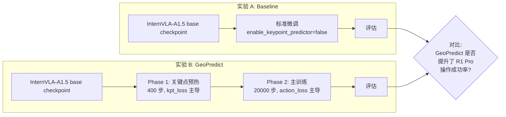
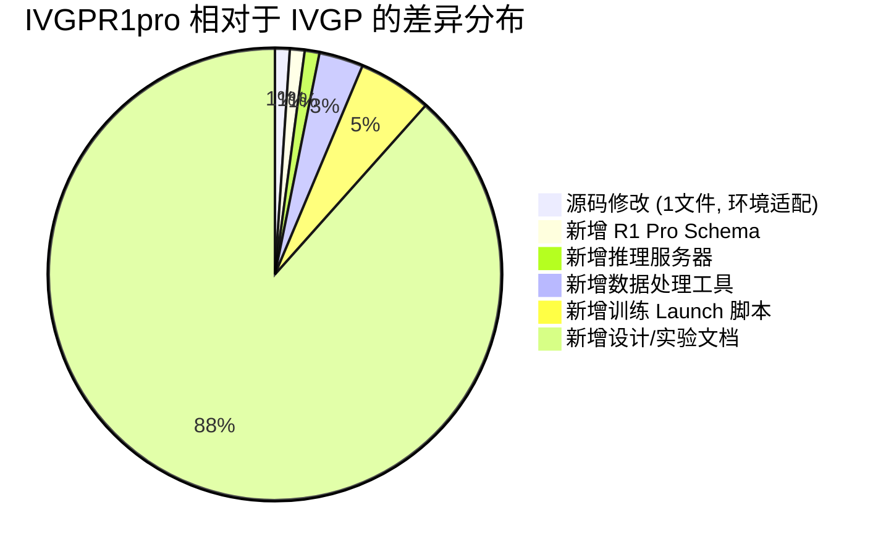

# IVGP vs IVGPR1pro 代码库差异深度分析

> **分析日期**: 2026-09-01  
> **IVGP**: InternVLA-A1.5 基础代码库 (含 `.git`, 221 文件)  
> **IVGPR1pro**: 基于 IVGP 的 R1 Pro 机器人适配分支 (无 `.git`, 323 文件)  
> **参考论文**: [InternVLA-A1.5: Unifying Understanding, Latent Foresight, and Action for Compositional Generalization](https://arxiv.org/abs/2607.04988)  
> **参考 GitHub**: https://github.com/InternRobotics/InternVLA-A-series

---

## 1. 总体概述

IVGP 和 IVGPR1pro 是同一个 InternVLA-A1.5 项目的两个版本。IVGP 是**原始基础代码库**, 对应论文中公开发布的代码; IVGPR1pro 是在 IVGP 基础上进行的**R1 Pro 实体机器人适配分支**, 目标是将 InternVLA-A1.5 (原本主要针对 ALOHA 双臂机器人和仿真环境设计) 迁移到上海 AI Lab 自研的 R1 Pro 移动双臂机器人平台上。

**核心发现**: IVGPR1pro 对 IVGP 的核心模型代码做到了**零侵入修改** — 所有 14 个核心源文件 (模型定义、配置、数据集、优化器、训练脚本、transform 管线等) **完全相同** (byte-for-byte identical)。唯一的源码修改是 WAN 视频模型中的一个注意力计算回退方案。所有 R1 Pro 特有的逻辑都通过**新增文件** (schema YAML、工具脚本、推理服务器、launch 脚本) 实现, 体现了良好的"配置驱动适配"设计理念。

---

## 2. 文件结构对比

### 2.1 文件数量统计

| 目录 | IVGP | IVGPR1pro | 差异 |
|------|------|-----------|------|
| 根目录 (含 `.vscode`, `assets`) | 8 | 8 | 无 |
| `src/lerobot/` | 114 | 120 | +6 |
| `configs/` | 1 | 1 | 无 |
| `launch/` | 23 | 28 | **+5** |
| `evaluation/` | 37 | 41 | **+4** |
| `tests/` | 13 | 13 | 无 |
| `util_scripts/` | 11 | 14 | **+3** |
| `tutorials/` | 4 | 4 | 无 |
| `b/` (文档/笔记) | 10 | 94 | **+84** |
| **总计** | **221** | **323** | **+102** |

### 2.2 差异文件全景图



---

## 3. 唯一的源码修改: WAN 注意力 SDPA 回退

### 3.1 修改位置

`src/lerobot/policies/internvla_a1_5/wan/modules/attention.py`

### 3.2 修改原因

InternVLA-A1.5 的 WAN 2.2 视频生成模型在注意力计算中强制依赖 Flash Attention 2 或 3。然而, R1 Pro 的部署环境 (称为 "Crater" GPU 容器) 缺少 `nvcc` 编译器, 无法从源码编译安装 `flash-attn` 库。为了让模型在该环境中正常运行, IVGPR1pro 添加了一个纯 PyTorch 的 SDPA (Scaled Dot-Product Attention) 回退方案。

### 3.3 具体变更

**变更 A — 新增 `_sdpa_attention()` 函数 (~68 行)**

```python
def _sdpa_attention(q, k, v, q_lens=None, k_lens=None, q_scale=None, causal=False):
    """
    纯 PyTorch 回退, 使用 torch.nn.functional.scaled_dot_product_attention.
    输入: 填充后的 [B, L, N, C] 张量 (非 varlen 打包格式).
    """
```

该函数的关键设计点:
- **半精度处理**: 自动转换为 float16/bfloat16
- **变长序列支持**: 通过 `k_lens` 构建布尔掩码, 模拟 Flash Attention 的变长行为
- **因果掩码合并**: 由于 PyTorch SDPA 不接受 `is_causal=True` 与显式 `attn_mask` 同时使用, 需要手动构建并合并因果掩码与 key 掩码
- **GQA (分组查询注意力) 支持**: 当 $n_q \neq n_k$ 时启用 `enable_gqa=True`
- **输出格式**: 返回 `[B, Lq, Nq, C]`, 与 Flash Attention 分支对齐

**变更 B — `flash_attention()` 函数中添加早期返回分支 (~20 行)**

```python
if not FLASH_ATTN_2_AVAILABLE and not FLASH_ATTN_3_AVAILABLE:
    if window_size != (-1, -1):
        warnings.warn("SDPA fallback does not support sliding window attention")
    return _sdpa_attention(q, k, v, q_lens, k_lens, q_scale, causal)
```

该分支在 varlen 打包逻辑**之前**触发, 避免进入与 SDPA 路径不兼容的数据布局。

**变更 C — 移除断言 (1 行)**

移除了 Flash Attention 2 分支中的 `assert FLASH_ATTN_2_AVAILABLE`, 因为新的早期返回已经保证执行到此处时至少有一个 flash-attn 变体可用。

### 3.4 性质分析

| 维度 | 评估 |
|------|------|
| **功能性** | 不改变模型计算结果 (数值精度差异在 fp16 误差范围内) |
| **适用范围** | 仅影响 WAN 视频模型的注意力层, 不影响 Qwen3.5 VLM 或 Action Expert |
| **性能影响** | SDPA 比 Flash Attention 慢 (无 IO-aware tiling), 但 WAN 在推理时可关闭 (`action_loss_only=True`) |
| **向后兼容** | 完全兼容 — 有 flash-attn 时走原路径, 无 flash-attn 时走 SDPA 回退 |

> **结论**: 这是一个**环境适配性修改**, 而非功能性变更。设计上优雅地保持了原始代码路径不变。

---

## 4. R1 Pro 机器人数据如何适配到模型输入上的映射 Schema 定义

### 4.1 新增文件

`src/lerobot/dataset_schemas/configs/r1_pro.yaml` (54 行)

### 4.2 R1 Pro vs ALOHA 机器人构型对比



### 4.3 Schema 关键设计

| 字段 | 值 | 说明 |
|------|-----|------|
| `robot_type` | `r1_pro` | 机器人类型标识 |
| **State 维度** | 25D | `左臂(7) + 右臂(7) + 左夹爪(1) + 右夹爪(1) + 底盘(9)` |
| **Action 维度** | 19D | `左臂(7) + 右臂(7) + 左夹爪(1) + 右夹爪(1) + 底盘速度(3)` |
| **躯干处理** | 排除 | 躯干 4 DOF 在数据集中为全零常量, 不参与训练 |
| **底盘差异** | state=9D, action=3D | 底盘 state 包含完整位姿, action 仅需速度指令 |
| `action_reorder` | 定义了重排映射 | 将 `feature_mapping` 拼接顺序重映射为规范布局 `[左臂\|左夹爪\|右臂\|右夹爪\|底盘]` |
| `action_mask_spec` | `[7, 7, -1, -1, -3]` | 手臂为 delta 模式, 夹爪和底盘为绝对模式 |
| `image_mapping` | 3 摄像头 | `head_rgb→image0`, `wrist_left_rgb→image1`, `wrist_right_rgb→image2` |

### 4.4 底盘 State 9 维详解: "cumulative yaw 3 + linear vel 3 + angular vel 3"

R1 Pro 的 `r1_pro.yaml` 注释中写道:

> Chassis state is 9-dim (cumulative yaw 3 + linear vel 3 + angular vel 3)

这 9 个维度描述了 R1 Pro 移动底盘的**完整运动状态**, 分为三组, 每组 3 维:

#### 4.4.1 三组维度拆解

| 索引范围 | 名称 | 含义 | 物理量 |
|----------|------|------|--------|
| `[0:3]` | **累积转角 (cumulative yaw)** | 底盘自启动以来在三个轴上的**累积旋转量** (积分后的角度) | 弧度 (rad) |
| `[3:6]` | **线速度 (linear velocity)** | 底盘当前时刻的**平移速度** $(v_x, v_y, v_z)$ | m/s |
| `[6:9]` | **角速度 (angular velocity)** | 底盘当前时刻的**旋转角速度** $(\omega_x, \omega_y, \omega_z)$ | rad/s |

> **注意**: 虽然 R1 Pro 是地面机器人 (主要在 2D 平面运动), 但底盘的 IMU 或里程计系统以完整 3D 格式报告数据。实际运行中, $v_z$、$\omega_x$、$\omega_y$ 通常接近零, 但保留完整 3D 表示是传感器原始数据格式的直接反映。

#### 4.4.2 为什么 State 是 9D, Action 只有 3D?

这是一个关键的**非对称设计**:

- **State (观测) = 9D**: 模型需要**完整感知**底盘的运动状态 — 不仅知道"现在在怎么动" (速度), 还知道"从哪里来" (累积转角)。9D 提供了丰富的上下文, 帮助模型理解机器人在空间中的位姿演变。
- **Action (控制) = 3D**: 模型只需要**输出速度指令** (底盘的线速度/角速度目标)。底盘控制器接收 `/motion_target/target_speed_chassis` 话题上的 3D 速度指令, 不需要位置或累积角度。

```
观测 (9D)                              控制 (3D)
┌─────────────────┐                    ┌─────────────────┐
│ 累积转角 [0:3]  │ ← "我在哪"         │                 │
│ 线速度   [3:6]  │ ← "我在怎么动"  →  │ 速度指令 [0:3]  │ → 底盘电机
│ 角速度   [6:9]  │ ← "我在怎么转"     │                 │
└─────────────────┘                    └─────────────────┘
```

**类比**: 这就像开车时, 你能看到仪表盘上的车速 + 里程 + 转向角 (丰富的观测), 但你的操作只是踩油门/刹车和转方向盘 (简洁的控制指令)。

#### 4.4.3 推理时的零填充处理

在实机推理中 ([inference.py:121-123](IVGPR1pro/evaluation/R1Pro/inference.py#L121-L123)), EFMNode 只发送 3D 底盘数据 (来自实时传感器的速度), 推理服务器需要将其零填充为 9D:

```python
chassis_3d = s[20:23]               # EFMNode 发来的 3D 底盘数据
chassis_9d = np.zeros(9, dtype=np.float32)
chassis_9d[:3] = chassis_3d         # 填入前 3 维, 后 6 维保持为零
```

这意味着在推理时, 模型**只接收到累积转角的前 3 维** (或速度的前 3 维, 取决于 EFMNode 发送的是什么), 后 6 维为零。这个处理方式说明:
- 训练数据中底盘的完整 9D 信息在推理时可能无法完全获取
- 模型需要具备在部分底盘信息缺失时仍能正常工作的鲁棒性

#### 4.4.4 数据集中的底盘特征

根据迁移设计文档 ([r1pro_migration_design.md:74](IVGPR1pro/b/d/r1pro_migration_design.md#L74)) 的分析:

- 底盘 action `[20:23]` 的 std 为 `[0.082, 0.023, 0.024]` — 数值偏小但非退化, 归一化不会出问题
- 底盘段与手臂段**基本互斥**: 底盘移动时手臂不动, 手臂操作时底盘不动, 只有短暂的交接期同时运动
- 这种互斥性意味着 GeoPredict 在底盘段的信息量为零 (手臂关键点全程不变), 这是实验设计的固有限制

#### 4.4.5 为什么 YAML 注释中说 "cumulative yaw" 而不是 "cumulative rotation"

严格来说, "yaw" 通常只指绕垂直轴 (z 轴) 的旋转。这里用 "cumulative yaw 3" 来描述 3 个维度, 是因为对于地面机器人而言, **有意义的旋转主要是 yaw** (绕 z 轴转向), roll 和 pitch 的累积量通常接近于零。因此, 虽然数据格式是 3D 的, 但语义上主要承载的是 yaw 方向的累积信息, 注释采用了简写表达。参考来源为 openpi0.5 已跑通的 R1 Pro 管线中的维度定义 (`openpi0.5/src/openpi/policies/r1pro_chassis_policy.py` L109-140)。

### 4.5 为什么需要 `action_reorder`

InternVLA-A1.5 的 `feature_mapping` 定义了各关节如何从数据集列拼接成 flat vector。但不同机器人的关节在数据集中的存储顺序可能与模型期望的规范顺序不同。`action_reorder` 机制允许在**不修改模型代码**的前提下, 通过配置重排维度顺序, 是实现零侵入适配的关键设计。

---

## 5. R1 Pro 实机推理服务器

### 5.1 新增文件

`evaluation/R1Pro/inference.py` (561 行)

### 5.2 架构设计



### 5.3 关键组件

**状态重映射 (`remap_efmnode_state`)**  
EFMNode 发送的 23D 状态格式: `la7+ra7+lg1+rg1+torso4+chassis3`  
模型期望的 25D per-field 格式: 丢弃 torso, 将 chassis 从 3D 零填充到 9D

**动作重映射 (`remap_action_to_efmnode`)**  
模型输出 19D → 在位置 16-19 插入 4 个零 (torso) → 输出 23D

**关键点追踪器 (`R1ProKeypointTracker`)**  
- 使用 URDF 前向运动学提取 16 个 3D 关键点 (每臂 8 个: 7 臂关节 + 1 末端 TCP)
- 维护滑动窗口历史缓冲区 `his_kpts[H, 16, 3]`
- 从 `keypoints_meta.json` 读取 `coord_offset` 和 `torso_q` (保证训练/推理一致性)

### 5.4 通信协议

使用 openpi 裸字典 msgpack 协议 — 即 R1 Pro 的 EFMNode 客户端原生支持的协议。服务器提供:
- WebSocket 端点用于推理
- HTTP `/healthz` 端点用于健康检查
- 单客户端信号量锁 (防止并发推理)

---

## 6. 数据处理工具链

### 6.1 离线关键点生成

**文件**: `util_scripts/generate_r1pro_keypoints.py` (430 行)

该脚本为 R1 Pro 数据集离线生成 3D 关键点 (供 GeoPredict 几何预测模块使用):



**关键设计决策 — 躯干约定**:  
脚本文档中详细解释了一个重要的数学性质: 无论躯干关节取零值还是物理值, FK 计算出的末端关键点在经过 `auto_offset` 归一化后是**位等价的** (bit-identical)。原因是躯干关节仅引入纯平移分量, 会被 `auto_offset` 完全吸收。这保证了训练数据标注的鲁棒性。

**关键点数量: 14 → 16**  
原始 IVGP 的 GeoPredict 模块为 ALOHA (6 DOF) 设计了 14 个关键点 (每臂 7 个)。R1 Pro (7 DOF) 需要 16 个关键点 (每臂 8 个)。这一适配通过配置参数 `--policy.num_keypoint_joints=16` 实现, **无需修改模型代码** — 这是 IVGP 核心框架可扩展性设计的体现。

### 6.1.1 Pinocchio FK 深度解析: joint_q → 16 keypoints

#### 什么是 Pinocchio

**Pinocchio** (全称 "Pinocchio Is Not Only a Convenient Omni-Objective Library for Efficient Optimization") 是由 LAAS-CNRS (法国国家科学研究中心图卢兹实验室) 和 INRIA (法国国家信息与自动化研究所) 联合开发的**高性能刚体动力学计算库** (参考: Carpentier et al., "The Pinocchio C++ library: A fast and flexible implementation of rigid body dynamics algorithms and their analytical derivatives", *IEEE SII 2019*)。它实现了 Roy Featherstone 提出的空间向量代数 (Spatial Vector Algebra) 和递归 Newton-Euler 算法, 支持:

- 前向运动学 (Forward Kinematics, FK)
- 逆运动学 (Inverse Kinematics, IK)
- 前向/逆向动力学
- 关节空间质量矩阵计算
- 所有上述量的解析微分

其 Python 绑定通过 `import pinocchio as pin` 使用, 是机器人学研究中最常用的动力学库之一。

#### 什么是 URDF

**URDF (Unified Robot Description Format)** 是 ROS (Robot Operating System) 生态中定义机器人模型的 XML 格式标准 (参考: ROS Wiki, "URDF", http://wiki.ros.org/urdf )。一个 URDF 文件包含:

- **Link** (连杆): 刚体部件, 定义惯性属性 (质量、转动惯量) 和几何外形 (碰撞/可视化网格)
- **Joint** (关节): 连接两个 Link 的运动约束, 定义旋转轴、关节限位、阻尼等

R1 Pro 的 URDF (`assets/r1_pro_with_gripper.urdf`) 描述了完整的机器人运动链: 底盘 → 躯干4关节 → 左/右臂各7关节 → 夹爪。

#### 什么是前向运动学 (FK)

**前向运动学** (Forward Kinematics) 是从**关节角度** $\mathbf{q} \in \mathbb{R}^n$ 计算**末端执行器位姿** $\mathbf{T} \in SE(3)$ 的过程。数学上, 它沿运动链逐级累乘齐次变换矩阵:

$$\mathbf{T}_{0 \to n} = \prod_{i=1}^{n} \mathbf{T}_{i-1 \to i}(\theta_i) = \mathbf{T}_{0 \to 1}(\theta_1) \cdot \mathbf{T}_{1 \to 2}(\theta_2) \cdots \mathbf{T}_{n-1 \to n}(\theta_n)$$

其中每个 $\mathbf{T}_{i-1 \to i}(\theta_i) \in SE(3)$ 是第 $i$ 个关节角度 $\theta_i$ 决定的 $4 \times 4$ 齐次变换矩阵:

$$\mathbf{T} = \begin{bmatrix} \mathbf{R} & \mathbf{t} \\ \mathbf{0}^T & 1 \end{bmatrix}, \quad \mathbf{R} \in SO(3),\; \mathbf{t} \in \mathbb{R}^3$$

$\mathbf{R}$ 是旋转矩阵, $\mathbf{t}$ 是平移向量。

在 Pinocchio 中, FK 的调用分两步 ([generate_r1pro_keypoints.py:151-152](IVGPR1pro/util_scripts/generate_r1pro_keypoints.py#L151-L152)):

```python
pin.forwardKinematics(self.model, self.data, q)    # 递推计算所有关节的位姿
pin.updateFramePlacements(self.model, self.data)    # 更新所有参考帧的位姿
```

然后通过 `self.data.oMf[frame_id].translation` 提取每个 link 的**平移分量** (即 3D 位置坐标)。

#### 体素空间 $[0, 1.6]^2 \times [0, 1.0]$ 对 R1 Pro 是否合理? — 基于物理尺寸的深度分析

> **前提**: 本节分析假设 R1 Pro 臂长 1.2 m、肩宽 0.4 m、正常站姿身高 1.6 m, 且**不使用 GeoPredict 在 RoboCasa 上的预训练权重** (从头训练或仅使用非 GeoPredict 部分的预训练)。后文 (§6.1.2) 已有体素空间尺寸由来的说明 (40×40×25 网格 × 0.04 m = 1.6×1.6×1.0 m, 来自 RoboCasa 场景), 本节聚焦于**这套参数是否适配 R1 Pro 的物理工作空间**。

##### 1. R1 Pro 的理论工作空间估算

在 base_link 坐标系 (X 前, Y 左, Z 上, 原点在底盘中心地面) 中, R1 Pro 的运动学结构如下:

```
                    ← 臂长 1.2m →      ← 臂长 1.2m →
                   ┌─────────────┐     ┌─────────────┐
              左肩 ○              │     │              ○ 右肩
                   │   左臂      │     │   右臂       │
                   └──────○──────┘     └──────○──────┘
                          │                   │
                     ┌────┴────┐         ┌────┴────┐
              ~1.2m  │  torso  │         │  torso  │
               ↕     │  (躯干) │─肩宽0.4m│  (躯干) │
                     └────┬────┘         └────┬────┘
                          │                   │
                    ══════╧═══════════════════╧═══════
                              base_link
                          (底盘中心, Z=0)
```

根据机器人的物理参数, 可以估算各轴的理论可达范围:

**Z 轴 (高度方向)**:
- 躯干将肩关节抬升到约 $h_{\text{shoulder}} \approx 1.1 \sim 1.3$ m (身高 1.6 m 扣除头部传感器)
- 手臂可从肩关节向上伸展 1.2 m → $z_{\max} \approx 1.3 + 1.2 = 2.5$ m
- 手臂可从肩关节向下伸展 1.2 m → $z_{\min} \approx 1.1 - 1.2 = -0.1$ m (受地面约束, 实际 $\geq 0$)
- **理论 Z 跨度 ≈ 2.5 m**
- 当前体素空间 Z 跨度: **1.0 m** — 仅覆盖理论范围的 **40%**

**X 轴 (前后方向)**:
- 肩关节位于 base_link 前方约 0 ~ 0.1 m (取决于 torso 构型)
- 手臂前伸 1.2 m → $x_{\max} \approx 0.1 + 1.2 = 1.3$ m
- 手臂后伸 (受关节限位约束, 通常 < 0.3 m) → $x_{\min} \approx -0.3$ m
- **实际 X 跨度 ≈ 1.0 ~ 1.6 m**
- 当前体素空间 X 跨度: **1.6 m** — 基本够用

**Y 轴 (左右方向)**:
- 左肩在 $y \approx +0.2$ m, 右肩在 $y \approx -0.2$ m (肩宽 0.4 m)
- 左臂最远 $y_{\max} \approx 0.2 + 1.2 = 1.4$ m
- 右臂最远 $y_{\min} \approx -0.2 - 1.2 = -1.4$ m
- **双臂 Y 跨度 ≈ 2.8 m**
- 当前体素空间 Y 跨度: **1.6 m** — 仅覆盖理论范围的 **57%**

> **注意**: 以上是**理论极限**。实际数据集中手臂不会达到所有极端构型 — 开门任务的工作范围远小于理论可达空间。但体素空间必须包容数据集中**实际出现的所有关键点位置**, 否则 pass 2 的边界检查会报溢出。

##### 2. 定量分析: 当前体素空间的问题

将 R1 Pro 的估算工作空间与当前体素空间对比:

| 轴 | 理论可达范围 | 实际任务范围 (估) | 当前体素空间 | 匹配度 | 判定 |
|---|---|---|---|---|---|
| **X** | -0.3 ~ +1.3 m (跨度 1.6) | 0.0 ~ +1.0 m (跨度 1.0) | 1.6 m | ✅ 充裕 | OK |
| **Y** | -1.4 ~ +1.4 m (跨度 2.8) | -0.6 ~ +0.6 m (跨度 1.2) | 1.6 m | ⚠️ 勉强 | 需观察 |
| **Z** | 0.0 ~ +2.5 m (跨度 2.5) | 0.5 ~ +1.8 m (跨度 1.3) | 1.0 m | ❌ 不足 | **需扩大** |

**Z 轴是核心矛盾**: R1 Pro 身高 1.6 m, 手臂安装在躯干顶端 (~1.1 m), 而当前体素空间 Z 方向只有 1.0 m。即使通过 auto-offset 将 bbox 中心对齐到 $(0.8, 0.8, 0.5)$, Z 方向的任何 > 1.0 m 的跨度都会导致部分关键点溢出体素空间。对于开门任务, 手臂在 ~0.8 m (门把手高度) 附近操作, Z 方向跨度可能只有 0.5~0.8 m (够用); 但如果涉及**高处取物**或**弯腰拾取**等任务, Z 跨度轻松超过 1.0 m, 体素空间将无法容纳。

##### 3. 为什么不使用预训练权重是关键

前文 (§6.1.2 的体素尺寸说明) 指出, 体素空间 $1.6 \times 1.6 \times 1.0$ 来自 GeoPredict 在 RoboCasa 上预训练的硬编码参数 (40×40×25 网格 × 0.04 m 体素):

$$\text{grid\_resolution} \times \text{voxel\_size} = \text{voxel\_space\_extent}$$

如果**使用 RoboCasa 预训练权重**, 这三个参数**不可单独修改** — 预训练权重已经将 0.04 m 的空间分辨率和 $[0, 1.6]^2 \times [0, 1.0]$ 的范围"内化"到 VoxelDecoder 和 PointNet 的特征表示中。改变任何一个都意味着**预训练先验失效**, 需要大量 fine-tune 弥补分布偏移。

但**不使用预训练权重时, 这三个参数全部可以自由调整**。这为 R1 Pro 适配提供了极大灵活性:

| 可调参数 | RoboCasa 预训练值 | R1 Pro 可调范围 | 调整效果 |
|---------|-----------------|----------------|---------|
| `voxel_size` | 0.04 m | 0.02 ~ 0.08 m | 控制空间分辨率 (越小越精细, 但计算量越大) |
| `grid_x × grid_y` | 40 × 40 | 20 ~ 80 | 控制 XY 覆盖范围 |
| `grid_z` | 25 | 20 ~ 60 | 控制 Z 覆盖范围 |

##### 4. 推荐的体素空间设计方案

###### 方法: 数据驱动 + 物理约束

最佳策略不是凭理论估算, 而是**先跑一次 Pass 1**, 获取数据集中关键点的实际 bounding box, 再据此设计体素空间:

```
步骤 1: 运行 Pass 1 → 得到 global_min, global_max
步骤 2: 计算各轴实际跨度  span = global_max - global_min
步骤 3: 添加安全裕量      span_padded = span × (1 + margin)     # margin = 0.15~0.20
步骤 4: 选择 voxel_size   (决定空间分辨率)
步骤 5: 计算 grid_dims    = ceil(span_padded / voxel_size)
步骤 6: 反算体素空间范围   extent = grid_dims × voxel_size
```

为说明方法, 假设 Pass 1 对 R1 Pro 开门数据集得到如下 bounding box (基于物理尺寸的合理估计):

```
global_min ≈ [-0.15,  -0.50,   0.40]    (m, base_link 坐标系)
global_max ≈ [ 0.65,   0.50,   1.60]    (m, base_link 坐标系)
实际跨度     = [ 0.80,   1.00,   1.20]    (m)
```

此例中 Z 轴跨度 = 1.20 m > 当前体素 Z = 1.0 m, **已确认溢出**。

###### 方案 A: 保持 voxel_size = 0.04 m, 调整 grid 尺寸 (推荐)

保持 4 cm 分辨率不变 (已在 RoboCasa 上验证过的精度), 仅调整网格维度来适配 R1 Pro:

```python
# 假设 Pass 1 实际跨度 (含 15% 安全裕量)
span_padded = [0.80 * 1.15,  1.00 * 1.15,  1.20 * 1.15]
            = [0.92,         1.15,          1.38]          # m

# 网格维度 (向上取整到 4 的倍数, 便于 GPU 对齐)
voxel_size = 0.04  # m
grid_dims  = ceil(span_padded / voxel_size)
           = [23,  29,  35]   →  对齐到 [24, 32, 36]

# 体素空间范围
extent = grid_dims × voxel_size
       = [0.96,  1.28,  1.44]                              # m
```

| 参数 | 当前值 (RoboCasa) | 方案 A (R1 Pro 推荐) | 变化 |
|------|-------------------|---------------------|------|
| `voxel_size` | 0.04 m | 0.04 m | 不变 |
| `grid_x` | 40 | 24 | ↓ 40% |
| `grid_y` | 40 | 32 | ↓ 20% |
| `grid_z` | 25 | 36 | ↑ 44% |
| 体素空间 X | 1.6 m | 0.96 m | ↓ |
| 体素空间 Y | 1.6 m | 1.28 m | ↓ |
| 体素空间 Z | 1.0 m | 1.44 m | ↑ |
| 总体素数 | 40,000 | 27,648 | ↓ 31% |
| 显存占用 | ~160 KB | ~108 KB | ↓ 31% |

**优点**: (1) Z 轴从 1.0 m 扩大到 1.44 m, 充分覆盖 1.2 m 跨度 + 裕量; (2) XY 轴根据实际跨度收窄, 不浪费分辨率在手臂到达不了的区域; (3) 总体素数**减少** 31%, 计算效率反而更高; (4) 空间分辨率保持 4 cm, 足以区分关节的微小位移。

**核心思想**: RoboCasa 是桌面操作场景 — 工作空间**宽而矮** (宽 1.6 m, 高 1.0 m)。R1 Pro 是高大的移动机器人 — 工作空间**窄而高** (宽 ~1.0 m, 高 ~1.4 m)。体素网格的形状应该匹配机器人的实际工作空间形状, 而不是照搬 RoboCasa 的参数。

###### 方案 B: 提高分辨率, 保持总体素数不变

如果希望在不增加计算量的前提下提升空间精度:

```python
voxel_size = 0.03  # m (精度从 4cm → 3cm, 提升 33%)
grid_dims  = ceil(span_padded / 0.03)
           = [31,  39,  46]   →  对齐到 [32, 40, 48]

extent = [0.96,  1.20,  1.44]  # m
total  = 32 × 40 × 48 = 61,440  # 体素 (比原来多 54%)
```

| 参数 | 当前值 | 方案 B |
|------|--------|-------|
| `voxel_size` | 0.04 m | 0.03 m |
| grid | 40×40×25 | 32×40×48 |
| 总体素数 | 40,000 | 61,440 |
| 空间分辨率 | 4.0 cm | 3.0 cm |

**适用场景**: 精细操作任务 (如插钥匙、拧螺丝) 对空间精度要求高, 3 cm 分辨率能更准确地表示指尖位置。但计算量增加 ~50%, 需要评估 GPU 显存是否允许。

###### 方案 C: 降低分辨率, 获得更大覆盖 (宽松方案)

如果任务包含大幅度手臂运动 (如从地面捡物到头顶放置), 需要最大覆盖:

```python
voxel_size = 0.05  # m (精度从 4cm → 5cm)
grid_dims  = ceil([1.0, 1.2, 1.8] / 0.05)  # 更大裕量
           = [20, 24, 36]

extent = [1.0,  1.20,  1.80]  # m
total  = 20 × 24 × 36 = 17,280  # 体素 (比原来少 57%)
```

**适用场景**: 粗操作、大范围运动。牺牲精度换覆盖面, 且计算量大幅降低。

###### 方案 D: 彻底去掉体素概念, 直接用 Bounding Box 归一化 (简洁方案)

**前提发现**: 通过对 IVGPR1pro 代码库的全面审计, 确认**体素空间在 IVGPR1pro 中仅作为坐标平移层存在**:

- **模型代码 (`src/`)**: 零处引用 `voxel`、`VOXEL`、`coord_offset`。`TrackEncoder` ([keypoints.py:244-313](IVGPR1pro/src/lerobot/policies/internvla_a1_5/keypoints.py#L244-L313)) 接收 `[B, T, J, 3]` 的原始浮点坐标, 通过 1D 卷积 patchification + cross-attention 编码, **不做任何体素索引或网格查找**
- **训练配置 (`configs/`)**: 无任何体素参数
- **数据加载 (`datasets/factory.py`)**: 直接读取 `observation.keypoint_3d` 列为 float 张量, 无坐标变换
- **Transform (`transform_internvla_a1_5.py`)**: 仅做 reshape 和时序切分, 无坐标变换
- **离线生成 (`generate_r1pro_keypoints.py`)**: 唯一使用体素概念的地方 — `kpts_voxel = kpts_base - coord_offset` (L275), 其中 `coord_offset = workspace_center - VOXEL_CENTER` (L171)
- **推理 (`evaluation/R1Pro/inference.py`)**: 从 `keypoints_meta.json` 读取 `coord_offset`, 做同样的减法 (L327)

换言之, 体素空间在 IVGPR1pro 中的**全部作用**就是一步减法:

$$\mathbf{p}_{\text{voxel}} = \mathbf{p}_{\text{base}} - \underbrace{\left(\frac{\mathbf{p}_{\min} + \mathbf{p}_{\max}}{2} - \mathbf{c}_{\text{voxel}}\right)}_{\text{coord\_offset}}$$

展开后:

$$\mathbf{p}_{\text{voxel}} = \mathbf{p}_{\text{base}} - \frac{\mathbf{p}_{\min} + \mathbf{p}_{\max}}{2} + \mathbf{c}_{\text{voxel}}$$

这本质上是 **"减去工作空间中心, 再加上体素空间中心"** — 把关键点从"以 base_link 为原点"平移到"以 $(0.8, 0.8, 0.5)$ 为中心"。$\mathbf{c}_{\text{voxel}}$ 是一个来自 RoboCasa 的历史遗留常数, 对 `TrackEncoder` 没有任何意义。

既然模型只看到原始 float 坐标, **完全可以用更简洁的 bounding box 归一化替代体素平移**, 同时消除 `VOXEL_CENTER`, `VOXEL_MIN`, `VOXEL_MAX` 这些与 IVGPR1pro 实际架构无关的概念。

**归一化公式**:

$$\mathbf{p}_{\text{norm}} = \frac{\mathbf{p}_{\text{base}} - \mathbf{p}_{\min}}{\mathbf{p}_{\max} - \mathbf{p}_{\min}}$$

即标准的 **min-max 归一化**, 将所有关键点坐标映射到 $[0, 1]^3$。或者, 如果希望零中心化 (更利于神经网络训练):

$$\mathbf{p}_{\text{norm}} = \frac{\mathbf{p}_{\text{base}} - \frac{\mathbf{p}_{\min} + \mathbf{p}_{\max}}{2}}{\frac{\mathbf{p}_{\max} - \mathbf{p}_{\min}}{2}} \quad \Rightarrow \quad \mathbf{p}_{\text{norm}} \in [-1, 1]^3$$

**需要修改的文件与代码** (共 4 个文件):

| 文件 | 当前逻辑 | 方案 D 修改 |
|------|---------|-----------|
| [generate_r1pro_keypoints.py](IVGPR1pro/util_scripts/generate_r1pro_keypoints.py) L75-77 | 定义 `VOXEL_CENTER/MIN/MAX` | **删除**这三个常数 |
| 同上 L169-171 | `compute_auto_offset()` 返回 `center - VOXEL_CENTER` | 改为保存 `global_min`, `global_max` (已有), 不再计算 offset |
| 同上 L275 | `kpts_voxel = kpts - offset` | 改为 `kpts_norm = (kpts - global_min) / (global_max - global_min)` |
| 同上 L277 | 检查 `< VOXEL_MIN` 或 `> VOXEL_MAX` | 改为检查 `< 0` 或 `> 1` (或留 margin, 如 `< -0.05` 或 `> 1.05`) |
| 同上 L329-334 | `_write_meta()` 存 `coord_offset` + `voxel_center` + `voxel_bounds` | 只存 `global_min`, `global_max` (已存于 `global_min_base_relative` 字段) |
| [inference.py (R1Pro)](IVGPR1pro/evaluation/R1Pro/inference.py) L311, L327 | 读 `coord_offset`, 做 `kpt_base - offset` | 读 `global_min`, `global_max`, 做 min-max 归一化 |
| [inference.py (RoboTwin)](IVGPR1pro/evaluation/RoboTwin/inference.py) L126-134 | 同上 | 同上 |

**修改后的离线生成核心代码** (伪码):

```python
# ---- 方案 D: generate_r1pro_keypoints.py 修改 ----

# 删除: VOXEL_CENTER, VOXEL_MIN, VOXEL_MAX

# 删除: compute_auto_offset()

# Pass 1 不变 — 仍然收集 global_min, global_max

# Pass 2 修改:
def pass2_write_keypoints(parquet_files, extractor,
                          global_min, global_max,          # ← 替代 offset
                          source_data_dir, dest):
    bbox_range = global_max - global_min                   # [3], 各轴跨度
    bbox_range = np.maximum(bbox_range, 1e-6)              # 防止除零

    for pq_path in parquet_files:
        ...
        kpts = extractor.compute_batch(left, right)        # [N, 16, 3]
        kpts_norm = (kpts - global_min) / bbox_range       # min-max → [0, 1]^3

        # 边界检查 (允许微小数值误差)
        oob = (kpts_norm.reshape(-1, 3) < -0.01).any() or \
              (kpts_norm.reshape(-1, 3) >  1.01).any()
        ...
        df["observation.keypoint_3d"] = [row.reshape(-1) for row in kpts_norm]
```

**修改后的推理代码** (伪码):

```python
# ---- 方案 D: evaluation/R1Pro/inference.py 修改 ----

class KeypointTracker:
    def __init__(self, urdf_path, meta_path, ...):
        with open(meta_path) as f:
            meta = json.load(f)
        self.global_min = np.asarray(meta["global_min_base_relative"])
        self.global_max = np.asarray(meta["global_max_base_relative"])
        self.bbox_range = np.maximum(self.global_max - self.global_min, 1e-6)
        ...

    def update(self, left_arm, right_arm):
        kpt_base = self.fk.compute(left_arm, right_arm)               # [16, 3]
        kpt_norm = (kpt_base - self.global_min) / self.bbox_range     # [0, 1]^3
        ...
```

**方案 D 与当前方案的数值对比**:

假设 Pass 1 得到 `global_min = [-0.15, -0.50, 0.40]`, `global_max = [0.65, 0.50, 1.60]`:

| | 当前方案 (体素平移) | 方案 D (min-max 归一化) |
|---|---|---|
| **workspace_center** | $(0.25, 0.0, 1.0)$ | — |
| **变换公式** | $p - (center - c_{voxel})$ | $(p - p_{min}) / (p_{max} - p_{min})$ |
| **输出值域** | 不固定, 以 $c_{voxel}$ 为中心 | 固定 $[0, 1]^3$ |
| **X 输出范围** | $[-0.15 - (-0.55), 0.65 - (-0.55)] = [0.40, 1.20]$ | $[0, 1]$ |
| **Z 输出范围** | $[0.40 - 0.50, 1.60 - 0.50] = [-0.10, 1.10]$ ← **溢出!** | $[0, 1]$ ← 安全 |
| **溢出风险** | 有 (跨度 > 体素空间时) | **无** (归一化保证 $\in [0, 1]$) |

注意上面 Z 轴的对比: 当前方案中 Z 跨度 1.20 m > 体素空间 Z 的 1.0 m, 导致 $z_{\min} = -0.10$ 溢出; 方案 D 的 min-max 归一化**从数学上杜绝了溢出**。

**方案 D 的优点**:

1. **永远不会溢出**: 归一化公式保证 $\mathbf{p}_{\text{norm}} \in [0, 1]^3$, 无论工作空间多大多小。无需担心 "Z 轴不够" 的问题
2. **概念简洁**: 去掉 `VOXEL_CENTER`, `VOXEL_MIN`, `VOXEL_MAX`, `coord_offset` 四个与模型架构无关的常数。归一化语义清晰 — "0 = 最低/最左/最后, 1 = 最高/最右/最前"
3. **自适应各轴分辨率**: 如果 Z 跨度 (1.2 m) 大于 X 跨度 (0.8 m), 则 Z 方向上相同的 $\Delta p_{\text{norm}}$ 对应更大的物理位移, 模型自然学到各轴的不同尺度
4. **跨机器人通用**: 换一个机器人只需重跑 Pass 1 得到新的 `global_min/max`, 无需调整任何体素参数
5. **代码改动小**: 只需修改 4 个文件中的归一化逻辑, 模型代码 (`src/`) **零改动**

**方案 D 的潜在风险与对策**:

| 风险 | 分析 | 对策 |
|------|------|------|
| **各轴尺度不等** | $[0,1]$ 归一化后, 物理上 1.2 m 的 Z 轴和 0.8 m 的 X 轴被压到同样的 $[0,1]$ 范围, 导致 Z 方向的 1 cm 位移对应 $\Delta = 0.0083$ 而 X 方向为 $\Delta = 0.0125$ — 各轴的"数值灵敏度"不同 | `TrackEncoder` 的 cross-attention 机制可以学到各轴的隐式尺度; 如果担心, 可改用各轴**等尺度**归一化: $p_{\text{norm}} = (p - c) / s_{\max}$, 其中 $s_{\max} = \max(span_x, span_y, span_z) / 2$ |
| **推理时关键点超出训练 bbox** | 推理时手臂可能运动到训练数据未覆盖的构型, 导致归一化值 < 0 或 > 1 | 在 Pass 1 时加 10-15% 安全裕量: `global_min -= 0.1 * span`, `global_max += 0.1 * span`, 留出边界余地 |
| **数值范围变化导致学习率不匹配** | 当前方案坐标值在 ~0.0-1.6 范围, 方案 D 在 0-1 范围, 梯度尺度可能不同 | `TrackEncoder` 输入层 (`PointPatchEmbedding`, 1D Conv) 的权重会在训练早期自适应, 影响可忽略; 且 0-1 范围反而更标准 |
| **与 GeoPredict 预训练的 TrackEncoder 权重不兼容** | 如果加载了 GeoPredict 训练好的 `TrackEncoder` 权重, 它期望输入在 ~0-1.6 范围 | 既然前提是不使用 GeoPredict 预训练权重, 此风险不存在。如果将来要加载, 可在 `PointPatchEmbedding` 前加一层线性缩放 |

**方案 D 与方案 A-C 的定位对比**:

```
方案 A-C: "体素空间有用, 但尺寸不对 → 调整网格参数适配 R1 Pro"
方案 D:   "体素空间在 IVGPR1pro 中没有实际作用 → 去掉, 用更简洁的 min-max 归一化"
```

方案 A-C 适用于**使用 GeoPredict 预训练权重**或**未来可能接入 VoxelDecoder** 的场景 — 此时必须保持体素网格参数与 GeoPredict 一致。方案 D 适用于**从头训练、不依赖 GeoPredict 3D 模块**的场景 — 此时体素概念只是不必要的复杂性。

> **总结**: 方案 D 的核心洞察是 — IVGPR1pro 的 `TrackEncoder` 完全不知道体素空间的存在, 它只关心输入的 `[B, T, J, 3]` 浮点数是否在训练和推理间保持一致的坐标约定。$[0, 1]^3$ 的 min-max 归一化是最简洁、最不会溢出、最容易跨机器人复用的坐标约定, 且只需修改 4 个文件中的减法/除法, 模型代码**零改动**。

###### 方案 E: 以底盘中心为原点的等尺度立方包围盒归一化 (推荐方案)

方案 D 的 min-max 归一化存在一个隐患: **各轴采用不同的缩放因子**, 导致归一化空间中的欧氏距离不再与真实物理距离成正比。例如, 如果 X 轴跨度 0.8 m 而 Z 轴跨度 1.2 m, 则归一化后 X 方向的 0.01 对应 0.008 m, Z 方向的 0.01 对应 0.012 m — 同样的 $\Delta p_{\text{norm}}$ 在不同轴上代表不同的物理位移。这会让 `TrackEncoder` 的 cross-attention 在隐式学习空间距离时产生各向异性偏差。

方案 E 解决这个问题: **使用单一缩放因子, 构造一个以底盘中心 (base_link 原点) 为几何中心的对称立方体**, 使归一化空间中的距离与真实距离严格成正比。

**核心思想**:

FK 的输出已经在 base_link 坐标系中, 原点就是底盘中心。方案 E 利用这个天然原点, 不做平移, 只做**等比缩放**:

1. 从 Pass 1 的 `global_min` 和 `global_max` 中, 取所有轴、所有方向的绝对值最大值, 作为"最远触达距离" $R$
2. 加安全裕量得到 $R_{\text{pad}}$
3. 归一化: $\mathbf{p}_{\text{norm}} = \mathbf{p}_{\text{base}} \;/\; R_{\text{pad}}$

**数学定义**:

$$R = \max\bigl(\lvert x_{\min}\rvert,\; x_{\max},\; \lvert y_{\min}\rvert,\; y_{\max},\; \lvert z_{\min}\rvert,\; z_{\max}\bigr)$$

$$R_{\text{pad}} = R \times (1 + \alpha), \quad \alpha \in [0.10, 0.20] \text{ (安全裕量)}$$

$$\mathbf{p}_{\text{norm}} = \frac{\mathbf{p}_{\text{base}}}{R_{\text{pad}}} \quad \Rightarrow \quad \mathbf{p}_{\text{norm}} \in [-1, 1]^3$$

其中 $x_{\min}, x_{\max}, y_{\min}, y_{\max}, z_{\min}, z_{\max}$ 来自 Pass 1 的 `global_min` 和 `global_max`。

**几何直觉**:

```
             +Z (高度方向)
              ↑
              │   ╔═══════════════╗
              │   ║               ║
         R_pad│   ║    ┌─ 手臂 ─┐ ║
              │   ║    │ ╱    ╲ │ ║
              │   ║    ○ 肩    ○ ║   ← 关键点活动范围
              │   ║    │ torso │ ║
              │   ║    │       │ ║
     ─────────┼───║────┼───○───┼─║──────→ +Y (左右方向)
       -R_pad │   ║    │base_lk│ ║  R_pad
              │   ║    └───────┘ ║
              │   ╚═══════════════╝
              │
         -R_pad

      归一化立方体: [-R_pad, +R_pad]³
      origin (0,0,0) = base_link = 底盘中心
      所有关键点 ÷ R_pad → [-1, +1]³
```

整个立方体以底盘中心为圆心, 以"最远关键点到原点的各轴分量最大值 + 裕量"为半径。机器人被"包"在中心, 关键点的物理位置与归一化坐标保持**各向同性**的线性映射关系。

**数值示例**:

假设 Pass 1 对 R1 Pro 开门数据集得到:

```
global_min = [-0.15,  -0.50,   0.40]    (m, base_link 坐标系)
global_max = [ 0.65,   0.50,   1.60]    (m, base_link 坐标系)
```

各轴各方向的绝对值:

| 方向 | 值 (m) |
|------|--------|
| $\lvert x_{\min}\rvert = \lvert{-0.15}\rvert$ | 0.15 |
| $x_{\max}$ | 0.65 |
| $\lvert y_{\min}\rvert = \lvert{-0.50}\rvert$ | 0.50 |
| $y_{\max}$ | 0.50 |
| $\lvert z_{\min}\rvert = \lvert{+0.40}\rvert$ | 0.40 |
| $z_{\max}$ | **1.60** ← 最大值 |

$$R = 1.60, \quad R_{\text{pad}} = 1.60 \times 1.15 = 1.84 \;\text{m}$$

归一化结果:

| 原始坐标 (m) | 方案 D: min-max 归一化 | 方案 E: 等尺度归一化 |
|-------------|----------------------|---------------------|
| $(-0.15, -0.50, 0.40)$ | $(0.0, 0.0, 0.0)$ | $(-0.08, -0.27, 0.22)$ |
| $(0.65, 0.50, 1.60)$ | $(1.0, 1.0, 1.0)$ | $(0.35, 0.27, 0.87)$ |
| 原点 $(0, 0, 0)$ | $(0.19, 0.50, 0.0^*)$ | $\mathbf{(0, 0, 0)}$ ← 底盘中心 |
| 各轴 0.01 m 对应的 $\Delta$ | X: 0.0125, Y: 0.0100, Z: 0.0083 | **全轴: 0.0054** |

> *注: 方案 D 中原点 $(0,0,0)$ 映射到 $(0.19, 0.50, \text{负值})$, 底盘中心在归一化空间中偏离原点, 且 Z 轴下界 0.40 映射到 0 意味着底盘以下的空间被浪费。方案 E 中底盘中心**始终在原点**, 归一化空间的几何语义更直观。

**方案 E 相对方案 D 的关键改进**:

| 维度 | 方案 D (min-max) | 方案 E (等尺度立方体) |
|------|-----------------|---------------------|
| **各轴缩放** | 不等 (各轴独立 min-max) | **相等** (单一因子 $R_{\text{pad}}$) |
| **距离保真** | 归一化距离 ≠ 物理距离的比例 | 归一化距离 ∝ 物理距离 (各向同性) |
| **原点语义** | 原点 = global_min 角点 (无物理意义) | **原点 = 底盘中心** (物理意义明确) |
| **值域** | $[0, 1]^3$ | $[-1, 1]^3$ (零中心, 更利于神经网络) |
| **空间利用率** | 100% (bbox 恰好填满 $[0,1]^3$) | 较低 (立方体大于实际 bbox) |
| **物理直觉** | 丧失 (坐标被拉伸/压缩) | **保留** (坐标只被等比缩小) |

**为什么等尺度对 TrackEncoder 有利?**

`TrackEncoder` ([keypoints.py:244-313](IVGPR1pro/src/lerobot/policies/internvla_a1_5/keypoints.py#L244-L313)) 的处理流程是:

```
[B, T, J, 3] → PointPatchEmbedding (1D Conv, kernel=patch_size=4, in_dim=3)
             → [B, T/4, J, embed_dim=256]
             → CrossAttentionBlock (时序维度上的 cross-attention)
             → Linear → [B, J, output_dim=1024]
```

第一步 `PointPatchEmbedding` 是一个沿时间轴的 1D 卷积, `in_dim=3` 即 $(x, y, z)$ 三个通道。如果各轴的数值尺度不同 (方案 D), 卷积核需要**隐式学习**不同通道的缩放关系 — 多占用了一部分模型容量来学习本可以在预处理中消除的变形。方案 E 的等尺度归一化让三个通道的数值范围一致, 卷积核可以直接学习**空间几何模式**, 而非先学缩放再学几何。

此外, cross-attention 中的点积相似度 $q^T k$ 对输入尺度敏感。如果某个轴的数值范围远大于其他轴 (如方案 D 中 Z 跨度 1.2 m 对应 $[0,1]$ 而 X 跨度 0.8 m 也对应 $[0,1]$), 那么 attention 对 Z 方向的微小变化更不敏感, 可能导致高处精细操作的精度下降。等尺度归一化消除了这种隐式偏差。

**需要修改的代码** (基于 IVGPR1pro 实际代码, 共 4 个文件):

**文件 1: [generate_r1pro_keypoints.py](IVGPR1pro/util_scripts/generate_r1pro_keypoints.py)**

```python
# ---- 删除 L75-77 ----
# VOXEL_CENTER = np.array([0.8, 0.8, 0.5], dtype=np.float32)   # 删除
# VOXEL_MIN    = np.array([0.0, 0.0, 0.0], dtype=np.float32)   # 删除
# VOXEL_MAX    = np.array([1.6, 1.6, 1.0], dtype=np.float32)   # 删除

# ---- 替换 L169-171 compute_auto_offset() ----
BBOX_MARGIN = 0.15   # 15% 安全裕量

def compute_bbox_radius(global_min: np.ndarray, global_max: np.ndarray,
                        margin: float = BBOX_MARGIN) -> np.float32:
    """以 base_link 原点为中心, 取各轴各方向绝对值的最大值 + 裕量."""
    R = max(
        abs(global_min[0]), global_max[0],   # |x_min|, x_max
        abs(global_min[1]), global_max[1],   # |y_min|, y_max
        abs(global_min[2]), global_max[2],   # |z_min|, z_max
    )
    return np.float32(R * (1.0 + margin))

# ---- 修改 pass2_write_keypoints() (L261-292) ----
def pass2_write_keypoints(parquet_files, extractor,
                          R_pad,                          # ← 替代 offset
                          source_data_dir, dest):
    for pq_path in parquet_files:
        ...
        kpts = extractor.compute_batch(left, right)       # [N, 16, 3], base_link 坐标
        kpts_norm = kpts / R_pad                          # 等尺度归一化 → [-1, 1]³

        # 边界检查 (理论上 ∈ [-1,1], 允许微小数值误差)
        oob = (np.abs(kpts_norm.reshape(-1, 3)) > 1.01).any()
        ...
        df["observation.keypoint_3d"] = [row.reshape(-1) for row in kpts_norm]

# ---- 修改 _write_meta() (L321-352) ----
def _write_meta(dest, R_pad, global_min, global_max, total_frames, torso_q, urdf_path):
    meta = {
        "bbox_radius": float(R_pad),                      # 单一缩放因子
        "bbox_margin": BBOX_MARGIN,
        "global_min_base_relative": global_min.tolist(),
        "global_max_base_relative": global_max.tolist(),
        "normalization": "base_link_origin_isotropic",     # 标识归一化方式
        "num_keypoints": NUM_KEYPOINTS,
        "keypoint_links": KEYPOINT_LINKS,
        "total_frames": total_frames,
        "coordinate_system": "base_link-relative, divided by bbox_radius",
        "torso_q": torso_q.tolist(),
        ...
    }
    ...
```

**文件 2: [evaluation/R1Pro/inference.py](IVGPR1pro/evaluation/R1Pro/inference.py) L306-327**

```python
class KeypointTracker:
    def __init__(self, urdf_path, meta_path, history_max_len=300):
        with open(meta_path) as f:
            meta = json.load(f)
        torso_q = tuple(meta["torso_q"])
        self.R_pad = np.float64(meta["bbox_radius"])      # ← 替代 coord_offset
        self.fk = R1ProFKExtractor(urdf_path, torso_q=torso_q)
        ...

    def update(self, left_arm, right_arm):
        kpt_base = self.fk.compute(left_arm, right_arm)   # [16, 3], base_link 坐标
        kpt_norm = (kpt_base / self.R_pad).astype(np.float32)  # ÷ R_pad → [-1,1]³
        ...
```

**文件 3: [evaluation/RoboTwin/inference.py](IVGPR1pro/evaluation/RoboTwin/inference.py)** — 同理修改

**文件 4: [util_scripts/inject_kptsim_keypoints.py](IVGPR1pro/util_scripts/inject_kptsim_keypoints.py)** — 同理修改

**模型代码 (`src/`)**: **零改动**。`TrackEncoder` 的 `input_dim=3` 不变, 只是输入值域从 ~$[0, 1.6]$ 变为 $[-1, 1]$。

**方案 E 与其他方案的完整对比**:

| 维度 | 当前方案 (体素平移) | 方案 D (min-max) | **方案 E (等尺度立方体)** |
|------|-------------------|-----------------|-------------------------|
| **变换公式** | $p - \text{offset}$ | $(p - p_{\min}) / \text{span}$ | $p \;/\; R_{\text{pad}}$ |
| **输出值域** | ~$[0, 1.6]$ (不固定) | $[0, 1]^3$ | $[-1, 1]^3$ |
| **原点含义** | 偏移后的体素空间角点 | bbox 最小角点 | **底盘中心 (base_link)** |
| **距离保真** | 保真 (纯平移) | ✗ 各轴拉伸不同 | ✓ **各向同性** |
| **溢出风险** | 有 (跨度 > 体素空间) | 无 | 无 (裕量保护) |
| **空间利用率** | — | 100% | ~30-70% (立方体 > bbox) |
| **参数数量** | 3 个向量 + 1 个向量 | 2 个向量 | **1 个标量** ($R_{\text{pad}}$) |
| **物理直觉** | 弱 | 弱 | **强** (坐标只是缩小的真实位置) |
| **模型代码改动** | — | 零 | **零** |

**空间利用率偏低是否是问题?**

方案 E 的立方体 $[-1.84, +1.84]^3$ m 远大于实际 bbox (约 $0.8 \times 1.0 \times 1.2$ m), 即**大部分归一化空间是空的**。这看起来像是"浪费", 但在 IVGPR1pro 的架构中**完全不是问题**, 原因是:

1. **没有体素网格**: IVGPR1pro 不使用 VoxelDecoder, 不存在"空体素浪费显存/算力"的问题。归一化坐标直接被 `TrackEncoder` 当作连续浮点数处理, 空间利用率不影响计算量
2. **TrackEncoder 的 1D Conv + attention 对值域不敏感**: 它通过学习权重适应任何值域, 空间是否紧凑不影响其表达能力
3. **稀疏分布反而有益**: 关键点集中在归一化空间的某个区域, 意味着坐标值的**有效位数更高** (差异更大), 有利于模型区分不同构型

空间利用率在**有体素网格**的系统 (如 GeoPredict VoxelDecoder) 中是关键指标, 因为空体素直接浪费显存。但在 IVGPR1pro 中, 这个指标**无意义**。

**方案 E 的潜在风险与对策**:

| 风险 | 分析 | 对策 |
|------|------|------|
| **$R_{\text{pad}}$ 由极端值主导** | 如果某一帧某个关键点出现极端构型 (如手臂完全伸直向上), $z_{\max}$ 会很大, 拉大整个 $R_{\text{pad}}$, 使多数帧的归一化值集中在很小范围 | (1) 可用 99.5% 分位数代替 max 来过滤极端帧; (2) R1 Pro 的固定 torso + 7-DOF 臂在实际任务中极少出现极端构型 |
| **推理时超出 $[-1, 1]$** | 推理时手臂可能达到训练数据未覆盖的构型 | 15% 裕量 ($\alpha = 0.15$) 提供了 $0.15R$ 的额外空间; 若需更保守可设 $\alpha = 0.25$ |
| **Z 轴正值域远大于 X/Y** | R1 Pro 肩高 ~1.1 m, 手臂向上伸时 $z_{\max} \approx 1.6$ m, 而 $x_{\max} \approx 0.65$ m — Z 主导了 $R$ | 这恰恰是方案 E 的设计意图: Z 方向物理范围大, 归一化后值也大, **保留了物理比例** |
| **`[-1, 1]` 值域 vs 当前 `[0, ~1.6]`** | 从正值域变为有符号值域, 是否影响 `PointPatchEmbedding` 的 1D Conv? | 不影响 — Conv1d 无激活函数限制, 对有符号输入同样有效; 且 $[-1,1]$ 是深度学习中更标准的输入范围 |

> **总结**: 方案 E 在方案 D 的基础上增加了一个关键改进 — **等尺度缩放** ($\mathbf{p}/R_{\text{pad}}$, 单一标量除法) 代替各轴独立的 min-max 归一化。这保留了坐标系的物理各向同性, 使底盘中心恒在原点, 归一化空间中的欧氏距离严格正比于真实距离。实现上甚至比方案 D 更简单 — 只需存储一个标量 $R_{\text{pad}}$, 做一步除法, 修改同样的 4 个文件, 模型代码零改动。代价仅是归一化空间利用率较低 (立方体大于实际 bbox), 但在无体素网格的 IVGPR1pro 架构中这不构成问题。

##### 5. 不同方案的效果影响对比

体素空间设计对 GeoPredict 效果的影响主要通过两个机制:



| 设计维度 | 偏小的后果 | 偏大的后果 | 平衡点 |
|---------|----------|----------|--------|
| **空间分辨率** (voxel_size 大 = 分辨率低) | 分辨率高但计算量大, 可能过拟合 | 量化误差大, 相邻关键点可能落入同一体素, 信息损失 | 0.03~0.05 m |
| **覆盖范围** (extent) | 溢出 → 关键点被 clamp 或丢弃, 3D 几何严重失真 | 大量空体素浪费计算, 关键点在体素空间中过于集中 | bbox + 10~20% 裕量 |
| **网格形状** (各轴比例) | 某轴分辨率不足 | 某轴分辨率过剩 | 各轴跨度比例 ≈ grid 比例 |

**溢出 (overflow) 的危害远大于分辨率不足**: 当关键点坐标超出体素空间边界时, GeoPredict 无法为该点查找体素特征, 或被 clamp 到边界导致多个不同位置的点映射到同一体素, 产生严重的几何歧义。当前代码 ([generate_r1pro_keypoints.py](IVGPR1pro/util_scripts/generate_r1pro_keypoints.py) pass 2) 会对溢出点发出警告, 但**不会阻止写入** — 溢出点会以 clamp 后的坐标被送入 GeoPredict, 悄无声息地降低效果。

##### 6. 实操建议

不使用 GeoPredict 预训练权重时, 推荐以下流程:

```
 ┌─────────────────────────────────────────────────────────────┐
 │  1. 运行 Pass 1, 获取 R1 Pro 数据集的实际 global_min/max    │
 │     → 观察各轴跨度, 确认是否超出 1.6/1.6/1.0               │
 └────────────────────────┬────────────────────────────────────┘
                          ↓
 ┌─────────────────────────────────────────────────────────────┐
 │  2. 如果 Z 跨度 > 1.0 m (极大概率), 调整体素参数:          │
 │     → 保持 voxel_size = 0.04 m                             │
 │     → grid_z = ceil(z_span × 1.15 / 0.04)                  │
 │     → grid_x, grid_y 类似计算                               │
 │     → 各维度向上取整到 4 的倍数                              │
 └────────────────────────┬────────────────────────────────────┘
                          ↓
 ┌─────────────────────────────────────────────────────────────┐
 │  3. 修改 GeoPredict 配置中的对应参数:                       │
 │     → head.py: F.interpolate(x, size=(grid_x, grid_y, gz)) │
 │     → config.py: VOXEL_RANGE_MIN/MAX 更新                   │
 │     → utils.py: get_voxel_means_torch() 参数更新            │
 │     → generate_r1pro_keypoints.py: VOXEL_CENTER/MIN/MAX     │
 └────────────────────────┬────────────────────────────────────┘
                          ↓
 ┌─────────────────────────────────────────────────────────────┐
 │  4. 重新运行完整的 Pass 1 + Pass 2, 验证零溢出             │
 │  5. 从头训练 GeoPredict, 不加载 RoboCasa 预训练权重        │
 └─────────────────────────────────────────────────────────────┘
```

> **关键结论**: 当前 $[0, 1.6]^2 \times [0, 1.0]$ 的体素空间是为 RoboCasa 桌面操作设计的**宽矮**空间。R1 Pro 作为身高 1.6 m 的移动机器人, 工作空间是**窄高**形状, 尤其 **Z 轴 1.0 m 几乎必然不够**。在不使用预训练权重的前提下, 应根据 Pass 1 的实际 bounding box **量身定制**体素空间参数 — 预计结果是 X/Y 轴可适当收窄、Z 轴需显著扩大。推荐方案 A (保持 voxel_size = 0.04 m, 调整 grid 到 ~24×32×36), 既充分覆盖又减少了不必要的计算。

#### 什么是 Pinocchio 的 "参考帧" (Frame)

Pinocchio 区分两类坐标系 (参考: Pinocchio API, `pinocchio::FrameType`, https://stack-of-tasks.github.io/pinocchio/ ):

- **关节坐标系 (Joint frame, `oMi`)**: 附着在每个**关节**上的坐标系。`data.oMi[joint_id]` 给出关节 $i$ 在世界坐标系下的位姿。关节是"动力学意义上的铰接点"。
- **参考帧 (Operational frame, `oMf`)**: 附着在每个**连杆 (link) 或传感器**上的坐标系。`data.oMf[frame_id]` 给出连杆 $i$ 在世界坐标系下的位姿。参考帧是"几何意义上的物体"。

URDF 中每个 `<link>` 标签定义了一个坐标帧。当 Pinocchio 加载 URDF 时, 这些 link 坐标帧被注册为**参考帧 (Frame)**。`updateFramePlacements()` 的作用是: 在 `forwardKinematics()` 计算完所有关节位姿之后, **将关节位姿传播到其子连杆的参考帧**, 使 `data.oMf` 数组得到更新。如果只调了 FK 而没调 `updateFramePlacements`, 则 `oMf` 中的值还是上一次计算的结果, 读到的是**陈旧数据**。

> **`oMf` 中的 `o` 代表 "origin" (原点, 即模型的根连杆)**, `M` 代表 "motion/placement", `f` 代表 "frame"。所以 `oMf[fid]` 读作 "从原点到 frame `fid` 的变换"。对应地, `oMi` 中的 `i` 代表 "joint index"。

在本项目代码中, `self.frame_ids` 存储了 16 个关键点连杆的 frame ID, 调用 `self.data.oMf[fid]` 就能获取每个关键点连杆相对于根连杆 (`base_link`) 的完整 SE(3) 位姿。

#### 什么是 "平移分量" 和 "3D 位置坐标"

`data.oMf[fid]` 返回的是一个 `SE3` 对象 $M \in SE(3)$, 包含两个分量:

| 分量 | 数学表示 | 物理含义 | 代码访问 |
|------|---------|---------|---------|
| **旋转** | $R \in SO(3)$, $3 \times 3$ 正交矩阵 | 连杆的**姿态** (朝向) | `data.oMf[fid].rotation` |
| **平移** | $\mathbf{t} \in \mathbb{R}^3$ | 连杆坐标系原点的**位置** | `data.oMf[fid].translation` |

**"平移分量"** (translation) 就是 $\mathbf{t} = (t_x, t_y, t_z)$, 即该连杆坐标帧原点相对于 `base_link` 坐标帧原点的**三维位移**, 单位为米。换言之, **平移分量 = 3D 位置坐标** — 它告诉你 "这个连杆在哪里"。

对于关键点生成, 我们只需要每个连杆的**位置** (在哪里), 不需要**姿态** (朝哪个方向), 所以只取 `.translation` 而丢弃 `.rotation`。这也是为什么输出是 `[16, 3]` 而不是 `[16, 7]` (位置 + 四元数) — 位置足以描述手臂的几何构型。

#### 这个 3D 坐标的坐标系和原点是怎么定的

`data.oMf[fid].translation` 输出的坐标是在 **`base_link` 坐标系**下表达的。这由 Pinocchio 加载 URDF 的方式决定:

- `pin.buildModelFromUrdf(urdf_path)` **不添加 free-flyer** (自由浮动关节), 构建的是**固定基座模型**
- 此时模型的根连杆 `base_link` 就是**世界原点**, 其坐标帧固定在 $(\mathbf{0}, I)$ — 即原点在 $(0,0,0)$, 三轴与世界坐标轴重合
- `oMf[fid]` 输出的 SE3 变换, 起点就是 `base_link`, 终点是 frame `fid`
- 因此 `.translation` 就是 frame `fid` **在 `base_link` 坐标系中的绝对坐标**

> 这就是迁移设计文档 ([r1pro_migration_design.md:616](IVGPR1pro/b/d/r1pro_migration_design.md#L616)) 所说的: "不存在'世界坐标 → base 坐标'这一步", 因为固定基座模型中世界坐标**就是** base 坐标。

#### 什么是 `base_link` 坐标系

**`base_link`** 是 URDF 运动树的**根连杆** — 整棵运动链的最底层固定点。在 ROS (Robot Operating System) 的命名约定中 (参考: REP 105, "Coordinate Frames for Mobile Platforms", https://www.ros.org/reps/rep-0105.html ):

- **`base_link`**: 刚性附着在机器人底盘上的坐标帧, 位于底盘的某个参考点 (通常是旋转中心或底板几何中心)。对于 R1 Pro, 它位于底盘的中心, 三轴方向遵循 REP 103 约定: **X 前, Y 左, Z 上**
- **原点位置**: 在 URDF 中, `base_link` 的原点由设计者定义, 通常选在底盘底板的中心。R1 Pro 的所有其他连杆 (躯干、手臂、夹爪) 的位置都相对于这个原点表达

与 `base_link` 相关的其他常见坐标系:

| 坐标帧名称 | 定义 | 与 `base_link` 的关系 |
|-----------|------|---------------------|
| **`base_link`** | 机器人底盘根坐标帧 | 自身 (原点) |
| **`base_footprint`** | 底盘在地面的投影 | 与 `base_link` 同 XY 位置, Z=0 (贴地) |
| **`odom`** | 里程计累积位姿 (漂移) | 随机器人移动而变, 有累积误差 |
| **`map`** | 全局地图坐标系 (无漂移) | 由 SLAM 或定位系统提供 |
| **`world`** | 仿真器或 FK 的全局原点 | 固定基座模型中 = `base_link` |
| **`footprint`** | ALOHA 等机器人的等价概念 | 即 ALOHA URDF 中的根连杆 |

> **在 FK 计算中**, 由于使用固定基座模型, `base_link` = `world`, 所有输出都是 "base_link 相对坐标"。只有在涉及**移动底座**且需要表达全局位置时, 才需要额外的 `world → base_link` 变换。R1 Pro 的关键点管线选择了 base_link 相对坐标 (而非世界坐标), 原因是数据集中不包含底盘的世界位姿/里程计, 且底盘段手臂不动, 不需要全局补偿 (详见迁移设计文档 §3.2)。

#### "joint_q → 16 keypoints" 的具体过程

在 `R1ProFKExtractor.compute()` 方法中 ([generate_r1pro_keypoints.py:133-157](IVGPR1pro/util_scripts/generate_r1pro_keypoints.py#L133-L157)):

```
输入: left_arm[7] + right_arm[7] = 14 个关节角度
     ↓
构造完整的 q 向量 (31 维, 详见下方)
     ↓
pin.forwardKinematics(model, data, q)     — 递推计算每个关节的位姿
pin.updateFramePlacements(model, data)    — 传播到所有连杆参考帧
     ↓
提取 16 个指定 link 的 .translation (3D 位置):
  左臂: left_arm_link1..7 + left_gripper_link    (8 个关键点)
  右臂: right_arm_link1..7 + right_gripper_link  (8 个关键点)
     ↓
输出: [16, 3] float32 — 16 个关键点在 base_link 坐标系下的 3D 坐标
```

#### q 向量的完整结构 (nq=31)

Pinocchio 的 `q` 向量包含了 URDF 中**所有关节的位形参数**。R1 Pro URDF 有 36 links / 35 joints, 但 `nq=31` 而 `nv=28` — 二者不等是因为 3 个车轮采用 `continuous` 关节类型, Pinocchio 用 $(\cos\theta, \sin\theta)$ 两个参数 (李群 $SO(2)$ 上的参数化) 表示每个车轮, 比 revolute 关节 (单参数 $\theta$) 多 1 个 q 分量 (参考: Pinocchio 文档, "Joint models", https://stack-of-tasks.github.io/pinocchio/ )。

> **`nq` vs `nv`**: `nq` 是**位形空间维度** (configuration space), `nv` 是**速度空间 (切空间) 维度** (tangent space / velocity space)。对于 revolute 关节, 两者都是 1; 对于 continuous 关节, `nq=2` (因为 $SO(2)$ 不是欧氏空间) 而 `nv=1` (角速度只有 1 个自由度)。因此 $\text{nq} - \text{nv} = 3$, 恰好是 3 个车轮的贡献。

q 向量中每组关节的定义与作用:

| 关节组 | URDF 关节名 | 类型 | nq 贡献 | FK 中的值 | 作用 |
|--------|-----------|------|---------|----------|------|
| **转向电机** | `steer_motor_joint1..3` | revolute | $3 \times 1 = 3$ | 0 (neutral) | 底盘三轮转向角, FK 中不涉及手臂, 设零 |
| **车轮电机** | `wheel_motor_joint1..3` | continuous | $3 \times 2 = 6$ | $(1, 0)$ (neutral) | 车轮旋转, `pin.neutral()` 初始化为合法的 $(\cos 0, \sin 0)$ |
| **躯干** | `torso_joint1..4` | revolute | $4 \times 1 = 4$ | `torso_q` (固定值) | 连接底盘与手臂, 决定手臂基座位置 |
| **左臂** | `left_arm_joint1..7` | revolute | $7 \times 1 = 7$ | **来自数据集** | 控制左臂各连杆的旋转角 |
| **左夹爪** | `left_gripper_finger_joint1..2` | revolute | $2 \times 1 = 2$ | 0 | 夹爪开合, 不影响 TCP (因为 `left_gripper_link` 是通过 **fixed** joint 连接的) |
| **右臂** | `right_arm_joint1..7` | revolute | $7 \times 1 = 7$ | **来自数据集** | 控制右臂各连杆的旋转角 |
| **右夹爪** | `right_gripper_finger_joint1..2` | revolute | $2 \times 1 = 2$ | 0 | 夹爪开合, 不影响 TCP |
| **合计** | | | **31** | | |

```
q 向量 (31 维) 的逻辑布局:
┌──────────────┬───────────────┬──────────────┬──────────┬──────────┬──────────┬──────────┐
│ 转向 3×1=3   │ 车轮 3×2=6    │ 躯干 4×1=4   │ 左臂 7   │ 左爪 2   │ 右臂 7   │ 右爪 2   │
│ = 0 (neutral)│ = (1,0)×3     │ = torso_q    │ ←数据集  │ = 0      │ ←数据集  │ = 0      │
└──────────────┴───────────────┴──────────────┴──────────┴──────────┴──────────┴──────────┘
 ↑                                                ↑                     ↑
 pin.neutral() 自动填充                          每帧从 parquet 读入    每帧从 parquet 读入
```

> **关键陷阱** (迁移设计文档风险 9): **绝不能按 URDF 声明顺序把关节角扁平拼成 q 向量。** 由于车轮关节的 nq=2, 从第一个车轮之后所有关节角都会错位, 导致 FK 结果完全错误。正确做法是使用 `model.joints[model.getJointId(name)].idx_q` **逐关节定位** q 中的索引, 并用 `pin.neutral(model)` 初始化 q (它会自动将车轮设为合法的 $(1, 0)$ 初始值)。

在代码中 ([generate_r1pro_keypoints.py:129-131](IVGPR1pro/util_scripts/generate_r1pro_keypoints.py#L129-L131)), 躯干值在 `__init__` 时被"烘焙"进 `_q_base` 模板, 每帧只需更新 14 个臂关节:

```python
self._q_base = pin.neutral(self.model)                    # 安全初始化 (车轮 = (1,0))
for idx_q, angle in zip(self._torso_idx_q, self.torso_q):
    self._q_base[idx_q] = float(angle)                    # 躯干一次写入, 全帧复用
```

这 16 个关键点覆盖了**每个手臂的所有 7 个连杆 + 1 个末端夹爪 TCP (Tool Center Point)**, 提供了完整的臂部几何形状信息。相比只取末端点, 中间关节的位置能帮助模型理解手臂的**构型** (elbow up/down, 避障姿态等), 这正是 GeoPredict 论文中 3D keypoint trajectory 方法的优势。

> **注意 Pinocchio 的一个陷阱** (风险 9c): `data.oMf[fid].translation` 返回的是内部缓冲区的**视图 (view)**, 而不是拷贝。如果直接 `append` 到列表中, 后续的 `forwardKinematics` 调用会覆盖底层内存, 导致**所有帧都被最后一帧的数据覆盖**, 且不会报错。代码中通过 `keypoints[i] = self.data.oMf[fid].translation` 赋值给预分配数组来规避这个问题 (等效于隐式 copy)。

#### 如果不是 "固定基座" 呢? — 移动底座的 FK 与坐标变换

上文提到, R1 Pro 使用 `pin.buildModelFromUrdf(urdf_path)` 构建固定基座模型, 因此世界坐标 = base_link 坐标, 不需要额外变换。但如果机器人的底座在移动 (如移动操作、导航+抓取等场景), 情况会完全不同。

##### Free-Flyer 模型: 让 base_link 在世界中自由移动

Pinocchio 支持为根连杆添加一个 **6-DOF 自由浮动关节 (free-flyer joint)**, 使 base_link 可以在世界坐标系中平移和旋转:

```python
# 固定基座 (R1 Pro 当前做法):
model = pin.buildModelFromUrdf(urdf_path)
# → base_link 固定在世界原点, q 向量只包含内部关节 (nq=31)

# 自由浮动基座 (移动底座做法):
model = pin.buildModelFromUrdf(urdf_path, pin.JointModelFreeFlyer())
# → base_link 可自由移动, q 向量前 7 维是 base_link 的世界位姿
```

添加 free-flyer 后, q 向量的结构发生**根本性变化**:

```
固定基座 q (31 维):
┌──────────────────────────────────────────────────────┐
│ 转向(3) │ 车轮(6) │ 躯干(4) │ 左臂(7) │ ... │ 右爪(2) │
└──────────────────────────────────────────────────────┘

自由浮动 q (31 + 7 = 38 维):
┌───────────────────────┬──────────────────────────────────────────────────────┐
│ base_link 世界位姿 (7) │ 转向(3) │ 车轮(6) │ 躯干(4) │ 左臂(7) │ ... │ 右爪(2) │
│ [tx, ty, tz,          │                                                      │
│  qx, qy, qz, qw]     │                                                      │
└───────────────────────┴──────────────────────────────────────────────────────┘
  ↑ 新增: 3 维平移 + 4 维四元数旋转 (SE(3) 的 7 参数表示)
```

此时, `data.oMf[fid].translation` 输出的是 frame 在**世界坐标系**下的位置 — 随底座移动而变化。要得到 base_link 相对坐标, 就必须做**逆变换**:

$$\mathbf{p}_{\text{base}} = \mathbf{R}_{\text{base}}^T \cdot (\mathbf{p}_{\text{world}} - \mathbf{t}_{\text{base}})$$

其中 $\mathbf{R}_{\text{base}} \in SO(3)$ 和 $\mathbf{t}_{\text{base}} \in \mathbb{R}^3$ 分别是 base_link 在世界系下的旋转和平移, 需要**每帧更新** (来自里程计、SLAM 或仿真器)。

##### GeoPredict 在 RoboCasa 中的做法: 真实的移动底座示例

GeoPredict 在 **RoboCasa** 大规模厨房操作数据集上预训练时, 处理的就是移动底座 (`mobilebase0_support`) 场景。它的变换链比 R1 Pro 复杂得多 (参考: GeoPredict 知识文档 [knwldge.md](IVGP/b/d/GeoPred/knwldge.md) §2.2; `GeoPredict/tools/test_robocasa.py` L180-188):

$$\mathbf{p}_{\text{voxel}} = \underbrace{\mathbf{R}_{\text{base}}^T \cdot (\mathbf{p}_{\text{world}} - \mathbf{t}_{\text{base}})}_{\text{世界系 → 底座系}} - \underbrace{\mathbf{o}_{\text{fixed}}}_{\text{固定偏移}}$$

其中:
- $\mathbf{p}_{\text{world}}$ 是关键点在仿真器世界坐标系中的位置
- $\mathbf{R}_{\text{base}}, \mathbf{t}_{\text{base}}$ 来自 `mobilebase0_support` 的**每帧位姿** (仿真器直接提供)
- $\mathbf{o}_{\text{fixed}} = [-0.5, -0.8, 0]$ 是一个**手动标定的固定偏移**, 使结果落入体素空间 $[0, 1.6]^2 \times [0, 1.0]$



两者的关键对比:

| 维度 | 固定底座 (R1 Pro) | 移动底座 (RoboCasa) |
|------|-------------------|---------------------|
| **FK 输出坐标系** | base_link 相对 (直接可用) | 世界坐标 (需要变换) |
| **是否需要底座位姿** | 否 ($R=I, t=\mathbf{0}$) | 是, 每帧更新 |
| **底座位姿来源** | 不需要 | 仿真器 / SLAM / 里程计 |
| **offset 计算** | `compute_auto_offset()` 自动 | 手动标定固定值 |
| **底盘运动对关键点的影响** | **零** (关键点在 base 系中不动) | 被变换消除 (但保留了臂的相对运动) |
| **关键点对底盘的信息量** | **零** (看不见底盘在走) | 同样为零 (已投影到底座系) |

##### 为什么 R1 Pro 选择了固定基座方案

R1 Pro 不使用 free-flyer 的原因有两个层面:

**层面 1 — 数据约束: 拿不到底座位姿**

R1 Pro 的数据集 (`open0630_mj_clean`) 中**没有** `base_link` 的世界位姿或里程计字段 (参考: [r1pro_migration_design.md:53](IVGPR1pro/b/d/r1pro_migration_design.md#L53))。底盘的 9D 状态只有累积转角和速度, 没有绝对位置。因此, 即使想做 $R_{\text{base}}^T (\mathbf{p}_{\text{world}} - \mathbf{t}_{\text{base}})$, 也拿不到 $R_{\text{base}}$ 和 $\mathbf{t}_{\text{base}}$。

> RoboCasa 之所以能做这个变换, 是因为仿真器 (MuJoCo/SAPIEN) **直接提供**每帧的底座世界位姿, 不需要外部传感器。真机环境没有这个"上帝视角"。

**层面 2 — 即使有数据, 也不一定要用**

即使 R1 Pro 数据集中有里程计 (比如通过 SLAM 或 T265 追踪相机获取), 使用世界坐标系的关键点也会引入新问题:

1. **体素空间溢出**: 底盘移动范围可达数米, 远超体素空间的 $1.6 \times 1.6$ m。一旦底盘移动, 世界系关键点会**大幅漂移**, 轻易越出体素边界
2. **与预训练先验冲突**: GeoPredict 在 RoboCasa 预训练时使用的就是 base 相对坐标 (经过 $R_{\text{base}}^T$ 变换后), 所以预训练权重已经"内化"了"关键点在底座附近小范围运动"的先验。直接喂世界系坐标会导致分布偏移
3. **里程计漂移**: 真机的里程计/SLAM 存在累积误差, 会给关键点引入噪声

**层面 3 — 固定基座的额外简化**

对于 R1 Pro 的开门任务, 固定基座方案还有一个意外的好处: 底盘的转向/车轮关节挂在 `base_link` 的独立支链上, 与 `base_link → 躯干 → 双臂` 这条链**没有交集**。实测验证: 把三个转向关节和三个车轮关节从零位改到任意值, 16 个关键点位移 **0.000000 mm** (参考: [r1pro_migration_design.md:154](IVGPR1pro/b/d/r1pro_migration_design.md#L154))。这意味着 FK 时这些关节保持 `pin.neutral()` 即可, 不用从数据集读取。

##### 代价: 关键点对底盘运动"视而不见"

固定基座方案的本质代价是: **关键点无法表达底盘运动**, 因为在 base_link 坐标系下, 无论底盘走到哪里, 只要手臂关节角不变, 关键点坐标就完全不变。

这意味着 GeoPredict 的 3D 几何感知**只能改善 19D action 中的手臂 14 维**, 底盘 3 维完全依赖 VLM 的视觉理解 + Action Expert 的 flow matching。在开门任务中, 底盘段 (走过去) 和手臂段 (操作门把手) 基本互斥, 所以这个代价是**可以接受的** — 但在评估 GeoPredict 效果时, 必须做分阶段归因 (§8.2), 把 "底盘没走到位" 和 "手臂没操作对" 分开, 否则会低估 GeoPredict 在手臂动作上的真实贡献。

> **总结**: 如果未来要将 GeoPredict 应用到底盘**持续移动且手臂同时操作**的任务 (如移动抓取), 就需要切换到 free-flyer 模型, 并确保数据集提供底座的世界位姿。变换链参考 RoboCasa 的做法, 但需要额外处理里程计噪声和体素空间溢出问题。

---

##### 关节 (Joint) 3D 位置 vs. 连杆 (Link) 3D 位置: 深度对比分析

前文介绍了当前方案通过 `data.oMf[frame_id].translation` 提取 16 个 **link** 的 3D 位置。一个自然的问题是: Pinocchio 也管理着 **joint** (关节) 的位姿, 能否直接提取关节的 3D 位置? 两者有什么区别? 结合使用会不会更好?

###### 1. 关节位置能否提取?

**可以。** Pinocchio 在 `forwardKinematics(model, data, q)` 计算后, 会将每个 joint 的世界坐标系位姿存储在 `data.oMi[joint_id]` 中 (类型为 `SE3`, 包含旋转 `.rotation` 和平移 `.translation`)。`oMi` 中的 "M" 代表 *placement* (位姿), "o" 代表 *origin* (世界/base 坐标系), "i" 代表 *joint index*。

提取方法非常直接:

```python
import pinocchio as pin

model = pin.buildModelFromUrdf(urdf_path)
data  = model.createData()

# 只需 forwardKinematics — 不需要 updateFramePlacements
pin.forwardKinematics(model, data, q)

# 提取某个 joint 的 3D 位置
joint_id = model.getJointId("left_arm_joint3")
pos_3d   = data.oMi[joint_id].translation   # np.array, shape (3,)
```

关键区别: **`forwardKinematics()` 直接计算 `oMi` (关节位姿), 无需调用 `updateFramePlacements()`**。后者只是用来根据 `oMi` 加上 URDF 中定义的 link-to-joint 偏移, 计算 `oMf` (frame/link 位姿)。也就是说, 提取关节位置在计算上**比提取 link 位置更轻量** — 少一步 `updateFramePlacements()`。

| 属性 | `data.oMi[joint_id]` (Joint) | `data.oMf[frame_id]` (Link/Frame) |
|------|------|------|
| 含义 | 关节坐标系在世界系中的位姿 | 连杆/操作帧在世界系中的位姿 |
| 计算前提 | `forwardKinematics()` | `forwardKinematics()` + `updateFramePlacements()` |
| 索引方式 | `model.getJointId(joint_name)` | `model.getFrameId(frame_name)` |
| 数量 (R1 Pro) | 36 个 (含 universe joint 0) | 71 个 (每个 link + 每个 joint 对应的 fixed frame) |

> **注**: Pinocchio 的 `model.frames` 列表中既有 `BODY` 类型 (对应 URDF link) 也有 `FIXED_JOINT` 和 `JOINT` 类型。`JOINT` 类型的 frame 位姿与 `oMi` 完全一致 — 它们是同一个坐标系的两个访问路径。

###### 2. Joint 和 Link 的 3D 位置有什么区别?

在 URDF 运动学树中, 每个 joint 连接一个 parent link 和一个 child link:

```
parent_link ──[joint]──> child_link
```

URDF 中 `<joint>` 标签的 `<origin>` 定义了 joint 坐标系相对于 parent link 的偏移; `<link>` 本身没有独立的坐标系定义 — **在 Pinocchio 中, child link 的 BODY frame 默认与它的 parent joint 重合**。

用 R1 Pro 的手臂为例:

```
torso_link4 ──[left_arm_joint1]──> left_arm_link1 ──[left_arm_joint2]──> left_arm_link2 ── ...
```

在这种典型的串联链结构中:

- `oMi[left_arm_joint1].translation` = **joint 1 的位置** (相对于 base_link)
- `oMf[left_arm_link1 的 frame_id].translation` = **link 1 的位置** (相对于 base_link)

**两者关系**: 如果 URDF 中 `left_arm_link1` 的 BODY frame 没有额外的偏移 (这是绝大多数 URDF 的默认情况), 则:

$$\text{oMf}[\text{left\_arm\_link1}] = \text{oMi}[\text{left\_arm\_joint1}]$$

即 **link frame 和它的 parent joint frame 位置完全相同**。在 R1 Pro 的 URDF 中, `left_arm_link1` 到 `left_arm_link7` 以及 `left_gripper_link` 的 BODY frame 均定义在其 parent joint 处, 因此:

| Joint | Link (child) | 位置关系 |
|-------|------|------|
| `left_arm_joint1` | `left_arm_link1` | `oMi[j1] ≈ oMf[link1]` |
| `left_arm_joint2` | `left_arm_link2` | `oMi[j2] ≈ oMf[link2]` |
| ... | ... | ... |
| `left_arm_joint7` | `left_arm_link7` | `oMi[j7] ≈ oMf[link7]` |
| `left_gripper_finger_joint1` | `left_gripper_link` | `oMi[gripper_j] ≈ oMf[gripper_link]` |

> 这里用 "≈" 而非 "=" 是因为: (1) URDF 中 **可能** 存在微小的固定偏移 (如质心偏移、碰撞几何偏移等写在 `<visual>/<collision>` 中, 但不影响运动学 frame); (2) 由于 URDF 文件被 E-SafeNet 加密, 无法直接验证每个 `<origin>` 是否为零, 但从代码行为和典型 URDF 约定来看, 它们是重合的。

###### 3. 提取关节位置的示例代码

如果要像当前 `R1ProFKExtractor` 一样批量提取关节位置, 可以这样写:

```python
# 当前代码 (提取 link 位置) — generate_r1pro_keypoints.py L151-156
pin.forwardKinematics(self.model, self.data, q)
pin.updateFramePlacements(self.model, self.data)         # ← link 需要这步
for i, fid in enumerate(self.frame_ids):
    keypoints[i] = self.data.oMf[fid].translation        # oMf: frame 位姿

# 如果改为提取 joint 位置
pin.forwardKinematics(self.model, self.data, q)
# 不需要 updateFramePlacements!
for i, jid in enumerate(self.joint_ids):
    keypoints[i] = self.data.oMi[jid].translation        # oMi: joint 位姿
```

其中 `self.joint_ids` 可以通过 `model.getJointId(joint_name)` 获取, 与 `self.frame_ids` 的获取方式类似:

```python
KEYPOINT_JOINTS = [
    "left_arm_joint1", ..., "left_arm_joint7", "left_gripper_finger_joint1",
    "right_arm_joint1", ..., "right_arm_joint7", "right_gripper_finger_joint1",
]
self.joint_ids = [self.model.getJointId(name) for name in KEYPOINT_JOINTS]
```

###### 4. Joint 位置和 Link 位置同时使用会更好吗?

当前方案使用 16 个 link 位置 (每条臂 7 个 link + 1 个 gripper link)。如果同时加入对应的 14 个 arm joint 位置 (不含 gripper finger joint, 因为它已经与 gripper link 重合), 总共会有 30 个 3D 点。这样做有以下考量:

**理论上的好处**:

- **更密集的空间采样**: 30 个点比 16 个点更细致地描述了手臂的空间几何, 对 GeoPredict 的 3D 体素特征学习可能更有利
- **joint 位置可能与 link 位置不完全重合**: 如果 URDF 中某些 link 的 BODY frame 有偏移 (如末端执行器的 TCP 与 flange joint 不在同一点), 则 joint 位置能提供 link 位置之外的补充信息
- **冗余的鲁棒性**: 即使两者位置相同, 冗余关键点在某些学习场景下可以提高预测的稳定性

**实际上的代价和问题**:

1. **位置高度冗余**: 如上分析, 在 R1 Pro 的串联链 URDF 中, `oMi[joint_k]` 与 `oMf[child_link_k]` 几乎完全相同。增加 14 个与已有点位置几乎一样的点, 对 GeoPredict 的信息增益极小

2. **破坏预训练分布**: GeoPredict 在 RoboCasa 数据上预训练时使用的是特定数量的关键点 (通常为 16 或 32)。改变关键点数量需要:
   - 修改 GeoPredict 的输入维度和 PointNet 编码器
   - 重新预训练或至少 fine-tune GeoPredict 的 3D 几何分支
   - 重新调整体素网格的关键点密度超参数

3. **计算开销**: 虽然 `oMi` 不需要 `updateFramePlacements()`, 但 30 个点需要更大的存储 (parquet 文件增大 ~87.5%)、更长的数据加载时间、以及 GeoPredict 编码器中更多的计算

4. **信噪比下降**: 冗余点实际上**稀释了有效信息浓度**。GeoPredict 的 PointNet 对每个点同等对待, 一堆与已有点重合的 "影子点" 不会带来新的几何信息, 反而可能干扰注意力机制的聚焦

**更有价值的关键点增强方向**:

如果确实想增加关键点来提升 GeoPredict 效果, 以下方向比 "同时用 joint + link" 更有意义:

| 增强方向 | 说明 | 预期收益 |
|---------|------|---------|
| **末端工具点 (TCP)** | 在 gripper 的指尖、抓取中心等功能性位置添加关键点 | 直接描述操作接触点, 对抓取类任务收益大 |
| **环境关键点** | 门把手、物体中心等场景关键点 (来自视觉检测) | 描述 robot-environment 的空间关系 |
| **关节角速度/加速度** | 作为额外特征而非额外 3D 点 | 提供动态信息, 帮助预测运动趋势 |
| **躯干/底盘特征点** | torso_link1~4 的位置 | 描述上半身姿态变化, 尤其在 torso 非固定时有价值 |

**结论**: 在 R1 Pro 的 URDF 结构下, joint 3D 位置与 link 3D 位置几乎完全重合, 同时使用两者**作用不大**, 反而引入冗余和预训练兼容性问题。当前 16 个 link 关键点的方案已经充分覆盖了双臂运动链的空间几何, 是信息密度和兼容性之间的合理平衡点。如果要增强关键点表示, 应优先考虑在**功能性位置** (TCP、工具点) 或**跨模态位置** (环境物体) 上添加新点, 而非在已有运动链上添加冗余点。

> **参考**: Pinocchio 官方文档中关于 `oMi` 和 `oMf` 的定义参见 [Pinocchio: Spatial Algebra Cheat Sheet](https://gepettoweb.laas.fr/doc/stack-of-tasks/pinocchio/master/doxygen-html/md_doc_d-practical-exercises_1-directgeom.html); URDF joint/link 关系参见 [ROS URDF specification](http://wiki.ros.org/urdf/XML/joint)。

---

### 6.1.2 全局 Bounding Box 与 Auto-Offset 归一化

GeoPredict 模型期望输入的 3D 关键点坐标落在一个**固定的体素空间** (Voxel Space) 内。但不同机器人的工作空间大小和位置各不相同, 需要一个归一化步骤将 FK 输出的 base_link 坐标映射到体素空间。

#### 什么是"体素空间" (Voxel Space)

"体素" (Voxel) 是 "Volume Element" 的缩写, 是 3D 空间中的基本体积单元 (类比 2D 图像中的像素 Pixel)。在 3D 视觉和机器人学中, "体素空间"指将连续的 3D 空间**离散化为规则网格**的表示方式。

在 GeoPredict 的上下文中, "体素空间"并不是字面意义上的离散网格, 而是指一个**标准化的 3D 坐标范围** — 即 GeoPredict 预训练时约定的关键点坐标应当落入的固定包围盒。这个命名沿用了 GeoPredict 原始实现中的术语。

代码中定义的体素空间范围 ([generate_r1pro_keypoints.py:75-77](IVGPR1pro/util_scripts/generate_r1pro_keypoints.py#L75-L77)):

```python
VOXEL_CENTER = np.array([0.8, 0.8, 0.5])    # 体素空间中心
VOXEL_MIN    = np.array([0.0, 0.0, 0.0])    # 下界
VOXEL_MAX    = np.array([1.6, 1.6, 1.0])    # 上界
```

即 $[0, 1.6] \times [0, 1.6] \times [0, 1.0]$ 的长方体, 中心在 $(0.8, 0.8, 0.5)$。x 和 y 方向 1.6 m 宽, z 方向 1.0 m 高。

#### 为什么体素空间是这个尺寸, 而不是其他

这个体素空间范围**并非任意选择**, 而是由 GeoPredict 的**离散体素网格**结构直接决定的 (参考: IVGP 知识文档 [knwldge.md](IVGP/b/d/GeoPred/knwldge.md), §2; GeoPredict 源码 `geopredict.py` L325, `head.py` L44)。

GeoPredict 内部维护了一个**3D 体素网格** (Voxel Grid) 来承载 3D Gaussian 场景表示:

| 参数 | 值 | 来源 |
|------|-----|------|
| 体素网格分辨率 | $40 \times 40 \times 25$ | `head.py` L44: `F.interpolate(x, size=(40, 40, 25))` |
| 单个体素尺寸 | $0.04 \times 0.04 \times 0.04$ m | `geopredict.py` L368: `voxel_size = 0.04` |
| X, Y 轴覆盖范围 | $40 \times 0.04 = 1.6$ m | $\to [0, 1.6]$ |
| Z 轴覆盖范围 | $25 \times 0.04 = 1.0$ m | $\to [0, 1.0]$ |

$$\text{体素空间范围} = \underbrace{40}_{\text{grid}_x} \times 0.04 \;\times\; \underbrace{40}_{\text{grid}_y} \times 0.04 \;\times\; \underbrace{25}_{\text{grid}_z} \times 0.04 = 1.6 \times 1.6 \times 1.0 \;\text{m}$$

**为什么 Z 轴比 X/Y 轴短?** 因为典型的双臂机器人操作场景 (桌面操作) 是一个**扁平工作空间**: 水平方向 (前后/左右) 的可达范围大约 1.5 m, 而垂直方向 (高度) 的操作范围大约 0.8-1.0 m (从桌面到头部)。将 Z 轴的网格数减少为 25 (而非 40), 既节省了显存 ($40 \times 40 \times 25 = 40{,}000$ 个体素, 若 Z 也取 40 则是 $64{,}000$, 增加 60%), 又避免了在垂直方向浪费分辨率。

**为什么选 0.04 m 的体素尺寸?** 0.04 m (4 cm) 是一个合理的精度-效率平衡点:
- **太粗 (如 0.1 m)**: 分辨率不足以区分手臂关节的微小位移, 关键点量化误差过大
- **太细 (如 0.01 m)**: 需要 $160^2 \times 100 = 2{,}560{,}000$ 个体素, 显存和计算量不可接受
- **0.04 m**: 对应 $40^2 \times 25 = 40{,}000$ 个体素, 约 160 KB 的 float32 张量, 既有足够分辨率又可高效处理

这一参数组合来自 GeoPredict 在 **RoboCasa** 大规模厨房操作数据集上的预训练。RoboCasa 的场景覆盖了典型家庭厨房环境中的双臂操作 (开门、取物、放置等), 工作空间恰好在 1.6 m × 1.6 m × 1.0 m 的范围内。所有下游使用 GeoPredict 的项目 (包括 kptsim 仿真和本项目的 R1 Pro 真机适配) 都**必须沿用相同的体素空间范围**, 因为 GeoPredict 的预训练权重 (3D Gaussian 表示、体素解码器) 已经"内化"了这个空间尺度的先验知识。

#### 两遍扫描 (Two-Pass Pipeline) 的设计逻辑

为什么需要两遍扫描而不是一遍完成? 因为**归一化偏移量需要知道全局极值**, 而全局极值需要遍历所有帧才能确定。

**Pass 1: 计算全局 Bounding Box** ([generate_r1pro_keypoints.py:220-258](IVGPR1pro/util_scripts/generate_r1pro_keypoints.py#L220-L258))

##### 什么是机器人的 Bounding Box?

在计算机视觉 (CV) 中, **bounding box** 通常指图像平面上包围目标物体的**2D 矩形** $(x_{\min}, y_{\min}, x_{\max}, y_{\max})$, 用于目标检测 (如 YOLO、Faster R-CNN)。它的输入是像素坐标, 描述的是物体在**相机成像平面**上的位置和大小。

这里的 bounding box 完全不同 — 它是一个 **3D 轴对齐包围盒 (Axis-Aligned Bounding Box, AABB)**, 定义在**物理空间** (base_link 坐标系) 中:

$$\text{AABB} = \bigl[\mathbf{p}_{\min},\; \mathbf{p}_{\max}\bigr] = \bigl[(x_{\min}, y_{\min}, z_{\min}),\; (x_{\max}, y_{\max}, z_{\max})\bigr]$$

它包围的不是图像中的某个物体, 而是**机器人所有关键点在整个数据集中的运动轨迹** — 即机器人双臂在所有 episode、所有时间步中扫过的 3D 空间范围。

| 对比维度 | CV Bounding Box | 机器人关键点 Bounding Box (本文) |
|---------|----------------|-------------------------------|
| **维度** | 2D $(x, y)$ 像素坐标 | 3D $(x, y, z)$ 物理坐标 (米) |
| **坐标系** | 图像平面 (左上角为原点) | base_link 坐标系 (机器人底盘中心) |
| **包围的对象** | 单帧图像中的一个物体 | 整个数据集中所有帧的所有关键点轨迹 |
| **用途** | 目标检测、定位、跟踪 | 确定工作空间范围, 计算归一化偏移量 |
| **形状** | 矩形 (2D) | 长方体 (3D) |
| **对齐方式** | 轴对齐 (与图像边平行) | 轴对齐 (与 base_link 坐标轴平行) |
| **数量** | 每个物体一个, 每帧可有多个 | 整个数据集只有**一个**全局 AABB |
| **典型大小** | 几十到几百像素 | 约 0.5~1.5 米量级 |

**具体构建过程**: 遍历数据集中的每一帧, 对每帧计算 FK 得到 16 个关键点的 3D 坐标 (共 $16 \times 3 = 48$ 个标量), 取所有帧所有关键点的逐轴最小值和最大值。代码中 ([generate_r1pro_keypoints.py:222-223](IVGPR1pro/util_scripts/generate_r1pro_keypoints.py#L222-L223)) 初始化 `global_min = [+∞, +∞, +∞]`, `global_max = [-∞, -∞, -∞]`, 然后逐帧更新:

```python
frame_min = kpts.reshape(-1, 3).min(axis=0)    # 本帧 16 个点的逐轴最小值
frame_max = kpts.reshape(-1, 3).max(axis=0)
global_min = np.minimum(global_min, frame_min)  # 与历史最小值取 min
global_max = np.maximum(global_max, frame_max)
```

最终的 `global_min` 和 `global_max` 就是这个 3D AABB 的两个对角顶点。

**为什么用 AABB 而不是 OBB (Oriented Bounding Box)?** AABB 的六个面与坐标轴平行, 计算简单 (只需逐轴 min/max), 且与体素空间的轴对齐网格天然匹配。OBB 虽然能更紧凑地包围工作空间, 但将其映射到体素空间需要旋转变换, 会打破体素网格的轴对齐假设, 得不偿失。

**为什么是全局 (跨所有 episode) 的?** 因为 `coord_offset` 必须是一个**固定常数**, 在推理时也要用。如果每个 episode 算一个局部 AABB, offset 就会随 episode 变化, 推理时无法确定该用哪个 offset。全局 AABB 确保了: 数据集中出现过的**任何关节构型**, 其关键点经偏移后都能落在体素空间内。

```
遍历所有 parquet 文件的所有帧:
  对每帧: FK(left_arm, right_arm) → [16, 3] base_link 坐标
  更新 global_min = min(global_min, frame_min)
  更新 global_max = max(global_max, frame_max)

最终得到: 整个数据集中所有关键点在 base_link 坐标系下的 3D 包围盒
```

**计算 coord_offset** ([generate_r1pro_keypoints.py:169-171](IVGPR1pro/util_scripts/generate_r1pro_keypoints.py#L169-L171)):

```python
def compute_auto_offset(global_min, global_max):
    workspace_center = (global_min + global_max) / 2.0     # 工作空间中心
    return (workspace_center - VOXEL_CENTER)                # 偏移量
```

数学公式:

$$\text{coord\_offset} = \frac{\mathbf{p}_{\min} + \mathbf{p}_{\max}}{2} - \mathbf{c}_{\text{voxel}}$$

其中 $\mathbf{p}_{\min}, \mathbf{p}_{\max}$ 是全局包围盒的最小/最大顶点, $\mathbf{c}_{\text{voxel}} = (0.8, 0.8, 0.5)$ 是体素空间中心。

**直觉**: `coord_offset` 就是要"减掉"多少才能让工作空间的中心对准体素空间的中心。

#### 工作空间和体素空间能否定义为一样的?

一个自然的疑问是: **为什么不把工作空间直接定义为体素空间, 省去 `coord_offset` 这个中间步骤?** 这意味着让机器人的 `base_link` 坐标系中, 关键点的坐标恰好落在 $[0, 1.6]^2 \times [0, 1.0]$ 里, 不需要任何平移。

答案是: **理论上可以, 但实际上不现实**, 原因如下:

| 维度 | "省去 offset" 的方案 | 当前 "auto-offset" 方案 |
|------|---------------------|----------------------|
| **对 URDF 的要求** | 必须精心设计 `base_link` 原点位置, 使得手臂可达空间恰好居中于 $[0.8, 0.8, 0.5]$ | 对 URDF 无任何要求, offset 自动计算 |
| **跨机器人通用性** | 每换一个机器人就得调整 URDF 原点, 或修改 GeoPredict 的体素参数 | **零代码适配** — 不同机器人的工作空间自动对齐 |
| **数据一致性** | URDF 和 base_link 约定一旦改变, 所有历史数据失效 | 数据集绑定自己的 offset (存在 `keypoints_meta.json`), 互不影响 |
| **对称性假设** | 要求工作空间是对称的且中心已知 | 通过实际数据的 min/max 自动适配, 不假设对称 |
| **预训练兼容性** | 如果 GeoPredict 在 RoboCasa 上预训练时用了 offset, 改变约定会破坏迁移学习 | 与 GeoPredict 原始管线完全一致 |

**真正的问题在于**: 不同机器人的 `base_link` 定义、手臂安装位置、可达空间都不同。例如:
- ALOHA 的手臂前伸约 0.5 m, 工作空间中心大约在 `base_link` 前方 0.3 m
- R1 Pro 的手臂安装在 1.1 m 高的躯干顶端, 工作空间中心在 `base_link` 上方 1.0 m

如果强行要求工作空间等于体素空间, 就必须让每个机器人的 `base_link` 原点在 $(0.8, 0.8, 0.5)$ 处, 这既不符合机器人学惯例 (base_link 通常在底盘中心/地面), 也会导致 URDF 的几何定义变得不自然。

**`coord_offset` 的本质是一个"适配层"**: 它在**机器人特有的物理坐标系**和 **GeoPredict 通用的体素坐标系**之间做桥接。这种解耦正是 IVGP 框架能做到 "零侵入适配新机器人" 的关键设计之一。

**Pass 2: 应用偏移并写入** ([generate_r1pro_keypoints.py:261-292](IVGPR1pro/util_scripts/generate_r1pro_keypoints.py#L261-L292))

```
对每帧:
  kpts_base = FK(left_arm, right_arm)          # [16, 3] base_link 坐标
  kpts_voxel = kpts_base - coord_offset        # 平移到体素空间
  验证: kpts_voxel ∈ [0, 1.6]² × [0, 1.0]     # 检查是否越界
  写入 parquet: observation.keypoint_3d = kpts_voxel.flatten()  # [48] flat
```

#### 两遍扫描具体做了什么 — 数值举例

用一个简化的例子 (2 个关键点, 3 帧) 来说明两遍扫描的完整流程:

**假设**: 有一个只有 3 帧的数据集, 每帧有 2 个关键点 (简化为左右各 1 个), FK 计算出的 base_link 坐标如下:

| 帧 | 关键点 A (base_link 坐标) | 关键点 B (base_link 坐标) |
|----|--------------------------|--------------------------|
| 帧 0 | $(0.30, -0.10, 0.90)$ | $(0.30, 0.10, 0.90)$ |
| 帧 1 | $(0.25, -0.15, 0.85)$ | $(0.35, 0.15, 0.95)$ |
| 帧 2 | $(0.20, -0.05, 0.80)$ | $(0.40, 0.05, 1.00)$ |

**Pass 1: 收集全局 Bounding Box**

逐帧更新全局最小值和最大值:

```
初始: global_min = [+∞, +∞, +∞],  global_max = [-∞, -∞, -∞]

处理帧 0: min(0.30, 0.30)=0.30   max(0.30, 0.30)=0.30   (x)
          min(-0.10, 0.10)=-0.10  max(-0.10, 0.10)=0.10   (y)
          min(0.90, 0.90)=0.90    max(0.90, 0.90)=0.90    (z)
  → global_min = [0.30, -0.10, 0.90]
    global_max = [0.30,  0.10, 0.90]

处理帧 1: → global_min = [0.25, -0.15, 0.85]
            global_max = [0.35,  0.15, 0.95]

处理帧 2: → global_min = [0.20, -0.15, 0.80]
            global_max = [0.40,  0.15, 1.00]
```

**计算 `coord_offset`**:

$$\text{workspace\_center} = \frac{[0.20, -0.15, 0.80] + [0.40, 0.15, 1.00]}{2} = [0.30, 0.00, 0.90]$$

$$\text{coord\_offset} = [0.30, 0.00, 0.90] - \underbrace{[0.80, 0.80, 0.50]}_{\text{VOXEL\_CENTER}} = [-0.50, -0.80, 0.40]$$

**Pass 2: 应用偏移, 得到体素坐标**

对每帧: $\mathbf{p}_{\text{voxel}} = \mathbf{p}_{\text{base}} - \text{coord\_offset}$

| 帧 | 关键点 A (体素坐标) | 关键点 B (体素坐标) |
|----|---------------------|---------------------|
| 帧 0 | $(0.80, 0.70, 0.50)$ | $(0.80, 0.90, 0.50)$ |
| 帧 1 | $(0.75, 0.65, 0.45)$ | $(0.85, 0.95, 0.55)$ |
| 帧 2 | $(0.70, 0.75, 0.40)$ | $(0.90, 0.85, 0.60)$ |

**范围验证**: 所有坐标都在 $[0, 1.6]^2 \times [0, 1.0]$ 内 — PASS。



```
base_link 坐标空间 (俯视图)           体素空间 (俯视图)
                                      
y ↑                                  y ↑     ┌──────────────────┐
  │    ┌─bbox─┐                        │     │                  │
  │    │B · · │                        │     │   B'· · ·        │
  │····│·A····│···► x                  │     │   A'· · ·        │
  │    │      │                        │     │                  │
  │    └──────┘                        │     └──────────────────┘
  │                                    │     0              1.6   ► x
  center=(0.30,0.00)                   center=(0.80,0.80)
                                      
  ← 减去 offset (-0.50,-0.80) →       工作空间 bbox 居中于体素空间
```

> **为什么不能一遍完成?** 因为 `coord_offset` 的计算需要**全局** min/max, 而全局极值只有遍历完所有帧才能确定。如果试图一遍完成, 在处理第一帧时还不知道最终的 offset 是多少, 无法写出正确的体素坐标。两遍扫描虽然增加了一倍的 FK 计算量, 但由于 Pinocchio FK 极快 (~34,000 帧/秒), R1 Pro 383k 帧的两遍扫描**各只需约 11 秒** — 瓶颈在于 rsync 拷贝数据集, 而非 FK。

#### "验证 $\in [0, 1.6]^2 \times [0, 1.0]$" 的含义

这个验证检查归一化后的关键点是否落在体素空间内:

- $x \in [0, 1.6]$ 且 $y \in [0, 1.6]$ (水平面, 1.6m × 1.6m)
- $z \in [0, 1.0]$ (垂直方向, 1.0m)

如果某些关键点超出范围 (OOB = Out Of Bounds), 脚本会发出警告。这种情况在 R1 Pro 上可能发生, 因为 R1 Pro 的双臂可达空间 y 跨度达 1.957 m, 超过了体素空间的 1.6 m 上限 (参考迁移设计文档风险 10)。超界不会导致硬错误, 但会使关键点落在 GeoPredict 预训练先验分布之外, 可能影响模型效果。

#### `coord_offset` 的完整数据流

```mermaid
flowchart LR
    subgraph "离线训练阶段"
        A["FK: joint_q → kpts_base"] --> B["Pass 1: 收集全局 min/max"]
        B --> C["compute_auto_offset"]
        C --> D["coord_offset"]
        D --> E["Pass 2: kpts_voxel = kpts_base - offset"]
        E --> F["写入 parquet + keypoints_meta.json"]
    end
    
    subgraph "在线推理阶段"
        G["读取 keypoints_meta.json"] --> H["coord_offset (固定值)"]
        H --> I["FK: encoder_q → kpts_base"]
        I --> J["kpts_voxel = kpts_base - offset"]
        J --> K["送入 GeoPredict TrackEncoder"]
    end
    
    F -.->|"checkpoint 交付"| G
```



> **关键差异**: 离线阶段的 offset 是**当场从数据计算**的; 推理阶段的 offset 是**从文件读取的固定值**。这个差异是风险 9e 的根源 (详见 6.1.3 节)。

### 6.1.3 躯干约定的数学证明: 为什么零位与真实姿态等价

这是整个关键点生成管线中最精妙也最容易出错的设计点。

#### 问题背景

R1 Pro 在采集数据时, 躯干物理上保持在 $\mathbf{q}_{\text{torso}} = [0.8, -1.4, -0.60, 0.0]$ rad 的固定姿态。但数据集中记录的躯干列是**全零占位符** (采集时未接入躯干编码器)。FK 计算时用零值还是真实值, 会不会导致关键点坐标不同?

#### 数学推导

设 $M_0$ 是躯干全零时 `torso_link4` 在 `base_link` 下的齐次变换, $M_{\text{true}}$ 是真实姿态时的变换。两条手臂经 fixed joint 挂在 `torso_link4` 上, 因此任意关键点的位置:

$$\mathbf{p}_{\text{true}} = M_{\text{true}} \cdot M_0^{-1} \cdot \mathbf{p}_0$$

其中 $\mathbf{p}_0$ 是零位下的关键点, $\mathbf{p}_{\text{true}}$ 是真实姿态下的关键点。$M_{\text{true}} M_0^{-1}$ 是两种姿态之间的**恒定刚体变换**, 对所有 16 个关键点、所有帧都相同。

#### 旋转为零的特殊性

R1 Pro URDF 的躯干关节转轴:
- `torso_joint1`: 绕 $+Y$ 轴
- `torso_joint2`: 绕 $+Y$ 轴
- `torso_joint3`: 绕 $-Y$ 轴
- `torso_joint4`: 绕 $Z$ 轴

净俯仰角:

$$\theta_1 + \theta_2 - \theta_3 = 0.8 + (-1.4) - (-0.60) = 0$$

偏航角: $\theta_4 = 0$

因此, $M_{\text{true}} M_0^{-1}$ 的旋转分量**恰好为零** (实测: $9.5 \times 10^{-15}$ 度, 即机器精度), 退化为**纯平移**:

$$\mathbf{t} = [0.1176,\ 0,\ -0.1737] \text{ m} \quad (\text{模长} = 0.210 \text{ m})$$

**物理直觉**: 操作者选择的这个躯干姿态恰好让手臂安装面保持水平 (相当于把躯干"蹲下"21 cm 到门把手高度, 但不改变方向), 这是一条矢状面内的三连杆俯仰链, 三个 Y 轴旋转恰好互相抵消。

#### Auto-Offset 如何吸收纯平移

既然 $M_{\text{true}} M_0^{-1}$ 只有平移分量 $\mathbf{t}$:

$$\mathbf{p}_{\text{true}} = \mathbf{p}_0 + \mathbf{t}$$

对两种姿态分别计算 auto-offset:

$$\text{offset}_0 = \frac{\min(\mathbf{p}_0) + \max(\mathbf{p}_0)}{2} - \mathbf{c}_{\text{voxel}}$$

$$\text{offset}_{\text{true}} = \frac{\min(\mathbf{p}_0 + \mathbf{t}) + \max(\mathbf{p}_0 + \mathbf{t})}{2} - \mathbf{c}_{\text{voxel}} = \text{offset}_0 + \mathbf{t}$$

归一化后的体素坐标:

$$\mathbf{p}_{\text{voxel, true}} = \mathbf{p}_{\text{true}} - \text{offset}_{\text{true}} = (\mathbf{p}_0 + \mathbf{t}) - (\text{offset}_0 + \mathbf{t}) = \mathbf{p}_0 - \text{offset}_0 = \mathbf{p}_{\text{voxel, 0}}$$

$$\boxed{\mathbf{p}_{\text{voxel, true}} = \mathbf{p}_{\text{voxel, 0}}}$$

**平移项 $\mathbf{t}$ 被精确消去**, 两种选择产生的体素坐标**逐位相同** (bit-identical)。

**实测验证** (引自迁移设计文档风险 9b): 在关节限位内随机采 3000 组双臂姿态, 分别用零位和真实躯干姿态跑 FK, 各自算 offset 后比较体素坐标 — 最大差异 $8.9 \times 10^{-16}$ m, 即浮点数机器精度。

#### 此等价性的前提条件

> **重要**: 上述证明依赖于 "安装面水平" 这个条件, 即 $M_{\text{true}} M_0^{-1}$ 的旋转分量为零。如果躯干姿态的净俯仰 $\theta_1 + \theta_2 - \theta_3 \neq 0$ 或偏航 $\theta_4 \neq 0$, 则 $M_{\text{true}} M_0^{-1}$ 会包含非零旋转, auto-offset 只能吸收平移、无法吸收旋转, 此时两种选择**不再等价**。

#### 端侧部署的陷阱 (风险 9e)

虽然离线提取时两种选择等价, 但**推理端侧不等价**:

- 离线: offset 是**当场重算**的 → 平移自动被吸收
- 端侧: offset 是**从 `keypoints_meta.json` 读取**的固定值 → 如果端侧用了与训练不同的 `torso_q`, 多出的 21 cm 平移**无处抵消**, 直接叠加在模型输入上

这就是为什么 `keypoints_meta.json` 中必须记录 `torso_q`, 且端侧 FK 必须读回该值, 绝不能用实时编码器读数替代:

```json
{
  "torso_q": [0.0, 0.0, 0.0, 0.0],
  "torso_q_note": "Do NOT substitute the live torso encoder..."
}
```

### 6.2 数据集预检查

**文件**: `util_scripts/precheck_r1pro_dataset.py` (179 行)

只读的数据集健康检查工具, 用于在训练前发现潜在问题:
- 报告 `meta/info.json` 元数据 (fps, 帧数, robot_type)
- 检测右臂是否实际被使用 (per-joint 标准差分析)
- 计算底盘运动帧占比
- 报告各 state/action 维度的 mean/std (归一化合理性检查)
- 标记常量列和近零标准差维度

### 6.3 FK 验证

**文件**: `util_scripts/verify_fk_r1pro.py` (203 行)

URDF 前向运动学的正确性验证:
- 将 FK 计算的夹爪位置与数据集中的 `ee_pose` 真值对比
- 发现 `ee_pose` 在 `torso_link4` 坐标系中表达 (非 `base_link`), 需要 `actInv()` 变换 (残差: 0.034 mm)
- `--torso-sweep` 模式验证了 ee_pose 对躯干关节的数学不变性

### 6.3.1 验证的目标: 确认 FK 管线正确性

在将关键点生成管线用于训练之前, 必须确认两件事:
1. **URDF 几何正确**: 连杆长度、关节轴方向与实际机器人一致
2. **关节映射正确**: 数据集中的 `left_arm[0:7]` 确实对应 URDF 中的 `left_arm_joint1..7`, 顺序无误

验证方法是: 取数据集中一帧的关节角, 通过 FK 计算夹爪位置, 与数据集中记录的末端位姿 (`ee_pose`) 对比, 如果残差在亚毫米级, 则 FK 管线正确。

### 6.3.2 `ee_pose` 的坐标系发现

验证过程中发现了一个关键问题: 如果直接在 `base_link` 坐标系下比较, FK 计算结果与 `ee_pose` 相差**超过 1 米** (1145 mm)。这个巨大的误差显然不是 URDF 不准确造成的, 而是**坐标系不匹配**。

经过排查, 发现数据集中的 `ee_pose` 并非在 `base_link` 坐标系下表达, 而是在 **`torso_link4` 坐标系**下表达。这意味着需要将 FK 的 base_link 结果转换到 torso_link4 的局部坐标系。

#### `actInv()` 变换的数学含义

Pinocchio 中的 `SE3.actInv(point)` (参考: Pinocchio 官方文档, https://stack-of-tasks.github.io/pinocchio/ ) 执行**逆向刚体变换**: 将世界坐标系 (base_link) 下的点转换为局部坐标系 (torso_link4) 下的表达:

$$\mathbf{p}_{\text{local}} = M^{-1} \cdot \mathbf{p}_{\text{world}} = R^T (\mathbf{p}_{\text{world}} - \mathbf{t})$$

其中 $M = \begin{bmatrix} R & \mathbf{t} \\ 0 & 1 \end{bmatrix}$ 是 `torso_link4` 在 `base_link` 下的齐次变换矩阵。

在代码中 ([verify_fk_r1pro.py:111-117](IVGPR1pro/util_scripts/verify_fk_r1pro.py#L111-L117)):

```python
def fk_get_position_in_ee_frame(model, data, q, frame_name):
    pin.forwardKinematics(model, data, q)
    pin.updateFramePlacements(model, data)
    ref = data.oMf[model.getFrameId(EE_REFERENCE_FRAME)]   # torso_link4 的世界位姿
    tcp = data.oMf[model.getFrameId(frame_name)].translation # 夹爪的世界位置
    return ref.actInv(tcp).copy()                           # 转到 torso_link4 局部坐标
```

#### 验证结果

使用 `open0630_mj_clean` 数据集 `episode_000000` 第 50 帧的数据:

| 比较方式 | 左夹爪误差 | 右夹爪误差 |
|---------|----------|----------|
| base_link 坐标系 (错误) | ~1145 mm | ~1145 mm |
| torso_link4 坐标系 (正确) | **0.034 mm** | **0.034 mm** |

0.034 mm 的残差在机器人学中属于**极高精度** (远小于关节编码器的典型精度), 证明了:
- URDF 几何与实际机器人精确匹配
- 关节名-索引映射完全正确

### 6.3.3 `--torso-sweep`: 为什么 `ee_pose` 无法验证躯干姿态

这是验证脚本中最具洞察力的测试 ([verify_fk_r1pro.py:179-189](IVGPR1pro/util_scripts/verify_fk_r1pro.py#L179-L189))。

#### 逻辑陷阱

一个**看似合理但错误的推理**是: "既然 FK 在 torso_q=0 时能匹配 ee_pose (误差 0.034 mm), 那就证明了采集时躯干确实在零位。"

`--torso-sweep` 模式通过实验直接驳斥了这个推理:

```python
for torso_pose in ([0, 0, 0, 0], [0.3, -0.5, 0.2, 0.0], [-0.4, 0.8, -0.3, 0.5]):
    qs = build_q_vector(model, left_arm, right_arm, np.asarray(torso_pose))
    in_ref = fk_get_position_in_ee_frame(model, data, qs, "left_gripper_link")
    err = np.linalg.norm(in_ref - left_ee_xyz) * 1000  # 毫米
```

运行结果:

| 躯干关节角 (rad) | FK TCP (base_link 下) | 在 torso_link4 下的误差 |
|-----------------|----------------------|---------------------|
| `[0, 0, 0, 0]` | 实际位置 A | **0.034 mm** |
| `[0.3, -0.5, 0.2, 0]` | 实际位置 B (移动了 >100 mm) | **0.034 mm** |
| `[-0.4, 0.8, -0.3, 0.5]` | 实际位置 C (移动了更多) | **0.034 mm** |

#### 数学解释

设 $M_{\text{torso}}(\mathbf{q}_t)$ 是躯干关节角 $\mathbf{q}_t$ 对应的 `torso_link4` 位姿, $M_{\text{arm}}(\mathbf{q}_a)$ 是臂关节角 $\mathbf{q}_a$ 对应的臂 FK (相对于 torso_link4):

$$\text{TCP}_{\text{base}} = M_{\text{torso}}(\mathbf{q}_t) \cdot M_{\text{arm}}(\mathbf{q}_a) \cdot \mathbf{p}_{\text{TCP local}}$$

将 TCP 转到 torso_link4 坐标系:

$$\text{TCP}_{\text{torso}} = M_{\text{torso}}(\mathbf{q}_t)^{-1} \cdot \text{TCP}_{\text{base}} = M_{\text{arm}}(\mathbf{q}_a) \cdot \mathbf{p}_{\text{TCP local}}$$

$M_{\text{torso}}(\mathbf{q}_t)$ 与其逆**精确抵消**, 结果**与 $\mathbf{q}_t$ 完全无关**。

这就是 `actInv` 的效果: 当参考帧 (torso_link4) 和被测点 (夹爪) 都在同一棵运动链子树上、且参考帧是被测点的祖先节点时, 在参考帧局部坐标系下表达的结果天然对参考帧自身的变换不敏感。

#### 结论

> `ee_pose` 验证了**手臂运动链的正确性** (关节映射、连杆几何), 但**数学上不可能**验证躯干姿态。这就是为什么迁移设计文档将其列为风险 9d, 并明确警告 "不要指望用 `ee_pose` 来发现约定被改坏了 — 真要防呆就靠 `keypoints_meta.json` 里的显式记录。"

---

## 7. 训练方案差异

### 7.1 新增 Launch 脚本一览

| 脚本 | 用途 | 关键配置 |
|------|------|---------|
| `internvla_a15_r1pro_baseline.sh` | 实验 A: 无 GeoPredict 基线 | `enable_keypoint_predictor=false`, `train_expert_only=true` |
| `internvla_a15_r1pro_fullft.sh` | 全模型微调 (修正版) | `train_expert_only=false`, `freeze_vision_encoder=false`, 启用全部辅助 loss |
| `internvla_a15_r1pro_geop_phase1.sh` | 实验 B 阶段1: 关键点专家预热 | `kpt_loss_weight=10.0`, `action_expert_lr_scale=0.04`, 400 步 |
| `internvla_a15_r1pro_geop_phase2.sh` | 实验 B 阶段2: 主训练 | `action_loss_weight=10.0`, `kpt_loss_weight=0.1`, 20000 步 |
| `setup_crater_gpu.sh` | Crater GPU 环境一键部署 | venv 创建, 依赖安装, transformers 补丁, 数据/模型 symlink |

### 7.2 实验设计: A/B 对照

IVGPR1pro 的训练方案设计了一组严格的 A/B 对照实验, 以评估 GeoPredict (几何预测) 模块在 R1 Pro 上的有效性:



### 7.3 两阶段课程学习策略

GeoPredict 的训练采用两阶段课程 (curriculum):

**Phase 1 — 关键点专家预热 (Warmup)**

| 参数 | 值 | 说明 |
|------|-----|------|
| 训练步数 | 400 | 极短预热 |
| `kpt_loss_weight` | 10.0 | **关键点 loss 主导** |
| `action_loss_weight` | 2.0 | action loss 被压低 |
| `kpt_future_loss_weight` | 2.0 | 未来关键点预测 loss |
| `action_expert_lr_scale` | 0.04 | action expert 学习率被大幅抑制 |
| `init_kpt_expert_from_action` | true | 从 action expert 权重初始化 kpt expert |

**Phase 2 — 主训练**

| 参数 | 值 | 说明 |
|------|-----|------|
| 训练步数 | 20000 | 正式训练 |
| `action_loss_weight` | 10.0 | **action loss 主导** |
| `kpt_loss_weight` | 0.1 | 关键点 loss 被大幅压低 |
| `kpt_future_loss_weight` | 0.1 | 未来关键点预测 loss 被压低 |
| `init_kpt_expert_from_action` | false | 使用 Phase 1 的权重 |

**设计直觉**: Phase 1 让关键点专家快速学会基本的 FK 几何关系 (此时 action expert 学习率被压低以避免干扰); Phase 2 切换为 action loss 主导, 让模型专注于动作预测, 关键点仅作为弱正则化信号。

### 7.4 全模型微调脚本 (修正版)

`internvla_a15_r1pro_fullft.sh` 是一个**修正后的训练方案**, 对应设计文档中记录的一个重要发现:

> 仅训练 action expert (`train_expert_only=true`) 在 R1 Pro 上效果不佳, VLM 需要适应 R1 Pro 的视觉输入特征 (不同的摄像头视角、场景布局)。

修正方案的关键变化:
- `train_expert_only=false` — 解冻整个模型
- `freeze_vision_encoder=false` — 解冻视觉编码器
- `gradient_checkpointing=true` — 全模型训练需要显存优化
- 启用所有辅助 loss (VQA, video foresight, FAST tokens)
- `batch_size=8` (从 16 降低, 因全模型训练显存需求更大)

---

## 8. 部署环境适配

### 8.1 Crater GPU 环境

**文件**: `launch/setup_crater_gpu.sh` (110 行)

这是一个一键环境部署脚本, 为 R1 Pro 的 GPU 推理节点 (Crater 环境) 设计:

- 创建含 system-site-packages 的 venv (复用系统级 CUDA 库)
- 安装项目及 CUDA 特定包 (torchcodec, nvidia-npp)
- 对 HuggingFace Transformers 打补丁 (复制自定义 Qwen3.5 模型代码)
- 创建 symlink: 数据集、预训练权重、GeoPredict checkpoint、Qwen3.5-2B、WAN2.2、归一化统计量
- 验证步骤: 检查 Pinocchio 安装和 r1_pro schema 加载

这与上述 SDPA 注意力回退相呼应 — Crater 环境缺少 `nvcc`, 所以需要 SDPA 回退来替代 Flash Attention。

---

## 9. 文档差异

### 9.1 `b/d/` 目录

IVGPR1pro 的 `b/d/` 目录比 IVGP 多出约 84 个文件, 主要包括:

- **`r1pro_migration_design.md`** (1150 行): 完整的 R1 Pro 迁移设计文档, 涵盖:
  - R1 Pro vs ALOHA 构型差异分析
  - 坐标系统与 FK 设计决策
  - 两阶段课程学习策略
  - 10 项风险及缓解措施 (躯干约定、Pinocchio 陷阱、底盘稀释等)
  - 评估框架设计 (分离底盘失败与手臂失败)
  - 实施路线图 (含甘特图)

- 多个实验日志文件 (`*LOG*.md`): 记录了不同训练配置的实验过程和结果

### 9.2 IVGP 独有的 `b/d/` 差异

两个 codebase 的 `b/d/` 共享了大部分 GeoPredict 相关的设计文档和实验日志, 但 IVGPR1pro 额外包含了 R1 Pro 迁移相关的文档。

---

## 10. 为什么会有这些差异? — 设计哲学分析

### 10.1 零侵入适配的设计理念

IVGPR1pro 之所以能做到对核心代码零修改, 得益于 IVGP 原始框架的几个关键设计:

1. **Schema-driven 机器人抽象**: 通过 YAML 配置文件定义机器人构型 (关节数量、自由度、摄像头映射、action/state 维度), 模型代码不硬编码任何特定机器人的参数
2. **`action_reorder` / `state_reorder` 机制**: 允许在配置层面重排维度顺序, 解耦数据集存储格式与模型期望格式
3. **`num_keypoint_joints` 参数化**: GeoPredict 的关键点数量不是硬编码的, 而是通过配置参数控制 (14 for ALOHA → 16 for R1 Pro)
4. **`feature_mapping` 灵活拼接**: 将多个关节字段拼接为 flat vector 的逻辑完全由配置驱动

### 10.2 不可避免的修改: 环境兼容性

唯一的源码修改 (SDPA 注意力回退) 本质上是**部署环境兼容性**问题, 而非功能性需求。它反映了实际工程中常见的挑战: 实验室开发环境 (完整 CUDA 工具链, 支持编译 flash-attn) 与部署环境 (精简容器, 无 nvcc) 之间的差异。

### 10.3 新增文件的必要性

每个新增文件都有清晰的存在理由:

| 新增文件类别 | 为什么必须新增 |
|------------|---------------|
| `r1_pro.yaml` | R1 Pro 的关节布局与 ALOHA 完全不同, 需要新的 schema 定义 |
| FK 工具脚本 (×3) | R1 Pro 使用 Pinocchio + URDF 做 FK, ALOHA 可能使用不同方案; 16 关键点布局需要专用生成器 |
| R1Pro 推理服务器 | EFMNode 通信协议和 23D↔19D 状态/动作重映射是 R1 Pro 平台特有的 |
| Launch 脚本 (×4) | 不同训练方案 (baseline vs GeoPredict, 两阶段课程) 需要不同的超参数组合 |
| 环境部署脚本 | Crater GPU 环境的特殊依赖和目录结构需要专用部署流程 |
| 迁移设计文档 | 记录设计决策和风险分析, 供团队参考 |

---

## 11. 总结

### 11.1 差异分类汇总



### 11.2 核心结论

| 维度 | 结论 |
|------|------|
| **代码侵入性** | 极低 — 仅 1 个文件的非功能性修改 |
| **架构设计质量** | 优秀 — IVGP 的 schema-driven 设计使 R1 Pro 适配几乎零代码 |
| **迁移复杂度** | 中等 — 主要工作在新增文件 (推理服务器、FK 工具链) 而非修改已有代码 |
| **可复现性** | 好 — 设计文档完整, 工具链覆盖从数据预处理到实机部署全流程 |
| **风险管控** | 有文档记录的 10 项风险及缓解措施 |

### 11.3 对后续工作的启示

IVGP → IVGPR1pro 的迁移案例表明, 如果需要将 InternVLA-A1.5 适配到其他新型机器人平台, 主要工作量在于:

1. 编写新的 robot schema YAML (定义关节、摄像头、维度映射)
2. 编写平台特定的 FK 关键点生成工具 (如果使用 GeoPredict)
3. 编写推理服务器 (适配目标平台的通信协议和状态/动作格式)
4. 调整训练超参数 (launch 脚本)

而**核心模型代码无需修改** — 这是该框架最大的工程价值。

---

## 参考来源

- [InternVLA-A1.5 论文](https://arxiv.org/abs/2607.04988)
- [InternVLA-A-series GitHub](https://github.com/InternRobotics/InternVLA-A-series)
- IVGP 本地代码库: `d:\SRC\Robot\itnVlaGpR1Pr\IVGP\`
- IVGPR1pro 本地代码库: `d:\SRC\Robot\itnVlaGpR1Pr\IVGPR1pro\`
- R1 Pro 迁移设计文档: `IVGPR1pro/b/d/r1pro_migration_design.md`
