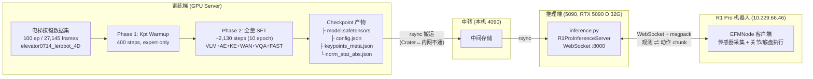
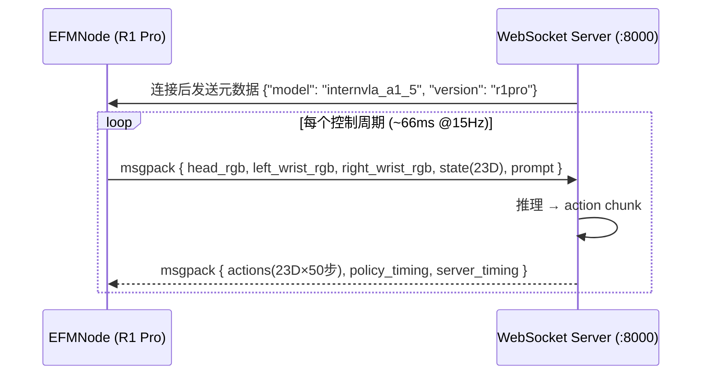
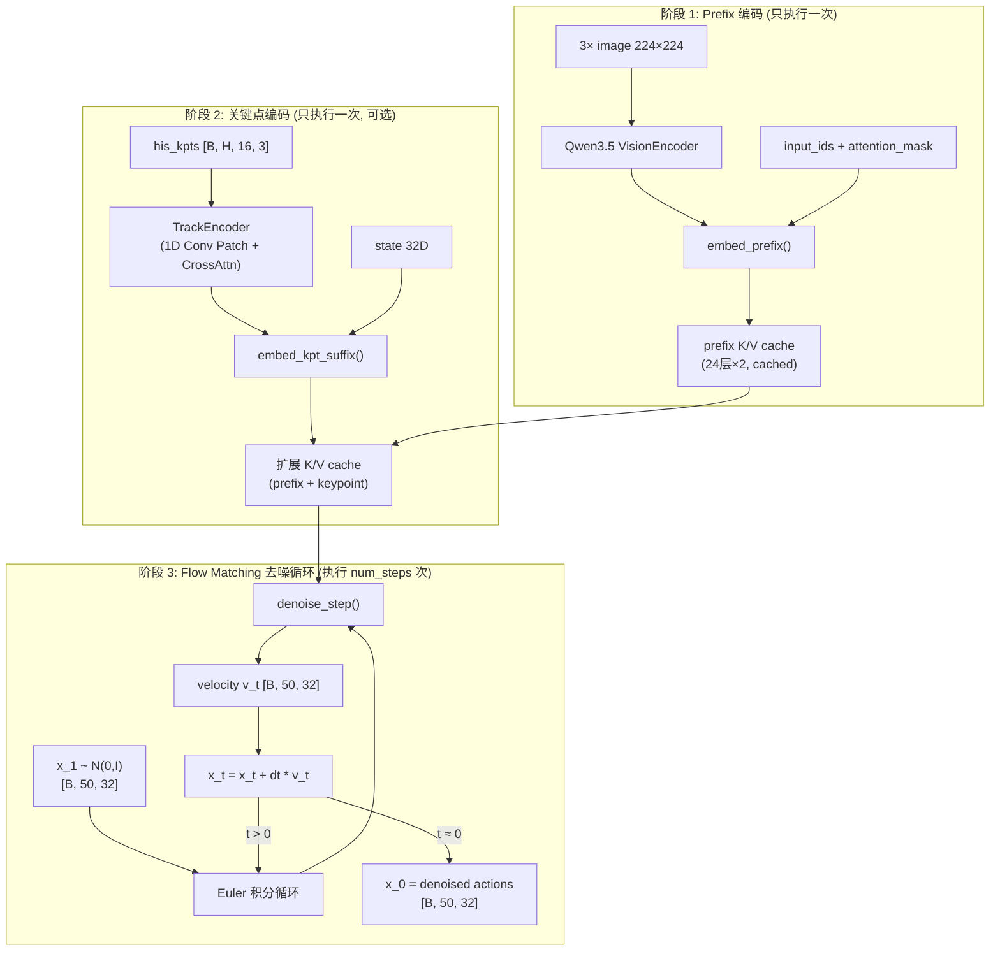

# R1 Pro 电梯按键任务：模型部署与推理深度分析

> **文档定位**：深入分析基于 R1 Pro 机器人按电梯按钮数据集训练出的 InternVLA-A1.5 + GeoPredict 模型，在部署为推理服务后如何控制真实机器人的完整链路。涵盖物理拓扑、代码调用流、数据维度变换、关键点在线提取、Flow Matching 去噪推理等全部细节。
>
> **来源文档**：
> - 迁移设计：[r1pro_migration_design.md](r1pro_migration_design.md) §5.3、§6.3、§7.4
> - 训练方案：[p2sft_plan.md](p2sft_plan.md) §0、§3
> - 代码差异分析：[cod_analyz_1.md](cod_analyz_1.md) §5
> - 推理脚本：[evaluation/R1Pro/inference.py](../../evaluation/R1Pro/inference.py)
> - 模型代码：[modeling_internvla_a1_5.py](../../src/lerobot/policies/internvla_a1_5/modeling_internvla_a1_5.py)
> - FK 提取器：[generate_r1pro_keypoints.py](../../util_scripts/generate_r1pro_keypoints.py)
> - Schema 定义：[r1_pro.yaml](../../src/lerobot/dataset_schemas/configs/r1_pro.yaml)
>
> **撰写日**：2026-09-08

---

## 目录

1. [整体部署架构](#1-整体部署架构)
2. [物理拓扑与通信协议](#2-物理拓扑与通信协议)
3. [推理服务启动流程](#3-推理服务启动流程)
4. [单次推理的完整数据流](#4-单次推理的完整数据流)
5. [状态重映射：EFMNode 23D → 模型 25D](#5-状态重映射efmnode-23d--模型-25d)
6. [输入 Transform Pipeline 详解](#6-输入-transform-pipeline-详解)
7. [GeoPredict 关键点在线提取](#7-geopredict-关键点在线提取)
8. [模型推理：三路径 MoT + Flow Matching](#8-模型推理三路径-mot--flow-matching)
9. [动作后处理：逆重排 → 逆归一化 → EFMNode 分发](#9-动作后处理逆重排--逆归一化--efmnode-分发)
10. [部署安全机制与致命陷阱](#10-部署安全机制与致命陷阱)
11. [电梯按键任务的特殊性](#11-电梯按键任务的特殊性)
12. [参考](#12-参考)

---

## 1. 整体部署架构



训练完成后产出的关键交付件：

| 文件 | 内容 | 推理时用途 |
|:---|:---|:---|
| `model.safetensors` | 模型权重（Qwen3.5 VLM + Action Expert + Keypoint Expert + TrackEncoder + 各投射层） | 加载模型 |
| `config.json` | 模型超参（`enable_keypoint_predictor`、`num_keypoint_joints=16`、`kpt_4d_mode`、`chunk_size=50` 等） | 重建模型结构 |
| `keypoints_meta.json` | `coord_offset`（3D 平移量）、`torso_q=[0,0,0,0]`、体素空间边界 | FK 在线提取必须一致 |
| `norm_stat_abs.json` | state 各字段和 action 的 mean/std 统计量 | 输入归一化 + 输出逆归一化 |

> **为什么推理不在机器人本体上跑**：InternVLA-A1.5 包含 Qwen3.5-2B VLM（24 层）+ Action Expert（24 层）+ 可选 Keypoint Expert（24 层），推理需要大量 GPU 显存和算力。R1 Pro 本体的 Jetson Orin 无法承载。
>
> **为什么需要中转**：训练服务器在 GCP Crater 上（或公司 H200 集群），推理用的 5090 在公司内网，两者之间无法直连（`r1pro_migration_design.md` L886-905）。

---

## 2. 物理拓扑与通信协议

| 角色 | 硬件 | 网络 | 运行什么 |
|:---|:---|:---|:---|
| **推理服务器** | RTX 5090 D 32G | 公司内网 | `evaluation/R1Pro/inference.py` — WebSocket 推理服务 |
| **R1 Pro 机器人** | Jetson Orin（无独立 GPU） | 10.229.66.46 | EFMNode — 传感器采集 + 关节/底盘控制 |

### 2.1 通信协议：openpi bare-dict msgpack

推理服务器与 EFMNode 之间使用 **WebSocket + msgpack** 通信，遵循 openpi 的 "bare-dict" 协议——这是 R1 Pro 的 EFMNode 客户端原生支持的协议。



**代码位置**：`inference.py` L60-82 定义了 msgpack 的序列化/反序列化辅助函数（`_pack_array`、`_unpack_array`），直接内联了 openpi 的 numpy 支持逻辑——numpy 数组被编码为 `{__ndarray__: True, data: bytes, dtype: str, shape: tuple}`。

**服务端安全机制**（`inference.py` L426-473）：

| 机制 | 代码 | 作用 |
|:---|:---|:---|
| 单客户端信号量锁 | `_client_lock = asyncio.Semaphore(1)` (L426) | 防止并发推理，第二个连接被拒绝（close code 1013） |
| 健康检查端点 | `_health_handler` (L457-459) | HTTP `/healthz` 返回 200，用于存活检测 |
| 关键点状态重置 | `kpt_tracker.reset()` (L452-453) | 客户端断连时清空历史关键点缓冲 |

---

## 3. 推理服务启动流程

```bash
# 在 5090 上启动推理服务
python evaluation/R1Pro/inference.py \
    --ckpt-path checkpoints/r1pro_elevator/ \
    --kpt-meta-path checkpoints/r1pro_elevator/keypoints_meta.json \
    --stats-path checkpoints/r1pro_elevator/norm_stat_abs.json \
    --port 8000 \
    --dtype bfloat16 \
    --inference-backend standard
```

启动时 `main()` 函数（`inference.py` L497-556）依次完成以下初始化：

### 3.1 模型加载 (`load_policy`, L165-181)

```python
config = PreTrainedConfig.from_pretrained(ckpt_path)    # 读 config.json，重建 InternVLAA15Config
config.action_loss_only = True                           # 推理不加载 WAN 5B 视频模型
config.inference_backend = "standard"                    # GeoPredict 必须走 standard

policy = policy_cls.from_pretrained(ckpt_path, config=config)  # 加载权重
policy.to(device="cuda", dtype=bfloat16)
policy.eval()
```

**关键决策解析**：

- **`action_loss_only=True`**：跳过加载 WAN 2.2 TI2V-5B（~32G 的冻结视频生成模型）。代码路径见 `modeling_internvla_a1_5.py` L1037-1055——`__init__` 中 `if not config.action_loss_only:` 才会实例化 `WanVideoModel`。WAN 只在训练时提供 foresight 监督信号，推理完全不需要。

- **`inference_backend="standard"`**：如果 checkpoint 启用了 GeoPredict（`enable_keypoint_predictor=True`），**不能**用 `optimized` 后端。优化后端在 `modeling_internvla_a1_5_optimized.py` 中实现，是 action-only 路径，不含 Keypoint Expert（`r1pro_migration_design.md` L439）。

- **模型加载后**：策略对象的类型是 `InternVLAA15Policy`，其内部的 `self.model` 是 `InternVLAA15` 实例。关键子模块结构：
  ```
  InternVLAA15Policy
  └── model: InternVLAA15
      ├── qwen3_5_with_expert: InternVLAA15WithExpertModel
      │   ├── qwen3_5: Qwen3.5-2B VLM (24层 Transformer)
      │   ├── action_expert: 24层 Transformer (dim=1024)
      │   └── keypoint_expert: 24层 Transformer (dim=1024) [可选]
      ├── track_encoder: TrackEncoder (1D Conv patch + CrossAttn)
      ├── action_in_proj: Linear(32 → 1024)
      ├── action_out_proj: Linear(1024 → 32)
      ├── action_time_mlp_in: Linear(2048 → 1024)
      ├── action_time_mlp_out: Linear(1024 → 1024)
      ├── kpt_state_proj: Linear(32 → 1024) [kpt 启用时]
      ├── keypoint_embedding: Embedding(16, 1024) [kpt 启用时]
      ├── keypoint_out_proj: Linear(1024 → 3 或 7) [kpt 启用时]
      └── learnable_tokens: Parameter(50, 1024) [冻结]
  ```

### 3.2 归一化统计量加载 (`load_stats`, L184-219)

从 `stats.json` / `norm_stat_abs.json` 加载 state 各字段和 action 的 mean/std/min/max：

```python
state_stat, action_stat = load_stats(stats_path)
# state_stat: {"observation.state.left_arm": {"mean": [...], "std": [...]}, ...}
# action_stat: {"action": {"mean": [19 floats], "std": [19 floats]}}
```

**逻辑细节**（L190-218）：

1. 如果 JSON 最外层只有一个 key（如 `{"r1_pro": {...}}`），先解一层 nesting（L190-191）。
2. 按 `R1PRO_STATE_FIELDS` 的声明顺序逐字段提取 state 统计量——每个字段有独立的 mean/std/min/max 向量。
3. 对 action 则按 `action.left_arm` / `action.right_arm` / `action.left_gripper` / `action.right_gripper` / `action.chassis.velocities` 的顺序拼接成一个 19D 的统一统计量，存入 `{ACTION: {mean: [19], std: [19]}}`。

### 3.3 输入 Transform Pipeline 构建 (`build_input_transforms`, L222-243)

```python
schema = get_schema("r1_pro")  # 从 r1_pro.yaml 加载 schema
input_transforms = compose([
    ResizeImagesWithPadFn(224, 224, mapping=schema.image_mapping),
    RemapImageKeyTransformFn(mapping=schema.image_mapping),
    NormalizeTransformFn(selected_keys=state_keys, norm_stats=state_stat),
    ComposeFieldsTransform(mapping=schema.feature_mapping),
    InternVLAA15ChatProcessorTransformFn(mode="eval", ...),
    PadStateAndActionTransformFn(max_state_dim=32, max_action_dim=32),
    ReorderStateActionTransform(state_reorder=schema.state_reorder, action_reorder=schema.action_reorder),
])
```

**Schema 加载机制**（`dataset_schemas/__init__.py`）：`get_schema("r1_pro")` 查询全局 `SchemaRegistry` 单例。首次调用时 `_create_default_registry` 扫描 `dataset_schemas/configs/*.yaml` 目录，按 `robot_type` 字段注册。

### 3.4 关键点追踪器初始化 (`R1ProKeypointTracker`, L303-343)

如果 checkpoint 的 `config.enable_keypoint_predictor=True`，初始化在线 FK 追踪器：

```python
kpt_tracker = R1ProKeypointTracker(
    urdf_path="assets/r1_pro_with_gripper.urdf",
    meta_path="checkpoints/.../keypoints_meta.json",
    history_max_len=300   # 从 config.keypoint_history_max_len 读取
)
```

内部初始化（L306-323）：

1. 从 `keypoints_meta.json` 读取训练时的 `coord_offset`（3D 平移量）和 `torso_q`（躯干关节角，必须为 `[0,0,0,0]`）。
2. 加载 `generate_r1pro_keypoints.py` 中的 `R1ProFKExtractor` 类，用 URDF 构建 Pinocchio 运动学模型。
3. 初始化历史关键点环形缓冲 `his_kpts = np.zeros((H, 16, 3))`。

### 3.5 推理服务器组装 (L544-556)

```python
server = R1ProInferenceServer(
    policy=policy,
    input_transforms=input_transforms,
    unnormalize_fn=unnormalize_fn,       # action 逆归一化函数
    config=config,
    device=device, dtype=dtype,
    inverse_action_reorder=inv_reorder,  # action_reorder 的逆映射
    kpt_tracker=kpt_tracker,             # 可选的关键点追踪器
    pad_torso=True,                      # 输出补 torso 零值（19D→23D）
)
asyncio.run(run_server(server, host, port))  # 启动 WebSocket 服务
```

---

## 4. 单次推理的完整数据流

每个控制周期（约 66ms @ 15Hz），EFMNode 发送一帧观测，推理服务器返回一个 action chunk。以下是 `R1ProInferenceServer.predict()` 方法（L367-405）的完整数据流：

```mermaid
flowchart TD
    subgraph input["① EFMNode 发送"]
        OBS["msgpack {<br/>head_rgb: [H,W,3] uint8<br/>left_wrist_rgb: [H,W,3] uint8<br/>right_wrist_rgb: [H,W,3] uint8<br/>state: float32[23]<br/>prompt: 'press elevator up button'}"]
    end

    subgraph remap["② 状态重映射"]
        OBS --> RS["remap_efmnode_state()"]
        RS --> FIELDS["per-field tensors:<br/>left_arm[7], right_arm[7]<br/>left_gripper[1], right_gripper[1]<br/>chassis[9] (3D→9D 零填充)"]
    end

    subgraph sample["③ 构建样本"]
        FIELDS --> BS["build_sample()"]
        BS --> SAMPLE["sample dict:<br/>images × 3 (CHW float)<br/>state fields × 5<br/>action fields × 5 (占位零)<br/>task: prompt string"]
    end

    subgraph xform["④ 输入 Transform Pipeline"]
        SAMPLE --> T1["ResizeImagesWithPadFn → 224×224"]
        T1 --> T2["RemapImageKeyTransformFn → image0/1/2"]
        T2 --> T3["NormalizeTransformFn → state z-score"]
        T3 --> T4["ComposeFieldsTransform → state 25D"]
        T4 --> T5["ChatProcessorTransformFn → VLM tokens"]
        T5 --> T6["PadStateAndActionTransformFn → pad 32D"]
        T6 --> T7["ReorderStateActionTransform → 规范布局"]
    end

    subgraph kpt["⑤ 在线关键点提取 (GeoPredict)"]
        T7 --> FK["R1ProKeypointTracker.update()"]
        FK --> KPT["his_kpts[H, 16, 3]<br/>his_len: int"]
    end

    subgraph model["⑥ 模型推理"]
        KPT --> PAC["policy.predict_action_chunk(batch)"]
        PAC --> ACT["actions [1, 50, 32]"]
    end

    subgraph post["⑦ 动作后处理"]
        ACT --> CROP["截取前 19D"]
        CROP --> INV["inverse_reorder → feature_mapping 顺序"]
        INV --> UNNORM["unnormalize → 物理单位"]
        UNNORM --> REMAP["remap_action_to_efmnode → 23D"]
    end

    subgraph output["⑧ 发送给 EFMNode"]
        REMAP --> RESULT["msgpack {actions: float32[50, 23], timing}"]
    end
```



---

## 5. 状态重映射：EFMNode 23D → 模型 25D

### 5.1 `remap_efmnode_state()` (L112-131)

EFMNode 发送 23D 扁平状态，但模型需要 25D 的 per-field 张量（去掉 torso 4D，chassis 从 3D 零填充到 9D）：

```
EFMNode 23D:
  [0:7]   left_arm (7个关节角, rad)
  [7:14]  right_arm (7个关节角, rad)
  [14:15] left_gripper (1, 开合量)
  [15:16] right_gripper (1, 开合量)
  [16:20] torso (4) ──── 丢弃！VLA 不控制，数据集中全零
  [20:23] chassis (3) ── 零填充到 9D
```

**chassis 零填充逻辑**（L121-123）：

```python
chassis_3d = s[20:23]                          # EFMNode 发来的 3D 底盘数据
chassis_9d = np.zeros(9, dtype=np.float32)
chassis_9d[:3] = chassis_3d                    # 填入前 3 维，后 6 维保持零
```

> **底盘 9D 的含义**（`cod_analyz_1.md` §4.4）：`[0:3]` 累积转角（rad）、`[3:6]` 线速度（m/s）、`[6:9]` 角速度（rad/s）。EFMNode 只发 3 维（取决于其发送的是累积转角还是速度），后 6 维零填充。电梯按键任务中底盘完全静止，这 9 维全部接近零。

**输出**：5 个独立 tensor 的 dict，key 与 `r1_pro.yaml` 的 `feature_mapping.observation.state` 一致：

```python
{
    "observation.state.left_arm":      torch.float32[7],
    "observation.state.right_arm":     torch.float32[7],
    "observation.state.left_gripper":  torch.float32[1],
    "observation.state.right_gripper": torch.float32[1],
    "observation.state.chassis":       torch.float32[9],
}
```

### 5.2 `build_sample()` (L251-280)

组装完整的样本 dict：

1. **状态字段**：直接使用 `remap_efmnode_state()` 的输出。
2. **动作字段**：填入 `torch.zeros(50, dim)` 占位（推理时不用，但 transform pipeline 需要完整 key 集合）。
3. **图像**：从 `obs_dict` 读取 3 路图像，做 uint8→float32 归一化（÷255），HWC→CHW 转置。

**图像 key 映射**（L265-269）：

```python
IMAGE_MAP = {
    "head_rgb":       "observation.images.head_rgb",       # EFMNode 发送 key
    "left_wrist_rgb": "observation.images.wrist_left_rgb",
    "right_wrist_rgb":"observation.images.wrist_right_rgb",
}
```

4. **任务指令**：`sample["task"] = obs_dict.get("prompt", "")`，如 `"press elevator up button"`。

---

## 6. 输入 Transform Pipeline 详解

Transform pipeline 严格按训练时相同的顺序和参数执行，保证推理输入与训练分布一致。以下是七步 transform 的逐步解析：

### Step 1: `ResizeImagesWithPadFn` → 224×224

所有 3 路图像 resize 到 224×224（保持宽高比，短边缩放到 224，长边居中裁剪或 pad）。`mapping=schema.image_mapping` 指明哪些 key 是图像。

### Step 2: `RemapImageKeyTransformFn` → image0/1/2

按 `r1_pro.yaml` 的 `image_mapping` 重命名 key：

```
observation.images.head_rgb        → observation.images.image0
observation.images.wrist_left_rgb  → observation.images.image1
observation.images.wrist_right_rgb → observation.images.image2
```

模型固定读 `image0/1/2`，不能扩到 4 路——`InternVLAA15ChatProcessorTransformFn.num_views` 硬编码为 3（`transform_internvla_a1_5.py` L69）。

### Step 3: `NormalizeTransformFn` → state z-score 归一化

对 state 各字段做 z-score 归一化：$x_{\text{norm}} = \frac{x - \mu}{\sigma + \epsilon}$，其中 $\mu$ 和 $\sigma$ 来自训练时计算的 `norm_stat_abs.json`。

**注意**：只归一化 state，**不归一化关键点**。关键点直接以体素坐标（米）喂给 TrackEncoder，与 GeoPredict 预训练一致（`r1pro_migration_design.md` L714）。

### Step 4: `ComposeFieldsTransform` → state 25D, action 19D

按 `r1_pro.yaml` 的 `feature_mapping` 将 per-field tensor 拼接成扁平向量：

```
observation.state = concat(left_arm[7], right_arm[7], left_gripper[1], right_gripper[1], chassis[9])
                  = float32[25]

action = concat(left_arm[7], right_arm[7], left_gripper[1], right_gripper[1], chassis_vel[3])
       = float32[50, 19]  (chunk_size=50)
```

**拼接顺序就是 YAML 中 feature_mapping 下各条目的声明顺序**，这个顺序是 "src 布局"，后续 reorder 会把它变成模型期望的 "规范布局"。

### Step 5: `InternVLAA15ChatProcessorTransformFn` (mode="eval")

构建 VLM 的输入 token 序列。eval 模式下（`transform_internvla_a1_5.py` L140-142）：

1. **用户文本格式**：`"Task: {task}; Control Mode: <joint>; State: 0 128 55 ...; Output: <Subtask, Action>"`
   - `action_mode` 从 schema 中读取，R1 Pro 是 `"joint"`
   - State 被离散化：除以 3，数字化到 [0, 255] 的 256 个 bin 中
2. **chat template**：用 Qwen3.5 的 chat template 包装成对话格式，`add_generation_prompt=True`
3. **图像 token 化**：3 路 224×224 图像经 Qwen3.5 VisionEncoder 处理后的 patch 数量由 `image_grid_thw` 记录

**输出新增 key**：`observation.pixel_values`、`observation.input_ids`、`observation.attention_mask`、`observation.image_grid_thw`、`observation.fast_token_mask`（eval 时全零）。

### Step 6: `PadStateAndActionTransformFn` → pad 到 32D

将 state 25D 零填充到 `max_state_dim=32`，action 19D 零填充到 `max_action_dim=32`。模型的投射层（`action_in_proj`、`action_out_proj`）固定按 32D 设计。

### Step 7: `ReorderStateActionTransform` → 规范布局

按 `r1_pro.yaml` 的 `action_reorder` / `state_reorder` 将 feature_mapping 拼接顺序重排为模型期望的规范布局：

```
src (feature_mapping 顺序):      dst (规范布局):
  left_arm[0:7]                →   left_arm[0:7]     (不动)
  right_arm[7:14]              →   right_arm[8:15]   (后移一槽)
  left_gripper[14:15]          →   left_gripper[7:8] (前移到左臂后)
  right_gripper[15:16]         →   right_gripper[15:16] (不动)
  chassis[16:19/25]            →   chassis[16:19/25]  (不动)
```

规范布局：`[左臂7 | 左夹爪1 | 右臂7 | 右夹爪1 | 底盘]`——这与 ALOHA 的 `[左臂6 | 0 | 左夹爪1 | 右臂6 | 0 | 右夹爪1]` 同构，R1 Pro 7 DOF 臂恰好把两个空槽填满。

---

## 7. GeoPredict 关键点在线提取

### 7.1 为什么关键点必须在线算

> **关键点必须在线算，模型不会自己"猜"。** `predict_action_chunk` 只返回 action，`keypoint_out_proj` 的预测结果**仅在训练 loss 中使用**，推理路径完全不消费（`modeling_internvla_a1_5.py` L1629-1632）。
>
> —— `r1pro_migration_design.md` §5.3 要点 1

Keypoint Expert 的推理输入 `his_kpts` 必须从外部提供（而非模型自己预测），因为 Keypoint Expert 的预测输出 `keypoint_out_proj(kpt_query_out)` 在推理路径中**完全不被消费**——它只在训练的 loss 计算中使用（计算预测关键点与 GT 的 MSE）。推理时，Keypoint Expert 的价值在于它的 K/V cache 被 Action Expert 通过 cross-attention 消费，提供 3D 几何先验。

### 7.2 `R1ProKeypointTracker` 的工作原理

**初始化**（L306-323）：

```python
class R1ProKeypointTracker:
    def __init__(self, urdf_path, meta_path, history_max_len=300):
        meta = json.load(open(meta_path))
        self.coord_offset = np.asarray(meta["coord_offset"])  # 训练时的 3D 平移量
        torso_q = tuple(meta["torso_q"])                      # 必须是 [0,0,0,0]

        self.fk = R1ProFKExtractor(urdf_path, torso_q=torso_q)  # Pinocchio FK 引擎
        self.his_kpts = np.zeros((H, 16, 3), dtype=np.float32)  # 环形缓冲
        self.his_len = 0
```

**逐帧更新** `update()` (L325-334)：

```python
def update(self, left_arm, right_arm):
    # 1. FK: 关节角 → 16 个 3D 关键点 (base_link 相对坐标)
    kpt_base = self.fk.compute(left_arm, right_arm)   # [16, 3]

    # 2. 平移到体素坐标
    kpt_voxel = (kpt_base - self.coord_offset).astype(np.float32)

    # 3. 推入环形缓冲
    if self.his_len < self.H:
        self.his_kpts[self.his_len] = kpt_voxel
    else:
        self.his_kpts[:-1] = self.his_kpts[1:]
        self.his_kpts[-1] = kpt_voxel
    self.his_len = min(self.his_len + 1, self.H)
```

**关键点注入 batch** (L374-379 在 `predict` 方法中)：

```python
if self.use_kpt:
    raw_state = np.asarray(obs_dict["state"], dtype=np.float32)
    self.kpt_tracker.update(raw_state[0:7], raw_state[7:14])  # 左臂、右臂关节角
    his_kpts, his_len = self.kpt_tracker.get_tensors(self.device, self.dtype)
    batch["observation.his_kpts"] = his_kpts   # [1, H, 16, 3]
    batch["observation.his_len"] = his_len      # [1]
```

### 7.3 `R1ProFKExtractor.compute()` 的内部逻辑

`generate_r1pro_keypoints.py` L94-157 定义了 FK 引擎：

```python
class R1ProFKExtractor:
    def __init__(self, urdf_path, torso_q=(0,0,0,0)):
        model = pin.buildModelFromUrdf(urdf_path)  # 固定基座模型，根 = base_link
        data = model.createData()

        # 按关节名逐个取 idx_q——不能假设 q 是扁平拼接的！
        # 因为 3 个车轮是 continuous 关节，Pinocchio 用 (cos,sin) 两个数表示，
        # nq=31 而 nv=28，按扁平顺序拼会导致所有关节角错位
        for jname in joints_list:
            idx_list.append(model.joints[model.getJointId(jname)].idx_q)

        # 躯干角 bake 进 q_base，每帧不再重写
        self._q_base = pin.neutral(model)  # 车轮初始化为合法的 (1, 0)
        for idx_q, angle in zip(self._torso_idx_q, torso_q):
            self._q_base[idx_q] = float(angle)

    def compute(self, left_arm, right_arm):
        q = self._q_base.copy()
        for idx_q, angle in zip(self._left_idx_q, left_arm):
            q[idx_q] = float(angle)
        for idx_q, angle in zip(self._right_idx_q, right_arm):
            q[idx_q] = float(angle)

        pin.forwardKinematics(self.model, self.data, q)
        pin.updateFramePlacements(self.model, self.data)  # 必须调用才能读 oMf

        keypoints = np.empty((16, 3), dtype=np.float32)
        for i, fid in enumerate(self.frame_ids):
            keypoints[i] = self.data.oMf[fid].translation  # 就地赋值 = 拷贝
        return keypoints  # base_link 相对坐标
```

**16 个关键点**（每臂 7 link + 1 TCP）：

```
左臂 (indices 0-7):                    右臂 (indices 8-15):
  0: left_arm_link1                      8:  right_arm_link1
  1: left_arm_link2                      9:  right_arm_link2
  2: left_arm_link3                      10: right_arm_link3
  3: left_arm_link4                      11: right_arm_link4
  4: left_arm_link5                      12: right_arm_link5
  5: left_arm_link6                      13: right_arm_link6
  6: left_arm_link7                      14: right_arm_link7
  7: left_gripper_link (TCP)             15: right_gripper_link (TCP)
```

**坐标变换**：FK 输出 `oMf[fid].translation` 已经是 base_link 相对坐标（URDF 根连杆就是 base_link），不需要"世界→base"变换。唯一要做的是减去 `coord_offset` 平移到体素空间：

$$\mathbf{p}_{\text{voxel}} = \mathbf{p}_{\text{base}} - \mathbf{o}, \quad \mathbf{o} = \frac{\mathbf{p}_{\min} + \mathbf{p}_{\max}}{2} - \begin{bmatrix}0.8\\0.8\\0.5\end{bmatrix}$$

---

## 8. 模型推理：三路径 MoT + Flow Matching

### 8.1 推理入口：`predict_action_chunk` (L2286-2309)

```python
@torch.no_grad()
def predict_action_chunk(self, batch):
    self.eval()
    pixel_values = batch["observation.pixel_values"]
    image_grid_thw = batch["observation.image_grid_thw"]
    lang_tokens = batch["observation.input_ids"]
    lang_masks = batch["observation.attention_mask"]
    state = self.prepare_state(batch)  # pad 到 32D

    kpt_kwargs = {}
    if self.config.enable_keypoint_predictor:
        kpt_kwargs = {
            "his_kpts": batch["observation.his_kpts"],
            "his_len": batch["observation.his_len"],
        }

    actions = self.model.sample_actions(
        pixel_values, image_grid_thw, lang_tokens, lang_masks, state,
        **kpt_kwargs,
    )
    return actions[:, :, :original_action_dim]  # 截取前 19D（去 padding 的 32→19）
```

### 8.2 `sample_actions` 完整流程 (L1285-1408)

这是推理的核心方法，实现了 Flow Matching 的 ODE 求解：



**详细步骤**：

**Step 1 — Prefix K/V Cache** (L1313-1331):

```python
# 1. 编码 VLM prefix：图像 + 语言 token
prefix_embs, prefix_pad_masks, prefix_att_masks = self.embed_prefix(
    pixel_values, image_grid_thw, lang_tokens, lang_masks
)
# 2. 前向传播 VLM，缓存 K/V（只做一次，后续 denoise 步复用）
_, past_key_values = self.qwen3_5_with_expert.forward(
    inputs_embeds=[prefix_embs, None],  # [VLM 输入, Action Expert 无输入]
    use_cache=True,                      # 缓存 K/V
)
```

`embed_prefix` 方法（L1201-1226）的逻辑：
1. `pixel_values` 经 `qwen3_5.visual()` 得到图像 embedding
2. `lang_tokens` 经 `get_input_embeddings()` 得到文本 embedding
3. 在 `image_token_id` 位置注入图像 embedding
4. 返回完整的 prefix embedding 序列

**Step 2 — Keypoint K/V 扩展** (L1344-1370, 仅 GeoPredict 启用时):

```python
if self.config.enable_keypoint_predictor:
    kpt_embs, kpt_pad_masks, kpt_att_masks = self.embed_kpt_suffix(state, his_kpts, his_len)
    # Keypoint Expert 前向，扩展 K/V cache
    _, past_key_values = self.qwen3_5_with_expert.forward(
        inputs_embeds=[None, kpt_embs, None],  # [VLM 无, KptExpert 输入, ActionExpert 无]
        past_key_values=past_key_values,        # 接上 prefix 的 cache
        use_cache=True,
    )
```

`embed_kpt_suffix` 方法（L1572-1627）构建 Keypoint Expert 的输入序列 `[B, 1+2J, D]`：
- 1 个 state token：`kpt_state_proj(state)` 投射 32D→1024D
- J 个 history track tokens：`TrackEncoder(his_kpts, his_len)` 编码历史轨迹
- J 个 query tokens：`keypoint_embedding.weight`（可学习的 per-joint 查询向量）

对于 R1 Pro 的 J=16，suffix 长度为 1+32=33 个 token。

**Step 3 — Flow Matching Euler 积分** (L1372-1408):

```python
dt = -1.0 / num_steps    # 从 t=1.0 积分到 t=0.0
x_t = noise               # [B, 50, 32]，标准高斯噪声
time = 1.0

while time >= -dt / 2:
    v_t = self.denoise_step(
        state, kpt_prefix_pad_masks, past_key_values,
        max_prefix_position_ids, x_t, time,
        use_kpt=True,  # 3-path MoT
    )
    x_t = x_t + dt * v_t   # Euler 步进
    time += dt              # 时间从 1.0 递减到 0.0
```

Flow Matching 的物理直觉：$x_1 \sim \mathcal{N}(0, I)$ 是纯噪声，$x_0$ 是真实 action。模型学到的是速度场 $v_t = \frac{dx}{dt}$，推理时从 $t=1$ 沿速度场积分到 $t=0$，每一步让 $x_t$ 朝着"像真实 action 的方向"前进。

### 8.3 `denoise_step` 的内部逻辑 (L1410-1475)

每个去噪步的核心操作：

```python
def denoise_step(self, state, prefix_pad_masks, past_key_values,
                 max_prefix_position_ids, x_t, timestep, fast_mask, use_kpt):
    # 1. 构建 Action Expert suffix: [state(1)] [learnable(50)] [action_time(50)]
    suffix_embs, suffix_pad_masks, suffix_att_masks = self.embed_suffix(state, x_t, timestep)

    # 2. 构建注意力掩码：suffix 可以 attend to 已缓存的 prefix (+kpt) K/V
    full_att_2d_masks = cat([prefix_pad_2d, suffix_att_2d], dim=2)

    # 3. 前向传播 Action Expert（不更新 cache，每步重新计算 suffix 部分）
    if use_kpt:
        outputs_embeds, _ = self.qwen3_5_with_expert.forward(
            inputs_embeds=[None, None, suffix_embs],  # 只有 Action Expert 路径
            past_key_values=past_key_values,            # 读取 prefix+kpt 的 cache
            use_cache=False,
        )
        suffix_out = outputs_embeds[2]  # Action Expert 的输出
    else:
        outputs_embeds, _ = self.qwen3_5_with_expert.forward(
            inputs_embeds=[None, suffix_embs],
            past_key_values=past_key_values,
            use_cache=False,
        )
        suffix_out = outputs_embeds[1]

    # 4. 取最后 chunk_size 个 token → 投射到动作空间
    suffix_out = suffix_out[:, -chunk_size:]        # [B, 50, 1024]
    return self.action_out_proj(suffix_out)          # [B, 50, 32] 即速度 v_t
```

`embed_suffix` 方法（L1512-1570）构建 Action Expert 的输入序列 `[state(1)] [learnable(N)] [action_time(50)]`：

- **state token**（1 个）：如果 `tokenize_state=True`，state 已经在 ChatProcessor 中被编码到 lang_tokens 里了，不再额外加；否则用 `state_proj` 投射。
- **learnable tokens**（50 个）：`learnable_tokens_in_proj(self.learnable_tokens)` 投射 50 个可学习 token（推理时冻结）。
- **action_time tokens**（50 个）：将噪声动作 `x_t` 经 `action_in_proj` 投射到 1024D，与时间步 `timestep` 的正弦位置编码拼接成 2048D，再经 MLP（`action_time_mlp_in` → SiLU → `action_time_mlp_out`）压回 1024D。

### 8.4 三路径 MoT 的 Attention 结构

推理时三条路径的 Attention 关系（2-path 或 3-path 取决于是否启用关键点）：

```
                   ┌──────────────────────────────────────────────────┐
                   │ Path 0: VLM (Qwen3.5-2B, 24层)                  │
                   │  输入: 图像 token + 语言 token (prefix)          │
                   │  输出: K/V cached                                │
                   └──────────────────────────────────────────────────┘
                        │ K/V (一次性前向)
                        ↓
          ┌──────────────────────────┐      (可选)
          │ Path 1: Keypoint Expert   │
          │  输入: state + track(16)  │
          │       + query(16)         │
          │  Attend to: prefix K/V    │
          │  输出: K/V 追加到 cache    │
          └──────────────────────────┘
                        │ K/V (一次性前向)
                        ↓
          ┌──────────────────────────────────────────────┐
          │ Path 2: Action Expert (每个 denoise step)     │
          │  输入: state + learnable(50) + action_time(50)│
          │  Attend to: prefix(+kpt) K/V cache           │
          │  输出: velocity v_t [B, 50, 32]               │
          └──────────────────────────────────────────────┘
```

**关键性能特征**：
- VLM 和 Keypoint Expert 只前向一次，结果 cache 住
- Action Expert 在每个 denoise step 重新前向（通常 10-20 步），但只处理 suffix tokens（~101 个），不重新处理 prefix（通常 ~1000+ 个 token），所以很快
- 推理延迟主要来自 `num_inference_steps × Action Expert forward`

---

## 9. 动作后处理：逆重排 → 逆归一化 → EFMNode 分发

### 9.1 截取有效维度

`predict_action_chunk` 返回 `[1, 50, 32]`，只有前 `original_action_dim=19` 维有意义，后 13 维是 padding 零。

### 9.2 逆重排 (`_reverse_reorder`, L407-418)

推理脚本在启动时预计算了 `action_reorder` 的逆映射 (`compute_inverse_reorder`, L153-157)：

```python
def compute_inverse_reorder(forward_spec):
    # 交换 src/dst
    return [[dst_s, dst_e, src_s, src_e] for src_s, src_e, dst_s, dst_e in forward_spec]
```

逆重排将模型输出的规范布局 `[左臂7|左夹爪1|右臂7|右夹爪1|底盘3]` 还原为 feature_mapping 拼接顺序 `[左臂7|右臂7|左夹爪1|右夹爪1|底盘3]`：

```python
def _reverse_reorder(self, canonical_actions):
    output = torch.zeros_like(canonical_actions)
    for src_s, src_e, dst_s, dst_e in self.inverse_action_reorder:
        output[..., dst_s:dst_e] = canonical_actions[..., src_s:src_e]
    return output[..., :19]  # 截取 19D
```

### 9.3 逆归一化 (`UnNormalizeTransformFn`)

将 z-score 空间的 action 恢复到物理单位：$x = x_{\text{norm}} \times \sigma + \mu$

```python
action_pred = self.unnormalize_fn({ACTION: action_pred})[ACTION]
```

### 9.4 EFMNode 格式转换 (`remap_action_to_efmnode`, L134-150)

模型输出 19D → 插入 4 个 torso 零值 → 输出 23D：

```python
def remap_action_to_efmnode(action, pad_torso=True):
    out = np.zeros((..., 23), dtype=action.dtype)
    out[..., 0:16]  = action[..., 0:16]   # 手臂+夹爪 (16D)
    # out[..., 16:20] = 0                   # torso (4D, 全零，隐式)
    out[..., 20:23] = action[..., 16:19]   # 底盘速度 (3D)
    return out
```

### 9.5 EFMNode 执行

EFMNode 收到 `actions[50, 23]` 后：
- `actions[..., 0:16]`：手臂+夹爪 → 关节位置控制 ROS 话题
- `actions[..., 16:20]`：torso → 忽略（全零）
- `actions[..., 20:23]`：底盘速度 → `/motion_target/target_speed_chassis` ROS 话题

**底盘和手臂走不同的 ROS 话题**，逆映射写错（比如把底盘速度当关节角发出去）会直接导致机器人乱动。

---

## 10. 部署安全机制与致命陷阱

### 10.1 四个必须遵守的部署约定

来源：`r1pro_migration_design.md` §5.3

| # | 约定 | 违反后果 | 防护手段 |
|:---:|:---|:---|:---|
| 1 | **关键点必须在线 FK 算** | Keypoint Expert 瞎了一路，几何先验丢失 | 启动时验证 `kpt_tracker` 初始化成功 |
| 2 | **`coord_offset` 和 `torso_q` 必须与训练一致** | 关键点整体平移，不报错，静默失效 | 从 `keypoints_meta.json` 读取，不手动填 |
| 3 | **`inference_backend` 必须是 `standard`** | 优化后端无 Keypoint Expert | 启动时检查 config 一致性 |
| 4 | **底盘 3 维单独拆出去发** | 底盘速度当关节角 → 机器人乱动 | 先在底盘急停状态下冒烟测试 |

### 10.2 `torso_q` 陷阱的深层原因

> **危险场景比想象中更可能发生，而且它在端侧。** 部署时机器人的躯干编码器**读得到真值**，任何工程师看到 FK 需要一个 `torso_q` 参数，最自然的动作就是把编码器读数传进去——这不是"有人乱改"，而是默认的正确直觉。
>
> —— `r1pro_migration_design.md` 风险 9b 详解

离线提取时 offset 是当场从数据算出来的，平移被自动吸收；端侧推理不重算 offset，而是从 `keypoints_meta.json` 读固定值。一个 21 cm 的平移原封不动地打在模型输入上，而模型期望的精度是毫米级。

**解决方案**：`generate_r1pro_keypoints.py` 把 `torso_q` 写进 `keypoints_meta.json` 并附 `torso_q_note: "Do not read from encoder"`。推理脚本从该文件读回 `torso_q` 传给 FK 引擎（`inference.py` L310-311）。

### 10.3 推理延迟预算

控制频率 15 Hz → 每个周期 66.7 ms。延迟来源：

| 阶段 | 大致耗时 | 说明 |
|:---|:---|:---|
| 状态重映射 + 图像预处理 | < 1 ms | numpy 操作 |
| Transform pipeline | ~2-5 ms | 主要是 ChatProcessor tokenization |
| FK 关键点提取 | < 0.1 ms | Pinocchio FK ~34k frames/s |
| VLM + Keypoint prefix 前向 | ~15-25 ms | 只执行一次（首帧），后续复用 cache |
| Flow Matching 去噪循环 | ~30-50 ms | `num_steps` × Action Expert forward |
| 动作后处理 | < 1 ms | 逆重排 + 逆归一化 |
| **总计** | **~50-80 ms** | 首帧更长（含 prefix），后续约 35-55 ms |

> **注意**：启用 GeoPredict（标准后端）时推理延迟天然高于不启用（优化后端）。这是因为标准后端多了 Keypoint Expert 的前向和 K/V cache 扩展。A/B 对比时要说明这一点。

---

## 11. 电梯按键任务的特殊性

与开门任务（R1 Pro 的另一个目标任务）相比，电梯按键任务在部署推理方面有显著差异：

| 维度 | 开门任务 | 电梯按键任务 |
|:---|:---|:---|
| 底盘运动 | 需要移动接近门 | **完全静止** |
| 数据集 | `open0630_mj_clean`, 365 ep, ~383k frames | `elevator0714_lerobot_4D`, 100 ep, 27k frames |
| Action 中 chassis 部分 | 非零速度指令（VLA 控制底盘） | 全零（底盘不动，但维度保留） |
| GeoPredict 有效帧占比 | 部分（底盘段无效，手臂不动 ⇒ 关键点不变） | **100%**（全程手臂操作） |
| 关键点维度 | 3D (pos_only) | **7D (pos_rot)**，E1 方案 |
| 推理时底盘分发 | 必须正确分发到底盘话题 | 底盘指令全零，分发错也不影响（但仍应正确处理） |

**底盘完全静止的影响**：

1. **GeoPredict 效果更纯净**：没有底盘段稀释效应，每一帧都是手臂操作帧，关键点全程在变化，理论上 GeoPredict 能提供更充分的几何先验。
2. **底盘维度退化但保留**：chassis action 全零但仍保留在 19D action 中（3 维），维持与门开任务的代码一致性。归一化不会出问题（std ≈ 0 时 `(x - mean) / (std + eps)` 结果恒为 0，eps 兜底）。

**E1 7D 关键点方案**（`p2sft_plan.md` §0）：

电梯按键数据集使用了 E1 方案——每个关键点 7D（位置 3 + 四元数 4），总共 `observation.keypoint_3d` shape=[112]（16 × 7）。推理时需要对应的代码改动：

- `config.kpt_4d_mode = "pos_rot"` → `keypoint_track_input_dim = 7`
- `TrackEncoder(input_dim=7)` 接收 7D 关键点
- `keypoint_out_proj = Linear(1024, 7)` 输出 7D 预测
- FK 引擎的 `compute()` 仍输出 `[16, 3]`（仅位置），**方向信息需要在线从 `oMf[fid]` 的旋转矩阵中提取四元数**

> **注意**：当前 `R1ProKeypointTracker` 的 `his_kpts` 初始化为 `[H, 16, 3]`，即仅 3D 位置。如果训练用了 7D 关键点（`kpt_4d_mode=pos_rot`），推理脚本需要对应修改为 `[H, 16, 7]`，且 FK 引擎的 `compute()` 方法需要额外提取每个连杆的四元数方向。这个改动在 `p2sft_plan.md` §3 中有详细规格。

---

## 12. 参考

| 来源 | 内容 |
|:---|:---|
| `r1pro_migration_design.md` §5.3 | 推理路径设计与 4 个部署要点 |
| `r1pro_migration_design.md` §6.3 | `r1_pro.yaml` schema 设计（reorder、feature_mapping） |
| `r1pro_migration_design.md` §7.4 | 推理部署操作步骤（rsync 中转 + 启动命令） |
| `r1pro_migration_design.md` 风险 9b/9e | `torso_q` 约定的完整数学证明与端侧风险分析 |
| `p2sft_plan.md` §0 | 电梯按键数据集特征（100 ep / 27k frames / E1 7D） |
| `p2sft_plan.md` §3 | E1 7D 关键点的代码改动规格 |
| `cod_analyz_1.md` §5 | 推理服务器架构与通信协议分析 |
| `cod_analyz_1.md` §4.4 | 底盘 9D state 的详细物理含义 |
| `evaluation/R1Pro/inference.py` | 推理服务器完整实现（561 行） |
| `modeling_internvla_a1_5.py` L1285-1475 | `sample_actions` + `denoise_step` 推理核心 |
| `modeling_internvla_a1_5.py` L1572-1627 | `embed_kpt_suffix` 关键点 suffix 构建 |
| `modeling_internvla_a1_5.py` L1512-1570 | `embed_suffix` action suffix 构建 |
| `modeling_internvla_a1_5.py` L1201-1226 | `embed_prefix` VLM prefix 编码 |
| `modeling_internvla_a1_5.py` L985-1070 | 模型 `__init__` 子模块构建与初始化 |
| `generate_r1pro_keypoints.py` L94-157 | `R1ProFKExtractor` FK 引擎 |
| `keypoints.py` L246-315 | `TrackEncoder` 历史关键点编码器 |
| `r1_pro.yaml` | R1 Pro 数据集 schema 定义 |
| `EFMNode_chassis/r1pro_vla_readme/` | R1 Pro 部署指南（EFMNode 客户端） |
