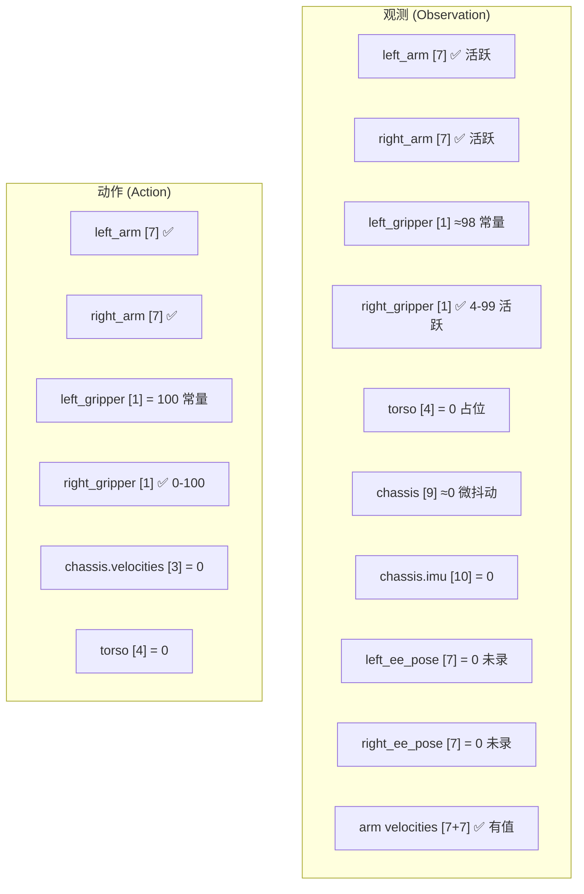
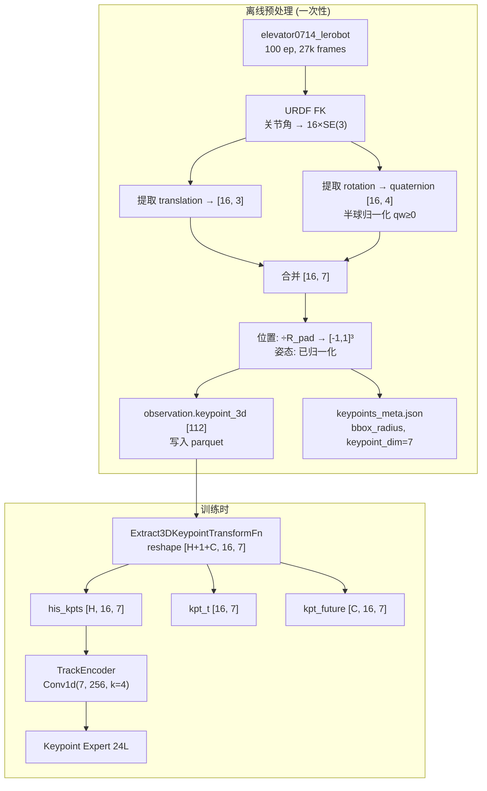
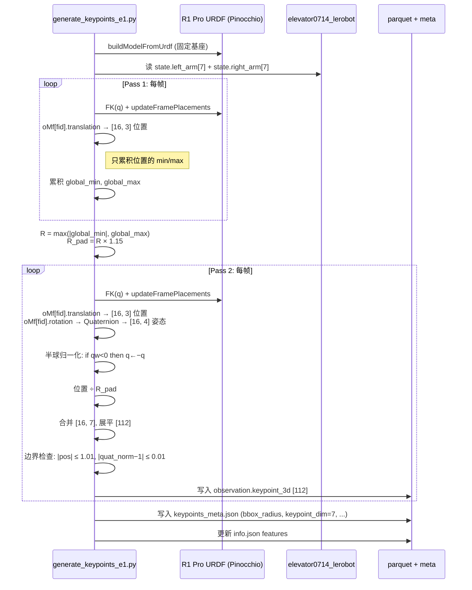
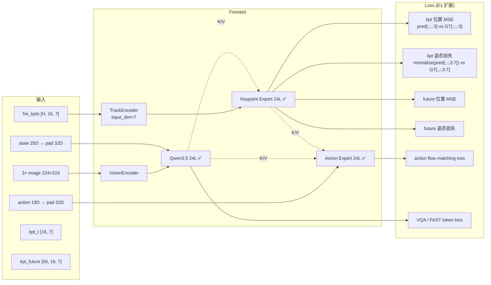
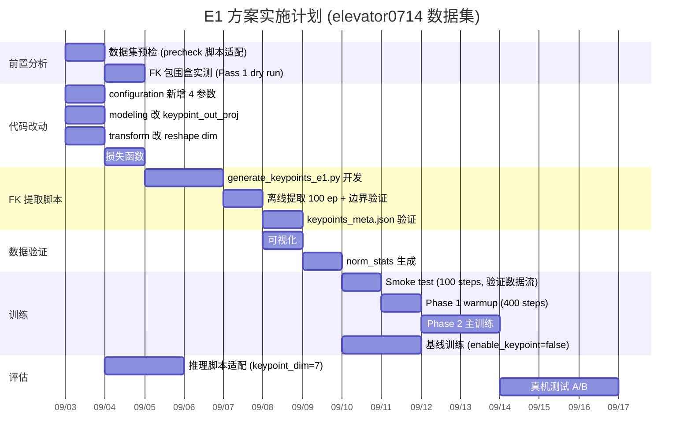

# 方案 E1: R1 Pro 3D 关键点轨迹生成 — 位置 + 姿态 (Position + Orientation)

> **目标**: 在 cod_analyz_1.md 方案 E（以 base_link 为原点的等尺度立方包围盒归一化）基础上, 将关键点表示从仅含 3D 位置扩展为 **7D = 3D 位置 + 4D 四元数姿态**, 为 R1 Pro 按电梯按钮任务 (`elevator0714_lerobot`) 生成更丰富的 3D 关键点轨迹, 供 GeoPredict 使用.
>
> **目标数据集**: `/home/luogang/DATA/elevator0714_lerobot` (100 episodes / 27,145 frames / 15 fps)
>
> **与方案 E 的关系**: E1 完全继承 E 的位置归一化策略（等尺度除以 $R_{\text{pad}}$）, 并额外引入经过半球归一化的单位四元数作为每个关键点的姿态分量.
>
> **撰写日**: 2026-09-03
>
> **参考文档**:
> - `b/d/R1Pro/r1pro_migration_design.md` — 迁移设计总文档（开门任务 open0630_mj_clean）
> - `b/d/R1Pro/cod_analyz_1.md` — IVGP vs IVGPR1pro 深度差异分析, 含方案 A-E
> - `util_scripts/generate_r1pro_keypoints.py` — 现有 FK 关键点离线生成脚本
> - `util_scripts/verify_fk_r1pro.py` — FK 验证脚本
> - `src/lerobot/dataset_schemas/configs/r1_pro.yaml` — R1 Pro 数据 schema
> - Zhou et al., "On the Continuity of Rotation Representations in Neural Networks", CVPR 2019

---

## 目录

1. [动机与背景](#1-动机与背景)
2. [elevator0714 数据集深度分析](#2-elevator0714-数据集深度分析)
3. [旋转表示方案选型](#3-旋转表示方案选型)
4. [E1 方案核心设计](#4-e1-方案核心设计)
5. [归一化策略](#5-归一化策略)
6. [FK 提取: 从 translation-only 到 translation + rotation](#6-fk-提取-从-translation-only-到-translation--rotation)
7. [模型侧适配](#7-模型侧适配)
8. [损失函数设计](#8-损失函数设计)
9. [静态架构](#9-静态架构)
10. [动态架构](#10-动态架构)
11. [与方案 E 的完整对比](#11-与方案-e-的完整对比)
12. [风险与缓解](#12-风险与缓解)
13. [实施路径](#13-实施路径)

---

## 1. 动机与背景

### 1.1 方案 E 的局限: 位置丢弃了一半运动学信息

方案 E（cod_analyz_1.md §方案 E）对每个关键点只提取 FK 输出的 **平移分量** (translation), 即 `data.oMf[fid].translation`, 得到一个 $\mathbb{R}^3$ 的 3D 坐标. 这告诉模型"这个连杆**在哪**", 但丢弃了"这个连杆**朝哪**" — 即旋转矩阵 `data.oMf[fid].rotation` $\in SO(3)$.

Pinocchio 的 FK 输出是完整的 $SE(3)$ 位姿:

$$M = \begin{bmatrix} R & t \\ 0^T & 1 \end{bmatrix}, \quad R \in SO(3),\ t \in \mathbb{R}^3$$

方案 E 只取了 $t$, 而 E1 同时取 $R$ 和 $t$.

### 1.2 为什么姿态信息对按电梯按钮任务特别有价值

电梯按钮按压任务的关键特征:

| 特征 | 与姿态的关系 |
|------|------------|
| **按压方向精确** | 手指必须垂直于按钮面才能可靠按下; 位置差几毫米可以偏移修正, 角度差几度则按不中 |
| **接近策略多样** | 从正面、侧面、斜上方接近按钮, 最终 TCP 位置相同但臂构型完全不同 |
| **7-DOF 冗余** | R1 Pro 每臂 7 自由度 > 6D 末端空间, 同一个 TCP 位置可对应无穷多臂姿态（零空间运动）. 仅凭位置无法区分这些构型, 姿态可以 |
| **右手夹爪主动** | 右手夹爪开合范围 [4, 99], 不同按压阶段夹爪朝向不同 |

**7-DOF 冗余的具体例子**:

```
构型 A: 肘关节在上方, TCP 指向按钮  →  同一 TCP 位置
构型 B: 肘关节在下方, TCP 指向按钮  →  同一 TCP 位置
```

位置表示: 两个构型的 16 个关键点位置**完全相同**（因为 TCP 位置一样, 上游关节的位置也可能非常接近）. 但实际臂姿态差异很大, 后续运动轨迹也完全不同. 姿态（每个连杆的旋转）可以捕获这种差异.

### 1.3 数学论证: 姿态的信息增益

考虑一条有 $n$ 个旋转关节的串联链. FK 从关节角 $\mathbf{q} \in \mathbb{R}^n$ 映射到第 $k$ 个连杆的位姿 $M_k \in SE(3)$:

$$M_k(\mathbf{q}) = \prod_{i=1}^{k} T_{i-1,i}(q_i)$$

从 $M_k$ 中可提取:

- **位置** $t_k = M_k[:3, 3]$: 是 $q_1, \dots, q_k$ 的**非线性函数**, 几何上是嵌套球面的叠加
- **姿态** $R_k = M_k[:3, :3]$: 是 $q_1, \dots, q_k$ 的**另一个非线性函数**, 编码了连杆的朝向

两者都是关节角的函数, 但它们对关节角的**偏导数方向不同**:

$$\frac{\partial t_k}{\partial q_i} \perp \frac{\partial R_k}{\partial q_i} \quad \text{(一般情况下)}$$

这意味着位置和姿态对关节角变化的敏感方向不同. 当某个关节的转动恰好绕着连杆轴（不改变位置但改变姿态）时, 位置信号变化为零而姿态信号有显著变化. 反之亦然.

**信息论角度**: 设关节角向量 $\mathbf{q}$ 的信息熵为 $H(\mathbf{q})$, 则:

$$I(t_k; \mathbf{q}) + I(R_k; \mathbf{q}) \geq I(t_k; \mathbf{q}) + I(R_k; \mathbf{q} | t_k)$$

其中 $I(R_k; \mathbf{q} | t_k) > 0$ 当且仅当 $R_k$ 包含 $t_k$ 未编码的关节角信息 — 在 $n \geq 2$ 的串联链中这几乎总是成立的. 也就是说, **姿态对关节角的互信息增益不为零**, 加姿态总能为模型提供更多关于臂构型的信息.

---

## 2. elevator0714 数据集深度分析

### 2.1 基本信息

| 字段 | 值 | 来源 |
|------|-----|------|
| 路径 | `/home/luogang/DATA/elevator0714_lerobot` | 本地 |
| codebase_version | v3.0 | `meta/info.json` |
| robot_type | `r1_pro` | `meta/info.json` |
| 总 episode 数 | 100 | `meta/info.json` |
| 总帧数 | 27,145 | `meta/info.json` |
| fps | 15 | `meta/info.json` |
| 任务 | "Press the elevator up/down button" | `meta/tasks.jsonl` |
| 数据文件数 | 200 parquet (chunk-000) | `data/chunk-000/` |
| episode 平均长度 | ~271 帧 (≈18 秒) | `meta/episodes.jsonl` 计算 |
| 图像分辨率 | head_rgb: 1536×1920, wrist: 360×640 | `meta/info.json` features |

> **与 open0630_mj_clean（开门数据集）的对比**:
>
> | 维度 | elevator0714 | open0630_mj_clean |
> |------|------------|-------------------|
> | 任务 | 按电梯按钮 | 开门 |
> | episodes | 100 | 365 |
> | frames | 27,145 | ~383,000 |
> | 平均 episode 长 | ~271 帧 (18s) | ~1,050 帧 (70s) |
> | 底盘运动 | **无**（全程静止）| 有（走向门→操作）|
> | 主动臂 | 双臂 | 双臂 |
> | 主动夹爪 | 右手 (4-99) | 双手 |

### 2.2 特征字段完整列表与分析



### 2.3 关键发现

**发现 1: ee_pose 全零 — 无法从数据集直接获取末端姿态**

`observation.state.left_ee_pose` 和 `observation.state.right_ee_pose` 均为全零:

```
left_ee_pose:  dim=7, range=[0.0000, 0.0000]  ← ALL ZEROS
right_ee_pose: dim=7, range=[0.0000, 0.0000]  ← ALL ZEROS
```

这意味着 elevator0714 数据集**没有录制末端执行器位姿**. 因此, 如果想获得关键点的姿态信息, **必须通过 URDF FK 离线计算**, 不能从数据集现有字段中读取. 这正是方案 E1 的核心工作.

> 与 open0630_mj_clean 不同的是, 后者的 ee_pose 虽然也不直接可用（它是相对 torso_link4 而非 base_link 的, 见 r1pro_migration_design.md 风险 9d）, 但至少有非零的记录值可用于 FK 验证. elevator0714 连这个验证途径都没有.

**发现 2: 底盘完全静止 — 这是纯手臂操作任务**

```
action.chassis.velocities: dim=3, range=[0.0000, 0.0000]  ← ALL ZEROS
chassis state: dim=9, max |value| = 0.051                  ← 噪声级
```

底盘速度指令全零, 底盘状态的微小波动 ($\leq 5\text{ cm}$) 属于传感器噪声. 这意味着:

1. **GeoPredict 不会被底盘段稀释** — 开门任务中关键点信号被底盘段"淹没"的问题（r1pro_migration_design.md §6.8）在电梯任务中**不存在**, 因为全程都是手臂操作, 关键点始终在变化
2. **A/B 实验灵敏度更高** — 不需要做"分阶段归因"（r1pro_migration_design.md §8.2）, 端到端成功率可以直接比较
3. **action 维度实际上只有 16D** — 双臂 14 + 夹爪 2, 底盘 3D 和躯干 4D 都是常数. 不过为了 schema 兼容性和与开门任务的可比性, 仍保留完整的 19D action 布局

**发现 3: 右臂主动操作, 左臂辅助定位**

```
右臂关节角:
  joint1: std=0.2267, range=[-0.6919, 0.2021]   ← 最大运动范围
  joint3: std=0.2629, range=[-0.1274, 0.7672]   ← 显著变化
  joint4: std=0.1566, range=[-2.0745, -1.2557]  ← 肘关节活跃
  joint7: std=0.2700, range=[-0.8994, 0.1111]   ← 腕旋转活跃

左臂关节角:
  joint1: std=0.1557, range=[-0.5591, 0.2804]   ← 较小范围
  joint4: std=0.1461, range=[-2.0711, -1.3772]  ← 肘关节
  joint6: std=0.2247, range=[-0.2664, 0.8866]   ← 腕关节最活跃
```

双臂均有显著运动, 但右臂的 joint3 和 joint7 变化范围更大, 与右手夹爪的主动按压行为一致. 左臂可能负责扶稳或辅助定位. 因此 **16 个关键点全部有效**, 不需要退回 $J=8$ 的单臂模式.

**发现 4: 夹爪特征**

```
left_gripper:  mean=98.44, std=0.24, range=[98.01, 98.94]  ← 全程张开
right_gripper: mean=71.71, std=41.43, range=[4.21, 99.06]  ← 全范围活跃
```

右手夹爪从全开 (~99) 到几乎全闭 (~4) 变化, 明确是执行按压动作的执行器. 左手夹爪保持全开, 不参与按压.

> **夹爪开合不影响 TCP 关键点**: R1 Pro URDF 中 `left_gripper_joint` / `right_gripper_joint` 是 **fixed** 关节, 夹爪手指关节 (`gripper_finger_joint1/2`) 是 `gripper_link` 的子节点. 因此 TCP（`gripper_link`）的 FK 位姿只由 7 个臂关节 + 躯干决定, 夹爪开合值不需要进 FK.

**发现 5: 躯干全零与开门数据集一致**

```
torso state:  ALL ZEROS (max abs = 0.0)
torso action: ALL ZEROS
```

与 open0630_mj_clean 完全一致 — 躯干列是全零占位符, 实际物理姿态固定在 $[0.8, -1.4, -0.60, 0.0]$ rad（见 r1pro_migration_design.md §1.2.1 和风险 9b 详解）. 按零位做 FK 是自洽的, 具体论证已在 r1pro_migration_design.md 中给出且不需要重复.

### 2.4 elevator0714 对 E1 设计的影响

| elevator0714 特征 | 对 E1 的影响 |
|------------------|-------------|
| **无底盘运动** | GeoPredict 全程有效, 不存在"底盘段信号为零"的稀释, A/B 灵敏度高 |
| **ee_pose 全零** | 姿态必须通过 FK 计算, 不能从数据集字段读取 |
| **双臂活跃** | 16 个关键点全有信息, $J=16$ 成立 |
| **短 episode (~271帧)** | `keypoint_history_max_len` 可设小（如 200）, I/O 开销低; 训练更快 |
| **小数据集 (27k帧)** | 过拟合风险更高, 辅助损失（VQA/video/FAST/keypoint）更重要 |
| **按压动作精度要求高** | 姿态信息对按压方向尤为关键, E1 相对 E 的收益预期更大 |

---

## 3. 旋转表示方案选型

### 3.1 候选方案对比

| 表示 | 维度 | 连续性 | 双覆盖 | 归一化复杂度 | 预测难度 | 参考 |
|------|------|--------|--------|------------|---------|------|
| **四元数** $[q_x, q_y, q_z, q_w]$ | 4 | 不连续（对跖点处跳变） | 有 ($q$ 与 $-q$ 表示同一旋转) | 低: 半球约束 $q_w \geq 0$ | 中 | Hamilton 1843 |
| **6D 表示** (旋转矩阵前两列) | 6 | **连续** | 无 | 中: 需 Gram-Schmidt 正交化 | 低 | Zhou et al. CVPR 2019 |
| **旋转矩阵** | 9 | 连续 | 无 | 高: 需 SVD 投影到 $SO(3)$ | 低 | — |
| **轴角** $\theta \hat{n}$ | 3 | 不连续 ($\theta = 0$ 奇异) | 无 | 低 | 高 (奇异点) | — |
| **欧拉角** (RPY) | 3 | 不连续 (万向锁) | 无 | 低 | 高 (万向锁) | — |

### 3.2 选择: 四元数, 并辅以 6D 作为备选

**选择四元数的理由**:

1. **最紧凑** (4D): 最小化数据存储开销. 16 个关键点额外增加 $16 \times 4 = 64$ 维, 总计 $16 \times 7 = 112$ 维/帧. 若用 6D 表示则是 $16 \times 9 = 144$ 维/帧, 多 29%.

2. **自然归一化**: 单位四元数的每个分量天然在 $[-1, 1]$ 范围内, 与方案 E 的位置归一化（除以 $R_{\text{pad}}$ 后也在 $[-1, 1]^3$）值域对齐. 无需额外缩放.

3. **机器人领域标准**: R1 Pro 的 `ee_pose` 格式就是 $[x, y, z, q_x, q_y, q_z, q_w]$; ROS `geometry_msgs/Pose` 用四元数; Pinocchio 的 `pin.Quaternion(R)` 直接输出.

4. **双覆盖可处理**: 通过强制 $q_w \geq 0$ 的半球约束, 消除 $q$ 与 $-q$ 的歧义. 这在实现上只是一个条件取反:

$$\mathbf{q}_{\text{hemi}} = \begin{cases} \mathbf{q} & \text{if } q_w \geq 0 \\ -\mathbf{q} & \text{if } q_w < 0 \end{cases}$$

5. **不连续性在本场景中影响有限**: 四元数不连续的问题出现在**跨越对跖点**时 (即旋转接近 $\pi$ 且旋转轴在变). 但:
   - 机器人手臂在相邻帧之间的旋转变化量远小于 $\pi$ (15 fps, 关节速度 $\leq 10$ rad/s → 每帧最多 $0.67$ rad $\approx 38°$)
   - 半球约束后, 不连续性只发生在 $q_w = 0$ 的 great circle 上, 即恰好旋转 $180°$ 的情况, 在正常操作中极罕见
   - TrackEncoder 的 PointPatchEmbedding 用 `patch_size=4` 的 1D 卷积, 每个 patch 覆盖 4 帧, 相邻帧的旋转变化量一般 $< 10°$, 远离不连续区域

**6D 表示作为备选** (如果实验中发现四元数的不连续性导致 loss 振荡):

6D 表示取旋转矩阵 $R = [r_1 | r_2 | r_3]$ 的前两列 $[r_1, r_2] \in \mathbb{R}^{3 \times 2}$, 展平为 $\mathbb{R}^6$. 从 6D 恢复完整旋转矩阵:

$$\hat{r}_1 = \frac{r_1}{\|r_1\|}, \quad \hat{r}_2 = \frac{r_2 - (\hat{r}_1^T r_2) \hat{r}_1}{\|r_2 - (\hat{r}_1^T r_2) \hat{r}_1\|}, \quad r_3 = \hat{r}_1 \times \hat{r}_2$$

这个重建过程是**可微的且处处连续**, 因此 6D 表示在理论上更适合梯度训练. 但代价是多 2 维存储 ($\times 16$ 个关键点), 且重建逻辑需要在模型输出端实现.

### 3.3 四元数双覆盖的详细分析

$SO(3)$ 到 $S^3$（单位四元数球面）的映射是 **2:1 覆盖**: 对任意旋转 $R$, 存在恰好两个对应的单位四元数 $q$ 和 $-q$, 它们表示同一个旋转:

$$R(q) = R(-q) \quad \forall q \in S^3$$

如果不做处理, 训练数据中可能出现语义相同但数值相反的四元数, 导致:
- **GT 标签跳变**: 物理上连续的旋转, 在四元数空间中从 $q$ 跳到 $-q$
- **损失函数虚高**: 预测 $q$ 时 GT 是 $-q$, MSE 很大, 但实际旋转误差为零
- **梯度方向矛盾**: 模型同时被推向 $q$ 和 $-q$

**半球约束**完全消除这个问题: 强制所有四元数的 $w$ 分量非负, 则每个旋转有唯一表示. 唯一的退化点是 $q_w = 0$ 的 great circle（恰好旋转 $180°$）, 此时 $q$ 和 $-q$ 都满足 $q_w = 0$, 需要额外约定（取 $q_z > 0$, 或 $q_z = 0$ 时取 $q_y > 0$, 依此类推）. 但 $180°$ 旋转在正常手臂操作中几乎不出现.

**实现**:

```python
def hemisphere_normalize(q: np.ndarray) -> np.ndarray:
    """将四元数投影到 w >= 0 的半球. q: [..., 4], 顺序 [qx, qy, qz, qw]."""
    sign = np.sign(q[..., 3:4])              # qw 的符号
    sign[sign == 0] = 1.0                     # qw = 0 时不翻转
    return q * sign
```

### 3.4 半球约束与半球归一化: 原理、几何直觉与数值示例

#### 3.4.1 从旋转到四元数: 为什么会出现"双胞胎"

**单位四元数的定义**: 一个单位四元数 $\mathbf{q} = (q_x, q_y, q_z, q_w)$ 满足 $\|\mathbf{q}\| = 1$, 即 $q_x^2 + q_y^2 + q_z^2 + q_w^2 = 1$. 几何上, 所有单位四元数构成 4D 空间中的一个 **3-球面** $S^3$ (类比: 2D 空间中的单位圆 $S^1$, 3D 空间中的单位球面 $S^2$).

**四元数与旋转的关系**: 单位四元数 $\mathbf{q}$ 对应一个绕轴 $\hat{n} = (n_x, n_y, n_z)$ 旋转角度 $\theta$ 的 3D 旋转:

$$\mathbf{q} = \bigl(\sin\tfrac{\theta}{2}\, n_x,\; \sin\tfrac{\theta}{2}\, n_y,\; \sin\tfrac{\theta}{2}\, n_z,\; \cos\tfrac{\theta}{2}\bigr)$$

注意关键点: 这里用的是**半角** $\theta/2$, 而非完整的旋转角 $\theta$.

**双覆盖的根源**: 将上式中的 $\theta$ 替换为 $\theta + 2\pi$ (物理上同一个旋转, 只是多转了一整圈):

$$\mathbf{q}' = \bigl(\sin\tfrac{\theta + 2\pi}{2}\, n_x,\; \dots,\; \cos\tfrac{\theta + 2\pi}{2}\bigr) = \bigl(-\sin\tfrac{\theta}{2}\, n_x,\; \dots,\; -\cos\tfrac{\theta}{2}\bigr) = -\mathbf{q}$$

因此 $\mathbf{q}$ 和 $-\mathbf{q}$ 对应**同一个物理旋转**, 只是旋转角相差 $2\pi$. 这就是"双覆盖" — 每个旋转在四元数球面上有恰好两个代表, 它们互为**对跖点** (antipodal points, 球面上直径两端的点).

> **类比**: 就像地球的北极 $(0, 0, 1)$ 和南极 $(0, 0, -1)$ 是球面的对跖点. 四元数的双覆盖等价于把 $S^3$ 上的每对对跖点"粘在一起", 得到的商空间 $S^3 / \sim$ 就是 $SO(3)$ 本身.

#### 3.4.2 具体数值示例: 同一个旋转的两个四元数

**示例 1: 绕 Z 轴旋转 $90°$**

$$\theta = 90° = \frac{\pi}{2}, \quad \hat{n} = (0, 0, 1)$$

$$\mathbf{q} = \bigl(\sin 45° \cdot 0,\; \sin 45° \cdot 0,\; \sin 45° \cdot 1,\; \cos 45°\bigr) = (0,\; 0,\; 0.7071,\; 0.7071)$$

对跖点:
$$-\mathbf{q} = (0,\; 0,\; -0.7071,\; -0.7071)$$

验证: 将 $-\mathbf{q}$ 代入旋转公式, 对任意向量 $\mathbf{v}$:
$$R(\mathbf{q})\, \mathbf{v} = \mathbf{q} \otimes \mathbf{v} \otimes \mathbf{q}^* = (-\mathbf{q}) \otimes \mathbf{v} \otimes (-\mathbf{q})^* = R(-\mathbf{q})\, \mathbf{v}$$

(因为两个负号相消.)

**两个四元数的分量值完全不同, 但旋转效果完全相同.**

**示例 2: 不旋转 (单位旋转)**

$$\theta = 0, \quad \hat{n} = \text{任意 (未定义, 因为没有旋转)}$$

$$\mathbf{q}_{\text{id}} = (0,\; 0,\; 0,\; 1)$$
$$-\mathbf{q}_{\text{id}} = (0,\; 0,\; 0,\; -1)$$

MSE 距离: $\|\mathbf{q}_{\text{id}} - (-\mathbf{q}_{\text{id}})\|^2 = \|(0, 0, 0, 2)\|^2 = 4$ — 这是四元数 MSE 的**最大可能值**, 但对应的实际旋转误差为**零**.

**示例 3: 机器人手臂连续运动中的跳变**

假设机器人手臂的某个连杆在 3 个连续帧中的旋转:

| 帧 | 绕 Z 轴旋转角 | 四元数 (未归一化) | $q_w$ 的符号 |
|----|-------------|-------------------|-------------|
| $t=1$ | $170°$ | $(0, 0, 0.9962, 0.0872)$ | $+$ |
| $t=2$ | $180°$ | $(0, 0, 1.0, 0.0)$ | $0$ |
| $t=3$ | $190°$ | $(0, 0, 0.9962, -0.0872)$ | $-$ |

如果 Pinocchio 在 $t=3$ 选择了 $\mathbf{q}$ 而非 $-\mathbf{q}$, 则:
- $t=2 \to t=3$ 的四元数变化: $\Delta q_w = -0.0872 - 0 = -0.0872$ (连续, 没问题)

但如果 Pinocchio 在 $t=3$ 选择了 $-\mathbf{q}$:
- $-\mathbf{q}_{t=3} = (0, 0, -0.9962, 0.0872)$
- $t=2 \to t=3$ 的四元数变化: $\Delta q_z = -0.9962 - 1.0 = -1.9962$ (**巨大跳变!**)

物理上只转了 $10°$, 但四元数空间中跳了近 2 个单位. Conv1d 的 temporal patching 会看到这个虚假的不连续性, 学到完全错误的运动模式.

#### 3.4.3 半球约束的几何含义

**直觉**: 把 $S^3$ 球面切成两半 — $q_w \geq 0$ 的"上半球"和 $q_w < 0$ 的"下半球". 每对对跖点 $(\mathbf{q}, -\mathbf{q})$ 中, 恰好有一个在上半球, 一个在下半球. 只保留上半球的那个, 就消除了歧义.

```
     S³ 球面 (4D, 投影示意)

         q_w = +1 (不旋转)
            ●
           /|\
          / | \
         /  |  \     ← 上半球: q_w ≥ 0 (保留)
        /   |   \
       /    |    \
      ------+------  q_w = 0 (旋转 180°, 赤道)
       \    |    /
        \   |   /     ← 下半球: q_w < 0 (翻转为 -q)
         \  |  /
          \ | /
            ●
         q_w = -1 (也是不旋转, 但被翻转到 q_w = +1)
```

**操作**: 对于下半球中的任何四元数 $\mathbf{q}$ ($q_w < 0$), 将其翻转为 $-\mathbf{q}$ (此时 $(-q_w) > 0$, 进入上半球). 翻转后的 $-\mathbf{q}$ 与原 $\mathbf{q}$ 表示同一个旋转, 但现在位于上半球.

**结果**: 上半球中, 每个旋转有**唯一**的四元数表示. 不再有"双胞胎".

#### 3.4.4 逐步数值演示: 半球归一化的完整过程

**场景**: R1 Pro 右臂 link7 在 4 个连续帧中的 FK 输出

**Step 1**: Pinocchio FK 计算得到旋转矩阵, 转换为四元数:

| 帧 | FK 输出的四元数 $[q_x, q_y, q_z, q_w]$ | $q_w$ | 需要翻转? |
|----|---------------------------------------|-------|----------|
| $t=0$ | $[0.12, -0.45, 0.03, \mathbf{0.88}]$ | $+0.88$ | 否 |
| $t=1$ | $[0.15, -0.43, 0.05, \mathbf{0.89}]$ | $+0.89$ | 否 |
| $t=2$ | $[-0.16, 0.42, -0.06, \mathbf{-0.89}]$ | $-0.89$ | **是** |
| $t=3$ | $[-0.18, 0.40, -0.08, \mathbf{-0.90}]$ | $-0.90$ | **是** |

> 注意 $t=2$ 和 $t=3$ 的四元数恰好是 $t=1$ 和 $t=0$ 附近旋转的**对跖点表示** — 物理上连续运动, 但 Pinocchio 可能随机选择了另一个代表.

**Step 2**: 半球归一化 — 对 $q_w < 0$ 的帧取反:

| 帧 | 归一化后 $[q_x, q_y, q_z, q_w]$ | 操作 |
|----|-------------------------------|------|
| $t=0$ | $[0.12, -0.45, 0.03, 0.88]$ | 不变 |
| $t=1$ | $[0.15, -0.43, 0.05, 0.89]$ | 不变 |
| $t=2$ | $[\mathbf{0.16, -0.42, 0.06, 0.89}]$ | **取反** $-(-0.16, 0.42, -0.06, -0.89)$ |
| $t=3$ | $[\mathbf{0.18, -0.40, 0.08, 0.90}]$ | **取反** $-(-0.18, 0.40, -0.08, -0.90)$ |

**Step 3**: 检验连续性:

| 帧间 | $\Delta q_x$ | $\Delta q_y$ | $\Delta q_z$ | $\Delta q_w$ | $\|\Delta \mathbf{q}\|$ |
|------|-------------|-------------|-------------|-------------|----------------------|
| $t=0 \to 1$ | $+0.03$ | $+0.02$ | $+0.02$ | $+0.01$ | $0.042$ |
| $t=1 \to 2$ | $+0.01$ | $+0.01$ | $+0.01$ | $0.00$ | $0.017$ |
| $t=2 \to 3$ | $+0.02$ | $+0.02$ | $+0.02$ | $+0.01$ | $0.035$ |

归一化后, 帧间变化**平滑且小** ($\|\Delta \mathbf{q}\| < 0.05$), 没有跳变. Conv1d 的 temporal patching 能正确学到这个平滑的旋转变化.

**对比 (不做半球归一化)**:

| 帧间 | $\|\Delta \mathbf{q}\|$ (原始) |
|------|------------------------------|
| $t=1 \to 2$ | $\|(0.15-(-0.16), (-0.43)-0.42, 0.05-(-0.06), 0.89-(-0.89))\| = \|(0.31, -0.85, 0.11, 1.78)\| = \mathbf{2.00}$|

帧间跳变量级为 $2.0$, 是归一化后 ($0.017$) 的 **117 倍**. 这会严重干扰 Conv1d 学到的运动模式.

#### 3.4.5 $q_w$ 的物理含义与半球的几何解释

$q_w = \cos(\theta/2)$, 其中 $\theta$ 是旋转角度:

| $\theta$ (旋转角度) | $\theta/2$ | $q_w = \cos(\theta/2)$ | 在哪个半球? |
|-------------------|----------|----------------------|-----------|
| $0°$ (不旋转) | $0°$ | $1.0$ | 上半球 (**北极**) |
| $60°$ | $30°$ | $0.866$ | 上半球 |
| $90°$ | $45°$ | $0.707$ | 上半球 |
| $120°$ | $60°$ | $0.500$ | 上半球 |
| $150°$ | $75°$ | $0.259$ | 上半球 |
| $170°$ | $85°$ | $0.087$ | 上半球 (接近赤道) |
| $180°$ | $90°$ | $0.0$ | **赤道** ($q_w = 0$) |
| $190°$ | $95°$ | $-0.087$ | 下半球 → 翻转 |
| $270°$ | $135°$ | $-0.707$ | 下半球 → 翻转 |
| $360°$ | $180°$ | $-1.0$ | 下半球 (**南极**) → 翻转到北极 |

**关键洞察**: $q_w \geq 0$ 覆盖了 $\theta \in [0°, 180°]$ 的所有旋转. $\theta > 180°$ 的旋转等价于绕**反向轴**旋转 $360° - \theta < 180°$, 翻转后 $-\mathbf{q}$ 自然对应这个等价表示.

**换言之**: 半球约束隐含了一个约定 — "总是选择旋转角 $\leq 180°$ 的那个等价表示". 这在物理上是自然的: 绕 Z 轴顺时针转 $270°$ 等价于逆时针转 $90°$, 人类直觉也倾向于选择较小角度的表示.

#### 3.4.6 赤道上的退化: $q_w = 0$ 的情况

当旋转角恰好为 $180°$ 时, $q_w = \cos(90°) = 0$. 此时:

$$\mathbf{q} = (\sin 90° \cdot n_x,\; \sin 90° \cdot n_y,\; \sin 90° \cdot n_z,\; 0) = (n_x, n_y, n_z, 0)$$

对跖点: $-\mathbf{q} = (-n_x, -n_y, -n_z, 0)$

**两者都满足 $q_w = 0$** (在赤道上), 半球约束 "$q_w \geq 0$" 无法区分它们! 但注意:
- $-\mathbf{q} = (-n_x, -n_y, -n_z, 0)$ 对应绕 $-\hat{n}$ 旋转 $180°$
- 绕 $\hat{n}$ 旋转 $180°$ 等价于绕 $-\hat{n}$ 旋转 $180°$ (因为 $R(\hat{n}, 180°) = R(-\hat{n}, 180°)$)

所以它们确实是同一个旋转, 只是旋转轴方向相反. 需要**二级消歧**:

```python
def hemisphere_normalize_strict(q: np.ndarray) -> np.ndarray:
    """严格半球归一化, 处理 qw=0 的退化情况."""
    # 一级: qw 的符号
    if q[3] > 0:
        return q
    elif q[3] < 0:
        return -q
    else:  # qw == 0
        # 二级: qz 的符号
        if q[2] > 0:
            return q
        elif q[2] < 0:
            return -q
        else:  # qz == 0
            # 三级: qy 的符号
            if q[1] > 0:
                return q
            elif q[1] < 0:
                return -q
            else:  # qy == 0 → qx = ±1
                return q if q[0] > 0 else -q
```

**实践中**: R1 Pro 手臂关节的运动范围远不到让任何连杆恰好旋转 $180°$. 例如 R1 Pro 的各臂关节限位:

- joint1: $[-2.79, 2.79]$ rad (max $\approx 160°$, 不到 $180°$)
- joint2: $[-1.57, 1.57]$ rad (max $= 90°$)
- joint3-7: 类似范围

即使多个关节同时在极限位, 累积旋转也很难恰好为 $180°$. 因此一级消歧 ($q_w \geq 0$) 在本场景中已经足够, 二级消歧只是防御性编程.

#### 3.4.7 半球归一化对 MSE 损失的影响

**不做半球归一化时的 MSE**:

设 GT 四元数为 $\mathbf{q}^*$, 模型预测为 $\hat{\mathbf{q}}$. 如果 GT 随机选择 $\mathbf{q}^*$ 或 $-\mathbf{q}^*$:

$$\text{MSE} = \begin{cases} \|\hat{\mathbf{q}} - \mathbf{q}^*\|^2 & \text{概率 } 0.5 \\ \|\hat{\mathbf{q}} - (-\mathbf{q}^*)\|^2 = \|\hat{\mathbf{q}} + \mathbf{q}^*\|^2 & \text{概率 } 0.5 \end{cases}$$

两种情况的梯度方向**相反** — 一个把 $\hat{\mathbf{q}}$ 拉向 $\mathbf{q}^*$, 另一个把 $\hat{\mathbf{q}}$ 拉向 $-\mathbf{q}^*$. 模型在两个方向之间拉扯, 最终收敛到**两者的中点** $\hat{\mathbf{q}} \to \mathbf{0}$ (零向量), 这不是任何有效的旋转!

**做半球归一化后的 MSE**:

GT 始终是 $\mathbf{q}^*$ (唯一表示), 梯度方向一致, 模型可以稳定地学习. 如果预测 $\hat{\mathbf{q}}$ 接近 $\mathbf{q}^*$:

$$\|\hat{\mathbf{q}} - \mathbf{q}^*\|^2 \approx \frac{\theta^2}{4}$$

其中 $\theta$ 是预测旋转与 GT 旋转之间的角度误差. 推导:

设 $\hat{\mathbf{q}} = \mathbf{q}^* \otimes \delta\mathbf{q}$, 其中 $\delta\mathbf{q} = (\sin\frac{\theta}{2}\,\hat{e},\; \cos\frac{\theta}{2})$ 是微小旋转误差. 当 $\theta \ll 1$:

$$\hat{\mathbf{q}} - \mathbf{q}^* \approx \frac{\theta}{2} (\hat{e}_x, \hat{e}_y, \hat{e}_z, 0) \quad \Rightarrow \quad \|\hat{\mathbf{q}} - \mathbf{q}^*\|^2 \approx \frac{\theta^2}{4}$$

因此 MSE 的梯度方向与旋转误差方向一致, 量级与角度误差的平方成正比 — 这是合理的回归损失行为.

#### 3.4.8 与 TrackEncoder Conv1d 的交互

TrackEncoder 的 `PointPatchEmbedding` 用 `Conv1d(in_channels=7, kernel_size=4, stride=4)` 做 temporal patching. 每个 patch 覆盖连续 4 帧:

```
帧:      t=0   t=1   t=2   t=3  |  t=4   t=5   t=6   t=7  | ...
         ├─── patch 0 ────┤     ├─── patch 1 ────┤
输入:    7D    7D    7D    7D      7D    7D    7D    7D

Conv1d 核看到的是 4 帧 × 7 通道 = 28 个数:
  [px₀ px₁ px₂ px₃  py₀ py₁ py₂ py₃  pz₀ pz₁ pz₂ pz₃
   qx₀ qx₁ qx₂ qx₃  qy₀ qy₁ qy₂ qy₃  qz₀ qz₁ qz₂ qz₃
   qw₀ qw₁ qw₂ qw₃]
```

**半球归一化保证**: 同一个 patch 内的 4 帧四元数**在同一半球**, 帧间变化平滑. Conv1d 核可以学到:
- **位置通道** ($p_x, p_y, p_z$): 连杆的空间运动趋势 (速度方向)
- **姿态通道** ($q_x, q_y, q_z, q_w$): 连杆的旋转运动趋势 (角速度方向)
- **位置-姿态耦合**: 例如"TCP 向前移动时同时绕 X 轴倾斜" — 这正是按电梯按钮时手指从水平接近转为垂直按压的运动模式

**如果不做半球归一化**: patch 内可能出现一帧在上半球、下一帧在下半球的跳变, Conv1d 会看到虚假的"瞬间大旋转", 学到错误的运动模式.

#### 3.4.9 半球归一化的局限性与替代方案

| 问题 | 描述 | 严重程度 (本场景) | 替代方案 |
|------|------|------------------|---------|
| **赤道附近的振荡** | 当旋转角在 $180°$ 附近波动时, $q_w$ 在 $0$ 附近正负交替, 半球归一化会反复翻转整个四元数 | **极低** — 手臂操作中几乎不出现 $180°$ 旋转 | 帧间一致性检查: $\text{if } \mathbf{q}_t \cdot \mathbf{q}_{t-1} < 0 \text{ then } \mathbf{q}_t \leftarrow -\mathbf{q}_t$ |
| **不连续性仍在** | 即使做了半球归一化, 四元数空间在 $q_w = 0$ 处仍然拓扑不连续 | **极低** — 同上 | 使用 6D 旋转表示 (§3.2 备选方案) |
| **不适用于满旋转** | 若关节可以连续旋转超过 $360°$ (如轮式关节), 半球归一化会丢失圈数信息 | **不适用** — R1 Pro 手臂关节有限位, 不会超 $360°$ | 使用角度累积或展开 (unwrap) |

**帧间一致性检查** (更鲁棒的替代, 但需要时序信息):

$$\mathbf{q}_t' = \begin{cases} \mathbf{q}_t & \text{if } \mathbf{q}_t \cdot \mathbf{q}_{t-1} \geq 0 \\ -\mathbf{q}_t & \text{if } \mathbf{q}_t \cdot \mathbf{q}_{t-1} < 0 \end{cases}$$

其中 $\mathbf{q}_t \cdot \mathbf{q}_{t-1}$ 是四元数点积 (4D 向量内积). 如果点积为负, 说明 $\mathbf{q}_t$ 和 $\mathbf{q}_{t-1}$ 在球面上的"长弧"侧, 翻转 $\mathbf{q}_t$ 可以让它们到"短弧"侧, 保证帧间路径连续.

在本方案中, 我们选择**半球约束**而非帧间一致性检查, 因为:
1. 半球约束是**逐帧独立的**, 不需要维护时序状态, 实现更简单
2. 半球约束的消歧规则是**全局一致的** ($q_w \geq 0$), 不依赖初始帧的选择
3. 在 R1 Pro 手臂的运动范围内, 两种方法的效果完全一致

---

## 4. E1 方案核心设计

### 4.1 每帧数据表示

| 分量 | 维度 | 含义 | 值域 | 来源 |
|------|------|------|------|------|
| **位置** $(p_x, p_y, p_z)$ | 3 | 连杆在 base_link 系中的位置, 除以 $R_{\text{pad}}$ | $\approx [-1, 1]^3$ | `data.oMf[fid].translation / R_pad` |
| **姿态** $(q_x, q_y, q_z, q_w)$ | 4 | 连杆在 base_link 系中的朝向, 半球归一化 | $[-1, 1]^4$, $\|\mathbf{q}\| = 1$ | `pin.Quaternion(data.oMf[fid].rotation)`, 半球约束 |

**每个关键点**: 7D = $[p_x, p_y, p_z, q_x, q_y, q_z, q_w]$

**每帧总维度**: $16 \times 7 = 112$ (方案 E 为 $16 \times 3 = 48$)

**Parquet 列**: `observation.keypoint_3d`, shape $[112]$ (展平), dtype `float32`

> **列名保持 `keypoint_3d` 不变**, 虽然现在是 7D 而非 3D. 原因:
> 1. `Extract3DKeypointTransformFn` 和整条 delta-index 机制都绑定这个列名
> 2. 7D 中仍然是"3D 空间中的关键点信息", "3d" 描述的是空间维度而非每点的分量数
> 3. 减少不必要的改名带来的全链路改动

### 4.2 坐标约定

```
四元数顺序: [qx, qy, qz, qw]  (与 Pinocchio 的 pin.Quaternion 输出一致)
位置在前, 姿态在后: [px, py, pz, qx, qy, qz, qw]
关键点排列: 左臂 8 点 (link1-7 + gripper_link) → 右臂 8 点 (同)
```

> **四元数的分量顺序**: Pinocchio 的 `pin.Quaternion` 类内部使用 $[x, y, z, w]$ 顺序, 通过 `.x()`, `.y()`, `.z()`, `.w()` 访问. ROS 的 `geometry_msgs/Quaternion` 也是 $[x, y, z, w]$. 我们沿用这个顺序. 注意 `scipy.spatial.transform.Rotation` 的 `as_quat()` 输出同样是 $[x, y, z, w]$, 但某些库（如 PyBullet）使用 $[w, x, y, z]$ — 跨库交互时务必检查.

### 4.3 关键点编号与 URDF 链路映射 (与方案 E 一致)

```
左臂 (indices 0-7):
  0: left_arm_link1   [关节1 child]    4: left_arm_link5   [关节5 child]
  1: left_arm_link2   [关节2 child]    5: left_arm_link6   [关节6 child]
  2: left_arm_link3   [关节3 child]    6: left_arm_link7   [关节7 child]
  3: left_arm_link4   [关节4 child]    7: left_gripper_link [TCP, fixed joint]

右臂 (indices 8-15):
  8:  right_arm_link1                  12: right_arm_link5
  9:  right_arm_link2                  13: right_arm_link6
  10: right_arm_link3                  14: right_arm_link7
  11: right_arm_link4                  15: right_gripper_link [TCP]
```

### 4.4 为什么提取所有 16 个连杆的姿态, 而非仅提取 TCP

只提取 2 个 TCP 的位置+姿态 (共 $2 \times 7 = 14$ 维) 是最小化方案, 但丢失了中间关节的姿态信息:

- **中间连杆的姿态编码了臂的"构型"**: 肘关节朝上还是朝下, 腕关节的扭转状态, 这些信息分布在 link1-link7 的姿态中
- **冗余度带来的歧义**: 7-DOF 臂的零空间意味着同一 TCP 位姿对应无穷多臂构型. 仅凭 TCP 位姿无法唯一确定关节角, 模型必须"猜"正确的构型. 中间连杆姿态消除了这个歧义
- **TrackEncoder 的注意力机制受益于密集采样**: 16 个 7D 点在 3D 空间中的密集分布, 比 2 个 7D 点提供更丰富的注意力模式

---

## 5. 归一化策略

### 5.1 位置归一化: 继承方案 E 的等尺度缩放

$$\mathbf{p}_{\text{norm}} = \frac{\mathbf{p}_{\text{base}}}{R_{\text{pad}}}$$

其中:

$$R = \max\bigl(\lvert x_{\min}\rvert, x_{\max}, \lvert y_{\min}\rvert, y_{\max}, \lvert z_{\min}\rvert, z_{\max}\bigr)$$
$$R_{\text{pad}} = R \times (1 + \alpha), \quad \alpha = 0.15$$

- $x_{\min}, \dots, z_{\max}$ 来自 Pass 1 全数据集 FK 扫描的全局包围盒
- $R_{\text{pad}}$ 是一个**标量**, 保证各向同性
- 归一化后 $\mathbf{p}_{\text{norm}} \in [-1, 1]^3$ (理论上, 裕量保证不溢出)
- base_link 原点恒在归一化空间原点 $(0, 0, 0)$

### 5.2 姿态归一化: 半球约束

$$\mathbf{q}_{\text{norm}} = \text{hemisphere}(\mathbf{q}_{\text{raw}}) = \begin{cases} \mathbf{q}_{\text{raw}} & \text{if } q_w \geq 0 \\ -\mathbf{q}_{\text{raw}} & \text{if } q_w < 0 \end{cases}$$

- 输入: `pin.Quaternion(R)` 输出的单位四元数 $[q_x, q_y, q_z, q_w]$
- 输出: 同一旋转的半球归一化四元数, $q_w \geq 0$
- 值域: 每个分量 $\in [-1, 1]$, $\|\mathbf{q}\| = 1$

**不做额外缩放**: 四元数已经是单位向量, 与位置的 $[-1, 1]^3$ 值域天然匹配.

### 5.3 位置与姿态的值域对齐

| 分量 | 值域 | 量纲 | 一阶统计量 |
|------|------|------|-----------|
| $p_x, p_y, p_z$ (位置) | $\approx [-1, 1]$ | 无量纲 (物理尺度被 $R_{\text{pad}}$ 吸收) | 零中心, 依赖臂构型分布 |
| $q_x, q_y, q_z, q_w$ (姿态) | $[-1, 1]$, $\|\mathbf{q}\|=1$ | 无量纲 | 依赖连杆朝向分布 |

两者在数值范围上自然对齐, 这是方案 E1 的一个优势: 位置分量经过 $R_{\text{pad}}$ 除法后, 与四元数分量的尺度一致, 送入 TrackEncoder 时不会因为量纲差异导致某一路梯度主导.

### 5.4 数值示例

假设 elevator0714 数据集 Pass 1 得到的 FK 包围盒（需要实际运行验证, 以下为基于关节角范围的估算）:

```
global_min ≈ [-0.30, -0.45, +0.60]  (m, base_link 坐标系)
global_max ≈ [+0.50, +0.45, +1.60]  (m, base_link 坐标系)
```

各轴绝对值: $|x_{\min}|=0.30$, $x_{\max}=0.50$, $|y_{\min}|=0.45$, $y_{\max}=0.45$, $|z_{\min}|=0.60$, $z_{\max}=1.60$

$$R = 1.60, \quad R_{\text{pad}} = 1.60 \times 1.15 = 1.84 \text{ m}$$

一个典型 TCP 关键点的变换:

| 分量 | base_link 原始 | E1 归一化后 |
|------|--------------|-----------|
| 位置 | $[0.40, 0.10, 1.20]$ m | $[0.217, 0.054, 0.652]$ |
| 姿态 | $[0.12, -0.45, 0.03, 0.88]$ | $[0.12, -0.45, 0.03, 0.88]$ (已 $q_w > 0$, 无变化) |
| **合并** | — | $[0.217, 0.054, 0.652, 0.12, -0.45, 0.03, 0.88]$ |

---

## 6. FK 提取: 从 translation-only 到 translation + rotation

### 6.1 现有代码的提取逻辑 (方案 E)

当前 `R1ProFKExtractor.compute()` ([generate_r1pro_keypoints.py:133-157](util_scripts/generate_r1pro_keypoints.py#L133-L157)) 只提取位置:

```python
keypoints = np.empty((NUM_KEYPOINTS, 3), dtype=np.float32)
for i, fid in enumerate(self.frame_ids):
    keypoints[i] = self.data.oMf[fid].translation  # 只取 translation
return keypoints  # [16, 3]
```

### 6.2 E1 的提取逻辑: 同时提取 translation + rotation

```python
import pinocchio as pin

# 每个关键点: [px, py, pz, qx, qy, qz, qw] = 7D
KEYPOINT_DIM = 7

def compute(self, left_arm, right_arm):
    """[7], [7] -> [16, 7] float32, base_link-relative"""
    q = self._q_base.copy()
    for idx_q, angle in zip(self._left_idx_q, left_arm, strict=True):
        q[idx_q] = float(angle)
    for idx_q, angle in zip(self._right_idx_q, right_arm, strict=True):
        q[idx_q] = float(angle)

    pin.forwardKinematics(self.model, self.data, q)
    pin.updateFramePlacements(self.model, self.data)

    keypoints = np.empty((NUM_KEYPOINTS, KEYPOINT_DIM), dtype=np.float32)
    for i, fid in enumerate(self.frame_ids):
        oMf = self.data.oMf[fid]
        # 位置: 3D
        keypoints[i, :3] = oMf.translation  # 隐式拷贝 (赋值到预分配数组)
        # 姿态: 四元数 [qx, qy, qz, qw]
        quat = pin.Quaternion(oMf.rotation)
        raw_q = np.array([quat.x(), quat.y(), quat.z(), quat.w()],
                         dtype=np.float32)
        # 半球归一化: 强制 qw >= 0
        if raw_q[3] < 0:
            raw_q = -raw_q
        keypoints[i, 3:7] = raw_q
    return keypoints  # [16, 7]
```

> **性能**: 每帧多了 16 次 `pin.Quaternion()` 构造和 4 次 `.x()/.y()/.z()/.w()` 调用. Pinocchio 的四元数提取本质上是从 $3 \times 3$ 旋转矩阵提取四元数的 Shepperd 算法, 单次 $O(1)$ 且全在 C++ 层完成, 开销相对 FK 本身可忽略. 原有 ~34k frames/s 的吞吐量预计下降不超过 5%.

### 6.3 Pass 1: 包围盒扫描 (仅位置)

$R_{\text{pad}}$ 只依赖位置的包围盒, 四元数不参与 $R$ 的计算（四元数已自归一化）. 因此 Pass 1 的逻辑与方案 E 完全一致:

```python
# Pass 1: 只需要位置来算 R_pad
for i in range(N):
    kpts_7d = extractor.compute(left[i], right[i])    # [16, 7]
    pos = kpts_7d[:, :3]                                # [16, 3]
    global_min = np.minimum(global_min, pos.min(axis=0))
    global_max = np.maximum(global_max, pos.max(axis=0))

R = max(abs(global_min).max(), global_max.max())
R_pad = R * (1 + BBOX_MARGIN)
```

### 6.4 Pass 2: 归一化 + 写入

```python
# Pass 2: 位置除以 R_pad, 姿态已在 compute() 中半球归一化
for i in range(N):
    kpts_7d = extractor.compute(left[i], right[i])    # [16, 7]
    kpts_7d[:, :3] /= R_pad                            # 位置归一化
    # 姿态已在 compute() 中做了半球归一化, 无需额外处理

    # 边界检查 (位置)
    oob_pos = (np.abs(kpts_7d[:, :3]) > 1.01).any()
    # 单位四元数检查
    quat_norms = np.linalg.norm(kpts_7d[:, 3:7], axis=1)
    oob_quat = (np.abs(quat_norms - 1.0) > 0.01).any()

    # 写入: 展平为 [112]
    df["observation.keypoint_3d"] = [kpts_7d.reshape(-1)]
```

### 6.5 `keypoints_meta.json` 扩展

```json
{
    "bbox_radius": 1.84,
    "bbox_margin": 0.15,
    "global_min_base_relative": [-0.30, -0.45, 0.60],
    "global_max_base_relative": [0.50, 0.45, 1.60],
    "normalization": "base_link_origin_isotropic",
    "keypoint_dim": 7,
    "keypoint_dim_layout": "px,py,pz,qx,qy,qz,qw",
    "rotation_representation": "quaternion_xyzw_hemisphere",
    "rotation_convention": "qw >= 0, negate if qw < 0",
    "num_keypoints": 16,
    "keypoint_links": ["left_arm_link1", "..."],
    "total_frames": 27145,
    "coordinate_system": "base_link-relative, position divided by bbox_radius, quaternion hemisphere-normalized",
    "torso_q": [0.0, 0.0, 0.0, 0.0],
    "torso_q_note": "...(same as existing)...",
    "urdf": "b/d/R1Pro/r1_pro_with_gripper.urdf"
}
```

新增字段: `keypoint_dim`, `keypoint_dim_layout`, `rotation_representation`, `rotation_convention`. 推理端侧据此决定如何解析关键点数据.

---

## 7. 模型侧适配

### 7.1 需要修改的配置参数

**好消息**: `keypoint_track_input_dim` 已经是一个**可配置参数** ([configuration_internvla_a1_5.py:471](src/lerobot/policies/internvla_a1_5/configuration_internvla_a1_5.py#L471)):

```python
keypoint_track_input_dim: int = 3   # ← 改为 7
```

TrackEncoder 的构造 ([modeling_internvla_a1_5.py:1005](src/lerobot/policies/internvla_a1_5/modeling_internvla_a1_5.py#L1005)):

```python
self.track_encoder = TrackEncoder(
    input_dim=config.keypoint_track_input_dim,  # 3 → 7, 纯配置改动
    ...
)
```

这意味着 TrackEncoder 的 PointPatchEmbedding 从 `Conv1d(3, 256, ...)` 变为 `Conv1d(7, 256, ...)` — **只需改 CLI 参数, 不改代码**.

### 7.2 需要新增/修改的代码

| 位置 | 当前 | E1 改动 | 类型 |
|------|------|---------|------|
| `configuration_internvla_a1_5.py` | `keypoint_track_input_dim = 3` | CLI 设 `--policy.keypoint_track_input_dim=7` | **配置** |
| `configuration_internvla_a1_5.py` | 无 `keypoint_out_dim` | 新增 `keypoint_out_dim: int = 3` 参数 | **新增配置** |
| `modeling_internvla_a1_5.py` L1027 | `self.keypoint_out_proj = nn.Linear(kpt_hidden_size, 3)` | `nn.Linear(kpt_hidden_size, config.keypoint_out_dim)` | **代码改动** |
| `transform_internvla_a1_5.py` L707 | `stacked.reshape(h+1+c, j, 3)` | `stacked.reshape(h+1+c, j, self.keypoint_dim)` | **代码改动** |
| `transform_internvla_a1_5.py` | `Extract3DKeypointTransformFn.num_joints` | 新增 `keypoint_dim: int = 3` 参数 | **新增配置** |
| `configuration_internvla_a1_5.py` DatasetConfig | 无 `keypoint_dim` | 新增, 传递给 transform | **新增配置** |

### 7.3 详细代码改动

#### 7.3.1 `configuration_internvla_a1_5.py` — 新增配置

```python
# InternVLAA15Config (policy config)
keypoint_out_dim: int = 3   # 每个关键点的输出维度. E1 设为 7 (3 pos + 4 quat)

# InternVLAA15DatasetConfig (dataset config)
keypoint_dim: int = 3       # 每个关键点的特征维度. E1 设为 7
```

#### 7.3.2 `modeling_internvla_a1_5.py` — 输出投影层

当前 (L1027):
```python
self.keypoint_out_proj = nn.Linear(kpt_hidden_size, 3)
```

改为:
```python
self.keypoint_out_proj = nn.Linear(kpt_hidden_size, config.keypoint_out_dim)
```

当前帧预测 (L1949-1950):
```python
pred_kpt_current = self.keypoint_out_proj(kpt_query_out)  # [B, J, 3] → [B, J, keypoint_out_dim]
```

未来帧预测 (L1959-1976): `keypoint_out_proj` 是共享的, 自动适配输出维度.

#### 7.3.3 `transform_internvla_a1_5.py` — reshape 适配

当前 (L707):
```python
stacked = stacked.reshape(h + 1 + c, j, 3).float()
```

改为:
```python
stacked = stacked.reshape(h + 1 + c, j, self.keypoint_dim).float()
```

输出字段维度自动跟随:
```python
# his_kpts: [H, J, keypoint_dim]
# kpt_t:    [J, keypoint_dim]
# kpt_future: [C, J, keypoint_dim]
```

#### 7.3.4 `keypoints.py` — TrackEncoder (零改动!)

TrackEncoder 的 `input_dim` 已经是参数化的:

```python
class TrackEncoder(nn.Module):
    def __init__(self, input_dim: int = 3, ...):
        self.point_patch_embed = PointPatchEmbedding(
            patch_size, in_dim=input_dim, embed_dim=embed_dim
        )
```

`input_dim=7` 时:
- `PointPatchEmbedding.conv` = `Conv1d(7, 256, kernel_size=4, stride=4)` — 7 通道输入, 输出不变
- 后续的 cross-attention, linear_transform, track_fusion_layer **维度均不变** (都在 embed_dim/query_dim/output_dim 上操作)
- 整个 TrackEncoder **零代码改动**, 纯参数驱动

### 7.4 权重兼容性

| 模块 | 方案 E (input_dim=3) | E1 (input_dim=7) | 兼容? |
|------|---------------------|-------------------|-------|
| `PointPatchEmbedding.conv` | Conv1d(3, 256, ...) | Conv1d(7, 256, ...) | ✗ shape 不匹配 |
| `keypoint_out_proj` | Linear(1024, 3) | Linear(1024, 7) | ✗ shape 不匹配 |
| 其余 TrackEncoder | 不变 | 不变 | ✓ |
| `keypoint_embedding` | Embedding(J, 1024) | Embedding(J, 1024) | ✓ |
| 其余模型 | 不变 | 不变 | ✓ |

**结论**: E1 的权重与方案 E (input_dim=3) **不兼容** — `PointPatchEmbedding.conv` 和 `keypoint_out_proj` 的第一层/最后一层 shape 不匹配. 但这不构成问题, 因为:

1. R1 Pro 不使用 GeoPredict 预训练权重（r1pro_migration_design.md §6.5）
2. Phase 1 warmup 从随机初始化开始 (`init_kpt_expert_from_action=true` 复制 action expert 的权重, 但 TrackEncoder 和 out_proj 是全新的)
3. 不兼容的层恰好就是需要随机初始化的层

### 7.5 CLI 参数汇总

```bash
# E1 相对方案 E 额外需要的参数 (在 Phase 1 和 Phase 2 中都设置):
--policy.keypoint_track_input_dim=7
--policy.keypoint_out_dim=7
--dataset.keypoint_dim=7
```

---

## 8. 损失函数设计

### 8.1 当前损失 (方案 E): 位置 MSE

```python
# 当前帧
loss_kpt_current = F.mse_loss(pred, gt, reduction="none").mean(dim=(-1, -2))  # mean over (J, 3)

# 未来帧
loss_kpt_future = F.mse_loss(pred, gt, reduction="none").mean(dim=(-1, -2, -3))  # mean over (C, J, 3)
```

### 8.2 E1 损失设计: 位置 MSE + 姿态损失

E1 的关键点是 7D, 其中位置 [0:3] 和姿态 [3:7] 有不同的语义和尺度特性. 直接对 7D 做 MSE 虽然可行（值域已对齐）, 但有以下问题:

1. **位置误差和旋转误差不可直接比较**: 位置误差 0.01 对应 $0.01 \times R_{\text{pad}} \approx 1.8$ cm 的物理偏差; 四元数误差 0.01 的旋转角度取决于具体值, 没有直观的物理对应
2. **MSE 不尊重四元数的流形几何**: 四元数空间是 $S^3$ 而非 $\mathbb{R}^4$, 欧氏距离不等于测地线距离

**推荐方案: 分离式加权损失**

$$\mathcal{L}_{\text{kpt}} = \mathcal{L}_{\text{pos}} + \lambda_{\text{rot}} \mathcal{L}_{\text{rot}}$$

其中:

**位置损失** (与方案 E 完全一致):
$$\mathcal{L}_{\text{pos}} = \frac{1}{JD_p} \sum_{j=1}^{J} \|\hat{p}_j - p_j^*\|^2, \quad D_p = 3$$

**旋转损失** — 两个选项:

**选项 A: 四元数 MSE (简洁, 推荐先用)**

$$\mathcal{L}_{\text{rot}}^{\text{MSE}} = \frac{1}{JD_q} \sum_{j=1}^{J} \|\hat{q}_j - q_j^*\|^2, \quad D_q = 4$$

优点: 实现最简单, 与位置 MSE 一致, 可直接用 `F.mse_loss`. 半球归一化后, 四元数 MSE 是旋转角度的近似:

$$\|\hat{q} - q^*\|^2 \approx \frac{\theta^2}{4} \quad \text{(当 } \theta \text{ 较小时)}$$

其中 $\theta$ 是 $\hat{q}$ 和 $q^*$ 之间的旋转角度. 对于相邻帧的小角度变化, 这个近似是合理的.

**选项 B: 测地线距离 (数学上更正确, 备选)**

$$\mathcal{L}_{\text{rot}}^{\text{geo}} = \frac{1}{J} \sum_{j=1}^{J} \bigl(1 - |\hat{q}_j \cdot q_j^*|\bigr)$$

其中 $\hat{q}_j \cdot q_j^*$ 是四元数点积. $1 - |q_1 \cdot q_2| \in [0, 1]$, 当旋转完全一致时为 0, 旋转 $180°$ 时为 1. 这是 $SO(3)$ 上测地线距离的单调函数:

$$d_{\text{geo}}(q_1, q_2) = 2\arccos\bigl(|\hat{q}_1 \cdot q_2^*|\bigr)$$

优点: 对大角度误差更鲁棒, 不受四元数不连续性影响. 缺点: 梯度在 $|q_1 \cdot q_2| \to 1$ 时趋于零（接近正确时学习变慢）, 需要搭配 warm-up 或调整 $\lambda_{\text{rot}}$.

**损失权重 $\lambda_{\text{rot}}$**:

初始建议 $\lambda_{\text{rot}} = 1.0$ (位置和旋转等权), 因为:
- 半球归一化后四元数 MSE 与位置 MSE 的数值范围接近
- 可以在训练中通过 wandb 观察 `loss_kpt_pos` 和 `loss_kpt_rot` 的相对量级, 据此调整

### 8.3 实现

当前 loss 计算位于 `modeling_internvla_a1_5.py` L1949-1976. E1 的改动:

```python
# pred_kpt_current: [B, J, 7]
# kpt_t: [B, J, 7]

# 分离位置和姿态
pred_pos = pred_kpt_current[..., :3]   # [B, J, 3]
pred_rot = pred_kpt_current[..., 3:7]  # [B, J, 4]
gt_pos = kpt_t[..., :3].float()
gt_rot = kpt_t[..., 3:7].float()

# 位置 MSE
loss_pos = F.mse_loss(pred_pos, gt_pos, reduction="none").mean(dim=(-1, -2))  # [B]

# 旋转损失 (选项 A: MSE)
# 先对预测的四元数做 L2 归一化 (投影回单位球)
pred_rot_norm = F.normalize(pred_rot, p=2, dim=-1)
loss_rot = F.mse_loss(pred_rot_norm, gt_rot, reduction="none").mean(dim=(-1, -2))  # [B]

# 合并
loss_kpt_current = loss_pos + self.config.kpt_rot_loss_weight * loss_rot
```

> **为什么要对预测的四元数做 L2 归一化**: 模型的 `keypoint_out_proj` 是一个线性层, 输出的 4D 向量不保证是单位四元数. `F.normalize` 将其投影回 $S^3$, 使得 MSE 度量的是单位球面上的距离, 而非被模长差异污染的欧氏距离. 这一步是**可微的**.

### 8.4 新增配置参数

```python
# configuration_internvla_a1_5.py
kpt_rot_loss_weight: float = 1.0   # 旋转损失相对位置损失的权重
kpt_rot_loss_type: str = "mse"     # "mse" 或 "geodesic"
```

---

## 9. 静态架构

### 9.1 数据管道 (E1 vs E)



### 9.2 TrackEncoder 内部数据流 (E1)

```
输入: his_kpts [B, H, J=16, 7]
                           ↓
PointPatchEmbedding:       Conv1d(in=7, out=256, kernel=4, stride=4)
                           对每个 joint 独立做 temporal patching
                           [B, H, J, 7] → [B, H/4, J, 256]
                           ↓
CrossAttentionBlock:       对每个 joint:
                           Q = learnable query [1, 512]
                           K,V = patches [H/4, 256]
                           → [1, 512]
                           ↓
LinearTransform + Norm:    [B, J, 1, 512] → [B, J, 512]
                           ↓
track_fusion_layer:        Linear(512, 1024) → [B, J, 1024]
                           ↓
输出: [B, J, 1024]         送入 Keypoint Expert 作为 suffix tokens
```

> 与方案 E 的唯一区别: Conv1d 的 `in_channels` 从 3 变为 7. 卷积核从 $3 \times 4 = 12$ 参数变为 $7 \times 4 = 28$ 参数 (乘以 256 output channels). 总参数增加 $256 \times (7-3) \times 4 = 4096$, 相对 TrackEncoder 总参数量（约 300K）增加约 1.4%, 可忽略.

### 9.3 Keypoint Expert 输出 (E1)

```
Keypoint Expert 24L → get_keypoint_token_output → [B, J, 1024]
                                ↓
keypoint_out_proj:     Linear(1024, 7)    ← 方案 E 是 Linear(1024, 3)
                                ↓
pred_kpt_current:      [B, J=16, 7]
                       [B, J, 3] = 位置预测
                       [B, J, 4] = 姿态预测 (经 L2 normalize 后)
                                ↓
                      + future_kpt_pos_embed [C, 1024]
                                ↓
future_kpt_pred:       [B, C=50, J=16, 7]
```

---

## 10. 动态架构

### 10.1 离线 FK 提取流程 (E1)



### 10.2 训练 Forward 数据流 (E1)



### 10.3 推理路径 (E1)

推理时 Keypoint Expert 参与, 在线 FK 需要同时提取位置和姿态:

1. R1 Pro 关节编码器 → 7+7 关节角
2. **在线 FK** → 16 × SE(3) → 位置 + 四元数
3. 位置 ÷ $R_{\text{pad}}$ (从 `keypoints_meta.json` 读)
4. 四元数半球归一化
5. 合并 [16, 7] → 推入 `his_kpts` 环形缓冲
6. TrackEncoder 编码历史 → Keypoint Expert 产生 K/V
7. Action Expert → flow matching → action chunk [50, 19]
8. 截取 → 发送到手臂/底盘控制话题

> **与方案 E 推理路径的区别**: 步骤 2-4 从"只提取 translation"变为"提取 translation + rotation + 归一化". `keypoints_meta.json` 新增 `keypoint_dim=7` 字段, 推理端据此分配缓冲区大小.

---

## 11. 与方案 E 的完整对比

| 维度 | 方案 E (仅位置) | **方案 E1 (位置 + 姿态)** |
|------|----------------|--------------------------|
| **每关键点维度** | 3D $(p_x, p_y, p_z)$ | **7D** $(p_x, p_y, p_z, q_x, q_y, q_z, q_w)$ |
| **每帧总维度** | $16 \times 3 = 48$ | $16 \times 7 = 112$ |
| **parquet 列大小** | 48 × 4B = 192 B/帧 | 112 × 4B = 448 B/帧 |
| **位置归一化** | $p / R_{\text{pad}}$ | $p / R_{\text{pad}}$ (不变) |
| **姿态归一化** | — | 半球约束 $q_w \geq 0$ |
| **值域** | $\approx [-1, 1]^3$ | 位置 $\approx [-1, 1]^3$, 姿态 $\|\mathbf{q}\|=1$ |
| **TrackEncoder input_dim** | 3 | **7** (配置改动) |
| **TrackEncoder 代码改动** | 零 | **零** (参数驱动) |
| **keypoint_out_proj** | Linear(1024, 3) | **Linear(1024, 7)** (新增配置) |
| **损失函数** | MSE on [J, 3] | 位置 MSE + 姿态损失, 加权 |
| **FK 提取速度** | ~34k fps | ~32k fps (估, 额外四元数开销 <5%) |
| **模型代码改动文件数** | 0 | **3** (config + modeling + transform) |
| **新增配置参数数** | 0 | **4** (`keypoint_out_dim`, `keypoint_dim`, `kpt_rot_loss_weight`, `kpt_rot_loss_type`) |
| **GeoPredict 预训练兼容** | — | 不兼容 (Conv1d 和 out_proj 维度不同, 但不使用预训练) |
| **信息量** | 位置 (在哪) | 位置 + 朝向 (**在哪 + 朝哪**) |

### 11.1 为什么 E1 值得做

| 收益 | 分析 |
|------|------|
| **消除 7-DOF 冗余歧义** | 同一 TCP 位置对应无穷多臂构型, 姿态消解歧义 |
| **按压方向信息** | 末端朝向直接编码了按压向量, 对精确按钮任务至关重要 |
| **更丰富的 cross-attention** | 7D 输入让 TrackEncoder 的 Conv1d 有更多通道可学, attention 模式更丰富 |
| **代码改动极小** | 3 个文件, 共 ~20 行改动 + 4 个新配置参数 |
| **数据集兼容** | parquet 列名不变, 只是维度从 48→112, delta-index 机制自动适配 |

### 11.2 E1 的代价

| 代价 | 量化 | 是否可接受 |
|------|------|-----------|
| **parquet 大小** | +133% (48→112 per frame, 但 parquet 压缩后增幅小得多) | ✅ |
| **TrackEncoder 参数** | +4096 (Conv1d 第一层, 占总参数 <2%) | ✅ |
| **FK 提取速度** | -5% (额外四元数计算) | ✅ |
| **训练显存** | his_kpts buffer 从 [B,H,J,3] 到 [B,H,J,7], 增加 133% | ⚠️ 可通过减小 H 缓解 |
| **损失调参** | 新增 $\lambda_{\text{rot}}$ 超参数 | ⚠️ 增加调参负担, 但可从 1.0 开始 |
| **预训练不兼容** | Conv1d(7) 与 Conv1d(3) 权重不兼容 | ✅ 本方案不用预训练 |

---

## 12. 风险与缓解

| # | 风险 | 严重度 | 概率 | 缓解措施 |
|---|------|--------|------|---------|
| E1-1 | **四元数半球约束在 $q_w=0$ 处不连续** | 低 | 低 | $q_w=0$ 意味着恰好旋转 $180°$, 正常操作中极罕见. 若出现, 添加二级消歧 ($q_z>0$) |
| E1-2 | **旋转预测不准导致位置预测也退化** | 中 | 中 | 监控 `loss_kpt_pos` 和 `loss_kpt_rot` 的比值. 若旋转 loss 拉高了总 loss 导致位置精度下降, 降低 $\lambda_{\text{rot}}$. 极端情况设 $\lambda_{\text{rot}}=0$ 退化为方案 E |
| E1-3 | **keypoint_out_proj 同时预测位置和旋转, 模式冲突** | 中 | 低 | 当前 out_proj 是单个 Linear(1024, 7), 位置和旋转共享同一组权重. 若效果不佳, 可拆分为两个 proj: pos_proj(1024, 3) + rot_proj(1024, 4). 代码改动不大 |
| E1-4 | **四元数 MSE 对大角度误差不敏感** | 低 | 低 | $\|\Delta q\|^2$ 与旋转角的关系: $\theta=30°$ 时 $\|\Delta q\|^2 \approx 0.067$, $\theta=60°$ 时 $\approx 0.27$, $\theta=90°$ 时 $\approx 0.50$. 区分度足够. 若需要, 切换到测地线损失 |
| E1-5 | **elevator0714 数据集小 (27k帧), 加维度增加过拟合风险** | 中 | 中 | (1) 辅助损失 (VQA + video + FAST) 提供正则化; (2) 关键点损失本身就是辅助损失; (3) TrackEncoder 新增参数仅 4096, 不改变模型容量量级; (4) episode 数 100 虽少但每帧信息密度高 (全程手臂操作, 无底盘段稀释) |
| E1-6 | **Pinocchio `pin.Quaternion` 的输出约定与预期不符** | 中 | 低 | 实现时添加验证: `assert abs(q.norm() - 1.0) < 1e-6`; 对比 `scipy.spatial.transform.Rotation.from_matrix(R).as_quat()` 的结果 |
| E1-7 | **his_kpts buffer [B, H, 16, 7] 占用显存过大** | 中 | 中 | H=200 (电梯任务 episode 短), B=12: $12 \times 200 \times 16 \times 7 \times 4\text{B} = 1.07\text{MB}$, 可忽略. 若 H=1000: $12 \times 1000 \times 16 \times 7 \times 4\text{B} = 5.4\text{MB}$, 仍可接受 |
| E1-8 | **info.json 的 total_frames (27,145) 与 parquet 实际行数 (54,290) 不一致** | 低 | 已确认 | 200 个 parquet 文件, 100 个 episode. 可能是数据拷贝/转换导致. 实施时以实际 parquet 内容为准, 用 `episode_index` 去重 |

---

## 13. 实施路径

### 13.1 实施步骤



### 13.2 改动文件清单

| 文件 | 改动类型 | 改动量 | 说明 |
|------|---------|--------|------|
| `configuration_internvla_a1_5.py` | 修改 | ~10 行 | 新增 `keypoint_out_dim`, `keypoint_dim`, `kpt_rot_loss_weight`, `kpt_rot_loss_type` |
| `modeling_internvla_a1_5.py` | 修改 | ~20 行 | `keypoint_out_proj` 用 `config.keypoint_out_dim`; 损失函数分离位置/旋转 |
| `transform_internvla_a1_5.py` | 修改 | ~5 行 | reshape 用 `self.keypoint_dim` 参数化 |
| `util_scripts/generate_r1pro_keypoints_e1.py` | **新增** | ~500 行 | E1 版 FK 提取脚本, 基于现有脚本扩展 |
| `evaluation/R1Pro/inference.py` | 修改 | ~15 行 | KeypointTracker 适配 7D, 读 `keypoint_dim` 从 meta |

### 13.3 CLI 参数完整示例

**Phase 1 (warmup)**:

```bash
--policy.enable_keypoint_predictor=true
--policy.num_keypoint_joints=16
--policy.keypoint_track_input_dim=7       # E1 新增
--policy.keypoint_out_dim=7               # E1 新增
--policy.kpt_rot_loss_weight=1.0          # E1 新增
--policy.kpt_loss_weight=10.0
--policy.kpt_future_loss_weight=2.0
--policy.train_expert_only=true
--policy.knowledge_insulation=true
--policy.action_loss_only=true
--policy.keypoint_history_max_len=200     # 电梯任务 episode 短
--dataset.enable_keypoint_predictor=true
--dataset.num_keypoint_joints=16
--dataset.keypoint_dim=7                  # E1 新增
--dataset.repo_id=elevator0714_kpt16_e1
--steps=400
```

**Phase 2 (主训练)** — 对齐全模型微调, 与基线只差 keypoint 相关参数:

```bash
--policy.pretrained_path=<phase1 输出>
--policy.enable_keypoint_predictor=true   # ← 基线设 false
--policy.num_keypoint_joints=16
--policy.keypoint_track_input_dim=7
--policy.keypoint_out_dim=7
--policy.kpt_rot_loss_weight=1.0
--policy.kpt_loss_weight=0.1
--policy.kpt_future_loss_weight=0.1
--policy.train_expert_only=false
--policy.knowledge_insulation=false
--policy.enable_vqa_loss=true
--policy.video_loss_weight=1.0
--policy.action_loss_only=false
--policy.freeze_learnable_tokens=true
--policy.keypoint_history_max_len=200
--dataset.enable_keypoint_predictor=true
--dataset.num_keypoint_joints=16
--dataset.keypoint_dim=7
--dataset.repo_id=elevator0714_kpt16_e1
--dataset.action_mode=abs
--seed=42
--batch_size=12
--steps=<按 epoch 计算>
```

### 13.4 消融实验矩阵

| 实验 ID | 关键点 | keypoint_dim | 控制变量 | 优先级 |
|---------|--------|-------------|---------|--------|
| **A1** | 无 | — | 基线 (无 keypoint) | **P0** |
| **B1-E1** | 16 kpt, 位置+姿态 | 7 | 方案 E1 | **P0** |
| B1-E | 16 kpt, 仅位置 | 3 | 方案 E (对比用) | P1 |
| B1-E1-geo | 16 kpt, 位置+姿态, 测地线损失 | 7 | E1 + 测地线损失 | P2 |

> A1 和 B1-E1 是最小必做集. B1-E 用于消融"加姿态到底有没有用". B1-E1-geo 用于消融损失函数设计.

### 13.5 验证检查点

| 阶段 | 检查内容 | 预期结果 | 不符时动作 |
|------|---------|---------|-----------|
| FK 提取后 | 四元数范数 | 全部 $\|\mathbf{q}\| = 1 \pm 0.001$ | 排查 Pinocchio 版本或计算错误 |
| FK 提取后 | 半球约束 | 全部 $q_w \geq 0$ | 检查 hemisphere_normalize 逻辑 |
| FK 提取后 | 位置边界 | 全部 $\|p_{\text{norm}}\| \leq 1.01$ | 增大 $\alpha$ (安全裕量) |
| Smoke test | 数据加载无报错 | reshape 正确, 维度 [B,H,16,7] | 检查 keypoint_dim 传递链路 |
| Smoke test | loss 各项非 NaN | loss_kpt_pos, loss_kpt_rot 均有限 | 检查归一化和四元数 normalize |
| Phase 1 100步 | kpt loss 下降 | loss_kpt_pos 和 loss_kpt_rot 均单调下降 | 检查学习率和权重平衡 |
| Phase 2 | 总 loss 稳定下降 | 各项 loss 平衡, 无一项主导 | 调整 $\lambda_{\text{rot}}$ |

---

## 参考

| 来源 | 内容 |
|------|------|
| `b/d/R1Pro/r1pro_migration_design.md` | R1 Pro 迁移总设计（开门任务, 方案 E 的位置归一化、躯干约定、A/B 实验框架）|
| `b/d/R1Pro/cod_analyz_1.md` §方案 E | 等尺度立方包围盒归一化原始设计与分析 |
| `b/d/R1Pro/r1_pro_with_gripper.urdf` | R1 Pro URDF (36 links, 35 joints, nq=31, nv=28) |
| `util_scripts/generate_r1pro_keypoints.py` | 现有 FK 提取脚本 (仅位置), E1 脚本的基础 |
| `src/lerobot/policies/internvla_a1_5/keypoints.py` L61-313 | TrackEncoder 完整实现, 含 PointPatchEmbedding (input_dim 参数化) |
| `src/lerobot/policies/internvla_a1_5/configuration_internvla_a1_5.py` L443-481 | 关键点相关配置参数, 含 `keypoint_track_input_dim=3` |
| `src/lerobot/policies/internvla_a1_5/modeling_internvla_a1_5.py` L1003-1027 | keypoint_out_proj 构造 (`Linear(kpt_hidden_size, 3)`) |
| `src/lerobot/policies/internvla_a1_5/modeling_internvla_a1_5.py` L1949-1981 | 关键点 MSE 损失计算 |
| `src/lerobot/policies/internvla_a1_5/transform_internvla_a1_5.py` L656-733 | Extract3DKeypointTransformFn (reshape to `[h+1+c, j, 3]`) |
| Zhou et al., "On the Continuity of Rotation Representations in Neural Networks", CVPR 2019 | 6D 旋转表示的连续性分析, E1 备选方案的理论基础 |
| Huynh, "Metrics for 3D Rotations: Comparison and Analysis", JMIV 2009 | 四元数距离度量与测地线损失的数学基础 |
| Pinocchio docs: https://stack-of-tasks.github.io/pinocchio/ | Pinocchio FK API, `oMf`, `Quaternion` 类 |
| `/home/luogang/DATA/elevator0714_lerobot/meta/info.json` | 数据集元信息 (100 ep, 27145 frames, 15fps, robot_type=r1_pro) |
| `src/lerobot/dataset_schemas/configs/r1_pro.yaml` | R1 Pro schema (feature_mapping, reorder, image_mapping) |

---

## 附录: 实施阶段增删改文件清单

> **背景**: 本文档描述了方案 E1 的设计. 在实施阶段, 基于本文档和配套的实施手册 ([dta_3dtrj_E2impl.md](dta_3dtrj_E2impl.md)), 实际增删改了以下文件. 完整执行日志见 [dta_3dtrj_E2implLog.md](dta_3dtrj_E2implLog.md).

### A.1 新增文件

#### A.1.1 `util_scripts/generate_r1pro_keypoints_e1.py` (414 行)

**功能**: E1 方案的离线 FK 7D 关键点生成脚本 — 将原始 LeRobot 数据集中的关节角通过正运动学 (FK) 转换为 16 个链节的 7D 表示 (3D 位置 + 4D 四元数姿态), 归一化后写入新数据集.

**为什么需要新增而非修改原脚本**: 原脚本 `generate_r1pro_keypoints.py` 输出 3D 位置关键点 (每点 3 维, voxel 归一化), 而 E1 需要 7D 关键点 (每点 7 维, isotropic 位置归一化 + 半球约束四元数). 两者的归一化方式、输出维度、元数据格式完全不同, 且原脚本仍需保留给方案 E 使用, 因此新建独立脚本.

**核心组件与功能**:

| 组件 | 功能 |
|------|------|
| `R1ProFKExtractorE1` 类 | 封装 Pinocchio FK 引擎. 接收左右臂各 7 个关节角, 调用 `pin.forwardKinematics()` + `pin.updateFramePlacements()` 计算 16 个链节的 `oMf` (SE3 变换), 从中提取 3D 平移 (`oMf.translation`) 和 4D 四元数 (`pin.Quaternion(oMf.rotation)` 的 `.x/.y/.z/.w` 属性). 四元数在提取时立即做半球归一化 (`if qw < 0: negate`). |
| `pass1_compute_bbox()` | **Pass 1**: 遍历所有源 parquet 文件, 对每帧 FK 计算 7D 关键点, 收集全局位置最小值/最大值 (仅位置 3D, 四元数不参与 bbox), 同时校验四元数范数误差和半球约束. 输出 `global_min`, `global_max`, `total_frames`. |
| `compute_r_pad()` | 根据 `global_min/max` 计算 isotropic 包围半径: $R_{\text{pad}} = \max(|x_{\min}|, x_{\max}, |y_{\min}|, y_{\max}, |z_{\min}|, z_{\max}) \times (1 + \text{margin})$. 默认 margin=15%. |
| `pass2_write_keypoints()` | **Pass 2**: 对目标目录的每个 parquet 文件, 重新 FK 计算 → 位置除以 $R_{\text{pad}}$ → 展平为 [112] 向量 → 写入 `observation.keypoint_3d` 列. 同时做 OOB 和四元数范数校验. |
| `_copy_dataset()` | 用 `rsync -a` 将源数据集完整拷贝到目标路径 (视频/元数据/parquet 全部保留), 支持 `--force` 覆盖. |
| `_update_info_json()` | 在目标数据集的 `meta/info.json` 中添加 `observation.keypoint_3d` feature 定义 (`shape=[112]`, `dtype=float32`, 112 个 feature name). |
| `_write_meta()` | 生成 `meta/keypoints_meta.json`, 记录 `bbox_radius`, `bbox_margin`, `keypoint_dim=7`, `rotation_representation`, `torso_q`, `urdf` 等推理时必须复现的参数. |

**与原脚本 `generate_r1pro_keypoints.py` 的关键差异**:

| 维度 | 原脚本 (方案 E) | E1 脚本 |
|------|----------------|---------|
| FK 输出 | `oMf.translation` → [16, 3] | `oMf.translation` + `pin.Quaternion(oMf.rotation)` → [16, 7] |
| 归一化 | voxel 平移 (`kpts - offset`, 值域 ~[0, 1.6]) | isotropic 缩放 (`pos / R_pad`, 值域 [-1, 1]) + 四元数半球归一化 |
| Parquet 列 shape | [48] (16×3) | [112] (16×7) |
| 元数据 | `coord_offset`, `voxel_center`, `voxel_bounds` | `bbox_radius`, `bbox_margin`, `keypoint_dim`, `rotation_representation` |

---

#### A.1.2 `util_scripts/verify_e1_keypoints.py` (222 行)

**功能**: E1 数据集的生成后验证脚本 — 对已生成的 7D 关键点数据集执行 7 项自动化检查, 确保数据质量满足训练要求.

**为什么需要新增**: 7D 关键点引入了四元数姿态维度, 带来了原 3D 关键点不存在的质量风险 (半球约束违反、四元数范数偏移、连续帧间符号翻转等). 需要专门的验证逻辑来覆盖这些新增风险点, 原有工具无法胜任.

**7 项检查及其目的**:

| # | 检查 | 目的 | 判定标准 |
|---|------|------|---------|
| 1 | Shape | 确认每帧关键点的维度 [16, 7] 正确, 没有因 reshape 或写入错误导致维度不匹配 | `shape[1:] == (16, 7)` |
| 2 | Position bounds | 确认 isotropic 归一化后所有位置分量在合理范围内, 避免 R_pad 计算错误导致的数值溢出 | `max|pos| ≤ 1.01` |
| 3 | Quaternion unit norm | 确认四元数是单位四元数, 排除 FK 或浮点累积导致的范数偏移 | `max|‖q‖-1| ≤ 0.001` |
| 4 | Hemisphere constraint | 确认所有四元数的 qw ≥ 0, 排除半球归一化逻辑遗漏 | 零违反 |
| 5 | Temporal smoothness | 检测连续帧间四元数的跳变, 若存在说明半球归一化未消除 SO(3) 的双覆盖歧义或关节角本身有突变 | `max jump < 0.5` |
| 6 | FK reproducibility | 随机抽取 10 帧重新 FK 计算并与存储值对比, 确认 Pass 2 使用了正确的 R_pad 和 torso_q | `max err ≤ 1e-5` |
| 7 | Statistics | 打印 7 个维度 (px,py,pz,qx,qy,qz,qw) 的 mean/std/min/max, 供人工审视数据分布合理性 | 人工判读 |

**关键实现细节**:

- 使用 `importlib.util` 动态加载 `generate_r1pro_keypoints_e1.py` 中的 `R1ProFKExtractorE1` 类做 FK 重算, 避免代码重复
- 从 `keypoints_meta.json` 读取 `bbox_radius` 和 `torso_q`, 确保重算参数与生成时一致
- 时序平滑性检查按 `episode_index` 分组, 不跨 episode 计算帧差

---

### A.2 修改的文件 (数据侧)

#### A.2.1 `/home/luogang/DATA/elevator0714_lerobot_4D/data/chunk-000/*.parquet` (200 个文件)

**修改内容**: 每个 parquet 文件新增一列 `observation.keypoint_3d`, 类型 `float32`, shape `[112]`.

**为什么修改**: 这是 E1 方案的核心输出 — 将关节角通过 FK 转换为关键点的 7D 表示, 以此作为训练时 TrackEncoder 的输入和关键点预测头的监督信号. LeRobot v3.0 数据集格式要求关键点数据与其他观测量 (如关节角、图像) 一起存储在 parquet 文件中, 训练框架在 `TransformedLeRobotDataset` 中按列名读取.

**数据内容**: 每行的 `observation.keypoint_3d` 是一个 112 维向量, 由 16 个关键点 × 7 维 (px, py, pz, qx, qy, qz, qw) 展平而成. 位置已除以 R_pad=1.6906 归一化到 ≈[-0.87, 0.87], 四元数已做半球归一化 (qw ≥ 0).

#### A.2.2 `/home/luogang/DATA/elevator0714_lerobot_4D/meta/info.json`

**修改内容**: 在 `features` 字典中新增 `observation.keypoint_3d` 条目:

```json
"observation.keypoint_3d": {
    "dtype": "float32",
    "shape": [112],
    "names": ["left_arm_link1_px", "left_arm_link1_py", ..., "right_gripper_link_qw"]
}
```

**为什么修改**: LeRobot 训练框架在 `LeRobotDataset.__init__()` 中读取 `info.json` 的 `features` 来确定数据集包含哪些列、每列的 dtype 和 shape. 如果不在 `info.json` 中注册 `observation.keypoint_3d`, 训练框架在加载数据集时会忽略该列或报 schema 不匹配错误. 112 个 `names` 条目对应 16 个链节各 7 个分量 (`{link}_{px|py|pz|qx|qy|qz|qw}`), 供可视化和调试时定位具体维度.

### A.3 新增的文件 (数据侧)

#### A.3.1 `/home/luogang/DATA/elevator0714_lerobot_4D/meta/keypoints_meta.json`

**功能**: 记录关键点生成的全部参数, 使推理时能精确复现生成时的坐标系.

**为什么需要新增**: 关键点的坐标系由 `bbox_radius` (位置归一化系数)、`torso_q` (FK 使用的躯干关节角) 和 `urdf` (机器人模型) 三者共同定义. 推理时如果使用了不同的参数, 预测的关键点就会与训练时的坐标系不一致, 导致 action 输出偏移. 此文件确保推理脚本可以读取并复现这些参数, 而不需要依赖硬编码或人工记忆.

**关键字段**:

| 字段 | 值 | 推理时如何使用 |
|------|-----|---------------|
| `bbox_radius` | 1.6906 | 推理时 FK 计算出的原始位置除以此值, 得到归一化坐标输入 TrackEncoder |
| `bbox_margin` | 0.15 | 仅记录, 推理时不直接使用 |
| `keypoint_dim` | 7 | 推理时确认 TrackEncoder 的 `input_dim` 和 `keypoint_out_proj` 的输出维度 |
| `rotation_representation` | `quaternion_xyzw_hemisphere` | 推理时确认四元数的分量顺序和半球约定 |
| `torso_q` | [0, 0, 0, 0] | 推理时 FK 必须使用此值, **不能**用机器人实际的躯干编码器读数替代 |
| `urdf` | `assets/r1_pro_with_gripper.urdf` | 推理时加载的 URDF 必须与此一致 |

### A.4 未修改的文件

以下文件在设计阶段被分析, 但在数据处理实施阶段**无需修改** (它们属于模型侧改动, 将在训练适配阶段执行):

| 文件 | 为什么不修改 |
|------|-------------|
| `src/lerobot/policies/internvla_a1_5/keypoints.py` | `TrackEncoder` 的 `input_dim` 参数已在构造函数中参数化, 无需代码改动, 仅需训练时传入 `--policy.keypoint_track_input_dim=7` |
| `src/lerobot/policies/internvla_a1_5/configuration_internvla_a1_5.py` | 需要在训练适配阶段新增 `keypoint_dim`, `keypoint_out_dim`, `kpt_rot_loss_weight` 三个配置参数 (见 [dta_3dtrj_E2impl.md](dta_3dtrj_E2impl.md) §7.1), 但数据处理阶段不涉及 |
| `src/lerobot/policies/internvla_a1_5/modeling_internvla_a1_5.py` | 需要在训练适配阶段将 `keypoint_out_proj = nn.Linear(hidden, 3)` 改为参数化, 并分离位置/旋转损失 (见 §7.2), 但数据处理阶段不涉及 |
| `src/lerobot/policies/internvla_a1_5/transform_internvla_a1_5.py` | 需要在训练适配阶段将 `Extract3DKeypointTransformFn` 中硬编码的 `3` 替换为 `self.keypoint_dim` (见 §7.3), 但数据处理阶段不涉及 |
| `util_scripts/compute_norm_stats_single.py` | 自动遍历所有非 video/image 列计算统计量, `observation.keypoint_3d` 会被自动包含, 零改动 |
| `util_scripts/precheck_r1pro_dataset.py` | 只读检查原始数据集, 与关键点生成无关 |
| `util_scripts/generate_r1pro_keypoints.py` | 方案 E 的原脚本, E1 新建独立脚本, 不修改原脚本以保持向后兼容 |
| 源数据集 `/home/luogang/DATA/elevator0714_lerobot/` | 只读输入, 全程未修改 (rsync 拷贝后在副本上操作) |

### A.5 文件变更全景图

```
代码库 (itvlaGp/)
├── util_scripts/
│   ├── generate_r1pro_keypoints.py          # 不修改 (方案 E 原脚本)
│   ├── generate_r1pro_keypoints_e1.py       # ★ 新增: E1 7D 关键点生成
│   ├── verify_e1_keypoints.py               # ★ 新增: E1 生成后 7 项验证
│   ├── compute_norm_stats_single.py         # 不修改 (自动兼容 112 维)
│   └── precheck_r1pro_dataset.py            # 不修改
│
├── src/lerobot/policies/internvla_a1_5/
│   ├── keypoints.py                         # 不修改 (input_dim 已参数化)
│   ├── configuration_internvla_a1_5.py      # 待改 (训练适配阶段, +3 参数)
│   ├── modeling_internvla_a1_5.py           # 待改 (训练适配阶段, 分离 pos/rot loss)
│   └── transform_internvla_a1_5.py          # 待改 (训练适配阶段, reshape 参数化)
│
└── assets/
    └── r1_pro_with_gripper.urdf             # 不修改 (FK 输入)

数据 (/home/luogang/DATA/)
├── elevator0714_lerobot/                    # 不修改 (源数据集, 只读)
└── elevator0714_lerobot_4D/                 # ★ 新增: E1 输出数据集
    ├── data/chunk-000/*.parquet             # 修改: 每个 parquet +observation.keypoint_3d [112]
    ├── meta/info.json                       # 修改: +observation.keypoint_3d feature 定义
    ├── meta/keypoints_meta.json             # ★ 新增: 关键点坐标系参数
    ├── meta/stats.json                      # 原样拷贝 (norm_stats 阶段会更新)
    ├── meta/episodes.jsonl                  # 原样拷贝
    ├── meta/tasks.jsonl                     # 原样拷贝
    └── videos/                              # 原样拷贝
```
