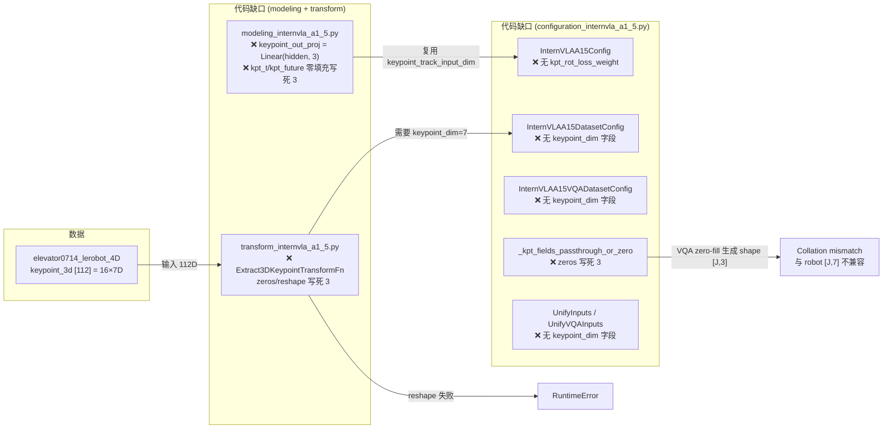
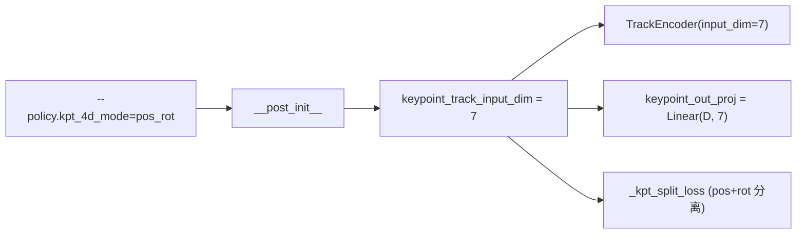
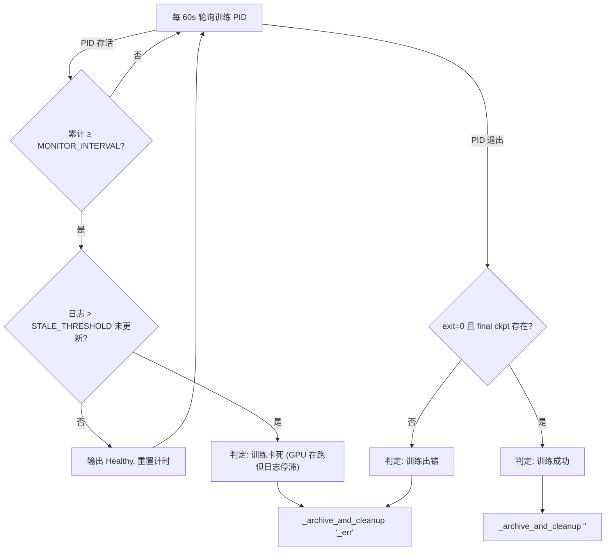

# R1 Pro 电梯按键任务 Phase 2 SFT 微调训练实施方案

> **文档定位**: 本方案描述如何在 Phase 1 Warmup 产出的 ckpt@400 基础上，使用
> `/home/luogang/DATA/elevator0714_lerobot_4D`（含 E1 7D 关键点）对 InternVLA-A1.5 +
> GeoPredict 进行 **Phase 2 全量微调（SFT）**。
>
> **前置文档**:
> - 数据集设计: [dta_3dtrj_E2.md](dta_3dtrj_E2.md)（E1 7D 关键点方案）
> - 数据生成日志: [dta_3dtrj_E2implLog.md](dta_3dtrj_E2implLog.md)
> - R1 Pro 迁移设计: [r1pro_migration_design.md](r1pro_migration_design.md)
> - 参考 SFT 手册: [../GpRbt/itrnVLA15_GeoP_3dtrj_3cn4_sft_rbt2.md](../GpRbt/itrnVLA15_GeoP_3dtrj_3cn4_sft_rbt2.md)
>
> **撰写日**: 2026-09-03

---

## 目录

- [0. 前置阅读：数据集与任务背景](#0-前置阅读数据集与任务背景)
- [1. 可配置变量总表（换机器必读）](#1-可配置变量总表换机器必读)
- [2. 当前代码现状与 E1 7D 关键点缺口分析](#2-当前代码现状与-e1-7d-关键点缺口分析)
- [3. 必要代码改动（新增 / 修改文件清单）](#3-必要代码改动新增--修改文件清单)
  - [3.1 configuration_internvla_a1_5.py](#31-configuration_internvla_a1_5py)
  - [3.2 modeling_internvla_a1_5.py](#32-modeling_internvla_a1_5py)
  - [3.3 transform_internvla_a1_5.py](#33-transform_internvla_a1_5py)
  - [3.4 新增 Phase 2 Launch 脚本](#34-新增-phase-2-launch-脚本)
- [4. 训练前环境准备](#4-训练前环境准备)
  - [4.1 数据集与 HF_LEROBOT_HOME](#41-数据集与-hf_lerobot_home)
  - [4.2 Norm Stats 生成](#42-norm-stats-生成)
  - [4.3 WAN 权重下载](#43-wan-权重下载)
  - [4.4 InternVLA-A1.5-base 权重确认](#44-internvla-a15-base-权重确认)
  - [4.5 Transformers Qwen3.5 Patch](#45-transformers-qwen35-patch)
- [5. Phase 1→2 衔接与冻结/训练矩阵](#5-phase-12-衔接与冻结训练矩阵)
- [6. Preflight 验收清单](#6-preflight-验收清单)
- [7. Smoke 测试](#7-smoke-测试)
- [8. 正式 SFT 训练](#8-正式-sft-训练)
  - [8.5 训练后自动监控](#85-训练后自动监控v12-新增)
- [9. Loss 监控与 Checkpoint 选择](#9-loss-监控与-checkpoint-选择)
- [10. 故障排查](#10-故障排查)
- [附录 A：Phase 2 vs Phase 1 配置矩阵](#附录-a-phase-2-vs-phase-1-配置矩阵)
- [附录 B：执行日志模板](#附录-b执行日志模板)

---

## 0. 前置阅读：数据集与任务背景

### 数据集 `elevator0714_lerobot_4D`

| 属性 | 值 |
|:---|:---|
| 路径 | `/home/luogang/DATA/elevator0714_lerobot_4D` |
| 任务 | R1 Pro 机器人按电梯上行/下行按钮 |
| Episodes | 100 |
| Frames | 27,145（info.json 中 total_frames） |
| FPS | 15 |
| 格式 | LeRobot v3.0 |
| 摄像头 | head_rgb, wrist_left_rgb, wrist_right_rgb（3路）|
| 关键点 | `observation.keypoint_3d` shape=[112] (16 × 7D, E1 方案) |
| 关键点坐标系 | base_link-relative，isotropic 归一化，R_pad=1.6906 m |
| 关键点含义 | 左臂 8 关节 + 右臂 8 关节（link1-7 + gripper），四元数半球归一化 |

**关键特点**（与 door-opening 任务对比）：
- **底盘完全静止**：纯手臂操作，无底盘运动稀释，GeoPredict 效果理论上更纯净
- **ee_pose 全零**：方向信息只能来自 FK（数据集已提前离线计算）
- **双臂同时参与**：左臂辅助、右臂主按压，J=16 均有效

### State / Action 维度

本任务沿用 `r1_pro.yaml` 的 schema，但**电梯按键任务底盘不动**，chassis action 为零向量（仍保留，维持与门开任务的代码一致性）：

| 类型 | 来源字段 | 维度 | 注释 |
|:---|:---|:---:|:---|
| State | left_arm + right_arm + left_gripper + right_gripper + chassis | 25 | 底盘 9D (yaw 3+linvel 3+angvel 3) |
| Action | left_arm + right_arm + left_gripper + right_gripper + chassis.velocities | 19 | 底盘速度 3D，全零 |

---

## 1. 可配置变量总表（换机器必读）

> **使用方法**: 在运行任何命令前，先在 shell 中 export 以下变量。所有脚本和命令都引用这些变量，换机器时只需修改此处即可。

```bash
# ==============================================================
# 核心路径 - 换机器必改
# ==============================================================

# 训练 venv（含 torch、lerobot、accelerate 等）
export TRAIN_VENV="/home/luogang/miniforge3/envs/itvlaGp"

# 项目代码根目录（含 src/lerobot、launch、util_scripts 等）
export PROJ_ROOT="/home/luogang/SRC/Robot/itvlaGp"

# ==============================================================
# HF 缓存路径 & 数据注册
# ==============================================================
export HF_HOME="/home/luogang/hf_home"

# LeRobot 数据集根 — 与 constants.py 默认行为对齐: Path(HF_HOME) / "lerobot"
# 数据集通过 symlink 注册到此目录，不侵入实际数据存放位置（见 §4.1）
export HF_LEROBOT_HOME="${HF_HOME}/lerobot"

# ==============================================================
# 数据集
# ==============================================================
export DATA_REPO_ID="elevator0714_lerobot_4D"

# 实际数据位置（仅用于 §4.1 symlink 注册，训练代码不直接引用）
export R1PRO_DATA="/home/luogang/DATA/elevator0714_lerobot_4D"

# Norm stats（通过 symlink 解析，§4.2 节生成后填入）
export NORM_STATS="${HF_LEROBOT_HOME}/${DATA_REPO_ID}/meta/norm_stat_abs.json"

# ==============================================================
# 模型权重（均在 ${HF_HOME} 下）
# ==============================================================

# Phase 1 Warmup 产出的 ckpt@400 路径（Phase 2 必须）
export WARMUP_CKPT="${PROJ_ROOT}/outputs/internvla_a1_5/<PHASE1_JOB_NAME>/checkpoints/000400/pretrained_model"

# WAN2.2-TI2V-5B 权重目录（Phase 2 必须，WAN DiT 冻结不训练）
export WAN_DIR="${HF_HOME}/hub/Wan2.2-TI2V-5B"

# InternVLA-A1.5-base 权重路径（Phase 1 用，Phase 2 不再需要）
export PRETRAINED_BASE="${HF_HOME}/hub/InternVLA-A1.5-base"

# GeoPredict RoboCasa checkpoint（Phase 1 用，Phase 2 不再需要）
export GEOPREDICT_CKPT="${HF_HOME}/ckpts/GeoPredict_robocasa.pth"

# ==============================================================
# 4D 关键点模式 (kpt_4d_mode)
# ==============================================================
# 控制 4D 数据集中关键点的使用方式，是 kpt pipeline 的唯一模式入口
#   pos_only — 仅位置 (3D per keypoint)，兼容原始 GeoPredict
#   pos_rot  — 位置+四元数 (7D per keypoint)，E1 方案
export KPT_4D_MODE="pos_rot"

# ==============================================================
# 训练规模（当前服务器: 2x RTX PRO 6000 Blackwell, ~97 GB/卡）
# ==============================================================
export PROC_PER_NODE=2           # GPU 数量
export BATCH_SIZE=8              # 每卡 batch size（WAN+3摄像头显存压力大，从保守值开始）
export STEPS=10000               # Phase 2 总训练步数（参考 run_ech_rbt_p012.md 公式）
export SAVE_FREQ=2500            # 每隔多少步保存 checkpoint
export LOG_FREQ=50               # 日志记录频率
export NUM_WORKERS=4             # DataLoader workers（2卡时用 4）

export MASTER_PORT=36603         # accelerate 分布式端口
export CUDA_VISIBLE_DEVICES="0,1"

# ==============================================================
# 输出
# ==============================================================
export OUTPUT_BASE="${PROJ_ROOT}/outputs/internvla_a1_5"

# ==============================================================
# 实验名 & 训练后自动监控
# ==============================================================
export EXPR_NAME="ItvlaGpR1proElvt0904"     # 实验名，用于 tar 包命名前缀
export MONITOR_INTERVAL=1800                 # 监控检查间隔秒数（默认 30 min）
export STALE_THRESHOLD=900                   # 日志停滞阈值秒数（默认 15 min）
export ARCHIVE_SOURCE="/B"                   # 训练后打包的源目录
export ARCHIVE_DEST="${HOME}/b/Ckp"          # tar 包存放目标目录
export BIGMATRIX_SCRIPT="${PROJ_ROOT}/b/d/GpRbt/bigmatrix_multiply_optimization.py"
```

**变量说明速查**：

| 变量名 | 含义 | 当前服务器值 | 换机器时 |
|:---|:---|:---|:---|
| `TRAIN_VENV` | Python venv 路径 | `/home/luogang/miniforge3/envs/itvlaGp` | 改为目标机器 venv |
| `PROJ_ROOT` | 代码仓库根 | `/home/luogang/SRC/Robot/itvlaGp` | 改为目标机器代码路径 |
| `HF_HOME` | HF 缓存根目录 | `/home/luogang/hf_home` | 改为目标机器 HF 缓存 |
| `HF_LEROBOT_HOME` | LeRobot 数据根 | `${HF_HOME}/lerobot` | 一般无需改（跟随 HF_HOME） |
| `R1PRO_DATA` | 4D 数据集实际路径 | `/home/luogang/DATA/elevator0714_lerobot_4D` | 同步到目标机，通过 symlink 注册 |
| `WARMUP_CKPT` | Phase 1 ckpt@400 | Phase 1 训练产出 | 指向 Phase 1 输出目录 |
| `WAN_DIR` | WAN 权重目录 | `${HF_HOME}/hub/Wan2.2-TI2V-5B` | 需要下载 |
| `KPT_4D_MODE` | 4D 关键点模式 | `pos_rot`（E1 7D） | `pos_only`（3D）或 `pos_rot`（7D） |
| `PROC_PER_NODE` | GPU 数 | 2 | 目标机器 GPU 数 |
| `BATCH_SIZE` | 每卡 BS | 8 | OOM→6 或 4 |
| `STEPS` | 总步数 | 10000 | 可按 epoch 计算 |
| `EXPR_NAME` | 实验名（tar 包前缀） | `ItvlaGpR1proElvt0904` | 换实验时改名 |
| `MONITOR_INTERVAL` | 监控检查间隔（秒） | 1800（30 min） | 按需调整 |
| `STALE_THRESHOLD` | 日志停滞阈值（秒） | 900（15 min） | 按需调整 |
| `ARCHIVE_SOURCE` | 训练后打包源目录 | `/B` | 打包整个 `/B/` 目录 |
| `ARCHIVE_DEST` | tar 包存放位置 | `~/b/Ckp` | 不存在时自动创建 |
| `BIGMATRIX_SCRIPT` | GPU 占用脚本路径 | `${PROJ_ROOT}/b/d/GpRbt/bigmatrix_multiply_optimization.py` | — |

---

## 2. 当前代码现状与 E1 7D 关键点缺口分析

**核心问题**: 数据集中 `observation.keypoint_3d` 已是 **7D（位置 3 + 四元数 4）**，shape=[112]（16 × 7），但当前代码仍**硬编码为 3D**，需要改动 **2 个文件**才能正确处理 E1 关键点。

> **设计原则（v1.3 修订）**:
> 1. **统一入口**——新增 `kpt_4d_mode` 字段（`"pos_only"` | `"pos_rot"`），作为 kpt pipeline 的唯一模式选择器。`keypoint_track_input_dim` 和 `keypoint_dim` 均由 `kpt_4d_mode` 在 `__post_init__` 中自动派生，用户无需手动设置维度数值。
> 2. **复用优先**——`keypoint_track_input_dim`（已有，控制 TrackEncoder 输入维度）与预测输出维度天然一致（观测 7D → 预测 7D），直接复用，不新增 `keypoint_out_dim`。
> 3. **扩展优于修改**——所有新增字段默认 `"pos_only"` / `3`，原有 3D 路径零改动自动保持向后兼容。
> 4. **传播完整**——`keypoint_dim` 需贯穿 DatasetConfig → Extract3DKeypointTransformFn → UnifyInputsTransformFn → `_kpt_fields_passthrough_or_zero` 全链路。
>
> **`kpt_4d_mode` 映射表**:
>
> | `kpt_4d_mode` | `keypoint_track_input_dim` (Policy) | `keypoint_dim` (Dataset) | 关键点含义 |
> |:---:|:---:|:---:|:---|
> | `pos_only` | 3 | 3 | 仅 3D 位置 (px, py, pz) |
> | `pos_rot` | 7 | 7 | 3D 位置 + 4D 四元数 (px, py, pz, qx, qy, qz, qw) |



**验证命令**（在改动前可运行确认当前状态）：

```bash
# 确认 keypoint_track_input_dim 已存在（=复用对象）
grep "keypoint_track_input_dim" \
  ${PROJ_ROOT}/src/lerobot/policies/internvla_a1_5/configuration_internvla_a1_5.py

# 确认 transform 中硬编码 3
grep "zeros.*j.*3\|reshape.*j.*3" \
  ${PROJ_ROOT}/src/lerobot/policies/internvla_a1_5/transform_internvla_a1_5.py

# 确认 modeling 中 keypoint_out_proj 硬编码 3
grep "keypoint_out_proj.*Linear\|kpt_t.*zeros.*3" \
  ${PROJ_ROOT}/src/lerobot/policies/internvla_a1_5/modeling_internvla_a1_5.py

# 确认 _kpt_fields_passthrough_or_zero 硬编码 3（v1.1 新发现）
grep "zeros.*j.*3" \
  ${PROJ_ROOT}/src/lerobot/policies/internvla_a1_5/configuration_internvla_a1_5.py
```

---

## 3. 必要代码改动（新增 / 修改文件清单）

### 3.1 `configuration_internvla_a1_5.py`

**文件**: `src/lerobot/policies/internvla_a1_5/configuration_internvla_a1_5.py`

本节包含 **7 处扩展**，分布在同一文件的不同类和函数中。核心变化是引入 `kpt_4d_mode` 字段，由它在 `__post_init__` 中自动派生 `keypoint_track_input_dim` 和 `keypoint_dim`，用户只需设一个模式值即可。

> **设计决策（v1.3）**: 
> - 不新增 `keypoint_out_dim`——复用 `keypoint_track_input_dim`。
> - 新增 `kpt_4d_mode`——统一控制维度，消除用户手动设 `keypoint_track_input_dim=7 + keypoint_dim=7` 的冗余和不一致风险。
> - `kpt_4d_mode` 默认 `"pos_only"` (3D)，完全向后兼容。

---

#### 3.1.0 `InternVLAA15Config` — 新增 `kpt_4d_mode` + `kpt_rot_loss_weight`（第 474-486 行附近）

**原代码**（第 474-485 行）：
```python
    keypoint_track_input_dim: int = 3
    # ...
    keypoint_noise_sigma: float = 0.0  # optional additive Gaussian noise on kpt_t during training (0=disabled)

    def __post_init__(self):
        super().__post_init__()
```

**改为**：
```python
    keypoint_track_input_dim: int = 3

    kpt_4d_mode: str = "pos_only"  # "pos_only" (3D) or "pos_rot" (7D)
    kpt_rot_loss_weight: float = 1.0  # rotation MSE weight relative to position MSE (pos_rot only)
    keypoint_noise_sigma: float = 0.0  # optional additive Gaussian noise on kpt_t during training (0=disabled)

    _KPT_4D_DIM: ClassVar[dict[str, int]] = {"pos_only": 3, "pos_rot": 7}

    def __post_init__(self):
        super().__post_init__()
        if self.kpt_4d_mode not in self._KPT_4D_DIM:
            raise ValueError(f"Unsupported kpt_4d_mode={self.kpt_4d_mode!r}, expected {list(self._KPT_4D_DIM)}")
        self.keypoint_track_input_dim = self._KPT_4D_DIM[self.kpt_4d_mode]
```

**关键设计**:



- `kpt_4d_mode` 是用户唯一需要设的模式开关
- `keypoint_track_input_dim` 保留为字段（backward compat），但由 `__post_init__` 自动覆写
- `kpt_rot_loss_weight` 仅在 `kpt_4d_mode="pos_rot"` 时被 `_kpt_split_loss` 使用；`pos_only` 时自动走纯 MSE
- 需要在文件头添加 `from typing import ClassVar`（若尚未 import）

---

#### 3.1.1 `InternVLAA15DatasetConfig` — 新增 `kpt_4d_mode` + `keypoint_dim`（第 39-40 行附近）

**原代码**：
```python
    num_keypoint_joints: int = 8
    keypoint_history_max_len: int = 1000
```

**改为**：
```python
    num_keypoint_joints: int = 8
    keypoint_history_max_len: int = 1000
    kpt_4d_mode: str = "pos_only"  # "pos_only" (3D) or "pos_rot" (7D)
    keypoint_dim: int = 3  # auto-derived from kpt_4d_mode in __post_init__
```

并在 `__post_init__` 开头（第 72-73 行，`super().__post_init__()` 之后）加入：
```python
    _KPT_4D_DIM = {"pos_only": 3, "pos_rot": 7}
    if self.kpt_4d_mode not in _KPT_4D_DIM:
        raise ValueError(f"Unsupported kpt_4d_mode={self.kpt_4d_mode!r}, expected {list(_KPT_4D_DIM)}")
    self.keypoint_dim = _KPT_4D_DIM[self.kpt_4d_mode]
```

**为什么**: `kpt_4d_mode` 与 PolicyConfig 中的同名字段语义一致。CLI 通过 `--dataset.kpt_4d_mode=pos_rot` 设置，`__post_init__` 自动派生 `keypoint_dim=7`，省去用户手动对齐两个数值。

---

#### 3.1.2 `InternVLAA15DatasetConfig.__post_init__` — 透传 `keypoint_dim`（第 110-131 行附近）

在 `Extract3DKeypointTransformFn` 构建处（约第 110-114 行）加入 `keypoint_dim`：

**原代码**：
```python
            kpt_extract = Extract3DKeypointTransformFn(
                num_joints=self.num_keypoint_joints,
                history_max_len=self.keypoint_history_max_len,
                chunk_size=self.chunk_size,
            )
```

**改为**：
```python
            kpt_extract = Extract3DKeypointTransformFn(
                num_joints=self.num_keypoint_joints,
                history_max_len=self.keypoint_history_max_len,
                chunk_size=self.chunk_size,
                keypoint_dim=self.keypoint_dim,
            )
```

在 `UnifyInternVLAA15InputsTransformFn` 属性设置处（约第 126-131 行）加入 `keypoint_dim`：

**原代码**：
```python
        for t in inputs:
            if isinstance(t, UnifyInternVLAA15InputsTransformFn):
                t.enable_keypoint_predictor = self.enable_keypoint_predictor
                t.num_keypoint_joints = self.num_keypoint_joints
                t.keypoint_history_max_len = self.keypoint_history_max_len
                t.chunk_size = self.chunk_size
                break
```

**改为**：
```python
        for t in inputs:
            if isinstance(t, UnifyInternVLAA15InputsTransformFn):
                t.enable_keypoint_predictor = self.enable_keypoint_predictor
                t.num_keypoint_joints = self.num_keypoint_joints
                t.keypoint_history_max_len = self.keypoint_history_max_len
                t.chunk_size = self.chunk_size
                t.keypoint_dim = self.keypoint_dim
                break
```

---

#### 3.1.3 `UnifyInternVLAA15InputsTransformFn` — 新增 `keypoint_dim` 字段（第 153 行附近）

**原代码**（约第 152-155 行）：
```python
    enable_keypoint_predictor: bool = False
    num_keypoint_joints: int = 8
    keypoint_history_max_len: int = 1000
    chunk_size: int = 50
```

**改为**：
```python
    enable_keypoint_predictor: bool = False
    num_keypoint_joints: int = 8
    keypoint_history_max_len: int = 1000
    chunk_size: int = 50
    keypoint_dim: int = 3
```

同时更新其 `__call__` 中的调用（约第 191 行）：

**原代码**：
```python
            result.update(_kpt_fields_passthrough_or_zero(data, self.num_keypoint_joints, self.keypoint_history_max_len, self.chunk_size))
```

**改为**：
```python
            result.update(_kpt_fields_passthrough_or_zero(data, self.num_keypoint_joints, self.keypoint_history_max_len, self.chunk_size, self.keypoint_dim))
```

---

#### 3.1.4 `_kpt_fields_passthrough_or_zero` — 新增 `keypoint_dim` 参数（第 195-209 行）

**原代码**：
```python
def _kpt_fields_passthrough_or_zero(
    data: DataDict, num_joints: int, history_max_len: int, chunk_size: int
) -> DataDict:
    """Return the 5 GeoPredict kpt fields, passed through from `data` if present, otherwise
    zero-filled with `kpt_mask=False` (used for VQA samples, which never have 3D keypoints)."""
    import torch

    h, j, c = history_max_len, num_joints, chunk_size
    return {
        "observation.his_kpts": data.get("observation.his_kpts", torch.zeros(h, j, 3)),
        "observation.his_len": data.get("observation.his_len", torch.tensor(0, dtype=torch.long)),
        "observation.kpt_t": data.get("observation.kpt_t", torch.zeros(j, 3)),
        "observation.kpt_future": data.get("observation.kpt_future", torch.zeros(c, j, 3)),
        "observation.kpt_mask": data.get("observation.kpt_mask", torch.tensor(False)),
    }
```

**改为**：
```python
def _kpt_fields_passthrough_or_zero(
    data: DataDict, num_joints: int, history_max_len: int, chunk_size: int, keypoint_dim: int = 3
) -> DataDict:
    """Return the 5 GeoPredict kpt fields, passed through from `data` if present, otherwise
    zero-filled with `kpt_mask=False` (used for VQA samples, which never have 3D keypoints)."""
    import torch

    h, j, c, d = history_max_len, num_joints, chunk_size, keypoint_dim
    return {
        "observation.his_kpts": data.get("observation.his_kpts", torch.zeros(h, j, d)),
        "observation.his_len": data.get("observation.his_len", torch.tensor(0, dtype=torch.long)),
        "observation.kpt_t": data.get("observation.kpt_t", torch.zeros(j, d)),
        "observation.kpt_future": data.get("observation.kpt_future", torch.zeros(c, j, d)),
        "observation.kpt_mask": data.get("observation.kpt_mask", torch.tensor(False)),
    }
```

**为什么必须改此函数**: 这是 VQA 样本和无关键点 robot 样本的 zero-fill 路径。若此处仍生成 `[J, 3]` 的零张量，而 robot 样本的 `Extract3DKeypointTransformFn` 已产出 `[J, 7]`，collation 时 **shape mismatch → crash**。这是 v1.0 方案的遗漏。

---

#### 3.1.5 `UnifyInternVLAA15VQAInputsTransformFn` + `InternVLAA15VQADatasetConfig` — 新增 `keypoint_dim`

**UnifyInternVLAA15VQAInputsTransformFn**（约第 227-230 行）也有同样的字段集，需同步新增 `keypoint_dim`：

**原代码**：
```python
    enable_keypoint_predictor: bool = False
    num_keypoint_joints: int = 8
    keypoint_history_max_len: int = 1000
    chunk_size: int = 50
```

**改为**：
```python
    enable_keypoint_predictor: bool = False
    num_keypoint_joints: int = 8
    keypoint_history_max_len: int = 1000
    chunk_size: int = 50
    keypoint_dim: int = 3
```

同时更新其 `__call__` 中的 `_kpt_fields_passthrough_or_zero` 调用（约第 263 行）：

**原代码**：
```python
            result.update(
                _kpt_fields_passthrough_or_zero(
                    {}, self.num_keypoint_joints, self.keypoint_history_max_len, self.chunk_size
                )
            )
```

**改为**：
```python
            result.update(
                _kpt_fields_passthrough_or_zero(
                    {}, self.num_keypoint_joints, self.keypoint_history_max_len, self.chunk_size, self.keypoint_dim
                )
            )
```

**InternVLAA15VQADatasetConfig**（约第 283-289 行），添加 `kpt_4d_mode` + `keypoint_dim` 字段：

**原代码**：
```python
    enable_keypoint_predictor: bool = False
    num_keypoint_joints: int = 8
    keypoint_history_max_len: int = 1000
    chunk_size: int = 50
```

**改为**：
```python
    enable_keypoint_predictor: bool = False
    num_keypoint_joints: int = 8
    keypoint_history_max_len: int = 1000
    chunk_size: int = 50
    kpt_4d_mode: str = "pos_only"
    keypoint_dim: int = 3  # auto-derived from kpt_4d_mode in __post_init__
```

并在其 `__post_init__`（约第 314 行，`super().__post_init__()` 之后）加入与 §3.1.1 相同的派生逻辑：
```python
    _KPT_4D_DIM = {"pos_only": 3, "pos_rot": 7}
    if self.kpt_4d_mode not in _KPT_4D_DIM:
        raise ValueError(f"Unsupported kpt_4d_mode={self.kpt_4d_mode!r}")
    self.keypoint_dim = _KPT_4D_DIM[self.kpt_4d_mode]
```

并在其 `__post_init__`（约第 328-334 行）透传给 `UnifyInternVLAA15VQAInputsTransformFn`：

**原代码**：
```python
        for t in inputs:
            if isinstance(t, UnifyInternVLAA15VQAInputsTransformFn):
                t.enable_keypoint_predictor = self.enable_keypoint_predictor
                t.num_keypoint_joints = self.num_keypoint_joints
                t.keypoint_history_max_len = self.keypoint_history_max_len
                t.chunk_size = self.chunk_size
                break
```

**改为**：
```python
        for t in inputs:
            if isinstance(t, UnifyInternVLAA15VQAInputsTransformFn):
                t.enable_keypoint_predictor = self.enable_keypoint_predictor
                t.num_keypoint_joints = self.num_keypoint_joints
                t.keypoint_history_max_len = self.keypoint_history_max_len
                t.chunk_size = self.chunk_size
                t.keypoint_dim = self.keypoint_dim
                break
```

---

#### 3.1 改动汇总（`configuration_internvla_a1_5.py` 共 7 处）

| # | 位置 | 改动类型 | 内容 |
|:---:|:---|:---:|:---|
| 0 | `InternVLAA15Config` | 扩展（+2字段+`__post_init__`） | `kpt_4d_mode`, `kpt_rot_loss_weight`; `__post_init__` 派生 `keypoint_track_input_dim` |
| 1 | `InternVLAA15DatasetConfig` | 扩展（+2字段+`__post_init__`） | `kpt_4d_mode`, `keypoint_dim`; `__post_init__` 派生 `keypoint_dim` |
| 2 | `InternVLAA15DatasetConfig.__post_init__` | 扩展（+2行） | 透传 `keypoint_dim` 给 Extract + Unify |
| 3 | `UnifyInternVLAA15InputsTransformFn` | 扩展（+1字段+调用修改） | `keypoint_dim: int = 3`，传给 helper |
| 4 | `_kpt_fields_passthrough_or_zero` | 扩展（+1参数） | `keypoint_dim: int = 3`，用 `d` 替换 `3` |
| 5 | `UnifyInternVLAA15VQAInputsTransformFn` + `InternVLAA15VQADatasetConfig` | 扩展（+字段+`__post_init__`+透传） | 同 #3，VQA 侧对称，含 `kpt_4d_mode` 派生 |

**向后兼容性**: `kpt_4d_mode` 默认 `"pos_only"`，所有派生值均为 `3`，原有 3D 训练无需任何 CLI 变更。

**CLI 简化效果**: 用户从设 2 个维度值（`--policy.keypoint_track_input_dim=7 --dataset.keypoint_dim=7`）简化为 1 个模式（`--policy.kpt_4d_mode=pos_rot --dataset.kpt_4d_mode=pos_rot`），消除不一致风险。

---

### 3.2 `modeling_internvla_a1_5.py`

**文件**: `src/lerobot/policies/internvla_a1_5/modeling_internvla_a1_5.py`

> **v1.1 修订**: 
> - 复用 `config.keypoint_track_input_dim`（而非新增 `keypoint_out_dim`）作为 `keypoint_out_proj` 的输出维度。
> - 将 pos/rot 分离 loss 逻辑提取为 `_kpt_split_loss` helper，避免 current/future 两处重复代码。

---

#### 改动 1：`keypoint_out_proj` 从硬编码 3 改为复用已有配置（第 1020 行）

**原代码**：
```python
            self.keypoint_out_proj = nn.Linear(kpt_hidden_size, 3)
```

**改为**：
```python
            self.keypoint_out_proj = nn.Linear(kpt_hidden_size, config.keypoint_track_input_dim)
```

**为什么复用 `keypoint_track_input_dim`**: 同一行之上（第 1008 行），`TrackEncoder(input_dim=config.keypoint_track_input_dim, ...)` 已使用此参数表示每关键点特征维度。预测目标（kpt_t, kpt_future）和 TrackEncoder 输入来自同一数据列 `observation.keypoint_3d`，维度天然一致。

---

#### 改动 2：新增 `_kpt_split_loss` helper（在 loss 计算代码之前，约第 1948 行附近插入）

```python
    def _kpt_split_loss(self, pred: torch.Tensor, gt: torch.Tensor, reduce_dims: tuple[int, ...]) -> torch.Tensor:
        """Compute position + weighted rotation MSE for E1 7D keypoints.

        When keypoint_track_input_dim <= 3, falls back to plain MSE (no split).
        """
        kpt_dim = self.config.keypoint_track_input_dim
        gt = gt.to(torch.float32)
        if kpt_dim > 3:
            loss_pos = F.mse_loss(pred[..., :3], gt[..., :3], reduction="none").mean(dim=reduce_dims)
            pred_rot = F.normalize(pred[..., 3:kpt_dim], p=2, dim=-1)
            loss_rot = F.mse_loss(pred_rot, gt[..., 3:kpt_dim], reduction="none").mean(dim=reduce_dims)
            return loss_pos + self.config.kpt_rot_loss_weight * loss_rot
        return F.mse_loss(pred, gt, reduction="none").mean(dim=reduce_dims)
```

**为什么提取 helper**: 当前帧 loss 和未来帧 loss 的分离逻辑完全相同，仅 `reduce_dims` 不同。提取后：
- 避免 ~20 行重复代码
- 后续修改旋转 loss（如从 MSE 换为 geodesic distance）只需改一处
- 向后兼容：`kpt_dim <= 3` 时直接走纯 MSE

---

#### 改动 3：当前帧 + 未来帧 loss 使用 helper（第 1955-1976 行附近）

**原代码**：
```python
            pred_kpt_current = self.keypoint_out_proj(kpt_query_out)  # [B, J, 3]

            if kpt_t is None:
                kpt_t = torch.zeros(B, j, 3, device=actions.device, dtype=torch.float32)
            loss_kpt_current = F.mse_loss(
                pred_kpt_current, kpt_t.to(torch.float32), reduction="none"
            ).mean(dim=(-1, -2))  # [B]

            chunk_size = self.config.chunk_size
            future_pos = self.future_kpt_pos_embed.to(
                device=kpt_query_out.device, dtype=torch.float32
            )  # [C, D]
            future_kpt_tokens = kpt_query_out.unsqueeze(1) + future_pos[None, :, None, :]  # [B, C, J, D]
            future_kpt_pred = self.keypoint_out_proj(
                future_kpt_tokens.reshape(B * chunk_size, j, -1)
            ).reshape(B, chunk_size, j, 3)

            if kpt_future is None:
                kpt_future = torch.zeros(B, chunk_size, j, 3, device=actions.device, dtype=torch.float32)
            loss_kpt_future = F.mse_loss(
                future_kpt_pred, kpt_future.to(torch.float32), reduction="none"
            ).mean(dim=(-1, -2, -3))  # [B]
```

**改为**：
```python
            kpt_dim = self.config.keypoint_track_input_dim
            pred_kpt_current = self.keypoint_out_proj(kpt_query_out)  # [B, J, kpt_dim]

            if kpt_t is None:
                kpt_t = torch.zeros(B, j, kpt_dim, device=actions.device, dtype=torch.float32)
            loss_kpt_current = self._kpt_split_loss(pred_kpt_current, kpt_t, reduce_dims=(-1, -2))

            chunk_size = self.config.chunk_size
            future_pos = self.future_kpt_pos_embed.to(
                device=kpt_query_out.device, dtype=torch.float32
            )  # [C, D]
            future_kpt_tokens = kpt_query_out.unsqueeze(1) + future_pos[None, :, None, :]  # [B, C, J, D]
            future_kpt_pred = self.keypoint_out_proj(
                future_kpt_tokens.reshape(B * chunk_size, j, -1)
            ).reshape(B, chunk_size, j, kpt_dim)

            if kpt_future is None:
                kpt_future = torch.zeros(B, chunk_size, j, kpt_dim, device=actions.device, dtype=torch.float32)
            loss_kpt_future = self._kpt_split_loss(future_kpt_pred, kpt_future, reduce_dims=(-1, -2, -3))
```

---

#### 3.2 改动汇总（`modeling_internvla_a1_5.py` 共 4 处）

| # | 位置 | 改动类型 | 内容 |
|:---:|:---|:---:|:---|
| 1 | 第 1020 行 | 修改（1行） | `nn.Linear(hidden, 3)` → `nn.Linear(hidden, config.keypoint_track_input_dim)` |
| 2 | 第 1597 行 | 修改（1行） | `embed_kpt_suffix` 中 `torch.zeros(bsize, ..., j, 3)` → `config.keypoint_track_input_dim` |
| 3 | 第 ~1948 行 | 扩展（新增 helper） | `_kpt_split_loss` 方法：`kpt_4d_mode="pos_rot"` 时分离 pos/rot，`"pos_only"` 时纯 MSE |
| 4 | 第 1955-1976 行 | 修改 | `3` → `kpt_dim`，loss 调用改为 `_kpt_split_loss` |

**为什么分离 pos/rot loss**: 当 `keypoint_track_input_dim=7` 时，位置分量（px,py,pz）是欧氏距离，四元数分量（qx,qy,qz,qw）受单位球约束，两者数值量纲不同，分离计算有利于各自收敛。对预测四元数先 L2 归一化再计算 MSE，保证预测值在单位球面上（等效于 cosine similarity loss，近似 $\theta^2/4$）。当 `keypoint_track_input_dim=3` 时 helper 直接走纯 MSE，**向后兼容**。

---

### 3.3 `transform_internvla_a1_5.py`

**文件**: `src/lerobot/policies/internvla_a1_5/transform_internvla_a1_5.py`

**改动**：`Extract3DKeypointTransformFn` 添加 `keypoint_dim` 字段，将所有硬编码的 `3` 替换为 `d`。

**原代码**（第 688-733 行）：

```python
    num_joints: int = 8
    history_max_len: int = 1000
    chunk_size: int = 50

    def __call__(self, data: DataDict) -> DataDict:
        h, j, c = self.history_max_len, self.num_joints, self.chunk_size
        key = "observation.keypoint_3d"

        if key not in data:
            data["observation.his_kpts"] = torch.zeros(h, j, 3)
            data["observation.his_len"] = torch.tensor(0, dtype=torch.long)
            data["observation.kpt_t"] = torch.zeros(j, 3)
            data["observation.kpt_future"] = torch.zeros(c, j, 3)
            data["observation.kpt_mask"] = torch.tensor(False)
            return data

        stacked = data.pop(key)
        if isinstance(stacked, np.ndarray):
            stacked = torch.from_numpy(stacked)
        stacked = stacked.reshape(h + 1 + c, j, 3).float()
        # ...
        his_kpts = torch.zeros(h, j, 3, dtype=stacked.dtype)
```

**改为**：

```python
    num_joints: int = 8
    history_max_len: int = 1000
    chunk_size: int = 50
    keypoint_dim: int = 3  # per-keypoint feature dimension: 3 (pos-only) or 7 (pos+quat, E1)

    def __call__(self, data: DataDict) -> DataDict:
        h, j, c, d = self.history_max_len, self.num_joints, self.chunk_size, self.keypoint_dim
        key = "observation.keypoint_3d"

        if key not in data:
            data["observation.his_kpts"] = torch.zeros(h, j, d)
            data["observation.his_len"] = torch.tensor(0, dtype=torch.long)
            data["observation.kpt_t"] = torch.zeros(j, d)
            data["observation.kpt_future"] = torch.zeros(c, j, d)
            data["observation.kpt_mask"] = torch.tensor(False)
            return data

        stacked = data.pop(key)
        if isinstance(stacked, np.ndarray):
            stacked = torch.from_numpy(stacked)
        stacked = stacked.reshape(h + 1 + c, j, d).float()
        # ...
        his_kpts = torch.zeros(h, j, d, dtype=stacked.dtype)
```

**同时**，在 `configuration_internvla_a1_5.py` 的 `InternVLAA15DatasetConfig.__post_init__` 中，将 `keypoint_dim` 参数传递给 transform：

找到 transform 的构建位置（约第 111-115 行）：
```python
                num_joints=self.num_keypoint_joints,
                history_max_len=self.keypoint_history_max_len,
```

确认 `keypoint_dim` 也被传入（若不存在则补上）：
```python
                num_joints=self.num_keypoint_joints,
                history_max_len=self.keypoint_history_max_len,
                keypoint_dim=self.keypoint_dim,
```

**为什么要改**：数据集中 `observation.keypoint_3d` 是 112D（16 × 7），读出后 `stacked` shape 为 `[H+1+C, 112]`。原来 `stacked.reshape(h+1+c, j, 3)` 中 `j=16, 3=3` 时总共需要 48D，但实际有 112D，**reshape 会报错**。改为 `reshape(h+1+c, j, d)` 后，当 `d=7` 时 `16×7=112`，reshape 成功。

---

### 3.4 新增 Phase 2 Launch 脚本

**文件**: `launch/internvla_a15_r1pro_geop_phase2_elevator.sh`（新建）

**为什么要新建而不复用现有脚本**：
- 现有 `internvla_a15_r1pro_geop_phase2.sh` 使用 `train_expert_only=true`、`enable_vqa_loss=false`、`video_loss_weight=0`，本质是"expert-only 续训"，不是全量 SFT。
- 真正的 Phase 2 全量微调（参照 `sft_rbt2.md`）需要 `train_expert_only=false`、`enable_vqa_loss=true`、加载 WAN。
- E1 7D 关键点需要额外的 CLI 参数：`--policy.keypoint_track_input_dim=7`、`--dataset.keypoint_dim=7`（`keypoint_track_input_dim` 同时控制 TrackEncoder 输入和 `keypoint_out_proj` 输出维度）。
- 本机只有 2 GPU，默认值从 8 GPU 调整。

```bash
#!/usr/bin/env bash
set -euo pipefail

###############################################################################
# R1 Pro Elevator Button Task — Phase 2 Full SFT (GeoPredict E1 7D Keypoints)
#
# 数据集: elevator0714_lerobot_4D (100 ep / 27145 frames, E1 7D kpt, 3 cameras)
# 起点:   Phase 1 Warmup ckpt@400 (WARMUP_CKPT 必须在外部 export)
# 策略:   全量微调 (VLM + Action + Kpt Expert) + WAN video loss + VQA/FAST
# E1 改动: keypoint_track_input_dim=7 (TrackEncoder+out_proj), dataset.keypoint_dim=7 (transform)
#
# Usage (正式):
#   export WARMUP_CKPT=/path/to/phase1/checkpoints/000400/pretrained_model
#   bash launch/internvla_a15_r1pro_geop_phase2_elevator.sh
#
# Usage (WAN smoke, 1GPU 2steps):
#   WAN_SMOKE=1 WARMUP_CKPT=... bash launch/internvla_a15_r1pro_geop_phase2_elevator.sh
#
# Usage (smoke 100 steps):
#   SMOKE=1 WARMUP_CKPT=... bash launch/internvla_a15_r1pro_geop_phase2_elevator.sh
#
# 参考文档: b/d/R1Pro/p2sft_plan.md
###############################################################################

PROJ_ROOT="$(cd "$(dirname "${BASH_SOURCE[0]}")/.." && pwd)"
EXPR_NAME="${EXPR_NAME:-ItvlaGpR1proElvt0904}"
TRAIN_VENV="${TRAIN_VENV:-/home/luogang/miniforge3/envs/itvlaGp}"
PYTHON="${PYTHON:-${TRAIN_VENV}/bin/python}"

export HF_HOME="${HF_HOME:-/home/luogang/hf_home}"
export HF_LEROBOT_HOME="${HF_LEROBOT_HOME:-${HF_HOME}/lerobot}"
KPT_4D_MODE="${KPT_4D_MODE:-pos_rot}"
export WANDB_MODE="${WANDB_MODE:-offline}"
export USE_LIBUV="${USE_LIBUV:-0}"
export PYTHONUNBUFFERED=1
export OMP_NUM_THREADS="${OMP_NUM_THREADS:-1}"
export MKL_NUM_THREADS="${MKL_NUM_THREADS:-1}"
export TOKENIZERS_PARALLELISM=false

# Triton cache：建议用本机 XFS，避免 Ceph/NFS 上的多 rank 文件锁竞争（见 sft0827LOG.md §22:48）
export TRITON_CACHE_DIR="${TRITON_CACHE_DIR:-/tmp/itvla-triton-cache}"

# 验证 WARMUP_CKPT 必须由外部设置
WARMUP_CKPT="${WARMUP_CKPT:?请先 export WARMUP_CKPT=<Phase1_ckpt@400 路径>}"

WAN_DIR="${WAN_DIR:-${HF_HOME}/hub/Wan2.2-TI2V-5B}"
DATA_REPO_ID="${DATA_REPO_ID:-elevator0714_lerobot_4D}"
NORM_STATS="${NORM_STATS:-${HF_LEROBOT_HOME}/${DATA_REPO_ID}/meta/norm_stat_abs.json}"

export MASTER_ADDR="${MASTER_ADDR:-127.0.0.1}"
export MASTER_PORT="${MASTER_PORT:-36603}"
export CUDA_VISIBLE_DEVICES="${CUDA_VISIBLE_DEVICES:-0,1}"

WAN_SMOKE="${WAN_SMOKE:-0}"
SMOKE="${SMOKE:-0}"

if [[ "${WAN_SMOKE}" == "1" ]]; then
    PROC_PER_NODE="${PROC_PER_NODE:-1}"
    BATCH_SIZE="${BATCH_SIZE:-2}"
    STEPS="${STEPS:-2}"
    NUM_WORKERS="${NUM_WORKERS:-2}"
    SAVE_FREQ="${SAVE_FREQ:-2}"
    LOG_FREQ="${LOG_FREQ:-1}"
    SCHEDULER_WARMUP="${SCHEDULER_WARMUP:-1}"
    WANDB_ENABLE="${WANDB_ENABLE:-false}"
    JOB_SUFFIX="r1pro-elev-geop-p2-wan-smoke"
    export CUDA_VISIBLE_DEVICES="${CUDA_VISIBLE_DEVICES:-0}"
elif [[ "${SMOKE}" == "1" ]]; then
    PROC_PER_NODE="${PROC_PER_NODE:-1}"
    BATCH_SIZE="${BATCH_SIZE:-2}"
    STEPS="${STEPS:-100}"
    NUM_WORKERS="${NUM_WORKERS:-2}"
    SAVE_FREQ="${SAVE_FREQ:-100}"
    LOG_FREQ="${LOG_FREQ:-10}"
    SCHEDULER_WARMUP="${SCHEDULER_WARMUP:-50}"
    WANDB_ENABLE="${WANDB_ENABLE:-false}"
    JOB_SUFFIX="r1pro-elev-geop-p2-smoke100"
    export CUDA_VISIBLE_DEVICES="${CUDA_VISIBLE_DEVICES:-0}"
else
    PROC_PER_NODE="${PROC_PER_NODE:-2}"
    BATCH_SIZE="${BATCH_SIZE:-8}"
    STEPS="${STEPS:-10000}"
    NUM_WORKERS="${NUM_WORKERS:-4}"
    SAVE_FREQ="${SAVE_FREQ:-2500}"
    LOG_FREQ="${LOG_FREQ:-50}"
    SCHEDULER_WARMUP="${SCHEDULER_WARMUP:-1000}"
    WANDB_ENABLE="${WANDB_ENABLE:-true}"
    JOB_SUFFIX="r1pro-elev-geop-p2-e1-sft"
fi

NODE_COUNT="${NODE_COUNT:-1}"
NODE_RANK="${NODE_RANK:-0}"
NUM_PROCESSES=$((NODE_COUNT * PROC_PER_NODE))

cd "${PROJ_ROOT}"

JOB_NAME="${JOB_NAME:-$(date +'%Y_%m_%d_%H_%M_%S')-internvla_a1_5-${JOB_SUFFIX}}"
OUTPUT_DIR="${OUTPUT_DIR:-${PROJ_ROOT}/outputs/internvla_a1_5/${JOB_NAME}}"
LOG_FILE="${LOG_FILE:-${OUTPUT_DIR}.log}"
mkdir -p "$(dirname "${LOG_FILE}")"

echo "=== R1 Pro Elevator Phase 2 SFT (E1 7D GeoPredict) ==="
echo "WARMUP_CKPT=${WARMUP_CKPT}"
echo "DATA_REPO_ID=${DATA_REPO_ID}"
echo "PROC=${NUM_PROCESSES} BS=${BATCH_SIZE} STEPS=${STEPS}"
echo "WAN_DIR=${WAN_DIR}"

LAUNCH_ARGS=()
if [[ "${NUM_PROCESSES}" -gt 1 ]]; then
    LAUNCH_ARGS+=(--multi_gpu)
fi
LAUNCH_ARGS+=(
    --num_processes="${NUM_PROCESSES}"
    --num_machines="${NODE_COUNT}"
    --machine_rank="${NODE_RANK}"
    --main_process_ip="${MASTER_ADDR}"
    --main_process_port="${MASTER_PORT}"
)

ARGS=(
    "${LAUNCH_ARGS[@]}"
    src/lerobot/scripts/lerobot_train.py

    --output_dir="${OUTPUT_DIR}"
    --num_workers="${NUM_WORKERS}"
    --job_name="${JOB_NAME}"

    # 模型与起点
    --policy.type=internvla_a1_5
    --policy.repo_id=lerobot_lab/internvla_a1_5
    --policy.push_to_hub=false
    --policy.pretrained_path="${WARMUP_CKPT}"
    --policy.gradient_checkpointing=true   # WAN+3摄像头显存高，开启
    --policy.dtype=bfloat16
    --policy.vlm_model_name_or_path=Qwen/Qwen3.5-2B

    # 优化器
    --policy.optimizer_lr=5e-5
    --policy.scheduler_warmup_steps="${SCHEDULER_WARMUP}"
    --policy.scheduler_decay_steps="${STEPS}"
    --policy.scheduler_decay_lr=5e-6

    # 全量微调开关（Phase 2 全打开，与 Phase 1 相反）
    --policy.train_expert_only=false
    --policy.knowledge_insulation=false
    --policy.knowledge_insulation_kpt=false
    --policy.freeze_vision_encoder=false
    --policy.enable_vqa_loss=true
    --policy.tokenize_state=true

    # WAN video foresight（Phase 2 加载 WAN）
    --policy.action_loss_only=false
    --policy.video_loss_weight=1
    --policy.video_loss_only=false
    --policy.freeze_wan_dit=true
    --policy.freeze_learnable_tokens=true
    --policy.num_learnable_tokens=50
    --policy.wan_checkpoint_path="${WAN_DIR}"
    --policy.wan_config_path="${WAN_DIR}"
    --policy.vae_path="${WAN_DIR}/Wan2.2_VAE.pth"

    # 4D 关键点模式（由 KPT_4D_MODE 统一控制）
    --policy.enable_keypoint_predictor=true
    --policy.num_keypoint_joints=16
    --policy.kpt_4d_mode="${KPT_4D_MODE}"  # pos_only (3D) | pos_rot (7D)
    --policy.kpt_rot_loss_weight=1.0       # 旋转 loss 权重（仅 pos_rot 生效）
    --policy.keypoint_history_max_len=300  # R1 Pro 推荐 300（短 episode）

    # Phase 2 loss 权重（对齐 sft_rbt2.md）
    --policy.action_loss_weight=10.0
    --policy.kpt_loss_weight=1.0
    --policy.kpt_future_loss_weight=1.5
    --policy.kpt_to_action_detach=false

    # Phase 2 安全检查（必须为 false）
    --policy.init_kpt_expert_from_action=false
    # 注意: 不设 --policy.geopredict_checkpoint_path（Phase 1 已写入 ckpt）

    # 学习率分组
    --policy.freeze_keypoint_modules=false
    --policy.action_expert_lr_scale=1.0
    --policy.kpt_expert_lr_scale=1.0
    --policy.track_encoder_lr_scale=1.0

    # 数据集
    --dataset.type=internvla_a1_5
    --dataset.repo_id="${DATA_REPO_ID}"
    --dataset.enable_keypoint_predictor=true
    --dataset.num_keypoint_joints=16
    --dataset.kpt_4d_mode="${KPT_4D_MODE}" # 与 policy 保持一致
    --dataset.action_mode=abs
    --dataset.use_external_stats=true
    --dataset.external_stats_path="${NORM_STATS}"
    --dataset.dist_loading=false
    --dataset.tokenize_state=true
    --dataset.use_fast_action_tokens=true
    --dataset.video_backend=torchcodec

    --seed=42
    --batch_size="${BATCH_SIZE}"
    --steps="${STEPS}"
    --save_freq="${SAVE_FREQ}"
    --log_freq="${LOG_FREQ}"

    --wandb.enable="${WANDB_ENABLE}"
    --wandb.project=internvla_a1_5
    --wandb.mode=offline
)

###############################################################################
# Monitoring helpers + Training execution (v1.2 新增，详见 §8.5)
###############################################################################
# Smoke mode: 阻塞执行 (tee), 无监控
# Formal mode: 后台执行 + 自动监控循环
#   - 每 60s 轮询 TRAIN_PID 存活状态
#   - 每 MONITOR_INTERVAL 检查日志停滞
#   - 训练结束/卡死 → _archive_and_cleanup → tar + kill GPU + start bigmatrix
# 完整实现见实际脚本 launch/internvla_a15_r1pro_geop_phase2_elevator.sh
```

**执行权限**：
```bash
chmod +x ${PROJ_ROOT}/launch/internvla_a15_r1pro_geop_phase2_elevator.sh
```

---

## 4. 训练前环境准备

### 4.1 数据集注册（symlink 方式）

LeRobot 通过 `${HF_LEROBOT_HOME}/<repo_id>` 定位数据集（`constants.py` 默认 `Path(HF_HOME) / "lerobot"`）。

**设计**: 实际数据放在任意位置（`R1PRO_DATA`），通过 symlink **注册**到 `${HF_LEROBOT_HOME}/` 中。训练代码只引用 `HF_LEROBOT_HOME + repo_id`，不依赖也不侵入实际数据位置。

```bash
# ── Step 1: 创建 HF_LEROBOT_HOME 并注册数据集 ──
mkdir -p "${HF_LEROBOT_HOME}"
ln -sfn "${R1PRO_DATA}" "${HF_LEROBOT_HOME}/${DATA_REPO_ID}"

# ── Step 2: 验证注册 ──
test -f "${HF_LEROBOT_HOME}/${DATA_REPO_ID}/meta/info.json" && echo "DATA OK" \
  || echo "ERROR: symlink 注册失败, 检查 R1PRO_DATA 和 HF_LEROBOT_HOME"

# 验证关键点列存在
${TRAIN_VENV}/bin/python - <<'PY'
import json, os
data_root = os.path.join(os.environ["HF_LEROBOT_HOME"], os.environ["DATA_REPO_ID"])
info = json.load(open(f"{data_root}/meta/info.json"))
print("total_frames:", info["total_frames"], "total_episodes:", info["total_episodes"])
assert "observation.keypoint_3d" in info["features"], "关键点列不在 features!"
kpt_feat = info["features"]["observation.keypoint_3d"]
assert kpt_feat["shape"] == [112], f"期望 shape=[112], 实际: {kpt_feat['shape']}"
print("keypoint_3d shape:", kpt_feat["shape"], "dtype:", kpt_feat["dtype"], "✓ OK")
meta = json.load(open(f"{data_root}/meta/keypoints_meta.json"))
print("keypoint_dim:", meta["keypoint_dim"])
assert meta["keypoint_dim"] == 7, "期望 keypoint_dim=7 (E1 方案)"
print("数据集验证通过 ✓")
PY
```

> **不要用 `--dataset.root`**——factory.py 会再拼一层 repo_id，导致路径重复。symlink 注册后框架自动解析。

### 4.2 Norm Stats 生成

**问题**: `elevator0714_lerobot_4D` 的 `meta/stats.json` 包含原始逐字段统计（如 `observation.state.left_arm`），但训练框架需要按 `r1_pro.yaml` schema 拼接后的 `observation.state`（25D）和 `action`（19D）的统计量（mean/std/min/max），以及键名为 `norm_stat.json` 格式。

**生成命令**：

```bash
cd ${PROJ_ROOT}

# 确认 r1_pro.yaml 存在
test -f src/lerobot/dataset_schemas/configs/r1_pro.yaml && echo "r1_pro.yaml OK"

# 生成 abs 模式的 norm stats
${TRAIN_VENV}/bin/python util_scripts/compute_norm_stats_single.py \
    --repo_id "${DATA_REPO_ID}" \
    --action_mode abs \
    --chunk_size 50 \
    --output_dir "${HF_LEROBOT_HOME}/${DATA_REPO_ID}/meta"

# 生成的文件路径（compute_norm_stats_single.py 默认输出到 HF_LEROBOT_HOME/stats/abs/<repo_id>/stats.json
# 或指定 output_dir 时落到该目录下）
# 验证输出
${TRAIN_VENV}/bin/python - <<'PY'
import json, pathlib
# 找生成的 stats 文件
candidates = [
    "${HF_LEROBOT_HOME}/${DATA_REPO_ID}/meta/norm_stat_abs.json",
    "${HF_LEROBOT_HOME}/stats/abs/${DATA_REPO_ID}/stats.json",
]
for c in candidates:
    p = pathlib.Path(c)
    if p.exists():
        d = json.loads(p.read_text())
        print(f"Found: {c}")
        print("Keys:", list(d.keys()))
        for k in ["observation.state", "action"]:
            if k in d:
                print(f"  {k}: mean dim={len(d[k]['mean'])}")
        break
PY
```

若 `compute_norm_stats_single.py` 输出的键格式与训练框架期望不符，按以下方式手动重命名到 `norm_stat_abs.json`：

```bash
# 若生成在 HF_LEROBOT_HOME/stats/abs/ 下
cp "${HF_LEROBOT_HOME}/stats/abs/${DATA_REPO_ID}/stats.json" \
   "${HF_LEROBOT_HOME}/${DATA_REPO_ID}/meta/norm_stat_abs.json"
echo "norm stats 已复制到 ${NORM_STATS}"
```

**验证 norm stats**：

```bash
${TRAIN_VENV}/bin/python - <<'PY'
import json
d = json.load(open("${HF_LEROBOT_HOME}/${DATA_REPO_ID}/meta/norm_stat_abs.json"))
print("Keys:", list(d.keys())[:10])
for k in ["observation.state", "action"]:
    if k in d:
        m = d[k]["mean"]
        print(f"{k}: dim={len(m)}, mean[:4]={m[:4]}")
    else:
        print(f"WARNING: {k} 不在 norm stats 中!")
PY
```

期望：`observation.state` 为 25D，`action` 为 19D。

### 4.3 WAN 权重下载

Phase 2 需要 Wan2.2-TI2V-5B 权重（用于 video foresight loss，WAN DiT 本身冻结不训练）。

```bash
# 检查是否已存在
test -f "${WAN_DIR}/Wan2.2_VAE.pth" && echo "WAN 已存在 ✓" || echo "WAN 需要下载"

# 若不存在，下载（需要 HF 访问权限，约数十 GB）：
mkdir -p "${WAN_DIR}"
${TRAIN_VENV}/bin/python - <<'PY'
import os
from huggingface_hub import snapshot_download
wan_dir = os.environ.get("WAN_DIR", os.path.join(os.environ.get("HF_HOME", ""), "hub/Wan2.2-TI2V-5B"))
snapshot_download("Wan-AI/Wan2.2-TI2V-5B", local_dir=wan_dir)
print("WAN 下载完成:", wan_dir)
PY

# 验收
test -f "${WAN_DIR}/Wan2.2_VAE.pth" && echo "WAN VAE 存在 ✓"
```

**OOM 降级方案**（若显存不足）：若 WAN video loss 导致 OOM，可临时设 `--policy.video_loss_weight=0`（等同于不用 WAN），但这会弱化视频预见性监督。更好的方案是按 `sft0827LOG.md §22:10` 的做法：实现 `video_micro_batch_size=1` 分块 VAE 编码（见 §10 故障排查）。

### 4.4 InternVLA-A1.5-base 权重确认

Phase 2 从 **WARMUP_CKPT（Phase 1 产出 ckpt@400）** 出发，**不再需要** InternVLA-A1.5-base。但需确认 WARMUP_CKPT 合法：

```bash
# 确认 warmup ckpt 存在且包含 E1 配置
test -f "${WARMUP_CKPT}/model.safetensors" && echo "ckpt 权重文件存在 ✓"

${TRAIN_VENV}/bin/python - <<'PY'
import json, os
ckpt = os.environ.get("WARMUP_CKPT", "")
cfg = json.load(open(f"{ckpt}/config.json"))
print("enable_keypoint_predictor:", cfg.get("enable_keypoint_predictor"))
print("num_keypoint_joints:", cfg.get("num_keypoint_joints"))
print("keypoint_track_input_dim:", cfg.get("keypoint_track_input_dim"))
assert cfg.get("enable_keypoint_predictor") == True, "Warmup ckpt 未开启 keypoint predictor!"
assert cfg.get("num_keypoint_joints") == 16, "Warmup ckpt 的 num_keypoint_joints 应为 16!"
print("Warmup ckpt 验证通过 ✓")
PY
```

### 4.5 Transformers Qwen3.5 Patch

训练 Qwen3.5-2B VLM 需要自定义 patch（仓库 CLAUDE.md 中已描述）。验证是否已 patch：

```bash
TRANSFORMERS_DIR="${TRAIN_VENV}/lib/python3.11/site-packages/transformers/"
test -f "${TRANSFORMERS_DIR}/models/qwen3_5/modeling_qwen3_5.py" \
  && echo "Qwen3.5 patch 已存在 ✓" \
  || (echo "需要安装 patch..." && \
      cp -r "${PROJ_ROOT}/src/lerobot/policies/pi0/transformers_replace/models" "${TRANSFORMERS_DIR}" && \
      cp -r "${PROJ_ROOT}/src/lerobot/policies/pi05/transformers_replace/models" "${TRANSFORMERS_DIR}" && \
      cp -r "${PROJ_ROOT}/src/lerobot/policies/internvla_a1_5/transformers_replace/models" "${TRANSFORMERS_DIR}" && \
      echo "Patch 安装完成 ✓")
```

---

## 5. Phase 1→2 衔接与冻结/训练矩阵

### 5.1 三大安全检查（GeoP 特有）

| # | 配置项 | Phase 1 Warmup | Phase 2 SFT | 违反后果 |
|:---:|:---|:---:|:---:|:---|
| 1 | `pretrained_path` | InternVLA-A1.5-base | **Warmup ckpt@400** | 从头训 VLM，kpt 白训 |
| 2 | `init_kpt_expert_from_action` | **true** | **false** | 覆盖已训 Kpt Expert |
| 3 | `geopredict_checkpoint_path` | GeoPredict.pth | **不设** | 覆盖 Warmup 写入的 TrackEncoder |

新建的 launch 脚本已满足 #2/#3；#1 靠 `WARMUP_CKPT` 正确指向。

### 5.2 冻结 vs 训练矩阵

| 模块 | Phase 1 | Phase 2 | 配置 |
|:---|:---:|:---:|:---|
| **WAN DiT** | 不加载 | **冻结** | `freeze_wan_dit=true`（架构默认）|
| **WAN VAE** | 不加载 | 前向用（冻结）| 随 WAN checkpoint |
| **VLM (Qwen3.5-2B)** | **冻结** | **训练** | `train_expert_only=false` |
| **Action Expert** | 慢训 (lr×0.04) | **正常训练** | `action_expert_lr_scale=1.0` |
| **Kpt Expert + TrackEncoder** | 主训 | **正常训练** | `freeze_keypoint_modules=false` |
| **Vision Encoder** | 冻结 | **训练** | `freeze_vision_encoder=false` |
| **Learnable foresight tokens** | 冻结 | **冻结** | `freeze_learnable_tokens=true` |
| **keypoint_embedding** | 随机初始化 | 正常更新 | - |

### 5.3 Loss 设计

Phase 2 全量微调，全四路 loss 均有效：

$$
\mathcal{L} = 10 \cdot \mathcal{L}_{action} + \mathcal{L}_{vqa/fast} + \mathcal{L}_{video} + 1.0 \cdot \left(\mathcal{L}_{kpt}^{cur} + 1.5 \cdot \mathcal{L}_{kpt}^{fut}\right)
$$

其中当 `keypoint_track_input_dim > 3` 时（E1 7D 方案），$\mathcal{L}_{kpt}^{cur}$ 和 $\mathcal{L}_{kpt}^{fut}$ 由 `_kpt_split_loss` 分离计算位置 MSE 和旋转 MSE：

$$
\mathcal{L}_{kpt} = \mathcal{L}_{pos} + \lambda_{rot} \cdot \mathcal{L}_{rot}, \quad \lambda_{rot} = \text{kpt\_rot\_loss\_weight} = 1.0
$$

---

## 6. Preflight 验收清单

```bash
#!/usr/bin/env bash
# 运行方法: source 上面的变量定义后，直接执行本块
echo "=== R1 Pro Elevator Phase 2 SFT Preflight ==="

# 1. Python 环境
${TRAIN_VENV}/bin/python -c "
import torch, lerobot, inspect
print('torch:', torch.__version__, 'cuda:', torch.cuda.is_available(), 'devices:', torch.cuda.device_count())
p = inspect.getfile(lerobot)
assert '${PROJ_ROOT}' in p, f'lerobot 未指向项目路径: {p}'
print('lerobot:', p, '✓')
"

# 2. 代码改动已应用
${TRAIN_VENV}/bin/python - <<'PY'
from lerobot.policies.internvla_a1_5.configuration_internvla_a1_5 import (
    InternVLAA15Config, InternVLAA15DatasetConfig, InternVLAA15VQADatasetConfig,
    UnifyInternVLAA15InputsTransformFn, _kpt_fields_passthrough_or_zero,
)
import inspect

cfg = InternVLAA15Config(enable_keypoint_predictor=True)
assert hasattr(cfg, "kpt_rot_loss_weight"), "缺少 kpt_rot_loss_weight! 请先完成 §3.1.1 改动"

dcfg = InternVLAA15DatasetConfig()
assert hasattr(dcfg, "keypoint_dim"), "缺少 keypoint_dim! 请先完成 §3.1.2 改动"

vcfg = InternVLAA15VQADatasetConfig()
assert hasattr(vcfg, "keypoint_dim"), "缺少 VQA keypoint_dim! 请先完成 §3.1.6 改动"

# 确认 _kpt_fields_passthrough_or_zero 接受 keypoint_dim 参数
sig = inspect.signature(_kpt_fields_passthrough_or_zero)
assert "keypoint_dim" in sig.parameters, "缺少 _kpt_fields_passthrough_or_zero 的 keypoint_dim 参数! 请先完成 §3.1.5"

unify = UnifyInternVLAA15InputsTransformFn()
assert hasattr(unify, "keypoint_dim"), "缺少 UnifyInputs keypoint_dim! 请先完成 §3.1.4"

print("代码改动验证通过 ✓ (config + transform 全链路)")
PY

# 3. 数据集
test -f "${HF_LEROBOT_HOME}/${DATA_REPO_ID}/meta/info.json" && echo "数据集路径 ✓" || echo "ERROR: 数据集路径不对!"

# 4. Norm stats
test -f "${NORM_STATS}" && echo "norm stats ✓" || echo "ERROR: 请先运行 §4.2 生成 norm stats"

# 5. Warmup ckpt@400
test -f "${WARMUP_CKPT}/model.safetensors" && echo "Warmup ckpt ✓" || echo "ERROR: WARMUP_CKPT 不存在"
${TRAIN_VENV}/bin/python - <<'PY'
import json, os
cfg = json.load(open(f"{os.environ['WARMUP_CKPT']}/config.json"))
assert cfg.get("enable_keypoint_predictor") == True
assert cfg.get("num_keypoint_joints") == 16
print("Warmup ckpt 配置 ✓")
PY

# 6. WAN
test -f "${WAN_DIR}/Wan2.2_VAE.pth" && echo "WAN ✓" || echo "ERROR: WAN 未下载, 参见 §4.3"

# 7. GPU
${TRAIN_VENV}/bin/python -c "
import torch
n = torch.cuda.device_count()
print(f'GPU数: {n}')
for i in range(n):
    props = torch.cuda.get_device_properties(i)
    print(f'  GPU{i}: {props.name}, {props.total_memory//1024**3} GB')
"

# 8. Launch 脚本
test -x "${PROJ_ROOT}/launch/internvla_a15_r1pro_geop_phase2_elevator.sh" \
  && echo "Launch 脚本 ✓" \
  || echo "ERROR: Launch 脚本不可执行, 请 chmod +x"

# 9. 无残留训练进程
pgrep -af "lerobot_train" >/dev/null 2>&1 \
  && echo "WARNING: 有残留训练进程!" \
  || echo "无残留进程 ✓"

echo "=== Preflight 完成 ==="
```

---

## 7. Smoke 测试

**每次 smoke 前先 export 变量**：

```bash
export WARMUP_CKPT="/path/to/phase1/checkpoints/000400/pretrained_model"
cd "${PROJ_ROOT}"
```

### 7.1 WAN Smoke（1 GPU × 2 step）

验证 WAN 加载、video loss 通路、E1 7D 关键点 reshape 均无报错：

```bash
WAN_SMOKE=1 LOG_FILE=/tmp/r1pro_elev_p2_wan_smoke.log \
  bash launch/internvla_a15_r1pro_geop_phase2_elevator.sh
```

**期望**：
- exit 0
- step 1-2 出现 `loss_action`, `loss_video`（可能还有 `loss_vqa`, `loss_kpt_cur`）
- 无 shape mismatch 报错（若有，确认 §3 代码改动已应用）
- WAN DiT / `learnable_to_wan_proj` 大量 Missing keys 是**正常的**（Warmup 未训 WAN，从 hub 单独加载）

### 7.2 Smoke 100 步（1 GPU × 100 step）

```bash
SMOKE=1 LOG_FILE=/tmp/r1pro_elev_p2_smoke100.log \
  bash launch/internvla_a15_r1pro_geop_phase2_elevator.sh
```

**期望**：

| 判据 | 期望 |
|:---|:---|
| exit code | 0 |
| loss_action > 0 | ✓ |
| loss_video > 0 | ✓ |
| loss_vqa 或 loss_fast > 0 | ✓ |
| loss_kpt_cur | > 0，应 << 0.01（Warmup 已收敛） |
| loss_kpt_fut | > 0 |
| 无 OOM | ✓ |
| 无 shape mismatch | ✓（若有见 §3 改动） |

若 100 步 smoke OOM，调整：
```bash
# 降低 batch size
SMOKE=1 BATCH_SIZE=2 bash launch/internvla_a15_r1pro_geop_phase2_elevator.sh
# 若仍 OOM，临时去掉 WAN（牺牲 video loss）
SMOKE=1 BATCH_SIZE=2 bash launch/... # 并在脚本中临时设 --policy.video_loss_weight=0
```

---

## 8. 正式 SFT 训练

### 8.1 步数计算

当前服务器配置（2×RTX PRO 6000，97 GB/卡）：

| 参数 | 值 | 说明 |
|:---|:---:|:---|
| PROC_PER_NODE | 2 | 本机 GPU 数 |
| BATCH_SIZE | 8/GPU | 保守起点；若显存足够可升至 12 |
| 有效 batch | 16 | = 2 × 8 |
| 总帧数 | 27,145 | info.json total_frames |
| steps/epoch | 1,697 | ⌈27145/16⌉ |
| STEPS=10000 | ~5.9 epoch | 约合训 5.9 遍数据 |

> **注意**：10000 步约合 5.9 epoch，相对较少。参考 `run_ech_rbt_p012.md` 公式，若目标 76 epoch 则需 `1697 × 76 = 128,972 步`，本次使用 10000 步作为初始实验，视 loss 曲线决定是否续训。

### 8.2 启动命令

```bash
# 前台（推荐首次）
LOG_FILE=/tmp/r1pro_elev_p2_10k.log \
  bash "${PROJ_ROOT}/launch/internvla_a15_r1pro_geop_phase2_elevator.sh" \
  2>&1 | tee /tmp/r1pro_elev_p2_10k.log

# 或后台
nohup env \
  WARMUP_CKPT="${WARMUP_CKPT}" \
  WAN_DIR="${WAN_DIR}" \
  DATA_REPO_ID="${DATA_REPO_ID}" \
  NORM_STATS="${NORM_STATS}" \
  LOG_FILE=/tmp/r1pro_elev_p2_10k.log \
  bash "${PROJ_ROOT}/launch/internvla_a15_r1pro_geop_phase2_elevator.sh" \
  >> /tmp/r1pro_elev_p2_10k.log 2>&1 &
echo $! > /tmp/r1pro_elev_p2.pid
```

### 8.3 监控命令

```bash
# 实时日志
tail -f /tmp/r1pro_elev_p2_10k.log

# 最近 step
grep "step:" /tmp/r1pro_elev_p2_10k.log | tail -20

# 各 loss
grep -E "loss_action|loss_video|loss_vqa|loss_kpt" /tmp/r1pro_elev_p2_10k.log | tail -10

# GPU 状态
watch -n 10 "nvidia-smi --query-gpu=index,utilization.gpu,memory.used,memory.total --format=csv,noheader"

# 确认在训
pgrep -af "lerobot_train"
```

### 8.4 预期产出目录

```
${PROJ_ROOT}/outputs/internvla_a1_5/<timestamp>-internvla_a1_5-r1pro-elev-geop-p2-e1-sft/
├── checkpoints/
│   ├── 002500/pretrained_model/   # step 2500
│   ├── 005000/pretrained_model/   # step 5000
│   ├── 007500/pretrained_model/   # step 7500
│   ├── 010000/pretrained_model/   # step 10000 (final)
│   └── last -> 010000
└── wandb/offline-run-*/
```

### 8.5 训练后自动监控（v1.2 新增）

正式训练模式下（非 smoke），Launch 脚本自动启用后台监控。训练进程以后台方式运行，脚本主线程每 `MONITOR_INTERVAL` 秒（默认 1800s = 30 分钟）检查训练状态。

#### 监控判定逻辑



#### 错误检测条件

| 场景 | 表现 | 判定 |
|:---|:---|:---|
| **训练卡死** | 训练 PID 存活 + `${LOG_FILE}` 超过 `STALE_THRESHOLD`（默认 15 min）未更新 | `_err` |
| **训练崩溃** | 训练 PID 退出 + exit code ≠ 0 或 final checkpoint 不存在 | `_err` |
| **训练成功** | 训练 PID 退出 + exit code = 0 + `${OUTPUT_DIR}/checkpoints/<final_step>/pretrained_model` 存在 | 成功 |

#### 触发的后续操作

无论错误还是成功，均执行以下三步（并行）：

1. **打包归档**: `tar -cf ${ARCHIVE_DEST}/${EXPR_NAME}_<YYMMDDhh>[_err].tar /B/`
   - 时间戳格式: `%y%m%d%H`，如 `26090413` = 2026年9月4日13时
   - 成功时 tar 名: `ItvlaGpR1proElvt0904_26090413.tar`
   - 出错时 tar 名: `ItvlaGpR1proElvt0904_26090413_err.tar`
   - 存放到 `~/b/Ckp/`（不存在时自动创建）

2. **清理 GPU**: `pkill -f lerobot_train` + `pkill -f accelerate.commands.launch`（SIGTERM → 5s → SIGKILL）

3. **启动 GPU 占用**: `nohup python -u bigmatrix_multiply_optimization.py > /tmp/bigmatrix_multiply_optimization.log 2>&1 &` + `disown`
   - 最多重试 `BIGMATRIX_MAX_RETRIES`（默认 5）次
   - 每次启动后等待 15s 确认进程存活
   - 确保 GPU 被占用后脚本才结束

#### 监控配置变量

| 变量 | 默认 | 含义 |
|:---|:---:|:---|
| `MONITOR_INTERVAL` | 1800 | 完整检查间隔（秒），PID 轮询固定 60s |
| `STALE_THRESHOLD` | 900 | 日志停滞判定阈值（秒） |
| `ARCHIVE_SOURCE` | `/B` | 打包的源目录 |
| `ARCHIVE_DEST` | `~/b/Ckp` | tar 包存放目标 |
| `BIGMATRIX_SCRIPT` | `${PROJ_ROOT}/b/d/GpRbt/bigmatrix_multiply_optimization.py` | GPU 占用脚本 |
| `BIGMATRIX_MAX_RETRIES` | 5 | bigmatrix 启动重试次数 |

#### 使用方式

正式训练直接运行即可，监控自动启用：

```bash
# 前台（推荐首次，可直接看到监控日志）
bash launch/internvla_a15_r1pro_geop_phase2_elevator.sh

# 后台（无人值守）
nohup bash launch/internvla_a15_r1pro_geop_phase2_elevator.sh \
    > /tmp/r1pro_p2_monitor.log 2>&1 &
disown

# 训练输出单独看
tail -f ${OUTPUT_DIR}.log
```

> **Smoke 模式不启用监控**: `WAN_SMOKE=1` 或 `SMOKE=1` 时仍用阻塞式 `tee` 执行，便于交互调试。

---

## 9. Loss 监控与 Checkpoint 选择

### 9.1 各 Loss 期望趋势

| Loss 指标 | 期望趋势 | 备注 |
|:---|:---|:---|
| `loss_action` | 单调下降 | 主任务，权重×10 |
| `loss_kpt_cur` | 维持低位（~0.001-0.002） | Warmup 已收敛，Phase 2 继续保持 |
| `loss_kpt_fut` | 维持低位（~0.002-0.005） | 略高于 cur |
| `loss_video` | 非零、缓慢下降 | WAN 辅助损失 |
| `loss_vqa` / `loss_fast` | 从较高值下降 | 语言/FAST token 损失 |
| `grad_norm` | 无持续爆炸 | 若爆炸，检查 LR |

### 9.2 Checkpoint 选择策略

参照 `sft_rbt2LOG.md` 的教训：**训练 weighted loss 持续下降不等于评测效果最好**。
stack_bowls 实测显示 @2500 的 Open-loop MSE 比 @10000 低 35.6%。

**推荐策略**：
1. 对所有保存点（@2500, @5000, @7500, @10000）运行 Open-loop 评测（`tests/openloop_internvla_a1_5.py`）
2. 选取 Open-loop action MSE 最低的 checkpoint
3. 优先评 **@2500 和 @5000**，参考 stack_bowls 经验

**验证 checkpoint 含 E1 配置**：

```bash
CKPT="${OUTPUT_DIR}/checkpoints/002500/pretrained_model"
${TRAIN_VENV}/bin/python - <<'PY'
import json, os
cfg = json.load(open(f"{os.environ.get('CKPT', '')}/config.json"))
print("enable_keypoint_predictor:", cfg.get("enable_keypoint_predictor"))
print("num_keypoint_joints:", cfg.get("num_keypoint_joints"))
print("keypoint_track_input_dim:", cfg.get("keypoint_track_input_dim"))
print("kpt_rot_loss_weight:", cfg.get("kpt_rot_loss_weight"))
PY
```

---

## 10. 故障排查

| 现象 | 原因 | 解决方案 |
|:---|:---|:---|
| `RuntimeError: shape mismatch ... [H+1+C, 112] cannot be reshaped to [..., 16, 3]` | §3.3 transform 代码改动未应用 | 在 `transform_internvla_a1_5.py` 添加 `keypoint_dim` 参数并用 `d` 替换 `3` |
| `RuntimeError: mat1 and mat2 shapes ... x 7 and 3 x` | §3.2 modeling 改动未应用 | 将 `Linear(kpt_hidden_size, 3)` 改为 `Linear(kpt_hidden_size, config.keypoint_track_input_dim)` |
| `RuntimeError: stack expects each tensor to be equal size` (collation 阶段，涉及 his_kpts/kpt_t) | §3.1.5 `_kpt_fields_passthrough_or_zero` 未改，VQA 零填充仍生成 `[J,3]` 而 robot 样本是 `[J,7]` | 在 `_kpt_fields_passthrough_or_zero` 加 `keypoint_dim` 参数，透传 `self.keypoint_dim` |
| `CUDA out of memory` (WAN VAE encode) | WAN 前向 OOM | 降低 `BATCH_SIZE`（8→6→4）；或实现 micro-batch VAE 编码（参见 sft0827LOG.md）|
| `CUDA out of memory` (Qwen 主干) | 全量微调显存高 | 确认 `--policy.gradient_checkpointing=true` 已设 |
| `FileNotFoundError: Wan2.2_VAE.pth` | WAN 未下载 | 参见 §4.3 |
| `loss_kpt_cur` 始终为 0 | keypoint_predictor 未启用 | 确认 `--policy.enable_keypoint_predictor=true` 和 `--dataset.enable_keypoint_predictor=true` 都设 |
| `loss_kpt_cur` 很高（>0.1）从不下降 | Kpt Expert 被重初始化 | 检查 `init_kpt_expert_from_action=false` 且 Warmup ckpt 包含 kpt 权重 |
| TrackEncoder 权重被覆盖 | 误设了 `geopredict_checkpoint_path` | 删除该 CLI 参数 |
| 进程在首 batch 后长时间无输出（GPU 利用率 0%） | Triton 编译缓存竞争（多 rank 在 Ceph/NFS） | 设 `export TRITON_CACHE_DIR=/tmp/itvla-triton-cache`（已在 launch 脚本中设置）|
| `norm_stat.json` 键为 `observation.state.left_arm` 而非 `observation.state` | stats 是原始格式，未经 schema 合并 | 重新运行 `compute_norm_stats_single.py` 或检查 schema 配置 |
| `KeyError: observation.state` | `r1_pro.yaml` 未被正确识别 | 确认 `--dataset.type=internvla_a1_5` 且 `r1_pro.yaml` 在 `dataset_schemas/configs/` 下 |
| 视频解码失败 `video_decode_error` | torchcodec 问题 | 临时改 `--dataset.video_backend=pyav`（性能较低但可用）|
| `--multi_gpu` 在单进程报错 | smoke 模式 NUM_PROCESSES=1 | 脚本已条件化（PROC_PER_NODE=1 时不加 --multi_gpu） |

---

## 附录 A：Phase 2 vs Phase 1 配置矩阵

| 配置项 | Phase 1 Warmup | **Phase 2 SFT** |
|:---|:---:|:---:|
| `pretrained_path` | InternVLA-A1.5-base | **Warmup ckpt@400** |
| `train_expert_only` | true | **false** |
| `knowledge_insulation` | true | **false** |
| `action_loss_only` | true（不加载 WAN） | **false**（加载 WAN） |
| `enable_vqa_loss` | false | **true** |
| `video_loss_weight` | 不生效 | **1** |
| `freeze_wan_dit` | N/A | **true** |
| `freeze_learnable_tokens` | true | **true** |
| `init_kpt_expert_from_action` | **true** | **false** |
| `geopredict_checkpoint_path` | 设置 | **不设** |
| `action_loss_weight` | 2.0 | **10.0** |
| `kpt_loss_weight` | 10.0 | **1.0** |
| `kpt_future_loss_weight` | 2.0 | **1.5** |
| `action_expert_lr_scale` | 0.04 | **1.0** |
| `gradient_checkpointing` | false | **true** |
| `kpt_4d_mode` | `"pos_rot"`（E1 7D，自动派生 `keypoint_track_input_dim=7` + `keypoint_dim=7`） | **`"pos_rot"`**（E1 7D） |
| `num_keypoint_joints` | 16 | 16 |
| `keypoint_history_max_len` | 300 | **300** |
| `batch_size` | 16/GPU | **8/GPU**（2 GPU 本机）|
| `steps` | 400 | **10000** |

---

## 附录 B：执行日志模板

> 正式跑完后在 `b/d/R1Pro/p2sft_log.md` 填写。

| 时间 | 操作 | 结果 |
|:---|:---|:---|
| | §3 代码改动应用（config/modeling/transform） | |
| | §3.4 Launch 脚本创建 | |
| | §4.2 Norm stats 生成 | |
| | §4.3 WAN 权重确认/下载 | |
| | §6 Preflight 全部通过 | |
| | §7.1 WAN Smoke（1GPU×2step） | |
| | §7.2 Smoke 100 step | |
| | §8 正式 10k 训练启动 | |
| | §8 训练完成 | |
| | §8.5 监控判定结果（成功/错误） | |
| | §8.5 tar 包归档到 `~/b/Ckp/` | |
| | §8.5 bigmatrix 后台启动 | |
| | §9.2 各 ckpt open-loop 评测 | |
| | 推荐 checkpoint 确定 | |

**错误记录**：

| # | 现象 | 根因 | Fix |
|:---:|:---|:---|:---|
| 1 | | | |

---

*文档版本: p2sft-plan-v1.3 | 初稿: 2026-09-03 | v1.1 代码审核: 2026-09-04 | v1.2 监控: 2026-09-04 | v1.3 kpt\_4d\_mode + symlink 注册 + 变量化: 2026-09-04*  
*参考: [dta_3dtrj_E2.md](dta_3dtrj_E2.md) | [r1pro_migration_design.md](r1pro_migration_design.md) | [itrnVLA15_GeoP_3dtrj_3cn4_sft_rbt2.md](../GpRbt/itrnVLA15_GeoP_3dtrj_3cn4_sft_rbt2.md) | [sft0827.md](../GpRbt/sft0827.md) | [run_ech_rbt_p012.md](../GpRbt/run_ech_rbt_p012.md)*
