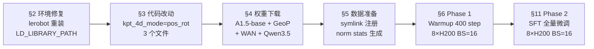
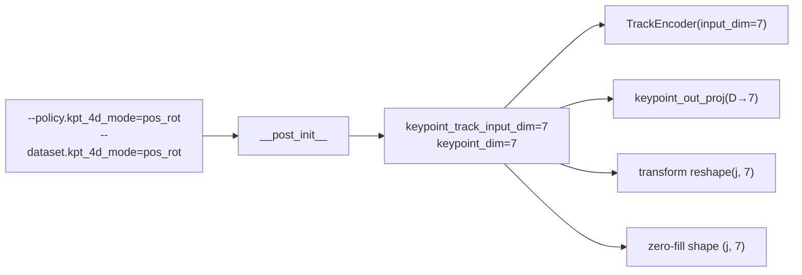
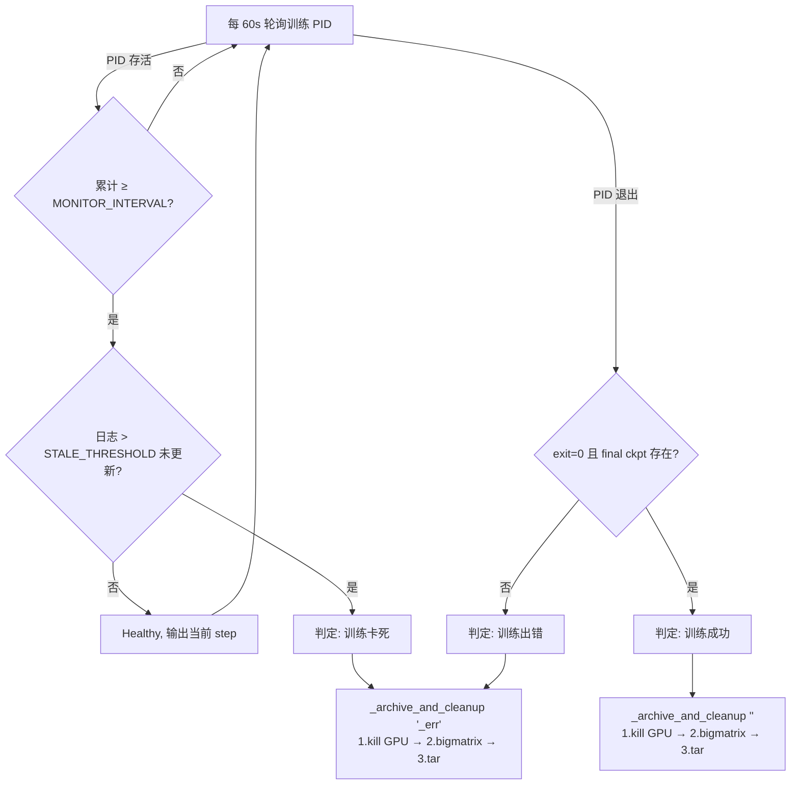

# R1 Pro 电梯按键任务 Phase 2 SFT 微调训练操作手册（8×H200）

> **文档定位**: 面向第三方工程师的逐步操作手册——在 **8×NVIDIA H200（143 GB/卡）** 服务器上，从零完成环境修复、代码改动、Phase 1 Warmup 和 Phase 2 SFT 全流程，训练 InternVLA-A1.5 + GeoPredict 模型在 R1 Pro 电梯按键任务上的全量微调。
>
> **设计依据**:
> - 方案设计: [`p2sft_plan.md`](p2sft_plan.md)（代码改动规格、E1 7D 关键点缺口分析）
> - 编排逻辑: [`../GpRbt/run_ech_rbt_p012.md`](../GpRbt/run_ech_rbt_p012.md)（路径隔离、步数公式）
> - 踩坑经验: [`../GpRbt/sft0827LOG.md`](../GpRbt/sft0827LOG.md)（Ceph、OOM、Triton 缓存竞争等实战问题）
> - 操作参考: [`../GpRbt/sft0827.md`](../GpRbt/sft0827.md)（RoboTwin 双任务 SFT 手册）
>
> **论文出处**:
> - InternVLA-A1.5: [arXiv:2607.04988](https://arxiv.org/abs/2607.04988)
> - GeoPredict: [arXiv:2512.16811](https://arxiv.org/abs/2512.16811)
>
> **撰写日**: 2026-09-04

---

## ⚡ 执行前：需用户提供的信息

> 在开始任何操作前，请先确认或填写以下信息。带 **\*** 的项是必须由用户提供的，其余有默认值但需确认正确。

### 必填项（无默认值，训练无法启动）

| # | 信息项 | 说明 | 用户填写 |
|:---:|:---|:---|:---|
| 1 | **Phase 1 Warmup checkpoint 路径** (`WARMUP_CKPT`) | Phase 1 训练产出的 `checkpoints/000400/pretrained_model` 完整路径。若本机没有，需先跑 §6。 | `/home/a26113/b/Ckp/itvlaGpR1pro/elvat0714_4D_p1wrmup2609031326_2609031345/checkpoints/000426/pretrained_model` |
| 2 | **数据集实际路径** | 确认 `/B/Dta/elevator0714_lerobot_4D` 存在，且 `meta/info.json` 中 `keypoint_3d shape=[112]`。若路径不同，修改 §5.1 中的 symlink 命令。 | `_____________` |

### 需确认项（有默认值，但需确认与本机一致）

| # | 信息项 | 文档默认值 | 本机实际值 |
|:---:|:---|:---|:---|
| 3 | venv 路径 (`VENV`) | `/B/VENV/itnvla15rbt20` | `_____________` |
| 4 | 项目代码根路径 (`PROJ_ROOT`) | `/B/SRC/itvlaGp` | `_____________` |
| 5 | HF 权重缓存根 (`HF_HOME`) | `${VENV}/var/hf_home` | `/B/VENV/hf_home` |
| 6 | LeRobot 数据集注册目录 (`HF_LEROBOT_HOME`) | `${VENV}/var/datasets` | `${HF_HOME}/lerobot` |
| 7 | WAN 模型路径 (`WAN_DIR`) | `${HF_HOME}/hub/Wan2.2-TI2V-5B` | `_____________` |
| 8 | InternVLA-A1.5-base 路径 | `${HF_HOME}/ckpts/InternVLA-A1.5-base` | `_____________` |
| 9 | GeoPredict checkpoint 路径 | `${HF_HOME}/ckpts/GeoPredict_robocasa.pth` | `_____________` |
| 10 | tar 归档目标目录 (`ARCHIVE_DEST`) | `${HOME}/b/Ckp` | `_____________` |
| 11 | GPU 数量与编号 | 8 卡，`CUDA_VISIBLE_DEVICES=0,1,2,3,4,5,6,7` | `_____________` |

### 可选项（按需调整）

| # | 信息项 | 默认值 | 说明 |
|:---:|:---|:---|:---|
| 12 | WANDB Token | 无（offline 模式，不需要 token） | 若需 online 上传，export `WANDB_API_KEY=<your_token>` |
| 13 | 实验名称 (`EXPR_NAME`) | `ItvlaGpR1proElvtH200` | 用于 tar 包文件名前缀 |
| 14 | `MASTER_PORT` | `36603` | 若端口冲突请更换 |
| 15 | bigmatrix 脚本路径 | `${PROJ_ROOT}/b/d/GpRbt/bigmatrix_multiply_optimization.py` | 训练完毕后 GPU 占位用，不存在则跳过 |

### 快速确认脚本

```bash
# 运行此脚本检查必填项是否就绪
VENV=/B/VENV/itnvla15rbt20
HF_HOME="${VENV}/var/hf_home"
HF_LEROBOT_HOME="${VENV}/var/datasets"

echo "=== 信息确认 ==="
echo "1. WARMUP_CKPT: ${WARMUP_CKPT:-'❌ 未设置，请先 export WARMUP_CKPT=...'}"
echo "2. 数据集: $(test -f /B/Dta/elevator0714_lerobot_4D/meta/info.json && echo '✓ 存在' || echo '❌ 不存在')"
echo "3. venv: $(test -f ${VENV}/bin/python && echo '✓ 存在' || echo '❌ 不存在')"
echo "4. HF_HOME: $(test -d ${HF_HOME} && echo '✓ 存在' || echo '❌ 未创建，需执行 §4.1')"
echo "5. WAN: $(test -f ${HF_HOME}/hub/Wan2.2-TI2V-5B/Wan2.2_VAE.pth && echo '✓' || echo '❌ 需执行 §4.3')"
echo "6. A1.5-base: $(test -f ${HF_HOME}/ckpts/InternVLA-A1.5-base/config.json && echo '✓' || echo '❌ 需执行 §4.2')"
echo "7. GeoPredict: $(test -f ${HF_HOME}/ckpts/GeoPredict_robocasa.pth && echo '✓' || echo '❌ 需执行 §4.2')"
echo "8. GPU 数量: $(python3 -c 'import torch; print(torch.cuda.device_count())' 2>/dev/null || echo '无法检测')"
```

---

## 目录

- [⚡ 执行前：需用户提供的信息](#-执行前需用户提供的信息)
- [0. 30 秒总览](#0-30-秒总览)
- [1. 本机硬件与软件环境](#1-本机硬件与软件环境)
- [2. 当前环境问题与修复](#2-当前环境问题与修复)
- [3. 代码改动：E1 7D 关键点支持](#3-代码改动e1-7d-关键点支持)
- [4. 模型权重下载](#4-模型权重下载)
- [5. 数据准备](#5-数据准备)
- [6. Phase 1 Warmup（前置条件）](#6-phase-1-warmup前置条件)
- [7. Phase 2 SFT Launch 脚本](#7-phase-2-sft-launch-脚本)
- [8. 步数计算](#8-步数计算)
- [9. Preflight 验收清单](#9-preflight-验收清单)
- [10. Smoke 测试](#10-smoke-测试)
- [11. 正式训练](#11-正式训练)
- [12. 监控与备份](#12-监控与备份)
- [13. 训练后验收](#13-训练后验收)
- [14. 故障排查](#14-故障排查)
- [附录 A：Phase 1 vs Phase 2 配置矩阵](#附录-aphase-1-vs-phase-2-配置矩阵)
- [附录 B：执行日志模板](#附录-b执行日志模板)
- [附录 C：Phase 2 SFT 训练超参数完整清单](#附录-cphase-2-sft-训练超参数完整清单)

---

## 0. 30 秒总览



**本机关键参数**：

| 项 | 值 |
|:---|:---|
| GPU | 8×NVIDIA H200，143 GB/卡 |
| 有效 batch（8×16） | **128** |
| 数据集 | `elevator0714_lerobot_4D`（100 ep / 27,145 frames / E1 7D kpt） |
| Phase 2 总 step（10 epoch） | **2,130** |
| Checkpoint 策略 | 每 epoch 结束保存一次，共 10 个（step 213×1 ~ 213×10） |

---

## 1. 本机硬件与软件环境

### 1.1 硬件

| 项 | 值 |
|:---|:---|
| GPU | 8×NVIDIA H200, 143,771 MiB/卡, sm_90, CUDA driver 580.159.04 |
| CPU | 224 cores |
| RAM | 2.8 TiB |
| 磁盘 | `/B` 和 `/tmp` 共享 12T ext4（**非 Ceph**，无分布式文件锁问题） |

### 1.2 软件

| 项 | 值 | 路径 |
|:---|:---|:---|
| OS | Ubuntu 22.04.4 LTS, kernel 6.12.85+ | — |
| Python | 3.11.9 | `/B/VENV/itnvla15rbt20/bin/python` |
| PyTorch | 2.10.0+cu128 | venv |
| transformers | 5.2.0 | venv |
| accelerate | 1.14.0 | venv |
| gcc | 11.4.0 | `/usr/bin/gcc` |
| Qwen3.5 patch | **已安装** | `transformers/models/qwen3_5/` |

### 1.3 路径汇总

```text
PROJ_ROOT   = /B/SRC/itvlaGp                           # 代码仓库
VENV_ROOT   = /B/VENV/itnvla15rbt20                    # 训练 venv
PYTHON      = ${VENV_ROOT}/bin/python
HF_HOME     = ${VENV_ROOT}/var/hf_home                 # 权重缓存（§4 创建）
DATA_ROOT   = /B/Dta                                    # 数据集根
DATA_PATH   = /B/Dta/elevator0714_lerobot_4D           # 实际数据位置
```

### 1.4 当前已确认的问题（§2 修复）

| # | 问题 | 影响 |
|:---:|:---|:---|
| 1 | `lerobot` editable 安装指向 `/B/SRC/InternVLA-A-series/`，**不是** `/B/SRC/itvlaGp/` | 代码改动不会生效 |
| 2 | `torchcodec` 无法导入：`libnppicc.so.12` 不在 `LD_LIBRARY_PATH` | 视频解码失败 |
| 3 | 所有模型权重缺失（`var/` 目录不存在） | 无法启动训练 |
| 4 | 无 Phase 1 Warmup checkpoint | Phase 2 无起点 |
| 5 | `norm_stat_abs.json` 不存在 | 训练无法归一化 |
| 6 | kpt_4d_mode 代码改动未应用（`keypoint_out_proj` 硬编码 3） | 7D 关键点 reshape 失败 |

---

## 2. 当前环境问题与修复

### 2.1 修复 lerobot editable 安装

**问题**: 当前 `lerobot` 包指向 `/B/SRC/InternVLA-A-series/`。我们需要的代码在 `/B/SRC/itvlaGp/`，后续 §3 的代码改动必须生效。

```bash
VENV=/B/VENV/itnvla15rbt20
PROJ=/B/SRC/itvlaGp

# 重新 editable 安装（--ignore-installed 避免卸载旧安装时阻塞）
"${VENV}/bin/python" -m pip install \
  --ignore-installed --no-deps --no-build-isolation \
  -e "${PROJ}"

# 验证
"${VENV}/bin/python" -c "import lerobot; print(lerobot.__file__)"
# 期望输出: /B/SRC/itvlaGp/src/lerobot/__init__.py
```

### 2.2 确认 LD_LIBRARY_PATH

**问题**: `torchcodec` 需要 `libnppicc.so.12`，已安装在 venv 的 nvidia/npp 目录但不在搜索路径中。

Launch 脚本会自动设置 `LD_LIBRARY_PATH`（见 §7），但手动验证时需先 export：

```bash
VENV=/B/VENV/itnvla15rbt20
export LD_LIBRARY_PATH="${VENV}/lib/python3.11/site-packages/nvidia/npp/lib:\
${VENV}/lib/python3.11/site-packages/nvidia/cuda_runtime/lib:\
${VENV}/lib/python3.11/site-packages/nvidia/cuda_nvrtc/lib:\
${VENV}/lib/python3.11/site-packages/torch/lib:\
${VENV}/lib:${LD_LIBRARY_PATH:-}"

"${VENV}/bin/python" -c "import torchcodec; print('torchcodec OK')"
# 期望: torchcodec OK
```

### 2.3 环境验证（全部通过再继续）

```bash
VENV=/B/VENV/itnvla15rbt20
PROJ=/B/SRC/itvlaGp

# 设置 LD_LIBRARY_PATH（同 §2.2）
export LD_LIBRARY_PATH="${VENV}/lib/python3.11/site-packages/nvidia/npp/lib:\
${VENV}/lib/python3.11/site-packages/nvidia/cuda_runtime/lib:\
${VENV}/lib/python3.11/site-packages/nvidia/cuda_nvrtc/lib:\
${VENV}/lib/python3.11/site-packages/torch/lib:\
${VENV}/lib:${LD_LIBRARY_PATH:-}"

"${VENV}/bin/python" -c "
import torch, transformers, accelerate, lerobot, torchcodec
assert '${PROJ}' in lerobot.__file__, f'lerobot 指向错误: {lerobot.__file__}'
print('torch', torch.__version__, 'cuda', torch.cuda.is_available(), 'devices', torch.cuda.device_count())
print('transformers', transformers.__version__)
print('accelerate', accelerate.__version__)
print('lerobot', lerobot.__file__)
print('torchcodec OK')
print('全部通过 ✓')
"
```

任一失败 → 回到 §2.1 / §2.2 修复，**不要继续**。

---

## 3. 代码改动：E1 7D 关键点支持

### 3.0 背景

数据集 `elevator0714_lerobot_4D` 中 `observation.keypoint_3d` 的 shape 为 `[112]`（16 关节 × 7D：位置 3 + 四元数 4），但当前代码**硬编码为 3D**。需修改 **3 个文件**才能正确训练。

设计详见 [`p2sft_plan.md` §2-§3](p2sft_plan.md)。核心思路：引入 `kpt_4d_mode` 配置字段（`"pos_only"` | `"pos_rot"`），由它自动派生维度值。



**验证改动前的状态**（确认硬编码 3 仍在）：

```bash
cd /B/SRC/itvlaGp

# 1. 确认 modeling 中 keypoint_out_proj 仍硬编码 3
grep -n "keypoint_out_proj.*Linear.*3" \
  src/lerobot/policies/internvla_a1_5/modeling_internvla_a1_5.py

# 2. 确认 transform 中 reshape 仍硬编码 3
grep -n "reshape.*j.*3\|zeros.*j.*3" \
  src/lerobot/policies/internvla_a1_5/transform_internvla_a1_5.py

# 3. 确认 config 中 _kpt_fields_passthrough_or_zero 仍硬编码 3
grep -n "zeros.*j.*3" \
  src/lerobot/policies/internvla_a1_5/configuration_internvla_a1_5.py
```

### 3.1 `configuration_internvla_a1_5.py`（7 处改动）

**文件**: `src/lerobot/policies/internvla_a1_5/configuration_internvla_a1_5.py`

#### 3.1.0 `InternVLAA15Config` — 新增 `kpt_4d_mode` + `kpt_rot_loss_weight`

在文件头确认 `from typing import ClassVar` 已存在；若无则添加。

找到约第 474 行 `keypoint_track_input_dim: int = 3`，在其后加入新字段和 `__post_init__` 逻辑：

**原代码**（约第 474-485 行）：
```python
    keypoint_track_input_dim: int = 3
    # ...
    keypoint_noise_sigma: float = 0.0

    def __post_init__(self):
        super().__post_init__()
```

**改为**：
```python
    keypoint_track_input_dim: int = 3

    kpt_4d_mode: str = "pos_only"  # "pos_only" (3D) or "pos_rot" (7D)
    kpt_rot_loss_weight: float = 1.0  # rotation MSE weight (pos_rot only)
    keypoint_noise_sigma: float = 0.0

    _KPT_4D_DIM: ClassVar[dict[str, int]] = {"pos_only": 3, "pos_rot": 7}

    def __post_init__(self):
        super().__post_init__()
        if self.kpt_4d_mode not in self._KPT_4D_DIM:
            raise ValueError(f"Unsupported kpt_4d_mode={self.kpt_4d_mode!r}, expected {list(self._KPT_4D_DIM)}")
        self.keypoint_track_input_dim = self._KPT_4D_DIM[self.kpt_4d_mode]
```

#### 3.1.1 `InternVLAA15DatasetConfig` — 新增 `kpt_4d_mode` + `keypoint_dim`

找到约第 38-40 行：

**原代码**：
```python
    num_keypoint_joints: int = 8
    keypoint_history_max_len: int = 1000
```

**改为**：
```python
    num_keypoint_joints: int = 8
    keypoint_history_max_len: int = 1000
    kpt_4d_mode: str = "pos_only"
    keypoint_dim: int = 3  # auto-derived from kpt_4d_mode
```

并在 `__post_init__`（约第 72 行，`super().__post_init__()` 之后）加入：
```python
        _KPT_4D_DIM = {"pos_only": 3, "pos_rot": 7}
        if self.kpt_4d_mode not in _KPT_4D_DIM:
            raise ValueError(f"Unsupported kpt_4d_mode={self.kpt_4d_mode!r}")
        self.keypoint_dim = _KPT_4D_DIM[self.kpt_4d_mode]
```

#### 3.1.2 `InternVLAA15DatasetConfig.__post_init__` — 透传 `keypoint_dim`

在 `Extract3DKeypointTransformFn` 构建处（约第 111-113 行），新增 `keypoint_dim`：

**原代码**：
```python
            kpt_extract = Extract3DKeypointTransformFn(
                num_joints=self.num_keypoint_joints,
                history_max_len=self.keypoint_history_max_len,
                chunk_size=self.chunk_size,
            )
```

**改为**：
```python
            kpt_extract = Extract3DKeypointTransformFn(
                num_joints=self.num_keypoint_joints,
                history_max_len=self.keypoint_history_max_len,
                chunk_size=self.chunk_size,
                keypoint_dim=self.keypoint_dim,
            )
```

在 `UnifyInternVLAA15InputsTransformFn` 属性设置处（约第 127-130 行），新增一行：

```python
                t.keypoint_dim = self.keypoint_dim
```

#### 3.1.3 `UnifyInternVLAA15InputsTransformFn` — 新增 `keypoint_dim` 字段

找到约第 152-155 行，在 `chunk_size` 后新增：

```python
    keypoint_dim: int = 3
```

同时更新其 `__call__`（约第 191 行）中 `_kpt_fields_passthrough_or_zero` 调用：

**原代码**：
```python
            result.update(_kpt_fields_passthrough_or_zero(data, self.num_keypoint_joints, self.keypoint_history_max_len, self.chunk_size))
```

**改为**：
```python
            result.update(_kpt_fields_passthrough_or_zero(data, self.num_keypoint_joints, self.keypoint_history_max_len, self.chunk_size, self.keypoint_dim))
```

#### 3.1.4 `_kpt_fields_passthrough_or_zero` — 新增 `keypoint_dim` 参数

**原代码**（第 195-209 行）：
```python
def _kpt_fields_passthrough_or_zero(
    data: DataDict, num_joints: int, history_max_len: int, chunk_size: int
) -> DataDict:
    import torch
    h, j, c = history_max_len, num_joints, chunk_size
    return {
        "observation.his_kpts": data.get("observation.his_kpts", torch.zeros(h, j, 3)),
        "observation.his_len": data.get("observation.his_len", torch.tensor(0, dtype=torch.long)),
        "observation.kpt_t": data.get("observation.kpt_t", torch.zeros(j, 3)),
        "observation.kpt_future": data.get("observation.kpt_future", torch.zeros(c, j, 3)),
        "observation.kpt_mask": data.get("observation.kpt_mask", torch.tensor(False)),
    }
```

**改为**：
```python
def _kpt_fields_passthrough_or_zero(
    data: DataDict, num_joints: int, history_max_len: int, chunk_size: int, keypoint_dim: int = 3
) -> DataDict:
    import torch
    h, j, c, d = history_max_len, num_joints, chunk_size, keypoint_dim
    return {
        "observation.his_kpts": data.get("observation.his_kpts", torch.zeros(h, j, d)),
        "observation.his_len": data.get("observation.his_len", torch.tensor(0, dtype=torch.long)),
        "observation.kpt_t": data.get("observation.kpt_t", torch.zeros(j, d)),
        "observation.kpt_future": data.get("observation.kpt_future", torch.zeros(c, j, d)),
        "observation.kpt_mask": data.get("observation.kpt_mask", torch.tensor(False)),
    }
```

**为什么必须改**: VQA 样本的 zero-fill 如果仍生成 `[J, 3]`，而 robot 样本已产出 `[J, 7]`，collation 时 **shape mismatch → crash**。

#### 3.1.5 `UnifyInternVLAA15VQAInputsTransformFn` + `InternVLAA15VQADatasetConfig` — 同步

与 §3.1.3 相同的改动，对 VQA 侧也新增 `keypoint_dim: int = 3` 字段和透传逻辑。约在第 227-230 行和第 283-289 行。详见 [`p2sft_plan.md` §3.1.5](p2sft_plan.md)。

#### 3.1 改动汇总

| # | 位置 | 改动 |
|:---:|:---|:---|
| 0 | `InternVLAA15Config` | +2 字段 + `__post_init__` 派生 |
| 1 | `InternVLAA15DatasetConfig` | +2 字段 + `__post_init__` 派生 |
| 2 | `DatasetConfig.__post_init__` | 透传给 Extract + Unify |
| 3 | `UnifyInputsTransformFn` | +1 字段 + 调用修改 |
| 4 | `_kpt_fields_passthrough_or_zero` | +1 参数，`3` → `d` |
| 5 | VQA 侧对称 | 同 #3 |

### 3.2 `modeling_internvla_a1_5.py`（4 处改动）

**文件**: `src/lerobot/policies/internvla_a1_5/modeling_internvla_a1_5.py`

#### 改动 1：`keypoint_out_proj` 输出维度（第 1020 行）

**原**: `self.keypoint_out_proj = nn.Linear(kpt_hidden_size, 3)`

**改为**: `self.keypoint_out_proj = nn.Linear(kpt_hidden_size, config.keypoint_track_input_dim)`

#### 改动 2：`embed_kpt_suffix` 中 fallback zeros（第 1597 行）

**原**: `his_kpts = torch.zeros(bsize, self.config.keypoint_history_max_len, j, 3, device=device)`

**改为**: `his_kpts = torch.zeros(bsize, self.config.keypoint_history_max_len, j, self.config.keypoint_track_input_dim, device=device)`

#### 改动 3：新增 `_kpt_split_loss` helper（约第 1948 行前插入）

```python
    def _kpt_split_loss(self, pred: torch.Tensor, gt: torch.Tensor, reduce_dims: tuple[int, ...]) -> torch.Tensor:
        kpt_dim = self.config.keypoint_track_input_dim
        gt = gt.to(torch.float32)
        if self.config.kpt_4d_mode == "pos_rot":
            loss_pos = F.mse_loss(pred[..., :3], gt[..., :3], reduction="none").mean(dim=reduce_dims)
            pred_rot = F.normalize(pred[..., 3:kpt_dim], p=2, dim=-1)
            loss_rot = F.mse_loss(pred_rot, gt[..., 3:kpt_dim], reduction="none").mean(dim=reduce_dims)
            return loss_pos + self.config.kpt_rot_loss_weight * loss_rot
        return F.mse_loss(pred, gt, reduction="none").mean(dim=reduce_dims)
```

#### 改动 4：当前帧 + 未来帧 loss 计算（第 1955-1976 行）

将所有硬编码 `3` 替换为 `kpt_dim = self.config.keypoint_track_input_dim`，loss 调用改为 `self._kpt_split_loss(...)`。详见 [`p2sft_plan.md` §3.2 改动 3](p2sft_plan.md)。

### 3.3 `transform_internvla_a1_5.py`（1 处改动）

**文件**: `src/lerobot/policies/internvla_a1_5/transform_internvla_a1_5.py`

在 `Extract3DKeypointTransformFn` 中：

1. 新增字段 `keypoint_dim: int = 3`（第 690 行后）
2. `__call__` 中 `h, j, c = ...` 改为 `h, j, c, d = ..., self.keypoint_dim`
3. 所有 `torch.zeros(h, j, 3)` → `torch.zeros(h, j, d)`，`reshape(..., j, 3)` → `reshape(..., j, d)`

涉及第 697、699、700、707、720 行的 `3` → `d`。

### 3.4 改动后验证

```bash
cd /B/SRC/itvlaGp

# 1. Python 编译检查（无语法错误）
/B/VENV/itnvla15rbt20/bin/python -m py_compile \
  src/lerobot/policies/internvla_a1_5/configuration_internvla_a1_5.py \
  src/lerobot/policies/internvla_a1_5/modeling_internvla_a1_5.py \
  src/lerobot/policies/internvla_a1_5/transform_internvla_a1_5.py

# 2. 功能验证
/B/VENV/itnvla15rbt20/bin/python - <<'PY'
from lerobot.policies.internvla_a1_5.configuration_internvla_a1_5 import (
    InternVLAA15Config, InternVLAA15DatasetConfig,
    _kpt_fields_passthrough_or_zero,
)
import inspect

# 验证 kpt_4d_mode 字段存在且默认 pos_only
cfg = InternVLAA15Config(enable_keypoint_predictor=True)
assert hasattr(cfg, "kpt_4d_mode"), "缺少 kpt_4d_mode"
assert cfg.keypoint_track_input_dim == 3, "默认应为 3"

# 验证 pos_rot 模式
cfg2 = InternVLAA15Config(enable_keypoint_predictor=True, kpt_4d_mode="pos_rot")
assert cfg2.keypoint_track_input_dim == 7, "pos_rot 应派生为 7"

# 验证 dataset config
dcfg = InternVLAA15DatasetConfig(kpt_4d_mode="pos_rot")
assert dcfg.keypoint_dim == 7, "dataset keypoint_dim 应为 7"

# 验证 _kpt_fields_passthrough_or_zero 接受 keypoint_dim
sig = inspect.signature(_kpt_fields_passthrough_or_zero)
assert "keypoint_dim" in sig.parameters, "缺少 keypoint_dim 参数"

print("代码改动验证通过 ✓")
PY
```

---

## 4. 模型权重下载

本机 `${VENV_ROOT}/var/` 目录**不存在**，需要创建并下载全部权重。

### 4.1 创建目录结构

```bash
VENV=/B/VENV/itnvla15rbt20
mkdir -p "${VENV}/var/hf_home/ckpts"
mkdir -p "${VENV}/var/hf_home/hub"
mkdir -p "${VENV}/var/datasets"
```

### 4.2 下载 InternVLA-A1.5-base + GeoPredict + Qwen3.5-2B

```bash
VENV=/B/VENV/itnvla15rbt20
export HF_HOME="${VENV}/var/hf_home"

"${VENV}/bin/python" <<'PY'
import os
from huggingface_hub import hf_hub_download, snapshot_download

hf_home = os.environ["HF_HOME"]
ckpt_dir = os.path.join(hf_home, "ckpts")

# GeoPredict RoboCasa checkpoint（Phase 1 用）
hf_hub_download(
    "Jingjing0601/GeoPredict-Robocasa",
    "GeoPredict_robocasa.pth",
    local_dir=ckpt_dir,
)
print("GeoPredict OK")

# InternVLA-A1.5-base（Phase 1 起点）
snapshot_download(
    "InternRobotics/InternVLA-A1.5-base",
    local_dir=os.path.join(ckpt_dir, "InternVLA-A1.5-base"),
)
print("A1.5-base OK")

# Qwen3.5-2B（VLM backbone）
snapshot_download(
    "Qwen/Qwen3.5-2B",
    cache_dir=os.path.join(hf_home, "hub"),
)
print("Qwen3.5-2B OK")
PY
```

### 4.3 下载 WAN2.2-TI2V-5B（Phase 2 必须）

```bash
VENV=/B/VENV/itnvla15rbt20
export HF_HOME="${VENV}/var/hf_home"
WAN_DIR="${HF_HOME}/hub/Wan2.2-TI2V-5B"

"${VENV}/bin/python" <<'PY'
import os
from huggingface_hub import snapshot_download
wan_dir = os.path.join(os.environ["HF_HOME"], "hub", "Wan2.2-TI2V-5B")
snapshot_download("Wan-AI/Wan2.2-TI2V-5B", local_dir=wan_dir)
print("WAN OK:", wan_dir)
PY
```

> WAN 约数十 GB；若 HF 访问受限，用镜像或离线下载。Phase 1 不加载 WAN。

### 4.4 验证所有权重

```bash
VENV=/B/VENV/itnvla15rbt20
HF_HOME="${VENV}/var/hf_home"

test -f "${HF_HOME}/ckpts/GeoPredict_robocasa.pth" && echo "GeoPredict ✓" || echo "MISSING"
test -f "${HF_HOME}/ckpts/InternVLA-A1.5-base/config.json" && echo "A1.5-base ✓" || echo "MISSING"
test -f "${HF_HOME}/hub/Wan2.2-TI2V-5B/Wan2.2_VAE.pth" && echo "WAN ✓" || echo "MISSING"
ls "${HF_HOME}/hub/models--Qwen--Qwen3.5-2B/snapshots/" 2>/dev/null && echo "Qwen3.5 ✓" || echo "MISSING"
```

---

## 5. 数据准备

### 5.1 数据集注册（symlink）

LeRobot 通过 `${HF_LEROBOT_HOME}/<repo_id>` 定位数据集。实际数据在 `/B/Dta/elevator0714_lerobot_4D`，通过 symlink 注册。

```bash
VENV=/B/VENV/itnvla15rbt20
HF_LEROBOT_HOME="${VENV}/var/datasets"
DATA_REPO_ID="elevator0714_lerobot_4D"

mkdir -p "${HF_LEROBOT_HOME}"
ln -sfn /B/Dta/elevator0714_lerobot_4D "${HF_LEROBOT_HOME}/${DATA_REPO_ID}"

# 验证
test -f "${HF_LEROBOT_HOME}/${DATA_REPO_ID}/meta/info.json" && echo "DATA OK ✓"

"${VENV}/bin/python" - <<'PY'
import json
info = json.load(open("/B/Dta/elevator0714_lerobot_4D/meta/info.json"))
print("total_frames:", info["total_frames"], "total_episodes:", info["total_episodes"])
print("codebase_version:", info["codebase_version"])
kpt = info["features"]["observation.keypoint_3d"]
assert kpt["shape"] == [112], f"期望 [112], 实际 {kpt['shape']}"
print("keypoint_3d shape:", kpt["shape"], "✓")
meta = json.load(open("/B/Dta/elevator0714_lerobot_4D/meta/keypoints_meta.json"))
assert meta["keypoint_dim"] == 7, "期望 7 (E1 方案)"
print("keypoint_dim:", meta["keypoint_dim"], "✓")
print("数据集验证通过 ✓")
PY
```

期望：27,145 frames / 100 episodes / v3.0 / keypoint shape=[112] / keypoint_dim=7。

### 5.2 生成 Norm Stats

**问题**: 数据集自带的 `stats.json` 使用原始子字段键（`observation.state.left_arm` 等），训练框架需要 `r1_pro.yaml` schema 合并后的 `observation.state`（25D）和 `action`（19D）的统计量。

```bash
VENV=/B/VENV/itnvla15rbt20
export HF_HOME="${VENV}/var/hf_home"
export HF_LEROBOT_HOME="${VENV}/var/datasets"

# 设置 LD_LIBRARY_PATH（compute 可能需要读视频）
export LD_LIBRARY_PATH="${VENV}/lib/python3.11/site-packages/nvidia/npp/lib:\
${VENV}/lib/python3.11/site-packages/nvidia/cuda_runtime/lib:\
${VENV}/lib/python3.11/site-packages/nvidia/cuda_nvrtc/lib:\
${VENV}/lib/python3.11/site-packages/torch/lib:\
${VENV}/lib:${LD_LIBRARY_PATH:-}"

cd /B/SRC/itvlaGp

"${VENV}/bin/python" util_scripts/compute_norm_stats_single.py \
  --repo_id elevator0714_lerobot_4D \
  --action_mode abs \
  --chunk_size 50
```

脚本输出到 `${HF_LEROBOT_HOME}/stats/abs/elevator0714_lerobot_4D/stats.json`。

**拷贝到 Phase 2 launch 脚本期望的位置**：

```bash
HF_LEROBOT_HOME=/B/VENV/itnvla15rbt20/var/datasets

# Phase 2 launch 默认读取 meta/norm_stat_abs.json
cp "${HF_LEROBOT_HOME}/stats/abs/elevator0714_lerobot_4D/stats.json" \
   "${HF_LEROBOT_HOME}/elevator0714_lerobot_4D/meta/norm_stat_abs.json"

echo "norm stats 已复制 ✓"
```

**验证**：

```bash
/B/VENV/itnvla15rbt20/bin/python - <<'PY'
import json
d = json.load(open("/B/VENV/itnvla15rbt20/var/datasets/elevator0714_lerobot_4D/meta/norm_stat_abs.json"))
print("Keys:", sorted(d.keys()))
for k in ["observation.state", "action"]:
    if k in d:
        m = d[k]["mean"]
        print(f"  {k}: dim={len(m)}")
    else:
        print(f"  WARNING: {k} 不在 norm stats 中!")
PY
```

期望：`observation.state` 为 25D，`action` 为 19D。

---

## 6. Phase 1 Warmup（前置条件）

Phase 2 必须从 **Phase 1 Warmup 产出的 ckpt@400** 出发。本机当前没有 warmup checkpoint。

### 6.1 Phase 1 配置要点

| 配置项 | 值 | 说明 |
|:---|:---|:---|
| `pretrained_path` | InternVLA-A1.5-base | 基础权重 |
| `geopredict_checkpoint_path` | GeoPredict_robocasa.pth | TrackEncoder 初始化 |
| `train_expert_only` | true | VLM 冻结 |
| `action_loss_only` | true | 不加载 WAN |
| `init_kpt_expert_from_action` | true | Kpt Expert 从 Action Expert 拷贝 |
| `kpt_4d_mode` | `pos_rot`（7D） | **必须与数据集一致** |
| `num_keypoint_joints` | 16 | R1 Pro 双臂 |
| `steps` | 400 | 固定 |
| `save_freq` | 100 | 存 100/200/300/400 |

### 6.2 执行 Phase 1

现有 launch 脚本 `launch/internvla_a15_r1pro_geop_phase1.sh` 针对 R1 Pro 16 关节，但不含 `kpt_4d_mode`。需要通过环境变量和额外 CLI 参数补充：

```bash
cd /B/SRC/itvlaGp

VENV=/B/VENV/itnvla15rbt20
HF_HOME="${VENV}/var/hf_home"
HF_LEROBOT_HOME="${VENV}/var/datasets"

# 设置 LD_LIBRARY_PATH
export LD_LIBRARY_PATH="${VENV}/lib/python3.11/site-packages/nvidia/npp/lib:\
${VENV}/lib/python3.11/site-packages/nvidia/cuda_runtime/lib:\
${VENV}/lib/python3.11/site-packages/nvidia/cuda_nvrtc/lib:\
${VENV}/lib/python3.11/site-packages/torch/lib:\
${VENV}/lib:${LD_LIBRARY_PATH:-}"

VENV_ROOT="${VENV}" \
HF_HOME="${HF_HOME}" \
HF_LEROBOT_HOME="${HF_LEROBOT_HOME}" \
PRETRAINED_PATH="${HF_HOME}/ckpts/InternVLA-A1.5-base" \
GEOPREDICT_CKPT="${HF_HOME}/ckpts/GeoPredict_robocasa.pth" \
DATA_REPO_ID=elevator0714_lerobot_4D \
EXTERNAL_STATS_PATH="${HF_LEROBOT_HOME}/elevator0714_lerobot_4D/meta/norm_stat_abs.json" \
TRITON_CACHE_DIR=/tmp/itvla-triton-cache \
  bash launch/internvla_a15_r1pro_geop_phase1.sh
```

> **注意**: 如果代码改动（§3）已引入 `kpt_4d_mode` 但 Phase 1 launch 脚本未传 `--policy.kpt_4d_mode=pos_rot` 和 `--dataset.kpt_4d_mode=pos_rot`，那么默认 `pos_only` 会导致 `keypoint_track_input_dim=3`，112D 数据 reshape 为 `(j, 3)` 会失败。
>
> **解决方案**：在运行前手动编辑 `launch/internvla_a15_r1pro_geop_phase1.sh`，在 `--policy.enable_keypoint_predictor=true` 之后加入：
> ```bash
>     --policy.kpt_4d_mode=pos_rot
>     --dataset.kpt_4d_mode=pos_rot
> ```
>
> 或者直接在脚本的 `ARGS` 数组末尾追加这两个参数。

### 6.3 验证 ckpt@400

```bash
# 找到 Phase 1 输出目录（时间戳格式）
WARMUP_DIR=$(ls -td /B/SRC/itvlaGp/outputs/internvla_a1_5/*r1pro-geop-phase1* 2>/dev/null | head -1)
WARMUP_CKPT="${WARMUP_DIR}/checkpoints/000400/pretrained_model"

echo "WARMUP_CKPT=${WARMUP_CKPT}"
test -f "${WARMUP_CKPT}/config.json" && echo "ckpt@400 存在 ✓" || echo "ERROR: 不存在"

/B/VENV/itnvla15rbt20/bin/python - <<PY
import json
cfg = json.load(open("${WARMUP_CKPT}/config.json"))
print("enable_keypoint_predictor:", cfg.get("enable_keypoint_predictor"))
print("num_keypoint_joints:", cfg.get("num_keypoint_joints"))
print("keypoint_track_input_dim:", cfg.get("keypoint_track_input_dim"))
assert cfg.get("enable_keypoint_predictor") == True
assert cfg.get("num_keypoint_joints") == 16
print("ckpt@400 验证通过 ✓")
PY
```

记录 `WARMUP_CKPT` 的完整路径，Phase 2 需要。

---

## 7. Phase 2 SFT Launch 脚本

### 7.1 基于现有脚本适配 8×H200

现有 `launch/internvla_a15_r1pro_geop_phase2_elevator.sh` 默认为 2 GPU；本机 8×H200 需覆盖关键参数。

**方案**: 不修改原脚本，通过环境变量覆盖。需覆盖的变量：

| 变量 | 原默认 | 本机值 | 原因 |
|:---|:---|:---|:---|
| `TRAIN_VENV` | `/home/luogang/miniforge3/envs/itvlaGp` | `/B/VENV/itnvla15rbt20` | 本机 venv 路径 |
| `HF_HOME` | `/home/luogang/hf_home` | `/B/VENV/itnvla15rbt20/var/hf_home` | 权重路径 |
| `HF_LEROBOT_HOME` | `${HF_HOME}/lerobot` | `/B/VENV/itnvla15rbt20/var/datasets` | 数据注册位置 |
| `PROC_PER_NODE` | 2 | **8** | 8 张 GPU |
| `BATCH_SIZE` | 8 | **16** | H200 143GB 充足 |
| `CUDA_VISIBLE_DEVICES` | `0,1` | `0,1,2,3,4,5,6,7` | 8 卡 |
| `STEPS` | 10000 | **2130** | 10 epoch，见 §8 |
| `SAVE_FREQ` | 2500 | **213** | 每 epoch 保存一次（= $s_{\text{epoch}}$），共 10 个 ckpt，见 §8 |
| `NUM_WORKERS` | 4 | **12** | 更多 CPU 核，更多 GPU |
| `SCHEDULER_WARMUP` | 1000 | **213** | $\lfloor S/10 \rfloor$ |
| `WARMUP_CKPT` | (必填) | Phase 1 产出 | §6 产出 |
| `MASTER_PORT` | 36603 | 36603 | 不变 |

### 7.2 创建 8×H200 专用 wrapper 脚本

为避免每次输入大量 export，创建一个 wrapper：

**文件**: `launch/r1pro_elevator_p2_8xH200.sh`（新建）

```bash
#!/usr/bin/env bash
set -euo pipefail
# R1 Pro Elevator Phase 2 SFT — 8×H200 wrapper
# 用法: WARMUP_CKPT=<path> bash launch/r1pro_elevator_p2_8xH200.sh
#       WAN_SMOKE=1 WARMUP_CKPT=<path> bash launch/r1pro_elevator_p2_8xH200.sh

SCRIPT_DIR="$(cd "$(dirname "${BASH_SOURCE[0]}")" && pwd)"
PROJ_ROOT="$(cd "${SCRIPT_DIR}/.." && pwd)"
VENV="/B/VENV/itnvla15rbt20"

export TRAIN_VENV="${VENV}"
export PYTHON="${VENV}/bin/python"
export HF_HOME="${VENV}/var/hf_home"
export HF_LEROBOT_HOME="${VENV}/var/datasets"
export WAN_DIR="${HF_HOME}/hub/Wan2.2-TI2V-5B"

# LD_LIBRARY_PATH for torchcodec/NPP
export LD_LIBRARY_PATH="${VENV}/lib/python3.11/site-packages/nvidia/npp/lib:\
${VENV}/lib/python3.11/site-packages/nvidia/cuda_runtime/lib:\
${VENV}/lib/python3.11/site-packages/nvidia/cuda_nvrtc/lib:\
${VENV}/lib/python3.11/site-packages/torch/lib:\
${VENV}/lib:${LD_LIBRARY_PATH:-}"

# Triton cache 放本地 ext4
export TRITON_CACHE_DIR="${TRITON_CACHE_DIR:-/tmp/itvla-triton-cache}"

# CC/CXX for Triton kernel compilation
export CC=/usr/bin/gcc
export CXX=/usr/bin/g++

# 8×H200 参数
export PROC_PER_NODE="${PROC_PER_NODE:-8}"
export BATCH_SIZE="${BATCH_SIZE:-16}"
export CUDA_VISIBLE_DEVICES="${CUDA_VISIBLE_DEVICES:-0,1,2,3,4,5,6,7}"
export NUM_WORKERS="${NUM_WORKERS:-12}"
export MASTER_PORT="${MASTER_PORT:-36603}"

# 训练规模（10 epoch，见 §8）
# save_freq=213（每 epoch 保存一次，共 10 个 ckpt）
export STEPS="${STEPS:-2130}"
export SAVE_FREQ="${SAVE_FREQ:-213}"
export SCHEDULER_WARMUP="${SCHEDULER_WARMUP:-213}"

# 监控与归档
export EXPR_NAME="${EXPR_NAME:-ItvlaGpR1proElvtH200}"
export ARCHIVE_SOURCE="${ARCHIVE_SOURCE:-/B}"
export ARCHIVE_DEST="${ARCHIVE_DEST:-${HOME}/b/Ckp}"
export BIGMATRIX_SCRIPT="${PROJ_ROOT}/b/d/GpRbt/bigmatrix_multiply_optimization.py"

exec bash "${PROJ_ROOT}/launch/internvla_a15_r1pro_geop_phase2_elevator.sh"
```

创建并设置权限：

```bash
chmod +x /B/SRC/itvlaGp/launch/r1pro_elevator_p2_8xH200.sh
```

---

## 8. 步数计算

### 8.1 公式（对齐 `run_ech_rbt_p012.md` §6.2）

$$
B_{\text{eff}} = G \cdot B \cdot M = 8 \times 16 \times 1 = 128
$$

$$
s_{\text{epoch}} = \left\lceil \frac{N}{B_{\text{eff}}} \right\rceil = \left\lceil \frac{27145}{128} \right\rceil = 213
$$

$$
S = s_{\text{epoch}} \times E = 213 \times 10 = 2{,}130
$$

每 epoch 结束保存一次 checkpoint，共 10 个，全部保留：

$$
\texttt{save\_freq} = s_{\text{epoch}} = 213 \quad \text{（每 epoch 保存一次）}
$$

$$
\texttt{scheduler\_warmup} = \max(50, \lfloor S/10 \rfloor) = 213
$$

### 8.2 完整 schedule

| 参数 | 值 |
|:---|:---|
| 有效 batch | 128 |
| 总帧数 $N$ | 27,145 |
| 每 epoch 步数 $s_{\text{epoch}}$ | 213 |
| 总 epoch $E$ | 10 |
| 总步数 $S$ | **2,130** |
| `save_freq` | 213（每 epoch 保存一次，共 10 个 ckpt） |
| 保存 epoch | 1, 2, 3, 4, 5, 6, 7, 8, 9, 10（全部保留） |
| 保存 step | 213, 426, 639, 852, 1065, 1278, 1491, 1704, 1917, 2130 |
| scheduler warmup | 213 |
| scheduler decay steps | 2,130 |

### 8.3 用脚本验证

```bash
cd /B/SRC/itvlaGp

/B/VENV/itnvla15rbt20/bin/python - <<'PY'
import math
N = 27145       # total_frames
G = 8           # GPUs
B = 16          # per-GPU batch
M = 1           # nodes
E = 10          # epochs

B_eff = G * B * M
s_epoch = math.ceil(N / B_eff)
S = s_epoch * E
save_freq = s_epoch           # 每 epoch 保存一次，共 E 个 ckpt
all_steps = [s_epoch * e for e in range(1, E + 1)]
warmup = max(50, S // 10)

print(f"B_eff={B_eff}, s_epoch={s_epoch}, S={S}")
print(f"save_freq={save_freq} (every epoch, {E} checkpoints total)")
print(f"all_ckpt_steps={all_steps}")
print(f"scheduler_warmup={warmup}, scheduler_decay={S}")
PY
```

---

## 9. Preflight 验收清单

**在运行任何训练前，全部检查必须通过**：

```bash
#!/usr/bin/env bash
echo "=== R1 Pro Elevator Phase 2 SFT Preflight (8×H200) ==="

VENV=/B/VENV/itnvla15rbt20
PROJ=/B/SRC/itvlaGp
HF_HOME="${VENV}/var/hf_home"
HF_LEROBOT_HOME="${VENV}/var/datasets"

export LD_LIBRARY_PATH="${VENV}/lib/python3.11/site-packages/nvidia/npp/lib:\
${VENV}/lib/python3.11/site-packages/nvidia/cuda_runtime/lib:\
${VENV}/lib/python3.11/site-packages/nvidia/cuda_nvrtc/lib:\
${VENV}/lib/python3.11/site-packages/torch/lib:\
${VENV}/lib:${LD_LIBRARY_PATH:-}"

# 1. Python 环境与 lerobot
"${VENV}/bin/python" -c "
import torch, lerobot, torchcodec
assert '${PROJ}' in lerobot.__file__, f'lerobot 指向错误: {lerobot.__file__}'
print(f'[1] torch={torch.__version__} cuda={torch.cuda.is_available()} gpus={torch.cuda.device_count()} ✓')
print(f'[1] lerobot={lerobot.__file__} ✓')
print('[1] torchcodec ✓')
"

# 2. 代码改动已应用
"${VENV}/bin/python" -c "
from lerobot.policies.internvla_a1_5.configuration_internvla_a1_5 import InternVLAA15Config
cfg = InternVLAA15Config(enable_keypoint_predictor=True, kpt_4d_mode='pos_rot')
assert cfg.keypoint_track_input_dim == 7, 'kpt_4d_mode 未生效'
print('[2] 代码改动 ✓')
"

# 3. 数据集
test -f "${HF_LEROBOT_HOME}/elevator0714_lerobot_4D/meta/info.json" \
  && echo "[3] 数据集 ✓" || echo "[3] ERROR: 数据集未注册"

# 4. Norm stats
test -f "${HF_LEROBOT_HOME}/elevator0714_lerobot_4D/meta/norm_stat_abs.json" \
  && echo "[4] norm stats ✓" || echo "[4] ERROR: 请先运行 §5.2"

# 5. Phase 1 Warmup ckpt (填入实际路径)
WARMUP_CKPT="${WARMUP_CKPT:-NOT_SET}"
if [[ -f "${WARMUP_CKPT}/config.json" ]]; then
  echo "[5] Warmup ckpt ✓"
else
  echo "[5] ERROR: WARMUP_CKPT 不存在或未设置 (当前: ${WARMUP_CKPT})"
fi

# 6. 模型权重
test -f "${HF_HOME}/ckpts/InternVLA-A1.5-base/config.json" && echo "[6a] A1.5-base ✓" || echo "[6a] MISSING"
test -f "${HF_HOME}/ckpts/GeoPredict_robocasa.pth" && echo "[6b] GeoPredict ✓" || echo "[6b] MISSING"
test -f "${HF_HOME}/hub/Wan2.2-TI2V-5B/Wan2.2_VAE.pth" && echo "[6c] WAN ✓" || echo "[6c] MISSING"

# 7. GPU
"${VENV}/bin/python" -c "
import torch
n = torch.cuda.device_count()
for i in range(n):
    p = torch.cuda.get_device_properties(i)
    print(f'  GPU{i}: {p.name}, {p.total_memory//1024**3} GB')
print(f'[7] {n} GPUs ✓' if n >= 8 else f'[7] WARNING: only {n} GPUs')
"

# 8. Launch 脚本
test -x "${PROJ}/launch/r1pro_elevator_p2_8xH200.sh" \
  && echo "[8] Launch wrapper ✓" \
  || echo "[8] ERROR: wrapper 不可执行"

# 9. 无残留训练进程
pgrep -af "lerobot_train" >/dev/null 2>&1 \
  && echo "[9] WARNING: 有残留训练进程!" \
  || echo "[9] 无残留进程 ✓"

# 10. 编译器
which gcc >/dev/null 2>&1 && echo "[10] gcc ✓" || echo "[10] ERROR: 缺少 gcc"

echo "=== Preflight 完成 ==="
```

---

## 10. Smoke 测试

### 10.1 WAN Smoke（1 GPU × 2 step）

验证 WAN 加载、video loss 通路、E1 7D 关键点 reshape：

```bash
cd /B/SRC/itvlaGp

export WARMUP_CKPT="<Phase 1 ckpt@400 路径>"  # §6 产出

WAN_SMOKE=1 \
  bash launch/r1pro_elevator_p2_8xH200.sh
```

**期望**：
- exit 0
- 日志中出现 `loss_action`、`loss_video`
- 无 shape mismatch 报错
- WAN DiT Missing keys 是**正常的**（Warmup 未训 WAN）

### 10.2 Smoke 100 步（1 GPU × 100 step）

```bash
cd /B/SRC/itvlaGp

export WARMUP_CKPT="<Phase 1 ckpt@400 路径>"

SMOKE=1 \
  bash launch/r1pro_elevator_p2_8xH200.sh
```

**期望**：

| 判据 | 期望 |
|:---|:---|
| exit code | 0 |
| loss_action > 0 | ✓ |
| loss_video > 0 | ✓ |
| loss_kpt_cur | > 0，~0.001-0.002（Warmup 已收敛） |
| 无 OOM | ✓（H200 143GB 极为充足） |
| 无 shape mismatch | ✓ |

### 10.3 8 GPU × 短步 Smoke（可选）

验证多 GPU DDP 同步正常：

```bash
cd /B/SRC/itvlaGp

export WARMUP_CKPT="<Phase 1 ckpt@400 路径>"

SMOKE=0 \
STEPS=10 SAVE_FREQ=10 LOG_FREQ=1 \
SCHEDULER_WARMUP=5 \
WANDB_ENABLE=false \
  bash launch/r1pro_elevator_p2_8xH200.sh
```

---

## 11. 正式训练

### 11.1 启动命令

```bash
cd /B/SRC/itvlaGp

export WARMUP_CKPT="<Phase 1 ckpt@400/pretrained_model 的完整路径>"

# 前台运行（推荐首次，可直接看到监控日志）
bash launch/r1pro_elevator_p2_8xH200.sh

# 或后台运行（无人值守）
nohup bash launch/r1pro_elevator_p2_8xH200.sh \
  > /tmp/r1pro_elev_p2_h200_monitor.log 2>&1 &
disown
```

正式训练启动后，launch 脚本自动：
1. 后台启动 `accelerate launch`
2. 每 60 秒轮询训练进程
3. 每 `MONITOR_INTERVAL`（默认 1800 秒）完整检查日志是否停滞
4. 训练结束后自动 tar 归档 + 清理 GPU + 启动 bigmatrix

### 11.2 预期产出目录

```
/B/SRC/itvlaGp/outputs/internvla_a1_5/<timestamp>-internvla_a1_5-r1pro-elev-geop-p2-e1-sft/
├── checkpoints/
│   ├── 000213/pretrained_model/   # epoch 1
│   ├── 000426/pretrained_model/   # epoch 2
│   ├── 000639/pretrained_model/   # epoch 3
│   ├── 000852/pretrained_model/   # epoch 4
│   ├── 001065/pretrained_model/   # epoch 5
│   ├── 001278/pretrained_model/   # epoch 6
│   ├── 001491/pretrained_model/   # epoch 7
│   ├── 001704/pretrained_model/   # epoch 8
│   ├── 001917/pretrained_model/   # epoch 9
│   ├── 002130/pretrained_model/   # epoch 10（final）
│   └── last -> 002130
└── wandb/offline-run-*/
```

### 11.3 预估训练时间

| 阶段 | 预估墙钟时间 |
|:---|:---|
| Phase 1 Warmup（400 step × 8 GPU） | ~15-25 分钟 |
| Phase 2 SFT（2,130 step × 8 GPU） | ~50-110 分钟（含 WAN video forward） |

> 注意：首步因 Triton kernel 编译可能需 5-15 分钟。设置 `TRITON_CACHE_DIR=/tmp/itvla-triton-cache` 后后续启动可复用缓存。

---

## 12. 监控与备份

### 12.1 实时监控

```bash
# 训练日志（训练过程本身的输出）
tail -f /B/SRC/itvlaGp/outputs/internvla_a1_5/<job-name>.log

# 最近 step
grep "step:" <log_file> | tail -20

# 各 loss 趋势
grep -oP "step:\d+.*loss_action:[\d.]+.*loss_kpt_cur:[\d.]+" <log_file> | tail -10

# GPU 状态
watch -n 10 "nvidia-smi --query-gpu=index,utilization.gpu,memory.used,memory.total --format=csv,noheader"

# 确认训练进程存在
pgrep -af "lerobot_train"
```

### 12.2 Loss 期望趋势

| Loss | 期望 | 异常信号 |
|:---|:---|:---|
| `loss_action` | 单调下降 | 不降或爆炸 → 检查 LR |
| `loss_kpt_cur` | 维持低位 ~0.001-0.002 | 很高 >0.1 → kpt expert 被重初始化 |
| `loss_kpt_fut` | 略高于 cur，缓慢下降 | — |
| `loss_video` | 非零，缓慢下降 | 为 0 → WAN 未加载 |
| `loss_vqa` / `loss_fast` | 从较高值下降 | — |
| `grad_norm` | 无持续爆炸 | 爆炸 → 降低 LR |

### 12.3 自动监控逻辑

正式训练模式下，launch 脚本自动启用后台监控：



| 场景 | 条件 | 操作 |
|:---|:---|:---|
| **训练成功** | PID 退出 + exit=0 + final ckpt 存在 | tar 归档（无 `_err` 后缀） |
| **训练崩溃** | PID 退出 + exit≠0 或 final ckpt 缺失 | tar 归档（`_err` 后缀） |
| **训练卡死** | PID 存活 + 日志 >15 分钟未更新 | tar 归档（`_err` 后缀） |

### 12.4 手动备份

若需手动归档（不依赖自动监控）：

```bash
EXPR_NAME="ItvlaGpR1proElvtH200"
TS=$(date +'%y%m%d%H')
DEST="${HOME}/b/Ckp"
mkdir -p "${DEST}"

tar -cf "${DEST}/${EXPR_NAME}_${TS}.tar" -C / B/
echo "归档完成: ${DEST}/${EXPR_NAME}_${TS}.tar"
```

---

## 13. 训练后验收

### 13.1 确认 Checkpoint 完整

```bash
OUTPUT_DIR="/B/SRC/itvlaGp/outputs/internvla_a1_5/<job-name>"

# 验证所有 10 个 epoch checkpoint 均已保存
for step in 000213 000426 000639 000852 001065 001278 001491 001704 001917 002130; do
  test -f "${OUTPUT_DIR}/checkpoints/${step}/pretrained_model/config.json" \
    && echo "ckpt@${step} ✓" || echo "ckpt@${step} MISSING"
done

# 验证 last symlink 指向最终 ckpt
ls -la "${OUTPUT_DIR}/checkpoints/last"
```

### 13.2 验证 Checkpoint 配置

```bash
CKPT="${OUTPUT_DIR}/checkpoints/002130/pretrained_model"

/B/VENV/itnvla15rbt20/bin/python - <<PY
import json
cfg = json.load(open("${CKPT}/config.json"))
print("enable_keypoint_predictor:", cfg.get("enable_keypoint_predictor"))
print("num_keypoint_joints:", cfg.get("num_keypoint_joints"))
print("keypoint_track_input_dim:", cfg.get("keypoint_track_input_dim"))
print("kpt_4d_mode:", cfg.get("kpt_4d_mode"))
PY
```

### 13.3 Checkpoint 选择策略

参照 `sft_rbt2LOG.md` 经验：训练 loss 持续下降不等于评测效果最好。

**推荐**：对全部 10 个保存点运行 Open-loop 评测，通常后几个 epoch 效果更好，但不绝对：

```bash
VENV=/B/VENV/itnvla15rbt20

for step in 000213 000426 000639 000852 001065 001278 001491 001704 001917 002130; do
  CKPT="${OUTPUT_DIR}/checkpoints/${step}/pretrained_model"
  epoch=$((10#${step} / 213))
  echo "=== Evaluating step ${step} (epoch ${epoch}) ==="
  "${VENV}/bin/python" tests/openloop_internvla_a1_5.py \
    --ckpt-path "${CKPT}" \
    --dataset-root "/B/Dta/elevator0714_lerobot_4D"
done
```

选取 Open-loop action MSE 最低的 checkpoint 提交评测。若时间有限，优先评后半段（epoch 6–10）。

---

## 14. 故障排查

| 现象 | 原因 | 解决 |
|:---|:---|:---|
| `RuntimeError: shape ... [H+1+C, 112] cannot be reshaped to [..., 16, 3]` | §3 transform 改动未应用 | 检查 `transform_internvla_a1_5.py` 中 `keypoint_dim` 字段和 `d` 替换 |
| `RuntimeError: mat1 and mat2 shapes ... x 7 and 3 x` | §3 modeling `keypoint_out_proj` 未改 | 检查 `modeling_internvla_a1_5.py` 第 1020 行 |
| `RuntimeError: stack expects each tensor to be equal size`（collation） | §3 `_kpt_fields_passthrough_or_zero` 未改 | 检查 `configuration_internvla_a1_5.py` 第 195 行 |
| `ModuleNotFoundError: No module named 'lerobot'` | editable 安装指向错误 | §2.1 重新安装 |
| `OSError: libnppicc.so.12: cannot open` | torchcodec 缺 NPP | Launch 脚本需设 `LD_LIBRARY_PATH`（§7.2 wrapper 已包含） |
| `FileNotFoundError: Wan2.2_VAE.pth` | WAN 未下载 | §4.3 |
| CUDA OOM（不太可能，H200 143GB） | 极端 batch 设置 | 降 `BATCH_SIZE`（16→12→8）；确认 `gradient_checkpointing=true` |
| 首 batch 后 5-15 分钟无输出 | Triton kernel 首次编译 | 正常；设 `TRITON_CACHE_DIR=/tmp/itvla-triton-cache` 避免重复编译 |
| DDP 多 rank 首步长时间等待 | Triton cache 文件锁竞争 | 确认 `TRITON_CACHE_DIR` 在本地 ext4 而非 NFS/Ceph |
| `loss_kpt_cur` 始终为 0 | keypoint_predictor 未启用 | 确认 `--policy.enable_keypoint_predictor=true` + `--dataset.enable_keypoint_predictor=true` |
| SFT 从 A1.5-base 起训 | `WARMUP_CKPT` 指向错误 | 确认指向 `checkpoints/000400/pretrained_model` |
| TrackEncoder 被覆盖 | 误设 `geopredict_checkpoint_path` | Phase 2 不设此参数（launch 脚本已不传） |
| `video_decode_error` / `using_zeros` | torchcodec/NPP | 检查 LD_LIBRARY_PATH；或临时 `--dataset.video_backend=pyav` |
| norm stats 键不对 | 原始格式未经 schema 合并 | 重跑 §5.2 `compute_norm_stats_single.py` |
| `ValueError: Unsupported kpt_4d_mode` | 拼写错误 | 只接受 `"pos_only"` 或 `"pos_rot"` |
| `TileLang: No registered target` | 缺少 nvcc / CUDA toolkit | 设 `FLA_TILELANG=0`（使用 Triton backend） |

---

## 附录 A：Phase 1 vs Phase 2 配置矩阵

| 配置项 | Phase 1 Warmup | **Phase 2 SFT** |
|:---|:---:|:---:|
| `pretrained_path` | InternVLA-A1.5-base | **Warmup ckpt@400** |
| `train_expert_only` | **true** | false |
| `knowledge_insulation` | **true** | false |
| `action_loss_only` | **true**（不加载 WAN） | false（加载 WAN） |
| `enable_vqa_loss` | false | **true** |
| `video_loss_weight` | 不生效 | **1** |
| `freeze_wan_dit` | N/A | **true** |
| `freeze_learnable_tokens` | **true** | **true** |
| `init_kpt_expert_from_action` | **true** | **false** |
| `geopredict_checkpoint_path` | 设置 | **不设** |
| `action_loss_weight` | 2.0 | **10.0** |
| `kpt_loss_weight` | 10.0 | **1.0** |
| `kpt_future_loss_weight` | 2.0 | **1.5** |
| `action_expert_lr_scale` | 0.04 | **1.0** |
| `gradient_checkpointing` | false | **true** |
| `kpt_4d_mode` | `pos_rot` | `pos_rot` |
| `num_keypoint_joints` | 16 | 16 |
| `keypoint_history_max_len` | 300 | 300 |
| `batch_size` | 16/GPU | **16/GPU** |
| 有效 batch（8×H200） | 128 | **128** |
| `steps` | 400 | **2,130** |
| `save_freq` | 100 | **213**（每 epoch 一个 ckpt，共 10 个，全部保留） |

**Phase 2 全四路 loss**（参照 `sft_rbt2.md`）：

$$
\mathcal{L} = 10 \cdot \mathcal{L}_{\text{action}} + \mathcal{L}_{\text{vqa/fast}} + \mathcal{L}_{\text{video}} + 1.0 \cdot \left(\mathcal{L}_{\text{kpt}}^{\text{cur}} + 1.5 \cdot \mathcal{L}_{\text{kpt}}^{\text{fut}}\right)
$$

当 `kpt_4d_mode=pos_rot` 时，$\mathcal{L}_{\text{kpt}}$ 由 `_kpt_split_loss` 分离计算：

$$
\mathcal{L}_{\text{kpt}} = \mathcal{L}_{\text{pos}} + \lambda_{\text{rot}} \cdot \mathcal{L}_{\text{rot}}, \quad \lambda_{\text{rot}} = 1.0
$$

---

## 附录 B：执行日志模板

> 正式跑完后填写到 `b/d/R1Pro/p2sft_planH200_LOG.md`。

| 时间 | 操作 | 结果 |
|:---|:---|:---|
| | §2 环境修复（lerobot 重装 + LD_LIBRARY_PATH） | |
| | §3 代码改动（config + modeling + transform） | |
| | §4 权重下载（A1.5 + GeoP + WAN + Qwen3.5） | |
| | §5 数据注册 + norm stats 生成 | |
| | §6 Phase 1 Warmup 完成（ckpt@400） | |
| | §9 Preflight 全部通过 | |
| | §10.1 WAN Smoke（1GPU×2step） | |
| | §10.2 Smoke 100 step | |
| | §10.3 8GPU 短步 Smoke（可选） | |
| | §11 正式 2130-step（10 epoch）训练启动 | |
| | §11 训练完成 | |
| | §12 监控判定结果 | |
| | §12 tar 包归档 | |
| | §13 各 ckpt open-loop 评测 | |
| | 推荐 checkpoint 确定 | |

**错误记录**：

| # | 现象 | 根因 | Fix |
|:---:|:---|:---|:---|
| 1 | | | |

---

## 附录 C：Phase 2 SFT 训练超参数完整清单

> 本附录列出 Phase 2 SFT（8×H200, 电梯按键任务）训练时**所有实际生效**的超参数、它们的值、作用说明、以及值的设置位置。
>
> 生效值由以下三层**覆盖链**决定（后者覆盖前者）：
>
> 1. **Python 默认值** — 配置 dataclass 中的字段默认值
> 2. **Launch 脚本 CLI** — `internvla_a15_r1pro_geop_phase2_elevator.sh` 通过 `--policy.X=Y` / `--dataset.X=Y` 传给 draccus
> 3. **H200 wrapper** — `r1pro_elevator_p2_8xH200.sh`（§7.2）通过环境变量覆盖 launch 脚本的 bash 默认值
>
> **文件简称对照**：
>
> | 简称 | 完整路径 |
> |:---|:---|
> | `config.py` | `src/lerobot/policies/internvla_a1_5/configuration_internvla_a1_5.py` |
> | `model.py` | `src/lerobot/policies/internvla_a1_5/modeling_internvla_a1_5.py` |
> | `train.py` | `src/lerobot/scripts/lerobot_train.py` |
> | `train_cfg.py` | `src/lerobot/configs/train.py` |
> | `default.py` | `src/lerobot/configs/default.py` |
> | `schedulers.py` | `src/lerobot/optim/schedulers.py` |
> | `launch.sh` | `launch/internvla_a15_r1pro_geop_phase2_elevator.sh` |
> | `wrapper.sh` | `launch/r1pro_elevator_p2_8xH200.sh`（§7.2 定义） |

---

### C.1 分布式训练与硬件

| 参数 | 生效值 | 作用 | 设置位置 |
|:---|:---|:---|:---|
| `CUDA_VISIBLE_DEVICES` | `0,1,2,3,4,5,6,7` | 可见 GPU 列表 | wrapper.sh（覆盖 launch.sh 正式模式默认 `0,1`） |
| `PROC_PER_NODE` | `8` | accelerate 每节点进程数，即 GPU 数 | wrapper.sh（覆盖 launch.sh 正式模式默认 `2`） |
| `NODE_COUNT` | `1` | 节点总数 | launch.sh:L110 默认 |
| `NODE_RANK` | `0` | 当前节点 rank | launch.sh:L111 默认 |
| `NUM_PROCESSES`（计算值） | **8**（= 1 × 8） | accelerate 总进程数 | launch.sh:L112 计算 |
| `MASTER_ADDR` | `127.0.0.1` | DDP rendezvous 地址 | launch.sh:L60 默认 |
| `MASTER_PORT` | `36603` | DDP rendezvous 端口 | launch.sh:L61 默认 |
| `--multi_gpu` | 设置（`NUM_PROCESSES>1`） | 启用 accelerate 多 GPU 模式 | launch.sh:L132 条件逻辑 |
| `find_unused_parameters` | `True` | DDP 允许未使用参数（条件分支需要） | train.py:L165 硬编码 |
| `step_scheduler_with_optimizer` | `False` | 阻止 accelerate 按进程数缩放 scheduler step | train.py:L167 硬编码 |
| `USE_LIBUV` | `0` | 禁用 libuv 分布式后端 | launch.sh:L43 |
| `OMP_NUM_THREADS` | `1` | OpenMP 每进程线程数（避免 CPU 争抢） | launch.sh:L45 |
| `MKL_NUM_THREADS` | `1` | MKL 每进程线程数 | launch.sh:L46 |
| `TOKENIZERS_PARALLELISM` | `false` | 禁用 HuggingFace tokenizer 并行（避免 fork 死锁） | launch.sh:L47 |
| `PYTHONUNBUFFERED` | `1` | 禁用 Python stdout 缓冲（日志实时刷新） | launch.sh:L44 |
| `torch.backends.cudnn.benchmark` | `True` | 启用 cuDNN 自动 kernel 选择（固定输入 shape 时加速） | train.py:L206 硬编码 |
| `torch.backends.cuda.matmul.allow_tf32` | `True` | 允许 TF32 精度加速矩阵乘法 | train.py:L207 硬编码 |

---

### C.2 训练循环控制

| 参数 | 生效值 | 作用 | 设置位置 |
|:---|:---|:---|:---|
| `--steps` | **2,130** | 总训练步数（10 epoch） | wrapper.sh `STEPS=2130`（覆盖 launch.sh 正式模式默认 `10000`；覆盖 train_cfg.py 默认 `100000`） |
| `--batch_size` | **16** | 每 GPU batch size | wrapper.sh `BATCH_SIZE=16`（覆盖 launch.sh 正式模式默认 `8`；覆盖 train_cfg.py 默认 `8`） |
| 有效 batch size（计算值） | **128**（= 16 × 8） | 全局有效 batch = `batch_size × num_processes` | train.py:L262 计算 |
| `--save_freq` | **213** | 每 213 步保存一次 ckpt（= 每 epoch 保存一次，共 10 个）| wrapper.sh `SAVE_FREQ=213`（覆盖 launch.sh 正式模式默认 `2500`；覆盖 train_cfg.py 默认 `20000`） |
| `--log_freq` | `50` | 每 50 步打印一次日志 | launch.sh:L104 正式模式默认（覆盖 train_cfg.py 默认 `200`） |
| `--num_workers` | **12** | DataLoader 每 GPU worker 进程数 | wrapper.sh `NUM_WORKERS=12`（覆盖 launch.sh 正式模式默认 `4`；覆盖 train_cfg.py 默认 `4`） |
| `--seed` | `42` | 全局随机种子（模型初始化 + 数据 shuffle） | launch.sh:L224（覆盖 train_cfg.py 默认 `1000`） |
| `save_checkpoint` | `True` | 是否保存 checkpoint | train_cfg.py:L58 默认 |
| `eval_freq` | `20000` | 评估频率（> 总步数，不触发） | train_cfg.py:L56 默认 |
| `resume` | `False` | 是否从已有 ckpt 恢复训练 | train_cfg.py:L48 默认 |

---

### C.3 优化器（AdamW）

优化器类型由 `InternVLAA15Config.get_optimizer_preset()` 决定，返回 `AdamWConfig` 实例（config.py:L538-545），最终构建 `torch.optim.AdamW`（optimizers.py:L88）。

| 参数 | 生效值 | 作用 | 设置位置 |
|:---|:---|:---|:---|
| `--policy.optimizer_lr` | **5e-5** | 峰值学习率 | launch.sh:L162（覆盖 config.py 默认 `2.5e-5`） |
| `optimizer_betas` | `(0.9, 0.95)` | Adam β₁, β₂（动量衰减系数） | config.py:L386 默认 |
| `optimizer_eps` | `1e-8` | Adam ε（数值稳定性） | config.py:L387 默认 |
| `optimizer_weight_decay` | `0.01` | L2 正则化权重衰减 | config.py:L388 默认 |
| `optimizer_grad_clip_norm` | `1.0` | 梯度范数裁剪上限 | config.py:L389 默认 |

**LR 分组**（config.py:L464-467 定义 scale，model.py:L2198-2248 的 `get_optim_params()` 实现分组）：

Phase 2 SFT 全量微调时所有 scale 均为 1.0，`get_optim_params()` 会检测到所有 scale 相等（model.py:L2201），直接返回扁平参数迭代器（不分组），即所有可训练参数共享同一个 LR：

| 参数 | 生效值 | 作用 | 设置位置 |
|:---|:---|:---|:---|
| `vlm_lr_scale` | `1.0` | VLM（Qwen3.5）参数 LR 倍率 | config.py:L464 默认 |
| `--policy.action_expert_lr_scale` | `1.0` | Action Expert 参数 LR 倍率 | launch.sh:L206 |
| `--policy.kpt_expert_lr_scale` | `1.0` | Keypoint Expert 参数 LR 倍率 | launch.sh:L207 |
| `--policy.track_encoder_lr_scale` | `1.0` | TrackEncoder 参数 LR 倍率 | launch.sh:L208 |

---

### C.4 学习率调度器（CosineDecayWithWarmup）

调度器类型由 `InternVLAA15Config.get_scheduler_preset()` 决定，返回 `CosineDecayWithWarmupSchedulerConfig` 实例（config.py:L547-553），构建时传入 `num_training_steps=steps`（schedulers.py:L94-132）。

| 参数 | 生效值 | 作用 | 设置位置 |
|:---|:---|:---|:---|
| `--policy.scheduler_warmup_steps` | **213** | 线性 warmup 步数（LR 从 ~0 上升到 peak） | wrapper.sh `SCHEDULER_WARMUP=213`（覆盖 launch.sh 正式模式默认 `1000`；覆盖 config.py 默认 `1000`） |
| `--policy.scheduler_decay_steps` | **2,130** | 余弦衰减总步数 | launch.sh:L164 `=${STEPS}`（覆盖 config.py 默认 `30000`） |
| `--policy.scheduler_decay_lr` | `5e-6` | 衰减后最低 LR | launch.sh:L165（覆盖 config.py 默认 `2.5e-6`） |

**完整 LR 曲线**（schedulers.py:L113-131）：

$$
\text{LR}(t) = \begin{cases}
\text{linear\_warmup}(t) \cdot \text{peak\_lr} & t < 213 \\
\left[(1 - \alpha) \cdot \frac{1 + \cos(\pi \cdot t / 2130)}{2} + \alpha\right] \cdot \text{peak\_lr} & t \geq 213
\end{cases}
$$

其中 $\alpha = \frac{\text{decay\_lr}}{\text{peak\_lr}} = \frac{5 \times 10^{-6}}{5 \times 10^{-5}} = 0.1$。LR 从 ~0 → 5e-5（step 213）→ 余弦衰减 → 5e-6（step 2130）。

> **注意**：`scheduler_decay_steps`（2130）= `num_training_steps`（2130），因此 schedulers.py:L99 的 auto-scale 不会触发。

---

### C.5 模型架构

| 参数 | 生效值 | 作用 | 设置位置 |
|:---|:---|:---|:---|
| `--policy.type` | `internvla_a1_5` | 策略类型注册键，选择 `InternVLAA15Policy` | launch.sh:L152 |
| `--policy.vlm_model_name_or_path` | `Qwen/Qwen3.5-2B` | VLM backbone 模型（2B 参数） | launch.sh:L159（= config.py 默认） |
| `--policy.dtype` | `bfloat16` | 模型计算精度 | launch.sh:L158（= config.py 默认） |
| `--policy.pretrained_path` | `${WARMUP_CKPT}`（Phase 1 ckpt@400） | 起始权重路径 | launch.sh:L155 |
| `--policy.gradient_checkpointing` | **True** | 梯度检查点（用计算换显存，WAN + 全训必须） | launch.sh:L157（覆盖 config.py 默认 `False`） |
| `action_expert_hidden_size` | `1024` | Action Expert Transformer hidden 维度 | config.py:L346 默认 |
| `action_expert_intermediate_size` | `3072` | Action Expert FFN 中间维度 | config.py:L347 默认 |
| `kpt_expert_hidden_size` | `1024` | Keypoint Expert Transformer hidden 维度 | config.py:L452 默认 |
| `kpt_expert_intermediate_size` | `3072` | Keypoint Expert FFN 中间维度 | config.py:L453 默认 |
| `chunk_size` | `50` | 动作预测 horizon（每次预测未来 50 步动作） | config.py:L352 默认 |
| `n_action_steps` | `50` | 推理时执行的动作步数 | config.py:L353 默认 |
| `n_obs_steps` | `1` | 观测窗口步数 | config.py:L351 默认 |
| `max_state_dim` | `32` | 状态向量最大维度（不足用零填充） | config.py:L355 默认 |
| `max_action_dim` | `32` | 动作向量最大维度（不足用零填充） | config.py:L356 默认 |
| `image_resolution` | `(224, 224)` | 输入图像分辨率 | config.py:L367 默认 |
| `empty_cameras` | `0` | 空摄像头占位数量（R1 Pro 3 个摄像头全用） | config.py:L368 默认 |
| `tokenizer_max_length` | `48` | Tokenizer 最大长度 | config.py:L395 默认 |
| `compile_model` | `False` | 是否 `torch.compile`（未启用） | config.py:L380 默认 |
| `use_sdpa` | `False` | 是否使用 `scaled_dot_product_attention` | config.py:L417 默认 |
| `inference_backend` | `standard` | 推理后端（`standard` 加载 WAN） | config.py:L414 默认 |
| `inference_action_type` | `fm` | 推理动作生成方式（`fm` = flow matching） | config.py:L413 默认 |
| `block_action_attend_fast_tokens` | `True` | 阻止 Action Expert 注意力 attend 到 prefix 中的 FAST token | config.py:L411 默认 |
| `action_token_min` | `248077` | FAST action token ID 下界 | config.py:L406 默认 |
| `action_token_max` | `250124` | FAST action token ID 上界 | config.py:L407 默认 |

---

### C.6 训练模式开关

这些开关决定了哪些模块参与训练、哪些冻结，是区分 Phase 1 与 Phase 2 的核心参数。

| 参数 | 生效值 | 作用 | 设置位置 |
|:---|:---|:---|:---|
| `--policy.train_expert_only` | **False** | Phase 2 全量微调：VLM 也训练（Phase 1 为 True 冻结 VLM） | launch.sh:L168 |
| `--policy.knowledge_insulation` | **False** | 不 detach VLM K/V（Phase 2 VLM 梯度正常回传） | launch.sh:L169 |
| `--policy.knowledge_insulation_kpt` | **False** | 不 detach VLM K/V 对 kpt expert（Phase 2 全回传） | launch.sh:L170 |
| `--policy.freeze_vision_encoder` | **False** | ViT 不冻结（Phase 2 全部可训练） | launch.sh:L171 |
| `--policy.freeze_keypoint_modules` | **False** | kpt 相关模块不冻结（TrackEncoder + kpt_expert 全可训） | launch.sh:L205 |
| `--policy.freeze_wan_dit` | **True** | WAN DiT 冻结（仅做 forward 计算 video loss，不回传梯度） | launch.sh:L180 |
| `--policy.freeze_learnable_tokens` | **True** | 冻结 learnable foresight tokens + in_proj + to_wan_proj | launch.sh:L181 |
| `--policy.action_loss_only` | **False** | 加载 WAN 模型（Phase 2 需要 video loss） | launch.sh:L177 |
| `--policy.video_loss_only` | **False** | 非纯 video 训练（action loss 正常计算） | launch.sh:L179（= config.py 默认） |
| `--policy.init_kpt_expert_from_action` | **False** | 不从 Action Expert 拷贝权重（Phase 1 已做过） | launch.sh:L201 |
| `geopredict_checkpoint_path` | `None` | 不加载 GeoPredict ckpt（Phase 1 已写入权重） | config.py:L471 默认；launch.sh:L202 故意不设 |
| `--policy.tokenize_state` | **True** | 将机器人状态编码为 prompt token（非 suffix embedding） | launch.sh:L173 |

**冻结效果汇总**（model.py:L1467-1496 `_setup_wan_grad()` + `train()` 方法）：

| 模块 | `requires_grad` | 是否参与梯度更新 |
|:---|:---:|:---:|
| Qwen3.5 VLM（含 ViT） | ✓ | ✓ 可训练 |
| Action Expert | ✓ | ✓ 可训练 |
| Keypoint Expert | ✓ | ✓ 可训练 |
| TrackEncoder | ✓ | ✓ 可训练 |
| kpt_state_proj / keypoint_embedding / keypoint_out_proj | ✓ | ✓ 可训练 |
| learnable_tokens | ✗ | ✗ 冻结 |
| learnable_tokens_in_proj | ✗ | ✗ 冻结 |
| learnable_to_wan_proj | ✗ | ✗ 冻结 |
| WAN DiT | ✗ | ✗ 冻结 |
| WAN VAE | ✗ | ✗ 冻结（始终冻结） |

> **重要**：虽然 `video_loss_weight=1.0` 且 video loss 被加入总 loss，但由于 WAN DiT、VAE、learnable tokens 及其投影层全部 `requires_grad=False`，video loss **不产生任何梯度**。它仅作为**监控信号**，用于观察模型的视频预测质量变化。

---

### C.7 Loss 权重

| 参数 | 生效值 | 作用 | 设置位置 |
|:---|:---|:---|:---|
| `--policy.action_loss_weight` | **10.0** | Flow matching 动作 MSE loss 的权重 | launch.sh:L195（= config.py 默认） |
| `--policy.video_loss_weight` | **1.0** | WAN video loss 权重（仅监控，实际无梯度） | launch.sh:L178（= config.py 默认） |
| `lambda_vqa` | **1.0** | VQA/FAST cross-entropy loss 权重 | config.py:L402 默认 |
| `--policy.enable_vqa_loss` | **True** | 启用 VQA loss 分支（VLM prefix next-token CE） | launch.sh:L172 |
| `--policy.kpt_loss_weight` | **1.0** | 关键点 loss 整体权重（$\beta$） | launch.sh:L196（= config.py 默认） |
| `--policy.kpt_future_loss_weight` | **1.5** | 关键点未来轨迹项相对权重（$\gamma$） | launch.sh:L197（覆盖 config.py 默认 `1.0`） |
| `--policy.kpt_rot_loss_weight` | **1.0** | 旋转 MSE loss 相对位置 MSE 的权重（$\lambda_{\text{rot}}$） | launch.sh:L191（§3 代码改动新增字段） |
| `--policy.kpt_to_action_detach` | **False** | 不 detach kpt expert K/V（action expert 可通过 cross-attn 回传梯度到 kpt） | launch.sh:L198 |
| `ki_gradient_scale` | `0.0` | 软 KI：action loss → VLM 梯度缩放（0=硬 KI，但 `knowledge_insulation=False` 时不生效） | config.py:L458 默认 |
| `ki_kpt_gradient_scale` | `0.0` | 软 KI：kpt loss → VLM 梯度缩放 | config.py:L459 默认 |

**完整 Loss 公式**（model.py:L2500-2504）：

$$
\mathcal{L} = \underbrace{10.0 \cdot \mathcal{L}_{\text{fm\_action}}}_{\text{action\_loss\_weight}} + \underbrace{1.0 \cdot \mathcal{L}_{\text{vlm}}}_{\text{lambda\_vqa}} + \underbrace{1.0 \cdot \mathcal{L}_{\text{video}}}_{\substack{\text{video\_loss\_weight} \\ \text{（仅监控，无梯度）}}} + \underbrace{\mathcal{L}_{\text{kpt}}}_{\text{kpt\_loss\_weight}}
$$

其中 $\mathcal{L}_{\text{vlm}}$ 是 VQA + FAST token 的 cross-entropy loss，日志中拆分为：
- `loss_vqa`：全部 valid label token 的均值 CE
- `loss_fast`：仅 FAST action token（`token_id ∈ [248077, 250124]`）的 CE
- `loss_subtask`：非 FAST 的其它 valid token 的 CE

**关键点 loss** $\mathcal{L}_{\text{kpt}}$（model.py:L2483-2484）：

$$
\mathcal{L}_{\text{kpt}} = 1.0 \times \left(\mathcal{L}_{\text{kpt}}^{\text{cur}} + 1.5 \times \mathcal{L}_{\text{kpt}}^{\text{fut}}\right)
$$

当 `kpt_4d_mode=pos_rot` 时，$\mathcal{L}_{\text{kpt}}^{\text{cur}}$ 和 $\mathcal{L}_{\text{kpt}}^{\text{fut}}$ 各自由 `_kpt_split_loss`（§3.2 改动 3）分离计算：

$$
\mathcal{L}_{\text{kpt}}^{*} = \text{MSE}_{\text{pos}}([:3]) + 1.0 \times \text{MSE}_{\text{rot}}(\text{normalize}([3:7]))
$$

---

### C.8 Flow Matching

Flow matching 是动作预测的核心：训练时对目标动作加噪，模型预测去噪速度场；推理时从纯噪声出发，多步去噪还原动作。

| 参数 | 生效值 | 作用 | 设置位置 |
|:---|:---|:---|:---|
| `num_inference_steps` | `10` | 推理时 flow matching 去噪步数 | config.py:L359 默认 |
| `time_sampling_beta_alpha` | `1.5` | 训练时间采样 Beta 分布 α 参数 | config.py:L360 默认 |
| `time_sampling_beta_beta` | `1.0` | 训练时间采样 Beta 分布 β 参数 | config.py:L361 默认 |
| `time_sampling_scale` | `0.999` | 时间采样值缩放系数 | config.py:L362 默认 |
| `time_sampling_offset` | `0.001` | 时间采样值偏移 | config.py:L363 默认 |
| `min_period` | `4e-3` | 正弦位置编码最小周期 | config.py:L364 默认 |
| `max_period` | `4.0` | 正弦位置编码最大周期 | config.py:L365 默认 |

> 时间 $t$ 从 $\text{Beta}(1.5, 1.0)$ 采样后经 $t \leftarrow t \times 0.999 + 0.001$ 变换，使 $t \in [0.001, 1.0)$，避免端点不稳定。$\alpha > \beta$ 使采样偏向较高的 $t$（更高噪声水平），强调模型学习大步去噪。

---

### C.9 关键点预测器（GeoPredict）

| 参数 | 生效值 | 作用 | 设置位置 |
|:---|:---|:---|:---|
| `--policy.enable_keypoint_predictor` | **True** | 启用 3D 关键点轨迹预测 | launch.sh:L188 |
| `--policy.num_keypoint_joints` | **16** | 关键点关节数（R1 Pro 双臂：左 8 + 右 8） | launch.sh:L189 |
| `--policy.kpt_4d_mode` | **`pos_rot`** | 7D 关键点模式（位置 3D + 四元数 4D） | launch.sh:L190 via `${KPT_4D_MODE}`（§3 代码改动新增字段） |
| `keypoint_track_input_dim` | **7**（`__post_init__` 派生） | TrackEncoder 输入维度，由 `kpt_4d_mode` 自动计算 | config.py `__post_init__`（`_KPT_4D_DIM["pos_rot"]=7`），§3 代码改动 |
| `--policy.keypoint_history_max_len` | **300** | TrackEncoder 最大历史帧数 | launch.sh:L192（覆盖 config.py 默认 `1000`） |
| `keypoint_noise_sigma` | `0.0` | 训练时 kpt_t 高斯噪声 σ（禁用） | config.py:L482 默认 |
| `keypoint_track_patch_size` | `4` | TrackEncoder 时间 patch 大小 | config.py:L475 默认 |
| `keypoint_track_embed_dim` | `256` | TrackEncoder embedding 维度 | config.py:L476 默认 |
| `keypoint_track_query_dim` | `512` | TrackEncoder cross-attention query 维度 | config.py:L477 默认 |
| `keypoint_track_num_heads` | `8` | TrackEncoder 注意力头数 | config.py:L478 默认 |
| `keypoint_track_ff_dim` | `1024` | TrackEncoder FFN 维度 | config.py:L479 默认 |

---

### C.10 视频前瞻（WAN）

| 参数 | 生效值 | 作用 | 设置位置 |
|:---|:---|:---|:---|
| `--policy.wan_checkpoint_path` | `${HF_HOME}/hub/Wan2.2-TI2V-5B` | WAN2.2 DiT 模型路径 | launch.sh:L183 via `${WAN_DIR}` |
| `--policy.wan_config_path` | `${HF_HOME}/hub/Wan2.2-TI2V-5B` | WAN 配置目录 | launch.sh:L184 via `${WAN_DIR}` |
| `--policy.vae_path` | `${HF_HOME}/hub/Wan2.2-TI2V-5B/Wan2.2_VAE.pth` | WAN VAE 权重路径 | launch.sh:L185 |
| `--policy.num_learnable_tokens` | `50` | suffix 中 learnable foresight token 数量 | launch.sh:L182 |
| `num_video_frames` | `4` | 用于 WAN 监督的未来视频帧数 | config.py:L427 默认 |
| `video_height` | `224` | 视频帧高度 | config.py:L428 默认 |
| `video_width` | `224` | 视频帧宽度 | config.py:L429 默认 |
| `video_precision` | `bfloat16` | WAN 模型计算精度 | config.py:L424 默认 |
| `video_micro_batch_size` | `1` | VAE/DiT micro-batch（节省显存） | config.py:L432 默认 |

> WAN 分支完整冻结（§C.6），video loss 仅用于监控。推理时如需生成未来视频，需调用 `predict_action_chunk_with_video()`。

---

### C.11 数据管道

| 参数 | 生效值 | 作用 | 设置位置 |
|:---|:---|:---|:---|
| `--dataset.type` | `internvla_a1_5` | 数据集配置子类注册键 | launch.sh:L211 |
| `--dataset.repo_id` | `elevator0714_lerobot_4D` | 数据集 ID（symlink 注册于 `${HF_LEROBOT_HOME}/`） | launch.sh:L212 via `${DATA_REPO_ID}` |
| `--dataset.action_mode` | `abs` | 绝对动作表示（不做 delta 变换） | launch.sh:L216 |
| `--dataset.use_external_stats` | `True` | 使用外部预计算的归一化统计 | launch.sh:L217 |
| `--dataset.external_stats_path` | `.../meta/norm_stat_abs.json` | 归一化 stats 文件路径 | launch.sh:L218 via `${NORM_STATS}` |
| `--dataset.dist_loading` | `False` | 不分布式分片加载（所有 rank 加载完整数据集） | launch.sh:L219 |
| `--dataset.tokenize_state` | **True** | 将机器人状态编码为 prompt token | launch.sh:L220（覆盖 config.py dataset 默认 `False`） |
| `--dataset.use_fast_action_tokens` | **True** | 启用 FAST 离散动作 token 监督 | launch.sh:L221（= config.py dataset 默认 `True`） |
| `--dataset.video_backend` | `torchcodec` | 视频解码后端 | launch.sh:L222 |
| `--dataset.enable_keypoint_predictor` | **True** | 启用关键点数据提取 transform | launch.sh:L213 |
| `--dataset.num_keypoint_joints` | **16** | 数据集中关键点关节数 | launch.sh:L214 |
| `--dataset.kpt_4d_mode` | **`pos_rot`** | 关键点维度模式（须与 policy 一致） | launch.sh:L215 via `${KPT_4D_MODE}`（§3 代码改动新增字段） |
| `height` / `width` | `224` / `224` | 图像 resize 目标大小 | config.py dataset:L24-25 默认 |
| `max_prompt_length` | `650` | 最大 tokenized prompt 长度 | config.py dataset:L29 默认 |
| `chunk_size` | `50` | 动作 chunk 大小 | config.py dataset:L31 默认 |
| `num_video_frames` | `4` | 提取的视频帧数 | config.py dataset:L33 默认 |
| `keypoint_history_max_len` | `1000` | 数据集侧关键点历史缓冲（policy 侧另设 300） | config.py dataset:L40 默认 |
| `use_imagenet_stats` | `True` | 使用 ImageNet 均值/标准差做图像归一化 | default.py:L39 默认 |
| `streaming` | `False` | 非流式数据集 | default.py:L44 默认 |

**数据 Transform 管道**（config.py:L42-70 + `__post_init__` 动态修改）：

由于 `action_mode=abs`，`DeltaActionTransformFn` 会被移除（config.py:L80-81）。实际执行顺序：

```text
ResizeImagesWithPadFn(224×224) → RemapImageKeyTransformFn → ExtractVideoFramesTransformFn
→ NormalizeTransformFn → Extract3DKeypointTransformFn(joints=16, dim=7)
→ ComposeFieldsTransform → FASTInternVLAA15ActionTokenizerTransformFn(chunk=50)
→ LoadActionTextFromJsonlTransformFn → InternVLAA15ChatProcessorTransformFn(tokenize_state=True)
→ PadStateAndActionTransformFn(32, 32) → ReorderStateActionTransform
→ UnifyInternVLAA15InputsTransformFn(kpt=True, video_frames=4)
```

---

### C.12 日志与监控

| 参数 | 生效值 | 作用 | 设置位置 |
|:---|:---|:---|:---|
| `--wandb.enable` | `True` | 启用 W&B 日志 | launch.sh:L106 正式模式默认 `true` |
| `--wandb.project` | `internvla_a1_5` | W&B 项目名称 | launch.sh:L231 |
| `--wandb.mode` | `offline` | W&B 离线模式（本地记录，不上传） | launch.sh:L232 |
| `WANDB_MODE` env | `offline` | W&B 环境变量（与 `--wandb.mode` 冗余） | launch.sh:L42 |
| `MONITOR_INTERVAL` | `1800`（30 分钟） | 训练后监控健康检查间隔 | launch.sh:L67 默认 |
| `STALE_THRESHOLD` | `900`（15 分钟） | 日志文件停滞判定阈值 | launch.sh:L68 默认 |
| `EXPR_NAME` | `ItvlaGpR1proElvtH200` | 实验名称（归档文件前缀） | wrapper.sh（覆盖 launch.sh 默认 `ItvlaGpR1proElvt0904`） |
| `ARCHIVE_SOURCE` | `/B` | tar 归档源目录 | launch.sh:L69 默认 |
| `ARCHIVE_DEST` | `${HOME}/b/Ckp` | tar 归档目标目录 | launch.sh:L70 默认 |

---

### C.13 环境变量与运行时

| 参数 | 生效值 | 作用 | 设置位置 |
|:---|:---|:---|:---|
| `TRITON_CACHE_DIR` | `/tmp/itvla-triton-cache` | Triton JIT kernel 缓存目录（放本地 ext4 避免 NFS 锁竞争） | launch.sh:L50 / wrapper.sh |
| `LD_LIBRARY_PATH` | `nvidia/npp + cuda_runtime + nvrtc + torch/lib` | GPU 动态库搜索路径（torchcodec 需要 `libnppicc.so.12`） | wrapper.sh:L774-778 |
| `CC` / `CXX` | `/usr/bin/gcc` / `/usr/bin/g++` | Triton kernel 编译器路径 | wrapper.sh:L784-785 |
| `HF_HOME` | `/B/VENV/itnvla15rbt20/var/hf_home` | HuggingFace 缓存根目录 | wrapper.sh:L769 |
| `HF_LEROBOT_HOME` | `/B/VENV/itnvla15rbt20/var/datasets` | LeRobot 数据集 symlink 根目录 | wrapper.sh:L770 |
| `BIGMATRIX_SCRIPT` | `${PROJ_ROOT}/b/d/GpRbt/bigmatrix_multiply_optimization.py` | 训练后 GPU 占位脚本 | launch.sh:L71 默认 |
| `BIGMATRIX_MAX_RETRIES` | `5` | bigmatrix 启动最大重试次数 | launch.sh:L72 默认 |

---

### C.14 注意事项

1. **`--policy.use_fast_action_tokens=true`**（launch.sh:L174）：该字段仅存在于 `InternVLAA15DatasetConfig`（config.py:L32），不在 `InternVLAA15Config` 中。`draccus` 可能静默忽略此 CLI 参数。FAST token 功能由 `--dataset.use_fast_action_tokens=true`（launch.sh:L221）正确控制。

2. **`keypoint_history_max_len` 存在两处设置**：policy 侧 `--policy.keypoint_history_max_len=300`（launch.sh:L192），dataset 侧保持默认 `1000`（config.py dataset:L40）。两者作用不同：dataset 侧控制从数据集中提取多少帧历史；policy 侧控制 TrackEncoder 接受多少帧。实际受限于较小值（300 帧）。

3. **Video loss 无梯度效应**：尽管 `video_loss_weight=1.0` 且 loss 公式中包含 $\mathcal{L}_{\text{video}}$，但由于 WAN DiT、VAE、learnable tokens 及其投影层全部冻结，反向传播时 $\mathcal{L}_{\text{video}}$ 的梯度**无法到达任何可训练参数**。加入 loss 仅为了在日志中监控指标。

4. **`ki_gradient_scale` / `ki_kpt_gradient_scale` 不生效**：这两个参数在 `knowledge_insulation=False`（Phase 2 设定）时不生效，因为软 KI 的梯度缩放逻辑仅在 KI 开启时有意义。

---

*文档版本: p2sft-planH200-v1.0 | 撰写: 2026-09-04*
*对应硬件: 8×NVIDIA H200 143GB, 224-core CPU, 2.8TiB RAM, 12T ext4*
*参考: [p2sft_plan.md](p2sft_plan.md) | [run_ech_rbt_p012.md](../GpRbt/run_ech_rbt_p012.md) | [sft0827LOG.md](../GpRbt/sft0827LOG.md) | [sft0827.md](../GpRbt/sft0827.md)*
