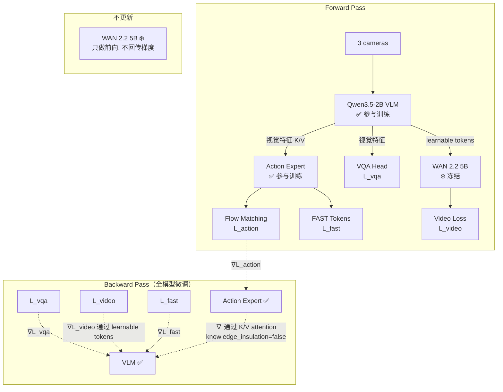
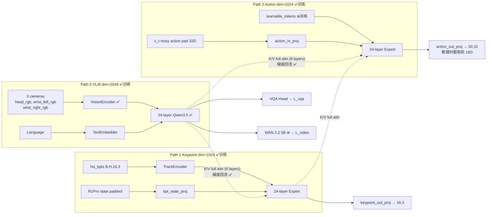
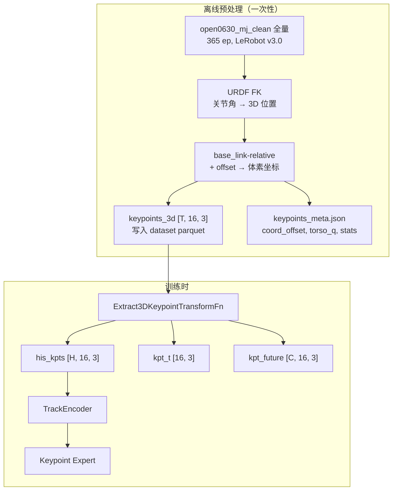
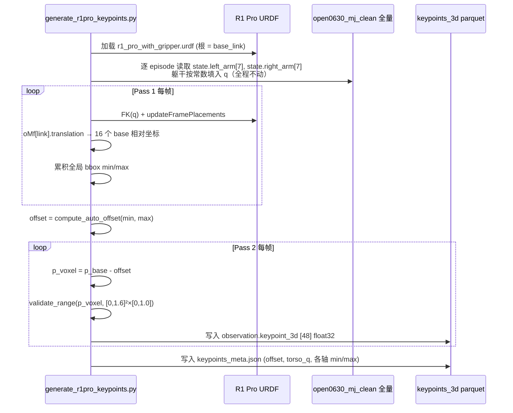
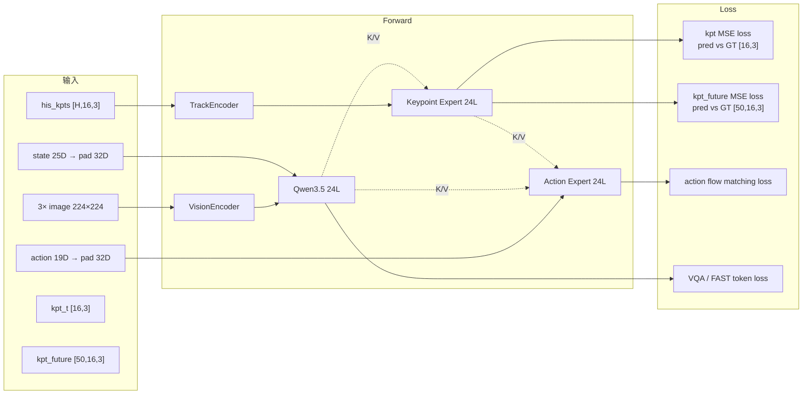
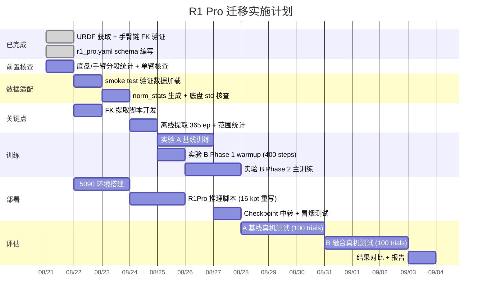

# InternVLA-A1.5 + GeoPredict → R1 Pro 真机迁移设计文档

> **目标**：将 InternVLA-A1.5（含 GeoPredict 3D 关键点轨迹预测）迁移到 R1 Pro 双臂移动机器人，在开门任务上进行 A/B 对比实验，验证 3D 几何感知对真机成功率的提升效果。
>
> **数据集**：`open0630_mj_clean` 全量 365 episodes / 约 383k frames（R1 Pro 开门），**不做裁剪**（§6.8）
>
> **撰写日**：2026-08-21

---

## 目录

1. [背景与问题定义](#1-背景与问题定义)
2. [设计目标与非目标](#2-设计目标与非目标)
3. [方案对比](#3-方案对比)
4. [静态架构](#4-静态架构)
5. [动态架构](#5-动态架构)
6. [关键代码改动](#6-关键代码改动)
7. [使用方法](#7-使用方法)
8. [消融分析框架](#8-消融分析框架)
9. [风险与缓解](#9-风险与缓解)
10. [实施路径](#10-实施路径)

---

## 1. 背景与问题定义

### 1.1 现状

InternVLA-A1.5 + GeoPredict 已在 RoboTwin 仿真的 ALOHA 双臂（6 DOF/臂）上跑通，`stack_bowls_three` 任务 step-010k，各配置 100 trial：

| 配置 | clean | randomized | 来源 |
|------|-------|------------|------|
| InternVLA-A1.5 原版 | 71.0% (71/100) | 54.0% (54/100) | `reprd_rbtwn_stackb3_itvlagp_3cn2_eval6000_2.md` L1518 |
| + GeoPredict (14 kpts) | **81.0% (81/100)** | **57.0% (57/100)** | `itrnVLA15_GeoP_3dtrj_3cn4_rbt2stkb3_eval6000_10kLOG.md` L90-93 |

> **这组数字不是严格 A/B，只能作为方向性证据。** 两组的训练数据集不同（`stack_bowls_three` vs `stack_bowls_three_kptsim_lrbv30`）、训练流程不同（单阶段 10k vs Phase 1 + Phase 2）。同系列另一次 GeoPredict run（080719_2）在同样 step-010k 只有 58% / 8%，说明 **run 间方差极大**，10 个百分点的差距未必来自关键点本身。这正是本次要在 R1 Pro 上做**严格受控 A/B** 的动机（见 §2、§8）。

同时，仿真 ALOHA 与真机 R1 Pro 的构型差异显著，无法直接迁移。

### 1.2 R1 Pro vs ALOHA 构型对比

| 维度 | R1 Pro | ALOHA (RoboTwin) |
|------|--------|-----------------|
| 每臂 DOF | **7** (`left_arm_joint1-7`) | 6 (`fl_link1-6`) |
| 底盘 | 移动底盘 3 轮转向 + 4 DOF 躯干 | 固定底座 |
| 夹爪 | prismatic 平行夹爪 | — |
| EEF | `left_gripper_link` + `left_realsense_link` | `left_camera` 或 TCP |
| 相机 | **3 路**：ZED 头部 `head_rgb` + 2×RealSense 腕部 `wrist_{left,right}_rgb` | 3 路仿真渲染 |
| Action 维度 | **23D** = 双臂14 + 夹爪2 + 躯干4 + 底盘速度3 | 14D (双臂12 + 夹爪2) |
| State 维度 | **29D** = 双臂14 + 夹爪2 + 躯干4 + 底盘9 | 14D |

> 维度以 openpi0.5 已跑通的 R1 Pro 管线为准（`openpi0.5/src/openpi/policies/r1pro_chassis_policy.py` L109-140）。`observation.state.chassis` 是 9 维：`[0:3]` 累积转角、`[3:6]` 线速度、`[6:9]` 角速度。**数据集中没有 base_link 的世界位姿 / 里程计字段**——这一点决定了 §3.2 的坐标系方案。
>
> 本设计取 **action 19D / state 25D**：在完整维度基础上**只去掉躯干**（4D），保留双臂、夹爪和底盘。理由见 §6.7。

### 1.2.1 任务的运动结构（决定了后面一大半设计）

开门任务的实际运动模式：

| 部位 | 任务中的行为 | VLA 是否控制 |
|---|---|---|
| **躯干** | 全程保持固定姿态不动 | **否** |
| **手臂 + 夹爪** | 门前的操作动作 | 是 |
| **底盘** | 接近、以及开门过程中的位移 | **是** |
| 两者时序关系 | **基本互斥**：底盘走时手臂不动，手臂操作时底盘不动，只有中间一小段交接期同时动 | — |

数据里的佐证：

- **躯干在数据集中是全零常数，但那是占位符、不是真实姿态**。`openpi0.5/assets/pi05_open_door_0630_abs_joint_clean/open0630_mj_clean/norm_stats.json` 里 state 的 `[16:20]` 和 action 的 `[16:20]` **mean 和 std 都恰好是 0**；stop70 实验的分部位评测里 torso 的 MSE 也是 `0.000000`。而据操作者确认，**执行任务时躯干物理上停在 $[0.8, -1.4, -0.60, 0.0]$ rad 这个固定姿态**——采集时根本没把躯干编码器写进数据，那 4 列是占位符而非实测值。好消息是这个姿态让手臂安装面保持水平，与零位之间只差一个**纯平移**，而平移会被 auto-offset 精确抵消，所以 FK 填零位还是填真实值，**训练数据逐位相同**（证明见风险 9b 详解）。
- **底盘确实由 VLA 控制**。现有能跑的 pi0.5 R1 Pro checkpoint 是 23D，含 `chassis[3]`（`RPent/_dev/docs/20260821_RPent架构分析与R1Pro可行性评估.md` L425），底盘速度来自 `/motion_target/target_speed_chassis`。
- **底盘段和手臂段互相稀释**。`openpi0.5/_dev/docs/20250708_stop70_finetune_训练策略.md` L29 原话：底盘停车过渡阶段的学习"被大量'正在行走'和'正在操作手臂'的帧稀释了"。
- **双臂都在动，`J=16` 成立**。同一份 norm_stats 里右臂 `[7:14]` 的 std 是 `[0.252, 0.172, 0.194, 0.251, 0.404, 0.111, 0.067]`，左臂 `[0:7]` 是 `[0.228, 0.032, 0.035, 0.340, 0.038, 0.097, 0.103]`——右臂动得比左臂还多。开门不是单臂任务，16 个关键点没有一半是常数，不用退回 `J=8`（这答掉了 §10 前置核查第 3 项）。
- **底盘动作维不退化**。action `[20:23]` 的 std 是 `[0.082, 0.023, 0.024]`。数值偏小，但离"常数维"还很远，归一化不会出问题（这答掉了 §10 前置核查第 4 项）。

**推论（贯穿 §2、§6.7、§6.8）：**

1. **躯干整个去掉**（state 和 action 都去）。它不受控、且在数据里是常数，留着只是 4 个死维度。§3.1 的关键点方案 C（加躯干 link）也随之排除。
2. **底盘必须保留**，且**必须在全量 episode（含底盘段）上训练**。VLA 要端到端出底盘速度，就不能只喂它手臂段的帧——否则模型没见过"怎么走过去"。
3. **但要接受一个代价**：底盘段里手臂静止 ⇒ 关键点全程不变 ⇒ **GeoPredict 在底盘段的信息量为零**。整条 episode 里只有手臂段能从 3D 几何感知中获益，A/B 的成功率差距会被底盘段摊薄。这是本实验的固有限制，处理办法不是改训练数据，而是**在评估时做分阶段归因**（§8.2），把"底盘没走对"和"手臂没操作对"分开看。

### 1.3 核心问题

将 3-path MoT（VLM + Keypoint Expert + Action Expert）适配到 R1 Pro 的 7 DOF 双臂 + 移动底盘构型，需要解决：

1. **关键点维度变化**：14 → 16（每臂 7 link + 1 TCP）
2. **数据接入**：R1 Pro 数据集是**分字段存储**（`observation.state.left_arm` 等多个 key），而非单个扁平 `observation.state`；需要新增 dataset schema 定义拼接与重排规则（§6.3）。`max_state_dim` / `max_action_dim` **无需扩大**，默认 32 已覆盖 25D state / 19D action
3. **坐标系选择**：数据集无 base_link 世界位姿，且 URDF FK 天然输出 base 相对坐标——这既是约束也是简化，详见 §3.2
4. **关键点离线生成**：用 R1 Pro URDF + FK 为 365 episodes 生成 3D 关键点 GT

---

## 2. 设计目标与非目标

### 设计目标

- **A/B 对比实验**：同一数据集、同一训练配置、同一训练步数，**唯一变量是关键点 on/off**
  - 实验 A（基线）：InternVLA-A1.5 原版，`enable_keypoint_predictor=false`
  - 实验 B（融合）：InternVLA-A1.5 + GeoPredict，16 关键点
  - 除 `enable_keypoint_predictor` / `num_keypoint_joints` 及其 loss 权重外，**所有其他超参必须逐字相同**（含 `video_loss_weight=1.0`、`train_expert_only=false`、`knowledge_insulation=false`、`enable_vqa_loss=true`、`use_fast_action_tokens=true`、lr、seed）
- **端到端验证**：训练 → 5090 推理 → R1 Pro 真机开门测试
- **最小代码改动**：复用现有 3-path MoT 架构，仅新增 schema 与数据管道

### 非目标

- 不做 VoxelDecoder / 3DGS / depth loss（R1 Pro 数据集无深度 GT）
- 不修改 TrackEncoder 架构（`input_dim=3` 不变，只改 `num_keypoint_joints`）
- 不做预训练（直接从 InternVLA-A1.5-base checkpoint 微调）
- **不纳入躯干**：躯干不受 VLA 控制，且在数据集中是全零常数（§1.2.1）
- **不裁剪训练数据**：底盘由 VLA 控制，必须用含底盘段的完整 episode（§6.8）
- **不追求关键点覆盖底盘**：关键点只覆盖双臂 16 点，底盘运动在关键点里不可见（§3.2），这是接受的限制而非待解决的问题

> **关于底盘的重要澄清**：本模型的 action **全部**由 Action Expert 经 flow matching 产生，不存在"由 VLM 路径出 action"这条通路。同时，因为关键点采用 base 相对坐标（§3.2），**底盘运动在关键点里完全不可见**——GeoPredict 对底盘部分零贡献。底盘保留在 action 里（§6.7），但关键点帮不上这 3 维，这是接受的限制。

---

## 3. 方案对比

### 3.1 关键点数量方案

| 方案 | 关键点数 J | 内容 | 优缺点 |
|------|-----------|------|--------|
| **A：仅 EEF** | 2 | 左右 TCP 各 1 | 最简单，但信息量太少，丢失臂构型 |
| **B：7+1 (推荐)** | 16 | 每臂 7 link + 1 TCP = 8 × 2 | 完整运动链，与 ALOHA 的 6+1 同构，代码改动最小 |
| C：7+1+躯干 | 20 | B + 4 个躯干 link | **排除**：躯干在数据集中是全零常数（§1.2.1），4 个躯干关键点的 3D 位置全程不变，纯粹是常数维 |

**选择方案 B**：`num_keypoint_joints=16`，每臂提取 `left_arm_link1-7` + `left_gripper_link`（TCP）的 3D 位置。

> 躯干固定还带来一个附带好处：**手臂基座相对 `base_link` 的位置是常量**，所以 FK 时躯干那 4 个关节角可以直接按常数填进 q 向量，不用逐帧读；关键点的空间分布范围也比"躯干会升降"时窄得多（这降低了 §9 风险 10 的严重度）。

### 3.2 坐标系方案

先明确三种参考系的关系：

| 坐标系 | 定义 | 谁在用 |
|------|--------|---------|
| **world** | 仿真器/场景全局原点 | RoboTwin ALOHA（固定底座） |
| **base 相对** | 以机器人 `base_link` 为原点 | RoboCasa 移动底座、R1 Pro |
| **体素坐标 (voxel)** | 上面任一种再减一个固定平移 offset，落进 $[0,1.6]^2\times[0,1.0]$ | GeoPredict 预训练所假设的输入空间 |

**结论：R1 Pro 用 base 相对坐标 + 固定 offset，而且这几乎不需要额外工作。**

关键在于一个容易被绕进去的事实：**URDF 的正向运动学（FK，即"给定各关节角度，算出每根连杆在空间中的位置"）本来就是以 URDF 根连杆为原点的**。R1 Pro 的 URDF 根就是 `base_link`，所以 Pinocchio 的 `data.oMf[frame_id].translation` 输出的**已经是 base 相对坐标**了：

$$\mathbf{p}_{\text{base}} = \text{FK}(\mathbf{q})\big|_{\text{link}} \quad\text{（直接得到，无需再做变换）}$$

因此**不需要**、也**无法**去做 $\mathbf{R}_{\text{base}}^{-1}(\mathbf{p}_{\text{world}} - \mathbf{t}_{\text{base}})$ 这一步：

- **不需要**：对固定基座模型，$\mathbf{R}_{\text{base}}$ 是单位阵、$\mathbf{t}_{\text{base}}$ 是零向量，该变换是恒等变换，写了等于没写。
- **无法**：数据集里根本没有 `base_link` 的世界位姿或里程计字段（§1.2），拿不到 $\mathbf{R}_{\text{base}},\mathbf{t}_{\text{base}}$。

这与 GeoPredict 处理 RoboCasa 移动底座的效果一致（`b/d/GeoPred/knwldge.md` §2.2 里 RoboCasa 之所以要显式做这个变换，是因为它的 FK 输出在 world 系；我们的 FK 输出直接就在 base 系）。

> **已在真 URDF 上实测确认**：把三个转向关节和三个车轮关节从零位改到任意值，16 个关键点位移 **0.000000 mm**。因为转向/车轮挂在 `base_link` 的独立支链上，与"`base_link → 躯干 → 双臂`"这条链没有交集。所以 FK 时它们保持 `pin.neutral` 即可，不用从数据里读。

**代价（必须写进方案里）**：既然关键点是 base 相对的，**底盘怎么移动、转多少，关键点数值都不变**。好处是关键点不会因底盘位移而抖动；坏处是**关键点路径对底盘运动零信息量**——而底盘恰恰是本任务 action 的一部分（§6.7）。

这意味着 GeoPredict 只能改善 19D action 里的手臂那 16 维，底盘 3 维完全靠 VLM 路径。评估时必须把这一点考虑进去，否则会低估 GeoPredict 在手臂动作上的真实效果（§8.2 分阶段归因）。

> 有没有办法让关键点也覆盖底盘？理论上可以把关键点改成 world/odom 系，但数据集没有里程计字段（§1.2），做不到；而且那样关键点会随底盘位移大幅漂移，与 GeoPredict 预训练的有界体素空间冲突。所以这是**接受而非解决**的限制。

**唯一真正要做的一步**是平移对齐到体素空间：

$$\mathbf{p}_{\text{voxel}} = \mathbf{p}_{\text{base}} - \mathbf{o},\qquad \mathbf{o} = \text{compute\_auto\_offset}(\mathbf{p}_{\min}, \mathbf{p}_{\max})$$

其中 $\mathbf{o}$ 是**全数据集统一的固定 3 维平移量**，由所有帧关键点的包围盒中心对齐到体素空间中心 $[0.8, 0.8, 0.5]$ 反推得出。这一步必要，因为 base 相对坐标**会出现负值**（手臂在 base 后方或下方），而 GeoPredict 预训练假设的输入落在 $[0,1.6]^2\times[0,1.0]$ 内（非归一化，单位是米）。

> **体素空间大概率装不下，已在真 URDF 上量过。** 固定躯干于零位、对双臂 14 个关节在关节限位内均匀采样 20000 组姿态，16 个关键点的可达包围盒是：
>
> | 轴 | 范围（base 相对，米） | 跨度 | 体素空间可用宽度 | 结论 |
> |---|---|---|---|---|
> | x | $[-0.796, +0.638]$ | 1.434 | 1.6 | 装得下 |
> | y | $[-0.979, +0.979]$ | **1.957** | 1.6 | **超出 0.357 m** |
> | z | $[+0.725, +2.166]$ | **1.441** | 1.0 | **超出 0.441 m** |
>
> 注意这是**全关节空间的上界，不是真实数据的范围**——开门任务只用到其中一小块，实际跨度会小很多。即便躯干固定于零位，光是双臂自己就能在 z 上拉出 1.44 m，不能假设"躯干固定所以 z 跨度自然很窄"。所以生成脚本第一遍扫描必须输出各轴 min/max 实测值，再决定是否放宽体素上界。见 §9 风险 10。

### 3.3 训练策略对比

| 策略 | 阶段 | 用途 |
|------|------|------|
| **直接微调** | 1 阶段 | 简单，但关键点 expert 从随机初始化直接进主训练，早期梯度噪声大 |
| **两阶段课程 (推荐)** | Phase 1 关键点 warmup + Phase 2 主训练 | 与 ALOHA 已跑通流程一致 |

选择**全模型微调 + 两阶段课程**。

**关键修正（2026-08-27 实测验证）**：ALOHA 参考脚本用的 `train_expert_only=true` + `knowledge_insulation=true` 在 R1 Pro 上**不可用**——VLM 冻结导致模型输出近似常量（帧间变化仅为 GT 的 1/500），因为预训练的 VLM 视觉特征对 R1 Pro 开门场景没有区分性。

必须使用**官方 finetune 配置**（`launch/internvla_a15_finetune.sh`）：`train_expert_only=false`（训全模型）+ `knowledge_insulation=false`（允许梯度回流）+ 开启全部辅助损失（VQA + video foresight + FAST tokens）。VLM 需要在目标域数据上适配才能提供有用的视觉特征。

辅助损失的作用：
- `enable_vqa_loss=true`：VLM 学会"看懂"当前场景
- `video_loss_weight=1.0`：VLM 学会"预测"未来会发生什么（需要 WAN 2.2 TI2V-5B 冻结教师模型）
- `use_fast_action_tokens=true`：离散 action token 提供额外梯度信号

| | Phase 1（GeoPredict warmup） | 全模型微调（基线 & 主训练） |
|---|---|---|
| `train_expert_only` | true（只预热 kpt expert） | **false**（训全模型） |
| `knowledge_insulation` | true | **false** |
| `enable_vqa_loss` | false | **true** |
| `video_loss_weight` | 0（跳过 WAN） | **1.0**（加载 WAN 教师） |
| `action_loss_only` | true | **false** |
| `use_fast_action_tokens` | false | **true** |
| `freeze_learnable_tokens` | false | **true** |

> **为什么 Phase 1 仍用 expert-only**：Phase 1 只有 400 步，目的是让 keypoint expert 从随机初始化预热到合理值域。这个阶段不需要 VLM 适配（太短也来不及），冻结 VLM 可以节省显存和时间。Phase 2 开始后必须切到全模型微调。

> **WAN 2.2 TI2V-5B 模型**（32G）：全模型微调需要加载这个冻结的 5B 视频生成模型作为 foresight 教师。Crater 容器上无法安装 flash-attn（缺 nvcc），已添加 PyTorch SDPA fallback 替代（`wan/modules/attention.py` 的 `_sdpa_attention()`）。

### 3.3.1 全模型微调的梯度流（动态架构补充）



> **与 expert-only 的关键区别**：`knowledge_insulation=false` 时，action expert 的梯度**通过 K/V attention 回流到 VLM**（§6.2 里 `attention.py` 的 `prefix_key_for_suffix = prefix_key` 不做 `.detach()`）。加上 VQA/video/FAST 三路辅助梯度，VLM 在每步更新时收到 4 路梯度信号，视觉特征快速适配目标域。
>
> **实测对比（开门 episode 100，推理输出帧间 std）**：
>
> | 配置 | 左臂 dim0 std | 左臂 dim3 std | 与 GT 的差距 |
> |------|-------------|-------------|-----------|
> | expert-only（VLM 冻结） | 0.000290 | 0.000503 | **500-1000x** |
> | 全模型微调 | 待验证 | 待验证 | 预期接近 GT |
> | Ground Truth | 0.269 | 0.372 | — |

---

## 4. 静态架构

### 4.1 三路径 MoT（架构不变，训练策略变）



> 标注说明：✅ = 参与 backward 更新，❄️ = 冻结（forward only）。`knowledge_insulation=false` 使 VLM→Expert 的 K/V attention 梯度正常回流。

> `action_out_proj` 的输出宽度是 `max_action_dim=32`（`modeling_internvla_a1_5.py` L995），推理时由 `predict_action_chunk` 截回真实动作维度 `actions[:, :, :original_action_dim]`。所以图中标 32 而非 19。

### 4.2 R1 Pro 维度映射

| 配置字段 | ALOHA 值 | R1 Pro 值 | 说明 |
|----------|---------|-----------|------|
| `num_keypoint_joints` | 14 | **16** | 每臂 7 link + 1 TCP。policy 侧和 dataset 侧是**两个独立字段，不会自动同步**，CLI 必须都设 |
| `max_state_dim` | 32 | **32**（不改） | 拼接后 **25D**（双臂14 + 夹爪2 + 底盘9），pad 到 32 |
| `max_action_dim` | 32 | **32**（不改） | 拼接后 **19D**（双臂14 + 夹爪2 + 底盘3），不含躯干（§6.7） |
| `chunk_size` | 50 | **50**（不变） | R1 Pro 数据 15 fps，50 步 ≈ **3.3 秒**的动作片段 |
| `keypoint_history_max_len` | 1000（默认） | **建议调到 300** | 见下方说明 |

> **`keypoint_history_max_len` 可以下调。** 这个参数 $H$ 决定每个训练样本要读多少帧历史关键点，`Extract3DKeypointTransformFn` 会取 $H+1+C$ 帧的窗口。默认 1000 时窗口是 1051 帧，而 R1 Pro episode 平均也就约 1050 帧，等于每个样本都要读整条 episode，parquet 随机读开销很大。
>
> 按 15 fps 计，$H=300$ 已是 20 秒历史。而关键点真正在变化的只有手臂段（§6.8），底盘段的历史关键点是一串恒定值，读再多也没有额外信息。TrackEncoder 通过 `his_len` 自动适配变长历史，调小不影响正确性。
>
> **注意这是纯粹的 I/O 优化，A/B 两组必须用同一个 $H$**，否则它会变成第二个变量。

### 4.3 R1 Pro 关键点定义

```
左臂 (indices 0-7):
  0: left_arm_link1      4: left_arm_link5
  1: left_arm_link2      5: left_arm_link6
  2: left_arm_link3      6: left_arm_link7
  3: left_arm_link4      7: left_gripper_link (TCP)

右臂 (indices 8-15):
  8:  right_arm_link1    12: right_arm_link5
  9:  right_arm_link2    13: right_arm_link6
  10: right_arm_link3    14: right_arm_link7
  11: right_arm_link4    15: right_gripper_link (TCP)
```

> **已对 URDF 逐一核对，16 个 frame 名字全部存在、拼写与上表一致**（`assets/r1_pro_with_gripper.urdf`，36 links / 35 joints，用 `model.existFrame()` 验证）。夹爪开合不影响 TCP：`left_gripper_joint` 是 **fixed** 关节（`left_arm_link7 → left_gripper_link`），两个 `*_finger_joint` 是 `left_gripper_link` 的子节点，所以 TCP 关键点只由 7 个臂关节 + 躯干决定，夹爪值不用进 FK。

### 4.4 数据管道



### 4.5 图像通道映射

InternVLA-A1.5 通过 `RemapImageKeyTransformFn` 把数据集相机 key 映射到 `observation.images.image{i}`，映射表由 §6.3 的 schema YAML 提供：

| R1 Pro 原始 key | 映射到 | 用途 |
|-----------------|--------|------|
| `observation.images.head_rgb` | `image0` | 头部主视角 |
| `observation.images.wrist_left_rgb` | `image1` | 左腕 |
| `observation.images.wrist_right_rgb` | `image2` | 右腕 |

> **模型固定吃 3 路，不能扩到 4 路。** `InternVLAA15ChatProcessorTransformFn.num_views` 硬编码为 3（`transform_internvla_a1_5.py` L69），VLM 只读 `image0/1/2`。想加第 4 路要同时改 `num_views`、Remap 逻辑和 schema，不是 config 能解决的。
>
> 另外，`observation.images.head_rgb_right`（ZED 右目）在 openpi0.5 已跑通的 R1 Pro 管线中**并不存在**，不要把它当作第 4 路输入。所有图像统一 `ResizeImagesWithPadFn` 到 224×224。

---

## 5. 动态架构

### 5.1 关键点离线提取流程



> 需要**两遍扫描**：第一遍统计包围盒才能算出全局统一的 offset，第二遍才能做平移并校验范围。不存在"世界坐标 → base 坐标"这一步，原因见 §3.2。

### 5.2 训练 Forward 数据流



### 5.3 推理路径

推理时关键点 expert 参与（`inference_backend="standard"`），但不需要未来 GT：

1. R1 Pro 关节编码器 → **在线 FK** → 减 offset → 体素坐标 → 推入 `his_kpts` 环形缓冲
2. TrackEncoder 编码历史 → Keypoint Expert 产生 K/V
3. Action Expert 接收 VLM + Keypoint Expert 的 K/V → flow matching 出 action chunk
4. Action 前 19 维按 §6.3 的 `action_reorder` **逆映射**回原始字段 → 手臂/夹爪走关节控制话题，底盘 3 维走 `/motion_target/target_speed_chassis`

> **三个部署要点，容易踩坑：**
>
> 1. **关键点必须在线算，模型不会自己"猜"。** `predict_action_chunk` 只返回 action，`keypoint_out_proj` 的预测结果**仅在训练 loss 中使用**，推理路径完全不消费（`modeling_internvla_a1_5.py` L2245-2268）。所以端侧每个控制周期都要跑一次 FK 并维护历史缓冲，这条链路挂了模型就等于瞎了一路。
> 2. **`coord_offset` 和躯干约定必须随 checkpoint 一起交付。** 训练用的 `coord_offset` 存在 `keypoints_meta.json` 里，推理时必须用**同一个值**，否则关键点整体平移、与训练分布错位。同一个文件里还要记 `torso_q = [0,0,0,0]`，端侧 FK 必须照此填，理由见风险 9b 详解。端侧启动时把这两项都校验一遍，不一致就拒绝启动——它们错了都不会报错，只会静默地让模型输入偏离训练分布。
> 3. **`inference_backend` 不能用 `optimized`。** 优化后端（`modeling_internvla_a1_5_optimized.py`）是 action-only 路径，不含关键点 expert。实验 B 只能走 `standard`，这也意味着 B 组推理延迟天然高于 A 组——延迟对比时要说明这一点（§8.2）。
> 4. **底盘那 3 维要单独拆出去发。** 模型输出的是拼接后的 19D 向量，手臂和底盘走的是**不同的 ROS 话题**。逆映射写错（比如把底盘速度当关节角发出去）会直接导致机器人乱动，部署冒烟测试必须先在**底盘急停**的状态下验证一遍。

---

## 6. 关键代码改动

### 6.1 新增文件

| 文件 | 功能 |
|------|------|
| `src/lerobot/dataset_schemas/configs/r1_pro.yaml` | **R1 Pro dataset schema**（image/state/action 映射、reorder 规则）。**注意：该文件此前已存在于工作区（git 未跟踪），内容是含躯干、无底盘的 20D 旧版**，已按 §6.3 改写为 19D/25D 版 |
| `util_scripts/generate_r1pro_keypoints.py` | 离线 FK 提取 R1 Pro 3D 关键点 |
| `launch/internvla_a15_r1pro_baseline.sh` | 实验 A：基线训练脚本 |
| `launch/internvla_a15_r1pro_geop_phase1.sh` | 实验 B Phase 1：关键点 warmup |
| `launch/internvla_a15_r1pro_geop_phase2.sh` | 实验 B Phase 2：主训练（全模型微调，见 §3.3） |
| `launch/internvla_a15_r1pro_fullft.sh` | **全模型微调启动脚本**（对齐官方 finetune 配置，含 WAN/VQA/FAST） |
| `evaluation/R1Pro/inference.py` | R1 Pro 推理适配（WebSocket + msgpack，openpi bare-dict 协议） |

> **关键**：`RemapImageKeyTransformFn.hydrate()` 通过 `dataset.meta.robot_type` 查找 schema。数据集 `robot_type` 为 `"r1_pro"`，必须有对应 YAML 才能正确映射 image/state/action key。参考 `r1lite.yaml` 和 `aloha.yaml`。

### 6.2 修改文件

| 文件 | 改动 | 说明 |
|------|------|------|
| `configuration_internvla_a1_5.py` | 无代码改动 | `num_keypoint_joints` 通过 CLI 设置为 16 |
| `keypoints.py` | 无代码改动 | TrackEncoder `input_dim=3` 不变，J 由输入张量第 3 维决定 |
| `modeling_internvla_a1_5.py` | 无代码改动 | 3-path 架构通过 config 自适应 |
| `wan/modules/attention.py` | **新增 SDPA fallback** | Crater 无 flash-attn（缺 nvcc），新增 `_sdpa_attention()` 函数，在 varlen 打包前分流，用 padded 布局 + key mask 复现变长截断；支持 GQA（`nq≠nk` 时 `enable_gqa=True`）；滑动窗口 `window_size` 不支持（warn 后忽略，WAN 默认全局注意力无影响）。5 个用例验证通过 |

**关键洞察（限定范围）**：`src/lerobot/policies/internvla_a1_5/` 内部的模型逻辑全部由 `config.num_keypoint_joints` 驱动，没有写死 14 的 reshape，所以 14→16 **在模型代码层面确实零改动**，CLI 设 `--policy.num_keypoint_joints=16 --dataset.num_keypoint_joints=16` 即可。

但**整条链路不是零改动**，还有三处必须处理：

| 必须做的事 | 位置 | 原因 |
|---|---|---|
| 新建 `r1_pro.yaml` schema | `dataset_schemas/configs/` | 见 §6.3，缺了会崩 |
| 重算 norm_stats | `util_scripts/compute_norm_stats_single.py` | 见 §6.9，新数据集必须重算 |
| **推理脚本重写而非改参数** | `evaluation/R1Pro/inference.py` | 参考的 `evaluation/RoboTwin/inference.py` 里 `np.zeros((14, 3))`、`keypoints[13]` 是**硬编码**的（L80/L129/L145），照抄改参数改不动，要按 16 点重写 |
| **action 逆映射 + 底盘分发** | `evaluation/R1Pro/inference.py` | 模型输出 19D 拼接向量，要按 `action_reorder` 逆映射回原字段，手臂和底盘分别发到不同 ROS 话题（§5.3 要点 4） |

另外注意 `keypoint_embedding = nn.Embedding(J, hidden)` 是 J 依赖的可学习权重，**J=14 的 ALOHA checkpoint 无法直接加载到 J=16 的模型**。本方案 Phase 1 → Phase 2 内部 J 始终为 16，自洽无碍；但不要试图复用 ALOHA 的 GeoPredict 产物做热启动。

### 6.3 Dataset Schema（新增 `r1_pro.yaml`）

`RemapImageKeyTransformFn.hydrate()` 通过 `dataset.meta.robot_type` 查 schema YAML，数据集 `robot_type="r1_pro"` 但无对应文件，必须新增。参考 `r1lite.yaml`：

```yaml
# src/lerobot/dataset_schemas/configs/r1_pro.yaml
robot_type: r1_pro
# 按 action 的 feature_mapping 拼接顺序给出，正数 = delta 动作，负数 = 绝对动作
# 底盘是速度指令（本身已是变化率），按绝对处理 → -3
action_mask_spec: [7, 7, -1, -1, -3]
# [src_start, src_end, dst_start, dst_end]
# action src 布局: left_arm[0:7] right_arm[7:14] left_gripper[14] right_gripper[15] chassis_vel[16:19]
# action dst 布局: left_arm[0:7] left_gripper[7] right_arm[8:15] right_gripper[15] chassis_vel[16:19]
action_reorder:
  - [0, 7, 0, 7]       # left_arm
  - [14, 15, 7, 8]     # left_gripper
  - [7, 14, 8, 15]     # right_arm
  - [15, 16, 15, 16]   # right_gripper
  - [16, 19, 16, 19]   # chassis.velocities
# state 的底盘是 9 维（累积转角3 + 线速度3 + 角速度3），所以尾部长度与 action 不同
# state src 布局: left_arm[0:7] right_arm[7:14] left_gripper[14] right_gripper[15] chassis[16:25]
state_reorder:
  - [0, 7, 0, 7]
  - [14, 15, 7, 8]
  - [7, 14, 8, 15]
  - [15, 16, 15, 16]
  - [16, 25, 16, 25]   # chassis 9D
feature_mapping:
  observation.state:
    - observation.state.left_arm        # [7]
    - observation.state.right_arm       # [7]
    - observation.state.left_gripper    # [1]
    - observation.state.right_gripper   # [1]
    - observation.state.chassis         # [9]  合计 25D
  action:
    - action.left_arm                   # [7]
    - action.right_arm                  # [7]
    - action.left_gripper               # [1]
    - action.right_gripper              # [1]
    - action.chassis.velocities         # [3]  合计 19D
image_mapping:
  observation.images.head_rgb: observation.images.image0
  observation.images.wrist_left_rgb: observation.images.image1
  observation.images.wrist_right_rgb: observation.images.image2
action_mode: joint
description: "R1 Pro dual-arm mobile robot"
```

**reorder 规则的来源**：InternVLA-A1.5 的双臂标准槽位布局是 `[左臂 ≤7 | 左夹爪 @7 | 右臂 ≤7 @8 | 右夹爪 @15]` 共 16 槽——这可以从 [`aloha.yaml`](/media/a26215/PortableSSD/vla/projects/InternVLA-A/src/lerobot/dataset_schemas/configs/aloha.yaml) 和 [`r1lite.yaml`](/media/a26215/PortableSSD/vla/projects/InternVLA-A/src/lerobot/dataset_schemas/configs/r1lite.yaml) 反推出来：两者都是 6 DOF 臂，所以槽位 6 和 14 是留空的 0。

**R1 Pro 是 7 DOF 臂，恰好把这两个空槽填满**——手臂 + 夹爪正好占满 0-15 这 16 槽，没有任何补零。底盘接在 16 之后（action 到 19，state 到 25）。这个布局意味着 reorder 出错的可能性很低。

> `r1lite.yaml` 第 10 行的注释写 `-> dst[6:7]` 但实际条目是 `[12, 13, 7, 8]`（即 dst[7:8]），**注释是错的、条目是对的**。抄的时候以条目为准。
>
> 未在 YAML 中列出的 `observation.state.torso` / `action.torso` 会被 `ComposeFieldsTransform` 直接忽略，不会报错。
>
> **注意 state 和 action 的底盘维度不一样**：state 是 9 维（含累积转角和角速度），action 只有 3 维（线速度指令）。所以 `state_reorder` 和 `action_reorder` 的最后一条不同，别照着一个抄另一个。

**`action_mask_spec` 的顺序基准是 `feature_mapping` 拼接顺序，不是 reorder 之后的顺序。** 依据：`DeltaActionTransformFn` 在整条 transform 链的**最前面**（`configuration_internvla_a1_5.py` L45），早于 `ComposeFieldsTransform` 和 `ReorderStateActionTransform`，它直接按 `self.mapping[ACTION]` 的 key 顺序 concat 后套 mask（`transforms/core.py` L403-412）。

> **`r1lite.yaml` 的 mask 按这个标准是错的**，别照抄。它写 `[6, -1, 6, -1]`，而 feature_mapping 顺序是 `left_arm(6) right_arm(6) left_gripper(1) right_gripper(1)`，套上去等于把 `right_arm[0]` 当成绝对值、把 `left_gripper` 当成 delta。正确写法应是 `[6, 6, -1, -1]`。这个错误只在 `action_mode=delta` 时才会生效，abs 模式下 `DeltaActionTransformFn` 被整个移除（见 `__post_init__`），所以一直没暴露。

**delta 模式对本 schema 会直接崩，这是 A2/B2 消融的硬阻塞。** `DeltaActionTransformFn` 最后一行是 `action -= torch.where(mask, state, 0)[None]`，其中 `mask` 长 19（action 宽度）、`state` 长 25，两者广播不兼容，会抛 `RuntimeError`。现有所有 schema 的 state 和 action 维度都相等（aloha 14/14、r1lite 14/14），所以从没触发过。本方案 A1/B1 用 `action_mode=abs`，该 transform 被移除，不受影响；但 §8.1 的 A2/B2 要跑 delta，**必须先改这个 transform**（让 mask 按 state 宽度对齐，或只在 action/state 共有的前 16 维上做差分）。

### 6.4 关键点数据格式

生成脚本写入 parquet 的列名必须为 `observation.keypoint_3d`，每帧 shape `[J*3]` = `[48]`（16 个关键点 × 3 坐标，flatten）。`Extract3DKeypointTransformFn` 会通过 `keypoint_3d_delta_indices`（delta timestamp 机制）自动堆叠 H+1+C 帧，reshape 成 `[H+1+C, J, 3]`，然后拆分为 `his_kpts`、`kpt_t`、`kpt_future`。

### 6.5 GeoPredict 预训练权重兼容性

GeoPredict 预训练权重（`GeoPredict_robocasa.pth`）的 TrackEncoder 是 **per-joint 独立处理**的（`for point_idx in range(num_points)`），权重与 J 无关，可直接加载到 J=16 的模型中。唯一不兼容的是：

- `keypoint_embedding`：`nn.Embedding(J, hidden_size)`，J 从 8→16 shape 不匹配。但此参数**不从 GeoPredict 加载**——它走 `init_kpt_expert_from_action` 初始化（Stage 3），或随机初始化。
- `track_fusion_layer`：output_dim 不同（2048 vs 1024），已在 `_LOADABLE_SUBMODULE_PREFIXES` 中排除，不影响。

### 6.6 关键点提取脚本核心逻辑

```python
import pinocchio as pin
import numpy as np

R1PRO_LEFT_ARM_LINKS = [
    "left_arm_link1", "left_arm_link2", "left_arm_link3", "left_arm_link4",
    "left_arm_link5", "left_arm_link6", "left_arm_link7",
]
R1PRO_RIGHT_ARM_LINKS = [
    "right_arm_link1", "right_arm_link2", "right_arm_link3", "right_arm_link4",
    "right_arm_link5", "right_arm_link6", "right_arm_link7",
]

KEYPOINT_LINKS = (
    R1PRO_LEFT_ARM_LINKS + ["left_gripper_link"]      # indices 0-7
    + R1PRO_RIGHT_ARM_LINKS + ["right_gripper_link"]  # indices 8-15
)


# 只有这 18 个关节影响 16 个关键点：躯干 4 + 双臂 14。
# 转向/车轮 6 个关节挂在 base_link 的另一条支链上，实测对关键点位移 0.000000 mm。
DRIVEN_JOINTS = (
    [f"torso_joint{i}" for i in range(1, 5)]
    + [f"left_arm_joint{i}" for i in range(1, 8)]
    + [f"right_arm_joint{i}" for i in range(1, 8)]
)


def build_extractor(urdf_path):
    model = pin.buildModelFromUrdf(urdf_path)          # 固定基座，根连杆 = base_link
    data = model.createData()
    frame_ids = [model.getFrameId(n) for n in KEYPOINT_LINKS]
    # 按关节名逐个取 idx_q，不要假设 q 是按 URDF 声明顺序的扁平拼接（见下方说明）
    idx_q = {n: model.joints[model.getJointId(n)].idx_q for n in DRIVEN_JOINTS}
    q_template = pin.neutral(model)                    # 车轮的 (cos,sin) 由它正确初始化
    return model, data, frame_ids, idx_q, q_template


def extract_keypoints_r1pro(torso, left_arm, right_arm, model, data,
                            frame_ids, idx_q, q_template, out):
    """
    torso: [4], left_arm: [7], right_arm: [7] —— 关节角，单位 rad
    out:   预分配的 [16, 3] float32 数组，结果就地写入
    Returns: out —— base_link 相对坐标（尚未减 offset）
    """
    q = q_template.copy()
    for name, val in zip(DRIVEN_JOINTS, np.concatenate([torso, left_arm, right_arm])):
        q[idx_q[name]] = val

    pin.forwardKinematics(model, data, q)
    pin.updateFramePlacements(model, data)  # 必须调用才能读 oMf

    for i, fid in enumerate(frame_ids):
        out[i] = data.oMf[fid].translation  # 就地赋值 = 拷贝，见下方陷阱说明
    return out
```

> **为什么没有"世界坐标 → base 坐标"这一步**：`buildModelFromUrdf` 不加 free-flyer 时建的是固定基座模型，根连杆就是 `base_link`，`data.oMf[fid].translation` 输出的**已经是 base 相对坐标**。再乘一遍 $R_{\text{base}}^{-1}$、减一遍 $t_{\text{base}}$ 是恒等变换（$R$ = 单位阵、$t$ = 零向量），纯属多余。详见 §3.2。
>
> **`oMf` 而不是 `oMi`**：`oMi` 是**关节**坐标系，`oMf` 是**frame（连杆）**坐标系，我们要的是连杆位置。且 `forwardKinematics` 之后必须调 `pin.updateFramePlacements` 才能读 `oMf`。
>
> **`nq=31` 但 `nv=28`，不能把关节角扁平拼成 q。** 三个车轮是 `continuous` 关节，Pinocchio 用 $(\cos\theta, \sin\theta)$ 两个数表示，所以 `nq` 比自由度数多 3。若按"URDF 声明顺序拼一个扁平向量"，从第一个车轮之后所有关节角都会错位一格，FK 全错。正确做法是上面代码里的 `model.joints[model.getJointId(name)].idx_q` 逐关节定位，并用 `pin.neutral(model)` 打底（它会把车轮初始化成合法的 $(1, 0)$）。
>
> **`data.oMf[fid].translation` 返回的是内部缓冲的视图，不是拷贝。** 如果写成 `results.append(data.oMf[fid].translation)`，下一帧 `forwardKinematics` 会就地覆盖，**之前存的所有帧都会变成最后一帧的值**。这个 bug 不会报错，产出的关键点文件里每条 episode 都是一串完全相同的坐标。上面代码用 `out[i] = ...` 就地赋值（等价于拷贝）规避；写成 `.copy()` 也可以。
>
> **躯干的坑（务必先验证）**：URDF 已确认躯干在运动链上位于 base 与双臂之间——`base_link → torso_joint1..4 → torso_link4`，然后 `left_arm_base_joint` / `right_arm_base_joint` 是 **fixed** 关节，直接把两条手臂挂在 `torso_link4` 上。所以**躯干姿态完全决定两个手臂基座在哪**。
>
> 实测量级：把躯干从零位改成 $[0.3, -0.5, 0.2, 0]$ rad，16 个关键点位移 **39–186 mm（均值 103 mm）**。而我们要的精度是毫米级，也就是说躯干姿态猜错一点点，误差就是目标精度的百倍。
>
> **`ee_pose` 是相对 `torso_link4` 的，不是相对 `base_link`，而且它验不了躯干。** 直接拿 base 系 FK 去比 `ee_pose` 会差 **1.145 m**；换算到 `torso_link4` 系后误差只有 **0.034 mm**。反推出的参考系原点 $[-0.079, 0, 1.1423]$ 与 `torso_link4` 的位置精确吻合。
>
> 致命之处在于：**在 `torso_link4` 自身坐标系里表达 TCP，恰好把躯干变换整个约掉了**。实测把躯干扫过三组差异很大的姿态，base 系 TCP 移动超过 100 mm，而 `torso_link4` 系下的误差**恒为 0.034 mm**。所以 `ee_pose` 对躯干姿态在数学上完全不敏感，**用它验证躯干零位是无效的**。跑 `python util_scripts/verify_fk_r1pro.py --torso-sweep` 可复现。
>
> 好消息是这个 0.034 mm 确实证实了**手臂关节映射和连杆几何都对**（`left_arm[0:7]` → `left_arm_joint1..7` 顺序无误）。
>
> **躯干姿态不需要去确认**：它在采数和部署时都是同一个人工设定的固定姿态、VLA 也不控制它，所以按零位填只是给全部关键点加了个常量刚体变换，模型自洽。要守住的只是"躯干角一律填 0"这条约定全程唯一，见风险 9b 详解。
>
> 对比参考：ALOHA 版本的同类脚本在 [`util_scripts/generate_aloha_keypoints.py`](/media/a26215/PortableSSD/vla/projects/InternVLA-A/util_scripts/generate_aloha_keypoints.py)，可直接复用它的 parquet 写入与 `meta/info.json` 更新逻辑。

### 6.7 State/Action 维度选择

```python
# R1 Pro state → 由 r1_pro.yaml feature_mapping 定义拼接顺序
state_keys = [
    "observation.state.left_arm",      # [7]
    "observation.state.right_arm",     # [7]
    "observation.state.left_gripper",  # [1]
    "observation.state.right_gripper", # [1]
    "observation.state.chassis",       # [9]
]
# Total: 25D, padded to 32D

# R1 Pro action
action_keys = [
    "action.left_arm",            # [7]
    "action.right_arm",           # [7]
    "action.left_gripper",        # [1]
    "action.right_gripper",       # [1]
    "action.chassis.velocities",  # [3]
]
# Total: 19D, padded to 32D
```

完整数据集是 state 29D / action 23D（§1.2），这里**只砍掉躯干**：

**砍掉躯干（4D）** —— VLA 不控制躯干，而且它在数据集里是全零常数（§1.2.1）。留着不会崩（`NormalizeTransformFn` 用 `(x - mean) / (std + 1e-6)`，std=0 时结果恒为 0，有 eps 兜底），但就是 4 个恒零维，白占位置。

**保留底盘（state 9D / action 3D）** —— 因为**开门任务里底盘是 VLA 必须输出的动作**：接近门、以及开门过程中的位移都要靠它。现有能跑的 pi0.5 R1 Pro checkpoint 也是 23D 含底盘（§1.2.1），这是既定的系统分工。

> **底盘必须进 action**，几个容易混淆的点澄清如下：
> - "关键点对底盘零信息量"是事实，但它论证的是 GeoPredict 的收益边界，不是底盘该不该进 action。这个限制写在 §3.2，并通过 §8.2 的分阶段归因来应对。
> - "手臂段里底盘不动"不能作为排除底盘的理由——它与"只训手臂段"互为因果、循环论证。既然底盘要 VLA 控制，训练就必须包含底盘段（§6.8）。
> - "底盘速度与关节角量纲不同"不构成障碍：openpi0.5 已经在 29D state / 23D action 上训出可用 checkpoint，量纲差异被归一化吸收了。
>
> 底盘之外的 IMU / EE pose 等字段是冗余信息（可由关节角 FK 推出），openpi0.5 的训练也没用，不纳入。

### 6.8 训练数据范围：用完整 episode，不裁剪

**用全量 `open0630_mj_clean` 的完整 episode（含底盘段），不做任何裁剪。** 理由很直接：VLA 要端到端输出底盘速度（§6.7），就必须见过底盘段的帧，否则模型不知道"怎么走到门前"。

> 不采用"只训手臂段"（`open0630_mj_clean_armonly` 或按底盘速度阈值裁）：那依赖"底盘由上层调度控制"这个不成立的前提。`armonly` 数据集在本方案中不使用。

**必须接受的代价：关键点信号在时间上是稀疏的。**

整条 episode 中只有手臂段的关键点在变化，底盘段的 16 个关键点数值恒定（因为是 base 相对坐标，手臂不动 ⇒ 关键点不动）。所以：

| | 底盘段 | 交接期 | 手臂段 |
|---|---|---|---|
| 关键点是否变化 | 否 | 部分 | 是 |
| GeoPredict 能否提供信息 | **否** | 部分 | 是 |
| action 的主要成分 | 底盘 3D | 混合 | 手臂 16D |

**这会削弱 A/B 实验的灵敏度**：如果失败主要发生在底盘段（走偏了、没停到位），那么加不加 GeoPredict 对最终成功率的影响会被这部分失败淹没。

**应对办法不是改训练数据，而是改评估方式**——做分阶段归因（§8.2）：除了端到端成功率，还要记录每次失败发生在哪个阶段。如果 A/B 的端到端成功率差距不显著，但"进入手臂段之后的条件成功率"差距显著，那依然是 GeoPredict 有效的证据。

> `openpi0.5` 的 `meta/keyframes.json` 有人工标注的 3 个任务关键帧（把手按下 / 门半开 / 门完全开），可以直接用来划分阶段边界做归因，不需要另做标注。

### 6.9 norm_stats 生成

**新数据集必须重新计算归一化统计量**，不能沿用数据集 meta 里可能自带的旧 stats：

```bash
python util_scripts/compute_norm_stats_single.py \
    --repo-id open0630_mj_clean_kpt16 \
    --action-mode abs
# 输出: ${HF_HOME}/lerobot/stats/abs/open0630_mj_clean_kpt16/stats.json
```

该脚本会通过 `get_schema("r1_pro")` 读 §6.3 的 `feature_mapping` 拼接 state/action，再按 `action_mode` 和 `action_mask_spec` 分别统计。所以**必须先有 `r1_pro.yaml` 才能跑这一步**。训练脚本再配 `--dataset.use_external_stats=true --dataset.external_stats_path=<上面的路径>`。

`abs` 和 `delta` 两种 action_mode 的 stats **不通用**，A2/B2 消融实验（§8.1）需要各跑一次。

> **生成后必须检查底盘那几维的 std。** 底盘只在 episode 前半段有速度、后半段全是 0，如果整体 std 过小（比如 < 1e-3），归一化后底盘维度会被放大到很大的数值范围，训练不稳。检查 `stats.json` 里 action `[16:19]` 的 std，异常就上报，别直接开训。

> 关键点列 `observation.keypoint_3d` **不参与**归一化——`Extract3DKeypointTransformFn` 排在 `NormalizeTransformFn` 之后，关键点直接以体素坐标（米）喂给 TrackEncoder，与 GeoPredict 预训练一致。

---

## 7. 使用方法

### 7.1 离线关键点提取（Crater CPU）

```bash
# 在 Crater 上执行，无需 GPU
export HF_LEROBOT_HOME=/tmp/hf_home/lerobot
CUDA_VISIBLE_DEVICES="" python util_scripts/generate_r1pro_keypoints.py \
    --source ~/openpi-datasets/open0630_mj_clean \
    --dest "${HF_LEROBOT_HOME}/open0630_mj_clean_kpt16" \
    --urdf assets/r1_pro_with_gripper.urdf
```

> **`--dest` 必须落在 `HF_LEROBOT_HOME` 下面。** LeRobot 只认 `repo_id`，路径是硬算出来的：`LeRobotDataset.root = HF_LEROBOT_HOME / repo_id`（`src/lerobot/datasets/lerobot_dataset.py` L94）。写到别处的数据集，`--dataset.repo_id=open0630_mj_clean_kpt16` 找不到，会当成 HF Hub 仓库去下载然后失败。`util_scripts/compute_norm_stats_single.py` 用同一套解析，且默认把 stats 写到 `HF_LEROBOT_HOME/stats/{action_mode}/{repo_id}/stats.json`——正是三个 launch 脚本里 `EXTERNAL_STATS_PATH` 指向的位置。

> **关键点数 16 和 URDF 路径都是脚本内的常量**，不是命令行参数：`KEYPOINT_LINKS` 写死了 16 个 frame 名（§4.3），`--urdf` 有默认值指向本仓库的 `assets/`。要改关键点集合得改代码，这是刻意的——关键点定义变了，`num_keypoint_joints` 和已提取的数据集都得跟着变。

> **输入是全量 `open0630_mj_clean`**（365 ep / 383k 帧），不做裁剪，原因见 §6.8。offset 的自动计算依赖全数据集包围盒，所以换数据集就要重算 offset，不能复用。

> **耗时不是瓶颈。** 本机实测 Pinocchio FK 约 34000 帧/秒，383k 帧两遍扫描各约 11 秒；真正花时间的是 rsync 拷贝数据集本体。所以脚本不做 pass1 结果缓存，第二遍直接重算。

> **URDF 已获取。** `assets/r1_pro_with_gripper.urdf`（36 links / 35 joints）和 `assets/meshes/`（112 文件）已从 5090 的 `r1pro_sandbox_release` 拷到本仓库。
>
> **mesh 对 FK 无关紧要**：URDF 里 mesh 是相对路径（`filename="meshes/base_link.obj"`），但 `pin.buildModelFromUrdf` 只建运动学模型、不加载几何体，跑 FK 不需要 meshes，也不用配 `package://` 搜索路径。只有做可视化才需要。
>
> **FK 验证结论（`util_scripts/verify_fk_r1pro.py`）**：
> - **手臂运动链正确，误差 0.034 mm** —— 证实数据集 `left_arm[0:7]` 就是按顺序对应 `left_arm_joint1..7`，URDF 连杆几何无误。
> - **躯干零位假设不能靠 `ee_pose` 证实**，见下方（`ee_pose` 表达在 `torso_link4` 自身坐标系，与躯干姿态无关，风险 9d）。

> **躯干由 `--torso-q` 控制，默认全零，并会写进 `keypoints_meta.json`。** 脚本不再逐帧读数据集的躯干列——读了也没用，那一列是全零占位符（§1.2.1）。脚本改为做两道断言：躯干列若在文件内或文件间发生变化就直接报错（那意味着关键点会落在漂移的坐标系里）；若列值与 `--torso-q` 不一致则打一条警告，防止约定被静默改掉。

### 7.2 实验 A：基线训练（Crater GPU）

```bash
# 8×H200, InternVLA-A1.5 原版，无关键点
bash launch/internvla_a15_r1pro_baseline.sh
```

**基线必须逐字复制实验 B Phase 2 的全部超参，只关掉关键点。** 否则 A/B 差异里会混进别的变量：

```bash
# 使用 launch/internvla_a15_r1pro_fullft.sh，对齐官方 finetune 配置
--policy.pretrained_path=<InternVLA-A1.5-base 预训练权重>
--policy.optimizer_lr=5e-5
--policy.scheduler_warmup_steps=1000
--policy.scheduler_decay_lr=5e-6
--policy.train_expert_only=false        # 训全模型（VLM + action expert）
--policy.knowledge_insulation=false     # 允许梯度回流到 VLM
--policy.freeze_vision_encoder=false    # 视觉编码器参与训练
--policy.tokenize_state=true
--policy.enable_vqa_loss=true           # VQA 语言 loss
--policy.video_loss_weight=1.0          # WAN foresight loss（需要 WAN 2.2 5B 权重）
--policy.action_loss_only=false         # 多任务训练
--policy.freeze_learnable_tokens=true   # 冻结 foresight tokens
--policy.enable_keypoint_predictor=false   # ← 唯一的变量
--policy.wan_checkpoint_path=<WAN 2.2 TI2V-5B 路径>
--policy.wan_config_path=<WAN 2.2 TI2V-5B 路径>
--policy.vae_path=<WAN 路径>/Wan2.2_VAE.pth
--dataset.repo_id=open0630_mj_clean_kpt16
--dataset.action_mode=abs
--dataset.use_external_stats=true
--dataset.external_stats_path=<§6.9 生成的 stats.json>
--dataset.use_fast_action_tokens=true   # FAST action token 辅助
--dataset.video_backend=pyav            # Crater 上 torchcodec 不可用
--seed=42
--batch_size=12                         # 按 GPU 显存调整
--steps=<按 epoch=8.36 计算>            # epoch = steps × batch × GPU数 / 383000
--save_freq=1000                        # 防抢占丢进度
```

> **A/B 一致性**：基线和实验 B 除 `enable_keypoint_predictor` 外，全部超参必须一致。`--dataset.repo_id` 用带关键点的数据集——基线不读关键点列，但必须同源同版本。

> **epoch 计算**：`epoch = steps × batch_size × GPU数 / 383000`。Flow Matching 安全区间 8-10 epoch，过拟合**在 loss 曲线上完全不可见**（9.5 和 19 epoch 的 loss 几乎相同，但真机成功率从 90% 跌到 0%）。唯一可靠信号是数 epoch。

### 7.3 实验 B：GeoPredict 训练

参数以 ALOHA 两个已跑通脚本为准（[phase1](/media/a26215/PortableSSD/vla/projects/InternVLA-A/launch/internvla_a15_geop_phase1_kpt_warmup_kptsim_8g.sh) / [phase2](/media/a26215/PortableSSD/vla/projects/InternVLA-A/launch/internvla_a15_geop_phase2_finetune_stackb3_080719.sh)），只把 `num_keypoint_joints` 14→16、数据集换成 R1 Pro。

**Phase 1: Keypoint Expert Warmup (400 steps)**

```bash
bash launch/internvla_a15_r1pro_geop_phase1.sh
```

```bash
--policy.pretrained_path=${HF_HOME}/ckpts/InternVLA-A1.5-base
--policy.geopredict_checkpoint_path=${HF_HOME}/ckpts/GeoPredict_robocasa.pth
--policy.optimizer_lr=5e-5
--policy.scheduler_warmup_steps=50
--policy.train_expert_only=true
--policy.knowledge_insulation=true
--policy.knowledge_insulation_kpt=true
--policy.enable_keypoint_predictor=true
--policy.num_keypoint_joints=16
--policy.kpt_loss_weight=10.0            # warmup：关键点权重压倒性
--policy.action_loss_weight=2.0
--policy.kpt_future_loss_weight=2.0
--policy.action_expert_lr_scale=0.04     # 压住 action expert，让 kpt expert 先学
--policy.kpt_expert_lr_scale=1.0
--policy.track_encoder_lr_scale=1.0
--policy.init_kpt_expert_from_action=true
--policy.action_loss_only=true           # 跳过 WAN，warmup 阶段不需要
--policy.keypoint_history_max_len=300
--dataset.enable_keypoint_predictor=true
--dataset.num_keypoint_joints=16
--dataset.repo_id=open0630_mj_clean_kpt16
--dataset.action_mode=abs
--batch_size=16
--steps=400
```

**Phase 2: 主训练**

```bash
bash launch/internvla_a15_r1pro_geop_phase2.sh
```

```bash
# Phase 2 使用全模型微调配置（与基线 §7.2 一致，只加上 keypoint 相关参数）
--policy.pretrained_path=<phase1 输出的 checkpoints/000400/pretrained_model>
--policy.optimizer_lr=5e-5
--policy.scheduler_warmup_steps=1000
--policy.train_expert_only=false         # 全模型微调（与基线一致）
--policy.knowledge_insulation=false      # 允许梯度回流
--policy.knowledge_insulation_kpt=false
--policy.freeze_vision_encoder=false
--policy.enable_vqa_loss=true
--policy.video_loss_weight=1.0           # WAN foresight loss
--policy.action_loss_only=false
--policy.freeze_learnable_tokens=true
--policy.enable_keypoint_predictor=true  # ← 与基线唯一的差异
--policy.num_keypoint_joints=16
--policy.kpt_loss_weight=0.1
--policy.action_loss_weight=10.0
--policy.kpt_future_loss_weight=0.1
--policy.kpt_to_action_detach=false
--policy.freeze_keypoint_modules=false
--policy.init_kpt_expert_from_action=false
--policy.keypoint_history_max_len=1000
--policy.wan_checkpoint_path=<WAN 2.2 路径>
--policy.wan_config_path=<WAN 2.2 路径>
--policy.vae_path=<WAN 路径>/Wan2.2_VAE.pth
--dataset.enable_keypoint_predictor=true
--dataset.num_keypoint_joints=16
--dataset.repo_id=open0630_mj_clean_kpt16
--dataset.action_mode=abs
--dataset.use_fast_action_tokens=true
--dataset.video_backend=pyav
--batch_size=12
--steps=<按 epoch=8.36 计算>
--save_freq=1000
```

> **相对 ALOHA 参考脚本的关键改动：**
>
> | 参数 | ALOHA 参考 | R1 Pro | 理由 |
> |---|---|---|---|
> | `train_expert_only` | true | **false** | ALOHA 仿真 VLM 特征够用；R1 Pro 真机必须适配视觉域 |
> | `knowledge_insulation` | true | **false** | 同上 |
> | `video_loss_weight` | 0.0 | **1.0** | 多任务训练提供更丰富的梯度信号 |
> | `enable_vqa_loss` | false | **true** | 同上 |
> | `num_keypoint_joints` | 14 | **16** | 7 DOF 臂 |
> | `steps` | 10000 | **按 epoch 8.36 计算** | ALOHA 50 ep / 23.5k frames，R1 Pro 365 ep / 383k frames |
> | `keypoint_history_max_len` | 1000 | **1000** | 保持一致 |
>
> **为什么不再跟 ALOHA 参考脚本**：ALOHA 是仿真环境，VLM 的预训练视觉特征对仿真渲染够用（域差异小），所以 expert-only 在那边能跑通。R1 Pro 真机的视角、光照、遮挡与预训练数据差异大，VLM 必须适配。实测 expert-only 配置下模型输出帧间变化仅为 GT 的 1/500（详见 `docs/fail/baseline_mean_collapse_analysis.md`）。

### 7.4 推理部署（5090 → R1 Pro）

线上 Crater（GCP）与 5090（公司内网）之间不能直连，checkpoint 必须经本机 4090 中转：

```bash
# 1. Checkpoint 从 Crater 拉到本机，再推到 5090
#    凭据放 ~/.ssh/config + 密钥，不要写进脚本或文档
rsync -avz crater:/home/a26215/.../checkpoints/<step>/pretrained_model/ /tmp/r1pro_ckpt/
rsync -avz /tmp/r1pro_ckpt/ 5090:~/shijia_ws/InternVLA-A/checkpoints/r1pro_baseline/

# 2. 别忘了同步关键点 offset（实验 B 必需，见 §5.3 要点 2）
rsync -avz crater:/home/a26215/.../meta/keypoints_meta.json \
    5090:~/shijia_ws/InternVLA-A/checkpoints/r1pro_baseline/

# 3. 5090 启动推理服务
ssh 5090 'cd ~/shijia_ws/InternVLA-A && \
    python evaluation/R1Pro/inference.py --checkpoint checkpoints/r1pro_baseline/ --port 8765'

# 4. R1 Pro 连接推理服务（EFMNode 客户端）
# 参考: EFMNode_chassis/r1pro_vla_readme/r1pro客户端部署指南.md
```

> **不要在文档和脚本里写明文密码。** 本文档会进 git，任何 `sshpass -p '<明文口令>'` 都等于把凭据公开。一律改用 SSH 密钥 + `~/.ssh/config` 里的 Host 别名。

---

## 8. 消融分析框架

### 8.1 实验矩阵

| 实验 ID | 模型 | 关键点 | Action mode | 控制变量 | 优先级 |
|---------|------|--------|-------------|---------|--------|
| **A1** | InternVLA-A1.5 | 无 | abs | 基线 | **P0，必做** |
| **B1** | + GeoPredict | 16 kpt | abs | 仅加关键点 | **P0，必做** |
| A2 | InternVLA-A1.5 | 无 | delta | action mode 消融 | P1，**且需先改 `DeltaActionTransformFn`**（§6.3） |
| B2 | + GeoPredict | 16 kpt | delta | 交叉验证 | P1，同上 |

> **先只做 A1/B1。** A2/B2 需要另跑一套 delta 的 norm_stats（§6.9）、另训两个模型、另做 100 次真机 trial，成本翻倍，而且**还要先改 `DeltaActionTransformFn` 才跑得起来**（state 25D 与 action 19D 不等宽会崩，§6.3）。本次的核心问题是"3D 几何感知对真机成功率有没有用"，`action_mode` 是正交的另一个问题。§10 的实施计划只排了 A1/B1，与此一致。

### 8.2 评估指标

| 指标 | 计算方式 | 判据 |
|------|---------|------|
| **开门成功率** | 成功 episode / 总 episode × 100% | 主指标 |
| **到位率（底盘段）** | 底盘成功停到可操作范围内的 episode 占比 | **分阶段归因**，见下方 |
| **条件成功率（手臂段）** | 在"底盘已到位"的 episode 中，成功开门的占比 | **本实验真正应该看的指标** |
| **失败阶段分布** | 每次失败归到 底盘 / 交接 / 手臂 三档 | 定位 GeoPredict 有没有用在刀刃上 |
| **Final loss** | 训练最终 loss | 辅助，A/B 间不可直接比（B 组 loss 含关键点项） |
| **kpt MSE** | 关键点预测 vs GT 的 MSE | 仅 B 组，用于确认关键点路径确实学到东西 |
| **推理延迟** | 单步 action 推理时间 (ms) | B 组必然更高（走 `standard` 后端 + 端侧 FK，见 §5.3），关注的是**是否超出 15 Hz 控制周期的 66 ms 预算** |
| **训练步数** | 最优 checkpoint 对应的 step | 过拟合检测 |

> **为什么必须做分阶段归因。** 关键点只覆盖双臂、且是 base 相对坐标，所以 GeoPredict **在底盘段完全帮不上忙**（§3.2、§6.8）。如果一次 trial 因为底盘没走到位而失败，那次失败与 GeoPredict 无关，但它会照样计入端到端成功率，把 A/B 的差距抹平。
>
> 具体做法：每次 trial 人工（或按 `keyframes.json` 的关键帧规则自动）标一个失败阶段标签。最终报告要同时给出端到端成功率和**条件成功率**。判读规则：
>
> | 端到端差距 | 条件成功率差距 | 结论 |
> |---|---|---|
> | 显著 | 显著 | GeoPredict 有效，直接采纳 |
> | 不显著 | **显著** | GeoPredict 对手臂操作有效，被底盘段失败稀释了——**这仍是正面结果**，下一步该优化底盘而非否定 GeoPredict |
> | 不显著 | 不显著 | 本任务上 GeoPredict 无收益 |

### 8.3 评估协议

- **每个实验 100 次 trial**（R1 Pro 真机）
- 初始位置随机化，A/B 两组使用**同一组随机初始位姿序列**（配对比较，能显著降低方差）
- 记录每次试验的视频、关节轨迹、关键点轨迹

> **为什么是 100 而不是 50。** 假设真实成功率是 60% vs 70%（即 10 个百分点的提升），做双样本比例检验：n=50 时统计功效（能检测出真实差异的概率）只有约 40%，也就是说**即使 GeoPredict 真的有用，也有六成概率测不出来**；n=100 时功效约 65%。ALOHA 那组对比用的就是 100 trial。如果真机 trial 成本实在扛不住，至少要在报告里写明"50 trial 的结论只能作为方向性参考，不足以支撑统计显著性判断"，不要把它当成定论。
>
> 配对设计（两组跑同一组初始位姿）可以进一步用 McNemar 检验，比独立两样本更省 trial。

---

## 9. 风险与缓解

| # | 风险 | 严重度 | 概率 | 缓解措施 |
|---|------|--------|------|---------|
| 1 | FK 精度不足：URDF 与真机运动学不完全匹配 | 中 | 中 | URDF 已到手（`assets/r1_pro_with_gripper.urdf`，SolidWorks 导出），16 个关键点 frame 已验证存在。对比 FK 输出与真机 EE pose 观测值，必要时标定 |
| 2 | 坐标系 offset 不准：关键点超出 [0,1.6]³ | 高 | 低 | `validate_range()` 检查 + 自动 `compute_auto_offset` |
| 3 | 底盘运动导致关键点抖动 | — | — | **不成立**：关键点是 base 相对坐标，底盘运动对其数值零影响（§3.2） |
| 4 | **GeoPredict 收益被底盘段稀释，A/B 测不出差异** | **高** | **高** | 关键点在底盘段零信息量（§6.8），而底盘段占 episode 相当比例。**这是本实验最大的风险**：可能不是 GeoPredict 没用，而是实验测不出来。缓解手段是 §8.2 的分阶段归因，用条件成功率作为第二判据；报告里必须同时给出两个数 |
| 5 | `max_state_dim=32` 不够 | 低 | 低 | 25D state / 19D action，32 足够 |
| 6 | 5090 环境装不上 InternVLA-A1.5 依赖 | 中 | 中 | 提前测试安装（尤其 flash-attn / transformers patch）；fallback 到本机 4090 推理 |
| 7 | R1 Pro 连不上 | 中 | 中 | 只有 `r1_pro_3`（10.229.66.46）在线，`r1_pro` / `r1_pro_1` 不通；先用 5090 离线回放验证推理链路 |
| 8 | `r1_pro` dataset schema 缺失导致数据加载崩溃 | 高 | 高 | `get_schema()` 对未注册 robot_type **不报错**，而是 fallback 到 identity schema 再在 remap 阶段 `KeyError`，报错信息有迷惑性。第一步就建 `r1_pro.yaml`，用 100 step smoke test 验证 |
| 9 | Pinocchio q 向量构造错误 → FK 关键点完全错误 | 高 | **高** | URDF 实测 **`nq=31` 而 `nv=28`**：3 个车轮是 continuous 关节，各占 2 个 q 分量。按扁平顺序拼 q 会整体错位，FK 全错。必须用 `idx_q` 逐关节定位 + `pin.neutral()` 打底（§6.6）。**手臂链已验证正确，误差 0.034 mm** |
| 9b | 躯干实际姿态 ≠ 数据集里的全零 | **无** | — | **数学上不成立**：真实姿态 $[0.8,-1.4,-0.60,0]$ 让手臂安装面保持水平（净俯仰 $\theta_1+\theta_2-\theta_3=0$、偏航 $\theta_4=0$），与零位只差**纯平移** 21.0 cm、旋转 $9.5\times10^{-15}$ 度。而 auto-offset 就是在抵消平移——3000 组随机臂姿实测，两种填法的体素坐标差 $8.9\times10^{-16}$ m，**训练数据逐位相同**。留下的只有端侧约定，见风险 9e 和表下方详解 |
| 9c | **Pinocchio `translation` 返回视图而非拷贝** | **高** | **高** | `data.oMf[fid].translation` 是内部缓冲的视图，直接 append 会导致**所有帧被最后一帧覆盖**，且不报错。产出的关键点文件每条 episode 全是同一个坐标。写入时必须就地赋值或 `.copy()`（§6.6）。写验证脚本时已实际踩过一次 |
| 9d | **误用 `ee_pose` 去验证躯干姿态** | 低 | 高 | `ee_pose` 表达在 `torso_link4` 自身坐标系，**数学上与躯干姿态无关**（实测躯干扫三组差异很大的姿态，误差恒为 0.034 mm）。用它来"验证躯干姿态"是错误推理——结论无害（风险 9b），但方法站不住。列在表里是为了避免有人再用这个方法去"验证"什么 |
| 9e | **端侧 FK 用了真实躯干角而非 `torso_q`** | **高** | **高** | 部署时躯干编码器读得到真值，把真值喂进 FK 是工程师的默认直觉，不需要任何人"犯错"。离线提取能自动吸收这个平移（offset 当场重算），**端侧不能**（offset 是从 `keypoints_meta.json` 读的固定值），于是 21.0 cm 的偏移原样打在模型输入上且不报错。防护：`torso_q` + `torso_q_note` 已写进 `keypoints_meta.json`，端侧必须从该文件读回并在启动时校验（§5.3 要点 2） |
| 10 | 关键点超出体素空间 | 中 | **高** | 躯干固定于零位时，双臂自身的可达包围盒 y 跨度 1.957 m、z 跨度 1.441 m，分别超出体素空间的 1.6 / 1.0（§3.2）。这是全关节空间上界、非真实数据范围，但不能假设"自然装得下"。生成脚本第一遍必须输出实测 min/max，超界则放宽体素上界而非 clip |
| 11 | **开门任务实际只用单臂** | 中 | 中 | 若只用左臂（RPent 的 env_server 是 `--arm left`），右臂 8 个关键点全程静止，**一半关键点是死信息**，会稀释 GeoPredict 收益。先统计右臂关节角方差，若接近 0 则降到 J=8 只保留左臂（action 相应降到 11D） |
| 12 | 关键点窗口 I/O 拖慢训练 | 中 | 中 | 用全量 episode（平均约 1050 帧），$H=1000$ 时每样本几乎要读整条 episode。按 §4.2 调到 300 缓解，训练启动后确认 dataloader 不是瓶颈 |
| 13 | **底盘维度归一化异常** | 中 | 中 | 底盘只在 episode 前半段有速度，整体 std 可能很小，归一化后被放大导致训练不稳。§6.9 生成 norm_stats 后先查 action `[16:19]` 的 std |
| 14 | 交接期（底盘与手臂同动）动作耦合难学 | 中 | 中 | 交接期样本少、但恰是失败高发段（stop70 文档的原始动机）。若评估显示失败集中在交接期，考虑对该段做过采样——但**必须 A/B 两组同样处理** |

### 风险 9b 详解：为什么躯干姿态不需要精确知道

**结论：不必去查真实躯干姿态，但必须把"按零位填"这个约定锁死。**

作业流程决定了躯干是个常量：每次任务开始前人工把机器人摆到一个固定姿态，之后无论采数还是推理，VLA 都不控制躯干。所以 `torso_link4` 在 base 系下的位姿是常量 $M_{\text{true}}$。我们按零位算，用的是另一个常量 $M_0$。两条手臂经 fixed 关节挂在 `torso_link4` 上，于是：

$$\mathbf{p}_{\text{true}} = M_{\text{true}} M_0^{-1}\, \mathbf{p}_{\text{ours}}$$

**全部 16 个关键点、全部帧，差的是同一个刚体变换**，不是各帧各异的乱码。因此：

- 关键点之间的相对几何、轨迹形状、时序变化**全部正确**；
- 平移分量会被 §3.2 的 `coord_offset` 自动吸收；
- 旋转分量不被吸收，等于整个关键点空间被固定地"歪"了一点。但**离线提取和端侧推理用的是同一个 $M_0$**，模型学到的是一个自洽的映射，照样能工作。

所以真实躯干姿态是多少，对本实验**不影响**。

#### 实测：真实姿态与零位之间只差一个纯平移，旋转恰好为零

操作者提供的固定姿态是 $[0.8,\ -1.4,\ -0.60,\ 0.0]$ rad。在真 URDF 上实测：

| 量 | 零位 | 实际姿态 | 差值 |
|---|---|---|---|
| `torso_link4` 位置 | $[-0.079,\ 0,\ 1.1423]$ | $[0.0385,\ 0,\ 0.9686]$ | 前移 11.8 cm、下降 17.4 cm（模长 **21.0 cm**） |
| `torso_link4` 朝向 | — | — | **净旋转 $9.5\times10^{-15}$ 度，即精确为零** |

旋转为零不是巧合，是姿态选得好。查 URDF 的转轴：`torso_joint1` 和 `torso_joint2` 绕 $+Y$，`torso_joint3` 绕 $-Y$，`torso_joint4` 绕 $Z$。所以净俯仰角是

$$\theta_1 + \theta_2 - \theta_3 = 0.8 - 1.4 - (-0.60) = 0$$

而偏航 $\theta_4 = 0$。这是一条矢状面内的三连杆俯仰链，操作者挑的姿态让**手臂安装面保持水平**，只把它整体往前下方挪到门把手高度——正是开门任务想要的摆法。

于是 $M_{\text{true}} M_0^{-1}$ 退化成一个**纯平移** $t = [0.1176,\ 0,\ -0.1737]$，而 §3.2 的两遍扫描 auto-offset 恰恰就是把包围盒中心对齐到体素中心，**平移被精确抵消**。

**实测验证**：在关节限位内随机采 3000 组双臂姿态，分别用零位和真实躯干姿态跑 FK，各自算 offset 后比较体素坐标——最大差异 $8.9\times10^{-16}$ m，即机器精度的零。**两种选择产生的训练数据逐位相同。**

所以风险 9b 在数学上不成立。也不必纠结真实姿态取不到（数据集里那列是全零占位符，§1.2.1）——取不取得到都一样。

> **这个证明依赖"安装面水平"这个条件，不是对任意躯干姿态都成立。** 若日后换一个 $\theta_1+\theta_2-\theta_3 \neq 0$ 或 $\theta_4 \neq 0$ 的姿态，残差里就会出现真实的旋转分量，offset 吸收不掉，上面的结论作废。换姿态前先算一遍这个和。

**唯一的硬约束：$M_0$ 必须全程唯一。** 具体就是"FK 时躯干关节角一律填 0"这条约定，在离线提取、端侧推理、以及将来任何重算关键点的场合都必须一致。

**危险场景比想象中更可能发生，而且它在端侧。** 部署时机器人的躯干编码器**读得到真值**，任何工程师看到 FK 需要一个 `torso_q` 参数，最自然的动作就是把编码器读数传进去——这不是"有人乱改"，而是默认的正确直觉。

**为什么离线等价、端侧却致命**：离线提取时 offset 是**当场从数据算出来的**，所以平移被自动吸收；端侧推理**不重算 offset**，而是从 `keypoints_meta.json` 读训练时存下的那个值。少了这一步重新对中，同一个 21.0 cm 的平移就原封不动地打在模型输入上，**且不会有任何报错**——关键点整体平移 21 cm，远超毫米级的目标精度。

**落实办法**：`generate_r1pro_keypoints.py` 把 `torso_q` 连同 `coord_offset`、URDF 路径一起写进 `keypoints_meta.json`，并附一条 `torso_q_note` 明写"不要读编码器"。端侧 FK 必须从这个文件读回 `torso_q`，启动时校验（§5.3 要点 2）。

> 附带一个提醒：`ee_pose` 无法用来验证躯干姿态（风险 9d），所以**也不要指望用它来发现约定被改坏了**。真要防呆就靠 `keypoints_meta.json` 里的显式记录。

> **不要把"改用真实躯干姿态"当成日后的调优旋钮。** 上面已证明两者产生的训练数据逐位相同（差异 $8.9\times10^{-16}$ m），所以换过去**不可能**带来任何改善，只会白白重跑一遍提取和训练、还多一个端侧同步的出错机会。同理，它也改善不了体素装不下的问题——两种姿态算出的体素包围盒完全一致（风险 10 该怎么处理还怎么处理）。

---

## 10. 实施路径



### 阶段依赖

```
[已完成] URDF + 手臂链 FK 验证 ─── FK 提取脚本 ──┐
[已完成] r1_pro.yaml ──┐                        ├─→ 提取关键点 ─┬─ 基线训练 ──┐
分段统计 ──────────────┴─ smoke test → norm_stats ┘              └─ P1→P2 ────┤
                                                                              ↓
                                   5090 环境 → 推理脚本重写 ─────────────────→ 真机 A/B 测试
```

**关于并行**：为保证 A/B 只有一个变量，两组必须用**同一份数据集** `open0630_mj_clean_kpt16`（§7.2），所以基线也要等 FK 提取完成，不能提前开跑。真正能并行的是 **5090 环境搭建 + 推理脚本重写**，这条线不依赖训练，应尽早启动。

### 前置核查清单（动手前必须做完）

这几项都是"结论可能影响设计成立性"的检查，成本很低但价值极高：

| # | 检查什么 | 怎么查 | 如果结论是"否"怎么办 |
|---|---|---|---|
| 1 | **底盘段与手臂段各占多少帧、边界在哪** | 扫 `action.chassis.velocities`，用 `openpi0.5/_dev/scripts/diag_chassis_transition.py` 的阈值逻辑 | 底盘段占比越高，§8.2 的分阶段归因越关键；若底盘段超过一半，要在报告里预先声明端到端成功率的解释力有限 |
| 2 | 躯干实际姿态是不是零位 | **不需要查** | 躯干在采数和部署时是同一个固定姿态、VLA 不控制它，按零位填只产生常量刚体变换，模型自洽（风险 9b 详解）。交付要求：`keypoints_meta.json` 记 `torso_q=[0,0,0,0]`，端侧校验 |
| 3 | 右臂关节角方差是否接近 0 | 右臂 std `[0.252, 0.172, 0.194, 0.251, 0.404, 0.111, 0.067]`，比左臂还大（§1.2.1） | 双臂任务成立，`J=16` 不变，风险 11 不成立 |
| 4 | 底盘 action 三维的 std 是否过小 | `[0.082, 0.023, 0.024]`，均远大于 1e-3（§1.2.1） | 不退化，无需人工设下限，风险 13 为低 |
| 5 | 躯干字段是否真的全零 | state/action 的 `[16:20]` mean 和 std 都是 0（§1.2.1） | 是全零占位符。**注意与第 2 项的区别**：第 5 项查"字段记录的值是不是零"（是），第 2 项查"物理姿态是不是零"（否，但不影响，见风险 9b 详解） |
| 6 | 真实 fps / episode 长度 / 图像分辨率 | 读 `meta/info.json` | 与假设不符 → 调 `chunk_size`、`keypoint_history_max_len` |
| 7 | 关键点实测包围盒是否超出体素空间 | FK 提取脚本第一遍扫描输出各轴 min/max（三轴都查，不只 z） | 超出 → 放宽体素上界，**不要 clip**（风险 10；理论上界已知会超，§3.2） |
| 8 | **`meta/info.json` 的 `robot_type` 是不是恰好 `r1_pro`** | 读 `meta/info.json`；不符用 `util_scripts/update_robot_type.py` 改 | 不符 → `get_schema(robot_type)` 找不到 `r1_pro.yaml`，**norm_stats 生成和训练两步都会直接失败** |

> 第 1、5、6、8 项已有现成脚本：`util_scripts/precheck_r1pro_dataset.py`，只读不写，一次跑完。第 3、4 项已由 openpi 侧的 norm_stats 离线答掉，不必再跑。
>
> 第 6 项要特别注意：fps=15 和 383k frames 目前只有间接证据（openpi 代码里的 fallback 值、stop70 文档里的一句话），**没有从数据集 `meta/info.json` 直读确认过**。
>
> **第 8 项是隐式依赖，最容易漏。** `compute_norm_stats_single.py` L129-131 是 `robot_type = dataset.meta.robot_type; schema = get_schema(robot_type)`——schema 不是由命令行指定的，而是数据集自己声明的。训练侧走同一条路（`NormalizeTransformFn.hydrate`）。
>
> 第 1 项的结论决定了这个 A/B 实验能不能测出东西（风险 4），和第 8 项一起必须排在最前面做。第 2 项不是阻塞项。
>
> **所有只读核查都要跑在"提取关键点"之前**：提取要先 rsync 一份 365 episode 的数据集，而第 1、3、4、5、8 项只依赖原始 parquet，先做能在出问题时省一整轮。第 8 项是提取前的最后一道闸。

### 资源分配

| 任务 | 机器 | GPU | 预计耗时 |
|------|------|-----|---------|
| 前置核查（分段统计、EE pose 比对） | 本机 4090 | 无 | ~4h |
| FK 提取（两遍扫描） | Crater CPU | 无 | ~2h |
| 训练 A/B | Crater GPU | 8×H200 | 各 ~8-12h（步数待定，见 §7.3） |
| 推理 | 5090 | RTX 5090 D 32G | — |
| 真机测试 | R1 Pro (10.229.66.46) | Jetson Orin，无独立 GPU | 各 ~8h（100 trials） |

> Crater GPU 是 NodePort 按需开，端口重建后会变，长训练前先到平台确认端口。

---

## 参考

| 来源 | 内容 |
|------|------|
| `b/d/itrnVLA15_GeoP_3dtrj_3cn4.md` | ALOHA 3-path MoT 设计 v3.4 |
| `b/d/GeoPred/knwldge.md` | 体素坐标 vs footprint 坐标详解 |
| `b/d/itrnVLA15_GeoP_3dtrj_3cn4_rbt2stkb3_eval6000_10kLOG.md` | GeoPredict 81%/57% 评估记录（§1.1 数据源） |
| `b/d/reprd_rbtwn_stackb3_itvlagp_3cn2_eval6000_2.md` L1518 | 原版基线 71%/54%（§1.1 数据源） |
| `launch/internvla_a15_geop_phase1_kpt_warmup_kptsim_8g.sh` | Phase 1 训练脚本参考（§7.3 参数来源） |
| `launch/internvla_a15_geop_phase2_finetune_stackb3_080719.sh` | Phase 2 训练脚本参考（§7.3 参数来源） |
| `util_scripts/generate_aloha_keypoints.py` | ALOHA 版 FK 提取脚本，parquet 写入逻辑可复用 |
| `src/lerobot/dataset_schemas/configs/r1lite.yaml` | schema 模板（§6.3 reorder 布局来源） |
| `evaluation/RoboTwin/inference.py` | SAPIEN 推理参考（注意 14 关键点是硬编码的） |
| `openpi0.5/src/openpi/policies/r1pro_chassis_policy.py` | R1 Pro 真实 state/action 字段与维度（§1.2 数据源） |
| `openpi0.5/docs/r1pro_transform_pipeline.md` | R1 Pro 数据管线说明 |
| `openpi0.5/assets/pi05_open_door_0630_abs_joint_clean/open0630_mj_clean/norm_stats.json` | 躯干全零的证据（§1.2.1） |
| `openpi0.5/_dev/docs/20250708_stop70_finetune_训练策略.md` | 底盘段/手臂段互相稀释的说明（§1.2.1、§6.8） |
| `openpi0.5/_dev/scripts/diag_chassis_transition.py` | 底盘 MOVING→STOP 过渡窗检测，§10 前置核查第 1 项的分段工具 |
| `RPent/_dev/docs/20260821_RPent架构分析与R1Pro可行性评估.md` L425 | 现有 pi0.5 R1 Pro checkpoint 的 23D action 含底盘（§1.2.1 依据） |
| `EFMNode_chassis/r1pro_vla_readme/` | R1 Pro 部署指南 |
| `util_scripts/verify_fk_r1pro.py` | FK 验证脚本，`--torso-sweep` 可复现"`ee_pose` 验不了躯干"（风险 9d） |
| `util_scripts/precheck_r1pro_dataset.py` | §10 前置核查第 1/3/4/5/6 项的只读统计脚本 |
| `src/lerobot/transforms/core.py` L403-412 | `DeltaActionTransformFn`，`action_mask_spec` 顺序基准与 delta 模式崩溃点（§6.3） |
| R1 Pro URDF: `assets/r1_pro_with_gripper.urdf` + `assets/meshes/` | 机器人运动学定义（已从 5090 获取；36 links / 35 joints，nq=31 / nv=28） |
| Crater 数据集: `open0630_mj_clean` | 365 ep / 383k frames，R1 Pro 开门，本方案用全量不裁剪（§6.8） |
