# Bipedal (Humanoid) vs Wheeled Robot VLA: Technical Comparison and Benchmark Survey

> **Scope**: This document surveys Vision-Language-Action (VLA) models for bipedal/humanoid robots and wheeled robots, comparing their technical architectures, training methods, evaluation benchmarks, and open challenges. Research coverage spans 2022–2026 (as of September 2026).

---

## Table of Contents

1. [Background: What Is a VLA?](#1-background-what-is-a-vla)
2. [Humanoid (Bipedal) Robot VLA Models](#2-humanoid-bipedal-robot-vla-models)
3. [Wheeled Robot VLA Models](#3-wheeled-robot-vla-models)
4. [Cross-Embodiment VLA Frameworks](#4-cross-embodiment-vla-frameworks)
5. [Technical Comparison: Humanoid vs Wheeled](#5-technical-comparison-humanoid-vs-wheeled)
6. [Benchmarks and Evaluation Metrics](#6-benchmarks-and-evaluation-metrics)
7. [Industry Landscape (2024–2026)](#7-industry-landscape-20242026)
8. [Open Challenges and Future Directions](#8-open-challenges-and-future-directions)
9. [References](#9-references)

---

## 1. Background: What Is a VLA?

Vision-Language-Action (VLA) model is a unified neural architecture that takes **visual observations** (camera images/video) and **natural language instructions** as input, and directly outputs **robot control actions**. Unlike traditional robotics pipelines that chain separate perception, planning, and control modules, VLA models learn an end-to-end mapping from multimodal sensory input to motor commands.

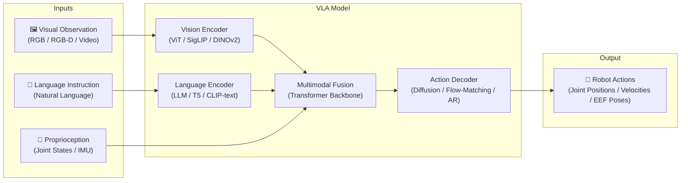

### 1.1 VLA Evolution Timeline

The VLA paradigm has evolved through three phases (adapted from [VLA Survey, arXiv:2505.04769](https://arxiv.org/html/2505.04769v1)):

| Phase | Period | Milestones | Key Characteristic |
|-------|--------|------------|--------------------|
| **Early Adoption** | 2022–2023 Q2 | RT-1, SayCan, PaLM-E | Foundation model releases; separate planning and control |
| **Rapid Growth** | 2023 Q3–2024 Q3 | RT-2, OpenVLA, Octo, RT-X | Open-source datasets/models; cross-embodiment emergence |
| **Maturation** | 2024 Q4–present | π₀, Helix, GR00T N1, Gemini Robotics 2 | Industrial dual-system VLAs; humanoid-specific architectures |

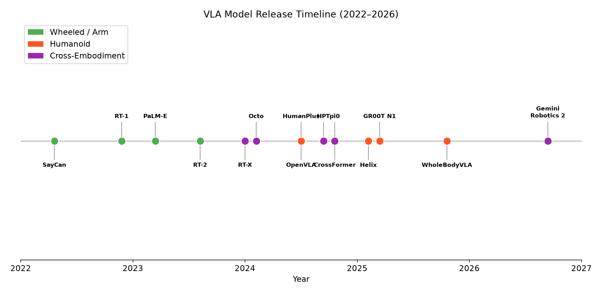

*Figure 1: Timeline of major VLA model releases, color-coded by target morphology. Humanoid-specific VLAs emerged primarily in 2025, while wheeled/arm VLAs dominated 2022–2024.*

### 1.2 Three Major VLA Architectural Paradigms

1. **Single End-to-End (Early Fusion)**: One forward pass from image + language to actions (RT-2, OpenVLA, π₀).
2. **Dual-System Architecture**: System 2 (slow VLM reasoning) + System 1 (fast motor policy) — dominates humanoid VLA (Helix, GR00T N1).
3. **Hierarchical VLA**: High-level VLA planner → mid-level skill policies → low-level RL controller (NaVILA, HumanPlus, WholeBodyVLA).

---

## 2. Humanoid (Bipedal) Robot VLA Models

### 2.1 Overview

Humanoid robot VLA faces unique challenges not present in wheeled or arm-only robots:

- **High-dimensional action space**: 20–78 DoF (legs + torso + arms + dexterous hands)
- **Balance maintenance**: Must solve locomotion stability (ZMP, centroidal dynamics) simultaneously with manipulation
- **Loco-manipulation coupling**: Manipulation creates external forces that destabilize walking
- **High control frequency**: ≥50 Hz for balance, up to 200 Hz for reactive motor control
- **Data scarcity**: Humanoid teleoperation data is extremely expensive to collect

### 2.2 Key Models and Papers

#### 2.2.1 Helix (Figure AI, Feb 2025)

**The first VLA to control an entire humanoid upper body at high frequency.**

- **Architecture**: Dual-system. System 2 = 7B VLM at 7–9 Hz; System 1 = 80M visuomotor policy at **200 Hz**
- **Action Space**: 35 DoF (wrist poses, individual finger flexion/abduction, torso, head)
- **Training**: ~500 hours of multi-robot teleoperation, auto-labeled by VLM for hindsight instructions
- **Key Innovation**: Runs entirely onboard embedded GPUs (<60W, 4-bit quantized on Jetson Orin)
- **Deployment**: BMW factories; two robots collaborating on shared long-horizon tasks

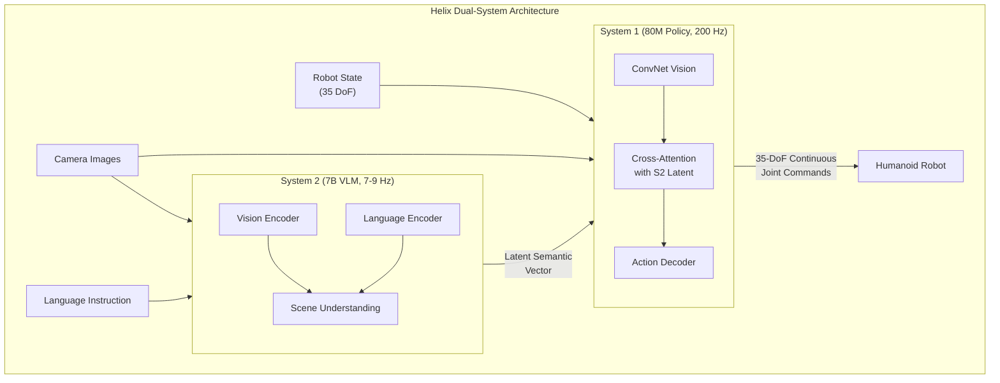

**Helix 02** (Jan 2026) extended this with **System 0** — a whole-body motion prior for full-body locomotion + manipulation, forming a three-tier hierarchy: S2 (reasoning) → S1 (reactive control) → S0 (motion feasibility). Demonstrated 61 sequential actions in a kitchen dishwasher task without human intervention.

> Source: [Figure AI Helix Blog](https://www.figure.ai/news/helix), [Helix 02 Announcement](https://www.figure.ai/news/helix-02)

#### 2.2.2 GR00T N1 (NVIDIA, March 2025)

**Open foundation model for generalist humanoid robots.**

- **Architecture**: Dual-system. S2 = Eagle-2 VLM (1.34B, SigLIP-2 + SmolLM2); S1 = DiT flow-matching policy
- **Action Generation**: Predicts 16-action chunks via flow matching at 120 Hz
- **Cross-Embodiment**: Single model/weights for single-arm, bimanual, and humanoid (via embodiment-specific MLP encoders)
- **Training**: "Data Pyramid" — internet-scale human video (base) + synthetic Omniverse data (middle) + real teleoperation (top)
- **Results**: 76.8% success on real Fourier GR-1 humanoid tasks; synthetic data provided 40% performance boost
- **License**: Apache 2.0 (open-source)

Latest version **GR00T N1.7** uses Cosmos-Reason2-2B backbone, pretrained on 20K hours of EgoScale human video.

> Source: [arXiv:2503.14734](https://arxiv.org/abs/2503.14734), [GitHub](https://github.com/NVIDIA/Isaac-GR00T)

#### 2.2.3 HumanPlus (Stanford, CoRL 2024)

**Full-stack humanoid learning from human demonstrations.**

- **Architecture**: Two decoder-only transformers — **HST** (Humanoid Shadowing Transformer, low-level) + **HIT** (Humanoid Imitation Transformer, high-level)
- **Robot**: Unitree H1 + 6-DoF Inspire Hands, 33 DoF total
- **HST**: Trained via PPO in simulation on AMASS dataset (40h motion capture), zero-shot sim-to-real, outputs at 50 Hz → PD controller at 1000 Hz
- **HIT**: Behavior cloning from egocentric RGB, runs at 25 Hz, commands HST
- **Data**: Only 40 teleoperation demonstrations per task (using single $50 RGB camera for motion retargeting)
- **Results**: 60–100% success on tasks including shoe-wearing, sweatshirt folding, typing

> Source: [arXiv:2406.10454](https://arxiv.org/abs/2406.10454), [GitHub](https://github.com/MarkFzp/humanplus)

#### 2.2.4 WholeBodyVLA (OpenDriveLab, ICLR 2026)

**Unified latent VLA for whole-body loco-manipulation, learning from action-free videos.**

- **Key Innovation**: Learns latent action representations from action-free egocentric videos via VQ-VAE, bypassing the teleoperation data bottleneck
- **Architecture**: VLA (Qwen2-VL backbone, ~20 Hz) → discrete latent action tokens → LMO RL policy (50 Hz) → PD controller (1 kHz)
- **Robot**: AgiBot X2 humanoid
- **Results**: 78.0% success (21% above best baseline OpenVLA-OFT), strong zero-shot generalization to uneven terrain and unseen objects

> Source: [arXiv:2512.11047](https://arxiv.org/abs/2512.11047), [GitHub](https://github.com/OpenDriveLab/WholebodyVLA)

#### 2.2.5 HOVER (CMU/NVIDIA, ICRA 2025)

**Versatile neural whole-body controller supporting multiple control modes.**

- **Approach**: Consolidates motor skills from multiple control paradigms (ExBody, HumanPlus, H2O, OmniH2O) into a unified RL policy via kinematic motion imitation + policy distillation
- **Key Feature**: Can dynamically switch between control modes during operation (e.g., ExBody mode → H2O mode during walking)
- **Not a VLA per se**, but serves as the low-level "body controller" that humanoid VLAs build upon

> Source: [hover-versatile-humanoid.github.io](https://hover-versatile-humanoid.github.io/)

#### 2.2.6 OmniH2O (CMU, IROS 2024)

**Universal human-to-humanoid teleoperation and autonomy.**

- **Approach**: Uses kinematic pose as universal control interface for VR headset, verbal instruction, or RGB camera-based teleoperation
- **Key Contribution**: Released OmniH2O-6 — first humanoid whole-body control dataset (6 everyday tasks)
- **Autonomy**: Integrates with GPT-4 for language-conditioned autonomous control

> Source: [arXiv:2406.08858](https://arxiv.org/abs/2406.08858), [omni.human2humanoid.com](https://omni.human2humanoid.com/)

#### 2.2.7 ExBody2 (UCSD, Dec 2024)

**Advanced expressive humanoid whole-body control.**

- **Key Innovation**: Decoupled velocity tracking from body landmark tracking; local keypoint tracking (vs. global in H2O/OmniH2O)
- **Training**: Two-stage teacher-student with PPO in simulation; deployed on Unitree G1
- **Contribution**: Principled motion dataset curation method balancing feasibility and diversity

> Source: [arXiv:2412.13196](https://arxiv.org/abs/2412.13196), [exbody2.github.io](https://exbody2.github.io/)

#### 2.2.8 NaVILA (USC, Dec 2024)

**Legged robot VLA for vision-and-language navigation.**

- **Architecture**: 2-level framework — VLA generates mid-level language actions ("move forward 75cm") → visual locomotion RL policy executes
- **Key Innovation**: Cross-robot transferability — same VLA works on Unitree Go2 quadruped and Booster T1 humanoid by swapping only the locomotion policy
- **Results**: 17% improvement in success rate on R2R-CE; 88% overall success rate in real-world trials

> Source: [arXiv:2412.04453](https://arxiv.org/abs/2412.04453), [navila-bot.github.io](https://navila-bot.github.io/)

#### 2.2.9 Tesla Optimus

**End-to-end VLA adapted from FSD architecture.** No peer-reviewed paper published; details from ICCV 2025 keynote by Ashok Elluswamy.

- **Architecture**: Single end-to-end transformer mapping camera pixels + proprioception → 78 actuator commands
- **Neural World Simulator**: Learned simulation (not hand-coded physics) trained on real video; 1 simulated day compresses 500 years of equivalent experience
- **Custom Silicon**: AI5 chip (~H100 inference performance) for fully onboard control
- **Status**: ~300 units deployed for data collection (Sep 2026)

> Source: [ICCV 2025 Keynote](https://www.humanoidsdaily.com/news/tesla-ai-chief-details-unified-world-simulator-for-fsd-and-optimus)

#### 2.2.10 Other Notable Models

| Model | Year | Org | Key Contribution |
|-------|------|-----|------------------|
| **PhysiFlow** | 2025 | — | Bio-inspired multi-brain VLA: neocortical + basal ganglionic + cerebellar; physics-aware constraints |
| **LeVERB** | 2025 | Berkeley | Hierarchical VLA with CVAE-based latent action vocabulary; first zero-shot sim-to-real for language-conditioned WBC |
| **Meta Motivo** | 2025 | Meta | Behavioral foundation model for zero-shot whole-body humanoid control |
| **HAF** | 2026 | — | Hierarchical Action Flow: stage-wise generation (locomotion → torso → arms) with DCT-compressed RL |
| **MotionWAM** | 2026 | — | Unified motion latent for whole-body prediction; >30% higher success than fine-tuned VLA baselines |
| **GR-2** | 2024 | Fourier Intelligence | 53 DoF, 12-DoF dexterous hands; hardware platform for GR00T N1 deployment |
| **1X Redwood AI** | 2025 | 1X Technologies | 160M-param VLA for NEO humanoid; joint locomotion + manipulation; self-collecting data loop |

### 2.3 Humanoid VLA Architecture Summary

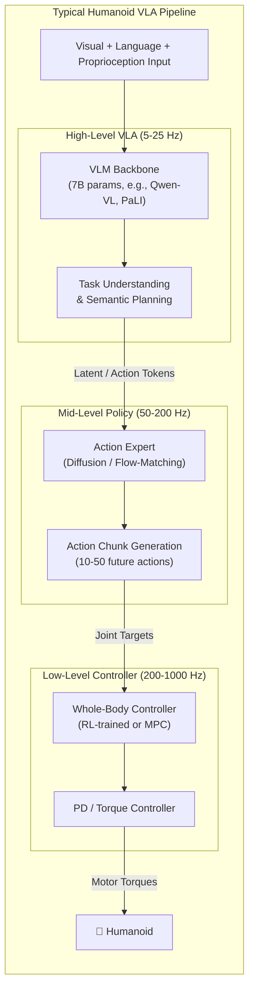

---

## 3. Wheeled Robot VLA Models

### 3.1 Overview

Wheeled robot VLA encompasses two major domains: **mobile manipulation robots** (indoor service robots with arms on wheeled bases) and **autonomous driving** (vehicles as wheeled robots). These share the simplification of locomotion (no balance problem) but differ greatly in operational environments.

Key characteristics of wheeled robot VLA:

- **Low-dimensional navigation action space**: 2–3 DoF for base movement (linear velocity, angular velocity, or waypoints)
- **No balance problem**: Wheels provide inherent stability
- **Lower control frequency**: 5–50 Hz is sufficient
- **Rich training data**: Large-scale datasets available (Open X-Embodiment has 1M+ manipulation episodes)
- **Mature benchmarks**: LIBERO, CALVIN, Habitat, CARLA, nuScenes

### 3.2 Key Models and Papers

#### 3.2.1 RT-1 (Google, Dec 2022)

**First successful large-scale transformer for robotic manipulation.**

- **Architecture**: 35M params; EfficientNet vision encoder + USE language encoder + FiLM conditioning + Transformer action decoder
- **Training**: 130K demonstrations across 700+ tasks on Google's mobile manipulator fleet
- **Action Space**: 7D discretized end-effector control (x, y, z, roll, pitch, yaw, gripper)
- **Results**: 97% success on training instructions; enabled SayCan for 50-stage long-horizon tasks

> Source: [robotics-transformer1.github.io](https://robotics-transformer1.github.io/)

#### 3.2.2 RT-2 (Google DeepMind, Jul 2023)

**The foundational VLA model — first to co-train VLM on robot data.**

- **Architecture**: PaLI-X (55B) or PaLM-E (12B) backbone, co-fine-tuned on internet vision-language data + robot trajectories
- **Key Innovation**: Actions encoded as text tokens — robot control treated as sequence-to-sequence language task
- **Results**: 62% manipulation success (vs. 44% RT-1); 3× improvement on emergent skills; chain-of-thought reasoning for robot control
- **Platform**: Google's wheeled mobile manipulators

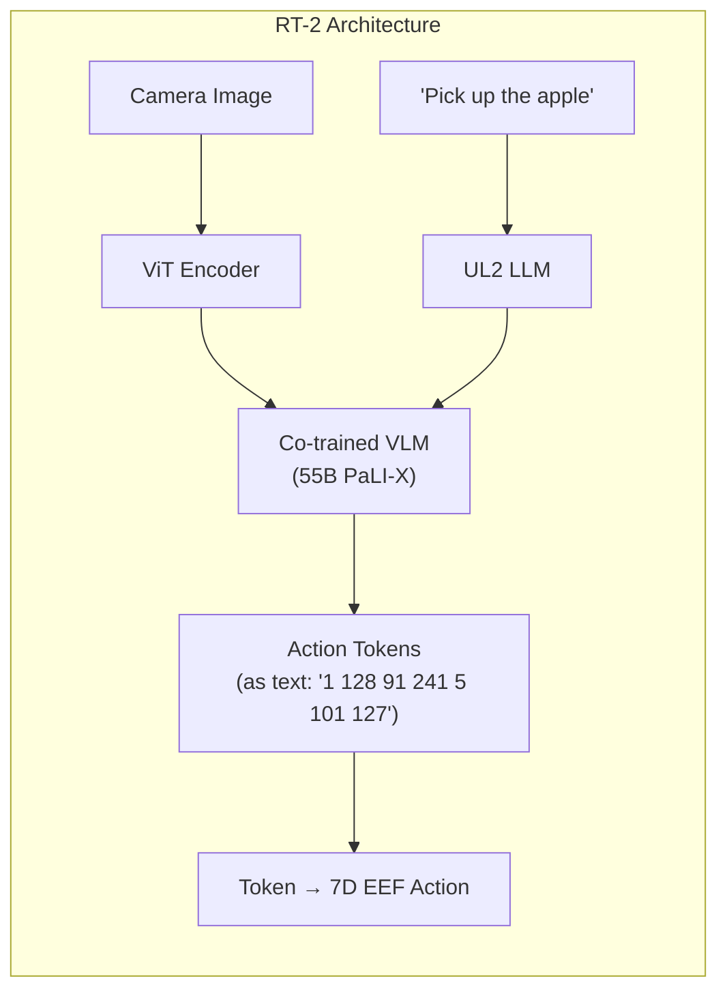

> Source: [robotics-transformer2.github.io](https://robotics-transformer2.github.io/), [arXiv](https://arxiv.org/abs/2307.15818)

#### 3.2.3 OpenVLA (Stanford, CoRL 2024)

**Open-source 7B VLA for robotic manipulation.**

- **Architecture**: Prismatic-7B VLM (SigLIP + DINOv2 vision encoder + Llama 2 7B backbone)
- **Training**: 970K real-world demonstrations from Open X-Embodiment on 64 A100 GPUs for 15 days
- **Results**: Outperforms RT-2-X (55B) by 16.5% with 7× fewer parameters; LoRA fine-tuning in 10–15h on single A100
- **Follow-up**: MiniVLA (1B params) achieves 82% on LIBERO-90 (vs. OpenVLA's 62%)

> Source: [arXiv:2406.09246](https://arxiv.org/abs/2406.09246), [openvla.github.io](https://openvla.github.io/)

#### 3.2.4 SayCan (Google, 2022)

**Grounding LLM planning in robotic affordances.**

- **Approach**: LLM generates candidate action plans; a learned value function (from RT-1) scores which actions are physically feasible → select most feasible action
- **Platform**: Google's wheeled Everyday Robots
- **Limitation**: VLM cannot see the world — relies entirely on language; succeeded by RT-2 which added visual grounding

> Source: [say-can.github.io](https://say-can.github.io/)

#### 3.2.5 PaLM-E (Google, 2023)

**Embodied multimodal language model.**

- **Architecture**: 562B params; PaLM language model + ViT-22B vision encoder
- **Key Innovation**: Directly injects continuous sensor embeddings (images, state vectors) into the language model's token sequence
- **Tasks**: Robot planning, visual QA, scene description — all in one model
- **Relevance**: Served as one of RT-2's backbone choices, demonstrating that web-scale VLMs can ground in embodied tasks

> Source: [palm-e.github.io](https://palm-e.github.io/)

#### 3.2.6 Gemini Robotics (Google DeepMind, 2025–2026)

**Production-grade VLA family built on Gemini 2.0.**

| Version | Date | Key Feature |
|---------|------|-------------|
| **Gemini Robotics** | Mar 2025 | Direct robot control VLA; >2× performance vs. RT-2 |
| **Gemini Robotics On-Device** | Jun 2025 | Runs locally on robot hardware; adapts with 50–100 demos |
| **Gemini Robotics 1.5** | Sep 2025 | Think-before-act; cross-embodiment learning |
| **Gemini Robotics 2** | Sep 2026 | Whole-body humanoid control (feet to fingertips); 22-DoF dexterous hands; multi-robot coordination |

Partners: Agility Robotics, Boston Dynamics, Apptronik.

> Source: [deepmind.google/models/gemini-robotics](https://deepmind.google/models/gemini-robotics/)

#### 3.2.7 Autonomous Driving VLAs

| Model | Org | Year | Architecture | Key Feature |
|-------|-----|------|-------------|-------------|
| **EMMA** | Waymo | Oct 2024 | Gemini-powered E2E model | Chain-of-thought reasoning for driving; SOTA on nuScenes planning |
| **DriveVLM** | Li Auto + Tsinghua | CoRL 2024 | Qwen-VL (9.7B) | Long-tail scenario understanding; key object focus |
| **LightEMMA** | — | 2025 | Lightweight EMMA variant | Open-source alternative |

Autonomous driving VLAs treat the vehicle as a wheeled robot with actions = future trajectory waypoints. Key difference from robot manipulation VLAs: **safety-criticality** and the need for **formal verification**.

> Sources: [waymo.com/research/emma](https://waymo.com/research/emma/), [ICCV 2025 Workshop](https://openaccess.thecvf.com/content/ICCV2025W/WDFM-AD/)

#### 3.2.8 Navigation VLAs for Wheeled/Mobile Robots

| Model | Year | Key Feature |
|-------|------|-------------|
| **BUMBLE** | 2024 (ICRA 2025) | Building-wide mobile manipulation with VLMs; 47.1% success across buildings |
| **OK-Robot** | Jan 2024 | Zero-shot language-conditioned pick-and-drop using VLMs + AnyGrasp; real-home deployment |
| **Mobility VLA** | 2024 | Long-context VLMs + topological graphs for mobile navigation |
| **OmniVLA** | 2025 | Omni-modal VLA for robot navigation |
| **HomeRobot** | NeurIPS 2023 | Open-vocabulary mobile manipulation benchmark; Hello Robot Stretch |
| **Mobile ALOHA** | Stanford 2024 | Co-training static + mobile data; 80%+ success on mobile bimanual tasks |

### 3.3 Wheeled Robot VLA Architecture Summary

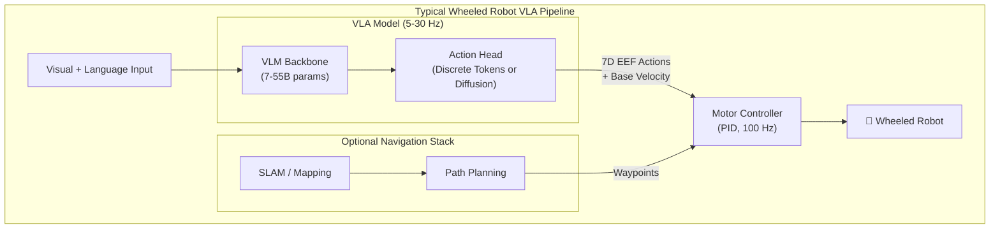

---

## 4. Cross-Embodiment VLA Frameworks

A critical trend in VLA research is building **single models that work across different robot morphologies** — arms, wheeled robots, quadrupeds, and humanoids.

### 4.1 Key Cross-Embodiment Models

#### 4.1.1 Open X-Embodiment / RT-X (Google DeepMind, ICRA 2024 Best Paper)

- **Dataset**: 22 robot embodiments, 60+ datasets, 1M+ demonstrations, 527 skills
- **Models**: RT-1-X (35M) and RT-2-X (55B)
- **Action Unification**: All robots mapped to 7D end-effector action (x, y, z, roll, pitch, yaw, gripper), discretized to 256 bins
- **Results**: RT-1-X achieved 50% average improvement over per-robot baselines
- **Key Finding**: Positive transfer requires sufficient model capacity — only 55B RT-2-X showed consistent benefits

> Source: [arXiv:2310.08864](https://arxiv.org/abs/2310.08864), [robotics-transformer-x.github.io](https://robotics-transformer-x.github.io/)

#### 4.1.2 Octo (UC Berkeley, RSS 2024)

- **Architecture**: 93M-param transformer with diffusion action head, trained on 800K Open X-Embodiment episodes
- **Key Design**: Modular block-wise attention — easily swap action heads for new embodiments without retraining backbone
- **Results**: Matches 55B RT-2-X zero-shot performance with 600× fewer parameters; 72% average fine-tuned success
- **Limitation**: Manipulation only — no navigation or locomotion data

> Source: [arXiv:2405.12213](https://arxiv.org/abs/2405.12213), [octo-models.github.io](https://octo-models.github.io/)

#### 4.1.3 CrossFormer (UC Berkeley, CoRL 2024 Oral, Top 4%)

**First cross-embodiment policy spanning manipulation, navigation, locomotion, and aviation.**

- **Training**: 900K trajectories across 20+ embodiments including single-arm, bimanual (ALOHA), wheeled (LoCoBot), quadruped (Go1), and quadcopter (Tello)
- **Architecture**: 130M-param decoder-only transformer with embodiment-specific action heads; no manual action space alignment required
- **Results**: 73% average success vs. 51% for prior best; first cross-embodiment policy on bimanual robots; zero-shot quadcopter control

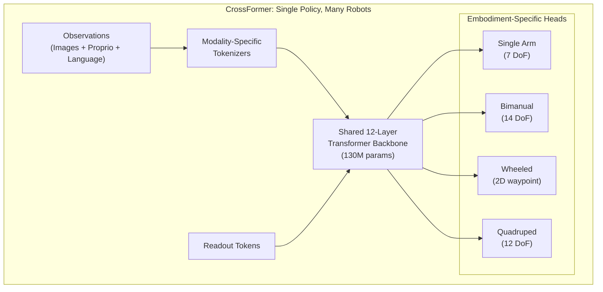

> Source: [arXiv:2408.11812](https://arxiv.org/abs/2408.11812), [crossformer-model.github.io](https://crossformer-model.github.io/)

#### 4.1.4 HPT — Heterogeneous Pre-trained Transformers (MIT/Meta, NeurIPS 2024 Spotlight)

- **Architecture**: Embodiment-specific stems → shared 1B-param transformer trunk → task-specific heads
- **Training**: 52 datasets from different robot embodiments
- **Results**: 20%+ improvement on unseen tasks; handles broader heterogeneity than RT-X (including proprioception and simulation data)

> Source: [arXiv:2409.20537](https://arxiv.org/abs/2409.20537), [liruiw.github.io/hpt](https://liruiw.github.io/hpt/)

#### 4.1.5 π₀ and π₀.5 (Physical Intelligence, 2024–2025)

- **π₀** (Oct 2024): PaliGemma VLM backbone + flow-matching action expert; trained on 8 embodiments; 50 Hz action generation
- **π₀.5** (Apr 2025): Extended to long-horizon dexterous manipulation in unseen homes via co-training on heterogeneous tasks and web data
- **Key Insight**: Flow matching over action chunks (predicting 10–50 future actions at once) has become the dominant action generation paradigm

> Source: [arXiv:2410.24164](https://arxiv.org/html/2410.24164v1)

### 4.2 Cross-Embodiment Transfer: What Works?

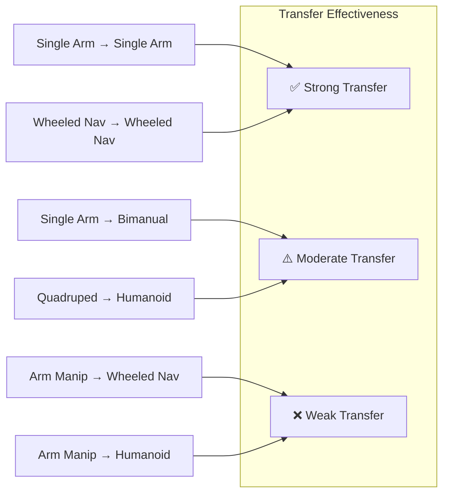

**Key findings** from the cross-embodiment literature:

1. **Pretraining + fine-tuning beats training from scratch** — but primarily when the pretraining corpus covers the target morphology family
2. **Transfer across morphology families is weak** — single-arm data helps other single-arm robots; it barely helps bimanual or mobile robots
3. **Model capacity matters** — only at 55B+ parameters (RT-2-X) does heterogeneous cross-embodiment training consistently help
4. **Fine-tuning recovers most of the gap** — CrossFormer confirms that dedicated fine-tuning on the target embodiment narrows the difference with from-scratch training

---

## 5. Technical Comparison: Humanoid vs Wheeled

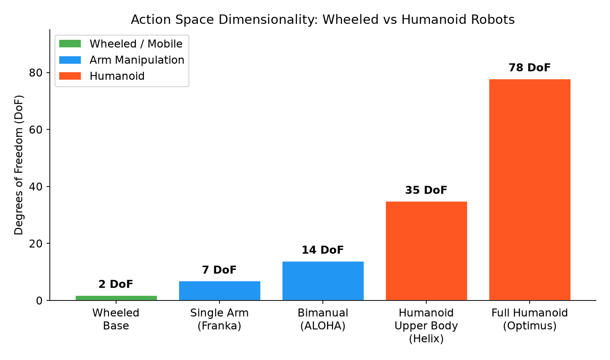

*Figure 2: Action space dimensionality across robot types. Humanoid robots require 5–11× more DoF than wheeled manipulation robots, fundamentally shaping VLA architecture choices.*

### 5.1 Action Space

| Dimension | Humanoid (Bipedal) | Wheeled Robot |
|-----------|-------------------|---------------|
| **Total DoF** | 20–78 (full body) | 2–3 (base) + 6–7 (arm, if equipped) |
| **Locomotion DoF** | 10–12 per leg + waist | 2 (differential drive: $v$, $\omega$) |
| **Manipulation DoF** | 6–7 per arm + 6–21 per hand | 6–7 per arm + 1 (gripper) |
| **Action Representation** | Joint positions/velocities, or end-effector + IK | End-effector Δ-pose + gripper open/close |
| **Action Dimensionality** | $\mathbf{a} \in \mathbb{R}^{29-78}$ | $\mathbf{a} \in \mathbb{R}^{7-9}$ |

**Mathematical formulation**:

For a humanoid with $n$ joints, the action at time $t$ is:

$$\mathbf{a}_t = [\mathbf{q}_{\text{legs}}, \mathbf{q}_{\text{torso}}, \mathbf{q}_{\text{arms}}, \mathbf{q}_{\text{hands}}] \in \mathbb{R}^n$$

where $\mathbf{q}_{\text{legs}} \in \mathbb{R}^{10\text{-}12}$ must satisfy balance constraints:

$$\text{ZMP}(\mathbf{q}_t, \dot{\mathbf{q}}_t, \ddot{\mathbf{q}}_t) \in \text{SupportPolygon}$$

For a wheeled robot, the action is simply:

$$\mathbf{a}_t = [v_x, v_y, \omega, \Delta x_{\text{ee}}, \Delta y_{\text{ee}}, \Delta z_{\text{ee}}, \Delta \phi, \Delta \theta, \Delta \psi, g] \in \mathbb{R}^{10}$$

where $v_x, v_y, \omega$ are base velocities and $g \in \{0, 1\}$ is gripper.

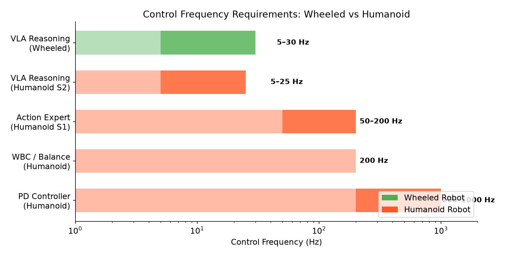

*Figure 3: Control frequency ranges for different pipeline components. Humanoid robots require 10–40× faster inner control loops for balance maintenance.*

### 5.2 Control Frequency

| Component | Humanoid | Wheeled |
|-----------|----------|---------|
| **High-level VLA** | 5–25 Hz | 5–30 Hz |
| **Mid-level Policy** | 50–200 Hz | N/A (VLA directly controls) |
| **Low-level Controller** | 200–1000 Hz (PD/torque) | 50–100 Hz (PID) |
| **Balance Loop** | 50–200 Hz (mandatory) | N/A |

The critical difference: humanoid robots **require a fast inner control loop for balance** that runs 10–40× faster than the VLA's reasoning frequency. This necessitates the dual-system or hierarchical architecture. Wheeled robots can operate with a single-level VLA because wheels provide passive stability.

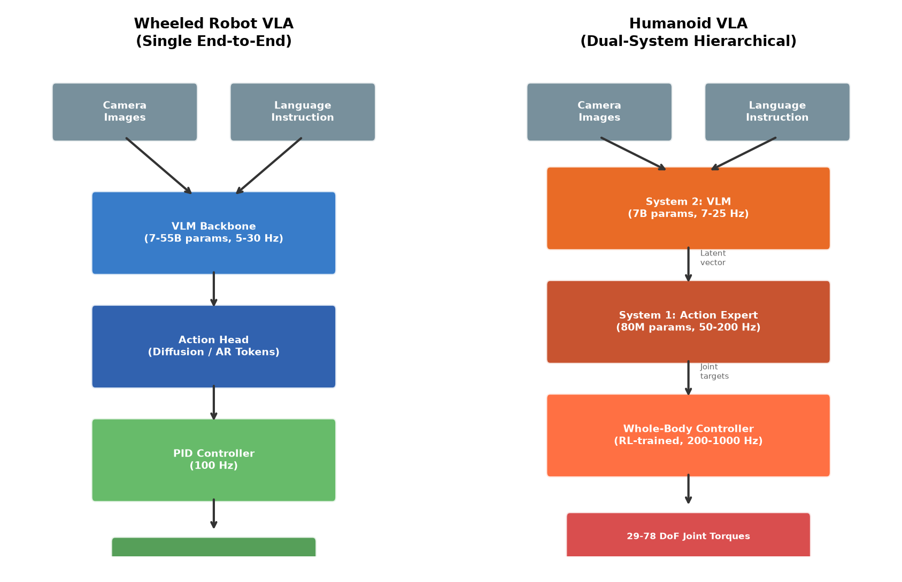

*Figure 4: Side-by-side comparison of wheeled (single end-to-end) vs humanoid (dual-system hierarchical) VLA architectures. The key difference is the mandatory whole-body controller layer for bipedal balance.*

### 5.3 Architecture Comparison

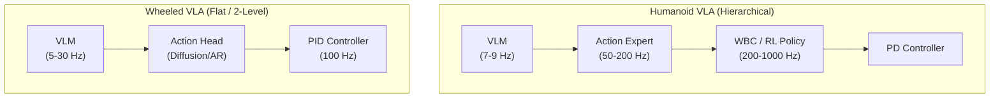

### 5.4 Comprehensive Technical Comparison Table

| Feature | Humanoid (Bipedal) | Wheeled Robot | Autonomous Driving |
|---------|-------------------|---------------|-------------------|
| **Action DoF** | 29–78 | 7–10 | 2–3 (steering, throttle, brake) |
| **Control Frequency** | 50–200 Hz (action) + 1kHz (torque) | 5–50 Hz | 10–20 Hz |
| **Architecture** | Dual/triple-system (mandatory hierarchy) | Single end-to-end or 2-level | End-to-end or modular |
| **Balance** | Active balance required (ZMP, centroidal dynamics) | Passive stability (wheels) | N/A |
| **Key Challenge** | Loco-manipulation coordination | Navigation + manipulation composition | Safety-critical planning |
| **Data Availability** | **Extremely scarce** (<1K hours typical) | **Abundant** (1M+ episodes in OXE) | **Massive** (billions of driving miles) |
| **Sim-to-Real Gap** | Large (contact dynamics, deformable objects) | Moderate (visual gap, clean sim envs) | Moderate (sensor models, weather) |
| **Safety Constraint** | Fall prevention | Collision avoidance | Formal verification |
| **Temporal Horizon** | Short (reactive balance) + long (task planning) | Medium (navigation) + short (manipulation) | Long (route) + short (reactive) |
| **Action Representation** | Joint positions (continuous, flow-matching) | EEF deltas (discrete tokens or diffusion) | Waypoints or control signals |
| **Dominant Action Gen** | Flow matching / diffusion | Autoregressive tokens or diffusion | Trajectory prediction |
| **VLM Backbone Size** | 1.3–7B (onboard constraint) | 7–55B (can offload to server) | 2–12B (onboard ASIC) |
| **Real-Time Onboard** | Critical (balance) | Desirable | Critical (safety) |

### 5.5 Training Data Comparison

| Aspect | Humanoid | Wheeled |
|--------|----------|---------|
| **Primary Source** | Teleoperation (exoskeleton, VR) | Teleoperation (joystick, keyboard) |
| **Cost per Episode** | High ($50+/hr operator, specialized rig) | Low (standard input devices) |
| **Available Scale** | ~500 hours (Helix) | 1M+ episodes (OXE), billions miles (driving) |
| **Scalable Alternative** | Egocentric human video + retargeting | Internet video + sim2real |
| **Sim Environments** | Isaac Gym, MuJoCo | Habitat, iGibson, AI2-THOR, CARLA |
| **Sim-to-Real Rate** | ~8 sim samples ≈ 1 real sample | Better sim-to-real (simpler dynamics) |
| **Key Bottleneck** | Loco-manipulation data almost nonexistent | OOD generalization beyond lab settings |

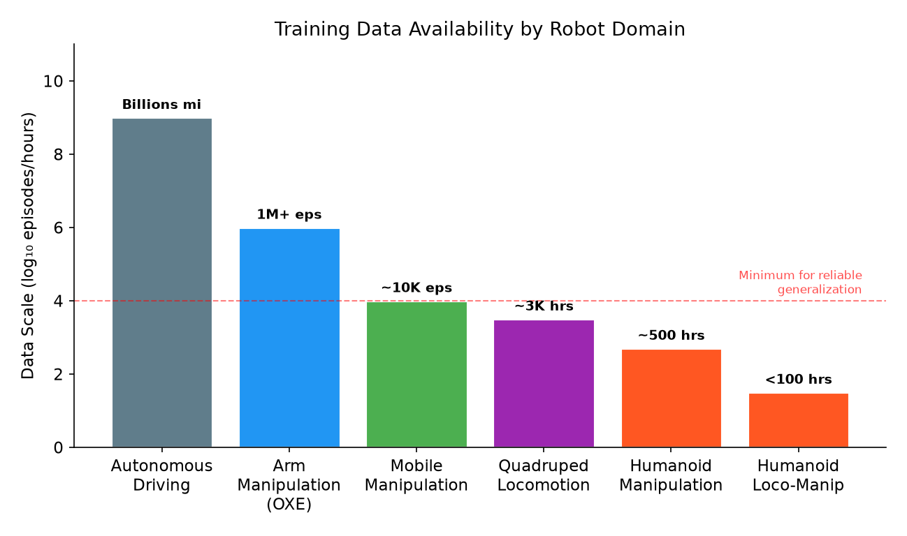

*Figure 5: Training data availability across robot domains. Humanoid loco-manipulation data is orders of magnitude scarcer than arm manipulation or driving data, creating a fundamental bottleneck for humanoid VLA development.*

### 5.6 Safety Requirements

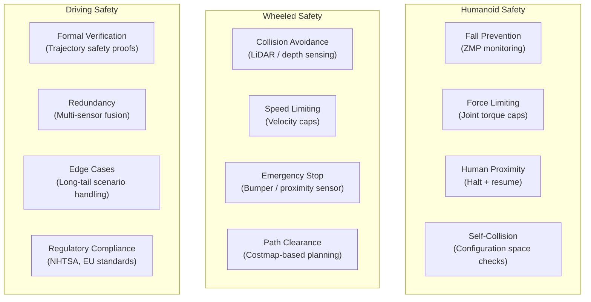

---

## 6. Benchmarks and Evaluation Metrics

### 6.1 Benchmark Overview Table

| Benchmark | Domain | Robot Type | Tasks | Primary Metrics | Status |
|-----------|--------|-----------|-------|-----------------|--------|
| **HumanoidBench** | Humanoid locomotion + manipulation | Unitree H1 (sim) | 27 (12 loco + 15 manip) | Success Rate, Episode Reward | Active |
| **Humanoid Everyday** | Real humanoid manipulation | Real humanoid | 260 unique tasks | Success Rate (51% avg) | 2025 |
| **NIST Baseline** | Humanoid standardized test | Any commercial humanoid | Mobility + dexterity + loco-manip | Quantifiable performance metrics | 2026 |
| **LIBERO** | Robot manipulation (lifelong) | Franka (sim) | 130 tasks (4 suites) | Success Rate per suite | Active (default VLA eval) |
| **CALVIN** | Language-conditioned manipulation | Franka (sim) | 34 skill types × 5 chains | Chained success rate | Active |
| **SimplerEnv** | Real-to-sim transfer | WidowX / Google Robot (sim) | Varied manipulation | Success Rate | Active |
| **Habitat ObjectNav** | Visual navigation | Simulated agent (wheeled) | Navigate to object category | SR, SPL | Active |
| **ALFRED / TEACh** | Instruction following | Simulated agent | Household tasks | SR, Goal-Condition SR | Active |
| **CARLA / nuScenes** | Autonomous driving | Vehicle | Driving scenarios | Collision rate, route completion | Active |
| **VLABench** | Language-conditioned manip | — | Long-horizon | — | 2025 (ICCV) |

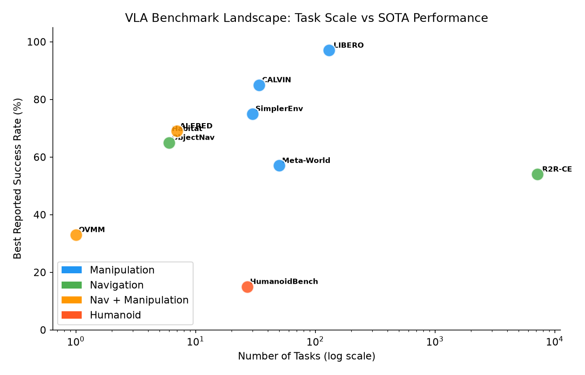

*Figure 6: VLA benchmark landscape mapping task scale against best reported SOTA performance. Humanoid benchmarks (HumanoidBench) have the lowest SOTA success rates, reflecting the fundamental difficulty of whole-body control. Navigation and manipulation benchmarks are more mature.*
| **RoboCasa** | — | — | — | — | Emerging |

### 6.2 Humanoid-Specific Benchmarks

#### 6.2.1 HumanoidBench (RSS 2024)

The primary simulated benchmark for humanoid robot learning, using MuJoCo with Unitree H1 + Shadow Hands (101 DoF total, 61-dim action space, 50 Hz control).

**Tasks**: 12 locomotion primitives (walk, run, hurdle, maze, balance, etc.) + 15 whole-body manipulation (push, cabinet, box reorganization, basketball, kitchen assembly, etc.)

**Key Findings**:
- State-of-the-art RL (DreamerV3, TD-MPC2, SAC, PPO) all struggle on most tasks
- Hierarchical RL (robust low-level policies + high-level task planners) dramatically outperforms flat policies
- **0% success on high-precision insertion/loco-manipulation** across all baselines — the frontier challenge

**Evaluation Metrics**: Dense reward + sparse subtask completion; combined proprioceptive + egocentric visual observations.

> Source: [humanoid-bench.github.io](https://humanoid-bench.github.io/), [arXiv:2403.10506](https://arxiv.org/abs/2403.10506)

#### 6.2.2 NIST Baseline Performance Benchmark (May 2026)

Government-standardized benchmark for commercially available humanoid robots. Covers:
- Basic mobility
- Manipulation/dexterity
- Coordinated loco-manipulation
- Confined-space tasks (whole-body awareness)

Intended as **industry-comparable, vendor-neutral** evaluation standard.

> Source: [nist.gov/humanoid-robot-baseline-performance-benchmark](https://www.nist.gov/el/intelligent-systems-division-73500/humanoid-robot-baseline-performance-benchmark)

### 6.3 Wheeled Robot / Manipulation Benchmarks

#### 6.3.1 LIBERO

**The de-facto default VLA evaluation suite since mid-2024.** 130 tasks across 4 suites:
- **LIBERO-Spatial**: Spatial reasoning (objects in various positions)
- **LIBERO-Object**: Object generalization
- **LIBERO-Goal**: Goal-conditioned tasks
- **LIBERO-100 (LIBERO-Long)**: 100 long-horizon tasks (hardest; reveals generalization gaps)

**SOTA (as of mid-2026)**:

| Model | Spatial | Object | Goal | Long | Average |
|-------|---------|--------|------|------|---------|
| UniVLA | ~96% | ~96% | ~96% | **94%** | ~96% |
| OpenVLA | ~75% | ~80% | ~72% | ~62% | ~72% |
| Octo | ~60% | ~65% | ~58% | ~40% | ~56% |

> Source: [LIBERO GitHub](https://github.com/Lifelong-Robot-Learning/LIBERO), [VLA Arena](https://tektonian.com/vla-benchmark)

#### 6.3.2 CALVIN

Language-conditioned long-horizon skill chaining in a single shared tabletop environment. 34 elementary skills composed into 5-instruction chains.

**Evaluation**: ABC→D (train on scenes A/B/C, test on D) and ABCD→D (train on all, test on D).

> Source: [CALVIN GitHub](https://github.com/mees/calvin)

#### 6.3.3 SimplerEnv

Real-to-sim evaluation framework for WidowX robots under varied lighting, textures, colors, and viewpoints. Bridges simulation and real-world policy assessment.

**SOTA**: UD-VLA achieves 75.0% average success rate.

#### 6.3.4 Habitat (ObjectNav / PointNav)

**ObjectNav**: Navigate to an instance of a specified object category in an unseen environment using onboard RGB-D camera.

**Key Metrics**:
- **Success Rate (SR)**: Agent stops within threshold distance of target object
- **SPL (Success weighted by Path Length)**: $\text{SPL} = \frac{1}{N}\sum_{i=1}^{N} S_i \cdot \frac{l_i}{\max(p_i, l_i)}$ where $S_i$ is binary success, $l_i$ is shortest path length, $p_i$ is actual path length. Penalizes unnecessarily long paths.
- **Soft SPL**: Continuous version weighted by remaining distance

**Challenge History**: Yearly since 2019; PointNav retired 2022; ObjectNav uses HM3D-Semantics v0.2 (216 scenes, 6 categories).

> Source: [aihabitat.org](https://aihabitat.org/challenge/2023/)

### 6.4 Metric Comparison: What Gets Measured?

| Metric Category | Humanoid Benchmarks | Wheeled / Manipulation Benchmarks | Driving Benchmarks |
|----------------|--------------------|---------------------------------|-------------------|
| **Task Success** | ✅ Success Rate | ✅ Success Rate | ✅ Route Completion |
| **Path Efficiency** | ❌ (not standard) | ✅ SPL | ✅ Miles/intervention |
| **Balance/Stability** | ✅ ZMP tracking, joint torques, IMU | ❌ N/A | ❌ N/A |
| **Motion Quality** | ✅ Gait smoothness, energy efficiency | ❌ (not standard) | ✅ Ride comfort |
| **Generalization** | ✅ Zero-shot to unseen objects/terrain | ✅ OOD objects/scenes | ✅ Long-tail scenarios |
| **Safety** | ✅ Fall count, self-collision | ⚠️ Collision rate | ✅ Collision rate, TTC |
| **Long-Horizon** | ✅ Chained success (Humanoid Everyday) | ✅ CALVIN chains | ✅ Full route |
| **Data Efficiency** | ✅ Success vs. # demonstrations | ✅ Fine-tuning sample count | ❌ (not standard) |
| **Latency/Real-Time** | ✅ Inference Hz vs. required Hz | ⚠️ Sometimes measured | ✅ Inference time |

### 6.5 Benchmark Critique

An audit of standard benchmarks ([OpenReview, 2026](https://openreview.net/forum?id=tAaWFpvnmm)) revealed significant issues:

1. **LIBERO**: A 0.09B probe with no language encoder scores near reported SOTA — most reported gains are not provably statistically significant
2. **CALVIN**: Randomizing block poses within training range drops performance for every tested policy
3. **SimplerEnv**: Better at predicting real-world ranking than LIBERO/CALVIN, but limited task diversity
4. **HumanoidBench**: All baselines achieve 0% on high-precision tasks — the benchmark may be too hard to differentiate methods
5. **General**: Most OOD evaluations involve only minor visual perturbations, preserving embodiment, task structure, and workspace layout — **generalization is largely superficial**

---

## 7. Industry Landscape (2024–2026)

### 7.1 Humanoid Robot Companies and Their VLA Approaches

| Company | Robot | VLA Approach | Status (Sep 2026) |
|---------|-------|-------------|-------------------|
| **Figure AI** | Figure 02/03 | Helix (in-house dual-system VLA) | 350+ units at BMW; $39B valuation |
| **Tesla** | Optimus Gen 3 | FSD-derived end-to-end VLA + neural world sim | ~300 units for data collection |
| **NVIDIA** | Platform (GR00T) | GR00T N1.7 (open-source VLA) | Apache 2.0; deployed on Fourier, Agility |
| **Google DeepMind** | — (partner robots) | Gemini Robotics 2 | Partners: Boston Dynamics, Agility, Apptronik |
| **1X Technologies** | NEO | Redwood AI (160M VLA) + World Model | $20K consumer price target |
| **Unitree** | G1 / H1 | UnifoLM-VLA-0 (Qwen2.5-VL-7B) | 5,500 units shipped (2025); G1 from ~$13.5K |
| **Fourier Intelligence** | GR-2 / GR-3 | GR00T N1 deployment | 53 DoF; Series E ~$110M |
| **Agility Robotics** | Digit v5 | 3-layer stack (VLMs + IL + RL) | Going public ~$2.5B; 65K+ hours deployed |
| **Boston Dynamics** | Electric Atlas | Gemini Robotics + NVIDIA Isaac | All 2026 production committed |
| **Apptronik** | Apollo | Gemini Robotics integration | $5B valuation; $935M+ Series A |
| **Sanctuary AI** | Phoenix | Carbon AI (symbolic + LLM + DL + RL) | Pivoting to Physical AI software on industrial arms |

### 7.2 Market Data

- **Robotics VC funding**: $13.8B in 2025; humanoid investment up ~143× in 4 years
- **Humanoid-specific funding**: $4.3B in 2025 (6× jump from 2018)
- **~50 companies globally** have raised $100M+ for humanoid development (20 in China, 15 in North America)

### 7.3 Key Research Competitions (2025–2026)

| Competition | Venue | Focus |
|-------------|-------|-------|
| **General-Purpose Humanoid Robot Competition** | ICRA 2026 | World Model + VLM/VLA + WBC tracks |
| **Humanoid IKEA Assembly Challenge** | IROS 2026 | Autonomous furniture assembly on G1 |
| **Loco-Manipulation Challenge** | IEEE Humanoids 2026 | Mobility + dexterity + reasoning |
| **Legged Robot Challenge** | ICRA 2026 | Extended from quadruped to humanoid |

---

## 8. Open Challenges and Future Directions

### 8.1 Challenges Specific to Humanoid VLA

1. **Loco-manipulation data scarcity**: Datasets integrating humanoid walking + manipulation are almost nonexistent. Large-scale datasets treat manipulation and navigation as separate tasks. Emerging solutions: egocentric human video (EgoVLA, Figure Go-Big), action-free video learning (WholeBodyVLA), and HumanoidMimicGen for auto-generating demonstrations.

2. **High-precision loco-manipulation**: 0% success across all baselines in HumanoidBench insertion tasks. Manipulation-aware locomotion — planning movements that create preconditions for manipulation — remains unsolved.

3. **Real-time onboard inference**: 7B VLA at 50 Hz is computationally expensive. Solutions include dual-system architectures (small fast policy + large slow reasoner), quantization (Helix: 4-bit on Jetson Orin), and distillation to smaller models (SmolVLA: 450M params competitive with 7B).

4. **Fall prevention**: Catastrophic failure mode unique to bipedal robots. Requires constant ZMP monitoring and reactive balance recovery, adding computational overhead and safety constraints that wheeled robots avoid entirely.

5. **Sim-to-real for contact-rich humanoid tasks**: Dynamics gap (friction, deformation, compliance) remains harder than visual gap. Domain randomization achieves 84–93% zero-shot transfer, but contact-rich manipulation and deformable objects remain challenging.

### 8.2 Challenges Specific to Wheeled Robot VLA

1. **Long-horizon compositional tasks**: Chaining navigation + manipulation over building-scale environments (BUMBLE achieves only 47.1%).

2. **Open-world deployment**: Lab-trained policies fail in cluttered real homes with dynamic obstacles (people, pets, doors). OK-Robot highlights the gap between lab and home environments.

3. **Navigation + manipulation coordination**: Most systems treat these as separate modules. End-to-end approaches (Mobile ALOHA) show promise but require more mobile-specific data.

4. **Driving VLA latency**: DriveVLM requires 1.9 seconds per scene on NVIDIA Orin — far too slow for safe real-time driving. Safety-critical formal verification of neural driving policies remains an open problem.

### 8.3 Shared Challenges

1. **Benchmark validity**: Current benchmarks (LIBERO, CALVIN) may not reliably differentiate methods — near-SOTA scores achievable with trivially simple models.

2. **Superficial generalization**: Most reported OOD results involve minor visual perturbations, not truly novel tasks or environments.

3. **Data engine co-design**: Future VLA advances depend less on model architecture and more on high-fidelity data engines and structured evaluation protocols.

4. **Action representation convergence**: The field is converging on flow matching/diffusion over action chunks, but the optimal chunk length, denoising steps, and action space (joint vs. end-effector vs. latent) remain under-explored.

### 8.4 Convergence Trends

Despite their differences, humanoid and wheeled VLA are converging:

- **Dual-system architecture** (Helix, GR00T N1) is spreading to wheeled robots via Gemini Robotics
- **Cross-embodiment pretraining** (CrossFormer, HPT) trains single models for arms, wheels, quadrupeds, and humanoids
- **Flow matching for actions** has become dominant for both domains
- **VLM backbones** (Qwen-VL, PaLI, SigLIP+LLM) are shared infrastructure
- **Gemini Robotics 2** (Sep 2026) controls "any type of robot, from tabletop robots to full humanoids, including dexterous manipulation of hands and grippers to full control of a humanoid body — from feet to fingertips"

The key remaining divergence is **balance**: humanoid robots need a fast inner control loop that wheeled robots do not, and this fundamental physical constraint shapes the entire architecture stack.

---

## 9. References

### 9.1 Surveys

1. Kawaharazuka et al., "Vision-Language-Action Models for Robotics: A Review Towards Real-World Applications," IEEE Access, 2025. [vla-survey.github.io](https://vla-survey.github.io/), [arXiv:2510.07077](https://arxiv.org/abs/2510.07077)
2. "Vision-Language-Action Models: Concepts, Progress, Applications and Challenges," arXiv, May 2025. [arXiv:2505.04769](https://arxiv.org/html/2505.04769v1)
3. "Pure Vision Language Action (VLA) Models: A Comprehensive Survey," arXiv, Sep 2025. [arXiv:2509.19012](https://arxiv.org/html/2509.19012v2)
4. "What Matters in Building Vision-Language-Action Models for Generalist Robots," Nature Machine Intelligence, 2026. [nature.com](https://www.nature.com/articles/s42256-025-01168-7)
5. "A Survey on Vision-Language-Action Models for Autonomous Driving," ICCV 2025 Workshop. [PDF](https://openaccess.thecvf.com/content/ICCV2025W/WDFM-AD/)
6. Gu et al., "Humanoid Locomotion and Manipulation: Current Progress and Challenges," arXiv, Jan 2025. [arXiv:2501.02116](https://arxiv.org/abs/2501.02116)
7. "A Survey of Behavior Foundation Model: Next-Generation Whole-Body Control System of Humanoid Robots," arXiv, Jun 2025. [arXiv:2506.20487](https://arxiv.org/html/2506.20487v2)

### 9.2 Humanoid VLA Models

8. Figure AI, "Helix: A Vision-Language-Action Model for Generalist Humanoid Control," Feb 2025. [figure.ai/news/helix](https://www.figure.ai/news/helix)
9. Figure AI, "Helix 02: Full-Body Autonomy," Jan 2026. [figure.ai/news/helix-02](https://www.figure.ai/news/helix-02)
10. Bjorck et al., "GR00T N1: An Open Foundation Model for Generalist Humanoid Robots," Mar 2025. [arXiv:2503.14734](https://arxiv.org/abs/2503.14734)
11. Fu et al., "HumanPlus: Humanoid Shadowing and Imitation from Humans," CoRL 2024. [arXiv:2406.10454](https://arxiv.org/abs/2406.10454)
12. "WholeBodyVLA: Towards Unified Latent VLA for Whole-Body Loco-Manipulation Control," ICLR 2026. [arXiv:2512.11047](https://arxiv.org/abs/2512.11047)
13. "HOVER: Versatile Neural Whole-Body Controller for Humanoid Robots," ICRA 2025. [hover-versatile-humanoid.github.io](https://hover-versatile-humanoid.github.io/)
14. "OmniH2O: Universal and Dexterous Human-to-Humanoid Whole-Body Teleoperation and Learning," IROS 2024. [arXiv:2406.08858](https://arxiv.org/abs/2406.08858)
15. Ji et al., "ExBody2: Advanced Expressive Humanoid Whole-Body Control," Dec 2024. [arXiv:2412.13196](https://arxiv.org/abs/2412.13196)
16. Cheng et al., "NaVILA: Legged Robot Vision-Language-Action Model for Navigation," Dec 2024. [arXiv:2412.04453](https://arxiv.org/abs/2412.04453)

### 9.3 Wheeled Robot VLA Models

17. Brohan et al., "RT-1: Robotics Transformer for Real-World Control at Scale," Dec 2022. [robotics-transformer1.github.io](https://robotics-transformer1.github.io/)
18. Brohan et al., "RT-2: Vision-Language-Action Models Transfer Web Knowledge to Robotic Control," Jul 2023. [robotics-transformer2.github.io](https://robotics-transformer2.github.io/)
19. Kim et al., "OpenVLA: An Open-Source Vision-Language-Action Model," CoRL 2024. [arXiv:2406.09246](https://arxiv.org/abs/2406.09246)
20. Ahn et al., "Do As I Can, Not As I Say: Grounding Language in Robotic Affordances (SayCan)," 2022. [say-can.github.io](https://say-can.github.io/)
21. Driess et al., "PaLM-E: An Embodied Multimodal Language Model," 2023. [palm-e.github.io](https://palm-e.github.io/)
22. Hwang et al., "EMMA: End-to-End Multimodal Model for Autonomous Driving," Oct 2024. [arXiv:2410.23262](https://arxiv.org/abs/2410.23262)
23. "BUMBLE: Unifying Reasoning and Acting with VLMs for Building-Wide Mobile Manipulation," ICRA 2025. [robin-lab.cs.utexas.edu/BUMBLE](https://robin-lab.cs.utexas.edu/BUMBLE/)
24. Liu et al., "OK-Robot: What Really Matters in Integrating Open-Knowledge Models for Robotics," Jan 2024. [arXiv:2401.12202](https://arxiv.org/abs/2401.12202)
25. "HomeRobot: Open-Vocabulary Mobile Manipulation," NeurIPS 2023. [arXiv:2306.11565](https://arxiv.org/abs/2306.11565)

### 9.4 Cross-Embodiment Frameworks

26. Open X-Embodiment Collaboration, "Open X-Embodiment: Robotic Learning Datasets and RT-X Models," ICRA 2024 Best Paper. [arXiv:2310.08864](https://arxiv.org/abs/2310.08864)
27. Ghosh et al., "Octo: An Open-Source Generalist Robot Policy," RSS 2024. [arXiv:2405.12213](https://arxiv.org/abs/2405.12213)
28. Doshi et al., "Scaling Cross-Embodied Learning: One Policy for Manipulation, Navigation, Locomotion and Aviation (CrossFormer)," CoRL 2024 Oral. [arXiv:2408.11812](https://arxiv.org/abs/2408.11812)
29. Wang et al., "Scaling Proprioceptive-Visual Learning with Heterogeneous Pre-trained Transformers (HPT)," NeurIPS 2024 Spotlight. [arXiv:2409.20537](https://arxiv.org/abs/2409.20537)
30. "π₀: A Vision-Language-Action Flow Model for General Robot Control," Oct 2024. [arXiv:2410.24164](https://arxiv.org/html/2410.24164v1)
31. Google DeepMind, "Gemini Robotics: Bringing AI into the Physical World," Mar 2025. [arXiv:2503.20020](https://arxiv.org/abs/2503.20020)

### 9.5 Benchmarks

32. Sferrazza et al., "HumanoidBench: Simulated Humanoid Benchmark for Whole-Body Locomotion and Manipulation," RSS 2024. [arXiv:2403.10506](https://arxiv.org/abs/2403.10506)
33. NIST, "Humanoid Robot Baseline Performance Benchmark," May 2026. [nist.gov](https://www.nist.gov/el/intelligent-systems-division-73500/humanoid-robot-baseline-performance-benchmark)
34. LIBERO Benchmark. [GitHub](https://github.com/Lifelong-Robot-Learning/LIBERO)
35. Mees et al., "CALVIN: A Benchmark for Language-Conditioned Policy Learning for Long-Horizon Robot Manipulation Tasks," 2022. [GitHub](https://github.com/mees/calvin)
36. SimplerEnv. [GitHub](https://github.com/simpler-env/SimplerEnv)
37. Habitat Challenge. [aihabitat.org](https://aihabitat.org/challenge/2023/)
38. Awesome VLA Papers. [GitHub](https://github.com/Psi-Robot/Awesome-VLA-Papers)
39. Awesome Humanoid Robot Learning. [GitHub](https://github.com/YanjieZe/awesome-humanoid-robot-learning)

### 9.6 Curated Resource Lists

40. [VLA Arena — Compare VLA models across benchmarks](https://tektonian.com/vla-benchmark)
41. [Awesome Embodied VLA/VA/VLN](https://github.com/jonyzhang2023/awesome-embodied-vla-va-vln)
42. [VLA for Autonomous Driving](https://github.com/worldbench/awesome-vla-for-ad)
43. [OpenDriveLab WholeBodyVLA Related Work List](https://github.com/OpenDriveLab/WholebodyVLA)
