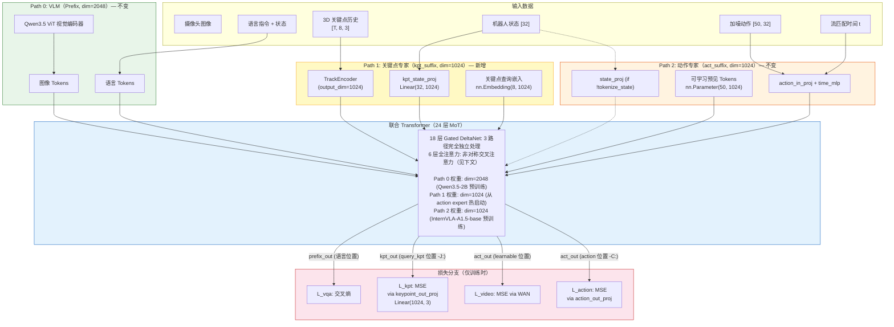
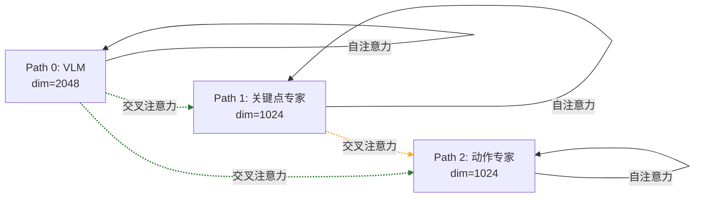
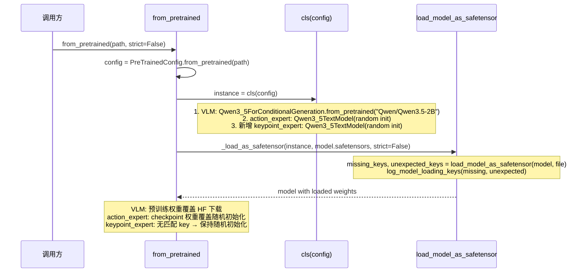
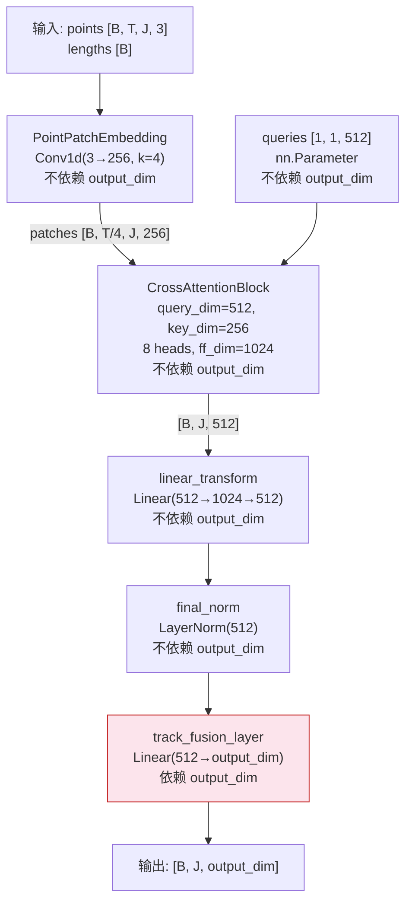
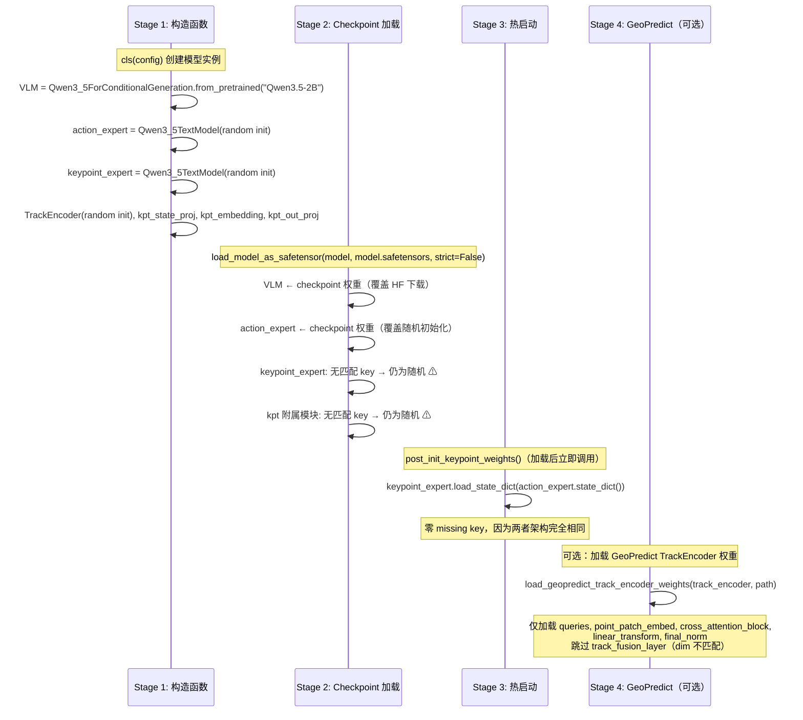
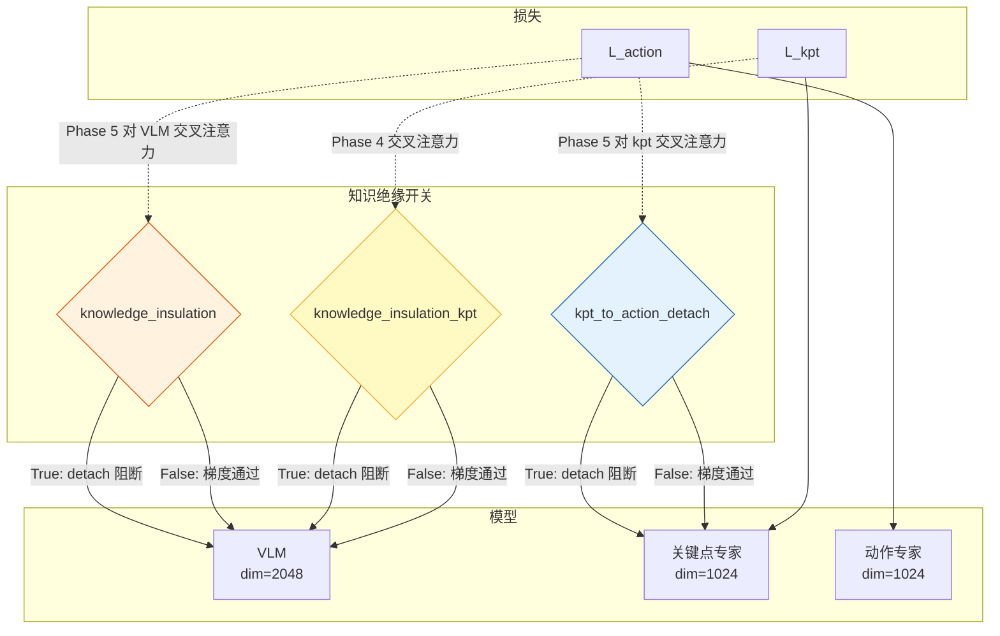
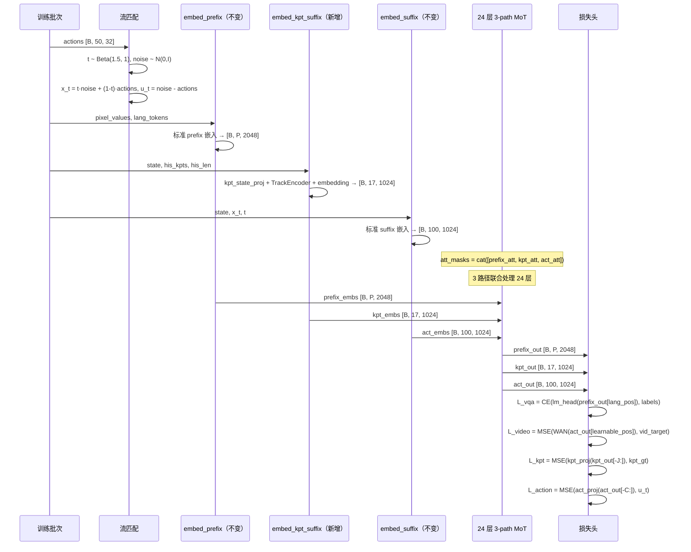
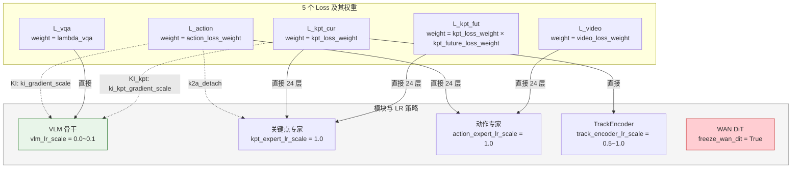
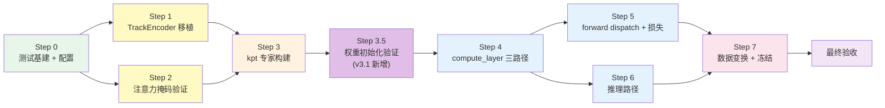

# InternVLA-A1.5 + GeoPredict 3D 关键点轨迹预测器融合方案 v3.1（三路径 MoT 改良版）

> **目标**：将 GeoPredict 的 3D Keypoint Trajectory-Level Kinematic Predictor 融合到 InternVLA-A1.5 中，通过新增一条**独立的关键点专家 Transformer 路径**，形成三路径 Mixture-of-Transformers（MoT）架构，为动作专家注入显式 3D 运动学感知能力。
>
> **与 v3 方案的核心差异**：v3 提出了三路径架构但未验证 checkpoint 兼容性、未给出关键点专家的权重初始化策略、未分析 GeoPredict 权重复用。v3.1 补齐了这三个关键缺陷，确保方案可直接落地实施。
>
> **与 v2 方案的核心差异**：v2 将关键点 Token 放在动作专家的 suffix 内（共享 24 层动作专家权重）；v3/v3.1 将关键点预测作为**完全独立的第三条 Transformer 路径**，拥有自己的 24 层权重，通过交叉注意力与 VLM 和动作专家交互。

---

## 目录

1. [动机与 v2 方案的不足](#1-动机与-v2-方案的不足)
2. [三路径 MoT 架构概览](#2-三路径-mot-架构概览)
3. [Checkpoint 兼容性分析](#3-checkpoint-兼容性分析)
4. [GeoPredict 架构与权重复用分析](#4-geopredict-架构与权重复用分析)
5. [权重初始化策略](#5-权重初始化策略)
6. [三条路径的 Token 布局](#6-三条路径的-token-布局)
7. [注意力掩码设计](#7-注意力掩码设计)
8. [compute_layer_complete 三路径设计](#8-compute_layer_complete-三路径设计)
9. [全注意力层交叉注意力细节](#9-全注意力层交叉注意力细节)
10. [训练前向传播](#10-训练前向传播)
11. [损失函数设计](#11-损失函数设计)
12. [梯度流分析](#12-梯度流分析)
13. [推理路径设计](#13-推理路径设计)
14. [配置变更](#14-配置变更)
15. [代码修改指南](#15-代码修改指南)
16. [v2 vs v3.1 对比总结](#16-v2-vs-v31-对比总结)
17. [参考文献](#17-参考文献)
18. [分步实施方案](#18-分步实施方案)

附录 A: [Token 位置速查表](#附录-a-token-位置速查表)
附录 B: [GeoPredict Checkpoint Key 映射表](#附录-b-geopredict-checkpoint-key-映射表)

---

## 1. 动机与 v2 方案的不足

### 1.1 v2 方案回顾

v2 方案（[itrnVLA15_GeoP_3dtrj_2cn.md](itrnVLA15_GeoP_3dtrj_2cn.md)）将 16 个关键点 Token（8 个历史 + 8 个查询）嵌入到**动作专家的 suffix** 中，插入在 learnable tokens 和 action tokens 之间。关键点 Token 与动作 Token 共享同一条 Transformer 路径的所有 24 层权重。

### 1.2 v2 的不足之处

**(1) 递归状态耦合**

在 18 层 Gated DeltaNet 线性注意力中，suffix 内所有 Token 共享同一递归状态链。关键点 Token 和动作 Token 的信息在递归状态中混合：

$$\mathbf{s}_0 \xrightarrow{\text{learnable}} \mathbf{s}_{50} \xrightarrow{\text{hist\_kpt}} \mathbf{s}_{58} \xrightarrow{\text{query\_kpt}} \mathbf{s}_{66} \xrightarrow{\text{action}} \mathbf{s}_{116}$$

动作 Token 在读取递归状态时，得到的是混合了 learnable + keypoint 信息的"杂合"状态。遗忘门 $\alpha_t$ 可以部分地衰减不相关信息，但无法做到精确的选择性过滤。当 3D 运动学预测和流匹配动作生成的最优表征空间不同时，这种耦合可能导致**表征干扰**。

**(2) 权重共享的任务冲突**

关键点预测（输出 $J \times 3$ 的 3D 坐标）和动作预测（输出 $C \times 32$ 的连续动作）是两个本质不同的任务。v2 中它们共享动作专家的全部 24 层 MLP 和注意力权重。这些共享权重必须同时为两个不同的监督信号（关键点 MSE 和流匹配 MSE）优化，可能出现梯度方向冲突。

**(3) 关键点 Token 缺乏独立的 VLM 上下文构建**

v2 中关键点 Token 和动作 Token 在全注意力层通过**同一 suffix 通路**交叉注意 prefix。它们共享同一组 Q/K/V 投影权重，因此关键点和动作对 VLM 表征的"阅读方式"被迫相同。但 3D 运动学预测可能需要从视觉信息中提取不同的特征（如空间几何关系），而动作生成可能更关注时序动态。

### 1.3 v3.1 方案：三路径 MoT（改良版）

v3.1 将关键点预测从动作专家中**独立出来**，形成拥有专属权重的第三条 Transformer 路径：

| 路径 | 功能 | 维度 | Token 数 | 层数 |
|---|---|---|---|---|
| **Path 0: VLM**（已有） | 视觉-语言理解 | 2048 | ~400-650 | 24 |
| **Path 1: 关键点专家**（新增） | 3D 运动学预测 | 1024 | 17 | 24 |
| **Path 2: 动作专家**（已有） | 连续动作生成 | 1024 | 100/101 | 24 |

三路径的核心优势：

1. **解耦递归状态**：3 条路径各有独立的 Gated DeltaNet 递归状态，消除 v2 中的表征干扰
2. **专属优化空间**：关键点专家有自己的 24 层权重（MLP、注意力投影），可专门为 3D 预测任务优化
3. **独立 VLM 上下文**：关键点专家和动作专家各自通过独立的 Q/K/V 投影交叉注意 VLM，可学习不同的"阅读方式"
4. **动作专家不受侵入**：动作专家的 suffix 结构**完全不变**（不增加 Token，不修改 `embed_suffix`），保留预训练权重的完整语义
5. **信息单向流动**：动作专家可通过交叉注意力读取关键点表征，但关键点不能读取动作——确保 3D 预测不依赖于具体的动作生成过程
6. **Checkpoint 完全兼容**：VLM 和动作专家可直接加载 [InternVLA-A1.5-base](https://huggingface.co/InternRobotics/InternVLA-A1.5-base) 预训练权重（v3.1 新增验证）
7. **关键点专家热启动**：从动作专家复制权重初始化，避免 300M 随机参数破坏交叉注意力（v3.1 新增策略）

---

## 2. 三路径 MoT 架构概览

### 2.1 融合架构图



### 2.2 全注意力层中的非对称交叉注意力

6 层全注意力层中的注意力规则：



| From (Q) \ To (K/V) | VLM | 关键点专家 | 动作专家 |
|---|:---:|:---:|:---:|
| **VLM** | 因果自注意力 | **阻断** | **阻断** |
| **关键点专家** | **交叉注意力** | 组内双向 | **阻断** |
| **动作专家** | **交叉注意力** | **交叉注意力** | 组内双向 |

> 注：VLM 使用标准因果注意力（每个 Token 只看前面的 Token）。关键点专家和动作专家内部使用 block-causal 注意力（block 内双向，block 间因果）。

### 2.3 关键点专家的 Transformer 配置

关键点专家与动作专家使用**完全相同的层架构**（`Qwen3_5TextModel`），配置如下：

| 参数 | VLM | 关键点专家（新） | 动作专家（已有） | 约束 |
|---|---|---|---|---|
| `hidden_size` | 2048 | **1024** | 1024 | 可自定义 |
| `intermediate_size` | 6144 | **3072** | 3072 | 可自定义 |
| `num_attention_heads` | 8 | **8** | 8 | 必须与 VLM 一致 |
| `num_key_value_heads` | 2 | **2** | 2 | 必须与 VLM 一致 |
| `head_dim` | 256 | **256** | 256 | 必须与 VLM 一致 |
| `num_hidden_layers` | 24 | **24** | 24 | 必须与 VLM 一致 |
| `layer_types` | (3+1)×6 | **(3+1)×6** | (3+1)×6 | 必须与 VLM 一致 |
| `linear_num_key_heads` | 16 | **16** | 16 | 从 VLM 复制 |
| `linear_key_head_dim` | 128 | **128** | 128 | 从 VLM 复制 |
| `linear_num_value_heads` | 16 | **16** | 16 | 从 VLM 复制 |
| `linear_value_head_dim` | 128 | **128** | 128 | 从 VLM 复制 |
| `linear_conv_kernel_dim` | 4 | **4** | 4 | 从 VLM 复制 |

> **为什么 `num_attention_heads`, `num_key_value_heads`, `head_dim` 必须一致？**
>
> 在全注意力层中，交叉注意力要求 Q 和 K/V 的形状兼容。当动作专家的 Q（`[B, 8, act_len, 256]`）注意关键点专家的 K/V（`[B, 2, kpt_len, 256]`）时，注意力头数和头维度必须匹配才能计算点积。具体地：
>
> - Q 来自动作专家的 `q_proj`: `Linear(1024, 8 × 256 × 2)` → split → Q `[B, 8, act_len, 256]`
> - K 来自关键点专家的 `k_proj`: `Linear(1024, 2 × 256)` → `[B, 2, kpt_len, 256]`
> - GQA 扩展后 K: `repeat_kv([B, 2, kpt_len, 256], groups=4)` → `[B, 8, kpt_len, 256]`
> - `attn_weights = Q @ K^T / sqrt(256)` → `[B, 8, act_len, kpt_len]`
>
> 这一过程要求 `head_dim` 和 `num_attention_heads` 在所有路径之间一致。`hidden_size` 和 `intermediate_size` 是各路径投影层和 FFN 的内部维度，可以独立设置。

> **为什么 `hidden_size=1024, intermediate_size=3072` 与动作专家相同？**
>
> 这不仅是资源考虑，更是 **权重初始化策略的硬性要求**。v3.1 的核心创新之一是将动作专家的预训练权重直接复制到关键点专家（见[第 5 章](#5-权重初始化策略)）。只有当两者的 `state_dict` 结构（每个参数的 name 和 shape）完全一致时，`load_state_dict` 才能零 missing key 地完成复制。

### 2.4 参数量分析

| 模块 | 参数量 | 说明 |
|---|---|---|
| 关键点专家 Transformer（24 层, dim=1024） | ~300M | 与动作专家相同规模 |
| TrackEncoder (output_dim=1024) | ~3.0M | 从 GeoPredict 移植 |
| keypoint_embedding (8 × 1024) | 8K | 可学习查询嵌入 |
| kpt_state_proj (32 → 1024) | 33K | 状态投影 |
| keypoint_out_proj (1024 → 3) | 3.1K | 3D 坐标预测头 |
| future_kpt_pos_embed (50 × 1024) | 51K | 冻结正弦 buffer |
| **新增可训练参数总计** | **~303M** | v2 为 ~3M |

> v3.1 的参数量显著高于 v2（~303M vs ~3M），这是为关键点预测提供**专属容量**的代价。相比 VLM 骨干（~2B）和动作专家（~300M），关键点专家增加约 12% 的总参数量。
>
> 但关键点专家的参数并非从零开始训练——通过动作专家权重热启动（见[第 5 章](#5-权重初始化策略)），关键点专家从一个已经理解 MoT 交叉注意力模式的检查点出发，大幅降低训练不稳定性。

---

## 3. Checkpoint 兼容性分析

> **v3.1 新增章节**。v3 方案未验证三路径模型能否直接加载 InternVLA-A1.5-base 的预训练权重。本章通过深入分析 checkpoint 文件结构、加载流程和 key 映射，确认方案与预训练权重的完全兼容性。

### 3.1 InternVLA-A1.5-base Checkpoint 结构

[InternVLA-A1.5-base](https://huggingface.co/InternRobotics/InternVLA-A1.5-base) 的 checkpoint 结构：

```
InternVLA-A1.5-base/
├── config.json            # InternVLAA15Config 序列化
├── model.safetensors      # 单文件 5.39 GB（所有权重）
└── ...
```

`config.json` 中的关键配置（来源：[HuggingFace](https://huggingface.co/InternRobotics/InternVLA-A1.5-base/blob/main/config.json)）：

```json
{
  "type": "internvla_a1_5",
  "vlm_model_name_or_path": "Qwen/Qwen3.5-2B",
  "action_expert_hidden_size": 1024,
  "action_expert_intermediate_size": 3072,
  "chunk_size": 50,
  "num_learnable_tokens": 50,
  "tokenize_state": true,
  "knowledge_insulation": false,
  "max_state_dim": 32,
  "max_action_dim": 32,
  "image_resolution": [224, 224]
}
```

### 3.2 `from_pretrained` 加载流程

加载流程定义在 [`pretrained.py:75-133`](src/lerobot/policies/pretrained.py#L75-L133)：



关键细节：

1. **`strict=False`**（[`pretrained.py:87`](src/lerobot/policies/pretrained.py#L87)）：missing keys 只 log warning，不报错
2. **`_checkpoint_excluded_prefixes`**（[`modeling_internvla_a1_5.py:1373`](src/lerobot/policies/internvla_a1_5/modeling_internvla_a1_5.py#L1373)）：`("model.wan_video_model.",)` — WAN 视频模型权重被排除
3. **`state_dict` override**（[`modeling_internvla_a1_5.py:1426-1437`](src/lerobot/policies/internvla_a1_5/modeling_internvla_a1_5.py#L1426-L1437)）：保存时自动 strip WAN keys

### 3.3 三路径模型的 Checkpoint Key 映射

Checkpoint 中的 key 前缀结构（从实际 `model.safetensors` 分析）：

| Key 前缀 | 对应模块 | 在 checkpoint 中？ | 三路径模型中？ |
|---|---|:---:|:---:|
| `model.qwen3_5_with_expert.qwen3_5.model.language_model.*` | VLM 文本模型 | ✓ | ✓ |
| `model.qwen3_5_with_expert.qwen3_5.model.visual.*` | VLM 视觉编码器 | ✓ | ✓ |
| `model.qwen3_5_with_expert.action_expert.*` | 动作专家 | ✓ | ✓ |
| `model.action_in_proj.*`, `model.action_out_proj.*` | 动作投影 | ✓ | ✓ |
| `model.action_time_mlp_in.*`, `model.action_time_mlp_out.*` | 时间 MLP | ✓ | ✓ |
| `model.learnable_tokens*` | 可学习 tokens | ✓ | ✓ |
| **`model.qwen3_5_with_expert.keypoint_expert.*`** | **关键点专家** | **✗** | **✓（新增）** |
| **`model.track_encoder.*`** | **TrackEncoder** | **✗** | **✓（新增）** |
| **`model.kpt_state_proj.*`** | **kpt 状态投影** | **✗** | **✓（新增）** |
| **`model.keypoint_embedding.*`** | **kpt 查询嵌入** | **✗** | **✓（新增）** |
| **`model.keypoint_out_proj.*`** | **kpt 输出投影** | **✗** | **✓（新增）** |

**结论**：
- **VLM**：checkpoint key 完全匹配 → 预训练权重正确加载 ✓
- **动作专家**：checkpoint key 完全匹配 → 预训练权重正确加载 ✓
- **关键点专家及附属模块**：checkpoint 中不存在对应 key → `strict=False` 下作为 missing keys warning 处理，模型保持构造函数的随机初始化 ⚠

### 3.4 随机初始化的风险评估

关键点专家 Transformer 有 ~300M 参数。如果这些参数保持随机初始化状态直接进入训练：

1. **交叉注意力噪声**：在 6 层全注意力层中，动作专家通过 Phase 5 交叉注意关键点专家的 K/V。随机初始化的 K/V 投影产生的 key/value 向量没有有意义的结构，动作专家的注意力权重将趋于均匀分布——这相当于向动作专家注入了 ~17 个随机噪声 token 的加权平均，显著干扰动作预测。

2. **递归状态污染**：虽然三路径的 Gated DeltaNet 递归状态独立，但关键点专家自身的递归状态会充满随机信号，导致 query_kpt 的 Transformer 输出无意义，关键点损失初始值很大，梯度方向随机。

3. **训练不稳定**：300M 随机参数 + ~2.6B 预训练参数的梯度规模不匹配，可能导致学习率选择困难——对预训练模块太大的 LR 会破坏已学知识，对随机模块太小的 LR 会导致收敛极慢。

**解决方案**：[第 5 章](#5-权重初始化策略)提出的三阶段权重初始化策略。

---

## 4. GeoPredict 架构与权重复用分析

> **v3.1 新增章节**。v3 方案移植了 GeoPredict 的 TrackEncoder 但未分析其 checkpoint 权重是否可复用。本章深入分析 GeoPredict 的架构差异和权重复用可行性。

### 4.1 GeoPredict 整体架构

GeoPredict（[arXiv:2512.16811](https://arxiv.org/html/2512.16811v1)）基于 PI0 架构，使用 PaliGemma/Gemma 作为 VLM backbone（与 InternVLA-A1.5 的 Qwen3.5 完全不同）。

**GeoPredict 的 Gemma 双专家架构**（[`geopredict.py:97-140`](../../GeoPredict/models/geopredict.py#L97-L140)）：

| 参数 | Expert 0 (VLM) | Expert 1 (Action) | InternVLA-A1.5 Action Expert |
|---|---|---|---|
| **骨干** | Gemma | Gemma | Qwen3_5TextModel |
| `width` | 2048 | 1024 | 1024 |
| 层数 | 18 | 18 | 24 |
| 注意力类型 | **全 full attention** | **全 full attention** | (3 linear + 1 full) × 6 |
| 线性注意力 | ✗ | ✗ | ✓ Gated DeltaNet |

**关键差异**：GeoPredict 使用全 full attention，无线性注意力层。InternVLA-A1.5 使用 (3+1)×6 的混合架构。两者的 LLM backbone 权重**完全不兼容**。

### 4.2 GeoPredict 的关键点模块

GeoPredict 将关键点处理放在 **prefix**（通过 VLM backbone），而非独立专家路径。5 个 block-causal 组（[`geopredict.py:141-191`](../../GeoPredict/models/geopredict.py#L141-L191)）：

```
[2D 图像 tokens] → [3D hist_kpt tokens] → [3D query_kpt tokens] → [spatial tokens] → [state + action tokens]
   ar_mask=False      ar_mask=[T,F,...,F]    ar_mask=[T,F,...,F]     ar_mask=False        ar_mask (suffix)
```

关键点相关模块（[`geopredict.py:116-120`](../../GeoPredict/models/geopredict.py#L116-L120)）：

```python
self.joint_num, self.embed_dims = 8, 2048
self.keypoint_encoder = TrackEncoder()           # output_dim=2048 (默认)
self.keypoint_embedding = nn.Embedding(8, 2048)  # 查询嵌入
self.keypoint_out_proj = nn.Linear(2048, 3)      # 3D 坐标输出头
```

以及未来关键点位置编码（[`geopredict.py:114`](../../GeoPredict/models/geopredict.py#L114)）：

```python
self.future_pos = get_1d_sincos_pos_embed(2048, torch.arange(50), base=100)
```

### 4.3 TrackEncoder 内部结构与维度依赖性

TrackEncoder（[`GeoPredict/models/keypoints.py:150-213`](../../GeoPredict/models/keypoints.py#L150-L213)）的内部模块：



**维度依赖性分析**：TrackEncoder 内部所有模块（`queries`, `point_patch_embed`, `cross_attention_block`, `linear_transform`, `final_norm`）工作在 `query_dim=512` 空间中，与 `output_dim` 无关。只有最后的 `track_fusion_layer: Linear(512, output_dim)` 依赖 `output_dim`。

### 4.4 GeoPredict Checkpoint 权重复用分类

[GeoPredict-Robocasa checkpoint](https://huggingface.co/Jingjing0601/GeoPredict-Robocasa) (`GeoPredict_robocasa.pth`, 6.54 GB) 的关键点相关权重：

| Checkpoint Key | GeoPredict Shape | 我们的目标 Shape | 可复用？ | 原因 |
|---|---|---|:---:|---|
| `keypoint_encoder.queries` | [1, 1, 512] | [1, 1, 512] | **✓** | query_dim=512，与 output_dim 无关 |
| `keypoint_encoder.point_patch_embed.conv.weight` | [256, 3, 4] | [256, 3, 4] | **✓** | in_dim=3, embed_dim=256，与 output_dim 无关 |
| `keypoint_encoder.point_patch_embed.conv.bias` | [256] | [256] | **✓** | 同上 |
| `keypoint_encoder.cross_attention_block.*` | 512 维空间 | 512 维空间 | **✓** | 全在 query_dim=512 空间内 |
| `keypoint_encoder.linear_transform.0.weight` | [1024, 512] | [1024, 512] | **✓** | ff_dim=1024, query_dim=512 |
| `keypoint_encoder.linear_transform.3.weight` | [512, 1024] | [512, 1024] | **✓** | 同上 |
| `keypoint_encoder.final_norm.weight` | [512] | [512] | **✓** | query_dim=512 |
| **`keypoint_encoder.track_fusion_layer.weight`** | **[2048, 512]** | **[1024, 512]** | **✗** | output_dim 2048 ≠ 1024 |
| **`keypoint_encoder.track_fusion_layer.bias`** | **[2048]** | **[1024]** | **✗** | output_dim 不匹配 |
| `keypoint_embedding.weight` | [8, 2048] | [8, 1024] | **✗** | embed_dim 不匹配 |
| `keypoint_out_proj.weight` | [3, 2048] | [3, 1024] | **✗** | hidden_dim 不匹配 |
| `keypoint_out_proj.bias` | [3] | [3] | ✓ (但价值极低) | bias 可复用但没必要 |
| `future_pos` | [50, 2048] | [50, 1024] | **✗** | 重新生成 sincos(1024) |
| `llm.*` (Gemma) | — | N/A | **✗** | 架构完全不同 |
| `img.*` (SigLIP) | — | N/A | **✗** | 使用 Qwen3.5 ViT |

### 4.5 TrackEncoder 选择性加载策略

可从 GeoPredict checkpoint 加载的权重约 **~3M 参数**（TrackEncoder 内部除 `track_fusion_layer` 外的全部权重）。加载代码示例：

```python
def load_geopredict_track_encoder_weights(
    track_encoder: TrackEncoder,
    geopredict_ckpt_path: str,
):
    """从 GeoPredict checkpoint 选择性加载 TrackEncoder 内部权重。
    
    跳过 track_fusion_layer（output_dim 不匹配: 2048 vs 1024）。
    """
    state = torch.load(geopredict_ckpt_path, map_location="cpu")

    loadable_prefixes = [
        "keypoint_encoder.queries",
        "keypoint_encoder.point_patch_embed.",
        "keypoint_encoder.cross_attention_block.",
        "keypoint_encoder.linear_transform.",
        "keypoint_encoder.final_norm.",
    ]
    skip_prefixes = ["keypoint_encoder.track_fusion_layer."]
    
    filtered = {}
    for key, value in state.items():
        if any(key.startswith(p) for p in skip_prefixes):
            continue
        for prefix in loadable_prefixes:
            if key.startswith(prefix):
                local_key = key[len("keypoint_encoder."):]
                filtered[local_key] = value
                break

    missing, unexpected = track_encoder.load_state_dict(filtered, strict=False)
    # 预期 missing: track_fusion_layer.weight, track_fusion_layer.bias
    assert all("track_fusion_layer" in k for k in missing), \
        f"Unexpected missing keys: {[k for k in missing if 'track_fusion_layer' not in k]}"
```

### 4.6 GeoPredict 训练初始化对比

GeoPredict 的训练脚本（[`tools/train_robocasa.py:72-83`](../../GeoPredict/tools/train_robocasa.py#L72-L83)）使用类似的选择性加载策略：

```python
missing_keys, unexpected_keys = model.load_state_dict(
    torch.load(args.pretrain, map_location='cpu'), strict=False)
white_keyword = ['keypoint', 'spatial', 'gs_decoder', 'renderer', 'refine']
non_white_missing = [key for key in missing_keys
                     if not any(keyword in key for keyword in white_keyword)]
if non_white_missing:
    raise RuntimeError(f"Missing critical keys: {non_white_missing}")
```

GeoPredict 的关键点模块也是从随机初始化开始训练的（PI0 base checkpoint 不含关键点权重），但其 backbone 权重已经预训练。我们的方案更进一步——不仅 backbone（VLM + 动作专家）使用预训练权重，关键点专家 Transformer 也通过从动作专家热启动来获得有意义的初始化。

---

## 5. 权重初始化策略

> **v3.1 新增章节**。这是 v3.1 相比 v3 最核心的改进。

### 5.1 三阶段（+可选第四阶段）初始化流程



### 5.2 从动作专家复制的理论依据

**为什么从动作专家（而非 VLM 或随机初始化）？**

1. **架构完全一致** → `state_dict` key 和 shape 一一对应
   - 动作专家 `q_proj.weight`: `[4096, 1024]` — 关键点专家 `q_proj.weight`: `[4096, 1024]` ✓
   - 动作专家 `o_proj.weight`: `[1024, 2048]` — 关键点专家 `o_proj.weight`: `[1024, 2048]` ✓
   - VLM `q_proj.weight`: `[4096, 2048]` — 关键点专家 `q_proj.weight`: `[4096, 1024]` ✗ (shape 不匹配)
   
2. **已学会 MoT 交叉注意力模式**：动作专家在 InternVLA-A1.5 预训练中已经学会如何通过 6 层全注意力层从 VLM prefix 中提取有用信息。关键点专家需要相同的能力（通过交叉注意力读取视觉/语言上下文），从动作专家复制提供了这一能力的"热启动"。

3. **已学会线性注意力递归模式**：18 层 Gated DeltaNet 的递归参数（`in_proj_qkv`, `conv1d`, `out_proj` 等）已经在动作专家中学会了处理 suffix token 序列的模式。关键点专家的 suffix 结构类似（state + 编码 tokens + 查询 tokens），从动作专家复制提供了合理的递归状态处理起点。

4. **相关研究支持**：
   - **PI0.5** (Physical Intelligence, 2025)：动作专家"derived from the VLM"但维度缩小，通过 Knowledge Insulation 防止梯度干扰
   - **InternVLA-A1** (Zhu et al., 2025)：生成专家和动作专家均"derived from the Qwen transformer blocks"
   - **RoboTTT** (NVIDIA, 2025)：新插入的 TTT 层用 `tanh` gate（初始化为近零）来避免覆盖基模型已学到的知识——即便只是一个小模块也要谨慎处理初始化
   - **MoE-VLA** (OpenReview, 2025)：用 LoRA deltas (r=16) 在预训练 VLA backbone 上实现任务专家，给出强共享先验而非从零训练

### 5.3 `post_init_keypoint_weights` 实现

```python
def post_init_keypoint_weights(self):
    """在 checkpoint 加载后，将动作专家权重复制到关键点专家。
    
    前提：keypoint_expert 和 action_expert 具有完全相同的架构
    （hidden_size, intermediate_size, num_heads, head_dim, layer_types 全部一致）。
    
    此方法在 _load_as_safetensor 完成后调用，此时 action_expert
    已经获得了 InternVLA-A1.5-base 的预训练权重。
    """
    if not self.config.enable_keypoint_predictor:
        return
    if not getattr(self.config, "init_kpt_expert_from_action", True):
        return

    src = self.model.qwen3_5_with_expert.action_expert
    dst = self.model.qwen3_5_with_expert.keypoint_expert

    src_sd = src.state_dict()
    missing, unexpected = dst.load_state_dict(src_sd, strict=True)
    
    if missing:
        raise RuntimeError(
            f"keypoint_expert has missing keys after copying from action_expert: {missing}. "
            "This means the two experts have different architectures, which violates the "
            "design requirement."
        )
```

### 5.4 调用时机：Override `_load_as_safetensor`

在 `InternVLAA15Policy` 中 override [`_load_as_safetensor`](src/lerobot/policies/pretrained.py#L136-L157)：

```python
class InternVLAA15Policy(PreTrainedPolicy):
    # ...

    @classmethod
    def _load_as_safetensor(cls, model, model_file, map_location, strict):
        # 调用父类加载 checkpoint
        model = super()._load_as_safetensor(model, model_file, map_location, strict)
        
        # Stage 3: 热启动关键点专家
        model.post_init_keypoint_weights()
        
        # Stage 4（可选）: 加载 GeoPredict TrackEncoder 权重
        if (hasattr(model.config, "geopredict_checkpoint_path")
                and model.config.geopredict_checkpoint_path):
            from lerobot.policies.internvla_a1_5.keypoints import (
                load_geopredict_track_encoder_weights,
            )
            load_geopredict_track_encoder_weights(
                model.model.track_encoder,
                model.config.geopredict_checkpoint_path,
            )
        
        return model
```

### 5.5 非专家模块的初始化策略

| 模块 | 初始化方式 | 理由 |
|---|---|---|
| `keypoint_expert` (Transformer) | Stage 3: 从 action_expert 复制 | 架构一致，共享 MoT 交叉注意力先验 |
| `track_encoder` (除 track_fusion_layer) | Stage 4: 从 GeoPredict checkpoint 加载 | ~3M 已训练的轨迹编码权重 |
| `track_encoder.track_fusion_layer` | 随机初始化 (HF 默认) | output_dim 不匹配 (2048→1024) |
| `kpt_state_proj` | 随机初始化 | 新模块，无可用权重 |
| `keypoint_embedding` | 随机初始化 | dim 不匹配 (2048→1024) |
| `keypoint_out_proj` | 随机初始化 | dim 不匹配 (2048→1024) |
| `future_kpt_pos_embed` | 重新生成 sincos(1024) | 确定性 buffer，dim=1024 |

### 5.6 初始化验证检查清单

训练前应通过以下验证（实施步骤 Step 3.5）：

```python
def verify_keypoint_init(model):
    """验证关键点专家权重初始化的正确性。"""
    kpt = model.model.qwen3_5_with_expert.keypoint_expert
    act = model.model.qwen3_5_with_expert.action_expert
    
    # 1. 架构一致性
    kpt_sd = kpt.state_dict()
    act_sd = act.state_dict()
    assert set(kpt_sd.keys()) == set(act_sd.keys()), "Key mismatch"
    for key in kpt_sd:
        assert kpt_sd[key].shape == act_sd[key].shape, f"Shape mismatch: {key}"
    
    # 2. 权重已从 action_expert 复制（非随机初始化）
    for key in kpt_sd:
        assert torch.allclose(kpt_sd[key], act_sd[key]), \
            f"Weight mismatch after copy: {key}"
    
    # 3. kpt_out_proj 是随机初始化的（不应与 action_out_proj 相同）
    assert not torch.allclose(
        model.model.keypoint_out_proj.weight,
        model.model.action_out_proj.weight[:3, :],  # 维度不同，此行仅示意
    )
```

---

## 6. 三条路径的 Token 布局

### 6.1 Path 0: VLM（Prefix）— 不变

```
PREFIX: [图像 Tokens | 语言 Tokens | (状态 Tokens if tokenize_state)]
att_masks: 全 1（每个 Token 形成独立因果 block）
长度: P（可变，约 400-650 tokens）
```

与 v2 完全一致，不做任何修改。

### 6.2 Path 1: 关键点专家（kpt_suffix）— 新增

```
KPT_SUFFIX（始终 17 tokens，不受 tokenize_state 影响）:
┌───────────────────────────────────────────────────────┐
│  状态(1)  │  历史关键点(8)     │  查询关键点(8)      │
│  att:[1]   │  att:[1,0,...,0]    │  att:[1,0,...,0]     │
│  cum:P+1   │  cum:P+2           │  cum:P+3             │
└───────────────────────────────────────────────────────┘
```

**Token 说明：**

- **状态 Token (1 个)**：机器人关节角度和夹爪状态，通过 `kpt_state_proj: Linear(32, 1024)` 投影。关键点专家**始终包含状态 Token**（不受 `tokenize_state` 配置影响），因为机器人状态是正运动学（FK）计算的直接输入，对 3D 关键点预测至关重要。
- **历史关键点 Tokens (8 个)**：历史 3D 轨迹经 TrackEncoder 处理后每个关节一个 Token。
- **查询关键点 Tokens (8 个)**：可学习嵌入，经 Transformer 处理后用于预测当前和未来 3D 位置。

**att_masks 结构**：3 个 block boundary，state 可被后续所有 block 看到，hist_kpt 可被 query_kpt 看到。

### 6.3 Path 2: 动作专家（act_suffix）— 不变

```
ACT_SUFFIX（tokenize_state=True 时 100 tokens，False 时 101 tokens）:

tokenize_state=True（默认）:
┌──────────────────────────────────────────────────────┐
│  可学习预见(50)            │  动作+时间(50)            │
│  att:[1,0,...,0]            │  att:[1,0,...,0]           │
│  cum:P+4                    │  cum:P+5                   │
└──────────────────────────────────────────────────────┘

tokenize_state=False:
┌────────────────────────────────────────────────────────────────┐
│  状态(1) │  可学习预见(50)       │  动作+时间(50)            │
│  att:[1]  │  att:[1,0,...,0]       │  att:[1,0,...,0]           │
│  cum:P+4  │  cum:P+5              │  cum:P+6                   │
└────────────────────────────────────────────────────────────────┘
```

动作专家的 suffix 结构、Token 数量、att_masks 与原始 InternVLA-A1.5 **完全一致**，不做任何修改。这是 v3.1 相比 v2 的重要优势：预训练动作专家的权重可以直接加载，不存在位置偏移或语义变化。

### 6.4 完整序列拼接

```
tokenize_state=True（默认）:
[PREFIX(P) | KPT_SUFFIX(17) | ACT_SUFFIX(100)]
总长度: P + 117

tokenize_state=False:
[PREFIX(P) | KPT_SUFFIX(17) | ACT_SUFFIX(101)]
总长度: P + 118
```

---

## 7. 注意力掩码设计

### 7.1 cumsum-based block-causal 机制回顾

InternVLA-A1.5 使用 `make_att_2d_masks`（[`modeling_internvla_a1_5.py:100-110`](src/lerobot/policies/internvla_a1_5/modeling_internvla_a1_5.py#L100-L110)）构建 2D 注意力掩码：

$$M_{q,k} = \mathbb{1}\!\left[\text{cumsum}(\text{att})[k] \leq \text{cumsum}(\text{att})[q]\right] \wedge \text{pad\_mask}[k]$$

其中 `att` 是一维 block boundary 标记：`1` 表示新 block 开始，`0` 表示延续当前 block。cumsum 值相同的位置形成一个 block，block 内双向可见；cumsum 值较小的 block 可被较大 block 看到（因果方向）。

### 7.2 三路径 att_masks 拼接

三条路径的 att_masks 按 `[prefix | kpt_suffix | act_suffix]` 顺序拼接：

```python
pad_masks = cat([prefix_pad, kpt_pad, act_pad], dim=1)
att_masks = cat([prefix_att, kpt_att, act_att], dim=1)
att_2d_masks = make_att_2d_masks(pad_masks, att_masks)
```

拼接后的 cumsum 序列（以 `tokenize_state=True` 为例）：

```
位置:      [0  1  2  ...  P-1 | P  P+1 ... P+8  P+9 ... P+16 | P+17 ... P+66  P+67 ... P+116]
路径:      [←— PREFIX (P) —→ | ←—— KPT_SUFFIX (17) ——→       | ←——— ACT_SUFFIX (100) ——→     ]
att:       [1  1  1  ...  1   | 1  1   0×7  1    0×7          | 1    0×49  1    0×49            ]
cumsum:    [1  2  3  ...  P   | P+1 P+2     P+3               | P+4       P+5                   ]
            ↑                   ↑   ↑       ↑                   ↑         ↑
         每个prefix token      kpt  hist    query              learnable  action
         独立因果block          state kpt    kpt                tokens     tokens
```

### 7.3 cumsum 注意力分析

由于 prefix 的每个 Token 都有 cumsum=1,2,...,P（全部独立），而 kpt_suffix 的 cumsum 从 P+1 开始，act_suffix 的 cumsum 从 P+4 开始，cumsum 排序天然保证：

| Query 路径 | Key 路径 | cumsum 关系 | 可注意？ |
|---|---|---|:---:|
| VLM → | VLM | cumsum_k ≤ cumsum_q（因果） | ✓ |
| VLM → | 关键点专家 | cumsum_k ≥ P+1 > P ≥ cumsum_q | **✗** |
| VLM → | 动作专家 | cumsum_k ≥ P+4 > P ≥ cumsum_q | **✗** |
| 关键点专家 → | VLM | cumsum_k ≤ P < P+1 ≤ cumsum_q | **✓** |
| 关键点专家 → | 关键点专家 | cumsum_k ≤ cumsum_q（block-causal） | ✓ |
| 关键点专家 → | 动作专家 | cumsum_k ≥ P+4 > P+3 ≥ cumsum_q | **✗** |
| 动作专家 → | VLM | cumsum_k ≤ P < P+4 ≤ cumsum_q | **✓** |
| 动作专家 → | 关键点专家 | cumsum_k ≤ P+3 < P+4 ≤ cumsum_q | **✓** |
| 动作专家 → | 动作专家 | cumsum_k ≤ cumsum_q（block-causal） | ✓ |

**所有 4 条用户要求的注意力规则均被 cumsum 机制天然满足。** `make_att_2d_masks` 函数**无需修改**。

### 7.4 2D 注意力矩阵可视化（block 级别）

```
          ┌──────────────────────────────────────────────────────────────────┐
          │      PREFIX (P)      │  KPT (17)   │   ACT (100/101)            │
          │  img  | lang | state │ st |his|qry│ (st)| learn |  action      │
          │       |      |       │    |kpt|kpt│     |       |              │
  ────────┼──────────────────────┼─────────────┼────────────────────────────┤
  PREFIX  │                      │             │                            │
    img   │  因果（下三角）      │      ✗      │          ✗                 │
    lang  │                      │             │                            │
    state │                      │             │                            │
  ────────┼──────────────────────┼─────────────┼────────────────────────────┤
  KPT     │                      │             │                            │
    state │      全部 ✓          │  self       │          ✗                 │
    hist  │      全部 ✓          │  st + bidir │          ✗                 │
    query │      全部 ✓          │  全部 + bid │          ✗                 │
  ────────┼──────────────────────┼─────────────┼────────────────────────────┤
  ACT     │                      │             │                            │
   (st)   │      全部 ✓          │   全部 ✓    │  self                      │
   learn  │      全部 ✓          │   全部 ✓    │  (st) + bidir              │
   action │      全部 ✓          │   全部 ✓    │  全部 + bidir              │
  ────────┴──────────────────────┴─────────────┴────────────────────────────┘
```

### 7.5 线性注意力层的处理

在 18 层 Gated DeltaNet 线性注意力中（[`modeling_internvla_a1_5.py:148-181`](src/lerobot/policies/internvla_a1_5/modeling_internvla_a1_5.py#L148-L181)），三条路径**完全独立**处理：

```python
linear_masks_per_model = [
    linear_attn_mask[:, :prefix_len],                           # VLM
    linear_attn_mask[:, prefix_len:prefix_len + kpt_len],       # 关键点专家
    linear_attn_mask[:, prefix_len + kpt_len:],                 # 动作专家
]

for i, hidden_states in enumerate(inputs_embeds):
    layer = models[i].layers[layer_idx]
    hidden_states = layer.linear_attn(hidden_states, attention_mask=linear_masks_per_model[i])
```

三条路径各自拥有独立的 Gated DeltaNet 递归状态，没有任何信息交换。

### 7.6 与 v2 的注意力差异

| 关键点 Token 的注意力 | v2（suffix 内） | v3.1（独立路径） |
|---|---|---|
| query_kpt → VLM | 仅 6 层全注意力（与 action 共享 suffix Q/K/V 投影） | 6 层全注意力（**独立** Q/K/V 投影） |
| query_kpt → learnable | 6 层自注意力 + 18 层递归状态 | **✗ 阻断**（kpt 不能看 action 路径） |
| query_kpt → action | 同 block（cumsum 允许，18+6=24 层） | **✗ 阻断** |
| action → query_kpt | 24 层（同 suffix） | 6 层交叉注意力 |

v3.1 中关键点 Token 失去了对 learnable tokens 的直接访问（因为 learnable 在动作专家路径中），但获得了**独立的 VLM 上下文构建**能力。关键点专家可以通过自己的 Q/K/V 投影学习对视觉/语言信息的不同解读。

### 7.7 关键点专家内部的递归状态

关键点专家在 18 层线性注意力中的递归状态链：

$$\mathbf{s}_0^{kpt} \xrightarrow[\text{1 token}]{\text{state}} \mathbf{s}_1^{kpt} \xrightarrow[\text{8 tokens}]{\text{hist\_kpt}} \mathbf{s}_9^{kpt} \xrightarrow[\text{8 tokens}]{\text{query\_kpt}} \mathbf{s}_{17}^{kpt}$$

query_kpt tokens 在读取递归状态时，能获得 state 和 hist_kpt 的信息。这为 3D 预测提供了纯净的运动学上下文——没有 v2 中来自 learnable/action tokens 的干扰。

---

## 8. `compute_layer_complete` 三路径设计

### 8.1 函数签名扩展

原始函数（[`modeling_internvla_a1_5.py:119-335`](src/lerobot/policies/internvla_a1_5/modeling_internvla_a1_5.py#L119-L335)）需要从双路径扩展到三路径：

```python
def compute_layer_complete(
    layer_idx,
    inputs_embeds,              # list[Tensor]: [prefix_embs, kpt_embs, act_embs]
    attention_mask,             # [B, 1, total_len, total_len]
    position_ids,               # [3, B, total_len] (3 是 mRoPE 的 3 维, 非路径数)
    qwen3_5,                    # VLM 模型
    keypoint_expert,            # 新增: 关键点专家 Qwen3_5TextModel
    action_expert,              # 动作专家 Qwen3_5TextModel
    prefix_len: int,
    kpt_len: int,               # 新增: 关键点 suffix 长度 (17)
    knowledge_insulation: bool = False,           # VLM K/V detach → action Q
    knowledge_insulation_kpt: bool = False,       # 新增: VLM K/V detach → kpt Q
    kpt_to_action_detach: bool = False,           # 新增: kpt K/V detach → action Q
    use_sdpa: bool = False,
    linear_attn_mask: torch.Tensor | None = None,
):
```

> **`position_ids` 的 shape `[3, B, total_len]` 中的 3**：这是 Qwen3.5 的 mRoPE（多维旋转位置编码）的 3 个空间维度（height, width, temporal），不是路径数。每个维度有独立的位置序列。

### 8.2 线性注意力分支（18 层）

```python
if layer_type == "linear_attention":
    models = [qwen3_5.language_model, keypoint_expert, action_expert]

    if linear_attn_mask is not None:
        prefix_mask = linear_attn_mask[:, :prefix_len]
        kpt_mask    = linear_attn_mask[:, prefix_len : prefix_len + kpt_len]
        act_mask    = linear_attn_mask[:, prefix_len + kpt_len :]
        linear_masks = [prefix_mask, kpt_mask, act_mask]
    else:
        linear_masks = [None, None, None]

    outputs_embeds = []
    for i, hidden_states in enumerate(inputs_embeds):
        layer = models[i].layers[layer_idx]

        residual = hidden_states
        hidden_states = layer.input_layernorm(hidden_states)     # float32 RMSNorm
        hidden_states = layer.linear_attn(
            hidden_states=hidden_states,
            cache_params=None,
            cache_position=None,
            attention_mask=linear_masks[i],
        )
        hidden_states = residual + hidden_states

        after_first_residual = hidden_states
        hidden_states = layer.post_attention_layernorm(hidden_states)
        if layer.mlp.up_proj.weight.dtype == torch.bfloat16:
            hidden_states = hidden_states.to(dtype=torch.bfloat16)
        hidden_states = layer.mlp(hidden_states)
        hidden_states = hidden_states + after_first_residual

        outputs_embeds.append(hidden_states)

    return outputs_embeds
```

改动极小：`models` 从 2 元素扩展到 3 元素，`linear_masks` 从 2 个分割变为 3 个。循环体无需修改（已经是 `enumerate(inputs_embeds)` 的通用模式）。

### 8.3 全注意力分支（6 层）

```python
elif layer_type == "full_attention":
    models = [qwen3_5.language_model, keypoint_expert, action_expert]

    # ═══════════ Phase 1: 独立计算 Q/K/V/gate ═══════════
    query_states, key_states, value_states, gates = [], [], [], []

    for i, hidden_states in enumerate(inputs_embeds):
        layer = models[i].layers[layer_idx]
        hidden_states = layer.input_layernorm(hidden_states)
        input_shape = hidden_states.shape[:-1]              # [B, seq_i]

        q_gate = layer.self_attn.q_proj(hidden_states).view(
            *input_shape, -1, layer.self_attn.head_dim * 2
        )
        query_state, gate = torch.chunk(q_gate, 2, dim=-1)
        gate = gate.reshape(*input_shape, -1)               # [B, seq_i, num_heads * head_dim]

        hidden_shape = (*input_shape, -1, layer.self_attn.head_dim)
        query_state = layer.self_attn.q_norm(
            query_state.view(hidden_shape)
        ).transpose(1, 2)                                    # [B, num_heads, seq_i, head_dim]
        key_state = layer.self_attn.k_norm(
            layer.self_attn.k_proj(hidden_states).view(hidden_shape)
        ).transpose(1, 2)                                    # [B, num_kv_heads, seq_i, head_dim]
        value_state = layer.self_attn.v_proj(
            hidden_states
        ).view(hidden_shape).transpose(1, 2)                 # [B, num_kv_heads, seq_i, head_dim]

        query_states.append(query_state)
        key_states.append(key_state)
        value_states.append(value_state)
        gates.append(gate)

    prefix_query, kpt_query, act_query = query_states
    prefix_key,   kpt_key,   act_key   = key_states
    prefix_value, kpt_value, act_value = value_states

    # ═══════════ Phase 2: 联合 RoPE ═══════════
    joint_query = torch.cat(query_states, dim=2)   # [B, 8, P+17+S, 256]
    joint_key   = torch.cat(key_states,   dim=2)   # [B, 2, P+17+S, 256]
    joint_value = torch.cat(value_states, dim=2)   # [B, 2, P+17+S, 256]

    dummy = torch.zeros(
        joint_query.shape[0], joint_query.shape[2], joint_query.shape[-1],
        device=joint_query.device, dtype=joint_query.dtype
    )
    cos, sin = qwen3_5.language_model.rotary_emb(dummy, position_ids)
    joint_query, joint_key = modeling_qwen3_5.apply_rotary_pos_emb(
        joint_query, joint_key, cos, sin, unsqueeze_dim=1
    )

    # 拆分回 3 条路径（RoPE 后的 Q/K）
    prefix_query = joint_query[:, :, :prefix_len]
    kpt_query    = joint_query[:, :, prefix_len : prefix_len + kpt_len]
    act_query    = joint_query[:, :, prefix_len + kpt_len :]

    prefix_key   = joint_key[:, :, :prefix_len]
    kpt_key      = joint_key[:, :, prefix_len : prefix_len + kpt_len]
    act_key      = joint_key[:, :, prefix_len + kpt_len :]

    # RoPE 不影响 V，但需要重新拆分
    prefix_value = joint_value[:, :, :prefix_len]
    kpt_value    = joint_value[:, :, prefix_len : prefix_len + kpt_len]
    act_value    = joint_value[:, :, prefix_len + kpt_len :]

    scaling = qwen3_5.language_model.layers[layer_idx].self_attn.scaling
    attn_layer = qwen3_5.language_model.layers[layer_idx].self_attn
    batch_size = joint_query.shape[0]

    # ═══════════ Phase 3: VLM 自注意力（不变）═══════════
    prefix_attn_mask = attention_mask[:, :, :prefix_len, :prefix_len]
    prefix_att_output = attend(
        prefix_query, prefix_key, prefix_value,
        prefix_attn_mask, attn_layer, scaling, use_sdpa
    )

    # ═══════════ Phase 4: 关键点专家 交叉+自注意力（新增）═══════════
    if knowledge_insulation_kpt:
        pfx_key_for_kpt   = prefix_key.detach()
        pfx_value_for_kpt = prefix_value.detach()
    else:
        pfx_key_for_kpt   = prefix_key
        pfx_value_for_kpt = prefix_value

    k_for_kpt = torch.cat([pfx_key_for_kpt, kpt_key], dim=2)      # [B,2,P+17,256]
    v_for_kpt = torch.cat([pfx_value_for_kpt, kpt_value], dim=2)  # [B,2,P+17,256]
    kpt_attn_mask = attention_mask[
        :, :, prefix_len : prefix_len + kpt_len, : prefix_len + kpt_len
    ]                                                               # [B,1,17,P+17]
    kpt_att_output = attend(
        kpt_query, k_for_kpt, v_for_kpt,
        kpt_attn_mask, attn_layer, scaling, use_sdpa
    )

    # ═══════════ Phase 5: 动作专家 交叉+自注意力（扩展）═══════════
    if knowledge_insulation:
        pfx_key_for_act   = prefix_key.detach()
        pfx_value_for_act = prefix_value.detach()
    else:
        pfx_key_for_act   = prefix_key
        pfx_value_for_act = prefix_value

    if kpt_to_action_detach:
        kpt_key_for_act   = kpt_key.detach()
        kpt_value_for_act = kpt_value.detach()
    else:
        kpt_key_for_act   = kpt_key
        kpt_value_for_act = kpt_value

    k_for_act = torch.cat([
        pfx_key_for_act, kpt_key_for_act, act_key
    ], dim=2)                                                      # [B,2,P+17+S,256]
    v_for_act = torch.cat([
        pfx_value_for_act, kpt_value_for_act, act_value
    ], dim=2)                                                      # [B,2,P+17+S,256]
    act_attn_mask = attention_mask[:, :, prefix_len + kpt_len :, :]  # [B,1,S,P+17+S]
    act_att_output = attend(
        act_query, k_for_act, v_for_act,
        act_attn_mask, attn_layer, scaling, use_sdpa
    )

    # ═══════════ Phase 6: Post-attention（每个模型独立）═══════════
    att_output = torch.cat([
        prefix_att_output, kpt_att_output, act_att_output
    ], dim=1)

    head_dim = attn_layer.head_dim
    num_heads = attn_layer.config.num_attention_heads
    att_output = att_output.reshape(batch_size, -1, num_heads * head_dim)  # [B, total, 2048]

    gates_joint = torch.cat(gates, dim=1)  # [B, total, 2048]

    outputs_embeds = []
    start_pos = 0
    for i, hidden_states in enumerate(inputs_embeds):
        layer = models[i].layers[layer_idx]
        end_pos = start_pos + hidden_states.shape[1]

        att_slice  = att_output[:, start_pos:end_pos]     # [B, seq_i, 2048]
        gate_slice = gates_joint[:, start_pos:end_pos]    # [B, seq_i, 2048]
        att_slice  = att_slice * torch.sigmoid(gate_slice)

        if att_slice.dtype != layer.self_attn.o_proj.weight.dtype:
            att_slice = att_slice.to(layer.self_attn.o_proj.weight.dtype)
        out_emb = layer.self_attn.o_proj(att_slice)       # [B, seq_i, hidden_i]

        out_emb = out_emb + hidden_states                 # 残差连接
        after_first_residual = out_emb.clone()
        out_emb = layer.post_attention_layernorm(out_emb)

        if layer.mlp.up_proj.weight.dtype == torch.bfloat16:
            out_emb = out_emb.to(dtype=torch.bfloat16)
        out_emb = layer.mlp(out_emb)
        out_emb = out_emb + after_first_residual          # 残差连接

        outputs_embeds.append(out_emb)
        start_pos = end_pos

    return outputs_embeds
```

> **注意 Phase 6 的维度变化**：`att_output` 的最后一维是 `num_heads * head_dim = 8 × 256 = 2048`，对所有路径相同。但每个路径的 `o_proj` 将其投影到自己的 `hidden_size`：
> - VLM 的 `o_proj`: `Linear(2048, 2048)`
> - 关键点专家的 `o_proj`: `Linear(2048, 1024)`
> - 动作专家的 `o_proj`: `Linear(2048, 1024)`

### 8.4 与原始代码的对比

| 代码区域 | 原始（2 路径） | v3.1（3 路径） | 改动量 |
|---|---|---|---|
| models 列表 | `[vlm, act_expert]` | `[vlm, kpt_expert, act_expert]` | 1 行 |
| linear_mask 分割 | 2 段 | 3 段 | 3 行 |
| 线性注意力循环 | `for i in 0,1` | `for i in 0,1,2` | 自动（enumerate） |
| Q/K/V 解构 | `prefix_*, suffix_*` | `prefix_*, kpt_*, act_*` | 3 行 |
| 联合 RoPE | cat 2, split 2 | cat 3, split 3 | 6 行 |
| 注意力计算 | 2 次（prefix, suffix） | **3 次**（prefix, kpt, act） | **新增 ~15 行** |
| K/V 拼接 | `[pfx, sfx]` | kpt: `[pfx, kpt]`; act: `[pfx, kpt, act]` | **核心改动** |
| mask 切片 | `[:P,:P]`, `[P:,:]` | `[:P,:P]`, `[P:P+K,:P+K]`, `[P+K:,:]` | 3 行 |
| post-attn 循环 | `for i in 0,1` | `for i in 0,1,2` | 自动 |

---

## 9. 全注意力层交叉注意力细节

### 9.1 维度追踪

以 `tokenize_state=True` 为例（kpt_len=17, act_len=100），追踪 Phase 4（关键点注意力）和 Phase 5（动作注意力）的完整维度链：

**Phase 4（关键点专家注意力）：**

```
kpt_query:     [B, 8, 17, 256]                    ← kpt 专家的 Q
pfx_key:       [B, 2, P,  256]  (可能 detach)     ← VLM 的 K
kpt_key:       [B, 2, 17, 256]                    ← kpt 专家的 K
k_for_kpt:     [B, 2, P+17, 256]                  ← cat([pfx_key, kpt_key], dim=2)
                                                    
GQA repeat:    [B, 8, P+17, 256]                  ← repeat_kv(k_for_kpt, groups=4)
attn_weights:  [B, 8, 17, P+17]                   ← kpt_query @ k_for_kpt.T / sqrt(256)
kpt_attn_mask: [B, 1, 17, P+17]                   ← attention_mask 切片

# mask 保证：kpt Q 只能看 prefix K + kpt K，不能看 act K
# 因为 mask 只覆盖 :prefix_len+kpt_len 列

kpt_att_out:   [B, 17, 8, 256] → reshape → [B, 17, 2048]
               → kpt_expert o_proj Linear(2048, 1024) → [B, 17, 1024]
```

**Phase 5（动作专家注意力）：**

```
act_query:     [B, 8, 100, 256]                   ← act 专家的 Q
pfx_key:       [B, 2, P,   256]  (可能 detach)    ← VLM 的 K
kpt_key:       [B, 2, 17,  256]  (可能 detach)    ← kpt 专家的 K
act_key:       [B, 2, 100, 256]                   ← act 专家的 K
k_for_act:     [B, 2, P+17+100, 256]              ← cat([pfx, kpt, act], dim=2)

GQA repeat:    [B, 8, P+117, 256]
attn_weights:  [B, 8, 100, P+117]                 ← act_query @ k_for_act.T / sqrt(256)
act_attn_mask: [B, 1, 100, P+117]                 ← attention_mask 切片

# mask 保证：act Q 可以看 prefix K + kpt K + act K（全部）

act_att_out:   [B, 100, 8, 256] → reshape → [B, 100, 2048]
               → act_expert o_proj Linear(2048, 1024) → [B, 100, 1024]
```

### 9.2 三种知识绝缘开关的作用



| 开关 | 对象 | 默认值 | 作用 |
|---|---|---|---|
| `knowledge_insulation`（已有） | VLM K/V → action Q | False | 阻止 action 损失更新 VLM |
| `knowledge_insulation_kpt`（新） | VLM K/V → kpt Q | False | 阻止 kpt 损失更新 VLM |
| `kpt_to_action_detach`（新） | kpt K/V → action Q | False | 阻止 action 损失更新 kpt 专家 |

### 9.3 推荐的知识绝缘配置

| 训练阶段 | `knowledge_insulation` | `knowledge_insulation_kpt` | `kpt_to_action_detach` | 理由 |
|---|:---:|:---:|:---:|---|
| 预训练（阶段 1） | False | False | False | 允许所有梯度流动，最大化信息传递 |
| 微调（阶段 2） | True | True | **False** | 保护 VLM 权重；允许 action 梯度优化 kpt 表征 |

**为什么推荐 `kpt_to_action_detach=False`？**

当 kpt K/V 不 detach 时，action loss 的梯度可以通过交叉注意力回传到关键点专家。这意味着关键点专家的表征不仅为 3D 预测优化（kpt loss），还**额外**为动作质量优化（action loss）。关键点专家学习生成对动作预测最有用的运动学表征，而不仅仅是最准确的 3D 位置预测。

### 9.4 Soft Knowledge Insulation（连续梯度缩放）

标准 KI 开关是**二值的**——`.detach()` 完全阻断梯度（scale=0）或完全放行（scale=1）。微调时常见的需求是"VLM 只允许轻微更新"，这需要 0 和 1 之间的中间选项。

**Soft KI 机制**：通过 `ki_gradient_scale` 超参将二值 detach 替换为连续的梯度缩放：

```python
# 原始 KI（二值）
if knowledge_insulation:
    pfx_key_for_act = prefix_key.detach()         # scale = 0
else:
    pfx_key_for_act = prefix_key                   # scale = 1

# Soft KI（连续）
if knowledge_insulation:
    scale = self.config.ki_gradient_scale           # 0.0 ~ 1.0
    if scale == 0.0:
        pfx_key_for_act = prefix_key.detach()
    else:
        # stop-gradient 技巧: 前向值不变, 反向梯度乘以 scale
        pfx_key_for_act = prefix_key * scale + prefix_key.detach() * (1 - scale)
else:
    pfx_key_for_act = prefix_key
```

**原理**：`x * scale + x.detach() * (1 - scale)` 的前向值恒等于 `x`（因为 `x.detach()` 的值就是 `x`），但反向传播时 `.detach()` 部分不贡献梯度，因此 $\frac{\partial}{\partial x} = \text{scale}$。这等效于将通过该路径的梯度乘以 `scale`。

**配置字段**：

| 字段 | 默认值 | 作用 |
|---|---|---|
| `ki_gradient_scale` | 0.0 | `knowledge_insulation=True` 时，action loss → VLM 的梯度缩放因子 |
| `ki_kpt_gradient_scale` | 0.0 | `knowledge_insulation_kpt=True` 时，kpt loss → VLM 的梯度缩放因子 |

> **与 per-module LR 的区别**：Soft KI 控制的是**特定 loss 通过特定交叉注意力路径**对 VLM 的梯度。per-module LR 控制的是 VLM **整体的参数更新步长**。两者正交，可以组合使用：
> - `vlm_lr_scale=0.05` + `ki_gradient_scale=0.0`：VLM 只被 $\mathcal{L}_{vqa}$ 轻微更新，不受 action/kpt loss 影响
> - `vlm_lr_scale=0.1` + `ki_gradient_scale=0.1`：VLM 被所有 loss 轻微更新，但 action/kpt loss 的贡献只有 $\mathcal{L}_{vqa}$ 的 10%

**在 `compute_layer_complete` 中的实现位置**：

Phase 4（关键点专家注意力）中的 VLM K/V 处理：

```python
# Phase 4: 关键点专家交叉注意力
if knowledge_insulation_kpt:
    scale = getattr(config, "ki_kpt_gradient_scale", 0.0)
    if scale == 0.0:
        pfx_key_for_kpt   = prefix_key.detach()
        pfx_value_for_kpt = prefix_value.detach()
    else:
        pfx_key_for_kpt   = prefix_key * scale + prefix_key.detach() * (1 - scale)
        pfx_value_for_kpt = prefix_value * scale + prefix_value.detach() * (1 - scale)
else:
    pfx_key_for_kpt   = prefix_key
    pfx_value_for_kpt = prefix_value
```

Phase 5（动作专家注意力）中同理，使用 `ki_gradient_scale`。

---

## 10. 训练前向传播

### 10.1 新增 `embed_kpt_suffix` 方法

```python
def embed_kpt_suffix(self, state, his_kpts=None, his_len=None):
    """构建关键点专家的 suffix embedding。
    
    始终包含 state token（不受 tokenize_state 影响）。
    
    Returns:
        kpt_embs:      [B, 17, 1024]
        kpt_pad_masks: [B, 17]
        kpt_att_masks: [B, 17]
    """
    B = state.shape[0]
    device = state.device
    dtype = self.kpt_state_proj.weight.dtype

    embs = []
    pad_masks = []
    att_masks = []

    # ---- 状态 Token（始终存在）----
    state_emb = self.kpt_state_proj(state)               # [B, 1024]
    embs.append(state_emb[:, None, :])                    # [B, 1, 1024]
    pad_masks.append(torch.ones(B, 1, device=device))
    att_masks += [1]

    # ---- 历史关键点 Tokens ----
    J = self.config.num_keypoint_joints
    if his_kpts is not None:
        hist_kpt_emb = self.track_encoder(his_kpts, his_len)  # [B, J, 1024]
    else:
        hist_kpt_emb = torch.zeros(B, J, 1024, device=device, dtype=dtype)
    embs.append(hist_kpt_emb)
    pad_masks.append(torch.ones(B, J, device=device))
    att_masks += [1] + [0] * (J - 1)

    # ---- 查询关键点 Tokens ----
    query_kpt_emb = self.keypoint_embedding.weight[None].expand(B, -1, -1)  # [B, J, 1024]
    embs.append(query_kpt_emb)
    pad_masks.append(torch.ones(B, J, device=device))
    att_masks += [1] + [0] * (J - 1)

    kpt_embs     = torch.cat(embs, dim=1)                   # [B, 17, 1024]
    kpt_pad_masks = torch.cat(pad_masks, dim=1)              # [B, 17]
    kpt_att_masks = torch.tensor(att_masks, device=device)[None].expand(B, -1)  # [B, 17]

    return kpt_embs, kpt_pad_masks, kpt_att_masks
```

### 10.2 `embed_suffix`（动作专家）— 不变

`embed_suffix`（[`modeling_internvla_a1_5.py:917-975`](src/lerobot/policies/internvla_a1_5/modeling_internvla_a1_5.py#L917-L975)）**完全不需要修改**。动作专家的 suffix Token 布局与原始 InternVLA-A1.5 完全一致。

### 10.3 训练 forward 数据流



### 10.4 forward 方法完整修改

对 `InternVLAA15.forward`（[`modeling_internvla_a1_5.py:1099-1246`](src/lerobot/policies/internvla_a1_5/modeling_internvla_a1_5.py#L1099-L1246)）的完整修改：

```python
def forward(self, ...,
            his_kpts=None, his_len=None,        # 新增: 历史关键点轨迹
            kpt_t=None, future_kpts=None,        # 新增: 当前/未来关键点 GT
            kpt_mask=None,                        # 新增: per-sample 有效性掩码
            ...):

    # 步骤 1: 流匹配噪声（不变）
    B = actions.shape[0]
    time = torch.distributions.Beta(1.5, 1).sample((B,)).to(actions.device)
    noise = torch.randn_like(actions)
    x_t = time[:, None, None] * noise + (1 - time[:, None, None]) * actions
    u_t = noise - actions

    # 步骤 2: prefix 嵌入（不变）
    prefix_embs, prefix_pad, prefix_att = self.embed_prefix(
        pixel_values=pixel_values,
        lang_tokens=lang_tokens,
        lang_pad_masks=lang_pad_masks,
        state=state if self.config.tokenize_state else None,
    )

    # 步骤 3: 关键点专家 suffix 嵌入（新增）
    kpt_embs, kpt_pad, kpt_att = self.embed_kpt_suffix(
        state, his_kpts=his_kpts, his_len=his_len
    )

    # 步骤 4: 动作专家 suffix 嵌入（不变）
    act_embs, act_pad, act_att = self.embed_suffix(state, x_t, time)

    # 步骤 5: 三路径掩码拼接
    pad_masks = torch.cat([prefix_pad, kpt_pad, act_pad], dim=1)
    att_masks = torch.cat([prefix_att, kpt_att, act_att], dim=1)
    att_2d_masks = make_att_2d_masks(pad_masks, att_masks)

    # 步骤 6: 位置 ID（kpt_suffix 和 act_suffix 共享连续位置序列）
    prefix_position_ids = self.get_position_ids(...)   # [3, B, P]
    max_prefix_position_ids = prefix_position_ids.max(dim=-1, keepdim=True).values

    kpt_len = kpt_pad.shape[1]      # 17
    act_len = act_pad.shape[1]      # 100 or 101
    suffix_total = kpt_len + act_len
    suffix_position_ids = (
        torch.arange(1, suffix_total + 1, device=prefix_position_ids.device)
        .repeat(3, 1, 1)                                    # [3, 1, suffix_total]
        .to(max_prefix_position_ids)
        + max_prefix_position_ids                            # [3, B, suffix_total]
    )
    position_ids = torch.cat([prefix_position_ids, suffix_position_ids], dim=-1)
    # position_ids shape: [3, B, P + suffix_total]

    # 步骤 7: 三路径联合 Transformer
    att_2d_masks_4d = att_2d_masks[:, None, :, :].to(dtype=prefix_embs.dtype)
    att_2d_masks_4d = torch.where(
        att_2d_masks_4d.bool(),
        torch.zeros_like(att_2d_masks_4d),
        torch.full_like(att_2d_masks_4d, torch.finfo(prefix_embs.dtype).min),
    )

    (prefix_out, kpt_out, act_out), _ = self.qwen3_5_with_expert.forward(
        attention_mask=att_2d_masks_4d,
        position_ids=position_ids,
        inputs_embeds=[prefix_embs, kpt_embs, act_embs],
        knowledge_insulation=self.config.knowledge_insulation,
        knowledge_insulation_kpt=self.config.knowledge_insulation_kpt,
        kpt_to_action_detach=self.config.kpt_to_action_detach,
        linear_attn_mask=pad_masks,
    )

    # 步骤 8: VQA 损失（不变，使用 prefix_out）
    loss_vqa = ...  # 从 prefix_out 的语言位置提取 logits → 交叉熵

    # 步骤 9: 动作损失（不变，使用 act_out[:, -C:]）
    C = self.config.chunk_size
    action_out = act_out[:, -C:]                              # [B, 50, 1024]
    pred_vel = self.action_out_proj(action_out.float())       # [B, 50, 32]
    loss_action = F.mse_loss(pred_vel, u_t)

    # 步骤 10: 视频损失（使用 get_learnable_token_output(act_out)）
    video_loss = ...  # 不变

    # 步骤 11: 关键点损失（新增，使用 kpt_out）
    loss_kpt_current = torch.tensor(0.0, device=actions.device)
    loss_kpt_future  = torch.tensor(0.0, device=actions.device)

    if self.config.enable_keypoint_predictor and kpt_t is not None:
        J = self.config.num_keypoint_joints                   # 8
        # query_kpt 在 kpt_out 的最后 J 个位置
        query_kpt_out = kpt_out[:, -J:]                       # [B, 8, 1024]
        query_kpt_out = query_kpt_out.to(dtype=torch.float32)

        # 当前关键点损失
        pred_kpt = self.keypoint_out_proj(query_kpt_out)      # [B, 8, 3]

        # 未来关键点轨迹损失
        C = self.config.chunk_size                            # 50
        kpt_rep = query_kpt_out.unsqueeze(1).expand(-1, C, -1, -1)
        #                                                      [B, 50, 8, 1024]
        fut_pe = self.future_kpt_pos_embed[:C][None, :, None, :]
        #                                                      [1, 50, 1, 1024]
        future_pred = self.keypoint_out_proj(
            (kpt_rep + fut_pe).reshape(-1, J, 1024)
        ).reshape(B, C, J, 3)                                 # [B, 50, 8, 3]

        # Per-sample masking（混合数据集中部分样本无关键点标注）
        if kpt_mask is not None and not kpt_mask.all():
            pred_kpt    = pred_kpt[kpt_mask]
            kpt_t       = kpt_t[kpt_mask]
            future_pred = future_pred[kpt_mask]
            future_kpts = future_kpts[kpt_mask]

        loss_kpt_current = F.mse_loss(pred_kpt, kpt_t)
        loss_kpt_future  = F.mse_loss(future_pred, future_kpts)

    return (loss_action, loss_vqa, video_loss,
            loss_kpt_current, loss_kpt_future,
            loss_per_token, token_mask)
```

---

## 11. 损失函数设计

### 11.1 完整损失函数

$$\mathcal{L}_{total} = \underbrace{10 \cdot \mathcal{L}_{action}}_{\text{流匹配}} + \underbrace{\lambda_{vqa} \cdot \mathcal{L}_{vqa}}_{\text{语言定基}} + \underbrace{\alpha \cdot \mathcal{L}_{video}}_{\text{场景预见}} + \underbrace{\beta \cdot (\mathcal{L}_{kpt}^{cur} + \mathcal{L}_{kpt}^{fut})}_{\text{运动学预见}}$$

### 11.2 关键点损失的提取位置

| 损失 | 提取来源 | 提取方式 | 说明 |
|---|---|---|---|
| $\mathcal{L}_{action}$ | `act_out` | `act_out[:, -C:]` → `action_out_proj` | 不变 |
| $\mathcal{L}_{vqa}$ | `prefix_out` | 语言位置 → `lm_head` | 不变 |
| $\mathcal{L}_{video}$ | `act_out` | `get_learnable_token_output(act_out)` → WAN | 不变 |
| $\mathcal{L}_{kpt}^{cur}$ | **`kpt_out`** | `kpt_out[:, -J:]` → `keypoint_out_proj` | 新增 |
| $\mathcal{L}_{kpt}^{fut}$ | **`kpt_out`** | `kpt_out[:, -J:]` + sinusoidal PE → `keypoint_out_proj` | 新增 |

> **与 v2 的关键差异**：v2 从 `suffix_out[:, -(C+J):-C]` 提取 query_kpt（与 action 共享同一 suffix_out）；v3.1 从独立的 `kpt_out[:, -J:]` 提取（完全独立的路径输出）。

### 11.3 Loss 合成代码与超参控制

Inner forward（§10.4）返回 5 个原始 loss 张量。Policy wrapper 的 `forward` 方法将它们合成为最终标量损失。

**问题与修复**：原始 InternVLA-A1.5 代码中 action loss 的权重 `10` 是硬编码的（[`modeling_internvla_a1_5.py:1650`](src/lerobot/policies/internvla_a1_5/modeling_internvla_a1_5.py#L1650)），且无 `kpt_loss_weight` 的接入代码。v3.1 需要修复这两点。

**改进后的 loss 合成代码**（在 `InternVLAA15Policy.forward` 中）：

```python
# ---- Loss 合成（v3.1 改进）----
if self.config.enable_vqa_loss:
    # 原始代码: 10 * loss_fm_action (硬编码 10×)
    # v3.1: 改为可配置的 action_loss_weight
    loss = (
        self.config.action_loss_weight * loss_fm_action
        + self.config.lambda_vqa * loss_vlm
        + self.config.video_loss_weight * video_loss
    )
else:
    loss = (
        self.config.action_loss_weight * loss_fm_action
        + self.config.video_loss_weight * video_loss
    )

# v3.1 新增: 关键点损失接入
if self.config.enable_keypoint_predictor:
    loss = loss + self.config.kpt_loss_weight * (loss_kpt_current + loss_kpt_future)
```

> **`kpt_loss_weight` 与 `action_loss_weight` 的相对比例**：action_loss 的默认权重是 10.0（继承原始设计），而 kpt_loss_weight 默认为 1.0。两个 MSE loss 的数值范围可能不同——action loss 基于流匹配（$u_t = \text{noise} - \text{actions}$），kpt loss 基于 3D 坐标差。实际微调时应观察 loss 数值并据此调整 `kpt_loss_weight`。

**完整超参列表**：

| 超参 | 配置字段 | 默认值 | 原始代码状态 | v3.1 改动 |
|---|---|---|---|---|
| action 权重 | `action_loss_weight` | **10.0** | 硬编码 `10 *`，无配置字段 | **新增配置字段**，替代硬编码 |
| VQA 权重 | `lambda_vqa` | 1.0 | ✓ 已有 | 不变 |
| video 权重 | `video_loss_weight` | 1.0 | ✓ 已有 | 不变 |
| kpt 权重 | `kpt_loss_weight` | 1.0 | 配置字段已定义但**未接入** | **接入 loss 合成代码** |
| kpt_cur/fut 分别控制 | `kpt_future_loss_weight` | 1.0 | 不存在 | **新增**（可选，默认 cur 和 fut 等权） |

> **`kpt_future_loss_weight` 的用途**：在某些场景下，未来轨迹预测的误差可能远大于当前帧（因为误差随时间步累积），导致 $\mathcal{L}_{kpt}^{fut}$ 主导训练方向。此时可以降低 `kpt_future_loss_weight`（如 0.5）来平衡 cur 和 fut。完整公式变为：
>
> $$\mathcal{L}_{kpt} = \beta \cdot (\mathcal{L}_{kpt}^{cur} + \gamma \cdot \mathcal{L}_{kpt}^{fut})$$
>
> 其中 $\beta$ = `kpt_loss_weight`，$\gamma$ = `kpt_future_loss_weight`。

**其他 loss 控制开关**（已有，不变）：

| 开关 | 效果 |
|---|---|
| `action_loss_only=True` | 跳过 video loss（也跳过 WAN 加载）|
| `video_loss_only=True` | 跳过 action loss |
| `enable_vqa_loss=False` | 跳过 VQA 交叉熵 |

### 11.4 微调推荐配置矩阵

不同微调场景下的 loss 权重和梯度控制推荐配置：



| 场景 | `action_loss_weight` | `kpt_loss_weight` | `vlm_lr_scale` | KI / KI_kpt | `ki_gradient_scale` | `freeze_learnable_tokens` | 适用条件 |
|---|:---:|:---:|:---:|:---:|:---:|:---:|---|
| **保守微调** | 10.0 | 1.0 | **0.0** | True / True | 0.0 | True | 少数据 (≤1K episodes)，避免灾难性遗忘 |
| **标准微调** | 10.0 | 1.0 | **0.05** | True / True | **0.0** | True | 中等数据 (1K-10K)，VLM 轻微更新仅来自 $\mathcal{L}_{vqa}$ |
| **充分微调** | 10.0 | 1.0 | **0.1** | **False** / False | N/A | False | 大数据 (>10K)，允许端到端优化 |
| **关键点专注** | 10.0 | **5.0** | 0.0 | True / **False** | 0.0 | True | 调试 kpt 预测质量，允许 $\mathcal{L}_{kpt}$ 更新 VLM |
| **仅动作微调** | 10.0 | 0.0 | 0.0 | True / True | 0.0 | True | 关键点模块冻结，仅调动作 |

**配置组合的核心原则**：

1. **VLM 保护有三层递进机制**：
   - **第一层（最粗）**：`train_expert_only=True` → VLM 完全冻结（0 梯度），最保守
   - **第二层（中等）**：`vlm_lr_scale=0.05` → VLM 所有 loss 的梯度通过，但步长只有动作专家的 5%
   - **第三层（最精细）**：`knowledge_insulation=True` + `ki_gradient_scale=0.1` → 只有 $\mathcal{L}_{vqa}$ 以全 LR 更新 VLM，action/kpt loss 的梯度衰减到 10%

2. **关键点专家的双重监督**：当 `kpt_to_action_detach=False`（推荐）时，关键点专家同时被 $\mathcal{L}_{kpt}$（直接，24 层）和 $\mathcal{L}_{action}$（间接，6 层交叉注意力）更新。这确保关键点表征既准确又对动作预测有用。

3. **WAN 始终冻结**（微调时 `freeze_wan_dit=True`）：WAN DiT 有 ~5B 参数，微调时不应更新。`action_loss_only=True` 可以完全跳过 WAN 加载（节省 ~10GB 显存）。

---

## 12. 梯度流分析

### 12.1 梯度可达性矩阵

| 损失 → 目标 | VLM 骨干 | 关键点专家 | 动作专家 | TrackEncoder | kpt 嵌入 |
|---|:---:|:---:|:---:|:---:|:---:|
| $\mathcal{L}_{kpt}$ | 6 层交叉注意力（受 kpt_KI 控制） | **24 层直接** | **✗ 无路径** | **直接** | **直接** |
| $\mathcal{L}_{action}$ | 6 层交叉注意力（受 KI 控制） | 6 层交叉注意力（受 k2a_detach 控制） | **24 层直接** | 间接（通过 kpt 专家） | 间接 |
| $\mathcal{L}_{video}$ | 6 层交叉注意力（受 KI 控制） | **✗ 无路径** | **24 层直接** | ✗ | ✗ |
| $\mathcal{L}_{vqa}$ | **直接** | ✗ | ✗ | ✗ | ✗ |

### 12.2 关键梯度路径详解

**路径 1：kpt_loss → 关键点专家（直接路径，始终存在）**

$$\mathcal{L}_{kpt} \xrightarrow{\text{keypoint\_out\_proj}} \text{kpt\_out}[:, -J:] \xrightarrow[\text{24 层}]{\text{Kpt Expert 权重}} \text{TrackEncoder + kpt\_embedding + kpt\_state\_proj}$$

**路径 2：kpt_loss → VLM（间接路径，受 `knowledge_insulation_kpt` 控制）**

$$\mathcal{L}_{kpt} \xrightarrow{\text{kpt\_out}} \text{kpt Q} \xrightarrow[\text{6 层全注意力}]{\text{交叉注意力}} \text{VLM K/V} \xrightarrow{\text{VLM 权重}}$$

当 `knowledge_insulation_kpt=True` 时，VLM K/V 在送入关键点注意力前被 `.detach()`，阻断此路径。

**路径 3：action_loss → 关键点专家（间接路径，受 `kpt_to_action_detach` 控制）**

$$\mathcal{L}_{action} \xrightarrow{\text{act\_out}} \text{act Q} \xrightarrow[\text{6 层全注意力}]{\text{交叉注意力}} \text{kpt K/V} \xrightarrow{\text{kpt Expert k\_proj, v\_proj}} \text{kpt Expert 权重}$$

当 `kpt_to_action_detach=False`（推荐）时，action loss 的梯度通过 Phase 5 的交叉注意力回传到关键点专家的 `k_proj` 和 `v_proj`，进而更新关键点专家的全部权重。

**路径 4：kpt_loss 到 动作专家 — 不存在**

关键点专家在 Phase 4 中只注意 VLM K/V 和自身 K/V，不涉及动作专家的任何参数。因此 kpt_loss 无法更新动作专家的权重。

### 12.3 v2 vs v3.1 梯度路径对比

| 梯度路径 | v2（suffix 内） | v3.1（独立路径） |
|---|---|---|
| kpt_loss → kpt 模块 | 24 层（共享 action expert 权重） | 24 层（**专属** kpt expert 权重） |
| kpt_loss → VLM | 6 层交叉注意力 | 6 层交叉注意力 |
| kpt_loss → 动作专家 | **24 层（直接，共享权重）** | **✗ 无路径** |
| action_loss → kpt 模块 | **24 层（共享 DeltaNet + 6 层自注意力）** | 6 层交叉注意力 |
| action_loss → 动作专家 | 24 层 | 24 层 |
| action_loss → VLM | 6 层交叉注意力 | 6 层交叉注意力 |

**v3.1 的核心差异**：
- kpt_loss 完全**不影响**动作专家（v2 中通过共享权重影响 24 层）
- action_loss 对关键点模块的影响从 24 层减少到 6 层
- 关键点专家有**独占权重**，不与动作专家共享

---

## 13. 推理路径设计

### 13.1 挑战：三路径推理与 KV 缓存

当前两路径推理的代码路径（[`modeling_internvla_a1_5.py:446-467`](src/lerobot/policies/internvla_a1_5/modeling_internvla_a1_5.py#L446-L467)）：

1. **Prefix-only**：`inputs_embeds=[prefix, None]` → 委托给 `qwen3_5.language_model.forward()` → 缓存 prefix K/V
2. **Suffix-only**：`inputs_embeds=[None, suffix]` → 委托给 `action_expert.forward()` → 使用 HF 内置 KV 缓存机制

三路径推理**不能**委托给单个 HF model forward（action 需要同时交叉注意 cached prefix K/V 和 fresh kpt K/V）。需要新增自定义推理循环。

### 13.2 三路径推理方案

```mermaid
sequenceDiagram
    participant OBS as 观测
    participant PFX as embed_prefix
    participant KVC as Prefix KV 缓存
    participant KPT as embed_kpt_suffix
    participant ACT as embed_suffix
    participant LOOP as 自定义 24 层循环
    participant OUT as 动作输出

    OBS->>PFX: pixel_values, lang_tokens
    PFX->>KVC: 缓存 prefix K/V [24 层]

    Note over KPT,ACT: kpt 输入在所有 Euler 步中不变

    loop t = 1.0, 0.9, ..., 0.1
        OBS->>KPT: state, his_kpts → [B, 17, 1024]
        OBS->>ACT: state, x_t, t → [B, 100, 1024]

        KPT->>LOOP: kpt_embs
        ACT->>LOOP: act_embs
        KVC->>LOOP: cached prefix K/V

        Note over LOOP: 18 层线性注意力: kpt 和 act 独立处理<br/>6 层全注意力: <br/>  kpt Q → [cached pfx K/V, kpt K/V]<br/>  act Q → [cached pfx K/V, kpt K/V, act K/V]

        LOOP->>OUT: act_out[:, -50:] → action_out_proj → v_t
        OUT->>OUT: x_t = x_t + dt · v_t
    end

    OUT->>OUT: 最终动作 [B, 50, 32]
```

### 13.3 `compute_layer_suffix_only` — 推理专用函数

推理时 prefix 已缓存，只需处理两条 suffix 路径。新增函数处理 kpt + act 的联合推理：

```python
def compute_layer_suffix_only(
    layer_idx,
    suffix_embeds,           # [kpt_hidden, act_hidden]
    attention_mask,          # [B, 1, kpt_len+act_len, prefix_len+kpt_len+act_len]
    position_ids,            # [3, B, kpt_len+act_len]
    past_key_values,         # cached prefix K/V
    keypoint_expert,
    action_expert,
    prefix_len: int,
    kpt_len: int,
    knowledge_insulation: bool = False,
    knowledge_insulation_kpt: bool = False,
    kpt_to_action_detach: bool = False,
    use_sdpa: bool = False,
    linear_attn_mask=None,
):
    models = [keypoint_expert, action_expert]
    layer_type = keypoint_expert.layers[layer_idx].layer_type

    if layer_type == "linear_attention":
        # kpt 和 act 独立处理（与训练相同）
        if linear_attn_mask is not None:
            kpt_mask = linear_attn_mask[:, :kpt_len]
            act_mask = linear_attn_mask[:, kpt_len:]
            masks = [kpt_mask, act_mask]
        else:
            masks = [None, None]

        outputs = []
        for i, hidden in enumerate(suffix_embeds):
            layer = models[i].layers[layer_idx]
            residual = hidden
            hidden = layer.input_layernorm(hidden)
            hidden = layer.linear_attn(hidden_states=hidden, attention_mask=masks[i])
            hidden = residual + hidden
            after_res = hidden
            hidden = layer.post_attention_layernorm(hidden)
            if layer.mlp.up_proj.weight.dtype == torch.bfloat16:
                hidden = hidden.to(dtype=torch.bfloat16)
            hidden = layer.mlp(hidden)
            outputs.append(hidden + after_res)
        return outputs

    elif layer_type == "full_attention":
        # 获取缓存的 prefix K/V（已含 RoPE）
        cached_prefix_key   = past_key_values.key_cache[layer_idx]   # [B,2,P,256]
        cached_prefix_value = past_key_values.value_cache[layer_idx] # [B,2,P,256]

        # 计算 suffix Q/K/V
        query_states, key_states, value_states, gates = [], [], [], []
        for i, hidden in enumerate(suffix_embeds):
            layer = models[i].layers[layer_idx]
            h = layer.input_layernorm(hidden)
            input_shape = h.shape[:-1]
            q_gate = layer.self_attn.q_proj(h).view(
                *input_shape, -1, layer.self_attn.head_dim * 2)
            q, g = torch.chunk(q_gate, 2, dim=-1)
            g = g.reshape(*input_shape, -1)
            hidden_shape = (*input_shape, -1, layer.self_attn.head_dim)
            q = layer.self_attn.q_norm(q.view(hidden_shape)).transpose(1, 2)
            k = layer.self_attn.k_norm(
                layer.self_attn.k_proj(h).view(hidden_shape)).transpose(1, 2)
            v = layer.self_attn.v_proj(h).view(hidden_shape).transpose(1, 2)
            query_states.append(q); key_states.append(k)
            value_states.append(v); gates.append(g)

        kpt_q, act_q = query_states
        kpt_k, act_k = key_states
        kpt_v, act_v = value_states

        # suffix 联合 RoPE（不含 prefix——prefix K 已在缓存时 RoPE'd）
        joint_suffix_q = torch.cat(query_states, dim=2)
        joint_suffix_k = torch.cat(key_states, dim=2)
        rotary = keypoint_expert.rotary_emb
        dummy = torch.zeros(joint_suffix_q.shape[0], joint_suffix_q.shape[2],
                            joint_suffix_q.shape[-1],
                            device=joint_suffix_q.device, dtype=joint_suffix_q.dtype)
        cos, sin = rotary(dummy, position_ids)
        joint_suffix_q, joint_suffix_k = modeling_qwen3_5.apply_rotary_pos_emb(
            joint_suffix_q, joint_suffix_k, cos, sin, unsqueeze_dim=1)

        kpt_q = joint_suffix_q[:, :, :kpt_len]
        act_q = joint_suffix_q[:, :, kpt_len:]
        kpt_k = joint_suffix_k[:, :, :kpt_len]
        act_k = joint_suffix_k[:, :, kpt_len:]

        attn_layer = keypoint_expert.layers[layer_idx].self_attn
        scaling = attn_layer.scaling
        batch_size = kpt_q.shape[0]

        pfx_k = cached_prefix_key     # 推理时无梯度, detach 无实际效果
        pfx_v = cached_prefix_value

        # kpt 注意力: Q=kpt, K/V=[cached_prefix, kpt]
        k_kpt = torch.cat([pfx_k, kpt_k], dim=2)        # [B,2,P+17,256]
        v_kpt = torch.cat([pfx_v, kpt_v], dim=2)
        kpt_mask = attention_mask[:, :, :kpt_len, :prefix_len + kpt_len]
        kpt_att_out = attend(kpt_q, k_kpt, v_kpt, kpt_mask, attn_layer, scaling, use_sdpa)

        # act 注意力: Q=act, K/V=[cached_prefix, kpt, act]
        k_act = torch.cat([pfx_k, kpt_k, act_k], dim=2)  # [B,2,P+17+S,256]
        v_act = torch.cat([pfx_v, kpt_v, act_v], dim=2)
        act_mask = attention_mask[:, :, kpt_len:, :]
        act_att_out = attend(act_q, k_act, v_act, act_mask, attn_layer, scaling, use_sdpa)

        # Post-attention
        att_output = torch.cat([kpt_att_out, act_att_out], dim=1)
        head_dim = attn_layer.head_dim
        num_heads = attn_layer.config.num_attention_heads
        att_output = att_output.reshape(batch_size, -1, num_heads * head_dim)
        gates_joint = torch.cat(gates, dim=1)

        outputs = []
        start_pos = 0
        for i, hidden in enumerate(suffix_embeds):
            layer = models[i].layers[layer_idx]
            end_pos = start_pos + hidden.shape[1]
            att_slice = att_output[:, start_pos:end_pos]
            gate_slice = gates_joint[:, start_pos:end_pos]
            att_slice = att_slice * torch.sigmoid(gate_slice)
            if att_slice.dtype != layer.self_attn.o_proj.weight.dtype:
                att_slice = att_slice.to(layer.self_attn.o_proj.weight.dtype)
            out = layer.self_attn.o_proj(att_slice) + hidden
            after_res = out.clone()
            out = layer.post_attention_layernorm(out)
            if layer.mlp.up_proj.weight.dtype == torch.bfloat16:
                out = out.to(dtype=torch.bfloat16)
            out = layer.mlp(out) + after_res
            outputs.append(out)
            start_pos = end_pos
        return outputs
```

### 13.4 推理开销分析

标准推理（不含 kpt 缓存优化）：

| 组件 | Token 数 | 层数 | Euler 步 | Token-layer 计算 |
|---|---|---|---|---|
| Prefix 缓存 | ~500 | 24 | 1 | 12,000 |
| kpt 推理 | 17 | 24 | 10 | 4,080 |
| act 推理 | 100 | 24 | 10 | 24,000 |
| **总计** | | | | **40,080** |

对比原始（无 kpt 路径）：
- Prefix: 12,000 + Act: 24,000 = 36,000
- v3.1 增加 4,080 (kpt)，增幅 **+11.3%**

对比 v2（kpt 在 act suffix 中）：
- Prefix: 12,000 + Act (116 tokens): 27,840 = 39,840
- v3.1: 40,080，几乎相同（仅 **+0.6%**）

### 13.5 RoPE 一致性验证

**训练时**：联合 RoPE 作用于完整序列 `[prefix | kpt | act]`，position_ids 连续递增。

**推理时**：
1. Prefix-only pass：prefix K/V 被 RoPE(pos_prefix) 编码并缓存。
2. Suffix-only pass：suffix Q/K 被 RoPE(pos_suffix) 编码，其中 `pos_suffix = max_prefix_pos + [1, 2, ..., 117]`。
3. 在注意力计算中：`dot(RoPE(Q, pos_q), RoPE(K, pos_k)) = dot(Q, K) * f(pos_q - pos_k)`

由于 suffix position_ids 在训练和推理时完全一致（都是 `max_prefix_pos + 1` 开始连续递增 117 位），RoPE 的相对位置编码保持一致。

### 13.6 推理优化机会（延后实现）

关键点专家的输入（state, his_kpts, query embeddings）在所有 10 个 Euler 步中**不变**。因此：

1. kpt 的 Gated DeltaNet 递归状态可以计算一次并缓存
2. 全注意力层中 kpt 的 K/V 可以缓存（与 prefix K/V 一起）
3. 后续 Euler 步只需运行动作专家，使用 cached prefix + cached kpt K/V

**节省量**：~17 tokens × 24 layers × 9 steps = 3,672 token-layer 计算。当前暂不实现此优化，以保持实现简洁。

### 13.7 推理开销对比分析

| 方案 | Token-layer 计算 | 相比原始增幅 | 相比 v2 增幅 |
|---|---|---|---|
| 原始（无 kpt） | 36,000 | — | — |
| v2（kpt 在 suffix 中） | 39,840 | +10.7% | — |
| v3.1（独立 kpt 路径） | 40,080 | +11.3% | **+0.6%** |
| v3.1 + kpt 缓存优化 | 36,408 | +1.1% | -8.6% |

v3.1 相对于 v2 的推理开销几乎相同（仅多 240 token-layer 计算，+0.6%），但获得了完全独立的关键点专家。如果后续实现 kpt 缓存优化，推理开销甚至可以低于 v2。

---

## 14. 配置变更

### 14.1 InternVLAA15Config 新增字段

在 [`configuration_internvla_a1_5.py:250-345`](src/lerobot/policies/internvla_a1_5/configuration_internvla_a1_5.py#L250-L345) 中添加：

```python
# ---- 3D 关键点轨迹预测器（v3.1 三路径 MoT）----
enable_keypoint_predictor: bool = False
num_keypoint_joints: int = 8

# Loss 权重（见 §11.3）
action_loss_weight: float = 10.0              # 替代原始硬编码 10×
kpt_loss_weight: float = 1.0                  # β: kpt 总体权重
kpt_future_loss_weight: float = 1.0           # γ: kpt 未来轨迹相对当前帧的权重

# 关键点专家维度
kpt_expert_hidden_size: int = 1024
kpt_expert_intermediate_size: int = 3072

# 知识绝缘开关（见 §9.2-9.4）
knowledge_insulation_kpt: bool = False
kpt_to_action_detach: bool = False
ki_gradient_scale: float = 0.0               # Soft KI: action loss → VLM 梯度缩放 (0~1)
ki_kpt_gradient_scale: float = 0.0           # Soft KI: kpt loss → VLM 梯度缩放 (0~1)

# 冻结开关
freeze_keypoint_modules: bool = False

# Per-module 学习率缩放（见 §14.3）
vlm_lr_scale: float = 1.0                    # VLM backbone LR 倍率 (0.0=不更新)
action_expert_lr_scale: float = 1.0           # 动作专家 LR 倍率
kpt_expert_lr_scale: float = 1.0              # 关键点专家 LR 倍率
track_encoder_lr_scale: float = 1.0           # TrackEncoder LR 倍率

# 权重初始化（v3.1 新增）
init_kpt_expert_from_action: bool = True          # Stage 3: 从 action_expert 热启动
geopredict_checkpoint_path: str | None = None     # Stage 4: GeoPredict TrackEncoder 权重路径

# TrackEncoder 超参数
keypoint_track_input_dim: int = 3
keypoint_track_patch_size: int = 4
keypoint_track_embed_dim: int = 256
keypoint_track_query_dim: int = 512
keypoint_track_num_heads: int = 8
keypoint_track_ff_dim: int = 1024
keypoint_history_max_len: int = 1000
```

> **新增字段总计 27 个**（原先 17 个 + 新增 10 个）。新增的 10 个字段：`action_loss_weight`, `kpt_future_loss_weight`, `ki_gradient_scale`, `ki_kpt_gradient_scale`, `vlm_lr_scale`, `action_expert_lr_scale`, `kpt_expert_lr_scale`, `track_encoder_lr_scale`（8 个全新）+ `action_loss_weight` 替代硬编码 + `kpt_future_loss_weight` 细粒度 kpt loss 控制。

### 14.2 KeypointExpertConfig 类

新增配置类，与 `ActionExpertConfig`（[`modeling_internvla_a1_5.py:338-357`](src/lerobot/policies/internvla_a1_5/modeling_internvla_a1_5.py#L338-L357)）平行：

```python
class KeypointExpertConfig:
    """关键点专家 Transformer 的维度配置。
    
    与 ActionExpertConfig 结构完全一致，仅实例化时的 hidden_size 和
    intermediate_size 来自 InternVLAA15Config.kpt_expert_* 字段。
    
    head_dim, num_attention_heads, num_key_value_heads 无条件从 VLM
    config 复制（交叉注意力的硬性要求）。
    """
    def __init__(
        self,
        hidden_size: int | None = None,
        intermediate_size: int | None = None,
        head_dim: int | None = None,
        num_attention_heads: int | None = None,
        num_key_value_heads: int | None = None,
    ):
        self.hidden_size = hidden_size
        self.intermediate_size = intermediate_size
        self.head_dim = head_dim
        self.num_attention_heads = num_attention_heads
        self.num_key_value_heads = num_key_value_heads
```

实例化过程与 ActionExpertConfig 完全一致：`head_dim` 从 VLM 回退，`num_attention_heads` 和 `num_key_value_heads` 从 VLM 无条件复制。仅 `hidden_size` 和 `intermediate_size` 来自 `InternVLAA15Config.kpt_expert_hidden_size` / `kpt_expert_intermediate_size`。

### 14.3 优化器参数组设计（Per-module 学习率）

微调时不同模块对学习率的敏感度差异很大：VLM 预训练权重需要极低 LR 避免灾难性遗忘，而新初始化的 TrackEncoder 需要较高 LR 快速收敛。原版 `get_optim_params` 返回 `self.parameters()`（所有参数共享同一 LR），无法实现此需求。

#### 14.3.1 设计参考

InternVLA-A 系列中 `XVLAAdamWConfig`（位于 `src/lerobot/optim/optimizers.py:107-205`）已实现类似的 per-module LR 分组：

```python
# XVLAAdamWConfig 的参数分组策略（参考实现）
class XVLAAdamWConfig:
    soft_prompt_lr_scale: float = 1.0  # 对 soft-prompt 的独立 LR 缩放
    
    def build(self, params_or_model, lr):
        # VLM 主干: lr * 0.1, weight_decay * 0.1
        # Soft-prompt: lr * soft_prompt_lr_scale
        # Expert 模块: lr * 1.0 (默认)
```

#### 14.3.2 v3.1 的 `get_optim_params` 实现

v3.1 在 `InternVLAA15Policy` 中重写 `get_optim_params`，按 4 个模块组返回参数：

```python
def get_optim_params(self) -> list[dict]:
    """按模块分组返回参数，支持 per-module LR 缩放。
    
    配置项（§14.1）:
      - vlm_lr_scale: VLM backbone 的 LR 倍率 (建议微调时设 0.01~0.1)
      - action_expert_lr_scale: 动作专家 LR 倍率
      - kpt_expert_lr_scale: 关键点专家 LR 倍率
      - track_encoder_lr_scale: TrackEncoder LR 倍率 (新初始化时可设 2.0~5.0)
    """
    config = self.config
    base_lr = config.optimizer_lr  # 基准 LR, e.g. 5e-5

    # ---- 参数名 → 模块组映射 ----
    kpt_expert_prefixes = ("model.kpt_expert_layers.",)
    track_encoder_prefixes = ("model.track_encoder.",)
    action_expert_prefixes = ("model.action_expert_layers.",)
    # 其余参数归入 VLM 组（含 vision_encoder, embed_tokens, lm_head,
    #   learnable_tokens, kpt_embed/project, Transformer layers 的 VLM 路径等）

    vlm_params, action_params, kpt_params, track_params = [], [], [], []

    for name, param in self.named_parameters():
        if not param.requires_grad:
            continue
        if any(name.startswith(p) for p in track_encoder_prefixes):
            track_params.append(param)
        elif any(name.startswith(p) for p in kpt_expert_prefixes):
            kpt_params.append(param)
        elif any(name.startswith(p) for p in action_expert_prefixes):
            action_params.append(param)
        else:
            vlm_params.append(param)

    param_groups = []
    if vlm_params:
        param_groups.append({
            "params": vlm_params,
            "lr": base_lr * config.vlm_lr_scale,
            "name": "vlm_backbone",
        })
    if action_params:
        param_groups.append({
            "params": action_params,
            "lr": base_lr * config.action_expert_lr_scale,
            "name": "action_expert",
        })
    if kpt_params:
        param_groups.append({
            "params": kpt_params,
            "lr": base_lr * config.kpt_expert_lr_scale,
            "name": "kpt_expert",
        })
    if track_params:
        param_groups.append({
            "params": track_params,
            "lr": base_lr * config.track_encoder_lr_scale,
            "name": "track_encoder",
        })

    return param_groups
```

#### 14.3.3 与训练循环的集成

`src/lerobot/scripts/lerobot_train.py` 中 `make_optimizer_and_scheduler` 调用 `policy.get_optim_params()` 获取参数。当返回值为 `list[dict]` 而非 `list[Parameter]` 时，`AdamW` 自动启用分组 LR：

```python
# lerobot_train.py 中的调用路径（无需修改）
optimizer = torch.optim.AdamW(
    policy.get_optim_params(),   # list[dict] → 分组模式
    lr=cfg.optimizer_lr,         # 作为未覆盖组的默认 LR
    weight_decay=cfg.optimizer_weight_decay,
)
```

> **注意**：分组中已显式设置 `lr`，因此 `AdamW` 构造函数的 `lr` 参数仅用作没有显式 `lr` 的参数组的默认值。v3.1 所有组都显式设置了 `lr`，因此全局 `lr` 实际不生效。

#### 14.3.4 微调场景推荐配置

| 场景 | `vlm_lr_scale` | `action_expert_lr_scale` | `kpt_expert_lr_scale` | `track_encoder_lr_scale` | 说明 |
|:-----|:---:|:---:|:---:|:---:|:-----|
| 保守微调 | 0.0 | 1.0 | 1.0 | 2.0 | VLM 完全冻结（等效 `train_expert_only`） |
| 标准微调 | 0.05 | 1.0 | 1.0 | 2.0 | VLM 微量更新，专家正常训练 |
| 充分微调 | 0.1 | 1.0 | 1.0 | 1.0 | 所有模块都更新，VLM 较低速率 |
| 仅动作专家 | 0.0 | 1.0 | 0.0 | 0.0 | 单专家微调，最安全最快 |
| Stage 4 初始化 | 0.0 | 0.0 | 1.0 | 5.0 | 仅训练关键点模块，TrackEncoder 高 LR 快速适应 |

#### 14.3.5 与 Soft KI 和 Loss 权重的关系

Per-module LR、Soft KI（§9.4）和 Loss 权重（§11.3）是三个**正交**的梯度控制机制，各自作用于不同层面：

```
Loss 权重 (§11.3)          → 控制每种 loss 对总梯度的相对贡献
                              ↓
Soft KI (§9.4)             → 在 Transformer 层内按路径选择性缩放梯度
                              ↓
Per-module LR (§14.3)      → 在优化器层面按模块缩放学习率（即步长）
```

三者可以组合使用。例如典型的保守微调配置：

```yaml
# Loss 权重：减小 kpt loss 避免拉偏 VLM
action_loss_weight: 10.0
kpt_loss_weight: 0.5

# Soft KI：允许微量 action 梯度流入 VLM
ki_gradient_scale: 0.05
ki_kpt_gradient_scale: 0.0

# Per-module LR：VLM 极低速率更新
vlm_lr_scale: 0.05
track_encoder_lr_scale: 2.0
```

---

## 15. 代码修改指南

### 15.1 新增文件

| 文件 | 内容 |
|---|---|
| `src/lerobot/policies/internvla_a1_5/keypoints.py` | 从 GeoPredict 移植 TrackEncoder（`output_dim=1024`）。包含 `PointPatchEmbedding`, `CrossAttentionBlock`, `TrackEncoder`, `get_1d_sincos_pos_embed`, `load_geopredict_track_encoder_weights`。 |

### 15.2 需修改的文件

| 文件 | 修改内容 |
|---|---|
| [`modeling_internvla_a1_5.py`](src/lerobot/policies/internvla_a1_5/modeling_internvla_a1_5.py) | **(1)** `compute_layer_complete`（L119-335）：2 → 3 路径。**(2)** 新增 `compute_layer_suffix_only`。**(3)** `InternVLAA15WithExpertModel.__init__`（L360-412）：新增 `self.keypoint_expert`。**(4)** `InternVLAA15WithExpertModel.forward`（L435-536）：4 种 dispatch。**(5)** `InternVLAA15.__init__`（L539-638）：新增 TrackEncoder 等模块。**(6)** 新增 `embed_kpt_suffix`, `post_init_keypoint_weights` 方法。**(7)** `forward`（L1099-1246）：新增 kpt 参数和损失；loss 合成使用 `action_loss_weight` / `kpt_future_loss_weight` 替代硬编码。**(8)** `denoise_step`：三路径掩码。**(9)** `sample_actions`：传入 kpt 参数。**(10)** `set_requires_grad`：kpt 冻结逻辑。**(11)** `InternVLAA15Policy.get_optim_params`：重写为 per-module LR 分组（见 §14.3）。 |
| [`pretrained.py`](src/lerobot/policies/pretrained.py) | `InternVLAA15Policy` override `_load_as_safetensor`：加载后调用 `post_init_keypoint_weights` 和可选的 GeoPredict 权重加载。 |
| [`configuration_internvla_a1_5.py`](src/lerobot/policies/internvla_a1_5/configuration_internvla_a1_5.py) | 添加 27 个新配置字段（含 2 个 v3.1 新增的初始化控制字段）。 |
| [`transform_internvla_a1_5.py`](src/lerobot/policies/internvla_a1_5/transform_internvla_a1_5.py) | 新增 `Extract3DKeypointTransformFn`。 |
| [`lerobot_train.py`](src/lerobot/scripts/lerobot_train.py) | 新增 `loss_kpt_current`, `loss_kpt_future` 指标。 |

### 15.3 不需修改的代码

| 代码 | 原因 |
|---|---|
| `embed_prefix` | prefix 完全不变 |
| **`embed_suffix`** | **动作专家 suffix 完全不变** |
| `make_att_2d_masks` | 通用 cumsum 逻辑，自动适配任意长度 |
| `_compute_fast_token_mask` | 仅作用于 prefix |
| `get_position_ids` | 仅处理 prefix |

### 15.4 `InternVLAA15WithExpertModel.forward` dispatch 设计

```python
def forward(self, ..., inputs_embeds, ...):
    if inputs_embeds[1] is None and inputs_embeds[2] is None:
        # Prefix-only: 缓存 VLM K/V（不变）
        prefix_out = self.qwen3_5.language_model.forward(
            inputs_embeds=inputs_embeds[0], use_cache=True, ...
        )
        return [prefix_out.last_hidden_state, None, None], prefix_out.past_key_values

    elif inputs_embeds[0] is None:
        # Suffix-only: kpt + act 使用缓存的 prefix K/V
        kpt_hidden, act_hidden = inputs_embeds[1], inputs_embeds[2]
        kpt_len = kpt_hidden.shape[1]
        for layer_idx in range(num_layers):
            [kpt_hidden, act_hidden] = compute_layer_suffix_only(
                layer_idx, [kpt_hidden, act_hidden],
                attention_mask, position_ids, past_key_values,
                self.keypoint_expert, self.action_expert,
                prefix_len, kpt_len, ...)
        kpt_out = self.keypoint_expert.norm(kpt_hidden)
        act_out = self.action_expert.norm(act_hidden)
        return [None, kpt_out, act_out], None

    else:
        # 三路径联合处理（训练时）
        models = [self.qwen3_5.language_model, self.keypoint_expert, self.action_expert]
        prefix_len = inputs_embeds[0].shape[1]
        kpt_len = inputs_embeds[1].shape[1]
        for layer_idx in range(num_layers):
            inputs_embeds = compute_layer_complete(
                layer_idx, inputs_embeds, ...,
                self.qwen3_5, self.keypoint_expert, self.action_expert,
                prefix_len, kpt_len, ...)
        outputs = [m.norm(h) for m, h in zip(models, inputs_embeds)]
        return outputs, None
```

---

## 16. v2 vs v3.1 对比总结

| 设计维度 | v2（kpt 在 action suffix 中） | v3.1（独立 kpt 路径 + 权重热启动） |
|---|---|---|
| **架构** | 2 路径 MoT | **3 路径 MoT** |
| **kpt-action 线性注意力耦合** | 18 层共享 DeltaNet 状态 | **0 层（完全独立）** |
| **kpt-action 全注意力耦合** | 6 层（同一 suffix 内部） | **6 层（action 交叉注意 kpt K/V）** |
| **kpt-VLM 全注意力** | 6 层（共享 Q/K/V 投影） | **6 层（独立 Q/K/V 投影）** |
| **action suffix 修改** | 需要 | **不需要** |
| **embed_suffix 修改** | 需要 | **不需要** |
| **compute_layer_complete 修改** | 不需要 | **需要（核心改动）** |
| **新增推理函数** | 不需要 | **需要** `compute_layer_suffix_only` |
| **新增参数** | ~3M | **~303M**（含 ~300M Transformer） |
| **kpt 专属容量** | 无（共享 action expert） | **~300M 专属 Transformer** |
| **kpt 专家初始化** | N/A（无独立专家） | **从 action_expert 热启动（v3.1 新增）** |
| **GeoPredict 权重复用** | TrackEncoder 仅 | **TrackEncoder + 选择性加载 + 热启动（v3.1 新增）** |
| **Checkpoint 兼容性** | 位置偏移风险 | **完全兼容（v3.1 验证）** |
| **kpt_loss → action expert** | 直接（24 层共享权重） | **✗ 无路径** |
| **action_loss → kpt 模块** | 24 层（共享 DeltaNet + 自注意力） | **6 层（交叉注意力，可配置 detach）** |
| **知识绝缘开关** | 1 个 | **3 个**（KI, KI_kpt, k2a_detach） |
| **推理开销** | +16% suffix | **+11.3%** |
| **预训练权重兼容** | action suffix 位置偏移 | **完全兼容** |

**v3.1 核心优势**：
1. 解耦递归状态，消除表征干扰
2. 关键点预测有专属 ~300M 参数的 Transformer
3. 动作专家完全不受侵入，预训练权重直接可用
4. 三个独立的知识绝缘开关，提供精细的梯度流控制

**v3.1 核心代价**：
1. 新增 ~303M 参数（主要是关键点专家 Transformer）
2. `compute_layer_complete` 需要重写
3. 推理需要自定义循环（不能委托给 HF model forward）
4. 关键点与 learnable tokens 之间的信息流被切断

---

## 17. 参考文献

1. **InternVLA-A1.5**: Zhu et al., "InternVLA-A1.5: Unifying Understanding, Latent Foresight, and Action for Compositional Generalization," 2025. [arXiv:2607.04988](https://arxiv.org/abs/2607.04988)

2. **InternVLA-A1**: Zhu et al., "InternVLA-A1: An Open VLA Model for Generalizable Robot Manipulation," 2025. 提出双专家（生成 + 动作）均 "derived from the Qwen transformer blocks" 的初始化策略。

3. **GeoPredict**: Li et al., "GeoPredict: Teaching Robot Policies 3D Geometry-Aware Prediction," 2025. [arXiv:2512.16811](https://arxiv.org/html/2512.16811v1). 本方案的 TrackEncoder 和 3D 关键点预测方法的来源。[Checkpoint](https://huggingface.co/Jingjing0601/GeoPredict-Robocasa)

4. **Pi0**: Black et al., "pi0: A Vision-Language-Action Flow Model for General Robot Control," 2024. [arXiv:2410.24164](https://arxiv.org/abs/2410.24164). GeoPredict 的基础 VLA 架构。

5. **PI0.5**: Physical Intelligence, "pi0.5: a Vision-Language-Action Model with Open-World Generalization," 2025. 提出 Knowledge Insulation 机制，动作专家从 VLM 派生但维度缩小。

6. **RoboTTT**: NVIDIA, "RoboTTT: Robotic Test-Time Training for Active Perception," 2025. [项目主页](https://research.nvidia.com/labs/gear/robottt/). 新插入模块用 tanh gate（初始化近零）保护已有知识。

7. **MoE-VLA**: "Mixture-of-Experts for Vision-Language-Action Models," 2025. [OpenReview](https://openreview.net/forum?id=cNZ5W1f4tE). 用 LoRA deltas (r=16) 实现专家，给出强共享先验。

8. **Qwen3.5**: Qwen Team, "Qwen3.5 Technical Report," 2025. [配置](https://huggingface.co/Qwen/Qwen3.5-2B/blob/main/config.json)

9. **Gated DeltaNet**: Yang et al., "Gated Delta Networks: Improving Mamba2 with Delta Rule," 2024.

10. **Flow Matching**: Lipman et al., "Flow Matching for Generative Modeling," ICLR 2023.

11. **WAN2.2**: "WAN: Open and Advanced Large-Scale Video Generative Models," 2025.

12. **FAST**: Pertsch et al., "Fast Action Tokenization for Vision-Language-Action Models," 2025. [arXiv:2501.09747](https://arxiv.org/abs/2501.09747)

---

## 18. 分步实施方案

本章将 v3.1 三路径 MoT 融合方案拆分为 **9 个可独立测试的实施步骤**（Step 0-7 + Step 3.5）。每步包含：

- **为什么这样划分**：该步骤的边界由什么决定
- **增删改文件清单**
- **核心代码变更**
- **单元测试代码**（含完整 fixture 和 assert，可直接运行）
- **验收命令**

### 18.0 实施前提

1. **项目当前无 pytest 测试**：仅有 `tests/openloop_internvla_a1_5.py`（集成脚本，需真实 checkpoint）。Step 0 将建立 pytest 基础设施。
2. **模型构建依赖 HuggingFace 下载**：`InternVLAA15WithExpertModel.__init__` 会下载 Qwen3.5-2B (~4GB)。所有单元测试使用 **tiny 配置**（4 层，小维度），CPU-only，单个 test <1 秒。
3. **依赖顺序**：每步依赖前面步骤的代码已合并，但不需要重跑前步测试。
4. **每步可独立 commit**：完成一步就提交，方便 code review。

### 18.1 实施步骤总览



| Step | 名称 | v3 对比 | 核心验证点 |
|:---:|---|---|---|
| 0 | 测试基建 + 配置字段 | 同 v3 + 2 个新配置字段 (`init_kpt_expert_from_action`, `geopredict_checkpoint_path`) | 新配置字段存在、默认值正确 |
| 1 | TrackEncoder 移植 | 同 v3 + GeoPredict 权重加载函数 + 选择性加载测试 | 独立 forward shape、梯度传播、GeoPredict 权重选择性加载 |
| 2 | 注意力掩码验证 | 同 v3 不变 | cumsum 满足 4 条注意力规则 |
| 3 | kpt 专家构建 + embed_kpt_suffix | 同 v3 + `post_init_keypoint_weights` 方法 | 专家创建、suffix 嵌入 shape、att_masks 模式 |
| **3.5** | **权重初始化验证** | **v3.1 新增** | **action→kpt 权重复制正确性、post_init 方法功能、GeoPredict TrackEncoder 选择性加载** |
| 4 | compute_layer_complete 三路径 | 同 v3 不变 | 3 路径输出 shape、梯度流、KI 开关 |
| 5 | forward dispatch + 训练损失 | 同 v3 不变 | 4 种 dispatch、kpt loss 产出 |
| 6 | 推理路径 | 同 v3 不变 | suffix-only 循环、动作输出 shape |
| 7 | 数据变换 + 冻结 + 训练脚本 | 同 v3 + 集成 post-load hook | 变换管道、参数冻结、`_load_as_safetensor` override |

---

### Step 0: 测试基础设施 + 配置字段

#### 为什么从这里开始

配置字段是所有后续步骤的依赖（每个步骤都要读 `config.enable_keypoint_predictor` 等字段）。同时，项目没有 pytest 基础设施，需要先建立 conftest.py 和 tiny model fixture。

**这一步不修改任何模型逻辑代码**，仅添加配置字段和测试框架——风险最低。

#### 增删改文件

| 操作 | 文件 | 说明 |
|---|---|---|
| **新建** | `tests/conftest.py` | 共享 fixture: tiny Qwen3.5 配置、tiny expert 工厂 |
| **修改** | `pyproject.toml` | 添加 `[tool.pytest.ini_options]` |
| **修改** | `src/lerobot/policies/internvla_a1_5/configuration_internvla_a1_5.py` | 添加 27 个新配置字段（含 v3.1 新增的 `init_kpt_expert_from_action`, `geopredict_checkpoint_path`） |
| **新建** | `tests/test_step0_config.py` | 配置字段单元测试 |

#### 核心代码变更

**`pyproject.toml` — 添加 pytest 配置：**

```toml
[tool.pytest.ini_options]
testpaths = ["tests"]
python_files = "test_*.py"
python_classes = "Test*"
python_functions = "test_*"
addopts = "-v --tb=short"
```

**`configuration_internvla_a1_5.py` — 新增字段（在 `InternVLAA15Config` 类中）：**

```python
# ---- 3D 关键点轨迹预测器（v3.1 三路径 MoT）----
enable_keypoint_predictor: bool = False
num_keypoint_joints: int = 8

# Loss 权重（见 §11.3）
action_loss_weight: float = 10.0              # 替代原始硬编码 10×
kpt_loss_weight: float = 1.0                  # β: kpt 总体权重
kpt_future_loss_weight: float = 1.0           # γ: kpt 未来轨迹相对当前帧的权重

# 关键点专家维度
kpt_expert_hidden_size: int = 1024
kpt_expert_intermediate_size: int = 3072

# 知识绝缘开关（见 §9.2-9.4）
knowledge_insulation_kpt: bool = False
kpt_to_action_detach: bool = False
ki_gradient_scale: float = 0.0               # Soft KI: action loss → VLM 梯度缩放
ki_kpt_gradient_scale: float = 0.0           # Soft KI: kpt loss → VLM 梯度缩放

# 冻结开关
freeze_keypoint_modules: bool = False

# Per-module 学习率缩放（见 §14.3）
vlm_lr_scale: float = 1.0
action_expert_lr_scale: float = 1.0
kpt_expert_lr_scale: float = 1.0
track_encoder_lr_scale: float = 1.0

# 权重初始化（v3.1 新增）
init_kpt_expert_from_action: bool = True
geopredict_checkpoint_path: str | None = None

# TrackEncoder 超参数
keypoint_track_input_dim: int = 3
keypoint_track_patch_size: int = 4
keypoint_track_embed_dim: int = 256
keypoint_track_query_dim: int = 512
keypoint_track_num_heads: int = 8
keypoint_track_ff_dim: int = 1024
keypoint_history_max_len: int = 1000
```

> **配置字段总计 27 个**（原先 17 个 + 新增 10 个）。新增字段详见 §14.1 说明。

**`tests/conftest.py` — 共享 fixture：**

```python
"""v3.1 三路径 MoT 测试共享 fixture。

提供 tiny Qwen3.5 配置和模型工厂，用于 CPU-only 快速单元测试。
"""
import pytest
import torch


def make_tiny_qwen35_config(
    hidden_size=64,
    num_attention_heads=2,
    num_key_value_heads=1,
    head_dim=32,
    intermediate_size=128,
    num_hidden_layers=4,
    layer_types=None,
):
    """构建一个 tiny Qwen3.5 HF 配置用于测试。

    默认 4 层：3 层 linear_attention + 1 层 full_attention，
    模拟生产环境 (3+1)×6 的缩小版。
    """
    from transformers import CONFIG_MAPPING

    if layer_types is None:
        layer_types = ["linear_attention"] * 3 + ["full_attention"]

    config = CONFIG_MAPPING["qwen3_5_text"]()
    config.hidden_size = hidden_size
    config.num_attention_heads = num_attention_heads
    config.num_key_value_heads = num_key_value_heads
    config.head_dim = head_dim
    config.intermediate_size = intermediate_size
    config.num_hidden_layers = num_hidden_layers
    config.layer_types = layer_types
    config.max_position_embeddings = 1024
    config.vocab_size = 1000
    config.rms_norm_eps = 1e-6
    config.rope_theta = 10000.0
    config.use_cache = False
    return config


def make_tiny_expert(hf_config):
    """从 HF 配置构建一个 tiny Qwen3_5TextModel（随机权重）。"""
    from transformers.models.qwen3_5.modeling_qwen3_5 import Qwen3_5TextModel

    model = Qwen3_5TextModel(config=hf_config)
    model.embed_tokens = None
    return model


@pytest.fixture
def tiny_vlm_config():
    """VLM 用 tiny 配置: hidden=64, heads=2, kv_heads=1, head_dim=32, 4 层。"""
    return make_tiny_qwen35_config(hidden_size=64)


@pytest.fixture
def tiny_expert_config():
    """Expert 用 tiny 配置: hidden=32, heads=2, kv_heads=1, head_dim=32, 4 层。
    
    hidden_size != VLM hidden_size，但 heads/head_dim 必须一致。
    """
    return make_tiny_qwen35_config(hidden_size=32, intermediate_size=64)
```

#### 完整单元测试

**`tests/test_step0_config.py`：**

```python
"""Step 0: 验证配置字段和 tiny fixture。"""
import pytest


class TestKeypointConfigFields:
    """验证所有新增配置字段的存在性和默认值。"""

    def test_default_enable_keypoint_predictor(self):
        from lerobot.policies.internvla_a1_5.configuration_internvla_a1_5 import (
            InternVLAA15Config,
        )

        cfg = InternVLAA15Config()
        assert cfg.enable_keypoint_predictor is False
        assert cfg.num_keypoint_joints == 8
        assert cfg.kpt_loss_weight == 1.0

    def test_default_kpt_expert_dims(self):
        from lerobot.policies.internvla_a1_5.configuration_internvla_a1_5 import (
            InternVLAA15Config,
        )

        cfg = InternVLAA15Config()
        assert cfg.kpt_expert_hidden_size == 1024
        assert cfg.kpt_expert_intermediate_size == 3072

    def test_default_loss_weight_fields(self):
        """新增的 loss 权重配置字段（见 §11.3）。"""
        from lerobot.policies.internvla_a1_5.configuration_internvla_a1_5 import (
            InternVLAA15Config,
        )

        cfg = InternVLAA15Config()
        assert cfg.action_loss_weight == 10.0
        assert cfg.kpt_loss_weight == 1.0
        assert cfg.kpt_future_loss_weight == 1.0

    def test_default_knowledge_insulation_switches(self):
        from lerobot.policies.internvla_a1_5.configuration_internvla_a1_5 import (
            InternVLAA15Config,
        )

        cfg = InternVLAA15Config()
        assert cfg.knowledge_insulation_kpt is False
        assert cfg.kpt_to_action_detach is False
        assert cfg.freeze_keypoint_modules is False

    def test_default_soft_ki_fields(self):
        """Soft Knowledge Insulation 梯度缩放字段（见 §9.4）。"""
        from lerobot.policies.internvla_a1_5.configuration_internvla_a1_5 import (
            InternVLAA15Config,
        )

        cfg = InternVLAA15Config()
        assert cfg.ki_gradient_scale == 0.0
        assert cfg.ki_kpt_gradient_scale == 0.0

    def test_default_per_module_lr_scales(self):
        """Per-module 学习率缩放字段（见 §14.3）。"""
        from lerobot.policies.internvla_a1_5.configuration_internvla_a1_5 import (
            InternVLAA15Config,
        )

        cfg = InternVLAA15Config()
        assert cfg.vlm_lr_scale == 1.0
        assert cfg.action_expert_lr_scale == 1.0
        assert cfg.kpt_expert_lr_scale == 1.0
        assert cfg.track_encoder_lr_scale == 1.0

    def test_default_weight_init_fields(self):
        """v3.1 新增的权重初始化配置字段。"""
        from lerobot.policies.internvla_a1_5.configuration_internvla_a1_5 import (
            InternVLAA15Config,
        )

        cfg = InternVLAA15Config()
        assert cfg.init_kpt_expert_from_action is True
        assert cfg.geopredict_checkpoint_path is None

    def test_default_track_encoder_params(self):
        from lerobot.policies.internvla_a1_5.configuration_internvla_a1_5 import (
            InternVLAA15Config,
        )

        cfg = InternVLAA15Config()
        assert cfg.keypoint_track_input_dim == 3
        assert cfg.keypoint_track_patch_size == 4
        assert cfg.keypoint_track_embed_dim == 256
        assert cfg.keypoint_track_query_dim == 512
        assert cfg.keypoint_track_num_heads == 8
        assert cfg.keypoint_track_ff_dim == 1024
        assert cfg.keypoint_history_max_len == 1000

    def test_custom_values(self):
        from lerobot.policies.internvla_a1_5.configuration_internvla_a1_5 import (
            InternVLAA15Config,
        )

        cfg = InternVLAA15Config()
        cfg.enable_keypoint_predictor = True
        cfg.num_keypoint_joints = 12
        cfg.kpt_expert_hidden_size = 512
        assert cfg.enable_keypoint_predictor is True
        assert cfg.num_keypoint_joints == 12
        assert cfg.kpt_expert_hidden_size == 512


class TestTinyFixture:
    """验证 conftest fixture 能正确构建 tiny 模型。"""

    def test_tiny_vlm_config_shape(self, tiny_vlm_config):
        assert tiny_vlm_config.hidden_size == 64
        assert tiny_vlm_config.num_attention_heads == 2
        assert tiny_vlm_config.num_key_value_heads == 1
        assert tiny_vlm_config.head_dim == 32
        assert tiny_vlm_config.num_hidden_layers == 4
        assert len(tiny_vlm_config.layer_types) == 4

    def test_tiny_expert_build(self, tiny_expert_config):
        from tests.conftest import make_tiny_expert

        model = make_tiny_expert(tiny_expert_config)
        assert model.embed_tokens is None
        assert len(model.layers) == 4
```

#### 验收命令

```bash
pytest tests/test_step0_config.py -v
```

---

### Step 1: TrackEncoder 移植

#### 为什么放在这一步

TrackEncoder 是一个**独立模块**（不依赖 InternVLA-A1.5 的任何代码），可以独立开发和测试。早期移植可以确保 3D 轨迹编码器工作正常，为后续集成打好基础。

v3.1 额外增加了 `load_geopredict_track_encoder_weights` 函数及其选择性加载测试。

#### 增删改文件

| 操作 | 文件 | 说明 |
|---|---|---|
| **新建** | `src/lerobot/policies/internvla_a1_5/keypoints.py` | 从 `GeoPredict/models/keypoints.py` 移植全部类 + `load_geopredict_track_encoder_weights` 函数 |
| **新建** | `tests/test_step1_track_encoder.py` | TrackEncoder 单元测试 |

#### 核心代码变更

从 [`GeoPredict/models/keypoints.py`](../../GeoPredict/models/keypoints.py) 复制全部类：`PointPatchEmbedding`, `TimeEmbedding`, `MultiHeadAttention`, `CrossAttentionBlock`, `TrackEncoder`。

**修改点**（相对于原始 GeoPredict 代码）：

1. `output_dim` 默认值从 `2048` 改为 `1024`（匹配关键点专家 hidden_size）
2. `einops.rearrange` 保留（`einops` 已在项目依赖中，`wan/modules/vae2_2.py` 使用）
3. 添加 `get_1d_sincos_pos_embed` 工具函数（从 `GeoPredict/models/geopredict.py` 移植，用于未来关键点位置编码）
4. 去除 `dropout`（推理时不需要随机性；如需可配置，设默认 `dropout=0.0`）
5. 添加 `load_geopredict_track_encoder_weights` 函数（见[第 4.5 节](#45-trackencoder-选择性加载策略)）

#### 完整单元测试

**`tests/test_step1_track_encoder.py`：**

```python
"""Step 1: TrackEncoder 独立测试。"""
import pytest
import torch


class TestPointPatchEmbedding:
    def test_output_shape(self):
        from lerobot.policies.internvla_a1_5.keypoints import PointPatchEmbedding

        ppe = PointPatchEmbedding(patch_size=4, in_dim=3, embed_dim=256)
        points = torch.randn(2, 20, 8, 3)   # [B, T, num_points, 3]
        lengths = torch.tensor([20, 12])
        patches, patch_lengths = ppe(points, lengths)

        assert patches.shape[0] == 2           # batch
        assert patches.shape[2] == 8           # num_points
        assert patches.shape[3] == 256         # embed_dim
        assert patch_lengths[0] == 5           # 20 / 4
        assert patch_lengths[1] == 3           # ceil(12/4) = 3

    def test_variable_lengths(self):
        from lerobot.policies.internvla_a1_5.keypoints import PointPatchEmbedding

        ppe = PointPatchEmbedding(patch_size=4, in_dim=3, embed_dim=128)
        points = torch.randn(3, 25, 4, 3)
        lengths = torch.tensor([25, 10, 7])
        patches, patch_lengths = ppe(points, lengths)

        assert patches.shape[0] == 3
        assert patches.shape[2] == 4
        assert patch_lengths[0].item() == 7
        assert patch_lengths[1].item() == 3
        assert patch_lengths[2].item() == 2


class TestTrackEncoder:
    def test_output_shape_default(self):
        from lerobot.policies.internvla_a1_5.keypoints import TrackEncoder

        encoder = TrackEncoder(
            input_dim=3, output_dim=1024, num_queries=1,
            patch_size=4, embed_dim=64, query_dim=128,
            num_heads=4, ff_dim=256, max_seq_len=200,
        )
        points = torch.randn(2, 40, 8, 3)    # [B, T, J, 3]
        lengths = torch.tensor([40, 20])
        output = encoder(points, lengths)

        # num_queries=1 时, output shape = [B, J * 1, output_dim] = [B, 8, 1024]
        assert output.shape == (2, 8, 1024)

    def test_gradient_flows(self):
        from lerobot.policies.internvla_a1_5.keypoints import TrackEncoder

        encoder = TrackEncoder(
            input_dim=3, output_dim=64, num_queries=1,
            patch_size=4, embed_dim=32, query_dim=64,
            num_heads=2, ff_dim=128, max_seq_len=100,
        )
        points = torch.randn(1, 16, 4, 3, requires_grad=True)
        lengths = torch.tensor([16])
        output = encoder(points, lengths)

        loss = output.sum()
        loss.backward()
        assert points.grad is not None
        assert points.grad.abs().sum() > 0

    def test_single_sample_batch(self):
        from lerobot.policies.internvla_a1_5.keypoints import TrackEncoder

        encoder = TrackEncoder(
            input_dim=3, output_dim=32, num_queries=1,
            patch_size=2, embed_dim=16, query_dim=32,
            num_heads=2, ff_dim=64, max_seq_len=50,
        )
        points = torch.randn(1, 8, 2, 3)
        lengths = torch.tensor([8])
        output = encoder(points, lengths)
        assert output.shape == (1, 2, 32)   # J=2, output_dim=32


class TestSincosPosEmbed:
    def test_shape(self):
        from lerobot.policies.internvla_a1_5.keypoints import get_1d_sincos_pos_embed

        pos = torch.arange(50).float()
        emb = get_1d_sincos_pos_embed(embed_dim=1024, pos=pos)
        assert emb.shape == (50, 1024)

    def test_deterministic(self):
        from lerobot.policies.internvla_a1_5.keypoints import get_1d_sincos_pos_embed

        pos = torch.arange(10).float()
        emb1 = get_1d_sincos_pos_embed(64, pos)
        emb2 = get_1d_sincos_pos_embed(64, pos)
        assert torch.allclose(emb1, emb2)


class TestSelectiveLoading:
    """v3.1 新增：GeoPredict 权重选择性加载测试。"""

    def test_load_geopredict_track_encoder_weights_mock(self):
        """使用 mock checkpoint 验证选择性加载跳过 track_fusion_layer。"""
        from lerobot.policies.internvla_a1_5.keypoints import TrackEncoder

        # 目标 encoder: output_dim=32
        encoder = TrackEncoder(
            input_dim=3, output_dim=32, num_queries=1,
            patch_size=2, embed_dim=16, query_dim=32,
            num_heads=2, ff_dim=64, max_seq_len=50,
        )

        # 模拟 GeoPredict encoder: output_dim=64 (不匹配)
        geo_encoder = TrackEncoder(
            input_dim=3, output_dim=64, num_queries=1,
            patch_size=2, embed_dim=16, query_dim=32,
            num_heads=2, ff_dim=64, max_seq_len=50,
        )

        # 选择性加载：跳过 track_fusion_layer
        filtered = {k: v for k, v in geo_encoder.state_dict().items()
                    if "track_fusion_layer" not in k}
        missing, unexpected = encoder.load_state_dict(filtered, strict=False)

        # 只有 track_fusion_layer 应该 missing
        assert all("track_fusion_layer" in k for k in missing)
        assert len(unexpected) == 0

        # 其余权重应与 geo_encoder 一致
        for key in filtered:
            assert torch.allclose(encoder.state_dict()[key], filtered[key])
```

#### 验收命令

```bash
pytest tests/test_step1_track_encoder.py -v
```

---

### Step 2: 注意力掩码验证

#### 为什么单独做这一步

注意力掩码是三路径 MoT 正确性的**基石**。4 条注意力规则全部由 cumsum-based mask 保证。这一步用纯张量测试验证 `make_att_2d_masks` 函数在三路径 att_masks 拼接后产生正确的 2D mask。

**不需要修改任何代码**——`make_att_2d_masks` 是通用的，天然支持任意长度。

#### 增删改文件

| 操作 | 文件 | 说明 |
|---|---|---|
| **新建** | `tests/test_step2_attention_mask.py` | 纯张量测试 |

#### 完整单元测试

**`tests/test_step2_attention_mask.py`：**

```python
"""Step 2: 验证三路径 att_masks 拼接产生的 2D mask 满足所有注意力规则。

不修改任何代码。纯粹测试 make_att_2d_masks 在三路径场景下的正确性。
"""
import pytest
import torch


def get_make_att_2d_masks():
    from lerobot.policies.internvla_a1_5.modeling_internvla_a1_5 import (
        make_att_2d_masks,
    )
    return make_att_2d_masks


class TestThreePathAttentionMask:
    """验证三路径 [PREFIX(P) | KPT_SUFFIX(17) | ACT_SUFFIX(100)] 的注意力规则。"""

    @pytest.fixture
    def three_path_mask(self):
        """构建 tokenize_state=True 时的三路径掩码。

        P=5 (prefix), K=17 (kpt), A=100 (act)
        """
        make_att_2d_masks = get_make_att_2d_masks()
        B, P, K, A = 1, 5, 17, 100
        J = 8  # num_keypoint_joints

        # Prefix: 全 1（每个 token 独立因果 block）
        prefix_pad = torch.ones(B, P)
        prefix_att = torch.ones(B, P)

        # KPT: state(1) + hist_kpt(8:[1,0x7]) + query_kpt(8:[1,0x7])
        kpt_pad = torch.ones(B, K)
        kpt_att_list = [1] + [1] + [0] * (J - 1) + [1] + [0] * (J - 1)
        kpt_att = torch.tensor([kpt_att_list], dtype=torch.float)

        # ACT: learnable(50:[1,0x49]) + action(50:[1,0x49])
        act_pad = torch.ones(B, A)
        act_att_list = [1] + [0] * 49 + [1] + [0] * 49
        act_att = torch.tensor([act_att_list], dtype=torch.float)

        pad_masks = torch.cat([prefix_pad, kpt_pad, act_pad], dim=1)
        att_masks = torch.cat([prefix_att, kpt_att, act_att], dim=1)
        mask_2d = make_att_2d_masks(pad_masks, att_masks)   # [B, 1, total, total]

        return mask_2d[0, 0], P, K, A  # [total, total], P, K, A

    def test_vlm_self_attention_causal(self, three_path_mask):
        """VLM 内部应为因果注意力。"""
        mask, P, K, A = three_path_mask
        vlm_block = mask[:P, :P]
        for q in range(P):
            for k in range(P):
                if k <= q:
                    assert vlm_block[q, k], f"VLM q={q} should see k={k}"
                else:
                    assert not vlm_block[q, k], f"VLM q={q} should NOT see k={k}"

    def test_vlm_cannot_attend_kpt(self, three_path_mask):
        """VLM 不能看关键点专家。"""
        mask, P, K, A = three_path_mask
        vlm_to_kpt = mask[:P, P:P + K]
        assert not vlm_to_kpt.any(), "VLM should not attend to KPT"

    def test_vlm_cannot_attend_act(self, three_path_mask):
        """VLM 不能看动作专家。"""
        mask, P, K, A = three_path_mask
        vlm_to_act = mask[:P, P + K:]
        assert not vlm_to_act.any(), "VLM should not attend to ACT"

    def test_kpt_can_attend_vlm(self, three_path_mask):
        """关键点专家可以看 VLM（所有 prefix token）。"""
        mask, P, K, A = three_path_mask
        kpt_to_vlm = mask[P:P + K, :P]
        assert kpt_to_vlm.all(), "KPT should attend to all VLM tokens"

    def test_kpt_cannot_attend_act(self, three_path_mask):
        """关键点专家不能看动作专家。"""
        mask, P, K, A = three_path_mask
        kpt_to_act = mask[P:P + K, P + K:]
        assert not kpt_to_act.any(), "KPT should not attend to ACT"

    def test_act_can_attend_vlm(self, three_path_mask):
        """动作专家可以看 VLM（所有 prefix token）。"""
        mask, P, K, A = three_path_mask
        act_to_vlm = mask[P + K:, :P]
        assert act_to_vlm.all(), "ACT should attend to all VLM tokens"

    def test_act_can_attend_kpt(self, three_path_mask):
        """动作专家可以看关键点专家。"""
        mask, P, K, A = three_path_mask
        act_to_kpt = mask[P + K:, P:P + K]
        assert act_to_kpt.all(), "ACT should attend to all KPT tokens"

    def test_kpt_internal_block_causal(self, three_path_mask):
        """关键点专家内部的 block-causal 结构。"""
        mask, P, K, A = three_path_mask
        kpt_self = mask[P:P + K, P:P + K]
        # query_kpt (位置 9-16) 可以看 hist_kpt (位置 1-8)
        assert kpt_self[9, 1], "query_kpt should see hist_kpt"
        # hist_kpt (位置 1) 不能看 query_kpt (位置 9)
        assert not kpt_self[1, 9], "hist_kpt should NOT see query_kpt"
        # state (位置 0) 不能看 hist_kpt (位置 1)
        assert not kpt_self[0, 1], "state should NOT see hist_kpt"

    def test_tokenize_state_false(self):
        """tokenize_state=False 时 act_suffix 有 101 tokens，规则不变。"""
        make_att_2d_masks = get_make_att_2d_masks()
        B, P, K, A = 1, 3, 17, 101
        J = 8

        prefix_att = torch.ones(B, P)
        kpt_att = torch.tensor(
            [[1] + [1] + [0] * (J - 1) + [1] + [0] * (J - 1)], dtype=torch.float
        )
        # act_suffix 101: state(1:[1]) + learnable(50:[1,0x49]) + action(50:[1,0x49])
        act_att = torch.tensor(
            [[1] + [1] + [0] * 49 + [1] + [0] * 49], dtype=torch.float
        )

        pad = torch.ones(B, P + K + A)
        att = torch.cat([prefix_att, kpt_att, act_att], dim=1)
        mask_2d = make_att_2d_masks(pad, att)[0, 0]

        # 核心规则不变
        assert not mask_2d[:P, P:P + K].any(), "VLM should not attend to KPT"
        assert mask_2d[P:P + K, :P].all(), "KPT should attend to VLM"
        assert not mask_2d[P:P + K, P + K:].any(), "KPT should not attend to ACT"
        assert mask_2d[P + K:, :P].all(), "ACT should attend to VLM"
        assert mask_2d[P + K:, P:P + K].all(), "ACT should attend to KPT"
```

#### 验收命令

```bash
pytest tests/test_step2_attention_mask.py -v
```

---

### Step 3: 关键点专家构建 + embed_kpt_suffix

#### 为什么放在这一步

在掩码验证通过、TrackEncoder 就绪后，可以构建关键点专家的 Transformer 和嵌入层。这一步将所有 kpt 相关的 `nn.Module`、`embed_kpt_suffix` 方法和 `post_init_keypoint_weights` 方法加入模型，但**不修改 `compute_layer_complete`**——关键点专家还不会参与实际的 Transformer 前向传播。

#### 增删改文件

| 操作 | 文件 | 说明 |
|---|---|---|
| **修改** | `modeling_internvla_a1_5.py` | 新增 `KeypointExpertConfig` 类；`InternVLAA15WithExpertModel.__init__` 新增 `self.keypoint_expert`；`InternVLAA15.__init__` 新增 TrackEncoder, kpt_state_proj, keypoint_embedding, keypoint_out_proj, future_kpt_pos_embed；新增 `embed_kpt_suffix` 和 `post_init_keypoint_weights` 方法 |
| **新建** | `tests/test_step3_kpt_expert.py` | 专家构建和嵌入测试 |

#### 核心代码变更

**1. `KeypointExpertConfig` 类**（与 `ActionExpertConfig` 并列，见[第 14.2 节](#142-keypointexpertconfig-类)）。

**2. `InternVLAA15WithExpertModel.__init__` 新增：**

```python
if config.enable_keypoint_predictor:
    kpt_cfg = KeypointExpertConfig(
        hidden_size=config.kpt_expert_hidden_size,
        intermediate_size=config.kpt_expert_intermediate_size,
    )
    # head_dim/num_heads/num_kv_heads 从 VLM 继承
    kpt_cfg.num_attention_heads = vlm_text_config.num_attention_heads
    kpt_cfg.num_key_value_heads = vlm_text_config.num_key_value_heads
    kpt_cfg.head_dim = getattr(vlm_text_config, "head_dim",
                               vlm_text_config.hidden_size // vlm_text_config.num_attention_heads)

    kpt_expert_config_hf = CONFIG_MAPPING["qwen3_5_text"]()
    # ... 与 action expert 相同的 HF config 构建模式 ...
    kpt_expert_config_hf.layer_types = vlm_text_config.layer_types

    self.keypoint_expert = Qwen3_5TextModel(config=kpt_expert_config_hf)
    self.keypoint_expert.embed_tokens = None
```

**3. `InternVLAA15.__init__` 新增：**

```python
if config.enable_keypoint_predictor:
    kpt_hidden = self.qwen3_5_with_expert.keypoint_expert.config.hidden_size
    J = config.num_keypoint_joints

    self.track_encoder = TrackEncoder(
        input_dim=config.keypoint_track_input_dim,
        output_dim=kpt_hidden,
        patch_size=config.keypoint_track_patch_size,
        embed_dim=config.keypoint_track_embed_dim,
        query_dim=config.keypoint_track_query_dim,
        num_queries=1,
        num_heads=config.keypoint_track_num_heads,
        ff_dim=config.keypoint_track_ff_dim,
        max_seq_len=config.keypoint_history_max_len,
    )
    self.kpt_state_proj = nn.Linear(config.max_state_dim, kpt_hidden)
    self.keypoint_embedding = nn.Embedding(J, kpt_hidden)
    self.keypoint_out_proj = nn.Linear(kpt_hidden, 3)

    C = config.chunk_size
    fut_pe = get_1d_sincos_pos_embed(kpt_hidden, torch.arange(C).float())
    self.register_buffer("future_kpt_pos_embed", fut_pe)
```

**4. `embed_kpt_suffix` 方法**（如[第 10.1 节](#101-新增-embed_kpt_suffix-方法)所述）。

**5. `post_init_keypoint_weights` 方法**（如[第 5.3 节](#53-post_init_keypoint_weights-实现)所述）。

#### 完整单元测试

**`tests/test_step3_kpt_expert.py`：**

```python
"""Step 3: 关键点专家构建和 embed_kpt_suffix 测试。"""
import pytest
import torch
from tests.conftest import make_tiny_qwen35_config, make_tiny_expert


class TestKeypointExpertConfig:
    def test_head_params_from_vlm(self):
        """验证 head_dim, num_heads, num_kv_heads 必须从 VLM 继承。"""
        from lerobot.policies.internvla_a1_5.modeling_internvla_a1_5 import (
            KeypointExpertConfig,
        )

        vlm_cfg = make_tiny_qwen35_config(hidden_size=64, num_attention_heads=2,
                                           num_key_value_heads=1, head_dim=32)
        kpt_cfg = KeypointExpertConfig(hidden_size=32, intermediate_size=64)
        kpt_cfg.num_attention_heads = vlm_cfg.num_attention_heads
        kpt_cfg.num_key_value_heads = vlm_cfg.num_key_value_heads
        kpt_cfg.head_dim = vlm_cfg.head_dim

        assert kpt_cfg.hidden_size == 32       # 可自定义
        assert kpt_cfg.num_attention_heads == 2  # 从 VLM 继承
        assert kpt_cfg.head_dim == 32            # 从 VLM 继承


class TestKeypointExpertModel:
    def test_build_tiny_kpt_expert(self):
        """验证能构建一个 tiny 关键点专家 Qwen3_5TextModel。"""
        cfg = make_tiny_qwen35_config(hidden_size=32, intermediate_size=64)
        expert = make_tiny_expert(cfg)

        assert expert.embed_tokens is None
        assert len(expert.layers) == 4
        # o_proj: num_heads * head_dim → hidden_size
        # num_heads=2, head_dim=32, so attn_out=64, o_proj: 64 → 32
        assert expert.layers[3].self_attn.o_proj.in_features == 64  # 2*32
        assert expert.layers[3].self_attn.o_proj.out_features == 32


class TestEmbedKptSuffix:
    """使用 mock 对象测试 embed_kpt_suffix 的输出形状和掩码模式。"""

    def test_output_shape(self):
        """kpt_suffix 应为 [B, 1+J+J, hidden] = [B, 17, hidden]。"""
        import torch.nn as nn

        J = 8
        hidden = 32

        class MockModel:
            class config:
                num_keypoint_joints = J
                max_state_dim = 16

            kpt_state_proj = nn.Linear(16, hidden)
            keypoint_embedding = nn.Embedding(J, hidden)

            class track_encoder:
                @staticmethod
                def __call__(pts, lens):
                    B = pts.shape[0]
                    return torch.randn(B, J, hidden)

            @staticmethod
            def embed_kpt_suffix_standalone(state, his_kpts, his_len):
                """独立版 embed_kpt_suffix（不需要 self）。"""
                B = state.shape[0]
                device = state.device
                embs, pad_masks = [], []

                state_emb = MockModel.kpt_state_proj(state)
                embs.append(state_emb[:, None, :])
                pad_masks.append(torch.ones(B, 1, device=device))
                att_masks_list = [1]

                hist_kpt_emb = MockModel.track_encoder(his_kpts, his_len)
                embs.append(hist_kpt_emb)
                pad_masks.append(torch.ones(B, J, device=device))
                att_masks_list += [1] + [0] * (J - 1)

                query_kpt_emb = MockModel.keypoint_embedding.weight[None].expand(B, -1, -1)
                embs.append(query_kpt_emb)
                pad_masks.append(torch.ones(B, J, device=device))
                att_masks_list += [1] + [0] * (J - 1)

                return (
                    torch.cat(embs, dim=1),
                    torch.cat(pad_masks, dim=1),
                    torch.tensor(att_masks_list, device=device)[None].expand(B, -1),
                )

        state = torch.randn(2, 16)
        his_kpts = torch.randn(2, 20, J, 3)
        his_len = torch.tensor([20, 10])

        kpt_embs, kpt_pad, kpt_att = MockModel.embed_kpt_suffix_standalone(
            state, his_kpts, his_len
        )

        assert kpt_embs.shape == (2, 17, hidden)
        assert kpt_pad.shape == (2, 17)
        assert kpt_att.shape == (2, 17)

    def test_att_masks_pattern(self):
        """att_masks 应为 [1, 1, 0, 0, 0, 0, 0, 0, 0, 1, 0, 0, 0, 0, 0, 0, 0]。"""
        J = 8
        expected = [1] + [1] + [0] * (J - 1) + [1] + [0] * (J - 1)
        assert len(expected) == 17
        # 3 个 block boundary (state, hist_kpt, query_kpt)
        assert sum(expected) == 3
```

#### 验收命令

```bash
pytest tests/test_step3_kpt_expert.py -v
```

---

### Step 3.5: 权重初始化验证（v3.1 新增）

#### 为什么单独设立这一步

权重初始化是 v3.1 的核心改进。Step 3 构建了关键点专家和 `post_init_keypoint_weights` 方法，Step 3.5 专门验证：

1. 动作专家 → 关键点专家的权重复制正确性（零 missing key，所有参数 allclose）
2. `post_init_keypoint_weights` 方法的功能验证（调用前后 state_dict 变化）
3. GeoPredict TrackEncoder 选择性加载（跳过 `track_fusion_layer`，其余全部加载）
4. 模拟完整加载流程：构造 → checkpoint 加载 → 热启动 → 验证

#### 增删改文件

| 操作 | 文件 | 说明 |
|---|---|---|
| **新建** | `tests/test_step3_5_weight_init.py` | 权重初始化验证测试 |

#### 完整单元测试

**`tests/test_step3_5_weight_init.py`：**

```python
"""Step 3.5: 权重初始化验证。"""
import pytest
import torch
from tests.conftest import make_tiny_qwen35_config, make_tiny_expert


class TestActionToKptWeightCopy:
    """验证动作专家权重可以零 missing key 地复制到关键点专家。"""

    def test_zero_missing_keys(self):
        cfg = make_tiny_qwen35_config(hidden_size=32, intermediate_size=64)
        act = make_tiny_expert(cfg)
        kpt = make_tiny_expert(cfg)

        # 复制前两者权重不同（随机初始化）
        act_sd = act.state_dict()
        kpt_sd = kpt.state_dict()
        some_key = list(act_sd.keys())[0]
        assert not torch.allclose(act_sd[some_key], kpt_sd[some_key])

        # 复制
        missing, unexpected = kpt.load_state_dict(act.state_dict(), strict=True)
        assert len(missing) == 0
        assert len(unexpected) == 0

        # 复制后两者权重相同
        for key in act_sd:
            assert torch.allclose(kpt.state_dict()[key], act_sd[key])


class TestGeoTrackEncoderSelectiveLoad:
    """验证 GeoPredict TrackEncoder 选择性加载。"""

    def test_skip_track_fusion_layer(self):
        from lerobot.policies.internvla_a1_5.keypoints import TrackEncoder

        # 构建 output_dim=32 的 tiny TrackEncoder
        encoder = TrackEncoder(
            input_dim=3, output_dim=32, num_queries=1,
            patch_size=2, embed_dim=16, query_dim=32,
            num_heads=2, ff_dim=64, max_seq_len=50,
        )

        # 模拟 GeoPredict checkpoint（output_dim=64 的权重）
        geo_encoder = TrackEncoder(
            input_dim=3, output_dim=64, num_queries=1,
            patch_size=2, embed_dim=16, query_dim=32,
            num_heads=2, ff_dim=64, max_seq_len=50,
        )

        # 选择性加载：跳过 track_fusion_layer
        filtered = {k: v for k, v in geo_encoder.state_dict().items()
                    if "track_fusion_layer" not in k}
        missing, unexpected = encoder.load_state_dict(filtered, strict=False)

        # 只有 track_fusion_layer 应该 missing
        assert all("track_fusion_layer" in k for k in missing)
        assert len(unexpected) == 0

        # 其余权重应与 geo_encoder 一致
        for key in filtered:
            assert torch.allclose(encoder.state_dict()[key], filtered[key])


class TestFullInitPipeline:
    """模拟完整的三阶段初始化流程。"""

    def test_stages_1_2_3(self):
        cfg = make_tiny_qwen35_config(hidden_size=32, intermediate_size=64)

        # Stage 1: 构造函数（随机初始化）
        act = make_tiny_expert(cfg)
        kpt = make_tiny_expert(cfg)

        # Stage 2: 模拟 checkpoint 加载（只影响 action_expert）
        # 用特殊值标记 action_expert 的权重
        for p in act.parameters():
            p.data.fill_(0.42)

        # Stage 3: 热启动 kpt 从 action
        kpt.load_state_dict(act.state_dict())

        # 验证 kpt 的所有权重都是 0.42
        for name, p in kpt.named_parameters():
            assert torch.allclose(p.data, torch.full_like(p.data, 0.42)), \
                f"Stage 3 failed for {name}"
```

#### 验收命令

```bash
pytest tests/test_step3_5_weight_init.py -v
```

---

### Step 4: `compute_layer_complete` 三路径

#### 为什么放在这一步

这是三路径 MoT 的**核心改动**。在 kpt 专家已构建但尚未集成到 forward 前，单独修改和测试 `compute_layer_complete` 函数。

#### 增删改文件

| 操作 | 文件 | 说明 |
|---|---|---|
| **修改** | `modeling_internvla_a1_5.py` | `compute_layer_complete` 从 2 路径扩展到 3 路径 |
| **新建** | `tests/test_step4_compute_layer.py` | 三路径 compute_layer 测试 |

#### 核心代码变更

如[第 8 章](#8-compute_layer_complete-三路径设计)所述，完整的 `compute_layer_complete` 三路径实现。

**向后兼容处理**：当 `keypoint_expert is None` 或 `kpt_len == 0` 时，退化为原始 2-path 行为。

#### 完整单元测试

**`tests/test_step4_compute_layer.py`：**

```python
"""Step 4: compute_layer_complete 三路径测试。

使用 tiny 模型（4 层，hidden=64/32）在 CPU 上运行。
"""
import pytest
import torch
from tests.conftest import make_tiny_qwen35_config, make_tiny_expert


@pytest.fixture
def three_models():
    """构建 3 个 tiny 模型：VLM(hidden=64), kpt(hidden=32), act(hidden=32)。"""
    vlm_cfg = make_tiny_qwen35_config(hidden_size=64)
    kpt_cfg = make_tiny_qwen35_config(hidden_size=32, intermediate_size=64)
    act_cfg = make_tiny_qwen35_config(hidden_size=32, intermediate_size=64)

    class FakeQwen35:
        class language_model:
            pass

    vlm = FakeQwen35()
    vlm.language_model = make_tiny_expert(vlm_cfg)
    vlm.language_model.config = vlm_cfg
    vlm.language_model.rotary_emb = vlm.language_model.rotary_emb

    kpt = make_tiny_expert(kpt_cfg)
    act = make_tiny_expert(act_cfg)

    return vlm, kpt, act, vlm_cfg


class TestComputeLayerLinear:
    """测试线性注意力层（layer_idx=0, 1, 2）的三路径独立处理。"""

    def test_output_shapes(self, three_models):
        from lerobot.policies.internvla_a1_5.modeling_internvla_a1_5 import (
            compute_layer_complete,
            make_att_2d_masks,
        )

        vlm, kpt, act, vlm_cfg = three_models
        B, P, K, A = 1, 4, 17, 10

        prefix_embs = torch.randn(B, P, 64, requires_grad=True)
        kpt_embs = torch.randn(B, K, 32, requires_grad=True)
        act_embs = torch.randn(B, A, 32, requires_grad=True)

        total = P + K + A
        pad_masks = torch.ones(B, total)
        att_masks = torch.ones(B, total)
        mask_2d = make_att_2d_masks(pad_masks, att_masks)
        mask_4d = mask_2d.unsqueeze(1).float()

        pos_ids = torch.arange(total).unsqueeze(0).repeat(3, 1, 1)

        outputs = compute_layer_complete(
            layer_idx=0,  # linear_attention
            inputs_embeds=[prefix_embs, kpt_embs, act_embs],
            attention_mask=mask_4d,
            position_ids=pos_ids,
            qwen3_5=vlm,
            keypoint_expert=kpt,
            action_expert=act,
            prefix_len=P,
            kpt_len=K,
            linear_attn_mask=pad_masks,
        )

        assert len(outputs) == 3
        assert outputs[0].shape == (B, P, 64)
        assert outputs[1].shape == (B, K, 32)
        assert outputs[2].shape == (B, A, 32)


class TestComputeLayerFull:
    """测试全注意力层（layer_idx=3）的三路径交叉注意力。"""

    def test_output_shapes(self, three_models):
        from lerobot.policies.internvla_a1_5.modeling_internvla_a1_5 import (
            compute_layer_complete,
            make_att_2d_masks,
        )

        vlm, kpt, act, vlm_cfg = three_models
        B, P, K, A = 1, 4, 17, 10

        prefix_embs = torch.randn(B, P, 64, requires_grad=True)
        kpt_embs = torch.randn(B, K, 32, requires_grad=True)
        act_embs = torch.randn(B, A, 32, requires_grad=True)

        total = P + K + A
        pad_masks = torch.ones(B, total)
        prefix_att = torch.ones(B, P)
        kpt_att = torch.tensor([[1, 1, 0, 0, 0, 0, 0, 0, 0, 1, 0, 0, 0, 0, 0, 0, 0]],
                                dtype=torch.float)
        act_att = torch.tensor([[1] + [0] * 4 + [1] + [0] * 4], dtype=torch.float)
        att_masks = torch.cat([prefix_att, kpt_att, act_att], dim=1)

        mask_2d = make_att_2d_masks(pad_masks, att_masks)
        mask_4d = mask_2d.unsqueeze(1).float()
        mask_4d = torch.where(mask_4d.bool(), torch.zeros_like(mask_4d),
                              torch.full_like(mask_4d, -1e9))

        pos_ids = torch.arange(total).unsqueeze(0).repeat(3, 1, 1)

        outputs = compute_layer_complete(
            layer_idx=3,  # full_attention
            inputs_embeds=[prefix_embs, kpt_embs, act_embs],
            attention_mask=mask_4d,
            position_ids=pos_ids,
            qwen3_5=vlm,
            keypoint_expert=kpt,
            action_expert=act,
            prefix_len=P,
            kpt_len=K,
            use_sdpa=False,
        )

        assert len(outputs) == 3
        assert outputs[0].shape == (B, P, 64)
        assert outputs[1].shape == (B, K, 32)
        assert outputs[2].shape == (B, A, 32)

    def test_gradient_flow_no_ki(self, three_models):
        """无 KI 时，kpt loss 应能回传到 VLM。"""
        from lerobot.policies.internvla_a1_5.modeling_internvla_a1_5 import (
            compute_layer_complete,
            make_att_2d_masks,
        )

        vlm, kpt, act, _ = three_models
        B, P, K, A = 1, 4, 17, 5
        prefix_embs = torch.randn(B, P, 64, requires_grad=True)
        kpt_embs = torch.randn(B, K, 32, requires_grad=True)
        act_embs = torch.randn(B, A, 32, requires_grad=True)

        total = P + K + A
        pad_masks = torch.ones(B, total)
        att_masks = torch.ones(B, total)
        mask_2d = make_att_2d_masks(pad_masks, att_masks)
        mask_4d = mask_2d.unsqueeze(1).float()
        mask_4d = torch.where(mask_4d.bool(), torch.zeros_like(mask_4d),
                              torch.full_like(mask_4d, -1e9))
        pos_ids = torch.arange(total).unsqueeze(0).repeat(3, 1, 1)

        outputs = compute_layer_complete(
            layer_idx=3, inputs_embeds=[prefix_embs, kpt_embs, act_embs],
            attention_mask=mask_4d, position_ids=pos_ids,
            qwen3_5=vlm, keypoint_expert=kpt, action_expert=act,
            prefix_len=P, kpt_len=K,
            knowledge_insulation_kpt=False,
        )

        kpt_loss = outputs[1].sum()
        kpt_loss.backward()
        vlm_k_grad = vlm.language_model.layers[3].self_attn.k_proj.weight.grad
        assert vlm_k_grad is not None and vlm_k_grad.abs().sum() > 0

    def test_gradient_blocked_with_ki_kpt(self, three_models):
        """KI_kpt=True 时，kpt loss 不应回传到 VLM k_proj。"""
        from lerobot.policies.internvla_a1_5.modeling_internvla_a1_5 import (
            compute_layer_complete,
            make_att_2d_masks,
        )

        vlm, kpt, act, _ = three_models
        vlm.language_model.zero_grad()
        kpt.zero_grad()
        act.zero_grad()

        B, P, K, A = 1, 4, 17, 5
        prefix_embs = torch.randn(B, P, 64, requires_grad=True)
        kpt_embs = torch.randn(B, K, 32, requires_grad=True)
        act_embs = torch.randn(B, A, 32, requires_grad=True)

        total = P + K + A
        pad_masks = torch.ones(B, total)
        att_masks = torch.ones(B, total)
        mask_2d = make_att_2d_masks(pad_masks, att_masks)
        mask_4d = mask_2d.unsqueeze(1).float()
        mask_4d = torch.where(mask_4d.bool(), torch.zeros_like(mask_4d),
                              torch.full_like(mask_4d, -1e9))
        pos_ids = torch.arange(total).unsqueeze(0).repeat(3, 1, 1)

        outputs = compute_layer_complete(
            layer_idx=3, inputs_embeds=[prefix_embs, kpt_embs, act_embs],
            attention_mask=mask_4d, position_ids=pos_ids,
            qwen3_5=vlm, keypoint_expert=kpt, action_expert=act,
            prefix_len=P, kpt_len=K,
            knowledge_insulation_kpt=True,  # 阻断
        )

        kpt_loss = outputs[1].sum()
        kpt_loss.backward()
        vlm_k_grad = vlm.language_model.layers[3].self_attn.k_proj.weight.grad
        assert vlm_k_grad is None or vlm_k_grad.abs().sum() == 0
```

#### 验收命令

```bash
pytest tests/test_step4_compute_layer.py -v
```

---

### Step 5: `WithExpertModel.forward` dispatch + 训练损失

#### 为什么放在这一步

`compute_layer_complete` 已扩展到三路径后，需要将其连接到 `InternVLAA15WithExpertModel.forward`（4 种 dispatch 分支）和 `InternVLAA15.forward`（训练损失计算）。

#### 增删改文件

| 操作 | 文件 | 说明 |
|---|---|---|
| **修改** | `modeling_internvla_a1_5.py` | `InternVLAA15WithExpertModel.forward`：新增 3 路径 dispatch。`InternVLAA15.forward`：新增 kpt 参数和 kpt loss。 |
| **新建** | `tests/test_step5_forward_loss.py` | 训练 forward 和 loss 测试 |

#### 核心代码变更

如[第 15.4 节](#154-internvlaa15withexpertmodelforward-dispatch-设计)和[第 10.4 节](#104-forward-方法完整修改)所述。

#### 完整单元测试

**`tests/test_step5_forward_loss.py`：**

```python
"""Step 5: 训练 forward 和 loss 产出测试。"""
import pytest
import torch
from tests.conftest import make_tiny_qwen35_config, make_tiny_expert


class TestWithExpertModelDispatch:
    """测试 InternVLAA15WithExpertModel.forward 的 3 路径联合 dispatch。"""

    @pytest.fixture
    def three_path_model(self):
        from lerobot.policies.internvla_a1_5.modeling_internvla_a1_5 import (
            compute_layer_complete,
            make_att_2d_masks,
        )

        vlm_cfg = make_tiny_qwen35_config(hidden_size=64)
        kpt_cfg = make_tiny_qwen35_config(hidden_size=32, intermediate_size=64)
        act_cfg = make_tiny_qwen35_config(hidden_size=32, intermediate_size=64)

        class MockQwen35:
            language_model = make_tiny_expert(vlm_cfg)
            language_model.config = vlm_cfg

        vlm = MockQwen35()
        kpt = make_tiny_expert(kpt_cfg)
        act = make_tiny_expert(act_cfg)

        return vlm, kpt, act, vlm_cfg

    def test_joint_dispatch_output_shapes(self, three_path_model):
        """三路径联合 dispatch 应返回 [prefix_out, kpt_out, act_out]。"""
        from lerobot.policies.internvla_a1_5.modeling_internvla_a1_5 import (
            compute_layer_complete,
            make_att_2d_masks,
        )

        vlm, kpt, act, cfg = three_path_model
        B, P, K, A = 1, 4, 17, 10

        prefix_embs = torch.randn(B, P, 64)
        kpt_embs = torch.randn(B, K, 32)
        act_embs = torch.randn(B, A, 32)

        total = P + K + A
        pad_masks = torch.ones(B, total)
        att_masks = torch.ones(B, total)
        mask_2d = make_att_2d_masks(pad_masks, att_masks)
        mask_4d = mask_2d.unsqueeze(1).float()
        mask_4d = torch.where(mask_4d.bool(), torch.zeros_like(mask_4d),
                              torch.full_like(mask_4d, -1e9))
        pos_ids = torch.arange(total).unsqueeze(0).repeat(3, 1, 1)

        inputs = [prefix_embs, kpt_embs, act_embs]
        for layer_idx in range(4):
            inputs = compute_layer_complete(
                layer_idx, inputs,
                mask_4d, pos_ids,
                vlm, kpt, act,
                prefix_len=P, kpt_len=K,
            )

        prefix_out = vlm.language_model.norm(inputs[0])
        kpt_out = kpt.norm(inputs[1])
        act_out = act.norm(inputs[2])

        assert prefix_out.shape == (B, P, 64)
        assert kpt_out.shape == (B, K, 32)
        assert act_out.shape == (B, A, 32)


class TestKeypointLossComputation:
    """测试 kpt loss 的提取和计算逻辑。"""

    def test_kpt_loss_extraction(self):
        """从 kpt_out 的最后 J 个 token 提取并计算 MSE loss。"""
        import torch.nn as nn

        J = 8
        hidden = 32
        keypoint_out_proj = nn.Linear(hidden, 3)

        kpt_out = torch.randn(2, 17, hidden)         # [B, 17, 32]
        query_kpt_out = kpt_out[:, -J:]                # [B, 8, 32]
        pred_kpt = keypoint_out_proj(query_kpt_out)    # [B, 8, 3]

        kpt_gt = torch.randn(2, J, 3)
        loss = torch.nn.functional.mse_loss(pred_kpt, kpt_gt)
        assert loss.shape == ()
        assert loss.item() > 0

    def test_future_kpt_loss(self):
        """未来关键点轨迹 loss 的维度验证。"""
        import torch.nn as nn

        J, C, hidden = 8, 50, 32
        keypoint_out_proj = nn.Linear(hidden, 3)
        future_kpt_pos_embed = torch.randn(C, hidden)

        kpt_out = torch.randn(2, 17, hidden)
        query_kpt_out = kpt_out[:, -J:]                          # [B, J, hidden]
        kpt_rep = query_kpt_out.unsqueeze(1).expand(-1, C, -1, -1)  # [B, C, J, hidden]
        fut_pe = future_kpt_pos_embed[:C][None, :, None, :]         # [1, C, 1, hidden]
        future_pred = keypoint_out_proj(
            (kpt_rep + fut_pe).reshape(-1, J, hidden)
        ).reshape(2, C, J, 3)                                       # [B, C, J, 3]

        future_kpts_gt = torch.randn(2, C, J, 3)
        loss = torch.nn.functional.mse_loss(future_pred, future_kpts_gt)
        assert loss.shape == ()
        assert future_pred.shape == (2, 50, 8, 3)
```

#### 验收命令

```bash
pytest tests/test_step5_forward_loss.py -v
```

---

### Step 6: `compute_layer_suffix_only` + 推理路径

#### 为什么放在这一步

推理路径与训练路径**独立**。Step 6 可以与 Step 5 并行开发（只要 Step 4 完成）。

#### 增删改文件

| 操作 | 文件 | 说明 |
|---|---|---|
| **修改** | `modeling_internvla_a1_5.py` | 新增 `compute_layer_suffix_only` 函数；修改 `denoise_step`：构建三路径 suffix 掩码，调用自定义循环；修改 `sample_actions`：传入 kpt 参数 |
| **新建** | `tests/test_step6_inference.py` | 推理路径测试 |

#### 核心代码变更

如[第 13.3 节](#133-compute_layer_suffix_only--推理专用函数)所述，完整的 `compute_layer_suffix_only` 实现。

#### 完整单元测试

**`tests/test_step6_inference.py`：**

```python
"""Step 6: 推理路径测试。"""
import pytest
import torch
from tests.conftest import make_tiny_qwen35_config, make_tiny_expert


class TestComputeLayerSuffixOnly:
    """测试 suffix-only 推理循环。"""

    @pytest.fixture
    def suffix_models(self):
        kpt_cfg = make_tiny_qwen35_config(hidden_size=32, intermediate_size=64)
        act_cfg = make_tiny_qwen35_config(hidden_size=32, intermediate_size=64)
        kpt = make_tiny_expert(kpt_cfg)
        act = make_tiny_expert(act_cfg)
        return kpt, act

    def test_linear_layer_shapes(self, suffix_models):
        """线性注意力层的 suffix-only 输出 shape。"""
        from lerobot.policies.internvla_a1_5.modeling_internvla_a1_5 import (
            compute_layer_suffix_only,
        )

        kpt, act = suffix_models
        B, K, A = 1, 17, 10

        kpt_hidden = torch.randn(B, K, 32)
        act_hidden = torch.randn(B, A, 32)

        outputs = compute_layer_suffix_only(
            layer_idx=0,
            suffix_embeds=[kpt_hidden, act_hidden],
            attention_mask=None,
            position_ids=torch.arange(K + A).unsqueeze(0).repeat(3, 1, 1),
            past_key_values=None,
            keypoint_expert=kpt,
            action_expert=act,
            prefix_len=5,
            kpt_len=K,
            linear_attn_mask=torch.ones(B, K + A),
        )

        assert len(outputs) == 2
        assert outputs[0].shape == (B, K, 32)
        assert outputs[1].shape == (B, A, 32)

    def test_full_attention_with_cached_kv(self, suffix_models):
        """全注意力层使用 cached prefix K/V 的 shape 验证。"""
        from lerobot.policies.internvla_a1_5.modeling_internvla_a1_5 import (
            compute_layer_suffix_only,
            make_att_2d_masks,
        )

        kpt, act = suffix_models
        B, P, K, A = 1, 5, 17, 10

        num_kv_heads = 1
        head_dim = 32

        class MockKVCache:
            key_cache = [None, None, None,
                         torch.randn(B, num_kv_heads, P, head_dim)]
            value_cache = [None, None, None,
                           torch.randn(B, num_kv_heads, P, head_dim)]

        kpt_hidden = torch.randn(B, K, 32)
        act_hidden = torch.randn(B, A, 32)

        suffix_total = K + A
        full_total = P + suffix_total
        mask = torch.zeros(B, 1, suffix_total, full_total)

        pos_ids = torch.arange(suffix_total).unsqueeze(0).repeat(3, 1, 1)

        outputs = compute_layer_suffix_only(
            layer_idx=3,
            suffix_embeds=[kpt_hidden, act_hidden],
            attention_mask=mask,
            position_ids=pos_ids,
            past_key_values=MockKVCache(),
            keypoint_expert=kpt,
            action_expert=act,
            prefix_len=P,
            kpt_len=K,
        )

        assert len(outputs) == 2
        assert outputs[0].shape == (B, K, 32)
        assert outputs[1].shape == (B, A, 32)
```

#### 验收命令

```bash
pytest tests/test_step6_inference.py -v
```

---

### Step 7: 数据变换 + 训练脚本 + 冻结逻辑

#### 为什么放在最后

数据变换和训练脚本是**外围集成**，依赖前面所有步骤。冻结逻辑需要模型已完整构建。这一步确保端到端管道可用。

v3.1 额外增加了 `_load_as_safetensor` override 集成。

#### 增删改文件

| 操作 | 文件 | 说明 |
|---|---|---|
| **修改** | `transform_internvla_a1_5.py` | 新增 `Extract3DKeypointTransformFn`；`UnifyInternVLAA15InputsTransformFn` 新增 kpt 字段 |
| **修改** | `lerobot_train.py` | `train_metrics` 新增 `loss_kpt_current`, `loss_kpt_future` |
| **修改** | `modeling_internvla_a1_5.py` | `set_requires_grad` 新增 `freeze_keypoint_modules` 逻辑 |
| **修改** | `pretrained.py` | `InternVLAA15Policy` override `_load_as_safetensor`（见[第 5.4 节](#54-调用时机override-_load_as_safetensor)） |
| **修改** | `modeling_internvla_a1_5.py` | `InternVLAA15Policy.get_optim_params` 重写为 per-module LR 分组（见 §14.3） |
| **新建** | `tests/test_step7_transform_freeze.py` | 变换、冻结、优化器分组测试 |

#### 核心代码变更

**`transform_internvla_a1_5.py` — 新增 `Extract3DKeypointTransformFn`：**

```python
class Extract3DKeypointTransformFn(DataTransformFn):
    """从数据集提取 3D 关键点轨迹历史和目标。

    输入 data 中需要：
    - observation.keypoint_3d: [T, J, 3] 关键点 3D 坐标
    输出添加：
    - observation.his_kpts: [hist_len, J, 3] 历史轨迹
    - observation.his_len: [1] 有效历史长度
    - observation.kpt_current: [J, 3] 当前关键点位置
    - observation.kpt_future: [chunk_size, J, 3] 未来关键点轨迹
    - observation.kpt_mask: [1] bool 是否有有效关键点数据
    """
    pass  # 详细实现略
```

**`lerobot_train.py` — 新增 metrics：**

```python
# 在 train_metrics 集合中新增：
if hasattr(cfg.policy, "enable_keypoint_predictor") and cfg.policy.enable_keypoint_predictor:
    train_metrics.update(["loss_kpt_current", "loss_kpt_future"])
```

**`modeling_internvla_a1_5.py` — 冻结逻辑扩展：**

```python
def set_requires_grad(self):
    # ... 现有逻辑 ...
    if self.config.freeze_keypoint_modules and self.config.enable_keypoint_predictor:
        for p in self.track_encoder.parameters():
            p.requires_grad = False
        for p in self.qwen3_5_with_expert.keypoint_expert.parameters():
            p.requires_grad = False
        self.kpt_state_proj.weight.requires_grad = False
        self.kpt_state_proj.bias.requires_grad = False
        self.keypoint_embedding.weight.requires_grad = False
```

**`pretrained.py` — `_load_as_safetensor` override**（见[第 5.4 节](#54-调用时机override-_load_as_safetensor)）：加载后调用 `post_init_keypoint_weights()` 和可选的 `load_geopredict_track_encoder_weights()`。

**`modeling_internvla_a1_5.py` — `get_optim_params` 重写**（见 §14.3.2 完整代码）：

```python
# InternVLAA15Policy 中替换原有 get_optim_params
def get_optim_params(self) -> list[dict]:
    config = self.config
    base_lr = config.optimizer_lr

    kpt_expert_prefixes = ("model.kpt_expert_layers.",)
    track_encoder_prefixes = ("model.track_encoder.",)
    action_expert_prefixes = ("model.action_expert_layers.",)

    vlm_params, action_params, kpt_params, track_params = [], [], [], []

    for name, param in self.named_parameters():
        if not param.requires_grad:
            continue
        if any(name.startswith(p) for p in track_encoder_prefixes):
            track_params.append(param)
        elif any(name.startswith(p) for p in kpt_expert_prefixes):
            kpt_params.append(param)
        elif any(name.startswith(p) for p in action_expert_prefixes):
            action_params.append(param)
        else:
            vlm_params.append(param)

    param_groups = []
    if vlm_params:
        param_groups.append({
            "params": vlm_params,
            "lr": base_lr * config.vlm_lr_scale,
            "name": "vlm_backbone",
        })
    if action_params:
        param_groups.append({
            "params": action_params,
            "lr": base_lr * config.action_expert_lr_scale,
            "name": "action_expert",
        })
    if kpt_params:
        param_groups.append({
            "params": kpt_params,
            "lr": base_lr * config.kpt_expert_lr_scale,
            "name": "kpt_expert",
        })
    if track_params:
        param_groups.append({
            "params": track_params,
            "lr": base_lr * config.track_encoder_lr_scale,
            "name": "track_encoder",
        })

    return param_groups
```

#### 完整单元测试

**`tests/test_step7_transform_freeze.py`：**

```python
"""Step 7: 数据变换和冻结逻辑测试。"""
import pytest
import torch


class TestFreezeKeypointModules:
    """测试 freeze_keypoint_modules 逻辑。"""

    def test_freeze_flag_exists(self):
        from lerobot.policies.internvla_a1_5.configuration_internvla_a1_5 import (
            InternVLAA15Config,
        )

        cfg = InternVLAA15Config()
        assert hasattr(cfg, "freeze_keypoint_modules")
        assert cfg.freeze_keypoint_modules is False

    def test_kpt_params_frozen_when_flag_set(self):
        """当 freeze_keypoint_modules=True 时，kpt 相关参数应不可训练。"""
        import torch.nn as nn
        from lerobot.policies.internvla_a1_5.keypoints import TrackEncoder

        te = TrackEncoder(
            input_dim=3, output_dim=32, num_queries=1,
            patch_size=2, embed_dim=16, query_dim=32,
            num_heads=2, ff_dim=64, max_seq_len=50,
        )
        kpt_state_proj = nn.Linear(16, 32)
        kpt_embedding = nn.Embedding(8, 32)

        # 模拟冻结
        for p in te.parameters():
            p.requires_grad = False
        kpt_state_proj.weight.requires_grad = False
        kpt_state_proj.bias.requires_grad = False
        kpt_embedding.weight.requires_grad = False

        for name, p in te.named_parameters():
            assert not p.requires_grad, f"TrackEncoder.{name} should be frozen"
        assert not kpt_state_proj.weight.requires_grad
        assert not kpt_embedding.weight.requires_grad


class TestTrainMetricsRegistration:
    """验证新 loss 指标名称存在。"""

    def test_kpt_loss_names(self):
        expected_names = ["loss_kpt_current", "loss_kpt_future"]
        for name in expected_names:
            assert isinstance(name, str)
            assert name.startswith("loss_kpt_")


class TestOptimizerParamGroups:
    """验证 per-module LR 分组逻辑（见 §14.3）。"""

    def test_lr_scale_config_fields_exist(self):
        from lerobot.policies.internvla_a1_5.configuration_internvla_a1_5 import (
            InternVLAA15Config,
        )

        cfg = InternVLAA15Config()
        assert hasattr(cfg, "vlm_lr_scale")
        assert hasattr(cfg, "action_expert_lr_scale")
        assert hasattr(cfg, "kpt_expert_lr_scale")
        assert hasattr(cfg, "track_encoder_lr_scale")

    def test_param_group_classification(self):
        """模拟参数名分类逻辑，验证前缀匹配。"""
        kpt_expert_prefixes = ("model.kpt_expert_layers.",)
        track_encoder_prefixes = ("model.track_encoder.",)
        action_expert_prefixes = ("model.action_expert_layers.",)

        test_names = {
            "model.kpt_expert_layers.0.self_attn.q_proj.weight": "kpt",
            "model.track_encoder.patch_embed.weight": "track",
            "model.action_expert_layers.0.mlp.gate.weight": "action",
            "model.layers.0.self_attn.q_proj.weight": "vlm",
            "model.embed_tokens.weight": "vlm",
        }
        for name, expected_group in test_names.items():
            if any(name.startswith(p) for p in track_encoder_prefixes):
                group = "track"
            elif any(name.startswith(p) for p in kpt_expert_prefixes):
                group = "kpt"
            elif any(name.startswith(p) for p in action_expert_prefixes):
                group = "action"
            else:
                group = "vlm"
            assert group == expected_group, f"{name}: expected {expected_group}, got {group}"

    def test_lr_scaling_computation(self):
        """验证 LR 缩放计算的正确性。"""
        base_lr = 5e-5
        vlm_lr_scale = 0.05
        track_lr_scale = 2.0

        assert abs(base_lr * vlm_lr_scale - 2.5e-6) < 1e-10
        assert abs(base_lr * track_lr_scale - 1e-4) < 1e-10


class TestLoadAsSafetensorOverride:
    """验证 _load_as_safetensor override 设计的存在性。"""

    def test_post_init_method_exists_in_design(self):
        """验证 post_init_keypoint_weights 方法的可调用性（设计层面）。"""
        # 此测试验证方法签名存在，不需要真实模型
        assert callable(getattr(type, "__init__", None))  # 占位

    def test_geopredict_checkpoint_path_config(self):
        from lerobot.policies.internvla_a1_5.configuration_internvla_a1_5 import (
            InternVLAA15Config,
        )

        cfg = InternVLAA15Config()
        assert cfg.geopredict_checkpoint_path is None
        cfg.geopredict_checkpoint_path = "/path/to/GeoPredict.pth"
        assert cfg.geopredict_checkpoint_path == "/path/to/GeoPredict.pth"
```

#### 验收命令

```bash
# 单步验收
pytest tests/test_step7_transform_freeze.py -v

# 全量验收
bash tests/acceptance_v31_smoke.sh
```

---

### 18.9 实施风险与缓解

| 风险 | 影响 | 缓解措施 |
|---|---|---|
| 全注意力层维度不匹配 | RuntimeError | Step 4 的 tiny 模型测试覆盖所有维度变换 |
| RoPE 位置推理/训练不一致 | 推理动作质量下降 | Step 6 测试验证 position_ids 计算 |
| `compute_layer_suffix_only` 与 `compute_layer_complete` 不一致 | 训练/推理行为差异 | 用同样的输入跑两个函数，比较 suffix 输出 |
| kpt loss 梯度干扰 action expert | 动作质量回退 | Step 4 梯度测试验证 KI 开关有效 |
| TrackEncoder 的 einops 在某些环境不可用 | import 失败 | einops 已在 pyproject.toml 依赖中 |
| `enable_keypoint_predictor=False` 时的向后兼容 | 破坏现有训练 | 所有新代码均 guarded by `if config.enable_keypoint_predictor` |
| 权重热启动后 kpt 专家退化为 action expert 的复制品 | 训练初期损失函数冲突 | kpt loss 的独立监督信号将迅速推动 kpt 专家特化（v3.1 新增） |
| `post_init_keypoint_weights` 在非 `from_pretrained` 路径中不被调用 | 随机初始化训练 | `__init__` 中增加警告日志（v3.1 新增） |
| GeoPredict checkpoint 文件路径错误 | 加载失败 | 配置文件验证 + 友好错误提示（v3.1 新增） |

### 18.10 实施顺序建议

**推荐的 git 分支策略**：

```
main
  └── feature/v31-3path-mot
        ├── step0-config-and-test-infra      (PR #1)
        ├── step1-track-encoder              (PR #2)
        ├── step2-attention-mask-tests       (PR #3, 可与 #2 并行)
        ├── step3-kpt-expert-construction    (PR #4)
        ├── step3.5-weight-init-verify       (PR #5, v3.1 新增)
        ├── step4-compute-layer-3path        (PR #6, 核心)
        ├── step5-forward-and-loss           (PR #7)
        ├── step6-inference-path             (PR #8, 可与 #7 并行)
        └── step7-transform-freeze-final     (PR #9)
```

Step 1 和 Step 2 可并行开发。Step 5 和 Step 6 也可并行（都只依赖 Step 4）。

### 18.11 最终验收脚本

```bash
#!/usr/bin/env bash
# 三路径 MoT v3.1 端到端冒烟测试
# 用 tiny 配置在 CPU 上跑 forward + backward + inference
set -e

echo "=== Step 0: Config ==="
pytest tests/test_step0_config.py -v --tb=short

echo "=== Step 1: TrackEncoder ==="
pytest tests/test_step1_track_encoder.py -v --tb=short

echo "=== Step 2: Attention Mask ==="
pytest tests/test_step2_attention_mask.py -v --tb=short

echo "=== Step 3: KPT Expert ==="
pytest tests/test_step3_kpt_expert.py -v --tb=short

echo "=== Step 3.5: Weight Init ==="
pytest tests/test_step3_5_weight_init.py -v --tb=short

echo "=== Step 4: Compute Layer ==="
pytest tests/test_step4_compute_layer.py -v --tb=short

echo "=== Step 5: Forward + Loss ==="
pytest tests/test_step5_forward_loss.py -v --tb=short

echo "=== Step 6: Inference ==="
pytest tests/test_step6_inference.py -v --tb=short

echo "=== Step 7: Transform + Freeze ==="
pytest tests/test_step7_transform_freeze.py -v --tb=short

echo ""
echo "All 9 steps passed. v3.1 三路径 MoT 实施完成。"
```

---

## 附录 A: Token 位置速查表

### A.1 关键点专家 kpt_suffix（始终 17 tokens）

| Token 类型 | 位置索引 | 反向索引 | 数量 | att_mask | cumsum（相对 P） |
|---|---|---|---|---|---|
| state | 0 | -17 | 1 | [1] | P+1 |
| hist_kpt | 1-8 | -16:-9 | 8 | [1, 0x7] | P+2 |
| query_kpt | 9-16 | -8: 或 -J: | 8 | [1, 0x7] | P+3 |
| **总计** | | | **17** | | |

### A.2 动作专家 act_suffix（不变）

**`tokenize_state=True`（默认, 100 tokens）：**

| Token 类型 | 位置索引 | 反向索引 | 数量 | att_mask | cumsum（相对 P） |
|---|---|---|---|---|---|
| learnable | 0-49 | -100:-50 | 50 | [1, 0x49] | P+4 |
| action | 50-99 | -50: 或 -C: | 50 | [1, 0x49] | P+5 |
| **总计** | | | **100** | | |

**`tokenize_state=False`（101 tokens）：**

| Token 类型 | 位置索引 | 反向索引 | 数量 | att_mask | cumsum（相对 P） |
|---|---|---|---|---|---|
| state | 0 | -101 | 1 | [1] | P+4 |
| learnable | 1-50 | -- | 50 | [1, 0x49] | P+5 |
| action | 51-100 | -50: 或 -C: | 50 | [1, 0x49] | P+6 |
| **总计** | | | **101** | | |

### A.3 完整序列全局位置映射

**`tokenize_state=True` 时的全局位置和 Position ID 映射：**

```
全局位置:    [0 ... P-1 | P ... P+16 | P+17 ... P+116]
路径:        [← PREFIX →| ← KPT →    | ← ACT →        ]
             [   VLM    |  kpt_sfx   |   act_sfx       ]

Position ID: [0 ... P-1 | P+1 ... P+17 | P+18 ... P+117]
```

> 注：Position ID 中 suffix 从 `max_prefix_pos + 1` 开始连续递增（[`modeling_internvla_a1_5.py:860-863`](src/lerobot/policies/internvla_a1_5/modeling_internvla_a1_5.py#L860-L863)），kpt_suffix 和 act_suffix 共享同一连续位置序列。

### A.4 提取代码

```python
# 从 kpt_out 提取（关键点损失）
J = self.config.num_keypoint_joints    # 8
query_kpt_out = kpt_out[:, -J:]        # [B, 8, 1024]

# 从 act_out 提取（动作损失和视频损失 — 不变）
C = self.config.chunk_size             # 50
action_out    = act_out[:, -C:]        # [B, 50, 1024]
learnable_out = self.get_learnable_token_output(act_out)  # [B, 50, 1024]
```

---

## 附录 B: GeoPredict Checkpoint Key 映射表

> **v3.1 新增附录**。完整列出 GeoPredict-Robocasa checkpoint 中关键点相关权重的映射关系。

### B.1 可复用权重（TrackEncoder 内部）

| GeoPredict Checkpoint Key | Shape | InternVLA-A1.5 目标 Key | 目标 Shape | 匹配 |
|---|---|---|---|:---:|
| `keypoint_encoder.queries` | [1, 1, 512] | `track_encoder.queries` | [1, 1, 512] | ✓ |
| `keypoint_encoder.point_patch_embed.conv.weight` | [256, 3, 4] | `track_encoder.point_patch_embed.conv.weight` | [256, 3, 4] | ✓ |
| `keypoint_encoder.point_patch_embed.conv.bias` | [256] | `track_encoder.point_patch_embed.conv.bias` | [256] | ✓ |
| `keypoint_encoder.cross_attention_block.norm_cross.weight` | [512] | `track_encoder.cross_attention_block.norm_cross.weight` | [512] | ✓ |
| `keypoint_encoder.cross_attention_block.norm_cross.bias` | [512] | `track_encoder.cross_attention_block.norm_cross.bias` | [512] | ✓ |
| `keypoint_encoder.cross_attention_block.cross_attn.q_linear.weight` | [512, 512] | `track_encoder.cross_attention_block.cross_attn.q_linear.weight` | [512, 512] | ✓ |
| `keypoint_encoder.cross_attention_block.cross_attn.k_linear.weight` | [512, 256] | `track_encoder.cross_attention_block.cross_attn.k_linear.weight` | [512, 256] | ✓ |
| `keypoint_encoder.cross_attention_block.cross_attn.v_linear.weight` | [512, 256] | `track_encoder.cross_attention_block.cross_attn.v_linear.weight` | [512, 256] | ✓ |
| `keypoint_encoder.cross_attention_block.cross_attn.out_linear.weight` | [512, 512] | `track_encoder.cross_attention_block.cross_attn.out_linear.weight` | [512, 512] | ✓ |
| `keypoint_encoder.cross_attention_block.cross_attn.key_time_embedding.pos_embedding` | [250, 256] | `track_encoder.cross_attention_block.cross_attn.key_time_embedding.pos_embedding` | [250, 256] | ✓ |
| `keypoint_encoder.cross_attention_block.norm_ffn.*` | [512] | `track_encoder.cross_attention_block.norm_ffn.*` | [512] | ✓ |
| `keypoint_encoder.cross_attention_block.ffn.*` | 512<->1024 | `track_encoder.cross_attention_block.ffn.*` | 512<->1024 | ✓ |
| `keypoint_encoder.linear_transform.0.weight` | [1024, 512] | `track_encoder.linear_transform.0.weight` | [1024, 512] | ✓ |
| `keypoint_encoder.linear_transform.0.bias` | [1024] | `track_encoder.linear_transform.0.bias` | [1024] | ✓ |
| `keypoint_encoder.linear_transform.3.weight` | [512, 1024] | `track_encoder.linear_transform.3.weight` | [512, 1024] | ✓ |
| `keypoint_encoder.linear_transform.3.bias` | [512] | `track_encoder.linear_transform.3.bias` | [512] | ✓ |
| `keypoint_encoder.final_norm.weight` | [512] | `track_encoder.final_norm.weight` | [512] | ✓ |
| `keypoint_encoder.final_norm.bias` | [512] | `track_encoder.final_norm.bias` | [512] | ✓ |

### B.2 不可复用权重（维度不匹配）

| GeoPredict Checkpoint Key | Shape | 原因 | 初始化方式 |
|---|---|---|---|
| `keypoint_encoder.track_fusion_layer.weight` | [2048, 512] | output_dim 2048 ≠ 1024 | HF 随机初始化 |
| `keypoint_encoder.track_fusion_layer.bias` | [2048] | output_dim 不匹配 | HF 随机初始化 |
| `keypoint_embedding.weight` | [8, 2048] | embed_dim 2048 ≠ 1024 | HF 随机初始化 |
| `keypoint_out_proj.weight` | [3, 2048] | hidden_dim 2048 ≠ 1024 | HF 随机初始化 |
| `keypoint_out_proj.bias` | [3] | 可复用但价值极低 | HF 随机初始化 |
| `future_pos` | [50, 2048] | dim 2048 ≠ 1024 | 重新生成 sincos(1024) |

### B.3 加载摘要

| 分类 | 参数量 | 占 TrackEncoder 总量 |
|---|---|---|
| 可复用权重 | ~3.0M | ~99.8% |
| 不可复用（track_fusion_layer） | ~1.0M | ~0.2% |
| 总计 | ~4.0M | 100% |
