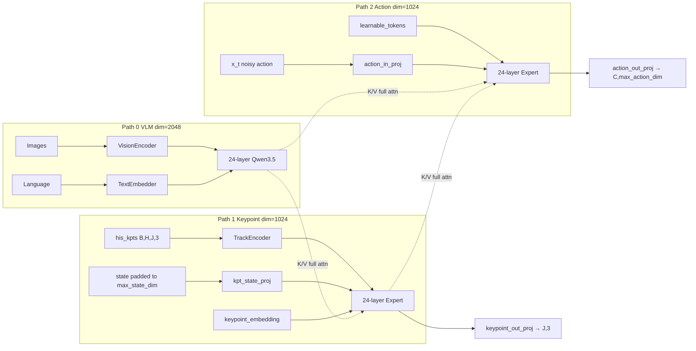
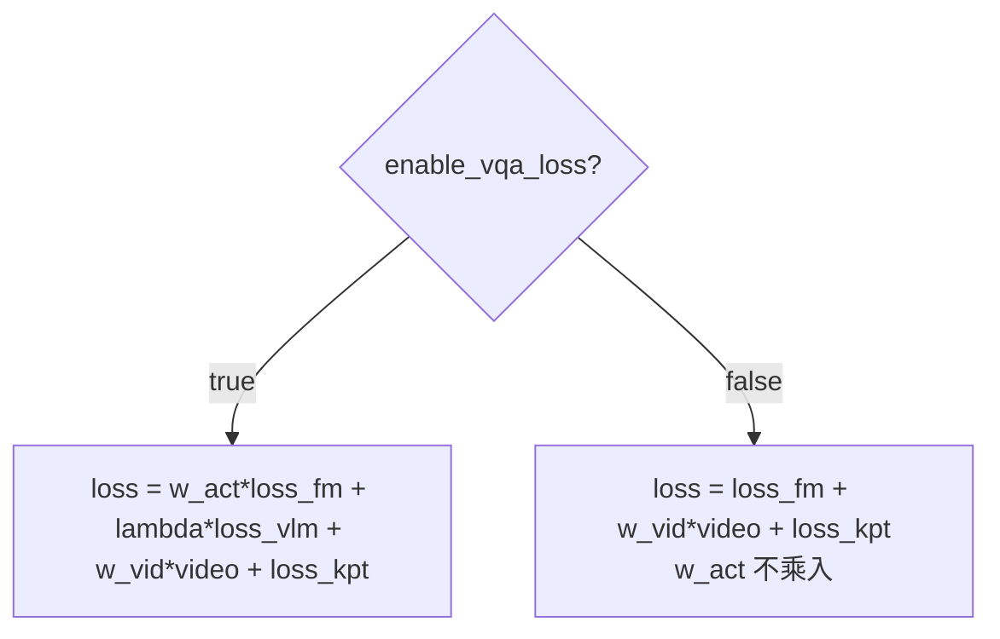
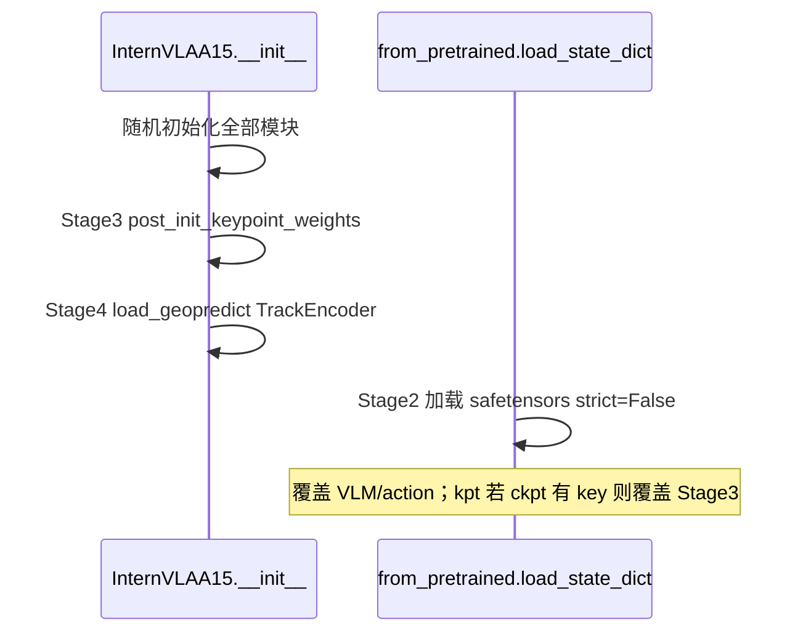
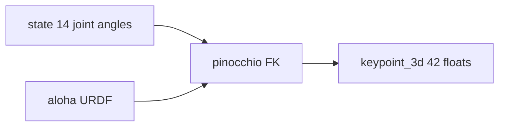
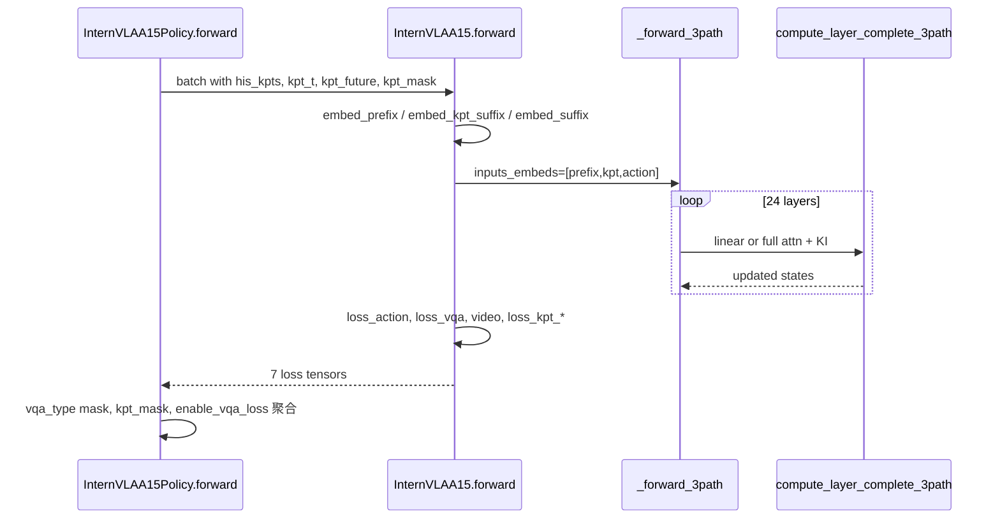
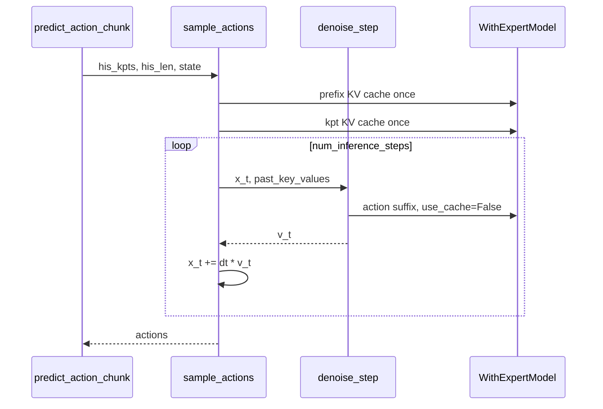

# InternVLA-A1.5 + GeoPredict 3D Keypoint Fusion: Three-Path MoT Design & Training Manual v3.4

> **自包含文档**: 在 v3.3 基础上对照 2026-08-10 代码库全面修订。以源码中的**符号名/函数名**为准；行号仅作辅助导航（撰写日核对）。
>
> **前版文档**: [v3.3](itrnVLA15_GeoP_3dtrj_3cn3.md) | [v3.1](itrnVLA15_GeoP_3dtrj_3cn2.md) | [v3.2](itrnVLA15_GeoP_3dtrj_3cn2_rbt2stak3.md) | [sft_rbt2_2](itrnVLA15_GeoP_3dtrj_3cn2_sft_rbt2_2.md)

---

## 目录

- [0. 阅读指南](#0-阅读指南)
- [Part I: 架构与设计](#part-i-架构与设计)
  - [1. 概述](#1-概述)
  - [2. 类层级](#2-类层级-class-hierarchy)
  - [3. 模块清单](#3-模块清单-module-inventory)
  - [4. Token 布局](#4-token-布局-token-layout)
  - [5. 注意力掩码](#5-注意力掩码-attention-masks)
  - [6. compute_layer_complete_3path](#6-compute_layer_complete_3path)
  - [7. Knowledge Insulation](#7-knowledge-insulation-ki)
  - [8. Loss 计算](#8-loss-计算)
  - [9. 权重初始化](#9-权重初始化-4-stages)
  - [10. Per-Module LR](#10-per-module-lr-5-组)
  - [11. 配置字段完整表](#11-配置字段完整表)
- [Part II: Aloha 双臂适配](#part-ii-aloha-双臂适配)
  - [12. J=8 → J=14 变更](#12-j8--j14-变更)
  - [13. FK 关键点生成](#13-fk-关键点生成-offline)
  - [14. SAPIEN 运行时关键点](#14-sapien-运行时关键点-推理)
  - [15. 数据管道](#15-数据管道-data-pipeline)
- [Part III: 训练与部署](#part-iii-训练与部署)
  - [16. 课程学习策略（双轨）](#16-课程学习策略双轨)
  - [17. Phase 1 训练脚本](#17-phase-1-训练脚本)
  - [18. Phase 2 训练脚本](#18-phase-2-训练脚本)
  - [19. Loss 监控](#19-loss-监控)
- [Part IV: 推理与运维](#part-iv-推理与运维)
  - [20. 推理路径](#20-推理路径-forward-call-chain)
  - [21. 已知问题与对策](#21-已知问题与对策)
  - [22. 配置对比表](#22-配置对比表)
- [附录 A–D](#附录)

---

## 0. 阅读指南

### 0.1 核心源码锚点

| 文件 | 职责 |
|:---|:---|
| [`modeling_internvla_a1_5.py`](../src/lerobot/policies/internvla_a1_5/modeling_internvla_a1_5.py) | 三路径 MoT、`embed_*_suffix`、`compute_layer_complete_3path`、训练/推理 forward |
| [`configuration_internvla_a1_5.py`](../src/lerobot/policies/internvla_a1_5/configuration_internvla_a1_5.py) | Policy/Dataset/VQA 配置、`UnifyInternVLAA15InputsTransformFn`、`keypoint_3d_delta_indices` |
| [`keypoints.py`](../src/lerobot/policies/internvla_a1_5/keypoints.py) | `TrackEncoder`、GeoPredict 权重加载 |
| [`transform_internvla_a1_5.py`](../src/lerobot/policies/internvla_a1_5/transform_internvla_a1_5.py) | `Extract3DKeypointTransformFn` |
| [`datasets/factory.py`](../src/lerobot/datasets/factory.py) | `resolve_delta_timestamps(cfg.policy, ...)` |
| [`pretrained.py`](../src/lerobot/policies/pretrained.py) | `from_pretrained` → `load_state_dict` |
| [`evaluation/RoboTwin/inference.py`](../evaluation/RoboTwin/inference.py) | SAPIEN 运行时关键点 |
| [`util_scripts/generate_aloha_keypoints.py`](../util_scripts/generate_aloha_keypoints.py) | 离线 FK |

### 0.2 三处 `enable_keypoint_predictor`（无自动同步）

| 配置类 | 控制什么 |
|:---|:---|
| **`InternVLAA15Config` (Policy)** | 模型是否走 3-path；`keypoint_3d_delta_indices` 是否启用（**LeRobot delta 查询读 Policy**） |
| **`InternVLAA15DatasetConfig` (Robot Dataset)** | transform 链是否插入 `Extract3DKeypointTransformFn` |
| **`InternVLAA15VQADatasetConfig` (VQA Dataset)** | 混合训练时 VQA 样本的 kpt 零占位 |

CLI 必须分别设置，例如：

```bash
--policy.enable_keypoint_predictor=true --policy.num_keypoint_joints=14
--dataset.enable_keypoint_predictor=true --dataset.num_keypoint_joints=14
# 若混合 VQA：--vqa_dataset.enable_keypoint_predictor=true ...
```

### 0.3 默认值陷阱（Policy vs Dataset）

| 字段 | Policy 默认 | Robot Dataset 默认 |
|:---|:---:|:---:|
| `tokenize_state` | **`True`** | **`False`** |
| `enable_keypoint_predictor` | `False` | `False` |

训练 RoboTwin stack_bowls_three 时，**Policy 与 Dataset 的 `tokenize_state` 都应显式设为 `true`**（与已跑通脚本一致）。

### 0.4 训练方案速查

| 轨道 | 来源 | 用途 |
|:---|:---|:---|
| **方案 A** | [`sft_rbt2_2.md`](itrnVLA15_GeoP_3dtrj_3cn2_sft_rbt2_2.md) §4 | 理论课程：`enable_vqa_loss=true`，`action_loss_weight` 显式生效 |
| **方案 B** | [`launch/internvla_a15_geop_phase2_finetune_stackb3_080719.sh`](../launch/internvla_a15_geop_phase2_finetune_stackb3_080719.sh) | 生产已跑通：`enable_vqa_loss=false`，有效 action 系数为 1.0 |

---

## Part I: 架构与设计

### 1. 概述

InternVLA-A1.5 是 Vision-Language-Action (VLA) 策略：Qwen3.5-2B VLM + action expert 构成 **两路径 MoT**；本设计增加 **keypoint expert** 形成 **三路径 MoT**，融合 GeoPredict 3D 关键点轨迹。

| 路径 | 模块 | 维度 | 功能 |
|:---|:---|:---:|:---|
| Path 0 (VLM prefix) | `Qwen3_5ForConditionalGeneration` | 2048 | 图像 + 语言 |
| Path 1 (Keypoint suffix) | `Qwen3_5TextModel` | 1024 | 3D 关键点历史 → 当前/未来关键点 |
| Path 2 (Action suffix) | `Qwen3_5TextModel` | 1024 | Flow matching 动作速度 |

24 层 Transformer：18 层 Gated DeltaNet（各路径独立）+ 6 层 full attention（跨路径）。



---

### 2. 类层级 (Class Hierarchy)

```
InternVLAA15Policy                          # modeling_internvla_a1_5.py
│   _checkpoint_excluded_prefixes = ("model.wan_video_model.",)
│   forward()          训练入口，聚合 loss
│   predict_action_chunk() / select_action()  推理入口
│   get_optim_params()  最多 5 组 LR
│   state_dict()       保存时剥离 WAN
│
└── self.model = InternVLAA15
    │   embed_prefix()
    │   embed_suffix()       action expert 后缀
    │   embed_kpt_suffix()   keypoint expert 后缀
    │   forward()            训练，返回 7 个 loss 分量
    │   sample_actions()     推理 flow-matching
    │   denoise_step()
    │   post_init_keypoint_weights()      Stage 3
    │   load_geopredict_keypoint_weights() Stage 4
    │   set_requires_grad()
    │
    ├── self.qwen3_5_with_expert = InternVLAA15WithExpertModel
    │   │   forward() / _forward_3path()
    │   ├── self.qwen3_5              Qwen3_5ForConditionalGeneration
    │   ├── self.action_expert        Qwen3_5TextModel, dim=1024
    │   └── self.keypoint_expert      Qwen3_5TextModel | None
    │
    ├── self.action_in_proj = Linear(max_action_dim, 1024)
    ├── self.action_out_proj = Linear(1024, max_action_dim)
    ├── self.action_time_mlp_in / action_time_mlp_out
    ├── self.state_proj               仅 tokenize_state=False
    │
    │   # enable_keypoint_predictor=True:
    ├── self.track_encoder = TrackEncoder(..., output_dim=1024)
    ├── self.kpt_state_proj = Linear(max_state_dim, 1024)
    ├── self.keypoint_embedding = Embedding(J, 1024)
    ├── self.keypoint_out_proj = Linear(1024, 3)
    └── self.future_kpt_pos_embed     Buffer [chunk_size, 1024]
```

**旧文档错误路径**（不存在）:

| 旧名称 | 正确路径 |
|:---|:---|
| `model.kpt_expert_layers.*` | `model.qwen3_5_with_expert.keypoint_expert.*` |
| `model.action_expert_layers.*` | `model.qwen3_5_with_expert.action_expert.*` |
| `model.layers.*` (VLM) | `model.qwen3_5_with_expert.qwen3_5.*` |

---

### 3. 模块清单 (Module Inventory)

| 模块 | 属性路径 | 维度/形状 | 说明 |
|:---|:---|:---|:---|
| VLM | `model.qwen3_5_with_expert.qwen3_5` | dim=2048 | 24 层 + vision encoder |
| Action expert | `.action_expert` | dim=1024 | embed_tokens=None |
| Keypoint expert | `.keypoint_expert` | dim=1024 | None if disabled |
| Action in/out | `action_in_proj` / `action_out_proj` | max_action_dim↔1024 | 默认 max_action_dim=32 |
| State proj (act) | `state_proj` | max_state_dim→1024 | tokenize_state=False 时 |
| Action+time MLP | `action_time_mlp_in/out` | 2×1024→1024 | suffix 时间嵌入 |
| TrackEncoder | `track_encoder` | in `[B,T,J,3]` out `[B,J,1024]` | query_dim=512 |
| Kpt state proj | `kpt_state_proj` | max_state_dim→1024 | Aloha state=14 → pad 到 32 |
| Keypoint embed | `keypoint_embedding` | (J, 1024) | |
| Keypoint out | `keypoint_out_proj` | 1024→3 | |
| Future pos | `future_kpt_pos_embed` | [C, 1024] | sincos buffer |
| Learnable tokens | `learnable_tokens` | **[num_lt, 1024]** | 非 [1,N,D]；运行时 expand |
| WAN | `wan_video_model` | — | action_loss_only 时不加载 |

---

### 4. Token 布局 (Token Layout)

#### 4.1 Keypoint Suffix (`embed_kpt_suffix`)

$J$ = `num_keypoint_joints`。总长 $1 + 2J$。

| Token | 数量 | att_mask | 来源 |
|:---|:---:|:---|:---|
| state | 1 | `[1]` | `kpt_state_proj(pad(state))` |
| history | $J$ | `[1, 0×(J-1)]` | `track_encoder(his_kpts, his_len)` |
| query | $J$ | `[1, 0×(J-1)]` | `keypoint_embedding.weight` |

- $J=14$: **29 tokens**；$J=8$: **17 tokens**

#### 4.2 Action Suffix (`embed_suffix`)

| `tokenize_state` | tokens | 组成 |
|:---|:---:|:---|
| **True** (Policy 默认) | **100** | learnable(50) + action(50)，**无** state token |
| False | **101** | state(1) + learnable(50) + action(50) |

#### 4.3 完整序列 (tokenize_state=True, J=14)

总长 = $P + 29 + 100 = P + 129$

Position IDs: prefix 由 VLM 计算；kpt 从 `max_prefix_pos+1`；action 从 `max_prefix_pos + kpt_len + 1`。

#### 4.4 已知代码问题：`get_learnable_token_output`

`get_learnable_token_output` 固定 `start=1` 以「跳过 state token」。当 `tokenize_state=True` 时 suffix **没有** state token，会误跳过第一个 learnable token。**仅影响 WAN/video 分支**，与 GeoP kpt 路径无关。

---

### 5. 注意力掩码 (Attention Masks)

#### 5.1 `make_att_2d_masks`

cumsum block-causal：`att_mask=1` 开始新 block，同 block 内可互相 attend。

#### 5.2 三路径规则

- **Linear 层 (18/24)**: 三路径完全独立
- **Full 层 (6/24)**:
  - Prefix: 仅 self-attention
  - Keypoint: attends `[prefix, keypoint]`
  - Action: attends `[prefix, keypoint, action]`

#### 5.3 示例 (J=14, tokenize_state=True)

```
kpt_att_masks:  [1, 1,0×13, 1,0×13]     # 长度 29
act_att_masks:  [1,0×49, 1,0×49]         # 长度 100
```

---

### 6. `compute_layer_complete_3path`

三路径 MoT 核心（`modeling_internvla_a1_5.py` 中 `compute_layer_complete_3path`）。

KI 在 full-attention 层通过 `.detach()` 实现：

```python
prefix_key_for_kpt = prefix_key.detach() if knowledge_insulation_kpt else prefix_key
prefix_key_for_action = prefix_key.detach() if knowledge_insulation else prefix_key
kpt_key_for_action = kpt_key.detach() if kpt_to_action_detach else kpt_key
```

`enable_keypoint_predictor=False` 时使用 2-path 版 `compute_layer_complete`。

---

### 7. Knowledge Insulation (KI)

| 字段 | 作用 | 状态 |
|:---|:---|:---:|
| `knowledge_insulation` | action → prefix K/V detach | ✅ |
| `knowledge_insulation_kpt` | kpt → prefix K/V detach | ✅ |
| `kpt_to_action_detach` | action → kpt K/V detach | ✅ |
| `ki_gradient_scale` | soft KI | ❌ 死代码 |
| `ki_kpt_gradient_scale` | soft KI | ❌ 死代码 |

---

### 8. Loss 计算

#### 8.1 `InternVLAA15.forward` 返回值

| 分量 | Shape | 说明 |
|:---|:---|:---|
| `loss_action` | [B, C, D] | flow matching MSE (per-element) |
| `loss_vqa` | [B] | VLM CE |
| `video_loss` | scalar | WAN |
| `loss_kpt_current` / `loss_kpt_future` | [B] | 关键点 MSE |
| `loss_per_token`, `token_mask` | 日志用 | |

Future keypoint：query token + `future_kpt_pos_embed[C,D]` → `keypoint_out_proj`。

#### 8.2 Total Loss 聚合（`InternVLAA15Policy.forward`）



- **`enable_vqa_loss=true`**: `action_loss_weight` **生效**；`loss_fm` 仅对 `vqa_type∈{0,2}` 的 robot 样本 mean；`loss_vlm` 对 `vqa_type∈{1,2}` mean
- **`enable_vqa_loss=false`**: `action_loss_weight` **无效**（隐含系数 1.0）；方案 B 生产脚本设 `action_loss_weight=10` 但**实际不参与** total loss

Keypoint 掩码：

```python
loss_kpt = kpt_loss_weight * (loss_kpt_cur + kpt_future_loss_weight * loss_kpt_fut)
# loss_kpt_cur/fut 仅对 kpt_mask=True 的样本 mean；Phase 1 无 GT 时为 0
# kpt expert 仍可通过 action full-attn 获得间接梯度（kpt_to_action_detach=False 时）
```

#### 8.3 Loss 符号对照

| 符号 | 配置字段 | 默认 |
|:---|:---|:---:|
| $w_{act}$ | `action_loss_weight` | 10.0 |
| $\lambda_{vqa}$ | `lambda_vqa` | 1.0 |
| $w_{vid}$ | `video_loss_weight` | 1.0 |
| $w_{kpt}$ | `kpt_loss_weight` | 1.0 |
| $\gamma$ | `kpt_future_loss_weight` | 1.0 |

---

### 9. 权重初始化 (4 Stages)

**实际时序**（与 v3.3 不同）：Stage 3/4 在 `InternVLAA15.__init__` 内执行；`from_pretrained` 随后 `load_state_dict` 覆盖。



| Stage | 函数 | 说明 |
|:---|:---|:---|
| 1 | `__init__` | 随机初始化 |
| 2 | `PreTrainedPolicy.from_pretrained` | `strict=False`；base ckpt 无 kpt key → kpt 保留 Stage3 |
| 3 | `post_init_keypoint_weights` | guard: `init_kpt_expert_from_action`；copy action→kpt |
| 4 | `load_geopredict_keypoint_weights` | 跳过 `track_fusion_layer` (512→1024 vs 512→2048) |

**Phase 2 续训**: `init_kpt_expert_from_action=false`；**不要**再设 `geopredict_checkpoint_path`（会覆盖 Phase 1 的 TrackEncoder）。

---

### 10. Per-Module LR (5 组)

**条件**: `enable_keypoint_predictor=True` **且** 任一 `(vlm, action, kpt, track_encoder)_lr_scale ≠ 1.0`。否则返回 flat `self.parameters()`。

| 组 | 参数 | LR |
|:---|:---|:---|
| track_encoder | `model.track_encoder.*` | base × track_encoder_lr_scale |
| kpt_expert | kpt_state_proj, embedding, out_proj, keypoint_expert | base × kpt_expert_lr_scale |
| action | action_expert | base × action_expert_lr_scale |
| vlm | qwen3_5 | base × vlm_lr_scale |
| other | action_in/out_proj, action_time_mlp_*, learnable_tokens*, state_proj, learnable_to_wan_proj | base |

分组用 `id(p)` 身份匹配；track_encoder 优先于 kpt 组。

`train_expert_only=True`: VLM `requires_grad=False`，不进 optimizer。

`freeze_keypoint_modules=True`: 冻结 track_encoder + kpt expert 全部投影。

---

### 11. 配置字段完整表

#### 11.1 Policy (`InternVLAA15Config`)

| 字段 | 默认 | 说明 |
|:---|:---:|:---|
| `enable_keypoint_predictor` | False | 模型 + **delta_indices** |
| `num_keypoint_joints` | 8 | J: 8 RoboCasa / 14 Aloha |
| `keypoint_history_max_len` | 1000 | H |
| `chunk_size` | 50 | C |
| `max_state_dim` / `max_action_dim` | 32 | padding 上限 |
| `action_loss_weight` | 10.0 | 仅 enable_vqa_loss=true 时乘入 |
| `kpt_loss_weight` | 1.0 | |
| `kpt_future_loss_weight` | 1.0 | γ |
| `knowledge_insulation` / `_kpt` / `kpt_to_action_detach` | False | hard KI |
| `ki_gradient_scale` / `ki_kpt_gradient_scale` | 0.0 | ❌ 未实现 |
| `keypoint_noise_sigma` | 0.0 | ❌ 未实现 |
| `freeze_keypoint_modules` | False | |
| `init_kpt_expert_from_action` | True | Stage 3 |
| `geopredict_checkpoint_path` | None | Stage 4 |
| `train_expert_only` | False | |
| `enable_vqa_loss` | **True** | 影响 action_loss_weight |
| `tokenize_state` | **True** | |
| `action_loss_only` | False | True 则跳过 WAN |
| `inference_backend` | standard | optimized 不支持 kpt |

`keypoint_3d_delta_indices`（Policy property）:

```python
# enable_keypoint_predictor=False → None
# else: range(-H, C+1)  → 1051 indices when H=1000, C=50
```

#### 11.2 Robot Dataset (`InternVLAA15DatasetConfig`)

| 字段 | 默认 | 说明 |
|:---|:---:|:---|
| `enable_keypoint_predictor` | False | 插入 Extract3D transform |
| `num_keypoint_joints` | 8 | |
| `keypoint_history_max_len` | 1000 | |
| `chunk_size` | 50 | |
| `tokenize_state` | **False** | ⚠️ 与 Policy 默认不同 |

#### 11.3 VQA Dataset (`InternVLAA15VQADatasetConfig`)

混合训练时 `enable_keypoint_predictor` 控制 VQA 样本 kpt 零占位（`UnifyInternVLAA15VQAInputsTransformFn`）。

#### 11.4 跨配置一致性检查表

训练前确认（CLI 显式设置）:

| 字段 | Policy | Robot Dataset | 必须一致 |
|:---|:---:|:---:|:---:|
| `enable_keypoint_predictor` | ✓ | ✓ | ✅ |
| `num_keypoint_joints` | ✓ | ✓ | ✅ |
| `keypoint_history_max_len` | ✓ | ✓ | ✅ |
| `chunk_size` | ✓ | ✓ | ✅ |
| `tokenize_state` | ✓ | ✓ | ✅ 推荐 |

**Policy-only**: `keypoint_3d_delta_indices` — Dataset flag 不设则 transform 不拆分，Policy flag 不设则 **不查询** `observation.keypoint_3d` 多帧。

---

## Part II: Aloha 双臂适配

### 12. J=8 → J=14 变更

| 组件 | J=8 | J=14 |
|:---|:---:|:---:|
| `keypoint_embedding` | (8,1024) | (14,1024) |
| TrackEncoder input | [B,H,8,3] | [B,H,14,3] |
| kpt_suffix tokens | 17 | 29 |
| `observation.state` (Aloha) | — | 14 (pad→32) |
| keypoint_3d per frame | 24 floats | 42 floats |

序列长度 (tokenize_state=True): $P+117$ vs $P+129$。

---

### 13. FK 关键点生成 (Offline)

脚本: [`util_scripts/generate_aloha_keypoints.py`](../util_scripts/generate_aloha_keypoints.py)



- **默认 URDF**: `/mnt/r/share/zwy/Projects/RoboTwin/assets/.../arx5_description_isaac.urdf` — 本机需 `--urdf` 覆盖
- `state[0:6]` / `state[7:13]` → 12 驱动关节；gripper `state[6]`/`state[13]` 不参与 FK
- 14 links: `fl_link1..6, left_camera, fr_link1..6, right_camera`

```bash
python util_scripts/generate_aloha_keypoints.py \
    --source /path/to/stack_bowls_three \
    --dest /path/to/stack_bowls_three_kpt \
    --urdf /path/to/your/aloha.urdf
```

---

### 14. SAPIEN 运行时关键点 (推理)

实现: [`evaluation/RoboTwin/inference.py`](../evaluation/RoboTwin/inference.py)

- `get_keypoints_aloha(robot_entity, footprint_pose)` → `[14,3]` footprint-relative
- 推理循环使用 **`task_env.robot.left_entity`**（双臂 keypoints 均从此 entity 读 link）
- 历史 buffer: `his_kpts [H,J,3]`, `his_len`；满窗口后 `np.roll`

> **验证状态**: `InternVLAA15.sample_actions` 中 3-path KV cache 路径代码注释标明**仅 smoke test**，未在完整 RoboTwin rollout 中系统验证（见 §21）。

推理**不**输入 `kpt_t`/`kpt_future`，**不**输出关键点坐标；kpt 路径仅通过 KV 供 action expert 查询。

---

### 15. 数据管道 (Data Pipeline)

#### 15.1 Delta 查询（Policy 控制）

[`datasets/factory.py`](../src/lerobot/datasets/factory.py) `resolve_delta_timestamps(cfg.policy, ds_meta)`:

- 当 Policy `enable_keypoint_predictor=true` 且数据集有 `observation.keypoint_3d` 列时，按 `keypoint_3d_delta_indices` 拉取 1051 帧窗口
- 索引: `[-H,...,−1, 0, 1,..., C]`；越界 clamp + `keypoint_3d_is_pad`

#### 15.2 `Extract3DKeypointTransformFn`

文件: [`transform_internvla_a1_5.py`](../src/lerobot/policies/internvla_a1_5/transform_internvla_a1_5.py)  
注册名: `"extract_3d_keypoint"`；由 **Dataset** `enable_keypoint_predictor` 插入。

输出 5 字段:

| 字段 | Shape |
|:---|:---|
| `observation.his_kpts` | [H, J, 3] |
| `observation.his_len` | scalar |
| `observation.kpt_t` | [J, 3] |
| `observation.kpt_future` | [C, J, 3] |
| `observation.kpt_mask` | bool |

无 `keypoint_3d` 列时（方案 B Phase 1 间接监督）：全零 + `kpt_mask=False`。

历史 packing: 无效帧在窗口前端；有效帧移到 `his_kpts` **前端**，零填充在后端。

#### 15.3 `UnifyInternVLAA15InputsTransformFn`

文件: [`configuration_internvla_a1_5.py`](../src/lerobot/policies/internvla_a1_5/configuration_internvla_a1_5.py)（**非** transform_internvla_a1_5.py）

- `enable_keypoint_predictor=False`: 输出 dict **不含** kpt 字段
- `enable_keypoint_predictor=True`: 透传已有字段；缺失时 `_kpt_fields_passthrough_or_zero`（VQA 样本）

Transform 链顺序（Robot）: … → Normalize → **Extract3DKeypoint** → ComposeFields → … → ChatProcessor → **UnifyInternVLAA15Inputs**

---

## Part III: 训练与部署

### 16. 课程学习策略（双轨）

#### 16.1 方案 A — sft 理论课程

来源: [`sft_rbt2_2.md`](itrnVLA15_GeoP_3dtrj_3cn2_sft_rbt2_2.md)

| 阶段 | FK | enable_vqa_loss | action_loss_weight | kpt_loss_weight | 有效 loss 系数 (action) |
|:---:|:---:|:---:|:---:|:---:|:---:|
| Phase 1 | ✅ | **true** | 5.0 | 10.0 | **5.0×** |
| Phase 2 | ✅ | **true** | 10.0 | 2.5 | **10.0×** |

Phase 1 额外: `action_expert_lr_scale=0.1`，`action_loss_only=true`，`init_kpt_expert_from_action=true` + GeoPredict ckpt。

#### 16.2 方案 B — 080719 生产已跑通

来源: [`launch/internvla_a15_geop_phase2_finetune_stackb3_080719.sh`](../launch/internvla_a15_geop_phase2_finetune_stackb3_080719.sh)  
Phase 1 checkpoint: [`LOG_p1.md`](itrnVLA15_GeoP_3dtrj_3cn2_sft_rbt2_2LOG_p1.md) 推荐 step 300

| 阶段 | FK | enable_vqa_loss | action_loss_weight (配置) | kpt_loss_weight | **有效 action 系数** |
|:---:|:---:|:---:|:---:|:---:|:---:|
| Phase 1 | ✅ | true (同 A) | 5.0 | 10.0 | 5.0× |
| Phase 2 (080719) | ✅ | **false** | 10.0 (无效) | **0.1** | **1.0×** |

Phase 2-B 特征: `action_loss_only=false`（WAN 加载，`video_loss_weight=0`），`freeze_keypoint_modules=false`，`freeze_learnable_tokens=false`，`action_mode=abs`，8×GPU batch=16，10000 steps。

#### 16.3 方案 C — 无 FK 过渡（可选）

Phase 1 无 `observation.keypoint_3d` → `kpt_mask=False`，kpt loss=0，kpt expert 仅通过 action cross-attention 间接梯度。Phase 2 需先 §13 FK。

#### 16.4 A vs B 关键差异

| 维度 | 方案 A Phase 2 | 方案 B Phase 2 |
|:---|:---|:---|
| `enable_vqa_loss` | true | false |
| `action_loss_weight` 是否生效 | ✅ 10× | ❌ 隐含 1× |
| `kpt_loss_weight` | 2.5 | 0.1 |
| `action_loss_only` | true | false |
| `freeze_keypoint_modules` | false (可选 true) | false |
| `use_fast_action_tokens` (dataset) | true | false |

---

### 17. Phase 1 训练脚本

#### 17A — 方案 A（sft 标准 Phase 1）

完整环境变量与脚本结构见 [`sft_rbt2_2.md` §4.1](itrnVLA15_GeoP_3dtrj_3cn2_sft_rbt2_2.md)。以下为与源码 CLI 兼容的 `lerobot_train.py` 参数（**无** `--training.*` 伪参数）:

```bash
#!/usr/bin/env bash
set -euo pipefail

POLICY="internvla_a1_5"
PRETRAINED_PATH="${PRETRAINED_PATH:-/path/to/InternVLA-A1.5-base}"
GEOPREDICT_CKPT="${GEOPREDICT_CKPT:-/path/to/GeoPredict_robocasa.pth}"
DATASET_REPO_ID="${DATASET_REPO_ID:-robotwin/stack_bowls_three_kpt}"
OUTPUT_DIR="${OUTPUT_DIR:-outputs/${POLICY}/phase1_kpt_warmup}"

accelerate launch \
    --multi_gpu --num_processes=8 \
    --num_machines=1 --machine_rank=0 \
    --main_process_ip=127.0.0.1 --main_process_port=36200 \
    src/lerobot/scripts/lerobot_train.py \
    --output_dir="${OUTPUT_DIR}" \
    --job_name="$(basename "${OUTPUT_DIR}")" \
    --num_workers=8 \
    --policy.type=${POLICY} \
    --policy.repo_id=lerobot_lab/${POLICY} \
    --policy.pretrained_path="${PRETRAINED_PATH}" \
    --policy.push_to_hub=false \
    --policy.dtype=bfloat16 \
    --policy.optimizer_lr=5e-5 \
    --policy.scheduler_warmup_steps=500 \
    --policy.scheduler_decay_steps=5000 \
    --policy.scheduler_decay_lr=5e-6 \
    --policy.vlm_model_name_or_path=Qwen/Qwen3.5-2B \
    --policy.enable_vqa_loss=true \
    --policy.tokenize_state=true \
    --policy.video_loss_weight=1 \
    --policy.freeze_learnable_tokens=true \
    --policy.num_learnable_tokens=50 \
    --policy.train_expert_only=true \
    --policy.enable_keypoint_predictor=true \
    --policy.num_keypoint_joints=14 \
    --policy.action_loss_weight=5.0 \
    --policy.kpt_loss_weight=10.0 \
    --policy.kpt_future_loss_weight=1.0 \
    --policy.knowledge_insulation=true \
    --policy.knowledge_insulation_kpt=true \
    --policy.kpt_to_action_detach=false \
    --policy.freeze_keypoint_modules=false \
    --policy.action_expert_lr_scale=0.1 \
    --policy.kpt_expert_lr_scale=1.0 \
    --policy.track_encoder_lr_scale=1.0 \
    --policy.init_kpt_expert_from_action=true \
    --policy.action_loss_only=true \
    --policy.geopredict_checkpoint_path="${GEOPREDICT_CKPT}" \
    --dataset.type="${POLICY}" \
    --dataset.repo_id="${DATASET_REPO_ID}" \
    --dataset.enable_keypoint_predictor=true \
    --dataset.num_keypoint_joints=14 \
    --dataset.action_mode=abs \
    --dataset.tokenize_state=true \
    --dataset.use_fast_action_tokens=true \
    --dataset.use_external_stats=true \
    --dataset.external_stats_path="${HF_HOME}/lerobot/stats/aloha/abs/agg_1repos_1c27ca3df3/stats.json" \
    --seed=42 \
    --batch_size=8 \
    --steps=5000 \
    --save_freq=1000 \
    --log_freq=50 \
    --wandb.enable=true \
    --wandb.project=${POLICY} \
    --wandb.mode=offline
```

有效 loss（enable_vqa_loss=true）:

$$\mathcal{L} = 5.0 \cdot \mathcal{L}_{action} + \lambda_{vqa}\mathcal{L}_{vqa} + w_{vid}\mathcal{L}_{video} + 10.0 \cdot (\mathcal{L}_{kpt}^{cur} + \mathcal{L}_{kpt}^{fut})$$

#### 17B — Phase 1 产出与 Phase 2 输入

无独立 `launch/*phase1*` 脚本；已验证 run（LOG_p1）:

```
outputs/internvla_a1_5/2026_08_04_05_41_51-internvla_a1_5-geop-phase1-kpt-warmup-stackb3-abs/
  checkpoints/000300/pretrained_model   ← 推荐 Phase 2 起点
```

---

### 18. Phase 2 训练脚本

#### 18A — 方案 A（sft Phase 2 模板）

```bash
# PRETRAINED_PATH = Phase 1 checkpoint（不是 base）
accelerate launch ... src/lerobot/scripts/lerobot_train.py \
    --policy.pretrained_path=outputs/.../checkpoints/000300/pretrained_model \
    --policy.init_kpt_expert_from_action=false \
    # 不设 geopredict_checkpoint_path
    --policy.enable_vqa_loss=true \
    --policy.action_loss_weight=10.0 \
    --policy.kpt_loss_weight=2.5 \
    --policy.action_expert_lr_scale=1.0 \
    --policy.action_loss_only=true \
    --policy.enable_keypoint_predictor=true \
    --dataset.enable_keypoint_predictor=true \
    --dataset.num_keypoint_joints=14 \
    --dataset.tokenize_state=true \
    --batch_size=8 --steps=10000 --save_freq=2500
```

#### 18B — 方案 B（080719 生产 Phase 2）

与 [`launch/internvla_a15_geop_phase2_finetune_stackb3_080719.sh`](../launch/internvla_a15_geop_phase2_finetune_stackb3_080719.sh) 一致：

```bash
"${PYTHON}" -m accelerate.commands.launch \
    --multi_gpu --num_processes=8 ... \
    src/lerobot/scripts/lerobot_train.py \
    --output_dir="${OUTPUT_DIR}" \
    --policy.pretrained_path="${PRETRAINED_PATH}" \
    --policy.optimizer_lr=5e-5 \
    --policy.train_expert_only=true \
    --policy.enable_vqa_loss=false \
    --policy.tokenize_state=true \
    --policy.video_loss_weight=0.0 \
    --policy.freeze_learnable_tokens=false \
    --policy.action_loss_only=false \
    --policy.wan_checkpoint_path="${WAN_DIR}" \
    --policy.enable_keypoint_predictor=true \
    --policy.num_keypoint_joints=14 \
    --policy.action_loss_weight=10.0 \
    --policy.kpt_loss_weight=0.1 \
    --policy.kpt_future_loss_weight=0.1 \
    --policy.init_kpt_expert_from_action=false \
    --policy.freeze_keypoint_modules=false \
    --dataset.repo_id=robotwin/stack_bowls_three_kpt \
    --dataset.enable_keypoint_predictor=true \
    --dataset.action_mode=abs \
    --dataset.tokenize_state=true \
    --dataset.use_fast_action_tokens=false \
    --batch_size=16 --steps=10000 --save_freq=2500
```

**有效 loss**（enable_vqa_loss=false）:

$$\mathcal{L} = 1.0 \cdot \mathcal{L}_{action} + 0.1 \cdot (\mathcal{L}_{kpt}^{cur} + 0.1 \cdot \mathcal{L}_{kpt}^{fut})$$

（`action_loss_weight=10` 不参与；video_loss_weight=0）

**Phase 2 三大安全检查**（A/B 通用）:

1. `pretrained_path` → Phase 1 ckpt，非 base
2. `init_kpt_expert_from_action=false`
3. 不设 `geopredict_checkpoint_path`

---

### 19. Loss 监控

WandB keys（[`lerobot_train.py`](../src/lerobot/scripts/lerobot_train.py)）: `loss`, `loss_action`, `loss_video`, `loss_kpt_current`, `loss_kpt_future`；`enable_vqa_loss=true` 时另有 `loss_vqa`, `loss_fast`, `loss_subtask`。

| Key | 方案 A Phase 1 | 方案 A Phase 2 | 方案 B Phase 2 |
|:---|:---|:---|:---|
| `loss_kpt_current` | 快速↓ | 稳定 | 稳定 |
| `loss_action` | 缓慢↓ | 快速↓ | 主导 total |
| `loss_vqa` | >0 | >0 | **0** |
| `loss_video` | 0 (action_loss_only) | 0 | 0 (weight=0) |

诊断:

1. `loss_kpt` 不下降 → 检查 Policy **和** Dataset 的 `enable_keypoint_predictor`；FK 数据 / `kpt_mask`
2. 方案 A Phase 2 action 不下降 → `enable_vqa_loss=true`
3. 方案 B 勿期望 `action_loss_weight` 在 log 中放大 action — 代码路径不支持
4. `lr=0` → 检查 `train_expert_only` 与 optimizer 分组

Grad clip: `policy.optimizer_grad_clip_norm=1.0`（默认）。

---

## Part IV: 推理与运维

### 20. 推理路径 (Forward Call Chain)

#### 20.1 训练 Forward



#### 20.2 推理 Forward（standard backend）



`denoise_step(use_kpt=True)` 传 `kpt_to_action_detach`；prefix/kpt 已在 cache 步骤写入。

#### 20.3 限制

| 限制 | 说明 |
|:---|:---|
| `inference_backend=optimized` | **不支持** kpt：`sample_actions` 无 `his_kpts`/`his_len` |
| 3-path KV cache | 代码标注 smoke test only |
| 无 kpt 输出 | 推理不返回预测关键点，仅内部 KV |

RoboTwin 评估: [`evaluation/RoboTwin/inference.py`](../evaluation/RoboTwin/inference.py)，需 `config.enable_keypoint_predictor=true`。

---

### 21. 已知问题与对策

| # | 问题 | 对策 |
|:---:|:---|:---|
| 1 | `ki_gradient_scale*` 死代码 | 用 boolean KI |
| 2 | `keypoint_noise_sigma` 死代码 | 勿依赖 |
| 3 | 三处 `enable_keypoint_predictor` 不同步 | Policy + Dataset (+VQA) 都设 |
| 4 | `enable_vqa_loss=false` → `action_loss_weight` 无效 | 方案 B 已知；要生效设 true |
| 5 | init 时序：Stage 3/4 在 load ckpt **之前** | 理解 Phase 2 勿 re-init |
| 6 | TrackEncoder fusion 512→1024 vs 2048 | 自动跳过 fusion 层 |
| 7 | Policy/Dataset `tokenize_state` 默认不一致 | CLI 显式对齐 |
| 8 | `get_learnable_token_output` vs tokenize_state | 已知 bug，影响 video 分支 |
| 9 | optimized backend 无 kpt | 用 standard |
| 10 | 3-path 推理 KV smoke test | 生产 rollout 自行验证 |
| 11 | inference 用 `left_entity` | RoboTwin 实现细节 |
| 12 | delta 查询归 **Policy** 非 Dataset | §11.4 |
| 13 | Unify transform 在 configuration 文件 | 勿去 transform 文件找 |
| 14 | Phase 2 勿设 geopredict path | 覆盖 Phase 1 TrackEncoder |
| 15 | `his_kpts` np.roll 性能 | H=1000 可接受 |
| 16 | future_kpt_pos_embed 不可训练 | 设计选择 |
| 17 | J 须与 FK/config 一致 | reshape 否则失败 |
| 18 | 推理不用 kpt_t/kpt_future | 预期行为 |

---

### 22. 配置对比表

| 配置项 | Baseline | Phase1-A | Phase2-A | Phase2-B (080719) |
|:---|:---:|:---:|:---:|:---:|
| `enable_keypoint_predictor` (P+D) | false | **true** | **true** | **true** |
| `num_keypoint_joints` | — | 14 | 14 | 14 |
| `pretrained_path` | base | base | Phase1 ckpt | Phase1 ckpt |
| `init_kpt_expert_from_action` | — | true | **false** | **false** |
| `geopredict_checkpoint_path` | — | 设置 | 不设 | 不设 |
| `train_expert_only` | false | true | true | true |
| `enable_vqa_loss` | true | true | **true** | **false** |
| `action_loss_weight` (有效) | 10× | 5× | **10×** | **1×** |
| `kpt_loss_weight` | — | 10.0 | 2.5 | **0.1** |
| `action_loss_only` | true | true | true | **false** |
| `video_loss_weight` | 1 | 1 | 1 | **0** |
| `freeze_keypoint_modules` | — | false | opt true | false |
| `freeze_learnable_tokens` | false | true | true | **false** |
| `action_mode` | abs | abs | abs | abs |
| `tokenize_state` (P+D) | — | true | true | true |
| `dataset.use_fast_action_tokens` | — | true | true | **false** |
| LR | 5e-5 | 5e-5 | 5e-5 | 5e-5 |

---

## 附录

### 附录 A: Token 位置速查 (J=14, tokenize_state=True)

```
Position:  0..P-1  |  P..P+28 (kpt 29)  |  P+29..P+128 (act 100)
           PREFIX   state+hist+query      learnable+action
```

| 段 | 长度 | att_mask |
|:---|:---:|:---|
| Kpt state | 1 | [1] |
| Kpt history | 14 | [1,0×13] |
| Kpt query | 14 | [1,0×13] |
| Act learnable | 50 | [1,0×49] |
| Act action | 50 | [1,0×49] |

### 附录 B: GeoPredict Checkpoint Key 映射

`load_geopredict_track_encoder_weights` — [`keypoints.py`](../src/lerobot/policies/internvla_a1_5/keypoints.py)

| GeoPredict 前缀 | 加载 |
|:---|:---:|
| `queries`, `point_patch_embed.*`, `cross_attention_block.*`, `linear_transform.*`, `final_norm.*` | ✅ |
| `track_fusion_layer.*` (512→2048) | ❌ 本项目 512→1024 |

### 附录 C: Aloha URDF 运动链

#### C.1 关键点链路 (14 links)

| 索引 | Link | 臂 | 驱动关节 |
|:---:|:---|:---:|:---|
| 0–5 | `fl_link1`..`fl_link6` | 左 | `fl_joint1`..`fl_joint6` |
| 6 | `left_camera` | 左 | — (固连 link6) |
| 7–12 | `fr_link1`..`fr_link6` | 右 | `fr_joint1`..`fr_joint6` |
| 13 | `right_camera` | 右 | — |

#### C.2 State → Joint

```
state[0:6]   → 左臂 6 DOF（FK 输入）
state[6]     → 左 gripper（FK 忽略）
state[7:13]  → 右臂 6 DOF
state[13]    → 右 gripper（FK 忽略）
```

#### C.3 坐标系

footprint-relative: `fp_rot_inv @ (world_pos - fp_pos)`，与 `get_keypoints_aloha` / FK 脚本一致。

### 附录 D: 维度流 (J=14, H=1000, C=50)

```
Dataset state [14] → pad_vector → [32] → kpt_state_proj → [B,1,1024]
keypoint_3d delta → [1051,42] → Extract3D → his_kpts [1000,14,3], kpt_t [14,3], kpt_future [50,14,3]

TrackEncoder: [B,1000,14,3] → [B,14,1024]
kpt_suffix concat: [B,29,1024]
act_suffix: [B,100,1024]

Outputs:
  pred_kpt_current [B,14,3]  (last J query tokens)
  pred_kpt_future  [B,50,14,3]
  pred_velocity    [B,50,max_action_dim] → slice to robot action dim
```

TrackEncoder 内部: PointPatch Conv1d patch=4 → ~250 patches/joint; CrossAttn query_dim=512; fusion Linear(512,1024).

---

> **文档版本**: v3.4 | 撰写日 2026-08-10 | 对照 itvlaGp 代码库  
> **参考**: [modeling_internvla_a1_5.py](../src/lerobot/policies/internvla_a1_5/modeling_internvla_a1_5.py) | [configuration_internvla_a1_5.py](../src/lerobot/policies/internvla_a1_5/configuration_internvla_a1_5.py) | [keypoints.py](../src/lerobot/policies/internvla_a1_5/keypoints.py) | [sft_rbt2_2](itrnVLA15_GeoP_3dtrj_3cn2_sft_rbt2_2.md) | [080719 launch](../launch/internvla_a15_geop_phase2_finetune_stackb3_080719.sh)
