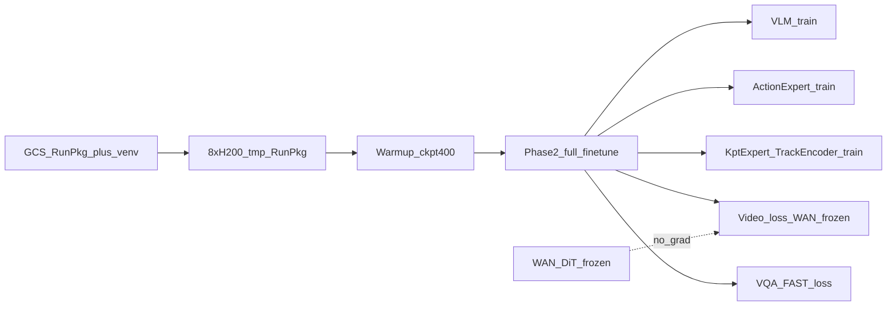
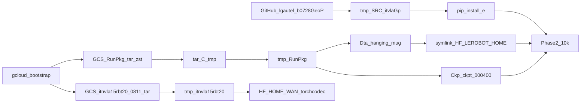

# InternVLA-A1.5 + GeoPredict 3D 轨迹融合版：RoboTwin hanging_mug Phase 2 微调（8×H200 GCS 落地）

> **文档定位**: 在 [stack_bowls Phase 2 本机手册](itrnVLA15_GeoP_3dtrj_3cn4_sft_rbt2.md)、[hanging_mug 1G Warmup 手册](itrnVLA15_GeoP_3dtrj_3cn4_wrmup1G_hngMg.md) 与 [Warmup 实施日志](itrnVLA15_GeoP_3dtrj_3cn4_wrmup1G_hngMg_LOG.md) 基础上，给出 **远端 8×H200 VM** 上从 GCS 拉取数据/venv/Warmup checkpoint、从 **GitHub** 克隆源码，对 RoboTwin 2.0 `hanging_mug`（kptsim 体素 GT）做 **Phase 2 全量微调** 的完整可执行方案。
>
> **前置**: Phase 1 Warmup 已在开发机跑通（[`wrmup1G_hngMg_LOG`](itrnVLA15_GeoP_3dtrj_3cn4_wrmup1G_hngMg_LOG.md)）；RunPkg（数据 + ckpt@400）已由 [`b/s/itrnVLA15_GeoP_3dtrj_3cn4p2_uplod.sh`](../s/itrnVLA15_GeoP_3dtrj_3cn4p2_uplod.sh) 上传。本方案 **固定从包内 Warmup ckpt@400 出发**。
>
> **训练策略**: 与 [sft_rbt2](itrnVLA15_GeoP_3dtrj_3cn4_sft_rbt2.md) 对齐——标准 A1.5 finetune 超参（VLM + Action + Video + VQA/FAST 全训），叠加 GeoP 关键点分支；**仅 WAN DiT 冻结**，其余可训练模块均更新。
>
> **远端约束**:
> - 虚拟环境 **`/tmp/itnvla15rbt20/`** 从 GCS `gs://physical-ai-data-eu/VENV/tmp/itnvla15rbt20_0811.tar` 下载解压（自包含，含 WAN / torchcodec）
> - 源码 **`/tmp/SRC/itvlaGp/`** 从 [lgautel/InternVLA-A-series](https://github.com/lgautel/InternVLA-A-series) 分支 **`b0728GeoP`** 克隆后 `pip install -e`
> - 数据 **`/tmp/RunPkg/Dta/hanging_mug_kptsim_lrbv30/`**（GCS RunPkg）
> - Warmup ckpt **`/tmp/RunPkg/Ckp/.../000400/pretrained_model`**（GCS RunPkg）
> - 视频解码：**torchcodec 0.10.0+cu128 + nvidia-npp-cu12**（venv 内已验证；1G Warmup 用过的 `pyav` 仅作降级）
> - 一键编排（clone 之后、不含评测）：[`b/s/itrnVLA15_GeoP_3dtrj_3cn4_sft_rbt2.sh`](../s/itrnVLA15_GeoP_3dtrj_3cn4_sft_rbt2.sh)

---

## 目录

- [0. 阅读指南与本方案定位](#0-阅读指南与本方案定位)
- [1. GCS 拉取与 VM 落地](#1-gcs-拉取与-vm-落地)
  - [1.0 gcloud CLI 检查、安装与登录](#10-gcloud-cli-检查安装与登录)
- [2. 训练目标与 Loss 设计](#2-训练目标与-loss-设计)
- [3. 远端路径常量表](#3-远端路径常量表)
- [4. Phase 1→2 衔接与冻结/训练矩阵](#4-phase-12-衔接与冻结训练矩阵)
- [5. Phase 2 超参详解](#5-phase-2-超参详解)
- [6. WAN 权重（跳过或补齐）](#6-wan-权重跳过或补齐)
- [7. 数据与 norm_stat](#7-数据与-norm_stat)
- [8. Preflight 验收清单](#8-preflight-验收清单)
- [9. Smoke 测试](#9-smoke-测试)
- [10. 8 卡正式训练 10000 step](#10-8-卡正式训练-10000-step)
- [11. GPU 满负载与监控](#11-gpu-满负载与监控)
- [12. Loss 监控与 Checkpoint 选择](#12-loss-监控与-checkpoint-选择)
- [13. RoboTwin 2.0 评测衔接](#13-robotwin-20-评测衔接)
- [14. 故障排查](#14-故障排查)
- [附录 A：Launch 环境变量覆盖表](#附录-alaunch-环境变量覆盖表)
- [附录 B：配置矩阵 Warmup vs Phase2](#附录-b配置矩阵-warmup-vs-phase2)
- [附录 C：执行 LOG 模板](#附录-c执行-log-模板)

---

## 0. 阅读指南与本方案定位

### 0.1 与参考文档的关系

| 文档 | 内容 | 本方案继承点 |
|:---|:---|:---|
| [itrnVLA15_GeoP_3dtrj_3cn4.md](itrnVLA15_GeoP_3dtrj_3cn4.md) | GeoP 三路径 MoT 架构、Loss 设计 | kpt 分支 CLI、推理路径 |
| [itrnVLA15_GeoP_3dtrj_3cn4_sft_rbt2.md](itrnVLA15_GeoP_3dtrj_3cn4_sft_rbt2.md) | stack_bowls 本机 8×H200 Phase 2 | **超参、冻结矩阵、Smoke/10k 流程** |
| [itrnVLA15_GeoP_3dtrj_3cn4_sft_rbt2LOG.md](itrnVLA15_GeoP_3dtrj_3cn4_sft_rbt2LOG.md) | stack_bowls Phase 2 实测 | 墙钟、OOM 降级、ckpt@2500 评测经验 |
| [itrnVLA15_GeoP_3dtrj_3cn4_wrmup1G_hngMg.md](itrnVLA15_GeoP_3dtrj_3cn4_wrmup1G_hngMg.md) | hanging_mug 单卡 Warmup 手册 | 任务专属 offset / `repo_id` / 推理 meta |
| [itrnVLA15_GeoP_3dtrj_3cn4_wrmup1G_hngMg_LOG.md](itrnVLA15_GeoP_3dtrj_3cn4_wrmup1G_hngMg_LOG.md) | hanging_mug Warmup 400 step 日志 | **ckpt@400 路径**、收敛曲线 |
| [itrnVLA15_GeoP_3dtrj_3cn4_wrmup8G.md](itrnVLA15_GeoP_3dtrj_3cn4_wrmup8G.md) | 8×H200 venv 自包含约定 | torchcodec、`LD_LIBRARY_PATH` |
| [`b/s/itrnVLA15_GeoP_3dtrj_3cn4p2_uplod.sh`](../s/itrnVLA15_GeoP_3dtrj_3cn4p2_uplod.sh) | RunPkg 打包上传 | GCS URI、包内目录结构 |
| [`internvla_a15_geop_phase2_finetune_kptsim_8g.sh`](../launch/internvla_a15_geop_phase2_finetune_kptsim_8g.sh) | Phase 2 launch | 用环境变量覆盖 `DATA_REPO_ID` / `PROJ_ROOT` / `WARMUP_CKPT` |
| [`b/s/itrnVLA15_GeoP_3dtrj_3cn4_sft_rbt2.sh`](../s/itrnVLA15_GeoP_3dtrj_3cn4_sft_rbt2.sh) | VM 编排（不含评测） | clone 后一键落地 + Smoke + 10k |

### 0.2 本方案 vs stack_bowls Phase 2 vs 1G Warmup



| 维度 | 1G Warmup（hngMg） | stack_bowls Phase 2 | **本方案 hanging_mug Phase 2** |
|:---|:---|:---|:---|
| 机器 | 开发机 1× GPU | 本机 8×H200 | **远端 8×H200（GCS 落地）** |
| 起点 | InternVLA-A1.5-base | Warmup ckpt@400 | **包内 hanging_mug ckpt@400** |
| VLM | 冻结（`train_expert_only`） | 训练 | **训练** |
| WAN DiT | 未加载 | 冻结 | **冻结** |
| video loss | 0 | 1 | **1** |
| VQA/FAST | 关 | 开 | **开** |
| Kpt 分支 | 开 | 开 | **开** |
| 数据 | `hanging_mug_kptsim_lrbv30` | `stack_bowls_three_kptsim_lrbv30` | **`hanging_mug_kptsim_lrbv30`** |
| `video_backend` | `pyav`（缺 `libnvrtc`） | torchcodec | **torchcodec**（venv 已验证） |

### 0.3 为何固定 ckpt@400

[`wrmup1G_hngMg_LOG`](itrnVLA15_GeoP_3dtrj_3cn4_wrmup1G_hngMg_LOG.md) 中 Warmup 400 step 轨迹：

| Step | loss_kpt_cur | loss_action | 备注 |
|:---:|:---:|:---:|:---|
| 300 | 0.0024 | 0.097 | LOG 曾推荐；**不在 RunPkg 内** |
| **400** | **0.0022** | **0.110** | **包内唯一 Warmup ckpt；本方案固定起点** |

kpt 已从 0.56 降至 ~0.002 并饱和。RunPkg 只打了 `checkpoints/000400`（见上传脚本 `CKPT_SRC`），本方案 **显式固定** 从 `000400/pretrained_model` 续训，与 [sft_rbt2](itrnVLA15_GeoP_3dtrj_3cn4_sft_rbt2.md) 的「终点 checkpoint 续训」一致。

### 0.4 与 stack_bowls 手册的硬差异（实施前必读）

| 项 | stack_bowls（sft_rbt2） | hanging_mug（本文） |
|:---|:---|:---|
| 代码 | 本机 `/tmp/SRC/InternVLA-A-series` | **lgautel/InternVLA-A-series** 分支 `b0728GeoP` → `/tmp/SRC/itvlaGp` |
| 数据 | `/tmp/rbt2stk3kptsim0811/...` | GCS RunPkg → `/tmp/RunPkg/Dta/hanging_mug_kptsim_lrbv30` |
| Warmup ckpt | 8G job `...kptsim-voxel-8g/000400` | GCS RunPkg → `/tmp/RunPkg/Ckp/warmup_hanging_mug_kptsim_400step/checkpoints/000400` |
| `repo_id` | `stack_bowls_three_kptsim_lrbv30` | `hanging_mug_kptsim_lrbv30`（50 ep / **16889** frames） |
| `task_idx` | 46 | **10** |
| 推理 meta | 默认 stack_bowls | **必须** `--kpt-meta-path` 指向本任务（offset \(\mathbf{o}=[-0.772,-1.050,0.478]\)） |
| venv | 本机已有 | GCS `itnvla15rbt20_0811.tar` 解压 → `/tmp/itnvla15rbt20` |

两任务 offset / norm stats / lrbv30 **均独立，禁止混用**。

---

## 1. GCS 拉取与 VM 落地

本节是相对 [sft_rbt2](itrnVLA15_GeoP_3dtrj_3cn4_sft_rbt2.md) 的新增步骤：8×H200 VM 上需从 **GCS** 落地数据/venv/ckpt，从 **GitHub** 获取源码。



**必须先完成 [§1.0](#10-gcloud-cli-检查安装与登录)**，再执行 §1.2 / §1.3 的 GCS 下载。

源码已 clone 到 VM 后，可用编排脚本一次性跑完本节到 §10（**不含** §13 评测）：

```bash
cd /tmp/SRC/itvlaGp
bash b/s/itrnVLA15_GeoP_3dtrj_3cn4_sft_rbt2.sh
# 只做到 Preflight:
# bash b/s/itrnVLA15_GeoP_3dtrj_3cn4_sft_rbt2.sh --until preflight
# 跳过 8 卡 10k:
# bash b/s/itrnVLA15_GeoP_3dtrj_3cn4_sft_rbt2.sh --skip-train
```

脚本默认 `PROJ_ROOT` 为仓库根；路径与阶段可用环境变量或 `--gcs-pkg` / `--from` / `--until` 等覆盖，见 `bash b/s/itrnVLA15_GeoP_3dtrj_3cn4_sft_rbt2.sh --help`。

### 1.0 gcloud CLI 检查、安装与登录

远端 8×H200 VM 上拉 RunPkg / venv 依赖 `gcloud storage cp`。新开的虚机常常 **没有** Google Cloud CLI，或 CLI 在但未登录。

| 步骤 | 目的 |
|:---|:---|
| 检测 `gcloud` | 已安装则跳过安装 |
| 自动安装 | Debian/Ubuntu 走官方 apt；其它发行版用官方 Linux tarball |
| 登录 | SSH 环境用 `--no-launch-browser`；GCE 已挂服务账号且能读桶则跳过 |
| 校验 | 能 `ls` `gs://physical-ai-data-eu/VENV/tmp/` |

一键执行（把下面脚本保存为 `/tmp/bootstrap_gcloud.sh` 后 `bash /tmp/bootstrap_gcloud.sh`，或直接粘贴整段）：

```bash
# 可选: export GCP_PROJECT=<your-gcp-project-id>
bash /tmp/bootstrap_gcloud.sh
```

脚本全文（官方安装步骤见 [Install the Google Cloud CLI](https://docs.cloud.google.com/sdk/docs/install-sdk)）：

```bash
#!/usr/bin/env bash
# bootstrap_gcloud.sh — 检查 / 安装 gcloud CLI，并登录到能读 physical-ai-data-eu 的账号。
# 用法:
#   bash bootstrap_gcloud.sh
#   GCP_PROJECT=my-project bash bootstrap_gcloud.sh
set -euo pipefail

GCS_PROBE="${GCS_PROBE:-gs://physical-ai-data-eu/VENV/tmp/}"
GCP_PROJECT="${GCP_PROJECT:-}"
SDK_DIR="${SDK_DIR:-${HOME}/google-cloud-sdk}"

have_gcloud() {
  command -v gcloud >/dev/null 2>&1
}

refresh_path() {
  if [[ -f "${SDK_DIR}/path.bash.inc" ]]; then
    # shellcheck disable=SC1090
    source "${SDK_DIR}/path.bash.inc"
  fi
  hash -r 2>/dev/null || true
}

install_gcloud_apt() {
  echo "[install] Debian/Ubuntu apt → google-cloud-cli"
  sudo apt-get update -y
  sudo apt-get install -y apt-transport-https ca-certificates gnupg curl
  sudo mkdir -p /usr/share/keyrings
  curl -fsSL https://packages.cloud.google.com/apt/doc/apt-key.gpg \
    | sudo gpg --dearmor -o /usr/share/keyrings/cloud.google.gpg
  echo "deb [signed-by=/usr/share/keyrings/cloud.google.gpg] https://packages.cloud.google.com/apt cloud-sdk main" \
    | sudo tee /etc/apt/sources.list.d/google-cloud-sdk.list >/dev/null
  sudo apt-get update -y
  sudo apt-get install -y google-cloud-cli
}

install_gcloud_tarball() {
  echo "[install] official tarball → ${SDK_DIR}"
  local arch url tmp
  case "$(uname -m)" in
    x86_64|amd64) arch="linux-x86_64" ;;
    aarch64|arm64) arch="linux-arm" ;;
    *)
      echo "错误: 不支持的架构 $(uname -m)，请按官方文档手动安装" >&2
      exit 1
      ;;
  esac
  url="https://dl.google.com/dl/cloudsdk/channels/rapid/downloads/google-cloud-cli-${arch}.tar.gz"
  tmp="$(mktemp -d)"
  curl -fsSL "${url}" -o "${tmp}/gcloud.tgz"
  mkdir -p "$(dirname "${SDK_DIR}")"
  rm -rf "${SDK_DIR}"
  tar -xzf "${tmp}/gcloud.tgz" -C "$(dirname "${SDK_DIR}")"
  rm -rf "${tmp}"
  "${SDK_DIR}/install.sh" --quiet --usage-reporting false --path-update true --command-completion true --rc-path "${HOME}/.bashrc"
  refresh_path
}

install_gcloud() {
  if have_gcloud; then
    echo "[skip] gcloud 已在 PATH: $(command -v gcloud)"
    gcloud version | head -3
    return
  fi
  if [[ -x "${SDK_DIR}/bin/gcloud" ]]; then
    refresh_path
    if have_gcloud; then
      echo "[skip] 已从 ${SDK_DIR} 加载 gcloud"
      return
    fi
  fi
  if command -v apt-get >/dev/null 2>&1; then
    install_gcloud_apt
  else
    install_gcloud_tarball
  fi
  refresh_path
  if ! have_gcloud; then
    echo "错误: 安装后仍找不到 gcloud。请新开一个 shell，或: source ${HOME}/.bashrc" >&2
    exit 1
  fi
  echo "[ok] gcloud=$(command -v gcloud)"
  gcloud version | head -3
}

can_read_gcs() {
  gcloud storage ls "${GCS_PROBE}" >/dev/null 2>&1
}

ensure_login() {
  if can_read_gcs; then
    echo "[skip] 已能读取 ${GCS_PROBE}，无需重新登录"
    gcloud auth list
    return
  fi

  echo "[login] 无法读取 ${GCS_PROBE}，开始交互登录"
  echo "  SSH 环境下会打印 URL：在本机浏览器打开，把授权码贴回终端。"
  gcloud auth login --no-launch-browser
  gcloud auth list

  if [[ -n "${GCP_PROJECT}" ]]; then
    gcloud config set project "${GCP_PROJECT}"
  fi

  if ! can_read_gcs; then
    echo "错误: 登录后仍无法 ls ${GCS_PROBE}" >&2
    echo "  请确认当前账号对桶 physical-ai-data-eu 有 storage.objects.get / list 权限" >&2
    exit 1
  fi
  echo "[ok] GCS 可读: ${GCS_PROBE}"
}

echo "========== bootstrap gcloud =========="
install_gcloud
ensure_login
echo "完成. 下一步: §1.2 下载 RunPkg、§1.3 下载 venv"
```

登录注意：

- **GCE 虚机已挂服务账号**（metadata 可访问）：`gcloud storage ls` 往往已经成功，脚本会跳过 `auth login`。
- **裸金属 / 普通 SSH 虚机**：必须走浏览器授权码。不要用 `sudo gcloud auth login`（凭证会写到 root 的配置，普通用户仍无权限）。
- 可选项目：`export GCP_PROJECT=<project-id>` 后再跑脚本。
- tarball 安装后若当前 shell 仍找不到 `gcloud`：`source ~/.bashrc` 或 `export PATH="$HOME/google-cloud-sdk/bin:$PATH"`。

### 1.1 GCS 与 GitHub 资产一览

| 资产 | 来源 | 落地路径 | 说明 |
|:---|:---|:---|:---|
| RunPkg 归档 | `gs://physical-ai-data-eu/VENV/tmp/rp_4dp2_hngMg0825/RunPkg_hngMg0825.tar.zst` | `/tmp/RunPkg/` | **仅**数据 + Warmup ckpt@400；约 9.5 GiB（ckpt 为主） |
| 自包含 venv | `gs://physical-ai-data-eu/VENV/tmp/itnvla15rbt20_0811.tar` | `/tmp/itnvla15rbt20/` | `gcloud storage cp` + `tar -xf`；含 WAN / torchcodec |
| 源码 | [github.com/lgautel/InternVLA-A-series](https://github.com/lgautel/InternVLA-A-series) 分支 `b0728GeoP` | `/tmp/SRC/itvlaGp/` | `git clone -b b0728GeoP` + `pip install -e`；**不从 GCS 取代码** |

RunPkg 包内结构（上传脚本 `STAGING_ROOT=/tmp/RunPkg`）：

```
RunPkg/
├── Dta/hanging_mug_kptsim_lrbv30/     # LeRobot v3.0 + norm_stat + keypoints_meta
└── Ckp/warmup_hanging_mug_kptsim_400step/checkpoints/000400/
    └── pretrained_model/              # Warmup ckpt@400
```

> RunPkg **不含**源码、`ckpts/`（InternVLA-A1.5-base / GeoPredict）和 `third_party/RoboTwin`。Phase 2 训练不需要 base/GeoPredict（已写入 Warmup ckpt）；评测前在 GitHub 克隆的仓库里 `git submodule update --init third_party/RoboTwin`（§13）。

### 1.2 下载并解压 RunPkg

```bash
GCS_PKG=gs://physical-ai-data-eu/VENV/tmp/rp_4dp2_hngMg0825/RunPkg_hngMg0825.tar.zst
LOCAL_TAR=/tmp/RunPkg_hngMg0825.tar.zst

gcloud storage cp "${GCS_PKG}" "${LOCAL_TAR}"
tar --zstd -xf "${LOCAL_TAR}" -C /tmp/
rm -f "${LOCAL_TAR}"
```

解压后验收：

```bash
test -f /tmp/RunPkg/Dta/hanging_mug_kptsim_lrbv30/meta/info.json && echo "DATA OK"
test -f /tmp/RunPkg/Ckp/warmup_hanging_mug_kptsim_400step/checkpoints/000400/pretrained_model/model.safetensors \
  && echo "WARMUP_CKPT OK"
```

### 1.3 下载并解压 venv

venv 打包为单个 tar 归档，下载后解压到 `/tmp/` 即得 `/tmp/itnvla15rbt20/`（归档内顶层目录为 `itnvla15rbt20/`）。

```bash
GCS_VENV=gs://physical-ai-data-eu/VENV/tmp/itnvla15rbt20_0811.tar
LOCAL_TAR=/tmp/itnvla15rbt20_0811.tar

gcloud storage cp "${GCS_VENV}" "${LOCAL_TAR}"
tar -xf "${LOCAL_TAR}" -C /tmp/
chmod +x /tmp/itnvla15rbt20/bin/*
rm -f "${LOCAL_TAR}"
```

解压后验收：

```bash
test -x /tmp/itnvla15rbt20/bin/python && echo "VENV OK"
test -f /tmp/itnvla15rbt20/pyvenv.cfg && echo "pyvenv.cfg OK"
```

venv 快速验收：

```bash
VENV=/tmp/itnvla15rbt20
test -x ${VENV}/bin/python
${VENV}/bin/python -c "import torch; print('torch', torch.__version__, 'cuda', torch.cuda.device_count())"
# 期望: torch 2.10.0+cu128, cuda 8
${VENV}/bin/python -c "import torchcodec; print(torchcodec.__version__)"
# 期望: 0.10.0+cu128
```

### 1.4 从 GitHub 克隆源码并 editable 安装

仓库：[https://github.com/lgautel/InternVLA-A-series.git](https://github.com/lgautel/InternVLA-A-series.git)  
分支：**`b0728GeoP`**（含 GeoP kptsim Phase 2 launch 与 hanging_mug 相关改动）  
落地路径：**`/tmp/SRC/itvlaGp`**

```bash
VENV=/tmp/itnvla15rbt20
PROJ=/tmp/SRC/itvlaGp
REPO_URL=https://github.com/lgautel/InternVLA-A-series.git
BRANCH=b0728GeoP

mkdir -p /tmp/SRC
if [[ ! -d "${PROJ}/.git" ]]; then
  git clone -b b0728GeoP https://github.com/lgautel/InternVLA-A-series.git /tmp/SRC/itvlaGp
else
  cd "${PROJ}"
  git fetch origin
  git checkout "${BRANCH}"
  git pull --ff-only origin "${BRANCH}" || true
fi
cd "${PROJ}"

${VENV}/bin/pip install -e "${PROJ}"
chmod +x launch/internvla_a15_geop_phase2_finetune_kptsim_8g.sh 2>/dev/null || true

${VENV}/bin/python -c "import lerobot, inspect; print(inspect.getfile(lerobot))"
# 期望路径落在 /tmp/SRC/itvlaGp/
```

若 venv 是从 GCS 拉取的，其中 `pip install -e` 可能仍指向旧路径或失效路径；**必须在 clone 后重新执行** `pip install -e`。

Transformers 自定义 Qwen3.5 patch（若 import 报错）按 [wrmup8G](itrnVLA15_GeoP_3dtrj_3cn4_wrmup8G.md) / 仓库 `CLAUDE.md` 复制 `transformers_replace/models` 到 venv 内 `site-packages/transformers/`。

### 1.5 数据 symlink 到 HF_LEROBOT_HOME

LeRobot 通过 `${HF_LEROBOT_HOME}/<repo_id>` 解析数据集（目录名即 `repo_id`）：

```bash
VENV=/tmp/itnvla15rbt20
export HF_LEROBOT_HOME=${VENV}/var/datasets
mkdir -p "${HF_LEROBOT_HOME}"
ln -sfn /tmp/RunPkg/Dta/hanging_mug_kptsim_lrbv30 \
  ${HF_LEROBOT_HOME}/hanging_mug_kptsim_lrbv30
test -f ${HF_LEROBOT_HOME}/hanging_mug_kptsim_lrbv30/meta/info.json && echo "SYMLINK OK"
test -f ${HF_LEROBOT_HOME}/hanging_mug_kptsim_lrbv30/norm_stat.json && echo "NORM OK"
```

> 若 venv 里仍有 `stack_bowls_three_kptsim_lrbv30` symlink，**保留即可**，不要删；训练靠 `DATA_REPO_ID` 选择数据集。

### 1.6 落地后目录布局

```
/tmp/RunPkg/
├── Dta/hanging_mug_kptsim_lrbv30/          # 数据实体（GCS）
└── Ckp/warmup_hanging_mug_kptsim_400step/checkpoints/000400/
    └── pretrained_model/                   # Warmup ckpt@400（GCS）
/tmp/SRC/itvlaGp/                # 源码（lgautel/b0728GeoP）
/tmp/itnvla15rbt20/                         # 自包含 venv（GCS itnvla15rbt20_0811.tar 解压）
├── bin/python
├── var/hf_home/                            # HF_HOME（WAN、Qwen）
│   └── hub/Wan2.2-TI2V-5B/
└── var/datasets/                           # HF_LEROBOT_HOME
    └── hanging_mug_kptsim_lrbv30 -> /tmp/RunPkg/Dta/hanging_mug_kptsim_lrbv30
```

---

## 2. 训练目标与 Loss 设计

Phase 2 在已收敛的 Keypoint Expert（hanging_mug Warmup 产出）基础上，对 **hanging_mug** 做端到端策略微调：

1. **Action**：flow-matching 动作 chunk 预测（主任务）。
2. **Video foresight**：WAN 分支提供 latent video 监督（WAN DiT **不参与梯度**）。
3. **VQA/FAST**：Qwen3.5 语言 token + FAST 离散动作 token 监督。
4. **Keypoint**：3D 轨迹当前/未来关键点监督（kptsim 体素坐标 GT）。

有效 loss（`enable_vqa_loss=true`，action 由 `action_loss_weight` 放大）：

\[
\mathcal{L} = 10 \cdot \mathcal{L}_{action} + \mathcal{L}_{vqa/fast} + \mathcal{L}_{video} + 1.0 \cdot \left(\mathcal{L}_{kpt}^{cur} + 1.5 \cdot \mathcal{L}_{kpt}^{fut}\right)
\]

其中：

- \(\mathcal{L}_{action}\)：flow-matching 动作损失，权重 `action_loss_weight=10.0`。
- \(\mathcal{L}_{vqa/fast}\)：语言 token + FAST 离散动作 token 损失（`enable_vqa_loss=true`，`use_fast_action_tokens=true`）。
- \(\mathcal{L}_{video}\)：WAN 潜空间视频监督，`video_loss_weight=1`。
- \(\mathcal{L}_{kpt}^{cur}\) / \(\mathcal{L}_{kpt}^{fut}\)：当前帧 \(K=14\) 关键点 MSE 与未来 \(H=50\) 步 MSE；`kpt_loss_weight=1.0`，`kpt_future_loss_weight=1.5`。

具体组合以 [`modeling_internvla_a1_5.py`](../src/lerobot/policies/internvla_a1_5/modeling_internvla_a1_5.py) 为准。超参与 [sft_rbt2 §1 / §4](itrnVLA15_GeoP_3dtrj_3cn4_sft_rbt2.md) 相同。

---

## 3. 远端路径常量表

实施前在 shell 中一次性定义：

```bash
export VENV=/tmp/itnvla15rbt20
export PROJ=/tmp/SRC/itvlaGp
export HF_HOME=${VENV}/var/hf_home
export HF_LEROBOT_HOME=${VENV}/var/datasets
export DATA_ROOT=${HF_LEROBOT_HOME}/hanging_mug_kptsim_lrbv30
export NORM_STATS=${DATA_ROOT}/norm_stat.json
export WAN_DIR=${HF_HOME}/hub/Wan2.2-TI2V-5B
export WARMUP_CKPT=/tmp/RunPkg/Ckp/warmup_hanging_mug_kptsim_400step/checkpoints/000400/pretrained_model
export KPT_META=${DATA_ROOT}/meta/keypoints_meta.json
```

| 用途 | 路径 |
|:---|:---|
| venv | `/tmp/itnvla15rbt20/`（GCS `itnvla15rbt20_0811.tar` 解压） |
| 源码（editable，`b0728GeoP`） | `/tmp/SRC/itvlaGp/` |
| 数据实体 | `/tmp/RunPkg/Dta/hanging_mug_kptsim_lrbv30/` |
| HF 缓存 + 权重 | `/tmp/itnvla15rbt20/var/hf_home/` |
| LeRobot 注册根 | `/tmp/itnvla15rbt20/var/datasets/` |
| norm_stat | `.../hanging_mug_kptsim_lrbv30/norm_stat.json` |
| 推理 meta | `.../meta/keypoints_meta.json` |
| **Warmup ckpt@400** | `/tmp/RunPkg/Ckp/warmup_hanging_mug_kptsim_400step/checkpoints/000400/pretrained_model` |
| WAN 权重 | `${HF_HOME}/hub/Wan2.2-TI2V-5B/` |
| Phase 2 Launch | `launch/internvla_a15_geop_phase2_finetune_kptsim_8g.sh` |
| 训练输出 | `${PROJ}/outputs/internvla_a1_5/<JOB_NAME>/` |

> venv 自包含原则、torchcodec 修复、Transformers patch 等 **继承** [wrmup8G §1–§4](itrnVLA15_GeoP_3dtrj_3cn4_wrmup8G.md)，本文不重复展开。

Launch 侧对应环境变量：`VENV_ROOT=${VENV}`、`PROJ_ROOT=${PROJ}`（见 [附录 A](#附录-alaunch-环境变量覆盖表)）。

---

## 4. Phase 1→2 衔接与冻结/训练矩阵

### 4.1 三大安全检查（GeoP 特有）

| # | 配置 | Warmup | Phase 2 |
|:---:|:---|:---:|:---:|
| 1 | `pretrained_path` | InternVLA-A1.5-base | **hanging_mug Warmup ckpt@400** |
| 2 | `init_kpt_expert_from_action` | **true** | **false** |
| 3 | `geopredict_checkpoint_path` | 设置 GeoPredict | **不设** |

违反 #2 会覆盖已训练的 Kpt Expert；违反 #3 会覆盖 Warmup 已写入 checkpoint 的 TrackEncoder。launch 脚本已满足 #2/#3；#1 靠 `WARMUP_CKPT` 指向包内路径。

### 4.2 冻结 vs 训练

| 模块 | Phase 2 | 配置 |
|:---|:---|:---|
| **WAN DiT** | **冻结** | `freeze_wan_dit=true` |
| WAN VAE | 加载、前向用 | 随 WAN checkpoint |
| **VLM (Qwen3.5-2B)** | **训练** | `train_expert_only=false` |
| **Action Expert** | **训练** | 同上 |
| **Kpt Expert + TrackEncoder** | **训练** | `freeze_keypoint_modules=false` |
| **Learnable foresight tokens** | **冻结** | `freeze_learnable_tokens=true` |
| Vision encoder | 训练 | `freeze_vision_encoder=false` |

### 4.3 Warmup vs Phase 2 关键差异

| 配置 | hanging_mug Warmup | Phase 2 |
|:---|:---:|:---:|
| `pretrained_path` | base | **ckpt@400** |
| `train_expert_only` | true | **false** |
| `action_loss_only` | true（无 WAN） | **false**（加载 WAN） |
| `enable_vqa_loss` | false | **true** |
| `knowledge_insulation` | true | **false** |
| `init_kpt_expert_from_action` | true | **false** |
| `geopredict_checkpoint_path` | 设置 | **不设** |
| `kpt_loss_weight` | 10.0 | **1.0** |
| `action_loss_weight` | 2.0 | **10.0** |
| `video_backend` | pyav | **torchcodec** |

---

## 5. Phase 2 超参详解

### 5.1 来源映射

与 [sft_rbt2 §4](itrnVLA15_GeoP_3dtrj_3cn4_sft_rbt2.md) 相同，仅数据与起点不同：

| 类别 | 参数 | 值 | 来源 |
|:---|:---|:---|:---|
| 起点 | `pretrained_path` | hanging_mug Warmup ckpt@400 | 上传脚本 / hngMg_LOG |
| 优化 | `optimizer_lr` | 5e-5 | finetune.sh |
| | `scheduler_warmup_steps` | 1000 | stackb3_venv |
| | `scheduler_decay_steps` | 10000 | stackb3_venv |
| | `scheduler_decay_lr` | 5e-6 | finetune.sh |
| 全训 | `train_expert_only` | false | finetune.sh |
| | `enable_vqa_loss` | true | finetune.sh |
| | `use_fast_action_tokens` | true | finetune.sh |
| | `knowledge_insulation` | false | finetune.sh |
| Video | `action_loss_only` | false | finetune.sh |
| | `video_loss_weight` | 1 | finetune.sh |
| | `freeze_wan_dit` | **true** | sft_rbt2 |
| | `freeze_learnable_tokens` | true | finetune.sh |
| GeoP | `enable_keypoint_predictor` | true | cn4 |
| | `init_kpt_expert_from_action` | false | §4.1 |
| | `action_loss_weight` | 10.0 | cn2 Phase 2 |
| | `kpt_loss_weight` | 1.0 | cn2 Phase 2 |
| | `kpt_future_loss_weight` | 1.5 | cn2 Phase 2 |
| 数据 | `repo_id` | **hanging_mug_kptsim_lrbv30** | hngMg |
| | `external_stats_path` | 本任务 `norm_stat.json` | hngMg |
| | `video_backend` | torchcodec | wrmup8G |
| | `dist_loading` | false | stackb3_venv |
| 规模 | `batch_size` | 16/GPU | stackb3_venv（BS=32 OOM） |
| | `steps` | 10000 | stackb3_venv |
| | `save_freq` | 2500 | stackb3_venv |
| | `log_freq` | 50 | stackb3_venv |
| | `num_workers` | 12 | wrmup8G 8 卡 |
| | GPU | 8× H200 | 远端 VM |

### 5.2 有效 batch 与显存

- 每卡 BS=16 × 8 GPU → **有效 BS=128**
- [`sft_rbt2LOG`](itrnVLA15_GeoP_3dtrj_3cn4_sft_rbt2LOG.md)：同架构 stack_bowls Phase 2 在 H200 上 BS=16 可行，墙钟约 4.1 h / 10k
- hanging_mug 帧数更少（16889 vs 23550），吞吐应相近；**默认 BS=16**，OOM 时降至 12 或 8

---

## 6. WAN 权重（跳过或补齐）

Warmup 使用 `action_loss_only=true`，**未加载 WAN**。Phase 2 必须有 Wan2.2-TI2V-5B。`itnvla15rbt20_0811.tar` 内 venv 在 stack_bowls Phase 2 时已包含 WAN（见 [sft_rbt2LOG §1.2](itrnVLA15_GeoP_3dtrj_3cn4_sft_rbt2LOG.md)）。先检查：

```bash
VENV=/tmp/itnvla15rbt20
export HF_HOME=${VENV}/var/hf_home
WAN_DIR=${HF_HOME}/hub/Wan2.2-TI2V-5B
test -f ${WAN_DIR}/Wan2.2_VAE.pth && echo "WAN already present" && du -sh ${WAN_DIR}
```

若缺失，在 venv 内补齐（缓存必须落在 `${VENV}/var/hf_home/`，禁止 `$HOME/.cache`）：

```bash
mkdir -p "${WAN_DIR}"
${VENV}/bin/python <<'PY'
import os
from huggingface_hub import snapshot_download

hf_home = os.environ["HF_HOME"]
wan_dir = os.path.join(hf_home, "hub", "Wan2.2-TI2V-5B")
snapshot_download("Wan-AI/Wan2.2-TI2V-5B", local_dir=wan_dir)
print("WAN downloaded to:", wan_dir)
PY
```

验收：`test -f ${WAN_DIR}/Wan2.2_VAE.pth`。体积约数十 GB。

---

## 7. 数据与 norm_stat

### 7.1 数据集

| 项 | 值 |
|:---|:---|
| 实体路径 | `/tmp/RunPkg/Dta/hanging_mug_kptsim_lrbv30/` |
| LeRobot `repo_id` | `hanging_mug_kptsim_lrbv30` |
| Episodes / Frames | 50 / **16889** |
| 关键点列 | `observation.keypoint_3d` shape `[42]`（14 joints × 3，**体素坐标**） |
| `coord_offset` \(\mathbf{o}\) | `[-0.772, -1.050, 0.478]`（来自 `keypoints_meta.json`） |
| norm_stat | 数据集根目录 `norm_stat.json`（14 维 state/action z-score，**任务专属**） |

与 stack_bowls 同构：`observation.state` / `action` 各 14 维；三路视频 `cam_high` / `cam_left_wrist` / `cam_right_wrist`。**禁止**使用 stack_bowls 或 scan_object 的 `norm_stat.json` / `keypoints_meta.json`。

体素变换：记 \(\mathbf{p}_{\text{world}}\) 为 SAPIEN FK 世界坐标，

\[
\mathbf{p}_{\text{kpt}} = \mathbf{p}_{\text{world}} - \mathbf{o}
\]

本任务变换后范围约 \([0.422, 1.178]\times[0.392, 1.208]\times[0.185, 0.815]\)，落在 GeoPredict 体素盒内。无 scan_object ep42 类 caveat。

### 7.2 Layer 1 快速检查

```bash
VENV=/tmp/itnvla15rbt20
DATA=${VENV}/var/datasets/hanging_mug_kptsim_lrbv30

${VENV}/bin/python <<PY
import json, pyarrow.parquet as pq
info = json.load(open("${DATA}/meta/info.json"))
print("episodes:", info.get("total_episodes"), "frames:", info.get("total_frames"))
pf = pq.read_table("${DATA}/data/chunk-000/file-000.parquet", columns=["observation.keypoint_3d"])
kpt = pf["observation.keypoint_3d"][0].as_py()
print("keypoint_3d len:", len(kpt), "sample:", kpt[:3])
meta = json.load(open("${DATA}/meta/keypoints_meta.json"))
print("coord_offset:", meta.get("coord_offset"))
PY
```

期望：episodes=50，frames=16889，`keypoint_3d` len=42，offset 接近 `[-0.772, -1.050, 0.478]`。

---

## 8. Preflight 验收清单

```bash
VENV=/tmp/itnvla15rbt20
PROJ=/tmp/SRC/itvlaGp
export HF_HOME=${VENV}/var/hf_home
export LD_LIBRARY_PATH="/usr/local/nvidia/lib64:${VENV}/lib:\
${VENV}/lib/python3.11/site-packages/torch/lib:\
${VENV}/lib/python3.11/site-packages/nvidia/cuda_runtime/lib:\
${VENV}/lib/python3.11/site-packages/nvidia/cuda_nvrtc/lib:\
${VENV}/lib/python3.11/site-packages/nvidia/npp/lib:${LD_LIBRARY_PATH:-}"

echo "=== Preflight Phase 2 hanging_mug ==="

# 1. Python 环境
${VENV}/bin/python -c "import torch, lerobot; print('torch', torch.__version__, 'cuda', torch.cuda.device_count())"

# 2. editable 指向 GitHub clone
${VENV}/bin/python -c "import lerobot, inspect; p=inspect.getfile(lerobot); print(p); assert 'itvlaGp' in p"

# 3. WAN
test -f ${HF_HOME}/hub/Wan2.2-TI2V-5B/Wan2.2_VAE.pth && echo "WAN OK"

# 4. 数据
test -f ${VENV}/var/datasets/hanging_mug_kptsim_lrbv30/meta/info.json && echo "DATA OK"
test -f ${VENV}/var/datasets/hanging_mug_kptsim_lrbv30/norm_stat.json && echo "NORM OK"

# 5. Warmup ckpt@400（RunPkg Ckp/）
WARMUP_CKPT=/tmp/RunPkg/Ckp/warmup_hanging_mug_kptsim_400step/checkpoints/000400/pretrained_model
test -f ${WARMUP_CKPT}/model.safetensors && echo "WARMUP_CKPT OK"

# 6. kpt config in checkpoint
${VENV}/bin/python -c "
import json; c=json.load(open('${WARMUP_CKPT}/config.json'))
assert c.get('enable_keypoint_predictor')==True, c
print('enable_keypoint_predictor OK')
"

# 7. 无残留训练进程
pgrep -af lerobot_train || echo "no train procs (OK)"

# 8. Launch 脚本
test -x ${PROJ}/launch/internvla_a15_geop_phase2_finetune_kptsim_8g.sh && echo "LAUNCH OK"

# 9. GPU
${VENV}/bin/python -c "import torch; assert torch.cuda.device_count()==8; print('GPU 8 OK')"

echo "=== Preflight done ==="
```

未通过项：数据/ckpt 回到 §1.2；源码回到 §1.4；venv/torchcodec 回到 [wrmup8G §2 / 附录 A](itrnVLA15_GeoP_3dtrj_3cn4_wrmup8G.md)；WAN 回到 §6。

---

## 9. Smoke 测试

Launch 脚本支持三级模式（见 [附录 A](#附录-alaunch-环境变量覆盖表)）。**每次启动都必须导出 hanging_mug 覆盖变量**，否则会落到默认 `stack_bowls_three_kptsim_lrbv30`。

```bash
export VENV_ROOT=/tmp/itnvla15rbt20
export PROJ_ROOT=/tmp/SRC/itvlaGp
export DATA_REPO_ID=hanging_mug_kptsim_lrbv30
export WARMUP_CKPT=/tmp/RunPkg/Ckp/warmup_hanging_mug_kptsim_400step/checkpoints/000400/pretrained_model
cd "${PROJ_ROOT}"
```

### 9.1 WAN Smoke（1 GPU × 2 step）

验证 WAN 加载 + `freeze_wan_dit=true` 不报错：

```bash
WAN_SMOKE=1 LOG_FILE=/tmp/phase2_hngMg_wan_smoke.log \
  bash launch/internvla_a15_geop_phase2_finetune_kptsim_8g.sh
```

**期望**：

- exit 0
- 日志含 `DATA_REPO_ID=hanging_mug_kptsim_lrbv30` 与 WAN 加载信息
- step 1–2 出现 `loss_action`、`loss_video`（可能还有 `loss_vqa`/`loss_fast`、`loss_kpt_cur`）
- `post_check: video_decode_error=0 using_zeros=0`

从 Warmup ckpt@400 加载时 WAN DiT / `learnable_to_wan_proj` 大量 Missing keys **是预期**（Warmup 未训 WAN，权重从 hub 单独加载），见 [sft_rbt2LOG](itrnVLA15_GeoP_3dtrj_3cn4_sft_rbt2LOG.md)。

### 9.2 Phase 2 Smoke（1 GPU × 100 step）

```bash
SMOKE=1 LOG_FILE=/tmp/phase2_hngMg_smoke100.log \
  bash launch/internvla_a15_geop_phase2_finetune_kptsim_8g.sh
```

**期望**：

- 四项 loss 均 > 0
- `loss_kpt_cur` 保持低位（Warmup 已收敛，通常 < 0.01）
- `video_decode_error=0`，`using_zeros=0`
- 约 3–5 min 完成

### 9.3 Smoke 判据汇总

| 判据 | WAN Smoke | Phase2 Smoke 100 |
|:---|:---:|:---:|
| exit code | 0 | 0 |
| `DATA_REPO_ID` 为 hanging_mug | ✅ | ✅ |
| loss_action > 0 | ✅ | ✅ |
| loss_video > 0 | ✅ | ✅ |
| loss_vqa 或 loss_fast > 0 | ✅ | ✅ |
| loss_kpt_cur > 0 | ✅ | ✅ |
| video_decode_error | 0 | 0 |
| using_zeros | 0 | 0 |

---

## 10. 8 卡正式训练 10000 step

### 10.1 启动命令

继续使用 §9 已 export 的 `VENV_ROOT` / `PROJ_ROOT` / `DATA_REPO_ID` / `WARMUP_CKPT`：

```bash
cd /tmp/SRC/itvlaGp

# 前台 + tee（推荐首次）
LOG_FILE=/tmp/phase2_hngMg_8g_10k.log \
  bash launch/internvla_a15_geop_phase2_finetune_kptsim_8g.sh

# 或后台
nohup env \
  VENV_ROOT=/tmp/itnvla15rbt20 \
  PROJ_ROOT=/tmp/SRC/itvlaGp \
  DATA_REPO_ID=hanging_mug_kptsim_lrbv30 \
  WARMUP_CKPT=/tmp/RunPkg/Ckp/warmup_hanging_mug_kptsim_400step/checkpoints/000400/pretrained_model \
  LOG_FILE=/tmp/phase2_hngMg_8g_10k.log \
  bash launch/internvla_a15_geop_phase2_finetune_kptsim_8g.sh \
  >> /tmp/phase2_hngMg_8g_10k.log 2>&1 &
echo $! > /tmp/phase2_hngMg_8g.pid
```

启动后立刻确认日志头：`DATA_REPO_ID=hanging_mug_kptsim_lrbv30` 且 `WARMUP_CKPT` 含 `warmup_hanging_mug`。

### 10.2 正式配置摘要

| 项 | 值 |
|:---|:---|
| GPU | 8× H200（`CUDA_VISIBLE_DEVICES=0-7`） |
| batch_size | 16 / GPU（有效 128） |
| steps | 10000 |
| save_freq | 2500 → ckpt @ 2500/5000/7500/10000 |
| num_workers | 12 |
| video_backend | torchcodec |
| wandb | offline |
| `repo_id` | hanging_mug_kptsim_lrbv30 |

### 10.3 预期墙钟

参考 [sft_rbt2LOG](itrnVLA15_GeoP_3dtrj_3cn4_sft_rbt2LOG.md) 同架构 8 卡 10k：**约 4 小时**（stack_bowls 实测 4 h 11 min，~0.80 it/s）。hanging_mug 帧数更少，量级相同。

---

## 11. GPU 满负载与监控

### 11.1 利用率策略

| 策略 | 说明 |
|:---|:---|
| BS=16/GPU | stack_bowls Phase 2 在 H200 上实测可行；有效 BS=128 |
| num_workers=12 | 与 Warmup 8 卡一致，喂满 GPU |
| OMP_NUM_THREADS=1 | 避免 CPU 线程争抢 |
| torchcodec | CPU worker 内高速解码；禁止 pyav 长训（仅解码失败时降级） |
| dist_loading=false | 50 ep 单任务，8 rank 分片过稀疏 |

### 11.2 监控命令

```bash
tail -f /tmp/phase2_hngMg_8g_10k.log
grep 'step:' /tmp/phase2_hngMg_8g_10k.log | tail -20
grep -E 'loss_action|loss_video|loss_vqa|loss_fast|loss_kpt' /tmp/phase2_hngMg_8g_10k.log | tail -10
watch -n 5 nvidia-smi
pgrep -af lerobot_train
```

### 11.3 OOM / 解码降级

```bash
# 显存
BATCH_SIZE=12 bash launch/internvla_a15_geop_phase2_finetune_kptsim_8g.sh
# 仍 OOM → BATCH_SIZE=8

# 仅当 torchcodec 报 video_decode_error / using_zeros 时临时改 launch 内
# --dataset.video_backend=pyav（不作为默认）
```

---

## 12. Loss 监控与 Checkpoint 选择

### 12.1 收敛参考

本方案含 video/vqa loss，**总 loss 绝对值**不可与 1G Warmup（仅 action+kpt）直接对比。关注：

| 指标 | 期望趋势 |
|:---|:---|
| `loss_action` | 随 step 下降 |
| `loss_kpt_cur` | 维持低位（Warmup 已收敛，~0.002） |
| `loss_video` | 非零、逐步下降或稳定 |
| `loss_vqa` / `loss_fast` | 非零 |
| `grad_norm` | 无持续爆炸 |

stack_bowls Phase 2 实测（[sft_rbt2LOG §1.5](itrnVLA15_GeoP_3dtrj_3cn4_sft_rbt2LOG.md)）：step 2500→10000 训练 weighted loss 持续下降，但 **Open-loop action MSE 从 @2500 起变差**。hanging_mug 正式跑完后应对 002500/005000/007500/010000 做同样对比，**不要默认用 @10000**。

### 12.2 Checkpoint

正式 run 输出目录示例：

```
${PROJ}/outputs/internvla_a1_5/<timestamp>-internvla_a1_5-geop-phase2-finetune-kptsim-voxel-8g-10k/
├── checkpoints/
│   ├── 002500/pretrained_model/
│   ├── 005000/pretrained_model/
│   ├── 007500/pretrained_model/
│   ├── 010000/pretrained_model/
│   └── last/ -> 010000
└── wandb/offline-run-*/
```

验证 checkpoint 含 GeoP 配置：

```bash
CKPT=.../checkpoints/002500/pretrained_model
${VENV}/bin/python -c "
import json
c = json.load(open('${CKPT}/config.json'))
print('enable_keypoint_predictor:', c.get('enable_keypoint_predictor'))
print('num_keypoint_joints:', c.get('num_keypoint_joints'))
print('freeze_wan_dit:', c.get('freeze_wan_dit'))
"
```

---

## 13. RoboTwin 2.0 评测衔接

### 13.1 推理路径与 submodule

- 入口：[`evaluation/RoboTwin/inference.py`](../evaluation/RoboTwin/inference.py)
- 脚本：[`evaluation/RoboTwin/eval.sh`](../evaluation/RoboTwin/eval.sh) **不传** `--kpt-meta-path`，hanging_mug **不要直接用 eval.sh 默认调用**
- `TASK_NAMES[10] = hanging_mug`
- 克隆仓库后需 init submodule：

```bash
cd /tmp/SRC/itvlaGp
git submodule update --init third_party/RoboTwin
```

### 13.2 坐标系对齐（重要）

- **训练 GT**：kptsim **体素坐标**（方案 A），\(\mathbf{p}_{\text{kpt}} = \mathbf{p}_{\text{world}} - \mathbf{o}\)
- **本任务** \(\mathbf{o} = [-0.772,\ -1.050,\ 0.478]\)，写在 `keypoints_meta.json`
- [`inference.py`](../evaluation/RoboTwin/inference.py) 的 `DEFAULT_KPT_META_PATH` **写死**为开发机上的 `stack_bowls_three_kptsim_lrbv30/meta/keypoints_meta.json`。远端该路径通常不存在；即便存在，offset 也是错的。

评估 `hanging_mug` 时必须显式传入本任务 meta，运行时走 `get_keypoints_kptsim_voxel`（EEF 为 `fl_eef_tcp` / `fr_eef_tcp`）。**不要**用 `get_keypoints_aloha` 的 footprint-relative 坐标。

推理仍 **不输入** `kpt_t`/`kpt_future`，**不输出**预测关键点；kpt expert 仅通过 attention 服务 action expert。

### 13.3 评测命令（直接调 inference.py）

```bash
VENV=/tmp/itnvla15rbt20
PROJ=/tmp/SRC/itvlaGp
export HF_HOME=${VENV}/var/hf_home
export LD_LIBRARY_PATH="/usr/local/nvidia/lib64:${VENV}/lib:${LD_LIBRARY_PATH:-}"
export PYTHONPATH="${PROJ}/src:${PROJ}/third_party/RoboTwin:${PYTHONPATH:-}"

CKPT=${PROJ}/outputs/internvla_a1_5/<Phase2_JOB>/checkpoints/002500/pretrained_model
KPT_META=/tmp/RunPkg/Dta/hanging_mug_kptsim_lrbv30/meta/keypoints_meta.json
OUT=${PROJ}/outputs/robotwin_eval/geop_hanging_mug_kptsim

cd ${PROJ}/third_party/RoboTwin
${VENV}/bin/python ${PROJ}/evaluation/RoboTwin/inference.py \
  --ckpt-path "${CKPT}" \
  --video-dir "${OUT}" \
  --task-config demo_clean \
  --task-idx 10 \
  --action-mode abs \
  --kpt-coord-mode voxel \
  --kpt-meta-path "${KPT_META}" \
  --inference-backend standard
```

`--inference-backend standard` 是必须的：GeoP ckpt 默认 optimized backend 不支持 kpt 输入（[sft_rbt2LOG Error 3](itrnVLA15_GeoP_3dtrj_3cn4_sft_rbt2LOG.md)）。

优先评测 **@2500 与 @5000**（stack_bowls Open-loop 经验），再视需要评 @10000。

### 13.4 低延迟部署（可选）

真机/高频控制可切换 optimized backend（跳过 WAN 加载），但 **会丢掉 kpt 分支**：

```python
config.inference_backend = "optimized"
config.action_loss_only = True
```

GeoP 评测不要用这条路径。

---

## 14. 故障排查

| 现象 | 可能原因 | 对策 |
|:---|:---|:---|
| `DATA_REPO_ID=stack_bowls_three_...` | 忘记 export 覆盖 | §9 四个环境变量；确认日志头 |
| `FileNotFoundError: Wan2.2_VAE.pth` | venv 未含 WAN | §6 |
| TrackEncoder 被覆盖 | 误设 `geopredict_checkpoint_path` | 删除该 CLI；从 ckpt@400 重训 |
| Kpt Expert 被 re-init | `init_kpt_expert_from_action=true` | 改为 false |
| `import lerobot` 路径不对 | 未 clone / 未 `pip install -e` | §1.4 |
| launch 脚本不存在 | 未 checkout `b0728GeoP` | §1.4 `git checkout b0728GeoP` |
| `--multi_gpu` 单进程报错 | Smoke 模式 NUM_PROCESSES=1 | launch 已条件化 |
| OOM @ BS=16 | WAN + video loss + 3 相机 | `BATCH_SIZE=12` 或 8 |
| `video_decode_error` > 0 | torchcodec / LD 路径 | [wrmup8G §2](itrnVLA15_GeoP_3dtrj_3cn4_wrmup8G.md)；最后才 pyav |
| `using_zeros` > 0 | 解码静默失败 | 同上 |
| 推理效果差 / 坐标错 | 用了 stack_bowls 默认 meta | `--kpt-meta-path` 指向 hanging_mug |
| `Could not resolve kptsim keypoints_meta.json` | 未传 meta 且默认路径不存在 | §13.3 |
| `RoboTwin is not initialized` | 未 init submodule | `git submodule update --init third_party/RoboTwin` |
| 从 base 而非 ckpt@400 训练 | `WARMUP_CKPT` 错 | 检查 §3 常量 |
| shebang / `Permission denied` | tar 解压后 bin 无执行位 | `chmod +x /tmp/itnvla15rbt20/bin/*` |
| venv 路径不对 | tar 未解压到 `/tmp` | §1.3 确认存在 `/tmp/itnvla15rbt20/bin/python` |
| `gcloud: command not found` | 未装 CLI 或 PATH 未刷新 | §1.0 `bootstrap_gcloud.sh` |
| GCS `403` / `AccessDenied` | 未登录或账号无桶权限 | §1.0 `gcloud auth login --no-launch-browser` |
| 登录后仍 `command not found` | tarball 安装未 source | `source ~/.bashrc` 或把 `$HOME/google-cloud-sdk/bin` 加入 PATH |

---

## 附录 A：Launch 环境变量覆盖表

脚本：[`launch/internvla_a15_geop_phase2_finetune_kptsim_8g.sh`](../launch/internvla_a15_geop_phase2_finetune_kptsim_8g.sh)

| 模式 | 环境变量 | GPU | BS | STEPS | 用途 |
|:---|:---|:---:|:---:|:---:|:---|
| WAN Smoke | `WAN_SMOKE=1` | 1 | 2 | 2 | WAN 加载验证 |
| Phase2 Smoke | `SMOKE=1` | 1 | 2 | 100 | 全 loss 通路验证 |
| 正式 | （默认） | 8 | 16 | 10000 | 生产微调 |

hanging_mug **必须覆盖**（默认仍是 stack_bowls）：

| 变量 | hanging_mug 值 |
|:---|:---|
| `VENV_ROOT` | `/tmp/itnvla15rbt20` |
| `PROJ_ROOT` | `/tmp/SRC/itvlaGp` |
| `DATA_REPO_ID` | `hanging_mug_kptsim_lrbv30` |
| `WARMUP_CKPT` | `/tmp/RunPkg/Ckp/warmup_hanging_mug_kptsim_400step/checkpoints/000400/pretrained_model` |

可选覆盖：`WAN_DIR`、`BATCH_SIZE`、`STEPS`、`LOG_FILE`、`JOB_NAME`、`NORM_STATS`。

不新建第二份 launch 脚本，避免与 stack_bowls 分叉。`DATA_REPO_ID` 已改为 `${DATA_REPO_ID:-stack_bowls_three_kptsim_lrbv30}`。

---

## 附录 B：配置矩阵 Warmup vs Phase2

| 配置项 | hanging_mug Warmup | **Phase 2（本方案）** |
|:---|:---:|:---:|
| `pretrained_path` | base | **ckpt@400** |
| `train_expert_only` | true | **false** |
| `action_loss_only` | true | false |
| `enable_vqa_loss` | false | **true** |
| `video_loss_weight` | 不生效 | 1 |
| `freeze_wan_dit` | N/A | **true** |
| `freeze_learnable_tokens` | true | true |
| `knowledge_insulation` | true | **false** |
| `enable_keypoint_predictor` | true | true |
| `init_kpt_expert_from_action` | true | **false** |
| `geopredict_checkpoint_path` | 设置 | **不设** |
| `action_loss_weight` | 2.0 | 10.0 |
| `kpt_loss_weight` | 10.0 | 1.0 |
| `batch_size` | 16 | 16 |
| `steps` | 400 | **10000** |
| `dataset` | hanging_mug_kptsim_lrbv30 | hanging_mug_kptsim_lrbv30 |
| `video_backend` | pyav | **torchcodec** |

\* Warmup 设 `action_loss_only=true`，WAN 未加载，`video_loss_weight` 不生效。

---

## 附录 C：执行 LOG 模板

> 正式跑通后在此文件旁新建 `itrnVLA15_GeoP_3dtrj_3cn4_sft_rbt2_hngMg_LOG.md` 填写。

| 时间 | 操作 | 结果 |
|:---|:---|:---|
| | gcloud 检查/安装/登录 §1.0 | |
| | GCS RunPkg 解压 §1.2 | |
| | GCS venv tar 解压 §1.3 | |
| | GitHub clone + `pip install -e` §1.4 | |
| | 数据 symlink §1.5 | |
| | Preflight §8 | |
| | WAN 检查/下载 §6 | |
| | WAN_SMOKE | |
| | SMOKE=1 100 step | |
| | 8 GPU 10k 正式 | |
| | Checkpoint 选择 | |
| | RoboTwin eval task_idx=10 | |

**错误记录**：

| # | 现象 | 根因 | Fix |
|:---:|:---|:---|:---|
| 1 | | | |

---

> **参考**: [modeling_internvla_a1_5.py](../src/lerobot/policies/internvla_a1_5/modeling_internvla_a1_5.py) | [sft_rbt2](itrnVLA15_GeoP_3dtrj_3cn4_sft_rbt2.md) | [sft_rbt2LOG](itrnVLA15_GeoP_3dtrj_3cn4_sft_rbt2LOG.md) | [wrmup1G_hngMg](itrnVLA15_GeoP_3dtrj_3cn4_wrmup1G_hngMg.md) | [wrmup1G_hngMg_LOG](itrnVLA15_GeoP_3dtrj_3cn4_wrmup1G_hngMg_LOG.md) | [wrmup8G](itrnVLA15_GeoP_3dtrj_3cn4_wrmup8G.md) | [上传脚本](../s/itrnVLA15_GeoP_3dtrj_3cn4p2_uplod.sh) | [VM 编排脚本](../s/itrnVLA15_GeoP_3dtrj_3cn4_sft_rbt2.sh) | [Phase 2 launch](../launch/internvla_a15_geop_phase2_finetune_kptsim_8g.sh)

*文档版本: sft_rbt2-hngMg-v1.5 | 2026-08-26*
