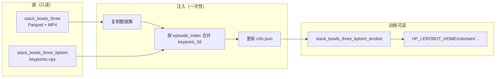
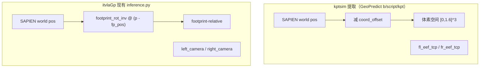
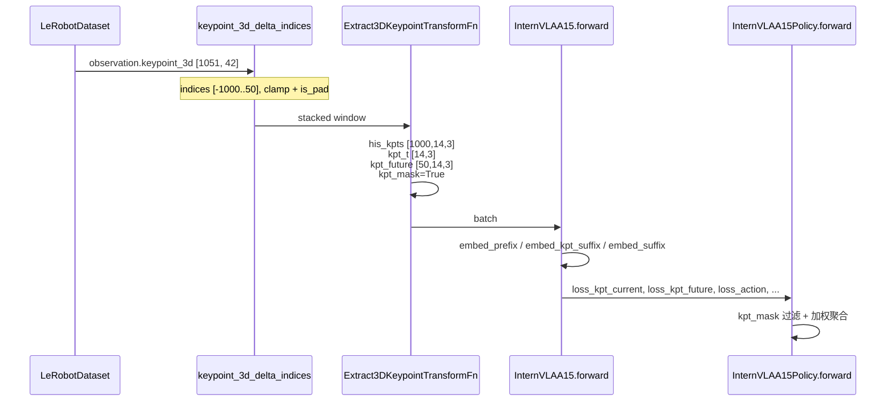
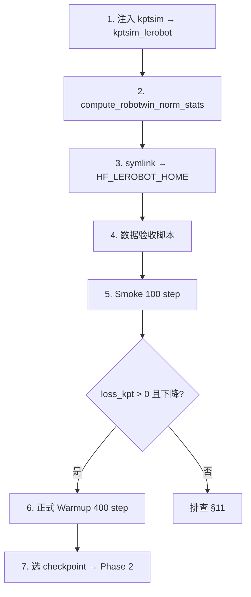

# InternVLA-A1.5 + GeoPredict 3D 轨迹融合版：Keypoint Expert 预热训练实施方案

> **文档定位**: 在 [v3.4 设计手册](itrnVLA15_GeoP_3dtrj_3cn4.md) 基础上，给出使用 **GeoPredict kptsim 数据** 对 keypoint expert 进行预热（Warmup / Phase 1）的完整可执行方案。
>
> **数据前提**: 主数据集 + kptsim 关键点 GT 已由 [GeoPredict 3dkptraj 方案](../GeoPredict/b/d/3dkptraj_1.md) 生成，实施日志见 [3dkptraj_1LOG.md](../GeoPredict/b/d/3dkptraj_1LOG.md)。
>
> **范围**: 本文仅描述方案与操作步骤，**不修改任何代码**；数据注入脚本以 spec 形式给出，待后续落地为 `util_scripts/inject_kptsim_keypoints.py`。

---

## 目录

- [0. 阅读指南](#0-阅读指南)
- [1. 概述与目标](#1-概述与目标)
- [2. 前置条件](#2-前置条件)
- [3. 数据准备：kptsim → LeRobot](#3-数据准备kptsim--lerobot)
  - [3.1 kptsim 数据 Schema](#31-kptsim-数据-schema)
  - [3.2 格式缺口与注入思路](#32-格式缺口与注入思路)
  - [3.3 坐标系对齐：两种方案对比](#33-坐标系对齐两种方案对比)
  - [3.4 注入脚本 Spec](#34-注入脚本-spec)
  - [3.5 数据集注册与验收](#35-数据集注册与验收)
- [4. State / Action 归一化](#4-state--action-归一化)
- [5. 训练架构与 Loss](#5-训练架构与-loss)
- [6. Smoke Test（单卡短训）](#6-smoke-test单卡短训)
- [7. 正式 Warmup 训练](#7-正式-warmup-训练)
- [8. Loss 监控与 Checkpoint 选择](#8-loss-监控与-checkpoint-选择)
- [9. Phase 2 衔接](#9-phase-2-衔接)
- [10. 推理对齐注意事项](#10-推理对齐注意事项)
- [11. 故障排查](#11-故障排查)
- [附录 A–D](#附录)

---

## 0. 阅读指南

### 0.1 与 v3.4 手册的关系

| 文档 | 内容 |
|:---|:---|
| [itrnVLA15_GeoP_3dtrj_3cn4.md](itrnVLA15_GeoP_3dtrj_3cn4.md) | 三路径 MoT 架构、配置字段、Phase 1/2 通用模板 |
| **本文 (wrmup)** | 使用 **kptsim 外部 npy** 作为 GT 的 Phase 1 专项方案 |
| [itrnVLA15_GeoP_3dtrj_3cn2_sft_rbt2_2LOG_p1.md](itrnVLA15_GeoP_3dtrj_3cn2_sft_rbt2_2LOG_p1.md) | 历史 Phase 1 训练曲线与 checkpoint 推荐（Pinocchio FK 数据） |

### 0.2 核心源码锚点

| 文件 | 职责 |
|:---|:---|
| [`modeling_internvla_a1_5.py`](../src/lerobot/policies/internvla_a1_5/modeling_internvla_a1_5.py) | 三路径 MoT、`embed_kpt_suffix`、kpt loss 聚合 |
| [`keypoints.py`](../src/lerobot/policies/internvla_a1_5/keypoints.py) | `TrackEncoder`、GeoPredict 权重加载 |
| [`transform_internvla_a1_5.py`](../src/lerobot/policies/internvla_a1_5/transform_internvla_a1_5.py) | `Extract3DKeypointTransformFn` |
| [`configuration_internvla_a1_5.py`](../src/lerobot/policies/internvla_a1_5/configuration_internvla_a1_5.py) | `keypoint_3d_delta_indices`、`UnifyInternVLAA15InputsTransformFn` |
| [`datasets/factory.py`](../src/lerobot/datasets/factory.py) | delta 查询、`use_external_stats` |
| [`util_scripts/generate_aloha_keypoints.py`](../util_scripts/generate_aloha_keypoints.py) | **旧路径**：Pinocchio FK 注入（本文 **不采用**） |
| [GeoPredict `b/script/kpt/`](../GeoPredict/b/script/kpt/) | kptsim 提取源码（SAPIEN FK + 坐标变换） |

### 0.3 关键路径（本机）

| 用途 | 路径 |
|:---|:---|
| LeRobot 主数据 | `/home/luogang/share/zwy/Projects/DATA/RoboTwin-Clean/stack_bowls_three/` |
| kptsim 关键点 GT | `/home/luogang/share/zwy/Projects/DATA/RoboTwin-Clean/stack_bowls_three_kptsim/` |
| 注入后目标数据集（建议） | `/home/luogang/share/zwy/Projects/DATA/RoboTwin-Clean/stack_bowls_three_kptsim_lerobot/` |
| 归一化 stats | `/home/luogang/SRC/Robot/GeoPredict/ckpts/robotwin_norm_stats.json` |
| GeoPredict 提取 URDF | `/home/luogang/share/zwy/Projects/RoboTwin/assets/embodiments/aloha-agilex/urdf/arx5_description_isaac.urdf` |

---

## 1. 概述与目标

### 1.1 Warmup 在课程学习中的位置

InternVLA-A1.5 + GeoPredict 融合版采用**两阶段课程**（v3.4 §16）：


**Warmup（本文）的目标**：

1. 初始化 keypoint expert（Stage 3：从 action expert 拷贝）与 TrackEncoder（Stage 4：加载 GeoPredict RoboCasa 权重）。
2. 在 **有 3D 关键点 GT** 的监督下，让 keypoint expert 学会从 `[图像 + 语言 + 历史轨迹 + state]` 预测当前/未来 3D 关键点。
3. 以较低 LR 保留 action expert 基本能力，为 Phase 2 提供已收敛的 kpt 表征。

与 v3.4 §16.3「无 FK 间接监督」不同，本文使用 kptsim 数据，训练时 **`kpt_mask=True`**，kpt loss **直接生效**。

### 1.2 与历史 Phase 1 的差异

| 维度 | 历史 Phase 1（LOG_p1） | 本文 Warmup（kptsim） |
|:---|:---|:---|
| GT 来源 | `generate_aloha_keypoints.py`（Pinocchio FK） | GeoPredict SAPIEN 提取（`b/script/kpt/`） |
| GT 存储 | LeRobot parquet 列 | 外部 `keypoints.npy` → **需注入** |
| 坐标系 | footprint-relative | 方案 A：GeoPredict 体素空间（推荐） |
| EEF 定义 | `left_camera` / `right_camera` | `fl_eef_tcp` / `fr_eef_tcp` |
| 间接监督 | 否（有 FK 列时 kpt_mask=True） | 否（注入后 kpt_mask=True） |

---

## 2. 前置条件

### 2.1 软件环境

```bash
# itvlaGp 训练环境（与 v3.4 / launch 脚本一致）
conda activate internvla_a1_5   # 或项目 venv
cd /home/luogang/SRC/Robot/itvlaGp
pip install -e .
# Transformers patch（见 CLAUDE.md）
```

kptsim 数据已生成，**无需**重新运行 SAPIEN 提取（除非需重跑，见 [3dkptraj_1LOG.md](../GeoPredict/b/d/3dkptraj_1LOG.md) §Phase 3）。

### 2.2 模型权重

| 权重 | 用途 | 配置字段 |
|:---|:---|:---|
| **InternVLA-A1.5-base** | VLM + action expert 起点 | `--policy.pretrained_path` |
| **GeoPredict_robocasa.pth** | TrackEncoder Stage 4 初始化 | `--policy.geopredict_checkpoint_path` |

> GeoPredict ckpt 仅加载 TrackEncoder 兼容层（512→1024 的 `track_fusion_layer` 会跳过，见 [`keypoints.py`](../src/lerobot/policies/internvla_a1_5/keypoints.py) `load_geopredict_track_encoder_weights`）。

### 2.3 硬件建议

| 场景 | GPU | 说明 |
|:---|:---|:---|
| Smoke Test | 1× GPU | batch_size=2–4，50–100 steps |
| 正式 Warmup | 8× H200（或等效） | batch_size=16/GPU，参考 LOG_p1 |

---

## 3. 数据准备：kptsim → LeRobot

### 3.1 kptsim 数据 Schema

来源：[3dkptraj_1LOG.md §数据集 Schema](../GeoPredict/b/d/3dkptraj_1LOG.md)

```
stack_bowls_three_kptsim/
├── episode_000000/keypoints.npy   # float32 [T, 42]
├── ...
├── episode_000049/keypoints.npy
├── keypoints_meta.json
└── vis/                           # 验收可视化
```

**`keypoints.npy` 属性**：

| 属性 | 值 |
|:---|:---|
| dtype | `float32` |
| shape | `[T, 42]`，T = 该 episode 帧数 |
| reshape | `[T, 14, 3]` → 14 关键点 XYZ |
| 坐标变换 | $\mathbf{p}_{kpt} = \mathbf{p}_{world} - \mathbf{o}_{offset}$ |
| 有效范围 | 均在 $[0, 1.6] \times [0, 1.6] \times [0, 1.0]$ 内 |

其中 $\mathbf{o}_{offset}$（`coord_offset`）为自动扫描得到的全局偏移，本数据集值为：

$$\mathbf{o}_{offset} = [-0.812,\ -1.024,\ 0.505]$$

**关键点索引（K=14）**：

| Index | Name | 含义 |
|:---:|:---|:---|
| 0–5 | `fl_link1` ~ `fl_link6` | 左臂 6 link |
| 6 | `fl_eef_tcp` | 左臂 TCP（`gripper_bias=0.12m`） |
| 7–12 | `fr_link1` ~ `fr_link6` | 右臂 6 link |
| 13 | `fr_eef_tcp` | 右臂 TCP |

**与主数据对齐**：通过 `episode_index` 对齐；Parquet 行号 = `keypoints.npy` 行号 = 视频 `frame_index`（50 episodes，23,550 frames，已通过 `validate_all.py` 验收）。

### 3.2 格式缺口与注入思路

itvlaGp 数据管道 **只读取 LeRobot parquet 列** `observation.keypoint_3d`（每帧 `[42]` float32），由 Policy 的 `keypoint_3d_delta_indices` 拉取 H+1+C=1051 帧时间窗口，再经 `Extract3DKeypointTransformFn` 拆分为 5 个字段。

**当前缺口**：kptsim 存于外部 `episode_XXX/keypoints.npy`，LeRobot 主数据 **无** `observation.keypoint_3d` 列。

**解决思路**（与 [`generate_aloha_keypoints.py`](../util_scripts/generate_aloha_keypoints.py) 同模式，但 GT 来源改为 kptsim npy）：

1. **复制**主数据集到 `--dest`（不修改原始数据）。
2. 逐 episode 读取 `keypoints.npy`，按行写入对应 parquet 的 `observation.keypoint_3d` 列。
3. 更新 `meta/info.json` 声明新 feature。
4. Symlink 到 `$HF_LEROBOT_HOME/robotwin/stack_bowls_three_kptsim`。



### 3.3 坐标系对齐：两种方案对比

kptsim 与现有 itvlaGp 推理代码在 **坐标系** 和 **EEF 语义** 上存在差异，必须在注入阶段做出选择。



| 维度 | **方案 A：体素坐标原样注入（推荐）** | 方案 B：转换为 footprint-relative |
|:---|:---|:---|
| 注入内容 | 直接写 `keypoints.npy` 各行 | 对 link 0–5/7–12 做刚体变换；EEF 6/13 需重算或保留 TCP |
| 与 kptsim 提取一致 | ✅ 完全一致 | ❌ 需额外变换代码 |
| 与 GeoPredict 训练一致 | ✅ 同坐标、同 EEF | 部分一致 |
| 与现有 `inference.py` | ❌ 不一致，**Phase 2 前需改推理** | link 部分接近；EEF 仍有 TCP vs camera 偏差 |
| 预热 kpt loss 语义 | 与 GT 生成管线一致，loss 可解释 | 与旧 Pinocchio FK Phase 1 更接近 |
| 推荐场景 | **本次 kptsim Warmup** | 希望零改 inference 的过渡实验 |

#### 方案 A 推荐理由

1. kptsim 数据已经过 SAPIEN FK + 自动 offset + 范围验收（[3dkptraj_1LOG.md](../GeoPredict/b/d/3dkptraj_1LOG.md) §Phase 3），原样使用可避免二次变换引入误差。
2. TrackEncoder 从 GeoPredict RoboCasa 初始化，RoboCasa 同样使用体素空间坐标；方案 A 与预训练分布更一致。
3. 训练/推理不一致问题在 **Phase 2 部署前** 通过更新 [`evaluation/RoboTwin/inference.py`](../evaluation/RoboTwin/inference.py) 解决：运行时复用 GeoPredict `b/script/kpt/` 的提取逻辑（含 `coord_offset` 与 TCP EEF），而非当前 `get_keypoints_aloha` 的 footprint-relative + camera EEF。

#### 方案 B 变换公式（若选用）

对 link 关键点（非 EEF），设 $\mathbf{T}_{fp}$ 为 footprint 位姿，$\mathbf{R}_{fp}$ 为其旋转：

$$\mathbf{p}_{fp} = \mathbf{R}_{fp}^{-1}(\mathbf{p}_{world} - \mathbf{t}_{fp})$$

EEF index 6/13 若仍用 kptsim 的 TCP 值，则与 `inference.py` 的 `left_camera`/`right_camera` 存在固定偏移，**不推荐**在方案 B 下直接使用 kptsim 的 EEF 行。

### 3.4 注入脚本 Spec

> **待落地文件**: `util_scripts/inject_kptsim_keypoints.py`（本文给出完整逻辑 spec，实施时不改模型代码）

#### CLI 接口

```bash
python util_scripts/inject_kptsim_keypoints.py \
  --source /home/luogang/share/zwy/Projects/DATA/RoboTwin-Clean/stack_bowls_three \
  --kptsim_dir /home/luogang/share/zwy/Projects/DATA/RoboTwin-Clean/stack_bowls_three_kptsim \
  --dest /home/luogang/share/zwy/Projects/DATA/RoboTwin-Clean/stack_bowls_three_kptsim_lerobot \
  --coord_mode voxel \
  [--force] [--skip-copy]
```

| 参数 | 说明 |
|:---|:---|
| `--source` | 只读 LeRobot 主数据 |
| `--kptsim_dir` | 含 `episode_XXX/keypoints.npy` 与 `keypoints_meta.json` |
| `--dest` | 输出目录（复制 source + 写入 keypoint 列） |
| `--coord_mode` | `voxel`（方案 A，默认）或 `footprint`（方案 B） |
| `--force` | 覆盖已存在的 dest |
| `--skip-copy` | dest 已有副本时仅重跑注入 |

#### 核心逻辑（伪代码）

```python
# 1. shutil.copytree(source, dest)  # 含 videos/meta/data

# 2. 加载 keypoints_meta.json → coord_offset, K=14, keypoint_names

# 3. 对每个 parquet: data/chunk-000/episode_{idx:06d}.parquet
for ep_idx, pq_path in enumerate(sorted(dest.glob("data/chunk-*/*.parquet"))):
    kpt_path = kptsim_dir / f"episode_{ep_idx:06d}" / "keypoints.npy"
    kpts = np.load(kpt_path)  # [T, 42]
    df = pd.read_parquet(pq_path)
    assert len(df) == kpts.shape[0], f"episode {ep_idx}: row mismatch"
    if coord_mode == "footprint":
        kpts = transform_voxel_to_footprint(kpts, ...)  # 方案 B
    df["observation.keypoint_3d"] = [row for row in kpts]  # 每行 [42]
    df.to_parquet(pq_path)

# 4. 更新 meta/info.json
info["features"]["observation.keypoint_3d"] = {
    "dtype": "float32",
    "shape": [42],
    "names": [f"{name}_{ax}" for name in KEYPOINT_NAMES for ax in "xyz"],
}
# 可选：写入 info["keypoint_coord_mode"] = "voxel"
# 可选：写入 info["keypoint_coord_offset"] = coord_offset.tolist()
```

#### Feature 命名（方案 A，与 kptsim 一致）

```python
KEYPOINT_NAMES = [
    "fl_link1", "fl_link2", "fl_link3", "fl_link4", "fl_link5", "fl_link6", "fl_eef_tcp",
    "fr_link1", "fr_link2", "fr_link3", "fr_link4", "fr_link5", "fr_link6", "fr_eef_tcp",
]
# observation.keypoint_3d names: fl_link1_x, fl_link1_y, ..., fr_eef_tcp_z  (共 42)
```

### 3.5 数据集注册与验收

#### Symlink 注册

```bash
export HF_HOME="${HF_HOME:-$HOME/.cache/huggingface}"
export HF_LEROBOT_HOME="${HF_LEROBOT_HOME:-${HF_HOME}/lerobot}"

ln -sf $(realpath /home/luogang/share/zwy/Projects/DATA/RoboTwin-Clean/stack_bowls_three_kptsim_lerobot) \
  ${HF_LEROBOT_HOME}/robotwin/stack_bowls_three_kptsim
```

训练时使用：`--dataset.repo_id=robotwin/stack_bowls_three_kptsim`

#### 验收检查清单

```bash
# 1. feature 已声明
python3 -c "
import json
info = json.load(open('.../stack_bowls_three_kptsim_lerobot/meta/info.json'))
assert 'observation.keypoint_3d' in info['features']
print('feature OK, episodes=', info['total_episodes'], 'frames=', info['total_frames'])
"

# 2. 行数对齐（需 pyarrow/pandas 环境）
python3 -c "
import numpy as np, pandas as pd
from pathlib import Path
dest = Path('.../stack_bowls_three_kptsim_lerobot')
kptsim = Path('.../stack_bowls_three_kptsim')
for i in range(50):
    n = len(pd.read_parquet(dest/f'data/chunk-000/episode_{i:06d}.parquet'))
    k = np.load(kptsim/f'episode_{i:06d}/keypoints.npy').shape[0]
    assert n == k, f'ep {i}: {n} vs {k}'
print('alignment OK: 50/50')
"

# 3. 范围检查（方案 A）
python3 -c "
import pandas as pd, numpy as np
from pathlib import Path
dest = Path('.../stack_bowls_three_kptsim_lerobot')
all_k = []
for pq in sorted((dest/'data/chunk-000').glob('*.parquet')):
    df = pd.read_parquet(pq)
    all_k.append(np.stack(df['observation.keypoint_3d'].tolist()))
k = np.concatenate(all_k).reshape(-1, 3)
print('min', k.min(0), 'max', k.max(0))
assert k.min() >= -0.01 and k.max() <= 1.61
print('range OK')
"
```

---

## 4. State / Action 归一化

### 4.1 计算方法

参考 [GeoPredict `tools/compute_robotwin_norm_stats.py`](../GeoPredict/tools/compute_robotwin_norm_stats.py)：

$$\tilde{x} = \frac{x - \mu}{\sigma + \epsilon}, \quad \epsilon = 10^{-6}$$

对全部 50 个 episode 的 Parquet 逐维统计 `observation.state` 与 `action`（各 **14 维**）。

```bash
cd /home/luogang/SRC/Robot/GeoPredict
python tools/compute_robotwin_norm_stats.py \
  --dataset_dir /home/luogang/share/zwy/Projects/DATA/RoboTwin-Clean/stack_bowls_three \
  --output ./ckpts/robotwin_norm_stats.json
```

输出文件已存在：`/home/luogang/SRC/Robot/GeoPredict/ckpts/robotwin_norm_stats.json`

### 4.2 14 维语义

与 `meta/info.json` 一致（双臂 ALOHA-Agilex）：

```
[left_waist, left_shoulder, left_elbow, left_forearm_roll, left_wrist_angle, left_wrist_rotate, left_gripper,
 right_waist, right_shoulder, right_elbow, right_forearm_roll, right_wrist_angle, right_wrist_rotate, right_gripper]
```

### 4.3 itvlaGp 接线方式

```bash
--dataset.use_external_stats=true \
--dataset.external_stats_path=/home/luogang/SRC/Robot/GeoPredict/ckpts/robotwin_norm_stats.json
```

实现见 [`datasets/factory.py`](../src/lerobot/datasets/factory.py) L408–422。

**Pad 顺序**：Normalize 在 14 维上执行，随后 `PadStateAndActionTransformFn` pad 到 `max_state_dim=32` / `max_action_dim=32`。这与 GeoPredict smoke 训练修复（[3dkptraj_1LOG.md](../GeoPredict/b/d/3dkptraj_1LOG.md) Error 2）一致——**不可**先 pad 再归一化。

### 4.4 Keypoint 不归一化

3D 关键点已在体素空间 $[0, 1.6]^3$ 内，`Extract3DKeypointTransformFn` 直接 reshape 为 `[J, 3]`，无 Normalize 步骤。

---

## 5. 训练架构与 Loss

### 5.1 数据流（Warmup 训练时）



### 5.2 Keypoint Loss 定义

对 batch 中 `kpt_mask=True` 的样本（Warmup 注入后应全部为 True）：

**Current keypoint loss**（当前帧 $K=14$ 个关节）：

$$\mathcal{L}_{kpt}^{cur} = \frac{1}{K} \sum_{k=1}^{K} \left\| \hat{\mathbf{p}}_k - \mathbf{p}_k \right\|_2^2$$

**Future keypoint loss**（未来 $H=50$ 步）：

$$\mathcal{L}_{kpt}^{fut} = \frac{1}{K \cdot H} \sum_{t=1}^{H} \sum_{k=1}^{K} \left\| \hat{\mathbf{p}}_{k,t} - \mathbf{p}_{k,t} \right\|_2^2$$

其中 $\hat{\mathbf{p}}$ 为 keypoint expert query token 经 `keypoint_out_proj` 的输出，$\mathbf{p}$ 为 GT（来自 `kpt_t` / `kpt_future`）。

### 5.3 Warmup Total Loss

启用 VQA loss 时（与 v3.4 §17A / LOG_p1 一致）：

$$\mathcal{L} = w_{act}\mathcal{L}_{action} + \lambda_{vqa}\mathcal{L}_{vqa} + w_{vid}\mathcal{L}_{video} + w_{kpt}\left(\mathcal{L}_{kpt}^{cur} + \gamma \mathcal{L}_{kpt}^{fut}\right)$$

| 符号 | 配置字段 | Warmup 值 | 说明 |
|:---|:---|:---:|:---|
| $w_{act}$ | `action_loss_weight` | **2.0** |  |
| $w_{kpt}$ | `kpt_loss_weight` | **10.0** | |
| $\gamma$ | `kpt_future_loss_weight` | **2.0** | |
| $w_{vid}$ | `video_loss_weight` | 1.0 | `action_loss_only=true` 时 WAN 不加载，$\mathcal{L}_{video}=0$ |
| $\lambda_{vqa}$ | `lambda_vqa` | 1.0（默认） | |

### 5.4 权重初始化（4 Stages）

| Stage | 时机 | 操作 |
|:---:|:---|:---|
| 1 | `InternVLAA15.__init__` | 随机初始化全部模块 |
| 2 | `from_pretrained` | 加载 base safetensors（覆盖 VLM + action） |
| 3 | `post_init_keypoint_weights` | `init_kpt_expert_from_action=true` → action expert → keypoint expert |
| 4 | `load_geopredict_keypoint_weights` | 加载 GeoPredict TrackEncoder（跳过 shape 不匹配的 fusion layer） |

**Warmup 必须**：Stage 3 + Stage 4 均启用；**Phase 2 续训时关闭**（见 §9）。

### 5.5 三处 `enable_keypoint_predictor` 同步

| 配置类 | Warmup 设置 |
|:---|:---|
| Policy | `--policy.enable_keypoint_predictor=true --policy.num_keypoint_joints=14` |
| Dataset | `--dataset.enable_keypoint_predictor=true --dataset.num_keypoint_joints=14` |
| tokenize_state | Policy **和** Dataset 均 `--*.tokenize_state=true` |

---

## 6. Smoke Test（单卡短训）

**目的**：验证数据注入、`kpt_mask=True`、loss 非零且下降，再启动 8 卡正式训练。

```bash
cd /home/luogang/SRC/Robot/itvlaGp

export HF_HOME="${HF_HOME:-$HOME/.cache/huggingface}"
export HF_LEROBOT_HOME="${HF_LEROBOT_HOME:-${HF_HOME}/lerobot}"
export WANDB_MODE=offline

PRETRAINED_PATH="${PRETRAINED_PATH:-/path/to/InternVLA-A1.5-base}"
GEOPREDICT_CKPT="${GEOPREDICT_CKPT:-/path/to/GeoPredict_robocasa.pth}"
NORM_STATS="/home/luogang/SRC/Robot/GeoPredict/ckpts/robotwin_norm_stats.json"

CUDA_VISIBLE_DEVICES=0 accelerate launch --num_processes=1 \
  src/lerobot/scripts/lerobot_train.py \
  --output_dir=outputs/internvla_a1_5/smoke_kpt_warmup_kptsim \
  --policy.type=internvla_a1_5 \
  --policy.pretrained_path="${PRETRAINED_PATH}" \
  --policy.push_to_hub=false \
  --policy.dtype=bfloat16 \
  --policy.optimizer_lr=5e-5 \
  --policy.scheduler_warmup_steps=10 \
  --policy.scheduler_decay_steps=100 \
  --policy.scheduler_decay_lr=5e-6 \
  --policy.vlm_model_name_or_path=Qwen/Qwen3.5-2B \
  --policy.train_expert_only=true \
  --policy.action_loss_only=true \
  --policy.enable_vqa_loss=false \
  --policy.tokenize_state=true \
  --policy.freeze_learnable_tokens=true \
  --policy.enable_keypoint_predictor=true \
  --policy.num_keypoint_joints=14 \
  --policy.action_loss_weight=2.0 \
  --policy.kpt_loss_weight=10.0 \
  --policy.kpt_future_loss_weight=2.0 \
  --policy.knowledge_insulation=true \
  --policy.knowledge_insulation_kpt=true \
  --policy.kpt_to_action_detach=false \
  --policy.action_expert_lr_scale=0.04 \
  --policy.kpt_expert_lr_scale=1.0 \
  --policy.track_encoder_lr_scale=1.0 \
  --policy.init_kpt_expert_from_action=true \
  --policy.geopredict_checkpoint_path="${GEOPREDICT_CKPT}" \
  --dataset.type=internvla_a1_5 \
  --dataset.repo_id=robotwin/stack_bowls_three_kptsim \
  --dataset.enable_keypoint_predictor=true \
  --dataset.num_keypoint_joints=14 \
  --dataset.action_mode=abs \
  --dataset.tokenize_state=true \
  --dataset.use_external_stats=true \
  --dataset.external_stats_path="${NORM_STATS}" \
  --dataset.use_fast_action_tokens=true \
  --seed=42 \
  --batch_size=4 \
  --steps=100 \
  --save_freq=100 \
  --log_freq=10 \
  --wandb.enable=true \
  --wandb.project=internvla_a1_5 \
  --wandb.mode=offline
```

**Smoke 通过判据**：

| 检查项 | 预期 |
|:---|:---|
| 初始化日志 | `loaded N keys from GeoPredict...`（TrackEncoder） |
| step 10 `loss_kpt_current` | **> 0**（若 = 0 则 kpt 未接入） |
| step 50–100 `loss_kpt_current` | 明显低于 step 10 |
| NaN / OOM | 无 |

---

## 7. 正式 Warmup 训练

### 7.1 超参表（基于 LOG_p1 + kptsim 适配）

| 参数 | 值 | 依据 |
|:---|:---:|:---|
| GPU | 8× | LOG_p1 |
| `batch_size` (per GPU) | 16 | LOG_p1 H200 验证；OOM 则降至 8 |
| 有效 batch | 128 | 23550 / 128 ≈ 184 steps/epoch |
| `steps` | **400**（推荐）或 5000（保守手册默认） | LOG_p1：kpt 200–300 步饱和 |
| `train_expert_only` | true | VLM 冻结 |
| `action_loss_only` | true | 不加载 WAN |
| `action_loss_weight` | 2.0 | |
| `kpt_loss_weight` | 10.0 | LOG_p1 不敏感 |
| `action_expert_lr_scale` | 0.04 | 保护 action |
| `optimizer_lr` | 5e-5 | |
| `scheduler_warmup_steps` | 50 | ≈12.5% of 400 |
| `scheduler_decay_steps` | 400 | |
| `save_freq` | 100 | 保存 100/200/300/400 |
| `log_freq` | 10 | |

### 7.2 完整 Launch 脚本

建议保存为 `launch/internvla_a15_geop_phase1_kpt_warmup_kptsim.sh`（实施时可从本文复制）：

```bash
#!/usr/bin/env bash
set -euo pipefail

###############################################################################
# Phase 1 Kpt Expert Warmup — kptsim GT (GeoPredict SAPIEN extraction)
# Data: stack_bowls_three + stack_bowls_three_kptsim → kptsim_lerobot
###############################################################################

export HF_HOME="${HF_HOME:-$HOME/.cache/huggingface}"
export HF_LEROBOT_HOME="${HF_LEROBOT_HOME:-${HF_HOME}/lerobot}"
export WANDB_MODE=offline
export USE_LIBUV=${USE_LIBUV:-0}
export PYTHONUNBUFFERED=1
export OMP_NUM_THREADS=1
export MKL_NUM_THREADS=1
export TOKENIZERS_PARALLELISM=false

SCRIPT_DIR="$(cd "$(dirname "${BASH_SOURCE[0]}")" && pwd)"
PROJ_ROOT="$(cd "${SCRIPT_DIR}/.." && pwd)"
cd "${PROJ_ROOT}"

POLICY="internvla_a1_5"
PRETRAINED_PATH="${PRETRAINED_PATH:-/path/to/InternVLA-A1.5-base}"
GEOPREDICT_CKPT="${GEOPREDICT_CKPT:-/path/to/GeoPredict_robocasa.pth}"
NORM_STATS="${NORM_STATS:-/home/luogang/SRC/Robot/GeoPredict/ckpts/robotwin_norm_stats.json}"

export MASTER_ADDR=${MASTER_ADDR:-"127.0.0.1"}
export MASTER_PORT=${MASTER_PORT:-36201}
export CUDA_VISIBLE_DEVICES="${CUDA_VISIBLE_DEVICES:-0,1,2,3,4,5,6,7}"
PROC_PER_NODE="${PROC_PER_NODE:-8}"
NUM_PROCESSES=$(( ${NODE_COUNT:-1} * PROC_PER_NODE ))

BATCH_SIZE="${BATCH_SIZE:-16}"
STEPS="${STEPS:-400}"
SAVE_FREQ="${SAVE_FREQ:-100}"
LOG_FREQ="${LOG_FREQ:-10}"

JOB_NAME="${JOB_NAME:-$(date +'%Y_%m_%d_%H_%M_%S')-${POLICY}-geop-phase1-kpt-warmup-kptsim-abs}"
OUTPUT_DIR="${OUTPUT_DIR:-${PROJ_ROOT}/outputs/${POLICY}/${JOB_NAME}}"

echo "PRETRAINED_PATH=${PRETRAINED_PATH}"
echo "GEOPREDICT_CKPT=${GEOPREDICT_CKPT}"
echo "NORM_STATS=${NORM_STATS}"
echo "OUTPUT_DIR=${OUTPUT_DIR}"
echo "dataset=robotwin/stack_bowls_three_kptsim coord_mode=voxel (方案 A)"

accelerate launch \
    --multi_gpu --num_processes="${NUM_PROCESSES}" \
    --num_machines="${NODE_COUNT:-1}" --machine_rank="${NODE_RANK:-0}" \
    --main_process_ip="${MASTER_ADDR}" --main_process_port="${MASTER_PORT}" \
    src/lerobot/scripts/lerobot_train.py \
    --output_dir="${OUTPUT_DIR}" \
    --job_name="${JOB_NAME}" \
    --num_workers=8 \
    --policy.type=${POLICY} \
    --policy.repo_id=lerobot_lab/${POLICY} \
    --policy.pretrained_path="${PRETRAINED_PATH}" \
    --policy.push_to_hub=false \
    --policy.dtype=bfloat16 \
    --policy.optimizer_lr=5e-5 \
    --policy.scheduler_warmup_steps=50 \
    --policy.scheduler_decay_steps="${STEPS}" \
    --policy.scheduler_decay_lr=5e-6 \
    --policy.vlm_model_name_or_path=Qwen/Qwen3.5-2B \
    --policy.enable_vqa_loss=false \
    --policy.tokenize_state=true \
    --policy.video_loss_weight=1 \
    --policy.freeze_learnable_tokens=true \
    --policy.num_learnable_tokens=50 \
    --policy.train_expert_only=true \
    --policy.enable_keypoint_predictor=true \
    --policy.num_keypoint_joints=14 \
    --policy.action_loss_weight=2.0 \
    --policy.kpt_loss_weight=10.0 \
    --policy.kpt_future_loss_weight=2.0 \
    --policy.knowledge_insulation=true \
    --policy.knowledge_insulation_kpt=true \
    --policy.kpt_to_action_detach=false \
    --policy.freeze_keypoint_modules=false \
    --policy.action_expert_lr_scale=0.04 \
    --policy.kpt_expert_lr_scale=1.0 \
    --policy.track_encoder_lr_scale=1.0 \
    --policy.init_kpt_expert_from_action=true \
    --policy.action_loss_only=true \
    --policy.geopredict_checkpoint_path="${GEOPREDICT_CKPT}" \
    --dataset.type="${POLICY}" \
    --dataset.repo_id=robotwin/stack_bowls_three_kptsim \
    --dataset.enable_keypoint_predictor=true \
    --dataset.num_keypoint_joints=14 \
    --dataset.action_mode=abs \
    --dataset.tokenize_state=true \
    --dataset.use_fast_action_tokens=true \
    --dataset.use_external_stats=true \
    --dataset.external_stats_path="${NORM_STATS}" \
    --seed=42 \
    --batch_size="${BATCH_SIZE}" \
    --steps="${STEPS}" \
    --save_freq="${SAVE_FREQ}" \
    --log_freq="${LOG_FREQ}" \
    --wandb.enable=true \
    --wandb.project=${POLICY} \
    --wandb.mode=offline
```

### 7.3 执行顺序小结



---

## 8. Loss 监控与 Checkpoint 选择

### 8.1 WandB Keys

| Key | 含义 |
|:---|:---|
| `loss` | 总 loss |
| `loss_action` | Flow matching action loss |
| `loss_kpt_current` | 当前帧关键点 MSE |
| `loss_kpt_future` | 未来轨迹关键点 MSE |
| `loss_vqa` / `loss_fast` | VQA 分支（enable_vqa_loss=true） |
| `loss_video` | 0（action_loss_only） |
| `grad_norm` | 梯度范数 |

### 8.2 参考收敛曲线（LOG_p1，Pinocchio FK）

历史 Phase 1 在 FK 数据上的收敛可作为 **数量级参考**（kptsim 坐标/EEF 不同，绝对值可能略有偏差）：

| Step | loss_kpt_current | loss_kpt_future | loss_action | grad_norm |
|:---:|:---:|:---:|:---:|:---:|
| 10 | 0.544 | 0.534 | 0.277 | 312 |
| 50 | 0.008 | 0.079 | 0.177 | 25 |
| 100 | 0.003 | 0.017 | 0.118 | 15 |
| 200 | 0.001 | 0.005 | 0.103 | 6 |
| **300** | **0.001** | **0.004** | **0.095** | **3.5** |
| 400 | 0.001 | 0.003 | 0.089 | 3.1 |

kptsim Warmup 预期：step 50 内 `loss_kpt_current` 应快速下降至 < 0.01；若 step 10 仍为 0，优先查数据注入。

### 8.3 Checkpoint 推荐

**推荐 step 300**（与 [LOG_p1 §5](itrnVLA15_GeoP_3dtrj_3cn2_sft_rbt2_2LOG_p1.md) 相同理由）：

1. kpt loss 已饱和（step 200→300 降幅 < 0.0002）。
2. LR 尚未触底（step 300 的 LR ≈ 1.2e-5），Phase 2 重新 warmup 更稳定。
3. ~1.6 epoch，避免小数据集过拟合。

输出路径模式：

```
outputs/internvla_a1_5/<JOB_NAME>/checkpoints/000300/pretrained_model
```

---

## 9. Phase 2 衔接

Warmup 完成后进入 Action + Kpt 联合微调（v3.4 §18 / [`launch/internvla_a15_geop_phase2_finetune_stackb3_080719.sh`](../launch/internvla_a15_geop_phase2_finetune_stackb3_080719.sh)）。

### 9.1 三大安全检查

| # | 配置 | Warmup | Phase 2 |
|:---:|:---|:---:|:---:|
| 1 | `pretrained_path` | InternVLA-A1.5-base | **Warmup checkpoint** |
| 2 | `init_kpt_expert_from_action` | **true** | **false** |
| 3 | `geopredict_checkpoint_path` | 设置 GeoPredict ckpt | **不设** |

### 9.2 Phase 2 数据集

- 继续使用同一注入数据集：`robotwin/stack_bowls_three_kptsim`
- 或若重新注入，保持坐标方案与 Warmup 一致

### 9.3 Phase 2 超参差异（方案 B 生产配置）

| 参数 | Warmup | Phase 2 (080719) |
|:---|:---:|:---:|
| `enable_vqa_loss` | false | **false** |
| `action_loss_weight` | 2.0（生效） | 10.0（**不生效**） |
| `kpt_loss_weight` | 10.0 | **0.1** |
| `action_expert_lr_scale` | 0.04 | **1.0** |
| `action_loss_only` | true | **false**（加载 WAN，video_loss_weight=0） |
| `freeze_learnable_tokens` | true | **false** |
| `steps` | 400 | 10000 |

Phase 2 有效 loss（enable_vqa_loss=false）：

$$\mathcal{L} = 1.0 \cdot \mathcal{L}_{action} + 0.1 \cdot \left(\mathcal{L}_{kpt}^{cur} + 0.1 \cdot \mathcal{L}_{kpt}^{fut}\right)$$

---

## 10. 推理对齐注意事项

### 10.1 方案 A（推荐）部署清单

若 Warmup 使用体素坐标（方案 A），**RoboTwin 推理前必须**更新运行时关键点提取，使其与训练 GT 一致：

| 组件 | 当前 `inference.py` | 需对齐到 |
|:---|:---|:---|
| 坐标系 | footprint-relative | world − `coord_offset`（体素空间） |
| EEF index 6/13 | `left_camera` / `right_camera` | `fl_eef_tcp` / `fr_eef_tcp` |
| 提取实现 | `get_keypoints_aloha` | GeoPredict [`b/script/kpt/keypoint_extractor.py`](../GeoPredict/b/script/kpt/keypoint_extractor.py) |

`coord_offset` 从 `stack_bowls_three_kptsim/keypoints_meta.json` 读取，或写入注入数据集的 `meta/info.json` 扩展字段。

### 10.2 方案 B 注意点

若选用 footprint-relative 注入，link 0–5/7–12 与 `inference.py` 较接近，但 EEF 6/13 的 TCP vs camera 偏差仍会导致训练/推理不一致，**不建议**作为长期方案。

### 10.3 推理数据流（不变部分）

推理仍 **不输入** `kpt_t`/`kpt_future`，**不输出**预测关键点；kpt expert 仅通过 KV cache 供 action expert cross-attention（v3.4 §20.2）。

---

## 11. 故障排查

| 现象 | 可能原因 | 对策 |
|:---|:---|:---|
| `loss_kpt_current` 恒为 0 | 无 `observation.keypoint_3d` 列；Policy/Dataset 未开 kpt | 检查注入、三处 flag |
| `loss_kpt` 不下降 | 坐标/EEF 与模型预期不符；LR 过低 | 验收数据范围；提高 kpt_expert_lr |
| OOM | batch 过大 | BS 16→8；或 `gradient_checkpointing=true` |
| TrackEncoder 加载 0 keys | GeoPredict ckpt 路径错误 | 检查 `geopredict_checkpoint_path` |
| state 归一化报错 | stats 维度与 pad 顺序 | 确认 external_stats 为 14 维；Normalize 在 pad 前 |
| Phase 2 kpt 退化 | `init_kpt_expert_from_action=true` 或重载 GeoPredict | 见 §9.1 三大检查 |
| 推理效果差 | 训练/推理坐标不一致 | 见 §10 方案 A 对齐 |

---

## 附录

### 附录 A：配置一致性检查表

训练前 CLI 逐项确认：

| 字段 | Policy | Robot Dataset | 必须一致 |
|:---|:---:|:---:|:---:|
| `enable_keypoint_predictor` | true | true | ✅ |
| `num_keypoint_joints` | 14 | 14 | ✅ |
| `keypoint_history_max_len` | 1000（默认） | 1000（默认） | ✅ |
| `chunk_size` | 50（默认） | 50（默认） | ✅ |
| `tokenize_state` | true | true | ✅ |

### 附录 B：`keypoint_3d_delta_indices` 说明

Policy property（[`configuration_internvla_a1_5.py`](../src/lerobot/policies/internvla_a1_5/configuration_internvla_a1_5.py) L570–588）：

```python
# enable_keypoint_predictor=True 时:
range(-1000, 51)  # 共 1051 个索引: [-1000, ..., -1, 0, 1, ..., 50]
```

拆分约定（`Extract3DKeypointTransformFn`）：

- `stacked[:1000]` → `his_kpts`（历史，前端 packing）
- `stacked[1000]` → `kpt_t`（当前帧）
- `stacked[1001:1051]` → `kpt_future`（未来 50 步）

### 附录 C：Extract3D 输出字段

| 字段 | Shape | dtype |
|:---|:---|:---|
| `observation.his_kpts` | [1000, 14, 3] | float32 |
| `observation.his_len` | scalar | int64 |
| `observation.kpt_t` | [14, 3] | float32 |
| `observation.kpt_future` | [50, 14, 3] | float32 |
| `observation.kpt_mask` | scalar | bool |

### 附录 D：参考文献

| 来源 | 内容 |
|:---|:---|
| [InternVLA-A1.5 论文](https://arxiv.org/abs/2607.04988) | VLA 基座架构 |
| [GeoPredict 论文](https://arxiv.org/abs/2512.16811) | TrackEncoder、关键点监督 |
| [itrnVLA15_GeoP_3dtrj_3cn4.md](itrnVLA15_GeoP_3dtrj_3cn4.md) | 三路径 MoT 设计手册 v3.4 |
| [GeoPredict 3dkptraj_1.md](../GeoPredict/b/d/3dkptraj_1.md) | kptsim 提取方案设计 |
| [GeoPredict 3dkptraj_1LOG.md](../GeoPredict/b/d/3dkptraj_1LOG.md) | kptsim 实施日志与 smoke 结果 |
| [itrnVLA15_GeoP_3dtrj_3cn2_sft_rbt2_2LOG_p1.md](itrnVLA15_GeoP_3dtrj_3cn2_sft_rbt2_2LOG_p1.md) | 历史 Phase 1 训练曲线 |
| [GeoPredict compute_robotwin_norm_stats.py](../GeoPredict/tools/compute_robotwin_norm_stats.py) | 14 维 z-score 统计 |

---

*文档版本: wrmup-v1.0 | 撰写日: 2026-08-10 | 对应代码库: itvlaGp v3.4 + GeoPredict kptsim*
