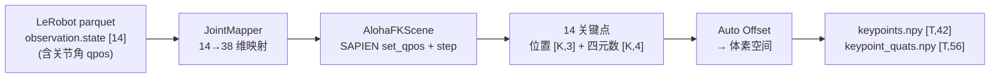
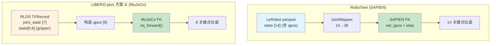
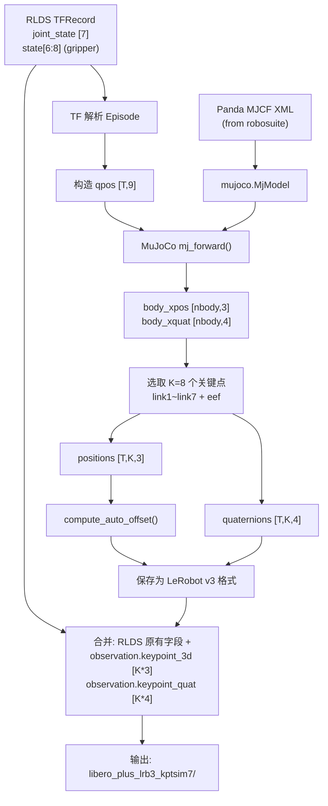
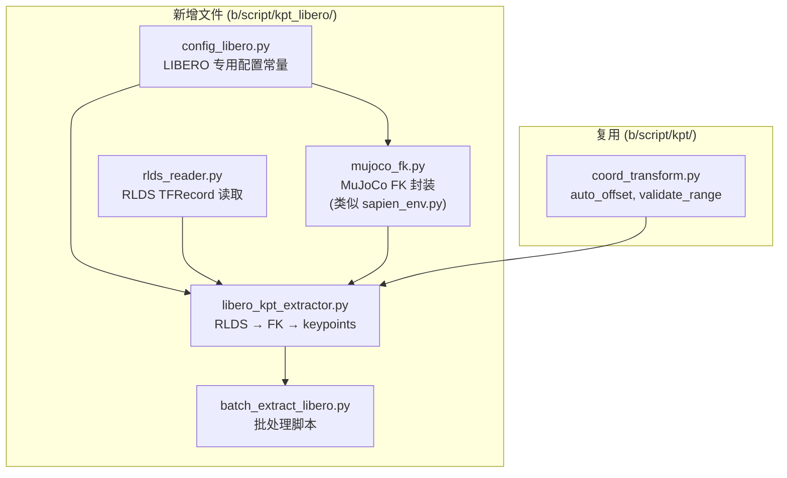
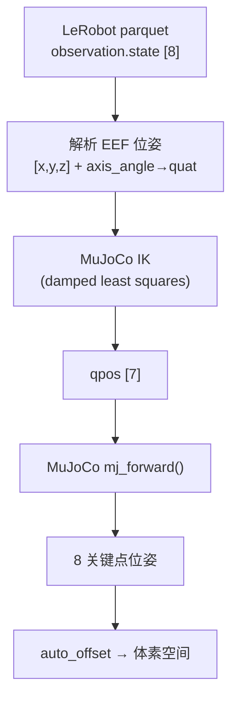

# LIBERO / LIBERO-plus 3D 关键点及位姿抽取可行性分析与实施方案

> **目标**: 分析从 LIBERO / LIBERO-plus 训练数据中抽取机器人 link 的 3D 关键点位置和姿态四元数的可行性，并给出实施方案。  
> **参考**: RoboTwin SAPIEN FK 方案（[`3dkptraj_1.md` 附录二](3dkptraj_1.md#附录二-sapien-方案含关键点及其位姿详细实施设计)）、GeoPredict RoboCasa 关键点抽取代码（`tools/test_robocasa.py`）、LIBERO-plus 论文 ([arXiv:2510.13626](https://arxiv.org/abs/2510.13626))  
> **日期**: 2026-09-05

---

## 一. LIBERO / LIBERO-plus 概述

### 1.1 LIBERO 基准

LIBERO (Lifelong Robot Learning Benchmark, [arXiv:2306.03310](https://arxiv.org/abs/2306.03310)) 是一个基于 robosuite ([robosuite.ai](https://robosuite.ai/)) 的终身机器人学习基准平台。

| 属性 | 值 |
|------|-----|
| 仿真引擎 | **MuJoCo**（通过 robosuite 1.4.x 封装） |
| 机器人 | **Franka Emika Panda**（7 DOF + 2 夹爪手指，固定底座） |
| 控制器 | **OSC_POSE**（操作空间控制，输入为末端位姿增量） |
| 动作空间 | 7 维：$[\Delta x, \Delta y, \Delta z, \Delta r, \Delta p, \Delta \theta, g]$（末端位移 + 轴角旋转增量 + 夹爪开关） |
| 观测 | 第三人称相机 (agentview, 256×256)、腕部相机 (eye_in_hand, 256×256)、本体感知 |
| 任务子集 | `libero_spatial` (10 tasks), `libero_object` (10), `libero_goal` (10), `libero_10` (10), `libero_90` (90) |
| 控制频率 | 20 Hz |

### 1.2 LIBERO-plus

LIBERO-plus ([arXiv:2510.13626](https://arxiv.org/html/2510.13626v3), [GitHub](https://github.com/sylvestf/LIBERO-plus)) 是 LIBERO 的扩展，在不改变核心仿真框架的前提下，引入了 **7 大维度、21 个子维度的扰动**，用于系统测试策略的鲁棒性：

| 扰动维度 | 子维度 | 说明 |
|---------|--------|------|
| 物体布局 | 干扰物、目标位移 | 改变物体初始位置和引入干扰物 |
| 相机视角 | 位置、方向、FOV | 方位角/仰角偏移 15°-75° |
| 机器人初始状态 | 关节位置扰动 | 扰动幅度 0.1-0.5 |
| 语言指令 | LLM 改写 | 同义替换、语序变化 |
| 光照条件 | 强度、方向、颜色、阴影 | 环境光变化 |
| 背景纹理 | 场景/表面外观 | 950 种纹理替换 |
| 传感器噪声 | 运动模糊、高斯模糊、雾化等 | 图像退化 |

关键发现（来自论文）：模型在中等扰动下成功率从约 95% 降至 30% 以下，相机视角和机器人初始状态是最具破坏性的扰动维度。

**LIBERO-plus 的仿真引擎、机器人型号和控制器与 LIBERO 完全相同**，差异仅在于扰动方式（通过修改 BDDL 场景定义和初始化文件实现）。

### 1.3 本地数据现状

本地 LIBERO 数据位于 `/home/luogang/DATA/Libero/`，已转换为 **LeRobot v2.1** 格式：

| 子集 | Episodes | Frames | 格式 |
|------|----------|--------|------|
| `libero_10_no_noops_1.0.0_lerobot` | 379 | 101,469 | LeRobot v2.1 |
| `libero_goal_no_noops_1.0.0_lerobot` | 428 | 52,042 | LeRobot v2.1 |
| `libero_object_no_noops_1.0.0_lerobot` | 454 | 66,984 | LeRobot v2.1 |
| `libero_spatial_no_noops_1.0.0_lerobot` | 432 | 52,970 | LeRobot v2.1 |
| **合计** | **1,693** | **273,465** | |

#### 关键字段（LeRobot parquet）

| 字段 | 维度 | 内容 |
|------|------|------|
| `observation.state` | `[8]` | EEF 位姿：$[x, y, z, r_1, r_2, r_3, g_L, g_R]$（位置 + 轴角 + 夹爪） |
| `action` | `[7]` | 增量：$[\Delta x, \Delta y, \Delta z, \Delta r_1, \Delta r_2, \Delta r_3, g]$ |
| `observation.images.image` | 视频 | agentview 相机 256×256 |
| `observation.images.wrist_image` | 视频 | 腕部相机 256×256 |

> **关键限制**: LeRobot 格式中 **没有关节角度 (qpos)**，只有末端执行器 (EEF) 层面的状态。这意味着**无法直接像 RoboTwin 那样通过设置 qpos 做正运动学 (FK)**。

### 1.4 LIBERO-plus RLDS 数据（关键发现）

本地 LIBERO-plus 训练数据位于 `/home/luogang/DATA/libero_plus_rlds/`，为 RLDS (TFRecord) 格式。

| 属性 | 值 |
|------|-----|
| 路径 | `/home/luogang/DATA/libero_plus_rlds/libero_mix/1.0.0/` |
| 格式 | TFRecord (RLDS)，1024 个 shard 文件 |
| 总大小 | **78 GB** |
| Episodes | **14,347**（与论文一致） |
| Frames (transitions) | **2,238,036** |
| 每 shard | ~14 episodes |
| 每 episode 步数 | 平均 151.7，范围 [81, 343] |
| 单 shard 文件大小 | ~80 MB |

#### RLDS 数据字段

> **重要发现**: RLDS 数据 **包含 `observation.joint_state` [7]** — 机器人关节角度！这是与 LeRobot 格式的关键区别。

| 字段 | 维度 | 类型 | 说明 |
|------|------|------|------|
| `observation.joint_state` | `[7]` | float32 | **机器人关节角度** (Panda 7 DOF) |
| `observation.state` | `[8]` | float32 | EEF 状态：$[x, y, z, r_1, r_2, r_3, g_L, g_R]$ |
| `observation.image` | `[256,256,3]` | uint8 (JPEG) | 主相机 RGB |
| `observation.wrist_image` | `[256,256,3]` | uint8 (JPEG) | 腕部相机 RGB |
| `action` | `[7]` | float32 | EEF 增量动作 |
| `language_instruction` | text | string | 自然语言任务描述 |
| `reward` | scalar | float32 | 稀疏奖励 (终止步为 1.0) |
| `is_first` / `is_last` / `is_terminal` | scalar | bool | Episode 边界标记 |
| `episode_metadata.file_path` | text | string | 原始 HDF5 来源路径 |

#### 关节角实测数据

对 shard 0 中 14 个 episodes 的全部 2,115 步关节角进行范围验证：

| 关节 | 实测 min | 实测 max | Panda 限位 min | Panda 限位 max | 是否在限位内 |
|------|---------|---------|---------------|---------------|:---:|
| joint1 | -0.2700 | 0.5076 | -2.8973 | 2.8973 | Yes |
| joint2 | -0.1696 | 1.2756 | -1.7628 | 1.7628 | Yes |
| joint3 | -0.3288 | 0.4450 | -2.8973 | 2.8973 | Yes |
| joint4 | -2.7398 | -0.0625 | -3.0718 | -0.0698 | Yes |
| joint5 | -1.6389 | 0.3355 | -2.8973 | 2.8973 | Yes |
| joint6 | 0.9474 | 3.0528 | -0.0175 | 3.7525 | Yes |
| joint7 | -0.2560 | 2.7267 | -2.8973 | 2.8973 | Yes |

> 全部 2,115 × 7 = 14,805 个关节角值均在 Panda 硬限位内，0 个违反。

#### 夹爪状态

夹爪关节位置可从 `observation.state[6:8]` 提取：

| 手指 | 实测 min | 实测 max | Panda 限位 |
|------|---------|---------|-----------|
| `finger_L` (state[6]) | 0.0013 | 0.0402 | [0.0, 0.04] |
| `finger_R` (state[7]) | -0.0412 | -0.0013 | [-0.04, 0.0] |

因此可构造 **9 维完整 qpos**:

$$\text{qpos}_{9} = [\underbrace{\text{joint\_state}[0:7]}_{\text{7 arm joints}}, \underbrace{\text{state}[6], \text{state}[7]}_{\text{2 finger joints}}]$$

#### 扰动类型与数据来源

`episode_metadata.file_path` 揭示了数据的组织结构：

```
.../pro_data/{perturbation_type}/{libero_subset}/{task_name}_demo.hdf5
```

| 扰动类型 (perturbation) | 说明 |
|------------------------|------|
| `camera_view` | 相机视角扰动 |
| `env` | 物体布局 / 环境扰动 |
| `language` | 语言指令改写 |
| `light` | 光照条件变化 |
| `noise` | 传感器噪声 |

> **注意**: 5 种扰动类型比论文中描述的 7 种少了 `robot_init`（机器人初始状态）和 `background`（背景纹理）。这可能是因为数据集中某些扰动只影响评估阶段（不改变训练数据的本体感知和动作）。

涵盖的 LIBERO 子集: `libero_10`, `libero_goal`, `libero_object`, `libero_spatial`（共 4 个），包含约 39 个唯一任务。

### 1.5 两种数据格式对比

| 维度 | LeRobot (本地 LIBERO) | RLDS (LIBERO-plus) |
|------|:---:|:---:|
| 路径 | `/home/luogang/DATA/Libero/` | `/home/luogang/DATA/libero_plus_rlds/` |
| 格式 | Parquet + MP4 (LeRobot v2.1) | TFRecord (RLDS) |
| Episodes | 1,693 | 14,347 |
| Frames | 273,465 | 2,238,036 |
| **关节角 (qpos)** | **无** | **有** (`joint_state` [7]) |
| 夹爪状态 | `state[6:8]` [2] | `state[6:8]` [2] |
| EEF 状态 | `state` [8] | `state` [8] |
| 图像 | 视频 (MP4) | JPEG 图像 |
| 语言指令 | `tasks.jsonl` | 每步内嵌 |
| 大小 | ~5 GB | ~78 GB |
| **FK 可行性** | **不直接可行**（需 IK 或 HDF5） | **直接可行** |

> **结论**: LIBERO-plus RLDS 数据直接包含关节角，可绕过原有方案中下载 HDF5 的步骤。这使得方案大幅简化。

---

## 二. 与 RoboTwin SAPIEN FK 方案的对比分析

### 2.1 RoboTwin 方案回顾

在 RoboTwin 的 SAPIEN FK 方案（附录二）中，数据处理流程为：



**前提**: 数据集中直接存储了 14 维关节角（双臂各 6 关节 + 1 夹爪），可直接传入 SAPIEN 做 FK。

### 2.2 LIBERO 与 RoboTwin 的关键差异

| 维度 | RoboTwin / ALOHA | LIBERO / LIBERO-plus |
|------|-----------------|---------------------|
| 仿真引擎 | SAPIEN | MuJoCo (via robosuite) |
| 机器人 | ALOHA 双臂 (2×6 DOF + 2 gripper) | Franka Panda 单臂 (7 DOF + 2 finger) |
| 控制方式 | 关节空间 (joint-level) | 末端空间 (OSC_POSE, task-level) |
| 数据集中的状态 | **14 维关节角 (qpos)** | **8 维 EEF 状态 (position+orientation+gripper)** |
| FK 可行性 | **直接可行** — qpos → FK → link poses | **不直接可行** — 没有 qpos |
| 关键点数 | K=14 (双臂) | K=8 (单臂: 7 links + 1 EEF) |
| FK API | `sapien.Pose.p/.q` | `mujoco.MjData.body().xpos/.xquat` |
| 坐标系 | SAPIEN 世界系 | MuJoCo 世界系 |

### 2.3 核心挑战

**LIBERO 数据集不含关节角 (qpos)**。这是与 RoboTwin 的根本区别。

解决路径有三条（详见第三节分析）：

1. **获取原始 HDF5** — 原始 LIBERO 数据（robomimic HDF5 格式）包含 `obs/joint_states`（7 维关节角）和 `states`（完整 MuJoCo 状态向量），可直接做 FK
2. **仿真重放** — 在 robosuite 环境中 replay actions，在每步抽取 body poses
3. **EEF 逆运动学 (IK)** — 从已有 EEF 位姿反算关节角，再做 FK

---

## 三. 方案可行性分析

### 3.1 方案 A': 从 RLDS TFRecord 做 MuJoCo FK（推荐 — 改良方案）

> **原方案 A** 要求下载原始 HDF5 数据。但 §1.4 的数据分析发现本地 RLDS 数据已包含 `observation.joint_state` [7]，可直接做 FK，**无需下载 HDF5**。

#### 原理

从 RLDS TFRecord 中读取关节角和夹爪状态，构造 9 维 qpos，传入 MuJoCo 做 FK：

$$\text{qpos}_{9\times1} = [\underbrace{\text{joint\_state}[0:7]}_{\text{RLDS field}}, \underbrace{\text{state}[6], \text{state}[7]}_{\text{RLDS field}}]$$

```python
import mujoco
import tensorflow as tf
import numpy as np

model = mujoco.MjModel.from_xml_path(robot_xml)
data = mujoco.MjData(model)

# From RLDS record:
# joint_state = observation.joint_state [7]  ← arm joints
# eef_state = observation.state [8]          ← state[6:8] = gripper qpos
data.qpos[:7] = joint_state      # 7 arm joints
data.qpos[7:9] = eef_state[6:8]  # 2 finger joints
mujoco.mj_forward(model, data)   # FK computation

for link_idx in range(1, 8):
    body_id = model.body(f"robot0_link{link_idx}").id
    pos = data.xpos[body_id]     # [3] world position
    quat = data.xquat[body_id]   # [4] world quaternion (wxyz)
```

#### 优缺点

| 优点 | 缺点 |
|------|------|
| **精确**: 使用原始关节角，FK 结果与仿真一致 | 需要 MuJoCo 和正确的 MJCF 模型 |
| **高效**: `mj_forward()` 仅需 ~0.1ms/步 | RLDS 解析比 HDF5 稍复杂（TFRecord 格式） |
| **数据已在本地**: 无需下载额外数据 | 无 `gripper_states` 单独字段，需从 `state[6:8]` 提取 |
| **已验证**: 关节角全部在 Panda 限位内 | RLDS 解析需要 TensorFlow (可用 `phantom` 环境) |
| **14,347 episodes**: 比原始 LIBERO 大 8.5 倍 | |

### 3.1.1 原方案 A: 从原始 HDF5 做 MuJoCo FK（备选）

原始 LIBERO 数据为 robomimic HDF5 格式，包含 `obs/joint_states` [7] + `obs/gripper_states` [2]。

```
<task>_demo.hdf5
├── data/demo_N/
│   ├── states       [T, D]   ← 完整 MuJoCo state (qpos + qvel)
│   ├── robot_states [T, 9]   ← gripper_qpos[2] + eef_pos[3] + eef_quat[4]
│   ├── obs/
│   │   ├── joint_states    [T, 7]   ← robot0_joint_pos
│   │   ├── gripper_states  [T, 2]   ← robot0_gripper_qpos
│   │   ├── ee_states       [T, 6]   ← eef_pos + axis_angle
│   │   ├── ee_pos          [T, 3]
│   │   └── ee_ori          [T, 3]
│   ├── rewards      [T]
│   └── dones        [T]
└── data (attrs)
    └── env_args          ← 环境配置 JSON
```

FK 流程与方案 A' 相同，仅数据读取方式不同。此方案适用于处理原始 LIBERO 数据（非 LIBERO-plus）。HDF5 数据可从 [yifengzhu-hf/LIBERO-datasets](https://huggingface.co/datasets/yifengzhu-hf/LIBERO-datasets) 下载。

#### 数据来源（改良方案 A' — 本地 RLDS 已包含关节角）

> **改良后的方案不再需要下载额外数据。** 本地 RLDS (`/home/luogang/DATA/libero_plus_rlds/`) 已包含 `observation.joint_state` [7] + `observation.state` [8]（含夹爪），可直接构造 qpos 做 FK。

> 如果需要处理原始 LIBERO 数据（非 LIBERO-plus），仍可通过以下方式获取 HDF5：
> - [yifengzhu-hf/LIBERO-datasets](https://huggingface.co/datasets/yifengzhu-hf/LIBERO-datasets) (~100 GB, HDF5 原始)
> - [clip-rt/modified_libero_hdf5](https://huggingface.co/datasets/clip-rt/modified_libero_hdf5) (~110 GB, 256×256 + no-op filtered)
> - LIBERO 官方脚本: `python benchmark_scripts/download_libero_datasets.py --download_from huggingface`

#### LIBERO-plus RLDS 数据确认

> **已验证**: 本地 RLDS 数据包含 `observation.joint_state` [7]（机器人关节角）。见 §1.4 的详细分析。
> - 14,347 episodes, 2,238,036 frames
> - 关节角全部在 Panda 限位内（0 违反）
> - 夹爪值在 [0, 0.04] / [-0.04, 0] 范围内
> - 5 种扰动类型: camera_view, env, language, light, noise
> - 覆盖 4 个 LIBERO 子集的 39 个任务

#### LIBERO-plus 数据在 HuggingFace 上的可用格式

| 资源 | HuggingFace | 格式 | 大小 | joint_state |
|------|-------------|------|------|:---:|
| 训练数据 (RLDS) | [Sylvest/libero_plus_rlds](https://huggingface.co/datasets/Sylvest/libero_plus_rlds) | TFRecord | 75.5 GB | **有** |
| 训练数据 (LeRobot) | [Sylvest/libero_plus_lerobot](https://huggingface.co/datasets/Sylvest/libero_plus_lerobot) | LeRobot | — | 待确认 |
| 仿真 Assets | [Sylvest/LIBERO-plus](https://huggingface.co/datasets/Sylvest/LIBERO-plus) | ZIP (XML/STL) | 6.4 GB | N/A |

> **关键发现**: LIBERO-plus 没有 HDF5 版本的训练数据，但 RLDS 版本已经足够（包含关节角）。

### 3.2 方案 B: 在 robosuite 环境中 Replay Actions

#### 原理

类似 GeoPredict 在 RoboCasa 评估时的做法（`tools/test_robocasa.py:get_keypoints()`）：

```python
from libero.libero import get_libero_path
from libero.libero.envs import OffScreenRenderEnv

env = OffScreenRenderEnv(bddl_file_name=task_bddl, ...)
env.reset()
env.set_init_state(initial_state)

for t in range(episode_length):
    obs, _, _, _ = env.step(actions[t])
    # 此时 env.sim.data 包含所有 body 的位姿
    for j in range(1, 8):
        pos = env.sim.data.get_body_xpos(f"robot0_link{j}")
        quat = env.sim.data.get_body_xquat(f"robot0_link{j}")
    eef_pos = env.sim.data.get_body_xpos("gripper0_right_eef")
    eef_quat = env.sim.data.get_body_xquat("gripper0_right_eef")
```

#### 优缺点

| 优点 | 缺点 |
|------|------|
| **最精确**: 完全复现原始数据收集过程 | **非常慢**: 每步需要完整物理仿真 + 碰撞检测 |
| 包含物体交互效果（物理一致） | 需要安装完整的 robosuite + LIBERO |
| 可获取所有 body（含物体）的位姿 | 需要每个 episode 的 initial_state |
| | 需要与 HDF5 中的 `actions` 字段对应（LeRobot `action` 可能经过了处理） |
| | 可能存在累积误差（如果 actions 经过了变换） |

#### 适用场景

当需要同时获取 **机器人** 和 **物体** 的位姿时（如未来可能需要物体关键点），或当无法获取 HDF5 的 joint_states 时。

### 3.3 方案 C: 从 EEF 位姿做逆运动学 (IK) + 正运动学 (FK)

#### 原理

利用 LeRobot 数据中已有的 8 维 EEF 状态：

$$\text{state} = [x, y, z, r_1, r_2, r_3, g_L, g_R]$$

其中 $[x, y, z]$ 是 EEF 位置，$[r_1, r_2, r_3]$ 是轴角表示的 EEF 朝向，$[g_L, g_R]$ 是夹爪手指位置。

1. 将轴角转换为四元数或旋转矩阵，得到 EEF 的 6-DOF 位姿
2. 使用 IK 求解器（如 MuJoCo `mj_jac` + 伪逆、`pinocchio`、`ikpy`）从 EEF 位姿反算 7 维关节角
3. 用得到的关节角做 FK，获得所有 link 的位置和四元数

#### Franka Panda 的 IK 特殊性

Franka Panda 有 7 个关节但 EEF 只有 6 个自由度（3 位置 + 3 姿态），存在 1 个冗余自由度（null space）。对于同一个 EEF 位姿，存在 **无穷多组** 关节角解。

为获得合理解，需要：
- 使用前一时步的关节角作为 IK 初始猜测，最小化关节位移
- 或对 null space 施加约束（如最小化与初始构型的偏差）

$$\mathbf{q}^* = \arg\min_{\mathbf{q}} \|\mathbf{q} - \mathbf{q}_{\text{prev}}\|^2 \quad \text{s.t.} \quad \text{FK}(\mathbf{q}) = (\mathbf{p}_{\text{eef}}, \mathbf{R}_{\text{eef}})$$

#### 优缺点

| 优点 | 缺点 |
|------|------|
| **不需要额外数据**: 仅使用 LeRobot 中已有的 EEF 状态 | IK 有歧义性（冗余自由度）|
| 不需要 robosuite/LIBERO 环境 | 中间 link 的位姿可能与原始仿真有偏差 |
| 只需要 Franka Panda URDF/MJCF + IK solver | IK 可能不收敛（关节极限附近） |
| | 第一帧没有 `q_prev`，需要选择一个初始配置 |
| | axis-angle → quaternion 转换在 $\|r\| \approx \pi$ 附近有数值问题 |

#### 适用场景

作为 **后备方案**，当无法获取原始 HDF5 数据、也无法搭建 robosuite 环境时使用。

### 3.4 方案对比总结

| 维度 | 方案 A' (RLDS FK) | 方案 A (HDF5 FK) | 方案 B (Sim Replay) | 方案 C (IK + FK) |
|------|:---:|:---:|:---:|:---:|
| 精确度 | **精确** | **精确** | **最精确** | 近似（有 IK 误差） |
| 速度 | **快** (~0.1ms/步) | **快** (~0.1ms/步) | 慢 (~5ms/步) | 中等 (~1ms/步) |
| 依赖 | MuJoCo + TF | MuJoCo + h5py | robosuite + LIBERO | MuJoCo + IK solver |
| 数据需求 | **本地已有 RLDS** | 需下载 HDF5 | 需下载 HDF5 | 仅 LeRobot EEF |
| 实施难度 | **低** | 中等 | 高 | 中高 |
| 数据规模 | 14,347 ep (LIBERO-plus) | 1,693 ep (原始 LIBERO) | 取决于数据 | 1,693 ep |
| **推荐度** | **首选** | 备选 | 次选 | 后备 |

> **方案 A' 是改良后的首选方案**：利用本地 RLDS 数据中已有的关节角，无需额外下载，直接做 MuJoCo FK。

---

## 四. GeoPredict 已有的 LIBERO 相关代码

GeoPredict 已有的 RoboCasa 关键点抽取代码可以直接复用。RoboCasa 与 LIBERO 共享相同的底层框架（robosuite + MuJoCo + Franka Panda），关键点定义也完全一致。

### 4.1 已有的 `get_keypoints` 函数

出处: `GeoPredict/tools/test_robocasa.py:180-194`

```python
def get_keypoints(env, body_pos, body_rot):
    ori_trans = np.array([-0.5, -0.8, -0.0], dtype=np.float32)
    keypoint = None
    for j in range(1, 9):
        pos_name = "gripper0_right_eef" if j == 8 else f"robot0_link{j}"
        pos = env.sim.data.get_body_xpos(pos_name)
        pos = body_rot.T @ (pos - body_pos)  # 转到基座坐标系
        pos = pos - ori_trans                  # 平移到体素空间
        if keypoint is None:
            keypoint = pos
        else:
            keypoint = np.hstack((keypoint, pos))
    return keypoint.reshape(8, 3)
```

此函数在 **在线评估** 时使用（每步从 `env.sim.data` 实时抽取），提取 **K=8 个关键点**:

| 索引 | Body 名称 | 说明 |
|------|----------|------|
| 0 | `robot0_link1` | Panda 第 1 个 link |
| 1 | `robot0_link2` | Panda 第 2 个 link |
| 2 | `robot0_link3` | Panda 第 3 个 link |
| 3 | `robot0_link4` | Panda 第 4 个 link |
| 4 | `robot0_link5` | Panda 第 5 个 link |
| 5 | `robot0_link6` | Panda 第 6 个 link |
| 6 | `robot0_link7` | Panda 第 7 个 link |
| 7 | `gripper0_right_eef` | 末端执行器 |

### 4.2 坐标变换

在 RoboCasa 的 `get_keypoints` 中：
1. `body_pos` / `body_rot` 来自 `mobilebase0_support` body — **RoboCasa 使用移动底座**
2. 关键点先转到基座坐标系：`pos = body_rot.T @ (pos - body_pos)`
3. 再施加平移 `ori_trans = [-0.5, -0.8, 0.0]` 映射到 GeoPredict 体素空间

**LIBERO 使用固定底座**，不存在 `mobilebase0_support`。坐标变换需要调整：
- 可直接使用世界坐标系（因为底座固定）
- 或使用 `robot0_link0`（底座 link）作为参考

### 4.3 与 RoboTwin 方案的架构对比



两者的核心流程相似：**数据中的关节角 → FK → 关键点位姿**。差异在于仿真引擎（SAPIEN vs MuJoCo）和数据格式（LeRobot parquet vs RLDS TFRecord）。

---

## 五. Franka Panda 运动学结构

### 5.1 MJCF Body 链

来自 robosuite 的 Panda MJCF (`robosuite/models/assets/robots/panda/robot.xml`)：

```
base                          ← 底座（固定）
└── link0                     ← 基座 link（无关节）
    └── link1  [joint1]       ← 第 1 关节
        └── link2  [joint2]   ← 第 2 关节
            └── link3  [joint3]
                └── link4  [joint4]
                    └── link5  [joint5]
                        └── link6  [joint6]
                            └── link7  [joint7]
                                └── right_hand  ← 夹爪安装面
```

加上 PandaGripper (`panda_gripper.xml`)：

```
right_gripper [quat=0.707 0 0 -0.707]
├── eef [pos=0 0 0.097]      ← 末端执行器参考点
│   └── grip_site             ← 抓取点
├── leftfinger [finger_joint1, slide]
└── rightfinger [finger_joint2, slide]
```

### 5.2 robosuite 命名前缀

在 robosuite 环境中加载后，body 名称加上前缀：

| MJCF 原名 | robosuite 名称 | 用途 |
|-----------|---------------|------|
| `link1` ~ `link7` | `robot0_link1` ~ `robot0_link7` | 7 个 arm links |
| `right_hand` | `robot0_right_hand` | 夹爪安装面 |
| `eef` | `gripper0_right_eef` or `gripper0_eef` | 末端执行器 |
| `leftfinger` | `gripper0_leftfinger` | 左手指 |
| `rightfinger` | `gripper0_rightfinger` | 右手指 |

> **注意**: EEF body 的精确名称可能因 robosuite 版本不同而有差异（`gripper0_right_eef` 或 `gripper0_eef`）。实施时需从加载的 MuJoCo 模型中确认。

### 5.3 qpos 排列

Franka Panda + PandaGripper 在 MuJoCo 中的 qpos 排列：

| 索引 | 关节 | 类型 | 范围 |
|------|------|------|------|
| 0 | `robot0_joint1` | revolute | [-2.8973, 2.8973] |
| 1 | `robot0_joint2` | revolute | [-1.7628, 1.7628] |
| 2 | `robot0_joint3` | revolute | [-2.8973, 2.8973] |
| 3 | `robot0_joint4` | revolute | [-3.0718, -0.0698] |
| 4 | `robot0_joint5` | revolute | [-2.8973, 2.8973] |
| 5 | `robot0_joint6` | revolute | [-0.0175, 3.7525] |
| 6 | `robot0_joint7` | revolute | [-2.8973, 2.8973] |
| 7 | `gripper0_finger_joint1` | slide | [0.0, 0.04] |
| 8 | `gripper0_finger_joint2` | slide | [-0.04, 0.0] |

> **注意**: 上述索引仅针对只有一个机器人、无额外自由物体的简单场景。如果场景中有自由物体（如可抓取的杯子），它们的 qpos 也会出现在 `model.qpos` 中。使用 `states` 字段可完整恢复所有 qpos。

### 5.4 MuJoCo FK 输出

调用 `mj_forward(model, data)` 后可获取：

| 数据 | API | Shape | 约定 |
|------|-----|-------|------|
| Body 位置 | `data.xpos[body_id]` 或 `data.body(name).xpos` | `[3]` | 世界坐标系 |
| Body 四元数 | `data.xquat[body_id]` 或 `data.body(name).xquat` | `[4]` | **[w,x,y,z]** (MuJoCo 标准) |
| Body 旋转矩阵 | `data.xmat[body_id]` 或 `data.body(name).xmat` | `[9]` (row-major 3×3) | 世界坐标系 |
| Site 位置 | `data.site_xpos[site_id]` | `[3]` | 世界坐标系 |

> **四元数约定**: MuJoCo 使用 **[w,x,y,z]** 约定（Hamilton），与 SAPIEN 和 `transforms3d` 一致。无需转换。

---

## 六. 推荐实施方案: 方案 A' — 从 RLDS 做 MuJoCo FK

### 6.1 总体流程



> **与原方案 A 的区别**: 数据来源从 HDF5 变为 RLDS TFRecord，省去了下载 HDF5 的步骤。FK 计算部分完全相同。

### 6.2 配置变量总表

| 变量 | 含义 | 默认值 | 备注 |
|------|------|--------|------|
| `LIBERO_HDF5_ROOT` | 原始 HDF5 数据根目录 | 待定（需下载） | 各任务 HDF5 文件所在 |
| `LIBERO_LEROBOT_ROOT` | LeRobot 数据根目录 | `/home/luogang/DATA/Libero/` | 本地已有 |
| `ROBOSUITE_PANDA_XML` | Panda MJCF XML 路径 | `{robosuite}/models/assets/robots/panda/robot.xml` | 需要含夹爪的完整模型 |
| `PANDA_GRIPPER_XML` | PandaGripper MJCF XML 路径 | `{robosuite}/models/assets/grippers/panda_gripper.xml` | 与 robot.xml 组装 |
| `K` | 关键点数 | `8` | 7 links + 1 EEF |
| `KEYPOINT_BODY_NAMES` | 各关键点对应的 body 名称 | 见 §5.2 表格 | 从环境中验证 |
| `QUAT_CONVENTION` | 四元数约定 | `"wxyz"` | MuJoCo 标准 |
| `VOXEL_RANGE_MIN/MAX` | GeoPredict 体素空间 | `[0,0,0]` / `[1.6,1.6,1.0]` | 同 RoboTwin |
| `CONDA_ENV` | conda 环境名 | `phantom` 或新建 | 需含 mujoco + h5py |

### 6.3 代码架构设计



#### 核心类: `MujocoFKScene`

类似 RoboTwin 的 `AlohaFKScene`，封装 MuJoCo FK 查询:

```python
class MujocoFKScene:
    """Load Franka Panda in a minimal MuJoCo scene for FK queries."""
    
    def __init__(self, model_xml: str):
        self.model = mujoco.MjModel.from_xml_path(model_xml)
        self.data = mujoco.MjData(self.model)
        self._body_id_cache = {}
    
    def set_qpos(self, qpos: np.ndarray):
        """Set robot joint positions and compute FK."""
        self.data.qpos[:len(qpos)] = qpos
        mujoco.mj_forward(self.model, self.data)
    
    def get_body_poses(self, body_names: list[str]) -> tuple[np.ndarray, np.ndarray]:
        """Get world-frame positions AND quaternions for specified bodies."""
        n = len(body_names)
        positions = np.zeros((n, 3), dtype=np.float32)
        quaternions = np.zeros((n, 4), dtype=np.float64)
        for i, name in enumerate(body_names):
            bid = self._body_id_cache.get(name)
            if bid is None:
                bid = self.model.body(name).id
                self._body_id_cache[name] = bid
            positions[i] = self.data.xpos[bid]
            quaternions[i] = self.data.xquat[bid]
        return positions, quaternions
    
    def close(self):
        self.model = None
        self.data = None
```

#### 核心函数: `parse_rlds_episode` + `extract_episode_keypoints`

```python
def parse_rlds_episode(raw_record: bytes) -> dict:
    """Parse a single RLDS TFRecord into numpy arrays."""
    ex = tf.train.Example()
    ex.ParseFromString(raw_record)
    f = ex.features.feature
    
    n_steps = len(f['steps/is_first'].int64_list.value)
    
    joint_state = np.array(
        f['steps/observation/joint_state'].float_list.value
    ).reshape(n_steps, 7).astype(np.float32)
    
    state = np.array(
        f['steps/observation/state'].float_list.value
    ).reshape(n_steps, 8).astype(np.float32)
    
    action = np.array(
        f['steps/action'].float_list.value
    ).reshape(n_steps, 7).astype(np.float32)
    
    language = f['steps/language_instruction'].bytes_list.value[0].decode('utf-8')
    file_path = f['episode_metadata/file_path'].bytes_list.value[0].decode('utf-8')
    
    # Construct 9-dim qpos: arm joints [7] + gripper fingers [2]
    gripper = state[:, 6:8]  # finger_L, finger_R
    qpos = np.concatenate([joint_state, gripper], axis=1)  # [T, 9]
    
    return {
        'qpos': qpos,         # [T, 9]
        'state': state,       # [T, 8]
        'action': action,     # [T, 7]
        'language': language,
        'file_path': file_path,
        'n_steps': n_steps,
    }


def extract_episode_keypoints(
    fk_scene: MujocoFKScene,
    qpos_seq: np.ndarray,   # [T, 9]
    body_names: list[str],
) -> tuple[np.ndarray, np.ndarray]:
    """Extract keypoint positions + quaternions via MuJoCo FK.
    
    Returns:
        positions: [T, K, 3] float32
        quaternions: [T, K, 4] float32
    """
    T = qpos_seq.shape[0]
    K = len(body_names)
    all_pos = np.zeros((T, K, 3), dtype=np.float32)
    all_quat = np.zeros((T, K, 4), dtype=np.float32)
    
    for t in range(T):
        fk_scene.set_qpos(qpos_seq[t])
        pos, quat = fk_scene.get_body_poses(body_names)
        all_pos[t] = pos
        all_quat[t] = quat.astype(np.float32)
    
    return all_pos, all_quat
```

### 6.4 RLDS Episode 标识与索引

RLDS 中每个 episode 由其在 TFRecord 序列中的位置标识。`episode_metadata.file_path` 提供了来源追溯。

```
shard-00000: episodes [0..13]     ← 14 episodes
shard-00001: episodes [14..27]    ← 14 episodes
...
shard-01023: episodes [14332..14346]
```

每个 episode 的 `file_path` 格式为：
```
.../pro_data/{perturbation}/{subset}/{task}_demo.hdf5
```

可从 `file_path` 中解析出扰动类型、LIBERO 子集和任务名称，用于输出目录组织。

### 6.5 MJCF 模型获取

需要一个包含 **Franka Panda 机械臂 + PandaGripper** 的完整 MJCF 模型。推荐从 robosuite 提取:

```python
import robosuite
env = robosuite.make("Lift", robots="Panda", has_renderer=False)
model_xml = env.sim.model.get_xml()
with open("panda_robosuite_full.xml", "w") as f:
    f.write(model_xml)
env.close()
```

此方式导出的 XML 包含所有 body 的 robosuite 命名前缀（`robot0_`, `gripper0_`），与 RLDS 和 HDF5 数据中的命名一致。

> **注意**: 导出的 XML 可能包含场景中的桌子、物体等额外 body。对于 FK 计算，只需关注机器人相关的 body 即可。如果 `model.nq > 9`，说明 qpos 中混入了物体自由度，设置 qpos 时需注意只填入前 9 个（机器人 qpos）。

### 6.6 输出格式

与 RoboTwin 的 `_lrb3_kptsim7` 输出完全一致（LeRobot v3 格式），仅 K 值和关键点名称不同：

| 特征列 | 维度 | 说明 |
|--------|------|------|
| `observation.keypoint_3d` | `[24]` | K=8 × 3 (位置) |
| `observation.keypoint_quat` | `[32]` | K=8 × 4 (四元数 wxyz) |

```
<subset>_lrb3_kptsim7/
├── data/chunk-000/file-000.parquet
├── meta/
│   ├── info.json
│   ├── keypoints_meta.json
│   ├── stats.json
│   ├── tasks.parquet
│   └── episodes/chunk-000/file-000.parquet
├── norm_stat.json
└── videos/ → (symlink to original)
```

---

## 七. 后备方案: 方案 C — IK + FK（无需 HDF5）

如果无法获取原始 HDF5 数据，可从 LeRobot 已有的 EEF 状态反推关节角。

### 7.1 IK 求解器选择

| 求解器 | 优点 | 缺点 |
|--------|------|------|
| `mujoco.mj_jac` + 伪逆迭代 | 原生 MuJoCo，无额外依赖 | 需要自己实现迭代循环 |
| `pinocchio` IK | 成熟、支持约束 IK | 需要 URDF（可从 MJCF 转换） |
| `ikpy` | 纯 Python，易用 | 较慢，精度一般 |
| MuJoCo `mj_inverse` | 原生 MuJoCo | 计算逆动力学，不是 IK |

**推荐**: 使用 MuJoCo 内置的 Jacobian (`mj_jac`) + damped least squares 迭代 IK:

```python
def ik_solve(model, data, target_pos, target_quat, 
             body_name, q_init, max_iter=100, tol=1e-4):
    """Damped least squares IK solver using MuJoCo Jacobian."""
    data.qpos[:7] = q_init
    body_id = model.body(body_name).id
    
    for _ in range(max_iter):
        mujoco.mj_forward(model, data)
        pos_err = target_pos - data.xpos[body_id]
        # Quaternion error (simplified)
        cur_quat = data.xquat[body_id]
        ori_err = quat_error(target_quat, cur_quat)  # [3] angular error
        
        err = np.concatenate([pos_err, ori_err])
        if np.linalg.norm(err) < tol:
            break
        
        # Compute Jacobian
        jacp = np.zeros((3, model.nv))
        jacr = np.zeros((3, model.nv))
        mujoco.mj_jac(model, data, jacp, jacr, data.xpos[body_id], body_id)
        J = np.vstack([jacp[:, :7], jacr[:, :7]])  # [6, 7]
        
        # Damped least squares
        lam = 0.01
        dq = J.T @ np.linalg.solve(J @ J.T + lam * np.eye(6), err)
        data.qpos[:7] += dq
    
    return data.qpos[:7].copy()
```

### 7.2 工作流程



每个 episode 的第一帧使用 Panda 的默认 home 配置作为 IK 初始猜测:

$$\mathbf{q}_{\text{home}} = [0, -\pi/4, 0, -3\pi/4, 0, \pi/2, \pi/4]$$

后续帧使用前一帧的 IK 结果作为初始猜测，保证连续性。

---

## 八. 实施步骤

### Phase 1: 环境准备

1. **确认 conda 环境**: 使用 `phantom` 环境（已有 mujoco 3.11.0 + robosuite 1.4.1）
2. **安装 h5py**: `conda run -n phantom pip install h5py`（如果尚未安装）
3. **导出 Panda 完整 MJCF**: 通过 robosuite 创建最小 Lift 环境，导出合并后的 XML

### Phase 2: 数据准备与验证

> 改良方案 A' 使用本地 RLDS 数据，**无需额外下载**。

1. **确认 RLDS 数据完整性**:
   ```bash
   # 检查 1024 个 shard 文件都存在
   ls /home/luogang/DATA/libero_plus_rlds/libero_mix/1.0.0/*.tfrecord-* | wc -l
   # 应输出: 1024
   ```

2. **验证 RLDS 关节角数据**:
   ```python
   # 抽样检查关节角在 Panda 限位内
   # 以及 state[6:8] 在 gripper 限位内
   # (见 §10.2 T4 测试用例)
   ```

3. **(可选) 下载原始 LIBERO HDF5** — 仅当需要处理本地 LeRobot 格式的原始 LIBERO 数据时:
   ```bash
   huggingface-cli download yifengzhu-hf/LIBERO-datasets \
       --local-dir /home/luogang/DATA/libero_hdf5 \
       --repo-type dataset
   ```

### Phase 3: 实现抽取代码

1. 创建 `b/script/kpt_libero/` 目录
2. 实现 `config_libero.py` — K=8, body_names, Panda qpos 配置
3. 实现 `mujoco_fk.py` — `MujocoFKScene` 类
4. 实现 `rlds_reader.py` — TFRecord 解析（`parse_rlds_episode`）
5. 实现 `libero_kpt_extractor.py` — 整合 RLDS 读取 + FK + auto_offset
6. 实现 `batch_extract_libero.py` — 遍历 1024 shards, 批处理所有 episodes

### Phase 4: 测试与验证

1. 在 shard-00000 的第一个 episode 上测试端到端抽取
2. 验证关键点在体素空间范围内
3. 验证四元数为单位四元数
4. 对比抽取的 EEF 关键点位置与 RLDS `observation.state[:3]`（两者应精确一致）
5. 检查相邻帧关键点位移连续性

### Phase 5: 全量处理

1. 对全部 1024 shards（14,347 episodes, 2,238,036 frames）执行批量抽取
2. 输出到 `libero_plus_lrb3_kptsim7/` 目录
3. 可按扰动类型或 LIBERO 子集组织子目录

> **估算**: FK 速度 ~0.1ms/步 → 2,238,036 步 × 0.1ms ≈ **224 秒**（纯 FK 时间）。加上 TFRecord I/O，预计总时间 < 30 分钟。

---

## 九. 关键注意事项

### 9.1 MuJoCo 四元数约定

MuJoCo 使用 **[w, x, y, z]** 约定（Hamilton 标准），与 SAPIEN 和 `transforms3d` 一致。无需做约定转换。

但注意：
- `scipy.spatial.transform.Rotation` 使用 **[x, y, z, w]** 约定
- PyBullet 使用 **[x, y, z, w]** 约定
- 如果下游使用这些库，需做 `q_xyzw = np.roll(q_wxyz, -1)` 转换

### 9.2 robosuite Body 名称前缀

robosuite 加载机器人时会给 body 名称加前缀（如 `robot0_`, `gripper0_`）。如果直接使用从 robosuite 导出的 MJCF XML 做 FK，body 名称已经包含前缀。如果使用 MuJoCo Menagerie 的 Panda 模型，body 名称没有前缀，需要调整。

**建议**: 从 robosuite 导出完整 XML，确保名称一致。

### 9.3 EEF Body 名称版本差异

不同版本的 robosuite 中 EEF body 的名称可能不同：
- robosuite 1.4.x: `gripper0_right_eef` 或 `gripper0_eef`
- 较早版本: 可能有其他命名

**实施时需从加载的模型中动态确认**:
```python
for i in range(model.nbody):
    name = model.body(i).name
    if "eef" in name or "grip" in name:
        print(f"  body[{i}]: {name}")
```

### 9.4 坐标系差异

| 框架 | 世界系 | 说明 |
|------|--------|------|
| RoboTwin (SAPIEN) | Y-up 或自定义 | 机器人有 root pose (pos + quat) |
| LIBERO (MuJoCo) | Z-up | 机器人底座通常在原点，或通过 body pos 偏移 |
| GeoPredict 体素空间 | 自定义 [0,1.6]×[0,1.6]×[0,1.0] | 通过 auto_offset 映射 |

auto_offset 会自动处理坐标系差异（计算 bounding box 中心，映射到体素空间中心）。

### 9.5 与 RoboTwin 方案的代码复用

| 可复用 | 需新建 |
|--------|--------|
| `coord_transform.py` (auto_offset, validate_range) | `config_libero.py` (K=8, body_names, Panda limits) |
| `batch_extract_lrb3_kptsim7.py` 的 v3 格式构建逻辑 | `mujoco_fk.py` (MuJoCo FK 封装，类比 sapien_env.py) |
| 验收脚本框架 | `rlds_reader.py` (TFRecord 解析) |
| | `libero_kpt_extractor.py` (主抽取逻辑) |
| | `batch_extract_libero.py` (批处理) |

### 9.6 RLDS 读取性能优化

由于 RLDS TFRecord 包含图像数据（JPEG），而我们只需要数值字段（joint_state, state），可以使用 **部分解析** 来避免反序列化图像：

```python
# 只解析需要的字段，跳过图像
feature_description = {
    'steps/observation/joint_state': tf.io.VarLenFeature(tf.float32),
    'steps/observation/state': tf.io.VarLenFeature(tf.float32),
    'steps/is_first': tf.io.VarLenFeature(tf.int64),
    'episode_metadata/file_path': tf.io.VarLenFeature(tf.string),
    'steps/language_instruction': tf.io.VarLenFeature(tf.string),
}
# 不解析 steps/observation/image 和 steps/observation/wrist_image
```

这可以将每个 shard 的读取时间从 ~10s 降到 ~1s（跳过 ~80 MB 中 95% 的图像数据）。

> **备选**: 如果不想依赖 TensorFlow，可以用 `tfrecord` 纯 Python 库或直接用 protobuf 解析。

---

## 十. 测试方案与验收标准

### 10.1 单元测试

#### T1: MujocoFKScene 基础功能

- **前提**: `phantom` conda 环境已安装 mujoco，Panda MJCF 已导出
- **输入**: Panda home position $\mathbf{q}_{\text{home}} = [0, -\pi/4, 0, -3\pi/4, 0, \pi/2, \pi/4, 0.04, 0.04]$
- **验证项**:
  1. `set_qpos()` 不报错
  2. `get_body_poses()` 返回 (positions `[8,3]`, quaternions `[8,4]`)
  3. 所有 position 值在合理范围内（$[-2, 2]$ 米）
  4. 所有 quaternion 范数为 1（$|\|q\| - 1| < 10^{-6}$）
  5. EEF 位置大致在 Panda workspace 内（~$[0.3, 0.8]$ 前伸范围）

```python
def test_mujoco_fk_home():
    scene = MujocoFKScene(PANDA_XML)
    q_home = np.array([0, -np.pi/4, 0, -3*np.pi/4, 0, np.pi/2, np.pi/4, 0.04, 0.04])
    scene.set_qpos(q_home)
    pos, quat = scene.get_body_poses(KEYPOINT_BODY_NAMES)
    assert pos.shape == (8, 3)
    assert quat.shape == (8, 4)
    assert np.all(np.abs(pos) < 2.0)
    assert np.allclose(np.linalg.norm(quat, axis=1), 1.0, atol=1e-6)
    scene.close()
```

#### T2: RLDS Reader

- **前提**: RLDS 数据在 `/home/luogang/DATA/libero_plus_rlds/`
- **输入**: shard-00000 的第一个 record
- **验证项**:
  1. `parse_rlds_episode()` 返回包含 `qpos` `[T, 9]`、`state` `[T, 8]`、`language`、`file_path` 的字典
  2. `qpos[:, :7]` (joint_state) 值在 Panda 关节限位内
  3. `qpos[:, 7:9]` (gripper) 值在 $[0, 0.04]$ 和 $[-0.04, 0]$ 内
  4. `n_steps` 与实际步数一致

#### T3: RLDS EEF 一致性

- **前提**: 同一个 RLDS episode
- **验证**: 从 RLDS 的 `observation.state[:3]` (EEF position) 与 FK 计算的 EEF body 位置对比
- **通过条件**: L2 距离 < $10^{-3}$ (验证 FK 与原始 EEF 状态一致)

### 10.2 集成测试

#### T4: 单 Episode 端到端抽取

- **输入**: RLDS shard-00000 第 0 个 episode
- **输出**: positions `[T, 8, 3]`, quaternions `[T, 8, 4]`
- **验证项**:
  1. T 与 RLDS 中 episode 步数一致
  2. EEF 关键点位置与 RLDS `observation.state[:3]` 的 L2 距离 < $10^{-3}$
  3. 相邻帧关键点位移 < 0.05m（20Hz 下不应有跳变）
  4. 相邻帧四元数角度变化 < 0.5 rad（$2 \arccos(|q_t \cdot q_{t+1}|) < 0.5$）

```python
def test_eef_consistency(positions, quaternions, rlds_eef_pos):
    """Verify extracted EEF keypoint matches RLDS observation.state[:3]."""
    eef_idx = 7  # gripper0_right_eef
    extracted_eef = positions[:, eef_idx, :]
    dists = np.linalg.norm(extracted_eef - rlds_eef_pos, axis=1)
    assert np.max(dists) < 1e-3, f"Max EEF distance: {np.max(dists)}"
```

#### T5: Auto-offset 与体素空间映射

- **输入**: 一个子集所有 episode 的 world-frame 关键点
- **验证项**:
  1. `compute_auto_offset()` 返回合理偏移（每个分量绝对值 < 5m）
  2. offset 后所有点在 $[0, 1.6] \times [0, 1.6] \times [0, 1.0]$（允许 5% 溢出）
  3. `validate_range()` 返回 True

### 10.3 全量处理验收

#### T6: 全量 RLDS 批处理

- **前提**: Phase 1-3 均通过，1024 shards 均可读
- **通过条件**:

| 检查项 | 条件 |
|--------|------|
| 输出目录存在 | `<subset>_lrb3_kptsim7/` 存在 |
| 数据 parquet | `data/chunk-000/file-000.parquet` 行数 = 原始帧数 |
| `observation.keypoint_3d` | 列存在, 每行 24 维, 值在体素空间 |
| `observation.keypoint_quat` | 列存在, 每行 32 维, 四元数范数 = 1 |
| meta 文件 | `info.json`, `keypoints_meta.json`, `stats.json` 均存在 |
| episodes meta | `meta/episodes/chunk-000/file-000.parquet` 存在 |
| 视频 | videos 目录存在（symlink 到原始） |
| 原始数据完整性 | 原始 LeRobot 目录下所有文件未被修改（MD5 校验） |

#### T7: 统计一致性

- 每个子集的 episode 数 = 原始 LeRobot 数据的 episode 数
- 每个 episode 的帧数 = 原始 parquet 的帧数
- 关键点 position 全局范围 min/max 与 `keypoints_meta.json` 一致

### 10.4 覆盖与未覆盖的分支

| 已覆盖 | 未覆盖 |
|--------|--------|
| RLDS TFRecord 解析 + MuJoCo FK | 场景中自由物体的 FK |
| Franka Panda 7-DOF + 2 gripper → qpos [9] | 移动底座坐标变换（RoboCasa 场景） |
| K=8 关键点 (link1-7 + EEF) | link0（底座）关键点 |
| 5 种扰动类型的 LIBERO-plus RLDS 数据 | 本地 LeRobot 格式的原始 LIBERO 数据（需 HDF5 源） |
| LeRobot v3 输出 | 直接输出 numpy (.npy) 格式 |
| 位置 + 四元数 (wxyz) | 旋转矩阵、欧拉角等其他旋转表示 |

---

## 十一. 参考文献与链接

### 论文

1. **LIBERO-plus**: Li, J. et al. "LIBERO-plus: Benchmarking Robustness of Robot Learning Against Comprehensive Real-World Distribution Shifts." [arXiv:2510.13626](https://arxiv.org/abs/2510.13626), 2025.
2. **LIBERO**: Liu, B. et al. "LIBERO: Benchmarking Knowledge Transfer in Lifelong Robot Learning." [arXiv:2306.03310](https://arxiv.org/abs/2306.03310), NeurIPS 2023.
3. **RoboKeyGen**: Liu, C. et al. "RoboKeyGen: Robot Pose and Joint Angle Estimation via Diffusion-based 3D Keypoint Generation." [github.com/Nimolty/RoboKeyGen](https://github.com/Nimolty/RoboKeyGen), 2024.

### GitHub 仓库

4. **LIBERO-plus GitHub**: [github.com/sylvestf/LIBERO-plus](https://github.com/sylvestf/LIBERO-plus) (mirror: [github.com/sii-research/LIBERO-plus](https://github.com/sii-research/LIBERO-plus))
5. **LIBERO GitHub**: [github.com/Lifelong-Robot-Learning/LIBERO](https://github.com/Lifelong-Robot-Learning/LIBERO) — 含下载脚本 `benchmark_scripts/download_libero_datasets.py`
6. **robosuite**: [robosuite.ai](https://robosuite.ai/), [github.com/ARISE-Initiative/robosuite](https://github.com/ARISE-Initiative/robosuite)
7. **MuJoCo Menagerie Panda**: [github.com/google-deepmind/mujoco_menagerie/tree/main/franka_emika_panda](https://github.com/google-deepmind/mujoco_menagerie/tree/main/franka_emika_panda)
8. **OpenVLA LIBERO 数据重生成**: [github.com/openvla/openvla/.../regenerate_libero_dataset.py](https://github.com/openvla/openvla/blob/main/experiments/robot/libero/regenerate_libero_dataset.py)
9. **OpenPI LIBERO→LeRobot 转换**: [github.com/Physical-Intelligence/openpi/.../convert_libero_data_to_lerobot.py](https://github.com/Physical-Intelligence/openpi/blob/main/examples/libero/convert_libero_data_to_lerobot.py)

### HuggingFace 数据集

10. **LIBERO HDF5 原始数据**: [huggingface.co/datasets/yifengzhu-hf/LIBERO-datasets](https://huggingface.co/datasets/yifengzhu-hf/LIBERO-datasets) (~100 GB, Apache 2.0)
11. **OpenVLA 修改版 HDF5**: [huggingface.co/datasets/clip-rt/modified_libero_hdf5](https://huggingface.co/datasets/clip-rt/modified_libero_hdf5) (~110 GB, 256×256, no-op 已过滤)
12. **LIBERO-plus Assets**: [huggingface.co/datasets/Sylvest/LIBERO-plus](https://huggingface.co/datasets/Sylvest/LIBERO-plus) (6.4 GB, 仿真 XML/STL)
13. **LIBERO-plus RLDS**: [huggingface.co/datasets/Sylvest/libero_plus_rlds](https://huggingface.co/datasets/Sylvest/libero_plus_rlds) (75.5 GB)
14. **LIBERO-plus LeRobot**: [huggingface.co/datasets/Sylvest/libero_plus_lerobot](https://huggingface.co/datasets/Sylvest/libero_plus_lerobot)
15. **jellyho LIBERO 修改版**: [huggingface.co/collections/jellyho/libero-modified-dataset-rlds-hdf5-687f437ec125e39acf28ec4b](https://huggingface.co/collections/jellyho/libero-modified-dataset-rlds-hdf5-687f437ec125e39acf28ec4b)
16. **SafeLIBERO**: [huggingface.co/datasets/THURCSCT/SafeLIBERO](https://huggingface.co/datasets/THURCSCT/SafeLIBERO) — 含完整 sim state (qpos+qvel)

### 技术文档

17. **MuJoCo FK 计算**: [mujoco.readthedocs.io/en/stable/computation.html](https://mujoco.readthedocs.io/en/stable/computation.html)
18. **cuRobo FK**: [curobo.org](https://curobo.org/get_started/2a_python_examples.html) — GPU 加速运动学
19. **GeoPredict RoboCasa 关键点抽取**: `GeoPredict/tools/test_robocasa.py:get_keypoints()` — 直接前驱代码
20. **RoboTwin SAPIEN FK 方案**: [`3dkptraj_1.md` 附录二](3dkptraj_1.md#附录二-sapien-方案含关键点及其位姿详细实施设计)
