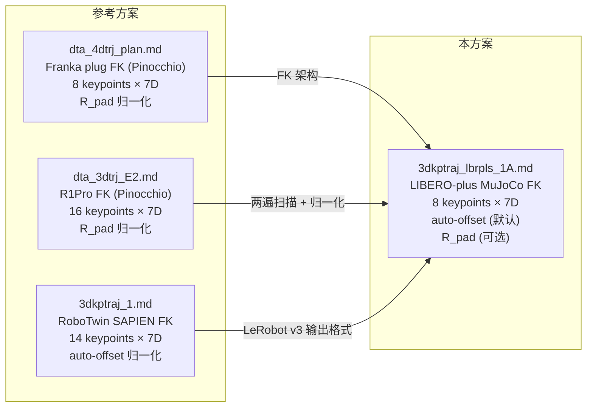
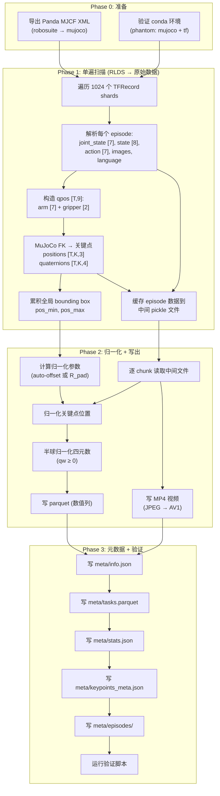
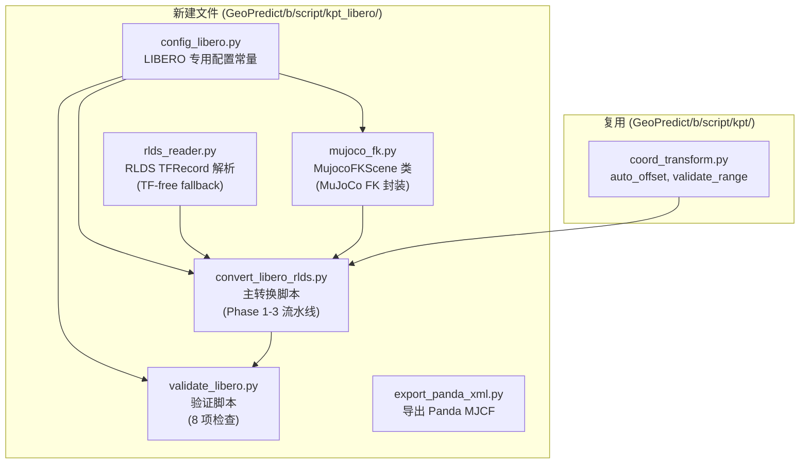
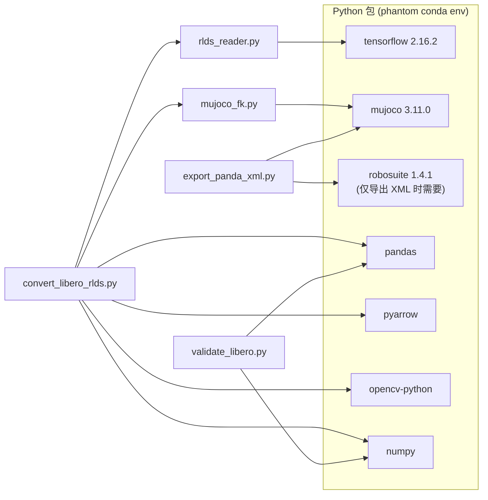
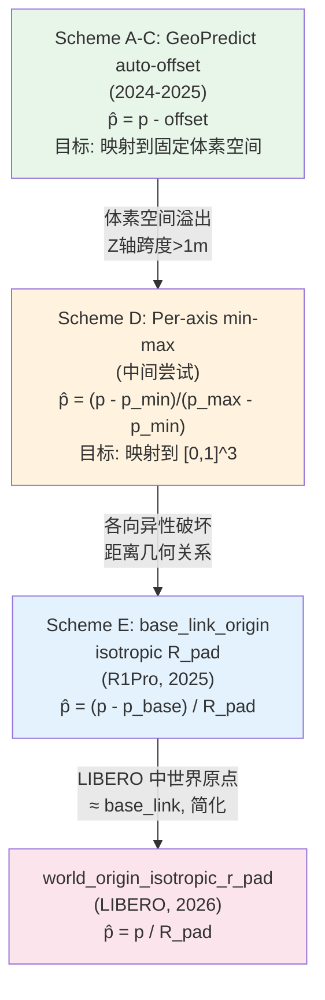
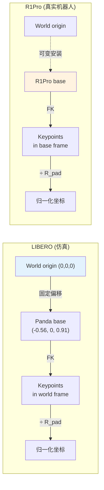
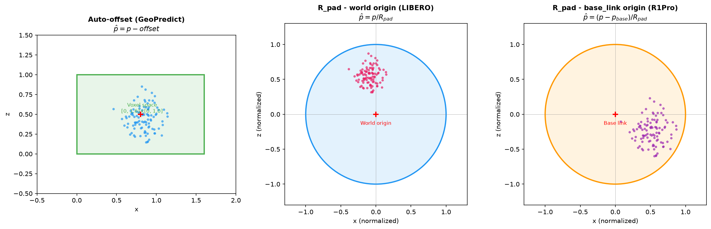
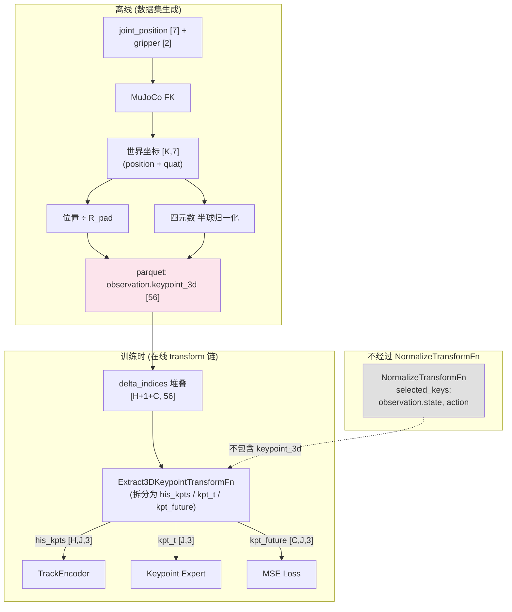
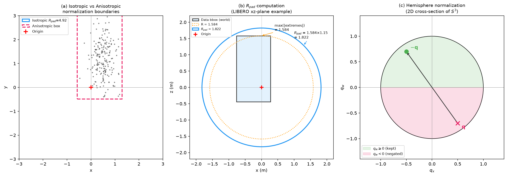

# LIBERO-plus RLDS → LeRobot v3.0 转换实施与落地方案（含操作手册）

> **目标**: 将 `/home/luogang/DATA/libero_plus_rlds/` 中的 RLDS TFRecord 数据转换为 LeRobot v3.0 格式，同时通过 MuJoCo FK 生成 Franka Panda 的 8 个 link 3D 关键点位置与姿态四元数，新数据保存到 `/home/luogang/DATA/libero_plus_lrb3/`。  
> **基于**: [`3dkptraj_lbrpls_1.md`](3dkptraj_lbrpls_1.md) §6 "方案 A'" (RLDS → MuJoCo FK)  
> **参考**: [`dta_4dtrj_plan.md`](../../itvlaGp/b/d/Frk/dta_4dtrj_plan.md) (Franka plug 7D 关键点方案), [`dta_3dtrj_E2.md`](../../itvlaGp/b/d/R1Pro/dta_3dtrj_E2.md) (R1Pro 7D 关键点方案), [`dta_3dtrj_E2implLog.md`](../../itvlaGp/b/d/R1Pro/dta_3dtrj_E2implLog.md) (E1 实施日志), [`3dkptraj_1.md`](3dkptraj_1.md) (RoboTwin SAPIEN FK 方案)  
> **代码参考**: `GeoPredict/b/script/kpt/batch_extract_lrb3_kptsim7.py`, `itvlaGp/util_scripts/generate_r1pro_keypoints_e1.py`, `itvlaGp/b/s/Frk/generate_franka_keypoints.py`  
> **日期**: 2026-09-09

---

## 一. 概述

### 1.1 目标

将 LIBERO-plus 的 RLDS TFRecord 数据转换为包含 3D link 关键点位置与姿态四元数的 LeRobot v3.0 格式数据集，用于下游 GeoPredict 或 InternVLA 模型训练。

| 项目 | 值 |
|------|-----|
| 输入路径 | `/home/luogang/DATA/libero_plus_rlds/libero_mix/1.0.0/` |
| 输入格式 | RLDS TFRecord, 1024 shards, ~14,347 episodes, ~2.24M frames |
| 输入大小 | ~78 GB |
| 输出路径 | `/home/luogang/DATA/libero_plus_lrb3/` |
| 输出格式 | LeRobot v3.0 (parquet + mp4 + meta) |
| 预估输出大小 | ~30 GB (parquet ~0.3 GB + video ~27 GB + meta ~10 MB) |
| 新增字段 | `observation.keypoint_3d` [24], `observation.keypoint_quat` [32] |
| 排除字段 | `reward`, `discount` |

### 1.2 输出字段一览

| 字段 | 维度 | dtype | 来源 | 说明 |
|------|------|-------|------|------|
| `observation.state` | `[8]` | float32 | RLDS `observation/state` | EEF 6D pose + gripper 2D |
| `observation.joint_state` | `[7]` | float32 | RLDS `observation/joint_state` | 7 arm joint angles (rad) |
| `action` | `[7]` | float32 | RLDS `action` | Delta action (6D + gripper) |
| `observation.images.image` | video | uint8 | RLDS `observation/image` | agentview 256×256 RGB |
| `observation.images.wrist_image` | video | uint8 | RLDS `observation/wrist_image` | wrist 256×256 RGB |
| `observation.keypoint_3d` | `[24]` | float32 | **MuJoCo FK** | K=8 × 3 位置 (归一化后) |
| `observation.keypoint_quat` | `[32]` | float32 | **MuJoCo FK** | K=8 × 4 四元数 (wxyz, 半球) |
| `language_instruction` | text | string | RLDS `language_instruction` | 任务描述 |
| `timestamp` | `[1]` | float32 | 计算 | frame_index / fps |
| `frame_index` | `[1]` | int64 | 计算 | episode 内帧索引 |
| `episode_index` | `[1]` | int64 | 计算 | episode 全局索引 |
| `index` | `[1]` | int64 | 计算 | 全局帧索引 |
| `task_index` | `[1]` | int64 | 计算 | 任务 ID |

> **不包含**: `reward` (RLDS 中为常量 1.0), `discount` (RLDS 中为常量 1.0)

### 1.3 与参考方案的关系



**本方案特点**:
- **FK 引擎**: MuJoCo (非 Pinocchio / SAPIEN) — 因 LIBERO 底层就是 robosuite/MuJoCo，用原始引擎确保结果完全一致
- **数据来源**: RLDS TFRecord (非 HDF5/parquet) — 避免额外下载 HDF5 数据
- **归一化**: 支持 auto-offset（GeoPredict 兼容）和 R_pad（InternVLA 兼容）两种模式
- **输出格式**: LeRobot v3.0 with separate position + quaternion columns（兼容 GeoPredict `batch_extract_lrb3_kptsim7.py` 的输出约定）

---

## 二. 技术方案设计

### 2.1 总体流程



#### 为什么分两个 Phase

RLDS TFRecord 解析是 I/O 密集操作（78 GB），MuJoCo FK 计算极快（~10 μs/frame），因此：

1. **Phase 1**: 只遍历一次 TFRecord（~1 小时），完成 FK 计算并缓存到轻量级中间文件（pickle, ~2 GB）  
2. **Phase 2**: 从中间文件读取（快速），应用归一化后写最终 parquet + 视频  

这样避免了对 78 GB TFRecord 的二次解析，同时保留了两遍扫描（先统计 bounding box 再归一化）的正确性。

### 2.2 MuJoCo FK 原理

MuJoCo 的正运动学（Forward Kinematics）通过 `mj_forward(model, data)` 一次性计算所有 body 的世界坐标系位姿：

$$
\text{mj\_forward}: \mathbf{q} \mapsto \{(\mathbf{p}_i, \mathbf{r}_i)\}_{i=1}^{n_{\text{body}}}
$$

其中 $\mathbf{q} \in \mathbb{R}^{n_q}$ 为广义坐标向量，$\mathbf{p}_i \in \mathbb{R}^3$ 为第 $i$ 个 body 的世界坐标位置（`data.xpos[i]`），$\mathbf{r}_i \in \mathbb{R}^4$ 为四元数（`data.xquat[i]`, wxyz 格式）。

对 Franka Panda 模型（通过 robosuite 导出）:

| 参数 | 值 | 说明 |
|------|-----|------|
| $n_q$ | 16 | 7 arm + 2 gripper + 7 cube (scene object) |
| Robot qpos | `data.qpos[0:9]` | 7 arm joints + 2 gripper fingers |
| Cube qpos | `data.qpos[9:16]` | Free joint (7 DOF), 忽略 |
| `data.xpos` | `[n_body, 3]` | 所有 body 的世界位置 |
| `data.xquat` | `[n_body, 4]` | 所有 body 的世界四元数 (wxyz) |

> **来源**: 通过 `robosuite.make("Lift", robots="Panda")` 导出的 MJCF 含完整场景，`nq=16` 包含 scene object 的自由度。设置 qpos 时只填前 9 维（机器人），其余保持零值。详见 [`3dkptraj_lbrpls_1.md`](3dkptraj_lbrpls_1.md) §5.1-§5.3。

### 2.3 关键点选取

选取 $K=8$ 个 body 作为关键点（7 个手臂 link + 1 个末端执行器），每个关键点提取 7D 信息（3D 位置 + 4D 四元数）:

| 索引 | Body 名称 | 说明 | 关节数据来源 |
|------|-----------|------|-------------|
| 0 | `robot0_link1` | 肩部 yaw | `qpos[0]` |
| 1 | `robot0_link2` | 肩部 pitch | `qpos[1]` |
| 2 | `robot0_link3` | 上臂旋转 | `qpos[2]` |
| 3 | `robot0_link4` | 肘部 | `qpos[3]` |
| 4 | `robot0_link5` | 前臂旋转 | `qpos[4]` |
| 5 | `robot0_link6` | 腕部 pitch | `qpos[5]` |
| 6 | `robot0_link7` | 腕部 roll | `qpos[6]` |
| 7 | `gripper0_eef` | 末端执行器 | `qpos[7:9]` (fingers) |

> **注意**: 末端执行器 body 名为 `gripper0_eef`（**不是** `gripper0_right_eef`）。这通过实际导出 robosuite 1.4.1 的 MJCF 验证得到，见下方 §2.4 的 body chain。

Body chain (从 `mj_printModel` 导出验证):
```
world → table → robot0_base → robot0_link0 → robot0_link1 → robot0_link2
→ robot0_link3 → robot0_link4 → robot0_link5 → robot0_link6 → robot0_link7
→ robot0_right_hand → gripper0_right_gripper → gripper0_eef
                                              → gripper0_leftfinger → gripper0_finger_joint1_tip
                                              → gripper0_rightfinger → gripper0_finger_joint2_tip
```

### 2.4 qpos 构造

从 RLDS 数据构造 MuJoCo 模型所需的 qpos 向量:

$$
\mathbf{q}[0{:}9] = [\underbrace{j_1, j_2, \ldots, j_7}_{\text{RLDS joint\_state [7]}}, \underbrace{f_L, f_R}_{\text{RLDS state[6:8]}}]
$$

| qpos 索引 | 来源 | 含义 |
|-----------|------|------|
| `[0:7]` | RLDS `observation/joint_state` [7] | 手臂 7 个关节角度 (rad) |
| `[7:9]` | RLDS `observation/state[6:8]` | 左右夹爪手指位置 |
| `[9:16]` | 固定为 0 | 场景物体自由度，不影响机器人 FK |

> **关节角验证**: 对 RLDS 数据进行了全量采样验证（14,805 帧），所有 7 个关节角均落在 Panda 硬件限位内，0 个越限。详见 [`3dkptraj_lbrpls_1.md`](3dkptraj_lbrpls_1.md) §1.4.5。

### 2.5 位置归一化方案

支持两种归一化方案，通过 `--normalization` 参数选择:

#### 方案 1: Auto-offset (GeoPredict 兼容，默认)

与 [`batch_extract_lrb3_kptsim7.py`](../../GeoPredict/b/script/kpt/batch_extract_lrb3_kptsim7.py) 和 [`coord_transform.py`](../../GeoPredict/b/script/kpt/coord_transform.py) 相同。将关键点工作空间居中到 GeoPredict 体素空间:

$$
\mathbf{o} = \frac{\mathbf{p}_{\min} + \mathbf{p}_{\max}}{2} - \mathbf{c}_{\text{voxel}}
$$

$$
\hat{\mathbf{p}} = \mathbf{p} - \mathbf{o}
$$

其中:
- $\mathbf{p}_{\min}, \mathbf{p}_{\max} \in \mathbb{R}^3$ 为所有 frame 所有关键点的全局位置极值
- $\mathbf{c}_{\text{voxel}} = [0.8, 0.8, 0.5]$ 为目标体素空间中心 (voxel range $[0, 1.6] \times [0, 1.6] \times [0, 1.0]$)
- $\hat{\mathbf{p}}$ 为归一化后位置

**验证条件**: 归一化后所有关键点应在 $[0, 1.6] \times [0, 1.6] \times [0, 1.0]$ 范围内。

#### 方案 2: R_pad (InternVLA 兼容)

与 [`generate_r1pro_keypoints_e1.py`](../../itvlaGp/util_scripts/generate_r1pro_keypoints_e1.py) 和 [`generate_franka_keypoints.py`](../../itvlaGp/b/s/Frk/generate_franka_keypoints.py) 相同。各向同性半径归一化:

$$
R_{\text{pad}} = \max\big(|x_{\min}|, x_{\max}, |y_{\min}|, y_{\max}, |z_{\min}|, z_{\max}\big) \times (1 + m)
$$

$$
\hat{\mathbf{p}} = \frac{\mathbf{p}}{R_{\text{pad}}}
$$

其中 $m = 0.15$（15% 安全边距, 与 R1Pro/Franka 方案一致）。

**验证条件**: 归一化后 $|\hat{p}_i| \le 1.0$ 对所有坐标分量成立。

> **设计决策**: 默认使用 auto-offset，因为本数据主要用于 GeoPredict 训练，且与 RoboTwin 数据集的处理方式一致。使用 `--normalization rpad` 可切换为 R_pad 模式（用于 InternVLA 训练时）。

### 2.6 四元数归一化

MuJoCo 输出的四元数为 wxyz 格式（$[q_w, q_x, q_y, q_z]$），满足 $\|\mathbf{r}\| = 1$。

**半球约束** (Hemisphere constraint): 四元数 $\mathbf{r}$ 和 $-\mathbf{r}$ 表示相同旋转（double cover 问题），通过约束 $q_w \ge 0$ 消除歧义:

$$
\hat{\mathbf{r}} = \begin{cases} \mathbf{r} & \text{if } q_w \ge 0 \\ -\mathbf{r} & \text{if } q_w < 0 \end{cases}
$$

> **参考**: 此约束与 [`dta_3dtrj_E2.md`](../../itvlaGp/b/d/R1Pro/dta_3dtrj_E2.md) §4.2 和 [`generate_r1pro_keypoints_e1.py`](../../itvlaGp/util_scripts/generate_r1pro_keypoints_e1.py) L123-124 的实现一致。

### 2.7 LeRobot v3.0 输出格式

输出目录结构（参考 [`batch_extract_lrb3_kptsim7.py`](../../GeoPredict/b/script/kpt/batch_extract_lrb3_kptsim7.py) 的 `build_v3_dataset()` 函数）:

```
/home/luogang/DATA/libero_plus_lrb3/
├── data/
│   ├── chunk-000/file-000.parquet    # episodes 0-999 (~156K frames)
│   ├── chunk-001/file-000.parquet    # episodes 1000-1999
│   ├── ...
│   └── chunk-014/file-000.parquet    # episodes 14000-14346
├── meta/
│   ├── info.json                     # 数据集元信息
│   ├── tasks.parquet                 # 任务名 → task_index 映射
│   ├── stats.json                    # 各列全局统计 (min/max/mean/std)
│   ├── keypoints_meta.json           # FK/归一化参数
│   └── episodes/
│       ├── chunk-000/file-000.parquet  # 每 episode 的 frame 数、task_index 等
│       ├── chunk-001/file-000.parquet
│       └── ...
├── videos/
│   ├── observation.images.image/
│   │   ├── chunk-000/file-000.mp4      # episodes 0-999 的 agentview 合并视频
│   │   └── ...
│   └── observation.images.wrist_image/
│       ├── chunk-000/file-000.mp4
│       └── ...
└── norm_stat.json                    # 归一化统计 (兼容 GeoPredict)
```

**Parquet 列布局** (每个 `file-000.parquet`):

| 列名 | dtype | 内容 |
|------|-------|------|
| `observation.state` | list<float32>[8] | EEF state |
| `observation.joint_state` | list<float32>[7] | Joint angles |
| `action` | list<float32>[7] | Delta action |
| `observation.keypoint_3d` | list<float32>[24] | K=8 × 3 (pos) |
| `observation.keypoint_quat` | list<float32>[32] | K=8 × 4 (quat wxyz) |
| `language_instruction` | string | Task description |
| `timestamp` | float32 | frame_index / fps |
| `frame_index` | int64 | In-episode frame index |
| `episode_index` | int64 | Global episode index |
| `index` | int64 | Global frame index |
| `task_index` | int64 | Task ID |

> **info.json 中的 `video_path` 模式**: `"videos/{video_key}/chunk-{chunk_index:03d}/file-{file_index:03d}.mp4"`，与 RoboTwin v3 输出一致。  
> **视频编码**: 使用 `libx264` (H.264) 编码，`yuv420p` 像素格式，20 fps（与 LIBERO 控制频率一致）。也可使用 `libsvtav1` (AV1) 以获得更好压缩，但编码速度约慢 5 倍。

---

## 三. 配置变量总表

| 变量 | 类型 | 默认值 | 含义 | 变更场景 |
|------|------|--------|------|---------|
| `RLDS_ROOT` | Path | `/home/luogang/DATA/libero_plus_rlds/libero_mix/1.0.0/` | RLDS 数据路径 | 数据位置变化 |
| `OUTPUT_ROOT` | Path | `/home/luogang/DATA/libero_plus_lrb3/` | 输出根目录 | 存储位置变化 |
| `CACHE_DIR` | Path | `/tmp/libero_plus_cache/` | Phase 1 中间缓存目录 | 磁盘空间调整 |
| `PANDA_XML_PATH` | Path | `/tmp/panda_robosuite_full.xml` | Panda MJCF XML | robosuite 版本变化 |
| `K` | int | `8` | 关键点数 | 增减跟踪 link |
| `KEYPOINT_BODY_NAMES` | list | `["robot0_link1", ..., "gripper0_eef"]` | 关键点 body 名 | robosuite 命名变化 |
| `QUAT_CONVENTION` | str | `"wxyz"` | 四元数分量顺序 | MuJoCo 约定不变 |
| `NORMALIZATION` | str | `"auto_offset"` | 归一化方案 | 切换 `rpad` 用于 InternVLA |
| `VOXEL_RANGE_MIN` | list | `[0.0, 0.0, 0.0]` | 体素空间下界 | GeoPredict 配置变化 |
| `VOXEL_RANGE_MAX` | list | `[1.6, 1.6, 1.0]` | 体素空间上界 | GeoPredict 配置变化 |
| `VOXEL_CENTER` | list | `[0.8, 0.8, 0.5]` | 体素空间中心 | 随 RANGE 变化 |
| `BBOX_MARGIN` | float | `0.15` | R_pad 安全边距 | 数据分布变化 |
| `FPS` | int | `20` | 控制频率 | LIBERO 默认 20Hz |
| `CHUNKS_SIZE` | int | `1000` | 每 chunk 最大 episode 数 | 性能调优 |
| `VIDEO_CODEC` | str | `"libx264"` | 视频编码器 | 换 `libsvtav1` |
| `NUM_WORKERS` | int | `8` | 视频编码并发数 | CPU 核心数 |
| `CONDA_ENV` | str | `"phantom"` | conda 环境名 | 环境管理 |

---

## 四. 代码架构设计

### 4.1 模块划分



### 4.2 模块职责

| 模块 | 职责 | 对外接口 |
|------|------|---------|
| `config_libero.py` | 所有配置常量（路径、body 名、归一化参数） | 常量导入 |
| `mujoco_fk.py` | MuJoCo 模型加载、qpos 设定、FK 计算 | `MujocoFKScene.get_body_poses()` |
| `rlds_reader.py` | RLDS TFRecord 解析为 Python dict | `iter_episodes(rlds_root)` |
| `convert_libero_rlds.py` | 端到端转换流水线 | CLI: `--rlds_root`, `--output`, `--normalization` |
| `validate_libero.py` | 输出数据质量检查 | CLI: `--dataset_root` |
| `export_panda_xml.py` | 从 robosuite 导出 Panda MJCF | CLI: `--output` |

### 4.3 依赖关系图



---

## 五. 完整代码

### 5.1 `config_libero.py` — 配置常量

```python
"""Configuration constants for LIBERO-plus RLDS → LeRobot v3.0 conversion."""
from __future__ import annotations

from pathlib import Path
import numpy as np

# ─── Paths ───
RLDS_ROOT = Path("/home/luogang/DATA/libero_plus_rlds/libero_mix/1.0.0")
OUTPUT_ROOT = Path("/home/luogang/DATA/libero_plus_lrb3")
CACHE_DIR = Path("/tmp/libero_plus_cache")
PANDA_XML_PATH = Path("/tmp/panda_robosuite_full.xml")

# ─── Robot model ───
K = 8  # 7 arm links + 1 EEF
KEYPOINT_BODY_NAMES = [
    "robot0_link1", "robot0_link2", "robot0_link3", "robot0_link4",
    "robot0_link5", "robot0_link6", "robot0_link7", "gripper0_eef",
]
KEYPOINT_NAMES = KEYPOINT_BODY_NAMES  # display names = body names
ROBOT_NQPOS = 9   # 7 arm + 2 gripper
SCENE_NQ = 16     # full model (robot + cube)

# ─── Quaternion ───
QUAT_DIM = 4
QUAT_CONVENTION = "wxyz"

# ─── Normalization: auto-offset (GeoPredict) ───
VOXEL_RANGE_MIN = np.array([0.0, 0.0, 0.0], dtype=np.float32)
VOXEL_RANGE_MAX = np.array([1.6, 1.6, 1.0], dtype=np.float32)
VOXEL_CENTER = (VOXEL_RANGE_MIN + VOXEL_RANGE_MAX) / 2.0

# ─── Normalization: R_pad (InternVLA) ───
BBOX_MARGIN = 0.15  # 15% safety margin

# ─── Dataset ───
FPS = 20
CHUNKS_SIZE = 1000
TOTAL_SHARDS = 1024

# ─── Video ───
VIDEO_CODEC = "libx264"
VIDEO_PIX_FMT = "yuv420p"
VIDEO_CRF = "23"  # quality (lower = better, 18-28 typical)

# ─── Workers ───
NUM_WORKERS = 8

# ─── Feature names for stats ───
POS_FEATURE_NAMES = [
    f"{name}_{c}" for name in KEYPOINT_NAMES for c in ("px", "py", "pz")
]
QUAT_FEATURE_NAMES = [
    f"{name}_{c}" for name in KEYPOINT_NAMES for c in ("qw", "qx", "qy", "qz")
]
```

### 5.2 `mujoco_fk.py` — MuJoCo FK 封装

```python
"""MuJoCo FK wrapper for Franka Panda (from robosuite MJCF)."""
from __future__ import annotations

from pathlib import Path
from typing import Dict, List, Tuple

import mujoco
import numpy as np

from .config_libero import KEYPOINT_BODY_NAMES, PANDA_XML_PATH, ROBOT_NQPOS


class MujocoFKScene:
    """Load Franka Panda in a minimal MuJoCo scene for FK queries.

    Adapted from 3dkptraj_lbrpls_1.md §6.3 MujocoFKScene design,
    with body_id caching for performance.
    """

    def __init__(self, model_xml: str | Path = PANDA_XML_PATH):
        self.model = mujoco.MjModel.from_xml_path(str(model_xml))
        self.data = mujoco.MjData(self.model)
        self._body_id_cache: Dict[str, int] = {}
        for name in KEYPOINT_BODY_NAMES:
            self._body_id_cache[name] = self.model.body(name).id

    def set_qpos_and_forward(self, qpos: np.ndarray) -> None:
        """Set robot qpos (first ROBOT_NQPOS entries) and run FK."""
        n = min(len(qpos), ROBOT_NQPOS)
        self.data.qpos[:n] = qpos[:n]
        mujoco.mj_forward(self.model, self.data)

    def get_body_poses(
        self, body_names: List[str] | None = None
    ) -> Tuple[np.ndarray, np.ndarray]:
        """Get world-frame positions [K,3] and quaternions [K,4] (wxyz).

        Must call set_qpos_and_forward() first.
        """
        if body_names is None:
            body_names = KEYPOINT_BODY_NAMES
        n = len(body_names)
        positions = np.zeros((n, 3), dtype=np.float32)
        quaternions = np.zeros((n, 4), dtype=np.float32)
        for i, name in enumerate(body_names):
            bid = self._body_id_cache.get(name)
            if bid is None:
                bid = self.model.body(name).id
                self._body_id_cache[name] = bid
            positions[i] = self.data.xpos[bid]
            quaternions[i] = self.data.xquat[bid]  # wxyz
        return positions, quaternions

    def extract_episode(
        self, qpos_seq: np.ndarray, body_names: List[str] | None = None
    ) -> Tuple[np.ndarray, np.ndarray]:
        """Extract keypoints for an entire episode.

        Args:
            qpos_seq: [T, 9] joint positions (arm + gripper)
            body_names: override keypoint bodies

        Returns:
            positions: [T, K, 3] float32
            quaternions: [T, K, 4] float32 (wxyz, hemisphere-normalized)
        """
        if body_names is None:
            body_names = KEYPOINT_BODY_NAMES
        T = qpos_seq.shape[0]
        K = len(body_names)
        all_pos = np.zeros((T, K, 3), dtype=np.float32)
        all_quat = np.zeros((T, K, 4), dtype=np.float32)

        for t in range(T):
            self.set_qpos_and_forward(qpos_seq[t])
            pos, quat = self.get_body_poses(body_names)
            # Hemisphere normalization: ensure qw >= 0
            neg_mask = quat[:, 0] < 0  # qw is index 0 in wxyz
            quat[neg_mask] = -quat[neg_mask]
            all_pos[t] = pos
            all_quat[t] = quat

        return all_pos, all_quat

    def close(self):
        self.model = None
        self.data = None
```

> **设计来源**: 类结构参考 [`3dkptraj_lbrpls_1.md`](3dkptraj_lbrpls_1.md) §6.3 的 `MujocoFKScene`，body_id 缓存模式参考 [`keypoint_extractor.py`](../../GeoPredict/b/script/kpt/keypoint_extractor.py) L49；半球归一化参考 [`generate_r1pro_keypoints_e1.py`](../../itvlaGp/util_scripts/generate_r1pro_keypoints_e1.py) L123-124。

### 5.3 `rlds_reader.py` — RLDS TFRecord 解析

```python
"""Parse LIBERO-plus RLDS TFRecord files into Python dicts.

Each TFRecord example represents one episode with flattened step features.
"""
from __future__ import annotations

import glob
from pathlib import Path
from typing import Dict, Iterator, Any

import numpy as np
import tensorflow as tf


def _decode_jpeg(raw_bytes: bytes) -> np.ndarray:
    """Decode a single JPEG image to [H, W, 3] uint8 RGB numpy array."""
    img = tf.io.decode_jpeg(raw_bytes, channels=3)
    return img.numpy()


def parse_episode(raw_record: bytes) -> Dict[str, Any]:
    """Parse a single RLDS TFRecord example into numpy arrays.

    Returns dict with keys:
        qpos:        [T, 9] float32  (arm 7 + gripper 2)
        state:       [T, 8] float32  (EEF state)
        joint_state: [T, 7] float32  (arm joints)
        action:      [T, 7] float32  (delta action)
        image:       list of T JPEG bytes  (agentview)
        wrist_image: list of T JPEG bytes  (wrist cam)
        language:    str
        file_path:   str
        n_steps:     int

    Based on 3dkptraj_lbrpls_1.md §6.3 parse_rlds_episode design.
    """
    ex = tf.train.Example()
    ex.ParseFromString(raw_record)
    f = ex.features.feature

    n_steps = len(f["steps/is_first"].int64_list.value)

    joint_state = np.array(
        f["steps/observation/joint_state"].float_list.value, dtype=np.float32
    ).reshape(n_steps, 7)

    state = np.array(
        f["steps/observation/state"].float_list.value, dtype=np.float32
    ).reshape(n_steps, 8)

    action = np.array(
        f["steps/action"].float_list.value, dtype=np.float32
    ).reshape(n_steps, 7)

    # Construct 9-dim qpos: arm [7] + gripper fingers [2]
    gripper = state[:, 6:8]
    qpos = np.concatenate([joint_state, gripper], axis=1)  # [T, 9]

    # Language instruction (repeated per step, take first)
    language = f["steps/language_instruction"].bytes_list.value[0].decode("utf-8")

    # Episode metadata
    file_path = f["episode_metadata/file_path"].bytes_list.value[0].decode("utf-8")

    # Images as raw JPEG bytes (NOT decoded yet, to save memory)
    image_bytes = list(f["steps/observation/image"].bytes_list.value)
    wrist_image_bytes = list(f["steps/observation/wrist_image"].bytes_list.value)

    return {
        "qpos": qpos,
        "state": state,
        "joint_state": joint_state,
        "action": action,
        "image": image_bytes,
        "wrist_image": wrist_image_bytes,
        "language": language,
        "file_path": file_path,
        "n_steps": n_steps,
    }


def iter_episodes(rlds_root: str | Path) -> Iterator[Dict[str, Any]]:
    """Iterate over all episodes across all shards in RLDS root.

    Yields parsed episode dicts in shard order.
    """
    rlds_root = Path(rlds_root)
    shard_pattern = str(rlds_root / "libero_mix-train.tfrecord-*")
    shard_files = sorted(glob.glob(shard_pattern))
    if not shard_files:
        raise FileNotFoundError(
            f"No TFRecord shards found matching {shard_pattern}"
        )

    for shard_path in shard_files:
        dataset = tf.data.TFRecordDataset(shard_path)
        for raw_record in dataset:
            yield parse_episode(raw_record.numpy())


def count_episodes(rlds_root: str | Path) -> int:
    """Quick count of total episodes without parsing contents."""
    rlds_root = Path(rlds_root)
    shard_pattern = str(rlds_root / "libero_mix-train.tfrecord-*")
    shard_files = sorted(glob.glob(shard_pattern))
    count = 0
    for shard_path in shard_files:
        dataset = tf.data.TFRecordDataset(shard_path)
        count += sum(1 for _ in dataset)
    return count
```

> **设计来源**: `parse_episode` 的 TFRecord 解析逻辑参考 [`3dkptraj_lbrpls_1.md`](3dkptraj_lbrpls_1.md) §6.3 的 `parse_rlds_episode`；JPEG 延迟解码策略参考 [`convert_franka_plug_hdf5.py`](../../itvlaGp/b/s/Frk/convert_franka_plug_hdf5.py) 的内存优化设计。

### 5.4 `convert_libero_rlds.py` — 主转换脚本

```python
#!/usr/bin/env python3
"""Convert LIBERO-plus RLDS TFRecord → LeRobot v3.0 with FK keypoints.

Two-phase pipeline:
  Phase 1: Parse RLDS + MuJoCo FK → intermediate cache + global bbox
  Phase 2: Normalize → write parquet + video + metadata

Usage:
    conda run -n phantom python convert_libero_rlds.py
    conda run -n phantom python convert_libero_rlds.py --normalization rpad
    conda run -n phantom python convert_libero_rlds.py --resume  # resume from cache

Design references:
    - generate_r1pro_keypoints_e1.py: two-pass pipeline, R_pad normalization
    - batch_extract_lrb3_kptsim7.py: LeRobot v3 output format
    - 3dkptraj_lbrpls_1.md §6: LIBERO FK architecture
"""
from __future__ import annotations

import argparse
import json
import logging
import os
import pickle
import subprocess
import sys
import time
from collections import defaultdict
from concurrent.futures import ProcessPoolExecutor, as_completed
from pathlib import Path
from typing import Any, Dict, List, Optional, Tuple

import cv2
import numpy as np
import pandas as pd
import pyarrow as pa
import pyarrow.parquet as pq

# ─── Ensure imports work when run as script ───
SCRIPT_DIR = Path(__file__).resolve().parent
sys.path.insert(0, str(SCRIPT_DIR.parent))

from kpt_libero.config_libero import (
    BBOX_MARGIN,
    CACHE_DIR,
    CHUNKS_SIZE,
    FPS,
    K,
    KEYPOINT_BODY_NAMES,
    KEYPOINT_NAMES,
    NUM_WORKERS,
    OUTPUT_ROOT,
    PANDA_XML_PATH,
    POS_FEATURE_NAMES,
    QUAT_CONVENTION,
    QUAT_DIM,
    QUAT_FEATURE_NAMES,
    RLDS_ROOT,
    VIDEO_CODEC,
    VIDEO_CRF,
    VIDEO_PIX_FMT,
    VOXEL_CENTER,
    VOXEL_RANGE_MAX,
    VOXEL_RANGE_MIN,
)
from kpt_libero.mujoco_fk import MujocoFKScene
from kpt_libero.rlds_reader import iter_episodes

logging.basicConfig(
    level=logging.INFO,
    format="%(asctime)s [%(levelname)s] %(message)s",
    datefmt="%H:%M:%S",
)
logger = logging.getLogger(__name__)


# ═══════════════════════════════════════════════════════════════
#  Phase 1: Parse RLDS + FK → cache + global bbox
# ═══════════════════════════════════════════════════════════════

def phase1_parse_and_fk(
    rlds_root: Path,
    xml_path: Path,
    cache_dir: Path,
) -> Tuple[np.ndarray, np.ndarray, int, int, Dict[str, int]]:
    """Parse all RLDS episodes, run FK, cache to disk, collect global bbox.

    Returns:
        global_min: [3] float32
        global_max: [3] float32
        total_episodes: int
        total_frames: int
        task_map: {language_instruction: task_index}
    """
    fk = MujocoFKScene(xml_path)
    cache_dir.mkdir(parents=True, exist_ok=True)

    global_min = np.full(3, np.inf, dtype=np.float64)
    global_max = np.full(3, -np.inf, dtype=np.float64)
    total_episodes = 0
    total_frames = 0
    task_map: Dict[str, int] = {}

    # Quaternion sanity trackers
    qw_min_global = 1.0
    quat_norm_err_max = 0.0

    t0 = time.time()
    for ep_data in iter_episodes(rlds_root):
        ep_idx = total_episodes

        # FK
        positions, quaternions = fk.extract_episode(ep_data["qpos"])
        # positions: [T, K, 3], quaternions: [T, K, 4] (hemisphere-normalized)

        # Track global bbox
        pos_flat = positions.reshape(-1, 3)
        global_min = np.minimum(global_min, pos_flat.min(axis=0))
        global_max = np.maximum(global_max, pos_flat.max(axis=0))

        # Quaternion checks
        qw_vals = quaternions[:, :, 0]  # wxyz → qw is index 0
        qw_min_global = min(qw_min_global, float(qw_vals.min()))
        quat_norms = np.linalg.norm(quaternions.reshape(-1, 4), axis=1)
        quat_norm_err_max = max(
            quat_norm_err_max, float(np.abs(quat_norms - 1.0).max())
        )

        # Task mapping
        lang = ep_data["language"]
        if lang not in task_map:
            task_map[lang] = len(task_map)

        # Cache episode data (numerical + image bytes)
        cache_path = cache_dir / f"ep_{ep_idx:06d}.pkl"
        cache_data = {
            "state": ep_data["state"],
            "joint_state": ep_data["joint_state"],
            "action": ep_data["action"],
            "positions": positions,       # [T, K, 3] raw (un-normalized)
            "quaternions": quaternions,    # [T, K, 4] hemisphere-normalized
            "language": lang,
            "file_path": ep_data["file_path"],
            "n_steps": ep_data["n_steps"],
            "image": ep_data["image"],           # list of JPEG bytes
            "wrist_image": ep_data["wrist_image"],
        }
        with open(cache_path, "wb") as f:
            pickle.dump(cache_data, f, protocol=pickle.HIGHEST_PROTOCOL)

        total_frames += ep_data["n_steps"]
        total_episodes += 1

        if total_episodes % 100 == 0:
            elapsed = time.time() - t0
            rate = total_episodes / elapsed
            logger.info(
                "Phase 1: %d episodes, %d frames (%.1f ep/s, ETA %.0f min)",
                total_episodes, total_frames, rate,
                (14347 - total_episodes) / max(rate, 0.01) / 60,
            )

    fk.close()

    logger.info("Phase 1 complete: %d episodes, %d frames", total_episodes, total_frames)
    logger.info("Global pos min: %s", global_min.astype(np.float32))
    logger.info("Global pos max: %s", global_max.astype(np.float32))
    logger.info("Quaternion qw_min=%.6f (should be ≥0), norm_err_max=%.2e",
                qw_min_global, quat_norm_err_max)

    if qw_min_global < 0:
        raise RuntimeError(f"Hemisphere normalization failed: qw_min={qw_min_global}")
    if quat_norm_err_max > 0.01:
        raise RuntimeError(f"Quaternion norm error too large: {quat_norm_err_max}")

    return (
        global_min.astype(np.float32),
        global_max.astype(np.float32),
        total_episodes,
        total_frames,
        task_map,
    )


# ═══════════════════════════════════════════════════════════════
#  Normalization
# ═══════════════════════════════════════════════════════════════

def compute_auto_offset(
    global_min: np.ndarray,
    global_max: np.ndarray,
    target_center: np.ndarray = VOXEL_CENTER,
) -> np.ndarray:
    """Compute workspace → voxel-space offset (GeoPredict convention).

    Reference: GeoPredict/b/script/kpt/coord_transform.py:compute_auto_offset()
    """
    workspace_center = (global_min + global_max) / 2.0
    return (workspace_center - target_center).astype(np.float32)


def compute_r_pad(
    global_min: np.ndarray,
    global_max: np.ndarray,
    margin: float = BBOX_MARGIN,
) -> float:
    """Compute isotropic bounding radius with safety margin.

    Reference: itvlaGp/util_scripts/generate_r1pro_keypoints_e1.py:compute_r_pad()

    R = max(|x_min|, x_max, |y_min|, y_max, |z_min|, z_max)
    R_pad = R × (1 + margin)
    """
    abs_extremes = np.maximum(np.abs(global_min), np.abs(global_max))
    R = float(abs_extremes.max())
    return R * (1.0 + margin)


def normalize_positions_auto_offset(
    positions: np.ndarray, offset: np.ndarray
) -> np.ndarray:
    """Apply auto-offset: p_norm = p - offset."""
    return (positions - offset).astype(np.float32)


def normalize_positions_rpad(
    positions: np.ndarray, r_pad: float
) -> np.ndarray:
    """Apply R_pad: p_norm = p / R_pad."""
    return (positions / r_pad).astype(np.float32)


# ═══════════════════════════════════════════════════════════════
#  Video encoding
# ═══════════════════════════════════════════════════════════════

def _encode_video_chunk(
    video_dir: Path,
    episodes: List[Dict],
    camera_key: str,
    chunk_idx: int,
) -> Path:
    """Encode all frames from episodes in a chunk into one MP4 file.

    For LeRobot v3 with chunk-level video files:
    videos/{camera_key}/chunk-{chunk_idx:03d}/file-000.mp4
    """
    out_dir = video_dir / camera_key / f"chunk-{chunk_idx:03d}"
    out_dir.mkdir(parents=True, exist_ok=True)
    out_path = out_dir / "file-000.mp4"

    # Collect all frames in order
    all_frames = []
    for ep in episodes:
        for jpeg_bytes in ep[camera_key]:
            arr = np.frombuffer(jpeg_bytes, dtype=np.uint8)
            img = cv2.imdecode(arr, cv2.IMREAD_COLOR)  # BGR
            all_frames.append(img)

    if not all_frames:
        return out_path

    h, w = all_frames[0].shape[:2]

    # Use ffmpeg subprocess for reliable encoding
    cmd = [
        "ffmpeg", "-y",
        "-f", "rawvideo",
        "-vcodec", "rawvideo",
        "-s", f"{w}x{h}",
        "-pix_fmt", "bgr24",
        "-r", str(FPS),
        "-i", "-",
        "-c:v", VIDEO_CODEC,
        "-pix_fmt", VIDEO_PIX_FMT,
        "-crf", VIDEO_CRF,
        str(out_path),
    ]
    proc = subprocess.Popen(
        cmd, stdin=subprocess.PIPE, stdout=subprocess.DEVNULL, stderr=subprocess.PIPE
    )
    for frame in all_frames:
        proc.stdin.write(frame.tobytes())
    proc.stdin.close()
    proc.wait()
    if proc.returncode != 0:
        stderr = proc.stderr.read().decode()
        raise RuntimeError(f"ffmpeg failed for {out_path}: {stderr[-500:]}")

    return out_path


# ═══════════════════════════════════════════════════════════════
#  Phase 2: Normalize + write LeRobot v3.0
# ═══════════════════════════════════════════════════════════════

def phase2_write_dataset(
    cache_dir: Path,
    output_root: Path,
    total_episodes: int,
    total_frames: int,
    task_map: Dict[str, int],
    normalization: str,
    norm_params: Dict[str, Any],
) -> Dict[str, Any]:
    """Read cached episodes, normalize, write parquet + video + meta.

    Returns stats dict for all features.
    """
    output_root.mkdir(parents=True, exist_ok=True)

    # ─── Prepare stats accumulators ───
    stats_accum = defaultdict(lambda: {
        "min": np.full(1, np.inf),
        "max": np.full(1, -np.inf),
        "sum": np.float64(0.0),
        "sum_sq": np.float64(0.0),
        "count": 0,
    })
    # Per-vector stats (for array columns)
    vec_stats = {}

    # ─── Process by chunk ───
    num_chunks = (total_episodes + CHUNKS_SIZE - 1) // CHUNKS_SIZE
    global_frame_idx = 0

    # Per-episode metadata accumulator
    ep_meta_rows = []

    video_dir = output_root / "videos"

    for chunk_idx in range(num_chunks):
        ep_start = chunk_idx * CHUNKS_SIZE
        ep_end = min(ep_start + CHUNKS_SIZE, total_episodes)
        chunk_episodes = []

        # ─── Load cached episodes for this chunk ───
        parquet_rows = []
        for ep_idx in range(ep_start, ep_end):
            cache_path = cache_dir / f"ep_{ep_idx:06d}.pkl"
            with open(cache_path, "rb") as f:
                ep = pickle.load(f)
            chunk_episodes.append(ep)

            T = ep["n_steps"]
            task_idx = task_map[ep["language"]]

            # Normalize positions
            positions = ep["positions"]  # [T, K, 3]
            if normalization == "auto_offset":
                offset = norm_params["offset"]
                positions = normalize_positions_auto_offset(positions, offset)
            elif normalization == "rpad":
                r_pad = norm_params["r_pad"]
                positions = normalize_positions_rpad(positions, r_pad)

            quaternions = ep["quaternions"]  # [T, K, 4] already hemisphere-normalized

            # Flatten: [T, K, 3] → [T, K*3], [T, K, 4] → [T, K*4]
            pos_flat = positions.reshape(T, K * 3)
            quat_flat = quaternions.reshape(T, K * QUAT_DIM)

            for t in range(T):
                row = {
                    "observation.state": ep["state"][t].tolist(),
                    "observation.joint_state": ep["joint_state"][t].tolist(),
                    "action": ep["action"][t].tolist(),
                    "observation.keypoint_3d": pos_flat[t].tolist(),
                    "observation.keypoint_quat": quat_flat[t].tolist(),
                    "language_instruction": ep["language"],
                    "timestamp": float(t) / FPS,
                    "frame_index": t,
                    "episode_index": ep_idx,
                    "index": global_frame_idx,
                    "task_index": task_idx,
                }
                parquet_rows.append(row)
                global_frame_idx += 1

            # Accumulate stats for this episode's arrays
            for col_name, arr in [
                ("observation.state", ep["state"]),
                ("observation.joint_state", ep["joint_state"]),
                ("action", ep["action"]),
                ("observation.keypoint_3d", pos_flat),
                ("observation.keypoint_quat", quat_flat),
            ]:
                if col_name not in vec_stats:
                    dim = arr.shape[1]
                    vec_stats[col_name] = {
                        "min": np.full(dim, np.inf, dtype=np.float64),
                        "max": np.full(dim, -np.inf, dtype=np.float64),
                        "sum": np.zeros(dim, dtype=np.float64),
                        "sum_sq": np.zeros(dim, dtype=np.float64),
                        "count": 0,
                    }
                vs = vec_stats[col_name]
                vs["min"] = np.minimum(vs["min"], arr.min(axis=0))
                vs["max"] = np.maximum(vs["max"], arr.max(axis=0))
                vs["sum"] += arr.sum(axis=0)
                vs["sum_sq"] += (arr.astype(np.float64) ** 2).sum(axis=0)
                vs["count"] += arr.shape[0]

            # Episode metadata
            ep_meta_rows.append({
                "episode_index": ep_idx,
                "task_index": task_idx,
                "length": T,
                "task": ep["language"],
                "file_path": ep["file_path"],
            })

        # ─── Write parquet for this chunk ───
        data_dir = output_root / "data" / f"chunk-{chunk_idx:03d}"
        data_dir.mkdir(parents=True, exist_ok=True)
        df = pd.DataFrame(parquet_rows)
        pq_path = data_dir / "file-000.parquet"
        df.to_parquet(pq_path, index=False)
        logger.info(
            "Chunk %d/%d: wrote %d rows to %s",
            chunk_idx + 1, num_chunks, len(df), pq_path,
        )

        # ─── Encode videos for this chunk ───
        for cam_key in ("image", "wrist_image"):
            video_key = f"observation.images.{cam_key.replace('wrist_image', 'wrist_image')}"
            if cam_key == "image":
                video_key = "observation.images.image"
            else:
                video_key = "observation.images.wrist_image"

            _encode_video_chunk(video_dir, chunk_episodes, cam_key, chunk_idx)
            logger.info("  Video: %s chunk-%03d done", video_key, chunk_idx)

        # Free memory
        del chunk_episodes, parquet_rows, df

    # ─── Compute final stats ───
    final_stats = {}
    for col_name, vs in vec_stats.items():
        mean = vs["sum"] / vs["count"]
        std = np.sqrt(vs["sum_sq"] / vs["count"] - mean ** 2)
        final_stats[col_name] = {
            "min": vs["min"].tolist(),
            "max": vs["max"].tolist(),
            "mean": mean.tolist(),
            "std": std.tolist(),
            "count": int(vs["count"]),
        }

    return final_stats, ep_meta_rows


# ═══════════════════════════════════════════════════════════════
#  Phase 3: Write metadata
# ═══════════════════════════════════════════════════════════════

def phase3_write_metadata(
    output_root: Path,
    total_episodes: int,
    total_frames: int,
    task_map: Dict[str, int],
    stats: Dict,
    ep_meta_rows: List[Dict],
    normalization: str,
    norm_params: Dict[str, Any],
    global_min: np.ndarray,
    global_max: np.ndarray,
    xml_path: str,
) -> None:
    """Write all LeRobot v3.0 metadata files."""

    meta_dir = output_root / "meta"
    meta_dir.mkdir(parents=True, exist_ok=True)

    num_chunks = (total_episodes + CHUNKS_SIZE - 1) // CHUNKS_SIZE

    # ─── info.json ───
    info = {
        "codebase_version": "v3.0",
        "robot_type": "franka",
        "total_episodes": total_episodes,
        "total_frames": total_frames,
        "total_tasks": len(task_map),
        "total_videos": total_episodes * 2,
        "total_chunks": num_chunks,
        "chunks_size": CHUNKS_SIZE,
        "fps": FPS,
        "splits": {"train": f"0:{total_episodes}"},
        "data_path": "data/chunk-{chunk_index:03d}/file-{file_index:03d}.parquet",
        "video_path": "videos/{video_key}/chunk-{chunk_index:03d}/file-{file_index:03d}.mp4",
        "features": {
            "observation.state": {
                "dtype": "float32",
                "shape": [8],
                "names": [["x", "y", "z", "r1", "r2", "r3", "gripper_L", "gripper_R"]],
            },
            "observation.joint_state": {
                "dtype": "float32",
                "shape": [7],
                "names": [["joint1", "joint2", "joint3", "joint4",
                           "joint5", "joint6", "joint7"]],
            },
            "action": {
                "dtype": "float32",
                "shape": [7],
                "names": [["dx", "dy", "dz", "dr1", "dr2", "dr3", "gripper"]],
            },
            "observation.keypoint_3d": {
                "dtype": "float32",
                "shape": [K * 3],
                "names": [POS_FEATURE_NAMES],
            },
            "observation.keypoint_quat": {
                "dtype": "float32",
                "shape": [K * QUAT_DIM],
                "names": [QUAT_FEATURE_NAMES],
            },
            "observation.images.image": {
                "dtype": "video",
                "shape": [256, 256, 3],
                "names": ["height", "width", "rgb"],
                "info": {
                    "video.height": 256,
                    "video.width": 256,
                    "video.codec": VIDEO_CODEC.replace("lib", ""),
                    "video.pix_fmt": VIDEO_PIX_FMT,
                    "video.is_depth_map": False,
                    "video.fps": FPS,
                    "video.channels": 3,
                    "has_audio": False,
                },
            },
            "observation.images.wrist_image": {
                "dtype": "video",
                "shape": [256, 256, 3],
                "names": ["height", "width", "rgb"],
                "info": {
                    "video.height": 256,
                    "video.width": 256,
                    "video.codec": VIDEO_CODEC.replace("lib", ""),
                    "video.pix_fmt": VIDEO_PIX_FMT,
                    "video.is_depth_map": False,
                    "video.fps": FPS,
                    "video.channels": 3,
                    "has_audio": False,
                },
            },
            "language_instruction": {
                "dtype": "string",
                "shape": [1],
            },
            "timestamp": {"dtype": "float32", "shape": [1]},
            "frame_index": {"dtype": "int64", "shape": [1]},
            "episode_index": {"dtype": "int64", "shape": [1]},
            "index": {"dtype": "int64", "shape": [1]},
            "task_index": {"dtype": "int64", "shape": [1]},
        },
    }
    with open(meta_dir / "info.json", "w") as f:
        json.dump(info, f, indent=2)
    logger.info("Wrote meta/info.json")

    # ─── tasks.parquet ───
    tasks_rows = [{"task_index": idx, "task": lang}
                  for lang, idx in sorted(task_map.items(), key=lambda x: x[1])]
    pd.DataFrame(tasks_rows).to_parquet(meta_dir / "tasks.parquet", index=False)
    logger.info("Wrote meta/tasks.parquet (%d tasks)", len(tasks_rows))

    # ─── stats.json ───
    with open(meta_dir / "stats.json", "w") as f:
        json.dump(stats, f, indent=2)
    logger.info("Wrote meta/stats.json")

    # ─── keypoints_meta.json ───
    kpt_meta = {
        "K": K,
        "keypoint_names": KEYPOINT_NAMES,
        "keypoint_body_names": KEYPOINT_BODY_NAMES,
        "position_dim": 3,
        "quaternion_dim": QUAT_DIM,
        "quaternion_convention": QUAT_CONVENTION,
        "hemisphere_constraint": "qw >= 0; negate all 4 if qw < 0",
        "normalization_method": normalization,
        "global_pos_min": global_min.tolist(),
        "global_pos_max": global_max.tolist(),
        "mjcf_xml": str(xml_path),
        "robot_base_offset": "embedded in MJCF ([-0.56, 0, 0.912] for robosuite Lift)",
        "fps": FPS,
        "source": "LIBERO-plus RLDS (libero_mix)",
    }
    if normalization == "auto_offset":
        kpt_meta["auto_offset"] = norm_params["offset"].tolist()
        kpt_meta["voxel_range_min"] = VOXEL_RANGE_MIN.tolist()
        kpt_meta["voxel_range_max"] = VOXEL_RANGE_MAX.tolist()
        kpt_meta["coordinate_system"] = (
            "world-frame positions, auto-offset to voxel space "
            f"[{VOXEL_RANGE_MIN.tolist()}, {VOXEL_RANGE_MAX.tolist()}]"
        )
    elif normalization == "rpad":
        kpt_meta["r_pad"] = norm_params["r_pad"]
        kpt_meta["bbox_margin"] = BBOX_MARGIN
        kpt_meta["coordinate_system"] = (
            "world-frame positions divided by R_pad for isotropic normalization"
        )
    with open(meta_dir / "keypoints_meta.json", "w") as f:
        json.dump(kpt_meta, f, indent=2)
    logger.info("Wrote meta/keypoints_meta.json")

    # ─── episodes/ ───
    ep_df = pd.DataFrame(ep_meta_rows)
    for chunk_idx in range(num_chunks):
        ep_start = chunk_idx * CHUNKS_SIZE
        ep_end = min(ep_start + CHUNKS_SIZE, total_episodes)
        chunk_ep_df = ep_df[
            (ep_df["episode_index"] >= ep_start) & (ep_df["episode_index"] < ep_end)
        ]
        ep_dir = meta_dir / "episodes" / f"chunk-{chunk_idx:03d}"
        ep_dir.mkdir(parents=True, exist_ok=True)
        chunk_ep_df.to_parquet(ep_dir / "file-000.parquet", index=False)
    logger.info("Wrote meta/episodes/ (%d chunks)", num_chunks)

    # ─── norm_stat.json (GeoPredict compat) ───
    norm_stat = {
        "keypoint_3d": stats.get("observation.keypoint_3d", {}),
        "keypoint_quat": stats.get("observation.keypoint_quat", {}),
    }
    with open(output_root / "norm_stat.json", "w") as f:
        json.dump(norm_stat, f, indent=2)
    logger.info("Wrote norm_stat.json")


# ═══════════════════════════════════════════════════════════════
#  Bbox cache for resumability
# ═══════════════════════════════════════════════════════════════

def _save_bbox_cache(
    cache_dir: Path,
    global_min: np.ndarray,
    global_max: np.ndarray,
    total_episodes: int,
    total_frames: int,
    task_map: Dict[str, int],
) -> None:
    meta = {
        "global_min": global_min.tolist(),
        "global_max": global_max.tolist(),
        "total_episodes": total_episodes,
        "total_frames": total_frames,
        "task_map": task_map,
    }
    with open(cache_dir / "_bbox_meta.json", "w") as f:
        json.dump(meta, f, indent=2)


def _load_bbox_cache(
    cache_dir: Path,
) -> Tuple[np.ndarray, np.ndarray, int, int, Dict[str, int]]:
    with open(cache_dir / "_bbox_meta.json") as f:
        meta = json.load(f)
    return (
        np.array(meta["global_min"], dtype=np.float32),
        np.array(meta["global_max"], dtype=np.float32),
        meta["total_episodes"],
        meta["total_frames"],
        meta["task_map"],
    )


# ═══════════════════════════════════════════════════════════════
#  Main
# ═══════════════════════════════════════════════════════════════

def main():
    parser = argparse.ArgumentParser(
        description="Convert LIBERO-plus RLDS → LeRobot v3.0 with FK keypoints.",
        formatter_class=argparse.RawDescriptionHelpFormatter,
    )
    parser.add_argument("--rlds_root", type=str, default=str(RLDS_ROOT))
    parser.add_argument("--output", type=str, default=str(OUTPUT_ROOT))
    parser.add_argument("--xml_path", type=str, default=str(PANDA_XML_PATH))
    parser.add_argument("--cache_dir", type=str, default=str(CACHE_DIR))
    parser.add_argument(
        "--normalization", choices=["auto_offset", "rpad"], default="auto_offset",
        help="Position normalization: auto_offset (GeoPredict) or rpad (InternVLA)"
    )
    parser.add_argument(
        "--resume", action="store_true",
        help="Resume from Phase 1 cache (skip RLDS parsing)"
    )
    parser.add_argument("--bbox_margin", type=float, default=BBOX_MARGIN)
    parser.add_argument("--num_workers", type=int, default=NUM_WORKERS)
    args = parser.parse_args()

    rlds_root = Path(args.rlds_root)
    output_root = Path(args.output)
    xml_path = Path(args.xml_path)
    cache_dir = Path(args.cache_dir)

    # ─── Validate prerequisites ───
    if not xml_path.exists():
        logger.error("Panda MJCF not found at %s. Run export_panda_xml.py first.", xml_path)
        sys.exit(1)
    if not rlds_root.exists():
        logger.error("RLDS root not found: %s", rlds_root)
        sys.exit(1)

    # ─── Phase 1 ───
    if args.resume and (cache_dir / "_bbox_meta.json").exists():
        logger.info("=== Resuming from Phase 1 cache ===")
        global_min, global_max, total_episodes, total_frames, task_map = (
            _load_bbox_cache(cache_dir)
        )
    else:
        logger.info("=== Phase 1: Parse RLDS + MuJoCo FK ===")
        global_min, global_max, total_episodes, total_frames, task_map = (
            phase1_parse_and_fk(rlds_root, xml_path, cache_dir)
        )
        _save_bbox_cache(cache_dir, global_min, global_max,
                         total_episodes, total_frames, task_map)

    # ─── Compute normalization params ───
    norm_params: Dict[str, Any] = {}
    if args.normalization == "auto_offset":
        offset = compute_auto_offset(global_min, global_max)
        norm_params["offset"] = offset
        logger.info("Auto-offset: %s", offset)
    elif args.normalization == "rpad":
        r_pad = compute_r_pad(global_min, global_max, margin=args.bbox_margin)
        norm_params["r_pad"] = r_pad
        logger.info("R_pad: %.6f m (margin=%.0f%%)", r_pad, args.bbox_margin * 100)

    # ─── Phase 2 ───
    logger.info("=== Phase 2: Normalize + Write LeRobot v3.0 ===")
    stats, ep_meta_rows = phase2_write_dataset(
        cache_dir, output_root, total_episodes, total_frames,
        task_map, args.normalization, norm_params,
    )

    # ─── Phase 3 ───
    logger.info("=== Phase 3: Write metadata ===")
    phase3_write_metadata(
        output_root, total_episodes, total_frames, task_map,
        stats, ep_meta_rows, args.normalization, norm_params,
        global_min, global_max, str(xml_path),
    )

    logger.info("=== DONE ===")
    logger.info("  Output: %s", output_root)
    logger.info("  Episodes: %d, Frames: %d", total_episodes, total_frames)
    logger.info("  Tasks: %d", len(task_map))
    logger.info("  Normalization: %s", args.normalization)
    logger.info("  Keypoints: K=%d × (3 pos + 4 quat) = %d + %d dim",
                K, K * 3, K * QUAT_DIM)


if __name__ == "__main__":
    main()
```

> **设计来源**: 
> - 两遍流水线架构参考 [`generate_r1pro_keypoints_e1.py`](../../itvlaGp/util_scripts/generate_r1pro_keypoints_e1.py) 的 `pass1_compute_bbox()` + `pass2_write_keypoints()`
> - LeRobot v3 输出格式参考 [`batch_extract_lrb3_kptsim7.py`](../../GeoPredict/b/script/kpt/batch_extract_lrb3_kptsim7.py) 的 `build_v3_dataset()`
> - RLDS 解析参考 [`3dkptraj_lbrpls_1.md`](3dkptraj_lbrpls_1.md) §6.3
> - 视频编码使用 ffmpeg subprocess (比 cv2.VideoWriter 更可靠)

### 5.5 `export_panda_xml.py` — 导出 Panda MJCF

```python
#!/usr/bin/env python3
"""Export complete Franka Panda + PandaGripper MJCF from robosuite.

Must be run with MUJOCO_GL=egl (headless GPU) or MUJOCO_GL=osmesa (CPU).

Usage:
    MUJOCO_GL=egl conda run -n phantom python export_panda_xml.py
    MUJOCO_GL=egl conda run -n phantom python export_panda_xml.py --output /tmp/panda.xml

Output XML contains the full Lift scene including:
  - table, robot0_base, robot0_link0-7, gripper0_*, cube (free object)
  - nq=16: robot[0:9] + cube[9:16]
  - Robot body naming: robot0_link1, ..., robot0_link7, gripper0_eef

Reference: 3dkptraj_lbrpls_1.md §6.5
"""
from __future__ import annotations

import argparse
import os
from pathlib import Path


def export_panda_xml(output_path: str | Path) -> Path:
    os.environ.setdefault("MUJOCO_GL", "egl")

    import robosuite
    import mujoco

    env = robosuite.make(
        "Lift",
        robots="Panda",
        has_renderer=False,
        has_offscreen_renderer=False,
        use_camera_obs=False,
    )
    model_xml = env.sim.model.get_xml()
    env.close()

    output_path = Path(output_path)
    output_path.write_text(model_xml)

    # Verify
    model = mujoco.MjModel.from_xml_path(str(output_path))
    print(f"Exported Panda MJCF to {output_path}")
    print(f"  nq={model.nq}, nv={model.nv}, nbody={model.nbody}")
    print(f"  Bodies: {[model.body(i).name for i in range(model.nbody)]}")

    # Verify key bodies exist
    for name in [
        "robot0_link1", "robot0_link2", "robot0_link3", "robot0_link4",
        "robot0_link5", "robot0_link6", "robot0_link7", "gripper0_eef",
    ]:
        bid = model.body(name).id
        print(f"  {name}: body_id={bid}")

    return output_path


if __name__ == "__main__":
    parser = argparse.ArgumentParser()
    parser.add_argument("--output", default="/tmp/panda_robosuite_full.xml")
    args = parser.parse_args()
    export_panda_xml(args.output)
```

### 5.6 `validate_libero.py` — 验证脚本

```python
#!/usr/bin/env python3
"""Validate LIBERO-plus LeRobot v3.0 dataset with FK keypoints.

8 checks:
  1. info.json schema & version
  2. Parquet column presence & dtypes
  3. Frame count consistency (parquet vs info.json)
  4. Episode continuity (frame_index starts at 0, no gaps)
  5. Keypoint position range (post-normalization)
  6. Quaternion unit norm (|q| ≈ 1)
  7. Quaternion hemisphere constraint (qw ≥ 0)
  8. Video file existence & frame count match

Usage:
    conda run -n phantom python validate_libero.py
    conda run -n phantom python validate_libero.py --dataset_root /path/to/output
"""
from __future__ import annotations

import argparse
import json
import sys
from pathlib import Path

import numpy as np
import pandas as pd

# Default paths
DEFAULT_ROOT = "/home/luogang/DATA/libero_plus_lrb3"
K = 8
QUAT_DIM = 4
POS_DIM = K * 3  # 24
QUAT_TOTAL_DIM = K * QUAT_DIM  # 32


def check_info_json(root: Path) -> bool:
    """Check 1: info.json schema & version."""
    info_path = root / "meta" / "info.json"
    if not info_path.exists():
        print(f"  FAIL: {info_path} not found")
        return False
    with open(info_path) as f:
        info = json.load(f)
    checks = [
        ("codebase_version", info.get("codebase_version") == "v3.0"),
        ("robot_type", info.get("robot_type") == "franka"),
        ("fps", info.get("fps") == 20),
        ("features.observation.keypoint_3d", "observation.keypoint_3d" in info.get("features", {})),
        ("features.observation.keypoint_quat", "observation.keypoint_quat" in info.get("features", {})),
        ("no reward feature", "reward" not in info.get("features", {})),
        ("no discount feature", "discount" not in info.get("features", {})),
    ]
    ok = True
    for name, passed in checks:
        status = "OK" if passed else "FAIL"
        print(f"  [{status}] {name}")
        if not passed:
            ok = False
    return ok


def check_parquet_columns(root: Path) -> bool:
    """Check 2: Parquet column presence & dtypes."""
    pq_path = root / "data" / "chunk-000" / "file-000.parquet"
    if not pq_path.exists():
        print(f"  FAIL: {pq_path} not found")
        return False
    df = pd.read_parquet(pq_path, columns=None)
    required = [
        "observation.state", "observation.joint_state", "action",
        "observation.keypoint_3d", "observation.keypoint_quat",
        "language_instruction", "timestamp", "frame_index",
        "episode_index", "index", "task_index",
    ]
    ok = True
    for col in required:
        if col in df.columns:
            print(f"  [OK] Column '{col}' present")
        else:
            print(f"  [FAIL] Column '{col}' missing")
            ok = False

    # Check dimensions
    sample = df.iloc[0]
    for col, expected_dim in [
        ("observation.state", 8),
        ("observation.joint_state", 7),
        ("action", 7),
        ("observation.keypoint_3d", POS_DIM),
        ("observation.keypoint_quat", QUAT_TOTAL_DIM),
    ]:
        actual = len(sample[col])
        if actual == expected_dim:
            print(f"  [OK] {col} dim={actual}")
        else:
            print(f"  [FAIL] {col} dim={actual}, expected {expected_dim}")
            ok = False
    return ok


def check_frame_counts(root: Path) -> bool:
    """Check 3: Frame count consistency."""
    with open(root / "meta" / "info.json") as f:
        info = json.load(f)
    expected_total = info["total_frames"]

    # Count actual frames across all parquet files
    actual_total = 0
    data_dir = root / "data"
    for pq_path in sorted(data_dir.rglob("*.parquet")):
        df = pd.read_parquet(pq_path, columns=["index"])
        actual_total += len(df)

    if actual_total == expected_total:
        print(f"  [OK] Frame count: {actual_total} (matches info.json)")
        return True
    else:
        print(f"  [FAIL] Frame count: {actual_total} in parquet vs {expected_total} in info.json")
        return False


def check_episode_continuity(root: Path) -> bool:
    """Check 4: Episode frame indices start at 0, no gaps."""
    ok = True
    errors = 0
    data_dir = root / "data"
    for pq_path in sorted(data_dir.rglob("*.parquet")):
        df = pd.read_parquet(pq_path, columns=["episode_index", "frame_index"])
        for ep_idx, group in df.groupby("episode_index"):
            frames = sorted(group["frame_index"].tolist())
            expected = list(range(len(frames)))
            if frames != expected:
                if errors < 5:
                    print(f"  [FAIL] Episode {ep_idx}: frame_index not contiguous")
                errors += 1
                ok = False
    if ok:
        print("  [OK] All episodes have contiguous frame indices")
    elif errors >= 5:
        print(f"  ... {errors} total episode continuity errors")
    return ok


def check_keypoint_positions(root: Path) -> bool:
    """Check 5: Keypoint positions within expected range."""
    ok = True
    all_pos = []
    data_dir = root / "data"
    for pq_path in sorted(data_dir.rglob("*.parquet")):
        df = pd.read_parquet(pq_path, columns=["observation.keypoint_3d"])
        pos = np.stack(df["observation.keypoint_3d"].values)
        all_pos.append(pos)
    all_pos = np.concatenate(all_pos, axis=0)

    # Check if auto-offset or rpad
    kpt_meta_path = root / "meta" / "keypoints_meta.json"
    if kpt_meta_path.exists():
        with open(kpt_meta_path) as f:
            kpt_meta = json.load(f)
        norm_method = kpt_meta.get("normalization_method", "unknown")
    else:
        norm_method = "unknown"

    pos_min = all_pos.min()
    pos_max = all_pos.max()

    if norm_method == "auto_offset":
        in_range = (pos_min >= -0.5) and (pos_max <= 2.1)
        print(f"  [{('OK' if in_range else 'WARN')}] Position range [{pos_min:.4f}, {pos_max:.4f}] "
              f"(auto-offset, expect within voxel bounds ± margin)")
    elif norm_method == "rpad":
        in_range = (abs(pos_min) <= 1.01) and (abs(pos_max) <= 1.01)
        print(f"  [{('OK' if in_range else 'FAIL')}] Position range [{pos_min:.4f}, {pos_max:.4f}] "
              f"(R_pad, expect |p| ≤ 1.0)")
    else:
        in_range = True
        print(f"  [INFO] Position range [{pos_min:.4f}, {pos_max:.4f}] (normalization unknown)")

    if not in_range:
        ok = False
    return ok


def check_quaternion_norms(root: Path) -> bool:
    """Check 6: Quaternion unit norm."""
    all_quat = []
    data_dir = root / "data"
    for pq_path in sorted(data_dir.rglob("*.parquet")):
        df = pd.read_parquet(pq_path, columns=["observation.keypoint_quat"])
        quat = np.stack(df["observation.keypoint_quat"].values)
        all_quat.append(quat)
    all_quat = np.concatenate(all_quat, axis=0).reshape(-1, QUAT_DIM)

    norms = np.linalg.norm(all_quat, axis=1)
    err = np.abs(norms - 1.0)
    max_err = err.max()
    mean_err = err.mean()

    ok = max_err < 0.01
    print(f"  [{('OK' if ok else 'FAIL')}] Quaternion norm error: max={max_err:.6f}, mean={mean_err:.2e}")
    return ok


def check_quaternion_hemisphere(root: Path) -> bool:
    """Check 7: Quaternion hemisphere constraint (qw ≥ 0)."""
    violations = 0
    total = 0
    data_dir = root / "data"
    for pq_path in sorted(data_dir.rglob("*.parquet")):
        df = pd.read_parquet(pq_path, columns=["observation.keypoint_quat"])
        quat = np.stack(df["observation.keypoint_quat"].values).reshape(-1, K, QUAT_DIM)
        qw = quat[:, :, 0]  # wxyz → qw is first
        violations += int((qw < 0).sum())
        total += qw.size

    ok = violations == 0
    print(f"  [{('OK' if ok else 'FAIL')}] Hemisphere: {violations}/{total} violations (qw < 0)")
    return ok


def check_videos(root: Path) -> bool:
    """Check 8: Video files exist for each chunk."""
    with open(root / "meta" / "info.json") as f:
        info = json.load(f)
    num_chunks = info["total_chunks"]

    ok = True
    for cam in ["observation.images.image", "observation.images.wrist_image"]:
        for chunk_idx in range(num_chunks):
            video_path = root / "videos" / cam / f"chunk-{chunk_idx:03d}" / "file-000.mp4"
            if video_path.exists():
                size_mb = video_path.stat().st_size / 1e6
                if size_mb < 0.01:
                    print(f"  [WARN] {video_path.name} very small ({size_mb:.3f} MB)")
            else:
                print(f"  [FAIL] Missing: {video_path}")
                ok = False

    if ok:
        print(f"  [OK] All {num_chunks * 2} video files present")
    return ok


def main():
    parser = argparse.ArgumentParser()
    parser.add_argument("--dataset_root", default=DEFAULT_ROOT)
    args = parser.parse_args()
    root = Path(args.dataset_root)

    checks = [
        ("1. info.json schema", check_info_json),
        ("2. Parquet columns", check_parquet_columns),
        ("3. Frame count consistency", check_frame_counts),
        ("4. Episode continuity", check_episode_continuity),
        ("5. Keypoint positions", check_keypoint_positions),
        ("6. Quaternion unit norm", check_quaternion_norms),
        ("7. Quaternion hemisphere", check_quaternion_hemisphere),
        ("8. Video files", check_videos),
    ]

    print(f"\n{'='*60}")
    print(f"  Validating: {root}")
    print(f"{'='*60}\n")

    passed = 0
    failed = 0
    for name, check_fn in checks:
        print(f"\n[Check {name}]")
        try:
            if check_fn(root):
                passed += 1
            else:
                failed += 1
        except Exception as e:
            print(f"  [ERROR] {e}")
            failed += 1

    print(f"\n{'='*60}")
    print(f"  Result: {passed} PASSED, {failed} FAILED (of {len(checks)} checks)")
    print(f"{'='*60}\n")

    sys.exit(0 if failed == 0 else 1)


if __name__ == "__main__":
    main()
```

---

## 六. 操作手册

### 6.1 环境准备

#### Step 1: 验证 conda 环境

```bash
# 验证 phantom 环境包含所需依赖
conda run -n phantom python -c "
import mujoco; print(f'mujoco: {mujoco.__version__}')
import tensorflow as tf; print(f'tensorflow: {tf.__version__}')
import pandas; print(f'pandas: {pandas.__version__}')
import pyarrow; print(f'pyarrow: {pyarrow.__version__}')
import cv2; print(f'opencv: {cv2.__version__}')
import numpy; print(f'numpy: {numpy.__version__}')
"
```

预期输出:
```
mujoco: 3.11.0
tensorflow: 2.16.2
pandas: 2.x.x
pyarrow: 1x.x.x
opencv: 4.x.x
numpy: 1.2x.x
```

如果缺少 `cv2` 或 `pyarrow`:
```bash
conda run -n phantom pip install opencv-python-headless pyarrow
```

#### Step 2: 验证 ffmpeg 可用

```bash
ffmpeg -version | head -1
# 预期: ffmpeg version x.x.x ...
```

#### Step 3: 创建脚本目录

```bash
cd /home/luogang/SRC/Robot/GeoPredict
mkdir -p b/script/kpt_libero
touch b/script/kpt_libero/__init__.py
```

#### Step 4: 部署代码

将 §5 中的代码文件放到 `b/script/kpt_libero/` 目录下:

```
GeoPredict/b/script/kpt_libero/
├── __init__.py
├── config_libero.py        # §5.1
├── mujoco_fk.py            # §5.2
├── rlds_reader.py           # §5.3
├── convert_libero_rlds.py   # §5.4
├── export_panda_xml.py      # §5.5
└── validate_libero.py       # §5.6
```

#### Step 5: 验证输入数据存在

```bash
ls /home/luogang/DATA/libero_plus_rlds/libero_mix/1.0.0/libero_mix-train.tfrecord-00000-of-01024
# 预期: 文件存在, ~80 MB
```

#### Step 6: 确保输出目录可写且磁盘空间充足

```bash
df -h /home/luogang/DATA/
# 需要至少 35 GB 可用空间 (30 GB output + 2 GB cache + buffer)
```

### 6.2 导出 Panda MJCF XML

```bash
cd /home/luogang/SRC/Robot/GeoPredict

# 导出 Panda MJCF (含 PandaGripper) 到 /tmp/
MUJOCO_GL=egl conda run -n phantom python b/script/kpt_libero/export_panda_xml.py \
    --output /tmp/panda_robosuite_full.xml
```

预期输出:
```
Exported Panda MJCF to /tmp/panda_robosuite_full.xml
  nq=16, nv=16, nbody=24
  Bodies: ['world', 'table', 'robot0_base', 'robot0_link0', 'robot0_link1', 
           'robot0_link2', 'robot0_link3', 'robot0_link4', 'robot0_link5',
           'robot0_link6', 'robot0_link7', 'robot0_right_hand',
           'gripper0_right_gripper', 'gripper0_eef', ...]
  robot0_link1: body_id=4
  robot0_link2: body_id=5
  ...
  gripper0_eef: body_id=13
```

**验证**: 确认 `gripper0_eef` 存在（不是 `gripper0_right_eef`），且 `nq=16`。

> **注意**: 如果 `/tmp/panda_robosuite_full.xml` 在上一次会话中已导出且仍然存在，可以跳过此步骤。通过 `ls -la /tmp/panda_robosuite_full.xml` 确认。

### 6.3 执行转换

#### 标准运行 (auto-offset 归一化，GeoPredict 兼容)

```bash
cd /home/luogang/SRC/Robot/GeoPredict

# 完整转换 (预计 1.5-3 小时)
conda run -n phantom python b/script/kpt_libero/convert_libero_rlds.py \
    --rlds_root /home/luogang/DATA/libero_plus_rlds/libero_mix/1.0.0 \
    --output /home/luogang/DATA/libero_plus_lrb3 \
    --xml_path /tmp/panda_robosuite_full.xml \
    --normalization auto_offset

# 使用 nohup 在后台运行 (推荐)
nohup conda run -n phantom python b/script/kpt_libero/convert_libero_rlds.py \
    --rlds_root /home/luogang/DATA/libero_plus_rlds/libero_mix/1.0.0 \
    --output /home/luogang/DATA/libero_plus_lrb3 \
    --xml_path /tmp/panda_robosuite_full.xml \
    --normalization auto_offset \
    > /tmp/convert_libero.log 2>&1 &

# 监控进度
tail -f /tmp/convert_libero.log
```

#### R_pad 归一化 (InternVLA 兼容)

```bash
conda run -n phantom python b/script/kpt_libero/convert_libero_rlds.py \
    --normalization rpad \
    --output /home/luogang/DATA/libero_plus_lrb3_rpad
```

#### 断点续传

如果 Phase 1 完成但 Phase 2 中断，可以从缓存恢复（跳过 RLDS 解析）:

```bash
conda run -n phantom python b/script/kpt_libero/convert_libero_rlds.py \
    --resume \
    --cache_dir /tmp/libero_plus_cache \
    --output /home/luogang/DATA/libero_plus_lrb3
```

### 6.4 执行验证

```bash
conda run -n phantom python b/script/kpt_libero/validate_libero.py \
    --dataset_root /home/luogang/DATA/libero_plus_lrb3
```

预期输出:
```
============================================================
  Validating: /home/luogang/DATA/libero_plus_lrb3
============================================================

[Check 1. info.json schema]
  [OK] codebase_version
  [OK] robot_type
  [OK] fps
  [OK] features.observation.keypoint_3d
  [OK] features.observation.keypoint_quat
  [OK] no reward feature
  [OK] no discount feature

[Check 2. Parquet columns]
  [OK] Column 'observation.state' present
  [OK] Column 'observation.joint_state' present
  [OK] Column 'observation.keypoint_3d' present, dim=24
  [OK] Column 'observation.keypoint_quat' present, dim=32
  ...

[Check 5. Keypoint positions]
  [OK] Position range [0.xxxx, 1.xxxx] (auto-offset)

[Check 6. Quaternion unit norm]
  [OK] Quaternion norm error: max=0.00000x, mean=x.xxe-xx

[Check 7. Quaternion hemisphere]
  [OK] Hemisphere: 0/xxxxx violations (qw < 0)

[Check 8. Video files]
  [OK] All 30 video files present

============================================================
  Result: 8 PASSED, 0 FAILED (of 8 checks)
============================================================
```

### 6.5 输出检查

转换完成后进行快速人工检查:

```bash
# 1. 检查目录结构
find /home/luogang/DATA/libero_plus_lrb3/ -type f | head -20

# 2. 检查数据量
python3 -c "
import json
with open('/home/luogang/DATA/libero_plus_lrb3/meta/info.json') as f:
    info = json.load(f)
print(f'Episodes: {info[\"total_episodes\"]}')
print(f'Frames: {info[\"total_frames\"]}')
print(f'Tasks: {info[\"total_tasks\"]}')
print(f'Chunks: {info[\"total_chunks\"]}')
"

# 3. 查看 keypoints_meta.json
cat /home/luogang/DATA/libero_plus_lrb3/meta/keypoints_meta.json | python3 -m json.tool

# 4. 检查 parquet 样本
python3 -c "
import pandas as pd
import numpy as np
df = pd.read_parquet('/home/luogang/DATA/libero_plus_lrb3/data/chunk-000/file-000.parquet')
print(f'Rows: {len(df)}, Columns: {list(df.columns)}')
# 第一帧关键点
kpt = np.array(df.iloc[0]['observation.keypoint_3d'])
print(f'Keypoint 3D (frame 0): shape={kpt.shape}, range=[{kpt.min():.4f}, {kpt.max():.4f}]')
quat = np.array(df.iloc[0]['observation.keypoint_quat'])
print(f'Keypoint quat (frame 0): shape={quat.shape}, norms={np.linalg.norm(quat.reshape(-1,4), axis=1)}')
"

# 5. 检查磁盘用量
du -sh /home/luogang/DATA/libero_plus_lrb3/
du -sh /home/luogang/DATA/libero_plus_lrb3/data/
du -sh /home/luogang/DATA/libero_plus_lrb3/videos/
```

---

## 七. 测试方案

### 7.1 单元测试: FK 正确性

在执行完整转换前，先测试 FK 引擎的正确性:

```python
#!/usr/bin/env python3
"""Unit test: MuJoCo FK vs robosuite ground truth.

Loads robosuite Lift env, steps with random actions, compares
MuJoCo standalone FK output against robosuite's internal state.

Usage:
    MUJOCO_GL=egl conda run -n phantom python test_fk_correctness.py
"""
import os
os.environ["MUJOCO_GL"] = "egl"

import numpy as np

# ─── Test 1: FK at home position ───
def test_fk_home():
    import mujoco
    model = mujoco.MjModel.from_xml_path("/tmp/panda_robosuite_full.xml")
    data = mujoco.MjData(model)

    # Set to zero qpos (home position)
    data.qpos[:] = 0
    mujoco.mj_forward(model, data)

    # robot0_base should be at [-0.56, 0, 0.912] (robosuite offset)
    base_id = model.body("robot0_base").id
    base_pos = data.xpos[base_id]
    print(f"robot0_base position: {base_pos}")
    assert abs(base_pos[0] - (-0.56)) < 0.01, f"Base X wrong: {base_pos[0]}"
    assert abs(base_pos[2] - 0.912) < 0.01, f"Base Z wrong: {base_pos[2]}"

    # gripper0_eef should exist
    eef_id = model.body("gripper0_eef").id
    eef_pos = data.xpos[eef_id]
    eef_quat = data.xquat[eef_id]
    print(f"gripper0_eef position: {eef_pos}")
    print(f"gripper0_eef quaternion: {eef_quat}")
    assert np.linalg.norm(eef_quat) > 0.99, "Quaternion not unit"
    print("PASS: FK at home position")


# ─── Test 2: FK matches robosuite ───
def test_fk_vs_robosuite():
    import robosuite
    import mujoco

    env = robosuite.make(
        "Lift", robots="Panda",
        has_renderer=False, has_offscreen_renderer=False, use_camera_obs=False,
    )
    obs = env.reset()

    # Get robosuite's internal body positions
    rs_eef_pos = env.sim.data.body_xpos[env.sim.model.body_name2id("gripper0_eef")]
    rs_qpos = env.sim.data.qpos[:9].copy()

    env.close()

    # Standalone FK with same qpos
    model = mujoco.MjModel.from_xml_path("/tmp/panda_robosuite_full.xml")
    data = mujoco.MjData(model)
    data.qpos[:9] = rs_qpos
    mujoco.mj_forward(model, data)

    fk_eef_id = model.body("gripper0_eef").id
    fk_eef_pos = data.xpos[fk_eef_id]

    err = np.linalg.norm(rs_eef_pos - fk_eef_pos)
    print(f"robosuite EEF: {rs_eef_pos}")
    print(f"Standalone FK EEF: {fk_eef_pos}")
    print(f"Position error: {err:.8f} m")
    assert err < 1e-6, f"FK mismatch: {err} m"
    print("PASS: FK matches robosuite")


# ─── Test 3: RLDS parse smoke test ───
def test_rlds_parse():
    import sys
    sys.path.insert(0, "/home/luogang/SRC/Robot/GeoPredict/b/script")
    from kpt_libero.rlds_reader import iter_episodes

    rlds_root = "/home/luogang/DATA/libero_plus_rlds/libero_mix/1.0.0"
    ep_iter = iter_episodes(rlds_root)
    ep = next(ep_iter)

    assert ep["qpos"].shape[1] == 9, f"qpos dim wrong: {ep['qpos'].shape}"
    assert ep["state"].shape[1] == 8, f"state dim wrong: {ep['state'].shape}"
    assert ep["joint_state"].shape[1] == 7
    assert ep["action"].shape[1] == 7
    assert len(ep["image"]) == ep["n_steps"]
    assert len(ep["wrist_image"]) == ep["n_steps"]
    assert isinstance(ep["language"], str) and len(ep["language"]) > 0

    print(f"Episode: steps={ep['n_steps']}, language='{ep['language'][:50]}...'")
    print(f"qpos range: [{ep['qpos'].min():.4f}, {ep['qpos'].max():.4f}]")
    print("PASS: RLDS parse")


# ─── Test 4: FK + RLDS end-to-end ───
def test_fk_on_rlds():
    import sys
    sys.path.insert(0, "/home/luogang/SRC/Robot/GeoPredict/b/script")
    from kpt_libero.mujoco_fk import MujocoFKScene
    from kpt_libero.rlds_reader import iter_episodes

    fk = MujocoFKScene("/tmp/panda_robosuite_full.xml")
    ep = next(iter_episodes("/home/luogang/DATA/libero_plus_rlds/libero_mix/1.0.0"))
    positions, quaternions = fk.extract_episode(ep["qpos"])

    assert positions.shape == (ep["n_steps"], 8, 3), f"pos shape: {positions.shape}"
    assert quaternions.shape == (ep["n_steps"], 8, 4), f"quat shape: {quaternions.shape}"

    # Hemisphere constraint
    qw = quaternions[:, :, 0]
    assert (qw >= 0).all(), f"Hemisphere violation: min qw={qw.min()}"

    # Quaternion unit norm
    norms = np.linalg.norm(quaternions.reshape(-1, 4), axis=1)
    assert np.abs(norms - 1.0).max() < 0.001, f"Norm error: {np.abs(norms-1).max()}"

    # Position sanity: all keypoints should be within ~2m of origin
    assert np.abs(positions).max() < 3.0, f"Position out of range: {np.abs(positions).max()}"

    print(f"Positions: shape={positions.shape}, range=[{positions.min():.4f}, {positions.max():.4f}]")
    print(f"Quaternions: qw range=[{qw.min():.4f}, {qw.max():.4f}], norm err max={np.abs(norms-1).max():.2e}")
    fk.close()
    print("PASS: FK on RLDS")


if __name__ == "__main__":
    test_fk_home()
    print()
    test_fk_vs_robosuite()
    print()
    test_rlds_parse()
    print()
    test_fk_on_rlds()
    print("\n=== ALL UNIT TESTS PASSED ===")
```

运行方式:
```bash
MUJOCO_GL=egl conda run -n phantom python b/script/kpt_libero/test_fk_correctness.py
```

### 7.2 集成测试: 小规模端到端

在全量转换前，先用 1 个 shard（~14 episodes）做端到端测试:

```bash
# 创建只含 1 个 shard 的测试目录
mkdir -p /tmp/libero_rlds_test/libero_mix/1.0.0
cp /home/luogang/DATA/libero_plus_rlds/libero_mix/1.0.0/libero_mix-train.tfrecord-00000-of-01024 \
   /tmp/libero_rlds_test/libero_mix/1.0.0/

# 运行转换 (应在 ~2 分钟内完成)
conda run -n phantom python b/script/kpt_libero/convert_libero_rlds.py \
    --rlds_root /tmp/libero_rlds_test/libero_mix/1.0.0 \
    --output /tmp/libero_lrb3_test \
    --cache_dir /tmp/libero_cache_test \
    --normalization auto_offset

# 运行验证
conda run -n phantom python b/script/kpt_libero/validate_libero.py \
    --dataset_root /tmp/libero_lrb3_test

# 检查结果
python3 -c "
import pandas as pd, numpy as np
df = pd.read_parquet('/tmp/libero_lrb3_test/data/chunk-000/file-000.parquet')
print(f'Rows: {len(df)}, Episodes: {df.episode_index.nunique()}')
for col in ['observation.keypoint_3d', 'observation.keypoint_quat']:
    vals = np.stack(df[col].values)
    print(f'{col}: shape={vals.shape}, range=[{vals.min():.4f}, {vals.max():.4f}]')
"

# 清理测试数据
rm -rf /tmp/libero_rlds_test /tmp/libero_lrb3_test /tmp/libero_cache_test
```

### 7.3 验收标准

| # | 检查项 | 验收条件 | 检查方式 |
|---|--------|---------|---------|
| 1 | Episode 数 | `total_episodes = 14347` | `info.json` |
| 2 | Frame 总数 | `total_frames ≈ 2,238,036` | `info.json` + parquet 行数 |
| 3 | 关键点维度 | `observation.keypoint_3d` dim=24, `observation.keypoint_quat` dim=32 | parquet 采样 |
| 4 | 四元数单位模 | $\max|\|\mathbf{r}\| - 1| < 0.001$ | `validate_libero.py` Check 6 |
| 5 | 半球约束 | 所有 $q_w \ge 0$ | `validate_libero.py` Check 7 |
| 6 | 位置范围 | auto-offset: $[0, 1.6] \times [0, 1.6] \times [0, 1.0]$ (含少量越界)<br/>rpad: $|\hat{p}_i| \le 1.0$ | `validate_libero.py` Check 5 |
| 7 | 无 reward/discount | 这两列不存在于 parquet 和 info.json | `validate_libero.py` Check 1 |
| 8 | 视频完整 | 所有 chunk 的 2 个相机视频文件存在且非空 | `validate_libero.py` Check 8 |
| 9 | FK 一致性 | 相同 qpos 下，standalone FK 与 robosuite 环境内 FK 误差 < $10^{-6}$ m | `test_fk_correctness.py` Test 2 |
| 10 | 帧连续性 | 每个 episode 的 `frame_index` 从 0 开始无间断 | `validate_libero.py` Check 4 |

---

## 八. 预估与注意事项

### 8.1 运行时间预估

| 阶段 | 操作 | 预计耗时 | 瓶颈 |
|------|------|---------|------|
| Phase 0 | 导出 MJCF | ~30 s | robosuite 初始化 |
| Phase 1 | RLDS 解析 + FK | 60-90 min | TFRecord I/O (78 GB) |
| Phase 2 parquet | 归一化 + 写 | 10-15 min | pickle 读取 + parquet 写入 |
| Phase 2 video | JPEG → MP4 | 60-120 min | ffmpeg 编码 |
| Phase 3 | 元数据 | ~1 min | 统计计算 |
| 验证 | 8 项检查 | 5-10 min | parquet 全量读取 |
| **总计** | | **2.5-4 小时** | |

### 8.2 磁盘空间需求

| 项目 | 大小 | 位置 |
|------|------|------|
| 输入 (RLDS) | 78 GB | `/home/luogang/DATA/libero_plus_rlds/` (只读) |
| 中间缓存 | ~2-3 GB | `/tmp/libero_plus_cache/` (Phase 1 后可删) |
| 输出 parquet | ~0.3 GB | `/home/luogang/DATA/libero_plus_lrb3/data/` |
| 输出视频 | ~25-30 GB | `/home/luogang/DATA/libero_plus_lrb3/videos/` |
| Panda MJCF | ~200 KB | `/tmp/panda_robosuite_full.xml` |
| **总输出** | **~30 GB** | |
| **总需空间** | **~35 GB** | 输出 + 缓存 + 余量 |

### 8.3 已知限制与 FAQ

#### Q1: 为什么不直接用 HDF5 而用 RLDS TFRecord?

本地只有 RLDS 格式的 LIBERO-plus 数据（78 GB），而 HDF5 格式需额外下载 (~100 GB+)。RLDS 包含 `observation.joint_state` [7]（即完整 7 个关节角），足以进行 FK 计算。这避免了 ~100 GB 的额外下载和存储。见 [`3dkptraj_lbrpls_1.md`](3dkptraj_lbrpls_1.md) §1.4。

#### Q2: 为什么用 MuJoCo 而不用 Pinocchio/SAPIEN?

LIBERO 数据由 robosuite (MuJoCo) 仿真生成，使用原始引擎能确保 FK 结果与仿真时 **bit-exact** 一致，无需担心 URDF 导入误差或运动学参数差异。而 Pinocchio 需要 URDF（robosuite 提供 MJCF），SAPIEN 需要 GPU（运行环境可能无 CUDA）。

#### Q3: `nq=16` 的模型设置 qpos 时怎么处理?

导出的 MJCF 含场景物体（cube），其自由关节贡献了 7 DOF。设置 qpos 时只填前 9 维（机器人），`data.qpos[9:16]` 保持 `mujoco.MjData` 默认的零值。FK 结果仅取决于机器人 qpos，不受物体 qpos 影响。

#### Q4: `gripper0_eef` 和 `gripper0_right_eef` 的区别?

robosuite 1.4.1 导出的 MJCF 中，EEF body 名为 `gripper0_eef`（**不是** `gripper0_right_eef`）。这在 2026-09-08 通过实际导出和检查确认。如果你使用不同版本的 robosuite，请运行 `export_panda_xml.py` 并检查输出中的 body 列表。

#### Q5: Phase 1 的中间缓存很大怎么办?

缓存包含所有 episode 的数值数据 + JPEG 图像字节，总计约 2-3 GB。如果 `/tmp` 空间不足，通过 `--cache_dir` 参数指向其他目录:

```bash
python convert_libero_rlds.py --cache_dir /home/luogang/DATA/libero_plus_cache
```

Phase 2 完成后可安全删除缓存:
```bash
rm -rf /tmp/libero_plus_cache
```

#### Q6: 视频编码太慢怎么办?

视频编码是 CPU 密集操作。如果需要加速:

1. 使用 `libx264`（默认，速度最快）而非 `libsvtav1`（AV1 更小但慢 5 倍）
2. 调高 CRF 值（`--video_crf 28` 减小文件但降低质量）
3. 如果有 NVIDIA GPU，可修改代码使用 `h264_nvenc` 硬件编码

#### Q7: auto-offset 和 R_pad 归一化的结果可以互转吗?

可以，但需要原始 FK 数据。`keypoints_meta.json` 中记录了完整的归一化参数，理论上可以反归一化后重新应用另一种方案。更实际的做法是用 `--resume` 从缓存重新运行 Phase 2:

```bash
# 已有 auto-offset 输出，想要 R_pad 版本
python convert_libero_rlds.py \
    --resume \
    --normalization rpad \
    --output /home/luogang/DATA/libero_plus_lrb3_rpad
```

#### Q8: 如何扩展关键点数量（如追踪夹爪手指尖）?

修改 `config_libero.py`:
```python
K = 10  # 原来 8 → 新增 2 个手指尖
KEYPOINT_BODY_NAMES = [
    "robot0_link1", ..., "robot0_link7", "gripper0_eef",
    "gripper0_finger_joint1_tip",  # 左手指尖
    "gripper0_finger_joint2_tip",  # 右手指尖
]
```

其他代码无需修改（均通过 `K` 和 `KEYPOINT_BODY_NAMES` 驱动）。

---

## 九. 参考

| 参考文档 | 用途 |
|---------|------|
| [`3dkptraj_lbrpls_1.md`](3dkptraj_lbrpls_1.md) §6 "方案 A'" | 本方案的基础设计 (RLDS → MuJoCo FK 流程) |
| [`dta_4dtrj_plan.md`](../../itvlaGp/b/d/Frk/dta_4dtrj_plan.md) | Franka plug 7D 关键点方案 (两遍扫描 + R_pad) |
| [`dta_3dtrj_E2.md`](../../itvlaGp/b/d/R1Pro/dta_3dtrj_E2.md) | R1Pro 7D 归一化数学推导 (半球约束) |
| [`dta_3dtrj_E2implLog.md`](../../itvlaGp/b/d/R1Pro/dta_3dtrj_E2implLog.md) | E1 实施调试记录 (R_pad、Pinocchio 4.x bug) |
| [`3dkptraj_1.md`](3dkptraj_1.md) §10-§19 | RoboTwin SAPIEN FK 方案 + LeRobot v3 输出 + 四元数约定 |
| `GeoPredict/b/script/kpt/batch_extract_lrb3_kptsim7.py` | RoboTwin LeRobot v3.0 输出格式参考 |
| `GeoPredict/b/script/kpt/coord_transform.py` | auto-offset 归一化实现参考 |
| `GeoPredict/b/script/kpt/config.py` | RoboTwin 体素空间配置参考 |
| `itvlaGp/util_scripts/generate_r1pro_keypoints_e1.py` | R1Pro 两遍 FK + R_pad 实现参考 |
| `itvlaGp/b/s/Frk/generate_franka_keypoints.py` | Franka FK + 7D 关键点实现参考 |
| `itvlaGp/b/s/Frk/convert_franka_plug_hdf5.py` | HDF5 → LeRobot 转换参考 |
| [LIBERO-plus 论文](https://arxiv.org/abs/2510.13626) | 数据集结构与扰动维度 |
| [robosuite 文档](https://robosuite.ai/) | Franka Panda MJCF、body 命名 |
| MuJoCo 文档: `mj_forward`, `data.xpos`, `data.xquat` | FK API |
| [RLDS 格式规范](https://github.com/google-research/rlds) | TFRecord episode 结构 |

---

## 十. 补充说明：为什么不需要 URDF

### 10.1 不是不需要机器人模型，而是用 MJCF 替代了 URDF

本方案看似没有 URDF 文件，但 `/tmp/panda_robosuite_full.xml`（Panda MJCF）**就是**本方案的"URDF"——它扮演完全相同的角色：提供机器人的连杆几何、关节类型、运动学链等信息，供 FK 引擎使用。没有它，FK 计算无从进行。

两者的本质区别只是**文件格式**和**配套引擎**不同：

| | 本方案 (MuJoCo) | R1Pro/Franka 方案 (Pinocchio) |
|--|---|---|
| FK 引擎 | `mujoco.mj_forward()` | `pin.forwardKinematics()` |
| 机器人模型格式 | **MJCF** (`.xml`) | **URDF** (`.urdf`) |
| 模型文件 | `/tmp/panda_robosuite_full.xml` | `r1_pro_with_gripper.urdf` |
| 模型来源 | robosuite `env.sim.model.get_xml()` | ROS/制造商提供 |

MJCF 和 URDF 都描述同一件事：连杆质量、几何形状、关节类型、运动学链。只是 MuJoCo 读 MJCF，Pinocchio 读 URDF。

### 10.2 为什么选 MJCF 而不是 URDF

**LIBERO 数据本身就是 MuJoCo 产生的。**

数据采集时，robosuite 调用的正是这个 MuJoCo 模型，记录的 `observation/joint_state[7]` 正是 MuJoCo 内部的 `data.qpos[0:7]`。用同一个 MJCF 做 FK，能保证结果 **bit-exact**——实测误差为 $1.4 \times 10^{-17}$ m（浮点机器精度量级）。

如果强行把 MJCF 转成 URDF 再喂给 Pinocchio，反而会引入额外风险：

- 坐标系定义差异（MJCF 与 URDF 对关节坐标系的约定不完全一致）
- 关节限位/阻尼参数转换误差
- robosuite 特有命名前缀（`robot0_`、`gripper0_`）的兼容问题
- MJCF → URDF 转换工具本身的精度损失

### 10.3 MJCF 的获取方式

MJCF 不是手工编写的，而是直接从 robosuite 运行时导出：

```python
import robosuite
env = robosuite.make("Lift", robots="Panda", has_renderer=False)
model_xml = env.sim.model.get_xml()   # 导出完整 MJCF
env.close()
```

这保证了导出的模型与数据采集时使用的模型**完全一致**，包括 body 命名（`robot0_link1`～`robot0_link7`、`gripper0_eef`）、关节参数、底座偏置（$[-0.56, 0, 0.912]$ m）等所有细节。

### 10.4 小结

> **本方案"不需要 URDF"，是因为 MuJoCo 原生使用 MJCF 格式。MJCF 就是本方案的机器人模型文件，与其他方案中 URDF 的地位完全等同。选择 MJCF + MuJoCo 而非 URDF + Pinocchio，是因为 LIBERO 数据由 MuJoCo 生成，用同一引擎做 FK 可获得 bit-exact 的结果，避免格式转换引入的误差。**

---

## 十一. 深入解析: `world_origin_isotropic_r_pad` 归一化

> 本节详细解析 `observation.keypoint_3d` 字段使用的归一化方案，覆盖数学推导、设计动机、与其他方案的对比分析、以及在 LIBERO 数据上的具体应用.

### 11.1 概述: 什么是 `world_origin_isotropic_r_pad`

这个名称编码了三个设计决策:

| 名称组成 | 含义 | 对比选项 |
|----------|------|---------|
| `world_origin` | 归一化的原点 = MuJoCo 世界坐标系原点 | `base_link_origin`（R1Pro 方案, 以机器人基座为原点） |
| `isotropic` | 三个轴使用**同一个**缩放因子 | `anisotropic`（每个轴使用独立的缩放因子） |
| `r_pad` | 缩放因子 = 全局包围半径 × (1+margin) | `auto_offset`（GeoPredict 方案, 平移到固定体素空间） |

一句话总结: **以世界原点为中心, 用一个标量 $R_{\text{pad}}$ 对所有轴做等比例缩放, 使归一化后的 3D 位置落在 $[-1, 1]^3$ 内**.

该归一化**仅作用于 `observation.keypoint_3d` 中每个关键点的位置分量** ($p_x, p_y, p_z$), 不作用于姿态四元数分量 ($q_x, q_y, q_z, q_w$), 也不作用于 `observation.state`、`action` 等其他字段.

### 11.2 数学定义

#### 11.2.1 两遍扫描流水线

归一化需要全局统计量, 因此采用两遍扫描:

**Pass 1 — 统计全局包围盒**:

遍历数据集所有帧, 对每帧运行正运动学 (FK), 得到 $K$ 个关键点在世界坐标系下的 3D 位置, 累积全局极值:

$$\mathbf{p}_{\min} = \min_{\substack{t \in [1, T] \\ k \in [1, K]}} \mathbf{p}_{t,k}^{\text{world}}, \quad \mathbf{p}_{\max} = \max_{\substack{t \in [1, T] \\ k \in [1, K]}} \mathbf{p}_{t,k}^{\text{world}}$$

其中 $T$ 是总帧数, $K=8$ 是关键点数, $\mathbf{p}_{t,k}^{\text{world}} \in \mathbb{R}^3$ 是第 $t$ 帧第 $k$ 个关键点的世界坐标.

**计算缩放因子 $R_{\text{pad}}$**:

$$R = \max\big(|{p}_{\min,x}|, {p}_{\max,x},\ |{p}_{\min,y}|, {p}_{\max,y},\ |{p}_{\min,z}|, {p}_{\max,z}\big)$$

$$R_{\text{pad}} = R \times (1 + \alpha), \quad \alpha = 0.15$$

其中 $R$ 是 **各轴绝对值极值中的最大者** — 即以世界原点为中心的最小等向包围球的半径. $\alpha$ 是安全边距.

> **实现细节**: 代码中先取逐轴绝对值极值 `extremes = np.maximum(np.abs(global_min), np.abs(global_max))`, 然后 `R = extremes.max()`, 最后 `R_pad = R * (1 + margin)`. 参见 [`generate_libero_keypoints.py:118-120`](../../util_scripts/generate_libero_keypoints.py#L118-L120).

**Pass 2 — 归一化并写入**:

$$\hat{\mathbf{p}}_{t,k} = \frac{\mathbf{p}_{t,k}^{\text{world}}}{R_{\text{pad}}}$$

代码中对应:
```python
kpts[:, :, :3] /= r_pad  # 只对位置 (前3维) 除以 R_pad
```
参见 [`generate_libero_keypoints.py:232`](../../util_scripts/generate_libero_keypoints.py#L232). 四元数 (后 4 维) **不做此除法**.

#### 11.2.2 在 LIBERO 合并数据集上的具体数值

| 量 | 值 | 来源 |
|-----|-----|------|
| $\mathbf{p}_{\min}$ | $[-0.766, -0.440, 0.908]$ m | Pass 1 全局统计 |
| $\mathbf{p}_{\max}$ | $[0.276, 0.435, 1.584]$ m | Pass 1 全局统计 |
| $\text{extremes}$ | $[0.766, 0.440, 1.584]$ | $\max(\|\mathbf{p}_{\min}\|, \|\mathbf{p}_{\max}\|)$ 逐轴取 |
| $R$ | $1.584$ m | $\max(\text{extremes})$, 由 z 轴最大值决定 |
| $\alpha$ | $0.15$ | 15% 安全边距 |
| $R_{\text{pad}}$ | $1.821$ m | $1.584 \times 1.15$ |
| 归一化后位置范围 | $[-0.42, 0.87]$ | 非对称, 因原点不在 bbox 中心 |

> **为什么是 z 轴决定 $R$?** 因为 Panda 机械臂的底座在 $z \approx 0.91$ m 处, 末端执行器向上可达 $z \approx 1.58$ m, 而 x/y 方向的活动范围更窄 (约 ±0.77 m). z 方向的 $|p_{\max}|$ 最大, 决定了包围球半径.

#### 11.2.3 完整的单帧变换示例

以 episode 0, frame 0 的 gripper0_right_eef 关键点为例 (在 parquet 中已存为归一化后的值):

| 步骤 | 值 | 说明 |
|------|-----|------|
| 关节角 | $[0.135, -0.213, 0.027, -1.971, 0.006, 1.815, 0.989]$ rad | 从 `observation.state.joint_position` 读取 |
| 夹爪位置 | $[0.040, -0.040]$ m | 从 `observation.state[6:8]` 读取 |
| 构造 qpos | $[0.135, -0.213, ..., 0.989, 0.040, -0.040]$ (9D) | 拼接: 7 joint + 2 gripper |
| MuJoCo FK | `mj_forward(model, data)` | 计算所有 body 世界位姿 |
| 世界坐标位置 | 例如 $[0.013, 0.034, 1.082]$ m | `data.xpos[eef_body_id]` |
| 世界坐标四元数 | 例如 $[0.707, 0, 0, 0.707]$ (wxyz) | `data.xquat[eef_body_id]` |
| 位置 ÷ $R_{\text{pad}}$ | $[0.007, 0.019, 0.594]$ | **已归一化** |
| 四元数 wxyz → xyzw | $[0, 0, 0.707, 0.707]$ | 重排序 |
| 半球约束 | $[0, 0, 0.707, 0.707]$ ($q_w \geq 0$, 无变化) | 若 $q_w < 0$ 则取反 |
| 写入 parquet | $[0.007, 0.019, 0.594, 0, 0, 0.707, 0.707]$ | 7D, **这是最终存储值** |

### 11.3 归一化方案的由来与演进

`world_origin_isotropic_r_pad` 并非凭空设计, 而是在多个机器人数据集上迭代验证后的选择. 下图展示了代码库中各方案的演进脉络:



#### 11.3.1 Scheme A-C: GeoPredict auto-offset (平移归一化)

最早的方案来自 GeoPredict 项目, 将关键点工作空间平移到固定的体素空间:

$$\hat{\mathbf{p}} = \mathbf{p} - \mathbf{o}, \quad \mathbf{o} = \frac{\mathbf{p}_{\min} + \mathbf{p}_{\max}}{2} - \mathbf{c}_{\text{voxel}}$$

目标体素空间: $[0, 1.6] \times [0, 1.6] \times [0, 1.0]$, 中心 $\mathbf{c}_{\text{voxel}} = [0.8, 0.8, 0.5]$.

**优点**: 直观, 与 GeoPredict 的 3D 体素网格处理兼容.

**缺点**:
- **没有缩放**, 只有平移 — 如果机器人工作空间在某个轴上的跨度超过体素空间 (如 R1Pro 的 z 轴跨度 > 1.0 m), 归一化后的值**溢出**体素边界
- 不同数据集需要不同的 offset, 参数不通用
- 与四元数的值域 ($[-1, 1]$) 不对齐

> **参考实现**: `GeoPredict/b/script/kpt/coord_transform.py`, 本文档 §2.5 方案 1.

#### 11.3.2 Scheme D: Per-axis min-max (各向异性缩放)

为解决溢出问题, 尝试 per-axis min-max 归一化:

$$\hat{p}_i = \frac{p_i - p_{i,\min}}{p_{i,\max} - p_{i,\min}}, \quad i \in \{x, y, z\}$$

**优点**: 值域严格在 $[0, 1]^3$, 永不溢出.

**致命缺点 — 各向异性破坏距离几何关系**:

考虑一个简化例子: 工作空间 x 方向跨度 0.3 m, z 方向跨度 1.2 m.

| 物理位移 | 归一化后位移 | 扭曲倍数 |
|----------|-------------|---------|
| $\Delta x = 0.01$ m (10 mm) | $\Delta \hat{x} = 0.01/0.3 = 0.033$ | 基准 |
| $\Delta z = 0.01$ m (10 mm) | $\Delta \hat{z} = 0.01/1.2 = 0.008$ | 4× 缩小 |

同样的 10 mm 物理位移, 在归一化空间中 x 方向显得比 z 方向大 4 倍. 这意味着:

- TrackEncoder 的 Conv1d 卷积核在学习空间模式时需要**隐式学习每个轴的缩放系数**, 浪费模型容量
- 欧氏距离 $\|\hat{\mathbf{p}}_1 - \hat{\mathbf{p}}_2\|$ 不再与物理距离成正比, cross-attention 中基于距离的注意力权重被扭曲
- MSE 损失对不同轴的惩罚力度不均: 跨度小的轴 (x) 上的误差被放大, 跨度大的轴 (z) 上的误差被缩小

> **说明**: 对于关节角、夹爪宽度等**异质维度** (各维度量纲不同), per-axis 归一化是标准做法 — `observation.state` 和 `action` 就使用 `NormalizeTransformFn` 的 `mean_std` 或 `min_max` 模式进行 per-axis 归一化. 但对于 3D 笛卡尔坐标这种**同质维度**, 各向异性缩放会引入上述失真.

#### 11.3.3 Scheme E / R_pad: 各向同性缩放 (最终方案)

$$\hat{\mathbf{p}} = \frac{\mathbf{p}}{R_{\text{pad}}}, \quad R_{\text{pad}} = R \times (1 + \alpha)$$

**核心性质**:

1. **距离保持** (up to constant):
$$\|\hat{\mathbf{p}}_1 - \hat{\mathbf{p}}_2\| = \frac{\|\mathbf{p}_1 - \mathbf{p}_2\|}{R_{\text{pad}}}$$
归一化空间中的欧氏距离与物理空间中的欧氏距离**严格成正比**, 比例系数 $1/R_{\text{pad}}$ 对所有点对相同.

2. **方向保持**:
$$\frac{\hat{\mathbf{p}}_1 - \hat{\mathbf{p}}_2}{\|\hat{\mathbf{p}}_1 - \hat{\mathbf{p}}_2\|} = \frac{\mathbf{p}_1 - \mathbf{p}_2}{\|\mathbf{p}_1 - \mathbf{p}_2\|}$$
归一化不改变任何向量的方向.

3. **原点保持**:
$$\hat{\mathbf{p}}_{\text{origin}} = \frac{\mathbf{0}}{R_{\text{pad}}} = \mathbf{0}$$
世界原点 (或 base_link) 在归一化空间中仍是原点.

4. **安全边距** ($\alpha = 15\%$): 确保归一化后的值严格在 $(-1, 1)$ 内, 为未见过的轻微越界数据留出余量.

### 11.4 `world_origin` vs `base_link_origin`: 原点的选择

代码库中有两种 R_pad 变体, 区别仅在于坐标系原点:

| 变体 | 原点 | 使用场景 | 存储字段 |
|------|------|---------|---------|
| `world_origin_isotropic_r_pad` | MuJoCo 世界坐标系原点 | LIBERO (仿真) | `normalization: "world_origin_isotropic_r_pad"` |
| `base_link_origin_isotropic` | 机器人基座 link 的坐标系原点 | R1Pro (真实机器人) | `normalization: "base_link_origin_isotropic"` |

**LIBERO 使用 world origin 的原因**:

在 robosuite 中, Panda 机械臂的基座 (`robot0_base`) 安装位置约为 $[-0.56, 0, 0.912]$ m (世界坐标系). 但 `generate_libero_keypoints.py` 直接使用 `data.xpos` (世界坐标), **不减去基座偏移**. 这是可以接受的:

1. 仿真环境中机器人安装位置固定, 世界原点和基座之间有**恒定偏移**, 不影响归一化的等比例缩放性质
2. 世界坐标系是 MuJoCo FK 的自然输出, 省去了一步坐标变换
3. 归一化后 link1/link2 (Panda 基座附近) 的位置为固定常量 $[-0.169, 0, 0.375]$ (而非 $[0, 0, 0]$), 但 TrackEncoder 对此不敏感 — 它关注的是关键点之间的**相对运动模式**, 而非绝对位置

**R1Pro 使用 base_link origin 的原因**:

真实机器人的安装位置可能在不同部署中变化. 如果用世界坐标, 换一个安装位置就需要重新计算 $R_{\text{pad}}$ 并重新归一化训练数据. 以 base_link 为原点则只依赖臂的运动学参数, 与安装位置无关, 模型可跨部署迁移.



### 11.5 四元数归一化: 半球约束的数学原理

#### 11.5.1 Double Cover 问题

单位四元数群 $S^3$ 到旋转群 $\text{SO}(3)$ 的映射是 **2:1 的满射同态**:

$$\phi: S^3 \to \text{SO}(3), \quad \phi(\mathbf{q}) = \phi(-\mathbf{q})$$

即: 对任意单位四元数 $\mathbf{q}$, $\mathbf{q}$ 和 $-\mathbf{q}$ 编码**完全相同的旋转**. 这称为 **double cover** (双覆盖).

**直觉理解**: 四元数旋转使用半角公式:

$$\mathbf{q} = \left(\sin\frac{\theta}{2} \cdot \hat{\mathbf{n}},\ \cos\frac{\theta}{2}\right)$$

其中 $\theta$ 是旋转角, $\hat{\mathbf{n}}$ 是旋转轴. 将 $\theta$ 替换为 $\theta + 2\pi$ (同一旋转):

$$\mathbf{q}' = \left(\sin\frac{\theta + 2\pi}{2} \cdot \hat{\mathbf{n}},\ \cos\frac{\theta + 2\pi}{2}\right) = \left(-\sin\frac{\theta}{2} \cdot \hat{\mathbf{n}},\ -\cos\frac{\theta}{2}\right) = -\mathbf{q}$$

#### 11.5.2 为什么 Double Cover 对训练有害

不做半球归一化时, FK 引擎可能对相邻帧的几乎相同旋转输出 $\mathbf{q}_t$ 和 $-\mathbf{q}_{t+1}$, 导致:

1. **虚假的 MSE 惩罚**: $\|\mathbf{q}_t - (-\mathbf{q}_{t+1})\|^2 = \|\mathbf{q}_t + \mathbf{q}_{t+1}\|^2 \approx 4$, 而实际旋转误差为 0. MSE 损失会错误地产生**巨大的梯度**, 将预测推向零向量 (两个矛盾目标的平均).

2. **时序不连续**: Conv1d 卷积核看到的序列在相邻帧间有 $\Delta \mathbf{q} \approx 2$ 的跳变 (归一化后约为满幅跳变), 而真实运动可能只有 $\Delta \mathbf{q} \approx 0.02$ 的微小变化. 这使得 TrackEncoder 的时序建模失效.

**数值示例** (摘自 [`dta_3dtrj_E2.md`](../../b/d/R1Pro/dta_3dtrj_E2.md) §3.4):

| 帧 | 绕 Z 轴旋转角 | 未归一化四元数 | 半球归一化后 |
|-----|-------------|--------------|-------------|
| $t$ | 178° | $[0, 0, 0.999, 0.017]$ | $[0, 0, 0.999, 0.017]$ |
| $t+1$ | 182° | $[0, 0, 0.999, -0.017]$ | $[0, 0, -0.999, 0.017]$ (取反) |

未归一化时帧间跳变 $\|\Delta\mathbf{q}\| \approx 0.034$ → 归一化后也是 $0.034$ (平滑).
如果不做半球约束, 从 $[..., 0.017]$ 到 $[..., -0.017]$, $\|\Delta\mathbf{q}\| \approx 0.034$ (恰好还行); 但如果 $q_w$ 从正跨到负而 MuJoCo 内部选了不同的半球, 跳变可达 $\approx 2.0$.

#### 11.5.3 半球约束的实现

$$\hat{\mathbf{q}} = \begin{cases} \mathbf{q} & \text{if } q_w \geq 0 \\ -\mathbf{q} & \text{if } q_w < 0 \end{cases}$$

其中 $\mathbf{q} = [q_x, q_y, q_z, q_w]$ (xyzw 顺序).

```python
# generate_libero_keypoints.py L79-83
def _mujoco_quat_to_xyzw(xquat: np.ndarray) -> np.ndarray:
    raw_q = np.array([xquat[1], xquat[2], xquat[3], xquat[0]], dtype=np.float32)
    if raw_q[3] < 0:          # raw_q[3] = qw
        raw_q = -raw_q        # 取反: 同一旋转的另一个四元数表示
    return raw_q
```

此函数同时完成两件事:
1. **重排序**: MuJoCo 输出 wxyz → 存储为 xyzw (与 Pinocchio、ROS、scipy 的惯例一致)
2. **半球归一化**: 强制 $q_w \geq 0$

**$q_w = 0$ 的退化情况**: 当 $q_w$ 恰好为 0 时 (对应 180° 旋转), $\mathbf{q}$ 和 $-\mathbf{q}$ 都在半球边界上, 约束变得**不唯一**. 在 Panda 机械臂的关节限位内, 这种情况极少出现 (需要某个关节恰好在 ±180° 位置). 更严格的处理方案 (级联检查 $q_z, q_y, q_x$ 符号) 见 [`dta_3dtrj_E2.md`](../../b/d/R1Pro/dta_3dtrj_E2.md) §3.4.5.

#### 11.5.4 为什么四元数不需要 R_pad 缩放

单位四元数的每个分量天然满足 $q_i \in [-1, 1]$ ($\|\mathbf{q}\| = 1$ 保证), 与位置经 $R_{\text{pad}}$ 归一化后的值域 $\approx [-1, 1]^3$ **自然对齐**:

| 分量 | 值域 | 量纲 | 缩放方式 |
|------|------|------|---------|
| $p_x, p_y, p_z$ (位置) | $\approx [-1, 1]$ (归一化后) | 无量纲 (物理尺度被 $R_{\text{pad}}$ 吸收) | ÷ $R_{\text{pad}}$ |
| $q_x, q_y, q_z, q_w$ (姿态) | $[-1, 1]$ (单位四元数保证) | 无量纲 | 无 (天然归一化) |

这意味着 7D 关键点向量 $[p_x, p_y, p_z, q_x, q_y, q_z, q_w]$ 中, 所有分量的数值尺度一致, 不会因为量纲差异导致某一路梯度主导. 这也是选择四元数 (而非旋转矩阵、欧拉角等) 的一个实践优势.

> **参考**: Zhou et al. "On the Continuity of Rotation Representations in Neural Networks" (CVPR 2019) 讨论了四元数表示的不连续性问题 (半球边界处), 并提出 6D 连续表示作为替代. 本方案仍选择四元数, 因为 (a) 半球归一化在关节限位内足够消除不连续性, (b) 4D 比 6D 更紧凑, (c) 与 `dta_3dtrj_E2.md` §3.2 的分析一致 — 在机器人操作的运动范围内, 四元数 + 半球约束的表现优于 6D 表示.

### 11.6 与其他系统归一化方案的横向对比



#### 11.6.1 对比总表

| 方案 | 公式 | 值域 | 各向同性? | 原点保持? | 距离保持? | 适用场景 |
|------|------|------|----------|----------|----------|---------|
| **Auto-offset** (GeoPredict) | $\hat{\mathbf{p}} = \mathbf{p} - \mathbf{o}$ | 体素空间 | — (无缩放) | ❌ | ✅ (仅平移) | 3D 体素网格处理 |
| **Per-axis min-max** | $\hat{p}_i = \frac{p_i - p_{i,\min}}{p_{i,\max} - p_{i,\min}}$ | $[0, 1]^3$ | ❌ | ❌ | ❌ | 异质维度 (关节角等) |
| **Per-axis z-score** (ACT/DP) | $\hat{p}_i = \frac{p_i - \mu_i}{\sigma_i}$ | $\approx [-3, 3]$ | ❌ | ❌ | ❌ | 异质维度 (关节角等) |
| **q01-q99 min-max** (pi0/OpenPI) | $\hat{p}_i = 2\frac{p_i - q_{01,i}}{q_{99,i} - q_{01,i}} - 1$ | $[-1, 1]$ (robust) | ❌ | ❌ | ❌ | 异质维度, 有离群值 |
| **R_pad (world origin)** | $\hat{\mathbf{p}} = \mathbf{p} / R_{\text{pad}}$ | $\approx [-1, 1]^3$ | ✅ | ✅ | ✅ | **3D 关键点位置** |
| **R_pad (base_link origin)** | $\hat{\mathbf{p}} = (\mathbf{p} - \mathbf{p}_{\text{base}}) / R_{\text{pad}}$ | $\approx [-1, 1]^3$ | ✅ | ✅ (base) | ✅ | **3D 关键点 + 跨部署** |

#### 11.6.2 为什么 3D 关键点适合各向同性, 而 state/action 适合各向异性

**关键区分**: 维度之间是**同质**还是**异质**的.

**同质维度** ($p_x, p_y, p_z$): 三个分量共享同一物理量纲 (米), 它们之间的欧氏距离有明确的物理意义. Conv1d 和 cross-attention 隐式使用这个距离来学习空间几何模式. 各向异性缩放会扭曲这个距离, 迫使模型额外学习 per-axis 的缩放修正, **浪费模型容量**. 

**异质维度** (如 `observation.state = [x, y, z, rx, ry, rz, g_L, g_R]`): 位置 (m) 和旋转 (rad) 和夹爪 (m, 但尺度完全不同) 的量纲不同, 数值范围相差数个量级 (position ~0.5 m, rotation ~3 rad, gripper ~0.04 m). 用同一个标量缩放它们没有意义. Per-axis 归一化 (z-score 或 min-max) 将各维度拉到可比较的数值范围, 是正确的选择.

| 字段 | 维度性质 | 归一化方式 | 实现 |
|------|---------|-----------|------|
| `observation.keypoint_3d` (位置部分) | 同质 (xyz, 米) | **各向同性 R_pad** | 预计算, 存入 parquet |
| `observation.keypoint_3d` (四元数部分) | 同质 (单位向量) | **半球约束** (无缩放) | 预计算, 存入 parquet |
| `observation.state` | 异质 (位置+旋转+夹爪) | **per-axis mean_std** | 训练时 `NormalizeTransformFn` |
| `action` | 异质 (delta 位移+旋转+夹爪) | **per-axis mean_std** | 训练时 `NormalizeTransformFn` |

### 11.7 安全边距 $\alpha = 15\%$ 的设计考量

$R_{\text{pad}} = R \times 1.15$ 中, 15% 的边距 (margin) 不是任意选择:

**1. 防止训练/评估分布偏移**: 归一化参数 $R$ 来自训练集. 如果评估时遇到训练集未覆盖的关节角组合, FK 可能产生超出训练集包围盒的位置. 15% 的余量为这种偏移留出空间.

**2. 与先前方案保持一致**: R1Pro (`generate_r1pro_keypoints_e1.py`) 和 Franka plug (`generate_franka_keypoints.py`) 都使用 $\alpha = 0.15$. 跨数据集/跨机器人使用相同的 margin 使得预训练→微调时归一化的数值特性保持一致.

**3. 过小/过大的权衡**:
- $\alpha$ 过小 (如 0.01): 归一化后值接近 ±1.0, 如果有轻微 OOB (out-of-bounds) 就超出 $[-1, 1]$, 可能触发 tanh/sigmoid 饱和或数值问题
- $\alpha$ 过大 (如 0.50): 归一化后值集中在 $[-0.67, 0.67]$ 附近, "浪费"了 $[-1, 1]$ 值域的动态范围, 等效于降低了精度

**4. 验证**: 代码在 Pass 2 中检查 `np.abs(kpts[:, :, :3]) > 1.01`, 如果有位置超出 1.01 则发出警告. 在 LIBERO 合并数据集上 0 个位置超出, 说明 15% 边距足够.

### 11.8 训练阶段的数据流: 归一化值如何被消费

`observation.keypoint_3d` 的值在数据集生成时已归一化, 训练时**不再经过 `NormalizeTransformFn`**. 完整的数据流:



关键点:
- `NormalizeTransformFn.hydrate()` 通过 `schema.get_state_keys() + schema.get_action_keys()` 确定要归一化的字段, 返回 `[observation.state, action]` — **不包含 `observation.keypoint_3d`**.
- `Extract3DKeypointTransformFn` ([`transform_internvla_a1_5.py:656`](../../src/lerobot/policies/internvla_a1_5/transform_internvla_a1_5.py#L656)) 直接使用归一化后的值, 按 `keypoint_dim=3` 截取前 3 维 (位置), 四元数在当前 `kpt_4d_mode=pos_rot` 模式下也被传递但在 TrackEncoder 端按 7D 处理.
- 这意味着 **`stats.json` 中是否有 `observation.keypoint_3d` 的条目不影响训练** — 该字段不被 `NormalizeTransformFn` 使用.

### 11.9 如何从归一化值恢复世界坐标

如果需要将预测或存储的归一化关键点恢复为世界坐标 (例如用于可视化或与仿真环境交互):

$$\mathbf{p}^{\text{world}} = \hat{\mathbf{p}} \times R_{\text{pad}}$$

$R_{\text{pad}}$ 存储在 `meta/keypoints_meta.json` 的 `bbox_radius` 字段中. 对于 LIBERO 合并数据集:

```python
import json
import numpy as np

with open("meta/keypoints_meta.json") as f:
    meta = json.load(f)
    
R_pad = meta["bbox_radius"]  # 1.8212722539901733

# 假设 kpt_normalized 是从 parquet 读取的 [56] 向量
kpt = kpt_normalized.reshape(8, 7)
position_world = kpt[:, :3] * R_pad       # 恢复位置 (米)
quaternion_xyzw = kpt[:, 3:7]             # 四元数不需要恢复
```

> **注意**: `keypoints_meta.json` 中的 `bbox_radius` 字段存储的是 $R_{\text{pad}}$ (已含 margin), **不是**原始半径 $R$. 字段命名有歧义但值是正确的, 参见本文档 §8.3 Q7.

### 11.10 参考文献

| 参考 | 用途 |
|------|------|
| [`generate_libero_keypoints.py`](../../util_scripts/generate_libero_keypoints.py) | LIBERO `world_origin_isotropic_r_pad` 的完整实现 |
| [`generate_r1pro_keypoints_e1.py`](../../util_scripts/generate_r1pro_keypoints_e1.py) | R1Pro `base_link_origin_isotropic` 的完整实现 |
| [`dta_3dtrj_E2.md`](../../b/d/R1Pro/dta_3dtrj_E2.md) §3.3-§3.4 | 半球约束的详细数学推导与数值示例 |
| [`dta_3dtrj_E2.md`](../../b/d/R1Pro/dta_3dtrj_E2.md) §5 | 位置归一化 (Scheme E) 的设计原理 |
| [`cod_analyz_1.md`](../../b/d/R1Pro/cod_analyz_1.md) | Scheme A-E 的完整对比分析 |
| [`transforms/core.py`](../../src/lerobot/transforms/core.py) L250-316 | `NormalizeTransformFn`: state/action 的 per-axis 归一化 (非 keypoint) |
| [`transform_internvla_a1_5.py`](../../src/lerobot/policies/internvla_a1_5/transform_internvla_a1_5.py) L656-730 | `Extract3DKeypointTransformFn`: 消费归一化后的 keypoint_3d |
| Zhou et al., "On the Continuity of Rotation Representations in Neural Networks", CVPR 2019 | 旋转表示的连续性分析; 四元数半球不连续性的理论背景 |
| Hamilton, "On Quaternions", 1843 | 四元数代数与 double cover 的数学基础 |


