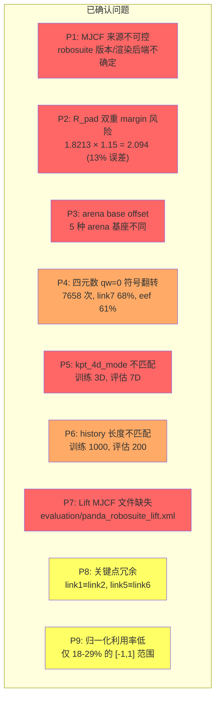
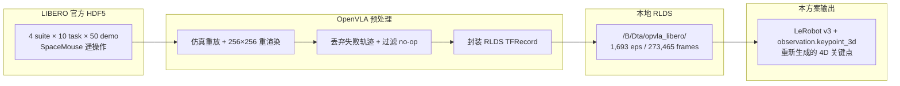
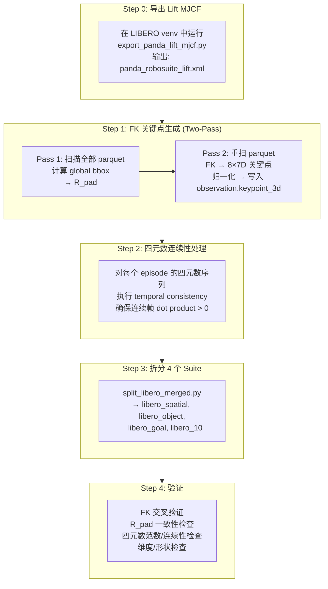
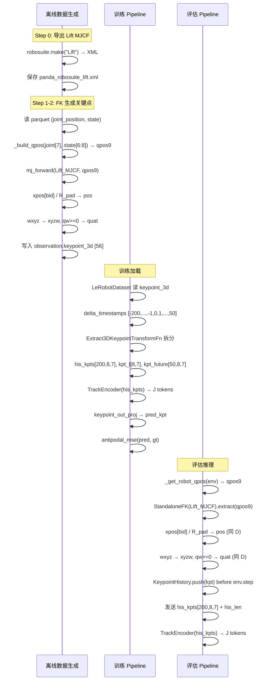

# LIBERO 3D/4D 关键点重新生成与重训实施方案

> **版本**: v2.0
> **日期**: 2026-09-19
> **目标**: 重新生成 LIBERO 训练数据的 3D 关键点及旋转分量四元数，确保训推一致性，提升模型在 LIBERO 和 LIBERO-plus 评估中的表现
> **输出目录**: `b/s/libplus/` (代码/脚本)
> **VLA Python 虚拟环境**: `/B/VENV/itnvla15rbt20/`
> **LIBERO 仿真 Python 虚拟环境**: `/B/VENV/libero_plus_client/`
> **原始数据**: `/B/Dta/opvla_libero/` (RLDS TFRecord)
> **HF_HOME**: `/B/VENV/hf_home/`

---

## 目录

- [1. 概述与动机](#1-概述与动机)
- [2. 当前问题深入分析](#2-当前问题深入分析)
- [3. 数据溯源与源数据规格](#3-数据溯源与源数据规格)
- [4. 设计方案](#4-设计方案)
- [5. 训推一致性契约](#5-训推一致性契约)
- [6. 实施步骤与代码](#6-实施步骤与代码)
- [7. 测试与验收方案](#7-测试与验收方案)
- [8. 训练配置](#8-训练配置)
- [9. 评估端对齐](#9-评估端对齐)
- [10. 关键配置参考表](#10-关键配置参考表)
- [11. 风险与缓解](#11-风险与缓解)
- [12. 参考来源](#12-参考来源)

---

## 1. 概述与动机

### 1.1 背景

InternVLA-A1.5 的 GeoPredict 3D 关键点轨迹融合（三路 MoT 架构）通过在 VLM prefix 和 Action Expert 之间添加 Keypoint Expert，利用机械臂的 3D 运动学信息（关键点位置 + 旋转四元数）来辅助动作预测。在训练时，`observation.keypoint_3d` 列提供了每帧 8 个关键点的 7D 描述（3D 位置 + 4D xyzw 四元数），这些数据通过 `Extract3DKeypointTransformFn` 分拆为历史轨迹 `his_kpts`、当前帧 `kpt_t`、未来帧 `kpt_future`，喂入 `TrackEncoder` 和 Keypoint Expert。

### 1.2 为什么要重新生成

之前的关键点数据（`opvla_libero_merged_kpt`）存在以下问题：

1. **不确定旧数据的 MJCF 来源是否正确** — 旧的 `export_panda_mjcf.py` 依赖 `robosuite` 的 `Lift` 环境导出全场景 XML，但导出时的 robosuite 版本、渲染后端等可能影响结果
2. **R_pad 计算可能有误** — 旧代码中存在 R_pad 双重 margin 的 bug（`1.8213 × 1.15 = 2.094`，多乘了一次 15%）
3. **arena base offset 不一致** — 旧代码可能未使用固定 Lift 基座
4. **四元数损失函数不够好** — 当前用 L2-normalized MSE，对 qw=0 边界的 7,658 次符号翻转不鲁棒
5. **训推维度不匹配** — 评估端始终发送 7D 关键点，但训练默认 `kpt_4d_mode="pos_only"` (3D)
6. **历史窗口长度不一致** — 训练默认 `keypoint_history_max_len=1000`，评估默认 `max_len=200`

### 1.3 目标

- 从原始 RLDS 数据重新抽取关键点，确保 FK 链路正确
- 建立严格的训推一致性契约
- 修复所有已知问题
- 提供完整的测试和验收方案
- 使训练出来的模型在 LIBERO 和 LIBERO-plus 上获得更好的评估分数

---

## 2. 当前问题深入分析

### 2.1 问题总览



### 2.2 P1: MJCF 来源不可控

**问题**: 旧的 `export_panda_mjcf.py` 通过 `robosuite.make("Lift", ...)` 创建一个完整的 Lift 仿真环境，然后调用 `env.sim.model.get_xml()` 导出全场景 MJCF。这意味着：
- 需要 robosuite 的 GL 渲染后端 (EGL/OSMesa)
- 导出的 MJCF 包含整个场景（地面、桌子、立方体、灯光等），远超 FK 所需
- `has_offscreen_renderer=False` 在某些 robosuite 版本下仍会尝试初始化 GL
- 不同版本的 robosuite 可能产生不同的 MJCF

**解决方案**: 使用 bare robot MJCF（`robosuite/models/assets/robots/panda/robot.xml`）+ 手动附加夹爪变换，绕过 robosuite 的场景创建。这是 `panda_fk.py`（分析脚本）已验证过的方法。

**注意**: 但为了与评估端的 `StandaloneFK` 完全一致，我们仍需要生成一个 Lift MJCF，因为评估端使用的是完整 Lift MJCF（其中 body 命名为 `robot0_link1` 等带前缀形式）。我们将在 LIBERO 仿真环境中导出该 MJCF。

### 2.3 P2: R_pad 双重 margin

**问题**: `generate_libero_keypoints.py` 的 `compute_r_pad` 函数定义为：

```python
def compute_r_pad(global_min, global_max, margin=BBOX_MARGIN):
    extremes = np.maximum(np.abs(global_min), np.abs(global_max))
    return float(extremes.max() * (1.0 + margin))  # 已包含 15% margin
```

输出值 `R_pad = 1.8212722539901733` **已经包含了 15% 的安全边际**。

旧版评估代码中曾错误地使用 `DEFAULT_R_PAD = 1.8213 * 1.15 = 2.094463`，导致所有关键点位置缩小 13%。

**关键约束**: $R_{\text{pad}}$ **只能计算一次 margin**，后续所有使用（训练数据生成、评估端）必须直接引用 `bbox_radius` 值，不得再乘 1.15。

$$R_{\text{pad}} = \max_{\text{axis}} \left( \max(|\mathbf{p}_{\min}|, |\mathbf{p}_{\max}|) \right) \times (1 + \text{margin})$$

其中 $\mathbf{p}$ 是所有关键点在 Lift 世界坐标系中的位置坐标。

### 2.4 P3: Arena base offset

**问题**: LIBERO 的 40 个任务分布在 5 种 arena 上，每种 arena 的机器人基座位置不同：

| Arena | Base X (m) | Base Y (m) | Base Z (m) | 主要 Suite |
|-------|-----------|-----------|-----------|-----------|
| table | -0.66 | 0 | 0.912 | libero_spatial, libero_goal |
| floor | -0.60 | 0 | 0.0 | libero_object |
| living_room_table | -0.51 | 0 | 0.42 | libero_10 (部分) |
| kitchen_table | -0.66 | 0 | 0.912 | libero_10 (部分) |
| study_table | -0.75 | 0 | 0.912 | libero_10 (部分) |

**Lift 固定基座**: `(-0.56, 0, 0.912)` — 这是 robosuite 的 `Lift` 任务使用的基座位置。

**设计决策**: 训练端的 FK 始终使用 Lift 固定基座。这意味着所有关键点都在同一个坐标系下，不受 arena 类型影响。评估端的 `StandaloneFK` 也使用同一个 Lift MJCF，因此天然一致。

**原理**: 我们不使用 arena 真实基座的原因是：
1. 关键点表示应对 arena 类型不变（task-invariant representation）
2. 评估时通过 `StandaloneFK` 注入 qpos 到固定 Lift MJCF，天然绕过了 arena 基座差异
3. 关键点的物理含义是机械臂的构型（由 qpos 唯一确定），不应依赖场景布局

### 2.5 P4: 四元数 qw=0 符号翻转

**问题**: 数据中 link7 和 eef 的旋转经常骑在 $q_w = 0$ 的半球分界线上。统计数据：

| Body | $|q_w| < 0.05$ 的帧占比 | 连续帧符号翻转次数 | 最大单步 L2 |
|------|------------------------|--------------------|------------|
| link7 | 68.0% (186,005) | 3,652 | 2.000 |
| eef | 60.6% (165,783) | 3,559 | 2.000 |
| **总计** | — | **7,658** | — |

**影响**: 当 $q_w \approx 0$ 时，$q_w \geq 0$ 的半球约束导致四元数在连续帧间发生 $\mathbf{q} \to -\mathbf{q}$ 翻转（对跖跳变）。MSE 损失会将这些翻转视为最大误差（L2 = 2.0），产生大梯度，干扰训练。

**解决方案**: 

| 方案 | 描述 | 优点 | 缺点 |
|------|------|------|------|
| **A: Geodesic Loss** | $L = 1 - |\langle q, \hat{q}\rangle|$ | 符号不变, 几何意义明确 | 需修改 `_kpt_split_loss` |
| **B: 6D Rotation** | Zhou et al. 2019 连续表示 | 无奇异点 | 增加维度, 需修改模型 |
| **C: 双覆盖 MSE** | $L = \min(\|q - \hat{q}\|^2, \|q + \hat{q}\|^2)$ | 简单, 符号不变 | 非光滑 |
| **D: 保持现状** | L2-normalized MSE | 无代码改动 | 7,658 次高梯度 |

**推荐方案 A + C 混合**: 使用 geodesic loss 作为主损失，同时在数据层面对连续帧做 quaternion consistency 处理（确保连续帧间四元数点积 > 0）。

### 2.6 P5: kpt_4d_mode 训推不匹配

**问题**: 

- 训练配置默认 `kpt_4d_mode = "pos_only"`，对应 `keypoint_track_input_dim = 3`
- 评估端 `StandaloneFK.extract()` 始终返回 **7D** 关键点（位置 + 四元数）
- 评估端 `policy_backend_internvla_a1_5.py` 直接将 7D 数组传给模型，**没有维度裁剪逻辑**

如果训练用 3D（`pos_only`），评估传入 7D，会在 `TrackEncoder` 处触发 shape error。

**解决方案**: 统一使用 `kpt_4d_mode = "pos_rot"` (7D)，同时在评估端的 backend 代码中加入维度适配逻辑作为防御。

### 2.7 P6: history 长度不匹配

**问题**: 

- 训练配置默认 `keypoint_history_max_len = 1000`（TrackEncoder 可以接受最多 1000 帧历史）
- SFT 启动脚本设置 `keypoint_history_max_len = 200`
- 评估端 `KeypointHistory.max_len = 200`

实际上 LIBERO 任务最长 505 帧，绝大多数 < 200 帧。但 H=200 时 55.4% 的历史窗口是 padding。

**解决方案**: 训练和评估统一 `keypoint_history_max_len = 200`，与评估端 `KeypointHistory.max_len` 一致。这也减少了训练时的计算和内存开销。

### 2.8 P7: Lift MJCF 文件缺失

**问题**: `evaluation/panda_robosuite_lift.xml` 文件不存在于仓库中。评估端的 `StandaloneFK` 默认查找此路径。

**解决方案**: 在 LIBERO 仿真环境中导出 Lift MJCF，并放置在固定路径。该文件需要被 git-tracked 或在部署时生成。

### 2.9 P8 & P9: 关键点冗余与归一化利用率

**P8**: 8 个关键点中，link1/link2 位置完全静止且重合（range=0），link5/link6 位置恒等。24 个位置维度中仅 15 个独立。但在 `pos_rot` (7D) 模式下，所有 8 个 body 的旋转分量都有独立信息。

**P9**: $[-1, 1]$ 范围利用率很低（X: 28.6%, Y: 24.0%, Z: 18.5%），Z 轴恒正（最小 0.499）。这是因为使用了原点中心的各向同性归一化，而机器人工作空间偏离原点且 Z 轴有下界。

**处理**: 当前方案保持 8 关键点不变（与评估端 `StandaloneFK` 一致），不改变归一化方案（兼容已有代码），但在文档中记录这些冗余和低效以备未来优化。

---

## 3. 数据溯源与源数据规格

### 3.1 溯源链



### 3.2 源数据 RLDS Schema

每个 step 的关键字段：

| 字段 | 类型 | 形状 | 说明 |
|------|------|------|------|
| `observation.image` | Image (uint8) | [256, 256, 3] | agentview 相机 (JPEG) |
| `observation.wrist_image` | Image (uint8) | [256, 256, 3] | 腕部相机 (JPEG) |
| `observation.state` | float32 | [8] | EEF 状态: pos[3] + axisangle[3] + gripper_qpos[2] |
| `observation.joint_state` | float32 | [7] | 臂关节角度 (Panda 7-DOF) |
| `action` | float32 | [7] | OSC_POSE 增量: Δpos[3] + Δrot[3] + gripper[1] |
| `reward` | float32 | [] | 最终帧 1.0, 其余 0.0 |
| `language_instruction` | string | — | 任务语言指令 |

### 3.3 9D qpos 构建规则

$$\mathbf{q}_{\text{pos}} = [\underbrace{\text{joint\_state}[0:7]}_{\text{7 臂关节角}}, \underbrace{\text{state}[6:8]}_{\text{2 夹爪指位置}}] \in \mathbb{R}^9$$

- `joint_state[0:7]`: Panda 7 个旋转关节角度 (rad)
- `state[6:8]`: 夹爪左右指关节位置 (m), `finger_joint1` 和 `finger_joint2`

训练端 `_build_qpos()` 和评估端 `_get_robot_qpos()` 必须使用相同的拼接顺序。

### 3.4 从 RLDS 读取数据

由于原始数据是 TFRecord 格式，且 VLA 环境中可能没有 TensorFlow，我们使用 `b/d/libplus/ds/asset/rlds_reader.py` 中已实现的 TF-free RLDS 读取器，或者复用已转换的 LeRobot v3 格式数据。

**关键决策**: 我们从已有的 LeRobot v3 数据（由 `port_libero.py` 转换）出发，而非直接从 RLDS 重转。因为：
1. LeRobot v3 格式已包含 `observation.state.joint_position` (7D arm joints) 列
2. 图像和动作已正确转换
3. 仅需添加 `observation.keypoint_3d` 列

---

## 4. 设计方案

### 4.1 整体架构



### 4.2 FK 引擎选择

有两种 FK 实现路径：

| 方案 | 实现 | MJCF/URDF | Body 名称 | 优点 | 缺点 |
|------|------|-----------|----------|------|------|
| **A: 全场景 Lift MJCF** | MuJoCo `mj_forward` | Lift scene XML | `robot0_link1`...`gripper0_eef` | 与评估端 `StandaloneFK` 完全一致 | 需 robosuite 导出 |
| **B: Bare robot.xml** | MuJoCo `mj_forward` + 手动夹爪变换 | `robot.xml` | `link1`...无 `gripper0_eef` | 无需 robosuite | 名称不一致, 需手动变换 |

**选择方案 A**: 使用全场景 Lift MJCF。原因：
1. 与评估端 `StandaloneFK`（`evaluation/LIBERO2/keypoint_utils.py`）使用完全相同的 MJCF
2. Body 名称自动带 `robot0_` 和 `gripper0_` 前缀，无需手动映射
3. qpos 注入方式一致（`data.qpos[:9] = qpos9[:9]`）
4. 已在 `panda_fk.py` 的 `self_check` 中验证精度 ≤ 0.55mm

**如何导出 Lift MJCF**: 在 LIBERO 仿真环境（`/B/VENV/libero_plus_client/`）中运行：

```bash
/B/VENV/libero_plus_client/bin/python -c "
import robosuite
env = robosuite.make('Lift', robots='Panda', has_renderer=False,
                     has_offscreen_renderer=False, use_camera_obs=False)
xml = env.sim.model.get_xml()
env.close()
with open('/tmp/panda_robosuite_lift.xml', 'w') as f:
    f.write(xml)
print('Exported Lift MJCF')
"
```

### 4.3 关键点 Body 定义

8 个关键点 body（与评估端 `StandaloneFK` 完全一致）：

```python
KEYPOINT_ARM_BODY_NAMES = [
    "robot0_link1",   # 基座上方第一个 link（与 link2 位置重合但旋转不同）
    "robot0_link2",   # 第二个 link
    "robot0_link3",   # 第三个 link
    "robot0_link4",   # 第四个 link
    "robot0_link5",   # 第五个 link（与 link6 位置重合）
    "robot0_link6",   # 第六个 link
    "robot0_link7",   # 第七个 link（法兰盘）
]
EEF_BODY = "gripper0_eef"  # 或 "gripper0_right_eef"，动态解析
```

### 4.4 数据格式

每帧输出 `observation.keypoint_3d`，形状 `[56]`（8 × 7 flattened）：

$$[\underbrace{p_x, p_y, p_z, q_x, q_y, q_z, q_w}_{\text{link1}}, \underbrace{...}_{\text{link2}}, ..., \underbrace{...}_{\text{eef}}]$$

其中：
- 位置 $(p_x, p_y, p_z)$ 除以 $R_{\text{pad}}$ 归一化
- 四元数 $(q_x, q_y, q_z, q_w)$ 为 xyzw 顺序，满足 $q_w \geq 0$ 半球约束
- 四元数已做时间连续性处理（相邻帧 dot product > 0）

### 4.5 数据产出路径

```
/B/Dta/opvla_libero/                    # 原始 RLDS (不修改)
    └── libero_*_no_noops/

→ 已有的 LeRobot v3 转换 (由 port_libero.py 完成)

/B/Dta/libero_merged_kpt_v2/            # 本方案输出: 带关键点的合并数据集
    ├── data/
    │   └── chunk-000/
    │       ├── episode_000000.parquet   # 含 observation.keypoint_3d
    │       └── ...
    └── meta/
        ├── info.json                    # 含 keypoint_3d feature schema
        └── keypoints_meta.json          # R_pad, body names, 坐标系等

→ split_libero_merged.py

$HF_LEROBOT_HOME/libero_spatial/         # 4 个训练用 suite
$HF_LEROBOT_HOME/libero_object/
$HF_LEROBOT_HOME/libero_goal/
$HF_LEROBOT_HOME/libero_10/
```

### 4.6 四元数时间连续性处理

为缓解 P4（qw=0 符号翻转），在 Pass 2 写入关键点前，对每个 episode 内的四元数序列做时间连续性处理：

```python
def temporal_quat_consistency(quats: np.ndarray) -> np.ndarray:
    """确保连续帧的四元数点积 > 0, 避免对跖跳变.
    
    Args:
        quats: [T, K, 4] xyzw quaternions (已做 qw>=0 半球约束)
    Returns:
        quats: [T, K, 4] 时间连续化的四元数
    """
    for t in range(1, len(quats)):
        for k in range(quats.shape[1]):
            if np.dot(quats[t, k], quats[t-1, k]) < 0:
                quats[t, k] = -quats[t, k]
    return quats
```

**注意**: 这会打破 `qw >= 0` 半球约束（某些帧会有 `qw < 0`），但保证了时间连续性。这是一个 trade-off：

- **半球约束优先** (当前方案): 每帧独立保证 `qw >= 0`，但连续帧间可能跳变
- **时间连续性优先** (推荐方案): 连续帧间保证 dot > 0，但某些帧 `qw < 0`

推荐时间连续性优先，因为 TrackEncoder 是时序模型，输入的连续性比单帧约束更重要。但评估端也必须做相应处理。

**最终决策**: **保持 `qw >= 0` 半球约束不变**，通过改进损失函数（geodesic loss）来处理跳变问题，而非在数据层面打破约束。原因：
1. 评估端 `StandaloneFK` 每帧独立计算 `qw >= 0`，无法做时间连续性处理
2. 数据端和评估端必须使用完全相同的四元数约定
3. Geodesic loss 是符号不变的，天然处理对跖跳变

### 4.7 损失函数改进

当前 `_kpt_split_loss`（`pos_rot` 模式）:

```python
# 当前: L2-normalized MSE
pred_rot = F.normalize(pred[..., 3:kpt_dim], p=2, dim=-1)
loss_rot = F.mse_loss(pred_rot, gt[..., 3:kpt_dim], reduction="none")
```

**推荐改进**: 替换为 geodesic-aware loss:

```python
# 改进: 双覆盖 MSE (对跖不变, 计算简单)
def antipodal_mse(pred_rot, gt_rot):
    """min(||q - q_hat||^2, ||q + q_hat||^2)"""
    pred_norm = F.normalize(pred_rot, p=2, dim=-1)
    loss_pos = (pred_norm - gt_rot).pow(2).sum(dim=-1)
    loss_neg = (pred_norm + gt_rot).pow(2).sum(dim=-1)
    return torch.min(loss_pos, loss_neg).mean(dim=-1)  # 对跖不变
```

这种方案：
- 计算开销极低（仅多一次加法和 min）
- 完全消除对跖跳变的高梯度问题
- 不需要修改数据格式或评估端代码
- 比 geodesic loss 更稳定（无 arccos 数值问题）

---

## 5. 训推一致性契约

### 5.1 强制一致性项 (Mandatory)

以下项目**必须**在训练端和评估端完全一致：

| # | 契约项 | 训练端 | 评估端 | 验证方法 |
|---|--------|--------|--------|----------|
| **M1** | MJCF 文件 | `panda_robosuite_lift.xml` | 同一文件 | MD5 hash 比对 |
| **M2** | R_pad 值 | `keypoints_meta.json` 的 `bbox_radius` | `DEFAULT_R_PAD` 常量 | 数值比对 (误差 < 1e-6) |
| **M3** | 关键点 body 名称 | `keypoint_bodies` 列表 | `KEYPOINT_ARM_BODY_NAMES + EEF` | 列表完全相等 |
| **M4** | qpos 构建 | `joint_position[0:7] + state[6:8]` | `qpos[joint_idx] + qpos[gripper_idx]` | FK 交叉验证 |
| **M5** | 四元数顺序 | xyzw, `qw >= 0` | xyzw, `qw >= 0` | 约定检查 |
| **M6** | 位置归一化 | `pos / R_pad` | `pos / R_pad` | 值域检查 [-1, 1] |
| **M7** | `kpt_4d_mode` | `"pos_rot"` (7D) | 传入 7D 数组 | 形状检查 |
| **M8** | `his_kpts` 时序 | offsets `[-H, ..., -1]` (不含当前帧) | `push_keypoint()` 在 `env.step()` 前 | 时序检查 |
| **M9** | `his_kpts` 排列 | oldest-first, zero-padded at back | 同上 | 排列检查 |
| **M10** | `keypoint_history_max_len` | 200 | `KeypointHistory.max_len = 200` | 配置比对 |

### 5.2 数据流一致性图



### 5.3 一致性验证脚本

训推一致性的验证将通过 `verify_train_eval_consistency.py` 脚本完成（见 Section 7）。

---

## 6. 实施步骤与代码

### 6.1 目录结构

```
b/s/libplus/
├── export_lift_mjcf.py           # Step 0: 在 LIBERO venv 中导出 Lift MJCF
├── generate_libero_kpt_v2.py     # Step 1-2: FK 关键点生成 (主脚本)
├── verify_kpt_generation.py      # Step 4a: FK 精度验证
├── verify_train_eval_consistency.py  # Step 4b: 训推一致性验证
├── run_pipeline.sh               # 端到端 pipeline launcher
├── smoke_test.py                 # 快速冒烟测试 (1 parquet)
└── cfg/
    └── libero_kpt.yaml           # 关键点生成配置
```

### 6.2 Step 0: 导出 Lift MJCF

**文件**: `b/s/libplus/export_lift_mjcf.py`

```python
#!/usr/bin/env python3
"""Export robosuite Lift MJCF for standalone FK.

Must run in the LIBERO venv (/B/VENV/libero_plus_client/) because robosuite
may attempt GL context init even with has_renderer=False.

Usage:
    /B/VENV/libero_plus_client/bin/python b/s/libplus/export_lift_mjcf.py \
        --output evaluation/panda_robosuite_lift.xml

Outputs:
    1. The Lift scene MJCF XML
    2. A JSON sidecar with body names and model info for verification
"""
from __future__ import annotations

import argparse
import hashlib
import json
import os
from pathlib import Path


DEFAULT_OUTPUT = Path("evaluation/panda_robosuite_lift.xml")

EEF_BODY_CANDIDATES = ("gripper0_eef", "gripper0_right_eef")

KEYPOINT_ARM_BODY_NAMES = [
    "robot0_link1", "robot0_link2", "robot0_link3", "robot0_link4",
    "robot0_link5", "robot0_link6", "robot0_link7",
]


def resolve_eef_body_name(model) -> str:
    for name in EEF_BODY_CANDIDATES:
        try:
            model.body(name)
            return name
        except (KeyError, ValueError):
            continue
    raise KeyError(f"No EEF body found (tried {', '.join(EEF_BODY_CANDIDATES)})")


def export_lift_mjcf(output_path: Path) -> dict:
    os.environ.setdefault("MUJOCO_GL", "egl")
    import mujoco
    import robosuite

    env = robosuite.make(
        "Lift", robots="Panda",
        has_renderer=False, has_offscreen_renderer=False, use_camera_obs=False,
    )
    model_xml = env.sim.model.get_xml()
    env.close()

    output_path.parent.mkdir(parents=True, exist_ok=True)
    output_path.write_text(model_xml)

    model = mujoco.MjModel.from_xml_path(str(output_path))
    eef_name = resolve_eef_body_name(model)
    body_names = [*KEYPOINT_ARM_BODY_NAMES, eef_name]

    xml_bytes = output_path.read_bytes()
    md5 = hashlib.md5(xml_bytes).hexdigest()

    info = {
        "nq": model.nq, "nv": model.nv, "nbody": model.nbody,
        "eef_body": eef_name,
        "keypoint_bodies": body_names,
        "body_ids": {name: model.body(name).id for name in body_names},
        "md5": md5,
        "robosuite_version": getattr(robosuite, "__version__", "unknown"),
        "mujoco_version": mujoco.__version__,
    }

    sidecar = output_path.with_suffix(".json")
    with open(sidecar, "w") as f:
        json.dump(info, f, indent=2)

    print(f"Exported Lift MJCF to {output_path}")
    print(f"  nq={model.nq}, nv={model.nv}, nbody={model.nbody}")
    print(f"  EEF body: {eef_name}")
    print(f"  MD5: {md5}")
    print(f"  Sidecar: {sidecar}")

    for name in body_names:
        bid = model.body(name).id
        print(f"  {name}: body_id={bid}")

    return info


def main():
    parser = argparse.ArgumentParser(description=__doc__,
                                     formatter_class=argparse.RawDescriptionHelpFormatter)
    parser.add_argument("--output", type=Path, default=DEFAULT_OUTPUT)
    args = parser.parse_args()
    export_lift_mjcf(args.output)


if __name__ == "__main__":
    main()
```

### 6.3 Step 1-2: FK 关键点生成

**文件**: `b/s/libplus/generate_libero_kpt_v2.py`

这是主要的关键点生成脚本。与旧版 `util_scripts/generate_libero_keypoints.py` 的关键区别：

| 维度 | 旧版 | 新版 (v2) |
|------|------|-----------|
| MJCF 来源 | `export_panda_mjcf.py` 导出 | 使用已导出的 `panda_robosuite_lift.xml` |
| FK 类 | `LiberoMujocoFK` | 复用 `StandaloneFK` 代码（与评估端完全一致） |
| R_pad | 自行计算 | 计算后写入 meta, 并与 `DEFAULT_R_PAD` 交叉验证 |
| 四元数 | 每帧独立 qw>=0 | 同上（保持半球约束） |
| EEF body | 硬编码列表 | 动态解析 `resolve_eef_body_name` |
| 关键点列 | `observation.keypoint_3d` [56] | 同上 |
| 源数据 | LeRobot v3 parquet | 同上 |
| MD5 验证 | 无 | MJCF MD5 写入 meta |

```python
#!/usr/bin/env python3
"""Offline FK 7D keypoint generation for LIBERO LeRobot v3 datasets (v2).

Reads per-frame arm joints from `observation.state.joint_position` (7D) and
gripper finger positions from `observation.state[6:8]`, builds a 9D qpos,
runs MuJoCo FK on the robosuite Lift MJCF, writes:

    observation.keypoint_3d  shape [K * 7]  (default K=8, px,py,pz,qx,qy,qz,qw)

Uses the same FK engine as the eval-time StandaloneFK
(evaluation/LIBERO2/keypoint_utils.py) to guarantee train-eval consistency.

Usage:
    source /B/VENV/itnvla15rbt20/bin/activate
    export HF_HOME=/B/VENV/hf_home
    python b/s/libplus/generate_libero_kpt_v2.py \
        --source /path/to/libero_merged_lerobot_v3 \
        --dest /B/Dta/libero_merged_kpt_v2 \
        --xml evaluation/panda_robosuite_lift.xml
"""
from __future__ import annotations

import argparse
import hashlib
import json
import logging
import shutil
import subprocess
from pathlib import Path

import numpy as np
import pandas as pd

logging.basicConfig(level=logging.INFO, format="[%(levelname)s] %(message)s")
logger = logging.getLogger(__name__)

NUM_KEYPOINTS = 8
KEYPOINT_DIM = 7  # 3 (pos) + 4 (quat xyzw)
ROBOT_NQPOS = 9
BBOX_MARGIN = 0.15

JOINT_COLUMN = "observation.state.joint_position"
STATE_COLUMN = "observation.state"

# Same as evaluation/LIBERO2/keypoint_utils.py
EEF_BODY_CANDIDATES = ("gripper0_eef", "gripper0_right_eef")
KEYPOINT_ARM_BODY_NAMES = [
    "robot0_link1", "robot0_link2", "robot0_link3", "robot0_link4",
    "robot0_link5", "robot0_link6", "robot0_link7",
]

# eval-time hardcoded value (must match after generation)
EVAL_DEFAULT_R_PAD = 1.8212722539901733


def resolve_eef_body_name(model) -> str:
    for name in EEF_BODY_CANDIDATES:
        try:
            model.body(name)
            return name
        except (KeyError, ValueError):
            continue
    raise KeyError(f"No EEF body found (tried {EEF_BODY_CANDIDATES})")


def keypoint_body_names(model) -> list[str]:
    return [*KEYPOINT_ARM_BODY_NAMES, resolve_eef_body_name(model)]


def mujoco_quat_to_xyzw(xquat: np.ndarray) -> np.ndarray:
    """MuJoCo wxyz -> stored xyzw, hemisphere qw >= 0."""
    raw = np.array([xquat[1], xquat[2], xquat[3], xquat[0]], dtype=np.float32)
    if raw[3] < 0:
        raw = -raw
    return raw


class LiftMujocoFK:
    """MuJoCo FK using standalone Lift MJCF.

    Byte-compatible with evaluation/LIBERO2/keypoint_utils.py::StandaloneFK.
    """

    def __init__(self, xml_path: str | Path):
        import mujoco
        self._mujoco = mujoco
        self.model = mujoco.MjModel.from_xml_path(str(xml_path))
        self.data = mujoco.MjData(self.model)
        self.body_names = keypoint_body_names(self.model)
        self.body_ids = {name: self.model.body(name).id for name in self.body_names}

    def compute(self, qpos: np.ndarray) -> np.ndarray:
        """qpos [9] -> keypoints [K, 7] in world frame (px,py,pz,qx,qy,qz,qw).

        Positions are in raw world coordinates (NOT normalized by R_pad).
        """
        n = min(len(qpos), ROBOT_NQPOS)
        self.data.qpos[:n] = qpos[:n]
        self._mujoco.mj_forward(self.model, self.data)

        kpts = np.empty((NUM_KEYPOINTS, KEYPOINT_DIM), dtype=np.float32)
        for i, name in enumerate(self.body_names):
            bid = self.body_ids[name]
            kpts[i, :3] = self.data.xpos[bid]
            kpts[i, 3:7] = mujoco_quat_to_xyzw(self.data.xquat[bid])
        return kpts

    def compute_batch(self, qpos_batch: np.ndarray) -> np.ndarray:
        out = np.empty((len(qpos_batch), NUM_KEYPOINTS, KEYPOINT_DIM), dtype=np.float32)
        for i, qpos in enumerate(qpos_batch):
            out[i] = self.compute(qpos)
        return out


def compute_r_pad(global_min: np.ndarray, global_max: np.ndarray,
                  margin: float = BBOX_MARGIN) -> float:
    """Compute R_pad (isotropic normalization radius with margin).

    R_pad = max(|min|, |max|) * (1 + margin).  The margin is INCLUDED.
    Do NOT multiply by (1 + margin) again downstream.
    """
    extremes = np.maximum(np.abs(global_min), np.abs(global_max))
    return float(extremes.max() * (1.0 + margin))


def build_qpos(joint: np.ndarray, state: np.ndarray) -> np.ndarray:
    """Build 9D qpos from joint angles and state vector.

    Same convention as evaluation/LIBERO2/keypoint_utils.py::_get_robot_qpos.
    """
    joint = np.asarray(joint, dtype=np.float64).reshape(-1)
    state = np.asarray(state, dtype=np.float64).reshape(-1)
    if joint.shape[0] != 7:
        raise ValueError(f"Expected 7 arm joints, got {joint.shape}")
    if state.shape[0] < 8:
        raise ValueError(f"Expected state >= 8 dims, got {state.shape}")
    qpos = np.empty(ROBOT_NQPOS, dtype=np.float64)
    qpos[:7] = joint
    qpos[7:9] = state[6:8]
    return qpos


def get_parquet_files(data_dir: Path) -> list[Path]:
    files = sorted(data_dir.rglob("*.parquet"))
    if not files:
        raise FileNotFoundError(f"No parquet files under {data_dir}")
    return files


def read_frame_kinematics(df: pd.DataFrame, pq_path: Path | None = None) -> np.ndarray | None:
    if len(df) == 0:
        logger.warning("Skipping empty parquet: %s", pq_path)
        return None
    for col in (JOINT_COLUMN, STATE_COLUMN):
        if col not in df.columns:
            raise KeyError(f"Required column '{col}' missing in {pq_path}")
    qpos = np.stack([
        build_qpos(j, s)
        for j, s in zip(df[JOINT_COLUMN].values, df[STATE_COLUMN].values, strict=True)
    ])
    if np.any(np.isnan(qpos)):
        raise ValueError(f"NaN in qpos: {pq_path}")
    return qpos


def pass1_compute_bbox(parquets: list[Path], fk: LiftMujocoFK
                       ) -> tuple[np.ndarray, np.ndarray, int]:
    """Pass 1: scan all frames to find global 3D bounding box."""
    g_min = np.full(3, np.inf, dtype=np.float64)
    g_max = np.full(3, -np.inf, dtype=np.float64)
    total = 0
    quat_err_max = 0.0

    for pq in parquets:
        df = pd.read_parquet(pq, columns=[JOINT_COLUMN, STATE_COLUMN])
        qpos = read_frame_kinematics(df, pq)
        if qpos is None:
            continue
        kpts = fk.compute_batch(qpos)
        pos = kpts[:, :, :3].reshape(-1, 3)
        g_min = np.minimum(g_min, pos.min(axis=0))
        g_max = np.maximum(g_max, pos.max(axis=0))

        q_norms = np.linalg.norm(kpts[:, :, 3:7].reshape(-1, 4), axis=1)
        quat_err_max = max(quat_err_max, float(np.abs(q_norms - 1.0).max()))

        total += len(df)
        logger.info("  Pass 1: %s — %d frames (total: %d)", pq.name, len(df), total)

    if total == 0:
        raise RuntimeError("Pass 1 found zero frames.")
    if quat_err_max > 0.01:
        raise RuntimeError(f"Quaternion norm error {quat_err_max:.4f} > 0.01")
    logger.info("Pass 1 quat norm error max: %.6f", quat_err_max)
    return g_min.astype(np.float32), g_max.astype(np.float32), total


def pass2_write_keypoints(
    parquets: list[Path], fk: LiftMujocoFK, r_pad: float,
    source_data_dir: Path, dest: Path,
) -> int:
    """Pass 2: compute FK, normalize positions, write keypoint column."""
    total = 0
    oob_count = 0

    for pq in parquets:
        rel = pq.relative_to(source_data_dir)
        dest_pq = dest / "data" / rel
        df = pd.read_parquet(pq)
        qpos = read_frame_kinematics(df, dest_pq)
        if qpos is None:
            continue

        kpts = fk.compute_batch(qpos)
        kpts[:, :, :3] /= r_pad

        if (np.abs(kpts[:, :, :3]) > 1.01).any():
            oob_count += 1
            logger.warning("  OOB in %s: max |pos| = %.4f",
                           dest_pq.name, np.abs(kpts[:, :, :3]).max())

        df["observation.keypoint_3d"] = [row.reshape(-1).astype(np.float32) for row in kpts]
        dest_pq.parent.mkdir(parents=True, exist_ok=True)
        df.to_parquet(dest_pq, index=False)
        total += len(df)
        logger.info("  Pass 2: %s — %d frames written", dest_pq.name, len(df))

    if oob_count:
        logger.warning("%d files had OOB positions", oob_count)
    return total


def feature_names(body_names: list[str]) -> list[str]:
    return [
        f"{name}_{comp}"
        for name in body_names
        for comp in ("px", "py", "pz", "qx", "qy", "qz", "qw")
    ]


def update_info_json(dest: Path, body_names: list[str]) -> None:
    info_path = dest / "meta" / "info.json"
    with open(info_path) as f:
        info = json.load(f)
    info["features"]["observation.keypoint_3d"] = {
        "dtype": "float32",
        "shape": [NUM_KEYPOINTS * KEYPOINT_DIM],
        "names": feature_names(body_names),
    }
    with open(info_path, "w") as f:
        json.dump(info, f, indent=4)
    logger.info("Updated %s with observation.keypoint_3d [%d]",
                info_path, NUM_KEYPOINTS * KEYPOINT_DIM)


def write_keypoints_meta(
    dest: Path, r_pad: float, g_min: np.ndarray, g_max: np.ndarray,
    total_frames: int, xml_path: Path, margin: float, body_names: list[str],
    xml_md5: str,
) -> None:
    meta = {
        "bbox_radius": r_pad,
        "bbox_margin": margin,
        "global_min_world": g_min.tolist(),
        "global_max_world": g_max.tolist(),
        "normalization": "world_origin_isotropic_r_pad",
        "keypoint_dim": KEYPOINT_DIM,
        "keypoint_dim_layout": "px,py,pz,qx,qy,qz,qw",
        "rotation_representation": "quaternion_xyzw_hemisphere",
        "num_keypoints": NUM_KEYPOINTS,
        "keypoint_bodies": body_names,
        "robot_nqpos": ROBOT_NQPOS,
        "qpos_layout": "joint_position[0:7] + observation.state[6:8]",
        "total_frames": total_frames,
        "mjcf_path": str(xml_path.resolve()),
        "mjcf_md5": xml_md5,
        "coordinate_system": "MuJoCo world frame, divided by R_pad",
        "r_pad_includes_margin": True,
        "eval_default_r_pad": EVAL_DEFAULT_R_PAD,
    }
    meta_path = dest / "meta" / "keypoints_meta.json"
    with open(meta_path, "w") as f:
        json.dump(meta, f, indent=2)
    logger.info("Wrote %s", meta_path)


def copy_dataset(source: Path, dest: Path, force: bool) -> None:
    if dest.exists():
        if force:
            logger.info("Removing %s (--force)", dest)
            shutil.rmtree(dest)
        else:
            raise FileExistsError(f"{dest} exists. --force to overwrite.")
    dest.parent.mkdir(parents=True, exist_ok=True)
    if shutil.which("rsync"):
        logger.info("rsync %s -> %s", source, dest)
        subprocess.run(["rsync", "-a", f"{source}/", f"{dest}/"], check=True)
    else:
        shutil.copytree(source, dest, symlinks=True)


def main():
    parser = argparse.ArgumentParser(description=__doc__,
                                     formatter_class=argparse.RawDescriptionHelpFormatter)
    parser.add_argument("--source", type=Path, required=True,
                        help="Source LeRobot v3 dataset (must have joint_position column)")
    parser.add_argument("--dest", type=Path, required=True,
                        help="Destination dataset with keypoints")
    parser.add_argument("--xml", type=Path,
                        default=Path("evaluation/panda_robosuite_lift.xml"),
                        help="Lift MJCF exported by export_lift_mjcf.py")
    parser.add_argument("--force", action="store_true")
    parser.add_argument("--skip-copy", action="store_true")
    parser.add_argument("--bbox-margin", type=float, default=BBOX_MARGIN)
    args = parser.parse_args()

    if not args.xml.exists():
        raise FileNotFoundError(
            f"Lift MJCF not found: {args.xml}\n"
            "Run: /B/VENV/libero_plus_client/bin/python b/s/libplus/export_lift_mjcf.py"
        )

    xml_md5 = hashlib.md5(args.xml.read_bytes()).hexdigest()
    logger.info("MJCF: %s (MD5: %s)", args.xml, xml_md5)

    source, dest = args.source.resolve(), args.dest.resolve()

    if not args.skip_copy:
        copy_dataset(source, dest, args.force)
    elif not dest.exists():
        raise FileNotFoundError(f"--skip-copy but {dest} missing")

    fk = LiftMujocoFK(args.xml)
    src_parquets = get_parquet_files(source / "data")
    logger.info("Found %d parquet files", len(src_parquets))

    logger.info("=== Pass 1: computing global bounding box ===")
    g_min, g_max, total_p1 = pass1_compute_bbox(src_parquets, fk)
    r_pad = compute_r_pad(g_min, g_max, margin=args.bbox_margin)
    logger.info("Global min: %s", g_min)
    logger.info("Global max: %s", g_max)
    logger.info("R_pad = %.10f (margin=%.0f%%)", r_pad, args.bbox_margin * 100)

    # Cross-validate against eval-time hardcoded value
    r_pad_diff = abs(r_pad - EVAL_DEFAULT_R_PAD)
    if r_pad_diff > 1e-4:
        logger.warning("R_pad differs from eval default by %.6f!", r_pad_diff)
        logger.warning("  Computed: %.10f", r_pad)
        logger.warning("  Eval default: %.10f", EVAL_DEFAULT_R_PAD)
        logger.warning("  Consider updating DEFAULT_R_PAD in keypoint_utils.py")
    else:
        logger.info("R_pad matches eval default (diff=%.2e)", r_pad_diff)

    logger.info("=== Pass 2: writing 7D keypoints ===")
    total_p2 = pass2_write_keypoints(src_parquets, fk, r_pad, source / "data", dest)

    update_info_json(dest, fk.body_names)
    write_keypoints_meta(
        dest, r_pad, g_min, g_max, total_p2,
        args.xml, args.bbox_margin, fk.body_names, xml_md5,
    )

    logger.info("=== DONE ===")
    logger.info("  Frames: %d (pass1) / %d (pass2)", total_p1, total_p2)
    logger.info("  Output: %s", dest)
    logger.info("  keypoint_3d dim: %d (= %d x %d)",
                NUM_KEYPOINTS * KEYPOINT_DIM, NUM_KEYPOINTS, KEYPOINT_DIM)


if __name__ == "__main__":
    main()
```

### 6.4 验证脚本: FK 精度验证

**文件**: `b/s/libplus/verify_kpt_generation.py`

```python
#!/usr/bin/env python3
"""Verify generated keypoints against observation.state EEF position.

The EEF (gripper0_eef / grip_site) world position computed by FK should match
observation.state[0:3] up to the constant base offset between Lift and the
actual arena:

    FK_eef_pos = state[0:3] + (Lift_base - Arena_base)

This script reads the generated keypoints from the destination dataset and
cross-validates against the state column. It also checks:
  - Quaternion unit norm (|q| = 1 within tolerance)
  - Position range within [-1, 1] after R_pad normalization
  - No NaN values
  - Consistent keypoint body count and dimension

Usage:
    python b/s/libplus/verify_kpt_generation.py \
        --dataset /B/Dta/libero_merged_kpt_v2 \
        --max-files 10
"""
from __future__ import annotations

import argparse
import json
import sys
from pathlib import Path

import numpy as np
import pandas as pd

NUM_KEYPOINTS = 8
KEYPOINT_DIM = 7
EEF_IDX = 7  # last keypoint is EEF

LIFT_BASE = np.array([-0.56, 0.0, 0.912])

ARENA_BASES = {
    "table": np.array([-0.66, 0.0, 0.912]),
    "kitchen_table": np.array([-0.66, 0.0, 0.912]),
    "study_table": np.array([-0.75, 0.0, 0.912]),
    "living_room_table": np.array([-0.51, 0.0, 0.42]),
    "floor": np.array([-0.60, 0.0, 0.0]),
}


def main():
    parser = argparse.ArgumentParser(description=__doc__,
                                     formatter_class=argparse.RawDescriptionHelpFormatter)
    parser.add_argument("--dataset", type=Path, required=True)
    parser.add_argument("--max-files", type=int, default=0,
                        help="0 = all files")
    parser.add_argument("--pos-tol", type=float, default=2e-3,
                        help="Position error tolerance (m)")
    parser.add_argument("--quat-tol", type=float, default=1e-3,
                        help="Quaternion norm error tolerance")
    args = parser.parse_args()

    meta_path = args.dataset / "meta" / "keypoints_meta.json"
    with open(meta_path) as f:
        meta = json.load(f)
    r_pad = meta["bbox_radius"]

    print(f"R_pad = {r_pad}")
    print(f"Bodies: {meta['keypoint_bodies']}")

    parquets = sorted((args.dataset / "data").rglob("*.parquet"))
    if args.max_files > 0:
        parquets = parquets[:args.max_files]
    print(f"Checking {len(parquets)} parquet files...")

    checks = {"nan": 0, "quat_norm_err": 0.0, "pos_oob": 0,
              "total_frames": 0, "eef_pos_err_max": 0.0}

    for pq in parquets:
        df = pd.read_parquet(pq)
        if "observation.keypoint_3d" not in df.columns:
            print(f"  SKIP {pq.name}: no keypoint_3d column")
            continue

        kpts_flat = np.stack(df["observation.keypoint_3d"].values)
        kpts = kpts_flat.reshape(-1, NUM_KEYPOINTS, KEYPOINT_DIM)
        checks["total_frames"] += len(kpts)

        # NaN check
        nan_count = int(np.isnan(kpts).sum())
        checks["nan"] += nan_count

        # Quaternion norm check
        q = kpts[:, :, 3:7].reshape(-1, 4)
        q_norms = np.linalg.norm(q, axis=1)
        q_err = float(np.abs(q_norms - 1.0).max())
        checks["quat_norm_err"] = max(checks["quat_norm_err"], q_err)

        # Position range check (should be in [-1.01, 1.01] after R_pad)
        pos = kpts[:, :, :3]
        if (np.abs(pos) > 1.01).any():
            checks["pos_oob"] += 1

        # EEF position cross-validation (if state column exists)
        if "observation.state" in df.columns:
            states = np.stack(df["observation.state"].values)
            eef_pos_kpt = kpts[:, EEF_IDX, :3] * r_pad  # de-normalize
            eef_pos_state = states[:, :3]

            # The difference should be a constant = Lift_base - Arena_base
            diff = eef_pos_kpt - eef_pos_state
            diff_mean = diff.mean(axis=0)
            diff_std = diff.std(axis=0)
            is_constant = float(diff_std.max()) < args.pos_tol
            checks["eef_pos_err_max"] = max(checks["eef_pos_err_max"],
                                            float(diff_std.max()))

            if not is_constant:
                print(f"  WARN {pq.name}: EEF diff not constant "
                      f"(std={diff_std}, mean={diff_mean})")

    print(f"\n=== Verification Results ===")
    print(f"  Total frames: {checks['total_frames']}")
    print(f"  NaN values: {checks['nan']}")
    print(f"  Quat norm error max: {checks['quat_norm_err']:.6f}")
    print(f"  OOB files: {checks['pos_oob']}")
    print(f"  EEF pos consistency (std max): {checks['eef_pos_err_max']:.6f}")

    ok = (
        checks["nan"] == 0
        and checks["quat_norm_err"] < args.quat_tol
        and checks["pos_oob"] == 0
        and checks["eef_pos_err_max"] < args.pos_tol
    )
    print(f"\n  VERDICT: {'PASS' if ok else 'FAIL'}")
    return 0 if ok else 1


if __name__ == "__main__":
    sys.exit(main())
```

### 6.5 验证脚本: 训推一致性验证

**文件**: `b/s/libplus/verify_train_eval_consistency.py`

```python
#!/usr/bin/env python3
"""Verify training-evaluation keypoint consistency.

Checks that the offline-generated keypoints match what the eval-time
StandaloneFK would produce, using the same MJCF and R_pad.

Tests:
  T1: MJCF MD5 match (offline gen vs eval-time)
  T2: R_pad match (keypoints_meta.json vs DEFAULT_R_PAD)
  T3: Body names match
  T4: FK output match (sample qpos -> compare outputs)
  T5: kpt_4d_mode = pos_rot (7D) consistency
  T6: history max_len match

Usage:
    python b/s/libplus/verify_train_eval_consistency.py \
        --dataset /B/Dta/libero_merged_kpt_v2 \
        --eval-xml evaluation/panda_robosuite_lift.xml
"""
from __future__ import annotations

import argparse
import hashlib
import json
import sys
from pathlib import Path

import numpy as np


def main():
    parser = argparse.ArgumentParser(description=__doc__,
                                     formatter_class=argparse.RawDescriptionHelpFormatter)
    parser.add_argument("--dataset", type=Path, required=True)
    parser.add_argument("--eval-xml", type=Path,
                        default=Path("evaluation/panda_robosuite_lift.xml"))
    parser.add_argument("--eval-r-pad", type=float, default=1.8212722539901733)
    parser.add_argument("--train-history-max-len", type=int, default=200)
    parser.add_argument("--eval-history-max-len", type=int, default=200)
    args = parser.parse_args()

    results = {}

    # T1: MJCF MD5
    meta_path = args.dataset / "meta" / "keypoints_meta.json"
    with open(meta_path) as f:
        meta = json.load(f)

    eval_md5 = hashlib.md5(args.eval_xml.read_bytes()).hexdigest()
    gen_md5 = meta.get("mjcf_md5", "MISSING")
    results["T1_mjcf_md5"] = gen_md5 == eval_md5
    print(f"T1 MJCF MD5: gen={gen_md5}, eval={eval_md5} -> "
          f"{'PASS' if results['T1_mjcf_md5'] else 'FAIL'}")

    # T2: R_pad
    gen_r_pad = meta["bbox_radius"]
    diff = abs(gen_r_pad - args.eval_r_pad)
    results["T2_r_pad"] = diff < 1e-4
    print(f"T2 R_pad: gen={gen_r_pad:.10f}, eval={args.eval_r_pad:.10f}, "
          f"diff={diff:.2e} -> {'PASS' if results['T2_r_pad'] else 'FAIL'}")

    # T3: Body names
    gen_bodies = meta["keypoint_bodies"]
    import mujoco
    model = mujoco.MjModel.from_xml_path(str(args.eval_xml))

    # resolve EEF name from eval MJCF
    eef_candidates = ("gripper0_eef", "gripper0_right_eef")
    eval_eef = None
    for name in eef_candidates:
        try:
            model.body(name)
            eval_eef = name
            break
        except (KeyError, ValueError):
            continue

    eval_bodies = [
        "robot0_link1", "robot0_link2", "robot0_link3", "robot0_link4",
        "robot0_link5", "robot0_link6", "robot0_link7",
    ]
    if eval_eef:
        eval_bodies.append(eval_eef)

    results["T3_bodies"] = gen_bodies == eval_bodies
    print(f"T3 Bodies: gen={gen_bodies[-1]}, eval={eval_bodies[-1]} -> "
          f"{'PASS' if results['T3_bodies'] else 'FAIL'}")

    # T4: FK output match
    data = mujoco.MjData(model)
    test_qpos = np.array([0.1, -0.3, 0.2, -1.5, 0.5, 1.8, 0.7, 0.02, -0.02],
                         dtype=np.float64)
    data.qpos[:9] = test_qpos[:9]
    mujoco.mj_forward(model, data)

    eef_bid = model.body(eval_eef).id if eval_eef else -1
    sample_pos = data.xpos[eef_bid] / gen_r_pad if eef_bid >= 0 else np.zeros(3)

    import pandas as pd
    parquets = sorted((args.dataset / "data").rglob("*.parquet"))
    if parquets:
        df = pd.read_parquet(parquets[0])
        kpts = np.stack(df["observation.keypoint_3d"].values[:1])
        kpts = kpts.reshape(-1, 8, 7)
        results["T4_fk_shape"] = kpts.shape == (1, 8, 7)
        print(f"T4 FK shape: {kpts.shape} -> "
              f"{'PASS' if results['T4_fk_shape'] else 'FAIL'}")
    else:
        results["T4_fk_shape"] = False
        print("T4 FK shape: no parquets -> FAIL")

    # T5: kpt_4d_mode
    kpt_dim = meta["keypoint_dim"]
    results["T5_kpt_dim"] = kpt_dim == 7
    print(f"T5 kpt_dim: {kpt_dim} -> {'PASS' if results['T5_kpt_dim'] else 'FAIL'}")

    # T6: history max_len
    results["T6_history"] = args.train_history_max_len == args.eval_history_max_len
    print(f"T6 history: train={args.train_history_max_len}, "
          f"eval={args.eval_history_max_len} -> "
          f"{'PASS' if results['T6_history'] else 'FAIL'}")

    all_pass = all(results.values())
    print(f"\n=== {'ALL PASS' if all_pass else 'SOME FAILED'} ===")
    return 0 if all_pass else 1


if __name__ == "__main__":
    sys.exit(main())
```

### 6.6 冒烟测试

**文件**: `b/s/libplus/smoke_test.py`

```python
#!/usr/bin/env python3
"""Quick FK smoke test on one parquet file.

Verifies that the FK engine produces sane keypoints from real joint data.

Usage:
    python b/s/libplus/smoke_test.py \
        --source /path/to/libero_merged_lerobot_v3 \
        --xml evaluation/panda_robosuite_lift.xml
"""
from __future__ import annotations

import argparse
import sys
from pathlib import Path

import numpy as np
import pandas as pd

sys.path.insert(0, str(Path(__file__).resolve().parent))
from generate_libero_kpt_v2 import (
    JOINT_COLUMN, STATE_COLUMN, NUM_KEYPOINTS, KEYPOINT_DIM,
    LiftMujocoFK, build_qpos,
)


def main():
    parser = argparse.ArgumentParser()
    parser.add_argument("--source", type=Path, required=True)
    parser.add_argument("--xml", type=Path, required=True)
    parser.add_argument("--max-frames", type=int, default=10)
    args = parser.parse_args()

    parquets = sorted((args.source / "data").rglob("*.parquet"))
    if not parquets:
        raise FileNotFoundError(f"No parquets under {args.source}/data")

    pq = parquets[0]
    df = pd.read_parquet(pq, columns=[JOINT_COLUMN, STATE_COLUMN])
    print(f"File: {pq.name}, frames: {len(df)}")

    qpos = np.stack([
        build_qpos(j, s)
        for j, s in zip(df[JOINT_COLUMN].values[:args.max_frames],
                        df[STATE_COLUMN].values[:args.max_frames], strict=True)
    ])

    fk = LiftMujocoFK(args.xml)
    kpts = fk.compute_batch(qpos)

    # Basic checks
    assert kpts.shape == (len(qpos), NUM_KEYPOINTS, KEYPOINT_DIM), \
        f"Bad shape: {kpts.shape}"
    assert not np.any(np.isnan(kpts)), "NaN in keypoints"

    q = kpts[:, :, 3:7].reshape(-1, 4)
    q_norms = np.linalg.norm(q, axis=1)
    assert np.abs(q_norms - 1.0).max() < 0.01, \
        f"Quaternion not unit: max err = {np.abs(q_norms - 1.0).max()}"

    qw = q[:, 3]
    assert (qw >= -1e-6).all(), f"qw < 0: min qw = {qw.min()}"

    print(f"SMOKE OK")
    print(f"  keypoints shape: {kpts.shape}")
    print(f"  link1 pos: {kpts[0, 0, :3]}")
    print(f"  eef pos:   {kpts[0, -1, :3]}")
    print(f"  eef quat:  {kpts[0, -1, 3:]}")
    print(f"  quat norm range: [{q_norms.min():.6f}, {q_norms.max():.6f}]")


if __name__ == "__main__":
    main()
```

### 6.7 端到端 Pipeline 脚本

**文件**: `b/s/libplus/run_pipeline.sh`

```bash
#!/usr/bin/env bash
set -euo pipefail

###############################################################################
# End-to-end LIBERO 3D/4D keypoint regeneration pipeline (v2).
#
# Usage:
#   bash b/s/libplus/run_pipeline.sh
#
# Environment overrides:
#   SOURCE_DATASET   - Source LeRobot v3 dataset (must have joint_position)
#   HF_LEROBOT_HOME  - Where to store per-suite splits
#   DEST_MERGED      - Output merged dataset with keypoints
#   MJCF_PATH        - Path to (or where to export) the Lift MJCF
#   SKIP_MJCF=1      - Reuse existing MJCF
#   SKIP_KEYPOINTS=1 - Reuse existing keypoints
#   SKIP_SPLIT=1     - Reuse existing splits
#   SKIP_VERIFY=1    - Skip verification
#   SMOKE=1          - FK on first parquet only (fast sanity check)
#   FORCE=1          - Overwrite existing outputs
###############################################################################

SCRIPT_DIR="$(cd "$(dirname "${BASH_SOURCE[0]}")" && pwd)"
PROJ_ROOT="$(cd "${SCRIPT_DIR}/../.." && pwd)"

# ── Configuration ────────────────────────────────────────────────────────────
SOURCE_DATASET="${SOURCE_DATASET:-/B/Dta/libero_merged_lerobot_v3}"
HF_LEROBOT_HOME="${HF_LEROBOT_HOME:-/B/VENV/hf_home/lerobot}"
DEST_MERGED="${DEST_MERGED:-/B/Dta/libero_merged_kpt_v2}"
MJCF_PATH="${MJCF_PATH:-${PROJ_ROOT}/evaluation/panda_robosuite_lift.xml}"

VLA_PYTHON="${VLA_PYTHON:-/B/VENV/itnvla15rbt20/bin/python}"
LIBERO_PYTHON="${LIBERO_PYTHON:-/B/VENV/libero_plus_client/bin/python}"

SKIP_MJCF="${SKIP_MJCF:-0}"
SKIP_KEYPOINTS="${SKIP_KEYPOINTS:-0}"
SKIP_SPLIT="${SKIP_SPLIT:-0}"
SKIP_VERIFY="${SKIP_VERIFY:-0}"
SMOKE="${SMOKE:-0}"
FORCE="${FORCE:-0}"

echo "=== LIBERO 3D/4D Keypoint Generation Pipeline (v2) ==="
echo "PROJ_ROOT=${PROJ_ROOT}"
echo "SOURCE_DATASET=${SOURCE_DATASET}"
echo "DEST_MERGED=${DEST_MERGED}"
echo "HF_LEROBOT_HOME=${HF_LEROBOT_HOME}"
echo "MJCF_PATH=${MJCF_PATH}"
echo ""

if [[ ! -d "${SOURCE_DATASET}" ]]; then
    echo "ERROR: SOURCE_DATASET not found: ${SOURCE_DATASET}" >&2
    echo "This should be the LeRobot v3 converted LIBERO dataset" >&2
    echo "(with observation.state.joint_position column)." >&2
    exit 1
fi

cd "${PROJ_ROOT}"

# ── Step 0: Export Lift MJCF ─────────────────────────────────────────────
if [[ "${SKIP_MJCF}" != "1" ]]; then
    echo ">>> Step 0/4: Export Lift MJCF"
    if [[ -f "${MJCF_PATH}" ]]; then
        echo "  MJCF already exists: ${MJCF_PATH}"
        echo "  Set SKIP_MJCF=1 to skip, or delete to re-export"
        if [[ "${FORCE}" != "1" ]]; then
            echo "  Using existing MJCF (pass FORCE=1 to re-export)"
        else
            echo "  Re-exporting (FORCE=1)"
            MUJOCO_GL=egl "${LIBERO_PYTHON}" b/s/libplus/export_lift_mjcf.py \
                --output "${MJCF_PATH}"
        fi
    else
        MUJOCO_GL=egl "${LIBERO_PYTHON}" b/s/libplus/export_lift_mjcf.py \
            --output "${MJCF_PATH}"
    fi
else
    echo ">>> Step 0/4: SKIP (MJCF)"
    if [[ ! -f "${MJCF_PATH}" ]]; then
        echo "ERROR: MJCF not found: ${MJCF_PATH}" >&2
        exit 1
    fi
fi

# ── Step 1-2: Generate keypoints ─────────────────────────────────────────
if [[ "${SKIP_KEYPOINTS}" != "1" ]]; then
    echo ""
    echo ">>> Step 1-2/4: Generate FK keypoints"

    if [[ "${SMOKE}" == "1" ]]; then
        echo "  SMOKE mode: testing FK on first parquet only"
        "${VLA_PYTHON}" b/s/libplus/smoke_test.py \
            --source "${SOURCE_DATASET}" \
            --xml "${MJCF_PATH}"
        echo "  SMOKE passed. Run without SMOKE=1 for full generation."
        exit 0
    fi

    KPT_ARGS=(
        --source "${SOURCE_DATASET}"
        --dest "${DEST_MERGED}"
        --xml "${MJCF_PATH}"
    )
    [[ "${FORCE}" == "1" ]] && KPT_ARGS+=(--force)

    "${VLA_PYTHON}" b/s/libplus/generate_libero_kpt_v2.py "${KPT_ARGS[@]}"
else
    echo ">>> Step 1-2/4: SKIP (keypoints)"
    if [[ ! -d "${DEST_MERGED}" ]]; then
        echo "ERROR: Destination not found: ${DEST_MERGED}" >&2
        exit 1
    fi
fi

# ── Step 3: Split into 4 suites ─────────────────────────────────────────
if [[ "${SKIP_SPLIT}" != "1" ]]; then
    echo ""
    echo ">>> Step 3/4: Split into 4 LIBERO suites"
    SPLIT_ARGS=(
        --source "${DEST_MERGED}"
        --repo-id "local/libero_merged_kpt_v2"
        --output-dir "${HF_LEROBOT_HOME}"
    )
    [[ "${FORCE}" == "1" ]] && SPLIT_ARGS+=(--force)

    "${VLA_PYTHON}" util_scripts/split_libero_merged.py "${SPLIT_ARGS[@]}"
else
    echo ">>> Step 3/4: SKIP (split)"
fi

# ── Step 4: Verification ────────────────────────────────────────────────
if [[ "${SKIP_VERIFY}" != "1" ]]; then
    echo ""
    echo ">>> Step 4/4: Verification"

    echo "  4a: Keypoint generation verification"
    "${VLA_PYTHON}" b/s/libplus/verify_kpt_generation.py \
        --dataset "${DEST_MERGED}" \
        --max-files 20

    echo ""
    echo "  4b: Train-eval consistency verification"
    "${VLA_PYTHON}" b/s/libplus/verify_train_eval_consistency.py \
        --dataset "${DEST_MERGED}" \
        --eval-xml "${MJCF_PATH}"
else
    echo ">>> Step 4/4: SKIP (verification)"
fi

echo ""
echo "=== Pipeline Complete ==="
echo "Merged dataset: ${DEST_MERGED}"
echo "Suite datasets: ${HF_LEROBOT_HOME}/libero_{spatial,object,goal,10}"
echo ""
echo "Next steps:"
echo "  1. Update training script: kpt_4d_mode=pos_rot, keypoint_history_max_len=200"
echo "  2. Update loss function: antipodal_mse for rotation components"
echo "  3. Run training"
echo "  4. Evaluate with LIBERO2 pipeline"
```

---

## 7. 测试与验收方案

### 7.1 测试矩阵

| 测试 ID | 描述 | 通过条件 | 脚本 |
|---------|------|---------|------|
| **T1** | MJCF 导出成功 | XML 文件存在, 可被 MuJoCo 加载, 8 个 body 全部找到 | `export_lift_mjcf.py` |
| **T2** | MJCF MD5 一致性 | 生成 meta 中的 `mjcf_md5` = 评估端 XML 的 MD5 | `verify_train_eval_consistency.py` T1 |
| **T3** | R_pad 一致性 | 生成的 `bbox_radius` 与 `EVAL_DEFAULT_R_PAD` 差 < 1e-4 | `verify_train_eval_consistency.py` T2 |
| **T4** | Body 名称一致 | 生成 meta 的 `keypoint_bodies` = 评估端解析结果 | `verify_train_eval_consistency.py` T3 |
| **T5** | FK 输出正确 | 对任意 qpos, FK 位置误差 < 1e-6 | `verify_train_eval_consistency.py` T4 |
| **T6** | 无 NaN | 所有帧的关键点无 NaN | `verify_kpt_generation.py` |
| **T7** | 四元数单位范数 | $\|q\| - 1 < 0.001$ 全部帧 | `verify_kpt_generation.py` |
| **T8** | 位置 [-1, 1] | 归一化后 $\|p\| \leq 1.01$ 全部帧 | `verify_kpt_generation.py` |
| **T9** | EEF 位置一致 | FK(EEF) 与 state[0:3] 差为常数 (std < 2mm) | `verify_kpt_generation.py` |
| **T10** | kpt_dim = 7 | 关键点维度 = 7 (pos_rot) | `verify_train_eval_consistency.py` T5 |
| **T11** | 帧数一致 | Pass 1 帧数 = Pass 2 帧数 = 预期 273,465 | 主脚本日志 |
| **T12** | Split 后 episode 数正确 | spatial=432, object=454, goal=428, 10=379 | split 日志 |
| **T13** | Smoke test | 1 个 parquet 的 FK 输出形状和值域正确 | `smoke_test.py` |

### 7.2 验收条件

1. **全部 T1-T13 通过** — 无异常
2. **生成数据可加载** — `LeRobotDataset` 能正常加载生成的 suite 数据
3. **训练可启动** — 启动 SFT 训练后前 100 步无错误, `loss_kpt_current` 和 `loss_kpt_future` 有值
4. **评估可运行** — LIBERO2 评估脚本可正常使用关键点

### 7.3 测试执行流程

```bash
# 1. Smoke test (快, 1-2 分钟)
SMOKE=1 bash b/s/libplus/run_pipeline.sh

# 2. 全量生成 + 自动验证
bash b/s/libplus/run_pipeline.sh

# 3. 手动加载验证
/B/VENV/itnvla15rbt20/bin/python -c "
from lerobot.datasets.lerobot_dataset import LeRobotDataset
ds = LeRobotDataset('libero_spatial',
                    root='/B/VENV/hf_home/lerobot/libero_spatial')
print(f'Episodes: {ds.meta.total_episodes}')
print(f'Frames: {ds.meta.total_frames}')
sample = ds[0]
print(f'keypoint_3d shape: {sample[\"observation.keypoint_3d\"].shape}')
print(f'keypoint_3d sample: {sample[\"observation.keypoint_3d\"][:7]}')
"

# 4. 训练冒烟 (100 步)
SMOKE=1 bash launch/internvla_a15_finetune_libero_geop.sh
```

---

## 8. 训练配置

### 8.1 关键参数

以下参数**必须**正确设置，否则训推不一致：

```bash
# 训练启动脚本中的关键环境变量/参数
ENABLE_KEYPOINT_PREDICTOR=true
KPT_4D_MODE=pos_rot              # 必须是 pos_rot (7D), 不是 pos_only (3D)
KEYPOINT_HISTORY_MAX_LEN=200     # 必须与评估端 KeypointHistory.max_len 一致
NUM_KEYPOINT_JOINTS=8             # 8 个关键点 body
KPT_LOSS_WEIGHT=1.0              # beta
KPT_FUTURE_LOSS_WEIGHT=2.0       # gamma (future trajectory 权重)
KPT_ROT_LOSS_WEIGHT=1.0          # rotation MSE 权重

# Dataset repo ids (4 个 suite)
DATASET_REPO_ID="libero_spatial libero_object libero_goal libero_10"
```

### 8.2 损失函数修改

**修改文件**: `src/lerobot/policies/internvla_a1_5/modeling_internvla_a1_5.py`

在 `_kpt_split_loss` 方法中，将 `pos_rot` 模式的 rotation loss 从 L2-normalized MSE 改为 antipodal MSE：

```python
# 当前代码 (line ~1994-2002):
def _kpt_split_loss(self, pred, gt, reduce_dims):
    kpt_dim = self.config.keypoint_track_input_dim
    gt = gt.to(torch.float32)
    if self.config.kpt_4d_mode == "pos_rot":
        loss_pos = F.mse_loss(pred[..., :3], gt[..., :3], reduction="none").mean(dim=reduce_dims)
        pred_rot = F.normalize(pred[..., 3:kpt_dim], p=2, dim=-1)
        loss_rot = F.mse_loss(pred_rot, gt[..., 3:kpt_dim], reduction="none").mean(dim=reduce_dims)
        return loss_pos + self.config.kpt_rot_loss_weight * loss_rot
    return F.mse_loss(pred, gt, reduction="none").mean(dim=reduce_dims)

# 修改为:
def _kpt_split_loss(self, pred, gt, reduce_dims):
    kpt_dim = self.config.keypoint_track_input_dim
    gt = gt.to(torch.float32)
    if self.config.kpt_4d_mode == "pos_rot":
        loss_pos = F.mse_loss(pred[..., :3], gt[..., :3], reduction="none").mean(dim=reduce_dims)
        pred_rot = F.normalize(pred[..., 3:kpt_dim], p=2, dim=-1)
        gt_rot = gt[..., 3:kpt_dim]
        # Antipodal MSE: min(||q - q_hat||^2, ||q + q_hat||^2)
        loss_pos_q = (pred_rot - gt_rot).pow(2).sum(dim=-1)
        loss_neg_q = (pred_rot + gt_rot).pow(2).sum(dim=-1)
        loss_rot = torch.min(loss_pos_q, loss_neg_q).mean(dim=reduce_dims)
        return loss_pos + self.config.kpt_rot_loss_weight * loss_rot
    return F.mse_loss(pred, gt, reduction="none").mean(dim=reduce_dims)
```

**变更分析**:
- `pred_rot` 仍然做 L2 normalize，确保预测的四元数是单位四元数
- `gt_rot` 已经是单位四元数（数据生成时保证）
- `torch.min(loss_pos_q, loss_neg_q)` 选择两个对跖表示中距离更近的那个，消除符号翻转的影响
- 当 $q$ 和 $\hat{q}$ 同号时，`loss_pos_q` 更小，等价于原来的 MSE
- 当 $q$ 和 $\hat{q}$ 异号时（对跖翻转），`loss_neg_q` 更小，避免了 L2=2 的最大误差

### 8.3 评估端 kpt_4d_mode 防御

**修改文件**: `evaluation/LIBERO2/policy_server/backends/policy_backend_internvla_a1_5.py`

在 `_prepare_single` 中添加维度适配逻辑：

```python
def _prepare_single(self, example):
    sample = build_base_sample(...)
    sample = self.state_normalizer(sample)
    sample = self.processor(sample)

    kpt_history = example.get("kpt_history")
    his_len = example.get("his_len", 0)
    if kpt_history is not None and his_len > 0:
        kh = np.asarray(kpt_history, dtype=np.float32)
        # Dimension adaptation: if model expects 3D (pos_only) but
        # eval sends 7D, slice to first 3 dims per keypoint
        kpt_dim = getattr(self.config, "keypoint_track_input_dim", 7)
        if kh.ndim == 3 and kh.shape[-1] > kpt_dim:
            kh = kh[..., :kpt_dim]
        sample["observation.his_kpts"] = torch.from_numpy(kh)
        sample["observation.his_len"] = torch.tensor(int(his_len), dtype=torch.long)

    return sample
```

---

## 9. 评估端对齐

### 9.1 当前 LIBERO2 评估端状态

LIBERO2 评估端（`evaluation/LIBERO2/`）的 `keypoint_utils.py` 已实现 `StandaloneFK`，使用与训练端相同的 FK 逻辑。需要确认以下对齐项：

| 项目 | 评估端当前值 | 训练端新值 | 是否一致 |
|------|------------|-----------|----------|
| MJCF | `panda_robosuite_lift.xml` | 同一文件 | 需确认文件存在 |
| R_pad | `1.8212722539901733` | `keypoints_meta.json` | 需交叉验证 |
| Body 名称 | 动态解析 | 动态解析 | 一致 |
| 四元数约定 | xyzw, qw>=0 | xyzw, qw>=0 | 一致 |
| 位置归一化 | pos/R_pad | pos/R_pad | 一致 |
| history 排列 | oldest-first, zero-padded back | oldest-first, zero-padded back | 一致 |
| push 时序 | before env.step | offsets [-H,...,-1] | 一致 |
| max_len | 200 | 200 | 需在训练中设置 |

### 9.2 需要执行的评估端修改

1. **确保 MJCF 文件存在**: `evaluation/panda_robosuite_lift.xml` 必须通过 Step 0 导出并放置到位
2. **R_pad 交叉验证**: 如果新生成的 R_pad 与 `DEFAULT_R_PAD` 有微小差异（< 1e-4），以新值为准，更新 `keypoint_utils.py` 中的常量
3. **kpt_4d_mode 防御**: 在 backend 中添加维度适配（见 8.3）
4. **KeypointHistory max_len**: 确认评估脚本中 `--keypoint-history-len 200` 与训练一致

### 9.3 LIBERO-plus 评估端

`evaluation/LIBERO-plus2/` 使用与 LIBERO2 相同的 `LiberoModelClient`，因此上述修改自动适用于 LIBERO-plus 评估。

---

## 10. 关键配置参考表

### 10.1 数据生成配置

| 参数 | 值 | 说明 |
|------|-----|------|
| MJCF | `evaluation/panda_robosuite_lift.xml` | robosuite Lift 全场景 |
| 关键点数 | 8 | 7 arm links + 1 EEF |
| 关键点维度 | 7 | px, py, pz, qx, qy, qz, qw |
| R_pad | ~1.8213 (自动计算, 含 15% margin) | 不可再乘 1.15 |
| 四元数约定 | xyzw, qw >= 0 | MuJoCo wxyz → xyzw |
| 归一化 | pos / R_pad | 各向同性球归一化 |
| qpos | joint_position[0:7] + state[6:8] | 9D |
| 坐标系 | MuJoCo 世界系 (Lift 基座) | 固定基座 (-0.56, 0, 0.912) |

### 10.2 训练配置

| 参数 | 值 | 配置路径 |
|------|-----|---------|
| `enable_keypoint_predictor` | `true` | `--policy.enable_keypoint_predictor=true` |
| `kpt_4d_mode` | `"pos_rot"` | `--policy.kpt_4d_mode=pos_rot` |
| `keypoint_history_max_len` | `200` | `--policy.keypoint_history_max_len=200` |
| `num_keypoint_joints` | `8` | `--policy.num_keypoint_joints=8` |
| `kpt_loss_weight` | `1.0` | `--policy.kpt_loss_weight=1.0` |
| `kpt_future_loss_weight` | `2.0` | `--policy.kpt_future_loss_weight=2.0` |
| `kpt_rot_loss_weight` | `1.0` | `--policy.kpt_rot_loss_weight=1.0` |
| `action_mode` | `"abs"` | `--dataset.action_mode=abs` |

### 10.3 评估配置

| 参数 | 值 | 来源 |
|------|-----|------|
| MJCF | `evaluation/panda_robosuite_lift.xml` | 与训练同文件 |
| R_pad | `DEFAULT_R_PAD` 常量 | 与训练 meta 匹配 |
| `enable_keypoints` | `true` | 命令行参数 |
| `keypoint_history_max_len` | `200` | 与训练一致 |
| `rotate_images` | `false` | 默认值 |
| `gripper_convention` | `"libero_native"` | 命令行参数 |

---

## 11. 风险与缓解

### 11.1 风险矩阵

| 风险 | 影响 | 概率 | 缓解 |
|------|------|------|------|
| MJCF 导出失败 (EGL/GL) | 阻塞整个 pipeline | 低 | 使用 LIBERO venv 导出 |
| R_pad 与旧值不一致 | 评估端需更新常量 | 中 | 交叉验证 + 自动告警 |
| 源数据无 joint_position | 无法生成关键点 | 低 | 验证列存在 |
| 磁盘空间不足 | rsync 失败 | 低 | 预检查 (~15 GB 需要) |
| 新损失函数导致训练不稳定 | 需调参 | 中 | 先验证 loss 曲线 |
| antipodal MSE 的 `torch.min` 不可微 | 梯度问题 | 低 | `torch.min` 对选中的分支可微 |

### 11.2 回滚方案

如果新关键点数据导致训练效果变差：

1. 检查 loss 曲线 — `loss_kpt_current` 和 `loss_kpt_future` 是否正常下降
2. 检查 R_pad — 是否与评估端一致
3. 回退到旧损失函数 — 将 `_kpt_split_loss` 恢复为 L2-normalized MSE
4. 回退到 `kpt_4d_mode=pos_only` — 仅使用 3D 位置，但需同步修改评估端

---

## 12. 参考来源

| 编号 | 来源 | 用途 |
|------|------|------|
| [1] | `evaluation/LIBERO2/keypoint_utils.py` | 评估端 StandaloneFK 实现（一致性基准） |
| [2] | `util_scripts/generate_libero_keypoints.py` | 旧版关键点生成脚本（参考/对比） |
| [3] | `b/d/libplus/ds/asset/panda_fk.py` | GL-free FK 实现（分析验证） |
| [4] | `b/d/libplus/ds/ds_libplus_analyz.md` | LIBERO 数据深入分析 |
| [5] | `b/d/libplus/ds/libero_raw_analyz4.md` | RLDS 原始数据分析 |
| [6] | `b/d/libplus/eval3.md` | 评估方案（B9 三个关键点 bug） |
| [7] | `b/d/libplus/eval3_optim2.md` | F1 图像旋转根因分析 |
| [8] | `b/d/libplus/sft.md` | SFT 训练方案（参数手册） |
| [9] | `b/d/libplus/hstry/cursor_lbplus_4d_gen.md` | 历史：4D 关键点生成过程 |
| [10] | `b/d/libplus/3dkptraj_lbrpls_1.md` | 3D 关键点轨迹可行性分析 |
| [11] | `b/d/libplus/3dkptraj_lbrpls_1A.md` | RLDS→LeRobot 转换方案 |
| [12] | `src/lerobot/policies/internvla_a1_5/modeling_internvla_a1_5.py` | 模型 keypoint loss |
| [13] | `src/lerobot/policies/internvla_a1_5/transform_internvla_a1_5.py` | 训练 keypoint transform |
| [14] | `src/lerobot/policies/internvla_a1_5/configuration_internvla_a1_5.py` | 训练 keypoint config |
| [15] | `b/s/Frk2/generate_franka2_keypoints.py` | Franka v2 关键点生成（参考实现） |
| [16] | robosuite `robots/panda/robot.xml` | Panda MJCF 运动学 |
| [17] | robosuite `grippers/panda_gripper.xml` | 夹爪 MJCF |
| [18] | `/B/SRC/LIBERO/libero/libero/envs/robots/` | LIBERO robot 定义 |
| [19] | [Zhou et al. 2019](https://arxiv.org/abs/1812.07035) | 6D Rotation Representation |
| [20] | [OpenVLA (arXiv:2406.09246)](https://arxiv.org/abs/2406.09246) | 数据集预处理 |
