# LIBERO-plus 原始数据集 (`/B/Dta/opvla_libero/`) 深入分析

> **数据源**: `/B/Dta/opvla_libero/` (OpenVLA `modified_libero_rlds`)
> **分析日期**: 2026-09-19
> **数据规模**: 4 子集 × 96 shards / 1,693 episodes / 273,465 frames / 40 tasks
> **格式**: RLDS (TFRecord),版本 1.0.0
> **可复现性**: 统计数据来自 `b/d/libplus/ds/asset/raw_stats.json`、`kpt_stats.json` 和 `libero_plus_report.json`; 本报告图表生成脚本在 [`asset/make_ds_figures.py`](asset/make_ds_figures.py)。

---

## 目录

- [1. 概述](#1-概述)
- [2. 溯源链与预处理](#2-溯源链与预处理)
- [3. 物理格式与 Schema](#3-物理格式与-schema)
- [4. 数据规模与分布](#4-数据规模与分布)
- [5. 动作空间分析](#5-动作空间分析)
- [6. 状态空间分析](#6-状态空间分析)
- [7. 关节状态分析](#7-关节状态分析)
- [8. 图像数据分析](#8-图像数据分析)
- [9. 坐标系、基座与前向运动学](#9-坐标系基座与前向运动学)
- [10. 3D 关键点与归一化](#10-3d-关键点与归一化)
- [11. 四元数表示与陷阱](#11-四元数表示与陷阱)
- [12. 时间轴与历史窗口](#12-时间轴与历史窗口)
- [13. LIBERO-plus 扰动评估分析](#13-libero-plus-扰动评估分析)
- [14. 数据完整性审计](#14-数据完整性审计)
- [15. 训推一致性契约](#15-训推一致性契约)
- [16. 关键陷阱与建议](#16-关键陷阱与建议)
- [17. 参考来源](#17-参考来源)

---

## 1. 概述

### 1.1 数据身份

`/B/Dta/opvla_libero/` 是 OpenVLA 官方发布的 [`openvla/modified_libero_rlds`](https://huggingface.co/datasets/openvla/modified_libero_rlds) 数据集的本地副本。该数据集是论文 [OpenVLA (arXiv:2406.09246)](https://arxiv.org/abs/2406.09246) 附录 E 描述的四个改造版 LIBERO 数据集,用于 VLA 模型的 LIBERO benchmark fine-tuning。

本数据集在 InternVLA-A1.5 项目中的作用是:作为 LIBERO fine-tuning 的训练数据源,训练后的模型需在 **LIBERO**(标准评估,40 个任务)和 **LIBERO-plus**(扰动评估,10,030 个变体)两个 benchmark 上评估。

### 1.2 关键结论总览

| 维度 | 结论 |
|------|------|
| **规模** | 1,693 episodes / 273,465 frames / 40 tasks,原始 2,000 条保留 84.65% |
| **动作空间** | 7D OSC_POSE 增量 (Δpos[3] + Δrot[3] + gripper[1]),量化为 1/1120 和 1/2800 网格 |
| **状态空间** | 8D (EEF pos[3] + axisangle[3] + gripper_qpos[2]),位置和姿态来自两个不同坐标系 |
| **关节状态** | 7D Franka Panda 臂关节角度,存在微小的关节限位越界 (≤ 0.017 rad) |
| **图像** | 256×256 JPEG,agentview + wrist,朝向是 MuJoCo 缓冲区的 **rot180** |
| **R_pad** | 1.8212723,已含 15% margin,**不可再乘 1.15** |
| **四元数** | xyzw + qw≥0 半球,link7/eef 共 7,658 次对跖跳变 |
| **频率** | 物理 20 Hz,metadata 标 10 Hz,无实际降采样 |
| **数据质量** | 0 NaN / 0 标记错误 / 0 残留 no-op / 0 reward 异常 |

---

## 2. 溯源链与预处理

### 2.1 三级溯源

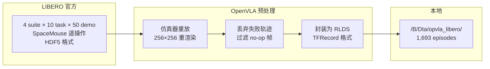

每条 episode 的 `episode_metadata/file_path` 保留了原始路径:

```
/iris/u/moojink/prismatic-dev/LIBERO/libero/datasets/regenerated--no_noops/
    libero_spatial/pick_up_the_black_bowl_next_to_the_cookie_box_and_place_it_on_the_plate_demo.hdf5
```

### 2.2 OpenVLA 做了什么

1. **Regenerated**: 在仿真器中重放原始 demo 的动作序列,重新渲染图像、重新记录观测。重放失败(未达成任务目标)的 demo 被丢弃。这是 2,000 → 1,693 的主要原因。
2. **No-noops**: 过滤掉"空操作"帧——前 6 维位移为 0 且夹爪指令不变的帧。全量复查确认残留 0 帧 no-op。

### 2.3 为什么不是 2,000 条?

| 子集 | 原始 demo | 保留 | 保留率 | 丢失原因 |
|------|-----------|------|--------|----------|
| libero_spatial | 500 | 432 | 86.4% | 重放失败 (68 条) |
| libero_object | 500 | 454 | 90.8% | 重放失败 (46 条) |
| libero_goal | 500 | 428 | 85.6% | 重放失败 (72 条) |
| libero_10 | 500 | 379 | 75.8% | 重放失败 (121 条) |
| **总计** | **2,000** | **1,693** | **84.65%** | **丢失 307 条** |

`libero_10` 保留率最低 (75.8%),因为它包含 KITCHEN/LIVING_ROOM/STUDY 场景的长程多步任务,重放更容易失败。

---

## 3. 物理格式与 Schema

### 3.1 目录结构

```
/B/Dta/opvla_libero/
├── README.md
├── libero_spatial_no_noops/1.0.0/   (16 shards, 1.78 GB)
├── libero_object_no_noops/1.0.0/    (32 shards, 2.62 GB)
├── libero_goal_no_noops/1.0.0/      (16 shards, 1.71 GB)
└── libero_10_no_noops/1.0.0/        (32 shards, 3.40 GB)
    ├── dataset_info.json       — shard 长度声明
    ├── features.json           — RLDS feature schema
    └── {stem}-train.tfrecord-NNNNN-of-MMMMM
```

> **命名陷阱**: `libero_10` 的 `dataset_info.json` 中 `"name": "liber_o10"`,导致分片文件名为 `liber_o10-train.tfrecord-*`,而非 `libero_10-train.tfrecord-*`。这是 OpenVLA builder 的命名错误,数据无损,但 glob 时需注意。

### 3.2 RLDS Feature Schema

四个子集的 `features.json` 完全相同:

```
FeaturesDict
├── steps: Dataset (变长序列)
│   └── [per step] FeaturesDict:
│       ├── action:                Tensor   float32  [7]        "Robot EEF action"
│       ├── observation:           FeaturesDict
│       │   ├── image:             Image    uint8    [256,256,3]  JPEG  "Main camera (agentview)"
│       │   ├── wrist_image:       Image    uint8    [256,256,3]  JPEG  "Wrist camera"
│       │   ├── state:             Tensor   float32  [8]        "EEF state (6D pose + 2D gripper)"
│       │   └── joint_state:       Tensor   float32  [7]        "Arm joint angles"
│       ├── language_instruction:  Text                          "Task instruction"
│       ├── reward:                Scalar   float32              "1.0 on final step"
│       ├── discount:              Scalar   float32              "Always 1.0"
│       ├── is_first / is_last / is_terminal:  Scalar bool
└── episode_metadata:
    └── file_path:             Text                              "Original HDF5 path"
```

### 3.3 数据大小

| 子集 | Shards | 声明字节数 | 实际磁盘 |
|------|--------|-----------|---------|
| libero_spatial | 16 | 1,914,619,638 (1.78 GB) | ~1.78 GB |
| libero_object | 32 | 2,817,311,159 (2.62 GB) | ~2.62 GB |
| libero_goal | 16 | 1,841,891,826 (1.71 GB) | ~1.71 GB |
| libero_10 | 32 | 3,656,799,026 (3.40 GB) | ~3.40 GB |
| **总计** | **96** | **10,230,621,649 (9.53 GB)** | **~9.53 GB** |

---

## 4. 数据规模与分布

### 4.1 子集概览

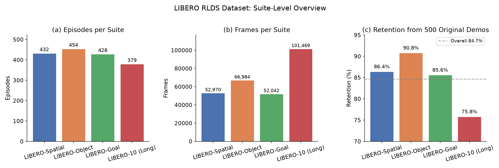

| 子集 | Episodes | Frames | Tasks | Ep Share | Frame Share | Avg Len | P50 Len | P95 Len |
|------|----------|--------|-------|----------|-------------|---------|---------|---------|
| libero_spatial | 432 | 52,970 | 10 | 25.52% | 19.37% | 122.6 | 123 | 158 |
| libero_object | 454 | 66,984 | 10 | 26.82% | 24.49% | 147.5 | 146 | 177 |
| libero_goal | 428 | 52,042 | 10 | 25.28% | 19.03% | 121.6 | 105 | 198 |
| libero_10 | 379 | 101,469 | 10 | 22.39% | **37.10%** | 267.7 | 259 | 392 |
| **总计** | **1,693** | **273,465** | **40** | 100% | 100% | 161.5 | 140 | 289 |

**关键发现**: `libero_10` 只占 22.4% 的 episode,但占 **37.1%** 的帧。按帧采样时,模型会不成比例地多看 `libero_10` 的长程任务。

### 4.2 Episode 长度分布

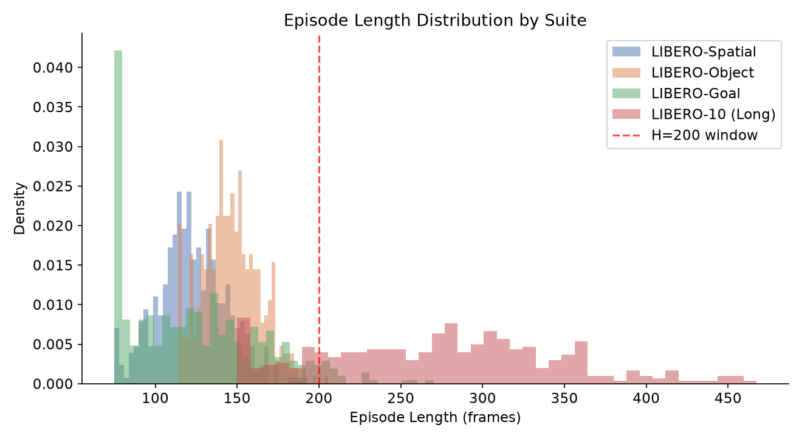

| 统计量 | 值 |
|--------|-----|
| 最短 episode | 75 frames (libero_spatial/libero_goal) |
| 最长 episode | 505 frames (libero_10: put both moka pots) |
| 中位数 | 140 frames |
| P95 | 289 frames |
| 短于 200 帧的比例 | **78.15%** |

`libero_10` 的 episode 显著更长 (mean 267.7, 最长 505),因为包含两步操作任务 (如 "put both moka pots on the stove")。

### 4.3 逐任务分布

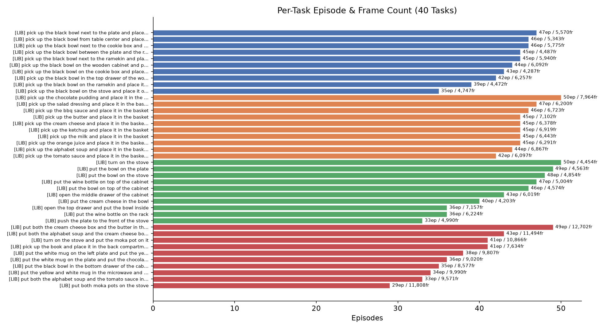

40 个任务的 episode 数分布在 29-50 之间:

- 最少: `libero_10` / "put both moka pots on the stove" (29 ep, 重放失败率高)
- 最多: `libero_goal` / "turn on the stove" (50 ep, 最简单的短程任务)
- `libero_object` 的 10 个任务结构最统一 (同一场景,只换目标物体)

**逐任务 frame share 不均衡**: `libero_10` 中 "put both moka pots on the stove" 仅 29 条 episode,却占 4.32% 的帧 (11,808)。

---

## 5. 动作空间分析

### 5.1 动作语义

动作是 **7D OSC_POSE 增量指令**,由 robosuite 的 Operational Space Controller 消费:

$$\mathbf{a} = [\Delta x, \Delta y, \Delta z, \Delta r_x, \Delta r_y, \Delta r_z, g] \in \mathbb{R}^7$$

其中:
- $\Delta x, \Delta y, \Delta z$: 末端执行器位置增量(世界系)
- $\Delta r_x, \Delta r_y, \Delta r_z$: 末端执行器旋转增量(轴角表示)
- $g \in \{-1, +1\}$: 夹爪指令(-1 = 关闭, +1 = 打开)

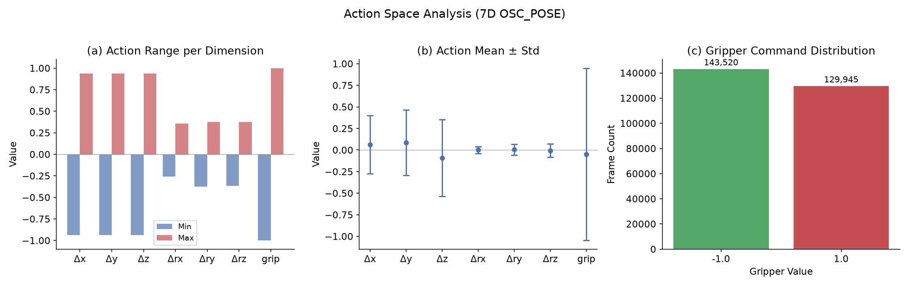

### 5.2 数值范围

| 维度 | Min | Max | Mean | Std |
|------|-----|-----|------|-----|
| Δx | -0.9375 | 0.9375 | 0.0628 | 0.3355 |
| Δy | -0.9375 | 0.9375 | 0.0868 | 0.3784 |
| Δz | -0.9375 | 0.9375 | -0.0904 | 0.4447 |
| Δrx | -0.2582 | 0.3557 | 0.0005 | 0.0392 |
| Δry | -0.3750 | 0.3750 | 0.0056 | 0.0634 |
| Δrz | -0.3675 | 0.3750 | -0.0052 | 0.0780 |
| grip | -1.0 | 1.0 | -0.0496 | 0.9988 |

### 5.3 0.9375 饱和值

前 6 维的绝对最大值恒为 **0.9375**,而非 1.0。这是**遥操作设备的饱和值,不是控制器上限**。

推导:
- LIBERO 使用 SpaceMouse 遥操作 (`--pos-sensitivity 1.5 / --rot-sensitivity 1.0`)
- robosuite 的 SpaceMouse `axis_scale = 350` ([robosuite/devices/spacemouse.py:67](https://github.com/ARISE-Initiative/robosuite/blob/master/robosuite/devices/spacemouse.py#L67))
- 位置通道量化到 `1/1120` 网格 (1120 = 350 × 1.5 × pos_scale + rounding),实际使用 1050 个 level
- 1050 × (1/1120) = 0.9375

**饱和帧占比**: 18,577 帧 (6.79%) 至少有一个通道顶在 ±0.9375 上。OSC 控制器本身接受完整的 [-1, 1],所以推理时模型输出 |a| > 0.9375 是合法的,但训练数据中从未见过。

### 5.4 夹爪通道

| 值 | 帧数 | 比例 |
|----|------|------|
| -1.0 (关闭) | 143,520 | 52.48% |
| +1.0 (打开) | 129,945 | 47.52% |

夹爪只取 `{-1.0, +1.0}` 两个离散值,无中间状态。约定为 `libero_native` 格式。

### 5.5 物理含义换算

OSC_POSE 的 `output_max` 配置决定了每一步的物理位移:

| 通道 | 每步最大位移 | 量化步长 |
|------|-------------|---------|
| 位置 (xyz) | 0.0469 m (= 0.9375 × 0.05) | 4.46e-5 m |
| 旋转 (rpy) | 0.1875 rad (= 0.9375 × 0.2) | 1.79e-4 rad |

> 在 20 Hz 下,最大线速度 ≈ 0.938 m/s,最大角速度 ≈ 3.75 rad/s。

---

## 6. 状态空间分析

### 6.1 EEF 状态 (8D)

$$\mathbf{s} = [x, y, z, \text{ax}_1, \text{ax}_2, \text{ax}_3, g_L, g_R] \in \mathbb{R}^8$$

- `s[0:3]`: 末端执行器位置 (来自 `gripper0_grip_site`)
- `s[3:6]`: 末端执行器姿态 (轴角表示,来自 `robot0_right_hand`)
- `s[6:8]`: 夹爪左右指关节位置

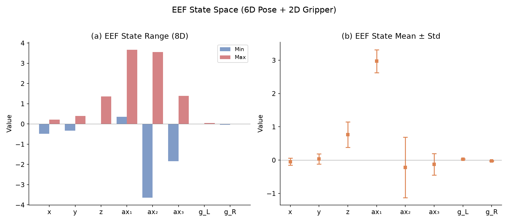

| 维度 | Min | Max | Mean | Std | 说明 |
|------|-----|-----|------|-----|------|
| x | -0.4828 | 0.2103 | -0.0465 | 0.1049 | EEF 位置 |
| y | -0.3255 | 0.3913 | 0.0344 | 0.1518 | EEF 位置 |
| z | 0.0081 | 1.3660 | 0.7646 | 0.3785 | EEF 位置 (z 恒正) |
| ax₁ | 0.3528 | 3.6714 | 2.9722 | 0.3443 | 轴角分量 1 |
| ax₂ | -3.6414 | 3.5607 | -0.2205 | 0.9069 | 轴角分量 2 |
| ax₃ | -1.8427 | 1.3863 | -0.1256 | 0.3254 | 轴角分量 3 |
| g_L | -0.0014 | 0.0423 | 0.0269 | 0.0142 | 左指关节位置 |
| g_R | -0.0420 | 0.0014 | -0.0272 | 0.0141 | 右指关节位置 |

### 6.2 两个坐标系陷阱

**位置** (`s[0:3]`) 和**姿态** (`s[3:6]`) 来自两个不同的 body:
- 位置取自 `gripper0_grip_site` (夹爪中心)
- 姿态取自 `robot0_right_hand` (法兰盘)
- 两者相差固定的 **-90°**(绕 z 轴)旋转

这在直接用 EEF state 做位姿估计时会引入不一致。

### 6.3 轴角的双重覆盖

robosuite 的 `quat2axisangle` 返回的模长在 $[0, 2\pi]$,不折叠 $q_w < 0$ 到 $q_w \geq 0$ 半球:

| 统计 | 值 |
|------|-----|
| 轴角模长 min | 1.903 rad |
| 轴角模长 max | 4.359 rad |
| 模长 > π 的帧 | 130,063 (47.56%) |
| 单步最大跳变 | 0.0437 rad |
| 出现跳变 > 1 rad 的 episode | 0 |

好消息:虽然模长有时超过 π,但 episode 内的轨迹是连续的,最大单步跳变仅 0.044 rad。

---

## 7. 关节状态分析

7 个 Franka Panda 臂关节角度 (`joint_state[0:7]`):

| 关节 | Min (rad) | Max (rad) | Mean | Std | 下限余量 | 上限余量 |
|------|-----------|-----------|------|-----|---------|---------|
| J1 | -0.6031 | 0.6901 | 0.0291 | 0.1290 | 2.294 | 2.207 |
| J2 | -0.7538 | 1.7295 | 0.4293 | 0.3479 | 1.009 | 0.033 |
| J3 | -0.5511 | 0.7475 | 0.0282 | 0.1703 | 2.346 | 2.150 |
| J4 | -3.0742 | -0.0595 | -1.9098 | 0.4621 | -0.002 | -0.010 |
| J5 | -2.9028 | 2.2140 | -0.0062 | 0.3381 | -0.006 | 0.683 |
| J6 | 0.6211 | 3.7694 | 2.2637 | 0.3374 | 0.639 | -0.017 |
| J7 | -2.1135 | 2.9034 | 0.9658 | 0.6234 | 0.784 | -0.006 |

**关节限位微小越界**: 最大越界 0.0169 rad (J6 上限),这是 OSC 控制器的跟踪超调,不是数据损坏。

---

## 8. 图像数据分析

### 8.1 基本规格

| 属性 | 值 |
|------|-----|
| 分辨率 | 256 × 256 × 3 (RGB) |
| 编码 | JPEG |
| 相机数 | 2 (agentview + wrist) |
| JPEG 均值大小 | agentview 19.8 KB, wrist 17.7 KB |
| JPEG 最大大小 | agentview 22.7 KB, wrist 25.6 KB |

### 8.2 图像朝向陷阱 (阻断项)

**RLDS 中的 JPEG 与评估端送进模型的画面差 180° 旋转。**

推导链:
1. MuJoCo `mjr_readPixels` 输出 bottom-up 缓冲区
2. robosuite 在保存到 HDF5 前做了 `img[::-1]` (上下翻转) — 但 OpenVLA 重放时渲染管线多做了一次 rot180
3. 最终 RLDS 图像 = MuJoCo 原始缓冲区的 rot180

**如果直接拿 RLDS 图像训练,推理时必须对输入图像做 `img[::-1, ::-1]`(等价 rot180)来对齐。**

验证:
- 行相关 −0.87,列相关 −0.97(与 rot180 一致)
- 与 `merged_kpt` 的 mp4 帧做 rot180 对比,MSE = 8.61(次优方向 MSE = 3929,**456× 差距**)

---

## 9. 坐标系、基座与前向运动学

### 9.1 Arena 基座分布

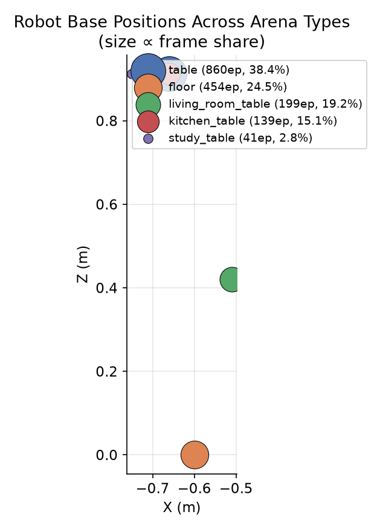

数据中存在 **5 种 Arena** 类型,每种对应不同的机器人基座位置:

| Arena | Episodes | Frame Share | 基座 X (m) | 基座 Y (m) | 基座 Z (m) |
|-------|----------|-------------|-----------|-----------|-----------|
| table | 860 | 38.40% | -0.6601 | ~0 | 0.9121 |
| floor | 454 | 24.49% | -0.6000 | ~0 | 0.0000 |
| living_room_table | 199 | 19.23% | -0.5100 | ~0 | 0.4200 |
| kitchen_table | 139 | 15.08% | -0.6600 | ~0 | 0.9120 |
| study_table | 41 | 2.79% | -0.7500 | 0 | 0.9120 |

每种 Arena 的基座位置在 episode 间的 spread ≤ 0.07 mm,与 LIBERO 源码中的硬编码值一致。

### 9.2 前向运动学

使用 robosuite 的 Franka Panda MJCF (`robots/panda/robot.xml`) 做前向运动学:

- **qpos 布局**: `joint_state[0:7]` (臂关节) + `state[6:8]` (夹爪)
- **关键点 body**: link1, link2, link3, link4, link5, link6, link7, eef (共 8 个)
- **EEF body 与 state position**: FK 计算的 eef body 世界坐标与 `state[0:3]` 一致
- **FK 精度**: 位置误差 ≤ 0.55 mm,旋转误差 ≤ 0.10°

### 9.3 固定 Lift 基座

**关键点始终使用 Lift 场景的虚拟基座 `(-0.56, 0, 0.912)`,而非当前 arena 的真实基座。** 这是设计特性:使关键点表示对 arena 类型不变,但训练和评估端必须统一使用这个固定值。

---

## 10. 3D 关键点与归一化

### 10.1 关键点 Body 统计

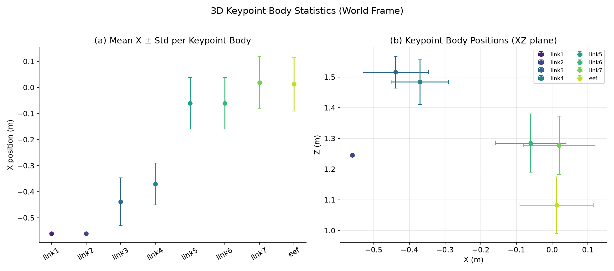

| Body | Mean X (m) | Mean Y (m) | Mean Z (m) | Range X | Range Y | Range Z |
|------|-----------|-----------|-----------|---------|---------|---------|
| link1 | -0.560 | 0.000 | 1.245 | 0.000 | 0.000 | 0.000 |
| link2 | -0.560 | 0.000 | 1.245 | 0.000 | 0.000 | 0.000 |
| link3 | -0.438 | 0.006 | 1.516 | 0.522 | 0.302 | 0.366 |
| link4 | -0.371 | 0.010 | 1.484 | 0.485 | 0.318 | 0.458 |
| link5 | -0.061 | 0.028 | 1.285 | 0.598 | 0.759 | 0.539 |
| link6 | -0.061 | 0.028 | 1.285 | 0.598 | 0.759 | 0.539 |
| link7 | 0.020 | 0.032 | 1.277 | 0.608 | 0.876 | 0.559 |
| eef | 0.012 | 0.034 | 1.083 | 0.637 | 0.717 | 0.458 |

### 10.2 冗余性

- **link1** 和 **link2** 完全静止且重合(position range = 0)——它们是基座上的固定 body
- **link5** 和 **link6** 位置恒等(共享旋转轴,位置重合)
- 24 个位置维度中**只有 15 个是独立的**
- link1/link2 虽然位置固定,但仍有旋转(joint1 驱动)

### 10.3 R_pad 与归一化

$R_{\text{pad}}$ 是将所有关键点位置归一化到 $[-1, 1]$ 的球半径:

$$\mathbf{p}_{\text{norm}} = \frac{\mathbf{p}_{\text{world}}}{R_{\text{pad}}}$$

| 项目 | 值 |
|------|-----|
| 从 RLDS 重算 | $R_{\text{pad}} = 1.8212723272872922$ |
| 评估端硬编码 | $R_{\text{pad}} = 1.8212722539901733$ |
| 差异 | $7.3 \times 10^{-8}$ (可忽略) |
| 驱动轴 | Z 轴 |
| Margin | 已含 15% |

### 10.4 归一化方案对比

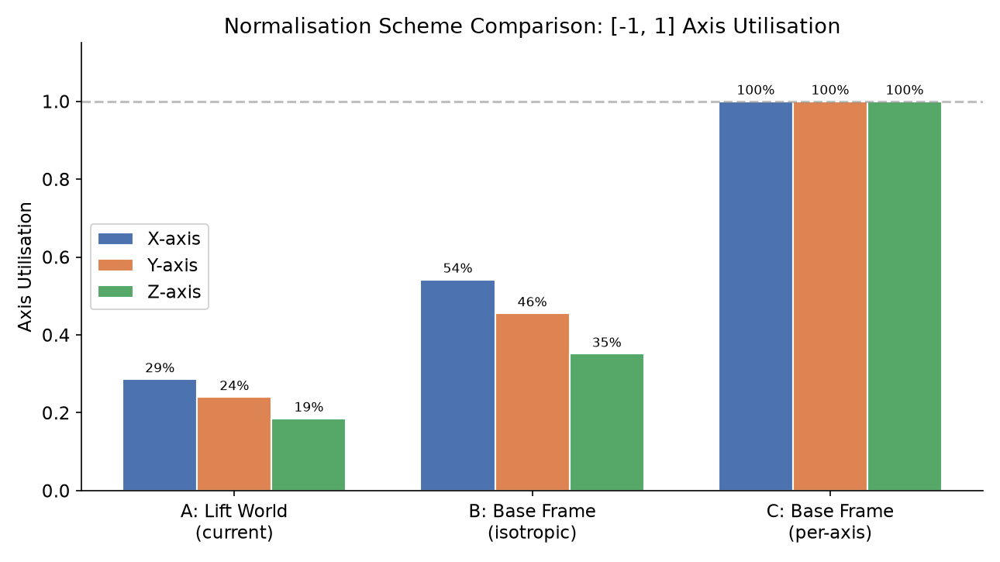

| 方案 | 描述 | X 利用率 | Y 利用率 | Z 利用率 |
|------|------|---------|---------|---------|
| **A (当前)**: Lift 世界系 + isotropic | $\mathbf{p}/R_{\text{pad}}$ | 28.6% | 24.0% | 18.5% |
| **B**: 基座系 + isotropic | $(\mathbf{p}-\mathbf{b})/R'$ | 54.2% | 45.5% | 35.1% |
| **C**: 基座系 + per-axis | $(\mathbf{p}-\mathbf{b})/\mathbf{s}$ | 100% | 100% | 100% |

当前方案 A 的 $[-1, 1]$ 利用率很低,尤其 Z 轴只用了 18.5%。方案 B 和 C 分别可提高 ~2× 和 ~5×,但需要重新生成数据和重训模型。

---

## 11. 四元数表示与陷阱

### 11.1 约定

关键点使用 **xyzw** 四元数,约束在 **$q_w \geq 0$ 半球**。

### 11.2 半球边界问题

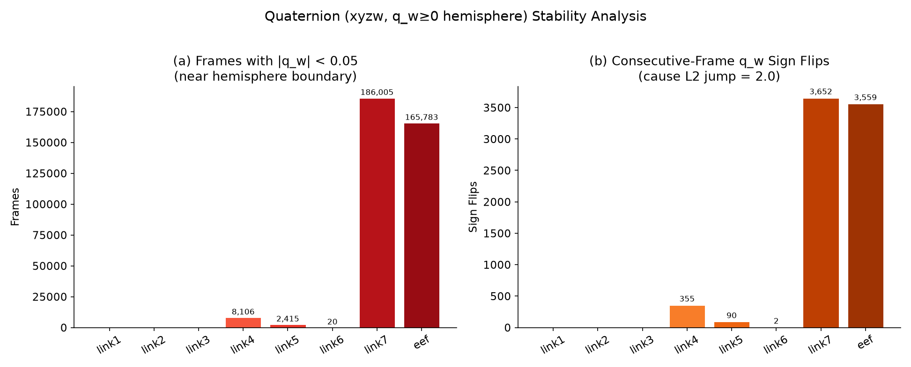

link7 和 eef 的旋转轨迹长期骑在 $q_w = 0$ 的分支切割线上:

| Body | $|q_w| < 0.05$ 的帧 | 连续帧 $q_w$ 符号翻转 | 最大单步 L2 |
|------|---------------------|---------------------|------------|
| link1 | 0 | 0 | 0.020 |
| link2 | 0 | 0 | 0.030 |
| link3 | 0 | 0 | 0.030 |
| link4 | 8,106 | 355 | 2.000 |
| link5 | 2,415 | 90 | 2.000 |
| link6 | 20 | 2 | 2.000 |
| **link7** | **186,005 (68.0%)** | **3,652** | **2.000** |
| **eef** | **165,783 (60.6%)** | **3,559** | **2.000** |
| **总计** | — | **7,658** | — |

**影响**: 如果用 MSE 直接监督四元数分量,7,658 次对跖跳变会被当成最大误差 (L2 = 2.0)。应使用 geodesic distance 或 6D rotation representation 替代。

---

## 12. 时间轴与历史窗口

### 12.1 控制频率

| 标注 | 实际 |
|------|------|
| `merged_kpt` metadata fps | 10 Hz |
| LIBERO 控制器实际频率 | **20 Hz** |
| 是否降采样 | 否,一帧没丢 |

窗口按帧索引,模型无感。但"H=200 = 10 秒"而非 20 秒。

### 12.2 历史窗口 H=200 的填充率

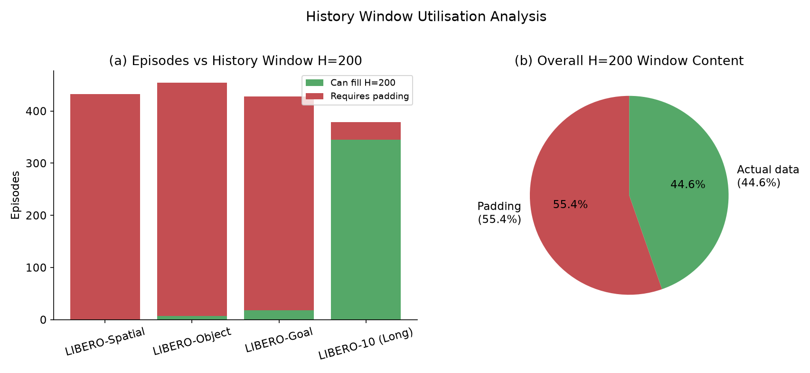

| 子集 | Episodes | 最长帧数 | 能填满 H=200 | 填不满比例 |
|------|----------|---------|-------------|-----------|
| libero_spatial | 432 | 192 | **0** (100% 填不满) | 100% |
| libero_object | 454 | 254 | 7 | 98.5% |
| libero_goal | 428 | 270 | 18 | 95.8% |
| libero_10 | 379 | 505 | 345 | 9.0% |

- 整体 padding 占比: **55.4%**
- 只有 21.85% 的 episode 能填满 H=200
- `libero_spatial` 最长才 192 帧,**永远填不满**

---

## 13. LIBERO-plus 扰动评估分析

### 13.1 扰动类别总览

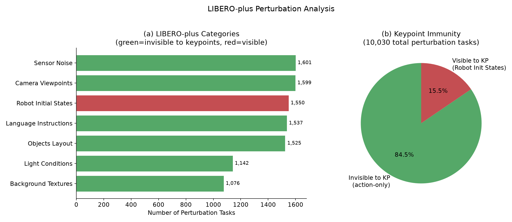

LIBERO-plus 共有 **10,030** 个扰动任务变体,分为 7 个扰动类别:

| 类别 | 任务数 | 占比 | 机制 | 关键点可见? |
|------|--------|------|------|-----------|
| Sensor Noise | 1,601 | 15.96% | agentview post-processing | **否** |
| Camera Viewpoints | 1,599 | 15.94% | 相机位姿变更 | **否** |
| Robot Initial States | 1,550 | 15.45% | 初始关节角扰动 | **是** |
| Language Instructions | 1,537 | 15.32% | 同义改写指令 | **否** |
| Objects Layout | 1,525 | 15.20% | 物体位置/数量变化 | **否** |
| Light Conditions | 1,142 | 11.39% | 光源位置/颜色 | **否** |
| Background Textures | 1,076 | 10.73% | 场景纹理替换 | **否** |

### 13.2 关键点免疫性分析

在 7 个扰动类别中,**6 个对关键点完全不可见** (keypoint-invisible):

$$\frac{\text{keypoint-invisible tasks}}{\text{total tasks}} = \frac{8,480}{10,030} = 84.55\%$$

只有 "Robot Initial States" 会改变关键点分布。这意味着:

> 4D 关键点分支对 LIBERO-plus **84.5%** 的扰动**完全免疫**,因为关键点只是 `qpos` 的函数,与图像、纹理、光照、相机、语言无关。

### 13.3 难度分布

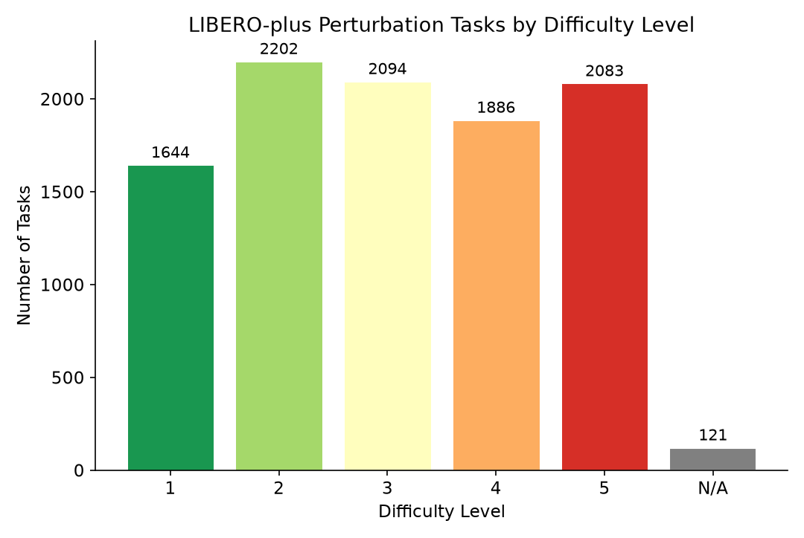

| 难度 | 任务数 | 比例 |
|------|--------|------|
| 1 (最易) | 1,644 | 16.4% |
| 2 | 2,202 | 22.0% |
| 3 | 2,094 | 20.9% |
| 4 | 1,886 | 18.8% |
| 5 (最难) | 2,083 | 20.8% |
| N/A | 121 | 1.2% |

分布较均匀,略偏中等难度。

### 13.4 Robot Initial States 扰动量化

初始关节角扰动分 5 个 tier (0.1 ~ 0.5 rad),每 tier 100 个变体:

| Tier ($\Delta q$ norm) | EEF 位移均值 | EEF 位移最大值 | 归一化位移均值 |
|----------------------|-------------|-------------|-------------|
| 0.1 rad | 0.034 m | 0.059 m | 1.87% |
| 0.2 rad | 0.072 m | 0.141 m | 3.95% |
| 0.3 rad | 0.108 m | 0.184 m | 5.90% |
| 0.4 rad | 0.141 m | 0.266 m | 7.76% |
| 0.5 rad | 0.175 m | 0.338 m | 9.60% |

对比训练数据:训练集第一帧 EEF 位置的 radius 均值仅 0.0114 m (P95 = 0.0214 m)。最大扰动 tier (0.5 rad) 产生的 EEF 位移 (0.175 m) 是训练分布的 **15.4×**,这对模型的泛化能力提出了很高要求。

### 13.5 逐 Suite 扰动分布

| Suite | 总扰动任务 | 最多类别 | 最少类别 |
|-------|-----------|---------|---------|
| libero_spatial | 2,402 | Language Instructions (390) | Background Textures (258) |
| libero_object | 2,518 | Sensor Noise (422) | Background Textures (248) |
| libero_goal | 2,591 | Objects Layout (425) | Light Conditions (279) |
| libero_10 | 2,519 | Sensor Noise (449) | Light Conditions (274) |

---

## 14. 数据完整性审计

### 14.1 审计结果

| 检查项 | 结果 |
|--------|------|
| NaN 帧 | **0** |
| is_first/is_last/is_terminal 标记违规 | **0** |
| reward 异常 (非 0/1 或终止帧非 1) | **0** |
| discount 异常 (非 1.0) | **0** |
| 残留 no-op 帧 | **0** |
| 微小 EEF 运动帧 (< 1mm) | 17,401 (6.36%) |

数据**非常干净**,OpenVLA 的预处理做得很好。

### 14.2 微小运动帧

6.36% 的帧 EEF 位移 < 1mm,但这不是 no-op:它们的动作向量非零,只是控制器响应后 EEF 移动量很小(通常是旋转为主或夹爪切换帧)。

---

## 15. 训推一致性契约

以下契约项必须在训练端和评估端保持一致:

### 15.1 阻断项 (不处理会训推不一致)

| # | 契约 | 风险 |
|---|------|------|
| **B1** | 图像朝向: RLDS JPEG 是 rot180,训练时需 `img[::-1, ::-1]` | 图像-动作对应关系完全错误 |
| **B2** | $R_{\text{pad}} = 1.8212722539901733$,margin 已含,不可再乘 1.15 | 关键点缩小 13%,超出归一化范围 |
| **B3** | 关键点使用 Lift 固定基座 $(-0.56, 0, 0.912)$,不是 arena 真实基座 | 关键点坐标偏移 5-27% |
| **B4** | 夹爪约定 `libero_native` ($\pm 1$) | 夹爪永远不动或反向 |
| **B5** | 四元数 xyzw + $q_w \geq 0$ 半球 | 7,658 次跳变被当成最大误差 |

### 15.2 非阻断项 (会悄悄损失性能)

| # | 契约 | 影响 |
|---|------|------|
| **N1** | 归一化仅用 $[-1,1]$ 的 18-29%,Z 轴恒正 | 信号动态范围浪费 |
| **N2** | 8 个关键点仅 15 个独立位置维度 | 冗余维度浪费模型容量 |
| **N3** | metadata 标 10 Hz,实际 20 Hz | H=200 是 10 秒非 20 秒 |
| **N4** | H=200 窗有 55.4% 是 padding | 大量计算花在 padding 上 |
| **N5** | 按帧采样时 libero_10 被过度加权 (37.1% vs 22.4%) | Suite 间隐性不均衡 |
| **N6** | 动作饱和在 0.9375 而非 1.0 (6.79% 帧) | 模型可能不敢输出 > 0.9375 |
| **N7** | state 位置和姿态来自不同坐标系 (差 -90° 绕 z) | 直接用 state 做位姿估计会不一致 |

---

## 16. 关键陷阱与建议

### 16.1 训练建议

1. **图像预处理**: 训练时对 RLDS 图像做 rot180;或确认训练 pipeline 已处理。
2. **R_pad 不要二次缩放**: 检查代码中是否有 `r_pad *= 1.15` 的多余操作。
3. **四元数监督**: 使用 geodesic loss 或 6D rotation representation,避免 MSE 被对跖跳变主导。
4. **采样权重**: 考虑按 episode(而非帧)均匀采样,或显式设置 suite 权重,避免 `libero_10` 被过度训练。
5. **History window**: 对于 `libero_spatial` 等短任务,可考虑缩小 H 或使用自适应窗口。

### 16.2 评估建议

1. **确保评估端基座偏移与训练端一致**(使用 Lift 固定基座)。
2. **LIBERO-plus 中 Robot Initial States 是唯一会影响关键点的扰动**——评估该类别时,关注模型对初始 qpos 偏移的鲁棒性。
3. **0.5 rad 扰动 tier 的 EEF 位移是训练分布的 15×**——如果该 tier 成功率骤降,属于预期行为,不一定是 bug。

---

## 17. 参考来源

| 编号 | 来源 | 用途 |
|------|------|------|
| [1] | [OpenVLA (arXiv:2406.09246)](https://arxiv.org/abs/2406.09246) | 数据集预处理方法 (附录 E) |
| [2] | [LIBERO (arXiv:2310.09278)](https://arxiv.org/abs/2310.09278) | 原始 benchmark 定义 |
| [3] | [openvla/modified_libero_rlds](https://huggingface.co/datasets/openvla/modified_libero_rlds) | 数据集 HuggingFace 页面 |
| [4] | [InternVLA-A1.5 (arXiv:2607.04988)](https://arxiv.org/abs/2607.04988) | 模型论文 |
| [5] | [LIBERO-plus GitHub](https://github.com/Lifelong-Robot-Learning/LIBERO) | LIBERO-plus 评估框架 |
| [6] | `b/d/libplus/ds/asset/raw_stats.json` | RLDS 原始统计数据 |
| [7] | `b/d/libplus/ds/asset/kpt_stats.json` | 关键点与 FK 统计数据 |
| [8] | `b/d/libplus/ds/asset/libero_plus_report.json` | LIBERO-plus 扰动分析数据 |
| [9] | `b/d/libplus/ds/libero_raw_analyz2.md` | 前置深度分析文档 |
| [10] | robosuite `robots/panda/robot.xml` | Franka Panda MJCF 模型 |
| [11] | robosuite `controllers/config/osc_pose.json` | OSC 控制器配置 |
| [12] | robosuite `devices/spacemouse.py` | SpaceMouse 设备参数 |
