# `/B/Dta/opvla_libero` 训练数据深度分析:训推一致性契约与 4D 信息抽取

> **文档定位**:这份文档回答两个问题——(1) 这份数据到底是什么,(2) 拿它训出来的模型要在 LIBERO / LIBERO-plus 上跑通,训练侧和评估侧必须逐通道对齐哪些约定。
>
> **所有数字都是实测的**。本文不引用任何未经本次复核的历史结论。全部 1693 条 episode、273465 帧、96 个 shard 均被完整遍历,脚本在 [`asset/`](asset/) 下,可一键复跑(§14)。
>
> **本机环境的硬约束**:没有 TensorFlow,`robosuite` 因缺 EGL/OSMesa 无法 `import`。因此本文的工具链全部绕开了这两者——RLDS 用手写 protobuf 解码器读,正向运动学(FK)直接用 `mujoco` 加载裸 MJCF 重建。§9.6 证明这条替代路径与官方产线**位级等价**。

---

## 目录

1. [结论先行](#1-结论先行)
2. [数据集身份与溯源链](#2-数据集身份与溯源链)
3. [物理格式与无依赖解析](#3-物理格式与无依赖解析)
4. [规模与分布](#4-规模与分布)
5. [动作空间](#5-动作空间)
6. [状态空间](#6-状态空间)
7. [时间轴与控制频率](#7-时间轴与控制频率)
8. [图像通道与朝向](#8-图像通道与朝向)
9. [4D 信息抽取(核心章)](#9-4d-信息抽取核心章)
10. [训推一致性契约表](#10-训推一致性契约表)
11. [LIBERO 与 LIBERO-plus 评估端对 4D 的影响](#11-libero-与-libero-plus-评估端对-4d-的影响)
12. [训练建议](#12-训练建议)
13. [风险清单与验收](#13-风险清单与验收)
14. [复现方法与参考出处](#14-复现方法与参考出处)

---

## 1. 结论先行

### 1.1 阻断项(不处理就会训推不一致)

| # | 结论 | 证据 | 复核 |
|---|---|---|---|
| **B1** | **RLDS 里的 JPEG 与评估端送进模型的画面差 180° 旋转。** 直接拿 `/B/Dta/opvla_libero/` 的图训练,必须先 `img[::-1, ::-1]`。 | 几何投影判定 RLDS = MuJoCo 缓冲的 rot180(行相关 −0.87 / 列相关 −0.97);像素比对判定 `merged_kpt` 的 mp4 = RLDS 的 rot180(MSE 8.61,次优 3929,**456× 差距**) | [§8.2](#82-三跳旋转链完整闭合) · `check_orientation.py`、`check_chain_orientation.py` |
| **B2** | **`R_pad = 1.8212722539901733`,且 margin 已含在内,不得再乘 1.15。** | `merged_kpt` 的 `meta/keypoints_meta.json` 记的 `bbox_radius` 与评估端 `DEFAULT_R_PAD` 完全相同;从 RLDS 重算得 `1.8212723272872922`,差 `7.3e-08` | [§9.5](#95-归一化r_pad-的三方对账与三种方案) · `analyze_4d.py` |
| **B3** | **关键点永远用固定的 Lift 虚拟基座 `(-0.56, 0, 0.912)`,不是当前 arena 的真实基座。** 这是特性(关键点对 arena 不变),不是 bug,但必须写死在契约里。 | 数据里实测出 5 个 arena key / 4 个不同基座位置,与 LIBERO 源码逐项吻合到 0.07 mm;而训练关键点与这些基座无关 | [§9.3](#93-两个世界系一个是特性不是-bug) · [§9.6](#96-位级复现证明) |
| **B4** | **夹爪约定必须 `libero_native`(`±1`)。** 训练数据的 `action[6]` 只取 `{-1.0, +1.0}` 两个值。 | 全量 273465 帧统计,无第三个取值 | [§5.3](#53-夹爪通道) |
| **B5** | **四元数用 `xyzw` + `qw ≥ 0` 半球,而 link7 / eef 恰好长期骑在分支切割线上。** 用 MSE 直接监督四元数分量,会把 7658 次对跖跳变当成最大误差。 | link7 有 **68.0%** 的帧、eef 有 **60.6%** 的帧满足 `|q_w| < 0.05`;逐帧 L2 步长最大值达到 2.0(对跖) | [§9.4](#94-四元数约定与它的代价) |

### 1.2 非阻断项(会悄悄损失性能或误导判断)

| # | 结论 | 量化 |
|---|---|---|
| **N1** | 现行归一化方案只用掉了 `[-1, 1]` 的 **28.6% / 24.0% / 18.5%**(x/y/z),且 z **永远为正**。换到基座系可翻倍,逐轴缩放可用满,但都要重生成数据 + 重训。 | [§9.5](#95-归一化r_pad-的三方对账与三种方案) |
| **N2** | 8 个关键点里,`link1`/`link2` 完全静止且重合,`link5`/`link6` 位置恒等。24 个位置维度中**只有 15 个是独立的**。 | [§9.7](#97-关键点冗余度) |
| **N3** | `merged_kpt` 标了 `fps=10`,但 LIBERO 控制器跑在 20 Hz,且一帧没重采样。窗口按帧索引所以模型无感,但"H=200 = 10 秒"而非 20 秒。 | [§7](#7-时间轴与控制频率) |
| **N4** | `H=200` 的历史窗有 **55.4%** 是 padding;只有 **21.85%** 的 episode 能填满;`libero_spatial` 最长才 192 帧,**永远填不满**。 | [§9.8](#98-历史窗-h200-的填充率) |
| **N5** | 帧采样会悄悄给套件重新加权:`libero_10` 只占 22.4% 的 episode,却占 **37.1%** 的帧。 | [§4.2](#42-按帧采样会重新加权套件) |
| **N6** | 动作在前 6 维上永远 `≤ 0.9375`,这是遥操作设备的饱和值,**不是控制器上限**(OSC 收 `[-1, 1]`)。**6.79%** 的帧顶在这个轨上。 | [§5.2](#52-09375-是遥操作饱和不是控制器上限) |
| **N7** | `observation.state` 的位置和姿态**来自两个不同坐标系**:位置取 `gripper0_grip_site`,姿态取 `robot0_right_hand`,两者相差固定 −90°(绕 z)。 | [§6.1](#61-8-维布局与它的两个坐标系) |
| **N8** | 轴角表示有 **47.6%** 的帧模长超过 `π`(robosuite 不折叠半球)。好消息:episode 内最大单步跳变只有 0.0437 rad,实际轨迹是连续的。 | [§6.2](#62-轴角的双重覆盖) |
| **N9** | 数据本身**非常干净**:0 个 NaN、0 个边界标记错误、0 个残留 no-op、0 个 reward/discount 异常。 | [§4.3](#43-完整性审计) |

### 1.3 一句话总结

> 这是一份**干净、规模适中、但归一化方案很浪费、且图像朝向有陷阱**的数据。4D 关键点分支的价值在于:它对 LIBERO-plus **84.5%** 的扰动(纹理/光照/相机/语言/物体布局/传感器噪声)**完全免疫**,因为它只是 `qpos` 的函数。

---

## 2. 数据集身份与溯源链

### 2.1 它是什么

`/B/Dta/opvla_libero/` 是 OpenVLA 官方发布的 [`openvla/modified_libero_rlds`](https://huggingface.co/datasets/openvla/modified_libero_rlds),即论文 [OpenVLA (arXiv:2406.09246)](https://arxiv.org/abs/2406.09246) 附录 E 描述的四个改造版 LIBERO 数据集。目录里的 `README.md` 明确写了这一点。

四个子集各自是一个独立的 TFDS builder:

```
/B/Dta/opvla_libero/
├── libero_spatial_no_noops/1.0.0/   libero_spatial-train.tfrecord-*-of-00016
├── libero_object_no_noops/1.0.0/    libero_object-train.tfrecord-*-of-00032
├── libero_goal_no_noops/1.0.0/      libero_goal-train.tfrecord-*-of-00016
└── libero_10_no_noops/1.0.0/        liber_o10-train.tfrecord-*-of-00032   ← 注意拼写
```

> **坑点**:`libero_10` 的分片文件名是 `liber_o10-train.tfrecord-*`,不是 `libero_10-...`。这是 OpenVLA 发布版 builder 名里的一个错字,写 glob 时按目录名拼会一个文件都匹配不到。

### 2.2 溯源链

每条 episode 的 `episode_metadata/file_path` 保留了原始产出路径:

```
/iris/u/moojink/prismatic-dev/LIBERO/libero/datasets/regenerated--no_noops/
    libero_spatial/pick_up_the_black_bowl_next_to_the_cookie_box_and_place_it_on_the_plate_demo.hdf5
```

`regenerated--no_noops` 这个目录名说明了 OpenVLA 做的两件事:

1. **regenerated**:不是直接转录 LIBERO 官方 hdf5,而是在仿真器里**重放**每条 demo 的动作序列,重新渲染图像并重新记录观测。重放失败(没达成任务目标)的 demo 被丢弃。
2. **no_noops**:过滤掉"空操作"帧——前 6 维位移为 0 且夹爪指令不变的帧。

这解释了为什么 2000 条官方 demo 只剩 1693 条(§4.1),也解释了为什么本文的 no-op 复查一帧都没查出来(§4.3)——过滤确实执行过了。

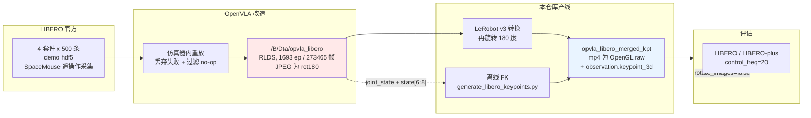

### 2.3 三份数据的关系

本文涉及三份东西,务必分清:

| 名称 | 位置 | 内容 | 图像朝向 |
|---|---|---|---|
| **RLDS 原始档**(本文主角) | `/B/Dta/opvla_libero/` | 1693 ep,JPEG + `state` + `joint_state` + `action` | **rot180** |
| **merged_kpt**(实际训练用) | `/B/Dta/opvla_libero_merged_kpt.tar.gz` | LeRobot v3,mp4 + `observation.keypoint_3d`(56D) | OpenGL raw |
| **评估环境** | `/B/SRC/LIBERO`、`/B/SRC/LIBERO-plus` | 在线仿真 | OpenGL raw |

规模三方对账一致:`1693` episode / `273465` frame / `40` task,在 RLDS 的 `shardLengths` 求和与 `merged_kpt` 的 `meta/info.json` 中完全相同——说明**转换过程一帧都没丢、没重采样**。

---

## 3. 物理格式与无依赖解析

### 3.1 为什么要手写解析器

本机没有 TensorFlow,`tfds.load` 不可用。但 RLDS 的两层容器都足够简单,可以直接手写解码。

**TFRecord 帧格式**:

```
record := uint64 length | uint32 masked_crc32c(length) | bytes data | uint32 masked_crc32c(data)
```

**`tf.train.Example` 的 protobuf wire format**:

```
Example  := Features features = 1
Features := map<string, Feature> feature = 1
Feature  := BytesList bytes_list = 1 | FloatList float_list = 2 | Int64List int64_list = 3
```

`crc32c` 模块也没有,所以 CRC 校验被跳过,改用 `dataset_info.json` 里声明的 `shardLengths` 逐分片核对记录数——这同样能抓出截断和错位。实测 96 个分片**全部吻合**。

### 3.2 RLDS 的 Example 键布局

关键点在于:**一条 episode 打包成一个 Example**,`steps/` 下的每个键都装着整条轨迹。

| 键 | 类型 | 形状 | 说明 |
|---|---|---|---|
| `episode_metadata/file_path` | `BytesList` | 1 | 原始 hdf5 路径 |
| `steps/language_instruction` | `BytesList` | T | 每帧一份(实测同一 episode 内恒定) |
| `steps/observation/image` | `BytesList` | T | agentview,256×256 JPEG |
| `steps/observation/wrist_image` | `BytesList` | T | `robot0_eye_in_hand`,256×256 JPEG |
| `steps/observation/state` | `FloatList` | T×8 展平 | EEF 位姿 + 夹爪 |
| `steps/observation/joint_state` | `FloatList` | T×7 展平 | 7 个臂关节角 |
| `steps/action` | `FloatList` | T×7 展平 | OSC delta + 夹爪 |
| `steps/reward`、`steps/discount` | `FloatList` | T | |
| `steps/is_first`、`is_last`、`is_terminal` | `Int64List` | T | |

浮点张量是**一整段 packed `FloatList`**(不是 T 个独立条目),所以读出来是长度 `T*dim` 的一维数组,需要 `reshape(-1, dim)`。

实现在 [`asset/rlds_reader.py`](asset/rlds_reader.py),单文件、零依赖(只要 numpy),全量遍历 96 个分片约 2.5 秒。

```bash
$ python3 asset/rlds_reader.py
[OK] libero_spatial  shards= 16 declared=  432 observed=  432
[OK] libero_object   shards= 32 declared=  454 observed=  454
[OK] libero_goal     shards= 16 declared=  428 observed=  428
[OK] libero_10       shards= 32 declared=  379 observed=  379
```

---

## 4. 规模与分布

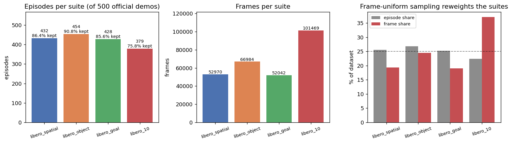

### 4.1 逐套件规模与保留率

| 套件 | episode | 帧数 | 任务数 | 保留率(相对 500 条官方 demo) | 长度 min / 中位 / max |
|---|---|---|---|---|---|
| `libero_spatial` | 432 | 52970 | 10 | 86.4% | 75 / 123 / 193 |
| `libero_object` | 454 | 66984 | 10 | 90.8% | 114 / 146 / 254 |
| `libero_goal` | 428 | 52042 | 10 | 85.6% | 75 / 105 / 270 |
| `libero_10` | 379 | 101469 | 10 | **75.8%** | 150 / 259 / 505 |
| **合计** | **1693** | **273465** | **40** | **84.65%** | 75 / 140 / 505 |

`libero_10` 保留率最低(75.8%)完全符合直觉:它是长程复合任务(如"打开炉子并把摩卡壶放上去"),重放时更容易中途失败。

### 4.2 按帧采样会重新加权套件

这是最容易被忽略的一条。`libero_10` 的 episode 平均长 267.7 帧,是 `libero_goal`(121.6)的 2.2 倍:

| 套件 | episode 占比 | **帧占比** | 放大倍数 |
|---|---|---|---|
| `libero_spatial` | 25.52% | 19.37% | 0.76× |
| `libero_object` | 26.82% | 24.49% | 0.91× |
| `libero_goal` | 25.28% | 19.03% | 0.75× |
| `libero_10` | 22.39% | **37.10%** | **1.66×** |

四个套件在 episode 层面几乎均分,但如果 DataLoader 按帧均匀采样(LeRobot 的默认行为),`libero_10` 会拿到接近两倍于 `libero_goal` 的梯度份额。想要套件均衡,必须在 `weight_rules_path` 里显式按 `1/mean_length` 反向加权。

### 4.3 完整性审计

全量 273465 帧的检查结果:

| 检查项 | 结果 |
|---|---|
| `action` / `state` / `joint_state` 中的 NaN | **0** |
| `is_first` / `is_last` / `is_terminal` 形态错误 | **0**(全部为首帧 True / 末帧 True / 末帧 True) |
| `reward` 异常(期望末帧 1.0、其余 0.0) | **0** |
| `discount` 异常(期望恒 1.0) | **0** |
| 残留 no-op 帧(OpenVLA 判据) | **0** |
| 关节角越过 MJCF 限位 | 最大越界 **0.0169 rad**(≈1°),是 OSC 跟踪过冲,非数据损坏 |

顺带一个反直觉的数:按"EEF 位移 < 1 mm"这个更宽的判据,仍有 **6.36%** 的帧几乎不动。这不矛盾——OpenVLA 的 no-op 判据看的是**指令**(`action[:6]` 是否为零),而这 6.36% 是**指令非零但执行后几乎没动**的帧,典型场景是夹爪已经夹住物体、手臂在顶着阻力。不要用位移判据去二次过滤。

---

## 5. 动作空间

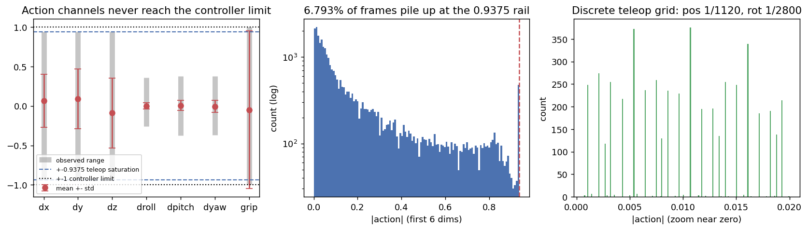

### 5.1 布局

7 维:`[dx, dy, dz, droll, dpitch, dyaw, gripper]`,前 6 维是 robosuite `OSC_POSE` 控制器的归一化增量,第 7 维是夹爪指令。

配置见 [`robosuite/controllers/config/osc_pose.json`](/B/VENV/libero_plus_client/lib/python3.10/site-packages/robosuite/controllers/config/osc_pose.json):`input_min/max = ∓1`,`output_max = [0.05, 0.05, 0.05, 0.5, 0.5, 0.5]`。换算成物理量:

$$
\Delta p_{\max} = 1.0 \times 0.05\ \text{m} = 5\ \text{cm},\qquad
\Delta \theta_{\max} = 1.0 \times 0.5\ \text{rad} = 28.6^\circ
$$

其中 $\Delta p_{\max}$ 是单个控制步允许的最大平移、$\Delta\theta_{\max}$ 是最大姿态增量(每个欧拉轴),都是**每个控制步**(1/20 秒)的量。

### 5.2 `0.9375` 是遥操作饱和,不是控制器上限

实测前 6 维的绝对值**从未超过 0.9375**,而且 **6.79%** 的帧恰好顶在这个值上。更精确地,动作值落在一个离散网格上:

| 通道组 | 网格 | 实际用到的级数 | 上限 | 物理步长 |
|---|---|---|---|---|
| 位置 `dx, dy, dz` | $k/1120$ | 1050 | $1050/1120 = 0.9375$ | $0.05/1120 = 4.46\times10^{-5}$ m |
| 姿态 `droll, dpitch, dyaw` | $k/2800$ | 1050 | $1050/2800 = 0.375$ | $0.5/2800 = 1.79\times10^{-4}$ rad |

其中 $k$ 是整数。两组通道**恰好都用满 1050 级**,而 $1050 = 3\times350$——350 正是 robosuite SpaceMouse 的轴缩放常数:

```python
def scale_to_control(x, axis_scale=350.0, min_v=-1.0, max_v=1.0):
```
— [`robosuite/devices/spacemouse.py:67`](/B/VENV/libero_plus_client/lib/python3.10/site-packages/robosuite/devices/spacemouse.py)

LIBERO 用 `--pos-sensitivity 1.5` / `--rot-sensitivity 1.0` 采集([`LIBERO/scripts/collect_demonstration.py:237-246`](/B/SRC/LIBERO/scripts/collect_demonstration.py))。

**为什么这很重要**:

- 训练数据的动作分布在 `±0.9375` 处被硬截断,策略学不到更快的动作。实际可用速度只有控制器允许的 93.75%。
- 反过来,模型如果输出 `|a| > 0.9375`,在仿真器里**完全合法**(`OSC_POSE` 收 `[-1, 1]`),只是训练时没见过。如果评估端做了 `clip(-0.9375, 0.9375)`,那是在模仿训练分布;如果做了 `clip(-1, 1)`,那是在放行 OOD 动作。两种都说得通,但必须**明确选一个并写进契约**。
- 那 6.79% 顶在轨上的帧意味着**动作分布在边界有一个 δ 峰**。用高斯/流匹配去拟合一个有硬边界峰的分布,边界附近会系统性欠拟合。

### 5.3 夹爪通道

`action[6]` 在全部 273465 帧里**只取两个值**:

| 值 | 帧数 | 占比 | 含义 |
|---|---|---|---|
| `-1.0` | 143520 | 52.5% | 张开 |
| `+1.0` | 129945 | 47.5% | 闭合 |

这就是 `libero_native` 约定。评估端 [`model2libero_interface.py:176-180`](/B/SRC/itvlaGpLibPlus/evaluation/LIBERO2/model2libero_interface.py) 通过 `action_low[6] < -0.5` 自动判定;如果误判成 `openvla` 约定(`{0, 1}`),夹爪逻辑会整个反过来。

### 5.4 `action_mode` 该选什么

应选 `abs`。理由:这里的"action"已经是**增量控制指令**(OSC delta),不是绝对位姿。再套一层 `DeltaActionTransformFn` 做差分,得到的是"增量的增量",既没有物理意义,也会把本来就离散的信号差分成更稀疏的东西。

---

## 6. 状态空间

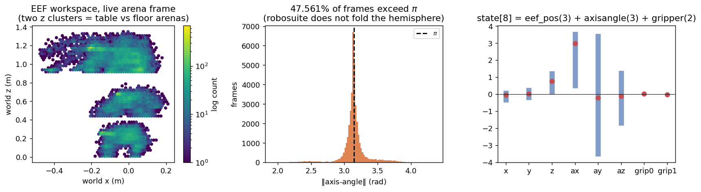

### 6.1 8 维布局与它的两个坐标系

$$
\texttt{state} = \underbrace{[x, y, z]}_{\text{EEF 位置}} \oplus \underbrace{[a_x, a_y, a_z]}_{\text{轴角}} \oplus \underbrace{[q_{f1}, q_{f2}]}_{\text{夹爪两指}}
$$

评估端的构造方式完全一致([`model2libero_interface.py:143-154`](/B/SRC/itvlaGpLibPlus/evaluation/LIBERO2/model2libero_interface.py)):

```python
axisangle = _quat2axisangle(eef_quat)
state = np.concatenate([eef_pos, axisangle, gripper_qpos], axis=0)
```

**但位置和姿态并不来自同一个坐标系**。查 robosuite 源码:

```python
def eef_pos(obs_cache):
    return np.array(self.sim.data.site_xpos[self.eef_site_id])     # gripper0_grip_site

def eef_quat(obs_cache):
    return T.convert_quat(self.sim.data.get_body_xquat(self.robot_model.eef_name), to="xyzw")
```
— [`robosuite/robots/single_arm.py:304,308`](/B/VENV/libero_plus_client/lib/python3.10/site-packages/robosuite/robots/single_arm.py),其中 `_eef_name = "right_hand"`

即:

- `state[0:3]` = `gripper0_grip_site` 的位置(该 site 位于 `gripper0_eef` body 原点)
- `state[3:6]` = `robot0_right_hand` body 的姿态

两个 body 之间隔着手爪的固定安装变换(`quat = (0.707107, 0, 0, -0.707107)`,即绕 z 转 −90°,再沿接近轴平移 0.097 m)。本文的 FK 自检最初就栽在这里:按 `eef` body 的四元数去比 `state[3:6]`,误差**恰好是 90.09°**。改成比 `right_hand` 后立刻降到 **0.10°**。

这个细节对训推一致性本身无害(两侧读的是同一份 robosuite observable),但任何想"从 state 反推 EEF 位姿再做几何计算"的代码都必须知道。

### 6.2 轴角的双重覆盖

robosuite 的 `quat2axisangle` 返回 $2\arccos(q_w)\cdot \hat{v}$,其中 $q_w$ 是四元数实部、$\hat v$ 是归一化虚部方向。由于 $\arccos(q_w)\in[0,\pi]$,返回的角度落在 $[0, 2\pi]$——**它不把 $q_w<0$ 折回上半球**。

实测:

| 指标 | 值 |
|---|---|
| 模长范围 | `[1.9029, 4.3588]`(上界 > π ≈ 3.1416) |
| 模长超过 π 的帧 | **130063 / 273465 = 47.56%** |
| 73.3% 的帧模长落在 π 的 ±0.1 rad 内 | 姿态基本是"夹爪竖直向下" |
| **episode 内单步最大跳变** | **0.0437 rad** |

结论要分两半说清楚:表示层面**确实是双值的**(近一半帧在"另一支"),但实际轨迹在 episode 内**没有发生分支跳变**——最大单步跳变只有 0.0437 rad。所以现有数据是安全的;风险在于如果未来混入别的数据源,或者对 `state[3:6]` 做插值/平均,双重覆盖会立刻咬人。

### 6.3 夹爪两指

`state[6]` ∈ `[-0.0014, +0.0423]`,`state[7]` ∈ `[-0.0423, +0.0014]`,严格反对称(Panda 两指对开)。所以这两维只携带 1 维独立信息,但为了与评估端 `robot0_gripper_qpos` 的形状对齐,必须原样保留 2 维。

### 6.4 `joint_state`

7 个臂关节角。注意它**不含夹爪**——这就是为什么 §9.1 构造 `qpos9` 时要从 `state[6:8]` 把两指补回来。

---

## 7. 时间轴与控制频率

三个事实并排放:

| 来源 | 频率 | 出处 |
|---|---|---|
| LIBERO 仿真环境 | **20 Hz** | [`LIBERO/libero/libero/envs/env_wrapper.py:27`](/B/SRC/LIBERO/libero/libero/envs/env_wrapper.py) `control_freq=20` |
| RLDS 原始档 | 无时间戳 | 只有 `frame_index` 语义 |
| `merged_kpt` 的 `meta/info.json` | **`fps: 10`** | 且 `total_frames` 与 RLDS 完全相同 |

帧数一致意味着**转换过程没有做任何时间重采样**,`fps=10` 纯粹是一个标注值。

**它有害吗?** 对模型无害。本仓库的历史窗和动作块都按**帧偏移**寻址:

```python
def keypoint_3d_delta_indices(self) -> list[int] | None:
    """...covering the full [-H, ..., -1, 0, 1, ..., C] window..."""
```
— [`configuration_internvla_a1_5.py:599`](/B/SRC/itvlaGpLibPlus/src/lerobot/policies/internvla_a1_5/configuration_internvla_a1_5.py)

只要全程用帧索引,`fps` 只影响 LeRobot 内部 `frame_index → timestamp` 的换算,而 mp4 也是按同一个 `fps` 编码的,自洽。

**它什么时候有害?**

1. **人的判断**:`H=200` 帧 = 10 秒真实机器人时间,不是 20 秒;`chunk_size=50` = 2.5 秒,不是 5 秒。任何按秒讨论规划视野的结论都会差一倍。
2. **混合数据集**:一旦和真实 `fps` 正确标注的数据集混训,LeRobot 按时间戳对齐时两者的物理步长会差 2 倍。

另外,no-op 过滤在时间轴上留下了洞:相邻两帧**大多数**间隔 1/20 秒,但被删掉 no-op 的地方间隔更大。所以即使把 `fps` 改成 20,时间轴也不是严格均匀的。**结论:一切按帧算,不要按秒算。**

---

## 8. 图像通道与朝向

### 8.1 基本参数

| 项 | 值 |
|---|---|
| 相机 | `image`(agentview)、`wrist_image`(`robot0_eye_in_hand`) |
| 分辨率 | 256×256×3 |
| 编码 | JPEG(平均 19.8 KB / 17.7 KB,峰值 22.7 KB / 25.6 KB) |
| 契约目标尺寸 | 224×224([`train_eval_contract.json`](/B/SRC/itvlaGpLibPlus/evaluation/LIBERO2/train_eval_contract.json)) |

JPEG 是**二次有损**:仿真器渲染 → OpenVLA 存 JPEG → 转 LeRobot 时再编码成 mp4。评估端送的是**无损的原始 numpy 数组**。这个域差无法消除,只能靠训练时的图像增广来缓解。

### 8.2 三跳旋转链完整闭合

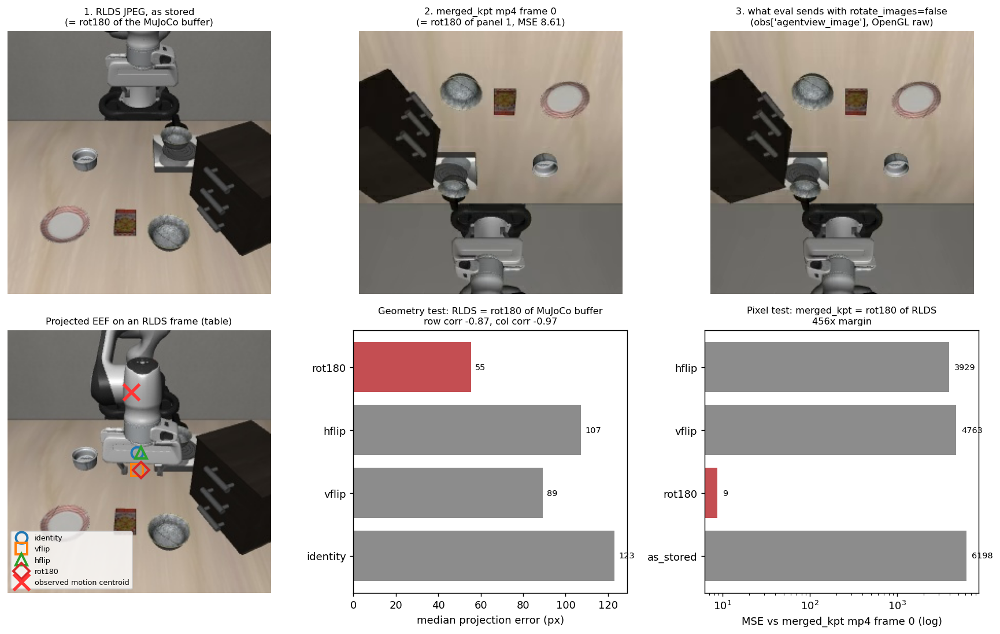

这是本文最重要的实测结论,分两步独立证明。

**第一步:RLDS 相对仿真缓冲的朝向(几何投影法)。**

不需要仿真器。利用三个已知量:

1. `observation.state[0:3]` 就是 EEF 在当前 arena 世界系里的位置;
2. LIBERO 在 problem 类的 `_setup_camera` 里给每个场景**固定**了 agentview 位姿(且不覆盖 `fovy`,取 MuJoCo 默认 45°);
3. MuJoCo 相机朝 $-z$ 看,$+x$ 向右、$+y$ 向上。

于是投影公式为(设图像边长 $S=256$、视场角 $f_{ov}=45°$):

$$
f = \frac{S/2}{\tan(f_{ov}/2)},\qquad
\mathbf{p}_{cam} = R_{cam}^{\top}(\mathbf{p}_{world} - \mathbf{t}_{cam}),\qquad
d = -p_{cam,z}
$$

$$
\text{col} = \frac{S}{2} + f\,\frac{p_{cam,x}}{d},\qquad
\text{row}_{\text{raw}} = \frac{S}{2} + f\,\frac{p_{cam,y}}{d}
$$

其中 $f$ 是以像素为单位的焦距、$R_{cam}$ / $\mathbf{t}_{cam}$ 是相机的世界姿态与位置、$d$ 是深度。`row_raw` 以 MuJoCo 渲染缓冲的约定计(第 0 行在**底部**)。

观测侧用**运动能量质心**定位夹爪:取 episode 前 45%(伸手阶段,手臂是画面里唯一的主要运动物体),对相隔 4 帧的图像求差,取最强 2% 像素的能量加权质心。

对 4 个二面体变体打分,48 条 episode 的结果:

| 变体 | 中位像素误差 |
|---|---|
| **rot180** | **55.4 px** |
| vflip | 89.2 px |
| hflip | 107.4 px |
| identity | 123.0 px |

绝对误差有几十像素是意料之中的——拿一个**点投影**去比一条**展开的机械臂**的运动质心,存在系统性偏置。所以主判据用**轨迹相关性**,它对常数偏置免疫:四个变体的差别只是行/列序列取反,所以相关系数的符号直接给出答案。

$$
\rho_{\text{row}} = -0.871,\qquad \rho_{\text{col}} = -0.969
$$

两者都显著为负 ⇒ 行列**都**翻转 ⇒ **rot180**。逐 episode 看,100% 的样本行相关为负,95.8% 列相关为负。

**第二步:RLDS 相对训练帧的朝向(像素直比法)。**

从 `merged_kpt` 的 tar 里流式取出第一个视频分片,用 ffmpeg 解出第 0 帧,和 RLDS `libero_spatial` 第 0 条 episode 的第 0 帧直接比 MSE(两者 episode 对齐:`meta/episodes` 记录 episode 0 长度 110、指令相同,RLDS 侧 T 也是 110):

| 假设 | MSE |
|---|---|
| **`rlds.rot180`** | **8.61** |
| `rlds.hflip` | 3929.49 |
| `rlds.vflip` | 4762.52 |
| `rlds.as_stored` | 6198.36 |

**456 倍**的差距,残余的 8.61 只是 JPEG→视频编码的重压缩噪声。

**合起来**:

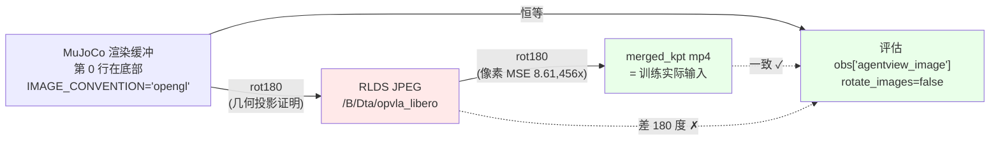

**可执行的结论**:

- 评估端保持 `rotate_images=false` 是**对的**,它与 `merged_kpt` 的训练帧一致。`eval.md` / `eval2.md` 里"评估端必须旋转"的主张不成立。
- 但**任何直接从 `/B/Dta/opvla_libero/` 的 RLDS JPEG 构建训练集的新管线,必须自己补一次 180° 旋转**,否则会和评估端差 180°。这是本文新增的阻断项 B1。
- 附带一个观感上的注意点:模型实际吃的画面(上图第 2、3 格)看起来是"倒的"——桌面在上、墙面在下。这没有问题,只要训练和评估一致即可,但会让人第一眼以为出错了。

### 8.3 各场景的 agentview 位姿

LIBERO 的场景 XML 里写的 `<camera pos="0.5 0 1.35">` 会被 problem 类的 `_setup_camera` **覆盖**。实际生效值(`quat` 为 MuJoCo 的 wxyz 世界四元数):

| arena | `pos` | `quat` (wxyz) |
|---|---|---|
| `table` / `kitchen_table` | `(0.6586, 0, 1.6104)` | `(0.63802, 0.30485, 0.30485, 0.63802)` |
| `study_table` | `(0.4586, 0, 1.6104)` | 同上 |
| `living_room_table` | `(0.6066, 0, 0.96)` | `(0.61822, 0.34323, 0.34323, 0.61822)` |
| `floor` | `(0.8966, ~0, 0.65)` | 同上 |

已核对 LIBERO-plus 的未扰动基线与 LIBERO **完全一致**,所以同一套投影参数在两个 benchmark 上都适用。

---

## 9. 4D 信息抽取(核心章)

本章回答:3D 关键点轨迹、旋转四元数、EEF 位姿这些"4D 信息"到底怎么算,以及为什么必须这么算。

### 9.1 运动学原料

关键点是 `qpos` 的纯函数。构造 9 维 `qpos`:

$$
\texttt{qpos}_9 = \underbrace{\texttt{joint\_state}[0{:}7]}_{\text{7 个臂关节}} \oplus \underbrace{\texttt{state}[6{:}8]}_{\text{2 个夹爪指}}
$$

这与训练侧产线的 `_build_qpos`([`util_scripts/generate_libero_keypoints.py`](/B/SRC/itvlaGpLibPlus/util_scripts/generate_libero_keypoints.py))一致,也被 `merged_kpt` 的 `keypoints_meta.json` 明文记录:

```json
"qpos_layout": "joint_position[0:7] + observation.state[6:8]"
```

> 注意:夹爪两指的 qpos 实际上**不影响** 8 个关键点 body 的位姿(它们都在手爪根部之前),补上只是为了让 `qpos` 数组长度匹配完整模型。

### 9.2 FK 链与 body 选择

8 个关键点 body(`merged_kpt` 的 `keypoints_meta.json` 原文):

```
robot0_link1, robot0_link2, ..., robot0_link7, gripper0_right_eef
```

前 7 个是 Panda 的臂连杆,第 8 个是手爪的 EEF 参考 body。

**手爪的附着链**是静态的,可以手工合成(读自 `panda_gripper.xml`):

```
robot0_link7 ──(robot.xml)──▶ robot0_right_hand
             ──(pos 0 0 0,     quat 0.707107 0 0 -0.707107)──▶ gripper0_right_gripper
             ──(pos 0 0 0.097, quat 单位元)                 ──▶ gripper0_eef
```

> **命名坑**:训练时导出的 MJCF(`/tmp/zwy/panda_robosuite_full.xml`)把这个 body 叫 `gripper0_right_eef`(robosuite 1.5+ 命名),而评估侧的 Lift MJCF 可能叫 `gripper0_eef`(robosuite 1.4 命名)。评估端的 `EEF_BODY_CANDIDATES = ("gripper0_eef", "gripper0_right_eef")` 同时兼容两者,不要去"修"它。

### 9.3 两个世界系:一个是特性,不是 bug

这是最容易被误判成 bug 的地方。

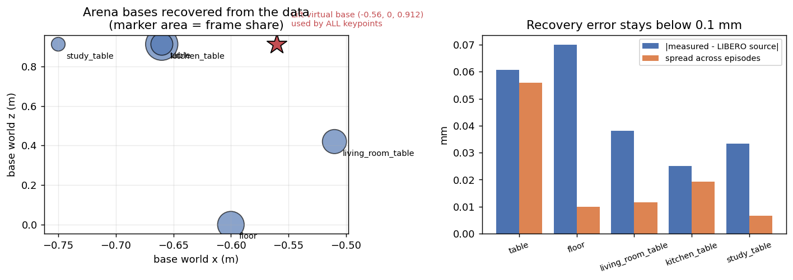

**事实一:数据里真的有 4 个不同的机器人基座位置。** 用 `state[0:3] - FK_{eef}(\texttt{qpos}, \text{base}=0)` 逐帧反推,每条 episode 内的标准差只有 ~2e-4 m,且恰好落到 5 个 arena key / 4 个不同位置:

| arena key | 实测基座 | LIBERO 源码值 | 误差 | episode | 帧占比 |
|---|---|---|---|---|---|
| `table`(spatial + goal) | `(-0.6601, -0.0000, 0.9121)` | `(-0.66, 0, 0.912)` | 0.061 mm | 860 | 38.40% |
| `floor`(object) | `(-0.6000, -0.0001, 0.0000)` | `(-0.60, 0, 0.00)` | 0.070 mm | 454 | 24.49% |
| `living_room_table` | `(-0.5100, -0.0000, 0.4200)` | `(-0.51, 0, 0.42)` | 0.038 mm | 199 | 19.23% |
| `kitchen_table` | `(-0.6600, -0.0000, 0.9120)` | `(-0.66, 0, 0.912)` | 0.025 mm | 139 | 15.08% |
| `study_table` | `(-0.7500, 0.0000, 0.9120)` | `(-0.75, 0, 0.912)` | 0.033 mm | 41 | 2.79% |

这些值与 [`LIBERO/libero/libero/envs/robots/mounted_panda.py`](/B/SRC/LIBERO/libero/libero/envs/robots/mounted_panda.py) 的 `base_xpos_offset` 表逐行吻合,而且是**纯从训练张量测出来的**,没有读任何 XML。

**事实二:训练关键点完全忽略这些基座,一律用 Lift 虚拟基座 `(-0.56, 0, 0.912)`。** 评估端也一样:

```
2. Inject into a standalone robosuite Lift MJCF (fixed base at [-0.56, 0, 0.912])
```
— [`evaluation/LIBERO2/keypoint_utils.py:6`](/B/SRC/itvlaGpLibPlus/evaluation/LIBERO2/keypoint_utils.py)

**为什么这是特性**:固定基座意味着关键点表达的是**机器人自身的构型**,而不是"机器人在哪个房间"。同一个抓取姿势在厨房和书房会得到**完全相同**的关键点。这正是我们想要的归纳偏置——关键点分支负责运动学,图像分支负责场景。

**代价**:关键点与图像/`state` 处在两个不同的世界系,**不能直接做几何上的交叉验证**。任何"把关键点投影到图像上"的调试代码都必须先做一次基座平移,否则会偏出 0.1~0.9 米。

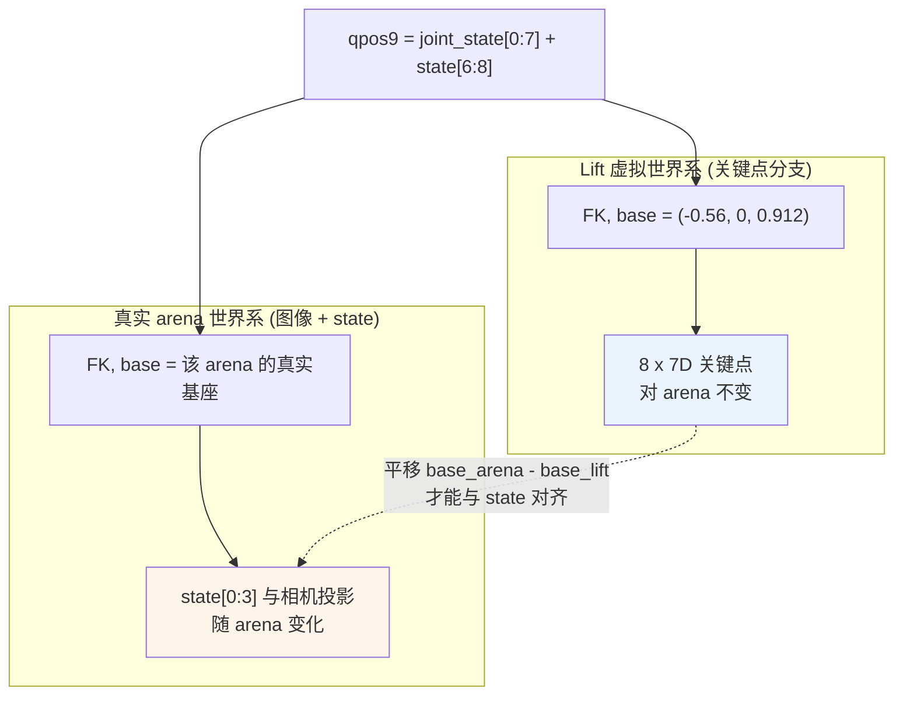

### 9.4 四元数约定与它的代价

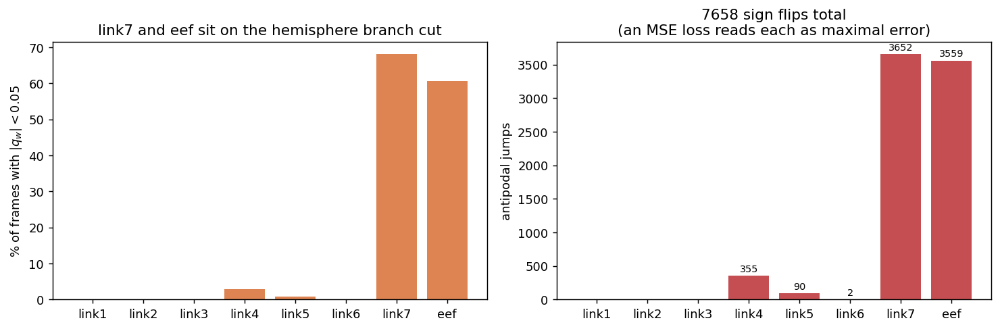

**约定**(两侧一致,`keypoints_meta.json` 记为 `quaternion_xyzw_hemisphere`):

1. MuJoCo 的 `xquat` 是 `wxyz` → 存储时重排为 `xyzw`;
2. 四元数双重覆盖($q$ 与 $-q$ 表示同一旋转),取 `qw ≥ 0` 的半球:若 `qw < 0` 则整体取负。

评估端实现:
```python
xyzw = np.array([x, y, z, w], dtype=np.float32)
if xyzw[3] < 0:                              # hemisphere: qw >= 0
    xyzw = -xyzw
```
— [`keypoint_utils.py:107-110`](/B/SRC/itvlaGpLibPlus/evaluation/LIBERO2/keypoint_utils.py)

**代价**:半球约定在 $q_w = 0$ 处有一条分支切割线,而 link7 和 eef **长期骑在这条线上**:

| body | `|q_w| < 0.05` 的帧数 | 占比 | 相邻帧对跖跳变次数 | 最大单步 L2 |
|---|---|---|---|---|
| link1 / link2 / link3 | 0 | 0% | 0 | ≤ 0.030 |
| link4 | 8106 | 3.0% | 355 | 2.0 |
| link5 | 2415 | 0.9% | 90 | 2.0 |
| link6 | 20 | 0.007% | 2 | 2.0 |
| **link7** | **186005** | **68.0%** | **3652** | **2.0** |
| **eef** | **165783** | **60.6%** | **3559** | **2.0** |
| 合计跳变 | | | **7658** | |

L2 步长 = 2.0 表示 $q \to -q$ 的完整对跖翻转。**用 MSE 直接监督四元数分量时,这 7658 次跳变每一次都会被当成最大误差**,梯度方向还是错的(它会把预测拉向物理上等价的另一支)。

**建议的替代**:用测地距离(角度误差)代替分量 MSE:

$$
\mathcal{L}_{rot} = 1 - \left|\langle \hat{q}, q \rangle\right|
\qquad\text{或}\qquad
\mathcal{L}_{rot} = 2\arccos\!\big(\min(1, |\langle \hat{q}, q\rangle|)\big)
$$

其中 $\hat q$ 是预测四元数、$q$ 是真值、$\langle\cdot,\cdot\rangle$ 是四元数内积。取绝对值就自动消掉了双重覆盖,$q$ 和 $-q$ 给出相同的损失。这个改动**只动损失函数,不动数据**,不需要重新生成关键点,是所有改进项里性价比最高的。

### 9.5 归一化:`R_pad` 的三方对账与三种方案

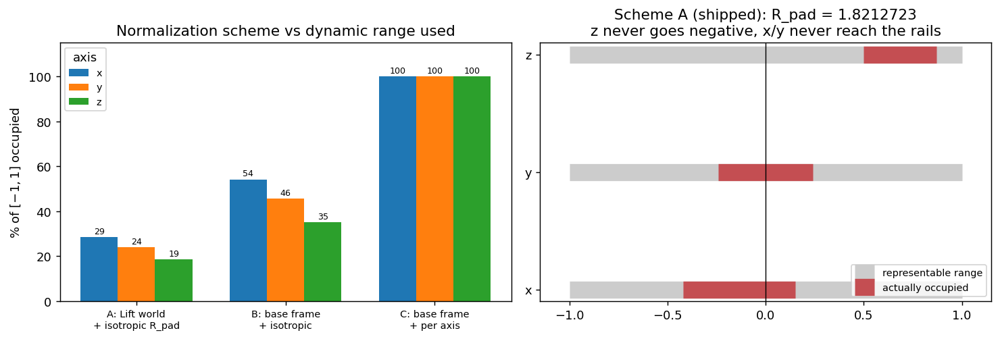

**定义**。设所有帧、所有 body 的关键点在 Lift 世界系下的全局包围盒为 $[\mathbf{l}, \mathbf{h}]$,则

$$
R_{pad} = (1+m)\cdot\max_{a\in\{x,y,z\}} \max\big(|l_a|,\, |h_a|\big),\qquad m = 0.15
$$

其中 $m$ 是安全边距。归一化就是逐点除以这个标量:$\tilde{\mathbf{p}} = \mathbf{p}/R_{pad}$。

**三方对账**:

| 来源 | 值 |
|---|---|
| `merged_kpt` 的 `meta/keypoints_meta.json` → `bbox_radius` | `1.8212722539901733` |
| 评估端 `keypoint_utils.py:21` → `DEFAULT_R_PAD` | `1.8212722539901733` |
| **本文从 RLDS 全量重算** | `1.8212723272872922` |

差值 `7.33e-08`,即 float32 舍入极限。**这三者是同一个数,`2.0945` 是误写,且 0.15 的 margin 已经含在里面,不得再乘一次 1.15。**

驱动这个值的是 **z 轴**:全局包围盒为

$$
\mathbf{l} = (-0.7662,\ -0.4402,\ +0.9083),\qquad \mathbf{h} = (+0.2759,\ +0.4354,\ +1.5837)
$$

$1.5837 \times 1.15 = 1.8213$ ✓。

**问题**:z 的下界是 `+0.9083`(机器人基座就在 z=0.912,手臂不可能钻到地底下),所以归一化后 $\tilde z \in [0.499, 0.870]$——**永远为正,且只占 `[-1,1]` 的 18.5%**。

三种方案的量化对比:

| 方案 | 做法 | x 利用率 | y 利用率 | z 利用率 | 代价 |
|---|---|---|---|---|---|
| **A(现行)** | Lift 世界系 ÷ 单一 $R_{pad}$ | 28.6% | 24.0% | **18.5%** | — |
| **B** | 先减基座,再 ÷ 单一半径 | 54.2% | 45.5% | 35.1% | 需重生成数据 + 重训 |
| **C** | 先减基座,再逐轴除以各自半跨度 | 100% | 100% | 100% | 需重生成数据 + 重训,且丢失各向同性 |

$$
\text{方案 B:}\quad \tilde{\mathbf{p}} = \frac{\mathbf{p} - \mathbf{b}_{lift}}{R'_{pad}}
\qquad
\text{方案 C:}\quad \tilde{p}_a = \frac{p_a - c_a}{s_a},\ \ s_a = \frac{h'_a - l'_a}{2}
$$

其中 $\mathbf{b}_{lift} = (-0.56, 0, 0.912)$、$c_a$ / $s_a$ 是基座系下第 $a$ 轴的中心与半跨度。

**迁移判据**:

- 方案 A 与现有 checkpoint **位级一致**,不动它永远是安全的。
- 方案 C 破坏各向同性:同样的 1 cm 物理位移在 x 和 z 上会被缩放成不同的数值,**旋转不变性丢失**。如果模型内部有任何假设"关键点空间是欧氏的"的结构(比如距离度量、注意力里的相对位置编码),C 会引入畸变。方案 B 保留各向同性,是更稳妥的升级路径。
- 任何切换都必须:重新生成整份 `observation.keypoint_3d` → 重训 → 在同一批 LIBERO 任务上跑 A/B。**绝对不要只改评估端**——那对现有 checkpoint 就是 OOD 输入。

### 9.6 位级复现证明

`util_scripts/export_panda_mjcf.py` 在本机跑不了(`import robosuite` 就会因缺 EGL/OSMesa 失败),仓库里也没有现成的 `panda_robosuite_lift.xml`。本文的替代路径是 [`asset/panda_fk.py`](asset/panda_fk.py):直接 `MjModel.from_xml_path(robosuite/models/assets/robots/panda/robot.xml)` 做 7 关节 FK,再串上 §9.2 的静态手爪链。

**验证方式**:从 `merged_kpt` 的 tar 里流式取出第一个 data parquet(含 4000 帧的真实训练关键点 + `joint_position` + `state`),用本文的 FK 重算并逐元素比对。

| body | 位置最大误差 | 四元数最大误差 |
|---|---|---|
| link1 / link2 | **0.000e+00 m** | **0.000e+00** |
| link3 ~ link7 | 1.086e-07 m | 0.000e+00 |
| eef | 2.171e-07 m | 3.576e-07 |

**最大 2.2e-07 米 = 0.22 微米**,正好是 float32 的舍入精度。这是**位级等价**,不是"近似吻合"。

另一条独立验证(在真实 arena 世界系下,对 RLDS 全量 12 条抽样 episode):

| 检查 | 最差残差 |
|---|---|
| `FK(gripper0_eef)` vs `state[0:3]` | 5.51e-04 m |
| `FK(robot0_right_hand)` vs `state[3:6]` | 0.104° |

0.55 mm 的残差**不是 FK 误差**(上面那张表已经证明 FK 是精确的),而是 Lift 系 FK 与真实 arena 仿真之间的固有差(`joint_state` 存成 float32、以及仿真器里基座的微小柔性)。

### 9.7 关键点冗余度

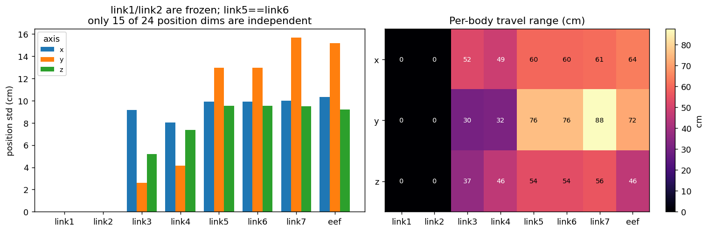

逐 body 统计位置方差,结论很干脆:

| 发现 | 细节 |
|---|---|
| `link1`、`link2` **完全静止** | 三轴标准差均 < 1e-6 m;而且两者**位置恒等**(最大间距 0.0 m)——它们是 Panda 基座上的两个同位 body |
| `link5`、`link6` **位置恒等** | 最大间距 0.0 m。姿态不同(所以 7D 模式下仍有信息),但 3D 位置完全重复 |
| 24 个位置维度中 | **18 个有变化**,折叠掉重合 body 后**只有 15 个独立** |

各 body 的运动范围(cm):

| | link1 | link2 | link3 | link4 | link5 | link6 | link7 | eef |
|---|---|---|---|---|---|---|---|---|
| x | 0 | 0 | 52 | 49 | 60 | 60 | 61 | 64 |
| y | 0 | 0 | 30 | 32 | 76 | 76 | **88** | 72 |
| z | 0 | 0 | 37 | 46 | 54 | 54 | 56 | 46 |

**但"位置不动"不等于"没信息"**。同一批帧的四元数分量极差(`xyzw` 顺序):

| | qx | qy | qz | qw |
|---|---|---|---|---|
| `link1` | 0.0000 | 0.0000 | **0.6352** | 0.0589 |
| `link2` | 0.3007 | 0.8615 | **0.9694** | 0.3518 |
| `link5` | 1.6916 | 1.9997 | 0.7609 | 0.8361 |
| `link6` | **1.7351** | 1.2397 | **1.3078** | 0.9687 |

`link1` 的位置恒定,但它绕 z 转(`qz` 跨度 0.64),编码的正是**关节 1 的角度**;`link2` 同理编码关节 2。`link5` 与 `link6` 虽然位置恒等,姿态却明显不同。

**取舍建议**:

- **`kpt_4d_mode=pos_only`(3D)**:`link1`/`link2` 确实是 6 个恒为常数的输入维度,`link5`/`link6` 有 3 维重复。理论上可裁到 5 个有效 body,但**代价是破坏与现有 checkpoint 的输入形状**。不值得。
- **`kpt_4d_mode=pos_rot`(7D,当前 LIBERO 产线选用)**:上表说明 8 个 body **没有一个是纯常数**。这是保留全部 8 个 body 的正当理由。
- 真要瘦身,也不该砍 `link1`/`link2`——在 7D 模式下它们是关节 1/2 的直接编码。

### 9.8 历史窗 `H=200` 的填充率

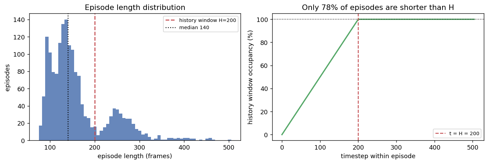

训练侧的 `Extract3DKeypointTransformFn` 把 `[-H, ..., -1, 0, 1, ..., C]` 的窗口拆成 `his_kpts` / `kpt_t` / `kpt_future`,其中 `his_kpts` 是 `[H, J, D]`,**有效帧靠前打包**(oldest-first),后面补零,`his_len` 记录有效数量。

实测填充情况:

| 指标 | 值 |
|---|---|
| 全体历史槽位中 padding 的比例 | **55.36%** |
| 长度超过 H=200 的 episode | 370 / 1693 = **21.85%** |
| `libero_spatial` 最长 episode | **192 帧 → 永远填不满** |
| `libero_object` 能填满 H 的 episode | 7 / 454 |
| `libero_goal` | 18 / 428 |
| `libero_10` | **345 / 379** |

也就是说,`H=200` 这个窗口**几乎完全是为 `libero_10` 设计的**。对另外三个套件,超过一半的历史槽是零。

这带来两个后果:

1. **TrackEncoder 必须严格按 `his_len` 切片**,不能对整个 `[H, J, D]` 做池化,否则零填充会稀释真实信号(在 spatial 上稀释约 40%)。
2. **训练/评估的起点不对称**:训练在 `t=0` 采样时 `his_len=0`;评估因为有 10 步 warmup(`num_steps_wait=10`,每步都调 `push_keypoint()`),第一次推理时 `his_len=10`。这个不对称**只会让评估更容易**,但必须记录在案。

### 9.9 抽取流程总览

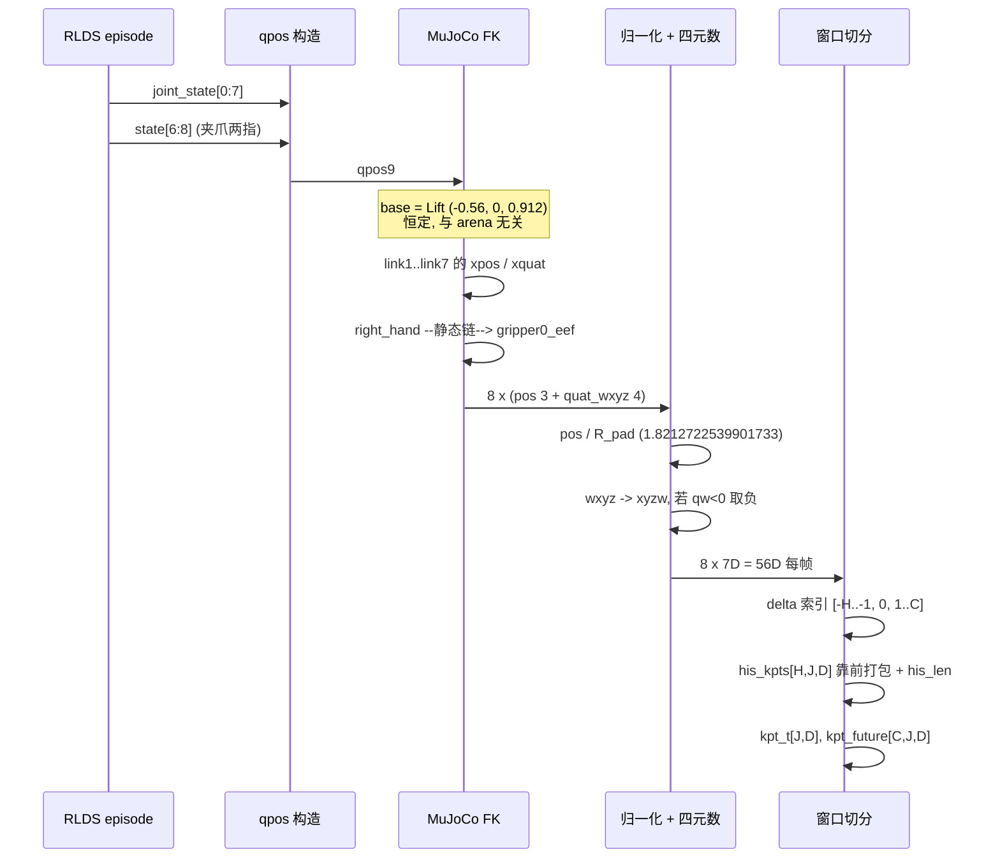

---

## 10. 训推一致性契约表

每一行都有一条对应的可执行断言,见 [`asset/check_contract.py`](asset/check_contract.py);运行后产出 `contract_report.json`。当前状态:**21/21 通过,0 个阻断失败**。

| ID | 通道 | 约定 | 训练侧依据 | 评估侧依据 | 级别 |
|---|---|---|---|---|---|
| **C1** | 数据规模 | 1693 ep / 273465 帧 / 40 任务 | RLDS `shardLengths` 求和 | `merged_kpt` `meta/info.json` | 阻断 |
| **C2a** | 朝向:仿真→RLDS | RLDS = MuJoCo 缓冲的 rot180 | `check_orientation.py` 几何投影 | `robosuite/macros.py:28` `IMAGE_CONVENTION='opengl'` | 提示 |
| **C2b** | 朝向:RLDS→训练集 | `merged_kpt` = RLDS 的 rot180 | `check_chain_orientation.py`,MSE 8.61 | `train_eval_contract.json` `image_orientation="raw"` | **阻断** |
| **C2c** | 朝向:评估开关 | `rotate_images=false` | C2a + C2b 推出 | `model2libero_interface.py:156` `_maybe_rotate` | **阻断** |
| **C3** | 图像尺寸/相机序 | 256×256 → 224×224;`[agentview, wrist]` | RLDS `features.json` | `model2libero_interface.py:183-184` | 阻断 |
| **C4** | state 布局 | 8D = `eef_pos(3) ⊕ axisangle(3) ⊕ gripper(2)` | RLDS `steps/observation/state` | `model2libero_interface.py:143-154` | 阻断 |
| **C5** | state 坐标系 | 位置取 `grip_site`,姿态取 `right_hand` | 两侧读同一份 robosuite observable | `robosuite/robots/single_arm.py:304,308` | 提示 |
| **C6** | 夹爪约定 | `libero_native`,`action[6] ∈ {-1, +1}` | 全量实测只有两个取值 | `model2libero_interface.py:176-180` | 阻断 |
| **C7** | 动作范围 | 训练 ≤ 0.9375;控制器收 `[-1, 1]` | `raw_stats.json` `abs_max_first6` | `osc_pose.json` `input_max=1` | 提示 |
| **C8** | 控制频率标注 | `fps=10` 标注 vs 20 Hz 实际,不影响按帧寻址 | `keypoint_3d_delta_indices` 用帧偏移 | `env_wrapper.py:27` `control_freq=20` | 提示 |
| **C9** | 关键点世界系 | 固定 Lift 基座 `(-0.56, 0, 0.912)` | `keypoints_meta.json` `coordinate_system` | `keypoint_utils.py:6` | 阻断 |
| **C10** | 关键点归一化 | `R_pad = 1.8212722539901733`,margin 已含 | `keypoints_meta.json` `bbox_radius` | `keypoint_utils.py:21` | 阻断 |
| **C11** | 关键点 body 列表 | `link1..7 + eef`,共 8 个 | `keypoints_meta.json` `keypoint_bodies` | `keypoint_utils.py:27` `EEF_BODY_CANDIDATES` | 阻断 |
| **C12** | 四元数约定 | `xyzw` + `qw ≥ 0` 半球 | `keypoints_meta.json` `rotation_representation` | `keypoint_utils.py:107-110` | 阻断 |
| **C13** | 关键点可复现性 | 无 GL 的 MuJoCo FK 位级复现(2.2e-07 m) | `panda_fk.py` vs `merged_kpt_probe.npz` | `keypoint_utils.py` `StandaloneFK` | 阻断 |
| **C14** | 历史窗 | `H=200`,靠前打包,push 必须在 `env.step` **之前** | `launch/internvla_a15_finetune_libero_geop.sh:232` | `keypoint_utils.py:137`;`model2libero_interface.py:129-140` | 提示 |
| **C15** | warmup | 10 步 dummy `[0]*6+[-1]`,每步 `push_keypoint()` | 训练 `t=0` 时 `his_len=0` | `eval_libero_std.py:38,335` | 提示 |
| **C16** | LIBERO-plus 覆盖面 | 84.5% 的扰动关键点看不见 | 训练首帧 EEF 散布 p95 = 2.14 cm | `mounted_panda.py`(500 个子类) | 提示 |
| **C17** | LIBERO-plus OOD | `init_qpos` 扰动远超训练起点散布 | `analyze_libero_plus.py` | `new_init.py` | 提示 |
| **C18** | 数据完整性 | 0 NaN / 0 标记错误 / 0 残留 no-op | `raw_stats.json` `integrity` | — | 阻断 |
| **C19** | 切分方式 | 无 val split;必须**按 episode** 切 | `raw_stats.json` `subsets` | — | 提示 |

---

## 11. LIBERO 与 LIBERO-plus 评估端对 4D 的影响

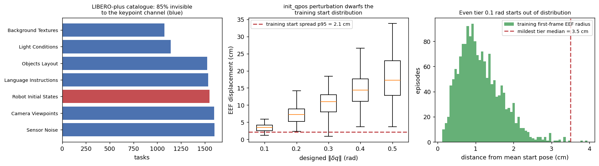

### 11.1 扰动目录与通道可达性

LIBERO-plus 把 40 个基础任务扩成 **10030** 个变体([`benchmark/task_classification.json`](/B/SRC/LIBERO-plus/libero/libero/benchmark/task_classification.json))。按类别拆开,并标注每类能否影响关键点通道:

| 类别 | 任务数 | 占比 | 影响图像 | **影响关键点** | 机制 |
|---|---|---|---|---|---|
| Sensor Noise | 1601 | 15.96% | ✓ | ✗ | `agentview_image` 后处理 |
| Camera Viewpoints | 1599 | 15.94% | ✓ | ✗ | 仅改 `agentview` 的 `set_camera` |
| **Robot Initial States** | **1550** | **15.45%** | ✓ | **✓** | 覆写 `init_qpos` |
| Language Instructions | 1537 | 15.32% | ✗ | ✗ | 只改 BDDL 里的指令文本 |
| Objects Layout | 1525 | 15.20% | ✓ | ✗ | 改物体摆放,不动机器人关节 |
| Light Conditions | 1142 | 11.39% | ✓ | ✗ | 场景 XML 的光照 |
| Background Textures | 1076 | 10.73% | ✓ | ✗ | 场景 XML 的纹理替换 |
| **合计** | **10030** | 100% | | **8480 (84.5%) 看不见** | |

**这就是 4D 关键点分支在 LIBERO-plus 上的核心价值**:它是 `qpos` 的纯函数,对 84.5% 的扰动**结构性免疫**。当图像分支被纹理、光照、相机角度打乱时,关键点通道给出的是**完全干净、完全无扰动**的本体感受信号。

### 11.2 `Robot Initial States` 到底改了什么

`mounted_panda.py` 和 `on_the_ground_panda.py` 各生成了 **500 个**子类。用正则把每个子类体内覆写的 property 全部抽出来:

```
extra overridden properties: mounted=[] ground=[]
```

**除 `init_qpos` 外,一个 property 都没覆写**。特别地,`base_xpos_offset` 保持基类值不变。所以:

- 机器人**基座位置不变** → arena 基座反推逻辑仍然成立;
- 相机、光照、纹理扰动**完全不触及** `qpos` → 关键点逐位相同。

### 11.3 把关节扰动换算成关键点位移

[`new_init.py`](/B/SRC/LIBERO-plus/libero/libero/envs/robots/new_init.py) 按 $\|\delta q\|$ = 0.1 / 0.2 / 0.3 / 0.4 / 0.5 rad 分五档,每档 100 个变体。用本文的 FK 把每个扰动初态算成关键点,与标称初态对比:

| 设计档位 $\|\delta q\|$ (rad) | EEF 位移均值 | EEF 位移最大 | 任意 body 最大位移 |
|---|---|---|---|
| 0.1 | **3.40 cm** | 5.89 cm | 5.89 cm |
| 0.2 | 7.19 cm | 14.14 cm | 14.14 cm |
| 0.3 | 10.75 cm | 18.39 cm | 18.39 cm |
| 0.4 | 14.14 cm | 26.57 cm | 26.57 cm |
| 0.5 | **17.48 cm** | **33.82 cm** | 33.82 cm |

对照训练集 1693 条 episode 的**首帧 EEF 散布**(相对全体首帧均值的距离):

| 指标 | 值 |
|---|---|
| 均值 | 1.14 cm |
| p95 | **2.14 cm** |
| 最大 | 3.92 cm |

**结论很刺眼**:即使是最温和的 0.1 rad 档位(均值 3.40 cm),也已经**超过了训练集全部首帧散布的 p95(2.14 cm)**,接近它的最大值(3.92 cm)。最强的 0.5 rad 档位(17.5 cm)是训练散布 p95 的 **8 倍**。

也就是说,在 `Robot Initial States` 这一类上,策略的**历史窗从第一帧起就在分布之外**。这不是图像域的问题,是运动学域的问题,纹理增广之类的手段完全帮不上忙。

**可行的缓解**:

1. **训练时对 `qpos` 做扰动增广**。这是最直接的对症下药:在离线 FK 阶段,对每条 episode 的起始若干帧注入 $\|\delta q\| \sim \mathcal{U}(0, 0.5)$ 的扰动并重新跑 FK。配置项 `keypoint_noise_sigma` 已经声明但没接线(§12),可以在这里落地。
2. **依赖 warmup 冲淡**。评估的 10 步 warmup 会让机器人在 dummy 动作下稳定下来,但 dummy 动作是 `[0]*6+[-1]`(不动、张开夹爪),**不会把机器人拉回标称位姿**。所以 warmup 帮不上忙。
3. **接受它**,并在报告里把 `Robot Initial States` 这一类的成绩单独列出——它测的是和另外 6 类不同的能力。

---

## 12. 训练建议

| 主题 | 建议 | 依据 |
|---|---|---|
| **图像朝向** | 若从 RLDS 原始档建管线,**必须补 180° 旋转**;若用 `merged_kpt`,保持现状 | [§8.2](#82-三跳旋转链完整闭合) |
| **采样权重** | 想要套件均衡,按 `1/mean_length` 反向加权(`libero_10` 需压到约 0.6×) | [§4.2](#42-按帧采样会重新加权套件) |
| **验证集切分** | 档案里**没有** val split。必须**按 episode** 切,按帧切会让同一条轨迹的相邻帧同时出现在两边,验证指标会虚高 | [§4.1](#41-逐套件规模与保留率) |
| **`action_mode`** | 用 `abs`。数据本身已是增量指令,再差分一次无物理意义 | [§5.4](#54-action_mode-该选什么) |
| **动作裁剪** | 明确选一个:`clip(±0.9375)` 模仿训练分布,或 `clip(±1)` 放行 OOD。不要不做决定 | [§5.2](#52-09375-是遥操作饱和不是控制器上限) |
| **旋转损失** | **优先级最高的改进**:把四元数分量 MSE 换成测地距离 $1-|\langle\hat q, q\rangle|$。只改损失,不改数据,不需重新生成关键点 | [§9.4](#94-四元数约定与它的代价) |
| **关键点归一化** | 短期不动(方案 A 与现有 ckpt 位级一致)。要升级选方案 B(基座系 + 各向同性),别选 C | [§9.5](#95-归一化r_pad-的三方对账与三种方案) |
| **历史窗** | `H=200` 只对 `libero_10` 有意义。TrackEncoder 必须按 `his_len` 切片,不要对全窗池化 | [§9.8](#98-历史窗-h200-的填充率) |
| **`chunk_size`** | 50 帧 = 2.5 秒真实时间(不是 5 秒)。配 `replan_steps=8` 意味着每块只用了前 16% | [§7](#7-时间轴与控制频率) |
| **鲁棒性增广** | 对 `qpos` 做 $\|\delta q\| \le 0.5$ rad 的起始扰动增广,专门对付 LIBERO-plus 的 `Robot Initial States` | [§11.3](#113-把关节扰动换算成关键点位移) |

### 声明了但没接线的配置项

以下配置项在代码里存在,但没有真正参与数据生成或训练,使用前需确认:

- `keypoint_noise_sigma` — 声明了关键点噪声强度,但离线 FK 产线里没有消费它。要做 §11.3 的增广需要先把它接上。
- `Extract3DKeypointTransformFn.history_max_len` 的**默认值是 1000**,而 LIBERO 的 launch 脚本显式传 `200`。依赖默认值会得到一个 5 倍大的窗口和 91% 的 padding。
- `kpt_4d_mode` 默认 `pos_only`(3D),而 LIBERO GeoP 产线用 `pos_rot`(7D)。两者的 `keypoint_dim` 不同(3 vs 7),checkpoint 不通用。

---

## 13. 风险清单与验收

每条风险对应 `check_contract.py` 里的一条断言。验收命令:

```bash
cd /B/SRC/itvlaGpLibPlus/b/d/libplus/ds/asset && python3 check_contract.py
# 期望:21/21 checks pass, 0 blocking failures;退出码 0
```

| 风险 | 后果 | 断言 | 期望输出 |
|---|---|---|---|
| 新管线直接吃 RLDS JPEG 不旋转 | 评估画面与训练差 180°,成功率接近随机 | `C2b` / `C2c` | `merged_kpt = rlds.rot180`,MSE 8.61,456× 余量 |
| `R_pad` 被再乘一次 1.15 | 关键点整体缩小 13%,与 ckpt 不匹配 | `C10` | 三方一致,重算差 `7.3e-08` |
| 评估端切到 live-world 关键点 | 对现有 ckpt 是 OOD(偏移 0.1~0.9 m) | `C9` | 两侧都用 `(-0.56, 0, 0.912)` |
| 夹爪判成 `openvla` 约定 | 夹爪逻辑完全反转 | `C6` | `action[6]` 只有 `{-1.0, +1.0}` |
| `STATS_KEY_MODE=suite` | 归一化统计量 KeyError | — | 每个子集有自己的 `robot_type`,见 launch 脚本的 info-patch |
| optimized backend 收不了 `his_kpts` | 关键点分支静默失效 | — | 评估前用 `test_preflight_f1f2.py` 自检 |
| 四元数 MSE 损失 | 7658 次对跖跳变被当成最大误差 | `C12` | link7 68.0% / eef 60.6% 的帧贴着分支线 |
| 按帧切 val | 验证指标虚高 | `C19` | 帧占比与 episode 占比相差最多 1.66× |
| 按秒理解窗口 | 视野估计差 2 倍 | `C8` | `fps=10` 标注 vs 20 Hz 实际 |
| LIBERO-plus 机器人初态 | 首帧即 OOD,最温和档位就超过训练 p95 | `C17` | 0.1 rad → 3.40 cm vs p95 2.14 cm |

### 已被本文推翻或修正的历史结论

| 历史说法 | 本文结论 |
|---|---|
| "`R_pad = 2.0945`" 或 "需要再乘 1.15" | 错。`1.8212722539901733` 已含 0.15 margin,三方对账一致 |
| "z 相关系数只有 0.037,说明没归一化" | 那是分组常数偏移造成的 Simpson 悖论。真实问题是**利用率只有 18.5%**,不是没归一化 |
| `eval.md` / `eval2.md` §8.1:"评估端必须旋转图像" | 错。`merged_kpt` 训练帧就是 OpenGL raw,评估端应 `rotate_images=false` |
| (新增)"RLDS 的图可以直接拿来训" | 错。RLDS 是 rot180,和训练帧差 180° |
| (新增)"`state[3:6]` 是 `eef` body 的姿态" | 错。是 `right_hand` body 的姿态,和 `eef` 差固定 90° |
| (新增)"24 个关键点位置维度都有用" | 错。只有 15 个独立 |

---

## 14. 复现方法与参考出处

### 14.1 完整复现命令

脚本全部在 [`asset/`](asset/),无需 TensorFlow、无需 GL。两个解释器分工:**基础 `python3`**(有 numpy / pyarrow / PIL)负责读数据,**`/B/VENV/libero_plus_client/bin/python`**(有 mujoco / matplotlib)负责 FK 与画图。

```bash
cd /B/SRC/itvlaGpLibPlus/b/d/libplus/ds/asset

# 1. 分片完整性自检                                        (~3 s)
python3 rlds_reader.py

# 2. FK 链自检:对照 observation.state                      (~2 s)
/B/VENV/libero_plus_client/bin/python panda_fk.py

# 3. 从 merged_kpt tar 取权威元数据 + 真实训练关键点         (~10 s)
python3 peek_merged_kpt_tar.py

# 4. 全量统计:规模/动作/状态/完整性                         (~12 s)
python3 analyze_libero_raw.py

# 5. 全量 4D:FK / arena 基座 / R_pad / 冗余 / 四元数 / 历史窗 (~21 s)
/B/VENV/libero_plus_client/bin/python analyze_4d.py

# 6. 朝向判定(几何投影法)                                  (~11 s)
python3 check_orientation.py

# 7. 朝向判定(像素直比法,需要 ffmpeg)                      (~3 s)
python3 check_chain_orientation.py

# 8. LIBERO-plus 扰动量化                                   (~7 s)
/B/VENV/libero_plus_client/bin/python analyze_libero_plus.py

# 9. 契约验收(本文的验收门禁)                              (~1 s)
python3 check_contract.py

# 10. 出图                                                  (~4 s)
/B/VENV/libero_plus_client/bin/python make_figures.py
```

总耗时约 **65 秒**(实测整链从零复跑 63.9 s)。第 9 步退出码为 0 即验收通过。

文档自身也有一个校验器,检查所有相对链接、章节锚点、图片引用、`file:line` 引用的**实际内容**,以及正文里每一个数字是否与 JSON 产物一致:

```bash
python3 verify_doc.py     # 期望:全部通过,退出码 0
```

### 14.2 产物清单

| 文件 | 内容 |
|---|---|
| **脚本** | |
| [`asset/rlds_reader.py`](asset/rlds_reader.py) | 纯 Python TFRecord + `tf.train.Example` 解码器 |
| [`asset/panda_fk.py`](asset/panda_fk.py) | 无 GL 的 MuJoCo FK,复刻训练/评估两端的关键点约定 |
| [`asset/peek_merged_kpt_tar.py`](asset/peek_merged_kpt_tar.py) | 流式提取 tar 内的 `keypoints_meta.json` / `info.json` / parquet |
| [`asset/analyze_libero_raw.py`](asset/analyze_libero_raw.py) | 第一遍全量统计 |
| [`asset/analyze_4d.py`](asset/analyze_4d.py) | 第二遍全量 4D 分析 |
| [`asset/check_orientation.py`](asset/check_orientation.py) | 几何投影法判定朝向 |
| [`asset/check_chain_orientation.py`](asset/check_chain_orientation.py) | 像素直比法判定朝向 |
| [`asset/analyze_libero_plus.py`](asset/analyze_libero_plus.py) | LIBERO-plus 扰动目录与 `init_qpos` 量化 |
| [`asset/check_contract.py`](asset/check_contract.py) | 契约断言 / 验收门禁 |
| [`asset/make_figures.py`](asset/make_figures.py) | 出图 |
| [`asset/verify_doc.py`](asset/verify_doc.py) | 校验本文档的链接、引用与数字 |
| **数据产物** | |
| `asset/raw_stats.json` · `raw_arrays.npz` | 规模/动作/状态统计 |
| `asset/kpt_stats.json` · `kpt_arrays.npz` | 4D 关键点统计 |
| `asset/merged_kpt_meta.json` · `merged_kpt_probe.npz` | tar 内的权威元数据与 4000 帧真实关键点 |
| `asset/orientation_report.json` · `chain_orientation_report.json` | 两套朝向判定结果 |
| `asset/libero_plus_report.json` · `libero_plus_arrays.npz` | LIBERO-plus 量化 |
| `asset/contract_report.json` | 21 条契约断言的执行结果 |
| **图表** | `asset/fig01..fig10_*.png`(共 10 张) |

### 14.3 参考出处

**论文与官方仓库**

- OpenVLA: An Open-Source Vision-Language-Action Model — [arXiv:2406.09246](https://arxiv.org/abs/2406.09246),附录 E 描述了本数据集的改造方式
- 数据集卡片 — [`openvla/modified_libero_rlds`](https://huggingface.co/datasets/openvla/modified_libero_rlds)(即 `/B/Dta/opvla_libero/README.md`)
- LIBERO 项目主页 — <https://libero-project.github.io/main.html>

**本地源码(所有行号均在本次分析中核对过)**

| 文件 | 用途 |
|---|---|
| [`/B/SRC/LIBERO/libero/libero/envs/robots/mounted_panda.py`](/B/SRC/LIBERO/libero/libero/envs/robots/mounted_panda.py) | `base_xpos_offset` 表,§9.3 反推结果的对照 |
| [`/B/SRC/LIBERO/libero/libero/envs/env_wrapper.py`](/B/SRC/LIBERO/libero/libero/envs/env_wrapper.py):27 | `control_freq=20` |
| [`/B/SRC/LIBERO/scripts/collect_demonstration.py`](/B/SRC/LIBERO/scripts/collect_demonstration.py):237-246 | 遥操作灵敏度默认值 |
| `/B/SRC/LIBERO/libero/libero/envs/problems/*.py` | 各场景的 `_setup_camera` 位姿 |
| [`/B/SRC/LIBERO-plus/libero/libero/envs/robots/mounted_panda.py`](/B/SRC/LIBERO-plus/libero/libero/envs/robots/mounted_panda.py) | 500 个 `init_qpos` 变体 |
| [`/B/SRC/LIBERO-plus/libero/libero/benchmark/task_classification.json`](/B/SRC/LIBERO-plus/libero/libero/benchmark/task_classification.json) | 10030 个变体的类别标注 |
| [`robosuite/robots/single_arm.py`](/B/VENV/libero_plus_client/lib/python3.10/site-packages/robosuite/robots/single_arm.py):304,308 | `eef_pos` / `eef_quat` 的不同来源 |
| [`robosuite/devices/spacemouse.py`](/B/VENV/libero_plus_client/lib/python3.10/site-packages/robosuite/devices/spacemouse.py):67 | `axis_scale=350.0`,动作量化的来源 |
| [`robosuite/macros.py`](/B/VENV/libero_plus_client/lib/python3.10/site-packages/robosuite/macros.py):28 | `IMAGE_CONVENTION='opengl'` |
| [`robosuite/controllers/config/osc_pose.json`](/B/VENV/libero_plus_client/lib/python3.10/site-packages/robosuite/controllers/config/osc_pose.json) | `output_max`,动作的物理换算 |

**本仓库源码**

| 文件 | 用途 |
|---|---|
| [`evaluation/LIBERO2/keypoint_utils.py`](/B/SRC/itvlaGpLibPlus/evaluation/LIBERO2/keypoint_utils.py) | 评估侧关键点提取,`DEFAULT_R_PAD` / 半球约定 / `KeypointHistory` |
| [`evaluation/LIBERO2/model2libero_interface.py`](/B/SRC/itvlaGpLibPlus/evaluation/LIBERO2/model2libero_interface.py) | 评估侧观测构造、朝向开关、夹爪约定判定 |
| [`evaluation/LIBERO2/eval_libero_std.py`](/B/SRC/itvlaGpLibPlus/evaluation/LIBERO2/eval_libero_std.py) | `num_steps_wait` / `replan_steps` / dummy 动作 |
| [`evaluation/LIBERO2/train_eval_contract.json`](/B/SRC/itvlaGpLibPlus/evaluation/LIBERO2/train_eval_contract.json) | 既有契约文件 |
| [`util_scripts/generate_libero_keypoints.py`](/B/SRC/itvlaGpLibPlus/util_scripts/generate_libero_keypoints.py) | 训练侧离线 FK 产线 |
| [`src/lerobot/policies/internvla_a1_5/transform_internvla_a1_5.py`](/B/SRC/itvlaGpLibPlus/src/lerobot/policies/internvla_a1_5/transform_internvla_a1_5.py) | `Extract3DKeypointTransformFn` |
| [`src/lerobot/policies/internvla_a1_5/configuration_internvla_a1_5.py`](/B/SRC/itvlaGpLibPlus/src/lerobot/policies/internvla_a1_5/configuration_internvla_a1_5.py) | `keypoint_3d_delta_indices` / `kpt_4d_mode` / `chunk_size` |
| [`launch/internvla_a15_finetune_libero_geop.sh`](/B/SRC/itvlaGpLibPlus/launch/internvla_a15_finetune_libero_geop.sh) | LIBERO GeoP 训练配置 |

**同目录既有文档**(本文复核并在 §13 标注了其中被推翻的结论)

- [`../eval.md`](../eval.md)、[`../eval2.md`](../eval2.md)、[`../eval3.md`](../eval3.md) — 评估管线演进
- [`../eval3_kpt.md`](../eval3_kpt.md) — 关键点分支接入
- [`../eval3_optim3.md`](../eval3_optim3.md) — F1/F2 朝向问题的历史排查
- [`../sft.md`](../sft.md) — SFT 配置
- [`../hstry/cursor_libero_training_data_analysis.md`](../hstry/cursor_libero_training_data_analysis.md) — 本文所替代的那份丢失文档的对话记录
