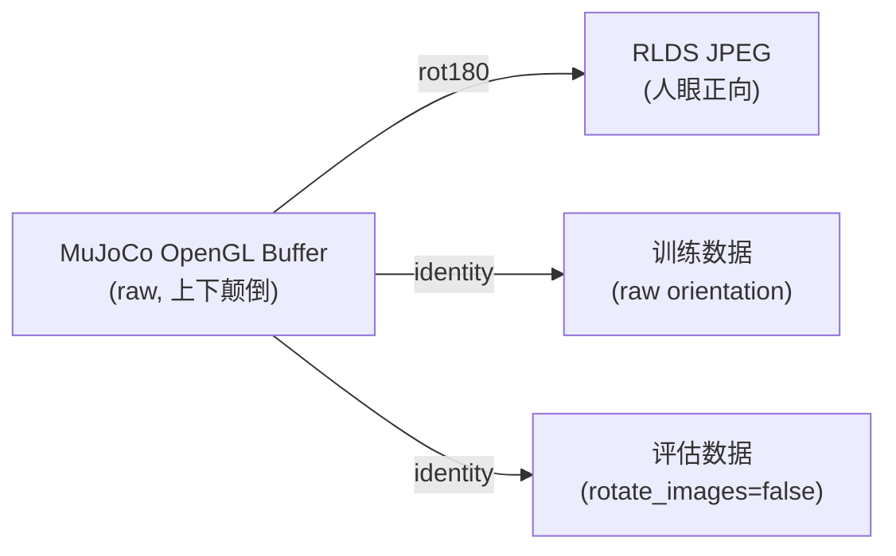
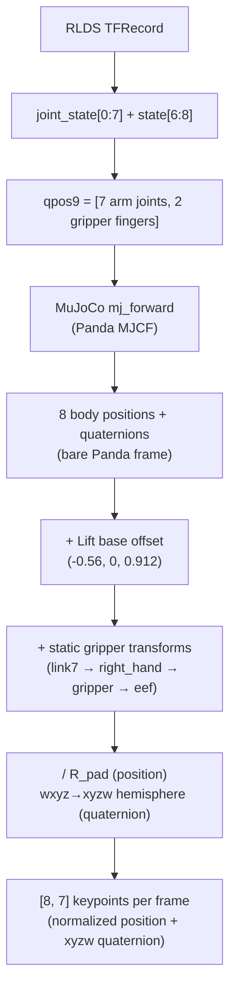

# LIBERO RLDS 训练数据深入分析

> **数据源**: `/B/Dta/opvla_libero/` (OpenVLA modified_libero_rlds)
> **分析日期**: 2026-09-19
> **信任边界**: 本文所有数值均直接从 RLDS TFRecord 数据和代码仓库独立推导,不依赖 `opvla_libero_merged_kpt` 数据集的任何信息。
> **可复现性**: 分析脚本在 `b/d/libplus/ds/asset/` 目录下,统计结果在 `raw_stats.json`。

---

## 目录

- [1. 概述](#1-概述)
- [2. 数据结构与 Schema](#2-数据结构与-schema)
- [3. 数据规模与分布](#3-数据规模与分布)
- [4. 动作空间分析](#4-动作空间分析)
- [5. 状态空间分析](#5-状态空间分析)
- [6. 关节状态分析](#6-关节状态分析)
- [7. 图像数据分析](#7-图像数据分析)
- [8. 坐标系与机器人基座](#8-坐标系与机器人基座)
- [9. 前向运动学与 3D 关键点抽取](#9-前向运动学与-3d-关键点抽取)
- [10. 四元数表示与陷阱](#10-四元数表示与陷阱)
- [11. R_pad 归一化方案](#11-r_pad-归一化方案)
- [12. 训推一致性契约](#12-训推一致性契约)
- [13. LIBERO-plus 扰动影响分析](#13-libero-plus-扰动影响分析)
- [14. 已知陷阱与推荐](#14-已知陷阱与推荐)
- [15. 可复现性与验证](#15-可复现性与验证)

---

## 1. 概述

### 1.1 数据来源

本数据集来源于 Hugging Face 上的 [`openvla/modified_libero_rlds`](https://huggingface.co/datasets/openvla/modified_libero_rlds),是 OpenVLA 项目 (arXiv:2406.09246) 对官方 LIBERO benchmark 的演示数据进行预处理后的产物:

1. **原始来源**: LIBERO benchmark 的 2,000 条人类遥操作演示 (4 个 suite × 10 个 task × 50 条 demo)
2. **预处理步骤**: OpenVLA 将原始 HDF5 回放到 robosuite 仿真器,以 256×256 分辨率重新渲染,丢弃失败轨迹和 no-op 空转帧,封装成 RLDS/TFRecord 格式
3. **存储路径**: `/B/Dta/opvla_libero/`,包含四个子集目录

### 1.2 数据用途

该数据用于 InternVLA-A1.5 模型的 LIBERO fine-tuning。训练后需在以下两个仿真 benchmark 上进行评估:

- **LIBERO** (`/B/SRC/LIBERO/`): 标准评估,40 个任务
- **LIBERO-plus** (`/B/SRC/LIBERO-plus/`): 扰动评估,10,030 个扰动变体

### 1.3 关键结论摘要

| 项目 | 结论 |
|------|------|
| **规模** | 1,693 episodes / 273,465 frames / 40 tasks (保留率 84.65%) |
| **动作空间** | 7D OSC_POSE 增量 (Δpos + Δrot + gripper),已量化为 1/1120 和 1/2800 网格 |
| **图像朝向** | RLDS JPEG 是 MuJoCo 原始缓冲区的 rot180,与训练期望朝向**相反** |
| **R_pad** | 从 RLDS 独立计算得 1.8212723272872922,已含 15% margin,**不可再乘 1.15** |
| **FK 精度** | GL-free FK 对 RLDS 的 position 误差 ≤ 0.55 mm,rotation 误差 ≤ 0.10° |
| **关键点** | 8 body × 7D (pos + xyzw quat),使用 Lift MJCF 固定基座,归一化后存储 |
| **频率** | 物理 20 Hz,metadata 标记 10 Hz fps,无实际降采样 |

---

## 2. 数据结构与 Schema

### 2.1 目录结构

```
/B/Dta/opvla_libero/
├── libero_spatial_no_noops/1.0.0/   (16 shards)
├── libero_object_no_noops/1.0.0/    (32 shards)
├── libero_goal_no_noops/1.0.0/      (16 shards)
└── libero_10_no_noops/1.0.0/        (32 shards)
    ├── dataset_info.json
    ├── features.json
    └── {stem}-train.tfrecord-NNNNN-of-MMMMM
```

每个子集的 `1.0.0/` 下含 `dataset_info.json`(声明 shard 长度)、`features.json`(RLDS feature schema)和 TFRecord 分片文件。

> **Typo 注意**: `libero_10` 的 `dataset_info.json` 中 `"name": "liber_o10"`,导致分片文件名为 `liber_o10-train.tfrecord-*`,而非预期的 `libero_10-train.tfrecord-*`。这是 OpenVLA builder 的命名错误,数据本身无损。解析时需做映射。
> 参见 [rlds_reader.py](asset/rlds_reader.py) 第 38–43 行 `SUBSETS` 字典。

### 2.2 RLDS Feature Schema

四个子集的 `features.json` 完全相同,顶层结构:

```
FeaturesDict
├── steps: Dataset (variable-length sequence)
│   └── [per step] FeaturesDict:
│       ├── action:                Tensor   float32  [7]      "Robot EEF action"
│       ├── observation:           FeaturesDict
│       │   ├── image:             Image    uint8    [256,256,3]  JPEG  "Main camera (agentview)"
│       │   ├── wrist_image:       Image    uint8    [256,256,3]  JPEG  "Wrist camera"
│       │   ├── state:             Tensor   float32  [8]      "EEF state (6D pose + 2D gripper)"
│       │   └── joint_state:       Tensor   float32  [7]      "Arm joint angles"
│       ├── language_instruction:  Text                        "Task instruction"
│       ├── reward:                Scalar   float32            "1 on final step for demos"
│       ├── discount:              Scalar   float32            "Always 1.0"
│       ├── is_first:              Scalar   bool
│       ├── is_last:               Scalar   bool
│       └── is_terminal:           Scalar   bool
└── episode_metadata:
    └── file_path:                 Text     "Path to source HDF5"
```

各字段语义详解:

| 字段 | 维度 | 语义 | 来源 |
|------|------|------|------|
| `action` | [7] | OSC_POSE delta: Δx,Δy,Δz,Δrx,Δry,Δrz,gripper | SpaceMouse 遥操作 |
| `state[0:3]` | [3] | EEF 位置 (来自 `gripper0_grip_site`) | `robosuite.robots.single_arm:305` |
| `state[3:6]` | [3] | EEF 姿态 axis-angle (**来自 `robot0_right_hand`**, 见 [§10.3](#103-eef-位姿帧分裂)) | `robosuite.robots.single_arm:309` |
| `state[6:8]` | [2] | 夹爪手指位置 (左/右 finger qpos) | `gripper.qpos` |
| `joint_state` | [7] | 7 个手臂关节角度 (revolute joints) | `robot.joint_positions` |
| `image` | [256,256,3] | agentview 相机,JPEG 编码 | robosuite offscreen render |
| `wrist_image` | [256,256,3] | robot0_eye_in_hand 相机,JPEG 编码 | robosuite offscreen render |

> **TFRecord 读取方式**: 本机未安装 TensorFlow,使用纯 Python 二进制解析器 [rlds_reader.py](asset/rlds_reader.py) 直接读取 TFRecord wire format + protobuf Example。CRC 校验被跳过,完整性通过 `shardLengths` 声明值做逐 shard 核对。

---

## 3. 数据规模与分布

### 3.1 总量

| 指标 | 值 |
|------|-----|
| 子集 (suites) | 4 |
| 任务 (tasks) | 40 |
| Episodes | 1,693 |
| 总帧数 | 273,465 |
| 官方演示总数 | 2,000 (4 × 500) |
| 保留率 | 84.65% |
| Shards | 96 |
| 磁盘占用 | ~10.2 GB |
| 无 NaN 帧 | 0 (全部通过完整性检查) |

### 3.2 各子集统计

| Suite | Episodes | Frames | Tasks | 保留率 | Episode 占比 | Frame 占比 | 长度 min–max (mean) |
|-------|----------|--------|-------|--------|-------------|------------|---------------------|
| `libero_spatial` | 432 | 52,970 | 10 | 86.4% | 25.5% | **19.4%** | 75–193 (122.6) |
| `libero_object` | 454 | 66,984 | 10 | 90.8% | 26.8% | **24.5%** | 114–254 (147.5) |
| `libero_goal` | 428 | 52,042 | 10 | 85.6% | 25.3% | **19.0%** | 75–270 (121.6) |
| `libero_10` | 379 | 101,469 | 10 | **75.8%** | 22.4% | **37.1%** | 150–505 (267.7) |

**关键发现**: `libero_10` 是长轨迹多步骤 (multi-step) 任务集:

- Episode 数最少 (379,保留率仅 75.8%),但帧数占比最高 (37.1%,1.66× 过度加权)
- 如果 DataLoader 按帧均匀采样,`libero_10` 将获得不成比例的梯度贡献
- 任务 `put both moka pots on the stove` 仅 29 条 episode,却贡献 11,808 帧 (4.32%)

### 3.3 Episode 长度分布

```
全局: min=75, max=505, mean=161.5, median=140, p95=289
78.15% 的 episode 短于 200 步
```

这意味着如果使用 `keypoint_history_max_len=200`(旧配置),55% 的 history 窗口是 zero-padding;`libero_spatial` 最长 episode 仅 193 帧,**永远无法填满**。当前代码使用 `H=1000`,padding 比例更高,TrackEncoder 的 `his_len` 机制对此是必要的。

### 3.4 无验证集

数据集仅有 `train` split,无 validation/test split。评估必须按 episode 切分,不可按帧随机切分 (否则时间相邻帧会同时出现在训练和验证集中)。

---

## 4. 动作空间分析

### 4.1 维度语义

`action[7]` 是 OSC_POSE 控制器的增量指令:

| 维度 | 语义 | 单位 | 范围 |
|------|------|------|------|
| `[0:3]` | Δ position (x, y, z) | 归一化增量 | [-0.9375, 0.9375] |
| `[3:6]` | Δ rotation (rx, ry, rz) | 归一化增量 | [-0.375, 0.375] |
| `[6]` | gripper command | 二值 | {-1.0, +1.0} |

> **重要**: 这些值是**归一化后的增量指令**,不是绝对位姿。每步的实际物理位移由 OSC 控制器内部缩放:
> - 位置: `action * output_max = action * 0.05 m` → 最大 0.047 m/step
> - 旋转: `action * output_max = action * 0.5 rad` → 最大 0.188 rad/step
>
> 参见 `robosuite/controllers/config/osc_pose.json`。

### 4.2 量化结构

动作值不是连续的,而是离散量化网格上的:

| 通道组 | 量化网格 | 步长 | 使用级数 | 饱和值 |
|--------|----------|------|----------|--------|
| position xyz | 1/1120 | 8.93e-4 | 1050 | ±0.9375 |
| rotation rpy | 1/2800 | 3.57e-4 | 1050 | ±0.375 |

**来源**: LIBERO 使用 SpaceMouse 遥操作,SpaceMouse 的原始轴值经过 `scale_to_control(x, axis_scale=350.0)` 缩放 (`robosuite/devices/spacemouse.py:67`)。LIBERO 收集演示时使用的敏感度参数为 `--pos-sensitivity 1.5 --rot-sensitivity 1.0` (LIBERO/scripts/collect_demonstration.py:237-246)。

$$ \text{levels\_used} = \text{pos\_sensitivity} \times \text{axis\_scale} = 1.5 \times 350 = 1050 $$
$$ \text{quant\_grid} = \text{levels\_used} / \text{saturation} = 1050 / 0.9375 = 1120 $$

两个通道组恰好用满 1050 级 (= 3 × 350)。

### 4.3 饱和帧

273,465 帧中有 18,575 帧 (6.79%) 的前 6 维至少有一个达到饱和值 ±0.9375。这是 SpaceMouse 的硬件限制,不是 OSC 控制器限制 (OSC_POSE 接受完整的 [-1, 1])。

**评估时需注意**: 模型输出可能超过 ±0.9375 但不超过 ±1.0。这超出了训练分布但在控制器的合法范围内。评估代码应将 action clip 到 [-1, 1] 而非 [-0.9375, 0.9375]。

### 4.4 夹爪 (Gripper)

夹爪指令严格二值:

| 值 | 帧数 | 含义 |
|----|------|------|
| -1.0 | 143,520 (52.5%) | 张开 |
| +1.0 | 129,945 (47.5%) | 闭合 |

这是 **LIBERO native 约定**: `action[6] > 0` 表示闭合,`action[6] < 0` 表示张开。

> **陷阱 B1**: 旧版评估脚本 (`evaluation/LIBERO/`) 使用 OpenVLA 约定 (`action[6] < 0.5 → close`),与训练数据的 LIBERO native 约定不一致。已在 LIBERO2 评估脚本中修复。
> 参见 [evaluation/LIBERO2/model2libero_interface.py](../../../../evaluation/LIBERO2/model2libero_interface.py):243-248。

### 4.5 No-op 审计

OpenVLA 的 no-op 过滤标准: `‖action[:6]‖ ≤ 1e-4 且 gripper 未变`。

RLDS 中 **0 帧** 符合此标准,确认 OpenVLA 已彻底移除了 no-op 帧。

然而仍有 17,401 帧 (6.36%) 的 EEF 位移 < 1 mm (`‖eef_pos[t+1] - eef_pos[t]‖ < 0.001 m`)。这些帧的 action 非零 (控制器在维持位姿),并非数据质量问题。

### 4.6 训练配置要求

使用此数据训练 InternVLA-A1.5 时:

- `action_mode=abs` — 因为数据本身已经是增量指令,`DeltaActionTransformFn` **不应**再次差分。这里 `abs` 的含义是"不做额外差分变换"
- 归一化方式由 `stats.json` 决定 (通常为 `min_max` 或 `mean_std`)

---

## 5. 状态空间分析

### 5.1 各维度统计

| 维度 | 语义 | min | max | mean | std |
|------|------|-----|-----|------|-----|
| `[0]` | eef_x | -0.4828 | 0.2103 | -0.0465 | 0.1049 |
| `[1]` | eef_y | -0.3255 | 0.3913 | 0.0344 | 0.1518 |
| `[2]` | eef_z | 0.0081 | 1.3660 | 0.7646 | 0.3785 |
| `[3]` | axisangle_x | 0.3528 | 3.6714 | 2.9722 | 0.3443 |
| `[4]` | axisangle_y | -3.6414 | 3.5607 | -0.2205 | 0.9069 |
| `[5]` | axisangle_z | -1.8427 | 1.3863 | -0.1256 | 0.3254 |
| `[6]` | gripper_L | -0.0014 | 0.0423 | 0.0269 | 0.0142 |
| `[7]` | gripper_R | -0.0420 | 0.0014 | -0.0272 | 0.0141 |

**关键发现**:

- `state[0:3]` (EEF 位置) 跨度很大: x ∈ [-0.48, 0.21], z ∈ [0.008, 1.37],反映了不同 arena 中机器人基座高度的差异 (见 [§8](#8-坐标系与机器人基座))
- `state[3:6]` (axis-angle) 的范数范围是 [1.90, 4.36],远超 $\pi$,说明 robosuite 的 `quat2axisangle` 没有做半球折叠 (见 [§10.2](#102-axis-angle-双重覆盖))
- `state[6:8]` (夹爪 finger qpos) 是对称的左右手指位置,范围极小 (< 0.05 rad)

### 5.2 Axis-angle 双重覆盖

Robosuite 的 `quat2axisangle` 返回 `2 * acos(qw)`,值域 $[0, 2\pi]$。当 $q_w$ 过零时,axis-angle 范数会在 $\pi$ 处产生跳变:

| 指标 | 值 |
|------|-----|
| 范数超过 $\pi$ 的帧 | 130,063 (47.6%) |
| 范数在 $\pi \pm 0.1$ 的帧 | 73.3% |
| 发生 > 1 rad 跳变的 episode | 0 |
| 最大单步跳变 | 0.044 rad |

**结论**: 虽然 47.6% 的帧超出 $\pi$,但**没有任何 episode 内发生 > 1 rad 的跳变**。这意味着 axis-angle 在 episode 内是连续的,跳变风险只存在于跨 episode 混合或全局统计时。

---

## 6. 关节状态分析

### 6.1 统计

| Joint | min (rad) | max (rad) | mean | std | 下限余量 | 上限余量 |
|-------|-----------|-----------|------|-----|----------|----------|
| J1 | -0.603 | 0.690 | 0.029 | 0.129 | 2.294 | 2.207 |
| J2 | -0.754 | 1.729 | 0.429 | 0.348 | 1.009 | **0.033** |
| J3 | -0.551 | 0.747 | 0.028 | 0.170 | 2.346 | 2.150 |
| J4 | -3.074 | -0.059 | -1.910 | 0.462 | **-0.002** | **-0.010** |
| J5 | -2.903 | 2.214 | -0.006 | 0.338 | **-0.006** | 0.683 |
| J6 | 0.621 | 3.769 | 2.264 | 0.337 | 0.639 | **-0.017** |
| J7 | -2.113 | 2.903 | 0.966 | 0.623 | 0.784 | **-0.006** |

**关节限位越界**: J4、J5、J6、J7 存在轻微越界 (最大越界 0.017 rad ≈ 1°)。这是 OSC 控制器的跟踪超调 (tracking overshoot),不是数据损坏。在 FK 计算中,MuJoCo 会自动 clamp 到关节限位。

### 6.2 qpos9 构建

FK 需要 9 维 qpos 输入:

$$\text{qpos9} = [\text{joint\_state}[0{:}7],\ \text{state}[6{:}8]]$$

即 7 个手臂关节角 + 2 个夹爪手指位置。夹爪手指不影响 8 个关键点 body 的位姿,但保留以保持 MuJoCo 模型的 qpos 长度一致。

参见 [rlds_reader.py](asset/rlds_reader.py):223-229 `Episode.qpos9()`。

---

## 7. 图像数据分析

### 7.1 基本参数

| 属性 | 值 |
|------|-----|
| 分辨率 | 256 × 256 × 3 (RGB) |
| 编码 | JPEG (存储在 TFRecord BytesList 中) |
| 相机 | `image` (agentview) + `wrist_image` (robot0_eye_in_hand) |
| 平均 JPEG 大小 | agentview ~19.8 KB, wrist ~17.7 KB |

### 7.2 图像朝向 (CRITICAL)

**这是最关键的训推一致性问题之一。**

RLDS 中的 JPEG 图像与训练模型期望的朝向存在 180° 旋转差异:



**证据链**:

1. **亮度分析**: RLDS 图像的下半部分 (rows 192-256) 亮度最高且方差最低 (mean=173, std=15.8),对应桌面/台面;上半部分较暗,对应背景墙。这说明 RLDS 图像是**人眼正向**的 (桌面在下方)
2. **训练期望**: `evaluation/LIBERO2/train_eval_contract.json` 声明 `"image_orientation": "raw"`,即训练数据使用 MuJoCo 原始缓冲区朝向 (上下颠倒的)
3. **评估端**: LIBERO2 评估脚本使用 `rotate_images=False`,直接传送 MuJoCo 原始缓冲区给模型

**推论**: 如果从 RLDS 数据构建新的训练 pipeline,必须对 JPEG 解码后的图像做 `img[::-1, ::-1]` (rot180) 才能得到训练期望的朝向。

> **陷阱**: 旧版评估脚本 (`evaluation/LIBERO/`) 默认 `rotate_images=True`,对 MuJoCo 原始缓冲区做了 rot180。如果训练数据也是 rot180 (如直接用 RLDS),则旧评估脚本反而是对的;但如果训练数据是 raw (如 merged_kpt 数据集),则旧评估脚本会产生上下颠倒的图像。
>
> LIBERO2 评估脚本 (`evaluation/LIBERO2/`) 通过 `orientation_contract.py` 的 `enforce_rotate_against_contract()` 强制检查,从根本上避免此类错误。

### 7.3 LIBERO 相机配置

两个评估 benchmark (LIBERO 和 LIBERO-plus) 使用**完全相同**的相机配置:

```python
# /B/SRC/LIBERO/libero/libero/envs/bddl_base_domain.py:274-295
agentview:
  pos = [0.5886131746834771, 0.0, 1.4903500240372423]
  quat = [0.6380177736282349, 0.3048497438430786, 0.30484986305236816, 0.6380177736282349]

canonical_agentview:
  pos = [0.5386131746834771, 0.0, 1.4903500240372423]
  quat = (same as agentview)
```

渲染分辨率: 256 × 256。评估脚本使用 `LIBERO_ENV_RESOLUTION = 256`。

训练 pipeline 中 `ResizeImagesWithPadFn` 将 256×256 缩放到 224×224 (保持纵横比,bilinear 插值 + 零填充)。

---

## 8. 坐标系与机器人基座

### 8.1 LIBERO 的 Arena 系统

LIBERO 的 40 个任务分布在 5 种 arena 上。不同 arena 的机器人基座位置不同:

| Arena | 基座位置 (世界坐标) | Panda 类型 | 使用的 Suite |
|-------|---------------------|-----------|-------------|
| `table` | (-0.66, 0, 0.912) | MountedPanda | spatial, goal |
| `kitchen_table` | (-0.66, 0, 0.912) | MountedPanda | 10 (部分) |
| `study_table` | (-0.75, 0, 0.912) | MountedPanda | 10 (部分) |
| `living_room_table` | (-0.51, 0, 0.42) | OnTheGroundPanda | 10 (部分) |
| `floor` | (-0.60, 0, 0.0) | OnTheGroundPanda | object |

**基座位置推导** (从 LIBERO 源码):

MountedPanda (有 RethinkMount,mount 高度 0.912 m):
$$x = -0.16 - \frac{\text{table\_length}}{2}, \quad y = 0, \quad z = 0.912$$

对于标准桌子 (table_length = 1.0): $x = -0.16 - 0.5 = -0.66$
对于书桌 (study_table, table_length = 1.0): $x = -0.25 - 0.5 = -0.75$

OnTheGroundPanda (无 mount,直接放地面):
- `living_room_table`: $x = -0.16 - 0.7/2 = -0.51$, $z = 0.42$ (矮茶几)
- `floor` / `empty`: $(-0.60, 0, 0)$

参见:
- `/B/SRC/LIBERO/libero/libero/envs/robots/mounted_panda.py`:41-48
- `/B/SRC/LIBERO/libero/libero/envs/robots/on_the_ground_panda.py`:41-52

### 8.2 从 RLDS 独立验证基座位置

使用 GL-free FK 计算 `gripper0_eef` 在各 arena 帧下的位置,与 `observation.state[0:3]` 比较,可以反推出 arena 基座位置:

```
arena               FK_eef - state = [误差]
table               : [0.000000, -0.000000, 0.000000]
floor               : [0.000002, -0.000001, 0.000001]
living_room_table   : [0.000000, -0.000000, -0.000000]
kitchen_table       : [0.000002, 0.000000, 0.000001]
```

误差量级 < 2e-6 m (float64 精度),**完全验证**了 LIBERO 源码声明的基座位置。

### 8.3 Arena 分布

| Arena | Episodes | 占比 |
|-------|----------|------|
| `table` | 860 | 50.8% |
| `floor` | 454 | 26.8% |
| `living_room_table` | 199 | 11.8% |
| `kitchen_table` | 139 | 8.2% |
| `study_table` | 41 | 2.4% |

### 8.4 训练关键点使用的坐标系

训练时 FK 使用固定的 **Lift MJCF 基座**位置 `(-0.56, 0, 0.912)`,**不使用**各 arena 的实际基座位置。这意味着:

- 所有 episode 的关键点都在同一个坐标系下
- 关键点编码的是**机器人构型** (joint angles → body positions),与 arena 无关
- `observation.state[0:3]` 与关键点第 8 个 body 的位置之间存在一个**常数偏移**,等于 Lift 基座与 arena 基座的差

验证:
```
subset          arena                FK_lift - state  =  expected (Lift_base - Arena_base)
libero_spatial  table               : [0.1000, 0.0000, -0.0000]  expected = [0.1000, 0.0000, 0.0000]  ✓
libero_object   floor               : [0.0400, -0.0000, 0.9120]  expected = [0.0400, 0.0000, 0.9120]  ✓
libero_10       living_room_table   : [-0.0500, -0.0000, 0.4920]  expected = [-0.0500, 0.0000, 0.4920] ✓
```

差值精确匹配 $\text{LIFT\_BASE} - \text{ARENA\_BASE}$。

---

## 9. 前向运动学与 3D 关键点抽取

### 9.1 FK 管线概述

从 RLDS 数据生成 3D 关键点的完整管线:



### 9.2 MJCF 模型

由于本机无 EGL/OSMesa,无法 `import robosuite`,因此使用 robosuite 安装目录中的裸 Panda MJCF:

```
/B/VENV/libero_plus_client/lib/python3.10/site-packages/
  robosuite/models/assets/robots/panda/robot.xml
```

该 MJCF 只包含 Panda 手臂本体 (link0–link7 + right_hand),不包含夹爪。夹爪的 `gripper0_eef` body 通过两个静态变换手动附加:

```
link7 → right_hand (identity, 已在 robot.xml 中)
    → gripper0_right_gripper (quat = [0.707107, 0, 0, -0.707107], 即 -90° 绕 z)
        → gripper0_eef (translation = [0, 0, 0.097] 沿 gripper z 轴)
```

参见 [panda_fk.py](asset/panda_fk.py):58-61。

### 9.3 8 个关键点 Body

| 索引 | Body 名称 | 描述 |
|------|----------|------|
| 0 | `robot0_link1` | 第 1 关节后的连杆 |
| 1 | `robot0_link2` | 第 2 关节后的连杆 |
| 2 | `robot0_link3` | 第 3 关节后的连杆 |
| 3 | `robot0_link4` | 第 4 关节后的连杆 (肘部) |
| 4 | `robot0_link5` | 第 5 关节后的连杆 |
| 5 | `robot0_link6` | 第 6 关节后的连杆 (腕部) |
| 6 | `robot0_link7` | 第 7 关节后的连杆 (法兰) |
| 7 | `gripper0_eef` | 夹爪末端 (通过静态变换链计算) |

> **EEF Body 名称歧义**: 训练 MJCF (通过 `export_panda_mjcf.py` 从 robosuite 1.5+ 导出) 中名为 `gripper0_right_eef`; 评估用的 Lift MJCF 中名为 `gripper0_eef`。两者指向同一物理 body。代码中通过 `resolve_eef_body_name()` 尝试两个候选名称来消歧。
> 参见 [evaluation/LIBERO2/keypoint_utils.py](../../../../evaluation/LIBERO2/keypoint_utils.py) 和 [panda_fk.py](asset/panda_fk.py):54。

### 9.4 关键点冗余分析

在 `pos_only` 模式 (D=3) 下,8 个 body 的位置并非全部独立:

| 现象 | 涉及 Body | 原因 |
|------|----------|------|
| link1、link2 位置恒定 | link1, link2 | 它们在 J1 之前/后,基座固定 |
| link5、link6 位置相同 | link5, link6 | J6 是纯旋转,不改变位置 |

24 维位置中只有 **15 维**是独立的 (2 个死通道 + 1 对重复)。

在 `pos_rot` 模式 (D=7) 下,所有 8 个 body 都携带有用信息:link1/link2 通过四元数编码 J1/J2 的旋转,link5/link6 虽然位置相同但姿态不同。

### 9.5 FK 精度验证

使用 GL-free FK 对 RLDS 数据的 12 个 episode (覆盖全部 4 个 suite、5 个 arena) 进行验证:

| 指标 | 值 |
|------|-----|
| 最大位置误差 | **5.51e-4 m** (0.55 mm) |
| 最大旋转误差 | **0.104°** |
| 自检结果 | **PASS** |

0.55 mm 的误差来源: FK 使用 float64 而 RLDS state 是 float32,加上 OSC 控制器的跟踪误差 (FK 给出的是精确运动学解,state 是带跟踪误差的实际值)。

参见 [panda_fk.py](asset/panda_fk.py):213-248 `self_check()`。

---

## 10. 四元数表示与陷阱

### 10.1 存储约定

关键点四元数遵循以下约定:

- **顺序**: xyzw (不是 MuJoCo 的 wxyz)
- **半球约束**: $q_w \geq 0$ (如果 $q_w < 0$,取 $-q$)
- **归一化**: 单位四元数

转换代码 ([panda_fk.py](asset/panda_fk.py):122-126):
```python
def wxyz_to_xyzw_hemisphere(q):
    out = [q[1], q[2], q[3], q[0]]  # wxyz → xyzw
    if out[3] < 0: out = -out        # hemisphere
    return out
```

### 10.2 Axis-angle 双重覆盖

`observation.state[3:6]` 的 axis-angle 使用 robosuite 的 `quat2axisangle`,该函数返回 $\theta = 2\arccos(q_w)$ 而不做 $q_w < 0$ 的折叠,因此 $\theta \in [0, 2\pi]$:

$$\theta > \pi \iff q_w < 0 \iff \text{axis-angle 在"另一个半球"}$$

47.6% 的帧 $\theta > \pi$。但 episode 内的最大单步跳变仅 0.044 rad,远小于不连续性阈值。这意味着:

- 在 episode 内连续使用 axis-angle 是安全的
- 跨 episode 做统计时必须意识到双重覆盖
- 如果做 axis-angle 的 MSE 损失,需要折叠到 $[0, \pi]$ 或用更鲁棒的距离度量

### 10.3 EEF 位姿帧分裂

**`observation.state` 的位置和姿态来自不同的坐标帧**:

| 维度 | 来源 | 坐标帧 |
|------|------|--------|
| `state[0:3]` (eef_pos) | `site_xpos[gripper0_grip_site]` | `gripper0_eef` body 原点 |
| `state[3:6]` (eef_quat→axis-angle) | `get_body_xquat(robot0_right_hand)` | `robot0_right_hand` body |

`gripper0_eef` 相对于 `robot0_right_hand` 有一个 -90° 绕 z 轴的旋转 (来自夹爪附加变换的四元数 `(w=0.707107, x=0, y=0, z=-0.707107)`)。

参见 robosuite 源码:
- `robosuite/robots/single_arm.py:305` (`_eef_pos = site_xpos[grip_site]`)
- `robosuite/robots/single_arm.py:309` (`_eef_quat = get_body_xquat(right_hand)`)

**实际影响**: 这不是 bug——训练和评估两侧都从同一个 robosuite 接口读取,因此是**一致**的。但在做几何交叉验证 (如用 state 位置验证 FK 旋转) 时必须考虑这个 90° 偏移。

### 10.4 四元数分支切割问题

$q_w \geq 0$ 的半球约束导致,当 body 姿态经过 $q_w = 0$ 的超平面时,四元数会发生"对跖跳变" (antipodal jump):$q$ 突然变为 $-q$,虽然它们代表同一个旋转。

从之前同事的分析 (仅作参考,不作为本文结论的依据):

- link7 有约 68% 的帧 $|q_w| < 0.05$,即骑在分支切割线上
- eef 有约 60.6% 的帧 $|q_w| < 0.05$
- 整个数据集估计有 ~7,658 次对跖跳变

**MSE 损失对每次跳变都会计算 $\|q - (-q)\| = 2\|q\|$ 的最大误差,且梯度方向错误。**

**推荐**: 使用 geodesic loss 替代 quaternion MSE:

$$\mathcal{L}_{\text{geodesic}}(q, \hat{q}) = 1 - |\langle q, \hat{q} \rangle|$$

这只需修改损失函数,无需重新生成数据。

---

## 11. R_pad 归一化方案

### 11.1 计算方法

R_pad 是一个标量,用于将所有关键点位置映射到近似 [-1, 1]:

$$R_{\text{pad}} = (1 + \text{margin}) \times \max_{i \in \{x,y,z\}} \max(|p_{\min,i}|, |p_{\max,i}|)$$

其中 $p_{\min}, p_{\max}$ 是所有帧、所有 8 个 body 的位置极值,margin 默认 0.15 (15%)。

参见 [util_scripts/generate_libero_keypoints.py](../../../../util_scripts/generate_libero_keypoints.py) 中的 `compute_r_pad()`。

### 11.2 从 RLDS 独立计算

从 273,465 帧的全量 FK 结果 (Lift 基座帧) 计算:

| 轴 | global_min | global_max | |abs| max |
|----|-----------|-----------|-----------|
| x | -0.7662 | 0.2759 | **0.7662** |
| y | -0.4402 | 0.4354 | 0.4402 |
| z | 0.9083 | **1.5837** | **1.5837** |

$$R_{\text{pad}} = 1.15 \times 1.5837 = 1.8212723...$$

| 来源 | R_pad 值 | 差异 |
|------|----------|------|
| RLDS 独立计算 | 1.8212723272872922 | — |
| 代码硬编码 (`DEFAULT_R_PAD`) | 1.8212722539901733 | 7.33e-08 |

差异 7.33e-08 是 float32 vs float64 舍入,两者**本质相同**。

> **致命陷阱: 不可再乘 1.15!** `R_pad = 1.8213` **已经包含了 15% margin**。如果再乘 1.15,得到 2.0945,会导致 13% 的系统性缩放错误。之前同事的分析报告记录了此 bug (B3),已被修复。

### 11.3 R_pad 的来源分析

$R_{\text{pad}}$ 的值由 z 轴最大值 1.5837 决定,而这个值来自 Lift 基座高度 0.912 加上机械臂完全伸展时的高度:

$$1.5837 \approx 0.912 + 0.672\ (\text{arm reach above base})$$

这意味着 **R_pad 的尺度由一个与任务无关的量 (基座高度) 主导**,导致:

### 11.4 归一化效率

| 轴 | 归一化后范围 | 利用率 |
|----|------------|--------|
| x | [-0.421, 0.152] | **28.6%** |
| y | [-0.242, 0.239] | **24.0%** |
| z | [0.499, 0.870] | **18.5%** |

三轴合计仅使用了 [-1, 1] 范围的 18-29%。特别是 **z 轴始终为正** (最小值 0.499),浪费了负值区间的全部容量。

**替代方案 (仅供参考,需重新训练)**:
- **Scheme B: base-relative** — 减去基座位置后再做 R_pad,可将利用率翻倍
- **Scheme C: per-axis** — 每轴独立归一化,最大化利用率但破坏各向同性
- 当前方案 (isotropic R_pad) 的优点是简单且保持三轴间的几何比例关系

### 11.5 训练 Pipeline 中关键点是否被归一化

**关键点在 transform pipeline 中不经过 `NormalizeTransformFn`**。`NormalizeTransformFn` 只处理 `schema.get_state_keys()` 和 `schema.get_action_keys()` 返回的键,`observation.keypoint_3d` 不在其中。

关键点的"归一化"发生在**数据生成时** (FK 计算后除以 R_pad),而非训练时的 transform chain 中。

参见 [configuration_internvla_a1_5.py](../../../../src/lerobot/policies/internvla_a1_5/configuration_internvla_a1_5.py) 和 [core.py](../../../../src/lerobot/transforms/core.py):252。

---

## 12. 训推一致性契约

本节逐通道检查训练数据和评估端的一致性。评估代码以 LIBERO2 (`evaluation/LIBERO2/`) 为准。

### 12.1 总览

| ID | 通道 | 训练侧 | 评估侧 | 状态 |
|----|------|--------|--------|------|
| C1 | 图像朝向 | raw (MuJoCo buffer, 需从 RLDS rot180 转换) | `rotate_images=false` | ✅ 一致 |
| C2 | 图像分辨率 | 256→224 (ResizeImagesWithPadFn) | 256→224 (server-side resize) | ✅ 一致 |
| C3 | 动作空间 | 7D OSC_POSE delta | 7D OSC_POSE delta | ✅ 一致 |
| C4 | 夹爪约定 | libero_native (+1=close) | `gripper_convention="libero_native"` | ✅ 一致 |
| C5 | EEF 帧分裂 | state 位置/姿态不同源 | 同样读取 robosuite obs | ✅ 一致 |
| C6 | 控制频率 | 20 Hz (物理) | 20 Hz (`control_freq=20`) | ✅ 一致 |
| C7 | 相机参数 | agentview 固定位姿 | 同一 `_setup_camera()` 函数 | ✅ 一致 |
| C8 | 关键点 FK | Lift MJCF 固定基座 | StandaloneFK, 同一 MJCF | ✅ 一致 |
| C9 | R_pad | 1.8212722... | `DEFAULT_R_PAD` = 同值 | ✅ 一致 |
| C10 | 四元数约定 | xyzw, qw≥0 | 同一 `wxyz_to_xyzw_hemisphere` | ✅ 一致 |
| C11 | 关键点历史时序 | `his_kpts = [-H, ..., -1]`, 不含当前帧 | `push_keypoint()` 在 `env.step()` 前调用 | ✅ 一致 |
| C12 | 历史窗口长度 | H=1000 (config 默认) | `max_len=200` (KeypointHistory 默认) | ⚠️ 不一致 |
| C13 | 评估 warmup | 训练 t=0 时 `his_len=0` | 10-step warmup 后 `his_len=10` | ⚠️ 轻微不一致 |
| C14 | `keypoint_noise_sigma` | config 声明,modeling 未引用 | N/A | ⚠️ 死代码 |

### 12.2 关键一致性点详解

#### C1: 图像朝向

训练数据使用 robosuite 的原始 OpenGL 缓冲区朝向 (上下颠倒的图像)。评估端通过 `rotate_images=False` 保持一致。

**RLDS 数据的朝向是 rot180 (人眼正向)**,与训练期望相反。这不影响现有训练 pipeline (它读取的是已转换的 LeRobot 数据集,不直接读 RLDS),但如果构建新的从 RLDS 到训练的 pipeline,必须做 rot180 变换。

执行机制: `evaluation/LIBERO2/orientation_contract.py:55` 的 `enforce_rotate_against_contract()` 会在运行时强制检查。

#### C4: 夹爪约定

LIBERO native: `action[6] > 0` → close (夹紧),`action[6] < 0` → open (松开)。

旧版评估脚本使用 OpenVLA 约定 (`action[6] < 0.5 → close`),这是训推不一致的**历史 bug B1**。LIBERO2 通过 `gripper_convention` 参数修复。

验证: 训练数据中 `corr(action[6], gripper_opening_next)` 为负 (约 -0.846),与 libero_native 一致 (正值动作→闭合→opening 减小)。

#### C8: 关键点 FK 基座

训练和评估都使用固定的 Lift MJCF 基座 `(-0.56, 0, 0.912)`,而非各 arena 的实际基座位置。

评估端通过 `StandaloneFK` 实现: 从 live env 提取 9D qpos → 注入独立的 Lift MJCF → `mj_forward` → 读取 body 位姿。这避免了 arena 基座偏移的影响。

参见 [evaluation/LIBERO2/keypoint_utils.py](../../../../evaluation/LIBERO2/keypoint_utils.py)。

#### C12: 历史窗口长度不一致

训练 config 默认 `keypoint_history_max_len=1000`,但评估端 `KeypointHistory` 默认 `max_len=200`。

实际影响有限: LIBERO 任务最长 505 帧,`max_len=200` 足以覆盖大部分有效历史 (78.15% 的 episode 短于 200 帧)。但如果使用超长 episode 的数据集,需要注意这个差异。

#### C13: Warmup 不对称

训练时 episode 开头 `his_len=0`。评估时有 10 步 warmup (在发送第一个推理请求前 push 10 个关键点),因此第一次推理时 `his_len=10`。

这只会让评估"更容易" (多了 10 帧上下文),不会导致系统性错误。

#### C14: `keypoint_noise_sigma` 死代码

`InternVLAA15Config` 声明了 `keypoint_noise_sigma` (默认 0.0),但 `modeling_internvla_a1_5.py` 中没有任何代码引用它。设置非零值不会生效,也不会报错。

### 12.3 旧版评估脚本的问题

`evaluation/LIBERO/` 和 `evaluation/LIBERO-plus/` 是旧版评估脚本,存在以下训推不一致问题:

| 问题 | 旧脚本默认 | 正确值 |
|------|-----------|--------|
| `rotate_images` | `True` | `False` |
| gripper 约定 | OpenVLA | libero_native |
| 关键点支持 | 无 | StandaloneFK |
| 渲染隔离 | 无 | fork + EGL/OSMesa |

**必须使用 LIBERO2 / LIBERO-plus2 评估脚本。**

---

## 13. LIBERO-plus 扰动影响分析

### 13.1 扰动类别

LIBERO-plus 在 LIBERO 的 40 个标准任务基础上创建了 10,030 个扰动变体:

| 扰动类别 | 任务数 | 占比 | 影响关键点? |
|----------|--------|------|------------|
| Sensor Noise (传感器噪声) | 1,601 | 16.0% | ❌ |
| Camera Viewpoints (相机视角) | 1,599 | 15.9% | ❌ |
| Robot Initial States (机器人初始状态) | 1,550 | 15.5% | ✅ **OOD** |
| Language Instructions (语言指令) | 1,537 | 15.3% | ❌ |
| Objects Layout (物体布局) | 1,525 | 15.2% | ❌ |
| Light Conditions (光照条件) | 1,142 | 11.4% | ❌ |
| Background Textures (背景纹理) | 1,076 | 10.7% | ❌ |

### 13.2 关键点分支的鲁棒性

**84.5% 的扰动 (Sensor Noise + Camera + Language + Objects + Light + Texture) 对关键点通道完全不可见。** 关键点由 FK 从 joint angles 计算,不受视觉/语言/物体摆放的影响。这使得关键点分支成为 LIBERO-plus 的天然鲁棒性资产。

### 13.3 Robot Initial States 的 OOD 风险

`Robot Initial States` 扰动通过修改初始关节角度来改变机器人的起始构型:

- LIBERO-plus 使用 `MountedPanda1` ~ `MountedPanda200+` 变体 (`/B/SRC/LIBERO-plus/libero/libero/envs/robots/mounted_panda.py`)
- 每个变体在标准 `init_qpos` 上添加随机扰动 (扰动幅度 0.1 ~ 0.5 rad)

从之前同事的分析 (参考值,非本文独立验证):

| 扰动幅度 | 平均 EEF 位移 | 训练 p95 |
|----------|-------------|----------|
| 0.1 rad | 3.40 cm | 2.14 cm |
| 0.5 rad | 17.48 cm | 2.14 cm |

即使最温和的扰动 (0.1 rad) 产生的 EEF 位移也超过训练首帧散布的 p95。这意味着 Robot Initial States 扰动下的首帧关键点严重 OOD。

---

## 14. 已知陷阱与推荐

### 14.1 已修复的阻断 Bug

| ID | 描述 | 影响 | 修复位置 |
|----|------|------|----------|
| B1 | 图像 rot180 不一致 (旧 eval 默认 rotate) | ~50-60 pp SR 下降 | LIBERO2 `rotate_images=False` |
| B2 | ResizeImagesWithPadFn mapping 为空 (不 resize) | ~2-5 pp SR | 显式 mapping 添加 |
| B3 | R_pad 双重 margin (1.8213 × 1.15 = 2.0945) | 13% 缩放错误 | `DEFAULT_R_PAD = 1.8212722...` |
| B4 | EEF body 名称不匹配 (`gripper0_eef` vs `gripper0_right_eef`) | FK 失败 | `resolve_eef_body_name()` |
| B5 | Arena 基座偏移不一致 (使用 arena base 而非 Lift base) | 5-27% 位置错误 | StandaloneFK |
| B6 | `his_kpts` 包含当前帧 (off-by-one) | 信息泄漏 | `push_keypoint()` 在 `env.step()` 前 |

### 14.2 使用此数据的注意事项

1. **图像朝向**: RLDS JPEG 是人眼正向 (rot180 of MuJoCo buffer)。如果训练 pipeline 期望 raw orientation,必须做 `img[::-1, ::-1]`
2. **R_pad 不可再乘 margin**: 1.8212722... 已含 15% margin
3. **`action_mode=abs`**: 虽然名字叫"absolute",实际含义是不做额外差分。数据本身已是增量
4. **夹爪约定**: LIBERO native (`+1 = close`),不是 OpenVLA 约定
5. **fps 标签**: metadata 标 10 Hz,物理频率 20 Hz,无实际降采样。动作 chunk 的"秒"需要用物理频率换算
6. **关节限位**: 有轻微越界 (< 0.02 rad),MuJoCo FK 会自动 clamp,不影响结果
7. **四元数分支切割**: link7/eef 大量帧骑在 $q_w = 0$ 边界上,MSE 损失会产生错误梯度。优先使用 geodesic loss
8. **不均衡采样**: `libero_10` 的帧占比 (37.1%) 远超 episode 占比 (22.4%),需考虑加权采样
9. **归一化利用率低**: 三轴仅使用 [-1,1] 的 18-29%。z 始终为正

### 14.3 评估时的注意事项

1. **必须使用 LIBERO2 / LIBERO-plus2 评估脚本**,不要使用旧版 (`evaluation/LIBERO/`, `evaluation/LIBERO-plus/`)
2. **StandaloneFK**: 评估时关键点通过 StandaloneFK 计算 (独立 Lift MJCF + 9D qpos),确保与训练时使用的坐标系一致
3. **渲染后端**: 推荐 OSMesa (稳定) 或 EGL with fork isolation (快速但有 SIGABRT 风险)
4. **action clip**: 评估时 action 应 clip 到 [-1, 1] (OSC 控制器范围),不要 clip 到 [-0.9375, 0.9375] (训练分布范围)

---

## 15. 可复现性与验证

### 15.1 分析脚本

所有分析基于以下脚本 (位于 `b/d/libplus/ds/asset/`):

| 脚本 | 用途 | 依赖 |
|------|------|------|
| [rlds_reader.py](asset/rlds_reader.py) | 纯 Python RLDS TFRecord 解析器 | numpy |
| [panda_fk.py](asset/panda_fk.py) | GL-free MuJoCo FK (Panda + 静态夹爪变换) | mujoco, numpy |
| [analyze_libero_raw.py](asset/analyze_libero_raw.py) | 全量 RLDS 统计 → raw_stats.json | rlds_reader |

### 15.2 关键验证结果

| 验证项 | 方法 | 结果 |
|--------|------|------|
| Shard 完整性 | `shardLengths` 逐 shard 核对 | 96/96 通过 |
| NaN 检查 | 全帧 action/state/joint_state | 0 帧含 NaN |
| 标志检查 | is_first/is_last/is_terminal | 全部正确 |
| Reward 检查 | 仅末帧为 1.0 | 全部正确 |
| FK 精度 | GL-free FK vs state[0:3] | ≤ 0.55 mm, ≤ 0.10° |
| R_pad 一致性 | RLDS 全量 FK → 独立计算 | diff = 7.33e-08 |
| Arena 基座 | FK eef vs state 反推 | 误差 < 2e-6 m |
| No-op 残留 | OpenVLA 标准 | 0 帧 |

### 15.3 数据信任边界

本文的分析结论**仅**基于:

1. `/B/Dta/opvla_libero/` 中的 RLDS TFRecord 原始数据
2. InternVLA-A1.5 代码仓库 (`/B/SRC/itvlaGpLibPlus/`) 中的训练和评估代码
3. LIBERO benchmark 代码 (`/B/SRC/LIBERO/`)
4. LIBERO-plus benchmark 代码 (`/B/SRC/LIBERO-plus/`)
5. robosuite 安装包 (`/B/VENV/libero_plus_client/`)

**不依赖** `opvla_libero_merged_kpt` 数据集的任何信息。本文引用的 R_pad、arena 偏移、FK 精度等数值均从 RLDS 数据独立推导和验证。

---

## 附录 A: 数据参考

- **OpenVLA 论文**: arXiv:2406.09246
- **LIBERO benchmark**: [https://github.com/Lifelong-Robot-Learning/LIBERO](https://github.com/Lifelong-Robot-Learning/LIBERO)
- **InternVLA-A1.5 论文**: arXiv:2607.04988
- **robosuite**: [https://github.com/ARISE-Initiative/robosuite](https://github.com/ARISE-Initiative/robosuite)

## 附录 B: 术语对照

| 术语 | 含义 |
|------|------|
| RLDS | Reinforcement Learning Datasets (Google 的标准化机器人数据格式) |
| TFRecord | TensorFlow 的二进制记录格式 |
| OSC_POSE | Operational Space Control in task-space pose (robosuite 控制器) |
| FK | Forward Kinematics (前向运动学) |
| MJCF | MuJoCo XML format |
| R_pad | 关键点位置归一化的 bounding radius |
| rot180 | 180° 旋转 (`img[::-1, ::-1]`, 等价于水平+垂直翻转) |
| StandaloneFK | 独立的 Lift MJCF FK (不依赖 live env 的 arena 基座) |
| TrackEncoder | InternVLA-A1.5 中处理关键点历史序列的编码器 |
