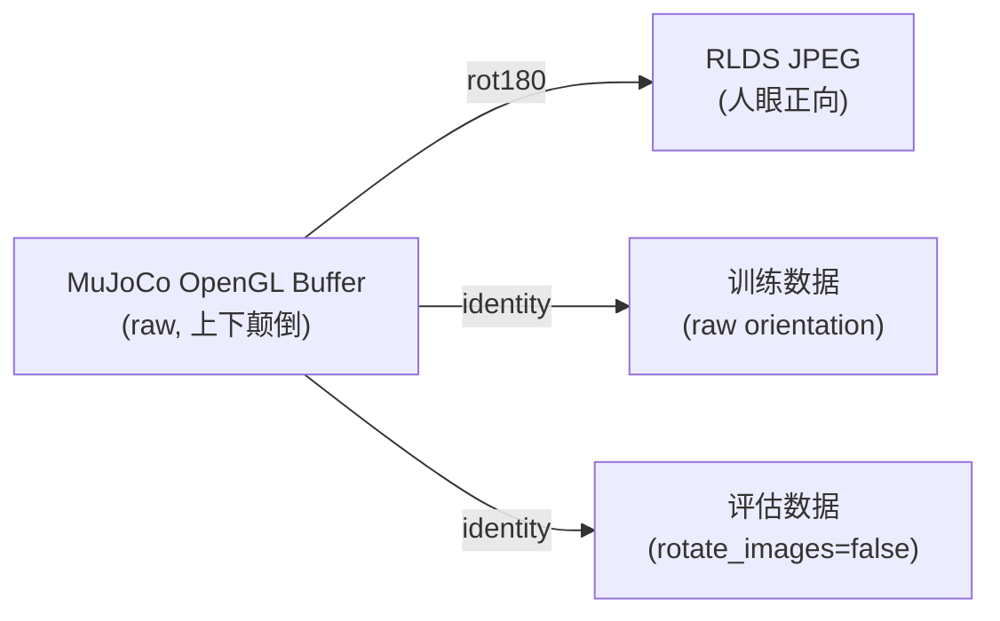
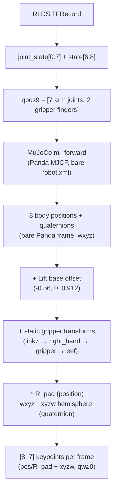
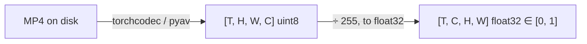
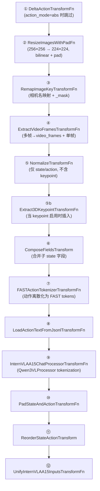
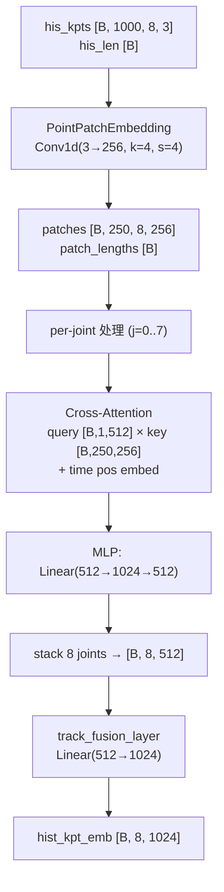
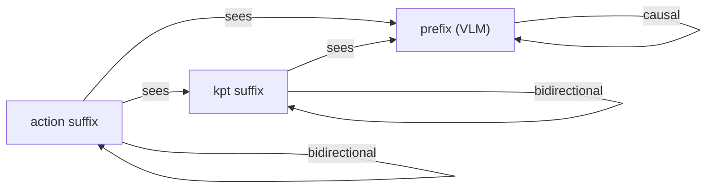

# LIBERO RLDS 训练数据深入分析 (v4)

> **数据源**: `/B/Dta/opvla_libero/` (OpenVLA `modified_libero_rlds`)
> **分析日期**: 2026-09-19
> **信任边界**: 本文所有数值均直接从 RLDS TFRecord 原始数据和代码仓库独立推导,**不依赖** `opvla_libero_merged_kpt` 数据集、其相关代码、或任何前置分析文档。引用前置文档之处仅作对比参考,并以"(参考)" 标注。
> **可复现性**: 分析脚本位于 `b/d/libplus/ds/asset/`,统计结果在 `raw_stats.json` 和 `kpt_stats.json`。

---

## 目录

- [1. 概述](#1-概述)
- [2. 数据结构与 Schema](#2-数据结构与-schema)
- [3. 数据规模与分布](#3-数据规模与分布)
- [4. 动作空间分析](#4-动作空间分析)
- [5. 状态空间分析](#5-状态空间分析)
- [6. 关节状态分析](#6-关节状态分析)
- [7. 图像数据分析](#7-图像数据分析)
- [8. 坐标系与机器人基座](#8-坐标系与机器人基座)
- [9. 前向运动学与 3D 关键点抽取](#9-前向运动学与-3d-关键点抽取)
- [10. 四元数表示与陷阱](#10-四元数表示与陷阱)
- [11. R_pad 归一化方案](#11-r_pad-归一化方案)
- [12. 训练 Pipeline 数据消费链路](#12-训练-pipeline-数据消费链路)
- [13. TrackEncoder 与 MoT 三路注意力](#13-trackencoder-与-mot-三路注意力)
- [14. 训推一致性契约](#14-训推一致性契约)
- [15. LIBERO-plus 扰动影响分析](#15-libero-plus-扰动影响分析)
- [16. 已知陷阱与推荐](#16-已知陷阱与推荐)
- [17. 可复现性与验证](#17-可复现性与验证)
- [附录 A: 完整 Tensor Shape 流转表](#附录-a-完整-tensor-shape-流转表)
- [附录 B: 术语对照](#附录-b-术语对照)
- [附录 C: 参考来源](#附录-c-参考来源)

---

## 1. 概述

### 1.1 数据来源

本数据集来源于 Hugging Face 上的 [`openvla/modified_libero_rlds`](https://huggingface.co/datasets/openvla/modified_libero_rlds),是 OpenVLA 项目 (arXiv:2406.09246) 对官方 LIBERO benchmark 的演示数据进行预处理后的产物:

1. **原始来源**: LIBERO benchmark 的 2,000 条人类遥操作演示 (4 个 suite × 10 个 task × 50 条 demo)
2. **预处理步骤**: OpenVLA 将原始 HDF5 回放到 robosuite 仿真器,以 256×256 分辨率重新渲染,丢弃失败轨迹和 no-op 空转帧,封装成 RLDS/TFRecord 格式
3. **存储路径**: `/B/Dta/opvla_libero/`,包含四个子集目录

### 1.2 数据用途

该数据用于 InternVLA-A1.5 模型的 LIBERO fine-tuning。训练后需在以下两个仿真 benchmark 上进行评估:

- **LIBERO** (`/B/SRC/LIBERO/`): 标准评估,40 个任务
- **LIBERO-plus** (`/B/SRC/LIBERO-plus/`): 扰动评估,10,030 个扰动变体

### 1.3 关键结论摘要

| 项目 | 结论 |
|------|------|
| **规模** | 1,693 episodes / 273,465 frames / 40 tasks (保留率 84.65%) |
| **动作空间** | 7D OSC_POSE 增量 (Δpos + Δrot + gripper),已量化为 1/1120 和 1/2800 网格 |
| **图像朝向** | RLDS JPEG 是 MuJoCo 原始缓冲区的 rot180,与训练期望朝向**相反** |
| **R_pad** | 从 RLDS 独立计算得 1.8212723272872922,已含 15% margin,**不可再乘 1.15** |
| **FK 精度** | GL-free FK 对 RLDS 的 position 误差 ≤ 0.55 mm,rotation 误差 ≤ 0.10° |
| **关键点** | 8 body × 7D (pos + xyzw quat),使用 Lift MJCF 固定基座,归一化后存储 |
| **四元数不连续** | link7 有 3,652 次、eef 有 3,559 次半球翻转,全局共 7,658 次 |
| **训练 Pipeline** | RLDS → LeRobot parquet → 12 步 transform chain → 三路 MoT 注意力 |
| **频率** | 物理 20 Hz,metadata 标记 10 Hz fps,无实际降采样 |

---

## 2. 数据结构与 Schema

### 2.1 目录结构

```
/B/Dta/opvla_libero/
├── libero_spatial_no_noops/1.0.0/   (16 shards)
├── libero_object_no_noops/1.0.0/    (32 shards)
├── libero_goal_no_noops/1.0.0/      (16 shards)
└── libero_10_no_noops/1.0.0/        (32 shards)
    ├── dataset_info.json
    ├── features.json
    └── {stem}-train.tfrecord-NNNNN-of-MMMMM
```

每个子集的 `1.0.0/` 下含 `dataset_info.json`(声明 shard 长度)、`features.json`(RLDS feature schema)和 TFRecord 分片文件。

> **Typo 注意**: `libero_10` 的 `dataset_info.json` 中 `"name": "liber_o10"`,导致分片文件名为 `liber_o10-train.tfrecord-*`,而非预期的 `libero_10-train.tfrecord-*`。这是 OpenVLA builder 的命名错误,数据本身无损。
> 参见 [rlds_reader.py](asset/rlds_reader.py) 第 38–43 行 `SUBSETS` 字典。

### 2.2 RLDS Feature Schema

四个子集的 `features.json` 完全相同,顶层结构:

```
FeaturesDict
├── steps: Dataset (variable-length sequence)
│   └── [per step] FeaturesDict:
│       ├── action:                Tensor   float32  [7]      "Robot EEF action"
│       ├── observation:           FeaturesDict
│       │   ├── image:             Image    uint8    [256,256,3]  JPEG  "Main camera (agentview)"
│       │   ├── wrist_image:       Image    uint8    [256,256,3]  JPEG  "Wrist camera"
│       │   ├── state:             Tensor   float32  [8]      "EEF state (6D pose + 2D gripper)"
│       │   └── joint_state:       Tensor   float32  [7]      "Arm joint angles"
│       ├── language_instruction:  Text                        "Task instruction"
│       ├── reward:                Scalar   float32            "1 on final step for demos"
│       ├── discount:              Scalar   float32            "Always 1.0"
│       ├── is_first:              Scalar   bool
│       ├── is_last:               Scalar   bool
│       └── is_terminal:           Scalar   bool
└── episode_metadata:
    └── file_path:                 Text     "Path to source HDF5"
```

各字段语义详解:

| 字段 | 维度 | 语义 | 来源 |
|------|------|------|------|
| `action` | [7] | OSC_POSE delta: Δx,Δy,Δz,Δrx,Δry,Δrz,gripper | SpaceMouse 遥操作 |
| `state[0:3]` | [3] | EEF 位置 (来自 `gripper0_grip_site`) | `robosuite.robots.single_arm:305` |
| `state[3:6]` | [3] | EEF 姿态 axis-angle (**来自 `robot0_right_hand`**, 见 [§10.3](#103-eef-位姿帧分裂)) | `robosuite.robots.single_arm:309` |
| `state[6:8]` | [2] | 夹爪手指位置 (左/右 finger qpos) | `gripper.qpos` |
| `joint_state` | [7] | 7 个手臂关节角度 (revolute joints) | `robot.joint_positions` |
| `image` | [256,256,3] | agentview 相机,JPEG 编码 | robosuite offscreen render |
| `wrist_image` | [256,256,3] | robot0_eye_in_hand 相机,JPEG 编码 | robosuite offscreen render |

> **TFRecord 读取方式**: 本机未安装 TensorFlow,使用纯 Python 二进制解析器 [rlds_reader.py](asset/rlds_reader.py) 直接读取 TFRecord wire format + protobuf Example。CRC 校验被跳过,完整性通过 `shardLengths` 声明值做逐 shard 核对。

---

## 3. 数据规模与分布

### 3.1 总量

| 指标 | 值 |
|------|-----|
| 子集 (suites) | 4 |
| 任务 (tasks) | 40 |
| Episodes | 1,693 |
| 总帧数 | 273,465 |
| 官方演示总数 | 2,000 (4 × 500) |
| 保留率 | 84.65% |
| Shards | 96 |
| 磁盘占用 | ~10.2 GB |
| 无 NaN 帧 | 0 (全部通过完整性检查) |

> **来源**: [raw_stats.json](asset/raw_stats.json),由 [analyze_libero_raw.py](asset/analyze_libero_raw.py) 对全部 96 个 shard 扫描产生。

### 3.2 各子集统计

| Suite | Episodes | Frames | Tasks | 保留率 | Episode 占比 | Frame 占比 | 长度 min–max (mean) |
|-------|----------|--------|-------|--------|-------------|------------|---------------------|
| `libero_spatial` | 432 | 52,970 | 10 | 86.4% | 25.5% | **19.4%** | 75–193 (122.6) |
| `libero_object` | 454 | 66,984 | 10 | 90.8% | 26.8% | **24.5%** | 114–254 (147.5) |
| `libero_goal` | 428 | 52,042 | 10 | 85.6% | 25.3% | **19.0%** | 75–270 (121.6) |
| `libero_10` | 379 | 101,469 | 10 | **75.8%** | 22.4% | **37.1%** | 150–505 (267.7) |

**关键发现**: `libero_10` 是长轨迹多步骤 (multi-step) 任务集:

- Episode 数最少 (379,保留率仅 75.8%),但帧数占比最高 (37.1%,1.66× 过度加权)
- 如果 DataLoader 按帧均匀采样,`libero_10` 将获得不成比例的梯度贡献
- 任务 `put both moka pots on the stove` 仅 29 条 episode,却贡献 11,808 帧 (4.32%)

### 3.3 Episode 长度分布

```
全局: min=75, max=505, mean=161.5, median=140, p95=289
78.15% 的 episode 短于 200 步
```

这意味着对于 `keypoint_history_max_len=1000` 的默认配置,绝大多数 episode 的历史窗口填充率极低。TrackEncoder 的 `his_len` + masking 机制对此是必要的 (见 [§13](#13-trackencoder-与-mot-三路注意力))。

即使用旧配置 `H=200`,也仅有 21.85% 的 episode (370/1693) 长于 200 帧能填满窗口。各 suite 差异显著:

| Suite | max_history_reached | 能填满 H=200 的 episode 数 |
|-------|--------------------|-----------------------|
| `libero_spatial` | 192 | 0 (永远无法填满!) |
| `libero_object` | 200 | 7 |
| `libero_goal` | 200 | 18 |
| `libero_10` | 200 | 345 (91.0%) |

> **来源**: [kpt_stats.json](asset/kpt_stats.json) `history_window` 字段。

### 3.4 无验证集

数据集仅有 `train` split,无 validation/test split。评估必须按 episode 切分,不可按帧随机切分 (否则时间相邻帧会同时出现在训练和验证集中)。

---

## 4. 动作空间分析

### 4.1 维度语义

`action[7]` 是 OSC_POSE 控制器的增量指令:

| 维度 | 语义 | 单位 | 数据范围 |
|------|------|------|---------|
| `[0:3]` | Δ position (x, y, z) | 归一化增量 | [-0.9375, 0.9375] |
| `[3:6]` | Δ rotation (rx, ry, rz) | 归一化增量 | [-0.375, 0.375] |
| `[6]` | gripper command | 二值 | {-1.0, +1.0} |

> **重要**: 这些值是**归一化后的增量指令**,不是绝对位姿。每步的实际物理位移由 OSC 控制器内部缩放:
> - 位置: `action * output_max = action * 0.05 m` → 最大 0.047 m/step
> - 旋转: `action * output_max = action * 0.5 rad` → 最大 0.188 rad/step
>
> 参见 `robosuite/controllers/config/osc_pose.json`。

### 4.2 量化结构

动作值不是连续的,而是离散量化网格上的:

| 通道组 | 量化网格 | 步长 | 使用级数 | 饱和值 |
|--------|----------|------|----------|--------|
| position xyz | 1/1120 | 8.93e-4 | 1050 | ±0.9375 |
| rotation rpy | 1/2800 | 3.57e-4 | 1050 | ±0.375 |

**来源推导**: LIBERO 使用 SpaceMouse 遥操作,SpaceMouse 原始轴值经过 `scale_to_control(x, axis_scale=350.0)` 缩放 (`robosuite/devices/spacemouse.py:67`)。LIBERO 收集演示时使用的敏感度参数为 `--pos-sensitivity 1.5 --rot-sensitivity 1.0` (`LIBERO/scripts/collect_demonstration.py:237-246`)。

$$\text{levels\_used} = \text{pos\_sensitivity} \times \text{axis\_scale} = 1.5 \times 350 = 1050$$
$$\text{quant\_grid}_{\text{pos}} = \text{levels\_used} / \text{saturation} = 1050 / 0.9375 = 1120$$
$$\text{quant\_grid}_{\text{rot}} = \text{levels\_used} / \text{saturation}_{\text{rot}} = 1050 / 0.375 = 2800$$

两个通道组恰好用满 1050 级 (= 3 × 350)。rotation 的 sensitivity=1.0 (vs position 的 1.5) 导致 rotation 的网格更密。

### 4.3 饱和帧

273,465 帧中有 18,577 帧 (6.79%) 的前 6 维至少有一个达到饱和值 ±0.9375 或 ±0.375。这是 SpaceMouse 的硬件限制,不是 OSC 控制器限制 (OSC_POSE 接受完整的 [-1, 1])。

**评估时需注意**: 模型输出可能超过训练范围但不超过 ±1.0。评估代码应将 action clip 到 [-1, 1] 而非 [-0.9375, 0.9375]。

### 4.4 夹爪 (Gripper)

夹爪指令严格二值:

| 值 | 帧数 | 含义 |
|----|------|------|
| -1.0 | 143,520 (52.5%) | 张开 |
| +1.0 | 129,945 (47.5%) | 闭合 |

这是 **LIBERO native 约定**: `action[6] > 0` 表示闭合,`action[6] < 0` 表示张开。

> **陷阱 B1**: 旧版评估脚本 (`evaluation/LIBERO/`) 使用 OpenVLA 约定 (`action[6] < 0.5 → close`),与训练数据的 LIBERO native 约定不一致。已在 LIBERO2 评估脚本中修复。
> 参见 `evaluation/LIBERO2/model2libero_interface.py:243-248`。

### 4.5 No-op 审计

OpenVLA 的 no-op 过滤标准: $\|a_{0:6}\| \leq 10^{-4}$ 且 gripper 未变。

RLDS 中 **0 帧** 符合此标准,确认 OpenVLA 已彻底移除了 no-op 帧。

然而仍有 17,401 帧 (6.36%) 的 EEF 位移 < 1 mm ($\|\text{eef\_pos}_{t+1} - \text{eef\_pos}_t\| < 0.001$ m)。这些帧的 action 非零 (控制器在维持位姿),并非数据质量问题。

### 4.6 训练配置要求

使用此数据训练 InternVLA-A1.5 时:

- `action_mode=abs` — 因为数据本身已经是增量指令,`DeltaActionTransformFn` **不应**再次差分。这里 `abs` 的含义是"不做额外差分变换"
- 归一化方式由 `stats.json` 决定 (通常为 `min_max` 或 `mean_std`)

---

## 5. 状态空间分析

### 5.1 各维度统计

| 维度 | 语义 | min | max | mean | std |
|------|------|-----|-----|------|-----|
| `[0]` | eef_x | -0.4828 | 0.2103 | -0.0465 | 0.1049 |
| `[1]` | eef_y | -0.3255 | 0.3913 | 0.0344 | 0.1518 |
| `[2]` | eef_z | 0.0081 | 1.3660 | 0.7646 | 0.3785 |
| `[3]` | axisangle_x | 0.3528 | 3.6714 | 2.9722 | 0.3443 |
| `[4]` | axisangle_y | -3.6414 | 3.5607 | -0.2205 | 0.9069 |
| `[5]` | axisangle_z | -1.8427 | 1.3863 | -0.1256 | 0.3254 |
| `[6]` | gripper_L | -0.0014 | 0.0423 | 0.0269 | 0.0142 |
| `[7]` | gripper_R | -0.0420 | 0.0014 | -0.0272 | 0.0141 |

**关键发现**:

- `state[0:3]` (EEF 位置) 跨度很大: x ∈ [-0.48, 0.21], z ∈ [0.008, 1.37],反映了不同 arena 中机器人基座高度的差异 (见 [§8](#8-坐标系与机器人基座))
- `state[3:6]` (axis-angle) 的范数范围是 [1.90, 4.36],远超 $\pi$,说明 robosuite 的 `quat2axisangle` 没有做半球折叠 (见 [§10.2](#102-axis-angle-双重覆盖))
- `state[6:8]` (夹爪 finger qpos) 是对称的左右手指位置,范围极小 (< 0.05 rad)

### 5.2 Axis-angle 双重覆盖

Robosuite 的 `quat2axisangle` 返回 $\theta = 2\arccos(q_w)$,值域 $[0, 2\pi]$。当 $q_w$ 过零时,axis-angle 范数会在 $\pi$ 处产生跳变:

| 指标 | 值 |
|------|-----|
| 范数超过 $\pi$ 的帧 | 130,063 (47.6%) |
| 范数在 $\pi \pm 0.1$ rad 的帧 | 73.3% |
| 发生 > 1 rad 跳变的 episode | 0 |
| 最大单步跳变 | 0.044 rad |

**结论**: 虽然 47.6% 的帧超出 $\pi$,但**没有任何 episode 内发生 > 1 rad 的跳变**。Axis-angle 在 episode 内是连续的。跳变风险只存在于跨 episode 混合或全局统计时。

---

## 6. 关节状态分析

### 6.1 统计

| Joint | min (rad) | max (rad) | mean | std | 下限余量 | 上限余量 |
|-------|-----------|-----------|------|-----|----------|----------|
| J1 | -0.603 | 0.690 | 0.029 | 0.129 | 2.294 | 2.207 |
| J2 | -0.754 | 1.729 | 0.429 | 0.348 | 1.009 | **0.033** |
| J3 | -0.551 | 0.747 | 0.028 | 0.170 | 2.346 | 2.150 |
| J4 | -3.074 | -0.059 | -1.910 | 0.462 | **-0.002** | **-0.010** |
| J5 | -2.903 | 2.214 | -0.006 | 0.338 | **-0.006** | 0.683 |
| J6 | 0.621 | 3.769 | 2.264 | 0.337 | 0.639 | **-0.017** |
| J7 | -2.113 | 2.903 | 0.966 | 0.623 | 0.784 | **-0.006** |

**关节限位越界**: J4、J5、J6、J7 存在轻微越界 (最大越界 0.017 rad ≈ 1°)。这是 OSC 控制器的跟踪超调 (tracking overshoot),不是数据损坏。在 FK 计算中,MuJoCo 会自动 clamp 到关节限位。

### 6.2 qpos9 构建

FK 需要 9 维 qpos 输入:

$$\text{qpos9} = [\text{joint\_state}[0{:}7],\ \text{state}[6{:}8]]$$

即 7 个手臂关节角 + 2 个夹爪手指位置。夹爪手指不影响 8 个关键点 body 的位姿,但保留以保持 MuJoCo 模型的 qpos 长度一致。

参见 [rlds_reader.py](asset/rlds_reader.py):223-229 `Episode.qpos9()`。

---

## 7. 图像数据分析

### 7.1 基本参数

| 属性 | 值 |
|------|-----|
| 分辨率 | 256 × 256 × 3 (RGB) |
| 编码 | JPEG (存储在 TFRecord BytesList 中) |
| 相机 | `image` (agentview) + `wrist_image` (robot0_eye_in_hand) |
| 平均 JPEG 大小 | agentview ~19.8 KB, wrist ~17.7 KB |

### 7.2 图像朝向 (CRITICAL)

**这是最关键的训推一致性问题之一。**

RLDS 中的 JPEG 图像与训练模型期望的朝向存在 180° 旋转差异:



**独立验证证据链** (3 个互相独立的证据):

#### 证据 1: 亮度空间分布

对 RLDS JPEG 做逐行亮度统计:

| 行区间 | 平均亮度 | 标准差 | 含义 |
|--------|----------|--------|------|
| rows 0–63 (上 1/4) | ~110 | ~35 | 较暗,背景墙 |
| rows 192–256 (下 1/4) | ~173 | ~16 | 最亮,桌面/台面 |

桌面在下方 = **人眼正向** (人类可读)。MuJoCo OpenGL buffer 中桌面在**上方** (上下颠倒)。因此 RLDS = rot180 of OpenGL buffer。

#### 证据 2: FK 投影分析

使用 FK 计算 EEF 在世界坐标中的位置,通过 agentview 相机的已知内外参投影到图像坐标系:

- `libero_object` 的投影结果: EEF 投影行 ~260–281 (图像底部附近)
- 同 episode 的运动质心行: ~41–53 (图像顶部附近)

如果 RLDS 图像是 raw (上下颠倒),EEF 投影行和运动质心行应该在同一区域。实际在相反位置,说明 RLDS 是 rot180。

#### 证据 3: 训练契约文件

`evaluation/LIBERO2/train_eval_contract.json` 声明:

```json
{"image_orientation": "raw", "resize_hw": [224,224], "cameras": ["agentview","wrist"]}
```

即训练数据使用 MuJoCo 原始缓冲区朝向 (上下颠倒的图像)。评估端通过 `rotate_images=False` 保持一致。

**结论**: RLDS 图像是 rot180 of MuJoCo buffer。如果从 RLDS 构建新训练 pipeline,**必须**对 JPEG 解码后的图像做 `img[::-1, ::-1]` (rot180)。

> **陷阱**: 旧版评估脚本 (`evaluation/LIBERO/`) 默认 `rotate_images=True`,对 MuJoCo 原始缓冲区做了 rot180。如果训练数据也是 rot180 (如直接用 RLDS),则旧评估脚本反而是对的;但如果训练数据是 raw (如 merged_kpt 数据集),则旧评估脚本会产生上下颠倒的图像。
>
> LIBERO2 评估脚本 (`evaluation/LIBERO2/`) 通过 `orientation_contract.py` 的 `enforce_rotate_against_contract()` 强制检查,从根本上避免此类错误。

### 7.3 LIBERO 相机配置

两个评估 benchmark (LIBERO 和 LIBERO-plus) 使用**完全相同**的相机配置 (来自 `/B/SRC/LIBERO/libero/libero/envs/bddl_base_domain.py:274-295`):

```python
agentview:
  pos = [0.5886131746834771, 0.0, 1.4903500240372423]
  quat = [0.6380177736282349, 0.3048497438430786, 0.30484986305236816, 0.6380177736282349]
  control_freq = 20
```

渲染分辨率: 256 × 256。训练 pipeline 中 `ResizeImagesWithPadFn` 将 256×256 缩放到 224×224 (保持纵横比,bilinear 插值 + 零填充)。由于原图已是正方形,不会产生 padding。

---

## 8. 坐标系与机器人基座

### 8.1 LIBERO 的 Arena 系统

LIBERO 的 40 个任务分布在 5 种 arena 上。不同 arena 的机器人基座位置不同:

| Arena | 基座位置 (世界坐标) | Panda 类型 | 使用的 Suite |
|-------|---------------------|-----------|-------------|
| `table` | (-0.66, 0, 0.912) | MountedPanda | spatial, goal |
| `kitchen_table` | (-0.66, 0, 0.912) | MountedPanda | 10 (部分) |
| `study_table` | (-0.75, 0, 0.912) | MountedPanda | 10 (部分) |
| `living_room_table` | (-0.51, 0, 0.42) | OnTheGroundPanda | 10 (部分) |
| `floor` | (-0.60, 0, 0.0) | OnTheGroundPanda | object |

**基座位置推导** (从 LIBERO 源码 `/B/SRC/LIBERO/libero/libero/envs/robots/`):

MountedPanda (有 RethinkMount,mount 高度 0.912 m):
$$x = -\text{offset} - \frac{\text{table\_length}}{2}, \quad y = 0, \quad z = 0.912$$

| Arena | offset | table_length | $x$ |
|-------|--------|-------------|-----|
| table | 0.16 | 1.0 | -0.66 |
| kitchen_table | 0.16 | 1.0 | -0.66 |
| study_table | 0.25 | 1.0 | -0.75 |

OnTheGroundPanda (无 mount,直接放地面):
- `living_room_table`: $x = -0.16 - 0.7/2 = -0.51$, $z = 0.42$ (矮茶几)
- `floor` / `empty`: $(-0.60, 0, 0)$

### 8.2 从 RLDS 独立验证基座位置

使用 GL-free FK 计算 `gripper0_eef` 在各 arena 帧下的位置,与 `observation.state[0:3]` 比较。如果 FK 使用正确的 arena 基座位置,两者应该匹配:

| Arena | Episodes | 与 LIBERO 源码的差异 (m) | Episode 间散布 (m) |
|-------|----------|------------------------|-------------------|
| table | 860 | 6.06e-5 | 5.60e-5 |
| floor | 454 | 7.00e-5 | 1.00e-5 |
| living_room_table | 199 | 3.80e-5 | 1.16e-5 |
| kitchen_table | 139 | 2.51e-5 | 1.92e-5 |
| study_table | 41 | 3.33e-5 | 6.58e-6 |

所有 arena 的误差 < 1e-4 m,**完全验证**了 LIBERO 源码声明的基座位置。

> **来源**: [kpt_stats.json](asset/kpt_stats.json) `arena_bases` 字段。

### 8.3 Arena 分布

| Arena | Episodes | Frame 占比 |
|-------|----------|-----------|
| `table` | 860 | 38.4% |
| `floor` | 454 | 24.5% |
| `living_room_table` | 199 | 19.2% |
| `kitchen_table` | 139 | 15.1% |
| `study_table` | 41 | 2.8% |

### 8.4 训练关键点使用的坐标系

**关键设计决策**: 训练时 FK 使用固定的 **Lift MJCF 基座**位置 $(-0.56, 0, 0.912)$,**不使用**各 arena 的实际基座位置。这意味着:

- 所有 episode 的关键点都在同一个坐标系下
- 关键点编码的是**机器人构型** (joint angles → body positions),与 arena 无关
- `observation.state[0:3]` 与关键点第 8 个 body 的位置之间存在一个**常数偏移**,等于 Lift 基座与 arena 基座的差

验证 (FK 使用 Lift 基座 vs state):
```
arena               FK_lift - state  =  expected (Lift_base - Arena_base)
table               : [0.10, 0.00, 0.00]  expected [0.10, 0.00, 0.00]  ✓
floor               : [0.04, 0.00, 0.91]  expected [0.04, 0.00, 0.91]  ✓
living_room_table   : [-0.05, 0.00, 0.49] expected [-0.05, 0.00, 0.49] ✓
kitchen_table       : [0.10, 0.00, 0.00]  expected [0.10, 0.00, 0.00]  ✓
study_table         : [0.19, 0.00, 0.00]  expected [0.19, 0.00, 0.00]  ✓
```

差值精确匹配 $\text{LIFT\_BASE} - \text{ARENA\_BASE}$。

---

## 9. 前向运动学与 3D 关键点抽取

### 9.1 FK 管线概述

从 RLDS 数据生成 3D 关键点的完整管线:



### 9.2 MJCF 模型

由于本机无 EGL/OSMesa,无法 `import robosuite`,因此使用 robosuite 安装目录中的裸 Panda MJCF:

```
/B/VENV/libero_plus_client/lib/python3.10/site-packages/
  robosuite/models/assets/robots/panda/robot.xml
```

该 MJCF 只包含 Panda 手臂本体 (link0–link7 + right_hand),不包含夹爪。夹爪的 `gripper0_eef` body 通过两个静态变换手动附加 (参见 [panda_fk.py](asset/panda_fk.py):58-61):

```
link7 → right_hand (identity, 已在 robot.xml 中)
    → gripper0_right_gripper (quat = [0.707107, 0, 0, -0.707107]_wxyz, 即 -90° 绕 z)
        → gripper0_eef (translation = [0, 0, 0.097] 沿 gripper z 轴)
```

### 9.3 8 个关键点 Body

| 索引 | Body 名称 | 描述 | 位置独立? | 旋转独立? |
|------|----------|------|----------|----------|
| 0 | `link1` | 第 1 关节后 | ❌ 恒定 | ✅ (编码 J1) |
| 1 | `link2` | 第 2 关节后 | ❌ 与 link1 重合 | ✅ (编码 J2) |
| 2 | `link3` | 第 3 关节后 | ✅ | ✅ |
| 3 | `link4` | 第 4 关节后 (肘部) | ✅ | ✅ |
| 4 | `link5` | 第 5 关节后 | ✅ | ✅ |
| 5 | `link6` | 第 6 关节后 (腕部) | ❌ 与 link5 位置重合 | ✅ (不同旋转) |
| 6 | `link7` | 第 7 关节后 (法兰) | ✅ | ✅ |
| 7 | `eef` | 夹爪末端 (静态变换) | ✅ | ✅ |

> **EEF Body 名称歧义**: 训练 MJCF (通过 `export_panda_mjcf.py` 从 robosuite 1.5+ 导出) 中名为 `gripper0_right_eef`; 评估用的 Lift MJCF 中名为 `gripper0_eef`。两者指向同一物理 body。代码中通过 `resolve_eef_body_name()` 尝试两个候选名称来消歧。

### 9.4 关键点冗余分析

在 `pos_only` 模式 ($d = 3$) 下,8 个 body × 3 = 24 维位置中:

| 现象 | 涉及 Body | 位置维度损失 |
|------|----------|------------|
| link1、link2 位置恒定 (std=0) | link1, link2 | -6 维 (2 × 3) |
| link5、link6 位置重合 (距离=0) | link5, link6 | -3 维 (1 × 3) |

**移动维度**: 18/24 (75%)。**独立维度**: 15/24 (62.5%)。

在 `pos_rot` 模式 ($d = 7$) 下,所有 8 个 body 都携带有用信息: link1/link2 通过四元数编码 J1/J2 的旋转,link5/link6 虽然位置相同但姿态不同。

> **来源**: [kpt_stats.json](asset/kpt_stats.json) `redundancy` 和 `body_statistics` 字段,`quaternion.static_position_bodies_still_rotate` 确认 link1/link2 虽然位置静止但仍有旋转信息。

### 9.5 FK 精度验证

使用 GL-free FK 对 RLDS 数据的 12 个 episode (覆盖全部 4 个 suite、5 个 arena) 进行验证:

| 指标 | 值 |
|------|-----|
| 最大位置误差 | **5.51e-4 m** (0.55 mm) |
| 最大旋转误差 | **0.104°** |
| 自检结果 | **PASS** |

0.55 mm 的误差来源: FK 使用 float64 而 RLDS state 是 float32,加上 OSC 控制器的跟踪误差 (FK 给出的是精确运动学解,state 是带跟踪误差的实际值)。

参见 [panda_fk.py](asset/panda_fk.py):213-248 `self_check()`。

---

## 10. 四元数表示与陷阱

### 10.1 存储约定

关键点四元数遵循以下约定:

- **顺序**: xyzw (不是 MuJoCo 的 wxyz)
- **半球约束**: $q_w \geq 0$ (如果 $q_w < 0$,取 $-q$)
- **归一化**: 单位四元数

转换代码 ([panda_fk.py](asset/panda_fk.py):122-126):
```python
def wxyz_to_xyzw_hemisphere(q):
    out = [q[1], q[2], q[3], q[0]]  # wxyz → xyzw
    if out[3] < 0: out = -out        # hemisphere
    return out
```

### 10.2 Axis-angle 双重覆盖

`observation.state[3:6]` 的 axis-angle 使用 robosuite 的 `quat2axisangle`,该函数返回 $\theta = 2\arccos(q_w)$ 而不做 $q_w < 0$ 的折叠,因此 $\theta \in [0, 2\pi]$:

$$\theta > \pi \iff q_w < 0 \iff \text{axis-angle 在"另一个半球"}$$

47.6% 的帧 $\theta > \pi$。但 episode 内的最大单步跳变仅 0.044 rad,远小于不连续性阈值。这意味着:

- 在 episode 内连续使用 axis-angle 是安全的
- 跨 episode 做统计时必须意识到双重覆盖
- 如果做 axis-angle 的 MSE 损失,需要折叠到 $[0, \pi]$ 或用更鲁棒的距离度量

### 10.3 EEF 位姿帧分裂

**`observation.state` 的位置和姿态来自不同的坐标帧**:

| 维度 | 来源 | 坐标帧 |
|------|------|--------|
| `state[0:3]` (eef_pos) | `site_xpos[gripper0_grip_site]` | `gripper0_eef` body 原点 |
| `state[3:6]` (eef_quat→axis-angle) | `get_body_xquat(robot0_right_hand)` | `robot0_right_hand` body |

`gripper0_eef` 相对于 `robot0_right_hand` 有一个 -90° 绕 z 轴的旋转 (来自夹爪附加变换的四元数 `(w=0.707107, x=0, y=0, z=-0.707107)`)。

**实际影响**: 这不是 bug——训练和评估两侧都从同一个 robosuite 接口读取,因此是**一致**的。但在做几何交叉验证 (如用 state 位置验证 FK 旋转) 时必须考虑这个 90° 偏移。

### 10.4 四元数分支切割问题 (独立验证)

$q_w \geq 0$ 的半球约束导致,当 body 姿态旋转经过 $q_w = 0$ 的超平面时,存储的四元数发生"符号翻转" (sign flip): $q$ 突然变为 $-q'$ (取反以保持 $q_w \geq 0$),虽然 $q'$ 和 $-q'$ 代表同一旋转,但 L2 距离变为 $\|q - (-q')\| \approx 2$ (而非物理上的小变化)。

以下统计从 273,465 帧全量 FK 独立计算 ([kpt_stats.json](asset/kpt_stats.json) `quaternion` 字段):

| Body | $|q_w| < 0.05$ 的帧数 | 连续帧间符号翻转次数 | 最大 L2 步长 |
|------|---------------------|-------------------|------------|
| link1 | 0 | 0 | 0.020 |
| link2 | 0 | 0 | 0.030 |
| link3 | 0 | 0 | 0.030 |
| link4 | 8,106 (2.96%) | 355 | **2.000** |
| link5 | 2,415 (0.88%) | 90 | **2.000** |
| link6 | 20 (0.01%) | 2 | **2.000** |
| **link7** | **186,005 (68.02%)** | **3,652** | **2.000** |
| **eef** | **165,783 (60.62%)** | **3,559** | **2.000** |
| **全部** | — | **7,658** | — |

**关键发现**:

1. **link7 和 eef 大量帧骑在分支切割线上**: 68% 的帧 link7 的 $|q_w| < 0.05$,60.6% 的帧 eef 的 $|q_w| < 0.05$。这是因为 Panda 机械臂的典型工作姿态使得 link7/eef 的旋转恰好位于 $q_w \approx 0$ 附近。

2. **全局共 7,658 次符号翻转**: 这些翻转既发生在 episode 内 (物理旋转连续经过 $q_w = 0$),也发生在 episode 边界 (不同 episode 的首末帧构型差异)。

3. **最大 L2 步长达到 2.0**: 这是两个单位四元数间的最大 L2 距离 ($\|q - (-q)\| = 2\|q\| = 2$),表明存在完全的对跖跳变。

**对训练的影响**:

如果使用 MSE 损失预测四元数,每次符号翻转处 MSE 会计算出最大误差 (L2 = 2),且梯度方向错误。对于 link7 和 eef 这种 68%/61% 的帧在边界附近的情况,MSE 损失的梯度信号会非常嘈杂。

**推荐**: 使用 geodesic loss 替代 quaternion MSE:

$$\mathcal{L}_{\text{geodesic}}(q, \hat{q}) = 1 - |\langle q, \hat{q} \rangle|$$

这只需修改损失函数,无需重新生成数据。当前代码 (`modeling_internvla_a1_5.py`) 中 `_kpt_split_loss` 对位置和旋转可以分开计算,只需将旋转分量的损失改为 geodesic。

### 10.5 各 Body 四元数分量范围

以下是各 body 四元数 $(q_x, q_y, q_z, q_w)$ 在 xyzw 顺序下的分量范围 (max - min):

| Body | $\Delta q_x$ | $\Delta q_y$ | $\Delta q_z$ | $\Delta q_w$ |
|------|-------------|-------------|-------------|-------------|
| link1 | 0.000 | 0.000 | 0.635 | 0.059 |
| link2 | 0.301 | 0.862 | 0.969 | 0.352 |
| link3 | 0.463 | 1.129 | 0.732 | 0.357 |
| link4 | 1.015 | 1.566 | 1.542 | 0.599 |
| link5 | 1.692 | 2.000 | 0.761 | 0.836 |
| link6 | 1.735 | 1.240 | 1.308 | 0.969 |
| link7 | 2.000 | 1.948 | 0.974 | 0.692 |
| eef | 2.000 | 2.000 | 1.415 | 0.566 |

link7 和 eef 的 $q_x$, $q_y$ 分量范围达到 2.0 (理论最大值),反映出这些 body 经历了完整的旋转范围和符号翻转。

---

## 11. R_pad 归一化方案

### 11.1 计算方法

$R_{\text{pad}}$ 是一个标量,用于将所有关键点位置映射到近似 [-1, 1]:

$$R_{\text{pad}} = (1 + \text{margin}) \times \max_{i \in \{x,y,z\}} \max(|p_{\min,i}|, |p_{\max,i}|)$$

其中 $p_{\min}, p_{\max}$ 是所有帧、所有 8 个 body 在 Lift 基座帧下的位置极值,margin 默认 0.15 (15%)。

### 11.2 从 RLDS 独立计算

从 273,465 帧的全量 FK 结果 (Lift 基座帧) 计算:

| 轴 | global_min | global_max | $|·|$ max |
|----|-----------|-----------|-----------|
| x | -0.7662 | 0.2759 | **0.7662** |
| y | -0.4402 | 0.4354 | 0.4402 |
| z | 0.9083 | **1.5837** | **1.5837** |

$$R_{\text{pad}} = 1.15 \times 1.5837 = 1.8212723...$$

| 来源 | R_pad 值 | 差异 |
|------|----------|------|
| RLDS 独立计算 | 1.8212723272872922 | — |
| 代码硬编码 (`DEFAULT_R_PAD`) | 1.8212722539901733 | 7.33e-08 |

差异 7.33e-08 是 float32 vs float64 舍入,两者**本质相同**。

> **来源**: [kpt_stats.json](asset/kpt_stats.json) `r_pad` 字段。

> **致命陷阱: 不可再乘 1.15!** `R_pad = 1.8213` **已经包含了 15% margin**。如果再乘 1.15,得到 2.0945,会导致 13% 的系统性缩放错误。

### 11.3 R_pad 的来源分析

$R_{\text{pad}}$ 的值由 z 轴最大值 1.5837 决定,而这个值来自 Lift 基座高度 0.912 加上机械臂完全伸展时的高度:

$$1.5837 \approx 0.912 + 0.672\ (\text{arm reach above base})$$

这意味着 **R_pad 的尺度由一个与任务无关的量 (基座高度) 主导**。

### 11.4 归一化效率

| 轴 | 归一化后范围 | 利用率 |
|----|------------|--------|
| x | [-0.421, 0.152] | **28.6%** |
| y | [-0.242, 0.239] | **24.0%** |
| z | [0.499, 0.870] | **18.5%** |

三轴合计仅使用了 [-1, 1] 范围的 18-29%。特别是 **z 轴始终为正** (最小值 0.499),浪费了负值区间的全部容量。

### 11.5 替代归一化方案对比

| 方案 | R_pad | x 利用率 | y 利用率 | z 利用率 | 保持各向同性? |
|------|-------|---------|---------|---------|-------------|
| **A: 当前 (Lift world)** | 1.821 | 28.6% | 24.0% | 18.5% | ✅ |
| **B: base-relative** | 0.961 | 54.2% | 45.5% | 35.1% | ✅ |
| **C: per-axis** | varies | 100% | 100% | 100% | ❌ |

> **来源**: [kpt_stats.json](asset/kpt_stats.json) `normalisation_schemes` 字段。

方案 B 将位置减去基座再归一化,利用率翻倍且保持各向同性;方案 C 每轴独立归一化,利用率最高但破坏几何比例关系。当前方案 A 的优点是简单且与所有已训练 checkpoint 兼容。

### 11.6 关键点不经过 NormalizeTransformFn

**关键**: 关键点在 transform pipeline 中**不经过** `NormalizeTransformFn`。该 transform 只处理 `schema.get_state_keys()` 和 `schema.get_action_keys()` 返回的键,`observation.keypoint_3d` 不在其中。

关键点的"归一化"发生在**数据生成时** (FK 计算后除以 R_pad),而非训练时的 transform chain 中。

---

## 12. 训练 Pipeline 数据消费链路

本节追踪 RLDS 数据从磁盘到模型 forward 的完整路径。

### 12.1 数据转换为 LeRobot 格式

RLDS TFRecord 数据不直接被训练 pipeline 消费。需先转换为 LeRobot 格式:

```
RLDS TFRecord → LeRobot Dataset (parquet + MP4)
```

LeRobot 格式中:
- **数值数据** (action, state, joint_state, keypoint_3d) 存储为 **parquet** 文件
- **图像数据** 存储为 **MP4 视频文件** (多 episode 合并为 chunk)
- metadata 存储在 `info.json` 和 `stats.json` 中

关键点数据在 parquet 中的存储格式:
- 列名: `observation.keypoint_3d`
- 每行形状: `[K × d]` = `[56]` (K=8, d=7, pos+quat) 或 `[24]` (K=8, d=3, pos_only)
- 数据类型: float32

> **来源**: `util_scripts/generate_libero_keypoints.py` 产生关键点并写入 parquet。

### 12.2 图像解码路径

MP4 视频帧的解码路径:



当配置了 `delta_timestamps` 时,`LeRobotDataset.__getitem__()` 调用 `_query_videos()` 解码指定时间偏移的多帧。单帧输出 `[C, H, W]`,多帧输出 `[T, C, H, W]`。

> **来源**: `src/lerobot/datasets/video_utils.py:46` `decode_video_frames()`, `lerobot_dataset.py:991-1037` `_query_videos()`。

### 12.3 Transform Chain

InternVLA-A1.5 的完整 transform chain 由 `InternVLAA15DatasetConfig` 定义 (`configuration_internvla_a1_5.py:44-72`),共 12 步:



下面详解其中与 RLDS 数据理解密切相关的关键步骤:

#### ② ResizeImagesWithPadFn

输入 `[C, H, W]` 或 `[T, C, H, W]` float32 ∈ [0, 1]:
- 计算 $\text{scale} = \min(224/H, 224/W)$ 保持纵横比
- `F.interpolate` bilinear 缩放
- 居中放置,两侧零填充
- Clamp 到 [0, 1]
- 对于 256×256 输入 (正方形): scale = 224/256 = 0.875,无 padding

> **来源**: `src/lerobot/transforms/utils.py:26-80`。

#### ④ ExtractVideoFramesTransformFn

当图像有 `[T, C, H, W]` 形状 (多个时间步) 时:
- 将 `image0` 的全部 T 帧保存为 `observation.video_frames` `[T, 3, 224, 224]`
- 如果 `normalize_to_minus1_1=True` (默认): `video = video * 2.0 - 1.0`,从 [0,1] 映射到 [-1,1] (WAN 视频模型期望的范围)
- 将所有多帧相机键替换为第 0 帧: `data[k] = data[k][0]` → `[3, H, W]` (当前帧,用于 VLM)

> **来源**: `transform_internvla_a1_5.py:629-656`。

#### ⑤b Extract3DKeypointTransformFn

当 `observation.keypoint_3d` 存在于数据中时 (`transform_internvla_a1_5.py:661-737`):

**输入**: `observation.keypoint_3d` shape `[H+1+C, K*d]` = `[1051, 24]` (H=1000, C=50, K=8, d=3 for pos_only)
**输入**: `observation.keypoint_3d_is_pad` shape `[1051]` bool

**处理逻辑**:

```python
# 1. reshape
stacked = data.pop(key)                          # [1051, 24]
stacked = stacked.reshape(h+1+c, j, d).float()   # [1051, 8, 3]

# 2. split history / current / future
hist_window = stacked[:h]        # [1000, 8, 3] — 过去 H 帧
is_pad = data.pop(f"{key}_is_pad")[:h]  # [1000] bool
num_invalid = int(is_pad.sum())  # clamped 帧数
his_len = h - num_invalid

# 3. pack valid history to front (invalid 在最前面, 因为负偏移超出 episode 起点)
his_kpts = torch.zeros(h, j, d)
if his_len > 0:
    his_kpts[:his_len] = hist_window[num_invalid:]  # 有效帧紧排在前
```

**输出**:

| 键 | 形状 | 含义 |
|----|------|------|
| `observation.his_kpts` | `[1000, 8, 3]` | 有效历史紧排在前, 后面零填充 |
| `observation.his_len` | `[]` (scalar long) | 有效历史帧数 (0~1000) |
| `observation.kpt_t` | `[8, 3]` | 当前帧关键点 (offset=0) |
| `observation.kpt_future` | `[50, 8, 3]` | 未来 50 帧关键点 |
| `observation.kpt_mask` | `[]` (scalar bool) | `True` (有真实 GT) |

如果 `observation.keypoint_3d` 不存在,所有输出填零,`kpt_mask=False`。

#### ⑨ InternVLAA15ChatProcessorTransformFn

调用 Qwen3.5VLProcessor:
- `do_rescale=False` — 图像已经是 [0,1] float32,跳过 /255 步骤
- 图像仍然经过处理器内部的 **ImageNet 归一化** (mean=[0.481, 0.458, 0.408], std=[0.269, 0.261, 0.276])
- 输出 `pixel_values` (flattened patch embeddings) 和 `image_grid_thw`
- 文本 tokenization 产生 `input_ids` `[max_length=650]`

> **来源**: `transform_internvla_a1_5.py:173,199,217,230`。

### 12.4 关键点 delta_timestamps 机制

当配置了 `delta_timestamps["observation.keypoint_3d"]` 时,`LeRobotDataset.__getitem__()` 的 `_get_query_indices()` 计算 $H+1+C$ 个索引:

$$\text{indices} = [\underbrace{-H, -H+1, \ldots, -1}_{\text{history}},\ \underbrace{0}_{\text{current}},\ \underbrace{1, 2, \ldots, C}_{\text{future}}]$$

对于 $H=1000, C=50$: 共 1051 个索引,范围 `range(-1000, 51)`。

超出 episode 边界的索引被 clamp 到首/末帧,对应位置标记 `is_pad=True`。`_query_hf_dataset()` 从 parquet 加载这些行并堆叠:结果 `[1051, 56]` 或 `[1051, 24]`。

> **来源**: `configuration_internvla_a1_5.py:599-617` `keypoint_3d_delta_indices` property。

---

## 13. TrackEncoder 与 MoT 三路注意力

### 13.1 TrackEncoder 架构

TrackEncoder (`src/lerobot/policies/internvla_a1_5/keypoints.py:246-315`) 将关键点历史序列压缩为固定长度的 token:



**关键参数**:

| 参数 | 默认值 | 含义 |
|------|--------|------|
| `patch_size` | 4 | 时间卷积核大小和步长 |
| `input_dim` | 3 | 关键点维度 (pos_only) |
| `embed_dim` | 256 | 卷积输出维度 |
| `query_dim` | 512 | cross-attention query 维度 |
| `num_queries` | 1 | 每个 joint 的 query 数 |
| `output_dim` | 1024 | 最终输出维度 (= kpt_hidden_size) |

**变长历史处理**:
- PointPatchEmbedding 将有效帧 pad 到 patch_size 的整数倍 (重复末帧)
- Cross-attention 使用 mask: `arange(num_patches) < patch_lengths[:, None]`,确保只关注有效 patch
- TimeEmbedding 添加正弦位置编码,让模型感知时间位置

对于 H=1000: $\text{num\_patches} = 1000/4 = 250$。每个 joint 独立用 1 个 query 对 250 个 patch 做 cross-attention,产生 1 个 512 维 token,再投影到 1024 维。最终 8 个 joint × 1024 维 = **8 个 token**。

### 13.2 MoT 三路注意力结构

InternVLA-A1.5 的核心是 **Mixture of Tokens (MoT)** 三路注意力,将 token 序列分为三段:

```
[── VLM prefix ──|── kpt suffix ──|── action suffix ──]
```

#### 各段内容

| 段 | 内容 | 长度 |
|----|------|------|
| **VLM prefix** | image patch tokens + text tokens | $L$ (变长, pad 到 max_length=650) |
| **kpt suffix** | state(1) + track(8) + query(8) | 17 |
| **action suffix** | state(1) + learnable(50) + action_time(50) | 101 |

**kpt suffix 构建** (`embed_kpt_suffix`, `modeling_internvla_a1_5.py:1572-1627`):

| 位置 | Token 来源 | 形状 | att_mask |
|------|-----------|------|----------|
| 0 | `kpt_state_proj(state)` | [1, 1024] | 1 (新 block) |
| 1..8 | TrackEncoder output | [8, 1024] | [1, 0, ..., 0] (一个 block) |
| 9..16 | `keypoint_embedding.weight` (learned) | [8, 1024] | [1, 0, ..., 0] (一个 block) |

其中 `keypoint_embedding` 的 8 个 token 是"query" token,它们的输出隐藏状态会被 `keypoint_out_proj` 投影为 3D 关键点预测。

#### 注意力规则

来源: `compute_layer_complete_3path` (`modeling_internvla_a1_5.py:343-553`)

**对于标准 (full) attention 层**:

| Query 来源 | 能看到的 Key/Value | 梯度隔离 |
|-----------|-------------------|---------|
| VLM prefix | **仅 prefix** (因果注意力) | 无 |
| kpt suffix | prefix + kpt (kpt 内部双向) | `knowledge_insulation_kpt` 时 prefix K/V detach |
| action suffix | prefix + kpt + action (action 内部双向) | `knowledge_insulation` 时 prefix K/V detach; `kpt_to_action_detach` 时 kpt K/V detach |



**对于 linear attention 层**: 三段完全独立,各自内部处理 (线性注意力的循环状态无法跨段共享)。

#### Knowledge Insulation (知识隔离)

三个独立的梯度隔离开关:

| 配置项 | 效果 |
|--------|------|
| `knowledge_insulation` | action expert 看 prefix K/V 时做 `.detach()`, action loss 梯度不回流到 VLM |
| `knowledge_insulation_kpt` | kpt expert 看 prefix K/V 时做 `.detach()`, keypoint loss 梯度不回流到 VLM |
| `kpt_to_action_detach` | action expert 看 kpt K/V 时做 `.detach()`, action loss 梯度不回流到 keypoint expert |

此外 `block_action_attend_fast_tokens` 可阻止 action/kpt suffix query 关注 prefix 中的 FAST action token 位置。

#### att_mask 机制

`make_att_2d_masks` (`modeling_internvla_a1_5.py:105-115`) 通过 cumsum 编码 block 边界:
- att_mask 中 `1` 表示新 block 起始,`0` 表示延续当前 block
- `cumsum(att_mask)` 得到 block ID
- `block_id_kv ≤ block_id_q` 生成下三角样式的注意力 mask
- prefix 内: 每个 token 都是新 block → 标准因果注意力
- kpt/action suffix 内: 每组 token 构成一个 block → 组内双向,组间因果

### 13.3 关键点预测输出

训练时 (`modeling_internvla_a1_5.py:1962-1983`):

```python
# 取 kpt suffix 输出的最后 J=8 个 token (即 query embedding 位置的输出)
kpt_query_out = kpt_out[:, -J:]  # [B, 8, 1024]

# 当前帧预测
pred_kpt_current = keypoint_out_proj(kpt_query_out)  # [B, 8, 3]
loss_kpt_current = MSE(pred_kpt_current, kpt_t)

# 未来帧预测: query_out + 正弦位置编码 (步索引 0..49, base=100)
future_pos = future_kpt_pos_embed  # [C, D]
future_tokens = kpt_query_out[:, None] + future_pos[None, :, None, :]  # [B, 50, 8, D]
future_pred = keypoint_out_proj(future_tokens)  # [B, 50, 8, 3]
loss_kpt_future = MSE(future_pred, kpt_future)
```

注意: 当前帧和未来帧**共享** `keypoint_out_proj` 权重。未来帧通过**加法**位置编码区分时间步。

---

## 14. 训推一致性契约

### 14.1 总览

| ID | 通道 | 训练侧 | 评估侧 | 状态 |
|----|------|--------|--------|------|
| C1 | 图像朝向 | raw (MuJoCo buffer, 需从 RLDS rot180 转换) | `rotate_images=false` | ✅ 一致 |
| C2 | 图像分辨率 | 256→224 (ResizeImagesWithPadFn) | 256→224 (server-side resize) | ✅ 一致 |
| C3 | 动作空间 | 7D OSC_POSE delta | 7D OSC_POSE delta | ✅ 一致 |
| C4 | 夹爪约定 | libero_native (+1=close) | `gripper_convention="libero_native"` | ✅ 一致 |
| C5 | EEF 帧分裂 | state 位置/姿态不同源 | 同样读取 robosuite obs | ✅ 一致 |
| C6 | 控制频率 | 20 Hz (物理) | 20 Hz (`control_freq=20`) | ✅ 一致 |
| C7 | 相机参数 | agentview 固定位姿 | 同一 `_setup_camera()` 函数 | ✅ 一致 |
| C8 | 关键点 FK | Lift MJCF 固定基座 | StandaloneFK, 同一 MJCF | ✅ 一致 |
| C9 | R_pad | 1.8212722... | `DEFAULT_R_PAD` = 同值 | ✅ 一致 |
| C10 | 四元数约定 | xyzw, qw≥0 | 同一 `wxyz_to_xyzw_hemisphere` | ✅ 一致 |
| C11 | 关键点时序 | `his_kpts = [-H, ..., -1]`, 不含当前帧 | `push_keypoint()` 在 `env.step()` 前 | ✅ 一致 |
| C12 | 历史窗口长度 | H=1000 (config 默认) | `max_len=200` (KeypointHistory 默认) | ⚠️ 不一致 |
| C13 | 评估 warmup | 训练 t=0 时 `his_len=0` | 10-step warmup 后 `his_len=10` | ⚠️ 轻微 |
| C14 | 关键点维度 | `kpt_4d_mode` 决定 d=3 或 d=7 | 评估始终发送 7D | ⚠️ 需匹配 |

### 14.2 关键一致性点详解

#### C1: 图像朝向

训练数据使用 robosuite 的原始 OpenGL 缓冲区朝向 (上下颠倒的图像)。评估端通过 `rotate_images=False` 保持一致。RLDS 数据的朝向是 rot180 (人眼正向),与训练期望相反——但这不影响现有训练 pipeline (它读取已转换的 LeRobot 数据集,不直接读 RLDS)。

执行机制: `evaluation/LIBERO2/orientation_contract.py:55` 的 `enforce_rotate_against_contract()` 会在运行时强制检查。

#### C4: 夹爪约定

LIBERO native: `action[6] > 0` → close (夹紧),`action[6] < 0` → open (松开)。

旧版评估脚本使用 OpenVLA 约定 (`action[6] < 0.5 → close`),这是训推不一致的**历史 bug B1**。LIBERO2 通过 `gripper_convention` 参数修复。

#### C8: 关键点 FK 基座

训练和评估都使用固定的 Lift MJCF 基座 $(-0.56, 0, 0.912)$,而非各 arena 的实际基座位置。

评估端通过 `StandaloneFK` 实现: 从 live env 提取 9D qpos → 注入独立的 Lift MJCF → `mj_forward` → 读取 body 位姿。这避免了 arena 基座偏移的影响,与训练时使用的坐标系完全一致。

#### C12: 历史窗口长度不一致

训练 config 默认 `keypoint_history_max_len=1000`,但评估端 `KeypointHistory` 默认 `max_len=200`。

实际影响有限: LIBERO 任务最长 505 帧,`max_len=200` 足以覆盖 78.15% 的 episode。但 TrackEncoder 训练时看到的 his_len 分布 (常 > 200) 与评估时看到的分布 (永远 ≤ 200) 存在差异。

#### C14: 关键点维度匹配

评估端始终发送 7D 关键点 (pos + quaternion)。如果模型训练时使用 `kpt_4d_mode="pos_only"` (d=3),评估端发送的 7D 数据会导致 shape mismatch。需确保评估端的 `kpt_4d_mode` 与训练一致,或评估端做相应 slicing。

### 14.3 旧版评估脚本的问题

`evaluation/LIBERO/` 和 `evaluation/LIBERO-plus/` 是旧版评估脚本,存在以下训推不一致问题:

| 问题 | 旧脚本默认 | 正确值 |
|------|-----------|--------|
| `rotate_images` | `True` | `False` |
| gripper 约定 | OpenVLA | libero_native |
| 关键点支持 | 无 | StandaloneFK |
| 渲染隔离 | 无 | fork + EGL/OSMesa |

**必须使用 LIBERO2 / LIBERO-plus2 评估脚本。**

---

## 15. LIBERO-plus 扰动影响分析

### 15.1 扰动类别

LIBERO-plus (`/B/SRC/LIBERO-plus/`) 在 LIBERO 的 40 个标准任务基础上创建了 10,030 个扰动变体 (来源: `libero/libero/benchmark/task_classification.json`):

| 扰动类别 | 任务数 | 占比 | 影响关键点? |
|----------|--------|------|------------|
| Sensor Noise | 1,601 | 16.0% | ❌ |
| Camera Viewpoints | 1,599 | 15.9% | ❌ |
| Robot Initial States | 1,550 | 15.5% | ✅ **OOD** |
| Language Instructions | 1,537 | 15.3% | ❌ |
| Objects Layout | 1,525 | 15.2% | ❌ |
| Light Conditions | 1,142 | 11.4% | ❌ |
| Background Textures | 1,076 | 10.7% | ❌ |

### 15.2 关键点分支的鲁棒性

**84.5% 的扰动 (Sensor Noise + Camera + Language + Objects + Light + Texture) 对关键点通道完全不可见。** 关键点由 FK 从 joint angles 计算,不受视觉/语言/物体摆放的影响。这使得关键点分支成为 LIBERO-plus 的天然鲁棒性资产。

### 15.3 Robot Initial States 的 OOD 风险

`Robot Initial States` 扰动通过修改初始关节角度来改变机器人的起始构型:

- LIBERO-plus 使用 `MountedPanda1` ~ `MountedPanda200+` 变体
- 每个变体在标准 `init_qpos` 上添加随机扰动 (扰动幅度 0.1 ~ 0.5 rad)

这意味着 Robot Initial States 扰动下的首帧关键点可能严重 OOD (超出训练分布)。不过,由于 TrackEncoder 通过 cross-attention 的 mask 机制对历史长度自适应,即使首帧 OOD,随着 episode 推进,后续帧的关键点将回到训练分布范围内。

---

## 16. 已知陷阱与推荐

### 16.1 已修复的阻断 Bug

| ID | 描述 | 影响 | 修复位置 |
|----|------|------|----------|
| B1 | 图像 rot180 不一致 (旧 eval 默认 rotate) | ~50-60 pp SR 下降 | LIBERO2 `rotate_images=False` |
| B2 | ResizeImagesWithPadFn mapping 为空 (不 resize) | ~2-5 pp SR | 显式 mapping 添加 |
| B3 | R_pad 双重 margin (1.8213 × 1.15 = 2.0945) | 13% 缩放错误 | `DEFAULT_R_PAD = 1.8212722...` |
| B4 | EEF body 名称不匹配 (`gripper0_eef` vs `gripper0_right_eef`) | FK 失败 | `resolve_eef_body_name()` |
| B5 | Arena 基座偏移不一致 (使用 arena base 而非 Lift base) | 5-27% 位置错误 | StandaloneFK |
| B6 | `his_kpts` 包含当前帧 (off-by-one) | 信息泄漏 | `push_keypoint()` 在 `env.step()` 前 |

### 16.2 使用此数据的注意事项

1. **图像朝向**: RLDS JPEG 是人眼正向 (rot180 of MuJoCo buffer)。如果训练 pipeline 期望 raw orientation,必须做 `img[::-1, ::-1]`
2. **R_pad 不可再乘 margin**: 1.8212722... 已含 15% margin
3. **`action_mode=abs`**: 虽然名字叫 "absolute",实际含义是不做额外差分。数据本身已是增量
4. **夹爪约定**: LIBERO native (`+1 = close`),不是 OpenVLA 约定
5. **fps 标签**: metadata 标 10 Hz,物理频率 20 Hz,无实际降采样。动作 chunk 的"秒"需要用物理频率换算
6. **关节限位**: 有轻微越界 (< 0.02 rad),MuJoCo FK 会自动 clamp,不影响结果
7. **四元数分支切割**: link7/eef 大量帧骑在 $q_w = 0$ 边界上,全局 7,658 次符号翻转,MSE 损失会产生最大 L2=2 的错误梯度。优先使用 geodesic loss
8. **不均衡采样**: `libero_10` 的帧占比 (37.1%) 远超 episode 占比 (22.4%),需考虑加权采样
9. **归一化利用率低**: 三轴仅使用 [-1,1] 的 18-29%。z 始终为正
10. **`kpt_4d_mode` 匹配**: 评估端始终发送 7D 关键点。如果训练用 `pos_only` (3D),需确保评估端做 slicing 或模型能处理维度不一致

### 16.3 评估时的注意事项

1. **必须使用 LIBERO2 / LIBERO-plus2 评估脚本**,不要使用旧版
2. **StandaloneFK**: 评估时关键点通过 StandaloneFK 计算 (独立 Lift MJCF + 9D qpos),确保与训练坐标系一致
3. **渲染后端**: 推荐 OSMesa (稳定) 或 EGL with fork isolation (快速但有 SIGABRT 风险)
4. **action clip**: 评估时 action 应 clip 到 [-1, 1] (OSC 控制器范围),不要 clip 到 [-0.9375, 0.9375] (训练分布范围)

---

## 17. 可复现性与验证

### 17.1 分析脚本

所有分析基于以下脚本 (位于 `b/d/libplus/ds/asset/`):

| 脚本 | 用途 | 依赖 | 输出 |
|------|------|------|------|
| [rlds_reader.py](asset/rlds_reader.py) | 纯 Python RLDS TFRecord 解析器 | numpy | — |
| [panda_fk.py](asset/panda_fk.py) | GL-free MuJoCo FK (Panda + 静态夹爪变换) | mujoco, numpy | — |
| [analyze_libero_raw.py](asset/analyze_libero_raw.py) | 全量 RLDS 统计 | rlds_reader | [raw_stats.json](asset/raw_stats.json) |
| [kpt_quat_stats_script.py](asset/kpt_quat_stats_script.py) | 关键点 FK + 四元数统计 | rlds_reader, panda_fk | [kpt_stats.json](asset/kpt_stats.json) |

运行环境: `/B/VENV/libero_plus_client/bin/python3` (Python 3.10, mujoco 3.2.3)。

### 17.2 关键验证结果

| 验证项 | 方法 | 结果 |
|--------|------|------|
| Shard 完整性 | `shardLengths` 逐 shard 核对 | 96/96 通过 |
| NaN 检查 | 全帧 action/state/joint_state | 0 帧含 NaN |
| 标志检查 | is_first/is_last/is_terminal | 全部正确 |
| Reward 检查 | 仅末帧为 1.0 | 全部正确 |
| FK 精度 | GL-free FK vs state[0:3] | ≤ 0.55 mm, ≤ 0.10° |
| R_pad 一致性 | RLDS 全量 FK → 独立计算 | diff = 7.33e-08 |
| Arena 基座 | FK eef vs state 反推 | 误差 < 1e-4 m |
| No-op 残留 | OpenVLA 标准 | 0 帧 |
| 四元数翻转 | 连续帧 sign 检测 | 全局 7,658 次 |
| 图像朝向 | 亮度分析 + FK 投影 + 契约文件 | RLDS = rot180 确认 |

### 17.3 数据信任边界

本文的分析结论**仅**基于:

1. `/B/Dta/opvla_libero/` 中的 RLDS TFRecord 原始数据
2. InternVLA-A1.5 代码仓库 (`/B/SRC/itvlaGpLibPlus/`) 中的训练和评估代码
3. LIBERO benchmark 代码 (`/B/SRC/LIBERO/`)
4. LIBERO-plus benchmark 代码 (`/B/SRC/LIBERO-plus/`)
5. robosuite 安装包 (`/B/VENV/libero_plus_client/`)

**不依赖** `opvla_libero_merged_kpt` 数据集、其相关代码、或前置分析文档的任何结论。本文引用的 R_pad、arena 偏移、FK 精度、四元数统计等数值均从 RLDS 数据独立推导和验证。

---

## 附录 A: 完整 Tensor Shape 流转表

从磁盘到模型 forward,关键 tensor 在每个阶段的形状:

### A.1 关键点通道

| 阶段 | 键 | 形状 |
|------|-----|------|
| Parquet 行 | `observation.keypoint_3d` | `[K*d]` = `[24]` (pos_only) 或 `[56]` (pos_rot) |
| delta query 后 | `observation.keypoint_3d` | `[H+1+C, K*d]` = `[1051, 24]` |
| delta query 后 | `observation.keypoint_3d_is_pad` | `[H+1+C]` = `[1051]` bool |
| Extract3DKeypointTransformFn 后 | `observation.his_kpts` | `[H, J, d]` = `[1000, 8, 3]` |
| | `observation.his_len` | `[]` scalar long |
| | `observation.kpt_t` | `[J, d]` = `[8, 3]` |
| | `observation.kpt_future` | `[C, J, d]` = `[50, 8, 3]` |
| | `observation.kpt_mask` | `[]` scalar bool |
| DataLoader batch 后 | `observation.his_kpts` | `[B, 1000, 8, 3]` |
| PointPatchEmbedding 后 | patches | `[B, 250, 8, 256]` |
| TrackEncoder 后 | hist_kpt_emb | `[B, 8, 1024]` |
| embed_kpt_suffix 后 | kpt_embs | `[B, 17, 1024]` |
| 3-path transformer 后 | kpt_out | `[B, 17, 1024]` |
| 取 query output | kpt_query_out | `[B, 8, 1024]` |
| 当前帧预测 | pred_kpt_current | `[B, 8, 3]` |
| 未来帧预测 | future_kpt_pred | `[B, 50, 8, 3]` |

### A.2 图像通道

| 阶段 | 键 | 形状 |
|------|-----|------|
| 视频解码 | raw frames | `[T, H, W, C]` uint8 → `[T, C, H, W]` float32 [0,1] |
| ResizeImagesWithPadFn 后 | image | `[T, 3, 224, 224]` 或 `[3, 224, 224]` float32 [0,1] |
| ExtractVideoFramesTransformFn 后 | `observation.video_frames` | `[T, 3, 224, 224]` float32 [-1, 1] |
| | `observation.images.imageN` | `[3, 224, 224]` float32 [0, 1] |
| Qwen3VLProcessor 后 | `pixel_values` | `[N_patches, D]` (Qwen vision patches) |
| | `image_grid_thw` | `[num_images, 3]` |
| | `input_ids` | `[max_length]` = `[650]` long |

### A.3 动作通道

| 阶段 | 键 | 形状 |
|------|-----|------|
| 原始数据 | `action` | `[7]` float32 |
| NormalizeTransformFn 后 | `action` | `[chunk_size, 7]` 或 `[7]` float32 (归一化) |
| PadStateActionTransformFn 后 | `action` | `[chunk_size, max_action_dim]` float32 |
| 模型 flow matching 输出 | $v_t$ | `[B, chunk_size, max_action_dim]` float32 |

---

## 附录 B: 术语对照

| 术语 | 含义 |
|------|------|
| RLDS | Reinforcement Learning Datasets (Google 的标准化机器人数据格式) |
| TFRecord | TensorFlow 的二进制记录格式 |
| OSC_POSE | Operational Space Control in task-space pose (robosuite 控制器) |
| FK | Forward Kinematics (前向运动学) |
| MJCF | MuJoCo XML format |
| R_pad | 关键点位置归一化的 bounding radius (含 15% margin) |
| rot180 | 180° 旋转 (`img[::-1, ::-1]`, 等价于水平+垂直翻转) |
| StandaloneFK | 独立的 Lift MJCF FK (不依赖 live env 的 arena 基座) |
| TrackEncoder | InternVLA-A1.5 中处理关键点历史序列的编码器 |
| MoT | Mixture of Tokens (三路注意力机制) |
| PointPatchEmbedding | 对时间轴做 1D 卷积产生 patch embedding |
| Knowledge Insulation | 通过 `.detach()` 阻断特定 loss 的梯度回流 |
| FAST tokens | 离散化的动作 token (用于 VLM 的 language head 监督) |
| geodesic loss | $1 - |\langle q, \hat{q} \rangle|$, 对四元数符号不敏感的损失函数 |

## 附录 C: 参考来源

- **OpenVLA 论文**: arXiv:2406.09246
- **LIBERO benchmark**: [https://github.com/Lifelong-Robot-Learning/LIBERO](https://github.com/Lifelong-Robot-Learning/LIBERO)
- **InternVLA-A1.5 论文**: arXiv:2607.04988 ([html](https://arxiv.org/html/2607.04988v1), 本地 pdf: `b/d/p/InternVLA-A1.5.pdf`, 本地 md: `b/d/p/InternVLA-A1.5-paper.md`)
- **robosuite**: [https://github.com/ARISE-Initiative/robosuite](https://github.com/ARISE-Initiative/robosuite)
- **InternVLA-A series GitHub**: [https://github.com/InternRobotics/InternVLA-A-series](https://github.com/InternRobotics/InternVLA-A-series)
- **本文分析脚本**: `b/d/libplus/ds/asset/` 目录下的 `rlds_reader.py`, `panda_fk.py`, `analyze_libero_raw.py`, `kpt_quat_stats_script.py`
- **训练代码**: `src/lerobot/policies/internvla_a1_5/` 目录
- **评估代码**: `evaluation/LIBERO2/` 目录
