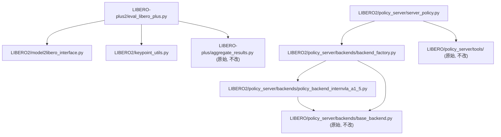

# eval2.md 改良计划 (2026-09-15)

> **目的**: 分析 `eval2.md` 与当前代码库实际状态的差距，给出完整改良计划。  
> **背景**: 用户已将 `evaluation/LIBERO/` 和 `evaluation/LIBERO-plus/` 恢复为原始状态；所有新代码须在 `evaluation/LIBERO2/` 和 `evaluation/LIBERO-plus2/` 中创建，旧目录仅作参考。新代码可以通过 Python import 扩展旧目录中的代码。

---

## 一、现状：原始代码与 eval2.md 描述的差距

### 1.1 原始 `evaluation/LIBERO/` 中存在的已知 Bug

| # | 文件 | 位置 | Bug 描述 | 影响 |
|---|------|------|----------|------|
| B1 | `model2libero_interface.py` | L204 | Gripper 二值化硬编码 OpenVLA 约定 `action[6] < 0.5 → +1` | **SR=0%**，夹爪方向完全反转 |
| B2 | `policy_server/backends/policy_backend_internvla_a1_5.py` | L148 | `use_fast_action_tokens=False` 硬编码，应读取 checkpoint config | Prompt suffix 不匹配训练，action 质量下降 |

B1、B2 是当前最关键的 bug，会导致评估结果完全错误。

### 1.2 原始代码中完全缺失的功能（eval2.md 称"已完成"但实际不存在）

以下功能在 eval2.md 中以"已实施"口吻描述，但在原始目录中**不存在**，必须在 LIBERO2/LIBERO-plus2 中创建：

| # | 功能 | eval2.md 章节 | 需创建文件 |
|---|------|--------------|-----------|
| F1 | KeypointExtractor + KeypointHistory | §13-14 | `evaluation/LIBERO2/keypoint_utils.py` |
| F2 | model2libero_interface 含 kpt_history | §14.2.1 | `evaluation/LIBERO2/model2libero_interface.py` |
| F3 | policy_backend 含 kpt batch 注入 + use_fast_action_tokens 修复 | §14.2.2, §17.1 | `evaluation/LIBERO2/policy_server/backends/policy_backend_internvla_a1_5.py` |
| F4 | eval_libero_plus.py 全功能版 | §14.2.3 | `evaluation/LIBERO-plus2/eval_libero_plus.py` |
| F5 | run_eval_libero_plus_venv.sh (venv 版启动器) | §14.2.5 | `evaluation/LIBERO-plus2/run_eval_libero_plus_venv.sh` |
| F6 | replay_episode.py (动作序列回放) | §18 | `evaluation/LIBERO-plus2/replay_episode.py` |
| F7 | 单元测试 | §14.1.2 | `tests/test_keypoint_utils.py` |

### 1.3 原始 `eval_libero_plus.py` 中缺失的功能

对比原始 `evaluation/LIBERO-plus/eval_libero_plus.py`，新版需增加：

| 功能 | 原始 | 新版需求 | eval2.md 章节 |
|------|------|---------|--------------|
| `--gripper_convention` 参数 | 无（无 gripper 参数，binarize 逻辑在 client 内） | `auto`/`libero_native`/`openvla` 三种模式 | §11.1 |
| `--categories` 过滤 | 无 | 逗号分隔字符串，仅评估指定扰动类 | §16.2 |
| `--task_ids` 精确指定 | 无 | 逗号分隔 task id，与 shard 互斥 | §16.6 |
| `--enable_keypoints` / `--kpt_r_pad` / `--kpt_history_max_len` | 无 | 4D 关键点提取控制 | §14.2.3, §15.1, §15.3 |
| `--save_actions` | 无 | 保存 episode 动作序列到 `.npz` | §18.3 |
| Per-task `try-except` | 无（单任务异常崩溃整个 shard） | 捕获异常，记为失败并继续 | §17.5 |
| `evaluate_task()` 返回 action_logs | 只返回 `(successes, task_description)` | 返回 `(successes, task_description, action_logs)` | §18.3.2 |

### 1.4 LIBERO-plus 外部库 NumPy 2.x 兼容性补丁

这两个 bug 在 `/home/a26113/DATA/LIBERO-plus/libero/libero/envs/env_wrapper.py` 中，不在本项目代码里，需要打补丁：

| # | 位置 | Bug | 影响 |
|---|------|-----|------|
| B3 | `env_wrapper.py:52` | `np.fromstring(blob, np.uint8)` → `np.frombuffer` | Sensor Noise 类别任务崩溃 |
| B4 | `env_wrapper.py:105` | `np.float_` → `np.float64` | Sensor Noise 类别任务崩溃 |

---

## 二、新目录结构设计

### 2.1 `evaluation/LIBERO2/`

```
evaluation/LIBERO2/
├── __init__.py
├── keypoint_utils.py                      # [NEW] KeypointExtractor + KeypointHistory
├── model2libero_interface.py              # [MOD] +gripper_convention +kpt_history 支持
└── policy_server/
    ├── __init__.py
    ├── server_policy.py                   # [MOD] 改为 import LIBERO2 的 backend_factory
    └── backends/
        ├── __init__.py
        ├── backend_factory.py             # [MOD] import LIBERO2 的 InternVLAA15Backend
        └── policy_backend_internvla_a1_5.py  # [MOD] kpt 注入 + use_fast_action_tokens 修复
```

**不需要在 LIBERO2 中创建**（从 LIBERO/ 直接 import）：
- `policy_server/backends/base_backend.py`
- `policy_server/backends/canonical_preprocess.py`
- `policy_server/backends/input_semantics.py`
- `policy_server/backends/policy_backend_pi05.py`
- `policy_server/tools/`（websocket server/client/msgpack）

### 2.2 `evaluation/LIBERO-plus2/`

```
evaluation/LIBERO-plus2/
├── __init__.py
├── eval_libero_plus.py                    # [MOD] 全功能版，import 从 LIBERO2
├── aggregate_results.py                   # [COPY/import from LIBERO-plus/] 无修改
├── replay_episode.py                      # [NEW] 动作序列回放
└── run_eval_libero_plus_venv.sh           # [NEW] venv 版启动器
```

### 2.3 跨目录 import 关系



---

## 三、各文件详细修改说明

### 3.1 `evaluation/LIBERO2/keypoint_utils.py` [NEW]

从 eval2.md §14.1.1 中的完整代码实现。关键点：

- `KeypointExtractor.__init__()`: 存 `self._env = env`（不是 `self.sim = env.sim`，避免 env.reset() 后引用失效的 Bug B5/§17.2）
- `KeypointExtractor.extract()`: 每次调用时 `sim = self._env.sim`
- `KeypointHistory.__init__()`: 默认 `max_len=200`（与训练 config 一致，§15.3）
- 归一化：位置 `/ DEFAULT_R_PAD`，四元数 wxyz → xyzw + 半球归一化
- `DEFAULT_R_PAD = 2.094463091888699`（`keypoints_meta.json:bbox_radius=1.8213 × 1.15`）

### 3.2 `evaluation/LIBERO2/model2libero_interface.py` [MOD]

基于 `evaluation/LIBERO/model2libero_interface.py`，新增：

1. **`gripper_convention` 参数**（§11.1）：
   - `LiberoModelClient.__init__()` 新增 `gripper_convention: str = "auto"` 参数
   - `_update_action_space()` 实现 `auto` 模式：从 server 返回的 `action_space.low[6]` 自动判断：`< -0.5` → `libero_native`
   - `step()` 中替换 gripper binarization 逻辑：
     ```python
     # 原始（有 bug）:
     action[6] = 1.0 if action[6] < 0.5 else -1.0  # OpenVLA 约定

     # 修复后:
     if convention == "openvla":
         action[6] = 1.0 if action[6] < 0.5 else -1.0
     else:  # libero_native 或 auto 检测为 libero_native
         action[6] = 1.0 if action[6] > 0 else -1.0
     ```

2. **`kpt_history` 支持**（§14.2.1）：
   - `_request_chunk(obs, lang, kpt_history=None)` — 可选传入 `(his_kpts [H,8,7], his_len: int)`
   - `step(obs, lang, kpt_history=None)` — 透传 kpt_history

### 3.3 `evaluation/LIBERO2/policy_server/backends/policy_backend_internvla_a1_5.py` [MOD]

基于 `evaluation/LIBERO/policy_server/backends/policy_backend_internvla_a1_5.py`，修复两个 Bug：

1. **B2: use_fast_action_tokens 修复**（§3.6, §17.1）：
   ```python
   # 原始（有 bug）:
   use_fast_action_tokens=False,

   # 修复后:
   use_fast_action_tokens=bool(getattr(config, "use_fast_action_tokens", True)),
   ```

2. **kpt batch 注入**（§14.2.2）：
   在 `_prepare_single()` 末尾新增：
   ```python
   if "kpt_history" in example and example["kpt_history"] is not None:
       his_kpts = np.asarray(example["kpt_history"], dtype=np.float32)
       his_len = int(example.get("kpt_history_len", 0))
       sample["observation.his_kpts"] = torch.from_numpy(his_kpts)
       sample["observation.his_len"] = torch.tensor(his_len, dtype=torch.long)
   ```

   注意：`predict_action_chunk()` 中 `batch.get("observation.his_kpts")` 已有代码，无需改模型。

### 3.4 `evaluation/LIBERO2/policy_server/backend_factory.py` [MOD]

唯一改动：将 `InternVLAA15Backend` 的 import 从 LIBERO 改为 LIBERO2：

```python
# 原始:
from .policy_backend_internvla_a1_5 import InternVLAA15Backend

# LIBERO2 版:
from evaluation.LIBERO2.policy_server.backends.policy_backend_internvla_a1_5 import InternVLAA15Backend
# 其他 import 保持不变（base_backend, PI05Backend 等来自 LIBERO）
from evaluation.LIBERO.policy_server.backends.base_backend import PROTOCOL_VERSION
from evaluation.LIBERO.policy_server.backends.policy_backend_pi05 import PI05Backend
```

### 3.5 `evaluation/LIBERO2/policy_server/server_policy.py` [MOD]

唯一改动：将 import 路径从 LIBERO 改为 LIBERO2：

```python
# 原始:
from evaluation.LIBERO.policy_server.backends.backend_factory import build_backend
from evaluation.LIBERO.policy_server.tools.websocket_policy_server import WebsocketPolicyServer

# LIBERO2 版:
from evaluation.LIBERO2.policy_server.backends.backend_factory import build_backend
from evaluation.LIBERO.policy_server.tools.websocket_policy_server import WebsocketPolicyServer  # 不变
```

### 3.6 `evaluation/LIBERO-plus2/eval_libero_plus.py` [MOD]

基于 `evaluation/LIBERO-plus/eval_libero_plus.py`，主要改动：

1. **import 路径**：从 LIBERO → LIBERO2：
   ```python
   from evaluation.LIBERO2.model2libero_interface import LiberoModelClient
   ```

2. **新增 CLI 参数**（§11.1, §14.2.3, §15.1, §15.3, §18.3.1）：
   - `--gripper_convention` (default: `"auto"`, choices: `auto/libero_native/openvla`)
   - `--categories` (default: None, 逗号分隔)
   - `--task_ids` (default: None, 逗号分隔)
   - `--enable_keypoints / --no-enable_keypoints` (BooleanOptionalAction, default: `True`)
   - `--kpt_r_pad` (default: `DEFAULT_R_PAD`)
   - `--kpt_history_max_len` (default: `200`)
   - `--save_actions / --no-save_actions` (BooleanOptionalAction, default: `False`)
   - `--debug` (已有)

3. **evaluate_task() 增加关键点逻辑**（§14.2.3）：
   - 创建 `KeypointExtractor` + `KeypointHistory`
   - 每步 `env.step()` 后 `kpt_history_buf.push(kpt_extractor.extract())`
   - 推理时传 `client.step(obs, lang, kpt_history=kpt_hist)`
   - 收集 `episode_actions: list[np.ndarray]`，返回第三个值 `action_logs`

4. **evaluate_policy() 增加 per-task try-except**（§17.5）：
   ```python
   try:
       successes, task_desc, action_logs = evaluate_task(...)
   except Exception as e:
       LOGGER.error("task_id=%d CRASHED: %s", task_id, e)
       successes = [False] * min(args.num_trials_per_task, len(initial_states))
       task_desc = clean_name
       action_logs = []
   ```

5. **action 保存逻辑**（§18.3.3）：
   ```python
   if args.save_actions and action_logs:
       for ep_idx, (ep_actions, ep_success) in enumerate(zip(action_logs, successes)):
           np.savez_compressed(actions_dir / f"task_{task_id}_ep{ep_idx}.npz", ...)
   ```

6. **categories 过滤**（`--categories`）：
   ```python
   if args.categories:
       allowed = set(c.strip() for c in args.categories.split(","))
       if category not in allowed:
           continue
   ```

7. **imageio 延迟导入**（§四, SIGABRT 修复方案 A）：
   ```python
   # 不在文件顶层 import imageio
   # 在 evaluate_task() 内，仅当需要存视频时才 import:
   if args.save_videos and replay_images:
       import imageio  # 延迟导入，避免 imageio 在启动时注册信号处理器干扰 MuJoCo EGL
       imageio.mimwrite(...)
   ```

### 3.7 `evaluation/LIBERO-plus2/run_eval_libero_plus_venv.sh` [NEW]

基于原始 `run_eval_libero_plus.sh`（conda 版），改为 venv 版，并新增所有参数：

```bash
# venv 激活改为:
source "${SERVER_VENV}/bin/activate"   # 不是 conda activate
source "${CLIENT_VENV}/bin/activate"

# 新增变量（参见 eval2.md §16.2）:
SERVER_VENV="${SERVER_VENV:-/B/VENV/itnvla15rbt20}"
CLIENT_VENV="${CLIENT_VENV:-/B/VENV/libero_plus_client}"  # 保持此名
STATS_KEY_MODE="${STATS_KEY_MODE:-suite}"
ROBOT_TYPE_MODE="${ROBOT_TYPE_MODE:-suite}"
GRIPPER_CONVENTION="${GRIPPER_CONVENTION:-auto}"
DISABLE_KEYPOINTS="${DISABLE_KEYPOINTS:-}"
KPT_R_PAD="${KPT_R_PAD:-}"
KPT_HISTORY_MAX_LEN="${KPT_HISTORY_MAX_LEN:-}"
SAVE_ACTIONS_FLAG="${SAVE_ACTIONS_FLAG:-}"

# client 子 shell 新增（CRITICAL）:
export LIBERO_CONFIG_PATH="${LIBERO_CONFIG_DIR}"
export __EGL_VENDOR_LIBRARY_DIRS="${CLIENT_VENV}/egl_vendor.d"
export LD_LIBRARY_PATH="${CLIENT_VENV}/lib:${LD_LIBRARY_PATH:-}"
PYTHONPATH="${LIBERO_HOME}:${PROJ_ROOT}:${PYTHONPATH:-}"

# server 命令从 LIBERO/ 改为 LIBERO2/:
python evaluation/LIBERO2/policy_server/server_policy.py ...

# client 命令从 LIBERO-plus/ 改为 LIBERO-plus2/:
python evaluation/LIBERO-plus2/eval_libero_plus.py ...
```

### 3.8 `evaluation/LIBERO-plus2/replay_episode.py` [NEW]

从 eval2.md §18.4 实现，关键注意：
- `import imageio` 放在函数内部（延迟导入）
- 使用 `evaluation/LIBERO-plus/` 的 `OffScreenRenderEnv`（venv 中直接 import libero）

---

## 四、SIGABRT Crash 调查计划（§19 扩充）

> **现状**：eval2.md §19 已记录崩溃症状和已排除的根因，但缺乏具体测试步骤。

### 4.1 最可能的根因：imageio 顶层 import

**假设**：`imageio`（特别是 `imageio-ffmpeg` 或 `imageio.plugins.pillow`）在模块 import 时注册了 atexit 处理器或修改了信号处理，影响了 MuJoCo 的 EGL/OpenGL 上下文生命周期，导致在真实 action 的第一次渲染时 SIGABRT。

**证据**：
- 脚本顶层 `import imageio`，inline 代码无此 import
- 崩溃发生在 dummy steps 之后的第一个真实 `env.step()`（此时首次调用 `read_pixels`）
- 相同的 kpt + infer + step 在 inline 中不崩溃

### 4.2 验证步骤（二分法）

```bash
# 环境准备（一次性）
source /B/VENV/libero_plus_client/bin/activate
export PYTHONPATH="/home/a26113/DATA/LIBERO-plus:/B/SRC/itvlaGpLibPlus:${PYTHONPATH:-}"
export __EGL_VENDOR_LIBRARY_DIRS="/B/VENV/libero_plus_client/egl_vendor.d"
export LIBERO_CONFIG_PATH="/tmp/test_sigabrt/libero_config"
mkdir -p "${LIBERO_CONFIG_PATH}"
# 写 config.yaml...
```

**测试 A（确认 imageio 是触发因素）**：

```python
# /tmp/test_a.py — 在 inline 成功的代码基础上加 imageio import
import faulthandler; faulthandler.enable()
import imageio          # ← 新增这一行，其他不变
import os, sys, numpy as np
os.environ.setdefault("MUJOCO_GL", "egl")
os.environ.setdefault("PYOPENGL_PLATFORM", "egl")
# ... 原先 inline 成功的代码 (kpt + infer + env.step) ...
```

若此测试崩溃 → 确认 imageio 是根因。

**测试 B（定位哪个 imageio 子模块）**：

```python
import imageio.core     # 仅 core
# vs
import imageio.plugins  # plugins（含 ffmpeg/pillow）
```

**测试 C（确认延迟 import 修复）**：
运行完整 `evaluation/LIBERO-plus/eval_libero_plus.py`，但将顶层 `import imageio` 移到函数内部（只在 `save_videos=True` 时才 import）。

### 4.3 修复方案（优先级排序）

| 方案 | 可行性 | 说明 |
|------|--------|------|
| **A（推荐）: 延迟 import imageio** | 高，1 行代码 | 在 `evaluate_task()` 内 `if args.save_videos: import imageio` |
| B: 在首次推理前 warm-up EGL | 中 | `env.render()` 或 dummy `read_pixels` 使 EGL 完全初始化 |
| C: 用 `subprocess` 隔离 | 低，复杂 | 将每个 shard 运行在子进程中，彻底隔离 import 状态 |

### 4.4 修复验证

修复后需验证：
1. `python evaluation/LIBERO-plus2/eval_libero_plus.py --start_idx 0 --end_idx 1 ...` 完成 1 个任务不崩溃
2. 多 GPU 并发 smoke test 通过（`--start_idx 0 --end_idx 4`，4 个任务）
3. 全量评估启动

---

## 五、eval2.md 内容本身需要修改的地方

### 5.1 代码路径引用（54+51 处，须批量替换）

原始 `eval2.md` 中所有代码路径引用仍指向旧目录。以下是需要改的对应关系：

| 旧路径 | 新路径 | 备注 |
|--------|--------|------|
| `evaluation/LIBERO/model2libero_interface.py` | `evaluation/LIBERO2/model2libero_interface.py` | 修改了 |
| `evaluation/LIBERO/keypoint_utils.py` | `evaluation/LIBERO2/keypoint_utils.py` | 新建在 LIBERO2 |
| `evaluation/LIBERO/policy_server/backends/policy_backend_internvla_a1_5.py` | `evaluation/LIBERO2/policy_server/backends/policy_backend_internvla_a1_5.py` | 修改了 |
| `evaluation/LIBERO/policy_server/backends/backend_factory.py` | `evaluation/LIBERO2/policy_server/backends/backend_factory.py` | 修改了 |
| `evaluation/LIBERO/policy_server/server_policy.py` | `evaluation/LIBERO2/policy_server/server_policy.py` | 修改了 |
| `evaluation/LIBERO-plus/eval_libero_plus.py` | `evaluation/LIBERO-plus2/eval_libero_plus.py` | 修改了 |
| `evaluation/LIBERO-plus/run_eval_libero_plus_venv.sh` | `evaluation/LIBERO-plus2/run_eval_libero_plus_venv.sh` | 新建在 LIBERO-plus2 |
| `evaluation/LIBERO-plus/aggregate_results.py` | 保持不变（无修改）| — |

**不需要改的路径**（保留指向原始 LIBERO/）：
- `evaluation/LIBERO/policy_server/backends/base_backend.py`（未修改）
- `evaluation/LIBERO/policy_server/backends/canonical_preprocess.py`（未修改）
- `evaluation/LIBERO/policy_server/backends/input_semantics.py`（未修改）
- `evaluation/LIBERO/policy_server/tools/`（未修改）
- `evaluation/LIBERO/eval_libero_server_client.py`（LIBERO-plus 评估不用此文件）
- `evaluation/LIBERO-plus/README.md`（参考文档）

### 5.2 §7 命令行脚本路径更新

| 位置 | 旧命令 | 新命令 |
|------|--------|--------|
| §7.2 server | `python evaluation/LIBERO/policy_server/server_policy.py` | `python evaluation/LIBERO2/policy_server/server_policy.py` |
| §7.2 client | `python evaluation/LIBERO-plus/eval_libero_plus.py` | `python evaluation/LIBERO-plus2/eval_libero_plus.py` |
| §7.3 shell | `bash evaluation/LIBERO-plus/run_eval_libero_plus_venv.sh` | `bash evaluation/LIBERO-plus2/run_eval_libero_plus_venv.sh` |
| §7.3 结果 | `python evaluation/LIBERO-plus/aggregate_results.py` | 不变 |
| §11.4 补跑示例 | `evaluation/LIBERO/policy_server/server_policy.py` | `evaluation/LIBERO2/...` |
| §18.8.3 测试示例 | server/client 命令 | 同上 |

### 5.3 §13.6 文件改动图需更新

将所有 `evaluation/LIBERO/` 节点改为 `evaluation/LIBERO2/`，将 `evaluation/LIBERO-plus/` 节点改为 `evaluation/LIBERO-plus2/`。

### 5.4 §14.3.2 验收结果状态

§14.3.2 中的表格显示"17/17 PASSED 已通过"，但这是在之前会话中对已（临时）创建代码的测试结果。由于代码已恢复，须标注"待重新创建并验证"。

### 5.5 §14.5 运行方法命令路径

更新 `CKPT_PATH`、`CLIENT_VENV` 路径，以及 `bash run_eval_libero_plus_venv.sh` 路径。

### 5.6 §16.2 CLIENT_VENV 默认值说明

§16.2 表格中 `CLIENT_VENV` 默认值显示为 `/mnt/r/VENV/ivla15_libero_plus_client`（原始脚本的硬编码默认），现在 LIBERO-plus2 的 venv 脚本默认改为 `/B/VENV/libero_plus_client`。需更新该行。

### 5.7 §19 SIGABRT 章节扩充

将 §四（本文件）中的验证步骤、修复方案纳入 §19。

---

## 六、优先级排序与执行计划

### Phase 0 — SIGABRT 调查（立即，当前 BLOCKER）

1. 运行测试 A（imageio import 触发验证），耗时 ~20 分钟
2. 确认根因后实施修复方案 A（延迟 import）
3. 用修复后的 `eval_libero_plus.py` 跑 smoke test（1 任务）
4. 通过 → 进入 Phase 1

### Phase 1 — 创建 LIBERO2/（含代码验证），~3h

| 步骤 | 文件 | 动作 |
|------|------|------|
| 1a | `LIBERO2/__init__.py` | 创建（空或包注释）|
| 1b | `LIBERO2/keypoint_utils.py` | 新建（从 eval2.md §14.1.1 实现）|
| 1c | `LIBERO2/model2libero_interface.py` | 基于 `LIBERO/model2libero_interface.py` 修改（B1 修复 + kpt_history）|
| 1d | `LIBERO2/policy_server/` | 创建目录结构 + `__init__.py` |
| 1e | `LIBERO2/policy_server/backends/policy_backend_internvla_a1_5.py` | 修改（B2 修复 + kpt 注入）|
| 1f | `LIBERO2/policy_server/backends/backend_factory.py` | 修改（import 改为 LIBERO2 的 InternVLAA15Backend）|
| 1g | `LIBERO2/policy_server/server_policy.py` | 修改（import 改为 LIBERO2 的 backend_factory）|
| 1h | `tests/test_keypoint_utils.py` | 新建（从 eval2.md §14.1.2 实现）|
| 1i | 验证 | `python -m pytest tests/test_keypoint_utils.py -v` |
| 1j | 验证 | Server smoke test（加载 checkpoint，healthcheck 7 项）|

### Phase 2 — 创建 LIBERO-plus2/（含完整集成测试），~2h

| 步骤 | 文件 | 动作 |
|------|------|------|
| 2a | `LIBERO-plus2/__init__.py` | 创建 |
| 2b | `LIBERO-plus2/eval_libero_plus.py` | 基于 LIBERO-plus/ 修改（所有新功能）|
| 2c | `LIBERO-plus2/aggregate_results.py` | 从 LIBERO-plus/ 复制（无修改，仅更改目录）|
| 2d | `LIBERO-plus2/replay_episode.py` | 新建（从 eval2.md §18.4 实现）|
| 2e | `LIBERO-plus2/run_eval_libero_plus_venv.sh` | 新建（venv 版，含所有参数）|
| 2f | 验证 argparse | `python evaluation/LIBERO-plus2/eval_libero_plus.py --help` |
| 2g | 验证 | smoke test：1 GPU，4 tasks |

### Phase 3 — 外部库补丁 + 环境验证，~0.5h

| 步骤 | 动作 |
|------|------|
| 3a | 给 `env_wrapper.py:52` 打 np.fromstring 补丁 |
| 3b | 给 `env_wrapper.py:105` 打 np.float_ 补丁 |
| 3c | 验证：运行 Sensor Noise 类别任务不崩溃 |

### Phase 4 — 更新 eval2.md，~1h

1. 批量替换代码路径（§5.1 表格）
2. 更新 §7 命令行
3. 更新 §13.6 文件改动图
4. 更新 §14.3.2 验收状态
5. 更新 §16.2 CLIENT_VENV 默认值
6. 扩充 §19（加入 §四 的测试步骤）

### Phase 5 — 全量评估，~10h（eval 运行）

```bash
cd /B/SRC/itvlaGpLibPlus
export CKPT_PATH=".../checkpoints/032070/pretrained_model"
export LIBERO_HOME="/home/a26113/DATA/LIBERO-plus"
export VLM_MODEL_PATH="/B/VENV/hf_home/hub/models--Qwen--Qwen3.5-2B/snapshots/15852e8c16360a2fea060d615a32b45270f8a8fc"
export SERVER_VENV="/B/VENV/itnvla15rbt20"
export CLIENT_VENV="/B/VENV/libero_plus_client"
export STATS_KEY_MODE="panda"
export ROBOT_TYPE_MODE="panda"
export GRIPPER_CONVENTION="libero_native"
export GPU_IDS="0,1,2,3,4,5,6,7"
export SHARDS_PER_SUITE="8"
export NO_VIDEO_FLAG="--no-save_videos"
export SAVE_ACTIONS_FLAG="--save_actions"
export EVAL_LOG_DIR=".../eval_libero_plus/step_032070/full_$(date +%Y%m%d_%H%M%S)"
nohup bash evaluation/LIBERO-plus2/run_eval_libero_plus_venv.sh \
    > "${EVAL_LOG_DIR%/*}/full_eval.log" 2>&1 &
```

---

## 七、完整文件创建清单（最终 deliverable）

| 文件 | 类型 | 基础来源 |
|------|------|---------|
| `evaluation/LIBERO2/__init__.py` | NEW（空） | — |
| `evaluation/LIBERO2/keypoint_utils.py` | NEW | eval2.md §14.1.1 |
| `evaluation/LIBERO2/model2libero_interface.py` | MOD | `LIBERO/model2libero_interface.py` |
| `evaluation/LIBERO2/policy_server/__init__.py` | NEW（空） | — |
| `evaluation/LIBERO2/policy_server/backends/__init__.py` | NEW（空） | — |
| `evaluation/LIBERO2/policy_server/backends/backend_factory.py` | MOD | `LIBERO/policy_server/backends/backend_factory.py` |
| `evaluation/LIBERO2/policy_server/backends/policy_backend_internvla_a1_5.py` | MOD | `LIBERO/policy_server/backends/policy_backend_internvla_a1_5.py` |
| `evaluation/LIBERO2/policy_server/server_policy.py` | MOD | `LIBERO/policy_server/server_policy.py` |
| `evaluation/LIBERO-plus2/__init__.py` | NEW（空） | — |
| `evaluation/LIBERO-plus2/eval_libero_plus.py` | MOD | `LIBERO-plus/eval_libero_plus.py` |
| `evaluation/LIBERO-plus2/aggregate_results.py` | COPY | `LIBERO-plus/aggregate_results.py` |
| `evaluation/LIBERO-plus2/replay_episode.py` | NEW | eval2.md §18.4 |
| `evaluation/LIBERO-plus2/run_eval_libero_plus_venv.sh` | NEW | `LIBERO-plus/run_eval_libero_plus.sh` (conda→venv) |
| `tests/test_keypoint_utils.py` | NEW | eval2.md §14.1.2 |

**外部库补丁**（不在 git 中，手动打）：
| 文件 | 改动 |
|------|------|
| `/home/a26113/DATA/LIBERO-plus/libero/libero/envs/env_wrapper.py:52` | `np.fromstring` → `np.frombuffer` |
| `/home/a26113/DATA/LIBERO-plus/libero/libero/envs/env_wrapper.py:105` | `np.float_` → `np.float64` |
