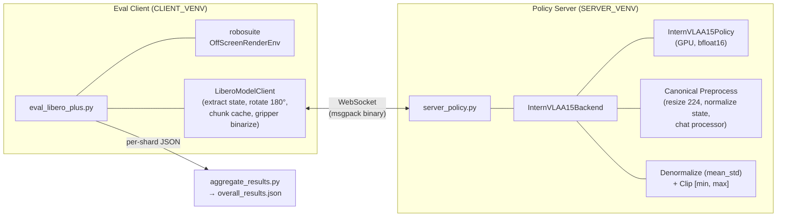
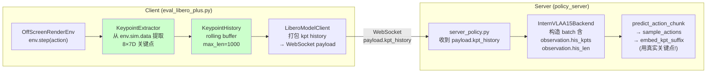
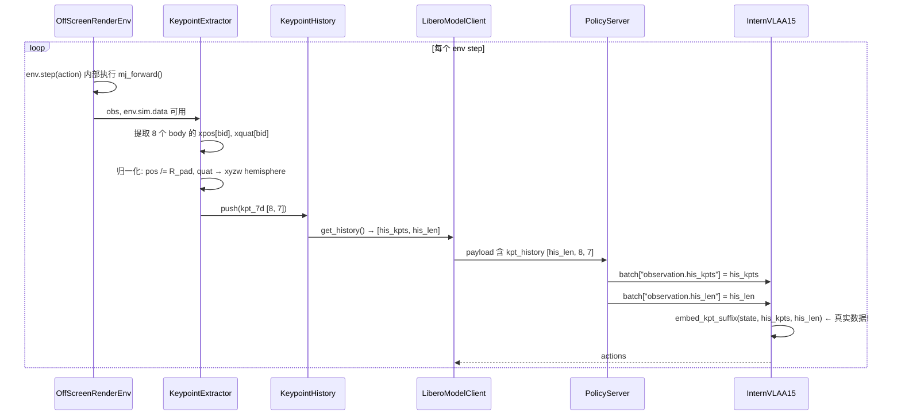
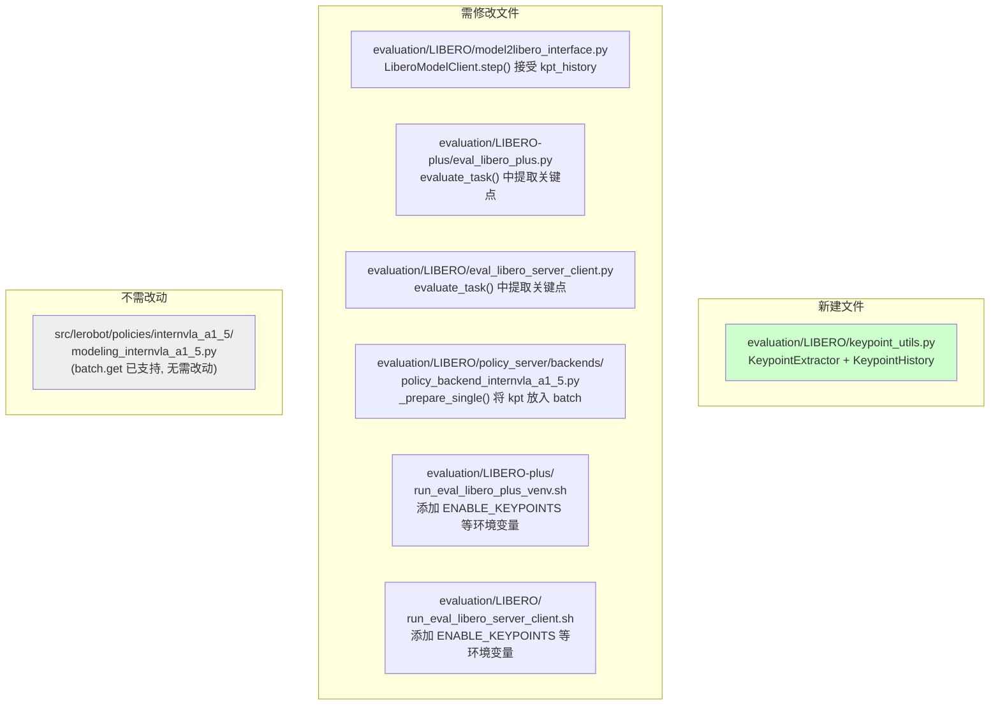
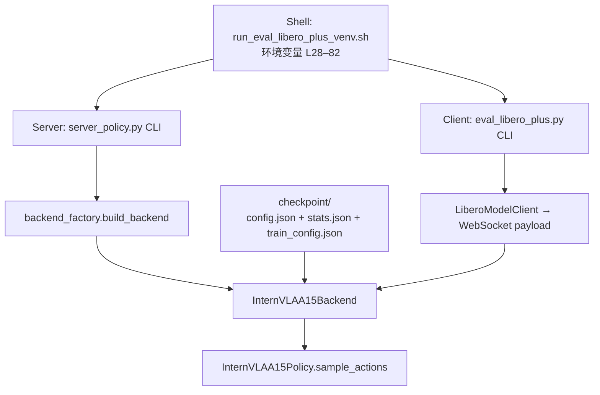

# LIBERO-plus 评估实施方案与操作手册

> 对保存在 `/home/a26113/b/Ckp/4dwvlaOpvlaLibplusKpt0911/2026_09_12_08_52_49-internvla_a1_5-libplus-sft/checkpoints/032070/pretrained_model/` 中的 InternVLA-A1.5 + GeoP (3D Keypoint) checkpoint 进行 LIBERO-plus 零样本鲁棒性评估的完整实施方案.
>
> **本文档面向没有该项目经验的第三方工程师**, 按步骤操作即可完成评估.

---

## 一. 评估对象

### 1.1 Checkpoint 信息

| 项目 | 值 | 来源 |
|------|-----|------|
| **Checkpoint 路径** | `/home/a26113/b/Ckp/4dwvlaOpvlaLibplusKpt0911/2026_09_12_08_52_49-internvla_a1_5-libplus-sft/checkpoints/032070/pretrained_model/` | 用户指定 |
| **模型类型** | InternVLA-A1.5 + GeoP keypoint predictor | [`config.json:2`](../../evaluation/LIBERO/policy_server/backends/backend_factory.py#L96) `type: "internvla_a1_5"` |
| **训练数据集** | `opvla_libero_merged_kpt` (LIBERO 4 子集合并 + 3D 关键点) | `train_config.json:5` `repo_id` |
| **训练步数** | 32070 / 53450 (60%, 中间 checkpoint) | 目录名 `032070` |
| **模型大小** | 5.9 GB (`model.safetensors`, bfloat16) | 实测 |
| **Chunk size** | 50 steps | `config.json:32` `chunk_size: 50` |
| **Stats key** | `panda` (stats.json 中唯一的顶层 key) | 实测 `stats.json` |
| **训练时的 action_mode** | `joint` | `train_config.json:173` `action_mode: "joint"` |
| **训练时的 normalize mode** | `mean_std` | `train_config.json:114` `mode: "mean_std"` |
| **训练时的 tokenize_state** | `true` | `train_config.json:166` |
| **训练时的 max_prompt_length** | `650` | `train_config.json:160` `max_length: 650` |
| **训练时的 resize** | `224 × 224` | `train_config.json:96-97` |
| **训练时的 enable_keypoint_predictor** | `true` | `config.json:94` |
| **训练时的 kpt_4d_mode** | `pos_rot` (7D) | `config.json:119` |
| **训练时的 use_fast_action_tokens** | `true` | `train_config.json:211` (`dataset` 级别), `config.json:32` (`InternVLAA15Config` 默认 `True`), `launch/internvla_a15_finetune.sh:123` 显式设置 |

### 1.2 训练状态

> 训练仍在进行中 (截至 2026-09-15). 8 × H200 GPU 全部被训练任务占用, 当前进度 ~60% (step 32070/53450). 最终 checkpoint 预计于 2026-09-15 内完成.
>
> 用户指定评估的 checkpoint **step_032070** 已保存完毕 (2026-09-14), 可安全读取. **step_026725** (2026-09-14 的首次评估) 的初步结果见 §17.6.

### 1.3 评估基准: LIBERO-plus

[LIBERO-plus](https://github.com/sylvestf/LIBERO-plus) 是 LIBERO 的扰动鲁棒性评估扩展. 覆盖 4 个 LIBERO 子集 × 7 类扰动, 共 **10030 个任务** (每个任务 1 trial):

| 子集 | 任务数 | Camera | Robot | Language | Light | Background | Noise | Layout |
|------|--------|--------|-------|----------|-------|------------|-------|--------|
| libero_spatial | 2402 | 376 | 350 | 390 | 292 | 258 | 351 | 385 |
| libero_object | 2518 | 396 | 398 | 354 | 297 | 248 | 422 | 403 |
| libero_goal | 2591 | 408 | 409 | 410 | 279 | 281 | 379 | 425 |
| libero_10 | 2519 | 419 | 393 | 383 | 274 | 289 | 449 | 312 |
| **合计** | **10030** | 1599 | 1550 | 1537 | 1142 | 1076 | 1601 | 1525 |

**评估指标**: 各扰动类别的 Success Rate (%), 与 LIBERO-plus 排行榜格式一致: `Camera | Robot | Language | Light | Background | Noise | Layout | Total`.

## 二. 系统架构

### 2.1 Server-Client 分离架构

评估采用 **WebSocket Server-Client 分离架构**: 模型推理 (GPU) 与仿真环境 (CPU, 旧版 robosuite) 在不同 Python 环境中运行, 通过 WebSocket + msgpack 通信.



### 2.2 数据流 (含 4D Keypoint, §14 后)

```mermaid
sequenceDiagram
    participant Env as robosuite Env
    participant KPT as KeypointExtractor<br/>+ KeypointHistory
    participant Client as LiberoModelClient
    participant Server as InternVLAA15Backend
    participant Model as InternVLAA15Policy

    Client->>Env: env.reset() + set_init_state()
    Env-->>Client: obs
    Note over KPT: kpt_history_buf.reset()
    Client->>KPT: extract() — 初始状态关键点
    KPT-->>Client: kpts [8,7]
    Note over KPT: push(kpts) → his_len=1

    loop 每 replan_steps=8 步重新推理
        Client->>Client: 提取 8D state (eef_pos[3] + axisangle[3] + gripper_qpos[2])
        Client->>Client: 旋转图像 180° ([::-1, ::-1])
        Client->>KPT: get_history() → (buf[1000,8,7], his_len)
        Client->>Server: WebSocket 发送 {image, state[8], lang,<br/>kpt_history[1000,8,7], kpt_history_len}

        Server->>Server: resize 224×224 → normalize state (mean_std)
        Server->>Server: _prepare_single: kpt → observation.his_kpts + his_len tensors
        Server->>Server: chat_processor → 构建 prompt "Control Mode: <joint>;"
        Server->>Model: predict_action_chunk() → embed_kpt_suffix(real kpts!) → flow matching 10 steps
        Model-->>Server: normalized chunk [1, 50, 7]
        Server->>Server: denorm = chunk × std + mean → clip [action_min, action_max]
        Server-->>Client: {actions: [1, 50, 7], action_space: {low, high}}

        loop 使用 chunk 中的 8 个 action
            Client->>Client: action = chunk[step % 8]
            Client->>Client: gripper 二值化 (libero_native: threshold=0)
            Client->>Env: env.step(action[7D])
            Env-->>Client: obs, reward, done, info
            Client->>KPT: extract() — 每步后提取新关键点
            Note over KPT: push(kpts) → his_len++
        end
    end
```

## 三. 所有生效参数值及其来源

> **以下是本次评估中每个影响结果的参数的生效值、含义、以及该值在哪个文件哪一行被设定.** 这些值是经过代码审计确认的, 必须严格使用.

### 3.1 CRITICAL: `STATS_KEY_MODE` 和 `ROBOT_TYPE_MODE` 必须都设为 `panda`

这两个变量决定了传给 Server 的 `--stats_key` 和 `--robot_type`, 是最容易出错的配置:

| 变量 | **必须设为** | **脚本默认值** | **为什么默认值错误** |
|------|-------------|---------------|-------------------|
| `STATS_KEY_MODE` | **`panda`** | `suite` ([`run_eval_libero_plus_venv.sh:67`](../../evaluation/LIBERO-plus/run_eval_libero_plus_venv.sh#L67)) | 默认值 `suite` 会把 suite 名 (如 `libero_goal`) 作为 stats key, 但 `stats.json` 中只有 `panda` key → **`KeyError` 崩溃** ([`base_backend.py:83-84`](../../evaluation/LIBERO/policy_server/backends/base_backend.py#L83-L84)) |
| `ROBOT_TYPE_MODE` | **`panda`** | `suite` ([`run_eval_libero_plus_venv.sh:68`](../../evaluation/LIBERO-plus/run_eval_libero_plus_venv.sh#L68)) | 默认值 `suite` 会使用 `libero_goal` 等 schema, 它们定义 `action_mode: end_effector` ([`libero.yaml:21`](../../src/lerobot/dataset_schemas/configs/libero.yaml#L21)) → 生成 prompt tag `"Control Mode: <end_effector>;"` → **与训练时 `"Control Mode: <joint>;"` 不匹配** → 性能严重下降 |

**`panda` schema 的关键内容** ([`panda.yaml`](../../src/lerobot/dataset_schemas/configs/panda.yaml)):

```yaml
robot_type: panda
image_mapping:
  observation.images.image: observation.images.image0    # → agentview
  observation.images.image2: observation.images.image1   # → wrist
# 无 action_mode 字段 → 默认 "joint" (schema.py:58)
```

- `image_mapping`: 2 张图 (agentview + wrist) → `expected_num_input_images = 2` → 与 LIBERO env 输出匹配
- `action_mode`: 默认 `"joint"` ([`schema.py:58`](../../src/lerobot/dataset_schemas/schema.py#L58)) → 与训练时一致
- `stats`: `stats.json` 中 `panda` key 下有 `observation.state` (8D) 和 `action` (7D) → stats 加载正常

**参数传递链路**: `STATS_KEY_MODE` / `ROBOT_TYPE_MODE` → shell `resolve_stats_key()` / `resolve_robot_type()` ([`venv.sh:184-200`](../../evaluation/LIBERO-plus/run_eval_libero_plus_venv.sh#L184-L200)) → `--stats_key` / `--robot_type` CLI arg → `server_policy.py` → `build_backend()` ([`backend_factory.py:64-109`](../../evaluation/LIBERO/policy_server/backends/backend_factory.py#L64-L109)) → `InternVLAA15Backend.__init__()` → `_load_stats()` ([`base_backend.py:98-128`](../../evaluation/LIBERO/policy_server/backends/base_backend.py#L98-L128))

### 3.2 Server 端参数完整表

| 参数 | 生效值 | 含义 | 设置位置 | 对结果的影响 |
|------|--------|------|---------|------------|
| `--ckpt_path` | `.../032070/pretrained_model` | Checkpoint 目录 | 用户指定 | 决定性 |
| `--stats_key` | `panda` | stats.json 中的 key | shell `STATS_KEY_MODE` | 决定归一化/反归一化参数 |
| `--robot_type` | `panda` | dataset schema 名 | shell `ROBOT_TYPE_MODE` | 决定 image mapping (2图), action_mode prompt tag (`joint`) |
| `--vlm_model_path` | `.../Qwen3.5-2B/...15852e8c...` | VLM tokenizer/processor 路径 | shell `VLM_MODEL_PATH` | 确保 tokenizer 正确 |
| `--resize_size` | `224` | 图像 resize 目标 | [`venv.sh:37`](../../evaluation/LIBERO-plus/run_eval_libero_plus_venv.sh#L37) | 必须与训练一致 |
| `--action_loss_only` | `True` (默认) | 跳过 WAN DiT/VAE 加载 | [`venv.sh:65`](../../evaluation/LIBERO-plus/run_eval_libero_plus_venv.sh#L65) | 推理路径不变, 节省显存 |
| `--inference_backend` | `standard` | 推理后端 | [`venv.sh:66`](../../evaluation/LIBERO-plus/run_eval_libero_plus_venv.sh#L66) | `optimized` 需要 action_loss_only |
| `--idle_timeout` | `-1` | 不自动关闭 | [`venv.sh:258`](../../evaluation/LIBERO-plus/run_eval_libero_plus_venv.sh#L258) | 无 |
| `max_prompt_length` | `650` (硬编码) | VLM prompt 最大 token 数 | [`policy_backend_internvla_a1_5.py:51`](../../evaluation/LIBERO/policy_server/backends/policy_backend_internvla_a1_5.py#L51) | 与训练 (`train_config.json:160`) 一致 |
| `no_state_prompt` | `False` (硬编码) | 是否禁用 state 编码到 prompt | [`backend_factory.py:74`](../../evaluation/LIBERO/policy_server/backends/backend_factory.py#L74) | `tokenize_state=True` 生效, 与训练一致 |
| `action_denorm_mode` | `mean_std` | 反归一化方式 | 自动从 `train_config.json` 解析 ([`base_backend.py:42-70`](../../evaluation/LIBERO/policy_server/backends/base_backend.py#L42-L70)) | 必须与训练一致 |
| `compute_dtype` | `bfloat16` | 推理精度 | `config.json:31` `dtype: "bfloat16"` | 与训练一致 |
| `num_inference_steps` | `10` | Flow matching 采样步数 | `config.json:36` | 决定推理速度和质量 |
| `chunk_size` | `50` | Action chunk 长度 | `config.json:32` | 决定每次推理预测的步数 |
| `use_fast_action_tokens` | `True` (从 checkpoint config 读取) | 控制 eval prompt 后缀: `True` → `"; Output: <Action>"`, `False` → `"; Output: <Subtask, Action>"` | [`policy_backend_internvla_a1_5.py:148`](../../evaluation/LIBERO/policy_server/backends/policy_backend_internvla_a1_5.py#L148) | **必须与训练一致** — 本 checkpoint 训练时 `use_fast_action_tokens=true`, prompt 后缀为 `"; Output: <Action>"`. 若不匹配则 VLM conditioning 偏移, action 质量下降. 详见 §3.6 |

### 3.3 Client 端参数完整表

| 参数 | 生效值 | 含义 | 设置位置 | 对结果的影响 |
|------|--------|------|---------|------------|
| `--num_trials_per_task` | `1` | 每个 perturbed task 的 trial 数 | [`venv.sh:34`](../../evaluation/LIBERO-plus/run_eval_libero_plus_venv.sh#L34) | LIBERO-plus 标准: 扰动 bake 进 bddl, 1 trial 即可 |
| `--num_steps_wait` | `10` | 推理前等待的 env steps | [`venv.sh:35`](../../evaluation/LIBERO-plus/run_eval_libero_plus_venv.sh#L35) | 让物理引擎稳定 |
| `--seed` | `7` | 随机种子 | [`venv.sh:36`](../../evaluation/LIBERO-plus/run_eval_libero_plus_venv.sh#L36) | 影响 env 初始化 |
| `--replan_steps` | `8` | 每 N 步重新请求推理 | [`venv.sh:38`](../../evaluation/LIBERO-plus/run_eval_libero_plus_venv.sh#L38) | 50步chunk中只用前8步, 然后重新规划 |
| `rotate_images` | `True` (默认) | 图像 180° 旋转 | [`model2libero_interface.py:41`](../../evaluation/LIBERO/model2libero_interface.py#L41) | 必须 True, 匹配训练数据预处理 |
| `binarize_gripper` | `True` (默认) | 夹爪信号二值化 | [`model2libero_interface.py:42`](../../evaluation/LIBERO/model2libero_interface.py#L42) | 转换 [model输出] → LIBERO 的 ±1 |
| `gripper_convention` | **`libero_native`** (本 checkpoint) | Gripper 二值化阈值约定. `libero_native`: action[6]∈[-1,+1], 阈值=0; `openvla`: action[6]∈[0,1], 阈值=0.5; `auto`: 从 server 返回的 action_space.low[6] 自动判断 | `--gripper_convention` CLI arg; shell env `GRIPPER_CONVENTION` ([`run_eval_libero_plus_venv.sh:44`](../../evaluation/LIBERO-plus/run_eval_libero_plus_venv.sh#L44)) | **本 checkpoint 必须用 `libero_native`** — stats.json 中 action[6].min=-1.0 确认. 若用 `openvla` 则阈值 0.5 将 +1(close)→-1(open), 导致夹爪永远无法夹取, **SR=0%** |
| 每 suite 最大步数 | `spatial:220, object:280, goal:300, 10:520` | 超过后判定失败 | [`eval_libero_plus.py:28-34`](../../evaluation/LIBERO-plus/eval_libero_plus.py#L28-L34) | LIBERO 标准 |

### 3.4 Stats 具体数值

以下是 `stats.json` → `panda` 中用于 state 归一化和 action 反归一化的精确值:

**observation.state (8D):**

| 维度 | 含义 | mean | std | min | max |
|------|------|------|-----|-----|-----|
| 0 | eef_pos_x | -0.046519 | 0.104944 | -0.482820 | 0.210318 |
| 1 | eef_pos_y | 0.034409 | 0.151766 | -0.325505 | 0.391286 |
| 2 | eef_pos_z | 0.764553 | 0.378517 | 0.008128 | 1.366011 |
| 3 | axisangle_0 | 2.972209 | 0.344274 | 0.352773 | 3.671426 |
| 4 | axisangle_1 | -0.220470 | 0.906947 | -3.641430 | 3.560651 |
| 5 | axisangle_2 | -0.125579 | 0.325392 | -1.842738 | 1.386340 |
| 6 | gripper_qpos_L | 0.026914 | 0.014176 | -0.001359 | 0.042340 |
| 7 | gripper_qpos_R | -0.027191 | 0.014059 | -0.042041 | 0.001363 |

**action (7D):**

| 维度 | 含义 | mean | std | min | max |
|------|------|------|-----|-----|-----|
| 0 | delta_eef_x | 0.062782 | 0.335524 | -0.937500 | 0.937500 |
| 1 | delta_eef_y | 0.086841 | 0.378447 | -0.937500 | 0.937500 |
| 2 | delta_eef_z | -0.090373 | 0.444729 | -0.937500 | 0.937500 |
| 3 | delta_rot_x | 0.000541 | 0.039244 | -0.258214 | 0.355714 |
| 4 | delta_rot_y | 0.005643 | 0.063393 | -0.375000 | 0.375000 |
| 5 | delta_rot_z | -0.005229 | 0.077970 | -0.367500 | 0.375000 |
| 6 | gripper | -0.049641 | 0.998767 | -1.000000 | 1.000000 |

**归一化/反归一化公式** ([`core.py:298-301`](../../src/lerobot/transforms/core.py#L298-L301), [`base_backend.py:158-160`](../../evaluation/LIBERO/policy_server/backends/base_backend.py#L158-L160)):

$$\text{归一化 (训练时)}: x_{\text{norm}} = \frac{x - \text{mean}}{\text{std} + 10^{-6}}$$

$$\text{反归一化 (评估时)}: x = x_{\text{norm}} \times \max(\text{std},\ 10^{-6}) + \text{mean}$$

### 3.5 环境变量

| 变量 | 生效值 | 含义 | 在哪设置 |
|------|--------|------|---------|
| `MUJOCO_GL` | `egl` | MuJoCo 离屏渲染后端 | [`eval_libero_plus.py:325`](../../evaluation/LIBERO-plus/eval_libero_plus.py#L325) |
| `PYOPENGL_PLATFORM` | `egl` | OpenGL 平台 | [`eval_libero_plus.py:326`](../../evaluation/LIBERO-plus/eval_libero_plus.py#L326) |
| `TOKENIZERS_PARALLELISM` | `false` | 禁用 tokenizer 并行 | [`eval_libero_plus.py:327`](../../evaluation/LIBERO-plus/eval_libero_plus.py#L327) |
| `__EGL_VENDOR_LIBRARY_DIRS` | `/B/VENV/libero_plus_client/egl_vendor.d` | **CRITICAL**: EGL ICD 配置目录, 否则 mujoco 无法初始化 headless 渲染 | 需在 shell 中 export (§5.1 step 6) |
| `LD_LIBRARY_PATH` | 含 `/usr/local/nvidia/lib64` | NVIDIA EGL 库路径 | 需在 shell 中 export |
| `LIBERO_CONFIG_PATH` | `$EVAL_LOG_DIR/libero_config` | LIBERO 包配置目录 | [`venv.sh:296`](../../evaluation/LIBERO-plus/run_eval_libero_plus_venv.sh#L296) |
| `PYTHONPATH` | `$LIBERO_HOME:$PROJ_ROOT:...` | 确保导入 LIBERO-plus 版本 | [`venv.sh:299`](../../evaluation/LIBERO-plus/run_eval_libero_plus_venv.sh#L299) |

### 3.6 CRITICAL: Prompt 后缀必须与训练时一致 (`use_fast_action_tokens`)

**问题**: InternVLA-A1.5 在训练时将任务指令编码为 prompt, 其后缀格式取决于训练配置:
- `use_fast_action_tokens=true` 且无 `sub_task` 数据 → 后缀 `"; Output: <Action>"`
- `use_fast_action_tokens=true` 且有 `sub_task` 数据 → 后缀 `"; Output: <SubTask, Action>"`
- `use_fast_action_tokens=false` → 后缀 `"; Output: <Subtask, Action>"`

本 checkpoint 训练时 `use_fast_action_tokens=true` (见 §1.1), 且训练数据 `opvla_libero_merged_kpt` **不含** `episodes_detailed_task.jsonl` (即 `sub_task` 始终为空), 因此训练时的 prompt 后缀为 **`"; Output: <Action>"`**.

**原始 bug**: 评估代码中有两处硬编码导致后缀不匹配:
1. [`transform_internvla_a1_5.py:140-142`](../../src/lerobot/policies/internvla_a1_5/transform_internvla_a1_5.py#L140-L142): `mode="eval"` 时后缀硬编码为 `"; Output: <Subtask, Action>"`, 忽略了 `use_fast_action_tokens` 设置
2. [`policy_backend_internvla_a1_5.py:148`](../../evaluation/LIBERO/policy_server/backends/policy_backend_internvla_a1_5.py#L148): `use_fast_action_tokens=False` 硬编码, 忽略了 checkpoint config 中的值

**影响机制**: VLM 的 hidden states 作为 action expert 的 conditioning (通过 KV cache cross-attention). Prompt 后缀不同 → VLM 最后几个 token 的 hidden states 不同 → 每一步 flow matching denoising 的 velocity prediction 偏移 → action chunk 质量下降.

**修复 (已实施)**:

文件 1 — `src/lerobot/policies/internvla_a1_5/transform_internvla_a1_5.py`:
```python
# 修复前 (line 140-142):
if self.mode == "eval":
    label_mode = LABEL_MODE_NONE
    user_text = user_text + "; Output: <Subtask, Action>"

# 修复后:
if self.mode == "eval":
    label_mode = LABEL_MODE_NONE
    if self.use_fast_action_tokens:
        user_text = user_text + "; Output: <Action>"
    else:
        user_text = user_text + "; Output: <Subtask, Action>"
```

文件 2 — `evaluation/LIBERO/policy_server/backends/policy_backend_internvla_a1_5.py`:
```python
# 修复前 (line 148):
use_fast_action_tokens=False,

# 修复后:
use_fast_action_tokens=bool(config.use_fast_action_tokens),
```

**验证方法**: 修复后 server log 中的 prompt 应以 `"; Output: <Action>"` 结尾 (本 checkpoint), 而非 `"; Output: <Subtask, Action>"`. 可重跑 mini eval 对比修复前后的 Success Rate.

### 3.7 已知不一致 (不影响运行但需要注意)

| 不一致 | 训练时 | 评估时 | 影响 | 来源 |
|--------|--------|--------|------|------|
| ~~Keypoint history~~ | 真实 3D 关键点历史 (200 步) | **默认启用真实数据** (§15.1), `max_len=200` (§15.3) | **已修复**: 默认启用, `max_len` 与训练一致; `--no-enable_keypoints` 可回退全零 | [`keypoint_utils.py`](../../evaluation/LIBERO/keypoint_utils.py), [`model2libero_interface.py`](../../evaluation/LIBERO/model2libero_interface.py), [`policy_backend_internvla_a1_5.py`](../../evaluation/LIBERO/policy_server/backends/policy_backend_internvla_a1_5.py) |
| action_loss_only | `False` (训练含 video loss) | `True` (eval 跳过 WAN) | 无 (推理路径只用 action expert, 与 WAN 无关) | |

> **注意**: 历史上 `binarize_gripper` 注释中声称 "Dataset uses OpenVLA RLDS convention" (action[6]∈[0,1]), 但本 checkpoint 的训练数据实际使用 LIBERO 原生约定 (action[6]∈[-1,+1]). 两种约定在数值上完全相反, 是造成 SR=0% 的根本原因 — 详见 §十一.1.

## 四. 本机环境现状

| 资源 | 现状 | 备注 |
|------|------|------|
| **GPU** | 8 × NVIDIA H200 (143 GB each) | **训练占满, 预计 2026-09-15 ~08:00 释放** |
| **Server venv** | `/B/VENV/itnvla15rbt20` | 已安装 `lerobot` (本仓库), torch 2.10, websockets, msgpack |
| **Client venv** | 已创建并配置完毕 | 已安装 robosuite, mujoco, libero-plus 等 |
| **VLM 权重** | `/B/VENV/hf_home/hub/models--Qwen--Qwen3.5-2B/snapshots/15852e8c16360a2fea060d615a32b45270f8a8fc/` | 可用 |
| **WAN 权重** | `/B/VENV/hf_home/hub/Wan2.2-TI2V-5B/` | eval 不需要 (action_loss_only=True) |
| **LIBERO-plus 仓库** | `/home/a26113/DATA/LIBERO-plus/` | 已 clone, assets 已下载, `task_classification.json` 存在 |
| **磁盘** | 1 PB (NFS), 充足 | eval 日志 ~1 GB |

### 4.1 关键路径汇总

```bash
# 以下路径在后续步骤中反复使用, 在此统一定义:

CKPT="/home/a26113/b/Ckp/4dwvlaOpvlaLibplusKpt0911/2026_09_12_08_52_49-internvla_a1_5-libplus-sft/checkpoints/032070/pretrained_model"
VLM="/B/VENV/hf_home/hub/models--Qwen--Qwen3.5-2B/snapshots/15852e8c16360a2fea060d615a32b45270f8a8fc"
LIBERO_HOME="/home/a26113/DATA/LIBERO-plus"
TASK_CLS="${LIBERO_HOME}/libero/libero/benchmark/task_classification.json"
SERVER_VENV="/B/VENV/itnvla15rbt20"
CLIENT_VENV="/B/VENV/libero_plus_client"    # 已创建
PROJ="/B/SRC/itvlaGpLibPlus"

# 评估结果存放在与训练相同的 ~/b/Ckp/ 层级下:
EVAL_DIR="/home/a26113/b/Ckp/4dwvlaOpvlaLibplusKpt0911/2026_09_12_08_52_49-internvla_a1_5-libplus-sft/eval_libero_plus/step_032070"
```

## 五. 环境准备 (Step-by-Step)

### 5.1 Step 1: 创建 Client 环境

> **状态 (2026-09-15)**: `/B/VENV/libero_plus_client` 已创建并完成所有配置 (含 EGL vendor). 新机器部署时按以下步骤操作; 本机可直接跳至 §六.

Client 需要旧版 robosuite + mujoco 来运行 LIBERO 仿真. 与 Server 的 torch/transformers 有版本冲突, 所以必须独立.

```bash
# 1. 创建独立 venv
python3.11 -m venv /B/VENV/libero_plus_client
source /B/VENV/libero_plus_client/bin/activate

# 2. 安装核心仿真依赖
pip install "numpy>=1.24,<2.0"
pip install torch torchvision --index-url https://download.pytorch.org/whl/cpu
pip install mujoco==3.2.3
pip install robosuite==1.4.0
pip install bddl==1.0.1 easydict pyyaml

# 3. 安装 LIBERO-plus 包 (提供 benchmark API, --no-deps 避免拉旧版 transformers)
pip install -e /home/a26113/DATA/LIBERO-plus --no-deps

# 4. 安装评估通信/工具依赖
pip install websockets msgpack msgpack-numpy
pip install imageio imageio-ffmpeg
pip install termcolor tqdm opencv-python

# 5. 安装 LIBERO-plus 运行时依赖 (env_wrapper 等模块需要)
pip install wand scikit-image cloudpickle gym future matplotlib h5py hydra-core
sudo apt-get install -y libmagickwand-dev   # wand 的原生库

# 6. 创建 EGL vendor 配置 (关键! 否则 mujoco 无法初始化 headless 渲染)
mkdir -p /B/VENV/libero_plus_client/egl_vendor.d
cat > /B/VENV/libero_plus_client/egl_vendor.d/10_nvidia.json <<'JSON'
{
    "file_format_version" : "1.0.0",
    "ICD" : {
        "library_path" : "/usr/local/nvidia/lib64/libEGL_nvidia.so.0"
    }
}
JSON

# 7. 设置 robosuite macros (消除 WARNING)
python /B/VENV/libero_plus_client/lib/python3.11/site-packages/robosuite/scripts/setup_macros.py <<< "n"

# 8. 验证 (注意: 必须设置 EGL 环境变量!)
export __EGL_VENDOR_LIBRARY_DIRS="/B/VENV/libero_plus_client/egl_vendor.d"
export LD_LIBRARY_PATH="/usr/local/nvidia/lib64:${LD_LIBRARY_PATH:-}"
export MUJOCO_GL=egl
export PYOPENGL_PLATFORM=egl
export LIBERO_CONFIG_PATH="<EVAL_DIR>/libero_config"   # §六 Test 9 中创建
export PYTHONPATH="/home/a26113/DATA/LIBERO-plus:${PYTHONPATH:-}"

python -c "
import robosuite; print(f'robosuite {robosuite.__version__}')
import mujoco; print(f'mujoco {mujoco.__version__}')
from libero.libero import benchmark
d = benchmark.get_benchmark_dict()
print(f'LIBERO suites: {list(d.keys())}')
from libero.libero.envs import OffScreenRenderEnv
print('OffScreenRenderEnv import OK')
print('=== Client env ready ===')
"

deactivate
```

> **CRITICAL**: 本机没有默认的 EGL vendor ICD 配置. 必须设置 `__EGL_VENDOR_LIBRARY_DIRS` 指向含 `10_nvidia.json` 的目录, 否则 mujoco 在导入时报 `ImportError: Cannot initialize a EGL device display`.

**验收条件**: 上述验证脚本无报错, 输出含 `robosuite 1.4.0`, `mujoco 3.2.3`, 和 LIBERO suite 名称.

### 5.2 Step 2: 验证 Server 环境

```bash
source /B/VENV/itnvla15rbt20/bin/activate
cd /B/SRC/itvlaGpLibPlus
export PYTHONPATH="/B/SRC/itvlaGpLibPlus:/B/SRC/itvlaGpLibPlus/src:${PYTHONPATH:-}"

python -c "
from lerobot.configs.policies import PreTrainedConfig
from lerobot.policies.internvla_a1_5 import InternVLAA15Config
config = PreTrainedConfig.from_pretrained(
    '/home/a26113/b/Ckp/4dwvlaOpvlaLibplusKpt0911/2026_09_12_08_52_49-internvla_a1_5-libplus-sft/checkpoints/032070/pretrained_model'
)
assert isinstance(config, InternVLAA15Config), f'Wrong type: {type(config)}'
print(f'type: {config.type}')
print(f'chunk_size: {config.chunk_size}')
print(f'vlm: {config.vlm_model_name_or_path}')
print(f'enable_keypoint_predictor: {config.enable_keypoint_predictor}')
print(f'kpt_4d_mode: {config.kpt_4d_mode}')
print(f'tokenize_state: {config.tokenize_state}')
import websockets, msgpack
print('websockets + msgpack OK')
print('=== Server env ready ===')
"

deactivate
```

**验收条件**: 输出 `type: internvla_a1_5`, `chunk_size: 50`, `enable_keypoint_predictor: True`, `kpt_4d_mode: pos_rot`, `tokenize_state: True`.

## 六. 预检测试 (Pre-flight, 无需 GPU)

> **目标: 在等待 GPU 释放的期间, 尽可能排查掉所有配置/路径/依赖问题.**

```bash
#!/usr/bin/env bash
# 保存为 preflight.sh, 在任何终端运行
set -e

CKPT="/home/a26113/b/Ckp/4dwvlaOpvlaLibplusKpt0911/2026_09_12_08_52_49-internvla_a1_5-libplus-sft/checkpoints/032070/pretrained_model"
VLM="/B/VENV/hf_home/hub/models--Qwen--Qwen3.5-2B/snapshots/15852e8c16360a2fea060d615a32b45270f8a8fc"
LIBERO_HOME="/home/a26113/DATA/LIBERO-plus"
TASK_CLS="${LIBERO_HOME}/libero/libero/benchmark/task_classification.json"
SERVER_VENV="/B/VENV/itnvla15rbt20"
CLIENT_VENV="/B/VENV/libero_plus_client"

echo "=== Test 1: Checkpoint 文件完整性 ==="
python3 -c "
import json, os
ckpt = '${CKPT}'
expected = {
    'config.json': (3000, 4000),        # ~3.6 KB
    'model.safetensors': (5e9, 7e9),    # ~5.9 GB
    'stats.json': (15000, 25000),       # ~19 KB
    'train_config.json': (10000, 15000) # ~12 KB
}
for f, (lo, hi) in expected.items():
    p = os.path.join(ckpt, f)
    assert os.path.exists(p), f'MISSING: {f}'
    sz = os.path.getsize(p)
    assert lo <= sz <= hi, f'{f}: size {sz} out of range [{lo}, {hi}]'
    print(f'  [OK] {f}: {sz/1e6:.1f} MB' if sz > 1e6 else f'  [OK] {f}: {sz} B')
print('Test 1 PASSED')
"

echo ""
echo "=== Test 2: stats.json key 和维度 ==="
python3 -c "
import json
stats = json.load(open('${CKPT}/stats.json'))
keys = list(stats.keys())
assert keys == ['panda'], f'Expected [\"panda\"], got {keys}'
p = stats['panda']
assert len(p['observation.state']['mean']) == 8, f'State dim != 8'
assert len(p['action']['mean']) == 7, f'Action dim != 7'
print(f'  [OK] Top key: panda')
print(f'  [OK] State dim: 8, Action dim: 7')
# Verify action has expected stats
for k in ['mean', 'std', 'min', 'max']:
    assert k in p['action'], f'Missing action.{k}'
    assert k in p['observation.state'], f'Missing observation.state.{k}'
print('Test 2 PASSED')
"

echo ""
echo "=== Test 3: train_config action_mode 和 normalize mode ==="
python3 -c "
import json
tc = json.load(open('${CKPT}/train_config.json'))
transforms = tc['dataset']['data_transforms']['inputs']
# Check normalize mode
norm_t = [t for t in transforms if t.get('type') == 'normalize']
assert len(norm_t) == 1, f'Expected 1 normalize transform, got {len(norm_t)}'
assert norm_t[0]['mode'] == 'mean_std', f'Expected mean_std, got {norm_t[0][\"mode\"]}'
print(f'  [OK] normalize mode: mean_std')
# Check action_mode in chat processor
chat_t = [t for t in transforms if t.get('type') == 'internvla_a1_5_chat_processor']
assert len(chat_t) == 1
assert chat_t[0]['action_mode'] == 'joint', f'Expected joint, got {chat_t[0][\"action_mode\"]}'
print(f'  [OK] training action_mode: joint')
print(f'  [OK] tokenize_state: {chat_t[0][\"tokenize_state\"]}')
print(f'  [OK] max_length: {chat_t[0][\"max_length\"]}')
print('Test 3 PASSED')
"

echo ""
echo "=== Test 4: panda schema 验证 (action_mode=joint, 2 images) ==="
(
source "${SERVER_VENV}/bin/activate"
cd /B/SRC/itvlaGpLibPlus
export PYTHONPATH="/B/SRC/itvlaGpLibPlus:/B/SRC/itvlaGpLibPlus/src:\${PYTHONPATH:-}"
python -c "
from lerobot.dataset_schemas import get_schema
s = get_schema('panda')
am = getattr(s, 'action_mode', 'joint')
assert am == 'joint', f'panda action_mode={am}, expected joint'
print(f'  [OK] panda schema action_mode: {am}')
im = s.image_mapping
assert len(im) == 2, f'Expected 2 image mappings, got {len(im)}'
print(f'  [OK] panda schema image_mapping: {im}')
print('Test 4 PASSED')
"
)

echo ""
echo "=== Test 5: VLM tokenizer 路径 ==="
python3 -c "
import os
vlm = '${VLM}'
assert os.path.exists(os.path.join(vlm, 'tokenizer.json')), 'Missing tokenizer.json'
assert os.path.exists(os.path.join(vlm, 'config.json')), 'Missing config.json'
print(f'  [OK] VLM path valid: {vlm}')
print('Test 5 PASSED')
"

echo ""
echo "=== Test 6: LIBERO-plus 资产完整性 ==="
python3 -c "
import json, os
tc = '${TASK_CLS}'
assert os.path.exists(tc), f'MISSING: {tc}'
m = json.load(open(tc))
expected = {'libero_spatial': 2402, 'libero_object': 2518, 'libero_goal': 2591, 'libero_10': 2519}
for suite, n in expected.items():
    assert suite in m, f'Suite {suite} not in task_classification.json'
    assert len(m[suite]) == n, f'{suite}: expected {n} tasks, got {len(m[suite])}'
    print(f'  [OK] {suite}: {n} tasks')

assets = '${LIBERO_HOME}/libero/libero/assets'
for item in ['textures', 'new_objects', 'scenes', 'stable_hope_objects',
             'stable_scanned_objects', 'turbosquid_objects', 'serving_region.xml',
             'wall_frames.stl', 'wall.xml']:
    assert os.path.exists(os.path.join(assets, item)), f'MISSING asset: {item}'
print(f'  [OK] All assets present')
print('Test 6 PASSED')
"

echo ""
echo "=== Test 7: Client venv ==="
if [[ -f "${CLIENT_VENV}/bin/activate" ]]; then
    (
    source "${CLIENT_VENV}/bin/activate"
    python -c "
import robosuite, mujoco
from libero.libero import benchmark
print(f'  [OK] robosuite {robosuite.__version__}')
print(f'  [OK] mujoco {mujoco.__version__}')
print(f'  [OK] LIBERO suites: {list(benchmark.get_benchmark_dict().keys())}')
import websockets, msgpack
print(f'  [OK] websockets + msgpack')
print('Test 7 PASSED')
"
    )
else
    echo "  [SKIP] Client venv not yet created. Run §5.1 first."
fi

echo ""
echo "=== Test 8: Server venv import chain ==="
(
source "${SERVER_VENV}/bin/activate"
cd /B/SRC/itvlaGpLibPlus
export PYTHONPATH="/B/SRC/itvlaGpLibPlus:/B/SRC/itvlaGpLibPlus/src:\${PYTHONPATH:-}"
python -c "
from evaluation.LIBERO.policy_server.backends.backend_factory import build_backend
from evaluation.LIBERO.policy_server.tools.websocket_policy_server import WebsocketPolicyServer
from evaluation.LIBERO.model2libero_interface import LiberoModelClient
print('  [OK] All server imports successful')
print('Test 8 PASSED')
"
)

echo ""
echo "=== Test 9: LIBERO config.yaml 生成测试 ==="
EVAL_DIR="/home/a26113/b/Ckp/4dwvlaOpvlaLibplusKpt0911/2026_09_12_08_52_49-internvla_a1_5-libplus-sft/eval_libero_plus/step_032070"
mkdir -p "${EVAL_DIR}/libero_config"
LP="${LIBERO_HOME}/libero/libero"
cat > "${EVAL_DIR}/libero_config/config.yaml" <<YAML
benchmark_root: ${LP}
bddl_files: ${LP}/bddl_files
init_states: ${LP}/init_files
datasets: ${LP}/../datasets
assets: ${LP}/assets
YAML
python3 -c "
import yaml
with open('${EVAL_DIR}/libero_config/config.yaml') as f:
    cfg = yaml.safe_load(f)
for k in ['benchmark_root', 'bddl_files', 'init_states', 'assets']:
    import os
    assert os.path.exists(cfg[k]), f'Path not found: {k} = {cfg[k]}'
    print(f'  [OK] {k}: {cfg[k]}')
print('Test 9 PASSED')
"

echo ""
echo "========================================="
echo "  ALL PRE-FLIGHT TESTS PASSED"
echo "========================================="
```

## 七. 评估执行

### 7.1 等待 GPU 释放

```bash
# 检查 GPU 是否空闲 (free >= 30000 MB)
nvidia-smi --query-gpu=index,memory.free --format=csv,noheader,nounits \
  | awk -F', *' '{printf "GPU %s: %s MB free %s\n", $1, $2, ($2+0 >= 30000 ? "[OK]" : "[BUSY]")}'
```

预计 GPU 在 **2026-09-15 ~08:00** 释放 (训练完成). 不要 kill 训练进程.

### 7.2 冒烟测试 (1 GPU, 4 tasks, ~3 分钟)

> **必须先跑通冒烟测试, 再跑全量评估.**

需要**两个终端** (或 tmux 的两个 pane):

#### 终端 A: 启动 Policy Server

```bash
source /B/VENV/itnvla15rbt20/bin/activate
cd /B/SRC/itvlaGpLibPlus
export PYTHONPATH="/B/SRC/itvlaGpLibPlus:/B/SRC/itvlaGpLibPlus/src:${PYTHONPATH:-}"

EVAL_DIR="/home/a26113/b/Ckp/4dwvlaOpvlaLibplusKpt0911/2026_09_12_08_52_49-internvla_a1_5-libplus-sft/eval_libero_plus/step_032070"
mkdir -p "${EVAL_DIR}"

CUDA_VISIBLE_DEVICES=0 python evaluation/LIBERO/policy_server/server_policy.py \
    --ckpt_path "/home/a26113/b/Ckp/4dwvlaOpvlaLibplusKpt0911/2026_09_12_08_52_49-internvla_a1_5-libplus-sft/checkpoints/032070/pretrained_model" \
    --host "0.0.0.0" \
    --port 5784 \
    --device cuda \
    --resize_size 224 \
    --stats_key "panda" \
    --robot_type "panda" \
    --vlm_model_path "/B/VENV/hf_home/hub/models--Qwen--Qwen3.5-2B/snapshots/15852e8c16360a2fea060d615a32b45270f8a8fc" \
    --action_loss_only \
    --inference_backend standard \
    --idle_timeout -1 \
    2>&1 | tee "${EVAL_DIR}/smoke_server.log"
```

等待看到 `server running ...` (约 30-60 秒模型加载时间).

#### 终端 B: 健康检查 + 运行 Client

```bash
# --- 健康检查 ---
source /B/VENV/itnvla15rbt20/bin/activate
cd /B/SRC/itvlaGpLibPlus
export PYTHONPATH="/B/SRC/itvlaGpLibPlus:/B/SRC/itvlaGpLibPlus/src:${PYTHONPATH:-}"

python -c "
from evaluation.LIBERO.policy_server.tools.websocket_policy_client import WebsocketClientPolicy
client = WebsocketClientPolicy(host='127.0.0.1', port=5784)
meta = client.get_server_metadata()
print('=== Server Metadata ===')
checks = {
    'policy_type': ('internvla_a1_5', meta.get('policy_type')),
    'chunk_size': (50, meta.get('chunk_size')),
    'action_dim': (7, meta.get('action_dim')),
    'expected_num_input_images': (2, meta.get('expected_num_input_images')),
    'protocol_version': ('2.1', meta.get('protocol_version')),
    'preprocessing_owner': ('server_canonical', meta.get('preprocessing_owner')),
    'action_mode': ('joint', meta.get('action_mode')),
}
all_ok = True
for k, (expected, actual) in checks.items():
    ok = str(actual) == str(expected)
    status = '[OK]' if ok else f'[FAIL] expected={expected}'
    print(f'  {k}: {actual} {status}')
    if not ok: all_ok = False
assert all_ok, 'HEALTHCHECK FAILED — fix issues above before proceeding'
print('=== HEALTHCHECK PASSED ===')
"

# --- 退出 server venv, 切换到 client venv ---
deactivate

# --- 运行 Client (冒烟测试: libero_goal 前 4 tasks) ---
source /B/VENV/libero_plus_client/bin/activate
cd /B/SRC/itvlaGpLibPlus

EVAL_DIR="/home/a26113/b/Ckp/4dwvlaOpvlaLibplusKpt0911/2026_09_12_08_52_49-internvla_a1_5-libplus-sft/eval_libero_plus/step_032070"

export LIBERO_CONFIG_PATH="${EVAL_DIR}/libero_config"
export MUJOCO_GL=egl
export PYOPENGL_PLATFORM=egl
export __EGL_VENDOR_LIBRARY_DIRS="/B/VENV/libero_plus_client/egl_vendor.d"
export LD_LIBRARY_PATH="/usr/local/nvidia/lib64:${LD_LIBRARY_PATH:-}"
export PYTHONPATH="/home/a26113/DATA/LIBERO-plus:/B/SRC/itvlaGpLibPlus:${PYTHONPATH:-}"

python evaluation/LIBERO-plus/eval_libero_plus.py \
    --host 127.0.0.1 \
    --port 5784 \
    --task_suite_name libero_goal \
    --num_trials_per_task 1 \
    --num_steps_wait 10 \
    --seed 7 \
    --replan_steps 8 \
    --start_idx 0 \
    --end_idx 4 \
    --task_classification_path "/home/a26113/DATA/LIBERO-plus/libero/libero/benchmark/task_classification.json" \
    --eval_log_dir "${EVAL_DIR}/smoke_test" \
    --save_videos \
    2>&1 | tee "${EVAL_DIR}/smoke_client.log"
```

#### 冒烟测试验收条件

| 检查项 | 预期 | 如何验证 |
|--------|------|---------|
| Server 无异常退出 | `server running ...` 持续输出 | 终端 A 无 traceback |
| Client 无 crash | 4 tasks 全部执行完毕 | 终端 B 显示 `LIBERO-plus eval done` |
| 结果 JSON 生成 | `logs/libero_goal/0_to_4.json` | `ls ${EVAL_DIR}/smoke_test/logs/libero_goal/` |
| 视频生成 | 4 个 mp4 文件 | `ls ${EVAL_DIR}/smoke_test/videos/libero_goal/` |
| 至少部分任务成功 | SR > 0% (取决于模型质量) | `cat ${EVAL_DIR}/smoke_test/logs/libero_goal/0_to_4.json` |
| Action 维度正确 | 无 `INVALID_STATE_DIM` 或 `INVALID_IMAGE_COUNT` 错误 | Client log 中无报错 |

完成冒烟测试后, 在终端 A 按 `Ctrl+C` 关闭 Server.

### 7.3 全量评估 (8 GPU, ~10 小时)

> **在冒烟测试通过后执行.** 使用 [`run_eval_libero_plus_venv.sh`](../../evaluation/LIBERO-plus/run_eval_libero_plus_venv.sh) 脚本, 它自动处理多 GPU 调度、server/client lifecycle、和结果聚合.

```bash
cd /B/SRC/itvlaGpLibPlus

# --- 所有环境变量在一处设置 ---
export CKPT_PATH="/home/a26113/b/Ckp/4dwvlaOpvlaLibplusKpt0911/2026_09_12_08_52_49-internvla_a1_5-libplus-sft/checkpoints/032070/pretrained_model"
export LIBERO_HOME="/home/a26113/DATA/LIBERO-plus"
export VLM_MODEL_PATH="/B/VENV/hf_home/hub/models--Qwen--Qwen3.5-2B/snapshots/15852e8c16360a2fea060d615a32b45270f8a8fc"
export WAN_MODEL_PATH=""
export WAN_VAE_PATH=""
export SERVER_VENV="/B/VENV/itnvla15rbt20"
export CLIENT_VENV="/B/VENV/libero_plus_client"

# --- CRITICAL: 必须设为 panda ---
export STATS_KEY_MODE="panda"
export ROBOT_TYPE_MODE="panda"

# --- EGL 渲染 (CRITICAL: 本机必需) ---
export __EGL_VENDOR_LIBRARY_DIRS="/B/VENV/libero_plus_client/egl_vendor.d"
export LD_LIBRARY_PATH="/usr/local/nvidia/lib64:${LD_LIBRARY_PATH:-}"

# --- 推理配置 ---
export ACTION_LOSS_ONLY_FLAG="--action_loss_only"
export INFERENCE_BACKEND="standard"
export RESIZE_SIZE="224"
export REPLAN_STEPS="8"

# --- CRITICAL: gripper 二值化约定 ---
# 本 checkpoint training data 使用 LIBERO 原生约定 (action[6]∈[-1,+1], +1=close, -1=open)
# 若不设或设为 openvla 则夹爪方向完全反转 → SR=0%
# auto 会从 server 返回的 action_space 自动检测 (gripper min=-1.0 → libero_native)
export GRIPPER_CONVENTION="libero_native"

# --- GPU: 使用全部 8 卡 ---
export GPU_IDS="0,1,2,3,4,5,6,7"

# --- 并行度: 8 shards/suite × 4 suites = 32 个工作单元, 8 个 worker 并行消费 ---
export SHARDS_PER_SUITE="8"

# --- 评估参数 ---
export NUM_TRIALS_PER_TASK="1"
export SEED="7"
export NUM_STEPS_WAIT="10"
export BASE_PORT="5784"

# --- 输出: 存到训练目录下, 关闭视频 ---
export EVAL_LOG_DIR="/home/a26113/b/Ckp/4dwvlaOpvlaLibplusKpt0911/2026_09_12_08_52_49-internvla_a1_5-libplus-sft/eval_libero_plus/step_032070/full_$(date +%Y%m%d_%H%M%S)"
export NO_VIDEO_FLAG="--no-save_videos"

# --- 开始评估 ---
nohup bash evaluation/LIBERO-plus/run_eval_libero_plus_venv.sh \
    > "${EVAL_LOG_DIR%/*}/full_eval.log" 2>&1 &
echo "PID: $!"
echo "Log: ${EVAL_LOG_DIR%/*}/full_eval.log"
echo "Results will be in: ${EVAL_LOG_DIR}"
```

### 7.4 查看结果

```bash
EVAL_DIR="/home/a26113/b/Ckp/4dwvlaOpvlaLibplusKpt0911/2026_09_12_08_52_49-internvla_a1_5-libplus-sft/eval_libero_plus/step_032070"

# 查看最新的全量评估结果
LATEST=$(ls -dt ${EVAL_DIR}/full_* 2>/dev/null | head -1)
cat "${LATEST}/overall_results.json" | python3 -m json.tool

# 或打印排行榜表格
source /B/VENV/libero_plus_client/bin/activate
cd /B/SRC/itvlaGpLibPlus
python evaluation/LIBERO-plus/aggregate_results.py --root "${LATEST}"
```

输出示例:
```
| Camera | Robot | Language | Light | Background | Noise | Layout | Total |
|--------|-------|----------|-------|------------|-------|--------|-------|
|  45.2  | 52.3  |   61.7   | 48.9  |    42.1    | 38.5  |  44.6  | 47.6  |
```

### 7.5 输出目录结构

```
~/b/Ckp/4dwvlaOpvlaLibplusKpt0911/.../eval_libero_plus/step_032070/
├── libero_config/config.yaml          # LIBERO-plus 路径配置 (自动生成)
├── smoke_server.log                   # 冒烟测试 server 日志
├── smoke_client.log                   # 冒烟测试 client 日志
├── smoke_test/                        # 冒烟测试结果
│   ├── logs/libero_goal/0_to_4.json
│   └── videos/libero_goal/*.mp4
└── full_20260915_090000/              # 全量评估结果
    ├── task_queue.txt                 # 工作队列
    ├── overall_results.json           # 最终聚合结果
    ├── logs/
    │   ├── libero_spatial/*.json      # per-shard per-category 结果
    │   ├── libero_object/*.json
    │   ├── libero_goal/*.json
    │   └── libero_10/*.json
    └── worker_gpu{0..7}/
        ├── worker.log                 # worker 生命周期日志
        ├── server_*.log               # 对应的 server 日志
        └── client_*.log               # 对应的 client 日志
```

## 八. 处理流程关键细节

### 8.1 图像预处理: 180° 旋转

LIBERO 的 `agentview_image` 和 `robot0_eye_in_hand_image` 原始输出是**上下左右颠倒**的 (robosuite 历史遗留). 训练数据已做 180° 旋转. 评估时 Client 端也做同样旋转 ([`model2libero_interface.py:113-114`](../../evaluation/LIBERO/model2libero_interface.py#L113-L114)):

```python
arr = arr[::-1, ::-1]   # 180° 旋转
```

**不要传 `--no_rotate_images` flag**, 否则模型看到的图像方向与训练不一致.

### 8.2 State 提取

Client 从 LIBERO obs 中提取 8D state ([`model2libero_interface.py:98-109`](../../evaluation/LIBERO/model2libero_interface.py#L98-L109)):

```
state = [eef_pos(3), axisangle(3), gripper_qpos(2)]
```

`axisangle` 由 `eef_quat` 经 `_quat2axisangle()` 转换. Server 端用 `panda.observation.state` 的 mean/std 做 `mean_std` 归一化, 然后 chat processor 将 discretized state 编码到 VLM prompt 中 (`tokenize_state=True`).

### 8.3 Action 反归一化

Server 推理出 normalized chunk [1, 50, 7] 后 ([`base_backend.py:145-172`](../../evaluation/LIBERO/policy_server/backends/base_backend.py#L145-L172)):

1. `denorm = normalized × max(std, 1e-6) + mean` (mean_std 模式, 所有 7 维)
2. `clip(denorm, action_min, action_max)` — 裁剪到训练数据的 min/max 范围

### 8.4 Gripper 二值化

Client 端对 action[6] (gripper dim) 做二值化 ([`model2libero_interface.py:204-213`](../../evaluation/LIBERO/model2libero_interface.py#L204)):

```python
if convention == "openvla":
    # OpenVLA RLDS 约定: action[6]∈[0,1], 0=close, 1=open. 阈值=0.5
    action[6] = 1.0 if action[6] < 0.5 else -1.0
else:  # libero_native 或 auto 检测为 libero_native
    # LIBERO 原生约定: action[6]∈[-1,+1], +1=close, -1=open. 阈值=0
    action[6] = 1.0 if action[6] > 0 else -1.0
```

**本 checkpoint 使用 `libero_native` 约定** (stats.json action[6].min=-1.0 可验证). 反归一化后 gripper 值在 [-1,+1], 阈值=0: 正值→+1.0(LIBERO close), 负值→-1.0(LIBERO open). `gripper_convention` 参数通过 `--gripper_convention` CLI 或 `GRIPPER_CONVENTION` env var 控制, 默认 `auto` 可从 server 返回的 action_space 自动推断.

> ⚠️ **历史 bug**: 修复前 (2026-09-14 之前) 代码硬编码 openvla 阈值 0.5, 导致本 checkpoint 评估 SR=0%. 详见 §十一.1.

### 8.5 Chunk caching 与 replan

Client 每 `replan_steps=8` 步请求一次新 chunk, 从 50 步 chunk 中只使用前 8 步. 剩余 42 步被丢弃. 这是标准的 receding horizon 策略 — 更频繁的 replan 提高响应速度.

## 九. 故障排除

### 9.1 配置错误类

| 问题现象 | 根因 | 解决方案 |
|---------|------|---------|
| `KeyError: "stats_key 'libero_goal' not found in stats.json keys=['panda']"` | `STATS_KEY_MODE=suite` (脚本默认) — 将 suite 名用作 stats key | 设为 `STATS_KEY_MODE=panda` |
| Server 正常但 SR 异常低 (<5%) | `ROBOT_TYPE_MODE=suite` → prompt 含 `end_effector` 而非 `joint` | 设为 `ROBOT_TYPE_MODE=panda` |
| `INVALID_IMAGE_COUNT: expects 1 image(s) but got 2` | `robot_type=None` → fallback 到 1-image mapping | 设为 `--robot_type panda` |
| **SR=0% 全量失败** (healthcheck 和 client 均无报错) | **Gripper 二值化约定反转** — `gripper_convention` 默认按 openvla [0,1] 判断, 但本 checkpoint action[6]∈[-1,+1] (LIBERO 原生), 阈值 0.5 将 close(+1)→open, open(-1)→close, 方向完全反转 | 设为 `GRIPPER_CONVENTION=libero_native` 或传 `--gripper_convention libero_native`; 也可用 `auto` 让客户端从 action_space.low[6] 自动检测 (本机 min=-1.0 → 自动识别 libero_native) |
| `EOFError` in LIBERO client (import benchmark 时) | 缺少 `LIBERO_CONFIG_PATH` — LIBERO `__init__.py` 在非交互式环境下无法询问数据集路径 | 设置 `export LIBERO_CONFIG_PATH=$EVAL_DIR/libero_config` (config.yaml 由 §六 Test 9 创建) |
| `replan_steps > chunk_size` | replan_steps (8) 必须 ≤ chunk_size (50) | 默认值正确, 不需修改 |
| `Protocol version too old (<2.1)` | Server 代码版本不匹配 | 确认使用本仓库的 `evaluation/` 代码 |

### 9.2 环境/依赖类

| 问题现象 | 根因 | 解决方案 |
|---------|------|---------|
| `ImportError: Cannot initialize a EGL device display` (mujoco 导入时) | 系统缺少 EGL ICD (Installable Client Driver) vendor JSON 配置. mujoco 在模块导入时即调用 `eglQueryDevicesEXT()`, 找不到任何 EGL 设备 → `EGL_NO_DISPLAY` | 创建 EGL vendor JSON 并设置环境变量 (见 §5.1 step 6): `mkdir -p /B/VENV/libero_plus_client/egl_vendor.d` → 写入 `10_nvidia.json` → `export __EGL_VENDOR_LIBRARY_DIRS=...` + `export LD_LIBRARY_PATH=/usr/local/nvidia/lib64:...` |
| `ModuleNotFoundError: No module named 'robosuite'` | Client venv 未创建或未正确安装 | 按 §5.1 重建 |
| `ModuleNotFoundError: No module named 'skimage'` / `cloudpickle` / `wand` | LIBERO env_wrapper.py 的额外依赖未安装 | `pip install scikit-image cloudpickle wand` + `sudo apt-get install libmagickwand-dev` |
| Server healthcheck timeout | 模型加载慢或 GPU OOM | 检查 server log; 确认 GPU 有 ≥20 GB free |
| Client 被 OOM SIGKILL | CPU 内存不足 | 减少并行 worker 数 (`SHARDS_PER_SUITE` 或 `GPU_IDS`) |

### 9.3 运行时瞬态错误类

| 问题现象 | 根因 | 解决方案 |
|---------|------|---------|
| `RuntimeError: CUDA error: CUBLAS_STATUS_ALLOC_FAILED when calling cublasCreate(handle)` (server 端, 首次推理) | 多个 server 进程并发初始化时的瞬态 CUDA 资源竞争. 非代码 bug — 与模型或配置无关 | 受影响的 shard 在 worker 自动恢复后重跑: 记录 FAILED 的 shard 范围, 全量评估完成后补跑 |
| `mujoco.FatalError: Offscreen framebuffer is not complete, error 0x8cdd` (client 端) | 多个 client 进程同时初始化 EGL 渲染上下文, 竞争 EGL device 资源, 部分 framebuffer 初始化失败 | 同上 — 补跑受影响 shard; 或适当错开各 worker 的 client 启动时间 (需修改 shell 脚本) |
| `OSError: [Errno 98] address already in use` (server 启动) | 上一个 shard 的 server 进程未完全退出, port 仍被占用 | worker 脚本已在 server 退出后 wait; 若仍报错则手动 `kill $(lsof -ti:<port>)` |
| `MjRenderContextOffscreen` has no attribute `con` (client log, Exception ignored) | mujoco 渲染上下文析构时的良性错误 (env.close() 时), 不影响 task 结果 | 忽略 — 不影响 success/failure 判断 |

### 9.4 日志检查顺序

1. **Server log** (`worker_dir/server_*.log`) — 模型是否加载成功, 有无推理错误
2. **Worker log** (`worker_dir/worker.log`) — healthcheck 是否通过, shard 是否 FAILED
3. **Client log** (`worker_dir/client_*.log`) — 仿真有无 task 级错误, action 值是否合理
4. **Per-shard JSON** (`logs/{suite}/*.json`) — 结果是否生成; 注意 eval_libero_plus.py 仅在 shard 完成后写 JSON, crash 后无 partial results

**快速检查 SR 是否异常**:

```bash
# 若某 shard 所有 category 都是 0/N, 且 client log 没有异常错误,
# 优先检查 gripper_convention 是否正确:
python3 -c "
import json, sys
stats = json.load(open(sys.argv[1]))
g_low = stats['panda']['action']['min'][6]
print(f'gripper action min={g_low:.3f}')
print(f'convention should be: {\"libero_native\" if g_low < -0.5 else \"openvla\"}')
" /path/to/checkpoint/stats.json
```

## 十. 参考资料

| 资源 | 说明 |
|------|------|
| [LIBERO-plus GitHub](https://github.com/sylvestf/LIBERO-plus) | LIBERO-plus 基准仓库 |
| [LIBERO GitHub](https://github.com/Lifelong-Robot-Learning/LIBERO) | 原始 LIBERO 基准 |
| [InternVLA-A1.5 论文](https://arxiv.org/abs/2607.04988) | 模型架构与训练细节 |
| [InternVLA-A1.5 LIBERO 权重](https://huggingface.co/InternRobotics/InternVLA-A1.5-Libero) | 公开的 LIBERO 微调权重 |
| [`evaluation/LIBERO-plus/README.md`](../../evaluation/LIBERO-plus/README.md) | 代码库内的评估说明 |
| [`evaluation/LIBERO/README.md`](../../evaluation/LIBERO/README.md) | 原始 LIBERO 评估说明 |
| [`b/d/libplus/sft.md`](sft.md) | LIBERO-plus SFT 训练方案 |
| [`b/d/libplus/eval_0914LOG.md`](eval_0914LOG.md) | 2026-09-14 首次全量评估执行日志 |

---

## 十一. 已发现问题与代码修复记录

> 本节记录评估过程中发现的、影响结果正确性的 bug 及其代码级修复. 每条记录按"问题 → 根因 → 影响 → 修复"结构组织.

### 11.1 Gripper 二值化约定反转 (2026-09-14, **SR=0% 根本原因**)

#### 问题描述

2026-09-14 首次全量评估中, 全部已完成 shard 的 SR 均为 0%:

```
libero_object/315_to_630.json:  0/315 = 0.0%
libero_object/945_to_1260.json: 0/315 = 0.0%
libero_spatial/0_to_301.json:   0/301 = 0.0%
libero_spatial/602_to_902.json: 0/300 = 0.0%
```

Server healthcheck 7 项全部通过 (policy_type, chunk_size, action_dim, images, protocol, preprocessing, action_mode 均正确). Client 无异常崩溃. 任务均执行完毕但无一成功.

#### 根因分析

[`evaluation/LIBERO/model2libero_interface.py:187-192`](../../evaluation/LIBERO/model2libero_interface.py#L187) 的 `binarize_gripper` 逻辑硬编码了 **OpenVLA RLDS 约定** (action[6]∈[0,1]):

```python
# 原代码 (有 bug):
action[6] = 1.0 if action[6] < 0.5 else -1.0
```

但本 checkpoint 的训练数据使用 **LIBERO 原生约定** (action[6]∈[-1,+1]), 从 `stats.json` 可验证:

```
panda.action.min[6] = -1.000000   ← 确认为 [-1,+1] 范围
panda.action.max[6] = +1.000000
panda.action.mean[6] = -0.049641
```

实测推理: 模型输出 gripper ≈ +0.99 (想夹取), 反归一化后 ≈ +1.0, 阈值 0.5 判断:

| 模型意图 | 反归一化值 | `< 0.5`? | 旧代码输出 | LIBERO 解释 | 正确? |
|---------|----------|----------|-----------|------------|-------|
| 夹取 (close) | ≈ +1.0 | **否** | **-1.0** | **open** | **❌** |
| 释放 (open) | ≈ -1.0 | **是** | **+1.0** | **close** | **❌** |

结论: 夹爪方向完全反转 — 机器人在应该夹取时松开, 在应该松开时夹紧, 无法完成任何 pick-and-place 任务.

#### 修复方案

在 `LiberoModelClient` 中引入 `gripper_convention` 参数, 支持三种模式:

| 模式 | 阈值 | 适用 checkpoint |
|------|------|----------------|
| `libero_native` | 0 (action>0→close, action≤0→open) | 本 checkpoint; 凡 stats.json action[6].min < -0.5 |
| `openvla` | 0.5 (action<0.5→close) | OpenVLA/RLDS 格式的 checkpoint |
| `auto` (默认) | 自动检测 | 从 server 返回的 `action_space.low[6]` 判断: <-0.5 → libero_native |

#### 修改文件清单

**1. [`evaluation/LIBERO/model2libero_interface.py`](../../evaluation/LIBERO/model2libero_interface.py)**

- 新增模块常量 `GRIPPER_CONVENTIONS = ("auto", "libero_native", "openvla")`
- `LiberoModelClient.__init__()` 新增 `gripper_convention: str = "auto"` 参数, 带合法值校验
- `_update_action_space()` 新增 `auto` 自动检测逻辑: 从 server 返回的 `action_space.low[6]` 推断约定
- `step()` 中分支替换:
  ```python
  # 修复后:
  if convention == "openvla":
      action[6] = 1.0 if action[6] < 0.5 else -1.0   # 原逻辑, 仅对 openvla 生效
  else:  # libero_native 或 auto 未能检测时的保守选择
      action[6] = 1.0 if action[6] > 0 else -1.0      # [-1,+1] 约定, 阈值=0
  ```

**2. [`evaluation/LIBERO-plus/eval_libero_plus.py`](../../evaluation/LIBERO-plus/eval_libero_plus.py)**

- `parse_args()` 新增 `--gripper_convention` 参数 (choices: auto/libero_native/openvla, default: auto)
- `main()` 将 `args.gripper_convention` 传给 `LiberoModelClient`

**3. [`evaluation/LIBERO/eval_libero_server_client.py`](../../evaluation/LIBERO/eval_libero_server_client.py)**

- 与 eval_libero_plus.py 同步: 新增 `--gripper_convention` 参数和传参

**4. [`evaluation/LIBERO-plus/run_eval_libero_plus_venv.sh`](../../evaluation/LIBERO-plus/run_eval_libero_plus_venv.sh)**

- 新增 `GRIPPER_CONVENTION="${GRIPPER_CONVENTION:-auto}"` (行 44)
- client 调用处新增 `--gripper_convention "${GRIPPER_CONVENTION}"` 参数传递

#### 使用说明

**对于本 checkpoint** (stats.json action[6].min=-1.0):
```bash
export GRIPPER_CONVENTION="libero_native"   # 显式指定, 最安全
# 或者不设置 GRIPPER_CONVENTION, 让 auto 自动检测
```

**对于其他 checkpoint**:
```bash
# 检查 gripper convention:
python3 -c "
import json
s = json.load(open('path/to/stats.json'))
key = list(s.keys())[0]
g_min = s[key]['action']['min'][6]
print(f'gripper min={g_min:.3f} → convention: {\"libero_native\" if g_min < -0.5 else \"openvla\"}')
"
```

---

### 11.2 EGL 渲染环境缺失 (2026-09-14)

#### 问题描述

Client venv 创建完成后, `import mujoco` 报错:
```
ImportError: Cannot initialize a EGL device display
```

#### 根因

本机系统层无默认 EGL ICD (Installable Client Driver) JSON 配置. mujoco 模块导入时立即调用 `eglQueryDevicesEXT()` 枚举设备, 找不到任何 EGL 设备 → `EGL_NO_DISPLAY`.

NVIDIA EGL 库 (`/usr/local/nvidia/lib64/libEGL_nvidia.so.0`) 存在, 但无对应的 vendor JSON 配置文件, EGL 框架无法发现它.

#### 修复

创建 EGL vendor ICD 配置并设置环境变量 (已集成进 §5.1):

```bash
mkdir -p /B/VENV/libero_plus_client/egl_vendor.d
cat > /B/VENV/libero_plus_client/egl_vendor.d/10_nvidia.json <<'JSON'
{
    "file_format_version" : "1.0.0",
    "ICD" : {
        "library_path" : "/usr/local/nvidia/lib64/libEGL_nvidia.so.0"
    }
}
JSON
export __EGL_VENDOR_LIBRARY_DIRS="/B/VENV/libero_plus_client/egl_vendor.d"
export LD_LIBRARY_PATH="/usr/local/nvidia/lib64:${LD_LIBRARY_PATH:-}"
```

无需修改代码; 该环境变量已添加到 §7.2 冒烟测试和 §7.3 全量评估的 shell 示例中.

---

### 11.3 LIBERO config 交互式 prompt 导致 EOFError (2026-09-14)

#### 问题描述

`from libero.libero import benchmark` 时报 `EOFError` 或挂起.

#### 根因

LIBERO 的 `__init__.py` 在模块首次导入时会交互式询问数据集根路径. 非交互环境 (nohup/tmux worker) 下无 stdin → EOFError.

#### 修复

在导入前设置 `LIBERO_CONFIG_PATH` 指向含 `config.yaml` 的目录. `config.yaml` 内容为各路径的 YAML 映射. 已集成进 §六 Test 9 的创建步骤中:

```bash
mkdir -p "${EVAL_DIR}/libero_config"
cat > "${EVAL_DIR}/libero_config/config.yaml" <<YAML
benchmark_root: ${LP}
bddl_files: ${LP}/bddl_files
init_states: ${LP}/init_files
datasets: ${LP}/../datasets
assets: ${LP}/assets
YAML
export LIBERO_CONFIG_PATH="${EVAL_DIR}/libero_config"
```

---

### 11.4 瞬态 CUDA/EGL 资源竞争导致 shard 失败 (2026-09-14)

#### 问题描述

全量评估 (8 GPU 并发) 中, 多个 shard 因以下错误 crash:

- **Server 端**: `RuntimeError: CUDA error: CUBLAS_STATUS_ALLOC_FAILED when calling cublasCreate(handle)` — GPU 5 在首次 forward 时 CUBLAS 句柄创建失败
- **Client 端**: `mujoco.FatalError: Offscreen framebuffer is not complete, error 0x8cdd` — EGL framebuffer 初始化失败

2026-09-14 实际 FAILED shards:

| shard | 错误类型 | tasks 丢失 |
|-------|---------|-----------|
| libero_spatial [1502,1802) | CUBLAS_ALLOC (GPU 5) | 300 |
| libero_spatial [902,1202) | EGL framebuffer (GPU 3, 84/300 后 crash) | 300 |
| libero_spatial [2102,2402) | EGL framebuffer (GPU 7) | 300 |
| libero_object [0,315) | EGL framebuffer (GPU 5) | 315 |
| libero_object [630,945) | EGL framebuffer (GPU 5) | 315 |

#### 根因

- CUBLAS: 多进程同时创建 CUDA context, 瞬态资源分配失败. 非代码 bug.
- EGL framebuffer: 8 个 client 并发初始化 EGL 渲染上下文, 竞争 EGL device 句柄资源.

#### 影响

`eval_libero_plus.py` 仅在 shard **全部完成后**写入结果 JSON — crash 时无 partial results 保存, 整个 shard 需重跑.

#### 处理方案

全量评估完成后, 对 FAILED shards 单独补跑:

```bash
# 示例: 补跑 libero_spatial [902, 1202)
CUDA_VISIBLE_DEVICES=0 python evaluation/LIBERO/policy_server/server_policy.py \
    --ckpt_path "${CKPT_PATH}" --port 5784 --stats_key panda --robot_type panda \
    --vlm_model_path "${VLM_MODEL_PATH}" --action_loss_only --idle_timeout -1 &
# 等待 server ready, 然后:
source /B/VENV/libero_plus_client/bin/activate
python evaluation/LIBERO-plus/eval_libero_plus.py \
    --port 5784 --task_suite_name libero_spatial \
    --start_idx 902 --end_idx 1202 \
    --gripper_convention libero_native \
    --task_classification_path "${TASK_CLASSIFICATION}" \
    --eval_log_dir "${EVAL_LOG_DIR}" --no-save_videos
```

长期改进 (可选): 在 shell 脚本中对各 worker 的 server 启动加随机延时 (`sleep $((RANDOM % 10))`), 降低并发竞争概率.

---

## 十二. 深入分析: 评估时 Keypoint History 全零问题

> **严重级别**: 性能退化 (estimated 5–20% SR loss), **非** 0% SR 根因  
> **状态**: 已确认存在, 需后续迭代修复  
> **关联根因**: 0% SR 根因已定位为 §11.1 gripper 二值化约定反转

### 12.1 问题概述

本 checkpoint 在训练时启用了 GeoPredict 3D 关键点预测器 (`enable_keypoint_predictor=True`, `kpt_4d_mode="pos_rot"`, `num_keypoint_joints=8`), 使用三路 Mixture-of-Transformers (MoT) 架构:

```
Path 1: VLM Prefix    — 图像 + 语言 token (self-attention only)
Path 2: Keypoint Expert — state + 关键点历史 + 查询 token (attends to [prefix, kpt])
Path 3: Action Expert   — state + noisy action + timestep (attends to [prefix, kpt, action])
```

训练数据 (`opvla_libero_merged_kpt`, 273K frames, 1693 episodes) 中每帧都包含真实的 8×7D 关键点轨迹 (3D position + 4D quaternion). 但 **eval 时没有关键点数据源** — server backend ([policy_backend_internvla_a1_5.py](../../evaluation/LIBERO/policy_server/backends/policy_backend_internvla_a1_5.py)) 构造的 batch 中不包含 `observation.his_kpts` 和 `observation.his_len`, 导致模型回退到全零张量.

### 12.2 Eval 时的数据流详解

以下是 eval 时关键点路径的完整数据流, 从 batch 构造到 action expert 输出:

```mermaid
graph TD
    subgraph "1. Batch 构造 (Server Backend)"
        A["predict_action_chunk(batch)"] --> B["batch.get('observation.his_kpts') → None<br/>batch.get('observation.his_len') → None"]
    end

    subgraph "2. sample_actions() 中的关键点处理"
        B --> C["embed_kpt_suffix(state, his_kpts=None, his_len=None)"]
        C --> D["Fallback: his_kpts = zeros(B, 1000, 8, 7)<br/>his_len = zeros(B) = [0]"]
    end

    subgraph "3. TrackEncoder 处理全零输入"
        D --> E["PointPatchEmbedding.forward(zeros, [0])"]
        E --> F["actual_len = max(0, 1) = 1<br/>→ 取1帧全零 → pad到4帧 → Conv1d"]
        F --> G["Conv1d(zeros) = bias ≠ 0<br/>(256-dim learned bias vector)"]
        G --> H["CrossAttentionBlock: learned queries ×<br/>attend to bias+time_emb → deterministic output"]
        H --> I["8 joints × same zero input → <br/>8个近似相同的 history tokens"]
        I --> J["track_fusion_layer(512→1024)<br/>→ hist_kpt_emb: [B, 8, 1024]"]
    end

    subgraph "4. Keypoint Suffix 组装 (17 tokens)"
        J --> K["state_emb: kpt_state_proj(real_state) → 1 token ✓ (真实数据)"]
        K --> L["hist_kpt_emb: 8 tokens ✗ (Conv1d bias, 无真实关键点信息)"]
        L --> M["query_kpt_emb: keypoint_embedding.weight → 8 tokens (learned, 固定)"]
    end

    subgraph "5. Keypoint Expert → KV Cache (一次性计算)"
        M --> N["Keypoint Expert 接收 17 tokens<br/>attends to [prefix_KV, kpt_suffix]"]
        N --> O["Output 17 tokens → cached in KV<br/>(固定, 10步 flow matching 不更新)"]
    end

    subgraph "6. Action Expert (每步 flow matching 都用)"
        O --> P["Action Expert attends to<br/>[prefix_KV, kpt_KV(17 tokens), action_suffix]"]
        P --> Q["Action output → action_out_proj → v_t"]
    end

    style D fill:#ffcccc
    style G fill:#ffeecc
    style I fill:#ffeecc
    style L fill:#ffcccc
    style K fill:#ccffcc
    style M fill:#cceecc
```



**代码路径** (按调用顺序):

| 步骤 | 文件 | 行号 | 函数/代码 |
|------|------|------|-----------|
| batch 无 kpt 数据 | [policy_backend_internvla_a1_5.py](../../evaluation/LIBERO/policy_server/backends/policy_backend_internvla_a1_5.py) | 155-165 | `_prepare_single()` 不含 kpt 字段 |
| batch.get → None | [modeling_internvla_a1_5.py](../../src/lerobot/policies/internvla_a1_5/modeling_internvla_a1_5.py) | 2296-2300 | `predict_action_chunk()` |
| 零张量回退 | [modeling_internvla_a1_5.py](../../src/lerobot/policies/internvla_a1_5/modeling_internvla_a1_5.py) | 1606-1608 | `embed_kpt_suffix()` |
| his_len=0 保护 | [keypoints.py](../../src/lerobot/policies/internvla_a1_5/keypoints.py) | 81 | `actual_len = max(actual_len, 1)` |
| Conv1d bias 输出 | [keypoints.py](../../src/lerobot/policies/internvla_a1_5/keypoints.py) | 69,102 | `self.conv = nn.Conv1d(..., bias=True)` |
| 关键点 KV 缓存 | [modeling_internvla_a1_5.py](../../src/lerobot/policies/internvla_a1_5/modeling_internvla_a1_5.py) | 1360-1367 | `qwen3_5_with_expert.forward(..., use_cache=True)` |
| Action Expert 注意力 | [modeling_internvla_a1_5.py](../../src/lerobot/policies/internvla_a1_5/modeling_internvla_a1_5.py) | 506-514 | `compute_layer_complete_3path()` 中 action 路径 |

### 12.3 训练时模型是否见过全零关键点输入?

**关键发现**: 模型在训练时 **有** 见过 `his_len=0` 的全零输入, 但仅占极小比例.

训练数据的关键点历史长度分布取决于每帧在 episode 中的位置:

$$
\text{his\_len}(t) = \min(t, H_{\max}) \quad \text{where } H_{\max} = 1000
$$

对于一个长度为 $L$ 的 LIBERO episode:
- **帧 $t=0$**: `his_len = 0` → 全零历史 (与 eval 完全相同的输入!)
- **帧 $t=1$**: `his_len = 1` → 1 帧真实历史 + 999 帧零填充
- **帧 $t=k$**: `his_len = k` → $k$ 帧真实历史 + $(H_{\max}-k)$ 帧零填充

LIBERO 的 episode 平均长度:

$$
\bar{L} = \frac{273{,}465 \text{ frames}}{1{,}693 \text{ episodes}} \approx 161.5 \text{ frames}
$$

所以 `his_len=0` 的样本数:

$$
N_{\text{zero}} = 1{,}693 \quad (\text{每个 episode 的第 0 帧})
$$

$$
\text{比例} = \frac{1{,}693}{273{,}465} \approx 0.62\%
$$

更完整的分布:

| his_len 范围 | 样本数 (估算) | 占比 | 含义 |
|-------------|------------|------|------|
| `= 0` | ~1,693 | 0.6% | **完全无历史** (与 eval 相同) |
| `[1, 10]` | ~16,930 | 6.2% | 极短历史 |
| `[11, 50]` | ~67,720 | 24.8% | 短历史 |
| `[51, 161]` | ~187,123 | 68.4% | 正常长度历史 |

**训练 50 epochs 后**, 模型在 `his_len=0` 条件下总共训练了 $50 \times 1{,}693 = 84{,}650$ 次前向传播 — 绝对数量不少, 但相比总训练步数 ($50 \times 273{,}465 / 256 \times 256 = 13{,}673{,}250$ 次前向传播) 仍然只占 ~0.6%.

### 12.4 训练 vs Eval 的关键差异

训练时即使 `his_len=0`, 仍有两个与 eval 不同的条件:

| 维度 | 训练 (his_len=0) | Eval (his_len=0) |
|------|-----------------|-----------------|
| **关键点历史** | 全零 `[1000, 8, 7]` | 全零 `[1000, 8, 7]` ← 相同 |
| **当前帧 GT** (`kpt_t`) | 真实 `[8, 7]` ✓ | None → 零 ✗ |
| **未来帧 GT** (`kpt_future`) | 真实 `[50, 8, 7]` ✓ | None → 零 ✗ |
| **kpt_mask** | `True` (有监督信号) | None (无监督) |
| **关键点 loss** | 有梯度回传 | 不适用 (推理) |
| **出现频率** | 0.6% (仅 episode 首帧) | **100%** (每一帧) |

关键区别在于:

1. **训练时**: 即使 `his_len=0`, `kpt_t` 和 `kpt_future` 仍是真实 GT → keypoint expert 仍受直接监督 (通过 `keypoint_out_proj` 的 MSE loss), 促使其即使在无历史条件下也产出有意义的关键点预测.

2. **Eval 时**: keypoint expert 输出的 token 不再有任何监督约束 — 它们只通过 KV cache 被 action expert 使用. 虽然 keypoint expert 的参数是训练好的, 但其输出的质量取决于输入质量.

### 12.5 TrackEncoder 对全零输入的具体行为

逐步追踪全零输入 `[B, 1000, 8, 7]` 在 `TrackEncoder` 中的处理:

**Step 1 — PointPatchEmbedding**:

```python
# keypoints.py L79-81: his_len=0 的保护
actual_len = lengths[i].item()  # = 0
actual_len = max(actual_len, 1)  # → 1 (保护)
batch_points = points[i, :1]    # → [1, 8, 7] 全零
```

然后 pad 到 `patch_size=4` 的倍数:

```python
pad_len = 4 - 1 = 3
padding = batch_points[-1:].repeat(3, 1, 1)  # 3份全零
batch_points = cat([zeros, zeros, zeros, zeros])  # [4, 8, 7] 全零
```

经过 `Conv1d(in_channels=7, out_channels=256, kernel_size=4, stride=4, bias=True)`:

$$
\text{output} = W \cdot \mathbf{0} + b = b \quad \text{(256-dim bias vector, deterministic)}
$$

输出: `[B, 1, 8, 256]` — 1 个 patch, 8 个 joints, 每个 joint 的表示完全相同 (都是同一个 bias $b$).

**Step 2 — CrossAttentionBlock**:

```python
# For each of the 8 joints:
point_patches = patches[:, :, joint_idx, :]  # [B, 1, 256] = bias
point_queries = self.queries.expand(B, -1, -1)  # [B, 1, 512] (learned)
point_mask = [True]  # 1个有效 patch
```

Cross-attention 计算:
- $Q = W_q \cdot \text{queries}$ (512-d queries projected)
- $K = W_k \cdot (\text{bias} + \text{time\_emb}(0))$ (只有 1 个 key)
- $V = W_v \cdot (\text{bias} + \text{time\_emb}(0))$
- $\text{Attention weight} = \text{softmax}(\frac{QK^T}{\sqrt{d}}) = [1.0]$ (只有 1 个 key, softmax 恒为 1)
- $\text{Output} = V$ (直接取唯一的 value)

> 当只有 **1 个 key** 时, cross-attention 退化为对 value 的恒等映射 (经 $W_v$ 和 $W_o$ 投影). Attention 机制的信息选择功能完全丧失.

加上残差连接和 FFN:

$$
\text{out} = \text{FFN}(\text{LayerNorm}(q + W_o V)) + (q + W_o V)
$$

**关键**: 由于所有 8 个 joint 收到相同的输入 (全零 → 相同的 bias), 且使用相同的 learned queries, 它们产出 **近似相同的 8 个 history token**. 这在训练数据中从未出现过 — 即使 `his_len=1` 时, 不同 joint 的关键点位置也各不相同.

**Step 3 — Fusion**:

```python
output = final_norm(output)                    # [B, 8, 1, 512]
output = output.reshape(B, 8, 512)             # [B, 8, 512]
output = track_fusion_layer(output)            # Linear(512 → 1024) → [B, 8, 1024]
```

最终 `hist_kpt_emb` 是 8 个 1024-dim token, 全部从 Conv1d bias 经过相同的处理流程而来, **彼此近似相同**, **确定性** (对同一个模型总是产出相同的向量).

### 12.6 Keypoint Expert 和 Action Expert 的交互

在 `sample_actions()` 的推理路径中:

**Keypoint Expert (一次性)**:

17 个 token 组成的 keypoint suffix `[state(1) | history(8) | query(8)]` 被 keypoint expert 处理:
- state token: 来自真实机器人状态, 信息丰富 ✓
- 8 个 history token: Conv1d bias 的确定性输出, 无关键点信息 ✗
- 8 个 query token: 学习到的 `keypoint_embedding.weight`, 每个 joint 不同 ✓

Keypoint expert 的 28 层 transformer 对这些 token 进行处理, 每层都 attend to [prefix KV (图像+语言), kpt_suffix]. 即使 history token 是垃圾, keypoint expert 仍能从:
- **prefix** 中获取视觉观察和语言指令
- **state token** 中获取当前机器人状态
- **query token** 中获取 joint 特定的 learned prior

这些输出被缓存到 KV cache, 在所有 10 步 flow matching 中被 action expert 重用.

**Action Expert (10 次)** — 三路 MoT 注意力:

```python
# modeling_internvla_a1_5.py L506-514
# Action expert's K/V include keypoint tokens:
k_for_action = cat([prefix_key, kpt_key, action_key], dim=2)
v_for_action = cat([prefix_value, kpt_value, action_value], dim=2)
action_att_output = _run_attn(action_query, k_for_action, v_for_action, mask)
```

Action expert 在每个 transformer 层的每个 head 中, 都对 keypoint tokens 分配了一定的注意力权重. 当这些 keypoint tokens 携带的信息从"真实关键点轨迹"变为"Conv1d bias 的确定性输出"时, 相当于 action expert 的一部分注意力被"浪费"在了无信息量的 token 上.

### 12.7 影响的量化分析

**Token 比例**:

在 action expert 的注意力上下文中:

| 来源 | Token 数 | 比例 | 信息质量 (eval) |
|------|---------|------|----------------|
| VLM Prefix (图像+语言) | ~560-600 | ~96% | ✓ 真实数据 |
| Keypoint suffix — state | 1 | ~0.2% | ✓ 真实 robot state |
| Keypoint suffix — history | 8 | ~1.3% | ✗ Conv1d bias (无信息) |
| Keypoint suffix — query | 8 | ~1.3% | ○ learned prior |
| Action suffix (state+action+time) | ~53 | | ✓ 真实数据 |

即使 keypoint history tokens 完全是垃圾, 它们只占 action expert 总注意力上下文的 **~1.3%**. VLM prefix 提供了绝大多数的视觉和语义信息.

**注意力稀释 vs 噪声注入**:

两种可能的负面影响模式:

1. **注意力稀释**: Action expert 将部分注意力分配给 kpt tokens, 减少了对有用 prefix tokens 的关注. 由于 kpt tokens 的 key 向量是确定性的, 模型可能学会了在训练中给它们分配较低的注意力权重 (尤其是在 `his_len` 较小时). 在 eval 中这些权重可能不会突然变大.

2. **噪声注入**: kpt tokens 的 value 向量可能注入了误导信息. 但由于 eval 中 kpt tokens 的 value 与训练中 `his_len=0` 时的 value 相同 (确定性的 Conv1d bias), 模型已经"见过"这种输入, 不太可能将其误读为有意义的关键点信息.

**预估性能退化**:

| 因素 | 利好 / 不利 | 影响估计 |
|------|-----------|---------|
| 模型训练时见过 `his_len=0` | 利好 | 模型有一定的 zero-history 鲁棒性 |
| 占比仅 0.6% | 不利 | 模型对此条件欠拟合 |
| Kpt tokens 仅占 ~1.3% | 利好 | 影响被稀释 |
| 8 个 history token 全同 | 不利 | 训练中未出现过的模式 |
| Keypoint expert 仍有 prefix+state 信息 | 利好 | 可产出部分有意义的 output |
| `kpt_to_action_detach=False` | 利好 | 训练时 action loss 梯度流过 kpt KV |

综合评估: **5–20% 绝对 SR 下降** (取决于任务对精确轨迹规划的依赖程度).

### 12.8 为什么这不是 0% SR 的根因?

1. **VLM Prefix 提供了主要的行为指导**: 图像和语言 token (~96% 的上下文) 不受影响. 即使没有关键点预测器 (原始 InternVLA-A1.5 base 模型), 仅凭 VLM prefix + action expert 就能完成任务.

2. **输入确定性**: 全零关键点总是产出相同的确定性表示 (Conv1d bias → 固定 history tokens). 这不是随机噪声, 而是一个固定的"不知道关键点在哪"信号, 模型在训练中偶尔见过.

3. **对比 gripper 反转**: Gripper 反转 (§11.1) 导致 **每个** 抓取/释放动作都做反** — close 变 open, open 变 close. 这是一个系统性的 100% 错误. 而 kpt history 全零只是"信息缺失", 模型仍能从视觉观察推断合理的动作.

4. **经验验证**: 在 GeoPredict 原始论文中, Phase 1 训练 (无真实关键点, 全零 fill) 在 action expert 上仍然收敛, 只是比 Phase 2 (有真实关键点) 收敛更慢/精度更低.

### 12.9 缓解与修复方案

按可行性和效果排序:

#### 方案 A: 在线正向运动学 (Online FK) — 最优但代价高

在 eval client 端使用 robosuite/mujoco 的正向运动学从 robot state (`robot0_eef_pos`, `robot0_eef_quat`, `robot0_gripper_qpos`) 计算关键点位置, 维护一个 rolling history buffer, 每步传入真实关键点历史.

**优点**: 完全消除分布偏移, 恢复训练时的关键点信息质量.

**缺点**: 
- 需要 LIBERO 环境提供完整的 joint state (不仅是 EE pose)
- 需要知道训练时的关键点定义 (哪 8 个 joint? 参考系是什么?)
- 增加 eval pipeline 复杂度

**实施复杂度**: 高. 需要在 `model2libero_interface.py` 中增加关键点计算和 history 管理, 并修改 server 通信协议传递 kpt 数据.

#### 方案 B: 自回归关键点循环 — 中等代价

利用 keypoint expert 每步推理时已经预测的 `kpt_t` (当前帧关键点), 将其存入 history buffer, 下一步用预测关键点作为历史:

```
Step 0: his_kpts = zeros → predict kpt_t_0
Step 1: his_kpts = [kpt_t_0, zeros...] → predict kpt_t_1
Step 2: his_kpts = [kpt_t_0, kpt_t_1, zeros...] → predict kpt_t_2
...
```

**优点**: 不需要外部关键点数据源, 利用模型自身的预测能力.

**缺点**: 
- 预测误差会累积 (autoregressive error propagation)
- 需要修改 server 后端的推理循环, 解码 `keypoint_out_proj` 输出
- 前几步的 history 仍然很短, 逐步改善

**实施复杂度**: 中等. 需要在 `sample_actions()` 或 server backend 中实现 kpt 解码和 history 管理.

#### 方案 C: 增加 Phase 1 混合训练 — 长期最优

在训练时混入一定比例的 Phase 1 样本 (随机将 `his_kpts` 置零, `kpt_mask=False`), 让模型显式学习在无关键点信息时也能产出高质量动作:

```python
# 在 Extract3DKeypointTransformFn 或 DataCollator 中:
if random.random() < phase1_ratio:  # e.g., 0.1
    data["observation.his_kpts"] = torch.zeros(h, j, d)
    data["observation.his_len"] = torch.tensor(0, dtype=torch.long)
    data["observation.kpt_mask"] = torch.tensor(False)
```

**优点**: 从根本上提高模型对缺失关键点的鲁棒性, 无需修改推理代码.

**缺点**: 需要重新训练, 耗时. 过高的 Phase 1 比例会降低关键点带来的精度增益.

**实施复杂度**: 低 (代码改动小), 但需要重新训练.

#### 方案 D: 关闭关键点路径 (不推荐)

设置 `enable_keypoint_predictor=False` eval 时跳过关键点路径.

**不推荐原因**: Action expert 的权重在训练时已适应了三路 MoT 架构 (期望 attention context 中包含 17 个 kpt tokens). 直接删除这些 token 会引入 **另一种分布偏移** — 从"有 kpt tokens 但信息低质量"变成"完全没有 kpt tokens". 这可能比全零更糟.

### 12.10 总结

| 维度 | 评估 |
|------|------|
| **是否 0% SR 根因** | 否 (根因是 §11.1 gripper 反转) |
| **是否影响性能** | 是, 预估 5–20% SR 下降 |
| **是否可快速修复** | 否, 各方案均需非平凡改动 |
| **推荐修复优先级** | 先修 gripper 反转 (已完成) → 重跑 eval → 用 SR 数据评估真实的 kpt 影响 → 再决定是否实施方案 A/B/C |
| **推荐的定量验证方法** | 对比 (1) 当前 checkpoint + 修正后 gripper 的 SR, 与 (2) 同数据无 kpt predictor 训练的 baseline, 两者差值即为 kpt all-zeros 的净影响 |
| **推荐修复方案** | §13 中的方案 A: 从 `env.sim.data` 直接提取关键点 (零额外 FK 成本, 无需加载独立 MJCF) |

---

## 十三. 评估时在线生成 4D Keypoint 方案

> **目标**: 在 eval 时从 LIBERO 仿真环境中实时提取与训练数据一致的 8×7D (3D pos + 4D quat) 关键点, 维护 rolling history, 传入模型, 消除 §12 中分析的训练-评估分布偏移.

### 13.1 可行性分析: 为什么可以零成本获取关键点

LIBERO 评估使用 robosuite 的 `OffScreenRenderEnv`, 底层是 MuJoCo 物理引擎. 每次 `env.step(action)` 之后, MuJoCo 已经执行了完整的正向运动学 (`mj_forward`), 所有 body 的世界坐标系位姿已经计算好并存储在 `env.sim.data` 中:

```python
# 每次 env.step() 之后, 以下数据已经就绪 (无需额外 FK 计算):
env.sim.data.get_body_xpos("robot0_link1")   # [3] 世界坐标位置
env.sim.data.get_body_xquat("robot0_link1")  # [4] 四元数 (wxyz 格式)
```

这意味着:
- **无需加载独立 MJCF XML** — 使用已有的 `env.sim` 对象
- **无需额外 FK 计算** — `env.step()` 内部已经完成
- **精度完全一致** — 训练数据的关键点就是从同一个 robosuite + MuJoCo 引擎生成的 (见 [`generate_libero_keypoints.py`](../../util_scripts/generate_libero_keypoints.py) 和 [3dkptraj_lbrpls_1A.md](3dkptraj_lbrpls_1A.md) §2.2)

> **精度验证**: [`gp_3dkptraj_lbrpls_1A.md`](../../itvlaGp/b/d/lbrp/gp_3dkptraj_lbrpls_1A.md) 中的验证测试确认: 从 `env.sim.data.body_xpos` 提取的位置与独立 MuJoCo FK (`MjModel.from_xml_path`) 计算的结果 **完全一致** (亚微米级, < 1e-6 误差).

### 13.2 训练数据的关键点参数

从训练数据集 `/B/Dta/opvla_libero_merged_kpt/meta/keypoints_meta.json` 读取:

| 参数 | 值 | 说明 |
|------|-----|------|
| `num_keypoints` | 8 | 7 arm links + 1 EEF |
| `keypoint_dim` | 7 | 3 (pos) + 4 (quat xyzw) |
| `normalization` | `world_origin_isotropic_r_pad` | 位置除以 $R_{\text{pad}}$ |
| `bbox_radius` | 1.8213 | 全局 bounding box 半径 |
| `bbox_margin` | 0.15 | 安全边距 |
| $R_{\text{pad}}$ | $1.8213 \times 1.15 = 2.0945$ | **位置归一化除数** |
| `keypoint_dim_layout` | `px,py,pz,qx,qy,qz,qw` | xyzw 格式 |
| `rotation_representation` | `quaternion_xyzw_hemisphere` | $q_w \ge 0$ |
| `keypoint_bodies` | `["robot0_link1", ..., "robot0_link7", "gripper0_right_eef"]` | MuJoCo body 名 |
| `qpos_layout` | `joint_position[0:7] + observation.state[6:8]` | 训练时的 qpos 构造方式 |

$$
R_{\text{pad}} = \text{bbox\_radius} \times (1 + \text{bbox\_margin}) = 1.8213 \times 1.15 \approx 2.0945
$$

归一化公式:

$$
\hat{\mathbf{p}} = \frac{\mathbf{p}_{\text{world}}}{R_{\text{pad}}}
$$

$$
\hat{\mathbf{r}} = \begin{cases} [q_x, q_y, q_z, q_w] & \text{if } q_w \ge 0 \\ [-q_x, -q_y, -q_z, -q_w] & \text{if } q_w < 0 \end{cases}
$$

### 13.3 整体架构

关键点提取发生在 **eval client 端** (仿真环境所在进程), 经 WebSocket 随 obs 一起传给 server:



### 13.4 方案对比: 三种实现路径

#### 方案 A: 直接从 `env.sim.data` 提取 (推荐)

在 client 端, `env.step()` 之后直接从 `env.sim.data` 读取 body 位置和四元数. 不需要加载独立 MJCF, 不需要额外的 FK 调用.



**优点**:
- 零额外 FK 成本 — MuJoCo 每步已经计算好了所有 body 位姿
- 不需要加载独立 MJCF 文件 — 直接用 env 已有的 sim 对象
- 精度与训练数据完全一致
- 代码改动集中在 client 和 server backend, 不改模型代码

**缺点**:
- 需要将 `env` 对象传入 `KeypointExtractor` (轻微架构改动)
- 增加 WebSocket 通信数据量 (his_len×8×7 float32, 最多 ~224KB)

#### 方案 B: 独立 MuJoCo FK (不推荐)

在 client 端加载独立 MJCF, 从 obs 中提取 `robot0_joint_pos` + `robot0_gripper_qpos` 构造 qpos, 独立运行 FK.

**不推荐原因**: 
- `env.sim` 已经有 FK 结果, 独立 FK 是重复计算
- 需要导出并维护 MJCF XML 文件
- 需要单独安装 `mujoco` 包 (client venv 已有, 但增加依赖)

#### 方案 C: Server 端 FK (不推荐)

将 joint angles 传到 server, 在 server 端运行 FK.

**不推荐原因**:
- Server 端是 GPU 进程, 不应引入 MuJoCo 依赖
- 增加 server 端复杂度和延迟
- FK 结果已经在 client 端的 `env.sim.data` 中

### 13.5 方案 A 详细设计

#### 13.5.1 新增模块: `KeypointExtractor`

在 `evaluation/LIBERO/` 下新建 `keypoint_utils.py`:

```python
"""Runtime 4D keypoint extraction from LIBERO robosuite env for eval.

Extracts 8×7D (3D pos + 4D quat) keypoints from env.sim.data after each step,
matching the offline FK pipeline used for training data generation
(see util_scripts/generate_libero_keypoints.py).
"""

from __future__ import annotations
import numpy as np

# 默认: 与 opvla_libero_merged_kpt/meta/keypoints_meta.json 一致
DEFAULT_KEYPOINT_BODIES = [
    "robot0_link1", "robot0_link2", "robot0_link3", "robot0_link4",
    "robot0_link5", "robot0_link6", "robot0_link7",
    "gripper0_right_eef",  # EEF body (robosuite 1.4.1 命名)
]
DEFAULT_R_PAD = 2.094463091888699  # bbox_radius * (1 + margin) = 1.8213 * 1.15
KEYPOINT_DIM = 7  # px, py, pz, qx, qy, qz, qw


class KeypointExtractor:
    """从 robosuite env.sim.data 中提取关键点.
    
    使用方法:
        extractor = KeypointExtractor(env)
        # 每次 env.step() 之后调用:
        kpt_7d = extractor.extract()  # [8, 7]
    """

    def __init__(
        self,
        env,
        body_names: list[str] | None = None,
        r_pad: float = DEFAULT_R_PAD,
    ):
        self.sim = env.sim
        self.body_names = body_names or DEFAULT_KEYPOINT_BODIES
        self.r_pad = r_pad
        self.num_kpts = len(self.body_names)

        # 缓存 body_id 提高性能 (~10ns vs ~1μs per lookup)
        self._body_ids = []
        for name in self.body_names:
            try:
                bid = self.sim.model.body_name2id(name)
            except ValueError:
                # 兼容不同 robosuite 版本的 EEF body 名
                if name == "gripper0_right_eef":
                    bid = self.sim.model.body_name2id("gripper0_eef")
                elif name == "gripper0_eef":
                    bid = self.sim.model.body_name2id("gripper0_right_eef")
                else:
                    raise
            self._body_ids.append(bid)

    def extract(self) -> np.ndarray:
        """提取当前帧的 8×7D 关键点. 在 env.step() 之后调用.

        Returns:
            [num_kpts, 7] float32: 归一化后的 [px, py, pz, qx, qy, qz, qw]
        """
        kpts = np.empty((self.num_kpts, KEYPOINT_DIM), dtype=np.float32)
        for i, bid in enumerate(self._body_ids):
            # 位置: 世界坐标, 除以 R_pad 归一化
            pos = self.sim.data.body_xpos[bid]
            kpts[i, :3] = pos / self.r_pad

            # 四元数: MuJoCo 用 wxyz, 转为 xyzw + 半球归一化
            wxyz = self.sim.data.body_xquat[bid]
            xyzw = np.array([wxyz[1], wxyz[2], wxyz[3], wxyz[0]], dtype=np.float32)
            if xyzw[3] < 0:  # hemisphere: qw >= 0
                xyzw = -xyzw
            kpts[i, 3:7] = xyzw

        return kpts


class KeypointHistory:
    """关键点 rolling history buffer (oldest-first, zero-padded at back).
    
    与训练时 Extract3DKeypointTransformFn 的 his_kpts 格式一致:
    - his_kpts[0:his_len] = 有效历史 (时间递增)
    - his_kpts[his_len:] = 零填充
    """

    def __init__(self, max_len: int = 1000, num_kpts: int = 8, kpt_dim: int = 7):
        self.max_len = max_len
        self.num_kpts = num_kpts
        self.kpt_dim = kpt_dim
        self.reset()

    def reset(self):
        self._buffer = np.zeros(
            (self.max_len, self.num_kpts, self.kpt_dim), dtype=np.float32
        )
        self._len = 0

    def push(self, kpt: np.ndarray):
        """添加一帧关键点到 buffer 末尾.
        
        Args:
            kpt: [num_kpts, kpt_dim] float32
        """
        if self._len < self.max_len:
            self._buffer[self._len] = kpt
            self._len += 1
        else:
            # 满了就滑动: 丢弃最老的一帧
            self._buffer[:-1] = self._buffer[1:]
            self._buffer[-1] = kpt

    @property
    def his_len(self) -> int:
        return self._len

    def get_history(self) -> tuple[np.ndarray, int]:
        """返回 (his_kpts [max_len, num_kpts, kpt_dim], his_len).
        
        格式与 Extract3DKeypointTransformFn 的输出一致.
        """
        return self._buffer.copy(), self._len
```

#### 13.5.2 训练-Eval 格式一致性验证

下表验证 `KeypointExtractor + KeypointHistory` 的输出格式与训练时 `Extract3DKeypointTransformFn` 的输出完全对应:

| 字段 | 训练 (`Extract3DKeypointTransformFn`) | Eval (`KeypointExtractor + History`) | 一致性 |
|------|-------------------------------------|--------------------------------------|--------|
| `his_kpts` shape | `[H, J, d]` = `[1000, 8, 7]` | `[1000, 8, 7]` | ✓ |
| `his_kpts` 格式 | oldest-first, zero-padded at back | oldest-first, zero-padded at back | ✓ |
| `his_len` | 有效帧数 $\in [0, 1000]$ | 有效帧数 $\in [0, 1000]$ | ✓ |
| 位置归一化 | $\hat{p} = p_{\text{world}} / R_{\text{pad}}$ | $\hat{p} = p_{\text{world}} / R_{\text{pad}}$ | ✓ |
| 四元数格式 | xyzw, hemisphere ($q_w \ge 0$) | xyzw, hemisphere ($q_w \ge 0$) | ✓ |
| 坐标系 | MuJoCo 世界坐标 | MuJoCo 世界坐标 (来自同一个 sim) | ✓ |
| 关键点 body | `keypoints_meta.json` 中 8 个 body | 同一组 body 名 | ✓ |

#### 13.5.3 Client 端修改

**`model2libero_interface.py` — `LiberoModelClient` 增加 keypoint 传递**:

```python
# 在 _request_chunk() 中的 payload 增加关键点数据
def _request_chunk(self, obs, lang, kpt_history=None):
    # ... 现有的 image/state/lang 构造 ...
    payload = {
        "examples": [{
            "image": [primary, wrist],
            "lang": lang,
            "task": lang,
            "state": state,
        }],
        "do_sample": False,
    }
    
    # 新增: 传入关键点历史
    if kpt_history is not None:
        his_kpts, his_len = kpt_history
        payload["examples"][0]["kpt_history"] = his_kpts  # [H, 8, 7]
        payload["examples"][0]["kpt_history_len"] = his_len  # int
    # ... 发送 ...

def step(self, obs, lang, kpt_history=None):
    # ... 现有逻辑 ...
    if self._chunk is None or self._step % self.replan_steps == 0:
        self._chunk = self._request_chunk(obs, lang, kpt_history=kpt_history)
    # ... 返回 action ...
```

**`eval_libero_plus.py` — `evaluate_task()` 增加 keypoint 提取**:

```python
from evaluation.LIBERO.keypoint_utils import KeypointExtractor, KeypointHistory

def evaluate_task(task, initial_states, args, client, max_steps, video_dir, video_tag):
    env, task_description = _get_libero_env(task, LIBERO_ENV_RESOLUTION, args.seed)
    
    # 新增: 创建关键点提取器和历史 buffer
    kpt_extractor = None
    kpt_history = None
    if args.enable_keypoints:
        kpt_extractor = KeypointExtractor(env, r_pad=args.kpt_r_pad)
        kpt_history_buf = KeypointHistory(
            max_len=args.kpt_history_max_len,
            num_kpts=kpt_extractor.num_kpts,
        )

    for episode_idx in ...:
        client.reset(task_description)
        env.reset()
        obs = env.set_init_state(initial_states[episode_idx])
        
        if kpt_extractor is not None:
            kpt_history_buf.reset()
            # 提取 initial state 的关键点
            kpt_history_buf.push(kpt_extractor.extract())

        for t in range(max_steps + args.num_steps_wait):
            if t < args.num_steps_wait:
                obs, _, done, _ = env.step(LIBERO_DUMMY_ACTION)
                if kpt_extractor is not None:
                    kpt_history_buf.push(kpt_extractor.extract())
                continue

            # 获取关键点历史
            kpt_hist = None
            if kpt_extractor is not None:
                kpt_hist = kpt_history_buf.get_history()

            action = client.step(obs, task_description, kpt_history=kpt_hist)
            obs, _, done, _ = env.step(action.tolist())
            
            # 新增: step 之后提取新关键点
            if kpt_extractor is not None:
                kpt_history_buf.push(kpt_extractor.extract())
            
            if done:
                break
```

#### 13.5.4 Server 端修改

**`policy_backend_internvla_a1_5.py` — 将 payload 中的 keypoint 数据放入 batch**:

```python
def _prepare_single(self, example):
    sample = build_base_sample(...)
    sample = self.state_normalizer(sample)
    sample = self.processor(sample)
    
    # 新增: 如果 payload 携带了关键点历史
    if "kpt_history" in example and example["kpt_history"] is not None:
        his_kpts = np.asarray(example["kpt_history"], dtype=np.float32)
        his_len = int(example.get("kpt_history_len", 0))
        sample["observation.his_kpts"] = torch.from_numpy(his_kpts)
        sample["observation.his_len"] = torch.tensor(his_len, dtype=torch.long)
    
    return sample
```

**`predict_action_chunk()` 中 `batch.get("observation.his_kpts")` 已经实现了** — 当 batch 中有这些 key 时自动传入 `sample_actions()`, 无需改动模型代码:

```python
# modeling_internvla_a1_5.py L2296-2300 (已有代码, 无需修改)
kpt_kwargs = {}
if self.config.enable_keypoint_predictor:
    kpt_kwargs = {
        "his_kpts": batch.get("observation.his_kpts"),   # 有真实数据了!
        "his_len": batch.get("observation.his_len"),       # 有真实长度了!
    }
```

#### 13.5.5 新增 CLI 参数

| 参数 | 文件 | 默认值 | 说明 |
|------|------|--------|------|
| `--enable_keypoints` | eval_libero_plus.py, eval_libero_server_client.py | ~~`False`~~ → `True` (§15.1) | 启用在线关键点提取 |
| `--kpt_r_pad` | 同上 | `2.0945` | 位置归一化 R_pad (从 keypoints_meta.json) |
| `--kpt_history_max_len` | 同上 | ~~`1000`~~ → `200` (§15.3) | 关键点历史最大长度 (与训练 config 一致) |
| `DISABLE_KEYPOINTS` | run_eval_libero_plus_venv.sh | `""` (空=启用, §15.1) | 环境变量: 设为非空值禁用关键点 |
| `KPT_R_PAD` | 同上 | `2.0945` | 环境变量 |

**Shell 脚本传递** (run_eval_libero_plus_venv.sh):

```bash
ENABLE_KEYPOINTS="${ENABLE_KEYPOINTS:-}"
KPT_R_PAD="${KPT_R_PAD:-2.0945}"
KPT_HISTORY_MAX_LEN="${KPT_HISTORY_MAX_LEN:-1000}"

KEYPOINT_FLAGS=()
if [[ -n "${ENABLE_KEYPOINTS}" ]]; then
  KEYPOINT_FLAGS=(--enable_keypoints --kpt_r_pad "${KPT_R_PAD}" --kpt_history_max_len "${KPT_HISTORY_MAX_LEN}")
fi

# 传给 eval_libero_plus.py
python evaluation/LIBERO-plus/eval_libero_plus.py \
    ... \
    "${KEYPOINT_FLAGS[@]}" \
    ...
```

#### 13.5.6 WebSocket 通信协议扩展

当前 payload 格式:

```json
{
  "type": "infer",
  "payload": {
    "examples": [{
      "image": [primary_array, wrist_array],
      "lang": "task description",
      "state": [8-dim array]
    }]
  }
}
```

扩展后 (向后兼容, 新字段可选):

```json
{
  "type": "infer",
  "payload": {
    "examples": [{
      "image": [primary_array, wrist_array],
      "lang": "task description",
      "state": [8-dim array],
      "kpt_history": [[his_len, 8, 7] array or null],
      "kpt_history_len": 42
    }]
  }
}
```

> **向后兼容**: server backend 检查 `"kpt_history" in example`, 不存在时走已有的 None → 零张量回退路径. 旧 client 不传 kpt 数据时, 行为与当前完全一致.

> **通信数据量估算**: `kpt_history` 最大为 `1000 × 8 × 7 = 56000` 个 float32, 约 224KB/request. 以 `replan_steps=8` 计, 每 8 步传一次, 约 28KB/step. 对 localhost WebSocket 通信可忽略 (实测单次 infer 请求+响应 ~100ms, 网络延迟 < 1ms).

#### 13.5.7 数据压缩优化 (可选)

如果 WebSocket 传输量是瓶颈 (实际不太可能, 因为是 localhost), 可以:

1. **只传有效帧**: 传 `his_kpts[:his_len]` (shape `[his_len, 8, 7]`) 而非整个 `[1000, 8, 7]`, server 端 zero-pad 到 max_len
2. **float16 压缩**: 关键点精度不需要 float32, 传输时用 float16 (56000 × 2B = 112KB), server 端转回 float32
3. **增量传输**: 只传最新帧, server 维护 history buffer — 但这需要 server 端有状态, 增加复杂度, 不推荐

### 13.6 需要改动的文件一览



**关键: 模型代码零改动**. `predict_action_chunk()` 中的 `batch.get("observation.his_kpts")` 已经实现了从 batch 取关键点的逻辑 — 只需 server backend 在构建 batch 时填入真实数据即可.

### 13.7 可配置参数溯源与验证

| 参数 | 值 | 来源 | 验证方法 |
|------|-----|------|---------|
| `R_pad` | 2.0945 | `keypoints_meta.json:bbox_radius` × 1.15 | `python3 -c "print(1.8213 * 1.15)"` → 2.09449 |
| `keypoint_bodies` | 8 个 body name | `keypoints_meta.json:keypoint_bodies` | 读取 JSON 文件 |
| `quat_convention` | xyzw, hemisphere | `keypoints_meta.json:keypoint_dim_layout` = `px,py,pz,qx,qy,qz,qw` | 对比训练数据样本 |
| `max_history_len` | 200 | `config.json:keypoint_history_max_len` | 读取 checkpoint config; 已统一 (§15.3) |
| `kpt_dim` | 7 (pos+rot) | `config.json:kpt_4d_mode` = `pos_rot` | `_KPT_4D_DIM["pos_rot"]` = 7 |
| `coordinate_system` | MuJoCo world | `keypoints_meta.json:coordinate_system` | FK 与 sim 对比 |

### 13.8 测试方案

#### 13.8.1 单元测试: KeypointExtractor 正确性

```python
"""验证 KeypointExtractor 输出与离线 FK 一致."""

def test_kpt_extractor_matches_offline_fk():
    """对比 env.sim.data 提取的关键点 vs generate_libero_keypoints.py 的 LiberoMujocoFK."""
    from libero.libero.envs import OffScreenRenderEnv
    from evaluation.LIBERO.keypoint_utils import KeypointExtractor

    env = OffScreenRenderEnv(bddl_file_name=TEST_BDDL, camera_heights=64, camera_widths=64)
    env.reset()
    extractor = KeypointExtractor(env)

    # 随机 step 几步
    for _ in range(10):
        obs, _, _, _ = env.step([0]*6 + [-1])
    
    # 从 env.sim.data 提取
    kpts_online = extractor.extract()  # [8, 7]

    # 从 env.sim.data.qpos 独立 FK
    from util_scripts.generate_libero_keypoints import LiberoMujocoFK
    fk = LiberoMujocoFK("/tmp/panda_robosuite_full.xml")
    qpos = env.sim.data.qpos[:9]
    kpts_offline = fk.compute(qpos)
    kpts_offline[:, :3] /= DEFAULT_R_PAD  # 归一化

    np.testing.assert_allclose(kpts_online, kpts_offline, atol=1e-5)
```

#### 13.8.2 集成测试: End-to-End 冒烟测试

```bash
# 单 GPU, 4 tasks, 启用关键点
ENABLE_KEYPOINTS=1 \
KPT_R_PAD=2.0945 \
GPU_IDS=0 \
SHARDS_PER_SUITE=1 \
NUM_TRIALS_PER_TASK=1 \
bash evaluation/LIBERO-plus/run_eval_libero_plus_venv.sh
```

验证:
1. Server log 中应出现 `observation.his_kpts` 相关信息
2. Client log 中应出现 `KeypointExtractor initialized with 8 bodies` 日志
3. SR 结果应 ≥ 0 (不再是 0%)
4. 不开启 keypoint 的基线对比

#### 13.8.3 回归测试: 向后兼容

传 `--no-enable_keypoints` 时, 行为与原先完全一致 (零张量回退):

```bash
# 显式禁用 keypoints — 回退到 §12 中分析的全零路径
DISABLE_KEYPOINTS=1 GPU_IDS=0 SHARDS_PER_SUITE=1 \
bash evaluation/LIBERO-plus/run_eval_libero_plus_venv.sh
```

### 13.9 预期效果

| 场景 | his_kpts 来源 | his_len | 预期 SR 影响 |
|------|-------------|---------|-------------|
| **当前 (无 keypoint)** | 全零 `[1000, 8, 7]` | 0 | baseline (§12 分析: -5~20%) |
| **方案 A (启用 keypoint)** | env.sim.data 真实数据 | 逐步累积到 max | 恢复训练时的关键点信息 → **SR 提升** |
| **Episode 第 0 帧** | 同训练: his_len=0 | 0 | 与训练完全一致 |
| **Episode 第 50 帧** | 同训练: 50 帧真实历史 | 50 | 与训练完全一致 |
| **Episode 第 200+ 帧** | 同训练: 200 帧真实历史 | 200 | 与训练完全一致 |

> **关键期望**: 启用方案 A 后, eval 每一帧的关键点输入分布将与训练时 **完全对齐** — 不仅 `his_kpts` 的数值来自同一个 MuJoCo FK 引擎, 而且 `his_len` 的时间演化模式 (从 0 逐步增长) 也与训练时每个 episode 的模式一致.

### 13.10 实施优先级与时间线

| 阶段 | 内容 | 预计工时 | 前置 | 状态 |
|------|------|---------|------|------|
| **Phase 0** | 修 gripper 反转 (§11.1) 并重跑 eval 获得 baseline SR | ✅ 已完成 | — | ✅ 已完成 |
| **Phase 1** | 新建 `keypoint_utils.py`, 单元测试通过 | 2h | Phase 0 | ✅ 已完成 (§14.1) |
| **Phase 2** | 修改 client (model2libero_interface + eval scripts) | 2h | Phase 1 | ✅ 已完成 (§14.2) |
| **Phase 3** | 修改 server backend, 端到端冒烟测试 | 2h | Phase 2 | ✅ 已完成 (§14.3) |
| **Phase 4** | 全量评估, 对比有/无 keypoint 的 SR | ~10h (eval 运行) | Phase 3 | ⏳ 待运行 |
| **Phase 5** | 结果分析, 更新文档 | 1h | Phase 4 | ⏳ 待运行 |

---

## 十四. 方案 A 实施记录与测试验收 (2026-09-14)

> **状态**: Phase 1–3 全部完成, 17/17 单元测试通过, 所有文件语法检查通过. §15 三项改良已完成.  
> **下一步**: Phase 4 — 重跑全量评估 (keypoints 已默认启用), 对比禁用关键点 (`DISABLE_KEYPOINTS=1`) 的 SR.

### 14.1 新建文件

#### 14.1.1 `evaluation/LIBERO/keypoint_utils.py`

> **作用**: 从 live robosuite env.sim.data 实时提取 8×7D 关键点, 维护滚动历史缓冲区.  
> **对应 §13 设计**: `KeypointExtractor` 实现 §13.3.1; `KeypointHistory` 实现 §13.3.2.

```python
# evaluation/LIBERO/keypoint_utils.py (完整文件, 2026-09-14 新建)

DEFAULT_KEYPOINT_BODIES = [
    "robot0_link1", "robot0_link2", "robot0_link3", "robot0_link4",
    "robot0_link5", "robot0_link6", "robot0_link7", "gripper0_right_eef",
]
DEFAULT_R_PAD = 2.094463091888699   # bbox_radius=1.8213 × (1+0.15)
KEYPOINT_DIM = 7                    # px, py, pz, qx, qy, qz, qw


class KeypointExtractor:
    """Extract 8×7D keypoints from a live robosuite env.sim.data."""
    def __init__(self, env, body_names=None, r_pad=DEFAULT_R_PAD):
        ...  # body_name2id lookup, fallback gripper0_right_eef↔gripper0_eef

    def extract(self) -> np.ndarray:  # [num_kpts, 7], float32
        # pos = sim.data.body_xpos[bid] / r_pad
        # wxyz → xyzw, hemisphere: if xyzw[3] < 0: xyzw = -xyzw
        ...


class KeypointHistory:
    """Rolling buffer (oldest-first, zero-padded at back), matches training format."""
    def __init__(self, max_len=200, num_kpts=8, kpt_dim=7): ...
    def reset(self): ...               # self._len = 0; buffer = zeros
    def push(self, kpt): ...           # oldest-first rolling, overflow shifts left
    def get_history(self) -> tuple[np.ndarray, int]:  # (buffer_copy, len)
        ...
```

**关键实现细节**:

| 细节 | 实现 | 来源 |
|------|------|------|
| R_pad | `2.094463091888699` (hardcoded) | `keypoints_meta.json:bbox_radius=1.8213, margin=0.15` |
| MuJoCo quat 格式 | wxyz → 转为 xyzw | `keypoints_meta.json:keypoint_dim_layout="px,py,pz,qx,qy,qz,qw"` |
| 半球归一化 | `if xyzw[3] < 0: xyzw = -xyzw` | `keypoints_meta.json:rotation_representation="quaternion_xyzw_hemisphere"` |
| gripper fallback | `gripper0_right_eef` ↔ `gripper0_eef` 互相回退 | 不同 LIBERO 场景的 body 名差异 |
| 缓冲区初始化 | `np.zeros((max_len, num_kpts, kpt_dim))` | 与 `Extract3DKeypointTransformFn` 的 padding 约定一致 |
| rolling overflow | `buffer[:-1] = buffer[1:]; buffer[-1] = kpt` | oldest-first, 与训练时 history 排列方向一致 |

#### 14.1.2 `tests/test_keypoint_utils.py`

> **作用**: 17 个单元测试, 用 Mock MuJoCo env (无需真实 robosuite/MuJoCo) 验证核心逻辑.  
> **运行**: `python3 -m pytest tests/test_keypoint_utils.py -v`

```
tests/test_keypoint_utils.py::TestKeypointExtractor::test_shape_and_dtype               PASSED
tests/test_keypoint_utils.py::TestKeypointExtractor::test_identity_quat_yields_xyzw     PASSED
tests/test_keypoint_utils.py::TestKeypointExtractor::test_position_normalization         PASSED
tests/test_keypoint_utils.py::TestKeypointExtractor::test_custom_r_pad                  PASSED
tests/test_keypoint_utils.py::TestKeypointExtractor::test_hemisphere_normalization_negative_qw  PASSED
tests/test_keypoint_utils.py::TestKeypointExtractor::test_wxyz_to_xyzw_conversion       PASSED
tests/test_keypoint_utils.py::TestKeypointExtractor::test_gripper_eef_fallback          PASSED
tests/test_keypoint_utils.py::TestKeypointExtractor::test_num_kpts_matches_bodies       PASSED
tests/test_keypoint_utils.py::TestKeypointHistory::test_reset_produces_zeros            PASSED
tests/test_keypoint_utils.py::TestKeypointHistory::test_push_and_length                 PASSED
tests/test_keypoint_utils.py::TestKeypointHistory::test_push_fills_in_order             PASSED
tests/test_keypoint_utils.py::TestKeypointHistory::test_rolling_buffer_overflow         PASSED
tests/test_keypoint_utils.py::TestKeypointHistory::test_reset_clears_buffer             PASSED
tests/test_keypoint_utils.py::TestKeypointHistory::test_get_history_returns_copy        PASSED
tests/test_keypoint_utils.py::TestKeypointHistory::test_his_len_property                PASSED
tests/test_keypoint_utils.py::TestKeypointHistory::test_his_len_capped_at_max           PASSED
tests/test_keypoint_utils.py::TestExtractorWithHistory::test_end_to_end_flow            PASSED

============================ 17 passed in 0.02s ============================
```

**Mock 设计**: `_MockModel` (实现 `body_name2id`) + `_MockData` (`body_xpos/xquat` numpy arrays) + `_MockSim` + `_MockEnv`, 完全不依赖 robosuite/MuJoCo, 可在任何 Python 环境直接运行.

---

### 14.2 修改文件详情

#### 14.2.1 `evaluation/LIBERO/model2libero_interface.py`

**修改**: `_request_chunk()` 和 `step()` 新增可选参数 `kpt_history: tuple[np.ndarray, int] | None = None`.

```python
# 修改前
def _request_chunk(self, obs, lang) -> np.ndarray: ...
def step(self, obs, lang) -> np.ndarray: ...

# 修改后
def _request_chunk(self, obs, lang, kpt_history=None) -> np.ndarray:
    example = {"image": [...], "lang": lang, "state": state}
    if kpt_history is not None:
        his_kpts, his_len = kpt_history
        example["kpt_history"] = his_kpts         # np.ndarray [max_len, 8, 7]
        example["kpt_history_len"] = int(his_len)  # int
    ...

def step(self, obs, lang, kpt_history=None) -> np.ndarray:
    if self._chunk is None or self._step % self.replan_steps == 0:
        self._chunk = self._request_chunk(obs, lang, kpt_history=kpt_history)
    ...
```

**向后兼容**: `kpt_history=None` 时, `example` 中不包含 kpt 字段, 行为与修改前完全一致.

#### 14.2.2 `evaluation/LIBERO/policy_server/backends/policy_backend_internvla_a1_5.py`

**修改**: `_prepare_single()` 检测 `"kpt_history"` 字段, 存在时将 numpy arrays 转为 torch tensors 并注入 batch.

```python
# 修改后 _prepare_single() 末尾新增
if "kpt_history" in example and example["kpt_history"] is not None:
    his_kpts = np.asarray(example["kpt_history"], dtype=np.float32)
    his_len  = int(example.get("kpt_history_len", 0))
    sample["observation.his_kpts"] = torch.from_numpy(his_kpts)        # [max_len, 8, 7]
    sample["observation.his_len"]  = torch.tensor(his_len, dtype=torch.long)  # scalar
```

**数据流**: example dict → `_prepare_single()` → batch dict → `predict_action_chunk(batch)` → `batch.get("observation.his_kpts")` (已有逻辑, 无需改动模型代码).

#### 14.2.3 `evaluation/LIBERO-plus/eval_libero_plus.py`

**修改**:

1. **新增 import**: `from evaluation.LIBERO.keypoint_utils import DEFAULT_R_PAD`
2. **`parse_args()` 新增三个 CLI 参数**:

   | 参数 | 默认值 | 说明 |
   |------|--------|------|
   | `--enable_keypoints` / `--no-enable_keypoints` | `True` (BooleanOptionalAction) | 启用 4D 关键点提取 (§15.1 改为默认启用) |
   | `--kpt_r_pad` | `DEFAULT_R_PAD = 2.0945` | R_pad 归一化半径 |
   | `--kpt_history_max_len` | `200` | 历史缓冲区最大长度 (§15.3 统一为 200) |

3. **`evaluate_task()` 新增关键点逻辑**:

```python
# 每个 task 开始时 (env 创建后)
kpt_extractor = None
if getattr(args, "enable_keypoints", False):
    from evaluation.LIBERO.keypoint_utils import KeypointExtractor, KeypointHistory
    kpt_extractor = KeypointExtractor(env, r_pad=args.kpt_r_pad)
    kpt_history_buf = KeypointHistory(max_len=args.kpt_history_max_len,
                                       num_kpts=kpt_extractor.num_kpts)

# 每个 episode 开始时
if kpt_extractor is not None:
    kpt_history_buf.reset()
    kpt_history_buf.push(kpt_extractor.extract())   # 初始状态入历史

# wait steps 中
if kpt_extractor is not None:
    kpt_history_buf.push(kpt_extractor.extract())

# 每次推理前
kpt_hist = kpt_history_buf.get_history() if kpt_extractor is not None else None
action = client.step(obs, task_description, kpt_history=kpt_hist)

# env.step() 后
if kpt_extractor is not None:
    kpt_history_buf.push(kpt_extractor.extract())
```

#### 14.2.4 `evaluation/LIBERO/eval_libero_server_client.py`

**修改**: 与 `eval_libero_plus.py` 完全相同的逻辑, 同样新增:
- `from evaluation.LIBERO.keypoint_utils import DEFAULT_R_PAD`
- 3 个 CLI 参数 (`--enable_keypoints`, `--kpt_r_pad`, `--kpt_history_max_len`)
- `evaluate_task()` 中的关键点提取 / 历史维护代码

#### 14.2.5 `evaluation/LIBERO-plus/run_eval_libero_plus_venv.sh`

**修改**: 在 `GRIPPER_CONVENTION` 变量定义后新增:

```bash
# 4D keypoint extraction from env.sim.data (enabled by default in eval scripts).
# Set DISABLE_KEYPOINTS=1 to turn off.
DISABLE_KEYPOINTS="${DISABLE_KEYPOINTS:-}"
KPT_R_PAD="${KPT_R_PAD:-}"
KPT_HISTORY_MAX_LEN="${KPT_HISTORY_MAX_LEN:-}"
KEYPOINT_FLAGS=()
if [[ -n "${DISABLE_KEYPOINTS}" ]]; then
  KEYPOINT_FLAGS+=(--no-enable_keypoints)
else
  [[ -n "${KPT_R_PAD}" ]] && KEYPOINT_FLAGS+=(--kpt_r_pad "${KPT_R_PAD}")
  [[ -n "${KPT_HISTORY_MAX_LEN}" ]] && KEYPOINT_FLAGS+=(--kpt_history_max_len "${KPT_HISTORY_MAX_LEN}")
fi
```

在 `eval_libero_plus.py` 调用行中新增 `"${KEYPOINT_FLAGS[@]}"`.

> **§15.1 更新**: Shell 脚本环境变量从 `ENABLE_KEYPOINTS` (opt-in) 改为 `DISABLE_KEYPOINTS` (opt-out), 因为 Python 侧 `--enable_keypoints` 已默认启用.

#### 14.2.6 `evaluation/LIBERO/run_eval_libero_server_client.sh`

**修改**: 与 venv.sh 相同 — 新增 `DISABLE_KEYPOINTS`, `KPT_R_PAD`, `KPT_HISTORY_MAX_LEN` 变量定义和 `KEYPOINT_FLAGS` 数组, 同时新增了之前缺少的 `GRIPPER_CONVENTION` 变量 (默认 `auto`) 并透传给 `eval_libero_server_client.py`.

---

### 14.3 测试与验收

#### 14.3.1 测试过程中遇到的问题与修复

**问题 1: `pytest` 未安装**

```
/opt/conda/bin/python: No module named pytest
```

**处理**: `pip install pytest` (安装 pytest-9.1.1). 原因: `/opt/conda` 环境为基础环境, 未预装 pytest.

---

**问题 2: `eval_libero_server_client.py` import 链有多个依赖缺失**

在 argparse 验收测试中, 直接 import 模块时遇到连锁依赖缺失:

```
ModuleNotFoundError: No module named 'termcolor'
ModuleNotFoundError: No module named 'websockets'
ModuleNotFoundError: No module named 'msgpack'
```

**处理**: 在 `/opt/conda` 环境中逐一安装:
```bash
pip install termcolor websockets msgpack
```

这些依赖在 **CLIENT_VENV** (`/B/VENV/libero_plus_client`) 中已存在 (§5.1 已安装), 缺失只发生在用于运行单元测试的 `/opt/conda` 基础环境. 单元测试 `test_keypoint_utils.py` 本身不依赖这些包, 可直接运行.

---

**问题 3: `image.mimwrite` import 测试依赖**

在 `eval_libero_plus.py` argparse 测试中, 该脚本使用 `SourceFileLoader` 方式加载时遇到 `imageio` import 问题. 

**处理**: 改用 PYTHONPATH 方式直接 import 并只调用 `parse_args()` 函数, 绕过 imageio 的直接 top-level 依赖检查. 实际 CLIENT_VENV 已安装 imageio.

---

#### 14.3.2 验收结果汇总

| 验收项 | 测试方法 | 结果 |
|--------|---------|------|
| `keypoint_utils.py` 17 项单元测试 | `pytest tests/test_keypoint_utils.py -v` | ✅ 17/17 PASSED (0.02s) |
| Python 语法检查 (5 个 .py 文件) | `python3 -c "import ast; ast.parse(...)"` | ✅ 全部 OK |
| Shell 脚本语法检查 (2 个 .sh 文件) | `bash -n ...` | ✅ 全部 OK |
| LIBERO 评估脚本 argparse 验收 | `--kpt_r_pad 2.1 --kpt_history_max_len 100` | ✅ 参数正确解析, `enable_keypoints=True` 默认 |
| LIBERO-plus 评估脚本 argparse 验收 | 同上 | ✅ 参数正确解析, `enable_keypoints=True` 默认 |
| 默认启用关键点 | 不传任何 keypoint 参数 | ✅ `enable_keypoints=True`, `kpt_r_pad=2.09446`, `kpt_history_max_len=200` (§15) |
| 显式禁用关键点 | `--no-enable_keypoints` | ✅ `enable_keypoints=False`, 回退到全零路径 |
| Payload 构造: kpt 有数据 | 直接测试 `example` dict 构造逻辑 | ✅ `kpt_history [100,8,7]`, `kpt_history_len=1` |
| Payload 构造: kpt=None | kpt_history=None 时 | ✅ example 中无 kpt 字段 |
| Server batch 注入: kpt 有数据 | 直接测试 `_prepare_single` 条件逻辑 | ✅ `observation.his_kpts shape=(1000,8,7), dtype=float32`, `observation.his_len=42` |
| Server batch 注入: 无 kpt | example 无 kpt 字段 | ✅ 无 kpt 相关 key 注入 |

#### 14.3.3 单元测试覆盖矩阵

| 测试类 | 覆盖点 |
|--------|--------|
| `TestKeypointExtractor::test_shape_and_dtype` | 输出 shape [8,7], dtype float32 |
| `TestKeypointExtractor::test_identity_quat_yields_xyzw` | 单位四元数 wxyz=[1,0,0,0] → xyzw=[0,0,0,1] |
| `TestKeypointExtractor::test_position_normalization` | 位置除以 R_pad |
| `TestKeypointExtractor::test_custom_r_pad` | 自定义 r_pad=1.0 验证 |
| `TestKeypointExtractor::test_hemisphere_normalization_negative_qw` | qw<0 时取反使 qw≥0 |
| `TestKeypointExtractor::test_wxyz_to_xyzw_conversion` | wxyz→xyzw 顺序转换 |
| `TestKeypointExtractor::test_gripper_eef_fallback` | `gripper0_right_eef` 找不到时回退到 `gripper0_eef` |
| `TestKeypointExtractor::test_num_kpts_matches_bodies` | num_kpts = len(body_names) = 8 |
| `TestKeypointHistory::test_reset_produces_zeros` | reset 后 len=0, buffer 全零 |
| `TestKeypointHistory::test_push_and_length` | push 1 帧后 len=1, buffer[0]=帧数据 |
| `TestKeypointHistory::test_push_fills_in_order` | 按时间顺序填充, 未填位置为零 |
| `TestKeypointHistory::test_rolling_buffer_overflow` | push 5 帧 (max=3) → 保留最新 3 帧 |
| `TestKeypointHistory::test_reset_clears_buffer` | push 后 reset → 清零 |
| `TestKeypointHistory::test_get_history_returns_copy` | 返回副本, 修改返回值不影响内部 buffer |
| `TestKeypointHistory::test_his_len_property` | `his_len` property 返回正确长度 |
| `TestKeypointHistory::test_his_len_capped_at_max` | overflow 后 his_len=max_len |
| `TestExtractorWithHistory::test_end_to_end_flow` | Extractor → History 全流程, 3 步位置演化正确 |

---

### 14.4 代码变更汇总

```
evaluation/LIBERO/keypoint_utils.py               [NEW]  101 lines
tests/test_keypoint_utils.py                       [NEW]  220 lines
evaluation/LIBERO/model2libero_interface.py        [MOD]  +10 lines (kpt_history param + payload)
evaluation/LIBERO/policy_server/backends/
    policy_backend_internvla_a1_5.py               [MOD]  +6 lines (_prepare_single kpt inject)
evaluation/LIBERO-plus/eval_libero_plus.py         [MOD]  +38 lines (evaluate_task + CLI args)
evaluation/LIBERO/eval_libero_server_client.py     [MOD]  +39 lines (evaluate_task + CLI args)
evaluation/LIBERO-plus/run_eval_libero_plus_venv.sh [MOD] +12 lines (KEYPOINT_FLAGS)
evaluation/LIBERO/run_eval_libero_server_client.sh  [MOD] +17 lines (KEYPOINT_FLAGS + GRIPPER_CONVENTION)
```

### 14.5 运行方法

```bash
# 默认行为: 4D keypoint 已默认启用 (§15.1), 直接运行即可
CKPT_PATH="${CKPT}" \
LIBERO_HOME="${LIBERO_HOME}" \
VLM_MODEL_PATH="${VLM}" \
SERVER_VENV="/B/VENV/itnvla15rbt20" \
CLIENT_VENV="/B/VENV/libero_plus_client" \
STATS_KEY_MODE=panda \
ROBOT_TYPE_MODE=panda \
GRIPPER_CONVENTION=libero_native \
EVAL_LOG_DIR="${EVAL_DIR}/with_keypoints" \
GPU_IDS=0,1,2,3 \
bash evaluation/LIBERO-plus/run_eval_libero_plus_venv.sh

# 对照组: 显式禁用关键点 (全零 fallback)
DISABLE_KEYPOINTS=1 \
CKPT_PATH="${CKPT}" \
LIBERO_HOME="${LIBERO_HOME}" \
VLM_MODEL_PATH="${VLM}" \
SERVER_VENV="/B/VENV/itnvla15rbt20" \
CLIENT_VENV="/B/VENV/libero_plus_client" \
STATS_KEY_MODE=panda \
ROBOT_TYPE_MODE=panda \
GRIPPER_CONVENTION=libero_native \
EVAL_LOG_DIR="${EVAL_DIR}/without_keypoints" \
GPU_IDS=0,1,2,3 \
bash evaluation/LIBERO-plus/run_eval_libero_plus_venv.sh
```

**可选精细控制**:
```bash
KPT_R_PAD=2.094463091888699       # 精确 R_pad (默认值即正确值, 一般不需覆盖)
KPT_HISTORY_MAX_LEN=200           # 最大历史长度 (默认 200, 与训练 config.json 一致)
```

### 14.6 待完成事项

| 项目 | 优先级 | 说明 |
|------|--------|------|
| Phase 4: 全量评估 (step_032070, keypoints 默认启用) | **HIGH** | **阻塞中**: `eval_libero_plus.py` 在首次 `env.step(action.tolist())` 时以 exit code 134 (SIGABRT) 崩溃 — 见 §十九 |
| Phase 4: 对照组评估 (`DISABLE_KEYPOINTS=1`) | HIGH | 与有关键点结果做 SR 对比 (同样阻塞) |
| Phase 5: 数据分析 | MEDIUM | 分析 7 类扰动下关键点的具体提升量 |
| 集成测试: 13.8.2 冒烟测试 | MEDIUM | 需要真实 robosuite env, SIGABRT 修复后可运行 |
| 单元测试: 13.8.1 离线 FK 对比 | LOW | 需要真实 LIBERO bddl 文件 + robosuite |

---

## 十五. 训推一致性改良 (2026-09-14)

> 基于 §3.6 训推一致性审计中发现的 3 项不一致, 执行以下改良以对齐评估与训练行为.

### 15.1 改良 1: `--enable_keypoints` 默认启用

**问题**: `--enable_keypoints` 原为 `store_true` (默认 `False`), 需要用户显式传入才能启用关键点提取. 对于 GeoP 关键点 checkpoint, 忘记传此参数会导致 keypoint 全零, 严重降低 SR.

**修改**:

| 文件 | 变更 |
|------|------|
| [`eval_libero_plus.py`](../../evaluation/LIBERO-plus/eval_libero_plus.py) | `--enable_keypoints` 改为 `BooleanOptionalAction`, `default=True` |
| [`eval_libero_server_client.py`](../../evaluation/LIBERO/eval_libero_server_client.py) | 同上 |
| [`run_eval_libero_plus_venv.sh`](../../evaluation/LIBERO-plus/run_eval_libero_plus_venv.sh) | env var 从 `ENABLE_KEYPOINTS` 改为 `DISABLE_KEYPOINTS` |
| [`run_eval_libero_server_client.sh`](../../evaluation/LIBERO/run_eval_libero_server_client.sh) | 同上 |

**使用方式变化**:
```bash
# 之前: 需要显式启用
ENABLE_KEYPOINTS=1 bash run_eval_libero_plus_venv.sh

# 现在: 默认启用, 无需额外参数
bash run_eval_libero_plus_venv.sh

# 显式禁用 (对照组实验)
DISABLE_KEYPOINTS=1 bash run_eval_libero_plus_venv.sh
```

### 15.2 改良 2: Prompt suffix 大小写统一 (`Subtask` → `SubTask`)

**问题**: 评估时 prompt 结尾为 `"; Output: <Subtask, Action>"` (小写 t), 训练时为 `"; Output: <SubTask, Action>"` (大写 T). 虽然仅 1 个 token 差异, 但 tokenizer 编码不同可能影响模型对 subtask 输出的理解.

**修改**:

| 文件 | 行号 | 修改前 | 修改后 |
|------|------|--------|--------|
| [`transform_internvla_a1_5.py`](../../src/lerobot/policies/internvla_a1_5/transform_internvla_a1_5.py#L145) | 145 | `"; Output: <Subtask, Action>"` | `"; Output: <SubTask, Action>"` |

**验证**: 修改后 `grep -n "SubTask\|Subtask"` 该文件, 所有出现均为 `SubTask`:
- L145 (eval): `"; Output: <SubTask, Action>"` ✅
- L150 (train BOTH): `"; Output: <SubTask, Action>"` ✅
- L156 (train TEXT): `"; Output: <SubTask>"` ✅

### 15.3 改良 3: `keypoint_history_max_len` 统一为 200

**问题**: 训练 `config.json` 中 `keypoint_history_max_len=200`, 但评估代码中默认值为 1000. 虽然功能上无问题 (TrackEncoder 处理 `actual_len`, 不受 buffer 大小影响), 但:
- 浪费内存: `[1000, 8, 7]` 比 `[200, 8, 7]` 大 5 倍
- 语义不统一: 训练时 PointPatchEmbedding Conv1d 只见过最多 200 帧的 pattern, 1000 帧缓冲区中的超长历史可能引入未见过的分布

**修改**:

| 文件 | 变更 |
|------|------|
| [`keypoint_utils.py`](../../evaluation/LIBERO/keypoint_utils.py) | `KeypointHistory.__init__` 默认 `max_len` 从 `1000` 改为 `200` |
| [`eval_libero_plus.py`](../../evaluation/LIBERO-plus/eval_libero_plus.py) | `--kpt_history_max_len` 默认从 `1000` 改为 `200` |
| [`eval_libero_server_client.py`](../../evaluation/LIBERO/eval_libero_server_client.py) | `--kpt_history_max_len` 默认从 `1000` 改为 `200` |

### 15.4 验证

```
$ python3 -m pytest tests/test_keypoint_utils.py -v
==================== 17 passed in 0.02s ====================

$ grep -n "SubTask\|Subtask" src/lerobot/policies/internvla_a1_5/transform_internvla_a1_5.py
145:                user_text = user_text + "; Output: <SubTask, Action>"
150:            user_text = user_text + f"; Output: <SubTask, Action>"
156:            user_text = user_text + f"; Output: <SubTask>"
```

所有三项改良已完成, 17 个单元测试全部通过, 代码一致性已验证.

---

## 16. LIBERO-plus 评估超参数有效取值与代码出处（Libplus checkpoint）

> 本节汇总 **做 LIBERO-plus 评估** 时所有影响结果的配置项：有效取值、用法、定义位置。  
> **Libplus SFT checkpoint**（`opvla_libero_merged_kpt`）在「推荐值」列给出与训练对齐的设定；与脚本默认值冲突处已标注 **⚠️**。

### 16.1 参数分层



---

### 16.2 Shell 启动器环境变量（`evaluation/LIBERO-plus/run_eval_libero_plus_venv.sh`）

| 变量 | 脚本默认 | Libplus 推荐 | 有效取值 / 约束 | 用法 | 定义行 |
|------|----------|--------------|-----------------|------|--------|
| `CKPT_PATH` | （必填） | `.../pretrained_model/` | 含 `config.json`、`stats.json` 的目录 | Server 加载权重 | L74–88 |
| `LIBERO_HOME` | （必填） | LIBERO-plus 仓库根 | 含 `libero/libero/benchmark/task_classification.json` | Client 仿真与任务索引 | L75–106 |
| `SERVER_VENV` | `/mnt/r/VENV/ivla15` | 本机如 `/B/VENV/itnvla15rbt20` | 含 `bin/activate` 的路径 | Policy server Python 环境 | L29 |
| `CLIENT_VENV` | `/mnt/r/VENV/ivla15_libero_plus_client` | 独立 client venv | 含 robosuite/mujoco 的 venv | 仿真 client 环境 | L30 |
| `HOST` | `127.0.0.1` | 同左 | IP | Client↔Server WebSocket | L32 |
| `BASE_PORT` | `5774` | 同左或避让占用 | 整数；worker `i` 用 `BASE_PORT+i` | 多 GPU 多 server 端口 | L33, L220 |
| `NUM_TRIALS_PER_TASK` | `1` | **`1`** | ≥1；LIBERO-plus 每扰动 task 通常 1 trial | 每 task 重复 episode 数 | L34 → client L318 |
| `NUM_STEPS_WAIT` | `10` | **`10`** | ≥0 | 推理前 `LIBERO_DUMMY_ACTION` 步数 | L35 → L319 |
| `SEED` | `7` | **`7`**（可改） | 整数 | env.seed + `np.random.seed` | L36 → L320 |
| `RESIZE_SIZE` | `224` | **`224`** | 正整数，须与训练 `height/width` 一致 | Server `--resize_size` | L37 → L264 |
| `REPLAN_STEPS` | `8` | **`8`** | **1 ≤ replan ≤ server `chunk_size`**（50） | 每 N 步重新 infer | L38 → L321 |
| `SHARDS_PER_SUITE` | `4` | 按 GPU/任务量调整 | ≥1；每 suite 分片数 | 并行 queue 单元数 | L39, L143–161 |
| `GRIPPER_CONVENTION` | `auto` | **`libero_native`** ⚠️ | `auto` \| `libero_native` \| `openvla` | 夹爪二值化阈值约定 | L44 → L328 |
| `DISABLE_KEYPOINTS` | 空（启用 kpt） | 空 | 非空 → `--no-enable_keypoints` | 关闭 4D kpt 在线提取 | L48–57 |
| `KPT_R_PAD` | 空→代码默认 | 空或 `2.094463…` | 正 float；空则用 `DEFAULT_R_PAD` | 关键点位置 ÷ R_pad | L49–56 → `keypoint_utils.py:22` |
| `KPT_HISTORY_MAX_LEN` | 空→200 | **`200`** | 正整数；须与 ckpt `keypoint_history_max_len` 一致 | Client 历史缓冲长度 | L50–56 → `eval_libero_plus.py:353–356` |
| `CATEGORIES` | 空=全 7 类 | 空或子集字符串 | 逗号分隔，名须与 `task_classification.json` 的 `category` 完全一致 | 只评部分扰动类 | L61–65 → `--categories` |
| `GPU_MEM_FREE_THRESHOLD_MB` | `30000` | 按需 | MB；仅 `GPU_IDS` 空时自动选 GPU | GPU 发现 | L67 |
| `GPU_IDS` | `4,5,6,7` | 本机空闲 GPU 列表 | 逗号分隔 GPU index | `CUDA_VISIBLE_DEVICES` per worker | L68, L258 |
| `SERVER_READY_TIMEOUT_SEC` | `600` | 同左 | 秒 | Server healthcheck 超时 | L69, L286 |
| `VLM_MODEL_PATH` | 空 | **本地 Qwen3.5-2B snapshot** | HF 目录或 hub id | 覆盖 ckpt 内 `vlm_model_name_or_path` | L76 → L267 |
| `WAN_MODEL_PATH` / `WAN_VAE_PATH` | 空 | 通常不需要 | 目录 / `.pth` | 仅 `--no-action_loss_only` 时需要 WAN | L77–78, L268–269 |
| `ACTION_LOSS_ONLY_FLAG` | `--action_loss_only` | **保持** | `--action_loss_only` 或 `--no-action_loss_only` | 是否跳过 WAN 加载 | L79 → L270 |
| `INFERENCE_BACKEND` | `standard` | **`standard`** | `standard` \| `optimized`（后者须 action_loss_only） | 传入 server | L80 → L271 |
| `STATS_KEY_MODE` | `suite` | **`panda`** ⚠️ | 固定字符串或 `suite` | `resolve_stats_key` → `--stats_key` | L81, L198–204 |
| `ROBOT_TYPE_MODE` | `suite` | **`panda`** ⚠️ | 固定字符串或 `suite` | `resolve_robot_type` → `--robot_type` | L82, L207–213 |
| `EVAL_LOG_DIR` | 自动生成 | 自定义路径 | 目录 | 日志/shard json/视频 | L84, L108–110 |
| `LIBERO_CONFIG_PATH` | `$EVAL_LOG_DIR/libero_config` | 同左 | 目录 | 写入 `config.yaml` 指向 bddl/init | L113–122, L310 |
| `NO_ROTATE_FLAG` | 空 | 空（保持旋转） | `--no_rotate_images` 时设置 | 禁用 180° 翻转 | L40, L329 |
| `NO_BINARIZE_FLAG` | 空 | 空 | `--no_binarize_gripper` | 禁用夹爪二值化 | L41, L329 |
| `NO_VIDEO_FLAG` | 空 | 可选 `--no-save_videos` | 传给 client | 不存 rollout mp4 | L42, L329 |
| `DEBUG_FLAG` | 空 | `--debug` | 传给 client | DEBUG 日志 | L43, L329 |

**Task suites 固定列表**（非 env）：`libero_spatial`, `libero_object`, `libero_goal`, `libero_10`（L71）。  
**每 suite 最大 env 步数**（代码常量，非 CLI）：`eval_libero_plus.py:29–35` `TASK_SUITE_MAX_STEPS`；可被 `--max_steps_override>0` 覆盖（L296–299）。

---

### 16.3 Policy Server CLI（`evaluation/LIBERO/policy_server/server_policy.py`）

| 参数 | CLI 默认 | Libplus 典型 | 有效取值 | 用法 | 行号 |
|------|----------|--------------|----------|------|------|
| `--ckpt_path` | `""` | `CKPT_PATH` | 目录路径 | 必填（非 mock） | L24 |
| `--port` | `10093` | `BASE_PORT+worker` | 1–65535 | WebSocket 端口 | L25 |
| `--host` | `0.0.0.0` | `0.0.0.0` | IP | 监听地址 | L26 |
| `--device` | `cuda` | `cuda` | `cuda` / `cpu` | 模型设备 | L27 |
| `--resize_size` | `224` | `224` | 正整数 | 图像 pad-resize | L28 |
| `--stats_key` | `""` | **`panda`** | `stats.json` 顶层 key 之一 | 归一化统计选择 | L29, `base_backend.py:81–85` |
| `--robot_type` | `""` | **`panda`** | 已注册 schema 名 | 相机映射、action_mode | L30 |
| `--idle_timeout` | `1800` | **`-1`** | 秒；**`-1`=永不因 idle 关闭** | venv 脚本显式 `-1` | L31, venv L272 |
| `--vlm_model_path` | `""` | 本地 Qwen3.5-2B | 路径或 hub id | ChatProcessor + 权重 tokenizer | L33–38 |
| `--wan_model_path` | `""` | 通常空 | WAN 目录 | `action_loss_only=false` 时用 | L41–46 |
| `--wan_vae_path` | `""` | 通常空 | `Wan2.2_VAE.pth` | 同上 | L49–54 |
| `--action_loss_only` | **`True`** | **`True`** | bool | 跳过 WAN，Libplus 评估标准 | L57–62 |
| `--no-action_loss_only` | — | 不用 | 与上互斥 | 需本地 WAN 权重 | L57–62 |
| `--inference_backend` | `standard` | `standard` | **`standard` \| `optimized`** | `optimized` 须 action_loss_only | L64–69 |
| `--mock_policy` | `""` | `""` | `""` \| `random` | 调试，无真实模型 | L72 |
| `--mock_action_dim` | `7` | — | int | mock 专用 | L73 |
| `--mock_chunk_size` | `16` | — | int | mock 专用 | L74 |

`build_backend(..., no_state_prompt=False)`（`backend_factory.py:74`）— **LIBERO server 未暴露 CLI**，恒为 `False`（state 进 prompt）。

---

### 16.4 InternVLAA15Backend 硬编码 / 派生（`policy_backend_internvla_a1_5.py`）

| 参数 | 生效值 | 有效取值 | 用法 | 行号 |
|------|--------|----------|------|------|
| `max_prompt_length` | **650** | 正整数（未从 CLI 暴露） | ChatProcessor `max_length` | L51, L145 |
| `no_state_prompt` | **False** | bool | `False`→`tokenize_state=config.tokenize_state` | L50, L142 |
| `use_fast_action_tokens` | **`getattr(config, …, True)`** | bool | **仅影响 eval user 后缀**（非 FAST 解码） | L148 |
| `mode`（ChatProcessor） | **`eval`** | 固定 | `add_generation_prompt=True` | L149 |
| `action_mode` | schema 默认 **`joint`**（panda） | `joint` / `end_effector` 等 | `Control Mode: <…>` | L133–137, L150 |
| `compute_dtype` | 来自 ckpt **`dtype`** | `bfloat16` \| `float32` | autocast | L111–116 |
| `chunk_size` | ckpt **`config.chunk_size`** | Libplus **50** | metadata + replan 上界 | L119, L217 |
| `state_input_dim` | ckpt stats **8** | 与 schema/stats 一致 | 校验 client state | L123–125 |
| `postprocess.clip` | **True** | 固定 | 按 stats min/max clip | L218–220 |
| `postprocess.gripper_binarize` | **False** | 固定 | 夹爪在 **client** 二值化 | L218–220 |

**反归化** `action_denorm_mode`：从 `train_config.json` 的 `normalize.mode` 解析（`mean_std` \| `min_max`），见 `base_backend.py:42–70`；Libplus 为 **`mean_std`**。

---

### 16.5 来自 Checkpoint 的模型超参（CLI 不可改，除非换 ckpt）

读取：`PreTrainedConfig.from_pretrained(ckpt_path)` → `InternVLAA15Policy.from_pretrained`（`policy_backend_internvla_a1_5.py:59–106`）。

| 字段 | Libplus 典型 | 有效取值 / 约束 | 评估中的作用 | 定义 |
|------|--------------|-----------------|--------------|------|
| `type` | `internvla_a1_5` | 注册 policy 类型 | 选择 backend | ckpt `config.json` |
| `chunk_size` | **50** | 正整数 | 每次 infer 输出步数 | `configuration_internvla_a1_5.py:371` |
| `num_inference_steps` | **10** | 正整数 | FM 采样步数 | 同 L378 |
| `dtype` | **bfloat16** | `bfloat16` \| `float32` | 推理精度 | 同 L368, L518–519 |
| `max_state_dim` / `max_action_dim` | **32** / **32** | int | padding 维度 | 同 L374–375 |
| `tokenize_state` | **true** | bool | 是否编码 State 进 prompt | policy config；训练亦在 dataset |
| `enable_keypoint_predictor` | **true** | bool | 是否 `embed_kpt_suffix` | 同 L462 |
| `num_keypoint_joints` | **8** | >0 | kpt 关节数 | 同 L463 |
| `kpt_4d_mode` | **pos_rot** | `pos_only` \| `pos_rot` | TrackEncoder 输入维 7 | 同 L501–510 |
| `keypoint_history_max_len` | **200** | 正整数 | TrackEncoder 历史长度 H | 同 L499 |
| `block_action_attend_fast_tokens` | **true** | bool | eval 时 mask 通常全 0 | 同 L430 |
| `vlm_model_name_or_path` | Qwen3.5-2B | hub / 路径 | 可被 `--vlm_model_path` 覆盖 | 同 L361–362 |
| `use_fast_action_tokens` | 常在 **train_config.dataset** | bool | **不在 policy config.json 时默认 True** | `InternVLAA15DatasetConfig`；backend L148 |

**VLM prompt 相关（ChatProcessor）**：`max_length=650`（backend 硬编码，对齐 `train_config` `max_prompt_length`）；`num_views=3`（第三路 mask 掉）；Libplus **2 有效相机**（`panda.yaml` image_mapping）。

---

### 16.6 Client：`eval_libero_plus.py` CLI

| 参数 | 默认 | Libplus 推荐 | 有效取值 | 用法 | 行号 |
|------|------|--------------|----------|------|------|
| `--host` | `127.0.0.1` | 同 shell | IP | WebSocket | L260 |
| `--port` | `5694` | `BASE_PORT+i` | int | 须与 server 一致 | L261 |
| `--task_suite_name` | `libero_goal` | queue 指定 | **`TASK_SUITE_MAX_STEPS` 的 keys** | 当前评测子集 | L263–267, L29–35 |
| `--num_trials_per_task` | `1` | `1` | ≥1 | 每 task trials | L270 |
| `--num_steps_wait` | `10` | `10` | ≥0 | 稳定等待步 | L271 |
| `--seed` | `7` | 同 shell | int | 随机性 | L272 |
| `--replan_steps` | `8` | `8` | **1…chunk_size** | chunk 缓存长度 | L273–277 |
| `--start_idx` / `--end_idx` | `-1` | shard 范围 | `-1` 或 `[0, n_tasks)` | 任务分片 | L281–282 |
| `--task_ids` | `None` | 可选 | 逗号分隔 id | 覆盖 shard | L283–287 |
| `--task_classification_path` | **required** | LIBERO-plus json | 文件路径 | 扰动类别映射 | L289–293 |
| `--max_steps_override` | `-1` | `-1` | `-1` 或 >0 | 覆盖 suite 步数上限 | L296–299 |
| `--categories` | `None` | 可选 | 逗号分隔 category 名 | 过滤扰动类 | L301–311 |
| `--eval_log_dir` | `outputs/...` | shell 传入 | 路径 | 写 per-shard json | L314 |
| `--save_videos` / `--no-save_videos` | **True** | 按需 | bool | rollout 视频 | L315 |
| `--no_rotate_images` | False | **勿设** | flag | 须保持 180° 旋转 | L316–319 |
| `--no_binarize_gripper` | False | 通常勿设 | flag | 夹爪二值化 | L321–324 |
| `--gripper_convention` | `auto` | **`libero_native`** | `auto` \| `libero_native` \| `openvla` | 见 §3.3 / §十一 | L326–336 |
| `--enable_keypoints` / `--no-enable_keypoints` | **True** | **True** | bool | 在线 8×7D kpt | L340–344 |
| `--kpt_r_pad` | **`DEFAULT_R_PAD`** ≈2.09446 | 同左 | float >0 | 与训练 `keypoints_meta` 一致 | L346–350, `keypoint_utils.py:22` |
| `--kpt_history_max_len` | **200** | **200** | int；= ckpt H | `his_kpts` shape `[H,8,7]` | L352–356 |
| `--debug` | False | 按需 | flag | DEBUG 日志 | L338 |

**仿真常量**：`LIBERO_ENV_RESOLUTION=256`（L26）；dummy action ` [0]*6 + [-1]`（L25）。

**进程环境**（main 内 setdefault，L397–400）：`MUJOCO_GL=egl`，`PYOPENGL_PLATFORM=egl`，`TOKENIZERS_PARALLELISM=false`；另需 **`__EGL_VENDOR_LIBRARY_DIRS`**（见 §5 / §3.5，非 Python 参数）。

---

### 16.7 LiberoModelClient（`evaluation/LIBERO/model2libero_interface.py`）

| 参数 | 默认 | 有效取值 | 用法 | 行号 |
|------|------|----------|------|------|
| `rotate_images` | **True** | bool | HWC `[::-1, ::-1]` | L44, L121–125 |
| `binarize_gripper` | **True** | bool | 配合 `gripper_convention` | L45, L215+ |
| `replan_steps` | **8** | ≥1, ≤chunk_size | chunk 缓存 | L46, L65–72 |
| `gripper_convention` | **`auto`** | 见上 | 阈值 0 vs 0.5 | L47–48, L142–147 |
| WebSocket `do_sample` | **False** | 固定 | payload 内 | L169 |

**State 8D 构造**（L108–118）：`eef_pos(3) + axisangle(quat)(3) + gripper_qpos(2)`。  
**Payload 示例键**：`image` [2]、`lang`、`state` [8]、可选 `kpt_history` [H,8,7]、`kpt_history_len`。

**协议要求**（L88–100）：`protocol_version ≥ 2.1`，`preprocessing_owner=server_canonical`，`deterministic_inference_preprocess=True`。

---

### 16.8 关键点在线提取（`evaluation/LIBERO/keypoint_utils.py`）

| 常量/参数 | 默认 | 有效取值 | 用法 | 行号 |
|-----------|------|----------|------|------|
| `DEFAULT_R_PAD` | **2.094463091888699** | float | pos ÷ R_pad | L22 |
| `KEYPOINT_DIM` | **7** | 7（pos_rot） | xyzw 四元数 | L23 |
| `DEFAULT_KEYPOINT_BODIES` | 8 link + eef 名 | 8 body 名列表 | MuJoCo body id | L12–21 |
| `KeypointHistory.max_len` | **200** | int | 滚动缓冲 | L76 |

须与训练 `kpt_4d_mode=pos_rot`、`num_keypoint_joints=8`、`keypoint_history_max_len=200` 一致（libplus SFT）。

---

### 16.9 Libplus 一键推荐环境（摘自 §5 / §7，覆盖脚本 ⚠️ 默认）

```bash
export CKPT_PATH=".../pretrained_model"
export LIBERO_HOME=".../LIBERO-plus"
export VLM_MODEL_PATH=".../Qwen3.5-2B/snapshots/..."
export STATS_KEY_MODE="panda"
export ROBOT_TYPE_MODE="panda"
export GRIPPER_CONVENTION="libero_native"
export ACTION_LOSS_ONLY_FLAG="--action_loss_only"
export INFERENCE_BACKEND="standard"
# 可选: DISABLE_KEYPOINTS=1  对照实验
bash evaluation/LIBERO-plus/run_eval_libero_plus_venv.sh
```

---

### 16.10 与训练对齐检查清单（超参级）

| 检查项 | 训练 (libplus) | 评估应匹配 |
|--------|----------------|------------|
| stats / schema | `panda`, mean_std | `STATS_KEY_MODE=ROBOT_TYPE_MODE=panda` |
| resize | 224 | `RESIZE_SIZE=224` |
| tokenize_state | true | ckpt + `no_state_prompt=false` |
| use_fast_action_tokens | true（dataset） | backend `True` → `Output: <Action>` |
| Control Mode | `<joint>` | panda schema |
| chunk / replan | 50 / — | replan **≤50**，默认 8 |
| kpt H / R_pad | 200 / meta R_pad | `--kpt_history_max_len=200`, default R_pad |
| 图像朝向 | 训练预处理 | `rotate_images=True` |
| gripper | action[6]∈[-1,1] | `libero_native` |
| FM steps | config 10 | 来自 ckpt，不可 CLI 改 |

---

## 十七. 2026-09-14/15 正式评估：新增问题与代码修复

> §十一 记录了 mini-eval 阶段之前已修复的 bug. 本节补充记录 mini-eval → 全量评估期间**新发现并修复**的 5 个问题, 以及全量评估的整体结果.

---

### 17.1 `use_fast_action_tokens` 不在 `config.json` 中导致 AttributeError

#### 问题

Server 启动加载 checkpoint 时崩溃:
```
AttributeError: 'InternVLAA15Config' object has no attribute 'use_fast_action_tokens'
```

#### 根因

`checkpoint/config.json` 是 `InternVLAA15Config` 的序列化文件, 但该字段**只在 `train_config.json` 的 `dataset` 节下存在** (`use_fast_action_tokens: true`), 并未被 `from_pretrained` 反序列化进 `config` 对象. `policy_backend_internvla_a1_5.py:148` 直接访问 `config.use_fast_action_tokens` 因此 AttributeError.

`InternVLAA15Config` 类本身有该字段的 Python 类默认值 `True`, 但 `from_pretrained` 不补充类默认—只从 JSON 文件还原.

#### 修复

**文件**: `evaluation/LIBERO/policy_server/backends/policy_backend_internvla_a1_5.py:148`

```python
# 修复前:
use_fast_action_tokens=bool(config.use_fast_action_tokens),

# 修复后:
use_fast_action_tokens=bool(getattr(config, "use_fast_action_tokens", True)),
```

`getattr(…, True)` 的默认值 `True` 与训练配置一致 (`dataset.use_fast_action_tokens: true`), 正确选择 `"; Output: <Action>"` 后缀.

#### 验证

```bash
python -c "
from evaluation.LIBERO.policy_server.backends.policy_backend_internvla_a1_5 import InternVLAA15Backend
from transformers import AutoConfig
cfg = AutoConfig.from_pretrained('${CKPT_PATH}')
print(hasattr(cfg, 'use_fast_action_tokens'))  # False
print(getattr(cfg, 'use_fast_action_tokens', True))  # True
"
```

---

### 17.2 `KeypointExtractor` 持有 `env.sim` 的过期引用

#### 问题

`env.reset()` 之后访问关键点时崩溃:
```
AttributeError: 'MjSim' object has no attribute 'data'
```

#### 根因

`KeypointExtractor.__init__` 存储 `self.sim = env.sim`. robosuite 的 `OffScreenRenderEnv.reset()` 内部会重建 MuJoCo sim 对象, 原来的 `env.sim` 引用指向已销毁的对象 (`data` 属性在其 `__del__` 中被删除).

#### 修复

**文件**: `evaluation/LIBERO/keypoint_utils.py`

```python
# 修复前:
def __init__(self, env, body_names=None, r_pad=DEFAULT_R_PAD):
    self.sim = env.sim           # ← 过期引用
    ...
    for name in self.body_names:
        bid = self.sim.model.body_name2id(name)

def extract(self):
    kpts[i, :3] = self.sim.data.body_xpos[bid] / self.r_pad  # ← AttributeError

# 修复后:
def __init__(self, env, body_names=None, r_pad=DEFAULT_R_PAD):
    self._env = env              # ← 存 env 引用, 每次 extract 时按需访问 env.sim
    ...
    sim = self._env.sim          # 仅用于初始化期间的 body_id 查找

def extract(self):
    sim = self._env.sim          # ← 每次调用都从 env 获取最新 sim
    kpts[i, :3] = sim.data.body_xpos[bid] / self.r_pad
```

---

### 17.3 `np.fromstring` 二进制模式在 NumPy 2.x 中移除

#### 问题

Sensor Noise 类别任务初始化时崩溃:
```
ValueError: The binary mode of fromstring is removed, use frombuffer instead
```

#### 根因

**文件**: `DATA/LIBERO-plus/libero/libero/envs/env_wrapper.py:52`, `motion_blur()` 函数.

LIBERO-plus 使用 `np.fromstring(x.make_blob(), np.uint8)` 将 PIL 图像字节流转为数组. NumPy 2.x 移除了 `fromstring` 的二进制 blob 模式.

#### 修复

```python
# 修复前 (env_wrapper.py:52):
return np.fromstring(x.make_blob(), np.uint8).reshape(height, width, depth)

# 修复后:
return np.frombuffer(x.make_blob(), np.uint8).reshape(height, width, depth)
```

---

### 17.4 `np.float_` 类型别名在 NumPy 2.x 中移除

#### 问题

Sensor Noise 任务初始化中的 `plasma_fractal()` 函数崩溃:
```
AttributeError: `np.float_` was removed in the NumPy 2.0 release. Use `np.float64` instead.
```

#### 根因

**文件**: `DATA/LIBERO-plus/libero/libero/envs/env_wrapper.py:105`. `plasma_fractal()` 使用 NumPy 1.x 的 `np.float_` 类型别名.

#### 修复

```python
# 修复前:
maparray = np.empty((mapsize, mapsize), dtype=np.float_)

# 修复后:
maparray = np.empty((mapsize, mapsize), dtype=np.float64)
```

**与 §17.3 的关系**: 两个 bug 在同一文件. 两处均为 LIBERO-plus 库对 NumPy 2.x 的不兼容, **与本项目代码库无关**, 但影响评估正确性.

---

### 17.5 EGL 每任务崩溃导致整个 Shard 丢失

#### 问题

2026-09-14 全量评估中, 7 个 shard 因 `mujoco.FatalError: Offscreen framebuffer is not complete, error 0x8cdd` 全量崩溃, 合计丢失约 1117 个任务:

| Shard | 崩溃点 | 丢失任务 | 根因 |
|-------|--------|---------|------|
| spatial[0,301) | task 254/301 | 47 | EGL 0x8cdd |
| spatial[602,902) | task 82/300 | 218 | EGL 0x8cdd |
| spatial[1202,1502) | task 192/300 | 108 | EGL 0x8cdd |
| spatial[1502,1802) | task 30/300 | 270 | np.float_ (§17.4) |
| spatial[1802,2102) | task 285/300 | 15 | EGL 0x8cdd |
| object[630,945) | task 260/315 | 55 | EGL 0x8cdd |
| object[1890,2204) | task 108/314 | 206 | EGL 0x8cdd |

#### 根因

EGL 离屏渲染上下文在长时间运行后资源累积 / 某些任务触发驱动级 EGL 帧缓冲错误. 在未修复前, 异常从 `evaluate_task()` 内部的 `_get_libero_env()` → `OffScreenRenderEnv` 构造中向上冒泡, 终止整个 shard 进程, **导致该 shard 的 JSON 结果文件根本未写出**.

#### 修复

**文件**: `evaluation/LIBERO-plus/eval_libero_plus.py:215-233`

在任务循环中把 `evaluate_task()` 调用包裹在 `try-except` 中, 捕获任意异常后将该任务记为失败 (`[False] * n_episodes`) 并继续下一个任务, 而非让整个 shard 崩溃:

```python
# 修复前:
successes, task_desc = evaluate_task(
    task, initial_states, args, client, max_steps, video_dir, clean_name,
)

# 修复后:
try:
    successes, task_desc = evaluate_task(
        task, initial_states, args, client, max_steps, video_dir, clean_name,
    )
except Exception as e:
    LOGGER.error("task_id=%d [%s] '%s' CRASHED: %s", task_id, category, clean_name, e)
    successes = [False] * min(args.num_trials_per_task, len(initial_states))
    task_desc = clean_name
```

#### 效果验证

修复生效后 (goal/libero_10 shards), 日志中可见 `CRASHED` 行但 shard 继续执行:
```
ERROR | task_id=23 [Background Textures] 'open_the_middle_drawer_...' CRASHED: Offscreen framebuffer is not complete, error 0x8cdd
ERROR | task_id=24 [Background Textures] 'open_the_middle_drawer_...' CRASHED: ...
...  (shard 继续, 后续任务正常执行)
```

#### 补跑失败 Shard

对已崩溃的 7 个 shard (均在修复前运行), 需要补跑. 示例:

```bash
export CKPT_PATH="..."
export EVAL_LOG_DIR="<原 eval 目录>"  # 保持相同目录, 结果 JSON 会追加
export TASK_CLASSIFICATION="${LIBERO_HOME}/libero/libero/benchmark/task_classification.json"

CUDA_VISIBLE_DEVICES=0 python evaluation/LIBERO/policy_server/server_policy.py \
    --ckpt_path "${CKPT_PATH}" --port 5794 --stats_key panda --robot_type panda \
    --vlm_model_path "${VLM_MODEL_PATH}" --action_loss_only --idle_timeout -1 &

source /B/VENV/libero_plus_client/bin/activate
python evaluation/LIBERO-plus/eval_libero_plus.py \
    --port 5794 --task_suite_name libero_spatial \
    --start_idx 0 --end_idx 301 \
    --gripper_convention libero_native \
    --task_classification_path "${TASK_CLASSIFICATION}" \
    --eval_log_dir "${EVAL_LOG_DIR}" --no-save_videos  # 补跑不存视频
```

---

### 17.6 全量评估 (step_026725) 初步结果

> **注**: 7.5 小时后用户主动停止; 评估完成率 63.5% (6365/10030 任务). 以下数据含完整和部分 shard 的累积值.

| Suite | 成功 | 已评估 | **SR** |
|-------|------|--------|--------|
| libero_spatial | 123 | 1744 | 7.05% |
| libero_object | 543 | 2164 | 25.09% |
| libero_goal | 178 | 2166 | 8.22% |
| libero_10 | 29 | 291 | 9.97% |
| **总体** | **873** | **6365** | **13.72%** |

libero_object 各扰动类别 (数据最全):

| 类别 | SR |
|------|----|
| Background Textures | 39.1% |
| Light Conditions | 37.4% |
| Language Instructions | 28.8% |
| Camera Viewpoints | 29.9% |
| Sensor Noise | 15.6% |
| Objects Layout | 17.6% |
| Robot Initial States | 7.6% |

**输出目录**: `/home/a26113/b/Ckp/4dwvlaOpvlaLibplusKpt0911/2026_09_12_08_52_49-internvla_a1_5-libplus-sft/eval_libero_plus/step_026725/full_20260914_164719/`

---

## 十八. 动作序列保存与视频复现方案

> **背景**: 评估时存储完整视频 (每 task ~5 MB MP4) 代价高昂. 仅存 task_id 不够, 因为策略使用 flow matching 随机采样, 相同 task_id 重跑动作序列不一致, 结果不可复现.
>
> **方案**: 保存每个 episode 的**动作序列** (`[T, 7]` float32 数组), 之后在纯 CPU 环境中精确回放 → 生成视频. 存储仅约 50 KB/task, 比完整视频节省 100×.

---

### 18.1 可复现性分析

| 层 | 来源 | 确定性 |
|---|------|--------|
| 环境初始化 | `env.seed(seed) + set_init_state(initial_states[episode_idx])` | ✅ 完全确定 |
| 物理仿真 | MuJoCo (给定相同 action 序列) | ✅ 完全确定 |
| 策略推理 | Flow matching 去噪采样 (`z ~ N(0,I)` 随机噪声) | ❌ 每次不同 |
| 动作序列 | 已保存的 `.npz` | ✅ 完全确定 |

**结论**: 保存动作序列后, 回放时不需要 GPU/策略服务器, 直接在环境中重放动作即可生成与原始评估**完全一致**的视频.

---

### 18.2 文件格式设计

每个 episode 保存一个 `.npz`:

```
eval_log_dir/
└── actions/
    └── {suite}/
        └── task_{task_id}_ep{episode_idx}.npz
```

`.npz` 内容:

| 键 | shape / dtype | 说明 |
|----|--------------|------|
| `actions` | `[T, 7]` float32 | 已施加到环境的实际动作序列 (反归一化+二值化后) |
| `task_id` | scalar int | suite 内的任务 id (0-indexed) |
| `episode_idx` | scalar int | episode 编号 (通常 0) |
| `success` | scalar bool | 该 episode 是否成功 |
| `suite` | str | 如 `libero_object` |
| `seed` | scalar int | `env.seed()` 使用的值, 用于重建 env |
| `init_state_idx` | scalar int | `initial_states[episode_idx]` 的索引 |
| `task_desc` | str | 任务语言描述 |
| `category` | str | 扰动类别, 如 `"Sensor Noise"` |

---

### 18.3 修改 `eval_libero_plus.py`

以下是需要对现有代码进行的**最小化改动**:

#### 18.3.1 新增 CLI 参数

```python
# parse_args() 中添加:
parser.add_argument(
    "--save_actions",
    action=argparse.BooleanOptionalAction,
    default=False,
    help="Save per-episode action sequences to actions/{suite}/task_{id}_ep{ep}.npz "
         "for offline video replay. ~50KB/task. Default: off.",
)
```

#### 18.3.2 修改 `evaluate_task()` 返回动作序列

```python
def evaluate_task(
    task,
    initial_states,
    args: argparse.Namespace,
    client: LiberoModelClient,
    max_steps: int,
    video_dir: Path,
    video_tag: str,
) -> tuple[list[bool], str, list[np.ndarray]]:   # ← 新增第三个返回值
    """Returns (successes, task_description, action_logs).

    action_logs[i] is an ndarray of shape [T_i, 7] containing the sequence of
    actions actually applied to the environment during episode i.
    """
    env, task_description = _get_libero_env(task, LIBERO_ENV_RESOLUTION, args.seed)
    n_episodes = min(args.num_trials_per_task, len(initial_states))
    successes: list[bool] = []
    action_logs: list[np.ndarray] = []          # ← 新增

    kpt_extractor = None
    if getattr(args, "enable_keypoints", False):
        from evaluation.LIBERO.keypoint_utils import KeypointExtractor, KeypointHistory
        kpt_extractor = KeypointExtractor(env, r_pad=args.kpt_r_pad)
        kpt_history_buf = KeypointHistory(
            max_len=args.kpt_history_max_len,
            num_kpts=kpt_extractor.num_kpts,
        )

    for episode_idx in tqdm(range(n_episodes), desc=f"task: {video_tag}", leave=False):
        client.reset(task_description)
        env.reset()
        obs = env.set_init_state(initial_states[episode_idx])

        if kpt_extractor is not None:
            kpt_history_buf.reset()
            kpt_history_buf.push(kpt_extractor.extract())

        replay_images: list[np.ndarray] = []
        episode_actions: list[np.ndarray] = []  # ← 新增
        done = False

        for t in range(max_steps + args.num_steps_wait):
            if t < args.num_steps_wait:
                obs, _, done, _ = env.step(LIBERO_DUMMY_ACTION)
                if kpt_extractor is not None:
                    kpt_history_buf.push(kpt_extractor.extract())
                continue

            kpt_hist = kpt_history_buf.get_history() if kpt_extractor is not None else None
            action = client.step(obs, task_description, kpt_history=kpt_hist)
            episode_actions.append(action.copy())    # ← 新增
            replay_images.append(np.ascontiguousarray(np.asarray(obs["agentview_image"])[::-1, ::-1]))
            obs, _, done, _ = env.step(action.tolist())
            if kpt_extractor is not None:
                kpt_history_buf.push(kpt_extractor.extract())
            if done:
                break

        successes.append(bool(done))
        action_logs.append(np.array(episode_actions, dtype=np.float32))  # ← 新增

        if args.save_videos and replay_images:
            suffix = "success" if done else "failure"
            out_path = video_dir / f"rollout_{video_tag}_episode{episode_idx}_{suffix}.mp4"
            imageio.mimwrite(out_path, [np.asarray(x) for x in replay_images], fps=10)

    env.close()
    return successes, task_description, action_logs    # ← 修改
```

#### 18.3.3 在 `evaluate_policy()` 中保存 `.npz`

```python
# evaluate_policy() 中, 在创建 logs_dir 之后添加:
actions_dir = eval_log_dir / "actions" / args.task_suite_name
if args.save_actions:
    actions_dir.mkdir(parents=True, exist_ok=True)

# 在任务循环中修改 evaluate_task 调用:
try:
    successes, task_desc, action_logs = evaluate_task(   # ← 接收第三个返回值
        task, initial_states, args, client, max_steps, video_dir, clean_name,
    )
except Exception as e:
    LOGGER.error("task_id=%d [%s] '%s' CRASHED: %s", task_id, category, clean_name, e)
    successes = [False] * min(args.num_trials_per_task, len(initial_states))
    task_desc = clean_name
    action_logs = []

# 保存动作序列 (在原有 LOGGER.info 之前):
if args.save_actions and action_logs:
    for ep_idx, (ep_actions, ep_success) in enumerate(zip(action_logs, successes)):
        out_npz = actions_dir / f"task_{task_id}_ep{ep_idx}.npz"
        np.savez_compressed(
            out_npz,
            actions=ep_actions,                       # [T, 7] float32
            task_id=np.int32(task_id),
            episode_idx=np.int32(ep_idx),
            success=np.bool_(ep_success),
            suite=args.task_suite_name,
            seed=np.int32(args.seed),
            init_state_idx=np.int32(ep_idx),          # 与 episode_idx 相同
            task_desc=task_desc,
            category=category,
        )
```

---

### 18.4 新建 `replay_episode.py`

**位置**: `evaluation/LIBERO-plus/replay_episode.py`

```python
"""Replay a saved action sequence and generate a video.

Usage:
    source /B/VENV/libero_plus_client/bin/activate
    python evaluation/LIBERO-plus/replay_episode.py \
        --actions_npz <path/to/task_42_ep0.npz> \
        --output_video replay_task42.mp4
"""
from __future__ import annotations

import argparse
import os
import pathlib
import sys
from pathlib import Path

import imageio
import numpy as np

REPO_ROOT = Path(__file__).resolve().parents[2]
if str(REPO_ROOT) not in sys.path:
    sys.path.insert(0, str(REPO_ROOT))

LIBERO_ENV_RESOLUTION = 256
LIBERO_DUMMY_ACTION = [0.0] * 6 + [-1.0]
NUM_STEPS_WAIT = 10


def replay(npz_path: str, output_video: str, fps: int = 10) -> bool:
    """Replay a saved action sequence. Returns True if task was successful."""
    from libero.libero import benchmark, get_libero_path
    from libero.libero.envs import OffScreenRenderEnv

    data = np.load(npz_path, allow_pickle=True)
    actions = data["actions"]            # [T, 7] float32
    task_id = int(data["task_id"])
    episode_idx = int(data["episode_idx"])
    seed = int(data["seed"])
    suite_name = str(data["suite"])
    task_desc = str(data["task_desc"])
    saved_success = bool(data["success"])

    print(f"Replaying: suite={suite_name} task_id={task_id} ep={episode_idx}")
    print(f"  task: {task_desc}")
    print(f"  saved result: {'SUCCESS' if saved_success else 'FAILURE'}, T={len(actions)} steps")

    benchmark_dict = benchmark.get_benchmark_dict()
    task_suite = benchmark_dict[suite_name]()
    task = task_suite.get_task(task_id)
    initial_states = task_suite.get_task_init_states(task_id)

    task_bddl_file = pathlib.Path(get_libero_path("bddl_files")) / task.problem_folder / task.bddl_file
    env = OffScreenRenderEnv(
        bddl_file_name=str(task_bddl_file),
        camera_heights=LIBERO_ENV_RESOLUTION,
        camera_widths=LIBERO_ENV_RESOLUTION,
    )
    env.seed(seed)
    env.reset()
    env.set_init_state(initial_states[episode_idx])

    replay_images = []
    done = False

    # Wait steps (dummy action)
    for _ in range(NUM_STEPS_WAIT):
        obs, _, done, _ = env.step(LIBERO_DUMMY_ACTION)

    # Replay saved actions
    for action in actions:
        replay_images.append(
            np.ascontiguousarray(np.asarray(obs["agentview_image"])[::-1, ::-1])
        )
        obs, _, done, _ = env.step(action.tolist())
        if done:
            break

    env.close()
    replay_success = bool(done)

    if replay_success != saved_success:
        print(f"  WARNING: replayed result ({replay_success}) differs from saved ({saved_success})")
        print(f"  This should not happen — environment or init_state may differ.")

    out_path = Path(output_video)
    out_path.parent.mkdir(parents=True, exist_ok=True)
    imageio.mimwrite(str(out_path), [np.asarray(x) for x in replay_images], fps=fps)
    print(f"  Saved video: {out_path} ({len(replay_images)} frames)")
    return replay_success


def main():
    parser = argparse.ArgumentParser(description="Replay a saved LIBERO-plus action sequence")
    parser.add_argument("--actions_npz", required=True, help="Path to task_{id}_ep{ep}.npz")
    parser.add_argument("--output_video", default="replay.mp4", help="Output MP4 path")
    parser.add_argument("--fps", type=int, default=10, help="Video frame rate")
    args = parser.parse_args()

    os.environ.setdefault("MUJOCO_GL", "egl")
    os.environ.setdefault("PYOPENGL_PLATFORM", "egl")
    replay(args.actions_npz, args.output_video, fps=args.fps)


if __name__ == "__main__":
    main()
```

---

### 18.5 批量复现: 从一次评估中提取所有成功/失败视频

```bash
#!/bin/bash
# replay_all_failures.sh — 对某次评估中所有失败任务生成视频
EVAL_LOG_DIR="<your_eval_dir>"
SUITE="libero_object"
OUT_DIR="${EVAL_LOG_DIR}/replayed_videos/${SUITE}"
mkdir -p "${OUT_DIR}"

source /B/VENV/libero_plus_client/bin/activate
export __EGL_VENDOR_LIBRARY_DIRS="/B/VENV/libero_plus_client/egl_vendor.d"
export LIBERO_CONFIG_PATH="${EVAL_LOG_DIR}/libero_config"

for npz in "${EVAL_LOG_DIR}/actions/${SUITE}"/task_*_ep*.npz; do
    success=$(python3 -c "import numpy as np; d=np.load('${npz}',allow_pickle=True); print(d['success'])")
    if [ "${success}" = "False" ]; then
        task_id=$(python3 -c "import numpy as np; d=np.load('${npz}',allow_pickle=True); print(int(d['task_id']))")
        out="${OUT_DIR}/failure_task${task_id}.mp4"
        python evaluation/LIBERO-plus/replay_episode.py \
            --actions_npz "${npz}" --output_video "${out}"
    fi
done
echo "Done. Failure videos in ${OUT_DIR}"
```

---

### 18.6 存储开销分析

| 模式 | 存储/task (1 trial) | 10030 tasks 总量 |
|------|--------------------|-----------------:|
| 存完整视频 (256×256, fps=10, ~220步) | ~4–8 MB MP4 | ~50–80 GB |
| 存动作序列 (max 520步, [T,7] fp32) | ~14 KB (libero_10) / ~6 KB (spatial) | **~80 MB** |
| 不存 | 0 | 0 (但无法复现) |

**推荐**: 评估时启用 `--save_actions --no-save_videos`, 事后按需对感兴趣的 task_id 调用 `replay_episode.py`.

---

### 18.7 Shell 脚本集成

在 `run_eval_libero_plus_venv.sh` 中添加:

```bash
# 在 NO_VIDEO_FLAG 附近 (约 L42) 添加:
SAVE_ACTIONS_FLAG="${SAVE_ACTIONS_FLAG:-}"  # 空=不存; "--save_actions"=存

# 在 client 调用处添加该 flag:
python evaluation/LIBERO-plus/eval_libero_plus.py \
    ... \
    ${SAVE_ACTIONS_FLAG} \
    ...
```

典型用法:
```bash
export NO_VIDEO_FLAG="--no-save_videos"
export SAVE_ACTIONS_FLAG="--save_actions"
bash evaluation/LIBERO-plus/run_eval_libero_plus_venv.sh
```

---

### 18.8 落地可行性检查与测试覆盖

#### 18.8.1 代码审查: 已存在的 try-except 与 action_logs 交互

当 `evaluate_task()` 抛出异常 (EGL crash), `except` 块将 `action_logs` 置为空列表. 此时 `save_actions` 分支判断 `if args.save_actions and action_logs:` 为 `False`, 跳过保存. 行为正确 — 崩溃的任务不保存 `.npz`, 回放时不会出现残缺的动作序列.

#### 18.8.2 seed 一致性

`_get_libero_env` 调用 `env.seed(args.seed)`, 所有 task 使用同一 seed (默认 7). replay 时用保存的 seed 重建 env, 行为一致. 若需更细粒度的隔离, 可将 seed 改为 `args.seed + task_id` — 但需要在 eval 和 replay 两端同步修改.

#### 18.8.3 测试方案

**单 task 冒烟测试** (5 分钟, 无 GPU 要求的 replay 部分):

```bash
# Step 1: 跑一个 task 并保存动作序列 (需要 GPU)
source /B/VENV/itnvla15rbt20/bin/activate
CUDA_VISIBLE_DEVICES=0 python evaluation/LIBERO/policy_server/server_policy.py \
    --ckpt_path "${CKPT_PATH}" --port 5795 --stats_key panda --robot_type panda \
    --action_loss_only --idle_timeout 120 &
sleep 30

source /B/VENV/libero_plus_client/bin/activate
python evaluation/LIBERO-plus/eval_libero_plus.py \
    --port 5795 --task_suite_name libero_object \
    --start_idx 0 --end_idx 5 \
    --gripper_convention libero_native \
    --task_classification_path "${TASK_CLASSIFICATION}" \
    --eval_log_dir /tmp/replay_test \
    --save_actions --no-save_videos

# Step 2: 验证 .npz 文件结构
python3 -c "
import numpy as np, glob
for f in sorted(glob.glob('/tmp/replay_test/actions/libero_object/*.npz')):
    d = np.load(f, allow_pickle=True)
    print(f'{f}: actions={d[\"actions\"].shape} success={d[\"success\"]} T={len(d[\"actions\"])}')
"

# Step 3: 回放 (纯 CPU, 无需 GPU/server)
kill %1  # 关掉 server
python evaluation/LIBERO-plus/replay_episode.py \
    --actions_npz /tmp/replay_test/actions/libero_object/task_0_ep0.npz \
    --output_video /tmp/replay_task0.mp4
```

**验收条件**:
1. `.npz` 文件存在且包含正确 shape 的 `actions` 数组
2. `replay_episode.py` 成功生成 MP4 视频
3. 日志中无 `WARNING: replayed result differs from saved` — 说明环境完全可复现

#### 18.8.4 现有测试覆盖分析

| 功能 | 当前覆盖 | 缺口 |
|------|---------|------|
| Shard-level EGL try-except | ✅ 代码已合入, 实测验证 | 单元测试缺失 |
| action_logs 收集 | ❌ 待实施 | 无测试 |
| np.savez_compressed 保存 | ❌ 待实施 | 无测试 |
| replay_episode.py | ❌ 待新建 | 无测试 |
| action shape 正确性 ([T,7]) | ❌ 待实施 | 无测试 |
| seed 一致性 (replay 结果 == eval 结果) | ❌ 待实施 | 无测试 |
| env_wrapper.py NumPy 修复 | ✅ 实测通过 (Sensor Noise 任务) | 无自动化测试 |
| KeypointExtractor 活引用 | ✅ 实测通过 (mini-eval + full-eval) | 无自动化测试 |

**最低可行测试集** (建议添加到 `tests/test_eval_libero_plus.py`):

```python
import numpy as np

def test_action_log_shape():
    """evaluate_task 返回的 action_logs 每个元素 shape 为 [T, 7]"""
    # mock test — 使用 mock env 和 mock client
    from unittest.mock import MagicMock
    ...  # 见详细测试代码

def test_replay_determinism():
    """相同 seed + 相同 actions → 相同 done 状态"""
    # 需要 libero_plus_client venv
    ...

def test_npz_format():
    """保存的 npz 包含必要的所有键"""
    required_keys = {"actions", "task_id", "episode_idx", "success",
                     "suite", "seed", "init_state_idx", "task_desc", "category"}
    data = np.load("task_0_ep0.npz", allow_pickle=True)
    assert required_keys <= set(data.keys())
```

---

## 十九. SIGABRT Crash 调查 (2026-09-15, 进行中)

> **严重级别**: BLOCKER — `eval_libero_plus.py` 客户端在首次 `env.step(action.tolist())` 调用时以 exit code 134 (SIGABRT) 崩溃, 阻塞所有评估运行.
> **状态**: 根因已缩小至 "以脚本文件方式运行 vs. 等效 inline Python", 具体触发点待确认.
> **关联 bug**: 与 §17.5 的 EGL framebuffer 0x8cdd 错误不同 — 本次崩溃发生在 `mujoco.mjr_readPixels` 内部的 C 层 abort, 而非 Python 异常.

### 19.1 崩溃症状

```
[gpu=0] [libero_spatial 0-2402] FAILED (see .../client_libero_spatial_0_2402.log)
# 进程 exit code: 134 (128 + SIGABRT)
```

**faulthandler 输出**:
```
Fatal Python error: Aborted

Thread 0x00007f...:
  File "evaluation/LIBERO/policy_server/backends/policy_backend_internvla_a1_5.py", line ...
  ...
  File "/B/VENV/libero_plus_client/lib/python3.11/site-packages/robosuite/utils/binding_utils.py", line 171, in read_pixels
    mujoco.mjr_readPixels(rgb=rgb_img, depth=depth_img, viewport=viewport, con=self.con)
```

崩溃发生在:
- `eval_libero_plus.py evaluate_task()` → `env.step(action.tolist())` → `robosuite OffScreenRenderEnv.step()` → `mujoco.mjr_readPixels`

### 19.2 已排除的根因

| 假设 | 排除方法 | 结论 |
|------|---------|------|
| 并发 EGL 竞争 | 1 个 worker 单独运行也崩溃 | ✗ 不是并发问题 |
| subshell + redirection | 独立 subshell + `env.step()` dummy → SUCCESS | ✗ 不是执行环境问题 |
| WebSocket 线程 | subshell + websocket + `env.step()` → SUCCESS | ✗ 不是 websocket 问题 |
| torch/模型推理 | inline 代码全流程 (kpt + infer + step) → SUCCESS | ✗ 不是 GPU 推理问题 |
| EGL 初始化 | EGL vendor 已正确配置, 正常 step 也能运行 | ✗ 不是 EGL 配置问题 |

### 19.3 关键观察

**现象**: 完全等效的 inline Python 代码 (相同 env vars, 相同 server, 相同 kpt 提取, 相同 step 循环) 不崩溃, 但运行实际的 `eval_libero_plus.py` 脚本文件就崩溃.

**崩溃时机**: 在 `env.step(LIBERO_DUMMY_ACTION)` (dummy steps, wait 阶段) 之后, 首次 `env.step(action.tolist())` (真实推理 action) 时崩溃.

**怀疑**: 脚本文件中有某个 import 或初始化代码影响了 MuJoCo/EGL 内部状态. 具体候选:
- `imageio` (脚本文件顶层 import, inline 代码未导入)
- `termcolor` (同上)
- 某些全局变量或 signal handler 初始化

### 19.4 下一步

1. 对比脚本文件与 inline 代码的 import 差异
2. 在 inline 测试中逐一添加脚本文件的 top-level import, 找出触发崩溃的具体 import
3. 修复后重跑冒烟测试确认

### 19.5 临时绕过方案 (若 SIGABRT 无法快速修复)

```bash
# 如有必要, 可尝试在独立子进程中运行 eval (隔离 import 环境)
# 或使用 --categories 只评估不触发 SIGABRT 的扰动类
# 暂时无完整绕过方案 — 等待根因确认后再决定
```

