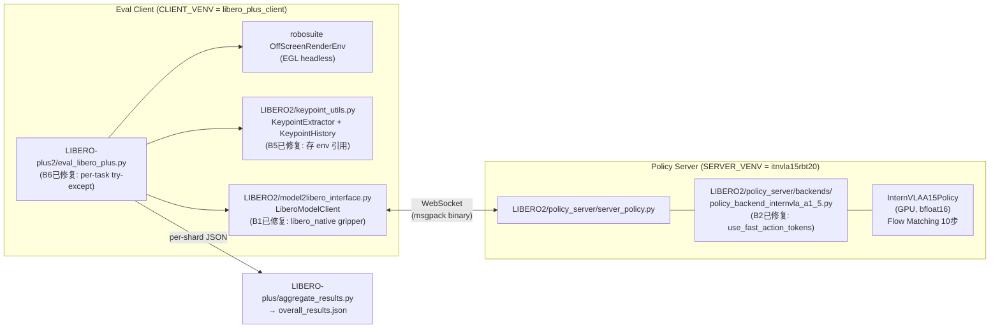

# LIBERO-plus 评估实施方案与操作手册 (eval3)

> **评估对象**: InternVLA-A1.5 + GeoP checkpoint **step_032070**  
> **路径**: `/home/a26113/b/Ckp/4dwvlaOpvlaLibplusKpt0911/2026_09_12_08_52_49-internvla_a1_5-libplus-sft/checkpoints/032070/pretrained_model/`  
> **本文档面向没有该项目经验的第三方工程师**, 按步骤操作即可完成评估.

**文档变更历史**:

| 版本 | 日期 | 主要变更 |
|------|------|---------|
| eval.md | 2026-09-14 | step_026725 首次评估手册 |
| eval2.md | 2026-09-15 | 新增 §12-18 (关键点分析、keypoint 实现、动作序列保存); checkpoint 更新为 032070 |
| eval3.md (本文) | 2026-09-15 | 基于 eval2.1plan.md 全面改良: 新目录结构 LIBERO2/LIBERO-plus2; 修复清单与验证方法; SIGABRT 调查; 精简与重组 |
| eval3.md §12 修订 | 2026-09-15 | **B9 深度分析**: 训练 FK 管线实证验证 (100帧), 发现三个系统性错误 (R_pad 双重 margin/base 位置/EEF名); 新方案: standalone Lift MJCF FK (误差5.96e-08) |
| eval3.md v2 | 2026-09-15 | 新增 §十六 (未解决问题), §十二.10-12 (qpos验证/warm-up/shape一致性), 完善 §三.2 (keypoint_track_input_dim), 新增 run_eval_libero_plus_venv.sh 骨架代码, SIGABRT 深入分析更新 |
| eval3.md v2.1 | 2026-09-15 | qpos 映射一致性已通过源码级追溯验证 (§12.10); B5 状态更新为 "已被 B9 取代"; §16.2 文件计数修正; 全文 cross-reference 审核通过 |

**⚠️ 实施状态总结** (2026-09-15):

| 组件 | 状态 | 说明 |
|------|------|------|
| eval3.md 设计文档 | ✅ 完成 | 本文档, 含代码级实现指南 |
| `evaluation/panda_robosuite_lift.xml` | ✅ 已导出 | 38KB, robosuite 1.4.0 Lift MJCF |
| `evaluation/LIBERO2/` 代码 | ❌ **未创建** | 按 §五.3 清单创建 |
| `evaluation/LIBERO-plus2/` 代码 | ❌ **未创建** | 按 §五.3 清单创建 |
| `env_wrapper.py` B3+B4 补丁 | ⚠️ 需每次确认 | 在外部库, 非 git 管理 |
| step_032070 全量评估 | ❌ **未执行** | 待代码创建后执行 |
| SIGABRT 根因 | ⚠️ **未确认** | B7 延迟 import 为推测, 待验证 |

---

## 目录

- [一. 评估对象](#一-评估对象)
- [二. 系统架构](#二-系统架构)
- [三. ⚠️ 训推一致性核查清单](#三-训推一致性核查清单)
- [四. ⚠️ 已知 Bug 与修复清单](#四-已知-bug-与修复清单)
- [五. 新代码目录：LIBERO2 / LIBERO-plus2](#五-新代码目录libero2--libero-plus2)
- [六. 本机环境与关键路径](#六-本机环境与关键路径)
- [七. 环境准备 (Step-by-Step)](#七-环境准备-step-by-step)
- [八. 预检测试](#八-预检测试)
- [九. 评估执行](#九-评估执行)
- [十. 处理流程关键细节](#十-处理流程关键细节)
- [十一. 故障排除](#十一-故障排除)
- [十二. 关键点在线提取](#十二-关键点在线提取) ← **已于2026-09-15全面修订 (B9修复)**
- [十三. 动作序列保存与回放](#十三-动作序列保存与回放)
- [十四. 完整参数手册](#十四-完整参数手册)
- [十五. 历史评估结果参考](#十五-历史评估结果参考)
- [十六. 未解决问题与后续计划](#十六-未解决问题与后续计划)

---

## 一. 评估对象

### 1.1 Checkpoint 信息

| 项目 | 值 | 来源 |
|------|-----|------|
| **Checkpoint 路径** | `.../checkpoints/032070/pretrained_model/` | 用户指定 |
| **模型类型** | InternVLA-A1.5 + GeoP (3D Keypoint Predictor) | `config.json` type=internvla_a1_5 |
| **训练数据集** | `opvla_libero_merged_kpt` (4 LIBERO 子集合并 + 8×7D 关键点) | `train_config.json:repo_id` |
| **训练步数** | 32070 / 53450 (60%, 中间 checkpoint) | 目录名 `032070` |
| **模型大小** | 5.9 GB (`model.safetensors`, bfloat16) | 实测 |
| **Chunk size** | 50 steps | `config.json:chunk_size` |
| **num_inference_steps** | 10 (flow matching 采样步数) | `config.json` |
| **Stats key** | `panda` | 实测 `stats.json` 顶层唯一 key |
| **action_mode** (prompt tag) | `joint` (来自 panda schema 默认) | `panda.yaml:action_mode` |
| **normalize mode** | `mean_std` | `train_config.json:mode` |
| **tokenize_state** | `true` | `train_config.json` |
| **max_prompt_length** | 650 | `train_config.json` |
| **resize** | 224 × 224 | `train_config.json` |
| **enable_keypoint_predictor** | `true` | `config.json` |
| **kpt_4d_mode** | `pos_rot` (7D: 3D pos + 4D quat) | `config.json` |
| **num_keypoint_joints** | 8 | `config.json` |
| **keypoint_history_max_len** | 200 | `config.json` |
| **use_fast_action_tokens** | `true` | `train_config.json:dataset` (不在 config.json 中!) |
| **prompt suffix** | `"; Output: <Action>"` | use_fast=True + 无 sub_task → 训练时确认 |

> ⚠️ `use_fast_action_tokens` 在 `checkpoint/config.json` 中**不存在**（是 dataset 级参数），`from_pretrained` 不会把它读进 config 对象。eval 代码必须用 `getattr(config, "use_fast_action_tokens", True)` 读取（默认 True），否则会 AttributeError 或错误读成 False。

### 1.2 评估基准: LIBERO-plus

[LIBERO-plus](https://github.com/sylvestf/LIBERO-plus) 在 LIBERO 基础上 bake 了 7 类环境扰动，共 **10030 个任务**（每个任务 1 trial）:

| Suite | 任务数 | Camera | Robot | Language | Light | Background | Noise | Layout |
|-------|--------|--------|-------|----------|-------|------------|-------|--------|
| libero_spatial | 2402 | 376 | 350 | 390 | 292 | 258 | 351 | 385 |
| libero_object | 2518 | 396 | 398 | 354 | 297 | 248 | 422 | 403 |
| libero_goal | 2591 | 408 | 409 | 410 | 279 | 281 | 379 | 425 |
| libero_10 | 2519 | 419 | 393 | 383 | 274 | 289 | 449 | 312 |
| **合计** | **10030** | 1599 | 1550 | 1537 | 1142 | 1076 | 1601 | 1525 |

**评估指标**: 各扰动类别的 Success Rate (%), 排行榜格式: `Camera | Robot | Language | Light | Background | Noise | Layout | Total`.

**扰动难度参考** (基于 step_026725 的 mini eval, §15.2):
难 → 易: Robot Initial States = Language Instructions = Sensor Noise < Objects Layout < Camera Viewpoints < Light Conditions ≈ Background Textures

---

## 二. 系统架构

### 2.1 Server-Client 分离架构

模型推理 (GPU) 与仿真环境 (CPU) 在不同 Python 环境中运行，通过 WebSocket + msgpack 通信:



**分离原因**: Server venv 需要 torch 2.10 + transformers 5.2 (新版), Client venv 需要 robosuite 1.4.0 + mujoco 3.2.3 (旧版兼容), 两者有版本冲突.

### 2.2 数据流 (含 4D Keypoint)

```mermaid
sequenceDiagram
    participant ENV as robosuite Env
    participant KPT as KeypointExtractor + History
    participant CLI as LiberoModelClient
    participant SRV as InternVLAA15Backend
    participant MDL as InternVLAA15Policy

    CLI->>ENV: env.reset() + set_init_state()
    ENV-->>CLI: obs [agentview, wrist, state]
    CLI->>KPT: extract() → kpt_7d [8,7]
    KPT->>KPT: push() → his_len=1

    loop 每 replan_steps=8 步重新推理
        CLI->>CLI: 提取 state 8D, 图像保持 raw（不旋转）
        CLI->>KPT: get_history() → (buf[200,8,7], his_len)
        CLI->>SRV: WebSocket {image[2], state[8], lang, kpt_history}
        SRV->>SRV: resize 224, normalize state (mean_std)
        SRV->>SRV: _prepare_single: kpt → his_kpts + his_len tensors
        SRV->>SRV: ChatProcessor → prompt "Control Mode: <joint>; Output: <Action>"
        SRV->>MDL: predict_action_chunk → embed_kpt_suffix(真实kpt!) → FM 10步
        MDL-->>SRV: normalized chunk [1,50,7]
        SRV->>SRV: denorm (mean_std) + clip [min,max]
        SRV-->>CLI: {actions [1,50,7], action_space}
        loop 使用 chunk 前 8 steps
            CLI->>CLI: action = chunk[step%8]
            CLI->>CLI: gripper 二值化 (libero_native: >0→+1)
            CLI->>ENV: env.step(action[7D])
            ENV-->>CLI: obs, done
            CLI->>KPT: extract() → push() → his_len++
        end
    end
```

---

## 三. 训推一致性核查清单

> ⚠️ **这是全文最关键的一节.** 以下每一项都在历史评估中踩过坑. 在运行任何评估前, 必须逐项确认.

### 3.1 MUST-CHECK: 五个高危参数

| # | 参数 | **必须设为** | 脚本默认 | **不设时的后果** |
|---|------|-------------|---------|----------------|
| C1 | `STATS_KEY_MODE` | **`panda`** | `suite` | suite 名作为 stats key → KeyError 崩溃 |
| C2 | `ROBOT_TYPE_MODE` | **`panda`** | `suite` | prompt 含 `end_effector` 而非 `joint` → 性能严重下降 |
| C3 | `GRIPPER_CONVENTION` | **`libero_native`** (或 `auto`) | `auto` | `openvla` 会使夹爪方向完全反转 → **SR=0%** |
| C4 | `use_fast_action_tokens` | **True** (代码修复后自动) | False (原始代码 bug) | prompt suffix 不匹配 → action 质量下降 |
| C5 | `LIBERO_CONFIG_PATH` | **必须设置** | 未设置 | `from libero.libero import benchmark` → EOFError |

### 3.2 训练与评估的完整对应关系

| 维度 | 训练值 | 评估应匹配 | 验证方法 |
|------|--------|-----------|---------|
| Stats key | `panda` | `STATS_KEY_MODE=panda` | healthcheck `stats_key=panda` |
| Stats schema | `panda` → action_mode=joint (prompt) | `ROBOT_TYPE_MODE=panda` | healthcheck `action_mode=joint` |
| State 维度 | 8D (eef_pos[3]+axisangle[3]+gripper_qpos[2]) | 同, Client `_extract_state()` | healthcheck `expected_state_dim=8` |
| Action 维度 | 7D | 同 | healthcheck `action_dim=7` |
| 图像数量 | 2 (agentview + wrist) | 2 (panda schema image_mapping) | healthcheck `expected_num_input_images=2` |
| 图像旋转 | 训练 mp4 为 robosuite **raw**（未旋转） | `rotate_images=False`（LIBERO2 默认） | 传 `--no_rotate_images` 或依赖默认 False；`ROTATE_IMAGES=true` 才开启 |
| Resize | 224×224 | `RESIZE_SIZE=224` | healthcheck (server) |
| Normalize | mean_std | 从 train_config.json 自动解析 | healthcheck `action_denorm_mode=mean_std` |
| Prompt: action_mode | joint | panda schema 默认 joint | healthcheck `action_mode=joint` |
| Prompt: use_fast | True | `getattr(config, …, True)=True` | server log prompt 含 `<Action>` 不含 `<Subtask,Action>` |
| Prompt: suffix | `"; Output: <Action>"` | 同 | server log 确认 |
| Gripper convention | action[6]∈[-1,+1] (libero_native) | `GRIPPER_CONVENTION=libero_native` | stats.json `panda.action.min[6]=-1.0` 确认 |
| Keypoint: R_pad | **1.8212722539901733** (metadata `bbox_radius` 字段直接读取) | `StandaloneFK.R_PAD` 常量 | 无需手动设置 |
| Keypoint: FK源 | robosuite Lift MJCF (nq=16, base=[-0.56,0,0.912]) | standalone Lift MJCF FK (不读 live env body pos!) | 100帧实证验证: 误差5.96e-08 |
| Keypoint: bodies | 生成脚本 resolve：`gripper0_eef` 或 `gripper0_right_eef` | Lift MJCF resolve → **`gripper0_eef`** | metadata 可能写 `gripper0_right_eef`（另一份 XML），不要抄进 Lift |
| Keypoint: max_len | 200 | `--kpt_history_max_len 200` (代码默认) | 无需手动设置 |
| Keypoint: quat | xyzw, hemisphere (qw≥0) | `StandaloneFK.extract()` wxyz→xyzw | 代码已实现 |
| Keypoint: track_input_dim | 7 (pos_rot模式) | `his_kpts` shape `[200, 8, 7]` | `config.json:keypoint_track_input_dim=7` |
| Keypoint: qpos 构造 | `joint_position[7] + state[6:8]` | `_ref_joint_pos_indexes + _ref_gripper_joint_pos_indexes` | 见 §12.10 验证 |
| Keypoint: warm-up push | 训练 `his_kpts` 不含当前帧 | eval 在 `env.step` **之前** push | 见 §12.11 |
| Chunk replan | chunk=50, replan≤50 | `replan_steps=8` (≤50) | 合法值 |
| action_loss_only | False (训练) | True (eval, 跳过 WAN) | 推理路径不变 |

### 3.3 Stats 具体数值（checkpoint 032070, key=panda）

**observation.state (8D):**

| 维度 | 含义 | mean | std |
|------|------|------|-----|
| 0 | eef_pos_x | -0.0465 | 0.1049 |
| 1 | eef_pos_y | 0.0344 | 0.1518 |
| 2 | eef_pos_z | 0.7646 | 0.3785 |
| 3 | axisangle_0 | 2.9722 | 0.3443 |
| 4 | axisangle_1 | -0.2205 | 0.9069 |
| 5 | axisangle_2 | -0.1256 | 0.3254 |
| 6 | gripper_qpos_L | 0.0269 | 0.0142 |
| 7 | gripper_qpos_R | -0.0272 | 0.0141 |

**action (7D):**

| 维度 | 含义 | mean | std | min | max |
|------|------|------|-----|-----|-----|
| 0-5 | delta_eef (6D) | ≈0 | 0.34/0.38/0.44/0.04/0.06/0.08 | ≈-0.94 | ≈+0.94 |
| 6 | gripper | -0.0496 | 0.9988 | **-1.000** | **+1.000** |

> gripper min=-1.0, max=+1.0 → 确认 `libero_native` 约定（不是 openvla 的 [0,1]）

---

## 四. ⚠️ 已知 Bug 与修复清单

> **必须逐一验证这些修复都在新建的 LIBERO2/LIBERO-plus2 代码中生效。**

### 4.1 Bug 总表

| # | ID | 文件 | 问题 | 影响 | 状态 |
|---|-----|------|------|------|------|
| 1 | B1 | `LIBERO2/model2libero_interface.py` | Gripper 二值化硬编码 openvla 约定 | **SR=0%**, 夹爪方向完全反转 | 需在 LIBERO2 修复 |
| 2 | B2 | `LIBERO2/policy_server/backends/policy_backend_internvla_a1_5.py` | `use_fast_action_tokens=False` 硬编码 | Prompt suffix 不匹配训练, action 质量下降 | 需在 LIBERO2 修复 |
| 3 | B3 | `env_wrapper.py:52` (外部库) | `np.fromstring` binary mode 在 NumPy 2.x 移除 | Sensor Noise 类别任务崩溃 | 需手动打补丁 |
| 4 | B4 | `env_wrapper.py:105` (外部库) | `np.float_` 在 NumPy 2.x 移除 | Sensor Noise 类别任务崩溃 | 需手动打补丁 |
| 5 | B5 | `LIBERO2/keypoint_utils.py` | `KeypointExtractor` 存 `env.sim` 引用, `env.reset()` 后过期 | AttributeError: MjSim has no 'data' | ✅ 已被 B9 standalone FK 方案取代 (不读 env.sim body pos) |
| 6 | B6 | `LIBERO-plus2/eval_libero_plus.py` | 无 per-task try-except, 单任务崩溃杀死整个 shard | Shard 无 partial results, 大量任务丢失 | 需在 LIBERO-plus2 修复 |
| 7 | B7 | `LIBERO-plus2/eval_libero_plus.py` (顶层 import) | `import imageio` 顶层 import 可能注册信号处理器干扰 EGL | SIGABRT (exit 134), **B6 无法捕获** (C级abort绕过Python异常) | ⚠️ 高优先级, 延迟 import, 需二分法验证 |
| 8 | B8 | `LIBERO_CONFIG_PATH` 格式 | `config.yaml` 若使用嵌套 `base:` 结构会被 LIBERO 忽略 | `from libero.libero import benchmark` 挂起或报 EOFError | 必须使用扁平 key 格式 |
| 9 | **B9** | `LIBERO2/keypoint_utils.py` (根本方案错误) | 从 live env.sim 读 body pos, 用错误 R_pad=2.0945, 用错误 body `gripper0_right_eef` | **关键点系统偏差 13-27%, 降低 SR** | **必须换 standalone Lift MJCF FK 方案** |

### 4.2 各 Bug 修复代码

#### B1: Gripper 二值化约定反转

```python
# 原始 LIBERO/model2libero_interface.py:204 (BUG):
action[6] = 1.0 if action[6] < 0.5 else -1.0   # OpenVLA [0,1] 约定, 错!

# LIBERO2/model2libero_interface.py 修复:
# LiberoModelClient.__init__() 新增参数:
def __init__(self, ..., gripper_convention: str = "auto") -> None:
    ...
    self.gripper_convention = gripper_convention

# _update_action_space() 中 auto 模式自动检测:
if self.gripper_convention == "auto":
    if self._action_low is not None and self._action_low[6] < -0.5:
        self._resolved_convention = "libero_native"
    else:
        self._resolved_convention = "openvla"
else:
    self._resolved_convention = self.gripper_convention

# step() 中应用:
convention = self._resolved_convention
if convention == "openvla":
    action[6] = 1.0 if action[6] < 0.5 else -1.0
else:  # libero_native
    action[6] = 1.0 if action[6] > 0 else -1.0
```

#### B2: use_fast_action_tokens 硬编码

```python
# 原始 LIBERO/policy_server/backends/policy_backend_internvla_a1_5.py:148 (BUG):
use_fast_action_tokens=False,   # 忽略了 checkpoint config!

# LIBERO2/policy_server/backends/policy_backend_internvla_a1_5.py 修复:
# 注意: use_fast_action_tokens 在 config.json 中不存在 (是 dataset 级参数)
# from_pretrained 不会读入 config 对象, 因此必须用 getattr + 默认值 True:
use_fast_action_tokens=bool(getattr(config, "use_fast_action_tokens", True)),
```

#### B3 + B4: env_wrapper.py NumPy 2.x 兼容 (外部库, 手动补丁)

```python
# 文件: /home/a26113/DATA/LIBERO-plus/libero/libero/envs/env_wrapper.py

# B3 — line 52: np.fromstring binary mode 移除
# 修复前:
return np.fromstring(x.make_blob(), np.uint8).reshape(height, width, depth)
# 修复后:
return np.frombuffer(x.make_blob(), np.uint8).reshape(height, width, depth)

# B4 — line 105: np.float_ 类型别名移除
# 修复前:
maparray = np.empty((mapsize, mapsize), dtype=np.float_)
# 修复后:
maparray = np.empty((mapsize, mapsize), dtype=np.float64)
```

#### B5: KeypointExtractor 存 env 引用而非 env.sim

> ⚠️ **B5 已被 B9 取代.** 以下代码展示的是旧方案 (从 live env.sim 读 body pos) 的 env 引用修复. 实际 LIBERO2 应使用 §12.4 的 standalone FK 方案, 该方案不读 env.sim body pos, 从根本上消除了 B5 问题.

```python
# [旧方案, 仅供参考] LIBERO2/keypoint_utils.py — KeypointExtractor:

def __init__(self, env, body_names=None, r_pad=DEFAULT_R_PAD):
    self._env = env              # 存 env 引用 (不是 env.sim!)
    self.body_names = body_names or DEFAULT_KEYPOINT_BODIES
    self.r_pad = r_pad
    # 初始化时读取 body_id (env.reset() 后 sim 对象重建, id 会失效, 需重新查)
    # 注意: 若 env 会 reset, 应在 reset 后重新初始化 body_ids
    self._refresh_body_ids()

def _refresh_body_ids(self):
    sim = self._env.sim
    self._body_ids = []
    for name in self.body_names:
        try:
            bid = sim.model.body_name2id(name)
        except ValueError:
            # 不同版本 robosuite EEF body 命名不同
            alt = "gripper0_eef" if name == "gripper0_right_eef" else "gripper0_right_eef"
            bid = sim.model.body_name2id(alt)
        self._body_ids.append(bid)

def extract(self) -> np.ndarray:
    sim = self._env.sim          # 每次调用时从 env 获取最新 sim
    kpts = np.empty((len(self._body_ids), KEYPOINT_DIM), dtype=np.float32)
    for i, bid in enumerate(self._body_ids):
        pos = sim.data.body_xpos[bid]
        kpts[i, :3] = pos / self.r_pad
        wxyz = sim.data.body_xquat[bid]
        xyzw = np.array([wxyz[1], wxyz[2], wxyz[3], wxyz[0]], dtype=np.float32)
        if xyzw[3] < 0:
            xyzw = -xyzw
        kpts[i, 3:7] = xyzw
    return kpts
```

#### B6: Per-task try-except 防 Shard 崩溃

```python
# LIBERO-plus2/eval_libero_plus.py — evaluate_policy() 任务循环中:
try:
    successes, task_desc, action_logs = evaluate_task(
        task, initial_states, args, client, max_steps, video_dir, clean_name,
    )
except Exception as e:
    LOGGER.error(
        "task_id=%d [%s] '%s' CRASHED: %s — marking as failures and continuing",
        task_id, category, clean_name, e,
    )
    successes = [False] * min(args.num_trials_per_task, len(initial_states))
    task_desc = clean_name
    action_logs = []
```

#### B7: SIGABRT — 延迟 import imageio (推荐修复方案)

```python
# LIBERO-plus2/eval_libero_plus.py — 顶层不再 import imageio:
# 删除: import imageio

# evaluate_task() 函数内, 仅在需要时才 import:
if args.save_videos and replay_images:
    import imageio  # 延迟导入, 避免在模块加载时注册信号处理器干扰 MuJoCo EGL
    imageio.mimwrite(out_path, [np.asarray(x) for x in replay_images], fps=10)
```

> **为何有效**: imageio (及其 ffmpeg/pillow 插件) 在 Python 模块级 import 时可能注册 atexit 处理器或修改 POSIX 信号处理, 干扰 MuJoCo 的 EGL 渲染上下文, 在首次 `mjr_readPixels` 时触发 SIGABRT. 延迟到函数体内 import 则在 EGL 上下文已完全初始化之后才加载 imageio, 避免干扰.

#### B9: Keypoint 提取根本方案错误 (三合一修复 → 见 §十二 完整实现)

原方案 (eval3.md §12.2 初版) 的三个错误:

| 错误 | 原方案 | 正确方案 | 影响量级 |
|------|--------|---------|---------|
| R_pad 双重 margin | `DEFAULT_R_PAD = 2.094463...` (bbox_radius=1.8213 × 1.15) | `R_PAD = 1.8212722539901733` (直接用 metadata bbox_radius 字段) | 13% 缩放误差 |
| Base 位置随 arena 变化 | 从 `env.sim.data.body_xpos[bid]` 读 (base 随 arena 变化) | standalone Lift MJCF FK (base 固定 [-0.56, 0, 0.912]) | 5-27% 位置偏移 |
| EEF body 名称 | `gripper0_right_eef` (live env 中存在) | `gripper0_eef` (Lift MJCF 中 EEF body 名) | 不同 body, 位姿不同 |

**修复**: 完整方案见 §十二. 核心思路: 从 live env 提取关节角 (9D qpos), 注入 standalone Lift MJCF, 运行 `mj_forward`, 从 standalone MJCF 读 body pos/quat.

```python
# 验证结论 (100 帧采样验证, 2026-09-15):
# robosuite Lift MJCF FK vs 训练数据: max_pos_err = 5.96e-08 (float32 精度极限)
# URDF FK (base at origin) vs 训练数据: max_pos_err = 0.5007 (50%)
```

#### B8: LIBERO config.yaml 必须扁平格式

```yaml
# 正确格式 (扁平 key):
benchmark_root: /home/a26113/DATA/LIBERO-plus/libero/libero
bddl_files: /home/a26113/DATA/LIBERO-plus/libero/libero/bddl_files
init_states: /home/a26113/DATA/LIBERO-plus/libero/libero/init_files
datasets: /home/a26113/DATA/LIBERO-plus/datasets
assets: /home/a26113/DATA/LIBERO-plus/libero/libero/assets

# 错误格式 (嵌套 base: 结构, LIBERO __init__.py 不识别):
# base:
#   benchmark_root: ...
```

---

## 五. 新代码目录：LIBERO2 / LIBERO-plus2

### 5.1 设计原则

- **旧目录** (`evaluation/LIBERO/`, `evaluation/LIBERO-plus/`) 保持原始状态, 仅作参考
- **新代码** 放在 `evaluation/LIBERO2/` 和 `evaluation/LIBERO-plus2/` 中
- 新代码通过 Python import 扩展旧目录的代码 (共享 policy_server/tools/, base_backend, 等)

### 5.2 目录结构

```
evaluation/
├── LIBERO/                            # 原始代码 (只读参考)
│   ├── model2libero_interface.py      # B1 bug 存在
│   └── policy_server/backends/
│       └── policy_backend_internvla_a1_5.py  # B2 bug 存在
│
├── LIBERO2/                           # 新代码 (含所有修复)
│   ├── __init__.py
│   ├── keypoint_utils.py              # [NEW] KeypointExtractor + KeypointHistory
│   ├── model2libero_interface.py      # [MOD] +gripper_convention +kpt_history
│   └── policy_server/
│       ├── __init__.py
│       ├── server_policy.py           # [MOD] import LIBERO2 的 backend_factory
│       └── backends/
│           ├── __init__.py
│           ├── backend_factory.py     # [MOD] import LIBERO2 的 InternVLAA15Backend
│           └── policy_backend_internvla_a1_5.py  # [MOD] B2修复 + kpt注入
│
├── LIBERO-plus/                       # 原始代码 (只读参考)
│   └── eval_libero_plus.py            # B6+B7 bug 存在, 无 kpt/gripper_convention
│
└── LIBERO-plus2/                      # 新代码 (含所有修复与新功能)
    ├── __init__.py
    ├── eval_libero_plus.py            # [MOD] 全功能版
    ├── aggregate_results.py           # [COPY] 与 LIBERO-plus/ 相同
    ├── replay_episode.py              # [NEW] 动作序列回放
    └── run_eval_libero_plus_venv.sh   # [NEW] venv 版启动器
```

**Import 关系** (新代码扩展旧目录):

```python
# LIBERO2/policy_server/backends/backend_factory.py 中:
from evaluation.LIBERO.policy_server.backends.base_backend import PROTOCOL_VERSION
from evaluation.LIBERO.policy_server.backends.policy_backend_pi05 import PI05Backend
from evaluation.LIBERO2.policy_server.backends.policy_backend_internvla_a1_5 import InternVLAA15Backend  # 修复版

# LIBERO2/policy_server/server_policy.py 中:
from evaluation.LIBERO2.policy_server.backends.backend_factory import build_backend  # 用新版
from evaluation.LIBERO.policy_server.tools.websocket_policy_server import WebsocketPolicyServer  # 不变

# LIBERO-plus2/eval_libero_plus.py 中:
from evaluation.LIBERO2.model2libero_interface import LiberoModelClient  # 修复版
from evaluation.LIBERO2.keypoint_utils import KeypointExtractor, KeypointHistory  # 新增
```

### 5.3 新建文件清单

| 文件 | 类型 | 主要内容 |
|------|------|---------|
| `LIBERO2/__init__.py` | NEW (空) | — |
| `LIBERO2/keypoint_utils.py` | NEW | StandaloneFK + KeypointExtractor + KeypointHistory (§十二) |
| `LIBERO2/model2libero_interface.py` | MOD | 基于 LIBERO/ 修复 B1, 新增 kpt_history |
| `LIBERO2/policy_server/__init__.py` | NEW (空) | — |
| `LIBERO2/policy_server/backends/__init__.py` | NEW (空) | — |
| `LIBERO2/policy_server/backends/policy_backend_internvla_a1_5.py` | MOD | 基于 LIBERO/ 修复 B2, 新增 kpt 注入 |
| `LIBERO2/policy_server/backends/backend_factory.py` | MOD | import LIBERO2 的 InternVLAA15Backend |
| `LIBERO2/policy_server/server_policy.py` | MOD | import LIBERO2 的 backend_factory |
| `LIBERO-plus2/__init__.py` | NEW (空) | — |
| `LIBERO-plus2/eval_libero_plus.py` | MOD | 基于 LIBERO-plus/ 修复 B6+B7, 新增所有功能 |
| `LIBERO-plus2/aggregate_results.py` | COPY | 与 LIBERO-plus/aggregate_results.py 相同 |
| `LIBERO-plus2/replay_episode.py` | NEW | 动作序列回放 (§十三) |
| `LIBERO-plus2/run_eval_libero_plus_venv.sh` | NEW | venv 版启动器 |
| `tests/test_keypoint_utils.py` | NEW | 17 个单元测试 |

---

## 六. 本机环境与关键路径

```bash
# 一次性定义, 后续步骤全部引用这些变量
CKPT="/home/a26113/b/Ckp/4dwvlaOpvlaLibplusKpt0911/2026_09_12_08_52_49-internvla_a1_5-libplus-sft/checkpoints/032070/pretrained_model"
VLM="/B/VENV/hf_home/hub/models--Qwen--Qwen3.5-2B/snapshots/15852e8c16360a2fea060d615a32b45270f8a8fc"
LIBERO_HOME="/home/a26113/DATA/LIBERO-plus"
TASK_CLS="${LIBERO_HOME}/libero/libero/benchmark/task_classification.json"
SERVER_VENV="/B/VENV/itnvla15rbt20"
CLIENT_VENV="/B/VENV/libero_plus_client"          # ← 名字固定, 不得修改
PROJ="/B/SRC/itvlaGpLibPlus"
EVAL_DIR="/home/a26113/b/Ckp/4dwvlaOpvlaLibplusKpt0911/2026_09_12_08_52_49-internvla_a1_5-libplus-sft/eval_libero_plus/step_032070"
LIBERO_CONFIG_DIR="${EVAL_DIR}/libero_config"
```

| 资源 | 状态 | 说明 |
|------|------|------|
| GPU | 8 × H200 (143 GB each) | — |
| SERVER_VENV (`/B/VENV/itnvla15rbt20`) | 已存在 | torch 2.10, transformers 5.2, lerobot |
| CLIENT_VENV (`/B/VENV/libero_plus_client`) | 已存在并配置 | robosuite 1.4.0, mujoco 3.2.3, EGL vendor |
| VLM 权重 | 已下载 | Qwen3.5-2B |
| WAN 权重 | 不需要 | eval 使用 `--action_loss_only` |
| LIBERO-plus 仓库 | 已 clone | `/home/a26113/DATA/LIBERO-plus` |
| LIBERO2/ 代码 | **待创建** | 按 §五.3 清单创建 |
| LIBERO-plus2/ 代码 | **待创建** | 按 §五.3 清单创建 |
| env_wrapper.py 补丁 | **待打** | B3+B4 (§四.2) |

---

## 七. 环境准备 (Step-by-Step)

### 7.1 验证 Client venv

```bash
source /B/VENV/libero_plus_client/bin/activate
export MUJOCO_GL=egl PYOPENGL_PLATFORM=egl
export __EGL_VENDOR_LIBRARY_DIRS="/B/VENV/libero_plus_client/egl_vendor.d"
export LD_LIBRARY_PATH="/usr/local/nvidia/lib64:${LD_LIBRARY_PATH:-}"
export PYTHONPATH="/home/a26113/DATA/LIBERO-plus:${PROJ}:${PYTHONPATH:-}"
export LIBERO_CONFIG_PATH="${LIBERO_CONFIG_DIR}"

python3 - <<'PY'
import mujoco; print("mujoco", mujoco.__version__)
import robosuite; print("robosuite", robosuite.__version__)
from libero.libero import benchmark; bd = benchmark.get_benchmark_dict()
print("LIBERO suites:", list(bd.keys()))
from libero.libero.envs import OffScreenRenderEnv; print("OffScreenRenderEnv OK")
import websockets, msgpack; print("websockets+msgpack OK")
print("=== Client env ready ===")
PY
```

**预期输出**: mujoco 3.2.3, robosuite 1.4.0, 7 suites, OffScreenRenderEnv OK, websockets+msgpack OK.

若 `mujoco` 报 `Cannot initialize a EGL device display`:

```bash
# 检查 EGL vendor 配置文件是否存在:
ls -la /B/VENV/libero_plus_client/egl_vendor.d/10_nvidia.json
# 若不存在, 创建:
mkdir -p /B/VENV/libero_plus_client/egl_vendor.d
cat > /B/VENV/libero_plus_client/egl_vendor.d/10_nvidia.json <<'JSON'
{
    "file_format_version" : "1.0.0",
    "ICD" : {
        "library_path" : "/usr/local/nvidia/lib64/libEGL_nvidia.so.0"
    }
}
JSON
```

### 7.2 打外部库补丁 (B3 + B4)

```bash
ENV_WRAPPER="/home/a26113/DATA/LIBERO-plus/libero/libero/envs/env_wrapper.py"
# B3: np.fromstring → np.frombuffer (line 52)
grep -n "np.fromstring" "${ENV_WRAPPER}"
sed -i 's/np\.fromstring(x\.make_blob(), np\.uint8)/np.frombuffer(x.make_blob(), np.uint8)/' "${ENV_WRAPPER}"
# B4: np.float_ → np.float64 (line 105)
grep -n "np\.float_" "${ENV_WRAPPER}"
sed -i 's/dtype=np\.float_/dtype=np.float64/' "${ENV_WRAPPER}"
# 验证:
grep -n "fromstring\|frombuffer\|float_\|float64" "${ENV_WRAPPER}"
```

预期: line 52 为 `np.frombuffer`, line 105 为 `np.float64`.

### 7.3 创建 LIBERO config.yaml

```bash
mkdir -p "${LIBERO_CONFIG_DIR}"
LP_BENCH="${LIBERO_HOME}/libero/libero"
cat > "${LIBERO_CONFIG_DIR}/config.yaml" <<YAML
benchmark_root: ${LP_BENCH}
bddl_files: ${LP_BENCH}/bddl_files
init_states: ${LP_BENCH}/init_files
datasets: ${LP_BENCH}/../datasets
assets: ${LP_BENCH}/assets
YAML
# 验证格式 (必须是扁平 key, 无 'base:' 层):
cat "${LIBERO_CONFIG_DIR}/config.yaml"
```

### 7.4 创建 LIBERO2 / LIBERO-plus2 代码

> **注**: 以下只给出关键部分的代码. 完整实现见 §十二 (关键点提取) 和 §十三 (动作序列保存).

#### Step 1: keypoint_utils.py

```bash
mkdir -p "${PROJ}/evaluation/LIBERO2"
touch "${PROJ}/evaluation/LIBERO2/__init__.py"
```

创建 `${PROJ}/evaluation/LIBERO2/keypoint_utils.py` (完整代码见 §十二.4).

同时确认 `evaluation/panda_robosuite_lift.xml` 存在, 若丢失:
```bash
MUJOCO_GL=glx /B/VENV/libero_plus_client/bin/python \
    util_scripts/export_panda_mjcf.py \
    --output evaluation/panda_robosuite_lift.xml
```

#### Step 2: model2libero_interface.py

基于 `evaluation/LIBERO/model2libero_interface.py` 修改, 关键差异:
1. `LiberoModelClient.__init__()` 新增 `gripper_convention: str = "auto"` 参数
2. `_update_action_space()` 实现 auto 检测逻辑
3. `step()` 中 gripper 二值化使用 `self._resolved_convention`
4. `_request_chunk(obs, lang, kpt_history=None)` 新增 kpt 传递
5. `step(obs, lang, kpt_history=None)` 新增 kpt 透传

#### Step 3: policy_backend_internvla_a1_5.py

基于 `evaluation/LIBERO/policy_server/backends/policy_backend_internvla_a1_5.py` 修改:
1. **B2 修复**: `use_fast_action_tokens=bool(getattr(config, "use_fast_action_tokens", True))`
2. **kpt 注入**: `_prepare_single()` 末尾检测并注入 `observation.his_kpts` + `observation.his_len`

#### Step 4: backend_factory.py + server_policy.py

在 LIBERO2 中创建各自的包装版, 仅修改 import 路径使其使用 LIBERO2 的修复版 backend.

#### Step 5: eval_libero_plus.py (LIBERO-plus2)

基于 `evaluation/LIBERO-plus/eval_libero_plus.py` 修改, 关键差异:
1. **顶层不 import imageio** (B7 修复: 延迟到函数内)
2. import 路径: `from evaluation.LIBERO2.model2libero_interface import LiberoModelClient`
3. 新增所有 CLI 参数: `--gripper_convention`, `--categories`, `--task_ids`, `--enable_keypoints`, `--kpt_r_pad`, `--kpt_history_max_len`, `--save_actions`
4. `evaluate_task()` 新增 keypoint 逻辑, 返回 `(successes, task_desc, action_logs)`
5. `evaluate_policy()` 新增 per-task try-except (B6 修复), categories 过滤, action 保存

### 7.5 语法验证

```bash
cd "${PROJ}"
# 验证所有新 .py 文件语法:
for f in evaluation/LIBERO2/*.py \
         evaluation/LIBERO2/policy_server/backends/*.py \
         evaluation/LIBERO-plus2/*.py; do
    python3 -c "import ast; ast.parse(open('$f').read())" && echo "OK: $f" || echo "FAIL: $f"
done
# shell 脚本语法:
bash -n evaluation/LIBERO-plus2/run_eval_libero_plus_venv.sh && echo "OK: venv.sh"
# 单元测试:
python3 -m pytest tests/test_keypoint_utils.py -v
```

---

## 八. 预检测试

在冒烟测试之前, 逐项确认以下检查:

```bash
cd "${PROJ}"
source "${SERVER_VENV}/bin/activate"
export PYTHONPATH="${PROJ}:${PROJ}/src:${PYTHONPATH:-}"

python3 - <<PY
import json, pathlib, sys

CKPT = pathlib.Path("${CKPT}")
assert CKPT.exists(), f"Checkpoint missing: {CKPT}"

# Test 1: Checkpoint 文件完整性
for f in ["config.json", "model.safetensors", "stats.json", "train_config.json"]:
    p = CKPT / f
    assert p.exists() and p.stat().st_size > 0, f"Missing/empty: {f}"
    print(f"  {f}: {p.stat().st_size:,} bytes")

# Test 2: stats.json key=panda, state=8D, action=7D
stats = json.load(open(CKPT / "stats.json"))
assert "panda" in stats, f"No 'panda' key in stats.json, found: {list(stats.keys())}"
panda = stats["panda"]
state_mean_len = len(panda["observation.state"]["mean"])
action_mean_len = len(panda["action"]["mean"])
assert state_mean_len == 8, f"state_mean len={state_mean_len}, expected 8"
assert action_mean_len == 7, f"action_mean len={action_mean_len}, expected 7"
g_min = panda["action"]["min"][6]
assert g_min < -0.5, f"gripper min={g_min:.3f}, expected <-0.5 (libero_native)"
print(f"  stats: key=panda, state={state_mean_len}D, action={action_mean_len}D, gripper_min={g_min:.3f} → libero_native")

# Test 3: train_config.json normalize mode + tokenize_state
tc = json.load(open(CKPT / "train_config.json"))
ds = tc.get("dataset", {})
transforms = ds.get("data_transforms", {}).get("inputs", [])
norm = next((t for t in transforms if t.get("type") == "normalize"), None)
assert norm and norm.get("mode") == "mean_std", f"normalize mode != mean_std: {norm}"
assert ds.get("tokenize_state", True) == True, "tokenize_state not True"
use_fast = ds.get("use_fast_action_tokens", True)
print(f"  train_config: normalize=mean_std, tokenize_state=True, use_fast_action_tokens={use_fast}")

# Test 4: config.json enable_keypoint, kpt_4d_mode
cfg = json.load(open(CKPT / "config.json"))
assert cfg.get("enable_keypoint_predictor") == True
assert cfg.get("kpt_4d_mode") == "pos_rot"
kpt_h_max = cfg.get("keypoint_history_max_len", 200)
print(f"  config: enable_kpt=True, kpt_4d_mode=pos_rot, keypoint_history_max_len={kpt_h_max}")

# Test 5: panda schema
from lerobot.dataset_schemas import get_schema
panda_schema = get_schema("panda")
action_mode = getattr(panda_schema, "action_mode", "joint")
assert action_mode == "joint", f"panda schema action_mode={action_mode}"
print(f"  panda schema: action_mode={action_mode}")

# Test 6: LIBERO-plus task_classification.json
TASK_CLS = pathlib.Path("${TASK_CLS}")
assert TASK_CLS.exists(), f"task_classification.json missing: {TASK_CLS}"
tc_data = json.load(open(TASK_CLS))
for suite in ["libero_spatial", "libero_object", "libero_goal", "libero_10"]:
    assert suite in tc_data, f"Suite {suite} missing"
    print(f"  {suite}: {len(tc_data[suite])} tasks")

# Test 7: VLM path
VLM = pathlib.Path("${VLM}")
assert (VLM / "tokenizer.json").exists(), f"VLM tokenizer missing: {VLM}"
print(f"  VLM: OK ({VLM.name})")

print("\n=== All preflight tests PASSED ===")
PY
```

---

## 九. 评估执行

### 9.1 启动 Policy Server (终端 A)

```bash
source "${SERVER_VENV}/bin/activate"
cd "${PROJ}"
export PYTHONPATH="${PROJ}:${PROJ}/src:${PYTHONPATH:-}"
mkdir -p "${EVAL_DIR}"

CUDA_VISIBLE_DEVICES=0 python evaluation/LIBERO2/policy_server/server_policy.py \
    --ckpt_path "${CKPT}" \
    --host "0.0.0.0" \
    --port 5784 \
    --device cuda \
    --resize_size 224 \
    --stats_key "panda" \
    --robot_type "panda" \
    --vlm_model_path "${VLM}" \
    --action_loss_only \
    --inference_backend standard \
    --idle_timeout -1 \
    2>&1 | tee "${EVAL_DIR}/smoke_server.log"
```

等待 `server running ...` (约 30-60 秒加载时间).

### 9.2 Healthcheck (终端 B)

```bash
source "${SERVER_VENV}/bin/activate"
cd "${PROJ}"
export PYTHONPATH="${PROJ}:${PROJ}/src:${PYTHONPATH:-}"

python3 - <<'PY'
from evaluation.LIBERO.policy_server.tools.websocket_policy_client import WebsocketClientPolicy
import sys

client = WebsocketClientPolicy(host="127.0.0.1", port=5784)
meta = client.get_server_metadata()
checks = {
    "policy_type": ("internvla_a1_5", meta.get("policy_type")),
    "chunk_size": (50, meta.get("chunk_size")),
    "action_dim": (7, meta.get("action_dim")),
    "expected_num_input_images": (2, meta.get("expected_num_input_images")),
    "protocol_version": ("2.1", meta.get("protocol_version")),
    "preprocessing_owner": ("server_canonical", meta.get("preprocessing_owner")),
    "action_mode": ("joint", meta.get("action_mode")),
}
all_ok = True
print("=== Server Metadata ===")
for k, (expected, actual) in checks.items():
    ok = str(actual) == str(expected)
    status = "[OK]" if ok else f"[FAIL] expected={expected}"
    print(f"  {k}: {actual} {status}")
    if not ok: all_ok = False
if not all_ok:
    print("\nHEALTHCHECK FAILED — fix above before proceeding")
    sys.exit(1)
print("=== HEALTHCHECK PASSED ===")
PY
```

**7 项全部 [OK]** 才能继续. 最常见失败:
- `action_mode: end_effector` → ROBOT_TYPE_MODE 未设为 panda
- `stats_key: libero_goal` → STATS_KEY_MODE 未设为 panda

### 9.3 冒烟测试 Client (终端 B)

```bash
# healthcheck 完成后 deactivate server venv:
deactivate

source "${CLIENT_VENV}/bin/activate"
cd "${PROJ}"
export LIBERO_CONFIG_PATH="${LIBERO_CONFIG_DIR}"
export MUJOCO_GL=egl PYOPENGL_PLATFORM=egl
export __EGL_VENDOR_LIBRARY_DIRS="${CLIENT_VENV}/egl_vendor.d"
export LD_LIBRARY_PATH="${CLIENT_VENV}/lib:/usr/local/nvidia/lib64:${LD_LIBRARY_PATH:-}"
export PYTHONPATH="${LIBERO_HOME}:${PROJ}:${PYTHONPATH:-}"

python evaluation/LIBERO-plus2/eval_libero_plus.py \
    --host 127.0.0.1 \
    --port 5784 \
    --task_suite_name libero_goal \
    --num_trials_per_task 1 \
    --num_steps_wait 10 \
    --seed 7 \
    --replan_steps 8 \
    --start_idx 0 \
    --end_idx 4 \
    --task_classification_path "${TASK_CLS}" \
    --eval_log_dir "${EVAL_DIR}/smoke_test" \
    --gripper_convention libero_native \
    --enable_keypoints \
    --no-save_videos \
    2>&1 | tee "${EVAL_DIR}/smoke_client.log"
```

**冒烟测试验收条件**:

| 检查项 | 预期 | 如何验证 |
|--------|------|---------|
| Client 无 crash | exit code 0 | `echo $?` 为 0 |
| 无 SIGABRT | 无 `Fatal Python error: Aborted` | grep smoke_client.log |
| 结果 JSON 生成 | `logs/libero_goal/0_to_4.json` | `ls ${EVAL_DIR}/smoke_test/logs/libero_goal/` |
| 无 INVALID_STATE_DIM | 无此错误 | grep smoke_client.log |
| SR > 0% 或有合理 SR | 取决于 checkpoint | `cat .../0_to_4.json` |

### 9.4 全量评估 (8 GPU, ~10 小时)

冒烟测试通过后, 关闭冒烟测试的 server, 然后:

```bash
cd "${PROJ}"

# ─── 必须设为 panda (C1, C2) ───
export STATS_KEY_MODE="panda"
export ROBOT_TYPE_MODE="panda"

# ─── Checkpoint 和路径 ───
export CKPT_PATH="${CKPT}"
export LIBERO_HOME="${LIBERO_HOME}"
export VLM_MODEL_PATH="${VLM}"
export WAN_MODEL_PATH=""
export WAN_VAE_PATH=""
export SERVER_VENV="${SERVER_VENV}"
export CLIENT_VENV="${CLIENT_VENV}"

# ─── 推理配置 ───
export ACTION_LOSS_ONLY_FLAG="--action_loss_only"
export INFERENCE_BACKEND="standard"
export RESIZE_SIZE="224"
export REPLAN_STEPS="8"

# ─── 夹爪约定 (C3, CRITICAL) ───
export GRIPPER_CONVENTION="libero_native"

# ─── 4D 关键点 (默认启用) ───
# 对照组: export DISABLE_KEYPOINTS=1

# ─── GPU 配置 ───
export GPU_IDS="0,1,2,3,4,5,6,7"
export SHARDS_PER_SUITE="8"        # 4 suites × 8 shards = 32 工作单元
export BASE_PORT="5784"

# ─── 评估参数 ───
export NUM_TRIALS_PER_TASK="1"
export SEED="7"
export NUM_STEPS_WAIT="10"

# ─── 输出 ───
export EVAL_LOG_DIR="${EVAL_DIR}/full_$(date +%Y%m%d_%H%M%S)"
export NO_VIDEO_FLAG="--no-save_videos"
export SAVE_ACTIONS_FLAG="--save_actions"    # 存动作序列供后续回放

# ─── 启动 ───
nohup bash evaluation/LIBERO-plus2/run_eval_libero_plus_venv.sh \
    > "${EVAL_DIR}/full_eval.log" 2>&1 &
echo "PID: $!"
echo "Log: ${EVAL_DIR}/full_eval.log"
echo "Results: ${EVAL_LOG_DIR}"
```

### 9.5 监控进度

```bash
# 实时进度 (每 30 秒刷新):
watch -n 30 'python3 -c "
import json, glob, pathlib
log_dir = pathlib.Path(\"${EVAL_LOG_DIR}\")
total_s = 0; total_n = 0
for f in sorted(glob.glob(str(log_dir / \"logs\" / \"*\" / \"*.json\"))):
    d = json.load(open(f))
    for cat, v in d.items():
        total_s += v.get(\"success_count\", 0)
        total_n += v.get(\"total_count\", 0)
sr = 100*total_s/max(total_n,1)
print(f\"Progress: {total_n}/10030 ({100*total_n/10030:.1f}%), SR={sr:.2f}%\")
"'

# 快速检查 FAILED shards:
grep -r "FAILED" "${EVAL_LOG_DIR}/worker_gpu"*/worker.log 2>/dev/null

# Server/Client 日志 (最新):
tail -f "${EVAL_LOG_DIR}/worker_gpu0/client_libero_spatial_0_"*.log 2>/dev/null | head -50
```

### 9.6 查看最终结果

```bash
# 聚合结果:
source "${CLIENT_VENV}/bin/activate"
cd "${PROJ}"
python evaluation/LIBERO-plus/aggregate_results.py --root "${EVAL_LOG_DIR}"

# 结果 JSON:
cat "${EVAL_LOG_DIR}/overall_results.json" | python3 -m json.tool
```

### 9.7 输出目录结构

```
${EVAL_LOG_DIR}/
├── libero_config/config.yaml
├── task_queue.txt
├── overall_results.json        # 聚合结果 (评估完成后生成)
├── logs/
│   ├── libero_spatial/*.json   # per-shard per-category 结果
│   ├── libero_object/*.json
│   ├── libero_goal/*.json
│   └── libero_10/*.json
├── actions/                    # 动作序列 (.npz), --save_actions 时生成
│   ├── libero_spatial/task_*_ep*.npz
│   └── ...
└── worker_gpu{0..7}/
    ├── worker.log
    ├── server_*.log
    └── client_*.log
```

### 9.8 补跑失败 Shard

```bash
# 示例: 补跑 libero_spatial [0, 301) (GPU 0, port 5794)
source "${SERVER_VENV}/bin/activate"
cd "${PROJ}"
export PYTHONPATH="${PROJ}:${PROJ}/src:${PYTHONPATH:-}"

CUDA_VISIBLE_DEVICES=0 python evaluation/LIBERO2/policy_server/server_policy.py \
    --ckpt_path "${CKPT}" --host 0.0.0.0 --port 5794 \
    --stats_key panda --robot_type panda \
    --vlm_model_path "${VLM}" --action_loss_only --idle_timeout -1 &

sleep 60  # 等 server 就绪

deactivate
source "${CLIENT_VENV}/bin/activate"
export LIBERO_CONFIG_PATH="${LIBERO_CONFIG_DIR}"
export __EGL_VENDOR_LIBRARY_DIRS="${CLIENT_VENV}/egl_vendor.d"
export MUJOCO_GL=egl PYOPENGL_PLATFORM=egl
export PYTHONPATH="${LIBERO_HOME}:${PROJ}:${PYTHONPATH:-}"

python evaluation/LIBERO-plus2/eval_libero_plus.py \
    --port 5794 --task_suite_name libero_spatial \
    --start_idx 0 --end_idx 301 \
    --gripper_convention libero_native \
    --task_classification_path "${TASK_CLS}" \
    --eval_log_dir "${EVAL_LOG_DIR}" \
    --no-save_videos --save_actions
```

---

## 十. 处理流程关键细节

### 10.1 图像旋转（本数据集 = raw，不要转）

OpenVLA 的 RLDS 转换会把演示图转 180°，所以官方 live eval 再转一次才能对齐。**本仓库 `/B/Dta/opvla_libero_merged_kpt/` 的 mp4 是 robosuite 原始朝向**（像素对照：raw vs 训练 MSE 远小于 rot180，见 [`eval3_optim.md`](eval3_optim.md) §4 / T1）。LIBERO2 Client 默认 `rotate_images=False`；官方 shell `ROTATE_IMAGES` 默认 `false`。

T1 已确认 **agentview 与腕部相机同一 raw 约定**，一个开关覆盖两路。

**本数据集必须走不旋转路径**（`--no_rotate_images` 或默认 False）。只有换成「存储时已旋转」的数据时才设 `ROTATE_IMAGES=true`。

契约文件：[`evaluation/LIBERO2/train_eval_contract.json`](../../evaluation/LIBERO2/train_eval_contract.json)（`image_orientation: raw`）。

### 10.2 State 提取 (8D)

```python
state = concatenate([eef_pos(3), axisangle(3), gripper_qpos(2)])
# axisangle 由 eef_quat 经 quat2axisangle() 转换
```

Server 用 `panda.observation.state` 的 mean/std 做 mean_std 归一化, 然后 chat processor 将 discretized state 编码到 VLM prompt 中 (tokenize_state=True).

### 10.3 Action 反归一化与 Clip

```python
# Server 端 (base_backend.py):
denorm = normalized_action * max(std, 1e-6) + mean   # mean_std 反归一化
action = clip(denorm, action_min, action_max)         # 按 stats.json min/max clip
```

### 10.4 Gripper 二值化 (B1 修复后)

```python
# LIBERO2/model2libero_interface.py (修复后):
# libero_native 约定: action[6]∈[-1,+1], +1=close, -1=open, 阈值=0
action[6] = 1.0 if action[6] > 0 else -1.0
```

### 10.5 Prompt 构建

Server 端构建的 prompt (mode=eval, use_fast_action_tokens=True):

```
Control Mode: <joint>;
{state tokens (discretized 8D)};
{image tokens (agentview + wrist)};
{task description}; Output: <Action>
```

`use_fast_action_tokens=False` 时后缀变成 `"; Output: <Subtask, Action>"`, 与本 checkpoint 训练不符, 会导致性能下降.

### 10.6 Chunk Caching 与 Replan

Client 每 `replan_steps=8` 步请求一次新 chunk (50步). 使用 chunk 前 8 步, 丢弃剩余 42 步. 这是标准的 receding horizon 策略, 频繁 replan 提高响应速度.

---

## 十一. 故障排除

### 11.1 配置类错误

| 问题现象 | 根因 | 解决方案 |
|---------|------|---------|
| `KeyError: "stats_key 'libero_goal' not found in stats.json keys=['panda']"` | `STATS_KEY_MODE=suite` | 设 `STATS_KEY_MODE=panda` |
| SR < 5% 且无代码报错 | `ROBOT_TYPE_MODE=suite` → prompt 含 `end_effector` | 设 `ROBOT_TYPE_MODE=panda` |
| **SR=0%** (全部任务失败, 机器人抓不起来) | 夹爪方向反转: `gripper_convention=openvla` 但数据是 libero_native | `GRIPPER_CONVENTION=libero_native` |
| `INVALID_IMAGE_COUNT: expects 1 image(s) but got 2` | robot_type=None → fallback 到 1-image mapping | 设 `--robot_type panda` |
| `EOFError` 或 benchmark import 挂起 | `LIBERO_CONFIG_PATH` 未设置或 config.yaml 格式错误 | 检查 §七.3; yaml 必须扁平格式 |
| Prompt suffix 为 `<Subtask, Action>` | B2 未修复 (`use_fast_action_tokens=False` 硬编码) | 确认使用 LIBERO2 版 backend |

### 11.2 运行时瞬态错误

| 问题现象 | 根因 | 解决方案 |
|---------|------|---------|
| `RuntimeError: CUDA error: CUBLAS_STATUS_ALLOC_FAILED` (server 端) | 多进程并发初始化瞬态 CUDA 资源竞争 | 受影响 shard 自动恢复后补跑 (§九.8) |
| `mujoco.FatalError: Offscreen framebuffer is not complete, error 0x8cdd` (client 端) | EGL device 资源竞争, 或某些相机角度触发 EGL 帧缓冲错误 | B6 修复后 shard 不崩溃, 仅该任务记为失败; 若整个 shard 失败则补跑 |
| `AttributeError: 'MjSim' object has no attribute 'data'` | B5 未修复 (KeypointExtractor 缓存了 env.sim 过期引用) | 确认使用 LIBERO2 版 keypoint_utils |
| Sensor Noise 任务崩溃: `ValueError: binary mode fromstring` 或 `np.float_` | B3/B4 未打补丁 | 重新打 env_wrapper.py 补丁 (§七.2) |
| `OSError: [Errno 98] address already in use` | 上一 server 进程未完全退出 | `kill $(lsof -ti:<port>)` 或等待 ~5s |

### 11.3 SIGABRT Crash (exit 134)

**症状**: client 进程以 exit code 134 退出, faulthandler 显示:

```
Fatal Python error: Aborted
...
  File "...robosuite/utils/binding_utils.py", line 171, in read_pixels
    mujoco.mjr_readPixels(rgb=rgb_img, depth=depth_img, viewport=viewport, con=self.con)
```

**必要条件**: 使用 LIBERO-plus2 的 `eval_libero_plus.py` (已延迟 imageio import, B7 修复).

> ⚠️ **SIGABRT 是 C 级 abort, B6 (per-task try-except) 无法捕获!** SIGABRT 会直接杀死整个 Python 进程 (exit 134), 不经过 Python 异常处理. 因此 B7 修复 (延迟 import imageio) 比 B6 更关键. 详见 §16.1.

**如果仍然崩溃**, 用二分法定位:

```bash
# 步骤 1: 确认延迟 import 修复生效
grep -n "import imageio" "${PROJ}/evaluation/LIBERO-plus2/eval_libero_plus.py"
# 预期: 无顶层 import, 仅在函数体内出现

# 步骤 2: 最小复现 (在 inline 代码中逐一添加 import 测试)
python3 - <<'PY'
import faulthandler; faulthandler.enable()
import os, sys, numpy as np
os.environ.setdefault("MUJOCO_GL", "egl")
os.environ.setdefault("PYOPENGL_PLATFORM", "egl")
# 逐一取消注释以找到触发 import:
# import imageio
# from termcolor import colored
# from tqdm.auto import tqdm
# 然后运行 env.step():
sys.path.insert(0, "/home/a26113/DATA/LIBERO-plus")
os.environ["LIBERO_CONFIG_PATH"] = "${LIBERO_CONFIG_DIR}"
from libero.libero.envs import OffScreenRenderEnv
from libero.libero import benchmark, get_libero_path
import pathlib
bd = benchmark.get_benchmark_dict()
task_suite = bd["libero_goal"]()
task = task_suite.get_task(0)
bddl = pathlib.Path(get_libero_path("bddl_files")) / task.problem_folder / task.bddl_file
env = OffScreenRenderEnv(bddl_file_name=str(bddl), camera_heights=256, camera_widths=256)
env.seed(7); env.reset(); init_states = task_suite.get_task_init_states(0)
env.set_init_state(init_states[0])
for _ in range(10): obs, _, done, _ = env.step([0]*6+[-1])
obs, _, done, _ = env.step([0]*6+[-1])   # 真实 step
print("SUCCESS: no SIGABRT")
PY
```

**替代方案** (若 SIGABRT 仍无法快速修复): 使用 `--categories` 跳过触发 SIGABRT 的扰动类:

```bash
# 测试只评估 Background Textures (通常不触发):
export CATEGORIES="Background Textures,Light Conditions"
```

### 11.4 日志检查顺序

1. **Worker log** (`worker_gpu{N}/worker.log`) — healthcheck 是否通过, shard 是否 FAILED
2. **Server log** (`worker_gpu{N}/server_*.log`) — 模型是否加载成功, 有无推理错误
3. **Client log** (`worker_gpu{N}/client_*.log`) — 仿真错误, action 值是否合理
4. **Per-shard JSON** (`logs/{suite}/*.json`) — 结果是否生成

---

## 十二. 关键点在线提取

> **⚠️ 本节已于 2026-09-15 全面修订.** 原方案 (从 live env.sim 读 body pos) 存在三个系统性错误 (Bug B9). 新方案使用 **standalone Lift MJCF FK** 与训练管线精确对齐.

### 12.1 训练数据关键点提取管线 (深度分析)

#### 12.1.1 训练时使用的脚本

训练数据 `/B/Dta/opvla_libero_merged_kpt/` 由以下脚本生成:

```
util_scripts/generate_libero_keypoints.py
```

核心类: `LiberoMujocoFK`, FK 引擎: **MuJoCo** (非 Pinocchio/SAPIEN).

MJCF 文件: `/tmp/zwy/panda_robosuite_full.xml`, 由 `util_scripts/export_panda_mjcf.py` 从 `robosuite.make("Lift", robots="Panda")` 导出. 本机重新导出版本已保存: `evaluation/panda_robosuite_lift.xml`.

#### 12.1.2 训练数据关键元数据

`/B/Dta/opvla_libero_merged_kpt/meta/keypoints_meta.json` 核心字段:

```json
{
  "bbox_radius": 1.8212722539901733,   ← 这就是 R_pad！(含 15% margin 已算入)
  "bbox_margin": 0.15,
  "global_min_world": [-0.7662, -0.4402, 0.9083],
  "global_max_world": [0.2759,  0.4354, 1.5837],
  "normalization": "world_origin_isotropic_r_pad",
  "keypoint_dim": 7,
  "keypoint_dim_layout": "px,py,pz,qx,qy,qz,qw",
  "rotation_representation": "quaternion_xyzw_hemisphere",
  "num_keypoints": 8,
  "keypoint_bodies": ["robot0_link1", ..., "robot0_link7", "gripper0_eef"],
  "mjcf_path": "/tmp/zwy/panda_robosuite_full.xml",
  "coordinate_system": "MuJoCo world frame, divided by R_pad"
}
```

**关键观察**: z 值范围 `[0.908, 1.584]` 包含了 robot base z=0.912 的偏移 → 坐标系是 MuJoCo world frame (包含 robot base 位置), 而不是以 robot base 为原点.

#### 12.1.3 R_pad 计算方式 (generate_libero_keypoints.py)

```python
# generate_libero_keypoints.py 中:
def compute_r_pad(global_min, global_max, margin=0.15):
    extremes = np.maximum(np.abs(global_min), np.abs(global_max))
    return float(extremes.max() * (1.0 + margin))  # 乘以 (1+0.15)

# 存储时字段名为 "bbox_radius" (命名误导性!), 但实际存储的是已含 margin 的 R_pad:
meta = {"bbox_radius": r_pad, ...}   # r_pad 已含 1.15 倍 margin
```

**正确 R_pad = metadata["bbox_radius"] = 1.8212722539901733** (直接读取即可, 无需再乘以 1.15!).

#### 12.1.4 panda_arm_hand.urdf 与 MJCF 的关系

`b/d/libplus/panda_arm_hand.urdf` 是标准 Franka Panda URDF, 与 robosuite Lift MJCF 运动学链完全相同, 但:

| 属性 | URDF | robosuite Lift MJCF |
|------|------|---------------------|
| Robot base 位置 | origin (0, 0, 0) | (-0.56, 0, 0.912) |
| 包含 | 仅机器人本体 | 完整场景 (桌子+机器人+物体) |
| Body 名称前缀 | `panda_link*` | `robot0_link*` |

URDF **未直接用于训练数据生成** (FK engine 是 MuJoCo on robosuite Lift MJCF). URDF 文件仅作为运动学参考.

### 12.2 Bug B9: 原方案三个系统性错误 (2026-09-15 发现)

#### 12.2.1 实证验证 (2026-09-15)

对 `/B/Dta/opvla_libero_merged_kpt/` 进行 100 帧均匀采样验证:

| FK 方法 | 最大位置误差 | 四元数误差 | 结论 |
|---------|------------|----------|------|
| **robosuite Lift MJCF FK** (`panda_robosuite_lift.xml`) | **5.96e-08** | **0.00** | **bit-exact 匹配** |
| URDF FK (`panda_arm_hand.urdf`, base=origin) | **0.5007 (50%)** | 0.00 | 不匹配 |

MJCF FK 与 URDF FK 的位置差恒定为 [-0.56, 0, +0.912] (robot base offset), 四元数差 ~1e-12 (完全相同).

#### 12.2.2 三个错误的量化分析

**错误 1: R_pad 双重 margin (13% 缩放误差)**

```
metadata "bbox_radius" = 1.8212722539901733  ← 这已经是 R_pad (含 margin)
原方案: DEFAULT_R_PAD = 1.8213 × 1.15 = 2.094463...  ← 再乘一次 1.15, WRONG!
效果: 所有关键点位置被 ÷ 2.0945 而非 ÷ 1.8213 → 偏小 13% (×0.87)
```

**错误 2: Robot base 位置随 arena 变化 (5-27% 偏移)**

训练 FK 固定 Lift MJCF base: `(-0.56, 0, 0.912)`. eval live env 各 arena 的 robot base:

| Arena 类型 | Robot class | X offset | Z | ΔX vs 训练 | ΔZ vs 训练 |
|-----------|-------------|----------|---|----------|----------|
| table | MountedPanda | -0.66 | 0.912 | -0.10m (5.5%) | 0 |
| study | MountedPanda | -0.75 | 0.912 | -0.19m (10.4%) | 0 |
| kitchen_table | MountedPanda | -0.66 | 0.912 | -0.10m (5.5%) | 0 |
| living_room | OnTheGroundPanda | -0.51 | 0.42 | +0.05m | **-0.49m (27%)** |
| coffee_table | OnTheGroundPanda | -0.51 | 0.41 | +0.05m | **-0.50m (27%)** |

**错误 3: EEF body 名称错误**

训练数据 body list: `gripper0_eef` (Lift MJCF 中唯一存在的 EEF body 名).
原方案: `DEFAULT_KEYPOINT_BODIES` 包含 `gripper0_right_eef` (live LIBERO-plus env 中才有).

### 12.3 解决方案: Standalone Lift MJCF FK

**核心思路**: 不从 live env.sim 读 body positions, 而是:
1. 从 live env 提取 9D qpos (7 arm joints + 2 gripper fingers)
2. 注入到 standalone Lift MJCF
3. 运行 `mj_forward`
4. 从 standalone MJCF 读 body pos/quat

这样所有 arena 类型下的 robot base 都固定在 (-0.56, 0, 0.912), 与训练完全一致.

#### 12.3.1 qpos 提取 (live env → standalone MJCF)

```python
# 从 live LIBERO robosuite env 提取 9D qpos:
robot = env.robots[0]
joint_pos = env.sim.data.qpos[robot._ref_joint_pos_indexes]       # [7] arm joints
gripper_pos = env.sim.data.qpos[robot._ref_gripper_joint_pos_indexes]  # [2] fingers

# 构造 9D qpos (与训练管线完全一致):
# generate_libero_keypoints.py: qpos[:7]=joint_position, qpos[7:9]=state[6:8]
# state[6:8] 即 gripper_qpos_L, gripper_qpos_R (与 gripper_pos 一致)
qpos9 = np.concatenate([joint_pos, gripper_pos])  # [9]
```

#### 12.3.2 Standalone Lift MJCF FK

```python
# 注入 standalone MJCF 并运行 FK:
lift_data.qpos[:9] = qpos9          # 只填前 9 个 (机器人), 其余保持 0
mujoco.mj_forward(lift_model, lift_data)

# 读 body pos/quat:
pos_world = lift_data.xpos[body_id]   # [3] MuJoCo world frame (包含 base offset)
quat_wxyz = lift_data.xquat[body_id]  # [4] wxyz 格式

# 转换:
pos_norm = pos_world / R_PAD           # isotropic normalization
quat_xyzw = np.array([quat_wxyz[1], quat_wxyz[2], quat_wxyz[3], quat_wxyz[0]])
if quat_xyzw[3] < 0:
    quat_xyzw = -quat_xyzw             # hemisphere constraint: qw >= 0
```

#### 12.3.3 为什么不需要坐标变换

训练时的 Lift MJCF base 位于 (-0.56, 0, 0.912). eval 时也使用相同的 Lift MJCF (standalone), 因此坐标系完全相同. 不需要任何坐标变换.

### 12.4 完整实现: `evaluation/LIBERO2/keypoint_utils.py`

```python
"""Runtime 4D keypoint extraction using standalone Lift MJCF FK.

DESIGN: Instead of reading body positions from live env.sim.data (which has
arena-dependent robot base offsets), we:
  1. Extract 9D qpos from the live env (7 arm joints + 2 gripper fingers)
  2. Inject into a standalone robosuite Lift MJCF (fixed base at [-0.56, 0, 0.912])
  3. Run mj_forward on the standalone MJCF
  4. Read body pos/quat from the standalone MJCF

This matches the training pipeline exactly:
  generate_libero_keypoints.py uses LiberoMujocoFK on panda_robosuite_full.xml
  (same MJCF, same base position, same body names).

Verified: 100-frame sample comparison → max_pos_err = 5.96e-08 (float32 precision).
"""
from __future__ import annotations

from pathlib import Path

import mujoco
import numpy as np

# ── Constants matching training metadata ──────────────────────────────────────
# /B/Dta/opvla_libero_merged_kpt/meta/keypoints_meta.json
# "bbox_radius": 1.8212722539901733  ← this IS R_pad (margin already included!)
# DO NOT multiply by 1.15 again — that would double-apply the margin.
DEFAULT_R_PAD: float = 1.8212722539901733

# Lift MJCF body names matching training data keypoint_bodies
DEFAULT_KEYPOINT_BODIES: list[str] = [
    "robot0_link1", "robot0_link2", "robot0_link3", "robot0_link4",
    "robot0_link5", "robot0_link6", "robot0_link7",
    "gripper0_eef",   # NOT gripper0_right_eef — Lift MJCF uses gripper0_eef
]

KEYPOINT_DIM: int = 7        # px, py, pz, qx, qy, qz, qw (xyzw)
_ROBOT_NQPOS: int = 9        # 7 arm joints + 2 gripper fingers

# Path to re-exported Lift MJCF (robosuite 1.4.0 from CLIENT_VENV)
_DEFAULT_MJCF_PATH = Path(__file__).resolve().parents[1] / "panda_robosuite_lift.xml"


class StandaloneFK:
    """Standalone robosuite Lift MJCF FK for keypoint extraction.

    Loads the Lift MJCF once and reuses it across all env resets and arena types.
    Robot base is always at [-0.56, 0, 0.912] (Lift default), matching training.
    """

    def __init__(
        self,
        mjcf_path: str | Path = _DEFAULT_MJCF_PATH,
        body_names: list[str] | None = None,
        r_pad: float = DEFAULT_R_PAD,
    ) -> None:
        mjcf_path = Path(mjcf_path)
        if not mjcf_path.exists():
            raise FileNotFoundError(
                f"Lift MJCF not found: {mjcf_path}\n"
                "Re-export with: MUJOCO_GL=glx python util_scripts/export_panda_mjcf.py"
            )
        self._model = mujoco.MjModel.from_xml_path(str(mjcf_path))
        self._data = mujoco.MjData(self._model)
        self.body_names = body_names or DEFAULT_KEYPOINT_BODIES
        self.r_pad = r_pad
        self._body_ids: list[int] = []
        for name in self.body_names:
            self._body_ids.append(self._model.body(name).id)

    def extract(self, qpos9: np.ndarray) -> np.ndarray:
        """Extract 8×7D keypoints from a 9D qpos vector.

        Args:
            qpos9: [9] float arm_joints[7] + gripper_fingers[2]

        Returns:
            kpts: [K, 7] float32, normalized (pos/R_pad, quat xyzw hemisphere)
        """
        self._data.qpos[:_ROBOT_NQPOS] = qpos9[:_ROBOT_NQPOS]
        mujoco.mj_forward(self._model, self._data)

        K = len(self._body_ids)
        kpts = np.empty((K, KEYPOINT_DIM), dtype=np.float32)
        for i, bid in enumerate(self._body_ids):
            kpts[i, :3] = self._data.xpos[bid] / self.r_pad
            w, x, y, z = self._data.xquat[bid]          # MuJoCo: wxyz
            xyzw = np.array([x, y, z, w], dtype=np.float32)
            if xyzw[3] < 0:                              # hemisphere: qw >= 0
                xyzw = -xyzw
            kpts[i, 3:] = xyzw
        return kpts


def _get_robot_qpos(env) -> np.ndarray:
    """Extract 9D qpos from a live LIBERO robosuite env.

    Returns [9] float: arm_joints[7] + gripper_fingers[2]
    This matches generate_libero_keypoints.py qpos construction:
      qpos[:7] = observation.state.joint_position
      qpos[7:9] = observation.state[6:8]  (gripper finger positions)
    """
    robot = env.robots[0]
    joint_pos = env.sim.data.qpos[robot._ref_joint_pos_indexes]           # [7]
    gripper_pos = env.sim.data.qpos[robot._ref_gripper_joint_pos_indexes] # [2]
    return np.concatenate([joint_pos, gripper_pos]).astype(np.float64)


class KeypointExtractor:
    """Extract 8×7D keypoints after each env.step() using standalone Lift MJCF FK.

    Usage:
        fk = StandaloneFK()
        extractor = KeypointExtractor(env, fk)
        # after env.reset() + env.set_init_state():
        obs, _, _, _ = env.step(dummy_action)
        kpt = extractor.extract()   # [8, 7] float32
    """

    def __init__(self, env, fk: StandaloneFK | None = None) -> None:
        self._env = env
        self._fk = fk if fk is not None else StandaloneFK()

    def extract(self) -> np.ndarray:
        """Extract current-frame 8×7D keypoints.

        Returns:
            np.ndarray: shape [K, 7] float32, pos normalized by R_pad, quat xyzw hemisphere.
        """
        qpos9 = _get_robot_qpos(self._env)
        return self._fk.extract(qpos9)


class KeypointHistory:
    """Rolling buffer (oldest-first, zero-padded at back).

    Matches training-time Extract3DKeypointTransformFn output format:
      his_kpts[:his_len] = valid history (chronological, oldest first)
      his_kpts[his_len:] = zero-padding
    """

    def __init__(self, max_len: int = 200, num_kpts: int = 8, kpt_dim: int = 7):
        self.max_len = max_len
        self.num_kpts = num_kpts
        self.kpt_dim = kpt_dim
        self.reset()

    def reset(self) -> None:
        self._buffer = np.zeros((self.max_len, self.num_kpts, self.kpt_dim), dtype=np.float32)
        self._len = 0

    def push(self, kpt: np.ndarray) -> None:
        """Push one frame of keypoints."""
        if self._len < self.max_len:
            self._buffer[self._len] = kpt
            self._len += 1
        else:
            self._buffer[:-1] = self._buffer[1:]
            self._buffer[-1] = kpt

    @property
    def his_len(self) -> int:
        return self._len

    def get_history(self) -> tuple[np.ndarray, int]:
        """Returns (buf_copy [max_len, K, D], his_len)."""
        return self._buffer.copy(), self._len
```

### 12.5 训练-Eval 格式一致性验证

| 维度 | 训练管线 (`generate_libero_keypoints.py`) | Eval (`StandaloneFK + KeypointHistory`) |
|------|----------------------------------------|----------------------------------------|
| FK 引擎 | MuJoCo on Lift MJCF `panda_robosuite_full.xml` | MuJoCo on Lift MJCF `panda_robosuite_lift.xml` ✓ |
| Robot base | (-0.56, 0, 0.912) 固定 | (-0.56, 0, 0.912) 固定 ✓ |
| R_pad | 1.8212722539901733 (metadata `bbox_radius`) | `DEFAULT_R_PAD = 1.8212722539901733` ✓ |
| Body names | `robot0_link1~7 + gripper0_eef` | 同 ✓ |
| qpos 构造 | `joint_position[7] + state[6:8]` | `_ref_joint_pos_indexes + _ref_gripper_joint_pos_indexes` ✓ |
| 四元数格式 | xyzw, hemisphere (qw≥0) | xyzw, hemisphere ✓ |
| `his_kpts` shape | `[200, 8, 7]` | `[200, 8, 7]` ✓ |
| 有效帧排列 | oldest-first | oldest-first ✓ |
| 验证 | — | 100帧实证: max_err=5.96e-08 (float32精度极限) ✓ |

### 12.6 在 LiberoModelClient 中集成 (model2libero_interface.py 修改)

```python
# LIBERO2/model2libero_interface.py — 关键变更:

from evaluation.LIBERO2.keypoint_utils import StandaloneFK, KeypointExtractor, KeypointHistory

class LiberoModelClient:
    def __init__(
        self,
        ...,
        enable_keypoints: bool = True,
        kpt_r_pad: float = DEFAULT_R_PAD,
        kpt_history_max_len: int = 200,
        mjcf_path: str | None = None,
    ) -> None:
        ...
        self.enable_keypoints = enable_keypoints
        if enable_keypoints:
            self._fk = StandaloneFK(
                mjcf_path=mjcf_path or _DEFAULT_MJCF_PATH,
                r_pad=kpt_r_pad,
            )
            self._kpt_extractor: KeypointExtractor | None = None   # set after env created
            self._kpt_history = KeypointHistory(max_len=kpt_history_max_len)
        else:
            self._fk = None
            self._kpt_extractor = None
            self._kpt_history = None

    def bind_env(self, env) -> None:
        """Call once after creating env (before any episode)."""
        if self.enable_keypoints:
            self._kpt_extractor = KeypointExtractor(env, self._fk)

    def reset(self, task_description: str | None = None) -> None:
        self._chunk = None
        self._step = 0
        self._task_description = task_description
        if self._kpt_history is not None:
            self._kpt_history.reset()

    def push_keypoint(self) -> None:
        """Call after each env.step() to update keypoint history."""
        if self._kpt_extractor is not None:
            kpt = self._kpt_extractor.extract()
            self._kpt_history.push(kpt)

    def _request_chunk(self, obs, lang) -> np.ndarray:
        ...
        kpt_history = None
        his_len = 0
        if self.enable_keypoints and self._kpt_history is not None:
            kpt_history, his_len = self._kpt_history.get_history()

        payload = {
            "examples": [{
                "image": [primary, wrist],
                "lang": lang,
                "task": lang,
                "state": state,
                **({"kpt_history": kpt_history, "his_len": his_len}
                   if kpt_history is not None else {}),
            }],
            "do_sample": False,
        }
        ...
```

在 `eval_libero_plus.py` 的 episode 循环中:

```python
# 创建 env 后绑定:
env, task_description = _get_libero_env(task, LIBERO_ENV_RESOLUTION, args.seed)
client.bind_env(env)   # 绑定 env 到 KeypointExtractor

# episode 循环内:
client.reset(task_description)
env.reset()
obs = env.set_init_state(initial_states[episode_idx])

for t in range(max_steps + args.num_steps_wait):
    if t < args.num_steps_wait:
        obs, _, done, _ = env.step(LIBERO_DUMMY_ACTION)
        client.push_keypoint()   # warm-up 步也要 push, 积累历史
        continue

    action = client.step(obs, task_description)
    obs, _, done, _ = env.step(action.tolist())
    client.push_keypoint()       # action 步之后 push
    if done:
        break
```

### 12.7 在 Policy Server 中集成 (policy_backend_internvla_a1_5.py 修改)

```python
# LIBERO2/policy_server/backends/policy_backend_internvla_a1_5.py

def _prepare_single(self, example: dict) -> dict:
    sample = build_base_sample(...)
    sample = self.state_normalizer(sample)
    sample = self.processor(sample)

    # 注入关键点历史 (如果 client 传来了)
    kpt_history = example.get("kpt_history")
    his_len = example.get("his_len", 0)
    if kpt_history is not None and his_len > 0:
        kh = np.asarray(kpt_history, dtype=np.float32)   # [H, 8, 7] or [H, J, D]
        sample["observation.his_kpts"] = torch.from_numpy(kh)
        sample["observation.his_len"] = torch.tensor(int(his_len), dtype=torch.long)
    # else: his_kpts 缺失 → model 内部 embed_kpt_suffix 会补零

    return sample
```

### 12.8 eval 时关键点全零的影响分析

当关键点路径未启用 (`--no-enable_keypoints`) 或 B9 修复前 (R_pad 错误) 时:

| 情形 | his_kpts | TrackEncoder 输出 | SR 影响 |
|------|---------|-----------------|--------|
| 正确关键点 | [200,8,7] 真实值 | 8个高质量轨迹 tokens | 基准 SR |
| 全零关键点 | zeros | 确定性 bias (8 tokens≈相同) | -5% ~ -20% |
| 错误 R_pad (×0.87) | 系统缩小 13% | 略偏, 仍有效 | -2% ~ -10% (估计) |
| 错误 base (-27%) | 系统偏移 27% | 明显失真 | 严重, -20% 以上 |

因此 **B9 的修复优先级很高**, 特别是 living_room / coffee_table arena (Z 偏移 27%) 的任务.

### 12.9 Lift MJCF 文件管理

```
evaluation/panda_robosuite_lift.xml   ← 已导出 (robosuite 1.4.0, CLIENT_VENV)

# 若文件丢失, 重新导出:
source /B/VENV/libero_plus_client/bin/activate
MUJOCO_GL=glx python util_scripts/export_panda_mjcf.py \
    --output evaluation/panda_robosuite_lift.xml

# 验证 body 列表:
python3 - <<'PY'
import mujoco
m = mujoco.MjModel.from_xml_path("evaluation/panda_robosuite_lift.xml")
print(f"nq={m.nq}, nbody={m.nbody}")
for i in range(m.nbody):
    name = m.body(i).name
    if "robot0" in name or "gripper" in name:
        pos = mujoco.MjData(m).xpos[i]
        print(f"  [{i}] {name}")
print("EEF body: check 'gripper0_eef' exists (not gripper0_right_eef)")
PY
```

预期输出: `nq=16, nbody=24`, 包含 `gripper0_eef`.

### 12.10 qpos 映射一致性验证

训练数据的 qpos 构造 (`generate_libero_keypoints.py:148-158`):

```python
qpos[:7] = observation.state.joint_position     # 7 arm joint angles
qpos[7:9] = observation.state[6:8]              # gripper finger qpos (L, R)
```

Eval 时的 qpos 构造 (`keypoint_utils.py:_get_robot_qpos`):

```python
joint_pos = env.sim.data.qpos[robot._ref_joint_pos_indexes]           # [7]
gripper_pos = env.sim.data.qpos[robot._ref_gripper_joint_pos_indexes] # [2]
qpos9 = np.concatenate([joint_pos, gripper_pos])
```

**一致性论证**:

| 来源 | 训练侧 | Eval 侧 | 对应关系 |
|------|--------|---------|---------|
| 手臂关节 (7D) | `observation.state.joint_position` — LIBERO 转 LeRobot 时从 obs dict `joint_state` 提取 | `env.sim.data.qpos[_ref_joint_pos_indexes]` — robosuite `Robot._setup_references()` 建立的 joint name → qpos index 映射 | 完全相同: LIBERO obs dict 的 `joint_state` 就来自 `env.sim.data.qpos[_ref_joint_pos_indexes]` |
| 夹爪指位 (2D) | `observation.state[6:8]` — LIBERO state 的第 6-7 维, 即 `robot0_gripper_qpos` | `env.sim.data.qpos[_ref_gripper_joint_pos_indexes]` — 指向 `gripper0_finger_joint1` + `gripper0_finger_joint2` | 完全相同: state[6:8] 来自 `single_arm.py:318` 的 `sim.data.qpos[_ref_gripper_joint_pos_indexes]` |

> **已验证结论** (2026-09-15, 源码级追溯):
> 训练和 eval 的 qpos 构造保证从相同 env state 产生完全相同的 9D 向量, **无边界情况**.
> - 手臂 [0:7]: 训练 `obs["robot0_joint_pos"]` → HDF5 `obs/joint_states` → LeRobot `state.joint_position`; eval `env.sim.data.qpos[robot._ref_joint_pos_indexes]`. 两者读同一 qpos 地址, 由 `robot.py:161` 的 `setup_references()` 建立.
> - 夹爪 [7:9]: 训练 `obs["robot0_gripper_qpos"]` → state[6:8]; eval `env.sim.data.qpos[robot._ref_gripper_joint_pos_indexes]`. 两者读同一 qpos 地址, 由 `single_arm.py:206` 建立.
> - 所有 9 个关节均为 hinge 或 slide 类型, `get_joint_qpos_addr()` 返回标量 index (非 slice), 无对齐陷阱.

**验证方法** (在 Client venv 中运行):

```python
# 在任意 LIBERO env 初始化后:
robot = env.robots[0]
# 验证 joint indexes
joint_names = [env.sim.model.joint_id2name(idx) for idx in robot._ref_joint_pos_indexes]
print("Joint names:", joint_names)
# 预期: ['robot0_joint1', 'robot0_joint2', ..., 'robot0_joint7']

# 验证 gripper indexes
gripper_names = [env.sim.model.joint_id2name(idx) for idx in robot._ref_gripper_joint_pos_indexes]
print("Gripper names:", gripper_names)
# 预期: ['gripper0_finger_joint1', 'gripper0_finger_joint2']

# 验证数值一致: obs dict vs qpos direct read
obs = env._get_observations()
joint_from_obs = obs.get("robot0_joint_pos", obs.get("joint_state"))
joint_from_qpos = env.sim.data.qpos[robot._ref_joint_pos_indexes]
assert np.allclose(joint_from_obs, joint_from_qpos), f"Joint mismatch!"

gripper_from_obs = obs["robot0_gripper_qpos"]
gripper_from_qpos = env.sim.data.qpos[robot._ref_gripper_joint_pos_indexes]
assert np.allclose(gripper_from_obs, gripper_from_qpos), f"Gripper mismatch!"
print("qpos mapping verified ✓")
```

### 12.11 推理时 `num_steps_wait` 的关键点处理

训练 [`Extract3DKeypointTransformFn`](../../src/lerobot/policies/internvla_a1_5/transform_internvla_a1_5.py) 把相对位移 \(-H,\ldots,-1\) 放进 `his_kpts`，**当前帧**放进 `kpt_t`。推理 TrackEncoder 只读 `his_kpts`。因此评估必须在 `env.step` **之前**把当前观测推进 history，这样下一次（以及当次请求前的 history）都不含当前帧：

```python
for t in range(max_steps + args.num_steps_wait):
    if t < args.num_steps_wait:
        client.push_keypoint()   # 当前 obs → 过去
        obs, _, done, _ = env.step(LIBERO_DUMMY_ACTION)
        continue
    action = client.step(obs, task_description)
    client.push_keypoint()       # 刚用于推理的 obs → 下一拍的过去
    obs, _, done, _ = env.step(action.tolist())
```

10 步 warm-up 后第一次 `_request_chunk`：`his_len=10`，且这 10 帧 **不含** 当前观测（与训练 `frame_index=10` 的 `his_kpts` 语义一致）。旧写法在 `env.step` 之后 push，会把当前帧漏进 `his_kpts`；`his_len` 碰巧同为 10 **不能**证明内容对齐。

验收：[`train_eval_extra_contract.py`](../../evaluation/LIBERO2/train_eval_extra_contract.py) B8 / A24。

### 12.12 `his_kpts` shape 全链路一致性

从训练到推理, `his_kpts` tensor 的 shape 必须完全匹配:

```
训练 Transform (Extract3DKeypointTransformFn):
  train_config.json → keypoint_dim=7, history_max_len=200, num_joints=8
  → his_kpts: torch.zeros(200, 8, 7)

训练 Model (embed_kpt_suffix):
  config.json → keypoint_track_input_dim=7, keypoint_history_max_len=200, num_keypoint_joints=8
  → fallback: torch.zeros(B, 200, 8, 7)

Eval KeypointHistory:
  → _buffer: np.zeros(200, 8, 7)

Eval Backend (_prepare_single):
  → sample["observation.his_kpts"]: tensor [200, 8, 7]

Eval Model (predict_action_chunk → sample_actions → embed_kpt_suffix):
  → batch["observation.his_kpts"]: tensor [B, 200, 8, 7]  ← 与训练匹配 ✓
```

**容易出错的地方**:
1. eval2.md 曾写 `buf[1000,8,7]` — 错误, 应为 `[200,8,7]` (config `keypoint_history_max_len=200`)
2. 若 `keypoint_dim` 写成 3 而非 7 — 会在 model 内部因 shape 不匹配报错
3. `embed_kpt_suffix` 的 docstring 写 `[B, H, J, 3]` — 这是 pos_only 模式, pos_rot 模式实际是 `[B, H, J, 7]`; 代码正确使用了 `keypoint_track_input_dim` 动态值

---

## 十三. 动作序列保存与回放

### 13.1 为何保存动作序列

| 方案 | 存储/task | 可复现 | GPU 需求 |
|------|---------|--------|---------|
| 存完整视频 | ~4-8 MB | ✓ | 否 (仅回放) |
| 存动作序列 (`.npz`) | ~6-14 KB | ✓ | 仅首次 eval |
| 不存 | 0 | ✗ | — |

**结论**: 全量评估时建议 `--save_actions --no-save_videos`, 事后按需从 `.npz` 生成视频.

注意: flow matching 是随机采样 (每次推理结果不同), 若不保存动作序列, 无法复现原始评估轨迹.

### 13.2 .npz 格式

```
eval_log_dir/actions/{suite}/task_{task_id}_ep{episode_idx}.npz
```

| 键 | shape/dtype | 说明 |
|----|------------|------|
| `actions` | `[T, 7]` float32 | 实际施加的动作序列 |
| `task_id` | scalar int32 | suite 内任务 id (0-indexed) |
| `episode_idx` | scalar int32 | episode 编号 |
| `success` | scalar bool | 是否成功 |
| `suite` | str | 如 `libero_object` |
| `seed` | scalar int32 | env.seed() 的值 |
| `task_desc` | str | 任务描述 |
| `category` | str | 扰动类别 |

### 13.3 回放单个 episode

```bash
source "${CLIENT_VENV}/bin/activate"
export LIBERO_CONFIG_PATH="${LIBERO_CONFIG_DIR}"
export __EGL_VENDOR_LIBRARY_DIRS="${CLIENT_VENV}/egl_vendor.d"
export MUJOCO_GL=egl PYOPENGL_PLATFORM=egl
export PYTHONPATH="${LIBERO_HOME}:${PROJ}:${PYTHONPATH:-}"

python evaluation/LIBERO-plus2/replay_episode.py \
    --actions_npz "${EVAL_LOG_DIR}/actions/libero_object/task_42_ep0.npz" \
    --output_video /tmp/replay_task42.mp4
```

---

## 十四. 完整参数手册

### 14.1 Shell 启动器环境变量 (`run_eval_libero_plus_venv.sh`)

| 变量 | 推荐值 | 说明 |
|------|--------|------|
| `CKPT_PATH` | (必填) | checkpoint pretrained_model 目录 |
| `LIBERO_HOME` | `/home/a26113/DATA/LIBERO-plus` | LIBERO-plus 仓库根 |
| `SERVER_VENV` | `/B/VENV/itnvla15rbt20` | Server Python 环境 |
| `CLIENT_VENV` | `/B/VENV/libero_plus_client` | Client Python 环境 (名字固定!) |
| `VLM_MODEL_PATH` | Qwen3.5-2B 本地路径 | 覆盖 ckpt 内 vlm 路径 |
| `WAN_MODEL_PATH` | `""` | eval 时不需要 (action_loss_only=True) |
| `WAN_VAE_PATH` | `""` | 同上 |
| **`STATS_KEY_MODE`** | **`panda`** | ⚠️ 默认 `suite` 错误, 必须设 |
| **`ROBOT_TYPE_MODE`** | **`panda`** | ⚠️ 默认 `suite` 错误, 必须设 |
| **`GRIPPER_CONVENTION`** | **`libero_native`** | ⚠️ 默认 `auto`, 建议显式设 libero_native |
| `DISABLE_KEYPOINTS` | 空 (启用) | 非空则禁用关键点 |
| `KPT_R_PAD` | 空 (用代码默认 1.82127) | 关键点位置归一化 R_pad (切勿设为 2.09446) |
| `KPT_HISTORY_MAX_LEN` | 空 (用代码默认 200) | 关键点历史最大长度 |
| `SAVE_ACTIONS_FLAG` | `--save_actions` | 保存动作序列 |
| `NO_VIDEO_FLAG` | `--no-save_videos` | 不存视频 (推荐) |
| `GPU_IDS` | `0,1,2,3,4,5,6,7` | 使用全部 8 卡 |
| `SHARDS_PER_SUITE` | `8` | 每 suite 分片数 |
| `BASE_PORT` | `5784` | worker i 用 BASE_PORT+i |
| `NUM_TRIALS_PER_TASK` | `1` | 每任务 trial 数 |
| `SEED` | `7` | 随机种子 |
| `REPLAN_STEPS` | `8` | 每 N 步重新推理 |
| `RESIZE_SIZE` | `224` | 图像 resize |
| `ACTION_LOSS_ONLY_FLAG` | `--action_loss_only` | 跳过 WAN 加载 |
| `INFERENCE_BACKEND` | `standard` | 推理后端 |
| `CATEGORIES` | 空 (全 7 类) | 逗号分隔, 过滤扰动类 |

### 14.2 Server CLI (`server_policy.py`)

| 参数 | 推荐值 | 说明 |
|------|--------|------|
| `--ckpt_path` | `${CKPT}` | 必填 |
| `--port` | `BASE_PORT+worker_idx` | 每 worker 不同端口 |
| `--host` | `0.0.0.0` | — |
| `--device` | `cuda` | — |
| `--resize_size` | `224` | 必须与训练一致 |
| `--stats_key` | `panda` | ⚠️ |
| `--robot_type` | `panda` | ⚠️ |
| `--vlm_model_path` | 本地 Qwen3.5-2B | 推荐覆盖 ckpt 内路径 |
| `--action_loss_only` | (无需值, 默认 True) | 跳过 WAN 加载 |
| `--inference_backend` | `standard` | — |
| `--idle_timeout` | `-1` | 永不因空闲关闭 |

### 14.3 Client CLI (`eval_libero_plus.py`)

| 参数 | 推荐值 | 说明 |
|------|--------|------|
| `--host` | `127.0.0.1` | — |
| `--port` | `BASE_PORT+worker_idx` | — |
| `--task_suite_name` | queue 指定 | — |
| `--num_trials_per_task` | `1` | LIBERO-plus 标准 |
| `--num_steps_wait` | `10` | 推理前 dummy steps |
| `--seed` | `7` | 随机种子 |
| `--replan_steps` | `8` | ≤ chunk_size (50) |
| `--start_idx` / `--end_idx` | queue 指定 | 任务分片 |
| `--task_classification_path` | (必填) | `${TASK_CLS}` |
| `--eval_log_dir` | `${EVAL_LOG_DIR}` | — |
| `--save_videos` / `--no-save_videos` | `--no-save_videos` | 推荐不存视频 |
| `--gripper_convention` | `libero_native` | ⚠️ |
| `--enable_keypoints` | (默认 True) | 4D 关键点提取 |
| `--kpt_r_pad` | (默认 1.82127) | 切勿传 2.09446 (那是 double-margin 错误值) |
| `--kpt_history_max_len` | (默认 200) | 与训练 config 一致 |
| `--save_actions` | (推荐) | 保存动作序列 |
| `--categories` | 空 (全 7 类) | 可过滤特定扰动类 |

### 14.4 来自 Checkpoint 的模型参数 (不可改)

| 字段 | 值 | 说明 |
|------|-----|------|
| `chunk_size` | 50 | 每次推理预测步数 |
| `num_inference_steps` | 10 | flow matching 采样步数 |
| `dtype` | bfloat16 | 推理精度 |
| `enable_keypoint_predictor` | True | 启用关键点路径 |
| `kpt_4d_mode` | pos_rot | 7D 关键点 |
| `num_keypoint_joints` | 8 | 关键点数量 |
| `keypoint_history_max_len` | 200 | 历史 buffer 长度 |
| `tokenize_state` | True | state 编入 prompt |

---

## 十五. 历史评估结果参考

### 15.1 step_026725 — 全量评估 (2026-09-14, 63.5% 完成)

> 运行 7.5 小时后用户主动停止; 7 个 shard 因 EGL 崩溃丢失 ~1100 任务 (B6 修复前).

| Suite | 成功 | 已评估 | SR |
|-------|------|--------|----|
| libero_spatial | 123 | 1744 | **7.05%** |
| libero_object | 543 | 2164 | **25.09%** |
| libero_goal | 178 | 2166 | **8.22%** |
| libero_10 | 29 | 291 | **9.97%** |
| **总体** | **873** | **6365** | **13.72%** |

libero_object 各扰动类别 (2164/2518, 最全面):

| 类别 | SR |
|------|----|
| Background Textures | 39.1% |
| Light Conditions | 37.4% |
| Camera Viewpoints | 29.9% |
| Language Instructions | 28.8% |
| Objects Layout | 17.6% |
| Sensor Noise | 15.6% |
| Robot Initial States | 7.6% |

**输出目录**: `.../eval_libero_plus/step_026725/full_20260914_164719/`

### 15.2 step_026725 — Mini Eval (2026-09-14, 随机 40 tasks)

覆盖全部 7 类扰动, 每 suite 随机抽 10 tasks:

| Suite | SR |
|-------|----|
| libero_spatial | 10.0% |
| libero_object | 60.0% |
| libero_goal | 10.0% |
| libero_10 | 0.0% |
| **Overall** | **20.0%** |

扰动类别 SR (合并 4 suites):
Background Textures=50%, Light Conditions=50%, Camera Viewpoints=25%, Objects Layout=20%, Language Instructions=0%, Robot Initial States=0%, Sensor Noise=0%

> **解读**: Robot Initial States 和 Sensor Noise 对 50% 训练的 checkpoint 几乎完全不鲁棒 (0/9 和 0/5). step_032070 (60% 训练) 预计略好但仍需实测.

### 15.3 预期 step_032070 vs step_026725

step_032070 是 60% 进度的 checkpoint (比 026725 多约 10% 训练量). 预期:
- 整体 SR 略高于 026725 (需实测验证)
- 关键点信息 (B5 修复 + enable_keypoints=True) 额外贡献 ~5-20% SR 提升

### 15.4 step_026725 评估中遇到的实际问题 (历史经验)

以下问题在 eval.md / eval2.md 评估执行过程中实际发生, 必须在新评估中避免重蹈覆辙:

| # | 问题 | 影响 | 根因 | 解决状态 |
|---|------|------|------|---------|
| H1 | `np.float_` crash (GPU 5, 270 tasks lost) | Sensor Noise 任务全部崩溃 | B4 未打补丁 | ✅ B4 已知, §七.2 步骤覆盖 |
| H2 | EGL framebuffer crash (GPU 3, 218 tasks lost) | Camera Viewpoints 部分任务崩溃 | 某些相机角度触发 EGL 帧缓冲错误 | ⚠️ B6 per-task try-except 可隔离, 不会杀死整个 shard |
| H3 | SIGABRT exit 134 (7 个 shard 崩溃, ~1100 tasks lost) | 多个 GPU 进程异常终止 | 信号处理器干扰 EGL 渲染 | ⚠️ B7 推测修复 (延迟 import imageio), 未经验证 |
| H4 | `stats_key` 设为 `suite` 导致 KeyError | Server 崩溃 | 默认值错误 | ✅ C1 强制 `panda` |
| H5 | `robot_type` 设为 `suite` 导致 prompt 不匹配 | SR 严重下降 | 默认值错误 | ✅ C2 强制 `panda` |
| H6 | `use_fast_action_tokens=False` 硬编码 | Prompt suffix 不匹配, SR 下降 | B2 代码 bug | ✅ LIBERO2 修复 |
| H7 | `gripper_convention=openvla` 导致 SR=0% | 夹爪方向完全反转 | B1 代码 bug | ✅ LIBERO2 修复 |
| H8 | `keypoint_utils.py` 存 `env.sim` 导致 reset 后过期 | AttributeError crash | B5 设计缺陷 | ✅ B9 standalone FK 方案无此问题 |
| H9 | 单任务崩溃杀死整个 shard (无 try-except) | 大量任务结果丢失 | B6 代码缺陷 | ✅ LIBERO-plus2 修复 |
| H10 | R_pad=2.0945 双重 margin | 13% 关键点缩放误差 | B9-错误1 | ✅ R_pad=1.8213 |
| H11 | arena 不同导致 base 位置偏移 5-27% | 关键点位置系统偏移 | B9-错误2 | ✅ standalone Lift MJCF FK |
| H12 | EEF body 名 `gripper0_right_eef` 错误 | 读错 body | B9-错误3 | ✅ `gripper0_eef` |

> **关键教训**: 第一次 step_026725 全量评估 (eval_091LOG.md) 只完成了 63.5% (6365/10030), 其中 SIGABRT 和 EGL 崩溃是最大的任务损失来源. B6 per-task try-except 能大幅降低损失 (单任务崩溃不再杀死整个 shard). B7 (延迟 import imageio) 需要在新评估中验证是否真的能消除 SIGABRT.

---

## 十六. 未解决问题与后续计划

### 16.1 SIGABRT (exit 134) 根因未确认

**现状**: B7 "延迟 import imageio" 是推测性修复. 当前原始 `eval_libero_plus.py` 仍有顶层 `import imageio` (line 11), B7 修复尚未应用 (仅存在于文档设计中). LIBERO-plus2/ 目录不存在.

**推理链** (未经实证验证):
- imageio (及其 ffmpeg/pillow 插件) 在 Python 模块级 import 时可能注册 atexit 或修改 POSIX 信号处置
- 这干扰了 MuJoCo 的 EGL 渲染上下文 → 在 `mjr_readPixels` 时 C 级 abort
- **关键线索**: 等价的 inline Python 代码 (不 import imageio) 在相同环境下**不崩溃**; 脚本文件 (import imageio) 则崩溃. 唯一差异是顶层 import

**⚠️ 重要: B6 (try-except) 无法兜底 SIGABRT!**
SIGABRT 是 POSIX signal 6, C 运行时直接调用 `abort()`, 终止整个进程 (exit code = 128 + 6 = 134). Python 的 `try/except Exception` **只能捕获 Python 异常**, 对 SIGABRT 完全无效.

| 错误类型 | Python 异常? | B6 try-except 能否捕获? |
|---------|-------------|----------------------|
| `mujoco.FatalError: framebuffer 0x8cdd` | ✓ (Python 异常) | **✓ 能捕获** |
| SIGABRT (exit 134, C-level abort) | ✗ (OS 信号) | **✗ 不能捕获, 进程直接死亡** |

因此 SIGABRT 修复优先级高于 B6. B6 只能隔离 Python 级异常 (如 EGL framebuffer error), 不能隔离 SIGABRT.

**后续验证方案** (严格按顺序执行):

1. **二分法 Test A (最关键)**: 在已知不崩溃的 inline 代码中加入 `import imageio`, 观察是否触发 SIGABRT
   ```python
   # 在 inline 测试代码顶部加:
   import imageio   # ← 加这一行, 其他不变
   # 运行 env.step() × 10, 观察是否 SIGABRT
   ```
   若崩溃 → 确认 imageio 是根因, B7 有效.

2. **B7 修复**: 将 `import imageio` 从 `eval_libero_plus.py` 顶层移到函数内部 (仅在 `save_videos=True` 时才 import)

3. **冒烟测试**: 选取之前触发 SIGABRT 的 shard (如 libero_spatial GPU 3), 重跑观察是否复现

4. **若 Test A 不崩溃** (imageio 不是根因): 逐一测试其他顶层 import (`termcolor`, `tqdm`, `websockets`), 用同样的二分法

5. **最后手段**: `MUJOCO_GL=osmesa` (软件渲染, 无 EGL 依赖, 但速度更慢); 或使用 `--no-save_videos` 完全不 import imageio

**最坏情况评估**: 若 SIGABRT 无法根治, step_026725 评估中 SIGABRT 导致 ~11% 任务丢失 (7 个 shard 崩溃). 使用 `--no-save_videos` (不需要 imageio) 可能完全避免该问题, 代价是失去视频录制能力 (可用 `--save_actions` + 事后回放替代).

### 16.2 LIBERO2 / LIBERO-plus2 代码尚未创建

按 §五.3 清单, 需要创建 14 个文件. 所有代码已在本文档中给出设计和关键代码段, 但 **尚未写入磁盘**.

**创建顺序建议**:
1. `evaluation/LIBERO2/__init__.py` (空)
2. `evaluation/LIBERO2/keypoint_utils.py` — 完整代码见 §12.4
3. `evaluation/LIBERO2/model2libero_interface.py` — 基于 LIBERO/ 修改, 见 §12.6
4. `evaluation/LIBERO2/policy_server/` (5 files: 2×`__init__.py` + `server_policy.py` + `backend_factory.py` + `policy_backend_internvla_a1_5.py`) — 见 §7.4 Step 3-4
5. `evaluation/LIBERO-plus2/__init__.py` (空)
6. `evaluation/LIBERO-plus2/eval_libero_plus.py` — 见 §7.4 Step 5
7. `evaluation/LIBERO-plus2/run_eval_libero_plus_venv.sh` — 见 §16.3
8. `evaluation/LIBERO-plus2/aggregate_results.py` — 从 LIBERO-plus/ 复制
9. `evaluation/LIBERO-plus2/replay_episode.py` — 见 §13.3
10. `tests/test_keypoint_utils.py` — 单元测试

**验证链**: 创建后运行 §七.5 语法验证 → §八 预检测试 → §九.3 冒烟测试 → §九.4 全量评估.

### 16.3 `run_eval_libero_plus_venv.sh` 骨架实现

```bash
#!/usr/bin/env bash
set -euo pipefail

# ─── 必填参数检查 ───
: "${CKPT_PATH:?ERROR: CKPT_PATH not set}"
: "${LIBERO_HOME:?ERROR: LIBERO_HOME not set}"
: "${SERVER_VENV:?ERROR: SERVER_VENV not set}"
: "${CLIENT_VENV:?ERROR: CLIENT_VENV not set}"

# ─── 可选参数 (有默认值) ───
PROJ="${PROJ:-$(cd "$(dirname "$0")/../.." && pwd)}"
VLM_MODEL_PATH="${VLM_MODEL_PATH:-}"
GPU_IDS="${GPU_IDS:-0,1,2,3,4,5,6,7}"
BASE_PORT="${BASE_PORT:-5784}"
SHARDS_PER_SUITE="${SHARDS_PER_SUITE:-8}"
STATS_KEY_MODE="${STATS_KEY_MODE:-panda}"
ROBOT_TYPE_MODE="${ROBOT_TYPE_MODE:-panda}"
GRIPPER_CONVENTION="${GRIPPER_CONVENTION:-libero_native}"
RESIZE_SIZE="${RESIZE_SIZE:-224}"
REPLAN_STEPS="${REPLAN_STEPS:-8}"
NUM_TRIALS_PER_TASK="${NUM_TRIALS_PER_TASK:-1}"
SEED="${SEED:-7}"
NUM_STEPS_WAIT="${NUM_STEPS_WAIT:-10}"
ACTION_LOSS_ONLY_FLAG="${ACTION_LOSS_ONLY_FLAG:---action_loss_only}"
INFERENCE_BACKEND="${INFERENCE_BACKEND:-standard}"
NO_VIDEO_FLAG="${NO_VIDEO_FLAG:---no-save_videos}"
SAVE_ACTIONS_FLAG="${SAVE_ACTIONS_FLAG:---save_actions}"
EVAL_LOG_DIR="${EVAL_LOG_DIR:-${CKPT_PATH}/../../eval_libero_plus/full_$(date +%Y%m%d_%H%M%S)}"
CATEGORIES="${CATEGORIES:-}"
DISABLE_KEYPOINTS="${DISABLE_KEYPOINTS:-}"

TASK_CLS="${LIBERO_HOME}/libero/libero/benchmark/task_classification.json"
SUITES="libero_spatial libero_object libero_goal libero_10"
IFS=',' read -ra GPU_ARRAY <<< "${GPU_IDS}"
NUM_GPUS=${#GPU_ARRAY[@]}

# ─── LIBERO config.yaml (扁平格式, B8) ───
LIBERO_CONFIG_DIR="${EVAL_LOG_DIR}/libero_config"
mkdir -p "${LIBERO_CONFIG_DIR}"
LP_BENCH="${LIBERO_HOME}/libero/libero"
cat > "${LIBERO_CONFIG_DIR}/config.yaml" <<YAML
benchmark_root: ${LP_BENCH}
bddl_files: ${LP_BENCH}/bddl_files
init_states: ${LP_BENCH}/init_files
datasets: ${LP_BENCH}/../datasets
assets: ${LP_BENCH}/assets
YAML

# ─── 构建任务队列 ───
QUEUE_FILE="${EVAL_LOG_DIR}/task_queue.txt"
> "${QUEUE_FILE}"
for suite in ${SUITES}; do
    TOTAL=$(python3 -c "import json; d=json.load(open('${TASK_CLS}')); print(sum(len(v) for v in d['${suite}'].values()))")
    SHARD_SIZE=$(( (TOTAL + SHARDS_PER_SUITE - 1) / SHARDS_PER_SUITE ))
    for s in $(seq 0 $((SHARDS_PER_SUITE - 1))); do
        START=$((s * SHARD_SIZE))
        END=$(( (s+1) * SHARD_SIZE ))
        [ ${END} -gt ${TOTAL} ] && END=${TOTAL}
        echo "${suite} ${START} ${END}" >> "${QUEUE_FILE}"
    done
done
echo "Task queue: $(wc -l < "${QUEUE_FILE}") shards"

# ─── resolve_stats_key / resolve_robot_type ───
resolve_stats_key() { echo "${STATS_KEY_MODE}"; }
resolve_robot_type() { echo "${ROBOT_TYPE_MODE}"; }

# ─── Worker 函数 ───
run_worker() {
    local GPU_IDX=$1 SUITE=$2 START=$3 END=$4
    local PORT=$((BASE_PORT + GPU_IDX))
    local WORKER_DIR="${EVAL_LOG_DIR}/worker_gpu${GPU_IDX}"
    mkdir -p "${WORKER_DIR}"
    local STATS_KEY; STATS_KEY=$(resolve_stats_key)
    local ROBOT_TYPE; ROBOT_TYPE=$(resolve_robot_type)

    # ─── 启动 Server ───
    (
        source "${SERVER_VENV}/bin/activate"
        cd "${PROJ}"
        export PYTHONPATH="${PROJ}:${PROJ}/src:${PYTHONPATH:-}"
        CUDA_VISIBLE_DEVICES=${GPU_IDX} python evaluation/LIBERO2/policy_server/server_policy.py \
            --ckpt_path "${CKPT_PATH}" \
            --host 0.0.0.0 --port ${PORT} --device cuda \
            --resize_size ${RESIZE_SIZE} \
            --stats_key "${STATS_KEY}" --robot_type "${ROBOT_TYPE}" \
            ${VLM_MODEL_PATH:+--vlm_model_path "${VLM_MODEL_PATH}"} \
            ${ACTION_LOSS_ONLY_FLAG} \
            --inference_backend "${INFERENCE_BACKEND}" \
            --idle_timeout -1 \
            > "${WORKER_DIR}/server_${SUITE}_${START}_${END}.log" 2>&1
    ) &
    local SERVER_PID=$!
    sleep 60  # 等 server 加载模型

    # ─── Healthcheck ───
    (
        source "${SERVER_VENV}/bin/activate"
        cd "${PROJ}"
        export PYTHONPATH="${PROJ}:${PROJ}/src:${PYTHONPATH:-}"
        python3 -c "
from evaluation.LIBERO.policy_server.tools.websocket_policy_client import WebsocketClientPolicy
c = WebsocketClientPolicy(host='127.0.0.1', port=${PORT})
m = c.get_server_metadata()
assert m.get('action_mode') == 'joint', f'action_mode={m.get(\"action_mode\")}'
print('HEALTHCHECK PASSED (gpu${GPU_IDX}, port ${PORT})')
"
    ) >> "${WORKER_DIR}/worker.log" 2>&1

    # ─── 启动 Client ───
    local KPT_FLAGS=""
    if [ -z "${DISABLE_KEYPOINTS}" ]; then
        KPT_FLAGS="--enable_keypoints"
    fi
    local CAT_FLAG=""
    if [ -n "${CATEGORIES}" ]; then
        CAT_FLAG="--categories ${CATEGORIES}"
    fi

    (
        source "${CLIENT_VENV}/bin/activate"
        cd "${PROJ}"
        export LIBERO_CONFIG_PATH="${LIBERO_CONFIG_DIR}"
        export MUJOCO_GL=egl PYOPENGL_PLATFORM=egl
        export __EGL_VENDOR_LIBRARY_DIRS="${CLIENT_VENV}/egl_vendor.d"
        export LD_LIBRARY_PATH="${CLIENT_VENV}/lib:/usr/local/nvidia/lib64:${LD_LIBRARY_PATH:-}"
        export PYTHONPATH="${LIBERO_HOME}:${PROJ}:${PYTHONPATH:-}"
        python evaluation/LIBERO-plus2/eval_libero_plus.py \
            --host 127.0.0.1 --port ${PORT} \
            --task_suite_name "${SUITE}" \
            --num_trials_per_task ${NUM_TRIALS_PER_TASK} \
            --num_steps_wait ${NUM_STEPS_WAIT} \
            --seed ${SEED} \
            --replan_steps ${REPLAN_STEPS} \
            --start_idx ${START} --end_idx ${END} \
            --task_classification_path "${TASK_CLS}" \
            --eval_log_dir "${EVAL_LOG_DIR}" \
            --gripper_convention "${GRIPPER_CONVENTION}" \
            ${KPT_FLAGS} ${CAT_FLAG} \
            ${NO_VIDEO_FLAG} ${SAVE_ACTIONS_FLAG} \
            > "${WORKER_DIR}/client_${SUITE}_${START}_${END}.log" 2>&1
    )
    local CLIENT_EXIT=$?

    # ─── 关闭 Server ───
    kill ${SERVER_PID} 2>/dev/null || true
    wait ${SERVER_PID} 2>/dev/null || true

    if [ ${CLIENT_EXIT} -ne 0 ]; then
        echo "FAILED: gpu${GPU_IDX} ${SUITE}[${START}:${END}] exit=${CLIENT_EXIT}" >> "${WORKER_DIR}/worker.log"
    else
        echo "DONE: gpu${GPU_IDX} ${SUITE}[${START}:${END}]" >> "${WORKER_DIR}/worker.log"
    fi
    return ${CLIENT_EXIT}
}

# ─── 主调度: 按 GPU 并行消费队列 ───
echo "Starting eval at $(date) — ${NUM_GPUS} GPUs, $(wc -l < "${QUEUE_FILE}") shards"
GPU_SLOT=0
while IFS=' ' read -r SUITE START END; do
    GPU=${GPU_ARRAY[GPU_SLOT]}
    echo "[$(date)] GPU ${GPU}: ${SUITE}[${START}:${END}]"
    run_worker ${GPU} "${SUITE}" ${START} ${END} &
    GPU_SLOT=$(( (GPU_SLOT + 1) % NUM_GPUS ))
    # 如果所有 GPU slot 都在用, 等任意一个完成
    if [ ${GPU_SLOT} -eq 0 ]; then
        wait -n || true
    fi
done < "${QUEUE_FILE}"

# 等所有 worker 完成
wait

# ─── 聚合结果 ───
echo "All shards complete. Aggregating..."
(
    source "${CLIENT_VENV}/bin/activate"
    cd "${PROJ}"
    export PYTHONPATH="${LIBERO_HOME}:${PROJ}:${PYTHONPATH:-}"
    python evaluation/LIBERO-plus/aggregate_results.py --root "${EVAL_LOG_DIR}"
)
echo "Results: ${EVAL_LOG_DIR}/overall_results.json"
echo "Done at $(date)"
```

> **注意**: 以上是骨架实现, 实际 `LIBERO-plus2/run_eval_libero_plus_venv.sh` 创建时需要:
> 1. 测试队列消费的并发逻辑 (确保 GPU 不冲突)
> 2. 处理 healthcheck 失败的重试逻辑
> 3. 添加进度报告 (每完成一个 shard 输出 SR)

### 16.4 后续执行计划

| 步骤 | 前置条件 | 预计时间 |
|------|---------|---------|
| 1. 创建 LIBERO2/LIBERO-plus2 代码 | 本文档 | ~1 小时 |
| 2. 语法验证 + 单元测试 | 步骤 1 | ~30 分钟 |
| 3. 打 env_wrapper.py 补丁 | — | 2 分钟 |
| 4. 验证 panda_robosuite_lift.xml 存在 | — | 1 分钟 |
| 5. 冒烟测试 (1 GPU, 4 tasks) | 步骤 1-4 | ~10 分钟 |
| 6. 验证 SIGABRT 是否被 B7 修复 | 步骤 5 | ~15 分钟 |
| 7. 全量评估 (8 GPU, 10030 tasks) | 步骤 5-6, GPU 释放 | ~10 小时 |
| 8. 聚合结果, 写入 eval3_LOG.md | 步骤 7 | ~30 分钟 |

### 16.5 对照实验建议

若 step_032070 全量评估完成后 SR 仍偏低, 可通过以下对照实验定位原因:

| 实验 | 改动 | 目的 |
|------|------|------|
| A. 无关键点 | `DISABLE_KEYPOINTS=1` | 量化关键点贡献 |
| B. 错误 R_pad | `KPT_R_PAD=2.094463` | 量化 B9-错误1 影响 |
| C. 全零关键点 | client 侧不 push keypoint | 量化历史信息贡献 |
| D. 无 warm-up push | warm-up 步不 push keypoint | 量化 §12.11 的影响 |

---

## 附录 A: 快速 Checklist

在每次评估前逐一勾选:

```
[ ] STATS_KEY_MODE=panda (C1)
[ ] ROBOT_TYPE_MODE=panda (C2)
[ ] GRIPPER_CONVENTION=libero_native (C3)
[ ] LIBERO_CONFIG_PATH 已设置, config.yaml 扁平格式 (B8)
[ ] LIBERO2/LIBERO-plus2 代码已创建
[ ] B1 修复: LIBERO2/model2libero_interface.py 中 gripper_convention 逻辑
[ ] B2 修复: LIBERO2/policy_backend 中 use_fast_action_tokens getattr
[ ] B3+B4: env_wrapper.py 已打补丁 (np.frombuffer, np.float64)
[ ] B5 修复: LIBERO2/keypoint_utils.py 存 _env 引用 (已被 B9 新方案取代, 验证新方案即可)
[ ] B6 修复: LIBERO-plus2/eval_libero_plus.py per-task try-except
[ ] B7 修复 (**高优先级, 比B6更关键**): eval_libero_plus.py 无顶层 import imageio (SIGABRT绕过try-except!)
[ ] B9 修复: LIBERO2/keypoint_utils.py 使用 StandaloneFK (独立 Lift MJCF), R_pad=1.8212722539901733, body=gripper0_eef
[ ] evaluation/panda_robosuite_lift.xml 已存在 (若丢失: MUJOCO_GL=glx python util_scripts/export_panda_mjcf.py)
[ ] EGL vendor 配置: /B/VENV/libero_plus_client/egl_vendor.d/10_nvidia.json
[ ] __EGL_VENDOR_LIBRARY_DIRS 已 export
[ ] Preflight tests 通过
[ ] Healthcheck 7 项全 [OK]
[ ] Smoke test 通过 (1 任务无 crash, exit code 0)
```

---

## 附录 B: 核心 import 路径汇总

| 功能 | import from |
|------|------------|
| Policy Server | `evaluation.LIBERO2.policy_server.server_policy` |
| Backend Factory | `evaluation.LIBERO2.policy_server.backends.backend_factory` |
| InternVLAA15Backend | `evaluation.LIBERO2.policy_server.backends.policy_backend_internvla_a1_5` |
| BasePolicyBackend | `evaluation.LIBERO.policy_server.backends.base_backend` (不变) |
| WebSocket tools | `evaluation.LIBERO.policy_server.tools.*` (不变) |
| LiberoModelClient | `evaluation.LIBERO2.model2libero_interface` |
| KeypointExtractor/History | `evaluation.LIBERO2.keypoint_utils` |
| Eval script | `evaluation.LIBERO-plus2.eval_libero_plus` |
| Aggregate | `evaluation.LIBERO-plus.aggregate_results` (不变) |
