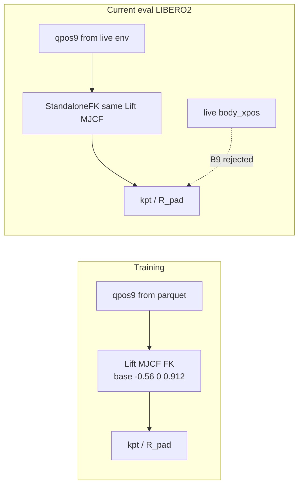
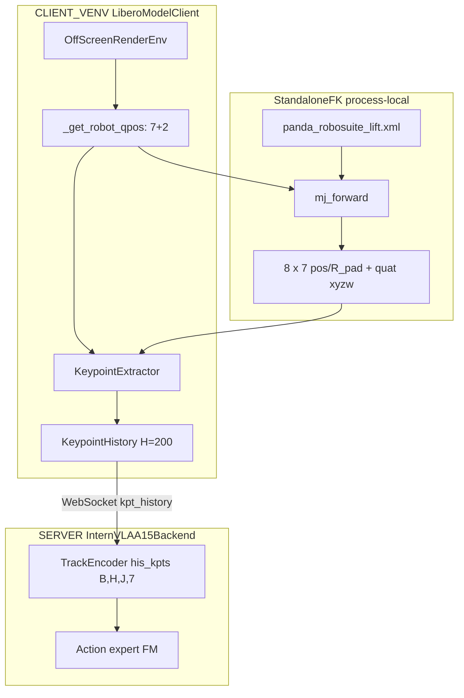

# LIBERO-plus 评估中的 Arena 基座与 StandaloneFK：分析与方案

> **日期**: 2026-09-15  
> **对象**: 正在运行的 step_032070 LIBERO-plus 评估（[`eval3.md`](eval3.md) / [`eval3_0915LOG.md`](eval3_0915LOG.md)）  
> **触发**: 同事指出「robot base 随 arena 变化，StandaloneFK 使用 Lift MJCF 固定基座会在非 table 场景产生 5–27% 关键点误差」  
> **结论先行**: 同事观察到的 **arena 基座不恒定是事实**；但把该事实解释成「当前 StandaloneFK 算错了、coffee/living 会因 kpt 失配掉点」**把 [`eval3.md`](eval3.md) §12 B9 的因果说反了**。对本 checkpoint，StandaloneFK 正是与训练同分布的做法。**不要热改正在跑的评估。**

---

## 目录

- [1. 问题陈述与两套「正确」定义](#1-问题陈述与两套正确定义)
- [2. 同事表与 eval3 实测表的对照](#2-同事表与-eval3-实测表的对照)
- [3. 训练关键点实际在什么坐标系](#3-训练关键点实际在什么坐标系)
- [4. 当前评估 StandaloneFK 实际在做什么](#4-当前评估-standalonefk-实际在做什么)
- [5. B9 的因果：为什么弃用 live body_xpos](#5-b9-的因果为什么弃用-live-body_xpos)
- [6. 残余缺口：图像/state 与 kpt 不在同一世界系](#6-残余缺口图像state-与-kpt-不在同一世界系)
- [7. 方案对比](#7-方案对比)
- [8. 对正在跑的评估：如何解读、不要做什么](#8-对正在跑的评估如何解读不要做什么)
- [9. 若日后改 FK：测试与验收](#9-若日后改-fk测试与验收)
- [10. 参考与出处](#10-参考与出处)

---

## 1. 问题陈述与两套「正确」定义

### 1.1 同事发现（原文要点）

LIBERO-plus 各任务所用 **arena 的机器人基座位置不是常数**，随场景类型变化。StandaloneFK 把关节角注入 **Lift MJCF**（固定 `robot0_base`），因此在非 table 场景上，关键点相对 **live 仿真世界系** 会有系统偏差：X 约 5–27%，Z 最大约 0.42–0.50 m。同事据此认为：coffee_table / living_room_table 上成功率偏低，**部分原因可能是关键点与真实机器人位姿失配**。

该观察 **不否定评估进程稳定性**（当前 eval 仍可正常跑），只影响 **结果解释** 以及 **要不要改 FK**。

### 1.2 必须先固定「正确」指哪一种

| 记号 | 含义 |
|------|------|
| \(\mathbf{q}_t \in \mathbb{R}^{9}\) | 7 个臂关节 + 2 个夹爪指关节（live 或 parquet 同源布局） |
| \(\mathbf{p}^{\mathrm{Lift}}_t \in \mathbb{R}^{8\times 3}\) | 把 \(\mathbf{q}_t\) 注入 **Lift MJCF** 后 `mj_forward` 得到的 8 个 body 世界坐标 |
| \(\mathbf{p}^{\mathrm{live}}_t\) | 同一 \(\mathbf{q}_t\) 在 **当前 LIBERO-plus arena** 的 `env.sim.data.body_xpos` |
| \(\mathbf{b}^{\mathrm{Lift}}\) | Lift 中 `robot0_base`，固定为 \((-0.56,\ 0,\ 0.912)\) m，见 [`evaluation/panda_robosuite_lift.xml`](../../evaluation/panda_robosuite_lift.xml) L164 |
| \(\mathbf{b}^{\mathrm{arena}}\) | 当前任务 live 环境中的 `robot0_base` 世界坐标 |
| \(R_{\mathrm{pad}}\) | 各向同性尺度，本数据为 `bbox_radius` \(= 1.8212722539901733\)（已含 15% margin，**不要再 ×1.15**） |
| \(\tilde{\mathbf{p}} = \mathbf{p}/R_{\mathrm{pad}}\) | 写入模型的位置分量 |

两种评价标准：

| 标准 | 数学目标 | 对本 ckpt 是否该用 |
|------|----------|-------------------|
| **训推一致** | \(\tilde{\mathbf{p}}^{\mathrm{eval}} \approx \tilde{\mathbf{p}}^{\mathrm{train}}\)，即始终用 \(\mathbf{p}^{\mathrm{Lift}}\) | **是（当前 StandaloneFK）** |
| **物理/视觉对齐** | \(\mathbf{p}^{\mathrm{eval}} \approx \mathbf{p}^{\mathrm{live}}\)，与相机看到的桌面/机座一致 | 否（相对本 ckpt 的 kpt 是 OOD）；需 **重生成 kpt + 重训** 后才合理 |

同事用的是第二套标准去评判第一套实现。两套标准在 **table 类、且 \(\mathbf{b}^{\mathrm{arena}}\approx\mathbf{b}^{\mathrm{Lift}}\)** 时接近；在 **OnTheGroundPanda**（coffee / living）上差 \(\Delta Z \approx 0.5\,\mathrm{m} \approx 0.27\,R_{\mathrm{pad}}\)。



---

## 2. 同事表与 eval3 实测表的对照

### 2.1 同事给出的 arena 基座

| Arena | Robot class | Base X | Base Z |
|-------|-------------|--------|--------|
| table / kitchen_table | MountedPanda | -0.66 | 0 |
| study_table | MountedPanda | -0.75 | 0 |
| empty / floor | both | -0.60 | 0 |
| coffee_table | OnTheGroundPanda | -0.51 | 0.41 |
| living_room_table | OnTheGroundPanda | -0.51 | 0.42 |

### 2.2 eval3 §12.2.2 给出的 **世界系** `robot0_base`（相对训练 Lift）

来源：[`eval3.md`](eval3.md) §12.2.2。训练 FK 固定 Lift：\(\mathbf{b}^{\mathrm{Lift}}=(-0.56,\ 0,\ 0.912)\)。

| Arena | Robot class | X | Z | \(\Delta X\) vs 训练 | \(\Delta Z\) vs 训练 |
|-------|-------------|---|---|----------------------|----------------------|
| table | MountedPanda | -0.66 | **0.912** | -0.10 m（约 5.5% \(R_{\mathrm{pad}}\)） | 0 |
| study | MountedPanda | -0.75 | **0.912** | -0.19 m（约 10%） | 0 |
| kitchen_table | MountedPanda | -0.66 | **0.912** | -0.10 m | 0 |
| living_room | OnTheGroundPanda | -0.51 | 0.42 | +0.05 m | **-0.49 m（约 27%）** |
| coffee_table | OnTheGroundPanda | -0.51 | 0.41 | +0.05 m | **-0.50 m（约 27%）** |

百分比以 \(\lvert\Delta\rvert / R_{\mathrm{pad}}\) 计（\(R_{\mathrm{pad}}\approx 1.821\)），与 eval3 一致。

### 2.3 两表为何在 Z 上打架

X 列与 robot class **基本一致**；**MountedPanda 的 Z：同事为 0，eval3 为 0.912**。更可能的原因不是「谁测错了 0.9 m」，而是 **测的量不同**：

| 可能测法 | MountedPanda 上会看到什么 |
|----------|---------------------------|
| MJCF/XML 里相对 arena 的局部 `pos`（桌面或 floor 局部） | Z 常接近 **0** |
| MuJoCo **世界** `body_xpos['robot0_base']` | 桌面安装时 Z 常为 **桌面高度附近（Lift 为 0.912）** |

Lift 导出文件写死的是 **世界系**：

```164:164:evaluation/panda_robosuite_lift.xml
    <body name="robot0_base" pos="-0.56 0 0.912">
```

**建议事后复核（不改当前 eval）**：在 client 里对若干 suite/任务打印

```python
bid = env.sim.model.body_name2id("robot0_base")
print(env.sim.data.body_xpos[bid])  # 世界系，应与 eval3 表同量纲
```

解读当前结果时，**以世界系 \(\mathbf{b}^{\mathrm{arena}}\) 相对 \(\mathbf{b}^{\mathrm{Lift}}\) 的差为准**；OnTheGround 的 \(\Delta Z\approx 0.5\,\mathrm{m}\) 两表方向一致，是真正大偏移。

---

## 3. 训练关键点实际在什么坐标系

### 3.1 生成管线（离线、与 arena 无关）

纵向：LIBERO 演示 → LeRobot v3 parquet（含 `observation.state.joint_position` 与 gripper）→ [`util_scripts/generate_libero_keypoints.py`](../../util_scripts/generate_libero_keypoints.py) 的 `LiberoMujocoFK`。

`LiberoMujocoFK.compute`：把 9D qpos 写入 **一份** robosuite Lift MJCF（历史路径 `/tmp/zwy/panda_robosuite_full.xml`，与 eval 用的 [`evaluation/panda_robosuite_lift.xml`](../../evaluation/panda_robosuite_lift.xml) 同源：[`export_panda_mjcf.py`](../../util_scripts/export_panda_mjcf.py) 的 `robosuite.make("Lift", robots="Panda")`），`mj_forward` 后读 `data.xpos` / `data.xquat`。

**没有**按 LIBERO 原任务的 table / study / living / coffee 去选 MJCF，也 **没有** 读 live `body_xpos`。即便某个 episode 的相机画面来自 living_room，关键点仍是 **Lift 世界系**。

### 3.2 元数据（本数据集）

[`/B/Dta/opvla_libero_merged_kpt/meta/keypoints_meta.json`](/B/Dta/opvla_libero_merged_kpt/meta/keypoints_meta.json)：

| 字段 | 值 | 含义 |
|------|-----|------|
| `normalization` | `world_origin_isotropic_r_pad` | 世界原点 + 各向同性 \(R_{\mathrm{pad}}\) |
| `coordinate_system` | `MuJoCo world frame, divided by R_pad` | 不减 base |
| `bbox_radius` | 1.8212722539901733 | **就是** \(R_{\mathrm{pad}}\)（margin 已乘过） |
| `global_min_world` / `max` z | \([0.908,\ 1.584]\) | **包含** base \(z=0.912\)，不是以机座为原点 |
| `qpos_layout` | `joint_position[0:7] + observation.state[6:8]` | 与 eval `_get_robot_qpos` 对齐（见 eval3 §12.10） |
| `mjcf_path` | `/tmp/zwy/panda_robosuite_full.xml` | Lift 全场景 MJCF |

[`eval3.md`](eval3.md) §12.2.1：100 帧均匀采样，Lift MJCF FK vs 数据集关键点 **max_pos_err \(= 5.96\times 10^{-8}\)**（float32）；URDF（base=origin）差恒为 \(\mathbf{b}^{\mathrm{Lift}}\)，约 0.50 m。

### 3.3 训练规模与「已经见过异 arena 画面」

[`sft.md`](sft.md)：`opvla_libero_merged_kpt` 为 40 任务合并（含 LIBERO-10 等）。LIBERO-10 原场景已含 study / living 等。训练时模型见到的是：**异 arena 图像 + 始终 Lift-world 的 kpt**。评估若改成 live-world kpt，对 coffee/living 反而是 **训练从未见过的 kpt 偏移**。

### 3.4 与 GeoP 真机 FK 的纵向对比

GeoPredict / 仓库内真机路径把关键点变到 **机座相对系**，例如 [`b/d/GpRbt/itrnVLA15_GeoP_3dtrj_3cn2.md`](../GpRbt/itrnVLA15_GeoP_3dtrj_3cn2.md) §15.1.4：

\[
\mathbf{p}^{\mathrm{base}} = R_b^{\top}(\mathbf{p}^{\mathrm{world}}-\mathbf{b}) - \mathbf{t}_{\mathrm{ori}}
\]

其中 \(R_b,\mathbf{b}\) 为基座姿态与位置，\(\mathbf{t}_{\mathrm{ori}}\) 为可选平移。那样 **arena 基座变化会被消掉**。本 LIBERO 数据 **没有** 采用该约定（`world_origin_isotropic_r_pad`），因此不能在 **只改 eval、不重训** 的前提下改成 base-relative 或 live-world。

---

## 4. 当前评估 StandaloneFK 实际在做什么

实现：[`evaluation/LIBERO2/keypoint_utils.py`](../../evaluation/LIBERO2/keypoint_utils.py)（[`eval3_0915LOG.md`](eval3_0915LOG.md) §2–4 已落地并 preflight）。

### 4.1 静态结构



### 4.2 动态：每步只问 live 要关节，不问 live 要连杆世界坐标

```84:101:evaluation/LIBERO2/keypoint_utils.py
def _get_robot_qpos(env) -> np.ndarray:
    """Extract 9D qpos from a live LIBERO robosuite env."""
    robot = env.robots[0]
    joint_pos = env.sim.data.qpos[robot._ref_joint_pos_indexes]           # [7]
    gripper_pos = env.sim.data.qpos[robot._ref_gripper_joint_pos_indexes] # [2]
    return np.concatenate([joint_pos, gripper_pos]).astype(np.float64)

class KeypointExtractor:
    def extract(self) -> np.ndarray:
        qpos9 = _get_robot_qpos(self._env)
        return self._fk.extract(qpos9)
```

`StandaloneFK.extract`：`qpos[:9]` 写入 Lift `MjData`，`mj_forward`，再 `/ R_pad` 与 wxyz→xyzw 半球。**\(\mathbf{b}^{\mathrm{Lift}}\) 不随任务改变。**

Client 绑定与历史上送：[`evaluation/LIBERO2/model2libero_interface.py`](../../evaluation/LIBERO2/model2libero_interface.py) `bind_env` / `push_keypoint`；[`evaluation/LIBERO-plus2/eval_libero_plus.py`](../../evaluation/LIBERO-plus2/eval_libero_plus.py) 在 reset、warm-up、`env.step` 后推送。Server 写入 `observation.his_kpts`、`observation.his_len`，`InternVLAA15.embed_kpt_suffix` → `TrackEncoder`（[`keypoints.py`](../../src/lerobot/policies/internvla_a1_5/keypoints.py)，`kpt_4d_mode=pos_rot` 时 `input_dim=7`）。

### 4.3 输入 / 输出（评估一步）

| 阶段 | 输入 | 处理 | 输出 |
|------|------|------|------|
| live env | MuJoCo 状态 | 只切机器人 qpos | \(\mathbf{q}_t\in\mathbb{R}^{9}\) |
| StandaloneFK | \(\mathbf{q}_t\) + 固定 MJCF | `mj_forward` | \(\tilde{\mathbf{p}}_t\in\mathbb{R}^{8\times 7}\) |
| History | 逐步 push | oldest-first，尾部零填充 | `his_kpts` \([200,8,7]\)，`his_len` |
| Policy | 图像、8D state、prompt、his_kpts | VLM + TrackEncoder + FM | action chunk 50×7 |

---

## 5. B9 的因果：为什么弃用 live body_xpos

[`eval3.md`](eval3.md) §12.2 把 **旧 eval（直接读 `env.sim.data.body_xpos`）** 判为三个系统错误：

1. **\(R_{\mathrm{pad}}\) 双重 margin**：把已是 \(R_{\mathrm{pad}}\) 的 `bbox_radius` 再 ×1.15 → 位置整体 ×0.87。  
2. **基座随 arena 变**：\(\mathbf{p}^{\mathrm{live}}\) 相对 \(\mathbf{p}^{\mathrm{Lift}}\) 有 5–27% 偏移。  
3. **EEF 名**：训练/Lift 为 `gripper0_eef`；live LIBERO-plus 常见 `gripper0_right_eef`。

另有 **B5**：缓存失效的 `env.sim` 引用。StandaloneFK 不读 live body，B5 自然消失。

[`eval3.md`](eval3.md) §12.8 表中「错误 base (−27%）→ SR 严重下降」指的是：**评估误把 \(\mathbf{p}^{\mathrm{live}}\) 送给一个只见过 \(\mathbf{p}^{\mathrm{Lift}}\) 的 TrackEncoder**。B9 的修复就是 **不要把这块偏移送进模型**。

因此：同事说的「StandaloneFK 相对 live 有偏差」= B9 **有意保持** 的偏差；若改回 live FK，才是把已修复的错误 2 重新打开。

[`eval2.md`](eval2.md) 曾主张 live `body_xpos`「零成本且与独立 FK 一致」——那只在 **同一 Lift 场景** 下成立；LIBERO-plus 多 arena 后假设失效，被 eval3 B9 取代。

---

## 6. 残余缺口：图像/state 与 kpt 不在同一世界系

必须诚实写出 **StandaloneFK 并不消除所有跨模态几何不一致**：

| 模态 | 坐标系（当前 eval） | 训练时 |
|------|---------------------|--------|
| 双相机 RGB | live arena 渲染 | 原 LIBERO 各场景录像 |
| `observation.state` 的 eef 平移 | live `robot0_eef_pos`（[`_extract_state`](../../evaluation/LIBERO2/model2libero_interface.py)） | 原数据集世界/EE 系 |
| 8×7D 关键点 | **Lift 世界系** / \(R_{\mathrm{pad}}\) | **同一 Lift 世界系** |

即：**图像和 8D state 跟着桌子走，kpt 跟着 Lift 机座走。** 该缺口在 **离线生成 kpt 时已经写入训练分布**。StandaloneFK 的作用是 **不要在评估时再换一套 kpt 世界系**。

模型侧：VLM 看图+语言+离散化 state；TrackEncoder 看的是 **关节运动学在固定机座下的轨迹形状**（绝对偏移被训练成常数偏置）。对「同一 \(\mathbf{q}\)、不同 \(\mathbf{b}^{\mathrm{arena}}\)」：

- StandaloneFK：kpt **不变**（与训练一致），图/state 变（LIBERO-plus 本意）。  
- live FK：kpt **随 \(\mathbf{b}^{\mathrm{arena}}\) 平移**，coffee/living 上 \(\Delta Z/R_{\mathrm{pad}}\approx 0.27\)，对 `pos_rot` 的 7D 输入是明显 OOD。

---

## 7. 方案对比

### 7.1 总表

| 方案 | 改代码？ | 改数据/重训？ | 对本 ckpt 的 kpt 是否同分布 | 与 live 几何是否对齐 | 建议 |
|------|----------|---------------|------------------------------|----------------------|------|
| **A 维持 StandaloneFK** | 否 | 否 | 是 | 否（有意） | **当前 eval 采用** |
| **B 分层解读 + 可选 mini ablation** | 否（主表）；旁路实验可加日志 | 否 | 主表仍是 A | ablation 才对比 | **评估结束后做** |
| **C live body_xpos 或注入 live base** | 是 | 否则 **错** | 否 | 是 | 仅重训后或对照实验 |
| **D 基座相对坐标** | 训练+评估 | **是** | 重训后是 | 与机座对齐，跨 arena 稳定 | **长期最优** |
| **E 按 arena 换 MJCF 模板** | 重 | 训练未如此做 | 否 | 部分 | 对本 ckpt 无益 |

### 7.2 A — 维持 StandaloneFK（推荐默认）

**做法**: 保持 [`LIBERO2/keypoint_utils.py`](../../evaluation/LIBERO2/keypoint_utils.py) 现状。  
**优点**: 与 `LiberoMujocoFK` + 100 帧 bit-level 验证一致；无热修补风险。  
**缺点**: 不消除图/state 与 kpt 的跨世界系缺口（训练已有）。  
**适用**: 所有「本 ckpt + 当前 LIBERO-plus 主表」。

### 7.3 B — 事后分层与小规模对照（推荐补强，不挡主评估）

不改主进程：

1. 用 `task_classification.json` / BDDL 的 arena 或 `robot0_base` 日志，把 SR 按 **suite × 扰动类 × arena 族**（Mounted vs OnTheGround）切开。  
2. **另开** mini eval（例如每族几十条任务）对比 A vs C，量化「若错误地用 live kpt，SR 掉多少」——用于写论文/内部备忘，**不得替换主表**。

### 7.4 C — live 世界系 FK

两条实现，几何目标相同（\(\mathbf{p}^{\mathrm{live}}\)）：

- 直接读 live `body_xpos` / `xquat`（旧 eval2 路径）：需重新处理 EEF 名、\(R_{\mathrm{pad}}\)、B5。  
- **更干净**：读 live \(\mathbf{b}^{\mathrm{arena}}\)（及可选基座四元数），写进 standalone `MjModel` 的 `robot0_base` 再 `mj_forward`——仍只用 qpos 驱动运动学，但原点换成 live 机座。

**对本 ckpt 错误的原因**: TrackEncoder 训练分布是 \(\mathbf{p}^{\mathrm{Lift}}/R_{\mathrm{pad}}\)。C 等于把 B9 错误 2 送回模型。  
**何时才对**: 训练管线改为同一 live/arena MJCF 生成 kpt 之后。

### 7.5 D — 基座相对（长期）

训练与评估统一：

\[
\mathbf{p}^{\mathrm{rel}} = R_b^{\top}(\mathbf{p}^{\mathrm{world}}-\mathbf{b}),\quad
\tilde{\mathbf{p}} = \mathbf{p}^{\mathrm{rel}} / R_{\mathrm{pad}}^{\mathrm{rel}}
\]

\(R_{\mathrm{pad}}^{\mathrm{rel}}\) 需在相对系上 **重算** bbox（不能沿用 1.821）。评估时 \(\mathbf{b},R_b\) 来自 live `robot0_base`；训练时来自 Lift 的 \(\mathbf{b}^{\mathrm{Lift}}\)（相对后 Lift 与各 arena 应接近）。这与 GeoP 真机 FK 同族，也最适合以后换桌高、换安装。

**成本**: 重跑 `generate_libero_keypoints.py` + SFT；不能只改 eval。

### 7.6 E — 每 arena 一份 MJCF

工程重（导出/校验/选模板），且训练从未按 arena FK。对现 ckpt 不优于 C，也不优于 D。

### 7.7 消融直觉（未跑实验，仅机制）

| 干预 | 预期 |
|------|------|
| 全零 his_kpts | eval3 §12.8：约 −5%～−20% SR |
| 错误 \(R_{\mathrm{pad}}\) ×0.87 | 轻度系统缩放 |
| 错误地把 OnTheGround 的 \(\mathbf{p}^{\mathrm{live}}\) 送给本 ckpt | 与「错误 base −27%」同类，可能严重 |
| 保持 A，仅 coffee/living 图/state OOD | SR 可能偏低，但是 **视觉/扰动** 因素，不是 FK 算错机座 |

---

## 8. 对正在跑的评估：如何解读、不要做什么

正在跑的是 [`evaluation/LIBERO-plus2/`](../../evaluation/LIBERO-plus2/) + [`LIBERO2/`](../../evaluation/LIBERO2/)（[`eval3_0915LOG.md`](eval3_0915LOG.md)）。

**不要做**:

- 不要改 `StandaloneFK`、不要切回 live `body_xpos`、不要注入 live base。  
- 不要因为 coffee/living 低 SR 就认定「关键点算法有 bug 必须停训/停评」。  
- 不要用同事的「相对 live 的 5–27%」当成本 ckpt 的 kpt 误差；那是 **相对另一坐标系** 的差。

**建议做（评估结束后）**:

- 主表仍报告官方 7 类扰动 SR。  
- 若能从 BDDL/任务名解析 arena：附录按 Mounted vs OnTheGround 分层；OnTheGround 偏低时优先讨论 **场景/相机/桌面高度与训练表桌分布不同**，以及 Robot/Layout 扰动，而不是 StandaloneFK。  
- 可选 B 的 mini ablation，单独存目录，避免覆盖 [`~/b/Ckp/`](file:///home/a26113/b/Ckp/) 已有结果。

---

## 9. 若日后改 FK：测试与验收

仅在 **明确切换实验目标**（对照 C，或数据管线改为 D）时实施。门禁：

| ID | 内容 | 通过标准 |
|----|------|----------|
| T1 | StandaloneFK vs `opvla_libero_merged_kpt` 100 帧 | max 位置误差 \(\sim 10^{-7}\)（已有 5.96e-8） |
| T2 | `_get_robot_qpos` 与训练 `qpos_layout` | 7+2 索引与 gripper 符号一致（eval3 §12.10） |
| T3 | 各 arena 打印 `body_xpos[robot0_base]` | 世界系；与 §2.2 同量纲；记录 Δ vs Lift |
| T4 | **本 ckpt 主表禁止默认 C** | CI/文档：主评估 `StandaloneFK` only |
| T5 | 若做 C 对照 | 独立 `EVAL_LOG_DIR`；table vs coffee/living 各至少数十任务；报告 ΔSR |
| T6 | 若做 D | 新 `keypoints_meta.json` 的 z 范围应 **不再** 以 0.912 为下沿；训练/eval 同一套 \(R_{\mathrm{pad}}^{\mathrm{rel}}\) |

Client 已持有 `env`（`bind_env`），T3 只读 `robot0_base`、**不必**用 live 全连杆当 kpt。

---

## 10. 参考与出处

| 对象 | 路径 | 本文引用 |
|------|------|----------|
| 评估手册 B9 / 坐标系 | [`eval3.md`](eval3.md) §12、§12.8 | 错误 2、StandaloneFK 动机、错误 base 对 SR 的机制表 |
| 评估执行日志 | [`eval3_0915LOG.md`](eval3_0915LOG.md) | LIBERO2 已部署、preflight 零位姿 EEF |
| 同事问题原文 | [`prmp.md`](prmp.md) | arena 表与「5–27% / 0.42 m Z」表述 |
| Eval FK | [`evaluation/LIBERO2/keypoint_utils.py`](../../evaluation/LIBERO2/keypoint_utils.py) | qpos→Lift `mj_forward` |
| 训练 FK | [`util_scripts/generate_libero_keypoints.py`](../../util_scripts/generate_libero_keypoints.py) | `LiberoMujocoFK` |
| Lift MJCF | [`evaluation/panda_robosuite_lift.xml`](../../evaluation/panda_robosuite_lift.xml) L164 | \(\mathbf{b}^{\mathrm{Lift}}\) |
| 训练元数据 | `/B/Dta/opvla_libero_merged_kpt/meta/keypoints_meta.json` | \(R_{\mathrm{pad}}\)、world 系、z 范围 |
| GeoP 真机相对系 | [`b/d/GpRbt/itrnVLA15_GeoP_3dtrj_3cn2.md`](../GpRbt/itrnVLA15_GeoP_3dtrj_3cn2.md) §15.1.4 | 方案 D 的历史同类做法 |
| TrackEncoder | [`src/lerobot/policies/internvla_a1_5/keypoints.py`](../../src/lerobot/policies/internvla_a1_5/keypoints.py) | his_kpts 编码 |
| 训练数据规模 | [`sft.md`](sft.md) | 40 tasks 合并集 |

---

## 附录：一句话对照同事原句

> 「StandaloneFK（固定 Lift base）会在非 table arena 上产生系统错误的关键点。」

更准确的说法：

> StandaloneFK 产生的关键点 **相对 live arena 世界系** 有基座差；这是 **相对物理场景** 的偏差。相对 **本 checkpoint 的训练分布**，它是正确实现。把 live 基座差喂给本模型，才是 eval3 B9 已排除的错误。
