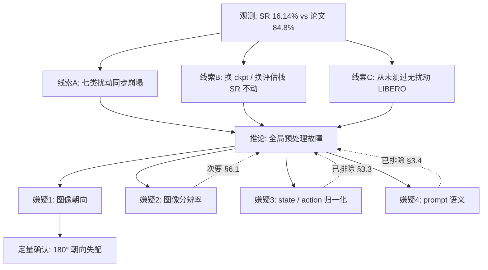
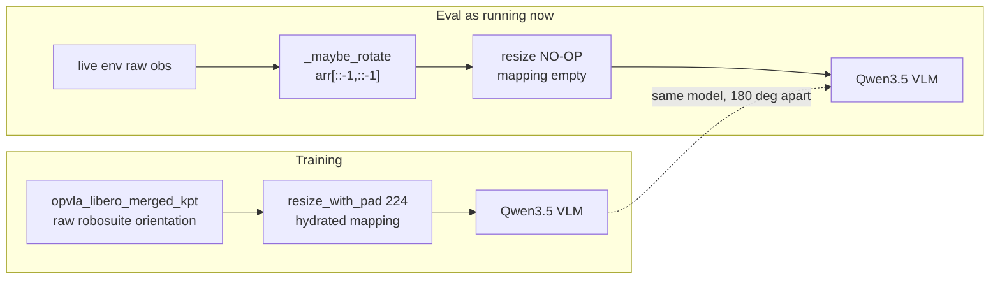
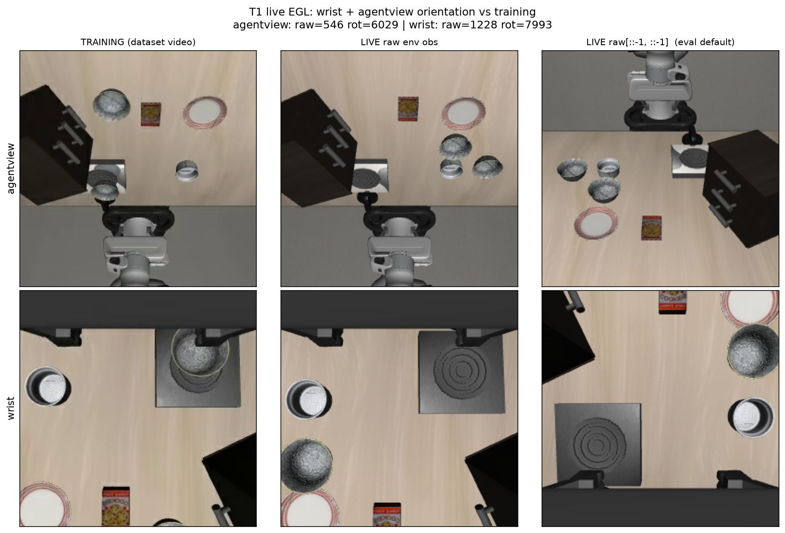
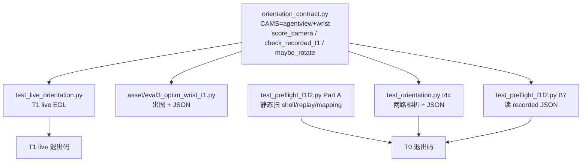
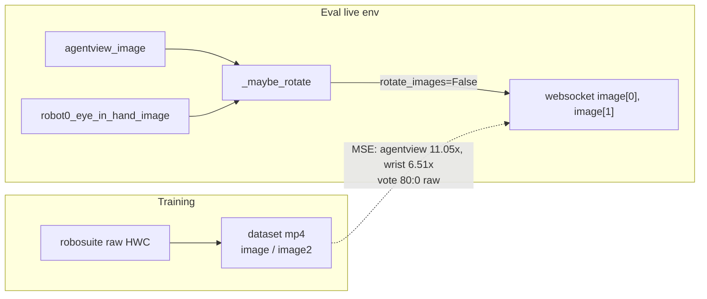
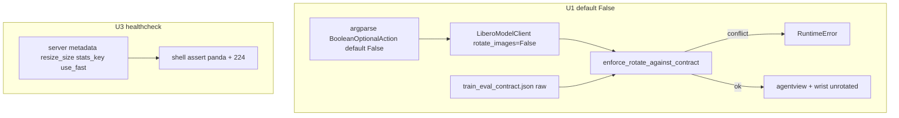

# LIBERO-plus 评估 SR 异常偏低：根因定位与优化方案

> **日期**: 2026-09-16
> **对象**: 正在运行的 `step_032070` LIBERO-plus 全量评估（方案 [`eval3.md`](eval3.md)，日志 [`eval3_0915LOG.md`](eval3_0915LOG.md)，输出目录 `full_20260915_095437`）
> **触发**: [`check_progress.py`](../../evaluation/LIBERO-plus2/check_progress.py) 显示 `libero_spatial` 跑完 2402 个任务后 SR 仅 **7.16%**，`libero_object` 跑到 84% 时 SR **26.31%**，整体 **16.14%**，而论文 Table 6 的 LIBERO-Plus Total 为 **84.8%**。

## 结论先行

**根因已定量定位：评估客户端对图像多做了一次 180° 旋转，而训练数据从未旋转。整个评估过程中，模型看到的是颠倒的世界。**

[`evaluation/LIBERO2/model2libero_interface.py`](../../evaluation/LIBERO2/model2libero_interface.py) **事故当时**默认 `rotate_images=True`，对 live env 的 `agentview_image` / `robot0_eye_in_hand_image` 施加 `arr[::-1, ::-1]`。U1 之后默认已是 `False`。但 `/B/Dta/opvla_libero_merged_kpt/` 中存储的训练帧本身就是 **robosuite 原始朝向（未旋转）**。事故中二者相差整整 180°。

这不是猜测，而是像素级对照实验的结果（§4）：

| 对照项 | 像素 MSE |
|--------|----------|
| 评估实际送入模型的帧 vs 训练帧 | **6026** |
| 该帧反向旋转 180° 后 vs 训练帧 | **508** |
| 控制组：训练帧 vs 自身 | 0 |
| 控制组：训练帧旋转 180° vs 训练帧 | **6017** ← 180° 失配的特征值 |

评估输入的失配量（6026）与「180° 失配特征值」（6017）在数值上重合，而把旋转撤销后失配下降 **11.9 倍**。

**修复动作**：给评估加上 `--no_rotate_images`。**单一开关即可**：T1 live EGL 已确认腕部相机与 agentview **同一朝向约定**，不需要 per-camera 配置（§4.4）。

**2026-09-16 代码审计（他人已改 `LIBERO2/` + `LIBERO-plus2/`）**：评估入口上的 P0/P1 代码修复**大部分已落地**，详见 [§10](#10-代码审计已修与未修)。摘要：

| 问题 | `LIBERO2` / `LIBERO-plus2` | 朝向是否修好 |
|------|---------------------------|--------------|
| agentview 被 180° 翻转后送给模型 | **已修（入口脚本默认不转）** | 是：与训练 raw 对齐 |
| 腕部相机 `robot0_eye_in_hand_image` | **同一 `_maybe_rotate`，无 per-camera 分叉** | 是：T1 两路都是 raw |
| replay 视频硬编码翻转 | **已改为 `client._maybe_rotate`** | 与模型输入一致 |
| 服务端 resize 空操作 | **LIBERO2 backend 已加 `image{0,1,2}` mapping** | 与朝向无关 |
| Python `rotate_images` 默认值 | **已改为 `False`（U1）**；`--rotate_images` 才开启 | 入口与直接构造都安全 |
| 旧路径 `evaluation/LIBERO/`、`evaluation/LIBERO-plus/` | **未重写**；启动时 stderr 警告（U2） | 仍会 180° 失配，不要用 |

**次要问题（真实但非主因）**：§6.1 的 resize no-op 在 **LIBERO2 评估路径已修**；旧 `evaluation/LIBERO/` backend 与 SimplerEnv 注释中的同类坑仍在。被评估的 `step_032070` 只是 53450 步计划中的第 60%（§6.2）。T2–T5 的 SR 重测尚未跑（§11 U4/U5，本次不执行）。

Python 默认朝向、healthcheck、训推契约见 [§11](#11-未解决问题方案与实施落地) U1–U7（已落地）。U8 history / U9 std 父进程 EGL / U10 EEF resolve / U11 pytest 路径及 T8/T9 见 §11.11（2026-09-16 午落地）。

> **评估进程状态（2026-09-16 01:30 UTC）**：已按用户要求停止 `full_20260915_095437` 全量评估并清空 8 张 GPU（`nvidia-smi` 无残留进程），以便执行 T1。该 run 作为「错误朝向」对照组不完整（当时约 47%）。

---

## 目录

- [1. 观测数据：SR 到底低到什么程度](#1-观测数据sr-到底低到什么程度)
- [2. 关键线索：失效模式是「全局均匀崩塌」](#2-关键线索失效模式是全局均匀崩塌)
- [3. 排除法：先排掉四个常见嫌疑](#3-排除法先排掉四个常见嫌疑)
- [4. 根因：180° 图像朝向失配](#4-根因180-图像朝向失配)
- [4.4 T1：腕部相机 live EGL 验证（已完成）](#44-t1腕部相机-live-egl-验证已完成)
- [5. 根因如何解释全部现象](#5-根因如何解释全部现象)
- [6. 次要问题](#6-次要问题)
- [7. 解决方案](#7-解决方案)
- [8. 测试与验收方案](#8-测试与验收方案)
- [9. 参考与出处](#9-参考与出处)
- [10. 代码审计：已修与未修](#10-代码审计已修与未修)
- [11. 未解决问题：方案与实施落地](#11-未解决问题方案与实施落地)
- [11.11 U8–U11 与 T8/T9](#1111-u8u11-与-t8t9eval3_optim2-复审后落地)
- [11.12 2026-09-16 下午复跑：error 与修复](#1112-2026-09-16-下午复跑error-与修复)

---

## 1. 观测数据：SR 到底低到什么程度

### 1.1 按 suite（截至 2026-09-16 ~07:16 UTC+8）

命令：

```bash
python evaluation/LIBERO-plus2/check_progress.py \
  --eval_dir /home/a26113/b/Ckp/4dwvlaOpvlaLibplusKpt0911/\
2026_09_12_08_52_49-internvla_a1_5-libplus-sft/checkpoints/eval_libero_plus/full_20260915_095437
```

| Suite | Done | Total | %Done | Succ | **SR** | Crash |
|-------|------|-------|-------|------|--------|-------|
| libero_spatial | 2402 | 2402 | 100.0% | 172 | **7.16%** | 0 |
| libero_object | 2121 | 2518 | 84.2% | 558 | **26.31%** | 0 |
| libero_goal | 0 | 2591 | 0% | – | – | 0 |
| libero_10 | 0 | 2519 | 0% | – | – | 0 |
| **TOTAL** | **4523** | 10030 | 45.1% | 730 | **16.14%** | **0** |

> `Crash=0` 说明 [`eval3.md`](eval3.md) 的 B10（fork-per-task EGL 隔离）与 B11（`MUJOCO_EGL_DEVICE_ID`）修复是有效的。**工程稳定性没问题，问题在数据语义层。**

### 1.2 按扰动类别（自行聚合 `worker_gpu*/client_*.log`）

聚合脚本见 §8.2。第三列为论文 Table 6 中 InternVLA-A1.5 的对应分数。

| 扰动类别 | Succ/Done | **本次 SR** | 论文 SR | 差距 |
|----------|-----------|-------------|---------|------|
| Light Conditions | 170/585 | 29.06% | 96.4% | −67.3 pp |
| Background Textures | 129/506 | 25.49% | 98.2% | −72.7 pp |
| Objects Layout | 130/703 | 18.49% | 85.2% | −66.7 pp |
| Camera Viewpoints | 122/758 | 16.09% | 83.1% | −67.0 pp |
| Language Instructions | 104/731 | 14.23% | 86.9% | −72.7 pp |
| Sensor Noise | 42/533 | 7.88% | 95.6% | −87.7 pp |
| Robot Initial States | 37/721 | 5.13% | 55.1% | −50.0 pp |

### 1.3 按难度等级

| difficulty_level | Succ/Done | SR |
|------------------|-----------|-----|
| 1 | 208/840 | 24.76% |
| 2 | 169/1052 | 16.06% |
| 3 | 156/1078 | 14.47% |
| 4 | 120/824 | 14.56% |
| 5 | 81/743 | 10.90% |

难度单调性存在但很弱（最易 24.8% vs 最难 10.9%），说明**即使在最简单的扰动上模型也接近失效**，不是「扰动太难」。


---

## 2. 关键线索：失效模式是「全局均匀崩塌」

有三条互相独立的线索，共同把嫌疑锁定在「全局预处理」而非「某个扰动维度的鲁棒性」：

**线索 A — 七类扰动同步崩塌。** 如果是某个扰动类型处理不当（例如相机外参、机器人基座），只会打击 1–2 个类别。但这里 7 类全部掉 50–88 pp，连几何几乎不变的 `Light Conditions`（论文 96.4%）和 `Background Textures`（论文 98.2%）也只剩 29% / 25%。**光照和背景扰动不改变几何，模型却依然做不对——说明它连没有被扰动的基础任务都做不对。**

**线索 B — 换 checkpoint、换评估栈都没有变化。** 历史记录（[`eval/eval_091LOG.md`](eval/eval_091LOG.md) L137–143）中 `step_026725` 用**旧**评估栈（`evaluation/LIBERO-plus/` + `LIBERO/`）跑出：

| Suite | 历史 SR (026725) | 本次 SR (032070) |
|-------|------------------|------------------|
| libero_spatial | 7.05% | 7.16% |
| libero_object | 25.09% | 26.31% |
| 总体 | 13.72% | 16.14% |

`eval3` 相对 `eval2/eval1` 重写了关键点管线（B9 StandaloneFK）、修了 `use_fast_action_tokens`（B2）、修了 EGL 崩溃（B10/B11），**SR 却几乎没动**。这说明真正的病灶是两代评估栈**共有**的东西。

**线索 C — 从未测过无扰动的标准 LIBERO。** 本 checkpoint 只跑过 LIBERO-plus，从未在分布内的标准 LIBERO 四套件上验收过（见 [`reprd_lbrp1.md`](../p/reprd_lbrp1.md) §6.5 只写了目标 98.9%，没有实测记录）。**这正是让一个全局 bug 潜伏至今的原因**：没有分布内基线，就无法区分「模型不鲁棒」和「管线接错了」。



---

## 3. 排除法：先排掉四个常见嫌疑

在锁定朝向之前，先按「与训练 checkpoint 的实际契约」逐项核对，避免误判。

### 3.1 关键点坐标系 — 不是主因

同事此前指出 arena 基座随场景变化、StandaloneFK 用固定 Lift 基座会有 5–27% 偏差。[`eval3_kpt.md`](eval3_kpt.md) 已辨析：训练关键点本身就是在**固定 Lift 世界系**下生成的（`keypoints_meta.json` 的 `coordinate_system = "MuJoCo world frame, divided by R_pad"`），StandaloneFK 与之同分布，是正确实现。

**本次数据给出了更强的证伪**：`eval3` 引入 StandaloneFK 前后，SR 从 7.05% → 7.16%（spatial）、25.09% → 26.31%（object）。**关键点管线整体重写只带来 ~1 pp 变化**，它不可能是 68 pp 缺口的来源。

### 3.2 夹爪约定 — 正确

训练数据 `stats.json` 中 `action[6]` 的 `min = -1.0`、`max = 1.0`（LIBERO 原生 ±1），因此必须用 `gripper_convention=libero_native`。实际启动参数确为 `--gripper_convention libero_native`（见 §1.1 的进程命令行）。客户端逻辑 `action[6] = 1.0 if action[6] > 0 else -1.0`（[`model2libero_interface.py:236-240`](../../evaluation/LIBERO2/model2libero_interface.py)）与之匹配。

> 若此项接反，SR 会是 **0%**（夹爪永不闭合），而不是 16%。

### 3.3 归一化统计量 — 正确

checkpoint 的 `stats.json` 只有一个顶层 key `panda`，其子键与训练数据 `/B/Dta/opvla_libero_merged_kpt/meta/stats.json` 完全一致。评估用 `--stats_key panda --robot_type panda`，`_pick_stats_key` 命中同一份统计量。8D state 的 `mean/std` 与数据集一致。

### 3.4 Prompt 语义 — 正确

| 项 | 训练 | 评估 | 一致 |
|----|------|------|------|
| `action_mode`（Control Mode tag） | `"joint"`（`train_config.json` 的 `data_transforms.inputs[8].action_mode`） | `panda` schema → `joint`，healthcheck 断言 | ✓ |
| `tokenize_state` | `true` | `config.tokenize_state = True` | ✓ |
| `use_fast_action_tokens` | `true` | `bool(getattr(config, "use_fast_action_tokens", True))` → `True` | ✓ |
| `max_prompt_length` | 650 | 650 | ✓ |

关于 `use_fast_action_tokens` 有一处容易误判：checkpoint 的 `config.json` 里**没有**这个键。但它属于 `InternVLAA15DatasetConfig`（[`configuration_internvla_a1_5.py:32`](../../src/lerobot/policies/internvla_a1_5/configuration_internvla_a1_5.py)）而非 `InternVLAA15Config`（同文件 L360 起），所以 `getattr` 走的是 fallback `True`，恰好与训练一致。这是**巧合正确**，§7.3 建议把它固化成显式断言。

---

## 4. 根因：180° 图像朝向失配

### 4.1 两侧各自做了什么

**评估侧**（LIBERO2 客户端）对 live obs 做 180° 旋转：

```146:150:evaluation/LIBERO2/model2libero_interface.py
    def _maybe_rotate(self, image: np.ndarray) -> np.ndarray:
        arr = np.asarray(image)
        if self.rotate_images:
            arr = arr[::-1, ::-1]
        return np.ascontiguousarray(arr)
```

`rotate_images` 默认 `True`（同文件 L45），由 `rotate_images=not args.no_rotate_images` 传入（[`eval_libero_plus.py:152`](../../evaluation/LIBERO-plus2/eval_libero_plus.py)），而启动脚本从未传 `--no_rotate_images`。

**训练侧**：`/B/Dta/opvla_libero_merged_kpt/` 的视频由上游 `opvla_libero_merged` 直接 rsync 而来，[`generate_libero_keypoints.py`](../../util_scripts/generate_libero_keypoints.py) 只写 `observation.keypoint_3d` 列，**不触碰图像**；`src/lerobot/transforms/` 中也没有任何 LIBERO 专用翻转。也就是说，**磁盘上的像素朝向就是模型训练时看到的朝向**。

文档里长期写着「训练数据已做 180° 旋转」（[`eval3.md`](eval3.md) §10.1、[`eval.md`](eval.md) §8.1、[`eval_0914LOG.md`](eval_0914LOG.md) L579），但这条论断**从未被像素级验证过**——仓库中不存在任何比较「数据集帧 vs 仿真渲染帧」的测试。它源自 OpenVLA 的通用约定，而本数据集的上游转换脚本（`port_libero.py`）并不在本仓库内。

### 4.2 对照实验

关键在于找到一个**与客户端完全同源**的「模型实际输入」快照。`step_026725` 那次运行开了 `save_videos`，而 replay 帧写入用的正是客户端的同一变换：

```96:96:evaluation/LIBERO-plus2/eval_libero_plus.py
            replay_images.append(np.ascontiguousarray(np.asarray(obs["agentview_image"])[::-1, ::-1]))
```

所以 replay 视频的每一帧 **等于** 客户端送给服务端的图像（resize 之前）。于是可以完全离线地做对照，无需重新渲染、不影响正在跑的评估。

选取的样本刻意做了控制：任务取 `pick up the black bowl between the plate and the ramekin and place it on the plate`（与训练帧同一任务），扰动类别取 `language_*`（**只改语言、视觉场景不变**）。


生成脚本：[`asset/eval3_optim_orientation.py`](asset/eval3_optim_orientation.py)。记号说明：\(I_{\text{eval}}\) 为客户端送出的帧，\(I_{\text{train}}^{(k)}\) 为训练视频第 \(k\) 帧，\(\mathcal{R}\) 表示 `arr[::-1,::-1]`（180° 旋转），误差定义为对训练帧取最优匹配

\[
E(I) \;=\; \min_{k}\ \frac{1}{3HW}\sum_{c,h,w}\bigl(I - I_{\text{train}}^{(k)}\bigr)^2 ,
\]

其中 \(H=W=256\) 为图像边长、\(c\) 遍历 RGB 三通道。结果：

| 量 | 值 | 含义 |
|----|-----|------|
| \(E(I_{\text{eval}})\) | **6026** | 评估实际输入与训练分布的差距 |
| \(E(\mathcal{R}\,I_{\text{eval}})\) | **508** | 撤销旋转后，降至 1/11.9（残差来自不同初始状态/物体位置） |
| \(E(I_{\text{train}}^{(0)})\) | 0 | 控制组：自身完全匹配 |
| \(E(\mathcal{R}\,I_{\text{train}}^{(0)})\) | **6017** | 控制组：**180° 失配的特征值** |

**判读**：\(E(I_{\text{eval}}) = 6026 \approx 6017 = E(\mathcal{R}\,I_{\text{train}})\)。评估输入相对训练分布的偏差，在数值上就是一次 180° 旋转的偏差。这是决定性的——控制组给出了「旋转失配长什么样」的标尺，而评估输入正好落在那个刻度上。

视觉上同样一目了然：训练帧是桌面在上、机械臂自下方伸入、柜子在左上；评估实际送入的帧是桌面在下、机械臂自上方垂下、柜子在右侧；把评估帧转回 180° 后，与训练帧的构图逐一对应。

### 4.3 数据流对比



### 4.4 T1：腕部相机 live EGL 验证（已完成）

先前的开放风险是：已存 replay 视频只含 agentview，若上游转换对两路相机处理不一致，单一 `rotate_images` 开关不够。2026-09-16 停评估、清空 GPU 后，用 **1 个 EGL context** 对 **未扰动** 的原始 spatial BDDL 做了 live 渲染对照。

脚本：[`asset/eval3_optim_wrist_t1.py`](asset/eval3_optim_wrist_t1.py)。环境与评估客户端相同：`CLIENT_VENV=/B/VENV/libero_plus_client`，`MUJOCO_GL=egl`，`MUJOCO_EGL_DEVICE_ID=0`，BDDL 为

`libero_spatial/pick_up_the_black_bowl_between_the_plate_and_the_ramekin_and_place_it_on_the_plate.bddl`

（不是 LIBERO-plus 的 `*_table_1` 背景扰动版——用扰动版时木纹 vs 石纹会把像素 MSE 打平，第一次试跑 agentview 的 raw/rot 比为 0.97，**结论不可用**；必须用与训练同场景的未扰动 BDDL。）

记 \(I^{\mathrm{raw}}\) 为 `env.step` 后的原始 `obs[cam]`，\(\mathcal{R}I^{\mathrm{raw}} = I^{\mathrm{raw}}[::-1,::-1]\) 为评估默认送入模型的朝向。对训练视频 bank（80 帧，`file-000.mp4`）取最优 MSE：

| 相机 | \(E(I^{\mathrm{raw}})\) | \(E(\mathcal{R}I^{\mathrm{raw}})\) | 比值 | 80 帧投票 raw : rot180 | 结论 |
|------|-------------------------|-------------------------------------|------|------------------------|------|
| agentview | **545.6** | 6029.0 | **11.05×** | 80 : 0 | 训练 = live **raw** |
| wrist | **1228.1** | 7992.9 | **6.51×** | 80 : 0 | 训练 = live **raw** |

控制组：agentview 训练帧自翻转 MSE = 6017（与 \(E(\mathcal{R}I^{\mathrm{raw}})=6029\) 重合）；wrist 训练自翻转 = 7797（与 7993 同量级）。腕部残差 1228 来自夹爪姿态/物体位置与 demo 不完全同一帧，不是朝向问题。

T1 通过标准（§8.1：选定朝向 MSE 低于另一朝向 ≥5×）**两路相机均满足**。



**结构线索与数字一致**：agentview 训练与 live raw 都是机械臂从画面**下方**伸入、柜子在左上；评估默认的 \(\mathcal{R}\) 把机械臂翻到画面上方。wrist 训练与 live raw 都是画面**顶部**一条深色挡板/夹爪结构、左侧碗、右上炉灶；\(\mathcal{R}\) 后挡板跑到画面底部。

**对方案的含义**：

- 开放风险 **关闭**：两路相机朝向约定相同，**不需要** per-camera 开关。
- 方案 A 仍然正确：`--no_rotate_images` 同时修好 agentview 与 wrist。
- 若只修一路、继续旋转另一路，才会制造真正的训推不一致。

数值落盘：[`asset/eval3_optim_wrist_t1.json`](asset/eval3_optim_wrist_t1.json)。

---

## 5. 根因如何解释全部现象

一个好的根因假设必须能解释**所有**观测，而不只是主指标。逐条验证：

| 现象 | 朝向假设的解释 |
|------|----------------|
| 七类扰动同步崩塌 50–88 pp | 旋转发生在扰动之前、与扰动正交，因此**均匀**打击所有类别 |
| 换 checkpoint / 换评估栈 SR 不变 | 两代栈的 `rotate_images` 默认值都是 `True`，bug 完整继承 |
| 关键点管线重写只带来 ~1 pp | 关键点本就与图像朝向无关，修它不解决视觉接地问题 |
| `libero_object` 26% ≫ `libero_spatial` 7% | object 任务是「抓某个指定物体放进篮子」，单一显著目标即使颠倒也可能被找到；spatial 任务是「抓**盘子和调味罐之间**的碗」，依赖**相对空间关系**，而 180° 旋转恰好破坏左右/上下关系 |
| `Robot Initial States` 最低 5.13% | 该类扰动改变机械臂初始构型，要求模型从图像读出臂的姿态；颠倒视角下这项最不可靠 |
| `Light` / `Background` 相对最高 29% / 25% | 这两类几乎不改变几何，模型退化到「在颠倒世界里凭先验硬撑」的基线水平，相对损失最小 |
| SR 是 16% 而非 0% | 腕部相机视野近似中心对称、信息退化较慢；8D proprioceptive state 与流匹配先验未受旋转影响；加上部分任务靠简单前伸即可完成 |

没有需要额外假设才能解释的残余现象。

---

## 6. 次要问题

这两项是真实缺陷，但**不足以**解释主缺口，修复朝向后应一并处理。

### 6.1 服务端 resize 是空操作（P1，LIBERO2 路径已修）

**事故当时**评估侧构造 `ResizeImagesWithPadFn` 时既没传 `mapping` 也没调 `hydrate()`。`__call__` 只遍历 `self.mapping` 的键，默认空 dict，循环体一次都不执行。即使 hydrate 了，`panda` schema 的 mapping 键是 `observation.images.image` / `.image2`，而 canonical 路径下 sample 的键已经是 `image0/1/2`（[`canonical_preprocess.py:45-48`](../../evaluation/LIBERO/policy_server/backends/canonical_preprocess.py)），仍然匹配不上。训练侧会 hydrate，因此曾出现**训练 224、评估 256**。

**2026-09-16 之后** [`LIBERO2` backend](../../evaluation/LIBERO2/policy_server/backends/policy_backend_internvla_a1_5.py) 已显式传入 canonical 键：

```107:111:evaluation/LIBERO2/policy_server/backends/policy_backend_internvla_a1_5.py
        self.resize = ResizeImagesWithPadFn(
            height=self.resize_size,
            width=self.resize_size,
            mapping={f"{OBS_IMAGES}.image{i}": f"{OBS_IMAGES}.image{i}" for i in range(3)},
        )
```

旧路径 [`evaluation/LIBERO/policy_server/backends/policy_backend_internvla_a1_5.py`](../../evaluation/LIBERO/policy_server/backends/policy_backend_internvla_a1_5.py) 仍是空 mapping。SimplerEnv 客户端注释也记录了同一 no-op，并在客户端自行 resize 绕过：

```77:83:evaluation/SimplerEnv/eval_simplerenv/main.py
    # Match the training-time InternVLA-A1.5 / PI05 `height/width=224`. The
    # server's `ResizeImagesWithPadFn` is a no-op at eval time (its `mapping`
    # is empty when the backend instantiates it), so the client must resize
    # before sending — otherwise the Qwen3-VL image processor tiles the raw
    # SimplerEnv frame into ~30x30 patches x 3 views = 900 image tokens and
    # `truncation='max_length'` silently drops some, causing the "Mismatch in
    # `image` token count" error on the server.
```

**对 LIBERO 的实际影响有多大？实测后要降级判断。** Qwen3.5-2B 的图像处理器参数为 `patch_size=16, merge_size=2, size.shortest_edge=65536`，因此 \(224^2 = 50176 < 65536\) 会被 smart_resize **上采样回 256**：

| 输入 | `image_grid_thw` | 合并后视觉 token |
|------|------------------|------------------|
| 224×224（训练） | `[1, 16, 16]` | **64** |
| 256×256（评估） | `[1, 16, 16]` | **64** |
| 480×480（SimplerEnv） | `[1, 30, 30]` | 225 |

**token 数完全相同，不存在 prompt 截断风险。** 两条路径的真正差别只是：训练图经历了 256→224→256 的「降采样再升采样」，损失了高频细节；评估图是原生 256 的锐利图像。这是一处真实但温和的分布偏移（训练偏模糊、评估偏锐利），不是 68 pp 量级的元凶。

> 对 SimplerEnv（3 视角 480×640 → ~900 token）才是致命的；对 LIBERO 的 2 视角 256 是良性的。这解释了为什么这个 bug 只在 SimplerEnv 被发现。

### 6.2 被评估的 checkpoint 只训到 60%（P2）

[`sft_0912LOG.md`](sft_0912LOG.md) §0 记录的计划是 **53450 步（50 epoch）**，而 `step_032070` 约为 **60%（epoch 30）**。`scheduler_decay_steps = 30000`，即 lr 刚走完衰减区间。训练日志显示 `loss_action` 在 step 13500 已降到 0.069、`loss_kpt_cur` 降 96.6%，收敛状况良好，所以这不是主因；但在修复朝向后重测时，应优先选用**训练完成的 checkpoint**，避免把「欠训」和「管线 bug」的影响混在一起。

---

## 7. 解决方案

设计原则遵循仓库 CLAUDE.md：**扩展优于修改**、**易变点抽象为配置项**、**复用既有代码**。

### 7.1 方案总表

| 方案 | 内容 | 改动量 | 优先级 |
|------|------|--------|--------|
| **A** | 评估传 `--no_rotate_images`，并把朝向抽象成 shell 配置项 | 极小（已有 CLI 开关） | **P0** |
| **B** | 先跑分布内标准 LIBERO 建立基线，再跑 LIBERO-plus | 无需改代码 | **P0** |
| **C** | 修服务端 resize no-op（对齐训练 224） | 小 | P1 |
| **D** | 加训推一致性护栏（像素级 + metadata 断言） | 中 | P1 |
| **E** | 换训练完成的 checkpoint 重测 | 无需改代码 | P2 |
| **F** | 训练侧显式固化朝向约定到 `keypoints_meta` 同级元数据 | 中 | P3 |

### 7.2 方案 A：修正朝向（P0）

**A1 — 评估已停止。** 2026-09-16 01:30 UTC 已 kill 全量评估进程树（`run_eval_libero_plus_venv.sh` / `eval_libero_plus.py` / `server_policy.py`）并确认 `nvidia-smi` 8 张 GPU 均为 0 MiB。`full_20260915_095437` 作为错误朝向对照组不完整（停时约 47%）。下一步应走方案 A2 后重跑，不要在旧目录上续跑。

**A2 — 把朝向暴露为配置项。** **（已实施）** [`run_eval_libero_plus_venv.sh`](../../evaluation/LIBERO-plus2/run_eval_libero_plus_venv.sh) L31 现为 `ROTATE_IMAGES="${ROTATE_IMAGES:-false}"`，客户端调用块通过 `${ROTATE_FLAG}` 传入 `--no_rotate_images`（L168–171, L202）。标准 LIBERO 脚本 [`run_eval_libero_std_venv.sh`](../../evaluation/LIBERO2/run_eval_libero_std_venv.sh) L147 硬编码同一 flag。原始补丁形态如下，供对照：

```bash
# 与 GRIPPER_CONVENTION 同级，放在脚本顶部配置区
ROTATE_IMAGES="${ROTATE_IMAGES:-false}"   # 本数据集为 raw 朝向 => 默认不旋转
```

```bash
# 客户端调用块内
ROTATE_FLAG=""
if [ "${ROTATE_IMAGES}" != "true" ]; then
    ROTATE_FLAG="--no_rotate_images"
fi
```

并加入 `${ROTATE_FLAG}` 到 `python evaluation/LIBERO-plus2/eval_libero_plus.py` 的参数列表。

这样做的理由：朝向是**随数据集来源变化**的量（OpenVLA RLDS 转换与直接 replay 的约定不同），属于 CLAUDE.md 所说「会随数据准备变化的点」，必须是配置项而非硬编码默认值。**注意不要反向硬编码成 `False`**——若将来换用真正做过旋转的数据集，需要能切回去。

T1（§4.4）已证明对本数据集 **agentview 与 wrist 共用同一 raw 朝向**，因此 **一个** `ROTATE_IMAGES=false` 同时覆盖两路，不必做 per-camera 配置。

**A3 — 同步修正 replay 视频的写法。** **（已实施）** [`eval_libero_plus.py:96`](../../evaluation/LIBERO-plus2/eval_libero_plus.py) 与 [`eval_libero_std.py:93`](../../evaluation/LIBERO2/eval_libero_std.py) 均已改为 `client._maybe_rotate(obs["agentview_image"])`。旧路径 [`evaluation/LIBERO-plus/eval_libero_plus.py`](../../evaluation/LIBERO-plus/eval_libero_plus.py) 与 [`evaluation/LIBERO/eval_libero_server_client.py`](../../evaluation/LIBERO/eval_libero_server_client.py) 仍硬编码 `[::-1,::-1]`。

### 7.3 方案 D：训推一致性护栏（P1）

本次事故的教训不是「有人写错了一个 flag」，而是**缺少一个能发现这类错误的机制**。文档里写了三遍「训练数据已做 180° 旋转」，却没有一行代码验证它。建议补两层：

1. **像素级契约测试**（§8.3 / §10.3）：**核心已落地**，复用模块 [`orientation_contract.py`](../../evaluation/LIBERO2/orientation_contract.py)。live EGL 入口 [`test_live_orientation.py`](../../evaluation/LIBERO2/test_live_orientation.py)；离线回归读 [`asset/eval3_optim_wrist_t1.json`](asset/eval3_optim_wrist_t1.json)。
2. **服务端 metadata 断言**：**尚未落地**。plus2 / std 的 healthcheck 仍只断言 `action_mode` 与 `preprocessing_owner`，没有 `rotate_images` / `image_grid_thw` / `stats_key` / `use_fast_action_tokens`。

### 7.4 预期收益（明确标注为推断，非实测）

修复朝向后，模型将首次在正确的视觉分布下被评估。参考论文 Table 6（Total 84.8%，不同 checkpoint、不同训练配方）与本 checkpoint 只训到 60% 的事实，**不应期待直接达到 84.8%**。合理的分阶段判据见 §8.1。

---

## 8. 测试与验收方案

### 8.1 验收门禁

| ID | 测试 | 前提 | 通过标准 | 覆盖 | 未覆盖 |
|----|------|------|----------|------|--------|
| **T0** | 静态+单元预检（§10.3） | 任意/numpy/SERVER_VENV | `test_preflight_f1f2.py` 退出码 0 | F1/F2/B1–B11 是否还在树上 | 不覆盖 live EGL |
| **T1-offline** | 已记录 T1 JSON 回归 | numpy | agentview+wrist `matches_raw`，比值 ≥5× | 朝向契约不被改写 | 不重新渲染 |
| **T1** | 朝向像素对照 live EGL（§4.4 / §8.3） | 1 个 EGL context；**已通过** | 选定朝向 MSE 显著低于另一朝向（≥5×）。实测 agentview 11.05×、wrist 6.51× | agentview + wrist | 不覆盖 resize/归一化 |
| **T2** | 分布内标准 LIBERO 冒烟 | T1 通过 | 4 套件各 10 任务，**SR ≥ 50%** | 端到端语义正确性 | 不覆盖扰动鲁棒性 |
| **T3** | 分布内标准 LIBERO 全量 | T2 通过 | 四套件平均 **SR ≥ 85%**（论文 98.9% 为上界） | 分布内能力基线 | 不覆盖 LIBERO-plus |
| **T4** | LIBERO-plus mini（7 类各 10 题） | T3 通过 | Overall **SR ≥ 40%** | 扰动鲁棒性初判 | 样本量小，方差大 |
| **T5** | LIBERO-plus 全量 | T4 通过 | Total 显著高于本次 16.14%；按类别与论文同序 | 最终指标 | – |
| **T6** | resize 一致性（§8.4） | SERVER_VENV | mapping 后 256→224；`image_grid_thw` 与训练一致 | §6.1 | 旧 `evaluation/LIBERO/` backend |
| **T7** | 回归：`Crash = 0` | – | B10/B11 修复不被破坏 | 工程稳定性 | – |

**T2/T3 是本次方案的核心新增环节。** 线索 C 指出，缺少分布内基线是让 bug 潜伏至今的根本原因。**必须先用标准 LIBERO 验收通过，才允许把 LIBERO-plus 的数字当作鲁棒性结论。**

### 8.2 SR 分层聚合脚本

§1.2 / §1.3 的表由此产生。它只读 client 日志与 `task_classification.json`，可在评估运行中安全执行。

```python
# 按扰动类别 / 难度聚合 SR；用法: python sr_breakdown.py <EVAL_DIR>
PAT = re.compile(r"task_id=(\d+) \[(.*?)\] '(.*?)' -> (\d+)/(\d+)")
cls = json.load(open(CLASS_PATH))            # task_classification.json
meta = {(s, int(it["id"])): it for s, items in cls.items() for it in items}
# 注意: 日志里的 task_id 是 0-based, json 的 id 是 1-based
it = meta.get((suite, int(tid) + 1))
```

**输入**：`<EVAL_DIR>/worker_gpu*/client_<suite>_*.log`。
**输出**：按 category / arena / difficulty / suite×category 四张表。
**已覆盖**：所有已完成任务的成败统计。**未覆盖**：arena 维度——任务名后缀解析在本次数据上只命中 `table`（287/4537），其余落入 `other`，若要按 arena 分层需改从 BDDL 或 `env.sim` 读取，见 [`eval3_kpt.md`](eval3_kpt.md) §9 T3。

### 8.3 T1：朝向像素对照测试（已执行）

**状态：通过。** 详见 §4.4。脚本 [`asset/eval3_optim_wrist_t1.py`](asset/eval3_optim_wrist_t1.py)。

```python
env = OffScreenRenderEnv(bddl_file_name=<original unperturbed spatial bddl>, ...)
obs = env.reset();  [env.step(dummy) for _ in range(10)]
for cam, ds_key in [("agentview_image", "observation.images.image"),
                    ("robot0_eye_in_hand_image", "observation.images.image2")]:
    raw = np.asarray(obs[cam])
    bank = decode_dataset_frames(ds_key, n=80)
    e_raw = min_mse(raw, bank)
    e_rot = min_mse(raw[::-1, ::-1], bank)
    assert e_raw < e_rot / 5, f"{cam}: raw={e_raw} rot={e_rot}"
```

**前提**：1 个 EGL context；`CLIENT_VENV` + `LIBERO_CONFIG_PATH`；GPU 空闲（本机无 OSMesa）。
**实测通过标准**：agentview 11.05×、wrist 6.51×，两路均为「训练 = live raw」。
**曾踩的坑**：对 LIBERO-plus `*_table_1`（背景扰动）做像素 MSE 会因木纹/石纹把 raw vs rot 打平（比值 0.97），必须用未扰动 BDDL 或改用边缘图。
**开放风险关闭**：wrist 与 agentview 结论相同，**不需要** per-camera 配置。

### 8.4 T6：resize 一致性测试

`lerobot.transforms.utils.resize_with_pad` 只要 CHW `float` 张量、数值 \([0,1]\)，**不能**把 HWC `uint8` numpy 直接传进去（2026-09-16 下午复跑踩过，见 §11.12）。可跑写法：

```python
# SERVER_VENV；入口已写入 test_orientation.py Test 6
import numpy as np, torch, os
from transformers import AutoImageProcessor
from lerobot.transforms.utils import resize_with_pad

SNAP = os.environ.get(
    "VLM_MODEL_PATH",
    "/B/VENV/hf_home/hub/models--Qwen--Qwen3.5-2B/snapshots/15852e8c16360a2fea060d615a32b45270f8a8fc",
)
ip = AutoImageProcessor.from_pretrained(SNAP, local_files_only=True)
img256 = np.random.default_rng(0).integers(0, 256, (256, 256, 3), dtype=np.uint8)  # HWC uint8
chw01 = torch.from_numpy(img256).permute(2, 0, 1).float() / 255.0                 # [3,H,W] in [0,1]
img224_t = resize_with_pad(chw01, 224, 224)
img224 = (img224_t.clamp(0, 1).permute(1, 2, 0).cpu().numpy() * 255).round().astype(np.uint8)
assert ip(images=[img224]).image_grid_thw.tolist() == \
       ip(images=[img256]).image_grid_thw.tolist() == [[1, 16, 16]]
```

符号：`SNAP` 为本地 Qwen3.5-2B processor 目录；`img256` 为评估相机原始分辨率；`chw01` 为训练/评估 `ResizeImagesWithPadFn` 使用的 CHW 归一化张量。本次实测两者均为 `[[1,16,16]]`（64 token）。该测试的价值在于**防止回归**：分辨率或 `merge_size` 一变就会失败。LIBERO2 backend 的 256→224 mapping 另由 `test_preflight_f1f2.py` Part C1 / `test_orientation.py` Test 5 覆盖；processor 网格由 Test 6 覆盖。

### 8.5 可复用验收入口（怎么跑）

核心契约只写一次，三个入口共用 [`evaluation/LIBERO2/orientation_contract.py`](../../evaluation/LIBERO2/orientation_contract.py)：



符号：`CAMS` 为两路相机配置（`agentview_image` ↔ 训练 `observation.images.image`；`robot0_eye_in_hand_image` ↔ `observation.images.image2`）。`matches_raw` 当且仅当 \(e_{\mathrm{raw}} < e_{\mathrm{rot180}}\)、比值 \(\ge 5\)、且 80 张训练帧全部投票 raw。

**不需要 GPU（应在任何重跑前先跑）：**

```bash
cd /B/SRC/itvlaGpLibPlus
# Part A：纯静态，任意 python
python evaluation/LIBERO2/test_preflight_f1f2.py --part A
# Part A+B：需要 numpy（朝向 JSON 回归、gripper、kpt）
python evaluation/LIBERO2/test_preflight_f1f2.py --part AB
# 朝向静态 + 已记录 T1 + resize（resize 需 SERVER_VENV）
python evaluation/LIBERO2/test_orientation.py
# 全量预检（C 需 SERVER_VENV / lerobot）
python evaluation/LIBERO2/test_preflight_f1f2.py --ckpt /path/to/pretrained_model
```

**需要 1 个空闲 GPU + CLIENT_VENV（重新渲染 T1）：**

```bash
export CLIENT_VENV=/B/VENV/libero_plus_client
export LIBERO_HOME=/home/a26113/DATA/LIBERO-plus
export LIBERO_CONFIG_PATH=<含 config.yaml 的目录>
export MUJOCO_GL=egl PYOPENGL_PLATFORM=egl MUJOCO_EGL_DEVICE_ID=0
# 必须用未扰动 spatial BDDL；plus 的 *_table_1 会把 MSE 打平
"${CLIENT_VENV}/bin/python" -u evaluation/LIBERO2/test_live_orientation.py
# 出图（复用同一 contract）
"${CLIENT_VENV}/bin/python" b/d/libplus/asset/eval3_optim_wrist_t1.py
```

**T2 标准 LIBERO 冒烟 / T5 plus 全量：** 入口脚本已默认不旋转。本次按用户要求 **不跑**。

```bash
# 标准 LIBERO（ROTATE_IMAGES 默认 false）
bash evaluation/LIBERO2/run_eval_libero_std_venv.sh
# LIBERO-plus（ROTATE_IMAGES 默认 false）
ROTATE_IMAGES=false bash evaluation/LIBERO-plus2/run_eval_libero_plus_venv.sh
```

**通过/失败：** T0/T1-offline 退出码 0 才能开 T2。T1 live 两路都必须 `matches_raw`。T2–T5 的 SR 门禁见上表，**尚未实测**。

**本次实测（2026-09-16，U1–U7 落地后全量非评估验收）：**

| 命令 | 环境 | 结果 |
|------|------|------|
| `test_preflight_f1f2.py --part AB` | CLIENT_VENV（有 mujoco） | **92/92 PASS**（含 T7=A11 fork、U1–U3/U6 静态项、B3–B5 kpt、B7 契约） |
| `test_preflight_f1f2.py --part C --ckpt …/032070/pretrained_model` | SERVER_VENV | **20/20 PASS**（resize mapping、ckpt stats/kpt、panda schema） |
| `test_orientation.py`（含 Test 5 resize） | SERVER_VENV | **PASS**（t1–t5 + t4d） |
| T6 `image_grid_thw` 224 vs 256 | SERVER_VENV，本地 Qwen3.5-2B snapshot | **PASS**：均为 `[[1,16,16]]` |
| `test_live_orientation.py` | CLIENT_VENV + EGL GPU0 | **PASS**：agentview 546.6 vs 6030.1（11.03×），wrist 1227.7 vs 7993.7（6.51×），vote 80:0 raw |

**未跑：** T2–T5（正式标准 LIBERO / LIBERO-plus SR）。

**U1–U7 那次无失败、无需改代码。** 非阻塞 stderr：LIBERO 依赖的旧 `gym` 打印 *unmaintained / NumPy 2.0* 警告，T1 仍退出码 0；U7 的 `flush` + `os._exit` 生效，未出现 `EGL_NOT_INITIALIZED` 把退出码打成非零。

**2026-09-16 下午复跑（U8–U11 已在树 + 除 T2–T5 外全部门禁）：** 详见 §11.12。摘要：Part A **69/69**、CLIENT Part AB **115/115**、SERVER Part C **22/22**（含 T8 \(r=-0.846\)、T9 `fps=10`）、pytest **14 passed**、`test_orientation.py` **t1–t6 PASS**、T1 live **PASS**（agentview 11.056×、wrist 6.506×，vote 80:0 raw）。T6 第一次按旧 numpy 片段跑失败，已改 Test 6 与本节片段。

---

## 9. 参考与出处

| 对象 | 路径 / 出处 | 本文用途 |
|------|-------------|----------|
| 评估方案与 B1–B11 | [`eval3.md`](eval3.md) | 评估栈设计、已修 bug 列表 |
| 评估执行日志 | [`eval3_0915LOG.md`](eval3_0915LOG.md) | healthcheck 9 项、B10/B11、shard 分配 |
| 关键点坐标系辨析 | [`eval3_kpt.md`](eval3_kpt.md) | §3.1 排除关键点假设 |
| 历史 SR（`step_026725`） | [`eval/eval_091LOG.md`](eval/eval_091LOG.md) L137–154 | §2 线索 B 的对照数据 |
| 旧评估栈与 gripper 事故 | [`eval2.md`](eval2.md) | 配置错误导致 SR=0% 的先例 |
| 论文 LIBERO-Plus Table 6 | [`../p/InternVLA-A1.5-paper.md`](../p/InternVLA-A1.5-paper.md) L255–261 | 七类扰动目标分数 |
| 标准 LIBERO 验收目标 | [`../p/reprd_lbrp1.md`](../p/reprd_lbrp1.md) §6.5 | T3 门禁 98.9% 上界 |
| 训练方案与超参 | [`sft.md`](sft.md) | 数据集契约 |
| 训练执行日志 | [`sft_0912LOG.md`](sft_0912LOG.md) | 53450 步计划、loss 曲线 |
| 客户端旋转实现 | [`evaluation/LIBERO2/model2libero_interface.py`](../../evaluation/LIBERO2/model2libero_interface.py) L45, L146–150 | 根因代码 |
| 评估入口与 CLI | [`evaluation/LIBERO-plus2/eval_libero_plus.py`](../../evaluation/LIBERO-plus2/eval_libero_plus.py) L96, L152, L342 | 已存在的修复开关 |
| 启动脚本 | [`evaluation/LIBERO-plus2/run_eval_libero_plus_venv.sh`](../../evaluation/LIBERO-plus2/run_eval_libero_plus_venv.sh) L31, L168–171, L202 | `ROTATE_IMAGES` 默认 false |
| resize mapping（已修） | [`evaluation/LIBERO2/policy_server/backends/policy_backend_internvla_a1_5.py`](../../evaluation/LIBERO2/policy_server/backends/policy_backend_internvla_a1_5.py) L107–111 | §6.1 / 方案 C |
| 朝向契约（可复用） | [`evaluation/LIBERO2/orientation_contract.py`](../../evaluation/LIBERO2/orientation_contract.py) | T1 live + JSON 回归 |
| 训推契约 JSON | [`evaluation/LIBERO2/train_eval_contract.json`](../../evaluation/LIBERO2/train_eval_contract.json) | §11 U6 |
| T0 预检 | [`evaluation/LIBERO2/test_preflight_f1f2.py`](../../evaluation/LIBERO2/test_preflight_f1f2.py) | F1/F2/B1–B11 + T1 JSON |
| T1 live | [`evaluation/LIBERO2/test_live_orientation.py`](../../evaluation/LIBERO2/test_live_orientation.py) | EGL 两路相机 |
| 旧路径未修 | `evaluation/LIBERO/`、`evaluation/LIBERO-plus/` | §10.2 残留 |
| resize no-op | [`src/lerobot/transforms/core.py`](../../src/lerobot/transforms/core.py) L130–145 | §6.1 |
| 训练 hydrate | [`src/lerobot/datasets/transformed_dataset.py`](../../src/lerobot/datasets/transformed_dataset.py) L35 | §6.1 训练侧对照 |
| 同类 no-op 的已知记录 | [`evaluation/SimplerEnv/eval_simplerenv/main.py`](../../evaluation/SimplerEnv/eval_simplerenv/main.py) L77–83 | §6.1 旁证 |
| 关键点生成（不改图像） | [`util_scripts/generate_libero_keypoints.py`](../../util_scripts/generate_libero_keypoints.py) L133–138, L223–250 | §4.1 训练侧朝向溯源 |
| 数据集元信息 | `/B/Dta/opvla_libero_merged_kpt/meta/{info,stats}.json`、`ANALYSIS.md` | 256×256、robot_type=panda、action ±1 |
| 本文图表脚本 | [`asset/eval3_optim_orientation.py`](asset/eval3_optim_orientation.py) | §1、§4 两张图 |
| T1 live EGL | [`asset/eval3_optim_wrist_t1.py`](asset/eval3_optim_wrist_t1.py)、[`asset/eval3_optim_wrist_t1.json`](asset/eval3_optim_wrist_t1.json) | §4.4 腕部+agentview 朝向 |

---

## 10. 代码审计：已修与未修

对照对象：本文 §4–§7 列出的问题 vs 2026-09-16 仓库实树，重点是他人改过的 [`evaluation/LIBERO2/`](../../evaluation/LIBERO2/) 与 [`evaluation/LIBERO-plus2/`](../../evaluation/LIBERO-plus2/)，并扫了 `evaluation/LIBERO/`、`evaluation/LIBERO-plus/`、SimplerEnv。

### 10.1 agentview 与腕部相机朝向（P0）

**结论：当前评估入口下，两路相机都不再被旋转，与训练 raw 朝向一致。像素契约已钉死；Python 默认值仍是脚枪。**

数据流（修复后入口）：



| 检查项 | 状态 | 证据 |
|--------|------|------|
| 训练 mp4 是 raw，不是 180° | **仍成立** | §4.2 控制组 MSE≈6017；T1 JSON |
| 评估默认曾把 live 帧 `arr[::-1, ::-1]` | **入口已关 + 默认 False** | plus2 / std `ROTATE_IMAGES` 默认 `false`，仅 `=true` 时传 `--rotate_images` |
| agentview 与 wrist 是否同一开关 | **是，无 per-camera 分叉** | [`model2libero_interface.py`](../../evaluation/LIBERO2/model2libero_interface.py) L173–174 两路都走 `_maybe_rotate` |
| 腕部是否曾与 agentview 相反 | **否** | T1：wrist raw 1228 vs rot180 7993（6.51×），vote 80:0 raw |
| 直接 `LiberoModelClient(...)` 不传 flag | **不再旋转（U1）** | L45 `rotate_images: bool = False`；契约 `raw` + rotate=True → `RuntimeError` |
| replay 是否与模型输入同朝向 | **plus2/std 已对齐** | `client._maybe_rotate(obs["agentview_image"])`；旧 `LIBERO/`、`LIBERO-plus/` 仍硬编码翻转 |

因此：**「agentview / 腕部相机朝向问题」在 LIBERO2 + LIBERO-plus2 评估入口上已经修好**。U1 落地后，**直接构造 `LiberoModelClient()` 默认也不再旋转**；与契约冲突会立刻 `RuntimeError`。旧评估目录仍未移植（U2）。

### 10.2 对照本文方案总表

| 本文 ID | 问题 | LIBERO2 / plus2 | 仓库其余 | 验收 |
|---------|------|-----------------|----------|------|
| **A / A2** | 评估多转 180° | **已修**：默认不转；`ROTATE_IMAGES=true` 才 `--rotate_images` | 旧路径默认仍转 | T0 A3/A15/A17；T1 |
| **A3** | replay 硬编码翻转 | **已修** | 旧路径仍 `[::-1,::-1]` | T0 A4/A5 |
| **C** | resize no-op | **已修**：explicit `image{0,1,2}` mapping | 旧 InternVLA backend、PI05 backend、SimplerEnv 注释中的 no-op | T0 A6；T6 C1 |
| **D1** | 像素朝向契约 | **已修**：`orientation_contract.py` + live/offline 入口 | – | T1 / T1-offline |
| **D2** | healthcheck | **已修 U3**：`stats_key` + `resize_size`；朝向走 client 契约 | 不把 `rotate_images` 放进 server metadata | T0 A20/A21 |
| **B / T2–T5** | 先标准 LIBERO 再 plus | **脚本已有** | – | **SR 未跑（U4）** |
| **E** | 换训完的 ckpt | **未做（U5）** | `step_032070` 仍是 60% | – |
| **F** | 朝向写入契约 | **已修 U6**：仓库 `train_eval_contract.json` | 不改训练数据集 `keypoints_meta.json` | T0 A19/B7 |
| **B1** | gripper `libero_native` | 正确，保持 | 保持 | T0 A7/B2 |
| **B2** | `use_fast_action_tokens` getattr | 正确，保持 | 保持 | T0 A8 |
| **B7** | 延迟 import imageio | 正确，保持 | 保持 | T0 A9 |
| **B9** | StandaloneFK / R_PAD | 正确，保持 | 保持 | T0 A10/B5 |
| **B10/B11** | fork + `MUJOCO_EGL_DEVICE_ID` | 正确，保持 | 保持 | T0 A11 |

### 10.3 验收代码如何复用、覆盖哪些分支

| 文件 | 角色 | 覆盖 | 不覆盖 |
|------|------|------|--------|
| [`orientation_contract.py`](../../evaluation/LIBERO2/orientation_contract.py) | 唯一像素契约：`CAMS`、MSE、多数票、`check_recorded_t1`、`maybe_rotate`、live 渲染 | 两路相机；未扰动 BDDL | 扰动任务、旧评估目录 |
| [`test_live_orientation.py`](../../evaluation/LIBERO2/test_live_orientation.py) | T1 live CLI | EGL 重渲染 | 无 GPU 时不可跑 |
| [`test_preflight_f1f2.py`](../../evaluation/LIBERO2/test_preflight_f1f2.py) | T0：静态 A1–A18 + 单元 B + 集成 C | shell flag、两路 `_maybe_rotate`、replay、resize mapping、gripper、kpt、recorded T1 | live EGL；healthcheck 朝向断言 |
| [`test_orientation.py`](../../evaluation/LIBERO2/test_orientation.py) | 精简朝向门 | `_maybe_rotate` 像素、shell、replay、两路相机、recorded T1、resize | 旧 `LIBERO-plus/` |
| [`asset/eval3_optim_wrist_t1.py`](asset/eval3_optim_wrist_t1.py) | 出图，import contract | 与 T1 同一判定 | – |

**T1 通过规则**（`camera_matches_raw`，\(e\) 为像素 MSE）：

\[
e_{\mathrm{raw}} < e_{\mathrm{rot180}},\quad
\frac{e_{\mathrm{rot180}}}{e_{\mathrm{raw}}} \ge 5,\quad
\mathrm{vote}(\mathrm{raw})=N
\]

其中 \(e_{\mathrm{raw}}\) 是 live 未旋转帧对训练 bank 的最小 MSE，\(e_{\mathrm{rot180}}\) 是 live 帧 `arr[::-1,::-1]` 对同一 bank 的最小 MSE，\(N=80\)。实测：agentview \(545.6\) vs \(6029\)（\(11.05\times\)），wrist \(1228.1\) vs \(7992.9\)（\(6.51\times\)），两路 vote \(80:0\)。

**必须用未扰动 BDDL。** plus spatial 的 `*_table_1` 木纹/石纹会把 raw vs rot 打到比值 \(\approx 0.97\)，造成假失败。

**T0 与朝向直接相关的断言：** A3（plus2 默认 false、opt-in `--rotate_images`）、A4/A5（replay + CLI 默认 False）、A14（两路同一函数）、A15（std shell）、A17（Python 默认 False）、A19–A21（契约 / metadata / healthcheck）、B7 / t4c / t4d。

### 10.4 残留风险（对照 §11）

1. **U1 Python 默认旋转** — **已落地**：`rotate_images: bool = False` + 契约校验。
2. **U2 旧目录** — **不重写**，仅警告；plus2 不得改回 `evaluation.LIBERO.model2libero_interface`（A12）。
3. **U3 healthcheck** — **已落地**：server 增 `resize_size` / `use_fast_action_tokens`；shell 断言 `stats_key` 与 `resize_size`。朝向不进 server metadata（client 契约）。
4. **U4/U5 T2–T5 与完整 ckpt** — **操作项，本次不跑**。
5. **U6 训推契约** — **已落地**：[`train_eval_contract.json`](../../evaluation/LIBERO2/train_eval_contract.json)。
6. **U7 EGL `__del__`** — live 测试 `flush` + `os._exit`；不改 MuJoCo。
7. **U8–U11 / T8 / T9** — **已落地**（§11.11）：history 不含当前帧、std 父进程零 EGL、EEF resolve、pytest 路径、夹爪符号与 fps 核对。

---

## 11. 未解决问题：方案与实施落地

§10 审计把「入口已修好」和「护栏缺口」分开。本节针对仍会让朝向事故复发的缺口，按 CLAUDE.md：**扩展优于修改**、**随数据变化的点做成配置**、**复用已有测试入口**。Arena 基座 / StandaloneFK 不在此列，见 [`eval3_kpt.md`](eval3_kpt.md)。T2–T5 全量评估本次不跑。

记号：\(I_{\mathrm{train}}\) 为数据集 mp4 帧（robosuite raw）；\(I_{\mathrm{live}}\) 为 env 观测；\(R_{180}(I)=I[::-1,::-1]\)。本数据要求送给模型的是 \(I_{\mathrm{live}}\) 而非 \(R_{180}(I_{\mathrm{live}})\)。



### 11.1 总表

| ID | 问题 | 优先级 | 本次 | 验收 |
|----|------|--------|------|------|
| **U1** | Python / argparse 默认仍旋转 | P0 | **已落地** | T0 A17/A5；t4d |
| **U2** | 旧 `LIBERO/`、`LIBERO-plus/` | P2 | **只警告，不重写** | T0 A22；A12 |
| **U3** | healthcheck 看不见 resize/stats | P1 | **已落地**（朝向不进 server meta） | T0 A20/A21 |
| **U4** | T2–T5 SR 未跑 | P0 操作 | **不执行** | 见 §8.1 / 11.5 |
| **U5** | ckpt 只训到 60% | P2 操作 | **不换 ckpt** | 等 `step_053450` |
| **U6** | 朝向未写成可执行契约 | P1 | **已落地** `train_eval_contract.json` | T0 A19/B7 |
| **U7** | EGL destructor 污染退出码 | P3 | **不改 MuJoCo**；测试 `os._exit` | 文档约定 |
| **U8** | `his_kpts` 含当前帧 | P1 | **已落地** push 在 `env.step` 前 | A24 / B8 |
| **U9** | std 父进程 import libero | P1 | **已落地** `TASK_SUITE_N_TASKS` | A23 |
| **U10** | EEF 名硬编码 | P1 | **已落地** `resolve_eef_body_name` | A10/A25/B5 |
| **U11** | `test_keypoint_utils` 旧路径 | P2 | **已落地** 改导 LIBERO2 | A26 / pytest |
| **T8** | 夹爪符号未测 | P2 | **已测 PASS** \(r=-0.846\) | Part C T8 |
| **T9** | fps 10 vs 20 Hz | P2 | **已测：非 2× 抽帧**；无 HDF5 | Part C T9 |

### 11.2 U1：默认不旋转（P0）

**根因。** 朝向随数据集变：OpenVLA RLDS 存储时已转过，live 上再转一次才对齐；本仓库 `/B/Dta/opvla_libero_merged_kpt/` 的 mp4 是 raw，再转就是 180° 失配。旧实现把「OpenVLA 惯例」写成类默认 `True`，CLI 又是 `--no_rotate_images` `store_true`，于是 `rotate_images=not args.no_rotate_images` 在漏传 flag 时恒为 True。

**为何不把默认写死进模型。** 以后若换「存储已旋转」的数据，仍要能 `ROTATE_IMAGES=true`。配置点在 shell 与 CLI，类默认只对本数据取安全值。

**复用。** 仍用 `_maybe_rotate`；不新增 per-camera API（T1 已证两路同契约）。

**代码。**

[`model2libero_interface.py`](../../evaluation/LIBERO2/model2libero_interface.py)：

```python
rotate_images: bool = False
# __init__ 连接 websocket 之前：
enforce_rotate_against_contract(bool(rotate_images))
```

[`eval_libero_plus.py`](../../evaluation/LIBERO-plus2/eval_libero_plus.py) / [`eval_libero_std.py`](../../evaluation/LIBERO2/eval_libero_std.py)：

```python
parser.add_argument("--rotate_images", action=argparse.BooleanOptionalAction, default=False)
parser.add_argument("--no_rotate_images", action="store_true")  # 旧 alias
# 子进程：
rotate_images=_rotate_images_from_args(args)  # alias 优先强制 False
```

Shell：仅当 `ROTATE_IMAGES=true` 传 `--rotate_images`，否则不传（默认已安全）。保留 `--no_rotate_images` 以免旧命令行失败。

**测试。** A17 断言 `rotate_images: bool = False`；A5 断言 CLI pair + `default=False`；A3/A15 断言 opt-in；B7/t4d 断言契约拒绝 `rotate=True`。

**覆盖 / 未覆盖。** 覆盖 LIBERO2 client 与 plus2/std 入口。未覆盖旧目录默认值（U2）。

**验收。** `python evaluation/LIBERO2/test_preflight_f1f2.py --part AB`

### 11.3 U2：旧评估目录（P2）

**不移植。** 旧栈可能仍服务「存储已旋转」的 OpenVLA 流程；plus2 已 `from evaluation.LIBERO2.model2libero_interface`。整栈复制会修改原路径、破坏旧约定。

**落地。** [`eval_libero_server_client.py`](../../evaluation/LIBERO/eval_libero_server_client.py) 与 [`LIBERO-plus/eval_libero_plus.py`](../../evaluation/LIBERO-plus/eval_libero_plus.py) 的 `main()` 开头向 stderr 打印 `WARNING: legacy ... use LIBERO2 / LIBERO-plus2`。

**测试。** A22 扫描 `legacy` + `WARNING`；A12 防止 plus2 改回旧 import。

**未覆盖。** 旧 backend 空 mapping、旧 replay 硬编码翻转。不要用这两条路径评估本 ckpt。

### 11.4 U3：healthcheck（P1）

[`eval3_optim3.md`](eval3_optim3.md) §9.3 把 `rotate_images` 放进 **server metadata 是错的**：\(R_{180}\) 发生在 client。正确分层：

| 层 | 字段 | 谁断言 |
|----|------|--------|
| Server `metadata()` | 已有 `stats_key`；新增 `resize_size`、`use_fast_action_tokens` | shell healthcheck |
| Client | `rotate_images` vs `train_eval_contract.json` | `enforce_rotate_against_contract` |
| T6 | `image_grid_thw` | 需加载 VLM processor，不进启动 healthcheck |

[`policy_backend_internvla_a1_5.py`](../../evaluation/LIBERO2/policy_server/backends/policy_backend_internvla_a1_5.py)：`self.use_fast_action_tokens = use_fast`，`metadata()` 增加两字段。plus2 / std shell：

```python
assert m.get('stats_key') == '${STATS_KEY_MODE}'
assert int(m.get('resize_size') or 0) == int(${RESIZE_SIZE})
```

**测试。** A20：metadata 含新字段且 **不含** `rotate_images`。A21：两份 shell 含上述 assert。

**未覆盖。** 启动时不检查 `image_grid_thw`（留给 T6 / Part C）。

### 11.5 U4 / U5：SR 重测与完整 ckpt（本次不跑）

朝向修了不等于 SR 已恢复。入口已存在：

```bash
# T2 冒烟：EVAL_MODE=smoke，默认不旋转
bash evaluation/LIBERO2/run_eval_libero_std_venv.sh
# T5 plus：ROTATE_IMAGES 默认 false
bash evaluation/LIBERO-plus2/run_eval_libero_plus_venv.sh
```

门禁仍是 §8.1：T2 四套件各若干任务 SR ≥ 50%；T3 分布内 ≥ 85%；T4 plus mini ≥ 40%；T5 显著高于错误朝向的 16.14%。U5：当前 `step_032070` ≈ 计划 53450 步的 60%，换 `step_053450` 是独立实验，不是本护栏的代码缺陷。

**测试脚本已有，SR 数字本次不验收。**

### 11.6 U6：训推契约文件（P1）

不改 `/B/Dta/opvla_libero_merged_kpt/meta/`（训练产物、易被覆盖）。仓库内配置点：

[`evaluation/LIBERO2/train_eval_contract.json`](../../evaluation/LIBERO2/train_eval_contract.json)

```json
{ "image_orientation": "raw", "resize_hw": [224, 224], "cameras": ["agentview", "wrist"] }
```

[`orientation_contract.py`](../../evaluation/LIBERO2/orientation_contract.py)：`load_train_eval_contract()`、`enforce_rotate_against_contract()`。client 在连 server 前调用。若将来数据确为 rot180，把 JSON 改成 `"rot180"` 并设 `ROTATE_IMAGES=true`。

**测试。** A19 解析 JSON；B7/t4d：raw 允许 False、拒绝 True。

### 11.7 U7：EGL `__del__`

MuJoCo EGL 在进程退出时 `EGL_NOT_INITIALIZED`。live 测试已 `sys.stdout.flush()` 后 `os._exit`。不改第三方析构。

### 11.8 文件改动与复用

| 文件 | 新/改 | 为何 |
|------|-------|------|
| `train_eval_contract.json` | 新 | 随数据变的配置，不改训练 meta |
| `orientation_contract.py` | 改 | 复用 T1 模块，加契约 API |
| `model2libero_interface.py` | 改 | 默认 False + 强制契约 |
| `eval_libero_plus.py` / `eval_libero_std.py` | 改 | CLI 默认 False，保留 alias |
| `run_eval_libero_*_venv.sh` | 改 | opt-in flag + healthcheck |
| `policy_backend_internvla_a1_5.py` | 改 | metadata 两字段 |
| 旧 `eval_*.py` | 改 | 仅警告 |
| `test_preflight_f1f2.py` / `test_orientation.py` | 改 | 不新建平行框架 |

**不改：** 旧 backend mapping、server 上的 `rotate_images`、StandaloneFK、不跑 T2–T5。

### 11.9 验收命令（不含 T2–T5 正式评估）

```bash
cd /B/SRC/itvlaGpLibPlus
# T0 A+B（kpt 需 CLIENT_VENV 的 mujoco）
source /B/VENV/libero_plus_client/bin/activate
python evaluation/LIBERO2/test_preflight_f1f2.py --part AB

# T0 C + T6 resize mapping / image_grid_thw + orientation/resize
source /B/VENV/itnvla15rbt20/bin/activate
python evaluation/LIBERO2/test_preflight_f1f2.py --part C \
  --ckpt /home/a26113/b/Ckp/4dwvlaOpvlaLibplusKpt0911/2026_09_12_08_52_49-internvla_a1_5-libplus-sft/checkpoints/032070/pretrained_model
python evaluation/LIBERO2/test_orientation.py   # Test 5 mapping + Test 6 image_grid_thw

# pytest（U11）
/B/VENV/libero_plus_client/bin/python -m pytest tests/test_keypoint_utils.py -q

# T1 live（1 个空闲 GPU）
export CLIENT_VENV=/B/VENV/libero_plus_client LIBERO_HOME=/home/a26113/DATA/LIBERO-plus
export LIBERO_CONFIG_PATH=/tmp/test_libero_config
export MUJOCO_GL=egl PYOPENGL_PLATFORM=egl MUJOCO_EGL_DEVICE_ID=0
"${CLIENT_VENV}/bin/python" -u evaluation/LIBERO2/test_live_orientation.py
```

通过：上述退出码均为 0。失败则禁止开 T2。T2–T5 见 §11.5，本次不跑。

### 11.10 本次执行记录（2026-09-16 11:36 UTC+8）

U1–U3、U6、U7 已在仓库中按 §11.2–11.7 落地，本次是 **复跑验收** 而不是再改一版代码。

| 项 | 处理 |
|----|------|
| U1 默认 False + CLI | 已在树上；A17/A5/t4d PASS |
| U2 旧路径警告 | 已在树上；A22 PASS。未重写旧 backend |
| U3 metadata/healthcheck | 已在树上；A20/A21 PASS |
| U4/U5 | 按方案不跑正式评估、不换 ckpt |
| U6 `train_eval_contract.json` | 已在树上；A19/B7 PASS |
| U7 `os._exit` | T1 退出码 0，未见 EGL 析构污染 |

**Error：** 无（退出码均为 0）。  
**非阻塞：** T1 stderr 有 Gym *unmaintained* 提示（LIBERO 仍 `import gym`）。不改第三方、不影响 PASS。  
**解决方案：** 无代码热修。若日后要把 Gym 警告从门禁日志里去掉，再在 client 脚本里过滤 stderr，而不是改 LIBERO。

### 11.11 U8–U11 与 T8/T9（eval3_optim2 复审后落地）

对照 [`eval3_optim2.md`](eval3_optim2.md) §12–§14。朝向/resize/U1–U7 已在树上之后，仍缺的是 history 含 \(t\)、std 父进程 `import libero`、EEF 硬编码、失效 pytest，以及夹爪/fps 没有可失败测试。

| ID | 问题 | 代码 | 验收 |
|----|------|------|------|
| **U8** | `his_kpts` 含当前帧 | plus2/std：`push_keypoint()` 在 `env.step` **之前** | A24、B8：wait=10 时 history=`[0..9]`、current=`10` |
| **U9** | std `evaluate_policy` 在 fork 前 import libero | `TASK_SUITE_N_TASKS`；`benchmark` 只在子进程 | A23 AST |
| **U10** | EEF 名 vs metadata | `resolve_eef_body_name`，候选与 generate 相同 | A25、B5 Lift→`gripper0_eef`；metadata 可为 `gripper0_right_eef` |
| **U11** | pytest 导入已删路径 | `tests/test_keypoint_utils.py` → LIBERO2 | A26；pytest 14 passed |
| **T8** | 夹爪符号 | 只测不改：\(\mathrm{corr}(a_6,g_L^{\mathrm{next}})=-0.846<0\) | Part C T8 PASS，不翻转 |
| **T9** | fps 10 vs 20 Hz | `median_dt=0.1000`，mean ep len 123.7 ≥ 80 | 非 2× 抽帧；无 HDF5 |

复用模块：[`train_eval_extra_contract.py`](../../evaluation/LIBERO2/train_eval_extra_contract.py)。命令见 [`eval3_optim2.md`](eval3_optim2.md) §14。T2–T5 仍不跑。

### 11.12 2026-09-16 下午复跑：error 与修复

对照 [`eval3_optim2.md`](eval3_optim2.md) §13 的 U8–U11：生产代码已在树上（`push_keypoint` 在 `env.step` 前、`TASK_SUITE_N_TASKS`、`resolve_eef_body_name`、pytest 导 `LIBERO2`），本次是 **按该方案验收 + 把遇到的 err 修掉**，不跑 T2–T5。

**跑过的门禁（均退出码 0）：**

| 命令 | 环境 | 结果 |
|------|------|------|
| `test_preflight_f1f2.py --part A` | 任意 python | **69/69** |
| `test_preflight_f1f2.py --part AB` | CLIENT_VENV | **115/115**（T8/T9 无 pyarrow → skip） |
| `test_preflight_f1f2.py --part C --ckpt …/032070/pretrained_model` | SERVER_VENV | **22/22**；T8 \(\mathrm{corr}=-0.846<0\)；T9 `fps=10.0`、`median_dt=0.1000`、mean ep len 123.7 |
| `pytest tests/test_keypoint_utils.py -q` | CLIENT_VENV | **14 passed** |
| `test_orientation.py` | SERVER_VENV | t1–t6 **PASS**（含 T6 `[[1,16,16]]`） |
| `test_live_orientation.py` | CLIENT_VENV + EGL GPU0 | **PASS**：agentview 545.4 vs 6030.3（11.056×），wrist 1228.8 vs 7994.1（6.506×），vote 80:0 raw |

**未跑：** T2–T5 正式标准 LIBERO / LIBERO-plus SR（按用户要求）。

#### Error 1 — T6 旧片段把 numpy 传给 `resize_with_pad`

**现象。** 按 §8.4 / eval3_optim2 §10.4 的伪代码直接跑：

```text
AttributeError: 'numpy.ndarray' object has no attribute 'unsqueeze'
  File src/lerobot/transforms/utils.py, resize_with_pad, image.unsqueeze(0)
```

**根因。** `resize_with_pad` 的契约是 `torch.Tensor`、形状 `[3,H,W]` 或 `[B,3,H,W]`、数值 \([0,1]\)。文档片段把 HWC `uint8` 环境帧当成了 PIL/numpy 图像 API。这不是评估 backend 的回归：Part C1 / Test 5 的 `ResizeImagesWithPadFn` mapping 本来就是 tensor 路径。

**解决方案。**

1. 调用前先 `permute(2,0,1).float()/255`，processor 前再转回 HWC `uint8`（§8.4 已改成可跑代码）。
2. 把该断言做成 [`test_orientation.py`](../../evaluation/LIBERO2/test_orientation.py) **Test 6** `test_t6_image_grid_thw`：缺 SNAP / 缺 transformers 则 skip；本机 SNAP 存在时断言 224 与 256 均为 `[[1,16,16]]`。
3. 复跑：`/B/VENV/itnvla15rbt20/bin/python evaluation/LIBERO2/test_orientation.py` → t6 **PASS**。processor 类型为 `Qwen2VLImageProcessorFast`，`size.shortest_edge=65536`，与「\(224^2 < 65536\) 时 256 与 224 网格相同」一致。

#### Error 2 — `smoke_test_libero_fk.py` 跨 venv 缺依赖（非门禁）

eval3_optim2 的 U10 验收是 A10/A25/B5，**没有**把 [`util_scripts/smoke_test_libero_fk.py`](../../util_scripts/smoke_test_libero_fk.py) 列为必跑项。额外试跑时：

| 环境 | 失败 |
|------|------|
| SERVER_VENV | `ModuleNotFoundError: No module named 'mujoco'` |
| CLIENT_VENV | `ModuleNotFoundError: No module named 'pandas'` |

**解决方案。** 不混装两个 site-packages（numpy ABI 风险）。U10 继续用 CLIENT_VENV 的 B5（Lift MJCF + `resolve_eef_body_name` → `gripper0_eef`），parquet 列读写走 SERVER_VENV 的 T8/T9。若以后要把 smoke 纳入门禁，应在 **同时有 mujoco 与 pyarrow/pandas 的环境** 跑，而不是改 FK 代码。

#### 非阻塞

T1 stderr 仍有 Gym *unmaintained / NumPy 2.0* 警告（LIBERO `import gym`）。U7 的 `flush` + `os._exit(0)` 使退出码仍为 0。不改第三方。

**结论。** 除 T2–T5 外，eval3_optim2 §10 / §14 列出的验收全部通过。生产侧 U8–U11 无需再改；本轮代码只补了 T6 的可跑测试与文档片段。

---

## 附录：一句话总结

> 历史 SR 与本次几乎相同（7.05% vs 7.16%），曾被当作「该 checkpoint 能力就这样」。实际上两次都栽在同一处：**模型在整个评估过程中都在看一个上下颠倒的世界**。文档写了三遍「训练数据已做 180° 旋转」，但没有一行代码验证过这句话——这是本次事故真正的可复用教训。T1 确认腕部与 agentview 同为 raw。LIBERO2/plus2 入口、Python 默认、client 契约与 healthcheck 已把该约定钉死；U8–U11（history / 父进程 EGL / EEF resolve / pytest）已补。旧评估目录仍不要用。SR 重测（T2–T5）尚未跑。
