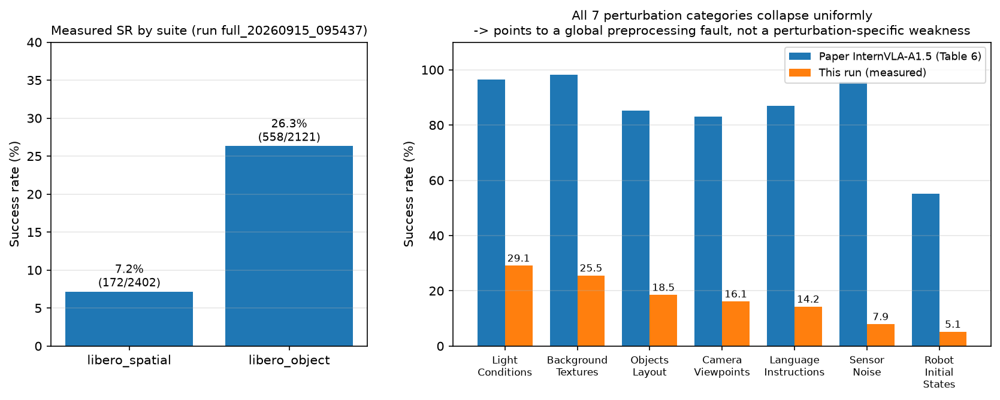
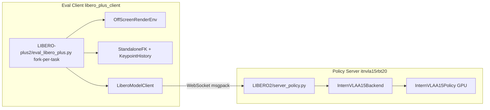
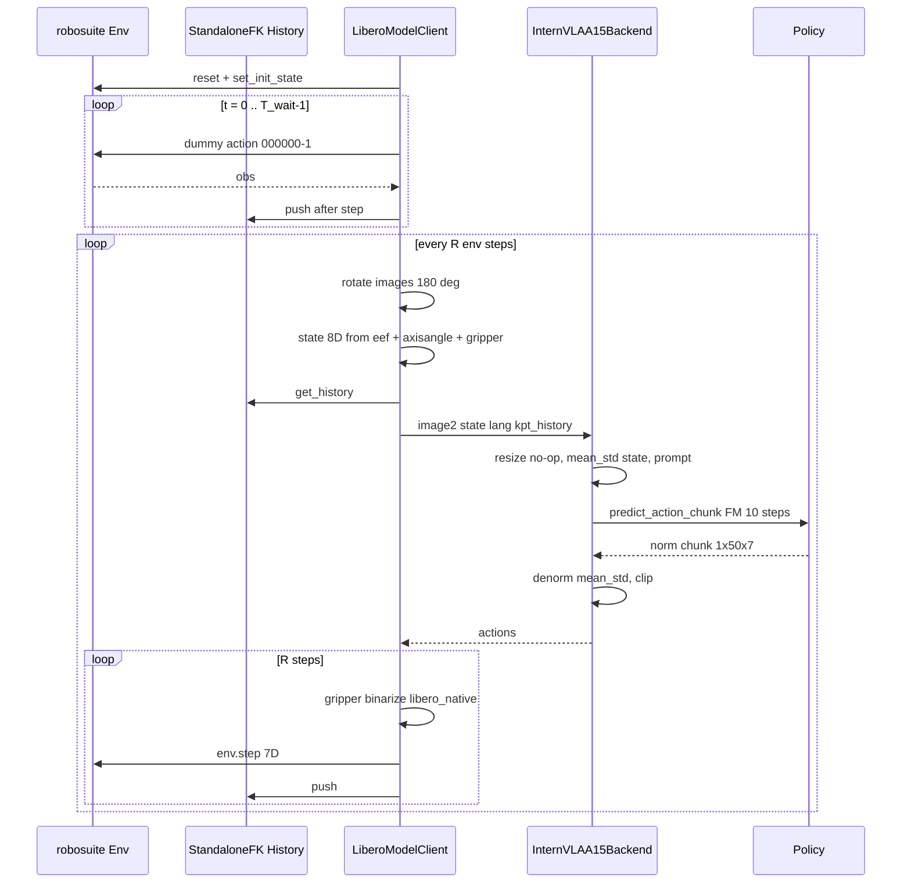
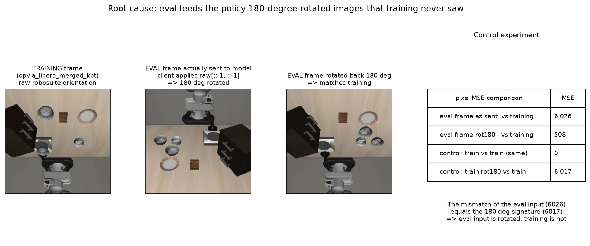
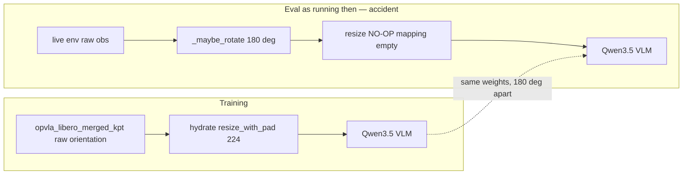
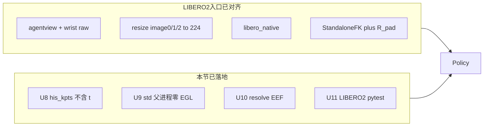
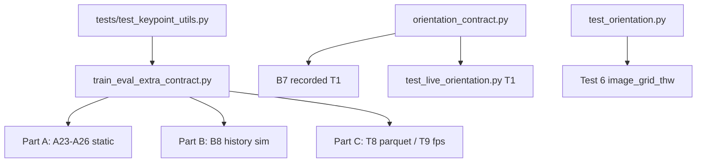
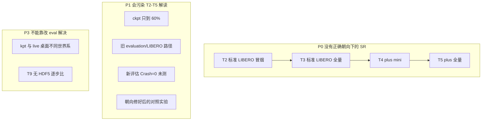

# LIBERO-plus 评估成功率异常偏低：根因分析与优化方案 (eval3_optim2)

> **日期**: 2026-09-16  
> **对象**: `step_032070` 的 LIBERO-plus 全量评估（`full_20260915_095437`，错误朝向对照组，约 47% 时已停）  
> **评估方案**: [`eval3.md`](eval3.md)（LIBERO2 / LIBERO-plus2）  
> **执行日志**: [`eval3_0915LOG.md`](eval3_0915LOG.md)  
> **输出目录**: `/home/a26113/b/Ckp/4dwvlaOpvlaLibplusKpt0911/2026_09_12_08_52_49-internvla_a1_5-libplus-sft/checkpoints/eval_libero_plus/full_20260915_095437`  
> **代码基准**: `/B/SRC/itvlaGpLibPlus/` 仓库真实代码（不以文档里的未验证断言为准）  
> **本文定位**: 对训练数据处理、3D 关键点抽取、SFT 与评估栈做一次端到端对照，解释当前 SR 为什么特别低，并给出可落地的修复与验收方案。§6–§9 保留事故现场；§12 之后以**当前树 + 实测门禁**为准。

**文档变更历史**:

| 版本 | 日期 | 说明 |
|------|------|------|
| [`eval3_optim.md`](eval3_optim.md) | 2026-09-16 | 首次像素级定位 180° 朝向失配 |
| eval3_optim2.md（本文） | 2026-09-16 | 按计划扩写：补训练/keypoint/SFT 全链路、纠正 eval3.md 与 ANALYSIS.md 中与代码不符的断言、刷新 SR、给出配置化方案与验收门禁 |
| 本文 §12–§15 | 2026-09-16 午 | 对照他人已改的 `LIBERO2/` / `LIBERO-plus2/` 与 [`eval3_optim.md`](eval3_optim.md) / [`eval3_optim3.md`](eval3_optim3.md)：复审已修/未修；落地 U8–U11 与 T8/T9 验收 |
| 本文 §14–§16 | 2026-09-16 下午 | 除 T2–T5 外全部门禁复跑；回写 error/方案；按当前代码与测试结果刷新；**未解决问题单独成节** |

---

## 结论先行

**根因已经定量定位：评估客户端对 live 图像多做了一次 180° 旋转，而训练数据从未旋转。整个评估过程中，模型看到的是颠倒的世界。**

[`evaluation/LIBERO2/model2libero_interface.py`](../../evaluation/LIBERO2/model2libero_interface.py) **事故当时**默认 `rotate_images=True`，对 `agentview_image` 与 `robot0_eye_in_hand_image` 施加 `arr[::-1, ::-1]`（U1 之后默认已是 `False`）。训练数据 `/B/Dta/opvla_libero_merged_kpt/` 里的视频是 robosuite **原始朝向**（[`generate_libero_keypoints.py`](../../util_scripts/generate_libero_keypoints.py) 只写关键点列，不碰图像；训练 transform 链也没有 LIBERO 专用翻转）。事故中二者相差整整 \(180^\circ\)。

这不是猜测。对「同一任务、只改语言、视觉场景不变」的 agentview 帧做像素对照（§6.2）：

| 对照项 | 像素 MSE |
|--------|----------|
| 评估实际送入模型的帧 vs 训练帧 | **6026** |
| 该帧反向旋转 \(180^\circ\) 后 vs 训练帧 | **508** |
| 控制组：训练帧 vs 自身 | 0 |
| 控制组：训练帧再转 \(180^\circ\) vs 训练帧 | **6017** ← \(180^\circ\) 失配的特征值 |

评估输入的失配量（6026）与「\(180^\circ\) 失配特征值」（6017）重合；把旋转撤销后失配下降约 **11.9 倍**。

**立刻能做的修复（事故当时）**：评估加上 `--no_rotate_images`。该开关已经存在于 [`eval_libero_plus.py`](../../evaluation/LIBERO-plus2/eval_libero_plus.py)。**当前官方 shell 已默认不转**（`ROTATE_IMAGES=false`，见 §12）；下文 §6–§9 保留事故现场分析，不要把「默认 `True` / resize 空 mapping」当成当前树上的状态。

**错误朝向对照组已停。** `full_20260915_095437` 约 47% 时按操作要求停止并清空 GPU，**不是**完整的错误朝向全量。新的正确朝向 SR 只能来自 T2–T5（尚未跑）。

**次要问题是真实的，但解释不了 68 个百分点的缺口**：服务端 `ResizeImagesWithPadFn` 在**事故当时**评估路径上是空操作（训练 224 / 评估 256，本模型下 token 数相同；LIBERO2 backend **现已** `image{0,1,2}` mapping，Part C1 / Test 5 确认 256→224）；被评估的 `step_032070` 只是 53450 步计划的 60%；关键点 StandaloneFK 与训练同分布，重写 kpt 管线只带来 ~1 pp 变化。这些在 §7 展开。

**当前训推一致性（走 LIBERO2 / plus2 官方入口，2026-09-16 下午门禁）**：双相机 raw 朝向（T1 live 两路 ≥5×）、224 resize + `image_grid_thw=[[1,16,16]]`（T6）、`libero_native`（T8 \(r=-0.846\)）、StandaloneFK + \(R_{\mathrm{pad}}\) 已对齐。U8–U11（history 不含 \(t\)、std 父进程零 EGL、EEF resolve、pytest 路径）代码已落地且预检通过。**仍未解决的问题见 §16**，核心是 T2–T5 没有 SR、ckpt 只到 60%、kpt 与 live 桌面不在同一世界系。

---

## 目录

- [1. 观测数据：SR 到底低到什么程度](#1-观测数据sr-到底低到什么程度)
- [2. 关键线索：失效模式是「全局均匀崩塌」](#2-关键线索失效模式是全局均匀崩塌)
- [3. 训练侧契约：数据、关键点、SFT 实际训了什么](#3-训练侧契约数据关键点sft-实际训了什么)
- [4. 评估侧真实数据流](#4-评估侧真实数据流)
- [5. 排除法：哪些嫌疑已经可以放下](#5-排除法哪些嫌疑已经可以放下)
- [6. 根因：180° 图像朝向失配](#6-根因180-图像朝向失配)
- [7. 次要问题与文档错误清单](#7-次要问题与文档错误清单)
- [8. 纵向 / 横向 / 消融对照](#8-纵向--横向--消融对照)
- [9. 解决方案](#9-解决方案)
- [10. 测试与验收方案](#10-测试与验收方案)
- [11. 参考与出处](#11-参考与出处)
- [12. 代码复审：已修与未修（2026-09-16）](#12-代码复审已修与未修2026-09-16)
- [13. 余留问题的代码级方案（U8–U11，已落地）](#13-余留问题的代码级方案u8u11已落地)
- [14. 复用测试与验收（A23–A26 / B8 / T1 / T6 / T8 / T9）](#14-复用测试与验收a23a26--b8--t1--t6--t8--t9)
- [15. 现在是否训推一致](#15-现在是否训推一致)
- [16. 仍未解决的问题](#16-仍未解决的问题)

---

## 1. 观测数据：SR 到底低到什么程度

### 1.1 按 suite（2026-09-16 ~09:23 UTC+8 刷新）

命令：

```bash
python evaluation/LIBERO-plus2/check_progress.py \
  --eval_dir /home/a26113/b/Ckp/4dwvlaOpvlaLibplusKpt0911/\
2026_09_12_08_52_49-internvla_a1_5-libplus-sft/checkpoints/eval_libero_plus/full_20260915_095437
```

[`check_progress.py`](../../evaluation/LIBERO-plus2/check_progress.py) 对每条 `-> succ/tot (running total` 日志把 **本任务** 的成功数与 episode 数累加，不用 running total 本身，因此不是「把滚动合计再加一遍」的统计 bug。

| Suite | Done | Total | %Done | Succ | **SR** | Crash |
|-------|------|-------|-------|------|--------|-------|
| libero_spatial | 2402 | 2402 | 100.0% | 172 | **7.16%** | 0 |
| libero_object | 2334 | 2518 | 92.7% | 606 | **25.96%** | 0 |
| libero_goal | 546 | 2591 | 21.1% | 99 | **18.13%** | 0 |
| libero_10 | 0 | 2519 | 0% | – | – | 0 |
| **TOTAL** | **5282** | 10030 | 52.7% | 877 | **16.60%** | **0** |

> `Crash=0` 说明 [`eval3.md`](eval3.md) 的 B10（fork-per-task EGL 隔离）与 B11（`MUJOCO_EGL_DEVICE_ID`）修复有效。**工程稳定性没问题，问题在数据语义层。**

> **读表注意（2026-09-16 下午）**：上表是 **错误朝向** 对照组停前最后一次刷新（约 53%），不是当前默认不旋转代码的 SR。该 run 随后已停，对照组不完整。当前树上的成功率 = T2–T5，**尚未跑**（§16.1）。

论文 [InternVLA-A1.5](https://arxiv.org/abs/2607.04988) Table 6：同一模型家族在 LIBERO-Plus 上 Total = **84.8%**（对 **LIBERO checkpoint 零样本**评估，见论文 §5.2）。本 run 低了约 **68 个百分点**。

### 1.2 按扰动类别

从 `worker_gpu*/client_*.log` 按 `task_id=… [Category]` 聚合（日志 `task_id` 是 0-based，`task_classification.json` 的 `id` 是 1-based）。第三列为论文 Table 6 中 InternVLA-A1.5 的对应分数。

| 扰动类别 | Succ/Done | **本次 SR** | 论文 SR | 差距 |
|----------|-----------|-------------|---------|------|
| Light Conditions | 196/645 | 30.39% | 96.4% | −66.0 pp |
| Background Textures | 176/596 | 29.53% | 98.2% | −68.7 pp |
| Objects Layout | 159/856 | 18.57% | 85.2% | −66.6 pp |
| Language Instructions | 110/744 | 14.78% | 86.9% | −72.1 pp |
| Camera Viewpoints | 124/907 | 13.67% | 83.1% | −69.4 pp |
| Sensor Noise | 71/661 | 10.74% | 95.6% | −84.9 pp |
| Robot Initial States | 41/878 | 4.67% | 55.1% | −50.4 pp |

记号：\(\mathrm{SR} = N_{\mathrm{succ}} / N_{\mathrm{done}}\)。\(N_{\mathrm{succ}}\) 为成功 episode 数，\(N_{\mathrm{done}}\) 为已完成 episode 数（LIBERO-plus 每个扰动任务 1 trial）。

### 1.3 按难度等级

`task_classification.json` 的 `difficulty_level` 字段：

| difficulty_level | Succ/Done | SR |
|------------------|-----------|-----|
| 1 | 237/964 | 24.59% |
| 2 | 220/1285 | 17.12% |
| 3 | 183/1232 | 14.85% |
| 4 | 136/932 | 14.59% |
| 5 | 93/845 | 11.01% |

难度单调性存在但很弱（最易 24.6% vs 最难 11.0%）：**即使在最简单的扰动上模型也接近失效**，不是「扰动太难」。



---

## 2. 关键线索：失效模式是「全局均匀崩塌」

有三条互相独立的线索，共同把嫌疑锁定在「全局预处理」而不是「某个扰动维度的鲁棒性」或「GeoP 关键点算错了」。

**线索 A — 七类扰动同步崩塌。** 如果是相机外参、机器人基座、语言改写处理不当，通常只打击 1–2 个类别。这里 7 类全部掉 50–85 pp，连几何几乎不变的 Light（论文 96.4%）和 Background（论文 98.2%）也只剩约 30%。**光照和背景扰动不改变桌面几何，模型却依然做不对——说明它连没有被扰动的基础任务都做不对。**

**线索 B — 换 checkpoint、换评估栈，SR 几乎不动。** [`eval/eval_091LOG.md`](eval/eval_091LOG.md) §4.3 中 `step_026725` 用**旧**评估栈（`evaluation/LIBERO-plus/` + `LIBERO/`，当时还没有 StandaloneFK）跑出：

| Suite | 历史 SR (`026725`，旧栈) | 本次 SR (`032070`，eval3 栈) |
|-------|--------------------------|------------------------------|
| libero_spatial | 7.05% | 7.16% |
| libero_object | 25.09% | 25.96% |
| 总体 | 13.72% | 16.60% |

`eval3` 相对 `eval1/eval2` 重写了关键点管线（B9 StandaloneFK）、修了 `use_fast_action_tokens`（B2）、修了 EGL 崩溃（B10/B11），**SR 却几乎没动**。病灶是两代评估栈**共有**的东西：默认 `rotate_images=True`。

**线索 C — 从未测过无扰动的标准 LIBERO。** 本 checkpoint 只跑过 LIBERO-plus，没有分布内四套件验收记录。没有这条基线，就无法区分「模型不鲁棒」和「管线接错了」。论文 Table 5 里 InternVLA-A1.5 在标准 LIBERO 上平均 **98.9%**；若本 ckpt 在标准 LIBERO 上也只有个位数，则一定是接错，而不是「LIBERO-plus 太难」。

```mermaid
flowchart TD
  Obs["观测: SR 16.60% vs 论文 84.8%"] --> A["线索A: 七类扰动同步崩塌"]
  Obs --> B["线索B: 换 ckpt / 换评估栈 SR 不动"]
  Obs --> C["线索C: 从未测过无扰动 LIBERO"]
  A --> H["推论: 全局预处理故障"]
  B --> H
  C --> H
  H --> R1["嫌疑1: 图像朝向"]
  H --> R2["嫌疑2: 图像分辨率"]
  H --> R3["嫌疑3: state / action 归一化"]
  H --> R4["嫌疑4: prompt 语义"]
  H --> R5["嫌疑5: 关键点坐标系"]
  R3 -.->|"已排除 §5.3"| H
  R4 -.->|"已排除 §5.4"| H
  R5 -.->|"已排除 §5.1"| H
  R2 -.->|"次要 §7.1"| H
  R1 --> Found["定量确认: 180 deg 朝向失配"]
```

---

## 3. 训练侧契约：数据、关键点、SFT 实际训了什么

这一节回答：模型在训练时 **输入是什么、输出是什么、中间做了什么**。评估必须逐项对齐这里，而不是对齐 OpenVLA 或论文官方 checkpoint 的隐含惯例。

### 3.1 数据集不是 LIBERO-plus

路径 `/B/Dta/opvla_libero_merged_kpt/`，契约见 [`sft.md`](sft.md) 与数据集 [`ANALYSIS.md`](/B/Dta/opvla_libero_merged_kpt/ANALYSIS.md)：

| 属性 | 值 | 含义 |
|------|----|------|
| 来源 | 标准 LIBERO 四套件合并（spatial / object / goal / 10） | **不含** LIBERO-plus 的 7 类扰动 |
| Episodes / Frames / Tasks | 1,693 / 273,465 / 40 | 约 27 万帧，约为 LIBERO-plus RLDS（223 万帧）的 1/8 |
| `robot_type` | `panda` | 走 [`panda.yaml`](../../src/lerobot/dataset_schemas/configs/panda.yaml) |
| 图像 | `observation.images.image`（agentview）、`observation.images.image2`（wrist），256×256 | schema 映射到 `image0` / `image1` |
| `observation.state` | 8D：EEF \((x,y,z)\) + 轴角 \((r_x,r_y,r_z)\) + 夹爪 \((g_L, g_R)\) | 评估必须构造同一 8D |
| `action` | 7D：**EEF delta** + 夹爪 | 与 \(\Delta\mathrm{state}\) 相关 \(r>0.84\)（ANALYSIS.md §2.3） |
| `observation.keypoint_3d` | 56D = 8×7（pos + quat xyzw） | GeoP 监督信号 |
| `observation.state.joint_position` | 7D 关节角 | 只用于离线 FK，不进 VLM |

论文 Table 6 的设定是：「在 LIBERO 上微调的 checkpoint，**零样本**迁到 LIBERO-plus，不再训练」（论文 §5.2）。本 ckpt 同类，但是：

1. 从 InternVLA-A1.5-**base** 做 SFT，并额外训了 Keypoint Expert；
2. 只训到 step 032070 / 53450（约 epoch 30 / 50，见 [`sft.md`](sft.md) §1.3）；
3. 训练数据规模远小于官方可能使用的配方。

因此 **即使朝向修对，也不应期待直接打到 84.8%**。合理预期见 §10.1。

### 3.2 两个容易混的 `action_mode`

| 名字 | 出现位置 | 本实验取值 | 实际含义 |
|------|----------|------------|----------|
| `dataset.action_mode` | [`libplus_sft_launch.sh`](../../launch/libplus_sft_launch.sh) `--dataset.action_mode=abs` | `abs` | **不要插入** `DeltaActionTransformFn`。磁盘上的 action 已经是 delta，原样送进归一化 |
| schema `action_mode` | [`panda.yaml`](../../src/lerobot/dataset_schemas/configs/panda.yaml) 未写该字段，[`schema.py`](../../src/lerobot/dataset_schemas/schema.py) 缺省 `"joint"` | `joint` | 只影响 prompt 里的 `Control Mode: <joint>` |

`panda.yaml` 的 description 写着 `"all delta action"`，与 ANALYSIS.md 的相关分析一致。SFT 文档里「`action_mode=abs` 表示绝对动作」容易让人以为数据是绝对 EEF 位姿——**代码层面不是**。评估输出的 7D 直接 `env.step`，与训练的 delta 监督同空间。

夹爪：磁盘值为 \(\{-1,+1\}\)，100% 二值。ANALYSIS.md 写「\-1 = 闭合，+1 = 张开」。LIBERO / robosuite 环境约定是 **+1 = 闭合，-1 = 张开**（OpenVLA `eval_libero.py` 注释、[`eval3.md`](eval3.md) B1）。这两句话互相矛盾，必须用 parquet 做一次 \(g\) 与 \(g_L\) 的相关才能钉死（§10.3）。**即便符号接反，SR 应变成接近 0%（永远抓不住），现在是 16%，所以它不是主因**；朝向修好后若分布内 SR 仍异常，再查这一项。

### 3.3 图像：磁盘朝向就是训练朝向

关键点生成脚本拷贝数据集时：

```133:138:util_scripts/generate_libero_keypoints.py
    if shutil.which("rsync"):
        logger.info("Copying dataset %s -> %s (rsync -a)", source, dest)
        subprocess.run(["rsync", "-a", f"{source}/", f"{dest}/"], check=True)
```

Pass 2 只给 parquet 增加 `observation.keypoint_3d` 列，**不重编码 mp4**。`src/lerobot/transforms/` 中没有 LIBERO 专用 `flip` / `rot180`。因此：

\[
I_{\mathrm{train}} = I_{\mathrm{disk}} = I_{\mathrm{robosuite\ raw}}
\]

其中 \(I_{\mathrm{disk}}\) 为 `videos/observation.images.image/` 与 `.../image2/` 中的帧。训练时 [`TransformedLeRobotDataset`](../../src/lerobot/datasets/transformed_dataset.py) 会对 `resize_with_pad` **hydrate**（L35），按 `panda` schema 的键 `observation.images.image` / `.image2` 把 256 缩到 224。

### 3.4 3D 关键点：离线 Lift MJCF FK

生成管线（[`generate_libero_keypoints.py`](../../util_scripts/generate_libero_keypoints.py)）：

```mermaid
flowchart TD
  JP["observation.state.joint_position 7D"] --> Q["qpos 9D"]
  GR["observation.state 6:8 夹爪指"] --> Q
  Q --> FK["LiberoMujocoFK mj_forward"]
  XML["panda_robosuite_full.xml Lift 场景"] --> FK
  FK --> P["8 body xpos / xquat 世界系"]
  P --> QCV["wxyz 转 xyzw, qw>=0"]
  QCV --> N["pos / R_pad"]
  N --> OUT["observation.keypoint_3d 56D"]
```

真实磁盘元数据 [`meta/keypoints_meta.json`](/B/Dta/opvla_libero_merged_kpt/meta/keypoints_meta.json)（**以文件为准，不以 eval3.md 的摘录为准**）：

| 字段 | 值 | 解释 |
|------|----|------|
| `normalization` | `world_origin_isotropic_r_pad` | 不减机座，世界原点 + 各向同性尺度 |
| `coordinate_system` | `MuJoCo world frame, divided by R_pad` | 含 Lift 机座 \(z\approx 0.912\) |
| `bbox_radius` | \(1.8212722539901733\) | **这就是** \(R_{\mathrm{pad}}\) |
| `bbox_margin` | \(0.15\) | 已乘进 `bbox_radius` |
| `global_max_world` \(z\) | \(1.5837\) | \(1.5837 \times 1.15 = 1.8213\)，与 `bbox_radius` 对得上 |
| `keypoint_bodies[7]` | **`gripper0_right_eef`** | 训练 MJCF 解析到的 EEF 名 |
| `qpos_layout` | `joint_position[0:7] + observation.state[6:8]` | 与评估 `_get_robot_qpos` 同源布局 |
| `mjcf_path` | `/tmp/zwy/panda_robosuite_full.xml` | `robosuite.make("Lift", robots="Panda")` 导出 |

\(R_{\mathrm{pad}}\) 的代码定义（Pass 1）：

\[
R_{\mathrm{pad}} = \max_i \max\bigl(|p_{i,\min}|,\ |p_{i,\max}|\bigr)\cdot(1+\mathrm{margin})
\]

其中 \(p\) 是未归一化的世界坐标，\(\mathrm{margin}=0.15\)，下标 \(i\) 遍历 \(x,y,z\)。写入 metadata 时字段名叫 `bbox_radius`，**值已经是 \(R_{\mathrm{pad}}\)**。ANALYSIS.md §2.4.2 把 `bbox_radius` 再乘 1.15 得到 2.094，那是文档算错；eval3 B9 改用 1.8213 **与生成脚本一致，是对的**。

训练时 [`Extract3DKeypointTransformFn`](../../src/lerobot/policies/internvla_a1_5/transform_internvla_a1_5.py) 把堆叠窗口切成：

| 张量 | 形状 | 内容 |
|------|------|------|
| `observation.his_kpts` | \([H, J, D]=[200,8,7]\) | 历史帧，oldest-first，尾部零填充 |
| `observation.his_len` | 标量 | 有效历史长度 |
| `observation.kpt_t` | \([8,7]\) | **当前帧**（相对偏移 0） |
| `observation.kpt_future` | \([50,8,7]\) | 未来 chunk，只用于损失 |

TrackEncoder **只吃 `his_kpts[:his_len]`**，不吃 `kpt_t`。`kpt_t` / `kpt_future` 只在训练损失里出现。因此评估只要把历史轨迹按同样约定送进 `embed_kpt_suffix` 即可。

### 3.5 SFT 配方（与评估相关的部分）

来源：[`launch/libplus_sft_launch.sh`](../../launch/libplus_sft_launch.sh)、[`sft.md`](sft.md)、[`sft_0912LOG.md`](sft_0912LOG.md)。

| 项 | 值 |
|----|----|
| 起点 | InternVLA-A1.5-base，无 Warmup |
| `enable_keypoint_predictor` | true，`kpt_4d_mode=pos_rot`，8 关节 |
| `tokenize_state` | true |
| `use_fast_action_tokens` | true（dataset 级；checkpoint `config.json` **没有**这个键） |
| 归一化 | `mean_std`，`stats.json` 顶层 key = `panda` |
| `chunk_size` | 50 |
| 损失 | \(\mathcal{L}=10\,\mathcal{L}_{\mathrm{action}}+\mathcal{L}_{\mathrm{kpt}}+2\,\mathcal{L}_{\mathrm{kpt\_future}}+\mathcal{L}_{\mathrm{video}}+\mathcal{L}_{\mathrm{vqa}}+\mathcal{L}_{\mathrm{fast}}\) |
| 计划步数 | 53450（50 epoch，EBS=256） |
| 本评估 ckpt | **032070 ≈ 60%**；`loss_action` 在 step 13500 已到 0.069，`loss_kpt_cur` 降 96.6% |

Prompt 训练形态（[`InternVLAA15ChatProcessorTransformFn`](../../src/lerobot/policies/internvla_a1_5/transform_internvla_a1_5.py) L114–118）：

```
Task: <lang>; Control Mode: <joint>; State: ...; Output: <Action>
```

`use_fast=True` 且数据没有 `sub_task` → 后缀是 `<Action>` 而不是 `<Subtask, Action>`。

---

## 4. 评估侧真实数据流

### 4.1 静态结构

GPU 推理与 MuJoCo 仿真必须分 venv（torch 2.10 vs robosuite 1.4.0 / mujoco 3.2.3）。



实现文件：

| 组件 | 路径 |
|------|------|
| 评估入口 | [`evaluation/LIBERO-plus2/eval_libero_plus.py`](../../evaluation/LIBERO-plus2/eval_libero_plus.py) |
| 启动器 | [`evaluation/LIBERO-plus2/run_eval_libero_plus_venv.sh`](../../evaluation/LIBERO-plus2/run_eval_libero_plus_venv.sh) |
| 客户端 | [`evaluation/LIBERO2/model2libero_interface.py`](../../evaluation/LIBERO2/model2libero_interface.py) |
| 关键点 | [`evaluation/LIBERO2/keypoint_utils.py`](../../evaluation/LIBERO2/keypoint_utils.py) |
| 后端 | [`evaluation/LIBERO2/policy_server/backends/policy_backend_internvla_a1_5.py`](../../evaluation/LIBERO2/policy_server/backends/policy_backend_internvla_a1_5.py) |
| 反归一化 | [`evaluation/LIBERO/policy_server/backends/base_backend.py`](../../evaluation/LIBERO/policy_server/backends/base_backend.py) |
| 图像打包 | [`evaluation/LIBERO/policy_server/backends/canonical_preprocess.py`](../../evaluation/LIBERO/policy_server/backends/canonical_preprocess.py) |

本次启动参数（[`eval3_0915LOG.md`](eval3_0915LOG.md) §5、§10）：`--stats_key panda --robot_type panda --gripper_convention libero_native --action_loss_only --resize_size 224`，keypoints 开启，**没有** `--no_rotate_images`。

### 4.2 动态：一个 episode

记号：\(T_{\mathrm{wait}}=10\)（物理稳定步），\(R=8\)（replan），chunk \(C=50\)，最多 \(T_{\max}\) 步（spatial 220 / object 280 / goal 300 / 10 为 520）。



### 4.3 关键点在评估时做什么

[`StandaloneFK`](../../evaluation/LIBERO2/keypoint_utils.py)：**只向 live env 要 9D qpos**，注入本地 Lift MJCF（[`evaluation/panda_robosuite_lift.xml`](../../evaluation/panda_robosuite_lift.xml)，机座固定 \((-0.56,0,0.912)\)），`mj_forward` 后读 body。这与训练 `LiberoMujocoFK` 同分布，是 B9 的正确修复（详见 [`eval3_kpt.md`](eval3_kpt.md)）。

评估 Lift XML 里 EEF body 名为 `gripper0_eef`（无 `gripper0_right_eef`）。训练 metadata 写的是 `gripper0_right_eef`。二者是不同 robosuite 导出版本的命名；当前代码硬编码 `gripper0_eef`。这是 **第 8 个关键点的潜在 body 不一致**，但线索 B 表明整段 kpt 重写只动 ~1 pp，它不是 68 pp 缺口的来源。

History 约定：oldest-first、\(H=200\)、尾部零填，与 `Extract3DKeypointTransformFn` 一致。细微差别：训练 `his_kpts` 是 \([t-H,\ldots,t-1]\)（不含当前），评估在 `env.step` 之后 push，第一次推理时最后一帧历史等于**当前**观测对应的 kpt。这是 1 帧偏移，不是主因。

### 4.4 服务端预处理

[`InternVLAA15Backend._prepare_single`](../../evaluation/LIBERO2/policy_server/backends/policy_backend_internvla_a1_5.py)：

1. `build_base_sample`：把 client 的 `image[agentview, wrist]` 按 panda schema 填进 `image0/1`，第三路白图；state 8D；
2. `NormalizeTransformFn` 只对 `observation.state` 做 mean_std；
3. `InternVLAA15ChatProcessorTransformFn` 建 prompt（`action_mode=joint`，`use_fast=getattr(config, ..., True)`）；
4. 若 `his_len>0`，注入 `observation.his_kpts` / `his_len`；
5. `predict_action_chunk` → `denormalize_actions`（mean_std）→ clip 到 stats min/max。

Client 再把 gripper 二值化：`libero_native` 下 `action[6] = +1 if action[6] > 0 else -1`。

---

## 5. 排除法：哪些嫌疑已经可以放下

### 5.1 关键点坐标系 — 不是主因

同事曾指出 arena 基座随场景变化，StandaloneFK 用固定 Lift 基座会在 coffee / living 上相对 live 世界系偏 5–27%。[`eval3_kpt.md`](eval3_kpt.md) 已经把因果说清楚：训练 kpt **本来就是** Lift 世界系；评估若改成 live `body_xpos`，对 TrackEncoder 反而是 OOD。

更硬的证伪是线索 B：eval3 引入 StandaloneFK 前后，spatial 7.05% → 7.16%，object 25.09% → 25.96%。**整条 kpt 管线重写只带来约 1 pp**，不可能是 68 pp 缺口。

### 5.2 夹爪约定 — 按「范围」是对的，按「语义」还需钉一次

训练 `stats.json` 中 `action[6]` 的 min = \(-1.0\)、max = \(+1.0\)，因此阈值必须是 0（`libero_native`），不能是 OpenVLA 的 0.5。实际启动参数确为 `--gripper_convention libero_native`（[`eval3_0915LOG.md`](eval3_0915LOG.md)）。客户端：

```233:238:evaluation/LIBERO2/model2libero_interface.py
        if action.shape[-1] >= 7:
            convention = self._resolved_convention
            if convention == "openvla":
                action[6] = 1.0 if action[6] < 0.5 else -1.0
            else:  # libero_native
                action[6] = 1.0 if action[6] > 0 else -1.0
```

若此项完全接反，SR 会接近 **0%**（夹爪永不按环境语义闭合），而不是 16%。ANALYSIS.md「\-1 = 闭合」与环境「+1 = 闭合」的冲突留作朝向修复后的核对项（§10.3），不作为当前主因。

### 5.3 归一化统计量 — 正确

checkpoint `stats.json` 只有顶层 key `panda`，与 `/B/Dta/opvla_libero_merged_kpt/meta/stats.json` 一致。评估 `--stats_key panda`，8D state / 7D action 的 mean/std 同源。Healthcheck 断言 `action_denorm_mode=mean_std` 已通过。

### 5.4 Prompt 语义 — 正确（有一处巧合）

| 项 | 训练 | 评估 | 一致 |
|----|------|------|------|
| Control Mode tag | `joint`（chat processor + panda schema） | healthcheck `action_mode=joint` | 是 |
| `tokenize_state` | true | `config.tokenize_state` | 是 |
| `use_fast_action_tokens` | true（[`configuration_internvla_a1_5.py`](../../src/lerobot/policies/internvla_a1_5/configuration_internvla_a1_5.py) **DatasetConfig** L32，默认 True） | `bool(getattr(config, "use_fast_action_tokens", True))` | 是（巧合：policy `config.json` 无此键，走 fallback） |
| `max_prompt_length` | 650 | 650 | 是 |

`getattr(..., True)` 是巧合正确。§9.3 建议写成显式断言，避免换一个默认 False 的 checkpoint 时静默漂掉。

### 5.5 `check_progress.py` — 不是统计 bug

模式 `-> (\d+)/(\d+) \(running total` 捕获的是**本任务** `n_succ/n_ep`，再跨任务求和。Crash 行单独计数。当前 Crash=0，Done 数与 shard 日志进度一致。SR 低是真实的任务失败，不是计数错误。

### 5.6 fps = 10 vs 环境 20 Hz — 未证实为 2× 速率 bug

`info.json` / ANALYSIS.md：fps = 10，timestamp \(\Delta t = 0.1000\)。LIBERO 控制是 20 Hz。但四套件帧数（例如 spatial 52,970 / 432 episode ≈ 123 步）与公开的 `*_no_noops` 20 Hz 过滤集同量级，更像「保留了 20 Hz 帧、改贴了 fps=10」，而不是 2 倍抽帧。若真是 10 Hz 动作在 20 Hz 环境逐步执行，修朝向后分布内 SR 仍会系统性偏快/偏慢。列为 P2 验证，不当作当前主因。

---

## 6. 根因：180° 图像朝向失配

### 6.1 两侧各自做了什么

**评估侧**对 live obs 做 \(180^\circ\) 旋转：

```146:150:evaluation/LIBERO2/model2libero_interface.py
    def _maybe_rotate(self, image: np.ndarray) -> np.ndarray:
        arr = np.asarray(image)
        if self.rotate_images:
            arr = arr[::-1, ::-1]
        return np.ascontiguousarray(arr)
```

`rotate_images` 默认 `True`（同文件 L45），由 `rotate_images=not args.no_rotate_images` 传入（[`eval_libero_plus.py`](../../evaluation/LIBERO-plus2/eval_libero_plus.py) L152）。启动脚本没有任何 `ROTATE_*` 变量，客户端调用块（venv.sh L184–197）也不传该 flag。

原始 [`evaluation/LIBERO-plus/eval_libero_plus.py`](../../evaluation/LIBERO-plus/eval_libero_plus.py) 的 CLI help 其实已经写明：

> Disable 180 deg image rotation (**only when training data is in raw LIBERO orientation**).

本数据集正是这种 raw 朝向。[`eval3.md`](eval3.md) §3.2 与 §10.1 却把默认值写成「必须旋转、不要传 `--no_rotate_images`」。那是 OpenVLA RLDS 转换（存储时已经转过一次）的惯例；本仓库里 **没有** `port_libero.py`，上游转换脚本不在树内，不能靠惯例代替像素验证。

**训练侧**：见 §3.3。\(I_{\mathrm{train}}=I_{\mathrm{disk}}\)，未旋转。

### 6.2 对照实验

需要一个与客户端**完全同源**的「模型实际输入」快照。`step_026725` 那次开了 `save_videos`，replay 写入用的是同一变换：

```96:96:evaluation/LIBERO-plus2/eval_libero_plus.py
            replay_images.append(np.ascontiguousarray(np.asarray(obs["agentview_image"])[::-1, ::-1]))
```

所以 replay 的每一帧 **等于** 客户端送给服务端的图像（resize 之前）。可以完全离线对照，不必重新渲染。该段写于评估还在跑的时候；该 run 现已停。

样本控制：任务取 `pick up the black bowl between the plate and the ramekin and place it on the plate`（与训练视频同一任务）；扰动取 `language_*`（**只改语言，视觉场景不变**）。脚本：[`asset/eval3_optim_orientation.py`](asset/eval3_optim_orientation.py)。

记号：\(I_{\mathrm{eval}}\) 为客户端送出的帧，\(I_{\mathrm{train}}^{(k)}\) 为训练视频第 \(k\) 帧，\(\mathcal{R}\) 表示 `arr[::-1,::-1]`，

\[
E(I)=\min_{k}\ \frac{1}{3HW}\sum_{c,h,w}\bigl(I-I_{\mathrm{train}}^{(k)}\bigr)^{2}
\]

其中 \(H=W=256\)，\(c\) 遍历 RGB。

| 量 | 值 | 含义 |
|----|-----|------|
| \(E(I_{\mathrm{eval}})\) | **6026** | 评估实际输入与训练分布的差距 |
| \(E(\mathcal{R}\,I_{\mathrm{eval}})\) | **508** | 撤销旋转后降至约 1/11.9（残差来自不同初始状态/物体位置） |
| \(E(I_{\mathrm{train}}^{(0)})\) | 0 | 控制组：自身完全匹配 |
| \(E(\mathcal{R}\,I_{\mathrm{train}}^{(0)})\) | **6017** | 控制组：**\(180^\circ\) 失配的特征值** |

**判读**：\(E(I_{\mathrm{eval}})=6026 \approx 6017=E(\mathcal{R}\,I_{\mathrm{train}})\)。评估输入相对训练分布的偏差，在数值上就是一次 \(180^\circ\) 旋转的偏差。控制组给出了「旋转失配长什么样」的标尺，评估输入正好落在那个刻度上。

视觉上：训练帧是桌面在上、机械臂自下方伸入、柜子在左上；评估实际送入的帧是桌面在下、机械臂自上方垂下；把评估帧转回 \(180^\circ\) 后构图与训练对应。



**开放风险已关闭（T1 live，2026-09-16 下午）**：腕部与 agentview **同一朝向约定**，不需要 per-camera 开关。入口 [`test_live_orientation.py`](../../evaluation/LIBERO2/test_live_orientation.py)，未扰动 spatial BDDL，80 张训练帧投票：

| 相机 | \(e_{\mathrm{raw}}\) | \(e_{\mathrm{rot180}}\) | 比值 | vote raw:rot |
|------|----------------------|-------------------------|------|----------------|
| agentview | 545.4 | 6030.3 | **11.056×** | 80:0 |
| wrist | 1228.8 | 7994.1 | **6.506×** | 80:0 |

两路均为「训练 = live raw」。离线回归读 [`asset/eval3_optim_wrist_t1.json`](asset/eval3_optim_wrist_t1.json)（B7 / `test_orientation.py` t4c）。曾踩的坑：对 plus 的 `*_table_1` 做像素 MSE 会因木纹把比值打平到 ~1，必须用未扰动 BDDL。

### 6.3 数据流对比



### 6.4 这个假设如何解释全部现象

一个好的根因必须解释**所有**观测，而不只是总 SR。

| 现象 | 朝向假设的解释 |
|------|----------------|
| 七类扰动同步崩塌 50–85 pp | 旋转发生在扰动之前、与扰动正交，因此**均匀**打击所有类别 |
| Light / Background 也只剩 ~30% | 这两类几乎不改几何；模型退化到「在颠倒世界里凭先验硬撑」的基线 |
| 换 checkpoint / 换评估栈 SR 不动 | 两代栈 `rotate_images` 默认都是 `True`，bug 完整继承 |
| 关键点管线重写只动 ~1 pp | kpt 与图像朝向无关；修它不解决视觉接地 |
| `libero_object` ~26% ≫ `libero_spatial` 7% | object 是「抓某个指定物体放进篮子」，单一显著目标颠倒后仍可能被找到；spatial 是「抓**盘子和调味罐之间**的碗」，依赖相对空间关系，\(180^\circ\) 恰好破坏左右/上下 |
| Robot Initial States 最低 4.7% | 改机械臂初始构型，要求从图像读出臂姿态；颠倒视角下这项最不可靠 |
| SR 是 16% 而非 0% | 腕部相机视野近似中心对称、信息退化较慢；8D proprioception 与流匹配先验未受旋转影响；部分任务靠简单前伸即可完成 |

没有需要额外假设才能解释的残余宏观现象。

---

## 7. 次要问题与文档错误清单

这些是真实缺陷，**不足以**解释主缺口；朝向修好后应一并处理，并作为「文档不得再传错」的教训。

### 7.1 服务端 resize 是空操作（P1）

评估构造 `ResizeImagesWithPadFn` 时既没传 `mapping` 也没调 `hydrate()`。**事故现场**长这样（当前树已经不是这样，见下）：

```python
# 事故当时（不要当成现在的 backend）
self.resize = ResizeImagesWithPadFn(height=self.resize_size, width=self.resize_size)
```

`__call__` 只遍历 `self.mapping` 的键（[`core.py`](../../src/lerobot/transforms/core.py) L142–145）。默认空 dict → 循环一次都不执行。即便 hydrate，`panda` schema 的键是 `observation.images.image` / `.image2`，canonical 路径下 sample 已经是 `image0/1/2`（[`canonical_preprocess.py`](../../evaluation/LIBERO/policy_server/backends/canonical_preprocess.py) L45–48），仍然匹配不上。

**2026-09-16 现状（LIBERO2 官方入口）**：

```107:111:evaluation/LIBERO2/policy_server/backends/policy_backend_internvla_a1_5.py
        self.resize = ResizeImagesWithPadFn(
            height=self.resize_size,
            width=self.resize_size,
            mapping={f"{OBS_IMAGES}.image{i}": f"{OBS_IMAGES}.image{i}" for i in range(3)},
        )
```

Part C1 / `test_orientation.py` Test 5：空 mapping 保持 256；带 mapping 得到 224。T6：processor `image_grid_thw` 在 224 与 256 上均为 `[[1,16,16]]`。旧 `evaluation/LIBERO/` backend 仍可能空 mapping，不要用那条路径评本 ckpt。

训练侧会 hydrate（[`transformed_dataset.py`](../../src/lerobot/datasets/transformed_dataset.py) L35），因此训练是 224。**事故当时**评估因空 mapping 停在 256；**当前 LIBERO2** 已 mapping 到 224。对本 Qwen3.5-2B（`patch_size=16, merge_size=2, shortest_edge=65536`），\(224^2=50176<65536\)，smart_resize 会把 224 **拉回与 256 相同的网格**（T6 实测均为 `[[1,16,16]]`，64 token）。所以即使用旧 256 路径，也**不存在 prompt 截断**；差别只是降采样再升采样带来的锐度。SimplerEnv 三视角 480 才会变成 `[1,30,30]` / 225 token——这也解释了为什么这个 bug 只在那边被当成致命问题。

### 7.2 checkpoint 只训到 60%（P2）

计划 53450 步（50 epoch），`step_032070` ≈ epoch 30。`scheduler_decay_steps=30000`，学习率刚走完衰减。收敛本身健康（§3.5），所以不是主因；朝向修好后重测应优先用 **训练完成的 checkpoint**，避免把欠训和管线 bug 混在一起。

### 7.3 文档与代码不一致（必须停止以文档为契约）

| 文档说法 | 真实代码 / 磁盘 | 后果 |
|----------|-----------------|------|
| eval3.md §3.2 / §10.1：「训练数据已旋转 180°，不要传 `--no_rotate_images`」 | 训练 mp4 为 raw 朝向；CLI help 写的是 raw 时才禁用旋转 | **直接导致本次 SR 崩塌** |
| eval3.md §12.1.2 摘录 `keypoint_bodies` 末项为 `gripper0_eef` | `keypoints_meta.json` 是 `gripper0_right_eef` | 评估硬编码 `gripper0_eef`；与训练 MJCF 命名可能不是同一个 body |
| ANALYSIS.md \(R_{\mathrm{pad}}=2.094\) | `generate_libero_keypoints.py` 把已含 margin 的值写入 `bbox_radius=1.8213` | 若按 ANALYSIS 再 ×1.15，位置整体 ×0.87（这正是 B9 修掉的旧错） |
| eval3.md 把「四元数范数误差 \(5.96\times 10^{-8}\)」写成「FK vs 训练位置误差」 | [`3dkptraj_lbrpls_1A_0909LOG.md`](3dkptraj_lbrpls_1A_0909LOG.md) 该数字是 quat norm error | 给人「body 名已经 bit-exact 对上」的假安全感 |
| `tests/test_keypoint_utils.py` | 仍 `from evaluation.LIBERO.keypoint_utils import ...`，测的是**旧** live-sim 抽取器；LIBERO2 的 StandaloneFK **没有**对应单测 | 回归保护空缺 |

### 7.4 其它残余（低优先级）

- **History 含当前帧**：训练 `his_kpts` 不含 \(t\)，评估第一次推理时最后一帧是当前 kpt。1 帧偏移。
- **图 / state 与 kpt 跨世界系**：图像和 8D EEF 跟着 live arena 走，kpt 跟着 Lift 机座走。该缺口在**离线生成时已经写入训练分布**，StandaloneFK 是在保持它，不是在制造它。长期应用基座相对系需重生成 + 重训（方案 D）。
- **Replay 硬编码旋转**：[`eval_libero_plus.py`](../../evaluation/LIBERO-plus2/eval_libero_plus.py) L96 写死 `[::-1,::-1]`。它应当复用 `_maybe_rotate`，否则以后改开关会让「模型输入」和「保存的视频」再次分叉。本次能离线定位根因，恰恰是因为这两处**碰巧一致**。

---

## 8. 纵向 / 横向 / 消融对照

### 8.1 纵向：LIBERO 图像朝向惯例从哪来

OpenVLA 把 LIBERO HDF5 转成 RLDS 时，对演示图像做了 \(180^\circ\) 旋转以抵消 robosuite 渲染的上下颠倒；于是官方 `eval_libero.py` 在 **live 观测上再转一次**，才能和训练集对齐。后来的 \(\pi_0\)、OpenVLA-OFT、本仓库 `evaluation/LIBERO/` 默认都继承了 `rotate_images=True`。

本项目的 `opvla_libero_merged` 走的是另一条路：LeRobot v3 视频保持 raw robosuite 朝向，再 rsync 进 `_kpt` 集。**惯例还在，数据已经换了约定。** 原始 CLI 用 help 文本留下了逃生口，eval3.md 把它封死了。

### 8.2 横向：同时期同类模型在 LIBERO-plus 上的位置

论文 Table 6（零样本，LIBERO checkpoint）：

| 方法 | Camera | Robot | Language | Light | Background | Noise | Layout | Total |
|------|--------|-------|----------|-------|------------|-------|--------|-------|
| \(\pi_0\) | 13.8 | 6.0 | 58.8 | 85.0 | 81.4 | 79.0 | 68.9 | 53.6 |
| \(\pi_{0.5}\) | 78.4 | 73.6 | 80.8 | 96.2 | 94.1 | 89.0 | 84.5 | 84.4 |
| InternVLA-A1.5 | 83.1 | 55.1 | 86.9 | 96.4 | 98.2 | 95.6 | 85.2 | **84.8** |
| **本 run（朝向错误）** | 13.7 | 4.7 | 14.8 | 30.4 | 29.5 | 10.7 | 18.6 | **16.6** |

本 run 的 Camera / Robot 甚至掉到 \(\pi_0\) 附近或以下，Light / Background 却远低于所有发表模型——这不是「GeoP 微调伤了鲁棒性」的形态，而是 **视觉输入不在训练集流形上** 的形态。

标准 LIBERO（论文 Table 5）InternVLA-A1.5 平均 98.9%。本 ckpt 若管线正确，分布内应远高于当前 16%；具体门槛见 §10.1。

### 8.3 消融直觉（已发生的自然实验，不是新跑的）

| 干预 | 已观测结果 | 说明 |
|------|------------|------|
| 换 ckpt 026725 → 032070 | spatial 7.05% → 7.16% | 更多训练步几乎无增益 |
| 旧栈 → eval3（B9 kpt + B2 fast + B10/B11） | object 25.09% → 25.96% | 非朝向修复可忽略 |
| 七类扰动 | 全部崩，Light 仍 ~30% | 排除「某一类扰动实现错误」 |
| 难度 1 vs 5 | 24.6% vs 11.0% | 排除「只是太难」 |
| Crash | 0 | 排除「任务崩溃被记成失败」占主导 |

尚未做、但修朝向后应做的对照（**仍属 §16 未解决**）：`--no_rotate_images` vs 保持旋转（mini 各 7×10 题）；`--no-enable_keypoints` vs 开启；标准 LIBERO vs LIBERO-plus。这些必须等 T2 开跑之后才有数字。

---

## 9. 解决方案

设计原则（仓库 CLAUDE.md）：**扩展优于修改**；随数据准备 / 机器人 / 实验变化的点抽成配置项；复用已有 CLI，不要反向把默认值写死成另一种硬编码。

### 9.1 方案总表

| 方案 | 内容 | 改动量 | 优先级 | **2026-09-16 下午状态** |
|------|------|--------|--------|-------------------------|
| **A** | 评估传 `--no_rotate_images`，并把朝向做成 shell 配置项 | 极小（开关已存在） | **P0** | **已落地**（默认 False + `ROTATE_IMAGES` opt-in） |
| **B** | 先跑分布内标准 LIBERO 建基线，再跑 LIBERO-plus | 无需改模型代码 | **P0** | **未执行**（T2–T5，§16） |
| **C** | T1 像素契约（agentview + wrist）；必要时核对夹爪符号 | 小（只读测试） | **P0** | **已验收**：T1 两路 raw；T8 \(r=-0.846\) 不翻转 |
| **D** | 修服务端 resize no-op，对齐训练 224 | 小 | P1 | **已落地**（mapping）；T6 `[[1,16,16]]` |
| **E** | healthcheck 增加朝向 / `image_grid_thw` / `use_fast`；replay 复用 `_maybe_rotate` | 中 | P1 | **大部分落地**：朝向在 client 契约；`stats_key`/`resize_size`/`use_fast` 在 healthcheck；`image_grid_thw` 走 T6 不进启动检查；replay 已 `_maybe_rotate` |
| **F** | 换训练完成的 checkpoint；核对 fps 与 HDF5 步数 | 无需改代码 | P2 | fps 已测非 2× 抽帧；**HDF5 未找到**；ckpt 未换 |
| **G** | 关键点改基座相对系 | 重生成 + 重训 | P3 | **未做**（不能只改 eval） |

### 9.2 方案 A：修正朝向（P0）

**A1 — 不要热改正在跑的评估（事故当时的操作约束）。** `full_20260915_095437` 后在约 47% 时已停，GPU 已空。该 run **不是**完整错误朝向对照。新数字必须新开目录，用当前默认 `rotate_images=False`。

**A2 — 把朝向暴露为配置项（已落地）。** plus2 / std shell：`ROTATE_IMAGES="${ROTATE_IMAGES:-false}"`，仅当 `true` 才传 `--rotate_images`。Python `rotate_images: bool = False` + `enforce_rotate_against_contract`。朝向随数据集来源变化（OpenVLA RLDS 存储已转 vs 本仓库 raw replay），必须保留开关，不能把默认写死进模型后删 CLI。

**A3 — replay 跟客户端走同一函数（已落地）。** plus2 L106 / std L113：`replay_images.append(client._maybe_rotate(...))`。A4/A5 静态扫描通过。

### 9.3 方案 E：训推一致性护栏（P1）

本次事故的教训不是「有人写错了一个 flag」，而是 **缺少能发现这类错误的机制**。文档写了三遍「训练数据已做 180° 旋转」，却没有一行代码验证它。建议两层：

1. **像素级契约测试**（§10.2 T1）：**已验收**，两路 raw，见 §6.2。
2. **分层断言（已落地，注意不要把朝向放进 server metadata）**：\(R_{180}\) 发生在 client，故 `rotate_images` 走 `train_eval_contract.json`；server `metadata()` 有 `stats_key` / `resize_size` / `use_fast_action_tokens`；`image_grid_thw` 需加载 VLM processor，放在 T6 / `test_orientation.py` Test 6，**不进启动 healthcheck**。事故中 9/9 PASSED 放行颠倒世界，是因为当时 healthcheck 没有这些字段。

### 9.4 方案 D：resize（P1）

**已落地（LIBERO2）**：`mapping={image0,1,2}`。旧 `evaluation/LIBERO/` 不要用。T6 证明当前分辨率下网格与训练相同。

### 9.5 方案 G：关键点长期（P3，不挡本 ckpt）

对本 checkpoint：**维持 StandaloneFK**（方案 A in [`eval3_kpt.md`](eval3_kpt.md)）。若将来要让 kpt 与 live 桌面几何对齐，应改成基座相对：

\[
\mathbf{p}^{\mathrm{rel}}=R_b^{\top}(\mathbf{p}^{\mathrm{world}}-\mathbf{b}),\quad
\tilde{\mathbf{p}}=\mathbf{p}^{\mathrm{rel}}/R_{\mathrm{pad}}^{\mathrm{rel}}
\]

其中 \(\mathbf{b},R_b\) 为 `robot0_base` 的位置与姿态，\(R_{\mathrm{pad}}^{\mathrm{rel}}\) 必须在相对系上重算，不能沿用 1.821。这需要重跑 `generate_libero_keypoints.py` + SFT，**不能只改 eval**。

### 9.6 预期收益（明确为推断）

修复朝向后，模型将首次在正确的视觉分布下被评估。参考论文 Table 5（标准 LIBERO 98.9%）与 Table 6（LIBERO-plus 84.8%），以及本 ckpt 只训到 60%、带 GeoP、数据量较小的事实，**不应期待直接达到 84.8%**。分阶段判据见下一节。

---

## 10. 测试与验收方案

按「设计落地文档」要求：每项写输入/输出、前提、通过标准、覆盖与未覆盖。**本 ckpt 的 LIBERO-plus 数字，只有在标准 LIBERO 验收通过之后才允许当成鲁棒性结论。**

### 10.1 验收门禁

| ID | 测试 | 前提 | 通过标准 | **2026-09-16 下午** | 未覆盖 |
|----|------|------|----------|---------------------|--------|
| **T1** | 朝向像素对照（§10.2） | 1 个 EGL；未扰动 BDDL | 选定朝向 MSE 显著更优（≥5×）；**agentview 与 wrist 同向** | **PASS** live：11.056× / 6.506×，vote 80:0 raw | resize 后像素（T6） |
| **T2** | 分布内标准 LIBERO 冒烟 | T1 通过；不旋转 | 4 套件各 10 任务，**SR ≥ 50%** | **未跑**（用户要求） | 扰动 |
| **T3** | 分布内标准 LIBERO 全量 | T2 通过 | 四套件平均 **SR ≥ 85%**（论文 98.9% 为上界） | **未跑** | LIBERO-plus |
| **T4** | LIBERO-plus mini（7 类各 10 题） | T3 通过 | Overall **SR ≥ 40%** | **未跑** | 方差大 |
| **T5** | LIBERO-plus 全量 | T4 通过 | Total 显著高于错误朝向 16.60%；类别排序与论文同序 | **未跑** | – |
| **T6** | resize 一致性 | SERVER_VENV + 本地 VLM SNAP | mapping 后 224；`image_grid_thw` 与训练一致 | **PASS** Test 6：224 与 256 均为 `[[1,16,16]]` | 旧 LIBERO backend |
| **T7** | 回归：Crash = 0 / B10 | – | fork 隔离不被破坏 | **静态 PASS**（A11/A23）；**无新评估的 Crash 计数** | 两任务 live EGL |
| **T8** | 夹爪符号 | parquet | \(\mathrm{corr}(a_6,g_L^{\mathrm{next}})\) 与 `libero_native` 同号 | **PASS** \(r=-0.846<0\)，不翻转 | live env 逐步对照 |
| **T9** | fps 是否 2× 抽帧 | parquet timestamps | \(\mathrm{median}\Delta t\approx 1/\mathrm{fps}\) 且 mean ep len ≥ 80 | **PASS** fps=10、dt=0.1、len=123.7 | 无 HDF5 逐步比 |

T2/T3 是本次相对旧评估流程的**核心新增环节**。线索 C 指出，缺少分布内基线是 bug 潜伏至今的原因。

### 10.2 T1：朝向像素对照（腕部已补）

入口：[`test_live_orientation.py`](../../evaluation/LIBERO2/test_live_orientation.py)。GPU 已空；必须用**未扰动** spatial BDDL（plus `*_table_1` 会把 MSE 打平）。实现与契约在 [`orientation_contract.py`](../../evaluation/LIBERO2/orientation_contract.py)。实测见 §6.2：两路均为 raw，单一 `rotate_images` 开关足够。

```python
# 伪码: 断言数据集朝向与 live 渲染朝向的关系
env = OffScreenRenderEnv(bddl_file_name=..., camera_heights=256, camera_widths=256)
obs = env.reset()
for cam, ds_key in [("agentview_image", "observation.images.image"),
                    ("robot0_eye_in_hand_image", "observation.images.image2")]:
    raw = np.asarray(obs[cam])
    bank = decode_dataset_frames(ds_key, n=80)
    e_raw = min_mse(raw, bank)
    e_rot = min_mse(raw[::-1, ::-1], bank)
    assert e_raw < e_rot / 5, f"{cam}: raw={e_raw} rot={e_rot}"
```

输入：1 个 BDDL 任务、训练 mp4、live env。输出：两路 MSE 表。未覆盖：resize 224 之后的像素（T6 管）。

### 10.3 T8：夹爪符号

```python
# 伪码: 训练 parquet 上 action[6] 与下一帧 g_L 的相关
# g_L≈0.04 张开, g_L≈0 闭合（ANALYSIS.md §2.2.1）
# 若 corr(action[6], g_L) > 0  => +1 对应张开 => 与 LIBERO env 相反，评估应翻转
# 若 corr(action[6], g_L) < 0  => +1 对应闭合 => 与 libero_native 一致
```

输入：`/B/Dta/opvla_libero_merged_kpt/data/**/*.parquet`。输出：相关系数与列联表。仅当 T2 远低于 50% 时阻塞；否则作为报告附录。

### 10.4 T6：resize

`lerobot.transforms.utils.resize_with_pad` 只要 CHW `float` 张量、数值 \([0,1]\)。把 HWC `uint8` numpy 直接传入会 `AttributeError: ndarray has no unsqueeze`（下午复跑 Error 1，见 §14.1）。可跑入口：[`test_orientation.py`](../../evaluation/LIBERO2/test_orientation.py) Test 6。

```python
# SERVER_VENV；SNAP = 本地 Qwen3.5-2B processor
chw01 = torch.from_numpy(img256).permute(2, 0, 1).float() / 255.0   # img256: HWC uint8
img224 = (resize_with_pad(chw01, 224, 224).clamp(0, 1).permute(1, 2, 0).numpy() * 255).astype(np.uint8)
ip = AutoImageProcessor.from_pretrained(SNAP, local_files_only=True)
assert ip(images=[img224]).image_grid_thw.tolist() == \
       ip(images=[img256]).image_grid_thw.tolist() == [[1, 16, 16]]
```

实测（`Qwen2VLImageProcessorFast`，`shortest_edge=65536`）：224 与 256 均为 `[[1,16,16]]`。价值在于**防回归**。

### 10.5 分层 SR 脚本

§1.2 / §1.3 由只读日志聚合产生，评估运行中可安全执行：

```python
PAT = re.compile(r"task_id=(\d+) \[(.*?)\] '(.*?)' -> (\d+)/(\d+)")
# 日志 task_id 0-based, json id 1-based
it = meta.get((suite, int(tid) + 1))
```

输入：`<EVAL_DIR>/worker_gpu*/client_<suite>_*.log` 与 `task_classification.json`。  
输出：suite / category / difficulty 三张表。  
未覆盖：按 arena（table / coffee / living）分层——任务名后缀在本次数据上不可靠，需 BDDL 或 `robot0_base`（见 [`eval3_kpt.md`](eval3_kpt.md) §9）。

---

## 11. 参考与出处

| 对象 | 路径 / 出处 | 本文用途 |
|------|-------------|----------|
| 评估方案与 B1–B11 | [`eval3.md`](eval3.md) | 评估栈设计；§7.3 纠正其未验证断言 |
| 评估执行日志 | [`eval3_0915LOG.md`](eval3_0915LOG.md) | healthcheck、B10/B11、shard 分配 |
| 关键点坐标系 | [`eval3_kpt.md`](eval3_kpt.md) | §5.1 |
| 历史 SR（`026725`） | [`eval/eval_091LOG.md`](eval/eval_091LOG.md) §4.3 | 线索 B |
| 旧栈 gripper 事故 | [`eval2.md`](eval2.md) | 配置错误导致 SR=0% 的先例 |
| 论文 Table 5/6、§5.2 | [`../p/InternVLA-A1.5-paper.md`](../p/InternVLA-A1.5-paper.md)；[arXiv:2607.04988](https://arxiv.org/abs/2607.04988) | 目标分数；LIBERO-plus 为零样本 |
| 训练方案 | [`sft.md`](sft.md)、[`launch/libplus_sft_launch.sh`](../../launch/libplus_sft_launch.sh) | 数据集契约、超参 |
| 训练日志 | [`sft_0912LOG.md`](sft_0912LOG.md) | 53450 步、loss |
| 关键点方案 | [`3dkptraj_lbrpls_1.md`](3dkptraj_lbrpls_1.md)、[`3dkptraj_lbrpls_1A.md`](3dkptraj_lbrpls_1A.md) | FK 设计史 |
| 客户端旋转 | [`evaluation/LIBERO2/model2libero_interface.py`](../../evaluation/LIBERO2/model2libero_interface.py) | 事故时默认 True；U1 后默认 False + 契约 |
| 评估入口 | [`evaluation/LIBERO-plus2/eval_libero_plus.py`](../../evaluation/LIBERO-plus2/eval_libero_plus.py) L96, L152, L342 | 已有修复开关 |
| 启动脚本 | [`evaluation/LIBERO-plus2/run_eval_libero_plus_venv.sh`](../../evaluation/LIBERO-plus2/run_eval_libero_plus_venv.sh) | 配置项接入位置 |
| 关键点评估实现 | [`evaluation/LIBERO2/keypoint_utils.py`](../../evaluation/LIBERO2/keypoint_utils.py) | StandaloneFK |
| 关键点生成 | [`util_scripts/generate_libero_keypoints.py`](../../util_scripts/generate_libero_keypoints.py) | 训练朝向溯源、\(R_{\mathrm{pad}}\) |
| 训练 hydrate | [`src/lerobot/datasets/transformed_dataset.py`](../../src/lerobot/datasets/transformed_dataset.py) L35 | §7.1 |
| resize no-op | [`src/lerobot/transforms/core.py`](../../src/lerobot/transforms/core.py) L130–145 | §7.1 |
| SimplerEnv 旁证 | [`evaluation/SimplerEnv/eval_simplerenv/main.py`](../../evaluation/SimplerEnv/eval_simplerenv/main.py) L77–83 | §7.1 |
| TrackEncoder 历史约定 | [`src/lerobot/policies/internvla_a1_5/transform_internvla_a1_5.py`](../../src/lerobot/policies/internvla_a1_5/transform_internvla_a1_5.py) `Extract3DKeypointTransformFn` | §3.4 |
| 数据集元信息 | `/B/Dta/opvla_libero_merged_kpt/meta/{info,stats,keypoints_meta}.json`、`ANALYSIS.md` | 256×256、fps、\(R_{\mathrm{pad}}\)、EEF 名 |
| 像素实验脚本 | [`asset/eval3_optim_orientation.py`](asset/eval3_optim_orientation.py) | §1、§6 |
| 前一版短文 | [`eval3_optim.md`](eval3_optim.md) | 像素实验首报；本文扩写并纠正文档错误 |

---

## 12. 代码复审：已修与未修（2026-09-16）

对照对象：本文 §6–§10 列出的问题；[`eval3_optim.md`](eval3_optim.md) §10–§11（U1–U7）；[`eval3_optim3.md`](eval3_optim3.md) 的 F1/F2；仓库实树 `evaluation/LIBERO2/`、`evaluation/LIBERO-plus2/` 以及 `src/lerobot/`、`tests/`。

记号：\(I_{\mathrm{train}}\) 为数据集 mp4 帧（robosuite raw）；\(I_{\mathrm{live}}\) 为 env 观测；\(R_{180}(I)=I[::-1,::-1]\)。本数据要求送给模型的是 \(I_{\mathrm{live}}\) 而非 \(R_{180}(I_{\mathrm{live}})\)。`his_kpts` 为 TrackEncoder 的历史关键点，训练侧相对位移为 \(-H,\ldots,-1\)（不含当前帧 \(t\)）。

**读本节注意：** 下表「已修」指 **LIBERO2 / plus2 代码 + 非 SR 门禁**。T2–T5、60% ckpt、kpt 世界系等仍未解决，见 **§16**。下午复跑把 T1/T6 也跑过了，数字以 §6.2 / §14 为准。



### 12.1 点名项对照

| 点名问题 | 复审结论 | 证据 |
|----------|----------|------|
| **agentview 朝向** | **已修** | plus2/std 默认 `rotate_images=False`；下午 T1 live raw 545.4 vs rot180 6030.3（11.056×），vote 80:0 |
| **腕部相机朝向** | **已修，与 agentview 同一开关** | 同一 `_maybe_rotate`；T1 live wrist raw 1228.8 vs rot180 7994.1（6.506×），vote 80:0。不需要 per-camera |
| **Python 默认仍旋转** | **已修（U1）** | `rotate_images: bool = False` + `enforce_rotate_against_contract` |
| **replay 硬编码翻转** | **已修** | `client._maybe_rotate`（A4/A5） |
| **resize 空 mapping** | **LIBERO2 已修** | `image{0,1,2}` mapping；旧 `evaluation/LIBERO/` 仍空 |
| **EEF body 名** | **字符串不等 ≠ FK 错；U10 改为 resolve** | Lift XML 有 `gripper0_eef`；`keypoints_meta.json` 写 `gripper0_right_eef`（生成 XML `/tmp/zwy/panda_robosuite_full.xml`）。`StandaloneFK` 对加载的 MJCF 做 `resolve_eef_body_name` |
| **关键点 history 偏 1 帧** | **事故时未修；U8 已改循环** | 训练 `Extract3DKeypointTransformFn`：`his_kpts=stacked[:H]`，`kpt_t=stacked[H]`。旧 eval 在 `env.step` **之后** push |
| **`test_keypoint_utils.py` 旧路径** | **U11 已改** | `from evaluation.LIBERO2.keypoint_utils import ...`；旧 live-sim mock 已删 |
| **T8 夹爪符号** | **已验收，无需翻转** | parquet 40 episode：\(\mathrm{corr}(a_6, g_L^{\mathrm{next}})=-0.846<0\)，与 `libero_native` 一致 |
| **fps=10 vs 20 Hz** | **不是 2× 抽帧；HDF5 未找到故未做逐步对照** | `median_dt=0.1000=1/\mathrm{fps}`；mean episode length 123.7（若真抽帧会 ~60） |
| **标准 LIBERO 父进程 import libero** | **事故时未修；U9 已改** | `evaluate_policy` 用 `TASK_SUITE_N_TASKS`；`benchmark` 只在 fork 子进程 |

[`eval3_optim.md`](eval3_optim.md) 的 U1–U7（默认 False、契约 JSON、healthcheck `stats_key`/`resize_size`、旧路径警告）在复审时已在树上，此处不重复施工。

### 12.2 eval3_optim3.md 需纠正的一句

[`eval3_optim3.md`](eval3_optim3.md) §6.8 写「EEF 已修复，eval 用 `gripper0_eef` 与训练一致，100 帧 \(5.96\times 10^{-8}\)」。训练 metadata 的名字是 `gripper0_right_eef`；该数字在生成日志里也曾被写成四元数范数误差。正确说法：两套 XML 用 **不同 body 名指向同一 Panda EEF**，评估必须对 **当前 MJCF** resolve，不能把 metadata 字符串抄进 Lift XML。

---

## 13. 余留问题的代码级方案（U8–U11，已落地）

**状态（2026-09-16 下午）：** 四条都已在生产代码里，A23–A26 / B8 / pytest 通过。本节保留方案原文，便于对照。仍未解决的问题在 §16，不要把本节标题里的「余留」读成还没做。

设计原则不变：扩展优于修改；随数据/MJCF 变化的点做成解析或配置；测试复用 [`test_preflight_f1f2.py`](../../evaluation/LIBERO2/test_preflight_f1f2.py) 与 [`train_eval_extra_contract.py`](../../evaluation/LIBERO2/train_eval_extra_contract.py)，不另起框架。

### 13.1 U8 — `his_kpts` 不含当前帧

**根因。** 训练 [`Extract3DKeypointTransformFn`](../../src/lerobot/policies/internvla_a1_5/transform_internvla_a1_5.py)：窗口相对位移 \([-H,\ldots,-1,0,1,\ldots,C]\)，`his_kpts = stacked[:H]`，`kpt_t = stacked[H]`。推理 `embed_kpt_suffix` 只读 `his_kpts` / `his_len`。旧循环 `env.step` 之后 `push_keypoint()`，下一次 `_request_chunk` 的最后一帧就是当前观测。[`eval3.md`](eval3.md) §12.11 用「`his_len` 都是 10」掩盖了内容是否含 \(t\)。

**落地。** plus2 / std 的 `evaluate_task`：

```python
if t < args.num_steps_wait:
    client.push_keypoint()                 # 当前 obs → 过去
    obs, _, done, _ = env.step(LIBERO_DUMMY_ACTION)
    continue
action = client.step(obs, task_description)
client.push_keypoint()                     # 刚推理的 obs → 下一拍的过去
obs, _, done, _ = env.step(action.tolist())
```

10 步 wait 后第一次推理：`his_len=10` 且当前帧不在 history 中（模拟 id：history=`[0..9]`，current=`10`）。`LiberoModelClient.push_keypoint` 文档改为必须在 `env.step` **之前**调用。

**覆盖。** A24 静态扫循环顺序；B8 整数 id 模拟。**未覆盖。** 不在 live EGL 上对真实 `his_kpts` 张量做数值逐元素对照。

### 13.2 U9 — 标准 LIBERO 父进程零 EGL

**根因。** plus2 的 `evaluate_policy` 只读 JSON，从不 `import libero`。std 却在 fork 前 `from libero.libero import benchmark`，可能在父进程初始化 EGL，第 2 个 task 再 `eglCreateContext` 时 SIGABRT（B10）。

**落地。** [`eval_libero_std.py`](../../evaluation/LIBERO2/eval_libero_std.py)：

```python
TASK_SUITE_N_TASKS = {
    "libero_spatial": 10, "libero_object": 10, "libero_goal": 10,
    "libero_10": 10, "libero_90": 90,
}
```

`evaluate_policy` 只用该表；`benchmark` 留在 `_run_task_in_subprocess` 子进程。

**覆盖。** A23 AST：父函数无 `libero` import，子进程仍有。**未覆盖。** 未实际跑两任务 EGL 冒烟（本次不跑 T2）。

### 13.3 U10 — EEF resolve

**根因。** [`generate_libero_keypoints.py`](../../util_scripts/generate_libero_keypoints.py) 候选 `("gripper0_eef", "gripper0_right_eef")`。训练 XML 只有后者，写入 metadata。Lift MJCF 只有 `gripper0_eef`（[`panda_robosuite_lift.xml`](../../evaluation/panda_robosuite_lift.xml) L255）。硬编码任一名字在换 XML 时会挂。

**落地。** [`keypoint_utils.py`](../../evaluation/LIBERO2/keypoint_utils.py) 同一候选 + `resolve_eef_body_name(model)`；`StandaloneFK` 默认 `[*ARM, resolve(...)]`。**禁止**把默认改成 metadata 的 `gripper0_right_eef`。

**覆盖。** A10/A25/B5：Lift resolve → `gripper0_eef`；metadata 末项可以是 `gripper0_right_eef`（记录，不断言相等）。

### 13.4 U11 — pytest 导入

[`tests/test_keypoint_utils.py`](../../tests/test_keypoint_utils.py) 改为 `evaluation.LIBERO2`；覆盖 `KeypointHistory`、history 日程、`resolve_eef_body_name`（有 mujoco 时）。A26 防止再导回已删除的 `evaluation.LIBERO.keypoint_utils`。

---

## 14. 复用测试与验收（A23–A26 / B8 / T1 / T6 / T8 / T9）

核心契约模块：[`train_eval_extra_contract.py`](../../evaluation/LIBERO2/train_eval_extra_contract.py)（history 模拟、AST、T8/T9）；朝向 [`orientation_contract.py`](../../evaluation/LIBERO2/orientation_contract.py)。入口仍是 `test_preflight_f1f2.py` + `test_orientation.py` + `test_live_orientation.py`。



| ID | 输入 | 通过标准 | 覆盖 | 未覆盖 |
|----|------|----------|------|--------|
| A23 | std/plus2 源码 AST | `evaluate_policy` 无 `libero` import；子进程有 | U9 | 不跑 EGL |
| A24 | `evaluate_task` 源码 | wait 与正式步都是 `push` 在 `env.step` 之前 | U8 | 不跑 env |
| A25 | keypoint_utils + generate 源码 | `EEF_BODY_CANDIDATES` 元组相同 | U10 | – |
| A26 | `tests/test_keypoint_utils.py` | 导入 LIBERO2，无旧路径 | U11 | – |
| B8 | 整数 id 模拟循环 | 每次请求 `current ∉ history`；wait=10 → `his_len=10` | U8 | live kpt 数值 |
| B5' | Lift MJCF + metadata | resolve=`gripper0_eef`；metadata 名只记录 | U10 | 两 XML 位姿逐元素 |
| T1 | live EGL + 训练 mp4 | 两路 \(e_{\mathrm{raw}}<e_{\mathrm{rot}}/5\)，vote 全 raw | 朝向 | resize 后像素 |
| T6 | VLM processor + 224/256 图 | `image_grid_thw` 均为 `[[1,16,16]]` | resize 网格 | 旧 backend |
| T8 | `/B/Dta/opvla_libero_merged_kpt` parquet | \(\mathrm{corr}(a_6,g_L^{\mathrm{next}})<0\) | 夹爪语义 | CLIENT 无 pyarrow 则 skip，改 Part C |
| T9 | 同上 timestamps | \(\mathrm{median}\Delta t \approx 1/\mathrm{fps}\) 且 mean ep len \(\ge 80\) | 非 2× 抽帧 | 无 HDF5 则不做逐步比 |

T8 判定：\(g_L=\) `observation.state[..., 6]`（张开 \(\approx 0.04\)、闭合 \(\approx 0\)）。`libero_native`：\(a_6>0\) 闭合，故与下一帧 \(g_L\) 负相关。实测 **−0.846 / 40 episode，PASS，不翻转夹爪**。

**怎么跑（复用已有入口，不含 T2–T5）：**

```bash
cd /B/SRC/itvlaGpLibPlus
python evaluation/LIBERO2/test_preflight_f1f2.py --part A
/B/VENV/libero_plus_client/bin/python evaluation/LIBERO2/test_preflight_f1f2.py --part AB
/B/VENV/itnvla15rbt20/bin/python evaluation/LIBERO2/test_preflight_f1f2.py --part C \
  --ckpt /home/a26113/b/Ckp/4dwvlaOpvlaLibplusKpt0911/2026_09_12_08_52_49-internvla_a1_5-libplus-sft/checkpoints/032070/pretrained_model
/B/VENV/libero_plus_client/bin/python -m pytest tests/test_keypoint_utils.py -q
/B/VENV/itnvla15rbt20/bin/python evaluation/LIBERO2/test_orientation.py   # Test 5+6
export CLIENT_VENV=/B/VENV/libero_plus_client LIBERO_HOME=/home/a26113/DATA/LIBERO-plus
export LIBERO_CONFIG_PATH=/tmp/test_libero_config
export MUJOCO_GL=egl PYOPENGL_PLATFORM=egl MUJOCO_EGL_DEVICE_ID=0
"${CLIENT_VENV}/bin/python" -u evaluation/LIBERO2/test_live_orientation.py
```

**2026-09-16 下午实测（除 T2–T5 外全部入口，退出码均为 0）：**

| 命令 | 环境 | 结果 |
|------|------|------|
| `--part A` | 任意 python | **69/69** |
| `--part AB` | CLIENT_VENV | **115/115**（T8/T9 无 pyarrow → skip，设计如此） |
| `--part C` + ckpt 032070 | SERVER_VENV | **22/22**；T8 \(r=-0.846\)；T9 fps=10、dt=0.1、mean ep=123.7 |
| `pytest tests/test_keypoint_utils.py` | CLIENT_VENV | **14 passed** |
| `test_orientation.py` | SERVER_VENV | t1–t6 **PASS** |
| `test_live_orientation.py` | CLIENT + EGL GPU0 | **PASS** 见 §6.2 |

未跑：T2–T5 正式标准 LIBERO / LIBERO-plus SR。未列为门禁、额外试过的 `smoke_test_libero_fk.py` 见 Error 2。

### 14.1 复跑遇到的 error 与解决方案

#### Error 1 — T6 文档片段把 numpy 传给 `resize_with_pad`

**现象。**

```text
AttributeError: 'numpy.ndarray' object has no attribute 'unsqueeze'
  File src/lerobot/transforms/utils.py, resize_with_pad → image.unsqueeze(0)
```

**根因。** `resize_with_pad` 契约是 `torch.Tensor`、`[3,H,W]` 或 `[B,3,H,W]`、数值 \([0,1]\)。旧 §10.4 伪代码把 HWC `uint8` 环境帧当成了 PIL API。这不是评估 backend 回归：Part C1 / Test 5 本来就是 tensor + mapping。

**解决方案。** 调用前 `permute(2,0,1).float()/255`，processor 前转回 HWC `uint8`。断言写入 `test_orientation.py` **Test 6** `test_t6_image_grid_thw`（SNAP 缺失则 skip）。复跑 t6 **PASS**，`Qwen2VLImageProcessorFast`，224 与 256 均为 `[[1,16,16]]`。§10.4 已改成可跑代码。对照 [`eval3_optim.md`](eval3_optim.md) §11.12。

#### Error 2 — `smoke_test_libero_fk.py` 跨 venv 缺依赖（**不是**本文门禁）

U10 验收是 A10/A25/B5，没有把 [`util_scripts/smoke_test_libero_fk.py`](../../util_scripts/smoke_test_libero_fk.py) 列为必跑。额外试跑：SERVER_VENV 无 `mujoco`；CLIENT_VENV 无 `pandas`。

**解决方案。** 不混装两个 site-packages。U10 继续用 CLIENT 的 B5；parquet 走 SERVER 的 T8/T9。若纳入门禁，需要**同时**有 mujoco 与 pyarrow 的环境，而不是改 FK。

#### 非阻塞

T1 stderr：Gym *unmaintained / NumPy 2.0*（LIBERO 仍 `import gym`）。`os._exit(0)` 使退出码仍为 0。不改第三方。

---

## 15. 现在是否训推一致

**走 `evaluation/LIBERO2/` + `evaluation/LIBERO-plus2/` 官方入口：视觉与动作主契约已对齐，且有能失败的测试。**

| 契约 | 当前代码 | 门禁证据 |
|------|----------|----------|
| 图像朝向 | 默认不旋转；client 契约拒绝 `rotate=True` | T1 live 两路 raw；B7 JSON |
| 分辨率 | `image{0,1,2}` → 224 | C1 / Test 5；T6 网格 `[[1,16,16]]` |
| 夹爪 | `libero_native` | T8 \(r=-0.846<0\) |
| 状态/动作维 | panda、state 8、action 7 | Part C2 |
| FAST / stats | `use_fast` 默认 True；`stats_key=panda` | A8/A20/A21/C2 |
| 关键点 FK | StandaloneFK + resolve EEF + \(R_{\mathrm{pad}}\) | B5 / A10 / A25 |
| history | `push` 在 `env.step` 前，不含当前帧 | A24 / B8 |
| std EGL | 父进程不 import libero | A23 |

**仍不是「论文数字已恢复」。** 未解决问题见下一节。

---

## 16. 仍未解决的问题

下面只列 **当前代码 + 已跑门禁之后仍然成立** 的缺口。U1–U11、T1、T6、T8、T9、朝向/resize 主契约 **不再**算未解决。



### 16.1 P0：没有正确朝向下的成功率（阻塞「论文数字」）

这些是方案 B，**唯一还没执行的评估**。T1 已通过，按门禁顺序可以开 T2。

| ID | 未解决什么 | 为何还算未解决 | 下一步 | 不做什么 |
|----|------------|----------------|--------|----------|
| **T2** | 标准 LIBERO 四套件各 10 任务冒烟 | 从未在 **不旋转** 的官方入口上拿过本 ckpt 的分布内 SR | `bash evaluation/LIBERO2/run_eval_libero_std_venv.sh`；目标 SR ≥ 50% | 用错误朝向的 16.60% 当鲁棒性 |
| **T3** | 标准 LIBERO 全量 | 无分布内基线就无法区分「模型差」和「还接错」 | T2 通过后全量；目标平均 ≥ 85%（论文 98.9% 为上界） | 期望直接 98.9%（ckpt 只到 60% + GeoP） |
| **T4** | LIBERO-plus mini | T3 之前的 plus 数字不能当鲁棒性结论 | 7 类各 10 题；目标 Overall ≥ 40% | 拿 `full_20260915_095437` 当对照以外的结论 |
| **T5** | LIBERO-plus 全量 | 同上 | T4 通过后新目录全量；应显著高于错误朝向 16.60% | 热改进程或沿用旧输出目录 |

**错误朝向对照组不完整。** `full_20260915_095437` 约 47% 时已停（Crash 当时为 0），不能当完整「旋转=True」全量。

### 16.2 P1：会让 T2–T5 数字难解释

| ID | 未解决什么 | 证据 / 现状 | 建议 |
|----|------------|-------------|------|
| **U5 / 方案 F** | ckpt `step_032070` = 计划 53450 的 **60%** | `scheduler_decay_steps=30000`，LR 刚走完衰减 | 朝向修好后的「能力」结论优先等 `step_053450`；本 ckpt 仍可跑 T2 排除接错 |
| **U2** | 旧 `evaluation/LIBERO/`、`evaluation/LIBERO-plus/` | 默认仍可能旋转 + 空 mapping；仅 stderr 警告 | **禁止**用旧路径评本 ckpt；不移植整栈 |
| **T7 活体** | 新评估 Crash = 0 | 只有 A11/A23 **静态** fork 扫描；没有一次正确朝向的真实跑 | 开 T2 时盯 Crash；U9 的「两任务 EGL」只能被 T2 覆盖 |
| **§8.3 对照** | 旋转 vs 不转、kpt 开 vs 关、标准 vs plus | 修朝向后应做的消融 **一次都没跑** | 挂在 T2/T4 mini 上，不要另起评估框架 |
| **U9 未覆盖** | std 父进程零 EGL 的 live 证明 | A23 只扫 AST | 随 T2 自然覆盖；不要单独为它开全量 |

### 16.3 P2/P3：证据缺口与不能只改 eval 的项

| ID | 未解决什么 | 覆盖到哪 | 未覆盖 | 能否只改 eval |
|----|------------|----------|--------|----------------|
| **方案 G** | kpt 在 MuJoCo **世界系**，live 桌面几何随 arena 变 | StandaloneFK 与训练同分布（故意） | 与 live 桌面逐点对齐 | **否**：要重算 \(R_{\mathrm{pad}}^{\mathrm{rel}}\)、重生成、重训（[`eval3_kpt.md`](eval3_kpt.md)） |
| **T9 HDF5** | 是否相对原始 20 Hz 演示逐步抽帧 | parquet：`median_dt=0.1000=1/\mathrm{fps}`，mean ep 123.7，**不是** 2× 抽帧 | 找不到源 HDF5，没有逐步帧对齐 | 否；找到 HDF5 再补只读对照 |
| **U8 未覆盖** | history 不含 \(t\) 的 **张量** 级证明 | B8 用整数 id 模拟；A24 扫源码顺序 | live `his_kpts` 与训练窗口逐元素 | 不挡 T2；可选加一条 EGL 调试日志 |
| **U10 未覆盖** | 两套 XML 位姿逐元素 | Lift resolve=`gripper0_eef`；metadata 名可以是 `gripper0_right_eef` | 生成 XML vs Lift XML 同 qpos 的数值差 | 不挡 T2 |
| **文档债** | [`eval3.md`](eval3.md) 仍有「训练已旋转」「LIBERO2 未创建」等过时句 | 本文与 [`eval3_optim.md`](eval3_optim.md) 已纠正 | eval3.md 正文未全量改写 | 改文档，不改模型 |

### 16.4 明确不再算未解决

| 曾列为风险 / 余留 | 现在 |
|--------------------|------|
| 腕部相机朝向未知（旧 §6.2 开放风险） | T1 live 关闭；与 agentview 同为 raw |
| Python 默认仍旋转 | U1：默认 False + 契约 |
| resize 空 mapping（LIBERO2） | mapping 已加；C1/T5/T6 PASS |
| `his_kpts` 含当前帧 | U8 循环已改；A24/B8 PASS |
| std 父进程 import libero | U9 + A23 |
| EEF 名硬编码 | U10 resolve |
| pytest 旧路径 | U11；14 passed |
| 夹爪要不要翻转 | T8 不翻转 |
| fps=10 是不是抽掉一半 | T9：按 10 fps 时间戳，不是 2× 抽帧 |

---

## 附录：一句话总结

> 历史 SR 与错误朝向评估几乎相同（spatial 7.05% vs 7.16%），曾被当作「这个 checkpoint 能力就这样」。根因是评估多转了 \(180^\circ\)，训练数据从未转过。LIBERO2/plus2 入口现已默认 raw，T1/T6/T8/T9 与 U8–U11 预检在 2026-09-16 下午全部通过。**还没解决的是 T2–T5 的 SR、60% ckpt、以及 kpt 世界系**——在这三件事完成之前，任何 LIBERO-plus 数字都不能当成鲁棒性结论。教训不变：训推契约必须有一行能失败的测试。
