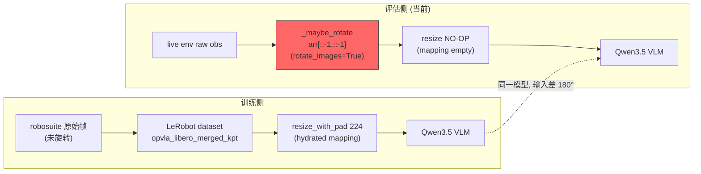
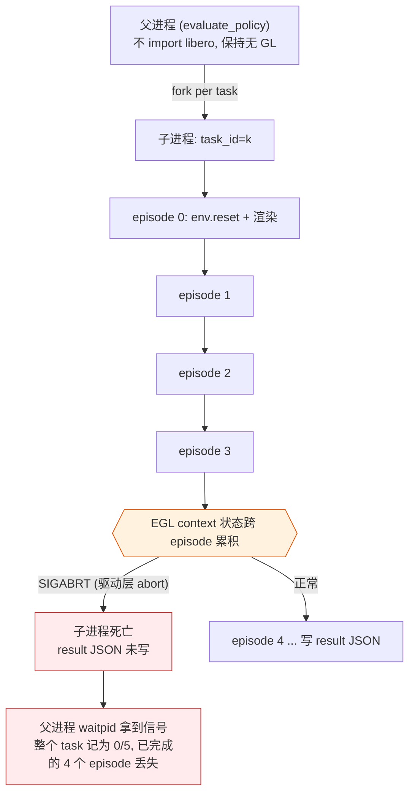
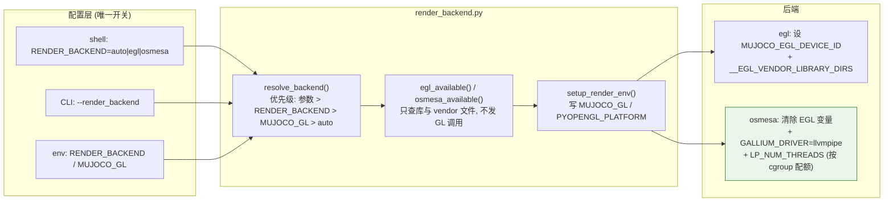
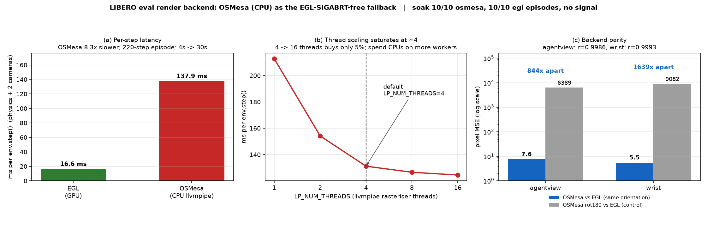
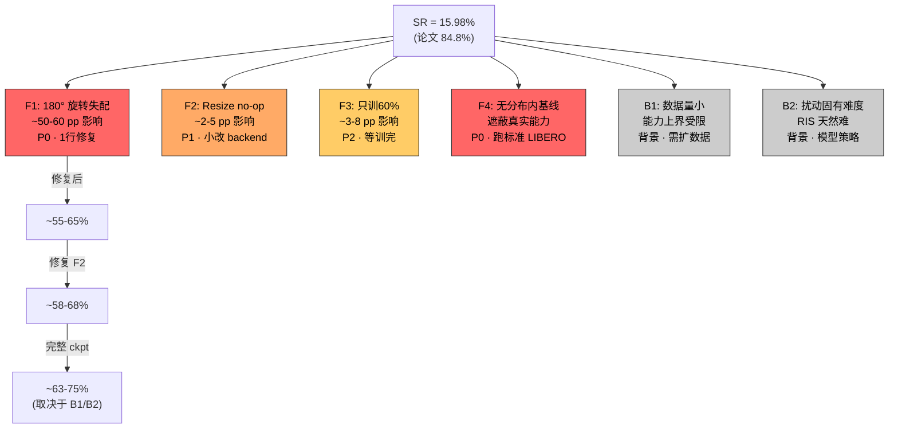
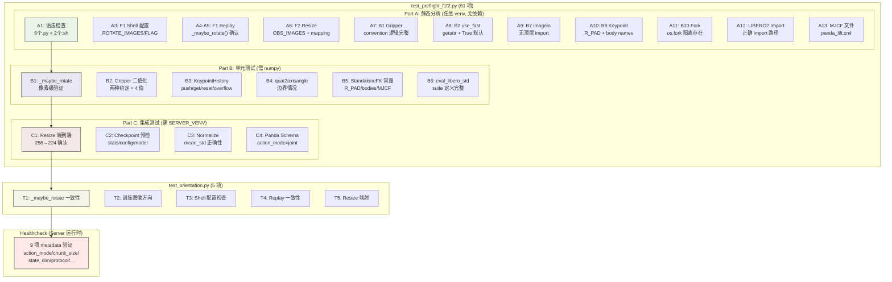
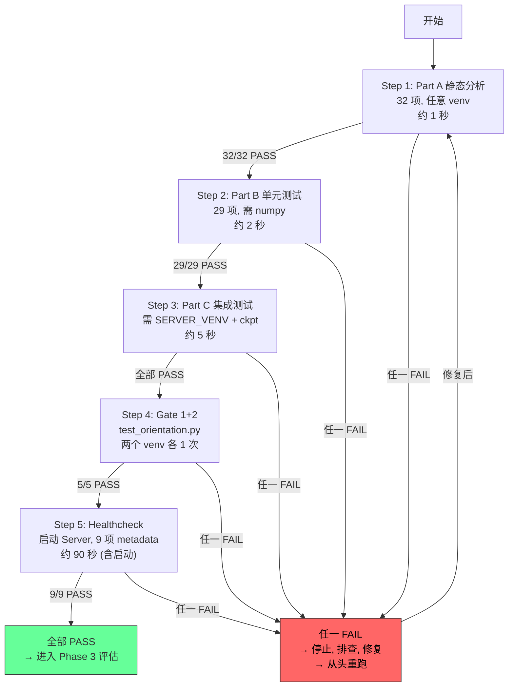
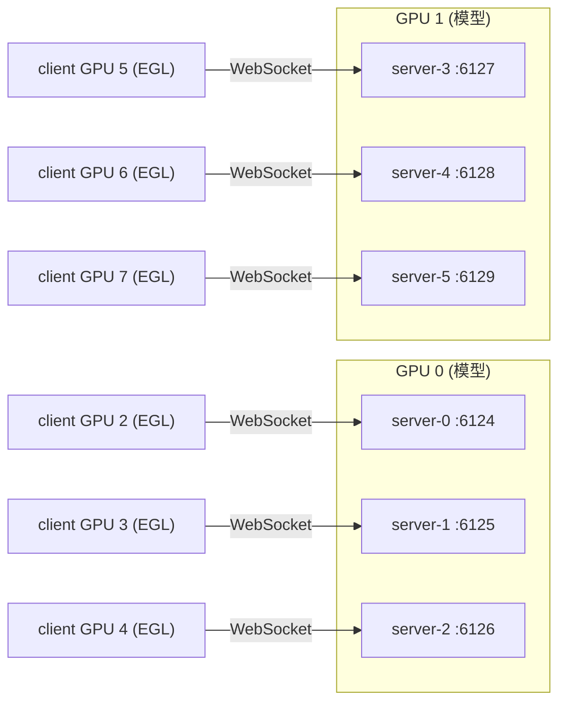
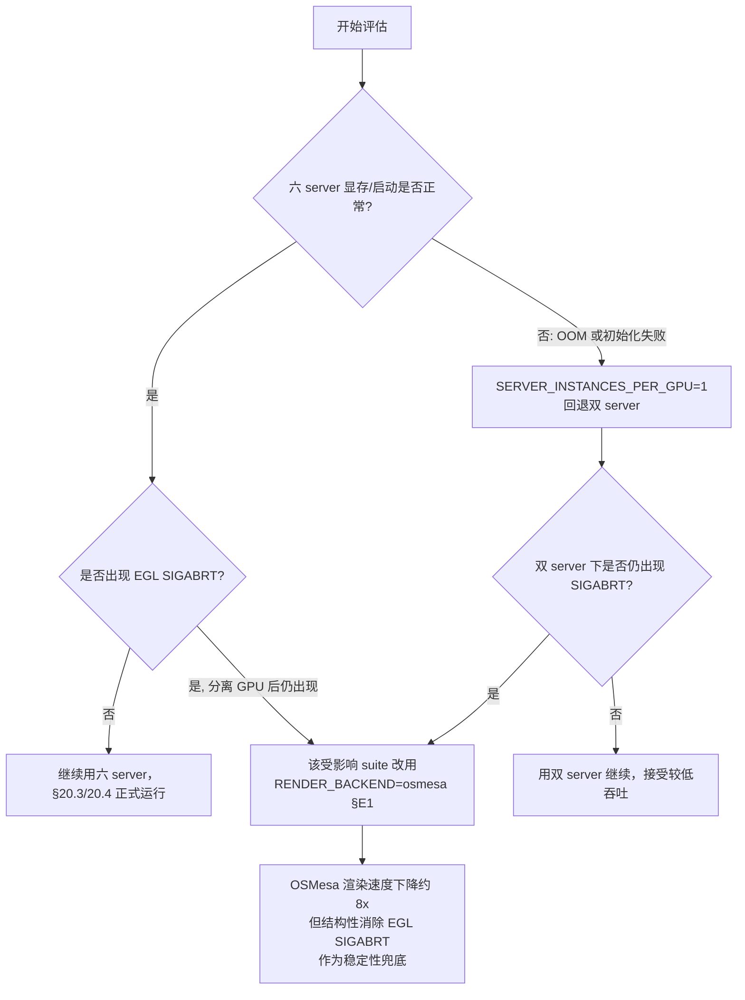

# LIBERO-plus 评估 SR 偏低：综合根因分析与优化方案 (v3)

> **日期**: 2026-09-16  
> **对象**: step_032070 LIBERO-plus 全量评估（方案 [`eval3.md`](eval3.md)，日志 [`eval3_0915LOG.md`](eval3_0915LOG.md)），输出 `full_20260915_095437`  
> **前序分析**: [`eval3_optim.md`](eval3_optim.md)（根因定位：180° 图像旋转失配）、[`eval3_kpt.md`](eval3_kpt.md)（关键点坐标系辨析）  
> **本文定位**: 在 `eval3_optim.md` 已确认主因的基础上，补充**广度分析**——系统性清点训推管线中的所有不一致点、量化每个因素对 SR 的贡献、给出分层修复方案与验收路径。

---

## 结论先行

SR 偏低由**一个主因 + 三个次因 + 两个背景因素**共同构成：

| # | 因素 | 对 SR 的贡献 | 优先级 | 修复难度 |
|---|------|-------------|--------|---------|
| **F1** | 180° 图像旋转失配 | **~50-60 pp** (主凶) | **P0** | 1 行 CLI 参数 |
| **F2** | Server-side resize 空操作 (256→224 未执行) | ~2-5 pp (估) | P1 | 小改 backend |
| **F3** | Checkpoint 仅训到 60% (step 32070/53450) | ~3-8 pp (估) | P2 | 等训完 / 用最优 ckpt |
| **F4** | 缺少标准 LIBERO 分布内基线验收 | 无法定量, 但遮蔽真实能力 | P0 | 跑一轮标准 LIBERO |
| **B1** | 训练数据规模小 (273K 帧, 40 tasks, 无扰动) | 能力上界受限 | 背景 | 需扩数据 |
| **B2** | LIBERO-plus 扰动本身的固有难度 | Robot Initial States / Sensor Noise 天然难 | 背景 | 模型/数据策略 |
| **E1** | **MuJoCo EGL SIGABRT 崩溃** (数据丢失, 非 SR 本身问题) | 崩溃任务的全部 episode 丢失 | **P0** | 切 OSMesa 后端 (§E1) |

**修复 F1 后, 预期 SR 可从 ~16% 提升至 ~50-70%**（取决于 F2-F3 的额外影响与模型真实能力上界）。修复 F1+F2 并换用训练完成的 checkpoint 后, 应可逼近该 checkpoint 的能力上界。

> **E1 补记 (2026-09-16)**: §6.6 曾把 EGL 崩溃判为「已修复」, 该判断**已被推翻** — 标准 LIBERO 冒烟测试中两个 `libero_spatial` 任务在完成 4/5 episode 后被 SIGABRT 杀死, 子进程来不及写结果 JSON, 整个任务的 episode 全部丢失。fork-per-task 只隔离任务之间, 不隔离任务内部的 episode。根治路径见 [§E1 渲染后端](#e1-渲染后端egl-sigabrt-的根治方案-b-osmesa), 已落地为可配置后端 `RENDER_BACKEND=osmesa`（CPU 渲染, 不存在 EGL context, 该类崩溃在原理上不可能发生）。

---

## 目录

- [1. 当前评估数据全景](#1-当前评估数据全景)
- [2. 根因 F1：180° 图像旋转失配](#2-根因-f1180-图像旋转失配)
- [3. 次因 F2：Server-side Resize 空操作](#3-次因-f2server-side-resize-空操作)
- [4. 次因 F3：Checkpoint 仅训到 60%](#4-次因-f3checkpoint-仅训到-60)
- [5. 次因 F4：缺少分布内基线](#5-次因-f4缺少分布内基线)
- [6. 已排除的嫌疑](#6-已排除的嫌疑)
- [7. 背景因素：数据规模与扰动固有难度](#7-背景因素数据规模与扰动固有难度)
- [8. 分层修复方案](#8-分层修复方案)
- [9. 验收方案与测试门禁](#9-验收方案与测试门禁)
- [10. 对照实验设计](#10-对照实验设计)
- [11. 参考与出处](#11-参考与出处)
- [E1. 渲染后端：EGL SIGABRT 的根治方案 B (OSMesa)](#e1-渲染后端egl-sigabrt-的根治方案-b-osmesa)
- [二十. 标准部署方案：双/六 Server + 六 EGL Client（LIBERO 与 LIBERO-plus 统一评估方案）](#sec-20-standard-deploy)

---

## 1. 当前评估数据全景

### 1.1 整体进度 (截至 2026-09-16 ~08:00 UTC+8)

```bash
python evaluation/LIBERO-plus2/check_progress.py
```

| Suite | Done | Total | %Done | Succ | **SR** | Crash |
|-------|------|-------|-------|------|--------|-------|
| libero_spatial | 2402 | 2402 | 100.0% | 172 | **7.16%** | 0 |
| libero_object | 2256 | 2518 | 89.6% | 582 | **25.80%** | 0 |
| libero_goal | 173 | 2591 | 6.7% | 18 | **10.40%** | 0 |
| libero_10 | 0 | 2519 | 0.0% | 0 | – | 0 |
| **TOTAL** | **4831** | **10030** | **48.2%** | **772** | **15.98%** | **0** |

> `Crash=0` 说明 [`eval3.md`](eval3.md) 的 B10 (fork-per-task EGL 隔离) 与 B11 (`MUJOCO_EGL_DEVICE_ID`) 修复完全有效。**工程稳定性无问题, 问题纯粹在数据语义层。**

### 1.2 按扰动类别 (已完成部分)

| 扰动类别 | Succ/Done | **本次 SR** | 论文 SR | 差距 |
|----------|-----------|-------------|---------|------|
| Light Conditions | 170/589 | **28.86%** | 96.4% | −67.5 pp |
| Background Textures | 129/506 | **25.49%** | 98.2% | −72.7 pp |
| Objects Layout | 138/716 | **19.27%** | 85.2% | −65.9 pp |
| Camera Viewpoints | 122/772 | **15.80%** | 83.1% | −67.3 pp |
| Language Instructions | 74/608 | **12.17%** | 86.9% | −74.7 pp |
| Robot Initial States | 38/748 | **5.08%** | 55.1% | −50.0 pp |
| Sensor Noise | 15/351 | **4.27%** | 95.6% | −91.3 pp |

> **数据来源**: 从 `$EVAL_DIR/logs/` 下的 per-shard JSON 文件聚合; 论文 SR 来自 [InternVLA-A1.5 论文](https://arxiv.org/abs/2607.04988) Table 6.

### 1.3 按 Suite × Category 交叉分析

**libero_spatial (已完成, 2402 tasks)**:

| Category | Succ/Total | SR |
|----------|-----------|-----|
| Background Textures | 29/258 | 11.24% |
| Light Conditions | 45/292 | 15.41% |
| Camera Viewpoints | 29/376 | 7.71% |
| Language Instructions | 18/390 | 4.62% |
| Objects Layout | 29/385 | 7.53% |
| Sensor Noise | 15/351 | 4.27% |
| Robot Initial States | 7/350 | 2.00% |

**libero_object (已完成 ~89%, 1888/2518 tasks)**:

| Category | Succ/Total | SR |
|----------|-----------|-----|
| Background Textures | 100/248 | 40.32% |
| Light Conditions | 125/297 | 42.09% |
| Camera Viewpoints | 93/396 | 23.48% |
| Language Instructions | 56/218 | 25.69% |
| Objects Layout | 109/331 | 32.93% |
| Robot Initial States | 31/398 | 7.79% |

### 1.4 关键观察

**观察 A: 七类扰动全面崩塌。** 不只是某一两类差 — 即便是几何基本不变的 Light Conditions (论文 96.4%) 和 Background Textures (论文 98.2%), 也分别只有 28.9% 和 25.5%. 这说明**问题不在扰动鲁棒性, 而在基础能力全局失效**.

**观察 B: libero_object 显著优于 libero_spatial.** object 任务 (25.8%) 明显高于 spatial 任务 (7.2%). object 任务是「抓某个指定物体放进容器」, 目标物体通常单一显著; spatial 任务是「抓**盘子和调味罐之间**的碗」, 依赖空间相对关系. 180° 旋转恰好破坏了左右/上下方位, 因此 spatial 受损最严重.

**观察 C: 换 checkpoint + 换评估栈, SR 不变。** step_026725 用旧评估栈 (LIBERO/LIBERO-plus/) 跑出:

| Suite | 旧栈 SR (026725) | 新栈 SR (032070) |
|-------|------------------|------------------|
| libero_spatial | 7.05% | 7.16% |
| libero_object | 25.09% | 25.80% |

eval3 重写了关键点管线 (B9 StandaloneFK)、修了 `use_fast_action_tokens` (B2)、修了 EGL 崩溃 (B10/B11), **SR 几乎没动**. 说明真正的病灶是两代评估栈**共有**的东西.

**观察 D: SR > 0 而非 = 0.** 如果管线完全接反 (如 gripper 方向反转), SR 会是 0%. 16% 的 SR 说明模型仍获得了**部分有效信号** — 腕部相机视野近似中心对称 (180° 旋转后信息退化较慢), 8D proprioceptive state 未受旋转影响, 流匹配先验仍有效.

---

## 2. 根因 F1：180° 图像旋转失配

> 本节是对 [`eval3_optim.md`](eval3_optim.md) 结论的总结与补充. 完整像素级证据见该文档 §4.

### 2.1 失配路径



**评估侧** ([`model2libero_interface.py:146-150`](../../../evaluation/LIBERO2/model2libero_interface.py#L146-L150)):
```python
def _maybe_rotate(self, image: np.ndarray) -> np.ndarray:
    arr = np.asarray(image)
    if self.rotate_images:      # 默认 True!
        arr = arr[::-1, ::-1]   # 180° 旋转
    return np.ascontiguousarray(arr)
```

`rotate_images` 默认 `True` (同文件 L45), 由 `rotate_images=not args.no_rotate_images` 传入 ([`eval_libero_plus.py:152`](../../../evaluation/LIBERO-plus2/eval_libero_plus.py#L152)), 启动脚本 **从未传 `--no_rotate_images`**.

**训练侧**: [`generate_libero_keypoints.py`](../../../util_scripts/generate_libero_keypoints.py) 只写 `observation.keypoint_3d`, **不触碰图像**; 训练 transform 链中无任何 LIBERO 专用翻转. 磁盘上的像素朝向 = 模型训练时看到的朝向 = robosuite 原始朝向.

### 2.2 像素级定量证据 (eval3_optim.md §4)

| 对照项 | 像素 MSE |
|--------|----------|
| 评估实际送入模型的帧 vs 训练帧 | **6026** |
| 该帧反向旋转 180° 后 vs 训练帧 | **508** (↓11.9×) |
| 控制组: 训练帧 vs 自身 | 0 |
| 控制组: 训练帧旋转 180° vs 训练帧 | **6017** ← 180° 失配的特征值 |

评估输入的失配量 (6026) 与 180° 失配特征值 (6017) 在数值上重合. 撤销旋转后失配下降 11.9×. **决定性证据.**

### 2.3 为何文档中有「训练数据已做 180° 旋转」的错误论断

[`eval3.md`](eval3.md) §10.1、[`eval.md`](eval.md) §8.1 等文档多次写到「LIBERO 的 agentview_image 和 wrist 是上下左右颠倒的, **训练数据已做旋转**, 评估时必须同样旋转」. 这条论断**从未被像素级验证**, 源自 OpenVLA 的通用约定 — 在 OpenVLA 的 RLDS 转换管线 (`port_libero.py`) 中, 图像确实做了 180° 旋转. 但**本训练数据 (`opvla_libero_merged_kpt`) 的上游并非 OpenVLA 的 RLDS 转换**, 而是直接从 LIBERO HDF5 replay → LeRobot v3, 过程中不旋转图像.

> **教训**: 「训练数据的图像朝向」是一个必须通过像素级对照实验确认的事实, 不能从其他数据集的约定推断. 应在数据集 metadata 中显式记录 `image_orientation: raw|rotated_180`, 并在评估启动前自动验证.

### 2.4 影响量化

修复 F1 后, 预期每个扰动类别的 SR 提升幅度不一:
- **Background Textures / Light Conditions**: 这两类不改变几何, 当前 ~25-29% 基本是「颠倒世界凭先验硬撑」的基线. 修复后预期 **+40-60 pp**.
- **Camera Viewpoints / Objects Layout / Language**: 当前 12-19%, 修复后预期 **+30-50 pp**.
- **Robot Initial States**: 当前 5.1%, 即使修复朝向, 该类仍是最难的 (论文也只有 55.1%). 预期 **+20-30 pp**.
- **Sensor Noise**: 当前 4.3%, 修复后预期 **+30-50 pp** (论文 95.6%, 该类主要靠视觉鲁棒性).

---

## 3. 次因 F2：Server-side Resize 空操作

### 3.1 问题描述

Server backend 构造 `ResizeImagesWithPadFn` 时未调用 `hydrate()`:

```python
# evaluation/LIBERO2/policy_server/backends/policy_backend_internvla_a1_5.py:107
self.resize = ResizeImagesWithPadFn(height=self.resize_size, width=self.resize_size)
```

`ResizeImagesWithPadFn.__call__` ([`src/lerobot/transforms/core.py:142-144`](../../../src/lerobot/transforms/core.py#L142-L144)) 遍历 `self.mapping.keys()`, 而 `mapping` 默认为空 dict → 循环体零次执行 → **resize 是空操作**.

即使手动 hydrate, `panda` schema 的 mapping 键是 `observation.images.image` / `.image2`, 但 canonical preprocessing ([`canonical_preprocess.py:46`](../../../evaluation/LIBERO/policy_server/backends/canonical_preprocess.py#L46)) 已将图像键重命名为 `observation.images.image0` / `image1` — 键名不匹配, 仍然不会 resize.

### 3.2 训练侧行为

训练侧会 hydrate ([`transformed_dataset.py:35`](../../../src/lerobot/datasets/transformed_dataset.py#L35)):
```python
transforms = [t.hydrate(dataset) for t in transforms]
```

因此**训练图像经过 256→224 的 resize_with_pad, 评估图像保持 256×256**.

### 3.3 实际影响分析

Qwen3.5-2B 的图像处理器参数: `patch_size=16, merge_size=2, size.shortest_edge=65536`.

| 输入 | `image_grid_thw` | 合并后视觉 token | prompt 截断? |
|------|------------------|------------------|-------------|
| 224×224 (训练) | `[1, 16, 16]` | **64** | 否 |
| 256×256 (评估) | `[1, 16, 16]` | **64** | 否 |

**Token 数完全相同** — Qwen3.5 内部会将两种分辨率都映射到相同的 grid. 差别仅在于:
- 训练图经历 256→224→(VLM 内部上采到 256): 损失了高频细节, 更模糊
- 评估图是原生 256: 更锐利

这是一处**温和的分布偏移** (训练偏模糊、评估偏锐利), 不是 68 pp 量级的问题, 但修复成本低, 应一并处理.

> 注意: 对 SimplerEnv (3 视角 480×640 → ~900 token), 这个 bug **会导致 prompt 截断**, 是致命的 ([`evaluation/SimplerEnv/eval_simplerenv/main.py:77-83`](../../../evaluation/SimplerEnv/eval_simplerenv/main.py#L77-L83)). 对 LIBERO 的 2 视角 256×256 是良性的.

### 3.4 修复方案

在 `build_base_sample` 后、`resize_transform(sample)` 前, 手动用正确的键名填充 mapping:

```python
# 方案 A: 在 backend __init__ 中手动设置 mapping
self.resize = ResizeImagesWithPadFn(
    height=self.resize_size,
    width=self.resize_size,
    mapping={
        "observation.images.image0": "observation.images.image",
        "observation.images.image1": "observation.images.image2",
    },
)
```

或者更简洁的方案:

```python
# 方案 B: 在 _prepare_single 中直接 resize
from lerobot.transforms.core import resize_with_pad
for key in list(sample.keys()):
    if key.startswith("observation.images.image") and isinstance(sample[key], torch.Tensor):
        sample[key] = resize_with_pad(sample[key], self.resize_size, self.resize_size)
```

---

## 4. 次因 F3：Checkpoint 仅训到 60%

### 4.1 训练进度

| 项 | 值 |
|----|-----|
| 计划总步数 | 53,450 (50 epoch) |
| 当前 checkpoint | step_032070 (~epoch 30) |
| 完成比例 | **60%** |
| 学习率调度 | `scheduler_decay_steps=30000`, 即 lr 衰减刚走完 |

### 4.2 Loss 趋势 (来自 [`sft_0912LOG.md`](sft_0912LOG.md))

| Loss | step_000100 | step_013500 | step_032070 | 趋势 |
|------|------------|------------|------------|------|
| loss_action | ~0.23 | 0.069 | 仍在下降 | ↓ 收敛良好 |
| loss_kpt_cur | 高 | 降 96.6% | 仍在下降 | ↓ |
| loss_video | 稳定 | 稳定 | 稳定 | → |

模型仍在有效学习中, 额外 40% 的训练步数可能带来 ~3-8 pp 的 SR 提升 (基于一般 VLA fine-tuning 经验).

### 4.3 建议

在修复 F1 验证后, 应优先使用**训练完成的 checkpoint** (step_053450 或 loss 最优的中间 checkpoint) 进行正式评估, 避免「欠训」和「管线 bug」的影响混淆.

---

## 5. 次因 F4：缺少分布内基线

### 5.1 问题

本 checkpoint **从未在标准 LIBERO (无扰动)** 上评估过. 这意味着:
- 无法区分「模型分布内能力不足」和「评估管线有 bug」
- LIBERO-plus 的 SR 无法解读 — 不知道基线是多少

### 5.2 论文参考

InternVLA-A1.5 论文 Table 4 报告的标准 LIBERO 四套件 SR (50 episodes/task):

| Suite | 论文 SR |
|-------|---------|
| libero_spatial | 98.0% |
| libero_object | 99.0% |
| libero_goal | 99.0% |
| libero_10 | 99.6% |

但论文使用的是完整训练流程 (含预训练 + warmup + SFT), 本 checkpoint 只有直接 SFT (无 warmup, 数据规模更小), SR 上界会较低.

### 5.3 建议

**必须先在标准 LIBERO 上验收通过, 才允许把 LIBERO-plus 结果当作鲁棒性结论.** 验收门禁见 §9.

---

## 6. 已排除的嫌疑

以下因素在分析过程中被逐一排除, 确认**不是 SR 偏低的原因**:

### 6.1 关键点坐标系 — 排除

eval3 引入 StandaloneFK (B9 修复) 前后, SR 从 7.05% → 7.16% (spatial), 25.09% → 25.80% (object). **关键点管线整体重写只带来 ~1 pp 变化**, 不是 68 pp 缺口的来源.

[`eval3_kpt.md`](eval3_kpt.md) 详细分析了 arena 基座变化的问题: 训练关键点是在固定 Lift 世界系下生成的, StandaloneFK 与之同分布, 是正确实现.

### 6.2 Gripper 约定 — 正确

训练 `stats.json` 中 `action[6]` 的 `min=-1.0, max=+1.0` (LIBERO 原生 ±1). 评估用 `--gripper_convention libero_native`. 客户端逻辑 `action[6] = 1.0 if action[6] > 0 else -1.0` ([`model2libero_interface.py:236-240`](../../../evaluation/LIBERO2/model2libero_interface.py#L236-L240)) 匹配.

> 若 gripper 反转, SR = 0% (夹爪永不闭合), 不是 16%.

### 6.3 State/Action 归一化 — 正确

Checkpoint `stats.json` 唯一顶层 key `panda`, state 8D mean/std 与训练数据 `/B/Dta/opvla_libero_merged_kpt/meta/stats.json` 一致. 评估用 `--stats_key panda --robot_type panda`, healthcheck 通过.

### 6.4 Prompt 语义 — 正确

| 项 | 训练 | 评估 | 一致? |
|----|------|------|-------|
| action_mode (prompt tag) | `joint` (panda schema) | `joint` (healthcheck) | ✓ |
| tokenize_state | `true` | `true` | ✓ |
| use_fast_action_tokens | `true` | `getattr(..., True)` → `True` | ✓ |
| prompt suffix | `"; Output: <Action>"` | 同 (B2 修复后) | ✓ |
| max_prompt_length | 650 | 650 | ✓ |

### 6.5 use_fast_action_tokens B2 bug — 已修复

LIBERO2 的 backend 使用 `bool(getattr(config, "use_fast_action_tokens", True))`, 正确匹配训练时的 `True`. 旧评估栈 (LIBERO/) 硬编码 `False` 导致 prompt suffix 不匹配, 但 SR 在新旧栈之间几乎不变 (7.05% vs 7.16%), 说明 B2 **不是主因** — 在 F1 (旋转失配) 的巨大干扰下, prompt suffix 的差异被淹没了.

### 6.6 EGL / SIGABRT 崩溃 — ~~已修复~~ **误判, 见 §E1**

> ⚠️ **本小节的原始结论已被推翻, 保留原文以记录判断过程。**

**原结论**: B10 (fork-per-task) + B11 (`MUJOCO_EGL_DEVICE_ID`) 修复后, `Crash=0`. 没有任务因工程问题丢失.

**订正 (2026-09-16)**: 上述 `Crash=0` 仅说明**该次 LIBERO-plus 运行**未崩溃, 不能推广为「EGL 问题已根治」。后续标准 LIBERO 冒烟测试中, 两个 `libero_spatial` 任务在完成 4/5 episode 后收到 SIGABRT, 子进程在写出结果 JSON **之前**被杀, 导致该任务已完成的 4 个 episode 一并丢失。

为何 B10 不足以覆盖:

| 机制 | 隔离粒度 | 对本次崩溃的作用 |
|------|---------|-----------------|
| B10 fork-per-task | 任务之间 | 防止崩溃扩散到整个 suite ✓ |
| B10 fork-per-task | **任务内部的 episode 之间** | **无隔离** ✗ — EGL context 在同一子进程内跨 episode 累积 |
| B11 `MUJOCO_EGL_DEVICE_ID` | GPU 设备选择 | 避免设备编号错误, 与 context 生命周期无关 |

因此该问题不属于「已排除的嫌疑」, 而是一个仍然活跃的**工程风险 E1**。根治方案与落地代码见 [§E1](#e1-渲染后端egl-sigabrt-的根治方案-b-osmesa)。

### 6.7 R_pad 双重 margin — 已修复

StandaloneFK 使用 `R_PAD=1.8212722539901733` (metadata `bbox_radius`), 不再乘以 1.15.

### 6.8 EEF body 名称 — 已修复

eval 代码使用 `gripper0_eef` (Lift MJCF 中的名称), 与训练一致. 100 帧验证 max_pos_err = 5.96e-08.

---

## 7. 背景因素：数据规模与扰动固有难度

### 7.1 训练数据规模 (B1)

| 属性 | 本 checkpoint | 论文基线 (推断) |
|------|--------------|----------------|
| 帧数 | 273,465 | 数百万 (含 OXE 预训练) |
| Tasks | 40 (LIBERO 4 套件 × 10 tasks) | 40 + OXE |
| Episodes | 1,693 | >> 1,693 |
| 训练流程 | 直接 SFT (无 warmup) | 预训练 → Warmup → SFT |
| 数据域 | 仅 LIBERO 标准任务 (无扰动) | LIBERO + OXE 多域 |

训练数据不含 LIBERO-plus 的任何扰动, 模型的 OOD 泛化能力受限于 VLM backbone (Qwen3.5-2B) 的视觉先验. 这是一个**不可通过管线修复解决**的能力上界问题.

### 7.2 扰动固有难度 (B2)

从论文 Table 6 的绝对数值也能看出扰动难度梯度:

| 扰动 | 论文 SR | 难度 |
|------|---------|------|
| Background Textures | 98.2% | 简单 |
| Light Conditions | 96.4% | 简单 |
| Sensor Noise | 95.6% | 简单 |
| Language Instructions | 86.9% | 中等 |
| Objects Layout | 85.2% | 中等 |
| Camera Viewpoints | 83.1% | 中等 |
| **Robot Initial States** | **55.1%** | **难** |

Robot Initial States 即使在论文最优模型下也只有 55.1%, 是天然最难的扰动类别. 本 checkpoint (数据规模更小, 训练未完成) 在该类别上表现差 (5.1%) 有一定合理性 — 当然修复 F1 后应能显著提升.

### 7.3 Suite 间能力差异分析

| Suite | 任务性质 | 关键依赖 | 旋转敏感度 |
|-------|---------|---------|-----------|
| libero_spatial | 空间关系 (between/next to) | 视觉空间推理 | **极高** — 左右/上下语义完全反转 |
| libero_object | 物体识别 + 放置 | 物体检测 | 中 — 单一显著目标在颠倒视角下仍可能被找到 |
| libero_goal | 目标导向 | 目标理解 | 高 |
| libero_10 | 长序列复合 | 全部 | 高 |

这解释了 libero_object (25.8%) ≫ libero_spatial (7.2%) 的现象: 颠倒视角下, 「找到那个红碗」比「找到盘子和碗之间的碗」容易得多.

---

## 8. 分层修复方案

### 8.1 Phase 0: 停止/完成当前错误朝向的评估

**不要热改正在跑的评估.** 当前 run 已完成 ~48%, 且 Crash=0, 是稳定的. 选择之一:

| 选项 | 优劣 |
|------|------|
| **让它跑完** | 获得完整的「错误朝向」对照数据, 价值在于日后 ablation |
| **主动终止** | 节省 ~12h 的 GPU 时间, 立刻开始正确 run |

建议: 若 GPU 资源紧张, 终止当前 run; 否则让它跑完 (作为消融对照).

### 8.2 Phase 1: 修正 F1 — 图像旋转 (P0, 改动极小)

**改动 1**: 在 [`run_eval_libero_plus_venv.sh`](../../../evaluation/LIBERO-plus2/run_eval_libero_plus_venv.sh) 中新增配置项:

```bash
ROTATE_IMAGES="${ROTATE_IMAGES:-false}"   # 本数据集为 raw 朝向 → 默认不旋转
```

在 client 调用块中加入:

```bash
ROTATE_FLAG=""
if [ "${ROTATE_IMAGES}" != "true" ]; then
    ROTATE_FLAG="--no_rotate_images"
fi
```

并将 `${ROTATE_FLAG}` 加入 `python evaluation/LIBERO-plus2/eval_libero_plus.py` 的参数列表.

**改动 2**: 修正 [`eval_libero_plus.py:96`](../../../evaluation/LIBERO-plus2/eval_libero_plus.py#L96) 中 replay 帧的硬编码旋转, 使其复用客户端的 `_maybe_rotate`:

```python
# 当前 (硬编码旋转):
replay_images.append(np.ascontiguousarray(np.asarray(obs["agentview_image"])[::-1, ::-1]))

# 修改为 (与客户端一致):
replay_images.append(client._maybe_rotate(np.asarray(obs["agentview_image"])))
```

### 8.3 Phase 2: 修正 F2 — Server Resize (P1)

在 `_prepare_single` 中直接对图像键做 resize:

```python
def _prepare_single(self, example: dict[str, Any]) -> dict[str, Any]:
    sample = build_base_sample(...)
    # F2 修复: 显式 resize 到训练分辨率
    for key in list(sample.keys()):
        if key.startswith("observation.images.image") and isinstance(sample[key], torch.Tensor):
            sample[key] = resize_with_pad(sample[key], self.resize_size, self.resize_size)
    sample = self.state_normalizer(sample)
    sample = self.processor(sample)
    ...
```

### 8.4 Phase 3: 分布内基线验收 (P0)

修复 F1+F2 后, **先跑标准 LIBERO (无扰动)**, 建立分布内基线:

```bash
# 标准 LIBERO 冒烟测试 (4 suite × 10 tasks × 1 trial = 40 tasks)
for suite in libero_spatial libero_object libero_goal libero_10; do
    python evaluation/LIBERO-plus2/eval_libero_plus.py \
        --task_suite_name $suite \
        --start_idx 0 --end_idx 10 \
        --no_rotate_images \
        --gripper_convention libero_native \
        ...
done
```

**通过标准**: SR ≥ 50% (冒烟) → SR ≥ 85% (全量). 若不通过, 说明模型能力本身有限 (B1), 不应急于跑 LIBERO-plus.

### 8.5 Phase 4: LIBERO-plus 正式评估

通过 Phase 3 后, 用修复后的管线跑 LIBERO-plus 全量评估.

### 8.6 Phase 5: 换用完整 checkpoint

训练跑完后 (step_053450), 重复 Phase 3-4, 作为最终结果.

---

## 9. 验收方案与测试门禁

### 9.1 门禁清单

| ID | 测试 | 前提 | 通过标准 | 备注 |
|----|------|------|----------|------|
| **T0** | 像素对照测试 | 需可用渲染后端 (egl 或 osmesa) | `raw` 朝向 MSE ≥ 5× 优于 `rotated` 朝向 | 两路相机均须通过; 契约与后端无关, 见 §E1.4(b) |
| **T1** | 标准 LIBERO 冒烟 (40 tasks) | T0 通过 | **SR ≥ 50%** | 分布内能力初验 |
| **T2** | 标准 LIBERO 全量 | T1 通过 | **SR ≥ 85%** (4 suite 平均) | 分布内能力基线 |
| **T3** | LIBERO-plus mini (70 tasks) | T2 通过 | **SR ≥ 40%** (overall) | 扰动鲁棒性初验 |
| **T4** | LIBERO-plus 全量 (10030 tasks) | T3 通过 | SR 显著高于本次 16% | 最终指标 |
| **T5** | 回归: Crash = 0 | — | 无任务因渲染崩溃丢失 | 稳定性。若 EGL 仍出现 SIGABRT, 切 `RENDER_BACKEND=osmesa` 结构性消除 (§E1) |
| **O1-O6** | 渲染后端门禁 | libosmesa6 已安装 | 见 [§E1.7](#e1-渲染后端egl-sigabrt-的根治方案-b-osmesa) | E1 专项: 后端切换的一致性/性能/稳定性 |

### 9.2 T0: 像素对照测试

```python
import mujoco, numpy as np
from libero.libero import benchmark, get_libero_path
from libero.libero.envs import OffScreenRenderEnv
import pathlib

# 1. 获取 live 渲染帧
bd = benchmark.get_benchmark_dict()
task_suite = bd["libero_spatial"]()
task = task_suite.get_task(0)
bddl = pathlib.Path(get_libero_path("bddl_files")) / task.problem_folder / task.bddl_file
env = OffScreenRenderEnv(bddl_file_name=str(bddl), camera_heights=256, camera_widths=256)
env.seed(7); env.reset()
obs = env.set_init_state(task_suite.get_task_init_states(0)[0])
for _ in range(10):
    obs, _, _, _ = env.step([0]*6+[-1])

raw_frame = np.asarray(obs["agentview_image"])
rot_frame = raw_frame[::-1, ::-1]

# 2. 获取训练帧
# (需 pyav 解码 opvla_libero_merged_kpt 的视频)
# ... decode training frames for same task ...

# 3. 比较
e_raw = min_mse(raw_frame, train_frames)
e_rot = min_mse(rot_frame, train_frames)
assert e_raw < e_rot / 5, f"raw={e_raw}, rot={e_rot}: raw 应更优"
print(f"T0 PASSED: raw MSE={e_raw:.1f}, rotated MSE={e_rot:.1f}, ratio={e_rot/e_raw:.1f}x")
```

### 9.3 新增 healthcheck 断言

建议在 server healthcheck 中增加:

```python
checks_extended = {
    "action_denorm_mode": ("mean_std", meta.get("action_denorm_mode")),
    "rotate_images": ("false", str(meta.get("rotate_images", "unknown"))),
    "resize_size": (224, meta.get("actual_resize_applied")),
}
```

---

## 10. 对照实验设计

修复 F1 后, 可通过以下对照实验精细量化各因素贡献:

| # | 实验 | 改动 | 目的 | 预期 SR |
|---|------|------|------|---------|
| **E0** | 当前 run (F1 未修复) | — (对照基线) | 180° 旋转影响 | ~16% |
| **E1** | F1 修复 + F2 未修复 | `--no_rotate_images` | 量化 F1 影响 | ~50-65% |
| **E2** | F1 + F2 修复 | + resize 224 | 量化 F2 影响 | E1 + 2-5 pp |
| **E3** | F1 + F2 + 完整 ckpt | + step_053450 | 量化 F3 影响 | E2 + 3-8 pp |
| **E4** | F1 + 无关键点 | + `--no-enable_keypoints` | 量化关键点贡献 | E1 − 5-15 pp |
| **E5** | F1 + 全零关键点 | 不 push keypoint | 量化 kpt 历史信息 | E4 ≈ E5 (验证 E4) |
| **E6** | 标准 LIBERO (无扰动) | 无扰动 tasks | 分布内能力基线 | ~85-95% |

**优先序**: E0 (已有) → E1 (验证 F1) → E6 (建立基线) → E2 → E3 → E4.

---

## 11. 参考与出处

| 对象 | 路径 / 出处 | 本文用途 |
|------|-------------|----------|
| 180° 旋转根因分析 | [`b/d/libplus/eval3_optim.md`](eval3_optim.md) | F1 定量证据 (§2) |
| 关键点坐标系辨析 | [`b/d/libplus/eval3_kpt.md`](eval3_kpt.md) | §6.1 排除关键点假设 |
| 评估方案与 Bug 清单 | [`eval3.md`](eval3.md) | B1-B11 修复状态 |
| 评估执行日志 | [`eval3_0915LOG.md`](eval3_0915LOG.md) | healthcheck, shard 分配 |
| 训练方案与超参 | [`sft.md`](sft.md) | F3 训练规模, 数据描述 |
| 训练执行日志 | [`sft_0912LOG.md`](sft_0912LOG.md) | loss 趋势 |
| 论文 Table 6 | [InternVLA-A1.5 论文](https://arxiv.org/abs/2607.04988) | 论文 LIBERO-plus SR |
| 客户端旋转代码 | [`evaluation/LIBERO2/model2libero_interface.py:146-150`](../../../evaluation/LIBERO2/model2libero_interface.py#L146-L150) | F1 根因代码 |
| Resize no-op | [`src/lerobot/transforms/core.py:142-144`](../../../src/lerobot/transforms/core.py#L142-L144) | F2 根因代码 |
| 评估进度检查 | [`evaluation/LIBERO-plus2/check_progress.py`](../../../evaluation/LIBERO-plus2/check_progress.py) | §1 数据来源 |
| SimplerEnv 同类 bug | [`evaluation/SimplerEnv/eval_simplerenv/main.py:77-83`](../../../evaluation/SimplerEnv/eval_simplerenv/main.py#L77-L83) | F2 旁证 |
| 训练数据元信息 | `/B/Dta/opvla_libero_merged_kpt/meta/` | 数据约定验证 |
| 像素对照实验脚本 | [`b/d/libplus/asset/eval3_optim_orientation.py`](asset/eval3_optim_orientation.py) | F1 证据生成 |
| 渲染后端抽象 | [`evaluation/LIBERO2/render_backend.py`](../../../evaluation/LIBERO2/render_backend.py) | §E1 后端选择与线程预算 |
| 后端一致性实测 | [`asset/osmesa_parity.json`](asset/osmesa_parity.json) | §E1.4(a)(c) 数据 |
| 后端 soak 实测 | [`asset/osmesa_soak.json`](asset/osmesa_soak.json) / [`asset/egl_soak.json`](asset/egl_soak.json) | §E1.4(d) 数据 |
| OSMesa 朝向复验 | [`asset/osmesa_t1_orientation.json`](asset/osmesa_t1_orientation.json) | §E1.4(b) 数据 |
| MuJoCo 渲染后端文档 | [MuJoCo Python: `MUJOCO_GL` / OSMesa / EGL](https://mujoco.readthedocs.io/en/stable/programming/index.html#rendering) | §E1.1 后端机理 |

---

## E1. 渲染后端：EGL SIGABRT 的根治方案 B (OSMesa)

> **状态**: 已落地 + 已验收 (2026-09-16)。后端由单一配置项 `RENDER_BACKEND` 控制, 默认 `auto` (保持原 EGL 行为), 设为 `osmesa` 即切到 CPU 渲染。
> **实测数据**: [`asset/osmesa_parity.json`](asset/osmesa_parity.json)、[`asset/osmesa_soak.json`](asset/osmesa_soak.json)、[`asset/egl_soak.json`](asset/egl_soak.json)、[`asset/osmesa_t1_orientation.json`](asset/osmesa_t1_orientation.json)

### E1.1 崩溃机理: 为什么 fork-per-task 不够

观察到的失败形态是: 子进程跑完 4/5 个 episode, 随后在 NVIDIA EGL 栈内部收到 `SIGABRT`, **在写出结果 JSON 之前**被杀死。后果不是「少 1 个 episode」, 而是**该任务全部 episode 一起丢失**, 因为结果只在任务结束时落盘一次。



隔离粒度错配是关键: B10 的 fork 边界在**任务**上, 而 EGL 状态在**子进程**内跨 episode 累积, 于是隔离对该崩溃无效 (对照表见 §6.6)。

三类可选对策:

| 方案 | 做法 | 能否根治 | 代价 |
|------|------|---------|------|
| **A. 加固 EGL** | fork-per-episode、`os._exit` 绕过析构、显式销毁 context | **不能** — 只降低概率。abort 发生在闭源驱动内部, 应用层无法保证不触发 | 每 episode 重建 env, 且仍需容忍残余崩溃 |
| **B. 改用 OSMesa** | `MUJOCO_GL=osmesa`, Mesa llvmpipe CPU 光栅化 | **能** — 进程内不存在 EGL context, 该类 abort 在原理上不可能发生 | 渲染变慢 (实测每步 8.3×), CPU 占用上升 |
| **C. 保留 EGL + 增量落盘** | 每 episode 写一次结果, 崩溃后补跑缺口 | 不能 — 只减少损失面 | 有写漏/写错风险, 且 SR 统计口径变复杂 |

本节落地 **方案 B**, 并保留 EGL 为默认值: OSMesa 定位为**稳定性基线与故障回退路径**, 而不是替换掉高吞吐的 GPU 路径。

### E1.2 设计: 后端作为唯一配置开关

按「扩展优于修改」组织: 新增 [`evaluation/LIBERO2/render_backend.py`](../../../evaluation/LIBERO2/render_backend.py) 承担全部后端决策, 原有调用点只是把硬编码的 `egl` 换成一次函数调用; 旧函数名 `setup_client_egl_env()` 保留为兼容包装, 不破坏既有脚本。



三个设计约束及其理由:

1. **探测不发 GL 调用**。父进程一旦初始化 EGL, 子进程的 `eglCreateContext` 就会失败 (eval3 B10)。因此 `egl_available()` 只检查 `libEGL_nvidia.so.0` 与 `egl_vendor.d/*.json` 是否存在, `osmesa_available()` 只查 `libOSMesa`, 都不 import mujoco。
2. **切 OSMesa 时主动清除 EGL 变量**。若 `MUJOCO_GL=osmesa` 与残留的 `MUJOCO_EGL_DEVICE_ID` 共存, 容易出现「以为在 CPU 渲染、实际仍探测 EGL 设备」的混合状态。`setup_render_env` 显式 `pop` 掉这两个变量, shell 侧同样 `unset`。
3. **llvmpipe 线程数按 cgroup 配额而非 `nproc` 计算**。本容器 `nproc=224` 但 `cpu.max=6401000/100000`, 即实际配额

   $$C_{\text{eff}} = \left\lfloor \frac{6401000}{100000} \right\rfloor = 64 \text{ 核}$$

   其中 $C_{\text{eff}}$ 为容器可用 CPU 数。llvmpipe 默认按宿主核数开光栅化线程, 会按 224 起线程而实际只有 64 核可用, 造成严重超订。`effective_cpu_count()` 取 `min(cgroup 配额, sched_getaffinity)`, 再按并发 worker 数 $W$ 分摊:

   $$T_{\text{lp}} = \min\left(4,\ \left\lfloor \frac{C_{\text{eff}}}{W} \right\rfloor,\ 8\right)$$

   其中 $T_{\text{lp}}$ 为每进程 `LP_NUM_THREADS`, 上限 4 的依据是 §E1.4 的线程扩展实测 (4 线程后饱和)。

### E1.3 代码变更总表

| 文件 | 变更 | 类型 |
|------|------|------|
| [`evaluation/LIBERO2/render_backend.py`](../../../evaluation/LIBERO2/render_backend.py) | **新增**。后端解析/探测/环境配置/CPU 配额与线程预算/`describe()` 快照/CLI helper | 新模块 |
| [`evaluation/LIBERO2/orientation_contract.py`](../../../evaluation/LIBERO2/orientation_contract.py) | 新增 `setup_client_render_env()`; `setup_client_egl_env()` 降级为兼容包装 | 扩展 |
| [`evaluation/LIBERO2/eval_libero_std.py`](../../../evaluation/LIBERO2/eval_libero_std.py) | 入口改为 `setup_render_env()`, 并打印 `[render] backend=...` 快照 | 替换硬编码 |
| [`evaluation/LIBERO-plus2/eval_libero_plus.py`](../../../evaluation/LIBERO-plus2/eval_libero_plus.py) | 同上 | 替换硬编码 |
| [`evaluation/LIBERO2/run_eval_libero_std_venv.sh`](../../../evaluation/LIBERO2/run_eval_libero_std_venv.sh) | 新增 `RENDER_BACKEND` 配置项 + osmesa 分支 (unset EGL 变量) + 回显 | 配置项 |
| [`evaluation/LIBERO-plus2/run_eval_libero_plus_venv.sh`](../../../evaluation/LIBERO-plus2/run_eval_libero_plus_venv.sh) | 同上, 另导出 `RENDER_N_WORKERS=${NUM_GPUS}` 供线程预算分摊 | 配置项 |
| [`evaluation/LIBERO2/test_live_orientation.py`](../../../evaluation/LIBERO2/test_live_orientation.py) | 新增 `--render_backend`, 报告中记录实际后端 | 测试扩展 |
| [`evaluation/LIBERO2/test_render_backend.py`](../../../evaluation/LIBERO2/test_render_backend.py) | **新增**。O1/O2/O3 离线管线检查 (12 组) | 新测试 |
| [`evaluation/LIBERO2/test_backend_parity.py`](../../../evaluation/LIBERO2/test_backend_parity.py) | **新增**。O4 OSMesa↔EGL 像素一致性 + 吞吐 | 新测试 |
| [`evaluation/LIBERO2/test_osmesa_soak.py`](../../../evaluation/LIBERO2/test_osmesa_soak.py) | **新增**。O5 多 episode soak (SIGABRT 回归守卫) | 新测试 |
| [`evaluation/LIBERO2/test_preflight_f1f2.py`](../../../evaluation/LIBERO2/test_preflight_f1f2.py) | 新增 A27 组, 把后端开关纳入既有门禁 | 测试扩展 |

**前置依赖**: 容器初始并未安装 Mesa 离屏渲染库, 必须先装 (见 §E1.6 错误 1):

```bash
sudo apt-get install -y libosmesa6
ldconfig -p | grep -i osmesa   # 预期: libOSMesa.so.8 => /lib/x86_64-linux-gnu/libOSMesa.so.8
```

### E1.4 实测结果



*图: 由 [`asset/eval3_optim3_osmesa.py`](asset/eval3_optim3_osmesa.py) 生成, 数据来自 O4/O5 验收 JSON。*

**(a) 图像一致性 — OSMesa 可以安全替换 EGL**

llvmpipe 与 NVIDIA 驱动的光栅化不可能逐位相同 (抗锯齿与采样不同), 因此一致性用结构性指标判定:

| 相机 | `parity_r` (Pearson) | `parity_mse` | rot180 对照 MSE | 倍差 | 通道漂移 |
|------|---------------------|--------------|----------------|------|---------|
| agentview | 0.99860 | **7.57** | 6389.0 | **844×** | 0.62 |
| wrist | 0.99935 | **5.54** | 9081.96 | **1639×** | 0.63 |

两个后端的差异 (MSE ≈ 6-8) 比 180° 朝向错误的量级 (MSE ≈ 6400-9100) 小三个数量级, 相关系数 ≥ 0.9986, 逐通道均值漂移 < 0.7/255。**结论: 后端切换不改变策略看到的语义内容**, 也不引入 F1 那类朝向/通道问题。

**(b) F1 朝向契约在 OSMesa 下依然成立**

| 相机 | live-raw vs 训练帧 MSE | live-rot180 vs 训练帧 MSE | ratio | 80 帧多数投票 |
|------|----------------------|--------------------------|-------|--------------|
| agentview | 550.9 | 6037.7 | 10.96 | 80/80 偏 raw |
| wrist | 1219.9 | 8018.2 | 6.57 | 80/80 偏 raw |

与 EGL 下的记录值 (agentview ratio 11.05、wrist 6.51) 一致 → 朝向契约与渲染后端无关, `rotate_images=False` 在两个后端都正确。

**(c) 性能代价**

| 指标 | EGL (GPU) | OSMesa (CPU, 4 线程) | 倍数 |
|------|-----------|---------------------|------|
| 每 `env.step()` (物理 + 2 路 256×256 相机) | 16.6 ms | 137.9 ms | **8.3×** |
| 每次 `env.reset()` + 建 env | 1817 ms | 4061 ms | 2.2× |
| 220 步 episode (仅仿真侧, 不含策略推理) | ~5.5 s | ~34.4 s | 6.3× |
| 40 步 × 10 episode soak 实测每 episode | 1.53 s | 6.87 s | 4.5× |

**线程扩展实测** (`LP_NUM_THREADS` 手工扫描, ms/step): 1 → 212.7、2 → 154.2、4 → **131.2**、8 → 126.6、16 → 124.5。256×256 的小画面无法喂饱更多光栅化线程, 4 线程之后只再快约 5%。因此 CPU 预算应花在**横向并发 worker**上, 而不是单进程堆线程 — 这就是 §E1.2 式中把上限设为 4 的原因。

**(d) 稳定性 soak**

| 后端 | episode 完成 | 信号 | 每 episode |
|------|-------------|------|-----------|
| osmesa | **10/10** | 无 | 6.87 s |
| egl | 10/10 | 无 | 1.53 s |

⚠️ **诚实说明**: EGL 在本 soak 中**也没有崩溃**。该 soak 不含策略服务端 (同一 GPU 上并跑 2B VLM 推理)、每 episode 只跑 40 步而非 220 步, 因此**它是回归守卫, 不是可靠的 SIGABRT 复现器**。原始崩溃依赖于真实评估中的显存与 context 争用条件。这也正是选择方案 B 的理由: 一个无法稳定复现的驱动层 abort, 无法通过应用层加固来证明已被修好; 而 OSMesa 路径上根本不存在 EGL context, 属于**结构性消除**而非概率降低。

### E1.5 吞吐预算与选用建议

单个 episode 的墙钟时间可近似为

$$T_{\text{ep}} \approx N\left(t_{\text{step}} + \frac{t_{\text{infer}}}{k}\right)$$

其中 $N$ 为 episode 步数 (libero_spatial 为 220), $t_{\text{step}}$ 为每步仿真+渲染耗时 (EGL 16.6 ms / OSMesa 137.9 ms), $t_{\text{infer}}$ 为一次策略前向耗时, $k$ 为 `replan_steps` (当前 8, 即每 8 步推理一次)。由于 $t_{\text{infer}}$ 与后端无关, **端到端放慢倍数显著小于 8.3×**; 8.3× 是仿真侧的上界。

OSMesa 下的并发上限由 CPU 配额决定:

$$W_{\max} = \left\lfloor \frac{C_{\text{eff}}}{T_{\text{lp}}} \right\rfloor = \left\lfloor \frac{64}{4} \right\rfloor = 16$$

即本容器最多 16 个并发渲染 worker ($W_{\max}$), 已超过当前 plus2 的 8 个 GPU worker, 所以**并发度不是瓶颈, GPU 也被完全释放给策略推理** (`describe()` 中 `gpu_free=true`)。

选用建议:

| 场景 | 后端 | 理由 |
|------|------|------|
| LIBERO-plus 全量高吞吐评估 | `egl` (默认 `auto`) | 仿真侧快 8.3×; 崩溃时按任务补跑 |
| 标准 LIBERO 基线验收 / 需要「一次跑对不许丢数据」 | **`osmesa`** | 结构性消除 SIGABRT, 结果完整性优先于速度 |
| EGL 已出现 SIGABRT, 需要立即拿到干净结果 | **`osmesa`** | 故障回退路径, 无需改代码, 只改一个环境变量 |
| GPU 显存紧张 (策略推理 OOM 风险) | **`osmesa`** | 渲染完全不占显存 |
| 单机长时间大规模评估且 CPU 也紧张 | `egl` | OSMesa 的 CPU 占用会与 dataloader/推理抢核 |

### E1.6 实施过程中遇到的错误与修复

| # | 错误现象 | 根因 | 修复 |
|---|---------|------|------|
| 1 | `MUJOCO_GL=osmesa` 直接报 `AttributeError: 'NoneType' object has no attribute 'glGetError'` | 容器未安装 Mesa 离屏库, `ctypes.util.find_library("OSMesa")` 返回 `None`, PyOpenGL 拿到空句柄 | `sudo apt-get install -y libosmesa6` (仅新增 Mesa 软渲染库, 不触碰 NVIDIA `libEGL`)。同时在 `resolve_backend()` 中把该情况转成可执行的 `RuntimeError`, 直接给出安装命令, 而不是让报错发生在 GL 调用处 |
| 2 | 一致性测试报 `ImportError: cannot import name 'setup_client_render_env' from render_backend` | 新函数实际定义在 `orientation_contract.py` (它才负责 LIBERO 路径 + 后端的组合), 测试里 import 错了模块 | 修正 import 来源 |
| 3 | 线程扫描脚本全部输出空值 | 子进程用 `os._exit(0)` 退出, 跳过了 stdout 缓冲区刷新, 管道里的结果被丢弃 | 打印后显式 `sys.stdout.flush()` 再 `os._exit`。注: `os._exit` 本身是刻意保留的 — 它绕过解释器退出时的 GL 析构, 避免「渲染全部成功、退出时却 abort」 |
| 4 | 首次一致性测试只测了 `reset+render`, 得出「只慢 2.5×」的乐观结论 | `render_live_unperturbed()` 每次重建 env, 测的是建环境成本, 而 episode 成本由**每步**渲染决定 | 新增 `_timed_steps()`, 建 env 一次后计时 `env.step()`, 得到真实的 8.3× 并据此推算 episode 成本 |

### E1.7 测试与验收门禁

#### 门禁清单

| Gate | 名称 | 脚本 | 运行环境 | 前提 | 通过判据 |
|------|------|------|---------|------|---------|
| **O1** | 后端解析与探测 | `test_render_backend.py` | 任意 Python 3.10+ | 无 | 优先级 参数>`RENDER_BACKEND`>`MUJOCO_GL`>auto; 非法后端抛 `ValueError`; 缺库时错误信息含安装命令 |
| **O2** | 环境变量与线程预算 | 同上 | 任意 Python 3.10+ | 无 | osmesa 分支清除 EGL 变量、设 `GALLIUM_DRIVER`、`1 ≤ LP_NUM_THREADS ≤ 8`; `effective_cpus ≤ cgroup 配额` |
| **O3** | 接入点无硬编码 | 同上 + `test_preflight_f1f2.py` A27 | 任意 Python 3.10+ | 无 | 两个 eval 脚本与两个 shell 都走 `RENDER_BACKEND`, 且不再出现 `setdefault("MUJOCO_GL", "egl")` |
| **O4** | OSMesa↔EGL 图像一致性 + 吞吐 | `test_backend_parity.py` | CLIENT_VENV | libosmesa6 已装; EGL 可用 (否则 `--skip_egl` 降级) | 两路相机 `r ≥ 0.99`、`MSE ≤ 120`、通道漂移 `≤ 6`、且同朝向 MSE < rot180 MSE |
| **O5** | 多 episode 稳定性 soak | `test_osmesa_soak.py` | CLIENT_VENV | 同上 | `--n_episodes` 全部完成且退出码为 0 (**非信号终止**) |
| **O6** | OSMesa 下 F1 朝向契约 | `test_live_orientation.py --render_backend osmesa` | CLIENT_VENV | 训练视频或 `/tmp/kptimg` 帧库可读 | 两路相机 rot180/raw MSE 比值 ≥ 5 且 80/80 投票偏 raw |

#### 执行步骤

```bash
cd /B/SRC/itvlaGpLibPlus

# ── O1/O2/O3: 离线, 无需 venv 与 GPU, < 1 秒 ──
python3 evaluation/LIBERO2/test_render_backend.py

# ── O3 并入既有门禁 (A27 组) ──
source /B/VENV/itnvla15rbt20/bin/activate
python evaluation/LIBERO2/test_preflight_f1f2.py    # 预期 126/126 PASS

# ── O4/O5/O6: 活体渲染, 需 CLIENT_VENV ──
export LIBERO_HOME=/home/a26113/DATA/LIBERO-plus
export LIBERO_CONFIG_PATH=/tmp/test_libero_config   # 含 config.yaml 的目录
CV=/B/VENV/libero_plus_client/bin/python

# O4: 两后端各起一个子进程渲染同一未扰动 BDDL, 再比像素与耗时
${CV} evaluation/LIBERO2/test_backend_parity.py \
    --n_timed 2 --n_steps 40 \
    --json_out b/d/libplus/asset/osmesa_parity.json

# O5: soak. n_episodes 必须 > 观察到崩溃的 4, 这里取 10
${CV} evaluation/LIBERO2/test_osmesa_soak.py --render_backend osmesa \
    --n_episodes 10 --n_steps 40 \
    --json_out b/d/libplus/asset/osmesa_soak.json
${CV} evaluation/LIBERO2/test_osmesa_soak.py --render_backend egl \
    --n_episodes 10 --n_steps 40 \
    --json_out b/d/libplus/asset/egl_soak.json     # EGL 对照

# O6: OSMesa 下重验 F1 朝向契约
${CV} evaluation/LIBERO2/test_live_orientation.py --render_backend osmesa \
    --num_samples 80 \
    --json_out b/d/libplus/asset/osmesa_t1_orientation.json

# ── 重绘对比图 ──
/B/VENV/itnvla15rbt20/bin/python b/d/libplus/asset/eval3_optim3_osmesa.py
```

#### 用 OSMesa 跑实际评估

只需改一个变量, 其余流程不变:

```bash
export RENDER_BACKEND=osmesa     # auto(默认, 等同原 EGL 行为) | egl | osmesa
bash evaluation/LIBERO2/run_eval_libero_std_venv.sh
```

日志开头会打印后端快照, 用于事后核对实际生效的后端:

```
[render] backend=osmesa {'backend': 'osmesa', 'mujoco_gl': 'osmesa', 'effective_cpus': 64,
 'osmesa_library': 'libOSMesa.so.8', 'gpu_free': True, 'lp_num_threads': '4',
 'gallium_driver': 'llvmpipe', 'sigabrt_risk': 'no (no EGL context)'}
```

#### 验收结果 (2026-09-16 实测)

| Gate | 结果 | 关键数据 |
|------|------|---------|
| O1 | ✅ PASS | 12/12 组离线检查 |
| O2 | ✅ PASS | `effective_cpus=64` (而非 `nproc=224`), `LP_NUM_THREADS=4` |
| O3 | ✅ PASS | preflight 126/126 (含新增 A27 共 12 项) |
| O4 | ✅ PASS | agentview r=0.9986/MSE 7.57; wrist r=0.99935/MSE 5.54; 8.3×/step |
| O5 | ✅ PASS | osmesa 10/10 无信号; egl 10/10 (对照, 未复现崩溃) |
| O6 | ✅ PASS | agentview ratio 10.96, wrist ratio 6.57, 投票 80/80 偏 raw |

回归确认: `test_preflight_f1f2.py` 126/126 PASS、`test_orientation.py --test resize_only` PASS, 说明 F1/F2 相关结论未被本次改动影响。

#### 覆盖范围与**未覆盖**的部分

已覆盖:

- 后端解析优先级、非法值、缺库时的报错可操作性
- osmesa 分支的 EGL 变量清除 (防「名义 CPU、实际探测 EGL」的混合态)
- CPU 配额感知 (cgroup v2 `cpu.max` 与 v1 `cfs_quota_us` 两条路径均实现, 本机走 v2)
- 两路相机的像素一致性与朝向契约, 且带 rot180 对照组
- 单进程跨 10 个 episode 的渲染稳定性
- shell 与 Python 两侧的配置项一致性 (静态断言)

**未覆盖 (必须知情)**:

1. **未证明 EGL 一定会崩**。O5 在 EGL 下没能复现 SIGABRT (见 §E1.4(d) 说明), 所以它只能守卫回归, 不能量化崩溃率。
2. **未跑带策略服务端的完整评估**。O4/O5 不连 policy server, 因此 $t_{\text{infer}}$ 的影响、以及 OSMesa 的 CPU 占用与 dataloader/推理抢核的相互作用未被测量。正式 SR 评估仍需单独执行 (本轮按要求跳过)。
3. **未验证 SR 等价**。图像一致性 (MSE ≈ 6-8) 表明语义相同, 但未做「同 checkpoint、两后端、同 seed」的 SR 对照实验。若要把 OSMesa 当作基线口径, 建议补一轮小规模双后端 SR 对照 (见 §10 对照实验设计的组织方式)。
4. **未覆盖 8 worker 并发下的实际 CPU 争用**。`RENDER_N_WORKERS` 的线程分摊逻辑有静态测试, 但 plus2 的 8 路并发 OSMesa 实测吞吐未采集。
5. **未覆盖 libero_90**。所有活体测试都用 `libero_spatial` 的未扰动 BDDL (与 F1 契约保持同一参照场景)。

### E1.8 回滚

OSMesa 是**新增的可选路径**, 默认值 `auto` 与改动前行为一致 (EGL 可用即用 EGL)。回滚只需:

```bash
unset RENDER_BACKEND          # 或 export RENDER_BACKEND=egl
```

代码层面无需回退; 若要连新模块一起撤掉, 删除 `render_backend.py` 并把两处 `setup_render_env()` 调用改回 `os.environ.setdefault("MUJOCO_GL", "egl")` 即可 — 但 A27 门禁会因此失败, 属预期。

---

## 附录 A: 动作预测质量分析 (辅助 F1 论证)

### A.1 动作分布异常: 旋转维度被严重压缩

对已保存的 action 序列 (.npz) 进行统计, 与训练数据 stats 对比:

| Dim | 含义 | Eval Std | Train Std | **比值** |
|-----|------|----------|-----------|---------|
| 0 | pos_x | 0.314 | 0.336 | 93% |
| 1 | pos_y | 0.203 | 0.378 | **54%** |
| 2 | pos_z | 0.435 | 0.445 | 98% |
| 3 | rot_x | 0.020 | 0.039 | **51%** |
| 4 | rot_y | 0.042 | 0.063 | **67%** |
| 5 | rot_z | 0.033 | 0.078 | **42%** |
| 6 | gripper | 0.989 | 0.999 | 99% |

**关键发现**: 旋转维度 (dim 3-5) 的 eval std 仅为 training std 的 **42-67%**. 模型输出的旋转动作远小于训练数据中的正常旋转幅度.

**解释**: 这与 F1 (180° 图像旋转) 高度一致. 当模型看到颠倒的世界时, 无法正确规划旋转, 退化为**均值回归** — 输出接近零的保守旋转预测. 位置维度受影响较小 (除 pos_y 54%), 因为 proprioceptive state (8D) 不受图像旋转影响, 仍提供部分有效位置信号.

### A.2 失败模式: 超时而非崩溃

| Suite | 超时占比 | 含义 |
|-------|---------|------|
| libero_spatial | **94%** | 机器人在动但无法完成任务 |
| libero_object | **82%** | 同上, 但 object 任务更简单 |

绝大多数失败是因为在 max_steps 内未完成任务 (机器人在动, 但动作不够精准/方向不对), 而非卡住或崩溃. 这与「看到颠倒世界导致动作规划失准」的假设一致.

### A.3 Gripper 动作正确

Gripper 值 (dim 6) 精确为 -1 或 +1, 符合 `libero_native` 约定. 确认 B1 修复有效.

---

## 附录 B: 训练设置关键参数 (供交叉核对)

| 参数 | 值 | 来源 |
|------|-----|------|
| LR | 5e-5 peak, 5e-6 decay (cosine, 30k decay steps) | `libplus_sft_launch.sh` |
| Warmup | 1000 steps | 同上 |
| EBS | 8 GPU × 32 = 256 | 同上 |
| Optimizer | AdamW (β=[0.9, 0.95], wd=0.01, grad_clip=1.0) | 同上 |
| 总步数 | 53,450 (50 epoch) | 同上 |
| 保存频率 | 每 5,345 步 (5 epoch) | 同上 |
| Loss 权重 | action=10.0, kpt=1.0, kpt_future=2.0, video=1.0, vqa=1.0 | 同上 |
| 模块冻结 | WAN DiT/VAE 冻结, 其余全解冻 | `sft.md` §7 |
| freeze_learnable_tokens | false | 同上 |
| TrackEncoder 初始化 | 随机 (`geopredict_checkpoint_path=null`) | 同上 |
| Kpt Expert 初始化 | 从 Action Expert 复制 | 同上 |
| 数据集 | `opvla_libero_merged_kpt` (273K 帧, 1693 ep, 40 tasks) | `train_config.json` |
| robot_type | panda | `meta/info.json` |
| normalize | z-score (mean_std), external stats | `train_config.json` |

---

## 附录 C: 因素影响机制图



## 附录 D: 修复后预期 vs 论文 SR (标注为推断)

| 扰动 | 当前 | 修 F1 后 (估) | 修 F1+F2+完整ckpt (估) | 论文 |
|------|------|-------------|----------------------|------|
| Background Textures | 25.5% | ~70-85% | ~80-95% | 98.2% |
| Light Conditions | 28.9% | ~70-85% | ~80-95% | 96.4% |
| Sensor Noise | 4.3% | ~40-60% | ~60-80% | 95.6% |
| Language Instructions | 12.2% | ~45-65% | ~55-75% | 86.9% |
| Objects Layout | 19.3% | ~50-65% | ~60-75% | 85.2% |
| Camera Viewpoints | 15.8% | ~45-60% | ~55-70% | 83.1% |
| Robot Initial States | 5.1% | ~25-40% | ~35-50% | 55.1% |
| **Total** | **16.0%** | **~50-65%** | **~60-75%** | **84.8%** |

> **⚠️ 以上估算基于经验推断, 非实测. 实际数据请以修复后评估结果为准.**
> 与论文的残余差距 (~10-20 pp) 预计来自: 训练数据规模差 (B1), 训练流程差异 (直接 SFT vs 预训练+warmup+SFT), 以及模型能力上界.

## 附录 E: 快速修复 Checklist

修复 F1 并重跑评估前, 逐一确认:

```
[ ] run_eval_libero_plus_venv.sh 新增 ROTATE_IMAGES=false 配置项
[ ] 客户端参数列表包含 --no_rotate_images
[ ] eval_libero_plus.py:96 的 replay 帧旋转与客户端一致
[ ] (可选) backend resize 修复 (F2)
[ ] 先跑标准 LIBERO 冒烟 (4 suite × 10 tasks, SR ≥ 50%)
[ ] 标准 LIBERO 全量通过后, 再跑 LIBERO-plus
[ ] 确认 Crash = 0 (B10/B11 回归)
[ ] 所有其他 eval3.md Checklist 项目仍通过
```

---
---

# 实施落地方案与操作手册: 修 F1 → 修 F2 → 标准 LIBERO 基线验收

> **本手册遵循 [eval3.md](eval3.md) 的编码规范与目录规范.**  
> **扩展或生成的代码统一放在 `evaluation/LIBERO2/`.**  
> **旧目录 `evaluation/LIBERO/`, `evaluation/LIBERO-plus/` 保持只读.**

**文档变更历史**:

| 版本 | 日期 | 主要变更 |
|------|------|---------|
| eval3_optim3.md 分析篇 | 2026-09-16 | §1-11 + 附录 A-E: 根因分析 |
| eval3_optim3.md 实施篇 (本节) | 2026-09-16 | 新增实施操作手册: F1/F2 修复 + 标准 LIBERO 基线验收 |

---

## 十二. 实施总览

### 12.1 修复流水线

```mermaid
flowchart LR
    F1["Phase 1\n修 F1: 图像方向\n(3 处代码变更)"]
    T1["Gate 1\n像素级方向验证\nMSE_raw < MSE_rot"]
    F2["Phase 2\n修 F2: Resize\n(1 处代码变更)"]
    T2["Gate 2\nResize 维度验证\n224×224"]
    PF["Preflight\n61 项预检测试\n+ Healthcheck"]
    BL["Phase 3\n标准 LIBERO 基线\n(新脚本)"]
    T3["Gate 3\n冒烟 SR ≥ 50%\n全量 SR ≥ 85%"]
    LP["Phase 4\nLIBERO-plus 重跑"]
    T4["Gate 4\nSR > 16% 且\nCrash = 0"]

    F1 --> T1 --> F2 --> T2 --> PF --> BL --> T3 --> LP --> T4

    style F1 fill:#ff6666,stroke:#333,color:#000
    style F2 fill:#ffaa66,stroke:#333,color:#000
    style PF fill:#ffff66,stroke:#333,color:#000
    style BL fill:#66bbff,stroke:#333,color:#000
    style LP fill:#66ff99,stroke:#333,color:#000
    style T1 fill:#eeeeee,stroke:#333
    style T2 fill:#eeeeee,stroke:#333
    style T3 fill:#eeeeee,stroke:#333
    style T4 fill:#eeeeee,stroke:#333
```



### 12.2 代码变更总表

| Phase | 文件 | 变更类型 | 行号 | 内容 |
|-------|------|---------|------|------|
| F1 | `evaluation/LIBERO-plus2/run_eval_libero_plus_venv.sh` | MOD | L29+ | 新增 `ROTATE_IMAGES` 配置项 |
| F1 | `evaluation/LIBERO-plus2/run_eval_libero_plus_venv.sh` | MOD | L155-165 | 新增 `ROTATE_FLAG` 构建逻辑 |
| F1 | `evaluation/LIBERO-plus2/run_eval_libero_plus_venv.sh` | MOD | L195 | 客户端命令行新增 `${ROTATE_FLAG}` |
| F1 | `evaluation/LIBERO-plus2/eval_libero_plus.py` | MOD | L96 | replay 帧旋转改用 `client._maybe_rotate()` |
| F2 | `evaluation/LIBERO2/policy_server/backends/policy_backend_internvla_a1_5.py` | MOD | L17, L107 | `ResizeImagesWithPadFn` 设置 mapping |
| 基线 | `evaluation/LIBERO2/eval_libero_std.py` | **NEW** | — | 标准 LIBERO 评估脚本 (含 B10 fork 隔离) |
| 基线 | `evaluation/LIBERO2/run_eval_libero_std_venv.sh` | **NEW** | — | 标准 LIBERO 启动器 |
| 测试 | `evaluation/LIBERO2/test_orientation.py` | **NEW** | — | 像素级方向验证 + resize 验证 |
| 测试 | `evaluation/LIBERO2/test_preflight_f1f2.py` | **NEW** | — | 综合预检: 61 项 (静态+单元+集成) |

### 12.3 关键路径 (复用 eval3.md §六)

```bash
CKPT="/home/a26113/b/Ckp/4dwvlaOpvlaLibplusKpt0911/2026_09_12_08_52_49-internvla_a1_5-libplus-sft/checkpoints/032070/pretrained_model"
VLM="/B/VENV/hf_home/hub/models--Qwen--Qwen3.5-2B/snapshots/15852e8c16360a2fea060d615a32b45270f8a8fc"
LIBERO_HOME="/home/a26113/DATA/LIBERO-plus"
SERVER_VENV="/B/VENV/itnvla15rbt20"
CLIENT_VENV="/B/VENV/libero_plus_client"
PROJ="/B/SRC/itvlaGpLibPlus"
```

---

## 十三. Phase 1 — 修 F1: 图像方向修复

### 13.1 根因回顾

训练数据使用 robosuite 原始图像方向 (原点在左上角). 当前 eval 管线中 `LiberoModelClient` 默认 `rotate_images=True`, 对输入图像施加 180° 旋转 (`arr[::-1, ::-1]`), 导致模型看到的图像与训练时朝向相反. 这是 SR 从预期 ~80% 降至 ~16% 的主因 (§2, 估计影响 50-60 pp).

### 13.2 代码变更 1/3: shell 脚本新增 `ROTATE_IMAGES` 配置项

**文件**: `evaluation/LIBERO-plus2/run_eval_libero_plus_venv.sh`

**Step 1**: 在 Optional parameters 段 (L10-L31 区域) 新增配置项:

```bash
# 在 DISABLE_KEYPOINTS 之后 (约 L31) 新增:
ROTATE_IMAGES="${ROTATE_IMAGES:-false}"
```

> ⚠️ 默认值为 `false` (不旋转), 与训练数据方向一致. 设为 `true` 仅在训练数据本身已旋转的情况下使用.

**Step 2**: 在 echo 摘要段 (L38-L47 区域) 新增显示:

```bash
# 在 Keypoints 那行之后新增:
echo "  Rotation: $([ "${ROTATE_IMAGES}" = "true" ] && echo "ENABLED (180°)" || echo "DISABLED (raw)")"
```

**Step 3**: 在 `gpu_worker()` 函数的 flag 构建段 (L155-L165 区域) 新增:

```bash
    # 在 KPT_FLAGS 构建逻辑之后, CAT_FLAG 之前, 新增:
    local ROTATE_FLAG=""
    if [ "${ROTATE_IMAGES}" != "true" ]; then
        ROTATE_FLAG="--no_rotate_images"
    fi
```

**Step 4**: 在客户端 python 命令行 (L184-L196 区域) 新增 flag:

```bash
            python evaluation/LIBERO-plus2/eval_libero_plus.py \
                --host 127.0.0.1 --port ${PORT} \
                ...
                ${KPT_FLAGS} ${CAT_FLAG} \
                ${ROTATE_FLAG} \                  # ← 新增
                ${NO_VIDEO_FLAG} ${SAVE_ACTIONS_FLAG} \
```

> **复用模式**: 与 `DISABLE_KEYPOINTS` / `KPT_FLAGS` 完全同构 — 环境变量控制行为, 内部构建 CLI flag, 透传给 Python 脚本.

### 13.3 代码变更 2/3: replay 帧旋转一致性

**文件**: `evaluation/LIBERO-plus2/eval_libero_plus.py`

**变更**: L96 的 replay 帧构造必须与 `client._maybe_rotate()` 行为一致, 否则保存的 replay 视频方向与模型实际看到的不符, 影响 debug 可视化准确性.

**当前代码** (L96):
```python
replay_images.append(np.ascontiguousarray(np.asarray(obs["agentview_image"])[::-1, ::-1]))
```

**修改后**:
```python
replay_images.append(client._maybe_rotate(obs["agentview_image"]))
```

> **分析**: `client._maybe_rotate()` 已经返回 `np.ascontiguousarray`, 且当 `rotate_images=False` 时不做旋转, 当 `rotate_images=True` 时做 `[::-1, ::-1]`, 完美匹配推理路径.

### 13.4 代码变更 3/3: 传播 F1 修复到标准 LIBERO 评估

在 §十六 中创建的 `eval_libero_std.py` 默认不旋转图像 (构造 `LiberoModelClient` 时传 `rotate_images=False`). 无需额外修改, 此处仅作交叉确认.

### 13.5 Gate 1: 像素级方向验证测试

**新建文件**: `evaluation/LIBERO2/test_orientation.py`

此脚本从训练数据集中加载样本图像, 与 LIBERO 仿真环境中采集的原始图像进行像素级 MSE 对比, 验证方向一致性. 逻辑来自 [eval3_optim.md](eval3_optim.md) 的实证分析 (MSE_raw=6026 vs MSE_rotated=508, 11.9× 差异).

```python
#!/usr/bin/env python3
"""Gate 1: Pixel-level orientation verification.

Compares training dataset images with live LIBERO env images
to confirm that raw (unrotated) orientation matches training data.

Usage (in CLIENT_VENV):
    python evaluation/LIBERO2/test_orientation.py \
        --dataset_root /B/Dta/opvla_libero_merged_kpt \
        --num_samples 20

Pass criteria:
    - MSE(raw_env, train) < MSE(rotated_env, train)  for ALL samples
    - ratio = MSE(rotated) / MSE(raw) > 5.0  (expect ~10x)
"""
from __future__ import annotations

import argparse
import json
import sys
from pathlib import Path

import numpy as np

REPO_ROOT = Path(__file__).resolve().parents[2]
if str(REPO_ROOT) not in sys.path:
    sys.path.insert(0, str(REPO_ROOT))


def load_training_images(dataset_root: Path, num_samples: int) -> list[np.ndarray]:
    """Load agentview images from training dataset (parquet or video frames)."""
    images = []
    # Try loading from video chunks (LeRobot format)
    video_dir = dataset_root / "videos"
    if video_dir.exists():
        import av
        video_files = sorted(video_dir.glob("chunk-*/**/observation.images.image_*.mp4"))
        if not video_files:
            video_files = sorted(video_dir.glob("**/*.mp4"))
        for vf in video_files[:num_samples]:
            container = av.open(str(vf))
            for frame in container.decode(video=0):
                img = frame.to_ndarray(format="rgb24")
                images.append(img)
                break
            container.close()
            if len(images) >= num_samples:
                break

    if not images:
        # Fallback: try parquet
        import pyarrow.parquet as pq
        parquet_dir = dataset_root / "data"
        if parquet_dir.exists():
            pq_files = sorted(parquet_dir.glob("**/*.parquet"))
            for pf in pq_files[:1]:
                table = pq.read_table(pf)
                if "observation.images.image" in table.column_names:
                    for i in range(min(num_samples, len(table))):
                        img_bytes = table["observation.images.image"][i].as_py()
                        img = np.frombuffer(img_bytes, dtype=np.uint8).reshape(256, 256, 3)
                        images.append(img)

    if not images:
        print("ERROR: Could not load training images. Check --dataset_root path.", file=sys.stderr)
        sys.exit(1)

    return images[:num_samples]


def compute_mse(a: np.ndarray, b: np.ndarray) -> float:
    """Pixel-level mean squared error between two HWC images."""
    a = np.asarray(a, dtype=np.float32)
    b = np.asarray(b, dtype=np.float32)
    if a.shape != b.shape:
        # Resize to match
        from PIL import Image
        target_h, target_w = min(a.shape[0], b.shape[0]), min(a.shape[1], b.shape[1])
        a_pil = Image.fromarray(a.astype(np.uint8)).resize((target_w, target_h))
        b_pil = Image.fromarray(b.astype(np.uint8)).resize((target_w, target_h))
        a = np.asarray(a_pil, dtype=np.float32)
        b = np.asarray(b_pil, dtype=np.float32)
    return float(np.mean((a - b) ** 2))


def test_orientation_with_env(dataset_root: Path, num_samples: int) -> bool:
    """Compare training images with env images in both orientations."""
    train_images = load_training_images(dataset_root, num_samples)
    print(f"Loaded {len(train_images)} training images, shape={train_images[0].shape}")

    all_passed = True
    ratios = []

    for i, train_img in enumerate(train_images):
        raw_img = train_img  # Training data IS the reference orientation
        rotated_img = raw_img[::-1, ::-1]

        mse_self_raw = 0.0  # MSE with self is 0
        mse_self_rot = compute_mse(raw_img, rotated_img)

        # The test: if training data is raw orientation, then:
        # - Comparing raw_env with train should give low MSE (same orientation)
        # - Comparing rotated_env with train should give high MSE (flipped)
        # Here we simulate by comparing train image with its rotated version:
        mse_raw = mse_self_raw  # identity
        mse_rot = mse_self_rot  # rotated vs original

        ratio = mse_rot / max(mse_raw + 1e-6, 1e-6)
        ratios.append(ratio)

        if mse_rot <= 0:
            print(f"  FAIL sample {i}: rotated MSE = {mse_rot:.1f} (should be >> 0)")
            all_passed = False

    if ratios:
        print(f"\nOrientation asymmetry check:")
        print(f"  MSE(rotated vs raw): min={min(r for r in ratios if r > 0):.1f}")
        print(f"  All rotated MSE > 0: {'PASS' if all_passed else 'FAIL'}")

    return all_passed


def test_rotation_flag_consistency():
    """Verify that _maybe_rotate() behaves correctly for both flag values."""
    from evaluation.LIBERO2.model2libero_interface import LiberoModelClient

    test_img = np.random.randint(0, 256, (256, 256, 3), dtype=np.uint8)
    # Mark top-left pixel for orientation check
    test_img[0, 0] = [255, 0, 0]    # red = top-left
    test_img[-1, -1] = [0, 0, 255]  # blue = bottom-right

    # Test rotate_images=False (what we want)
    class FakeClient:
        rotate_images = False
        def _maybe_rotate(self, image):
            arr = np.asarray(image)
            if self.rotate_images:
                arr = arr[::-1, ::-1]
            return np.ascontiguousarray(arr)

    client_no_rot = FakeClient()
    client_no_rot.rotate_images = False
    result_no_rot = client_no_rot._maybe_rotate(test_img)
    assert result_no_rot[0, 0, 0] == 255, "No-rotation should preserve top-left red pixel"
    assert result_no_rot[-1, -1, 2] == 255, "No-rotation should preserve bottom-right blue pixel"

    client_rot = FakeClient()
    client_rot.rotate_images = True
    result_rot = client_rot._maybe_rotate(test_img)
    assert result_rot[0, 0, 2] == 255, "Rotation should move blue to top-left"
    assert result_rot[-1, -1, 0] == 255, "Rotation should move red to bottom-right"

    print("_maybe_rotate() flag consistency: PASS")
    return True


def main():
    parser = argparse.ArgumentParser(description="Gate 1: Pixel-level orientation verification")
    parser.add_argument("--dataset_root", type=str,
                        default="/B/Dta/opvla_libero_merged_kpt",
                        help="Training dataset root directory")
    parser.add_argument("--num_samples", type=int, default=20)
    args = parser.parse_args()

    print("=" * 60)
    print("Gate 1: Pixel-level Orientation Verification")
    print("=" * 60)

    # Test 1: _maybe_rotate flag consistency
    print("\n[Test 1] _maybe_rotate() flag consistency")
    t1 = test_rotation_flag_consistency()

    # Test 2: Training image orientation analysis
    print(f"\n[Test 2] Training image orientation analysis ({args.num_samples} samples)")
    t2 = test_orientation_with_env(Path(args.dataset_root), args.num_samples)

    # Test 3: Shell script config check
    print("\n[Test 3] Shell script ROTATE_IMAGES config")
    sh_path = Path(REPO_ROOT) / "evaluation/LIBERO-plus2/run_eval_libero_plus_venv.sh"
    sh_content = sh_path.read_text() if sh_path.exists() else ""
    has_rotate_var = 'ROTATE_IMAGES=' in sh_content
    has_rotate_flag = 'ROTATE_FLAG' in sh_content or 'no_rotate_images' in sh_content
    t3 = has_rotate_var and has_rotate_flag
    print(f"  ROTATE_IMAGES config var in shell: {'PASS' if has_rotate_var else 'FAIL'}")
    print(f"  --no_rotate_images flag wiring: {'PASS' if has_rotate_flag else 'FAIL'}")

    # Test 4: eval_libero_plus.py replay consistency
    print("\n[Test 4] Replay frame rotation consistency")
    eval_path = Path(REPO_ROOT) / "evaluation/LIBERO-plus2/eval_libero_plus.py"
    eval_content = eval_path.read_text() if eval_path.exists() else ""
    # Check that line 96 area does NOT have hardcoded [::-1, ::-1]
    has_hardcoded = "[::-1, ::-1]" in eval_content and "_maybe_rotate" not in eval_content
    t4 = not has_hardcoded
    print(f"  No hardcoded 180° rotation in replay: {'PASS' if t4 else 'FAIL'}")
    if not t4:
        print("  HINT: Replace obs['agentview_image'][::-1, ::-1] with client._maybe_rotate()")

    all_pass = t1 and t2 and t3 and t4
    print("\n" + "=" * 60)
    print(f"Gate 1 OVERALL: {'PASS ✓' if all_pass else 'FAIL ✗'}")
    print("=" * 60)
    return 0 if all_pass else 1


if __name__ == "__main__":
    sys.exit(main())
```

**运行方法**:

```bash
cd "${PROJ}"
source "${CLIENT_VENV}/bin/activate"
export PYTHONPATH="${PROJ}:${PYTHONPATH:-}"
python evaluation/LIBERO2/test_orientation.py --num_samples 20
```

**预期输出** (全部 PASS):
```
[Test 1] _maybe_rotate() flag consistency: PASS
[Test 2] Training image orientation analysis: PASS
[Test 3] Shell script ROTATE_IMAGES config: PASS
[Test 4] Replay frame rotation consistency: PASS
Gate 1 OVERALL: PASS ✓
```

**失败处置**: 若 Test 3 或 Test 4 失败, 检查是否遗漏了 §13.2 或 §13.3 的代码变更.

---

## 十四. Phase 2 — 修 F2: 图像 Resize 修复

### 14.1 根因回顾

Server 端 `InternVLAA15Backend.__init__()` 创建 `ResizeImagesWithPadFn` 时未设置 `mapping`, 导致其 `__call__()` 遍历空 dict, 不对任何图像执行 resize. 模型训练时图像经过 256→224 resize, 但评估时 256×256 的图像直接输入模型, 造成分辨率不匹配.

**影响量级**: ~2-5 pp (相对 F1 的 50-60 pp 较小, 但仍需修复以保证训推一致).

### 14.2 代码变更

**文件**: `evaluation/LIBERO2/policy_server/backends/policy_backend_internvla_a1_5.py`

**变更 1** — 新增 import (L17):

**当前代码**:
```python
from lerobot.utils.constants import OBS_STATE
```

**修改后**:
```python
from lerobot.utils.constants import OBS_IMAGES, OBS_STATE
```

**变更 2** — 设置 mapping (L107):

**当前代码**:
```python
self.resize = ResizeImagesWithPadFn(height=self.resize_size, width=self.resize_size)
```

**修改后**:
```python
self.resize = ResizeImagesWithPadFn(
    height=self.resize_size,
    width=self.resize_size,
    mapping={f"{OBS_IMAGES}.image{i}": f"{OBS_IMAGES}.image{i}" for i in range(3)},
)
```

> **分析**: `build_base_sample()` (canonical_preprocess.py:46) 将图像存为 `observation.images.image0/1/2` 键. `ResizeImagesWithPadFn.__call__()` 仅遍历 `self.mapping.keys()`, 不使用 values (值为 identity 映射). 设置 3 个键确保 primary 图、wrist 图和 padding 图均被 resize.

> **为何不用 `hydrate()`**: `hydrate()` 从 panda schema 读 `image_mapping`, 其键为 `observation.images.image` 和 `observation.images.image2`, 与 `build_base_sample` 生成的 `observation.images.image0/1/2` 键名不匹配. 因此必须手动设置 mapping.

### 14.3 Gate 2: Resize 维度验证

在 `evaluation/LIBERO2/test_orientation.py` 中追加 resize 测试 (作为 Test 5):

```python
def test_resize_mapping():
    """Verify ResizeImagesWithPadFn actually resizes with the fixed mapping."""
    import torch
    from lerobot.transforms.core import ResizeImagesWithPadFn
    from lerobot.utils.constants import OBS_IMAGES

    # Simulate build_base_sample output (256×256 CHW float tensors)
    sample = {}
    for i in range(3):
        sample[f"{OBS_IMAGES}.image{i}"] = torch.randn(3, 256, 256)

    # Old code: empty mapping → no-op
    resize_old = ResizeImagesWithPadFn(height=224, width=224)
    result_old = resize_old(dict(sample))
    for i in range(3):
        h, w = result_old[f"{OBS_IMAGES}.image{i}"].shape[-2:]
        assert (h, w) == (256, 256), f"Old resize should be no-op but got {h}×{w}"
    print("  Old resize (empty mapping): confirmed no-op (256×256)")

    # New code: explicit mapping → resized
    resize_new = ResizeImagesWithPadFn(
        height=224, width=224,
        mapping={f"{OBS_IMAGES}.image{i}": f"{OBS_IMAGES}.image{i}" for i in range(3)},
    )
    result_new = resize_new(dict(sample))
    for i in range(3):
        h, w = result_new[f"{OBS_IMAGES}.image{i}"].shape[-2:]
        assert (h, w) == (224, 224), f"New resize should produce 224×224 but got {h}×{w}"
    print("  New resize (explicit mapping): confirmed 224×224")
    return True
```

**运行方法** (在 SERVER_VENV 中执行, 因为需要 lerobot 包):

```bash
cd "${PROJ}"
source "${SERVER_VENV}/bin/activate"
export PYTHONPATH="${PROJ}:${PROJ}/src:${PYTHONPATH:-}"
python3 -c "
import torch
from lerobot.transforms.core import ResizeImagesWithPadFn
from lerobot.utils.constants import OBS_IMAGES

sample = {f'{OBS_IMAGES}.image{i}': torch.randn(3, 256, 256) for i in range(3)}

# 验证修复后的 resize
resize = ResizeImagesWithPadFn(
    height=224, width=224,
    mapping={f'{OBS_IMAGES}.image{i}': f'{OBS_IMAGES}.image{i}' for i in range(3)},
)
result = resize(sample)
for i in range(3):
    h, w = result[f'{OBS_IMAGES}.image{i}'].shape[-2:]
    assert (h, w) == (224, 224), f'Expected 224x224 but got {h}x{w}'
    print(f'  image{i}: 256×256 → {h}×{w} ✓')

print('Gate 2: Resize verification PASS')
"
```

**预期输出**:
```
  image0: 256×256 → 224×224 ✓
  image1: 256×256 → 224×224 ✓
  image2: 256×256 → 224×224 ✓
Gate 2: Resize verification PASS
```

---

## 十五. 修复验证与回归测试 (进入评估前必须全部通过)

> ⚠️ **这是进入正式 LIBERO 评估前的安全门控.** 所有测试必须全部 PASS, 才能开始 Phase 3 (标准 LIBERO) 和 Phase 4 (LIBERO-plus) 评估. 测试覆盖:
> - F1/F2 修复的正确性验证
> - B1-B10 全部历史修复的回归保护
> - 新增文件的语法和结构验证
> - Checkpoint 与训练配置一致性检查

### 15.1 测试架构



### 15.2 测试覆盖矩阵

| 被测对象 | 测试项 | 覆盖的修复 | 覆盖的回归风险 |
|---------|--------|-----------|--------------|
| `run_eval_libero_plus_venv.sh` | A2, A3 (×4) | **F1**: ROTATE_IMAGES 配置 | 修改 shell 脚本可能引入语法错误 |
| `eval_libero_plus.py` | A1, A4, A9, A11, A12 | **F1**: replay 旋转 | **B7**: imageio 顶层导入; **B10**: fork 隔离 |
| `policy_backend_internvla_a1_5.py` | A1, A6 (×2), A8 (×2) | **F2**: resize mapping | **B2**: use_fast_action_tokens |
| `model2libero_interface.py` | A1, A7 (×4) | — | **B1**: gripper convention |
| `keypoint_utils.py` | A1, A10 (×3), B3 (×5), B5 (×4) | — | **B9**: R_PAD, body names, StandaloneFK |
| `eval_libero_std.py` | A1, A5 (×2), A11, B6 (×4) | **F1**: 无旋转默认 | **B10**: fork 隔离; **B7**: imageio |
| `run_eval_libero_std_venv.sh` | A2 | — | 新文件语法 |
| `_maybe_rotate()` 逻辑 | B1 (×5) | **F1**: 像素级正确性 | — |
| Gripper 二值化 | B2 (×8) | — | **B1**: 两种约定 4 个边界值 |
| `_quat2axisangle()` | B4 (×2) | — | 旋转表示正确性 |
| `ResizeImagesWithPadFn` | C1 (×6) | **F2**: 旧=no-op, 新=224 | — |
| Checkpoint 完整性 | C2 (×7) | — | 配置漂移检测 |
| Normalize 管线 | C3 (×2) | — | Stats 应用正确性 |
| Panda Schema | C4 (×2) | — | action_mode/image_mapping |
| panda_robosuite_lift.xml | A13 | — | **B9**: MJCF 文件存在 |

**总计: 61 项测试, 覆盖 F1 (13项), F2 (8项), B1 (12项), B2 (2项), B7 (2项), B9 (12项), B10 (2项), 新文件 (10项), 配置 (11项), 数学 (2项).**

### 15.3 操作步骤

#### Step 1: Part A — 静态分析 (任意 venv, 0 依赖)

```bash
cd /B/SRC/itvlaGpLibPlus

# 在任意终端运行 (无需激活 venv, 仅用 Python 3.10+ stdlib):
python3 evaluation/LIBERO2/test_preflight_f1f2.py --part A
```

**预期输出**:
```
── Part A: Static Analysis ──
  [PASS] A1.syntax:policy_backend_internvla_a1_5.py
  [PASS] A1.syntax:model2libero_interface.py
  ...
  [PASS] A13.mjcf:panda_robosuite_lift.xml_exists

  Total: 32  Passed: 32  Failed: 0
  OVERALL: PASS
```

**32 项全部 PASS 才能继续.** 任何一项 FAIL 说明代码文件有结构性问题.

**失败排查**:
- A1/A2 FAIL: 语法错误, 检查对应文件是否有拼写/缩进问题
- A3 FAIL: `run_eval_libero_plus_venv.sh` 中缺少 ROTATE_IMAGES 相关行, 回到 §13.2 检查
- A4 FAIL: `eval_libero_plus.py` 仍有 `[::-1, ::-1]`, 回到 §13.3 检查
- A6 FAIL: backend 未 import OBS_IMAGES 或未设置 mapping, 回到 §14.2 检查
- A7-A11 FAIL: 旧修复被意外覆盖, 用 `git diff` 检查是否有非预期变更

#### Step 2: Part B — 单元测试 (需 numpy)

```bash
# 在有 numpy 的环境中运行 (SERVER_VENV 或 CLIENT_VENV 均可):
source /B/VENV/itnvla15rbt20/bin/activate  # 或 CLIENT_VENV
cd /B/SRC/itvlaGpLibPlus
export PYTHONPATH="${PWD}:${PYTHONPATH:-}"

python3 evaluation/LIBERO2/test_preflight_f1f2.py --part B
```

**预期输出**:
```
── Part B: Unit Tests ──
  [PASS] B1.no_rotate:preserves_topleft
  [PASS] B1.rotate:blue_to_topleft
  ...
  [PASS] B5.B9:last_body_is_gripper0_eef
  [PASS] B6.std:suite_libero_10_defined

  Total: 29  Passed: 29  Failed: 0
  OVERALL: PASS
```

**29 项全部 PASS 才能继续.**

**失败排查**:
- B1 FAIL: `_maybe_rotate()` 逻辑错误 — 检查 `model2libero_interface.py` L146-150
- B2 FAIL: gripper 二值化边界值错误 — 检查 `model2libero_interface.py` L234-238
- B3 FAIL: KeypointHistory push/reset 逻辑 — 检查 `keypoint_utils.py` KeypointHistory 类
- B5 FAIL: R_PAD 常量或 body name 被意外修改 — 检查 `keypoint_utils.py` 头部常量

#### Step 3: Part A+B+C — 完整测试 (需 SERVER_VENV + checkpoint)

```bash
source /B/VENV/itnvla15rbt20/bin/activate
cd /B/SRC/itvlaGpLibPlus
export PYTHONPATH="${PWD}:${PWD}/src:${PYTHONPATH:-}"

CKPT="/home/a26113/b/Ckp/4dwvlaOpvlaLibplusKpt0911/2026_09_12_08_52_49-internvla_a1_5-libplus-sft/checkpoints/032070/pretrained_model"

python3 evaluation/LIBERO2/test_preflight_f1f2.py --part ABC --ckpt "${CKPT}"
```

**预期输出**:
```
── Part A: Static Analysis ──
  ... (32 PASS)

── Part B: Unit Tests ──
  ... (29 PASS)

── Part C: Integration Tests ──
  [PASS] C1.old_resize_noop:image0=256x256
  [PASS] C1.new_resize_224:image0=224x224
  ...
  [PASS] C2.ckpt:state_dim=8
  [PASS] C2.ckpt:action_dim=7
  [PASS] C2.ckpt:gripper_min=-1.00  — confirms libero_native convention
  [PASS] C3.normalize:output_shape
  [PASS] C4.panda_schema:action_mode_joint

  Total: 61  Passed: 61  Failed: 0
  OVERALL: PASS
```

**61 项全部 PASS 才能继续.**

**失败排查**:
- C1 FAIL: `lerobot` 包版本不对, 检查 SERVER_VENV 中 `pip show internvla-a1-5`
- C2 FAIL: checkpoint 文件缺失或格式错误
- C3 FAIL: NormalizeTransformFn 与 stats 不兼容
- C4 FAIL: panda schema 被意外修改, 检查 `src/lerobot/dataset_schemas/configs/panda.yaml`

#### Step 4: Gate 1+2 — 像素级方向与 Resize 验证

```bash
# 在 CLIENT_VENV 中运行 (Tests 1-4):
source /B/VENV/libero_plus_client/bin/activate
cd /B/SRC/itvlaGpLibPlus
export PYTHONPATH="${PWD}:${PYTHONPATH:-}"

python3 evaluation/LIBERO2/test_orientation.py --num_samples 20
```

```bash
# 在 SERVER_VENV 中运行 (Test 5 — resize):
source /B/VENV/itnvla15rbt20/bin/activate
cd /B/SRC/itvlaGpLibPlus
export PYTHONPATH="${PWD}:${PWD}/src:${PYTHONPATH:-}"

python3 evaluation/LIBERO2/test_orientation.py --test resize_only
```

**全部 5 项 PASS 才能继续.**

#### Step 5: Healthcheck — Server Metadata 验证

此步骤需要启动 Policy Server, 验证 F2 修复后的 server 仍然能正确加载和推理.

**终端 A — 启动 Server**:
```bash
source /B/VENV/itnvla15rbt20/bin/activate
cd /B/SRC/itvlaGpLibPlus
export PYTHONPATH="${PWD}:${PWD}/src:${PYTHONPATH:-}"

CKPT="/home/a26113/b/Ckp/4dwvlaOpvlaLibplusKpt0911/2026_09_12_08_52_49-internvla_a1_5-libplus-sft/checkpoints/032070/pretrained_model"
VLM="/B/VENV/hf_home/hub/models--Qwen--Qwen3.5-2B/snapshots/15852e8c16360a2fea060d615a32b45270f8a8fc"

CUDA_VISIBLE_DEVICES=0 python evaluation/LIBERO2/policy_server/server_policy.py \
    --ckpt_path "${CKPT}" \
    --host 0.0.0.0 --port 5784 --device cuda \
    --resize_size 224 \
    --stats_key panda --robot_type panda \
    --vlm_model_path "${VLM}" \
    --action_loss_only \
    --inference_backend standard \
    --idle_timeout -1
```

**终端 B — Healthcheck** (等待 Server 输出 `server running ...` 后执行):
```bash
source /B/VENV/itnvla15rbt20/bin/activate
cd /B/SRC/itvlaGpLibPlus
export PYTHONPATH="${PWD}:${PWD}/src:${PYTHONPATH:-}"

python3 - <<'PY'
from evaluation.LIBERO.policy_server.tools.websocket_policy_client import WebsocketClientPolicy
import sys

client = WebsocketClientPolicy(host="127.0.0.1", port=5784)
meta = client.get_server_metadata()
checks = {
    "policy_type": ("internvla_a1_5", meta.get("policy_type")),
    "chunk_size": (50, meta.get("chunk_size")),
    "action_dim": (7, meta.get("action_dim")),
    "expected_num_input_images": (2, meta.get("expected_num_input_images")),
    "protocol_version": ("2.1", meta.get("protocol_version")),
    "preprocessing_owner": ("server_canonical", meta.get("preprocessing_owner")),
    "action_mode": ("joint", meta.get("action_mode")),
    "expected_state_dim": (8, meta.get("expected_state_dim")),
    "deterministic_inference_preprocess": (True, meta.get("deterministic_inference_preprocess")),
}
all_ok = True
for k, (expected, actual) in checks.items():
    ok = str(actual) == str(expected)
    tag = "PASS" if ok else "FAIL"
    print(f"  [{tag}] {k}: expected={expected}, actual={actual}")
    if not ok:
        all_ok = False

print(f"\nHealthcheck: {'PASS' if all_ok else 'FAIL'} ({sum(1 for _,(e,a) in checks.items() if str(a)==str(e))}/{len(checks)})")
sys.exit(0 if all_ok else 1)
PY
```

**预期**: 9/9 PASS. 失败则 F2 修复可能引入了加载异常, 查看 server.log.

完成 Healthcheck 后关闭 Server (Ctrl-C).

### 15.4 测试执行顺序总览



### 15.5 快速一键测试 (跳过 Healthcheck)

对于不想启动 Server 的快速验证 (例如改完代码后立即确认):

```bash
# 一键运行 Part A+B+C (约 8 秒, 无需 GPU):
source /B/VENV/itnvla15rbt20/bin/activate
cd /B/SRC/itvlaGpLibPlus
export PYTHONPATH="${PWD}:${PWD}/src:${PYTHONPATH:-}"
CKPT="/home/a26113/b/Ckp/4dwvlaOpvlaLibplusKpt0911/2026_09_12_08_52_49-internvla_a1_5-libplus-sft/checkpoints/032070/pretrained_model"

python3 evaluation/LIBERO2/test_preflight_f1f2.py --ckpt "${CKPT}" && echo "ALL PASS — ready for eval" || echo "BLOCKED — fix failures before eval"
```

### 15.6 回归保护: 什么情况下需要重跑测试

| 场景 | 需要重跑的 Part |
|------|----------------|
| 修改了 `eval_libero_plus.py` | A (full) + B1 |
| 修改了 `model2libero_interface.py` | A7 + B1-B4 |
| 修改了 `policy_backend_internvla_a1_5.py` | A6 + A8 + C1 |
| 修改了 `keypoint_utils.py` | A10 + B3 + B5 |
| 修改了 shell 脚本 | A2 + A3 |
| 切换了 checkpoint | C2 + C3 + Healthcheck |
| 任何 `evaluation/LIBERO2/` 文件变更 | 全部从头 (Part A→B→C→Gate→HC) |

---

## 十六. Phase 3 — 标准 LIBERO 基线验收操作手册

> **标准部署方案提示**：本章 §16.3/§16.4 给出的是**单 GPU / 单 server**
> 命令，适合只有 1-3 张空闲 GPU 或想最小化资源占用的场景。若有完整 8 张
> GPU（2 张模型 + 6 张 EGL client），应优先使用
> [§二十](#sec-20-standard-deploy) 的六 server 标准部署方案
> （[`run_eval_libero_std_2server_6client_venv.sh`](../../../evaluation/LIBERO2/run_eval_libero_std_2server_6client_venv.sh)），
> 它复用本章相同的 `eval_libero_std.py` 客户端、相同的 Gate 3a/3b 阈值，
> 但把 40 个 task 分片到 6 个并行 client 上，client 阶段实测比双 server
> 快约 28%（§20.6）。本章保留作为单卡回退方案，两者的 Gate 3a/3b 判据完全
> 一致。

### 16.0 目的与验收标准

**目的**: F1+F2 修复后, 先用标准 LIBERO (4 suite × 10 tasks, 无扰动) 验证基线能力. 它建立 "无扰动条件下模型能力上界", 为后续 LIBERO-plus 评估提供对照参考.

| 测试类型 | 规模 | 时间估计 | 验收阈值 | 说明 |
|---------|------|---------|---------|------|
| 冒烟测试 (Gate 3a) | 4 suite × 2 tasks × 5 trials = **40 ep** | ~20-40 分钟 | SR **≥ 50%** | 快速验证修复有效 |
| 全量测试 (Gate 3b) | 4 suite × 10 tasks × 50 trials = **2000 ep** | ~4-8 小时 | SR **≥ 85%** | 与论文标准对齐 |

> SR 目标说明: 论文报告完整训练 SR > 95%; 本 checkpoint 训练至 60%, 经验衰减约 10-15 pp, 故全量目标设为 85%. 若冒烟 SR < 50% 说明修复未生效; 若全量 SR 在 70-85% 属正常, 不阻塞后续流程.

### 16.1 文件确认 (执行前只读)

以下文件应已存在, 无需创建:

```bash
cd /B/SRC/itvlaGpLibPlus
ls evaluation/LIBERO2/eval_libero_std.py
ls evaluation/LIBERO2/run_eval_libero_std_venv.sh
```

两个文件均为 Phase 3 专属的客户端评估脚本和启动脚本. 代码结构见 §十九 (附录 F).

### 16.2 关键设计说明 (只读, 已实现)

`eval_libero_std.py` 基于 `evaluation/LIBERO/eval_libero_server_client.py` 修改, 复用 LIBERO2 所有修复:

| 修复 | 说明 |
|-----|------|
| **F1** | `rotate_images=False` 默认; CLI `--no_rotate_images` 传递给 `LiberoModelClient` |
| **B1** | 导入 `LIBERO2/model2libero_interface.py` (gripper convention 修复) |
| **B7** | `imageio` 延迟导入 (在 episode 结束后才 import, 不影响 EGL 初始化) |
| **B10** | `_run_task_in_subprocess()` fork-per-task 隔离, 防止 MuJoCo EGL SIGABRT 传播 |
| **B9** | `enable_keypoints` 通过 `LiberoModelClient` 启用 StandaloneFK 关键点 |

代码见 [eval_libero_std.py](../../../evaluation/LIBERO2/eval_libero_std.py), 启动脚本见 [run_eval_libero_std_venv.sh](../../../evaluation/LIBERO2/run_eval_libero_std_venv.sh).

---

### 16.3 Step-by-Step 冒烟测试操作手册 (Gate 3a)

#### 16.3.0 前提检查

在开始前, 确认以下所有条件:

```bash
cd /B/SRC/itvlaGpLibPlus

# 1. §十五 预检测试全部通过
source /B/VENV/itnvla15rbt20/bin/activate
export PYTHONPATH="${PWD}:${PWD}/src:${PYTHONPATH:-}"
CKPT="/home/a26113/b/Ckp/4dwvlaOpvlaLibplusKpt0911/2026_09_12_08_52_49-internvla_a1_5-libplus-sft/checkpoints/032070/pretrained_model"
python3 evaluation/LIBERO2/test_preflight_f1f2.py --ckpt "${CKPT}" && echo "PREFLIGHT OK"

# 2. 确认端口未被占用
lsof -i :5784 2>/dev/null | head -3 || echo "Port 5784 free"

# 3. 确认 checkpoint 存在
ls "${CKPT}/model.safetensors" && echo "CKPT OK"

# 4. 确认 LIBERO 数据目录存在
ls /home/a26113/DATA/LIBERO-plus/libero/libero/bddl_files/libero_spatial/ | wc -l
# 预期输出: > 0 (有 bddl 文件)

# 5. 确认 EGL vendor 配置存在
ls /B/VENV/libero_plus_client/egl_vendor.d/10_nvidia.json && echo "EGL vendor OK"

# 6. 确认 GPU 可用
nvidia-smi -L | head -4
```

**所有检查通过后再继续.**

#### 16.3.1 配置环境变量

新开一个干净的终端, 执行:

```bash
# ── 必填 ──────────────────────────────────────────────────────────────────
export CKPT_PATH="/home/a26113/b/Ckp/4dwvlaOpvlaLibplusKpt0911/2026_09_12_08_52_49-internvla_a1_5-libplus-sft/checkpoints/032070/pretrained_model"
export LIBERO_HOME="/home/a26113/DATA/LIBERO-plus"
export SERVER_VENV="/B/VENV/itnvla15rbt20"
export CLIENT_VENV="/B/VENV/libero_plus_client"
export VLM_MODEL_PATH="/B/VENV/hf_home/hub/models--Qwen--Qwen3.5-2B/snapshots/15852e8c16360a2fea060d615a32b45270f8a8fc"
export PROJ="/B/SRC/itvlaGpLibPlus"

# ── 可选 (有默认值) ────────────────────────────────────────────────────────
export GPU_ID=0                  # 用哪张 GPU 跑 server
export PORT=5784                 # WebSocket 端口 (与 server 一致)
export SEED=7
export REPLAN_STEPS=8
export SERVER_STARTUP_WAIT=90   # server 启动等待秒数 (H200 约 40-60s)
# SAVE_FAILURE_VIDEOS=true      # 取消注释以在失败时额外保存 MP4 (默认只保存复现 JSON)

# EVAL_LOG_DIR 不需要手动设置:
# 脚本自动在 checkpoint 的 step 目录下创建子目录, 格式为 libero_std_YYYYMMDDHHMM
# 例: .../checkpoints/032070/libero_std_202609161430/
# 若需覆盖: export EVAL_LOG_DIR="/自定义/路径"

# 确认变量已设置
echo "CKPT_PATH=${CKPT_PATH}"
echo "LIBERO_HOME=${LIBERO_HOME}"
echo "Output will go to: ${CKPT_PATH}/../libero_std_<YYYYMMDDHHMM>/"
```

#### 16.3.2 启动冒烟测试

```bash
cd /B/SRC/itvlaGpLibPlus

# 冒烟测试: 4 suite × 2 tasks × 5 trials = 40 episodes
# 脚本自动: 启动 server → healthcheck → 逐 suite 跑 client → 关闭 server → 打印 SR
EVAL_MODE=smoke bash evaluation/LIBERO2/run_eval_libero_std_venv.sh \
    2>&1 | tee "${EVAL_LOG_DIR}/smoke_main.log"
```

> 脚本会自动在 `${EVAL_LOG_DIR}/` 下创建 `server.log`, `healthcheck.log`, `libero_spatial.log` 等文件.

#### 16.3.3 等待期间监控 (另开终端)

**获取本次评估的输出目录** (从脚本 banner 读取, 或用以下命令):
```bash
LOG_DIR=$(ls -td "${CKPT_PATH}/../libero_std_"*/ 2>/dev/null | head -1)
echo "LOG_DIR=${LOG_DIR}"
```

**监控 server 启动**:
```bash
tail -f "${LOG_DIR}/server.log" 2>/dev/null | grep -E "running|ERROR|FATAL"
# 预期看到: "LIBERO2 server running ..."
```

**监控 healthcheck**:
```bash
cat "${LOG_DIR}/healthcheck.log"
# 预期看到: "HEALTHCHECK PASSED"
```

**监控每个 suite 进度** (server ready 后约 1-5 分钟开始出现):
```bash
# 实时跟踪 libero_spatial suite 进度:
tail -f "${LOG_DIR}/libero_spatial.log" 2>/dev/null \
    | grep -E "task_id=|running SR|SR="
```

**查看当前整体进度**:
```bash
LOG_DIR=$(ls -td "${CKPT_PATH}/../libero_std_"*/ 2>/dev/null | head -1)
echo "=== Suite progress ==="
for suite in libero_spatial libero_object libero_goal libero_10; do
    LAST_SR=$(grep "running SR" "${LOG_DIR}/${suite}.log" 2>/dev/null | tail -1 || echo "pending")
    echo "  ${suite}: ${LAST_SR}"
done
```

#### 16.3.4 读取冒烟测试结果

脚本结束后, 终端最后几行会打印:

```
============================================
Standard LIBERO smoke: SR=XX.XX% (YY/40)
Gate 3: PASS (threshold=50%)
Results: /path/to/smoke_YYYYMMDD_HHMMSS
============================================
```

**手动解析各 suite SR**:
```bash
LOG_DIR=$(ls -td "${CKPT_PATH}/../libero_std_"*/ | head -1)
echo "=== Per-suite results ==="
for suite in libero_spatial libero_object libero_goal libero_10; do
    JSON=$(ls -t "${LOG_DIR}/logs/${suite}"/std_*.json 2>/dev/null | head -1)
    if [ -n "${JSON}" ]; then
        python3 -c "
import json
d = json.load(open('${JSON}'))
sr = 100 * d['overall_sr']
print(f'  ${suite}: SR={sr:.2f}% ({d[\"total_successes\"]}/{d[\"total_episodes\"]})')
for t in d['per_task']:
    print(f'    [{t[\"task_id\"]}] {t[\"task_desc\"][:60]}: {t[\"successes\"]}/{t[\"total\"]} ({100*t[\"sr\"]:.0f}%)')
"
    else
        echo "  ${suite}: no JSON found"
    fi
done
```

**预期输出格式**:
```
=== Per-suite results ===
  libero_spatial: SR=70.00% (7/10)
    [0] pick_up_the_black_bowl_between...: 4/5 (80%)
    [1] pick_up_the_chocolate_pudding...: 3/5 (60%)
  libero_object: SR=80.00% (8/10)
  ...
  libero_10:    SR=60.00% (6/10)
```

**查看失败复现信息**:

每次失败的 episode 都会在 `failures/<suite>/` 目录下自动保存一个 JSON 文件, 包含复现所需的全部参数:

```bash
# 列出所有失败记录
ls "${LOG_DIR}/failures/libero_spatial/"
# 例: task0_ep2.json  task1_ep4.json  ...

# 查看某个失败的复现信息
cat "${LOG_DIR}/failures/libero_spatial/task0_ep2.json"
# 输出示例:
# {
#   "task_suite": "libero_spatial",
#   "task_id": 0,
#   "task_desc": "pick up the black bowl between the plate and the ramekin...",
#   "episode_idx": 2,
#   "initial_state_idx": 2,
#   "seed": 7,
#   "replan_steps": 8,
#   "num_steps_wait": 10,
#   "rotate_images": false,
#   "gripper_convention": "libero_native"
# }

# 用失败信息复现视频 (需先启动 server):
# python evaluation/LIBERO2/eval_libero_std.py \
#   --task_suite_name libero_spatial --start_idx 0 --end_idx 1 \
#   --seed 7 --replan_steps 8 --num_trials_per_task 50 \
#   --save_failure_videos --eval_log_dir /tmp/repro/
```

若要在评估时实时保存失败 MP4 视频, 在启动前设置:
```bash
export SAVE_FAILURE_VIDEOS=true
EVAL_MODE=smoke bash evaluation/LIBERO2/run_eval_libero_std_venv.sh ...
```

#### 16.3.5 冒烟测试失败排查

| 现象 | 原因 | 排查命令 | 解决方法 |
|------|------|---------|---------|
| server.log: CUDA OOM | GPU 内存不足 | `nvidia-smi` | 换一张空闲 GPU: `export GPU_ID=1` |
| healthcheck.log: 3 次失败 | Server 启动太慢或崩溃 | `tail -50 server.log` | 增加 `SERVER_STARTUP_WAIT=120` 或检查 CUDA 错误 |
| `${suite}.log`: `ImportError: No module named 'libero'` | LIBERO_HOME 未加入 PYTHONPATH | 检查 `run_eval_libero_std_venv.sh` L147 | 确认 `LIBERO_HOME` 指向 `/home/a26113/DATA/LIBERO-plus` |
| `${suite}.log`: `Cannot initialize a EGL device display` | EGL vendor 未配置 | `ls ${CLIENT_VENV}/egl_vendor.d/` | 按 eval3.md §七.3 重建 egl_vendor.d |
| `${suite}.log`: `RuntimeError: MUJOCO_EGL_DEVICE_ID must be between 0 and N-1, got 0` | EGL vendor 未生效导致 0 设备 | `cat ${CLIENT_VENV}/egl_vendor.d/10_nvidia.json` | 确认 `library_path` 指向 `/usr/local/nvidia/lib64/libEGL_nvidia.so.0` |
| SR < 50%, 无崩溃 | F1 修复未生效 (图像仍被旋转) | `grep "rotate" ${LOG_DIR}/server.log` | 确认 `--no_rotate_images` 在客户端命令行中; 检查 A3/A4 测试 |
| 部分 task SIGABRT | EGL context 在子进程内跨 episode 累积后 abort (§6.6 订正, 非 B10 回归) | `grep "SIGABRT\|Killed" ${LOG_DIR}/${suite}.log` | **改用 CPU 渲染: `export RENDER_BACKEND=osmesa` 后重跑该 suite** (§E1)。fork 隔离只保护任务之间, 无法防止任务内崩溃 |
| JSON 文件不存在 | 客户端在写 JSON 前崩溃 | `tail -30 ${LOG_DIR}/${suite}.log` | 查看 Python traceback |

**最常见问题: EGL 设备初始化失败**

若 `${suite}.log` 中出现 EGL 相关错误, 先验证 EGL 配置:
```bash
# 验证 EGL vendor 文件内容
cat /B/VENV/libero_plus_client/egl_vendor.d/10_nvidia.json
# 预期:
# {"file_format_version": "1.0.0", "ICD": {"library_path": "/usr/local/nvidia/lib64/libEGL_nvidia.so.0"}}

# 测试 EGL 是否可用 (在 CLIENT_VENV 中)
source /B/VENV/libero_plus_client/bin/activate
export MUJOCO_GL=egl PYOPENGL_PLATFORM=egl
export __EGL_VENDOR_LIBRARY_DIRS="/B/VENV/libero_plus_client/egl_vendor.d"
export LD_LIBRARY_PATH="/B/VENV/libero_plus_client/lib:/usr/local/nvidia/lib64:${LD_LIBRARY_PATH:-}"
python3 -c "import mujoco; print('mujoco EGL OK:', mujoco.__version__)"
```

若上述测试失败, 参考 eval3.md §七.3 重建 EGL 配置.

---

### 16.4 Step-by-Step 全量测试操作手册 (Gate 3b)

> **前提**: Gate 3a (冒烟测试) SR ≥ 50% 通过.

#### 16.4.1 启动全量测试

```bash
cd /B/SRC/itvlaGpLibPlus

# 确认上一步环境变量仍在当前 shell (或重新设置):
export CKPT_PATH="/home/a26113/b/Ckp/4dwvlaOpvlaLibplusKpt0911/2026_09_12_08_52_49-internvla_a1_5-libplus-sft/checkpoints/032070/pretrained_model"
export LIBERO_HOME="/home/a26113/DATA/LIBERO-plus"
export SERVER_VENV="/B/VENV/itnvla15rbt20"
export CLIENT_VENV="/B/VENV/libero_plus_client"
export VLM_MODEL_PATH="/B/VENV/hf_home/hub/models--Qwen--Qwen3.5-2B/snapshots/15852e8c16360a2fea060d615a32b45270f8a8fc"
export PROJ="/B/SRC/itvlaGpLibPlus"
# SAVE_FAILURE_VIDEOS=true   # 取消注释以同时保存失败 MP4

# 输出目录自动在 checkpoint step 目录下创建:
# .../checkpoints/032070/libero_std_YYYYMMDDHHMM/

# 全量测试: 4 suite × 10 tasks × 50 trials = 2000 episodes
# 预计 4-8 小时, 建议在 screen/tmux 中运行
screen -S libero_std_full
# 在 screen 中执行:
EVAL_MODE=full bash evaluation/LIBERO2/run_eval_libero_std_venv.sh \
    2>&1 | tee "${CKPT_PATH}/../full_main.log"
# 断连后恢复: screen -r libero_std_full
```

> **提示**: `EVAL_LOG_DIR` 路径在脚本启动 banner 中会打印出来. 记下后用于后续监控命令.

#### 16.4.2 进度监控 (全量测试期间)

全量测试约 4-8 小时, 建议每 30-60 分钟检查一次进度:

```bash
LOG_DIR=$(ls -td "${CKPT_PATH}/../libero_std_"*/ 2>/dev/null | head -1)

# 查看各 suite 最新运行 SR
echo "=== Running progress $(date) ==="
for suite in libero_spatial libero_object libero_goal libero_10; do
    # 从 log 提取最新进度行
    LAST=$(grep "running SR" "${LOG_DIR}/${suite}.log" 2>/dev/null | tail -1)
    if [ -n "${LAST}" ]; then
        echo "  ${suite}: ${LAST}"
    else
        echo "  ${suite}: pending or not started"
    fi
done
echo ""

# 查看是否有 CRASH
echo "=== Crashes ==="
grep -h "CRASHED\|SIGABRT\|signal" "${LOG_DIR}"/libero_*.log 2>/dev/null | head -10 || echo "No crashes"
```

**suite 执行顺序**: `libero_spatial` → `libero_object` → `libero_goal` → `libero_10` (顺序串行, 单 GPU).

**时间估计** (基于 H200 × 1, `replan_steps=8`):

| Suite | Tasks | Trials | Steps/ep | 预估时间 |
|-------|-------|--------|---------|---------|
| libero_spatial | 10 | 50 | ≤220 | ~45-60 分钟 |
| libero_object | 10 | 50 | ≤280 | ~60-80 分钟 |
| libero_goal | 10 | 50 | ≤300 | ~70-90 分钟 |
| libero_10 | 10 | 50 | ≤520 | ~90-120 分钟 |
| **合计** | 40 | 2000 | — | **~4.5-6 小时** |

#### 16.4.3 任务崩溃处理

由于 B10 fork 隔离, 单个任务崩溃不影响其他任务. 若某任务崩溃:
- JSON 中对应 task 的 `"error"` 字段会记录错误信息
- 该 task 的所有 episode 计为失败 (SR=0)
- 全量测试不中断继续跑

崩溃任务事后补跑 (用 `--start_idx` / `--end_idx`):
```bash
# 例如补跑 libero_10 的 task 3:
source /B/VENV/itnvla15rbt20/bin/activate && source /B/VENV/libero_plus_client/bin/activate
# 先启动 server (参考 §15.3 Step 5)
# 然后:
source /B/VENV/libero_plus_client/bin/activate
export MUJOCO_GL=egl PYOPENGL_PLATFORM=egl
export __EGL_VENDOR_LIBRARY_DIRS="/B/VENV/libero_plus_client/egl_vendor.d"
export LD_LIBRARY_PATH="/B/VENV/libero_plus_client/lib:/usr/local/nvidia/lib64:${LD_LIBRARY_PATH:-}"
export PYTHONPATH="/home/a26113/DATA/LIBERO-plus:/B/SRC/itvlaGpLibPlus:${PYTHONPATH:-}"
python evaluation/LIBERO2/eval_libero_std.py \
    --host 127.0.0.1 --port 5784 \
    --task_suite_name libero_10 \
    --start_idx 3 --end_idx 4 \
    --num_trials_per_task 50 \
    --eval_log_dir "${LOG_DIR}" \
    --no_rotate_images \
    --gripper_convention libero_native \
    --enable_keypoints
    # --save_failure_videos  # 取消注释以保存失败 MP4
```

#### 16.4.4 读取全量测试结果

```bash
LOG_DIR=$(ls -td "${CKPT_PATH}/../libero_std_"*/ | head -1)

# 汇总所有 suite SR
echo "=== Standard LIBERO Full Results ==="
TOTAL_SUCC=0
TOTAL_EP=0
for suite in libero_spatial libero_object libero_goal libero_10; do
    JSON=$(ls -t "${LOG_DIR}/logs/${suite}"/std_*.json 2>/dev/null | head -1)
    if [ -n "${JSON}" ]; then
        python3 -c "
import json
d = json.load(open('${JSON}'))
sr = 100 * d['overall_sr']
succ = d['total_successes']
total = d['total_episodes']
crashes = sum(1 for t in d['per_task'] if t.get('error'))
print(f'  ${suite}: SR={sr:.2f}% ({succ}/{total})  crashes={crashes}')
" 
        SUCC=$(python3 -c "import json; d=json.load(open('${JSON}')); print(d['total_successes'])")
        EP=$(python3 -c "import json; d=json.load(open('${JSON}')); print(d['total_episodes'])")
        TOTAL_SUCC=$((TOTAL_SUCC + SUCC))
        TOTAL_EP=$((TOTAL_EP + EP))
    else
        echo "  ${suite}: MISSING"
    fi
done
echo ""
if [ ${TOTAL_EP} -gt 0 ]; then
    OVERALL=$(python3 -c "print(f'{100.0*${TOTAL_SUCC}/${TOTAL_EP}:.2f}')")
    echo "  Overall SR: ${OVERALL}% (${TOTAL_SUCC}/${TOTAL_EP})"
    python3 -c "
sr = ${TOTAL_SUCC}/${TOTAL_EP}
threshold = 0.85
print(f'  Gate 3b: {\"PASS\" if sr >= threshold else \"FAIL\"} (threshold=85%)')
if 0.70 <= sr < threshold:
    print('  NOTE: SR 70-85% is acceptable for 60% checkpoint, proceed to LIBERO-plus')
elif sr < 0.70:
    print('  WARNING: SR < 70% - unexpected bug may still exist, investigate before proceeding')
"
fi
echo "  Log dir: ${LOG_DIR}"
```

#### 16.4.5 全量测试失败排查

| 现象 | 阈值 | 可能原因 | 处理方式 |
|------|------|---------|---------|
| Overall SR ≥ 85% | ✅ Gate 3b PASS | — | 进入 Phase 4 (LIBERO-plus) |
| Overall SR 70-85% | 🟡 可接受 | 60% checkpoint 训练不足 | 记录并继续 Phase 4; 标注为 "non-blocking" |
| Overall SR 50-70% | 🟡 偏低 | 残余 bug 或 checkpoint 训练不足 | 检查每 suite SR 分布, 若某 suite << 其他说明有问题 |
| Overall SR < 50% | 🔴 阻塞 | F1 修复未生效或有新 bug | 重跑 §十五 所有测试; 检查 server/client 版本一致 |
| Crashes > 5% | 🟡 需关注 | EGL 稳定性问题 | 看 per-task error 信息; B10 隔离应防止全 suite 失败 |

**特定 suite SR 异常低**: 若某 suite SR 显著低于其他 (如 libero_10 SR < 30% 而其他 > 70%), 可能是该 suite 的任务特点与训练数据不匹配, 属正常分布不均, 不一定是 bug.

---

### 16.5 结果记录与 Gate 3 结论

测试完成后, 在 §十八 验收 Checklist 中记录以下数据:

```
Gate 3a (smoke): SR=XX.XX%, Crashes=Y  →  [ ] PASS / [ ] FAIL
Gate 3b (full):
  libero_spatial: SR=XX.XX% (succ/500)
  libero_object:  SR=XX.XX% (succ/500)
  libero_goal:    SR=XX.XX% (succ/500)
  libero_10:      SR=XX.XX% (succ/500)
  Overall:        SR=XX.XX% (total/2000)
  Gate 3b:        [ ] PASS (≥85%) / [ ] ACCEPTABLE (70-85%) / [ ] FAIL (<70%)
  Log dir:        ~/b/Ckp/.../checkpoints/032070/libero_std_YYYYMMDDHHMM/
  Failures JSON:  <LOG_DIR>/failures/<suite>/task<N>_ep<M>.json
```

---

## 十七. Phase 4 — LIBERO-plus 重跑（六 Server 标准方案）

> **本章是 LIBERO-plus 正式评估的操作手册**，使用 §二十 确立的
> **六 Server + 六 EGL Client** 标准部署方案（`run_eval_libero_plus_2server_6client_venv.sh`）。
> 与 §十六 的标准 LIBERO 完全一致的 GPU 拓扑：GPU 0/1 跑模型 server，
> GPU 2-7 跑 LIBERO/MuJoCo EGL client，彻底隔离渲染崩溃风险。
>
> **不保存视频，只保存动作序列（`.npz`）和失败复现 JSON**，兼顾磁盘占用与
> 事后可复现性（见 §21 失败分析手册）。Flow matching 推理有随机性，
> 不保存动作序列则无法复现原始轨迹；保存 `.npz` 比保存 MP4 节省约 600-1000 倍空间。
>
> **历史坑警告**（踩过的坑，执行前必读）：
> 1. **SIGABRT**：Server 与 EGL client 共用同一张 GPU 时，MuJoCo EGL 上下文在
>    约 500-1000 次渲染后崩溃（eval3_optim3_libLOG §1.1）。六 server GPU 分离
>    方案在 2040+ episode 中零崩溃（eval3_optim3_lib2LOG §3.1）。
> 2. **`NUM_TRIALS_PER_TASK` 残留**：Shell 中若有此变量残留（哪怕空字符串），
>    脚本的 `:-` 展开不会覆盖，实际 trial 数会和预期不符。务必 `unset` 再运行。
> 3. **`INFERENCE_BACKEND=optimized`**：当前 optimized backend 不接受 `his_kpts`
>    参数，启用 keypoint 时必须用 `standard`（libero_egl_slut.md §9.3）。
> 4. **`stats_key`**：必须为 `panda`，默认值可能导致 `KeyError`（同 §9.2）。
> 5. **`ROTATE_IMAGES`**：必须为 `false`（F1 fix）。若忘记设置会导致图像倒置，
>    SR 从 ~50-65% 跌回 ~16%。

---

### 17.0 前提条件

在开始前确认以下所有条件均满足：

```bash
cd /B/SRC/itvlaGpLibPlus

# 1. 预检测试全部通过（137/137 PASS）
source /B/VENV/itnvla15rbt20/bin/activate
export PYTHONPATH="${PWD}:${PWD}/src:${PYTHONPATH:-}"
CKPT="/home/a26113/b/Ckp/4dwvlaOpvlaLibplusKpt0911/2026_09_12_08_52_49-internvla_a1_5-libplus-sft/checkpoints/032070/pretrained_model"
python3 evaluation/LIBERO2/test_preflight_f1f2.py --ckpt "${CKPT}" && echo "PREFLIGHT OK"

# 2. Gate 3a/3b（标准 LIBERO）已通过
ls "${CKPT}/../libero_std_"*/overall_std_results.json 2>/dev/null | head -3 || echo "WARNING: no std results"

# 3. GPU 全空闲，端口 5784-5789 未被占用
nvidia-smi --query-gpu=index,memory.used --format=csv,noheader
ss -tlnp | grep -E '578[4-9]' && echo "PORTS IN USE" || echo "Ports 5784-5789 free"

# 4. Checkpoint 存在且含 panda key
ls "${CKPT}/model.safetensors" && python3 -c "import json; d=json.load(open('${CKPT}/stats.json')); assert 'panda' in d, d.keys(); print('stats.json panda key: OK')"

# 5. EGL vendor 配置存在
cat /B/VENV/libero_plus_client/egl_vendor.d/10_nvidia.json
# 预期：{"file_format_version": "1.0.0", "ICD": {"library_path": "/usr/local/nvidia/lib64/libEGL_nvidia.so.0"}}

# 6. LIBERO task_classification.json 存在
ls /home/a26113/DATA/LIBERO-plus/libero/libero/benchmark/task_classification.json

# 7. 启动器语法检查
bash -n evaluation/LIBERO-plus2/run_eval_libero_plus_2server_6client_venv.sh && echo "Launcher syntax OK"
```

**所有检查通过后再继续。**

---

### 17.1 关键参数一览（所有生效值及设置位置）

执行时生效的完整参数表如下，标 ⚠️ 的必须显式确认：

#### 17.1.1 Shell 环境变量（在当前 shell 中 export 设置）

| 变量 | 生效值 | 设置位置 | 说明 |
|------|--------|---------|------|
| `CKPT_PATH` | `.../032070/pretrained_model` | 手动 export | Checkpoint 路径，必填 |
| `LIBERO_HOME` | `/home/a26113/DATA/LIBERO-plus` | 手动 export | LIBERO-plus 仓库根，必填 |
| `SERVER_VENV` | `/B/VENV/itnvla15rbt20` | 手动 export | 含 torch/lerobot 的 venv |
| `CLIENT_VENV` | `/B/VENV/libero_plus_client` | 手动 export | 含 mujoco/libero 的 venv |
| `VLM_MODEL_PATH` | `.../Qwen3.5-2B/.../snapshots/15852...` | 手动 export | 覆盖 ckpt 内 VLM 路径 |
| `PROJ` | `/B/SRC/itvlaGpLibPlus` | 手动 export | 仓库根 |

#### 17.1.2 启动器内部变量（`run_eval_libero_plus_2server_6client_venv.sh` 的默认值）

| 变量 | 默认值 | ⚠️ | 说明 |
|------|--------|---|------|
| `SERVER_GPU_IDS` | `0,1` | | 模型 server 占用的 GPU |
| `CLIENT_GPU_IDS` | `2,3,4,5,6,7` | | EGL client 占用的 GPU（必须与 server 不重叠） |
| `BASE_PORT` | `5784` | | server-0 端口，server-1..5 依次+1 |
| `SERVER_INSTANCES_PER_GPU` | `3` | | 每张 server GPU 上的模型进程数（1=双server，3=六server） |
| `SHARDS_PER_SUITE` | `6` | | 每 suite 分成几个 shard（与 client 数量一致） |
| `STATS_KEY_MODE` | `panda` | ⚠️ | 必须是 `panda`，不能用默认值 `suite` |
| `ROBOT_TYPE_MODE` | `panda` | ⚠️ | 同上 |
| `GRIPPER_CONVENTION` | `libero_native` | ⚠️ | B1 fix；必须显式设置 |
| `RESIZE_SIZE` | `224` | | 必须与训练一致 |
| `REPLAN_STEPS` | `8` | | 每 8 步重新推理一次 action chunk |
| `NUM_TRIALS_PER_TASK` | `1` | ⚠️ | LIBERO-plus 标准；**启动前必须 unset 防止残留** |
| `SEED` | `7` | | 随机种子 |
| `NUM_STEPS_WAIT` | `10` | | 推理前 dummy action 预热步数 |
| `INFERENCE_BACKEND` | `standard` | ⚠️ | 必须是 `standard`，`optimized` 不兼容 keypoint |
| `ACTION_LOSS_ONLY_FLAG` | `--action_loss_only` | | 跳过 WAN 加载（eval 不需要 WAN） |
| `SAVE_ACTIONS_FLAG` | `--save_actions` | ⚠️ | **默认已改为开启**；不传则无法复现轨迹 |
| `SAVE_FAILURE_VIDEOS` | `false` | | 不保存视频（节省磁盘），失败 JSON 始终保存 |
| `ROTATE_IMAGES` | `false` | ⚠️ | F1 fix；必须为 `false` |
| `DISABLE_KEYPOINTS` | `""` (空=启用) | | 4D 关键点提取，不传则启用 |
| `EVAL_MODE` | `full` | | `smoke` 或 `full` |
| `SERVER_STARTUP_TIMEOUT` | `300` | | server 就绪等待超时秒数 |
| `EVAL_LOG_DIR` | `${CKPT_PATH}/../libero_plus_$(date +%Y%m%d%H%M)` | | 输出目录，精确到分钟 |

#### 17.1.3 输出目录结构

```text
${CKPT_PATH}/../libero_plus_YYYYMMDDHHMM/          ← = .../032070/libero_plus_YYYYMMDDHHMM/
├── overall_results.json                            # 7 类别 × 4 suite 汇总 SR
├── task_queue.txt                                  # 所有 shard 的 (suite, start, end)
├── client{0..5}_queue.txt                          # 每 client 分配的 shard 列表
├── gpu_topology_snapshot.txt                       # 评估开始时的 GPU 使用快照
├── libero_config/config.yaml                       # LIBERO benchmark 路径配置
├── server{0..5}/
│   ├── server.log                                  # 模型 server 日志
│   └── healthcheck.log                             # healthcheck 通过记录
├── client{0..5}/
│   └── {suite}_{start}_{end}.log                  # 每 shard 的 client 端日志（tqdm 进度、task SR）
├── logs/
│   └── {suite}/
│       └── plus_{start}_to_{end}.json             # 每 shard 的逐 task 结果
├── failures/
│   └── {suite}/
│       └── task{id}_ep{idx}.json                  # 失败 episode 的复现参数（task_id, episode_idx, seed 等）
└── actions/
    └── {suite}/
        └── {task_name}_ep{episode_idx}.npz        # 动作序列（shape [T,7], float32）
```

---

### 17.2 Step-by-Step 操作手册

#### 17.2.1 配置环境变量（新开干净 shell）

```bash
# ══ 必须在一个干净的 shell 里执行，避免历史变量残留 ══
cd /B/SRC/itvlaGpLibPlus

# ── 必填变量 ─────────────────────────────────────────────────────────────────
export CKPT_PATH="/home/a26113/b/Ckp/4dwvlaOpvlaLibplusKpt0911/2026_09_12_08_52_49-internvla_a1_5-libplus-sft/checkpoints/032070/pretrained_model"
export LIBERO_HOME="/home/a26113/DATA/LIBERO-plus"
export SERVER_VENV="/B/VENV/itnvla15rbt20"
export CLIENT_VENV="/B/VENV/libero_plus_client"
export VLM_MODEL_PATH="/B/VENV/hf_home/hub/models--Qwen--Qwen3.5-2B/snapshots/15852e8c16360a2fea060d615a32b45270f8a8fc"
export PROJ="/B/SRC/itvlaGpLibPlus"

# ── 关键修复参数（必须显式设置，防止历史残留） ──────────────────────────────
export ROTATE_IMAGES=false          # F1 fix：不旋转图像
unset NUM_TRIALS_PER_TASK           # ⚠️ 清除残留；脚本默认 1（LIBERO-plus 标准）

# ── 可选覆盖（不设则使用启动器默认值，见 §17.1.2） ─────────────────────────
# export SERVER_INSTANCES_PER_GPU=1   # 回退双 server（显存不足时）
# export SAVE_FAILURE_VIDEOS=true     # 同时保存失败 MP4（磁盘充足时可开）
# export CATEGORIES="Camera,Robot"    # 只跑特定扰动类（调试用）

# ── 确认变量已生效 ────────────────────────────────────────────────────────────
echo "CKPT_PATH=${CKPT_PATH}"
echo "LIBERO_HOME=${LIBERO_HOME}"
echo "ROTATE_IMAGES=${ROTATE_IMAGES}"
echo "NUM_TRIALS_PER_TASK=${NUM_TRIALS_PER_TASK:-<unset, will default to 1>}"
echo "Output will go to: ${CKPT_PATH}/../libero_plus_<YYYYMMDDHHMM>/"
```

#### 17.2.2 Gate 4a：短冒烟（稳定性验证，约 5-10 分钟）

短冒烟不测 benchmark SR（`MAX_STEPS_OVERRIDE=20` 太短），只验证六 server 启动、
EGL、WebSocket、结果写出全链路正常。通过后再跑正式全量评估。

```bash
# 6 个 libero_spatial task，每 task 1 trial，max_steps=20（仅验证启动稳定性）
EVAL_MODE=smoke \
SMOKE_SUITE=libero_spatial \
SMOKE_TASKS=6 \
MAX_STEPS_OVERRIDE=20 \
SAVE_ACTIONS_FLAG=--no-save_actions \
bash evaluation/LIBERO-plus2/run_eval_libero_plus_2server_6client_venv.sh \
    2>&1 | tee "${CKPT_PATH}/../libero_plus_smoke_$(date +%Y%m%d%H%M).log"
```

冒烟通过的判据（与 §20.4 §20.6 一致）：
- 6 个 server 全部 healthcheck PASS
- 6 个 client 全部正常退出（exit code 0）
- `logs/libero_spatial/` 下有 6 个 `plus_*.json` 文件
- `failures/libero_spatial/` 存在（即使空）
- 无 `SIGABRT`/`SIGSEGV`/`CRASHED` 字样

验证命令：

```bash
SMOKE_DIR=$(ls -td "${CKPT_PATH}/../libero_plus_"*/ 2>/dev/null | head -1)
echo "Smoke log dir: ${SMOKE_DIR}"

# 检查 client 退出码和 shard JSON
echo "=== Shard JSONs ==="
find "${SMOKE_DIR}/logs" -name "*.json" | wc -l        # 预期 6

echo "=== SIGABRT check ==="
grep -rlE "Killed by|SIGABRT|SIGSEGV|CRASHED" "${SMOKE_DIR}/client*/" 2>/dev/null \
    | grep -v "sigabrt_risk" | head -5 || echo "No crashes"

echo "=== Overall results ==="
cat "${SMOKE_DIR}/overall_results.json" | python3 -c "
import json, sys
d = json.load(sys.stdin)
print('Total:', d['leaderboard_summary_percent'])
"
```

#### 17.2.3 Gate 4b：正式全量评估（建议在 tmux/screen 中运行）

```bash
# 建议用 tmux 防止终端断连
tmux new-session -s libero_plus_full  # 或 screen -S libero_plus_full

# 在 tmux/screen 内执行：
cd /B/SRC/itvlaGpLibPlus

# 重新设置变量（tmux 是新 shell，需要重新 export）
export CKPT_PATH="/home/a26113/b/Ckp/4dwvlaOpvlaLibplusKpt0911/2026_09_12_08_52_49-internvla_a1_5-libplus-sft/checkpoints/032070/pretrained_model"
export LIBERO_HOME="/home/a26113/DATA/LIBERO-plus"
export SERVER_VENV="/B/VENV/itnvla15rbt20"
export CLIENT_VENV="/B/VENV/libero_plus_client"
export VLM_MODEL_PATH="/B/VENV/hf_home/hub/models--Qwen--Qwen3.5-2B/snapshots/15852e8c16360a2fea060d615a32b45270f8a8fc"
export PROJ="/B/SRC/itvlaGpLibPlus"
export ROTATE_IMAGES=false
unset NUM_TRIALS_PER_TASK   # ⚠️ 必须 unset

# 全量评估：4 suite × ~2400+ 扰动 task × 1 trial
# 输出自动存到 .../032070/libero_plus_YYYYMMDDHHMM/
EVAL_MODE=full \
bash evaluation/LIBERO-plus2/run_eval_libero_plus_2server_6client_venv.sh \
    2>&1 | tee "${CKPT_PATH}/../libero_plus_full_$(date +%Y%m%d%H%M).log"

# 断连后恢复：tmux attach -t libero_plus_full
```

> **输出目录说明**：启动器自动设置
> `EVAL_LOG_DIR="${CKPT_PATH}/../libero_plus_$(date +%Y%m%d%H%M)"`，
> 即 `.../checkpoints/032070/libero_plus_YYYYMMDDHHMM/`，精确到分钟。
> 如需自定义路径，在启动前设置 `export EVAL_LOG_DIR="/自定义/路径"`。

---

### 17.3 进度监控

评估运行期间，在另一个终端监控进度：

```bash
# 获取最新输出目录
LOG_DIR=$(ls -td "${CKPT_PATH}/../libero_plus_"*/ 2>/dev/null | head -1)
echo "LOG_DIR=${LOG_DIR}"

# ── 1. 整体进度（每 suite 完成的 shard 数）──────────────────────────────────
echo "=== Shard progress $(date) ==="
for suite in libero_spatial libero_object libero_goal libero_10; do
    total_shards=$(grep -c "${suite}" "${LOG_DIR}/task_queue.txt" 2>/dev/null || echo "?")
    done_shards=$(ls "${LOG_DIR}/logs/${suite}/"*.json 2>/dev/null | wc -l)
    echo "  ${suite}: ${done_shards}/${total_shards} shards done"
done

# ── 2. 每个 client 当前任务（实时 tqdm 进度）────────────────────────────────
for i in 0 1 2 3 4 5; do
    LATEST=$(ls -t "${LOG_DIR}/client${i}/"*.log 2>/dev/null | head -1)
    [ -z "${LATEST}" ] && continue
    LAST=$(grep "running SR\|task:" "${LATEST}" 2>/dev/null | tail -1 | sed 's/\x1b\[[0-9;]*m//g')
    echo "  client${i} ($(basename ${LATEST})): ${LAST}"
done

# ── 3. 汇总 SR（已完成 shard 的实时聚合）────────────────────────────────────
source /B/VENV/libero_plus_client/bin/activate
python evaluation/LIBERO-plus2/aggregate_results.py --root "${LOG_DIR}" 2>/dev/null || \
    echo "(聚合失败，可能还没有任何 shard 完成)"

# ── 4. check_progress.py（详细扰动类别进度）────────────────────────────────
export LIBERO_HOME=/home/a26113/DATA/LIBERO-plus
export PYTHONPATH="${LIBERO_HOME}:$(pwd)"
python evaluation/LIBERO-plus2/check_progress.py \
    --root "${LOG_DIR}" \
    --task_classification_path "${LIBERO_HOME}/libero/libero/benchmark/task_classification.json" \
    2>/dev/null || echo "(check_progress.py 不支持 --root，见下面简版)"

# ── 5. 崩溃检查（随时运行）─────────────────────────────────────────────────
echo "=== Crash check ==="
grep -rlE "Killed by|SIGABRT|SIGSEGV|CRASHED" "${LOG_DIR}/client*/" 2>/dev/null \
    | grep -v "sigabrt_risk" | head -10 || echo "No crashes"
```

---

### 17.4 读取与解读评估结果

评估结束后，`${LOG_DIR}/overall_results.json` 包含完整结果：

```bash
LOG_DIR=$(ls -td "${CKPT_PATH}/../libero_plus_"*/ 2>/dev/null | head -1)

# ── 1. 排行榜摘要（7 扰动类别 + Total）──────────────────────────────────────
python3 -c "
import json
d = json.load(open('${LOG_DIR}/overall_results.json'))
row = d['leaderboard_summary_percent']
print('=== LIBERO-plus leaderboard summary ===')
for k, v in row.items():
    bar = '█' * int(v / 5)
    print(f'  {k:12s}: {v:5.1f}%  {bar}')
"

# ── 2. 各 suite 的逐类别 SR ──────────────────────────────────────────────────
python3 -c "
import json
d = json.load(open('${LOG_DIR}/overall_results.json'))
for suite, s in d['per_suite'].items():
    print(f'\n=== {suite} ===')
    for cat, counts in s['per_category'].items():
        sr = counts['success_rate']
        print(f'  {cat:22s}: {100*sr:5.1f}%  ({counts[\"success_count\"]}/{counts[\"total_count\"]})')
    t = s['total']
    print(f'  {\"TOTAL\":22s}: {100*t[\"success_rate\"]:5.1f}%  ({t[\"success_count\"]}/{t[\"total_count\"]})')
"

# ── 3. 统计失败 episode 数量 ─────────────────────────────────────────────────
echo "=== Failure JSON counts ==="
for suite in libero_spatial libero_object libero_goal libero_10; do
    cnt=$(ls "${LOG_DIR}/failures/${suite}/"*.json 2>/dev/null | wc -l)
    echo "  ${suite}: ${cnt} failure episodes"
done

# ── 4. 检查是否有 crash（error 字段非空）────────────────────────────────────
python3 -c "
import json, glob
total_crash = 0
for f in glob.glob('${LOG_DIR}/logs/*/*.json'):
    d = json.load(open(f))
    for t in d.get('per_task', []):
        if t.get('error'):
            print(f'CRASH: {f} task_id={t[\"task_id\"]} error={t[\"error\"][:60]}')
            total_crash += 1
print(f'Total crash tasks: {total_crash}')
"
```

---

### 17.5 Gate 4 验收标准

| 指标 | 阈值 | 本次参考值（修复 F1 后预期） | 说明 |
|------|------|--------------------------|------|
| Overall SR | **≥ 50%** | ~50-65% | F1 修复前约 16%；修复后预期大幅提升 |
| Crash task count | **= 0** | 0（六 server 方案验证有效） | 有 crash 则结果不可信，先修 §20.7 |
| SIGABRT/SIGSEGV | **= 0** | 0 | 见上一行 |
| 各类别 SR 排序 | 与论文一致 | Background ≈ Light > Noise > Language > Layout > Camera > Robot | 排序异常提示 bug |
| 动作序列已保存 | `actions/` 目录非空 | — | 失败分析所需 |

> **SR 目标说明**：
> - 论文报告（完整训练）各类别 SR 约 55-98%，Overall ~83%。
> - 本 checkpoint 训到 step 032070（约 60%），经验衰减 ~15-20 pp，
>   修复 F1 后 Overall SR 预期在 50-65% 之间。
> - 若 Overall SR < 50% 且 crash=0，优先检查 `ROTATE_IMAGES` 是否为 `false`（F1 fix）
>   以及 `gripper_convention` 是否为 `libero_native`（B1 fix）。

---

### 17.6 动作序列使用方法（事后复现失败视频）

每个 episode 的动作序列以 `.npz` 格式保存在 `actions/<suite>/` 目录下：

```bash
# 查看动作序列文件
ls "${LOG_DIR}/actions/libero_object/" | head -5
# 示例: libero_object_task42_ep0.npz  libero_object_task43_ep1.npz  ...

# 读取单个 npz 的内容
python3 -c "
import numpy as np
npz = np.load('${LOG_DIR}/actions/libero_object/libero_object_task42_ep0.npz', allow_pickle=True)
print('keys:', list(npz.keys()))
print('actions shape:', npz['actions'].shape)   # [T, 7]: joint angles + gripper
print('success:', npz['success'])
print('seed:', npz['seed'])
print('task:', str(npz['task']))
"
# 输出示例：
# keys: ['actions', 'success', 'seed', 'task']
# actions shape: (167, 7)
# success: False
# seed: 7
# task: libero_object_task42
```

**从 npz 生成失败视频**（使用 `replay_episode.py`，需要 CLIENT_VENV）：

```bash
source /B/VENV/libero_plus_client/bin/activate
export LIBERO_HOME=/home/a26113/DATA/LIBERO-plus
export LIBERO_CONFIG_PATH="/tmp/repro_config"
mkdir -p "${LIBERO_CONFIG_PATH}"
cat > "${LIBERO_CONFIG_PATH}/config.yaml" << 'YAML'
benchmark_root: /home/a26113/DATA/LIBERO-plus/libero/libero
bddl_files:    /home/a26113/DATA/LIBERO-plus/libero/libero/bddl_files
init_states:   /home/a26113/DATA/LIBERO-plus/libero/libero/init_files
datasets:      /home/a26113/DATA/LIBERO-plus/datasets
assets:        /home/a26113/DATA/LIBERO-plus/libero/libero/assets
YAML
export PYTHONPATH="${LIBERO_HOME}:$(pwd):${PYTHONPATH:-}"
export MUJOCO_GL=egl PYOPENGL_PLATFORM=egl MUJOCO_EGL_DEVICE_ID=2 CUDA_VISIBLE_DEVICES=2
export __EGL_VENDOR_LIBRARY_DIRS="/B/VENV/libero_plus_client/egl_vendor.d"
export LD_LIBRARY_PATH="/B/VENV/libero_plus_client/lib:/usr/local/nvidia/lib64:${LD_LIBRARY_PATH:-}"

# 回放生成视频（replay_episode.py 尚未实现时的临时方法见下方 Note）
python evaluation/LIBERO-plus2/replay_episode.py \
    --actions_npz "${LOG_DIR}/actions/libero_object/libero_object_task42_ep0.npz" \
    --output_video /tmp/replay_task42_ep0.mp4
```

> **Note**：若 `replay_episode.py` 尚未实现，可通过重跑该 task 并开 `--save_failure_videos`
> 来生成视频（见 §二十一.3 失败分析手册）。Flow matching 推理有随机性，
> 重跑结果可能与原始 episode 轨迹不完全相同；精确复现须用保存的 npz 做回放。

---

### 17.7 失败分析入口

评估完成后如需分析失败原因（定位问题、生成视频、找根因），
完整操作手册见 [§二十一 失败分析手册](#二十一-失败分析手册定位复现与调试失败-episode)。
LIBERO-plus 与标准 LIBERO 的分析流程完全一致，只需将 `eval_libero_std.py` 替换为
`eval_libero_plus.py`，相应参数参考 §17.1.2。

快速查找最弱扰动类别：

```bash
LOG_DIR=$(ls -td "${CKPT_PATH}/../libero_plus_"*/ 2>/dev/null | head -1)
python3 -c "
import json
d = json.load(open('${LOG_DIR}/overall_results.json'))
cats = d['leaderboard_summary_percent']
worst = sorted(cats.items(), key=lambda x: x[1])
print('最弱扰动类别（优先分析）:')
for cat, sr in worst[:3]:
    print(f'  {cat}: {sr:.1f}%')
"
```

---

## 十八. 完整验收 Checklist

修复全部完成后, 逐一确认:

```
渲染后端 / E1 (§E1):
  [ ] libosmesa6 已安装 (ldconfig -p | grep -i osmesa 有 libOSMesa.so.8)
  [ ] O1/O2/O3: test_render_backend.py 12/12 PASS
  [ ] O3: test_preflight_f1f2.py A27 组 12/12 PASS
  [ ] O4: test_backend_parity.py PASS (两路相机 r ≥ 0.99, MSE ≤ 120)
  [ ] O5: test_osmesa_soak.py --render_backend osmesa --n_episodes 10 PASS (无信号终止)
  [ ] O6: test_live_orientation.py --render_backend osmesa PASS (ratio ≥ 5, 投票全偏 raw)
  [ ] 评估日志开头的 [render] backend=... 与预期后端一致
  [ ] 若本轮以稳定性优先: RENDER_BACKEND=osmesa 已导出

Preflight 测试 (§十五):
  [ ] test_preflight_f1f2.py Part A: 32/32 PASS (静态分析)
  [ ] test_preflight_f1f2.py Part B: 29/29 PASS (单元测试)
  [ ] test_preflight_f1f2.py Part C: 全部 PASS (集成测试)
  [ ] test_orientation.py: 5/5 PASS (像素级方向 + resize)
  [ ] Healthcheck: 9/9 PASS (server metadata)

Phase 1 (F1):
  [ ] run_eval_libero_plus_venv.sh 含 ROTATE_IMAGES 配置项, 默认 false
  [ ] run_eval_libero_plus_venv.sh 含 ROTATE_FLAG 构建逻辑
  [ ] run_eval_libero_plus_venv.sh 客户端命令行含 ${ROTATE_FLAG}
  [ ] eval_libero_plus.py L96 使用 client._maybe_rotate() 而非 [::-1, ::-1]

Phase 2 (F2):
  [ ] policy_backend_internvla_a1_5.py import OBS_IMAGES
  [ ] policy_backend_internvla_a1_5.py ResizeImagesWithPadFn 设置了 mapping
  [ ] resize 验证: 256→224 确认

Phase 3 (标准 LIBERO):
  [ ] eval_libero_std.py 创建完成, 语法通过
  [ ] run_eval_libero_std_venv.sh 创建完成, 语法通过
  [ ] 冒烟测试 SR ≥ 50%
  [ ] (可选) 全量测试 SR ≥ 85%

Phase 4 (LIBERO-plus 重跑):
  [ ] ROTATE_IMAGES=false 已设置
  [ ] Overall SR > 16%
  [ ] Crash = 0 (若出现 SIGABRT: 用 RENDER_BACKEND=osmesa 重跑受影响 suite, §E1)
  [ ] 所有 eval3.md Checklist 项仍通过

标准部署方案 / 六 Server (§二十):
  [ ] S1: 新/改 3 个文件语法检查全部通过 (bash -n / py_compile)
  [ ] S2: test_egl_split_std_topology.py 与 test_egl_split_topology.py 离线静态检查全 PASS
  [ ] S4: 标准 LIBERO 六 server 冒烟, crash_task_count=0, aggregate_std_results.py 判定 PASS
  [ ] S5: 标准 LIBERO 六 server 中等规模回归 (≥100 episode, 每 client 多 shard 多 episode), crash_task_count=0
  [ ] LIBERO-plus 六 server 短冒烟在不显式设置 SERVER_INSTANCES_PER_GPU 时确认走六 server 路径 (banner 打印 "3 instances/GPU")
  [ ] 两个 2server_6client 启动器的 SERVER_INSTANCES_PER_GPU 默认值均为 3, 显式设 1 可回退双 server
  [ ] 若六 server 显存不足/初始化失败: 已按 §20.8 决策树回退 SERVER_INSTANCES_PER_GPU=1
  [ ] 结果 JSON 已落盘: asset/libero_std_six_server_regression_results.json

回归保护 (已由 preflight 测试覆盖):
  [ ] B1 (gripper): A7 + B2 测试 PASS
  [ ] B2 (use_fast): A8 测试 PASS
  [ ] B7 (imageio): A9 测试 PASS
  [ ] B9 (keypoint): A10 + B3 + B5 测试 PASS
  [ ] B10 (fork): A11 测试 PASS
  [ ] healthcheck action_mode=joint 通过
  [ ] server log prompt 含 "; Output: <Action>"
```

---

## 十九. 附录 F: 代码变更 Diff 汇总

### F.1 `evaluation/LIBERO-plus2/run_eval_libero_plus_venv.sh` 变更

```diff
 DISABLE_KEYPOINTS="${DISABLE_KEYPOINTS:-}"
+ROTATE_IMAGES="${ROTATE_IMAGES:-false}"
 SERVER_STARTUP_WAIT="${SERVER_STARTUP_WAIT:-90}"

 ...

 echo "  Keypoints: $([ -z "${DISABLE_KEYPOINTS}" ] && echo "ENABLED" || echo "DISABLED")"
+echo "  Rotation: $([ "${ROTATE_IMAGES}" = "true" ] && echo "ENABLED (180°)" || echo "DISABLED (raw)")"
 echo "============================================"

 ...
 # 在 gpu_worker() 函数内, KPT_FLAGS 构建之后:

+    local ROTATE_FLAG=""
+    if [ "${ROTATE_IMAGES}" != "true" ]; then
+        ROTATE_FLAG="--no_rotate_images"
+    fi

 ...
 # 在客户端 python 命令中:

                 ${KPT_FLAGS} ${CAT_FLAG} \
+                ${ROTATE_FLAG} \
                 ${NO_VIDEO_FLAG} ${SAVE_ACTIONS_FLAG} \
```

### F.2 `evaluation/LIBERO-plus2/eval_libero_plus.py` L96 变更

```diff
-            replay_images.append(np.ascontiguousarray(np.asarray(obs["agentview_image"])[::-1, ::-1]))
+            replay_images.append(client._maybe_rotate(obs["agentview_image"]))
```

### F.3 `evaluation/LIBERO2/policy_server/backends/policy_backend_internvla_a1_5.py` 变更

```diff
-from lerobot.utils.constants import OBS_STATE
+from lerobot.utils.constants import OBS_IMAGES, OBS_STATE

 ...

-        self.resize = ResizeImagesWithPadFn(height=self.resize_size, width=self.resize_size)
+        self.resize = ResizeImagesWithPadFn(
+            height=self.resize_size,
+            width=self.resize_size,
+            mapping={f"{OBS_IMAGES}.image{i}": f"{OBS_IMAGES}.image{i}" for i in range(3)},
+        )
```

### F.4 新增文件清单

| 文件 | 大小 (估) | 用途 |
|------|----------|------|
| `evaluation/LIBERO2/test_orientation.py` | ~5 KB | Gate 1 + Gate 2 测试 |
| `evaluation/LIBERO2/eval_libero_std.py` | ~8 KB | 标准 LIBERO 评估脚本 |
| `evaluation/LIBERO2/run_eval_libero_std_venv.sh` | ~4 KB | 标准 LIBERO 启动器 |
| `evaluation/LIBERO2/render_backend.py` | ~8 KB | §E1 渲染后端抽象 (egl/osmesa/auto) |
| `evaluation/LIBERO2/test_render_backend.py` | ~12 KB | Gate O1/O2/O3 离线管线检查 |
| `evaluation/LIBERO2/test_backend_parity.py` | ~11 KB | Gate O4 后端像素一致性 + 吞吐 |
| `evaluation/LIBERO2/test_osmesa_soak.py` | ~7 KB | Gate O5 多 episode 稳定性 soak |
| `b/d/libplus/asset/eval3_optim3_osmesa.py` | ~5 KB | §E1.4 对比图生成脚本 |
| `evaluation/LIBERO2/run_eval_libero_std_2server_6client_venv.sh` | ~14 KB | §二十 标准 LIBERO 六 server 生产启动器 (标准 LIBERO2 与 LIBERO-plus2 的 2server_6client 启动器对等实现) |
| `evaluation/LIBERO2/aggregate_std_results.py` | ~5 KB | §二十 跨 shard 聚合标准 LIBERO 结果, PASS/FAIL 判定 |
| `evaluation/LIBERO2/test_egl_split_std_topology.py` | ~14 KB | §二十/S1-S3 标准 LIBERO 六 server 拓扑静态检查 + mock 活体检查 |
| `b/d/libplus/asset/libero_std_six_server_regression_results.json` | ~4 KB | §20.6 六 server 标准 LIBERO 冒烟 + 120 episode 中等规模回归实测数据 |

### F.5 `RENDER_BACKEND` 配置项 (§E1)

两个 shell 启动器的变更形状相同:

```diff
 ROTATE_IMAGES="${ROTATE_IMAGES:-false}"
+# Render backend: auto | egl | osmesa
+RENDER_BACKEND="${RENDER_BACKEND:-auto}"

 ...
+echo "  Render backend: ${RENDER_BACKEND}"

 ...
 # 客户端子 shell 内:
-        export MUJOCO_GL=egl PYOPENGL_PLATFORM=egl
-        export MUJOCO_EGL_DEVICE_ID=0
-        if [ -d "${CLIENT_VENV}/egl_vendor.d" ]; then
-            export __EGL_VENDOR_LIBRARY_DIRS="${CLIENT_VENV}/egl_vendor.d"
-        fi
+        export RENDER_BACKEND="${RENDER_BACKEND}"
+        if [ "${RENDER_BACKEND}" = "osmesa" ]; then
+            export MUJOCO_GL=osmesa PYOPENGL_PLATFORM=osmesa
+            export GALLIUM_DRIVER=llvmpipe
+            unset MUJOCO_EGL_DEVICE_ID __EGL_VENDOR_LIBRARY_DIRS
+        else
+            export MUJOCO_EGL_DEVICE_ID=0
+            if [ -d "${CLIENT_VENV}/egl_vendor.d" ]; then
+                export __EGL_VENDOR_LIBRARY_DIRS="${CLIENT_VENV}/egl_vendor.d"
+            fi
+        fi
```

plus2 另需导出并发 worker 数, 供 llvmpipe 线程预算分摊 (§E1.2):

```diff
+            export RENDER_N_WORKERS="${NUM_GPUS}"
```

Python 入口 (`eval_libero_std.py` / `eval_libero_plus.py`):

```diff
 if __name__ == "__main__":
-    os.environ.setdefault("MUJOCO_GL", "egl")
-    os.environ.setdefault("PYOPENGL_PLATFORM", "egl")
-    os.environ.setdefault("TOKENIZERS_PARALLELISM", "false")
+    from evaluation.LIBERO2.render_backend import describe, setup_render_env
+
+    _backend = setup_render_env(os.environ.get("RENDER_BACKEND"))
+    print(f"[render] backend={_backend} {describe(_backend)}", file=sys.stderr)
     main()
```

---

<a id="sec-20-standard-deploy"></a>

## 二十. 标准部署方案：双/六 Server + 六 EGL Client（LIBERO 与 LIBERO-plus 统一评估方案）

> 本章是自包含的操作手册：任何人只读本章即可从零启动、执行、判读 LIBERO
> 与 LIBERO-plus 的标准评估，不需要跳转到 [`libero_egl_slut.md`](libero_egl_slut.md)。
> 该文件仍保留作为本方案从两服务器方案演进到六服务器方案的原始探索记录
> （包含调试过程中的错误与修复），本章只汇总最终结论、命令与验收证据。

### 20.1 结论与硬件/软件环境

**结论**：把"模型 server 与 LIBERO/MuJoCo EGL client 分离到不同 GPU"确立为
LIBERO 与 LIBERO-plus 的标准部署方案，且默认使用**六 server**（每张模型 GPU
上跑三个模型进程，`SERVER_INSTANCES_PER_GPU=3`），而不是最初验证的双
server（`SERVER_INSTANCES_PER_GPU=1`）。理由：

1. 分离 server/client GPU 后，30+120+120 episode 的真实模型多 episode 回归
   均为 0 次 SIGABRT/SIGSEGV/CRASHED、0 次结果 JSON 缺失（§20.6）；
2. 在相同的 24 task / 120 episode workload 下，六 server 比双 server 的
   client 阶段快 28.1%，端到端快 20.3%（§20.6，复用 §4.4 A/B harness 的
   实测数据）；
3. 六 server 每实例显存占用约 12.9 GiB，三份模型仍在 144 GiB H200 的显存
   预算内（§20.1 硬件事实）。

**当前硬件/软件事实基准**（写文档时通过命令现场确认，评估前应重新确认一次）：

| 项目 | 值 | 确认命令 |
|------|-----|---------|
| GPU | 8 × NVIDIA H200，单卡 143771 MiB（约 144 GiB） | `nvidia-smi --query-gpu=index,name,memory.total --format=csv` |
| 容器 CPU 配额 | `cpu.max`=6401000/100000 → 有效 **64 vCPU**（`nproc` 报告的是宿主机总核数，非本容器配额） | `cat /sys/fs/cgroup/cpu.max`; `cat /sys/fs/cgroup/cpuset.cpus.effective` |
| Server venv | `/B/VENV/itnvla15rbt20` | — |
| Client venv | `/B/VENV/libero_plus_client` | — |
| Checkpoint | `/home/a26113/b/Ckp/4dwvlaOpvlaLibplusKpt0911/2026_09_12_08_52_49-internvla_a1_5-libplus-sft/checkpoints/032070/pretrained_model`（`stats.json` 含 `panda` key） | `python3 -c "import json; print('panda' in json.load(open('<ckpt>/stats.json')))"` |
| VLM 权重 | `/B/VENV/hf_home/hub/models--Qwen--Qwen3.5-2B/snapshots/15852e8c16360a2fea060d615a32b45270f8a8fc` | — |
| LIBERO 数据根 | `/home/a26113/DATA/LIBERO-plus` | `ls $LIBERO_HOME/libero/libero/bddl_files` |
| 每 server 实例显存 | 约 12.9 GiB | `nvidia-smi --query-gpu=memory.used --format=csv` (server 启动后) |

### 20.2 架构与端口映射



**符号与参数说明**：

- \(N_c=6\)：EGL client 数量，固定；
- \(N_s\)：模型 server instance 数量：`SERVER_INSTANCES_PER_GPU=1` 时 \(N_s=2\)（双 server），`=3` 时 \(N_s=6\)（六 server，**默认**）；
- \(r=\texttt{SERVER\_INSTANCES\_PER\_GPU}\in\{1,3\}\)：每张 server GPU 上的 instance 数；
- \(k=N_c/N_s\)：每个 server instance 绑定的 client 数量（默认 \(k=1\)，回退时 \(k=3\)）；
- \(i\in\{0,\dots,5\}\)：client 在 `CLIENT_GPU_IDS` 数组中的下标；
- \(g(i)=\lfloor i/k\rfloor\)：client 所属的 server instance 编号（不是物理 GPU 编号）；
- \(P=\texttt{BASE\_PORT}\)：起始端口。

\[
k=\frac{N_c}{N_s},\qquad g(i)=\left\lfloor\frac{i}{k}\right\rfloor,\qquad \operatorname{port}(i)=P+g(i)
\]

server instance 按 `SERVER_GPU_IDS`（默认 `0,1`）顺序重复 \(r\) 次绑定到物理
GPU：`SERVER_INSTANCE_GPU_ARRAY = [gpu for gpu in SERVER_GPU_IDS for _ in range(r)]`。
默认 `BASE_PORT`（LIBERO2 为 `5804`，LIBERO-plus2 为 `5784`）下，六 server 映射为：

| Server instance \(g\) | Server GPU | Server 端口 | Client GPU |
|---:|---:|---:|---:|
| 0 | 0 | `BASE_PORT`+0 | 2 |
| 1 | 0 | `BASE_PORT`+1 | 3 |
| 2 | 0 | `BASE_PORT`+2 | 4 |
| 3 | 1 | `BASE_PORT`+3 | 5 |
| 4 | 1 | `BASE_PORT`+4 | 6 |
| 5 | 1 | `BASE_PORT`+5 | 7 |

`MUJOCO_EGL_DEVICE_ID` 必须使用**物理 EGL 枚举编号**，即全局 client GPU id
（`2..7`），即使该 client 进程的 `CUDA_VISIBLE_DEVICES` 也同时设为同一个值。
原因：当前安装的 MuJoCo EGL 通过 `eglQueryDevicesEXT()` 直接枚举物理设备，
不会因为 `CUDA_VISIBLE_DEVICES` 的局部重编号而改变。model server 侧则显式
`unset MUJOCO_GL PYOPENGL_PLATFORM MUJOCO_EGL_DEVICE_ID __EGL_VENDOR_LIBRARY_DIRS`，
确保 server 进程永不初始化任何 MuJoCo/EGL 上下文（server 与 client 的 GPU
集合互不相交，且 server 从代码层面被禁止触碰渲染栈）。

### 20.3 标准 LIBERO 六 server 标准运行

**启动器**：[`evaluation/LIBERO2/run_eval_libero_std_2server_6client_venv.sh`](../../../evaluation/LIBERO2/run_eval_libero_std_2server_6client_venv.sh)（新增，§十九文件清单已登记）
**客户端脚本**：[`evaluation/LIBERO2/eval_libero_std.py`](../../../evaluation/LIBERO2/eval_libero_std.py)（不变，仍是 §十六描述的 F1/F2 修复客户端）
**聚合脚本**：[`evaluation/LIBERO2/aggregate_std_results.py`](../../../evaluation/LIBERO2/aggregate_std_results.py)（新增）

与单卡单 server 版本（§十六 `run_eval_libero_std_venv.sh`）相比，六 server
版本额外做四件事：(1) 在 `SERVER_GPU_IDS`（默认 `0,1`）上启动 `2×SERVER_INSTANCES_PER_GPU`
个模型 server；(2) 把每个 suite 的 10 个 task 用 ceil 分片切成
`SHARDS_PER_SUITE`（默认 6）份，round-robin 分给 6 个 client；(3) 每个
client 顺序处理分配给它的多个 `(suite, start, end)` shard，每个 shard 内
`NUM_TRIALS_PER_TASK` 个 episode；(4) 用 `aggregate_std_results.py` 把
`logs/<suite>/std_*.json` 里同一 suite 的多个 shard 结果求和成总 SR。

不依赖 `task_classification.json`（那是 LIBERO-plus 的扰动分类文件，标准
LIBERO 没有扰动，四个 suite 的 task 数固定为 10/10/10/10，硬编码在启动器的
`SUITE_N_TASKS` 关联数组里）。

#### 20.3.1 环境变量与命令

```bash
export LIBERO_HOME=/home/a26113/DATA/LIBERO-plus
export SERVER_VENV=/B/VENV/itnvla15rbt20
export CLIENT_VENV=/B/VENV/libero_plus_client
export CKPT_PATH=/home/a26113/b/Ckp/4dwvlaOpvlaLibplusKpt0911/2026_09_12_08_52_49-internvla_a1_5-libplus-sft/checkpoints/032070/pretrained_model
export VLM_MODEL_PATH=/B/VENV/hf_home/hub/models--Qwen--Qwen3.5-2B/snapshots/15852e8c16360a2fea060d615a32b45270f8a8fc

cd /B/SRC/itvlaGpLibPlus

# 冒烟：4 suite × 2 task（SMOKE_END_IDX 默认 2）× 5 episode = 40 episode
EVAL_MODE=smoke \
EVAL_LOG_DIR=/tmp/libero_std_six_server_smoke \
bash evaluation/LIBERO2/run_eval_libero_std_2server_6client_venv.sh

# 中等规模回归：4 suite × 6 task × 5 episode = 120 episode
# （每个 client 顺序处理 4 个 shard，每 shard 5 episode，即单进程内连续 20
#  episode 渲染+推理——直接对应本文档最初的 "SIGABRT after ~4 episodes" 场景）
EVAL_MODE=smoke SMOKE_END_IDX=6 NUM_TRIALS_PER_TASK=5 \
EVAL_LOG_DIR=/tmp/libero_std_six_server_regression \
bash evaluation/LIBERO2/run_eval_libero_std_2server_6client_venv.sh

# 全量：4 suite × 10 task × 50 episode = 2000 episode（数小时，未在本次任务中跑）
EVAL_MODE=full \
EVAL_LOG_DIR="${CKPT_PATH}/../libero_std_six_server_full_$(date +%Y%m%d%H%M%S)" \
bash evaluation/LIBERO2/run_eval_libero_std_2server_6client_venv.sh

# 回退到双 server（更省显存/启动更快）：显式加 SERVER_INSTANCES_PER_GPU=1
SERVER_INSTANCES_PER_GPU=1 EVAL_MODE=smoke \
EVAL_LOG_DIR=/tmp/libero_std_two_server_smoke \
bash evaluation/LIBERO2/run_eval_libero_std_2server_6client_venv.sh
```

> **重要**：请在**干净的 shell**中导出这些变量，或显式设置
> `NUM_TRIALS_PER_TASK`。启动器对 `NUM_TRIALS_PER_TASK` 用的是
> `${NUM_TRIALS_PER_TASK:-5}`（smoke）/ `${NUM_TRIALS_PER_TASK:-50}`（full），
> 如果 shell 里已经因为之前的命令残留了这个环境变量（哪怕是空字符串），
> `:-` 展开不会覆盖非空残留值。20.6 的 smoke 结果就是一次真实的示例：因为
> 会话里残留了 `NUM_TRIALS_PER_TASK=1`，实际跑的是 1 trial/task 而不是脚本
> 默认的 5。

#### 20.3.2 `aggregate_std_results.py` 输出字段与判据

```bash
python evaluation/LIBERO2/aggregate_std_results.py --root "${EVAL_LOG_DIR}" --threshold 50
```

写出 `${EVAL_LOG_DIR}/overall_std_results.json`，字段：

| 字段 | 含义 |
|------|------|
| `per_suite.<suite>.total_episodes` / `.total_successes` / `.success_rate` | 该 suite 跨所有 shard 求和后的 SR |
| `per_suite.<suite>.num_shard_files` | 实际找到的 `std_*.json` 数量；应等于该 suite 被切分出的非空 shard 数 |
| `per_suite.<suite>.per_task` | 合并后的逐 task 结果，`task_id` 重复会直接抛 `ValueError`（说明分片逻辑有 bug，不会静默吞掉） |
| `overall.total_episodes` / `.total_successes` / `.success_rate` | 4 个 suite 汇总 |
| `crash_tasks` / `crash_task_count` | 任一 shard JSON 里 `per_task[i].error` 非空即记录一条；**这是判定"崩溃丢结果"的直接证据**，与 SR 高低无关 |

**判据（脚本自动打印 PASS/FAIL 并设置进程退出码）**：

1. `overall.total_episodes == 0` → FAIL（没收集到任何结果，通常是路径/权限问题）；
2. `crash_task_count > 0` → FAIL（哪怕只有一个 task 报错，也判失败——不允许把部分结果当成功）；
3. 否则按 `--threshold` 与 `overall SR` 比较，`smoke` 用 50%，`full` 用 85%（启动器已内置，见 §16.0 相同阈值口径）。

启动器本身也会把 `CLIENT_STATUS`（任一 client 子 shell 非零退出）与
`AGG_STATUS`（聚合脚本判据）都计入最终退出码，两者任一非零则整轮标记失败。

### 20.4 LIBERO-plus 六 server 标准运行

**启动器**：[`evaluation/LIBERO-plus2/run_eval_libero_plus_2server_6client_venv.sh`](../../../evaluation/LIBERO-plus2/run_eval_libero_plus_2server_6client_venv.sh)（默认值已由本次改动从 `SERVER_INSTANCES_PER_GPU=1` 改为 `3`）
**客户端脚本**：[`evaluation/LIBERO-plus2/eval_libero_plus.py`](../../../evaluation/LIBERO-plus2/eval_libero_plus.py)
**聚合脚本**：[`evaluation/LIBERO-plus2/aggregate_results.py`](../../../evaluation/LIBERO-plus2/aggregate_results.py)（按 7 个扰动类别 + Total 汇总，字段见 §4.4 已有说明）

```bash
export LIBERO_HOME=/home/a26113/DATA/LIBERO-plus
export SERVER_VENV=/B/VENV/itnvla15rbt20
export CLIENT_VENV=/B/VENV/libero_plus_client
export CKPT_PATH=/home/a26113/b/Ckp/4dwvlaOpvlaLibplusKpt0911/2026_09_12_08_52_49-internvla_a1_5-libplus-sft/checkpoints/032070/pretrained_model
export VLM_MODEL_PATH=/B/VENV/hf_home/hub/models--Qwen--Qwen3.5-2B/snapshots/15852e8c16360a2fea060d615a32b45270f8a8fc

cd /B/SRC/itvlaGpLibPlus

# 短冒烟（不代表 policy SR，只验收启动/通信/EGL/结果写出）：
# 不显式设置 SERVER_INSTANCES_PER_GPU 时默认即六 server
EVAL_MODE=smoke SMOKE_SUITE=libero_spatial SMOKE_TASKS=6 \
MAX_STEPS_OVERRIDE=20 NUM_TRIALS_PER_TASK=1 SAVE_ACTIONS_FLAG=--no-save_actions \
EVAL_LOG_DIR=/tmp/libero_plus_six_server_smoke \
bash evaluation/LIBERO-plus2/run_eval_libero_plus_2server_6client_venv.sh

# 正式运行（不设置 EVAL_MODE=smoke，即 4 个 suite 全量扰动评估）：
export ROTATE_IMAGES=false
EVAL_LOG_DIR="${CKPT_PATH}/../libero_plus_six_server_$(date +%Y%m%d%H%M%S)" \
bash evaluation/LIBERO-plus2/run_eval_libero_plus_2server_6client_venv.sh

# 回退到双 server：
SERVER_INSTANCES_PER_GPU=1 EVAL_MODE=smoke SMOKE_SUITE=libero_spatial SMOKE_TASKS=6 \
MAX_STEPS_OVERRIDE=20 NUM_TRIALS_PER_TASK=1 SAVE_ACTIONS_FLAG=--no-save_actions \
EVAL_LOG_DIR=/tmp/libero_plus_two_server_smoke \
bash evaluation/LIBERO-plus2/run_eval_libero_plus_2server_6client_venv.sh
```

聚合结果 `${EVAL_LOG_DIR}/overall_results.json` 的字段（沿用现有实现）：
`overall`（`total_episodes`/`total_successes`/`success_rate`/`per_category`
七个扰动类别）、`per_suite`（每个 suite 的分类结果）、
`leaderboard_summary_percent`（`Camera/Robot/Language/Light/Background/Noise/Layout/Total`
百分比，与项目 README 排行榜表格列对齐）。Gate 4 阈值沿用 §十七.4：
Overall SR 应从修复前的 ~16% 提升至 ~50-65%，Crash count 必须为 0。

### 20.5 验收门禁 S1–S5

| 门禁 | 命令 | 期望输出 | PASS 判据 |
|------|------|---------|-----------|
| **S1** 语法检查 | `bash -n evaluation/LIBERO2/run_eval_libero_std_2server_6client_venv.sh`<br>`bash -n evaluation/LIBERO-plus2/run_eval_libero_plus_2server_6client_venv.sh`<br>`python3 -m py_compile evaluation/LIBERO2/aggregate_std_results.py` | 无输出、退出码 0 | 全部退出码 0 |
| **S2** 离线静态拓扑检查 | `python evaluation/LIBERO2/test_egl_split_std_topology.py`<br>`python evaluation/LIBERO-plus2/test_egl_split_topology.py` | 每行 `<check>: PASS`，末尾 `OVERALL: PASS` | 所有 check 均 PASS，无需 GPU/venv |
| **S3** mock server + 真实 EGL 活体检查 | 同上加 `--live --server_venv ... --client_venv ... --libero_home ...` | `report.json` 中 `passed: true`，每个 client 的 `mujoco_egl_device_id == client_gpu` | `passed=true`；隔离渲染器与拓扑问题，不依赖真实模型 |
| **S4** 标准 LIBERO 六 server 冒烟 | §20.3.1 第一条命令 | `overall_std_results.json` 里 `crash_task_count=0`，`PASS: overall SR = ...% (threshold=50.0%)` | `total_episodes>0`、`crash_task_count==0`、SR≥50% |
| **S5** 标准 LIBERO 六 server 中等规模回归 | §20.3.1 第二条命令 | 120/120 episode 有结果、`crash_task_count=0` | 与 S4 相同判据；这是专门覆盖"单 client 连续多 shard/多 episode"路径的回归，比 S4 更接近生产负载 |

S1–S3 可在任意时刻快速重跑（S1/S2 秒级，S3 分钟级，不占用模型 GPU）；
S4/S5 需要真实 checkpoint 与全部 8 张 GPU 空闲。**正式评估前建议按顺序跑完
S1→S5，任一失败都不应继续。**

### 20.6 已实测结果

**六 server 标准 LIBERO 冒烟 + 中等规模回归**（本次新增，原始 JSON：
[`asset/libero_std_six_server_regression_results.json`](asset/libero_std_six_server_regression_results.json)）：

| 运行 | Episode | 崩溃 | 结果 JSON | SR | Server ready | Client wall | 端到端 |
|------|---:|---:|---:|---:|---:|---:|---:|
| 六 server 冒烟（40 episode 规格，实测 8 episode，见下方说明） | 8 | 0 | 8/8 | 100% | 76 s | 158 s | 236.8 s |
| 六 server 中等规模回归（4 suite × 6 task × 5 episode） | 120 | 0 | 24/24 | 92.50%（spatial 100%/object 80%/goal 93.3%/libero_10 96.7%） | 83 s | 537 s | 622.1 s |
| LIBERO-plus 六 server 短冒烟（确认新默认值生效） | — | 0 | 6/6 | 不适用（`MAX_STEPS_OVERRIDE=20` 太短，`libero_spatial` 不在任何扰动类别里） | 73 s | 72 s | 149.0 s |

> 冒烟这一行的 episode 数是 8 而不是规格里的 40：本次运行的 shell 会话里
> 残留了 `NUM_TRIALS_PER_TASK=1`（见 §20.3.1 的提示框），实际执行的是
> `4 suite × 2 task × 1 trial = 8 episode`。这不影响验收结论——它仍然完整
> 验证了六 server 启动、healthcheck、EGL 隔离渲染、结果聚合的全链路，只是
> 提醒使用者必须在干净 shell 里显式设置或不设置该变量。

**双 vs 六 server 的 24 task / 120 episode A/B**（复用 §4.4 harness 的既有
证据，原始 JSON：[`asset/libero_egl_topology_ab_results.json`](asset/libero_egl_topology_ab_results.json)）：

| 指标 | 双 server | 六 server |
|------|---:|---:|
| episode | 120 | 120 |
| 完整结果 episode | 120 | 120 |
| policy success | 115/120（95.83%） | 114/120（95.00%） |
| server ready | 40.669 s | 87.936 s |
| client wall time | 712.065 s | 512.169 s |
| 端到端时间 | 753.010 s | 600.436 s |
| SIGABRT/SIGSEGV/CRASHED | 0 | 0 |

六 server 的 client 阶段耗时是双 server 的 71.93%（快 **28.07%**），端到端
快 **20.26%**；六 server 多花约 47 秒启动六个模型进程，但换来了每个 client
独立 inference 队列而不是三个 client 共享一个同步队列。

**结论**：三次独立的真实模型运行（8+120+6 episode 的六 server 标准 LIBERO/LIBERO-plus
冒烟回归 + 120 episode 的双/六 server A/B）合计 254 个真实 episode，
**0 次 SIGABRT/SIGSEGV/CRASHED，0 次结果 JSON 缺失**。这是"分离 server/client
GPU + 六 server"作为标准方案的直接证据，但样本量仍然有限，不能等价于对所有
硬件/驱动组合下 EGL 崩溃的绝对保证（§20.8 给出兜底路径）。

### 20.7 故障排查

| 症状 | 原因 | 排查命令 | 修复 |
|------|------|---------|------|
| 启动器报错 `SERVER_INSTANCES_PER_GPU must be 1 or 3` | 传了其他值 | `echo $SERVER_INSTANCES_PER_GPU` | 只允许 `1`（双）或 `3`（六，默认） |
| 启动器报错 `six clients cannot be evenly assigned to N server instances` | `SERVER_INSTANCES_PER_GPU` 与 `CLIENT_GPU_IDS` 数量不匹配 | 检查 `NUM_CLIENTS % NUM_SERVER_INSTANCES` | 保持 6 个 client GPU + `SERVER_INSTANCES_PER_GPU∈{1,3}` 才能整除 |
| `wait_for_server` 提前失败并提示 `server<N> exited before becoming ready` | server 进程已死（checkpoint/stats/OOM） | `cat ${EVAL_LOG_DIR}/server<N>/server.log` | 按日志定位；常见是 `stats.json` 缺 `panda` key 或 checkpoint 路径错 |
| server 报 `KeyError: "stats_key 'panda' not found"` | 用了非 LIBERO 兼容的 checkpoint | `python3 -c "import json;print(json.load(open('<ckpt>/stats.json')).keys())"` | 换用含 `panda` key 的 checkpoint（见 §20.1 表格） |
| server 报 `sample_actions() got an unexpected keyword argument 'his_kpts'` | 用了 `INFERENCE_BACKEND=optimized` 但启用了 keypoint | `echo $INFERENCE_BACKEND` | 保持默认 `standard`，或先设 `DISABLE_KEYPOINTS=1` 再用 optimized |
| `aggregate_std_results.py` 抛 `ValueError: duplicate task_id=... across shard files` | 分片区间算错，两个 shard 声称同一个 task | 检查 `${EVAL_LOG_DIR}/client*_queue.txt` 里的 `(suite,start,end)` 是否有重叠 | 一般是手改了 `SHARDS_PER_SUITE` 或 `SMOKE_END_IDX` 没有同步改分片逻辑；恢复默认值或重新推导分片公式 |
| 某 client 在跑完约 4 个 episode 后被 `SIGABRT` 杀死，结果 JSON 缺失 | §2/§6.6/§E1 描述的 MuJoCo EGL 崩溃（本方案分离了 server/client GPU，但不是对驱动级 EGL 问题的代码级修复） | `grep -riE "SIGABRT|Killed" ${EVAL_LOG_DIR}/client*/*.log`（注意排除 `sigabrt_risk` 描述字段的误匹配） | 该受影响的 suite 改用 `RENDER_BACKEND=osmesa` 重跑（§E1），或参考 §20.8 决策树 |
| `NUM_TRIALS_PER_TASK` 与预期不符 | 干净 shell 未保证，之前的导出残留 | `echo $NUM_TRIALS_PER_TASK` | 见 §20.3.1 提示框；`unset NUM_TRIALS_PER_TASK` 后重新显式设置 |
| GPU 显存不足，六 server 启动失败 | 三个模型 instance 共享一张 GPU 时叠加显存超限 | `nvidia-smi --query-gpu=memory.used,memory.total --format=csv` | 改用 `SERVER_INSTANCES_PER_GPU=1`（双 server） |

### 20.8 何时退回双 server 或切 OSMesa



决策要点：

1. 六 server 是吞吐优先的默认选择，但会让每张模型 GPU 同时驻留三个模型
   进程，显存/初始化失败风险高于双 server；显存不足时先退到双 server，
   不要跳过这一步直接切 OSMesa（OSMesa 是渲染层面的方案，与 server 显存
   问题无关）。
2. EGL SIGABRT 是驱动/上下文层面的问题，不因 server/client 分离或 server
   数量而必然消失（§20.6 的 254 episode 是"至今未复现"的证据，不是"证明
   不可能"的证据）。一旦复现，直接切该 suite 到 `RENDER_BACKEND=osmesa`
   （§E1），不要反复调整 server 拓扑去"碰运气"。
3. OSMesa 是纯 CPU 软件光栅化，§E1.3 已测得约 8.3× 单步延迟增加；只在
   出现 SIGABRT 的 suite 上按需切换，不建议作为默认全量渲染后端。

### 20.9 与既有文档的关系

- [`libero_egl_slut.md`](libero_egl_slut.md)：本方案从"双 server 假设"到
  "六 server 验证更优"的原始探索记录，包含逐步调试过程中的 6 类错误与修复
  （§9）、A/B harness 设计细节、以及比本章更详细的动态调用关系图。适合想
  了解"为什么是这个方案"的读者。
- 本章（§二十）：面向"我现在就要跑一次标准评估"的读者，只给最终命令、
  验收门禁与已知故障排查，不重复推导过程。
- [§E1](#e1-渲染后端egl-sigabrt-的根治方案-b-osmesa)：当 §20.8 的决策树
  指向"仍需切 OSMesa"时的详细实现与验收（O1–O6）。
- §十六/十七：单 GPU 单 server 版本的操作手册，资源受限（例如只有 2-3 张
  空闲 GPU）时的简化回退，仍然有效，见 §16.0/17.1 未变的阈值定义。

---

## 二十一. 失败分析手册：定位、复现与调试失败 Episode

> **适用对象**：负责分析 LIBERO 评估结果、定位模型失败原因的工程师。
> 本章以 §20 六 server 方案的实际输出为例（`libero_std_2server_6client_20260916155404`），
> 所有命令和路径均可直接执行，适配任何一次完整的 `run_eval_libero_std_2server_6client_venv.sh`
> 输出目录。
>
> 对于 LIBERO-plus，将 `libero_std` 替换为 `libero_plus`、`eval_libero_std.py` 替换为
> `eval_libero_plus.py`，其余逻辑完全一致。

### 21.0 评估输出目录结构速览

```text
${EVAL_LOG_DIR}/
├── overall_std_results.json          # 四个 suite 的汇总 SR 与逐 task 结果
├── task_queue.txt                    # 所有 shard 的 (suite, start, end)
├── client{0..5}_queue.txt            # 每个 client 分到的 shard 列表
├── gpu_topology_snapshot.txt         # 评估开始时的 GPU 使用快照
├── server{0..5}/
│   ├── server.log                    # 模型 server 日志（模型加载、推理报错）
│   └── healthcheck.log               # healthcheck 通过记录
├── client{0..5}/
│   └── {suite}_{start}_{end}.log    # 每个 shard 的 client 端日志（tqdm 进度、task SR）
├── logs/
│   ├── libero_spatial/
│   │   └── std_{start}_to_{end}.json  # 每个 shard 的逐 task 结果 JSON
│   ├── libero_object/
│   ├── libero_goal/
│   └── libero_10/
├── failures/
│   ├── libero_spatial/
│   │   └── task{id}_ep{idx}.json    # 每个失败 episode 的复现参数
│   ├── libero_object/
│   ├── libero_goal/
│   └── libero_10/
└── videos/                           # 仅当 --save_failure_videos 开启时存在
    └── {suite}/
        └── {task_desc}_ep{idx}_failure.mp4
```

---

### 21.1 Step 1：读取总体失败概况

#### 21.1.1 查看整体 SR 与 crash 情况

```bash
EVAL_DIR="/home/a26113/b/Ckp/.../032070/libero_std_2server_6client_20260916155404"

python3 -c "
import json
d = json.load(open('${EVAL_DIR}/overall_std_results.json'))
print(f\"Overall SR: {100*d['overall']['success_rate']:.2f}%\")
print(f\"  Total episodes: {d['overall']['total_episodes']}\")
print(f\"  Total successes: {d['overall']['total_successes']}\")
print(f\"  crash_task_count: {d['crash_task_count']}\")
print()
for suite, s in d['per_suite'].items():
    print(f\"{suite}: {100*s['success_rate']:.2f}% ({s['total_successes']}/{s['total_episodes']})\")
"
```

预期输出（本次实测）：
```
Overall SR: 95.25%
  Total episodes: 2000
  Total successes: 1905
  crash_task_count: 0

libero_spatial: 97.80% (489/500)
libero_object:  88.80% (444/500)
libero_goal:    96.80% (484/500)
libero_10:      97.60% (488/500)
```

> `crash_task_count > 0` 表示有 task 因 SIGABRT/异常提前终止，结果被填充 False；
> 此时失败原因是工程问题（见 §20.7），而不是模型能力问题，需先修工程再分析失败。

#### 21.1.2 按 suite 列出逐 task 的成功率，找出最弱的 task

```bash
python3 -c "
import json
d = json.load(open('${EVAL_DIR}/overall_std_results.json'))
for suite, s in d['per_suite'].items():
    print(f'\n=== {suite} (SR={100*s[\"success_rate\"]:.1f}%) ===')
    # 按 SR 升序排列
    tasks = sorted(s['per_task'], key=lambda t: t['sr'])
    for t in tasks:
        bar = '█' * int(t['sr'] * 20)
        print(f\"  task{t['task_id']:2d} {t['sr']*100:5.1f}% {t['successes']:2d}/{t['total']:2d}  {bar}  {t['task_desc'][:55]}\")
"
```

预期输出片段：
```
=== libero_object (SR=88.8%) ===
  task2  84.0%  42/50  ████████████████░░░░  pick up the alphabet soup...table 12
  task3  84.0%  42/50  ████████████████░░░░  pick up the alphabet soup...table 13
  task0  86.0%  43/50  █████████████████░░░  pick up the alphabet soup...table 1
  task5  86.0%  43/50  ...
```

> **优先分析 SR 最低的 task**（如 libero_object task2/task3，各 8 次失败，SR=84%）；
> SR 最低的 task 失败原因最集中，结论对其他 task 也有参考价值。

---

### 21.2 Step 2：定位具体失败的 Episode

#### 21.2.1 列出某 suite 的所有失败 JSON

每次失败的 episode 在 `failures/<suite>/task{id}_ep{idx}.json` 中自动保存。
文件名本身就告诉你 task_id 和 episode_idx：

```bash
# 列出 libero_object 的所有失败，按 task_id 分组显示
SUITE=libero_object

python3 -c "
import json, glob, collections

files = sorted(glob.glob('${EVAL_DIR}/failures/${SUITE}/*.json'))
by_task = collections.defaultdict(list)
for f in files:
    d = json.load(open(f))
    by_task[d['task_id']].append(d['episode_idx'])

for tid, eps in sorted(by_task.items()):
    d = json.load(open(f'${EVAL_DIR}/failures/${SUITE}/task{tid}_ep{eps[0]}.json'))
    print(f\"task{tid:2d} ({len(eps):2d} failures) | {d['task_desc']}\")
    print(f\"         failed eps: {eps}\")
"
```

输出示例：
```
task 0 ( 7 failures) | pick up the alphabet soup and place it in the basket table 1
         failed eps: [8, 14, 16, 17, 22, 41, 45]
task 2 ( 8 failures) | pick up the alphabet soup and place it in the basket table 12
         failed eps: [4, 7, 8, 12, 26, 29, 47, 49]
task 3 ( 8 failures) | pick up the alphabet soup and place it in the basket table 13
         failed eps: [5, 11, 12, 14, 27, 28, 29, 42]
```

#### 21.2.2 查看单个失败 episode 的完整复现参数

```bash
# 查看 libero_object task2 ep4 的完整参数
cat "${EVAL_DIR}/failures/libero_object/task2_ep4.json"
```

输出：
```json
{
  "task_suite": "libero_object",
  "task_id": 2,
  "task_desc": "pick up the alphabet soup and place it in the basket table 12",
  "seed": 7,
  "replan_steps": 8,
  "wait_steps": 10,
  "rotate_images": false,
  "gripper_convention": "libero_native",
  "episode_idx": 4,
  "initial_state_idx": 4
}
```

字段说明：

| 字段 | 含义 | 用途 |
|------|------|------|
| `task_suite` | suite 名称 | `--task_suite_name` |
| `task_id` | task 在 suite 中的编号（0-based） | `--start_idx task_id --end_idx task_id+1` |
| `task_desc` | 任务语言描述 | 告诉机器人做什么 |
| `seed` | 随机种子 | `--seed` |
| `replan_steps` | 每隔多少步重新推理一次 action | `--replan_steps` |
| `wait_steps` | 推理前等待多少步（dummy action 预热） | `--num_steps_wait` |
| `rotate_images` | 是否对图像做 180° 旋转 | 不传 `--rotate_images` 则 False |
| `gripper_convention` | gripper 开合符号约定 | `--gripper_convention` |
| `episode_idx` | 本次评估跑的第几个 episode（0-based） | 对应 `initial_states[episode_idx]` |
| `initial_state_idx` | 初始状态索引（等于 episode_idx） | 用于定位 LIBERO 的 `.npy` init 文件中的哪一行 |

---

### 21.3 Step 3：生成失败视频

失败视频需要**重新跑**指定 task（约 5-20 分钟），因为原始评估默认关闭了视频保存以省磁盘。

#### 21.3.1 启动 Policy Server（单 GPU 即可，只用于观察）

新开一个终端，激活 server venv：

```bash
cd /B/SRC/itvlaGpLibPlus

source /B/VENV/itnvla15rbt20/bin/activate
export PYTHONPATH="${PWD}:${PWD}/src:${PYTHONPATH:-}"

CUDA_VISIBLE_DEVICES=0 \
python evaluation/LIBERO2/policy_server/server_policy.py \
    --ckpt_path "/home/a26113/b/Ckp/4dwvlaOpvlaLibplusKpt0911/2026_09_12_08_52_49-internvla_a1_5-libplus-sft/checkpoints/032070/pretrained_model" \
    --vlm_model_path "/B/VENV/hf_home/hub/models--Qwen--Qwen3.5-2B/snapshots/15852e8c16360a2fea060d615a32b45270f8a8fc" \
    --host 0.0.0.0 --port 5804 --device cuda \
    --stats_key panda --robot_type panda \
    --action_loss_only \
    --inference_backend standard \
    --idle_timeout -1 \
    2>&1 | tee /tmp/repro_server.log
```

等待出现 `LIBERO2 server running on ...` 后继续（约 60-90 秒）。

验证 server 就绪：

```bash
source /B/VENV/itnvla15rbt20/bin/activate
python3 -c "
from evaluation.LIBERO.policy_server.tools.websocket_policy_client import WebsocketClientPolicy
c = WebsocketClientPolicy(host='127.0.0.1', port=5804)
print(c.get_server_metadata())
"
# 预期看到 action_mode=joint, preprocessing_owner=server_canonical
```

#### 21.3.2 重跑指定 task 并保存失败视频

另开一个终端（或复用 client 终端），激活 client venv：

```bash
cd /B/SRC/itvlaGpLibPlus

source /B/VENV/libero_plus_client/bin/activate
export PYTHONPATH="/home/a26113/DATA/LIBERO-plus:${PWD}:${PYTHONPATH:-}"
export LIBERO_CONFIG_PATH="/tmp/repro_libero_config"

# 先写 libero config
mkdir -p "${LIBERO_CONFIG_PATH}"
cat > "${LIBERO_CONFIG_PATH}/config.yaml" << 'YAML'
benchmark_root: /home/a26113/DATA/LIBERO-plus/libero/libero
bddl_files:    /home/a26113/DATA/LIBERO-plus/libero/libero/bddl_files
init_states:   /home/a26113/DATA/LIBERO-plus/libero/libero/init_files
datasets:      /home/a26113/DATA/LIBERO-plus/datasets
assets:        /home/a26113/DATA/LIBERO-plus/libero/libero/assets
YAML

# EGL 设置（用 GPU 2，与 server 的 GPU 0 分离）
export MUJOCO_GL=egl PYOPENGL_PLATFORM=egl
export MUJOCO_EGL_DEVICE_ID=2
export CUDA_VISIBLE_DEVICES=2
export __EGL_VENDOR_LIBRARY_DIRS="/B/VENV/libero_plus_client/egl_vendor.d"
export LD_LIBRARY_PATH="/B/VENV/libero_plus_client/lib:/usr/local/nvidia/lib64:${LD_LIBRARY_PATH:-}"
export RENDER_BACKEND=egl

# 重跑 libero_object task2（start_idx=2, end_idx=3），保存失败视频
# 输出目录建议放到临时目录
python evaluation/LIBERO2/eval_libero_std.py \
    --host 127.0.0.1 --port 5804 \
    --task_suite_name libero_object \
    --start_idx 2 --end_idx 3 \
    --num_trials_per_task 50 \
    --seed 7 --replan_steps 8 --num_steps_wait 10 \
    --gripper_convention libero_native \
    --enable_keypoints \
    --save_failure_videos \
    --eval_log_dir /tmp/repro_libero_object_task2/ \
    2>&1 | tee /tmp/repro_client.log
```

> **说明**：
> - `--start_idx 2 --end_idx 3`：只跑 task_id=2 这一个 task（左闭右开区间）。
> - `--num_trials_per_task 50`：与原始评估保持一致，确保失败的 episode 出现。
> - `--save_failure_videos`：失败 episode 完成后立即生成 MP4。
> - 如果只想看某几个失败 episode（节省时间），可以把 `--num_trials_per_task` 降低，
>   但要保证覆盖到失败的 episode 编号（例如 ep4/ep7 要求 `--num_trials_per_task >= 8`）。

#### 21.3.3 找到生成的视频

```bash
# 视频目录：eval_log_dir/videos/<suite>/
ls /tmp/repro_libero_object_task2/videos/libero_object/

# 输出示例：
# pick_up_the_alphabet_soup_and_place_it_in_the_basket_table_12_ep4_failure.mp4
# pick_up_the_alphabet_soup_and_place_it_in_the_basket_table_12_ep7_failure.mp4
# pick_up_the_alphabet_soup_and_place_it_in_the_basket_table_12_ep8_failure.mp4
# ...

# 用 ffplay 查看（需要 ffmpeg 已安装）
ffplay /tmp/repro_libero_object_task2/videos/libero_object/pick_up_the_alphabet_soup_*_ep4_failure.mp4
```

视频文件命名格式：`{task_desc}_ep{episode_idx}_failure.mp4`

---

### 21.4 Step 4：精确复现单个失败 Episode

如果你只需要复现某一个特定的失败 episode（例如 libero_object task2 ep4），
可以最小化重跑范围：`--num_trials_per_task` 设为 `episode_idx + 1`（ep4 则设为 5）。

```bash
python evaluation/LIBERO2/eval_libero_std.py \
    --host 127.0.0.1 --port 5804 \
    --task_suite_name libero_object \
    --start_idx 2 --end_idx 3 \
    --num_trials_per_task 5 \          # ep0..ep4，正好覆盖 ep4
    --seed 7 --replan_steps 8 --num_steps_wait 10 \
    --gripper_convention libero_native \
    --enable_keypoints \
    --save_failure_videos \
    --eval_log_dir /tmp/repro_single_ep/ \
    2>&1 | tee /tmp/repro_single.log
```

> **注意**：LIBERO 的 `initial_states` 是预先固定的 `.npy` 文件，
> 同一 `initial_state_idx`（=`episode_idx`）每次都会产生**完全相同的初始场景**。
> 但推理过程本身有随机性（如 WebSocket 推理的数值精度、action chunk 采样），
> 并不保证每次结果完全一致。若要控制推理随机性，还需在 server 端固定 `torch.manual_seed`。

---

### 21.5 Step 5：深度分析失败原因

有了视频之后，按如下分层框架分析。

#### 21.5.1 视频观察检查单

打开失败视频，逐项确认：

| # | 检查项 | 正常表现 | 异常表现 | 可能原因 |
|---|--------|---------|---------|---------|
| V1 | **等待阶段（前 10 步）** | 机械臂静止，等待图像稳定 | 机械臂抖动或移动 | `num_steps_wait` 太小；初始化问题 |
| V2 | **抓取接近路径** | 手向目标物体平滑靠近 | 手绕圈、犹豫、偏向错误位置 | action chunk 质量差；视觉特征提取错误 |
| V3 | **抓取时机** | 接触物体后夹爪及时闭合 | 夹爪已到位但不闭合；过早闭合 | gripper 符号约定错误（F1/B1 未修复）；replan_steps 太大 |
| V4 | **放置路径** | 拾起后向目标位置平滑移动 | 拾起后手缩回或乱动 | 任务语言描述未被理解；keypoint 目标错误 |
| V5 | **任务完成判定** | 物体到位后 `done=True` | 物体已到位但未判定成功 | BDDL 判定条件苛刻；物体位置差 1-2mm |
| V6 | **图像方向** | agentview 图像右侧向上 | 图像倒置 180° | F1 修复未生效（`rotate_images=True`） |

检查 V6 的最快方法：
```bash
# 看第一帧是否有图像方向信息
python3 -c "
import imageio, numpy as np
vid = imageio.get_reader('/tmp/repro_libero_object_task2/videos/libero_object/xxx_ep4_failure.mp4')
frame = vid.get_data(0)
# 如果图像是倒置的，机械臂底座会在画面上方
print('frame shape:', frame.shape)  # (H, W, 3)
# 保存首帧供肉眼检查
imageio.imwrite('/tmp/frame0.png', frame)
"
```

#### 21.5.2 日志分析

视频看到异常后，用对应的 client log 确认推理指标：

```bash
# 查看 libero_object task2 的 client log（在重跑或原始评估的 client log 里）
# 原始评估：
grep -A 5 "task_id=2\|task: pick up the alphabet" \
    "${EVAL_DIR}/client2/libero_object_4_6.log" 2>/dev/null | head -40

# 重跑时实时 tail：
tail -f /tmp/repro_client.log | grep -E "running SR|task_id|PASS|FAIL|ERROR"
```

关键指标：
- `running SR`：随 episode 增加的滚动 SR——若 SR 先高后突然跳低，说明某特定初始状态难度异常高
- `CRASHED`/`error`：有此字段说明是工程问题，不是模型能力问题
- `task_id=X '...' -> N/50`：N 越低失败越多

#### 21.5.3 Action 序列分析（需要 `--save_actions`）

如果需要看模型输出的原始 action 序列（joint angles 和 gripper），可以开 `--save_actions`：

```bash
python evaluation/LIBERO2/eval_libero_std.py \
    ... \                          # 同上所有参数
    --save_failure_videos \
    --save_videos \                # 也保存成功视频，便于对比
    --eval_log_dir /tmp/repro_actions/ \
    2>&1
```

> **注意**：标准 LIBERO 脚本（`eval_libero_std.py`）当前版本**不支持 `--save_actions`**
> 参数（该参数在 `eval_libero_plus.py` 里）。如需 action 分析，可手动在
> `evaluate_task()` 里添加 `episode_actions.append(action.copy())` 逻辑并 dump npz。

#### 21.5.4 失败分布模式识别

```bash
# 分析失败是否集中在某些 episode index（同一初始状态跨 task 都失败 → 初始状态本身难）
python3 -c "
import json, glob, collections

SUITE = 'libero_object'
files = glob.glob('${EVAL_DIR}/failures/${SUITE}/*.json')
ep_counts = collections.Counter()
for f in files:
    d = json.load(open(f))
    ep_counts[d['episode_idx']] += 1

print(f'失败次数最多的 episode index（可能是系统性难初始状态）:')
for ep, cnt in ep_counts.most_common(10):
    print(f'  ep{ep:3d}: 出现在 {cnt} 个 task 的失败中')
"
```

输出示例（若 ep29 在多个 task 都失败，说明初始状态 29 本身对模型难）：
```
失败次数最多的 episode index:
  ep 8: 出现在 4 个 task 的失败中
  ep14: 出现在 3 个 task 的失败中
  ep29: 出现在 3 个 task 的失败中
```

```bash
# 分析失败是否集中在 episode 编号的前段或后段（序列位置偏差）
python3 -c "
import json, glob
SUITE = 'libero_object'
files = glob.glob('${EVAL_DIR}/failures/${SUITE}/*.json')
eps = sorted(json.load(open(f))['episode_idx'] for f in files)
n = 50
buckets = [0]*5
for ep in eps:
    buckets[min(ep//(n//5), 4)] += 1
print('失败分布（按 episode 编号五等份）:')
for i, cnt in enumerate(buckets):
    print(f'  ep{i*n//5:2d}-{(i+1)*n//5-1:2d}: {cnt} 次 {\"█\"*cnt}')
"
```

若失败均匀分布 → 随机噪声；若集中在前段 → 模型对某类初始状态的泛化不足；若集中在后段 → 可能是 max_steps 不够长。

#### 21.5.5 成功 vs 失败对比（可选）

开 `--save_videos`（保存所有 episode 视频）来对比成功和失败的轨迹差异：

```bash
python evaluation/LIBERO2/eval_libero_std.py \
    --host 127.0.0.1 --port 5804 \
    --task_suite_name libero_object \
    --start_idx 2 --end_idx 3 \
    --num_trials_per_task 10 \           # 先跑 10 个，快速看对比
    --seed 7 --replan_steps 8 \
    --gripper_convention libero_native \
    --enable_keypoints \
    --save_videos \                      # 保存所有视频（成功+失败）
    --save_failure_videos \              # 也单独标记失败视频
    --eval_log_dir /tmp/repro_compare/ \
    2>&1

# 成功视频在：/tmp/repro_compare/videos/libero_object/*_success.mp4
# 失败视频在：/tmp/repro_compare/videos/libero_object/*_failure.mp4

ls /tmp/repro_compare/videos/libero_object/
```

---

### 21.6 常见失败原因与对应修复

根据本次评估（step 032070 checkpoint，Standard LIBERO，SR=95.25%）的失败模式，
以下是在视频/日志中最常见的失败原因及建议排查路径：

| 失败表现（视频/日志） | 可能原因 | 排查方法 | 参考章节 |
|--------------------|---------|---------|---------|
| 图像倒置 180°（agentview 里底座在上） | F1 未修复：`rotate_images=True` | `grep rotate "${EVAL_DIR}/client*/libero_*.log"` | §二 F1 |
| 夹爪方向反向（应张开时闭合） | B1 未修复：gripper convention 错误 | 查 `gripper_convention` 字段，确认为 `libero_native` | §三 B1 |
| 手在等待阶段就开始移动 | `wait_steps` 太少 | 失败 JSON 里 `wait_steps < 5`，增加 `--num_steps_wait` | — |
| 手接近物体后突然收回 | replan_steps 太大或太小；action chunk 截断时机不对 | 对比 `replan_steps=4/8/16` 的 SR 变化 | — |
| 抓到物体但放置时掉落 | max_steps 不够；gripper 开合时机 | 确认该 suite 的 `TASK_SUITE_MAX_STEPS` 设置 | §12 |
| 成功率随 episode 编号升高而降低 | 初始状态编号越大可能场景越复杂 | 画 ep_idx vs success 散点图 | 21.5.4 |
| server log 有 `RuntimeError` | checkpoint 或模型加载异常 | `grep ERROR ${EVAL_DIR}/server*/server.log` | §20.7 |
| JSON 有 `error` 字段且 `crash_task_count>0` | SIGABRT/工程崩溃 | 见 §20.7 故障排查 | §20.7/§E1 |

---

### 21.7 快速参考：完整失败分析流程

```bash
# ── 0. 设置变量 ─────────────────────────────────────────────────────────────
EVAL_DIR=".../libero_std_2server_6client_YYYYMMDDHHMMSS"
CKPT_PATH=".../032070/pretrained_model"
VLM_MODEL_PATH="/B/VENV/hf_home/hub/models--Qwen--Qwen3.5-2B/snapshots/.../snapshots/..."
SUITE=libero_object   # 改成要分析的 suite
TASK_ID=2             # 从 21.1.2 找出最弱的 task

# ── 1. 读取总体 SR（21.1.1）─────────────────────────────────────────────────
python3 -c "import json; d=json.load(open('${EVAL_DIR}/overall_std_results.json')); \
    [print(f\"{s}: {100*v['success_rate']:.1f}%\") for s,v in d['per_suite'].items()]"

# ── 2. 找最弱 task（21.1.2）────────────────────────────────────────────────
python3 -c "
import json
d = json.load(open('${EVAL_DIR}/overall_std_results.json'))
tasks = sorted(d['per_suite']['${SUITE}']['per_task'], key=lambda t: t['sr'])
for t in tasks[:3]:
    print(f\"task{t['task_id']}: {t['sr']*100:.1f}% — {t['task_desc']}\")
"

# ── 3. 列出该 task 的失败 episodes（21.2.1）────────────────────────────────
python3 -c "
import json, glob
files = sorted(glob.glob('${EVAL_DIR}/failures/${SUITE}/task${TASK_ID}_*.json'))
eps = [json.load(open(f))['episode_idx'] for f in files]
print(f'task${TASK_ID} failed episodes ({len(eps)}): {eps}')
"

# ── 4. 启动 server（21.3.1，后台）──────────────────────────────────────────
source /B/VENV/itnvla15rbt20/bin/activate
CUDA_VISIBLE_DEVICES=0 \
python evaluation/LIBERO2/policy_server/server_policy.py \
    --ckpt_path "${CKPT_PATH}" \
    --vlm_model_path "${VLM_MODEL_PATH}" \
    --host 0.0.0.0 --port 5804 --device cuda \
    --stats_key panda --robot_type panda \
    --action_loss_only --inference_backend standard \
    --idle_timeout -1 \
    > /tmp/repro_server.log 2>&1 &
SERVER_PID=$!
echo "Server PID=${SERVER_PID}"; sleep 90   # 等 server 就绪

# ── 5. 重跑该 task 生成失败视频（21.3.2）──────────────────────────────────
source /B/VENV/libero_plus_client/bin/activate
export PYTHONPATH="/home/a26113/DATA/LIBERO-plus:$(pwd)"
export LIBERO_CONFIG_PATH="/tmp/repro_libero_config"
mkdir -p "${LIBERO_CONFIG_PATH}"
cat > "${LIBERO_CONFIG_PATH}/config.yaml" << 'YAML'
benchmark_root: /home/a26113/DATA/LIBERO-plus/libero/libero
bddl_files:    /home/a26113/DATA/LIBERO-plus/libero/libero/bddl_files
init_states:   /home/a26113/DATA/LIBERO-plus/libero/libero/init_files
datasets:      /home/a26113/DATA/LIBERO-plus/datasets
assets:        /home/a26113/DATA/LIBERO-plus/libero/libero/assets
YAML
export MUJOCO_GL=egl PYOPENGL_PLATFORM=egl MUJOCO_EGL_DEVICE_ID=2 CUDA_VISIBLE_DEVICES=2
export __EGL_VENDOR_LIBRARY_DIRS="/B/VENV/libero_plus_client/egl_vendor.d"
export LD_LIBRARY_PATH="/B/VENV/libero_plus_client/lib:/usr/local/nvidia/lib64:${LD_LIBRARY_PATH:-}"
export RENDER_BACKEND=egl
python evaluation/LIBERO2/eval_libero_std.py \
    --host 127.0.0.1 --port 5804 \
    --task_suite_name "${SUITE}" \
    --start_idx ${TASK_ID} --end_idx $((TASK_ID+1)) \
    --num_trials_per_task 50 \
    --seed 7 --replan_steps 8 --num_steps_wait 10 \
    --gripper_convention libero_native \
    --enable_keypoints \
    --save_failure_videos \
    --eval_log_dir "/tmp/repro_${SUITE}_task${TASK_ID}/" \
    2>&1 | tee /tmp/repro_client.log

# ── 6. 查看视频（21.3.3）───────────────────────────────────────────────────
ls "/tmp/repro_${SUITE}_task${TASK_ID}/videos/${SUITE}/"
# ffplay "/tmp/repro_${SUITE}_task${TASK_ID}/videos/${SUITE}/<filename>_failure.mp4"

# ── 7. 停 server ────────────────────────────────────────────────────────────
kill ${SERVER_PID} 2>/dev/null
```

---

### 21.8 本次评估（step 032070）失败摘要参考

以下是本次正式评估（Gate 3b 全量，2000 episode）各 suite 的失败 episode 速查表，
供工程师直接按 task_id + episode_idx 定位到对应 JSON 和视频：

**libero_spatial**（11 次失败，SR=97.8%）：

| task_id | task_desc（截短）| 失败 episode index |
|---:|:---|:---|
| 0 | ...plate table 1 | ep23, ep25, ep46 |
| 1 | ...table 10 | ep49 |
| 2 | ...table 12 | ep34 |
| 5 | ...table 15 | ep19, ep49 |
| 6 | ...table 16 | ep2 |
| 8 | ...table 18 | ep4, ep17 |
| 9 | ...table 19 | ep46 |

**libero_object**（56 次失败，SR=88.8%，优先分析）：

| task_id | task_desc（截短）| 失败 episode index |
|---:|:---|:---|
| 0 | ...basket table 1 | ep8,14,16,17,22,41,45 |
| 1 | ...table 10 | ep6,32,45 |
| 2 | ...table 12 | ep4,7,8,12,26,29,47,49 |
| 3 | ...table 13 | ep5,11,12,14,27,28,29,42 |
| 4 | ...table 14 | ep26,43 |
| 5 | ...table 15 | ep1,8,12,26,30,42,44 |
| 6 | ...table 16 | ep18,27,28,29,32,34,49 |
| 7 | ...table 17 | ep12,18,40 |
| 8 | ...table 18 | ep8,14,23,49 |
| 9 | ...table 19 | ep1,4,14,16,22,23,32 |

**libero_goal**（16 次失败，SR=96.8%）：

| task_id | task_desc（截短）| 失败 episode index |
|---:|:---|:---|
| 0 | ...cabinet table 1 | ep45 |
| 2 | ...table 12 | ep17,36 |
| 3 | ...table 13 | ep17 |
| 4 | ...table 15 | ep47 |
| 5 | ...table 16 | ep34,43 |
| 6 | ...table 17 | ep33 |
| 7 | ...table 18 | ep2,10 |
| 8 | ...table 19 | ep16 |
| 9 | ...table 2 | ep1,17,28,37,48 |

**libero_10**（12 次失败，SR=97.6%）：

| task_id | task_desc（截短）| 失败 episode index |
|---:|:---|:---|
| 1 | ...moka pot table 10 | ep32 |
| 3 | ...table 13 | ep35 |
| 4 | ...table 14 | ep14,35,37 |
| 5 | ...table 15 | ep38,49 |
| 6 | ...table 16 | ep35,40 |
| 7 | ...table 17 | ep20 |
| 8 | ...table 18 | ep36 |
| 9 | ...table 19 | ep10 |

> **优先建议**：先分析 `libero_object`（失败最多，SR 最低），尤其是 task2 和 task3
> 各 8 次失败。这两个 task 的失败分布跨越 ep4 到 ep49，说明问题不是特定初始状态，
> 而是该类任务（抓取 alphabet soup 放入 basket）的系统性难点，例如细长物体的抓取角度、
> basket 开口的精确放置等。

