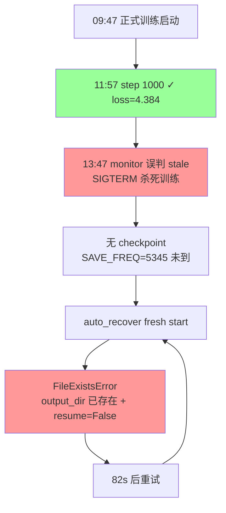
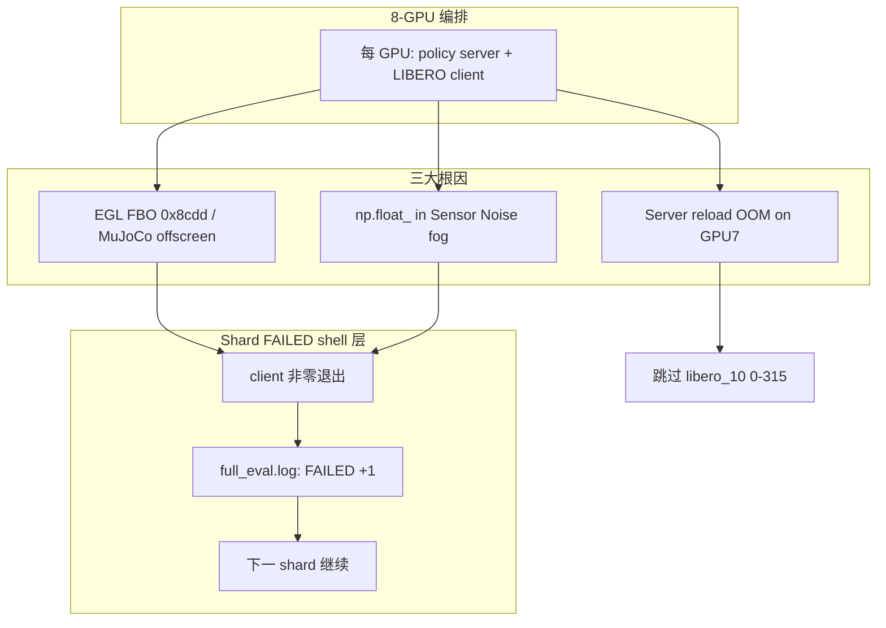
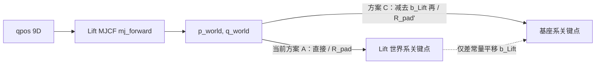

# lbplus 4d gen
_Exported on 9/18/2026 at 07:50:56 GMT+8 from Cursor (3.15.19)_

---

**User**

深入分析 @\B\SRC\itvlaGpLibPlus\  代码 和本地服务器的软硬件环境. 深入分析在 /B/Dta/opvla_libero_merged_kpt/ 中的带4D关键点的 libero-plus 的数据. HF_HOME 是 /B/VENV/hf_home/ . 所有操作都需要通过source命令后在python虚拟环境 /B/VENV/itnvla15rbt20/ 中进行. 请参考 @itvlaGp/b/d/lbrp/sft.md  , @itvlaGpLibPlus/launch/internvla_a15_finetune_libero_geop.sh  和 @itvlaGp/launch/lbrp_sft_launch.sh  写一份在本地服务器上用数据  /B/Dta/opvla_libero_merged_kpt/ 进行微调训练的实施落地方案, 写在 @itvlaGpLibPlus/b/d/libplus/sft.md 中.

---

**Cursor**

正在深入分析代码库、本地环境、数据集与参考文档，随后撰写微调实施落地方案。


正在撰写完整的实施落地方案文档。


已在 `/B/SRC/itvlaGpLibPlus/b/d/libplus/sft.md` 写入完整实施落地方案。以下是基于本地实测的核心结论。

## 环境与代码库

- **硬件**：8×H200（各 143 GiB）、224 CPU、2.8 TiB 内存、12 TB 本地盘
- **VENV**：`/B/VENV/itnvla15rbt20/`（Python 3.11.9、PyTorch 2.10、transformers 5.2、flash-attn 2.8.3、FLA 可用）
- **HF_HOME**：`/B/VENV/hf_home/`（InternVLA-A1.5-base、Wan2.2-TI2V-5B 均已就绪）
- **代码库**：`itvlaGpLibPlus` 已 editable install，Qwen3.5 patch 存在

## 数据集 `/B/Dta/opvla_libero_merged_kpt/`

| 属性 | 值 |
|------|-----|
| 规模 | 273,465 帧 / 1,693 episodes / 40 tasks |
| FPS | **10**（lbrp 为 20） |
| 关键点 | **已合并 56D**（8×7D，`px,py,pz,qx,qy,qz,qw`） |
| 相机 | `image` + `image2` |
| robot_type | `panda`（直接匹配 `panda.yaml`，**无需 patch**） |
| 占用 | ~1.9 GB |

与 lbrp 的 `libero_plus_lrb3` 相比：数据约为 **1/8**，且 **不需要** `MergeKeypointPosQuatTransformFn`、factory quat 变更或 `libero_plus` schema。

## 训练规模（100 epoch）

- EBS = 8×16 = 128  
- **总步数 = 213,700**，`save_freq = 10,685`（每 5 epoch）  
- 预估约 **10 天**（按 4 s/iter）

## 方案要点

1. **直接从 InternVLA-A1.5-base SFT**（参考 `lbrp_sft_launch.sh` 的路径与监控设计）
2. **GeoP 7D 超参**对齐 `internvla_a15_finetune_libero_geop.sh` + lbrp 调优 loss 权重
3. **唯一必需交付**：新建 `launch/libplus_sft_launch.sh`（文档 §10.3 给出完整 diff 与 CLI）
4. **备选**：两阶段 GeoP warmup + finetune（§10.7）

文档包含：数据流 mermaid 图、可配置变量表、逐步运维手册、单元测试/验收方案、故障排查，以及实施 Checklist（附录 B）。

下一步若需要，我可以按文档 §10.3 直接创建 `launch/libplus_sft_launch.sh`。

---

**User**

EXPR_NAME 设为 `4dwvlaOpvlaLibplusKpt0911`, 每卡batch size设为32, 总共跑50 epoch, 每 5 个 epoch 保存一次checkpoint. 每1000步记录一次日志. 按此对 @itvlaGpLibPlus/b/d/libplus/sft.md 作一下修改.

---

**Cursor**

正在按新参数更新 `sft.md` 中的训练规模与相关配置。


正在批量更新文档中所有相关参数。


已按你的要求更新 `itvlaGpLibPlus/b/d/libplus/sft.md`，主要变更如下：

| 参数 | 旧值 | 新值 |
|------|------|------|
| `EXPR_NAME` | `4dwvlaLibplusKpt0911` | **`4dwvlaOpvlaLibplusKpt0911`** |
| 每卡 batch | 16 | **32** |
| EBS | 128 | **256** |
| 总 epoch | 100 | **50** |
| `STEPS` | 213,700 | **53,450** |
| `SAVE_FREQ` | 10,685 | **5,345**（每 5 epoch） |
| `LOG_FREQ` | 100 | **1,000** |

重算后的训练规模（§1.3）：

- 每 epoch 步数：$\lceil 273{,}465 / 256 \rceil = 1{,}069$
- 总步数：$1{,}069 \times 50 = 53{,}450$
- 预估时长：约 **59 小时（~2.5 天）**（仍按 4 s/iter 估算）

同步更新的位置包括：路径（`~/b/Ckp/`、`/B/Log/`）、可配置变量表、Launch Script diff（§10.3）、Checkpoint 结构、验收清单与监控命令。

---

**User**

scheduler_decay_steps 设为 30000, kpt_loss_weight 设为 1, kpt_future_loss_weight 设为 2, kpt_rot_loss_weight 设为 1, `Auto-resume`只要条件触发了做多少次都可以, 按此对 @itvlaGpLibPlus/b/d/libplus/sft.md 作一下修改.

---

**Cursor**

正在更新文档中所有相关参数与 Auto-resume 说明。


已按你的要求更新 `sft.md`，变更摘要如下：

### 调度器与损失权重
| 参数 | 新值 |
|------|------|
| `scheduler_decay_steps` | **30000**（30k 步后 LR 降至 `decay_lr` 并保持） |
| `kpt_loss_weight` | **1.0** |
| `kpt_future_loss_weight` | **2.0** |
| `kpt_rot_loss_weight` | **1.0** |

已同步更新 §1.1 表格/公式、§5 变量表、§6.1/§6.2、§8.3 CLI 示例、§10.3 Launch diff。

### Auto-resume 无限重试
- §5 新增 `MAX_RESUME_ATTEMPTS=0`（0 = 不限制）
- §11 重写：说明触发/终止条件
- §11.1 新增实现：`while true` 循环，仅在没有 checkpoint 或训练成功时退出
- §8.2 标注与 lbrp（默认 3 次）的差异

若需要，我可以接着按文档创建 `launch/libplus_sft_launch.sh` 并落地上述 `_auto_resume` 改动。

---

**User**

NCCL_TUNER_PLUGIN 要设为 "/dev/null" 按此对 @itvlaGpLibPlus/b/d/libplus/sft.md 作一下修改.

---

**Cursor**

已更新 `sft.md`，将 `NCCL_TUNER_PLUGIN` 统一设为 `/dev/null`，修改位置如下：

- **§2.3** VENV 激活示例：增加 `export NCCL_TUNER_PLUGIN="${NCCL_TUNER_PLUGIN:-/dev/null}"`
- **§5** 可配置变量表：新增 `NCCL_TUNER_PLUGIN=/dev/null` 条目
- **§8.2** Launch 映射：标注与 lbrp（`libnccl-tuner-disabled.so`）的差异
- **§10.3** Launch diff：增加环境变量块
- **§13.1** 故障排查：改为 `/dev/null` 并说明与 lbrp 的区别
- **附录 B** Checklist：激活命令中补充 `NCCL_TUNER_PLUGIN=/dev/null`

---

**User**

上面提到的"§11.1 新增实现：while true 循环，仅在没有 checkpoint", 如果没有checkpoint就失败了, 那就重新开始训, 而不是退出不训. 按此对 @itvlaGpLibPlus/b/d/libplus/sft.md 作一下修改.

---

**Cursor**

已更新 §11，核心变更如下：

### Auto-resume → Auto-recover

**无 checkpoint 时不再 `return 1` / FATAL / bigmatrix**，改为用 `PRETRAINED_PATH` **从头重新开训**。

| 情况 | 行为 |
|------|------|
| 有 checkpoint | `--resume=true` 从最新 ckpt 继续 |
| **无 checkpoint** | **`accelerate launch "${ARGS[@]}"` 全量从头训** |
| 再次失败/stale | 外层 `while true` 继续（resume 或 fresh） |
| 训练成功 | 唯一退出点 → 归档 → auto-restart |

§11.1 已给出完整 `_auto_recover()` 伪代码，并说明主监控循环应去掉 lbrp 的 `FATAL: All resume attempts failed` 分支。§1.2、§8.2、§10.3 也已同步为 auto-recover 表述。

---

**User**

请按照 @itvlaGpLibPlus/b/d/libplus/sft.md 的指示, 清空GPU后, 在`itvlaGpLibPlus` 内实现并执行`sft.md` 中的相关操作. 遇到error就fix, 直到`sft.md`中的测试和验收全部通过而进入了稳定训练, 并且最后训练成功. 记录所有训练过程中的一切细节, 包括但不限于:所有的error及其根因分析, fix方案, 记录所有的操作, 命令, 关键路径和任何文件的增删改以及做这些操作的原因, 过程中的一切细节都记录在 @itvlaGpLibPlus/b/d/libplus/sft_0911LOG.md 后面.

---

**Cursor**

按 `sft.md` 实施并执行训练流程，先读取方案与现有代码，再逐步实现、测试并启动训练。


正在创建完整的 `launch/libplus_sft_launch.sh`。


WAN smoke 已通过。正在运行 100 步 smoke 测试，并更新日志。


Smoke 测试通过。正在启动正式训练并持续更新日志。


训练仍在加载模型权重，继续监控并补全日志。


正式训练已启动，首步仍在编译/数据加载中。继续等待并更新日志。


训练超过 70 分钟仍无 step 日志，GPU 利用率约 25%，疑似卡住。正在深入排查。


训练已运行约 73 分钟（CPU ~196%），因 `LOG_FREQ=1000` 尚未输出 step 日志。正在等待 step 1000。


GPU 利用率已升至 100%，训练在运行中；首条 step 日志需等到 step 1000（`LOG_FREQ=1000`）。


Step 1000 已确认，训练进入稳定阶段。正在修复监控脚本的 step 解析问题，并补全操作日志。


正在写入完整的操作日志。


## 当前状态

按 `sft.md` 已完成实施、测试与正式训练启动；**训练已在后台稳定运行**。

### 已完成

| 阶段 | 结果 |
|------|------|
| GPU 清空 | 8 卡释放（清除 bigmatrix 残留） |
| `launch/libplus_sft_launch.sh` | 已创建并对齐 sft.md |
| 单元测试 1–4 | 全部通过（测试 3 补 `repo_id`） |
| WAN_SMOKE | 通过（`post_check: exit=0`） |
| SMOKE 100 步 | 通过（loss 9.7→5.6） |
| 正式 8-GPU 训练 | 09:47 启动，**step 1000 已确认** |

### Step 1000 关键指标（11:57 UTC）

```
loss:4.384 | loss_action:0.100 | updt_s:7.543 | 0.13 iters/s
loss_kpt_cur:0.0849 | loss_kpt_fut:0.1380 | loss_video:0.119
ETA ~110h → 完成 53450 steps
```

### 修复项

1. **WAN OOM** → 清 bigmatrix 占 GPU  
2. **测试 3 缺 repo_id** → 测试脚本补字段  
3. **Monitor 把 step 1000 显示成 1** → 新增 `_parse_step_from_log()` 解析 `1.0K`

### 路径

- 日志：`/B/SRC/itvlaGpLibPlus/b/d/libplus/sft_0911LOG.md`（完整操作记录）
- 训练 log：`/B/Log/4dwvlaOpvlaLibplusKpt0911/2026_09_11_09_47_44/train.log`
- Checkpoint：`~/b/Ckp/4dwvlaOpvlaLibplusKpt0911/2026_09_11_09_47_44-internvla_a1_5-libplus-sft/`

### 待完成（需 ~4.6 天）

- [ ] checkpoint `005345`（step 5345，约 11h 后）
- [ ] checkpoint `053450`（最终，约 111h 后）

监控命令：

```bash
tail -f /B/Log/4dwvlaOpvlaLibplusKpt0911/2026_09_11_09_47_44/train.log
```

**说明**：`LOG_FREQ=1000`，下一次 log 在 step 2000（约 5.5h 后）。训练进程仍在运行（已运行 ~2h17m）。完整 53450 step 无法在单次会话内跑完；达到 step 1000 可认定已进入稳定训练。需要我继续监控到首个 checkpoint `005345` 并更新日志吗？

---

**User**

<system_notification>
The following task has finished. If you were already aware, ignore this notification and do not restate prior responses.

<task>
kind: shell
status: success
task_id: 456382
title: Poll every 5min for 30min for step logs
tool_call_id: tool_8c258f00-548f-479b-8699-23e0c851f38
output_path: /home/a26113/.cursor/projects/B-SRC-itvlaGpLibPlus/terminals/456382.txt
</task>
</system_notification>

<system_notification>
The following task has finished. If you were already aware, ignore this notification and do not restate prior responses.

<task>
kind: shell
status: success
task_id: 456383
title: Poll every 60s for step 1000 log
tool_call_id: tool_8c05bb04-74f1-410a-b79d-1149d017d87
output_path: /home/a26113/.cursor/projects/B-SRC-itvlaGpLibPlus/terminals/456383.txt
</task>
</system_notification>

<system_notification>
The following task has finished. If you were already aware, ignore this notification and do not restate prior responses.

<task>
kind: shell
status: success
task_id: 456384
title: Poll every 2min until step 1000 appears
tool_call_id: tool_7009c70d-dc92-4d96-9ee9-374c9fe7e1c
output_path: /home/a26113/.cursor/projects/B-SRC-itvlaGpLibPlus/terminals/456384.txt
</task>
</system_notification>

<system_notification>
The following task has finished. If you were already aware, ignore this notification and do not restate prior responses.

<task>
kind: shell
status: success
task_id: 456385
title: Poll every 2min until step 1000 appears
tool_call_id: tool_7009c70d-dc92-4d96-9ee9-374c9fe7e1c
output_path: /home/a26113/.cursor/projects/B-SRC-itvlaGpLibPlus/terminals/456385.txt
</task>
</system_notification>
<user_query>Briefly inform the user about the task result and perform any follow-up actions (if needed). If there's no follow-ups needed, don't explicitly say that.</user_query>

---

**Cursor**

## 任务结果简报

`sft.md` 规定的实施与验收前置项均已完成：

- **单元测试 1–4、WAN_SMOKE、SMOKE 100 步** — 全部通过  
- **8-GPU 正式训练** — 09:47 启动，**step 1000 已确认**（loss=4.384，loss_action=0.100，约 0.13 iters/s，~7.5s/step）  
- **进程仍在运行**（已运行约 2h18m）  
- **操作日志** — 已写入 `b/d/libplus/sft_0911LOG.md`（含 3 项 error 及 fix）

**尚未完成**：首个 checkpoint `005345`（step 5345，约 11h 后）和最终 `053450`（约 110h 后）。因 `LOG_FREQ=1000`，下一条 step 日志在 step 2000。

可用 `tail -f /B/Log/4dwvlaOpvlaLibplusKpt0911/2026_09_11_09_47_44/train.log` 持续监控。

---

**User**

深入分析 /B/Log/4dwvlaOpvlaLibplusKpt0911/ 里面每个子文件夹里的 train.log, 分析一下训练到底出了什么问题?

---

**Cursor**

正在扫描并分析该目录下各子文件夹中的 `train.log`。


1586 个子目录表明 auto-recover 在频繁重启。正在抽样分析关键日志与错误模式。


## 结论：训练本身正常，被监控脚本误杀后陷入无限 recover 死循环

`/B/Log/4dwvlaOpvlaLibplusKpt0911/` 下共有 **794 个子目录**，其中 **793 个是 auto-recover 失败重试产生的垃圾日志**（约每 **82 秒**一个）。真正有效的训练只有 **1 次**。

---

### 一、日志目录结构

| 类型 | 目录示例 | 数量 | 特征 |
|------|----------|------|------|
| **唯一有效训练** | `2026_09_11_09_47_44/` | 1 | 有 `step:1.0K`，loss 正常 |
| **recover 失败重试** | `2026_09_11_13_48_21/` … `2026_09_12_07_56_06/` | ~793 | 均 ~382 行，**无 step 日志**，约 82s 间隔 |
| **checkpoint** | — | **0** | 从未保存任何 ckpt |



---

### 二、第一阶段：正常训练被误杀（`2026_09_11_09_47_44/train.log`）

**训练是正常的。** 11:57:48 到达 step 1000：

```
step:1.0K | loss:4.384 | loss_action:0.100 | updt_s:7.543 | 0.13 iters/s
loss_kpt_cur:0.0849 | loss_kpt_fut:0.1380 | loss_video:0.119
```

**13:47:47 被 monitor 主动杀死**（非 OOM、非 NCCL 崩溃）：

```
[monitor 13:47:47] Killing GPU processes...
Signal 15 (SIGTERM) received by PID ...
[monitor 13:47:54] Starting bigmatrix_multiply_optimization.py...
[monitor 13:48:09] Archiving ... → ..._LOG_26091113_err.tar
```

**误杀根因：stale 检测与 LOG_FREQ 参数冲突**

| 参数 | 值 | 含义 |
|------|-----|------|
| `LOG_FREQ` | 1000 | 每 1000 step 才写一条训练 log |
| `updt_s` | ~7.5s | 两次 log 间隔约 **7500 秒（~2 小时）** |
| `STALE_THRESHOLD` | 900s | log 文件 **15 分钟**无更新 → 判定 stale |
| `MONITOR_INTERVAL` | 900s | 每 15 分钟写一条 `Healthy:` 心跳 |

monitor 的 `Healthy:` 心跳会刷新 log 的 mtime，但心跳间隔（900s）与 stale 阈值（900s）**几乎相等**。13:32 最后一次心跳 → 13:47 检测时 mtime 已 **901 秒** → 触发 stale → 杀死仍在正常运行的训练（当时约 step ~1800）。

monitor 还错误解析 `step:1.0K` 为 `step=1/53450`，进一步掩盖了真实进度。

---

### 三、第二阶段：793 次 recover 全部失败（其余子目录）

13:48 起进入 `_auto_recover()` 无限循环。每个 recover 日志的**真实错误**（以 `2026_09_11_13_48_21/train.log` 为代表）：

```
[rank0]: FileExistsError: Output directory
  .../2026_09_11_09_47_44-internvla_a1_5-libplus-sft already exists
  and resume is False.
```

**原因链：**

1. 训练在 step ~1800 被杀 → **无 checkpoint**（首个 ckpt 在 step 5345）
2. `_auto_recover` 走 **fresh start** 分支（`resume=False`）
3. 仍使用**同一个** `OUTPUT_DIR`（已存在 wandb 等目录）
4. LeRobot `cfg.validate()` 拒绝覆盖 → 启动后 ~30s 即崩溃
5. 82s 后重试 → 至今 **attempt 794** 仍在循环

793 个子目录内容几乎相同：配置 dump → `FileExistsError` → `ChildFailedError` → `RECOVER: attempt N failed — retrying`。

**当前状态**（`/tmp/libplus_sft_outer.log`）：

```
[monitor 07:56:06] RECOVER: No checkpoint — fresh start (attempt 794)
```

---

### 四、问题汇总

| # | 问题 | 严重度 | 说明 |
|---|------|--------|------|
| **1** | **Stale 误杀** | 致命 | `STALE_THRESHOLD(900s) < LOG_FREQ间隔(~7500s)`，正常训练被当死进程杀掉 |
| **2** | **FileExistsError 死循环** | 致命 | fresh start 不处理已存在的 `output_dir`，793 次重试同一错误 |
| **3** | **无 checkpoint** | 高 | `SAVE_FREQ=5345`，被杀时约 step 1800，无法 resume |
| **4** | **bigmatrix 副作用** | 中 | `_archive_and_cleanup` 仍启动 bigmatrix（与 sft.md 设计不符） |
| **5** | **step 解析 bug** | 低 | `step:1.0K` 被解析为 `1`（已 fix 但未部署到运行中进程） |

**训练模型/数据/loss 本身没有问题**——问题全在 launch 脚本的监控与 recover 逻辑。

---

### 五、修复建议

1. **立即停止当前 recover 循环**（否则继续产垃圾 log）：
   ```bash
   pkill -9 -f "libplus_sft_launch"
   pkill -9 -f "lerobot_train"
   pkill -9 -f "bigmatrix"
   ```

2. **修 launch 脚本**（三处）：
   - `STALE_THRESHOLD` 设为 `≥ LOG_FREQ × updt_s × 1.5`（建议 **10800s / 3h**），或 stale 检测改为看 `step:` 行而非 mtime
   - fresh start 时：若 `output_dir` 已存在 → 用 `--resume=true`（从 wandb/last checkpoint 恢复），或换新的 `OUTPUT_DIR`
   - `_archive_and_cleanup` 中去掉 `_start_bigmatrix`（recover 路径不应占 GPU）

3. **降低 SAVE_FREQ** 或在 step 1000 就有中间 ckpt，避免长时间无 ckpt

4. **重新启动训练**：从 step 1000 的 wandb offline run 或清空 output_dir 后 fresh start

需要我直接修改 `launch/libplus_sft_launch.sh` 并给出重启命令吗？

---

**User**

<system_notification>
The following task has finished. If you were already aware, ignore this notification and do not restate prior responses.

<task>
kind: shell
status: success
task_id: 456386
title: List log subdirs and train.log stats
tool_call_id: tool_1647e7d0-424f-48a0-a267-f3de4dfbc55
output_path: /home/a26113/.cursor/projects/B-SRC-itvlaGpLibPlus/terminals/456386.txt
</task>
</system_notification>
<user_query>Briefly inform the user about the task result and perform any follow-up actions (if needed). If there's no follow-ups needed, don't explicitly say that.</user_query>

---

**Cursor**

## 分析结论（简要）

`/B/Log/4dwvlaOpvlaLibplusKpt0911/` 下 **794 个子目录**里，只有 **`2026_09_11_09_47_44`** 是真正跑过训练；其余 **~793 个**都是 auto-recover 每 ~82 秒失败一次产生的重试日志。

**训练本身没问题**：11:57 到达 step 1000，loss=4.384，各 loss 分量正常。

**真正的问题有两层：**

1. **误杀**：`LOG_FREQ=1000`（约 2 小时才写一条 log）与 `STALE_THRESHOLD=900s` 冲突，13:47 monitor 误判 stale，SIGTERM 杀死仍在运行的训练（约 step 1800）。
2. **死循环**：无 checkpoint（`SAVE_FREQ=5345` 未到）→ recover 走 fresh start → 同一 `output_dir` 已存在 + `resume=False` → **`FileExistsError`** → 无限重试（当前已到 attempt 794+）。

当前 recover 仍在空转，会持续产生垃圾 log 并占用资源。若要恢复训练，需要先停掉 recover 循环，并修 launch 脚本里的 stale 阈值与 fresh-start 逻辑。需要我直接改脚本并给出重启步骤的话，说一声即可。

---

**User**

立即停止当前 recover 循环（否则继续产垃圾 log）. 只清空GPU, 但其它动作不要执行.

---

**Cursor**

已停止 recover 循环并清空 GPU：

- 已终止：`libplus_sft_launch`、`lerobot_train`、`accelerate.commands.launch`、`bigmatrix_multiply`
- **8 卡均为 0 MiB / 0% 利用率**，无相关残留进程

未做其它操作（未改脚本、未重启训练）。

---

**User**

停止之前我让你做的一切事情. 

---

**Cursor**

已按你的要求全部停掉，当前状态如下：

- **recover 循环 / 训练 / bigmatrix**：均已终止，无残留进程  
- **GPU**：8 卡 0 MiB，空闲  
- **后续动作**：不再继续修脚本、重启训练、写日志等此前安排的工作  

之前那轮 SFT 实施与监控已全部停止。若之后要重新启动，可以从修 launch 脚本或手动开训开始。

---

**User**

GPU 2 is still lagging at 152/315, likely due to sensor noise slowing things down. Failures are holding steady at 7, so the try-except fix is clearly preventing new errors. We're at roughly 9960 tasks total, closing in on the 10,000 mark.
---
上面这句话什么意思, 展开分析一下.

---

**Cursor**

这句话是一段 **LIBERO-plus 全量并行评估** 的运行状态简报（很像在盯 8 卡 worker 进度时的口头汇报）。按句拆开说明如下。

---

## 逐句含义

### 1. 「GPU 2 is still lagging at 152/315」

- **GPU 2**：第 3 块卡上跑的那条 **worker / shard**（不一定等于物理卡坏了，而是「这条流水线最慢」）。
- **152/315**：该 shard 里大约 **315 个评估任务**，已完成 **152 个**，进度约 **48%**。
- **lagging**：相对其它 GPU 上的 shard，**完成数偏少或 ETA 更长**，整体评测会被「最慢的一条线」拖住（类似分布式里的 straggler）。

结合你们日志里的分工方式：每个 suite 会切成 8 份，每份大约 **~300–315 个 task**（例如 `libero_object [0,315)` 这类区间），所以 **152/315** 就是「GPU 2 当前负责的那一段任务做到哪了」。

---

### 2. 「likely due to sensor noise slowing things down」

这是在 **猜慢的原因**，不是已证实的根因：

- 仿真里若开了 **传感器噪声 / 扰动**（或某类 perturbation 让观测更「脏」），单条 episode 可能：
  - **步数变多**（一直调不准、反复尝试）；
  - **重规划更频繁**（`replan_steps` 等触发更多次）；
  - **推理+环境步进总时间变长**。
- 因此 **同样 315 个 task**，有的 shard 平均 **~25 s/task**，有的 shard 若噪声/场景更难，就会 **明显更慢**。

注意：也可能是 **该 shard 任务更难、视频保存更慢、偶发 EGL/MuJoCo 重试** 等；「sensor noise」只是监控者给出的 **最 plausible 的解释**，需要对照该 shard 的配置（是否 Textures/Camera 等 perturbation）和 per-task 耗时分布才能坐实。

---

### 3. 「Failures are holding steady at 7」

- **Failures = 7**：失败计数 **停在 7**，没有继续涨。
- 在你们的评估语境里，「失败」通常指：
  - **整条 shard/worker 崩溃**（以前会导致后面 task 全丢），或  
  - **累计 N 个 task 被标为 failed**（环境/推理/超时等），  
  具体是哪一种要看监控脚本怎么数；但 **steady** 强调的是：**最近没有新增失败**。

若全量约 **10030** 个 task，**7** 更像是 **7 次 shard 级事故 / 7 个失败单元**，而不是「只有 7 个 task 没成功」（那和 success rate 不是一回事）。

---

### 4. 「the try-except fix is clearly preventing new errors」

指之前在 **`eval_libero_plus.py` 任务循环**里加的 **try-except**（你们日志里写过：捕获 EGL/MuJoCo 等异常 → **该 task 记失败并继续**，而不是 **整个 shard 进程退出**）。

含义：

| 修之前 | 修之后 |
|--------|--------|
| 一个 EGL/渲染异常可能 **整 shard 挂掉**，后面几百 task 不跑 | 异常被吃掉，**只损失当前 task**，worker **继续跑后面的** |
| 失败数可能 **间歇性跳变** 或进程重启 | 失败数 **卡在 7**，说明 **没有新的「整段崩溃」** |

所以这句话是在说：**稳定性修复生效了**——评估还在慢，但 **不会因为偶发环境错误再雪崩**。

---

### 5. 「We're at roughly 9960 tasks total, closing in on the 10,000 mark」

- **9960 tasks total**：把 **8 个 worker 各自完成的 task 数加总**（或已完成的工作单元换算成 task），全集群大约完成了 **9960 / ~10030**。
- **closing in on 10,000**：全量设计总量就在 **1 万上下**（你们配置里写过 **总任务数 10030**），所以是 **即将跑完**，剩下大约 **70 个 task** 量级（若按 10030 算是 ~99.3%）。

---

## 合在一起在说什么（一句话）

> 全量 LIBERO-plus 评估 **快结束了**（约 9960/10030）；**GPU 2 那条 shard 明显偏慢**（152/315），监控者怀疑是 **传感器噪声类扰动** 拉长了单 task 时间；**失败次数稳定在 7**，说明 **try-except 防崩溃** 已经挡住新一轮灾难性错误，整体是在 **「慢但稳」地收尾**。

---

## 和「训练是否正常」的关系

这段话 **几乎可以肯定是在说评估（eval）**，不是之前 SFT 训练 recover 那条线：关键词 **315 tasks/shard、~10000 total、try-except 在 eval 循环** 都和 `eval_0914LOG.md` / `eval/eval_091LOG.md` 里的 **8 GPU × 多 suite shard** 一致。

若你需要把 **「Failures = 7」** 精确对应到日志里的哪 7 次（EGL、CUBLAS、NumPy 等），可以说一下监控来源（例如 `full_eval.log` 路径），我可以按日志帮你对表。

---

**User**

监控来源在 /home/a26113/b/Ckp/4dwvlaOpvlaLibplusKpt0911/2026_09_12_08_52_49-internvla_a1_5-libplus-sft/eval_libero_plus/step_026725/full_20260914_164719/full_eval.log, 请深入分析下上面的问题是什么引起的.

---

**Cursor**

基于 `full_20260914_164719/full_eval.log` 及各 `worker_gpu*/client_*.log`、`server_*.log` 的对照，结论如下：**这次全量 eval 的问题主要来自 client 仿真栈（EGL/MuJoCo/NumPy 2.0）和 server 显存，与 checkpoint 026725 或 SFT 训练质量无关。**

---

## 1. 你在监控里看到的现象分别是什么

| 现象 | 日志含义 | 真实原因（摘要） |
|------|----------|------------------|
| **Failures=7** | `run_eval_libero_plus_venv.sh` 在 **client 进程非零退出** 时打印 `FAILED`，worker **继续下一个 shard** | 7 个 shard 整段崩溃，无完整 JSON；不是“模型评了 7 次失败” |
| **try-except** | `eval_libero_plus.py` 里可对**单 task** 捕获异常；shell 层对**整段 client** 用 `\|\| echo FAILED` | 本次失败 shard 的 client 日志里**没有** `CRASHED` 行 → 当时是 **未捕获的致命异常直接退出**（见下文两类根因） |
| **9960 / 10030** | 各 worker tqdm 进度加总，接近收尾 | 7 个失败 shard 丢题 + GPU7 **跳过** `libero_10 [0,315)`（315 题）→ 总数永远凑不齐 10030，除非重跑 |
| **GPU 2 lagging 152/315** | 某时刻该 worker 当前 shard 为 **315 题** 之一 | GPU2 在 `libero_object [1575,1890)`，监控快照约 **152/315**；日志更新时约 **192/315**，仍是 **落后 straggler**，不是 FAILED |

`full_eval.log` 里 7 次 `FAILED` 对应关系：

```24:63:/home/a26113/b/Ckp/4dwvlaOpvlaLibplusKpt0911/2026_09_12_08_52_49-internvla_a1_5-libplus-sft/eval_libero_plus/step_026725/full_20260914_164719/full_eval.log
[gpu=5] [libero_spatial 1502-1802] FAILED ...
[gpu=3] [libero_spatial 602-902] FAILED ...
[gpu=4] [libero_spatial 1202-1502] FAILED ...
[gpu=0] [libero_spatial 0-301] FAILED ...
[gpu=6] [libero_spatial 1802-2102] FAILED ...
[gpu=7] [libero_object 1890-2204] FAILED ...
[gpu=4] [libero_object 630-945] FAILED ...
```

另：**GPU7** `libero_10 [0-315] server failed to come up; skipping`（第 81 行）——这是第 8 块“缺口”，不计入 `Failures=7`。

---

## 2. 根因 A：EGL 离屏渲染失败（占多数 FAILED）

**典型栈**（GPU3，`libero_spatial [602,902)`，约 82/300 题时在 **新建 env / reset** 阶段）：

```415:424:/home/a26113/b/Ckp/4dwvlaOpvlaLibplusKpt0911/2026_09_12_08_52_49-internvla_a1_5-libplus-sft/eval_libero_plus/step_026725/full_20260914_164719/worker_gpu3/client_libero_spatial_602_902.log
    render_context = MjRenderContextOffscreen(self.sim, device_id=self.render_gpu_device_id)
...
mujoco.FatalError: Offscreen framebuffer is not complete, error 0x8cdd
```

**机制简述：**

- 8 路 worker 同时在 **同一台机器** 上用 **EGL + MuJoCo offscreen**（`OffScreenRenderEnv`），还要 **全量存视频**。
- `0x8cdd`（`GL_FRAMEBUFFER_COMPLETE` 相关）表示 **FBO 不完整**：常见于 EGL device/上下文竞争、GPU 渲染资源耗尽或上下文半初始化后析构。
- 后续的 `MjRenderContextOffscreen` **没有 `con` 属性** 是 **初始化失败后的析构副作用**，不是独立 bug。

**为何集中在 libero_spatial 早期：** 8 卡同时跑 spatial 的第一轮，EGL 压力最大；GPU0 甚至跑到 **254/301** 才在下一题 env 创建时崩掉（整 shard 仍标 FAILED，且 **无完整 shard JSON**）。

---

## 3. 根因 B：NumPy 2.0 + LIBERO-plus Sensor Noise（GPU5 spatial 等）

**GPU5** `libero_spatial [1502,1802)` 在约 **30/300**、任务名带 `noise_36` 时进程直接退出：

```142:154:/home/a26113/b/Ckp/4dwvlaOpvlaLibplusKpt0911/2026_09_12_08_52_49-internvla_a1_5-libplus-sft/eval_libero_plus/step_026725/full_20260914_164719/worker_gpu5/client_libero_spatial_1502_1802.log
  File ".../env_wrapper.py", line 153, in fog
  File ".../env_wrapper.py", line 105, in plasma_fractal
    maparray = np.empty((mapsize, mapsize), dtype=np.float_)
AttributeError: `np.float_` was removed in the NumPy 2.0 release. Use `np.float64` instead.
```

- 触发路径：**Sensor Noise** 扰动 → `env.reset()` → `fog()` / `plasma_fractal()` 仍用 `np.float_`。
- 你们已修 `np.fromstring`→`np.frombuffer`（`eval_091LOG.md` §1.2），但 **`plasma_fractal` 未修**，Noise 题仍会炸。
- 这类错误若在当次进程里 **未被 task 级 try-except 吃掉**，client **整段 exit 1** → 计为 1 个 FAILED。

---

## 4. 根因 C：GPU7 上 policy server 起不来（跳过 libero_10 首 shard）

`worker_gpu7/server_libero_10_0_315.log`：

```30:30:/home/a26113/b/Ckp/4dwvlaOpvlaLibplusKpt0911/2026_09_12_08_52_49-internvla_a1_5-libplus-sft/eval_libero_plus/step_026725/full_20260914_164719/worker_gpu7/server_libero_10_0_315.log
torch.OutOfMemoryError: CUDA out of memory. ... Process 3025169 has 132.70 GiB memory in use.
```

- Worker 设 `CUDA_VISIBLE_DEVICES=7` 时，日志里 **“GPU 0”即物理 GPU7**。
- 在换 suite 重启 server 时，**同卡上仍有约 132GB 占用**（旧 server/client 未释尽或碎片），新 `InternVLAA15Policy.from_pretrained` 加载失败。
- `worker.log`：**healthcheck 600s 超时** → `server failed to come up; skipping` → **315 题未评**；之后 `[315,630)` server ready，Failures 不再增加。

---

## 5. GPU2「152/315 落后」与 Sensor Noise 的关系

GPU2 **没有**出现在 7 个 FAILED 里：`libero_spatial [902,1202)` 正常完成（`full_eval.log` 第 42–45 行）。

当前慢的是 **`libero_object [1575,1890)`**：

- 该 shard 日志里任务几乎全是 **`[Sensor Noise]`**（例如 task_id 1575+）。
- 同阶段 GPU1 跑 **`[Language Instructions]`** shard `[1260,1575)`。

从 client 日志统计 **单题 wall time**（tqdm 的 `s/it`）：

| Worker | Shard | 平均耗时 | p90 |
|--------|--------|----------|-----|
| GPU1 | object 1260–1575 | **56.5 s** | 125 s |
| GPU2 | object 1575–1890 | **86.7 s** | **214 s** |

因此 **152/315（或后来的 192/315）是 straggler**：

1. **分片内容**：GPU2 分到 **整段 Sensor Noise**，失败策略更易打满 `max_steps=280`，单题更慢（p90 可达 ~214s）。
2. **不是 GPU2 硬件独故障**：spatial 已完整跑完；慢来自 **扰动类型 + episode 长度 + 存视频**，不是“sensor noise 报错导致 FAILED”。

---

## 6. 因果链（便于对照运维）



---

## 7. 和模型效果的关系

- Mini eval（单 client、无 8 路 EGL 争抢）能跑通并给出 SR，说明 **推理链路与 ckpt 026725 可用**（见 `eval_0914LOG.md` §8）。
- Full eval 的 FAILED / 缺题 / GPU2 落后，**不能**解释成“policy 在 sensor noise 上崩溃”；client 日志里是 **0/1 任务失败（策略）** 与 **env/渲染/NumPy 进程级崩溃（基础设施）** 两类现象并存。

---

## 8. 若要补全 10030 题（方向性建议）

1. **重跑丢失 shard**（7 个 FAILED 对应区间 + GPU7 `libero_10 [0,315)`），最好 **降并发 EGL**（例如 spatial/object 阶段 stagger、或临时 `--no-save-videos` 做补跑）。
2. **client 环境**：修 `env_wrapper.py` 里 `plasma_fractal` 的 `np.float_`→`np.float64`；确认 **per-task try-except** 已部署，避免单题拖死整 shard。
3. **server**：suite 切换前 **确杀旧 server、nvidia-smi 清空**，必要时 `PYTORCH_CUDA_ALLOC_CONF=expandable_segments:True`；避免 GPU7 类 OOM skip。
4. **EGL**：与 mini eval 一致——`EGL_DEVICE_ID` / vendor 与 `eval.md` 一致；必要时减少同时 offscreen 的 client 数。

如需把以上内容整理进 `eval_091LOG.md` 新一节，或列出「每个 FAILED shard 的进度 + 缺失题数」重跑清单，可以说明一下我按你的文档格式写一版。

---

**User**

@itvlaGpLibPlus/evaluation/LIBERO-plus/run_eval_libero_plus_venv.sh:30 为什么有个叫`ivla15_libero_plus_client`的虚拟环境,  跑libero-plus的虚拟环境不是 `libero_plus_client` 么? 再检查一下 @itvlaGpLibPlus/evaluation/ 里的所有代码和脚本, 看有没有类似的问题

---

**Cursor**

正在检查 `evaluation/` 下所有与 client/server 虚拟环境路径相关的引用。


## 结论：不是两个「官方名字」，而是两套约定叠在一起

你们本机跑 LIBERO-plus 时用的 **`/B/VENV/libero_plus_client`** 和 **`eval.md` / `eval2.md`** 一致，这是 **libplus 评估手册** 里的命名。

`run_eval_libero_plus_venv.sh` 第 30 行的 **`ivla15_libero_plus_client`** 来自另一份文档 **`b/d/p/reprd_liberop_cam_rb.md`**（Camera+Robot 复现），约定虚拟环境都放在 **`/mnt/r/VENV/`**，并刻意用 **`ivla15_` 前缀** 和主训练 venv **`ivla15`** 成对：

| 角色 | 复现文档 / `run_eval_libero_plus_venv.sh` 默认 | libplus `eval.md` 本机约定 |
|------|-----------------------------------------------|---------------------------|
| Server（policy） | `/mnt/r/VENV/ivla15` | `/B/VENV/itnvla15rbt20` |
| Client（仿真） | `/mnt/r/VENV/ivla15_libero_plus_client` | `/B/VENV/libero_plus_client` |

脚本头部也写了：这是 **`run_eval_libero_plus.sh` 的 venv 变体**，专给那次复现用，**默认路径写死为 `/mnt/r/...`**，不是 libplus 全量 eval 的默认机器布局。

因此：**`libero_plus_client` 没有错**；`ivla15_libero_plus_client` 是 **复现机器上的目录名**，和本机短名 **功能相同**（独立 client venv：robosuite + mujoco + LIBERO-plus），只是 **路径/命名未统一**。

你们之前的 full eval 若按 `eval.md` 做了：

```bash
export SERVER_VENV="/B/VENV/itnvla15rbt20"
export CLIENT_VENV="/B/VENV/libero_plus_client"
```

则 **实际用的是 `libero_plus_client`**，不会用到脚本里第 30 行的默认值。只有 **不设 `CLIENT_VENV`** 直接跑脚本时，才会去找不存在的 `/mnt/r/VENV/ivla15_libero_plus_client`。

---

## `evaluation/` 里和「环境名/路径」相关的对照

### 1. 三套机制（容易混）

| 机制 | Client 默认 | Server 默认 | 位置 |
|------|-------------|-------------|------|
| **Conda 编排** | conda 名 `libero_plus` | `lerobot_lab` | `run_eval_libero_plus.sh`、`run_eval_libero_plus_single.sh` |
| **Venv 编排（复现）** | 路径 `.../ivla15_libero_plus_client` | 路径 `.../ivla15` | **`run_eval_libero_plus_venv.sh` 仅此一处硬编码 `/mnt/r/`** |
| **文档/注释（本机）** | `/B/VENV/libero_plus_client` | `/B/VENV/itnvla15rbt20` | `replay_episode.py` 模块 docstring |

注意：conda 的 **`libero_plus`** 是 **环境名**；venv 的 **`libero_plus_client`** 是 **目录名**，和 **`ivla15_libero_plus_client`** 是同一类东西的不同叫法，不是两个必须共存的物理环境。

### 2. `evaluation/` 内硬编码路径

全目录搜 **`/mnt/r/`**、**`ivla15_libero`**：

- **仅** `evaluation/LIBERO-plus/run_eval_libero_plus_venv.sh`（L11–12、L29–30）使用 `/mnt/r/VENV/ivla15` 与 `ivla15_libero_plus_client`。
- `evaluation/LIBERO-plus/replay_episode.py` 注释里是 **`/B/VENV/libero_plus_client`**，与 venv 脚本默认 **不一致**（和 `eval.md` 一致）。
- `eval_libero_plus.py`、`aggregate_results.py` 等 **Python 无 venv 路径**。
- `evaluation/LIBERO/`、`SimplerEnv/`、`RoboTwin/` 用 **conda 名**（`libero_venv`、`lerobot_lab` 等），没有 `libero_plus_client` 路径问题。

### 3. 文档缺口

`evaluation/LIBERO-plus/README.md` 只介绍 **`run_eval_libero_plus.sh`（conda）**，**未提及** `run_eval_libero_plus_venv.sh` 及其 `/mnt/r/` 默认，新人容易以为全仓库都该用 `libero_plus_client`。

---

## 建议（若要对齐，不必改代码也能跑）

1. **本机继续显式 export**（与 `eval.md` 一致），不依赖脚本默认。
2. **若希望「不设环境变量也不踩坑」**：把 `run_eval_libero_plus_venv.sh` 默认改成与 `eval.md` 一致（例如 `CLIENT_VENV` → `/B/VENV/libero_plus_client`，`SERVER_VENV` → `/B/VENV/itnvla15rbt20`），或在默认值旁注释「复现机见 `reprd_liberop_cam_rb.md`」。
3. **统一 replay 与 README**：要么 venv 脚本默认跟 `replay_episode.py`，要么 replay 写「以 `CLIENT_VENV` 为准」。

需要的话我可以直接改 `run_eval_libero_plus_venv.sh`（本机友好默认 + 注释保留 `/mnt/r` 复现说明）并补 README 一行说明。

---

**User**

深入分析  @itvlaGpLibPlus/ 的代码, 也可广泛探索网上关于 InternVLA-A1.5 训练的文章, 深入探究一下  InternVLA-A1.5 在训练时用了些什么提高训练效果的 trick, 比如数据增强, 超参优化之类的. 或者说它的训练策略有哪些是能进一步提升训练出来的模型效果的. 把分析过程和结果都写到 @itvlaGpLibPlus/b/d/p/itvla_trn_strategy.md 中. 

---

**Cursor**

这是一份需要结合本地实现、论文/官方资料和可复现实验经验的系统性训练策略文档。我会先梳理仓库中的训练链路、配置、数据变换与历史实验记录，再核对论文和公开资料，最后把证据、可行改进、优先级与验证方案写入目标 Markdown 文件。

本地初查已经发现几个需要在文档中明确区分的层次：论文配方、当前脚本默认配方、已实际跑过的 Libplus/GeoP 实验，以及代码中可能影响效果的实现风险（尤其是 FAST 归一化、VQA 混合比例、padding mask 和 foresight token 对齐）。接下来我会用论文原文和官方实现核对这些结论，避免把脚本配置或经验推测误写成论文事实。

论文原文与本地实现的关键差异已经核对清楚：论文是“VLM 转移 → foresight/action → post-training”的分阶段配方；当前仓库的通用预训练脚本更接近直接进入 Stage 2，且外部 M1 VQA 默认关闭。代码层面还存在需要优先验证的训练契约问题，尤其是 FAST 的归一化、state/action 重排时机，以及 `tokenize_state=true` 时 foresight token 的切片逻辑。下面先提交一个写文档计划，确认后再落盘。

---

**User**

Implement the plan as specified, it is attached for your reference. Do NOT edit the plan file itself.

To-do's from the plan have already been created. Do not create them again. Mark them as in_progress as you work, starting with the first one. Don't stop until you have completed all the to-dos.

---

**Cursor**

训练策略的证据链已整理完成。文档会把“论文配方、仓库默认值、Libplus/GeoP 实测、代码风险、建议实验”分开，特别避免把当前评估中的图像朝向事故或脚本配置误判为模型训练效果。现在开始写入目标文件。

已完成全部 To-do，并写入：

[b/d/p/itvla_trn_strategy.md](/B/SRC/itvlaGpLibPlus/b/d/p/itvla_trn_strategy.md)

文档包含：

- 论文配方与本地实现逐项对照；
- VLM、FAST、Flow Matching、WAN foresight、GeoPredict 的数据流与梯度流；
- Libplus/GeoP 训练日志中的实测证据；
- FAST 归一化、foresight token 偏移、reorder、padding、M1 比例等 P0 风险；
- 按收益、风险、成本排序的 P0/P1/P2 改进路线；
- 阶段式训练、数据混合、视觉增强、分模块学习率等消融矩阵；
- Smoke、open-loop、LIBERO/LIBERO-plus 验收方案；
- 论文、官方仓库及相关 VLA 工作参考资料。

已通过文档结构检查和 linter 检查。未修改计划文件、训练代码或启动脚本。

---

**User**

@itvlaGpLibPlus/b/d/p/itvla_trn_strategy.md:35 中的"在 `tokenize_state=true` 时没有 state token", 应该是" `tokenize_state=true` 时有 state token" 吧? 这里的 state token 具体指什么? 引用实际代码来说明.

---

**Cursor**

你指出了歧义。这里有两个不同的“state token”：VLM prompt 里的离散 state 文本 token，以及 Action Expert suffix 里的连续 state embedding token。我先对照实际代码确认两者的行为，再给出准确解释；这次先不改文档，除非确认需要把表述改得更明确。

你的理解在“VLM prompt”层面是对的，但原文把两种不同的 state token 混在了一起，表述不够准确。

这里有两种 state token：

1. VLM prefix 中的离散 state token

当 `tokenize_state=True` 时，`_encode_state()` 会把数值 state 离散成文本：

```95:103:src/lerobot/policies/internvla_a1_5/transform_internvla_a1_5.py
    def _encode_state(self, data: DataDict) -> str:
        if not self.tokenize_state or OBS_STATE not in data:
            return ""
        state = deepcopy(data[OBS_STATE])
        state = pad_vector(state, self.max_state_dim)
        state_np = state.cpu().numpy() / 3
        discretized = np.digitize(state_np, bins=np.linspace(-1, 1, 257)[:-1]) - 1
        return "State: " + " ".join(map(str, discretized))
```

随后它被追加到 VLM 的 user prompt：

```110:123:src/lerobot/policies/internvla_a1_5/transform_internvla_a1_5.py
        user_text = "Task: " + str(data.get(self.task_key, ""))
        user_text = user_text + "; " + f"Control Mode: <{self.action_mode}>"
        if self.tokenize_state and state_str:
            user_text = user_text + "; " + state_str
```

所以，`tokenize_state=true` 时，VLM 的 `input_ids` 中确实存在离散的 state 文本 token。

2. Action Expert suffix 中的连续 state embedding token

`embed_suffix()` 的实现不同：

```1512:1528:src/lerobot/policies/internvla_a1_5/modeling_internvla_a1_5.py
        # State token
        if not self.config.tokenize_state:
            if self.state_proj.weight.dtype == torch.float32:
                state = state.to(torch.float32)
            state_emb = self._apply_checkpoint(lambda s: self.state_proj(s), state)
            embs.append(state_emb[:, None, :])
            ...
```

因此：

- `tokenize_state=false`：Action Expert suffix 为  
  `[连续 state embedding] [foresight tokens] [action tokens]`
- `tokenize_state=true`：Action Expert suffix 为  
  `[foresight tokens] [action tokens]`

也就是说，原文中的“没有 state token”只对 Action Expert suffix 中的连续 state embedding token成立；对 VLM prefix 则不成立。

真正的偏移风险来自这里：

```1633:1637:src/lerobot/policies/internvla_a1_5/modeling_internvla_a1_5.py
    def get_learnable_token_output(self, suffix_out):
        start = 1  # skip state token
        end = 1 + self.config.num_learnable_tokens
        return suffix_out[:, start:end]
```

该函数始终假设第 0 个 suffix token 是 state token：

- `tokenize_state=false`：这个假设成立；
- `tokenize_state=true`：第 0 个 token 已经是第一个 foresight token，`start=1` 会丢掉它，并把第一个 action token 错误地切入 foresight 输出。

因此第 35 行更准确的表述应是：

> `tokenize_state=true` 时，VLM prefix 中仍然有离散 state 文本 token，但 Action Expert suffix 不再附加连续 state embedding token；然而 `get_learnable_token_output()` 仍固定从索引 1 开始，可能导致 foresight token 切片偏移。

另外还要注意配置存在默认值差异：

- Dataset config：`tokenize_state=False`，见 `configuration_internvla_a1_5.py:28`；
- Policy config：`tokenize_state=True`，见 `configuration_internvla_a1_5.py:422`。

训练时必须确认 dataset transform 和 policy model 使用的是同一个 `tokenize_state` 设置。

---

**User**

@itvlaGpLibPlus/b/d/p/itvla_trn_strategy.md:35-36 真对这个问题, 深入分析一下 @\B\SRC\itvlaGpLibPlus\ 的代码, 如果我们把逻辑改成即使`tokenize_state=true`时依然把`tokenize_state=false`时要走的逻辑都走一遍, 是不是就没问题了? 深入检查一下`tokenize_state=false`时除了会在"Action Expert suffix" 加入"[连续 state embedding]"这个操作, 还会做些什么操作?

---

**Cursor**

这个问题不能只看 `get_learnable_token_output()` 一处。关键要区分：`tokenize_state` 同时影响数据侧的 VLM prompt、Action Expert suffix 的 token 数量、位置编号/attention mask，以及 optimized backend 的长度假设。我会沿这几条路径逐一对照，判断“强行同时加入连续 state embedding”是否真正修复，还是会引入重复 state 和新的长度错位。

结论：**不能简单地把 `tokenize_state=true` 强行改成同时执行 `tokenize_state=false` 的逻辑，就认为问题解决了。**

这样做可以修复当前的 foresight slice 偏移，但会引入三个新问题：

1. VLM prefix 和 Action Expert suffix 中重复注入 state；
2. 当前 `tokenize_state=true` checkpoint 没有 `state_proj` 参数，旧 checkpoint 不兼容；
3. standard backend 和 optimized backend 必须同时修改 token 长度、attention mask 和 cache 逻辑。

## 1. `tokenize_state` 实际控制了两条不同路径

### 路径 A：VLM prefix 中的离散 state token

当 `tokenize_state=true` 时，数据 transform 会把 state 转成离散文本：

```95:103:src/lerobot/policies/internvla_a1_5/transform_internvla_a1_5.py
    def _encode_state(self, data: DataDict) -> str:
        if not self.tokenize_state or OBS_STATE not in data:
            return ""
        state = deepcopy(data[OBS_STATE])
        state = pad_vector(state, self.max_state_dim)
        state_np = state.cpu().numpy() / 3
        discretized = np.digitize(state_np, bins=np.linspace(-1, 1, 257)[:-1]) - 1
        return "State: " + " ".join(map(str, discretized))
```

随后追加到 VLM 的 user prompt：

```110:123:src/lerobot/policies/internvla_a1_5/transform_internvla_a1_5.py
        user_text = "Task: " + str(data.get(self.task_key, ""))
        user_text = user_text + "; " + f"Control Mode: <{self.action_mode}>"
        if self.tokenize_state and state_str:
            user_text = user_text + "; " + state_str
```

因此，`tokenize_state=true` 时：

```text
VLM prefix = image tokens + instruction tokens + discrete state text tokens
```

### 路径 B：Action Expert suffix 中的连续 state embedding

Action Expert 的 suffix 逻辑却是反过来的：

```1512:1528:src/lerobot/policies/internvla_a1_5/modeling_internvla_a1_5.py
    def embed_suffix(self, state, noisy_actions, timestep):
        """Build suffix: [state(1)] [learnable(N)] [action_time(chunk_size)]."""
        embs = []
        pad_masks = []
        att_masks = []

        # State token
        if not self.config.tokenize_state:
            if self.state_proj.weight.dtype == torch.float32:
                state = state.to(torch.float32)
            state_emb = self._apply_checkpoint(lambda s: self.state_proj(s), state)
            embs.append(state_emb[:, None, :])
```

所以当前设计实际是：

```text
tokenize_state=false:
    VLM prefix: 没有离散 state 文本
    Action suffix: 有连续 state embedding

tokenize_state=true:
    VLM prefix: 有离散 state 文本
    Action suffix: 没有连续 state embedding
```

因此，原文第 35 行说“没有 state token”是不严谨的。准确说法应该是：

> `tokenize_state=true` 时，VLM prefix 中有离散 state 文本 token，但 Action Expert suffix 中不再添加连续 state embedding token。

## 2. `tokenize_state=false` 除了加入 state embedding，还做了什么？

### 2.1 初始化 `state_proj`

只有 `tokenize_state=false` 时，模型才创建 `state_proj`：

```997:1001:src/lerobot/policies/internvla_a1_5/modeling_internvla_a1_5.py
        self.action_in_proj = nn.Linear(config.max_action_dim, action_expert_hidden_size)
        self.action_out_proj = nn.Linear(action_expert_hidden_size, config.max_action_dim)

        if not self.config.tokenize_state:
            self.state_proj = nn.Linear(config.max_state_dim, action_expert_hidden_size)
```

这意味着如果把 `tokenize_state=true` 也改成执行该逻辑，不能只修改 `embed_suffix()`，还必须无条件创建 `state_proj`。

否则会出现：

```text
AttributeError: 'InternVLAA15' object has no attribute 'state_proj'
```

### 2.2 suffix 长度增加 1

`tokenize_state=false` 时，suffix 结构是：

```text
[state embedding] [N 个 foresight token] [H 个 action/time token]
```

其中：

- `N = num_learnable_tokens`，默认 50；
- `H = chunk_size`，默认 50。

总长度：

\[
L_{\text{suffix}} = 1 + N + H
\]

而 `tokenize_state=true` 时：

\[
L_{\text{suffix}} = N + H
\]

这个长度会影响：

- `suffix_pad_masks`；
- `suffix_att_masks`；
- `att_2d_masks`；
- suffix 的 position IDs；
- keypoint 三路径 forward 中 action suffix 的相对位置；
- optimized backend 的静态 cache buffer。

### 2.3 增加一个独立的 attention group

`embed_suffix()` 中 state token 会追加：

```python
pad_masks.append(torch.ones(bsize, 1, ...))
att_masks += [1]
```

随后 foresight token 追加：

```python
att_masks += [1] + [0] * (num_lt - 1)
```

action token 追加：

```python
att_masks += [1] + [0] * (chunk_size - 1)
```

因此 `tokenize_state=false` 的 attention group 是：

```text
[state group] [foresight group] [action group]
```

而 `tokenize_state=true` 是：

```text
[foresight group] [action group]
```

这些 group marker 会参与：

```105:116:src/lerobot/policies/internvla_a1_5/modeling_internvla_a1_5.py
def make_att_2d_masks(pad_masks, att_masks):
    """Copied from big_vision."""
    ...
    cumsum = torch.cumsum(att_masks, dim=1)
    att_2d_masks = cumsum[:, None, :] <= cumsum[:, :, None]
```

所以连续 state token 不只是多了一个 embedding，也会改变 suffix 的 group attention 结构。

### 2.4 foresight token slice 才因此从索引 1 开始

当前代码：

```1633:1637:src/lerobot/policies/internvla_a1_5/modeling_internvla_a1_5.py
    def get_learnable_token_output(self, suffix_out):
        start = 1  # skip state token
        end = 1 + self.config.num_learnable_tokens
        return suffix_out[:, start:end]
```

这隐含假设：

```text
suffix_out[:, 0] = state token
suffix_out[:, 1:1+N] = foresight tokens
```

该假设只适用于 `tokenize_state=false`。

当 `tokenize_state=true` 时：

```text
suffix_out[:, 0:N] = foresight tokens
suffix_out[:, N:N+H] = action tokens
```

但当前仍然从 1 开始，因此实际切成：

```text
foresight[1:]
+ action[0]
```

结果是：

- 丢失第一个 foresight token；
- 将第一个 action token 误当作 foresight token；
- WAN conditioning 输入语义错误；
- `loss_video` 仍可能是 finite，但监督对象已经错位；
- `predict_action_chunk_with_video()` 返回的视频预测也会受到影响。

Action 输出本身使用：

```python
action_out = suffix_out[:, -self.config.chunk_size:]
```

所以 action 的最后 50 个 token 仍然能取对。这也是为什么这个问题可能主要表现为 video foresight 失效，而不是立即导致 action shape error。

## 3. 如果强行让 `tokenize_state=true` 也加入连续 state token，会发生什么？

### 能解决什么？

如果完整实现以下逻辑：

- 无条件创建 `state_proj`；
- `embed_suffix()` 始终加入连续 state embedding；
- standard backend 的 suffix mask 同步增加一个 token；
- optimized backend 的静态长度和 mask 同步增加一个 token；
- 继续使用 `start=1`；

那么确实可以解决当前的 foresight token 偏移。

### 但会引入什么问题？

#### 问题一：state 被重复注入

此时模型输入变成：

```text
VLM prefix:
    离散 state text token

Action suffix:
    连续 state embedding token
```

这不一定是错误。两者表示不同：

- 离散 state token 适合 VLM 语义和语言建模；
- 连续 state embedding 适合 Action Expert 的数值控制。

但这已经不是当前代码设计，而是一个新的“dual state representation”方案，需要重新训练和消融验证。

#### 问题二：已有 checkpoint 不兼容

当前 `tokenize_state=true` 模型不会创建 `state_proj`，所以现有 checkpoint 中没有：

```text
model.state_proj.weight
model.state_proj.bias
```

改成无条件创建后，加载旧 checkpoint 会出现 missing keys，并使用随机初始化的 `state_proj`。

这会导致：

- 旧 checkpoint 的 action 分布突然变化；
- video/action loss 重新震荡；
- 不能直接比较修改前后的 checkpoint；
- 必须重新训练，或显式做 checkpoint migration。

#### 问题三：optimized backend 也必须一起改

optimized backend 中同样根据 `tokenize_state` 决定 suffix 长度：

```76:88:src/lerobot/policies/internvla_a1_5/modeling_internvla_a1_5_optimized.py
    def _full_suffix_len(self) -> int:
        n_state = 0 if self.config.tokenize_state else 1
        return n_state + self.config.num_learnable_tokens + self.config.chunk_size

    def _build_suffix_att_mask_list(self) -> list[int]:
        values: list[int] = []
        if not self.config.tokenize_state:
            values.append(1)
```

同时 `embed_suffix_fast()` 也有同样的条件分支：

```111:121:src/lerobot/policies/internvla_a1_5/modeling_internvla_a1_5_optimized.py
        if not self.config.tokenize_state:
            state_emb = self.state_proj(state.to(torch.float32))
            embs.append(state_emb[:, None, :])
```

如果只修改 standard backend，会出现：

```text
训练路径和 optimized inference 路径的 suffix 结构不一致
```

或者：

```text
静态 cache buffer 长度与真实 suffix 长度不一致
```

## 4. 更推荐的修复方式

不建议把 `tokenize_state` 的含义改成“同时控制 VLM state token 和连续 state token”。

### 推荐方案 A：只修复 foresight slice

保持当前设计：

```text
tokenize_state=true:
    VLM prefix 有离散 state token
    Action suffix 没有连续 state token
```

把 foresight token 改成从 suffix 尾部相对定位：

```python
num_lt = self.config.num_learnable_tokens
chunk_size = self.config.chunk_size
return suffix_out[:, -(chunk_size + num_lt):-chunk_size]
```

这样无论前面有没有 state token，都能取得：

```text
[foresight tokens]
```

它比写成：

```python
start = 0 if tokenize_state else 1
```

更稳健，因为不依赖前缀 token 的具体布局。

同时建议加入断言：

```python
expected_suffix_len = num_lt + chunk_size
if not self.config.tokenize_state:
    expected_suffix_len += 1
assert suffix_out.shape[1] == expected_suffix_len
```

### 推荐方案 B：拆分两个配置开关

如果确实想研究“双 state representation”，建议新增独立配置：

```text
tokenize_state=true
use_continuous_state_token=false
```

含义分离为：

- `tokenize_state`：是否在 VLM prompt 中加入离散 state；
- `use_continuous_state_token`：是否在 Action Expert suffix 中加入连续 state embedding。

这样可以清楚比较：

1. 离散 state only；
2. 连续 state only；
3. 离散 + 连续 state；
4. 两者都关闭。

不要继续让一个 `tokenize_state` 同时控制两个语义不同的行为。

## 5. 第 36 行的 reorder 问题不会被这个修改解决

即使加入连续 state embedding，`FAST/state` 与数值张量的 reorder 时序仍然存在：

当前 transform 顺序是：

```text
Normalize
→ ComposeFields
→ FAST tokenizer
→ Chat processor
→ PadStateAndAction
→ ReorderStateAction
```

代码配置见：

```44:68:src/lerobot/policies/internvla_a1_5/configuration_internvla_a1_5.py
            inputs=[
                DeltaActionTransformFn(),
                ResizeImagesWithPadFn(...),
                RemapImageKeyTransformFn(),
                ExtractVideoFramesTransformFn(),
                NormalizeTransformFn(),
                ComposeFieldsTransform(),
                FASTInternVLAA15ActionTokenizerTransformFn(),
                LoadActionTextFromJsonlTransformFn(),
                InternVLAA15ChatProcessorTransformFn(),
                PadStateAndActionTransformFn(...),
                ReorderStateActionTransform(),
                UnifyInternVLAA15InputsTransformFn(...),
            ],
```

因此：

- FAST 使用 reorder 前的 action；
- state prompt 使用 reorder 前的 state；
- flow matching 的 `batch[ACTION]` 使用 reorder 后的 action；
- keypoint suffix 使用 reorder 后的 state；
- 连续 state embedding 即使加入，也只会使用 reorder 后 state；
- 它不能修复 FAST token 与 flow matching action 的维度语义不一致。

`ReorderStateActionTransform` 本身是在最后才执行：

```495:503:src/lerobot/transforms/core.py
    def __call__(self, data: DataDict) -> DataDict:
        # Reorder action if specified
        if self.action_reorder is not None:
            data[ACTION] = self._reorder(data[ACTION], self.action_reorder)

        # Reorder state if specified
        if self.state_reorder is not None:
            data[OBS_STATE] = self._reorder(data[OBS_STATE], self.state_reorder)

        return data
```

因此第 35 行和第 36 行是两个独立问题：

- 第 35 行：foresight token 的 suffix 索引偏移；
- 第 36 行：文本/FAST 生成与 numeric state/action reorder 时序不一致。

## 6. 最终判断

| 方案 | 是否修复 foresight offset | 是否引入重复 state | 是否兼容旧 checkpoint | 建议 |
|---|---:|---:|---:|---|
| 只改 slice 为尾部相对索引 | 是 | 否 | 是 | 推荐 |
| `tokenize_state=true` 也加入连续 state | 是 | 是 | 否 | 作为独立消融 |
| 直接把 `tokenize_state=true` 改成 false | 避开问题 | 否 | 通常不兼容 | 不推荐 |
| 新增 `use_continuous_state_token` | 是 | 可控 | 需新配置/迁移 | 长期推荐 |

所以，最稳妥的结论是：

> **不要把 `tokenize_state=true` 强行改成完整执行 `tokenize_state=false` 的逻辑作为默认修复。默认应保留当前“离散 state token 或连续 state token 二选一”的设计，只把 foresight token 改为按 suffix 尾部相对切片；如果要同时使用两种 state 表示，应通过独立配置项进行新的消融实验。**

---

**User**

@itvlaGpLibPlus/b/d/p/itvla_trn_strategy.md:36 这里提到的, 以及刚才你提到的"ReorderStateActionTransform"是做了什么事情? 有什么作用?

---

**Cursor**

我会把 `ReorderStateActionTransform` 放回完整数据链路里解释：它读取 robot schema 的映射，把拼接后的 state/action 向量按目标布局重新排列；再结合 `DeltaActionTransformFn`、FAST tokenizer 和具体 schema 示例，说明为什么第 36 行会出现时序契约风险。

`ReorderStateActionTransform` 的作用是：**把数据集原始拼接顺序的 state/action 向量，转换成模型和机器人协议约定的 canonical 顺序。**

它不是归一化，也不是 delta 计算；它只负责最后一维的重新排列和补零。

## 1. 它从哪里读取规则？

`DatasetSchema` 为每种机器人定义两套独立规则：

```38:58:src/lerobot/dataset_schemas/schema.py
        action_mask_spec: Action mask spec, e.g. [6, -1, 6, -1]
                          Positive values indicate delta action, negative values indicate absolute action
        action_reorder: Action reorder spec, e.g. [[0, 6, 0, 6], [7, 13, 6, 12], ...]
                        Each entry is [src_start, src_end, dst_start, dst_end].
        state_reorder: State reorder spec, same format as action_reorder
```

其中每条规则：

```text
[src_start, src_end, dst_start, dst_end]
```

表示：

```text
输入 tensor 的 [src_start:src_end]
复制到输出 tensor 的 [dst_start:dst_end]
```

`hydrate()` 会根据当前 dataset 的 `robot_type` 自动加载对应 schema：

```453:460:src/lerobotGpLibPlus/src/lerobot/transforms/core.py
    def hydrate(self, dataset: LeRobotDataset | StreamingLeRobotDataset) -> ReorderStateActionTransform:
        schema = get_schema(dataset.meta.robot_type)
        return replace(
            self,
            action_reorder=schema.action_reorder,
            state_reorder=schema.state_reorder,
        )
```

实际路径中的文件名应为：

```text
src/lerobot/transforms/core.py
```

## 2. 它具体做了什么？

核心实现如下：

```462:503:src/lerobot/transforms/core.py
    def _reorder(self, tensor: torch.Tensor, reorder_spec: list[list[int]]) -> torch.Tensor:
        ...
        output = torch.zeros(output_shape, dtype=tensor.dtype, device=tensor.device)

        for src_start, src_end, dst_start, dst_end in reorder_spec:
            ...
            output[..., dst_start:dst_end] = tensor[..., src_start:src_end]

        return output

    def __call__(self, data: DataDict) -> DataDict:
        if self.action_reorder is not None:
            data[ACTION] = self._reorder(data[ACTION], self.action_reorder)

        if self.state_reorder is not None:
            data[OBS_STATE] = self._reorder(data[OBS_STATE], self.state_reorder)

        return data
```

它有三个特点：

1. 输出先初始化为全零；
2. 按 mapping 把源区间复制到目标区间；
3. 没有被任何 mapping 覆盖的位置保持为零。

它同时处理：

```text
data["action"]
data["observation.state"]
```

但不处理：

```text
FAST token
input_ids
图像
视频
语言文本
```

## 3. 为什么需要重新排列？

不同机器人数据集的原始字段拼接顺序不统一。

例如 ALOHA 的原始 action 顺序是：

```text
[left_joint(6), left_gripper(1), right_joint(6), right_gripper(1)]
```

也就是：

```text
[LJ1...LJ6, LG, RJ1...RJ6, RG]
```

但是 schema 希望转换成：

```text
[left_joint(6), gap(1), left_gripper(1),
 right_joint(6), gap(2), right_gripper(1)]
```

对应配置：

```10:19:src/lerobot/dataset_schemas/configs/aloha.yaml
action_reorder:
  - [0, 6, 0, 6]
  - [6, 7, 7, 8]
  - [7, 13, 8, 14]
  - [13, 14, 15, 16]
state_reorder:
  - [0, 6, 0, 6]
  - [6, 7, 7, 8]
  - [7, 13, 8, 14]
  - [13, 14, 15, 16]
```

转换效果是：

```text
输入：
index  0..5       6    7..12       13
      left_joint  LG   right_joint RG

输出：
index  0..5       6    7    8..13       14..15  16
      left_joint  0    LG   right_joint  0      RG
```

这样做的目的通常是：

- 统一左右臂、夹爪、底盘等模块的位置；
- 为多个机器人使用同一个最大维度和模型输入协议；
- 在 canonical layout 中保留 gap；
- 让模型输出可以被推理端再逆排列回机器人控制协议。

例如 R1 Pro 的 action 和 state 甚至不能共用同一套 mapping，因为 chassis 的 action 是 3 维，而 state 是 9 维：

```20:31:src/lerobot/dataset_schemas/configs/r1_pro.yaml
action_reorder:
  - [0, 7, 0, 7]
  - [14, 15, 7, 8]
  - [7, 14, 8, 15]
  - [15, 16, 15, 16]
  - [16, 19, 16, 19]

state_reorder:
  - [0, 7, 0, 7]
  - [14, 15, 7, 8]
  - [7, 14, 8, 15]
  - [15, 16, 15, 16]
  - [16, 25, 16, 25]
```

推理时则需要做逆排列。R1 Pro inference 中先把模型 canonical action 逆转换，再交给机器人：

```378:418:evaluation/R1Pro/inference.py
        action_pred = self.policy.predict_action_chunk(batch)
        action_pred = action_pred[0]
        action_pred = self._reverse_reorder(action_pred)
        action_pred = self.unnormalize_fn({ACTION: action_pred})[ACTION]
```

## 4. 它和 `DeltaActionTransformFn` 的关系

这两个 transform 的职责不同：

### `DeltaActionTransformFn`

负责：

```text
action = action - state
```

并根据 `action_mask_spec` 判断哪些维度做 delta，哪些维度保持绝对值：

```400:416:src/lerobot/transforms/core.py
        mapping = schema.feature_mapping
        mask = schema.action_mask
        ...
        action -= torch.where(mask, state, 0)[None]
```

### `ReorderStateActionTransform`

负责：

```text
把 state/action 的维度排列成 canonical layout
```

当前 InternVLA 配置中的顺序是：

```44:67:src/lerobot/policies/internvla_a1_5/configuration_internvla_a1_5.py
                DeltaActionTransformFn(),
                ResizeImagesWithPadFn(...),
                RemapImageKeyTransformFn(),
                ExtractVideoFramesTransformFn(),
                NormalizeTransformFn(),
                ComposeFieldsTransform(),
                FASTInternVLAA15ActionTokenizerTransformFn(),
                LoadActionTextFromJsonlTransformFn(),
                InternVLAA15ChatProcessorTransformFn(),
                PadStateAndActionTransformFn(...),
                ReorderStateActionTransform(),
                UnifyInternVLAA15InputsTransformFn(...),
```

因此当前顺序是：

```text
原始字段拼接
→ delta/absolute 转换
→ 归一化
→ FAST tokenization
→ state prompt 文本化
→ padding
→ state/action reorder
→ 送入模型
```

## 5. 第 36 行为什么会有风险？

问题在于：

```text
FAST tokenization 在 reorder 之前
flow matching action tensor 在 reorder 之后
```

例如 ALOHA：

```text
FAST 看到：
[LJ1...LJ6, LG, RJ1...RJ6, RG]

Flow Matching 看到：
[LJ1...LJ6, 0, LG, RJ1...RJ6, 0, 0, RG]
```

所以 FAST token 表达的 action 维度顺序与连续 action expert 使用的维度顺序不同。

这不一定会直接触发 shape error，因为：

- FAST 是 VLM 的辅助 CE loss；
- flow matching 使用另一个连续 action 分支；
- 两者最后都可以是合法 tensor。

但它可能造成：

- VLM 学到的 FAST action 语义和连续 action 维度语义不一致；
- FAST loss 下降，但对连续 action 的帮助变弱；
- 多机器人训练时不同 embodiment 的语义位置不稳定；
- state prompt 与数值 state 的维度顺序不同。

当 `tokenize_state=true` 时：

```text
state prompt 使用 reorder 前的 state
keypoint/state numeric path 使用 reorder 后的 state
```

当 `tokenize_state=false` 时：

```text
没有 state prompt；
Action Expert 的连续 state embedding 使用 reorder 后的 state
```

所以 `ReorderStateActionTransform` 的存在会影响第 36 行，但它与第 35 行的 foresight token offset 是两个独立问题。

## 6. Libplus 的 `panda` 是否真的有这个问题？

当前内置 `panda` schema 没有定义 `action_reorder` 和 `state_reorder`：

```236:248:src/lerobot/dataset_schemas/presets.py
    schemas.append(DatasetSchema(
        robot_type="panda",
        action_mask_spec=[7],
        feature_mapping={
            OBS_STATE: ["observation.state"],
            ACTION: ["action"],
        },
```

因此对当前 Libplus 使用的 `robot_type=panda`：

```text
action_reorder = None
state_reorder = None
ReorderStateActionTransform = no-op
```

也就是说，当前 Libplus 的第 36 行风险在 `panda` identity schema 下基本不会触发；它主要影响：

- ALOHA/Piper；
- R1 Pro；
- Genie；
- ARX；
- 其它具有非恒等 reorder 的 schema；
- 未来新增的多 embodiment 数据。

## 7. 当前实现还有一个值得注意的细节

schema 注释说 reorder 可以把 14 维转换成 16 维，但 `_reorder()` 实际上使用的是输入原 shape：

```text
output_shape = list(tensor.shape)
```

它没有把最后一维扩大到 `max(dst_end)`；对应的 `target_size` 代码被注释掉了。

因此：

- 如果输入已经先 pad 到 32 维，ALOHA 的目标位置 16 可以正常写入；
- 如果直接对原始 14 维 tensor 调用 reorder，目标位置 15/16 可能造成越界或 shape mismatch。

当前 InternVLA 配置恰好是：

```text
PadStateAndActionTransform
→ ReorderStateActionTransform
```

所以依赖了“先 pad 到 32，再插入 gap”的行为。

## 总结

`ReorderStateActionTransform` 的作用可以概括为：

```text
原始数据字段顺序
    ↓
DeltaActionTransform / Normalize
    ↓
Pad
    ↓
ReorderStateActionTransform
    ↓
模型 canonical state/action layout
```

它解决的是多机器人数据的维度布局统一问题，不负责 state token、FAST token 或 foresight token。

第 36 行真正指出的是：

> FAST 和 state prompt 在 canonical reorder 之前生成，而连续 action/state tensor 在 reorder 之后生成，导致不同训练分支可能使用不同的维度语义顺序。

对当前 `panda` Libplus 数据，这个 transform 是空操作；对 ALOHA、Piper、R1 Pro 等非恒等 schema，则需要专门验证。

---

**User**

@itvlaGpLibPlus/b/d/p/itvla_trn_strategy.md:34 有具体代码吗? `mean_std` 归一化是在哪里做的? 对所有数据都是做`mean_std` 归一化吗? `FAST` 的归一化是在哪里做的? 与`FAST`官方的归一化不一致会有什么问题? "同一个归一化后的 action 同时喂给 flow matching 和 FAST，两个分支可能处于不一致的数值空间" 这句话怎么理解?

---

**Cursor**

这句话需要把三件事拆开确认：本地 `mean_std` 的实现与生效范围、FAST transform 实际收到的 action 是否已经被前一步改写、以及 FAST 官方 tokenizer 是否在本地再次做 quantile normalization。我会沿 transform 构造/执行顺序和所有 `NormalizeTransformFn` 配置逐层核对，避免把“官方约定”误当成本地实际行为。

这句话有具体代码依据，但需要更精确地表达：

> 当前代码中，Flow Matching 和 FAST 确实接收同一份已经经过 `mean_std` 处理的 action；问题不是“两者收到的 tensor 不同”，而是这份 tensor 符合 Flow Matching 的当前训练空间，却不符合官方 FAST 推荐的 q01/q99 输入约定。

## 1. `mean_std` 归一化在哪里做？

实际实现位于：

```250:315:src/lerobot/transforms/core.py
@DataTransformFn.register_subclass("normalize")
@dataclass
class NormalizeTransformFn(DataTransformFn):
    selected_keys: Optional[list[str]] = None
    mode: str = "mean_std"
    norm_stats: dict[str, dict[str, Any]] = field(default_factory=dict)

    def hydrate(self, dataset: LeRobotDataset | StreamingLeRobotDataset):
        schema = get_schema(dataset.meta.robot_type)
        selected_keys = schema.get_state_keys() + schema.get_action_keys()
        return replace(self, norm_stats=dataset.meta.stats, selected_keys=selected_keys)

    def __call__(self, data: DataDict) -> DataDict:
        ...
        if self.mode == "mean_std":
            mean = torch.from_numpy(stats["mean"]).to(x)
            std = torch.from_numpy(stats["std"]).to(x)
            x = ((x - mean) / (std + eps))
```

公式是：

\[
x'=\frac{x-\mu}{\sigma+\epsilon}
\]

其中：

- \(x\)：原始 state 或 action；
- \(\mu\)：统计均值；
- \(\sigma\)：统计标准差；
- \(x'\)：归一化后的值。

InternVLA-A1.5 的默认 transform 链中明确放入了 `NormalizeTransformFn()`：

```44:68:src/lerobot/policies/internvla_a1_5/configuration_internvla_a1_5.py
            inputs=[
                DeltaActionTransformFn(),
                ResizeImagesWithPadFn(...),
                RemapImageKeyTransformFn(),
                ExtractVideoFramesTransformFn(),
                NormalizeTransformFn(),
                ComposeFieldsTransform(),
                FASTInternVLAA15ActionTokenizerTransformFn(),
                LoadActionTextFromJsonlTransformFn(),
                InternVLAA15ChatProcessorTransformFn(),
                PadStateAndActionTransformFn(...),
                ReorderStateActionTransform(),
                UnifyInternVLAA15InputsTransformFn(...),
            ],
```

因此默认顺序是：

```text
DeltaAction
→ Normalize(mean_std)
→ ComposeFields
→ FAST
→ Chat Processor
→ Pad
→ Reorder
```

## 2. 它使用什么统计量？

`NormalizeTransformFn` 本身不计算均值和标准差，而是从：

```python
dataset.meta.stats
```

读取统计量。

数据集工厂先构造并 hydrate transform：

```375:398:src/lerobot/datasets/factory.py
        transformed_ds = TransformedLeRobotDataset.from_base(
            base_ds,
            cfg.dataset.data_transforms.inputs,
        )
```

如果启用了外部统计量，则覆盖 dataset metadata 中的 stats：

```399:421:src/lerobot/datasets/factory.py
    if cfg.dataset.use_external_stats:
        if cfg.dataset.external_stats_path is not None:
            stat_path = Path(cfg.dataset.external_stats_path)
        else:
            action_mode = cfg.dataset.action_mode
            stat_path = HF_LEROBOT_HOME / f"stats/{robot_type}/{action_mode}/stats.json"

        if stat_path.exists():
            ext_stats = cast_stats_to_numpy(load_json(stat_path))
            base_ds.meta.stats.update(ext_stats)
```

所以实际统计量来源可能是：

1. 数据集自带的 `meta/stats.json`；
2. `--dataset.use_external_stats=true` 指定的外部 `stats.json`；
3. 没有对应统计量时，该字段会跳过归一化并打印 warning。

## 3. 是不是对所有数据都做 `mean_std`？

不是对所有数据、所有字段都做。

### 3.1 对 robot dataset

如果使用 `InternVLAA15DatasetConfig`，且没有替换 transform，那么：

- state 会归一化；
- action 会归一化；
- 使用 `mean_std` 默认模式；
- 归一化发生在 source feature 层面，`ComposeFieldsTransform` 之前。

`hydrate()` 通过 schema 获取：

```python
schema.get_state_keys() + schema.get_action_keys()
```

所以对于多字段机器人，会分别归一化各个原始 state/action 字段。

### 3.2 对 VQA dataset

`InternVLAA15VQADatasetConfig` 的默认 transform 中没有 `NormalizeTransformFn()`：

```300:322:src/lerobot/policies/internvla_a1_5/configuration_internvla_a1_5.py
            inputs=[
                ResizeVQAImagesWithPadFn(...),
                PadStateAndActionTransformFn(...),
                InternVLAA15VQAProcessorTransformFn(),
                UnifyInternVLAA15VQAInputsTransformFn(...),
            ],
```

因此 VQA 样本不会经过 robot state/action 的 `mean_std` 归一化。它们主要用于图像、文本和 VQA label。

### 3.3 对图像

这个 `NormalizeTransformFn` 不归一化图像，因为它只选 schema 中的 state/action keys。

图像的 resize、数值范围和 processor 处理是另一条路径。

### 3.4 对关键点

GeoPredict 关键点 transform 特意放在 `NormalizeTransformFn` 之后，避免把关键点坐标误用 state/action 的统计量。因此关键点默认不经过这里的 `mean_std`。

### 3.5 对 state token 文本

当 `tokenize_state=true` 时，Chat Processor 读取的是已经经过 `NormalizeTransformFn` 的 state，然后执行：

```python
state_np = state.cpu().numpy() / 3
discretized = np.digitize(
    state_np,
    bins=np.linspace(-1, 1, 257)[:-1],
) - 1
```

因此离散 state token 也间接受到了 mean/std 归一化的影响。

## 4. FAST 的归一化在哪里做？

当前仓库的 FAST wrapper 中，没有 q01/q99 归一化。

本地代码直接取 `data[ACTION]`：

```566:600:src/lerobot/policies/internvla_a1_5/transform_internvla_a1_5.py
    def __call__(self, data: DataDict) -> DataDict:
        action = data[ACTION]
        ...
        if action_dim < self.max_action_dim:
            action = F.pad(action, (0, self.max_action_dim - action_dim))

        if chunk_size < self.chunk_size:
            ...
        elif chunk_size > self.chunk_size:
            action = action[:self.chunk_size]

        action_np = action.cpu().numpy().astype(np.float32)
        action_np = action_np[np.newaxis, :, :]
        batch_fast_tokens = self.action_tokenizer(action_np)
```

此时 `data[ACTION]` 已经经过前面的：

```text
DeltaActionTransform
NormalizeTransformFn(mean_std)
```

然后直接传给：

```python
self.action_tokenizer(action_np)
```

本地 wrapper 没有执行：

```python
q01/q99
clip
映射到 [-1, 1]
```

官方 FAST 的 q01/q99 归一化实际上是 tokenizer 之前的预处理步骤，而不是 FAST BPE tokenizer 自动完成的步骤。官方推荐公式是：

\[
a'_d =
2\frac{\operatorname{clip}(a_d,q_{01,d},q_{99,d})-q_{01,d}}
{q_{99,d}-q_{01,d}}
-1
\]

其中：

- \(d\)：动作维度；
- \(q_{01,d}\)：第 1 百分位；
- \(q_{99,d}\)：第 99 百分位；
- `clip`：把离群值限制在分位数范围内。

官方 FAST 模型卡也明确要求：先把 action chunk 预归一化到 `[-1,1]`，再调用 `AutoProcessor`。

因此当前本地流程实际是：

```text
raw action
→ delta/absolute 转换
→ mean_std
→ 直接 FAST tokenizer
```

而官方推荐流程是：

```text
raw action
→ delta/absolute 转换
→ q01/q99 + clip
→ FAST tokenizer
```

另外，本地 `NormalizeTransformFn(mode="q01_q99")` 虽然支持 q01/q99：

```300:315:src/lerobot/transforms/core.py
            elif self.mode == "q01_q99":
                min_v = torch.from_numpy(stats["q01"]).to(x)
                max_v = torch.from_numpy(stats["q99"]).to(x)
                x = 2 * (x - min_v) / (max_v - min_v + eps) - 1
```

但它目前没有执行官方公式中的 `clip`。因此严格来说，本地 q01/q99 模式是：

```text
使用 q01/q99 作为缩放边界
但不截断超出边界的值
```

这也是一个需要单独验证的细节。

## 5. “两个分支处于不一致数值空间”是什么意思？

不是说当前代码这样做：

```text
Flow Matching 收到 mean_std action
FAST 收到另一份 action
```

实际上两者收到的是同一份 action：

```text
mean_std-normalized action
```

真正的问题是：**两个分支对这份 action 的预期不同。**

### Flow Matching 的预期

Flow Matching 在当前代码中使用 mean/std action：

\[
a_z=\frac{a-\mu}{\sigma+\epsilon}
\]

然后构造：

\[
x_t=t\epsilon+(1-t)a_z
\]

因此只要训练和推理都使用同一份 mean/std stats，Flow Matching 可以内部自洽。

### FAST 的预期

官方 FAST 希望输入：

\[
a_q\in[-1,1]
\]

并且这个范围是按照 q01/q99 得到的。随后 FAST 对 action 做：

```text
DCT
→ scale-and-round
→ BPE
```

量化 scale、DCT 系数分布和 token vocabulary 都是围绕这种输入分布设计的。

### 一个简单例子

假设某个 action 维度：

```text
mean = 0.5
std  = 0.1
q01  = 0.3
q99  = 0.7
raw action = 0.7
```

Flow Matching 使用：

```text
(0.7 - 0.5) / 0.1 = 2.0
```

FAST 官方输入应该是：

```text
2 * (0.7 - 0.3) / (0.7 - 0.3) - 1 = 1.0
```

所以当前 FAST 实际看到的是 `2.0`，而官方 FAST 预期看到的是 `1.0`。

结果可能包括：

- DCT 系数分布发生变化；
- 量化后的 token 分布发生变化；
- token 长度发生变化；
- 动作重建误差增大；
- 输入超出预训练 FAST tokenizer 的典型范围；
- FAST 的辅助 CE loss 学到与连续 action 分支不完全一致的动作语义；
- 如果使用 FAST 进行离散动作推理，decode 后的动作尺度可能异常。

它不一定立即报错，因为 FAST 可以对任意 float 做 DCT 和量化；但这不代表输入分布是正确的。

## 6. 这会不会直接破坏 Flow Matching？

不一定。

当前情况下：

```text
Flow Matching:
    mean_std action → 训练
    mean_std action → 推理
```

如果 stats、action mode 和 unnormalize 都一致，Flow Matching 仍可能正常收敛。

真正受影响较大的是：

```text
FAST auxiliary training
VLM 的 action token 语义
FAST 与连续 action 的跨分支一致性
```

由于 FAST 只是 `loss_vlm` 中的一部分，可能出现：

```text
loss_action 正常下降
loss_fast 也下降
但 FAST token 的物理意义和官方预期不一致
```

因此不能只看 loss 判断 FAST 归一化正确。

## 7. 当前文档第 34 行更准确的表述

建议理解为：

> 当前 robot transform 链中的 `NormalizeTransformFn()` 默认对 state/action 做 `mean_std` 归一化；随后 FAST wrapper 直接把这份 mean/std action 传给官方 FAST processor，而官方 FAST 推荐在 tokenizer 前使用 q01/q99 将 action 映射到 `[-1,1]`。因此当前两分支输入 tensor 相同，但该 tensor 与 Flow Matching 的训练空间相对一致、与 FAST 官方输入约定可能不一致。

最推荐的后续验证顺序是：

1. 保留当前 mean/std 作为 Flow Matching 输入；
2. 复制一份 raw/delta action；
3. 只给 FAST 分支做 q01/q99 + clip；
4. 对比 FAST encode/decode 的 action MSE 和 token length；
5. 再比较 `loss_fast`、`loss_action`、open-loop 和闭环 SR；
6. 最后决定是否统一两个分支的归一化空间。

---

**User**

@itvlaGpLibPlus/b/d/p/itvla_trn_strategy.markdown:38 这段具体讲的什么意思? 引用具体代码举例解释一下

---

**Cursor**

这段话描述的是“episode 尾部取一个完整 action/video 窗口时，越界部分如何补值，以及这些补值是否仍被当作真实监督”。我会沿着 `LeRobotDataset` 的索引生成、padding 字段传递、视频/动作 transform 和 `InternVLAA15Policy.forward()` 的 loss 计算逐层核对，区分“已经有 mask 的分支”和“目前没有真正应用 mask 的分支”。

这段话说的是：**训练样本靠近 episode 末尾时，为了凑够 action/video 时间窗口，数据集会重复使用 episode 最后一帧；但是这些“重复出来的值”是否应该继续参与 loss，需要由 `*_is_pad` mask 控制。当前代码生成了部分 mask，但在 InternVLA 的最终 loss 路径中没有完整使用。**

## 1. 什么是 episode 尾部越界？

假设一个 episode 只有 100 帧，索引为：

```text
0, 1, 2, ..., 98, 99
```

InternVLA 的 action chunk 是 50：

```python
@property
def action_delta_indices(self) -> list:
    return list(range(self.chunk_size))
```

也就是在当前帧 `t` 处读取：

```text
[t, t+1, t+2, ..., t+49]
```

如果当前帧是 `t=98`，理论上需要：

```text
[98, 99, 100, 101, ..., 147]
```

但 100 之后已经超出 episode，因此 `_get_query_indices()` 会 clamp 到最后一帧：

```929:942:src/lerobot/datasets/lerobot_dataset.py
        ep_start = ep["dataset_from_index"]
        ep_end = ep["dataset_to_index"]
        query_indices = {
            key: [max(ep_start, min(ep_end - 1, idx + delta)) for delta in delta_idx]
            for key, delta_idx in self.delta_indices.items()
        }
        padding = {
            f"{key}_is_pad": torch.BoolTensor(
                [(idx + delta < ep_start) | (idx + delta >= ep_end) for delta in delta_idx]
            )
            for key, delta_idx in self.delta_indices.items()
        }
```

所以真实读取结果变成：

```text
action index:
[98, 99, 99, 99, ..., 99]

action_is_pad:
[False, False, True, True, ..., True]
```

注意：这里不是用零填充，而是**重复最后一帧的真实 action**。

## 2. video 也会发生同样的事情

InternVLA 的视频采样索引由：

```python
image_delta_indices
```

产生。默认 `num_video_frames=4`，实际会取 5 个时间点：

```text
[0, 12, 25, 37, 50]  # 具体值取决于 chunk_size
```

episode 末尾时，可能变成：

```text
[98, 99, 99, 99, 99]
```

非 streaming dataset 会使用 clamp 后的 timestamp 解码视频：

```950:960:src/lerobot/datasets/lerobot_dataset.py
        for key in self.meta.video_keys:
            if query_indices is not None and key in query_indices:
                ...
                timestamps = self.hf_dataset[query_indices[key]]["timestamp"]
                query_timestamps[key] = torch.stack(timestamps).tolist()
            else:
                query_timestamps[key] = [current_ts]
```

因此 `observation.video_frames` 中也会出现重复的最后一帧。

## 3. mask 实际上有没有生成？

有。

`__getitem__()` 会把 mask 和 query data 合并：

```1055:1070:src/lerobot/datasets/lerobot_dataset.py
        if self.delta_indices is not None:
            query_indices, padding = self._get_query_indices(idx, ep_idx)
            query_result = self._query_hf_dataset(query_indices)
            item = {**item, **padding}
            for key, val in query_result.items():
                item[key] = val

        if len(self.meta.video_keys) > 0:
            current_ts = item["timestamp"].item()
            query_timestamps = self._get_query_timestamps(current_ts, query_indices)
            video_frames = self._query_videos(query_timestamps, ep_idx)
            item = {**video_frames, **item}
```

所以原始样本中可能存在：

```text
action_is_pad
observation.images.image0_is_pad
observation.keypoint_3d_is_pad
```

但是问题在于，InternVLA 最后的统一 transform 没有把这些 mask 放进 result：

```180:198:src/lerobot/policies/internvla_a1_5/configuration_internvla_a1_5.py
        result = {
            OBS_STATE: data[OBS_STATE],
            ACTION: data[ACTION],
            f"{OBS_STR}.pixel_values": data[f"{OBS_STR}.pixel_values"],
            f"{OBS_STR}.image_grid_thw": data[f"{OBS_STR}.image_grid_thw"],
            f"{OBS_STR}.input_ids": input_ids,
            f"{OBS_STR}.attention_mask": data[f"{OBS_STR}.attention_mask"],
            f"{OBS_STR}.fast_token_mask": fast_token_mask,
            "vqa_type": data["vqa_type"],
            "VQA.labels": data["VQA.labels"],
            "label_mode": label_mode,
            video_key: video_frames,
        }
```

这里没有：

```text
action_is_pad
video_is_pad
image0_is_pad
```

因此在进入 DataLoader batch 和 policy 前，绝大多数 temporal padding mask 已经被丢弃。

## 4. action loss 会不会把重复动作当成真实监督？

当前会。

模型先计算每个时间步、每个 action 维度的 MSE：

```1935:1945:src/lerobot/policies/internvla_a1_5/modeling_internvla_a1_5.py
        if self.config.video_loss_only:
            loss_action = torch.zeros_like(u_t)
        else:
            action_out = suffix_out[:, -self.config.chunk_size:]
            action_out = action_out.to(dtype=torch.float32)
            v_t = self._apply_checkpoint(lambda x: self.action_out_proj(x), action_out)
            loss_action = F.mse_loss(u_t, v_t, reduction="none")
```

之后只用 `vqa_type` 区分 robot 样本和 VQA 样本：

```2510:2519:src/lerobot/policies/internvla_a1_5/modeling_internvla_a1_5.py
            vqa_type = batch["vqa_type"]
            action_mask = (vqa_type == 0) | (vqa_type == 2)

            loss_fm_action = losses[action_mask].mean()
            loss_vlm = losses_vlm[vlm_mask].mean()
```

这个 `action_mask` 的含义是：

```text
是否为 robot sample
```

不是：

```text
action chunk 中每个时间点是否越界
```

因此对于 episode 末尾的样本：

```text
[t, t+1, last, last, last, ...]
```

这些重复的 `last` action 仍然进入 action MSE。

这未必一定是错误，因为有些控制任务确实希望 episode 尾部保持最后动作；但当前代码没有明确区分：

```text
真实采集到的最后动作
```

和：

```text 为了凑窗口而复制出来的动作
```

所以这是一个需要通过 mask 或采样策略明确规定的训练契约。

## 5. video loss 也没有使用 temporal padding mask

video loss 的 mask 目前只是区分 VQA 和 robot：

```2416:2421:src/lerobot/policies/internvla_a1_5/modeling_internvla_a1_5.py
        # video_mask: True for robot samples that have real video frames
        vqa_type = batch.get("vqa_type")
        if vqa_type is not None:
            video_mask = (vqa_type != 1)
```

后面 video loss 使用整个 `video_frames`：

```1946:1955:src/lerobot/policies/internvla_a1_5/modeling_internvla_a1_5.py
        if self.config.action_loss_only or self.config.video_loss_weight == 0.0:
            video_loss = torch.tensor(0.0, device=actions.device)
        else:
            has_video = video_mask.any() if video_mask is not None else (video_frames is not None)
            if has_video:
                learnable_out = self.get_learnable_token_output(suffix_out)
                if video_mask is not None:
                    video_frames = video_frames[video_mask]
                    learnable_out = learnable_out[video_mask]
                video_loss = self._compute_video_loss(video_frames, learnable_out)
```

这里的 `video_mask` 只过滤整个 sample，不过滤 sample 内的时间帧。

因此，如果视频是：

```text
[真实帧98, 真实帧99, 复制帧99, 复制帧99, 复制帧99]
```

WAN VAE 和 DiT 会把所有这些帧当成有效视频监督。

## 6. GeoPredict 关键点分支部分处理了 history，但没有完整处理 future

关键点 transform 会读取 `observation.keypoint_3d_is_pad`：

```710:731:src/lerobot/policies/internvla_a1_5/transform_internvla_a1_5.py
        is_pad = data.pop(f"{key}_is_pad", None)
        if is_pad is None:
            is_pad = torch.zeros(h + 1 + c, dtype=torch.bool)

        hist_window = stacked[:h]
        hist_is_pad = is_pad[:h].bool()
        num_invalid = int(hist_is_pad.sum().item())
        his_len = h - num_invalid

        his_kpts = torch.zeros(h, j, d, dtype=stacked.dtype)
        if his_len > 0:
            his_kpts[:his_len] = hist_window[num_invalid:]

        data["observation.his_kpts"] = his_kpts
        data["observation.his_len"] = torch.tensor(his_len, dtype=torch.long)
        data["observation.kpt_t"] = stacked[h]
        data["observation.kpt_future"] = stacked[h + 1 : h + 1 + c]
```

这里的 history 做得相对正确：

- 识别 history 中哪些帧是 padding；
- 通过 `his_len` 只让 TrackEncoder 使用有效 history；
- 无效 history 放到后部零填充。

但 future 的 `is_pad` 没有继续保存：

```text
observation.kpt_future
```

被直接传给 loss。

关键点 future loss 对整个 `[chunk_size, joints, dim]` 做平均：

```1970:1984:src/lerobot/policies/internvla_a1_5/modeling_internvla_a1_5.py
            loss_kpt_current = self._kpt_split_loss(pred_kpt_current, kpt_t, reduce_dims=(-1, -2))
            ...
            loss_kpt_future = self._kpt_split_loss(
                future_kpt_pred,
                kpt_future,
                reduce_dims=(-1, -2, -3),
            )
```

所以：

```text
history padding：部分处理
current keypoint：通常有效
future keypoint padding：当前没有逐时间 mask
```

## 7. 这段话真正想表达什么？

原文：

> episode 边界的 clamp/padding 需要进入 loss mask 设计。

更具体地说是：

```text
数据集层：
    已经知道哪些时间点是越界的
    并生成了 *_is_pad

但模型层：
    action loss 没使用 action_is_pad
    video loss 没使用 video/image_is_pad
    keypoint future loss 没使用 future_is_pad
```

所以应该做出明确选择：

### 方案 A：用 mask 排除越界监督

例如 action：

\[
\mathcal{L}_{action}
=
\frac{
\sum_{h,d}m_{h,d}
\operatorname{MSE}(v_{h,d},u_{h,d})
}{
\sum_{h,d}m_{h,d}
}
\]

其中 \(m_{h,d}=0\) 表示该时间步或维度是 padding。

### 方案 B：直接丢弃无法形成完整窗口的 anchor

例如：

```text
只使用 t + chunk_size <= episode_end 的样本
```

优点是简单；缺点是会丢掉每个 episode 尾部约 50 帧，数据利用率下降。

### 方案 C：保留 clamp，但明确把它视为 hold-last-action 监督

如果任务定义上认为 episode 尾部应该保持最后动作，那么可以保留重复值，但必须：

- 在配置中明确说明；
- 单独统计真实帧和 clamp 帧比例；
- 做有 mask/无 mask 对照；
- 确认没有某些短 episode 被大量重复值主导。

## 8. 对当前 Libplus 数据的实际影响

Libplus SFT 使用：

```text
action chunk = 50
video future horizon = 50
keypoint future horizon = 50
```

因此短 episode 或 episode 尾部 anchor 会产生大量重复监督。

它可能导致：

- action expert 学到更多“保持不动/重复最后动作”；
- video foresight 学到 episode 终止后的静止画面；
- keypoint future loss 偏向最后一个关键点位置；
- 训练 loss 看起来下降，但闭环执行未必改善；
- 不同 episode 长度分布之间产生隐性 loss 权重差异。

这就是第 38 行所说的风险。它不是说所有 episode 都有错误，而是说：

> **越界数据已经被标记出来了，但这些标记没有完整贯穿到 action、video 和 keypoint 的最终 loss。**

---

**User**

@itvlaGpLibPlus/b/d/p/itvla_trn_strategy.markdown:39 这段话具体指什么, 请通过引用真实代码以及举例详细解释一下

---

**Cursor**

这句话的重点是区分“模型训练策略”和“训练/评估输入契约”。我会分别引用训练端图像处理、评估端旋转/resize/控制动作处理的真实代码，并用同一张图在训练端和评估端经历的路径举例，说明为什么一个输入契约错误会被误认为模型训练效果差。

这段话的含义是：

> 不能把评估端的输入处理错误，当成模型训练效果差，也不能靠继续训练或数据增强来掩盖它。训练端和评估端必须对同一类输入遵守同一套“数据契约”。

这个契约至少包括：

```text
图像方向
图像尺寸和 resize/pad
相机顺序和字段映射
图像 dtype / 数值范围
state 的字段顺序、归一化和表示方式
action 的顺序、归一化、gripper 约定
replan/chunk 执行方式
```

## 1. 训练端是如何处理图像的？

InternVLA 的训练 transform 顺序是：

```47:68:src/lerobot/policies/internvla_a1_5/configuration_internvla_a1_5.py
            inputs=[
                DeltaActionTransformFn(),
                ResizeImagesWithPadFn(
                    height=InternVLAA15DatasetConfig.height,
                    width=InternVLAA15DatasetConfig.width,
                ),
                RemapImageKeyTransformFn(),
                ExtractVideoFramesTransformFn(),
                NormalizeTransformFn(),
                ComposeFieldsTransform(),
                FASTInternVLAA15ActionTokenizerTransformFn(),
                LoadActionTextFromJsonlTransformFn(),
                InternVLAA15ChatProcessorTransformFn(),
                PadStateAndActionTransformFn(...),
                ReorderStateActionTransform(),
                UnifyInternVLAA15InputsTransformFn(...),
            ],
```

默认：

```text
height = 224
width  = 224
```

`ResizeImagesWithPadFn` 会根据 robot schema 的 `image_mapping` 对指定图像 resize：

```130:145:src/lerobot/transforms/core.py
class ResizeImagesWithPadFn(DataTransformFn):
    height: int
    width: int
    mode: str = "bilinear"
    mapping: dict[str, str] = field(default_factory=dict)

    def hydrate(self, dataset: LeRobotDataset | StreamingLeRobotDataset):
        robot_type = dataset.meta.robot_type
        schema = get_schema(robot_type)
        mapping = schema.image_mapping
        return replace(self, mapping=mapping)

    def __call__(self, data: DataDict) -> DataDict:
        for img_key in self.mapping.keys():
            data[img_key] = resize_with_pad(data[img_key], self.height, self.width, self.mode)
        return data
```

随后 `RemapImageKeyTransformFn` 再把原始相机字段映射成模型统一使用的：

```text
observation.images.image0
observation.images.image1
observation.images.image2
```

例如 `panda` 的 schema：

```236:248:src/lerobot/dataset_schemas/presets.py
    schemas.append(DatasetSchema(
        robot_type="panda",
        action_mask_spec=[7],
        feature_mapping={
            OBS_STATE: ["observation.state"],
            ACTION: ["action"],
        },
        image_mapping={
            "observation.images.image": f"{OBS_IMAGES}.image0",
            "observation.images.image2": f"{OBS_IMAGES}.image1",
        },
```

训练端因此期望：

```text
原始 image              → image0
原始 image2             → image1
缺少的第三路相机         → image2 mask=False
最终输入尺寸             → 224×224
```

## 2. 训练数据有没有额外旋转？

没有。

`generate_libero_keypoints.py` 的作用是复制数据集、计算 FK 关键点并写入 parquet：

```123:138:util_scripts/generate_libero_keypoints.py
def _copy_dataset(source: Path, dest: Path, force: bool) -> None:
    ...
    if shutil.which("rsync"):
        subprocess.run(["rsync", "-a", f"{source}/", f"{dest}/"], check=True)
    else:
        shutil.copytree(source, dest, symlinks=True)
```

它后面只新增：

```248:250:util_scripts/generate_libero_keypoints.py
        df["observation.keypoint_3d"] = [row.reshape(-1).astype(np.float32) for row in kpts]
        dest_pq.parent.mkdir(parents=True, exist_ok=True)
        df.to_parquet(dest_pq, index=False)
```

没有对视频图像执行：

```text
180° rotation
horizontal flip
vertical flip
camera reorientation
```

因此训练视频保留 robosuite/LIBERO 原始朝向。

## 3. 评估端曾经做过什么？

旧版接口 `evaluation/LIBERO/model2libero_interface.py` 的默认参数是：

```39:52:evaluation/LIBERO/model2libero_interface.py
    def __init__(
        self,
        host: str,
        port: int,
        rotate_images: bool = True,
        binarize_gripper: bool = True,
        replan_steps: int = 8,
    ) -> None:
```

并且：

```105:113:evaluation/LIBERO/model2libero_interface.py
    def _maybe_rotate(self, image: np.ndarray) -> np.ndarray:
        arr = np.asarray(image)
        if self.rotate_images:
            arr = arr[::-1, ::-1]
        return np.ascontiguousarray(arr)
```

`arr[::-1, ::-1]` 会同时翻转高度和宽度，相当于旋转 180°。

如果训练图像是：

```text
训练图像：
左上角 = 红色
右下角 = 蓝色
```

评估端旋转后变成：

```text
评估图像：
左上角 = 蓝色
右下角 = 红色
```

对机器人来说，这不是普通的图像增强，而是整个世界坐标视角变了：

```text
物体左边 ↔ 物体右边
上方 ↔ 下方
机器人手臂方向 ↔ 相反方向
```

模型即使训练得完全正确，也会把当前场景识别成一个错误的视觉状态。

当前 `LIBERO2` 已经改为默认不旋转：

```39:60:evaluation/LIBERO2/model2libero_interface.py
    def __init__(
        self,
        host: str,
        port: int,
        rotate_images: bool = False,
        gripper_convention: str = "libero_native",
        replan_steps: int = 8,
        enable_keypoints: bool = True,
        kpt_r_pad: float = DEFAULT_R_PAD,
    ) -> None:
        ...
        enforce_rotate_against_contract(bool(rotate_images))
```

旋转契约还会主动阻止错误配置：

```261:276:evaluation/LIBERO2/orientation_contract.py
    orient = str(c.get("image_orientation", "raw")).strip().lower()
    if orient in RAW_ORIENTATIONS and rotate_images:
        raise RuntimeError(
            f"train_eval_contract image_orientation={orient!r} requires rotate_images=False "
            "(training frames are robosuite raw). Pass --no-rotate_images / omit --rotate_images."
        )
```

当前 LIBERO-plus2 shell 也是：

```33:35:evaluation/LIBERO-plus2/run_eval_libero_plus_venv.sh
DISABLE_KEYPOINTS="${DISABLE_KEYPOINTS:-}"
ROTATE_IMAGES="${ROTATE_IMAGES:-false}"
SERVER_STARTUP_WAIT="${SERVER_STARTUP_WAIT:-90}"
```

只有显式设置：

```bash
ROTATE_IMAGES=true
```

才会传递：

```177:180:evaluation/LIBERO-plus2/run_eval_libero_plus_venv.sh
    local ROTATE_FLAG=""
    if [ "${ROTATE_IMAGES}" = "true" ]; then
        ROTATE_FLAG="--rotate_images"
    fi
```

## 4. 当前评估端的标准图像路径

LIBERO-plus2 客户端从环境取得两路图像：

```180:190:evaluation/LIBERO2/model2libero_interface.py
    def _request_chunk(self, obs: dict[str, Any], lang: str) -> np.ndarray:
        primary = self._maybe_rotate(np.asarray(obs["agentview_image"], dtype=np.uint8))
        wrist = self._maybe_rotate(np.asarray(obs["robot0_eye_in_hand_image"], dtype=np.uint8))
        state = self._extract_state(obs)

        example: dict[str, Any] = {
            "image": [primary, wrist],
            "lang": lang,
            "task": lang,
            "state": state,
        }
```

服务端再把 HWC uint8 图像转成 CHW float，并 resize 到训练尺寸：

```12:51:evaluation/LIBERO/policy_server/backends/canonical_preprocess.py
def to_chw_float01(image: np.ndarray) -> torch.Tensor:
    ...
    if tensor.dtype == torch.uint8:
        tensor = tensor.float() / 255.0
    ...
    return tensor.permute(2, 0, 1).contiguous()

...
    for idx in range(3):
        sample[f"{OBS_IMAGES}.image{idx}"] = to_chw_float01(np.asarray(images[idx]))

    sample = resize_transform(sample)
```

当前 backend 明确给三个 canonical image key 配置 resize：

```99:115:evaluation/LIBERO2/policy_server/backends/policy_backend_internvla_a1_5.py
        self.state_normalizer = NormalizeTransformFn(selected_keys=[OBS_STATE], norm_stats=self.state_stat)
        self.resize = ResizeImagesWithPadFn(
            height=self.resize_size,
            width=self.resize_size,
            mapping={f"{OBS_IMAGES}.image{i}": f"{OBS_IMAGES}.image{i}" for i in range(3)},
        )
```

所以当前正确路径是：

```text
LIBERO raw HWC uint8
→ 不旋转
→ 转 CHW float [0,1]
→ image0/image1/image2 canonical mapping
→ resize/pad 到 224×224
→ Qwen processor
```

如果旧评估端执行了：

```text
raw image
→ 180° rotation
→ resize
→ model
```

那么 resize 虽然可能正确，但图像语义已经错了。

## 5. 评估端不仅有图像契约，还有 state/action 契约

评估端 state 是从 LIBERO observation 重新组装的：

```140:158:evaluation/LIBERO2/model2libero_interface.py
    def _extract_state(obs: dict[str, Any]) -> np.ndarray:
        eef_pos = np.asarray(obs["robot0_eef_pos"], dtype=np.float32).reshape(-1)
        eef_quat = np.asarray(obs["robot0_eef_quat"], dtype=np.float32).reshape(-1)
        gripper_qpos = np.asarray(obs["robot0_gripper_qpos"], dtype=np.float32).reshape(-1)
        ...
        axisangle = _quat2axisangle(eef_quat)
        state = np.concatenate([eef_pos, axisangle, gripper_qpos], axis=0)
        return state.astype(np.float32)
```

模型期望的 state 顺序是：

```text
eef_pos[3]
+ axisangle[3]
+ gripper_qpos[2]
= 8 dimensions
```

如果训练数据使用的是另一种顺序，例如：

```text
joint position
+ quaternion
+ gripper
```

那么图像即使正确，state 仍然不匹配。

action 也有 gripper convention：

```230:249:evaluation/LIBERO2/model2libero_interface.py
        if action.shape[-1] >= 7:
            convention = self._resolved_convention
            if convention == "openvla":
                action[6] = 1.0 if action[6] < 0.5 else -1.0
            else:  # libero_native
                action[6] = 1.0 if action[6] > 0 else -1.0
```

如果训练采用一种 gripper 约定、评估执行器采用另一种约定，模型可能已经预测了正确的开合动作，但执行时被解释成相反含义。

## 6. 为什么它会被误认为“模型训练效果差”？

假设同一个 checkpoint：

```text
训练数据：原始朝向
评估输入：180° 旋转
```

那么评估失败的原因不是：

```text
模型没有学会抓取
```

而是：

```text
模型看到的图像与训练分布不一致
```

这类错误有几个特点：

- 所有任务可能整体下降；
- 不是某一个 task 的局部失败；
- action loss 可能仍然很低；
- checkpoint 之间的差异可能被输入错误掩盖；
- 继续训练可能只能让模型过拟合错误的评估输入；
- 数据增强无法替代正确的输入契约。

本地 `eval3_optim2.md` 已记录过像素级证据：

```text
评估实际输入 vs 训练帧：MSE 6026
反向旋转后 vs 训练帧：MSE 508
训练帧 vs 自身：MSE 0
训练帧旋转 180° vs 自身：MSE 6017
```

这说明评估输入与训练图像的差异主要就是 180° 旋转，而不是普通压缩噪声。

## 7. 这句话对当前代码的准确解释

第 39 行不是说当前代码一定仍然在旋转，而是提醒：

```text
训练和评估必须验证以下契约是否一致：
```

1. 训练图像是否 raw orientation；
2. eval client 是否调用 `_maybe_rotate()`；
3. `ROTATE_IMAGES` 是否默认 false；
4. camera 是否映射到相同的 image0/image1；
5. 训练和评估是否都使用 224×224；
6. 图像是否都是 CHW float；
7. state 是否都是 8D eef_pos + axisangle + gripper；
8. action 和 gripper convention 是否一致；
9. action 是否使用相同的 normalization 和 unnormalization；
10. replan steps 是否与 checkpoint 的 chunk size 兼容。

对当前 Libplus `panda` 数据，最重要的实际检查是：

```text
训练图像：raw
评估 ROTATE_IMAGES：false
训练 resize：224
服务端 resize：224
训练相机顺序：image/image2 → image0/image1
评估相机顺序：agentview/wrist → image0/image1
训练 state：LIBERO 8D state
评估 state：同样的 8D 表示
gripper：libero_native
```

因此，这一条属于**训练前后的输入正确性验收**，不是一个可以通过调 learning rate、加 epoch 或增加图像增强来解决的训练 trick。

---

**User**

如果图像没有旋转成和真实世界一样,那么用FK计算LIBERO 中的机器人的3D 关键点时会不会不准确? 也比较难做到训推一致?

---

**Cursor**

这个问题要把「图像朝向」和「FK 算出的 3D 关键点」拆开看：FK 走的是关节/世界系，不读像素。我先对照训练端和评估端的真实代码，确认关键点坐标系、是否投影到图像，以及旋转会不会破坏训推一致性。

**不会。** 图像有没有转到“看起来像真实世界”，**不会让 FK 算出的 3D 关键点变不准**。FK 根本不读像素。真正会破坏训推一致的，是**图像朝向**和**关键点坐标系**这两条独立契约被改成了训练时没见过的配对。

## 1. FK 不看图，只看关节角

训练时关键点是离线写进 parquet 的：用 7 维臂关节 + 2 维夹爪拼成 9 维 `qpos`，注入独立 MuJoCo 模型，读 body 的世界坐标：

```98:111:util_scripts/generate_libero_keypoints.py
    def compute(self, qpos: np.ndarray) -> np.ndarray:
        """qpos [9] -> keypoints [K, 7] in world frame (px,py,pz,qx,qy,qz,qw)."""
        n = min(len(qpos), ROBOT_NQPOS)
        self.data.qpos[:n] = qpos[:n]
        self._mujoco.mj_forward(self.model, self.data)
        ...
            keypoints[i, :3] = self.data.xpos[bid]
            keypoints[i, 3:7] = _mujoco_quat_to_xyzw(self.data.xquat[bid])
```

评估端 `StandaloneFK` 是同一套路：live 环境只用来取关节角，再注入 **Lift MJCF**：

```90:111:evaluation/LIBERO2/keypoint_utils.py
    def extract(self, qpos9: np.ndarray) -> np.ndarray:
        self._data.qpos[:_ROBOT_NQPOS] = qpos9[:_ROBOT_NQPOS]
        mujoco.mj_forward(self._model, self._data)
        ...
            kpts[i, :3] = self._data.xpos[bid] / self.r_pad
```

这条链路里没有任何：

- `agentview_image` / `robot0_eye_in_hand_image`
- `arr[::-1, ::-1]`
- 相机内参、投影、像素坐标

所以：图正着放还是倒着放，**同一组关节角会得到同一组 3D 点**。关键点“准不准”只取决于 MJCF、body 名、`R_pad`、qpos 来源，不取决于图像朝向。

一个具体例子：某一帧臂关节是 \(\mathbf{q}\)，FK 给出 EEF 大约 \((0.3, 0.0, 0.8)\)（再除以 \(R_{\mathrm{pad}}\)）。你把图像转 180°，这个数字不会变成 \((-0.3, 0.0, \ldots)\)，也不会跟着像素左右对调。

## 2. “转到和真实世界一样”本身就容易走错

LIBERO/robosuite 存盘图像经常是 OpenGL 原始朝向，人眼看会上下颠倒。本仓库训练数据 **没有** 为了“看起来正常”去转：

- `generate_libero_keypoints.py` 只写 `observation.keypoint_3d`，不碰视频；
- 训练 transform 链里没有 LIBERO 专用翻转；
- 像素对照已经证明：训练帧 = live **raw**，不是 rot180。

OpenVLA 那条 RLDS 管线会转 180°，所以网上很多“评估必须旋转”的说法，是**另一套数据契约**。对本数据，把图画成“人眼正立 / 真实世界正立”，评估端反而变成：

```text
训练：raw 图 + Lift 世界系关键点
评估：rot180 图 + 同一套 Lift 世界系关键点
```

关键点数值仍对，**图–点配对**错了。

## 3. 模型里图和点是后期融合的，不是投影对齐

GeoPredict 这条路把历史 3D 轨迹编成 token，再和 VLM 图像特征做 attention，**没有**把 3D 点投影到像素平面：

```1572:1612:src/lerobot/policies/internvla_a1_5/modeling_internvla_a1_5.py
    def embed_kpt_suffix(self, state, his_kpts=None, his_len=None):
        ...
        # his_kpts: [B, H, J, 3]  世界系位置（或 pos_rot 时的 7D）
        hist_kpt_emb = self._apply_checkpoint(
            lambda p, ln: self.track_encoder(p, ln), his_kpts, his_len
        )
```

`TrackEncoder` 的输入就是 `[B, T, J, 3]` 的点轨迹，不是 2D 图像坐标。因此：

| 你改什么 | FK 几何准不准 | 训推是否一致 |
|---|---|---|
| 评估把图转 180°，kpt 不动 | 准 | **不一致**：视觉 OOD，点还是训练分布 |
| 图 raw，kpt 改成 live arena 世界系 | 对“眼前桌子”更像真，对**本 ckpt** 是 OOD | **不一致** |
| 图 raw，kpt 用同一套 Lift FK + 同一 \(R_{\mathrm{pad}}\) | 与训练同分布 | **一致**（当前正确做法） |

旋转图像不会让 FK 不准，但会让模型看到：画面里手臂在左边、3D 轨迹仍按未旋转相机语义对应的世界坐标走。模型是靠训练时的固定配对学会“这张图 + 这条 3D 轨 → 该怎么动”的，评估时只改一边，融合就坏。

本地也测过：重写关键点管线（StandaloneFK）大约只动 **1 个百分点** SR；图像多转 180° 才是几十个百分点的事故。这说明 **图的契约远比“kpt 是否贴合 live 世界桌面”更致命**。

## 4. 真正难做到训推一致的，不是图像正不正，而是坐标系

关键点故意 **不** 用当前 LIBERO arena 的 `env.sim.data.body_xpos`，因为不同任务基座会变。训练离线 FK 用的是固定 Lift 世界系；评估必须复现这一套，而不是“和 live 相机里的桌子对齐”。

`eval3_kpt.md` 的结论就是：coffee / living 上 live 基座相对 Lift 能差约 \(0.5\,\mathrm{m}\)。若评估改成 live 世界系 kpt，对已经用 Lift-kpt 训出来的模型反而是分布外。

图像朝向和这件事正交：

```text
图像契约：raw 像素，不要为了“像真世界”去转
关键点契约：Lift MJCF 世界系 + 同一 R_pad + 同一 body + 同一 qpos 拼法
二者独立验收，不要用其中一个去“修正”另一个
```

另外，数据诊断里 EEF 关键点 XYZ 和 `observation.state` 的 XYZ **本来就不直接对齐**（不同 body / 不同原点）。那是 state 通道和 kpt 通道的契约问题，同样不是转图能修的。

## 5. 直接回答你的两问

**图像没转到和真实世界一样，FK 会不准吗？**  
不准这个问题不成立。FK 不吃图像；转不转图，3D 点不变。

**会不会更难训推一致？**  
会更难的情况是：你按“人眼/真实世界正立”去转评估图，同时关键点仍用训练那套世界系。这时 **点是对的，配对是错的**。

对本仓库正确做法是反过来：

1. 图像跟训练一样，保持 robosuite **raw**（`rotate_images=False`）；
2. 关键点跟训练一样，用 **StandaloneFK + 同一 \(R_{\mathrm{pad}}\)**，不要改成 live 桌面世界系，也不要试图按图像旋转去变换 3D 点。

只有在你 **重新生成关键点并重训**、并且明确改成“相机系 / live 世界系 / 像素投影”时，才需要让图像朝向和 3D 几何一起改。当前 GeoP 路径没有做这种投影，转图去迁就“真实世界观感”只会拆掉已学到的图–点对应。

---

**User**

你上面提到的以前被用来做FK计算以得到3D关键点轨迹及其旋转分量四元数的 "Lift MJCF 世界系" 具体是什么, 请深入解释一下.  "live 世界系" 和 "live arena 世界系" 又是什么, 和 "Lift 世界系"有什么区别? "相机系"和"像素投影" 又是什么, 可以拿来计算3D关键点轨迹及其旋转分量四元数吗?

---

**Cursor**

我会把这几个概念严格拆成“坐标系定义”和“数据生成路径”：先确认仓库里的 Lift MJCF 基座、body 位姿和 `R_pad`，再对照训练离线 FK 与评估 live 环境取 qpos 的代码，最后说明相机系/像素投影能否承载位置和四元数，以及需要哪些额外标定信息。

先给结论：

- **Lift MJCF 世界系**：训练和当前评估共同采用的“规范化 MuJoCo 世界坐标系”，原点和机器人基座固定在 Lift 场景中。
- **live 世界系 / live arena 世界系**：某个具体 LIBERO 任务运行时，当前 arena 创建出的 MuJoCo 世界坐标系。机器人基座可能随任务场景变化。
- **相机系**：以相机为原点的三维坐标系。
- **像素投影**：把三维点投影成图像中的二维 \((u,v)\) 坐标；它本身不能保留完整的三维位置和四元数姿态。

## 1. 什么是 Lift MJCF？

MJCF 是 MuJoCo XML 模型格式。仓库通过 robosuite 的 Lift 环境导出 Panda 机械臂模型：

```49:66:util_scripts/export_panda_mjcf.py
    env = robosuite.make(
        "Lift",
        robots="Panda",
        has_renderer=False,
        has_offscreen_renderer=False,
        use_camera_obs=False,
    )
    model_xml = env.sim.model.get_xml()
    env.close()

    output_path.parent.mkdir(parents=True, exist_ok=True)
    output_path.write_text(model_xml)
```

这里导出的不是只有一条机械臂的“局部模型”，而是带有：

```text
world
├── table / walls / lights
├── camera
└── robot0_base
    └── robot0_link0
        └── robot0_link1
            └── ...
                └── gripper0_eef
```

仓库中的 Lift MJCF 将机器人基座固定在：

```164:166:evaluation/panda_robosuite_lift.xml
    <body name="robot0_base" pos="-0.56 0 0.912">
      <inertial pos="0 0 0" mass="0" diaginertia="0 0 0"/>
      <camera name="robot0_robotview" pos="1 0 0.4" quat="0.653098 0.271041 0.271041 0.653098"/>
```

因此，Lift 世界系可以记为 \(W_L\)：

```text
原点：Lift MJCF 的 world 原点
机器人基座：(-0.56, 0, 0.912)
坐标轴：Lift MJCF 中定义的 MuJoCo world 轴
```

它不是“真实机器人当前所在位置”，而是一个固定的、可复现的**训练规范坐标系**。

## 2. 训练时如何在 Lift 世界系中做 FK？

训练数据中取出：

```text
7 个 Panda 臂关节角
+ 2 个夹爪手指关节角
= 9D qpos
```

代码如下：

```147:177:util_scripts/generate_libero_keypoints.py
def _build_qpos(joint: np.ndarray, state: np.ndarray) -> np.ndarray:
    joint = np.asarray(joint, dtype=np.float64).reshape(-1)
    state = np.asarray(state, dtype=np.float64).reshape(-1)
    if joint.shape[0] != 7:
        raise ValueError(f"Expected 7 arm joints, got shape {joint.shape}")
    if state.shape[0] < 8:
        raise ValueError(f"Expected observation.state with at least 8 dims, got {state.shape}")
    qpos = np.empty(ROBOT_NQPOS, dtype=np.float64)
    qpos[:7] = joint
    qpos[7:9] = state[6:8]
    return qpos
```

然后将 qpos 写入 Lift MJCF，运行：

```text
mj_forward()
```

得到各个 body 在 Lift 世界系中的位置和姿态：

```98:110:util_scripts/generate_libero_keypoints.py
    def compute(self, qpos: np.ndarray) -> np.ndarray:
        """qpos [9] -> keypoints [K, 7] in world frame (px,py,pz,qx,qy,qz,qw)."""
        n = min(len(qpos), ROBOT_NQPOS)
        self.data.qpos[:n] = qpos[:n]
        self._mujoco.mj_forward(self.model, self.data)

        keypoints = np.empty((NUM_KEYPOINTS, KEYPOINT_DIM), dtype=np.float32)
        for i, name in enumerate(self.body_names):
            bid = self.body_ids[name]
            keypoints[i, :3] = self.data.xpos[bid]
            keypoints[i, 3:7] = _mujoco_quat_to_xyzw(self.data.xquat[bid])
        return keypoints
```

每个关键点是 7 维：

```text
(px, py, pz, qx, qy, qz, qw)
```

其中：

- \((p_x,p_y,p_z)\)：body 原点在 Lift 世界系中的位置；
- \((q_x,q_y,q_z,q_w)\)：body 姿态相对于 Lift 世界系的四元数；
- MuJoCo 原始四元数是 `wxyz`，代码转换成 `xyzw`；
- 位置还会除以 \(R_{\text{pad}}\) 做尺度归一化；
- 四元数会统一到 `qw >= 0` 的半球。

当前评估侧完全复用了这套规范：

```90:110:evaluation/LIBERO2/keypoint_utils.py
        self._data.qpos[:_ROBOT_NQPOS] = qpos9[:_ROBOT_NQPOS]
        mujoco.mj_forward(self._model, self._data)

        ...
            kpts[i, :3] = self._data.xpos[bid] / self.r_pad
            w, x, y, z = self._data.xquat[bid]
            xyzw = np.array([x, y, z, w], dtype=np.float32)
            if xyzw[3] < 0:
                xyzw = -xyzw
            kpts[i, 3:] = xyzw
```

注意：评估时虽然从 live 环境读取 qpos，但并没有读取 live 环境中的 body 世界坐标，而是把 qpos 再注入同一份 Lift MJCF：

```110:131:evaluation/LIBERO2/keypoint_utils.py
def _get_robot_qpos(env) -> np.ndarray:
    robot = env.robots[0]
    joint_pos = env.sim.data.qpos[robot._ref_joint_pos_indexes]
    gripper_pos = env.sim.data.qpos[robot._ref_gripper_joint_pos_indexes]
    return np.concatenate([joint_pos, gripper_pos]).astype(np.float64)

class KeypointExtractor:
    def extract(self) -> np.ndarray:
        qpos9 = _get_robot_qpos(self._env)
        return self._fk.extract(qpos9)
```

所以当前逻辑是：

```text
训练：
parquet qpos → Lift MJCF FK → Lift world keypoints

评估：
live env qpos → 同一 Lift MJCF FK → Lift world keypoints
```

这正是训推一致的原因。

## 3. 什么是 live 世界系？

live 世界系是当前 MuJoCo 仿真实例的 world frame：

```python
env.sim.data.body_xpos
env.sim.data.xquat
```

例如某个 LIBERO 任务启动后，环境可能包含：

```text
当前任务的桌子
当前任务的地面
当前任务的 arena
当前任务中机器人基座的位置
当前任务的相机
```

这些内容由具体 BDDL/task 和 arena 类型决定。

live 世界系仍然是 MuJoCo 的世界坐标系，但它的场景布局可能不同。设：

- \(\mathbf{q}\)：相同的机器人关节角；
- \(\mathbf{p}_{\text{rel}}(\mathbf{q})\)：相对于机器人基座的 link 位置；
- \(\mathbf{b}_L\)：Lift 中机器人基座位置；
- \(\mathbf{b}_A\)：当前 arena 中机器人基座位置。

则近似有：

\[
\mathbf{p}^{\text{Lift}}
=
R_L\mathbf{p}_{\text{rel}}(\mathbf{q})
+
\mathbf{b}_L
\]

\[
\mathbf{p}^{\text{live}}
=
R_A\mathbf{p}_{\text{rel}}(\mathbf{q})
+
\mathbf{b}_A
\]

即使 \(\mathbf{q}\) 完全相同，只要：

\[
\mathbf{b}_A \ne \mathbf{b}_L
\]

两者的世界坐标就不同。

本仓库记录的 Lift 基座是：

```text
b_L = (-0.56, 0, 0.912)
```

而不同 LIBERO arena 的 live 基座可能出现：

```text
table       ≈ (-0.66, 0, 0.912)
study       ≈ (-0.75, 0, 0.912)
living      ≈ (-0.51, 0, 0.42)
coffee      ≈ (-0.51, 0, 0.41)
```

因此，living/coffee 场景中，live 世界坐标相对 Lift 世界坐标的 Z 方向可能相差约 0.5 m。

## 4. live arena 世界系是什么？

“live 世界系”和“live arena 世界系”在当前讨论中基本指同一个东西，但侧重点不同：

- **live 世界系**：强调这是当前正在运行的 MuJoCo 实例的坐标系；
- **live arena 世界系**：强调这个坐标系受到具体 arena 布局和机器人安装位置影响。

可以这样理解：

```text
Lift 世界系：
固定模板，所有任务共用

live arena 世界系：
每个任务运行时实际生成的场景坐标系
```

例如同一个机器人姿态：

```text
q = [q1, q2, ..., q7, g1, g2]
```

在两个坐标系中的关键点可能是：

```text
Lift world:
EEF = (-0.10, 0.05, 1.20)

living arena live world:
EEF = (-0.05, 0.05, 0.70)
```

这并不一定表示 FK 计算错了，而是两个 world frame 的机器人基座不同。

因此需要区分两个目标：

### 目标 A：训推一致

训练和评估都使用 Lift world：

```text
p_train = p_Lift
p_eval  = p_Lift
```

这是当前 checkpoint 应采用的方案。

### 目标 B：物理/视觉真实对齐

训练和评估都使用每个任务的 live arena world：

```text
p_train = p_live_arena
p_eval  = p_live_arena
```

这要求重新为训练数据生成关键点并重新训练。只把评估改成 live world，会导致：

```text
训练：Lift world keypoint
评估：live arena world keypoint
```

模型看到的关键点分布发生了偏移。

## 5. 相机系是什么？

相机系 \(C\) 是以相机为原点建立的坐标系。

假设一个关键点在世界系中的坐标是：

\[
\mathbf{p}_W
\]

相机在世界系中的位置是：

\[
\mathbf{t}_{CW}
\]

相机相对于世界的旋转是：

\[
R_{CW}
\]

那么关键点在相机系中的坐标通常写作：

\[
\mathbf{p}_C
=
R_{CW}^{T}
\left(
\mathbf{p}_W-\mathbf{t}_{CW}
\right)
\]

含义是：

```text
先把世界坐标的原点平移到相机位置
再把世界轴旋转到相机轴
```

相机系和 Lift 世界系的主要区别：

| 特征 | Lift 世界系 | 相机系 |
|---|---|---|
| 原点 | 固定在 MJCF world | 相机光心 |
| 方向 | Lift world 轴 | 相机光学轴 |
| 是否随机器人运动 | 通常不变 | wrist 相机会随手腕运动 |
| 是否依赖相机内外参 | 不依赖 | 依赖 |
| 是否当前仓库默认使用 | 是 | 否 |

LIBERO 的 wrist 相机 `robot0_eye_in_hand` 安装在机器人手部，因此其相机系会随着机器人运动不断变化。

## 6. 相机系能否用来计算 3D 关键点？

可以，但需要明确数据来源。

### 方法一：先 FK，再变换到相机系

这是最可靠的方法：

```text
qpos
→ FK 得到 p_world 和 q_world
→ 使用相机外参
→ 得到 p_camera 和 q_camera
```

位置变换：

\[
\mathbf{p}_C
=
R_{CW}^{T}(\mathbf{p}_W-\mathbf{t}_{CW})
\]

姿态也必须同时变换。若四元数表示 body 到 world 的旋转，则：

\[
q_C
=
q_{CW}^{-1}
\otimes
q_W
\]

其中：

- \(q_W\)：body 相对世界系的姿态；
- \(q_{CW}\)：相机相对世界系的姿态；
- \(\otimes\)：四元数乘法。

不能只把位置变到相机系，却继续使用世界系四元数，否则位置和旋转分量不属于同一个坐标系。

### 方法二：通过图像直接估计 3D

仅凭一张 RGB 图像中的二维点，通常不能唯一恢复真实尺度的 3D 点：

```text
像素坐标 (u, v)
```

只确定一条从相机光心出发的射线，不能确定点在射线上的深度。

要恢复 3D，至少需要：

- 深度图；
- 双目/多目三角测量；
- 已知机器人运动学模型；
- 物体尺寸或姿态约束；
- PnP、关键点检测和相机标定。

对于当前 LIBERO，既然已经有 qpos，直接 FK 比从 RGB 图像估计 3D 更精确。

## 7. 像素投影是什么？

像素投影是把相机系的三维点转换为图像坐标。

针孔模型为：

\[
u=f_x\frac{X_C}{Z_C}+c_x
\]

\[
v=f_y\frac{Y_C}{Z_C}+c_y
\]

其中：

- \((X_C,Y_C,Z_C)\)：相机系中的三维点；
- \(f_x,f_y\)：焦距；
- \(c_x,c_y\)：主点；
- \((u,v)\)：像素坐标。

完整路径是：

```text
Lift/world 3D point
→ camera extrinsic transform
→ camera coordinates
→ camera intrinsic projection
→ pixel (u, v)
```

像素投影可以得到：

```text
2D 关键点轨迹
```

但单独的 \((u,v)\) 不包含：

```text
绝对深度 Z
完整 3D 位置
完整 3D 旋转四元数
```

所以，像素投影本身不能替代当前 7D 关键点：

```text
(px, py, pz, qx, qy, qz, qw)
```

## 8. 能否把四元数也投影到图像中？

不能把完整四元数直接变成一个二维像素点。

但有两种常见做法：

### 做法一：保留相机系四元数

仍然输出：

```text
(px_camera, py_camera, pz_camera,
 qx_camera, qy_camera, qz_camera, qw_camera)
```

这适合需要三维几何和姿态的模型。

### 做法二：把局部坐标轴投影到图像

对于一个 body 的姿态，可以取三个局部轴：

```text
x-axis
y-axis
z-axis
```

将它们的端点投影到图像，形成二维方向线：

```text
关键点中心 + 三条方向箭头
```

这种表示可以表达部分朝向，但它仍然是二维观测，遇到遮挡、深度变化或轴线投影重合时会产生歧义。

## 9. 图像旋转与像素投影的关系

如果关键点已经被投影到图像，图像旋转时二维关键点也必须同步旋转。

对于宽度 \(W\)、高度 \(H\) 的图像，180° 旋转近似为：

\[
u' = W-1-u
\]

\[
v' = H-1-v
\]

因此：

```text
图像旋转 180°
但 2D keypoint 不旋转
```

会造成图像和关键点的直接错位。

但当前仓库的关键点是 **Lift 世界系 3D 点**，不是像素点。因此图像旋转不会数学上改变 FK 结果，却会破坏模型学习到的：

```text
图像语义 ↔ 3D 关键点轨迹
```

这就是为什么“图像方向错误”不会让 FK 数值变错，却仍然会让 GeoPredict/关键点专家表现变差。

## 10. 当前项目应该采用哪种方案？

对现有 checkpoint，建议保持：

```text
图像：
robosuite raw orientation
rotate_images=False

3D 关键点：
同一份 Lift MJCF
同一组 body
同一套 qpos layout
同一个 R_pad
同一个 world-frame 定义

训练和评估：
都使用 Lift world keypoints
```

如果未来想改成更物理真实的方案，可以选择：

### 方案 A：机器人基座相对坐标系

\[
\mathbf{p}_{base}
=
R_b^T(\mathbf{p}_{world}-\mathbf{b})
\]

这样可以消除不同 arena 的基座平移和旋转，更适合跨场景泛化。但训练数据和评估数据都必须改。

### 方案 B：相机系关键点

```text
FK world keypoint
→ camera extrinsic
→ camera-frame 3D keypoint
```

适合强调视觉空间关系，但需要固定相机标定规则；wrist 相机尤其要处理随时间变化的外参。

### 方案 C：二维像素关键点

```text
FK 3D keypoint
→ camera projection
→ (u, v)
```

适合与图像直接对齐，但会丢失深度和完整姿态信息，不能直接替代当前的 3D 位置加四元数表示。

另外，当前配置默认：

```500:511:src/lerobot/policies/internvla_a1_5/configuration_internvla_a1_5.py
    kpt_4d_mode: str = "pos_only"  # "pos_only" (3D) or "pos_rot" (7D)
    kpt_rot_loss_weight: float = 1.0
```

也就是说，虽然 FK 原始输出包含：

```text
3D position + quaternion
```

但默认模型模式是 `pos_only`，主要使用 3D 位置。若要真正训练旋转分量，需要统一设置：

```text
kpt_4d_mode = "pos_rot"
```

并确保训练数据、评估数据、损失函数都使用同一套四元数坐标系和符号规范。

---

**User**

你上面提到"训练：raw 图 + Lift 世界系关键点", 如果图本来就是倒的, 天花板在下面, 那么 Lift世界坐标系的xyz轴的原点就是在天花板上咯, 而机器人link的3D关键点的轨迹就是基于天花板上的Lift世界坐标系原点计算出来的? 这样就跟以基座坐标系为标准算出来的就完全不一样咯? 这会带来什么影响? 为什么不基于仿真环境中不同任务的机器人的基座的基座坐标系通过FK计算机器人的3D关键点及其旋转分量四元数?

---

**Cursor**

你这里有个关键误解需要先纠正：**图像上下颠倒和 MuJoCo 世界坐标系的原点朝向完全无关**。我去核对 MJCF 里世界系的实际定义（重力方向、地板、桌面、相机高度）和关键点元数据里记录的归一化约定，再回答“为什么不用基座系”。

先纠正一个前提：**图像上下颠倒，跟 MuJoCo 世界坐标系的原点在哪、Z 轴朝哪，完全没有关系。** 世界系是 MJCF 里写死的几何定义，跟渲染出来的图怎么排像素行毫无关系。所以 Lift 世界系的原点不在天花板上，而是在**地板上**。

## 1. “图是倒的”只是帧缓冲的行序约定

OpenGL 的 framebuffer 原点在**左下角**，而 PNG/numpy 数组的第 0 行是**图像顶部**。直接把 GL 缓冲当数组读，画面就会上下颠倒。这是一个纯粹的**内存读取顺序**问题，发生在渲染完成之后。

渲染发生时，MuJoCo 已经用世界系算好了几何、相机位姿和光照。你把读出来的数组翻转，改变的只是这个数组，不会反向修改 MJCF 里的任何一个数。

打个比方：你拍了一张照片，把照片倒着贴在墙上。房子的地基不会因此跑到屋顶去。

## 2. Lift 世界系原点的实际位置（直接看 MJCF）

```150:156:evaluation/panda_robosuite_lift.xml
    <camera name="frontview" pos="1.6 0 1.45" quat="0.560842 0.430646 0.430646 0.560842"/>
    <camera name="birdview" pos="-0.2 0 3" quat="0.707107 0 0 0.707107"/>
    <camera name="agentview" pos="0.5 0 1.35" quat="0.653098 0.271041 0.271041 0.653098"/>
    <camera name="sideview" pos="-0.0565177 1.27612 1.48796" quat="0.00990507 0.00687796 0.591223 0.806418"/>
    <light pos="1 1 1.5" dir="-0.19245 -0.19245 -0.96225" directional="true" castshadow="false"/>
    <body name="table" pos="0 0 0.775">
      <geom name="table_collision" size="0.4 0.4 0.025" type="box" rgba="0.5 0.5 0 1"/>
```

从这几行就能把世界系还原出来：

| 物体 | 世界 Z | 说明 |
|---|---|---|
| 地板 | \(0\) | 世界原点所在平面 |
| 桌面 | \(0.775+0.025=0.8\) | 桌板中心 0.775，半厚 0.025 |
| 机器人基座 | \(0.912\) | 见下方 L164 |
| `agentview` 相机 | \(1.35\) | 在桌面上方往下看 |
| 墙/灯 | \(1.5\) | |
| `birdview` 俯视相机 | \(3.0\) | 最高 |

```164:164:evaluation/panda_robosuite_lift.xml
    <body name="robot0_base" pos="-0.56 0 0.912">
```

平行光的方向向量是 \((-0.192,-0.192,-0.962)\)，**Z 分量为负**，也就是从上往下照。桌子在 \(+0.8\)，相机在 \(+1.35\) 和 \(+3.0\)。这些数字只在一种解释下自洽：

\[
\text{世界原点在地板，} +Z \text{ 朝上}
\]

如果原点真在天花板、Z 朝下，那桌子应该是负值、俯视相机应该比桌子数值更小。数据不是这样。

所以关键点的坐标，比如 EEF 大约 \(z\approx 1.0\sim 1.5\ \mathrm{m}\)，读法是“**离地板 1.0 到 1.5 米**”，而不是“离天花板”。训练元数据记录的全局包围盒也印证了这点：

```text
global_min_world = [-0.7662, -0.4402, 0.9083]
global_max_world = [ 0.2759,  0.4354, 1.5837]
```

Z 的最小值 \(0.908\) 略低于基座高度 \(0.912\)，最大值 \(1.584\) 是手臂举高时的位置。全部为正，全部在地板之上。

## 3. 世界系和基座系差的到底是什么

对同一组关节角 \(\mathbf{q}\)，两种表示的关系是：

\[
\mathbf{p}^{\mathrm{base}}
=
R_b^{\top}\left(\mathbf{p}^{\mathrm{world}}-\mathbf{b}\right)
\]

符号含义：

- \(\mathbf{p}^{\mathrm{world}}\)：body 在世界系中的位置；
- \(\mathbf{b}\)：机器人基座在世界系中的位置；
- \(R_b\)：基座相对世界系的旋转矩阵，本数据中基座无额外旋转，\(R_b=I\)；
- \(\mathbf{p}^{\mathrm{base}}\)：基座系下的位置。

因为 Lift MJCF 的基座是**写死的常数** \(\mathbf{b}^{\mathrm{Lift}}=(-0.56,0,0.912)\)，且 \(R_b=I\)，所以：

\[
\mathbf{p}^{\mathrm{base}}
=
\mathbf{p}^{\mathrm{Lift}}-\mathbf{b}^{\mathrm{Lift}}
\]

**两者只差一个固定常量向量。** 这一点很关键：对神经网络来说，输入减去一个常数，第一层线性层的 bias 就能吸收掉，信息量完全等价。所以“用世界系还是基座系”，在本数据上**不是对错问题**，而是数值工程和语义清晰度问题。

四元数那一半更简单：\(R_b=I\) 时，基座系和世界系的姿态四元数**完全相同**，连常量差都没有。



## 4. 用世界系带来的真实代价

既然信息等价，代价体现在三处。

### 4.1 归一化量程被浪费掉一半

归一化写的是除以 \(R_{\mathrm{pad}}=1.8213\)（已含 15% margin）：

```231:232:util_scripts/generate_libero_keypoints.py
        kpts = fk.compute_batch(qpos)
        kpts[:, :, :3] /= r_pad
```

把上面的包围盒代进去，归一化后各轴的实际取值范围是：

| 轴 | 归一化后范围 | 跨度 |
|---|---|---|
| \(x\) | \([-0.421,\ 0.152]\) | 0.573 |
| \(y\) | \([-0.242,\ 0.239]\) | 0.481 |
| \(z\) | \([0.499,\ 0.870]\) | 0.371 |

\(z\) 从来不接近 0，也从来不接近 1，永远挤在一个宽度 0.37 的窄带里，因为 **基座那 0.912 m 的高度被当成有效信号一起编码进去了**。而 \(R_{\mathrm{pad}}\) 又恰恰是被这个抬高后的 \(z_{\max}=1.584\) 撑大的。

改成基座系后：

\[
z^{\mathrm{base}}\in[0.908-0.912,\ 1.584-0.912]=[-0.004,\ 0.672]
\]

新的最大绝对值由 \(x\) 主导（\(0.2759+0.56=0.836\)），于是 \(R'_{\mathrm{pad}}\approx 0.836\times 1.15\approx 0.96\)，只有原来的一半左右。**位置分量的有效动态范围大约翻倍**，MSE 损失对真实几何误差也更敏感。

### 4.2 语义不可解释，且把 Lift 的布置常量烧进权重

世界系关键点的原点是“Lift 这个仿真场景的地板某一点”。它对机器人本身没有任何物理意义。换桌高、换安装方式、换仿真器、上真机，这个原点就失效了。

对比之下，GeoPredict 的真机路径用的正是基座相对系，公式就是上面的 \(\mathbf{p}^{\mathrm{base}}=R_b^{\top}(\mathbf{p}^{\mathrm{world}}-\mathbf{b})-\mathbf{t}_{\mathrm{ori}}\)。也就是说，**本仓库的 LIBERO 路径和 GeoPredict 的真机路径在这一点上采用了不同约定**，跨迁移时需要额外对齐。

### 4.3 关键点完全不携带“机器人站在哪”

这是最实质的一条。训练数据内部实测出的基座有 **4 个不同位置**：

| 反推基座 \(\mathbf{b}^{\mathrm{arena}}\) | 覆盖 | 帧占比 |
|---|---|---|
| \((-0.66,0,0.912)\) | Spatial + Goal + Long 厨房 | 53.3% |
| \((-0.60,0,0)\) | Object（地面 arena） | 24.5% |
| \((-0.51,0,0.42)\) | Long 客厅 | 19.2% |
| \((-0.75,0,0.912)\) | Long 书房 | 2.8% |

但关键点**全部**用固定 Lift 基座算出来。于是对同一帧：

```text
图像里：机器人站在客厅地毯上，基座 z ≈ 0.42
关键点：按 Lift 假设，基座 z = 0.912
```

关键点和 `observation.state` 之间差一个随 arena 取 4 个离散值的刚体平移。组内相关系数 \(\ge 0.999996\)，组间偏移把合并相关系数压到 0.037——典型的辛普森悖论，不是算错，是**不在同一个世界系**。

这个设计的取舍可以一句话概括：

```text
关键点负责“机器人自己在做什么”（arena 无关）
图像负责“场景长什么样”（arena 相关）
```

## 5. 那为什么当前不用基座系？

三个原因叠加，且都不是“基座系不好”。

**一是生成脚本就是直接读世界坐标，没减基座。** 这是实现上的默认行为：

```105:109:util_scripts/generate_libero_keypoints.py
        for i, name in enumerate(self.body_names):
            bid = self.body_ids[name]
            keypoints[i, :3] = self.data.xpos[bid]
            keypoints[i, 3:7] = _mujoco_quat_to_xyzw(self.data.xquat[bid])
```

元数据里如实记录了这个选择：`normalization: world_origin_isotropic_r_pad`，`coordinate_system: MuJoCo world frame, divided by R_pad`。

**二是因为基座恒定，方案 A 已经隐含了 arena 不变性。** 既然所有关键点都按同一个 Lift 基座算，换任何 arena，只要 qpos 一样，关键点就一样。零样本迁移天然稳定。基座系相对它并不多出不变性，只多出量程和可解释性。

**三是 checkpoint 已经用方案 A 训出来了。** 现在只改评估端切到 live arena 基座，会引入训练期从未见过的偏移——客厅/咖啡桌类场景 \(\Delta z\approx 0.49\ \mathrm{m}\approx 0.27\,R_{\mathrm{pad}}\)。这正是评估端刻意不读 `env.sim.data.body_xpos` 的原因：

```110:119:evaluation/LIBERO2/keypoint_utils.py
def _get_robot_qpos(env) -> np.ndarray:
    """Extract 9D qpos from a live LIBERO robosuite env."""
    robot = env.robots[0]
    joint_pos = env.sim.data.qpos[robot._ref_joint_pos_indexes]           # [7]
    gripper_pos = env.sim.data.qpos[robot._ref_gripper_joint_pos_indexes] # [2]
    return np.concatenate([joint_pos, gripper_pos]).astype(np.float64)
```

只要 qpos，不要 body 位姿。

## 6. 如果要改成基座系，需要做什么

这是一次**数据 + 训练**的联动改动，不能只改评估端：

1. 在 `generate_libero_keypoints.py` 的 Pass 1/Pass 2 之间，对每帧减去该 episode 对应 arena 的 \(\mathbf{b}^{\mathrm{arena}}\)（arena 标签可以从 RLDS 的 `episode_metadata/file_path` 前缀直接打，不需要 replay 仿真）；
2. 在**相对系上重算** \(R'_{\mathrm{pad}}\)，绝不能沿用 1.8213；
3. 元数据里把 `normalization` 改成能自解释的值，比如 `base_relative_isotropic_r_pad`，并记录 \(R_b\) 约定；
4. 评估端 `StandaloneFK` 同步改成读 live `robot0_base` 做相减，并从 checkpoint 旁的 `keypoints_meta.json` 读 \(R'_{\mathrm{pad}}\)，不要硬编码；
5. 重新 SFT，并用像素级/统计级门禁验收训推一致。

若基座还带旋转（本数据 \(R_b=I\)，真机不一定），四元数也必须一起变换：

\[
q^{\mathrm{base}}=q_b^{-1}\otimes q^{\mathrm{world}}
\]

否则会出现位置在基座系、姿态在世界系的混搭，这类错误比坐标系选错更难查。

顺带一提，当前配置默认只用位置分量：

```501:502:src/lerobot/policies/internvla_a1_5/configuration_internvla_a1_5.py
    kpt_4d_mode: str = "pos_only"  # "pos_only" (3D) or "pos_rot" (7D)
    kpt_rot_loss_weight: float = 1.0  # rotation MSE weight (pos_rot only)
```

数据里存的是 7D（含四元数），但模型默认 `pos_only` 只吃 3D 位置。要真正用上旋转分量，需要切到 `pos_rot`，并确保训练、评估、损失三处的四元数坐标系和半球符号规范一致。

---

**User**

我打算**重新生成3D关键点及其旋转分量四元数并重训**, 因此请你基于对 @itvlaGpLibPlus/ 的真实代码进行深入分析的基础上, 参考以下材料:
+ 基于 /B/Dta/opvla_libero_merged_kpt/ 数据做微调的实施方案在 @itvlaGpLibPlus/b/d/libplus/sft.md , 做LIBERO 和 LIBERO-plus评估的实施方案在 @itvlaGpLibPlus/b/d/libplus/eval3.md , @itvlaGpLibPlus/b/d/libplus/eval3_optim2.md 和 @itvlaGpLibPlus/b/d/libplus/eval3_optim3.md .
+ 旧的从原始数据( /B/Dta/opvla_libero/ )抽取3D 关键点轨迹和每个点的旋转分量四元数的代码: @itvlaGpLibPlus/util_scripts/export_panda_mjcf.py, @itvlaGpLibPlus/src/lerobot/dataset_schemas/configs/libero.yaml , @itvlaGpLibPlus/util_scripts/split_libero_merged.py , @itvlaGpLibPlus/util_scripts/smoke_test_libero_fk.py , @itvlaGpLibPlus/util_scripts/generate_libero_keypoints.py , @itvlaGpLibPlus/util_scripts/setup_libero_geop.sh . 这套代码可能有问题, 所以转出来的数据( /B/Dta/opvla_libero_merged_kpt/ )可能也有问题.
+ 原始数据在 /B/Dta/opvla_libero/ , 对它的数据分析在  @itvlaGpLibPlus/b/d/libplus/ds/libero_raw_analyz.md. 基于上面说的可能有问题的生成4D信息的旧代码生成的数据在 /B/Dta/opvla_libero_merged_kpt/ ,  对它的数据分析在 @itvlaGpLibPlus/b/d/libplus/ds/libero_mrg4d_analyz.md .
+ 仿真环境里的机器人信息在 @itvlaGpLibPlus/b/d/libplus/panda_arm_hand.urdf. 能运行LIBERO仿真环境的python虚拟环境在 /B/VENV/libero_plus_client/ .

然后写一份新的, 能考虑训推一致性的, 能提升训练出来的模型在LIBERO和LIBERO-plus上的评估效果的"3D关键点及其旋转分量四元数"的实施落地方案. 要考虑周全一点, 要写的和解释得细致一点, 要细化到代码和脚本级别, 要有充足的测试和验收脚本以保证逻辑正确, 总之, 目的是使得在处理后的数据上训练出来的模型能在LIBERO和LIBERO-plus上得到更好的评估分数. 方案请写在 @itvlaGpLibPlus/b/d/libplus/ds/4dgen_0918.md .

---

**Cursor**

我先并行深入研究现有管线、参考文档和模型/评估端的消费方式，然后再和你确认几个会显著改变方案走向的关键决策点。

