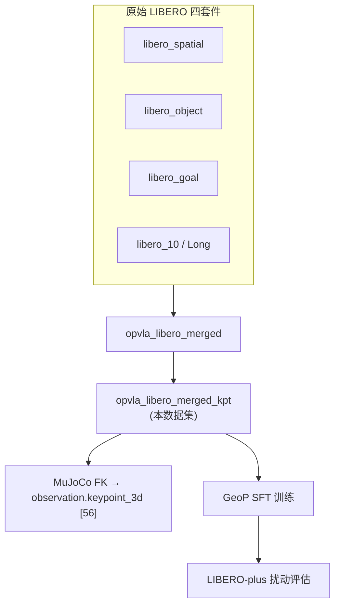
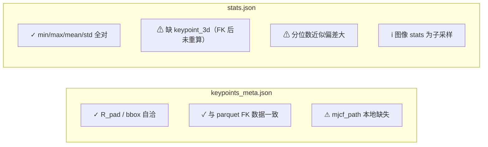

# Libero-plus data analysis
_Exported on 9/18/2026 at 10:06:27 GMT+8 from Cursor (3.15.19)_

---

**User**

深入分析在 /B/Dta/opvla_libero_merged_kpt/ 中的 libero-plus 数据. 并进一步检查一下 /B/Dta/opvla_libero_merged_kpt/meta/keypoints_meta.json  和 /B/Dta/opvla_libero_merged_kpt/meta/stats.json 这两个文件有没有问题.

---

**Cursor**

正在深入分析 libero-plus 数据集，并检查两个 meta 文件是否有问题。


接下来我会对照生成脚本与 parquet 实际数据，逐项校验这两个 meta 文件。


发现 R_pad 的计算方式与先前假设不同，正在用正确公式重新校验。


## 数据集定位说明

`/B/Dta/opvla_libero_merged_kpt/` **不是** LIBERO-plus 扰动评估集本身，而是 **LIBERO 四个子基准（Spatial / Object / Goal / Long，共 40 任务）合并后的 GeoP 训练数据**，在合并后通过 MuJoCo FK 注入了 `observation.keypoint_3d`。训练用这份数据，评估时用 LIBERO-plus 的 ~10k 扰动实例测零样本鲁棒性（见目录内 `ANALYSIS.md` §7.2 与 `evaluation/LIBERO-plus/`）。

| 属性 | 值 |
|------|-----|
| LeRobot 版本 | v3.0 |
| Episodes / 帧 / 任务 | 1,693 / 273,465 / 40 |
| FPS | 10 Hz，总时长 ~7.6 h |
| 磁盘 | ~1.9 GB（视频 1.8 GB + parquet 72 MB） |
| 机器人 | Panda (robosuite) |
| 相机 | `image`（agentview）+ `image2`（wrist），256×256 AV1 |

---

## 数据结构



**Parquet 列（9 列，273,465 行，全部通过完整性检查）：**

| 特征 | 形状 | 说明 |
|------|------|------|
| `observation.images.image/image2` | video 256² | 双视角，各 5 个 mp4 chunk |
| `observation.state` | [8] | EEF pos(3) + axis-angle(3) + gripper(2) |
| `observation.state.joint_position` | [7] | 7 关节角（弧度） |
| `action` | [7] | EEF delta(6) + 二值夹爪 {-1,+1} |
| `observation.keypoint_3d` | [56] | 8 关键点 × 7D (xyz + quat xyzw) |

**数据质量（实测）：**
- 无 NaN / Inf，index 连续 0…273464，无重复 (episode, frame) 对
- 四元数范数恒为 1.0，$q_w \geq 0$（半球归一化）
- 夹爪动作 100% 二值：-1 占 52.5%，+1 占 47.5%

---

## `keypoints_meta.json` 检查结论：**基本正确，无致命问题**

```1:34:/B/Dta/opvla_libero_merged_kpt/meta/keypoints_meta.json
{
  "bbox_radius": 1.8212722539901733,
  "bbox_margin": 0.15,
  "global_min_world": [
    -0.7662433385848999,
    -0.44017502665519714,
    0.9083312749862671
  ],
  "global_max_world": [
    0.2759222984313965,
    0.43536996841430664,
    1.5837150812149048
  ],
  "normalization": "world_origin_isotropic_r_pad",
  ...
}
```

### 已通过项

| 检查项 | 结果 |
|--------|------|
| $R_{\text{pad}}$ 公式 | $\max(\|global\_min\|, \|global\_max\|) \times 1.15 = 1.5837 \times 1.15 = \mathbf{1.8213}$ ✓ |
| 反归一化 `world = norm × R_pad` | 与 `global_min/max_world` **逐轴精确吻合**（误差 < 1e-6） |
| `total_frames` | 273465，与 parquet / info.json 一致 ✓ |
| `num_keypoints=8`, `keypoint_dim=7` | 与 info.json 56 维命名一致 ✓ |
| 归一化后位置范围 | $[-0.421, 0.870] \subset [-1, 1]$ ✓ |
| 四元数 | 范数 = 1.0，$q_w \geq 0$ ✓ |

归一化公式（与 `generate_libero_keypoints.py` 一致）：

$$\mathbf{p}_{\text{norm}} = \frac{\mathbf{p}_{\text{world}}}{R_{\text{pad}}}, \quad R_{\text{pad}} = \max_i\bigl(\max(|p_{\min,i}|, |p_{\max,i}|)\bigr) \times (1 + \text{margin})$$

注意：这是 **以世界原点为中心的各向同性缩放**，不是 RoboTwin 那套 `coord_offset` 平移方案。

### 需知悉的非错误现象

**EEF 关键点 vs `observation.state[:3]` 不完全重合**（这是语义差异，不是 meta 算错）：

| 轴 | EEF keypoint (FK body) | observation.state | 关系 |
|----|------------------------|-------------------|------|
| y | [-0.326, 0.391] | [-0.326, 0.391] | **完全一致** ($r=1.0$) |
| x | [-0.361, 0.276] | [-0.483, 0.210] | 相关 $r=0.83$，均值偏差 ~59 mm |
| z | [0.908, 1.366] | [0.008, 1.366] | 低姿态时偏差 ~869 mm；$z>1.0$ 时偏差 ≈ 0 |

原因：`observation.state` 存的是 robosuite 的 `robot0_eef_pos`（EEF **site**），而关键点用的是 MuJoCo body `gripper0_right_eef` 的 **body origin**。两者几何参考点不同，低 z 时偏差最大。FK 监督用的是 body 关键点，与 state 的 EEF site 不必逐帧对齐。

### 轻微问题（不影响训练，影响复现）

1. **`mjcf_path` 指向 `/tmp/zwy/panda_robosuite_full.xml`** — 本机不存在，无法在此重跑 FK 验证；应用 `export_panda_mjcf.py` 重新导出。
2. **同轴关节重合**：link1≡link2、link5≡link6 位置恒定/重合，有效独立关键点约 6 个（Panda 几何特性，非 bug）。

---

## `stats.json` 检查结论：**核心统计正确，存在已知局限**

### 已通过项（训练关键）

对 parquet 中全部 8 个数值列，`min / max / mean / std / count` 与 `stats.json` **逐字段精确匹配**（误差 < 1e-4）：

- `index`, `timestamp`, `action`, `episode_index`, `task_index`, `frame_index`
- `observation.state`, `observation.state.joint_position`

### 问题 1：`observation.keypoint_3d` 缺失 — **预期行为，非致命**

| 文件 | 修改时间 |
|------|----------|
| `stats.json` | 2026-09-10 **05:51**（合并后、FK 注入前） |
| `keypoints_meta.json` / `info.json` | 2026-09-10 **07:03**（FK 注入后） |

`generate_libero_keypoints.py` **不会**更新 `stats.json`。对 GeoP 训练这通常没问题，因为配置里明确写了：

> keypoint 值 **不参与** `NormalizeTransformFn` 的 state/action 归一化，关键点已在数据里用 $R_{\text{pad}}$ 归一化。

训练脚本 `internvla_a15_finetune_libero_geop.sh` 也设 `USE_EXTERNAL_STATS=false`，归一化只作用于 state 和 action。

**建议（可选）：** 若希望 stats 完整、或将来要做 keypoint 的 z-score/min-max 归一化，应重新跑 stats 聚合：

```bash
python -m lerobot.scripts.lerobot_data_stats --repo-id /B/Dta/opvla_libero_merged_kpt
```

### 问题 2：分位数 (q01–q99) 与全量重算不一致 — **LeRobot _histogram 近似，非数据错误**

示例 `episode_index`：

| 统计量 | stats.json | 全量重算 |
|--------|------------|----------|
| mean | 969.06 | 969.06 ✓ |
| q50 | ≈ 0 | **1023** ✗ |

LeRobot 用逐 episode 直方图近似分位数再聚合，对 `episode_index`、`task_index` 这类离散索引字段偏差很大。训练归一化用的是 `mean/std`，**不依赖这些分位数**，实际影响可忽略。

### 问题 3：图像统计 `count=167347` ≠ 273465 — **正常**

视频像素统计只对约 **61%** 帧采样计算（LeRobot 默认行为），`min/max/mean/std` 仍可用于图像归一化参考。

---

## 任务与子基准分布（摘要）

| 子基准 | 任务 ID | Episodes | 帧数 | 平均长度 (帧) |
|--------|---------|----------|------|---------------|
| Spatial | 0–9 | 432 | 52,970 | 122.6 ± 20.8 |
| Object | 10–19 | 454 | 66,984 | 147.5 ± 18.5 |
| Goal | 20–29 | 428 | 52,042 | 121.6 ± 37.6 |
| Long | 30–39 | 379 | 101,469 | 267.7 ± 56.7 |

Long 子基准占帧数 37%，但 episode 数最少（379），且 `"put both moka pots on the stove"` 仅 29 条 episode，是相对薄弱区域。

---

## 总览：两个 meta 文件是否有问题？



| 文件 |  verdict | 说明 |
|------|----------|------|
| **keypoints_meta.json** | ✅ 可用 | 归一化参数自洽，与 273,465 帧数据一致；仅 `mjcf_path` 需在新环境重导出 MJCF |
| **stats.json** | ⚠️ 基本可用 | state/action 统计可信；缺 keypoint 项、分位数不准，但不阻塞当前 GeoP 训练流程 |

**结论：** 两份 meta 文件**没有会导致训练失败或关键点坐标系错误的硬 bug**。若要做更严谨的数据治理，建议：(1) FK 注入后重算 `stats.json` 并加入 `observation.keypoint_3d`；(2) 将 `mjcf_path` 改为项目内持久路径或相对路径；(3) 目录内 `ANALYSIS.md` §2.4.2 把 $R_{\text{pad}}$ 误写为 2.094 m（实际应为 **1.821 m**，已含 15% margin），应以 `keypoints_meta.json` 为准。

如需，我可以直接写一条重算 stats 的命令/script，或帮你对比 `/B/Dta/` 下拆分后的四个 suite 子目录是否与本合并版一致。

