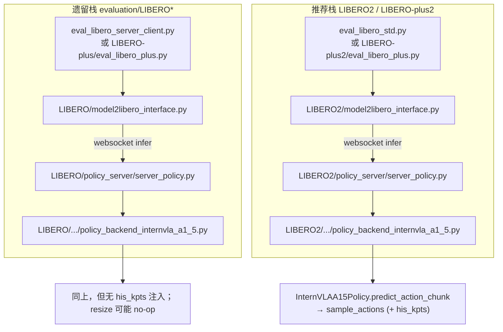
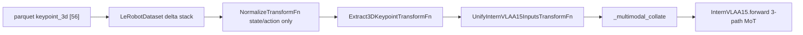
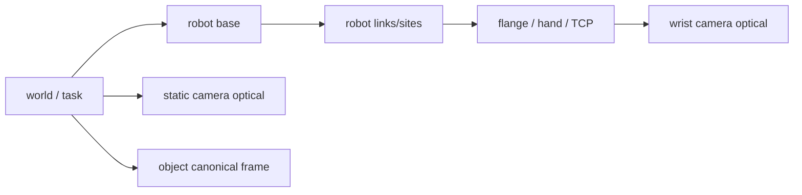
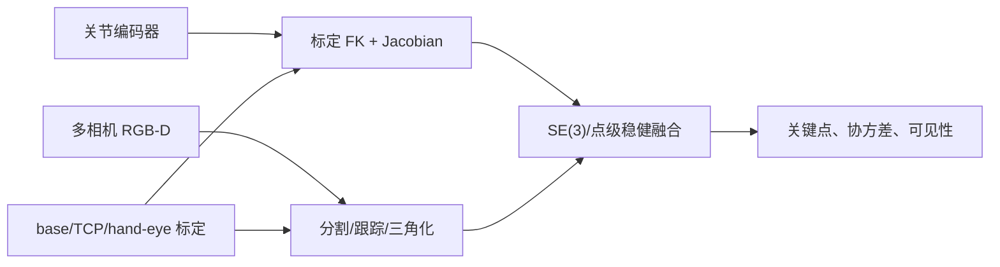

# Robot training data analysis
_Exported on 9/18/2026 at 10:05:54 GMT+8 from Cursor (3.15.19)_

---

**User**

对`/B/Dta/opvla_libero_merged_kpt/`里的用于机器人训练的数据进行分析?

---

**Cursor**

我会先核查目录结构、数据格式、统计元数据和样本字段，再按“规模—任务—动作/状态—视觉—质量风险”给出分析；如果数据量很大，会优先使用元数据与抽样，避免无谓地全量加载。

目录中已有一份旧的 `ANALYSIS.md`，我没有直接照抄，而是重新读取了 Parquet 和视频容器元数据。初步发现一个需要优先关注的问题：`keypoints_meta.json` 声称关键点位置已除以 `R_pad=2.094...`，但 Parquet 中固定基座仍是约 `(-0.3075, 0, 0.6836)`，更像未缩放的 MuJoCo 世界坐标；我会把它作为训练前阻断项单独标出。由于这属于可复查的定量数据分析，我会同时生成一个可在 IDE 旁打开的画布版诊断摘要。

已完成分析。结论是：数据规模和基础完整性良好，但关键点尺度、EEF 坐标对齐以及训练 schema 存在高风险，建议核查后再进行 GeoP 训练。

核心结果：

- 273,465 帧、1,693 个 Episode、40 个任务、10 Hz，累计约 7.6 小时。
- 两路视频均为 256×256 AV1；10 个视频文件已成功逐帧解码，每路均为 273,465 帧。
- Episode 长度范围 75–505 帧；Long 子集占 37.1% 帧数，存在按帧采样导致的任务偏置。
- 动作夹爪信号严格为 `-1/+1`；XYZ 动作与 EEF 位移相关性较高，分别为 0.926、0.967、0.947，基本支持增量动作语义。
- Parquet 行号、Episode 索引、时间戳、NaN/Inf、四元数范数等检查均通过。
- 关键点历史窗口 `[-200, 50]` 在 10 Hz 下覆盖过去 20 秒到未来 5 秒，但约 47.25% 的窗口槽位需要 padding。

最重要的问题：

1. `keypoints_meta.json` 声称关键点位置已除以 `R_pad=2.094463`，但 Parquet 中基座位置仍约为 `(-0.3075, 0, 0.6836)`，更像未归一化的 MuJoCo 世界坐标。
2. `observation.keypoint_3d` 的 EEF 位置与 `observation.state` 的 EEF 位置明显不一致，尤其 Z 轴相关性仅 0.037。可能是 EEF body 定义或坐标系不同，但必须用同一 MJCF 重新 FK 对照。
3. `info.json` 的 `robot_type` 是 `panda`，而当前 `panda.yaml` 定义为“无夹爪、全部 delta”；LIBERO 正确的 `[6,-1]` 动作 schema 只注册在 `libero_spatial` 等子集名称下。
4. 当前 GeoP 启动脚本默认使用 `libero_spatial libero_object libero_goal libero_10`，并不是这个合并数据集；同时 `ACTION_TYPE=abs` 只是跳过动作转换，不会自动改变原始动作语义。

我已生成可视化诊断画布，可在 IDE 旁打开：

[LIBERO 合并关键点数据诊断](/home/a26113/.cursor/projects/B-SRC-itvlaGpLibPlus/canvases/libero-merged-kpt-diagnosis.canvas.tsx)

建议先完成 MJCF FK 对照、关键点尺度确认和独立 merged dataset schema，再开始正式训练。

---

**User**

<timestamp>Thursday, Sep 17, 2026, 11:17 PM (UTC+8)</timestamp>
<system_notification>
The following task has finished. If you were already aware, ignore this notification and do not restate prior responses.

<task>
kind: shell
status: success
task_id: 160089
title: 解码并核对十个视频文件
tool_call_id: call_FCALoNgSGaSHtGQTo2whW4rf
fc_0af25829c1429df2016aac0269385c87d1a3c7258d6f33d7b0
output_path: /home/a26113/.cursor/projects/B-SRC-itvlaGpLibPlus/terminals/160089.txt
</task>
</system_notification>
<user_query>Briefly inform the user about the task result and perform any follow-up actions (if needed).</user_query>

---

**Cursor**

视频完整性复核已完成：10 个 MP4 均成功逐帧解码，无错误；两路相机各包含 273,465 帧，分辨率 256×256、帧率 10 Hz。无需额外处理。

---

**User**

把你的`可视化诊断画布`移动到 @itvlaGpLibPlus/b/d/libplus/ds/ 里面.

---

**Cursor**

我会把画布文件复制到 `itvlaGpLibPlus/b/d/libplus/ds/`，确认新文件内容和类型检查无误后删除原位置，确保实际完成“移动”而不是留下重复文件。

已移动到：

[libero-merged-kpt-diagnosis.canvas.tsx](/B/SRC/itvlaGpLibPlus/b/d/libplus/ds/libero-merged-kpt-diagnosis.canvas.tsx)

原画布位置已删除，文件内容和此前的 TypeScript 检查结果保持不变。注意：移动到仓库目录后，Cursor 可能不再将其识别为可直接渲染的实时 Canvas 文件。

---

**User**

tsx文件打开后无法被渲染, 还是复制一份回原来的地方吧

---

**Cursor**

已复制回 Cursor 管理目录，现在两处都保留：

- 可渲染画布：[原始 Canvas](/home/a26113/.cursor/projects/B-SRC-itvlaGpLibPlus/canvases/libero-merged-kpt-diagnosis.canvas.tsx)
- 仓库归档副本：[仓库副本](/B/SRC/itvlaGpLibPlus/b/d/libplus/ds/libero-merged-kpt-diagnosis.canvas.tsx)

---

**User**

对`/B/Dta/opvla_libero_merged_kpt/`里的用于机器人训练的数据进行深入分析, 要结合 @itvlaGpLibPlus/ 代码的分析, 要考虑到如何达到训推一致性, 该数据的3D keypoint 轨迹等4D信息是否有问题, 有没有更好的抽取 3D keypoint 轨迹等4D信息的方法, 等等. 分析报告写到 @itvlaGpLibPlus/b/d/libplus/ds/libero_mrg4d_analyz.md.

---

**Cursor**

这是一个跨“数据实证—训练代码—推理接口—几何表示—替代方案—验收测试”的大型分析任务。我会先切换到规划模式拆解证据链，并并行核查数据、代码与相关方法；最终直接写入指定 Markdown，不修改训练数据或模型代码。

我会按以下证据链推进：①全量数据与视频/轨迹统计；②训练侧数据变换、模型 forward、损失与梯度；③推理侧观测构造、归一化、图像方向、动作反归一化与控制；④现有 4D 关键点生成的可复现性和数学正确性；⑤更可靠的替代提取方案及测试/验收。外部方法只作对照，结论仍以本地数据和代码为准。为补齐几何轨迹方法的演进与对照，我会参考论文检索技能的规范来核验原始来源。

数据核查中出现了两项比先前摘要更精确、也更重要的结论：

- 关键点归一化本身是正确的：`bbox_radius=1.821272` 已经是乘过 15% margin 的 \(R_{\text{pad}}\)，反归一化后的全局极值与元数据逐元素完全一致；先前画布中把它再次乘以 1.15 是误读。
- 真正的几何问题是“坐标语义”：关键点来自固定 Lift MJCF 世界系，而 `observation.state` 来自每个 LIBERO 场景世界系。两者 EEF 之间呈任务固定平移，例如 Spatial 约 \((+0.100,0,0)\) m、Object 约 \((+0.040,0,+0.912)\) m。这不破坏当前 StandaloneFK 的训推数值一致性，却意味着关键点没有和图像中的场景/物体处于同一世界坐标系。

我会在报告中显式纠正旧结论，并区分“数值可复现”“训推一致”“几何语义正确”这三个层级。

报告主体已经写入并完成第一轮自校验。复核还发现现有画布中的“R_pad 再乘一次 1.15、EEF 直接拿归一化坐标和米制 state 比较”属于旧误判；为避免同目录两个结论互相矛盾，我会同步把画布改成已验证的新结论，但不会改动训练数据或模型代码。

已完成深入分析报告：

[libero_mrg4d_analyz.md](/B/SRC/itvlaGpLibPlus/b/d/libplus/ds/libero_mrg4d_analyz.md)

关键发现：

- \(R_{\text{pad}}\) 归一化正确；10,001 帧推理 FK 复算最大误差仅 \(5.96\times10^{-8}\)。
- 关键点使用固定 Lift frame，与各任务场景 frame 存在固定平移，EEF 旋转 frame 约恒差 90°。
- 四元数轨迹存在 7,658 次反号跳变，当前 MSE 不具符号不变性。
- 当前 future-keypoint 线性头只能生成所有样本、关节共享的时间轨迹模板。
- 约 15%–19% 的 future/action/video 目标是边界重复值，却未进入 loss mask。
- `panda` schema 错把 EEF delta action 标成 `<joint>`。
- optimized backend 当前不兼容 GeoP 关键点路径。
- 已有“标准 LIBERO 95.25%”实际使用 LIBERO-plus 前十个扰动任务，不能作为标准分布内基线。

报告包含训推数据流、梯度流、替代关键点方案、v2 数据设计、消融矩阵及测试验收方案。分析脚本、JSON 和图表均位于 `b/d/libplus/ds/asset/`，已重跑并通过编译、链接及 lint 检查；旧诊断画布中的错误结论也已同步订正。

---

**User**

<timestamp>Friday, Sep 18, 2026, 12:26 AM (UTC+8)</timestamp>
<system_notification>
The following task has finished. If you were already aware, ignore this notification and do not restate prior responses.

<task>
kind: subagent
status: success
task_id: 2c19406e-b746-4e44-87f2-ff7d83a51b97
title: 审计推理训推一致性
tool_call_id: call_TNDSlFwDuHMwqoUuQwSHETwV
fc_014b727c10f6aa6b016aac0e3e5dac87d1a15afb351189f069
agent_id: 2c19406e-b746-4e44-87f2-ff7d83a51b97
detail: <user_visible_high_level_summary>
已在 `/B/SRC/itvlaGpLibPlus` 以代码为准梳理 **LIBERO / LIBERO-plus** 全链路：推荐栈为 `LIBERO2` server/client + `train_eval_contract.json`（raw 图、`rotate_images=False`），legacy `evaluation/LIBERO*` 仍默认 180° 旋转且无 keypoint/`his_kpts`。逐项对照了相机键、8D state、归一化/resize、prompt、stats、chunk/replan、gripper、关键点历史与 **optimized** backend（不接受 `his_kpts`）。文末列出已知事故（F1/F2/B2/EGL）、当前风险与 `test_preflight_f1f2.py` 等验收测试。
</user_visible_high_level_summary>
<response>
# LIBERO / LIBERO-plus 推理与评估路径（只读分析，以代码为准）

仓库：`/B/SRC/itvlaGpLibPlus`。文档 `b/d/libplus/eval3_optim3.md` 等用于对照事故与验收设计；**语义以源码为准**。

---

## 1. 路径总览（推荐 vs 遗留）



| 场景 | Client | Server backend | 启动脚本（示例） |
|------|--------|----------------|------------------|
| 标准 LIBERO | `evaluation/LIBERO2/eval_libero_std.py` | `evaluation/LIBERO2/policy_server/server_policy.py` | `evaluation/LIBERO2/run_eval_libero_std_venv.sh` |
| LIBERO-plus | `evaluation/LIBERO-plus2/eval_libero_plus.py` | 同上 LIBERO2 server | `evaluation/LIBERO-plus2/run_eval_libero_plus_venv.sh` |
| **遗留** | `evaluation/LIBERO/eval_libero_server_client.py` | `evaluation/LIBERO/policy_server/server_policy.py` | `evaluation/LIBERO/run_eval_libero_server_client.sh` |
| **遗留 plus** | `evaluation/LIBERO-plus/eval_libero_plus.py` | LIBERO server | `evaluation/LIBERO-plus/run_eval_libero_plus.sh` |

遗留入口在运行时打印 WARNING，指向 LIBERO2/LIBERO-plus2（例如 `eval_libero_server_client.py` 211–216 行，`eval_libero_plus.py` 247–251 行）。

**Websocket 契约**：`protocol_version >= 2.1`、`preprocessing_owner == server_canonical`、`deterministic_inference_preprocess == True`（`LIBERO/model2libero_interface.py` 77–90 行；LIBERO2 同 102–115 行）。服务端 `PROTOCOL_VERSION = "2.1"`（`evaluation/LIBERO/policy_server/backends/base_backend.py` 17 行）。

---

## 2. 训练侧基准（`opvla_libero_merged_kpt`）

| 项 | 训练侧（代码/launch） | 引用 |
|----|------------------------|------|
| 数据集 | `repo_id=opvla_libero_merged_kpt`，`robot_type=panda`（与 `panda.yaml` 对齐，**非** `libero.yaml` 四套 schema） | `launch/libplus_sft_launch.sh` 44–45、221–231；`b/d/libplus/sft.md` |
| `dataset.action_mode=abs` | 跳过 `DeltaActionTransformFn`；动作仍为数据集中 7D EE 控制量 | `launch/libplus_sft_launch.sh` 226 |
| 图像键 | `observation.images.image`→`image0`，`image2`→`image1`；缺 `image1` 用 `ones_like(image0)`，mask=False | `src/lerobot/dataset_schemas/configs/panda.yaml` 9–11；`RemapImageKeyTransformFn` 236–246 |
| Resize | `ResizeImagesWithPadFn` hydrate 用 schema `image_mapping`，224 | `src/lerobot/transforms/core.py` 130–145 |
| 像素归一化 | 图像进 VLM 前为 **float01 CHW**；ChatProcessor `do_rescale=False`（已在 [0,1]） | `canonical_preprocess.py` 14–25；`transform_internvla_a1_5.py` 229–231 |
| State/Action 归一化 | `NormalizeTransformFn`，mode 来自 `train_config.json`（eval 反归一化同 mode） | `base_backend.py` 42–70、145–166 |
| stats | 合并集 checkpoint 常用 **`stats_key=panda`** | `eval3_optim2.md` 与 `run_eval_libero_std_venv.sh` 17–18 |
| Prompt | `Control Mode: <action_mode>`；`panda` schema 默认 **`joint`**（非 `libero.yaml` 的 `end_effector`） | `transform_internvla_a1_5.py` 82–86、118；`panda.yaml` 无 `action_mode` 字段 |
| FAST eval 后缀 | `use_fast_action_tokens=true` → `"; Output: <Action>"` | `transform_internvla_a1_5.py` 140–145 |
| Keypoint 训练 | parquet `observation.keypoint_3d` 8×7D；`Extract3DKeypointTransformFn`→`his_kpts`/`kpt_t`/`kpt_future`；SFT `keypoint_history_max_len=200`，`kpt_4d_mode=pos_rot` | `util_scripts/generate_libero_keypoints.py` 1–8；`transform_internvla_a1_5.py` 659–737；`libplus_sft_launch.sh` 203–207 |
| 朝向契约 | 训练 mp4 **raw**（不旋转） | `evaluation/LIBERO2/train_eval_contract.json` 1–6；`orientation_contract.py` 1–6 |

**图像朝向（F1）**：契约文件要求 eval `rotate_images=false`（`train_eval_contract.json` 6 行；`orientation_contract.py` 260–271 行）。LIBERO2 client 默认 `rotate_images=False` 且 `enforce_rotate_against_contract`（`LIBERO2/model2libero_interface.py` 45–55、156–160）。**遗留 client 默认 `rotate_images=True`**（`LIBERO/model2libero_interface.py` 41、132–134）。

---

## 3. 推理 Client：`model2libero_interface`

### 3.1 相机与旋转

| | 训练 | LIBERO2 client | 遗留 LIBERO client |
|--|------|----------------|---------------------|
| Env obs 键 | 数据列 `image` / `image2` | `agentview_image`, `robot0_eye_in_hand_image` | 同左 |
| 发送顺序 | image0=agentview, image1=wrist | `"image": [primary, wrist]`（183–188 行） | 同（132–144 行） |
| 180° 翻转 | 无 | 默认 **False**；可选 `arr[::-1,::-1]` | 默认 **True** |

### 3.2 8D `observation.state`（eval 从 sim 现算）

```143:154:evaluation/LIBERO2/model2libero_interface.py
 def _extract_state(obs: dict[str, Any]) -> np.ndarray:
 eef_pos = np.asarray(obs["robot0_eef_pos"], dtype=np.float32).reshape(-1)
 eef_quat = np.asarray(obs["robot0_eef_quat"], dtype=np.float32).reshape(-1)
 gripper_qpos = np.asarray(obs["robot0_gripper_qpos"], dtype=np.float32).reshape(-1)
 ...
 axisangle = _quat2axisangle(eef_quat)
 state = np.concatenate([eef_pos, axisangle, gripper_qpos], axis=0)
```

顺序：**[0:3] eef 位置，[3:6] 轴角（由四元数转换），[6:7] 左右夹爪 qpos**。T8 约定 **g_L = state[6]**（`train_eval_extra_contract.py` 144–151）。遗留 client 同构造（`LIBERO/model2libero_interface.py` 98–109）。

**无“历史 state 序列”**：每步只送当前 8D；历史仅通过 **keypoint 轨迹**（见下）。

### 3.3 语言 prompt

Client 只传 `lang`/`task`（任务语言）；**Control Mode、State 离散化、Output 后缀均在 server** `InternVLAA15ChatProcessorTransformFn(mode="eval")`（`policy_backend_internvla_a1_5.py` 128–136、140–149）。

### 3.4 Action chunk / replan

- Server `chunk_size` 来自 checkpoint config（默认 50，`configuration_internvla_a1_5.py` 371–372）。
- Client `replan_steps` 默认 **8**（`eval_libero_std.py` 337；须 ≤ server chunk，`model2libero_interface.py` 66–72）。
- 返回 **已反归一化** 的 chunk；client 再按 `action_space` clip（224–228 行）。

### 3.5 Gripper（B1）

| 模式 | 逻辑 | 行号 |
|------|------|------|
| **libero_native**（LIBERO2 默认） | `action[6] = 1 if action[6] > 0 else -1` | `LIBERO2/model2libero_interface.py` 243–248 |
| **openvla** | `<0.5 → +1`，否则 `-1` | 245–246 |
| 遗留 **binarize_gripper** | 固定 OpenVLA 阈值逻辑 | `LIBERO/model2libero_interface.py` 187–192 |

训练 parquet 上 **libero_native**：`corr(action[6], next g_L) < 0`（`train_eval_extra_contract.py` 154–219）。Server **不**做 gripper 二值化（`postprocess.gripper_binarize: False`，backend infer 返回 211–214 行）。

### 3.6 末端旋转（action）

Schema 注释：前 6 维 delta（xyz + rpy 语义标签），第 7 维绝对 gripper（`libero.yaml` 6–7 行；eval 用 **panda** stats 时 layout 仍为 7D）。Eval **不在 client 改 rotation 表示**；依赖训练标签与 OSC 一致。

### 3.7 Keypoint：**推理输入的是历史，不是 GT 未来**

- Client：`StandaloneFK` + `KeypointHistory`（`keypoint_utils.py` 1–160）；`push_keypoint()` **必须在 `env.step` 之前**（129–136、117–128 行 `eval_libero_std.py`）。
- 请求 payload：`kpt_history` + `his_len`（仅 `his_len>0` 时发送，`model2libero_interface.py` 194–198）。
- Server LIBERO2：写入 `observation.his_kpts` / `observation.his_len`（`LIBERO2/policy_backend_internvla_a1_5.py` 151–156）。
- 模型：`predict_action_chunk` 在 `enable_keypoint_predictor` 时传 `his_kpts`/`his_len`（`modeling_internvla_a1_5.py` 2295–2306）；**`kpt_t`/`kpt_future` 不在 eval batch 中**，当前帧/未来关键点由 **query tokens + 网络预测**（`embed_kpt_suffix` 1617–1620 行）。
- 训练对齐：历史 offset `[-H,…,-1]`，当前在 `kpt_t`（`Extract3DKeypointTransformFn` 注释 673–681 行；U8 模拟 `train_eval_extra_contract.py` 30–61）。

**遗留 LIBERO server backend 不注入 keypoint** → `his_kpts` 全零（`eval.md` 与 `embed_kpt_suffix` 1606–1608 行）。

### 3.8 时间频率

- 数据集 `fps=10`（T9 读 `meta/info.json`，`train_eval_extra_contract.py` 227–338）。
- Eval：`num_steps_wait=10` dummy（`LIBERO_DUMMY_ACTION` 38 行），每 env step 一次 policy；**一步一动作**，无 subsample。
- 视频 replay 写 mp4 常用 **fps=10**（`eval_libero_std.py` 154、159）。

---

## 4. Server canonical 预处理

流水线（两 backend 共用 LIBERO 的 `build_base_sample` + state normalize + chat processor）：

1. **`input_semantics.prepare_example_images`**：2 张 HWC uint8 → 填 3 slot，缺 slot **255 白图**，mask 与训练 remap 语义一致（164–175 行 `input_semantics.py`）。
2. **`to_chw_float01` + `ResizeImagesWithPadFn`**（`canonical_preprocess.py` 28–54）。

**F2（resize no-op）**：

- **遗留** `evaluation/LIBERO/.../policy_backend_internvla_a1_5.py` 128 行：`ResizeImagesWithPadFn(...)` **无 mapping** → `__call__` 不 resize（`core.py` 142–145）。
- **LIBERO2** 107–111 行：**显式** `image0..2` mapping → **224×224**（与 `eval3_optim3.md` §3 一致）。

State：**仅** `NormalizeTransformFn` on `OBS_STATE`（127 行 LIBERO；106–107 LIBERO2），维度来自 stats mean 长度（123–125）。

**B2（FAST prompt）**：

- LIBERO2：`use_fast_action_tokens=bool(config.use_fast_action_tokens)`（124–133 行）。
- 遗留 LIBERO：**硬编码 `False`**（148 行）→ eval 后缀 `"; Output: <SubTask, Action>"` 与 SFT 不一致（文档称非主因，但在 F1 修复后可能放大）。

**Stats 选择**：`base_backend._load_stats`（98–128 行）：`--stats_key` 或 `robot_type` 或单 key；LIBERO 启动默认 `panda`（`run_eval_libero_std_venv.sh` 17–18）。

**反归一化**：`denormalize_actions` mean_std 或 min_max（145–166 行）；再 `postprocess_actions` clip 到 stats min/max（168–172）。

---

## 5. Optimized backend

- 选择：`InternVLAA15Policy.__init__` 2156–2163 行 → `InternVLAA15Optimized`。
- CLI：`inference_backend=optimized` 且 **`action_loss_only=True`**（`policy_backend_internvla_a1_5.py` 67–69；config 531–532）。
- **`InternVLAA15Optimized.sample_actions`** 签名 **无 `his_kpts`/`his_len`**（422–431 行 `modeling_internvla_a1_5_optimized.py`）→ 启用 keypoint client 时会 **TypeError**（`run_eval_libero_std_2server_6client_venv.sh` 52–54；`libero_egl_slut.md` §9.3）。
- 启动器默认 **`INFERENCE_BACKEND=standard`**（同上；`run_eval_libero_std_venv.sh` 22）。

---

## 6. LIBERO-plus 差异

| 项 | LIBERO-plus2 | 遗留 LIBERO-plus |
|----|--------------|------------------|
| Client | LIBERO2 + keypoint + B1 gripper | LIBERO legacy client |
| 任务集 | `task_classification.json` 扰动任务（267–286 行） | 同文件 required |
| 默认 trials | 脚本/参数可配 | 默认 **1** trial/任务（204 行） |
| 朝向 | `rotate_images` 默认 False + contract | 默认仍 True（268 行） |

**注意**：F1 像素验收应使用 **未扰动** BDDL（`orientation_contract.py` 12–13、30–33）；plus 纹理扰动不适合做朝向 MSE。

---

## 7. 训练 vs 推理对照表（精要）

| 维度 | 训练 | 推荐推理 | 主要风险 |
|------|------|----------|----------|
| 相机键 | image→0, image2→1 | agentview + eye_in_hand 列表 | 遗留默认 rot180（F1） |
| 旋转 | raw | `rotate_images=False` | legacy LIBERO/plus 默认 True |
| Resize | 224 pad | LIBERO2 server 224；legacy server 可能 256 | F2 |
| 色彩 | float01→VLM | 同 | CHW 转换 copy 只读 buffer（18 行） |
| 8D state | parquet | live quat→axisangle+qpos | 与训练 FK 一致需 T8 |
| Control Mode | `<joint>`（panda） | server `--robot_type panda` | 若误用 `libero_spatial`→`<end_effector>` |
| FAST 后缀 | `<Action>` | LIBERO2 读 config | legacy backend False |
| stats | panda | `--stats_key panda` | 多 key 需显式指定 |
| chunk | 50 | replan 8 | replan > chunk 报错 |
| denorm | mean_std（典型） | server 端 | 读 `train_config.json` |
| action_mode abs | 不 delta 变换标签 | 不影响 env delta 执行 | 名称易与 schema `action_mode` 混淆 |
| gripper | 数据 ±1 / 语义 T8 | libero_native 二值化 | legacy OpenVLA 映射 |
| keypoint | 全窗口 GT | **仅 his_kpts 在线 FK** | legacy 全零；optimized 崩溃 |
| 历史 | H=200 训练配置 | client buffer 200 | wait 10 步后才有历史 |

---

## 8. 已知事故 / 修复（代码+文档交叉）

| ID | 现象 | 修复位置 | 文档 |
|----|------|----------|------|
| **F1** | 默认 180° 旋转 vs raw 训练 | LIBERO2 默认 False + `enforce_rotate_against_contract` | `eval3_optim3.md` §2 |
| **F2** | Server resize 空 mapping | LIBERO2 backend 107–111 | `eval3_optim3.md` §3 |
| **B1** | gripper 符号 | `gripper_convention libero_native` | `model2libero_interface.py` 243–248 |
| **B2** | FAST 硬编码 False | LIBERO2 backend 124–133 | `eval3_optim3.md` §6.5 |
| **B9** | 关键点 arena 偏移 | `StandaloneFK` Lift MJCF | `keypoint_utils.py` 1–11 |
| **U8** | push 在 step 之后 | eval 循环 push→step | `eval_libero_std.py` 117–128 |
| **B10** | 父进程 import libero/EGL | fork-per-task | `eval_libero_std.py` 57–59、164–191 |
| **optimized** | `his_kpts` 参数缺失 | 用 standard 或 `DISABLE_KEYPOINTS` | shell 52–54、`modeling_internvla_a1_5_optimized.py` 422–431 |
| **遗留路径** | 仍打印 WARNING | 迁移 LIBERO2 | client main stderr |

**健康检查疑点**：`run_eval_libero_std_venv.sh` 112 行断言 `action_mode == 'joint'`，与 **`libero.yaml` 的 `end_effector`** 不一致；与 **SFT `robot_type=panda`→joint** 一致。若有人把 `ROBOT_TYPE_MODE` 改成 `libero_spatial`，healthcheck 与 prompt 可能同时错。

---

## 9. 建议验收测试（不改代码即可跑）

| 测试 | 路径 | 覆盖 |
|------|------|------|
| **Preflight 全量** | `evaluation/LIBERO2/test_preflight_f1f2.py` | F1/F2/B1–B10 静态+单元+resize C1 |
| **朝向 T1** | `evaluation/LIBERO2/test_live_orientation.py` / `orientation_contract.py` `evaluate_orientation_contract` | raw vs rot180 MSE 比 |
| **Gate resize** | `evaluation/LIBERO2/test_orientation.py --test resize_only` | 224 + grid_thw |
| **U8/U9/T8/T9** | `train_eval_extra_contract.py` + preflight Part B | 历史 schedule、gripper sign、fps |
| **Backend parity** | `evaluation/LIBERO2/test_backend_parity.py` | EGL/OSMesa 像素 |
| **Keypoint 单元** | `tests/test_keypoint_utils.py` | FK 形状 |
| **冒烟 eval** | `run_eval_libero_std_venv.sh` `EVAL_MODE=smoke`，`ROTATE_IMAGES=false`，`INFERENCE_BACKEND=standard` | 端到端 SR |
| **LIBERO-plus** | `LIBERO-plus2/run_eval_libero_plus_venv.sh` + preflight A3/A4 | ROTATE 默认 false、replay `_maybe_rotate` |

**推荐通过标准（来自 eval3_optim3.md，需结合 checkpoint）**：标准 LIBERO 冒烟 SR ≥50%，全量 ≥85%；plus 在 F1 修复后再评。

**Ablation**：`--no-enable_keypoints` / `DISABLE_KEYPOINTS=true`（E4/E5）；**勿**在 keypoint 开启时用 `optimized` 除非已扩展 `InternVLAA15Optimized.sample_actions`。

---

## 10. 当前剩余风险（2026-09 代码状态）

1. **误跑遗留 `evaluation/LIBERO*`**：默认旋转 + 无 keypoint + resize no-op + FAST 错后缀。 
2. **`INFERENCE_BACKEND=optimized` + 默认 keypoint**：必失败或需关 keypoint。 
3. **`ROBOT_TYPE_MODE` / `--stats_key` 与训练不一致**：prompt Control Mode 与归一化 stats 双错。 
4. **首帧 policy 请求前**：仅 wait 阶段累积 `his_len`；极短 episode 时历史偏短（设计内，与训练 episode 内对齐）。 
5. **TrackEncoder GeoPredict 权重**：`input_dim=7` 时可能不加载 3D 预训练（`keypoints.py` 349–370）——与训练配置一致即可，换 dim 需单独验证。 
6. **EGL 子进程内多 episode**：eval3_optim3 §6.6 所述 context 累积 SIGABRT；fork-per-task 不隔离 episode 间——长跑需 OSMesa 或更细粒度进程隔离。 
7. **healthcheck 写死 `action_mode==joint`**：仅对 panda checkpoint 正确（`run_eval_libero_std_venv.sh` 112）。

---

## 11. 关键文件索引（绝对路径）

- 契约：`/B/SRC/itvlaGpLibPlus/evaluation/LIBERO2/train_eval_contract.json` 
- 朝向：`/B/SRC/itvlaGpLibPlus/evaluation/LIBERO2/orientation_contract.py` 
- Client：`/B/SRC/itvlaGpLibPlus/evaluation/LIBERO2/model2libero_interface.py` 
- 标准 eval：`/B/SRC/itvlaGpLibPlus/evaluation/LIBERO2/eval_libero_std.py` 
- Plus eval：`/B/SRC/itvlaGpLibPlus/evaluation/LIBERO-plus2/eval_libero_plus.py` 
- Server LIBERO2 backend：`/B/SRC/itvlaGpLibPlus/evaluation/LIBERO2/policy_server/backends/policy_backend_internvla_a1_5.py` 
- 遗留 backend：`/B/SRC/itvlaGpLibPlus/evaluation/LIBERO/policy_server/backends/policy_backend_internvla_a1_5.py` 
- 预处理：`/B/SRC/itvlaGpLibPlus/evaluation/LIBERO/policy_server/backends/canonical_preprocess.py`、`input_semantics.py` 
- 反归一化：`/B/SRC/itvlaGpLibPlus/evaluation/LIBERO/policy_server/backends/base_backend.py` 
- 模型推理：`/B/SRC/itvlaGpLibPlus/src/lerobot/policies/internvla_a1_5/modeling_internvla_a1_5.py`（2286–2309）、`modeling_internvla_a1_5_optimized.py`（422–431） 
- 训练 keypoint 切分：`/B/SRC/itvlaGpLibPlus/src/lerobot/policies/internvla_a1_5/transform_internvla_a1_5.py`（659–737） 
- Schema：`/B/SRC/itvlaGpLibPlus/src/lerobot/dataset_schemas/configs/panda.yaml`、`libero.yaml` 

如需对某一 checkpoint 的 `train_config.json` / `stats.json` 做逐字段核对，可提供 checkpoint 路径再做第二轮只读比对。
</response>
output_path: \home\a26113\.cursor\projects\B-SRC-itvlaGpLibPlus\agent-transcripts\1565e497-6b42-4cbc-9c9b-dcbc4e6b145f\subagents\2c19406e-b746-4e44-87f2-ff7d83a51b97.jsonl
</task>
</system_notification>

<timestamp>Friday, Sep 18, 2026, 12:26 AM (UTC+8)</timestamp>
<system_notification>
The following task has finished. If you were already aware, ignore this notification and do not restate prior responses.

<task>
kind: subagent
status: success
task_id: 52c0d337-6991-4112-b406-1248c7c562b0
title: 追踪训练几何数据流
tool_call_id: call_eLwkgSTBoV5aajOyPXPhf9wk
fc_014b727c10f6aa6b016aac0e3e5da087d199aaf36306998fc0
agent_id: 52c0d337-6991-4112-b406-1248c7c562b0
detail: <user_visible_high_level_summary>
已完成对 `opvla_libero_merged_kpt` 上 `observation.keypoint_3d` 从 LeRobot delta 堆叠、transform、collate 到 `modeling_internvla_a1_5.py` 三路径 MoT 与 loss 的只读追踪。**结论**：Libplus 实际训练走 `launch/libplus_sft_launch.sh` + merged 单库（`robot_type=panda`，56D/8×7D，`NormalizeTransform` 不碰 keypoint）；`launch/internvla_a15_finetune_libero_geop.sh` **默认不用** merged，且会把各 suite 的 `robot_type` 改成 suite 名。主要风险：未来帧 episode 边界 clamp 无 mask、`ki_gradient_scale` 等配置未接线、7D 下 GeoPredict TrackEncoder 权重不可加载、以及 policy/dataset 的 `keypoint_history_max_len` 必须一致。
</user_visible_high_level_summary>
<response>
# `observation.keypoint_3d` 全链路只读分析报告

**仓库**：`/B/SRC/itvlaGpLibPlus` 
**数据集**：`/B/Dta/opvla_libero_merged_kpt` 
**结论先行**：Libplus SFT 使用 **`launch/libplus_sft_launch.sh`** + `opvla_libero_merged_kpt`；**`launch/internvla_a15_finetune_libero_geop.sh` 默认不使用 merged**，且会改写各 suite 的 `robot_type`。

---

## 1. 数据集侧事实（磁盘）

| 项 | 值 | 依据 |
|---|---|---|
| `robot_type` | `panda` | `meta/info.json`（现场 `python3` 读取） |
| `fps` | 10 | 同上 |
| `observation.keypoint_3d` | `float32 [56]`，8 link × 7D `(px,py,pz,qx,qy,qz,qw)` | `info.json` features |
| `observation.state` | `[8]` | 同上 |
| `action` | `[7]` | 同上 |
| 生成 | MuJoCo FK + R_pad 位置 + 四元数半球化 | `util_scripts/generate_libero_keypoints.py` L1–11 |

**Schema（训练时）**：`robot_type=panda` → `src/lerobot/dataset_schemas/configs/panda.yaml` 
- `action_mask_spec: [7]`：若启用 delta，7 维全做 delta（与 LIBERO 的 `[6,-1]` 不同） 
- `action_mode=abs` 时 **`DeltaActionTransformFn` 被移除**，`action_mask` **不参与训练**（见 §4）

**`stats.json`**：顶层扁平键 `observation.state` / `action`（各 8/7 维）；**无** `observation.keypoint_3d` 条目（Normalize 本就不选该列）。

---

## 2. 端到端数据流（shape / mask）



### 2.1 Delta timestamps / 堆叠（LeRobotDataset）

- **谁决定窗口**：`cfg.policy`（不是 dataset）上的 `keypoint_3d_delta_indices` 
 - `factory.py` L356：`resolve_delta_timestamps(cfg.policy, ds_meta)` 
 - L314–318：仅当 feature 存在且 `cfg.keypoint_3d_delta_indices` 非空时注册 

```599:617:/B/SRC/itvlaGpLibPlus/src/lerobot/policies/internvla_a1_5/configuration_internvla_a1_5.py
 def keypoint_3d_delta_indices(self) -> list[int] | None:
 ...
 if not self.enable_keypoint_predictor:
 return None
 h = self.keypoint_history_max_len
 c = self.chunk_size
 return list(range(-h, c + 1)) # H + 1 + C indices: [-H, ..., -1, 0, 1, ..., C]
```

**Libplus / GeoP launch 共同设定**：`H=200`，`C=chunk_size=50` → **251 帧**索引 `[-200..50]`。 
秒级 delta：`i / fps` → 帧索引 `round(i*fps)`（`utils.py` L890–902）。

- **`__getitem__` 行为**（`lerobot_dataset.py` L1052–1064）： 
 - 堆叠后 `observation.keypoint_3d`：**`[251, 56]`**（251×8×7 展平前为 `[251, 8, 7]`） 
 - `observation.keypoint_3d_is_pad`：**`[251]`** bool（episode 外查询被 clamp 到边界帧时为 True，L928–941）

### 2.2 Transform 链（`InternVLAA15DatasetConfig`）

顺序要点（`configuration_internvla_a1_5.py` L44–141）：

1. **`action_mode=abs`** → 去掉 `DeltaActionTransformFn`（L86–88） 
2. **`NormalizeTransformFn`**（L54）— **不 normalize keypoint**（L123–126 注释 + `hydrate` 只选 state/action，见 §3） 
3. **`Extract3DKeypointTransformFn`** 插在 `ComposeFieldsTransform` 之前（L115–131） 
4. **`UnifyInternVLAA15InputsTransformFn`** 透传 5 个 kpt 字段（L200–201）

**切片与 padding**（`transform_internvla_a1_5.py` L696–737）：

| 输出键 | Shape（Libplus: H=200,J=8,d=7） | 含义 |
|--------|----------------------------------|------|
| `observation.his_kpts` | `[200, 8, 7]` | 历史 H 帧；有效帧** packed 到前部**，后部 zero-pad |
| `observation.his_len` | scalar long | 有效历史帧数 = H − `hist_is_pad.sum()` |
| `observation.kpt_t` | `[8, 7]` | 当前帧（堆叠索引 H，相对 offset 0） |
| `observation.kpt_future` | `[50, 8, 7]` | 未来 C 帧（堆叠 `[H+1 : H+1+C]`） |
| `observation.kpt_mask` | scalar bool | 有 `keypoint_3d` 列则为 **True** |

**历史 pad 逻辑**：假设越负的 offset 在 episode 开头越先被 clamp → invalid contiguous 在 `hist_window` **前部**，有效尾部左移到 `his_kpts[:his_len]`（L724–730）。

**未使用**：`keypoint_3d_is_pad` 的**未来段**未传入模型；**未来 loss 不 mask episode 末尾 clamp**（全库 grep 无 `kpt_future` pad）。

**文档/注释不一致（低风险但易误导）**：`Extract3DKeypointTransformFn` 类 docstring 仍写 `J,3`（L667–682），实现用 `keypoint_dim`（pos_rot 时为 7）。

### 2.3 Collate

- `factory.py` L60–79：`_multimodal_collate` 对非 visual 键用 **`default_collate`** 
- Batch 形状示例： 
 - `his_kpts` → `[B, 200, 8, 7]` 
 - `kpt_future` → `[B, 50, 8, 7]` 
 - `kpt_mask` → `[B]` bool 

---

## 3. NormalizeTransform 与 keypoint

```273:276:/B/SRC/itvlaGpLibPlus/src/lerobot/transforms/core.py
 def hydrate(self, dataset: LeRobotDataset | StreamingLeRobotDataset) -> NormalizeTransformFn:
 schema = get_schema(dataset.meta.robot_type)
 selected_keys = schema.get_state_keys() + schema.get_action_keys()
 return replace(self, norm_stats=dataset.meta.stats, selected_keys=selected_keys)
```

**事实**：`observation.keypoint_3d` **不在** `selected_keys`；R_pad 已在 `generate_libero_keypoints.py` 写入 parquet。 
Libplus：`use_external_stats=true`，路径 `${DATA_SRC}/meta/stats.json`（`libplus_sft_launch.sh` L46–47, L227–228），只覆盖 **state/action** 统计。

---

## 4. `action_mode=abs` 与 `action_mask`

| 场景 | 行为 |
|------|------|
| merged + libplus launch | `--dataset.action_mode=abs` → 无 `DeltaActionTransformFn` |
| `panda` schema | `action_mask_spec: [7]`（`panda.yaml` L3）— 仅 **delta 模式**下在 `DeltaActionTransformFn.hydrate` 使用（`core.py` L397–412） |
| LIBERO 四套件 GeoP 脚本 | 若 `action_mode=delta`，schema 为 `[6,-1]`（`libero.yaml` L6–20）— **与 merged 的 panda 不同** |

---

## 5. 模型路径：TrackEncoder / Keypoint Expert / Action Expert

### 5.1 模块职责

| 模块 | 输入 | 输出 | 代码 |
|------|------|------|------|
| **TrackEncoder** | `his_kpts [B,H,J,D]`，`his_len [B]` | `[B, J, hidden]`（每 joint 一 token） | `keypoints.py` L246–315；`modeling` L1007–1017, L1610–1612 |
| **Keypoint Expert 后缀** | `embed_kpt_suffix`：1×state + J×history + J×query | `[B, 1+2J, D]` | `modeling` L1572–1627 |
| **Keypoint Expert Transformer** | 与 VLM prefix、Action suffix **三路径 MoT** | `kpt_out` | `compute_layer_complete_3path` L343–550 |
| **Action Expert** | flow-matching suffix | attends **[prefix, kpt, action]** | L506–514 |
| **预测头** | `keypoint_out_proj` on query hidden | 当前 `[B,J,D]` + 未来 `[B,C,J,D]` | L1964–1979 |

**`kpt_4d_mode=pos_rot`**：`InternVLAA15Config.__post_init__` 设 `keypoint_track_input_dim=7`（L501–511）；TrackEncoder `PointPatchEmbedding(in_dim=7)` 可跑，但 **GeoPredict 预训练权重默认不加载 7D**（`keypoints.py` L18, L344–352）。

### 5.2 三路径注意力与 detach（训练 forward）

`InternVLAA15.forward` 调用 3-path（L1877–1896），传入：

- `knowledge_insulation` → action 看 prefix 时 **detach prefix K/V**（L507–508） 
- `knowledge_insulation_kpt` → kpt 看 prefix 时 detach（L499–500） 
- `kpt_to_action_detach` → action 看 kpt 时 detach kpt K/V（L509–510）

Libplus / GeoP launch 三者均为 **`false`**（全梯度连通，除非改 CLI）。

### 5.3 Loss / backward（`pos_rot` 四元数）

```1994:2002:/B/SRC/itvlaGpLibPlus/src/lerobot/policies/internvla_a1_5/modeling_internvla_a1_5.py
 def _kpt_split_loss(self, pred, gt, reduce_dims):
 ...
 if self.config.kpt_4d_mode == "pos_rot":
 loss_pos = F.mse_loss(pred[..., :3], gt[..., :3], ...)
 pred_rot = F.normalize(pred[..., 3:kpt_dim], p=2, dim=-1)
 loss_rot = F.mse_loss(pred_rot, gt[..., 3:kpt_dim], ...)
 return loss_pos + self.config.kpt_rot_loss_weight * loss_rot
```

- **GT 四元数**：不在 loss 里 re-normalize（依赖 parquet 已单位化 + qw≥0） 
- **Pred 四元数**：L2 normalize 后与 GT MSE 
- **聚合**：`InternVLAA15Policy.forward` 用 `kpt_mask` 过滤样本（L2487–2502）；VQA 样本 `kpt_mask=False` → kpt loss=0，但仍可能通过 action→kpt 交叉注意力间接更新 kpt 路径（注释 L2494–2497）

**总 loss**（enable_vqa_loss 时，L2517–2521）：

\[
\lambda_{\text{action}} L_{\text{fm}} + \lambda_{\text{vqa}} L_{\text{vlm}} + \lambda_{\text{video}} L_{\text{video}} + \lambda_{\text{kpt}}(L_{\text{cur}} + \gamma L_{\text{fut}})
\]

### 5.4 冻结 / requires_grad

`set_requires_grad`（L1111–1135）：

- `freeze_vision_encoder` → 冻 VLM visual 
- `train_expert_only` → 冻整个 `qwen3_5`（含 prefix） 
- `freeze_keypoint_modules` → 冻 TrackEncoder、kpt_expert、`kpt_state_proj`、`keypoint_embedding`、`keypoint_out_proj` 

Libplus / GeoP：`freeze_keypoint_modules=false`，`train_expert_only=false`。

WAN：`freeze_wan_dit=true`（launch 脚本）。

---

## 6. 训练脚本实际参数（核查问题）

### 6.1 `launch/internvla_a15_finetune_libero_geop.sh` — **不用 merged**

| 参数 | 默认值 | 行号 |
|------|--------|------|
| `DATASET_REPO_ID` | `libero_spatial libero_object libero_goal libero_10` | L86 |
| `ACTION_TYPE` | `abs` | L87 |
| `USE_EXTERNAL_STATS` | `false` | L88 |
| **robot_type patch** | 写成 **各 repo 名**（如 `libero_spatial`），非 `panda` | L154–173 |
| kpt | `enable_keypoint_predictor=true`, `kpt_4d_mode=pos_rot`, `keypoint_history_max_len=200` | L229–232, L245–248 |
| KI | 全 false | L212–213, L236 |
| 其它 | `init_kpt_expert_from_action=false`, `kpt_future_loss_weight=1.5`, `freeze_learnable_tokens=true`, 从 `WARMUP_CKPT` 加载 | L237–238, L235, L56, L201 |

**结论**：该脚本面向 **四套件 split + Phase2 warmup**，与 `opvla_libero_merged_kpt` **无默认关联**。

### 6.2 `launch/libplus_sft_launch.sh` — **merged 正式 SFT**

| 参数 | 默认值 | 行号 |
|------|--------|------|
| `DATA_SRC` / `DATA_REPO_ID` | `/B/Dta/opvla_libero_merged_kpt` / `opvla_libero_merged_kpt` | L44–45 |
| symlink | L126–128 | |
| `action_mode` | `abs` | L226 |
| stats | `use_external_stats=true`, `external_stats_path=${DATA_SRC}/meta/stats.json` | L227–228 |
| kpt | 与 GeoP 相同 H=200、8 joints、`pos_rot` | L203–207, L222–225 |
| 差异 | `PRETRAINED_PATH=InternVLA-A1.5-base`, `init_kpt_expert_from_action=true`, `kpt_future_loss_weight=2.0`, `freeze_learnable_tokens=false`, `STEPS=53450` | L47, L213, L211, L196, L96 |

---

## 7. 风险优先级

### P0（训练/评估语义）

1. **Episode 边界未来帧无 pad mask**：clamp 后的重复帧仍进 `loss_kpt_future`（§2.2；无 `kpt_future_is_pad` 实现）。 
2. **Policy vs dataset 的 `keypoint_history_max_len` / `enable_keypoint_predictor` 必须一致**：delta 来自 **policy**（`factory.py` L356），reshape 来自 **dataset transform**（`configuration_internvla_a1_5.py` L117–121）；不一致会直接 shape 错误或 silent 错位。 
3. **Eval 无 kpt 输入 → 全零 history**（文档 `b/d/libplus/eval.md`；非本仓库 forward 默认 `his_kpts=None` 时零填充 L1606–1608）— 与训练分布不一致。

### P1（配置/文档）

4. **`ki_gradient_scale` / `ki_kpt_gradient_scale`**：仅在 `configuration_internvla_a1_5.py` L477–478 定义，**模型 forward 未引用**（全库 grep 无使用）— “软 KI” 未实现。 
5. **`keypoint_noise_sigma`**：配置存在（L503），**forward 未使用**。 
6. **注释仍写 3D**：`embed_kpt_suffix` / `InternVLAA15.forward` docstring 写 `[B,H,J,3]`（L1578–1583, L1780–1783），pos_rot 实际为 7D。 
7. **`modeling_internvla_a1_5.py` L2500** 源码含 `(#???` 注释碎片（不影响运行，但影响可读性）。

### P2（脚本/ schema 混用）

8. **GeoP 脚本改写 `robot_type=libero_*`**：Normalize / ComposeFields / schema 走 `libero.yaml`，与 merged 的 **`panda` + `[7]` mask** 不一致— 仅当误用 GeoP 脚本训 merged 或反过来时出问题。 
9. **7D TrackEncoder 无法加载 GeoPredict 3D 权重**（`keypoints.py` L368–375）— Libplus 依赖 `init_kpt_expert_from_action=true`（libplus launch L213），GeoP 为 `false`（L237）。

---

## 8. 关键文件与行号索引（可引用）

| 主题 | 路径 | 行号 |
|------|------|------|
| Dataset config + transform 插入 | `src/lerobot/policies/internvla_a1_5/configuration_internvla_a1_5.py` | 21–141, 599–617 |
| Delta 注册 | `src/lerobot/datasets/factory.py` | 281–318, 350–356 |
| Episode pad | `src/lerobot/datasets/lerobot_dataset.py` | 928–941, 1052–1064 |
| Kpt 切片 | `src/lerobot/policies/internvla_a1_5/transform_internvla_a1_5.py` | 659–737 |
| Normalize 范围 | `src/lerobot/transforms/core.py` | 250–316, 389–418 |
| Panda schema | `src/lerobot/dataset_schemas/configs/panda.yaml` | 1–11 |
| 3-path MoT + detach | `src/lerobot/policies/internvla_a1_5/modeling_internvla_a1_5.py` | 343–550, 1756–1896 |
| TrackEncoder | `src/lerobot/policies/internvla_a1_5/keypoints.py` | 246–315 |
| Kpt loss / policy forward | `src/lerobot/policies/internvla_a1_5/modeling_internvla_a1_5.py` | 1572–1627, 1959–2002, 2405–2551 |
| Collate | `src/lerobot/datasets/factory.py` | 60–79, ~598 |
| 数据生成 | `util_scripts/generate_libero_keypoints.py` | 1–11 |
| Libplus launch | `launch/libplus_sft_launch.sh` | 44–45, 203–232 |
| GeoP launch（非 merged） | `launch/internvla_a15_finetune_libero_geop.sh` | 86–88, 154–173, 229–249 |

---

## 9. 配置同步清单（merged + libplus 训练）

- `--policy.enable_keypoint_predictor=true` **且** `--dataset.enable_keypoint_predictor=true` 
- `--policy.keypoint_history_max_len=200` **=** `--dataset.keypoint_history_max_len=200` 
- `--policy.num_keypoint_joints=8` **=** `--dataset.num_keypoint_joints=8` **=** `56/7` 
- `--policy.kpt_4d_mode=pos_rot` **=** `--dataset.kpt_4d_mode=pos_rot` 
- `meta/info.json` 的 `robot_type=panda` 与 `panda.yaml` 一致（merged 已满足） 
- **`internvla_a15_finetune_libero_geop.sh` 不会**默认训练 merged；需显式改 `DATASET_REPO_ID` 且**不要**运行 L154–173 的 `robot_type` 覆盖逻辑，否则会破坏 panda schema。

如需下一步，可以在只读前提下写一段本地 smoke 脚本（不改动仓库）验证单样本 `[251,56] → [200,8,7]` reshape 与 `his_len` 分布。
</response>
output_path: \home\a26113\.cursor\projects\B-SRC-itvlaGpLibPlus\agent-transcripts\1565e497-6b42-4cbc-9c9b-dcbc4e6b145f\subagents\52c0d337-6991-4112-b406-1248c7c562b0.jsonl
</task>
</system_notification>

<timestamp>Friday, Sep 18, 2026, 12:26 AM (UTC+8)</timestamp>
<system_notification>
The following task has finished. If you were already aware, ignore this notification and do not restate prior responses.

<task>
kind: subagent
status: success
task_id: 7685738d-cee9-4664-8d5d-03a2e07330c1
title: 研究四维轨迹方法
tool_call_id: call_Pdusw7PgaWOa54ZbIoSJ8lPa
fc_014b727c10f6aa6b016aac0e3e5db887d1b84111e7419d5161
agent_id: 7685738d-cee9-4664-8d5d-03a2e07330c1
detail: <user_visible_high_level_summary>
只读研究确认，当前独立 Lift-MJCF FK 的主要风险来自模型/基座/坐标契约不等价、body 原点语义弱与冗余，以及四元数半球化后继续做欧氏 MSE。模拟数据应优先按原回合 XML+state 直接回放；真实系统宜采用标定 FK/Jacobian 为主、视觉为校正与对象关键点来源的混合方案。
</user_visible_high_level_summary>
<response>
# InternVLA-A1.5 / GeoP 机器人轨迹只读研究报告

## 一、核心结论

当前方案能生成数值合法的 FK 轨迹，但不应直接把它视为可靠的“4D 几何真值”。

1. `xyz + quaternion` 是 SE(3) 上的 6-DoF 位姿，用 7 个标量编码；“4D=3D+rotation”容易与“3D+时间”混淆。
2. 当前实现用独立导出的 robosuite `Lift` MJCF，而不是每条 LIBERO 轨迹保存的原始 MJCF/state。因此“同为 MuJoCo”不等于同坐标系、同 base、同 TCP、同模型版本。
3. `body.xpos/xquat` 描述的是人为定义的 body frame，不是可见表面点，也不一定是关节中心、质心或控制 TCP。
4. 当前 Panda MJCF 中 `link1/link2`、`link5/link6` 的 body 原点分别重合，造成位置监督冗余；所选 EEF body 又位于手指关节之前，所以两维夹爪 qpos 不影响当前 8 个输出点。
5. `qw >= 0` 只能消除存储歧义，不能提供全局连续的旋转表示；它必然在 \(180^\circ\) 附近产生符号跳变。
6. 当前“归一化 quaternion 后做分量 MSE”不是 SO(3) 上的旋转距离，对 \(q\) 与 \(-q\) 不变性处理错误。
7. GeoPredict 原方法监督的是 8 个点的 3D 位置轨迹，官方 `TrackEncoder` 输入维度为 3；7D `pos_rot` 是本地扩展，没有原论文消融支持，还会使 GeoPredict 的输入投影权重不可复用。
8. 模拟数据首选“原回合 XML + 原 MuJoCo state 直接恢复，再读 live body/site pose”；真实系统首选“标定后的机器人 FK/Jacobian 为主，视觉做偏差校正、对象关键点和置信度估计”。

---

## 二、当前实现的事实边界

### 2.1 数据生成链

当前代码：

- 从 `observation.state.joint_position[0:7]` 读手臂关节；
- 从 `observation.state[6:8]` 读手指位置；
- 将 9 个数直接写到独立模型的 `data.qpos[:9]`；
- 调用 `mj_forward`；
- 读取 7 个 link body 与一个 EEF body 的世界位姿；
- 将 MuJoCo `wxyz` 改为 `xyzw`，并强制 `qw >= 0`。

```99:109:util_scripts/generate_libero_keypoints.py
n = min(len(qpos), ROBOT_NQPOS)
self.data.qpos[:n] = qpos[:n]
self._mujoco.mj_forward(self.model, self.data)

for i, name in enumerate(self.body_names):
 bid = self.body_ids[name]
 keypoints[i, :3] = self.data.xpos[bid]
 keypoints[i, 3:7] = _mujoco_quat_to_xyzw(self.data.xquat[bid])
```

模型不是由每条数据的 `model_file` 恢复，而是由当前安装的 robosuite 临时创建普通 `Lift` 环境后导出：

```49:59:util_scripts/export_panda_mjcf.py
env = robosuite.make(
 "Lift",
 robots="Panda",
 has_renderer=False,
 has_offscreen_renderer=False,
 use_camera_obs=False,
)
model_xml = env.sim.model.get_xml()
```

评测侧也明确采用固定 base 的 standalone Lift FK，而不读取 live env 的 pose。

### 2.2 当前损失

```1994:2001:src/lerobot/policies/internvla_a1_5/modeling_internvla_a1_5.py
if self.config.kpt_4d_mode == "pos_rot":
 loss_pos = F.mse_loss(pred[..., :3], gt[..., :3], reduction="none").mean(dim=reduce_dims)
 pred_rot = F.normalize(pred[..., 3:kpt_dim], p=2, dim=-1)
 loss_rot = F.mse_loss(pred_rot, gt[..., 3:kpt_dim], reduction="none").mean(dim=reduce_dims)
 return loss_pos + self.config.kpt_rot_loss_weight * loss_rot
```

这里存在三个问题：

- 不满足 \(q\sim -q\)；
- quaternion 分量误差不等价于真实旋转角；
- 位置与旋转单位、尺度不同，固定权重 1 没有几何依据。

### 2.3 本地数据已经暴露的风险

仓库现有诊断记录指出：

- metadata 声称位置已除以 \(R_{\text{pad}}\)，但部分 Parquet 值仍像原始世界坐标；
- keypoint EEF 与 `observation.state` 的 EEF 位置明显不一致。

因此在讨论模型改进之前，当前数据首先存在坐标契约和缩放契约未闭合的问题。

---

## 三、坐标系与模型问题

### 3.1 世界坐标不具备跨场景稳定性

当前 XML 将 Panda base 固定在：

```164:182:evaluation/panda_robosuite_lift.xml
<body name="robot0_base" pos="-0.56 0 0.912">
 ...
 <body name="robot0_link0">
 ...
 <body name="robot0_link1" pos="0 0 0.333">
```

robosuite 官方接口允许环境依据 arena、table 尺寸和 origin 调用 `set_base_xpos`，arena 也可整体 `set_origin`。所以另一个 LIBERO task、robosuite 版本或真实工作台不必具有同一 \(^{W}T_B\)。

正确的 base-relative 变换是：

\[
{}^{B}T_{K}
=
({}^{W}T_B)^{-1}\,{}^{W}T_K
\]

其中：

- \(W\)：任务世界坐标系；
- \(B\)：机器人 base frame；
- \(K\)：关键点或工具 frame。

只减 base 平移仍不够；base yaw 或安装姿态变化时必须使用完整 SE(3) 逆变换。

当前文档中“固定世界偏移不影响 TrackEncoder”的论断也不严格成立：TrackEncoder 首层是带 bias 的线性 Conv1d，并不具备平移不变性。

### 3.2 需要明确 frame graph

建议固定并版本化以下变换方向：



必须区分：

- `world`：场景全局系；
- `base`：机器人安装基座；
- `flange`：机械臂法兰；
- `hand`：夹爪安装 frame；
- `TCP/grip_site`：实际控制或抓取中心；
- `camera_link` 与 `camera_optical`；
- object canonical/task frame。

建议所有元数据采用显式记法 `T_parent_child`，禁止只写含糊的 `extrinsic`。

---

## 四、body、site、link origin 与表面关键点

MuJoCo 官方定义：

- `xpos/xquat`：body frame 的全局位姿；
- `xipos/ximat`：惯性/质心 frame；
- `geom_xpos/geom_xmat`：几何体 frame；
- `site_xpos/site_xmat`：用户定义的兴趣点 frame。

`body` 的主要职责是构成运动学树。它的原点和轴方向可以由建模者任意选择，不能自动解释为“机器人表面关键点”。

### 4.1 当前点集的冗余

当前 MJCF：

- `robot0_link2` 相对 `link1` 没有平移；
- `robot0_link6` 相对 `link5` 没有平移。

因此：

\[
p_{\text{link1}}(t)=p_{\text{link2}}(t),\qquad
p_{\text{link5}}(t)=p_{\text{link6}}(t)
\]

对所有时刻都成立。它们的 orientation 不同，但 xyz 监督重复，会：

- 重复加权两个关节交点；
- 降低点集对真实机械臂形状的覆盖；
- 让 GeoPredict 的“track-guided geometry refinement”把容量反复投到同一点。

### 4.2 当前 EEF 不编码夹爪开合

`gripper0_eef` 是夹爪根 body 下的固定子 body；左右手指是其兄弟分支。手指 slide joint 不会改变 EEF body 位姿。

因此当前 9D qpos 中最后两维虽然被写入 MuJoCo，但不会改变所选 8 个 pose。若需要表达夹爪状态，应加入：

- 左右 fingertip/pad site；
- 或单独的 gripper width；
- 而不是声称 EEF pose 代表夹爪开合。

### 4.3 推荐关键点语义

不应为了兼容而机械维持“7 个 body + EEF”。更合理的是：

- 可见、分散的 upper-arm、elbow、forearm、wrist 表面锚点；
- `grip_site/TCP`；
- 左右 fingertip pad center；
- 与任务有关的 object affordance keypoints。

固定表面点可由 body pose 计算：

\[
{}^{W}p_{k}
=
{}^{W}R_{b}\,{}^{b}p_k + {}^{W}t_b
\]

其中 \(^{b}p_k\) 是关键点在所属 body 局部坐标中的固定偏移。这样既保留精确 FK，又避免把任意 body origin 当作视觉关键点。

对于 GeoPredict 兼容分支，建议保留“3D 点轨迹”；rotation 只对 TCP、物体 frame 等确实需要姿态的实体建独立 head。

---

## 五、URDF/MJCF 与 FK 系统偏差

### 5.1 版本不一致的来源

即使机械臂都叫 Panda，也可能存在：

- robosuite Panda 与官方 `franka_description` 的 frame 基定义不同；
- legacy Panda、FER、FR3/FP3 模型差异；
- flange、hand、TCP 固定变换不同；
- 夹爪类型和 finger joint 方向不同；
- URDF joint/link origin 与 MJCF body origin 不一致；
- MuJoCo mesh compiler 对 mesh 进行重心、主惯量轴重整；
- robosuite、MuJoCo 版本改变 XML 编译结果或 qpos 布局；
- 每台真实机器人自身的 encoder zero、轴线和连杆误差。

所以“几何外形相同”不代表 quaternion frame 相同。一个固定的 frame 轴旋转即可让 quaternion 标签整体变化，但机器人表面并未变化。

### 5.2 不应依赖 `qpos[:9]`

更稳健的方法是：

- 按 joint name 查 `jnt_qposadr`；
- 检查 joint type 和 qpos 宽度；
- 在 metadata 保存 joint-name→address 映射；
- 对模型 XML、mesh、站点定义计算哈希；
- 禁止跨模型静默复用数组前 9 维。

### 5.3 真实 FK 的系统误差

名义 FK 无法描述：

- encoder 零偏和量化；
- 关节轴线不共线、连杆尺寸制造误差；
- 重力/负载挠曲；
- 温漂、磨损、回差；
- TCP 工具安装误差；
- base 与相机外参误差；
- 图像、关节状态时间不同步。

一阶误差传播可写为：

\[
\delta \boldsymbol{\xi}_i
\approx
J_{q,i}\delta q
+
J_{\theta,i}\delta\theta
+
J_{B,i}\delta\boldsymbol{\xi}_B
\]

相应协方差为：

\[
\Sigma_{\xi_i}
\approx
J_{q,i}\Sigma_qJ_{q,i}^{T}
+
J_{\theta,i}\Sigma_\theta J_{\theta,i}^{T}
+
J_{B,i}\Sigma_BJ_{B,i}^{T}
\]

其中 \(\boldsymbol{\xi}\in\mathfrak{se}(3)\) 是小位姿扰动，\(\theta\) 是模型标定参数。Jacobian 因而不仅用于控制，也适合生成每个关键点的置信度。

---

## 六、旋转与 SE(3) 表示比较

| 表示 | 优点 | 主要问题 | 建议用途 |
|---|---|---|---|
| `qw>=0` quaternion | 4 标量、易存储 | 在 \(q_w=0\) 即 \(180^\circ\) 附近必跳变 | 仅作规范化存档，不宜直接 MSE |
| 时间符号连续 quaternion | 局部轨迹连续、适合 SLERP/微分 | 不能形成全局连续单值 chart；闭环后可能落在 \(-q_0\) | 时序输入与插值 |
| sign-invariant quaternion loss | 改动小，处理 \(q\sim -q\) | 仍在欧氏嵌入空间，不是最自然角度 | 兼容旧模型的最低成本修复 |
| rotation matrix | 无双覆盖 | 9 维且需正交约束 | 存储、评估、几何运算 |
| 6D rotation | 神经回归连续性较好 | 冗余；Gram–Schmidt 在两向量共线时病态 | 推荐网络输出 |
| SO(3) log/geodesic | 直接测真实角差 | `acos` 在 0、\(\pi\) 附近需数值保护 | 推荐损失与评估 |
| SE(3) log | 统一相对位姿和 twist | 米与弧度仍需任务相关权重；SE(3) 无双不变 Riemann metric | TCP、对象相对位姿 |
| unit dual quaternion | 统一旋转平移、适合 screw interpolation | 8 维约束，仍有 \(\pm\) 双覆盖；欧氏 MSE 仍错误 | 组合、ScLERP、手眼标定，不作为默认回归头 |

### 6.1 半球化为什么跨 \(\pi\) 跳变

绕固定轴旋转时：

\[
q(\theta)=
\left[
\mathbf{u}\sin\frac{\theta}{2},
\cos\frac{\theta}{2}
\right]
\]

当 \(\theta\) 穿过 \(\pi\)，标量项变负。为了维持 \(q_w\ge0\)，必须把整个 quaternion 乘以 \(-1\)，于是向量部分瞬间翻转。

时间连续化应按每个 episode、每个 frame 执行：

\[
q_t \leftarrow
\begin{cases}
-q_t,&\langle q_{t-1},q_t\rangle<0\\
q_t,&\text{otherwise}
\end{cases}
\]

但训练损失仍应对符号不变，不能只依赖预处理。

### 6.2 SO(3) geodesic loss

对于预测和真值旋转矩阵：

\[
R_{\mathrm{rel}}=\hat R^{T}R
\]

\[
d_{\mathrm{SO(3)}}(\hat R,R)
=
\arccos\left(
\operatorname{clamp}
\frac{\operatorname{tr}(R_{\mathrm{rel}})-1}{2}
\right)
\]

等价 quaternion 形式为：

\[
d_{\mathrm{SO(3)}}(\hat q,q)
=
2\arccos\left(
\left|\langle \hat q,q\rangle\right|
\right)
\]

绝对值自然处理双覆盖。训练时可使用 chordal loss 或稳定 `acos` 近似，评估时报告 geodesic angle。

### 6.3 6D rotation

网络输出两个向量 \(a_1,a_2\in\mathbb{R}^3\)，解码：

\[
b_1=\frac{a_1}{\|a_1\|},\quad
b_2=\frac{a_2-(b_1^Ta_2)b_1}
{\|a_2-(b_1^Ta_2)b_1\|},\quad
b_3=b_1\times b_2
\]

\[
R=[b_1\ b_2\ b_3]
\]

推荐“6D 作为输出参数化，SO(3) geodesic/chordal 作为损失”，而不是对两个 6D 向量做无约束 MSE。

### 6.4 SE(3) log

对目标 \(T\) 和预测 \(\hat T\)：

\[
\boldsymbol{\xi}
=
\operatorname{Log}(T^{-1}\hat T)
=
\begin{bmatrix}
\boldsymbol{\rho}\\
\boldsymbol{\phi}
\end{bmatrix}
\in\mathbb{R}^{6}
\]

可使用：

\[
\mathcal L_{\mathrm{SE(3)}}
=
\boldsymbol{\xi}^{T}W\boldsymbol{\xi}
\]

\(W\) 应由以下之一确定：

- 标定协方差逆；
- 数据协方差；
- 机器人或被操作物体的 characteristic length；
- 任务对位置和角度的容差。

不存在与任务无关的“天然 1:1 米/弧度权重”。

---

## 七、纵向演进


关键边界：

- GeoPredict 的贡献是“3D position tracks 作为预测运动学先验”，不是每个 link 的完整 7D pose。
- InternVLA-A1.5 原论文没有 GeoPredict 式关键点专家；它用 WAN 视频模型监督 latent foresight。
- 本地 7D 关键点是两种方法之外的新扩展，不能把 GeoPredict 或 InternVLA 的实验结论直接迁移为其有效性证据。

---

## 八、提取方案横向比较

| 方案 | 几何真实性 | 模拟/真实 | 主要优势 | 主要风险 | 建议 |
|---|---|---|---|---|---|
| 独立 Lift MJCF FK | 中 | 模拟、名义真实 | 简单、无视觉噪声 | 模型/base/frame 不匹配 | 仅作 fallback |
| 原 XML + 原 state 回放 | 最高 | 模拟 | 与图像、场景、base 同源 | 需原始 HDF5、版本环境 | 模拟数据首选 |
| 标定 URDF/MJCF FK | 高 | 真实 | 低延迟、不怕遮挡 | 标定、挠曲、TCP 偏差 | 真实机器人主通道 |
| 单目 RGB-D | 中 | 模拟/真实 | 与视觉观测同坐标域 | 深度边缘、遮挡、反光；单点无 orientation | 用于校正和对象点 |
| 2D tracker + 多视图三角化 | 中至高 | 真实 | 不依赖机器人型号，可跟对象 | 标定、同步、对应错误、低视差 | 对象/表面点推荐 |
| 直接 3D tracker | 中至高 | 真实 | 遮挡和长时跟踪更强 | 域偏差、深度与相机 pose 依赖 | 作为视觉分支 |
| FK + 视觉融合 | 最高综合性 | 真实 | 兼顾运动学稳定和观测校正 | 系统复杂 | 最终推荐 |

### 8.1 原环境直接 replay

robosuite 与 LIBERO HDF5 每个 episode 通常保存：

- `model_file`：该回合的 MJCF XML；
- `states`：逐时刻 flattened MuJoCo state；
- `actions`。

官方明确指出 action replay 会因平台和物理数值误差逐渐漂移，推荐直接设置记录 state。

建议流程：

1. 使用数据记录时的 LIBERO、robosuite、MuJoCo 版本；
2. 加载该 episode 的 `model_file`；
3. 逐帧 `set_state_from_flattened`；
4. `forward`；
5. 直接读原环境中的 `site_xpos/site_xmat` 或 body pose；
6. 与同帧存储图像、EEF observation 做交叉校验。

如果 RLDS 转换已丢弃 `model_file/states`，就无法再声称 standalone FK 是 bit-exact；应回到原始 LIBERO HDF5，或明确标记为“nominal FK label”。

### 8.2 RGB-D 与标定

像素 \((u,v)\)、深度 \(z\) 的反投影：

\[
p_C=
z
\begin{bmatrix}
(u-c_x)/f_x\\
(v-c_y)/f_y\\
1
\end{bmatrix}
,\qquad
p_B={}^BT_Cp_C
\]

眼在手上时：

\[
{}^BT_C(t)
=
{}^BT_E(t)\,{}^ET_C
\]

需同时处理：

- RGB-depth 对齐；
- 镜头畸变；
- camera optical frame；
- 手眼标定；
- 时间同步；
- 深度无效值、边界混合像素、镜面/黑色材料。

一个 3D 点只能提供位置，不能提供完整 orientation。姿态至少需要多个非共线点、表面法向或点云配准。

### 8.3 Foundation tracker/segmentation + 多视角

推荐组合：

- SAM 2：获得机器人 link、手指、对象 mask；
- TAPIR/CoTracker3：跟踪 mask 内稳定表面点；
- 多视角标定与同步；
- RANSAC/稳健三角化；
- 用 FK 投影作为初始化和物理先验。

必须检查：

- epipolar error；
- reprojection error；
- cheirality；
- parallax angle；
- 可见视角数；
- mask membership；
- 轨迹重初始化和漂移。

Foundation tracker 输出的是“像素身份连续性”，并不自动保证：

- 点属于同一机器人 link；
- 是任务相关语义点；
- 多相机中的点互为同一个 3D 实体；
- 长时遮挡后重现没有 identity switch。

### 8.4 Object-centric keypoints

纯机器人关键点只能描述“机械臂如何运动”，不能说明：

- 抓取哪个杯柄；
- 插入孔的位置和轴向；
- 目标容器、门把手、接触边界在哪里。

建议加入对象或 affordance 关键点：

\[
{}^{O}T_E
=
({}^{W}T_O)^{-1}{}^{W}T_E
\]

对象相对 EEF 轨迹通常比世界绝对 EEF 轨迹更直接地表达抓取、插入和放置关系。

---

## 九、推荐落地方案

### 9.1 模拟数据

优先级：

1. 原 episode XML + state replay；
2. 读取已有语义 site；
3. 没有 site 时，由 body pose 与版本化局部偏移生成表面点；
4. 最后才使用独立 nominal FK。

同时保留：

- 原始 SI 单位 base-frame 点；
- 原始 rotation matrix/quaternion；
- 派生的训练表示；
- 数据来源与置信度。

不要把 \(R_{\text{pad}}\) 永久烘焙成唯一真值。

### 9.2 真实机器人

推荐混合估计：



- FK 提供连续、高频、不受遮挡影响的 prior；
- 视觉估计低频 residual、base/TCP 漂移和对象点；
- 残差使用 Huber/Geman–McClure 等稳健核；
- 根据 Jacobian、深度、重投影误差计算每点权重。

### 9.3 模型表示

推荐双层输出：

1. GeoPredict-compatible robot track：
 \[
 p^B_{k,t}\in\mathbb{R}^3
 \]
2. 稀疏重要 frame：
 - TCP rotation：6D 输出 + SO(3) loss；
 - TCP/object 相对运动：
 \[
 \Delta T_{t,h}=T_t^{-1}T_{t+h}
 \]
 用 SE(3) log 表示。

对 history 同时提供：

- base-frame absolute position；
- current-relative delta：
 \[
 \Delta p_{k,t,h}=p_{k,t+h}-p_{k,t}
 \]
- 时间间隔秒值，而不是只依赖 frame index。

### 9.4 数据契约

至少保存：

- `schema_version`；
- `coordinate_frame`、轴方向、单位；
- quaternion 顺序和 rotation convention；
- `model_sha256`、LIBERO/robosuite/MuJoCo commit；
- joint name 与 qpos address；
- site 名和局部 offset；
- base/TCP/camera 外参及 calibration ID；
- source：`exact_replay | nominal_fk | calibrated_fk | rgbd | triangulated | fused`；
- covariance/confidence/visibility；
- 原始与归一化值的明确区分。

---

## 十、质量控制与消融

### 10.1 必做 QC

- 模型哈希与版本一致；
- joint-name→qpos-address 一致；
- 单位、坐标轴、quaternion 顺序一致；
- \(\|q\|\approx1\)、\(R^TR\approx I\)、\(\det R\approx1\)；
- 相邻 quaternion 点积和 SO(3) 角速度；
- 位置速度、角速度、加速度与机器人规格相容；
- 重复关键点、刚性距离约束；
- FK EEF、环境 EEF observation、grip site 三者残差；
- RGB-D 重投影误差与 mask 覆盖；
- 时间同步和状态/图像 off-by-one；
- 缺失值必须 mask，不能填零后作为真值；
- 分任务、分相机、分可见性统计 P50/P95/最大残差。

### 10.2 建议消融矩阵

1. standalone Lift FK vs 原状态回放；
2. world absolute vs base-relative vs current-relative；
3. body origin vs semantic site vs surface points；
4. position-only vs 全 link 7D vs TCP-only rotation；
5. quaternion MSE vs sign-invariant loss vs 6D+SO(3)；
6. robot-only vs robot+object keypoints；
7. nominal FK vs calibrated FK vs FK+vision；
8. 无置信度 vs covariance-weighted/masked loss。

评估应分为：

- 标签几何误差；
- 轨迹连续性；
- 跨 task/base/camera 稳定性；
- 最终策略任务成功率。

没有这些消融前，不能断言“7D 一定优于 GeoPredict 原始 3D”。

---

## 十一、主要公开来源

### 原模型与数据

1. [InternVLA-A1.5: Unifying Understanding, Latent Foresight, and Action for Compositional Generalization](https://arxiv.org/abs/2607.04988)，2026。 
 关键结论：用冻结视频生成模型监督 latent foresight；原论文无机器人关键点预测器。适用于界定本地 GeoP 分支的创新边界。

2. [GeoPredict: Leveraging Predictive Kinematics and 3D Gaussian Geometry for Precise VLA Manipulation](https://openaccess.thecvf.com/content/CVPR2026/html/Qian_GeoPredict_Leveraging_Predictive_Kinematics_and_3D_Gaussian_Geometry_for_Precise_CVPR_2026_paper.html)，2026。 
 关键结论：历史 3D 点轨迹、未来点查询、3DGS refinement；官方实现输入与输出均为 3D position。适用于 GeoP 兼容设计。

3. [GeoPredict 官方代码](https://github.com/jingjingqian75/GeoPredict)。 
 `TrackEncoder(input_dim=3)`、`keypoint_out_proj(...,3)`、position MSE，直接证明 7D 不是原方法。

4. [LIBERO: Benchmarking Knowledge Transfer for Lifelong Robot Learning](https://arxiv.org/abs/2306.03310)，2023。 
 LIBERO 构建于 robosuite，适用于确认任务场景和原始演示来源。

5. [robosuite Human Demonstrations](https://robosuite.ai/docs/algorithms/demonstrations.html)。 
 官方说明每回合保存 XML 与 flattened state，并建议 state replay 而非 action replay。

### 坐标系、FK 与模型

6. [MuJoCo Simulation Programming](https://mujoco.readthedocs.io/en/3.2.4/programming/simulation.html)。 
 定义 local/global/COM frame 以及 `xpos/xquat/site_xpos/site_xmat`。

7. [MuJoCo XML Reference](https://mujoco.readthedocs.io/en/stable/XMLreference.html)。 
 site 是 body-relative location of interest；body frame、inertial frame、geom frame 不同。

8. [Modern Robotics](https://hades.mech.northwestern.edu/images/7/7f/MR.pdf)，Lynch、Park，2017。 
 系统讲解 space/body frame、POE FK、Jacobian 和 SE(3)。

9. [Pinocchio Kinematics Documentation](https://gepettoweb.laas.fr/doc/stack-of-tasks/pinocchio/devel/doxygen-html/md_doc_a-features_f-kinematic.html)。 
 提供 frame placement 与 local/world-aligned Jacobian，适用于真实机器人 FK 和协方差传播。

10. [Franka Description](https://github.com/frankarobotics/franka_description)。 
 官方机器人模型仓库；说明不同机器人、末端与 collision/visual model 需要明确版本。

### 旋转与 SE(3)

11. [On the Continuity of Rotation Representations in Neural Networks](https://openaccess.thecvf.com/content_CVPR_2019/html/Zhou_On_the_Continuity_of_Rotation_Representations_in_Neural_Networks_CVPR_2019_paper.html)，Zhou 等，2019。 
 证明 SO(3) 不存在四维及以下的全局连续欧氏表示，提出 5D/6D 表示。

12. [Rotation Averaging](https://users.cecs.anu.edu.au/~hartley/Papers/PDF/Hartley-Trumpf:Rotation-averaging:IJCV.pdf)，Hartley 等，2013。 
 系统比较 geodesic、chordal、sign-invariant quaternion 距离。

13. [Tangent Space Backpropagation for 3D Transformation Groups](https://openaccess.thecvf.com/content/CVPR2021/papers/Teed_Tangent_Space_Backpropagation_for_3D_Transformation_Groups_CVPR_2021_paper.pdf)，Teed、Deng，2021。 
 在 SO(3)/SE(3) tangent space 中稳定反向传播，适用于 SE(3) loss 实现。

14. [A Tutorial on SE(3) Transformation Parameterizations and On-Manifold Optimization](https://ingmec.ual.es/~jlblanco/papers/jlblanco2010geometry3D_techrep.pdf)，Blanco，2010。 
 给出 SE(3) exp/log、Jacobian 和不确定性传播公式。

15. [Hand-Eye Calibration Using Dual Quaternions](https://www.cis.upenn.edu/~kostas/mypub.dir/ijrr99.pdf)，Daniilidis，1999。 
 用 dual quaternion 联合求旋转和平移；适用于手眼标定，不代表它天然适合神经回归。

16. [Dual Quaternions for Rigid Transformation Blending](https://users.cs.utah.edu/~ladislav/kavan06dual/kavan06dual.pdf)，Kavan 等，2006。 
 提出 dual-quaternion rigid blending/ScLERP，适用于刚体插值。

### 视觉、对象关键点与三角化

17. [Dense Object Nets](https://proceedings.mlr.press/v87/florence18a.html)，Florence 等，2018。 
 通过稠密 correspondence 学习可跨实例和形变的表面描述子。

18. [kPAM: KeyPoint Affordances for Category-Level Robotic Manipulation](https://arxiv.org/abs/1903.06684)，Manuelli 等，2019。 
 用语义 3D affordance keypoints 表达对象类别级操作目标。

19. [TAPIR](https://openaccess.thecvf.com/content/ICCV2023/html/Doersch_TAPIR_Tracking_Any_Point_with_Per-Frame_Initialization_and_Temporal_Refinement_ICCV_2023_paper.html)，2023。 
 长时任意点 2D 跟踪；适合作为表面跟踪器，但不直接产生度量 3D。

20. [CoTracker3](https://openaccess.thecvf.com/content/ICCV2025/html/Karaev_CoTracker3_Simpler_and_Better_Point_Tracking_by_Pseudo-Labelling_Real_Videos_ICCV_2025_paper.html)，2025。 
 联合跟踪与遮挡处理，适合机器人 mask 内多点跟踪。

21. [SAM 2](https://ai.meta.com/research/publications/sam-2-segment-anything-in-images-and-videos/)，2024。 
 流式视频分割，可用于机器人 link/object mask 与遮挡门控。

22. [MVTracker: Multi-View 3D Point Tracking](https://ethz-vlg.github.io/mvtracker/)，2025。 
 融合已标定多视角与深度进行 3D 长时跟踪，最接近所需多相机轨迹方案。

23. [OpenCV Camera Calibration and 3D Reconstruction](https://docs.opencv.org/4.13.0/d9/d0c/group__calib3d.html)。 
 官方提供相机标定、手眼标定、PnP 和 triangulation API。

24. [Robust Uncertainty-Aware Multiview Triangulation](https://arxiv.org/abs/2008.01258)，Lee、Civera，2020。 
 将视角数、重投影误差和视差角纳入三角化稳健性与不确定性估计。

25. [Noise in Structured-Light Stereo Depth Cameras](https://arxiv.org/abs/1505.01936)，2015。 
 说明结构光深度噪声随距离平方增长，支持深度相关协方差建模。

### 轨迹策略与 sim-to-real

26. [Any-point Trajectory Modeling for Policy Learning](https://arxiv.org/abs/2401.00025)，2024。 
 用视频任意点未来轨迹指导策略，代表 2D trajectory supervision 路线。

27. [Track2Act](https://arxiv.org/abs/2405.01527)，2024。 
 从视频点轨迹恢复对象刚体运动，再以闭环 residual policy 修正。

28. [3D Diffuser Actor](https://arxiv.org/abs/2402.10885)，2024。 
 在统一 3D 场景中预测 EEF 位姿轨迹，并使用 relative-position attention，支持 base/scene-relative 设计。

29. [Domain Randomization for Transferring Deep Neural Networks from Simulation to the Real World](https://arxiv.org/abs/1703.06907)，Tobin 等，2017。 
 视觉 domain randomization 可缓解 appearance reality gap，但不能修复错误的 FK/frame 标签。

30. [Sim-to-Real Transfer of Robotic Control with Dynamics Randomization](https://arxiv.org/abs/1710.06537)，Peng 等，2018。 
 随机化动力学与隐式系统辨识；适用于动作转移，不能替代运动学、TCP 和相机标定。

本次仅进行了只读研究，未修改任何文件。
</response>
output_path: \home\a26113\.cursor\projects\B-SRC-itvlaGpLibPlus\agent-transcripts\1565e497-6b42-4cbc-9c9b-dcbc4e6b145f\subagents\7685738d-cee9-4664-8d5d-03a2e07330c1.jsonl
</task>
</system_notification>
<user_query>Perform any necessary follow-up actions in response to the subagent completion above. If no follow-up work is needed, no further action is required. If you mention an agent or subagent in your response, link it with the `[Name](id)` Don't use generic label such as `[agent]`, `[worker]`, or `[subagent]`. For cloud subagents, when the agent has edited code, link to `[Review](bc-id#changes)`, or, if you know the exact added and deleted line counts, `[Review +A −D](bc-id#changes)`, replacing A and D with those counts. Never write A or D literally. Use `[Try Live](bc-id#desktop)` only when the agent used computer use. Don't repeat the same confirmation every time.</user_query>

---

**Cursor**

三项补充审计确认了报告中值得追加的实现风险：当前 8 个 FK frame 对夹爪两指 qpos 完全不敏感；7D TrackEncoder 无法复用 GeoPredict 的 3D 输入投影权重；`ki_gradient_scale/ki_kpt_gradient_scale` 只是配置项，模型没有接线。我会把这些事实及 policy/dataset 窗口配置同步门禁补入报告，再重跑指标与校验。

已将补充审计结果写入报告并重新验证：

- 8 个关键点对夹爪开合完全不敏感。
- 7D TrackEncoder 无法加载 GeoPredict 的 3D 输入层权重。
- soft-KI 与 keypoint noise 配置未接线。
- 增加 policy/dataset 配置同步门禁。

[查看更新后的报告](/B/SRC/itvlaGpLibPlus/b/d/libplus/ds/libero_mrg4d_analyz.md)

分析脚本已重跑，链接、编译和 lint 均通过。

---

**User**

数据的fps=10, 但模型训练时的action chunk 就有 50, 会不会有影响? 为什么? 请引用实际代码和举例说明.

---

**Cursor**

我先把“50 个离散动作步”“10 Hz 数据时间轴”“flow matching 的 10 个积分步”“推理端每 8 步重规划”分开核对，避免把它们混成一个 fps 参数。重点还会区分“元数据真的 10 Hz”和“上游可能是 20 Hz、但被写成 10 Hz”这两种情况。

会有影响，但要区分两件事：

- `chunk_size=50` 是 **50 个离散控制步**，不是固定的 50 秒。
- `fps=10` 决定每个控制步代表多少物理时间。

## 1. 当前代码中 50-step chunk 的含义

配置明确是 50 个 action：

```370:379:src/lerobot/policies/internvla_a1_5/configuration_internvla_a1_5.py
n_obs_steps: int = 1
chunk_size: int = 50
n_action_steps: int = 50

# Flow matching parameters
num_inference_steps: int = 10
```

因此：

- 若数据确实是 10 Hz：50 个 action 约覆盖 5 秒，最后一个 action 位于当前时刻之后约 4.9 秒。
- 若真实数据是 20 Hz：50 个 action 只覆盖约 2.5 秒，最后一个 action 位于约 2.45 秒处。

`num_inference_steps=10` 是 flow matching 的数值积分步数，不是物理控制频率，也不是 10 个动作。

## 2. fps 会怎样进入数据加载

训练配置先把 action offset 转成秒：

```300:318:src/lerobot/datasets/factory.py
elif key == ACTION and cfg.action_delta_indices is not None:
    delta_timestamps[key] = [i / ds_meta.fps for i in cfg.action_delta_indices]
...
elif key == "observation.keypoint_3d" and getattr(cfg, "keypoint_3d_delta_indices", None) is not None:
    delta_timestamps[key] = [i / ds_meta.fps for i in cfg.keypoint_3d_delta_indices]
```

随后又根据 fps 转回帧索引：

```890:907:src/lerobot/datasets/utils.py
def get_delta_indices(delta_timestamps: dict[str, list[float]], fps: int) -> dict[str, list[int]]:
    delta_indices = {}
    for key, delta_ts in delta_timestamps.items():
        delta_indices[key] = [round(d * fps) for d in delta_ts]
    return delta_indices
```

因此在 `fps=10` 时：

```text
action_delta_indices = [0, 1, 2, ..., 49]
```

模型最终仍然看到 `[B, 50, 7]` 的 action chunk。fps 不改变 tensor shape，但改变这些离散步对应的物理时间。

## 3. 对当前模型的具体影响

### 影响一：预测时间范围不同

当前 action loss 直接对 50 个动作位置计算：

```1938:1947:src/lerobot/policies/internvla_a1_5/modeling_internvla_a1_5.py
action_out = suffix_out[:, -self.config.chunk_size:]
action_out = action_out.to(dtype=torch.float32)
v_t = self._apply_checkpoint(lambda x: self.action_out_proj(x), action_out)
loss_action = F.mse_loss(u_t, v_t, reduction="none")
```

如果实际频率是 10 Hz，模型学习的是未来约 5 秒的动作轨迹；如果实际是 20 Hz，模型学习的是未来约 2.5 秒。

同样地：

- keypoint history 200 帧：10 Hz 时约 20 秒，20 Hz 时约 10 秒；
- keypoint future 50 帧：10 Hz 时约 5 秒，20 Hz 时约 2.5 秒；
- WAN video target 也会继承这个时间尺度。

### 影响二：动作执行速度可能不一致

当前 action 是 EEF 增量控制量。数据中 EEF 相邻帧位移中位数约为 7.64 mm：

- 按 10 Hz：约 \(0.076\ \mathrm{m/s}\)；
- 按 20 Hz：约 \(0.153\ \mathrm{m/s}\)。

如果训练数据按照 10 Hz 解释，但推理环境以 20 Hz 每步执行同样的 delta command，机器人运动速度和动作持续时间可能接近变为 2 倍。

推理端确实是每次 `env.step(action)` 执行一个动作：

```119:129:evaluation/LIBERO2/eval_libero_std.py
if t < args.num_steps_wait:
    client.push_keypoint()
    obs, _, done, _ = env.step(LIBERO_DUMMY_ACTION)
    continue

action = client.step(obs, task_description)
client.push_keypoint()
obs, _, done, _ = env.step(action.tolist())
```

所以 fps 不只是报告字段，还会影响真实控制节奏。

### 影响三：当前并不是完整 5 秒开环执行

LIBERO2 client 默认每 8 步重新规划：

```46:72:evaluation/LIBERO2/model2libero_interface.py
replan_steps: int = 8
...
if replan_steps > self.chunk_size:
    raise ValueError(...)
```

动作 chunk 虽然有 50 步，但实际只执行前 8 步：

```225:249:evaluation/LIBERO2/model2libero_interface.py
if self._chunk is None or self._step % self.replan_steps == 0:
    self._chunk = self._request_chunk(obs, lang)

idx = self._step % self.replan_steps
action = self._chunk[idx].astype(np.float32)
```

因此：

- 10 Hz 时每次重规划间隔约 0.8 秒；
- 20 Hz 时约 0.4 秒。

这降低了完整 5 秒/2.5 秒 horizon 对实际执行的直接影响，但训练目标和 video/keypoint foresight 的时间范围仍然会受到影响。

## 4. 当前数据最值得警惕的地方

本数据的：

- `meta/info.json` 标记为 10 Hz；
- timestamp 间隔约 0.1 秒；
- 视频也按 10 fps 存储；
- 但上游 LIBERO/robosuite 控制通常是 20 Hz；
- RLDS 与 Parquet 的 action/state 行数完全一致，没有明显 2 倍抽帧。

因此存在一种可能：

> 原始控制轨迹仍保留 20 Hz 的离散步，但转换时把 fps、timestamp 和视频播放速度写成了 10 Hz。

如果是这种情况：

- tensor shape 没问题；
- action row 顺序也没问题；
- 但物理时间解释错了一倍；
- WAN future horizon、keypoint history 时长和速度统计都会错；
- 推理时环境可能以 20 Hz 执行动作，形成训推动态不一致。

## 5. 应该如何处理

不要只把 `info.json` 中的 `fps` 从 10 改成 20。因为 timestamp、episode video metadata 和 MP4 时间轴也必须同步修改。

建议先做一次 timebase 验收：

1. 从原始 HDF5 或 replay 环境确认 `control_freq`；
2. 比较原始 action 数、RLDS step 数、Parquet frame 数；
3. 确认一帧 action 对应几次 `env.step`；
4. 确认视频实际编码 fps 与 timestamp；
5. 重新计算 action/keypoint/video 的物理 horizon。

验收标准应明确写成：

\[
T_{\text{action}}=\frac{\text{chunk\_size}}{\text{effective\_fps}}
\]

当前：

- 如果有效 fps=10：\(T_{\text{action}}=5\) 秒；
- 如果有效 fps=20：\(T_{\text{action}}=2.5\) 秒。

结论：**50-step chunk 本身没有问题；真正的问题是“50 步对应的实际物理时间是否与训练、视频监督和推理执行一致”。**

