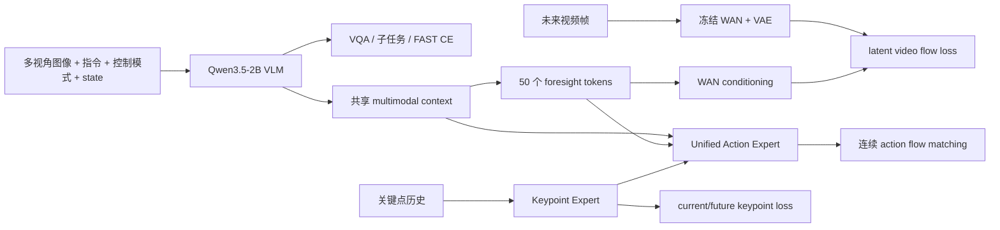
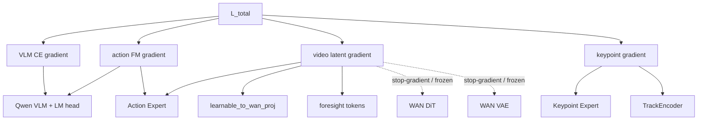

# InternVLA-A1.5 训练策略深度分析

> 文档版本：2026-09-17  
> 代码基准：`/B/SRC/itvlaGpLibPlus/` 当前工作树  
> 分析对象：InternVLA-A1.5 预训练、下游 SFT、GeoPredict 关键点扩展及其训练-评估契约  
> 结论等级：本文把“论文事实”“本地代码事实”“本地实测”“类比推断”“待验证建议”明确分开。

## 1. 结论先行

InternVLA-A1.5 的核心收益并不是简单地把一个视频模型接到 VLA 后面，而是把多种互补学习目标放进同一个训练闭环：

1. 用原生 VLM 的 next-token cross-entropy 保留视觉理解、语言指令和子任务推理能力；
2. 用 FAST 离散动作 token 让 VLM 学到动作语义和粗粒度动作序列；
3. 用连续 flow matching action expert 产生平滑、低延迟的动作 chunk；
4. 用冻结 WAN2.2 的 latent video supervision 训练少量 foresight tokens，把未来动力学先验蒸馏进 action expert。

**[论文事实]** 论文报告的最大收益集中在分布外和动态场景，而不是静态、同分布的单纯 pick-and-place：

- LIBERO：98.9；
- LIBERO-Plus：84.8；
- RoboTwin：93.2；
- DOMINO zero-shot：27.7；
- 去掉 video loss 后，LIBERO-Plus 从 84.8 降到 78.0，DOMINO 从 27.7 降到 25.3；
- 去掉 foresight tokens 后，LIBERO-Plus 降到 77.9，DOMINO 降到 23.8。

这些结果说明，视频 foresight 的价值主要体现在视觉扰动、布局变化、动态交互和长时序状态变化上，而不是体现在每一个静态任务的训练损失下降上。

**[代码事实 + 本地实测 + 待验证建议]** 对当前仓库，最重要的判断是：

### P0：先保证训练契约正确，再调超参

以下问题是代码级风险；在修复前，任何超参结论都只能作为暂定结论。

1. **FAST 的输入归一化需要单独核对。** 当前 `InternVLA-A1.5` transform 链默认用 `mean_std` 归一化，而官方 FAST 以每个动作维度的 `q01/q99` 映射到 `[-1,1]`。如果同一个归一化后的 action 同时喂给 flow matching 和 FAST，两个分支可能处于不一致的数值空间。
2. **`tokenize_state=true` 时 foresight token 切片存在确定性偏移风险。** 当前 `embed_suffix()` 在 `tokenize_state=true` 时没有 state token，但 `get_learnable_token_output()` 固定从索引 1 开始，可能丢掉第一个 foresight token，并把一个 action token 当作 foresight token。
3. **FAST/state 文本与数值 state/action 的 reorder 时序要统一。** FAST 和 state prompt 在 `ReorderStateActionTransform` 之前生成，而数值张量在之后重排；对非恒等 schema，这可能造成文本动作维度和 flow matching 动作维度不一致。
4. **机器人数据与 M1 VQA 的比例需要以实际 batch 计数验收。** 论文是 robot:M1 = 0.15:0.85；仓库教程中示例的 `vqa_dataset.weight=0.15` 经 `factory.py` 实现后却是 robot:VQA = 0.85:0.15。
5. **episode 边界的 clamp/padding 需要进入 loss mask 设计。** 当前 query index 会把越界动作和视频索引 clamp 到 episode 最后一帧，但模型损失路径没有显式使用所有对应的 `*_is_pad` mask。
6. **评估数据契约不能被当作训练 trick。** 当前 LIBERO-plus 低 SR 的主要事故是评估输入多旋转了 180°；这说明相机朝向、resize、控制约定等数据契约必须在训练前后做像素级和统计级验收。

### P1：最值得尝试的效果提升

以下是结合论文和相关 VLA 工作形成的待验证建议，不是当前仓库已经证明的收益。

1. 复现论文的阶段式训练：Stage 1 先做 VLM + VQA/子任务/FAST，Stage 2 再加入 action expert + video foresight，最后做较短的 downstream post-training。
2. 预训练阶段恢复真实 M1 多模态混合；下游小数据 SFT 阶段不要机械照搬 85% M1，而应按“语义保持”和“任务适配”做 curriculum 或低比例 replay。
3. 为 FAST 和 flow matching 解耦统计空间：FAST 使用 q01/q99，连续动作分支保留经过验证的 mean/std 或独立 q01/q99。
4. 对图像做轻量、时间和相机同步的增强：优先 brightness/contrast/saturation，谨慎使用 affine；不要未经标签变换就使用水平翻转、180°旋转或逐帧随机几何变换。
5. 使用分模块学习率和冻结策略，而不是只有“全量训练/全冻结”两个选项：VLM、vision encoder、action expert、foresight tokens、keypoint expert 分开控制。
6. 保留 video loss 和 foresight tokens；若显存不足，优先用 `video_micro_batch_size`、gradient checkpointing 和分阶段训练解决，不要直接删除 foresight 监督。

### P2：在正确性通过后再优化

以下属于待验证的性能/部署建议。

- 预测 chunk 保持 50，比较执行步数 8/16/18/25/50；
- 比较 flow matching inference steps 4/8/10/16；
- 比较 SDPA、gradient checkpointing、compile 对吞吐和数值的影响；
- 研究时间采样分布、EMA、动态 loss weighting 和更细粒度的数据 curriculum。

## 2. 证据分级和资料范围

本文采用以下标记：

- **[论文事实]**：来自 InternVLA-A1.5 论文或官方发布资料；
- **[代码事实]**：当前本地代码明确实现的行为；
- **[脚本配置]**：launch script 中的默认参数，不代表已经完成过该实验；
- **[本地实测]**：本仓库日志有命令、输出或指标支撑；
- **[类比推断]**：从 FAST、π0.5、OpenVLA、Diffusion Policy 等相关工作迁移的经验；
- **[待验证]**：合理但当前没有直接实测证据的假设。

主要本地资料：

- 论文：`b/d/p/InternVLA-A1.5-paper.md:42-173, 280-328`
- 模型配置：`src/lerobot/policies/internvla_a1_5/configuration_internvla_a1_5.py:20-610`
- 模型 forward：`src/lerobot/policies/internvla_a1_5/modeling_internvla_a1_5.py:1180-2550`
- 数据和文本 transform：`src/lerobot/policies/internvla_a1_5/transform_internvla_a1_5.py:40-730`
- 数值 transform：`src/lerobot/transforms/core.py:90-510`
- 数据集工厂：`src/lerobot/datasets/factory.py:280-640`
- 预训练脚本：`launch/internvla_a15_pretrain.sh:60-175`
- 通用 SFT：`launch/internvla_a15_finetune.sh:60-135`
- Libplus SFT：`launch/libplus_sft_launch.sh:45-240`
- Libplus 训练方案：`b/d/libplus/sft.md:1-80, 290-400`
- Libplus 训练日志：`b/d/libplus/sft_0912LOG.md:90-320`
- GeoP 消融：`b/d/GpRbt/itrnVLA15_GeoP_3dtrj_3cn2_sft_rbt2_2LOG.md:60-300`
- 标准 LIBERO 门禁：`b/d/libplus/eval3_optim3_lib2LOG.md:120-270`
- LIBERO-plus 输入契约分析：`b/d/libplus/eval3_optim2.md:1-40`

主要外部资料：

- [InternVLA-A1.5 论文 HTML](https://arxiv.org/html/2607.04988v1)
- [InternVLA-A-series 官方仓库](https://github.com/InternRobotics/InternVLA-A-series)
- [InternVLA-A1.5 项目主页](https://internrobotics.github.io/internvla-a15.github.io/)
- [InternVLA-A1.5-base 模型卡](https://huggingface.co/InternRobotics/InternVLA-A1.5-base)
- [FAST 论文](https://arxiv.org/html/2501.09747v1)
- [π0.5 论文](https://arxiv.org/html/2504.16054v1)
- [OpenVLA 论文](https://arxiv.org/html/2406.09246v3)
- [Diffusion Policy 论文](https://diffusion-policy.cs.columbia.edu/diffusion_policy_ijrr.pdf)

## 3. InternVLA-A1.5 的训练目标和数据流

本节的架构和本地字段描述属于**[代码事实]**；Stage 1/Stage 2 的目标和 WAN 设计同时对照了**[论文事实]**。

### 3.1 模型的静态职责

InternVLA-A1.5 由两个主要可训练部分和一个训练期教师组成：

- **Qwen3.5-2B VLM**：接收多视角图像、任务文本、控制模式和离散 state token，负责语义理解与 next-token prediction；
- **Unified Action Expert**：接收 VLM 上下文、foresight tokens 和 noisy action chunk，预测连续 flow matching velocity；
- **WAN2.2-TI2V-5B**：训练时冻结，仅把未来视频 latent 的 flow matching loss 反向传给 foresight conditioning 路径；推理时删除。

当前仓库还加入了 GeoPredict 关键点扩展：

- `TrackEncoder` 编码关键点历史；
- `Keypoint Expert` 预测当前和未来关键点；
- Action Expert 可以通过 cross-attention 使用关键点 expert 的输出；
- 关键点分支不属于论文基础 A1.5 的核心训练配方，应按下游任务单独消融。



### 3.2 输入、变换和模型输入格式

当前 InternVLA transform 的典型顺序是：

1. 根据 `action_mode` 插入或删除 `DeltaActionTransformFn`；
2. 图像 resize/pad；
3. 相机字段重映射到 `image0/image1/image2`；
4. 从 action-time image window 提取视频帧，保留第 0 帧给 VLM；
5. 对 state/action 做 `NormalizeTransformFn`；
6. 拼接字段；
7. FAST tokenization；
8. 从 JSONL 加载 subtask/language memory；
9. 使用 Qwen chat processor；
10. state/action pad 到最大维度；
11. 根据 robot schema 重排 state/action；
12. 统一 batch 字段。

证据：`configuration_internvla_a1_5.py:44-70, 80-140`。

机器人样本的 VLM prompt 由以下部分组成：

```text
Task: <instruction>;
Control Mode: <joint|end_effector>;
State: <256-bin state tokens>;
Output: <SubTask, Action>
```

训练时 assistant target 可以包含：

- subtask 文本；
- FAST action token；
- 两者同时存在。

推理时 label mode 被置为 `NONE`，只保留 user prompt，并添加输出提示。代码证据：`transform_internvla_a1_5.py:96-230`。

### 3.3 Stage 1：VLM transferring

论文 Stage 1 只训练 VLM 的统一 next-token objective：

$$\mathcal{L}_{\mathrm{stage1}}
=
-\sum_{i\in\mathcal{Y}}\log p_\theta(y_i\mid y_{<i},o_t,l,q_t)$$

其中：

- \(o_t\) 是当前多视角观察；
- \(l\) 是语言指令；
- \(q_t\) 是机器人状态；
- \(y_i\) 是文本、子任务或 FAST action target token；
- \(\mathcal{Y}\) 是 labels 中不为 `-100` 的位置。

VQA 样本只保留答案 target，不产生 action loss；机器人样本同时提供 subtask 和 FAST action target。论文明确强调，这些目标共享一个 vocabulary、embedding table 和 LM head，而不是给 action token 单独建立一个完全独立的 head。

### 3.4 Stage 2：foresight + continuous action

论文 Stage 2 继续保留 Stage 1 的 VLM loss，同时加入视频和连续动作：

$$\mathcal{L}_{\mathrm{stage2}}
=
\mathcal{L}_{\mathrm{stage1}}
+\alpha \mathcal{L}_{\mathrm{video}}
+\beta \mathcal{L}_{\mathrm{action}}$$

其中 \(\alpha=1\)，\(\beta=10\)。

本地模型的 action flow matching 为：

$$x_t=t\epsilon+(1-t)a,\qquad
u_t=\epsilon-a$$

其中：

- \(a\) 是归一化后的真实 action chunk；
- \(\epsilon\sim\mathcal{N}(0,I)\) 是高斯噪声；
- \(t\) 从 Beta 分布采样后经过 `scale=0.999`、`offset=0.001`；
- \(x_t\) 是 noisy action；
- \(u_t\) 是目标 velocity。

模型输出 \(v_\theta(x_t,t,c)\)，动作损失为逐元素 MSE：

$$\mathcal{L}_{\mathrm{action}}
=
\operatorname{MSE}\left(v_\theta(x_t,t,c),u_t\right)$$

代码证据：`modeling_internvla_a1_5.py:1180-1199, 1780-1798, 1937-1944`。

### 3.5 WAN latent foresight

视频监督不是让 InternVLA 从像素开始训练一个新的视频生成器，而是：

1. 从当前图像序列编码 clean video latent；
2. 只保留第 0 帧作为 condition latent；
3. 对未来 latent 加 noise；
4. 使用 foresight token 输出作为 WAN cross-attention context；
5. WAN DiT 和 VAE 冻结；
6. 训练 loss 只通过 conditioning pathway 更新 foresight tokens、投影层和上游 unified expert。

代码证据：`modeling_internvla_a1_5.py:2060-2136`。

这种设计的优点是：

- 训练时利用已有 WAN 的时空先验；
- 不需要训练 pixel-level video generation；
- 推理时可以移除 WAN；
- 让 action expert 通过未来监督学习局部动力学。

梯度流可以概括为：



这里的虚线表示 WAN 参数不更新；video loss 仍可以通过 conditioning projection、
foresight token 和上游 expert 产生梯度。训练脚本中的 `freeze_wan_dit=true` 不能理解成
“video 分支没有梯度”，它只表示梯度不进入 WAN 自身参数。

### 3.6 本地 GeoP 关键点损失

启用 `enable_keypoint_predictor` 后，关键点分支产生：

$$\mathcal{L}_{\mathrm{kpt}}
=
\lambda_{\mathrm{kpt}}
\left(
\mathcal{L}_{\mathrm{kpt,current}}
+\gamma
\mathcal{L}_{\mathrm{kpt,future}}
\right)$$

其中：

- \(\lambda_{\mathrm{kpt}}\) 对应 `kpt_loss_weight`；
- \(\gamma\) 对应 `kpt_future_loss_weight`；
- `pos_rot` 模式下位置和归一化后的旋转分量分别计算 MSE；
- `kpt_mask=false` 的 Phase 1 样本不进入直接 keypoint reconstruction loss。

本地 Libplus SFT 采用：

- `kpt_loss_weight=1.0`；
- `kpt_future_loss_weight=2.0`；
- `kpt_rot_loss_weight=1.0`；
- 8 个关键点；
- 7D position + quaternion；
- 200 帧历史；
- 50 帧未来。

证据：`launch/libplus_sft_launch.sh:200-220`、`b/d/libplus/sft.md:36-60`。

## 4. 论文标准配方与当前仓库配方

本节先列**[论文事实]**，再列**[脚本配置]**和**[代码事实]**；脚本默认值不自动等于已验证的最优策略。

### 4.1 论文配方

论文 Table 1 的训练协议是：

- Stage 1 pretrain：300K steps，batch 1024，AdamW，LR `5e-5`，warmup 2K，constant LR；
- Stage 2 pretrain：600K steps，batch 1024，LR `5e-5`，warmup 2K，constant LR；
- post-training：60K steps，batch 128，LR `5e-5 -> 5e-6`，warmup 2K，cosine decay；
- weight decay `0.01`；
- gradient clipping `1.0`；
- bfloat16；
- Stage 2/post-training 50 foresight tokens；
- action chunk 50；
- video future horizon 与 action chunk 对齐。

论文来源：`b/d/p/InternVLA-A1.5-paper.md:130-149`。

### 4.2 论文数据配方

机器人数据：

- 1.2M episodes；
- 861M frames；
- 六个来源；
- 一个 synthetic source，五个 real-world source；
- 每个 source 先分组；
- 组内按 `frames^gamma` 采样；
- source-level weight 使用 Re-Mix 后再人工调整；
- 小规模 real-world source 被有意上采样，以提高 embodiment、scene 和 viewpoint diversity。

多模态 M1：

- General QA：637K；
- Box QA：879K；
- Point QA：832K；
- Trajectory QA：684K；
- 总计约 3M samples。

最终 robot:M1 采样比例为：

\[
P(\mathrm{robot}):P(\mathrm{M1})=0.15:0.85
\]

论文来源：`b/d/p/InternVLA-A1.5-paper.md:150-176`。

这个比例的目的不是让机器人数据变少，而是避免 VLM 在 action/video 联合训练中发生 semantic forgetting。机器人数据负责动作和未来帧，M1 负责语义、空间 grounding 和语言能力。

### 4.3 当前通用预训练脚本

`launch/internvla_a15_pretrain.sh` 的默认行为是：

- 发现 `data/a1` 下的数据集；
- action mode 为 `delta`；
- `dist_loading=true`；
- robot source weight 使用 `configs/weight_rules_pretrain.yaml`；
- batch size 从环境变量读取；
- 600K steps；
- LR `5e-5`；
- warmup 2K；
- `scheduler_decay_lr=5e-5`，因此等价于不下降的 constant LR；
- video loss 开启；
- action loss 开启；
- FAST 开启；
- VQA loss 开启；
- foresight tokens 解冻；
- 外部 VQA 参数默认注释。

证据：`launch/internvla_a15_pretrain.sh:60-175`。

因此它更像“直接进入 Stage 2 风格的 600K robot-centric training”，不是严格执行论文的 Stage 1 300K -> Stage 2 600K -> post-training 60K 三阶段。

### 4.4 当前通用 SFT

`launch/internvla_a15_finetune.sh` 默认：

- 从 `InternVLA-A1.5-base` 开始；
- batch size 8；
- 60K steps；
- LR `5e-5`；
- warmup 2K；
- decay LR `5e-6`；
- VLM 全量训练；
- vision encoder 不冻结；
- VQA loss、FAST、video loss 都开启；
- foresight tokens 默认冻结；
- `video_loss_weight=1`。

证据：`launch/internvla_a15_finetune.sh:60-135`。

### 4.5 当前 Libplus 4D keypoint SFT

本地 Libplus SFT 是一个下游扩展配方，而不是论文预训练复现：

- 数据：273,465 frames、1,693 episodes、40 tasks；
- 起点：base checkpoint，直接 full SFT；
- 8×H200；
- per-GPU batch 32，effective batch 256；
- planned steps 53,450，约 50 epochs；
- LR `5e-5`；
- warmup 1,000；
- cosine decay 30,000 steps，终止 LR `5e-6`；
- action weight 10；
- video weight 1；
- keypoint current/future weight 1/2；
- VLM、vision encoder、action expert、keypoint expert、TrackEncoder、foresight tokens 解冻；
- WAN DiT/VAE 冻结；
- gradient checkpointing 开启；
- action mode `abs`；
- 使用外部 `meta/stats.json` z-score；
- 关键点 expert 从 action expert warm-start。

证据：`launch/libplus_sft_launch.sh:45-240`、`b/d/libplus/sft.md:1-80, 290-400`。

这里有一个重要的训练策略判断：**对于只有 27 万帧的下游数据集，直接让完整 Qwen VLM、vision encoder、action expert、keypoint expert 和 foresight tokens 同时更新，过拟合和语义漂移风险高于论文大规模预训练。** 应通过小学习率、分模块 LR、保留少量 M1 replay 或冻结/解冻 curriculum 做对照，而不是只看训练 loss。

## 5. 当前已经证明有效的训练 trick

本节同时包含**[论文事实]**和**[本地实测]**；没有实测或论文消融支撑的内容会单独标为待验证。

### 5.1 原生 VLM chat template + 统一 token objective

这是 InternVLA-A1.5 最核心的设计之一：

- state 被转成离散 token；
- control mode 被放入 prompt；
- subtask 和 FAST action token 与普通文本共用 vocabulary；
- 所有有效 label 使用同一个 next-token CE；
- 不额外创建一个完全独立的 language/action classifier。

优点：

- 保留预训练 VLM 的 prompt distribution；
- 可以用大量 VQA/M1 数据保护语义；
- action token 具备语言上下文；
- subtask prediction 可以帮助长时序任务保持 progress awareness。

论文在结论中明确指出，native chat template 对训练稳定性和语义迁移很重要。来源：`b/d/p/InternVLA-A1.5-paper.md:320-328`。

### 5.2 VLM CE、FAST、flow matching 和 video loss 的联合学习

不要把 FAST 和 flow matching 看成互相替代的两种 action head：

- FAST 负责 VLM 的离散动作语义、动作先验和序列建模；
- flow matching 负责连续动作的平滑生成和低延迟闭环；
- video loss 负责未来状态和局部动力学先验；
- VQA/subtask CE 负责语言和任务分解。

当前代码在 `enable_vqa_loss=true` 时，`loss_fast` 和 `loss_subtask` 是 `loss_vlm` 的日志拆分，并没有独立的 `loss_fast_weight`：

`modeling_internvla_a1_5.py:1916-1934, 2450-2484`。

这意味着手册里把 `loss_vqa + loss_fast` 写成两个独立加法项时，需要谨慎解释：**实际总损失中只加一次 `lambda_vqa * loss_vlm`，`loss_fast` 主要用于诊断。**

### 5.3 action:video 权重约为 10:1

论文和本地默认配置都使用：

- action weight = 10；
- video weight = 1。

这符合两个分支的作用：

- action 是部署直接优化目标；
- video 是训练期 auxiliary prior；
- video 不应因为像素/latent 维度多而压倒 action。

但固定 scalar weight 不是最终保证。不同阶段还应监控：

- 每项 loss 的 raw value；
- 每项对共享 VLM/expert 参数的 gradient norm；
- action success 与 OOD success；
- WAN 分支是否造成梯度噪声或吞吐下降。

### 5.4 组级数据重采样

论文并不是把所有 frame 简单混在一起：

1. source-level 手工权重提升小而多样的 real-world 数据；
2. group 内按 `frames^gamma` 采样；
3. 这样避免最大 synthetic source 主导所有 batch。

仓库的 `MultiLeRobotWeightedSampler` 和 `weight_rules_pretrain.yaml` 实现了相似思想：

- `inside=frames_pow`；
- `gamma=1.0`；
- source weights 由 YAML 指定；
- sampler 先采 source，再在 source 内随机取 local index。

代码证据：`src/lerobot/datasets/factory.py:220-270, 480-570`、`src/lerobot/datasets/sampler.py:158-204`。

需要注意：**采样权重不是训练结果。** 必须在训练日志中统计实际 source、task、robot type 和 episode 的 batch fraction，确认它没有被 distributed assignment、dataset length 或 replacement sampler 改写。

### 5.5 WAN 冻结、foresight tokens 解冻

这是一个高性价比的知识蒸馏结构：

- 不更新 WAN DiT；
- 不更新 WAN VAE；
- 更新 foresight tokens、`learnable_to_wan_proj` 和上游 expert；
- inference 删除 WAN。

相比于从零训练 video model，训练资源更集中；相比于只用 action loss，获得未来状态监督。

论文消融已经证明 video loss 和 foresight tokens 对 LIBERO-Plus、DOMINO、RoboTwin 有一致收益。

### 5.6 keypoint expert 从 action expert warm-start

这是本地 GeoP 扩展中最有效的工程 trick 之一：

- action expert 和 keypoint expert 架构同形；
- keypoint expert 从 action expert 复制权重；
- TrackEncoder 可独立初始化；
- Phase 1 先让关键点路径快速收敛；
- Phase 2 恢复 action 主导训练。

本地实测：

- `kpt_loss_weight` 在 `[5,10,20]` 内，200 步 `kpt_cur` 都约为 `0.0017`；
- `action_expert_lr_scale` 在 `[0.05,0.1,0.2]` 内，keypoint 收敛几乎不变；
- Phase 1 400 步时 `kpt_cur: 0.5437 -> 0.0010`，`kpt_fut: 0.5337 -> 0.0032`；
- Phase 2 400 步时 action loss `0.092 -> 0.032`，关键点 loss 保持低位。

来源：`b/d/GpRbt/itrnVLA15_GeoP_3dtrj_3cn2_sft_rbt2_2LOG.md:60-220, 240-300`。

结论是：**关键点分支的 warmup 长度和 loss weight 不需要过度精调，但必须保护 warmup checkpoint 中已经学到的 keypoint expert 权重。**

### 5.7 gradient checkpointing 和 video micro-batch

本地 Libplus SFT 使用：

- `gradient_checkpointing=true`；
- `video_micro_batch_size=2`。

video micro-batch 只切分 WAN VAE/DiT 的显存峰值，不改变 optimizer batch size 和每步样本数。代码证据：`modeling_internvla_a1_5.py:2078-2136`。

这是优先于减小全局 batch 的显存优化，因为减小全局 batch 会同时改变：

- 梯度噪声；
- learning rate 适配；
- epoch/step 对应关系；
- 多数据集采样统计。

本地 GeoP 实验说明 per-GPU BS=32 会 OOM，而 BS=16 是显存和收敛更稳的点。来源：`itrnVLA15_GeoP_3dtrj_3cn2_sft_rbt2_2LOG.md:60-88`。

## 6. 当前实现中需要优先修正或验证的风险

本节以**[代码事实]**为主，并把需要补测试才能定论的部分标记为**[待验证]**。

### 6.1 P0：foresight token 切片偏移

当前 `embed_suffix()` 的结构是：

```text
tokenize_state=false: [state] [foresight] [action]
tokenize_state=true : [foresight] [action]
```

代码：`modeling_internvla_a1_5.py:1512-1568`。

但是 `get_learnable_token_output()` 固定：

```python
start = 1
end = 1 + num_learnable_tokens
```

代码：`modeling_internvla_a1_5.py:1628-1636`。

当 `tokenize_state=true` 时，正确切片应从 0 开始；当前实现会：

- 丢弃第一个 learnable foresight token；
- 取入第一个 action token；
- 将错误形状的 hidden states 投影给 WAN。

这不是“可能影响一点”的普通超参，而是一个应先写单元测试的索引契约问题。建议测试：

1. 构造 `num_learnable_tokens=3`、`chunk_size=2` 的 suffix；
2. 给每个 token 注入可识别的常数或 token id；
3. 检查 `get_learnable_token_output()` 是否返回 `[foresight_0, foresight_1, foresight_2]`；
4. 分别覆盖 `tokenize_state=true/false`；
5. 运行 WAN smoke，确认修复前后 loss、梯度和显存均有限。

### 6.2 P0：FAST 输入归一化契约

当前 transform 链是：

```text
NormalizeTransformFn() -> FASTInternVLAA15ActionTokenizerTransformFn()
```

`NormalizeTransformFn.mode` 默认是 `mean_std`，代码：`src/lerobot/transforms/core.py:250-315`。

官方 FAST 的标准流程是：

$$\tilde a_d
=
2\frac{\operatorname{clip}(a_d,q_{01,d},q_{99,d})-q_{01,d}}
{q_{99,d}-q_{01,d}}
-1$$

其中 \(d\) 是动作维度，\(q_{01,d}\) 和 \(q_{99,d}\) 是训练集分位数。之后才进行 DCT、scale-and-round 和 BPE。

当前 FAST tokenizer 的本地调用只接收 transform 后的 action：

- `FASTInternVLAA15ActionTokenizerTransformFn.__call__`：`transform_internvla_a1_5.py:566-620`；
- tokenizer 是 `physical-intelligence/fast`：`transform_internvla_a1_5.py:369-400`；
- action 没有在该 transform 内单独做 quantile normalization。

因此需要区分两种设计：

#### 方案 A：两个分支独立统计，推荐优先验证

- flow matching 继续使用当前经过验证的 mean/std action；
- FAST 分支复制一份 raw action，单独使用 q01/q99；
- FAST decode 后映射回 raw action，再与 flow matching 的动作空间做数值对照。

优点是不会突然改变已经能工作的 flow matching 数值空间。

#### 方案 B：两个分支统一使用 q01/q99

- state/action 都切换到 quantile mode；
- 重新计算各 robot type、各 action mode、chunk size=50 的 stats；
- 重新验证 action loss、FAST token length、decode error 和闭环 success。

优点是实现更接近 FAST/π0.5；风险是改变连续 action loss 的尺度。

验收必须记录：

- q01/q99 后每个维度的 min/max/median；
- FAST encode-decode 的 raw action MSE、最大误差和 token length；
- flow matching 输入的均值、标准差、p01/p99；
- `abs` 与 `delta` 的 stats 是否错误复用；
- inference 的 unnormalize 是否与训练完全相反。

### 6.3 P0：state/action reorder 与文本生成顺序

当前 transform 将 chat processor 和 FAST tokenizer 放在 `ReorderStateActionTransform` 之前：

`configuration_internvla_a1_5.py:44-70`。

这会产生以下风险：

- state prompt 使用 reorder 前的 state；
- FAST token 使用 reorder 前的 action；
- flow matching 输入使用 reorder 后的 action；
- action expert 的输出维度由 reorder 后 schema 解释。

对 `panda` 这类 identity mapping 可能没有影响，但对 ALOHA、R1 Pro 或带 gap/padding 的 schema 可能造成语义错位。

建议的统一规则：

1. 原始数据字段先完成 schema remap；
2. action/state 统一 reorder；
3. 分支一：flow matching 使用 reorder 后 numeric tensor；
4. 分支二：FAST 使用同一 reorder 后 tensor；
5. state text 使用同一 reorder 后 state；
6. 在 batch inspector 中同时打印：
   - numeric action 第 0 帧；
   - FAST decode 第 0 帧；
   - prompt 中 state token；
   - schema 的 source->destination mapping。

### 6.4 P0：机器人/M1 VQA 比例语义反转

论文要求 robot:M1 = 0.15:0.85。

当前 `factory.py` 的实现是：

```python
dataset_weights=[1.0 - vqa_weight, vqa_weight]
```

代码：`src/lerobot/datasets/factory.py:560-570`。

因此：

- `vqa_dataset.weight=0.15` 实际得到 robot=0.85、VQA=0.15；
- 要复现论文比例，应该传入 `vqa_dataset.weight=0.85`；
- 但下游 SFT 不一定应该使用论文的 85% M1。

推荐策略：

- Stage 1 pretrain：严格做 robot 0.15 / M1 0.85；
- Stage 2 pretrain：保留 M1 replay，先用 0.15/0.85，再按动作能力和语义能力评估 0.30/0.70、0.50/0.50；
- downstream SFT：从 robot-heavy 开始，例如 0.70/0.30、0.85/0.15、robot-only，防止小数据动作适配不足；
- 每个实验按实际 batch 计数验收，不只看 CLI 参数。

### 6.5 P0：episode 边界 padding 没有完整进入 loss mask

`LeRobotDataset._get_query_indices()` 对超出 episode 的 index 做 clamp，并生成 `key_is_pad`：

`src/lerobot/datasets/lerobot_dataset.py:928-943`。

这对 action chunk 和 video frame 都会发生：

- episode 末尾 action 可能重复最后一个动作；
- episode 末尾 future frame 可能重复最后一帧；
- 当前 transform 主要把值传入模型，未把全部 padding mask 传到 action/video loss；
- 重复 target 可能被当作有效监督。

建议：

1. 把 action `is_pad` 保留到统一 batch；
2. action loss 用 `[B,H,D]` mask；
3. video loss 对未来时间维度用 mask；
4. keypoint 分支保留 history/future padding mask；
5. 在 episode 长度短于 50 的小数据上做专项测试。

### 6.6 P1：图像增强默认关闭，而且当前增强不保证时序一致

当前 `ImageTransformsConfig.enable=false`。可选增强包括 brightness、contrast、saturation、hue、sharpness 和 affine：

`src/lerobot/datasets/transforms.py:150-250`。

风险：

- 对单帧独立随机 affine 会破坏视频时间连续性；
- 对不同 camera 独立采样会破坏跨视角颜色和几何对应；
- 旋转、翻转会改变相机语义或机器人左右关系；
- 训练数据没有做 180° 旋转，评估多旋转 180° 已经造成大幅失败。

建议的增强顺序：

1. 先不做几何增强；
2. 开启同步 brightness/contrast/saturation；
3. 若使用 affine，对同一 episode 的窗口和所有有效相机共享参数；
4. 只在 action label 同时变换的情况下使用几何变换；
5. 不使用 horizontal flip/180° rotation，除非任务、控制和 camera frame 都证明左右对称。

### 6.7 P1：`video_loss_weight=0` 仍可能加载 WAN

模型构造路径由 `action_loss_only` 决定；`video_loss_weight=0` 只在 forward 时跳过 video loss：

- 加载逻辑：`modeling_internvla_a1_5.py:1035-1070`；
- forward 跳过逻辑：`modeling_internvla_a1_5.py:1946-1955`。

因此 action-only 训练若设置：

```text
action_loss_only=false
video_loss_weight=0
```

仍可能承担 WAN 初始化的显存和启动成本。纯 action baseline 应使用：

```text
action_loss_only=true
inference_backend=optimized
```

但这只适用于明确不需要 video foresight 的实验，不能作为默认提升效果的方案。

### 6.8 P1：padding 后的动作维度必须做有效维度 loss mask

代码会把 action pad 到 `max_action_dim=32`：

`src/lerobot/transforms/core.py:90-108`。

`InternVLAA15Policy.forward()` 确实尝试用
`losses[:, :, :original_action_dim]` 排除无效维度，代码位于
`modeling_internvla_a1_5.py:2447-2449`；但是这里的
`original_action_dim = batch[ACTION].shape[-1]` 读取发生在 transform
之后，而默认 transform 已经执行 `PadStateAndActionTransformFn`。因此在当前链路中
`original_action_dim` 可能已经是 32，不能把这段切片当作已完成的有效维度 mask。

如果某机器人只有 7 维，剩余维度是人为 pad 值，不应获得和真实动作维度相同的 loss 权重。
需要在 pad 前保留原始 action dimension，或把 schema 的 action mask 显式传入模型。

需要验证：

- `batch[ACTION]` 在 `InternVLAA15Policy.forward()` 时的 shape；
- `original_action_dim` 是否仍为原始动作维度，还是已经被 pad 到 32；
- `dataset schema.action_mask` 是否被传入并用于 flow matching loss；
- 不同 embodiment 的 action loss 是否被 pad 维度改变；
- inference 输出截断和 training loss 截断是否使用同一个有效维度定义。

建议增加：

$$\mathcal{L}_{\mathrm{action}}
=
\frac{\sum_{h,d}m_d\,
\operatorname{MSE}(v_{h,d},u_{h,d})}
{\sum_{h,d}m_d}$$

其中 \(m_d=1\) 表示该 embodiment 的有效动作维度。

## 7. 相关 VLA 工作可迁移的训练技巧

本节是**[类比推断]**。外部工作的收益不能直接归因到当前模型，必须按第 9 节矩阵复验。

### 7.1 FAST：先解决数值空间，再谈 token vocabulary

FAST 的核心不是把连续动作简单量化成 256 bins，而是：

1. 每个动作维度按 q01/q99 截断并映射到 `[-1,1]`；
2. 沿时间维做 DCT；
3. 对 DCT 系数 scale-and-round；
4. 以低频优先的顺序 flatten；
5. 用 BPE 压缩稀疏频域序列。

对本仓库的直接建议：

- chunk size 50 与 tokenizer `time_horizon` 必须一致；
- `action_dim` 必须与 padding policy 一致；
- 不同 robot type 不能直接复用另一 embodiment 的 quantile stats；
- `abs` 和 `delta` 必须分别统计；
- 训练和推理必须使用同一个 tokenizer、scale、vocab 和 stats；
- 先用 encode-decode 单元测试，再启用 FAST loss。

### 7.2 π0.5：先离散语义，再连续 action expert

π0.5 的直接启发是：

- Stage 1 先用多模态、机器人、subtask 和 FAST；
- Stage 2 再加入随机初始化的 flow matching action expert；
- 仍保留 language/subtask loss；
- action flow loss 权重约为 10；
- 只使用成功和短 episode 等更干净的 downstream data；
- 机器人 action 使用 q01/q99；
- 通过 web/M1 数据保护 VLM 语义。

对 InternVLA-A1.5 的适配：

- 论文本身已经采用类似的三阶段结构；
- 当前仓库预训练脚本没有显式切换 Stage 1/Stage 2；
- 如果计算资源允许，应把“Stage 1 checkpoint -> Stage 2 checkpoint”作为第一优先级配方实验；
- 不要直接把 π0.5 的 LR 或 action horizon 复制过来，需保持 Qwen3.5、WAN 和当前 expert 结构一致。

### 7.3 OpenVLA：vision encoder 不能默认冻结

OpenVLA 的主要经验是：

- 视觉编码器微调对精细控制重要；
- 只训练最后一层或冻结 vision encoder 表现较差；
- LoRA all-linear 可以在显存受限时接近 full fine-tuning；
- fine-tuning 默认使用轻量图像增强；
- action quantization 使用 q01/q99 排除离群点。

对当前仓库的适配：

- 大规模 Stage 2 可以全量微调 vision encoder；
- 小数据 SFT 应比较：
  - vision frozen；
  - vision LR = `0.05x`；
  - vision LR = `0.1x`；
  - full LR；
- 不要仅以训练 loss 判断 vision encoder 是否应该冻结，要看 camera/viewpoint OOD 和精细接触任务。

### 7.4 Diffusion Policy：receding-horizon 比单纯拉长执行 chunk 更重要

Diffusion Policy 的经验是：

- 预测 horizon、observation horizon、执行 horizon 分离；
- 每次只执行 action chunk 的前一部分；
- 频繁 replan 通常提高闭环反应；
- random crop 对视觉泛化有帮助；
- EMA 和 cosine schedule 对小数据稳定性有参考价值。

InternVLA-A1.5 的 `chunk_size=50` 不等于必须一次执行 50 步。论文和本地 RoboTwin 配置都表明预测 chunk 与执行 chunk 是两个不同参数；RoboTwin 使用过执行 chunk 18。

建议保持：

```text
prediction_chunk = 50
execution_steps ∈ {8, 16, 18, 25, 50}
```

按任务类型报告：

- static pick-and-place；
- precise insertion；
- dynamic interaction；
- long-horizon subtask；
- action smoothness；
- inference latency。

### 7.5 视频 foresight：用未来 supervision 约束 action representation

VPP 等 video-conditioned policy 工作显示，未来视觉表征对动态任务和 OOD 泛化有帮助；但直接把完整 video model 放到 inference 会增加延迟。

InternVLA-A1.5 的折中更适合当前仓库：

- 训练期使用 frozen WAN；
- 只训练 compact foresight query；
- inference 删除 WAN；
- action expert 复用 foresight hidden state。

因此建议的 ablation 顺序是：

1. full：video loss + foresight tokens；
2. video loss = 0，但保留 tokens；
3. tokens = 0；
4. action-only；
5. video loss weight `0.1/0.3/1.0`；
6. 只在分布外/动态集合上比较。

## 8. 推荐的训练路线

本节是基于前述证据形成的**[待验证建议]**，不是对现有 launch script 的改动。

### 8.1 路线 A：严格靠近论文的预训练

适用于希望重新训练 base policy 的场景。

#### A1：VLM transferring，300K steps

- VLM + vision encoder 训练；
- action expert 不参与连续 loss；
- 使用 robot + M1；
- 保留 state、subtask、FAST；
- M1 占 85%，robot 占 15%；
- constant LR `5e-5`；
- warmup 2K；
- bfloat16；
- grad clip 1.0；
- 记录每类 token loss 和每个数据源采样比例。

#### A2：Foresight/action，600K steps

- 从 A1 checkpoint 加载；
- 加入 action expert；
- 加入 50 foresight tokens；
- 开启 WAN video loss；
- action weight 10，video weight 1；
- 保留 VLM CE；
- FAST expert attention 必须屏蔽 ground-truth FAST span；
- 使用 robot future frames；
- M1 仍保留 replay。

#### A3：下游 post-training，60K steps

- batch 128；
- peak LR `5e-5`；
- cosine 到 `5e-6`；
- warmup 2K；
- 目标 embodiment/task 数据；
- 继续保留少量 M1 或 VQA replay；
- 逐步评估 seen/OOD/动态场景。

### 8.2 路线 B：当前 Libplus 小数据 SFT

适用于 `/B/Dta/opvla_libero_merged_kpt/` 这一类小规模下游数据。

#### B0：先做契约修复和基线

- 固定 checkpoint；
- 修复/验证 foresight slice；
- 生成 action stats；
- batch inspector；
- WAN smoke；
- 100-step smoke；
- open-loop；
- 标准 LIBERO smoke。

#### B1：关键点 warmup

- per-GPU BS=16；
- 200-400 steps；
- keypoint expert 从 action expert 初始化；
- VLM 可以冻结；
- action:kpt 比例先用 4:1；
- `action_loss_only=true` 做纯关键点结构 warmup；
- 只把 warmup checkpoint 当作结构初始化，不把低 keypoint MSE 当作最终 robot success。

#### B2：主 SFT

- action expert 恢复正常 LR；
- VLM 和 vision encoder 使用较低 LR scale 做对照；
- 开启 action + VQA/FAST；
- video loss 做 `0/0.1/1.0` 对照；
- foresight tokens 做 frozen/unfrozen 对照；
- keypoint future weight 比较 `1/2`；
- 保存每个 epoch 的 checkpoint，并用 OOD 验证选择 best，而不是只用 training loss。

#### B3：增强和 M1 replay

- baseline：无增强、robot-only；
- color-only：brightness/contrast/saturation；
- synchronized affine；
- robot + 少量 M1 replay；
- 每个实验保持相同随机种子和相同 episode split。

### 8.3 路线 C：部署约束下的 action-only

适用于真实机器人低延迟部署：

- `action_loss_only=true`；
- `inference_backend=optimized`；
- 不加载 WAN；
- prediction chunk 仍可为 50；
- `n_action_steps` 单独调；
- inference steps 单独调；
- 但不要用 action-only checkpoint 反推 video foresight 对泛化的结论。

## 9. 推荐消融实验矩阵

以下矩阵属于**[待验证建议]**；只有在固定数据、随机种子和评估协议后，差异才可解释。

所有实验都应使用相同：

- checkpoint；
- 数据 split；
- action mode；
- stats；
- seed；
- evaluation server；
- camera preprocessing；
- success definition。

### 9.1 P0 正确性矩阵

#### C1：foresight index

- 当前切片；
- 修正后的切片；
- 只跑 WAN smoke 和 100-step。

验收：

- token index 单元测试通过；
- `loss_video` finite；
- learnable token gradient 非零；
- 无 action token 混入 video context。

#### C2：FAST normalization

- mean/std；
- q01/q99；
- dual-stat：flow mean/std + FAST q01/q99。

指标：

- token length；
- encode-decode MSE；
- `loss_fast`；
- `loss_action`；
- open-loop action error；
- LIBERO/Libplus SR。

#### C3：reorder

- identity schema；
- non-identity schema；
- reorder 前 tokenization；
- reorder 后 tokenization。

验收：

- prompt state 与 numeric state 对齐；
- FAST decode 与 action tensor 对齐；
- 不同 embodiment 的动作维度语义一致。

#### C4：padding mask

- episode 长度大于 chunk；
- episode 长度小于 chunk；
- episode 末尾采样；
- future video 越界。

验收：

- padding 位置不计入 action/video/keypoint loss；
- loss 不随 episode 长度分布异常变化。

#### C5：image contract

- raw orientation；
- 180° rotation；
- 224 resize；
- 256 input；
- raw/rot MSE；
- `image_grid_thw`。

验收：

- 训练与评估双相机 raw frame 的方向一致；
- 评估 input resolution 与训练 resolution 明确；
- 不能只通过 SR 反推图像契约正确。

### 9.2 P1 效果矩阵

#### E1：训练阶段

- direct Stage 2；
- Stage 1 -> Stage 2；
- Stage 1 -> Stage 2 -> downstream post-training。

#### E2：M1 比例

- robot-only；
- robot:M1 = 0.85:0.15；
- robot:M1 = 0.70:0.30；
- robot:M1 = 0.50:0.50；
- robot:M1 = 0.15:0.85。

至少报告：

- VQA/subtask loss；
- FAST loss；
- action loss；
- seen task；
- camera/viewpoint OOD；
- language OOD；
- dynamic interaction。

#### E3：视觉训练策略

- vision frozen；
- vision LR 0.05x；
- vision LR 0.1x；
- full LR；
- full LR + color augmentation。

#### E4：video/foresight

- video off；
- video weight 0.1；
- video weight 0.3；
- video weight 1.0；
- foresight tokens frozen；
- foresight tokens trainable。

#### E5：动作执行

- prediction chunk 50；
- execution steps 8/16/18/25/50；
- inference steps 4/8/10/16。

### 9.3 P2 性能矩阵

- gradient checkpointing on/off；
- SDPA on/off；
- compile on/off；
- video micro-batch 1/2/4；
- global batch 128/192/256；
- EMA on/off；
- constant LR vs cosine。

性能实验必须同时记录：

- samples/s；
- peak HBM；
- step time；
- loss；
- 训练稳定性；
- eval success；
- inference latency。

## 10. 测试、验收和停止条件

### 10.1 数据和 transform gate

每次正式训练前必须生成一份 batch report：

- raw image shape/range；
- processed image shape/range；
- image orientation hash 或像素对照；
- state raw/normalized/tokenized；
- action raw/normalized/FAST decode；
- action valid-dimension mask；
- action padding mask；
- video frame index；
- video frame padding mask；
- task、episode、robot type；
- label mode；
- VQA/robot sample type。

### 10.2 模型 forward gate

至少覆盖：

- action-only；
- VQA-only；
- robot with FAST；
- robot without FAST；
- video on；
- video off；
- keypoint off；
- keypoint on；
- `tokenize_state=true`；
- `tokenize_state=false`；
- gradient checkpointing；
- bfloat16。

验收：

- 所有 loss finite；
- 所有期望模块 gradient 非零；
- 被冻结模块 gradient 为零；
- 没有越界 token；
- checkpoint 可重新加载；
- inference backend 与训练配置匹配。

### 10.3 小规模 smoke gate

推荐顺序：

1. 1 GPU、2 steps、WAN smoke；
2. 1 GPU、100 steps；
3. 8 GPU、100-400 steps；
4. checkpoint reload；
5. open-loop；
6. 标准 LIBERO 40 episodes；
7. 标准 LIBERO 2,000 episodes；
8. LIBERO-plus 分类别小样本；
9. LIBERO-plus 完整评估。

### 10.4 指标 gate

不要只使用 aggregate SR。每次至少报告：

- overall SR；
- 每个 suite/category SR；
- task-level worst-10；
- crash count；
- missing result count；
- action smoothness；
- episode length；
- retry/replan count；
- image preprocessing status；
- checkpoint step；
- training data sample ratio。

本地已有标准 LIBERO 证据：

- 2,000 episodes；
- 1,905 successes；
- overall SR=95.25%；
- 0 crash；
- 0 missing JSON。

来源：`b/d/libplus/eval3_optim3_lib2LOG.md:120-180`。

但这只能证明当前 checkpoint 在标准 LIBERO 和当前评估链路上可用，不能直接替代正确朝向的 LIBERO-plus OOD 结果。`eval3_optim2.md:1-40` 已明确指出，早期 LIBERO-plus 低 SR 主要由评估端 180° image mismatch 引起。

## 11. 推荐最终配置 profile

### Profile P：论文风格预训练

```text
Stage 1:
  steps=300000
  batch=1024
  lr=5e-5
  warmup=2000
  video=off
  action_expert=off
  robot:M1=0.15:0.85

Stage 2:
  steps=600000
  batch=1024
  lr=5e-5 constant
  warmup=2000
  video_weight=1
  action_weight=10
  foresight_tokens=50
  action_chunk=50
  robot:M1=0.15:0.85

Post-training:
  steps=60000
  batch=128
  lr=5e-5 -> 5e-6
  cosine_decay
  warmup=2000
```

### Profile L：Libplus 4D keypoint SFT

```text
pretrained=InternVLA-A1.5-base
action_mode=abs
chunk_size=50
per_gpu_batch=16  # 优先于当前 BS=32 的显存风险
action_loss_weight=10
kpt_loss_weight=1
kpt_future_loss_weight=2
video_loss_weight in {0.1, 1.0}
gradient_checkpointing=true
video_micro_batch_size=2
keypoint_expert_init=action_expert
WAN_DiT=frozen
WAN_VAE=frozen
```

推荐先用 200-400 步 keypoint warmup，再进入 action-dominant SFT；但 warmup 的收益必须用闭环/OOD 指标确认，不能只看 keypoint MSE。

### Profile A：action-only deployment

```text
action_loss_only=true
inference_backend=optimized
WAN=not loaded
prediction_chunk=50
n_action_steps in {8, 16, 18, 25, 50}
inference_steps in {4, 8, 10, 16}
```

这个 profile 的目标是延迟和稳定性，不用于证明 foresight 对泛化的贡献。

## 12. 最终建议排序

### 立即做

1. 为 `get_learnable_token_output()` 增加 `tokenize_state` 单元测试并修正索引契约；
2. 记录 FAST 输入和 decode 后的数值范围；
3. 明确 FAST 与 flow matching 是否共享统计；
4. 修正/验证 M1 weight 语义；
5. 保存 action/video/keypoint padding mask；
6. 把相机方向、resize、控制约定写入 checkpoint metadata；
7. 对 train batch 做实际 robot/M1/source/task 采样计数。

### 第一轮效果实验

1. direct Stage 2 vs Stage 1 -> Stage 2；
2. mean/std vs q01/q99 vs dual-stat；
3. robot-only vs robot+M1；
4. vision frozen vs low-LR vs full-LR；
5. video off/0.1/1.0；
6. execution steps 8/18/50。

### 不建议现在做

- 在 FAST normalization 尚未确认前大规模搜索 tokenizer vocabulary；
- 在图像方向和 resize 未通过 pixel-level gate 前比较 augmentation；
- 在只看训练 loss 的情况下决定冻结 vision encoder；
- 把 WAN DiT 解冻作为第一选择；
- 用错误朝向或缺失 shard 的 LIBERO-plus 结果做模型能力结论；
- 把 GeoP 小数据集的 `kpt_loss_weight` 扫描结果直接推广为所有机器人和任务的最优值。

## 13. 参考资料与出处

### 本地资料

1. `b/d/p/InternVLA-A1.5-paper.md`
2. `src/lerobot/policies/internvla_a1_5/configuration_internvla_a1_5.py`
3. `src/lerobot/policies/internvla_a1_5/modeling_internvla_a1_5.py`
4. `src/lerobot/policies/internvla_a1_5/transform_internvla_a1_5.py`
5. `src/lerobot/transforms/core.py`
6. `src/lerobot/datasets/factory.py`
7. `src/lerobot/datasets/sampler.py`
8. `configs/weight_rules_pretrain.yaml`
9. `launch/internvla_a15_pretrain.sh`
10. `launch/internvla_a15_finetune.sh`
11. `launch/libplus_sft_launch.sh`
12. `b/d/libplus/sft.md`
13. `b/d/libplus/sft_0912LOG.md`
14. `b/d/GpRbt/itrnVLA15_GeoP_3dtrj_3cn2_sft_rbt2_2LOG.md`
15. `b/d/libplus/eval3_optim2.md`
16. `b/d/libplus/eval3_optim3_lib2LOG.md`

### 外部资料

1. Ma et al., “InternVLA-A1.5: Unifying Understanding, Latent Foresight, and Action for Compositional Generalization,” [arXiv:2607.04988](https://arxiv.org/html/2607.04988v1).
2. InternRobotics, [InternVLA-A-series](https://github.com/InternRobotics/InternVLA-A-series).
3. InternRobotics, [InternVLA-A1.5 project page](https://internrobotics.github.io/internvla-a15.github.io/).
4. InternRobotics, [InternVLA-A1.5-base model card](https://huggingface.co/InternRobotics/InternVLA-A1.5-base).
5. Physical Intelligence, “FAST: Efficient Action Tokenization for Vision-Language-Action Models,” [arXiv:2501.09747](https://arxiv.org/html/2501.09747v1).
6. Physical Intelligence, “π0.5: a Vision-Language-Action Model with Open-World Generalization,” [arXiv:2504.16054](https://arxiv.org/html/2504.16054v1).
7. Kim et al., “OpenVLA: An Open-Source Vision-Language-Action Model,” [arXiv:2406.09246](https://arxiv.org/html/2406.09246v3).
8. Hu et al., “Video Prediction Policy: A Generalist Robot Policy with Predictive Visual Representations,” [ICML/PMLR](https://proceedings.mlr.press/v267/hu25g.html).
9. Chi et al., “Diffusion Policy: Visuomotor Policy Learning via Action Diffusion,” [IJRR PDF](https://diffusion-policy.cs.columbia.edu/diffusion_policy_ijrr.pdf).

## 14. 一句话总结

InternVLA-A1.5 最值得复制的不是某个孤立的 learning rate，而是“原生 VLM 语义保持 + FAST 离散动作 + 连续 flow matching + frozen-WAN latent foresight + 分阶段训练 + 按 source/task 重采样”的组合；对当前仓库，最快的效果提升路径是先修正 FAST/foresight/reorder/padding 等数据契约，再用 M1 混合、阶段式训练、vision 分模块 LR、同步图像增强和执行 horizon 做有控制的消融。

---

## 15. 已确定的实施范围：standard backend 下启用双 state 表示

本节根据当前部署约束，重写前文第 15–23 节。采用以下明确前提：

1. `tokenize_state=true` 时，VLM prompt 保留离散 state 文本 token；
2. Action Expert suffix 同时加入连续 state embedding token；
3. 允许 state 在 VLM prefix、Keypoint suffix 和 Action suffix 中重复注入；
4. 推理只使用 standard backend；
5. 不修改 `modeling_internvla_a1_5_optimized.py`；
6. 当前机器人是 Franka Panda，按当前 Panda schema 判断 reorder；
7. 重新训练模型，不展开旧 checkpoint 迁移、旧训练状态恢复或 optimizer resume；
8. 本节是代码级实施方案，不直接修改训练代码。

目标结构：

```text
tokenize_state=true:
    VLM prefix    = image + instruction + discrete state text
    KPT suffix    = continuous kpt state + history + query       # 启用 GeoPredict 时
    ACT suffix    = continuous action state + foresight + action/time
```

修改后，`tokenize_state` 只控制 VLM prompt 是否添加离散 state 文本；
Action Expert 始终使用连续 state token。

### 15.1 必须保持的不变量

1. standard Action Expert suffix 始终为：

   ```text
   [continuous state(1)] [learnable foresight(N)] [action/time(C)]
   ```

2. 默认 `N=50`、`C=50`，action suffix 长度为 101；
3. `tokenize_state=true/false` 的 action suffix 长度都为 101；
4. suffix 第 0 个 token 始终是连续 state token；
5. suffix 第 `1` 到 `N` 个 token 始终是 foresight tokens；
6. suffix 最后 `C` 个 token 始终是 action/time tokens；
7. `get_learnable_token_output()` 从索引 1 开始；
8. action 从 suffix 尾部读取；
9. GeoPredict 的 keypoint suffix 保留独立的 `kpt_state_proj` token；
10. standard training、standard action inference、standard video inference 使用同一 suffix 布局；
11. 当前 Panda 不需要为本次变更修改 state/action reorder；
12. 新实验使用新输出目录并重新训练。

### 15.2 为什么不能只改一处

连续 state token 的存在性由至少三处 standard 代码共同决定：

- `state_proj` 是否创建；
- `embed_suffix()` 是否生成并拼接 state token；
- suffix 的后续 slice 是否按 `[state, learnable, action]` 解释。

如果只改 `embed_suffix()`，会出现 `self.state_proj` 不存在；如果只改 `state_proj` 初始化，
state token仍不会进入 suffix；如果只改 foresight slice，Action Expert 仍然没有连续 state。

本次不把 optimized backend 纳入实现范围，因此不要求修改其静态 suffix 长度、mask、CUDA
Graph 或 `embed_suffix_fast()`。

## 16. 当前代码的真实行为

### 16.1 VLM prefix 的离散 state token

数据侧 `_encode_state()` 会把 state pad 到 `max_state_dim`，除以 3，离散到 256 个 bin，
再构造 `State: ...` 文本：

```95:103:src/lerobot/policies/internvla_a1_5/transform_internvla_a1_5.py
    def _encode_state(self, data: DataDict) -> str:
        if not self.tokenize_state or OBS_STATE not in data:
            return ""
        state = deepcopy(data[OBS_STATE])
        state = pad_vector(state, self.max_state_dim)
        state_np = state.cpu().numpy() / 3
        discretized = np.digitize(state_np, bins=np.linspace(-1, 1, 257)[:-1]) - 1
        return "State: " + " ".join(map(str, discretized))
```

`__call__()` 再把该字符串追加到 VLM user prompt：

```110:123:src/lerobot/policies/internvla_a1_5/transform_internvla_a1_5.py
        user_text = "Task: " + str(data.get(self.task_key, ""))
        user_text = user_text + "; " + f"Control Mode: <{self.action_mode}>"
        if self.tokenize_state and state_str:
            user_text = user_text + "; " + state_str
```

因此，目标方案下 VLM prefix 仍然包含离散 state 文本 token；这部分不删除。

### 16.2 Action Expert 当前缺少连续 state token

当前模型初始化只在 `tokenize_state=false` 时创建 `state_proj`：

```994:1001:src/lerobot/policies/internvla_a1_5/modeling_internvla_a1_5.py
        self.action_in_proj = nn.Linear(config.max_action_dim, action_expert_hidden_size)
        self.action_out_proj = nn.Linear(action_expert_hidden_size, config.max_action_dim)

        if not self.config.tokenize_state:
            self.state_proj = nn.Linear(config.max_state_dim, action_expert_hidden_size)
```

当前 `embed_suffix()` 也只在同一条件成立时加入 state token：

```1512:1528:src/lerobot/policies/internvla_a1_5/modeling_internvla_a1_5.py
    def embed_suffix(self, state, noisy_actions, timestep):
        """Build suffix: [state(1)] [learnable(N)] [action_time(chunk_size)]."""
        embs = []
        pad_masks = []
        att_masks = []

        # State token
        if not self.config.tokenize_state:
            if self.state_proj.weight.dtype == torch.float32:
                state = state.to(torch.float32)
            state_emb = self._apply_checkpoint(lambda s: self.state_proj(s), state)
            embs.append(state_emb[:, None, :])
            bsize = state_emb.shape[0]
            device = state_emb.device
            pad_masks.append(torch.ones(bsize, 1, dtype=torch.bool, device=device))
            att_masks += [1]
```

所以当前实际布局是：

```text
tokenize_state=false: [continuous state] [foresight] [action/time]
tokenize_state=true : [foresight] [action/time]
```

### 16.3 当前 foresight slice 为什么错位

当前代码固定跳过第 0 个 token：

```1633:1637:src/lerobot/policies/internvla_a1_5/modeling_internvla_a1_5.py
    def get_learnable_token_output(self, suffix_out):
        start = 1  # skip state token
        end = 1 + self.config.num_learnable_tokens
        return suffix_out[:, start:end]
```

在旧 `tokenize_state=true` 布局下，第 0 个 token其实是 foresight token，所以该代码会：

```text
丢弃 foresight_0
把 action_0 误当作 foresight token
```

加入连续 state token后，布局恢复为：

```text
suffix_out[:, 0]       = continuous state
suffix_out[:, 1:1+N]   = foresight tokens
suffix_out[:, 1+N:]    = action/time tokens
```

因此本方案中 `start=1` 变成正确逻辑，不应改成 `start=0`。

### 16.4 action 和 video 的实际调用

Action loss 从 suffix 尾部取 action：

```1937:1948:src/lerobot/policies/internvla_a1_5/modeling_internvla_a1_5.py
        # Action loss
        if self.config.video_loss_only:
            loss_action = torch.zeros_like(u_t)
        else:
            action_out = suffix_out[:, -self.config.chunk_size:]
            action_out = action_out.to(dtype=torch.float32)
            v_t = self._apply_checkpoint(lambda x: self.action_out_proj(x), action_out)
            loss_action = F.mse_loss(u_t, v_t, reduction="none")
```

Video loss 使用 learnable/foresight token：

```1946:1955:src/lerobot/policies/internvla_a1_5/modeling_internvla_a1_5.py
        if self.config.action_loss_only or self.config.video_loss_weight == 0.0:
            video_loss = torch.tensor(0.0, device=actions.device)
        else:
            has_video = video_mask.any() if video_mask is not None else (video_frames is not None)
            if has_video:
                learnable_out = self.get_learnable_token_output(suffix_out).to(dtype=torch.float32)
```

所以修改后：

- action loss 的尾部切片不变；
- video loss 取得正确的 foresight tokens；
- `predict_action_chunk_with_video()` 取得正确的 WAN conditioning；
- 普通 action inference 额外获得连续 state 条件。

## 17. Franka Panda 的数据契约判断

### 17.1 Panda schema 是 identity mapping

当前 Panda schema：

```1:14:src/lerobot/dataset_schemas/configs/panda.yaml
# Panda robot (no gripper)
robot_type: panda
action_mask_spec: [7]
feature_mapping:
  observation.state:
    - observation.state
  action:
    - action
image_mapping:
  observation.images.image: observation.images.image0
  observation.images.image2: observation.images.image1
description: "Panda robot (no gripper, all delta action)"
```

当前有效结论：

- `observation.state -> observation.state`，没有 state reorder；
- `action -> action`，没有 action reorder；
- 没有 `state_reorder` 字段；
- 没有 `action_reorder` 字段；
- image mapping 只是相机字段重命名，不属于 state/action reorder。

`DatasetSchema` 也将两个 reorder 字段默认设为 `None`：

```50:58:src/lerobot/dataset_schemas/schema.py
    robot_type: str
    feature_mapping: dict[str, list[str]] = field(default_factory=dict)
    image_mapping: dict[str, str] = field(default_factory=dict)
    action_mask_spec: Optional[list[int]] = None
    action_reorder: Optional[list[list[int]]] = None
    state_reorder: Optional[list[list[int]]] = None
```

### 17.2 本次可以不修改 reorder

如果训练数据 metadata 的真实值是 `robot_type=panda`，则本次不需要考虑前文所述
非 identity reorder 风险，也不需要移动 `ReorderStateActionTransform`。

运行时应只做一次 preflight：

```text
robot_type == "panda"
action_reorder is None
state_reorder is None
```

需要区分以下情况：

- 硬件是 Franka Panda，但 metadata 写成 `franka` 或 `Franka`；
- 使用了带 gripper 的 Franka schema；
- `action_mode` 是 `abs` 还是 `delta`。

这些会影响 feature mapping、动作维度和动作表示，但不属于本次 state token 变更的
reorder 阻断项。当前方案不修改 reorder；未来切换 embodiment 时另行分析。

### 17.3 Panda 的 transform 顺序保留原样

当前默认顺序在 `configuration_internvla_a1_5.py:44-68`：

```text
DeltaAction
→ image transforms
→ Normalize
→ ComposeFields
→ FAST tokenizer
→ LoadActionText
→ ChatProcessor
→ PadStateAndAction
→ ReorderStateAction(no-op for Panda)
→ Unify
```

本次不移动这些 transform。对 Panda 来说，reorder 是 no-op；这样可以避免把 state token
修复与 transform 顺序变更混成一个无法归因的实验。

## 18. standard backend 的具体修改方案

### 18.1 必改一：无条件创建 `state_proj`

文件：

```text
src/lerobot/policies/internvla_a1_5/modeling_internvla_a1_5.py
```

位置：`InternVLAA15.__init__()`，当前约 994-1001 行。

删除：

```python
if not self.config.tokenize_state:
    self.state_proj = nn.Linear(config.max_state_dim, action_expert_hidden_size)
```

改为：

```python
self.state_proj = nn.Linear(
    config.max_state_dim,
    action_expert_hidden_size,
)
```

要求：

1. 保留参数名 `state_proj`；
2. 输入维度使用 `config.max_state_dim`；
3. 输出维度使用 action expert hidden size；
4. 不复用 `kpt_state_proj`；
5. 不改变 action expert 其它 projection；
6. 使用默认 Linear 初始化；
7. 重新训练时让该层从随机初始化学习。

默认 `max_state_dim=32`、`action_expert_hidden_size=1024`，参数量约 33.8K。

### 18.2 必改二：`embed_suffix()` 始终加入连续 state token

文件：

```text
src/lerobot/policies/internvla_a1_5/modeling_internvla_a1_5.py
```

位置：`InternVLAA15.embed_suffix()`，当前约 1512-1570 行。

把当前条件 block：

```python
if not self.config.tokenize_state:
    if self.state_proj.weight.dtype == torch.float32:
        state = state.to(torch.float32)
    state_emb = self._apply_checkpoint(lambda s: self.state_proj(s), state)
    embs.append(state_emb[:, None, :])
    bsize = state_emb.shape[0]
    device = state_emb.device
    pad_masks.append(torch.ones(bsize, 1, dtype=torch.bool, device=device))
    att_masks += [1]
```

改为无条件 block：

```python
# Continuous state token is always present in Action Expert suffix.
if self.state_proj.weight.dtype == torch.float32:
    state = state.to(torch.float32)
state_emb = self._apply_checkpoint(lambda s: self.state_proj(s), state)
embs.append(state_emb[:, None, :])
bsize = state_emb.shape[0]
device = state_emb.device
pad_masks.append(torch.ones(bsize, 1, dtype=torch.bool, device=device))
att_masks += [1]
```

必须保留：

- fp32 cast；
- `_apply_checkpoint()`；
- `state_emb[:, None, :]`；
- state 的 `pad_masks`；
- state group 的 `att_masks += [1]`；
- 后续 learnable/action block 的顺序。

同步把 docstring 改为：

```python
"""Build suffix: [continuous_state(1)] [learnable(N)] [action_time(C)]."""
```

### 18.3 必改三：统一验证 foresight slice

本方案下保留：

```python
start = 1
end = 1 + self.config.num_learnable_tokens
return suffix_out[:, start:end]
```

推荐加入长度检查：

```python
expected = 1 + self.config.num_learnable_tokens + self.config.chunk_size
if suffix_out.shape[1] != expected:
    raise RuntimeError(
        f"Unexpected action suffix length: got {suffix_out.shape[1]}, expected {expected}"
    )
```

如果不希望在推理热路径中抛异常，可将该检查放在测试和 debug helper 中，但不能重新
使用 `tokenize_state` 决定 slice 起点。

也可以使用尾部相对切片：

```python
n = self.config.num_learnable_tokens
c = self.config.chunk_size
return suffix_out[:, -(c + n):-c]
```

两者在目标布局下等价。整个代码库只保留一种实现，避免 training/video/inference
使用不同 slice。

### 18.4 不改 standard 的动态 mask、position 和 MoT boundary

standard backend 中以下路径使用实际 `suffix_len`，不需要重写算法：

- `denoise_step()`：`modeling_internvla_a1_5.py:1429-1450`；
- `denoise_step_full()`：`:1654-1672`；
- `forward()` 的 suffix 拼接：`:1836-1873`；
- `make_att_2d_masks()`：`:105-116`。

新增 state token 后，suffix group 应为：

```text
state:     [1]
learnable: [1, 0, ..., 0]
action:    [1, 0, ..., 0]
```

这些代码会根据实际 embedding 长度生成 mask 和 position，因此只需测试：

```text
suffix_len == 1 + num_learnable_tokens + chunk_size == 101
```

### 18.5 不改 action/video loss 公式

本次不修改：

- flow matching 的 noise、time、velocity target；
- `loss_action`；
- `loss_video`；
- `loss_vlm`、`loss_fast`、`loss_subtask`；
- keypoint loss；
- action/video/keypoint loss weights。

唯一输入结构变化是 Action Expert 多一个连续 state token，且 foresight slice 恢复正确。
loss 的改善幅度必须通过重新训练和闭环评估确认，不能从 shape 修复直接推导。

### 18.6 GeoPredict 只需做长度和结果联动验证

`embed_kpt_suffix()` 已经始终加入 `kpt_state_proj(state)`，本次不修改 keypoint suffix。
默认 J=8 时：

```text
KPT suffix = 1 + J + J = 17
ACT suffix = 1 + N + C = 101
```

完整 expert suffix 为 118 个 token。三路径 action offset 使用动态 `kpt_len` 和 `suffix_len`，
因此不改 `compute_layer_complete_3path()`、`_forward_3path()` 或 position boundary。

必须验证：

- action state token 没有被放入 keypoint segment；
- action suffix 的第 0 个 token 是 `state_proj(state)`；
- keypoint suffix 的第 0 个 token 是 `kpt_state_proj(state)`；
- keypoint query 仍取最后 J 个 keypoint token；
- action 仍取 action suffix 最后 C 个 token。

## 19. 配置、训练和 standard 推理入口

### 19.1 配置不需要新增开关

当前 policy config 已默认 `tokenize_state=true`：

```420:426:src/lerobot/policies/internvla_a1_5/configuration_internvla_a1_5.py
    # VQA configurations
    enable_vqa_loss: bool = True
    lambda_vqa: float = 1.0
    tokenize_state: bool = True
```

训练脚本也通常显式传入：

```text
--policy.tokenize_state=true
--dataset.tokenize_state=true
```

本次不增加 `use_continuous_state_token`，因为用户已经确定 Action Expert 始终加入该 token。
只需更新配置注释，明确 `tokenize_state` 不再控制连续 state token 的存在性。

### 19.2 训练脚本只需做参数和日志确认

以 `launch/libplus_sft_launch.sh` 为例，现有参数已经满足：

```190:193:launch/libplus_sft_launch.sh
    --policy.enable_vqa_loss=true
    --policy.tokenize_state=true

    --policy.action_loss_only=false
```

```220:233:launch/libplus_sft_launch.sh
    --dataset.type="${POLICY}"
    --dataset.repo_id="${DATA_REPO_ID}"
    --dataset.enable_keypoint_predictor=true
    --dataset.num_keypoint_joints=8
    --dataset.kpt_4d_mode=pos_rot
    --dataset.keypoint_history_max_len=200
    --dataset.action_mode=abs
    --dataset.use_external_stats=true
    --dataset.external_stats_path="${EXTERNAL_STATS_PATH}"
    --dataset.dist_loading=false
    --dataset.tokenize_state=true
    --dataset.use_fast_action_tokens=true
```

不需要把 `tokenize_state` 改成 false，也不需要新增训练字段。训练启动日志应打印：

```text
policy.tokenize_state=true
dataset.tokenize_state=true
continuous_state_token=true
state_proj=present
action_suffix_len=101
```

正式训练必须使用新输出目录；本方案不设计旧训练状态恢复。

### 19.3 推理统一使用 standard backend

用户已确定推理使用 standard backend，因此推理配置必须保证：

```text
config.inference_backend = "standard"
```

普通 action inference：

```text
policy.predict_action_chunk(batch)
→ model.sample_actions()
→ denoise_step()
→ embed_suffix()
→ state_proj(state) + learnable + action/time
```

视频可视化 inference：

```text
policy.predict_action_chunk_with_video(batch)
→ denoise_step_full()
→ get_learnable_token_output()
→ generate_video()
```

后者是本次修复 foresight slice 后的关键验证路径。

当前 open-loop 脚本在无关键点且不做视频可视化时会选择 optimized backend：

```365:375:tests/openloop_internvla_a1_5.py
    if args.visualize_future:
        config.inference_backend = "standard"
        config.action_loss_only = False
    elif config.enable_keypoint_predictor:
        config.inference_backend = "standard"
        config.action_loss_only = True
    else:
        config.inference_backend = "optimized"
        config.action_loss_only = True
```

如果该 open-loop 入口用于本次新模型，应将最后一个分支改为 standard，或在调用前显式
覆盖 `config.inference_backend="standard"`。这不是修改 optimized backend，而是保证实际
使用的是用户指定的 standard 推理路径。

评估 server 也必须加载 standard `InternVLAA15Policy`。`no_state_prompt=true` 只允许移除
VLM 离散 state 文本，不能删除 `observation.state`，否则 Action Expert 的连续 state token
没有输入。

## 20. 影响和风险

### 20.1 预期收益

1. 修复 `tokenize_state=true` 时的 foresight token 错位；
2. Action Expert 直接获得连续 state 数值；
3. 对 Panda 关节状态和夹爪/末端控制的精细动作更友好；
4. action 和 keypoint expert 都使用连续 state 条件；
5. video foresight loss 对正确的 learnable tokens 进行监督；
6. standard training 和 standard inference 的 suffix 结构统一。

这些是结构性预期，不等于已证明的 SR 提升；必须通过重新训练和闭环评估确认。

### 20.2 计算开销

新增：

- 一个 `state_proj` Linear；
- 每个 Action Expert forward 多 1 个 suffix token；
- 每层 attention/linear path 多处理 1 个 token；
- 一个小型 state projection 的训练梯度。

默认从 100 增加到 101 个 action suffix token，参数增量约 33.8K，预计显存和吞吐影响
很小，但必须在 WAN smoke 和正式 batch 上实测。

### 20.3 双 state 表示风险

`tokenize_state=true` 时同时存在：

```text
VLM prefix:    discrete state text
KPT suffix:    continuous kpt state（启用 GeoPredict）
ACT suffix:    continuous action state
```

允许重复注入，但仍需观察：

- VLM 离散 state 与 continuous state 是否数值一致；
- state token 是否过度主导 action expert；
- 小规模 Panda 数据上是否过拟合 state；
- 新增 state projection 是否让训练初期 loss 震荡；
- video foresight 是否真正改善 OOD/动态任务，而非只改善 loss。

由于用户要求重新训练，本方案不设计旧权重兼容；所有性能结论都以新训练实验为准。

### 20.4 Panda 特有的检查点

虽然不考虑 reorder 风险，但仍必须固定：

- 实际 metadata 的 `robot_type`；
- Panda state/action 的维度；
- `action_mode=abs` 或 `delta`；
- `meta/stats.json` 是否对应同一个 action mode；
- `image0/image1` 的相机含义；
- 训练和评估是否使用同一 state normalization。

这些是 Panda 数据契约，不等同于 reorder 问题。

## 21. 测试实施方案

### 21.1 suffix 结构单元测试

扩展或新增：

```text
tests/test_step2_attention_mask.py
tests/test_internvla_a1_5_state_suffix.py
```

使用 `N=3`、`C=2` 的小尺寸 mock，分别覆盖：

- `tokenize_state=false`；
- `tokenize_state=true`；
- `enable_keypoint_predictor=false`；
- `enable_keypoint_predictor=true`。

断言：

```text
state_proj 存在
suffix shape = [B, 1+N+C, hidden]
pad_masks 长度 = 1+N+C
att_masks = [1] + [1,0,0] + [1,0]
learnable output = suffix[:, 1:1+N]
action output = suffix[:, -C:]
```

用递增 hidden state 验证 slice：

```python
suffix_out = torch.arange(
    1 * (1 + num_lt + chunk_size) * hidden,
    dtype=torch.float32,
).reshape(1, 1 + num_lt + chunk_size, hidden)
expected = suffix_out[:, 1 : 1 + num_lt]
actual = model.get_learnable_token_output(suffix_out)
assert torch.equal(actual, expected)
```

### 21.2 修正现有 attention mask 测试假设

当前 `tests/test_step2_attention_mask.py` 假设：

```text
tokenize_state=true  -> action suffix A=100
tokenize_state=false -> action suffix A=101
```

新方案必须改为：

```text
tokenize_state=true  -> action suffix A=101
tokenize_state=false -> action suffix A=101
```

GeoPredict J=8 时，完整 expert suffix 测试应使用：

```text
K=17
A=101
```

不是旧的 `A=100`。

### 21.3 state sensitivity 测试

构造两份输入，仅改变 state：

```text
state_a = zeros
state_b = non-zero
images/instruction/noise/time 相同
```

断言：

- `state_proj(state_a) != state_proj(state_b)`；
- suffix 第 0 个 token 改变；
- learnable 参数本身不因 state 直接改变；
- action/time 原始输入不因 state 直接改变；
- 完整 forward 输出可以改变；
- learnable/action 输出 shape 不改变。

覆盖：

- float32；
- bfloat16；
- gradient checkpointing；
- `train_expert_only`；
- `freeze_vision_encoder`；
- `freeze_keypoint_modules`。

### 21.4 standard forward 和 GeoPredict 三路径测试

扩展：

```text
tests/test_step4_compute_layer.py
tests/test_step5_forward_loss.py
tests/test_step6_inference.py
tests/test_step7_transform_freeze.py
```

至少验证：

1. 无 GeoPredict 时 `action suffix=101`；
2. 有 GeoPredict 时 `kpt suffix=17`、`action suffix=101`；
3. action suffix 第 0 个 token 来自 `state_proj`；
4. keypoint suffix 第 0 个 token 来自 `kpt_state_proj`；
5. action 输出仍是最后 50 个 token；
6. learnable 输出是 state 后的 50 个 token；
7. action position IDs 位于 `[prefix, keypoint]` 之后；
8. VLM 不 attend 到后续 expert；
9. keypoint 不 attend 到 action；
10. action 可以 attend 到 prefix 和 keypoint；
11. WAN loss 使用 50 个正确 foresight hidden states。

### 21.5 Panda schema preflight 测试

不做非 Panda reorder 矩阵，只增加当前数据的快速断言：

```python
schema = get_schema(robot_type)
assert robot_type == "panda"
assert schema.action_reorder is None
assert schema.state_reorder is None
```

同时记录：

```text
schema.action_mode
schema.get_state_keys()
schema.get_action_keys()
state.shape
action.shape
```

如果实际 metadata 不是 `panda`，停止本方案的 Panda 简化路径并重新审查 schema。

### 21.6 standard inference smoke

按顺序：

1. standard、1 GPU、2 step、WAN off；
2. standard、1 GPU、2 step、WAN smoke；
3. standard、1 GPU、100 step；
4. standard、GeoPredict、100 step；
5. 完成新结构的前向与 loss smoke；
6. `predict_action_chunk()`；
7. `predict_action_chunk_with_video()`；
8. 标准 LIBERO smoke；
9. LIBERO-plus 正确朝向小规模评估。

本次不执行 optimized inference 验收，也不把 optimized backend 作为回退路径。

### 21.7 训练日志字段

每 100 step 记录：

```text
policy.tokenize_state
dataset.tokenize_state
robot_type
continuous_state_token
state_proj.weight norm
state_proj gradient norm
state/action/learnable suffix shapes
loss_action
loss_video
loss_vqa
loss_fast
loss_kpt_cur
loss_kpt_fut
peak HBM
step time
```

## 22. 实施顺序和验收标准

### 22.1 实施顺序

```text
1. 确认实际 robot_type=panda、state_reorder/action_reorder=None
2. 备份当前文档和实验输出信息
3. standard __init__ 无条件创建 state_proj
4. standard embed_suffix 无条件加入 state token
5. 保持 get_learnable_token_output start=1
6. 更新 standard suffix/mask/position 单元测试
7. 更新 GeoPredict 三路径长度测试
8. 确保推理入口使用 standard backend
9. 跑 1 GPU action smoke
10. 跑 WAN smoke
11. 跑 GeoPredict standard smoke
12. 新建训练输出目录并重新训练
13. 先做 open-loop
14. 再做标准 LIBERO
15. 最后做正确朝向的 LIBERO-plus/OOD 评估
```

### 22.2 必须通过的正确性标准

- `state_proj` 在 `tokenize_state=true` 时存在；
- `embed_suffix()` 输出长度为 101；
- `tokenize_state=false/true` 的 action suffix 长度均为 101；
- `get_learnable_token_output()` 不丢第一个 foresight token；
- action 输出仍然是最后 50 个 token；
- standard action/video inference shape 正确；
- GeoPredict 的 KPT=17、ACT=101；
- WAN smoke 无 shape error、NaN 或 Inf；
- Panda schema preflight 通过；
- 不使用 optimized backend；
- 训练和评估均保留 `observation.state`。

### 22.3 性能验收

固定：

- 新的训练初始化；
- 数据 split；
- seed；
- batch；
- action mode；
- normalization stats；
- 图像预处理；
- 评估 server。

对比：

- action loss；
- video loss；
- VQA/FAST loss；
- standard LIBERO SR；
- LIBERO-plus/OOD SR；
- task-level worst-10；
- action smoothness；
- standard inference latency；
- peak HBM；
- samples/s。

不能只因为训练 loss 下降就判定双 state 有效；至少需要闭环 SR、OOD 指标或稳定性
出现可重复改善。

## 23. 方案总结

在当前约束下，真正需要修改的核心代码只有 standard backend 的两处：

1. `modeling_internvla_a1_5.py:997` 附近：无条件创建 `state_proj`；
2. `modeling_internvla_a1_5.py:1512` 附近：`embed_suffix()` 无条件加入连续 state token。

`get_learnable_token_output()` 的 `start=1` 应保留；standard 的 action/video slice、动态
mask、position IDs 和 GeoPredict boundary 不需要重写，只需更新和补充测试。

按当前用户约束，本次不修改：

- `modeling_internvla_a1_5_optimized.py`；
- 旧 checkpoint/旧训练状态/optimizer resume 逻辑；
- Panda 的 reorder transform；
- loss 公式和 loss 权重。

Panda schema 已确认 state/action 是 identity mapping，因而可以忽略非 identity reorder 风险。
但必须在训练前确认实际 metadata 确实使用 `robot_type=panda`，并保持 state normalization、
action mode、相机字段和训练/评估输入一致。

最终目标是：

```text
VLM prefix  : discrete state text
ACT suffix  : continuous state + foresight + action/time
KPT suffix  : continuous kpt state + history + query
推理        : standard backend
训练        : 新结构重新训练
```
