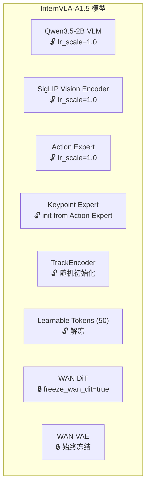
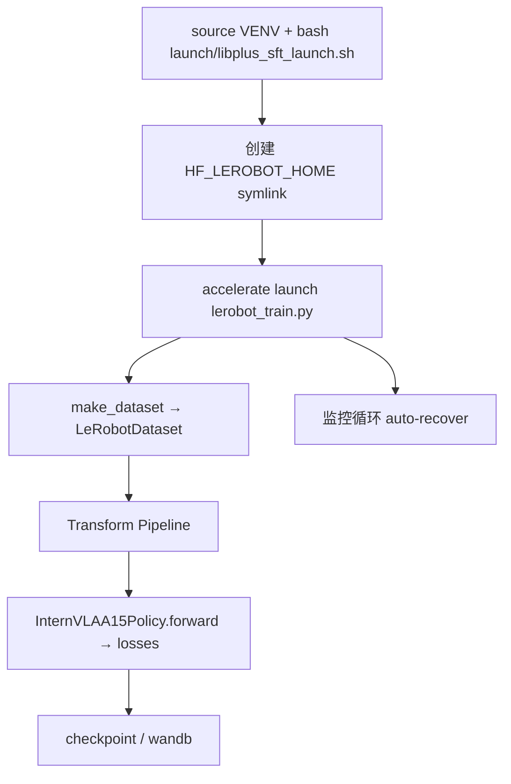
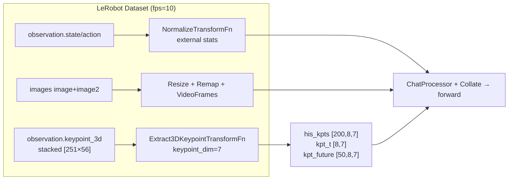
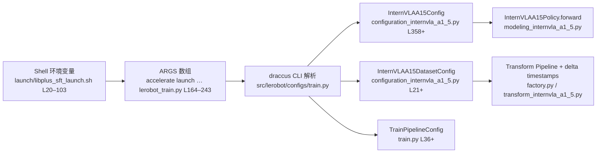

# LIBERO 4D 关键点合并数据集 SFT 训练实施方案与运维手册

> **EXPR_NAME** = `4dwvlaOpvlaLibplusKpt0911`  
> **日期**: 2026-09-11  
> **代码库**: `/B/SRC/itvlaGpLibPlus/`  
> **数据**: `/B/Dta/opvla_libero_merged_kpt/`（273,465 frames，1,693 episodes，40 tasks，8×7D 关键点）  
> **起点**: InternVLA-A1.5-base（无 Warmup 阶段，直接全参数 SFT）  
> **目标**: 在带 4D（pos+rot）关键点的 LIBERO 合并数据上完成 50 epoch 联合训练：Action Expert + Keypoint Expert + WAN Video Foresight + VLM  
> **参考**: [`itvlaGp/b/d/lbrp/sft.md`](../../itvlaGp/b/d/lbrp/sft.md)、[`launch/internvla_a15_finetune_libero_geop.sh`](../../launch/internvla_a15_finetune_libero_geop.sh)、[`itvlaGp/launch/lbrp_sft_launch.sh`](../../itvlaGp/launch/lbrp_sft_launch.sh)

---

## 目录

- [1. 总览与目标](#1-总览与目标)
- [2. 服务器环境分析](#2-服务器环境分析)
- [3. 数据深度分析](#3-数据深度分析)
- [4. 与 Libero-Plus (lbrp) 方案对比](#4-与-libero-plus-lbrp-方案对比)
- [5. 可配置变量表](#5-可配置变量表)
- [6. 训练超参数详解](#6-训练超参数详解)
- [7. 模块冻结策略与学习率分组](#7-模块冻结策略与学习率分组)
- [8. 代码变更与 Launch Script 设计](#8-代码变更与-launch-script-设计)
- [9. 脚本调用流与数据流](#9-脚本调用流与数据流)
- [10. 逐步运维手册](#10-逐步运维手册)
- [11. 监控与自动恢复/重启设计](#11-监控与自动恢复重启设计)
- [12. 测试与验收方案](#12-测试与验收方案)
- [13. 故障排查手册](#13-故障排查手册)
- [14. libplus_sft_launch.sh 超参数有效取值与定义溯源](#14-libplus_sft_launchsh-超参数有效取值与定义溯源)

---

## 1. 总览与目标

### 1.1 训练目标

在 `/B/Dta/opvla_libero_merged_kpt/` 上，从 **InternVLA-A1.5-base** 预训练权重出发，完成 **50 epoch** 的 SFT。训练包含以下四条路径的联合优化：

| 路径 | 损失 | 权重 | 说明 |
|------|------|------|------|
| **Action Expert** (Flow Matching) | `loss_action` | 10.0 | 连续动作预测，50-step chunk |
| **Keypoint Expert** (GeoPredict) | `loss_kpt` + `loss_kpt_future` | 1.0 / 2.0 | 8 关节 × 7D (pos+rot) 关键点轨迹预测 |
| **WAN Video Foresight** | `loss_video` | 1.0 | 冻结 WAN2.2-TI2V-5B DiT，训练 learnable tokens |
| **VQA / FAST Tokens** | `loss_vqa` + `loss_fast` | 1.0 / 1.0 | 语言理解 + FAST 离散动作 token |

总损失：

$$
\mathcal{L} = w_a \mathcal{L}_{action} + w_k (\mathcal{L}_{kpt} + w_{kf}\mathcal{L}_{kpt\_future}) + w_v \mathcal{L}_{video} + w_{vqa}\mathcal{L}_{vqa} + \mathcal{L}_{fast}
$$

其中 $w_a=10.0$，$w_k=1.0$，$w_{kf}=2.0$，$w_v=1.0$，$w_{vqa}=1.0$；`pos_rot` 模式下旋转分量额外乘以 `kpt_rot_loss_weight=1.0`（见 `_kpt_split_loss`）。

### 1.2 关键决策

| 决策点 | 选择 | 理由 |
|--------|------|------|
| **起点** | InternVLA-A1.5-base（无 Warmup） | 数据量较小（27 万帧），直接 SFT 更简单；参考 [`lbrp_sft_launch.sh`](../../itvlaGp/launch/lbrp_sft_launch.sh) |
| **备选两阶段** | Phase1 Warmup + Phase2 SFT | 若直接 SFT 收敛慢，可切换 [`internvla_a15_geop_phase1_libero_warmup.sh`](../../launch/internvla_a15_geop_phase1_libero_warmup.sh) + [`internvla_a15_finetune_libero_geop.sh`](../../launch/internvla_a15_finetune_libero_geop.sh) |
| **TrackEncoder 初始化** | 随机初始化 | `geopredict_checkpoint_path=null` |
| **Kpt Expert 初始化** | 从 Action Expert 复制 | `init_kpt_expert_from_action=true` |
| **action_mode** | `abs`（绝对动作） | LIBERO 7D EE 绝对位姿 + gripper |
| **kpt_4d_mode** | `pos_rot`（7D = 3D pos + 4D quat） | 数据已含合并 56D 关键点 |
| **freeze_learnable_tokens** | `false` | 解冻 WAN foresight tokens，对齐 LIBERO 分布 |
| **robot_type** | 保持 `panda`（不 patch） | 现有 `panda.yaml` schema 已正确映射 `image`/`image2` |
| **MergeKeypointPosQuat** | **不需要** | 数据已是 56D 合并格式，无需 lbrp 的 Merge transform |
| **归一化** | z-score（`use_external_stats=true`） | 使用 `meta/stats.json` 对 state + action |
| **Auto-recover** | 无限重试；无 ckpt 从头训 | 不因缺少 checkpoint 而 FATAL/idle（§11.1） |

### 1.3 训练规模

$$
\begin{aligned}
\text{total\_frames} &= 273{,}465 \\
\text{EBS (effective batch size)} &= 8 \times 32 = 256 \\
\text{steps\_per\_epoch} &= \lceil 273{,}465 / 256 \rceil = 1{,}069 \\
\text{total\_steps} &= 1{,}069 \times 50 = 53{,}450 \\
\text{save\_freq} &= 1{,}069 \times 5 = 5{,}345 \quad \text{(每 5 epoch)} \\
\text{log\_freq} &= 1{,}000 \quad \text{(每 1000 步记录一次)} \\
\end{aligned}
$$

> **预估时长**: 在 8×H200 上约 4 s/iter（含 video + keypoint），总计约 $53{,}450 \times 4 / 3600 \approx 59$ 小时 $\approx 2.5$ 天。实际速度以 Smoke Test 为准。  
> 对比 Libero-Plus lbrp（223 万帧）：本数据约为 **1/8 规模**；50 epoch × EBS=256 总步数为 53,450。

---

## 2. 服务器环境分析

> 以下数据于 **2026-09-11** 在本地服务器实测。

### 2.1 硬件规格

| 项目 | 规格 |
|------|------|
| GPU | 8 × NVIDIA H200（各 143,771 MiB HBM3e） |
| GPU 显存总计 | ~1,144 GiB |
| CPU | 224 核 |
| 系统内存 | 2.8 TiB（可用 ~2.6 TiB） |
| 系统盘 (overlay) | 12 TB XFS，已用 ~1.1 TB，剩余 ~10 TB |
| 家目录 (NFS/Ceph) | 持久存储 checkpoint / 归档 |

### 2.2 关键路径

| 用途 | 路径 | 说明 |
|------|------|------|
| **项目代码** | `/B/SRC/itvlaGpLibPlus/` | `internvla-a1-5` 包（editable install） |
| **VENV** | `/B/VENV/itnvla15rbt20/` | Python 3.11.9 + PyTorch 2.10 + flash-attn |
| **HF_HOME** | `/B/VENV/hf_home/` | HuggingFace cache |
| **HF_LEROBOT_HOME** | `/B/VENV/hf_home/lerobot/` | LeRobot 数据集 symlink 目录 |
| **预训练权重** | `/B/VENV/hf_home/ckpts/InternVLA-A1.5-base/` | VLM + Action Expert |
| **WAN 模型** | `/B/VENV/hf_home/hub/Wan2.2-TI2V-5B/` | DiT + VAE（含 `Wan2.2_VAE.pth`） |
| **训练数据** | `/B/Dta/opvla_libero_merged_kpt/` | 本方案目标数据集（~1.9 GB） |
| **Checkpoint 输出** | `~/b/Ckp/4dwvlaOpvlaLibplusKpt0911/` | NFS 持久存储 |
| **日志输出** | `/B/Log/4dwvlaOpvlaLibplusKpt0911/` | 本地快速写入 |
| **Triton 缓存** | `/tmp/itvla-triton-cache/` | 避免 Ceph 文件锁冲突 |
| **Bigmatrix 脚本** | `b/d/GpRbt/bigmatrix_multiply_optimization.py` | GPU placeholder |

### 2.3 VENV 激活与依赖验证

**所有命令必须先激活 VENV**：

```bash
source /B/VENV/itnvla15rbt20/bin/activate
export HF_HOME=/B/VENV/hf_home
export HF_LEROBOT_HOME=${HF_HOME}/lerobot
export NCCL_TUNER_PLUGIN="${NCCL_TUNER_PLUGIN:-/dev/null}"
cd /B/SRC/itvlaGpLibPlus
```

依赖检查（2026-09-11 实测通过）：

```bash
python -c "import torch; print(torch.__version__, torch.cuda.device_count())"
# 预期: 2.10.0+cu128 8

python -c "import transformers; print(transformers.__version__)"
# 预期: 5.2.0

python -c "from transformers.models.qwen3_5.modeling_qwen3_5 import Qwen3_5ForCausalLM; print('Qwen3.5 patch OK')"
# 预期: Qwen3.5 patch OK

python -c "import flash_attn; print('flash-attn', flash_attn.__version__)"
# 预期: flash-attn 2.8.3

python -c "import fla; print('FLA OK')"
# 预期: FLA OK（VLM unfrozen backward 必需）

python -c "import lerobot; print(lerobot.__file__)"
# 预期: /B/SRC/itvlaGpLibPlus/src/lerobot/__init__.py
```

### 2.4 Qwen3.5 Patch 验证

InternVLA-A1.5 使用自定义 Qwen3.5 模型代码，必须 patch 到 transformers 包：

```bash
TRANSFORMERS_DIR=/B/VENV/itnvla15rbt20/lib/python3.11/site-packages/transformers/
ls ${TRANSFORMERS_DIR}/models/qwen3_5/modeling_qwen3_5.py
# 若不存在，重新 patch:
cp -r src/lerobot/policies/internvla_a1_5/transformers_replace/models ${TRANSFORMERS_DIR}
```

---

## 3. 数据深度分析

### 3.1 数据集概览

| 字段 | 值 |
|------|-----|
| 路径 | `/B/Dta/opvla_libero_merged_kpt/` |
| 格式 | LeRobot v3.0 |
| 总帧数 | 273,465 |
| 总 Episode 数 | 1,693 |
| 平均 Episode 长度 | ~161.5 帧 |
| 任务数 | 40（LIBERO 四套件合并） |
| FPS | **10**（⚠️ 与 lbrp 的 20 fps 不同） |
| 磁盘占用 | ~1.9 GB |
| `robot_type` | `"panda"`（与 `panda.yaml` schema 匹配） |
| 数据来源 | `util_scripts/generate_libero_keypoints.py` 对 LIBERO LeRobot v3 合并集离线 FK 生成 |

### 3.2 特征结构

| 特征键 | 维度 | dtype | 说明 |
|--------|------|-------|------|
| `observation.state` | [8] | float32 | EE 状态（7D pose + 1D gripper） |
| `observation.state.joint_position` | [7] | float32 | 关节角（FK 输入，不参与训练 loss） |
| `action` | [7] | float32 | EE 动作（6D pose + 1D gripper） |
| `observation.keypoint_3d` | **[56]** | float32 | **已合并** 8 joints × 7D (px,py,pz,qx,qy,qz,qw) |
| `observation.images.image` | [256,256,3] | video (AV1) | agentview 相机 |
| `observation.images.image2` | [256,256,3] | video (AV1) | wrist 相机 |
| `task`（meta/tasks.parquet） | - | string | 自然语言任务指令 |

**与 lbrp 数据的关键差异**：本数据集 **没有** 分列的 `observation.keypoint_quat`，也 **没有** `observation.images.wrist_image`；关键点已在生成阶段合并为 56D。

### 3.3 关键点格式（4D = pos + rot）

`meta/keypoints_meta.json` 定义：

| 字段 | 值 |
|------|-----|
| K（关节数） | 8 |
| 关节列表 | `robot0_link1` ~ `robot0_link7` + `gripper0_right_eef` |
| `keypoint_dim_layout` | `px,py,pz,qx,qy,qz,qw`（**xyzw 四元数**，末分量 $q_w$） |
| `rotation_representation` | `quaternion_xyzw_hemisphere`（$q_w \geq 0$） |
| 归一化方法 | `world_origin_isotropic_r_pad`（位置除以 $R_{pad}$，四元数保持单位向量） |
| FK 来源 | MuJoCo robosuite Panda（`generate_libero_keypoints.py`） |

**56D 布局**（每关节 7D，8 关节展平）：

```
observation.keypoint_3d =
  [px₁,py₁,pz₁, qx₁,qy₁,qz₁,qw₁,   # joint 1 (robot0_link1)
   px₂,py₂,pz₂, qx₂,qy₂,qz₂,qw₂,   # joint 2
   ...
   px₈,py₈,pz₈, qx₈,qy₈,qz₈,qw₈]   # joint 8 (gripper0_right_eef)
```

**质量验证**（2026-09-11 抽样）：

- 四元数 L2 范数：min=max=mean=**1.000000**（单位四元数）
- $q_w \geq 0$ 比例：**100%**

`Extract3DKeypointTransformFn` 在 `kpt_4d_mode=pos_rot`、`keypoint_dim=7` 下直接 `reshape(251, 8, 7)`，**无需** Merge transform。

### 3.4 FPS=10 对 Delta Timestamp 的影响

Factory 将帧偏移转为秒：`delta_t = frame_offset / fps`。

| 参数 | fps=20 (lbrp) | fps=10 (本数据) |
|------|---------------|-----------------|
| 历史 200 帧物理时长 | 10 s | **20 s** |
| chunk 50 帧物理时长 | 2.5 s | **5 s** |
| `keypoint_3d_delta_indices` | `[-200..50]` 共 251 帧 | 相同帧数，时间窗口加倍 |

这是数据固有属性，**不需要改代码**；但评估时需意识到本模型在更长时间跨度的历史/未来窗口上训练。

### 3.5 归一化策略

| 特征 | 归一化方式 | 来源 | 说明 |
|------|-----------|------|------|
| `observation.state` [8] | z-score (mean_std) | `meta/stats.json` | `use_external_stats=true` |
| `action` [7] | z-score (mean_std) | `meta/stats.json` | 同上 |
| `observation.keypoint_3d` [56] | **不归一化** | - | R_pad 已在 FK 阶段处理 |
| `observation.state.joint_position` | 不归一化 | - | 不参与训练 |
| 图像 | [0,1] → [-1,1] (WAN) / [0,1] (VLM) | 内置 | `ExtractVideoFramesTransformFn` |

**Stats 关键值**（`meta/stats.json`）：

```
observation.state [8] mean: [-0.0465, 0.0344, 0.7646, 2.9722, ...]
action [7] mean: [0.0628, 0.0868, -0.0904, 0.0005, ...]
```

### 3.6 Schema 匹配

数据集 `robot_type="panda"` 自动匹配 `src/lerobot/dataset_schemas/configs/panda.yaml`：

```yaml
feature_mapping:
  observation.state: [observation.state]
  action: [action]
image_mapping:
  observation.images.image: observation.images.image0
  observation.images.image2: observation.images.image1
```

**结论**：无需 patch `robot_type`，也无需新增 `libero_plus` schema（lbrp 所需的分列 quat / wrist_image 映射在本数据中不存在）。

---

## 4. 与 Libero-Plus (lbrp) 方案对比

| 对比项 | lbrp (`libero_plus_lrb3`) | 本方案 (`opvla_libero_merged_kpt`) |
|--------|---------------------------|-------------------------------------|
| 代码库 | `itvlaGp` | **`itvlaGpLibPlus`** |
| 帧数 | 2,238,036 | **273,465** |
| FPS | 20 | **10** |
| 关键点存储 | 分列 24D + 32D | **合并 56D** |
| 四元数约定 | wxyz（分列） | **xyzw**（合并，末位 qw） |
| 相机键名 | `image` + `wrist_image` | **`image` + `image2`** |
| robot_type | `franka` → patch `libero_plus` | **`panda`（原生匹配）** |
| 必需代码变更 | MergeKeypointPosQuat + factory quat + schema | **仅 Launch Script**（可选 schema 别名） |
| 50 epoch 步数 (EBS=256) | — | **53,450** |
| 起点 | InternVLA-A1.5-base | 同左 |
| Launch 参考 | `lbrp_sft_launch.sh` | **`libplus_sft_launch.sh`（新建）** |

纵向背景：本数据由 [`util_scripts/generate_libero_keypoints.py`](../../util_scripts/generate_libero_keypoints.py) 生成，遵循 InternVLA LIBERO GeoP 管线（[`setup_libero_geop.sh`](../../util_scripts/setup_libero_geop.sh)），与 lbrp 从 RLDS 转换的路径（[`3dkptraj_lbrpls_1A.md`](3dkptraj_lbrpls_1A.md)）不同，但 **训练侧接口一致**（LeRobot v3 + `observation.keypoint_3d` + `kpt_4d_mode=pos_rot`）。

---

## 5. 可配置变量表

| 变量名 | 默认值 | 说明 |
|--------|--------|------|
| `EXPR_NAME` | `4dwvlaOpvlaLibplusKpt0911` | 实验名 |
| `PROJ_ROOT` | `/B/SRC/itvlaGpLibPlus` | 项目根目录 |
| `VENV_ROOT` | `/B/VENV/itnvla15rbt20` | VENV 根目录 |
| `PYTHON` | `${VENV_ROOT}/bin/python` | Python 解释器 |
| `HF_HOME` | `/B/VENV/hf_home` | HuggingFace cache |
| `HF_LEROBOT_HOME` | `${HF_HOME}/lerobot` | LeRobot 数据集目录 |
| `DATA_SRC` | `/B/Dta/opvla_libero_merged_kpt` | 原始数据路径 |
| `DATA_REPO_ID` | `opvla_libero_merged_kpt` | symlink 名 |
| `EXTERNAL_STATS_PATH` | `${DATA_SRC}/meta/stats.json` | 外部归一化统计 |
| `PRETRAINED_PATH` | `${HF_HOME}/ckpts/InternVLA-A1.5-base` | 预训练权重 |
| `WAN_DIR` | `${HF_HOME}/hub/Wan2.2-TI2V-5B` | WAN 模型目录 |
| `CKPT_ROOT` | `${HOME}/b/Ckp/${EXPR_NAME}` | Checkpoint 输出 |
| `LOG_ROOT` | `/B/Log/${EXPR_NAME}` | 日志输出 |
| `CUDA_VISIBLE_DEVICES` | `0,1,2,3,4,5,6,7` | 可见 GPU |
| `PROC_PER_NODE` | `8` | 每节点进程数 |
| `BATCH_SIZE` | `32` | 每 GPU batch size |
| `STEPS` | `53450` | 总步数（50 epoch） |
| `SAVE_FREQ` | `5345` | 保存频率（每 5 epoch） |
| `NUM_WORKERS` | `12` | DataLoader workers |
| `LOG_FREQ` | `1000` | 日志频率（每 1000 步） |
| `SCHEDULER_WARMUP` | `1000` | Warmup 步数 |
| `SCHEDULER_DECAY_STEPS` | `30000` | Cosine decay 步数 |
| `VIDEO_MICRO_BATCH_SIZE` | `2` | WAN video micro-batch（H200 可 2~4） |
| `MASTER_PORT` | `36704` | 分布式端口（避免与 lbrp 36703、geop 36802 冲突） |
| `NCCL_TUNER_PLUGIN` | `/dev/null` | 禁用 NCCL tuner plugin，避免 `ncclInternalError` |
| `SMOKE` / `WAN_SMOKE` | `0` | Smoke 模式 |
| `MONITOR_INTERVAL` | `900` | 监控间隔（秒） |
| `STALE_THRESHOLD` | `900` | 日志 stale 阈值 |
| `MAX_RESUME_ATTEMPTS` | `0` | **0 = 不限制** auto-recover 次数；无 ckpt 时从头训，见 §11.1 |

---

## 6. 训练超参数详解

### 6.1 优化器参数

| 参数 | 值 | 说明 |
|------|-----|------|
| `optimizer_lr` (peak) | `5e-5` | AdamW 峰值 LR |
| `scheduler_decay_lr` | `5e-6` | Cosine 终止 LR |
| `scheduler_warmup_steps` | `1000` | 线性 warmup |
| `scheduler_decay_steps` | `30000` | Cosine decay 在 30k 步结束（早于 total_steps 53,450，之后 LR 保持 `decay_lr`） |
| `optimizer_grad_clip_norm` | `1.0` | 梯度裁剪 |

### 6.2 损失权重

| 损失项 | 参数 | 值 |
|--------|------|-----|
| `loss_action` | `action_loss_weight` | 10.0 |
| `loss_kpt` | `kpt_loss_weight` | 1.0 |
| `loss_kpt_future` | `kpt_future_loss_weight` | 2.0 |
| `loss_kpt_rot` | `kpt_rot_loss_weight` | 1.0 |
| `loss_video` | `video_loss_weight` | 1.0 |
| VQA | `enable_vqa_loss` | true |

### 6.3 批次与数据加载

| 参数 | 值 |
|------|-----|
| per-GPU batch | 32 |
| EBS | 256 |
| `num_workers` | 12 |
| `log_freq` | 1000（每 1000 步打印 loss） |
| `video_backend` | `torchcodec` |
| `dist_loading` | false |
| `use_external_stats` | **true** |

### 6.4 关键点参数

| 参数 | 值 |
|------|-----|
| `enable_keypoint_predictor` | true |
| `num_keypoint_joints` | 8 |
| `kpt_4d_mode` | `pos_rot` |
| `keypoint_history_max_len` | 200 |
| `keypoint_track_input_dim` | 7（自动推导） |
| Delta 窗口 | 251 = 200 + 1 + 50 |
| Stacked `keypoint_3d` | $251 \times 8 \times 7 = 14{,}056$ |

---

## 7. 模块冻结策略与学习率分组



| 模块 | 冻结状态 | 说明 |
|------|----------|------|
| VLM + Vision Encoder | 🔓 | `train_expert_only=false`, `freeze_vision_encoder=false` |
| Action / Kpt Expert | 🔓 | `init_kpt_expert_from_action=true` |
| TrackEncoder | 🔓 | 随机初始化 |
| Learnable Tokens | 🔓 | `freeze_learnable_tokens=false` |
| WAN DiT / VAE | 🔒 | 仅 foresight token 可训练 |

知识隔离全部关闭（`knowledge_insulation=false`, `kpt_to_action_detach=false`），与 lbrp 全参数 SFT 一致。

---

## 8. 代码变更与 Launch Script 设计

### 8.1 代码变更总览

本数据格式与 `itvlaGpLibPlus` 现有 GeoP 管线 **兼容**，**无需** lbrp 的三项 transform/factory 变更：

| lbrp 变更 | 本方案是否需要 | 原因 |
|-----------|----------------|------|
| `MergeKeypointPosQuatTransformFn` | ❌ | 数据已是 56D 合并 |
| `factory.py` keypoint_quat delta | ❌ | 无 quat 分列 |
| `libero_plus` schema | ❌ | `panda.yaml` 已匹配 |

**唯一必需交付物**：新建 `launch/libplus_sft_launch.sh`（基于 [`lbrp_sft_launch.sh`](../../itvlaGp/launch/lbrp_sft_launch.sh)，超参对齐 [`internvla_a15_finetune_libero_geop.sh`](../../launch/internvla_a15_finetune_libero_geop.sh) 的 GeoP 部分）。

### 8.2 Launch Script 与参考脚本映射

| 配置块 | 取自 |
|--------|------|
| VENV / HF_HOME / Triton / LD_LIBRARY_PATH | `lbrp_sft_launch.sh` |
| `NCCL_TUNER_PLUGIN=/dev/null` | 本方案定制（lbrp 为 `libnccl-tuner-disabled.so`） |
| 监控 / auto-restart / bigmatrix | `lbrp_sft_launch.sh` |
| Auto-recover（**无限重试 + 无 ckpt 从头训**） | 改 `_auto_recover()`：`while true`，无 ckpt 时 `_start_fresh_training`（§11.1） |
| GeoP 7D 超参（kpt_4d_mode, loss weights, scheduler_decay_steps） | 本方案定制值（§6） |
| 数据 symlink + stats | `lbrp_sft_launch.sh`（改路径） |
| `PRETRAINED_PATH`（非 WARMUP_CKPT） | `lbrp_sft_launch.sh` |
| STEPS / SAVE_FREQ / LOG_FREQ | 按 273,465 帧、50 epoch、EBS=256 重算 |

### 8.3 核心 CLI 参数（`libplus_sft_launch.sh` 内）

```bash
# Optimizer / scheduler
--policy.optimizer_lr=5e-5
--policy.scheduler_warmup_steps="${SCHEDULER_WARMUP}"
--policy.scheduler_decay_steps=30000
--policy.scheduler_decay_lr=5e-6

# Model / GeoP
--policy.pretrained_path="${PRETRAINED_PATH}"
--policy.enable_keypoint_predictor=true
--policy.num_keypoint_joints=8
--policy.kpt_4d_mode=pos_rot
--policy.kpt_rot_loss_weight=1.0
--policy.action_loss_weight=10.0
--policy.kpt_loss_weight=1.0
--policy.kpt_future_loss_weight=2.0
--policy.init_kpt_expert_from_action=true
--policy.freeze_learnable_tokens=false

# Dataset
--dataset.repo_id="${DATA_REPO_ID}"
--dataset.enable_keypoint_predictor=true
--dataset.kpt_4d_mode=pos_rot
--dataset.use_external_stats=true
--dataset.external_stats_path="${EXTERNAL_STATS_PATH}"
--dataset.action_mode=abs
--dataset.video_backend=torchcodec
```

---

## 9. 脚本调用流与数据流

### 9.1 调用链



### 9.2 数据 Transform 流水线



**注意**：无 `MergeKeypointPosQuatTransformFn` 节点。

### 9.3 Checkpoint 结构

```
~/b/Ckp/4dwvlaOpvlaLibplusKpt0911/
└── 2026_09_11_HH_MM_SS-internvla_a1_5-libplus-sft/
    └── checkpoints/
        ├── 005345/pretrained_model/   # epoch 5
        ├── 010690/pretrained_model/   # epoch 10
        ├── 016035/pretrained_model/   # epoch 15
        ...
        └── 053450/pretrained_model/   # epoch 50 (final)
```

---

## 10. 逐步运维手册

### 10.1 前置条件检查

```bash
source /B/VENV/itnvla15rbt20/bin/activate
export HF_HOME=/B/VENV/hf_home
export HF_LEROBOT_HOME=${HF_HOME}/lerobot
cd /B/SRC/itvlaGpLibPlus

# GPU
nvidia-smi --query-gpu=name,memory.total --format=csv
# 预期: 8 × H200, 143771 MiB

# 预训练权重 & WAN
test -f ${HF_HOME}/ckpts/InternVLA-A1.5-base/config.json && echo "base OK"
test -f ${HF_HOME}/hub/Wan2.2-TI2V-5B/Wan2.2_VAE.pth && echo "WAN OK"

# 数据
python -c "
import json
with open('/B/Dta/opvla_libero_merged_kpt/meta/info.json') as f:
    d = json.load(f)
assert d['features']['observation.keypoint_3d']['shape'] == [56]
print(f'OK: episodes={d[\"total_episodes\"]}, frames={d[\"total_frames\"]}, fps={d[\"fps\"]}, robot_type={d[\"robot_type\"]}')
"
# 预期: OK: episodes=1693, frames=273465, fps=10, robot_type=panda

# Schema
python -c "
from lerobot.dataset_schemas import get_schema
s = get_schema('panda')
print('image_mapping:', s.image_mapping)
"
# 预期: image + image2 → image0 + image1
```

### 10.2 安装/更新代码包

```bash
source /B/VENV/itnvla15rbt20/bin/activate
cd /B/SRC/itvlaGpLibPlus
pip install -e .
```

### 10.3 创建 Launch Script

将 [`lbrp_sft_launch.sh`](../../itvlaGp/launch/lbrp_sft_launch.sh) 复制并修改为 `launch/libplus_sft_launch.sh`，关键 diff：

```bash
# --- 环境变量（相对 lbrp 的差异）---
export NCCL_TUNER_PLUGIN="${NCCL_TUNER_PLUGIN:-/dev/null}"

# --- 路径 ---
EXPR_NAME="${EXPR_NAME:-4dwvlaOpvlaLibplusKpt0911}"
DATA_SRC="${DATA_SRC:-/B/Dta/opvla_libero_merged_kpt}"
DATA_REPO_ID="${DATA_REPO_ID:-opvla_libero_merged_kpt}"
EXTERNAL_STATS_PATH="${EXTERNAL_STATS_PATH:-${DATA_SRC}/meta/stats.json}"
PRETRAINED_PATH="${PRETRAINED_PATH:-${HF_HOME}/ckpts/InternVLA-A1.5-base}"
MASTER_PORT="${MASTER_PORT:-36704}"

# --- 50 epoch @ EBS=256 (8 GPU × batch 32) ---
BATCH_SIZE="${BATCH_SIZE:-32}"
STEPS="${STEPS:-53450}"
SAVE_FREQ="${SAVE_FREQ:-5345}"
LOG_FREQ="${LOG_FREQ:-1000}"
SCHEDULER_WARMUP="${SCHEDULER_WARMUP:-1000}"
SCHEDULER_DECAY_STEPS="${SCHEDULER_DECAY_STEPS:-30000}"

# --- Auto-recover：无限重试；无 checkpoint 则从头训（非 lbrp 的 return 1 / bigmatrix）---
MAX_RESUME_ATTEMPTS="${MAX_RESUME_ATTEMPTS:-0}"   # 0 = 不限制，见 §11.1

# --- 删除 lbrp 的 robot_type patch 块（panda 无需 patch）---
# --- 保留 symlink 创建逻辑 ---

# --- Loss / GeoP 超参 ---
# action_loss_weight=10.0, kpt_loss_weight=1.0, kpt_future_loss_weight=2.0
# kpt_rot_loss_weight=1.0, init_kpt_expert_from_action=true
# freeze_learnable_tokens=false, use_external_stats=true
# scheduler_decay_steps=30000
```

完整脚本结构与 `lbrp_sft_launch.sh` 相同（含监控、auto-recover、auto-restart、bigmatrix），`_auto_resume` 需替换为 §11.1 的 `_auto_recover`；此处不重复 ~570 行，实施时直接 fork 并替换上述变量。

### 10.4 数据 Symlink

Launch script 会自动执行（或手动预创建）：

```bash
source /B/VENV/itnvla15rbt20/bin/activate
export HF_HOME=/B/VENV/hf_home
export HF_LEROBOT_HOME=${HF_HOME}/lerobot
ln -sfn /B/Dta/opvla_libero_merged_kpt ${HF_LEROBOT_HOME}/opvla_libero_merged_kpt
ls -la ${HF_LEROBOT_HOME}/opvla_libero_merged_kpt
```

### 10.5 Smoke Test 流程

```bash
source /B/VENV/itnvla15rbt20/bin/activate
export HF_HOME=/B/VENV/hf_home
cd /B/SRC/itvlaGpLibPlus

# Step 1: WAN smoke（2 step，验证 video + kpt + WAN 路径）
WAN_SMOKE=1 bash launch/libplus_sft_launch.sh

# Step 2: 100 step smoke
SMOKE=1 bash launch/libplus_sft_launch.sh

# 检查
grep -E 'loss_action|loss_kpt|loss_video' /tmp/sft_smoke_libplus_*.log | tail -20
grep -c Traceback /tmp/sft_smoke_libplus_*.log  # 预期 0
```

### 10.6 正式训练启动

```bash
source /B/VENV/itnvla15rbt20/bin/activate
export HF_HOME=/B/VENV/hf_home
cd /B/SRC/itvlaGpLibPlus

# 前台调试（可选）
# bash launch/libplus_sft_launch.sh

# 后台 + 自动监控（推荐）
nohup bash launch/libplus_sft_launch.sh > /tmp/libplus_sft_outer.log 2>&1 &

# 跟踪日志
tail -f /B/Log/4dwvlaOpvlaLibplusKpt0911/*/train.log
```

---

## 11. 监控与自动恢复/重启设计

基于 [`lbrp_sft_launch.sh`](../../itvlaGp/launch/lbrp_sft_launch.sh)，将 **Auto-resume 扩展为 Auto-recover**：不限次数，且 **无 checkpoint 时不退出、不 idle，而是从头重新训练**。

| 机制 | 行为 |
|------|------|
| **Stale 检测** | 日志 ${STALE_THRESHOLD}s 无更新 → 判定失败 |
| **Auto-recover** | 失败/stale 后无限重试：**有 checkpoint 则 resume，无 checkpoint 则从头重新训**（`PRETRAINED_PATH`），直至跑完 50 epoch |
| **Auto-restart** | 成功后 `EXPR_NAME` 后缀 A→B→C 递增重启 |
| **归档** | 每次失败/恢复前后 tar 打包 `/B/Log/${EXPR_NAME}/` 到 `~/b/Ckp/` |
| **Bigmatrix** | 本方案 **不在 recover 失败时启动**（recover 永不因「无 ckpt」而退出）；仅手动停训后可选用 |

### 11.1 Auto-recover 无限重试实现

lbrp 的 `_auto_resume()` 在找不到 checkpoint 时 `return 1`，主循环会打 FATAL 并启动 bigmatrix。**本方案改为 `_auto_recover()`**：

```bash
MAX_RESUME_ATTEMPTS="${MAX_RESUME_ATTEMPTS:-0}"   # 0 = 不限制

_auto_recover() {
    local attempt=0
    while true; do
        attempt=$((attempt + 1))
        latest_ckpt=$(_find_latest_checkpoint)

        _kill_gpu_processes
        pkill -f "bigmatrix_multiply" 2>/dev/null || true
        sleep 5

        local recover_stamp
        recover_stamp=$(date +'%Y_%m_%d_%H_%M_%S')
        LOG_FILE="${LOG_ROOT}/${recover_stamp}/train.log"
        mkdir -p "$(dirname "${LOG_FILE}")"

        if [[ -n "${latest_ckpt}" ]]; then
            _monitor_log "RECOVER: Resume from ${latest_ckpt} (attempt ${attempt}, unlimited)"
            "${PYTHON}" -m accelerate.commands.launch "${LAUNCH_ARGS[@]}" \
                src/lerobot/scripts/lerobot_train.py \
                --config_path="${latest_ckpt}/train_config.json" \
                --resume=true \
                --output_dir="${OUTPUT_DIR}" \
                --num_workers="${NUM_WORKERS}" \
                --job_name="${JOB_NAME}" \
                >> "${LOG_FILE}" 2>&1 &
        else
            _monitor_log "RECOVER: No checkpoint — fresh start from base (attempt ${attempt}, unlimited)"
            "${PYTHON}" -m accelerate.commands.launch "${LAUNCH_ARGS[@]}" \
                "${ARGS[@]}" \
                >> "${LOG_FILE}" 2>&1 &
        fi
        TRAIN_PID=$!

        # 内层监控（与 lbrp _auto_resume 相同）
        local poll_sec=60
        local elapsed=0
        while true; do
            sleep ${poll_sec}
            elapsed=$((elapsed + poll_sec))

            if ! kill -0 "${TRAIN_PID}" 2>/dev/null; then
                wait "${TRAIN_PID}" 2>/dev/null
                local recover_exit=$?
                _monitor_log "RECOVER: Training exited (code=${recover_exit})"
                sleep 10

                if [[ "${recover_exit}" -eq 0 ]] && _are_outputs_complete; then
                    _monitor_log "RECOVER: SUCCESS — Training completed"
                    return 0
                fi
                break   # 单次 recover 失败 → 外层 while true 再试（resume 或 fresh）
            fi

            if [[ ${elapsed} -ge ${MONITOR_INTERVAL} ]]; then
                elapsed=0
                if _is_log_stale; then
                    _monitor_log "RECOVER: Log stale >${STALE_THRESHOLD}s — will retry"
                    break
                fi
                local cur_step
                cur_step=$(grep -oE 'step:[0-9]+' "${LOG_FILE}" 2>/dev/null | tail -1 | grep -oE '[0-9]+$')
                _monitor_log "RECOVER: Healthy step=${cur_step:-?}/${STEPS}"
            fi
        done

        _monitor_log "RECOVER: Attempt ${attempt} ended without success — retrying"
    done
}
```

**主监控循环**（替换 lbrp 中 `_auto_resume` 失败分支）：

```bash
        else
            _monitor_log "ERROR: exit=${train_exit}, outputs_complete=$(_are_outputs_complete && echo yes || echo no)"
            _archive_and_cleanup "_err"
            if _auto_recover; then
                _archive_and_cleanup "_resumed"
                _auto_restart_next
            fi
            # 无 else/FATAL：_auto_recover 仅在成功时 return 0，否则一直循环
        fi
```

**触发 auto-recover 的条件**（与 lbrp 相同）：

1. 训练进程异常退出（exit ≠ 0 或 final checkpoint 未生成）
2. 训练进程仍存活但日志 stale 超过 ${STALE_THRESHOLD}s

**恢复策略**（每次进入 `_auto_recover` 外层循环时）：

| 条件 | 动作 |
|------|------|
| `checkpoints/*/pretrained_model` 存在 | `--resume=true`，从最新 ckpt 继续 |
| **无任何 checkpoint** | **从头训练**：`accelerate launch "${ARGS[@]}"`（`pretrained_path=${PRETRAINED_PATH}`，无 `--resume`） |
| 单次运行再次失败/stale | 不退出，回到外层 `while true` 再判断 resume 或 fresh |

**终止 auto-recover 的唯一条件**：

- 训练正常跑完（exit=0 且 `checkpoints/053450/pretrained_model` 存在）→ `return 0` → 归档 → `_auto_restart_next`

> 与 lbrp 差异：lbrp 在无 ckpt 或 resume 次数用尽时 `return 1` 并 idle bigmatrix；本方案 **永不因此停止**，无 ckpt 即 fresh start。

> 若需临时恢复 lbrp 行为，保留原 `_auto_resume` + `MAX_RESUME_ATTEMPTS=3` + FATAL/bigmatrix 分支。

监控命令：

```bash
grep -oE 'step:[0-9]+' /B/Log/4dwvlaOpvlaLibplusKpt0911/*/train.log | tail -1
nvidia-smi --query-gpu=utilization.gpu,memory.used --format=csv
```

---

## 12. 测试与验收方案

### 12.1 单元测试

#### 测试 1：Schema 与特征映射

```bash
source /B/VENV/itnvla15rbt20/bin/activate
cd /B/SRC/itvlaGpLibPlus
python -c "
from lerobot.dataset_schemas import get_schema
s = get_schema('panda')
assert 'observation.state' in s.get_state_keys()
assert 'action' in s.get_action_keys()
assert s.image_mapping['observation.images.image2'] == 'observation.images.image1'
print('✅ panda schema OK')
"
```

#### 测试 2：关键点 reshape（56D → 7D×8）

```bash
python -c "
import pyarrow.parquet as pq, numpy as np
t = pq.read_table('/B/Dta/opvla_libero_merged_kpt/data/chunk-000/file-000.parquet',
                  columns=['observation.keypoint_3d'])
k = np.stack(t.column('observation.keypoint_3d').to_numpy())
assert k.shape[1] == 56
k7 = k.reshape(-1, 8, 7)
norms = np.linalg.norm(k7[:,:,3:7], axis=-1)
assert np.allclose(norms, 1.0)
print(f'✅ keypoint reshape OK, samples={len(k)}')
"
```

#### 测试 3：Transform Pipeline（无 Merge）

```bash
python -c "
from lerobot.policies.internvla_a1_5.configuration_internvla_a1_5 import InternVLAA15DatasetConfig
from lerobot.policies.internvla_a1_5.transform_internvla_a1_5 import Extract3DKeypointTransformFn
cfg = InternVLAA15DatasetConfig(
    enable_keypoint_predictor=True,
    num_keypoint_joints=8,
    kpt_4d_mode='pos_rot',
    keypoint_history_max_len=200,
    action_mode='abs',
)
tfs = cfg.data_transforms.inputs
names = [type(t).__name__ for t in tfs]
assert 'Extract3DKeypointTransformFn' in names
assert 'MergeKeypointPosQuatTransformFn' not in names
extract = [t for t in tfs if isinstance(t, Extract3DKeypointTransformFn)][0]
assert extract.keypoint_dim == 7
print('✅ pipeline:', [n for n in names if 'Keypoint' in n or 'Normalize' in n])
"
```

#### 测试 4：Delta Timestamps（fps=10）

```bash
python -c "
from unittest.mock import MagicMock
from lerobot.datasets.factory import _build_delta_timestamps
ds_meta = MagicMock()
ds_meta.fps = 10
ds_meta.features = {
    'observation.keypoint_3d': {},
    'observation.state': {},
    'action': {},
}
cfg = MagicMock()
cfg.observation_delta_indices = None
cfg.action_delta_indices = list(range(50))
cfg.reward_delta_indices = None
cfg.keypoint_3d_delta_indices = list(range(-200, 51))
cfg.image_delta_indices = [0, 12, 25, 37, 50]
dt = _build_delta_timestamps(cfg, ds_meta)
assert len(dt['observation.keypoint_3d']) == 251
assert dt['observation.keypoint_3d'][0] == -20.0  # -200/10
print('✅ delta timestamps OK, first=', dt['observation.keypoint_3d'][0])
"
```

### 12.2 WAN Smoke 验收

| 检查项 | 通过标准 |
|--------|----------|
| 无 Python 异常 | `grep -c Traceback log` = 0 |
| 所有 loss 出现 | loss_action, loss_kpt, loss_kpt_future, loss_video |
| 无 NaN/Inf | `grep -iE 'nan|inf' log` 为空 |
| video 解码 | post_check: video_decode_error=0 |
| Exit code | 0 |

### 12.3 正式训练早期验收（前 1000 步）

| 检查项 | 通过标准 |
|--------|----------|
| Loss 不发散 | 100 步内可判断 |
| loss_action 下降 | step 0 vs 1000 对比 |
| GPU 利用率 | 8 GPU > 80% |
| 第一个 ckpt | step 5345 目录存在 |

### 12.4 最终验收清单

- [ ] 单元测试 1~4 通过
- [ ] WAN_SMOKE=1 通过
- [ ] SMOKE=1（100 步）通过
- [ ] 正式训练启动，前 1000 步 loss 正常
- [ ] checkpoint 005345（epoch 5）成功保存
- [ ] checkpoint 053450（epoch 50, final）成功保存
- [ ] 现有 Franka/RoboTwin 训练仍可启动（向后兼容）

---

## 13. 故障排查手册

### 13.1 `ncclInternalError`

**原因**：GCP/容器环境下 NCCL tuner plugin 无配置文件。

**解决**：

```bash
export NCCL_TUNER_PLUGIN=/dev/null
```

Launch script 已默认设置（**注意**：本方案用 `/dev/null`，lbrp 用 `libnccl-tuner-disabled.so`）。

### 13.2 `RuntimeError: shape mismatch` in Extract3DKeypointTransformFn

**现象**：reshape 期望 d=7 但数据为 24D 或 3D。

**原因**：`kpt_4d_mode` 未设为 `pos_rot`，或使用了错误的 dataset repo。

**解决**：

```bash
grep kpt_4d_mode launch/libplus_sft_launch.sh
# 必须为 pos_rot
python -c "import json; d=json.load(open('/B/Dta/opvla_libero_merged_kpt/meta/info.json')); print(d['features']['observation.keypoint_3d']['shape'])"
# 必须为 [56]
```

### 13.3 `Unknown robot_type 'panda'`

**原因**：schema 未加载。

**解决**：确认 `pip install -e .` 后 `panda.yaml` 存在于 `src/lerobot/dataset_schemas/configs/`。

### 13.4 视频解码错误 `[video_decode_error]`

**原因**：torchcodec / NPP 库路径问题。

**解决**：

```bash
export LD_LIBRARY_PATH="/usr/local/nvidia/lib64:/B/VENV/itnvla15rbt20/lib/python3.11/site-packages/nvidia/npp/lib:${LD_LIBRARY_PATH}"
# 或降级测试: --dataset.video_backend=pyav
```

### 13.5 FLA / tilelang 缺失（VLM backward 失败）

```bash
pip install flash-linear-attention==0.5.0 --no-build-isolation
python -c "import fla; print('OK')"
```

### 13.6 OOM on WAN 路径

```bash
VIDEO_MICRO_BATCH_SIZE=1 bash launch/libplus_sft_launch.sh
# 或 BATCH_SIZE=16
```

### 13.7 数据 symlink 找不到

```bash
ls -la ${HF_LEROBOT_HOME}/opvla_libero_merged_kpt
ln -sfn /B/Dta/opvla_libero_merged_kpt ${HF_LEROBOT_HOME}/opvla_libero_merged_kpt
```

---

## 附录 A：参考文档与代码出处

| 参考对象 | 路径 / URL | 本方案引用内容 |
|----------|------------|----------------|
| Libero-Plus SFT 手册 | `itvlaGp/b/d/lbrp/sft.md` | 整体结构、监控、验收流程 |
| GeoP LIBERO Phase2 | `launch/internvla_a15_finetune_libero_geop.sh` | GeoP 7D 超参、WAN 配置 |
| Libero-Plus Launch | `itvlaGp/launch/lbrp_sft_launch.sh` | VENV 路径、监控（本方案改为 auto-recover） |
| 关键点生成 | `util_scripts/generate_libero_keypoints.py` | 56D 布局、R_pad 归一化 |
| 数据管线 | `util_scripts/setup_libero_geop.sh` | 端到端 FK 流程说明 |
| InternVLA-A1.5 论文 | [arXiv:2607.04988](https://arxiv.org/abs/2607.04988) | 模型架构与多任务 loss 设计 |

---

## 附录 B：实施 Checklist（第三方工程师）

1. `source /B/VENV/itnvla15rbt20/bin/activate && export HF_HOME=/B/VENV/hf_home && export NCCL_TUNER_PLUGIN=/dev/null`
2. `cd /B/SRC/itvlaGpLibPlus && pip install -e .`
3. 运行 §10.1 前置检查
4. 运行 §12.1 单元测试 1~4
5. 创建 `launch/libplus_sft_launch.sh`（§10.3）
6. `WAN_SMOKE=1 bash launch/libplus_sft_launch.sh`
7. `SMOKE=1 bash launch/libplus_sft_launch.sh`
8. 正式训练：`nohup bash launch/libplus_sft_launch.sh &`
9. 按 §12.4 完成验收

---

## 14. `libplus_sft_launch.sh` 超参数有效取值与定义溯源

> 本节基于 `launch/libplus_sft_launch.sh`（476 行）逐行追踪至 Python dataclass / 校验逻辑 / 数据集元数据。  
> **「脚本默认值」** 指不加任何环境变量直接 `bash launch/libplus_sft_launch.sh` 时的生产配置；**「Smoke 默认」** 指 `WAN_SMOKE=1` 或 `SMOKE=1` 分支。

### 14.1 参数传递链路



**Resume 注意**：`_auto_recover` 恢复训练时使用 `--config_path=…/train_config.json --resume=true`（脚本 L343–346），**checkpoint 内保存的配置优先**，CLI 仅覆盖 `output_dir / num_workers / job_name`。改超参应在新 run 或删旧 `output_dir` 后重跑。

---

### 14.2 Shell 环境变量（运行前 `export` 可覆盖）

| 变量 | 脚本默认（生产） | WAN_SMOKE=1 | SMOKE=1 | 有效取值 / 约束 | 定义位置 |
|------|------------------|-------------|---------|-----------------|----------|
| `EXPR_NAME` | `4dwvlaOpvlaLibplusKpt0911` | 同左 | 同左 | 任意非空字符串；影响 ckpt/log 目录名 | `launch/libplus_sft_launch.sh:22` |
| `PROJ_ROOT` | 脚本上级目录 | 同左 | 同左 | 存在的项目根路径 | `:21` |
| `VENV_ROOT` | `/B/VENV/itnvla15rbt20` | 同左 | 同左 | 含 `bin/python` 的 venv 根 | `:23` |
| `PYTHON` | `${VENV_ROOT}/bin/python` | 同左 | 同左 | 可执行 Python 路径 | `:24` |
| `HF_HOME` | `/B/VENV/hf_home` | 同左 | 同左 | HuggingFace 缓存根 | `:26` |
| `HF_LEROBOT_HOME` | `${HF_HOME}/lerobot` | 同左 | 同左 | LeRobot 数据集 symlink 目录 | `:27` |
| `WANDB_MODE` | `offline` | 同左 | 同左 | `online` \| `offline` \| `disabled`（传给 wandb SDK） | `:28`；语义见 `configs/default.py:80` |
| `USE_LIBUV` | `0` | 同左 | 同左 | `0` \| `1` | `:29` |
| `OMP_NUM_THREADS` / `MKL_NUM_THREADS` | `1` | 同左 | 同左 | 正整数 | `:31–32` |
| `NCCL_TUNER_PLUGIN` | `/dev/null` | 同左 | 同左 | 共享库路径或 `/dev/null`（禁用 tuner） | `:34` |
| `TRITON_CACHE_DIR` | `/tmp/itvla-triton-cache` | 同左 | 同左 | 可写目录 | `:35` |
| `DATA_SRC` | `/B/Dta/opvla_libero_merged_kpt` | 同左 | 同左 | LeRobot v3 数据集根（含 `meta/info.json`） | `:44` |
| `DATA_REPO_ID` | `opvla_libero_merged_kpt` | 同左 | 同左 | symlink 名；须与 `--dataset.repo_id` 一致 | `:45` |
| `EXTERNAL_STATS_PATH` | `${DATA_SRC}/meta/stats.json` | 同左 | 同左 | 存在且与 `action_mode` 匹配的 stats 文件 | `:46` |
| `PRETRAINED_PATH` | `${HF_HOME}/ckpts/InternVLA-A1.5-base` | 同左 | 同左 | 含 `config.json` 的预训练 ckpt 目录 | `:47` |
| `VLM_PATH` | `Qwen/Qwen3.5-2B` | 同左 | 同左 | HF Hub id 或本地路径；代码注释支持 2B/4B/8B | `:48`；`configuration_internvla_a1_5.py:361–362` |
| `WAN_DIR` | `${HF_HOME}/hub/Wan2.2-TI2V-5B` | 同左 | 同左 | 须含 `config.json` + `Wan2.2_VAE.pth`（preflight L111–122） | `:49` |
| `VIDEO_MICRO_BATCH_SIZE` | `2` | 同左 | 同左 | 正整数；OOM 时可降为 `1`（§13.6） | `:50`；policy 默认 `1` 见 `configuration_internvla_a1_5.py:451` |
| `MASTER_ADDR` | `127.0.0.1` | 同左 | 同左 | 多机训练主节点 IP | `:52` |
| `MASTER_PORT` | `36704` | 同左 | 同左 | 1–65535；避免与 lbrp `36703`、geop `36802` 冲突 | `:53` |
| `CKPT_ROOT` | `${HOME}/b/Ckp/${EXPR_NAME}` | Smoke 时用 `/tmp/…` | 同 WAN_SMOKE | checkpoint 根目录 | `:55`；Smoke `:135` |
| `LOG_ROOT` | `/B/Log/${EXPR_NAME}` | 同左 | 同左 | 日志根目录 | `:56` |
| `MONITOR_INTERVAL` | `900` | 不启用监控 | 不启用 | 秒；生产模式健康检查间隔 | `:58` |
| `STALE_THRESHOLD` | `900` | 不启用 | 不启用 | 秒；日志无更新则触发 recover | `:59` |
| `BIGMATRIX_SCRIPT` | `b/d/GpRbt/bigmatrix_multiply_optimization.py` | 同左 | 同左 | GPU placeholder 脚本路径 | `:60` |
| `BIGMATRIX_MAX_RETRIES` | `5` | 同左 | 同左 | 非负整数 | `:61` |
| `MAX_RESUME_ATTEMPTS` | `0` | 同左 | 同左 | **当前脚本未引用**；`0` 在文档中表示「无限 recover」 | `:62`（仅定义） |
| `ENABLE_AUTO_RESTART` | `false` | 同左 | 同左 | `true` \| `false`；成功后自动 `_next_suffix` 重跑 | `:63`；逻辑 `:401–414` |
| `SCHEDULER_DECAY_STEPS` | `30000` | 同左 | 同左 | 正整数；若 `steps < decay_steps` 会自动缩放（见 §14.5） | `:65` |
| `WAN_SMOKE` | `0` | `1` | `0` | `0` \| `1`；2 step WAN 通路 smoke | `:67,70–80` |
| `SMOKE` | `0` | `0` | `1` | `0` \| `1`；100 step 训练 smoke | `:68,81–91` |
| `CUDA_VISIBLE_DEVICES` | `0,1,2,3,4,5,6,7` | `0` | `0` | 逗号分隔 GPU index | `:71,82,93` |
| `PROC_PER_NODE` | `8` | `1` | `1` | 正整数；应 ≤ 可见 GPU 数 | `:72,83,94` |
| `BATCH_SIZE` | `32` | `2` | `2` | 正整数；**每 GPU** micro-batch | `:73,84,95` |
| `STEPS` | `53450` | `2` | `100` | 正整数；见 §14.6 与 epoch 换算 | `:74,85,96` |
| `NUM_WORKERS` | `12` | `2` | `2` | 非负整数；DataLoader workers | `:75,86,97` |
| `SAVE_FREQ` | `5345` | `2` | `100` | 正整数 | `:76,87,98` |
| `LOG_FREQ` | `1000` | `1` | `10` | 正整数 | `:77,88,99` |
| `SCHEDULER_WARMUP` | `1000` | `1` | `50` | 非负整数 | `:78,89,100` |
| `WANDB_ENABLE` | `true` | `false` | `false` | `true` \| `false` | `:79,90,101` |
| `NODE_COUNT` | `1` | 同左 | 同左 | ≥1 | `:105` |
| `NODE_RANK` | `0` | 同左 | 同左 | `0 … NODE_COUNT-1` | `:106` |
| `JOB_STAMP` / `JOB_NAME` / `OUTPUT_DIR` / `LOG_FILE` | 自动生成 | 可选覆盖 | 同左 | 路径 / 时间戳字符串 | `:131–140` |

**分布式进程数**：`NUM_PROCESSES = NODE_COUNT × PROC_PER_NODE`（`:107`）；`>1` 时追加 `--multi_gpu`（`:153–155`）。

---

### 14.3 训练管线 CLI（`lerobot_train.py` 顶层）

| CLI 参数 | 脚本传入值 | 有效取值 / 约束 | 定义位置 |
|----------|-----------|-----------------|----------|
| `--output_dir` | `${OUTPUT_DIR}` | 非 resume 时目录不得已存在（`train.py:105–108`） | `launch/libplus_sft_launch.sh:168`；`train.py:42,105–108` |
| `--num_workers` | `${NUM_WORKERS}` | `int ≥ 0` | `:169`；`train.py:53` |
| `--job_name` | `${JOB_NAME}` | 任意字符串 | `:170`；`train.py:43` |
| `--seed` | `42` | `int` 或 `None` | `:234`；`train.py:51` |
| `--batch_size` | `${BATCH_SIZE}` | `int ≥ 1`；EBS = `batch_size × NUM_PROCESSES` | `:235`；`train.py:54` |
| `--steps` | `${STEPS}` | `int ≥ 1` | `:236`；`train.py:55` |
| `--save_freq` | `${SAVE_FREQ}` | `int ≥ 1` | `:237`；`train.py:60` |
| `--log_freq` | `${LOG_FREQ}` | `int ≥ 1` | `:238`；`train.py:57` |
| `--wandb.enable` | `${WANDB_ENABLE}` | `true` \| `false` | `:240`；`default.py:73` |
| `--wandb.project` | `internvla_a1_5` | 任意字符串 | `:241`；`default.py:76` |
| `--wandb.mode` | `offline` | `online` \| `offline` \| `disabled` | `:242`；`default.py:80` |

**未在脚本中显式传入、沿用默认的训练项**（仍生效）：

| 参数 | 默认值 | 定义位置 |
|------|--------|----------|
| `use_policy_training_preset` | `true` | `train.py:61` |
| `eval_freq` | `20000` | `train.py:56` |
| `save_checkpoint` | `true` | `train.py:58` |
| `resume` | `false`（recover 时改为 `true`） | `train.py:48` |

---

### 14.4 Policy 超参（`--policy.*`）

| CLI 参数 | 脚本值 | 有效取值 / 约束 | 定义位置 |
|----------|--------|-----------------|----------|
| `--policy.type` | `internvla_a1_5` | ChoiceRegistry：`internvla_a1_5` \| `pi0` \| `pi0_fast` \| `pi05`；本方案固定前者 | `:43,172`；`configuration_internvla_a1_5.py:358` |
| `--policy.repo_id` | `lerobot_lab/internvla_a1_5` | 字符串（`push_to_hub=false` 时不校验 Hub） | `:173`；`policies.py:67` |
| `--policy.push_to_hub` | `false` | `true` \| `false` | `:174` |
| `--policy.pretrained_path` | `${PRETRAINED_PATH}` | 目录路径 | `:175`；`policies.py:77` |
| `--policy.gradient_checkpointing` | `true` | `true` \| `false` | `:176`；`configuration_internvla_a1_5.py:398` |
| `--policy.dtype` | `bfloat16` | **`bfloat16` \| `float32`**；否则 `ValueError` | `:177`；`:518–519` |
| `--policy.vlm_model_name_or_path` | `${VLM_PATH}` | HF 模型 id / 本地路径 | `:178`；`:361–362` |
| `--policy.optimizer_lr` | `5e-5` | `float > 0`（默认 `2.5e-5`） | `:180`；`:404` |
| `--policy.scheduler_warmup_steps` | `${SCHEDULER_WARMUP}` | `int ≥ 0`（默认 `1000`） | `:181`；`:410` |
| `--policy.scheduler_decay_steps` | `${SCHEDULER_DECAY_STEPS}` | `int > 0`（默认 `30000`） | `:182`；`:411` |
| `--policy.scheduler_decay_lr` | `5e-6` | `float > 0`（默认 `2.5e-6`） | `:183`；`:412` |
| `--policy.train_expert_only` | `false` | `true` \| `false` | `:185`；`:417` |
| `--policy.knowledge_insulation` | `false` | `true` \| `false` | `:186`；`:429` |
| `--policy.knowledge_insulation_kpt` | `false` | `true` \| `false` | `:187`；`:475` |
| `--policy.freeze_vision_encoder` | `false` | `true` \| `false` | `:188`；`:416` |
| `--policy.enable_vqa_loss` | `true` | `true` \| `false` | `:189`；`:420` |
| `--policy.tokenize_state` | `true` | `true` \| `false` | `:190`；`:422` |
| `--policy.action_loss_only` | `false` | `true` 时跳过 WAN 分支（`:1946`） | `:192`；`:454` |
| `--policy.video_loss_weight` | `1` | `float ≥ 0`；`0` 等效跳过 video loss | `:193`；`:452,1946` |
| `--policy.video_loss_only` | `false` | `true` 时仅训 video（`:1937`） | `:194`；`:453` |
| `--policy.freeze_wan_dit` | `true` | `true` \| `false` | `:195`；`:445` |
| `--policy.freeze_learnable_tokens` | `false` | `true` \| `false` | `:196`；`:455` |
| `--policy.num_learnable_tokens` | `50` | 正整数（WAN foresight token 数） | `:197`；`:438` |
| `--policy.wan_checkpoint_path` | `${WAN_DIR}` | 目录路径 | `:198`；`:440` |
| `--policy.wan_config_path` | `${WAN_DIR}` | 目录路径 | `:199`；`:441` |
| `--policy.vae_path` | `${WAN_DIR}/Wan2.2_VAE.pth` | 文件路径 | `:200`；`:442` |
| `--policy.video_micro_batch_size` | `${VIDEO_MICRO_BATCH_SIZE}` | 正整数 | `:201`；`:451` |
| `--policy.enable_keypoint_predictor` | `true` | `true` \| `false` | `:203`；`:462` |
| `--policy.num_keypoint_joints` | `8` | **`> 0`**；须满足 `observation.keypoint_3d.shape[0] % (joints × dim) == 0` | `:204`；`:463,533–534` |
| `--policy.kpt_4d_mode` | `pos_rot` | **`pos_only` \| `pos_rot`**；否则 `ValueError` | `:205`；`:501,505–510` |
| `--policy.kpt_rot_loss_weight` | `1.0` | `float ≥ 0`（仅 `pos_rot` 旋转分量） | `:206`；`:502` |
| `--policy.keypoint_history_max_len` | `200` | 正整数 `H`；决定 delta 窗口 `H+1+chunk_size` | `:207`；`:499,599–617` |
| `--policy.action_loss_weight` | `10.0` | `float ≥ 0` | `:209`；`:466` |
| `--policy.kpt_loss_weight` | `1.0` | **`float ≥ 0`** | `:210`；`:467,535–536` |
| `--policy.kpt_future_loss_weight` | `2.0` | **`float ≥ 0`** | `:211`；`:468,537–538` |
| `--policy.kpt_to_action_detach` | `false` | `true` \| `false` | `:212`；`:476` |
| `--policy.init_kpt_expert_from_action` | `true` | `true` \| `false` | `:213`；`:489` |
| `--policy.freeze_keypoint_modules` | `false` | `true` \| `false` | `:215`；`:480` |
| `--policy.action_expert_lr_scale` | `1.0` | 正浮点（× base LR） | `:216`；`:484` |
| `--policy.kpt_expert_lr_scale` | `1.0` | 正浮点 | `:217`；`:485` |
| `--policy.track_encoder_lr_scale` | `1.0` | 正浮点 | `:218`；`:486` |

**Policy 未覆盖但影响训练的隐含默认**：

| 字段 | 默认值 | 说明 | 定义位置 |
|------|--------|------|----------|
| `chunk_size` / `n_action_steps` | `50` | action chunk 与未来 kpt 帧数 | `:371–372` |
| `max_state_dim` / `max_action_dim` | `32` | state/action padding 上限 | `:374–375` |
| `optimizer_betas` | `(0.9, 0.95)` | AdamW | `:405` |
| `optimizer_weight_decay` | `0.01` | AdamW | `:407` |
| `optimizer_grad_clip_norm` | `1.0` | 梯度裁剪 | `:408` |
| `num_video_frames` | `4` | WAN 输入帧数（+1 当前帧） | `:446` |
| `video_height` / `video_width` | `224` | 视频 resize | `:447–448` |
| `inference_backend` | `standard` | 训练时不改；推理可选 `optimized`（须 `action_loss_only=true`） | `:433,526–532` |
| `lambda_vqa` | `1.0` | VQA loss 权重 | `:421,520–521` |
| `geopredict_checkpoint_path` | `null` | TrackEncoder 随机初始化 | `:490` |

---

### 14.5 Dataset 超参（`--dataset.*`）

| CLI 参数 | 脚本值 | 有效取值 / 约束 | 定义位置 |
|----------|--------|-----------------|----------|
| `--dataset.type` | `internvla_a1_5` | 须与 policy 类型匹配的数据集 config | `:220`；`configuration_internvla_a1_5.py:21` |
| `--dataset.repo_id` | `${DATA_REPO_ID}` | 字符串；对应 `${HF_LEROBOT_HOME}/${repo_id}` symlink | `:221`；`default.py:33` |
| `--dataset.enable_keypoint_predictor` | `true` | 须与 policy 一致 | `:222` |
| `--dataset.num_keypoint_joints` | `8` | 同 policy | `:223` |
| `--dataset.kpt_4d_mode` | `pos_rot` | **`pos_only` \| `pos_rot`** | `:224`；`:41,76–79` |
| `--dataset.keypoint_history_max_len` | `200` | 须与 policy 一致 | `:225` |
| `--dataset.action_mode` | `abs` | **`abs` \| `delta`**；`delta` 时自动插入 `DeltaActionTransformFn` | `:226`；`default.py:47,53`；`:82–88` |
| `--dataset.use_external_stats` | `true` | `true` \| `false` | `:227`；`default.py:40` |
| `--dataset.external_stats_path` | `${EXTERNAL_STATS_PATH}` | JSON 路径 | `:228` |
| `--dataset.dist_loading` | `false` | `true` \| `false` | `:229`；`default.py:45` |
| `--dataset.tokenize_state` | `true` | 须与 policy 一致 | `:230` |
| `--dataset.use_fast_action_tokens` | `true` | `true` \| `false` | `:231`；`configuration_internvla_a1_5.py:32,104–108` |
| `--dataset.video_backend` | `torchcodec` | **`torchcodec` \| `pyav` \| `video_reader`**；否则 `ValueError` | `:232`；`video_utils.py:68–75` |

**Dataset 隐含默认（脚本未改）**：

| 字段 | 默认值 | 定义位置 |
|------|--------|----------|
| `height` / `width` | `224` | `configuration_internvla_a1_5.py:24–25` |
| `chunk_size` | `50` | `:31` |
| `max_prompt_length` | `650` | `:29` |
| `num_video_frames` | `4` | `:33` |
| `use_imagenet_stats` | `true`（被 `use_external_stats=true` 覆盖行为） | `default.py:39–40` |

**Delta timestamp 推导**（policy property，非 CLI）：

| 键 | 索引范围（本方案） | 定义位置 |
|----|-------------------|----------|
| `action` | `0…49`（50 步） | `configuration_internvla_a1_5.py:586–587` |
| `observation.keypoint_3d` | `-200…50`（251 帧） | `:599–617` |
| `observation.images.*` | `[0, 12, 25, 37, 50]`（5 帧 @ fps=10） | `:594–596` |

---

### 14.6 与数据集绑定的「有效组合」（本仓库实测数据）

以下取值来自 `/B/Dta/opvla_libero_merged_kpt/meta/`，**与本 launch 脚本默认一致**；若换数据集须同步修改：

| 约束 | 数据侧证据 | 脚本 / 配置 |
|------|-----------|-------------|
| `num_keypoint_joints = 8` | `keypoints_meta.json:18` `"num_keypoints": 8` | `:204,223` |
| `kpt_4d_mode = pos_rot`（7D） | `keypoints_meta.json:15–17` | `:205,224` |
| `observation.keypoint_3d.shape = [56]` | `8 × 7 = 56`；`info.json` features | 数据 §3.2 |
| `action_mode = abs` | stats 自 `meta/stats.json` 生成 | `:226` |
| `fps = 10` | `info.json:3` | delta 时间 = index/10 s |
| `robot_type = panda` | `info.json` | schema `panda.yaml` |
| `STEPS = 53450` | $\lceil 273465 / 256 \rceil \times 50$ epoch | `:96`；§1.3 |
| `SAVE_FREQ = 5345` | 每 5 epoch × 1069 step/epoch | `:98` |

**EBS 重算公式**（改 GPU 数或 batch 时）：

$$
\text{steps\_per\_epoch} = \left\lceil \frac{\text{total\_frames}}{\text{PROC\_PER\_NODE} \times \text{BATCH\_SIZE} \times \text{NODE\_COUNT}} \right\rceil,\quad
\text{STEPS} = \text{steps\_per\_epoch} \times \text{num\_epochs}
$$

---

### 14.7 学习率调度有效行为

脚本使用 policy preset → `CosineDecayWithWarmupSchedulerConfig`（`configuration_internvla_a1_5.py:573–579` → `optim/schedulers.py:80–132`）。

| 阶段 | 行为 | 条件 |
|------|------|------|
| Warmup | 线性升至 `optimizer_lr`（5e-5） | `step < scheduler_warmup_steps` |
| Cosine decay | 5e-5 → 5e-6 | `warmup ≤ step ≤ decay_steps`（30000） |
| 平台期 | 保持 5e-6 | `step > 30000`（本方案 total 53450） |

**自动缩放**：当 `steps < scheduler_decay_steps`（Smoke 模式）时，`optim/schedulers.py:99–111` 按比例缩短 warmup/decay，使 schedule 在 `steps` 内结束。

---

### 14.8 布尔与模式组合约束（代码级）

| 组合 | 结果 |
|------|------|
| `action_loss_only=true` | 不加载 WAN；无 `loss_video` |
| `video_loss_only=true` | 仅 video loss（与 action/kpt 互斥，`:1937`） |
| `action_loss_only=true` + `inference_backend=optimized` | 推理专用；训练脚本未启用 |
| `inference_backend=optimized` + `action_loss_only=false` | **`ValueError`**（`:531–532`） |
| `enable_keypoint_predictor=false` | 不请求 `observation.keypoint_3d` delta；本方案勿用 |
| `kpt_4d_mode=pos_only` + 56D 数据 | Transform reshape 失败（期望 24D） |
| `action_mode=delta` + 当前 `stats.json` | 归一化统计不匹配，须重算 stats |
| `use_external_stats=false` | 改用 ImageNet / 在线 stats；本方案勿用 |

---

### 14.9 快速索引：脚本行号 → 配置类

| `libplus_sft_launch.sh` 行 | 传入 CLI / 变量 | 最终配置类字段 |
|---------------------------|-----------------|----------------|
| L43 | `POLICY` | `PreTrainedConfig.type` |
| L164–243 | `ARGS[@]` | `TrainPipelineConfig` + nested policy/dataset |
| L180–183 | optimizer / scheduler | `InternVLAA15Config.optimizer_*` / `scheduler_*` |
| L192–201 | WAN 块 | `wan_*`, `video_*`, `action_loss_only` |
| L203–218 | GeoP 块 | `enable_keypoint_predictor`, `kpt_*`, `*_lr_scale` |
| L220–232 | dataset 块 | `InternVLAA15DatasetConfig` |
| L234–238 | 训练步数 | `TrainPipelineConfig.seed/batch_size/steps/...` |
| L343–346 | recover | 从 ckpt 的 `train_config.json` 加载，仅 CLI 覆盖少数项 |

---

### 14.10 常见调参入口（不改脚本源码）

| 目标 | 推荐方式 | 示例 |
|------|----------|------|
| 减显存 | 环境变量 | `VIDEO_MICRO_BATCH_SIZE=1 BATCH_SIZE=16 bash launch/libplus_sft_launch.sh` |
| 少 GPU | 环境变量 | `CUDA_VISIBLE_DEVICES=0,1 PROC_PER_NODE=2 BATCH_SIZE=16 STEPS=… bash …` |
| 视频解码 fallback | 改脚本或 fork | `--dataset.video_backend=pyav`（§13.4） |
| 改 epoch 数 | 重算 `STEPS`/`SAVE_FREQ` | `STEPS=10690 SAVE_FREQ=1069 bash …`（10 epoch） |
| 关闭 wandb | 环境变量 | `WANDB_ENABLE=false bash …` |
| Smoke 验证 | 内置模式 | `WAN_SMOKE=1` 或 `SMOKE=1 bash …` |
