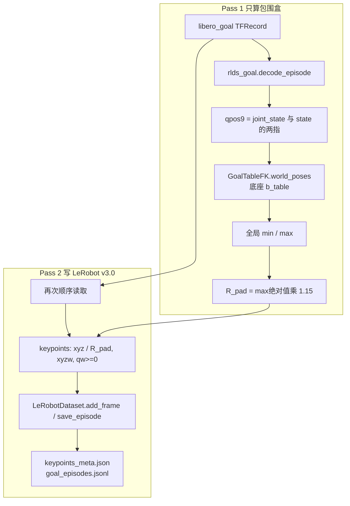
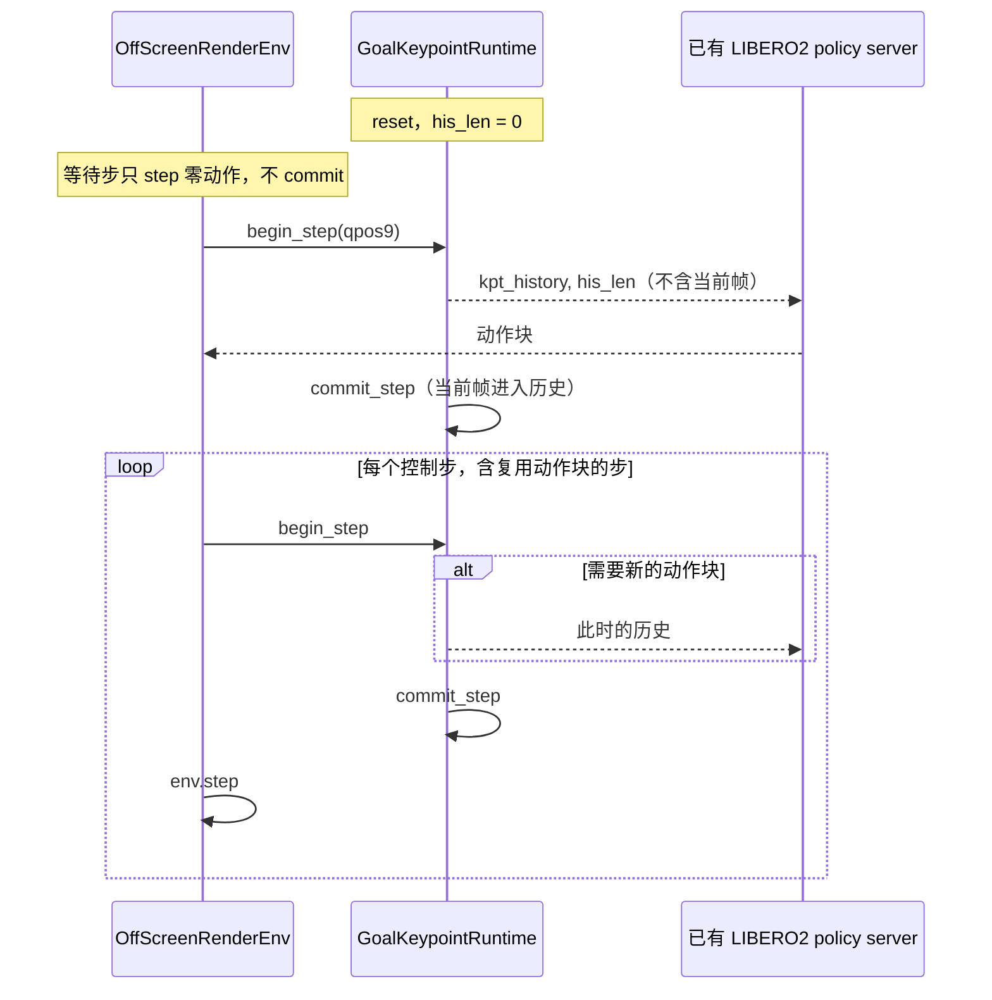

# LIBERO-Plus Goal 的 3D/4D 关键点方案

> **训练数据**: `/B/Dta/LIBERO/rlds/libero_goal/`（4,243 episode，512,604 步，20 Hz）
> **评估对象**: LIBERO-Plus 的 `libero_goal` 套件，2,591 个扰动任务
> **代码**: `b/s/libplus2/gol/`（不修改已有训练、评估和 FK 脚本）
> **测量日期**: 2026-09-29，在 `/B/VENV/itnvla15rbt20/` 里对真实 TFRecord 和 robosuite 1.4.1 Panda 运动学链做过对照
> **关联文档**:
> - 评估流程 [`LIBERO-plus/b/d/ds/gol/eval_solu1.markdown`](/B/SRC/LIBERO-plus/b/d/ds/gol/eval_solu1.markdown)
> - RLDS 扰动分析 [`LIBERO-plus/b/d/ds/gol/rlds/dsanalyz1.markdown`](/B/SRC/LIBERO-plus/b/d/ds/gol/rlds/dsanalyz1.markdown)
> - Franka 关键点方案 [`b/d/Frk3/ds/cubinbx/3d4d_gen_3.markdown`](/B/SRC/itvlaGpLibPlus/b/d/Frk3/ds/cubinbx/3d4d_gen_3.markdown)

本文同时给出两条必须共用同一套 FK 的实现：离线把关键点写进 LeRobot v3.0 训练集，以及评估时按每个控制步现算关键点和历史。历史不单独落盘。训练时由 `Extract3DKeypointTransformFn` 从逐帧 `observation.keypoint_3d` 切出来，评估时由 `GoalKeypointRuntime` 按同样的下标规则滚动。

---

## 1. 要生成的量

InternVLA-A1.5 的 GeoPredict 路径吃的是机器人连杆上的关键点，不是场景里的物体点。配置在 `src/lerobot/policies/internvla_a1_5/configuration_internvla_a1_5.py`：

| 配置 | 本方案取值 | 含义 |
|------|------------|------|
| `enable_keypoint_predictor` | `True` | 打开关键点专家 |
| `kpt_4d_mode` | `"pos_rot"` | 每个点 7 维：位置 3 + 四元数 4 |
| `num_keypoint_joints` | 8 | link1–link7 与夹爪 eef |
| `keypoint_history_max_len` \(H\) | 128 | 只看当前帧之前的最多 128 步 |
| `chunk_size` \(C\) | 50 | 未来关键点监督长度，与动作块一致 |

一帧存成

\[
\mathbf{k}_t \in \mathbb{R}^{56}, \qquad 56 = 8 \times 7.
\]

第 \(i\) 个点的 7 维是 \((p_x, p_y, p_z, q_x, q_y, q_z, q_w)\)。位置已经除以 \(R_{\mathrm{pad}}\)。四元数是单位四元数，顺序 xyzw，并强制 \(q_w \ge 0\)（\(\mathbf{q}\) 与 \(-\mathbf{q}\) 是同一个旋转，半球约束去掉这个二义性）。

训练样本在时刻 \(t\) 被拆成四块（`transform_internvla_a1_5.py` 的 `Extract3DKeypointTransformFn`）：

| 张量 | 形状 | 内容 |
|------|------|------|
| `observation.his_kpts` | \([H, 8, 7]\) | 帧 \(t-H,\ldots,t-1\) 中真正存在的那些，按时间从旧到新排在前面，后面补 0 |
| `observation.his_len` | 标量 | 上面有几帧是真的。episode 开头不足 \(H\) 帧时小于 \(H\) |
| `observation.kpt_t` | \([8, 7]\) | 当前帧，只作监督，不送进 TrackEncoder |
| `observation.kpt_future` | \([C, 8, 7]\) | 帧 \(t+1,\ldots,t+C\)。越过 episode 末尾时夹到最后一帧 |

推理时 `embed_kpt_suffix` 只读 `his_kpts` 和 `his_len`（`modeling_internvla_a1_5.py`）。当前帧的关键点由查询 token 预测，不能提前塞进历史，否则等于把答案告诉了编码器。

\(H=128\) 来自 Goal 数据本身的时间尺度：20 Hz 下 128 步是 6.4 秒，中位 episode 长 105 步（5.25 秒）。最长 299 步的 episode 在 \(t>128\) 之后只保留最近 128 步，这和变换里 `range(-H, C+1)` 的滑窗是同一种截断。评估端的 \(H\) 必须用 128，不能沿用 `LiberoModelClient` 里默认的 200，也不能沿用配置 dataclass 里的默认 1000。

---

## 2. 坐标系：必须是 Goal 桌面，不是 Lift

### 2.1 仿真里机器人底座在哪

`libero_goal` 的基础 BDDL（例如 `put_the_bowl_on_the_plate.bddl`）声明的问题类是 `Libero_Tabletop_Manipulation`。这个类把工作区设成 `table`，桌面尺寸默认 \((1.0, 1.2, 0.05)\) 米（`libero_tabletop_manipulation.py`）。`BDDLBaseDomain._load_model` 用桌子的 \(x\) 边长调用

```44:50:libero/libero/envs/robots/mounted_panda.py
    def base_xpos_offset(self):
        return {
            "bins": (-0.5, -0.1, 0),
            "empty": (-0.6, 0, 0),
            "table": lambda table_length: (-0.16 - table_length / 2, 0, 0),
            "study_table": lambda table_length: (-0.25 - table_length / 2, 0, 0),
            "kitchen_table": lambda table_length: (-0.16 - table_length / 2, 0, 0),
        }
```

\(1.0\) 米的桌子得到平面偏移 \((-0.66, 0, 0)\)。robosuite 的安装座再把底座抬到 \(z=0.912\,\mathrm{m}\)。因此 Goal 世界系里的底座是

\[
\mathbf{b}_{\mathrm{table}} = (-0.66,\ 0,\ 0.912)\ \mathrm{m}.
\]

`MountedPanda1` 及以后的子类只改 `init_qpos`，不改 `base_xpos_offset`。2,591 个评估任务里的相机、光照、纹理、噪声、语言、物体布局都不会搬动这只底座。机器人初始状态扰动改变的是关节角，底座仍是 \(\mathbf{b}_{\mathrm{table}}\)。所以训练集和全部 Goal 评估任务可以共用这一个底座。

旧管线 `evaluation/LIBERO2/keypoint_utils.py` 的 `StandaloneFK` 用的是 robosuite Lift 场景，底座是 \((-0.56, 0, 0.912)\)。它和 Goal 桌面差一个常数

\[
\mathbf{b}_{\mathrm{lift}} - \mathbf{b}_{\mathrm{table}} = (0.10,\ 0,\ 0)\ \mathrm{m}.
\]

Lift 上算出来的关键点，和 RLDS 里的末端位置、和评估环境里的 `site_xpos`，都差 10 厘米。那条管线让“训练 FK”和“评估 FK”彼此一致，但两者都不是 Goal 仿真的世界系。本方案不沿用它，也不沿用它写死的 \(R_{\mathrm{pad}}=1.8212722539901733\)。

### 2.2 在真实 RLDS 上的对照

运动学模型是 robosuite v1.4.1 的 `robots/panda/robot.xml`，去掉网格后放在 `b/s/libplus2/gol/assets/panda_kin.xml`。`gripper0_eef` 不在这个文件里，按夹爪 XML 的两段固定变换接上去：

\[
{}^{w}\!\mathbf{p}_{\mathrm{eef}}
= {}^{w}\!\mathbf{p}_{\mathrm{hand}}
+ R(\mathbf{q}_{\mathrm{hand}}\otimes\mathbf{q}_{\mathrm{grip}})\,[0,\ 0,\ 0.097]^{\top},
\]

其中 \(\mathbf{q}_{\mathrm{grip}}=(0.707107,\ 0,\ 0,\ -0.707107)\) 是 wxyz。这个点和 robosuite 的 `gripper0_grip_site` 重合，也就是 `observation.state[0:3]`。

2026-09-29 对 `libero_goal` 前两个被抽到的分片共 6 条 episode、52 个时间步的测量：

| 底座 | 末端位置误差均值 | 末端位置误差最大 | `right_hand` 与 `state[3:6]` 的旋转误差最大 |
|------|------------------|------------------|-----------------------------------------------|
| table \((-0.66,0,0.912)\) | \(2.6\times 10^{-4}\,\mathrm{m}\) | \(6.1\times 10^{-4}\,\mathrm{m}\) | \(0.097^\circ\) |
| Lift \((-0.56,0,0.912)\) | \(0.100\,\mathrm{m}\) | \(0.100\,\mathrm{m}\) | \(0.097^\circ\) |
| 原点 | \(1.126\,\mathrm{m}\) | \(1.126\,\mathrm{m}\) | \(0.097^\circ\) |

旋转误差不随底座平移改变，因为轴角比的是方向。位置误差说明记录下来的末端就是桌面世界系里的 grip site。验收测试 `test_table_base_matches_eef_position_and_hand_orientation` 和 `test_lift_base_is_ten_centimetres_off` 把这组对照固定在 4 条真实 episode 上，阈值是位置误差 \(<2\,\mathrm{mm}\)、手部旋转误差 \(<0.5^\circ\)、Lift 误差落在 \(9\)–\(11\,\mathrm{cm}\)。

### 2.3 状态里的轴角不是第 8 个点的四元数

`state[3:6]` 是 `right_hand` 的轴角（robosuite `SingleArm` 的 `_eef_name = "right_hand"`）。第 8 个关键点的四元数是 eef，相对手部绕 \(z\) 转了 \(-90^\circ\)。实测这个夹角是 \(89.99996^\circ\)，在抽到的帧上是常数。验收测试要求它落在 \(90\pm 0.05^\circ\)。

因此：

- 可以用 `state[0:3]` 验收第 8 个点的位置；
- 可以用 `state[3:6]` 验收 `right_hand` 的方向；
- 不能把 `state[3:6]` 当成 `gripper0_eef` 的四元数去监督或去对比。

手指 `state[6:8]` 写进 9 维 qpos 只是为了和 RLDS 的字段对齐。运动学链的 `nq=7`，两个手指关节不带动 link1–link7，也不带动 eef。把手指改成 0 之后，8 个点的位姿最大变化 \(<10^{-8}\)。评估时仍然要读实时的 7 个手臂关节；手指可以读进来放进 qpos[7:9]，但 FK 不用它们。

### 2.4 \(R_{\mathrm{pad}}\)

位置归一化是各向同性的，边距只乘一次：

\[
R_{\mathrm{pad}} = \max_i \max(|m_i|, |M_i|) \cdot (1 + 0.15),
\]

\(m_i, M_i\) 是全部关键点在桌面世界系里、除以 \(R_{\mathrm{pad}}\) 之前的第 \(i\) 轴最小和最大值。四元数不除 \(R_{\mathrm{pad}}\)。

在每 16 个分片抽一条轨迹、每条取首/中/末三帧（265 条 episode）上，世界系包围盒约为

\[
\mathbf{m}=(-0.716,\ -0.330,\ 0.909),\quad
\mathbf{M}=(0.123,\ 0.326,\ 1.571),
\]

对应的估计是 \(R_{\mathrm{pad}}\approx 1.806\)。单条 112 帧的 smoke 跑出来是 \(1.8049635345\)。全量 512,604 帧的精确值由生成脚本的 Pass 1 写入 `meta/keypoints_meta.json` 的 `bbox_radius`。评估只读这个文件。文件缺失，或 `coordinate_system` 不是 `libero_goal_table_world`，`load_r_pad` 直接抛错，没有默认常数。

---

## 3. 这批 RLDS 对关键点意味着什么

扰动结构已在 [`dsanalyz1.markdown`](/B/SRC/LIBERO-plus/b/d/ds/gol/rlds/dsanalyz1.markdown) 里数完，和 FK 相关的事实是：

- 关节角和动作只有 **428** 条互不相同的轨迹。`language`、`env`、`light`、`camera_view` 各把这 428 条存了两遍（856 条）。`noise` 少 37 条，全在 “push the plate”。
- 五个目录的 \((\mathbf{q}, \mathbf{a})\) 哈希相同。相机、光照、纹理、噪声改的是像素，不改 qpos。
- 语言字段只有原始 10 句。物体布局和机器人初始姿态这两类评估扰动，在这份训练集里没有对应的 qpos。

所以离线 FK 会得到：

- 约 \(428\times 2\) 组重复的关键点轨迹，再乘上四种完整渲染，加上噪声子集；
- 关键点通道看不到纹理、光照、模糊和指令改写；
- 评估时如果任务换了 `MountedPandaK.init_qpos`，关键点会离开训练集见过的 428 条流形。这是泛化，不是 FK 写错。FK 函数、底座、\(R_{\mathrm{pad}}\)、四元数约定仍然相同。

生成脚本默认保留 4,243 这个重复结构。按哈希去重会改变论文 mix-SFT 用的采样权重，本方案不做。

控制频率是 20 Hz。episode 长度 75–299 步，与 LeRobot 副本 `/B/Dta/LIBERO/libero_plus_goal/` 的帧数 512,604 一致。旧脚本 `b/s/libplus/rlds_to_lerobot_4d.py` 把 FPS 写成 10，那是另一份被抽帧的 RLDS，不能用在这个目录上。本方案的 `info.json` 里 `fps=20`，smoke 测试检查了这个字段。

---

## 4. 训练数据生成



### 4.1 为什么历史不写进 parquet

`observation.keypoint_3d` 是逐帧的 56 维。历史窗口依赖 \(H\)。把 \([H,56]\) 再存一列，会在 \(H\) 一改就全部作废，而且和 `LeRobotDataset` 的 delta-index 机制重复。训练配置把

```python
keypoint_3d_delta_indices = list(range(-H, C + 1))  # 长度 H+1+C
```

交给数据集。`Extract3DKeypointTransformFn` 再把前 \(H\) 个下标里 `is_pad=False` 的帧挪到 `his_kpts` 前面。评估端的 `pack_like_training` 和 `GoalKeypointRuntime` 实现的是同一条规则，验收测试拿真实的 `Extract3DKeypointTransformFn` 对过一个 \(T=6, H=4, C=2\) 的窗口。

### 4.2 写盘格式

`generate_goal_4d.py` 调用仓库里现成的 `LeRobotDataset.create`，不改 `lerobot_dataset.py`。输出是 v3.0：

| 列 | 形状 | 来源 |
|----|------|------|
| `observation.images.image` | \(256\times256\times3\) | RLDS 主相机 JPEG |
| `observation.images.image2` | \(256\times256\times3\) | 腕部 JPEG |
| `observation.state` | 8 | 原样：末端 xyz、手部轴角、两指 |
| `observation.state.joint_position` | 7 | `joint_state` |
| `observation.keypoint_3d` | 56 | FK，位置已除 \(R_{\mathrm{pad}}\) |
| `action` | 7 | 原样，夹爪为 \(\pm 1\) |

`meta/keypoints_meta.json` 记录底座、\(R_{\mathrm{pad}}\)、四元数约定、MJCF 的 MD5，以及一句禁止项：不要改用 Lift 的 1.821。`meta/goal_episodes.jsonl` 每行一条 episode 的扰动目录名、任务名、指令、来源 HDF5 路径和 \((\mathbf{q},\mathbf{a})\) 的 MD5。图像旋转不进 FK。训练若把图像转 180°，关键点仍是同一组数，因为它们来自关节而不是像素。

图像键名用 InternVLA LIBERO 配置里的 `image` / `image2`，不是 LeRobot 副本里的 `front` / `wrist`。这一点和 [`dsanalyz1.markdown`](/B/SRC/LIBERO-plus/b/d/ds/gol/dsanalyz1.markdown) 第 8 节指出的键名差异对齐。

### 4.3 命令

全量转换（约 17 GiB 读两遍，并编码 4,243×2 段 256×256 视频，时间以小时计）：

```bash
/B/VENV/itnvla15rbt20/bin/python \
  /B/SRC/itvlaGpLibPlus/b/s/libplus2/gol/generate_goal_4d.py \
  --dest /B/Dta/LIBERO/libero_plus_goal_lrb3_4D \
  --rlds-root /B/Dta/LIBERO/rlds/libero_goal/1.0.0 \
  --force
```

只检查链路：

```bash
/B/VENV/itnvla15rbt20/bin/python \
  /B/SRC/itvlaGpLibPlus/b/s/libplus2/gol/generate_goal_4d.py \
  --dest /tmp/goal4d_smoke \
  --max-episodes 1 \
  --no-video \
  --force
```

`--no-video` 仍把 JPEG 解码成图像特征写入数据集，只是 `use_videos=False`，避免为验收去压 MP4。全量训练数据不要加这个开关。

### 4.4 全量跑完后要核对这些数

| 检查 | 期望 |
|------|------|
| `info.json` 的 `fps` | 20 |
| `info.json` 的 `codebase_version` | `v3.0` |
| episode 数 / 帧数 | 4,243 / 512,604 |
| `goal_episodes.jsonl` 的不同 `trajectory_hash` | 428；`noise` 是其中 427 个的子集 |
| 每个任务的指令 | 仍是那 10 句原文 |
| 任取一帧，第 8 点乘回 \(R_{\mathrm{pad}}\) 后对 `state[0:3]` | \(<2\,\mathrm{mm}\) |
| 四元数范数 | \(1\pm 10^{-4}\)，且 \(q_w\ge 0\) |
| 位置绝对值 | 除边距数值误差外不超过 1 |

这些全量检查要在完整转换之后做。本次验收跑的是 1 条 episode 的写入和 4 条 episode 的 FK，见第 7 节。

---

## 5. 评估时的生成

评估流程的任务循环、BDDL、init state 和日志格式以 [`eval_solu1.markdown`](/B/SRC/LIBERO-plus/b/d/ds/gol/eval_solu1.markdown) 为准：`get_benchmark("libero_goal")`，2,591 个任务，每任务 1 次试验，`max_steps=300`。本方案只替换关键点的算法，不改 `eval_libero_plus.py`。



### 5.1 qpos 从哪来

实时环境里的 9 维和训练用的是同一套数：

\[
\mathbf{q}^{\mathrm{eval}}
= \big[\underbrace{\mathrm{qpos}[\text{arm}]}_{7},\ 
\underbrace{\mathrm{qpos}[\text{finger}]}_{2}\big].
\]

`evaluation/LIBERO2/keypoint_utils.py` 的 `_get_robot_qpos` 就是这样读的。本方案的 FK 只用前 7 维。读到的关节必须是 `env.set_init_state` 之后的实时值。机器人初始状态扰动因此会进入关键点；训练集里没有这些初始角，模型是在没见过的 \(\mathbf{q}\) 上做 FK，而不是在错误的底座上做 FK。

不要从图像估计关键点，也不要把 `robot0_eef_quat` 填进第 8 个点。末端位置可以用来做在线断言：第 8 点乘回 \(R_{\mathrm{pad}}\) 之后应与 `obs["robot0_eef_pos"]` 相差小于 2 mm。超过这个阈值就说明底座或 MJCF 和当前环境不是同一个 Goal 桌面。

### 5.2 时钟

正确的一步是：

```python
runtime.reset()                       # episode 开始
# 等待步：env.step(零动作)，不调用 begin_step / commit_step
payload = runtime.begin_step(qpos)    # his_len 在第一步是 0
# 若本步要向服务器要新动作块，把 payload["kpt_history"] 和 his_len 放进 example
runtime.commit_step()                 # 无论本步是否重新规划，都提交
env.step(action)
```

`GoalKeypointRuntime.server_example_fields` 在 `his_len==0` 时不放 `kpt_history`。这和 `policy_backend_internvla_a1_5.py` 里 “`his_len>0` 才写入 `observation.his_kpts`” 的分支一致，空历史在服务器上是全零加 `his_len=0`。

已有的 `evaluation/LIBERO-plus2/eval_libero_plus.py` 在等待步里调用了 `client.push_keypoint()`。默认 `num_steps_wait=10`。那 10 步不在 RLDS 演示里。若把它们推进历史，第一次真正要动作时 `his_len=10`，而训练第 0 帧的 `his_len=0`。Goal 评估若要和本数据集对齐，等待步不能 `commit`。这一点写在 `test_wait_steps_must_not_be_committed` 里。不修改 plus2 脚本；新的 Goal 循环按上面的顺序自己调用 `GoalKeypointRuntime`。

另一个已经在 Franka 真机上出过的错，是历史按“向服务器请求的次数”加一，而训练按控制步加一。`replan_steps=8` 时，若只在要新动作块时 `commit`，历史会慢 8 倍。`test_chunk_reuse_still_commits_every_step` 固定了“每步都 commit”：连续 5 步不重新规划，`his_len` 仍是 0,1,2,3,4。

当前帧不会漏进当步历史。`test_runtime_does_not_leak_current_frame` 检查第二步的 `his_kpts[0]` 等于第一步的关键点，且不等于第二步的 `kpt_t`。`begin_step` 两次而不 `commit` 会抛 `RuntimeError`，避免静默丢掉一帧或重复推入。

### 5.3 和七类评估扰动的关系

| 评估类别 | 关键点会不会变 | 原因 |
|----------|----------------|------|
| Camera Viewpoints | 不变 | 只改 agentview。腕部相机装在手上，但关键点来自关节，不来自图像 |
| Light / Background / Sensor Noise | 不变 | 像素或材质变化，qpos 与训练集那 428 条相同的回放分布不是一回事；评估的初始状态仍可能不同，但扰动本身不动关节 |
| Language Instructions | 不变 | 指令字符串变，FK 不读语言 |
| Objects Layout | 不变 | 关键点不含物体。这一类对 GeoPredict 通道是盲的 |
| Robot Initial States | 变 | `init_qpos` 改变实时 qpos，FK 用同一个 \(\mathbf{b}_{\mathrm{table}}\) 和同一个 \(R_{\mathrm{pad}}\) |

图像是否旋转 180° 不影响 \(\mathbf{k}_t\)。`eval_solu1` 里两种 eval 入口对 `rotate_images` 的默认值不一致，那个差异留在图像预处理，不要为它改关键点。

### 5.4 服务器字段

现有 LIBERO2 服务器已经接受：

```python
example["kpt_history"]  # float32 [H, 8, 7]，前面是有效帧
example["his_len"]      # int
```

见 `evaluation/LIBERO2/policy_server/backends/policy_backend_internvla_a1_5.py`。Goal 运行时在 `begin_step` 和 `commit_step` 之间调用 `server_example_fields()`，得到的就是这两个键。不需要改服务器。服务器上的模型配置必须是训出来的那一份：`kpt_4d_mode="pos_rot"`，`keypoint_history_max_len=128`，并且 \(R_{\mathrm{pad}}\) 已经烤进训练数据，推理不再除第二次。

---

## 6. 训推必须相同的一张表

| 项 | 训练 | 评估 | 若不一致会怎样 |
|----|------|------|----------------|
| 底座 | \(\mathbf{b}_{\mathrm{table}}\) | 同一个 | 整体平移 10 cm（若误用 Lift） |
| MJCF | `assets/panda_kin.xml` | 同一个文件 | 连杆长度或 eef 偏置对不上 `state[0:3]` |
| qpos | `joint_state[0:7]`，手指不参与 | 实时手臂 qpos | 用错关节顺序会在毫米级验收上失败 |
| 位置 | 世界系再除一次 \(R_{\mathrm{pad}}\) | 读 `keypoints_meta.json`，再除一次 | 边距乘两次会使点缩到约 \(1/1.15\) |
| 四元数 | xyzw，\(q_w\ge 0\) | 同一函数 `wxyz_to_xyzw_hemisphere` | 当成 wxyz 时旋转误差约 90° 以上 |
| 第 8 点的方向 | eef，不是 `state[3:6]` | 同一组合变换 | 用轴角填充会固定偏 90° |
| 历史 | 严格早于 \(t\)，前对齐，后补零 | `commit` 发生在请求之后 | 当前帧漏进历史，等于标签泄漏 |
| 步频 | 数据 20 Hz，每条记录一帧 | 每个 `env.step` 一帧，含动作块复用 | 按请求次数计数会慢 `replan_steps` 倍 |
| \(H\) | 128 | 128 | 编码器位置编码长度不同 |
| 等待步 | 数据里没有 | 不 commit | 第一步 `his_len` 变成 10 而不是 0 |
| 物体 / 语言 | 不进入 \(\mathbf{k}_t\) | 同样不进入 | 不要另做一套物体点去混进这 8 个槽位 |

---

## 7. 测试与验收

入口：

```bash
bash /B/SRC/itvlaGpLibPlus/b/s/libplus2/gol/accept_goal_4d.sh
```

它只调用 `test_goal_4d.py`。2026-09-29 在 `/B/VENV/itnvla15rbt20/bin/python` 下 **17 项全部通过**，耗时约 12 秒。其中 1 条真实 episode 写出的 \(R_{\mathrm{pad}}=1.8049635345\)，`codebase_version=v3.0`，`fps=20`。

| 测试 | 覆盖的分支 | 不覆盖的东西 |
|------|------------|----------------|
| `test_table_base_matches_*` | 4 条真实 episode、每条约 1/10 的时间步，桌面底座对上末端位置和手部轴角 | 不是 4,243 条全量。全量靠生成脚本 Pass 1 的包围盒和写完后的抽查 |
| `test_lift_base_is_ten_centimetres_off` | 禁止误用 Lift 底座 | |
| `test_eef_quaternion_is_ninety_degrees_from_state` | eef 四元数不能拿 `state[3:6]` 冒充 | |
| `test_fingers_do_not_move_keypoints` | qpos[7:9] 被忽略 | |
| `test_qpos_builder_rejects_short_vectors` | 维度不足就失败 | |
| `test_pack_front_and_zero_tail` | episode 开头历史不足 \(H\)，有效帧在前、零在后 | |
| `test_future_clamps_at_episode_end` | 未来下标越过末帧时夹到最后一帧 | |
| `test_transform_agrees_on_a_short_window` | 与仓库里的 `Extract3DKeypointTransformFn` 数值一致 | 不覆盖 \(H=128, C=50\) 的全长窗口；规则与短窗口相同 |
| `test_runtime_does_not_leak_current_frame` | 当前帧不在当步历史里 | |
| `test_wait_steps_must_not_be_committed` | 第一步 `his_len=0` | 没有真的跑 10 步 MuJoCo 等待；测的是调用约定 |
| `test_chunk_reuse_still_commits_every_step` | 不重新规划也每步推进历史，并与 `pack_like_training` 对齐 | |
| `test_double_begin_is_rejected` | 漏掉 commit 会抛错 | |
| `test_missing_file_has_no_fallback` | 没有 \(R_{\mathrm{pad}}\) 文件就不能评估 | |
| `test_rejects_lift_coordinate_tag` | 坐标系标签不对就拒绝 | |
| `test_r_pad_formula_includes_margin_once` | 边距只乘一次 | |
| `test_one_episode_roundtrip` | v3.0 写入、元数据、1 条真实 JPEG | 不编码全量视频，不启动 `OffScreenRenderEnv` |

没有覆盖、也不要假装覆盖的部分：

1. **全量 4,243 条转换**。验收脚本故意不跑。全量命令在第 4.3 节，跑完用第 4.4 节的表核对。
2. **真实的 LIBERO-Plus 环境进程**。当前 InternVLA 虚拟环境里没有 robosuite，无法在这里拉起 2,591 个 BDDL。底座公式来自 `mounted_panda.py` 和 `Libero_Tabletop_Manipulation`，并用 RLDS 里仿真当时写下的 `state[0:3]` 验证过。评估环境一旦能 import，应在第一步断言第 8 点与 `robot0_eef_pos` 的误差 \(<2\,\mathrm{mm}\)。
3. **策略成功率**。本方案只保证几何通道一致，不包含一次完整 rollout 的成功率。

---

## 8. 和已有实现的边界

下列文件保持原样，Goal 这条线不调用它们的底座和 \(R_{\mathrm{pad}}\)：

- `evaluation/LIBERO2/keypoint_utils.py` 的 `StandaloneFK`（Lift 底座，位置在 `extract` 里除以 1.821）
- `b/s/libplus/generate_libero_kpt_v2.py`、`b/s/libplus/rlds_to_lerobot_4d.py`（面向另一份 RLDS，FPS 写成 10）
- `evaluation/LIBERO-plus/eval_libero_plus.py` 与 `evaluation/LIBERO-plus2/eval_libero_plus.py`

`b/d/libplus/ds/asset/rlds_reader.py` 只被读取，解码逻辑没有改。

Franka 方案里 “不要相信数据集自带的四元数，改由 FK 重算” 在这里同样成立，而且更具体：RLDS 根本没有逐连杆四元数，只有末端轴角。轴角已经用 `right_hand` 的 FK 对上了（最大 \(0.097^\circ\)），但它不是要存进 `observation.keypoint_3d` 的那个 eef 四元数。

---

## 9. 代码索引

| 文件 | 职责 |
|------|------|
| `b/s/libplus2/gol/contract.py` | 底座、\(H=128\)、\(C=50\)、20 Hz、点的名字 |
| `b/s/libplus2/gol/assets/panda_kin.xml` | 无网格的 Panda 运动学链 |
| `b/s/libplus2/gol/fk.py` | `GoalTableFK`、半球四元数、\(R_{\mathrm{pad}}\) |
| `b/s/libplus2/gol/history.py` | 与训练变换一致的历史，以及评估时钟 |
| `b/s/libplus2/gol/rlds_goal.py` | 读 Goal TFRecord，解析扰动目录 |
| `b/s/libplus2/gol/generate_goal_4d.py` | Pass 1/2，写 v3.0 |
| `b/s/libplus2/gol/load_contract.py` | 评估侧加载 \(R_{\mathrm{pad}}\)，无默认值 |
| `b/s/libplus2/gol/test_goal_4d.py` | 第 7 节的 17 项测试 |
| `b/s/libplus2/gol/accept_goal_4d.sh` | 验收入口 |
