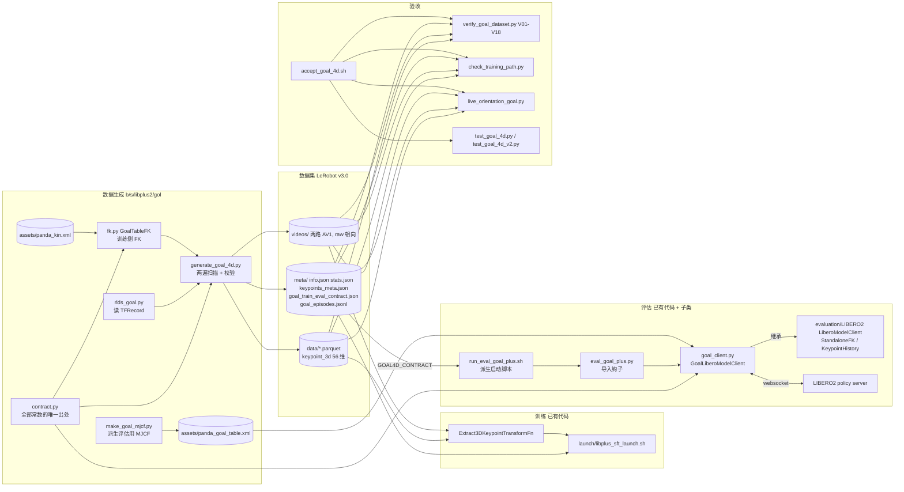
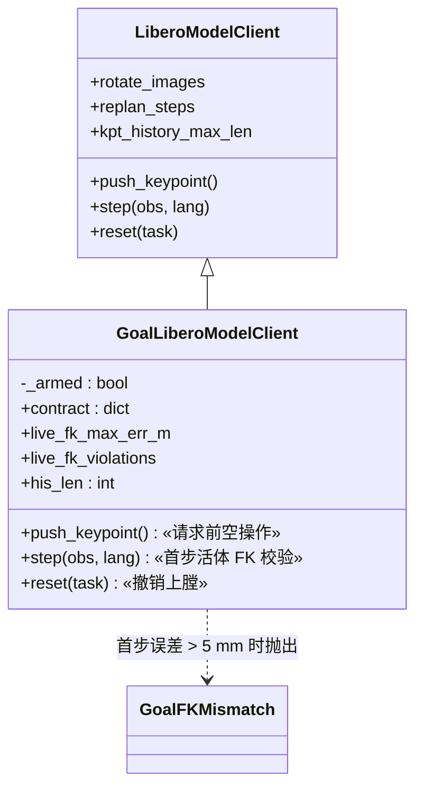
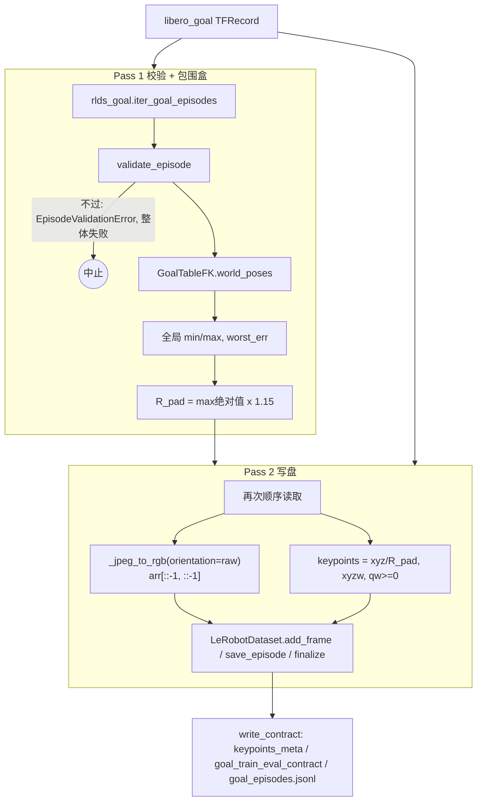
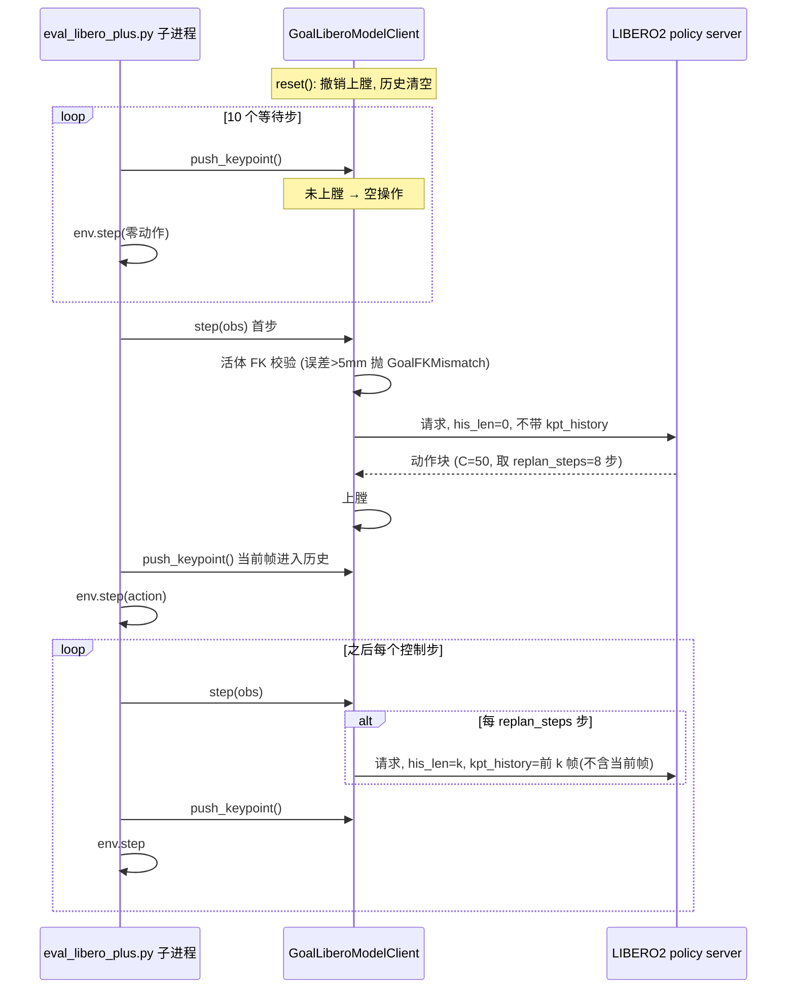
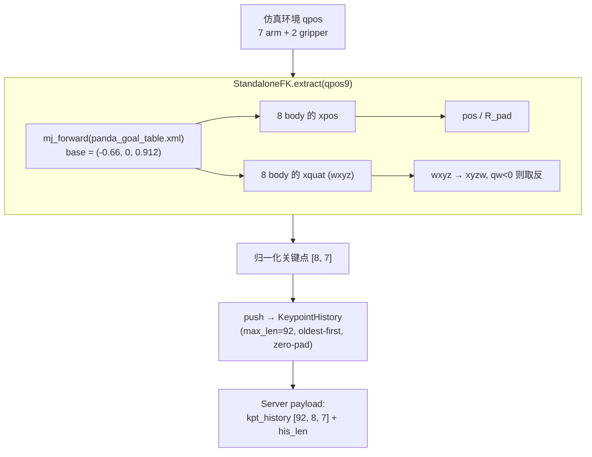

# LIBERO-Plus Goal 的 3D/4D 关键点方案（第 2 版）

> **训练数据**: `/B/Dta/LIBERO/rlds/libero_goal/1.0.0`（4,243 episode，512,604 步，20 Hz，18 GB）
> **评估对象**: LIBERO-Plus 的 `libero_goal` 套件（评估流程见 [`eval_solu1.markdown`](/B/SRC/LIBERO-plus/b/d/ds/gol/eval_solu1.markdown)）
> **代码**: `b/s/libplus2/gol/`（`evaluation/`、`src/`、`launch/` 里的已有文件一个字节都没改）
> **上一版**: [`3d4d_gen1.markdown`](./3d4d_gen1.markdown)。本文自包含，读它不需要先读 gen1
> **历史事故来源**: `b/d/libplus/hstry/` 下的 12 份文档（第 1 节列出逐条出处）
> **实测环境**: `/B/VENV/itnvla15rbt20/bin/python`；本机 **没有 GPU、没有 robosuite/LIBERO 资产、没有 `/B/VENV/libero_plus_client`**。凡是需要它们的检查，本文都明确标为"未在本机运行"
> **状态**: 第 0 级（离线）验收全部通过；第 1–3 级（全量转换、活体仿真、成功率）尚未做，见第 9 节

---

## 0. 摘要：gen1 会不会重蹈覆辙

**会，而且有一条是致命的。** 把 hstry 里记录的事故逐条对到 gen1 上（第 1 节），结论是：

| 结论 | 条数 | 代表 |
|------|------|------|
| gen1 **必然重犯** | 3 | 图像朝向没有任何交代；数据集 `robot_type` 没有指定；\(H\)=128 与训练脚本、评估客户端的 200 打架 |
| gen1 **设计正确但没有落到现成的评估循环里**，照着做会重犯 | 3 | 历史时钟没接进现成循环（含 10 个等待步）；父进程 import mujoco 使 fork 崩；评估侧没有"坐标系不对就停"的护栏 |
| gen1 **已经避开**，gen2 加了自动验证 | 4 | Lift 底座偏移、\($R_{\mathrm{pad}}$\) 常数、历史窗口的切法、夹爪符号 |
| **与数据无关，但会毁掉一次训练或评估**，gen2 写进运行手册 | 3 | 调度器步数、监控脚本误杀、`optimized` 后端 |
| 无法在本机验证或属于数据性质，如实列为遗留 | 11 | 见第 10 节 |

gen1 在**实现细节**上也有三处不够：没有生成期校验（脏 episode 会静默写进数据集）、没有能证明"产出的数据集是对的"的独立验证器、评估侧只写了一个从来没被现成入口调用过的 `GoalKeypointRuntime`。

gen2 的改动（第 2 节详述）：

1. **图像朝向**：实测 RLDS 是 robosuite 原始朝向旋转 180°。生成器把两路图像转回 `raw` 写盘，验证器用像素同一性 + 几何投影双证据判定，并带负对照。
2. **契约文件** `meta/goal_train_eval_contract.json`：训练数据集把 `robot_type`、`stats_key`、朝向、\(H\)、\(R_{\mathrm{pad}}\)、底座、MJCF 的 MD5 等一次性写死；评估客户端启动时读它，对不上就拒绝启动。
3. **评估侧用子类 + 导入钩子**接入现成的 LIBERO-plus2 循环（不改 `evaluation/`），并带每回合的活体 FK 护栏。
4. **验证器、训练路径检查、朝向门禁、评估包装脚本**四个新工具，加 37 个新单测。
5. **运行手册**（第 8 节）按顺序给出每一步的命令、期望输出和"看到什么就停"。

---

## 1. 事故审计：hstry → gen1 → gen2

### 1.1 审计方法

读了 `b/d/libplus/hstry/` 的全部文档，抽出每一条"曾经让训练或评估出错、或让结论作废"的事故，每条回答三个问题：

1. 它的根因是什么，出在数据、训练、评估的哪一段？
2. gen1 的文档或代码里有没有同样的结构？
3. gen2 用什么手段挡住，怎么证明挡住了？

事故编号沿用原文档：`F*`/`B*`/`T*`/`P*` 出自 [`cursor_robot_training_data_analysis.md`](../../libplus/hstry/cursor_robot_training_data_analysis.md) 第 8 节与 [`cursor_libero_plus_evaluation_analysis.md`](../../libplus/hstry/cursor_libero_plus_evaluation_analysis.md)；`U*` 出自 [`cursor_hyperparameter_analysis_for_scri2.md`](../../libplus/hstry/cursor_hyperparameter_analysis_for_scri2.md) 第 1311 行起。

### 1.2 逐条对照

| # | 事故（出处） | 上次发生了什么 | gen1 | gen2 的处理与证据 |
|---|--------------|----------------|------|--------------------|
| 1 | **F1 / P0-A 图像朝向**（evaluation_analysis `P0-A`） | 评估默认把图转 180°，训练集是 raw。错误朝向下的 LIBERO-plus 成功率 16.60%，且整轮评估作废 | **完全没提**。gen1 §4.2 写了图像键名，没写像素朝向。它直接搬运 RLDS 的 JPEG，而 RLDS 是 rot180 后的图 | 实测 RLDS = rot180(raw)。生成器默认写 raw；契约写 `image_orientation=raw`；客户端子类对照 `evaluation/LIBERO2/train_eval_contract.json`，不一致就 `RuntimeError`；验证器 V15–V17；单测 C/D/G 组，含负对照 |
| 2 | **T1 腕部相机**（evaluation_analysis `P0-C`） | 一度只验了 agentview，腕部相机朝向是开放风险 | 无 | V15 对两路相机都做像素同一性，V16/V17 各做一次几何判定。见第 3.1 节 |
| 3 | **`robot_type` / `stats_key`**（robot_training_data_analysis：`panda.yaml` 映射、服务器 `--stats_key panda --robot_type panda`） | 键名 `observation.images.image`→`image0`、`image2`→`image1` 由 `dataset_schemas/configs/panda.yaml` 决定；`robot_type` 错了，stats 键找不到或图像映射错位 | gen1 的 `LeRobotDataset.create` 没有传 `robot_type` | `robot_type="panda"` 写进 `info.json`；V01、单测 B、契约文件三处校验；`check_training_path.py` 用真实 `make_dataset` 确认 `stats` 里的键就是 `panda` |
| 4 | **\(H\) 三处不同**（robot_training_data_analysis 第 7 节：训练 H=200，client buffer 200） | 训练配置和评估缓冲若长度不同，历史位置编码不对齐 | gen1 定 \(H\)=128，还专门写"评估端不能沿用 200"。但 `launch/libplus_sft_launch.sh` 硬编码 `keypoint_history_max_len=200`，`LiberoModelClient` 默认也是 200。照 gen1 就要改训练脚本 | \(H\)=200，与两处现成代码一致，不改任何已有文件。中位 episode 105 步、最长 299 步，所以 \(H\)=200 只对 \(t>200\) 的锚点截断，也就是只影响最长那批 episode 的最后不到 100 个锚点。单测 B 把 `contract.HISTORY_MAX_LEN` 与 launch 脚本文本、客户端默认值、`KeypointHistory` 长度逐一比对 |
| 5 | **B9 / 坐标系**（robot_training_data_analysis `B9`；hyperparameter_analysis 第 931–1025 行） | 旧管线训练与评估都用 Lift 底座，二者彼此一致，但都不是 live 桌面（差 5–27%）。**修掉后 SR 几乎不变**（spatial 7.05%→7.16%），说明它不是主因 | gen1 用 Goal 桌面底座 (-0.66, 0, 0.912)，测过 RLDS 的 `state[0:3]`，方向正确 | 保留，并补三样：①`make_goal_mjcf.py` 从 robosuite 自己的 Lift 导出**派生**评估用 MJCF（只搬底座），使评估 FK 与训练 FK 是同一个文件；②每回合首步活体对比 `obs["robot0_eef_pos"]`；③MD5 写进契约。**优先级要摆正**：这条重要在一致性，不该被当成成功率的主因 |
| 6 | **U8 / 历史含当前帧**（robot_training_data_analysis `U8`：push 曾在 step 之后） | 评估先 step 再 push，历史晚一拍 | gen1 的 `GoalKeypointRuntime` 时序正确，但**没有任何代码把它接进现成评估循环**。现成循环调用的是 `client.push_keypoint()` | `GoalLiberoModelClient` 子类：在第一次请求之前 `push_keypoint()` 是空操作；请求后才"上膛"。单测 E 用假 websocket 和假环境走完整时序：`his_len`=0,1,2…，历史等于训练打包结果，当前帧不进历史 |
| 7 | **等待步**（gen1 §5.2 自己发现） | 现成循环在 10 个等待步里也调 `push_keypoint()`，第一次请求时 `his_len=10`；训练第 0 帧是 0 | 发现了，方案是"新写一个 Goal 循环"，等于放弃现成的分片、崩溃隔离、结果汇总 | 同上，用子类而不是新循环；`test_first_request_has_no_history_and_wait_frames_are_not_history` |
| 8 | **B10 / 父进程 import mujoco** | 父进程一旦 `import mujoco`，fork 出的子进程 EGL 崩。现成脚本把 `LiberoModelClient` 放在子进程里懒加载 | gen1 若"新写循环"，很容易在顶层 import 客户端 | `eval_goal_plus.py` 在父进程**不** import 客户端，用 `sys.meta_path` 钩子在子进程里 `model2libero_interface` 导入完成的那一刻把 `LiberoModelClient` 换成子类；单测 F 断言父进程无 mujoco，且现成脚本仍是懒加载 |
| 9 | **U7 / EGL 析构 SIGABRT** | MuJoCo EGL 析构可能 SIGABRT；live 测试用 `os._exit` | 无关 | `live_orientation_goal.py live` 结束时同样用 `os._exit` |
| 10 | **B1 / 夹爪符号** | 夹爪符号反了，`libero_native` 才对 | gen1 直接搬运 `action` | V12 在数据上检查夹爪动作与手指位移的相关符号；客户端沿用 `gripper_convention=libero_native` |
| 11 | **optimized 后端 + 关键点崩溃**（robot_training_data_analysis 第 8 节表末尾） | `modeling_internvla_a1_5_optimized.py` 缺 `his_kpts` 参数 | 无 | 运行手册与包装脚本强制 `INFERENCE_BACKEND=standard` |
| 12 | **F2 / server resize 空 mapping** | 服务器的 `ResizeImagesWithPadFn` 曾是空 mapping，256 图没缩到 224 | 无关，已修 | 契约写 `resize_hw=[224,224]`；服务器代码不改 |
| 13 | **B2 / FAST 硬编码 False** | 训练用 FAST，评估后端曾写死 False | 无关 | 属于 checkpoint/服务器配置，不在数据方案里。运行手册把"服务器元数据里 `use_fast_action_tokens` 要等于训练值"列为启动核对项 |
| 14 | **scheduler 步数**（launch 脚本：`SCHEDULER_DECAY_STEPS` 默认 30000，`STEPS` 默认 53450，都是为旧数据集定的） | 与数据集大小脱节 | gen1 未涉及 | 运行手册 R6：`STEPS`、`SCHEDULER_DECAY_STEPS`、`SAVE_FREQ` 必须按新数据集重算，给出公式 |
| 15 | **监控脚本误杀 + `FileExistsError` 死循环**（local_server_fine_tuning_plan 结论：794 个日志目录，793 个是重试垃圾） | `STALE_THRESHOLD` 小于两次写日志的间隔，健康训练被杀；重试又撞 `output_dir` 已存在 | gen1 未涉及 | 运行手册 R6：`ENABLE_AUTO_RESTART=false`；`LOG_FREQ × 每步秒数` 必须小于 `STALE_THRESHOLD` 的一半 |
| 16 | **episode 末尾 clamp、没有 loss mask**（cursor_episode_clamp_padding_loss_mask，结论"mask 全都生成了，只有一处在用"） | 未来窗口越过 episode 末尾时夹到最后一帧，action / video / kpt_future 损失都当真监督 | gen1 只在测试里断言夹取，没有量化 | **Goal 上比旧数据更重**：所有 episode ≥75 步，每条恰好有 \(C\)=50 个锚点落在末尾窗口，占 \(4243\times50/512604=41.4\%\)。不修训练代码（超出本方案边界），如实列为已知偏差，见第 10 节 |
| 17 | **tokenize_state=true 时 foresight 漂移**（cursor_tokenize_state_true_foresight） | 文档提出的训练契约疑点 | 无关 | 不在数据方案范围，未验证，列入遗留 |
| 18 | **缓存的朝向 bank**（`evaluation/LIBERO2/orientation_contract.py::load_train_bank`） | 该函数把 bank 缓存到 `/tmp/kptimg/train_<cam>_bank.npy`，之后即使换了数据集也直接读旧文件 | 无 | 新的 `live_orientation_goal.py` 不用这个缓存，bank 由指定的 Goal 数据集现算；第 7.4 节写明不要直接用旧门禁 |
| 19 | **不要信旧合并数据**（`prmp.md`：`opvla_libero_merged_kpt` 的信息可能是错的） | 曾把它当真相 | 未使用 | gen2 仍不使用它，也不读它 |

### 1.3 哪些事故 gen2 **没有**也不该在本方案里处理

- 事故 12、13、17 属于服务器 / 检查点 / 训练代码，本方案只在启动核对表里提醒。
- 关于"Robot Initial States 与 Objects Layout 两类扰动在 RLDS 里没有对应训练样本"，这是**数据本身的属性**，不是实现错误，见第 10 节。

---

## 2. gen1 → gen2 改动清单

| # | gen1 说法或做法 | gen2 | 文件 |
|---|------------------|------|------|
| C1 | 写盘图像 = RLDS 的 JPEG 解码结果 | 默认 `--image-orientation raw`：`arr[::-1, ::-1]` 后写盘 | `generate_goal_4d.py::_jpeg_to_rgb` |
| C2 | 不写 `robot_type` | `robot_type="panda"` | `contract.py`, `generate_goal_4d.py` |
| C3 | \(H\)=128 | \(H\)=200 | `contract.py::HISTORY_MAX_LEN` |
| C4 | 只有 `keypoints_meta.json` | 新增 `goal_train_eval_contract.json`（schema `goal_train_eval_contract/1`） | `generate_goal_4d.py::write_contract` |
| C5 | 无校验 | 每个 episode 写盘前 `validate_episode`，任何一条不过就整体失败 | `generate_goal_4d.py` |
| C6 | 全量命令没有防误操作 | `--confirm-full-run` 拒绝 `--no-video`、`--max-episodes`、非 raw 朝向 | `generate_goal_4d.py::main` |
| C7 | 评估 FK 用 `assets/panda_kin.xml` + `GoalTableFK` | 评估用的 `StandaloneFK` 需要一个完整 MJCF：新增派生脚本，从 robosuite 的 Lift 导出只搬底座、去掉网格，得到 `assets/panda_goal_table.xml`；训练侧 FK 与评估侧 `StandaloneFK` 数值一致到 \(3.6\times10^{-7}\) | `make_goal_mjcf.py`, `assets/panda_goal_table.xml`, `fk.py` |
| C8 | 评估："新的 Goal 循环自己调用 `GoalKeypointRuntime`" | 子类 `GoalLiberoModelClient` + 导入钩子 `eval_goal_plus.py` + 包装脚本 `run_eval_goal_plus.sh`；`GoalKeypointRuntime` 保留为纯逻辑参考实现和单测对象 | `goal_client.py`, `eval_goal_plus.py`, `run_eval_goal_plus.sh` |
| C9 | 评估侧无护栏 | 契约朝向对照、MJCF MD5 对照、覆盖冲突检测、首步活体 FK 护栏 | `goal_client.py` |
| C10 | 验收只有单测 | 加数据集验证器（V01–V18）、真实训练数据路径检查、Goal 朝向门禁、包装脚本干跑 | `verify_goal_dataset.py`, `check_training_path.py`, `live_orientation_goal.py`, `accept_goal_4d.sh` |
| C11 | 验收脚本只跑 `test_goal_4d.py` | 分级验收 S1–S6 | `accept_goal_4d.sh` |
| C12 | "\(R_{\mathrm{pad}}\)≈1.806" 估计 | 不变；小样本实测 1.8148（30 episode）。全量精确值由生成器 Pass 1 写入 `keypoints_meta.json` | — |

**仍然有效、未改的 gen1 结论**：Goal 世界系底座 \(\mathbf{b}_{\mathrm{table}}=(-0.66,0,0.912)\)、`state[3:6]` 是 `right_hand` 的轴角而不是第 8 个点的四元数、手指不驱动关键点、`R_pad` 边距只乘一次、历史不落盘（由 `keypoint_3d_delta_indices=range(-H,C+1)` 在训练时现切）、不按轨迹哈希去重。这些在 gen1 第 2、4.1 节有推导，下面第 4、5 节再用一页复述必要部分。

---

## 3. 新增的实测证据

所有数字来自本机 `/B/VENV/itnvla15rbt20/`，样本是 `--max-episodes 30` 转换出的数据集（3,637 帧，覆盖五个扰动目录），以及对 RLDS 原始 TFRecord 的直接读取。

### 3.1 图像朝向

**约定**（用符号表示，避免歧义）：

- \(U\)：相机"正立"的画面，行号向下增长。
- robosuite 的 `env.step`/`reset` 返回的数组是自下而上的：\(\mathrm{RAW}=\mathrm{flipV}(U)\)。
- LIBERO/OpenVLA 保存 RLDS 时又整体转了 180°：\(\mathrm{RLDS}=\mathrm{rot180}(\mathrm{RAW})=\mathrm{flipH}(U)\)。
- 训练集要和评估环境交给策略的图一致。评估环境交出的是 RAW（`evaluation/LIBERO2/train_eval_contract.json` 里 `image_orientation=raw`，客户端 `rotate_images=False`），所以**训练集必须存 RAW**，也就是把 RLDS 图再转 180°。

**两条独立证据**（`orientation_probe.py`，不需要仿真器）：

1. **像素同一性**（V15）：把生成的视频解码，与 RLDS 的 JPEG 比 MSE。数据集 vs RLDS 原样：agentview 2985.6、wrist 3931.4；数据集 vs `rot180(RLDS)`：agentview 8.0、wrist 10.5。后者只剩视频压缩误差。
2. **几何投影**（V16/V17）：agentview 相机的位姿常数已知（`bddl_base_domain.py::_setup_camera`，`pos=(0.5886,0,1.4904)`，`quat_wxyz=(0.6380,0.3048,0.3048,0.6380)`，`fovy=75°`）。用 FK 得到夹爪世界坐标，投影到图像，看它跟"相邻帧像素变化的质心"沿列、沿行的相关系数符号，在四种朝向假设（identity / flipV_RAW / flipH_RLDS / rot180）里选最佳。这个判据只用相关的符号，不依赖 fovy 的具体值。
   - RLDS 原图的判定：agentview 与 wrist 都是 `flipH_RLDS`（单测 `test_agentview_rlds_is_flipH...`、`test_wrist_rlds_is_flipH...`）。
   - 生成数据集的判定：agentview `flipV_RAW`，列相关 +0.987、行相关 +0.944（\(n=308\)）；wrist `flipV_RAW`，列相关 +0.572、行相关 +0.838（\(n=151\)）。
   - **负对照**（`test_probe_flips_when_the_frames_are_rotated`）：把帧旋转 180° 后判定结果会跳到另一个假设。也就是说探针不是"永远答同一个"。
3. **端到端负对照**（`test_negative_control_wrong_orientation_is_caught`）：故意生成一份"按 RLDS 朝向写盘却声明为 raw"的数据集，验证器必须失败；另有"按 RLDS 朝向写盘并如实声明 rlds"的数据集，验证器应通过，且客户端会因为与全局契约不符而拒绝启动它。

**诚实的边界**：腕部相机的几何相关只有 0.57，比 agentview 弱；它的 raw/rlds 判定同时依赖"RAW=flipV(U)"这条 robosuite 约定和像素同一性（V15，两路都是 8–10 的 MSE 量级）。像素同一性已经足以确定"数据集 = rot180(RLDS)"，几何判定是独立的第二条证据。最终裁判仍是第 7.4 节的**活体**门禁，本机跑不了。

### 3.2 FK 一致性

| 检查 | 结果 | 出处 |
|------|------|------|
| 生成器 FK 的第 8 点 vs `state[0:3]` | 最大 0.72 mm（阈值 2 mm） | V10 |
| 评估用 `StandaloneFK(panda_goal_table.xml)` vs 数据集里存的关键点 | 最大差 \(3.58\times10^{-7}\) | V11 |
| 生成器 FK vs robosuite 自己的 Lift 导出 + 底座平移 | 等价 | 单测 A |
| `panda_goal_table.xml` 与 Lift 导出的差别 | 恰好是底座平移 (-0.10, 0, 0)，其余逐字相同 | 单测 A |
| 派生文件是否最新 | MD5 `8ff2db5368b159ffdd69c95d0bf91c4d`，`make_goal_mjcf.py --check` | S1 |
| 存储的关键点 = `FK(joint_position, fingers)` 重算 | 最大差 0 | V09 |

### 3.3 训练窗口（真实 `Extract3DKeypointTransformFn`）

V18 与 `check_training_path.py` 都通过真实 `LeRobotDataset` + `delta_timestamps` + 变换取样：`his_len=min(t,H)`；`his_kpts` 是严格早于 \(t\) 的帧，**最旧的在前**，之后补零；`kpt_t` 是当前帧；`kpt_future` 是 \(t+1..t+C\)，越界夹到末帧。`check_training_path.py` 用与 `launch/libplus_sft_launch.sh` 相同的策略与数据集参数，在 3,637 帧的样本集上取 6 个样本、每个 11 项检查，共 68 项全过。样本张量形状：`his_kpts` \((200,8,7)\)，`kpt_future` \((50,8,7)\)，`action` \((50,32)\)（后 25 维是零填充），`state` \((32,)\)，`image_grid_thw` 有 2 行（两路相机各一行）。

### 3.4 转换耗时与体积（外推）

30 个 episode（3,637 帧）转换用 2 分 1 秒，输出 28 MB。线性外推到 512,604 帧：约 **4.5–5 小时**、约 **4 GB**。生成器是单进程，本方案没有做分片并行。

---

## 4. 静态架构



**职责一句话**

| 组件 | 职责 | 为什么要独立 |
|------|------|--------------|
| `contract.py` | 底座、\(H\)、\(C\)、fps、朝向、容差、路径的唯一定义 | 训练侧、评估侧、验证器、单测都读它，消除"三处各写一遍" |
| `fk.py::GoalTableFK` | 训练侧 FK：关节角 → 8 点 × 7 维，半球四元数，\(R_{\mathrm{pad}}\) | 与评估侧共享同一个 MJCF |
| `make_goal_mjcf.py` | 从 robosuite 的 Lift 导出派生出 Goal 底座的 MJCF | 评估用现成的 `StandaloneFK`，它读完整 MJCF，本机没有网格资产，所以要去网格 |
| `generate_goal_4d.py` | 两遍扫描：Pass 1 校验并算包围盒，Pass 2 写盘 | 边距要用全局包围盒，所以必须两遍 |
| `goal_client.py` | `LiberoModelClient` 的子类，只改四件事 | 扩展，不修改 |
| `eval_goal_plus.py` | 子进程里换客户端的钩子 | 保持父进程无 mujoco |
| `run_eval_goal_plus.sh` | 派生一份启动脚本，恰好两处替换 | 不改 `run_eval_libero_plus_venv.sh` |

**类图（评估侧）**



---

## 5. 训练数据生成：步骤与代码逻辑

### 5.1 要生成的量（复述必要部分）

一帧 \($\mathbf{k}_t\in\mathbb{R}^{56}$\)，\($56=8\times7$\)。第 \(i\) 个点 \((p_x,p_y,p_z,q_x,q_y,q_z,q_w)\)：位置已除以 \($R_{\mathrm{pad}}$\)，四元数单位化、顺序 xyzw、强制 \($q_w\ge0$\)（\($\mathbf{q}$\) 与 \($-\mathbf{q}$\) 是同一旋转，半球约束消掉二义性）。8 个点依次是 `link1..link7` 与 `gripper0_eef`。

\[
$$R_{\mathrm{pad}}=\max_i\max\big(|m_i|,|M_i|\big)\cdot(1+\rho),\qquad \rho=0.15$$
\]

\($m_i, M_i$\)：全部帧、全部关键点在 Goal 世界系里第 \(i\) 轴（\($i\in\{x,y,z\}$\)）的最小与最大位置，除以 \($R_{\mathrm{pad}}$\) 之前；\($\rho$\) 是边距。边距只乘一次。四元数不除。

Goal 世界系里机器人底座：

\[
$$\mathbf{b}_{\mathrm{table}}=(-0.66,\ 0,\ 0.912)\ \mathrm{m}$$
\]

来自 `mounted_panda.py::base_xpos_offset["table"]=(-0.16 - L/2, 0, 0)`，\(L=1.0\) m 是桌长，再加 robosuite 安装座抬高的 0.912 m。`gripper0_eef` 相对 `right_hand` 的固定变换是四元数 wxyz \((0.707107,0,0,-0.707107)\) 加沿其 \(z\) 轴 0.097 m。

### 5.2 数据流



### 5.3 关键代码逻辑

**`validate_episode(ep, poses, tol_m)`**（`generate_goal_4d.py`）。对每个 episode 依次检查：

| 检查 | 阈值 | 抓什么 |
|------|------|--------|
| `state`、`joint_state`、`action` 全部有限 | — | NaN/Inf |
| 步数 ≥ 2 | — | 空 episode，后面窗口无意义 |
| 两路图像张数 = 步数 | — | 视频与表格错位 |
| 关节角在 Panda 限位内 | 放宽 0.05 rad | 关节顺序错、单位错 |
| 四元数范数 | \(|\|\mathbf{q}\|-1|\) 很小 | FK 数值问题 |
| FK 第 8 点 vs `state[0:3]` | ≤ 2 mm（`EPISODE_EEF_TOL_M=2e-3`） | **底座错、MJCF 错、qpos 顺序错**，包括误用 Lift 底座（差 100 mm） |

任何一条不过都抛 `EpisodeValidationError` 并带上 episode 序号，Pass 1 整体失败——**宁可不出数据，也不静默写进脏数据**。gen1 没有这一层。

**`_jpeg_to_rgb(blob, orientation)`**：`raw` 时返回 `arr[::-1, ::-1]`；`rlds` 原样返回；其他值直接拒绝。默认取自 `contract.IMAGE_ORIENTATION="raw"`。

**`--confirm-full-run`**：声明"这是要拿去训练的全量数据"，因此与 `--no-video`、`--max-episodes`、`--image-orientation rlds` 互斥。防止把 smoke 参数带进正式跑。

**写盘的列**

| 列 | 形状 | 说明 |
|----|------|------|
| `observation.images.image` | 256×256×3 视频 | agentview，**raw 朝向** |
| `observation.images.image2` | 256×256×3 视频 | wrist，**raw 朝向** |
| `observation.state` | 8 | 原样：末端 xyz、`right_hand` 轴角、两指 |
| `observation.state.joint_position` | 7 | `joint_state` |
| `observation.keypoint_3d` | 56 | FK，位置已除 \(R_{\mathrm{pad}}\) |
| `action` | 7 | 原样，夹爪 ±1 |

`info.json`：`codebase_version=v3.0`、`fps=20`、`robot_type=panda`。视频编码 libsvtav1（PyAV），本机没有 ffmpeg 可执行文件，不需要。

**契约文件 `meta/goal_train_eval_contract.json`**（30 episode 样本里的真实内容）：

```json
{
  "schema": "goal_train_eval_contract/1",
  "robot_type": "panda", "stats_key": "panda",
  "image_orientation": "raw", "rlds_image_orientation": "rot180",
  "cameras": {"observation.images.image": "agentview", "observation.images.image2": "wrist"},
  "resize_hw": [224, 224], "fps": 20,
  "kpt_4d_mode": "pos_rot", "num_keypoints": 8,
  "keypoint_history_max_len": 200, "chunk_size": 50,
  "r_pad": 1.8148113167487512,
  "base_xpos_m": [-0.66, 0.0, 0.912],
  "coordinate_system": "libero_goal_table_world",
  "eval_mjcf": "b/s/libplus2/gol/assets/panda_goal_table.xml",
  "eval_mjcf_md5": "8ff2db5368b159ffdd69c95d0bf91c4d",
  "live_eef_tol_m": 0.005,
  "wait_steps_committed_to_history": false,
  "history_includes_current_frame": false
}
```

（省略了 `kin_mjcf_md5`、`episode_eef_err_max_m`、`has_video` 三个键。）

### 5.4 为什么历史不落盘

`observation.keypoint_3d` 逐帧 56 维。历史依赖 \(H\)，存 \([H,56]\) 会在 \(H\) 变动时整列作废，而且与 `LeRobotDataset` 的 delta-index 机制重复。训练配置把 `keypoint_3d_delta_indices = list(range(-H, C+1))`（长度 \(H+1+C\)）交给数据集，`Extract3DKeypointTransformFn` 再把前 \(H\) 个下标里 `is_pad=False` 的帧挪到 `his_kpts` 前面。

### 5.5 数据的固有性质

- 428 条互不相同的 \((\mathbf{q},\mathbf{a})\) 轨迹，`language/env/light/camera_view` 各存一遍，`noise` 少 37 条。数据集约 9.9 倍复制同一批轨迹。**生成器默认保留 4,243**，不按哈希去重，因为去重会改变 mix-SFT 的采样权重。
- 关键点通道对纹理、光照、噪声、相机、语言都是盲的（它只看关节）。

---

## 6. 训练侧

### 6.1 一处都不用改，只改环境变量

`launch/libplus_sft_launch.sh` 的数据集参数已经与本方案对上：`keypoint_history_max_len=200`、`kpt_4d_mode=pos_rot`、`num_keypoint_joints=8`、`use_external_stats=true`、`tokenize_state=true`、`video_backend=torchcodec`、`action_mode=abs`。

需要覆盖的只有这些（脚本本身支持环境变量覆盖）：

| 变量 | Goal 的取值 | 说明 |
|------|-------------|------|
| `DATA_SRC` | `/B/Dta/LIBERO/libero_plus_goal_lrb3_4D` | 转换输出目录 |
| `DATA_REPO_ID` | `libero_plus_goal_4d` | 脚本会在 `$HF_LEROBOT_HOME` 下建符号链接 |
| `EXTERNAL_STATS_PATH` | 默认 `${DATA_SRC}/meta/stats.json`，不用改 | 键为 `panda` |
| `EXPR_NAME` | 自定 | 决定检查点与日志目录 |
| `STEPS` | 见下 | 默认 53450 是旧数据集的 |
| `SCHEDULER_DECAY_STEPS` | 取 `STEPS` | 默认 30000，与 `STEPS` 脱节 |
| `SAVE_FREQ` / `LOG_FREQ` | 见 6.3 | |
| `ENABLE_AUTO_RESTART` | `false`（脚本默认值） | 事故 15 |

### 6.2 步数怎么定

\[
\text{steps per epoch}=\frac{N_{\mathrm{frames}}}{B\cdot G},\qquad
N_{\mathrm{frames}}=512{,}604,\ \ B=32\ (\text{每卡}),\ \ G=8\ (\text{卡数})
\]

\(N_{\mathrm{frames}}\)：训练集帧数；\(B\)：`BATCH_SIZE`；\(G\)：`PROC_PER_NODE`。得每个 epoch 2,002 步。由于数据里每条轨迹约复制 9.9 次，**1 个 epoch 相当于把 428 条互异轨迹过了约 10 遍**。

旧数据集的配置是 100 个 epoch（`local_server_fine_tuning_plan.md`）。对 Goal，100 epoch 是约 20 万步、等于 1,000 遍互异轨迹，明显过多。**起步建议** `STEPS=20000`（约 10 epoch、约 100 遍），`SCHEDULER_DECAY_STEPS=20000`，`SAVE_FREQ=2000`。这只是起点，不是验证过的结论；第 10 节把它列为待实验项。

### 6.3 监控脚本不要再误杀

事故 15 的机理：\(t_{\mathrm{log}}=\mathrm{LOG\_FREQ}\times t_{\mathrm{step}}\)（两次写日志的间隔）大于 `STALE_THRESHOLD` 时，健康训练被当成死进程。旧日志里 \(t_{\mathrm{step}}\approx7.5\) s。取 `LOG_FREQ=100` 时 \(t_{\mathrm{log}}\approx750\) s，而当前默认 `STALE_THRESHOLD=1800`，比值 2.4，够用。若要改 `LOG_FREQ` 或换更慢的机器，保证 \(t_{\mathrm{log}} < \mathrm{STALE\_THRESHOLD}/2\)。

### 6.4 训练前能在本机做的检查

```bash
CUDA_VISIBLE_DEVICES="" /B/VENV/itnvla15rbt20/bin/python \
  b/s/libplus2/gol/check_training_path.py --dataset <converted dataset>
```

它构造与启动脚本同样的 `TrainPipelineConfig`，走真实 `make_dataset`，取 6 个样本检查：`stats` 里有 `panda`；`his_kpts` 形状 \((200,8,7)\)；`his_len∈[0,200]`；`his_len` 之后的行全为零、之前的行不全为零；`kpt_future` 有 50 步；`action` 前 7 维有限且不退化、之后为零填充；两路图像都被分词（`image_grid_thw` 有 2 行）；`state` 有限。

**没有验证的**：前向与反向、损失数值、显存。本机无 GPU。运行手册 R7 用 `SMOKE=1` 在有 GPU 的机器上补。

---

## 7. 评估侧

### 7.1 为什么是"子类 + 钩子 + 派生脚本"

现成入口 `evaluation/LIBERO-plus2/run_eval_libero_plus_venv.sh` 直接调用 `python evaluation/LIBERO-plus2/eval_libero_plus.py`，后者在**子进程里**懒加载 `LiberoModelClient`（B10）。想换客户端而不改这两个文件，只能：

1. 钩住子进程里 `evaluation.LIBERO2.model2libero_interface` 的导入，导入结束后把模块里的名字换成子类（`eval_goal_plus.py`）。
2. 让 shell 脚本改调 `eval_goal_plus.py`：`run_eval_goal_plus.sh` 派生一份脚本，**恰好两处**文本替换，替换次数不是 1 就报错退出：
   - `python evaluation/LIBERO-plus2/eval_libero_plus.py` → `python <本目录>/eval_goal_plus.py --`
   - `SUITES="libero_spatial libero_object libero_goal libero_10"` → `SUITES="libero_goal"`

### 7.2 子类做的四件事（`goal_client.py`）

```python
class GoalLiberoModelClient(LiberoModelClient):
    def __init__(...):   # 契约、MD5、覆盖冲突
    def reset(...):      # 撤销上膛
    def push_keypoint(): # 未上膛时空操作
    def step(obs, lang): # 首步做活体 FK 校验；请求后上膛
```

| # | 行为 | 拒绝/失败条件 |
|---|------|----------------|
| 1 | 从 `GOAL4D_CONTRACT` 读契约，注入 `mjcf_path`、`kpt_r_pad`、`kpt_history_max_len`，**不用** Lift 默认值 | 未设环境变量；调用方显式传了与契约不同的值（`ValueError`） |
| 2 | `panda_goal_table.xml` 的 MD5 必须等于契约里的 | 不等 → `RuntimeError`（评估用的 FK 模型不是训练数据检查过的那个） |
| 3 | 契约朝向必须等于 `evaluation/LIBERO2/train_eval_contract.json` 的朝向；基类构造时还会拒绝"contract=raw 却 `rotate_images=True`" | 不一致 → `RuntimeError` |
| 4 | 首次请求前 `push_keypoint()` 空操作（等待步不进历史） | — |
| 5 | 每回合首步比较 FK 第 8 点乘回 \(R_{\mathrm{pad}}\) 与 `obs["robot0_eef_pos"]` | 误差 > 5 mm（`LIVE_EEF_TOL_M`）→ `GoalFKMismatch`；之后的步只告警并计数 |

### 7.3 动态：一个回合的时钟



三条不变式，都有单测（E 组）：

1. 第一次请求时 `his_len=0`，不携带 `kpt_history`（服务器上 `his_len>0` 才写入 `observation.his_kpts`，空历史即全零加 0）。
2. 之后**每个** `env.step` 推进一帧历史，与请求次数无关（`replan_steps=8` 时按请求计数会慢 8 倍）。
3. 请求里的历史永远不含当前帧（否则等于把标签交给编码器）。

### 7.4 朝向的活体门禁

**不要直接用 `evaluation/LIBERO2/test_live_orientation.py`**：

- 它渲染 libero_spatial 的 BDDL，用数据集**第一个视频文件**的前 80 帧当参照。对 Goal 数据集，参照是别的场景，MSE 比值没有意义。
- `load_train_bank` 缓存到 `/tmp/kptimg/train_<cam>_bank.npy`，换数据集后仍读旧文件。

`live_orientation_goal.py` 保留同一个判定函数（`score_camera`：实时图原样必须在 MSE 和每一票上都优于其 180° 旋转，比值 ≥ 5），换掉两个输入：参照是**同一任务**的、未加视觉扰动（`language` 目录）episode 的第 0 帧；实时图从该任务自己的 BDDL 渲染、走 10 个等待步。分三步，因为需要两个虚拟环境：

```bash
# 1) 服务器环境（torch + lerobot），无需仿真器
python b/s/libplus2/gol/live_orientation_goal.py bank --dataset D --task put_the_bowl_on_the_plate --out /tmp/goal_bank.npz
# 2) 客户端环境（mujoco + LIBERO），--render_backend egl|osmesa
python b/s/libplus2/gol/live_orientation_goal.py live --bank /tmp/goal_bank.npz --task put_the_bowl_on_the_plate
# 3) 任意环境，无仿真器：只验证判定逻辑本身（含负对照）
python b/s/libplus2/gol/live_orientation_goal.py selftest --dataset D --task put_the_bowl_on_the_plate
```

`selftest` 在本机已通过：留出一个 episode 当伪实时图，agentview 比值 38.6、wrist 8.6，均判为 raw；旋转 180° 的负对照判为不通过。**`live` 模式在本机无法运行**（没有可用的渲染后端，会在渲染后端解析处明确报错），所以"活体朝向"这一项**未验证**。

### 7.5 运行

```bash
export GOAL4D_DATASET=/B/Dta/LIBERO/libero_plus_goal_lrb3_4D
CKPT_PATH=<.../checkpoints/xxxxx/pretrained_model> \
LIBERO_HOME=/B/SRC/LIBERO-plus \
SERVER_VENV=/B/VENV/itnvla15rbt20 \
CLIENT_VENV=/B/VENV/libero_plus_client \
GPU_IDS=0,1,2,3 RENDER_BACKEND=auto \
bash /B/SRC/itvlaGpLibPlus/b/s/libplus2/gol/run_eval_goal_plus.sh
```

包装脚本**固定**（不可覆盖，违反就退出）：`ROTATE_IMAGES=false`、`STATS_KEY_MODE=panda`、`ROBOT_TYPE_MODE=panda`、`INFERENCE_BACKEND=standard`、关键点开启。可选：`CATEGORIES="..."`（只跑部分扰动类别做试点）、`DRY_RUN=1`（只派生并检查脚本，不运行）。

**读结果时必须知道的一点**：`GoalFKMismatch` 在子进程里被 `eval_libero_plus.py` 的 `except Exception` 接住，该任务被记为**失败**（`successes` 全 False），并写进 `failed_tasks`，**会计入成功率分母**，不会中止整个评估。所以：

- 先做**试点**：用 `CATEGORIES` 只跑一个类别的少量任务；
- 验收判据：`failed_tasks` 为空，且客户端日志里 `GoalFKMismatch` 出现 0 次。有任何一次，说明该任务的机器人底座不在 \((-0.66,0,0.912)\)，成功率数字不可用。

### 7.6 评估侧的边距、包围盒与 3D 关键点

训练数据生成（§5）和评估推理对关键点的计算本质上相同，但输入来源和时机不同。下面对比说明。

#### 7.6.1 边距（margin）与 \(R_{\mathrm{pad}}\)

**训练侧**（§5.1–5.2）：\(R_{\mathrm{pad}}\) 在数据生成的 Pass 1 中从全量数据计算一次——扫描 512,604 帧 × 8 个关键点的 xyz 位置，取三个轴的全局极值，再乘以 \(1+\rho=1.15\)：

\[
R_{\mathrm{pad}}=\max_{i\in\{x,y,z\}}\max\big(|m_i|,|M_i|\big)\cdot 1.15 = 1.8212723272872922
\]

计算完成后写入 `meta/goal_train_eval_contract.json` 的 `r_pad` 字段和 `meta/keypoints_meta.json` 的 `bbox_radius` 字段。

**评估侧**：**不重新计算边距，也不重建包围盒**。\(R_{\mathrm{pad}}\) 作为固定常数直接从契约文件读取，注入 `StandaloneFK`（[`goal_client.py:77`](../../s/libplus2/gol/goal_client.py)）：

```python
wanted = {
    "kpt_r_pad": float(contract["r_pad"]),  # 1.8212723272872922
    "mjcf_path": str(GOAL_MJCF),            # panda_goal_table.xml
    ...
}
# → 传入 LiberoModelClient.__init__
# → StandaloneFK(r_pad=kpt_r_pad, mjcf_path=...)
```

> **历史 bug B9（双重边距，13% 误差）**：旧评估管线 `keypoint_utils.py` 有一个硬编码 `DEFAULT_R_PAD = 1.8212722539901733`，该值本身已包含 15% 边距。如果代码在此基础上再乘 1.15，就会产生约 13% 的归一化误差。Goal 方案的解决方式是：用契约里的 \(R_{\mathrm{pad}}\) 原值，不再额外乘边距。

#### 7.6.2 包围盒

**训练侧**：包围盒在 Pass 1（[`generate_goal_4d.py:120–138`](../../s/libplus2/gol/generate_goal_4d.py)）中逐帧更新全局 min/max：

```python
gmin = np.full(3, np.inf)     # 三轴全局最小
gmax = np.full(3, -np.inf)    # 三轴全局最大
for ep in all_episodes:
    pos = fk.batch_world(ep.qpos9())[:, :, :3]   # [T, 8, 3]
    gmin = np.minimum(gmin, pos.reshape(-1, 3).min(axis=0))
    gmax = np.maximum(gmax, pos.reshape(-1, 3).max(axis=0))
r_pad = compute_r_pad(gmin, gmax, margin=0.15)
```

这是一个轴对齐的最小包围盒（AABB），包住全部关键点在 Goal 世界系 xyz 三个方向上的极值。其唯一产物就是 \(R_{\mathrm{pad}}\) 这个标量。

**评估侧**：**不计算包围盒**。评估只需要归一化半径 \(R_{\mathrm{pad}}\)，该值从契约读取（见 7.6.1）。包围盒的中间量（`gmin`, `gmax`）在数据生成完成后不再保留，也不需要。

#### 7.6.3 3D 关键点的实时计算

**训练侧**：Pass 2 逐帧 FK → 位置除以 \(R_{\mathrm{pad}}\) → 四元数 wxyz→xyzw + 半球 → 存入 `observation.keypoint_3d`（flat `[56]`）。见 §5.1–5.2。

**评估侧**：每个控制步从仿真环境读取当前 qpos，实时 FK 计算，使用**完全相同的归一化和四元数约定**。流程如下：



`StandaloneFK.extract`（[`keypoint_utils.py:90–111`](../../evaluation/LIBERO2/keypoint_utils.py)）的核心逻辑：

```python
def extract(self, qpos9):
    self._data.qpos[:9] = qpos9[:9]
    mujoco.mj_forward(self._model, self._data)
    kpts = np.empty((8, 7), dtype=np.float32)
    for i, bid in enumerate(self._body_ids):
        kpts[i, :3] = self._data.xpos[bid] / self.r_pad   # 位置归一化
        w, x, y, z = self._data.xquat[bid]                 # MuJoCo 返回 wxyz
        xyzw = np.array([x, y, z, w], dtype=np.float32)    # 转成 xyzw
        if xyzw[3] < 0:                                     # 半球约束
            xyzw = -xyzw
        kpts[i, 3:] = xyzw
    return kpts
```

注意这里 `self._data.xpos[bid]` 已经是 Goal 世界系下的绝对位置——因为 `panda_goal_table.xml` 在 MJCF 中把机器人底座设为 `pos="-0.66 0 0.912"`，`mj_forward` 输出的 `xpos` 自动包含了底座偏移。

与训练侧 `GoalTableFK.keypoints`（[`fk.py:139–148`](../../s/libplus2/gol/fk.py)）做同样的事，但有一处实现差异：训练侧 FK 先算 `world_poses`（不含底座）再手动加 `base_xpos`，评估侧 FK 靠 MJCF 里已经写死的底座位置让 `mj_forward` 直接输出正确坐标。两者等价，因为底座值相同且写入了契约。

#### 7.6.4 训练 vs 评估一致性汇总

| 维度 | 训练（离线，§5） | 评估（在线，§7） | 一致性保障 |
|------|:-------------:|:-------------:|-----------|
| MJCF 文件 | `panda_goal_table.xml` | 同一文件 | 契约存 MD5，启动时校验（§7.2 #2） |
| 底座位置 | \((-0.66,\ 0,\ 0.912)\) | 同上 | Goal 专用 MJCF，**不是** Lift 的 \((-0.56,\ 0,\ 0.912)\) |
| \(R_{\mathrm{pad}}\) | 全量扫描算出 | 直接读契约定值 | 不二次乘边距，避免 B9 |
| 位置归一化 | `xyz / R_pad` | 同上 | — |
| 四元数 | xyzw, \(q_w\ge 0\) | 同上 | 代码强制 |
| 关键点 body | `link1..link7, gripper0_eef` | 同上 | 代码列表与 MJCF 一致 |
| 历史长度 | 训练 `keypoint_history_max_len=92` | 评估 `max_len=92`（从 checkpoint config 读取） | wrapper 脚本注入，覆盖契约默认的 200 |
| 首步活体校验 | 训练 Pass 1 的 `validate_episode`：FK eef vs `state[0:3]` ≤ 2 mm | `GoalLiberoModelClient`：FK eef × \(R_{\mathrm{pad}}\) vs `robot0_eef_pos` ≤ 5 mm | 都是 FK 与观测的独立交叉验证 |

---

## 8. 运行手册

每一步：命令 → 期望 → 看到什么就停。`P` 表示 `/B/SRC/itvlaGpLibPlus`，`PY=/B/VENV/itnvla15rbt20/bin/python`。

| 步 | 命令 | 期望 | 停止条件 |
|----|------|------|----------|
| R0 | `bash P/b/s/libplus2/gol/accept_goal_4d.sh` | 末行 `ACCEPT OK`（约 5–6 分钟，不需要数据集） | 任何一段失败 |
| R1 | `PY P/b/s/libplus2/gol/generate_goal_4d.py --dest /B/Dta/LIBERO/libero_plus_goal_lrb3_4D --confirm-full-run --force` | Pass 1 日志给出 `R_pad`、`episodes=4243 frames=512604`、`worst FK-vs-state eef err` < 2 mm；约 4.5–5 h | `EpisodeValidationError`；episode/帧数不是 4243/512604 |
| R2 | `DATASET=/B/Dta/LIBERO/libero_plus_goal_lrb3_4D bash P/b/s/libplus2/gol/accept_goal_4d.sh` | S4 `19/19 passed`（`--full` 时 V05/V14 核对 4243/512604/428 条互异轨迹）；S5 全 PASS；S6 `SELFTEST OK` | 任一 FAIL |
| R3 | `live_orientation_goal.py bank` + `live`（第 7.4 节，需要客户端环境） | 两路 `matches_raw=True` | 任一路不是 raw：**不要训练**，回头查朝向 |
| R4 | 拷贝或链接 `goal_train_eval_contract.json` 的路径备用 | 后面评估用 | — |
| R5 | 核对 `keypoints_meta.json` 的 `bbox_radius` 与契约里的 `r_pad` 相同 | 相同 | 不同 |
| R6 | 训练环境变量按第 6.1 节设置；`ENABLE_AUTO_RESTART=false` | — | — |
| R7 | 有 GPU 的机器上 `SMOKE=1 bash P/launch/libplus_sft_launch.sh`（1 卡 100 步，需要 WAN 权重） | 损失有限，日志有 `loss_kpt_cur`、`loss_kpt_fut` | NaN；显存不足。**本机没跑过** |
| R8 | 正式训练 | 第一个检查点出现 | 停滞 |
| R9 | 评估试点：`CATEGORIES=<一类>` + `run_eval_goal_plus.sh`（第 7.5 节） | `failed_tasks` 为空，无 `GoalFKMismatch` | 有则停 |
| R10 | 全量评估 | 汇总 JSON | — |
| R11 | 启动服务器后核对元数据：`stats_key=panda`、`resize_size=224`、`use_fast_action_tokens` 等于训练值 | 一致 | 不一致（事故 12、13） |

---

## 9. 测试与验收

### 9.1 入口与分级

```bash
bash b/s/libplus2/gol/accept_goal_4d.sh                       # S1-S3，不需要数据集
DATASET=<数据集目录> bash b/s/libplus2/gol/accept_goal_4d.sh   # 再加 S4-S6
SKIP_SLOW=1 ...                                               # 跳过 v2 测试里的端到端转换（G 组）
```

| 级 | 内容 | 状态 |
|----|------|------|
| **0 级 离线** | S1–S3 + 30 episode 样本集上的 S4–S6 | **已通过**（2026-09-29，`accept_goal_4d.sh` 用时 6 分 30 秒，含 S1b 与 S6，退出码 0） |
| 1 级 全量数据 | R1–R2：全量转换 + 验证器 `--full` | 未做 |
| 2 级 活体仿真 | R3、R9：朝向活体门禁、评估试点 | 未做（本机无仿真资产） |
| 3 级 成功率 | R7–R10 | 未做 |

**宣布"方案落地成功"的标准**：0、1、2 级全部通过。3 级是结果，不是验收。

### 9.2 各阶段

| 段 | 内容 | 本次结果 |
|----|------|----------|
| S1 | `make_goal_mjcf.py --check`：派生的 `panda_goal_table.xml` 与生成脚本一致 | OK |
| S1b | 包装脚本干跑：恰好两处替换；`ROTATE_IMAGES=true` 被拒 | OK |
| S2 | `test_goal_4d.py`（gen1，17 项）——H 改 200 之后**重新跑过** | 17/17 |
| S3 | `test_goal_4d_v2.py`（gen2，37 项，A–G 组） | 37/37，343 s |
| S4 | `verify_goal_dataset.py` V01–V18 | 19/19（含 `--n-probe 6`） |
| S5 | `check_training_path.py` | 68 项全 PASS |
| S6 | `live_orientation_goal.py selftest` | SELFTEST OK |

### 9.3 gen2 单测分组

| 组 | 覆盖 | 没覆盖 |
|----|------|--------|
| A FK 等价 | 派生 XML 与 Lift 导出仅差底座；生成器 FK = `StandaloneFK`；XML 新鲜且自包含 | — |
| B 常数与仓库一致 | \(H\) vs launch 文本/客户端默认/`KeypointHistory`；`panda.yaml` 图像键；全局朝向契约；fps；chunk 与 replan | 只比对**文本与默认值**，没有启动真实训练 |
| C RLDS 朝向 | agentview、wrist 都是 flipH；探针负对照 | 几何法对腕部较弱（相关 0.57），见 3.1 |
| D 生成器护栏 | raw 是 RLDS 的 rot180；默认朝向来自契约；`--confirm-full-run` 拒绝测试开关；`validate_episode` 接受真实 episode，拒绝 Lift 底座、NaN、太短、关节越界 | 没有构造"四元数范数超差"的反例 |
| E 评估客户端 | 用假 websocket + 假环境走完整时序（等待步、`his_len` 0..n、历史 = 训练打包、当前帧不泄漏）；活体 FK 护栏在错误底座上中止、在正确底座上只记录；MD5 不符、朝向不符、覆盖冲突、无契约、`rotate_images=True` 均拒绝；`reset` 撤销上膛 | **假环境不是 MuJoCo**，见第 10 节 |
| F 导入钩子 | 父进程无 mujoco，子进程拿到子类；现成评估脚本仍是懒加载；启动器要求契约 | 没有真的 fork 一个 EGL 子进程 |
| G 端到端小样 | raw 数据集通过验证器全部检查；契约内容；"RLDS 朝向却声明 raw"被拦住；"RLDS 朝向并如实声明"自洽 | 样本 8–13 条 episode，不是全量 |

### 9.4 验证器 V01–V18

| ID | 检查 |
|----|------|
| V01–V03 | `info.json`（v3.0、fps 20、`robot_type=panda`）、特征形状、两路都是视频 |
| V04 | 契约文件与代码常数一致 |
| V05–V08 | 帧数与旁路文件一致、无 NaN/Inf、四元数范数与半球、\(R_{\mathrm{pad}}\) 范围（`--full` 时对全量上界） |
| V09–V11 | 关键点 = FK 重算；FK vs `state[0:3]` ≤ 2 mm；评估 `StandaloneFK` = 存储关键点 |
| V12 | 夹爪动作符号与 `libero_native` 一致 |
| V13 | `meta/stats.json` 有 `state`(8) 与 `action`(7)，标准差 > 1e-6 |
| V14 | 互异轨迹数（`--full` 时必须是 428） |
| V15 | 像素同一性：数据集 = `rot180(RLDS)`，两路相机 |
| V16–V17 | 几何判定：agentview、wrist 都是 `flipV_RAW` |
| V18 | 训练窗口：真实 `LeRobotDataset` + `Extract3DKeypointTransformFn` |

V12 的一个提示：30 episode 样本上，夹爪动作与"左指位移"的相关是 −0.344，符号负、通过；旧分析里用"下一步的左指位置"得到 −0.846。这是不同的定义，判据只用符号。

---

## 10. 遗留问题与已知偏差

| # | 项 | 性质 | 影响 | 处置 |
|---|----|------|------|------|
| L1 | 活体朝向门禁没跑（`live_orientation_goal.py live`） | **未验证** | 若 raw 假设错，整轮评估作废（事故 1） | R3 是训练前的必做项。当前证据是像素同一性 + 几何 + 负对照，加上全局契约 `raw` 已在旧数据集上被活体证实（agentview 11.06×、wrist 6.51×，`asset/eval3_optim_wrist_t1.json`） |
| L2 | 客户端护栏只用假环境测过 | **未验证** | 真实 `_get_robot_qpos`、`site_xpos` 在 LIBERO 里的行为没有跑过 | R9 试点 |
| L3 | 全量转换没有跑 | 未做 | 估计 4.5–5 h、约 4 GB | R1–R2 |
| L4 | 没有 loss mask：末尾 41.4% 的锚点的未来窗口是"夹取后重复最后一帧" | **已知偏差，不修** | action、video、kpt_future 损失把重复帧当真监督；旧文档已有同样结论 | 修需要改训练代码，超出本方案。若后续要做，方案 A（用 mask 排除越界监督）见 `cursor_episode_clamp_padding_loss_mask.md` 第 7 节 |
| L5 | 428 条互异轨迹，被复制约 9.9 倍 | 数据性质 | 过拟合风险，步数要克制（第 6.2 节） | 起步 `STEPS=20000` 待实验 |
| L6 | Robot Initial States、Objects Layout 两类扰动在训练数据里没有对应样本 | 数据性质 | 关键点通道对这两类是"没见过的输入"，不是"算错了" | 评估时护栏仍保证 FK 是对的；结果要按类别分开看 |
| L7 | 前向/反向、损失、显存没有验证 | **未验证** | 本机无 GPU | R7 |
| L8 | `tokenize_state=true` 时 foresight 漂移 | 疑点，未查 | 属训练配置 | 不在本方案范围 |
| L9 | 模块名 `contract`、`fk`、`history` 被插到子进程 `sys.path` 最前 | 潜在冲突 | 在本机环境里核对过没有同名第三方包；`/B/VENV/libero_plus_client` 里没能核对 | R9 试点时若出现导入错误先查这里 |
| L10 | `optimized` 推理后端带关键点会崩 | 已知 | — | 包装脚本强制 `standard` |
| L11 | 生成器单进程 | 性能 | 4.5–5 h | 可接受；要并行需要按 episode 分片再合并，不在本方案 |

---

## 11. 文件索引

**新增（本轮）** — 均在 `b/s/libplus2/gol/`：

| 文件 | 职责 |
|------|------|
| `contract.py` | 常数唯一出处（gen2 改了 \(H\)=200 并加入朝向、容差、路径） |
| `make_goal_mjcf.py`、`assets/panda_goal_table.xml` | 派生评估用 MJCF |
| `orientation_probe.py` | 离线朝向探针 |
| `verify_goal_dataset.py` | V01–V18 |
| `check_training_path.py` | 真实 `make_dataset` 路径检查 |
| `live_orientation_goal.py` | Goal 朝向门禁 |
| `goal_client.py` | `GoalLiberoModelClient` |
| `eval_goal_plus.py` | 子进程导入钩子 |
| `run_eval_goal_plus.sh` | 评估包装脚本 |
| `test_goal_4d_v2.py` | 37 个新单测 |

**改动**：`generate_goal_4d.py`（重写：校验、朝向、契约、`--confirm-full-run`）、`fk.py`（加 `hand_pose`）、`load_contract.py`（加 `load_goal_contract`）、`accept_goal_4d.sh`（分级）。

**沿用未改**：`history.py`（`KeypointHistory`、`pack_like_training`、`GoalKeypointRuntime`）、`rlds_goal.py`、`assets/panda_kin.xml`、`test_goal_4d.py`。

**仓库里未动过的已有文件**：`evaluation/LIBERO2/*`、`evaluation/LIBERO-plus2/*`、`launch/libplus_sft_launch.sh`、`src/lerobot/*`。

---

## 12. 参考

- 本仓库：`b/d/libplus/hstry/` 的 `cursor_robot_training_data_analysis.md`（事故表 F1/F2/B1/B2/B9/U8/B10）、`cursor_libero_plus_evaluation_analysis.md`（P0-A/B/C、T1 实测、16.60% 对照）、`cursor_hyperparameter_analysis_for_scri2.md`（U1–U7、B9 因果纠正）、`cursor_episode_clamp_padding_loss_mask.md`（末尾 clamp 与 mask）、`cursor_local_server_fine_tuning_plan.md`（监控误杀与死循环）、`cursor_tokenize_state_true_foresight.md`、`libero_egl_slut.md`（EGL 部署）、`prmp.md`（不要信旧合并数据）。
- 上游：LIBERO-Plus 论文 [arXiv:2510.13626](https://arxiv.org/abs/2510.13626)；InternVLA-A1.5 论文 [arXiv:2607.04988](https://arxiv.org/abs/2607.04988)。
- 本仓库代码：`evaluation/LIBERO2/{model2libero_interface,keypoint_utils,orientation_contract}.py`、`train_eval_contract.json`、`evaluation/LIBERO-plus2/{eval_libero_plus.py,run_eval_libero_plus_venv.sh}`、`launch/libplus_sft_launch.sh`、`src/lerobot/datasets/factory.py`、`src/lerobot/dataset_schemas/configs/panda.yaml`、`src/lerobot/policies/internvla_a1_5/transform_internvla_a1_5.py`。
- LIBERO-plus 代码：`libero/libero/envs/robots/mounted_panda.py`（底座偏移）、`libero/libero/envs/bddl_base_domain.py`（相机位姿）。
- gen1 与数据分析：[`3d4d_gen1.markdown`](./3d4d_gen1.markdown)、[`dsanalyz1.markdown`](/B/SRC/LIBERO-plus/b/d/ds/gol/rlds/dsanalyz1.markdown)、[`eval_solu1.markdown`](/B/SRC/LIBERO-plus/b/d/ds/gol/eval_solu1.markdown)。
