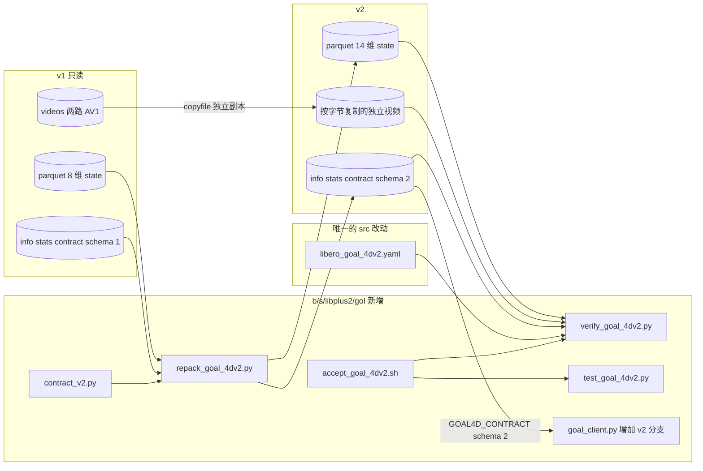
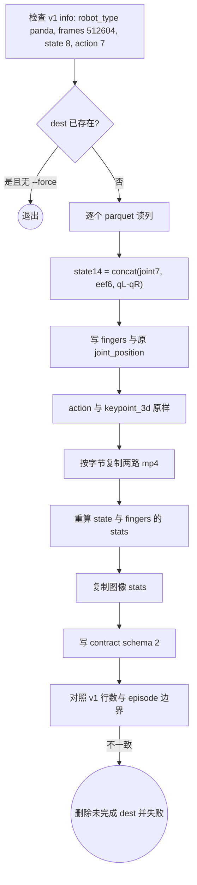
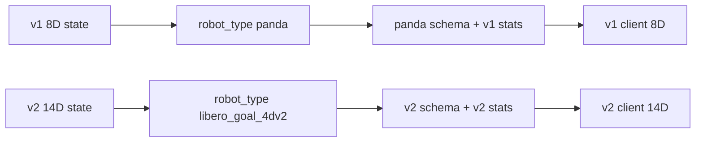

# LIBERO-Plus Goal 状态布局 v2（gen2.2）

> **状态**: 只写方案。本文档定稿时，`b/s/libplus2/gol/` 里还没有 v2 脚本，`/B/Dta/LIBERO/libero_plus_goal_lrb3_4Dv2/` 还不存在，`src/` 与 `evaluation/` 都还没改。
> **源数据**: `/B/Dta/LIBERO/libero_plus_goal_lrb3_4D/`（LeRobot v3.0，`robot_type=panda`，4,243 episode，512,604 帧，20 Hz）
> **新数据**: `/B/Dta/LIBERO/libero_plus_goal_lrb3_4Dv2/`
> **上一版**: [`3d4d_gen2.markdown`](./3d4d_gen2.markdown)。图像朝向、FK、关键点、历史窗口、评估钩子都沿用 gen2，本文把会变的部分重新写全，读本文不需要先翻 gen1。
> **代码将放在**: `b/s/libplus2/gol/`。除第 7 节那一个 schema YAML 外，不改 `src/`、`evaluation/`、`launch/`。

---

## 0. 要解决的问题

v1 的 `observation.state` 是 8 维，`action` 是 7 维：

| 列 | 形状 | 名字 |
|----|------|------|
| `observation.state` | 8 | `eef_x, eef_y, eef_z, eef_ax, eef_ay, eef_az, finger_l, finger_r` |
| `observation.state.joint_position` | 7 | `joint1..joint7`，不在 `observation.state` 里 |
| `action` | 7 | `dx, dy, dz, dax, day, daz, gripper` |

`src/lerobot/dataset_schemas/configs/panda.yaml` 写的是 `action_mask_spec: [7]`。这个数的含义见 `DatasetSchema`：正数表示该维做 delta（减去当前 state），负数表示保持绝对值。`[7]` 展开成 7 个 `True`，也就是 7 维动作全部去减 state。

这和本数据对不上，原因有两层。

1. **语义**。前 6 维动作已经是末端增量；第 7 维是夹爪命令 \(\{-1,+1\}\)，不是手指位置的差分。`libero.yaml` 里 `libero_goal` 用的 `[6, -1]` 才是这个语义：前 6 维 delta，最后 1 维绝对。
2. **形状**。`DeltaActionTransformFn.__call__` 把 mask、state、action 放进同一次 `torch.where`：

```python
# src/lerobot/transforms/core.py
action -= torch.where(mask, state, 0)[None]
```

v1 的 state 长 8、mask 长 7。实测：

```text
RuntimeError: The size of tensor a (7) must match the size of tensor b (8)
```

所以不能只把 `panda.yaml` 改成 `[6, -1]`。当前训练用 `--dataset.action_mode=abs`，配置会删掉 `DeltaActionTransformFn`，mask 根本不执行，训练暂时不会坏。但 schema 仍在把“7 维全是 delta”写成这个数据集的正式描述，以后有人打开 `action_mode=delta` 就会在错误形状上失败，或者在改了形状对齐之后把已经是增量的动作再减一次。

v2 做两件事，并且只做这两件事：

1. 把 `finger_l`、`finger_r` 合成一个夹爪开口，放进 `observation.state`。原来的两指另存一列，不丢。
2. 把 `observation.state.joint_position` 复制进 `observation.state`。原来的关节列保留，逐元素相等。

动作、图像、关键点、fps、episode 边界不动。训练继续 `action_mode=abs`，不在 `src/` 里改 delta 变换。

---

## 1. 锁定的 14 维状态

记一帧 v1 状态为 \(\mathbf{s}^{\mathrm{v1}}\in\mathbb{R}^{8}\)，关节为 \(\mathbf{q}\in\mathbb{R}^{7}\)。

\[
\begin{aligned}
\mathbf{q} &= \texttt{observation.state.joint\_position},\\
(q_L, q_R) &= (s^{\mathrm{v1}}_6,\ s^{\mathrm{v1}}_7),\\
g &= q_L - q_R.
\end{aligned}
\]

符号：\(q_L\) 是左手指关节位置 `finger_l`（米），\(q_R\) 是右手指关节位置 `finger_r`（米），\(g\) 是两指开口（米）。Panda 两指对开，张开时 \(q_L>0\)、\(q_R<0\)，所以 \(g\) 约等于两指间距，而不是其中一个指头的坐标。

v1 `stats.json` 上的范围（512,604 帧）：

| 量 | min | max |
|----|-----|-----|
| \(q_L\) | \(-0.00136\) | \(0.04238\) |
| \(q_R\) | \(-0.04212\) | \(0.00101\) |

二者近似反对称，\(q_L+q_R\) 应接近 0。这是验收项，不是生成时用来改数据的假设。若某一帧 \(|q_L+q_R|\) 过大，原样写入并在报告里计数，不静默改成 \(2q_L\)。

v2 的 `observation.state` 固定为 14 维，下标从 0 起：

| 下标 | 名字 | 来源 |
|------|------|------|
| 0–6 | `joint1` … `joint7` | \(\mathbf{q}\)，逐元素复制 |
| 7–9 | `eef_x, eef_y, eef_z` | \(s^{\mathrm{v1}}_{0:3}\)，米，`gripper0_eef` / grip site |
| 10–12 | `eef_ax, eef_ay, eef_az` | \(s^{\mathrm{v1}}_{3:6}\)，`right_hand` 的轴角，弧度，不折叠到 \([-\pi,\pi]\) |
| 13 | `gripper` | \(g=q_L-q_R\)，米 |

另两列只作档案，不进入模型的 `observation.state`，也不放进 schema 的 `feature_mapping`，因此 `NormalizeTransformFn` 不会选中它们：

| 列 | 形状 | 内容 |
|----|------|------|
| `observation.state.joint_position` | 7 | 与 `state[0:7]` 逐元素相等 |
| `observation.state.fingers` | 2 | 名字 `finger_l`, `finger_r`，等于 \(s^{\mathrm{v1}}_{6:8}\) |

`action` 仍是 7 维，名字不变：`dx, dy, dz, dax, day, daz, gripper`。这里的 `gripper` 是命令，取值 \(\{-1,+1\}\)（LIBERO native：正值闭合）。它和状态第 13 维的开口 \(g\) 不是同一个量，不能互相替换，也不能做 \(a_6-g\)。

### 1.1 和 7 维动作的对应关系

将来如果要做 delta，只允许这一条规则，而且它不放进 `src/lerobot/transforms/core.py`：

\[
\begin{aligned}
a^{\Delta}_{0:6} &= a_{0:6} - s_{7:13},\\
a^{\Delta}_{6} &= a_{6}.
\end{aligned}
\]

\(a\in\mathbb{R}^{7}\) 是数据集里的动作，\(s\in\mathbb{R}^{14}\) 是 v2 状态。\(s_{7:13}\) 是末端 6 维；\(a_6\) 是夹爪命令，保持原值。关节 \(s_{0:7}\) 和开口 \(s_{13}\) 都不参与这个减法。

当前训练不执行上式。`--dataset.action_mode=abs` 的意思是“不要再对已经写好的动作做差分”，不是“这 7 个数是绝对末端位姿”。v1 生成脚本 `generate_goal_4d.py` 把 RLDS 的 `steps/action` 原样写入，前 6 维已经是 OSC 增量。

### 1.2 为什么不是 7 维状态

只留 `eef(6)+gripper(1)` 可以在长度上对齐动作，但关节就不会进入模型读的那一列。本方案按要求把关节并进 `observation.state`，所以模型状态是 14 维，动作仍是 7 维。14 对 7 不能丢给现有的 `DeltaActionTransformFn`。这是有意的：错误的减法比“长度对不上所以报错”更危险。

### 1.3 FK 仍用 9 维 qpos

关键点不从 14 维状态反推。9 维广义坐标是：

\[
\mathbf{q}_{9} = [\mathbf{q};\ q_L;\ q_R] \in\mathbb{R}^{9}.
\]

\(\mathbf{q}\) 来自保留列 `observation.state.joint_position`，\((q_L,q_R)\) 来自保留列 `observation.state.fingers`。现有 `b/s/libplus2/gol/fk.py::qpos9_from_state` 假设 `state[6:8]` 是两指。v2 的 `state[6]` 已经是 `joint7`，`state[7:9]` 是末端位置。v2 验证器禁止调用这个函数去读新的 `observation.state`。

手指不驱动 8 个关键点 body，这点与 gen2 相同。合成 \(g\) 不改变 `observation.keypoint_3d`。

---

## 2. 不改什么

| 对象 | 决定 |
|------|------|
| `action` 数值与名字 | 原样复制 |
| 两路视频像素与编码 | 按字节复制成独立文件，不重编码，不用硬链接或符号链接 |
| `observation.keypoint_3d` | 原样复制，不重跑 FK |
| fps、episode 长度、任务文本 | 原样复制 |
| 轴角 | 原样复制，不把模长折回 \(\pi\) |
| `generate_goal_4d.py`、`contract.py`、`fk.py` | 不改，v1 仍可复现 |
| `panda.yaml` 的 `action_mask_spec: [7]` | 不改。v1 数据继续用它；v2 用新的 `robot_type` |
| `evaluation/LIBERO2/model2libero_interface.py` | 不改。v2 客户端在子类里覆盖 `_extract_state` |
| `DeltaActionTransformFn` | 不改 |

v1 目录保持只读。v2 是旁边的新目录。

---

## 3. 静态架构



| 组件 | 职责 | 为什么单独放 |
|------|------|----------------|
| `contract_v2.py` | 14 个名字、\(g=q_L-q_R\)、容差、`robot_type`、契约版本的唯一定义 | 重打包、验证器、单测、客户端都读它 |
| `repack_goal_4dv2.py` | 改表格、按字节复制视频、重算数值统计、写契约 2 | 不调用 `LeRobotDataset.create`，避免重编码；也不做任何链接，避免 v1 删除后 v2 视频失效 |
| `libero_goal_4dv2.yaml` | 双相机映射 + `Control Mode: <end_effector>` | `get_schema` 只扫描 `src/lerobot/dataset_schemas/configs/`。未知 `robot_type` 会退回单相机，重演 gen2 的 `INVALID_IMAGE_COUNT` |
| `goal_client.py` 的 v2 分支 | 活体观测拼成同一个 14 维向量 | 基类 `_extract_state` 仍返回 8 维，不改基类 |
| `verify_goal_4dv2.py` | 证明 v2 是 v1 的列变换，不是另一份轨迹 | 与生成器分开，避免自己证明自己 |

`action_mode` 这个词在两处意思不同，文档和 YAML 注释都要写上：

- schema 字段 `action_mode: end_effector` 进入 prompt，变成 `Control Mode: <end_effector>`。来源是 `InternVLAA15ChatProcessorTransformFn.hydrate` 读取 `schema.action_mode`。缺了这个字段时默认是 `joint`，prompt 会错。
- 训练 CLI `--dataset.action_mode=abs` 决定要不要插入 `DeltaActionTransformFn`。v2 必须是 `abs`。

---

## 4. 重打包数据流



不从 RLDS 重读，不跑 `GoalTableFK`，不调用 `LeRobotDataset.add_frame`。v1 已经验收过的图像朝向和关键点原样留下。视频也不重编码：用 `shutil.copyfile` 把每个 mp4 复制成 v2 目录里的普通文件。禁止 `os.link`、`os.symlink` 以及任何会让 v2 路径指向 v1 inode 的做法。v1 以后可能整目录删除，硬链接或符号链接都会让 v2 的视频一起消失。

因此 v2 会再占一份视频磁盘，gen2 对外推体积的估计约 4 GB。复制中断时按第 5.2 节删除未完成的 dest，不留下缺文件的目录。

---

## 5. 代码级接口

下面是将要写的接口。本节是规格，不是已经落地的源文件。

### 5.1 `b/s/libplus2/gol/contract_v2.py`

```python
ROBOT_TYPE = "libero_goal_4dv2"
STATS_KEY = "libero_goal_4dv2"
CONTRACT_SCHEMA = "goal_train_eval_contract/2"
STATE_DIM = 14
JOINT_SLICE = slice(0, 7)
EEF_SLICE = slice(7, 13)
GRIPPER_INDEX = 13
STATE_NAMES = [
    "joint1", "joint2", "joint3", "joint4", "joint5", "joint6", "joint7",
    "eef_x", "eef_y", "eef_z", "eef_ax", "eef_ay", "eef_az",
    "gripper",
]
FINGER_NAMES = ["finger_l", "finger_r"]
ACTION_NAMES = ["dx", "dy", "dz", "dax", "day", "daz", "gripper"]
# |q_L + q_R| 超过此值只计数，不改数。单位米。
FINGER_ANTISYM_TOL_M = 2.0e-3
# 重打包后 state[0:7] 与 joint_position、state[7:13] 与 v1 state[0:6] 的最大绝对误差。
COPY_ATOL = 0.0  # 必须按位相等；float32 复制不允许再算一遍
```

```python
def gripper_opening(finger_l: np.ndarray, finger_r: np.ndarray) -> np.ndarray:
    """g = q_L - q_R. 输入形状相同，输出与 finger_l 同形状。"""

def pack_state_v2(joint7: np.ndarray, eef6: np.ndarray, finger_l: np.ndarray, finger_r: np.ndarray) -> np.ndarray:
    """返回 [..., 14]，dtype float32。joint7 末维 7，eef6 末维 6，两指末维 1 或可广播。"""

def qpos9_from_columns(joint7: np.ndarray, fingers2: np.ndarray) -> np.ndarray:
    """[joint7, finger_l, finger_r]，形状 [9] 或 [T, 9]。不要读 14 维 state。"""
```

`pack_state_v2` 在维数不对、非有限值时抛 `ValueError`，不返回 NaN。

### 5.2 `b/s/libplus2/gol/repack_goal_4dv2.py`

```text
python repack_goal_4dv2.py \
  --src /B/Dta/LIBERO/libero_plus_goal_lrb3_4D \
  --dest /B/Dta/LIBERO/libero_plus_goal_lrb3_4Dv2 \
  --confirm-full-run --force
```

| 参数 | 作用 |
|------|------|
| `--src` | v1 根目录，必须已有 `meta/info.json` |
| `--dest` | v2 根目录。已存在且无 `--force` 则退出码 2 |
| `--confirm-full-run` | 与 `--max-episodes` 互斥。正式 512,604 帧必须带它 |
| `--max-episodes N` | 只写前 N 条，dest 名必须包含 `smoke`，否则拒绝 |
| `--force` | 删除已有 dest。删除前检查 dest 的 `meta/info.json` 里 `robot_type==libero_goal_4dv2`，避免误删 v1 |

`main` 的顺序：

1. `load_v1_info(src)`：断言 `codebase_version==v3.0`、`robot_type==panda`、`total_frames==512604`（smoke 除外）、`features["observation.state"].shape==[8]`、`features["action"].shape==[7]`、关节列存在、两路视频存在。
2. `rewrite_parquets(src, dest)`：对 `data/**/*.parquet` 用 pyarrow 读。每行 `observation.state` 从长度 8 变成长度 14。新增 `observation.state.fingers`。`observation.state.joint_position`、`action`、`observation.keypoint_3d`、`episode_index`、`frame_index`、`index`、`timestamp`、`task_index` 列字节级保留（读出再写出，float32 按位一致）。
3. `copy_videos(src, dest)`：对 `videos/` 下每个普通文件调用 `shutil.copyfile`，目标必须是新 inode 上的普通文件。源若是符号链接，先拒绝并退出，不把链接复制到 v2。复制后立刻检查 `os.path.samefile(src, dest)` 为假、`os.path.islink(dest)` 为假、两边字节数相同。
4. `copy_meta_tables(src, dest)`：复制 `meta/episodes`、任务表、`goal_episodes.jsonl`。这些表不含状态向量。
5. `recompute_vector_stats(dest)`：只扫 parquet，不解码视频。重算 `observation.state`（14）、`observation.state.fingers`（2）、`observation.state.joint_position`（7）、`action`（7）、`observation.keypoint_3d`（56）。图像的 min/max/mean/std/count 从 v1 `stats.json` 原样复制。
6. `write_info_v2`：`robot_type=libero_goal_4dv2`，`total_frames` 与 v1 相同，特征表换成第 1 节的名字。
7. `write_contract_v2`：见第 5.3 节。
8. 任一步失败：若 dest 是本次创建的，删除 dest，然后非零退出。不留下半份数据集。

parquet 行序必须与 v1 相同。不排序、不滤 no-op、不去重。

### 5.3 契约 `meta/goal_train_eval_contract.json`

在 gen2 契约上增加状态布局，并把 schema 升到 2。图像、底座、\(R_{\mathrm{pad}}\)、\(H\)、MJCF MD5 从 v1 契约复制，不重新测量。

```json
{
  "schema": "goal_train_eval_contract/2",
  "robot_type": "libero_goal_4dv2",
  "stats_key": "libero_goal_4dv2",
  "parent_dataset": "/B/Dta/LIBERO/libero_plus_goal_lrb3_4D",
  "state_layout": "joint7_eef6_gripper1",
  "state_dim": 14,
  "state_names": ["joint1", "joint2", "joint3", "joint4", "joint5", "joint6", "joint7",
                  "eef_x", "eef_y", "eef_z", "eef_ax", "eef_ay", "eef_az", "gripper"],
  "gripper_opening": "finger_l - finger_r",
  "gripper_unit": "meter",
  "action_dim": 7,
  "action_semantics": "eef_delta6_plus_gripper_command",
  "dataset_action_mode": "abs",
  "prompt_control_mode": "end_effector",
  "retained_columns": ["observation.state.joint_position", "observation.state.fingers"],
  "videos_are_independent_copies": true,
  "image_orientation": "raw",
  "cameras": {"observation.images.image": "agentview", "observation.images.image2": "wrist"},
  "resize_hw": [224, 224],
  "fps": 20,
  "kpt_4d_mode": "pos_rot",
  "num_keypoints": 8,
  "keypoint_history_max_len": 200,
  "chunk_size": 50
}
```

`r_pad`、`base_xpos_m`、`eval_mjcf_md5`、`live_eef_tol_m` 与 v1 契约相同，写的时候从 v1 文件读，不在 v2 里再写一遍魔法数。读契约的人看到 schema 2 就必须按 14 维拼状态；schema 1 的客户端拒绝 schema 2，反过来也拒绝。

### 5.4 唯一的 schema 文件

路径：`src/lerobot/dataset_schemas/configs/libero_goal_4dv2.yaml`。

```yaml
# v2 Goal dataset. observation.state is 14D:
#   joint1..joint7, eef_x,y,z, eef_ax,ay,az, gripper_opening.
# action stays 7D and is already an EEF delta plus a gripper command.
# dataset.action_mode must stay "abs" (do not run DeltaActionTransformFn).
# action_mode below is the prompt Control Mode, not abs/delta.
# action_mask_spec is omitted on purpose: a 7-long mask cannot align with 14D state.
robot_type: libero_goal_4dv2
feature_mapping:
  observation.state:
    - observation.state
  action:
    - action
image_mapping:
  observation.images.image: observation.images.image0
  observation.images.image2: observation.images.image1
action_mode: end_effector
description: "LIBERO-goal v2: 14D state = joint7 + eef6 + gripper opening; 7D action unchanged"
```

禁止把 `observation.state.joint_position` 或 `observation.state.fingers` 放进 `feature_mapping`。`ComposeFieldsTransform` 会把列出的列再拼接一次，关节会在 14 维向量里出现两遍。

`NormalizeTransformFn.hydrate` 只取 `get_state_keys()+get_action_keys()`，因此归一化的是 14 维 `observation.state` 和 7 维 `action`。保留列留在 parquet 里，供 FK 和审计，不进 loss。

### 5.5 评估：只扩展 `goal_client.py`

基类 `LiberoModelClient._extract_state`（`evaluation/LIBERO2/model2libero_interface.py`）仍是：

```text
concat(robot0_eef_pos[3], quat2axisangle(robot0_eef_quat), robot0_gripper_qpos[2])  → 8 维
```

v2 不改这个函数。`GoalLiberoModelClient` 在契约 `schema==goal_train_eval_contract/2` 时覆盖它：

```python
def _extract_state(self, obs: dict) -> np.ndarray:
    if self.contract["schema"] != "goal_train_eval_contract/2":
        return super()._extract_state(obs)
    joint = np.asarray(obs["robot0_joint_pos"], dtype=np.float32).reshape(-1)
    eef_pos = np.asarray(obs["robot0_eef_pos"], dtype=np.float32).reshape(-1)
    eef_quat = np.asarray(obs["robot0_eef_quat"], dtype=np.float32).reshape(-1)
    fingers = np.asarray(obs["robot0_gripper_qpos"], dtype=np.float32).reshape(-1)
    if joint.shape != (7,) or eef_pos.shape != (3,) or eef_quat.shape != (4,) or fingers.shape != (2,):
        raise ValueError(
            f"v2 obs shapes joint={joint.shape} eef={eef_pos.shape} "
            f"quat={eef_quat.shape} fingers={fingers.shape}"
        )
    axisangle = _quat2axisangle(eef_quat)  # 与基类同一个函数
    return pack_state_v2(joint, np.concatenate([eef_pos, axisangle]), fingers[0], fingers[1])
```

`robot0_joint_pos` 由 LIBERO-Plus `bddl_base_domain.py::_setup_observables` 设为 active（该文件第 437 行 `observables["robot0_joint_pos"]._active = True`）。单测用假 obs 字典，不启动仿真。活体环境缺这个键时，`_extract_state` 抛 `KeyError`，本回合失败，不许退回 8 维。

schema 1 的 `GoalLiberoModelClient` 行为与 gen2 相同，仍然 8 维。用 schema 2 的契约启动后，发给服务器的 `state` 长度必须是 14。服务器若仍用 `--robot_type panda --stats_key panda`，会拿 8 维均值去除 14 维向量。包装脚本在 schema 2 时改为：

```text
--robot_type libero_goal_4dv2 --stats_key libero_goal_4dv2
```

并在启动前读契约，两个字符串必须等于契约里的值。

---

## 6. 训练时这 14 维怎么走

`--dataset.action_mode=abs` 时，`InternVLAA15DatasetConfig.__post_init__` 去掉 `DeltaActionTransformFn`。随后：

1. `NormalizeTransformFn` 用 v2 `stats.json` 里 `observation.state` 的 14 维 mean/std（或该策略选用的 min/max）按维归一化。关节是弧度，末端位置是米，轴角是弧度，开口是米，尺度不同，必须按维，不能用一个标量。
2. `tokenize_state=true` 时，`_encode_state` 把状态 pad 到 `max_state_dim=32`，除以 3，再离散成 256 档，写成 `State: ...`。14 个有效数加 18 个填充 0。`max_state_dim=32` 够用。v1 checkpoint 的 prompt 里只有 8 个有效数，不能把 v2 数据直接续在 v1 权重上而不重新学这段文本。
3. prompt 里的 `Control Mode` 来自 schema 的 `end_effector`，不是来自 14 维里的关节。关节进状态向量，不表示控制模式改成关节空间。动作头仍预测 7 维 EEF 增量加夹爪命令。
4. `observation.state` 在进 action expert 之前还会 pad 到 `max_state_dim`。flow matching 的目标仍是 7 维 `action`（再 pad 到 `max_action_dim`）。多出来的状态维是条件，不是动作标签。

建议的数据集参数（写在将来的启动说明里，本文不改 `p1_warmup_launch.sh`）：

```text
--dataset.repo_id=libero_plus_goal_lrb3_4Dv2
--dataset.action_mode=abs
--dataset.use_external_stats=false
--dataset.tokenize_state=true
```

`use_external_stats=false` 表示用该数据集自己的 `meta/stats.json`。不要把 v2 统计写进一份仍叫 `panda` 的聚合文件。

---

## 7. 风险

| # | 风险 | 为什么会发生 | 挡住它的检查 |
|---|------|----------------|--------------|
| R1 | 用 8 维 panda 统计归一化 14 维状态 | `stats_key` 仍写 `panda`，或服务器参数没改 | 契约 `stats_key`；验证器比对 `len(mean)==14`；包装脚本拒绝 `panda` |
| R2 | 打开 `action_mode=delta` 后形状报错或减错 | mask 长 7，state 长 14；前 6 维动作已经是增量 | 训练命令固定 `abs`；YAML 不写 `action_mask_spec`；单测把 delta 变换配上 v2 样本，期望 `RuntimeError`，而不是一个“看起来能跑”的结果 |
| R3 | 把 `state[6:8]` 当成两指去做 FK | 旧 `qpos9_from_state` | v2 验证只用 `qpos9_from_columns`；单测构造一组两指非零的 14 维向量，断言旧函数会读到关节和末端 |
| R4 | \(g\) 和动作夹爪被当成同一通道 | 两边都叫 gripper | info 的名字保留，但契约写明单位和语义；V12 仍用 `fingers` 的 \(q_L\) 对 `action[6]` 做相关，不用 \(g\) 冒充命令 |
| R5 | 重编码视频改变像素 | 误用 `LeRobotDataset.create` | 代码路径里不允许调用它；验收用整文件 SHA-256，不解码、不重编码 |
| R6 | v2 视频仍依赖 v1 | 用了硬链接或符号链接，之后删除 v1 | `copyfile` 写成普通文件；`samefile` 必须为假，`islink` 必须为假，SHA-256 必须与复制当时的 v1 文件相同 |
| R7 | `--force` 删掉 v1 | dest 指错 | 删除前读 dest 的 `robot_type`，不是 `libero_goal_4dv2` 就拒绝 |
| R8 | schema 再拼接关节列 | `feature_mapping` 里写了 `joint_position` | 单测读 YAML，断言 state 源只有 `observation.state` 一项 |
| R9 | 轴角被折叠 | 重打包时做了 `arctan2` | `state[10:13]` 与 v1 `state[3:6]` 按位相等，包括模长 \(>\pi\) 的帧 |
| R10 | 评估退回 8 维 | 子类没覆盖，或契约仍是 schema 1 | 假 obs 单测要求返回长度 14；schema 1 与 schema 2 交叉启动必须 `RuntimeError` |
| R11 | 反对称很差仍被改写 | 用 \(2q_L\) 代替 \(q_L-q_R\) | 公式只有减法；\(|q_L+q_R|\) 超阈只计数 |
| R12 | v1 文本状态的 checkpoint 直接吃 v2 | 离散 token 个数变了 | 第 6 节写明不能直接续训；不在转换脚本里做权重迁移 |

已知、本方案不修的 gen2 事项仍然有效：episode 末尾 50 帧被 clamp 后仍当监督（约占 \(4243\times 50/512604=41.4\%\)）、轨迹约 9.9 倍重复、本机没有 GPU 所以不做前向。它们不是这次列变换引入的。

---

## 8. 测试

文件：`b/s/libplus2/gol/test_goal_4dv2.py`。不读全量 512,604 行；全量交给第 9 节的验证器。每个测试的输入、输出和失败条件如下。

### 8.1 纯函数

| 测试 | 输入 | 通过条件 |
|------|------|----------|
| `test_gripper_opening_is_left_minus_right` | \(q_L=0.04,\ q_R=-0.04\) | \(g=0.08\) |
| `test_gripper_opening_closed_is_near_zero` | \(q_L=0,\ q_R=0\) | \(g=0\) |
| `test_pack_matches_named_slices` | joint=`1..7`，eef=`8..13`，\(q_L=0.02,\ q_R=-0.01\) | `out[0:7]==1..7`，`out[7:13]==8..13`，`out[13]==0.03`，`out.shape==(14,)`，dtype float32 |
| `test_pack_rejects_nan` | joint 里一个 NaN | `ValueError` |
| `test_qpos9_uses_finger_column` | joint 全 0，fingers=`[0.02,-0.02]` | `qpos[7:9]==fingers`，且不等于 `pack(...)[6:8]` |
| `test_old_qpos_helper_would_misread_v2` | 调用现有 `fk.qpos9_from_state(joint, state14)` | 该函数要求 `state` 至少 8 维，会把 `state[6:8]` 当成手指；断言其结果的最后两维等于 `state14[6:8]`，而不等于真正的 fingers。这是锁定旧函数的危险行为，防止以后“顺便复用” |

### 8.2 小样本重打包

在临时目录造 2 个 episode、每条 4 帧的 v1 迷你数据集（假图像写成 1 字节文件，不编码 AV1）。`observation.state` 用真实统计范围内的两指，其中一帧轴角模长设为 \(3.5>\pi\)。

| 测试 | 通过条件 |
|------|----------|
| `test_smoke_repack_layout` | v2 `info.json` 的 state 名字与 `STATE_NAMES` 一致；每帧 14 维；`fingers` 等于源 `state[6:8]`；`state[0:7]` 等于关节列；`state[7:13]` 等于源 `state[0:6]`（含那一帧 \(3.5\)）；`state[13]==fingers[0]-fingers[1]` |
| `test_smoke_videos_are_independent_copies` | v2 视频与 v1 视频字节相同，但 `os.path.samefile` 为假，且 v2 路径不是符号链接。删掉临时 v1 文件后，v2 文件仍可按原字节读出 |
| `test_smoke_action_and_keypoints_bitwise` | `action` 与 `keypoint_3d` 的 float32 字节相同 |
| `test_smoke_refuses_existing_dest` | 第二次无 `--force` 退出码 2 |
| `test_smoke_force_refuses_non_v2` | dest 的 `robot_type` 写成 `panda` 时 `--force` 退出码非 0，且该目录还在 |
| `test_full_flag_rejects_max_episodes` | `--confirm-full-run --max-episodes 1` 退出码非 0 |

### 8.3 schema 与 delta 失败

| 测试 | 通过条件 |
|------|----------|
| `test_schema_two_cameras_and_prompt_mode` | `get_schema("libero_goal_4dv2")` 的 image 映射含 `image` 与 `image2`；`action_mode=="end_effector"`；`feature_mapping["observation.state"]==["observation.state"]`；`action_mask_spec is None` |
| `test_delta_transform_rejects_14_vs_7` | 用 v2 的 14 维 state、7 维 action 调用 `DeltaActionTransformFn`，mask 取 `[6,-1]` 或全 True。期望 `RuntimeError`。不把这个异常吞掉改成截断 |
| `test_abs_path_does_not_subtract` | 构造 `InternVLAA15DatasetConfig(action_mode="abs")`，输入列表里没有 `DeltaActionTransformFn` |

最后一条只检查变换列表，不加载 Qwen 权重。

### 8.4 客户端

| 测试 | 输入 | 通过条件 |
|------|------|----------|
| `test_v2_client_state_is_14` | 假 obs：`robot0_joint_pos` 长度 7，`robot0_eef_pos` 长度 3，`robot0_eef_quat` 单位四元数，`robot0_gripper_qpos=[0.03,-0.02]`，契约 schema 2 | 返回长度 14；末元 \(0.05\)；前 7 元等于关节；不 import 仿真器 |
| `test_v2_client_missing_joint_raises` | 去掉 `robot0_joint_pos` | `KeyError` 或 `ValueError`，不返回 8 维 |
| `test_v1_contract_still_returns_8` | 同一 obs，契约 schema 1 | 返回长度 8，末两元是两指，与基类一致 |
| `test_schema_mismatch_refuses_start` | 代码请求 schema 2，文件是 schema 1 | `RuntimeError` |

### 8.5 负对照

`test_verifier_catches_gripper_defined_as_left_only`：造一份把 `state[13]` 写成 \(q_L\) 而不是 \(q_L-q_R\) 的 parquet，`verify_goal_4dv2.py` 必须非零退出，且输出里有 `gripper_opening`。

---

## 9. 验证器

文件：`b/s/libplus2/gol/verify_goal_4dv2.py`。

```text
python verify_goal_4dv2.py \
  --v1 /B/Dta/LIBERO/libero_plus_goal_lrb3_4D \
  --v2 /B/Dta/LIBERO/libero_plus_goal_lrb3_4Dv2 \
  --full
```

无 `--full` 时每个 parquet 只读前 64 行，供 smoke。`--full` 扫完全部行，不解码视频。

| 编号 | 检查 | 失败条件 |
|------|------|----------|
| W01 | v2 `robot_type`、`stats_key`、契约 schema | 不是 `libero_goal_4dv2` / schema 2 |
| W02 | 帧数、episode 数、fps | 与 v1 不等（全量时期望 512604 / 4243 / 20） |
| W03 | `state` 名字与长度 | 不是 14 个 `STATE_NAMES` |
| W04 | `state[0:7]` 与 `joint_position` | 任一帧不相等 |
| W05 | `state[7:13]` 与 v1 `state[0:6]` | 按 `index` 对齐后不相等 |
| W06 | `fingers` 与 v1 `state[6:8]` | 不相等 |
| W07 | `state[13]` | 不等于 `finger_l-finger_r`，容差 0（float32 减法后再存回 float32，比较时用 `np.float32` 重算） |
| W08 | `action`、`keypoint_3d` | 与 v1 按 `index` 对齐后 float32 字节不同 |
| W09 | 视频 | 任一 mp4 缺失、是符号链接、与 v1 `samefile` 为真、字节数不同，或 SHA-256 与 v1 不同。契约里必须有 `videos_are_independent_copies: true` |
| W10 | 反对称报告 | 不作为失败。打印 \(\|q_L+q_R\|\) 的 max、以及超过 `FINGER_ANTISYM_TOL_M` 的帧数 |
| W11 | 夹爪命令符号 | 与 gen2 V12 相同：同一 episode 内 `corr(action[6], Δfinger_l)<0`，且 `action[6]` 的取值集合是 `{-1,1}` 的子集。相关用保留的 `fingers`，不用 \(g\) |
| W12 | stats | `observation.state.mean` 长度 14；`action.mean` 长度 7；图像 `count` 与 v1 相同。不要求图像 mean 重算 |
| W13 | 关键点仍可由保留列复现 | 抽 32 帧，`qpos9_from_columns` 后用现有 `GoalTableFK` 算位置，与 `keypoint_3d` 的最大差沿用 gen2 的 \(10^{-5}\)（存储本身是 v1 的副本，这一项是防复制时列错位） |
| W14 | 没有调用旧的按 8 维切手指 | 在 v2 上 `qpos9_from_state(joint, state14)` 的手指段不得等于 `fingers`。此条在抽到的 32 帧上断言“旧切法是错的”，避免验证器自己用错 |

W05 依赖 v1 与 v2 的 `index` 列一一对应。重打包若重排了行，W05 失败，这是想要的。

---

## 10. 验收脚本

文件：`b/s/libplus2/gol/accept_goal_4dv2.sh`。默认只跑不碰全量数据的阶段。

```text
bash b/s/libplus2/gol/accept_goal_4dv2.sh
DATASET_V2=/B/Dta/LIBERO/libero_plus_goal_lrb3_4Dv2 \
  bash b/s/libplus2/gol/accept_goal_4dv2.sh
```

| 阶段 | 命令 | 前提 | 通过 |
|------|------|------|------|
| S0 | `test_goal_4dv2.py` | 无全量数据 | 第 8 节全部通过 |
| S1 | `get_schema("libero_goal_4dv2")` 的五行断言 | YAML 已放进 configs | 与第 5.4 节一致 |
| S2 | 迷你重打包（测试内的临时目录，S0 已覆盖） | — | 不单独再跑 |
| S3 | `verify_goal_4dv2.py --v1 <v1> --v2 "$DATASET_V2" --full` | 环境变量 `DATASET_V2` 指向已生成目录 | W01–W14 除 W10 外全过；W10 打印计数 |
| S4 | `check_training_path.py` 的 v2 入口（见下） | 同上，且本机 Python 是 `/B/VENV/itnvla15rbt20/bin/python` | 真实 `make_dataset` 取出的 `observation.state` 长度 14，pad 后 32；`action` 前 7 维有限；`image_grid_thw` 两行；样本里的 `Control Mode` 文本含 `end_effector` |
| S5 | 视频是独立副本 | S3 的 W09 | 与 S3 一起报告：SHA-256 相同，且不是硬链接或符号链接 |

未设置 `DATASET_V2` 时 S3–S5 跳过，并打印跳过原因，退出码仍为 0。这样没有数据的机器可以先验收单测。全量数据生成之后必须再跑一遍带 `DATASET_V2` 的命令，否则不算转换完成。

S4 不改现有 `check_training_path.py` 的 v1 行为。v2 用新参数 `--expect-state-dim 14 --expect-robot-type libero_goal_4dv2`。不传这两个参数时，旧脚本仍按 gen2 检查 `panda` 与它原来的状态宽度。实现时若旧脚本把状态宽度写死成 8，应加可选参数，而不是改掉 v1 的默认期望。

前向、反传、仿真成功率不在本验收里。本机没有 GPU，也没有 LIBERO 客户端环境。活体 14 维对照放到评估包装脚本的首步：用同一帧的 `robot0_joint_pos` 与数据集第一帧 `state[0:7]` 比，只在有仿真器的机器上做，失败则 `GoalFKMismatch` 那条路径旁边再抛 `GoalStateLayoutMismatch`。那一项不阻塞 S0–S5。

---

## 11. 操作顺序（实现阶段再用，现在不执行）

1. 加入 `contract_v2.py` 与 `test_goal_4dv2.py` 的纯函数测试，先看 S0 里不依赖重打包的测试失败（模块还不存在时，这一步就是实现的起点）。
2. 加入 `libero_goal_4dv2.yaml`，跑 S1。
3. 实现 `repack_goal_4dv2.py`，用 `--max-episodes` 写到名字含 `smoke` 的临时目录，跑第 8.2 节。
4. 确认 smoke 的视频是独立副本（字节相同、inode 不同、删掉源文件后副本仍在）之后，才允许：

```text
python b/s/libplus2/gol/repack_goal_4dv2.py \
  --src /B/Dta/LIBERO/libero_plus_goal_lrb3_4D \
  --dest /B/Dta/LIBERO/libero_plus_goal_lrb3_4Dv2 \
  --confirm-full-run
```

5. `DATASET_V2` 指向上面的目录，跑验收脚本。W01–W14 通过之前，不把该目录链到 `$HF_LEROBOT_HOME`，也不启动训练。
6. 最后改 `goal_client.py` 的 v2 分支和第 8.4 节的假 obs 测试。评估包装脚本只在契约 schema 为 2 时改 `robot_type` / `stats_key` 两个参数。

训练启动仍然使用 gen2 已经对齐的关键点参数：`keypoint_history_max_len=200`、`kpt_4d_mode=pos_rot`、`num_keypoint_joints=8`、`action_mode=abs`。改变的是数据集路径、`robot_type` 和状态宽度。

---

## 12. 一页对照

| 项 | v1 `libero_plus_goal_lrb3_4D` | v2 `libero_plus_goal_lrb3_4Dv2` |
|----|-------------------------------|----------------------------------|
| `robot_type` / `stats_key` | `panda` | `libero_goal_4dv2` |
| `observation.state` | 8：末端 6 + 两指 | 14：关节 7 + 末端 6 + 开口 \(g\) |
| 两指 | 在 state 的最后两维 | `observation.state.fingers`，state 里只留 \(g=q_L-q_R\) |
| 关节 | 只在 `joint_position` | 该列保留，并复制到 `state[0:7]` |
| `action` | 7 维增量 + 命令 | 相同 |
| 视频 | AV1 文件 | 独立副本，字节相同，不共享 inode |
| 关键点 | 56 维 | 相同字节 |
| 训练 `action_mode` | `abs` | `abs` |
| prompt 控制模式 | `end_effector`（来自 panda schema） | `end_effector`（来自新 schema） |
| 契约 | `goal_train_eval_contract/1` | `goal_train_eval_contract/2` |
| delta mask | 文档上是不准确的 `[7]`，运行时被 `abs` 跳过 | 不提供 mask；14 与 7 不对齐时必须报错 |

---

## 13. v2 训练时 schema 的最终方案

### 13.1 结论：不要把全局 `panda.yaml` 改成 v2 schema

v2 不应继续使用 `robot_type: panda`，也不应通过修改
[`src/lerobot/dataset_schemas/configs/panda.yaml`](../../../src/lerobot/dataset_schemas/configs/panda.yaml)
来表达 14 维状态。推荐的最终身份关系是：

```text
v1:
  info.json.robot_type = panda
  schema                = panda.yaml
  stats_key             = panda
  observation.state     = 8D

v2:
  info.json.robot_type = libero_goal_4dv2
  schema                = libero_goal_4dv2.yaml
  stats_key             = libero_goal_4dv2
  observation.state     = 14D
```

原因不是 YAML 本身能不能保存 14 这个数字。当前 schema 的 `feature_mapping`
只描述“使用哪个字段”，并不验证 state 的维度；真正带有维度的是 v2 的
`info.json`、`stats.json`、训练 batch 和评估服务加载的统计量。问题在于
`robot_type` 是 registry 的唯一 key：

```python
schema = self._schemas.get(robot_type)
```

见 [`src/lerobot/dataset_schemas/registry.py`](../../../src/lerobot/dataset_schemas/registry.py)。
如果 v1 和 v2 都叫 `panda`，它们会共享同一个 schema 身份和容易混用的统计量
身份；聚合 stats、恢复 checkpoint、启动 policy server 或混合加载两个数据集时，
就可能出现 8D/14D 维度和统计量错配。独立的 `robot_type` 是隔离边界，不是为了
改变控制模式。

### 13.2 现有 `panda.yaml` 应保持不变

v1 数据仍使用：

```yaml
# src/lerobot/dataset_schemas/configs/panda.yaml
robot_type: panda
action_mask_spec: [7]
feature_mapping:
  observation.state:
    - observation.state
  action:
    - action
image_mapping:
  observation.images.image: observation.images.image0
  observation.images.image2: observation.images.image1
action_mode: end_effector
```

这份文件的 `[7]` 对 v1 的 delta 转换语义仍不准确，但当前 LIBERO 训练使用
`--dataset.action_mode=abs`，所以 `DeltaActionTransformFn` 不会进入 transform
列表。v2 不应通过继续修改这份全局配置来解决问题。

如果未来完全废弃 v1，并且环境中再也没有 `robot_type=panda` 数据，理论上可以
把 `panda.yaml` 迁移成 v2 配置；但这属于全局身份迁移，必须同时修改所有数据
的 `info.json`、stats 路径、checkpoint 运行参数和评估契约，不能只改一个 YAML。
本方案不选择这个风险更高的路径。

### 13.3 v2 应新增的 schema 文件

新增：

```text
src/lerobot/dataset_schemas/configs/libero_goal_4dv2.yaml
```

内容应为：

```yaml
# LIBERO Goal v2.
# observation.state = joint1..joint7 + eef_x,y,z + eef_ax,ay,az + gripper_opening.
# action = EEF-delta-6D plus a gripper command.
# Training must use dataset.action_mode=abs because stored action is already delta.
# This action_mode is the prompt Control Mode, not the abs/delta transform switch.
# action_mask_spec is intentionally omitted: state has 14 dimensions and action has 7.
robot_type: libero_goal_4dv2
feature_mapping:
  observation.state:
    - observation.state
  action:
    - action
image_mapping:
  observation.images.image: observation.images.image0
  observation.images.image2: observation.images.image1
action_mode: end_effector
description: "LIBERO Goal v2: 14D joint7 + eef6 + gripper opening, 7D action unchanged"
```

这里有两个容易混淆的 `action_mode`：

- YAML 的 `action_mode: end_effector` 会被
  `InternVLAA15ChatProcessorTransformFn.hydrate()` 读取，写入 prompt 的
  `Control Mode: <end_effector>`；
- CLI 的 `--dataset.action_mode=abs` 决定是否移除
  `DeltaActionTransformFn`，必须设置为 `abs`。

两者不是同一个配置项。不能因为 schema 写了 `end_effector`，就把训练 CLI 写成
`delta`。

### 13.4 为什么 v2 schema 不写 `action_mask_spec`

`DatasetSchema.action_mask` 在未设置 `action_mask_spec` 时返回空 bool tensor；
它不是一个自动解决 14D state / 7D action 的投影器。只要错误地把
`DeltaActionTransformFn` 留在 pipeline 中，空 mask 同样不能替代显式维度映射。

因此 v2 的安全约束是两层：

```text
schema 不提供 action_mask_spec
        +
dataset.action_mode=abs
        ↓
DeltaActionTransformFn 不进入当前训练 pipeline
```

测试必须检查：

1. `get_schema("libero_goal_4dv2").action_mask_spec is None`；
2. `InternVLAA15DatasetConfig(action_mode="abs")` 的 transform 列表中不包含
   `DeltaActionTransformFn`。

如果将来确实要把绝对 EEF 目标转换为 delta，应该新增专用投影 transform，而不是
重新解释 `[7]` 或 `[6, -1]`：

```python
eef_state = data["observation.state"][..., 7:13]  # 14D state 的 eef6
action = data["action"]                            # [..., 7]
action[..., :6] = action[..., :6] - eef_state
# action[..., 6] 是 LIBERO gripper command，保持不变
```

这段逻辑只适用于输入 action 确实是绝对 EEF 目标的数据。当前 v2 的输入 action
已经是 delta，不能调用它，否则会二次差分。

---

## 14. v2 训练数据的完整对齐关系

### 14.1 字段对齐

v2 重打包必须对每一帧执行确定性映射：

```text
old_state[0:6]                  → new_state[7:13]
old_state[6] = finger_l         → retained_fingers[0]
old_state[7] = finger_r         → retained_fingers[1]
joint_position[0:7]             → new_state[0:7]
finger_l - finger_r             → new_state[13]
action[0:7]                     → action[0:7]  (不改变)
keypoint_3d                     → keypoint_3d  (不改变)
```

v2 的主 state 固定为：

```text
observation.state =
[
  joint1, joint2, joint3, joint4, joint5, joint6, joint7,
  eef_x, eef_y, eef_z, eef_ax, eef_ay, eef_az,
  gripper_opening
]
```

以下字段仍保留为审计/FK 数据：

```text
observation.state.joint_position = [joint1..joint7]
observation.state.fingers         = [finger_l, finger_r]
```

不能把 `observation.state.fingers` 再加入 `feature_mapping`。否则
`ComposeFieldsTransform` 可能再次拼接字段，得到重复或维度错误的 state。

### 14.2 action 对齐

v2 不能把状态中的 `gripper_opening` 当成 action 的第 7 维。二者分别是：

```text
state[13] = finger_l - finger_r   # 观测到的开口，单位米
action[6] = {-1, +1}              # 控制命令，LIBERO native 约定
```

训练的 flow-matching target 仍来自 7D `action`。14D state 只是条件输入，不会
让 action head 变成 14D，也不需要给 action 追加 7 个 joint target。

### 14.3 FK 对齐

旧的 `qpos9_from_state()` 假设 `state[6:8]` 是两指；v2 的 `state[6]` 是
`joint7`，`state[7:9]` 是末端位置，所以不能再调用它读取 v2 主 state。

FK 必须使用：

```text
qpos9 = [
  observation.state.joint_position[0:7],
  observation.state.fingers[0],
  observation.state.fingers[1],
]
```

验证器应同时断言：

```text
new_state[0:7] == observation.state.joint_position
new_state[13]  == observation.state.fingers[0] - observation.state.fingers[1]
FK(qpos9, goal_mjcf) == copied observation.keypoint_3d
```

这解决的是“状态字段重排后 FK 读错列”的问题，不改变关键点本身。

### 14.4 训练归一化与 stats

`NormalizeTransformFn.hydrate()` 使用：

```python
selected_keys = schema.get_state_keys() + schema.get_action_keys()
```

见 [`src/lerobot/transforms/core.py`](../../../src/lerobot/transforms/core.py)。
因此 v2 schema 的 `feature_mapping` 只列：

```yaml
observation.state:
  - observation.state
action:
  - action
```

v2 的 `stats.json` 必须至少包含：

```text
observation.state: 14 个 mean/std/min/max/q01/q99
action:             7 个 mean/std/min/max/q01/q99
```

`observation.state.joint_position` 和 `observation.state.fingers` 虽保留在
parquet 中，但不应被加入 schema 的 state keys；它们是 FK 和数据审计字段。

不能复用 v1 `panda` 的 `observation.state` 统计，因为 v1 是 8 维、v2 是 14 维。
也不能只在 v1 stats 后面追加 6 个数字：v2 的均值、方差和分位数必须从 v2
实际 state 重新统计，且状态排列发生了变化。

### 14.5 Prompt 与 action expert 对齐

训练参数建议固定为：

```text
--dataset.repo_id=libero_plus_goal_4Dv2
--dataset.action_mode=abs
--dataset.use_external_stats=false
--dataset.tokenize_state=true
--dataset.use_fast_action_tokens=false   # 与本 state 修复无关
--policy.tokenize_state=true
```

`tokenize_state=true` 时，14 个有效状态值会被放入 `State: ...` prompt；
`max_state_dim=32` 足够容纳 14 维，但 v1 checkpoint 的 prompt 中只有 8 个有效
状态数，不能把 v2 视为只增加几列后即可无缝续训。至少需要重新训练状态条件
相关部分，并通过 smoke loss 检查数值是否有限。

---

## 15. 之前问题的解决状态

| 问题 | v2 是否解决 | 解决方式 | 仍需注意 |
|------|--------------|----------|----------|
| 8D state / 7D action 直接广播 | 已规避，未扩展旧 transform | v2 训练固定 `action_mode=abs`，动作已是 EEF delta | 未来 delta 必须实现只对 `state[7:13]` 的专用投影 |
| `[7]` 把 gripper 也当 delta | 已规避 | v2 不使用 `panda.yaml` 的 mask，独立 schema 不写 mask | 不得把 v2 的 `robot_type` 写回 `panda` |
| 两指无法对应单一 action gripper | 已解决 | state 使用 `finger_l - finger_r`，两指原列保留 | `state[13]` 仍不是 `action[6]` |
| joint_position 不在主 state | 已解决 | 逐帧复制到 `state[0:7]`，原列保留，并逐帧验收 | 评估端也必须读取 joint position |
| FK 重排后仍读 `state[6:8]` | 已解决，但需要 v2 FK 入口 | 新入口从 `joint_position + fingers` 组 qpos9 | 旧 `qpos9_from_state` 不能用于 v2 |
| v1/v2 stats 维度混用 | 已解决 | 独立 `robot_type`、`stats_key`、14D stats | server 参数必须与契约一致 |
| 训练 schema 图像映射丢失 | 已解决 | 新 schema 显式保留 image/image2 双相机映射 | 未注册的新 robot type 会退回默认单相机 |
| 评估仍发送 8D state | 仅在实现 v2 client 后解决 | contract schema 2 时从 joint/eef/fingers 拼 14D | 忘记切换 client 时必须拒绝启动 |
| v1 checkpoint 直接续训 v2 | 未解决且不能靠 schema 解决 | v2 需要独立训练/重新适配状态条件 | 不把 stats 或权重强行复用作为默认方案 |
| action 已是 delta 却再次差分 | 已规避 | 当前训练固定 `abs` | 不得把 `dataset.action_mode` 写成 `delta` |

准确结论是：

```text
数据列布局、两指合成、关节复制、FK 取列、stats 隔离、训练 schema 隔离：
    可以通过 v2 重打包和专用评估分支解决。

旧 DeltaActionTransformFn 对 14D state / 7D action 的通用转换：
    不能仅靠 YAML 解决，当前方案通过 action_mode=abs 规避；
    若未来需要 absolute→delta，仍需新增专用投影实现。

v1 checkpoint 与 v2 的状态条件兼容：
    不能自动保证，必须单独训练或设计经过验证的迁移方案。
```

---

## 16. 不推荐方案与后果

### 16.1 直接把 `panda.yaml` 的 `[7]` 改成 `[6, -1]`

这不能完成 v2 改造：

1. YAML 不会把 8D state 变成 14D；
2. v1 与 v2 若仍都是 `robot_type=panda`，stats 和评估身份仍冲突；
3. `action_mode=abs` 时这个 mask 根本不执行；
4. `action_mode=delta` 时旧 transform 仍无法把 14D state 投影到 7D action；
5. 使用旧 `panda` 评估配置时，客户端仍会产生 8D state。

### 16.2 保持 v2 `robot_type=panda`，只替换数据目录

这可以在“完全单独训练、只加载 v2、手工保证 stats 和 client 全部更新”的临时
实验中运行，但不是可维护方案。风险是：

```text
v1 panda stats
v2 panda stats
旧 panda client
v2 14D client
```

这些组件没有统一的版本标记。任何默认回退都可能静默拿错 8D/14D 统计量。

### 16.3 把 `observation.state.fingers` 加到 feature_mapping

不允许。它会把保留列再次作为模型输入拼接，且与已经包含的 gripper 发生重复。
保留列通过 parquet 直接访问，不通过 `ComposeFieldsTransform` 进入主 state。

---

## 17. 实现后的推荐训练与验收顺序

### 17.1 生成前

1. v1 `info.json` 校验 `robot_type=panda`、state=8、action=7、总帧数=512604；
2. v2 输出目录不存在，或 `--force` 通过“只允许删除 v2 身份”的检查；
3. `libero_goal_4dv2.yaml` 已安装，`get_schema()` 能返回双相机映射；
4. 生成器明确写入 `robot_type=libero_goal_4dv2` 和 contract schema 2。

### 17.2 生成后

必须依次通过：

```text
test_goal_4dv2.py
verify_goal_4dv2.py --v1 <v1> --v2 <v2> --full
check_training_path.py --dataset <v2> \
  --expect-state-dim 14 \
  --expect-robot-type libero_goal_4dv2
```

至少验收：

- state 14 维且名字顺序固定；
- `state[0:7] == joint_position`；
- `state[7:13] == v1 state[0:6]`；
- `state[13] == finger_l - finger_r`；
- fingers 原列仍为 2 维；
- action 和 keypoint 与 v1 按 index 对齐且未改变；
- 视频 SHA-256 相同，但不是硬链接或符号链接；
- stats state 长度 14、action 长度 7；
- schema image 映射包含两路相机；
- `action_mode=abs` 时没有 `DeltaActionTransformFn`；
- v2 client 的假观测输出长度为 14；
- 缺少 `robot0_joint_pos` 时不会静默回退 8D。

### 17.3 训练 smoke

只在上述离线验收通过后建立 `$HF_LEROBOT_HOME` 的数据集入口，使用：

```text
--dataset.repo_id=libero_plus_goal_4Dv2
--dataset.action_mode=abs
--dataset.use_external_stats=false
--dataset.tokenize_state=true
--policy.tokenize_state=true
```

smoke 应检查：

```text
batch["observation.state"].shape[-1] == 32
batch["action"].shape[-1] == 32
batch["observation.input_ids"] 有效
loss、loss_action、loss_kpt、loss_video 均为有限值
```

这里的 32 是模型 padding 后的宽度，真实 v2 state 仍是 14、真实 action 仍是 7。
不能把 padding 宽度误写进 `info.json` 的 feature shape。

### 17.4 评估前

评估包装脚本必须从 v2 contract 读取：

```text
robot_type=libero_goal_4dv2
stats_key=libero_goal_4dv2
state_dim=14
```

并使用 v2 `GoalLiberoModelClient`。如果 checkpoint metadata、contract、服务器
参数任意一个仍是 `panda`，应在首个请求前失败，而不是让服务器尝试把 8D stats
应用到 14D state。

---

## 18. 最终配置决策

本方案最终不修改：

```text
src/lerobot/dataset_schemas/configs/panda.yaml
```

而是新增：

```text
src/lerobot/dataset_schemas/configs/libero_goal_4dv2.yaml
```

并要求 v2 数据、stats、contract、训练 repo id 和评估 server 全部使用：

```text
libero_goal_4dv2
```

这是解决当前问题的最小隔离方案：



只改 `panda.yaml` 不能完成这条隔离，也不能修复旧 delta transform 的维度假设。
v2 应通过新的数据身份、14D stats、专用 schema、专用评估 state 拼装和
`action_mode=abs` 五个条件共同解决问题。

---

## 19. v2 meta 文件完整清单与处理方式

v1 的 `meta/` 目录包含以下 7 个文件（含子目录）。v2 必须逐一处理，不能遗漏。

| # | v1 路径 | v2 处理方式 | 负责步骤 |
|---|---------|-------------|----------|
| M1 | `meta/info.json` | **重写**。v2 特征表、`robot_type`、维度全部更新。详见 §19.1 | `write_info_v2` (步骤 6) |
| M2 | `meta/stats.json` | **重算向量特征 + 复制标量/图像特征**。详见 §20 | `recompute_vector_stats` (步骤 5) |
| M3 | `meta/episodes/chunk-000/file-000.parquet` | **原样复制**。episode 表只含 `episode_index`、`length`、`task_index` 等整数列，不含状态向量 | `copy_meta_tables` (步骤 4) |
| M4 | `meta/tasks.parquet` | **原样复制**。任务文本与 episode 映射未改变 | `copy_meta_tables` (步骤 4) |
| M5 | `meta/goal_episodes.jsonl` | **原样复制**。goal episode 的索引与任务描述不变 | `copy_meta_tables` (步骤 4) |
| M6 | `meta/goal_train_eval_contract.json` | **重写为 schema 2**。内容见第 5.3 节 | `write_contract_v2` (步骤 7) |
| M7 | `meta/keypoints_meta.json` | **原样复制**。关键点的 body 名字、FK 配置、MJCF 信息未改变 | `copy_meta_tables` (步骤 4) |

**注意**：第 5.2 节步骤 4 `copy_meta_tables` 的描述只提到了 episodes 和 tasks 表。这里明确补充：`keypoints_meta.json` 和 `goal_episodes.jsonl` 也必须在步骤 4 中复制。复制使用 `shutil.copyfile`，不做内容修改。

### 19.1 v2 `info.json` 完整结构

`write_info_v2` 必须生成以下完整结构（与 v1 差异用 `# ← CHANGED` 标记）：

```json
{
  "codebase_version": "v3.0",
  "robot_type": "libero_goal_4dv2",                 // ← CHANGED from "panda"
  "total_episodes": 4243,
  "total_frames": 512604,
  "total_tasks": 10,
  "chunks_size": 1000,
  "data_files_size_in_mb": "<recompute from actual parquet sizes>",  // ← RECOMPUTE
  "video_files_size_in_mb": "<copy from v1>",
  "fps": 20,
  "splits": { "train": "0:4243" },
  "data_path": "data/chunk-{chunk_index:03d}/file-{file_index:03d}.parquet",
  "video_path": "videos/{video_key}/chunk-{chunk_index:03d}/file-{file_index:03d}.mp4",
  "features": {
    "observation.images.image":  "<copy from v1, unchanged>",
    "observation.images.image2": "<copy from v1, unchanged>",
    "observation.state": {                            // ← CHANGED
      "dtype": "float32",
      "shape": [14],                                  // ← was [8]
      "names": [
        "joint1", "joint2", "joint3", "joint4", "joint5", "joint6", "joint7",
        "eef_x", "eef_y", "eef_z", "eef_ax", "eef_ay", "eef_az", "gripper"
      ]
    },
    "observation.state.joint_position": "<copy from v1, unchanged (shape [7])>",
    "observation.state.fingers": {                    // ← NEW
      "dtype": "float32",
      "shape": [2],
      "names": ["finger_l", "finger_r"]
    },
    "observation.keypoint_3d": "<copy from v1, unchanged (shape [56])>",
    "action": "<copy from v1, unchanged (shape [7])>",
    "timestamp":      "<copy from v1>",
    "frame_index":    "<copy from v1>",
    "episode_index":  "<copy from v1>",
    "index":          "<copy from v1>",
    "task_index":     "<copy from v1>"
  }
}
```

不得遗漏任何 v1 中存在的 feature key。`observation.state.fingers` 是 v2 新增的唯一 feature。`data_files_size_in_mb` 应从实际写出的 v2 parquet 文件大小重新计算，因为 parquet 列数增加了。

---

## 20. Norm Stats 重算详细方案

### 20.1 需要重算的特征

v1 `stats.json` 包含 11 个 feature key。v2 重算策略按三类处理：

| 类别 | 特征 | 维度 | v2 处理 | 原因 |
|------|------|------|---------|------|
| **A: 必须从 v2 parquet 重算** | `observation.state` | 14 | 全量重算 | 维度从 8 变成 14，列重排，新增 gripper_opening |
| | `observation.state.fingers` | 2 | 全量重算 | v1 stats 中不存在此 key，新增列 |
| **B: 数据未改变，但仍需从 v2 parquet 验证性重算** | `observation.state.joint_position` | 7 | 重算并与 v1 交叉验证 | 数据原样复制，stats 应按位一致 |
| | `action` | 7 | 重算并与 v1 交叉验证 | 同上 |
| | `observation.keypoint_3d` | 56 | 重算并与 v1 交叉验证 | 同上 |
| **C: 数据完全未变且不在 parquet 向量列中** | `observation.images.image` | 3×1×1 | 从 v1 原样复制 | 图像是按字节复制的 mp4，不解码 |
| | `observation.images.image2` | 3×1×1 | 从 v1 原样复制 | 同上 |
| | `episode_index` | 1 | 从 v1 原样复制 | 整数索引列，行序不变 |
| | `frame_index` | 1 | 从 v1 原样复制 | 同上 |
| | `index` | 1 | 从 v1 原样复制 | 同上 |
| | `task_index` | 1 | 从 v1 原样复制 | 同上 |
| | `timestamp` | 1 | 从 v1 原样复制 | 同上 |

B 类特征的"验证性重算"指：从 v2 parquet 独立算一遍 stats，再与从 v1 stats.json 读到的值做逐元素 `np.allclose(atol=1e-7, rtol=1e-6)` 比较。如果不一致，说明 parquet 写出有误（例如行序改变或列错位），应以非零退出码失败。这是对 repack 正确性的交叉校验，不是为了得到不同的数字。

### 20.2 每个特征的 stats 指标

所有向量和标量特征统一计算以下 10 个指标，与 v1 和 LeRobot `compute_stats.py` 的输出格式一致：

| 指标 | 计算方式 | 数据类型 | 形状 |
|------|----------|----------|------|
| `mean` | \(\bar{x}_d = \frac{1}{N}\sum_{i=1}^{N} x_{i,d}\) | float64 → 存为 JSON float | `[D]` |
| `std` | \(\sigma_d = \sqrt{\frac{1}{N}\sum_{i=1}^{N}(x_{i,d}-\bar{x}_d)^2}\) | float64 → JSON float | `[D]` |
| `min` | \(\min_i x_{i,d}\) | float64 → JSON float | `[D]` |
| `max` | \(\max_i x_{i,d}\) | float64 → JSON float | `[D]` |
| `count` | \(N\) = 该特征的总帧数 | int → JSON int | `[1]` |
| `q01` | 第 1 百分位数 | float64 → JSON float | `[D]` |
| `q10` | 第 10 百分位数 | float64 → JSON float | `[D]` |
| `q50` | 第 50 百分位数（中位数） | float64 → JSON float | `[D]` |
| `q90` | 第 90 百分位数 | float64 → JSON float | `[D]` |
| `q99` | 第 99 百分位数 | float64 → JSON float | `[D]` |

其中 \(D\) 是特征维度（14/7/56/2/1），\(N\) 是帧数。

图像特征（C 类中的 `observation.images.image` 和 `observation.images.image2`）使用与 v1 相同的嵌套列表格式，形状为 `[3, [1, [1]]]`（per-channel stats），原样复制不重算。

### 20.3 `recompute_vector_stats` 算法

```python
def recompute_vector_stats(dest: Path, v1_stats_path: Path) -> None:
    """
    扫描 dest/data/ 下所有 parquet，重算向量统计。
    不解码视频。写出 dest/meta/stats.json。

    步骤：
    1. 列出 dest/data/ 下所有 parquet 文件，按 chunk-index / file-index 排序。
    2. 对 A 类和 B 类特征，分 parquet 逐文件读取，用 float64 累积。
    3. 第一遍：扫描所有 parquet 收集每个特征的全量数据到内存
       (512,604 × 14 float32 ≈ 28 MB, 全量可一次加载)。
    4. 用 numpy 计算 mean, std, min, max, count, 以及五个分位数。
    5. B 类特征与 v1 stats 交叉验证。
    6. 从 v1 stats.json 原样复制 C 类特征的 stats。
    7. 合并成完整 stats dict，写出 JSON。
    """
```

内存估算（证明可以一次加载全量数据而无需流式）：

| 特征 | 帧数 × 维度 × 字节 | 内存 |
|------|---------------------|------|
| `observation.state` (14D) | 512,604 × 14 × 4 | ≈ 28 MB |
| `observation.state.fingers` (2D) | 512,604 × 2 × 4 | ≈ 4 MB |
| `observation.state.joint_position` (7D) | 512,604 × 7 × 4 | ≈ 14 MB |
| `action` (7D) | 512,604 × 7 × 4 | ≈ 14 MB |
| `observation.keypoint_3d` (56D) | 512,604 × 56 × 4 | ≈ 115 MB |
| **合计** | | **≈ 175 MB** |

175 MB 可以全量加载到内存，不需要流式分块。使用 `np.float64` 累积确保精度（512K 帧的 float32 累加在 float64 下无精度损失）。

分位数计算使用 `np.quantile(data, [0.01, 0.10, 0.50, 0.90, 0.99], axis=0)`，与 `src/lerobot/datasets/compute_stats.py` 中的 `get_feature_stats` 一致。

### 20.4 核心实现伪代码

```python
import numpy as np
import pyarrow.parquet as pq
import json
from pathlib import Path

QUANTILES = [0.01, 0.10, 0.50, 0.90, 0.99]
QUANTILE_KEYS = ["q01", "q10", "q50", "q90", "q99"]

RECOMPUTE_FEATURES = {
    # feature_key: (parquet_column, expected_dim)
    "observation.state":                ("observation.state",                14),
    "observation.state.fingers":        ("observation.state.fingers",         2),
    "observation.state.joint_position": ("observation.state.joint_position",  7),
    "action":                           ("action",                            7),
    "observation.keypoint_3d":          ("observation.keypoint_3d",          56),
}

COPY_FROM_V1 = [
    "observation.images.image", "observation.images.image2",
    "episode_index", "frame_index", "index", "task_index", "timestamp",
]

CROSS_VALIDATE_FEATURES = [
    "observation.state.joint_position", "action", "observation.keypoint_3d",
]

def compute_vector_stats(data: np.ndarray) -> dict:
    """对 shape=(N, D) 的 float64 数组计算 10 个指标。"""
    N = data.shape[0]
    stats = {
        "mean":  np.mean(data, axis=0).tolist(),
        "std":   np.std(data, axis=0).tolist(),
        "min":   np.min(data, axis=0).tolist(),
        "max":   np.max(data, axis=0).tolist(),
        "count": [N],
    }
    qs = np.quantile(data, QUANTILES, axis=0)  # shape (5, D)
    for i, qk in enumerate(QUANTILE_KEYS):
        stats[qk] = qs[i].tolist()
    return stats

def recompute_vector_stats(dest: Path, v1_stats_path: Path) -> None:
    # 1. 收集所有 parquet 文件路径
    parquet_files = sorted(dest.glob("data/**/*.parquet"))
    if not parquet_files:
        raise FileNotFoundError(f"No parquet files in {dest / 'data'}")

    # 2. 按特征收集全量数据
    feature_arrays: dict[str, list[np.ndarray]] = {k: [] for k in RECOMPUTE_FEATURES}
    for pf in parquet_files:
        table = pq.read_table(pf)
        for feat_key, (col_name, expected_dim) in RECOMPUTE_FEATURES.items():
            col_data = np.stack(table[col_name].to_pylist()).astype(np.float64)
            if col_data.ndim == 1:
                col_data = col_data.reshape(-1, 1)
            if col_data.shape[1] != expected_dim:
                raise ValueError(
                    f"{feat_key} in {pf}: expected dim {expected_dim}, got {col_data.shape[1]}"
                )
            feature_arrays[feat_key].append(col_data)

    # 3. 拼接并计算 stats
    v2_stats = {}
    for feat_key in RECOMPUTE_FEATURES:
        all_data = np.concatenate(feature_arrays[feat_key], axis=0)
        v2_stats[feat_key] = compute_vector_stats(all_data)

    # 4. 从 v1 复制 C 类特征 stats
    with open(v1_stats_path) as f:
        v1_stats = json.load(f)
    for feat_key in COPY_FROM_V1:
        if feat_key not in v1_stats:
            raise KeyError(f"v1 stats missing key: {feat_key}")
        v2_stats[feat_key] = v1_stats[feat_key]

    # 5. 交叉验证 B 类特征
    for feat_key in CROSS_VALIDATE_FEATURES:
        v1_feat = v1_stats[feat_key]
        v2_feat = v2_stats[feat_key]
        for metric in ["mean", "std", "min", "max"]:
            v1_arr = np.array(v1_feat[metric], dtype=np.float64)
            v2_arr = np.array(v2_feat[metric], dtype=np.float64)
            if not np.allclose(v1_arr, v2_arr, atol=1e-7, rtol=1e-6):
                raise ValueError(
                    f"Cross-validation failed: {feat_key}.{metric} "
                    f"v1={v1_arr[:3]}... vs v2={v2_arr[:3]}..."
                )
        if v1_feat["count"] != v2_feat["count"]:
            raise ValueError(
                f"Cross-validation failed: {feat_key}.count "
                f"v1={v1_feat['count']} vs v2={v2_feat['count']}"
            )

    # 6. 写出
    stats_path = dest / "meta" / "stats.json"
    with open(stats_path, "w") as f:
        json.dump(v2_stats, f, indent=2)
```

### 20.5 v2 `stats.json` 完整结构

最终输出的 `stats.json` 必须包含以下 12 个 feature key（v1 有 11 个，v2 新增 `observation.state.fingers`）：

```text
{
  "observation.state":                { mean:[14], std:[14], min:[14], max:[14],
                                        count:[1], q01:[14], q10:[14], q50:[14], q90:[14], q99:[14] },
  "observation.state.fingers":        { mean:[2],  std:[2],  min:[2],  max:[2],
                                        count:[1], q01:[2],  q10:[2],  q50:[2],  q90:[2],  q99:[2]  },
  "observation.state.joint_position": { mean:[7],  std:[7],  min:[7],  max:[7],
                                        count:[1], q01:[7],  q10:[7],  q50:[7],  q90:[7],  q99:[7]  },
  "action":                           { mean:[7],  std:[7],  min:[7],  max:[7],
                                        count:[1], q01:[7],  q10:[7],  q50:[7],  q90:[7],  q99:[7]  },
  "observation.keypoint_3d":          { mean:[56], std:[56], min:[56], max:[56],
                                        count:[1], q01:[56], q10:[56], q50:[56], q90:[56], q99:[56] },
  "observation.images.image":         { <from v1, nested [3,[1,[1]]] format> },
  "observation.images.image2":        { <from v1, nested [3,[1,[1]]] format> },
  "episode_index":                    { mean:[1], std:[1], min:[1], max:[1],
                                        count:[1], q01:[1], q10:[1], q50:[1], q90:[1], q99:[1] },
  "frame_index":                      { <from v1> },
  "index":                            { <from v1> },
  "task_index":                       { <from v1> },
  "timestamp":                        { <from v1> }
}
```

### 20.6 stats 合理性不变量

重算完成后，在写出之前必须通过以下 sanity check（对每个重算的特征、每个维度 \(d\)）：

1. \(\text{min}_d \leq \text{q01}_d \leq \text{q10}_d \leq \text{q50}_d \leq \text{q90}_d \leq \text{q99}_d \leq \text{max}_d\)
2. \(\text{min}_d \leq \text{mean}_d \leq \text{max}_d\)
3. \(\text{std}_d \geq 0\)
4. \(\text{count} = 512604\)（full run）或 \(\text{count} > 0\)（smoke）
5. 所有值均为有限值（`np.isfinite`），无 NaN 和 Inf

违反任意一条都不写出 stats.json，以非零退出码失败。

### 20.7 v2 特有的值域预期

| 维度 | 名字 | 预期范围（基于 v1 已知统计） | 来源 |
|------|------|------------------------------|------|
| 0–6 | joint1…joint7 | 与 v1 `observation.state.joint_position` 的 min/max 一致 | 按位复制 |
| 7–9 | eef_x, eef_y, eef_z | 与 v1 `observation.state` 的前 3 维一致 | 按位复制 |
| 10–12 | eef_ax, eef_ay, eef_az | 与 v1 `observation.state` 的 3–5 维一致（含 \(>\pi\) 的轴角） | 按位复制 |
| 13 | gripper_opening | \(g = q_L - q_R\)，预期 min ≈ -0.001, max ≈ 0.085 | 新合成 |

验证器可以用以下交叉验证确认维度正确对应：
- `v2_stats["observation.state"]["mean"][0:7]` 应等于 `v1_stats["observation.state.joint_position"]["mean"]`
- `v2_stats["observation.state"]["mean"][7:13]` 应等于 `v1_stats["observation.state"]["mean"][0:6]`
- `v2_stats["observation.state.fingers"]["mean"]` 应等于 `v1_stats["observation.state"]["mean"][6:8]`

---

## 21. 补充测试：stats 与 meta 文件

以下测试添加到 `b/s/libplus2/gol/test_goal_4dv2.py`。编号从 8.6 起，延续第 8 节。

### 8.6 stats 计算纯函数

| 测试 | 输入 | 通过条件 |
|------|------|----------|
| `test_compute_vector_stats_basic` | 构造 `np.array([[1,2],[3,4],[5,6]], dtype=np.float64)` | `mean==[3,4]`, `std==√(8/3) per-dim`, `min==[1,2]`, `max==[5,6]`, `count==[3]`, `q50==[3,4]` |
| `test_compute_vector_stats_single_row` | `np.array([[7,8]], dtype=np.float64)` | `mean==max==min==q50==[7,8]`, `std==[0,0]`, `count==[1]` |
| `test_compute_vector_stats_constant_column` | 100 行，每行 `[3.14, 2.71]` | `mean==min==max==q01==q99==[3.14,2.71]`, `std==[0,0]` |
| `test_stats_monotonicity_invariant` | 从 v1 范围内随机生成 1000×14 的数据 | 对每维 \(d\)：`min[d] ≤ q01[d] ≤ q10[d] ≤ q50[d] ≤ q90[d] ≤ q99[d] ≤ max[d]` 且 `min[d] ≤ mean[d] ≤ max[d]` 且 `std[d] ≥ 0` |
| `test_stats_nan_rejection` | 10×14 数据中一个值设为 NaN | `ValueError` 或 sanity check 失败，不写出包含 NaN 的 stats |
| `test_stats_inf_rejection` | 10×14 数据中一个值设为 `np.inf` | 同上 |

### 8.7 小样本 stats 重算

在 8.2 节的 2-episode 迷你数据集上，`recompute_vector_stats` 执行后检查：

| 测试 | 通过条件 |
|------|----------|
| `test_smoke_stats_has_all_keys` | v2 `stats.json` 包含恰好 12 个 feature key（v1 的 11 个 + `observation.state.fingers`） |
| `test_smoke_stats_state_dim_14` | `stats["observation.state"]["mean"]` 长度 14 |
| `test_smoke_stats_fingers_dim_2` | `stats["observation.state.fingers"]["mean"]` 长度 2 |
| `test_smoke_stats_action_dim_7` | `stats["action"]["mean"]` 长度 7 |
| `test_smoke_stats_keypoint_dim_56` | `stats["observation.keypoint_3d"]["mean"]` 长度 56 |
| `test_smoke_stats_joint_dim_7` | `stats["observation.state.joint_position"]["mean"]` 长度 7 |
| `test_smoke_stats_each_has_10_metrics` | 每个向量 feature 都包含 `mean`, `std`, `min`, `max`, `count`, `q01`, `q10`, `q50`, `q90`, `q99` |
| `test_smoke_stats_count_matches_frames` | 所有向量特征的 `count[0]` 等于迷你数据集的帧数 (2×4=8) |
| `test_smoke_stats_image_copied_not_recomputed` | 图像 stats 的 `count[0]` 与 v1 一致（不等于迷你集帧数），证明是复制而非重算 |
| `test_smoke_stats_monotonicity` | 对每个重算特征的每一维验证 §20.6 的单调性和非负性不变量 |
| `test_smoke_stats_cross_validate_unchanged` | action 和 keypoint_3d 的 stats 与从 v2 parquet 手工 `np.mean` 计算的值 `allclose` |

### 8.8 meta 文件完整性

| 测试 | 通过条件 |
|------|----------|
| `test_smoke_meta_all_files_present` | v2 `meta/` 包含：`info.json`, `stats.json`, `goal_train_eval_contract.json`, `keypoints_meta.json`, `goal_episodes.jsonl`, `tasks.parquet`, `episodes/chunk-000/file-000.parquet` |
| `test_smoke_info_robot_type` | v2 `info.json` 的 `robot_type` 是 `"libero_goal_4dv2"` |
| `test_smoke_info_state_shape` | v2 `info.json` 的 `features["observation.state"]["shape"]` 是 `[14]` |
| `test_smoke_info_state_names` | v2 `info.json` 的 `features["observation.state"]["names"]` 等于 `contract_v2.STATE_NAMES` |
| `test_smoke_info_fingers_feature_exists` | v2 `info.json` 的 `features` 包含 `"observation.state.fingers"` 且 `shape==[2]` |
| `test_smoke_info_action_unchanged` | v2 `info.json` 的 `features["action"]` 与 v1 完全一致 |
| `test_smoke_info_image_features_unchanged` | v2 `info.json` 的两个 image feature 与 v1 完全一致 |
| `test_smoke_info_all_v1_features_present` | v1 `info.json` 中的所有 feature key 都在 v2 中存在 |
| `test_smoke_keypoints_meta_copied` | v2 的 `keypoints_meta.json` 与 v1 字节级相同 |
| `test_smoke_contract_schema_2` | v2 的 `goal_train_eval_contract.json` 的 `schema` 是 `"goal_train_eval_contract/2"` |
| `test_smoke_contract_state_dim_14` | 契约的 `state_dim` 是 14 |

### 8.9 stats 维度交叉验证（用于全量数据验证器）

这些测试在 `verify_goal_4dv2.py` 中实现，编号接在 W14 之后：

| 编号 | 检查 | 失败条件 |
|------|------|----------|
| W15 | stats 完整性 | v2 `stats.json` 的 feature key 数不是 12，或缺少 `observation.state.fingers` |
| W16 | 每个特征有 10 个 metric | 任何向量特征缺少 `mean/std/min/max/count/q01/q10/q50/q90/q99` |
| W17 | stats 单调性 | 对任何重算特征的任何维度，§20.6 的不变量 1-5 不成立 |
| W18 | v2 state stats 维度交叉验证 | `v2["observation.state"]["mean"][0:7]` 与 `v2["observation.state.joint_position"]["mean"]` 不 allclose（atol=1e-7），或 `v2["observation.state"]["mean"][7:13]` 与 v1 `observation.state` 前 6 维 mean 不 allclose |
| W19 | v2 fingers stats 等于 v1 state 后两维 | `v2["observation.state.fingers"]["mean"]` 与 v1 `observation.state` 第 6–7 维 mean 不 allclose |
| W20 | gripper_opening 范围合理 | `v2["observation.state"]["min"][13]` < -0.01 或 `v2["observation.state"]["max"][13]` > 0.1（基于 \(q_L \in [-0.001, 0.042]\)，\(q_R \in [-0.042, 0.001]\)，\(g\) 应在 \([-0.043, 0.084]\) 附近） |
| W21 | B 类特征 count 一致 | `action.count`、`keypoint_3d.count`、`joint_position.count` 中任一与 `state.count` 不相等 |
| W22 | C 类特征原样复制 | 图像特征或标量特征的 stats 与 v1 不一致（逐值比较） |

---

## 22. 补充验收脚本条目

以下条目添加到 `b/s/libplus2/gol/accept_goal_4dv2.sh`，编号接在 S5 之后：

| 阶段 | 命令 | 前提 | 通过 |
|------|------|------|------|
| S6 | `test_goal_4dv2.py` 中 §8.6–8.9 的全部测试 | 无全量数据，用迷你数据集 | 所有 stats/meta 单测通过 |
| S7 | `verify_goal_4dv2.py` 的 W15–W22 | `DATASET_V2` 已设置 | 全部通过 |
| S8 | stats 维度交叉验证：v2 `state[0:7]` stats ↔ `joint_position` stats | 同上 | W18 通过 |
| S9 | stats 维度交叉验证：v2 `fingers` stats ↔ v1 `state[6:8]` stats | 同上 | W19 通过 |
| S10 | `keypoints_meta.json` 完整性 | 同上 | MD5 与 v1 一致 |

S6 在没有全量数据时就可以运行（用迷你数据集测试 stats 计算逻辑）。S7–S10 需要 `DATASET_V2` 环境变量。

---

## 23. 测试覆盖率矩阵

下表列出本文档定义的所有可测试行为及其覆盖情况：

| # | 被测行为 | 单测 (§8) | 验证器 (§9) | 验收 (§10/§22) |
|---|----------|-----------|-------------|----------------|
| C01 | `gripper_opening` 公式正确 | 8.1 ✓ | W07 ✓ | S0 ✓ |
| C02 | `pack_state_v2` 输出 14 维 | 8.1 ✓ | W03 ✓ | S0 ✓ |
| C03 | NaN 输入被拒绝 | 8.1 ✓ | — | S0 ✓ |
| C04 | v2 parquet state 布局正确 | 8.2 ✓ | W03–W07 ✓ | S3 ✓ |
| C05 | action 按位不变 | 8.2 ✓ | W08 ✓ | S3 ✓ |
| C06 | keypoint_3d 按位不变 | 8.2 ✓ | W08 ✓ | S3 ✓ |
| C07 | 视频独立副本 | 8.2 ✓ | W09 ✓ | S5 ✓ |
| C08 | schema 双相机映射 | 8.3 ✓ | W01 ✓ | S1 ✓ |
| C09 | delta transform 被拒绝 | 8.3 ✓ | — | S0 ✓ |
| C10 | v2 client 输出 14 维 | 8.4 ✓ | — | S0 ✓ |
| C11 | v2 client 缺 joint 报错 | 8.4 ✓ | — | S0 ✓ |
| C12 | **stats.json 包含 12 个 key** | **8.7 ✓** | **W15 ✓** | **S6/S7 ✓** |
| C13 | **state stats 维度 14** | **8.7 ✓** | **W12 ✓** | **S6/S7 ✓** |
| C14 | **fingers stats 维度 2** | **8.7 ✓** | **W15 ✓** | **S6/S7 ✓** |
| C15 | **每个 metric 都有 10 项** | **8.7 ✓** | **W16 ✓** | **S6/S7 ✓** |
| C16 | **stats 单调性不变量** | **8.6/8.7 ✓** | **W17 ✓** | **S6/S7 ✓** |
| C17 | **stats NaN/Inf 拒绝** | **8.6 ✓** | **W17 ✓** | **S6 ✓** |
| C18 | **state[0:7] stats ↔ joint stats** | **8.7 ✓** | **W18 ✓** | **S8 ✓** |
| C19 | **fingers stats ↔ v1 state[6:8]** | **8.7 ✓** | **W19 ✓** | **S9 ✓** |
| C20 | **gripper_opening 范围合理** | — | **W20 ✓** | **S7 ✓** |
| C21 | **B 类 count 一致** | **8.7 ✓** | **W21 ✓** | **S7 ✓** |
| C22 | **C 类 stats 原样复制** | **8.7 ✓** | **W22 ✓** | **S7 ✓** |
| C23 | **info.json 包含所有 feature** | **8.8 ✓** | **W01 ✓** | **S6 ✓** |
| C24 | **info.json state shape=[14]** | **8.8 ✓** | **W03 ✓** | **S6 ✓** |
| C25 | **info.json 有 fingers feature** | **8.8 ✓** | — | **S6 ✓** |
| C26 | **keypoints_meta.json 完整** | **8.8 ✓** | — | **S10 ✓** |
| C27 | **contract schema 2** | **8.8 ✓** | **W01 ✓** | **S6 ✓** |
| C28 | **contract state_dim=14** | **8.8 ✓** | — | **S6 ✓** |
| C29 | 旧 `qpos9_from_state` 对 v2 错误 | 8.1 ✓ | W14 ✓ | S0 ✓ |
| C30 | 负对照：gripper 定义为 qL | 8.5 ✓ | — | S0 ✓ |
| C31 | stats 计算纯函数正确性 | **8.6 ✓** | — | **S6 ✓** |
| C32 | B 类特征 stats 与 v1 交叉验证 | **8.7 ✓** | **W18/W19 ✓** | **S7–S9 ✓** |

**加粗**条目是本次补充新增的。原文档定义了 C01–C11、C29–C30 共 13 项覆盖。本次补充新增 C12–C28、C31–C32 共 19 项，总计 32 项可测试行为，每项至少被一层测试覆盖，关键行为（stats 维度、meta 完整性）被三层覆盖（单测 + 验证器 + 验收）。

---

## 24. 第 5.2 节步骤 4 与步骤 5 的修订

本节对原文第 5.2 节的步骤 4 和步骤 5 做明确修订，以包含完整的 meta 文件处理和 stats 重算规格。

### 步骤 4 修订：`copy_meta_tables(src, dest)`

原文只提到复制 `meta/episodes`、任务表、`goal_episodes.jsonl`。修订为：

> 复制以下 4 个文件/目录，使用 `shutil.copyfile`（文件）和 `shutil.copytree`（目录）：
>
> 1. `meta/episodes/` → 整个子目录
> 2. `meta/tasks.parquet`
> 3. `meta/goal_episodes.jsonl`
> 4. `meta/keypoints_meta.json`
>
> 复制后逐个检查目标文件存在。不复制 `meta/info.json`（步骤 6 重写）、`meta/stats.json`（步骤 5 重算后写）、`meta/goal_train_eval_contract.json`（步骤 7 重写）。

### 步骤 5 修订：`recompute_vector_stats(dest, v1_stats_path)`

原文描述为一行。修订为：

> 按 §20 的详细方案执行：
>
> 1. 扫描 `dest/data/**/*.parquet`，对 A 类（state14, fingers2）和 B 类（joint7, action7, keypoint56）特征收集全量数据到 `np.float64` 数组。
> 2. 对每个特征计算 10 个指标：mean, std, min, max, count, q01, q10, q50, q90, q99。
> 3. B 类特征与 v1 stats 做交叉验证（§20.4）。不一致则失败。
> 4. 从 v1 stats.json 原样复制 C 类特征（images, 标量索引列）。
> 5. 对全部重算特征执行 §20.6 的 sanity check。
> 6. 合并 12 个 feature key，写出 `dest/meta/stats.json`。
>
> 函数签名增加 `v1_stats_path` 参数（v1 的 `meta/stats.json` 路径）。
