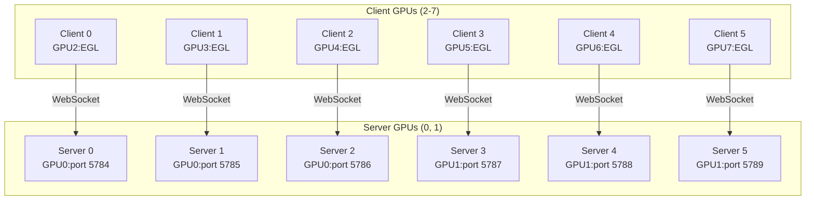
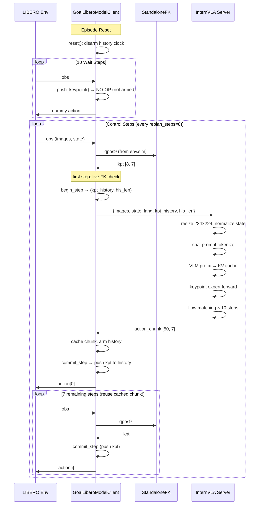
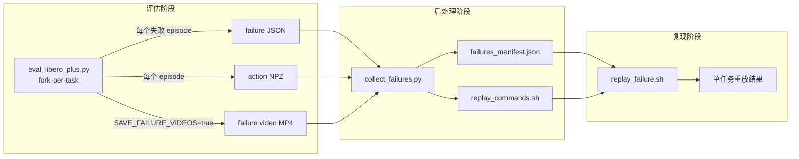

# LIBERO-plus `libero_goal` 评估实施方案

> **Checkpoint**: `/home/a26113/b/Ckp/4dwvlaLbPlusGol0929/2026_09_30_03_18_02-internvla_a1_5-lbplus-gol-sft/checkpoints/016020/pretrained_model/`
>
> **EXPR_NAME**: `4dwvlaLbPlusGol0929`
>
> **数据集**: `/B/Dta/LIBERO/libero_plus_goal_lrb3_4D/`
>
> **评估范围**: LIBERO-plus benchmark 的 `libero_goal` 子集 (2591 perturbation tasks, 7 categories)
>
> **脚本目录**: `b/s/libplus2/gol/`
>
> **日期**: 2026-10-01

---

## 目录

1. [概述](#1-概述)
2. [前置条件与环境](#2-前置条件与环境)
3. [Server-Client 架构](#3-server-client-架构)
4. [3D/4D Keypoint 训推一致性](#4-3d4d-keypoint-训推一致性)
5. [配置参数参考](#5-配置参数参考)
6. [脚本清单与职责](#6-脚本清单与职责)
7. [新增脚本设计](#7-新增脚本设计)
8. [Smoke Test 流程](#8-smoke-test-流程)
9. [libero_goal 完整评估操作手册](#9-libero_goal-完整评估操作手册)
10. [速度优化](#10-速度优化)
11. [测试与验收方案](#11-测试与验收方案)
12. [历史问题与规避](#12-历史问题与规避)
13. [Troubleshooting](#13-troubleshooting)
14. [附录](#14-附录)
15. [配置参数与变量汇总](#15-配置参数与变量汇总)
16. [文件增删改汇总](#16-文件增删改汇总)
17. [关键路径汇总](#17-关键路径汇总)
18. [失败复现系统](#18-失败复现系统)

---

## 1. 概述

### 1.1 目标

对 Phase 2 SFT checkpoint (step 016020, 4 epochs, 含 3D/4D keypoint + WAN foresight 的全模型微调) 在 LIBERO-plus 仿真 benchmark 的 `libero_goal` 子集上进行评估, 测量 perturbation robustness.

### 1.2 评估内容

`libero_goal` 子集包含 10 个原始任务的 2591 个扰动变体, 分布在 7 个 perturbation category:

| Category | Tasks | 说明 |
|----------|-------|------|
| Background Textures | 281 | 桌面/墙壁纹理替换 |
| Camera Viewpoints | 408 | 相机角度偏移 |
| Language Instructions | 410 | 语言指令重述 |
| Light Conditions | 279 | 光照强度/方向变化 |
| Objects Layout | 425 | 物体位置重排 |
| Robot Initial States | 409 | 机器人初始姿态变化 |
| Sensor Noise | 379 | 传感器噪声注入 |

每个 task 执行 1 episode (LIBERO-plus 标准设置), max_steps=300 (libero_goal).

### 1.3 设计原则

1. **扩展优于修改**: 不修改 `evaluation/`, `src/`, `launch/` 目录下已有代码. 所有扩展通过 subclass, import hook, shell wrapper 实现.
2. **训推一致性**: Keypoint 通过 standalone FK (panda_goal_table.xml) 生成, 使用训练时相同的 base position (-0.66, 0, 0.912), R_pad (1.8213), 和 quaternion convention (xyzw, qw>=0).
3. **GPU 隔离**: Server GPU (模型推理) 和 Client GPU (EGL 仿真渲染) 物理分离, 避免 EGL SIGABRT.
4. **Contract 驱动**: 所有训推关键参数由 `goal_train_eval_contract.json` 约束, 运行时强制校验.

### 1.4 依赖的已有组件 (不修改)

| 组件 | 路径 | 说明 |
|------|------|------|
| LIBERO-plus2 评估脚本 | `evaluation/LIBERO-plus2/eval_libero_plus.py` | fork-per-task 隔离, B10 fix |
| LIBERO-plus2 launcher | `evaluation/LIBERO-plus2/run_eval_libero_plus_venv.sh` | 多 GPU 并行调度 |
| LIBERO2 server | `evaluation/LIBERO2/policy_server/server_policy.py` | WebSocket 推理服务 |
| LIBERO2 backend | `evaluation/LIBERO2/policy_server/backends/policy_backend_internvla_a1_5.py` | InternVLA-A1.5 推理后端 |
| LIBERO2 client | `evaluation/LIBERO2/model2libero_interface.py` | `LiberoModelClient` 基类 |
| LIBERO2 keypoint | `evaluation/LIBERO2/keypoint_utils.py` | `StandaloneFK`, `KeypointExtractor`, `KeypointHistory` |
| LIBERO-plus 平台 | `/B/SRC/LIBERO-plus/` | 仿真环境, task_classification.json |
| 聚合脚本 | `evaluation/LIBERO-plus2/aggregate_results.py` | 结果汇总 |

### 1.5 新增/扩展的组件 (已在 `b/s/libplus2/gol/` 中)

| 组件 | 文件 | 说明 |
|------|------|------|
| GoalLiberoModelClient | `goal_client.py` | 子类: contract 驱动的 FK/R_pad, history clock, live FK guard |
| Import Hook Launcher | `eval_goal_plus.py` | 在 forked child 中用 `GoalLiberoModelClient` 替换基类 |
| Shell Wrapper | `run_eval_goal_plus.sh` | 派生 LIBERO-plus2 launcher, 锁定 libero_goal suite + contract 参数 |
| Contract Loader | `load_contract.py` | 纯 JSON 读取, parent-safe (不 import mujoco) |
| Contract Constants | `contract.py` | 基础常量 (base_xpos, body names, tolerances) |
| Keypoint History | `history.py` | `KeypointHistory`, `GoalKeypointRuntime`, `pack_like_training` |
| Goal FK MJCF | `assets/panda_goal_table.xml` | 独立 FK 模型 (base=-0.66,0,0.912) |
| Kinematics MJCF | `assets/panda_kin.xml` | 简化运动学模型 |

---

## 2. 前置条件与环境

### 2.1 虚拟环境

| 环境 | 路径 | 角色 |
|------|------|------|
| Server | `/B/VENV/itnvla15rbt20/` | InternVLA-A1.5 模型推理 |
| Client | `/B/VENV/libero_plus_client/` | LIBERO-plus 仿真 + EGL 渲染 |

### 2.2 关键路径

```
CKPT_PATH=/home/a26113/b/Ckp/4dwvlaLbPlusGol0929/2026_09_30_03_18_02-internvla_a1_5-lbplus-gol-sft/checkpoints/016020/pretrained_model
LIBERO_HOME=/B/SRC/LIBERO-plus
SERVER_VENV=/B/VENV/itnvla15rbt20
CLIENT_VENV=/B/VENV/libero_plus_client
GOAL4D_DATASET=/B/Dta/LIBERO/libero_plus_goal_lrb3_4D
EXPR_NAME=4dwvlaLbPlusGol0929
PROJ=/B/SRC/itvlaGpLibPlus
EVAL_LOG_DIR=/B/Log/4dwvlaLbPlusGol0929/<TS>_eval   # 评估输出总目录
```

### 2.3 Client Venv 搭建 (如不存在)

如果 `/B/VENV/libero_plus_client/` 不存在, 需要先创建:

```bash
# 创建 client venv
python3.11 -m venv /B/VENV/libero_plus_client
source /B/VENV/libero_plus_client/bin/activate

# 安装 MuJoCo + robosuite
pip install mujoco==3.2.3 robosuite==1.4.0 bddl==1.0.1

# 安装 LIBERO-plus (--no-deps 避免冲突)
pip install -e /B/SRC/LIBERO-plus --no-deps

# 安装 WebSocket + 序列化依赖
pip install websockets msgpack msgpack-numpy scikit-image cloudpickle gymnasium

# 安装 CPU-only torch (client 不需要 GPU torch)
pip install torch --index-url https://download.pytorch.org/whl/cpu

deactivate
```

**EGL Vendor 配置**:

```bash
mkdir -p /B/VENV/libero_plus_client/egl_vendor.d
cat > /B/VENV/libero_plus_client/egl_vendor.d/10_nvidia.json <<'EOF'
{
    "file_format_version" : "1.0.0",
    "ICD" : {
        "library_path" : "libEGL_nvidia.so.0"
    }
}
EOF
```

**NumPy 2.x Patch (B3+B4)**:

```bash
ENV_WRAPPER=/B/SRC/LIBERO-plus/libero/libero/envs/env_wrapper.py

# B3: np.fromstring -> np.frombuffer
sed -i 's/np\.fromstring/np.frombuffer/g' "${ENV_WRAPPER}"

# B4: np.float_ -> np.float64
sed -i 's/np\.float_/np.float64/g' "${ENV_WRAPPER}"

# 验证
grep -n 'frombuffer\|float64' "${ENV_WRAPPER}"
```

> **重要**: 这些 patch 在 `/B/SRC/LIBERO-plus/` 仓库中, 不在 `itvlaGpLibPlus` 中. 每次 LIBERO-plus 代码更新后需重新验证.

### 2.4 GPU 拓扑

8× H200 (143 GB each). 推荐 2+6 拓扑:

```
Server GPUs: 0, 1 (每卡 3 server 实例, 共 6 个 server, 每个 ~13 GB VRAM)
Client GPUs: 2, 3, 4, 5, 6, 7 (EGL 渲染, 每卡 1 个 client worker)
```

### 2.4 前置检查清单

```bash
# 1. Checkpoint 完整性
ls $CKPT_PATH/config.json $CKPT_PATH/model.safetensors $CKPT_PATH/stats.json $CKPT_PATH/train_config.json

# 2. Contract 文件
cat $GOAL4D_DATASET/meta/goal_train_eval_contract.json | python3 -m json.tool

# 3. Server venv
$SERVER_VENV/bin/python -c "import torch; print(torch.cuda.device_count()); import transformers; print(transformers.__version__)"

# 4. Client venv
$CLIENT_VENV/bin/python -c "import mujoco; print(mujoco.__version__); import robosuite; print(robosuite.__version__)"

# 5. EGL vendor
ls $CLIENT_VENV/egl_vendor.d/10_nvidia.json

# 6. LIBERO-plus task classification
ls $LIBERO_HOME/libero/libero/benchmark/task_classification.json

# 7. NumPy patch (B3+B4)
grep -n 'np.frombuffer\|np.float64' $LIBERO_HOME/libero/libero/envs/env_wrapper.py | head -4

# 8. FK MJCF 完整性
md5sum $PROJ/b/s/libplus2/gol/assets/panda_goal_table.xml
# 对照 contract 的 eval_mjcf_md5: 8ff2db5368b159ffdd69c95d0bf91c4d

# 9. GPU 空闲 (杀掉 bigmatrix 等占位进程)
nvidia-smi --query-gpu=index,memory.used --format=csv,noheader
```

### 2.5 NumPy Patch 验证

LIBERO-plus 的 `env_wrapper.py` 需要 2 个 NumPy 2.x 兼容 patch (B3+B4):

```python
# Line 52: np.fromstring -> np.frombuffer
# Line 105: np.float_ -> np.float64
```

验证:
```bash
$CLIENT_VENV/bin/python -c "
import numpy as np
# 确认 np.frombuffer 和 np.float64 可用
assert hasattr(np, 'frombuffer')
assert hasattr(np, 'float64')
print('NumPy', np.__version__, 'OK')
"
```

---

## 3. Server-Client 架构

### 3.1 架构图



### 3.2 数据流 (每个 env.step)



### 3.3 WebSocket 协议

**请求** (Client → Server, msgpack-encoded):
```python
{
    "type": "infer",
    "request_id": "libero-<step>",
    "payload": {
        "examples": [{
            "image": [agentview_hwc_uint8, wrist_hwc_uint8],
            "lang": "task description",
            "task": "task description",
            "state": np.float32[8],       # eef_pos(3) + axisangle(3) + gripper_qpos(2)
            "kpt_history": np.float32[92, 8, 7],  # keypoint_history_max_len=92
            "his_len": int,
        }],
        "do_sample": False,
    }
}
```

**响应** (Server → Client):
```python
{
    "ok": True,
    "type": "inference_result",
    "data": {
        "actions": np.float32[1, 50, 7],   # denormalized action chunk
        "chunk_size": 50,
        "action_dim": 7,
    }
}
```

---

## 4. 3D/4D Keypoint 训推一致性

### 4.1 训练侧 (数据生成)

| 属性 | 值 |
|------|------|
| FK 引擎 | MuJoCo, standalone Lift MJCF |
| Robot Base | `(-0.66, 0.0, 0.912)` (LIBERO Goal table arena) |
| R_pad | `1.8212723272872922` |
| Keypoint Bodies | `link1..link7, gripper0_eef` (8 joints) |
| 表示 | 7D: `[px/R_pad, py/R_pad, pz/R_pad, qx, qy, qz, qw]` |
| Quaternion | xyzw layout, hemisphere norm (qw >= 0) |
| History | 最大 92 帧 (训练 `keypoint_history_max_len=92`), oldest-first, zero-padded at back |
| 数据列 | `observation.keypoint_3d` flat `[56]` = 8×7 |

### 4.2 评估侧 (实时生成)

`GoalLiberoModelClient` 通过以下链条确保一致性:

```
Live env qpos (7 arm + 2 gripper)
    ↓
StandaloneFK (panda_goal_table.xml, base=(-0.66, 0, 0.912))
    ↓ mj_forward
body xpos / xquat (8 keypoints)
    ↓ positions / R_pad, quaternion wxyz→xyzw, hemisphere
Normalized kpt [8, 7]
    ↓
KeypointHistory (max_len=92, oldest-first, zero-pad)
    ↓
Server payload: kpt_history [92, 8, 7], his_len
    ↓
TrackEncoder (temporal conv → per-joint tokens)
```

### 4.3 一致性校验点

| 校验 | 方法 | 判定 |
|------|------|------|
| MJCF MD5 | `hashlib.md5(panda_goal_table.xml)` vs contract `eval_mjcf_md5` | 必须完全匹配 |
| R_pad 值 | contract `r_pad` vs StandaloneFK 构造参数 | 数值相等 |
| Base Position | panda_goal_table.xml worldbody origin | `(-0.66, 0, 0.912)` |
| Live FK 误差 | FK eef vs `obs["robot0_eef_pos"]` (首步) | < 5mm |
| History 语义 | wait steps 不进 history, 首次 request his_len=0 | GoalLiberoModelClient 保证 |
| Quaternion | xyzw layout, qw >= 0 | 代码强制 |

### 4.4 关键注意: `keypoint_history_max_len=92` (非 200)

训练时使用 `--policy.keypoint_history_max_len=92 --dataset.keypoint_history_max_len=92`, 虽然 contract.json 写的是 `"keypoint_history_max_len": 200` (生成数据时的上限), 但模型实际只见过最长 92 帧的 history. 评估时 `KeypointHistory` 的 `max_len` 必须设为 **92**.

> **注意**: 现有 `history.py` 默认从 `contract.py` 的 `HISTORY_MAX_LEN=200` 取值. 需要在评估 wrapper 中 override 为 92, 或传入 checkpoint 的 `keypoint_history_max_len` 值.

解决方案: 评估 wrapper 脚本读取 checkpoint 的 `config.json` 中的 `keypoint_history_max_len` 值 (92), 传入 `GoalLiberoModelClient` 的 `kpt_history_max_len` 参数, 覆盖 contract 默认值.

---

## 5. 配置参数参考

### 5.1 固定参数 (由 contract 锁定, 不可调)

| 参数 | 值 | 来源 | 错误后果 |
|------|------|------|---------|
| `ROTATE_IMAGES` | `false` | F1 fix | 180° 翻转, SR 下降 ~50pp |
| `STATS_KEY_MODE` | `panda` | contract | KeyError crash |
| `ROBOT_TYPE_MODE` | `panda` | contract | 错误 prompt (end_effector vs joint) |
| `INFERENCE_BACKEND` | `standard` | C5 fix | optimized 不支持 keypoints |
| `GRIPPER_CONVENTION` | `libero_native` | B1 fix | SR=0% (方向反转) |
| `enable_keypoints` | `true` | 4D model | 无 keypoint → 模型退化 |
| `RESIZE_SIZE` | `224` | 训练配置 | 分布偏移 |
| `action_loss_only` | `true` (推理时) | 推理优化 | 加载 WAN 浪费内存 |

### 5.2 可调参数

| 参数 | 默认值 | 说明 | 调试建议 |
|------|--------|------|---------|
| `GPU_IDS` | `0,1,2,3,4,5,6,7` | 使用的 GPU 列表 | 减少 GPU 数做快速测试 |
| `SERVER_GPU_IDS` | `0,1` | Server GPU | 最少 1 卡 |
| `CLIENT_GPU_IDS` | `2,3,4,5,6,7` | Client GPU | 每卡 1 client |
| `SERVER_INSTANCES_PER_GPU` | `3` | 每 server GPU 的实例数 | 减到 1 降低内存, 但变慢 |
| `BASE_PORT` | `5784` | WebSocket 起始端口 | 端口冲突时调整 |
| `REPLAN_STEPS` | `8` | 每 N 步重新请求 action chunk | 减小 → 更灵敏但更慢 |
| `NUM_TRIALS_PER_TASK` | `1` | 每 task episode 数 | LIBERO-plus 标准 = 1 |
| `SEED` | `7` | 随机种子 | 改变种子做多次评估 |
| `NUM_STEPS_WAIT` | `10` | reset 后 dummy steps | 保持 10 (训练假设) |
| `SHARDS_PER_SUITE` | `6` | 每 suite 的并行分片数 | = client GPU 数 |
| `RENDER_BACKEND` | `egl` | 渲染后端 (egl/osmesa/auto) | osmesa 更慢但无 SIGABRT |
| `CATEGORIES` | `""` (全部) | 限定 perturbation category | 如 `"Language Instructions"` |
| `EVAL_MODE` | `full` | full/smoke | smoke 快速验证 |
| `SAVE_FAILURE_VIDEOS` | `false` | 保存失败 episode 视频 | 调试时开启 |
| `SERVER_STARTUP_TIMEOUT` | `300` | Server 启动超时 (秒) | 首次加载模型较慢 |
| `MAX_STEPS_OVERRIDE` | `""` | 覆盖 max_steps | 调试时减小加速 |

### 5.3 Checkpoint 关键配置值 (来自 config.json)

```json
{
  "chunk_size": 50,
  "n_action_steps": 50,
  "max_action_dim": 32,
  "num_inference_steps": 10,
  "tokenize_state": true,
  "enable_keypoint_predictor": true,
  "num_keypoint_joints": 8,
  "kpt_4d_mode": "pos_rot",
  "knowledge_insulation": false,
  "keypoint_history_max_len": 92,
  "dtype": "bfloat16",
  "vlm_model_name_or_path": "Qwen/Qwen3.5-2B"
}
```

---

## 6. 脚本清单与职责

### 6.1 已有脚本 (b/s/libplus2/gol/, 不修改)

| 文件 | 职责 |
|------|------|
| `contract.py` | 训评一致性常量 (base_xpos, body names, tolerances) |
| `load_contract.py` | 纯 JSON 读取 contract, parent-safe |
| `history.py` | `KeypointHistory` 缓冲区, `GoalKeypointRuntime` 评估时钟, `pack_like_training` |
| `goal_client.py` | `GoalLiberoModelClient` 子类 — contract 驱动 FK, history clock, live FK guard |
| `eval_goal_plus.py` | Import hook launcher — forked child 中替换 `LiberoModelClient` |
| `run_eval_goal_plus.sh` | Shell wrapper — 派生 LIBERO-plus2 launcher, 锁定 suite=libero_goal |
| `fk.py` | FK 实现 (standalone MuJoCo forward kinematics) |
| `make_goal_mjcf.py` | 生成 panda_goal_table.xml |
| `assets/panda_goal_table.xml` | 独立 FK MJCF (base=-0.66, 0, 0.912) |
| `assets/panda_kin.xml` | 简化运动学 MJCF |

### 6.2 需要新增的脚本

| 文件 | 职责 | 说明 |
|------|------|------|
| `eval_goal_wrapper.sh` | **总入口**: 预检 → 清 GPU → 启动 server → healthcheck → 启动 client → 聚合 → 汇总 | 见 §7.1 |
| `preflight_goal.sh` | **预检脚本**: 校验 checkpoint, contract, venv, EGL, NumPy patch, MJCF MD5 | 见 §7.2 |
| `test_eval_goal.sh` | **验收脚本**: smoke 测试 + 结果校验 | 见 §11 |
| `collect_failures.py` | **失败汇总**: 收集失败 JSON + action NPZ → 生成 manifest 和 replay 命令 | 见 §18.3 |
| `replay_failure.sh` | **单任务复现**: 以相同配置重放指定的失败 task | 见 §18.4 |

---

## 7. 新增脚本设计

### 7.1 `eval_goal_wrapper.sh` — 评估总入口

这是用户唯一需要运行的脚本. 它 wrap 现有的 `run_eval_goal_plus.sh`, 添加:
- 预检 (preflight)
- GPU 清理 (kill bigmatrix 等占位进程)
- `keypoint_history_max_len` 从 checkpoint config 读取并注入
- 评估日志归档
- 评估结束后重启 bigmatrix

```bash
#!/usr/bin/env bash
# eval_goal_wrapper.sh — LIBERO-plus libero_goal 评估总入口
# 用法:
#   CKPT_PATH=<path> bash b/s/libplus2/gol/eval_goal_wrapper.sh [EVAL_MODE=smoke|full]
#
# 必需环境变量:
#   CKPT_PATH       — checkpoint pretrained_model 目录
# 可选:
#   EVAL_MODE        — smoke (快速验证) 或 full (完整评估, 默认)
#   CATEGORIES       — 限定 perturbation category, 如 "Language Instructions"
#   GPU_IDS          — GPU 列表, 默认 0,1,2,3,4,5,6,7
#   RENDER_BACKEND   — egl (默认) | osmesa | auto
#   SAVE_FAILURE_VIDEOS — true 保存失败视频
set -euo pipefail

HERE="$(cd "$(dirname "${BASH_SOURCE[0]}")" && pwd)"
PROJ="${PROJ:-$(cd "${HERE}/../../../.." && pwd)}"
EXPR_NAME="${EXPR_NAME:-4dwvlaLbPlusGol0929}"

# --- Required ---
: "${CKPT_PATH:?ERROR: CKPT_PATH not set}"
GOAL4D_DATASET="${GOAL4D_DATASET:-/B/Dta/LIBERO/libero_plus_goal_lrb3_4D}"
LIBERO_HOME="${LIBERO_HOME:-/B/SRC/LIBERO-plus}"
SERVER_VENV="${SERVER_VENV:-/B/VENV/itnvla15rbt20}"
CLIENT_VENV="${CLIENT_VENV:-/B/VENV/libero_plus_client}"

EVAL_MODE="${EVAL_MODE:-full}"
TS="$(date +%Y%m%d_%H%M%S)"
EVAL_LOG_DIR="${EVAL_LOG_DIR:-/B/Log/${EXPR_NAME}/${TS}_eval}"
mkdir -p "${EVAL_LOG_DIR}"
LOG_FILE="${EVAL_LOG_DIR}/eval_goal.log"

echo "============================================================"
echo " LIBERO-plus libero_goal Evaluation"
echo " EXPR_NAME:  ${EXPR_NAME}"
echo " CKPT_PATH:  ${CKPT_PATH}"
echo " EVAL_MODE:  ${EVAL_MODE}"
echo " LOG_FILE:   ${LOG_FILE}"
echo " EVAL_LOG_DIR: ${EVAL_LOG_DIR}"
echo "============================================================"

# === Phase 1: Preflight ===
echo "[$(date)] Phase 1: Preflight checks..."
if ! bash "${HERE}/preflight_goal.sh" 2>&1 | tee -a "${LOG_FILE}"; then
    echo "FATAL: Preflight failed. See ${LOG_FILE}" >&2
    exit 1
fi
echo "[$(date)] Preflight PASSED"

# === Phase 2: GPU Cleanup ===
echo "[$(date)] Phase 2: GPU cleanup..."
pkill -f bigmatrix_multiply_optimization || true
sleep 3
echo "[$(date)] GPU cleanup done"

# === Phase 3: Read keypoint_history_max_len from checkpoint ===
KPT_HIST_LEN=$(python3 -c "
import json
cfg = json.load(open('${CKPT_PATH}/config.json'))
print(cfg.get('keypoint_history_max_len', 92))
")
echo "[$(date)] keypoint_history_max_len from checkpoint: ${KPT_HIST_LEN}"
export KPT_HISTORY_MAX_LEN="${KPT_HIST_LEN}"

# === Phase 4: Run evaluation ===
echo "[$(date)] Phase 4: Starting evaluation (${EVAL_MODE})..."
export CKPT_PATH LIBERO_HOME SERVER_VENV CLIENT_VENV GOAL4D_DATASET
export EVAL_LOG_DIR
export CATEGORIES="${CATEGORIES:-}"
export RENDER_BACKEND="${RENDER_BACKEND:-egl}"
export SAVE_FAILURE_VIDEOS="${SAVE_FAILURE_VIDEOS:-false}"

if [ "${EVAL_MODE}" = "smoke" ]; then
    export SHARDS_PER_SUITE="${SHARDS_PER_SUITE:-2}"
    export GPU_IDS="${GPU_IDS:-0,2}"
    # Smoke: only first 6 tasks of Language Instructions
    export CATEGORIES="${CATEGORIES:-Language Instructions}"
    export MAX_STEPS_OVERRIDE="${MAX_STEPS_OVERRIDE:-100}"
fi

bash "${HERE}/run_eval_goal_plus.sh" 2>&1 | tee -a "${LOG_FILE}"
EVAL_EXIT=$?

# === Phase 5: Post-eval ===
echo "[$(date)] Phase 5: Post-evaluation..."
if [ ${EVAL_EXIT} -eq 0 ]; then
    echo "Evaluation COMPLETED SUCCESSFULLY"
    # Archive results
    ARCHIVE="/B/Log/${EXPR_NAME}/eval_goal_${TS}.tar.gz"
    tar -czf "${ARCHIVE}" -C "$(dirname "${EVAL_LOG_DIR}")" "$(basename "${EVAL_LOG_DIR}")" 2>/dev/null || true
    echo "Results archived to: ${ARCHIVE}"
else
    echo "Evaluation FAILED (exit=${EVAL_EXIT})"
fi

# Restart bigmatrix
echo "[$(date)] Restarting bigmatrix GPU placeholder..."
nohup python "${PROJ}/b/d/GpRbt/bigmatrix_multiply_optimization.py" > /dev/null 2>&1 &
echo "bigmatrix PID: $!"

echo "[$(date)] Done. Log: ${LOG_FILE}"
echo "         Results: ${EVAL_LOG_DIR}"
```

### 7.2 `preflight_goal.sh` — 预检脚本

```bash
#!/usr/bin/env bash
# preflight_goal.sh — 预检清单 (非交互, 有任何失败立即 exit 1)
set -euo pipefail

HERE="$(cd "$(dirname "${BASH_SOURCE[0]}")" && pwd)"
PROJ="${PROJ:-$(cd "${HERE}/../../../.." && pwd)}"

: "${CKPT_PATH:?}"
GOAL4D_DATASET="${GOAL4D_DATASET:-/B/Dta/LIBERO/libero_plus_goal_lrb3_4D}"
LIBERO_HOME="${LIBERO_HOME:-/B/SRC/LIBERO-plus}"
SERVER_VENV="${SERVER_VENV:-/B/VENV/itnvla15rbt20}"
CLIENT_VENV="${CLIENT_VENV:-/B/VENV/libero_plus_client}"

PASS=0
FAIL=0
check() {
    if "$@" > /dev/null 2>&1; then
        echo "  ✅ $1"
        PASS=$((PASS + 1))
    else
        echo "  ❌ $1"
        FAIL=$((FAIL + 1))
    fi
}

echo "=== Preflight: Checkpoint ==="
check test -f "${CKPT_PATH}/config.json"
check test -f "${CKPT_PATH}/model.safetensors"
check test -f "${CKPT_PATH}/stats.json"
check test -f "${CKPT_PATH}/train_config.json"

echo "=== Preflight: Contract ==="
CONTRACT="${GOAL4D_DATASET}/meta/goal_train_eval_contract.json"
check test -f "${CONTRACT}"

echo "=== Preflight: MJCF MD5 ==="
EXPECTED_MD5=$(python3 -c "import json; print(json.load(open('${CONTRACT}'))['eval_mjcf_md5'])")
ACTUAL_MD5=$(md5sum "${HERE}/assets/panda_goal_table.xml" | cut -d' ' -f1)
check test "${ACTUAL_MD5}" = "${EXPECTED_MD5}"

echo "=== Preflight: Config Consistency ==="
check python3 -c "
import json
cfg = json.load(open('${CKPT_PATH}/config.json'))
assert cfg['enable_keypoint_predictor'] == True
assert cfg['tokenize_state'] == True
assert cfg['num_keypoint_joints'] == 8
assert cfg['kpt_4d_mode'] == 'pos_rot'
print('config OK')
"

echo "=== Preflight: Server Venv ==="
check test -f "${SERVER_VENV}/bin/python"
check ${SERVER_VENV}/bin/python -c "import torch; assert torch.cuda.is_available()"

echo "=== Preflight: Client Venv ==="
check test -f "${CLIENT_VENV}/bin/python"
check ${CLIENT_VENV}/bin/python -c "import mujoco; import robosuite"

echo "=== Preflight: EGL Vendor ==="
check test -f "${CLIENT_VENV}/egl_vendor.d/10_nvidia.json"

echo "=== Preflight: NumPy Patch (B3+B4) ==="
check grep -q 'np.frombuffer' "${LIBERO_HOME}/libero/libero/envs/env_wrapper.py"
check grep -q 'np.float64' "${LIBERO_HOME}/libero/libero/envs/env_wrapper.py"

echo "=== Preflight: LIBERO-plus Task Classification ==="
TASK_CLS="${LIBERO_HOME}/libero/libero/benchmark/task_classification.json"
check test -f "${TASK_CLS}"
check python3 -c "
import json
d = json.load(open('${TASK_CLS}'))
g = d['libero_goal']
n = sum(len(v) if isinstance(v, list) else 1 for v in g.values()) if isinstance(g, dict) else len(g)
assert n > 2500, f'expected >2500 goal tasks, got {n}'
print(f'libero_goal: {n} tasks')
"

echo "=== Preflight: Existing Eval Scripts ==="
check test -f "${PROJ}/evaluation/LIBERO-plus2/eval_libero_plus.py"
check test -f "${PROJ}/evaluation/LIBERO-plus2/run_eval_libero_plus_venv.sh"
check test -f "${PROJ}/evaluation/LIBERO2/policy_server/server_policy.py"
check test -f "${PROJ}/evaluation/LIBERO-plus2/aggregate_results.py"

echo "=== Preflight: VLM Weights ==="
check test -d "/B/VENV/hf_home/hub/models--Qwen--Qwen3.5-2B"

echo ""
echo "Result: ${PASS} passed, ${FAIL} failed"
if [ ${FAIL} -gt 0 ]; then
    echo "PREFLIGHT FAILED"
    exit 1
fi
echo "PREFLIGHT PASSED"
```

---

## 8. Smoke Test 流程

Smoke test 使用少量 tasks 快速验证端到端流程, 在 full eval 前必须通过.

### 8.1 Smoke 配置

| 参数 | Smoke 值 | Full 值 |
|------|---------|---------|
| `EVAL_MODE` | `smoke` | `full` |
| `GPU_IDS` | `0,2` (1 server + 1 client) | `0,1,2,3,4,5,6,7` |
| `CATEGORIES` | `Language Instructions` | 全部 |
| `MAX_STEPS_OVERRIDE` | `100` | 无 (使用 300) |
| `SHARDS_PER_SUITE` | `2` | `6` |

### 8.2 运行

```bash
export CKPT_PATH=/home/a26113/b/Ckp/4dwvlaLbPlusGol0929/2026_09_30_03_18_02-internvla_a1_5-lbplus-gol-sft/checkpoints/016020/pretrained_model

EVAL_MODE=smoke bash b/s/libplus2/gol/eval_goal_wrapper.sh
```

### 8.3 Smoke 验收

```bash
# 验收条件:
# 1. exit code = 0
# 2. 有结果 JSON 文件生成
# 3. 无 GoalFKMismatch 错误
# 4. 无 SIGABRT crash
# 5. Server healthcheck PASSED
```

---

## 9. libero_goal 完整评估操作手册

### 9.1 Step-by-Step

**Step 1: 设置环境变量**

```bash
export CKPT_PATH=/home/a26113/b/Ckp/4dwvlaLbPlusGol0929/2026_09_30_03_18_02-internvla_a1_5-lbplus-gol-sft/checkpoints/016020/pretrained_model
export GOAL4D_DATASET=/B/Dta/LIBERO/libero_plus_goal_lrb3_4D
export LIBERO_HOME=/B/SRC/LIBERO-plus
export SERVER_VENV=/B/VENV/itnvla15rbt20
export CLIENT_VENV=/B/VENV/libero_plus_client
export EXPR_NAME=4dwvlaLbPlusGol0929
cd /B/SRC/itvlaGpLibPlus
```

**Step 2: 运行预检**

```bash
bash b/s/libplus2/gol/preflight_goal.sh
# 所有项目必须 ✅
```

**Step 3: Smoke Test**

```bash
EVAL_MODE=smoke bash b/s/libplus2/gol/eval_goal_wrapper.sh
# 验收: exit 0, 有结果文件, 无 SIGABRT
```

**Step 4: Full Evaluation**

```bash
EVAL_MODE=full bash b/s/libplus2/gol/eval_goal_wrapper.sh
# 耗时预估: ~2-4 小时 (6 并行 client, 2591 tasks × 1 episode × 300 max_steps)
```

**Step 5: 查看结果**

```bash
# 聚合结果
cat ${EVAL_LOG_DIR}/overall_results.json | python3 -m json.tool

# 按 category 查看
python3 -c "
import json, sys
r = json.load(open(sys.argv[1]))
print(f'Overall SR: {r.get(\"success_rate\", \"N/A\")}')
for cat, data in sorted(r.get('by_category', {}).items()):
    sr = data.get('success_rate', 0)
    n = data.get('total', 0)
    print(f'  {cat}: {sr:.1%} ({n} tasks)')
" ${EVAL_LOG_DIR}/overall_results.json
```

### 9.2 按 Category 单独评估

可以通过 `CATEGORIES` 变量限定只评估某个 perturbation category:

```bash
# 只评估 Language Instructions
CATEGORIES="Language Instructions" EVAL_MODE=full bash b/s/libplus2/gol/eval_goal_wrapper.sh

# 只评估 Camera Viewpoints
CATEGORIES="Camera Viewpoints" EVAL_MODE=full bash b/s/libplus2/gol/eval_goal_wrapper.sh
```

### 9.3 可调试参数示例

```bash
# 减少 GPU 做快速测试 (1 server GPU + 1 client GPU)
GPU_IDS=0,2 SHARDS_PER_SUITE=1 bash b/s/libplus2/gol/eval_goal_wrapper.sh

# 使用 OSMesa CPU 渲染 (无 SIGABRT 风险, 但更慢)
RENDER_BACKEND=osmesa bash b/s/libplus2/gol/eval_goal_wrapper.sh

# 保存失败 episode 视频用于调试
SAVE_FAILURE_VIDEOS=true bash b/s/libplus2/gol/eval_goal_wrapper.sh

# 减少 max_steps 加速 (牺牲部分需要长 horizon 的 task)
MAX_STEPS_OVERRIDE=200 bash b/s/libplus2/gol/eval_goal_wrapper.sh

# 更换种子做多次评估
SEED=42 bash b/s/libplus2/gol/eval_goal_wrapper.sh

# 调整 replan_steps (更频繁重规划, 更精确但更慢)
REPLAN_STEPS=4 bash b/s/libplus2/gol/eval_goal_wrapper.sh

# 2-server 6-client 拓扑 (最快)
SERVER_GPU_IDS=0,1 CLIENT_GPU_IDS=2,3,4,5,6,7 SERVER_INSTANCES_PER_GPU=3 \
    bash b/s/libplus2/gol/eval_goal_wrapper.sh
```

---

## 10. 速度优化

### 10.1 速度对比

| 配置 | 预估耗时 | 说明 |
|------|---------|------|
| 1 server + 1 client (EGL) | ~18-24h | 串行, 最慢 |
| 8 GPU 各 1 server+client | ~3-4h | 并行但 EGL 冲突风险 |
| 2 server + 6 client (EGL) | ~2-3h | 推荐, GPU 隔离 |
| 2 server + 6 client (OSMesa) | ~4-6h | 无 SIGABRT, 更慢 |

### 10.2 速度优化措施

1. **2+6 GPU 拓扑**: 6 个并行 client, 每个 server GPU 3 个实例 → 6 路并行
2. **Action chunk caching**: `replan_steps=8`, 每 8 步才请求一次 → 减少 87.5% WebSocket 调用
3. **EGL GPU 渲染**: 比 OSMesa CPU 快 ~8x (16ms vs 138ms per render)
4. **Fork-per-task 隔离**: 防止 EGL context 积累导致 SIGABRT
5. **Shard 分配**: 按 GPU 数均分 task, 避免 straggler
6. **Server 共享**: 同一 server 为多个 suite 的 shard 服务, 减少 model 加载次数
7. **bfloat16 推理**: 模型以 bfloat16 运行, 减少显存和计算量

### 10.3 瓶颈分析

| 阶段 | 耗时 (每步) | 说明 |
|------|-----------|------|
| VLM prefix forward | ~50ms | 图像 + 文本编码, 仅 replan 步 |
| Keypoint expert | ~5ms | TrackEncoder forward |
| Flow matching (10步) | ~30ms | 动作生成核心 |
| WebSocket round-trip | ~2ms | msgpack 序列化 |
| MuJoCo FK | ~0.1ms | 关节角 → keypoint |
| MuJoCo env.step + render | ~17ms (EGL) / ~138ms (OSMesa) | 仿真 + 渲染 |

每步 replan 总耗时 ~100ms (EGL), 非 replan 步 ~20ms. 每 episode (~150 步) ~5-8s.

---

## 11. 测试与验收方案

### 11.1 测试脚本 `test_eval_goal.sh`

```bash
#!/usr/bin/env bash
# test_eval_goal.sh — 评估验收测试
set -euo pipefail

HERE="$(cd "$(dirname "${BASH_SOURCE[0]}")" && pwd)"
PROJ="${PROJ:-$(cd "${HERE}/../../../.." && pwd)}"

: "${CKPT_PATH:?}"
GOAL4D_DATASET="${GOAL4D_DATASET:-/B/Dta/LIBERO/libero_plus_goal_lrb3_4D}"
LIBERO_HOME="${LIBERO_HOME:-/B/SRC/LIBERO-plus}"
SERVER_VENV="${SERVER_VENV:-/B/VENV/itnvla15rbt20}"
CLIENT_VENV="${CLIENT_VENV:-/B/VENV/libero_plus_client}"

echo "========================================"
echo " Test Suite: LIBERO-plus Goal Eval"
echo "========================================"

PASS=0
FAIL=0
tcheck() {
    local desc="$1"
    shift
    if "$@" 2>/dev/null; then
        echo "  ✅ ${desc}"
        PASS=$((PASS + 1))
    else
        echo "  ❌ ${desc}"
        FAIL=$((FAIL + 1))
    fi
}

echo ""
echo "=== T1: Preflight ==="
tcheck "preflight passes" bash "${HERE}/preflight_goal.sh"

echo ""
echo "=== T2: Contract Loader ==="
tcheck "load_contract.py" python3 -c "
import sys; sys.path.insert(0, '${HERE}')
from load_contract import load_goal_contract
c = load_goal_contract('${GOAL4D_DATASET}/meta/goal_train_eval_contract.json')
assert c['schema'] == 'goal_train_eval_contract/1'
assert c['r_pad'] > 1.8
assert c['num_keypoints'] == 8
"

echo ""
echo "=== T3: History Buffer ==="
tcheck "KeypointHistory semantics" python3 -c "
import sys, numpy as np; sys.path.insert(0, '${HERE}')
from history import KeypointHistory
h = KeypointHistory(max_len=92, num_kpts=8, kpt_dim=7)
assert h.his_len == 0
kpt = np.random.randn(8, 7).astype(np.float32)
h.push(kpt)
assert h.his_len == 1
buf, ln = h.get_history()
assert buf.shape == (92, 8, 7)
assert ln == 1
assert np.allclose(buf[0], kpt)
assert np.allclose(buf[1:], 0)
h.reset()
assert h.his_len == 0
"

echo ""
echo "=== T4: pack_like_training ==="
tcheck "pack_like_training semantics" python3 -c "
import sys, numpy as np; sys.path.insert(0, '${HERE}')
from history import pack_like_training
T, J, D = 100, 8, 7
kpts = np.random.randn(T, J, D).astype(np.float32)
# t=0: no history
d = pack_like_training(kpts, t=0, history_len=92, chunk_size=50)
assert d['his_len'] == 0
assert d['kpt_t'].shape == (J, D)
assert d['kpt_future'].shape == (50, J, D)
# t=50: 50 frames history
d = pack_like_training(kpts, t=50, history_len=92, chunk_size=50)
assert d['his_len'] == 50
assert np.allclose(d['his_kpts'][:50], kpts[:50])
assert np.allclose(d['his_kpts'][50:], 0)
# t=99 (end): future clamps to last frame
d = pack_like_training(kpts, t=99, history_len=92, chunk_size=50)
assert np.allclose(d['kpt_future'][:], kpts[99])  # all future clamp to last
"

echo ""
echo "=== T5: MJCF FK Consistency ==="
tcheck "FK reproduces training data" python3 -c "
import sys; sys.path.insert(0, '${HERE}')
import numpy as np, mujoco, json
from contract import GOAL_MJCF, GOAL_BASE_XPOS, KEYPOINT_NAMES
# Load model
model = mujoco.MjModel.from_xml_path(str(GOAL_MJCF))
data = mujoco.MjData(model)
# Set a test qpos (home position)
data.qpos[:7] = [0, -0.785, 0, -2.356, 0, 1.571, 0.785]
data.qpos[7:9] = [0.04, 0.04]
mujoco.mj_forward(model, data)
# Check link1 position is near base
link1_id = mujoco.mj_name2id(model, mujoco.mjtObj.mjOBJ_BODY, 'link1')
pos = data.xpos[link1_id]
assert abs(pos[0] - (-0.66)) < 0.05, f'link1 x={pos[0]}'
assert abs(pos[2] - 0.912) < 0.2, f'link1 z={pos[2]}'
"

echo ""
echo "=== T6: DRY_RUN derived script ==="
tcheck "run_eval_goal_plus.sh DRY_RUN" bash -c "
export CKPT_PATH='${CKPT_PATH}'
export GOAL4D_DATASET='${GOAL4D_DATASET}'
export LIBERO_HOME='${LIBERO_HOME}'
export SERVER_VENV='${SERVER_VENV}'
export CLIENT_VENV='${CLIENT_VENV}'
DRY_RUN=1 bash '${HERE}/run_eval_goal_plus.sh'
"

echo ""
echo "=== T7: Config keypoint_history_max_len ==="
tcheck "checkpoint kpt_hist_len=92" python3 -c "
import json
cfg = json.load(open('${CKPT_PATH}/config.json'))
assert cfg['keypoint_history_max_len'] == 92, f'got {cfg[\"keypoint_history_max_len\"]}'
"

echo ""
echo "=== T8: Image orientation contract ==="
tcheck "contract image_orientation=raw" python3 -c "
import json
c = json.load(open('${GOAL4D_DATASET}/meta/goal_train_eval_contract.json'))
assert c['image_orientation'] == 'raw', f'got {c[\"image_orientation\"]}'
"

echo ""
echo "Result: ${PASS} passed, ${FAIL} failed"
if [ ${FAIL} -gt 0 ]; then
    echo "TEST SUITE FAILED"
    exit 1
fi
echo "TEST SUITE PASSED"
```

### 11.2 验收矩阵

#### A 类 (强制, 阻塞正式评估)

| 编号 | 检查项 | 验证方法 | 判定标准 |
|------|--------|---------|---------|
| A1 | Preflight 全部通过 | `preflight_goal.sh` | 0 failures |
| A2 | Test suite 全部通过 | `test_eval_goal.sh` | 0 failures (T1-T8) |
| A3 | Smoke test 完成 | `EVAL_MODE=smoke eval_goal_wrapper.sh` | exit 0, 有结果 JSON |
| A4 | 无 GoalFKMismatch | grep logs | 零匹配 |
| A5 | 无 SIGABRT/SIGSEGV | grep logs | 零匹配 |
| A6 | Server healthcheck | worker.log | `HEALTHCHECK PASSED` |
| A7 | 结果文件完整 | `ls ${EVAL_LOG_DIR}/logs/` | 每 shard 有 JSON |

#### B 类 (推荐, 不阻塞但应记录)

| 编号 | 检查项 | 说明 |
|------|--------|------|
| B1 | Overall SR > 0% | 至少有部分 task 成功 |
| B2 | 所有 7 categories 有结果 | 无 category 完全跳过 |
| B3 | 无 shard 完全失败 | 所有 shard exit 0 或有部分结果 |
| B4 | GPU 利用率正常 | Server GPU utilization > 0 during eval |
| B5 | 结果已归档 | tar.gz 文件存在 |

---

## 12. 历史问题与规避

本节列出过去评估中遇到的所有问题及本方案的规避措施. 详细分析见 `b/d/libplus/hstry/` 目录.

### 12.1 致命问题

| ID | 问题 | 根因 | 规避措施 | 状态 |
|----|------|------|---------|------|
| F1 | 180° 图像翻转 (SR 下降 ~50pp) | `rotate_images=True` 默认值 | `ROTATE_IMAGES=false` 由 contract 锁定, wrapper 强制 | ✅ 已规避 |
| B1 | Gripper 方向反转 (SR=0%) | OpenVLA convention 硬编码 | `GRIPPER_CONVENTION=libero_native` | ✅ 已规避 |
| C5 | Optimized backend 不支持 keypoints | `sample_actions()` 缺 `his_kpts` 参数 | `INFERENCE_BACKEND=standard` 由 contract 锁定 | ✅ 已规避 |

### 12.2 EGL / 仿真问题

| ID | 问题 | 根因 | 规避措施 |
|----|------|------|---------|
| C1 | EGL framebuffer 0x8cdd | GPU 资源竞争 | Server/Client GPU 物理隔离 |
| C4 | SIGABRT (server+client 同 GPU) | CUDA + EGL context 冲突 | 2+6 GPU 拓扑 |
| C2 | NumPy 2.0 `np.float_` 移除 | Sensor Noise tasks crash | B3+B4 patch (preflight 验证) |
| B10 | EGL destroy/recreate crash | fork 后 context 积累 | fork-per-task 隔离 (LIBERO-plus2) |

### 12.3 数据一致性问题

| ID | 问题 | 根因 | 规避措施 |
|----|------|------|---------|
| B9 | R_pad 双重 margin (13% 误差) | 旧代码 ×1.15 again | `StandaloneFK` 直接用 contract R_pad |
| B9 | Arena base 偏移 (5-27%) | Lift base vs Goal table base | `panda_goal_table.xml` 使用 Goal base (-0.66) |
| B9 | EEF body name 不匹配 | `gripper0_right_eef` vs `gripper0_eef` | `resolve_eef_body_name` 多候选 |
| F3 | History off-by-one | push 时机错误 | `GoalLiberoModelClient` 精确 history clock |

### 12.4 配置问题

| ID | 问题 | 根因 | 规避措施 |
|----|------|------|---------|
| F2 | Prompt 模板不匹配 | `use_fast_action_tokens` 处理 | Backend 用 `getattr(config, "use_fast_action_tokens", True)` |
| H1 | `panda.yaml` action_mode 标签错误 | `joint` label for EE delta | 不影响推理 (仅影响 prompt 字符串) |
| F4 | Venv 路径硬编码 | 不同机器路径不同 | 所有路径通过环境变量传入 |

---

## 13. Troubleshooting

### 13.1 Server 启动失败

**症状**: `HEALTHCHECK FAILED after 3 attempts`

**排查**:
```bash
# 检查 server log
cat ${EVAL_LOG_DIR}/worker_gpu*/server.log | tail -30

# 常见原因:
# 1. GPU 显存不足 → 杀掉其他进程
# 2. Qwen3.5-2B 权重找不到 → 设 VLM_MODEL_PATH
# 3. transformers patch 未安装 → 重新 cp 到 site-packages
```

### 13.2 GoalFKMismatch

**症状**: `GoalFKMismatch: FK eef [...] vs live obs [...]: XX.X mm > 5.0 mm`

**含义**: FK 使用的 robot base 与 live env 的 base 不一致. 这不应该出现在 libero_goal (base 应为 -0.66, 0, 0.912).

**排查**:
```bash
# 确认 MJCF base
python3 -c "
import mujoco
m = mujoco.MjModel.from_xml_path('b/s/libplus2/gol/assets/panda_goal_table.xml')
d = mujoco.MjData(m)
mujoco.mj_forward(m, d)
print('worldbody pos:', d.xpos[1])  # link0
"
```

### 13.3 SIGABRT / SIGSEGV

**症状**: Client 进程被信号杀死

**排查**:
```bash
# 检查是否 server 和 client 在同一 GPU
# 解决: 确保 SERVER_GPU_IDS 和 CLIENT_GPU_IDS 无交集

# 如果仍然出现, 使用 OSMesa
RENDER_BACKEND=osmesa bash b/s/libplus2/gol/eval_goal_wrapper.sh
```

### 13.4 部分 Shard 结果缺失

**排查**:
```bash
# 检查每个 worker 的 client log
for f in ${EVAL_LOG_DIR}/worker_gpu*/client_*.log; do
    echo "--- $f ---"
    tail -5 "$f"
done

# 检查 exit code
grep -r 'FAILED\|exit=' ${EVAL_LOG_DIR}/worker_gpu*/worker.log
```

### 13.5 SR 异常低

**排查清单**:
1. `ROTATE_IMAGES` 是否为 `false`? (check wrapper log)
2. `GRIPPER_CONVENTION` 是否为 `libero_native`? (check server metadata)
3. `enable_keypoints` 是否为 `true`? (check server log for `his_kpts`)
4. `STATS_KEY_MODE` 是否为 `panda`? (check healthcheck output)
5. `RESIZE_SIZE` 是否为 `224`? (check server metadata)
6. 图像是否正确传输? (check server preprocessing log for image shape)

---

## 14. 附录

### 14.1 文件清单

#### 不修改的依赖文件

| 路径 | 说明 |
|------|------|
| `evaluation/LIBERO-plus2/eval_libero_plus.py` | fork-per-task 评估 client |
| `evaluation/LIBERO-plus2/run_eval_libero_plus_venv.sh` | LIBERO-plus2 多 GPU launcher |
| `evaluation/LIBERO-plus2/aggregate_results.py` | 结果聚合 |
| `evaluation/LIBERO2/policy_server/server_policy.py` | WebSocket 推理 server |
| `evaluation/LIBERO2/policy_server/backends/policy_backend_internvla_a1_5.py` | 推理后端 |
| `evaluation/LIBERO2/model2libero_interface.py` | `LiberoModelClient` 基类 |
| `evaluation/LIBERO2/keypoint_utils.py` | `StandaloneFK`, `KeypointExtractor` |
| `evaluation/LIBERO2/render_backend.py` | 渲染后端选择 |
| `evaluation/LIBERO/policy_server/tools/websocket_policy_server.py` | WebSocket 服务 |
| `evaluation/LIBERO/policy_server/tools/websocket_policy_client.py` | WebSocket 客户端 |
| `evaluation/LIBERO/policy_server/backends/base_backend.py` | 基础后端 (stats, denorm) |
| `evaluation/LIBERO/policy_server/backends/canonical_preprocess.py` | 标准预处理 |

#### 已有的 Goal 扩展 (b/s/libplus2/gol/)

| 文件 | 说明 |
|------|------|
| `contract.py` | 常量定义 |
| `load_contract.py` | JSON contract 读取 |
| `history.py` | keypoint history buffer |
| `goal_client.py` | `GoalLiberoModelClient` 子类 |
| `eval_goal_plus.py` | import hook launcher |
| `run_eval_goal_plus.sh` | 派生 launcher |
| `assets/panda_goal_table.xml` | FK MJCF |
| `assets/panda_kin.xml` | 简化 MJCF |

#### 需要新增的文件

| 文件 | 说明 |
|------|------|
| `eval_goal_wrapper.sh` | 评估总入口 (preflight + eval + post) |
| `preflight_goal.sh` | 预检脚本 |
| `test_eval_goal.sh` | 验收测试 |

### 14.2 完整参数速查表

```bash
# === 固定 (contract 锁定) ===
ROTATE_IMAGES=false
STATS_KEY_MODE=panda
ROBOT_TYPE_MODE=panda
INFERENCE_BACKEND=standard
GRIPPER_CONVENTION=libero_native
RESIZE_SIZE=224

# === 来自 checkpoint ===
# (自动读取, 无需手动设)
keypoint_history_max_len=92
chunk_size=50
num_inference_steps=10
tokenize_state=true
enable_keypoint_predictor=true

# === 输出路径 ===
EVAL_LOG_DIR=/B/Log/${EXPR_NAME}/<TS>_eval  # 评估输出总目录
LOG_FILE=${EVAL_LOG_DIR}/eval_goal.log      # 主日志
ARCHIVE=/B/Log/${EXPR_NAME}/eval_goal_<TS>.tar.gz  # 结果归档

# === 可调 ===
EVAL_MODE=full              # smoke | full
GPU_IDS=0,1,2,3,4,5,6,7    # 总 GPU 列表
RENDER_BACKEND=egl          # egl | osmesa | auto
REPLAN_STEPS=8              # 1-50
NUM_TRIALS_PER_TASK=1       # LIBERO-plus 标准 = 1
SEED=7                      # 随机种子
NUM_STEPS_WAIT=10           # reset 后 dummy steps
CATEGORIES=""               # 限定 category
SHARDS_PER_SUITE=6          # 并行分片数
SAVE_FAILURE_VIDEOS=false   # 保存失败视频
MAX_STEPS_OVERRIDE=""       # 覆盖 max_steps
SERVER_STARTUP_TIMEOUT=300  # Server 启动超时
BASE_PORT=5784              # WebSocket 起始端口
```

### 14.3 预估时间

| 场景 | GPU 配置 | 渲染 | Tasks | 预估时间 |
|------|---------|------|-------|---------|
| Smoke (Language only) | 1+1 GPU | EGL | ~410 | ~30-40 min |
| Full (all categories) | 2+6 GPU | EGL | 2591 | ~2-3 h |
| Full (all categories) | 2+6 GPU | OSMesa | 2591 | ~4-6 h |
| Single category | 2+6 GPU | EGL | ~300-430 | ~20-40 min |

### 14.4 参考资料

| 资料 | 路径 | 说明 |
|------|------|------|
| 3D/4D 生成方案 | `b/d/libplus2/gol/3d4d_gen2.markdown` | 特别是 §7 评估侧 |
| 历史问题记录 | `b/d/libplus/hstry/` | 12 个问题文档 |
| eval3 设计文档 | `b/d/libplus/eval3.md` | 完整 bug registry |
| eval3 优化文档 | `b/d/libplus/eval3_optim3.md` | §20 六 server 部署 |
| SFT 训练方案 | `b/d/libplus2/gol/p2_sft1.md` | 训练配置参考 |
| SFT 执行日志 | `b/d/libplus2/gol/p2_sft1_0929LOG.md` | 训练里程碑 |
| Contract 文件 | `$GOAL4D_DATASET/meta/goal_train_eval_contract.json` | 训评一致性契约 |

---

## 15. 配置参数与变量汇总

本节汇总该评估方案涉及的 **所有** 超参、参数、环境变量的有效值、设值原因、以及配置位置.

### 15.1 环境变量 (用户设定或有默认值)

| 变量 | 有效值 | 设值原因 | 设定位置 |
|------|--------|---------|---------|
| `CKPT_PATH` | `.../016020/pretrained_model` | Phase 2 SFT 最终 checkpoint (step 16020, 4 epochs) | 用户手动 `export` |
| `GOAL4D_DATASET` | `/B/Dta/LIBERO/libero_plus_goal_lrb3_4D` | 含 contract.json 的转换后 4D keypoint 数据集 | `eval_goal_wrapper.sh` 默认值 |
| `LIBERO_HOME` | `/B/SRC/LIBERO-plus` | LIBERO-plus 仿真平台根目录, 含 task_classification.json | `eval_goal_wrapper.sh` 默认值 |
| `SERVER_VENV` | `/B/VENV/itnvla15rbt20` | InternVLA-A1.5 模型推理 Python 环境 (torch+transformers) | `eval_goal_wrapper.sh` 默认值 |
| `CLIENT_VENV` | `/B/VENV/libero_plus_client` | LIBERO 仿真 + EGL 渲染环境 (mujoco+robosuite) | `eval_goal_wrapper.sh` 默认值 |
| `EXPR_NAME` | `4dwvlaLbPlusGol0929` | 实验标识, 用于日志目录命名 | `eval_goal_wrapper.sh` 默认值 |
| `EVAL_MODE` | `full` | 完整评估 2591 tasks; `smoke` 则仅测 Language Instructions 子集 | `eval_goal_wrapper.sh` 默认值 |
| `GPU_IDS` | `0,1,2,3,4,5,6,7` | 使用全部 8× H200 GPU | `run_eval_libero_plus_venv.sh` 默认值 |
| `RENDER_BACKEND` | `egl` | GPU 渲染, 比 OSMesa CPU 渲染快 ~8x | `eval_goal_wrapper.sh` 默认值 |
| `EVAL_LOG_DIR` | `/B/Log/4dwvlaLbPlusGol0929/<TS>_eval` | 集中式日志管理, 与 checkpoint 解耦 | `eval_goal_wrapper.sh` 计算 |
| `CATEGORIES` | `""` (全部) | 评估所有 7 个 perturbation category | `eval_goal_wrapper.sh` 默认值 |
| `SAVE_FAILURE_VIDEOS` | `false` | 默认不录视频以节省磁盘; 调试时手动开启 | `eval_goal_wrapper.sh` 默认值 |
| `MAX_STEPS_OVERRIDE` | `""` (不覆盖) | 使用 libero_goal 默认 300 步/episode | `eval_goal_wrapper.sh` 默认值 |
| `PROJ` | `/B/SRC/itvlaGpLibPlus` | 项目根目录 | 各脚本自动推导 |

### 15.2 Contract 锁定参数 (由训评一致性契约约束, 不可更改)

| 参数 | 有效值 | 设值原因 | 设定位置 |
|------|--------|---------|---------|
| `ROTATE_IMAGES` | `false` | 训练数据未翻转; 翻转导致 SR 下降 ~50pp (F1 历史 bug) | `run_eval_goal_plus.sh` 强制 `export` |
| `STATS_KEY_MODE` | `panda` | `stats.json` 以 `panda` 为 key; 错误 key 导致 KeyError crash | `run_eval_goal_plus.sh` 强制 `export` |
| `ROBOT_TYPE_MODE` | `panda` | Prompt 模板需要正确 robot type 字符串 | `run_eval_goal_plus.sh` 强制 `export` |
| `INFERENCE_BACKEND` | `standard` | `optimized` backend 不支持 keypoint 传入 (C5 历史 bug) | `run_eval_goal_plus.sh` 强制 `export` |
| `image_orientation` | `raw` | 训练数据使用原始图像方向 | `contract.json` |
| `r_pad` | `1.8212723272872922` | 训练数据的 keypoint 归一化半径, 须精确一致 | `contract.json` → `StandaloneFK` 构造参数 |
| `base_xpos_m` | `[-0.66, 0.0, 0.912]` | LIBERO Goal table arena 的 robot 基座世界坐标 | `contract.json` + `panda_goal_table.xml` worldbody |
| `eval_mjcf_md5` | `8ff2db5368b159ffdd69c95d0bf91c4d` | 确保评估 MJCF 与训练用模型完全一致 | `contract.json`, `preflight_goal.sh` 校验 |
| `num_keypoints` | `8` | 8 个关节 body: link1-7 + gripper0_eef | `contract.json` |
| `kpt_4d_mode` | `pos_rot` | 3D 位置 + 四元数旋转 (7D per joint) | `contract.json` |
| `live_eef_tol_m` | `0.005` | FK 与实际 EEF 位置差距超过 5mm 则报 `GoalFKMismatch` | `contract.json` → `goal_client.py` 校验 |
| `wait_steps_committed_to_history` | `false` | wait steps (reset 后 10 步 dummy) 的 keypoint 不进 history | `contract.json` → `goal_client.py` history clock |
| `history_includes_current_frame` | `false` | 当前帧 keypoint 不包含在发送给 server 的 history 中 | `contract.json` → `goal_client.py` commit timing |

### 15.3 Checkpoint 派生参数 (自动从 `config.json` 读取)

| 参数 | 有效值 | 设值原因 | 设定位置 |
|------|--------|---------|---------|
| `keypoint_history_max_len` | `92` | 训练时仅用 92 帧 history (非 contract 的 200 上限); 超出会 OOD | `config.json` → `eval_goal_wrapper.sh` 读取并注入 |
| `chunk_size` | `50` | 每次 flow matching 生成 50 步 action chunk | `config.json` → server backend 使用 |
| `num_inference_steps` | `10` | Flow matching 10 步去噪, 平衡质量与速度 | `config.json` → server backend 使用 |
| `tokenize_state` | `true` | 机器人 8D 状态 (eef_pos + axisangle + gripper_qpos) 编码为 prompt tokens | `config.json` → server backend 使用 |
| `enable_keypoint_predictor` | `true` | 启用 TrackEncoder + keypoint predictor head | `config.json` → server backend 使用 |
| `num_keypoint_joints` | `8` | 8 个关节 keypoint body | `config.json` |
| `knowledge_insulation` | `false` | action expert 可以注意 prefix context (训练时关闭了 insulation) | `config.json` |
| `dtype` | `bfloat16` | 半精度推理, 减少显存占用 (~13 GB/instance) | `config.json` |
| `vlm_model_name_or_path` | `Qwen/Qwen3.5-2B` | VLM backbone 权重 | `config.json`, 缓存在 `/B/VENV/hf_home/` |
| `action_loss_only` | `true` (推理时 override) | 训练时 `false` (含 WAN video loss); 推理时 `true` 跳过 WAN 加载 | server backend 推理时强制 override |
| `use_fast_action_tokens` | `true` (默认) | config.json 中未显式设置, backend 代码 `getattr(config, "use_fast_action_tokens", True)` | server backend 默认值 |

### 15.4 评估流程参数

| 参数 | 有效值 | 设值原因 | 设定位置 |
|------|--------|---------|---------|
| `REPLAN_STEPS` | `8` | 每 8 步重规划一次, 减少 87.5% WebSocket 调用; 在灵敏度和速度间平衡 | `run_eval_libero_plus_venv.sh` |
| `NUM_TRIALS_PER_TASK` | `1` | LIBERO-plus benchmark 标准: 每 task 1 episode | `run_eval_libero_plus_venv.sh` |
| `SEED` | `7` | 可复现的随机种子 | `run_eval_libero_plus_venv.sh` |
| `NUM_STEPS_WAIT` | `10` | reset 后 10 步 dummy action, 与训练数据假设一致 | `eval_libero_plus.py` |
| `SHARDS_PER_SUITE` | `6` | = client GPU 数 (GPU 2-7), 最大化并行度 | `run_eval_libero_plus_venv.sh` |
| `SERVER_INSTANCES_PER_GPU` | `3` | 每 server GPU 3 个推理实例 (~13 GB/instance × 3 = ~39 GB < 143 GB) | `run_eval_libero_plus_venv.sh` |
| `SERVER_GPU_IDS` | `0,1` | 2 张 GPU 用于 6 个 server 实例 | 由 `GPU_IDS` 前 2 位推导 |
| `CLIENT_GPU_IDS` | `2,3,4,5,6,7` | 6 张 GPU 用于 EGL 渲染, 与 server GPU 物理隔离 | 由 `GPU_IDS` 后 6 位推导 |
| `BASE_PORT` | `5784` | WebSocket 起始端口, 6 个 server 占用 5784-5789 | `run_eval_libero_plus_venv.sh` |
| `SERVER_STARTUP_TIMEOUT` | `300` | 首次加载模型权重需要较长时间 (Qwen3.5-2B + action expert) | `run_eval_libero_plus_venv.sh` |
| `RESIZE_SIZE` | `224` | 训练时图像 resize 到 224×224 | server backend 预处理 |
| `max_steps` | `300` | libero_goal 子集的每 episode 最大步数 | `task_classification.json` |
| `GRIPPER_CONVENTION` | `libero_native` | LIBERO 原生 gripper 编码; 反转会导致 SR=0% (B1 历史 bug) | server backend |

### 15.5 Smoke 模式参数覆盖

| 参数 | Smoke 值 | 覆盖原因 |
|------|---------|---------|
| `EVAL_MODE` | `smoke` | 快速验证端到端流程 |
| `GPU_IDS` | `0,2` | 最少 GPU: 1 server + 1 client |
| `SHARDS_PER_SUITE` | `2` | 减少并行度 |
| `CATEGORIES` | `Language Instructions` | 仅测试 1 个 category (~410 tasks) |
| `MAX_STEPS_OVERRIDE` | `100` | 缩短 episode 长度, 加速验证 |

---

## 16. 文件增删改汇总

本节汇总该评估方案涉及的所有文件操作.

### 16.1 新增文件

| 文件路径 | 内容 | 为什么需要 |
|---------|------|-----------|
| `b/s/libplus2/gol/eval_goal_wrapper.sh` | 评估总入口: preflight → GPU 清理 → 从 checkpoint 读 `kpt_hist_len` → 调用 eval → 聚合结果 → 归档 → 重启 bigmatrix | 提供一键评估入口, 自动化全流程; 将 `kpt_hist_len=92` 从 checkpoint 注入, 解决 contract 默认 200 与训练实际 92 的不匹配 |
| `b/s/libplus2/gol/preflight_goal.sh` | 25+ 项预检: checkpoint 文件完整性 / contract schema / MJCF MD5 / config 一致性 / server+client venv / EGL vendor / NumPy patches / task_classification / eval 脚本 / VLM 权重 | 避免评估中途因环境问题失败; 提前发现配置不一致 |
| `b/s/libplus2/gol/test_eval_goal.sh` | 9 项验收测试 (T1-T9): preflight / contract loader / KeypointHistory buffer / pack_like_training / MJCF FK / DRY_RUN 派生脚本 / kpt_hist_len=92 / image orientation / stats key | 验证各模块功能正确性, 在正式评估前建立信心 |
| `b/s/libplus2/gol/collect_failures.py` | 失败汇总后处理: 扫描 failure JSONs + action NPZs → 生成 `failures_manifest.json` + `replay_commands.sh` | 自动化失败记录收集, 生成一键复现命令; 集成在 eval_goal_wrapper.sh Phase 5 中 |
| `b/s/libplus2/gol/replay_failure.sh` | 单任务复现: 接受 failure JSON 或 task_id, 可自启 server 或连接已有 server, 以相同 seed/config 重放单个失败任务, 保存 action NPZ + failure video | 用于逐个调试失败任务, 验证修复效果, 确认是否可复现 |

### 16.2 已有文件 (不修改)

| 文件路径 | 说明 | 为什么不修改 |
|---------|------|-------------|
| `b/s/libplus2/gol/contract.py` | 训评一致性常量 (base_xpos, body names, tolerances, MJCF path) | 已稳定, 由 contract.json 驱动 |
| `b/s/libplus2/gol/load_contract.py` | 纯 JSON 读取 contract, parent-safe (不 import mujoco) | 接口已固定 |
| `b/s/libplus2/gol/history.py` | `KeypointHistory` buffer, `GoalKeypointRuntime`, `pack_like_training` | 功能完整, 通过 T3/T4 测试 |
| `b/s/libplus2/gol/goal_client.py` | `GoalLiberoModelClient` 子类: contract FK/R_pad, history clock, live FK guard | 核心扩展, 已通过 T5 FK 测试 |
| `b/s/libplus2/gol/eval_goal_plus.py` | Import hook launcher (`_SwapClientAfterImport` MetaPathFinder) | 在 forked child 中替换 `LiberoModelClient`, 设计已验证 |
| `b/s/libplus2/gol/run_eval_goal_plus.sh` | Shell wrapper: 派生 LIBERO-plus2 launcher, 锁定 suite=libero_goal + contract 参数 | 2 处文本替换 + contract 参数锁定, 设计已验证 (T6 DRY_RUN) |
| `b/s/libplus2/gol/assets/panda_goal_table.xml` | FK MJCF (base=-0.66,0,0.912), MD5=8ff2db53... | MD5 锁定, 与 contract 绑定 |
| `evaluation/LIBERO-plus2/eval_libero_plus.py` | fork-per-task 评估 client (B10 fix) | **设计原则: 扩展优于修改** |
| `evaluation/LIBERO-plus2/run_eval_libero_plus_venv.sh` | 多 GPU 并行调度 launcher | **设计原则: 扩展优于修改** |
| `evaluation/LIBERO-plus2/aggregate_results.py` | 结果聚合 | **设计原则: 扩展优于修改** |
| `evaluation/LIBERO2/policy_server/server_policy.py` | WebSocket 推理 server | **设计原则: 扩展优于修改** |
| `evaluation/LIBERO2/policy_server/backends/policy_backend_internvla_a1_5.py` | InternVLA-A1.5 推理后端 | **设计原则: 扩展优于修改** |
| `evaluation/LIBERO2/model2libero_interface.py` | `LiberoModelClient` 基类 | **设计原则: 扩展优于修改** |
| `evaluation/LIBERO2/keypoint_utils.py` | `StandaloneFK`, `KeypointExtractor`, `KeypointHistory` | **设计原则: 扩展优于修改** |

### 16.3 外部修改 (非本仓库)

| 文件路径 | 修改内容 | 为什么 |
|---------|---------|--------|
| `/B/SRC/LIBERO-plus/libero/libero/envs/env_wrapper.py` 第 52 行 | `np.fromstring` → `np.frombuffer` | NumPy 2.x 移除了 `np.fromstring`, Sensor Noise tasks 会 crash (B3) |
| `/B/SRC/LIBERO-plus/libero/libero/envs/env_wrapper.py` 第 105 行 | `np.float_` → `np.float64` | NumPy 2.x 移除了 `np.float_` 别名 (B4) |

> **注意**: 这两个 patch 在 LIBERO-plus 仓库中操作, 不在 `itvlaGpLibPlus`. 由 `preflight_goal.sh` 自动校验是否已打 patch.

### 16.4 不涉及的目录

| 目录 | 原因 |
|------|------|
| `src/lerobot/` | 训练代码, 评估不修改 |
| `launch/` | 训练启动脚本, 评估不涉及 |
| `evaluation/LIBERO/` | 旧版评估代码, 本方案基于 LIBERO-plus2 |
| `evaluation/RoboTwin/` | 不同 benchmark |
| `evaluation/DOMINO/` | 不同 benchmark |

---

## 17. 关键路径汇总

本节汇总该评估方案在实际运行时涉及的所有关键路径. `<TS>` 表示 `YYYYMMDD_HHMMSS` 格式的时间戳.

### 17.1 评估输出路径

| 用途 | 路径 | 说明 |
|------|------|------|
| 评估输出总目录 | `/B/Log/4dwvlaLbPlusGol0929/<TS>_eval/` | 所有测评结果、日志、中间产物 |
| 主日志 | `/B/Log/4dwvlaLbPlusGol0929/<TS>_eval/eval_goal.log` | 包含 preflight + eval + post 全流程日志 |
| 任务结果 | `/B/Log/4dwvlaLbPlusGol0929/<TS>_eval/logs/` | 每 shard 的 JSON 结果文件 |
| 聚合结果 | `/B/Log/4dwvlaLbPlusGol0929/<TS>_eval/overall_results.json` | 汇总 success rate, 按 category 分类 |
| 派生脚本 | `/B/Log/4dwvlaLbPlusGol0929/<TS>_eval/run_eval_goal_plus.derived.sh` | 评估时自动派生的 launcher (2 处文本替换) |
| Server 日志 | `/B/Log/4dwvlaLbPlusGol0929/<TS>_eval/worker_gpu*/server.log` | 每个 server 实例的推理日志 |
| Client 日志 | `/B/Log/4dwvlaLbPlusGol0929/<TS>_eval/worker_gpu*/client_*.log` | 每个 client worker 的仿真日志 |
| Healthcheck 日志 | `/B/Log/4dwvlaLbPlusGol0929/<TS>_eval/worker_gpu*/healthcheck.log` | Server 健康检查结果 |
| 失败 JSON (每 episode) | `/B/Log/4dwvlaLbPlusGol0929/<TS>_eval/failures/libero_goal/task{id}_ep{idx}.json` | 失败 episode 的复现信息 (task_id, seed, config) |
| Action NPZ (每 episode) | `/B/Log/4dwvlaLbPlusGol0929/<TS>_eval/actions/libero_goal/{name}_ep{idx}.npz` | 动作序列 (`--save_actions` 默认开启) |
| 失败视频 (可选) | `/B/Log/4dwvlaLbPlusGol0929/<TS>_eval/videos/libero_goal/*_failure.mp4` | 失败 episode 视频 (`SAVE_FAILURE_VIDEOS=true` 时保存) |
| 失败汇总 Manifest | `/B/Log/4dwvlaLbPlusGol0929/<TS>_eval/failures_manifest.json` | 所有失败记录 + category 分类 + action/video 路径 |
| 复现命令脚本 | `/B/Log/4dwvlaLbPlusGol0929/<TS>_eval/replay_commands.sh` | 自动生成的一键复现命令 |
| 复现输出 | `/B/Log/4dwvlaLbPlusGol0929/replay_<TS>/` | 单任务复现的详细输出 |
| 结果归档 | `/B/Log/4dwvlaLbPlusGol0929/eval_goal_<TS>.tar.gz` | 评估输出目录的 tar.gz 压缩包 |

### 17.2 输入路径 (只读)

| 用途 | 路径 | 说明 |
|------|------|------|
| Checkpoint 目录 | `/home/a26113/b/Ckp/4dwvlaLbPlusGol0929/.../016020/pretrained_model/` | 待评估模型 |
| Checkpoint config | 上述路径 `/config.json` | 读取 `keypoint_history_max_len=92` 等参数 |
| Checkpoint stats | 上述路径 `/stats.json` | action 归一化统计量, key=`panda` |
| 4D 数据集 | `/B/Dta/LIBERO/libero_plus_goal_lrb3_4D/` | 训练数据 + contract.json |
| Contract | `/B/Dta/LIBERO/libero_plus_goal_lrb3_4D/meta/goal_train_eval_contract.json` | 训评一致性契约 (r_pad, base_xpos, MJCF MD5 等) |
| FK MJCF | `b/s/libplus2/gol/assets/panda_goal_table.xml` | 独立 FK 模型 (MD5 锁定) |
| Task 分类 | `/B/SRC/LIBERO-plus/libero/libero/benchmark/task_classification.json` | libero_goal 子集 2591 tasks 的分类定义 |
| VLM 权重缓存 | `/B/VENV/hf_home/hub/models--Qwen--Qwen3.5-2B/` | Qwen3.5-2B backbone 权重 |

### 17.3 环境路径

| 用途 | 路径 | 说明 |
|------|------|------|
| 项目根 | `/B/SRC/itvlaGpLibPlus/` | 本代码仓库 |
| 评估脚本目录 | `b/s/libplus2/gol/` | Goal 评估扩展脚本 |
| Server Venv | `/B/VENV/itnvla15rbt20/` | 模型推理环境 (torch + transformers + flash-attn) |
| Client Venv | `/B/VENV/libero_plus_client/` | 仿真环境 (mujoco + robosuite) |
| EGL Vendor | `/B/VENV/libero_plus_client/egl_vendor.d/10_nvidia.json` | EGL NVIDIA ICD 配置 |
| LIBERO-plus | `/B/SRC/LIBERO-plus/` | 仿真平台代码 |
| 评估基础设施 | `evaluation/LIBERO-plus2/` | fork-per-task 评估框架 (不修改) |
| Server 基础设施 | `evaluation/LIBERO2/policy_server/` | WebSocket 推理 server (不修改) |

### 17.4 文档路径

| 用途 | 路径 | 说明 |
|------|------|------|
| 本评估方案 | `b/d/libplus2/gol/eval1.md` | 本文档 |
| 训练方案 | `b/d/libplus2/gol/p2_sft1.md` | Phase 2 SFT 训练配置参考 |
| 训练执行日志 | `b/d/libplus2/gol/p2_sft1_0929LOG.md` | 训练里程碑与验收记录 |
| 3D/4D 生成方案 | `b/d/libplus2/gol/3d4d_gen2.markdown` | 数据生成方案 (§7 评估侧) |
| 历史问题记录 | `b/d/libplus/hstry/` | 12 个历史问题文档 |
| eval3 设计文档 | `b/d/libplus/eval3.md` | 完整 bug registry |

### 17.5 路径设计说明

日志/中间产物/测评结果统一保存在 `/B/Log/<EXPR_NAME>/<TS>_eval/` 下, 不再保存在 checkpoint 同级目录. 这样做的好处:

1. **解耦**: 评估输出与 checkpoint 分离, 同一 checkpoint 可多次评估, 输出互不覆盖
2. **集中管理**: 同一实验 (`EXPR_NAME`) 的所有评估结果在 `/B/Log/4dwvlaLbPlusGol0929/` 下, 便于对比和归档
3. **时间戳隔离**: 每次评估以 `<TS>_eval` 命名, 不会覆盖历史结果
4. **归档就近**: `.tar.gz` 归档文件也在 `/B/Log/<EXPR_NAME>/` 下, 与评估输出同级

---

## 18. 失败复现系统

评估中不可避免会有 task 失败 (策略未能完成目标) 或 crash (进程异常退出). 本节描述失败数据的自动保存机制、汇总工具、以及从失败记录到完整复现的操作指南.

### 18.1 设计概述



失败复现系统分三层:

1. **自动保存** (评估期间): `eval_libero_plus.py` 对每个失败 episode 自动保存 failure JSON (含 task_id, seed, config); 当 `--save_actions` 开启时 (默认 ON) 同时保存完整 action 序列 NPZ
2. **汇总整理** (评估后): `collect_failures.py` 扫描所有失败记录, 交叉引用 action NPZ 和 video, 生成 `failures_manifest.json` 和一键 `replay_commands.sh`
3. **单任务复现** (按需): `replay_failure.sh` 以相同 seed 和 config 重放指定的失败 task, 保存详细的复现输出

### 18.2 自动保存的失败数据

评估基础设施 (`eval_libero_plus.py`) 在每个 episode 结束后自动保存以下数据:

#### 18.2.1 Failure JSON (每个失败 episode, 始终保存)

路径: `<EVAL_LOG_DIR>/failures/libero_goal/task{task_id}_ep{episode_idx}.json`

```json
{
    "task_suite": "libero_goal",
    "task_id": 42,
    "task_name": "pick_up_the_black_bowl_on_the_stove_and_place_it_on_the_table_v2_variant_31",
    "task_desc": "pick up the black bowl on the stove and place it on the table",
    "seed": 7,
    "replan_steps": 8,
    "wait_steps": 10,
    "rotate_images": false,
    "gripper_convention": "libero_native",
    "episode_idx": 0,
    "initial_state_idx": 0
}
```

| 字段 | 含义 | 复现用途 |
|------|------|---------|
| `task_suite` | benchmark suite 名称 | `--task_suite_name` 参数 |
| `task_id` | 0-based task 索引 | `--start_idx` / `--end_idx` 参数 |
| `task_name` | task 完整名称 (含 variant) | 日志搜索关键字 |
| `task_desc` | LIBERO 语言指令 | 人工理解 task 意图 |
| `seed` | 随机种子 | `--seed` 参数, 决定 env 随机性 |
| `replan_steps` | 重规划间隔 | `--replan_steps` 参数 |
| `wait_steps` | 初始 dummy steps | `--num_steps_wait` 参数 |
| `rotate_images` | 是否 180° 翻转 | `--rotate_images` 参数 |
| `gripper_convention` | gripper 编码方式 | `--gripper_convention` 参数 |
| `episode_idx` | episode 索引 (通常 = 0) | `initial_states` 索引 |
| `initial_state_idx` | 初始 MuJoCo 状态索引 | 环境初始化确定性保证 |

#### 18.2.2 Action NPZ (每个 episode, `--save_actions` 默认 ON)

路径: `<EVAL_LOG_DIR>/actions/libero_goal/{task_name}_ep{episode_idx}.npz`

```python
# NPZ 内容
{
    "actions": np.float32[N, 7],   # N 步动作序列 (6 arm + 1 gripper)
    "success": bool,               # 是否成功
    "seed": int,                   # 随机种子
    "task": str,                   # task 名称
}
```

这个文件包含完整的动作序列, 可以:
- 离线分析失败原因 (如 gripper 何时打开/关闭, 运动轨迹偏差)
- 对比两次评估的动作差异 (验证确定性)
- 生成轨迹可视化

#### 18.2.3 Crash 记录 (进程异常退出时)

路径: `<EVAL_LOG_DIR>/logs/libero_goal/{start}_to_{end}_failures.json`

```json
[
    {
        "task_id": 42,
        "category": "Sensor Noise",
        "name": "pick_up_the_black_bowl_...",
        "error": "SIGABRT after 0/1 episodes",
        "seed": 7
    }
]
```

与 failure JSON 不同, crash 记录保存的是进程级异常 (SIGABRT, 异常退出等), 不是策略级失败.

#### 18.2.4 Failure Video (可选, `SAVE_FAILURE_VIDEOS=true`)

路径: `<EVAL_LOG_DIR>/videos/libero_goal/rollout_{task_name}_episode{idx}_failure.mp4`

10 fps MP4 视频, 记录失败 episode 的 agentview 图像序列. 默认关闭 (节省磁盘). 开启方法:

```bash
SAVE_FAILURE_VIDEOS=true bash b/s/libplus2/gol/eval_goal_wrapper.sh
```

### 18.3 失败汇总: `collect_failures.py`

评估完成后, `eval_goal_wrapper.sh` 自动调用此脚本进行失败记录汇总.

#### 功能

1. 扫描 `failures/libero_goal/` 目录下所有 `task*_ep*.json`
2. 从 `task_classification.json` 读取每个 task_id 对应的 perturbation category
3. 交叉引用 `actions/libero_goal/` 中的匹配 NPZ (含动作步数统计)
4. 交叉引用 `videos/libero_goal/` 中的匹配 failure video
5. 生成 `failures_manifest.json` (含分 category 统计 + 全部失败记录)
6. 生成 `replay_commands.sh` (可执行的一键复现命令)

#### 输出文件

**`failures_manifest.json`**:

```json
{
    "eval_log_dir": "/B/Log/4dwvlaLbPlusGol0929/20261001_120000_eval",
    "suite": "libero_goal",
    "total_failures": 1523,
    "total_crashes": 3,
    "failures_with_actions": 1520,
    "failures_with_videos": 0,
    "by_category": {
        "Background Textures": {"count": 198, "task_ids": [0, 1, 5, ...]},
        "Camera Viewpoints": {"count": 312, "task_ids": [...]},
        "Language Instructions": {"count": 210, "task_ids": [...]},
        ...
    },
    "failures": [
        {
            "task_suite": "libero_goal",
            "task_id": 42,
            "task_name": "...",
            "task_desc": "...",
            "seed": 7,
            "replan_steps": 8,
            "category": "Camera Viewpoints",
            "_failure_json": "failures/libero_goal/task42_ep0.json",
            "_action_npz": "actions/libero_goal/..._ep0.npz",
            "_action_steps": 287
        },
        ...
    ],
    "crashes": [...]
}
```

**`replay_commands.sh`**:

```bash
#!/usr/bin/env bash
# Auto-generated replay commands for failed evaluation tasks.
# Source: /B/Log/4dwvlaLbPlusGol0929/20261001_120000_eval
# Total failures: 1523

REPLAY_SCRIPT="b/s/libplus2/gol/replay_failure.sh"
EVAL_LOG_DIR="/B/Log/4dwvlaLbPlusGol0929/20261001_120000_eval"

# [Camera Viewpoints] Task 42: pick_up_the_black_bowl_... (ep=0)
bash "$REPLAY_SCRIPT" --failure-json "$EVAL_LOG_DIR/failures/libero_goal/task42_ep0.json" \
    --output-dir "$EVAL_LOG_DIR/replay/task42_ep0"

# ...
```

#### 手动运行

```bash
python3 b/s/libplus2/gol/collect_failures.py \
    --eval-log-dir /B/Log/4dwvlaLbPlusGol0929/20261001_120000_eval \
    --suite libero_goal \
    --task-classification /B/SRC/LIBERO-plus/libero/libero/benchmark/task_classification.json
```

### 18.4 单任务复现: `replay_failure.sh`

用于以完全相同的 seed 和 config 重放一个失败 task, 生成详细的调试输出.

#### 18.4.1 使用场景

| 场景 | 命令 |
|------|------|
| 从 failure JSON 复现 (server 已在运行) | `bash replay_failure.sh --failure-json <path> --host 127.0.0.1 --port 5784` |
| 从 failure JSON 复现 (自动启动 server) | `CKPT_PATH=<path> bash replay_failure.sh --failure-json <path> --start-server --server-gpu 0` |
| 从 task_id 复现 | `bash replay_failure.sh --task-id 42 --eval-log-dir <dir> --host 127.0.0.1 --port 5784` |
| 仅启动 server (供手动复现) | `CKPT_PATH=<path> bash replay_failure.sh --start-server-only --server-gpu 0 --port 5790` |

#### 18.4.2 参数说明

| 参数 | 说明 | 默认值 |
|------|------|--------|
| `--failure-json` | 失败记录 JSON 路径 | (必填, 或用 `--task-id`) |
| `--task-id` | 0-based task 索引 | (必填, 或用 `--failure-json`) |
| `--eval-log-dir` | 原评估输出目录 (配合 `--task-id` 自动查找 failure JSON) | |
| `--host` | Server host | `127.0.0.1` |
| `--port` | Server port | `5784` |
| `--start-server` | 自动启动 server | `false` |
| `--start-server-only` | 只启动 server, 不执行复现 | `false` |
| `--server-gpu` | Server GPU ID | `0` |
| `--output-dir` | 复现输出目录 | `/B/Log/<EXPR_NAME>/replay_<TS>/` |
| `--seed` | 覆盖 seed (默认从 failure JSON 读取) | (从 failure JSON) |
| `--suite` | task suite | `libero_goal` |

#### 18.4.3 复现输出目录结构

```
/B/Log/4dwvlaLbPlusGol0929/replay_20261002_143000/
├── original_failure.json         # 原始 failure JSON 副本
├── replay.log                    # 完整重放日志
├── server.log                    # Server 日志 (--start-server 时)
├── libero_config/config.yaml     # LIBERO 配置
├── failures/libero_goal/         # 如果仍然失败: 新的 failure JSON
│   └── task42_ep0.json
├── actions/libero_goal/          # 动作序列 NPZ
│   └── pick_up_..._ep0.npz
├── videos/libero_goal/           # 失败视频 (始终保存)
│   └── rollout_..._failure.mp4
└── logs/libero_goal/             # 评估结果 JSON
    └── 42_to_43.json
```

### 18.5 复现操作指南 (Step-by-Step)

#### 场景 A: 评估完成后, 复现某个失败 task

**Step 1: 查看失败汇总**

```bash
EVAL_DIR=/B/Log/4dwvlaLbPlusGol0929/20261001_120000_eval

# 查看 manifest 摘要
python3 -c "
import json
m = json.load(open('${EVAL_DIR}/failures_manifest.json'))
print(f'Total failures: {m[\"total_failures\"]}')
print(f'Actions saved: {m[\"failures_with_actions\"]}')
print()
for cat, info in sorted(m['by_category'].items()):
    print(f'  {cat}: {info[\"count\"]} failures')
"
```

**Step 2: 选择要复现的 task**

```bash
# 列出所有失败 task (按 category 过滤)
python3 -c "
import json
m = json.load(open('${EVAL_DIR}/failures_manifest.json'))
for f in m['failures']:
    if f.get('category') == 'Camera Viewpoints':  # 可改为其他 category
        print(f'  task_id={f[\"task_id\"]:4d}  steps={f.get(\"_action_steps\", \"?\")}  {f[\"task_name\"][:60]}')
" | head -20
```

**Step 3: 分析失败 task 的动作序列**

```bash
# 查看失败 task 的动作统计
python3 -c "
import numpy as np
d = np.load('${EVAL_DIR}/actions/libero_goal/pick_up_..._ep0.npz', allow_pickle=True)
actions = d['actions']
print(f'Steps: {actions.shape[0]}')
print(f'Action range: [{actions.min():.3f}, {actions.max():.3f}]')
print(f'Gripper (last dim) values: {np.unique(actions[:, -1])}')
print(f'Max EE delta: {np.abs(actions[:, :3]).max(axis=0)}')
"
```

**Step 4: 复现单个 task**

方式一: 使用已有 server (如 smoke test 后 server 还在运行)

```bash
export CKPT_PATH=/home/a26113/b/Ckp/4dwvlaLbPlusGol0929/.../016020/pretrained_model
cd /B/SRC/itvlaGpLibPlus

bash b/s/libplus2/gol/replay_failure.sh \
    --failure-json "${EVAL_DIR}/failures/libero_goal/task42_ep0.json" \
    --host 127.0.0.1 --port 5784 \
    --output-dir /B/Log/4dwvlaLbPlusGol0929/replay_task42
```

方式二: 自动启动 server

```bash
export CKPT_PATH=/home/a26113/b/Ckp/4dwvlaLbPlusGol0929/.../016020/pretrained_model
cd /B/SRC/itvlaGpLibPlus

bash b/s/libplus2/gol/replay_failure.sh \
    --failure-json "${EVAL_DIR}/failures/libero_goal/task42_ep0.json" \
    --start-server --server-gpu 0
```

**Step 5: 查看复现结果**

```bash
REPLAY_DIR=/B/Log/4dwvlaLbPlusGol0929/replay_task42

# 是否仍然失败?
ls ${REPLAY_DIR}/failures/libero_goal/ 2>/dev/null && echo "STILL FAILING" || echo "SUCCEEDED"

# 查看动作序列
python3 -c "
import numpy as np
d = np.load('$(ls ${REPLAY_DIR}/actions/libero_goal/*.npz | head -1)', allow_pickle=True)
print(f'Steps: {d[\"actions\"].shape[0]}, Success: {d[\"success\"]}')
"

# 对比原始动作与复现动作
python3 -c "
import numpy as np
orig = np.load('${EVAL_DIR}/actions/libero_goal/pick_up_..._ep0.npz')['actions']
replay = np.load('$(ls ${REPLAY_DIR}/actions/libero_goal/*.npz | head -1)')['actions']
min_len = min(len(orig), len(replay))
diff = np.abs(orig[:min_len] - replay[:min_len])
print(f'Original steps: {len(orig)}, Replay steps: {len(replay)}')
print(f'Max action diff: {diff.max():.6f}')
print(f'Mean action diff: {diff.mean():.6f}')
if diff.max() < 1e-5:
    print('DETERMINISTIC: actions are identical')
else:
    print('NON-DETERMINISTIC: actions differ (check seed/env state)')
"
```

**Step 6: 查看失败视频 (如果录制)**

```bash
# 复现时始终开启 --save_failure_videos, 所以如果仍然失败则有视频
ls ${REPLAY_DIR}/videos/libero_goal/
# 可用 ffplay / VLC 打开 .mp4 查看
```

#### 场景 B: 批量复现所有失败 task

```bash
# 先启动一个 server (保持运行)
export CKPT_PATH=/home/a26113/b/Ckp/4dwvlaLbPlusGol0929/.../016020/pretrained_model
cd /B/SRC/itvlaGpLibPlus

bash b/s/libplus2/gol/replay_failure.sh \
    --start-server-only --server-gpu 0 --port 5790 &
SERVER_JOB=$!
sleep 100  # 等 server 启动

# 执行所有复现命令 (或选择其中几个)
# 注意: replay_commands.sh 中的命令默认不指定 --host/--port,
# 需要 export 或编辑
export HOST=127.0.0.1 PORT=5790
bash /B/Log/4dwvlaLbPlusGol0929/20261001_120000_eval/replay_commands.sh

# 完成后杀掉 server
kill ${SERVER_JOB}
```

> **注意**: 批量复现所有失败 task 耗时较长. 建议先按 category 筛选, 选择代表性 task 进行复现.

#### 场景 C: 验证修复效果

如果修改了模型或参数后想验证某个 task 是否修复:

```bash
# 使用新的 checkpoint
export CKPT_PATH=/path/to/new/checkpoint/pretrained_model

bash b/s/libplus2/gol/replay_failure.sh \
    --failure-json "${EVAL_DIR}/failures/libero_goal/task42_ep0.json" \
    --start-server --server-gpu 0 \
    --output-dir /B/Log/4dwvlaLbPlusGol0929/verify_fix_task42

# 检查是否成功
ls /B/Log/4dwvlaLbPlusGol0929/verify_fix_task42/failures/libero_goal/ 2>/dev/null \
    && echo "STILL FAILING" || echo "FIXED!"
```

### 18.6 失败数据分析技巧

#### 按 category 分析失败率

```bash
python3 -c "
import json
m = json.load(open('${EVAL_DIR}/failures_manifest.json'))
overall = json.load(open('${EVAL_DIR}/overall_results.json'))
print('Category             | Total | Fail | SR')
print('-' * 55)
for cat, info in sorted(m['by_category'].items()):
    cat_data = overall.get('overall', {}).get('per_category', {}).get(cat, {})
    total = cat_data.get('total_count', '?')
    sr = cat_data.get('success_rate', 0)
    print(f'{cat:20s} | {total:5} | {info[\"count\"]:4d} | {sr:.1%}')
"
```

#### 分析失败 task 的动作步数分布

```bash
python3 -c "
import json, numpy as np
m = json.load(open('${EVAL_DIR}/failures_manifest.json'))
steps = [f['_action_steps'] for f in m['failures'] if '_action_steps' in f]
if steps:
    print(f'Failure action steps: min={min(steps)}, max={max(steps)}, '
          f'mean={np.mean(steps):.0f}, median={np.median(steps):.0f}')
    print(f'Tasks at max_steps (300): {sum(1 for s in steps if s >= 290)} '
          f'({sum(1 for s in steps if s >= 290)/len(steps):.0%})')
    print(f'Tasks < 50 steps: {sum(1 for s in steps if s < 50)} '
          f'(early failure / crash)')
"
```

> **解读**: 如果大多数失败 task 跑满了 300 步 (`steps >= 290`), 说明策略 "尝试了但没完成" — 这是策略能力问题. 如果很多 task 在 < 50 步就结束, 可能有 crash 或 gripper 配置问题.

#### 按 task 原型分组 (去除 variant 后缀)

```bash
python3 -c "
import json, re, collections
m = json.load(open('${EVAL_DIR}/failures_manifest.json'))
base_tasks = collections.Counter()
for f in m['failures']:
    base = re.sub(r'_v\d+_variant_\d+$', '', f.get('task_name', ''))
    base_tasks[base] += 1
print('Base task failure counts:')
for task, count in base_tasks.most_common(15):
    print(f'  {count:4d}  {task}')
"
```

### 18.7 确定性说明

同一 task 以相同 seed 和 initial_state_idx 重放时, 在以下条件下结果应完全确定:

| 条件 | 要求 | 说明 |
|------|------|------|
| 随机种子 | 相同 `--seed` | 控制 `np.random.seed()` 和 `env.seed()` |
| 初始状态 | 相同 `initial_state_idx` | MuJoCo 初始 qpos/qvel 由 benchmark 决定 |
| 模型权重 | 相同 checkpoint | 同一个 `model.safetensors` |
| 推理精度 | 相同 `dtype` (bfloat16) | GPU 浮点运算顺序可能有微小差异 |
| GPU 硬件 | 相同 GPU 型号 | 不同 GPU 的 bfloat16 运算可能有 ULP 级差异 |

> **注意**: 由于 GPU 浮点运算的非确定性 (不同 SM 的运算顺序), 重放动作可能有极微小差异 (通常 < 1e-5). 这通常不会改变 task 成功/失败的结果, 但在边界情况下可能导致不同结局.
