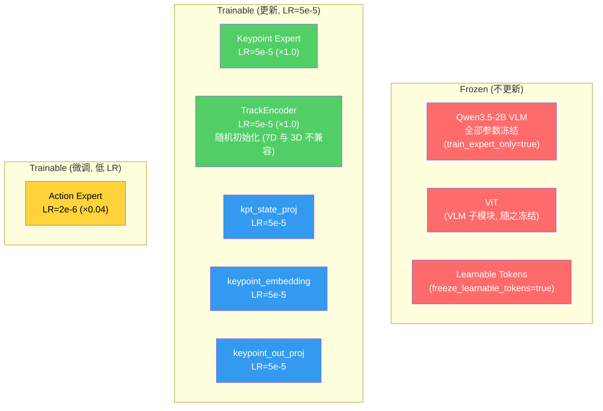
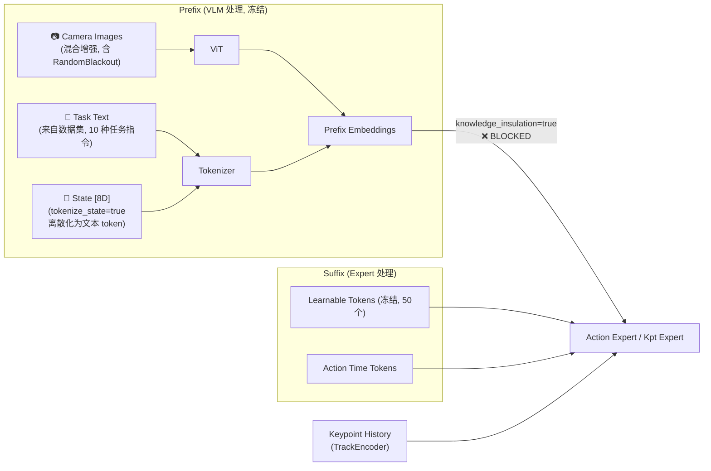
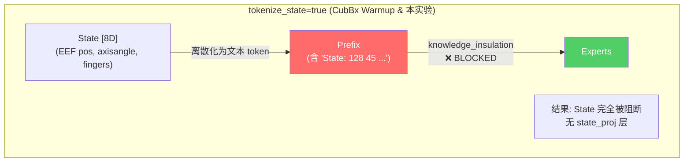

# Phase 1 Warmup — LIBERO-Plus Goal 4D (keypoint_expert 模态隔离训练)

> **EXPR_NAME**: `4dwvlaLbPlusGol0929`  
> **数据集**: `/B/Dta/LIBERO/libero_plus_goal_lrb3_4D/` — 20Hz, 4,243 episodes, 512,604 frames, 10 tasks  
> **特殊模式**: RandomBlackout 黑图 · knowledge_insulation 文本/图片/State 阻断 · tokenize_state=true (state 离散化为 text → prefix, 被 knowledge_insulation 阻断) — 隔离图片、文本和 State 模态, 专注训练 4D 模态 (keypoint_expert)  
> **基线参考**: `b/d/Frk3/ds/cubinbx/cubbx_warmup1.md` (4dwvlaFrkCubBx0924)  
> **日期**: 2026-09-29

---

## 目录

1. [概述](#1-概述)
2. [与 Franka CubBx Warmup 的关键区别](#2-与-franka-cubbx-warmup-的关键区别)
3. [可配置变量汇总](#3-可配置变量汇总)
4. [硬件 & 软件前提](#4-硬件--软件前提)
5. [数据集概况](#5-数据集概况)
6. [训练步数计算](#6-训练步数计算)
7. [超参数 & 冻结矩阵](#7-超参数--冻结矩阵)
8. [模态隔离设计](#8-模态隔离设计)
9. [数据流与 Transform Pipeline](#9-数据流与-transform-pipeline)
10. [文件清单](#10-文件清单)
11. [操作步骤](#11-操作步骤)
12. [冒烟测试](#12-冒烟测试)
13. [生产训练](#13-生产训练)
14. [验收标准](#14-验收标准)
15. [异常判定](#15-异常判定)
16. [故障排查](#16-故障排查)
17. [附录 A: 启动脚本](#附录-a-启动脚本)
18. [附录 B: 编排监控脚本](#附录-b-编排监控脚本)
19. [附录 C: 模态隔离设计分析](#附录-c-模态隔离设计分析)
20. [附录 D: 超参/配置汇总](#附录-d-超参配置汇总)
21. [附录 E: 文件增删改汇总](#附录-e-文件增删改汇总)
22. [附录 F: 关键路径汇总](#附录-f-关键路径汇总)

---

## 1. 概述

本实验为 InternVLA-A1.5 的 **Phase 1 Warmup** (阶段 1 预热训练), 使用 LIBERO-Plus Goal 子集 (`libero_goal`, 10 个桌面操作任务, 4,243 episodes, 含 3D/4D keypoint) 数据集, 在 3D/4D keypoint 维度进行 warmup. 训练目标是从零训练 **keypoint_expert** 和 **TrackEncoder**, 同时以极低学习率微调 action_expert, VLM 骨干完全冻结.

与之前的 Franka CubBx Warmup (`4dwvlaFrkCubBx0924`) 相比, 本实验有两个核心变化:

1. **数据规模增大 14×**: 512,604 frames (vs 36,953), 4,243 episodes (vs 56), 10 tasks (vs 1)
2. **仅训练 2 个 epoch** (vs 4): 数据量大, 2 epoch 即可充分学习 keypoint 轨迹预测.

模态隔离策略与 CubBx Warmup 完全一致: `tokenize_state=true` 将 state 离散化为文本 token 放入 prefix, 被 `knowledge_insulation` 阻断, experts 无法访问 state.

### 1.1 模态隔离策略摘要

| 模态 | 处理方式 | experts 是否可见 |
|------|---------|:---:|
| **图片** | RandomBlackout 混合增强 (blackout w=2.0, 80% 概率) + knowledge_insulation 阻断 prefix | ❌ |
| **文本** (任务指令) | knowledge_insulation 阻断 prefix + enable_vqa_loss=false | ❌ |
| **State** (本体感知) | tokenize_state=true → 离散化为文本 token → prefix → knowledge_insulation 阻断 | ❌ |
| **Keypoint history** | TrackEncoder 编码 → suffix | ✅ |
| **Learnable tokens** | 冻结 (freeze_learnable_tokens=true) → suffix | ✅ (冻结值) |

---

## 2. 与 Franka CubBx Warmup 的关键区别

| 维度 | CubBx Warmup (`4dwvlaFrkCubBx0924`) | 本实验 (`4dwvlaLbPlusGol0929`) |
|------|------|------|
| 数据集 | `put_cube_into_box_lrb3_4D` | `libero_plus_goal_lrb3_4D` |
| 场景 | Franka 单任务 (夹方块放盒子) | LIBERO Goal 10 个桌面操作任务 |
| robot_type | `franka_cubinbx` (新建 schema) | `panda` (已有 schema) |
| total_frames | 36,953 | **512,604** (14× 更大) |
| total_episodes | 56 | **4,243** |
| FPS | 30 | **20** |
| 原始图像分辨率 | 640×480 | **256×256** |
| State 维度 | 15D (joint×7 + gripper + ee_pos×3 + ee_quat2×4) | **8D** (eef_pos×3 + eef_axisangle×3 + fingers×2) |
| Action 维度 | 8D (joint×7 + gripper_cmd), abs | **7D** (delta_eef×6 + gripper), abs (已存为 delta) |
| R_pad | 0.886566 | **1.8212723273** |
| `action_mode` | `abs` | `abs` (数据已是 delta EEF, 不需再次差分) |
| `action_mask_spec` | [7, -1] (arm + gripper 分离) | **[7]** (7 维统一处理) |
| NUM_EPOCHS | **4** | **2** |
| steps_per_epoch | 289 | **4,005** |
| total_steps | 1,156 | **8,010** |
| warmup_steps | 289 (1 epoch) | **4,005** (1 epoch) |
| `tokenize_state` | `true` (state → text → prefix, 被阻断) | `true` (相同, state → text → prefix, 被阻断) |
| `keypoint_history_max_len` | 90 | **92** |
| 新 schema | 需新建 `franka_cubinbx.yaml` | **不需要** (`panda.yaml` 已存在) |
| 预计训练时间 | ~20-35 min | **~2.5-4 hrs** |

---

## 3. 可配置变量汇总

| 变量 | 默认值 | 说明 |
|------|--------|------|
| `EXPR_NAME` | `4dwvlaLbPlusGol0929` | 实验名, 决定 checkpoint/log 路径 |
| `VENV_ROOT` | `/B/VENV/itnvla15rbt20` | Python 虚拟环境 |
| `HF_HOME` | `/B/VENV/hf_home` | HuggingFace cache 根目录 |
| `HF_LEROBOT_HOME` | `${HF_HOME}/lerobot` | LeRobot 数据 symlink 根 |
| `DATA_SRC` | `/B/Dta/LIBERO/libero_plus_goal_lrb3_4D` | 数据集物理路径 |
| `DATA_REPO_ID` | `libero_plus_goal_lrb3_4D` | LeRobot repo id (symlink 名) |
| `PRETRAINED_PATH` | `${HF_HOME}/ckpts/InternVLA-A1.5-base` | A1.5-base 预训练权重 |
| `GEOPREDICT_CKPT` | `${HF_HOME}/ckpts/GeoPredict_robocasa.pth` | GeoPredict 权重 (7D 模式下部分加载) |
| `CKPT_ROOT` | `${HOME}/b/Ckp/${EXPR_NAME}` | checkpoint 输出根目录 |
| `LOG_ROOT` | `/B/Log/${EXPR_NAME}` | 训练日志根目录 |
| `PROC_PER_NODE` | `8` | GPU 数 |
| `BATCH_SIZE` | `16` | per-GPU batch size |
| `NODE_COUNT` | `1` | 节点数 |
| `NUM_EPOCHS` | `2` | 训练 epoch 数 |
| `SAVE_EPOCH_INTERVAL` | `2` | 训练结束时保存 (= NUM_EPOCHS, 仅保存最终 checkpoint) |
| `MONITOR_INTERVAL` | `900` | 监控轮询间隔 (秒) |

---

## 4. 硬件 & 软件前提

### 4.1 硬件

| 项目 | 要求 |
|------|------|
| GPU | 8× NVIDIA GPU, 每卡 ≥ 40 GB VRAM (A100/H100) |
| 内存 | ≥ 128 GB RAM |
| 磁盘 | checkpoint ≈ 12 GB/save, log ≈ 0.5 GB |

### 4.2 软件

| 组件 | 版本 |
|------|------|
| Python | 3.11 |
| PyTorch | 2.10.0 (cu128) |
| transformers | 5.2.0 (含 Qwen3.5 patch) |
| flash-attn | 2.8.3 |
| accelerate | ≥ 1.6.0 |

### 4.3 前置条件

1. 虚拟环境 `/B/VENV/itnvla15rbt20` 已安装完整依赖
2. Transformers Qwen3.5 patch 已部署
3. InternVLA-A1.5-base 权重已下载
4. GeoPredict 权重已下载
5. 数据集 `/B/Dta/LIBERO/libero_plus_goal_lrb3_4D/` 已通过 R2 验收 (参见 `b/d/libplus2/gol/3d4d_gen2_0929LOG.markdown`)
6. `RandomBlackout` 类已部署到 `src/lerobot/datasets/transforms.py` (CubBx Warmup 时已完成)
7. `keypoints.py:275` 的 ceiling division 修复已就位 (CubBx Warmup 时已完成)
8. `modeling_internvla_a1_5.py:1067-1070` 的 bfloat16 cast 修复已就位

---

## 5. 数据集概况

| 属性 | 值 |
|------|-----|
| 来源 | LIBERO-Plus Goal 子集 (RLDS → LeRobot v3 转换, gen2 pipeline) |
| robot_type | `panda` |
| FPS | 20 |
| 总 episodes | 4,243 |
| 总 frames | 512,604 |
| 总 tasks | 10 |
| 平均 episode 长度 | 120.8 frames (6.0 秒) |
| 图像分辨率 | 256×256 (原始即此分辨率, 训练时 resize 到 224×224) |
| 摄像头 | 2 (agentview + wrist) → image, image2 |
| 视频编码 | AV1 (SVT-AV1, CRF 30) |
| State 维度 | 8D: [eef_pos×3, eef_axisangle×3, finger_l, finger_r] |
| Action 维度 | 7D: [dx, dy, dz, dax, day, daz, gripper] (原始 delta EEF 命令) |
| Action mode | `abs` (数据已存储为 delta EEF 命令, 训练时不需再次差分) |
| Keypoint 维度 | 7D (px,py,pz,qx,qy,qz,qw) × 8 joints = 56D |
| Keypoint joints | link1–link7 + gripper0_eef |
| R_pad | 1.8212723273 |
| 旋转表示 | quaternion xyzw, hemisphere-normalized (qw ≥ 0) |
| kpt_4d_mode | `pos_rot` (7D) |
| 图像朝向 | `raw` (robosuite 原始方向, = rot180(RLDS JPEG)) |
| 坐标系 | `libero_goal_table_world` (base = [-0.66, 0, 0.912]) |

### 5.1 State 布局

```
Index  [0:3]       eef_x/y/z         (m, end-effector position)
Index  [3:6]       eef_ax/ay/az      (rad, end-effector axis-angle)
Index  [6]         finger_l          (left finger position)
Index  [7]         finger_r          (right finger position)
```

### 5.2 Action 布局

```
Index  [0:3]       dx/dy/dz          (m, delta end-effector position)
Index  [3:6]       dax/day/daz       (rad, delta end-effector orientation)
Index  [6]         gripper           (gripper command, -1 or +1)
```

### 5.3 Keypoint 布局

每个 keypoint = 7D: `[px, py, pz, qx, qy, qz, qw]`
- 位置 `px,py,pz` 已除以 `R_pad=1.8212723273` 归一化, 范围约 [-0.87, 0.87]
- 旋转 `qx,qy,qz,qw` 为 hemisphere-normalized quaternion (qw ≥ 0)
- 8 个 keypoints 依次: link1, link2, ..., link7, gripper0_eef
- 总维度: 8 × 7 = 56

### 5.4 任务列表

数据集包含 10 个 LIBERO-Goal 任务:

| # | 任务名 | 说明 |
|---|--------|------|
| 1 | put_the_bowl_on_the_plate | 把碗放到盘子上 |
| 2 | put_the_cream_cheese_in_the_bowl | 把奶油芝士放进碗里 |
| 3 | push_the_plate_to_the_front_of_the_stove | 把盘子推到炉灶前 |
| 4 | put_the_wine_bottle_on_the_rack | 把酒瓶放到架子上 |
| 5 | put_the_butter_in_the_basket | 把黄油放进篮子里 |
| 6 | turn_on_the_stove | 打开炉灶 |
| 7 | put_the_moka_pot_on_the_stove | 把摩卡壶放到炉灶上 |
| 8 | open_the_top_drawer_of_the_cabinet | 打开柜子的顶部抽屉 |
| 9 | put_the_black_bowl_on_the_plate | 把黑色碗放到盘子上 |
| 10 | open_the_bottom_drawer_of_the_cabinet | 打开柜子的底部抽屉 |

---

## 6. 训练步数计算

$$
\text{EBS} = \text{PROC\_PER\_NODE} \times \text{BATCH\_SIZE} \times \text{NODE\_COUNT} = 8 \times 16 \times 1 = 128
$$

$$
\text{steps\_per\_epoch} = \lceil \frac{\text{total\_frames}}{\text{EBS}} \rceil = \lceil \frac{512{,}604}{128} \rceil = 4{,}005
$$

$$
\text{total\_steps} = \text{steps\_per\_epoch} \times \text{NUM\_EPOCHS} = 4{,}005 \times 2 = 8{,}010
$$

$$
\text{save\_freq} = \text{steps\_per\_epoch} \times \text{SAVE\_EPOCH\_INTERVAL} = 4{,}005 \times 2 = 8{,}010
$$

> **注意**: `SAVE_EPOCH_INTERVAL = NUM_EPOCHS = 2`, 即 `save_freq = total_steps = 8,010`. 训练期间不保存中间 checkpoint, 仅在最后一步保存.

$$
\text{warmup\_steps} = \text{steps\_per\_epoch} = 4{,}005
$$

| 指标 | 值 |
|------|-----|
| EBS | 128 |
| steps/epoch | 4,005 |
| total epochs | 2 |
| total steps | 8,010 |
| save freq | 8,010 (仅最终, = total_steps) |
| warmup steps | 4,005 (1 epoch cosine warmup) |
| scheduler_decay_steps | 8,010 (= total_steps, cosine 衰减至结束) |
| scheduler_decay_lr | 5e-6 (衰减后最低学习率) |
| 预计训练时间 | ~2.5–4 hrs (8×A100) |

### 6.1 Checkpoint 保存点

| Step | Epoch | 说明 |
|------|-------|------|
| 8,010 | 2.0 | 最终 checkpoint (唯一保存点) |

### 6.2 与 CubBx Warmup 的步数对比

| 指标 | CubBx | 本实验 | 倍率 |
|------|-------|--------|------|
| total_frames | 36,953 | 512,604 | 13.9× |
| EBS | 128 | 128 | 1× |
| steps/epoch | 289 | 4,005 | 13.9× |
| epochs | 4 | **2** | 0.5× |
| total_steps | 1,156 | **8,010** | 6.9× |
| warmup_steps | 289 | **4,005** | 13.9× |

---

## 7. 超参数 & 冻结矩阵

### 7.1 超参数

| 参数 | 值 | 说明 |
|------|-----|------|
| `optimizer_lr` | 5e-5 | 基础学习率 |
| `action_expert_lr_scale` | 0.04 | action_expert 有效 LR = 5e-5 × 0.04 = 2e-6 |
| `kpt_expert_lr_scale` | 1.0 | kpt_expert 有效 LR = 5e-5 |
| `track_encoder_lr_scale` | 1.0 | TrackEncoder 有效 LR = 5e-5 |
| `action_loss_weight` | 2.0 | action flow-matching 损失权重 |
| `kpt_loss_weight` | 10.0 | 当前帧 keypoint 预测损失权重 |
| `kpt_future_loss_weight` | 12.0 | 未来帧 keypoint 预测损失权重 |
| `kpt_rot_loss_weight` | 1.0 | 旋转分量损失权重 (pos_rot 模式) |
| `scheduler` | cosine warmup + decay | warmup=4,005 steps, decay to 5e-6 at step 8,010 |
| `dtype` | bfloat16 | 混合精度 |
| `seed` | 42 | 随机种子 |

### 7.2 冻结矩阵



> **`tokenize_state=true` 的效果**: State 被离散化为文本 token, 放入 prefix. `knowledge_insulation=true` 阻断 suffix→prefix 注意力, 因此 experts 无法访问 state. 模型不创建 `state_proj` 层. 这与 CubBx Warmup 完全一致 — state、图片、文本三种模态均被阻断, experts 仅依赖 keypoint history 和冻结的 learnable tokens.

### 7.3 关键训练标志

| 标志 | 值 | 说明 |
|------|-----|------|
| `train_expert_only` | `true` | 冻结 VLM 骨干 |
| `knowledge_insulation` | `true` | 阻止 action_expert 注意力触达 prefix |
| `knowledge_insulation_kpt` | `true` | 阻止 kpt_expert 注意力触达 prefix |
| `action_loss_only` | `true` | 不加载 WAN 视频分支 |
| `video_loss_only` | `false` | 不单独训练视频分支 |
| `enable_vqa_loss` | `false` | 不计算 VQA/文本损失 |
| `tokenize_state` | **`true`** | state 离散化为 text → prefix, 被 knowledge_insulation 阻断; experts 无法访问 state |
| `freeze_learnable_tokens` | `true` | 冻结前瞻 token |
| `enable_keypoint_predictor` | `true` | 启用 3D/4D keypoint 预测 |
| `kpt_4d_mode` | `pos_rot` | 7D keypoint (位置 + 旋转) |
| `init_kpt_expert_from_action` | `true` | kpt_expert 权重从 action_expert 初始化 |
| `use_fast_action_tokens` | `false` | 不使用 FAST action tokenization |
| `keypoint_history_max_len` | `92` | keypoint 历史窗口 (92/patch_size=4 → 23 patches, 整除) |
| (图像增强) | 通过 `image_transforms` | 7 种增强含 `RandomBlackout` (weight=2.0), p_schedule=[0.8] |

### 7.4 `keypoint_history_max_len=92` 的选择

$$
\text{patches} = \frac{92}{4} = 23 \quad \text{(整除, 无需 padding)}
$$

`keypoint_history_max_len=92` 在 `PointPatchEmbedding` 中恰好被 patch_size=4 整除, 避免了 CubBx Warmup 中 90÷4=22.5 → pad 到 92 → `TimeEmbedding` OOB 的问题. 虽然 `keypoints.py:275` 的 ceiling division 修复已就位, 整除是更简洁的配置.

LIBERO Goal episodes 平均长度 120.8 帧 (最短 75, 最长 299). `H=92` 能覆盖大部分 episode 的完整历史 (75% 的 episodes 长度 < 130). 相比 contract 中定义的 `H=200` (用于 eval), warmup 阶段使用较短的历史窗口降低了训练显存需求, 同时仍提供足够的时序上下文.

---

## 8. 模态隔离设计

本实验的模态隔离策略与 CubBx Warmup **完全一致**: 图片、文本、State 三种模态均被阻断, experts 仅能访问 keypoint history 和冻结的 learnable tokens.

### 8.1 与 CubBx Warmup 的对比

| 模态 | CubBx Warmup | 本实验 |
|------|-------------|--------|
| 图片 | 混合增强 (含 RandomBlackout) + knowledge_insulation 阻断 | **相同** |
| 文本 | knowledge_insulation 阻断 + enable_vqa_loss=false | **相同** |
| State | `tokenize_state=true` → text → prefix → **被阻断** | **相同** |
| Keypoint history | TrackEncoder → suffix | **相同** |

### 8.2 信息流分析



### 8.3 模态隔离策略详解

1. **图片模态 → 混合增强 (含 RandomBlackout)**: 与 CubBx Warmup 相同. 7 种增强类型, `RandomBlackout` 权重最高 (weight=2.0), 80% 概率应用增强. ViT 仍然处理增强后的图像, 但 `knowledge_insulation=true` 阻断 prefix→suffix 注意力, 图片信息无法到达 experts.

2. **文本模态 → knowledge_insulation 阻断 (无文本影响)**: 任务指令文本来自数据集 ("put the bowl on the plate" 等). VLM 在 prefix 中正常处理, 但 `knowledge_insulation=true` 阻断 suffix→prefix 注意力, 文本信息无法到达 experts. `enable_vqa_loss=false` 关闭文本损失, 避免文本监督信号影响 expert 权重.

3. **State 模态 → tokenize_state=true → prefix → 被阻断**: 与 CubBx Warmup 相同. `tokenize_state=true` 将 8D state (EEF 位置、朝向、手指状态) 离散化为文本 token, 放入 prefix. `knowledge_insulation=true` 阻断 suffix→prefix 注意力, state 信息无法到达 experts. 模型不创建 `state_proj` 层.

4. **设计原理**: 本实验目标是极端模态隔离 — 图片、文本、State 三种模态全部被阻断, experts 仅依赖 keypoint history (TrackEncoder) 和冻结的 learnable tokens. 这样 keypoint_expert 和 TrackEncoder 必须完全从 4D keypoint 轨迹中学习时空模式, 不会受到其他模态的干扰.

### 8.4 `RandomBlackout` 图像增强配置

与 CubBx Warmup 完全相同. `RandomBlackout` 已部署到 `src/lerobot/datasets/transforms.py`, 通过 `TFS_CONFIG` YAML 字符串传入完整的 7 种增强配置:

| 增强类型 | type | weight | 效果 |
|---------|------|--------|------|
| `brightness` | `ColorJitter` | 1.0 | 亮度 [0.8, 1.2] |
| `contrast` | `ColorJitter` | 1.0 | 对比度 [0.8, 1.2] |
| `saturation` | `ColorJitter` | 1.0 | 饱和度 [0.5, 1.5] |
| `hue` | `ColorJitter` | 1.0 | 色调 [-0.05, 0.05] |
| `sharpness` | `SharpnessJitter` | 1.0 | 锐度 [0.5, 1.5] |
| `affine` | `RandomAffine` | 0.2 | 旋转 ±5°, 平移 5% |
| `blackout` | `RandomBlackout` | **2.0** | 像素 → `rand() × 0.01` (近黑噪声) |

总权重 = 7.2, `blackout` 归一化权重 ≈ 27.8%. `max_num_transforms=3`, `p_schedule=[0.8]`.

---

## 9. 数据流与 Transform Pipeline

### 9.1 Transform 链

```
raw dataset item
  │
  ├── observation.state  [8]   (eef_pos, eef_axisangle, fingers)
  ├── action             [7]   (delta_eef, gripper)
  ├── observation.images.image   [256×256×3]  (agentview, video decode)
  ├── observation.images.image2  [256×256×3]  (wrist, video decode)
  ├── observation.keypoint_3d    [56]         (from parquet)
  ├── task               "put the bowl on the plate" (varies per task)
  └── ...
  │
  ▼
⚡ IMAGE AUGMENTATION (image_transforms, 含 RandomBlackout)
  │  image_transforms.begin_sample()  → 掷骰子 80% 应用增强
  │  for cam in [image, image2]:
  │    item[cam] = RandomSubsetApply(7种增强, 采样3个)(item[cam])
  │
  ▼
① ResizeImagesWithPadFn   →  images → 224×224
  │
  ▼
② RemapImageKeyTransformFn →  image→image0 (agentview), image2→image1 (wrist), image2=ones(mask=False)
  │
  ▼
③ ExtractVideoFramesTransformFn  →  video frames (action_loss_only=true 时无效)
  │
  ▼
④ NormalizeTransformFn    →  state/action normalization; images 用 ImageNet stats
  │
  ▼
⑤ Extract3DKeypointTransformFn →  keypoint_3d → kpt_t, kpt_history(H=92), kpt_future(C=50), kpt_mask
  │
  ▼
⑥ ComposeFieldsTransform  →  合并 schema 字段
  │
  ▼
⑦ InternVLAA15ChatProcessorTransformFn (tokenize_state=true)
  │  → user_text = "Task: put the bowl on the plate; Control Mode: <joint>; State: 128 45 ..."
  │  → tokenize_state=true: State 离散化为文本 token, 附加到 prompt (进入 prefix)
  │  → label_mode = NONE (enable_vqa_loss=false, use_fast=false)
  │
  ▼
⑧ PadStateAndActionTransformFn →  state pad to 32D, action pad to 32D
  │
  ▼
⑨ ReorderStateActionTransform  →  确保 state/action 维度对齐
  │
  ▼
⑩ UnifyInternVLAA15InputsTransformFn →  统一格式; 组装 kpt 字段
  │
  ▼
final batch → policy.forward()
```

### 9.2 Model Forward 流

```
  [Prefix: frozen VLM]
    input_ids (含增强/涂黑图 token + task text) → Qwen3.5 → prefix_hidden_states
    (knowledge_insulation=true → prefix 对 suffix 不可见)

  [Suffix: trainable modules]
    learnable_tokens(50)              ←── 冻结
    action_time_tokens(chunk=50)      ←── action expert
    (state 在 prefix 中, 被 knowledge_insulation 阻断, 不进入 suffix)

  → action_expert(suffix) → flow matching → loss_action × 2.0
  → kpt_expert(suffix + kpt_history) → kpt prediction → loss_kpt × 10.0 + loss_kpt_future × 12.0
```

---

## 10. 文件清单

### 10.1 新增文件

| 文件 | 用途 |
|------|------|
| `b/s/libplus2/gol/p1_warmup_launch.sh` | accelerate launch 脚本 |
| `b/s/libplus2/gol/run_p1_warmup.sh` | 编排监控脚本 |

### 10.2 已有文件 (本实验不修改)

| 文件 | 说明 |
|------|------|
| `src/lerobot/datasets/transforms.py` | 含 `RandomBlackout` (CubBx Warmup 已部署) |
| `src/lerobot/dataset_schemas/configs/panda.yaml` | schema (已存在, action_mask_spec=[7], image×2) |
| `src/lerobot/policies/internvla_a1_5/keypoints.py` | ceiling division 修复 (CubBx Warmup 已完成) |
| `src/lerobot/policies/internvla_a1_5/modeling_internvla_a1_5.py` | bfloat16 cast 修复 (CubBx Warmup 已完成) |
| `/B/Dta/LIBERO/libero_plus_goal_lrb3_4D/` | 数据集 (gen2 pipeline 已生成, R2 验收通过) |
| `${HF_HOME}/ckpts/InternVLA-A1.5-base/` | 预训练权重 |
| `${HF_HOME}/ckpts/GeoPredict_robocasa.pth` | GeoPredict 权重 |

> **注意**: 本实验无需创建新 schema 文件. `panda.yaml` 已有正确的 `image_mapping` (image→image0, image2→image1) 和 `action_mask_spec: [7]`. 无需新建 `franka_cubinbx.yaml` 等.

---

## 11. 操作步骤

### Step 0: 激活虚拟环境

```bash
source /B/VENV/itnvla15rbt20/bin/activate
cd /B/SRC/itvlaGpLibPlus
```

### Step 1: 验证数据集完整性

```bash
# 确认数据集已通过 R2 验收
DATASET=/B/Dta/LIBERO/libero_plus_goal_lrb3_4D \
  PY=/B/VENV/itnvla15rbt20/bin/python \
  bash b/s/libplus2/gol/accept_goal_4d.sh
```

> **预期**: S1-S6 全部通过. 若跳过 (已在 gen2 执行中验收), 至少确认 info.json 存在且 total_frames=512604.

### Step 2: 验证前置模型文件

```bash
# A1.5-base 权重
test -f /B/VENV/hf_home/ckpts/InternVLA-A1.5-base/config.json && echo "A1.5-base OK" || echo "MISSING"

# GeoPredict 权重
test -f /B/VENV/hf_home/ckpts/GeoPredict_robocasa.pth && echo "GeoPredict OK" || echo "MISSING"
```

### Step 3: 创建数据集 symlink

```bash
HF_LEROBOT_HOME=/B/VENV/hf_home/lerobot
mkdir -p "${HF_LEROBOT_HOME}"
ln -sfn /B/Dta/LIBERO/libero_plus_goal_lrb3_4D \
  "${HF_LEROBOT_HOME}/libero_plus_goal_lrb3_4D"

# 验证
test -f "${HF_LEROBOT_HOME}/libero_plus_goal_lrb3_4D/meta/info.json" \
  && echo "symlink OK" || echo "BROKEN"
```

### Step 4: 验证 panda schema

```bash
python -c "
from lerobot.dataset_schemas import get_schema
s = get_schema('panda')
print(f'robot_type={s.robot_type}')
print(f'action_mask_spec={s.action_mask_spec}')
print(f'image_mapping={s.image_mapping}')
assert s.robot_type == 'panda'
assert s.action_mask_spec == [7]
assert 'observation.images.image' in s.image_mapping
assert 'observation.images.image2' in s.image_mapping
print('schema OK')
"
```

### Step 5: 验证 RandomBlackout 可用

```bash
python -c "
from lerobot.datasets.transforms import RandomBlackout
import torch
t = RandomBlackout(noise_scale=0.01)
img = torch.ones(3, 224, 224)
out = t(img)
assert out.max() < 0.02, f'output max={out.max()}'
print(f'RandomBlackout OK: input max={img.max():.1f}, output max={out.max():.4f}')
"
```

### Step 6: 部署启动脚本和编排脚本

```bash
mkdir -p b/s/libplus2/gol
# 创建启动脚本 (见附录 A)
# 创建编排脚本 (见附录 B)
```

### Step 7: 清理 GPU (可选)

```bash
nvidia-smi --query-compute-apps=pid --format=csv,noheader | xargs -r kill -9
sleep 5
```

---

## 12. 冒烟测试

### 12.1 手动冒烟

```bash
SMOKE=1 bash b/s/libplus2/gol/p1_warmup_launch.sh
```

冒烟测试参数: 1 GPU, BS=2, 10 steps, 2 workers.

### 12.2 预期输出

1. 模型加载:
   - `Loading InternVLA-A1.5-base from ...`
   - `GeoPredict checkpoint loaded` (或 `WARNING: GeoPredict shape mismatch ... (256, 3, 4) vs (256, 7, 4)` — 7D 模式下 TrackEncoder 随机初始化, **预期行为**)
   - `train_expert_only=True → freezing VLM`
   - `tokenize_state=True` → State 离散化为文本 token, 附加到 prompt (进入 prefix)
   - 应看到 "State:" 文本被附加到用户 prompt 中

2. 数据加载:
   - 正常加载 `libero_plus_goal_lrb3_4D`
   - schema 为 `panda`, image_mapping: image→image0, image2→image1

3. 训练:
   - 10 个 step 正常完成, 无 crash
   - `loss_action`, `loss_kpt_cur`, `loss_kpt_future` 有输出
   - 无 `video_decode_error` 或 `using_zeros`

### 12.3 可能的冒烟错误

| 编号 | 症状 | 解决方法 |
|:---:|------|---------|
| S1 | `FileNotFoundError: info.json` | Step 3 symlink 未创建, 重新执行 |
| S2 | `Transform 'RandomBlackout' is not valid` | Step 5 验证失败, 检查 `transforms.py` 是否含 `RandomBlackout` |
| S3 | GeoPredict shape mismatch → crash (非 WARNING) | 检查 `keypoints.py` 中的 7D 兼容逻辑 |
| S4 | `RuntimeError: shape invalid for input of size` | 确认 `--policy.keypoint_history_max_len=92 --dataset.keypoint_history_max_len=92` 一致 |
| S5 | OOM | 减小 `BATCH_SIZE` (如 1) |
| S6 | `mat1 and mat2 must have the same dtype` | bfloat16 cast 修复未就位, 检查 `modeling_internvla_a1_5.py:1067-1070` |

---

## 13. 生产训练

### 13.1 通过编排脚本启动

```bash
bash b/s/libplus2/gol/run_p1_warmup.sh
```

编排脚本会自动:
1. 计算训练步数 (从 info.json 读取 total_frames)
2. 执行 pre-flight 检查
3. 运行冒烟测试 (可用 `--skip-smoke` 跳过)
4. 启动 8 GPU 生产训练
5. 每 15 分钟监控训练状态
6. 训练完成/失败后: 清理 GPU → 启动 bigmatrix → 归档日志

### 13.2 直接启动 (跳过编排)

```bash
export CUDA_VISIBLE_DEVICES=0,1,2,3,4,5,6,7
bash b/s/libplus2/gol/p1_warmup_launch.sh
```

### 13.3 预期训练日志

```
Step  200: loss_kpt_cur=0.50   loss_kpt_fut=0.60   loss_action=0.20   grad_norm=800
Step  500: loss_kpt_cur=0.10   loss_kpt_fut=0.20   loss_action=0.15   grad_norm=200
Step 1000: loss_kpt_cur=0.03   loss_kpt_fut=0.08   loss_action=0.12   grad_norm=100
Step 2000: loss_kpt_cur=0.015  loss_kpt_fut=0.04   loss_action=0.10   grad_norm=60
Step 4000: loss_kpt_cur=0.010  loss_kpt_fut=0.03   loss_action=0.08   grad_norm=40
Step 6000: loss_kpt_cur=0.008  loss_kpt_fut=0.025  loss_action=0.07   grad_norm=35
Step 8010: [SAVE] checkpoint 008010 (FINAL)
```

> 以上为预估值. 相比 CubBx Warmup:
> - **`loss_kpt_cur` 可能收敛更慢**: 10 个任务的 state space 更大, 且训练只有 2 epoch
> - **`loss_kpt_cur` 最终值可能略高于 CubBx**: state、图片、文本均被阻断, experts 仅依赖 keypoint history, 且多任务增加了分布复杂性
> - **`loss_action` 可能略高**: delta EEF 命令的动力学与 Franka 绝对关节角不同

---

## 14. 验收标准

### 14.1 必须通过

| 编号 | 条件 | 检查方法 |
|:---:|------|---------|
| A1 | 训练 exit code = 0 | `echo $?` |
| A2 | 最终 checkpoint 存在 | `test -f ${OUTPUT_DIR}/checkpoints/008010/pretrained_model/config.json` |
| A3 | `loss_kpt_cur` < 0.02 (epoch 2 后半段) | 检查 log 或 wandb |
| A4 | `loss_kpt_future` 持续下降 | 检查 log 趋势 |
| A5 | 无 `video_decode_error` | `grep -c 'video_decode_error' train.log` 为 0 |
| A6 | 无 `using_zeros` | `grep -c 'using_zeros' train.log` 为 0 |
| A7 | `grad_norm` 无持续 > 1000 | 检查 log |

### 14.2 建议通过

| 编号 | 条件 | 说明 |
|:---:|------|------|
| B1 | `loss_action` < 0.5 (最终) | action_expert 微调效果 |
| B2 | `loss_kpt_cur` < 0.01 (最终) | keypoint 当前帧预测精度 |
| B3 | 训练时间 < 5 hrs | 8×A100 预期 ~2.5-4 hrs |

> **注意**: A3 阈值放宽为 0.02 (CubBx 为 0.01), 因为:
> 1. 仅 2 epoch (vs 4), 收敛时间更短
> 2. 10 个任务的 state space 更大, 单个 warmup 可能不足以达到 CubBx 的精度
> 3. 多任务 (10 tasks) 增加了分布复杂性

---

## 15. 异常判定

| 异常 | 判定条件 | 可能原因 |
|---|---|---|
| kpt 不收敛 | epoch 2 后 `loss_kpt_cur` > 0.05 | keypoint_3d 数据异常, kpt_loss_weight 过低, 或 TrackEncoder 未正确初始化 |
| action 不稳定 | `loss_action` > 1.0 持续存在 | action_expert_lr_scale 过高, 数据 action 格式异常 |
| 梯度爆炸 | `grad_norm` > 1000 持续多轮 | LR 过大 |
| 日志停滞 | 15 分钟无更新 | 数据加载死锁, GPU 错误, 或 OOM |

---

## 16. 故障排查

| 编号 | 症状 | 可能原因 | 解决方法 |
|:---:|---|---|---|
| T1 | `ncclInternalError` | NCCL tuner plugin 问题 | 确认 `NCCL_TUNER_PLUGIN=/dev/null` 已设置 |
| T2 | `FileNotFoundError: info.json` | 数据 symlink 缺失 | 重做 Step 3 |
| T3 | `Shape mismatch ... (256, 3, 4) vs (256, 7, 4)` | GeoPredict 3D/7D 不兼容 | **预期行为**, TrackEncoder 随机初始化. 若 crash 而非 WARNING, 检查 `keypoints.py` |
| T4 | `RuntimeError: shape invalid for input of size` | `keypoint_history_max_len` 不一致 | 确认 `--policy.keypoint_history_max_len=92` 和 `--dataset.keypoint_history_max_len=92` 一致 |
| T5 | `video_decode_error > 0` | MP4 文件损坏或 torchcodec 问题 | 检查 LD_LIBRARY_PATH 含 libnpp; 检查视频文件完整性 |
| T6 | `using_zeros > 0` | 视频帧解码返回全零 | 同 T5; 注意黑图模式下此 warning 来自 video decode, 非 blackout |
| T7 | OOM | batch_size 过大 | 减小 `BATCH_SIZE` (如 12 或 8), 或启用 `GRADIENT_CHECKPOINTING=true` |
| T8 | `Transform 'RandomBlackout' is not valid` | transforms.py 未含 RandomBlackout | 确认 CubBx Warmup 的代码变更已在当前分支 |
| T9 | `mat1 and mat2 must have the same dtype` | bfloat16 cast 修复缺失 | 检查 `modeling_internvla_a1_5.py:1067-1070` |
| T10 | bigmatrix 启动失败 | Python 环境或脚本问题 | 手动运行 `python b/d/GpRbt/bigmatrix_multiply_optimization.py` |
| T11 | `tokenize_state` 行为异常 | 配置不一致 | 确认 `--policy.tokenize_state=true` 和 `--dataset.tokenize_state=true` 都已设置 (或使用默认值) |

---

## 附录 A: 启动脚本

**文件**: `b/s/libplus2/gol/p1_warmup_launch.sh`

```bash
#!/usr/bin/env bash
set -euo pipefail

###############################################################################
# Phase 1 Warmup — LIBERO-Plus Goal 4D (kpt_4d_mode=pos_rot)
#
# Modality isolation: RandomBlackout + knowledge_insulation (block images, text & state)
# tokenize_state=true → state tokenized to text in prefix, blocked by knowledge_insulation
#
# Based on: b/s/Frk3/frk3_cubbx_warmup_launch.sh (4dwvlaFrkCubBx0924)
# Changes:  dataset (libero_goal 4D, panda, 20Hz, 512K frames, delta action),
#           2 epochs, keypoint_history_max_len=92
#
# Usage:
#   bash b/s/libplus2/gol/p1_warmup_launch.sh           # production 8 GPU
#   SMOKE=1 bash b/s/libplus2/gol/p1_warmup_launch.sh   # 1 GPU smoke test
###############################################################################

# ── Virtual environment ───────────────────────────────────────────────────
VENV_ROOT="${VENV_ROOT:-/B/VENV/itnvla15rbt20}"
SCRIPT_DIR="$(cd "$(dirname "${BASH_SOURCE[0]}")" && pwd)"
PROJ_ROOT="${PROJ_ROOT:-$(cd "${SCRIPT_DIR}/../../../.." && pwd)}"
PYTHON="${PYTHON:-${VENV_ROOT}/bin/python}"

# ── Environment variables ─────────────────────────────────────────────────
export HF_HOME="${HF_HOME:-/B/VENV/hf_home}"
export HF_LEROBOT_HOME="${HF_LEROBOT_HOME:-${HF_HOME}/lerobot}"
export WANDB_MODE="${WANDB_MODE:-offline}"
export USE_LIBUV="${USE_LIBUV:-0}"
export PYTHONUNBUFFERED=1
export OMP_NUM_THREADS="${OMP_NUM_THREADS:-1}"
export MKL_NUM_THREADS="${MKL_NUM_THREADS:-1}"
export TOKENIZERS_PARALLELISM=false
export HF_HUB_OFFLINE="${HF_HUB_OFFLINE:-1}"
export TRANSFORMERS_OFFLINE="${TRANSFORMERS_OFFLINE:-1}"

export NCCL_TUNER_PLUGIN="${NCCL_TUNER_PLUGIN:-/dev/null}"

export LD_LIBRARY_PATH="/usr/local/nvidia/lib64:${VENV_ROOT}/lib:\
${VENV_ROOT}/lib/python3.11/site-packages/torch/lib:\
${VENV_ROOT}/lib/python3.11/site-packages/nvidia/cuda_runtime/lib:\
${VENV_ROOT}/lib/python3.11/site-packages/nvidia/cuda_nvrtc/lib:\
${VENV_ROOT}/lib/python3.11/site-packages/nvidia/npp/lib:${LD_LIBRARY_PATH:-}"

export MASTER_ADDR="${MASTER_ADDR:-127.0.0.1}"
export MASTER_PORT="${MASTER_PORT:-36705}"

# ── Experiment name ───────────────────────────────────────────────────────
EXPR_NAME="${EXPR_NAME:-4dwvlaLbPlusGol0929}"

# ── Model & data paths ───────────────────────────────────────────────────
POLICY="internvla_a1_5"
DATA_SRC="${DATA_SRC:-/B/Dta/LIBERO/libero_plus_goal_lrb3_4D}"
DATA_REPO_ID="${DATA_REPO_ID:-libero_plus_goal_lrb3_4D}"
PRETRAINED_PATH="${PRETRAINED_PATH:-${HF_HOME}/ckpts/InternVLA-A1.5-base}"
GEOPREDICT_CKPT="${GEOPREDICT_CKPT:-${HF_HOME}/ckpts/GeoPredict_robocasa.pth}"

# ── Image augmentation: mixed transforms with RandomBlackout ───────────
TFS_CONFIG='{brightness: {weight: 1.0, type: ColorJitter, kwargs: {brightness: [0.8, 1.2]}}, contrast: {weight: 1.0, type: ColorJitter, kwargs: {contrast: [0.8, 1.2]}}, saturation: {weight: 1.0, type: ColorJitter, kwargs: {saturation: [0.5, 1.5]}}, hue: {weight: 1.0, type: ColorJitter, kwargs: {hue: [-0.05, 0.05]}}, sharpness: {weight: 1.0, type: SharpnessJitter, kwargs: {sharpness: [0.5, 1.5]}}, affine: {weight: 0.2, type: RandomAffine, kwargs: {degrees: [-5.0, 5.0], translate: [0.05, 0.05]}}, blackout: {weight: 2.0, type: RandomBlackout, kwargs: {noise_scale: 0.01}}}'

# ── Output paths ──────────────────────────────────────────────────────────
CKPT_ROOT="${CKPT_ROOT:-${HOME}/b/Ckp/${EXPR_NAME}}"
LOG_ROOT="${LOG_ROOT:-/B/Log/${EXPR_NAME}}"

# ── Smoke vs production ──────────────────────────────────────────────────
SMOKE="${SMOKE:-0}"
GRADIENT_CHECKPOINTING="${GRADIENT_CHECKPOINTING:-false}"

if [[ "${SMOKE}" == "1" ]]; then
  export CUDA_VISIBLE_DEVICES="${CUDA_VISIBLE_DEVICES:-0}"
  PROC_PER_NODE="${PROC_PER_NODE:-1}"
  BATCH_SIZE="${BATCH_SIZE:-2}"
  STEPS="${STEPS:-10}"
  NUM_WORKERS="${NUM_WORKERS:-2}"
  SAVE_FREQ="${SAVE_FREQ:-10}"
  LOG_FREQ="${LOG_FREQ:-1}"
  SCHED_WARMUP_STEPS="${SCHED_WARMUP_STEPS:-2}"
  WANDB_ENABLE="${WANDB_ENABLE:-false}"
  JOB_STAMP="${JOB_STAMP:-$(date +'%Y_%m_%d_%H_%M_%S')}"
  JOB_NAME="${JOB_NAME:-${JOB_STAMP}-${POLICY}-lbplus-gol-warmup-smoke}"
else
  export CUDA_VISIBLE_DEVICES="${CUDA_VISIBLE_DEVICES:-0,1,2,3,4,5,6,7}"
  PROC_PER_NODE="${PROC_PER_NODE:-8}"
  BATCH_SIZE="${BATCH_SIZE:-16}"
  STEPS="${STEPS:-8010}"
  NUM_WORKERS="${NUM_WORKERS:-12}"
  SAVE_FREQ="${SAVE_FREQ:-8010}"
  LOG_FREQ="${LOG_FREQ:-50}"
  SCHED_WARMUP_STEPS="${SCHED_WARMUP_STEPS:-4005}"
  WANDB_ENABLE="${WANDB_ENABLE:-true}"
  JOB_STAMP="${JOB_STAMP:-$(date +'%Y_%m_%d_%H_%M_%S')}"
  JOB_NAME="${JOB_NAME:-${JOB_STAMP}-${POLICY}-lbplus-gol-warmup}"
fi

NODE_COUNT="${NODE_COUNT:-1}"
NODE_RANK="${NODE_RANK:-0}"
NUM_PROCESSES=$((NODE_COUNT * PROC_PER_NODE))

SCHED_DECAY_STEPS="${SCHED_DECAY_STEPS:-${STEPS}}"
SCHED_DECAY_LR="${SCHED_DECAY_LR:-5e-6}"

OUTPUT_DIR="${OUTPUT_DIR:-${CKPT_ROOT}/${JOB_NAME}}"
WANDB_DIR="${WANDB_DIR:-${LOG_ROOT}/${JOB_STAMP}}"
LOG_FILE="${LOG_FILE:-${LOG_ROOT}/${JOB_STAMP}/train.log}"

cd "${PROJ_ROOT}"

echo "=== Phase 1 Warmup: LIBERO-Plus Goal 4D (modality isolation, tokenize_state=true) ==="
echo "VENV_ROOT=${VENV_ROOT}"
echo "PROJ_ROOT=${PROJ_ROOT}"
echo "HF_HOME=${HF_HOME}"
echo "HF_LEROBOT_HOME=${HF_LEROBOT_HOME}"
echo "PRETRAINED_PATH=${PRETRAINED_PATH}"
echo "GEOPREDICT_CKPT=${GEOPREDICT_CKPT}"
echo "DATA_REPO_ID=${DATA_REPO_ID}"
echo "OUTPUT_DIR=${OUTPUT_DIR}"
echo "LOG_FILE=${LOG_FILE}"
echo "WANDB_DIR=${WANDB_DIR}"
echo "SMOKE=${SMOKE} PROC=${NUM_PROCESSES} BS=${BATCH_SIZE} STEPS=${STEPS} SAVE_FREQ=${SAVE_FREQ}"
echo "kpt_4d_mode=pos_rot (7D), num_keypoint_joints=8, keypoint_history_max_len=92"
echo "Loss: action=2.0, kpt=10.0, kpt_future=12.0"
echo "Modality isolation: RandomBlackout (w=2.0), knowledge_insulation=true, tokenize_state=true"

# ── Create output directories ────────────────────────────────────────────
mkdir -p "$(dirname "${LOG_FILE}")"

# ── accelerate args ───────────────────────────────────────────────────────
LAUNCH_ARGS=()
if [[ "${NUM_PROCESSES}" -gt 1 ]]; then
  LAUNCH_ARGS+=(--multi_gpu)
fi
LAUNCH_ARGS+=(
  --num_processes="${NUM_PROCESSES}"
  --num_machines="${NODE_COUNT}"
  --machine_rank="${NODE_RANK}"
  --main_process_ip="${MASTER_ADDR}"
  --main_process_port="${MASTER_PORT}"
)

ARGS=(
  "${LAUNCH_ARGS[@]}"
  src/lerobot/scripts/lerobot_train.py
  --output_dir="${OUTPUT_DIR}"
  --job_name="${JOB_NAME}"
  --num_workers="${NUM_WORKERS}"

  # ── Policy: model & warmup strategy ──
  --policy.type="${POLICY}"
  --policy.repo_id=lerobot_lab/"${POLICY}"
  --policy.push_to_hub=false
  --policy.pretrained_path="${PRETRAINED_PATH}"
  --policy.gradient_checkpointing="${GRADIENT_CHECKPOINTING}"
  --policy.dtype=bfloat16
  --policy.vlm_model_name_or_path=Qwen/Qwen3.5-2B

  # ── Warmup: VLM frozen, experts only ──
  --policy.train_expert_only=true
  --policy.knowledge_insulation=true
  --policy.knowledge_insulation_kpt=true
  --policy.action_loss_only=true
  --policy.video_loss_only=false
  --policy.enable_vqa_loss=false
  --policy.tokenize_state=true
  --policy.freeze_learnable_tokens=true
  --policy.num_learnable_tokens=50

  # ── Keypoint: 7D (pos+quat), J=8 ──
  --policy.enable_keypoint_predictor=true
  --policy.num_keypoint_joints=8
  --policy.kpt_4d_mode=pos_rot
  --policy.kpt_rot_loss_weight=1.0
  --policy.keypoint_history_max_len=92
  --policy.init_kpt_expert_from_action=true
  --policy.geopredict_checkpoint_path="${GEOPREDICT_CKPT}"
  --policy.freeze_keypoint_modules=false
  --policy.kpt_to_action_detach=false

  # ── Loss weights ──
  --policy.action_loss_weight=2.0
  --policy.kpt_loss_weight=10.0
  --policy.kpt_future_loss_weight=12.0

  # ── Learning rate ──
  --policy.optimizer_lr=5e-5
  --policy.action_expert_lr_scale=0.04
  --policy.kpt_expert_lr_scale=1.0
  --policy.track_encoder_lr_scale=1.0
  --policy.scheduler_warmup_steps="${SCHED_WARMUP_STEPS}"
  --policy.scheduler_decay_steps="${SCHED_DECAY_STEPS}"
  --policy.scheduler_decay_lr="${SCHED_DECAY_LR}"

  # ── Dataset ──
  --dataset.type="${POLICY}"
  --dataset.repo_id="${DATA_REPO_ID}"
  --dataset.enable_keypoint_predictor=true
  --dataset.num_keypoint_joints=8
  --dataset.kpt_4d_mode=pos_rot
  --dataset.keypoint_history_max_len=92
  --dataset.action_mode=abs
  --dataset.tokenize_state=true
  --dataset.use_fast_action_tokens=false
  --dataset.use_external_stats=false
  --dataset.dist_loading=false
  --dataset.video_backend=torchcodec

  # ── Image augmentation: 7 transforms with RandomBlackout (w=2.0) ──
  --dataset.image_transforms.enable=true
  --dataset.image_transforms.max_num_transforms=3
  --dataset.image_transforms.random_order=false
  "--dataset.image_transforms.tfs=${TFS_CONFIG}"
  "--dataset.image_transforms.p_schedule=[0.8]"

  # ── Training ──
  --seed=42
  --batch_size="${BATCH_SIZE}"
  --steps="${STEPS}"
  --save_freq="${SAVE_FREQ}"
  --log_freq="${LOG_FREQ}"

  # ── WandB ──
  --wandb.enable="${WANDB_ENABLE}"
  --wandb.project="${EXPR_NAME}"
  --wandb.mode=offline
)

# ── Launch training ───────────────────────────────────────────────────────
set -o pipefail
"${PYTHON}" -m accelerate.commands.launch "${ARGS[@]}" 2>&1 | tee "${LOG_FILE}"
train_exit=$?

# ── Post check ────────────────────────────────────────────────────────────
decode_err=$(grep -c '\[video_decode_error\]' "${LOG_FILE}" 2>/dev/null) || decode_err=0
zero_frames=$(grep -c 'using_zeros' "${LOG_FILE}" 2>/dev/null) || zero_frames=0
echo "post_check: video_decode_error=${decode_err} using_zeros=${zero_frames} exit=${train_exit}"
if [[ "${decode_err}" -ne 0 || "${zero_frames}" -ne 0 ]]; then
  echo "WARNING: video decode failures detected" >&2
fi
exit "${train_exit}"
```

---

## 附录 B: 编排监控脚本

**文件**: `b/s/libplus2/gol/run_p1_warmup.sh`

```bash
#!/usr/bin/env bash
set -euo pipefail

###############################################################################
# LIBERO-Plus Goal Phase 1 Warmup — Orchestration & Monitoring
#
# Modality isolation: RandomBlackout, knowledge_insulation, tokenize_state=true
#
# Based on: b/s/Frk3/run_frk3_cubbx_warmup.sh (4dwvlaFrkCubBx0924)
# Changes:  new dataset (libero_goal 4D), panda schema (no new schema needed),
#           2 epochs, keypoint_history_max_len=92,
#           updated step counts, longer training time (~2.5-4 hrs)
#
# Usage:
#   bash b/s/libplus2/gol/run_p1_warmup.sh                 # defaults
#   bash b/s/libplus2/gol/run_p1_warmup.sh --skip-smoke    # skip smoke
###############################################################################

SCRIPT_DIR="$(cd "$(dirname "${BASH_SOURCE[0]}")" && pwd)"
PROJ_ROOT="${PROJ_ROOT:-$(cd "${SCRIPT_DIR}/../../../.." && pwd)}"

# ── Configurable variables ────────────────────────────────────────────────
EXPR_NAME="${EXPR_NAME:-4dwvlaLbPlusGol0929}"
VENV_ROOT="${VENV_ROOT:-/B/VENV/itnvla15rbt20}"
HF_HOME="${HF_HOME:-/B/VENV/hf_home}"
HF_LEROBOT_HOME="${HF_LEROBOT_HOME:-${HF_HOME}/lerobot}"
DATA_SRC="${DATA_SRC:-/B/Dta/LIBERO/libero_plus_goal_lrb3_4D}"
DATA_REPO_ID="${DATA_REPO_ID:-libero_plus_goal_lrb3_4D}"

PRETRAINED_PATH="${PRETRAINED_PATH:-${HF_HOME}/ckpts/InternVLA-A1.5-base}"
GEOPREDICT_CKPT="${GEOPREDICT_CKPT:-${HF_HOME}/ckpts/GeoPredict_robocasa.pth}"

CKPT_ROOT="${CKPT_ROOT:-${HOME}/b/Ckp/${EXPR_NAME}}"
LOG_ROOT="${LOG_ROOT:-/B/Log/${EXPR_NAME}}"
BACKUP_ROOT="${BACKUP_ROOT:-${HOME}/b/Ckp}"

PROC_PER_NODE="${PROC_PER_NODE:-8}"
BATCH_SIZE="${BATCH_SIZE:-16}"
NODE_COUNT="${NODE_COUNT:-1}"
NUM_EPOCHS="${NUM_EPOCHS:-2}"
SAVE_EPOCH_INTERVAL="${SAVE_EPOCH_INTERVAL:-2}"

MONITOR_INTERVAL="${MONITOR_INTERVAL:-900}"
MONITOR_STABLE_AFTER="${MONITOR_STABLE_AFTER:-300}"
BIGMATRIX_SCRIPT="${PROJ_ROOT}/b/d/GpRbt/bigmatrix_multiply_optimization.py"

SKIP_SMOKE=0

# ── Parse CLI ─────────────────────────────────────────────────────────────
while [[ $# -gt 0 ]]; do
  case "$1" in
    --skip-smoke) SKIP_SMOKE=1; shift ;;
    --monitor-interval) MONITOR_INTERVAL="$2"; shift 2 ;;
    *) echo "Unknown: $1"; exit 1 ;;
  esac
done

# ── Activate venv ─────────────────────────────────────────────────────────
echo "[$(date)] Activating venv: ${VENV_ROOT}"
source "${VENV_ROOT}/bin/activate"
PYTHON="${VENV_ROOT}/bin/python"

# ── Compute training steps from info.json ─────────────────────────────────
INFO_JSON="${DATA_SRC}/meta/info.json"
if [[ ! -f "${INFO_JSON}" ]]; then
  echo "ERROR: ${INFO_JSON} not found" >&2
  exit 1
fi

TOTAL_FRAMES=$("${PYTHON}" -c "import json; print(json.load(open('${INFO_JSON}'))['total_frames'])")
EBS=$((PROC_PER_NODE * BATCH_SIZE * NODE_COUNT))
STEPS_PER_EPOCH=$(( (TOTAL_FRAMES + EBS - 1) / EBS ))
TOTAL_STEPS=$((STEPS_PER_EPOCH * NUM_EPOCHS))
SAVE_FREQ=$((STEPS_PER_EPOCH * SAVE_EPOCH_INTERVAL))
SCHED_WARMUP_STEPS="${STEPS_PER_EPOCH}"

echo "[$(date)] Dataset: ${DATA_REPO_ID}"
echo "  total_frames=${TOTAL_FRAMES}  EBS=${EBS}  steps/epoch=${STEPS_PER_EPOCH}"
echo "  epochs=${NUM_EPOCHS}  total_steps=${TOTAL_STEPS}  save_freq=${SAVE_FREQ}"
echo "  sched_warmup_steps=${SCHED_WARMUP_STEPS}"

# ── Timestamps & paths ───────────────────────────────────────────────────
JOB_STAMP="$(date +'%Y_%m_%d_%H_%M_%S')"
JOB_NAME="${JOB_STAMP}-internvla_a1_5-lbplus-gol-warmup"
OUTPUT_DIR="${CKPT_ROOT}/${JOB_NAME}"
WANDB_DIR="${LOG_ROOT}/${JOB_STAMP}"
LOG_FILE="${LOG_ROOT}/${JOB_STAMP}/train.log"

echo "  JOB_NAME=${JOB_NAME}"
echo "  OUTPUT_DIR=${OUTPUT_DIR}"
echo "  LOG_ROOT=${LOG_ROOT}"
echo "  LOG_FILE=${LOG_FILE}"

mkdir -p "${LOG_ROOT}/${JOB_STAMP}" "${CKPT_ROOT}"

# ── Pre-flight ────────────────────────────────────────────────────────────
echo "[$(date)] === Pre-flight ==="

"${PYTHON}" -c "import torch; assert torch.cuda.device_count() >= ${PROC_PER_NODE}, f'Need ${PROC_PER_NODE} GPUs, got {torch.cuda.device_count()}'"
echo "  GPUs: OK (>=${PROC_PER_NODE})"

test -f "${PRETRAINED_PATH}/config.json" || { echo "ERROR: A1.5-base not found at ${PRETRAINED_PATH}" >&2; exit 1; }
echo "  A1.5-base: OK"

test -f "${GEOPREDICT_CKPT}" || { echo "ERROR: GeoPredict not found at ${GEOPREDICT_CKPT}" >&2; exit 1; }
echo "  GeoPredict: OK"

test -f "${HF_LEROBOT_HOME}/${DATA_REPO_ID}/meta/info.json" || { echo "ERROR: data symlink missing at ${HF_LEROBOT_HOME}/${DATA_REPO_ID}" >&2; exit 1; }
echo "  data symlink: OK"

test -f "${PROJ_ROOT}/src/lerobot/dataset_schemas/configs/panda.yaml" || { echo "ERROR: panda.yaml schema missing" >&2; exit 1; }
echo "  schema: OK"

test -f "${PROJ_ROOT}/b/s/libplus2/gol/p1_warmup_launch.sh" || { echo "ERROR: launch script not found" >&2; exit 1; }
echo "  launch script: OK"

"${PYTHON}" -c "from lerobot.datasets.transforms import RandomBlackout; print('  RandomBlackout: OK')" || { echo "ERROR: RandomBlackout not found" >&2; exit 1; }

echo "[$(date)] === Pre-flight passed ==="

# ── Helper: start bigmatrix ───────────────────────────────────────────────
start_bigmatrix() {
  echo "[$(date)] Starting bigmatrix GPU occupation..."
  if [[ ! -f "${BIGMATRIX_SCRIPT}" ]]; then
    echo "[$(date)] WARNING: bigmatrix script not found at ${BIGMATRIX_SCRIPT}"
    return 1
  fi
  local max_retries=3
  for i in $(seq 1 ${max_retries}); do
    nohup "${PYTHON}" -u "${BIGMATRIX_SCRIPT}" > /tmp/bigmatrix_multiply_optimization.log 2>&1 &
    local bm_pid=$!
    disown
    sleep 10
    if kill -0 "${bm_pid}" 2>/dev/null; then
      echo "[$(date)] bigmatrix started (PID=${bm_pid})"
      return 0
    else
      echo "[$(date)] bigmatrix died after start (attempt ${i}/${max_retries})"
    fi
  done
  echo "[$(date)] WARNING: bigmatrix failed after ${max_retries} attempts"
  return 1
}

# ── Helper: clear GPU ────────────────────────────────────────────────────
clear_gpu() {
  echo "[$(date)] Clearing GPU processes..."
  nvidia-smi --query-compute-apps=pid --format=csv,noheader 2>/dev/null | while read -r pid; do
    if [[ -n "${pid}" ]]; then
      kill -9 "${pid}" 2>/dev/null || true
    fi
  done
  sleep 5
}

# ── Helper: archive logs ─────────────────────────────────────────────────
archive_logs() {
  local suffix="${1:-}"
  local ts
  ts="$(date +'%y%m%d%H')"
  local tar_name="${EXPR_NAME}_LOG_${ts}${suffix}"
  local tar_path="${BACKUP_ROOT}/${tar_name}.tar"

  mkdir -p "${BACKUP_ROOT}"

  if [[ -d "${LOG_ROOT}" ]]; then
    echo "[$(date)] Archiving ${LOG_ROOT} -> ${tar_path}"
    tar -cf "${tar_path}" -C "$(dirname "${LOG_ROOT}")" "$(basename "${LOG_ROOT}")" 2>/dev/null || true
    echo "[$(date)] Archive done: ${tar_path}"
  else
    echo "[$(date)] WARNING: LOG_ROOT ${LOG_ROOT} not found, skipping archive"
  fi
}

# ── Helper: check checkpoint completeness ─────────────────────────────────
check_ckpt_complete() {
  local ckpt_dir="${OUTPUT_DIR}/checkpoints"
  if [[ ! -d "${ckpt_dir}" ]]; then
    return 1
  fi

  local final_step
  final_step=$(printf "%06d" "${TOTAL_STEPS}")
  if [[ -f "${ckpt_dir}/${final_step}/pretrained_model/config.json" ]]; then
    return 0
  fi

  return 1
}

# ── Helper: check if GPUs are idle ────────────────────────────────────────
gpus_idle() {
  local count
  count=$(nvidia-smi --query-compute-apps=pid --format=csv,noheader 2>/dev/null | grep -c '[0-9]' || echo 0)
  [[ "${count}" -eq 0 ]]
}

# ── Smoke test ────────────────────────────────────────────────────────────
if [[ "${SKIP_SMOKE}" -eq 0 ]]; then
  echo ""
  echo "[$(date)] === Smoke test (1 GPU x 10 steps) ==="
  clear_gpu

  if SMOKE=1 \
    EXPR_NAME="${EXPR_NAME}" \
    VENV_ROOT="${VENV_ROOT}" \
    PROJ_ROOT="${PROJ_ROOT}" \
    HF_HOME="${HF_HOME}" \
    HF_LEROBOT_HOME="${HF_LEROBOT_HOME}" \
    DATA_SRC="${DATA_SRC}" \
    DATA_REPO_ID="${DATA_REPO_ID}" \
    PRETRAINED_PATH="${PRETRAINED_PATH}" \
    GEOPREDICT_CKPT="${GEOPREDICT_CKPT}" \
    CKPT_ROOT="${CKPT_ROOT}" \
    LOG_ROOT="${LOG_ROOT}" \
    bash "${PROJ_ROOT}/b/s/libplus2/gol/p1_warmup_launch.sh"; then
    echo "[$(date)] Smoke test PASSED"
  else
    echo "[$(date)] Smoke test FAILED (exit=$?)" >&2
    archive_logs "_err"
    clear_gpu
    start_bigmatrix || true
    exit 1
  fi
  echo ""
fi

# ── Production training ──────────────────────────────────────────────────
echo "[$(date)] === Production training: ${PROC_PER_NODE} GPU x ${TOTAL_STEPS} steps ==="
clear_gpu

export EXPR_NAME VENV_ROOT PROJ_ROOT HF_HOME HF_LEROBOT_HOME
export DATA_SRC DATA_REPO_ID
export PRETRAINED_PATH GEOPREDICT_CKPT
export CKPT_ROOT LOG_ROOT
export PROC_PER_NODE BATCH_SIZE NODE_COUNT
export STEPS="${TOTAL_STEPS}"
export SAVE_FREQ
export SCHED_WARMUP_STEPS
export SCHED_DECAY_STEPS="${TOTAL_STEPS}"
export JOB_STAMP JOB_NAME OUTPUT_DIR WANDB_DIR LOG_FILE
export CUDA_VISIBLE_DEVICES="0,1,2,3,4,5,6,7"

bash "${PROJ_ROOT}/b/s/libplus2/gol/p1_warmup_launch.sh" &
TRAIN_PID=$!
echo "[$(date)] Training started (PID=${TRAIN_PID})"

# ── Wait for training to stabilize ───────────────────────────────────────
echo "[$(date)] Waiting ${MONITOR_STABLE_AFTER}s for training to stabilize..."
sleep "${MONITOR_STABLE_AFTER}"

# ── Monitoring loop ──────────────────────────────────────────────────────
echo "[$(date)] Entering monitor loop (interval=${MONITOR_INTERVAL}s)"

idle_since=""

while true; do
  sleep "${MONITOR_INTERVAL}"

  if kill -0 "${TRAIN_PID}" 2>/dev/null; then
    echo "[$(date)] [monitor] Training process ${TRAIN_PID} alive"

    if [[ -f "${LOG_FILE}" ]]; then
      local_mtime=$(stat -c %Y "${LOG_FILE}" 2>/dev/null || echo 0)
      now=$(date +%s)
      stale_seconds=$((now - local_mtime))
      if [[ "${stale_seconds}" -gt "${MONITOR_INTERVAL}" ]]; then
        echo "[$(date)] [monitor] WARNING: log stale for ${stale_seconds}s"
        echo "[$(date)] [monitor] Training may be stuck. Killing PID ${TRAIN_PID}..."
        kill -9 "${TRAIN_PID}" 2>/dev/null || true
        wait "${TRAIN_PID}" 2>/dev/null || true
        clear_gpu
        start_bigmatrix || true
        archive_logs "_err"
        echo "[$(date)] RESULT: Training STUCK"
        exit 1
      else
        echo "[$(date)] [monitor] Log active (last update ${stale_seconds}s ago)"
      fi
    fi
    idle_since=""
  else
    wait "${TRAIN_PID}" 2>/dev/null
    train_exit=$?
    echo "[$(date)] [monitor] Training process exited (code=${train_exit})"

    if [[ "${train_exit}" -eq 0 ]] && check_ckpt_complete; then
      echo "[$(date)] RESULT: Training SUCCESS"
      clear_gpu
      start_bigmatrix || true
      archive_logs ""
      echo "[$(date)] Done. Checkpoint at: ${OUTPUT_DIR}/checkpoints/"
      exit 0
    else
      ckpt_status="incomplete"
      check_ckpt_complete && ckpt_status="complete"
      echo "[$(date)] RESULT: Training FAILED (exit=${train_exit}, ckpt=${ckpt_status})"
      clear_gpu
      start_bigmatrix || true
      archive_logs "_err"
      exit 1
    fi
  fi

  if gpus_idle; then
    if [[ -z "${idle_since}" ]]; then
      idle_since=$(date +%s)
      echo "[$(date)] [monitor] GPU idle detected, starting idle timer"
    else
      idle_duration=$(( $(date +%s) - idle_since ))
      echo "[$(date)] [monitor] GPU idle for ${idle_duration}s"
      if [[ "${idle_duration}" -ge "${MONITOR_INTERVAL}" ]]; then
        if check_ckpt_complete; then
          echo "[$(date)] RESULT: Training SUCCESS (GPU idle, ckpt complete)"
          kill "${TRAIN_PID}" 2>/dev/null || true
          wait "${TRAIN_PID}" 2>/dev/null || true
          clear_gpu
          start_bigmatrix || true
          archive_logs ""
          exit 0
        else
          echo "[$(date)] RESULT: Training STUCK (GPU idle, ckpt incomplete)"
          kill -9 "${TRAIN_PID}" 2>/dev/null || true
          wait "${TRAIN_PID}" 2>/dev/null || true
          clear_gpu
          start_bigmatrix || true
          archive_logs "_err"
          exit 1
        fi
      fi
    fi
  else
    idle_since=""
  fi
done
```

---

## 附录 C: 模态隔离设计分析

### C.1 `tokenize_state=true` + `knowledge_insulation=true` 的信息流



本实验与 CubBx Warmup 的模态隔离策略完全一致. `tokenize_state=true` 是 InternVLA-A1.5-base 的默认配置, 因此无需额外处理 — state 被自然地离散化为文本 token 放入 prefix, 而 `knowledge_insulation=true` 阻断了 suffix→prefix 的注意力, 使 experts 无法访问 state.

### C.2 模态隔离的完整性

在本实验中, experts (action_expert + kpt_expert) 能够访问的信息仅有:

1. **Keypoint history** (TrackEncoder 编码): 过去 92 帧的 8 个关键点轨迹 (56D/帧)
2. **Learnable tokens** (冻结): 50 个预训练的 learnable tokens (不更新)
3. **Action time tokens**: flow matching 的时间步 token

所有外部感知信息 (图片、文本、State) 均被阻断. 这确保了 keypoint_expert 和 TrackEncoder 必须完全从 4D keypoint 时空模式中学习, 不受其他模态干扰.

---

## 附录 D: 超参/配置汇总

### D.1 环境变量 & 路径变量

| 变量 | 有效值 | 设定理由 | 设定位置 |
|------|--------|----------|----------|
| `EXPR_NAME` | `4dwvlaLbPlusGol0929` | 实验名 | 启动脚本 / 编排脚本 |
| `VENV_ROOT` | `/B/VENV/itnvla15rbt20` | 含全部依赖的虚拟环境 | 启动脚本 |
| `HF_HOME` | `/B/VENV/hf_home` | HuggingFace cache 根目录 | 启动脚本 |
| `HF_LEROBOT_HOME` | `${HF_HOME}/lerobot` | LeRobot 数据集 symlink 根 | 启动脚本 |
| `DATA_SRC` | `/B/Dta/LIBERO/libero_plus_goal_lrb3_4D` | 数据集物理路径 | 启动脚本 |
| `DATA_REPO_ID` | `libero_plus_goal_lrb3_4D` | LeRobot repo id | 启动脚本 |
| `PRETRAINED_PATH` | `${HF_HOME}/ckpts/InternVLA-A1.5-base` | A1.5 预训练权重 | 启动脚本 |
| `GEOPREDICT_CKPT` | `${HF_HOME}/ckpts/GeoPredict_robocasa.pth` | GeoPredict 权重 | 启动脚本 |
| `CKPT_ROOT` | `${HOME}/b/Ckp/4dwvlaLbPlusGol0929` | checkpoint 输出根 | 启动脚本 |
| `LOG_ROOT` | `/B/Log/4dwvlaLbPlusGol0929` | 日志根 | 启动脚本 |
| `NCCL_TUNER_PLUGIN` | `/dev/null` | 禁用 GCP NCCL tuner | 启动脚本 |
| `MASTER_PORT` | `36705` | 避免与其他实验端口冲突 | 启动脚本 |

### D.2 训练超参

| 超参 | 值 | 设定理由 | CLI 路径 |
|------|-----|---------|---------|
| `BATCH_SIZE` | 16 | per-GPU batch size; EBS=128 | `--batch_size` |
| `STEPS` | 8,010 | 2 epochs × 4,005 steps/epoch | `--steps` |
| `SAVE_FREQ` | 8,010 | 仅最终保存 | `--save_freq` |
| `LOG_FREQ` | 50 | 每 50 step 打印日志 | `--log_freq` |
| `NUM_WORKERS` | 12 | DataLoader 工作线程数 | `--num_workers` |
| `seed` | 42 | 可复现性 | `--seed` |

### D.3 策略 (Policy) 配置 — 与 CubBx Warmup 的差异

| 配置项 | CubBx 值 | 本实验值 | CLI 路径 |
|--------|----------|---------|---------|
| `tokenize_state` | `true` | `true` (相同) | `--policy.tokenize_state` |
| `keypoint_history_max_len` | `90` | **`92`** | `--policy.keypoint_history_max_len` |

其余 policy 配置与 CubBx Warmup 完全相同 (见 `cubbx_warmup1.md` 附录 E.3).

### D.4 数据集配置 — 与 CubBx Warmup 的差异

| 配置项 | CubBx 值 | 本实验值 | CLI 路径 |
|--------|----------|---------|---------|
| `repo_id` | `put_cube_into_box_lrb3_4D` | **`libero_plus_goal_lrb3_4D`** | `--dataset.repo_id` |
| `tokenize_state` | `true` | `true` (相同) | `--dataset.tokenize_state` |
| `keypoint_history_max_len` | `90` | **`92`** | `--dataset.keypoint_history_max_len` |
| `action_mode` | `abs` | `abs` (不变) | `--dataset.action_mode` |
| `video_backend` | (默认) | **`torchcodec`** (显式指定) | `--dataset.video_backend` |

### D.5 学习率调度

| 参数 | 值 | 说明 |
|------|-----|------|
| `optimizer_lr` | 5e-5 | 基础学习率 |
| `scheduler_warmup_steps` | **4,005** (1 epoch) | 线性预热 |
| `scheduler_decay_steps` | **8,010** (= total_steps) | cosine 衰减终点 |
| `scheduler_decay_lr` | 5e-6 | 衰减后最低 LR |

学习率曲线:
```
     5e-5 ┬────────╮
          │ warmup │╲  cosine decay
          │ (lin)  │ ╲
          │        │  ╲
     5e-6 ┼────────┼───╲────
          0     4005   8010  step
            epoch 1    epoch 2
```

---

## 附录 E: 文件增删改汇总

### E.1 新增文件

| 文件 | 用途 | 内容概述 |
|------|------|----------|
| `b/s/libplus2/gol/p1_warmup_launch.sh` | accelerate launch 脚本 | 基于 `frk3_cubbx_warmup_launch.sh`, 改 dataset/epochs/steps |
| `b/s/libplus2/gol/run_p1_warmup.sh` | 编排监控脚本 | 自动 pre-flight → smoke → production → monitor → archive |
| `b/d/libplus2/gol/p1_warmup1.md` | 本方案文档 | |

### E.2 不修改的文件

| 文件 | 说明 |
|------|------|
| `src/lerobot/datasets/transforms.py` | 含 RandomBlackout (CubBx Warmup 已部署) |
| `src/lerobot/dataset_schemas/configs/panda.yaml` | schema 已存在 |
| `src/lerobot/policies/internvla_a1_5/keypoints.py` | ceiling division 修复已就位 |
| `src/lerobot/policies/internvla_a1_5/modeling_internvla_a1_5.py` | bfloat16 cast 修复已就位 |
| `configuration_internvla_a1_5.py` | 无需修改 |
| `transform_internvla_a1_5.py` | 无需修改 |
| `evaluation/` | 不修改 |
| `launch/` | 不修改 |

---

## 附录 F: 关键路径汇总

### F.1 训练期间的输入路径

| 用途 | 路径 |
|------|------|
| 数据集 (物理) | `/B/Dta/LIBERO/libero_plus_goal_lrb3_4D/` |
| 数据集 (symlink) | `/B/VENV/hf_home/lerobot/libero_plus_goal_lrb3_4D` → 物理路径 |
| 数据集 schema | `src/lerobot/dataset_schemas/configs/panda.yaml` |
| A1.5-base 权重 | `/B/VENV/hf_home/ckpts/InternVLA-A1.5-base/` |
| GeoPredict 权重 | `/B/VENV/hf_home/ckpts/GeoPredict_robocasa.pth` |
| VLM 结构定义 | `Qwen/Qwen3.5-2B` (离线) |
| 虚拟环境 | `/B/VENV/itnvla15rbt20/` |

### F.2 训练期间的输出路径

| 用途 | 路径 |
|------|------|
| Checkpoint 根 | `~/b/Ckp/4dwvlaLbPlusGol0929/` |
| Checkpoint (最终) | `~/b/Ckp/4dwvlaLbPlusGol0929/<JOB_NAME>/checkpoints/008010/` |
| 训练日志 | `/B/Log/4dwvlaLbPlusGol0929/<JOB_STAMP>/train.log` |
| 日志归档 | `~/b/Ckp/4dwvlaLbPlusGol0929_LOG_<ts>.tar` |
| WandB 日志 | `/B/Log/4dwvlaLbPlusGol0929/<JOB_STAMP>/` (offline) |

### F.3 JOB_NAME 格式

```
JOB_STAMP = "2026_09_29_HH_MM_SS"
JOB_NAME  = "2026_09_29_HH_MM_SS-internvla_a1_5-lbplus-gol-warmup"
```

---

> **参考文档**:
> - `b/d/Frk3/ds/cubinbx/cubbx_warmup1.md` — Franka CubBx Warmup (4dwvlaFrkCubBx0924), 本方案的基线
> - `b/d/Frk3/ds/cubinbx/cubbx_warmup1_0924LOG.md` — CubBx Warmup 执行日志 (含 Error 1-4 的修复过程)
> - `b/d/libplus2/gol/3d4d_gen2.markdown` — 数据集生成方案 (gen2 pipeline)
> - `b/d/libplus2/gol/3d4d_gen2_0929LOG.markdown` — 数据集生成执行日志 (R0-R2 全部通过)
> - `b/d/Frk/expr/sftaug2/dtaug_p_sft2.md` — p-schedule 数据增强方案
> - `launch/libplus_sft_launch.sh` — LIBERO-Plus SFT 启动脚本 (完整训练参考)
