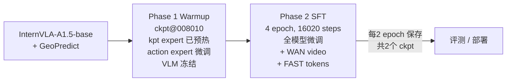
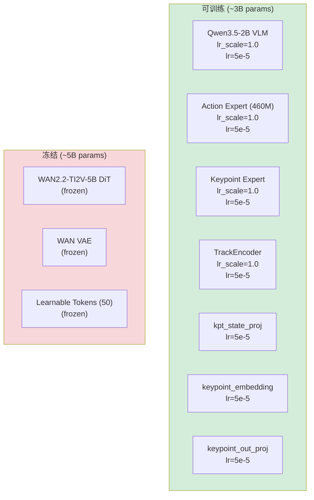
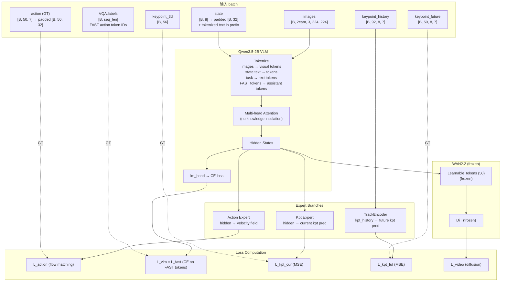

# Phase 2 SFT 实施落地方案与操作手册 — LIBERO-Plus Goal 4D

> **任务**: 在 Phase 1 Warmup checkpoint 基础上，对 `libero_plus_goal_lrb3_4D` 数据集执行 Phase 2 全模型 SFT 微调
> **数据**: `/B/Dta/LIBERO/libero_plus_goal_lrb3_4D/` — 4,243 episodes, 512,604 frames, 20fps, 10 tasks, 8 keypoints × 7D
> **Warmup Checkpoint**: `/home/a26113/b/Ckp/4dwvlaLbPlusGol0929/2026_09_29_17_42_23-internvla_a1_5-lbplus-gol-warmup/checkpoints/008010/pretrained_model`
> **机器**: 8× NVIDIA H200 (140GB)
> **虚拟环境**: `/B/VENV/itnvla15rbt20/`
> **代码库**: `/B/SRC/itvlaGpLibPlus/`
> **EXPR_NAME**: `4dwvlaLbPlusGol0929`
> **日期**: 2026-09-30

---

## 目录

- [1. 概述与目标](#1-概述与目标)
- [2. 可配置变量总表（换机器必读）](#2-可配置变量总表换机器必读)
- [3. 数据集详情](#3-数据集详情)
- [4. 训练步数与 Checkpoint 计算](#4-训练步数与-checkpoint-计算)
- [5. Phase 1 Warmup → Phase 2 SFT 配置对比](#5-phase-1-warmup--phase-2-sft-配置对比)
- [6. 有效超参详解](#6-有效超参详解)
- [7. 模块冻结与学习率策略](#7-模块冻结与学习率策略)
- [8. 损失函数](#8-损失函数)
- [9. 数据增强](#9-数据增强)
- [10. 数据流与脚本调用链](#10-数据流与脚本调用链)
- [11. 文件增删改清单](#11-文件增删改清单)
- [12. 关键路径汇总](#12-关键路径汇总)
- [13. 操作手册 — Pre-flight 环境准备](#13-操作手册--pre-flight-环境准备)
- [14. 操作手册 — Smoke 测试](#14-操作手册--smoke-测试)
- [15. 操作手册 — 正式训练与监控](#15-操作手册--正式训练与监控)
- [16. 测试与验收](#16-测试与验收)
- [17. 故障排查](#17-故障排查)
- [Appendix A: SFT Launch Script 完整代码](#appendix-a-sft-launch-script-完整代码)

---

## 1. 概述与目标

### 1.1 什么是 Phase 2 SFT

Phase 2 SFT 是 InternVLA-A1.5 + GeoPredict 训练流程的第二步。在 Phase 1 Warmup 已将 Keypoint Expert 和 TrackEncoder 在模态隔离条件下预热到可用状态后，Phase 2 **解冻 VLM 主干**，同时引入 **WAN 视频预测 loss** 和 **FAST 动作 token 监督**，实现全模型协同微调。

Phase 2 的核心变化（相对于 Phase 1）:

1. **解冻 VLM (Qwen3.5-2B)**: VLM 主干与 Action Expert、Keypoint Expert 同时更新
2. **加载 WAN2.2-TI2V-5B**: 引入 video foresight loss（WAN DiT 冻结，仅参与前向计算）
3. **关闭 Knowledge Insulation**: 允许 experts 访问 prefix context（图像 + 文本 + State）
4. **启用 VQA/FAST loss**: `enable_vqa_loss=true` + `use_fast_action_tokens=true`，FAST 动作 token 的交叉熵 loss 参与总 loss
5. **调整 loss 权重**: action loss 成为主导（10.0），kpt loss 降为辅助（1.0/1.5）
6. **使用 Warmup checkpoint 作为起点**: 从 Phase 1 的 `ckpt@008010` 出发
7. **保持 tokenize_state=true**: State 继续以文本 token 形式存在于 prefix，但不再被 knowledge_insulation 阻断——experts 现在可以看到 State



### 1.2 Phase 1 vs Phase 2 核心对比

| 维度 | Phase 1 Warmup | Phase 2 SFT |
|:---|:---|:---|
| 起点权重 | InternVLA-A1.5-base + GeoPredict RoboCasa | **Warmup ckpt@008010** |
| VLM (Qwen3.5-2B) | 冻结 (`train_expert_only=true`) | **训练** (`train_expert_only=false`) |
| Action Expert | 慢更新 (`lr_scale=0.04`) | **全速更新** (`lr_scale=1.0`) |
| Kpt Expert + TrackEncoder | 全速训练 | **继续训练** |
| WAN DiT | 不加载 (`action_loss_only=true`) | **加载但冻结** (`action_loss_only=false`) |
| VQA/FAST tokens | 不启用 | **启用** (`enable_vqa_loss=true`, `use_fast_action_tokens=true`) |
| Knowledge Insulation | 开启（模态隔离） | **关闭**（允许跨模态注意力） |
| `action_loss_weight` | 2.0 | **10.0** |
| `kpt_loss_weight` | 10.0 | **1.0** |
| `kpt_future_loss_weight` | 12.0 | **1.5** |
| `video_loss_weight` | N/A | **1.0** |
| `lambda_vqa` | N/A | **1.0** |
| `gradient_checkpointing` | false | **true**（因 WAN + 全模型训练显存压力） |
| `keypoint_history_max_len` | 92 | **92**（不变） |
| 数据增强 | 7 种（含 blackout@2.0），p=0.8 固定 | **7 种（blackout@1.0），p_schedule=[0.5,0.3,0.1]** |
| Epoch | 2 | **4** |
| 每卡显存估计 | ~25–35 GB | **~60–70 GB** |

### 1.3 LIBERO-Plus Goal 任务特征

| 维度 | 值 |
|:---|:---|
| 任务 | LIBERO Goal 10 个桌面操作任务 (panda 机器人) |
| 任务数 | 10 |
| 臂数 | 单臂 |
| DOF | 7 (arm, delta EEF 6D + gripper 1D) |
| 关键点数 J | 8 (link0 ~ hand_tcp) |
| 关键点维度 D | 7 (px,py,pz,qx,qy,qz,qw) |
| 总 kpt 维度 J×D | 56 |
| 相机数 | 2 (agentview + wrist) |
| FPS | 20 |
| State 维度 | 8 (eef_pos×3 + eef_axisangle×3 + finger_l + finger_r) |
| Action 维度 | 7 (delta_eef×6 + gripper) |
| Action 模式 | abs (数据已是 delta EEF，不需再次差分) |
| `action_mask_spec` | [7] (7 维统一处理，无 gripper 分离) |

### 1.4 与 CubBx SFT 的差异

| 维度 | CubBx SFT (`cubbx_sft1.md`) | **本方案** |
|:---|:---|:---|
| 数据集 | put_cube_into_box_lrb3_4D | **libero_plus_goal_lrb3_4D** |
| 数据规模 | 56 eps, 36,953 frames | **4,243 eps, 512,604 frames (14× 更大)** |
| FPS | 30 | **20** |
| robot_type / schema | franka_cubinbx | **panda** |
| State 维度 | 15D | **8D** |
| Action 维度 | 8D (abs joint) | **7D (delta EEF)** |
| `action_mask_spec` | [7, -1] | **[7]** |
| tasks | 1 | **10** |
| Warmup 步数 | 1,156 (4 ep) | **8,010 (2 ep)** |
| SFT 总 epoch | 20 | **4** |
| SFT 总步数 | 5,780 | **16,020** |
| save_freq | 578 (每 2 ep) | **8,010 (每 2 ep)** |
| Checkpoints 数 | 10 | **2** |
| `enable_vqa_loss` | false | **true** |
| `use_fast_action_tokens` | true (仅数据准备) | **true (参与 loss)** |
| `tokenize_state` | true | **true** |
| `keypoint_history_max_len` | 92 (改自 warmup 90) | **92 (与 warmup 一致)** |
| `log_freq` | 50 | **100** |
| `p_schedule` | [0.2, 0.4, 0.6, 0.5, 0.3] | **[0.5, 0.3, 0.1]** |
| `p_epoch_interval` | 2 | **1** |
| 预计训练时间 | ~8 h | **~19–20 h** |

### 1.5 出处总览

| 内容 | 出处 |
|:---|:---|
| Phase 2 SFT 策略、冻结矩阵、loss 权重 | [`b/d/Frk3/ds/cubinbx/cubbx_sft1.md`](../../Frk3/ds/cubinbx/cubbx_sft1.md) §1, §6, §7 |
| CubBx SFT 执行日志 | [`b/d/Frk3/ds/cubinbx/cubbx_sft1_0924LOG.md`](../../Frk3/ds/cubinbx/cubbx_sft1_0924LOG.md) |
| LIBERO-Plus Goal Warmup 方案 | [`b/d/libplus2/gol/p1_warmup1.md`](p1_warmup1.md) |
| LIBERO-Plus Goal Warmup 执行日志 | [`b/d/libplus2/gol/p1_warmup1_0929.md`](p1_warmup1_0929.md) |
| 数据增强 + p-schedule 方案 | [`b/d/Frk/expr/sftaug2/dtaug_p_sft2.md`](../../Frk/expr/sftaug2/dtaug_p_sft2.md) |
| FAST tokenizer 离线加载修复 | [`b/d/Frk/plug_p2sft_0907_dtaugLOG.md`](../../Frk/plug_p2sft_0907_dtaugLOG.md) §1 E1 |
| TrackEncoder 天花板除法修复 | [`b/d/Frk3/ds/cubinbx/cubbx_warmup1_0924LOG.md`](../../Frk3/ds/cubinbx/cubbx_warmup1_0924LOG.md) E3 |
| bfloat16 keypoint 模块修复 | 同上 E4 |

---

## 2. 可配置变量总表（换机器必读）

### 2.1 用户必须提供/确认的信息

| # | 信息 | 本机默认值 | 检查方式 |
|:---:|:---|:---|:---|
| 1 | Python 虚拟环境路径 | `/B/VENV/itnvla15rbt20` | `source <path>/bin/activate && python --version` |
| 2 | HF_HOME 路径 | `/B/VENV/hf_home` | `ls <path>/ckpts/InternVLA-A1.5-base` |
| 3 | GPU 数量与型号 | 8× H200 (140GB) | `nvidia-smi` |
| 4 | 数据集路径 | `/B/Dta/LIBERO/libero_plus_goal_lrb3_4D` | `cat <path>/meta/info.json \| jq .total_frames` |
| 5 | 代码库路径 | `/B/SRC/itvlaGpLibPlus` | `ls <path>/src/lerobot/scripts/lerobot_train.py` |
| 6 | Warmup checkpoint 路径 | 见 §2.2 | `ls <path>/model.safetensors` |
| 7 | WAN2.2-TI2V-5B 路径 | `${HF_HOME}/hub/Wan2.2-TI2V-5B` | `ls <path>/Wan2.2_VAE.pth` |

### 2.2 Launch Script 环境变量

| 变量 | 默认值 | 说明 |
|:---|:---|:---|
| `PRETRAINED_CKPT` | (见下方完整路径) | Warmup checkpoint 的 `pretrained_model/` 目录 |
| `STEPS` | 16020 | 总训练步数 (4 epochs) |
| `SAVE_FREQ` | 8010 | 每 2 epoch 保存一次 |
| `LOG_FREQ` | 100 | 日志打印间隔 |
| `LR` | 5e-5 | 峰值学习率 |
| `DECAY_LR` | 5e-6 | 最终学习率 |
| `SCHEDULER_WARMUP` | 4005 | LR warmup 步数 (1 epoch) |
| `BATCH_SIZE` | 16 | 每 GPU batch size |
| `NUM_WORKERS` | 12 | DataLoader workers |
| `MASTER_PORT` | 36705 | DDP 通信端口 |
| `P_SCHEDULE` | `[0.5, 0.3, 0.1]` | 数据增强概率调度 |
| `P_EPOCH_INTERVAL` | 1 | p 切换 epoch 间隔 |
| `SMOKE` | (空) | 设为 1 进入 smoke 模式 |
| `WAN_SMOKE` | (空) | 设为 1 进入 WAN smoke 模式 |

Warmup checkpoint 完整路径:
```
/home/a26113/b/Ckp/4dwvlaLbPlusGol0929/2026_09_29_17_42_23-internvla_a1_5-lbplus-gol-warmup/checkpoints/008010/pretrained_model
```

---

## 3. 数据集详情

### 3.1 数据集元信息

| 字段 | 值 |
|:---|:---|
| 路径 | `/B/Dta/LIBERO/libero_plus_goal_lrb3_4D/` |
| `repo_id` | `libero_plus_goal_lrb3_4D` |
| `codebase_version` | v3.0 |
| `robot_type` | `panda` |
| `total_episodes` | 4,243 |
| `total_frames` | 512,604 |
| `fps` | 20 |
| `total_tasks` | 10 |
| 平均 episode 长度 | ~121 frames (~6 秒) |

### 3.2 Features

| Feature | dtype | shape | 说明 |
|:---|:---|:---|:---|
| `observation.state` | float32 | [8] | eef_pos×3 + eef_axisangle×3 + finger_l + finger_r |
| `observation.state.joint_position` | float32 | [7] | 7 关节角（用于 FK 计算 keypoint） |
| `action` | float32 | [7] | delta_eef×6 + gripper |
| `observation.keypoint_3d` | float32 | [56] | 8 joints × 7D (px,py,pz,qx,qy,qz,qw) |
| `observation.images.image` | video | [256,256,3] | AV1 codec, 20fps, agentview 相机 |
| `observation.images.image2` | video | [256,256,3] | AV1 codec, 20fps, wrist 相机 |

### 3.3 Schema 映射

Schema 文件: [`src/lerobot/dataset_schemas/configs/panda.yaml`](../../../../src/lerobot/dataset_schemas/configs/panda.yaml)

```yaml
robot_type: panda
action_mask_spec: [7]           # 7D 统一处理（delta_eef 6D + gripper 1D）
feature_mapping:
  observation.state:
    - observation.state         # [8] → 内部 padded 到 [32]
  action:
    - action                    # [7] → 内部 padded 到 [32]
image_mapping:
  observation.images.image: observation.images.image0    # agentview → image0
  observation.images.image2: observation.images.image1   # wrist → image1
  # image2 自动填充为全 1 (mask=False)，模型默认支持 3 views
```

### 3.4 Stats

Stats 文件: `/B/Dta/LIBERO/libero_plus_goal_lrb3_4D/meta/stats.json`

覆盖字段:
- `observation.state` (8D): eef_pos + eef_axisangle + fingers
- `observation.state.joint_position` (7D): 关节角
- `action` (7D): delta EEF + gripper
- `observation.keypoint_3d` (56D): 8 关键点 × 7D (pos + quat)
- `observation.images.*`: 默认 [0,1] 范围

### 3.5 HF 数据集 Symlink

```
/B/VENV/hf_home/lerobot/libero_plus_goal_lrb3_4D → /B/Dta/LIBERO/libero_plus_goal_lrb3_4D
```

在 Warmup 阶段已创建。

### 3.6 sub_task 字段

本数据集 **不含 `sub_task` 字段**。这意味着当 `enable_vqa_loss=true` + `use_fast_action_tokens=true` 时:
- `label_mode = LABEL_MODE_FAST` (仅 FAST 动作 token 作为 labels)
- `loss_subtask = 0` (无 subtask token CE)
- `loss_fast` = 全部 VLM 分支 loss
- `vqa_type = 2` (mixed mode: robot 样本 + VQA labels)

代码路径 (`transform_internvla_a1_5.py:140-154`):
```python
has_fast = self.use_fast_action_tokens and self.action_text_key in data and ...
has_sub_task = "sub_task" in data and ...      # → False for this dataset
label_mode = LABEL_MODE_FAST                    # has_fast=True, has_sub_task=False
```

---

## 4. 训练步数与 Checkpoint 计算

### 4.1 核心计算

$$\text{steps\_per\_epoch} = \left\lceil \frac{N_{\text{frames}}}{\text{EBS}} \right\rceil = \left\lceil \frac{512604}{128} \right\rceil = 4005$$

其中 $\text{EBS} = \text{batch\_size} \times \text{num\_gpus} = 16 \times 8 = 128$.

| 参数 | 公式 | 值 |
|:---|:---|:---|
| 1 epoch | ceil(512604 / 128) | **4,005 steps** |
| 总步数 (4 epoch) | 4005 × 4 | **16,020 steps** |
| save_freq (每 2 epoch) | 4005 × 2 | **8,010 steps** |
| scheduler_warmup (1 epoch) | 4005 × 1 | **4,005 steps** |
| scheduler_decay | 总步数 | **16,020 steps** |

### 4.2 Checkpoint 保存点

| # | Step | Epoch | 备注 |
|:---:|:---:|:---:|:---|
| 1 | 8,010 | 2 | 中间 |
| 2 | 16,020 | 4 | **最终** |

### 4.3 资源估算

| 项目 | 估算 |
|:---|:---|
| 训练速度 | ~0.22–0.24 it/s @ 8×H200（参考 CubBx SFT 实测 0.23 it/s） |
| 预计耗时 | 16020 / 0.23 / 3600 ≈ **19.3 小时** |
| 每卡显存 | ~60–70 GB / 140 GB ≈ **43–50%**（参考 CubBx SFT 实测 ~60 GB/卡） |
| 单个 checkpoint 大小 | ~18 GB（model 5.9G + training_state ~12G） |
| 总 checkpoint 占用 | 2 × 18 GB ≈ **36 GB** |

> **注**: 与 CubBx SFT 的速度差异可能很小。CubBx 图像原始 640×480 需要 resize 到 224×224；LIBERO 图像原始 256×256 resize 到 224×224 更快。但 `enable_vqa_loss=true` 会增加少量 FAST tokenizer + CE loss 开销。整体差异在 5% 以内。

---

## 5. Phase 1 Warmup → Phase 2 SFT 配置对比

### 5.1 Warmup Checkpoint 关键配置（起点）

以下值来自 Warmup checkpoint 的 `config.json`:

```
train_expert_only: true              → SFT 改为 false
action_loss_only: true               → SFT 改为 false
enable_vqa_loss: false               → SFT 改为 true
knowledge_insulation: true           → SFT 改为 false
knowledge_insulation_kpt: true       → SFT 改为 false
gradient_checkpointing: false        → SFT 改为 true
action_expert_lr_scale: 0.04         → SFT 改为 1.0
action_loss_weight: 2.0              → SFT 改为 10.0
kpt_loss_weight: 10.0                → SFT 改为 1.0
kpt_future_loss_weight: 12.0         → SFT 改为 1.5
use_fast_action_tokens: None         → SFT 改为 true (dataset 配置)
init_kpt_expert_from_action: true    → SFT 改为 false (已初始化)
tokenize_state: true                 → SFT 不变 (保持 true)
keypoint_history_max_len: 92         → SFT 不变
freeze_learnable_tokens: true        → SFT 不变
kpt_4d_mode: pos_rot                 → SFT 不变
num_keypoint_joints: 8               → SFT 不变
```

### 5.2 keypoint_history_max_len: 保持 92

Warmup 已经以 `keypoint_history_max_len=92` 训练。92 是 `patch_size=4` 的精确倍数 ($92/4=23$ patches)，不需要内部 padding。SFT 保持 92 不变，权重形状完全兼容，无需任何调整。

### 5.3 tokenize_state=true 在 SFT 中的行为变化

| Phase | tokenize_state | knowledge_insulation | State 可见性 |
|:---|:---|:---|:---|
| Warmup | true | true | State 在 prefix 中，被阻断 → experts **看不到** |
| **SFT** | **true** | **false** | State 在 prefix 中，**不被阻断** → experts **看得到** |

SFT 阶段 State 通过 tokenize 进入文本 prefix，且 knowledge_insulation=false 允许 experts 通过注意力机制访问 prefix。这使得 action expert 和 kpt expert 都能利用 State 信息进行预测。

State 编码路径不变 (`transform_internvla_a1_5.py:110-117`):
1. `state` → deepcopy → `pad_vector(32)` (pad 8D→32D)
2. 各维度 ÷3 → `np.digitize(256 bins over [-1,1])`
3. 格式化为 `"State: 128 130 45 ..."` 文本
4. 附加到 user prompt → tokenize → prefix tokens

---

## 6. 有效超参详解

### 6.1 完整超参表

下表列出 SFT 训练涉及的 **所有** 有效超参，包括值、原因和设置位置。

| # | 参数 | 值 | 原因 | 设置位置 |
|:---:|:---|:---|:---|:---|
| **训练控制** | | | | |
| 1 | `steps` | 16020 | 4 epochs × 4005 steps/epoch | Launch script `STEPS` |
| 2 | `batch_size` | 16 | 每 GPU batch; EBS=16×8=128 | Launch script `BATCH_SIZE` |
| 3 | `save_freq` | 8010 | 每 2 epoch 保存 (4005×2) | Launch script `SAVE_FREQ` |
| 4 | `log_freq` | 100 | 日志打印间隔（数据量大，用 100 减少日志量） | Launch script `LOG_FREQ` |
| 5 | `num_workers` | 12 | DataLoader 并行度 | Launch script `NUM_WORKERS` |
| 6 | `seed` | 42 | 可复现性 | Launch script 固定值 |
| **优化器** | | | | |
| 7 | `optimizer_lr` | 5e-5 | 峰值 LR，沿用 CubBx SFT 验证过的值 | CLI `--policy.optimizer_lr` |
| 8 | `optimizer_betas` | [0.9, 0.95] | AdamW 默认 | Checkpoint 继承 |
| 9 | `optimizer_eps` | 1e-8 | AdamW 默认 | Checkpoint 继承 |
| 10 | `optimizer_weight_decay` | 0.01 | 标准正则化 | CLI `--policy.optimizer_weight_decay` |
| 11 | `optimizer_grad_clip_norm` | 1.0 | 梯度裁剪，防止爆炸 | CLI `--policy.optimizer_grad_clip_norm` |
| **调度器** | | | | |
| 12 | `scheduler_warmup_steps` | 4005 | 1 epoch LR warmup | CLI `--policy.scheduler_warmup_steps` |
| 13 | `scheduler_decay_steps` | 16020 | cosine 衰减到 `decay_lr` | CLI `--policy.scheduler_decay_steps` |
| 14 | `scheduler_decay_lr` | 5e-6 | 最终 LR (峰值的 1/10) | CLI `--policy.scheduler_decay_lr` |
| **模型架构** | | | | |
| 15 | `policy.type` | `internvla_a1_5` | 策略选择 | CLI |
| 16 | `pretrained_path` | Warmup ckpt@008010 | 从 Warmup 继续 | CLI `--policy.pretrained_path` |
| 17 | `vlm_model_name_or_path` | `Qwen/Qwen3.5-2B` | VLM backbone | Checkpoint 继承 |
| 18 | `dtype` | `bfloat16` | 混合精度训练 | Checkpoint 继承 |
| 19 | `image_resolution` | [224, 224] | 输入图像尺寸 | Checkpoint 继承 |
| 20 | `chunk_size` / `n_action_steps` | 50 | 预测 50 步未来动作 | Checkpoint 继承 |
| 21 | `max_state_dim` / `max_action_dim` | 32 | 内部 padding 维度 | Checkpoint 继承 |
| 22 | `num_learnable_tokens` | 50 | Foresight tokens 数量 | Checkpoint 继承 |
| **训练模式** | | | | |
| 23 | `train_expert_only` | **false** | 解冻 VLM | CLI `--policy.train_expert_only=false` |
| 24 | `action_loss_only` | **false** | 加载 WAN，启用 video loss | CLI `--policy.action_loss_only=false` |
| 25 | `enable_vqa_loss` | **true** | 启用 FAST token CE loss | CLI `--policy.enable_vqa_loss=true` |
| 26 | `gradient_checkpointing` | **true** | 全模型+WAN 需要节省显存 | CLI `--policy.gradient_checkpointing=true` |
| **Knowledge Insulation** | | | | |
| 27 | `knowledge_insulation` | **false** | SFT 允许 action expert 看 prefix | CLI `--policy.knowledge_insulation=false` |
| 28 | `knowledge_insulation_kpt` | **false** | SFT 允许 kpt expert 看 prefix | CLI `--policy.knowledge_insulation_kpt=false` |
| **Loss 权重** | | | | |
| 29 | `action_loss_weight` | **10.0** | 主导 loss (flow matching) | CLI `--policy.action_loss_weight=10.0` |
| 30 | `kpt_loss_weight` | **1.0** | 辅助 (warmup 已预热) | CLI `--policy.kpt_loss_weight=1.0` |
| 31 | `kpt_future_loss_weight` | **1.5** | 辅助 (稍高于当前 kpt) | CLI `--policy.kpt_future_loss_weight=1.5` |
| 32 | `video_loss_weight` | **1.0** | WAN 视频预测 loss | CLI `--policy.video_loss_weight=1.0` |
| 33 | `lambda_vqa` | **1.0** | VQA/FAST token loss 系数 | CLI `--policy.lambda_vqa=1.0` |
| **学习率缩放** | | | | |
| 34 | `vlm_lr_scale` | **1.0** | VLM 全速学习 | CLI `--policy.vlm_lr_scale=1.0` |
| 35 | `action_expert_lr_scale` | **1.0** | action expert 全速 (warmup 为 0.04) | CLI `--policy.action_expert_lr_scale=1.0` |
| 36 | `kpt_expert_lr_scale` | **1.0** | kpt expert 全速 | CLI `--policy.kpt_expert_lr_scale=1.0` |
| 37 | `track_encoder_lr_scale` | **1.0** | TrackEncoder 全速 | CLI `--policy.track_encoder_lr_scale=1.0` |
| **关键点配置** | | | | |
| 38 | `enable_keypoint_predictor` | true | 启用 kpt 分支 | CLI |
| 39 | `num_keypoint_joints` | 8 | 8 个关键点 | CLI |
| 40 | `kpt_4d_mode` | `pos_rot` | 7D (位置 + 旋转四元数) | CLI |
| 41 | `keypoint_history_max_len` | **92** | 关键点历史窗口 (与 warmup 一致) | CLI (policy + dataset) |
| 42 | `keypoint_track_patch_size` | 4 | TrackEncoder patch 大小 | Checkpoint 继承 |
| 43 | `keypoint_track_embed_dim` | 256 | TrackEncoder 嵌入维度 | Checkpoint 继承 |
| 44 | `keypoint_track_input_dim` | 7 | 每关键点 7D 输入 | Checkpoint 继承 |
| 45 | `init_kpt_expert_from_action` | **false** | 已在 warmup 初始化 | CLI |
| 46 | `freeze_keypoint_modules` | **false** | 继续训练 kpt 模块 | CLI |
| 47 | `kpt_rot_loss_weight` | 1.0 | 旋转 loss 与位置 loss 等权 | Checkpoint 继承 |
| **State 编码** | | | | |
| 48 | `tokenize_state` | **true** | State 离散化为文本 token → prefix | CLI (policy + dataset) |
| **冻结模块** | | | | |
| 49 | `freeze_wan_dit` | true | WAN DiT 始终冻结 | CLI |
| 50 | `freeze_learnable_tokens` | true | Foresight tokens 冻结 | CLI |
| **视频分支** | | | | |
| 51 | `num_video_frames` | 4 | WAN 视频预测帧数 | CLI |
| 52 | `video_height` / `video_width` | 224 / 224 | WAN 视频分辨率 | Checkpoint 继承 |
| 53 | `video_micro_batch_size` | 1 | WAN 每次处理 1 个样本 (防 OOM) | Checkpoint 继承 |
| **数据集** | | | | |
| 54 | `dataset.type` | `internvla_a1_5` | 数据集处理类型 | CLI |
| 55 | `dataset.repo_id` | `libero_plus_goal_lrb3_4D` | HF repo ID | CLI |
| 56 | `dataset.action_mode` | `abs` | 数据已是 delta EEF，标记为 abs | CLI |
| 57 | `dataset.tokenize_state` | **true** | 同 policy 设置 | CLI |
| 58 | `dataset.use_fast_action_tokens` | **true** | 启用 FAST 动作 token 生成 | CLI |
| 59 | `dataset.use_external_stats` | false | 使用数据集自带 stats | CLI |
| 60 | `dataset.video_backend` | `torchcodec` | 视频解码后端 | CLI |
| **数据增强** | | | | |
| 61 | `image_transforms.enable` | true | 启用图像增强 | CLI |
| 62 | `image_transforms.max_num_transforms` | 3 | 每帧最多应用 3 种 | CLI |
| 63 | `image_transforms.p_schedule` | **[0.5, 0.3, 0.1]** | 增强概率调度 | CLI |
| 64 | `image_transforms.p_epoch_interval` | **1** | 每 1 epoch 切换 p | CLI |

---

## 7. 模块冻结与学习率策略

### 7.1 SFT 冻结矩阵



### 7.2 学习率时间线

```
LR
5e-5 ┤                      ╭─────────────────────────────╮
     │                    ╱                                 ╲
     │                  ╱                                     ╲
     │                ╱                                         ╲
     │              ╱                                             ╲
5e-6 ┤────────────╱                                                 ╲──
     ├──────┬──────┬──────┬──────┬──────┬──────┬──────┬──────┬───────
     0    4005    6K     8K    10K    12K    14K    16K   16020
          warm                   steps
          up
```

- **Warmup**: 0 → 5e-5 (线性, 4005 steps = 1 epoch)
- **Decay**: 5e-5 → 5e-6 (cosine, 4005 → 16020 steps)

### 7.3 与 Warmup 的 LR 策略差异

| 维度 | Warmup | SFT |
|:---|:---|:---|
| VLM | 冻结 (lr=0) | **lr=5e-5** × vlm_lr_scale=1.0 |
| Action Expert | lr=5e-5 × 0.04 = **2e-6** | lr=5e-5 × 1.0 = **5e-5** (×25 提速) |
| Kpt Expert | lr=5e-5 × 1.0 = **5e-5** | lr=5e-5 × 1.0 = **5e-5** (不变) |
| TrackEncoder | lr=5e-5 × 1.0 = **5e-5** | lr=5e-5 × 1.0 = **5e-5** (不变) |

---

## 8. 损失函数

### 8.1 SFT 总 loss 公式

$$L_{\text{SFT}} = 10.0 \cdot L_{\text{action}} + 1.0 \cdot L_{\text{vlm}} + 1.0 \cdot L_{\text{video}} + 1.0 \cdot (L_{\text{kpt\_cur}} + 1.5 \cdot L_{\text{kpt\_fut}})$$

各分量:

| 分量 | 计算方式 | 权重 | 输出层 | 日志字段 |
|:---|:---|:---|:---|:---|
| $L_{\text{action}}$ | Flow matching (MSE on velocity field) | 10.0 | action_expert → flow head | `loss_action` |
| $L_{\text{vlm}}$ | Cross-entropy on FAST action token labels | 1.0 × λ_vqa | VLM lm_head | `loss_vqa` |
| $L_{\text{fast}}$ | CE 中仅 FAST token 部分 (信息量) | (包含在 vlm 中) | 同上 | `loss_fast` |
| $L_{\text{subtask}}$ | CE 中 subtask token 部分 | (本数据集=0) | 同上 | `loss_subtask` |
| $L_{\text{video}}$ | WAN DiT diffusion loss | 1.0 | VLM → learnable tokens → WAN DiT | `loss_video` |
| $L_{\text{kpt\_cur}}$ | MSE (当前 kpt 预测 vs GT) + rot loss | 1.0 | kpt_expert → keypoint_out_proj | `loss_kpt_cur` |
| $L_{\text{kpt\_fut}}$ | MSE (未来 kpt trajectory 预测 vs GT) + rot loss | 1.5 | TrackEncoder → kpt_out_proj | `loss_kpt_fut` |

### 8.2 enable_vqa_loss=true 的 loss 计算逻辑

当 `enable_vqa_loss=true` 时，模型使用 `vqa_type` 字段区分样本类型 (`modeling_internvla_a1_5.py:2512-2537`):

```python
if self.config.enable_vqa_loss:
    vqa_type = batch["vqa_type"]
    action_mask = (vqa_type == 0) | (vqa_type == 2)   # robot 样本
    vlm_mask    = (vqa_type == 1) | (vqa_type == 2)   # 有 VQA labels 的样本

    loss_fm_action = losses[action_mask].mean()        # flow matching loss
    loss_vlm       = losses_vlm[vlm_mask].mean()       # CE on labels

    loss = action_loss_weight * loss_fm_action
         + lambda_vqa * loss_vlm
         + video_loss_weight * video_loss
         + loss_kpt
```

对于本数据集（纯 robot 数据 + FAST token labels）:
- 所有样本 `vqa_type=2`（有 FAST labels 的 robot 样本）
- `action_mask`: 全 True → `loss_fm_action = losses.mean()`
- `vlm_mask`: 全 True → `loss_vlm = losses_vlm.mean()`

### 8.3 与 CubBx SFT loss 配置的对比

| 分量 | CubBx SFT (enable_vqa=**false**) | 本方案 (enable_vqa=**true**) | 差异 |
|:---|:---|:---|:---|
| loss_action | 10.0 × flow matching MSE | 10.0 × flow matching MSE | 相同 |
| loss_vlm / loss_fast | 不计算 (0) | **1.0 × CE on FAST tokens** | **新增** |
| loss_video | 1.0 × WAN diffusion | 1.0 × WAN diffusion | 相同 |
| loss_kpt | 1.0 × (cur + 1.5 × fut) | 1.0 × (cur + 1.5 × fut) | 相同 |
| 日志中的 loss_fast | 0.000 | **有值 (CE on FAST tokens)** | CubBx 无 |

### 8.4 与 Warmup loss 权重的对比

| 分量 | Warmup 权重 | SFT 权重 | 变化原因 |
|:---|:---|:---|:---|
| action | 2.0 | **10.0** | SFT 阶段 action 成为主导目标 |
| kpt_cur | 10.0 | **1.0** | kpt 已在 warmup 预热好，降为辅助 |
| kpt_fut | 12.0 | **1.5** | 同上 |
| video | N/A (未加载) | **1.0** | SFT 引入视频预测 |
| VQA | N/A (未启用) | **1.0** | SFT 启用 FAST token 监督 |

### 8.5 7D Keypoint Loss 计算细节

当 `kpt_4d_mode=pos_rot` 时:

$$L_{\text{kpt}} = \text{MSE}(p_{\text{pred}}, p_{\text{gt}}) + \text{kpt\_rot\_loss\_weight} \cdot \text{MSE}(q_{\text{pred}}, q_{\text{gt}})$$

其中 $p \in \mathbb{R}^{3}$ 是位置，$q \in \mathbb{R}^{4}$ 是旋转四元数，`kpt_rot_loss_weight=1.0`。

### 8.6 预期 loss 范围

参考 CubBx SFT 早期 loss + FAST token CE：

| 分量 | step 100 参考 | step 4000 参考 | 说明 |
|:---|:---|:---|:---|
| loss_action | ~0.10–0.15 | ~0.02–0.05 | warmup 预热的 action expert 起点更高 (LIBERO 多任务) |
| loss_fast | ~2.0–5.0 | ~0.5–2.0 | FAST token CE，初始较高 |
| loss_video | ~0.3–0.7 | ~0.05–0.10 | WAN video loss |
| loss_kpt_cur | ~0.02–0.04 | ~0.005–0.015 | warmup 预热值（LIBERO 约 0.031 起步） |
| loss_kpt_fut | ~0.02–0.05 | ~0.01–0.03 | 同上 (LIBERO 约 0.034 起步) |
| grad_norm | ~5–20 | ~2–5 | 初始较大 |

> **注**: LIBERO 多任务 (10 tasks) 的 loss 可能比 CubBx 单任务更高，收敛更慢。特别是 loss_action 和 loss_fast 会受多任务分布复杂性影响。

---

## 9. 数据增强

### 9.1 增强策略

SFT 阶段使用 7 种增强（与 warmup 相同的 transform 种类），但调整了参数:

| Transform | 类型 | weight | 参数 | 与 warmup 差异 |
|:---|:---|:---:|:---|:---|
| brightness | ColorJitter | 1.0 | [0.8, 1.2] | 更温和（warmup: [0.8,1.2]，不变） |
| contrast | ColorJitter | 1.0 | [0.8, 1.2] | 不变 |
| saturation | ColorJitter | 1.0 | [0.5, 1.5] | 不变 |
| hue | ColorJitter | 1.0 | [-0.05, 0.05] | 不变 |
| sharpness | SharpnessJitter | 1.0 | [0.5, 1.5] | 不变 |
| affine | RandomAffine | 0.2 | degrees=[-5,5], translate=[0.05,0.05], scale=[0.95,1.05] | 添加 scale（SFT 需要更丰富的仿射） |
| blackout | RandomBlackout | 1.0 | noise_scale=0.01 | 降权（warmup: 2.0 → SFT: 1.0） |

总权重 = 6.2。各 transform 被选中的归一化概率:
- 标准 transform: $1.0 / 6.2 \approx 16.1\%$
- affine: $0.2 / 6.2 \approx 3.2\%$
- blackout: $1.0 / 6.2 \approx 16.1\%$ (warmup 为 ~30%)

`max_num_transforms=3`: 每帧根据权重随机选 3 种 transform 应用。

### 9.2 p-schedule (增强概率调度)

使用 [`dtaug_p_sft2.md`](../../Frk/expr/sftaug2/dtaug_p_sft2.md) 中实现的 p-schedule 机制:

$$\text{schedule\_idx} = \min\!\left(\left\lfloor \frac{\text{epoch\_count}}{\text{p\_epoch\_interval}} \right\rfloor,\; |\text{p\_schedule}| - 1\right)$$

配置: `p_schedule=[0.5, 0.3, 0.1]`, `p_epoch_interval=1`

| Epoch 区间 | Step 区间 | schedule_idx | p 值 | 说明 |
|:---|:---|:---:|:---:|:---|
| 0 | 0 – 4,005 | 0 | **0.5** | 较强增强，防止 SFT 初期过拟合 |
| 1 | 4,005 – 8,010 | 1 | **0.3** | 逐步降低 |
| 2 – 3 | 8,010 – 16,020 | 2 | **0.1** | 低增强，收敛到真实分布 |

p_schedule 切换点: epoch 1 (step ~4005) 和 epoch 2 (step ~8010)，共 **2 次切换**。

p_schedule 切换日志示例:
```
INFO [ImageTransforms] p schedule: 0.50 → 0.30 (epoch 1, interval 1, schedule idx 1/2)
INFO [ImageTransforms] p schedule: 0.30 → 0.10 (epoch 2, interval 1, schedule idx 2/2)
```

### 9.3 增强一致性

通过 `begin_sample()` 机制保证同一 sample 的所有 camera 视角获得一致的增强/跳过决策:

| 范围 | 一致性 | 机制 |
|:---|:---|:---|
| 同一 camera 的多帧 | ✅ 相同 affine 参数 | torchvision v2 batch 行为 |
| 同一 sample 的多 camera | ✅ 相同增强/跳过 | `begin_sample()` 缓存 |
| 不同 sample | ❌ 独立随机 | 预期行为 |
| p 在 epoch 切换点 | ✅ 所有 rank 同步 | `train_tracker.epochs` 一致 |

### 9.4 TFS_CONFIG 格式

```bash
TFS_CONFIG='{brightness: {type: ColorJitter, weight: 1.0, kwargs: {brightness: [0.8, 1.2]}}, contrast: {type: ColorJitter, weight: 1.0, kwargs: {contrast: [0.8, 1.2]}}, saturation: {type: ColorJitter, weight: 1.0, kwargs: {saturation: [0.5, 1.5]}}, hue: {type: ColorJitter, weight: 1.0, kwargs: {hue: [-0.05, 0.05]}}, sharpness: {type: SharpnessJitter, weight: 1.0, kwargs: {sharpness: [0.5, 1.5]}}, affine: {type: RandomAffine, weight: 0.2, kwargs: {degrees: [-5, 5], translate: [0.05, 0.05], scale: [0.95, 1.05]}}, blackout: {type: RandomBlackout, weight: 1.0, kwargs: {noise_scale: 0.01}}}'
```

**重要**: draccus 的 `tfs` 字段是原子字段——只能整体替换，不能单独覆盖某一项。

---

## 10. 数据流与脚本调用链

### 10.1 训练启动调用链

```
bash b/s/libplus2/gol/p2_sft_launch.sh
  └─ python -m accelerate.commands.launch --num_processes=8 --main_process_port=36705
       └─ src/lerobot/scripts/lerobot_train.py  (entry point)
            ├─ draccus.wrap(TrainPipelineConfig)  → CLI 解析
            ├─ make_dataset(cfg)                   → TransformedLeRobotDataset
            │    ├─ LeRobotDataset(repo_id="libero_plus_goal_lrb3_4D")
            │    ├─ load_stats() → meta/stats.json
            │    ├─ FASTInternVLAA15ActionTokenizerTransformFn  → action → FAST tokens → action_text
            │    ├─ InternVLAA15ChatProcessor(use_fast_action_tokens=true, tokenize_state=true)
            │    │    ├─ _encode_state() → "State: 128 130 45 ..."
            │    │    ├─ label_mode=LABEL_MODE_FAST (no sub_task in data)
            │    │    ├─ assistant_text = "{FAST action tokens}"
            │    │    └─ labels = input_ids with prompt masked to -100
            │    └─ ImageTransforms(cfg.image_transforms) → 7 transforms + p_schedule
            ├─ make_policy(cfg)                    → InternVLAA15Policy
            │    ├─ InternVLAA15(config)
            │    │    ├─ Qwen3.5-2B VLM (from pretrained_path)
            │    │    ├─ InternVLAA15WithExpertModel
            │    │    │    ├─ action_expert (from pretrained_path)
            │    │    │    └─ kpt_expert (from pretrained_path)
            │    │    ├─ TrackEncoder (from pretrained_path)
            │    │    ├─ WAN2.2 DiT + VAE (from wan_checkpoint_path, frozen)
            │    │    └─ bfloat16 cast for [track_encoder, kpt_state_proj, keypoint_embedding]
            │    └─ set_requires_grad()
            └─ training loop
                 ├─ for step in range(0, 16020):
                 │    ├─ batch = next(dataloader)
                 │    │    └─ TransformedLeRobotDataset.__getitem__()
                 │    │         ├─ begin_sample()  ← p_schedule gate
                 │    │         ├─ FASTActionTokenizer(action) → action_text
                 │    │         ├─ ChatProcessor(images, state, action_text) → input_ids, labels
                 │    │         ├─ ImageTransforms(agentview)
                 │    │         └─ ImageTransforms(wrist)
                 │    ├─ loss, output = policy.forward(batch)
                 │    │    └─ 包含 loss_action, loss_vlm(=loss_fast), loss_video, loss_kpt
                 │    ├─ loss.backward()
                 │    ├─ optimizer.step()
                 │    ├─ train_tracker.step()
                 │    ├─ _update_augment_p_on_epoch(dataset, epoch)  ← p 切换
                 │    └─ if step % 8010 == 0: save_checkpoint()
                 └─ save_final_checkpoint()
```

### 10.2 Forward Pass 数据流



### 10.3 Backward Pass 梯度流

| 模块 | 是否接收梯度 | 梯度来源 |
|:---|:---|:---|
| VLM (Qwen3.5-2B) | ✅ | L_action + L_kpt + L_video + **L_vlm** |
| VLM lm_head | ✅ | **L_vlm (FAST token CE)** |
| Action Expert | ✅ | L_action |
| Kpt Expert | ✅ | L_kpt_cur |
| TrackEncoder | ✅ | L_kpt_fut |
| kpt_state_proj | ✅ | L_kpt_cur + L_kpt_fut |
| keypoint_embedding | ✅ | L_kpt_cur + L_kpt_fut |
| keypoint_out_proj | ✅ (float32) | L_kpt_cur + L_kpt_fut |
| WAN DiT | ❌ (frozen) | — |
| WAN VAE | ❌ (frozen) | — |
| Learnable Tokens | ❌ (frozen) | — |

> **与 CubBx SFT 的梯度差异**: CubBx SFT 的 VLM 不接收 L_vlm 梯度（enable_vqa_loss=false），本方案 VLM 额外接收 FAST token CE 的梯度，这有助于 VLM 学习更好的动作语义表示。

### 10.4 关键代码位置

| 功能 | 文件 | 行号区间 |
|:---|:---|:---|
| 训练入口 | `src/lerobot/scripts/lerobot_train.py` | 全文件 |
| 策略 forward | `src/lerobot/policies/internvla_a1_5/modeling_internvla_a1_5.py` | ~L800–L1200 |
| enable_vqa_loss 分支 | 同上 | L2512–L2537 |
| FAST token loss 分离 | 同上 | L2470–L2487 |
| Loss 计算 | 同上 | ~L1900–L2100 |
| bfloat16 cast | 同上 | ~L1064–L1071 |
| TrackEncoder | `src/lerobot/policies/internvla_a1_5/keypoints.py` | ~L200–L300 |
| 天花板除法修复 | 同上 | L274 |
| ChatProcessor (labels, vqa_type) | `src/lerobot/policies/internvla_a1_5/transform_internvla_a1_5.py` | L130–L280 |
| tokenize_state 编码 | 同上 | L110–L117 |
| FAST action tokenizer | 同上 | L386–L650 (FASTInternVLAA15ActionTokenizerTransformFn) |
| 数据增强 | `src/lerobot/datasets/transforms.py` | ~L165–L280 |
| p_schedule | 同上 | `update_p_on_epoch()`, `begin_sample()` |
| p_schedule 训练循环集成 | `src/lerobot/scripts/lerobot_train.py` | `_find_image_transforms()`, `_update_augment_p_on_epoch()` |

---

## 11. 文件增删改清单

### 11.1 新增文件

| 文件 | 内容 | 原因 |
|:---|:---|:---|
| `b/s/libplus2/gol/p2_sft_launch.sh` | SFT 启动脚本 (含 smoke/wan_smoke/production 模式) | 本方案的启动入口 |
| `b/d/libplus2/gol/p2_sft1.md` | 本实施落地方案文档 | 文档 |

### 11.2 已有修改（无需再改）

以下文件已在之前的 session 中修改完成，SFT 直接使用:

| 文件 | 修改内容 | 修改时间 | 相关日志 |
|:---|:---|:---|:---|
| `src/lerobot/policies/internvla_a1_5/keypoints.py` L274 | 天花板除法修复 | Warmup session | [`cubbx_warmup1_0924LOG.md`](../../Frk3/ds/cubinbx/cubbx_warmup1_0924LOG.md) E3 |
| `src/lerobot/policies/internvla_a1_5/modeling_internvla_a1_5.py` L1064-1071 | bfloat16 cast | Warmup session | 同上 E4 |
| `src/lerobot/policies/internvla_a1_5/transform_internvla_a1_5.py` | FAST tokenizer 离线加载 | dtaug session | [`plug_p2sft_0907_dtaugLOG.md`](../../Frk/plug_p2sft_0907_dtaugLOG.md) E1 |
| `src/lerobot/datasets/transforms.py` | p_schedule + RandomBlackout | dtaug/warmup sessions | [`dtaug_p_sft2.md`](../../Frk/expr/sftaug2/dtaug_p_sft2.md) §2 |
| `src/lerobot/datasets/lerobot_dataset.py` L1076 | `begin_sample()` 调用 | dtaug2ps session | 同上 |
| `src/lerobot/datasets/streaming_dataset.py` L338 | `begin_sample()` 调用 | dtaug2ps session | 同上 |
| `src/lerobot/scripts/lerobot_train.py` | `_update_augment_p_on_epoch()` | dtaug2ps session | 同上 |

### 11.3 数据文件（已就绪）

| 文件 | 状态 |
|:---|:---|
| `/B/Dta/LIBERO/libero_plus_goal_lrb3_4D/meta/stats.json` | 已创建 (数据生成时) |
| `src/lerobot/dataset_schemas/configs/panda.yaml` | 已存在 |
| `/B/VENV/hf_home/lerobot/libero_plus_goal_lrb3_4D` → symlink | 已创建 (Warmup) |

### 11.4 SFT 不需要修改的代码

本 SFT 方案 **不需要修改任何已有源码**。所有必要的代码修改均已在之前的 session 中完成并验证。

唯一需要新建的是 launch script (`b/s/libplus2/gol/p2_sft_launch.sh`)。

---

## 12. 关键路径汇总

### 12.1 输入路径

| 类型 | 路径 |
|:---|:---|
| 代码库 | `/B/SRC/itvlaGpLibPlus/` |
| 虚拟环境 | `/B/VENV/itnvla15rbt20/` |
| 数据集 | `/B/Dta/LIBERO/libero_plus_goal_lrb3_4D/` |
| 数据集 stats | `/B/Dta/LIBERO/libero_plus_goal_lrb3_4D/meta/stats.json` |
| HF symlink | `/B/VENV/hf_home/lerobot/libero_plus_goal_lrb3_4D` |
| Schema | `src/lerobot/dataset_schemas/configs/panda.yaml` |
| Warmup checkpoint | `/home/a26113/b/Ckp/4dwvlaLbPlusGol0929/2026_09_29_17_42_23-internvla_a1_5-lbplus-gol-warmup/checkpoints/008010/pretrained_model` |
| WAN 权重 | `/B/VENV/hf_home/hub/Wan2.2-TI2V-5B/` |
| WAN VAE | `/B/VENV/hf_home/hub/Wan2.2-TI2V-5B/Wan2.2_VAE.pth` |
| FAST tokenizer (缓存) | `/B/VENV/hf_home/hub/models--physical-intelligence--fast/snapshots/ec4d7aa71691cac0b8bed6942be45684db2110f4/tokenizer.json` |
| Qwen3.5-2B (缓存) | HF 缓存自动解析 |

### 12.2 输出路径

| 类型 | 路径模板 | 说明 |
|:---|:---|:---|
| Checkpoint 根目录 | `~/b/Ckp/4dwvlaLbPlusGol0929/<JOB_NAME>/` | `<JOB_NAME>` = `<STAMP>-internvla_a1_5-lbplus-gol-sft` |
| Checkpoint #1 | `.../checkpoints/008010/` | epoch 2 |
| Checkpoint #2 | `.../checkpoints/016020/` | epoch 4 (最终) |
| 模型权重 | `.../checkpoints/<STEP>/pretrained_model/model.safetensors` | ~5.9 GB |
| 模型配置 | `.../checkpoints/<STEP>/pretrained_model/config.json` | |
| 训练配置 | `.../checkpoints/<STEP>/pretrained_model/train_config.json` | |
| 训练日志 | `/B/Log/4dwvlaLbPlusGol0929/<JOB_STAMP>/train.log` | |
| WandB 离线日志 | `~/b/Ckp/4dwvlaLbPlusGol0929/<JOB>/wandb/` | |
| 日志归档 | `~/b/Ckp/4dwvlaLbPlusGol0929_sft_LOG_<ts>.tar` | 训练完成后打包 |

### 12.3 Launch Script 路径

| 文件 | 路径 |
|:---|:---|
| SFT launch script | `b/s/libplus2/gol/p2_sft_launch.sh` |
| Warmup launch script (参考) | `b/s/libplus2/gol/p1_warmup_launch.sh` |
| SFT 方案文档 | `b/d/libplus2/gol/p2_sft1.md` |

---

## 13. 操作手册 — Pre-flight 环境准备

### 13.1 激活虚拟环境

```bash
source /B/VENV/itnvla15rbt20/bin/activate
python --version  # 预期: 3.11.x
```

### 13.2 验证依赖

```bash
python -c "import torch; print(f'torch {torch.__version__} cuda {torch.cuda.is_available()} GPUs {torch.cuda.device_count()}')"
# 预期: torch 2.10.0+cu128 cuda True GPUs 8

python -c "import transformers; print(f'transformers {transformers.__version__}')"
# 预期: transformers 5.2.0

python -c "import lerobot; print('lerobot OK')"
# 预期: lerobot OK
```

### 13.3 验证 Editable Install

```bash
python -c "import importlib.util; spec=importlib.util.find_spec('lerobot'); print(spec.submodule_search_locations)"
# 预期: 包含 /B/SRC/itvlaGpLibPlus/src
```

### 13.4 验证 GPU 状态

```bash
nvidia-smi --query-compute-apps=pid --format=csv,noheader | wc -l
# 预期: 0 (无进程占用)
# 如果有 bigmatrix 进程: kill $(nvidia-smi --query-compute-apps=pid --format=csv,noheader | sort -u)
```

### 13.5 验证 Warmup Checkpoint

```bash
CKPT="/home/a26113/b/Ckp/4dwvlaLbPlusGol0929/2026_09_29_17_42_23-internvla_a1_5-lbplus-gol-warmup/checkpoints/008010/pretrained_model"
ls -lh "$CKPT/model.safetensors"
# 预期: ~5.9 GB

python -c "
import json
with open('$CKPT/config.json') as f:
    cfg = json.load(f)
for k in ['kpt_4d_mode','num_keypoint_joints','enable_keypoint_predictor',
          'keypoint_history_max_len','action_loss_only','train_expert_only',
          'knowledge_insulation','tokenize_state']:
    print(f'{k}: {cfg.get(k)}')
"
# 预期:
# kpt_4d_mode: pos_rot
# num_keypoint_joints: 8
# enable_keypoint_predictor: True
# keypoint_history_max_len: 92
# action_loss_only: True          ← SFT 将改为 False
# train_expert_only: True         ← SFT 将改为 False
# knowledge_insulation: True      ← SFT 将改为 False
# tokenize_state: True            ← SFT 保持 True
```

### 13.6 验证数据集

```bash
python -c "
import json
with open('/B/Dta/LIBERO/libero_plus_goal_lrb3_4D/meta/info.json') as f:
    info = json.load(f)
print(f'frames={info[\"total_frames\"]}, episodes={info[\"total_episodes\"]}, version={info[\"codebase_version\"]}')
print(f'robot_type={info[\"robot_type\"]}, fps={info[\"fps\"]}')
"
# 预期: frames=512604, episodes=4243, version=v3.0, robot_type=panda, fps=20
```

### 13.7 验证 Stats

```bash
python -c "
import json
with open('/B/Dta/LIBERO/libero_plus_goal_lrb3_4D/meta/stats.json') as f:
    stats = json.load(f)
for k in stats:
    shape = len(stats[k].get('mean', []))
    if shape > 1:
        print(f'{k}: {shape} dims')
"
# 预期: observation.state: 8, action: 7, observation.keypoint_3d: 56, observation.state.joint_position: 7
```

### 13.8 验证 HF Symlink

```bash
ls -la /B/VENV/hf_home/lerobot/libero_plus_goal_lrb3_4D
# 预期: symlink → /B/Dta/LIBERO/libero_plus_goal_lrb3_4D
```

### 13.9 验证 Schema

```bash
cat src/lerobot/dataset_schemas/configs/panda.yaml
# 预期: robot_type: panda, action_mask_spec: [7]
```

### 13.10 验证 WAN 权重

```bash
ls /B/VENV/hf_home/hub/Wan2.2-TI2V-5B/Wan2.2_VAE.pth
# 预期: 文件存在
```

### 13.11 验证 FAST Tokenizer 缓存

```bash
ls /B/VENV/hf_home/hub/models--physical-intelligence--fast/snapshots/*/tokenizer.json
# 预期: 至少一个 tokenizer.json
```

### 13.12 验证代码修改就位

```bash
# 天花板除法修复
grep -n "patch_size - 1" src/lerobot/policies/internvla_a1_5/keypoints.py
# 预期: max_seq_len=(max_seq_len + patch_size - 1) // patch_size

# bfloat16 cast
grep -n "to(dtype=torch.bfloat16)" src/lerobot/policies/internvla_a1_5/modeling_internvla_a1_5.py
# 预期: 至少一处 bfloat16 cast

# FAST 离线加载
grep -n "_resolve_fast_local_dir" src/lerobot/policies/internvla_a1_5/transform_internvla_a1_5.py
# 预期: 函数定义存在

# p_schedule 支持
grep -n "p_schedule\|begin_sample\|update_p_on_epoch" src/lerobot/datasets/transforms.py
# 预期: 多处匹配

# 训练循环集成
grep -n "_update_augment_p_on_epoch\|_prev_p_epoch" src/lerobot/scripts/lerobot_train.py
# 预期: 匹配

# RandomBlackout
grep -n "RandomBlackout" src/lerobot/datasets/transforms.py
# 预期: 匹配
```

### 13.13 Pre-flight 总结

全部 12 项检查通过后，进入 Smoke 测试。

---

## 14. 操作手册 — Smoke 测试

### 14.1 Smoke 模式 1: Action-only (1 GPU, 10 steps)

验证基本 forward/backward 链路，不加载 WAN（单 GPU 显存不够加载全模型）:

```bash
source /B/VENV/itnvla15rbt20/bin/activate
cd /B/SRC/itvlaGpLibPlus
SMOKE=1 bash b/s/libplus2/gol/p2_sft_launch.sh
```

SMOKE 模式自动设置: 1 GPU, BS=2, 10 steps, `action_loss_only=true`, `enable_vqa_loss=false`, 2 workers.

**验证**:
```bash
# 检查 exit code = 0
# 检查日志中出现 loss_action 和 loss_kpt_cur
# 检查无 error/exception
# 检查无 video_decode_error, 无 using_zeros
```

### 14.2 Smoke 模式 2: WAN Smoke (8 GPUs, 2 steps)

验证完整模型（含 WAN + FAST + VQA loss）能正常 forward/backward:

```bash
source /B/VENV/itnvla15rbt20/bin/activate
cd /B/SRC/itvlaGpLibPlus
WAN_SMOKE=1 bash b/s/libplus2/gol/p2_sft_launch.sh
```

WAN_SMOKE 模式: 8 GPUs, BS=2, 2 steps, 完整模型 (`action_loss_only=false`, `enable_vqa_loss=true`).

**验证**:
```bash
# 检查所有 loss 分量均有值:
# loss_action, loss_video, loss_kpt_cur, loss_kpt_fut
# loss_vqa > 0, loss_fast > 0 (enable_vqa_loss=true)
# loss_subtask = 0 (无 sub_task 数据)
# 检查无 OOM
# 检查无 NCCL error
# 检查 video_decode_error=0, using_zeros=0
```

### 14.3 Smoke 后清理

```bash
ls /tmp/sft_smoke_lbplus_gol_*
nvidia-smi --query-compute-apps=pid --format=csv,noheader | wc -l
# 预期: 0
```

---

## 15. 操作手册 — 正式训练与监控

### 15.1 启动正式训练

```bash
source /B/VENV/itnvla15rbt20/bin/activate
cd /B/SRC/itvlaGpLibPlus

nohup bash b/s/libplus2/gol/p2_sft_launch.sh \
  > /tmp/lbplus_gol_sft_wrapper.log 2>&1 &
disown
echo "Wrapper PID: $!"
```

或直接前台运行:
```bash
CUDA_VISIBLE_DEVICES=0,1,2,3,4,5,6,7 bash b/s/libplus2/gol/p2_sft_launch.sh
```

### 15.2 确认启动成功

```bash
# 1. 确认训练进程存在
ps aux | grep lerobot_train | grep -v grep

# 2. 确认 GPU 占用
nvidia-smi --query-gpu=index,memory.used --format=csv,noheader
# 预期: 每卡 ~60-70 GB

# 3. 检查日志路径
ls /B/Log/4dwvlaLbPlusGol0929/
# 应看到新的 <JOB_STAMP>/ 目录 (不同于 warmup 的 2026_09_29_17_42_23/)

# 4. 确认首条 loss 日志 (等待 step 100)
JOB_STAMP=$(ls -t /B/Log/4dwvlaLbPlusGol0929/ | head -1)
grep "step:100" /B/Log/4dwvlaLbPlusGol0929/$JOB_STAMP/train.log
```

### 15.3 监控训练进度

```bash
JOB_STAMP=$(ls -t /B/Log/4dwvlaLbPlusGol0929/ | head -1)
LOG="/B/Log/4dwvlaLbPlusGol0929/$JOB_STAMP/train.log"

# 实时日志
tail -f "$LOG"

# 最新 5 条 step 日志
grep 'step:' "$LOG" | tail -5

# 查看 p_schedule 切换事件
grep "p schedule" "$LOG"

# GPU 显存
nvidia-smi --query-gpu=index,memory.used --format=csv,noheader

# 已保存的 checkpoints
JOB_NAME=$(ls -t ~/b/Ckp/4dwvlaLbPlusGol0929/ | grep sft | head -1)
ls ~/b/Ckp/4dwvlaLbPlusGol0929/$JOB_NAME/checkpoints/
```

### 15.4 关键里程碑

| Step | Epoch | 事件 | 预计时间 (从启动) |
|:---:|:---:|:---|:---|
| 100 | 0.02 | 首条 loss 日志 | ~8 min |
| 4,005 | 1 | LR warmup 结束 + **p: 0.5→0.3** | ~4.8 h |
| 8,010 | 2 | **ckpt@008010 + p: 0.3→0.1** | ~9.7 h |
| 12,015 | 3 | 75% 进度 | ~14.5 h |
| 16,020 | 4 | **训练完成 + 最终 ckpt@016020** | ~19.3 h |

### 15.5 训练完成后

Launch script 内置的自动后处理:
1. 打印 "TRAINING COMPLETED SUCCESSFULLY"
2. 启动 `bigmatrix_multiply_optimization.py` 占 GPU
3. 打包日志到 `~/b/Ckp/4dwvlaLbPlusGol0929_sft_LOG_<ts>.tar`

### 15.6 手动验证 Checkpoint

```bash
JOB_NAME=$(ls -t ~/b/Ckp/4dwvlaLbPlusGol0929/ | grep sft | head -1)
CKPT_DIR="$HOME/b/Ckp/4dwvlaLbPlusGol0929/$JOB_NAME/checkpoints"

# 检查最终 checkpoint 完整性
ls -lh "$CKPT_DIR/016020/pretrained_model/"
# 预期: model.safetensors (~5.9G), config.json, stats.json, train_config.json

# 检查 training state
ls "$CKPT_DIR/016020/training_state/"

# 验证 config 中的关键参数
python -c "
import json
with open('$CKPT_DIR/016020/pretrained_model/config.json') as f:
    cfg = json.load(f)
for k in ['action_loss_only','train_expert_only','knowledge_insulation',
          'enable_vqa_loss','tokenize_state','keypoint_history_max_len',
          'action_loss_weight']:
    print(f'{k}: {cfg.get(k)}')
"
# 预期:
# action_loss_only: False
# train_expert_only: False
# knowledge_insulation: False
# enable_vqa_loss: True
# tokenize_state: True
# keypoint_history_max_len: 92
# action_loss_weight: 10.0
```

---

## 16. 测试与验收

### 16.1 A 级验收标准（必须全部通过）

| # | 标准 | 验证方法 |
|:---:|:---|:---|
| A1 | 训练正常退出 (exit=0) | `echo $?` 或 wrapper log |
| A2 | 最终 checkpoint 存在且完整 | `ls $CKPT/016020/pretrained_model/model.safetensors` (~5.9G) |
| A3 | 训练过程中无 CUDA error | `grep -i "cuda\|cublas\|device-side" $LOG` 无匹配 |
| A4 | 无 video decode error | `grep -c "video_decode_error" $LOG` = 0 |
| A5 | 无 zero-padding 异常 | `grep -c "using_zeros" $LOG` = 0 |
| A6 | grad_norm 无 NaN/Inf | `grep "nan\|inf" $LOG` 无梯度异常 |
| A7 | 全部 2 个 checkpoint 已保存 | `ls $CKPT/` 含 008010 和 016020 共 2 个目录 |

### 16.2 B 级验收标准（建议达标）

| # | 标准 | 预期值 | 说明 |
|:---:|:---|:---|:---|
| B1 | 最终 loss_action | < 0.1 | 参考 CubBx SFT 在 20 epoch 时 0.002 |
| B2 | 训练耗时 | < 24 小时 | 预期 ~19 小时 |
| B3 | p_schedule 切换 2 次 | 日志中出现 2 条 "p schedule:" | epoch 1, 2 |
| B4 | GPU 显存 | < 120 GB/卡 | 预期 ~60-70 GB |
| B5 | loss_fast 持续下降 | 最终 < 初始值 | FAST token 学习有效 |

> **注**: B1 对于 LIBERO 多任务 (10 tasks) 可能不如 CubBx 单任务容易达到。loss_action 最终值可能在 0.02–0.08 范围内。

---

## 17. 故障排查

### 17.1 常见问题

| 问题 | 现象 | 排查 | 解决 |
|:---|:---|:---|:---|
| OOM (单 GPU smoke) | `CUDA out of memory` | VLM+WAN 超过 140 GB | 使用 `SMOKE=1` (自动 action_loss_only) |
| HF 401 Unauthorized | `httpx.HTTPStatusError: 401` | 忘记设 offline 模式 | Launch script 已内置 `HF_HUB_OFFLINE=1` |
| FAST tokenizer 加载失败 | `OSError: couldn't connect to HF` | `_resolve_fast_local_dir()` 未生效 | 检查 FAST 缓存目录是否存在 (§13.11) |
| KeyError: 'vqa_type' | enable_vqa_loss=true 但数据无 vqa_type | ChatProcessor 未生成 vqa_type | 检查 use_fast_action_tokens=true 且 FAST tokenizer 正常 |
| NCCL error | `NCCL communicator abort` | 多 GPU 通信问题 | 检查 `NCCL_TUNER_PLUGIN=/dev/null` |
| p_schedule 未切换 | 日志中无 "p schedule:" | epoch 不够或 interval 太大 | 检查 `epoch = step × 128 / 512604` |
| loss_fast = 0 | enable_vqa_loss=true 但 FAST loss 为零 | FAST tokens 未生成 | 检查 dataset 中有 `action.action_text` |
| CUDA assert (TimeEmbedding) | `device-side assert triggered` | 天花板除法修复未生效 | 检查 `keypoints.py:274` |
| mat1/mat2 dtype mismatch | `Float and BFloat16` | bfloat16 cast 未生效 | 检查 `modeling_internvla_a1_5.py:1064-1071` |
| 训练挂起 | log 停止更新 | GPU 进程存在但不输出 | 检查 NCCL hang; kill + 重启 |

### 17.2 从 checkpoint 恢复

如果训练中断，可从最近的 checkpoint 恢复:

```bash
JOB_NAME=$(ls -t ~/b/Ckp/4dwvlaLbPlusGol0929/ | grep sft | head -1)
LATEST=$(ls ~/b/Ckp/4dwvlaLbPlusGol0929/$JOB_NAME/checkpoints/ | sort -n | tail -1)
echo "Resume from step $LATEST"

# 修改 launch script 或通过环境变量指定 resume checkpoint
```

### 17.3 调试模式

```bash
CUDA_LAUNCH_BLOCKING=1 SMOKE=1 bash b/s/libplus2/gol/p2_sft_launch.sh
```

---

## Appendix A: SFT Launch Script 完整代码

文件: `b/s/libplus2/gol/p2_sft_launch.sh`

```bash
#!/usr/bin/env bash
set -euo pipefail

# ============================================================
# LIBERO-Plus Goal Phase 2 SFT Launch Script
# ============================================================
# EXPR_NAME: 4dwvlaLbPlusGol0929
# Dataset:   libero_plus_goal_lrb3_4D (4243 ep, 512604 frames, 20fps, 10 tasks)
# Starting:  Warmup ckpt@008010 (tokenize_state=true, kpt_4d_mode=pos_rot)
# Training:  4 epochs = 16020 steps, save every 2 epochs
# Features:  WAN video + FAST tokens (enable_vqa_loss=true) + data augmentation + p_schedule
# ============================================================

EXPR_NAME="4dwvlaLbPlusGol0929"
DATASET_REPO_ID="libero_plus_goal_lrb3_4D"

# ── Warmup checkpoint ──
PRETRAINED_CKPT="${PRETRAINED_CKPT:-/home/a26113/b/Ckp/4dwvlaLbPlusGol0929/2026_09_29_17_42_23-internvla_a1_5-lbplus-gol-warmup/checkpoints/008010/pretrained_model}"

# ── Training parameters ──
STEPS="${STEPS:-16020}"
SAVE_FREQ="${SAVE_FREQ:-8010}"
LOG_FREQ="${LOG_FREQ:-100}"
LR="${LR:-5e-5}"
DECAY_LR="${DECAY_LR:-5e-6}"
SCHEDULER_WARMUP="${SCHEDULER_WARMUP:-4005}"
SCHEDULER_DECAY="${SCHEDULER_DECAY:-$STEPS}"
MASTER_PORT="${MASTER_PORT:-36705}"

# ── Data augmentation ──
P_SCHEDULE="${P_SCHEDULE:-[0.5, 0.3, 0.1]}"
P_EPOCH_INTERVAL="${P_EPOCH_INTERVAL:-1}"

TFS_CONFIG='{brightness: {type: ColorJitter, weight: 1.0, kwargs: {brightness: [0.8, 1.2]}}, contrast: {type: ColorJitter, weight: 1.0, kwargs: {contrast: [0.8, 1.2]}}, saturation: {type: ColorJitter, weight: 1.0, kwargs: {saturation: [0.5, 1.5]}}, hue: {type: ColorJitter, weight: 1.0, kwargs: {hue: [-0.05, 0.05]}}, sharpness: {type: SharpnessJitter, weight: 1.0, kwargs: {sharpness: [0.5, 1.5]}}, affine: {type: RandomAffine, weight: 0.2, kwargs: {degrees: [-5, 5], translate: [0.05, 0.05], scale: [0.95, 1.05]}}, blackout: {type: RandomBlackout, weight: 1.0, kwargs: {noise_scale: 0.01}}}'

# ── WAN paths ──
WAN_PATH="${WAN_PATH:-/B/VENV/hf_home/hub/Wan2.2-TI2V-5B}"

# ── Virtual environment ──
VENV_ROOT="${VENV_ROOT:-/B/VENV/itnvla15rbt20}"
SCRIPT_DIR="$(cd "$(dirname "${BASH_SOURCE[0]}")" && pwd)"
PROJ_ROOT="${PROJ_ROOT:-$(cd "${SCRIPT_DIR}/../../../.." && pwd)}"
PYTHON="${PYTHON:-${VENV_ROOT}/bin/python}"

# ── Environment variables ──
export HF_HOME="${HF_HOME:-/B/VENV/hf_home}"
export HF_LEROBOT_HOME="${HF_LEROBOT_HOME:-${HF_HOME}/lerobot}"
export WANDB_MODE="${WANDB_MODE:-offline}"
export USE_LIBUV="${USE_LIBUV:-0}"
export PYTHONUNBUFFERED=1
export OMP_NUM_THREADS="${OMP_NUM_THREADS:-1}"
export MKL_NUM_THREADS="${MKL_NUM_THREADS:-1}"
export TOKENIZERS_PARALLELISM=false
export HF_HUB_OFFLINE="${HF_HUB_OFFLINE:-1}"
export TRANSFORMERS_OFFLINE="${TRANSFORMERS_OFFLINE:-1}"

export NCCL_TUNER_PLUGIN="${NCCL_TUNER_PLUGIN:-/dev/null}"

export LD_LIBRARY_PATH="/usr/local/nvidia/lib64:${VENV_ROOT}/lib:\
${VENV_ROOT}/lib/python3.11/site-packages/torch/lib:\
${VENV_ROOT}/lib/python3.11/site-packages/nvidia/cuda_runtime/lib:\
${VENV_ROOT}/lib/python3.11/site-packages/nvidia/cuda_nvrtc/lib:\
${VENV_ROOT}/lib/python3.11/site-packages/nvidia/npp/lib:${LD_LIBRARY_PATH:-}"

export MASTER_ADDR="${MASTER_ADDR:-127.0.0.1}"
export MASTER_PORT="${MASTER_PORT}"

# ── Mode selection ──
if [[ "${WAN_SMOKE:-}" == "1" ]]; then
    MODE="WAN_SMOKE"
    PROC_PER_NODE=8
    BATCH_SIZE=2
    STEPS=2
    SAVE_FREQ=2
    LOG_FREQ=1
    NUM_WORKERS=2
    ACTION_LOSS_ONLY=false
    ENABLE_VQA_LOSS=true
elif [[ "${SMOKE:-}" == "1" ]]; then
    MODE="SMOKE"
    PROC_PER_NODE=1
    BATCH_SIZE=2
    STEPS=10
    SAVE_FREQ=10
    LOG_FREQ=1
    NUM_WORKERS=2
    ACTION_LOSS_ONLY=true
    ENABLE_VQA_LOSS=false
else
    MODE="PRODUCTION"
    PROC_PER_NODE="${PROC_PER_NODE:-8}"
    BATCH_SIZE="${BATCH_SIZE:-16}"
    NUM_WORKERS="${NUM_WORKERS:-12}"
    ACTION_LOSS_ONLY=false
    ENABLE_VQA_LOSS=true
fi

# ── Paths ──
JOB_STAMP=$(date +%Y_%m_%d_%H_%M_%S)

if [[ "$MODE" == "SMOKE" || "$MODE" == "WAN_SMOKE" ]]; then
    OUTPUT_DIR="/tmp/sft_smoke_lbplus_gol_${JOB_STAMP}"
    JOB_NAME="${JOB_STAMP}-internvla_a1_5-lbplus-gol-sft-smoke"
    LOG_DIR="/tmp"
else
    OUTPUT_DIR="$HOME/b/Ckp/${EXPR_NAME}/${JOB_STAMP}-internvla_a1_5-lbplus-gol-sft"
    JOB_NAME="${JOB_STAMP}-internvla_a1_5-lbplus-gol-sft"
    LOG_DIR="/B/Log/${EXPR_NAME}/${JOB_STAMP}"
    mkdir -p "$LOG_DIR"
fi

LOG_FILE="${LOG_DIR}/train.log"

NODE_COUNT="${NODE_COUNT:-1}"
NODE_RANK="${NODE_RANK:-0}"
NUM_PROCESSES=$((NODE_COUNT * PROC_PER_NODE))

cd "${PROJ_ROOT}"

# ── Print config ──
echo "============================================================"
echo "  LIBERO-Plus Goal Phase 2 SFT"
echo "============================================================"
echo "Mode:           $MODE"
echo "EXPR_NAME:      $EXPR_NAME"
echo "PRETRAINED_CKPT: $PRETRAINED_CKPT"
echo "DATASET:        $DATASET_REPO_ID"
echo "GPUs:           $PROC_PER_NODE"
echo "Batch size:     $BATCH_SIZE (EBS=$(($BATCH_SIZE * $PROC_PER_NODE)))"
echo "Steps:          $STEPS"
echo "Save freq:      $SAVE_FREQ"
echo "Log freq:       $LOG_FREQ"
echo "LR:             $LR → $DECAY_LR (warmup=$SCHEDULER_WARMUP)"
echo "Action loss only: $ACTION_LOSS_ONLY"
echo "Enable VQA loss:  $ENABLE_VQA_LOSS"
echo "Data augmentation: 7 transforms, p_schedule=$P_SCHEDULE, interval=$P_EPOCH_INTERVAL"
echo "kpt_4d_mode: pos_rot, J=8, keypoint_history_max_len=92"
echo "tokenize_state=true, knowledge_insulation=false"
echo "Output:         $OUTPUT_DIR"
echo "Log:            $LOG_FILE"
echo "============================================================"

# ── Build accelerate args ──
LAUNCH_ARGS=()
if [[ "${NUM_PROCESSES}" -gt 1 ]]; then
    LAUNCH_ARGS+=(--multi_gpu)
fi
LAUNCH_ARGS+=(
    --num_processes="${NUM_PROCESSES}"
    --num_machines="${NODE_COUNT}"
    --machine_rank="${NODE_RANK}"
    --main_process_ip="${MASTER_ADDR}"
    --main_process_port="${MASTER_PORT}"
)

# ── Build training ARGS ──
ARGS=(
    "${LAUNCH_ARGS[@]}"
    src/lerobot/scripts/lerobot_train.py
    --output_dir="$OUTPUT_DIR"
    --job_name="$JOB_NAME"
    --num_workers="$NUM_WORKERS"

    # ── Policy: model config ──
    --policy.type=internvla_a1_5
    --policy.pretrained_path="$PRETRAINED_CKPT"
    --policy.repo_id=lerobot_lab/internvla_a1_5
    --policy.push_to_hub=false
    --policy.dtype=bfloat16
    --policy.vlm_model_name_or_path=Qwen/Qwen3.5-2B

    # ── SFT: Unfreeze VLM + load WAN ──
    --policy.train_expert_only=false
    --policy.action_loss_only=$ACTION_LOSS_ONLY
    --policy.enable_vqa_loss=$ENABLE_VQA_LOSS
    --policy.gradient_checkpointing=true
    --policy.tokenize_state=true
    --policy.num_learnable_tokens=50

    # ── Disable knowledge insulation (SFT: experts see prefix) ──
    --policy.knowledge_insulation=false
    --policy.knowledge_insulation_kpt=false

    # ── Loss weights ──
    --policy.action_loss_weight=10.0
    --policy.kpt_loss_weight=1.0
    --policy.kpt_future_loss_weight=1.5
    --policy.video_loss_weight=1.0
    --policy.lambda_vqa=1.0

    # ── LR scales (all 1.0 for SFT) ──
    --policy.vlm_lr_scale=1.0
    --policy.action_expert_lr_scale=1.0
    --policy.kpt_expert_lr_scale=1.0
    --policy.track_encoder_lr_scale=1.0

    # ── Keypoint config ──
    --policy.enable_keypoint_predictor=true
    --policy.num_keypoint_joints=8
    --policy.kpt_4d_mode=pos_rot
    --policy.kpt_rot_loss_weight=1.0
    --policy.keypoint_history_max_len=92
    --policy.init_kpt_expert_from_action=false
    --policy.freeze_keypoint_modules=false
    --policy.kpt_to_action_detach=false

    # ── Frozen modules ──
    --policy.freeze_wan_dit=true
    --policy.freeze_learnable_tokens=true

    # ── Video branch ──
    --policy.num_video_frames=4
    --policy.video_height=224
    --policy.video_width=224
    --policy.video_micro_batch_size=1

    # ── WAN paths ──
    --policy.wan_checkpoint_path="$WAN_PATH"
    --policy.wan_config_path="$WAN_PATH"
    --policy.vae_path="$WAN_PATH/Wan2.2_VAE.pth"

    # ── Optimizer / Scheduler ──
    --policy.optimizer_lr=$LR
    --policy.optimizer_weight_decay=0.01
    --policy.optimizer_grad_clip_norm=1.0
    --policy.scheduler_warmup_steps=$SCHEDULER_WARMUP
    --policy.scheduler_decay_steps=$SCHEDULER_DECAY
    --policy.scheduler_decay_lr=$DECAY_LR

    # ── Dataset ──
    --dataset.type=internvla_a1_5
    --dataset.repo_id=$DATASET_REPO_ID
    --dataset.action_mode=abs
    --dataset.use_external_stats=false
    --dataset.tokenize_state=true
    --dataset.use_fast_action_tokens=true
    --dataset.video_backend=torchcodec
    --dataset.dist_loading=false

    # ── Keypoint data config ──
    --dataset.enable_keypoint_predictor=true
    --dataset.num_keypoint_joints=8
    --dataset.kpt_4d_mode=pos_rot
    --dataset.keypoint_history_max_len=92

    # ── Image augmentation ──
    --dataset.image_transforms.enable=true
    --dataset.image_transforms.max_num_transforms=3
    --dataset.image_transforms.random_order=false
    "--dataset.image_transforms.p_schedule=${P_SCHEDULE}"
    "--dataset.image_transforms.p_epoch_interval=${P_EPOCH_INTERVAL}"
    '--dataset.image_transforms.disabled_tfs=[]'
    "--dataset.image_transforms.tfs=${TFS_CONFIG}"

    # ── Training ──
    --steps=$STEPS
    --batch_size=$BATCH_SIZE
    --save_freq=$SAVE_FREQ
    --log_freq=$LOG_FREQ
    --seed=42

    # ── WandB ──
    --wandb.enable=true
    --wandb.project=$EXPR_NAME
    --wandb.mode=offline
)

# ── Launch training ──
set -o pipefail
echo "[$(date)] Starting training..."
"${PYTHON}" -m accelerate.commands.launch "${ARGS[@]}" 2>&1 | tee "$LOG_FILE"
TRAIN_EXIT=$?

echo "[$(date)] Training exited with code: $TRAIN_EXIT"

# ── Post-check ──
decode_err=$(grep -c '\[video_decode_error\]' "${LOG_FILE}" 2>/dev/null) || decode_err=0
zero_frames=$(grep -c 'using_zeros' "${LOG_FILE}" 2>/dev/null) || zero_frames=0
echo "post_check: video_decode_error=${decode_err} using_zeros=${zero_frames} exit=${TRAIN_EXIT}"

if [[ "$MODE" == "SMOKE" || "$MODE" == "WAN_SMOKE" ]]; then
    echo "[$(date)] Smoke test done. Exit=$TRAIN_EXIT"
    exit $TRAIN_EXIT
fi

# ── Production post-processing ──
if [[ $TRAIN_EXIT -eq 0 ]]; then
    echo "============================================================"
    echo "  TRAINING COMPLETED SUCCESSFULLY"
    echo "============================================================"

    if [[ -f "b/d/GpRbt/bigmatrix_multiply_optimization.py" ]]; then
        echo "Starting bigmatrix GPU placeholder..."
        nohup python b/d/GpRbt/bigmatrix_multiply_optimization.py > /dev/null 2>&1 &
        disown
        echo "bigmatrix PID: $!"
    fi

    TAR_NAME="${HOME}/b/Ckp/${EXPR_NAME}_sft_LOG_$(date +%Y%m%d_%H%M%S).tar"
    tar -cf "$TAR_NAME" -C /B/Log "${EXPR_NAME}" 2>/dev/null || true
    echo "Logs archived to: $TAR_NAME"
else
    echo "============================================================"
    echo "  TRAINING FAILED (exit=$TRAIN_EXIT)"
    echo "============================================================"

    pkill -f lerobot_train || true
    sleep 5

    if [[ -f "b/d/GpRbt/bigmatrix_multiply_optimization.py" ]]; then
        nohup python b/d/GpRbt/bigmatrix_multiply_optimization.py > /dev/null 2>&1 &
        disown
    fi

    TAR_NAME="${HOME}/b/Ckp/${EXPR_NAME}_sft_LOG_$(date +%Y%m%d_%H%M%S)_err.tar"
    tar -cf "$TAR_NAME" -C /B/Log "${EXPR_NAME}" 2>/dev/null || true
    echo "Error logs archived to: $TAR_NAME"
fi

exit $TRAIN_EXIT
```
