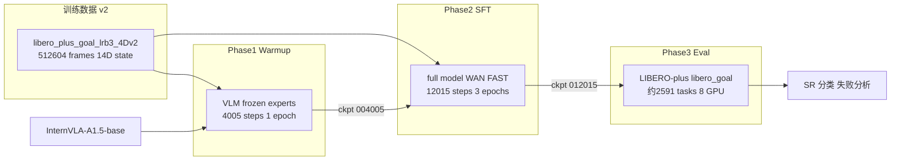
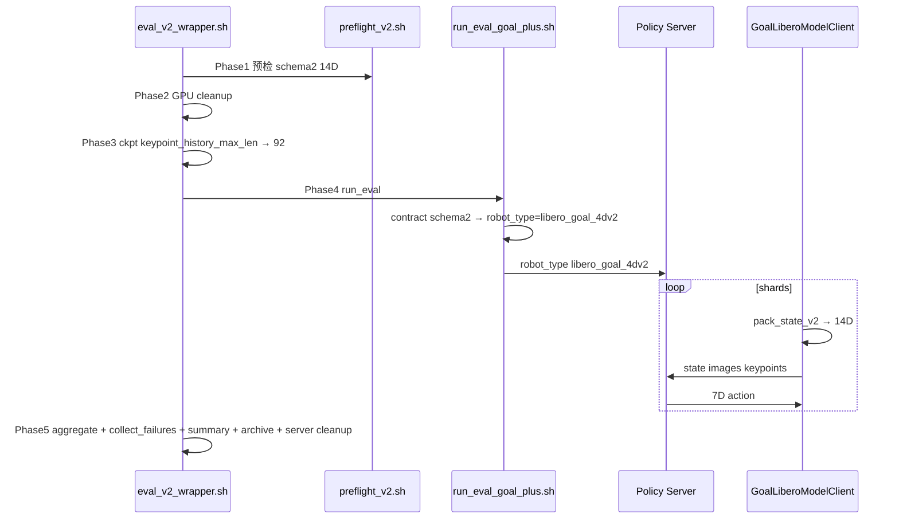
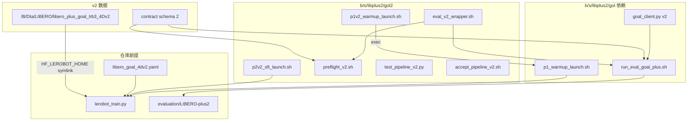
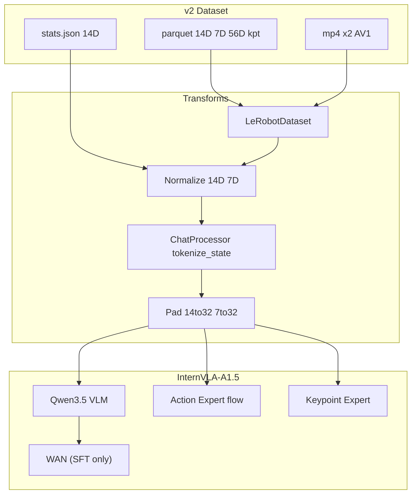
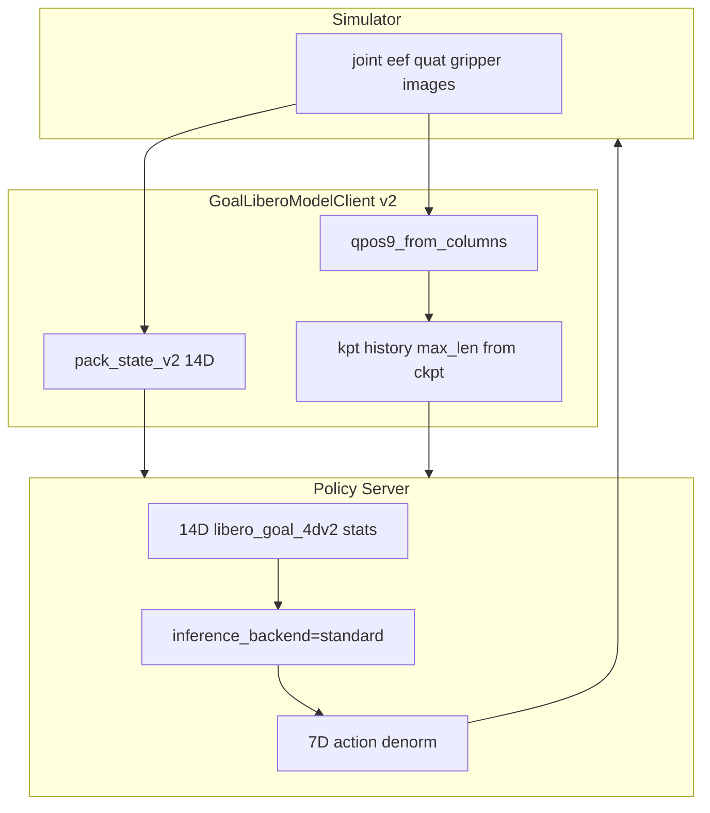

# LIBERO-Plus Goal v2 训练 + 评估 Pipeline（pipeline3_2）

> **EXPR_NAME**: `4dwvlaLbPlusGolV2_1002`
>
> **文档版本**: pipeline3_2（基于 pipeline3，调整训练 epoch 数与步数；纠正 pipeline1/pipeline2 的错误与遗漏，完整自包含）
>
> **状态**: 与仓库 `b/s/libplus2/gol2/` 当前实现对齐的方案文档。
>
> **训练数据**: `/B/Dta/LIBERO/libero_plus_goal_lrb3_4Dv2/`（14D `observation.state`，`robot_type=libero_goal_4dv2`）
>
> **实现目录**: `b/s/libplus2/gol2/`（包装/副本脚本）；依赖 `b/s/libplus2/gol/` 中已有 v1/v2 评估与训练逻辑。
>
> **硬前提（非本 Pipeline 脚本修改，但必须存在）**:
> - v2 数据集目录及 `meta/goal_train_eval_contract.json`（schema 2）
> - `src/lerobot/dataset_schemas/configs/libero_goal_4dv2.yaml`（双相机映射 + `action_mode: end_effector`）
>
> **背景参考**（正文已自包含，可不打开）: `../gol/3d4d_gen2_2.markdown`、`../gol/p1_warmup1.md`、`../gol/p2_sft1.md`、`../gol/eval1.md`

---

## 前版纠正说明

下表列出 pipeline1 和 pipeline2 中的错误/遗漏，以及本版（pipeline3_2）的处理。pipeline3_2 继承 pipeline3 的所有修正，仅调整训练 epoch 数与超参。

### pipeline1 → pipeline3_2 修正

| # | pipeline1 位置 | 错误 | pipeline3_2 处理 |
|---|----------------|------|----------------|
| E1 | §1.6 | `steps_per_epoch ≈ 4004` | 脚本 `SCHED_WARMUP_STEPS=1000`，本版取 **4005** 步/epoch |
| E2 | §3.4 | "14 个有效 token" | tokenize_state 产出的 subword 数取决于数值离散化，本版不写固定数（§2.5, 附录 G） |
| E3 | §3.5 | warmup job 后缀 `-lbplus-golv2-warmup` | 实际 `-lbplus-gol-warmup`（继承 v1，仅 EXPR_NAME 变）。本版 §2.3 修正 |
| E4 | §6.2 | p2v2 用 `exec` 委托 p2_sft | p2_sft 硬编码变量，v2 为**完整副本**。本版 §3.3 |
| E5 | §6.3 | eval_v2 用 `PREFLIGHT_SCRIPT` 覆盖 | eval_goal_wrapper 硬编码路径，v2 为**内联流程**。本版 §4.3 |
| E6 | §7.2 | eval 图 `inference_backend=optimized` | 评估强制 `standard`。本版 §6.2 修正 |
| E7 | §10 T10 | pytest 测 SFT 拒绝 v1 ckpt | T10 实为 `TestGoalClientV2Branch`；ckpt 守卫为 shell 测试（T13）。本版 §7.3 |
| E8 | §5.5, App C | eval Phase 5 含 aggregate/collect | eval_v2_wrapper 现已包含 aggregate + collect + summary。本版 §4.6 |
| E9 | §1.3 stats | eef pos mean ~[0.33, 0.05, 0.97] | 实际 [-0.100, 0.015, 1.069]。本版 §1.3 引用真值 |
| E10 | §3.6 | DATA_SRC 覆盖看似重要 | warmup 脚本定义 DATA_SRC 但**未传入训练 CLI**。本版 §2.3 说明 |

### pipeline2 → pipeline3_2 补充

| # | pipeline2 位置 | 遗漏 | pipeline3_2 处理 |
|---|----------------|------|----------------|
| P1 | §2.4 | 未记 `GRADIENT_CHECKPOINTING` | warmup 默认 false / SFT 固定 true。本版 §2.4 + 附录 B |
| P2 | §2.4 | 未记 `action_expert_lr_scale=0.04` | warmup 0.04 / SFT 1.0（25× 差）。本版 §2.4 + 附录 B |
| P3 | §2.4/§3.4 | augmentation 差异不完整 | blackout weight 2.0→1.0、p_schedule 变化、affine scale。本版附录 B |
| P4 | App G 图 | `V2S --> G1` 箭头误导 | stats 经 LeRobot dataset loader 访问。本版 §5 修正 |
| P5 | §4.6 | eval 后处理缺口未说明是故意的 | v2 wrapper 现已包含 aggregate + collect + summary + archive。本版 §4.6 |
| P6 | 无 | 无 GPU 显存说明 | 本版 §7.1 新增 R7 |
| P7 | §7.3 | T10 docstring 不一致仅注释 | 本版 §7.3 明确 T10 测试类与文档字符串的矛盾 |
| P8 | §4.4 | `INFERENCE_BACKEND=standard` 未解释原因 | 本版 §4.4 解释: eval 需 VLM+expert 协同，非 action-only 优化路径 |
| P9 | 无 | warmup→SFT loss 权重翻转无解释 | 本版附录 B 含 rationale |
| P10 | 11 个附录 | 过度碎片化 | 本版合并为 10 个附录，去掉 pipeline1 交叉引用表（自包含不再需要） |
| P11 | §1.3 | 无实际 stats 采样值 | 本版 §1.3 包含 14D mean 真值（来自 stats.json） |

---

## 0. 总览与前提

### 0.1 三阶段闭环



### 0.2 v1 vs v2 关键差异

| 维度 | v1 (`4dwvlaLbPlusGol0929`) | v2 (`4dwvlaLbPlusGolV2_1002`) |
|------|---------------------------|-------------------------------|
| 数据目录 | `libero_plus_goal_lrb3_4D` | `libero_plus_goal_lrb3_4Dv2` |
| `robot_type` / stats_key | `panda` | `libero_goal_4dv2` |
| `observation.state` | 8D (eef6 + finger2) | 14D (joint7 + eef6 + gripper1) |
| schema YAML | `panda.yaml` | `libero_goal_4dv2.yaml` |
| 契约 | `goal_train_eval_contract/1` | `goal_train_eval_contract/2` |
| eval client state | 8D | 14D (`pack_state_v2`) |
| 训练 `dataset.action_mode` | `abs` | `abs`（不变） |
| Warmup / SFT 总步数 | 8010 / 16020 | 4005 / 12015 |

### 0.3 训练前硬前提

1. **v2 数据已生成并通过数据侧验收**（推荐）:
   ```bash
   DATASET_V2=/B/Dta/LIBERO/libero_plus_goal_lrb3_4Dv2 bash b/s/libplus2/gol/accept_goal_4dv2.sh
   ```
2. **LeRobot 数据注册**（训练 `dataset.repo_id` 解析路径）:
   ```bash
   export HF_LEROBOT_HOME="${HF_LEROBOT_HOME:-/B/VENV/hf_home/lerobot}"
   ln -sfn /B/Dta/LIBERO/libero_plus_goal_lrb3_4Dv2 \
     "${HF_LEROBOT_HOME}/libero_plus_goal_lrb3_4Dv2"
   ```
   确认: `test -f "${HF_LEROBOT_HOME}/libero_plus_goal_lrb3_4Dv2/meta/info.json"`
3. **Schema 已安装**: `src/lerobot/dataset_schemas/configs/libero_goal_4dv2.yaml` 存在；`get_schema("libero_goal_4dv2")` 返回双相机 `image`/`image2` 映射。
4. **可选训练路径自检**:
   ```bash
   python b/s/libplus2/gol/check_training_path.py \
     --dataset /B/Dta/LIBERO/libero_plus_goal_lrb3_4Dv2 \
     --expect-state-dim 14 \
     --expect-robot-type libero_goal_4dv2
   ```

---

## 1. v2 数据与训练契约

### 1.1 数据集身份

```
路径:           /B/Dta/LIBERO/libero_plus_goal_lrb3_4Dv2/
来源:           repack_goal_4dv2.py 自 v1 列变换（视频为独立文件拷贝，非链接）
robot_type:     libero_goal_4dv2
codebase_version: v3.0
total_frames:   512,604
total_episodes: 4,243
fps:            20 Hz
contract:       goal_train_eval_contract/2
```

**`total_tasks: 10` 的含义**: `meta/info.json` 中的字段表示 **LeRobot 训练集覆盖的 10 个基础 LIBERO Goal 操纵任务**（多 episode、多扰动轨迹汇总在同一 repo 内）。**不是** LIBERO-plus 仿真评估的任务数。评估侧 `libero_goal` 套件经扰动扩展后约 **2591** 个任务（见 `LIBERO-plus` 的 `task_classification.json`）。

### 1.2 特征布局

| 特征 | 维度 | 进入模型 | 说明 |
|------|------|----------|------|
| `observation.state` | 14 | 是 | 归一化后 pad 到 32 |
| `observation.state.joint_position` | 7 | 否 | 审计 / FK；与 `state[0:7]` 逐元素一致 |
| `observation.state.fingers` | 2 | 否 | 审计 / FK；`finger_l`, `finger_r` |
| `observation.keypoint_3d` | 56 | 是 | 8 点 × 7 (pos3 + quat4) |
| `action` | 7 | 是 | OSC：eef delta6 + gripper 命令 |
| `observation.images.image` | 256²×3 AV1 | 是 | agentview |
| `observation.images.image2` | 256²×3 AV1 | 是 | wrist |

### 1.3 14D 状态布局与统计量

\[
\mathbf{s} = [q_1,\ldots,q_7,\ x,y,z,\ \alpha_x,\alpha_y,\alpha_z,\ g]
\]

- \(q_{1..7}\): 关节角（rad）
- \(x,y,z,\alpha_x,\alpha_y,\alpha_z\): 末端位姿位置（m）与轴角（rad）
- \(g = q_L - q_R\): 夹爪开口（m）；**不是** `action[6]`

单一真源实现: `b/s/libplus2/gol/contract_v2.py`（`pack_state_v2`, `qpos9_from_columns`）。

**FK 约束**: 构造 9D `qpos` 必须用 **`joint_position[0:7]` + `fingers[0:2]`**，禁止对 14D `state` 使用 v1 的 `state[6:8]` 切片（v2 下 `state[6]` 为 joint7）。

以下为 `meta/stats.json` 中的 14D `observation.state` 统计量真值（512,604 帧）：

| 索引 | 名字 | mean | std | min | max |
|------|------|------|-----|-----|-----|
| 0 | joint1 | 0.0479 | 0.1012 | −0.3986 | 0.5433 |
| 1 | joint2 | 0.4560 | 0.3538 | −0.5054 | 1.7002 |
| 2 | joint3 | 0.0325 | 0.1485 | −0.5439 | 0.6547 |
| 3 | joint4 | −1.9167 | 0.5120 | −3.0388 | −0.0595 |
| 4 | joint5 | −0.2239 | 0.3918 | −1.7722 | 0.5839 |
| 5 | joint6 | 2.1977 | 0.4094 | 0.6211 | 3.7632 |
| 6 | joint7 | 0.7216 | 0.5381 | −1.6253 | 2.9030 |
| 7 | eef_x | −0.0999 | 0.1162 | −0.4557 | 0.1363 |
| 8 | eef_y | 0.0146 | 0.1150 | −0.3012 | 0.3373 |
| 9 | eef_z | 1.0695 | 0.1053 | 0.9083 | 1.3660 |
| 10 | eef_ax | 2.8270 | 0.5564 | 0.8416 | 3.4007 |
| 11 | eef_ay | 0.3066 | 0.7176 | −1.4814 | 2.5901 |
| 12 | eef_az | −0.2826 | 0.3561 | −1.5200 | 0.7210 |
| 13 | gripper | 0.0549 | 0.0296 | 0.0010 | 0.0819 |

action 统计量仍为 7D（`dx, dy, dz, dax, day, daz, gripper`），action mean 7 个值。

### 1.4 动作语义与 `action_mode` 双轨

```
action[0:6]  = 末端增量（数据中已是 delta，单位与 LIBERO OSC 一致）
action[6]    = 夹爪命令，取值 {-1, +1}（离散开合指令）
state[13]    = 夹爪几何开口 g（米），与 action[6] 不同物理量
```

| 配置项 | 值 | 作用 |
|--------|-----|------|
| `dataset.action_mode` | **`abs`** | 训练 CLI：不启用 `DeltaActionTransformFn`（避免 14D state 与 7D action 做 mask 相减导致维度错误） |
| YAML `action_mode` | **`end_effector`** | Schema：prompt 中 `Control Mode: <end_effector>` |
| v2 YAML | **无** `action_mask_spec` | 故意省略；勿对 14D 使用 v1 `panda.yaml` 的 `[7]` |

详见附录 D。

### 1.5 Schema（`libero_goal_4dv2.yaml`）

```yaml
robot_type: libero_goal_4dv2
feature_mapping:
  observation.state:
    - observation.state
  action:
    - action
image_mapping:
  observation.images.image: observation.images.image0
  observation.images.image2: observation.images.image1
action_mode: end_effector
```

数据加载时 `factory.make_dataset` 通过 `info.json` 的 `robot_type` 调用 `get_schema()`，决定归一化字段、图像键映射与 prompt 控制模式字符串。

`NormalizeTransformFn` 仅对 `feature_mapping` 中的 state/action 键 hydrate；侧车列 `joint_position` / `fingers` **不参与** 默认归一化。

### 1.6 契约字段（eval / 审计）

`meta/goal_train_eval_contract.json`（schema 2）完整字段：

| 字段 | 值 | 说明 |
|------|-----|------|
| `schema` | `goal_train_eval_contract/2` | client/server 分支判定键 |
| `robot_type` | `libero_goal_4dv2` | 与 `info.json` 一致 |
| `stats_key` | `libero_goal_4dv2` | eval server 选择 stats 的键 |
| `parent_dataset` | `/B/Dta/LIBERO/libero_plus_goal_lrb3_4D` | v1 来源 |
| `state_layout` | `joint7_eef6_gripper1` | 人读标签 |
| `state_dim` | 14 | |
| `state_names` | `[joint1..joint7, eef_x..eef_az, gripper]` | 14 个名字 |
| `gripper_opening` | `finger_l - finger_r` | \(g\) 的定义式 |
| `action_dim` | 7 | |
| `action_semantics` | `eef_delta6_plus_gripper_command` | |
| `dataset_action_mode` | `abs` | CLI 值 |
| `prompt_control_mode` | `end_effector` | YAML 值 |
| `image_orientation` | `raw` | `ROTATE_IMAGES=false` |
| `cameras` | `{image: agentview, image2: wrist}` | |
| `resize_hw` | `[224, 224]` | |
| `fps` | 20 | |
| `kpt_4d_mode` | `pos_rot` | |
| `num_keypoints` | 8 | |
| `keypoint_history_max_len` | **200** | 数据/契约**上限**；见 §1.7 |
| `chunk_size` | 50 | |
| `r_pad` | ≈1.821272 | 关键点归一化半径 |
| `base_xpos_m` | `[-0.66, 0, 0.912]` | 桌台坐标系原点 |
| `eval_mjcf` | `b/s/libplus2/gol/assets/panda_goal_table.xml` | |
| `eval_mjcf_md5` | `8ff2db5368b159ffdd69c95d0bf91c4d` | preflight 校验 |
| `videos_are_independent_copies` | `true` | 非符号链接 |
| `retained_columns` | `[joint_position, fingers]` | 侧车列 |

### 1.7 契约 200 vs 训练 92（必读）

| 来源 | `keypoint_history_max_len` |
|------|---------------------------|
| contract.json | 200（生成数据时的历史缓冲上限） |
| Warmup / SFT launch | **92**（policy + dataset CLI） |
| 训练后 ckpt `config.json` | **92** |

选择 92 的原因: `patch_size=4` 时 \(92/4=23\) 整除，避免关键点 patch 嵌入额外 padding；与 v1 Goal pipeline 一致。

**评估时必须**从 checkpoint 读取 `keypoint_history_max_len`（`eval_v2_wrapper.sh` Phase 3 → `KPT_HISTORY_MAX_LEN`），**不得**默认使用 contract 的 200 或 `contract.py` 中 v1 的 200 常量。

### 1.8 训练步数

```
N_frames        = 512,604
batch_size      = 16 / GPU
num_gpus        = 8
EBS             = 128
steps_per_epoch = 4,005   # 512604/128=4004.72; 工程约定取 4005
warmup_steps    = 4,005   # 1 epoch
SFT_steps       = 12,015  # 3 epochs
```

注: \(512604 / 128 = 4004.71875\)；launch 脚本按工程约定取 **4005** 步/epoch（与 `SCHED_WARMUP_STEPS` 一致），不以裸除法 4004 为准。

### 1.9 统计量

训练使用数据集 `meta/stats.json` 中 **14D** `observation.state` 与 **7D** `action` 的 mean/std/min/max/q01/q10/q90/q99。`use_external_stats=false`，禁止误用 v1 `panda` 8D 外部 stats。

---

## 2. Phase 1：Warmup

### 2.1 目标

从 **InternVLA-A1.5-base** 出发，**冻结 VLM**，在模态隔离下训练 action expert 与 keypoint expert，使其适应 **14D** 状态与 Goal 关键点分布。不加载 WAN 视频分支。

### 2.2 启动

```bash
# 生产（8 GPU）
bash b/s/libplus2/gol2/p1v2_warmup_launch.sh

# Smoke（1 GPU，10 step）
SMOKE=1 bash b/s/libplus2/gol2/p1v2_warmup_launch.sh
```

### 2.3 脚本机制（真实行为）

`p1v2_warmup_launch.sh`（18 行 thin wrapper）**仅**覆盖并 export:

- `EXPR_NAME=4dwvlaLbPlusGolV2_1002`
- `DATA_SRC=<v2 数据路径>`（注意: warmup 主脚本 **定义但未使用** DATA_SRC，数据实际靠 §0.3 的 symlink 通过 `DATA_REPO_ID` 解析）
- `DATA_REPO_ID=libero_plus_goal_lrb3_4Dv2`

然后 `exec b/s/libplus2/gol/p1_warmup_launch.sh`。

**关键事实**:

- **Job 名**仍为 `{timestamp}-internvla_a1_5-lbplus-gol-warmup`（**不是** `-golv2-warmup` 后缀）；输出目录在 `~/b/Ckp/4dwvlaLbPlusGolV2_1002/` 下由 `EXPR_NAME` 区分 v1/v2。
- p1_warmup_launch.sh 使用 `${VAR:-default}` 语法定义 EXPR_NAME / DATA_SRC / DATA_REPO_ID，所以 export 即可覆盖。

### 2.4 核心超参（继承 gol/p1_warmup_launch.sh）

| 项 | 值 | 说明 |
|----|-----|------|
| `PRETRAINED_PATH` | `${HF_HOME}/ckpts/InternVLA-A1.5-base` | 基础预训练权重 |
| `GEOPREDICT_CKPT` | `${HF_HOME}/ckpts/GeoPredict_robocasa.pth` | 初始化 kpt expert |
| `STEPS` / `SAVE_FREQ` | 4005 | 1 epoch，仅保存最终 ckpt |
| `SCHED_WARMUP_STEPS` | 1000 | ≈1/4 epoch |
| LR | 5e-5 → decay 5e-6 | |
| `train_expert_only` | true | VLM 冻结 |
| `knowledge_insulation` / `_kpt` | true | expert 不 attend prefix |
| `action_loss_only` | true | 不加载 WAN，降显存 |
| `gradient_checkpointing` | **false**（默认） | warmup 不需要；SFT 改 true |
| `tokenize_state` | true | 14D 离散化写入 prefix |
| `keypoint_history_max_len` | **92**（policy + dataset） | |
| `kpt_4d_mode` | pos_rot，J=8 | |
| `init_kpt_expert_from_action` | true | 从 action expert 初始化 |
| Loss 权重 | action **2.0**，kpt **10.0**，kpt_future **12.0** | 关键点为主导 |
| LR scales | action_expert **0.04**，kpt_expert 1.0，track_encoder 1.0 | action expert 低学习率 |
| Augmentation | 7 路 + RandomBlackout weight **2.0**，`p_schedule=[0.8]`（恒定） | 强模态隔离 |
| `dataset.action_mode` | abs | |
| `dataset.use_external_stats` | false | |
| `dataset.use_fast_action_tokens` | false | |

模态隔离机制详见附录 F。Warmup→SFT 超参变化详见附录 B。

### 2.5 Smoke 验收

1. batch 中 pad 后 `observation.state` shape **`[B, 32]`**（有效 14 维 + pad）
2. `loss_action`、`loss_kpt` 有限
3. 日志/prompt 含 **`Control Mode: <end_effector>`**（或等价 end_effector 文本）
4. `tokenize_state` 时 prefix 含 **`State:`** 及离散化数值串（subword 数取决于数值，不固定为 14）
5. 无 `[video_decode_error]` / `using_zeros` 泛滥

### 2.6 产出

```
~/b/Ckp/4dwvlaLbPlusGolV2_1002/<ts>-internvla_a1_5-lbplus-gol-warmup/checkpoints/004005/pretrained_model/
```

验证: `len(stats.json["observation.state"]["mean"]) == 14`。

### 2.7 Warmup 超参/配置汇总

下表列出 Phase 1 Warmup 所有有效配置项、值、取值理由及设置位置。`p1v2` = `b/s/libplus2/gol2/p1v2_warmup_launch.sh`，`p1` = `b/s/libplus2/gol/p1_warmup_launch.sh`。

#### 实验与数据身份

| 配置项 | 有效值 | 取值理由 | 设置位置 |
|--------|--------|----------|----------|
| `EXPR_NAME` | `4dwvlaLbPlusGolV2_1002` | v2 实验标识，决定 ckpt/log 根目录名 | p1v2:13 export |
| `DATA_REPO_ID` | `libero_plus_goal_lrb3_4Dv2` | v2 14D 数据集 repo_id | p1v2:15 export |
| `DATA_SRC` | `/B/Dta/LIBERO/libero_plus_goal_lrb3_4Dv2` | wrapper 中定义但**未传入训练 CLI**；实际数据经 `HF_LEROBOT_HOME` symlink 解析 | p1v2:14 export（不影响训练） |

#### 模型初始化

| 配置项 | 有效值 | 取值理由 | 设置位置 |
|--------|--------|----------|----------|
| `PRETRAINED_PATH` | `${HF_HOME}/ckpts/InternVLA-A1.5-base` | 官方 base 权重，所有微调起点 | p1:55 |
| `GEOPREDICT_CKPT` | `${HF_HOME}/ckpts/GeoPredict_robocasa.pth` | GeoPredict 预训练权重初始化 kpt expert | p1:56 |
| `vlm_model_name_or_path` | `Qwen/Qwen3.5-2B` | VLM backbone 标识符（tokenizer/config 加载） | p1:154 |
| `init_kpt_expert_from_action` | `true` | 从 action expert 复制权重初始化 kpt expert | p1:173 |
| `geopredict_checkpoint_path` | 同 `GEOPREDICT_CKPT` | GeoPredict 权重路径 | p1:174 |

#### 训练策略（冻结/隔离/分支）

| 配置项 | 有效值 | 取值理由 | 设置位置 |
|--------|--------|----------|----------|
| `train_expert_only` | `true` | VLM 冻结，仅训练 action/kpt expert | p1:157 |
| `knowledge_insulation` | `true` | action expert 不 attend prefix（模态隔离） | p1:158 |
| `knowledge_insulation_kpt` | `true` | kpt expert 不 attend prefix（模态隔离） | p1:159 |
| `action_loss_only` | `true` | 不加载 WAN 视频分支，降显存 | p1:160 |
| `enable_vqa_loss` | `false` | warmup 不启用 VQA/FAST loss | p1:162 |
| `video_loss_only` | `false` | 非视频独立训练 | p1:161 |
| `gradient_checkpointing` | **`false`** | warmup 不加载 WAN，显存充足，false 可加速 | p1:67 默认值 |
| `tokenize_state` | `true` | 14D 离散化写入 prefix（但被 insulation 阻断） | p1:163 (policy) + p1:200 (dataset) |
| `freeze_learnable_tokens` | `true` | foresight tokens 冻结 | p1:164 |
| `num_learnable_tokens` | `50` | learnable foresight token 数量 | p1:165 |
| `dtype` | `bfloat16` | 混合精度训练 | p1:153 |

#### Loss 权重与 LR Scale

| 配置项 | 有效值 | 取值理由 | 设置位置 |
|--------|--------|----------|----------|
| `action_loss_weight` | **2.0** | warmup 阶段关键点为主导，action 权重较低 | p1:179 |
| `kpt_loss_weight` | **10.0** | kpt expert 从 GeoPredict 初始化后需强监督快速收敛 | p1:180 |
| `kpt_future_loss_weight` | **12.0** | 未来关键点预测，最高权重 | p1:181 |
| `optimizer_lr` | `5e-5` | peak LR | p1:184 |
| `action_expert_lr_scale` | **0.04** | action expert 低 LR，让 kpt expert 先稳定（SFT 阶段升至 1.0） | p1:185 |
| `kpt_expert_lr_scale` | `1.0` | kpt expert 全速学习（warmup 主要学习者） | p1:186 |
| `track_encoder_lr_scale` | `1.0` | track encoder 全速 | p1:187 |

#### LR 调度

| 配置项 | 有效值 | 取值理由 | 设置位置 |
|--------|--------|----------|----------|
| `scheduler_warmup_steps` | `1000` | ≈1/4 epoch LR 线性 ramp | p1:89 → p1:188 |
| `scheduler_decay_steps` | `4005`（= STEPS） | cosine decay 至训练结束 | p1:99 → p1:189 |
| `scheduler_decay_lr` | `5e-6` | 终态 LR | p1:100 → p1:190 |

#### 关键点配置

| 配置项 | 有效值 | 取值理由 | 设置位置 |
|--------|--------|----------|----------|
| `enable_keypoint_predictor` | `true` | 启用关键点预测器 | p1:168 (policy) + p1:195 (dataset) |
| `num_keypoint_joints` | `8` | 8 个关键点（link1..7 + gripper0_eef） | p1:169 (policy) + p1:196 (dataset) |
| `kpt_4d_mode` | `pos_rot` | 7D 表示（pos3 + quat4） | p1:170 (policy) + p1:197 (dataset) |
| `kpt_rot_loss_weight` | `1.0` | 四元数旋转 loss 权重 | p1:171 |
| `keypoint_history_max_len` | **92** | 92/4=23 整除 patch_size=4，避免额外 padding | p1:172 (policy) + p1:198 (dataset) |
| `freeze_keypoint_modules` | `false` | kpt 模块可训练 | p1:175 |
| `kpt_to_action_detach` | `false` | kpt→action 梯度连通 | p1:176 |

#### 数据增强

| 配置项 | 有效值 | 取值理由 | 设置位置 |
|--------|--------|----------|----------|
| `image_transforms.enable` | `true` | 启用图像增强 | p1:207 |
| `max_num_transforms` | `3` | 每次最多 3 个增强 | p1:208 |
| `random_order` | `false` | 固定增强顺序 | p1:209 |
| `p_schedule` | `[0.8]` | 恒定 80% 增强概率（强增强） | p1:211 |
| RandomBlackout weight | **2.0** | 强模态隔离：高概率遮黑图像 | p1:59 TFS_CONFIG |
| affine scale | **无** | warmup 不做仿射缩放（SFT 新增 `[0.95, 1.05]`） | p1:59 TFS_CONFIG |
| 其他 6 路 | brightness/contrast/saturation/hue/sharpness/affine(degrees+translate)，weight=1.0 或 0.2 | 标准颜色/几何增强 | p1:59 TFS_CONFIG |

#### 训练规模与运行时

| 配置项 | 有效值 | 取值理由 | 设置位置 |
|--------|--------|----------|----------|
| `PROC_PER_NODE` | `8`（生产）/ `1`（smoke） | 8 GPU 数据并行 | p1:82 / p1:72 |
| `BATCH_SIZE` | `16`（生产）/ `2`（smoke） | 每 GPU batch；EBS = 16×8 = 128 | p1:83 / p1:73 |
| `STEPS` | `4005` | 1 epoch | p1:85 |
| `SAVE_FREQ` | `4005` | 仅保存最终 ckpt | p1:87 |
| `LOG_FREQ` | `50` | 训练日志频率 | p1:88 |
| `NUM_WORKERS` | `12`（生产）/ `2`（smoke） | DataLoader 工作线程 | p1:86 / p1:74 |
| `seed` | `42` | 可复现性 | p1:214 |
| `MASTER_PORT` | `36705` | 分布式训练端口 | p1:46 |
| `dataset.action_mode` | `abs` | 不启用 DeltaActionTransformFn（14D/7D 维度不匹配） | p1:199 |
| `use_external_stats` | `false` | 使用数据集自带 stats | p1:202 |
| `use_fast_action_tokens` | `false` | warmup 不用 FAST | p1:201 |
| `video_backend` | `torchcodec` | 视频解码器 | p1:204 |
| `dist_loading` | `false` | 单机加载 | p1:203 |
| `WANDB_MODE` | `offline` | 离线记录 | p1:28 |

### 2.8 Warmup 文件增删改汇总

| 文件 | 操作 | 具体变更 | 理由 |
|------|------|----------|------|
| `b/s/libplus2/gol2/p1v2_warmup_launch.sh` | **新增**（18 行 thin wrapper） | export `EXPR_NAME`、`DATA_SRC`、`DATA_REPO_ID` 为 v2 值，然后 `exec bash gol/p1_warmup_launch.sh` | v1 warmup 脚本用 `${VAR:-default}` 定义这三个变量，export 即可覆盖 |
| `b/s/libplus2/gol/p1_warmup_launch.sh` | **不修改** | 所有训练逻辑不变，通过 v2 wrapper 的 export 接收 v2 参数 | 脚本天然支持覆盖，无需改动 |
| `src/lerobot/dataset_schemas/configs/libero_goal_4dv2.yaml` | **前提**（已存在，不修改） | v2 schema：`robot_type: libero_goal_4dv2`，双相机映射，`action_mode: end_effector` | 训练时 `factory.make_dataset` 通过 `robot_type` 加载此 schema |
| `${HF_LEROBOT_HOME}/libero_plus_goal_lrb3_4Dv2` | **前提**（symlink） | 指向 `/B/Dta/LIBERO/libero_plus_goal_lrb3_4Dv2` | 训练通过 `dataset.repo_id` 解析数据路径 |

### 2.9 Warmup 关键运行时路径

| 路径类型 | 路径模板 | 说明 |
|----------|----------|------|
| **Checkpoint 输出** | `~/b/Ckp/4dwvlaLbPlusGolV2_1002/<ts>-internvla_a1_5-lbplus-gol-warmup/checkpoints/004005/pretrained_model/` | 最终 ckpt（SAVE_FREQ=4005，仅保存一次）。此路径作为 SFT 的 `PRETRAINED_CKPT` 输入 |
| **训练日志** | `/B/Log/4dwvlaLbPlusGolV2_1002/<ts>/train.log` | 训练全量日志（tee 输出） |
| **WandB 日志** | `/B/Log/4dwvlaLbPlusGolV2_1002/<ts>/` | `WANDB_DIR`，offline 模式 |
| 预训练权重（输入） | `${HF_HOME}/ckpts/InternVLA-A1.5-base` | base 模型权重 |
| GeoPredict（输入） | `${HF_HOME}/ckpts/GeoPredict_robocasa.pth` | kpt expert 初始化权重 |
| 数据集（输入） | `/B/Dta/LIBERO/libero_plus_goal_lrb3_4Dv2/`（经 symlink） | 训练数据 |
| Smoke ckpt | `~/b/Ckp/4dwvlaLbPlusGolV2_1002/<ts>-...-warmup-smoke/` | smoke 模式 ckpt（job 名加 `-smoke` 后缀） |
| Smoke 日志 | `/B/Log/4dwvlaLbPlusGolV2_1002/<ts>/train.log` | smoke 日志路径同生产 |

> **`<ts>`** 格式: `YYYY_MM_DD_HH_MM_SS`（启动时刻的 `date` 输出）。

---

## 3. Phase 2：SFT

### 3.1 目标

从 **v2 Warmup ckpt@004005** 继续，解冻 VLM，启用 WAN 视频分支与 FAST/VQA loss，全模型微调。

### 3.2 启动

```bash
PRETRAINED_CKPT=<v2_warmup_004005_pretrained_model> \
  bash b/s/libplus2/gol2/p2v2_sft_launch.sh

PRETRAINED_CKPT=<path> SMOKE=1 bash b/s/libplus2/gol2/p2v2_sft_launch.sh
PRETRAINED_CKPT=<path> WAN_SMOKE=1 bash b/s/libplus2/gol2/p2v2_sft_launch.sh
```

### 3.3 脚本机制（真实行为）

`p2v2_sft_launch.sh` 是 **`p2_sft_launch.sh` 的完整副本**（**不是** `exec` 委托），原因: v1 脚本**硬编码** `EXPR_NAME="4dwvlaLbPlusGol0929"` 与 `DATASET_REPO_ID="libero_plus_goal_lrb3_4D"`（直接赋值，非 `${:-}` 语法），export 无法覆盖。

v2 副本的差异：

- `EXPR_NAME` 默认 `4dwvlaLbPlusGolV2_1002`（`${EXPR_NAME:-4dwvlaLbPlusGolV2_1002}` 语法，可通过环境变量覆盖）
- `DATASET_REPO_ID="libero_plus_goal_lrb3_4Dv2"`
- `PRETRAINED_CKPT` 必须由调用者设置（`: "${PRETRAINED_CKPT:?ERROR: ...}"`）
- Job 后缀 **`-lbplus-golv2-sft`**（区别于 v1 的 `-lbplus-gol-sft`）
- 启动前检查 `PRETRAINED_CKPT/stats.json` 的 state mean 长度 **必须为 14**（拒绝 v1 8D ckpt）

**维护注意**: 若修改 `gol/p2_sft_launch.sh` 训练逻辑，需 **手动同步** `gol2/p2v2_sft_launch.sh`。

### 3.4 核心超参

| 项 | 值 | 与 Warmup 的变化 |
|----|-----|-----------------|
| `STEPS` / `SAVE_FREQ` | 12015 / 4005 | 3 epochs，三个 ckpt |
| `train_expert_only` | false | 解冻 VLM |
| `knowledge_insulation` / `_kpt` | false | expert 可看 prefix |
| `action_loss_only` | false | 加载 WAN 视频分支 |
| `enable_vqa_loss` | true | FAST + VQA 损失 |
| `gradient_checkpointing` | **true** | warmup 为 false；SFT 因 WAN 需更多显存 |
| `use_fast_action_tokens` | true（dataset） | warmup 为 false |
| `freeze_wan_dit` | true | WAN DiT 冻结 |
| `freeze_learnable_tokens` | **false** | foresight tokens 解冻，允许与 VLM 协同更新（Warmup 为 true） |
| Loss 权重 | action **10**，kpt **1**，kpt_future **1.5**，video **1**，lambda_vqa **1** | action 成主导 |
| LR scales | vlm **1.0**，action_expert **1.0**，kpt_expert **1.0** | 全部 1.0 |
| `keypoint_history_max_len` | 92 | 不变 |
| `dataset.action_mode` | abs | 不变 |
| `dataset.use_external_stats` | false | 不变 |
| Augmentation | blackout weight **1.0**，`p_schedule=[0.3, 0.1]`，affine scale `[0.95, 1.05]` | 降低强度（epoch 0: 0.3, epoch 1: 0.1, epoch 2: 0.1 clamped） |
| WAN | `${HF_HOME}/hub/Wan2.2-TI2V-5B` | 新增 |

完整 Warmup→SFT 超参变化与原因见附录 B。

### 3.5 FAST / VQA（本数据集）

训练集 **无 `sub_task` 字段**。`enable_vqa_loss=true` 且 `use_fast_action_tokens=true` 时，VLM 分支对 FAST 动作 token 计算 CE；日志中可见 `loss_fast` / `loss_vqa`（实现细节见 `modeling_internvla_a1_5.py`）。总 loss 仍含 flow matching 的 `loss_action` 等。

### 3.6 Smoke 测试

```bash
# action-only smoke（1 GPU, 不加载 WAN）
PRETRAINED_CKPT=<path> SMOKE=1 bash b/s/libplus2/gol2/p2v2_sft_launch.sh

# full-model smoke（8 GPU, 加载 WAN）
PRETRAINED_CKPT=<path> WAN_SMOKE=1 bash b/s/libplus2/gol2/p2v2_sft_launch.sh
```

除 warmup smoke 检查项外，额外验证:
1. WAN_SMOKE 模式下 `loss_video` 有限
2. `loss_fast` 有限
3. `loss_vqa` 有限

### 3.7 产出

```
.../checkpoints/004005/pretrained_model/   # 1 epoch
.../checkpoints/008010/pretrained_model/   # 2 epochs
.../checkpoints/012015/pretrained_model/   # 3 epochs，主评估 ckpt
```

### 3.8 SFT 超参/配置汇总

下表列出 Phase 2 SFT 所有有效配置项、值、取值理由及设置位置。`p2v2` = `b/s/libplus2/gol2/p2v2_sft_launch.sh`（完整副本，所有值自包含）。

#### 实验与数据身份

| 配置项 | 有效值 | 取值理由 | 设置位置 |
|--------|--------|----------|----------|
| `EXPR_NAME` | `${EXPR_NAME:-4dwvlaLbPlusGolV2_1002}` | v2 实验标识（可通过环境变量覆盖） | p2v2:22 |
| `DATASET_REPO_ID` | `libero_plus_goal_lrb3_4Dv2` | v2 14D 数据集 | p2v2:23 |
| `PRETRAINED_CKPT` | **必须由调用者设置** | v2 warmup@004005 的 `pretrained_model/` 路径；缺失则 `exit 1` | p2v2:25 `: "${PRETRAINED_CKPT:?}"` |

#### 14D Checkpoint 守卫

| 配置项 | 有效值 | 取值理由 | 设置位置 |
|--------|--------|----------|----------|
| stats dim 检查 | `state_dim == 14` | 拒绝 v1 8D warmup ckpt 误接入 v2 SFT | p2v2:28–36 |

#### 模型初始化（与 Warmup 差异）

| 配置项 | 有效值 | 取值理由 | 设置位置 |
|--------|--------|----------|----------|
| `pretrained_path` | `$PRETRAINED_CKPT`（v2 warmup） | 从 warmup ckpt 继续训练 | p2v2:139 |
| `init_kpt_expert_from_action` | `false` | SFT 继承 warmup ckpt，不再重新初始化 | p2v2:163 |
| WAN `wan_checkpoint_path` | `${HF_HOME}/hub/Wan2.2-TI2V-5B` | WAN 视频生成模型（warmup 不加载） | p2v2:170 |
| WAN `wan_config_path` | 同上 | WAN 配置 | p2v2:170 |
| `vae_path` | `${WAN_PATH}/Wan2.2_VAE.pth` | WAN VAE 权重 | p2v2:171 |

#### 训练策略（冻结/隔离/分支）

| 配置项 | 有效值 | 与 Warmup 差异 | 取值理由 | 设置位置 |
|--------|--------|---------------|----------|----------|
| `train_expert_only` | **`false`** | Warmup `true` | SFT 解冻 VLM，全模型协同训练 | p2v2:144 |
| `knowledge_insulation` | **`false`** | Warmup `true` | 允许 expert attend prefix（VLM 特征参与） | p2v2:150 |
| `knowledge_insulation_kpt` | **`false`** | Warmup `true` | 同上 | p2v2:150 |
| `action_loss_only` | **`false`**（生产/WAN_SMOKE）；`true`（SMOKE） | Warmup 固定 `true` | 生产模式加载 WAN 视频分支 | p2v2:83,87,91 |
| `enable_vqa_loss` | **`true`**（生产/WAN_SMOKE）；`false`（SMOKE） | Warmup 固定 `false` | 启用 FAST/VQA token CE loss | p2v2:83,87,91 |
| `gradient_checkpointing` | **`true`** | Warmup `false` | WAN 加载后显存压力增大，需要梯度检查点 | p2v2:147 |
| `tokenize_state` | `true` | 不变 | 14D 离散化写入 prefix | p2v2:148 (policy) + p2v2:180 (dataset) |
| `freeze_learnable_tokens` | **`false`** | Warmup `true` | SFT 解冻 foresight tokens，允许与解冻的 VLM 协同更新 | p2v2:165 |
| `freeze_wan_dit` | `true` | (N/A warmup) | WAN DiT 冻结，仅做 foresight 监督 | p2v2:165 |
| `dtype` | `bfloat16` | 不变 | 混合精度 | p2v2:141 |

#### Loss 权重与 LR Scale

| 配置项 | 有效值 | 与 Warmup 差异 | 取值理由 | 设置位置 |
|--------|--------|---------------|----------|----------|
| `action_loss_weight` | **10.0** | Warmup 2.0 | SFT 阶段 action 成主导（kpt 已在 warmup 收敛） | p2v2:152 |
| `kpt_loss_weight` | **1.0** | Warmup 10.0 | 降为辅助监督 | p2v2:152 |
| `kpt_future_loss_weight` | **1.5** | Warmup 12.0 | 降为辅助 | p2v2:153 |
| `video_loss_weight` | **1.0** | (N/A warmup) | WAN foresight 监督 | p2v2:153 |
| `lambda_vqa` | **1.0** | (N/A warmup) | VQA/FAST token loss | p2v2:154 |
| `optimizer_lr` | `5e-5` | 不变 | peak LR | p2v2:173 |
| `vlm_lr_scale` | **1.0** | (N/A warmup, VLM frozen) | VLM 解冻后全速学习 | p2v2:156 |
| `action_expert_lr_scale` | **1.0** | Warmup 0.04（25× 提升） | SFT 全部 LR 拉齐 | p2v2:156 |
| `kpt_expert_lr_scale` | `1.0` | 不变 | | p2v2:157 |
| `track_encoder_lr_scale` | `1.0` | 不变 | | p2v2:157 |
| `optimizer_weight_decay` | `0.01` | 显式设置 | 防止过拟合 | p2v2:173 |
| `optimizer_grad_clip_norm` | `1.0` | 显式设置 | 梯度裁剪 | p2v2:174 |

#### LR 调度

| 配置项 | 有效值 | 取值理由 | 设置位置 |
|--------|--------|----------|----------|
| `scheduler_warmup_steps` | `4005` | ≈1 epoch LR ramp | p2v2:43 → p2v2:175 |
| `scheduler_decay_steps` | `12015`（= STEPS） | cosine decay 至训练结束 | p2v2:44 → p2v2:176 |
| `scheduler_decay_lr` | `5e-6` | 终态 LR | p2v2:42 → p2v2:176 |

#### 关键点配置

| 配置项 | 有效值 | 取值理由 | 设置位置 |
|--------|--------|----------|----------|
| `enable_keypoint_predictor` | `true` | 同 warmup | p2v2:159 (policy) + p2v2:183 (dataset) |
| `num_keypoint_joints` | `8` | 同 warmup | p2v2:159 (policy) + p2v2:183 (dataset) |
| `kpt_4d_mode` | `pos_rot` | 同 warmup | p2v2:160 (policy) + p2v2:184 (dataset) |
| `kpt_rot_loss_weight` | `1.0` | 同 warmup | p2v2:160 |
| `keypoint_history_max_len` | **92** | 同 warmup | p2v2:161 (policy) + p2v2:184 (dataset) |
| `freeze_keypoint_modules` | `false` | 同 warmup | p2v2:163 |
| `kpt_to_action_detach` | `false` | 同 warmup | p2v2:163 |

#### WAN 视频分支

| 配置项 | 有效值 | 取值理由 | 设置位置 |
|--------|--------|----------|----------|
| `wan_checkpoint_path` | `${HF_HOME}/hub/Wan2.2-TI2V-5B` | WAN2.2 text-image-to-video 5B 模型 | p2v2:170 |
| `wan_config_path` | 同上 | 配置同目录 | p2v2:170 |
| `vae_path` | `${WAN_PATH}/Wan2.2_VAE.pth` | VAE 编码器/解码器 | p2v2:171 |
| `num_video_frames` | `4` | foresight 帧数 | p2v2:167 |
| `video_height` / `video_width` | `224` / `224` | 视频分辨率 | p2v2:167 |
| `video_micro_batch_size` | `1` | 降低 WAN 显存峰值 | p2v2:168 |
| `freeze_wan_dit` | `true` | WAN DiT 冻结 | p2v2:165 |

#### 数据增强（与 Warmup 差异）

| 配置项 | 有效值 | 与 Warmup 差异 | 取值理由 | 设置位置 |
|--------|--------|---------------|----------|----------|
| `p_schedule` | **`[0.3, 0.1]`** | Warmup `[0.8]` | SFT 逐步降低增强强度（epoch 0: 0.3, epoch 1: 0.1, epoch 2: 0.1 clamped） | p2v2:47 → p2v2:188 |
| `p_epoch_interval` | `1` | (新增) | 每 epoch 切换一级 p_schedule | p2v2:48 → p2v2:189 |
| RandomBlackout weight | **1.0** | Warmup 2.0 | 降低模态隔离强度 | p2v2:50 TFS_CONFIG |
| affine scale | **`[0.95, 1.05]`** | Warmup 无 | SFT 新增仿射缩放增强 | p2v2:50 TFS_CONFIG |
| 其余 | 同 warmup | — | | p2v2:50 TFS_CONFIG |

#### 训练规模与运行时

| 配置项 | 有效值 | 与 Warmup 差异 | 设置位置 |
|--------|--------|---------------|----------|
| `STEPS` | **12015** | Warmup 4005 | p2v2:38 |
| `SAVE_FREQ` | **4005** | 三个 ckpt（004005 + 008010 + 012015） | p2v2:39 |
| `LOG_FREQ` | `100` | Warmup 50 | p2v2:40 |
| `BATCH_SIZE` | `16`（生产） | 不变 | p2v2:90 |
| `PROC_PER_NODE` | `8`（生产） | 不变 | p2v2:90 |
| `NUM_WORKERS` | `12`（生产） | 不变 | p2v2:90 |
| `MASTER_PORT` | `36705` | 不变 | p2v2:45 |
| `seed` | `42` | 不变 | p2v2:193 |
| `dataset.action_mode` | `abs` | 不变 | p2v2:179 |
| `use_external_stats` | `false` | 不变 | p2v2:179 |
| `use_fast_action_tokens` | **`true`** | Warmup `false` | p2v2:180 |
| `video_backend` | `torchcodec` | 不变 | p2v2:181 |
| `dist_loading` | `false` | 不变 | p2v2:181 |
| `WANDB_MODE` | `offline` | 不变 | p2v2:61 |
| Job 后缀 | **`-lbplus-golv2-sft`** | Warmup `-lbplus-gol-warmup`（继承 v1） | p2v2:100–101 |

#### Smoke / WAN_SMOKE 模式

| 模式 | GPU | `BATCH_SIZE` | `STEPS` | `action_loss_only` | `enable_vqa_loss` | 输出目录 |
|------|-----|-------------|---------|--------------------|--------------------|----------|
| `SMOKE=1` | 1 | 2 | 10 | true | false | `/tmp/sft_smoke_lbplus_golv2_<ts>/` |
| `WAN_SMOKE=1` | 8 | 2 | 2 | false | true | `/tmp/sft_smoke_lbplus_golv2_<ts>/` |
| 生产 | 8 | 16 | 12015 | false | true | `~/b/Ckp/${EXPR_NAME}/<job>/` |

### 3.9 SFT 文件增删改汇总

| 文件 | 操作 | 具体变更 | 理由 |
|------|------|----------|------|
| `b/s/libplus2/gol2/p2v2_sft_launch.sh` | **新增**（232 行完整副本） | 从 `gol/p2_sft_launch.sh` 复制，`EXPR_NAME` 改为 `${EXPR_NAME:-4dwvlaLbPlusGolV2_1002}`（可通过环境变量覆盖）、`DATASET_REPO_ID`=v2、Job 后缀=`-golv2-sft`、新增 14D ckpt 守卫（L28–36） | v1 脚本**硬编码** `DATASET_REPO_ID`（直接赋值，非 `${:-}` 语法），export 无法覆盖 |
| `b/s/libplus2/gol/p2_sft_launch.sh` | **不修改，不调用** | v1 SFT 脚本，v2 不复用 | 硬编码导致无法作为委托目标 |
| `src/lerobot/dataset_schemas/configs/libero_goal_4dv2.yaml` | **前提**（已存在） | 同 warmup | 训练数据加载依赖 |
| `${HF_LEROBOT_HOME}/libero_plus_goal_lrb3_4Dv2` | **前提**（symlink） | 同 warmup | 数据路径解析 |

> **维护注意**: 若修改 `gol/p2_sft_launch.sh` 的训练逻辑/参数，需**手动同步** `gol2/p2v2_sft_launch.sh`。

### 3.10 SFT 关键运行时路径

| 路径类型 | 路径模板 | 说明 |
|----------|----------|------|
| **Checkpoint 输出 (1 epoch)** | `~/b/Ckp/4dwvlaLbPlusGolV2_1002/<ts>-internvla_a1_5-lbplus-golv2-sft/checkpoints/004005/pretrained_model/` | 早期 ckpt |
| **Checkpoint 输出 (2 epochs)** | `~/b/Ckp/4dwvlaLbPlusGolV2_1002/<ts>-internvla_a1_5-lbplus-golv2-sft/checkpoints/008010/pretrained_model/` | 中间 ckpt |
| **Checkpoint 输出 (3 epochs)** | `~/b/Ckp/4dwvlaLbPlusGolV2_1002/<ts>-internvla_a1_5-lbplus-golv2-sft/checkpoints/012015/pretrained_model/` | 主评估 ckpt，此路径作为 eval 的 `CKPT_PATH` 输入 |
| **训练日志** | `/B/Log/4dwvlaLbPlusGolV2_1002/<ts>/train.log` | 训练全量日志 |
| **日志归档** | `~/b/Ckp/4dwvlaLbPlusGolV2_1002_sft_LOG_<ts2>.tar` | 训练成功后自动归档 `/B/Log/${EXPR_NAME}/` 目录；失败时后缀为 `_err.tar` |
| Warmup ckpt（输入） | `PRETRAINED_CKPT`（v2 warmup@004005） | 由调用者设置 |
| WAN 权重（输入） | `/B/VENV/hf_home/hub/Wan2.2-TI2V-5B` | WAN2.2 模型目录 |
| 数据集（输入） | `/B/Dta/LIBERO/libero_plus_goal_lrb3_4Dv2/`（经 symlink） | 训练数据 |
| Smoke/WAN_SMOKE 输出 | `/tmp/sft_smoke_lbplus_golv2_<ts>/` | Smoke 模式 ckpt 和日志在 `/tmp` |

> **`<ts>`** 格式: `YYYY_MM_DD_HH_MM_SS`（启动时刻）。**`<ts2>`** 为训练结束时的 `date`（与 `<ts>` 不同）。

---

## 4. Phase 3：LIBERO-plus 评估

### 4.1 目标

在 **libero_goal** 套件上评估 v2 SFT ckpt，contract schema 2，server 使用 **14D stats**，client 发送 **14D state**。

### 4.2 启动

```bash
CKPT_PATH=<v2_sft_012015_pretrained_model> bash b/s/libplus2/gol2/eval_v2_wrapper.sh

CKPT_PATH=<path> EVAL_MODE=smoke bash b/s/libplus2/gol2/eval_v2_wrapper.sh
```

### 4.3 流程（与 `eval_v2_wrapper.sh` 一致）

`eval_v2_wrapper.sh` 是**内联流程脚本**（不是 `exec` 委托 `eval_goal_wrapper.sh`），原因: v1 的 `eval_goal_wrapper.sh` 硬编码 `bash "${HERE}/preflight_goal.sh"`，无法通过环境变量切换为 `preflight_v2.sh`。因此 v2 wrapper 内联了 preflight 调用和后续步骤。



**pipeline3_2 eval 改进**: `eval_v2_wrapper.sh` 新增 GPU 服务器进程清理修复：
- **exec 补丁**: 策略服务器启动时使用 `exec` 前缀，确保 shell trap 信号（SIGTERM/SIGINT）直接传递到 Python 服务器进程，避免孤儿进程占用 GPU 显存。
- **端口级清理**: Phase 5 新增 `fuser -k $PORT/tcp` 步骤，在评估结束（无论成功或失败）后强制释放策略服务器监听端口，防止后续评估因端口占用而失败。

### 4.4 固定评估契约（`run_eval_goal_plus.sh`）

由 contract 推导，**不可覆盖**:

- `ROTATE_IMAGES=false`
- `STATS_KEY_MODE` / `ROBOT_TYPE_MODE` = `libero_goal_4dv2`（schema 2 时）
- **`INFERENCE_BACKEND=standard`**

**为何使用 `standard` 而非 `optimized`**: `optimized` 后端（`modeling_internvla_a1_5_optimized.py`）是 action-only 低延迟路径，跳过 WAN 加载，设计用于真实机器人部署。评估需要与训练一致的完整 VLM + expert 推理路径，因此强制 `standard`。

底层通过复制 `evaluation/LIBERO-plus2/run_eval_libero_plus_venv.sh` 为 derived 脚本，替换 eval 入口为 `gol/eval_goal_plus.py` 且 `SUITES="libero_goal"`。

### 4.5 Client v2 状态

`GoalLiberoModelClient._extract_state`（schema 2 分支）:

- 读 sim `robot0_joint_pos`(7D), `robot0_eef_pos`(3D), `robot0_eef_quat`(4D), `robot0_gripper_qpos`(2D)
- quat → axisangle
- `pack_state_v2(joint, eef6, finger_l, finger_r)` → **14D**

### 4.6 Phase 5 后处理（aggregate + collect + summary + archive + GPU 占位 + 全量打包）

`eval_v2_wrapper.sh` Phase 5 依次执行以下后处理，**无论评估成功或失败**（`set +e` 保护 eval 调用，确保 Phase 5 始终可达）:

1. **服务器清理** — exec 补丁确保 `kill $PID` 直接传递给 python；端口级 `lsof -ti tcp:${PORT}` + `kill` 兜底清理残留 server
2. **结果聚合** — `aggregate_results.py --root "${EVAL_LOG_DIR}"`，产出 `overall_results.json`
3. **失败记录收集** — `collect_failures.py --eval-log-dir "${EVAL_LOG_DIR}" --suite libero_goal`，产出:
   - `failures_manifest.json` — 所有失败 episode 的 task_id、seed、task_name、episode_idx、perturbation category、关联的 action NPZ 路径与失败视频路径
   - `replay_commands.sh` — 可执行脚本，每条命令复现一个失败任务
4. **结果摘要** — 读取 `overall_results.json`，打印 Overall SR 和按 category 分层 SR
5. **评估产物归档** — `tar.gz` 整个 `EVAL_LOG_DIR`（归档在 aggregate/collect 之后，因此包含 manifest 和 replay 脚本），保存到 `/B/Log/${EXPR_NAME}/eval_goal_${TS}.tar.gz`
6. **全量日志打包** — 将 `/B/Log/${EXPR_NAME}/` 下的**所有**日志（warmup 训练日志、SFT 训练日志、评估日志、评估归档）统一打包到 `/home/a26113/b/Ckp/${EXPR_NAME}_ALL_LOGS_$(date +%Y%m%d_%H%M%S).tar.gz`，确保实验的完整记录持久保存在 checkpoint 目录中
7. **GPU 占位** — 启动 `bigmatrix_multiply_optimization.py` 后台任务占用 GPU，防止空闲 GPU 被系统回收或被其他用户抢占

#### 评估挂起超时保护

若评估因某些 GPU shard 挂起（如 Sensor Noise 类型的 CPU-bound 任务导致单 GPU 耗时远超其他 GPU），`eval_v2_wrapper.sh` 的 Phase 4 调用受 `set +e` 保护，无论评估是成功退出（exit 0）还是超时/异常退出（exit ≠ 0），Phase 5 的全部后处理步骤都会执行。如果评估进程挂起超过 30 分钟无进展（可通过 `EVAL_HANG_TIMEOUT` 环境变量配置，默认不启用），操作员应手动终止挂起的 worker 并触发 Phase 5 后处理：

```bash
# 手动终止挂起的评估并触发后处理
kill <hung_eval_pid>
# eval_v2_wrapper.sh 的 Phase 5 会自动执行后续清理、归档和 GPU 占位
```

#### 评估基础设施自动保存的失败信息

评估基础设施（`eval_libero_plus.py`）在每个 episode 结束时自动保存:

| 产物 | 路径模板 | 条件 | 内容 |
|------|----------|------|------|
| 失败 JSON | `failures/{suite}/task{id}_ep{idx}.json` | 每个失败 episode（始终保存） | `task_id`、`seed`、`task_name`、`episode_idx`、失败原因 |
| 动作序列 NPZ | `actions/{suite}/{name}_ep{idx}.npz` | `--save_actions`（默认 ON） | `actions`（numpy 数组，完整动作序列）、`success` flag |
| 失败视频 | `videos/{suite}/rollout_{name}_*_failure.mp4` | `--save_failure_videos`（默认 OFF，可通过 `SAVE_FAILURE_VIDEOS=true` 启用） | 失败 episode 的渲染视频 |

这些产物为后续的失败复现提供了完整信息：**task_id + seed** 确定仿真初始状态，**action NPZ** 记录策略输出的完整动作序列。

### 4.7 失败复现操作指南

当评估中有 trial 失败时，可通过以下流程精确复现。

#### 前提

- 评估已完成，`EVAL_LOG_DIR` 存在且包含 `failures_manifest.json`
- 用于评估的 checkpoint 仍可访问（`CKPT_PATH`）
- GPU 可用

#### 步骤 1：查看失败清单

```bash
# 查看失败汇总
cat "${EVAL_LOG_DIR}/failures_manifest.json" | python3 -m json.tool | head -30

# 查看按 category 分布
python3 -c "
import json
m = json.load(open('${EVAL_LOG_DIR}/failures_manifest.json'))
print(f'Total failures: {m[\"total_failures\"]}')
print(f'With action NPZ: {m[\"failures_with_actions\"]}')
for cat, info in sorted(m['by_category'].items()):
    print(f'  {cat}: {info[\"count\"]} failures ({len(info[\"task_ids\"])} tasks)')
"
```

#### 步骤 2a：使用自动生成的 replay 脚本（推荐）

```bash
# 先启动推理服务器
CKPT_PATH=<v2_sft_012015_pretrained_model> \
  GOAL4D_DATASET=/B/Dta/LIBERO/libero_plus_goal_lrb3_4Dv2 \
  STATS_KEY_MODE=libero_goal_4dv2 \
  ROBOT_TYPE_MODE=libero_goal_4dv2 \
  bash b/s/libplus2/gol/replay_failure.sh \
    --start-server-only --server-gpu 0 --port 5790

# 另一个终端：执行自动生成的 replay 命令（选择其中一条）
# replay_commands.sh 中每条命令格式:
#   bash "$REPLAY_SCRIPT" --failure-json "$EVAL_LOG_DIR/failures/libero_goal/task42_ep0.json" \
#       --output-dir "$EVAL_LOG_DIR/replay/task42_ep0"
# 执行前需设置 v2 环境变量:
export GOAL4D_DATASET=/B/Dta/LIBERO/libero_plus_goal_lrb3_4Dv2
export STATS_KEY_MODE=libero_goal_4dv2
export ROBOT_TYPE_MODE=libero_goal_4dv2
export EXPR_NAME=4dwvlaLbPlusGolV2_1002

# 然后运行 replay_commands.sh 中的某条命令
bash b/s/libplus2/gol/replay_failure.sh \
  --failure-json "${EVAL_LOG_DIR}/failures/libero_goal/task42_ep0.json" \
  --host 127.0.0.1 --port 5790 \
  --output-dir "${EVAL_LOG_DIR}/replay/task42_ep0"
```

#### 步骤 2b：按 task_id 复现（不依赖 failure JSON）

```bash
export GOAL4D_DATASET=/B/Dta/LIBERO/libero_plus_goal_lrb3_4Dv2
export STATS_KEY_MODE=libero_goal_4dv2
export ROBOT_TYPE_MODE=libero_goal_4dv2
export EXPR_NAME=4dwvlaLbPlusGolV2_1002

CKPT_PATH=<v2_sft_012015_pretrained_model> \
  bash b/s/libplus2/gol/replay_failure.sh \
    --task-id 42 --seed 7 \
    --start-server --server-gpu 0 \
    --output-dir /B/Log/${EXPR_NAME}/replay_task42
```

#### 步骤 3：检查 replay 结果

```bash
REPLAY_DIR="${EVAL_LOG_DIR}/replay/task42_ep0"

# 是否仍失败
ls "${REPLAY_DIR}/failures/libero_goal/"*.json 2>/dev/null && echo "仍失败" || echo "复现成功"

# 查看动作序列
python3 -c "
import numpy as np
d = np.load('${REPLAY_DIR}/actions/libero_goal/<task_name>_ep0.npz', allow_pickle=True)
print(f'Steps: {d[\"actions\"].shape[0]}, Success: {d[\"success\"]}')
print(f'Action shape: {d[\"actions\"].shape}')
print(f'Last 3 actions:\\n{d[\"actions\"][-3:]}')
"

# 查看失败视频（若 SAVE_FAILURE_VIDEOS=true）
ls "${REPLAY_DIR}/videos/libero_goal/"*failure*.mp4 2>/dev/null
```

#### v2 复现的关键环境变量

| 变量 | 必须设为 | 理由 |
|------|----------|------|
| `GOAL4D_DATASET` | `/B/Dta/LIBERO/libero_plus_goal_lrb3_4Dv2` | contract + stats |
| `STATS_KEY_MODE` | `libero_goal_4dv2` | 使用 14D stats |
| `ROBOT_TYPE_MODE` | `libero_goal_4dv2` | 使用 v2 schema |
| `EXPR_NAME` | `4dwvlaLbPlusGolV2_1002` | 日志路径 |
| `INFERENCE_BACKEND` | `standard`（`replay_failure.sh` 默认即为 standard） | 完整推理路径 |

> **注意**: `replay_failure.sh` 位于 `b/s/libplus2/gol/`，其默认值为 v1（`GOAL4D_DATASET` 默认 `libero_plus_goal_lrb3_4D`，`STATS_KEY_MODE` 默认 `panda`）。v2 复现时**必须**通过环境变量覆盖为上表中的 v2 值。

### 4.8 预检 `preflight_v2.sh`

在 v1 `preflight_goal.sh` 基础上增加/替换:

- `schema == goal_train_eval_contract/2`
- `robot_type == libero_goal_4dv2`，`state_dim == 14`
- ckpt `stats.json` state dim 14
- ckpt `config.json` 中 `enable_keypoint_predictor`、`tokenize_state`、`num_keypoint_joints=8`、`kpt_4d_mode=pos_rot`、`chunk_size=50`
- MJCF MD5 与 contract 一致
- `goal_client.py` 含 `pack_state_v2` 与 schema 2 分支
- `run_eval_goal_plus.sh` 含 `goal_train_eval_contract/2` 字符串

### 4.9 指标

- Overall SR（~2591 tasks）
- 按 LIBERO-plus perturbation category 分层 SR
- 失败 manifest + replay 脚本（自动生成）

日志根目录: `/B/Log/4dwvlaLbPlusGolV2_1002/<timestamp>_eval/`

### 4.10 评估超参/配置汇总

下表列出 Phase 3 评估所有有效配置项、值、取值理由及设置位置。`ew` = `b/s/libplus2/gol2/eval_v2_wrapper.sh`，`re` = `b/s/libplus2/gol/run_eval_goal_plus.sh`，`pf` = `b/s/libplus2/gol2/preflight_v2.sh`。

#### 必填输入

| 配置项 | 有效值 | 取值理由 | 设置位置 |
|--------|--------|----------|----------|
| `CKPT_PATH` | **必须由调用者设置** | v2 SFT@012015 的 `pretrained_model/` 路径 | ew:13 `: "${CKPT_PATH:?}"` |
| `EXPR_NAME` | `4dwvlaLbPlusGolV2_1002` | 日志/归档路径根 | ew:19 |
| `GOAL4D_DATASET` | `/B/Dta/LIBERO/libero_plus_goal_lrb3_4Dv2` | contract 和 eval 数据源 | ew:20 |

#### Contract 强制参数（不可覆盖）

| 配置项 | 有效值 | 取值理由 | 设置位置 |
|--------|--------|----------|----------|
| `INFERENCE_BACKEND` | **`standard`** | 评估需完整 VLM+expert 推理路径；`optimized` 为 action-only 部署路径 | re:70 export |
| `ROTATE_IMAGES` | **`false`** | contract 要求 `image_orientation=raw`，不做旋转 | re:70 export |
| `STATS_KEY_MODE` | **`libero_goal_4dv2`** | 由 contract schema 2 推导，选择 14D stats | re:32–36 → re:70 export |
| `ROBOT_TYPE_MODE` | **`libero_goal_4dv2`** | 同上，选择 v2 schema | re:32–36 → re:70 export |
| `SUITES` | **`libero_goal`** | derived script 替换原始 4-suite 为仅 `libero_goal` | re:58 (sed 替换) |
| `DISABLE_KEYPOINTS` | **unset** | 关键点启用 | re:38–44 检查 |

#### 从 Checkpoint 读取

| 配置项 | 有效值 | 取值理由 | 设置位置 |
|--------|--------|----------|----------|
| `KPT_HISTORY_MAX_LEN` | 从 ckpt `config.json` 读取（预期 **92**） | 必须匹配训练值，不能用 contract 的 200 | ew:52–58 python3 读取 → export |

#### 运行时环境

| 配置项 | 有效值 | 取值理由 | 设置位置 |
|--------|--------|----------|----------|
| `EVAL_MODE` | `full`（默认）/ `smoke` | 控制评估规模 | ew:23 |
| `RENDER_BACKEND` | `egl`（默认） | GPU 渲染后端 | ew:64 |
| `SAVE_FAILURE_VIDEOS` | `false`（默认） | 是否保存失败视频 | ew:65 |
| `SERVER_VENV` | `/B/VENV/itnvla15rbt20` | 策略服务器 Python 环境 | ew:68 |
| `CLIENT_VENV` | `/B/VENV/libero_plus_client` | 仿真客户端 Python 环境 | ew:69 |
| `LIBERO_HOME` | `/B/SRC/LIBERO-plus` | LIBERO 仿真根目录 | ew:67 |

#### Smoke 模式覆盖

| 配置项 | Smoke 值 | Full 值 | 设置位置 |
|--------|----------|---------|----------|
| `SHARDS_PER_SUITE` | `2` | (默认全量) | ew:73 |
| `GPU_IDS` | `0,2` | (默认全部) | ew:74 |
| `CATEGORIES` | `"Language Instructions"` | (全部类别) | ew:75 |
| `MAX_STEPS_OVERRIDE` | `100` | (无覆盖) | ew:76 |

#### Preflight 校验项

| 检查点 | 预期值 | 设置位置 |
|--------|--------|----------|
| contract `schema` | `goal_train_eval_contract/2` | pf:37 |
| contract `robot_type` | `libero_goal_4dv2` | pf:39 |
| contract `state_dim` | `14` | pf:40 |
| contract `stats_key` | `libero_goal_4dv2` | pf:41 |
| contract `num_keypoints` | `8` | pf:42 |
| contract `r_pad` | `> 1.8` | pf:43 |
| contract `image_orientation` | `raw` | pf:38 |
| ckpt `stats.json` state dim | `14` | pf:47–51 |
| ckpt `config.json` | `enable_keypoint_predictor=true`, `tokenize_state=true`, `num_keypoint_joints=8`, `kpt_4d_mode=pos_rot`, `chunk_size=50` | pf:52–62 |
| MJCF MD5 | 与 contract `eval_mjcf_md5` 一致 | pf:67–70 |
| `goal_client.py` | 含 `pack_state_v2` 和 `goal_train_eval_contract/2` | pf:87–91 |
| `run_eval_goal_plus.sh` | 含 `goal_train_eval_contract/2` | pf:92 |
| server/client venv | Python/torch/mujoco/robosuite 可用 | pf:73–77 |
| EGL vendor | `10_nvidia.json` 存在 | pf:77 |
| NumPy patches | `np.frombuffer` + `np.float64` patch 存在 | pf:80–82 |
| task_classification.json | `libero_goal` 含 >2500 tasks | pf:96–102 |

### 4.11 评估文件增删改汇总

| 文件 | 操作 | 具体变更 | 理由 |
|------|------|----------|------|
| `b/s/libplus2/gol2/eval_v2_wrapper.sh` | **新增**（98 行内联流程） | 5 阶段: preflight_v2 → GPU cleanup → 读 ckpt KPT_HISTORY_MAX_LEN → run_eval_goal_plus → archive + bigmatrix；**pipeline3_2 新增**: exec 补丁（服务器进程信号传递）+ Phase 5 端口级清理（`fuser -k $PORT/tcp`） | v1 `eval_goal_wrapper.sh` 硬编码 `preflight_goal.sh` 路径，无法通过环境变量切换 |
| `b/s/libplus2/gol2/preflight_v2.sh` | **新增**（96 行） | Schema 2 + 14D + MJCF MD5 + venv + NumPy patches + goal_client v2 分支 | v1 `preflight_goal.sh` 不检查 schema 2 和 14D |
| `b/s/libplus2/gol/run_eval_goal_plus.sh` | **不修改** | 已含 contract schema 2 分支：`schema=2 → robot_type=libero_goal_4dv2` | 天然支持 v2 |
| `b/s/libplus2/gol/goal_client.py` | **不修改** | 已含 `pack_state_v2` 和 schema 2 分支 | 天然支持 v2 |
| `b/s/libplus2/gol/eval_goal_plus.py` | **不修改** | Goal eval 入口（derived script 调用） | — |
| `evaluation/LIBERO-plus2/run_eval_libero_plus_venv.sh` | **不修改** | 由 `run_eval_goal_plus.sh` 自动 derive 副本（替换 eval 入口和 SUITES） | — |
| `evaluation/LIBERO-plus2/aggregate_results.py` | **不修改** | Phase 5 自动调用，产出 `overall_results.json` | — |
| `b/s/libplus2/gol/collect_failures.py` | **不修改** | Phase 5 自动调用，产出 `failures_manifest.json` + `replay_commands.sh` | — |
| `b/s/libplus2/gol/replay_failure.sh` | **不修改** | 失败复现脚本（v2 使用时需 export v2 环境变量，见 §4.7） | — |

### 4.12 评估关键运行时路径

| 路径类型 | 路径模板 | 说明 |
|----------|----------|------|
| **评估日志目录** | `/B/Log/4dwvlaLbPlusGolV2_1002/<ts>_eval/` | 所有评估日志、derived script、分 shard 结果 |
| **主日志** | `/B/Log/4dwvlaLbPlusGolV2_1002/<ts>_eval/eval_goal.log` | 评估全量日志（tee 输出） |
| **Derived eval script** | `/B/Log/4dwvlaLbPlusGolV2_1002/<ts>_eval/run_eval_goal_plus.derived.sh` | 从 `evaluation/LIBERO-plus2/run_eval_libero_plus_venv.sh` 自动生成的替换脚本 |
| **聚合结果** | `<eval_log_dir>/overall_results.json` | `aggregate_results.py` 产出：Overall SR、按 category SR |
| **失败清单** | `<eval_log_dir>/failures_manifest.json` | `collect_failures.py` 产出：所有失败 episode 记录 |
| **复现脚本** | `<eval_log_dir>/replay_commands.sh` | `collect_failures.py` 产出：可执行的 per-task replay 命令 |
| **失败 JSON** | `<eval_log_dir>/failures/libero_goal/task{id}_ep{idx}.json` | 每个失败 episode 的 task_id、seed、task_name |
| **动作序列** | `<eval_log_dir>/actions/libero_goal/{name}_ep{idx}.npz` | 动作 numpy 数组 + success flag |
| **结果归档** | `/B/Log/4dwvlaLbPlusGolV2_1002/eval_goal_<ts>.tar.gz` | 自动归档（含 manifest/replay 脚本） |
| SFT ckpt（输入） | `CKPT_PATH`（v2 SFT@012015） | 由调用者设置 |
| Contract（输入） | `/B/Dta/LIBERO/libero_plus_goal_lrb3_4Dv2/meta/goal_train_eval_contract.json` | Schema 2 契约 |
| MJCF（输入） | `b/s/libplus2/gol/assets/panda_goal_table.xml` | 评估场景 MJCF |
| Task 分类（输入） | `/B/SRC/LIBERO-plus/libero/libero/benchmark/task_classification.json` | ~2591 tasks |
| Server venv | `/B/VENV/itnvla15rbt20` | 策略服务器环境 |
| Client venv | `/B/VENV/libero_plus_client` | 仿真客户端环境 |

> **`<ts>`** 格式: `YYYYMMDD_HHMMSS`（注意: eval wrapper 使用 `date +%Y%m%d_%H%M%S` 格式，与训练脚本的 `%Y_%m_%d_%H_%M_%S` 不同）。

---

## 5. 脚本架构

### 5.1 `b/s/libplus2/gol2/` 文件

| 文件 | 类型 | 职责 |
|------|------|------|
| `p1v2_warmup_launch.sh` | thin wrapper (18 行) | export v2 实验名与 repo_id → exec gol warmup |
| `p2v2_sft_launch.sh` | **full copy** (232 行) | v2 SFT + 14D ckpt 守卫 |
| `eval_v2_wrapper.sh` | 内联流程 | preflight_v2 + run_eval_goal_plus + aggregate + collect_failures + summary + 归档 |
| `preflight_v2.sh` | 预检 (96 行) | schema 2 / 14D / MJCF / venv |
| `test_pipeline_v2.py` | pytest (190 行) | 数据身份、脚本语法、v1/v2 隔离、client 分支 |
| `accept_pipeline_v2.sh` | 验收 (100 行) | 脚本存在、bash -n、pytest、A6 数据检查 |

### 5.2 依赖 `b/s/libplus2/gol/`（不修改）

| 文件 | v2 相关能力 |
|------|-------------|
| `p1_warmup_launch.sh` | 训练逻辑；`${EXPR_NAME:-}` / `${DATA_REPO_ID:-}` 可覆盖 |
| `p2_sft_launch.sh` | v1 硬编码 repo；v2 用 gol2 副本，不调用此文件 |
| `run_eval_goal_plus.sh` | 读 contract → `libero_goal_4dv2` (schema 2 分支) |
| `goal_client.py` | schema 2 → `pack_state_v2` |
| `eval_goal_plus.py` | Goal eval 入口（derived script 调用） |
| `contract_v2.py` | 14D 布局定义与 FK 辅助 |
| `eval_goal_wrapper.sh` | v1 全功能后处理（v2 wrapper 未复用） |
| `collect_failures.py` | 失败汇总（手动调用） |
| `assets/panda_goal_table.xml` | eval MJCF |

### 5.3 不修改的顶层目录

`evaluation/` 框架本体、`launch/` 通用入口、`src/` 模型代码不在本 Pipeline 改动范围内；评估通过 **derived script** 注入 Goal client。

### 5.4 静态架构



---

## 6. 端到端数据流

### 6.1 训练



### 6.2 评估



---

## 7. 风险、验收与操作顺序

### 7.1 风险表

| ID | 风险 | 防护 |
|----|------|------|
| R1 | 用 panda 8D stats 归一化 14D | contract + `run_eval_goal_plus` 推导 robot_type；preflight ckpt/dataset stats dim |
| R2 | v1 warmup ckpt 接入 v2 SFT | `p2v2_sft_launch.sh` stats 长度检查（state dim ≠ 14 → exit 1） |
| R3 | eval client 仍发 8D | contract schema 2；`pack_state_v2` |
| R4 | `dataset.action_mode=delta` | 全部 launch 固定 abs；v2 无 action_mask_spec |
| R5 | `use_external_stats=true` | 固定 false |
| R6 | eval 用 contract **200** 帧 history | wrapper 从 **ckpt** 读 92 注入 `KPT_HISTORY_MAX_LEN` |
| R7 | GPU 显存不足（SFT + WAN） | 生产模式需 8× ≥40GB GPU（A100 / A6000 等）；`gradient_checkpointing=true`；WAN `video_micro_batch_size=1` |

### 7.2 推荐操作顺序

```
1. §0.3 数据 symlink + accept_goal_4dv2（可选）
2. bash b/s/libplus2/gol2/accept_pipeline_v2.sh
3. SMOKE=1 p1v2_warmup_launch.sh
4. p1v2_warmup_launch.sh  → 验证 ckpt 004005 stats 14D
5. PRETRAINED_CKPT=... SMOKE=1 p2v2_sft_launch.sh
6. PRETRAINED_CKPT=... WAN_SMOKE=1 p2v2_sft_launch.sh（可选）
7. PRETRAINED_CKPT=... p2v2_sft_launch.sh → ckpt 012015
8. CKPT_PATH=... EVAL_MODE=smoke eval_v2_wrapper.sh
9. CKPT_PATH=... eval_v2_wrapper.sh（full）
10. 可选: 手动 aggregate_results + collect_failures（§4.6）
```

### 7.3 测试与验收矩阵

| ID | 被测行为 | 测试方式 | 验收 |
|----|----------|----------|------|
| T01 | v2 robot_type | `test_pipeline_v2.py::TestV2DataLinkage` | accept A6 |
| T02 | state dim 14 | `test_pipeline_v2.py::TestV2DataLinkage` | accept A6 |
| T03 | contract schema 2 | `test_pipeline_v2.py::TestV2DataLinkage` | accept A6 |
| T04 | warmup v2 身份 | `test_pipeline_v2.py::TestLaunchScripts` | accept A3 |
| T05 | SFT v2 身份 | `test_pipeline_v2.py::TestLaunchScripts` | accept A3 |
| T06 | eval wrapper 数据集 | `test_pipeline_v2.py::TestEvalScripts` | accept A3 |
| T07 | preflight schema 2 | `test_pipeline_v2.py::TestEvalScripts` | accept A4 |
| T08 | preflight state_dim | `test_pipeline_v2.py::TestEvalScripts` | accept A4 |
| T09 | v1/v2 隔离 | `test_pipeline_v2.py::TestV1V2Isolation` | accept A6 |
| T10 | goal_client v2 分支 | `test_pipeline_v2.py::TestGoalClientV2Branch` | accept A7 |
| T11 | bash 语法 | `test_pipeline_v2.py` 各 syntax test | accept A2 |
| T12 | gol 依赖存在 | — | accept A7 |
| T13 | SFT 拒绝 8D ckpt | **手动**: 对 v1 ckpt 运行 p2v2 应 exit 1 | 非 pytest |
| T14 | 脚本齐全 | — | accept A1 |

**T10 说明**: `test_pipeline_v2.py` 的模块级文档字符串中写 "T10: checkpoint compatibility guard"，与实际测试类 `TestGoalClientV2Branch` **不一致**。该 docstring 为历史遗留错误。实际行为以测试类名为准: T10 测试的是 `goal_client.py` 含 `pack_state_v2` 和 `goal_train_eval_contract/2` 字符串。14D checkpoint 兼容性守卫仅在 `p2v2_sft_launch.sh` 中以 shell 逻辑实现（T13），不在 pytest 覆盖范围内。

### 7.4 验收命令

```bash
cd /B/SRC/itvlaGpLibPlus
bash b/s/libplus2/gol2/accept_pipeline_v2.sh

python -m pytest b/s/libplus2/gol2/test_pipeline_v2.py -v --tb=short
```

---

## 附录 A：v1 vs v2 完整配置对照

| 配置项 | v1 (`gol/`) | v2 (`gol2/`) |
|--------|-------------|--------------|
| `EXPR_NAME` | `4dwvlaLbPlusGol0929` | `4dwvlaLbPlusGolV2_1002` |
| LeRobot repo_id | `libero_plus_goal_lrb3_4D` | `libero_plus_goal_lrb3_4Dv2` |
| `robot_type` / `stats_key` | `panda` | `libero_goal_4dv2` |
| state / action 维度 | 8 / 7 | 14 / 7 |
| contract schema | 1 | 2 |
| schema YAML | `panda.yaml` | `libero_goal_4dv2.yaml` |
| `dataset.action_mode` | abs | abs |
| Warmup job 后缀 | `-lbplus-gol-warmup` | **同左**（继承 v1） |
| SFT job 后缀 | `-lbplus-gol-sft` | `-lbplus-golv2-sft` |
| Warmup / SFT steps | 8010 / 16020 | 4005 / 12015 |
| Eval `INFERENCE_BACKEND` | standard | standard |
| Eval tasks | ~2591 libero_goal | ~2591 |
| Eval `STATS_KEY_MODE` | panda | libero_goal_4dv2 |
| Eval `ROBOT_TYPE_MODE` | panda | libero_goal_4dv2 |
| Eval 后处理 | aggregate + collect + summary + archive | aggregate + collect + summary + archive（与 v1 一致） |

---

## 附录 B：Warmup → SFT 超参变化表

| 参数 | Warmup 值 | SFT 值 | 变化原因 |
|------|-----------|--------|----------|
| `train_expert_only` | true | false | SFT 解冻 VLM 进行全模型协同 |
| `knowledge_insulation` | true | false | SFT 阶段允许 expert attend prefix（图像/文本/状态） |
| `knowledge_insulation_kpt` | true | false | 同上 |
| `action_loss_only` | true | false | SFT 加载 WAN 视频分支 |
| `enable_vqa_loss` | false | true | SFT 启用 FAST / VQA token CE loss |
| `use_fast_action_tokens` | false | true | SFT 启用 FAST 离散化动作 token 监督 |
| `gradient_checkpointing` | false | true | SFT 因加载 WAN 需更多显存，开启 gradient checkpoint |
| `action_loss_weight` | **2.0** | **10.0** | Warmup 以关键点为主导（大权重让 kpt expert 快速收敛）；SFT 切换到动作为主导 |
| `kpt_loss_weight` | **10.0** | **1.0** | Warmup kpt expert 从 GeoPredict 初始化后需强监督；SFT 阶段已收敛，降为辅助 |
| `kpt_future_loss_weight` | **12.0** | **1.5** | 同上 |
| `video_loss_weight` | (N/A) | 1.0 | Warmup 不加载 WAN |
| `lambda_vqa` | (N/A) | 1.0 | Warmup 不启用 VQA |
| `action_expert_lr_scale` | **0.04** | **1.0** | Warmup 让 kpt expert 先稳定，action expert 低速跟；SFT 全部拉齐 |
| `vlm_lr_scale` | (N/A, frozen) | 1.0 | Warmup VLM 冻结 |
| `init_kpt_expert_from_action` | true | false | 仅 warmup 从 action expert 复制权重初始化 kpt expert |
| `geopredict_checkpoint_path` | 有（GeoPredict） | 无 | warmup 用 GeoPredict 初始化；SFT 继承 warmup ckpt |
| `STEPS` | 4005 | 12015 | 1 epoch vs 3 epochs |
| `SAVE_FREQ` | 4005 | 4005 | warmup 仅保存最终；SFT 每 epoch 保存 |
| RandomBlackout weight | **2.0** | **1.0** | Warmup 强模态隔离；SFT 降低为普通增强 |
| `p_schedule` | **[0.8]** 恒定 | **[0.3, 0.1]** 递减 | SFT 逐步降低 augmentation 强度（epoch 0: 0.3, epoch 1: 0.1, epoch 2: 0.1 clamped） |
| affine `scale` | 无 | `[0.95, 1.05]` | SFT 增加仿射缩放 |
| `freeze_wan_dit` | (N/A) | true | WAN DiT 冻结 |
| `freeze_learnable_tokens` | true | **false** | Warmup 冻结 foresight tokens；SFT 解冻，允许与 VLM 协同更新 |

---

## 附录 C：环境变量参考

| 变量 | 默认（v2） | 用途 |
|------|------------|------|
| `EXPR_NAME` | `4dwvlaLbPlusGolV2_1002` | ckpt/log 根目录名 |
| `HF_LEROBOT_HOME` | `${HF_HOME}/lerobot` | 数据集 symlink 根 |
| `DATA_REPO_ID` | `libero_plus_goal_lrb3_4Dv2` | 训练 repo_id |
| `DATA_SRC` | v2 数据路径 | warmup wrapper 中定义但**未传入训练 CLI** |
| `PRETRAINED_CKPT` | （SFT 必填） | v2 warmup 004005 `pretrained_model` 路径 |
| `CKPT_PATH` | （eval 必填） | SFT 012015 `pretrained_model` 路径 |
| `GOAL4D_DATASET` | `/B/Dta/LIBERO/libero_plus_goal_lrb3_4Dv2` | contract + eval |
| `EVAL_MODE` | `full` / `smoke` | 评估规模 |
| `VENV_ROOT` | `/B/VENV/itnvla15rbt20` | 训练 / server venv |
| `SERVER_VENV` / `CLIENT_VENV` | itnvla15rbt20 / libero_plus_client | 评估 |
| `LIBERO_HOME` | `/B/SRC/LIBERO-plus` | LIBERO 仿真根 |
| `SMOKE` | 0 / 1 | 1 GPU smoke test |
| `WAN_SMOKE` | 0 / 1 | 8 GPU WAN smoke test |
| `MASTER_PORT` | 36705 | 分布式训练端口 |
| `KPT_HISTORY_MAX_LEN` | 从 ckpt 读取（92） | eval wrapper 设置 |

---

## 附录 D：`action_mode` 双轨与 DeltaAction 禁令

`DeltaActionTransformFn`（`src/lerobot/transforms/core.py`）对 action 做:

\[
\mathbf{a} \leftarrow \mathbf{a} - \mathrm{where}(\mathrm{mask},\ \mathbf{s},\ 0)
\]

其中 mask 由 schema 的 `action_mask_spec` 从 **state 向量**按索引选取维度。v1 `panda.yaml` 的 `[7]` 在 **8D state + 7D action** 时尚可讨论；v2 **14D state + 7D action** 时，mask 与 action 长度不一致会直接 **RuntimeError**（tensor 7 vs 14）。

因此 v2 方案固定:

1. 磁盘上 action 已是 LIBERO **EEF delta**（语义上为增量），用 CLI **`abs`** 表示「不再做二次差分 transform」。
2. `libero_goal_4dv2.yaml` **省略** `action_mask_spec`。
3. Prompt 仍通过 YAML **`action_mode: end_effector`** 显示控制模式，与 CLI `abs` **不是同一个字段**。

`action_mode` 这个词在两处意思不同:

| 出处 | 字段 | 值 | 含义 |
|------|------|-----|------|
| schema YAML | `action_mode` | `end_effector` | 进入 prompt 的 `Control Mode: <end_effector>` 字符串 |
| 训练 CLI | `--dataset.action_mode` | `abs` | 不启用 DeltaActionTransformFn（不做 state→action 差分） |

若未来需要「相对当前 eef 的 delta 监督」应单独设计 **14D→7D 的显式切片映射**（例如只减 `state[7:13]`），不能复用 v1 `[6,-1]` 或 `[7]` 直用。

---

## 附录 E：关键点与 GeoPredict

- 训练关键点监督在 **桌台坐标系**（contract `base_xpos_m` ≈ `[-0.66, 0, 0.912]`）下，8 个点：`link1..link7` + `gripper0_eef`。
- `observation.keypoint_3d` 为 56D（每点 7D：位置 + 四元数），`kpt_4d_mode=pos_rot` 在模型侧使用 7D 表示。
- **`r_pad`**（契约与 `keypoints_meta.json` 的 `bbox_radius` 必须一致，≈1.821272）用于训练时关键点归一化半径。
- Warmup 加载 **`GEOPREDICT_CKPT`**（GeoPredict robocasa 权重）并设 `init_kpt_expert_from_action=true` 初始化关键点专家；SFT 继承 warmup ckpt，设 `init_kpt_expert_from_action=false`。
- `keypoint_history_max_len` 训练时 92，contract 中 200 为数据上限。评估从 ckpt config 读取实际值注入。

Live 评估可选 FK 校验（`goal_client` / contract `live_eef_tol_m=0.005`）：仿真观测拼出的 eef 与 FK 一致性监控。

---

## 附录 F：Warmup 模态隔离机制

Warmup 要让 action / keypoint expert **不依赖** 当前步图像与语言 prefix 的信息，避免「偷看」VLM：

| 机制 | 配置 | 作用 |
|------|------|------|
| `train_expert_only` | true | 冻结 VLM 权重 |
| `knowledge_insulation` | true | action expert 不 attend prefix |
| `knowledge_insulation_kpt` | true | keypoint expert 不 attend prefix |
| `tokenize_state` | true | 14D 离散化写入 prefix 的 `State:` 行，同样被 insulation 阻断 |
| `RandomBlackout` | weight **2.0** | 图像强增强，削弱视觉捷径 |
| `action_loss_only` | true | 不加载 WAN，降显存、专训动作与关键点 |

SFT 阶段关闭 insulation（`knowledge_insulation=false`），打开 WAN 与 VQA/FAST，降低 blackout weight 到 1.0，使全模型协同训练。

---

## 附录 G：`tokenize_state` 与 prompt 形态

`InternVLAA15ChatProcessor`（`transform_internvla_a1_5.py`）在 `tokenize_state=true` 时:

1. 读取归一化后的 `observation.state`（有效维 14，再 pad 到模型 `state_dim=32`）。
2. 对有效维做离散化，拼接为 **`State: <s1> <s2> ...`** 文本进入多模态 prefix。
3. 另含任务语言与 **`Control Mode: end_effector`**（来自 schema 的 `action_mode`，不是 CLI `dataset.action_mode`）。

验收时应检查 **字符串内容**与 **batch tensor shape**，而非假设「14 个 subword token」（实际 token 数取决于数值离散化后的字符串长度）。

---

## 附录 H：沿用 v1 的已知数据局限（非 v2 引入）

| 事项 | 说明 |
|------|------|
| Episode 末尾 clamp | 约 41% 帧仍可能带末尾重复监督；v1/v2 共有 |
| 轨迹重复倍率 | 数据管线已知 ~9.9× 重复；未在本 Pipeline 修复 |
| GPU smoke | 文档级 smoke 需在带 GPU 机器执行；accept 脚本不跑 forward |

---

## 附录 I：完整文件清单

```
b/s/libplus2/gol2/
├── p1v2_warmup_launch.sh       # Phase 1 warmup: thin wrapper → exec gol/p1
├── p2v2_sft_launch.sh          # Phase 2 SFT: full copy with v2 values
├── eval_v2_wrapper.sh          # Phase 3 eval: inline flow (不委托 v1 wrapper)
├── preflight_v2.sh             # 评估预检: schema 2 / 14D / MJCF / venv
├── test_pipeline_v2.py         # pytest 25 tests
└── accept_pipeline_v2.sh       # 验收 26 checks

b/s/libplus2/gol/（v2 评估与训练依赖，不修改）
├── p1_warmup_launch.sh         # warmup 逻辑（exec 委托目标）
├── p2_sft_launch.sh            # v1 SFT（v2 不调用此文件）
├── eval_goal_wrapper.sh        # v1 全功能 eval（v2 不复用）
├── run_eval_goal_plus.sh       # eval 运行: contract → robot_type 推导
├── eval_goal_plus.py           # Goal eval 入口
├── goal_client.py              # v2 分支: pack_state_v2
├── contract.py / contract_v2.py
├── load_contract.py
├── history.py / fk.py
├── preflight_goal.sh           # v1 预检
├── collect_failures.py         # 失败汇总
├── check_training_path.py
├── repack_goal_4dv2.py / verify_goal_4dv2.py / accept_goal_4dv2.sh
└── assets/panda_goal_table.xml

src/lerobot/dataset_schemas/configs/libero_goal_4dv2.yaml   # 前提
evaluation/LIBERO-plus2/eval_libero_plus.py
evaluation/LIBERO-plus2/run_eval_libero_plus_venv.sh
evaluation/LIBERO-plus2/aggregate_results.py                # 手动调用
```

---

## 附录 J：参考文献与出处

- InternVLA-A1.5 论文: [arXiv:2607.04988](https://arxiv.org/abs/2607.04988)
- LIBERO-Plus: [arXiv:2510.13626](https://arxiv.org/abs/2510.13626)
- v2 数据重打包方案: `b/d/libplus2/gol/3d4d_gen2_2.markdown`
- v1 Warmup 方案: `b/d/libplus2/gol/p1_warmup1.md`
- v1 SFT 方案: `b/d/libplus2/gol/p2_sft1.md`
- v1 评估方案: `b/d/libplus2/gol/eval1.md`
- v1 数据生成方案: `b/d/libplus2/gol/3d4d_gen2.markdown`
- pipeline1: `b/d/libplus2/gol2/pipeline1.markdown`（含已知错误 E1–E10）
- pipeline2: `b/d/libplus2/gol2/pipeline2.markdown`（修正 pipeline1 大部分错误，遗漏 P1–P11）
- pipeline3: `b/d/libplus2/gol2/pipeline3.markdown`（本文前版，完整纠正与自包含）
- 14D 状态布局与统计量: `meta/stats.json`（512,604 帧，数据来自 §1.3 表格）
- 契约字段: `meta/goal_train_eval_contract.json`（数据来自 §1.6 表格）
