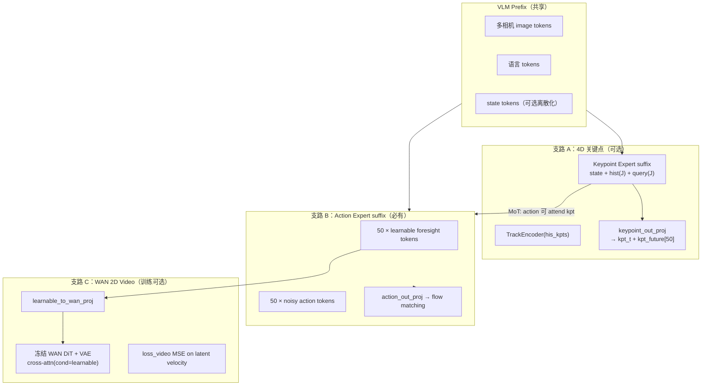
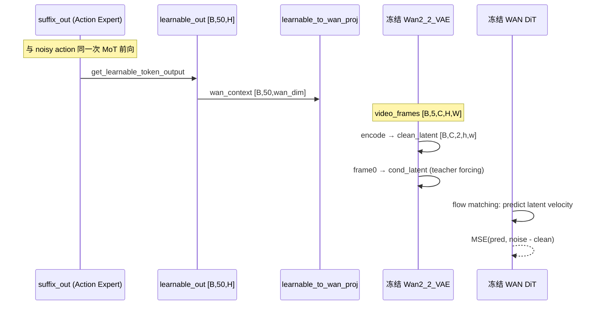
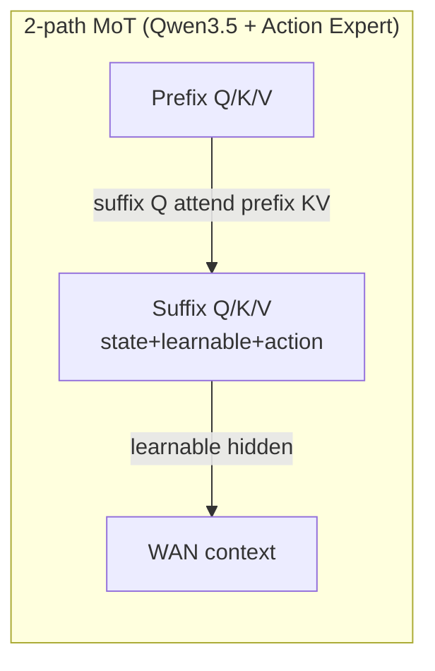

# InternVLA-A1.5：未来 4D 轨迹 vs 未来 2D Video 的设计与实现

> **文档目标**：基于 `itvlaGp` 源码，厘清「预测未来 4D 轨迹」与「预测未来 2D 摄像头 Video（WAN 分支）」两条监督支路的位置、帧数、注意力关系与数据流。
>
> **撰写日期**：2026-09-11
>
> **核心结论（先行）**：
>
> | 支路 | 开关 | 预测什么 | 时间跨度（代码默认） | 与另一支路的 Attention |
> |:---|:---|:---|:---|:---|
> | **未来 2D Video（WAN）** | `action_loss_only=False` | 像素级 RGB 视频 latent flow matching | **5 帧像素**（1 当前 + **4 未来**），在 action chunk 50 步上均匀采样 | learnable tokens → **WAN Cross-Attn**；与 4D 支路**无直接连接** |
> | **未来 4D 关键点轨迹（GeoPredict 融合）** | `enable_keypoint_predictor=True` | 关节 3D 位置或 7D pos+rot | **50 个未来控制步** × J 个关节 | Keypoint Expert **MoT 联合注意力**；经 Action Expert **间接**影响 learnable tokens；**不进入 WAN** |

---

## 目录

1. [术语：代码里的「4D」指什么](#1-术语代码里的-4d-指什么)
2. [总体架构：两条监督支路并列](#2-总体架构两条监督支路并列)
3. [未来 2D Video（WAN / Foresight）](#3-未来-2d-videowan--foresight)
4. [未来 4D 关键点轨迹（GeoPredict 融合）](#4-未来-4d-关键点轨迹geopredict-融合)
5. [两模块之间的 Attention 机制](#5-两模块之间的-attention-机制)
6. [训练 vs 推理](#6-训练-vs-推理)
7. [配置与帧数速查表](#7-配置与帧数速查表)
8. [代码索引](#8-代码索引)
9. [参考文献](#9-参考文献)

---

## 1. 术语：代码里的「4D」指什么

本仓库中 **「4D」并非 WAN 视频分支的维度**，而是 GeoPredict 融合后 **关键点轨迹** 的配置名：

| 配置项 | 取值 | 每关节维度 | 含义 |
|:---|:---|:---|:---|
| `kpt_4d_mode="pos_only"` | 默认 | **3** | 仅 3D 位置 \((x,y,z)\) |
| `kpt_4d_mode="pos_rot"` | R1 Pro 等 | **7** | 3D 位置 + 四元数旋转 |

出处：`configuration_internvla_a1_5.py` L501–511。

**时间维**不写在 `kpt_4d_mode` 里，而是由 **`chunk_size=50`** 决定：对未来 **50 个控制步** 各预测一组关节 3D/7D 坐标。因此「4D 轨迹」在工程语境下应理解为：

\[
\underbrace{\text{空间 3D (或 7D)}}_{\text{kpt\_4d\_mode}} \times \underbrace{J}_{\text{关节数}} \times \underbrace{C=50}_{\text{未来时间步}}
\]

论文原版 InternVLA-A1.5 **核心**是 **隐空间 foresight + WAN 2D 视频**（[InternVLA-A1.5-paper.md](InternVLA-A1.5-paper.md) §3.2，\(N=4\) 未来帧）；**4D 关键点未来轨迹**是 `itvlaGp` 在 `enable_keypoint_predictor=True` 时叠加的 **GeoPredict 扩展**（设计文档 `b/d/GpRbt/itrnVLA15_GeoP_3dtrj_3cn4.md`）。

---

## 2. 总体架构：两条监督支路并列



**关键分离**：

- **WAN 只吃 Action Expert 里的 learnable token 隐状态**，经 `learnable_to_wan_proj` 投影为 cross-attention 的 `context`（`wan_dit_forward` L2038–2047）。
- **4D 未来轨迹**由 **Keypoint Expert** 的 query token 输出 + 时间正弦嵌入预测，**从不送入 WAN**。
- 两支路唯一的「交汇」是 **共享 VLM prefix**，以及在启用三路径 MoT 时 **Action Expert 对 Keypoint Expert 的 cross-attention**（见 §5）。

---

## 3. 未来 2D Video（WAN / Foresight）

### 3.1 设计意图（论文 ↔ 代码）

论文将未来预测表述为：一组 **learnable foresight tokens** \(Q^f\) 从共享多模态上下文中抽取任务相关未来信息，作为 **冻结 WAN2.2** 的条件，在 **像素/latent 视频** 上做 flow matching 监督（训练期）；推理期 **完全丢弃 WAN**（出处：论文 §3.2；`README.md` Real-robot inference）。

代码对应物：

| 论文概念 | 代码实体 | 形状/默认值 |
|:---|:---|:---|
| Foresight queries \(Q^f\) | `learnable_tokens` + `learnable_tokens_in_proj` | **50** tokens × `action_expert_hidden_size` |
| 条件 \(C_t^f\) | `get_learnable_token_output(suffix_out)` → `learnable_to_wan_proj` | `[B, 50, wan_dim]` |
| 冻结视频生成器 | `WanVideoModel`（`wan_model.py`） | DiT + `Wan2_2_VAE` |
| 视频监督 | `_compute_video_loss` | latent 上 MSE velocity |

配置：`num_learnable_tokens=50`，`num_video_frames=4`（`configuration_internvla_a1_5.py` L438–446）。

### 3.2 预测多少帧 2D Video？

#### 3.2.1 像素域（数据集采样）

`num_video_frames` 在配置注释中指 **未来帧数**；实际送入 WAN 的像素序列长度为：

\[
T_{\text{pixel}} = N_{\text{future}} + 1 = \texttt{num\_video\_frames} + 1 = \mathbf{5}
\]

在 `chunk_size=50` 的动作块时间窗内，通过 `image_delta_indices` **均匀采样** 5 个时刻的相机帧：

```593:596:src/lerobot/policies/internvla_a1_5/configuration_internvla_a1_5.py
    def image_delta_indices(self) -> list | None:
        n = self.num_video_frames + 1
        return [self.chunk_size * i // (n - 1) for i in range(n)]
```

默认得到相对动作块起点的索引：**`[0, 12, 25, 37, 50]`**（5 帧；第 0 帧为当前观测，后 4 帧为未来）。

数据流：

1. LeRobot `delta_timestamps` 按上述索引堆叠 `observation.images.image0` → `[T, C, H, W]`；
2. `ExtractVideoFramesTransformFn` 写入 `observation.video_frames`（归一化到 \([-1,1]\)），并把 VLM 侧多帧相机 **降回第 0 帧**（`transform_internvla_a1_5.py` L626–653）。

与论文「\(N=4\) 未来帧 + 当前帧」一致（出处：论文 §3.2；[`paper_code_analyz.md`](paper_code_analyz.md) §4.2）。

#### 3.2.2 Latent 域（WAN VAE 时间压缩）

VAE 编码后时间维为：

\[
T_{\text{latent}} = 1 + \lfloor N_{\text{future}} / 4 \rfloor = 1 + 4//4 = \mathbf{2}
\]

```1050:1055:src/lerobot/policies/internvla_a1_5/modeling_internvla_a1_5.py
            lat_T = 1 + config.num_video_frames // 4
            lat_H = config.video_height // 32
            lat_W = config.video_width // 32
            self.register_buffer(
                "_wan_grid_sizes", torch.tensor([lat_T, lat_H, lat_W], dtype=torch.long)
            )
```

即：**5 帧 RGB（224×224）→ 2 个 temporal latent slice**（空间约 7×7 per slice，\(224/32\)）。`generate_video` 与 `_compute_video_loss` 均在此 latent 网格上做 flow matching；**第 0 latent 帧 teacher-forcing 固定为当前帧编码**（`noisy_latent[:, :, 0:1] = cond_latent`，L2117）。

### 3.3 核心代码路径

| 阶段 | 函数/类 | 文件 |
|:---|:---|:---|
| 模型加载 | `WanVideoModel.from_pretrained` | `wan_model.py` |
| Suffix 中嵌入 learnable | `embed_suffix` → `[state][learnable×50][action×50]` | `modeling_internvla_a1_5.py` L1512–1570 |
| 取出 foresight 隐状态 | `get_learnable_token_output` | L1634–1637 |
| 训练损失 | `_compute_video_loss` | L2061–2137 |
| WAN DiT 前向 | `wan_dit_forward` | L2004–2055 |
| 推理可视化 | `generate_video` | L1697–1750 |
| Policy 包装 | `InternVLAA15Policy.forward` 中 `video_frames` 传入 | L2391–2441 |

#### 3.3.1 `_compute_video_loss` 数据流



要点：

- **WAN 权重冻结**（`freeze_wan_dit=True`）；可训练的是 **learnable tokens**、**learnable_to_wan_proj** 以及（若未隔离）Action Expert / VLM。
- VAE 编码在 `torch.no_grad()` 下执行；可用 `video_micro_batch_size` 分块省显存（L2085–2101）。

#### 3.3.2 WAN 块内 Attention

每个 `WanAttentionBlock`（`wan/modules/model.py` L287–364）：

1. **Self-Attention**：视频 latent token 之间（带 3D RoPE，`grid_sizes=[T,H,W]`）；
2. **Cross-Attention**（`WanCrossAttention`）：`Q` 来自视频 token，`K/V` 来自 **`context`（learnable 投影）**；
3. **FFN**。

原 WAN 的 T5 `text_embedding` 被 **替换**为 learnable token 投影（`wan_dit_forward` 注释 L2038：`# Use projected learnable tokens as context`）。

---

## 4. 未来 4D 关键点轨迹（GeoPredict 融合）

> 默认 `enable_keypoint_predictor=False`；以下描述启用后的行为。

### 4.1 设计意图

在 InternVLA-A1.5 的 VLM + Action Expert 之外，增加 **第三条 MoT 路径（Keypoint Expert）**，监督模型预测：

1. **当前帧**关节关键点 `kpt_t`：`[J, D]`；
2. **未来轨迹** `kpt_future`：`[C, J, D]`，其中 \(C=\texttt{chunk\_size}=50\)，\(D\in\{3,7\}\)。

灵感来自 GeoPredict 的 current/future keypoint loss（出处：`b/d/GpRbt/itrnVLA15_GeoP_3dtrj_3cn4.md` §5.2）。

### 4.2 预测多少帧 / 步的 4D 轨迹？

| 量 | 值 | 说明 |
|:---|:---|:---|
| 未来时间步数 \(C\) | **`chunk_size` = 50** | 与 action chunk 对齐，**每个控制步一帧** 3D/7D 关键点 |
| 关节数 \(J\) | `num_keypoint_joints`（默认 8；RoboTwin 双臂 **14**） | 每帧 \(J\) 个点 |
| 每点维度 \(D\) | 3 或 7 | 由 `kpt_4d_mode` 决定 |
| 历史长度 \(H\) | `keypoint_history_max_len` = 1000 | 仅输入，非预测目标 |

**不是** 5 帧稀疏采样：4D 支路对 action chunk 的 **全部 50 步** 逐 step 监督（与 WAN 的 5 帧稀疏 RGB 形成鲜明对比）。

#### 4.2.1 数据集如何构造 GT

`keypoint_3d_delta_indices` 拉取 `[-H, ..., -1, 0, 1, ..., C]` 共 \(H+1+C\) 帧关键点（`configuration_internvla_a1_5.py` L599–617）。

`Extract3DKeypointTransformFn` 切分（`transform_internvla_a1_5.py` L656–734）：

| 字段 | 切片 | 形状 |
|:---|:---|:---|
| `observation.his_kpts` | `stacked[:H]`（有效历史 packed 到前部） | `[H, J, 3]` |
| `observation.kpt_t` | `stacked[H]` | `[J, 3]` |
| `observation.kpt_future` | `stacked[H+1 : H+1+C]` | **`[C, J, 3]` = `[50, J, 3]`** |

### 4.3 核心代码路径

| 阶段 | 函数/类 | 文件 |
|:---|:---|:---|
| 历史编码 | `TrackEncoder` | `keypoints.py` |
| Kpt suffix 构建 | `embed_kpt_suffix` | `modeling_internvla_a1_5.py` L1572–1627 |
| 三路径 MoT | `compute_layer_complete_3path` | L343–537 |
| 当前帧预测 | `keypoint_out_proj(kpt_query_out)` | `forward` L1965–1970 |
| 未来轨迹预测 | `future_kpt_pos_embed` + `keypoint_out_proj` | L1972–1979 |
| 损失 | `loss_kpt_current`, `loss_kpt_future` | L2488–2501（Policy 层加权） |

#### 4.3.1 未来 4D 预测机制（无独立「未来 query」）

与 GeoPredict 类似，**复用当前帧的 \(J\) 个 query token 隐状态**，为每个未来时间步加 **固定正弦时间嵌入**：

```1972:1979:src/lerobot/policies/internvla_a1_5/modeling_internvla_a1_5.py
            chunk_size = self.config.chunk_size
            future_pos = self.future_kpt_pos_embed.to(
                device=kpt_query_out.device, dtype=torch.float32
            )  # [C, D]
            future_kpt_tokens = kpt_query_out.unsqueeze(1) + future_pos[None, :, None, :]  # [B, C, J, D]
            future_kpt_pred = self.keypoint_out_proj(
                future_kpt_tokens.reshape(B * chunk_size, j, -1)
            ).reshape(B, chunk_size, j, kpt_dim)
```

- `future_kpt_pos_embed`：buffer `[chunk_size, hidden]`，初始化见 L1024–1027；
- 对 **50 个未来步**各算一组 \([J, D]\)，与 `kpt_future` GT 做 MSE（`pos_rot` 时位置+旋转分开加权，L1997–2001）。

#### 4.3.2 Keypoint Expert 输入结构

`embed_kpt_suffix` 序列（L1573）：

\[
[\text{state}(1)] \;|\; [\text{TrackEncoder}(his\_kpts)]_J \;|\; [\text{keypoint\_embedding}]_J
\]

- 历史：变长序列经 `TrackEncoder`（1D conv patch + cross-attn）→ **每关节 1 token**；
- Query：`nn.Embedding(J, hidden)` 可学习，输出经 `keypoint_out_proj` 解码为 3D/7D。

---

## 5. 两模块之间的 Attention 机制

### 5.1 总览：无「4D token → WAN」直连

| 连接 | 是否存在 | 机制 |
|:---|:---|:---|
| Learnable tokens → WAN | **是** | `learnable_to_wan_proj` + `WanCrossAttention` |
| Keypoint tokens → WAN | **否** | 无代码路径 |
| Keypoint → Action（含 learnable） | **可选** | 三路径 MoT：`compute_layer_complete_3path` |
| VLM Prefix → 两支路 | **是** | 两 expert 的 suffix Q 均可 attend prefix K/V |

因此：**4D 与 2D video 是并行辅助任务**，耦合仅通过 **共享 VLM 表征** 与 **Action Expert 对 Kpt Expert 的注意力**（间接改变 learnable token 的隐状态）。

### 5.2 双路径（默认 InternVLA-A1.5 + WAN，无 GeoPredict）

Token 序列（训练 `forward` 拼接，L1817–1819）：

\[
\underbrace{\text{Prefix}}_{\text{VLM}} \;\|\; \underbrace{[\text{state}][\text{learnable}_{50}][\text{action}_{50}]}_{\text{Action Expert suffix}}
\]

`embed_suffix` 内 **block-causal** `att_masks`（L1527–1563）：

- `state`：新 block 起点（`att_mask=1`）；
- `learnable`：首个 token 开 block，**块内 50 token 双向**（`[1,0,0,...,0]`）；
- `action`：首个 action token 开 block，**块内 50 token 双向**。

`compute_layer_complete`（L124–337）在 full-attention 层：

| Query 来自 | 可 attend 的 Key/Value |
|:---|:---|
| **Prefix** | 仅 Prefix（VLM 因果/块结构由 `make_att_2d_masks` 保证） |
| **Action suffix**（含 learnable + noisy action） | Prefix（可 `knowledge_insulation` detach）+ 整个 suffix |

**Learnable tokens 的隐状态**因此同时依赖：VLM 多模态上下文 + 同 suffix 内 noisy action tokens（flow matching 训练时），**之后**才投影给 WAN。



### 5.3 三路径（`enable_keypoint_predictor=True`）

序列（L1814–1816）：

\[
\text{Prefix} \;|\; \underbrace{[\text{state}][\text{hist}]_J[\text{query}]_J}_{\text{Kpt Expert}} \;|\; \underbrace{[\text{state}][\text{learnable}][\text{action}]}_{\text{Action Expert}}
\]

`compute_layer_complete_3path` 显式注释（L373–376）：

| Query 来自 | Attend |
|:---|:---|
| **Prefix** | 仅 Prefix |
| **Keypoint Expert** | Prefix（可 `knowledge_insulation_kpt` detach）+ Kpt suffix |
| **Action Expert** | Prefix（可 `knowledge_insulation` detach）+ Kpt（可 `kpt_to_action_detach` detach）+ Action suffix |

实现片段（L494–514）：

```494:514:src/lerobot/policies/internvla_a1_5/modeling_internvla_a1_5.py
        # --- prefix: self-attention only (VLM never sees kpt/action, by construction). ---
        prefix_attn_mask = attention_mask[:, :, :prefix_len, :prefix_len]
        prefix_att_output = _run_attn(prefix_query, prefix_key, prefix_value, prefix_attn_mask)

        # --- keypoint expert: attends to [prefix (maybe detached), keypoint]. ---
        ...
        kpt_att_output = _run_attn(kpt_query, k_for_kpt, v_for_kpt, kpt_attn_mask)

        # --- action expert: attends to [prefix (maybe detached), keypoint (maybe detached), action]. ---
        ...
        action_att_output = _run_attn(action_query, k_for_action, v_for_action, action_attn_mask)
```

**对两模块关系的影响**：

- Keypoint 支路 **不** 改变 WAN 的 cross-attn 接口；
- 若 `kpt_to_action_detach=False`，Action Expert（含 learnable tokens）可读取 Kpt Expert 的 K/V，从而 **间接** 让视频监督与 4D 监督共享更丰富的动作侧表征；
- VLM Prefix **从不** 直接 attend 到 kpt/action suffix（梯度/信息流：suffix → prefix 被 mask 阻断）。

### 5.4 WAN 内部 vs MoT 的 Attention 对比

| 模块 | Attention 类型 | Q | K/V |
|:---|:---|:---|:---|
| Qwen3.5 MoT | 联合 self-attn（分 query 切片） | prefix / kpt / action 各自 Q | 按 §5.2–5.3 规则拼接 |
| WAN DiT block | Self-attn + **Cross-attn** | 视频 latent | Self: 视频 latent；Cross: **learnable context** |

两套 **不在同一 Transformer 内**；WAN 是冻结的独立 DiT，仅接收已算好的 `wan_context`。

---

## 6. 训练 vs 推理

| 支路 | 训练 | 推理（默认部署） |
|:---|:---|:---|
| **WAN / 2D video** | `loss_video`，需 `video_frames` [B,5,C,H,W] | `action_loss_only=True` → **不加载 WAN**；可选 `predict_action_chunk_with_video` 调试 |
| **4D kpt future** | `loss_kpt_future`，需 `kpt_future` [B,50,J,D] | **不计算、不输出**；`sample_actions` 不调用 kpt head（推理可传 `his_kpts` 作条件，见 GeoPredict 部署文档） |
| **Learnable tokens** | 参与 Action MoT + 视频条件 | 仍参与 Action flow matching；**无视频分支** |

总损失（Policy `forward`，L2492–2501）：

\[
\mathcal{L} = w_a \mathcal{L}_{\text{action}} + w_v \mathcal{L}_{\text{video}} + \lambda_{\text{vqa}}\mathcal{L}_{\text{vqa}} + w_k\big(\mathcal{L}_{\text{kpt\_cur}} + \gamma \mathcal{L}_{\text{kpt\_fut}}\big)
\]

默认 \(w_v=1\)，\(w_k=1\)，\(\gamma=\texttt{kpt\_future\_loss\_weight}=1\)。

---

## 7. 配置与帧数速查表

### 7.1 时间轴对照（`chunk_size=50`）

```
动作块时间索引:  0 -------- 12 ----- 25 ----- 37 -------- 50
                 |          |       |       |          |
WAN 像素采样:    *          *       *       *          *     (5 帧)
4D kpt 未来:     x    x    x    ... (每步一个) ...    x     (50 帧)
                 ^当前 kpt_t=索引0; 未来=索引1..50
```

### 7.2 关键超参

| 参数 | 默认值 | 影响 |
|:---|:---|:---|
| `chunk_size` | 50 | action 长度；**4D 未来步数** |
| `num_video_frames` | 4 | **未来** RGB 帧数（+1 当前） |
| `num_learnable_tokens` | 50 | foresight token 数；WAN context 长度 |
| `num_keypoint_joints` | 8 / 14 | 4D 关节数 |
| `kpt_4d_mode` | `pos_only` | 3D vs 7D |
| `video_height/width` | 224 | WAN 分辨率 |
| `video_loss_weight` | 1.0 | \(\mathcal{L}_{\text{video}}\) 权重 |
| `action_loss_only` | False（训练）/ True（部署） | 是否启用 WAN |

---

## 8. 代码索引

| 主题 | 路径 |
|:---|:---|
| 配置：帧数、4D 模式 | `src/lerobot/policies/internvla_a1_5/configuration_internvla_a1_5.py` |
| 视频帧提取 transform | `src/lerobot/policies/internvla_a1_5/transform_internvla_a1_5.py` (`ExtractVideoFramesTransformFn`) |
| 4D 关键点切分 transform | 同上 (`Extract3DKeypointTransformFn`) |
| 主模型：forward / WAN / kpt | `src/lerobot/policies/internvla_a1_5/modeling_internvla_a1_5.py` |
| 2-path / 3-path MoT | 同上 (`compute_layer_complete`, `compute_layer_complete_3path`) |
| WAN 封装 | `src/lerobot/policies/internvla_a1_5/wan_model.py` |
| WAN DiT 块 | `src/lerobot/policies/internvla_a1_5/wan/modules/model.py` |
| TrackEncoder | `src/lerobot/policies/internvla_a1_5/keypoints.py` |
| 论文级解读 | `b/d/p/paper_code_analyz.md` §4.2–4.3 |
| GeoPredict 融合设计 | `b/d/GpRbt/itrnVLA15_GeoP_3dtrj_3cn4.md` |

---

## 9. 参考文献

| 来源 | 说明 |
|:---|:---|
| [InternVLA-A1.5 论文](https://arxiv.org/html/2607.04988v1) | Foresight tokens + WAN，\(N=4\) 未来帧 |
| [`InternVLA-A1.5-paper.md`](InternVLA-A1.5-paper.md) | 本地论文 Markdown |
| [`paper_code_analyz.md`](paper_code_analyz.md) | WAN 采样与 flow matching 代码解读 |
| [GeoPredict 论文](https://arxiv.org/html/2512.16811v2) | 3D keypoint current/future 监督范式 |
| `b/d/GpRbt/itrnVLA15_GeoP_3dtrj_3cn4.md` | 本仓库三路径 MoT 与 kpt loss 设计 |

---

## 附录：分析过程摘要

1. **全局 grep**：`kpt_future`、`video_frames`、`learnable_tokens`、`wan_dit_forward` 等定位主文件 `modeling_internvla_a1_5.py`。
2. **帧数推导**：`image_delta_indices` 公式 → 5 像素帧；`num_video_frames//4` → 2 latent 帧；`kpt_future` 切片 → **50** 未来 3D 步。
3. **Attention 追踪**：MoT 在 `compute_layer_complete(_3path)`；WAN 在 `WanAttentionBlock.cross_attn`；确认 **无 kpt→WAN** 边。
4. **与论文对照**：WAN 4 未来帧与代码 `num_video_frames=4` 一致；4D 50 步为 GeoPredict 扩展，非论文 WAN 节内容。

*文档基于 2026-09-11 的 `itvlaGp` 源码树。*
