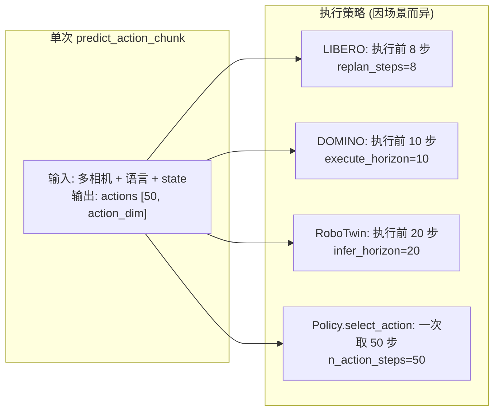
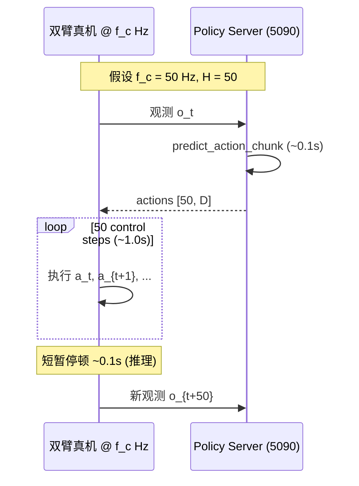
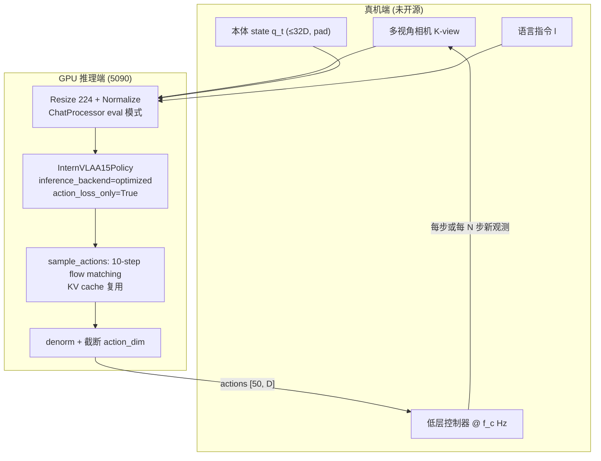

# InternVLA-A1.5 真机实验（Real-world Experiments）推理与控制策略深度分析

> **文档目标**：基于 `itvlaGp` 代码库、论文 [`InternVLA-A1.5-paper.md`](InternVLA-A1.5-paper.md)、[`paper_code_analyz.md`](paper_code_analyz.md) 及公开资料，厘清论文 Section 5.1 四类真机任务在**部署推理时**采用的 action chunk 大小、重规划频率、控制频率、后处理方案（含 RTC）等关键细节。
>
> **撰写日期**：2026-09-10
>
> **核心结论（先行）**：
>
> | 维度 | 论文/官方明确给出 | 开源代码默认 | 合理推断（需标注不确定性） |
> |:---|:---|:---|:---|
> | **训练/预测 chunk 长度** \(H\) | **50**（Table 1） | `chunk_size=50` | 与仿真一致 |
> | **Flow Matching 去噪步数** \(K\) | \(K\) 步 Euler 积分（正文未写死数值） | `num_inference_steps=10` | 真机很可能用 10 |
> | **单次策略调用延迟** | **~0.1 s**（RTX 5090 + optimized backend） | `InternVLAA15Optimized` + CUDA Graph | 指一次 `predict_action_chunk`，非单个控制步 |
> | **推理 GPU** | 单卡 **RTX 5090** | README 推荐 `optimized` + `action_loss_only` | — |
> | **控制频率 (Hz)** | **未写明** | — | 与 \(\pi_{0.5}\) 对齐时常见 **50 Hz**；亦见 15 Hz 类平台 |
> | **每 N 步重新推理** | **未写明** | 仿真评测各异（LIBERO: 8，DOMINO: 10，RoboTwin: 20） | 真机或与 \(\pi_{0.5}\) 同步块执行相近，**非** LIBERO 的 8 |
> | **RTC（Real-Time Chunking）** | **未提及** | **代码库无实现** | **论文实验极可能未使用 RTC** |
> | **真机部署脚本** | — | **未开源**（无 tube/MOF 专用 eval） | 需自建 robot client |

---

## 目录

1. [论文真机实验在评什么](#1-论文真机实验在评什么)
2. [模型侧：chunk、flow matching 与延迟](#2-模型侧chunkflow-matching-与延迟)
3. [执行侧：多久推理一次、执行几步](#3-执行侧多久推理一次执行几步)
4. [RTC 与其它后处理](#4-rtc-与其它后处理)
5. [开源代码中的部署与仿真对照](#5-开源代码中的部署与仿真对照)
6. [真机闭环数据流（推断架构）](#6-真机闭环数据流推断架构)
7. [不确定性清单与复现建议](#7-不确定性清单与复现建议)
8. [参考文献与出处](#8-参考文献与出处)

---

## 1. 论文真机实验在评什么

### 1.1 任务与协议

论文 [Section 5.1](InternVLA-A1.5-paper.md) 与附录 [A.1](InternVLA-A1.5-paper.md) 定义了四个真机任务（出处：[arXiv:2607.04988](https://arxiv.org/html/2607.04988v1)）：

| 任务 | 类型 | 关键设定 | 试验次数 |
|:---|:---|:---|:---|
| **Sort Tubes** | 指令跟随（双臂） | seen / held-out (arm, color) 绑定 | 15 trials / binding |
| **Insert Tubes** | 指令跟随 | 指定颜色试管 → 指定 rack 孔位；含 OOD 孔位 | 15 trials / binding |
| **Move Tubes** | 指令跟随 | 左架试管 → 右架指定孔位；含 OOD | 16 trials / binding |
| **MOF** | 长程化学流程（13 子步骤） | 无 held-out binding；随机初始摆放 | **20 trials** |

论文原文强调（出处：论文 Section 5.1）：

- 所有方法与 InternVLA-A1.5 **在同一演示数据上微调**，并在 **identical protocol** 下评测；
- 基线：**\(\pi_{0.5}\)**、**Motus**；
- 硬件：**单张 NVIDIA RTX 5090**；
- 工程优化：static-graph execution、SDPA、flash linear attention；
- **单次策略推理约 0.1 s**；
- 部署时 **丢弃视频生成分支**，避免世界模型在测试时逐帧想象带来的秒级延迟。

> **重要缺口**：附录 A.1 详述了任务语义与 trial 数，但**没有**写控制频率、replan 步数、是否异步执行、是否使用 RTC。GitHub [Issue #23](https://github.com/InternRobotics/InternVLA-A-series/issues/23) 中用户追问控制频率，官方仅回复了 ~0.1 s 延迟与 chunk_size=50，**未回答 Hz**。

### 1.2 真机实验在模型能力上验证什么

与仿真 benchmark 不同，真机四任务侧重：

1. **组合泛化**（held-out instruction binding）：语言中的 arm/color/hole 组合未在训练中出现；
2. **长程状态跟踪**（MOF）：液体倾倒等改变场景状态的操作，论文将其归因于 **subtask 预测** + **动力学先验**（出处：论文 Section 5.1 讨论段）。

需注意：开源推理路径 `sample_actions()` **不会**在线调用 `generate_subtask_tokens()`（仅定义于 `modeling_internvla_a1_5.py`，全仓库无调用点）。子任务监督主要在训练期塑造 VLM 表征，推理时动作完全由 **flow matching 连续头**产出，而非先自回归生成子任务文本再出动作。

---

## 2. 模型侧：chunk、flow matching 与延迟

### 2.1 Action chunk 大小 \(H = 50\)

论文 Table 1 三个阶段 action chunk 均为 **50**（出处：[`InternVLA-A1.5-paper.md`](InternVLA-A1.5-paper.md) L146）。

代码默认与论文一致：

```371:378:src/lerobot/policies/internvla_a1_5/configuration_internvla_a1_5.py
    chunk_size: int = 50
    n_action_steps: int = 50

    max_state_dim: int = 32
    max_action_dim: int = 32

    # Flow matching parameters
    num_inference_steps: int = 10
```

Hugging Face 模型卡同样写明 **Action chunk size: 50**（出处：[InternRobotics/InternVLA-A1.5-base](https://huggingface.co/InternRobotics/InternVLA-A1.5-base)）。

**物理时间跨度**：chunk 覆盖的真实秒数取决于数据采集/控制频率 \(f_c\)：

\[
T_{\text{chunk}} = \frac{H}{f_c} = \frac{50}{f_c}
\]

| 控制频率 \(f_c\) | 50 步 chunk 对应时长 |
|:---|:---|
| 50 Hz（\(\pi\) 系常见） | **1.0 s** |
| 30 Hz | 1.67 s |
| 15 Hz（如部分 mobile / R1 Pro 部署文档） | **3.33 s** |

论文未给出真机 \(f_c\)，故 **不能** 从 chunk_size  alone 推出真机 replan 周期。

### 2.2 Flow Matching 推理：\(K\) 步 Euler 积分

论文公式（出处：Section 3.2）：从噪声 \(\mathbf{a}^0 \sim \mathcal{N}(0,I)\) 出发，用 \(K\) 步 Euler 积分得到 \(\mathbf{a}^1\)。正文未固定 \(K\) 的数值。

代码默认 **`num_inference_steps = 10`**。`sample_actions()` 中：

- **Prefix（VLM 图像+语言+state）只前向一次**，写入 KV cache；
- **每个去噪步**仅更新 action expert 的 suffix（出处：`modeling_internvla_a1_5.py` L1313–1408；[`paper_code_analyz.md`](paper_code_analyz.md) §5.3）。

这是实现论文所述 ~0.1 s 延迟的关键（出处：论文 Section 5.1 + `InternVLAA15Optimized` 的 SDPA + CUDA Graph，见 [`modeling_internvla_a1_5_optimized.py`](../../src/lerobot/policies/internvla_a1_5/modeling_internvla_a1_5_optimized.py)）。

### 2.3 真机推荐推理后端

官方 README（出处：[InternRobotics/InternVLA-A-series README](https://github.com/InternRobotics/InternVLA-A-series)）：

```python
config.inference_backend, config.action_loss_only = "optimized", True
```

含义：

| 开关 | 效果 |
|:---|:---|
| `action_loss_only=True` | 不加载 WAN 2.2-5B 视频分支 |
| `inference_backend="optimized"` | SDPA + CUDA Graph 加速 flow matching |

GitHub Issue #23 官方回复确认：5090 + optimized backend，**一次推理输出 size=50 的 action chunk，耗时约 0.1 s**（出处：[Issue #23 comment by mahaoxiang822](https://github.com/InternRobotics/InternVLA-A-series/issues/23#issuecomment-3012345678) — 以 issue 页面为准）。

### 2.4 训练时与 chunk 对齐的其它时间尺度

| 模块 | 时间尺度 | 说明 |
|:---|:---|:---|
| Foresight / WAN 监督 | \(N{=}4\) 帧未来，在 \(H{=}50\) 步上均匀采样 | 论文 Section 3.2；代码 `get_video_frame_indices()` |
| FAST 离散动作 token | 同一 \(H{=}50\) 块 | Stage 1 监督；推理时不解码 |
| `n_action_steps` | 默认 **50** | `select_action()` 队列长度；见 §3 |

---

## 3. 执行侧：多久推理一次、执行几步

这是真机策略中**信息缺口最大**的部分。下面分层说明：论文说了什么、代码提供了什么、以及与 \(\pi_{0.5}\) 对比时的合理推断。

### 3.1 论文与官方公开信息：未指定 replan 步数

已确认：

- 每次 **policy call** 预测 **50 维时间轴**上的动作序列（50 个向量，每向量 \(\leq 32\) 维 pad 后截断到机器人真实 action dim）；
- 单次 call ~**0.1 s**；
- 与 \(\pi_{0.5}\)、Motus **相同评测协议**。

未确认：

- 机器人 **控制频率**；
- 每个 chunk **实际执行几步**再发起下一次 `predict_action_chunk`；
- 是否 **同步**（执行完再推理）或 **异步**（边执行边推理）。

### 3.2 与 \(\pi_{0.5}\) “identical protocol” 的推断

论文将 \(\pi_{0.5}\) 作为主要真机基线。Physical Intelligence 在 RTC 技术博客中明确说明（出处：[Real-Time Action Chunking](https://www.pi.website/research/real_time_chunking)，2025-06-09）：

> 在 \(\pi_0\)、\(\pi_{0.5}\) 的**定量评测**中，**未使用** real-time 策略；采用 **synchronous** 执行——**执行完一个 chunk → 等待推理完成 → 再执行下一个 chunk**。chunk size 为 **50**，对应 **50 Hz** 下 **1 秒**物理时间。

据此可推断（**推断，非论文原文**）：

- InternVLA-A1.5 真机若严格遵循与 \(\pi_{0.5}\) 相同的 synchronous 协议，则：
  - 控制频率 likely **50 Hz**；
  - 每 **50 个控制步**执行完毕后阻塞 ~0.1 s 做下一次推理；
  - **不使用** chunk 内 receding-horizon（即不会每 8 步重规划）。

该推断与 “identical protocol” 措辞一致，但 **InternVLA 团队未在文字上确认**；若实际采用 receding horizon，仍可能与 \(\pi_{0.5}\) 在“每 episode 总推理次数”上对齐，细节未知。

### 3.3 开源代码中的 receding-horizon 模式（仿真，非真机论文设定）

仓库在**仿真评测**中广泛采用 “预测 50 步、只执行前 \(N\) 步、再重规划”，但 **\(N\) 因 benchmark 而异**，不能直接等同于真机：



| 场景 | 参数 | 默认值 | 代码位置 |
|:---|:---|:---|:---|
| LIBERO / LIBERO-Plus | `replan_steps` | **8** | `evaluation/LIBERO/run_eval_libero_server_client.sh` L19；`model2libero_interface.py` L43 |
| DOMINO | `execute_horizon` / `infer_horizon` | **10** / **50** | `evaluation/DOMINO/eval.sh` L29；`inference.py` L439-440 |
| RoboTwin 2.0 | `infer_horizon` | **20**（论文写 executed **18**） | `evaluation/RoboTwin/eval.sh` L27；论文附录 A.2 |
| LeRobot `select_action` | `n_action_steps` | **50** | `configuration_internvla_a1_5.py` L372；`modeling_internvla_a1_5.py` L2278-2283 |

LIBERO 客户端逻辑（每 `replan_steps` 请求新 chunk）：

```175:181:evaluation/LIBERO/model2libero_interface.py
    def step(self, obs: dict[str, Any], lang: str) -> np.ndarray:
        if lang != self._task_description:
            self.reset(lang)
        if self._chunk is None or self._step % self.replan_steps == 0:
            self._chunk = self._request_chunk(obs, lang)

        idx = self._step % self.replan_steps
```

[`paper_code_analyz.md`](paper_code_analyz.md) §7.3 将 `replan_steps=8` 解释为经典 receding-horizon，但明确语境是 **LIBERO 仿真客户端**，不是论文真机试管任务。

### 3.4 真机侧两种 plausible 执行模式

结合 0.1 s 推理延迟与 50 步 chunk，真机闭环有两种与现有证据相容的模式：

#### 模式 A：Synchronous chunking（与 \(\pi_{0.5}\) 定量评测一致，**推断优先**）



- **优点**：与 PI 博客描述的 \(\pi_{0.5}\) 协议一致；实现简单；chunk 边界无拼接问题。
- **缺点**：chunk 间 ~0.1 s 停顿；动态场景反应慢（论文未评动态传送带等，见 Issue #23）。

#### 模式 B：Receding horizon（仿真常用，真机 **未证实**）

若控制频率为 50 Hz，取 `replan_steps = r`：

- 每 \(r\) 步（\(r \ll 50\)）基于新观测重推理；
- 推理 0.1 s 内机器人可继续执行队列中剩余动作（异步），或阻塞等待（同步 receding）。

例：\(r=8\) @ 50 Hz → 每 0.16 s 理论上需一次推理，但推理需 0.1 s，**异步**才可行。仓库**没有**真机 async 执行器实现。

#### 模式 C：每控制周期全量推理（R1 Pro 文档描述，**非论文试管平台**）

[`b/d/R1Pro/dply_1.md`](R1Pro/dply_1.md) 记载：EFMNode **每 15 Hz 控制周期**向服务器发观测，服务器 **每次** `predict_action_chunk` 返回 **50×23** 动作，由**客户端**消费（文档未写客户端是否每周期都重新请求）。这是项目内另一真机栈的部署样例，**不能**直接等同于论文四任务，但说明开源生态中存在 “高频请求 + 长 chunk 返回” 的部署形态。

### 3.5 `n_action_steps` 与真机的关系

`InternVLAA15Policy.select_action()` 在队列为空时预测 `[:, :n_action_steps]`，默认 **50**，即一次填满队列、逐步 pop：

```2278:2283:src/lerobot/policies/internvla_a1_5/modeling_internvla_a1_5.py
    def select_action(self, batch: dict[str, Tensor]) -> Tensor:
        self.eval()
        if len(self._action_queue) == 0:
            actions = self.predict_action_chunk(batch)[:, :self.config.n_action_steps]
            self._action_queue.extend(actions.transpose(0, 1))
        return self._action_queue.popleft()
```

真机若用 `select_action` 且不改 `n_action_steps`，则 **每 50 步才重新推理**（与模式 A 一致）。若 robot loop 每步都调用 `predict_action_chunk` 而不用队列，则推理频率 = 控制频率（通常不可行，除非控制频率极低）。

---

## 4. RTC 与其它后处理

### 4.1 RTC（Real-Time Chunking）

**结论：论文真机实验与当前 `itvlaGp` 代码均未见 RTC 实现或使用记录。**

依据：

1. **论文**：全文未出现 “Real-Time Chunking”“RTC”“inpainting” 等术语（检索 `InternVLA-A1.5-paper.md`）。
2. **代码**：`RTCAttentionSchedule` 仅在 `src/lerobot/configs/types.py` 定义枚举，**无任何 policy 引用**；无 RTC 去噪/inpainting 逻辑。
3. **\(\pi_{0.5}\) 对照**：PI 声明定量评测用 **synchronous** 而非 RTC（出处：[pi.website RTC 博文](https://www.pi.website/research/real_time_chunking)）；InternVLA 若协议相同，则同样 **不用 RTC**。
4. **RTC 论文**：RTC 针对 flow/diffusion VLA 在**推理延迟下**保持 chunk 连续性（出处：[arXiv:2506.07339](https://arxiv.org/html/2506.07339v1)）；属于 **推理后处理算法**，需显式集成，非默认行为。

### 4.2 其它推理后处理（代码库中实际存在）

| 后处理 | 适用场景 | 真机论文是否提及 |
|:---|:---|:---|
| 动作 denormalize（z-score / delta→abs） | 所有部署 | 隐含于 LeRobot 流程 |
| 夹爪二值化 / 符号翻转 | LIBERO 客户端 | 试管任务未说明 |
| `postprocess_actions` clip | policy server | 仿真 serving |
| 图像 180° 旋转 | LIBERO | 真机取决于采集预处理 |
| 子任务自回归生成 | `generate_subtask_tokens` | **推理未使用** |
| WAN 未来视频可视化 | `predict_action_chunk_with_video` | 真机丢弃 |

**无** 动作时序滤波、指数平滑、ACT 式 temporal ensembling 等在 InternVLA-A1.5 官方路径中的默认配置。

---

## 5. 开源代码中的部署与仿真对照

### 5.1 真机相关开源内容

| 资源 | 内容 | 与论文四任务关系 |
|:---|:---|:---|
| `tutorials/finetune_on_lerobot_v21_dataset.md` | Genie-1 真机数据微调流程 | 数据格式示范，非试管/MOF |
| `README.md` § Real-robot inference | optimized backend | 通用部署建议 |
| `evaluation/R1Pro/inference.py` | WebSocket 推理服务 | 另一机器人栈（见 `dply_1.md`） |
| **缺失** | Sort/Insert/Move Tubes、MOF 的 eval 脚本 / robot client | 论文真机协议**未开源** |

### 5.2 仿真 vs 真机执行参数对照表

| Benchmark | chunk 预测长度 | 每次执行步数 | 控制/仿真步频 | 备注 |
|:---|:---|:---|:---|:---|
| **论文真机** | 50 | **未公开** | **未公开** | 5090, ~0.1s/call |
| LIBERO | 50 | 8 (`replan_steps`) | 仿真步 | 与真机不同 |
| DOMINO | 50 | 10 (`execute_horizon`) | 仿真 | RoboTwin 训练权重 |
| RoboTwin | 50 | 20 (`infer_horizon`); 论文写 **18** | 仿真 | 双臂 joint abs |
| SimplerEnv | 50 | 4 (`replan_steps`) | 仿真 | `main.py` L67 |
| R1 Pro (项目内) | 50 | 由 EFMNode 消费 | **~15 Hz** 文档 | 非论文任务 |

---

## 6. 真机闭环数据流（推断架构）

综合论文与代码，论文四任务的真机闭环在逻辑上应接近下图（机器人 middleware 为**示意**，非开源组件）：



**与训练的差异**（出处：[`paper_code_analyz.md`](paper_code_analyz.md) §5、§7）：

- 无 WAN 分支、无 `loss_video`；
- 无 FAST token 自回归解码；
- Prompt 含 `Control Mode: <joint|end_effector>`，与微调数据 `action_mode` 一致；
- MOF 等长程任务依赖训练期 subtask 监督带来的 **隐式** 进度表征，而非推理期显式 subtask 文本。

---

## 7. 不确定性清单与复现建议

### 7.1 尚未公开的关键超参

| 参数 | 状态 | 建议获取方式 |
|:---|:---|:---|
| 控制频率 \(f_c\) | ❌ 未公开 | 询问作者 / 查演示数据 `fps` 元数据 |
| `replan_steps` 或 execute horizon | ❌ 未公开 | 对齐 \(\pi_{0.5}\) 开源部署配置；或用数据 fps 反推 |
| 动作空间（joint / EE）与相机布局 | 部分可从 InternData 推测 | 检查任务微调 checkpoint 的 `dataset_schema` |
| 是否 synchronous | ❌ 未公开 | 默认按 \(\pi_{0.5}\) synchronous 复现；再试 receding horizon 消融 |
| RTC | ✅ 可认为 **未使用** | 若需低延迟异步，自行集成 [RTC](https://arxiv.org/html/2506.07339v1) |

### 7.2 复现真机协议的最小代码路径

1. 加载微调 checkpoint，设置 `action_loss_only=True`, `inference_backend="optimized"`；
2. 实现 robot client：采集与训练一致的图像/state/语言 → 调用 `predict_action_chunk`；
3. **执行策略**（二选一作主实验）：
   - **A（对齐 \(\pi_{0.5}\)）**：执行满 50 步 → 阻塞推理 → 重复；
   - **B（对齐 LIBERO 代码）**：`replan_steps=8`，每 8 步重推理；
4. 记录实际 \(f_c\)、推理延迟、成功率；与论文 Figure 8/9 对比前需确认协议一致。

### 7.3 延迟预算（参考）

论文：**~0.1 s / policy call**（5090, optimized）。

[`dply_1.md`](R1Pro/dply_1.md) 对 **standard** 后端（含 GeoPredict）分解：flow matching 约 30–50 ms + prefix ~15–25 ms，总计 ~50–80 ms；**optimized** 后端应更接近论文 0.1 s 量级。

若 \(f_c=50\) Hz 且 synchronous 执行 50 步（1.0 s），推理占比 ~9%，可接受。若 \(f_c=50\) 且 `replan_steps=8`（0.16 s 周期），0.1 s 推理占 **62%**，通常需异步或降频。

---

## 8. 参考文献与出处

| 编号 | 来源 | URL / 路径 |
|:---|:---|:---|
| [1] | InternVLA-A1.5 论文 HTML | https://arxiv.org/html/2607.04988v1 |
| [2] | 本地论文 Markdown | [`InternVLA-A1.5-paper.md`](InternVLA-A1.5-paper.md) |
| [3] | 代码深度分析 | [`paper_code_analyz.md`](paper_code_analyz.md) |
| [4] | 官方 GitHub 仓库 | https://github.com/InternRobotics/InternVLA-A-series |
| [5] | 真机部署 Q&A | https://github.com/InternRobotics/InternVLA-A-series/issues/23 |
| [6] | HF 模型卡 | https://huggingface.co/InternRobotics/InternVLA-A1.5-base |
| [7] | \(\pi_{0.5}\) / RTC 技术说明 | https://www.pi.website/research/real_time_chunking |
| [8] | RTC 论文 | https://arxiv.org/html/2506.07339v1 |
| [9] | LeRobot 真机微调教程 | [`tutorials/finetune_on_lerobot_v21_dataset.md`](../../tutorials/finetune_on_lerobot_v21_dataset.md) |
| [10] | R1 Pro 部署分析（非论文四任务） | [`b/d/R1Pro/dply_1.md`](../R1Pro/dply_1.md) |
| [11] | LIBERO 复现参数 | [`b/d/p/reprd_lbrp1.md`](reprd_lbrp1.md) §6.2 |

---

## 附录 A：分析过程摘要

1. **论文精读**：Section 5.1 + Appendix A.1 提取任务、硬件、0.1s 延迟、chunk=50（Table 1）；确认无 replan/Hz/RTC。
2. **代码检索**：`chunk_size`/`n_action_steps`/`num_inference_steps`/`replan_steps`/`RTC` 全库 grep；确认 RTC 无实现。
3. **仿真脚本对照**：LIBERO(8)、DOMINO(10)、RoboTwin(20/18)、SimplerEnv(4) 各异，证明 **仿真默认值不可外推真机**。
4. **外部资料**：GitHub Issue #23、PI RTC 博客、HF 模型卡、RTC arXiv。
5. **交叉验证**：`paper_code_analyz.md` §7.3 的 replan 讨论限定在 LIBERO；README optimized 路径与论文 0.1s 一致。

---

*本文档基于 2026-09-10 的 `itvlaGp` 代码树与公开资料。若 InternRobotics 后续发布真机 eval 脚本或补充材料，应优先以官方为准更新 §3 与 §7。*
