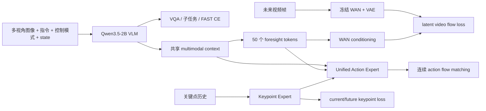
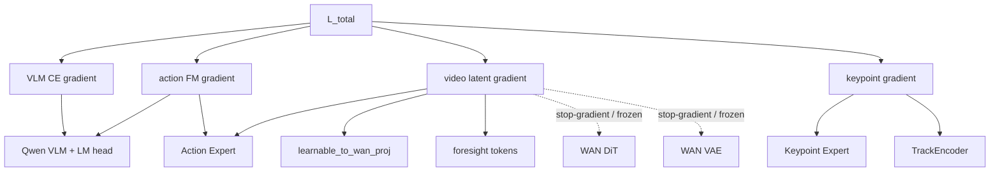
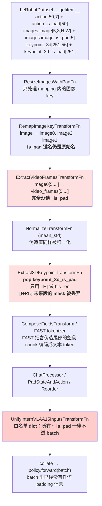

# InternVLA-A1.5 训练策略深度分析

> 文档版本：2026-09-17  
> 代码基准：`/B/SRC/itvlaGpLibPlus/` 当前工作树  
> 分析对象：InternVLA-A1.5 预训练、下游 SFT、GeoPredict 关键点扩展及其训练-评估契约  
> 结论等级：本文把“论文事实”“本地代码事实”“本地实测”“类比推断”“待验证建议”明确分开。

## 1. 结论先行

InternVLA-A1.5 的核心收益并不是简单地把一个视频模型接到 VLA 后面，而是把多种互补学习目标放进同一个训练闭环：

1. 用原生 VLM 的 next-token cross-entropy 保留视觉理解、语言指令和子任务推理能力；
2. 用 FAST 离散动作 token 让 VLM 学到动作语义和粗粒度动作序列；
3. 用连续 flow matching action expert 产生平滑、低延迟的动作 chunk；
4. 用冻结 WAN2.2 的 latent video supervision 训练少量 foresight tokens，把未来动力学先验蒸馏进 action expert。

**[论文事实]** 论文报告的最大收益集中在分布外和动态场景，而不是静态、同分布的单纯 pick-and-place：

- LIBERO：98.9；
- LIBERO-Plus：84.8；
- RoboTwin：93.2；
- DOMINO zero-shot：27.7；
- 去掉 video loss 后，LIBERO-Plus 从 84.8 降到 78.0，DOMINO 从 27.7 降到 25.3；
- 去掉 foresight tokens 后，LIBERO-Plus 降到 77.9，DOMINO 降到 23.8。

这些结果说明，视频 foresight 的价值主要体现在视觉扰动、布局变化、动态交互和长时序状态变化上，而不是体现在每一个静态任务的训练损失下降上。

**[代码事实 + 本地实测 + 待验证建议]** 对当前仓库，最重要的判断是：

### P0：先保证训练契约正确，再调超参

以下问题是代码级风险；在修复前，任何超参结论都只能作为暂定结论。

1. **FAST 的输入归一化需要单独核对。** 当前 `InternVLA-A1.5` transform 链默认用 `mean_std` 归一化，而官方 FAST 以每个动作维度的 `q01/q99` 映射到 `[-1,1]`。如果同一个归一化后的 action 同时喂给 flow matching 和 FAST，两个分支可能处于不一致的数值空间。
2. **`tokenize_state=true` 时 foresight token 切片存在确定性偏移风险。** 当前 `embed_suffix()` 在 `tokenize_state=true` 时没有 state token，但 `get_learnable_token_output()` 固定从索引 1 开始，可能丢掉第一个 foresight token，并把一个 action token 当作 foresight token。
3. **FAST/state 文本与数值 state/action 的 reorder 时序要统一。** FAST 和 state prompt 在 `ReorderStateActionTransform` 之前生成，而数值张量在之后重排；对非恒等 schema，这可能造成文本动作维度和 flow matching 动作维度不一致。
4. **机器人数据与 M1 VQA 的比例需要以实际 batch 计数验收。** 论文是 robot:M1 = 0.15:0.85；仓库教程中示例的 `vqa_dataset.weight=0.15` 经 `factory.py` 实现后却是 robot:VQA = 0.85:0.15。
5. **episode 边界的 clamp/padding 需要进入 loss mask 设计。** 当前 query index 会把越界动作和视频索引 clamp 到 episode 最后一帧，但模型损失路径没有显式使用所有对应的 `*_is_pad` mask。
6. **评估数据契约不能被当作训练 trick。** 当前 LIBERO-plus 低 SR 的主要事故是评估输入多旋转了 180°；这说明相机朝向、resize、控制约定等数据契约必须在训练前后做像素级和统计级验收。

### P1：最值得尝试的效果提升

以下是结合论文和相关 VLA 工作形成的待验证建议，不是当前仓库已经证明的收益。

1. 复现论文的阶段式训练：Stage 1 先做 VLM + VQA/子任务/FAST，Stage 2 再加入 action expert + video foresight，最后做较短的 downstream post-training。
2. 预训练阶段恢复真实 M1 多模态混合；下游小数据 SFT 阶段不要机械照搬 85% M1，而应按“语义保持”和“任务适配”做 curriculum 或低比例 replay。
3. 为 FAST 和 flow matching 解耦统计空间：FAST 使用 q01/q99，连续动作分支保留经过验证的 mean/std 或独立 q01/q99。
4. 对图像做轻量、时间和相机同步的增强：优先 brightness/contrast/saturation，谨慎使用 affine；不要未经标签变换就使用水平翻转、180°旋转或逐帧随机几何变换。
5. 使用分模块学习率和冻结策略，而不是只有“全量训练/全冻结”两个选项：VLM、vision encoder、action expert、foresight tokens、keypoint expert 分开控制。
6. 保留 video loss 和 foresight tokens；若显存不足，优先用 `video_micro_batch_size`、gradient checkpointing 和分阶段训练解决，不要直接删除 foresight 监督。

### P2：在正确性通过后再优化

以下属于待验证的性能/部署建议。

- 预测 chunk 保持 50，比较执行步数 8/16/18/25/50；
- 比较 flow matching inference steps 4/8/10/16；
- 比较 SDPA、gradient checkpointing、compile 对吞吐和数值的影响；
- 研究时间采样分布、EMA、动态 loss weighting 和更细粒度的数据 curriculum。

## 2. 证据分级和资料范围

本文采用以下标记：

- **[论文事实]**：来自 InternVLA-A1.5 论文或官方发布资料；
- **[代码事实]**：当前本地代码明确实现的行为；
- **[脚本配置]**：launch script 中的默认参数，不代表已经完成过该实验；
- **[本地实测]**：本仓库日志有命令、输出或指标支撑；
- **[类比推断]**：从 FAST、π0.5、OpenVLA、Diffusion Policy 等相关工作迁移的经验；
- **[待验证]**：合理但当前没有直接实测证据的假设。

主要本地资料：

- 论文：`b/d/p/InternVLA-A1.5-paper.md:42-173, 280-328`
- 模型配置：`src/lerobot/policies/internvla_a1_5/configuration_internvla_a1_5.py:20-610`
- 模型 forward：`src/lerobot/policies/internvla_a1_5/modeling_internvla_a1_5.py:1180-2550`
- 数据和文本 transform：`src/lerobot/policies/internvla_a1_5/transform_internvla_a1_5.py:40-730`
- 数值 transform：`src/lerobot/transforms/core.py:90-510`
- 数据集工厂：`src/lerobot/datasets/factory.py:280-640`
- 预训练脚本：`launch/internvla_a15_pretrain.sh:60-175`
- 通用 SFT：`launch/internvla_a15_finetune.sh:60-135`
- Libplus SFT：`launch/libplus_sft_launch.sh:45-240`
- Libplus 训练方案：`b/d/libplus/sft.md:1-80, 290-400`
- Libplus 训练日志：`b/d/libplus/sft_0912LOG.md:90-320`
- GeoP 消融：`b/d/GpRbt/itrnVLA15_GeoP_3dtrj_3cn2_sft_rbt2_2LOG.md:60-300`
- 标准 LIBERO 门禁：`b/d/libplus/eval3_optim3_lib2LOG.md:120-270`
- LIBERO-plus 输入契约分析：`b/d/libplus/eval3_optim2.md:1-40`

主要外部资料：

- [InternVLA-A1.5 论文 HTML](https://arxiv.org/html/2607.04988v1)
- [InternVLA-A-series 官方仓库](https://github.com/InternRobotics/InternVLA-A-series)
- [InternVLA-A1.5 项目主页](https://internrobotics.github.io/internvla-a15.github.io/)
- [InternVLA-A1.5-base 模型卡](https://huggingface.co/InternRobotics/InternVLA-A1.5-base)
- [FAST 论文](https://arxiv.org/html/2501.09747v1)
- [π0.5 论文](https://arxiv.org/html/2504.16054v1)
- [OpenVLA 论文](https://arxiv.org/html/2406.09246v3)
- [Diffusion Policy 论文](https://diffusion-policy.cs.columbia.edu/diffusion_policy_ijrr.pdf)

## 3. InternVLA-A1.5 的训练目标和数据流

本节的架构和本地字段描述属于**[代码事实]**；Stage 1/Stage 2 的目标和 WAN 设计同时对照了**[论文事实]**。

### 3.1 模型的静态职责

InternVLA-A1.5 由两个主要可训练部分和一个训练期教师组成：

- **Qwen3.5-2B VLM**：接收多视角图像、任务文本、控制模式和离散 state token，负责语义理解与 next-token prediction；
- **Unified Action Expert**：接收 VLM 上下文、foresight tokens 和 noisy action chunk，预测连续 flow matching velocity；
- **WAN2.2-TI2V-5B**：训练时冻结，仅把未来视频 latent 的 flow matching loss 反向传给 foresight conditioning 路径；推理时删除。

当前仓库还加入了 GeoPredict 关键点扩展：

- `TrackEncoder` 编码关键点历史；
- `Keypoint Expert` 预测当前和未来关键点；
- Action Expert 可以通过 cross-attention 使用关键点 expert 的输出；
- 关键点分支不属于论文基础 A1.5 的核心训练配方，应按下游任务单独消融。



### 3.2 输入、变换和模型输入格式

当前 InternVLA transform 的典型顺序是：

1. 根据 `action_mode` 插入或删除 `DeltaActionTransformFn`；
2. 图像 resize/pad；
3. 相机字段重映射到 `image0/image1/image2`；
4. 从 action-time image window 提取视频帧，保留第 0 帧给 VLM；
5. 对 state/action 做 `NormalizeTransformFn`；
6. 拼接字段；
7. FAST tokenization；
8. 从 JSONL 加载 subtask/language memory；
9. 使用 Qwen chat processor；
10. state/action pad 到最大维度；
11. 根据 robot schema 重排 state/action；
12. 统一 batch 字段。

证据：`configuration_internvla_a1_5.py:44-70, 80-140`。

机器人样本的 VLM prompt 由以下部分组成：

```text
Task: <instruction>;
Control Mode: <joint|end_effector>;
State: <256-bin state tokens>;
Output: <SubTask, Action>
```

训练时 assistant target 可以包含：

- subtask 文本；
- FAST action token；
- 两者同时存在。

推理时 label mode 被置为 `NONE`，只保留 user prompt，并添加输出提示。代码证据：`transform_internvla_a1_5.py:96-230`。

### 3.3 Stage 1：VLM transferring

论文 Stage 1 只训练 VLM 的统一 next-token objective：

$$\mathcal{L}_{\mathrm{stage1}}
=
-\sum_{i\in\mathcal{Y}}\log p_\theta(y_i\mid y_{<i},o_t,l,q_t)$$

其中：

- \(o_t\) 是当前多视角观察；
- \(l\) 是语言指令；
- \(q_t\) 是机器人状态；
- \(y_i\) 是文本、子任务或 FAST action target token；
- \(\mathcal{Y}\) 是 labels 中不为 `-100` 的位置。

VQA 样本只保留答案 target，不产生 action loss；机器人样本同时提供 subtask 和 FAST action target。论文明确强调，这些目标共享一个 vocabulary、embedding table 和 LM head，而不是给 action token 单独建立一个完全独立的 head。

### 3.4 Stage 2：foresight + continuous action

论文 Stage 2 继续保留 Stage 1 的 VLM loss，同时加入视频和连续动作：

$$\mathcal{L}_{\mathrm{stage2}}
=
\mathcal{L}_{\mathrm{stage1}}
+\alpha \mathcal{L}_{\mathrm{video}}
+\beta \mathcal{L}_{\mathrm{action}}$$

其中 \(\alpha=1\)，\(\beta=10\)。

本地模型的 action flow matching 为：

$$x_t=t\epsilon+(1-t)a,\qquad
u_t=\epsilon-a$$

其中：

- \(a\) 是归一化后的真实 action chunk；
- \(\epsilon\sim\mathcal{N}(0,I)\) 是高斯噪声；
- \(t\) 从 Beta 分布采样后经过 `scale=0.999`、`offset=0.001`；
- \(x_t\) 是 noisy action；
- \(u_t\) 是目标 velocity。

模型输出 \(v_\theta(x_t,t,c)\)，动作损失为逐元素 MSE：

$$\mathcal{L}_{\mathrm{action}}
=
\operatorname{MSE}\left(v_\theta(x_t,t,c),u_t\right)$$

代码证据：`modeling_internvla_a1_5.py:1180-1199, 1780-1798, 1937-1944`。

### 3.5 WAN latent foresight

视频监督不是让 InternVLA 从像素开始训练一个新的视频生成器，而是：

1. 从当前图像序列编码 clean video latent；
2. 只保留第 0 帧作为 condition latent；
3. 对未来 latent 加 noise；
4. 使用 foresight token 输出作为 WAN cross-attention context；
5. WAN DiT 和 VAE 冻结；
6. 训练 loss 只通过 conditioning pathway 更新 foresight tokens、投影层和上游 unified expert。

代码证据：`modeling_internvla_a1_5.py:2060-2136`。

这种设计的优点是：

- 训练时利用已有 WAN 的时空先验；
- 不需要训练 pixel-level video generation；
- 推理时可以移除 WAN；
- 让 action expert 通过未来监督学习局部动力学。

梯度流可以概括为：



这里的虚线表示 WAN 参数不更新；video loss 仍可以通过 conditioning projection、
foresight token 和上游 expert 产生梯度。训练脚本中的 `freeze_wan_dit=true` 不能理解成
“video 分支没有梯度”，它只表示梯度不进入 WAN 自身参数。

### 3.6 本地 GeoP 关键点损失

启用 `enable_keypoint_predictor` 后，关键点分支产生：

$$\mathcal{L}_{\mathrm{kpt}}
=
\lambda_{\mathrm{kpt}}
\left(
\mathcal{L}_{\mathrm{kpt,current}}
+\gamma
\mathcal{L}_{\mathrm{kpt,future}}
\right)$$

其中：

- \(\lambda_{\mathrm{kpt}}\) 对应 `kpt_loss_weight`；
- \(\gamma\) 对应 `kpt_future_loss_weight`；
- `pos_rot` 模式下位置和归一化后的旋转分量分别计算 MSE；
- `kpt_mask=false` 的 Phase 1 样本不进入直接 keypoint reconstruction loss。

本地 Libplus SFT 采用：

- `kpt_loss_weight=1.0`；
- `kpt_future_loss_weight=2.0`；
- `kpt_rot_loss_weight=1.0`；
- 8 个关键点；
- 7D position + quaternion；
- 200 帧历史；
- 50 帧未来。

证据：`launch/libplus_sft_launch.sh:200-220`、`b/d/libplus/sft.md:36-60`。

## 4. 论文标准配方与当前仓库配方

本节先列**[论文事实]**，再列**[脚本配置]**和**[代码事实]**；脚本默认值不自动等于已验证的最优策略。

### 4.1 论文配方

论文 Table 1 的训练协议是：

- Stage 1 pretrain：300K steps，batch 1024，AdamW，LR `5e-5`，warmup 2K，constant LR；
- Stage 2 pretrain：600K steps，batch 1024，LR `5e-5`，warmup 2K，constant LR；
- post-training：60K steps，batch 128，LR `5e-5 -> 5e-6`，warmup 2K，cosine decay；
- weight decay `0.01`；
- gradient clipping `1.0`；
- bfloat16；
- Stage 2/post-training 50 foresight tokens；
- action chunk 50；
- video future horizon 与 action chunk 对齐。

论文来源：`b/d/p/InternVLA-A1.5-paper.md:130-149`。

### 4.2 论文数据配方

机器人数据：

- 1.2M episodes；
- 861M frames；
- 六个来源；
- 一个 synthetic source，五个 real-world source；
- 每个 source 先分组；
- 组内按 `frames^gamma` 采样；
- source-level weight 使用 Re-Mix 后再人工调整；
- 小规模 real-world source 被有意上采样，以提高 embodiment、scene 和 viewpoint diversity。

多模态 M1：

- General QA：637K；
- Box QA：879K；
- Point QA：832K；
- Trajectory QA：684K；
- 总计约 3M samples。

最终 robot:M1 采样比例为：

\[
P(\mathrm{robot}):P(\mathrm{M1})=0.15:0.85
\]

论文来源：`b/d/p/InternVLA-A1.5-paper.md:150-176`。

这个比例的目的不是让机器人数据变少，而是避免 VLM 在 action/video 联合训练中发生 semantic forgetting。机器人数据负责动作和未来帧，M1 负责语义、空间 grounding 和语言能力。

### 4.3 当前通用预训练脚本

`launch/internvla_a15_pretrain.sh` 的默认行为是：

- 发现 `data/a1` 下的数据集；
- action mode 为 `delta`；
- `dist_loading=true`；
- robot source weight 使用 `configs/weight_rules_pretrain.yaml`；
- batch size 从环境变量读取；
- 600K steps；
- LR `5e-5`；
- warmup 2K；
- `scheduler_decay_lr=5e-5`，因此等价于不下降的 constant LR；
- video loss 开启；
- action loss 开启；
- FAST 开启；
- VQA loss 开启；
- foresight tokens 解冻；
- 外部 VQA 参数默认注释。

证据：`launch/internvla_a15_pretrain.sh:60-175`。

因此它更像“直接进入 Stage 2 风格的 600K robot-centric training”，不是严格执行论文的 Stage 1 300K -> Stage 2 600K -> post-training 60K 三阶段。

### 4.4 当前通用 SFT

`launch/internvla_a15_finetune.sh` 默认：

- 从 `InternVLA-A1.5-base` 开始；
- batch size 8；
- 60K steps；
- LR `5e-5`；
- warmup 2K；
- decay LR `5e-6`；
- VLM 全量训练；
- vision encoder 不冻结；
- VQA loss、FAST、video loss 都开启；
- foresight tokens 默认冻结；
- `video_loss_weight=1`。

证据：`launch/internvla_a15_finetune.sh:60-135`。

### 4.5 当前 Libplus 4D keypoint SFT

本地 Libplus SFT 是一个下游扩展配方，而不是论文预训练复现：

- 数据：273,465 frames、1,693 episodes、40 tasks；
- 起点：base checkpoint，直接 full SFT；
- 8×H200；
- per-GPU batch 32，effective batch 256；
- planned steps 53,450，约 50 epochs；
- LR `5e-5`；
- warmup 1,000；
- cosine decay 30,000 steps，终止 LR `5e-6`；
- action weight 10；
- video weight 1；
- keypoint current/future weight 1/2；
- VLM、vision encoder、action expert、keypoint expert、TrackEncoder、foresight tokens 解冻；
- WAN DiT/VAE 冻结；
- gradient checkpointing 开启；
- action mode `abs`；
- 使用外部 `meta/stats.json` z-score；
- 关键点 expert 从 action expert warm-start。

证据：`launch/libplus_sft_launch.sh:45-240`、`b/d/libplus/sft.md:1-80, 290-400`。

这里有一个重要的训练策略判断：**对于只有 27 万帧的下游数据集，直接让完整 Qwen VLM、vision encoder、action expert、keypoint expert 和 foresight tokens 同时更新，过拟合和语义漂移风险高于论文大规模预训练。** 应通过小学习率、分模块 LR、保留少量 M1 replay 或冻结/解冻 curriculum 做对照，而不是只看训练 loss。

## 5. 当前已经证明有效的训练 trick

本节同时包含**[论文事实]**和**[本地实测]**；没有实测或论文消融支撑的内容会单独标为待验证。

### 5.1 原生 VLM chat template + 统一 token objective

这是 InternVLA-A1.5 最核心的设计之一：

- state 被转成离散 token；
- control mode 被放入 prompt；
- subtask 和 FAST action token 与普通文本共用 vocabulary；
- 所有有效 label 使用同一个 next-token CE；
- 不额外创建一个完全独立的 language/action classifier。

优点：

- 保留预训练 VLM 的 prompt distribution；
- 可以用大量 VQA/M1 数据保护语义；
- action token 具备语言上下文；
- subtask prediction 可以帮助长时序任务保持 progress awareness。

论文在结论中明确指出，native chat template 对训练稳定性和语义迁移很重要。来源：`b/d/p/InternVLA-A1.5-paper.md:320-328`。

### 5.2 VLM CE、FAST、flow matching 和 video loss 的联合学习

不要把 FAST 和 flow matching 看成互相替代的两种 action head：

- FAST 负责 VLM 的离散动作语义、动作先验和序列建模；
- flow matching 负责连续动作的平滑生成和低延迟闭环；
- video loss 负责未来状态和局部动力学先验；
- VQA/subtask CE 负责语言和任务分解。

当前代码在 `enable_vqa_loss=true` 时，`loss_fast` 和 `loss_subtask` 是 `loss_vlm` 的日志拆分，并没有独立的 `loss_fast_weight`：

`modeling_internvla_a1_5.py:1916-1934, 2450-2484`。

这意味着手册里把 `loss_vqa + loss_fast` 写成两个独立加法项时，需要谨慎解释：**实际总损失中只加一次 `lambda_vqa * loss_vlm`，`loss_fast` 主要用于诊断。**

### 5.3 action:video 权重约为 10:1

论文和本地默认配置都使用：

- action weight = 10；
- video weight = 1。

这符合两个分支的作用：

- action 是部署直接优化目标；
- video 是训练期 auxiliary prior；
- video 不应因为像素/latent 维度多而压倒 action。

但固定 scalar weight 不是最终保证。不同阶段还应监控：

- 每项 loss 的 raw value；
- 每项对共享 VLM/expert 参数的 gradient norm；
- action success 与 OOD success；
- WAN 分支是否造成梯度噪声或吞吐下降。

### 5.4 组级数据重采样

论文并不是把所有 frame 简单混在一起：

1. source-level 手工权重提升小而多样的 real-world 数据；
2. group 内按 `frames^gamma` 采样；
3. 这样避免最大 synthetic source 主导所有 batch。

仓库的 `MultiLeRobotWeightedSampler` 和 `weight_rules_pretrain.yaml` 实现了相似思想：

- `inside=frames_pow`；
- `gamma=1.0`；
- source weights 由 YAML 指定；
- sampler 先采 source，再在 source 内随机取 local index。

代码证据：`src/lerobot/datasets/factory.py:220-270, 480-570`、`src/lerobot/datasets/sampler.py:158-204`。

需要注意：**采样权重不是训练结果。** 必须在训练日志中统计实际 source、task、robot type 和 episode 的 batch fraction，确认它没有被 distributed assignment、dataset length 或 replacement sampler 改写。

### 5.5 WAN 冻结、foresight tokens 解冻

这是一个高性价比的知识蒸馏结构：

- 不更新 WAN DiT；
- 不更新 WAN VAE；
- 更新 foresight tokens、`learnable_to_wan_proj` 和上游 expert；
- inference 删除 WAN。

相比于从零训练 video model，训练资源更集中；相比于只用 action loss，获得未来状态监督。

论文消融已经证明 video loss 和 foresight tokens 对 LIBERO-Plus、DOMINO、RoboTwin 有一致收益。

### 5.6 keypoint expert 从 action expert warm-start

这是本地 GeoP 扩展中最有效的工程 trick 之一：

- action expert 和 keypoint expert 架构同形；
- keypoint expert 从 action expert 复制权重；
- TrackEncoder 可独立初始化；
- Phase 1 先让关键点路径快速收敛；
- Phase 2 恢复 action 主导训练。

本地实测：

- `kpt_loss_weight` 在 `[5,10,20]` 内，200 步 `kpt_cur` 都约为 `0.0017`；
- `action_expert_lr_scale` 在 `[0.05,0.1,0.2]` 内，keypoint 收敛几乎不变；
- Phase 1 400 步时 `kpt_cur: 0.5437 -> 0.0010`，`kpt_fut: 0.5337 -> 0.0032`；
- Phase 2 400 步时 action loss `0.092 -> 0.032`，关键点 loss 保持低位。

来源：`b/d/GpRbt/itrnVLA15_GeoP_3dtrj_3cn2_sft_rbt2_2LOG.md:60-220, 240-300`。

结论是：**关键点分支的 warmup 长度和 loss weight 不需要过度精调，但必须保护 warmup checkpoint 中已经学到的 keypoint expert 权重。**

### 5.7 gradient checkpointing 和 video micro-batch

本地 Libplus SFT 使用：

- `gradient_checkpointing=true`；
- `video_micro_batch_size=2`。

video micro-batch 只切分 WAN VAE/DiT 的显存峰值，不改变 optimizer batch size 和每步样本数。代码证据：`modeling_internvla_a1_5.py:2078-2136`。

这是优先于减小全局 batch 的显存优化，因为减小全局 batch 会同时改变：

- 梯度噪声；
- learning rate 适配；
- epoch/step 对应关系；
- 多数据集采样统计。

本地 GeoP 实验说明 per-GPU BS=32 会 OOM，而 BS=16 是显存和收敛更稳的点。来源：`itrnVLA15_GeoP_3dtrj_3cn2_sft_rbt2_2LOG.md:60-88`。

## 6. 当前实现中需要优先修正或验证的风险

本节以**[代码事实]**为主，并把需要补测试才能定论的部分标记为**[待验证]**。

### 6.1 P0：foresight token 切片偏移

当前 `embed_suffix()` 的结构是：

```text
tokenize_state=false: [state] [foresight] [action]
tokenize_state=true : [foresight] [action]
```

代码：`modeling_internvla_a1_5.py:1512-1568`。

但是 `get_learnable_token_output()` 固定：

```python
start = 1
end = 1 + num_learnable_tokens
```

代码：`modeling_internvla_a1_5.py:1628-1636`。

当 `tokenize_state=true` 时，正确切片应从 0 开始；当前实现会：

- 丢弃第一个 learnable foresight token；
- 取入第一个 action token；
- 将错误形状的 hidden states 投影给 WAN。

这不是“可能影响一点”的普通超参，而是一个应先写单元测试的索引契约问题。建议测试：

1. 构造 `num_learnable_tokens=3`、`chunk_size=2` 的 suffix；
2. 给每个 token 注入可识别的常数或 token id；
3. 检查 `get_learnable_token_output()` 是否返回 `[foresight_0, foresight_1, foresight_2]`；
4. 分别覆盖 `tokenize_state=true/false`；
5. 运行 WAN smoke，确认修复前后 loss、梯度和显存均有限。

### 6.2 P0：FAST 输入归一化契约

当前 transform 链是：

```text
NormalizeTransformFn() -> FASTInternVLAA15ActionTokenizerTransformFn()
```

`NormalizeTransformFn.mode` 默认是 `mean_std`，代码：`src/lerobot/transforms/core.py:250-315`。

官方 FAST 的标准流程是：

$$\tilde a_d
=
2\frac{\operatorname{clip}(a_d,q_{01,d},q_{99,d})-q_{01,d}}
{q_{99,d}-q_{01,d}}
-1$$

其中 \(d\) 是动作维度，\(q_{01,d}\) 和 \(q_{99,d}\) 是训练集分位数。之后才进行 DCT、scale-and-round 和 BPE。

当前 FAST tokenizer 的本地调用只接收 transform 后的 action：

- `FASTInternVLAA15ActionTokenizerTransformFn.__call__`：`transform_internvla_a1_5.py:566-620`；
- tokenizer 是 `physical-intelligence/fast`：`transform_internvla_a1_5.py:369-400`；
- action 没有在该 transform 内单独做 quantile normalization。

因此需要区分两种设计：

#### 方案 A：两个分支独立统计，推荐优先验证

- flow matching 继续使用当前经过验证的 mean/std action；
- FAST 分支复制一份 raw action，单独使用 q01/q99；
- FAST decode 后映射回 raw action，再与 flow matching 的动作空间做数值对照。

优点是不会突然改变已经能工作的 flow matching 数值空间。

#### 方案 B：两个分支统一使用 q01/q99

- state/action 都切换到 quantile mode；
- 重新计算各 robot type、各 action mode、chunk size=50 的 stats；
- 重新验证 action loss、FAST token length、decode error 和闭环 success。

优点是实现更接近 FAST/π0.5；风险是改变连续 action loss 的尺度。

验收必须记录：

- q01/q99 后每个维度的 min/max/median；
- FAST encode-decode 的 raw action MSE、最大误差和 token length；
- flow matching 输入的均值、标准差、p01/p99；
- `abs` 与 `delta` 的 stats 是否错误复用；
- inference 的 unnormalize 是否与训练完全相反。

### 6.3 P0：state/action reorder 与文本生成顺序

当前 transform 将 chat processor 和 FAST tokenizer 放在 `ReorderStateActionTransform` 之前：

`configuration_internvla_a1_5.py:44-70`。

这会产生以下风险：

- state prompt 使用 reorder 前的 state；
- FAST token 使用 reorder 前的 action；
- flow matching 输入使用 reorder 后的 action；
- action expert 的输出维度由 reorder 后 schema 解释。

对 `panda` 这类 identity mapping 可能没有影响，但对 ALOHA、R1 Pro 或带 gap/padding 的 schema 可能造成语义错位。

建议的统一规则：

1. 原始数据字段先完成 schema remap；
2. action/state 统一 reorder；
3. 分支一：flow matching 使用 reorder 后 numeric tensor；
4. 分支二：FAST 使用同一 reorder 后 tensor；
5. state text 使用同一 reorder 后 state；
6. 在 batch inspector 中同时打印：
   - numeric action 第 0 帧；
   - FAST decode 第 0 帧；
   - prompt 中 state token；
   - schema 的 source->destination mapping。

### 6.4 P0：机器人/M1 VQA 比例语义反转

论文要求 robot:M1 = 0.15:0.85。

当前 `factory.py` 的实现是：

```python
dataset_weights=[1.0 - vqa_weight, vqa_weight]
```

代码：`src/lerobot/datasets/factory.py:560-570`。

因此：

- `vqa_dataset.weight=0.15` 实际得到 robot=0.85、VQA=0.15；
- 要复现论文比例，应该传入 `vqa_dataset.weight=0.85`；
- 但下游 SFT 不一定应该使用论文的 85% M1。

推荐策略：

- Stage 1 pretrain：严格做 robot 0.15 / M1 0.85；
- Stage 2 pretrain：保留 M1 replay，先用 0.15/0.85，再按动作能力和语义能力评估 0.30/0.70、0.50/0.50；
- downstream SFT：从 robot-heavy 开始，例如 0.70/0.30、0.85/0.15、robot-only，防止小数据动作适配不足；
- 每个实验按实际 batch 计数验收，不只看 CLI 参数。

### 6.5 P0：episode 边界 padding 没有完整进入 loss mask

`LeRobotDataset._get_query_indices()` 对超出 episode 的 index 做 clamp，并生成 `key_is_pad`：

`src/lerobot/datasets/lerobot_dataset.py:928-943`。

这对 action chunk 和 video frame 都会发生：

- episode 末尾 action 可能重复最后一个动作；
- episode 末尾 future frame 可能重复最后一帧；
- 当前 transform 主要把值传入模型，未把全部 padding mask 传到 action/video loss；
- 重复 target 可能被当作有效监督。

建议：

1. 把 action `is_pad` 保留到统一 batch；
2. action loss 用 `[B,H,D]` mask；
3. video loss 对未来时间维度用 mask；
4. keypoint 分支保留 history/future padding mask；
5. 在 episode 长度短于 50 的小数据上做专项测试。

### 6.6 P1：图像增强默认关闭，而且当前增强不保证时序一致

当前 `ImageTransformsConfig.enable=false`。可选增强包括 brightness、contrast、saturation、hue、sharpness 和 affine：

`src/lerobot/datasets/transforms.py:150-250`。

风险：

- 对单帧独立随机 affine 会破坏视频时间连续性；
- 对不同 camera 独立采样会破坏跨视角颜色和几何对应；
- 旋转、翻转会改变相机语义或机器人左右关系；
- 训练数据没有做 180° 旋转，评估多旋转 180° 已经造成大幅失败。

建议的增强顺序：

1. 先不做几何增强；
2. 开启同步 brightness/contrast/saturation；
3. 若使用 affine，对同一 episode 的窗口和所有有效相机共享参数；
4. 只在 action label 同时变换的情况下使用几何变换；
5. 不使用 horizontal flip/180° rotation，除非任务、控制和 camera frame 都证明左右对称。

### 6.7 P1：`video_loss_weight=0` 仍可能加载 WAN

模型构造路径由 `action_loss_only` 决定；`video_loss_weight=0` 只在 forward 时跳过 video loss：

- 加载逻辑：`modeling_internvla_a1_5.py:1035-1070`；
- forward 跳过逻辑：`modeling_internvla_a1_5.py:1946-1955`。

因此 action-only 训练若设置：

```text
action_loss_only=false
video_loss_weight=0
```

仍可能承担 WAN 初始化的显存和启动成本。纯 action baseline 应使用：

```text
action_loss_only=true
inference_backend=optimized
```

但这只适用于明确不需要 video foresight 的实验，不能作为默认提升效果的方案。

### 6.8 P1：padding 后的动作维度必须做有效维度 loss mask

代码会把 action pad 到 `max_action_dim=32`：

`src/lerobot/transforms/core.py:90-108`。

`InternVLAA15Policy.forward()` 确实尝试用
`losses[:, :, :original_action_dim]` 排除无效维度，代码位于
`modeling_internvla_a1_5.py:2447-2449`；但是这里的
`original_action_dim = batch[ACTION].shape[-1]` 读取发生在 transform
之后，而默认 transform 已经执行 `PadStateAndActionTransformFn`。因此在当前链路中
`original_action_dim` 可能已经是 32，不能把这段切片当作已完成的有效维度 mask。

如果某机器人只有 7 维，剩余维度是人为 pad 值，不应获得和真实动作维度相同的 loss 权重。
需要在 pad 前保留原始 action dimension，或把 schema 的 action mask 显式传入模型。

需要验证：

- `batch[ACTION]` 在 `InternVLAA15Policy.forward()` 时的 shape；
- `original_action_dim` 是否仍为原始动作维度，还是已经被 pad 到 32；
- `dataset schema.action_mask` 是否被传入并用于 flow matching loss；
- 不同 embodiment 的 action loss 是否被 pad 维度改变；
- inference 输出截断和 training loss 截断是否使用同一个有效维度定义。

建议增加：

$$\mathcal{L}_{\mathrm{action}}
=
\frac{\sum_{h,d}m_d\,
\operatorname{MSE}(v_{h,d},u_{h,d})}
{\sum_{h,d}m_d}$$

其中 \(m_d=1\) 表示该 embodiment 的有效动作维度。

## 7. 相关 VLA 工作可迁移的训练技巧

本节是**[类比推断]**。外部工作的收益不能直接归因到当前模型，必须按第 9 节矩阵复验。

### 7.1 FAST：先解决数值空间，再谈 token vocabulary

FAST 的核心不是把连续动作简单量化成 256 bins，而是：

1. 每个动作维度按 q01/q99 截断并映射到 `[-1,1]`；
2. 沿时间维做 DCT；
3. 对 DCT 系数 scale-and-round；
4. 以低频优先的顺序 flatten；
5. 用 BPE 压缩稀疏频域序列。

对本仓库的直接建议：

- chunk size 50 与 tokenizer `time_horizon` 必须一致；
- `action_dim` 必须与 padding policy 一致；
- 不同 robot type 不能直接复用另一 embodiment 的 quantile stats；
- `abs` 和 `delta` 必须分别统计；
- 训练和推理必须使用同一个 tokenizer、scale、vocab 和 stats；
- 先用 encode-decode 单元测试，再启用 FAST loss。

### 7.2 π0.5：先离散语义，再连续 action expert

π0.5 的直接启发是：

- Stage 1 先用多模态、机器人、subtask 和 FAST；
- Stage 2 再加入随机初始化的 flow matching action expert；
- 仍保留 language/subtask loss；
- action flow loss 权重约为 10；
- 只使用成功和短 episode 等更干净的 downstream data；
- 机器人 action 使用 q01/q99；
- 通过 web/M1 数据保护 VLM 语义。

对 InternVLA-A1.5 的适配：

- 论文本身已经采用类似的三阶段结构；
- 当前仓库预训练脚本没有显式切换 Stage 1/Stage 2；
- 如果计算资源允许，应把“Stage 1 checkpoint -> Stage 2 checkpoint”作为第一优先级配方实验；
- 不要直接把 π0.5 的 LR 或 action horizon 复制过来，需保持 Qwen3.5、WAN 和当前 expert 结构一致。

### 7.3 OpenVLA：vision encoder 不能默认冻结

OpenVLA 的主要经验是：

- 视觉编码器微调对精细控制重要；
- 只训练最后一层或冻结 vision encoder 表现较差；
- LoRA all-linear 可以在显存受限时接近 full fine-tuning；
- fine-tuning 默认使用轻量图像增强；
- action quantization 使用 q01/q99 排除离群点。

对当前仓库的适配：

- 大规模 Stage 2 可以全量微调 vision encoder；
- 小数据 SFT 应比较：
  - vision frozen；
  - vision LR = `0.05x`；
  - vision LR = `0.1x`；
  - full LR；
- 不要仅以训练 loss 判断 vision encoder 是否应该冻结，要看 camera/viewpoint OOD 和精细接触任务。

### 7.4 Diffusion Policy：receding-horizon 比单纯拉长执行 chunk 更重要

Diffusion Policy 的经验是：

- 预测 horizon、observation horizon、执行 horizon 分离；
- 每次只执行 action chunk 的前一部分；
- 频繁 replan 通常提高闭环反应；
- random crop 对视觉泛化有帮助；
- EMA 和 cosine schedule 对小数据稳定性有参考价值。

InternVLA-A1.5 的 `chunk_size=50` 不等于必须一次执行 50 步。论文和本地 RoboTwin 配置都表明预测 chunk 与执行 chunk 是两个不同参数；RoboTwin 使用过执行 chunk 18。

建议保持：

```text
prediction_chunk = 50
execution_steps ∈ {8, 16, 18, 25, 50}
```

按任务类型报告：

- static pick-and-place；
- precise insertion；
- dynamic interaction；
- long-horizon subtask；
- action smoothness；
- inference latency。

### 7.5 视频 foresight：用未来 supervision 约束 action representation

VPP 等 video-conditioned policy 工作显示，未来视觉表征对动态任务和 OOD 泛化有帮助；但直接把完整 video model 放到 inference 会增加延迟。

InternVLA-A1.5 的折中更适合当前仓库：

- 训练期使用 frozen WAN；
- 只训练 compact foresight query；
- inference 删除 WAN；
- action expert 复用 foresight hidden state。

因此建议的 ablation 顺序是：

1. full：video loss + foresight tokens；
2. video loss = 0，但保留 tokens；
3. tokens = 0；
4. action-only；
5. video loss weight `0.1/0.3/1.0`；
6. 只在分布外/动态集合上比较。

## 8. 推荐的训练路线

本节是基于前述证据形成的**[待验证建议]**，不是对现有 launch script 的改动。

### 8.1 路线 A：严格靠近论文的预训练

适用于希望重新训练 base policy 的场景。

#### A1：VLM transferring，300K steps

- VLM + vision encoder 训练；
- action expert 不参与连续 loss；
- 使用 robot + M1；
- 保留 state、subtask、FAST；
- M1 占 85%，robot 占 15%；
- constant LR `5e-5`；
- warmup 2K；
- bfloat16；
- grad clip 1.0；
- 记录每类 token loss 和每个数据源采样比例。

#### A2：Foresight/action，600K steps

- 从 A1 checkpoint 加载；
- 加入 action expert；
- 加入 50 foresight tokens；
- 开启 WAN video loss；
- action weight 10，video weight 1；
- 保留 VLM CE；
- FAST expert attention 必须屏蔽 ground-truth FAST span；
- 使用 robot future frames；
- M1 仍保留 replay。

#### A3：下游 post-training，60K steps

- batch 128；
- peak LR `5e-5`；
- cosine 到 `5e-6`；
- warmup 2K；
- 目标 embodiment/task 数据；
- 继续保留少量 M1 或 VQA replay；
- 逐步评估 seen/OOD/动态场景。

### 8.2 路线 B：当前 Libplus 小数据 SFT

适用于 `/B/Dta/opvla_libero_merged_kpt/` 这一类小规模下游数据。

#### B0：先做契约修复和基线

- 固定 checkpoint；
- 修复/验证 foresight slice；
- 生成 action stats；
- batch inspector；
- WAN smoke；
- 100-step smoke；
- open-loop；
- 标准 LIBERO smoke。

#### B1：关键点 warmup

- per-GPU BS=16；
- 200-400 steps；
- keypoint expert 从 action expert 初始化；
- VLM 可以冻结；
- action:kpt 比例先用 4:1；
- `action_loss_only=true` 做纯关键点结构 warmup；
- 只把 warmup checkpoint 当作结构初始化，不把低 keypoint MSE 当作最终 robot success。

#### B2：主 SFT

- action expert 恢复正常 LR；
- VLM 和 vision encoder 使用较低 LR scale 做对照；
- 开启 action + VQA/FAST；
- video loss 做 `0/0.1/1.0` 对照；
- foresight tokens 做 frozen/unfrozen 对照；
- keypoint future weight 比较 `1/2`；
- 保存每个 epoch 的 checkpoint，并用 OOD 验证选择 best，而不是只用 training loss。

#### B3：增强和 M1 replay

- baseline：无增强、robot-only；
- color-only：brightness/contrast/saturation；
- synchronized affine；
- robot + 少量 M1 replay；
- 每个实验保持相同随机种子和相同 episode split。

### 8.3 路线 C：部署约束下的 action-only

适用于真实机器人低延迟部署：

- `action_loss_only=true`；
- `inference_backend=optimized`；
- 不加载 WAN；
- prediction chunk 仍可为 50；
- `n_action_steps` 单独调；
- inference steps 单独调；
- 但不要用 action-only checkpoint 反推 video foresight 对泛化的结论。

## 9. 推荐消融实验矩阵

以下矩阵属于**[待验证建议]**；只有在固定数据、随机种子和评估协议后，差异才可解释。

所有实验都应使用相同：

- checkpoint；
- 数据 split；
- action mode；
- stats；
- seed；
- evaluation server；
- camera preprocessing；
- success definition。

### 9.1 P0 正确性矩阵

#### C1：foresight index

- 当前切片；
- 修正后的切片；
- 只跑 WAN smoke 和 100-step。

验收：

- token index 单元测试通过；
- `loss_video` finite；
- learnable token gradient 非零；
- 无 action token 混入 video context。

#### C2：FAST normalization

- mean/std；
- q01/q99；
- dual-stat：flow mean/std + FAST q01/q99。

指标：

- token length；
- encode-decode MSE；
- `loss_fast`；
- `loss_action`；
- open-loop action error；
- LIBERO/Libplus SR。

#### C3：reorder

- identity schema；
- non-identity schema；
- reorder 前 tokenization；
- reorder 后 tokenization。

验收：

- prompt state 与 numeric state 对齐；
- FAST decode 与 action tensor 对齐；
- 不同 embodiment 的动作维度语义一致。

#### C4：padding mask

- episode 长度大于 chunk；
- episode 长度小于 chunk；
- episode 末尾采样；
- future video 越界。

验收：

- padding 位置不计入 action/video/keypoint loss；
- loss 不随 episode 长度分布异常变化。

#### C5：image contract

- raw orientation；
- 180° rotation；
- 224 resize；
- 256 input；
- raw/rot MSE；
- `image_grid_thw`。

验收：

- 训练与评估双相机 raw frame 的方向一致；
- 评估 input resolution 与训练 resolution 明确；
- 不能只通过 SR 反推图像契约正确。

### 9.2 P1 效果矩阵

#### E1：训练阶段

- direct Stage 2；
- Stage 1 -> Stage 2；
- Stage 1 -> Stage 2 -> downstream post-training。

#### E2：M1 比例

- robot-only；
- robot:M1 = 0.85:0.15；
- robot:M1 = 0.70:0.30；
- robot:M1 = 0.50:0.50；
- robot:M1 = 0.15:0.85。

至少报告：

- VQA/subtask loss；
- FAST loss；
- action loss；
- seen task；
- camera/viewpoint OOD；
- language OOD；
- dynamic interaction。

#### E3：视觉训练策略

- vision frozen；
- vision LR 0.05x；
- vision LR 0.1x；
- full LR；
- full LR + color augmentation。

#### E4：video/foresight

- video off；
- video weight 0.1；
- video weight 0.3；
- video weight 1.0；
- foresight tokens frozen；
- foresight tokens trainable。

#### E5：动作执行

- prediction chunk 50；
- execution steps 8/16/18/25/50；
- inference steps 4/8/10/16。

### 9.3 P2 性能矩阵

- gradient checkpointing on/off；
- SDPA on/off；
- compile on/off；
- video micro-batch 1/2/4；
- global batch 128/192/256；
- EMA on/off；
- constant LR vs cosine。

性能实验必须同时记录：

- samples/s；
- peak HBM；
- step time；
- loss；
- 训练稳定性；
- eval success；
- inference latency。

## 10. 测试、验收和停止条件

### 10.1 数据和 transform gate

每次正式训练前必须生成一份 batch report：

- raw image shape/range；
- processed image shape/range；
- image orientation hash 或像素对照；
- state raw/normalized/tokenized；
- action raw/normalized/FAST decode；
- action valid-dimension mask；
- action padding mask；
- video frame index；
- video frame padding mask；
- task、episode、robot type；
- label mode；
- VQA/robot sample type。

### 10.2 模型 forward gate

至少覆盖：

- action-only；
- VQA-only；
- robot with FAST；
- robot without FAST；
- video on；
- video off；
- keypoint off；
- keypoint on；
- `tokenize_state=true`；
- `tokenize_state=false`；
- gradient checkpointing；
- bfloat16。

验收：

- 所有 loss finite；
- 所有期望模块 gradient 非零；
- 被冻结模块 gradient 为零；
- 没有越界 token；
- checkpoint 可重新加载；
- inference backend 与训练配置匹配。

### 10.3 小规模 smoke gate

推荐顺序：

1. 1 GPU、2 steps、WAN smoke；
2. 1 GPU、100 steps；
3. 8 GPU、100-400 steps；
4. checkpoint reload；
5. open-loop；
6. 标准 LIBERO 40 episodes；
7. 标准 LIBERO 2,000 episodes；
8. LIBERO-plus 分类别小样本；
9. LIBERO-plus 完整评估。

### 10.4 指标 gate

不要只使用 aggregate SR。每次至少报告：

- overall SR；
- 每个 suite/category SR；
- task-level worst-10；
- crash count；
- missing result count；
- action smoothness；
- episode length；
- retry/replan count；
- image preprocessing status；
- checkpoint step；
- training data sample ratio。

本地已有标准 LIBERO 证据：

- 2,000 episodes；
- 1,905 successes；
- overall SR=95.25%；
- 0 crash；
- 0 missing JSON。

来源：`b/d/libplus/eval3_optim3_lib2LOG.md:120-180`。

但这只能证明当前 checkpoint 在标准 LIBERO 和当前评估链路上可用，不能直接替代正确朝向的 LIBERO-plus OOD 结果。`eval3_optim2.md:1-40` 已明确指出，早期 LIBERO-plus 低 SR 主要由评估端 180° image mismatch 引起。

## 11. 推荐最终配置 profile

### Profile P：论文风格预训练

```text
Stage 1:
  steps=300000
  batch=1024
  lr=5e-5
  warmup=2000
  video=off
  action_expert=off
  robot:M1=0.15:0.85

Stage 2:
  steps=600000
  batch=1024
  lr=5e-5 constant
  warmup=2000
  video_weight=1
  action_weight=10
  foresight_tokens=50
  action_chunk=50
  robot:M1=0.15:0.85

Post-training:
  steps=60000
  batch=128
  lr=5e-5 -> 5e-6
  cosine_decay
  warmup=2000
```

### Profile L：Libplus 4D keypoint SFT

```text
pretrained=InternVLA-A1.5-base
action_mode=abs
chunk_size=50
per_gpu_batch=16  # 优先于当前 BS=32 的显存风险
action_loss_weight=10
kpt_loss_weight=1
kpt_future_loss_weight=2
video_loss_weight in {0.1, 1.0}
gradient_checkpointing=true
video_micro_batch_size=2
keypoint_expert_init=action_expert
WAN_DiT=frozen
WAN_VAE=frozen
```

推荐先用 200-400 步 keypoint warmup，再进入 action-dominant SFT；但 warmup 的收益必须用闭环/OOD 指标确认，不能只看 keypoint MSE。

### Profile A：action-only deployment

```text
action_loss_only=true
inference_backend=optimized
WAN=not loaded
prediction_chunk=50
n_action_steps in {8, 16, 18, 25, 50}
inference_steps in {4, 8, 10, 16}
```

这个 profile 的目标是延迟和稳定性，不用于证明 foresight 对泛化的贡献。

## 12. 最终建议排序

### 立即做

1. 为 `get_learnable_token_output()` 增加 `tokenize_state` 单元测试并修正索引契约；
2. 记录 FAST 输入和 decode 后的数值范围；
3. 明确 FAST 与 flow matching 是否共享统计；
4. 修正/验证 M1 weight 语义；
5. 保存 action/video/keypoint padding mask；
6. 把相机方向、resize、控制约定写入 checkpoint metadata；
7. 对 train batch 做实际 robot/M1/source/task 采样计数。

### 第一轮效果实验

1. direct Stage 2 vs Stage 1 -> Stage 2；
2. mean/std vs q01/q99 vs dual-stat；
3. robot-only vs robot+M1；
4. vision frozen vs low-LR vs full-LR；
5. video off/0.1/1.0；
6. execution steps 8/18/50。

### 不建议现在做

- 在 FAST normalization 尚未确认前大规模搜索 tokenizer vocabulary；
- 在图像方向和 resize 未通过 pixel-level gate 前比较 augmentation；
- 在只看训练 loss 的情况下决定冻结 vision encoder；
- 把 WAN DiT 解冻作为第一选择；
- 用错误朝向或缺失 shard 的 LIBERO-plus 结果做模型能力结论；
- 把 GeoP 小数据集的 `kpt_loss_weight` 扫描结果直接推广为所有机器人和任务的最优值。

## 13. 参考资料与出处

### 本地资料

1. `b/d/p/InternVLA-A1.5-paper.md`
2. `src/lerobot/policies/internvla_a1_5/configuration_internvla_a1_5.py`
3. `src/lerobot/policies/internvla_a1_5/modeling_internvla_a1_5.py`
4. `src/lerobot/policies/internvla_a1_5/transform_internvla_a1_5.py`
5. `src/lerobot/transforms/core.py`
6. `src/lerobot/datasets/factory.py`
7. `src/lerobot/datasets/sampler.py`
8. `configs/weight_rules_pretrain.yaml`
9. `launch/internvla_a15_pretrain.sh`
10. `launch/internvla_a15_finetune.sh`
11. `launch/libplus_sft_launch.sh`
12. `b/d/libplus/sft.md`
13. `b/d/libplus/sft_0912LOG.md`
14. `b/d/GpRbt/itrnVLA15_GeoP_3dtrj_3cn2_sft_rbt2_2LOG.md`
15. `b/d/libplus/eval3_optim2.md`
16. `b/d/libplus/eval3_optim3_lib2LOG.md`

### 外部资料

1. Ma et al., “InternVLA-A1.5: Unifying Understanding, Latent Foresight, and Action for Compositional Generalization,” [arXiv:2607.04988](https://arxiv.org/html/2607.04988v1).
2. InternRobotics, [InternVLA-A-series](https://github.com/InternRobotics/InternVLA-A-series).
3. InternRobotics, [InternVLA-A1.5 project page](https://internrobotics.github.io/internvla-a15.github.io/).
4. InternRobotics, [InternVLA-A1.5-base model card](https://huggingface.co/InternRobotics/InternVLA-A1.5-base).
5. Physical Intelligence, “FAST: Efficient Action Tokenization for Vision-Language-Action Models,” [arXiv:2501.09747](https://arxiv.org/html/2501.09747v1).
6. Physical Intelligence, “π0.5: a Vision-Language-Action Model with Open-World Generalization,” [arXiv:2504.16054](https://arxiv.org/html/2504.16054v1).
7. Kim et al., “OpenVLA: An Open-Source Vision-Language-Action Model,” [arXiv:2406.09246](https://arxiv.org/html/2406.09246v3).
8. Hu et al., “Video Prediction Policy: A Generalist Robot Policy with Predictive Visual Representations,” [ICML/PMLR](https://proceedings.mlr.press/v267/hu25g.html).
9. Chi et al., “Diffusion Policy: Visuomotor Policy Learning via Action Diffusion,” [IJRR PDF](https://diffusion-policy.cs.columbia.edu/diffusion_policy_ijrr.pdf).

## 14. 一句话总结

InternVLA-A1.5 最值得复制的不是某个孤立的 learning rate，而是“原生 VLM 语义保持 + FAST 离散动作 + 连续 flow matching + frozen-WAN latent foresight + 分阶段训练 + 按 source/task 重采样”的组合；对当前仓库，最快的效果提升路径是先修正 FAST/foresight/reorder/padding 等数据契约，再用 M1 混合、阶段式训练、vision 分模块 LR、同步图像增强和执行 horizon 做有控制的消融。

---

## 15. 已确定的实施范围：standard backend 下启用双 state 表示

本节根据当前部署约束，重写前文第 15–23 节。采用以下明确前提：

1. `tokenize_state=true` 时，VLM prompt 保留离散 state 文本 token；
2. Action Expert suffix 同时加入连续 state embedding token；
3. 允许 state 在 VLM prefix、Keypoint suffix 和 Action suffix 中重复注入；
4. 推理只使用 standard backend；
5. 不修改 `modeling_internvla_a1_5_optimized.py`；
6. 当前机器人是 Franka Panda，按当前 Panda schema 判断 reorder；
7. 重新训练模型，不展开旧 checkpoint 迁移、旧训练状态恢复或 optimizer resume；
8. 本节是代码级实施方案，不直接修改训练代码。

目标结构：

```text
tokenize_state=true:
    VLM prefix    = image + instruction + discrete state text
    KPT suffix    = continuous kpt state + history + query       # 启用 GeoPredict 时
    ACT suffix    = continuous action state + foresight + action/time
```

修改后，`tokenize_state` 只控制 VLM prompt 是否添加离散 state 文本；
Action Expert 始终使用连续 state token。

### 15.1 必须保持的不变量

1. standard Action Expert suffix 始终为：

   ```text
   [continuous state(1)] [learnable foresight(N)] [action/time(C)]
   ```

2. 默认 `N=50`、`C=50`，action suffix 长度为 101；
3. `tokenize_state=true/false` 的 action suffix 长度都为 101；
4. suffix 第 0 个 token 始终是连续 state token；
5. suffix 第 `1` 到 `N` 个 token 始终是 foresight tokens；
6. suffix 最后 `C` 个 token 始终是 action/time tokens；
7. `get_learnable_token_output()` 从索引 1 开始；
8. action 从 suffix 尾部读取；
9. GeoPredict 的 keypoint suffix 保留独立的 `kpt_state_proj` token；
10. standard training、standard action inference、standard video inference 使用同一 suffix 布局；
11. 当前 Panda 不需要为本次变更修改 state/action reorder；
12. 新实验使用新输出目录并重新训练。

前文第 6.3 节描述的是面向多 embodiment 的通用风险；对本次实际
`robot_type=panda` 的实验，以第 17 节的 schema preflight 结论为准，不把该风险
纳入本次变更变量。

### 15.2 为什么不能只改一处

连续 state token 的存在性由至少三处 standard 代码共同决定：

- `state_proj` 是否创建；
- `embed_suffix()` 是否生成并拼接 state token；
- suffix 的后续 slice 是否按 `[state, learnable, action]` 解释。

如果只改 `embed_suffix()`，会出现 `self.state_proj` 不存在；如果只改 `state_proj` 初始化，
state token仍不会进入 suffix；如果只改 foresight slice，Action Expert 仍然没有连续 state。

本次不把 optimized backend 纳入实现范围，因此不要求修改其静态 suffix 长度、mask、CUDA
Graph 或 `embed_suffix_fast()`。

## 16. 当前代码的真实行为

### 16.1 VLM prefix 的离散 state token

数据侧 `_encode_state()` 会把 state pad 到 `max_state_dim`，除以 3，离散到 256 个 bin，
再构造 `State: ...` 文本：

```95:102:src/lerobot/policies/internvla_a1_5/transform_internvla_a1_5.py
    def _encode_state(self, data: DataDict) -> str:
        if not self.tokenize_state or OBS_STATE not in data:
            return ""
        state = deepcopy(data[OBS_STATE])
        state = pad_vector(state, self.max_state_dim)
        state_np = state.cpu().numpy() / 3
        discretized = np.digitize(state_np, bins=np.linspace(-1, 1, 257)[:-1]) - 1
        return "State: " + " ".join(map(str, discretized))
```

`__call__()` 再把该字符串追加到 VLM user prompt：

```114:120:src/lerobot/policies/internvla_a1_5/transform_internvla_a1_5.py
        user_text = "Task: " + str(data.get(self.task_key, ""))
        user_text = user_text + "; " + f"Control Mode: <{self.action_mode}>"
        if self.tokenize_state and state_str:
            user_text = user_text + "; " + state_str
```

因此，目标方案下 VLM prefix 仍然包含离散 state 文本 token；这部分不删除。

### 16.2 Action Expert 当前缺少连续 state token

当前模型初始化只在 `tokenize_state=false` 时创建 `state_proj`：

```994:998:src/lerobot/policies/internvla_a1_5/modeling_internvla_a1_5.py
        self.action_in_proj = nn.Linear(config.max_action_dim, action_expert_hidden_size)
        self.action_out_proj = nn.Linear(action_expert_hidden_size, config.max_action_dim)

        if not self.config.tokenize_state:
            self.state_proj = nn.Linear(config.max_state_dim, action_expert_hidden_size)
```

当前 `embed_suffix()` 也只在同一条件成立时加入 state token：

```1512:1527:src/lerobot/policies/internvla_a1_5/modeling_internvla_a1_5.py
    def embed_suffix(self, state, noisy_actions, timestep):
        """Build suffix: [state(1)] [learnable(N)] [action_time(chunk_size)]."""
        embs = []
        pad_masks = []
        att_masks = []

        # State token
        if not self.config.tokenize_state:
            if self.state_proj.weight.dtype == torch.float32:
                state = state.to(torch.float32)
            state_emb = self._apply_checkpoint(lambda s: self.state_proj(s), state)
            embs.append(state_emb[:, None, :])
            bsize = state_emb.shape[0]
            device = state_emb.device
            pad_masks.append(torch.ones(bsize, 1, dtype=torch.bool, device=device))
            att_masks += [1]
```

所以当前实际布局是：

```text
tokenize_state=false: [continuous state] [foresight] [action/time]
tokenize_state=true : [foresight] [action/time]
```

### 16.3 当前 foresight slice 为什么错位

当前代码固定跳过第 0 个 token：

```1634:1637:src/lerobot/policies/internvla_a1_5/modeling_internvla_a1_5.py
    def get_learnable_token_output(self, suffix_out):
        start = 1  # skip state token
        end = 1 + self.config.num_learnable_tokens
        return suffix_out[:, start:end]
```

在旧 `tokenize_state=true` 布局下，第 0 个 token其实是 foresight token，所以该代码会：

```text
丢弃 foresight_0
把 action_0 误当作 foresight token
```

加入连续 state token后，布局恢复为：

```text
suffix_out[:, 0]       = continuous state
suffix_out[:, 1:1+N]   = foresight tokens
suffix_out[:, 1+N:]    = action/time tokens
```

因此本方案中 `start=1` 变成正确逻辑，不应改成 `start=0`。

### 16.4 action 和 video 的实际调用

Action loss 从 suffix 尾部取 action：

```1936:1943:src/lerobot/policies/internvla_a1_5/modeling_internvla_a1_5.py
        # Action loss
        if self.config.video_loss_only:
            loss_action = torch.zeros_like(u_t)
        else:
            action_out = suffix_out[:, -self.config.chunk_size:]
            action_out = action_out.to(dtype=torch.float32)
            v_t = self._apply_checkpoint(lambda x: self.action_out_proj(x), action_out)
            loss_action = F.mse_loss(u_t, v_t, reduction="none")
```

Video loss 使用 learnable/foresight token：

```1946:1951:src/lerobot/policies/internvla_a1_5/modeling_internvla_a1_5.py
        if self.config.action_loss_only or self.config.video_loss_weight == 0.0:
            video_loss = torch.tensor(0.0, device=actions.device)
        else:
            has_video = video_mask.any() if video_mask is not None else (video_frames is not None)
            if has_video:
                learnable_out = self.get_learnable_token_output(suffix_out).to(dtype=torch.float32)
```

所以修改后：

- action loss 的尾部切片不变；
- video loss 取得正确的 foresight tokens；
- `predict_action_chunk_with_video()` 取得正确的 WAN conditioning；
- 普通 action inference 额外获得连续 state 条件。

### 16.5 连续 state token 的真实信息流

新增的连续 state token 不是一个只供 `action_out_proj` 读取的旁路输入，它会进入
Action Expert 的完整 Transformer 路径。`embed_suffix()` 生成的 group 顺序为：

```text
state group:
    [1]

learnable group:
    [1, 0, ..., 0]

action group:
    [1, 0, ..., 0]
```

`make_att_2d_masks()` 使用 `att_masks` 的 cumulative sum 生成 group-wise causal mask：

```105:115:src/lerobot/policies/internvla_a1_5/modeling_internvla_a1_5.py
def make_att_2d_masks(pad_masks, att_masks):
    """Copied from big_vision."""
    if att_masks.ndim != 2:
        raise ValueError(att_masks.ndim)
    if pad_masks.ndim != 2:
        raise ValueError(pad_masks.ndim)
    cumsum = torch.cumsum(att_masks, dim=1)
    att_2d_masks = cumsum[:, None, :] <= cumsum[:, :, None]
    pad_2d_masks = pad_masks[:, None, :] * pad_masks[:, :, None]
    return att_2d_masks & pad_2d_masks
```

在 suffix 对 prefix 的 mask 全部有效时，信息流是：

```text
state token:
    attend to VLM prefix + itself

foresight tokens:
    attend to VLM prefix + state token + foresight group

action tokens:
    attend to VLM prefix + state token + foresight group + action group
```

因此新增 state token 会产生以下梯度路径：

```text
loss_action
    → action hidden
    → action/foresight Transformer
    → continuous state token
    → state_proj

loss_video
    → WAN conditioning
    → foresight hidden
    → continuous state token
    → state_proj
```

VLM CE 不会直接通过 suffix 反向影响 VLM prefix，因为 prefix 不能 attend 到后续 suffix；
但 action/video loss 可以通过 prefix-to-suffix cross-attention 影响上游 VLM，除非启用了
`knowledge_insulation`。因此必须分别观察 `state_proj`、Action Expert 和 VLM 的梯度，
不能只看 `loss_action`。

### 16.6 VQA 混合样本的影响

`InternVLAA15Policy.forward()` 对整个 batch 都会执行：

```text
prepare_state()
→ model.forward()
→ embed_suffix()
```

即使样本是 VQA-only，也会构造连续 state token。之后才通过 `vqa_type` 过滤 action loss；
VQA-only 样本没有真实 action/video supervision 时，state token 通常应是统一 transform
产生的 dummy/padded state。

对应的 loss mask 在 forward 后才应用：

```2413:2421:src/lerobot/policies/internvla_a1_5/modeling_internvla_a1_5.py
        state = self.prepare_state(batch)
        actions = self.prepare_action(batch)

        labels = batch["VQA.labels"] if self.config.enable_vqa_loss else None

        # video_mask: True for robot samples that have real video frames
        vqa_type = batch.get("vqa_type")
        if vqa_type is not None:
            video_mask = (vqa_type != 1)  # VQA-only samples have vqa_type=1
```

```2509:2515:src/lerobot/policies/internvla_a1_5/modeling_internvla_a1_5.py
        if self.config.enable_vqa_loss:
            vqa_type = batch["vqa_type"]
            action_mask = (vqa_type == 0) | (vqa_type == 2)  # robot samples
            vlm_mask = (vqa_type == 1) | (vqa_type == 2)     # samples with VQA labels

            loss_fm_action = losses[action_mask].mean() if action_mask.any() else zero
            loss_vlm = losses_vlm[vlm_mask].mean() if vlm_mask.any() else zero
```

因此新增 state token 后，VQA-only 样本仍会承担 Action Expert 的 forward 计算，
但不应承担 action loss；这是额外计算开销，而不是新的监督信号。

这不会改变本次结构方案，但必须在 smoke 中确认：

- VQA batch 仍包含 `observation.state`；
- state shape 能进入 `state_proj`；
- VQA-only 样本不会进入 `loss_fm_action`；
- VQA-only dummy video 不进入 `loss_video`；
- suffix state token 不会通过反向 attention 改变 VLM CE 的 prefix logits。

### 16.7 `state_proj` 的输入数值空间

连续 state token 接收的不是原始机器人 state，而是经过 dataset transform 后的 state：

```text
raw observation.state
→ NormalizeTransformFn（默认 mean_std）
→ PadStateAndActionTransformFn（补到 max_state_dim=32）
→ ReorderStateActionTransform（Panda 下 no-op）
→ InternVLAA15Policy.prepare_state()
→ state_proj
```

`prepare_state()` 的 pad 逻辑如下：

```2271:2275:src/lerobot/policies/internvla_a1_5/modeling_internvla_a1_5.py
    def prepare_state(self, batch):
        return pad_vector(batch[OBS_STATE], self.config.max_state_dim)

    def prepare_action(self, batch):
        return pad_vector(batch[ACTION], self.config.max_action_dim)
```

而 VLM 的离散 state 文本在更早的 ChatProcessor 阶段生成，并额外执行 `/3` 和
256-bin 离散化。对 Panda identity schema，两者的维度顺序一致，但数值表示不同：

```text
continuous state token = normalized float vector
discrete state text    = digitize(normalized vector / 3)
```

因此“允许重复注入”并不意味着两个 token 完全相同，而是让 Action Expert 同时获得
精确连续值和 VLM 可解释的离散状态语义。测试必须分别检查两条路径的输入范围。

## 17. Franka Panda 的数据契约判断

### 17.1 Panda schema 是 identity mapping

当前 Panda schema：

```1:14:src/lerobot/dataset_schemas/configs/panda.yaml
# Panda robot (no gripper)
robot_type: panda
action_mask_spec: [7]
feature_mapping:
  observation.state:
    - observation.state
  action:
    - action
image_mapping:
  observation.images.image: observation.images.image0
  observation.images.image2: observation.images.image1
description: "Panda robot (no gripper, all delta action)"
```

当前有效结论：

- `observation.state -> observation.state`，没有 state reorder；
- `action -> action`，没有 action reorder；
- 没有 `state_reorder` 字段；
- 没有 `action_reorder` 字段；
- image mapping 只是相机字段重命名，不属于 state/action reorder。

`DatasetSchema` 也将两个 reorder 字段默认设为 `None`：

```52:57:src/lerobot/dataset_schemas/schema.py
    robot_type: str
    feature_mapping: dict[str, list[str]] = field(default_factory=dict)
    image_mapping: dict[str, str] = field(default_factory=dict)
    action_mask_spec: Optional[list[int]] = None
    action_reorder: Optional[list[list[int]]] = None
    state_reorder: Optional[list[list[int]]] = None
```

### 17.2 本次可以不修改 reorder

如果训练数据 metadata 的真实值是 `robot_type=panda`，则本次不需要考虑前文所述
非 identity reorder 风险，也不需要移动 `ReorderStateActionTransform`。

运行时应只做一次 preflight：

```text
robot_type == "panda"
action_reorder is None
state_reorder is None
```

需要区分以下情况：

- 硬件是 Franka Panda，但 metadata 写成 `franka` 或 `Franka`；
- 使用了带 gripper 的 Franka schema；
- `action_mode` 是 `abs` 还是 `delta`。

这些会影响 feature mapping、动作维度和动作表示，但不属于本次 state token 变更的
reorder 阻断项。当前方案不修改 reorder；未来切换 embodiment 时另行分析。

还要注意，`panda.yaml` 的描述是 “no gripper, all delta”，而训练配置中的
`DatasetConfig.action_mode` 是独立的 `abs|delta` 开关：

```47:53:src/lerobot/configs/default.py
    action_mode: str = "abs"  # abs | delta
    repack_transforms: TransformGroup = field(default_factory=TransformGroup)
    data_transforms: TransformGroup = field(default_factory=TransformGroup)
    model_transforms: TransformGroup = field(default_factory=TransformGroup)

    def __post_init__(self):
        assert self.action_mode in ['abs', 'delta'], "Either abs or delta for 'action_type'. "
```

因此：

- `robot_type=panda` 只说明 schema 的字段和 7D action mask；
- `dataset.action_mode=abs` 时，InternVLA dataset config 会移除默认的
  `DeltaActionTransformFn`；
- `dataset.action_mode=delta` 时，才应执行 delta transform；
- `stats.json` 必须与最终使用的 action mode 对应；
- 这不是 reorder，但会直接改变 `state_proj` 所处训练任务的 action 条件分布。

本次实现前必须把这四项写入启动日志：

```text
robot_type
dataset.action_mode
state_dim/action_dim before padding
state_dim/action_dim after padding
```

### 17.3 Panda 的 transform 顺序保留原样

当前默认顺序在 `configuration_internvla_a1_5.py:44-68`：

```text
DeltaAction
→ image transforms
→ Normalize
→ ComposeFields
→ FAST tokenizer
→ LoadActionText
→ ChatProcessor
→ PadStateAndAction
→ ReorderStateAction(no-op for Panda)
→ Unify
```

本次不移动这些 transform。对 Panda 来说，reorder 是 no-op；这样可以避免把 state token
修复与 transform 顺序变更混成一个无法归因的实验。

## 18. standard backend 的具体修改方案

### 18.1 必改一：无条件创建 `state_proj`

文件：

```text
src/lerobot/policies/internvla_a1_5/modeling_internvla_a1_5.py
```

位置：`InternVLAA15.__init__()`，当前约 994-1001 行。

删除：

```python
if not self.config.tokenize_state:
    self.state_proj = nn.Linear(config.max_state_dim, action_expert_hidden_size)
```

改为：

```python
self.state_proj = nn.Linear(
    config.max_state_dim,
    action_expert_hidden_size,
)
```

要求：

1. 保留参数名 `state_proj`；
2. 输入维度使用 `config.max_state_dim`；
3. 输出维度使用 action expert hidden size；
4. 不复用 `kpt_state_proj`；
5. 不改变 action expert 其它 projection；
6. 使用默认 Linear 初始化；
7. 重新训练时让该层从随机初始化学习。

默认 `max_state_dim=32`、`action_expert_hidden_size=1024`，参数量约 33.8K。

### 18.2 必改二：`embed_suffix()` 始终加入连续 state token

文件：

```text
src/lerobot/policies/internvla_a1_5/modeling_internvla_a1_5.py
```

位置：`InternVLAA15.embed_suffix()`，当前约 1512-1570 行。

把当前条件 block：

```python
if not self.config.tokenize_state:
    if self.state_proj.weight.dtype == torch.float32:
        state = state.to(torch.float32)
    state_emb = self._apply_checkpoint(lambda s: self.state_proj(s), state)
    embs.append(state_emb[:, None, :])
    bsize = state_emb.shape[0]
    device = state_emb.device
    pad_masks.append(torch.ones(bsize, 1, dtype=torch.bool, device=device))
    att_masks += [1]
```

改为无条件 block：

```python
# Continuous state token is always present in Action Expert suffix.
if self.state_proj.weight.dtype == torch.float32:
    state = state.to(torch.float32)
state_emb = self._apply_checkpoint(lambda s: self.state_proj(s), state)
embs.append(state_emb[:, None, :])
bsize = state_emb.shape[0]
device = state_emb.device
pad_masks.append(torch.ones(bsize, 1, dtype=torch.bool, device=device))
att_masks += [1]
```

必须保留：

- fp32 cast；
- `_apply_checkpoint()`；
- `state_emb[:, None, :]`；
- state 的 `pad_masks`；
- state group 的 `att_masks += [1]`；
- 后续 learnable/action block 的顺序。

同步把 docstring 改为：

```python
"""Build suffix: [continuous_state(1)] [learnable(N)] [action_time(C)]."""
```

### 18.3 必改三：统一验证 foresight slice

本方案下保留：

```python
start = 1
end = 1 + self.config.num_learnable_tokens
return suffix_out[:, start:end]
```

推荐加入长度检查：

```python
expected = 1 + self.config.num_learnable_tokens + self.config.chunk_size
if suffix_out.shape[1] != expected:
    raise RuntimeError(
        f"Unexpected action suffix length: got {suffix_out.shape[1]}, expected {expected}"
    )
```

如果不希望在推理热路径中抛异常，可将该检查放在测试和 debug helper 中，但不能重新
使用 `tokenize_state` 决定 slice 起点。

也可以使用尾部相对切片：

```python
n = self.config.num_learnable_tokens
c = self.config.chunk_size
return suffix_out[:, -(c + n):-c]
```

两者在目标布局下等价。整个代码库只保留一种实现，避免 training/video/inference
使用不同 slice。

### 18.4 不改 standard 的动态 mask、position 和 MoT boundary

standard backend 中以下路径使用实际 `suffix_len`，不需要重写算法：

- `denoise_step()`：`modeling_internvla_a1_5.py:1429-1450`；
- `denoise_step_full()`：`:1654-1672`；
- `forward()` 的 suffix 拼接：`:1836-1873`；
- `make_att_2d_masks()`：`:105-116`。

新增 state token 后，suffix group 应为：

```text
state:     [1]
learnable: [1, 0, ..., 0]
action:    [1, 0, ..., 0]
```

这些代码会根据实际 embedding 长度生成 mask 和 position，因此只需测试：

```text
suffix_len == 1 + num_learnable_tokens + chunk_size == 101
```

还必须保留 FAST label leakage 的阻断逻辑。`forward()` 在
`block_action_attend_fast_tokens=true` 时，会对整个 suffix 的 query 屏蔽 prefix
中的 FAST action token：

```1823:1829:src/lerobot/policies/internvla_a1_5/modeling_internvla_a1_5.py
        if self.config.block_action_attend_fast_tokens:
            fast_mask = self._compute_fast_token_mask(lang_tokens, fast_token_mask)
            att_2d_masks = self._block_suffix_attend_prefix_tokens(
                att_2d_masks=att_2d_masks,
                prefix_len=prefix_pad_masks.shape[1],
                blocked_prefix_mask=fast_mask,
            )
```

新增的 continuous state query 也属于 suffix，因此它同样不能绕过该屏蔽读取
ground-truth FAST token。测试中应专门验证：

```text
state/foresight/action suffix queries
    不 attend 到 FAST target positions
```

### 18.5 不改 action/video loss 公式

本次不修改：

- flow matching 的 noise、time、velocity target；
- `loss_action`；
- `loss_video`；
- `loss_vlm`、`loss_fast`、`loss_subtask`；
- keypoint loss；
- action/video/keypoint loss weights。

唯一输入结构变化是 Action Expert 多一个连续 state token，且 foresight slice 恢复正确。
loss 的改善幅度必须通过重新训练和闭环评估确认，不能从 shape 修复直接推导。

### 18.6 GeoPredict 只需做长度和结果联动验证

`embed_kpt_suffix()` 已经始终加入 `kpt_state_proj(state)`，本次不修改 keypoint suffix。
默认 J=8 时：

```text
KPT suffix = 1 + J + J = 17
ACT suffix = 1 + N + C = 101
```

完整 expert suffix 为 118 个 token。三路径 action offset 使用动态 `kpt_len` 和 `suffix_len`，
因此不改 `compute_layer_complete_3path()`、`_forward_3path()` 或 position boundary。

必须验证：

- action state token 没有被放入 keypoint segment；
- action suffix 的第 0 个 token 是 `state_proj(state)`；
- keypoint suffix 的第 0 个 token 是 `kpt_state_proj(state)`；
- keypoint query 仍取最后 J 个 keypoint token；
- action 仍取 action suffix 最后 C 个 token。

### 18.7 代码修改分类清单

#### 必须修改

1. `src/lerobot/policies/internvla_a1_5/modeling_internvla_a1_5.py`
   - `InternVLAA15.__init__()` 无条件创建 `state_proj`；
   - `InternVLAA15.embed_suffix()` 无条件拼接连续 state token；
   - 更新相关注释和 docstring。
2. `tests/test_step2_attention_mask.py`
   - `tokenize_state=true` 的 action suffix 从 100 改为 101；
   - 增加 state group 的 mask 断言。
3. 新增或扩展 standard suffix/forward/inference 测试，验证 state、foresight、action
   三段的位置和 shape。

#### 建议关联修改

1. `src/lerobot/policies/internvla_a1_5/configuration_internvla_a1_5.py`
   - 将 `InternVLAA15DatasetConfig.tokenize_state` 默认值从 false 改为 true，
     消除它与 policy config 默认值不一致的问题。
2. `tests/openloop_internvla_a1_5.py`
   - 对本实验的默认 action inference 强制选择 standard backend；
   - 或在 policy 构造前检查 `config.inference_backend == "standard"`。
3. 训练启动日志增加 `state_proj` 存在性、suffix 长度和梯度信息。

#### 本次明确不修改

- `src/lerobot/policies/internvla_a1_5/modeling_internvla_a1_5_optimized.py`；
- Panda 的 `ReorderStateActionTransform`；
- loss 公式和 loss weight；
- 非 Panda embodiment 的 reorder 方案；
- 旧 checkpoint、旧训练状态和 optimizer resume。

## 19. 配置、训练和 standard 推理入口

### 19.1 配置不需要新增开关

当前 policy config 已默认 `tokenize_state=true`：

```419:422:src/lerobot/policies/internvla_a1_5/configuration_internvla_a1_5.py
    # VQA configurations
    enable_vqa_loss: bool = True
    lambda_vqa: float = 1.0
    tokenize_state: bool = True
```

训练脚本也通常显式传入：

```text
--policy.tokenize_state=true
--dataset.tokenize_state=true
```

`InternVLAA15DatasetConfig` 当前默认值仍是 `False`，位置为
`configuration_internvla_a1_5.py:28`；这与 policy 默认值不一致。虽然正式 launch
显式传入 true 可以覆盖它，但 standalone 配置、测试或新脚本可能出现：

```text
policy.tokenize_state=true
dataset.tokenize_state=false
```

在本方案中，建议把 Dataset config 的默认值也改为 `True`，并更新注释：

```python
tokenize_state: bool = True
```

本次不增加 `use_continuous_state_token`，因为用户已经确定 Action Expert 始终加入该 token。
只需明确：`tokenize_state` 控制 VLM prompt 中的离散 state 文本，不再控制连续
Action Expert state token 的存在性。

### 19.2 训练脚本只需做参数和日志确认

以 `launch/libplus_sft_launch.sh` 为例，现有参数已经满足：

```189:192:launch/libplus_sft_launch.sh
    --policy.enable_vqa_loss=true
    --policy.tokenize_state=true

    --policy.action_loss_only=false
```

```220:231:launch/libplus_sft_launch.sh
    --dataset.type="${POLICY}"
    --dataset.repo_id="${DATA_REPO_ID}"
    --dataset.enable_keypoint_predictor=true
    --dataset.num_keypoint_joints=8
    --dataset.kpt_4d_mode=pos_rot
    --dataset.keypoint_history_max_len=200
    --dataset.action_mode=abs
    --dataset.use_external_stats=true
    --dataset.external_stats_path="${EXTERNAL_STATS_PATH}"
    --dataset.dist_loading=false
    --dataset.tokenize_state=true
    --dataset.use_fast_action_tokens=true
```

不需要把 `tokenize_state` 改成 false，也不需要新增训练字段。训练启动日志应打印：

```text
policy.tokenize_state=true
dataset.tokenize_state=true
continuous_state_token=true
state_proj=present
action_suffix_len=101
```

正式训练必须使用新输出目录；本方案不设计旧训练状态恢复。

### 19.3 推理统一使用 standard backend

用户已确定推理使用 standard backend，因此推理配置必须保证：

```text
config.inference_backend = "standard"
```

`InternVLAA15Policy.__init__()` 会根据该字段选择模型实现：

```2156:2163:src/lerobot/policies/internvla_a1_5/modeling_internvla_a1_5.py
        if config.inference_backend == "optimized":
            from lerobot.policies.internvla_a1_5.modeling_internvla_a1_5_optimized import (
                InternVLAA15Optimized,
            )

            self.model = InternVLAA15Optimized(config)
        else:
            self.model = InternVLAA15(config)
```

虽然本方案不修改 optimized backend，但它继承 `InternVLAA15`；如果误选 optimized，
父类会创建新的 `state_proj`，optimized suffix 却仍按旧结构运行。因此应在推理入口
构造 policy 前做显式保护：

```python
if config.inference_backend != "standard":
    raise ValueError("This experiment requires the standard InternVLA-A1.5 backend.")
```

这只是确保运行入口使用 standard，不是修改 optimized backend。

普通 action inference：

```text
policy.predict_action_chunk(batch)
→ model.sample_actions()
→ denoise_step()
→ embed_suffix()
→ state_proj(state) + learnable + action/time
```

视频可视化 inference：

```text
policy.predict_action_chunk_with_video(batch)
→ denoise_step_full()
→ get_learnable_token_output()
→ generate_video()
```

后者是本次修复 foresight slice 后的关键验证路径。

当前 open-loop 脚本在无关键点且不做视频可视化时会选择 optimized backend：

```364:373:tests/openloop_internvla_a1_5.py
    if args.visualize_future:
        config.inference_backend = "standard"
        config.action_loss_only = False
    elif config.enable_keypoint_predictor:
        # Optimized backend does not accept his_kpts; GeoP checkpoints need standard path.
        config.inference_backend = "standard"
        config.action_loss_only = True
    else:
        config.inference_backend = "optimized"
        config.action_loss_only = True
```

如果该 open-loop 入口用于本次新模型，应将最后一个分支改为 standard，或在调用前显式
覆盖 `config.inference_backend="standard"`。这不是修改 optimized backend，而是保证实际
使用的是用户指定的 standard 推理路径。

评估 server 也必须加载 standard `InternVLAA15Policy`。`no_state_prompt=true` 只允许移除
VLM 离散 state 文本，不能删除 `observation.state`，否则 Action Expert 的连续 state token
没有输入。

如果同时启用 GeoPredict 和 `visualize_future`，还要注意当前
`predict_action_chunk_with_video()` 只构造 `[prefix, action]` 两路径，不接收
`his_kpts/his_len`；普通 `predict_action_chunk()` 才会把 keypoint 输入传给
`sample_actions()`。这不是本次 continuous state token 变更造成的，也不需要在本方案
中顺带修复，但必须避免把“带 keypoint 的视频可视化结果”误认为完整三路径结果。

## 20. 影响和风险

### 20.1 预期收益

1. 修复 `tokenize_state=true` 时的 foresight token 错位；
2. Action Expert 直接获得连续 state 数值；
3. 对 Panda 关节状态和夹爪/末端控制的精细动作更友好；
4. action 和 keypoint expert 都使用连续 state 条件；
5. video foresight loss 对正确的 learnable tokens 进行监督；
6. standard training 和 standard inference 的 suffix 结构统一。

这些是结构性预期，不等于已证明的 SR 提升；必须通过重新训练和闭环评估确认。

### 20.2 计算开销

新增：

- 一个 `state_proj` Linear；
- 每个 Action Expert forward 多 1 个 suffix token；
- 每层 attention/linear path 多处理 1 个 token；
- 一个小型 state projection 的训练梯度。

默认从 100 增加到 101 个 action suffix token，参数增量约 33.8K，预计显存和吞吐影响
很小，但必须在 WAN smoke 和正式 batch 上实测。

### 20.3 双 state 表示风险

`tokenize_state=true` 时同时存在：

```text
VLM prefix:    discrete state text
KPT suffix:    continuous kpt state（启用 GeoPredict）
ACT suffix:    continuous action state
```

允许重复注入，但仍需观察：

- VLM 离散 state 与 continuous state 是否数值一致；
- state token 是否过度主导 action expert；
- 小规模 Panda 数据上是否过拟合 state；
- 新增 state projection 是否让训练初期 loss 震荡；
- video foresight 是否真正改善 OOD/动态任务，而非只改善 loss。

由于用户要求重新训练，本方案不设计旧权重兼容；所有性能结论都以新训练实验为准。

### 20.4 Panda 特有的检查点

虽然不考虑 reorder 风险，但仍必须固定：

- 实际 metadata 的 `robot_type`；
- Panda state/action 的维度；
- `action_mode=abs` 或 `delta`；
- `meta/stats.json` 是否对应同一个 action mode；
- `image0/image1` 的相机含义；
- 训练和评估是否使用同一 state normalization。

这些是 Panda 数据契约，不等同于 reorder 问题。

## 21. 测试实施方案

### 21.1 suffix 结构单元测试

扩展或新增：

```text
tests/test_step2_attention_mask.py
tests/test_internvla_a1_5_state_suffix.py
```

使用 `N=3`、`C=2` 的小尺寸 mock，分别覆盖：

- `tokenize_state=false`；
- `tokenize_state=true`；
- `enable_keypoint_predictor=false`；
- `enable_keypoint_predictor=true`。

断言：

```text
state_proj 存在
suffix shape = [B, 1+N+C, hidden]
pad_masks 长度 = 1+N+C
att_masks = [1] + [1,0,0] + [1,0]
learnable output = suffix[:, 1:1+N]
action output = suffix[:, -C:]
```

用递增 hidden state 验证 slice：

```python
suffix_out = torch.arange(
    1 * (1 + num_lt + chunk_size) * hidden,
    dtype=torch.float32,
).reshape(1, 1 + num_lt + chunk_size, hidden)
expected = suffix_out[:, 1 : 1 + num_lt]
actual = model.get_learnable_token_output(suffix_out)
assert torch.equal(actual, expected)
```

### 21.2 修正现有 attention mask 测试假设

当前 `tests/test_step2_attention_mask.py` 假设：

```text
tokenize_state=true  -> action suffix A=100
tokenize_state=false -> action suffix A=101
```

新方案必须改为：

```text
tokenize_state=true  -> action suffix A=101
tokenize_state=false -> action suffix A=101
```

GeoPredict J=8 时，完整 expert suffix 测试应使用：

```text
K=17
A=101
```

不是旧的 `A=100`。

### 21.3 state sensitivity 测试

构造两份输入，仅改变 state：

```text
state_a = zeros
state_b = non-zero
images/instruction/noise/time 相同
```

断言：

- `state_proj(state_a) != state_proj(state_b)`；
- suffix 第 0 个 token 改变；
- learnable 参数本身不因 state 直接改变；
- action/time 原始输入不因 state 直接改变；
- 完整 forward 输出可以改变；
- learnable/action 输出 shape 不改变。

覆盖：

- float32；
- bfloat16；
- gradient checkpointing；
- `train_expert_only`；
- `freeze_vision_encoder`；
- `freeze_keypoint_modules`。

额外增加 prefix isolation 测试：固定图像、语言和离散 state prompt，只改变
Action Expert 接收的连续 state，检查 VLM prefix hidden state 不因 suffix state
直接改变。这是当前 causal mask 设计应满足的性质；如果该断言失败，应先排查
attention mask 或 segment boundary。

还应分别做 backward 测试：

```text
loss_action.backward()
→ state_proj.grad 非 None 且 norm > 0

loss_video.backward()
→ state_proj.grad 非 None 且 norm > 0（video branch 有效时）
```

### 21.4 mixed robot/VQA batch 测试

构造 `vqa_type=[0, 1, 2]` 的混合 batch，分别代表 robot-only、VQA-only 和同时有
robot/VQA label 的样本。验证：

- 三类样本都有 `[B, 32]` 的 `observation.state`；
- 三类样本都能生成 Action Expert state token；
- 只有 `vqa_type=0/2` 进入 action loss；
- `vqa_type=1` 不进入 video loss；
- VQA-only dummy video 不会触发 WAN video supervision；
- VQA CE 仍只在 `vlm_mask` 样本上计算；
- 混合 batch 不出现 shape、dtype 或 device 不一致。

### 21.5 standard forward 和 GeoPredict 三路径测试

扩展：

```text
tests/test_step4_compute_layer.py
tests/test_step5_forward_loss.py
tests/test_step6_inference.py
tests/test_step7_transform_freeze.py
```

至少验证：

1. 无 GeoPredict 时 `action suffix=101`；
2. 有 GeoPredict 时 `kpt suffix=17`、`action suffix=101`；
3. action suffix 第 0 个 token 来自 `state_proj`；
4. keypoint suffix 第 0 个 token 来自 `kpt_state_proj`；
5. action 输出仍是最后 50 个 token；
6. learnable 输出是 state 后的 50 个 token；
7. action position IDs 位于 `[prefix, keypoint]` 之后；
8. VLM 不 attend 到后续 expert；
9. keypoint 不 attend 到 action；
10. action 可以 attend 到 prefix 和 keypoint；
11. WAN loss 使用 50 个正确 foresight hidden states。

### 21.6 Panda schema preflight 测试

不做非 Panda reorder 矩阵，只增加当前数据的快速断言：

```python
schema = get_schema(robot_type)
assert robot_type == "panda"
assert schema.action_reorder is None
assert schema.state_reorder is None
```

同时记录：

```text
schema.action_mode
schema.get_state_keys()
schema.get_action_keys()
state.shape
action.shape
```

如果实际 metadata 不是 `panda`，停止本方案的 Panda 简化路径并重新审查 schema。

### 21.7 standard inference smoke

按顺序：

1. standard、1 GPU、2 step、WAN off；
2. standard、1 GPU、2 step、WAN smoke；
3. standard、1 GPU、100 step；
4. standard、GeoPredict、100 step；
5. 完成新结构的前向与 loss smoke；
6. `predict_action_chunk()`；
7. `predict_action_chunk_with_video()`；
8. 标准 LIBERO smoke；
9. LIBERO-plus 正确朝向小规模评估。

本次不执行 optimized inference 验收，也不把 optimized backend 作为回退路径。

### 21.8 训练日志字段

每 100 step 记录：

```text
policy.tokenize_state
dataset.tokenize_state
robot_type
continuous_state_token
state_proj parameter count
state_proj requires_grad
state_proj.weight norm
state_proj gradient norm
state/action/learnable suffix shapes
loss_action
loss_video
loss_vqa
loss_fast
loss_kpt_cur
loss_kpt_fut
peak HBM
step time
```

建议的最小测试命令：

```bash
cd /B/SRC/itvlaGpLibPlus
PYTHONPATH=src pytest -q \
  tests/test_step2_attention_mask.py \
  tests/test_step3_kpt_expert.py \
  tests/test_step4_compute_layer.py \
  tests/test_step5_forward_loss.py \
  tests/test_step6_inference.py \
  tests/test_step7_transform_freeze.py
```

本次标准路径验收不应把 optimized backend 测试作为通过条件；但应确认所有实际
推理脚本在构造 policy 前将 `config.inference_backend` 设为 `standard`。

## 22. 实施顺序和验收标准

### 22.1 实施顺序

```text
1. 确认实际 robot_type=panda、state_reorder/action_reorder=None
2. 备份当前文档和实验输出信息
3. standard __init__ 无条件创建 state_proj
4. standard embed_suffix 无条件加入 state token
5. 保持 get_learnable_token_output start=1
6. 更新 standard suffix/mask/position 单元测试
7. 更新 GeoPredict 三路径长度测试
8. 确保推理入口使用 standard backend
9. 跑 1 GPU action smoke
10. 跑 WAN smoke
11. 跑 GeoPredict standard smoke
12. 新建训练输出目录并重新训练
13. 先做 open-loop
14. 再做标准 LIBERO
15. 最后做正确朝向的 LIBERO-plus/OOD 评估
```

### 22.2 必须通过的正确性标准

- `state_proj` 在 `tokenize_state=true` 时存在；
- `embed_suffix()` 输出长度为 101；
- `tokenize_state=false/true` 的 action suffix 长度均为 101；
- `get_learnable_token_output()` 不丢第一个 foresight token；
- action 输出仍然是最后 50 个 token；
- standard action/video inference shape 正确；
- GeoPredict 的 KPT=17、ACT=101；
- WAN smoke 无 shape error、NaN 或 Inf；
- Panda schema preflight 通过；
- 不使用 optimized backend；
- 训练和评估均保留 `observation.state`。

### 22.3 性能验收

固定：

- 新的训练初始化；
- 数据 split；
- seed；
- batch；
- action mode；
- normalization stats；
- 图像预处理；
- 评估 server。

对比：

- action loss；
- video loss；
- VQA/FAST loss；
- standard LIBERO SR；
- LIBERO-plus/OOD SR；
- task-level worst-10；
- action smoothness；
- standard inference latency；
- peak HBM；
- samples/s。

不能只因为训练 loss 下降就判定双 state 有效；至少需要闭环 SR、OOD 指标或稳定性
出现可重复改善。

## 23. 方案总结

在当前约束下，真正需要修改的核心代码只有 standard backend 的两处：

1. `modeling_internvla_a1_5.py:997` 附近：无条件创建 `state_proj`；
2. `modeling_internvla_a1_5.py:1512` 附近：`embed_suffix()` 无条件加入连续 state token。

`get_learnable_token_output()` 的 `start=1` 应保留；standard 的 action/video slice、动态
mask、position IDs 和 GeoPredict boundary 不需要重写，只需更新和补充测试。

按当前用户约束，本次不修改：

- `modeling_internvla_a1_5_optimized.py`；
- 旧 checkpoint/旧训练状态/optimizer resume 逻辑；
- Panda 的 reorder transform；
- loss 公式和 loss 权重。

Panda schema 已确认 state/action 是 identity mapping，因而可以忽略非 identity reorder 风险。
但必须在训练前确认实际 metadata 确实使用 `robot_type=panda`，并保持 state normalization、
action mode、相机字段和训练/评估输入一致。

最终目标是：

```text
VLM prefix  : discrete state text
ACT suffix  : continuous state + foresight + action/time
KPT suffix  : continuous kpt state + history + query
推理        : standard backend
训练        : 新结构重新训练
```

---

## 24. P0 专题：episode 边界 padding 与 `*_is_pad` 的真实情况

本章是对 §6.5（本文档第 38 行的 P0 第 5 条）的完整展开。§6.5 只给了一句结论，本章要回答三个问题：

1. 这些"重复出来的值"到底是怎么产生的，产生了多少；
2. `*_is_pad` mask 在从 dataset 到 loss 的链路上具体在哪几步被丢掉；
3. 哪些是真问题、哪些只是看起来像问题（避免过度修改）。

本章及之后的 §25–§32 全部只针对 **standard backend**（`modeling_internvla_a1_5.py`），
不涉及 `modeling_internvla_a1_5_optimized.py`，也不考虑与现有 checkpoint 的兼容性——按用户约束，
修改后是要重新训练的。

### 24.1 padding 从哪里来：clamp-to-last-frame

`LeRobotDataset` 用 `delta_indices` 一次取出一个时间窗口。当 `idx + delta` 越出当前 episode 的
`[ep_start, ep_end)` 时，它**不会跳过也不会置零，而是 clamp 到最近的有效帧**，同时记录一个布尔 mask：

```928:942:src/lerobot/datasets/lerobot_dataset.py
    def _get_query_indices(self, idx: int, ep_idx: int) -> tuple[dict[str, list[int | bool]]]:
        ep = self.meta.episodes[ep_idx]
        ep_start = ep["dataset_from_index"]
        ep_end = ep["dataset_to_index"]
        query_indices = {
            key: [max(ep_start, min(ep_end - 1, idx + delta)) for delta in delta_idx]
            for key, delta_idx in self.delta_indices.items()
        }
        padding = {  # Pad values outside of current episode range
            f"{key}_is_pad": torch.BoolTensor(
                [(idx + delta < ep_start) | (idx + delta >= ep_end) for delta in delta_idx]
            )
            for key, delta_idx in self.delta_indices.items()
        }
        return query_indices, padding
```

这里有两个关键事实：

- **clamp 的结果是"复制最后一帧"**，不是零、不是 NaN，因此下游任何代码如果不看 mask，就**无法区分**
  一个真实的 target 和一个被伪造出来的 target；
- **mask 一定会被生成**，并被无条件合并进样本字典：

```1058:1064:src/lerobot/datasets/lerobot_dataset.py
        query_indices = None
        if self.delta_indices is not None:
            query_indices, padding = self._get_query_indices(idx, ep_idx)
            query_result = self._query_hf_dataset(query_indices)
            item = {**item, **padding}
            for key, val in query_result.items():
                item[key] = val
```

所以这不是"数据没给 mask"，而是"数据给了 mask、模型没用"。

### 24.2 InternVLA-A1.5 实际申请了三个时间窗口

哪些 key 会拿到 `delta_indices`，由 `resolve_delta_timestamps()` 按 policy config 的四个 property 决定：

```299:321:src/lerobot/datasets/factory.py
    delta_timestamps = {}
    
    schema = get_schema(ds_meta.robot_type)
    action_keys = schema.get_action_keys()
    image_keys = list(schema.image_mapping.keys())
    
    for key in ds_meta.features:
        if key == REWARD and cfg.reward_delta_indices is not None:
            delta_timestamps[key] = [i / ds_meta.fps for i in cfg.reward_delta_indices]
        elif key == ACTION and cfg.action_delta_indices is not None:
            delta_timestamps[key] = [i / ds_meta.fps for i in cfg.action_delta_indices]
        elif key.startswith(OBS_PREFIX) and cfg.observation_delta_indices is not None:
            delta_timestamps[key] = [i / ds_meta.fps for i in cfg.observation_delta_indices]
        elif key in action_keys and cfg.action_delta_indices is not None:
            delta_timestamps[key] = [i / ds_meta.fps for i in cfg.action_delta_indices]
        elif key == "observation.keypoint_3d" and getattr(cfg, "keypoint_3d_delta_indices", None) is not None:
            # GeoPredict 3D keypoint fusion (v3.1/v3.2 design docs §15.3/§4.3): only requested when
            # the dataset actually has this column (Phase 2, after offline FK generation) AND the
            # policy config enables the keypoint predictor.
            delta_timestamps[key] = [i / ds_meta.fps for i in cfg.keypoint_3d_delta_indices]

        if key in image_keys and hasattr(cfg, "image_delta_indices") and cfg.image_delta_indices is not None:
            delta_timestamps[key] = [i / ds_meta.fps for i in cfg.image_delta_indices]
```

对应的 property 定义（`chunk_size=50`、`num_video_frames=4`、`keypoint_history_max_len=200`）：

```585:596:src/lerobot/policies/internvla_a1_5/configuration_internvla_a1_5.py
    @property
    def action_delta_indices(self) -> list:
        return list(range(self.chunk_size))

    @property
    def reward_delta_indices(self) -> None:
        return None

    @property
    def image_delta_indices(self) -> list | None:
        n = self.num_video_frames + 1
        return [self.chunk_size * i // (n - 1) for i in range(n)]
```

于是 Libplus SFT 实际存在三个窗口、三个 mask：

| 监督分支 | 数据 key | delta 偏移 | mask key（dataset 产出） | 窗口长度 |
|---|---|---|---|---|
| Flow matching action | `action` | `0..49` | `action_is_pad` | 50 |
| WAN video foresight | `observation.images.image` | `[0, 12, 25, 37, 50]` | `observation.images.image_is_pad` | 5 |
| GeoPredict keypoint | `observation.keypoint_3d` | `-200..50` | `observation.keypoint_3d_is_pad` | 251 |
| 离散 state / VQA prompt | `observation.state` | 无（`observation_delta_indices=None`） | 无 | 1 |

注意两个细节：

- `observation.state` 没有 delta，所以 state 分支**不存在** padding 问题；
- video 窗口的最大偏移是 **50**，比 action 的最大偏移 **49** 还多一帧，所以 video 的 padding 触发条件
  比 action 略宽一点（见 §24.3 的实测数字）。

**数学表述。** 记 episode 长度为 \(L\)，样本在 episode 内的相对帧号为 \(i \in [0, L)\)，窗口偏移为 \(d\)。
该位置被伪造（clamp）的条件是

\[
i + d \ge L \iff i \ge L - d
\]

因此单个 episode 中被伪造的样本数为 \(\min(d, L)\)，整个数据集上偏移 \(d\) 的伪造率为

\[
r(d) = \frac{\sum_{e} \min(d, L_e)}{\sum_e L_e} \;\approx\; \frac{d}{\overline{L}} \quad (d \ll \overline{L})
\]

其中 \(L_e\) 是第 \(e\) 个 episode 的长度，\(\overline{L}\) 是平均 episode 长度。这解释了 §24.3 图 (b) 中
那条几乎完美的直线。

### 24.3 本地实测：被污染的监督到底占多少

用 `/B/Dta/opvla_libero_merged_kpt`（Libplus SFT 实际训练集）的 episode 元数据直接算，脚本在
`b/d/p/asset/draw_pad_mask_impact.py`：

```bash
python b/d/p/asset/draw_pad_mask_impact.py --data-root /B/Dta/opvla_libero_merged_kpt
```

**[本地实测]** 结果（1693 episodes / 273465 frames，episode 长度 min 75 / median 140 / mean 162 / max 505）：

| 分支 | 含 ≥1 个伪造 target 的样本占比 | 全部监督条目中伪造条目占比 |
|---|---|---|
| action chunk（50 步） | **30.34%** | **15.17%** |
| video window（5 帧） | **30.95%** | **15.35%** |
| kpt_future chunk（50 步） | **30.95%** | **15.79%** |

逐位置伪造率（action 分支）：

| 偏移 d | 1 | 5 | 10 | 20 | 30 | 40 | 49 |
|---|---|---|---|---|---|---|---|
| 伪造率 | 0.62% | 3.10% | 6.19% | 12.38% | 18.57% | 24.76% | 30.34% |


图 (a) 是 episode 长度分布（红虚线是 `chunk_size=50`，说明**没有** episode 比一个 action chunk 更短，
这一点很重要：意味着不存在"整条 episode 都不够一个 chunk"的极端样本）；图 (b) 是逐偏移伪造率，
与 \(r(d)\approx d/\overline{L}\) 的线性预测吻合；图 (c) 汇总三个分支。

**结论：这不是一个边角 case。** 约三分之一的训练样本携带伪造监督，约六分之一的监督条目本身是伪造的，
而且伪造集中在 chunk 的后半段——也就是 foresight 和长时序规划最需要正确信号的地方。

### 24.4 mask 在 transform 链中的三次"丢失"

Libplus SFT 的 transform 链（`InternVLAA15DatasetConfig.data_transforms.inputs`，`action_mode=abs`
会移除 `DeltaActionTransformFn`）：



三次丢失的具体代码证据：

**丢失 1：video 分支从来没读过 mask。** `ExtractVideoFramesTransformFn` 只做 reshape 和值域变换：

```644:656:src/lerobot/policies/internvla_a1_5/transform_internvla_a1_5.py
    def __call__(self, data: DataDict) -> DataDict:
        src = data[self.source_view]
        if src.ndim == 4:  # [T, C, H, W]
            video = src
            if self.normalize_to_minus1_1:
                video = video * 2.0 - 1.0
            data[self.video_key] = video

            for i in range(3):
                k = f"{OBS_IMAGES}.image{i}"
                if k in data and data[k].ndim == 4:
                    data[k] = data[k][0]
        return data
```

另外注意 `RemapImageKeyTransformFn` 只 `pop` 图像本体、不搬 mask，所以此时 mask 还挂在**原始键名**
`observation.images.image_is_pad` 上（Libero schema 的 `image0` 源键是 `observation.images.image`）。
任何按 `image0` 去找 mask 的写法都会找不到——这是实现时最容易踩的坑。

**丢失 2：keypoint 分支只用了历史段的 mask，未来段被 pop 掉后丢弃。**

```713:736:src/lerobot/policies/internvla_a1_5/transform_internvla_a1_5.py
        is_pad = data.pop(f"{key}_is_pad", None)
        if is_pad is None:
            is_pad = torch.zeros(h + 1 + c, dtype=torch.bool)
        elif isinstance(is_pad, np.ndarray):
            is_pad = torch.from_numpy(is_pad)

        hist_window = stacked[:h]
        hist_is_pad = is_pad[:h].bool()
        num_invalid = int(hist_is_pad.sum().item())
        his_len = h - num_invalid

        his_kpts = torch.zeros(h, j, d, dtype=stacked.dtype)
        if his_len > 0:
            # Invalid (clamped-to-episode-start) frames are contiguous at the FRONT of
            # `hist_window` because they correspond to the most-negative (out-of-range) offsets.
            # Move the valid, chronologically-ascending tail into the front of the output buffer,
            # zero-padding the back, to match TrackEncoder's `points[i, :length]` convention.
            his_kpts[:his_len] = hist_window[num_invalid:]

        data["observation.his_kpts"] = his_kpts
        data["observation.his_len"] = torch.tensor(his_len, dtype=torch.long)
        data["observation.kpt_t"] = stacked[h]  # relative offset 0 (current frame)
        data["observation.kpt_future"] = stacked[h + 1 : h + 1 + c]  # relative offsets [1, ..., C]
        data["observation.kpt_mask"] = torch.tensor(True)
```

`is_pad[:h]` 被用来算 `his_len`（**这是整个 InternVLA 训练链路里唯一**消费 `_is_pad` 的地方；
`datasets/online_buffer.py:290` 也会生成 `_is_pad`，但那条路径不参与本次训练），
但 `is_pad[h+1 : h+1+c]` ——也就是 `kpt_future` 对应的 mask ——随着 `data.pop()` 一起消失了。

**丢失 3：unify transform 是白名单，mask 不在名单里。**

```187:202:src/lerobot/policies/internvla_a1_5/configuration_internvla_a1_5.py
        result = {
            OBS_STATE: data[OBS_STATE],
            ACTION: data[ACTION],
            f"{OBS_STR}.pixel_values": data[f"{OBS_STR}.pixel_values"],
            f"{OBS_STR}.image_grid_thw": data[f"{OBS_STR}.image_grid_thw"],
            f"{OBS_STR}.input_ids": input_ids,
            f"{OBS_STR}.attention_mask": data[f"{OBS_STR}.attention_mask"],
            f"{OBS_STR}.fast_token_mask": fast_token_mask,
            "vqa_type": data["vqa_type"],
            "VQA.labels": data["VQA.labels"],
            "label_mode": label_mode,
            video_key: video_frames,
        }
        if self.enable_keypoint_predictor:
            result.update(_kpt_fields_passthrough_or_zero(data, self.num_keypoint_joints, self.keypoint_history_max_len, self.chunk_size, self.keypoint_dim))
        return result
```

这个白名单设计**本身是对的**——它的目的是让 robot 样本和 VQA 样本有完全一致的 key 集合，
因为 collate 是按 `batch[0]` 的 key 去索引所有样本的，缺键会直接 `KeyError`：

```60:80:src/lerobot/datasets/factory.py
def _multimodal_collate(batch):
    """Collate robot/VQA batches with variable numbers of visual tokens."""
    if not batch or not isinstance(batch[0], dict):
        return default_collate(batch)

    ignored_keys = {"dataset_index", "repo_id"}
    visual_keys = (
        f"{OBS_PREFIX}pixel_values",
        f"{OBS_PREFIX}image_grid_thw",
    )

    collated = {}
    for key in batch[0]:
        if key in ignored_keys:
            continue
        values = [sample[key] for sample in batch]
        if key in visual_keys and all(torch.is_tensor(v) for v in values):
            collated[key] = torch.cat(values, dim=0)
        else:
            collated[key] = default_collate(values)
    return collated
```

**这是本方案最重要的约束：任何新增的 batch key，必须在 robot unify 和 VQA unify 两边同时、
无条件地出现，且 shape 完全一致。** 否则一旦混入 M1 VQA 数据就会在 collate 处崩。

### 24.5 loss 路径逐条核对

**action 分支。** `InternVLAA15.forward` 返回逐元素 MSE，policy 只按 `vqa_type` 做样本级筛选：

```1936:1957:src/lerobot/policies/internvla_a1_5/modeling_internvla_a1_5.py
        # Action loss
        if self.config.video_loss_only:
            loss_action = torch.zeros_like(u_t)
        else:
            action_out = suffix_out[:, -self.config.chunk_size:]
            action_out = action_out.to(dtype=torch.float32)
            v_t = self._apply_checkpoint(lambda x: self.action_out_proj(x), action_out)
            loss_action = F.mse_loss(u_t, v_t, reduction="none")

        # Video loss — only computed for samples with real video frames
        if self.config.action_loss_only or self.config.video_loss_weight == 0.0:
            video_loss = torch.tensor(0.0, device=actions.device)
        else:
            has_video = video_mask.any() if video_mask is not None else (video_frames is not None)
            if has_video:
                learnable_out = self.get_learnable_token_output(suffix_out).to(dtype=torch.float32)
                if video_mask is not None:
                    video_frames = video_frames[video_mask]
                    learnable_out = learnable_out[video_mask]
                video_loss = self._compute_video_loss(video_frames, learnable_out)
            else:
                video_loss = torch.tensor(0.0, device=actions.device)
```

```2509:2515:src/lerobot/policies/internvla_a1_5/modeling_internvla_a1_5.py
        if self.config.enable_vqa_loss:
            vqa_type = batch["vqa_type"]
            action_mask = (vqa_type == 0) | (vqa_type == 2)  # robot samples
            vlm_mask = (vqa_type == 1) | (vqa_type == 2)     # samples with VQA labels

            loss_fm_action = losses[action_mask].mean() if action_mask.any() else zero
            loss_vlm = losses_vlm[vlm_mask].mean() if vlm_mask.any() else zero
```

`action_mask` 是**样本维度**的 mask（区分 robot / VQA-only），与时间维度的 `action_is_pad` 是两个
完全不同的概念。`losses[action_mask].mean()` 对 `[B_sel, 50, 7]` 全部元素求平均，
15.2% 的元素在监督"重复末帧"。

顺带一个证据：现有测试里已经有一个**定义了但从未使用**的变量，说明这个 mask 原本是打算接进去的：

```171:173:tests/test_step5_forward_loss.py
        state = torch.randn(bsize, cfg.max_state_dim, device=device)
        actions = torch.randn(bsize, cfg.chunk_size, cfg.max_action_dim, device=device)
        action_is_pad = torch.zeros(bsize, cfg.chunk_size, dtype=torch.bool, device=device)
```

**video 分支。** `_compute_video_loss` 最后是一个全局 `reduction="mean"`，唯一的时间维度特殊处理是
把 latent 的第 0 帧（条件帧）的 target 置零：

```2119:2137:src/lerobot/policies/internvla_a1_5/modeling_internvla_a1_5.py
        # Target velocity
        video_target = video_noise - clean_latent
        video_target[:, :, 0:1] = 0

        # WAN forward, chunked for the same memory reason as the VAE above.
        with torch.amp.autocast("cuda", dtype=wan_dtype):
            video_pred = torch.cat( #@#??? 加输出 video_pred 这么一大段, 主要还是因为加了 video_micro_batch_size(micro_batch_size), 但为何要这样做?
                [
                    self.wan_dit_forward(
                        noisy_latent[start : start + micro_batch_size],
                        wan_context[start : start + micro_batch_size],
                        video_t[start : start + micro_batch_size],
                    )
                    for start in range(0, B, micro_batch_size)
                ],
                dim=0,
            )
        video_pred[:, :, 0:1] = 0
        return F.mse_loss(video_pred.float(), video_target.float(), reduction="mean")
```

**keypoint 分支。** `loss_kpt_future` 在 C 维上无条件求平均：

```1994:2002:src/lerobot/policies/internvla_a1_5/modeling_internvla_a1_5.py
    def _kpt_split_loss(self, pred: torch.Tensor, gt: torch.Tensor, reduce_dims: tuple[int, ...]) -> torch.Tensor:
        kpt_dim = self.config.keypoint_track_input_dim
        gt = gt.to(torch.float32)
        if self.config.kpt_4d_mode == "pos_rot":
            loss_pos = F.mse_loss(pred[..., :3], gt[..., :3], reduction="none").mean(dim=reduce_dims)
            pred_rot = F.normalize(pred[..., 3:kpt_dim], p=2, dim=-1)
            loss_rot = F.mse_loss(pred_rot, gt[..., 3:kpt_dim], reduction="none").mean(dim=reduce_dims)
            return loss_pos + self.config.kpt_rot_loss_weight * loss_rot
        return F.mse_loss(pred, gt, reduction="none").mean(dim=reduce_dims)
```

汇总表（**这就是"真实情况"的完整答案**）：

| 分支 | dataset 是否生成 mask | 是否传进 batch | loss 是否使用 | 结论 |
|---|---|---|---|---|
| action chunk | ✅ `action_is_pad[50]` | ❌ 被 unify 白名单丢弃 | ❌ | **真问题**，15.2% 条目伪造 |
| video window | ✅ `observation.images.image_is_pad[5]` | ❌ 被 unify 白名单丢弃 | ❌ | **真问题**，15.4% 帧伪造 |
| kpt_future | ✅ `keypoint_3d_is_pad[251]` 的 `[H+1:]` 段 | ❌ 被 `pop` 后丢弃 | ❌ | **真问题**，15.8% 条目伪造 |
| kpt history | ✅ 同一个 mask 的 `[:H]` 段 | ✅（转成 `his_len`） | ✅ | **已正确处理**，不需改 |
| kpt current (`kpt_t`) | offset 0 恒有效 | — | — | **不是问题** |
| `observation.state` | 无 delta | — | — | **不是问题** |
| VQA/FAST token CE | — | — | — | 见 §25.6，**不能用 mask 解决** |

所以 §6.5 的原话"当前代码生成了部分 mask，但在 InternVLA 的最终 loss 路径中没有完整使用"是准确的，
更精确的表述是：**mask 全部生成了，只有 keypoint history 一处在用；action / video / kpt_future 三条
loss 路径完全没用。**

### 24.6 为什么这在 LIBERO 上尤其有害

一个自然的反驳是："episode 末尾重复最后一个动作，不就等于教模型停下来吗？这不是挺合理？"
对 **绝对位置/关节角** 动作空间是这样，但 Libplus 用的是 **end-effector delta**：

```11:22:src/lerobot/dataset_schemas/configs/libero.yaml
- robot_type: libero_10
  feature_mapping:
    observation.state:
      - observation.state
    action:
      - action
  image_mapping:
    observation.images.image: observation.images.image0
    observation.images.image2: observation.images.image1
  action_mask_spec: [6, -1]
  action_mode: end_effector
  description: "LIBERO-10 (agentview + wrist cameras, 7D EE delta + gripper)"
```

`action_mask_spec: [6, -1]` 的含义由 `make_bool_mask(6, -1)` 给出：前 6 维是 delta（相对量），
第 7 维（gripper）是绝对量。而启动脚本用的是 `--dataset.action_mode=abs`，即**不**再套一层
`DeltaActionTransformFn`，直接使用数据集里原始的"6 维 EE delta + 1 维 gripper 绝对值"。

于是"重复最后一个动作"在语义上等于 **"以最后一刻的速度/增量一直推下去"**，而不是"停下来"：

```text
真实 episode:  ... a[L-3]=(+0.02, ...)  a[L-2]=(+0.01, ...)  a[L-1]=(+0.005, ...)  |  END
伪造监督:                                                     a[L-1] a[L-1] a[L-1] ... (最多 49 次)
语义:                                                         继续朝同方向平移，永不停止
正确的"停止"应该是:                                            (0, 0, 0, 0, 0, 0, gripper_last)
```

这正好打在 LIBERO 失败模式的痛点上：**冲过目标点、抓取后不松手、任务末端抖动/漂移**。
再叠加 `action_loss_weight=10.0`，这部分伪造梯度的权重并不小。

video 分支的副作用同理但方向不同：重复末帧等价于教 foresight token
"未来 2 秒画面完全静止"。论文的消融恰好说明 foresight 的价值集中在动态场景
（去掉 video loss 后 LIBERO-Plus 84.8 → 78.0），而 15% 的"静止"样本正是在稀释这个信号。

**同时要诚实地说明它不是万能解释：** offset 0 恒有效，chunk 前段的伪造率很低（d=10 时仅 6.2%），
所以 §6.5 这条不足以单独解释 Libplus 评估的大幅失败（那主要是 §6.6 的相机 180° 朝向事故）。
本章的修复属于**训练契约正确性**，收益要靠重新训练 + 闭环 SR 验证，不能从"修了 mask"直接推导。

---

## 25. 方案设计

### 25.1 设计目标与必须保持的不变量

目标：

1. 三条 loss 路径都只在**真实**的 target 上产生梯度；
2. `mask` 全为 False（即没有任何 padding）时，loss 的数值与修改前**逐位相同**——这是可验证的回归保证；
3. 不改 flow matching 的 noise/time/velocity 定义，不改 WAN 的 latent 流程，不改 attention mask 与
   position ids，不改 suffix 结构；
4. 所有新增 batch key 在 robot / VQA 两侧无条件对齐（§24.4 的 collate 约束）；
5. 新行为可通过配置一键关闭，用于 A/B 消融。

不变量：

- `losses` 仍然是 `[B, chunk, D]` 逐元素 MSE，切片 `[:, :, :original_action_dim]` 的语义不变；
- `action_mask`（`vqa_type`）与新的时间维 mask 是**两个独立维度的筛选**，必须相乘而不是互相替代；
- `kpt_mask`（Phase 1/2 有无 GT）与 `kpt_future_is_pad`（时间越界）同样独立，必须相乘；
- `loss_kpt_current` 不加 mask（offset 0 恒有效）。

### 25.2 归一化方式的选择：为什么默认用"固定分母"

设逐步 loss 为 \(\ell_{b,t}\)，样本筛选 \(s_b \in \{0,1\}\)（robot 样本），时间有效性
\(m_{b,t} \in \{0,1\}\)（非 padding）。三种归一化：

\[
\mathcal{L}_{\text{fixed}} = \frac{\sum_{b,t} s_b\, m_{b,t}\, \ell_{b,t}}{C \sum_b s_b},\qquad
\mathcal{L}_{\text{valid}} = \frac{\sum_{b,t} s_b\, m_{b,t}\, \ell_{b,t}}{\sum_{b,t} s_b\, m_{b,t}},\qquad
\mathcal{L}_{\text{persample}} = \frac{1}{\sum_b s_b}\sum_b s_b \frac{\sum_t m_{b,t}\ell_{b,t}}{\sum_t m_{b,t}}
\]

其中 \(C\) 是 `chunk_size`。三者的差别不是风格问题，而是有实际后果：

| 方案 | 分母 | 与修改前的尺度关系 | DDP / 梯度累积正确性 | 末端样本的权重 |
|---|---|---|---|---|
| `fixed_denom`（**默认**） | 常数 \(C\sum_b s_b\) | 数值略降（约 padding 占比），量级可比 | ✅ 各 rank 分母相同，`all_reduce(mean)` 精确 | 按有效步数比例降低 |
| `valid_mean` | 随 batch 变化 | 数值略升 | ⚠️ 各 rank 分母不同，梯度平均引入隐式加权偏差 | 与内部样本等权（按步） |
| `per_sample_mean` | 两级平均 | 数值略升 | ⚠️ 同上（分母是 per-rank 样本数） | 与内部样本完全等权 |

**默认选 `fixed_denom` 的三条理由：**

1. **DDP 精确。** `accelerate` 对各 rank 的 loss 做的是梯度平均，等价于对 loss 求算术平均。只有当
   各 rank 的分母是同一个常数时，"各 rank 平均"才等于"全局 masked mean"。`valid_mean` 下
   rank A 可能有 92% 有效步、rank B 只有 78%，平均后得到的是一个没有明确含义的量。
   若确实要用 `valid_mean`，必须显式做全局归约（§27 第 2 条给出代码）。
2. **保住已调好的 `action_loss_weight=10.0`。** `fixed_denom` 相当于"把伪造条目的 loss 置零、
   分母不变"，有效步的相对权重与修改前完全一致，只是删掉了错误项，不需要重新标定 loss 权重和 LR。
3. **无除零分支。** 分母恒 > 0，不需要 `clamp`/`where` 兜底，减少一类 NaN 风险。

`fixed_denom` 的代价是：越靠近 episode 末尾的样本，贡献的梯度越小（极端情况只剩 1 步）。
而"松夹爪、停止"恰好发生在末尾。这是一个真实的取舍，处理办法有两个：

- 做 `pad_loss_reduction=per_sample_mean` 的消融实验（配置一行即可）；
- 或者用 §25.6 的**方案 B（终止动作规范化）**，让末尾步骤重新变成**正确的**密集监督，从根本上
  绕开这个取舍。

### 25.3 action 分支：逐步 mask

`losses` 是 `[B, C, D]`。先在动作维上求均值得到 `[B, C]`，再用 \(s_b \cdot m_{b,t}\) 加权。
关键性质：`m` 全 1 时

\[
\frac{\sum_{b,t} s_b \cdot \frac{1}{D}\sum_d \ell_{b,t,d}}{C\sum_b s_b}
= \text{mean}\big(\texttt{losses[action\_mask]}\big)
\]

即与现有 `losses[action_mask].mean()` **代数恒等**，可以写成单元测试断言（§29 的 `T3`）。

`action_is_pad[:, 0]` 恒为 False（offset 0 是当前帧），所以每个样本至少有 1 个有效步，
action 分支不存在"全部被 mask"的情况。

### 25.4 video 分支：为什么只能做样本级加权

这是本方案唯一一处"打了折扣"的地方，必须说清楚原因。

WAN2.2 VAE 在时间轴上做 **4× 因果压缩**（`temperal_downsample=[False, True, True]`，两级 2×）：

```896:896:src/lerobot/policies/internvla_a1_5/wan/modules/vae2_2.py
        temperal_downsample=[False, True, True],
```

对 \(T\) 帧输入，latent 时间长度为

\[
T_z = 1 + \left\lceil \frac{T-1}{4} \right\rceil
\]

`num_video_frames=4` 时 \(T = 5\)，故 \(T_z = 2\)：

```text
像素帧:   f0        f1   f2   f3   f4
           |         \____ ____/ 
           |              |
latent:   z0             z1          （T_z = 2）
用途:     条件帧          唯一承载监督的 latent
target:   置零(见 L2121)   video_noise - clean_latent
```

这意味着：

- **像素级的逐帧 mask 无法映射到 latent 级的逐帧 mask** —— f1..f4 被压进同一个 `z1`，
  只要其中一帧是真的，`z1` 就"一半真一半假"，没法在 latent 上切开；
- `z0` 的 target 本来就被置零，而 f0（offset 0）恒有效，所以 `z0` 无需处理。

因此可行的方案只有三类：

| 方案 | 做法 | 代价 |
|---|---|---|
| (a) 硬丢样本 | 窗口内有任一帧 padding 就不算 video loss | 丢掉 31% 样本，video 分支样本效率大降 |
| (b) **样本级加权**（选用） | 权重 \(w_b = \frac{1}{T-1}\sum_{t\ge1} m_{b,t}\) | 不能完全消除伪造帧的影响，只能按比例压制 |
| (c) 动态缩短窗口 | 按 episode 剩余长度缩小时间步长 | 需要 per-sample `delta_indices`，当前 dataset 只支持全局静态配置，改造面过大 |

选 (b)，并额外提供 `video_pad_min_valid_ratio` 作为 (a)↔(b) 的连续过渡开关
（`0.0` = 纯加权，`1.0` = 完全等价于硬丢样本），用于消融。

从数字上看 (b) 的效果：伪造帧占全部帧的 15.35%，加权后这部分的有效贡献被压到接近 0，
残余偏差来自"同一个 `z1` 里混有真帧和伪造帧"的样本。

> **[待验证建议]** 方案 (c) 才是理论上最干净的解（永远给 foresight 真实的未来），
> 但它要求 `LeRobotDataset` 支持 per-sample delta 索引。建议作为独立课题，不纳入本次改动。

### 25.5 kpt_future 分支：逐步 mask + 空样本兜底

`kpt_future` 用的偏移是 `1..C`，**不包含 offset 0**，所以存在"整段未来全是伪造"的样本
（episode 最后一帧，此时 50 个未来偏移全部越界）。必须：

1. 在 C 维上做 per-sample masked mean（每个样本等权，与 `loss_kpt_current` 的量级可比）；
2. 有效步数为 0 时返回 0 而不是 NaN；
3. **把这些样本从 policy 层的 `mean()` 里剔除**，否则 `loss_kpt_future[kpt_mask].mean()` 会被结构性的
   0 稀释，日志数值失真、梯度也被无谓缩小。做法是把样本筛选从 `kpt_mask` 换成
   `kpt_mask & (~kpt_future_is_pad).any(dim=1)`。

同时要重构 `_kpt_split_loss`：当前它用 `reduce_dims=(-1,-2,-3)` 一次性把 `(kpt_dim, J, C)` 全压掉，
无法在 C 维上加 mask。改成"先压尾部维度 → `[B, C]` → 再在 C 维上 masked mean"。
由于各组元素数相同，**无 mask 时与原公式代数恒等**（§29 的 `T4` 会断言这一点）。

### 25.6 方案 B（可选、推荐做消融）：终止动作规范化

mask 只能"删掉错的监督"，不能"补上对的监督"，而且对 §24.6 说的 FAST 分支完全无效——
FAST 把整个 50 步 chunk 经 DCT + BPE 压成一串文本 token，**不是逐步可分的**，
所以 VLM 的 next-token CE 仍然在学习伪造的尾部：

```565:591:src/lerobot/policies/internvla_a1_5/transform_internvla_a1_5.py
    def __call__(self, data: DataDict) -> DataDict:
        action = data[ACTION]
        device = action.device if isinstance(action, torch.Tensor) else torch.device("cpu")
        
        # Handle different action shapes (following LeRobot pattern)
        if action.dim() == 1:
            # Single timestep action, expand to chunk
            action = action.unsqueeze(0)
        
        chunk_size, action_dim = action.shape
        
        # Pad action dimension if needed
        if action_dim < self.max_action_dim:
            action = F.pad(action, (0, self.max_action_dim - action_dim))
        
        # Pad or truncate chunk_size if needed
        if chunk_size < self.chunk_size:
            # Pad by repeating the last action
            pad_len = self.chunk_size - chunk_size
            action = torch.cat([action, action[-1:].repeat(pad_len, 1)], dim=0)
        elif chunk_size > self.chunk_size:
            # Truncate to chunk_size
            action = action[:self.chunk_size]
        
        # Convert to numpy for FAST tokenizer (expects [batch, time, dim])
        action_np = action.cpu().numpy().astype(np.float32)
        action_np = action_np[np.newaxis, :, :]  # Add batch dimension: (1, chunk_size, action_dim)
```

方案 B 换一个思路：**不动 loss，改数据值**。在归一化之前，把 padding 步的动作替换成语义正确的
"保持"动作——这恰好可以用 schema 已有的 `action_mask_spec` 判定：

\[
\tilde{a}_{t,d} = \begin{cases}
a_{t,d} & m_t = 1 \;(\text{真实帧}) \\
0 & m_t = 0 \;\wedge\; d \in \text{delta 维} \\
a_{t_{\text{last}},d} & m_t = 0 \;\wedge\; d \in \text{absolute 维}
\end{cases}
\]

对 LIBERO（`[6, -1]`）即：前 6 维 EE delta 置 0（停止移动），第 7 维 gripper 保持末值（保持夹持状态）。

优点：

- flow matching、FAST、VLM 三个分支**同时**被修正，且监督保持密集（不牺牲末端样本的权重）；
- 与 mask 方案**可叠加**（先规范化值，再 mask 掉；或只用其一）。

风险与前提：

- 依赖 `action_mask_spec` 对每个 robot_type 都正确；对 `action_mask_spec=None` 的 schema
  （`make_bool_mask()` 返回空张量，被 `DeltaActionTransformFn` 当成"全 delta"）必须显式跳过；
- 前提是"episode 结束时应该停止"。LIBERO/RoboTwin 的 episode 在任务成功时结束，该假设成立；
  对被截断的失败 episode 或连续操作数据不成立；
- `action_mode=delta`（额外减 state）时语义需要重新推导，本次先只支持 `action_mode=abs`。

因此：**默认只开 mask（方案 A），方案 B 做成独立 transform + 独立开关，作为第一轮消融项。**

### 25.7 明确不做的事

- 不改 `modeling_internvla_a1_5_optimized.py`；
- 不改 `_get_query_indices` 的 clamp 策略（改成"跳过样本"会改变数据集长度和采样权重，影响面太大）；
- 不改 `Extract3DKeypointTransformFn` 的 history 逻辑（已正确）；
- 不给 `loss_kpt_current` 加 mask（offset 0 恒有效）；
- 不改 VQA/FAST 的 CE loss 公式（见 §25.6，只能靠方案 B 从数据侧解决）；
- 不改 `StreamingLeRobotDataset` 的 padding 语义（但会在 §27 说明它的差异和风险）。

---

## 26. 具体代码改动（standard backend）

### 26.1 新增 transform：`CollectPadMasksTransformFn`

**文件：** `src/lerobot/policies/internvla_a1_5/transform_internvla_a1_5.py`（在
`ExtractVideoFramesTransformFn` 之前插入新类）

职责单一：把 dataset 产出的、**键名随 schema 变化**的 `*_is_pad` 归一化成三个**固定键名**的 mask，
并且在 `Extract3DKeypointTransformFn` `pop` 掉 keypoint mask **之前**完成。

```python
@DataTransformFn.register_subclass("internvla_a1_5_collect_pad_masks")
@dataclass
class CollectPadMasksTransformFn(DataTransformFn):
    """Normalize the dataset's per-key ``*_is_pad`` masks into three canonical, schema-independent
    keys that survive :class:`UnifyInternVLAA15InputsTransformFn`'s whitelist.

    Why this transform exists (see ``b/d/p/itvla_trn_strategy.markdown`` §24.4):

    * ``LeRobotDataset._get_query_indices`` clamps out-of-episode indices to the episode's last
      frame and records a ``f"{key}_is_pad"`` mask, but the *key names* depend on the dataset
      schema (``action_is_pad`` for single-key schemas, ``actions.joint.position_is_pad`` &
      friends for composed ones, and the *raw* camera key for the video window -- note that
      ``RemapImageKeyTransformFn`` renames the image tensor but NOT its mask).
    * ``Extract3DKeypointTransformFn`` ``pop``s ``observation.keypoint_3d_is_pad`` and only uses
      its history half, discarding the future half that ``kpt_future`` needs.

    Must therefore run as the FIRST transform in the chain, before anything pops or renames.

    Produces (always, so robot/VQA batches stay collatable -- see ``_multimodal_collate``):
        action_is_pad:                    [chunk_size] bool
        observation.video_frames_is_pad:  [num_video_frames + 1] bool
        observation.kpt_future_is_pad:    [chunk_size] bool  (only when the kpt predictor is on)
    """

    chunk_size: int = 50
    num_video_frames: int = 4
    keypoint_history_max_len: int = 1000
    enable_keypoint_predictor: bool = False

    # Filled by `hydrate` from the dataset schema.
    action_pad_keys: tuple[str, ...] = ()
    video_pad_key: str | None = None

    ACTION_PAD: ClassVar[str] = f"{ACTION}_is_pad"
    VIDEO_PAD: ClassVar[str] = "observation.video_frames_is_pad"
    KPT_FUTURE_PAD: ClassVar[str] = "observation.kpt_future_is_pad"

    def hydrate(self, dataset) -> "CollectPadMasksTransformFn":
        schema = get_schema(dataset.meta.robot_type)
        action_pad_keys = tuple(f"{k}_is_pad" for k in schema.get_action_keys())
        # `ExtractVideoFramesTransformFn.source_view` is `observation.images.image0`, so the
        # video window's padding mask lives under the *raw* key that maps to image0.
        video_pad_key = next(
            (f"{raw}_is_pad" for raw, new in schema.image_mapping.items()
             if new == f"{OBS_IMAGES}.image0"),
            None,
        )
        if video_pad_key is None:
            logging.warning(
                "[CollectPadMasksTransformFn] robot_type=%s has no image_mapping entry for "
                "%s.image0 — the video padding mask will be all-False.",
                dataset.meta.robot_type, OBS_IMAGES,
            )
        return replace(self, action_pad_keys=action_pad_keys, video_pad_key=video_pad_key)

    @staticmethod
    def _as_bool_tensor(value, length: int) -> torch.Tensor:
        """Coerce a dataset mask to a `[length]` bool tensor (defensive against shape drift)."""
        if value is None:
            return torch.zeros(length, dtype=torch.bool)
        if isinstance(value, np.ndarray):
            value = torch.from_numpy(value)
        value = value.reshape(-1).bool()
        if value.numel() == length:
            return value
        out = torch.zeros(length, dtype=torch.bool)
        n = min(length, value.numel())
        out[:n] = value[:n]
        return out

    def __call__(self, data: DataDict) -> DataDict:
        c = self.chunk_size

        # --- action window: offsets [0, ..., C-1] ---
        action_pad = torch.zeros(c, dtype=torch.bool)
        for key in self.action_pad_keys or (self.ACTION_PAD,):
            if key in data:
                action_pad |= self._as_bool_tensor(data[key], c)
        # Offset 0 is the current frame and is always inside the episode; forcing it guarantees
        # every sample keeps >= 1 supervised action step (no empty-denominator branch downstream).
        action_pad[0] = False
        data[self.ACTION_PAD] = action_pad

        # --- video window: offsets image_delta_indices, length num_video_frames + 1 ---
        t = self.num_video_frames + 1
        video_pad = torch.zeros(t, dtype=torch.bool)
        if self.video_pad_key is not None and self.video_pad_key in data:
            video_pad = self._as_bool_tensor(data[self.video_pad_key], t)
        video_pad[0] = False  # conditioning frame, offset 0
        data[self.VIDEO_PAD] = video_pad

        # --- keypoint future window: the [H+1 : H+1+C] slice of keypoint_3d_is_pad ---
        if self.enable_keypoint_predictor:
            kpt_pad = torch.zeros(c, dtype=torch.bool)
            raw = data.get("observation.keypoint_3d_is_pad")
            if raw is not None:
                h = self.keypoint_history_max_len
                kpt_pad = self._as_bool_tensor(raw, h + 1 + c)[h + 1 : h + 1 + c].clone()
            # Phase 1 (no keypoint column at all): `observation.kpt_mask=False` already excludes
            # the sample from the kpt losses, so an all-False mask here is correct and avoids a
            # second, redundant exclusion path.
            data[self.KPT_FUTURE_PAD] = kpt_pad

        return data
```

需要的 import（文件已有 `numpy as np`、`torch`、`logging`、`dataclass/field`）：

```python
from dataclasses import dataclass, field, replace   # 补 `replace`
from typing import ClassVar                          # 新增
from lerobot.dataset_schemas import get_schema        # 新增
from lerobot.utils.constants import ACTION, OBS_IMAGES, OBS_STATE, OBS_STR  # 已有
```

> **实现要点。** `ACTION_PAD` 故意沿用 LeRobot 上游约定的 `action_is_pad`，与单键 schema
> （panda/libero）下 dataset 自己产出的键名重合——此时 `|=` 相当于对自身做一次幂等 OR；
> 对多键 schema 则是把若干 `actions.*_is_pad` 合并成这一个规范键。`tests/test_step5_forward_loss.py:173`
> 那个悬空变量用的也是这个名字。

### 26.2 `UnifyInternVLAA15InputsTransformFn`：把三个 mask 加入白名单

**文件：** `src/lerobot/policies/internvla_a1_5/configuration_internvla_a1_5.py`

```python
    def __call__(self, data: DataDict) -> DataDict:
        from lerobot.utils.constants import OBS_STATE, ACTION, OBS_STR
        from lerobot.policies.internvla_a1_5.transform_internvla_a1_5 import (
            LABEL_MODE_NONE,
            CollectPadMasksTransformFn as PadKeys,
        )
        import torch

        # ... unchanged ...

        result = {
            OBS_STATE: data[OBS_STATE],
            ACTION: data[ACTION],
            f"{OBS_STR}.pixel_values": data[f"{OBS_STR}.pixel_values"],
            f"{OBS_STR}.image_grid_thw": data[f"{OBS_STR}.image_grid_thw"],
            f"{OBS_STR}.input_ids": input_ids,
            f"{OBS_STR}.attention_mask": data[f"{OBS_STR}.attention_mask"],
            f"{OBS_STR}.fast_token_mask": fast_token_mask,
            "vqa_type": data["vqa_type"],
            "VQA.labels": data["VQA.labels"],
            "label_mode": label_mode,
            video_key: video_frames,
            # Episode-boundary padding masks. Emitted UNCONDITIONALLY (all-False when
            # CollectPadMasksTransformFn is not in the chain) so that robot and VQA samples always
            # expose the same key set to `_multimodal_collate` -- see §24.4/§27.
            PadKeys.ACTION_PAD: data.get(
                PadKeys.ACTION_PAD, torch.zeros(self.chunk_size, dtype=torch.bool)
            ),
            PadKeys.VIDEO_PAD: data.get(
                PadKeys.VIDEO_PAD, torch.zeros(self.num_video_frames + 1, dtype=torch.bool)
            ),
        }
        if self.enable_keypoint_predictor:
            result.update(_kpt_fields_passthrough_or_zero(data, self.num_keypoint_joints, self.keypoint_history_max_len, self.chunk_size, self.keypoint_dim))
            result[PadKeys.KPT_FUTURE_PAD] = data.get(
                PadKeys.KPT_FUTURE_PAD, torch.zeros(self.chunk_size, dtype=torch.bool)
            )
        return result
```

### 26.3 `UnifyInternVLAA15VQAInputsTransformFn`：同步键集合

同一文件，`UnifyInternVLAA15VQAInputsTransformFn.__call__`：

```python
        result = {
            OBS_STATE: data[OBS_STATE],
            ACTION: data[ACTION],
            # ... unchanged ...
            "observation.video_frames": video_frames,
            # VQA samples carry no action/video/keypoint GT (they are excluded by `vqa_type` and
            # `kpt_mask`), but the keys must exist with matching shapes for collation.
            PadKeys.ACTION_PAD: torch.zeros(self.chunk_size, dtype=torch.bool),
            PadKeys.VIDEO_PAD: torch.zeros(self.num_video_frames + 1, dtype=torch.bool),
        }
        if self.enable_keypoint_predictor:
            result.update(
                _kpt_fields_passthrough_or_zero(
                    {}, self.num_keypoint_joints, self.keypoint_history_max_len, self.chunk_size, self.keypoint_dim
                )
            )
            result[PadKeys.KPT_FUTURE_PAD] = torch.zeros(self.chunk_size, dtype=torch.bool)
        return result
```

### 26.4 `InternVLAA15DatasetConfig`：插入 transform + 新开关

同一文件。新增字段：

```python
@DatasetConfig.register_subclass("internvla_a1_5")
@dataclass
class InternVLAA15DatasetConfig(DatasetConfig):
    # ... existing fields ...

    # Episode-boundary padding masks (see b/d/p/itvla_trn_strategy.markdown §24-§32).
    # When False, the three mask keys are still emitted but are all-False, i.e. training falls
    # back bit-exactly to the pre-fix behaviour (useful as the A/B baseline).
    emit_pad_masks: bool = True
    # Optional Method B: rewrite the *values* of clamped action steps into a semantically correct
    # "hold" action (delta dims -> 0, absolute dims -> last value). Also fixes the FAST/VLM branch,
    # which a loss mask cannot reach. Requires action_mode="abs" and a valid action_mask_spec.
    canonicalize_terminal_actions: bool = False
```

在 `__post_init__` 中插入/移除（放在 `enable_keypoint_predictor` 那段之后、写回
`self.data_transforms` 之前）：

```python
        # --- Episode-boundary padding masks: must run FIRST, before any transform renames or
        # pops a `*_is_pad` key (RemapImageKeyTransformFn / Extract3DKeypointTransformFn). ---
        inputs = [t for t in inputs if not isinstance(t, CollectPadMasksTransformFn)]
        if self.emit_pad_masks:
            inputs.insert(0, CollectPadMasksTransformFn(
                chunk_size=self.chunk_size,
                num_video_frames=self.num_video_frames,
                keypoint_history_max_len=self.keypoint_history_max_len,
                enable_keypoint_predictor=self.enable_keypoint_predictor,
            ))

        # --- Optional Method B (§25.6): runs right after the mask collector, so it can consume
        # `action_is_pad` while the action tensor is still raw (pre-normalization, pre-FAST). ---
        inputs = [t for t in inputs if not isinstance(t, TerminalActionCanonicalizeTransformFn)]
        if self.canonicalize_terminal_actions:
            if not self.emit_pad_masks:
                raise ValueError(
                    "canonicalize_terminal_actions=True requires emit_pad_masks=True "
                    "(it consumes `action_is_pad`)."
                )
            if self.action_mode != "abs":
                raise ValueError(
                    "canonicalize_terminal_actions is only defined for action_mode='abs'; "
                    f"got action_mode={self.action_mode!r} (see §25.6)."
                )
            inputs.insert(1, TerminalActionCanonicalizeTransformFn())

        for t in inputs:
            if isinstance(t, UnifyInternVLAA15InputsTransformFn):
                t.enable_keypoint_predictor = self.enable_keypoint_predictor
                t.num_keypoint_joints = self.num_keypoint_joints
                t.keypoint_history_max_len = self.keypoint_history_max_len
                t.chunk_size = self.chunk_size
                t.keypoint_dim = self.keypoint_dim
                t.num_video_frames = self.num_video_frames      # NEW: needed for VIDEO_PAD shape
                break
```

并在文件顶部的 import 里加上两个新类：

```python
from lerobot.policies.internvla_a1_5.transform_internvla_a1_5 import (
    CollectPadMasksTransformFn,              # NEW
    Extract3DKeypointTransformFn,
    ExtractVideoFramesTransformFn,
    FASTInternVLAA15ActionTokenizerTransformFn,
    InternVLAA15ChatProcessorTransformFn,
    InternVLAA15VQAProcessorTransformFn,
    TerminalActionCanonicalizeTransformFn,   # NEW (Method B)
)
```

`InternVLAA15VQADatasetConfig` 里同步一行，保证 VQA 侧的 `num_video_frames` 也被传给 unify
（它已有该字段，只需确认 `__post_init__` 里的循环把它设上；当前代码是通过 default_factory 传的，
不需要额外改动）。

### 26.5 `InternVLAA15Config`：五个新开关

同一文件，`InternVLAA15Config`（放在 `action_loss_weight` 附近）：

```python
    # --- Episode-boundary padding masks (b/d/p/itvla_trn_strategy.markdown §24-§32) ---
    # Exclude targets that `LeRobotDataset._get_query_indices()` fabricated by clamping the query
    # index to the episode's last frame. All three default to True; set them to False to reproduce
    # the pre-fix behaviour bit-exactly (A/B baseline).
    mask_padded_action_loss: bool = True
    mask_padded_video_loss: bool = True
    mask_padded_kpt_future_loss: bool = True
    # How the masked action loss is normalized. See §25.2 for the DDP argument behind the default.
    #   "fixed_denom"     : sum(valid) / (n_robot_samples * chunk_size)  -- rank-invariant denominator
    #   "valid_mean"      : sum(valid) / count(valid)                   -- needs global reduction under DDP
    #   "per_sample_mean" : mean over samples of each sample's valid mean
    pad_loss_reduction: str = "fixed_denom"
    # Hard-drop threshold for the video branch: samples whose share of real future frames is below
    # this ratio contribute zero video loss. 0.0 = pure per-sample weighting (see §25.4).
    video_pad_min_valid_ratio: float = 0.0
```

在 `__post_init__` 里补校验（与已有的 `kpt_future_loss_weight` 校验放在一起）：

```python
        _PAD_REDUCTIONS = ("fixed_denom", "valid_mean", "per_sample_mean")
        if self.pad_loss_reduction not in _PAD_REDUCTIONS:
            raise ValueError(
                f"pad_loss_reduction must be one of {_PAD_REDUCTIONS}, got {self.pad_loss_reduction!r}"
            )
        if not 0.0 <= self.video_pad_min_valid_ratio <= 1.0:
            raise ValueError(
                f"video_pad_min_valid_ratio must be in [0, 1], got {self.video_pad_min_valid_ratio}"
            )
```

### 26.6 `InternVLAA15.forward`：新增两个入参

**文件：** `src/lerobot/policies/internvla_a1_5/modeling_internvla_a1_5.py`

签名（`forward`，约 L1756）新增两个可选参数——**action 的 mask 不传进这里**，因为 policy 层已经要做
`vqa_type` 筛选和动作维切片，两个 mask 在同一处相乘最不容易出错：

```python
    def forward(
        self,
        pixel_values,
        image_grid_thw,
        lang_tokens,
        lang_masks,
        state,
        actions,
        labels: Tensor | None = None,
        fast_token_mask: Tensor | None = None,
        video_frames: Tensor | None = None,
        video_mask: Tensor | None = None,
        video_is_pad: Tensor | None = None,        # NEW: [B, num_video_frames + 1] bool
        noise=None,
        time=None,
        his_kpts: Tensor | None = None,
        his_len: Tensor | None = None,
        kpt_t: Tensor | None = None,
        kpt_future: Tensor | None = None,
        kpt_mask: Tensor | None = None,
        kpt_future_is_pad: Tensor | None = None,   # NEW: [B, chunk_size] bool
    ) -> tuple[Tensor, Tensor, Tensor, Tensor, Tensor, Tensor, Tensor]:
        """...
            video_is_pad: [B, T] bool, True where the video window's frame was clamped to the
                episode's last frame (fabricated). Frame 0 is always valid.
            kpt_future_is_pad: [B, C] bool, True where the future-keypoint step was clamped.
        """
```

video 分支（替换 L1945–1957）：

```python
        # Video loss — only computed for samples with real video frames
        if self.config.action_loss_only or self.config.video_loss_weight == 0.0:
            video_loss = torch.tensor(0.0, device=actions.device)
        else:
            has_video = video_mask.any() if video_mask is not None else (video_frames is not None)
            if has_video:
                learnable_out = self.get_learnable_token_output(suffix_out).to(dtype=torch.float32)
                frame_valid = None
                if video_is_pad is not None and self.config.mask_padded_video_loss:
                    frame_valid = ~video_is_pad.to(device=actions.device, dtype=torch.bool)
                if video_mask is not None:
                    video_frames = video_frames[video_mask]
                    learnable_out = learnable_out[video_mask]
                    if frame_valid is not None:
                        frame_valid = frame_valid[video_mask]
                video_loss = self._compute_video_loss(video_frames, learnable_out, frame_valid)
            else:
                video_loss = torch.tensor(0.0, device=actions.device)
```

keypoint 分支（替换 L1962–1986）：

```python
        if use_kpt:
            j = self.config.num_keypoint_joints
            kpt_dim = self.config.keypoint_track_input_dim
            kpt_query_out = self.get_keypoint_token_output(kpt_out).to(dtype=torch.float32)  # [B, J, D]
            pred_kpt_current = self.keypoint_out_proj(kpt_query_out)  # [B, J, kpt_dim]

            if kpt_t is None:
                kpt_t = torch.zeros(B, j, kpt_dim, device=actions.device, dtype=torch.float32)
            # Offset 0 is always inside the episode, so the current-frame target is never
            # fabricated and needs no mask.
            loss_kpt_current = self._kpt_split_loss(pred_kpt_current, kpt_t)  # [B]

            chunk_size = self.config.chunk_size
            future_pos = self.future_kpt_pos_embed.to(
                device=kpt_query_out.device, dtype=torch.float32
            )  # [C, D]
            future_kpt_tokens = kpt_query_out.unsqueeze(1) + future_pos[None, :, None, :]  # [B, C, J, D]
            future_kpt_pred = self.keypoint_out_proj(
                future_kpt_tokens.reshape(B * chunk_size, j, -1)
            ).reshape(B, chunk_size, j, kpt_dim)

            if kpt_future is None:
                kpt_future = torch.zeros(B, chunk_size, j, kpt_dim, device=actions.device, dtype=torch.float32)
            future_valid = None
            if kpt_future_is_pad is not None and self.config.mask_padded_kpt_future_loss:
                future_valid = ~kpt_future_is_pad.to(device=actions.device, dtype=torch.bool)
            loss_kpt_future = self._kpt_split_loss(
                future_kpt_pred, kpt_future, time_mask=future_valid
            )  # [B]
        else:
            loss_kpt_current = torch.zeros(B, device=actions.device, dtype=torch.float32)
            loss_kpt_future = torch.zeros(B, device=actions.device, dtype=torch.float32)
```

### 26.7 `_compute_video_loss`：样本级加权

同一文件。签名加 `frame_valid`，末尾的 `reduction="mean"` 改成"先算 per-sample、再加权"：

```python
    def _compute_video_loss(
        self,
        video_frames: torch.Tensor,
        learnable_out: torch.Tensor,
        frame_valid: torch.Tensor | None = None,
    ) -> torch.Tensor:
        """Compute WAN video prediction loss via flow matching.

        Args:
            video_frames: [B, T, C, H, W] in [-1, 1]
            learnable_out: [B, N, hidden] extracted learnable token outputs
            frame_valid: [B, T] bool, False where the frame is a fabricated (clamped) repeat of
                the episode's last frame. The WAN VAE compresses time by 4x, so a per-frame mask
                cannot be applied inside the latent; we therefore weight each *sample* by its
                share of real future frames (see §25.4 of the training-strategy doc).
        """
        # ... everything up to and including `video_pred[:, :, 0:1] = 0` is unchanged ...
        video_pred[:, :, 0:1] = 0

        per_sample = F.mse_loss(
            video_pred.float(), video_target.float(), reduction="none"
        ).mean(dim=(1, 2, 3, 4))  # [B]
        return self._reduce_video_loss(per_sample, frame_valid)

    def _reduce_video_loss(
        self,
        per_sample: torch.Tensor,
        frame_valid: torch.Tensor | None,
    ) -> torch.Tensor:
        """Reduce [B] per-sample video losses to a scalar, discounting fabricated future frames.

        Factored out of `_compute_video_loss` so it can be unit-tested without WAN/VAE weights.
        """
        if frame_valid is None:
            return per_sample.mean()
        # Frame 0 is the conditioning frame (its latent target is zeroed above), so only frames
        # 1..T-1 carry supervision.
        w = frame_valid[:, 1:].to(per_sample.dtype).mean(dim=1)  # [B] in [0, 1]
        thresh = float(self.config.video_pad_min_valid_ratio)
        if thresh > 0.0:
            w = torch.where(w >= thresh, w, torch.zeros_like(w))
        if self.config.pad_loss_reduction == "fixed_denom":
            return (per_sample * w).mean()
        return (per_sample * w).sum() / w.sum().clamp(min=1e-6)
```

### 26.8 `_kpt_split_loss`：支持时间维 mask

同一文件，整体替换：

```python
    def _kpt_split_loss(
        self,
        pred: torch.Tensor,
        gt: torch.Tensor,
        time_mask: torch.Tensor | None = None,
    ) -> torch.Tensor:
        """Per-sample keypoint loss.

        `pred`/`gt` are either [B, J, kpt_dim] (current frame) or [B, C, J, kpt_dim] (future
        trajectory). Trailing dims are always reduced by plain means, which makes this
        numerically identical to the previous `reduce_dims=(-1, -2)` / `(-1, -2, -3)` formulation
        whenever `time_mask is None` (all groups have equal cardinality).

        `time_mask` [B, C] (future only) is False where the target was fabricated by clamping to
        the episode's last frame; those steps are excluded from the mean. Samples with no valid
        future step at all (the last frame of an episode) yield 0 instead of NaN -- the caller
        must additionally drop them from its batch mean, see `InternVLAA15Policy.forward`.
        """
        kpt_dim = self.config.keypoint_track_input_dim
        gt = gt.to(torch.float32)
        if self.config.kpt_4d_mode == "pos_rot":
            loss = F.mse_loss(pred[..., :3], gt[..., :3], reduction="none").mean(dim=-1)
            pred_rot = F.normalize(pred[..., 3:kpt_dim], p=2, dim=-1)
            loss = loss + self.config.kpt_rot_loss_weight * F.mse_loss(
                pred_rot, gt[..., 3:kpt_dim], reduction="none"
            ).mean(dim=-1)
        else:
            loss = F.mse_loss(pred, gt, reduction="none").mean(dim=-1)

        loss = loss.mean(dim=-1)  # reduce the J axis -> [B] (current) or [B, C] (future)
        if loss.dim() == 1:
            return loss
        if time_mask is None:
            return loss.mean(dim=-1)
        v = time_mask.to(loss.dtype)
        denom = v.sum(dim=-1)
        num = (loss * v).sum(dim=-1)
        return torch.where(denom > 0, num / denom.clamp(min=1.0), torch.zeros_like(num))
```

两处调用点（`loss_kpt_current` / `loss_kpt_future`）已在 §26.6 一并更新，`reduce_dims` 参数删除。

### 26.9 `InternVLAA15Policy.forward`：把两个 mask 接上、加 `_reduce_action_loss`

同一文件。先在读 batch 处取 mask：

```python
    def forward(self, batch: dict[str, Tensor]) -> tuple[Tensor, dict]:
        pixel_values = batch[f"{OBS_PREFIX}pixel_values"]
        image_grid_thw = batch[f"{OBS_PREFIX}image_grid_thw"]
        lang_tokens = batch[f"{OBS_PREFIX}input_ids"]
        lang_masks = batch[f"{OBS_PREFIX}attention_mask"]
        fast_token_mask = batch.get(f"{OBS_PREFIX}fast_token_mask")
        video_frames = batch.get("observation.video_frames")

        state = self.prepare_state(batch)
        actions = self.prepare_action(batch)

        labels = batch["VQA.labels"] if self.config.enable_vqa_loss else None

        # Episode-boundary padding masks (see §24/§26 of the training-strategy doc). `.get()` keeps
        # the policy usable with batches built outside the training transform chain (e.g. the
        # open-loop / eval-server paths), where these keys are absent and no masking is applied.
        action_is_pad = batch.get("action_is_pad")
        video_is_pad = batch.get("observation.video_frames_is_pad")
        kpt_future_is_pad = batch.get("observation.kpt_future_is_pad")

        # video_mask: True for robot samples that have real video frames
        vqa_type = batch.get("vqa_type")
        if vqa_type is not None:
            video_mask = (vqa_type != 1)  # VQA-only samples have vqa_type=1
        else:
            video_mask = None

        kpt_kwargs = {}
        if self.config.enable_keypoint_predictor:
            kpt_kwargs = {
                "his_kpts": batch.get("observation.his_kpts"),
                "his_len": batch.get("observation.his_len"),
                "kpt_t": batch.get("observation.kpt_t"),
                "kpt_future": batch.get("observation.kpt_future"),
                "kpt_mask": batch.get("observation.kpt_mask"),
                "kpt_future_is_pad": kpt_future_is_pad,
            }

        losses, losses_vlm, video_loss, loss_per_token, token_mask, loss_kpt_current, loss_kpt_future = (
            self.model.forward(
                pixel_values, image_grid_thw, lang_tokens, lang_masks,
                state, actions,
                labels=labels,
                fast_token_mask=fast_token_mask,
                video_frames=video_frames,
                video_mask=video_mask,
                video_is_pad=video_is_pad,
                **kpt_kwargs,
            )
        )

        original_action_dim = batch[ACTION].shape[-1]
        losses = losses[:, :, :original_action_dim]
        zero = torch.tensor(0.0, device=losses.device)

        step_valid = None
        if action_is_pad is not None and self.config.mask_padded_action_loss:
            step_valid = ~action_is_pad.to(device=losses.device, dtype=torch.bool)  # [B, C]
```

keypoint 聚合处（替换 L2487–2499）——注意把结构性 0 从批均值里剔除：

```python
        if self.config.enable_keypoint_predictor:
            kpt_mask = batch.get("observation.kpt_mask")
            if kpt_mask is not None and kpt_mask.any():
                kpt_mask = kpt_mask.to(device=loss_kpt_current.device, dtype=torch.bool)
                loss_kpt_cur = loss_kpt_current[kpt_mask].mean()
                # Samples whose *entire* future window was clamped (the last frame of an episode)
                # contribute a structural 0 from `_kpt_split_loss`; averaging them in would both
                # distort the logged value and shrink the gradient, so drop them here.
                fut_mask = kpt_mask
                if kpt_future_is_pad is not None and self.config.mask_padded_kpt_future_loss:
                    has_future = (~kpt_future_is_pad.to(device=kpt_mask.device, dtype=torch.bool)).any(dim=1)
                    fut_mask = kpt_mask & has_future
                loss_kpt_fut = loss_kpt_future[fut_mask].mean() if fut_mask.any() else zero
            else:
                loss_kpt_cur = zero
                loss_kpt_fut = zero
            loss_kpt = self.config.kpt_loss_weight * (
                loss_kpt_cur + self.config.kpt_future_loss_weight * loss_kpt_fut
            )
        else:
            loss_kpt_cur = zero
            loss_kpt_fut = zero
            loss_kpt = zero
```

action 聚合处（替换 L2509–2536 里的两行 `loss_fm_action`）：

```python
        if self.config.enable_vqa_loss:
            vqa_type = batch["vqa_type"]
            action_mask = (vqa_type == 0) | (vqa_type == 2)  # robot samples
            vlm_mask = (vqa_type == 1) | (vqa_type == 2)     # samples with VQA labels

            loss_fm_action = self._reduce_action_loss(losses, action_mask, step_valid, zero)
            loss_vlm = losses_vlm[vlm_mask].mean() if vlm_mask.any() else zero
            # ... rest unchanged ...
        else:
            loss_fm_action = self._reduce_action_loss(losses, None, step_valid, zero)
            loss_vlm = zero
            # ... rest unchanged ...
```

新增方法（放在 `prepare_action` 附近）：

```python
    def _reduce_action_loss(
        self,
        losses: Tensor,
        sample_mask: Tensor | None,
        step_valid: Tensor | None,
        zero: Tensor,
    ) -> Tensor:
        """Reduce the element-wise flow-matching MSE `[B, C, D]` to a scalar.

        Two *independent* selections are combined here:

        * `sample_mask` [B]  -- which samples have action ground truth at all (`vqa_type`);
          VQA-only samples must not contribute.
        * `step_valid`  [B, C] -- which time steps are real, i.e. NOT fabricated by
          `LeRobotDataset._get_query_indices()`'s clamp-to-last-frame (see §24.1).

        When `step_valid is None` (or masking is disabled) this is algebraically identical to the
        previous `losses[sample_mask].mean()`, which is asserted by
        `tests/test_pad_mask_loss.py::TestReduceActionLoss::test_matches_legacy_formula`.
        """
        bsize, chunk = losses.shape[0], losses.shape[1]
        if sample_mask is None:
            sample_mask = torch.ones(bsize, dtype=torch.bool, device=losses.device)
        else:
            sample_mask = sample_mask.to(device=losses.device, dtype=torch.bool)
        if not sample_mask.any():
            return zero

        per_step = losses.mean(dim=-1)  # [B, C]
        w = sample_mask.to(per_step.dtype).unsqueeze(-1)  # [B, 1]
        w = w * step_valid.to(per_step.dtype) if step_valid is not None else w.expand_as(per_step)

        mode = self.config.pad_loss_reduction
        if mode == "per_sample_mean":
            per_sample = (per_step * w).sum(dim=-1) / w.sum(dim=-1).clamp(min=1.0)
            return per_sample[sample_mask].mean()
        num = (per_step * w).sum()
        if mode == "valid_mean":
            return num / w.sum().clamp(min=1.0)
        # "fixed_denom": same normalizer as before the fix -> `action_loss_weight` keeps its scale
        # and every DDP rank divides by an identical constant (see §25.2).
        return num / (sample_mask.to(per_step.dtype).sum() * chunk).clamp(min=1.0)
```

### 26.10 （可选，方案 B）`TerminalActionCanonicalizeTransformFn`

**文件：** `src/lerobot/policies/internvla_a1_5/transform_internvla_a1_5.py`

```python
@DataTransformFn.register_subclass("terminal_action_canonicalize")
@dataclass
class TerminalActionCanonicalizeTransformFn(DataTransformFn):
    """Method B (§25.6): rewrite the *values* of clamped action steps into a semantically correct
    "hold" action instead of the fabricated repeat of the terminal action.

    Motivation: for `action_mode="abs"` datasets whose actions are end-effector *deltas*
    (LIBERO: `action_mask_spec: [6, -1]`), repeating the last action means "keep moving at the
    terminal velocity forever", not "stop". Unlike a loss mask this also fixes the FAST/VLM
    branch, whose DCT+BPE tokenization of the whole chunk is not per-step separable.

    Runs immediately after `CollectPadMasksTransformFn` (so `action_is_pad` exists) and before
    `NormalizeTransformFn` / `FASTInternVLAA15ActionTokenizerTransformFn` / the chat processor,
    i.e. while the action tensor still holds raw physical units.

    Per schema `action_mask` semantics (`make_bool_mask(*action_mask_spec)`):
        True  -> delta dimension     -> set to 0 for clamped steps (stop moving)
        False -> absolute dimension  -> keep the last real value (e.g. hold the gripper)
    """

    mask: Optional[list[bool]] = None
    action_keys: tuple[str, ...] = ()

    def hydrate(self, dataset) -> "TerminalActionCanonicalizeTransformFn":
        schema = get_schema(dataset.meta.robot_type)
        mask = schema.action_mask
        if mask is None or mask.numel() == 0:
            logging.warning(
                "[TerminalActionCanonicalize] robot_type=%s has no action_mask_spec; the "
                "transform will be a no-op (cannot tell delta from absolute dims).",
                dataset.meta.robot_type,
            )
            mask = None
        return replace(self, mask=mask, action_keys=tuple(schema.get_action_keys()))

    def __call__(self, data: DataDict) -> DataDict:
        if self.mask is None:
            return data
        is_pad = data.get(CollectPadMasksTransformFn.ACTION_PAD)
        if is_pad is None or not bool(is_pad.any()):
            return data

        pad = is_pad.bool()
        last_valid = int((~pad).nonzero()[-1].item())
        offset = 0
        for key in self.action_keys:
            if key not in data:
                continue
            act = data[key]
            if act.ndim == 1:  # single-step key, nothing temporal to fix
                continue
            d = act.shape[-1]
            dim_mask = self.mask[offset : offset + d].to(act.device)
            offset += d
            hold = act[last_valid].clone()
            hold[dim_mask] = 0.0  # delta dims -> stop; absolute dims keep the last real value
            act = act.clone()
            act[pad] = hold
            data[key] = act
        return data
```

### 26.11 训练脚本：把 padding 比例做成可观测量（可选但强烈建议）

`update_policy` 只把已注册的 metric 名字写进 tracker，未注册的 key 会被静默丢弃：

```118:132:src/lerobot/scripts/lerobot_train.py
    train_metrics.loss = loss.item()
    if "loss_action" in output_dict:
        train_metrics.loss_action = output_dict["loss_action"]
    if "loss_video" in output_dict:
        train_metrics.loss_video = output_dict["loss_video"]
    if "loss_vqa" in output_dict:
        train_metrics.loss_vqa = output_dict["loss_vqa"]
    if "loss_fast" in output_dict:
        train_metrics.loss_fast = output_dict["loss_fast"]
    if "loss_subtask" in output_dict:
        train_metrics.loss_subtask = output_dict["loss_subtask"]
    if "loss_kpt_current" in output_dict:
        train_metrics.loss_kpt_current = output_dict["loss_kpt_current"]
    if "loss_kpt_future" in output_dict:
        train_metrics.loss_kpt_future = output_dict["loss_kpt_future"]
```

所以要真的看到比例，需要两处小改。policy 侧在 `loss_dict` 里加：

```python
        if step_valid is not None:
            loss_dict["pad_ratio_action"] = (1.0 - step_valid.float().mean()).item()
        if video_is_pad is not None:
            loss_dict["pad_ratio_video"] = video_is_pad.float().mean().item()
        if kpt_future_is_pad is not None:
            loss_dict["pad_ratio_kpt"] = kpt_future_is_pad.float().mean().item()
```

训练脚本侧注册 meter 并转发：

```python
    if cfg.policy.type == "internvla_a1_5":
        train_metrics["pad_ratio_action"] = AverageMeter("pad_a", ":.3f")
        train_metrics["pad_ratio_video"] = AverageMeter("pad_v", ":.3f")
        if getattr(cfg.policy, "enable_keypoint_predictor", False):
            train_metrics["pad_ratio_kpt"] = AverageMeter("pad_k", ":.3f")
```

```python
    for _name in ("pad_ratio_action", "pad_ratio_video", "pad_ratio_kpt"):
        if _name in output_dict and hasattr(train_metrics, _name):
            setattr(train_metrics, _name, output_dict[_name])
```

**验收价值：** 训练日志里 `pad_a` 应稳定在 **0.15 左右**（§24.3 实测 15.17%）。
如果是 0.000，说明 transform 没接上；如果远大于 0.3，说明 `chunk_size` 或 schema 配错了。
这是一个零成本、高灵敏度的线上自检。

### 26.12 改动清单汇总

| # | 文件 | 位置 | 改动类型 | 行数量级 |
|---|---|---|---|---|
| 1 | `transform_internvla_a1_5.py` | 新类 `CollectPadMasksTransformFn` | 新增 | ~95 |
| 2 | `transform_internvla_a1_5.py` | 新类 `TerminalActionCanonicalizeTransformFn`（方案 B） | 新增 | ~55 |
| 3 | `configuration_internvla_a1_5.py` | `UnifyInternVLAA15InputsTransformFn.__call__` | 修改 | ~10 |
| 4 | `configuration_internvla_a1_5.py` | `UnifyInternVLAA15VQAInputsTransformFn.__call__` | 修改 | ~6 |
| 5 | `configuration_internvla_a1_5.py` | `InternVLAA15DatasetConfig` 字段 + `__post_init__` | 修改 | ~30 |
| 6 | `configuration_internvla_a1_5.py` | `InternVLAA15Config` 五个开关 + 校验 | 修改 | ~20 |
| 7 | `modeling_internvla_a1_5.py` | `InternVLAA15.forward` 签名 + video/kpt 两段 | 修改 | ~30 |
| 8 | `modeling_internvla_a1_5.py` | `_compute_video_loss` + 新 `_reduce_video_loss` | 修改 | ~25 |
| 9 | `modeling_internvla_a1_5.py` | `_kpt_split_loss` 重写 | 修改 | ~30 |
| 10 | `modeling_internvla_a1_5.py` | `InternVLAA15Policy.forward` + 新 `_reduce_action_loss` | 修改 | ~55 |
| 11 | `lerobot_train.py` | 三个 pad_ratio meter | 修改 | ~8 |
| 12 | `tests/test_pad_mask_loss.py` | 新测试文件 | 新增 | ~420 |
| 13 | `launch/verify_pad_mask.sh` | 验收脚本 | 新增 | ~110 |

核心逻辑改动约 250 行，**不触碰** attention mask、position ids、suffix 结构、WAN latent 流程、
flow matching 定义、optimized backend。

---

## 27. 间接影响与风险清单

按"必须处理 / 必须知晓 / 明确不处理"三档排列。

**必须处理（已在 §26 覆盖）**

1. **collate 键对齐。** `_multimodal_collate` 按 `batch[0]` 的 key 索引全部样本（`factory.py:71-75`），
   robot 样本多一个 key 就会在混入 VQA 数据时 `KeyError`。因此三个 mask 在两个 unify transform 里
   都是**无条件**输出，`emit_pad_masks=False` 时输出全 False 而不是不输出。
   §29 的 `T2` 直接断言两个 unify 的 key 集合与 shape 完全一致。

2. **DDP / 梯度累积下的归一化。** `accelerate` 做的是梯度平均 ≡ loss 算术平均。
   `fixed_denom`（默认）分母是常数，各 rank 一致，全局等价；`valid_mean` / `per_sample_mean`
   的分母随 rank 的 padding 分布变化，会引入隐式加权。如果要用 `valid_mean`，必须显式全局归约：

   ```python
   # in update_policy, when cfg.policy.pad_loss_reduction == "valid_mean"
   num = accelerator.reduce(num.detach(), reduction="sum")
   den = accelerator.reduce(den.detach(), reduction="sum")
   ```
   （需要把 `_reduce_action_loss` 拆成返回 `(num, den)` 的形式，属于额外改造，本次不做——
   这也是默认选 `fixed_denom` 的原因。）

3. **loss 数值尺度不可跨改动比较。** `fixed_denom` 下 `loss_action` 会下降约 15%（伪造项被置零、
   分母不变），`valid_mean` 下会上升。**修改前后的 `loss_action` 曲线没有可比性**，
   必须用 open-loop MSE、闭环 SR 等外部指标判断收益。`action_loss_weight=10.0` 在 `fixed_denom`
   下无需重标定。

4. **`kpt_future` 的结构性 0。** `loss_kpt_future[kpt_mask].mean()` 里混入"整段未来都被 mask"
   的样本会同时压低日志值和梯度，§26.9 用 `kpt_mask & has_future` 解决。

5. **`num_video_frames` 必须传到 unify。** `VIDEO_PAD` 的 shape 是 `num_video_frames + 1`，
   若 robot / VQA 两侧不一致，collate 会因 shape 不匹配报错。§26.4 在 `__post_init__` 里补了
   `t.num_video_frames = self.num_video_frames`。

**必须知晓**

6. **`chunk_size` 的配置耦合（既有问题，被本改动放大）。** `TrainPipelineConfig` **不会**把
   `policy.chunk_size` 同步给 `dataset.chunk_size` / `vqa_dataset.chunk_size`（全仓库搜不到
   任何同步代码），三者只是默认值恰好都是 50。现在 `ACTION_PAD` / `KPT_FUTURE_PAD` 的长度也取自
   `dataset.chunk_size`，一旦只改 policy 侧就会出现 mask 长度与 `losses` 的 C 维不匹配。
   建议加一条 preflight 断言（§29 的 `T8`）：
   ```python
   assert cfg.dataset.chunk_size == cfg.policy.chunk_size
   ```

7. **`StreamingLeRobotDataset` 的 padding 语义不同。** 它对越界的 video 帧插入的是**全零帧**而不是
   clamp 的重复帧：

   ```286:297:src/lerobot/datasets/streaming_dataset.py
               frames = []
               mask = []
               padding_frame = self._make_padding_camera_frame(video_key)
               for ts in timestamps:
                   if is_float_in_list(ts, query_timestamps[video_key]):
                       idx = find_float_index(ts, query_timestamps[video_key])
                       frames.append(video_frames[video_key][idx, :])
                       mask.append(False)
                   else:
                       frames.append(padding_frame)
                       mask.append(True)
   
               padding_mask[f"{video_key}_is_pad"] = torch.BoolTensor(mask)
   ```
   也就是说，streaming 模式下**未加 mask 的 video loss 在教模型预测黑屏**，比 clamp 更糟。
   好消息是键名约定一致（`f"{key}_is_pad"`），`CollectPadMasksTransformFn` 不需改动即可工作，
   收益反而更大。Libplus SFT 用的是 `--dataset.dist_loading=false` + 非 streaming 路径，
   本次不做 streaming 的专项验证，测试里以 `skipif` 标注为未覆盖分支（§31）。

8. **推理路径完全不受影响。** `select_action` / `predict_action_chunk` /
   `predict_action_chunk_with_video` 都不读这三个 key；`tests/openloop_internvla_a1_5.py` 只调用
   `predict_action_chunk*`（L441/L446），LIBERO/LIBERO-plus 的 server-client 也只走推理路径。
   `InternVLAA15Policy.forward` 里全部用 `batch.get(...)`，外部手工构造的 batch 缺键时自动退化为
   "不做 mask"，与今天行为一致。

9. **`bool` 张量的搬运。** `dist_loading=false` 时 dataloader 由 `accelerator.prepare` 包装，
   bool 张量的 device 搬运和 `pin_memory` 都由 accelerate 处理；`dist_loading=true` 时走
   `send_to_device`（`lerobot_train.py:344`），同样支持 bool。无需额外 cast。
   注意**不要**在任何地方对 batch 做统一 `.to(dtype=...)`，那会把 mask 变成浮点。

10. **FAST / VLM 分支仍在学习伪造尾部。** 这是 mask 方案的固有局限（§25.6），
    只有方案 B 能解决。如果第一轮只开方案 A，那么 `loss_fast` 里仍含约 15% 的伪造信息——
    这一点必须写进实验记录，否则会误判"mask 修好了但 SR 没涨"的原因。

11. **`draccus` 序列化与 resume。** 新增的都是 `bool` / `str` / `float` 标量，能正常写入
    `train_config.json`。用旧 `train_config.json` 做 `--resume=true` 时新字段取默认值
    （即 mask 打开），这会改变 loss 定义——按用户约束不考虑旧 checkpoint，但**要避免**用旧配置
    resume 一个旧 run，应该开新的 `output_dir` 重训。

12. **`video_micro_batch_size` 与加权的顺序。** `_reduce_video_loss` 作用在 micro-batch 拼接
    **之后**的 `[B]` 张量上，与 `video_micro_batch_size` 取值无关，不需要同步改动。

**明确不处理**

13. `_get_query_indices` 的 clamp 策略本身（改成"跳过样本"会改变 `num_frames`、采样权重和
    `MultiLeRobotWeightedSampler` 的分布，影响面远超本次范围）。
14. `modeling_internvla_a1_5_optimized.py`。
15. 与现有 checkpoint 的数值兼容性。

---

## 28. 配置说明

按"环境无关 / 实验相关"分层：本次新增的开关全部属于**实验相关**，应该随实验配置文件走。

### 28.1 配置项清单

| 配置项 | 所属 | 默认 | 取值 | 含义 |
|---|---|---|---|---|
| `dataset.emit_pad_masks` | dataset | `true` | bool | 是否把 `CollectPadMasksTransformFn` 放进 transform 链。`false` 时三个 key 仍存在但全 False（A/B 基线） |
| `dataset.canonicalize_terminal_actions` | dataset | `false` | bool | 方案 B：把 clamp 步的动作值改写成"保持"。要求 `emit_pad_masks=true` 且 `action_mode=abs` |
| `policy.mask_padded_action_loss` | policy | `true` | bool | flow matching loss 是否跳过 clamp 步 |
| `policy.mask_padded_video_loss` | policy | `true` | bool | WAN video loss 是否按真实未来帧比例加权 |
| `policy.mask_padded_kpt_future_loss` | policy | `true` | bool | `loss_kpt_future` 是否跳过 clamp 步 |
| `policy.pad_loss_reduction` | policy | `fixed_denom` | `fixed_denom` / `valid_mean` / `per_sample_mean` | masked loss 的归一化方式，见 §25.2 |
| `policy.video_pad_min_valid_ratio` | policy | `0.0` | `[0, 1]` | video 分支的硬丢阈值；`0.0`=纯加权，`1.0`≈硬丢所有含 padding 的样本 |

> **两侧开关的分工。** `dataset.*` 决定 mask **有没有被算出来**，`policy.*` 决定 mask
> **有没有被用**。把 `dataset.emit_pad_masks=false` 和 `policy.mask_padded_*=false` 分开，
> 是为了能单独验证"transform 正确产出 mask"和"loss 正确消费 mask"这两件事。

### 28.2 实验 profile

**Profile M0 — 基线（复现修改前行为，用于 A/B 对照）**

```bash
--dataset.emit_pad_masks=false \
--dataset.canonicalize_terminal_actions=false \
--policy.mask_padded_action_loss=false \
--policy.mask_padded_video_loss=false \
--policy.mask_padded_kpt_future_loss=false
```

预期：`pad_a` 不出现在日志里；`loss_action` 与改动前**逐位相同**（§30 的 A1 验收项）。

**Profile M1 — 推荐默认（方案 A，三条 loss 全 mask）**

```bash
--dataset.emit_pad_masks=true \
--policy.mask_padded_action_loss=true \
--policy.mask_padded_video_loss=true \
--policy.mask_padded_kpt_future_loss=true \
--policy.pad_loss_reduction=fixed_denom \
--policy.video_pad_min_valid_ratio=0.0
```

预期：`pad_a ≈ 0.15`、`pad_v ≈ 0.15`、`pad_k ≈ 0.16`；`loss_action` 相对 M0 下降约 15%。

**Profile M2 — 方案 A + B（同时修 FAST/VLM 分支）**

```bash
--dataset.emit_pad_masks=true \
--dataset.canonicalize_terminal_actions=true \
--policy.mask_padded_action_loss=true \
--policy.mask_padded_video_loss=true \
--policy.mask_padded_kpt_future_loss=true
```

注意 M2 下 `mask_padded_action_loss` 与方案 B 是**叠加**的：动作值先被规范化，然后 clamp 步仍被
mask 掉。若想测试"只规范化、不 mask"（保留密集监督），设
`--policy.mask_padded_action_loss=false --policy.pad_loss_reduction=fixed_denom`。

**Profile M3 — video 硬丢消融**

```bash
# 在 M1 基础上
--policy.video_pad_min_valid_ratio=0.75
```

### 28.3 建议的消融矩阵

| 实验 | `emit` | action mask | video mask | kpt mask | 方案 B | 主要观察指标 |
|---|---|---|---|---|---|---|
| M0 | ✗ | ✗ | ✗ | ✗ | ✗ | 基线 |
| M1 | ✓ | ✓ | ✓ | ✓ | ✗ | open-loop MSE（尾部 20 步）、LIBERO SR |
| M1-a | ✓ | ✓ | ✗ | ✗ | ✗ | 隔离 action 分支的贡献 |
| M1-v | ✓ | ✗ | ✓ | ✗ | ✗ | 隔离 video foresight 的贡献（对 LIBERO-Plus 最敏感） |
| M1-r | ✓ | ✓ | ✓ | ✓ | ✗ | `pad_loss_reduction=per_sample_mean`，看末端样本权重的影响 |
| M2 | ✓ | ✓ | ✓ | ✓ | ✓ | `loss_fast` 曲线 + 任务末端的"松夹爪/停止"行为 |
| M3 | ✓ | ✓ | ✓(0.75) | ✓ | ✗ | video 硬丢 vs 加权 |

**[待验证建议]** 最值得先跑的是 **M0 vs M1 vs M2** 三条。基于 §24.6 的语义分析，
预期 M2 > M1 > M0，且差异主要体现在**任务末端行为**（超冲、抓取后不松手）和
**LIBERO-Plus 这类需要 foresight 的 OOD 集**上；标准 LIBERO 的提升可能很小。

---

## 29. 测试方案

新增单一测试文件 `tests/test_pad_mask_loss.py`，复用 `tests/conftest.py` 已有的 tiny 检查点体系
（`tiny_internvla_a15_model` 强制 `action_loss_only=True`，不加载 WAN，CPU/GPU 均可跑）。

```python
"""Episode-boundary padding masks: transform, key alignment, loss reduction, end-to-end.

Covers b/d/p/itvla_trn_strategy.markdown §24-§32. Run with:
    pytest tests/test_pad_mask_loss.py -v
"""

from __future__ import annotations

import os

import numpy as np
import pytest
import torch

from lerobot.policies.internvla_a1_5.transform_internvla_a1_5 import (
    CollectPadMasksTransformFn,
    Extract3DKeypointTransformFn,
    TerminalActionCanonicalizeTransformFn,
)

CHUNK, NVID, HIST, J = 6, 4, 5, 2
VIDEO_PAD = CollectPadMasksTransformFn.VIDEO_PAD
ACTION_PAD = CollectPadMasksTransformFn.ACTION_PAD
KPT_PAD = CollectPadMasksTransformFn.KPT_FUTURE_PAD


def _collector(**kw):
    """A hydrated-by-hand collector mimicking the libero/panda schema (single action key,
    `observation.images.image` -> image0)."""
    base = dict(
        chunk_size=CHUNK,
        num_video_frames=NVID,
        keypoint_history_max_len=HIST,
        enable_keypoint_predictor=True,
        action_pad_keys=("action_is_pad",),
        video_pad_key="observation.images.image_is_pad",
    )
    base.update(kw)
    return CollectPadMasksTransformFn(**base)


# ---------------------------------------------------------------- T1: the transform itself
class TestCollectPadMasksTransform:
    def test_no_padding_all_false(self):
        fn = _collector()
        out = fn({
            "action_is_pad": torch.zeros(CHUNK, dtype=torch.bool),
            "observation.images.image_is_pad": torch.zeros(NVID + 1, dtype=torch.bool),
            "observation.keypoint_3d_is_pad": torch.zeros(HIST + 1 + CHUNK, dtype=torch.bool),
        })
        assert out[ACTION_PAD].shape == (CHUNK,) and not out[ACTION_PAD].any()
        assert out[VIDEO_PAD].shape == (NVID + 1,) and not out[VIDEO_PAD].any()
        assert out[KPT_PAD].shape == (CHUNK,) and not out[KPT_PAD].any()

    def test_episode_end_tail_padding(self):
        """The canonical failure case: only 3 real future steps left in the episode."""
        a = torch.zeros(CHUNK, dtype=torch.bool); a[3:] = True
        v = torch.zeros(NVID + 1, dtype=torch.bool); v[-2:] = True
        out = _collector()({
            "action_is_pad": a,
            "observation.images.image_is_pad": v,
        })
        assert out[ACTION_PAD].tolist() == [False, False, False, True, True, True]
        assert out[VIDEO_PAD].tolist() == [False, False, False, True, True]

    def test_kpt_future_slice_is_the_h1_to_h1c_window(self):
        """Regression guard for the slice arithmetic: kpt_future == offsets [1..C]."""
        full = torch.zeros(HIST + 1 + CHUNK, dtype=torch.bool)
        full[:2] = True                      # history clamped at the episode START
        full[HIST + 1 + 4:] = True           # last 2 future steps clamped at the episode END
        out = _collector()({"observation.keypoint_3d_is_pad": full})
        assert out[KPT_PAD].tolist() == [False, False, False, False, True, True]
        # The collector must NOT consume the raw key: Extract3DKeypointTransformFn still needs it.
        assert "observation.keypoint_3d_is_pad" in out

    def test_runs_before_extract_3d_keypoint(self):
        """Ordering contract: collector -> Extract3DKeypoint (which pops the raw mask)."""
        total = HIST + 1 + CHUNK
        full = torch.zeros(total, dtype=torch.bool); full[HIST + 1 + 4:] = True
        data = {
            "observation.keypoint_3d": torch.arange(total * J * 3, dtype=torch.float32).reshape(total, J * 3),
            "observation.keypoint_3d_is_pad": full,
        }
        data = _collector()(data)
        data = Extract3DKeypointTransformFn(num_joints=J, history_max_len=HIST, chunk_size=CHUNK)(data)
        assert "observation.keypoint_3d_is_pad" not in data   # popped by the kpt transform
        assert data[KPT_PAD].tolist() == [False, False, False, False, True, True]  # survived
        assert data["observation.his_len"].item() == HIST      # history logic untouched

    def test_offset_zero_is_forced_valid(self):
        """Guarantees >= 1 supervised action step / >= 1 real video frame per sample."""
        out = _collector()({
            "action_is_pad": torch.ones(CHUNK, dtype=torch.bool),
            "observation.images.image_is_pad": torch.ones(NVID + 1, dtype=torch.bool),
        })
        assert out[ACTION_PAD][0].item() is False
        assert out[VIDEO_PAD][0].item() is False

    def test_missing_keys_default_to_all_false(self):
        """Datasets without delta indices (or a schema with no image0) must not crash."""
        out = CollectPadMasksTransformFn(
            chunk_size=CHUNK, num_video_frames=NVID, keypoint_history_max_len=HIST,
            enable_keypoint_predictor=True, action_pad_keys=(), video_pad_key=None,
        )({})
        assert not out[ACTION_PAD].any() and not out[VIDEO_PAD].any() and not out[KPT_PAD].any()

    def test_multi_key_schema_is_ored(self):
        """Composed-action schemas (r1_pro-like): several `actions.*_is_pad` -> one canonical key."""
        left = torch.zeros(CHUNK, dtype=torch.bool); left[4:] = True
        right = torch.zeros(CHUNK, dtype=torch.bool); right[5:] = True
        out = _collector(action_pad_keys=("actions.left_is_pad", "actions.right_is_pad"))({
            "actions.left_is_pad": left, "actions.right_is_pad": right,
        })
        assert out[ACTION_PAD].tolist() == [False] * 4 + [True, True]

    def test_numpy_and_wrong_length_inputs(self):
        out = _collector()({
            "action_is_pad": np.array([False] * 3 + [True] * 3),
            "observation.images.image_is_pad": torch.ones(NVID + 5, dtype=torch.bool),  # too long
        })
        assert out[ACTION_PAD].tolist() == [False, False, False, True, True, True]
        assert out[VIDEO_PAD].shape == (NVID + 1,)

    def test_keypoint_disabled_emits_no_kpt_key(self):
        out = _collector(enable_keypoint_predictor=False)({})
        assert KPT_PAD not in out

    def test_phase1_no_keypoint_column(self):
        """Phase 1: no keypoint GT anywhere -> all-False (kpt_mask=False already excludes it)."""
        out = _collector()({})
        assert not out[KPT_PAD].any()


# ---------------------------------------------------------------- T2: collate key alignment
class TestUnifyKeyAlignment:
    """The single most important regression test: robot and VQA samples MUST expose the same key
    set with the same shapes, because `_multimodal_collate` indexes every sample by `batch[0]`'s
    keys (src/lerobot/datasets/factory.py:71-75)."""

    def _robot_sample(self, chunk, nvid, h, j, d):
        return {
            "observation.state": torch.zeros(32),
            "action": torch.zeros(chunk, 32),
            "observation.pixel_values": torch.zeros(4, 8),
            "observation.image_grid_thw": torch.tensor([[1, 2, 2]]),
            "observation.input_ids": torch.zeros(5, dtype=torch.long),
            "observation.attention_mask": torch.ones(5, dtype=torch.long),
            "vqa_type": torch.tensor(2), "VQA.labels": torch.zeros(5, dtype=torch.long),
            "observation.video_frames": torch.zeros(nvid + 1, 3, 8, 8),
            ACTION_PAD: torch.zeros(chunk, dtype=torch.bool),
            VIDEO_PAD: torch.zeros(nvid + 1, dtype=torch.bool),
            KPT_PAD: torch.zeros(chunk, dtype=torch.bool),
            "observation.his_kpts": torch.zeros(h, j, d),
            "observation.his_len": torch.tensor(0), "observation.kpt_t": torch.zeros(j, d),
            "observation.kpt_future": torch.zeros(chunk, j, d),
            "observation.kpt_mask": torch.tensor(True),
        }

    @pytest.mark.parametrize("enable_kpt", [False, True])
    def test_robot_and_vqa_key_sets_match(self, enable_kpt):
        from lerobot.policies.internvla_a1_5.configuration_internvla_a1_5 import (
            UnifyInternVLAA15InputsTransformFn,
            UnifyInternVLAA15VQAInputsTransformFn,
        )
        kw = dict(num_video_frames=2, video_height=8, video_width=8,
                  enable_keypoint_predictor=enable_kpt, num_keypoint_joints=2,
                  keypoint_history_max_len=3, chunk_size=4, keypoint_dim=3)
        robot_out = UnifyInternVLAA15InputsTransformFn(**kw)(self._robot_sample(4, 2, 3, 2, 3))
        vqa_out = UnifyInternVLAA15VQAInputsTransformFn(**kw)(self._robot_sample(4, 2, 3, 2, 3))

        assert set(robot_out) == set(vqa_out), set(robot_out) ^ set(vqa_out)
        for k in robot_out:
            if torch.is_tensor(robot_out[k]) and torch.is_tensor(vqa_out[k]):
                assert robot_out[k].shape == vqa_out[k].shape, k
        assert ACTION_PAD in robot_out and VIDEO_PAD in robot_out
        assert (KPT_PAD in robot_out) is enable_kpt

    def test_mixed_batch_collates(self):
        from lerobot.datasets.factory import _multimodal_collate
        from lerobot.policies.internvla_a1_5.configuration_internvla_a1_5 import (
            UnifyInternVLAA15InputsTransformFn,
            UnifyInternVLAA15VQAInputsTransformFn,
        )
        kw = dict(num_video_frames=2, video_height=8, video_width=8,
                  enable_keypoint_predictor=True, num_keypoint_joints=2,
                  keypoint_history_max_len=3, chunk_size=4, keypoint_dim=3)
        batch = [
            UnifyInternVLAA15InputsTransformFn(**kw)(self._robot_sample(4, 2, 3, 2, 3)),
            UnifyInternVLAA15VQAInputsTransformFn(**kw)(self._robot_sample(4, 2, 3, 2, 3)),
        ]
        out = _multimodal_collate(batch)
        assert out[ACTION_PAD].shape == (2, 4) and out[ACTION_PAD].dtype == torch.bool
        assert out[VIDEO_PAD].shape == (2, 3)
        assert out[KPT_PAD].shape == (2, 4)

    def test_missing_pad_keys_default_to_false(self):
        """emit_pad_masks=false path: keys still present, just all-False."""
        from lerobot.policies.internvla_a1_5.configuration_internvla_a1_5 import (
            UnifyInternVLAA15InputsTransformFn,
        )
        sample = self._robot_sample(4, 2, 3, 2, 3)
        for k in (ACTION_PAD, VIDEO_PAD, KPT_PAD):
            sample.pop(k)
        out = UnifyInternVLAA15InputsTransformFn(
            num_video_frames=2, video_height=8, video_width=8,
            enable_keypoint_predictor=True, num_keypoint_joints=2,
            keypoint_history_max_len=3, chunk_size=4, keypoint_dim=3,
        )(sample)
        assert not out[ACTION_PAD].any() and not out[VIDEO_PAD].any() and not out[KPT_PAD].any()


# ---------------------------------------------------------------- T3: action loss reduction
class TestReduceActionLoss:
    def _policy(self, **overrides):
        """A bare object exposing just what `_reduce_action_loss` touches (no VLM needed)."""
        from lerobot.policies.internvla_a1_5.modeling_internvla_a1_5 import InternVLAA15Policy

        class _Cfg:
            pad_loss_reduction = overrides.get("pad_loss_reduction", "fixed_denom")

        obj = object.__new__(InternVLAA15Policy)
        obj.config = _Cfg()
        return obj

    def test_matches_legacy_formula(self):
        """No mask -> algebraically identical to `losses[action_mask].mean()`."""
        torch.manual_seed(0)
        losses = torch.rand(4, 6, 7)
        sample_mask = torch.tensor([True, False, True, True])
        got = self._policy()._reduce_action_loss(losses, sample_mask, None, torch.tensor(0.0))
        assert torch.allclose(got, losses[sample_mask].mean(), atol=1e-6)

    def test_all_valid_mask_equals_legacy(self):
        torch.manual_seed(1)
        losses = torch.rand(3, 6, 7)
        sm = torch.ones(3, dtype=torch.bool)
        sv = torch.ones(3, 6, dtype=torch.bool)
        for mode in ("fixed_denom", "valid_mean", "per_sample_mean"):
            got = self._policy(pad_loss_reduction=mode)._reduce_action_loss(
                losses, sm, sv, torch.tensor(0.0))
            assert torch.allclose(got, losses.mean(), atol=1e-6), mode

    def test_padded_targets_do_not_influence_loss(self):
        """THE key invariance: perturbing the masked steps must leave the loss bit-identical."""
        torch.manual_seed(2)
        losses = torch.rand(3, 6, 7)
        sv = torch.ones(3, 6, dtype=torch.bool); sv[:, 4:] = False
        sm = torch.ones(3, dtype=torch.bool)
        perturbed = losses.clone()
        perturbed[:, 4:] += 1000.0
        for mode in ("fixed_denom", "valid_mean", "per_sample_mean"):
            p = self._policy(pad_loss_reduction=mode)
            a = p._reduce_action_loss(losses, sm, sv, torch.tensor(0.0))
            b = p._reduce_action_loss(perturbed, sm, sv, torch.tensor(0.0))
            assert torch.equal(a, b), mode

    @pytest.mark.parametrize(
        "mode,expected",
        [
            # per_step is all-ones and 3 of 6 steps are valid, so:
            #   fixed_denom     = (2 samples * 3 valid) / (2 samples * 6 steps) = 0.5
            #   valid_mean      = 6 / 6                                        = 1.0
            #   per_sample_mean = mean(3/3, 3/3)                               = 1.0
            ("fixed_denom", 0.5),
            ("valid_mean", 1.0),
            ("per_sample_mean", 1.0),
        ],
    )
    def test_reduction_modes_have_expected_denominators(self, mode, expected):
        losses = torch.ones(2, 6, 7)
        sv = torch.zeros(2, 6, dtype=torch.bool); sv[:, :3] = True   # 3/6 valid
        sm = torch.ones(2, dtype=torch.bool)
        got = self._policy(pad_loss_reduction=mode)._reduce_action_loss(
            losses, sm, sv, torch.tensor(0.0))
        assert got.item() == pytest.approx(expected)

    def test_no_robot_sample_returns_zero(self):
        zero = torch.tensor(0.0)
        got = self._policy()._reduce_action_loss(
            torch.rand(2, 6, 7), torch.zeros(2, dtype=torch.bool), None, zero)
        assert got is zero or got.item() == 0.0

    def test_vqa_and_time_masks_compose(self):
        """Sample-level (`vqa_type`) and time-level (`is_pad`) selections are independent."""
        losses = torch.zeros(3, 4, 2)
        losses[1] = 100.0                         # a VQA-only sample: must be ignored
        losses[0, 3] = 100.0                      # a padded step:     must be ignored
        sm = torch.tensor([True, False, True])
        sv = torch.ones(3, 4, dtype=torch.bool); sv[0, 3] = False
        got = self._policy(pad_loss_reduction="valid_mean")._reduce_action_loss(
            losses, sm, sv, torch.tensor(0.0))
        assert got.item() == pytest.approx(0.0)


# ---------------------------------------------------------------- T4: keypoint loss reduction
class TestKptSplitLoss:
    def _model(self, mode="pos_only", rot_w=1.0, mask_kpt=True):
        from lerobot.policies.internvla_a1_5.modeling_internvla_a1_5 import InternVLAA15

        class _Cfg:
            keypoint_track_input_dim = 3 if mode == "pos_only" else 7
            kpt_4d_mode = mode
            kpt_rot_loss_weight = rot_w
            mask_padded_kpt_future_loss = mask_kpt

        obj = object.__new__(InternVLAA15)
        obj.config = _Cfg()
        return obj

    @pytest.mark.parametrize("mode", ["pos_only", "pos_rot"])
    def test_equivalent_to_legacy_reduce_dims(self, mode):
        """Unmasked path must reproduce the old `reduce_dims=(-1,-2,-3)` value exactly."""
        import torch.nn.functional as F
        torch.manual_seed(3)
        d = 3 if mode == "pos_only" else 7
        pred, gt = torch.rand(2, 5, 4, d), torch.rand(2, 5, 4, d)
        m = self._model(mode)
        got = m._kpt_split_loss(pred, gt)
        if mode == "pos_only":
            expect = F.mse_loss(pred, gt, reduction="none").mean(dim=(-1, -2, -3))
        else:
            lp = F.mse_loss(pred[..., :3], gt[..., :3], reduction="none").mean(dim=(-1, -2, -3))
            lr = F.mse_loss(F.normalize(pred[..., 3:d], p=2, dim=-1), gt[..., 3:d],
                            reduction="none").mean(dim=(-1, -2, -3))
            expect = lp + lr
        assert torch.allclose(got, expect, atol=1e-6)

    def test_current_frame_shape_is_per_sample(self):
        got = self._model()._kpt_split_loss(torch.rand(3, 4, 3), torch.rand(3, 4, 3))
        assert got.shape == (3,)

    def test_masked_future_ignores_padded_steps(self):
        pred, gt = torch.zeros(2, 5, 4, 3), torch.zeros(2, 5, 4, 3)
        gt[:, 3:] = 99.0                                    # fabricated tail
        tm = torch.ones(2, 5, dtype=torch.bool); tm[:, 3:] = False
        got = self._model()._kpt_split_loss(pred, gt, time_mask=tm)
        assert torch.allclose(got, torch.zeros(2), atol=1e-6)

    def test_fully_padded_sample_returns_zero_not_nan(self):
        """Last frame of an episode: all C future offsets are out of range."""
        pred, gt = torch.rand(2, 5, 4, 3), torch.rand(2, 5, 4, 3)
        tm = torch.zeros(2, 5, dtype=torch.bool)
        got = self._model()._kpt_split_loss(pred, gt, time_mask=tm)
        assert torch.isfinite(got).all() and torch.allclose(got, torch.zeros(2))

    def test_gradient_does_not_flow_through_padded_steps(self):
        pred = torch.rand(1, 5, 4, 3, requires_grad=True)
        gt = torch.rand(1, 5, 4, 3)
        tm = torch.ones(1, 5, dtype=torch.bool); tm[:, 2:] = False
        self._model()._kpt_split_loss(pred, gt, time_mask=tm).sum().backward()
        assert pred.grad[:, 2:].abs().max().item() == 0.0
        assert pred.grad[:, :2].abs().max().item() > 0.0


# ---------------------------------------------------------------- T5: video loss reduction
class TestReduceVideoLoss:
    def _model(self, reduction="fixed_denom", thresh=0.0):
        from lerobot.policies.internvla_a1_5.modeling_internvla_a1_5 import InternVLAA15

        class _Cfg:
            pad_loss_reduction = reduction
            video_pad_min_valid_ratio = thresh

        obj = object.__new__(InternVLAA15)
        obj.config = _Cfg()
        return obj

    def test_no_mask_is_plain_mean(self):
        per = torch.tensor([1.0, 3.0])
        assert self._model()._reduce_video_loss(per, None).item() == pytest.approx(2.0)

    def test_all_valid_equals_plain_mean(self):
        per = torch.tensor([1.0, 3.0])
        fv = torch.ones(2, 5, dtype=torch.bool)
        assert self._model()._reduce_video_loss(per, fv).item() == pytest.approx(2.0)

    def test_fully_padded_future_gets_zero_weight(self):
        per = torch.tensor([1.0, 1000.0])
        fv = torch.ones(2, 5, dtype=torch.bool); fv[1, 1:] = False   # sample 1: no real future
        got = self._model(reduction="valid_mean")._reduce_video_loss(per, fv)
        assert got.item() == pytest.approx(1.0)

    def test_frame_zero_is_excluded_from_the_weight(self):
        """Frame 0 is the conditioning frame; its validity must not affect the weight."""
        per = torch.tensor([2.0])
        a = self._model()._reduce_video_loss(per, torch.ones(1, 5, dtype=torch.bool))
        fv = torch.ones(1, 5, dtype=torch.bool); fv[0, 0] = False
        b = self._model()._reduce_video_loss(per, fv)
        assert a.item() == pytest.approx(b.item())

    def test_partial_weighting(self):
        per = torch.tensor([4.0])
        fv = torch.ones(1, 5, dtype=torch.bool); fv[0, 3:] = False   # 2/4 real future frames
        assert self._model()._reduce_video_loss(per, fv).item() == pytest.approx(2.0)

    def test_hard_drop_threshold(self):
        per = torch.tensor([4.0, 4.0])
        fv = torch.ones(2, 5, dtype=torch.bool)
        fv[0, 2:] = False   # 1/4 -> below 0.75, dropped
        fv[1, 4:] = False   # 3/4 -> kept
        got = self._model(reduction="valid_mean", thresh=0.75)._reduce_video_loss(per, fv)
        assert got.item() == pytest.approx(4.0)

    def test_all_zero_weight_is_finite(self):
        per = torch.tensor([5.0, 5.0])
        fv = torch.ones(2, 5, dtype=torch.bool); fv[:, 1:] = False
        for mode in ("fixed_denom", "valid_mean"):
            got = self._model(reduction=mode)._reduce_video_loss(per, fv)
            assert torch.isfinite(got) and got.item() == pytest.approx(0.0)


# ---------------------------------------------------------------- T6: Method B
class TestTerminalActionCanonicalize:
    def _fn(self):
        return TerminalActionCanonicalizeTransformFn(
            mask=torch.tensor([True] * 6 + [False]),   # libero: 6 EE delta + 1 absolute gripper
            action_keys=("action",),
        )

    def test_delta_dims_zeroed_absolute_dims_held(self):
        act = torch.arange(6 * 7, dtype=torch.float32).reshape(6, 7)
        is_pad = torch.zeros(6, dtype=torch.bool); is_pad[3:] = True
        out = self._fn()({"action": act.clone(), ACTION_PAD: is_pad})["action"]
        assert torch.equal(out[:3], act[:3])                      # real steps untouched
        assert torch.equal(out[3:, :6], torch.zeros(3, 6))        # deltas -> stop
        assert torch.equal(out[3:, 6], act[2, 6].repeat(3))       # gripper held at last real value

    def test_noop_without_padding(self):
        act = torch.rand(6, 7)
        out = self._fn()({"action": act.clone(), ACTION_PAD: torch.zeros(6, dtype=torch.bool)})
        assert torch.equal(out["action"], act)

    def test_noop_without_action_mask_spec(self):
        act = torch.rand(6, 7)
        fn = TerminalActionCanonicalizeTransformFn(mask=None, action_keys=("action",))
        is_pad = torch.zeros(6, dtype=torch.bool); is_pad[3:] = True
        assert torch.equal(fn({"action": act.clone(), ACTION_PAD: is_pad})["action"], act)


# ---------------------------------------------------------------- T7: end-to-end tiny model
class TestForwardEndToEnd:
    """Integration: masks flow all the way into InternVLAA15.forward + Policy.forward."""

    def _prefix(self, model, bsize, device):
        vis = model.qwen3_5_with_expert.qwen3_5.config.vision_config
        patch_dim = vis.in_channels * vis.temporal_patch_size * vis.patch_size ** 2
        n_patch = 1 * 2 * 2
        merged = n_patch // (vis.spatial_merge_size ** 2)
        tok_id = model.qwen3_5_with_expert.qwen3_5.config.image_token_id
        lang = torch.randint(0, 100, (bsize, merged + 4), device=device)
        lang[:, :merged] = tok_id
        return (
            torch.randn(bsize, n_patch, patch_dim, device=device, dtype=torch.bfloat16),
            torch.tensor([[1, 2, 2]] * bsize, device=device),
            lang,
            torch.ones(bsize, lang.shape[1], dtype=torch.bool, device=device),
        )

    def test_kpt_future_mask_changes_loss_and_blocks_gradient(
        self, tiny_internvla_a15_model, tiny_internvla_a15_config
    ):
        model, cfg = tiny_internvla_a15_model, tiny_internvla_a15_config
        device = next(model.parameters()).device
        b = 2
        pv, thw, lang, lm = self._prefix(model, b, device)
        state = torch.randn(b, cfg.max_state_dim, device=device)
        actions = torch.randn(b, cfg.chunk_size, cfg.max_action_dim, device=device)
        kw = dict(
            his_kpts=torch.randn(b, cfg.keypoint_history_max_len, cfg.num_keypoint_joints, 3, device=device),
            his_len=torch.full((b,), cfg.keypoint_history_max_len, device=device, dtype=torch.long),
            kpt_t=torch.randn(b, cfg.num_keypoint_joints, 3, device=device),
            kpt_mask=torch.ones(b, dtype=torch.bool, device=device),
        )
        kpt_future = torch.randn(b, cfg.chunk_size, cfg.num_keypoint_joints, 3, device=device)
        pad = torch.zeros(b, cfg.chunk_size, dtype=torch.bool, device=device)
        pad[:, cfg.chunk_size // 2:] = True

        noise = model.sample_noise(actions.shape, device)
        t = model.sample_time(b, device)
        common = dict(pixel_values=pv, image_grid_thw=thw, lang_tokens=lang, lang_masks=lm,
                      state=state, actions=actions, noise=noise, time=t, **kw)

        _, _, _, _, _, _, fut_a = model.forward(kpt_future=kpt_future, kpt_future_is_pad=pad, **common)
        perturbed = kpt_future.clone(); perturbed[:, cfg.chunk_size // 2:] += 500.0
        _, _, _, _, _, _, fut_b = model.forward(kpt_future=perturbed, kpt_future_is_pad=pad, **common)
        _, _, _, _, _, _, fut_c = model.forward(kpt_future=perturbed, kpt_future_is_pad=None, **common)

        assert torch.isfinite(fut_a).all()
        assert torch.allclose(fut_a, fut_b, atol=1e-4)   # masked tail is irrelevant
        assert not torch.allclose(fut_a, fut_c, atol=1e-2)  # unmasked, it is very relevant

    def test_policy_forward_masks_action_loss(self, tiny_internvla_a15_model, tiny_internvla_a15_config):
        """`InternVLAA15Policy.forward` must honour `action_is_pad` and stay finite."""
        pytest.importorskip("lerobot.policies.internvla_a1_5.modeling_internvla_a1_5")
        # Exercised through _reduce_action_loss in T3; here we only assert the plumbing exists
        # so a refactor that drops the `batch.get("action_is_pad")` read fails loudly.
        import inspect
        from lerobot.policies.internvla_a1_5.modeling_internvla_a1_5 import InternVLAA15Policy
        src = inspect.getsource(InternVLAA15Policy.forward)
        assert 'batch.get("action_is_pad")' in src
        assert 'batch.get("observation.video_frames_is_pad")' in src
        assert 'batch.get("observation.kpt_future_is_pad")' in src


# ---------------------------------------------------------------- T8: real dataset preflight
DATA_ROOT = os.environ.get("PAD_MASK_TEST_DATA", "/B/Dta/opvla_libero_merged_kpt")


@pytest.mark.skipif(not os.path.isdir(DATA_ROOT), reason=f"{DATA_ROOT} not available")
class TestRealDatasetPreflight:
    def test_action_is_pad_matches_episode_geometry(self):
        """End-to-end check against the real dataset: the mask must be exactly
        `[i + d >= L for d in range(C)]`, and the clamped action rows must be literal copies of
        the last real row."""
        import glob
        import pandas as pd
        from lerobot.datasets.lerobot_dataset import LeRobotDataset

        meta = pd.concat(
            [pd.read_parquet(f) for f in sorted(
                glob.glob(f"{DATA_ROOT}/meta/episodes/**/*.parquet", recursive=True))],
            ignore_index=True,
        )
        C = 50
        ep = meta.iloc[0]
        L = int(ep["dataset_to_index"] - ep["dataset_from_index"])
        ds = LeRobotDataset(
            repo_id=os.path.basename(DATA_ROOT), root=DATA_ROOT,
            delta_timestamps={"action": [i / ds_fps(DATA_ROOT) for i in range(C)]},
        )
        i = L - 5                                        # 5 real steps left
        item = ds[int(ep["dataset_from_index"]) + i]
        got = item["action_is_pad"].tolist()
        assert got == [(i + d) >= L for d in range(C)]
        act = item["action"]
        last_real = act[4]
        assert torch.allclose(act[5:], last_real.expand_as(act[5:]))   # literal repeats

    def test_chunk_size_configs_agree(self):
        """Guards the pre-existing config coupling flagged in §27 item 6."""
        from lerobot.policies.internvla_a1_5.configuration_internvla_a1_5 import (
            InternVLAA15Config, InternVLAA15DatasetConfig, InternVLAA15VQADatasetConfig,
        )
        assert InternVLAA15Config().chunk_size == InternVLAA15DatasetConfig().chunk_size
        assert InternVLAA15Config().chunk_size == InternVLAA15VQADatasetConfig().chunk_size
        assert InternVLAA15Config().num_video_frames == InternVLAA15DatasetConfig().num_video_frames


def ds_fps(root: str) -> int:
    import json
    with open(f"{root}/meta/info.json") as f:
        return int(json.load(f)["fps"])
```

**测试输入/输出与前提。**

| 测试组 | 输入 | 断言的输出 | 前提 | 是否需要 GPU |
|---|---|---|---|---|
| T1 | 手工构造的 `*_is_pad` 张量 | 三个规范 mask 的 shape/值 | 无 | 否 |
| T2 | 手工构造的 robot/VQA 样本 dict | 两侧 key 集合与 shape 完全一致；collate 成功 | 无 | 否 |
| T3 | 随机 `losses[B,C,D]` + 两级 mask | 与旧公式恒等；对 padded 值不变；三种归一化的分母 | 无 | 否 |
| T4 | 随机 `pred/gt` + `time_mask` | 与旧 `reduce_dims` 恒等；全 pad → 0 不 NaN；梯度为 0 | 无 | 否 |
| T5 | `[B]` per-sample loss + `frame_valid` | 加权/硬丢/frame-0 无关性/有限性 | 无 | 否 |
| T6 | 6×7 动作 + `action_is_pad` | delta 维置 0、absolute 维保持 | 无 | 否 |
| T7 | tiny checkpoint 的完整 forward | mask 生效（扰动不变）、不 mask 时敏感、plumbing 存在 | `TINY_QWEN35_CKPT_DIR` 可建 | 建议有（bf16） |
| T8 | 真实 Libplus 数据集 | mask 与 episode 几何精确一致；clamp 行确为复制 | `/B/Dta/opvla_libero_merged_kpt` 存在 | 否 |

T3 的 `test_padded_targets_do_not_influence_loss` 和 T7 的
`test_kpt_future_mask_changes_loss_and_blocks_gradient` 是**核心不变量测试**：
它们直接编码了"伪造 target 不得影响 loss"这个需求，而不是编码某个具体实现。

---

## 30. 验收脚本与验收标准

### 30.1 验收脚本 `launch/verify_pad_mask.sh`

```bash
#!/usr/bin/env bash
set -euo pipefail
###############################################################################
# Acceptance gate for the episode-boundary padding-mask fix.
# See b/d/p/itvla_trn_strategy.markdown §24-§32.
#
#   bash launch/verify_pad_mask.sh            # full gate
#   SKIP_SMOKE=1 bash launch/verify_pad_mask.sh   # A1-A4 only (no GPU / no WAN)
###############################################################################
SCRIPT_DIR="$(cd "$(dirname "${BASH_SOURCE[0]}")" && pwd)"
PROJ_ROOT="${PROJ_ROOT:-$(cd "${SCRIPT_DIR}/.." && pwd)}"
VENV_ROOT="${VENV_ROOT:-/B/VENV/itnvla15rbt20}"
PYTHON="${PYTHON:-${VENV_ROOT}/bin/python}"
DATA_SRC="${DATA_SRC:-/B/Dta/opvla_libero_merged_kpt}"
SKIP_SMOKE="${SKIP_SMOKE:-0}"
cd "${PROJ_ROOT}"

pass=(); fail=()
_check() { if "$@"; then pass+=("$*"); else fail+=("$*"); fi; }

echo "=== A0: lint ==="
_check ruff check src/lerobot/policies/internvla_a1_5/ src/lerobot/transforms/
_check ruff format --check src/lerobot/policies/internvla_a1_5/

echo "=== A1-A4: unit + integration tests ==="
_check "${PYTHON}" -m pytest tests/test_pad_mask_loss.py -v --tb=short
# Regression: the pre-existing suites must stay green (kpt history logic, forward dispatch).
_check "${PYTHON}" -m pytest tests/test_step7_transform_freeze.py tests/test_step5_forward_loss.py -v --tb=short

echo "=== A5: dataset-level padding statistics ==="
_check "${PYTHON}" b/d/p/asset/draw_pad_mask_impact.py --data-root "${DATA_SRC}"

echo "=== A6: transform chain wiring (real config, no model load) ==="
_check "${PYTHON}" - <<'PY'
from lerobot.policies.internvla_a1_5.configuration_internvla_a1_5 import InternVLAA15DatasetConfig
from lerobot.policies.internvla_a1_5.transform_internvla_a1_5 import (
    CollectPadMasksTransformFn, Extract3DKeypointTransformFn, ExtractVideoFramesTransformFn,
)
cfg = InternVLAA15DatasetConfig(action_mode="abs", enable_keypoint_predictor=True,
                                num_keypoint_joints=8, keypoint_history_max_len=200,
                                kpt_4d_mode="pos_rot")
names = [type(t).__name__ for t in cfg.data_transforms.inputs]
print(" -> ".join(names))
assert names[0] == "CollectPadMasksTransformFn", names
i_col = names.index("CollectPadMasksTransformFn")
assert i_col < names.index("ExtractVideoFramesTransformFn")
assert i_col < names.index("Extract3DKeypointTransformFn")
assert i_col < names.index("UnifyInternVLAA15InputsTransformFn")
col = cfg.data_transforms.inputs[i_col]
assert col.chunk_size == cfg.chunk_size and col.num_video_frames == cfg.num_video_frames
assert col.keypoint_history_max_len == cfg.keypoint_history_max_len
# emit_pad_masks=False must remove it entirely (M0 baseline).
off = InternVLAA15DatasetConfig(emit_pad_masks=False)
assert "CollectPadMasksTransformFn" not in [type(t).__name__ for t in off.data_transforms.inputs]
print("OK: transform chain wiring")
PY

if [[ "${SKIP_SMOKE}" == "1" ]]; then
    echo "=== A7/A8 skipped (SKIP_SMOKE=1) ==="
else
    echo "=== A7: 2-step WAN smoke, masks ON  (expect pad_a ~= 0.15) ==="
    _check env WAN_SMOKE=1 EXPR_NAME=padmask_on  JOB_SUFFIX=padmask-on \
        bash launch/libplus_sft_launch.sh
    echo "=== A8: 2-step WAN smoke, masks OFF (M0 baseline) ==="
    _check env WAN_SMOKE=1 EXPR_NAME=padmask_off JOB_SUFFIX=padmask-off \
        EXTRA_ARGS="--dataset.emit_pad_masks=false --policy.mask_padded_action_loss=false \
                    --policy.mask_padded_video_loss=false --policy.mask_padded_kpt_future_loss=false" \
        bash launch/libplus_sft_launch.sh
fi

echo
echo "================ SUMMARY ================"
printf 'PASS %s\n' "${pass[@]:-}"
printf 'FAIL %s\n' "${fail[@]:-}"
[[ ${#fail[@]} -eq 0 ]] || { echo "ACCEPTANCE FAILED"; exit 1; }
echo "ACCEPTANCE PASSED"
```

> `libplus_sft_launch.sh` 目前没有 `EXTRA_ARGS` 透传口，A8 需要先给它加一行
> `TRAIN_ARGS+=(${EXTRA_ARGS:-})`，或者直接手工拼一条 `accelerate launch` 命令。

### 30.2 验收条件

**A 组：正确性（必须全部通过才算实施成功）**

| 编号 | 条件 | 判定方式 |
|---|---|---|
| A1 | `tests/test_pad_mask_loss.py` 全绿 | pytest 退出码 0 |
| A2 | mask 全 False 时 `loss_action` / `loss_kpt_*` / `video_loss` 与修改前**逐位相同** | T3/T4/T5 的 `test_*_equals_legacy` |
| A3 | 任意扰动被 mask 的 target，三条 loss 均不变 | T3 `test_padded_targets_do_not_influence_loss`、T4 `test_masked_future_ignores_padded_steps`、T7 `test_kpt_future_mask_changes_loss_and_blocks_gradient` |
| A4 | robot / VQA 两侧 batch key 集合与 shape 完全一致；混合 batch 可 collate | T2 |
| A5 | `pytest tests/test_step5_forward_loss.py tests/test_step7_transform_freeze.py` 仍然全绿（keypoint history 逻辑未被破坏） | pytest |
| A6 | transform 链顺序正确：collector 在 remap/extract/unify 之前；`emit_pad_masks=false` 时被完全移除 | A6 脚本 |
| A7 | `action_is_pad` 与 episode 几何精确一致；clamp 行确实是末行复制 | T8（需真实数据） |
| A8 | WAN smoke（2 step）无 shape error / NaN / Inf | A7 脚本 + 日志 grep |
| A9 | 训练日志出现 `pad_a ≈ 0.15`、`pad_v ≈ 0.15`、`pad_k ≈ 0.16` | 100 step smoke 日志 |
| A10 | `pad_loss_reduction` 传入非法值时启动即报错 | 手工传 `--policy.pad_loss_reduction=bogus` 应 `ValueError` |

**B 组：效果（不是实施成功的门槛，是实验结论的门槛）**

固定 seed / 数据 split / batch / `action_mode` / normalization stats / 图像预处理 / 评估 server，
对比 M0、M1、M2：

| 指标 | 期望方向 | 说明 |
|---|---|---|
| open-loop action MSE（**chunk 尾部 20 步**） | M1/M2 优于 M0 | 最直接的指标；尾部才是伪造监督集中的位置 |
| open-loop action MSE（chunk 前 10 步） | 基本不变 | 前段伪造率低（d=10 仅 6.2%），若这里也大幅变化说明改动引入了副作用 |
| LIBERO 标准 SR | 不下降 | 同分布任务，本改动不应有明显负面影响 |
| LIBERO-Plus / OOD SR | M1/M2 优于 M0 | video foresight 的 mask 对动态/OOD 最敏感 |
| 任务末端行为（超冲距离、抓取后松手成功率） | M2 最优 | §24.6 预测的主要收益点 |
| `loss_fast` 曲线 | 只有 M2 会改善 | 方案 A 无法触及 FAST 分支 |
| samples/s、peak HBM | 变化 < 2% | mask 只是逐元素乘法，不应有可测开销 |

**不能只因为 `loss_action` 数值变小就判定有效**——`fixed_denom` 本身就会让数值下降约 15%
（分母不变、分子少了一部分项）。必须看 open-loop 尾部 MSE 和闭环 SR。

---

## 31. 测试覆盖与未覆盖分支

**已覆盖**

- `CollectPadMasksTransformFn` 的全部分支：无 padding / 末尾 padding / 开头 padding（keypoint 历史段）/
  缺 key / `video_pad_key=None` / 多 action key 的 OR / numpy 输入 / 长度不匹配 /
  keypoint 关闭 / Phase 1 无 keypoint 列 / offset 0 强制有效；
- collector 与 `Extract3DKeypointTransformFn` 的**顺序契约**（后者 pop 前者已取走所需切片）；
- 两个 unify transform 的 key 集合一致性（`enable_keypoint_predictor` 两个取值都测）+ 真实
  `_multimodal_collate` 的混合 batch；
- `_reduce_action_loss` 的三种归一化 × {无 mask / 全有效 / 部分 pad / 全部样本被排除} ×
  {sample mask 与 time mask 组合}；与旧公式的代数恒等；
- `_kpt_split_loss` 的 `pos_only` / `pos_rot` × {无 mask / 部分 mask / 全 mask} ×
  {current `[B,J,D]` / future `[B,C,J,D]`} + 梯度阻断 + 无 NaN；
- `_reduce_video_loss` 的 {无 mask / 全有效 / 部分 / 全 pad} × {`fixed_denom`/`valid_mean`} ×
  {阈值 0 / 0.75} + frame-0 无关性；
- 方案 B 的 delta/absolute 维区分、无 padding 时的 no-op、`action_mask_spec=None` 时的 no-op；
- tiny 模型上的端到端 forward（mask 生效 / 不生效的对比）+ policy plumbing 的源码级断言；
- 真实数据集上 `action_is_pad` 与 episode 几何的精确一致性；
- `chunk_size` / `num_video_frames` 在三个 config 之间的一致性。

**明确未覆盖（及原因）**

| 未覆盖项 | 原因 | 缓解措施 |
|---|---|---|
| `StreamingLeRobotDataset` 路径 | Libplus 用非 streaming；streaming 的 padding 是零帧而非 clamp，语义不同 | §27 第 7 条已说明；键名约定一致，collector 可直接复用；如启用 streaming 需补一组 T1 变体 |
| `modeling_internvla_a1_5_optimized.py` | 用户约束明确排除 | 该文件只用于推理，不涉及 loss |
| 真实 WAN VAE 的 latent 时间长度 \(T_z=2\) | 单测不加载 5B 模型 | A8 的 WAN smoke 会实际跑一遍；建议在 `_compute_video_loss` 里加一条 `assert clean_latent.shape[2] == 1 + (T - 1 + 3) // 4` 的自检 |
| 多键 action schema（r1_pro/aloha）的**真实数据** | 本地只有 libero/panda 数据 | T1 用合成数据覆盖了 OR 逻辑；上真机数据前需补 T8 变体 |
| `action_mode=delta` 下的方案 B | §25.6 明确只支持 `abs`，config 里直接 raise | `__post_init__` 的 `ValueError` + T6 |
| VQA 数据真实混合训练（`vqa_dataset.repo_id` 非空） | Libplus SFT 未使用 M1 数据 | T2 的 `test_mixed_batch_collates` 用合成样本覆盖了 collate 契约 |
| DDP 多卡下 `valid_mean` 的归一化偏差 | 需要多卡集成测试 | 默认用 `fixed_denom` 规避；§27 第 2 条给出了显式归约方案 |
| 与旧 checkpoint 的数值兼容 | 用户约束明确排除（要重训） | — |

---

## 32. 实施顺序、回滚与总结

### 32.1 实施顺序

```text
1.  写 tests/test_pad_mask_loss.py 的 T1/T3/T4/T5/T6（此时全部 fail，红）
2.  实现 CollectPadMasksTransformFn                      -> T1 转绿
3.  改两个 unify transform（无条件输出三个 key）          -> 写 T2 并转绿
4.  改 InternVLAA15DatasetConfig（字段 + __post_init__）   -> A6 脚本转绿
5.  加 InternVLAA15Config 的五个开关 + 校验               -> A10 转绿
6.  实现 _reduce_action_loss                             -> T3 转绿
7.  重写 _kpt_split_loss（删 reduce_dims，加 time_mask）   -> T4 转绿
8.  拆出 _reduce_video_loss + 改 _compute_video_loss      -> T5 转绿
9.  改 InternVLAA15.forward 签名与两段 loss               -> 写 T7 并转绿
10. 改 InternVLAA15Policy.forward 接线                    -> T7 的 plumbing 断言转绿
11. 跑 tests/test_step5/test_step7 回归                   -> A5
12. 加 pad_ratio 三个 meter（policy + train script）
13. bash launch/verify_pad_mask.sh                       -> A0-A10 全绿
14. 100-step smoke，确认 pad_a/pad_v/pad_k 数值           -> A9
15. （可选）实现 TerminalActionCanonicalizeTransformFn     -> T6 转绿
16. 新建 output_dir，按 Profile M1 重新训练
17. open-loop 测试（重点看 chunk 尾部 20 步 MSE）
18. 标准 LIBERO 闭环
19. 正确朝向的 LIBERO-Plus / OOD 闭环
20. 按 §28.3 的矩阵跑 M0/M1/M2 消融
```

**先写测试再改代码**在这里特别重要：A2（"mask 全 False 时逐位相同"）只有在改动之前就把断言固定下来，
才能真正保证重构没有偷偷改变基线语义。

### 32.2 回滚

三级回滚，粒度从粗到细：

1. **配置级（零代码）：** Profile M0 —— `dataset.emit_pad_masks=false` +
   三个 `policy.mask_padded_*=false`，行为逐位回到修改前；
2. **分支级：** 单独关掉某一条 loss 的 mask（例如怀疑 video 加权有问题，只设
   `policy.mask_padded_video_loss=false`）；
3. **代码级：** 由于所有改动都是"新增 transform + 新增可选参数 + 新增 reduce 方法"，
   没有删除任何现有 API，`git revert` 单个 commit 即可。

### 32.3 总结

**真实情况（§24 的答案）：**

- `LeRobotDataset` **完整地**生成了 `action_is_pad` / `observation.images.image_is_pad` /
  `observation.keypoint_3d_is_pad` 三个 mask；
- 全仓库**只有一处**在用它——`Extract3DKeypointTransformFn` 用 `keypoint_3d_is_pad[:H]` 算 `his_len`；
- action / video / kpt_future 三条 loss 路径**完全没用**，因为 mask 在
  `UnifyInternVLAA15InputsTransformFn` 的白名单处被丢弃（video/action）、在
  `Extract3DKeypointTransformFn` 的 `pop` 处被丢弃（kpt_future）；
- **[本地实测]** Libplus SFT 数据集上，约 **30%** 的训练样本携带伪造 target，
  约 **15%** 的监督条目本身是"复制末帧"的产物，且集中在 chunk 后半段；
- 由于 LIBERO 的动作是 EE delta（`action_mask_spec: [6, -1]`），"复制末帧"在语义上是
  **"以末速度一直推下去"** 而不是"停止"，方向性错误，不只是噪声。

**修复的核心（§25/§26）：**

```text
新增 1 个 transform  : CollectPadMasksTransformFn（键名归一化，必须排在链首）
新增 1 个 transform  : TerminalActionCanonicalizeTransformFn（方案 B，可选）
新增 2 个 reduce 方法 : _reduce_action_loss / _reduce_video_loss
重写 1 个 loss 方法   : _kpt_split_loss（改成可在时间维加 mask）
新增 3 个 batch key   : 在 robot/VQA 两个 unify 里无条件输出（collate 契约）
新增 7 个配置开关     : 2 个 dataset 侧 + 5 个 policy 侧，M0 可逐位回退
不动                 : attention mask / position ids / suffix 结构 / WAN latent 流程 /
                       flow matching 定义 / optimized backend
```

**三条最容易被忽略的坑：**

1. video 的 mask 挂在**原始相机键名**上（`observation.images.image_is_pad`），
   `RemapImageKeyTransformFn` 不会把它改名成 `image0`；
2. 新增 batch key 必须在 **robot 和 VQA 两侧无条件**出现，否则混入 M1 数据时 collate 直接 `KeyError`；
3. masked mean 的分母如果随 batch 变化，在 DDP 下就不再等于全局 masked mean ——
   这是默认选 `fixed_denom` 的根本原因。

**最后一句**：本章修的是**训练契约的正确性**，不是一个调参技巧。它把 15% 的错误监督去掉了，
但收益必须通过 M0/M1/M2 的 open-loop 尾部 MSE 和闭环 SR 来确认，不能从"修了 mask"直接推导出
SR 提升。同时要记住，方案 A 无法触及 FAST/VLM 分支——那部分只有方案 B 能修。
