# InternVLA-A1.5 论文与代码深度解析报告

> 本报告面向 [InternVLA-A1.5: Unifying Understanding, Latent Foresight, and Action for Compositional Generalization](https://arxiv.org/abs/2607.04988) 论文本体及其本地代码实现 (`/home/physical/SRC/Robot/InternVLA-A-series`)，进行系统性的技术分析。正文使用简体中文撰写，代码标识符、数学符号保留英文/LaTeX 原文。所有引用均在文中以行内链接标出；仓库内代码引用采用 ` ```startLine:endLine:filepath``` ` 格式，可直接在编辑器中跳转到对应源码。

---

## 目录

1. [摘要与阅读指南](#1-摘要与阅读指南)
2. [论文核心思想与动机](#2-论文核心思想与动机)
3. [整体架构总览](#3-整体架构总览)
4. [核心模块深入解析](#4-核心模块深入解析)
5. [训练与推理的数据流](#5-训练与推理的数据流)
6. [配置与数据管道代码解读](#6-配置与数据管道代码解读)
7. [评测与推理服务架构解读](#7-评测与推理服务架构解读)
8. [纵向分析：技术演进脉络](#8-纵向分析技术演进脉络)
9. [横向分析：同期方法对比](#9-横向分析同期方法对比)
10. [消融分析：Table 8 解读](#10-消融分析table-8-解读)
11. [关键设计取舍与局限性讨论](#11-关键设计取舍与局限性讨论)
12. [参考文献与引用来源汇总](#12-参考文献与引用来源汇总)
13. [模型网络结构深度解析](#13-模型网络结构深度解析)

---

## 1. 摘要与阅读指南

InternVLA-A1.5 是一个"视觉-语言-动作"（Vision-Language-Action，简称 **VLA**）机器人策略模型，它试图同时具备三种能力：

- **理解（Understanding）**：像通用多模态大模型一样看图、读指令、做视觉问答（VQA）；
- **想象未来（Latent Foresight）**：在动作生成之前，先在"脑内"对任务相关的未来场景做一个压缩表征；
- **执行（Action）**：把语言指令和当前观测转化为连续的机器人动作轨迹。

论文的核心创新可以用一句话概括：**不再让模型自己从零学习"画出"未来画面，而是训练一小组可学习的查询向量（foresight tokens），去"问"一个已经见过海量视频、深谙世界物理规律的冻结视频生成模型（WAN2.2-5B）"接下来会发生什么"，并把这个问答过程压缩出的隐向量，作为动作生成的额外条件。** 这样，策略模型既不需要自己学会生成像素级视频（成本极高），又能把预训练视频生成模型中的时空动力学先验"蒸馏"进自己的决策过程；同时，视频生成分支只在训练时启用，推理时被完全丢弃，不增加部署延迟。

本报告的阅读建议：

- 如果你只关心"这个模型怎么设计的"：请重点阅读第 3、4 节。
- 如果你想理解"训练时数据怎么流动、哪些参数被冻结/更新、推理时又有什么不同"：请重点阅读第 5 节，其中含配置开关对照表。
- 如果你是想复现或二次开发这套代码：请重点阅读第 6、7 节，了解 schema / transform / dataset factory 的设计以及推理服务的坐标转换细节。
- 如果你想知道"这个方法在整个 VLA 研究脉络里处于什么位置，跟同期工作比谁更强"：请阅读第 8、9、10 节。

本报告引用的核心背景材料包括：论文 [Markdown 全文](InternVLA-A1.5-paper.md)（对应 [arXiv:2607.04988](https://arxiv.org/abs/2607.04988)，[HTML 版](https://arxiv.org/html/2607.04988v1)）、[项目主页](https://internrobotics.github.io/internvla-a15.github.io/)、[GitHub 代码库](https://github.com/InternRobotics/InternVLA-A-series)、[HuggingFace 模型卡](https://huggingface.co/InternRobotics/InternVLA-A1.5-base)，以及仓库根目录 [`README.md`](../../../README.md) 和 `CLAUDE.md`。所有涉及本地代码的分析均以仓库当前代码为准。

---

## 2. 论文核心思想与动机

### 2.1 问题背景

论文在引言中指出，把"预训练 VLM 的语义先验"和"视频生成模型的物理动力学先验"结合到一个统一模型里，是当前具身智能研究的一个热点方向（参见论文 [Introduction](InternVLA-A1.5-paper.md) 第 1 节）。但现有的"统一模型"（unified models）普遍存在三个问题：

1. **语义能力被侵蚀**：一旦叠加了繁重的生成任务和动作任务的训练目标，模型往往不再继续在大规模 VQA/语言数据上训练，导致预训练 VLM 骨干原有的语义理解和指令跟随能力逐渐退化。
2. **异质目标互相干扰**：未来隐变量回归、flow-matching 动作预测、语言建模，这几种损失函数在形式和尺度上差异很大，联合训练时容易互相"打架"。
3. **视觉预测从零学起，浪费了现成的先验**：大多数方案让视觉预测模块从零学习重建未来状态，没有利用大型预训练视频生成模型里已经蕴含的时空/物理先验。

这三点共同反映了一个更本质的矛盾：**如何在不损害语义能力、也不必承担像素级生成全部成本的前提下，把"世界动力学"的知识注入策略模型？**

### 2.2 InternVLA-A1.5 的解法

论文给出的方案分两条主线（详见论文 [Section 2](InternVLA-A1.5-paper.md) 与 [Section 3](InternVLA-A1.5-paper.md)）：

**第一条主线：保留原生 VLM 训练范式。** 模型直接构建在 Qwen3.5-2B [Qwen3.5](https://github.com/QwenLM/Qwen3.6) 这个原生 VLM 之上，训练时继续用 VQA、子任务预测（subtask prediction）、离散动作 token（FAST，[Pertsch et al.](https://arxiv.org/abs/2501.09747)）三类目标去监督 VLM 本身，思路上延续了 \(\pi_{0.5}\)（[Physical Intelligence, 2025](https://www.physicalintelligence.company/download/pi05.pdf)）"把动作也变成词表里的 token，跟其它监督信号共用同一个 next-token 交叉熵损失"的做法。这样即便后续叠加了动作专家和视频监督，VLM 主干依然在持续被语言/视觉理解信号"拉住"，不容易语义漂移。

**第二条主线：把"预测未来"重新表述为一个"隐空间查询"问题。** 不去训练一个从零开始的生成模块来重建未来图像像素，而是引入一小组**可学习的 foresight tokens**（记为 \(Q^f \in \mathbb{R}^{M \times d}\)，其中 \(M\) 是 token 数量、\(d\) 是隐藏维度），让它们去关注（attend）当前的多模态上下文，读出与任务相关的"未来摘要"，编码成一个紧凑的隐向量。这个隐向量不再用来直接重建像素，而是作为条件（condition），送入一个**冻结**的预训练视频生成模型 WAN2.2（[Wan-Video/Wan2.2](https://github.com/Wan-Video/Wan2.2)）的交叉注意力层，替换掉 WAN 原本的 T5 文本编码器输入。训练时反传视频生成损失的梯度，但因为 WAN 本身被冻结，梯度只能流向 foresight tokens 及其上游的 unified expert 层——这就"逼迫"这些 token 学会说一种 WAN 能听懂的"语言"，从而间接继承 WAN 已经学到的时空动力学先验。

一个通俗的类比：想象你要指挥一名经验丰富但不会说话的老工匠（WAN2.2，冻结的视频生成模型）去预判"如果我这样拿起杯子，接下来液体会怎么晃"。你自己（foresight tokens）不需要会画图，只需要学会用工匠能理解的手势（隐向量 \(C_t^f\)）把当前场景描述清楚，工匠就能替你在脑子里"放一段视频"，而这段"脑内视频"所蕴含的物理直觉，会通过训练时的梯度反传，内化进你打手势的方式里。等真正上岗执行任务时，工匠（WAN2.2）可以留在后台不用出场，你已经学会了怎么打手势来"暗中"利用他的经验。

### 2.3 与前作 InternVLA-A1 的关系

论文明确提到这是团队前一代工作 [InternVLA-A1](https://github.com/InternRobotics/InternVLA-A1)（`cai2026internvla`）的延续。InternVLA-A1 的做法是把"未来视觉状态"和"动作"**同时**作为训练目标放进统一架构里，即显式地做未来帧预测（像素级或接近像素级）。InternVLA-A1.5 相对于 A1 最大的结构性变化，就是把"显式预测未来帧"替换成了"隐空间查询 + 冻结视频生成模型监督"，这正是第 8 节纵向分析要展开讨论的技术演进关键节点。

---

## 3. 整体架构总览

### 3.1 组件关系图

下图给出 InternVLA-A1.5 的顶层组件关系（对应论文 [Figure 2](InternVLA-A1.5-paper.md)"Framework of InternVLA-A1.5"的简化版）：

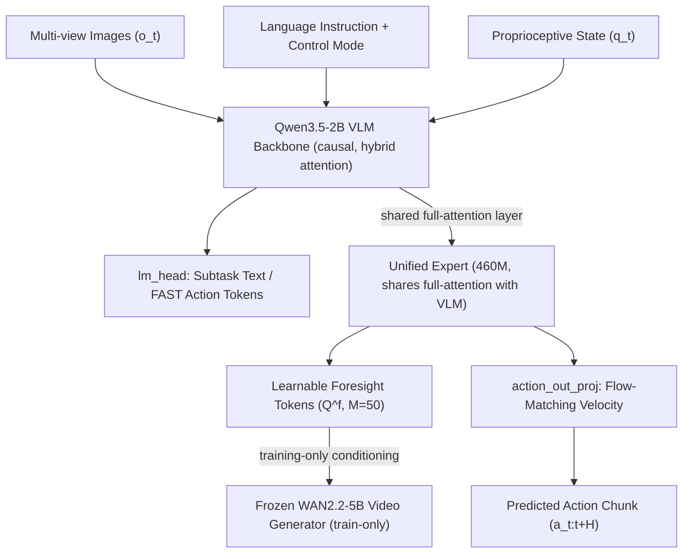

其中：
- **实心箭头**表示训练和推理阶段都存在的数据通路；
- **"training-only" 标注的边**表示只在训练阶段计算（推理时该分支被直接跳过，对应 `action_loss_only=True` 配置）。

### 3.2 自绘架构示意图

为了更直观地展示"训练时完整计算图"中各模块的形状、损失来源与推理时的取舍，绘制了下图（脚本：[`asset/draw_architecture_overview.py`](asset/draw_architecture_overview.py)）：

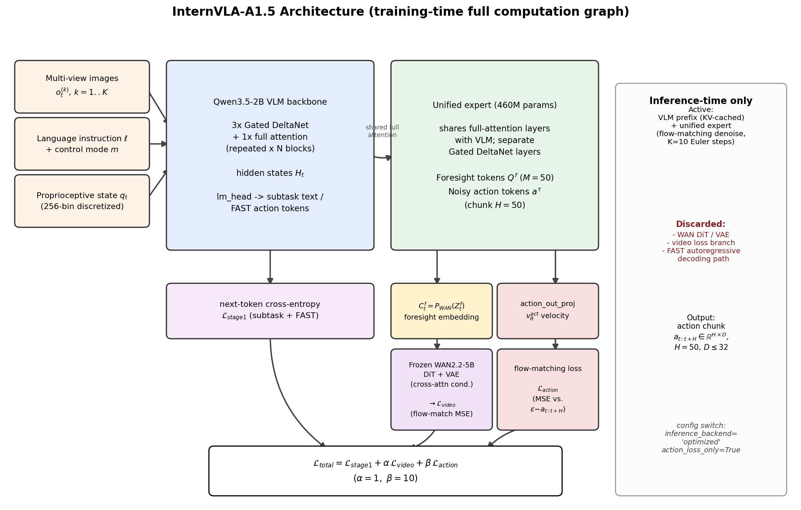

图中关键符号说明：
- \(o_t^{(k)}\)：第 \(t\) 时刻第 \(k\) 个相机视角的观测图像，\(k=1,\dots,K\)；
- \(\ell\)：语言指令；\(m\)：控制模式 token（`<joint>` / `<end_effector>` / `<vqa>`）；
- \(H_t\)：VLM 编码后的多模态隐藏状态；
- \(Q^f\)：可学习 foresight token，数量 \(M=50\)；
- \(a^\tau\)：flow-matching 中插值时间步 \(\tau\) 处的带噪动作块，动作块长度（chunk size）\(H=50\)；
- \(C_t^f = P_{\mathrm{WAN}}(Z_t^f)\)：foresight token 经过投影后得到的 WAN 条件向量；
- \(v_\theta^{\mathrm{act}}\)：unified expert 预测的动作速度场（flow-matching 里"从噪声流向真实动作"的速度）。

图右侧的灰色面板标注了推理阶段（`inference_backend='optimized'` + `action_loss_only=True`）会**丢弃**的部分：WAN DiT/VAE、视频损失分支、FAST 自回归解码路径；只保留 VLM 前缀（可 KV 缓存）与 unified expert 的 flow-matching 去噪循环。

### 3.3 三个主要子系统

| 子系统 | 关键文件 | 职责 |
|---|---|---|
| 策略与模型 (Policy & Model) | `src/lerobot/policies/internvla_a1_5/{modeling,configuration,transform,action_tokens,wan_model}.py` | 定义 VLM+专家的联合前向、损失计算、flow-matching 采样、WAN 条件生成 |
| 训练配置与数据管道 (Config & Data) | `src/lerobot/configs/{train,default,policies}.py`、`src/lerobot/datasets/factory.py`、`src/lerobot/dataset_schemas/`、`src/lerobot/transforms/core.py` | 多数据集混合、加权采样、schema 驱动的 state/action 重排与归一化 |
| 评测与部署 (Eval & Serving) | `evaluation/LIBERO/policy_server/`、`evaluation/LIBERO/model2libero_interface.py`、`launch/*.sh` | WebSocket 推理服务、benchmark 客户端适配、训练/微调启动脚本 |

后续第 4-7 节将依次深入这三个子系统。

---

## 4. 核心模块深入解析

### 4.1 Qwen3.5-2B VLM 主干 + Gated DeltaNet 的多模态融合

#### 4.1.1 为什么用 Qwen3.5 的混合注意力架构

Qwen3.5 [qwen3.5] 采用了一种**混合注意力**（hybrid attention）设计：每 4 层里有 3 层是 **Gated DeltaNet**（一种线性注意力，[Yang et al., 2025](https://arxiv.org/abs/2412.06464)）、1 层是标准的**全注意力**（full attention）。这种"3 线性 + 1 全注意力"的重复模式（`layer_types`）能在长序列（多图像 token + 长指令）场景下把计算复杂度从全注意力的 \(O(L^2)\) 降到接近线性，同时用少量全注意力层保留跨全序列的精确关联能力。

代码里，`InternVLAA15WithExpertModel` 在构造 unified expert 时，直接把 VLM 文本配置里的 `layer_types`、`linear_conv_kernel_dim`、`linear_key_head_dim` 等线性注意力相关的超参数原样复制过去：

```391:407:src/lerobot/policies/internvla_a1_5/modeling_internvla_a1_5.py
        action_expert_config_hf = CONFIG_MAPPING["qwen3_5_text"]()
        action_expert_config_hf.head_dim = action_expert_config.head_dim
        action_expert_config_hf.hidden_size = action_expert_config.hidden_size
        action_expert_config_hf.intermediate_size = action_expert_config.intermediate_size
        action_expert_config_hf.num_attention_heads = action_expert_config.num_attention_heads
        action_expert_config_hf.num_key_value_heads = action_expert_config.num_key_value_heads
        action_expert_config_hf.num_hidden_layers = vlm_text_config.num_hidden_layers
        action_expert_config_hf.max_position_embeddings = vlm_text_config.max_position_embeddings
        action_expert_config_hf.rope_parameters = vlm_text_config.rope_parameters
        action_expert_config_hf.rms_norm_eps = vlm_text_config.rms_norm_eps

        action_expert_config_hf.layer_types = vlm_text_config.layer_types
        action_expert_config_hf.linear_conv_kernel_dim = vlm_text_config.linear_conv_kernel_dim
        action_expert_config_hf.linear_key_head_dim = vlm_text_config.linear_key_head_dim
        action_expert_config_hf.linear_value_head_dim = vlm_text_config.linear_value_head_dim
        action_expert_config_hf.linear_num_key_heads = vlm_text_config.linear_num_key_heads
        action_expert_config_hf.linear_num_value_heads = vlm_text_config.linear_num_value_heads
```

这意味着 unified expert（论文里的"轻量统一专家"）与 VLM 主干拥有**完全相同的层类型序列**，只是隐藏维度更小（默认 `action_expert_hidden_size=1024`，而 VLM 文本部分通常更宽），这是后面能"逐层对齐、逐层联合计算"的前提——因为 Mixture-of-Transformers（MoT）架构要求两路模型在同一层号上，必须是相同的层类型（全注意力对全注意力、线性注意力对线性注意力），否则无法共享全注意力层的 K/V。

#### 4.1.2 两路模型如何"联合"计算一层

这是全篇代码里最精巧的部分，实现在 `compute_layer_complete` 函数中。它同时接收 `[prefix_hidden_states, suffix_hidden_states]`（VLM 前缀与 expert 后缀的隐藏状态列表），根据当前层的 `layer_type` 走两条完全不同的分支：

**情形一：线性注意力层（Gated DeltaNet）。** 因为线性注意力有内部递归状态（不能像全注意力那样简单地拼接 K/V 做统一计算），所以两路模型的线性注意力层是**完全独立计算**的——VLM 的 Gated DeltaNet 层只处理 VLM 自己的 token，expert 的 Gated DeltaNet 层只处理 expert 自己的 token：

```148:181:src/lerobot/policies/internvla_a1_5/modeling_internvla_a1_5.py
    if layer_type == "linear_attention":
        if linear_attn_mask is not None:
            prefix_linear_mask = linear_attn_mask[:, :prefix_len]
            suffix_linear_mask = linear_attn_mask[:, prefix_len:]
            linear_masks_per_model = [prefix_linear_mask, suffix_linear_mask]
        else:
            linear_masks_per_model = [None, None]

        outputs_embeds = []
        for i, hidden_states in enumerate(inputs_embeds):
            layer = models[i].layers[layer_idx]

            residual = hidden_states
            hidden_states = layer.input_layernorm(hidden_states)
            hidden_states = layer.linear_attn(
                hidden_states=hidden_states,
                cache_params=None,
                cache_position=None,
                # Linear attention expects a 2D padding mask here.
                attention_mask=linear_masks_per_model[i],
            )
            hidden_states = residual + hidden_states
```

这正好天然地实现了论文里说的"VLM 和 unified expert 只通过共享的全注意力层交互，各自维持独立的 Gated DeltaNet 层"（对应论文 [Section 2](InternVLA-A1.5-paper.md)："The VLM and the unified expert only interact through the shared full attention layer, while maintaining separate Gated DeltaNet layers for modality-specific processing."）——这不是一个额外加的规则，而是线性注意力本身的递归性质决定的。

**情形二：全注意力层。** 两路模型各自算出自己的 Q/K/V/gate，然后：
1. 用**联合的位置编码**（把 prefix 和 suffix 的 Q/K 拼在一起统一 apply RoPE）保证相对位置关系正确；
2. **prefix 的 query 只能看 prefix 的 K/V**（保持 VLM 原生的因果解码语义不被破坏）；
3. **suffix（expert）的 query 可以同时看 [prefix 的 K/V, suffix 自己的 K/V]**，这就是 VLM→expert 的信息流入口；
4. 如果开启了 `knowledge_insulation`（知识隔离），第 3 步中 prefix 的 K/V 会被 `.detach()`，也就是 expert 仍然能"看到"VLM 的信息做前向计算，但反向传播时梯度不会从 expert 流回 VLM，从而保护 VLM 预训练知识不被动作/视频损失污染：

```268:298:src/lerobot/policies/internvla_a1_5/modeling_internvla_a1_5.py
        # --- suffix queries: attend to [prefix (maybe-detached) K/V, suffix K/V].
        if knowledge_insulation:
            prefix_key_for_suffix = prefix_key.detach()
            prefix_value_for_suffix = prefix_value.detach()
        else:
            prefix_key_for_suffix = prefix_key
            prefix_value_for_suffix = prefix_value

        k_for_suffix = torch.cat([prefix_key_for_suffix, suffix_key], dim=2)
        v_for_suffix = torch.cat([prefix_value_for_suffix, suffix_value], dim=2)
        suffix_attn_mask = attention_mask[:, :, prefix_len:, :]
```

这与 \(\pi_{0.5}\) 论文中提出的 **knowledge insulation** 概念一脉相承（[intelligence2025pi05]），只是在 InternVLA-A1.5 里默认关闭（`knowledge_insulation=False`），因为论文的实验设定本身已经通过"VLM 持续接受 VQA/subtask/FAST 监督"来维持语义能力，knowledge insulation 更像是一个可选的额外保护阀。

#### 4.1.3 图像与语言输入的编码

`embed_prefix` 方法负责把多视角图像和语言 token 编码成统一的 embedding 序列：

```676:702:src/lerobot/policies/internvla_a1_5/modeling_internvla_a1_5.py
    @dynamo.disable
    def embed_prefix(
        self, pixel_values, image_grid_thw, lang_tokens, lang_masks, labels=None
    ) -> tuple[torch.Tensor, torch.Tensor, torch.Tensor]:
        image_token_id = self.qwen3_5_with_expert.qwen3_5.config.image_token_id
        D1 = pixel_values.shape[-1]
        pixel_values = pixel_values.view(-1, D1)
        image_grid_thw = image_grid_thw.view(-1, 3)
        image_embs = self.qwen3_5_with_expert.qwen3_5.visual(pixel_values, image_grid_thw).pooler_output

        embs = self.qwen3_5_with_expert.qwen3_5.get_input_embeddings()(lang_tokens)
        B, L, D2 = embs.shape
        embs = embs.view(-1, D2)
        lang_tokens = lang_tokens.view(-1)
        embs[lang_tokens == image_token_id] = image_embs
        embs = embs.view(B, L, D2)
```

这里的做法是 Qwen-VL 系列的标准套路：先用 Qwen3.5 自带的视觉塔（ViT，处理动态分辨率 `image_grid_thw`）把图像编码成一组视觉 token 的 embedding，再把语言 token 序列中 `<|image_pad|>` 占位符对应位置的 embedding**原地替换**成视觉 embedding，从而让图像和文本共享同一条 embedding 序列，后续可以统一走 causal attention。

机器人状态 \(q_t\) 的处理有两种模式，由 `tokenize_state` 开关控制：
- `tokenize_state=True`（默认）：状态被离散化成文本 token 塞进 prompt 里（详见 4.1.4），随图像/文本一起走 VLM causal attention；
- `tokenize_state=False`：状态作为一个连续向量，通过 `self.state_proj` 线性投影后，直接作为 unified expert 序列（suffix）的第一个 token，绕过 VLM 词表。

#### 4.1.4 State 的离散化编码

状态离散化逻辑在 `InternVLAA15ChatProcessorTransformFn._encode_state`：

```95:102:src/lerobot/policies/internvla_a1_5/transform_internvla_a1_5.py
    def _encode_state(self, data: DataDict) -> str:
        if not self.tokenize_state or OBS_STATE not in data:
            return ""
        state = deepcopy(data[OBS_STATE])
        state = pad_vector(state, self.max_state_dim)
        state_np = state.cpu().numpy() / 3
        discretized = np.digitize(state_np, bins=np.linspace(-1, 1, 257)[:-1]) - 1
        return "State: " + " ".join(map(str, discretized))
```

对应论文中"the robot proprioceptive state \(q_t\) is discretized via uniform binning ... 256 bins over \([-1,1]\)"的描述。这里除以 3 是因为归一化后的状态理论范围可能超出 \([-1,1]\)（例如高斯归一化的尾部），除以 3 相当于把绝大部分分布压缩进 bin 范围内，再用 `np.digitize` 分到 256 个桶（bin）里，最终把状态变成一串形如 `"State: 128 130 45 ..."` 的**纯文本**，作为 prompt 的一部分交给 Qwen3.5 tokenizer 编码。这样状态就完全"寄生"在了 VLM 原生的文本词表里，不需要额外设计新的 embedding 层。

### 4.2 可学习 foresight tokens 与 WAN2.2 视频生成模型的隐空间监督机制

#### 4.2.1 数学表述

按论文 [Section 3.2](InternVLA-A1.5-paper.md) 的记号，设：
- \(Q^f \in \mathbb{R}^{M \times d}\)：可学习 foresight token，\(M\) 为 token 数（默认 50），\(d\) 为 unified expert 的隐藏维度；
- \(H_t\)：由 \((o_t, \ell, \hat\ell)\)（多视角观测、语言指令、预测的子任务描述）编码得到的视觉-语言隐藏状态；
- \(\Phi_\theta\)：unified expert 的 transformer；
- \(\mathcal{F}\)：foresight token 在联合序列中的位置索引。

则上下文化后的 foresight embedding 为：

\[
Z_t^f = \Phi_\theta\big([H_t;\,Q^f]\big)_{\mathcal{F}} \tag{3}
\]

再投影到 WAN 的条件空间：\(C_t^f = P_{\mathrm{WAN}}(Z_t^f)\)。

设 \(V_t \in \mathbb{R}^{(1+N)\times H_I\times W_I\times 3}\) 为"当前帧 + 未来 \(N\) 帧"拼接而成的视频片段（论文取 \(N=4\)），WAN-VAE 编码器把它压缩成干净的视频隐变量 \(x_1\)。训练时采样噪声隐变量 \(x_0\sim\mathcal{N}(0,I)\) 和插值时间步 \(s\in[0,1]\)，构造插值隐变量 \(x_s=(1-s)x_0+sx_1\)，目标速度 \(v_s=x_1-x_0\)，视频监督损失为：

\[
\mathcal{L}_{\mathrm{video}}=\mathbb{E}_{x_0,x_1,C_t^f,s}\left\|u(x_s,C_t^f,s)-v_s\right\|^2 \tag{4}
\]

其中 \(u\) 是**冻结**的 WAN 去噪 transformer（DiT）。因为 WAN 参数不更新，\(\mathcal{L}_{\mathrm{video}}\) 的梯度只能沿着"条件通路"往回传：更新的对象是 foresight tokens \(Q^f\) 以及生成 \(C_t^f\) 的上游 unified expert 层，WAN 本身像一个"只读的裁判"。

#### 4.2.2 代码实现：`embed_suffix` 中的三段式序列

unified expert 的输入序列（suffix）由三段拼接而成：`[state(可选,1个token)] [learnable foresight tokens(M个)] [action+time tokens(chunk_size个)]`：

```917:975:src/lerobot/policies/internvla_a1_5/modeling_internvla_a1_5.py
    def embed_suffix(self, state, noisy_actions, timestep):
        """Build suffix: [state(1)] [learnable(N)] [action_time(chunk_size)]."""
        embs = []
        pad_masks = []
        att_masks = []

        # State token
        if not self.config.tokenize_state:
            ...
            att_masks += [1]
        ...
        # Learnable tokens
        num_lt = self.config.num_learnable_tokens
        lt_emb = self._apply_checkpoint(
            lambda t: self.learnable_tokens_in_proj(t), self.learnable_tokens
        )
        lt_emb = lt_emb[None].expand(bsize, -1, -1)
        embs.append(lt_emb)
        pad_masks.append(torch.ones(bsize, num_lt, dtype=torch.bool, device=device))
        att_masks += [1] + [0] * (num_lt - 1)

        # Action + time tokens
        ...
        embs.append(action_time_emb)
        action_time_dim = action_time_emb.shape[1]
        pad_masks.append(torch.ones(bsize, action_time_dim, dtype=torch.bool, device=timestep.device))
        att_masks += [1] + [0] * (self.config.chunk_size - 1)
```

`att_masks` 这个数组的含义（对应 `make_att_2d_masks` 函数的输入约定）是：每一段的**第一个 token** 标记为 `1`（表示"这里开启一个新的因果块"），段内其余 token 标记为 `0`。`make_att_2d_masks` 用 `cumsum` 把这个 1D 序列变成一个 2D mask：

```100:110:src/lerobot/policies/internvla_a1_5/modeling_internvla_a1_5.py
def make_att_2d_masks(pad_masks, att_masks):
    """Copied from big_vision."""
    if att_masks.ndim != 2:
        raise ValueError(att_masks.ndim)
    if pad_masks.ndim != 2:
        raise ValueError(pad_masks.ndim)

    cumsum = torch.cumsum(att_masks, dim=1)
    att_2d_masks = cumsum[:, None, :] <= cumsum[:, :, None]
    pad_2d_masks = pad_masks[:, None, :] * pad_masks[:, :, None]
    return att_2d_masks & pad_2d_masks
```

效果是：**跨段是因果的**（后面的段可以看见前面的段，反过来不行），**段内是双向的**（同一段内的 token 互相可见）。具体到这里：
- foresight tokens 这一段内部**双向**互相可见（第一个 token 是 `1`，其余是 `0`，累积和相同 ⇒ 互相可见），但只能看到 state（更早的段），看不到后面的 action+time 段；
- action+time 这一段内部同样双向互相可见，且可以看到 state 段和 foresight tokens 段。

这正好对应论文 [Section 3.3](InternVLA-A1.5-paper.md)"Attention Masking Pattern"里描述的"组间因果、组内双向"（"the foresight tokens attend to the VLM context, while the noisy action embeddings attend to both the VLM context and the foresight tokens... within each action-expert group, we use bidirectional attention"）。这种设计非常契合 flow matching 的非自回归本质——整段带噪动作是**并行**去噪的，不需要（也不应该）像语言模型那样逐 token 自回归。

#### 4.2.3 取出 foresight 输出、投影进 WAN、驱动 DiT

`get_learnable_token_output` 从 unified expert 的输出序列里把 foresight token 对应的那一段切出来：

```977:980:src/lerobot/policies/internvla_a1_5/modeling_internvla_a1_5.py
    def get_learnable_token_output(self, suffix_out):
        start = 1  # skip state token
        end = 1 + self.config.num_learnable_tokens
        return suffix_out[:, start:end]
```

`_compute_video_loss` 则完整实现了公式 (4) 的训练流程：用冻结 VAE 编码干净视频隐变量和"仅第一帧"的条件隐变量，采样 flow-matching 时间步，构造带噪隐变量（**但保持第 0 帧/条件帧始终干净**——这是一种 *teacher forcing* 技巧，让模型只需要对"未来"部分去噪，不需要重新生成已知的当前帧），再调用 `wan_dit_forward` 得到预测速度，最后与真值速度算 MSE：

```1309:1361:src/lerobot/policies/internvla_a1_5/modeling_internvla_a1_5.py
    def _compute_video_loss(
        self,
        video_frames: torch.Tensor,
        learnable_out: torch.Tensor,
    ) -> torch.Tensor:
        ...
        wan_context = self.learnable_to_wan_proj(learnable_out)
        ...
        with torch.no_grad():
            clean_latent = self.wan_video_model.encode_video(video_bcthw)
            cond_latent = self.wan_video_model.encode_video(first_frame_bcthw)
        ...
        # Add noise (teacher forcing: keep frame 0 clean)
        video_noise = torch.randn_like(clean_latent)
        noisy_latent = clean_latent * (1 - sigma) + video_noise * sigma
        noisy_latent[:, :, 0:1] = cond_latent

        # Target velocity
        video_target = video_noise - clean_latent
        video_target[:, :, 0:1] = 0

        # WAN forward
        with torch.amp.autocast("cuda", dtype=wan_dtype):
            video_pred = self.wan_dit_forward(noisy_latent, wan_context, video_t)

        video_pred[:, :, 0:1] = 0
        return F.mse_loss(video_pred.float(), video_target.float(), reduction="mean")
```

`wan_dit_forward` 则是对 WAN DiT 前向的一次"手术式"改写——跳过 WAN 原本的文本编码器（T5），直接把 `wan_context`（也就是 \(C_t^f\)）作为 DiT 每个 block 交叉注意力的 `context` 输入：

```1286:1303:src/lerobot/policies/internvla_a1_5/modeling_internvla_a1_5.py
        # Use projected learnable tokens as context (skip text_embedding)
        context = wan_context

        kwargs = dict(
            e=e0,
            seq_lens=seq_lens,
            grid_sizes=grid_sizes,
            freqs=wan.freqs,
            context=context,
            context_lens=None,
        )

        for block in wan.blocks:
            x = block(x, **kwargs)
```

这一步是整套隐空间监督机制的"手术刀"所在：WAN2.2 原本被训练成"看文本描述、生成对应视频"，这里把文本条件替换成了 foresight token 的投影，本质上是把 WAN 变成了一个"条件解释器"——只要 \(C_t^f\) 在 WAN 熟悉的条件语义空间里，WAN 就能像理解文本一样理解它，进而生成对应的未来画面；反过来，这也约束了 foresight tokens 必须学会说 WAN 能听懂的"语言"。

值得指出的是（可与社区实现互相印证）：这种"用外部小模块的隐向量替换扩散模型原生文本条件、通过冻结扩散模型反传梯度来训练该小模块"的思路，在图像生成社区里与 ControlNet [Zhang et al., 2023](https://arxiv.org/abs/2302.05543)、IP-Adapter [Ye et al., 2023](https://arxiv.org/abs/2308.06721) 等"冻结底座 + 轻量适配器"范式有相通之处，只是这里的下游任务不是可控生成本身，而是把生成模型当作一种**可微分的物理常识评价器**，用它的梯度来雕刻动作策略的隐表示。

#### 4.2.4 视频帧的提取与归一化

训练数据里的多帧视频由 `ExtractVideoFramesTransformFn` 从连续观测序列中切出：

```626:653:src/lerobot/policies/internvla_a1_5/transform_internvla_a1_5.py
@DataTransformFn.register_subclass("extract_video_frames")
@dataclass
class ExtractVideoFramesTransformFn(DataTransformFn):
    """Extract multi-frame video data for WAN and reduce camera keys to single frame for VLM.
    ...
    """

    source_view: str = f"{OBS_IMAGES}.image0"
    video_key: str = "observation.video_frames"
    normalize_to_minus1_1: bool = True

    def __call__(self, data: DataDict) -> DataDict:
        src = data[self.source_view]
        if src.ndim == 4:  # [T, C, H, W]
            video = src
            if self.normalize_to_minus1_1:
                video = video * 2.0 - 1.0
            data[self.video_key] = video

            for i in range(3):
                k = f"{OBS_IMAGES}.image{i}"
                if k in data and data[k].ndim == 4:
                    data[k] = data[k][0]
        return data
```

这里巧妙利用了 LeRobot 数据集的 `delta_timestamps` / `image_delta_indices` 机制：`InternVLAA15Config.image_delta_indices` 定义了在动作块时间窗口内均匀采样 \(N+1\) 帧（\(N\)=`num_video_frames`，默认 4）：

```423:426:src/lerobot/policies/internvla_a1_5/configuration_internvla_a1_5.py
    @property
    def image_delta_indices(self) -> list | None:
        n = self.num_video_frames + 1
        return [self.chunk_size * i // (n - 1) for i in range(n)]
```

即在长度为 `chunk_size=50` 的动作块跨度内，均匀取第 `[0, 16, 33, 50]`（近似）帧构成 5 帧的 `[T,C,H,W]` 张量。`ExtractVideoFramesTransformFn` 把这 5 帧存为 `observation.video_frames`（归一化到 \([-1,1]\) 以匹配 WAN 的像素值域约定），同时把送进 VLM 视觉塔的图像**退化为只用第 0 帧**（因为 VLM 只需要"当前观测"，多帧信息留给 foresight/video 分支处理）。

### 4.3 Flow-Matching 动作专家

#### 4.3.1 数学表述

设真实动作块为 \(\mathbf{a}_{t:t+H}\)（\(H\) 为 chunk size，默认 50）。训练时采样高斯噪声 \(\epsilon\sim\mathcal{N}(0,I)\) 和插值时间步 \(\tau\sim\mathrm{Beta}(1.5,1.0)\)，构造插值动作：

\[
\mathbf{a}_{t:t+H}^\tau = (1-\tau)\epsilon + \tau\,\mathbf{a}_{t:t+H} \tag{5}
\]

目标速度为 \(\mathbf{a}_{t:t+H}-\epsilon\)。动作预测损失：

\[
\mathcal{L}_{\mathrm{action}} = \mathbb{E}_{\mathbf{a}_{t:t+H},\epsilon,\tau}\left\| v_\theta^{\mathrm{act}}(\mathbf{a}_{t:t+H}^\tau, H_t, Q^f) - (\mathbf{a}_{t:t+H}-\epsilon)\right\|^2 \tag{6}
\]

推理时从纯噪声 \(\mathbf{a}_{t:t+H}^0\sim\mathcal{N}(0,I)\) 出发，用 Euler 法沿学到的速度场积分 \(K\) 步（默认 `num_inference_steps=10`）：

\[
\mathbf{a}_{t:t+H}^{\tau+\Delta\tau} = \mathbf{a}_{t:t+H}^\tau + \Delta\tau\cdot v_\theta^{\mathrm{act}}(\mathbf{a}_{t:t+H}^\tau, H_t, Q^f),\qquad \Delta\tau=1/K \tag{7}
\]

注意这里代码实现中时间轴的方向与论文公式在符号上略有差异：代码里 `time` 从 1 递减到 0（`dt = -1.0/num_steps`），是因为代码约定 \(x_t = t\cdot\text{noise} + (1-t)\cdot\text{actions}\)（\(t=1\) 是纯噪声，\(t=0\) 是真实动作），与公式 (5) 中 \(\tau=1\) 对应真实动作正好相反；两者本质上是同一个 flow-matching 过程的不同参数化方式，最终都是把噪声"拉"向真实动作分布。

#### 4.3.2 训练时如何计算 \(\mathcal{L}_{\mathrm{action}}\)

```1119:1126:src/lerobot/policies/internvla_a1_5/modeling_internvla_a1_5.py
        if noise is None:
            noise = self.sample_noise(actions.shape, actions.device)
        if time is None:
            time = self.sample_time(actions.shape[0], actions.device)

        time_expanded = time[:, None, None]
        x_t = time_expanded * noise + (1 - time_expanded) * actions
        u_t = noise - actions
```

`sample_time` 内部用 `Beta(1.5, 1.0)` 分布采样并做了一次线性变换（`* scale + offset`），这与 π0 系列常见的时间步采样策略一致，作用是让训练时更多地采样到"接近真实动作"（\(\tau\) 接近 1，等价于代码里 `time` 接近 0）附近的时间步，因为那部分区域的去噪细节对最终动作精度更敏感。

`action_out_proj` 是把 unified expert 输出的最后 `chunk_size` 个 token 的隐藏状态，投影回动作维度，得到预测速度 \(v_t\)：

```1223:1230:src/lerobot/policies/internvla_a1_5/modeling_internvla_a1_5.py
        # Action loss
        if self.config.video_loss_only:
            loss_action = torch.zeros_like(u_t)
        else:
            action_out = suffix_out[:, -self.config.chunk_size:]
            action_out = action_out.to(dtype=torch.float32)
            v_t = self._apply_checkpoint(lambda x: self.action_out_proj(x), action_out)
            loss_action = F.mse_loss(u_t, v_t, reduction="none")
```

#### 4.3.3 推理时的去噪循环与 KV 缓存复用

推理阶段的关键优化点在于：**VLM 前缀（图像+语言+状态）只需要计算一次**，后续 \(K\) 步 Euler 积分中，每一步只需要重新计算 unified expert 对"当前带噪动作"的前向，并复用之前算好的 VLM 前缀 KV 缓存：

```787:833:src/lerobot/policies/internvla_a1_5/modeling_internvla_a1_5.py
        prefix_embs, prefix_pad_masks, prefix_att_masks = self.embed_prefix(
            pixel_values, image_grid_thw, lang_tokens, lang_masks
        )
        ...
        _, past_key_values = self.qwen3_5_with_expert.forward(
            attention_mask=prefix_att_2d_masks_4d,
            position_ids=prefix_position_ids,
            past_key_values=None,
            inputs_embeds=[prefix_embs, None],
            use_cache=True,
            knowledge_insulation=self.config.knowledge_insulation,
        )

        dt = -1.0 / num_steps
        ...
        while time >= -dt / 2:
            expanded_time = time.expand(bsize)
            v_t = self.denoise_step(
                state, prefix_pad_masks, past_key_values,
                max_prefix_position_ids, x_t.to(dtype), expanded_time.to(dtype),
                fast_mask=fast_mask,
            )
            x_t = x_t + dt * v_t
            time += dt
```

这正是论文所说的"The unified expert reuses the KV cache of the VLM context during the denoising process, so repeated flow-sampling steps only need to update the denoising-dependent action computations"（[Section 3.3](InternVLA-A1.5-paper.md)）。这个设计使得 10 步去噪的总计算量远小于"每步都重新跑一遍完整的 VLM+expert 前向"，是实现论文中"单步推理约 0.1s"（[Section 5.1](InternVLA-A1.5-paper.md)）的关键工程手段之一。

### 4.4 FAST 离散动作 token 与 VQA 辅助损失

#### 4.4.1 FAST token 如何"寄生"进 Qwen3.5 词表

FAST（Frequency-space Action Sequence Tokenization，[Pertsch et al., 2025](https://arxiv.org/abs/2501.09747)）是一种把连续动作块通过频域变换+量化压缩成短离散 token 序列的方法。InternVLA-A1.5 把 FAST 词表（大小 2048）整体平移映射进 Qwen3.5 词表的一段专属区间 `[action_token_min, action_token_max] = [248077, 250124]`（`NUM_ACTION_TOKENS = 2048`）：

```403:421:src/lerobot/policies/internvla_a1_5/transform_internvla_a1_5.py
    def _act_tokens_to_qwen35_tokens(self, tokens: torch.Tensor | np.ndarray | list) -> torch.Tensor:
        """
        Convert FAST action tokens to Qwen3.5 special action token range.

        Formula: action_token_min + fast_token
        This maps FAST tokens [0, 2047] to Qwen3.5 special range [action_token_min, action_token_max]
        ...
        """
        ...
        return self.action_token_min + tokens
```

`ensure_qwen35_action_tokens`（`action_tokens.py`）负责把这 2048 个新 token（形如 `<robot_action_0>` ... `<robot_action_2047>`）注册为 tokenizer 的 special tokens，并相应地扩容模型的输入 embedding 和 `lm_head` 权重矩阵（新增的行用已有行的均值初始化，避免随机初始化带来的训练早期不稳定）：

```26:52:src/lerobot/policies/internvla_a1_5/action_tokens.py
def _init_new_rows(weight: torch.Tensor, start: int) -> None:
    if start >= weight.shape[0]:
        return
    with torch.no_grad():
        ref = weight[:start].mean(dim=0, keepdim=True)
        weight[start:].copy_(ref.expand_as(weight[start:]))
```

这样，动作 token 与语言 token **共享同一套 embedding 表和 `lm_head`**，训练时可以用统一的 next-token 交叉熵损失同时监督语言输出和动作输出，对应论文公式 (1)(2) 的联合分布分解：

\[
\pi_\theta(\mathbf{a}_{t:t+H}, \hat\ell \mid \mathbf{o}_t, \ell) = \pi_\theta(\mathbf{a}_{t:t+H}\mid \mathbf{o}_t,\hat\ell)\,\pi_\theta(\hat\ell\mid \mathbf{o}_t,\ell) \tag{1}
\]

\[
\mathcal{L}_{\mathrm{stage1}} = -\mathbb{E}_{(\mathbf{o}_t,\ell,y)\sim\mathcal{D}}\left[\sum_{i=1}^{M+N}\log p_\theta(y_i\mid \mathbf{o}_t,\ell,y_{<i})\right] \tag{2}
\]

其中 \(\hat\ell\) 是子任务描述（subtask），\(\mathbf{a}=(a_1,\dots,a_N)\) 是 FAST token 序列，两者拼在同一条 label 序列 \(y\) 里，前者天然作为后者的自回归条件（因为 \(\hat\ell\) 排在 FAST token 之前）。

#### 4.4.2 四种 label 模式

`InternVLAA15ChatProcessorTransformFn` 用 `LABEL_MODE_{NONE,TEXT,FAST,BOTH}` 四种模式控制训练时具体监督哪部分内容：

```125:155:src/lerobot/policies/internvla_a1_5/transform_internvla_a1_5.py
        has_fast = (
            self.use_fast_action_tokens
            and self.action_text_key in data
            and str(data.get(self.action_text_key, "")).strip() != ""
        )
        has_sub_task = "sub_task" in data and str(data.get("sub_task", "")).strip() != ""

        if has_fast and has_sub_task:
            label_mode = LABEL_MODE_BOTH
        elif has_fast:
            label_mode = LABEL_MODE_FAST
        elif has_sub_task:
            label_mode = LABEL_MODE_TEXT
        else:
            label_mode = LABEL_MODE_NONE
        ...
        if label_mode == LABEL_MODE_BOTH:
            assistant_text = f"{data['sub_task']}; {data[self.action_text_key]}"
            user_text = user_text + f"; Output: <SubTask, Action>"
        elif label_mode == LABEL_MODE_FAST:
            assistant_text = f"{data[self.action_text_key]}"
            user_text = user_text + f"; Output: <Action>"
        elif label_mode == LABEL_MODE_TEXT:
            assistant_text = f"{data['sub_task']}"
            user_text = user_text + f"; Output: <SubTask>"
```

这四种模式对应论文 [Figure 3](InternVLA-A1.5-paper.md) 中"label-mode flag selecting which of the two (or both) is supervised per sample"的描述：数据集里不是每条样本都同时有 subtask 文本标注和可用的 FAST 动作标注，代码用这个 flag 灵活适配不同标注完整度的数据源。

#### 4.4.3 三路损失的最终汇总

在策略层 `forward` 方法里，最终把 VLM 分支的 CE 损失细分为三块（`loss_vqa`/`loss_fast`/`loss_subtask`，仅用于监控指标拆分），并与 action 分支、video 分支按固定权重相加：

```1648:1654:src/lerobot/policies/internvla_a1_5/modeling_internvla_a1_5.py
            loss = (
                10 * loss_fm_action
                # loss_fm_action
                + self.config.lambda_vqa * loss_vlm
                + self.config.video_loss_weight * video_loss
            )
```

这里 flow-matching 动作损失被**放大 10 倍**（对应论文公式 (8) 中 \(\beta=10\)），而 VLM 语言损失系数 \(\lambda_{\mathrm{vqa}}=1\)，视频损失系数默认 \(\alpha=1\)（`video_loss_weight`）。这与论文 [Section 3.2](InternVLA-A1.5-paper.md) 给出的 \(\mathcal{L}_{\mathrm{stage2}}=\mathcal{L}_{\mathrm{stage1}}+\alpha\mathcal{L}_{\mathrm{video}}+\beta\mathcal{L}_{\mathrm{action}}\)（\(\alpha=1,\beta=10\)）完全一致。之所以给动作损失更大的权重，直觉上是因为 MSE 量级本身通常远小于交叉熵损失的量级，需要放大才能让两者在梯度尺度上保持可比，避免动作分支训练不充分。

`vqa_type` 这个字段（`0`=纯机器人样本、`1`=纯 VQA 样本、`2`=既有 subtask/FAST 标注又是机器人样本）用来决定每条样本参与哪些损失的平均计算：

```1641:1647:src/lerobot/policies/internvla_a1_5/modeling_internvla_a1_5.py
            vqa_type = batch["vqa_type"]
            action_mask = (vqa_type == 0) | (vqa_type == 2)  # robot samples
            vlm_mask = (vqa_type == 1) | (vqa_type == 2)     # samples with VQA labels

            loss_fm_action = losses[action_mask].mean() if action_mask.any() else zero
            loss_vlm = losses_vlm[vlm_mask].mean() if vlm_mask.any() else zero
```

即 VQA-only 样本不参与动作损失平均，反之纯机器人（无 VQA 标注）样本不参与 VQA 损失平均，避免无效梯度稀释有效信号。

---

## 5. 训练与推理的数据流

### 5.1 训练 vs 推理：整体对比

下图（脚本：[`asset/draw_train_infer_comparison.py`](asset/draw_train_infer_comparison.py)）对比了训练时和推理时两条完全不同的计算路径：

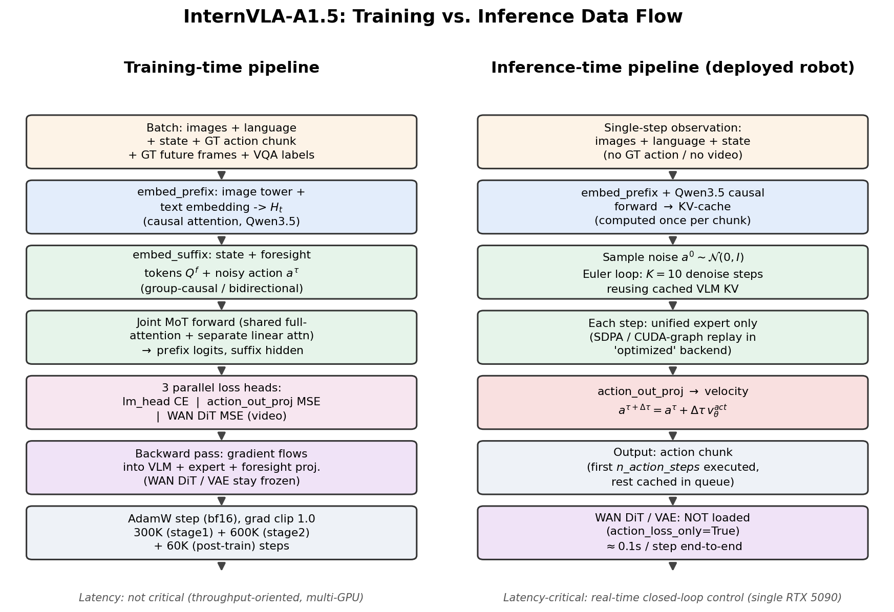

核心差异总结如下：

| 维度 | 训练 (Training) | 推理 (Inference) |
|---|---|---|
| 输入 | 图像+语言+state + **GT 动作块** + **GT 未来帧** + VQA 标签 | 仅图像+语言+state（单步观测，无监督信号） |
| VLM 前向 | 每个 batch 重新算一次完整 causal forward | 前缀只算一次，KV 缓存复用于所有去噪步 |
| Unified expert | 前向一次，同时输出 foresight embedding 和 action velocity | 循环 \(K=10\) 次 Euler 去噪，每步都要重新算 expert 前向 |
| WAN 分支 | 若 `action_loss_only=False`，正向传播+反向传播（更新 foresight 相关参数） | **完全不加载**（`action_loss_only=True`），无任何计算 |
| FAST 自回归解码 | 走 teacher-forcing 的并行交叉熵（不是真正自回归生成） | 默认不解码（`inference_action_type='fm'` 走 flow matching，不需要 FAST） |
| 输出 | 5 个标量损失（`loss_action`/`loss_vqa`/`loss_fast`/`loss_subtask`/`loss_video`） | 一个动作块张量 \(a_{t:t+H}\in\mathbb{R}^{H\times D}\) |
| 延迟敏感性 | 不敏感（吞吐优先，多卡并行） | 高度敏感（单步约 0.1s，支撑实时闭环控制，见论文 [Section 5.1](InternVLA-A1.5-paper.md)） |

### 5.2 训练时前向数据流（模块级）

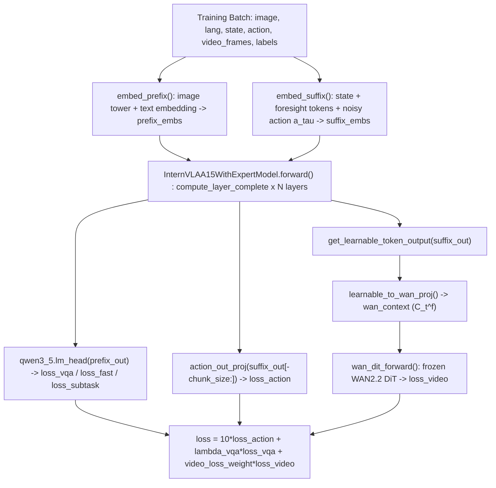

### 5.3 反向传播：参数冻结策略一览

InternVLA-A1.5 的配置系统通过若干布尔开关精细控制"哪些子模块参与梯度更新"。这些开关在 `InternVLAA15.set_requires_grad()` 和 `_setup_wan_grad()` 中生效（[`modeling_internvla_a1_5.py:606-616`](../../../src/lerobot/policies/internvla_a1_5/modeling_internvla_a1_5.py) 与 [`modeling_internvla_a1_5.py:882-896`](../../../src/lerobot/policies/internvla_a1_5/modeling_internvla_a1_5.py)）：

| 配置开关 | 默认值 | 语义 | 效果 |
|---|---|---|---|
| `freeze_vision_encoder` | `False` | 是否冻结 Qwen3.5 的视觉塔（ViT） | 为 `True` 时 `qwen3_5.visual.*` 的 `requires_grad=False`，并强制 `.eval()`（关闭 dropout 等） |
| `train_expert_only` | `False` | 是否只训练 unified expert，VLM 整体冻结 | 为 `True` 时整个 `qwen3_5`（含视觉塔、文本层、`lm_head`）冻结；只有 `action_expert`、`action_in/out_proj`、`learnable_tokens` 等 expert 侧参数继续更新 |
| `knowledge_insulation` | `False` | expert 对 VLM K/V 的注意力是否 detach 梯度 | 为 `True` 时 expert 前向仍能读取 VLM 信息，但梯度不会从 expert 反传回 VLM（保护语义知识） |
| `action_loss_only` | `False` | 是否彻底不加载 WAN 分支 | 为 `True` 时 `wan_video_model` 根本不会被构造（见 [`modeling_internvla_a1_5.py:576-594`](../../../src/lerobot/policies/internvla_a1_5/modeling_internvla_a1_5.py)），`learnable_tokens`/`learnable_tokens_in_proj` 也被强制冻结（因为没有视频损失来驱动它们的更新） |
| `video_loss_only` | `False` | 是否只训练视频分支 | 为 `True` 时 `loss_action` 恒为全零张量，动作分支不产生有效梯度 |
| `freeze_learnable_tokens` | `False` | 是否单独冻结 foresight tokens 本身 | 为 `True` 时 `learnable_tokens`、`learnable_tokens_in_proj`、`learnable_to_wan_proj` 都被冻结，即使 `action_loss_only=False` 也一样。这正是微调脚本 `internvla_a15_finetune.sh` 里设置为 `true` 的原因——**继续用视频损失去"激活"expert 的表征能力，但不再改变已经预训练好的 foresight query 本身**，属于一种折中策略 |
| `freeze_wan_dit` | `True` | 是否冻结 WAN DiT 主干本身 | WAN 骨干在**所有训练阶段**默认都保持冻结，这是论文方法论的核心设定，不建议关闭；VAE 无条件冻结（不受此开关控制，因为 VAE 只是编解码工具） |

一个直观的推论链：**预训练阶段**（`internvla_a15_pretrain.sh`）设置 `freeze_learnable_tokens=false`，让 foresight tokens 在大规模数据上充分学习"如何跟 WAN 对话"；**微调阶段**（`internvla_a15_finetune.sh`）设置 `freeze_learnable_tokens=true`，认为 foresight tokens 已经学到了足够通用的"未来查询"能力，微调时只需要让下游任务特定的 unified expert 层继续适配，同时借助（冻结 token 产生的）视频损失继续对 expert 的表征做正则化，防止在小数据集上过拟合。

### 5.4 推理时的两种后端：`standard` vs `optimized`

`InternVLAA15Policy.__init__` 根据 `config.inference_backend` 决定实例化哪一个模型类：

```1380:1387:src/lerobot/policies/internvla_a1_5/modeling_internvla_a1_5.py
        if config.inference_backend == "optimized":
            from lerobot.policies.internvla_a1_5.modeling_internvla_a1_5_optimized import (
                InternVLAA15Optimized,
            )

            self.model = InternVLAA15Optimized(config)
        else:
            self.model = InternVLAA15(config)
```

`InternVLAA15Optimized` 继承自 `InternVLAA15`，做了三件加速的事：

1. **强制约束**：构造时如果 `action_loss_only=False` 直接抛异常——因为这个后端存在的唯一意义就是"跳过 WAN，专注加速动作推理"，所以必须先关闭视频分支。
2. **用 SDPA 手写 attention，绕开 `compute_layer_complete` 里针对训练场景设计的通用逻辑**：`_full_attn_layer_sdpa` 直接调用 `F.scaled_dot_product_attention`，并把 VLM 前缀的 K/V 缓存（`prefix_kv_list`，从标准 `past_key_values` 里只挑出全注意力层对应的 K/V）作为固定输入拼到 expert 自己的 K/V 前面：

```193:208:src/lerobot/policies/internvla_a1_5/modeling_internvla_a1_5_optimized.py
        key_states = torch.cat([prefix_key.to(key_states.dtype), key_states], dim=2)
        value_states = torch.cat([prefix_value.to(value_states.dtype), value_states], dim=2)
        key_states = repeat_kv(key_states, attn.num_key_value_groups)
        value_states = repeat_kv(value_states, attn.num_key_value_groups)

        attn_output = F.scaled_dot_product_attention(
            query_states,
            key_states,
            value_states,
            attn_mask=attention_mask_4d.to(query_states.dtype),
            scale=attn.scaling,
        )
```

3. **CUDA Graph 捕获与重放**：`_capture_graph` 对固定 `(batch_size, prefix_len)` 组合的一次去噪步骤（`_denoise_step_fast`）用 `torch.cuda.graph` 录制成一张计算图，此后每一步去噪只需要把新的 `x_t`/`timestep` 拷贝进静态显存缓冲区、调用 `graph.replay()`，避免了 Python/CUDA kernel launch 的调度开销：

```503:512:src/lerobot/policies/internvla_a1_5/modeling_internvla_a1_5_optimized.py
        dt = -1.0 / num_steps
        x_t = noise.float()
        time_val = 1.0

        for _ in range(num_steps):
            buffers["x_t"].copy_(x_t)
            buffers["timestep"].fill_(time_val)
            graph.replay()
            x_t = x_t + dt * buffers["output"]
            time_val += dt
```

这三点合起来对应论文中"With static-graph execution, SDPA, and the flash linear attention library, one inference step of InternVLA-A1.5 takes about 0.1s"（[Section 5.1](InternVLA-A1.5-paper.md)）的工程实现。真实机器人部署时官方推荐的配置正是：

```python
config.inference_backend, config.action_loss_only = "optimized", True
```

（引自仓库 [`README.md`](../../../README.md) "Real-robot inference" 一节）

---

## 6. 配置与数据管道代码解读

### 6.1 静态架构：类图

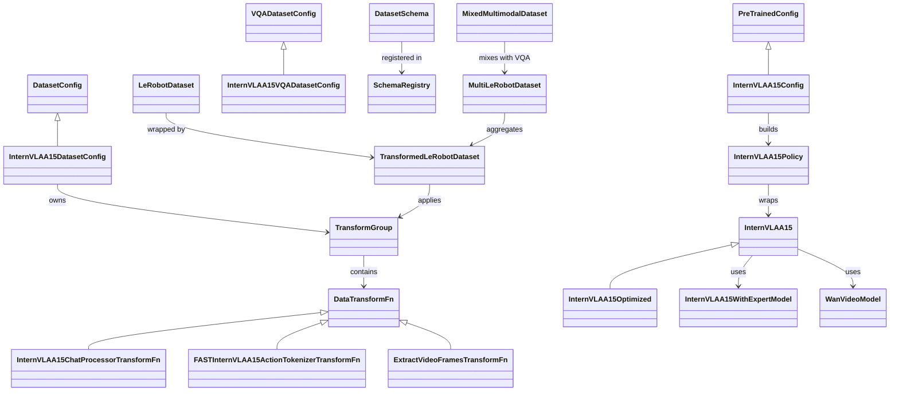

各组件职责：

- **`PreTrainedConfig` / `InternVLAA15Config`**：使用 `draccus.ChoiceRegistry` 的 `register_subclass` 模式，通过 `--policy.type=internvla_a1_5` 从 CLI 动态派发到对应配置类（[`configuration_internvla_a1_5.py:250-252`](../../../src/lerobot/policies/internvla_a1_5/configuration_internvla_a1_5.py)）。
- **`DatasetSchema` / `SchemaRegistry`**：把"某个具体数据源的 key 命名习惯"（例如 LIBERO 用 `observation.images.image`，其它数据源可能叫 `images.rgb.head`）与"策略期望的标准 key 命名"（`observation.images.image0`）解耦。schema 支持 `base_schema` 继承（`schema.py:81-129`），一个新数据源如果和已有 schema 高度相似，只需要写少量差异字段。
- **`DataTransformFn` / `TransformGroup`**：所有数据变换共享统一接口 `__call__(data: DataDict) -> DataDict` 和可选的 `hydrate(dataset)` 钩子（在真正构建 dataset 时，用 dataset 的 schema/统计信息"注水"进 transform 实例里，例如把 `mapping` 从 schema 里取出来）。`TransformGroup` 只是一个 `inputs`/`outputs` 两条变换链的容器。
- **`InternVLAA15Policy`**：符合 LeRobot 框架的 `PreTrainedPolicy` 接口规范（`forward`/`select_action`/`predict_action_chunk`），内部持有真正的 `InternVLAA15`（或 `InternVLAA15Optimized`）nn.Module。

### 6.2 InternVLA-A1.5 的数据变换链（pipeline）

`InternVLAA15DatasetConfig.data_transforms.inputs` 定义了从"原始 LeRobot 数据集单帧样本"到"喂进模型的张量字典"要经过的完整变换序列：

```36:64:src/lerobot/policies/internvla_a1_5/configuration_internvla_a1_5.py
    data_transforms: TransformGroup = field(
        default_factory=lambda: TransformGroup(
            inputs=[
                DeltaActionTransformFn(),
                ResizeImagesWithPadFn(...),
                RemapImageKeyTransformFn(),
                ExtractVideoFramesTransformFn(),
                NormalizeTransformFn(),
                ComposeFieldsTransform(),
                FASTInternVLAA15ActionTokenizerTransformFn(),
                LoadActionTextFromJsonlTransformFn(),
                InternVLAA15ChatProcessorTransformFn(),
                PadStateAndActionTransformFn(...),
                ReorderStateActionTransform(),
                UnifyInternVLAA15InputsTransformFn(...),
            ],
            outputs=[],
        )
    )
```

按执行顺序梳理各步作用：

1. **`DeltaActionTransformFn`**（可选，由 `action_mode` 决定是否插入）：把绝对动作转成"相对当前 state 的 delta"，具体哪些维度做 delta、哪些维度保持绝对值（如二值夹爪开合）由 schema 的 `action_mask_spec` 控制（例如 LIBERO 的 `[6, -1]` 表示前 6 维是 delta、最后 1 维绝对）。
2. **`ResizeImagesWithPadFn`**：按 schema 的 `image_mapping` 找到需要 resize 的图像 key，做等比缩放+padding 到目标分辨率（224×224）。
3. **`RemapImageKeyTransformFn`**：把数据源自己的图像 key 名统一重命名为 `observation.images.image{0,1,2}`，并补齐缺失视角为全 1 张量 + `mask=False`（保证 batch 内张量形状一致，同时用 mask 标记这是"填充视角"，后续 chat processor 会跳过无效视角，不会把它塞进 prompt）。
4. **`ExtractVideoFramesTransformFn`**：从多帧图像序列切出 WAN 用的视频片段（详见 4.2.4 节）。
5. **`NormalizeTransformFn`**：对 state/action 按数据集统计的均值方差（或 min-max/分位数）做归一化。
6. **`ComposeFieldsTransform`**：把多个来源的 state/action 子字段（如 `observation.states.joint.position` + `observation.states.effector.position`）拼接成统一的 `observation.state`/`action`。
7. **`FASTInternVLAA15ActionTokenizerTransformFn`**：把连续动作块量化成 FAST token，并转换成 Qwen3.5 的 special token id（详见 4.4.1 节）。
8. **`LoadActionTextFromJsonlTransformFn`**：按 episode/frame 索引，从 `meta/episodes_detailed_task.jsonl` 里查出这一帧对应的子任务文本描述（`sub_task`）和语言记忆（`language_memory`），用二分查找（`bisect.bisect_right`）定位当前帧落在哪个子任务区间内。
9. **`InternVLAA15ChatProcessorTransformFn`**：组装 chat template、tokenize、构造 labels（详见 4.4.2 节）。
10. **`PadStateAndActionTransformFn`**：把 state/action 的最后一维 pad 到统一的 `max_state_dim`/`max_action_dim=32`，兼容不同机器人本体的自由度差异。
11. **`ReorderStateActionTransform`**：按 schema 的 `action_reorder`/`state_reorder`（形如 `[[src_start, src_end, dst_start, dst_end], ...]`）把不同机器人本体的自由度分量搬到统一动作空间里的固定槽位（对应论文 [Section 4.1](InternVLA-A1.5-paper.md) 提到的"cast into the unified action space of InternVLA-A1, with morphology-specific slots padded to a shared layout"）。
12. **`UnifyInternVLAA15InputsTransformFn`**：最后一步，统一机器人样本和 VQA 样本的字段集合（哪怕某条样本没有真实视频帧，也补一个全零的 `observation.video_frames` 占位），确保二者可以被同一个 collate 函数处理并混合进同一个 batch。

这条流水线体现了一个重要的设计哲学：**把"不同数据源的差异"完全下放到 schema 配置层**（`libero.yaml` 等 YAML 文件），而 transform 代码本身对每个具体机器人一无所知，只认标准化之后的 key。新增一个数据源，理论上只需要写一个新的 schema YAML 条目，不需要改动任何 Python 代码。

### 6.3 多数据集混合与加权采样

`make_dataset`（`datasets/factory.py`）支持三层混合：

1. **单一 repo_id vs 多个 repo_id**：多个数据源用 `MultiLeRobotDataset` 聚合；
2. **分布式分片加载**（`dist_loading=True`）：`compute_balanced_repo_assignment` 用贪心 LPT（Longest Processing Time）算法，按各 repo 的 `total_frames` 尽量均衡地分给不同 rank，避免某个 rank 分到的数据源明显偏少或偏多；
3. **组内/组间加权采样**：`compute_repo_weights` 实现论文 [Section 4.3](InternVLA-A1.5-paper.md) 描述的"两级分组采样"——数据源内部的子数据集按 `(#frames)^gamma` 加权（`gamma=1` 即帧数比例采样），数据源之间的权重先用 [Re-Mix](https://arxiv.org/abs/2407.20177)（`hejna2024re`）算出初始值再人工微调（该权重配置存放在 `configs/weight_rules_pretrain.yaml`，通过 `--dataset.weight_rules_path` 传入）。
4. **机器人数据与 VQA 数据混合**：`MixedMultimodalDataset` 按固定比例（论文中 0.15:0.85，机器人:多模态）从两个子数据集采样，通过 `MultiMixedWeightedSampler` 实现。

这套设计使得预训练脚本 `internvla_a15_pretrain.sh` 能够"自动发现" `data/a1/` 目录下所有 LeRobot 格式的数据集（用 shell 里的 `find -L data/a1 -type d -name data` 遍历），不需要手工列出 repo id 列表，同时保证大规模异构数据源之间的采样比例是可控、可复现的。

---

## 7. 评测与推理服务架构解读

### 7.1 WebSocket 推理服务的分层设计

`evaluation/LIBERO/policy_server/` 采用"服务端做规范化预处理，客户端只做环境特异的适配"这一分工原则，核心是一个协议约定：服务端在 `metadata()` 里声明 `preprocessing_owner: "server_canonical"` 和 `deterministic_inference_preprocess: True`，客户端在连接时会**校验**这个约定，确保训练/推理预处理口径一致（train-infer parity）：

```77:90:evaluation/LIBERO/model2libero_interface.py
    @classmethod
    def _validate_server_metadata(cls, metadata: dict[str, Any]) -> None:
        version = str(metadata.get("protocol_version", ""))
        major, minor = cls._parse_version(version)
        if (major, minor) < (2, 1):
            raise RuntimeError(
                f"Server protocol_version={version} is too old. Require >=2.1 for canonical preprocessing contract."
            )
        if metadata.get("preprocessing_owner") != "server_canonical":
            raise RuntimeError(
                "Server metadata preprocessing_owner must be 'server_canonical' for train-infer parity."
            )
        if not bool(metadata.get("deterministic_inference_preprocess", False)):
            raise RuntimeError("Server must enable deterministic_inference_preprocess.")
```

这是一个值得称道的工程实践：很多 VLA 项目的训练/评测不一致 bug（比如图像归一化方式、状态维度顺序对不上）都是因为预处理逻辑在训练脚本和评测脚本里各写了一份、逐渐"漂移"导致的。这里把预处理逻辑**完全收拢到服务端**（`InternVLAA15Backend._prepare_single` 内部复用训练时同款的 `NormalizeTransformFn`、`ResizeImagesWithPadFn`、`InternVLAA15ChatProcessorTransformFn`），客户端只负责"取环境原始 obs → 组装成通用字段名 → 发请求 → 解析返回的动作块"，从协议层面强制杜绝了这种漂移。

### 7.2 `InternVLAA15Backend`：从 checkpoint 加载到推理

```105:117:evaluation/LIBERO/policy_server/backends/policy_backend_internvla_a1_5.py
        self.policy = InternVLAA15Policy.from_pretrained(
            config=config, pretrained_name_or_path=self.ckpt_path
        )
        self.policy.to(self.device)
        self.policy.eval()

        if config.dtype == "bfloat16":
            self.compute_dtype = torch.bfloat16
        elif config.dtype == "float32":
            self.compute_dtype = torch.float32
        else:
            raise ValueError(f"Unsupported config.dtype={config.dtype!r}")
```

几个关键工程细节：

- **`action_loss_only` 默认在评测入口就被设为 `True`**（构造函数参数默认值），因为标准评测流程只需要动作预测，不需要 WAN 分支；如果确实需要做未来帧可视化分析，需要显式传 `action_loss_only=False` 并额外提供 `--wan_model_path`/`--wan_vae_path`。
- **`action_mode` 是从 schema 反查出来的，不是硬编码**：因为推理时没有 dataset 对象可供 `hydrate()`，`InternVLAA15Backend.__init__` 显式调用 `get_schema(self.robot_type)` 拿到 `action_mode`，从而让 prompt 里的 `Control Mode: <...>` 标签与训练时保持一致（[`policy_backend_internvla_a1_5.py:130-140`](../../../evaluation/LIBERO/policy_server/backends/policy_backend_internvla_a1_5.py)）。
- **推理时 chat processor 使用 `mode="eval"`**：回顾 4.4.2 节的 `InternVLAA15ChatProcessorTransformFn.__call__`，`mode="eval"` 会强制 `label_mode=LABEL_MODE_NONE`（不构造任何监督标签）并在 prompt 末尾追加 `"; Output: <Subtask, Action>"`，这与训练时 `LABEL_MODE_BOTH` 分支里追加的同款文案对齐，只是训练时后面紧跟真实标签用于计算 loss，推理时则是留空等模型自己（通过 flow matching，而非文本生成）产出动作。

### 7.3 LIBERO 客户端适配器的坐标系转换细节

`model2libero_interface.py` 里最容易被忽视但对最终成功率影响很大的细节：

1. **四元数转轴角**：LIBERO 环境返回的末端姿态是四元数 `robot0_eef_quat`，而训练数据里的 state 用的是轴角表示，`_quat2axisangle` 做了这个转换：

```11:22:evaluation/LIBERO/model2libero_interface.py
def _quat2axisangle(quat: np.ndarray) -> np.ndarray:
    q = np.asarray(quat, dtype=np.float32).reshape(-1).copy()
    if q.shape[0] != 4:
        raise ValueError(f"Expected quaternion of length 4, got {q.shape}")
    if q[3] > 1.0:
        q[3] = 1.0
    elif q[3] < -1.0:
        q[3] = -1.0
    den = math.sqrt(1.0 - q[3] * q[3])
    if math.isclose(den, 0.0):
        return np.zeros(3, dtype=np.float32)
    return ((q[:3] * 2.0 * math.acos(q[3])) / den).astype(np.float32)
```

最终 8 维 state = `eef_pos(3) + axisangle(3) + gripper_qpos(2)`，与论文所述"real-world LIBERO 8-dim EE state"的口径一致。

2. **图像 180° 旋转**：`_maybe_rotate` 对 `agentview_image` 和 `robot0_eye_in_hand_image` 做 `arr[::-1, ::-1]`（上下+左右翻转，等价于旋转 180°），这是为了匹配训练数据预处理阶段对图像做过的同款旋转——如果客户端不加这一步，模型会看到"倒过来的世界"，这是复现他人 VLA 实验时最常踩的坑之一。

3. **夹爪指令符号翻转**：训练数据遵循 OpenVLA RLDS 惯例（`action[6] ∈ [0,1]`，0=闭合、1=张开），但 LIBERO 仿真环境本身的惯例是 `+1=闭合、-1=张开`，方向恰好相反：

```187:192:evaluation/LIBERO/model2libero_interface.py
        if self.binarize_gripper and action.shape[-1] >= 7:
            # Dataset uses OpenVLA RLDS convention: action[6] in [0, 1] where
            # 0 = close, 1 = open (verified against gripper qpos in episode 0
            # of libero_goal). The LIBERO env uses +1 = close, -1 = open. So
            # threshold at 0.5 and flip:
            action[6] = 1.0 if action[6] < 0.5 else -1.0
```

这种"两套惯例方向相反"的坑，在跨 benchmark、跨数据源迁移 VLA 模型时极其常见，也是为什么本仓库把这类转换严格限制在"客户端"这一层——每换一个 benchmark，只需要写一个新的薄适配器，不需要触碰核心模型和服务端代码。

4. **动作块缓存与重规划（re-planning）**：`replan_steps` 参数控制"预测一次动作块后，执行几步再重新请求预测"，这是经典的 receding-horizon / action-chunking 执行策略——`chunk_size=50` 步的预测不会被一次性执行完，而是执行前 `replan_steps`（如 8）步后就基于最新观测重新预测，兼顾了"减少推理调用次数"和"及时纠偏"之间的平衡。

---

## 8. 纵向分析：技术演进脉络

### 8.1 演进时间线

下图（脚本：[`asset/draw_evolution_timeline.py`](asset/draw_evolution_timeline.py)）梳理了从 RT-2 到 InternVLA-A1.5 的动作表征与世界模型耦合方式的演进：

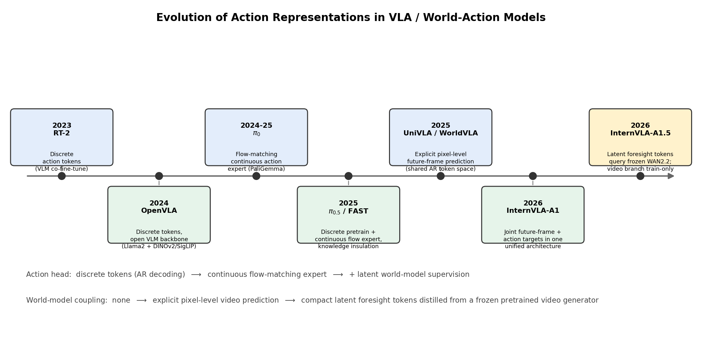

### 8.2 阶段一：纯离散动作 token（RT-2 / OpenVLA）

[RT-2](https://arxiv.org/abs/2307.15818)（Google DeepMind, 2023）首次证明了"把机器人动作离散化成文本 token，用一个 VLM 做 next-token 预测"这个思路是可行的：把机械臂的 6-DoF 位姿增量和夹爪状态均匀分箱（binning）成离散符号，直接复用语言模型的输出词表和自回归解码机制。[OpenVLA](https://arxiv.org/abs/2406.09246)（2024）延续了这一路线，换用开源的 Llama-2 + 融合视觉编码器（DINOv2+SigLIP）作为骨干，让整条技术栈完全开源可复现。

**优点**：架构极简，直接复用现成的 VLM 预训练与微调基础设施，不需要设计专门的动作头；**局限**：(1) 自回归逐 token 解码天然带有较高延迟，不利于高频闭环控制；(2) 离散化会引入量化误差，对精细操作（如插入、对齐）不够友好；(3) 误差会沿着自回归链条累积——这也是本报告后面要提到的 WorldVLA 论文明确指出并试图解决的问题（[WorldVLA, 2025](https://arxiv.org/abs/2506.21539)）。

### 8.3 阶段二：连续动作专家 + Flow Matching（\(\pi_0\) / \(\pi_{0.5}\)）

[\(\pi_0\)](https://www.physicalintelligence.company/download/pi0.pdf)（Physical Intelligence, 2024）把"动作生成"从离散 token 预测换成了**连续 flow-matching**：在 PaliGemma VLM 之外接一个轻量动作专家，用类似扩散模型的方式一次性并行去噪出整段动作块，显著降低了推理延迟并提升了动作的平滑度和连续操控精度。[\(\pi_{0.5}\)](https://www.physicalintelligence.company/download/pi05.pdf)（2025）进一步引入 **knowledge insulation**（防止动作/生成分支的梯度污染 VLM 语义知识）和"用同一套词表监督离散子任务预测 + FAST 动作 token"的联合训练范式，这正是 InternVLA-A1.5 Stage 1 训练直接借鉴的思路（论文原文多次引用 \(\pi_{0.5}\)，见 [Section 3.1](InternVLA-A1.5-paper.md)）。

**优点**：动作连续、平滑，推理延迟可控（Euler 积分步数可调），配合 VLM 骨干仍能获得较强的语义泛化；**局限**：动作专家本身不具备对"物理动力学"的显式建模能力——它学到的是"给定当前观测和语言指令，怎么把噪声变成合理动作"的映射，而不是"接下来场景会怎么演变"的预测能力，泛化到需要精细物理推理的场景（例如动态抓取、液体操作）时能力有限。

### 8.4 阶段三：显式像素级视频预测（UniPi / Genie 类思路，UniVLA、WorldVLA、InternVLA-A1）

这一阶段的核心思路是：**让模型自己学会预测未来的原始画面**，以此获得对物理规律的隐式理解。[UniPi](https://arxiv.org/abs/2302.00111)（Google DeepMind, 2023）最早验证了"用文本条件视频生成模型规划机器人动作"的可行性；[Genie](https://arxiv.org/abs/2402.15391) 系列（2024）进一步展示了从纯视频学习"可交互世界模型"的潜力。在 VLA 领域，[UniVLA](https://arxiv.org/abs/2506.19850)（2025）把视觉、语言、动作统一表示成离散 token，通过在大规模无动作标注视频上做"世界模型后训练"（world modeling post-training）来学习环境的因果动态，再迁移到下游策略学习；[WorldVLA](https://arxiv.org/abs/2506.21539)（2025，阿里达摩院）则用一个自回归框架同时承担"动作模型"和"世界模型"两个角色，让两者互相增强（world model 帮助 action model 理解物理规律，action model 帮助 world model 更好地做视觉生成/理解）。团队自己的前作 [InternVLA-A1](https://github.com/InternRobotics/InternVLA-A1) 也属于这一脉络：把未来视觉状态和动作**同时**作为训练目标，在统一架构里显式学习像素级（或接近像素级）的未来预测。

**优点**：视频预测目标能提供密集、自监督的监督信号，且理论上能够从大规模无动作标注的视频数据中学习通用物理规律，泛化潜力大；**局限**：(1) 像素级生成的训练成本和推理成本都很高（生成任务本身通常比判别/回归任务需要更大的模型容量和更多步的迭代）；(2) 从零训练一个视频预测模块，很难在有限的机器人数据规模下达到专业视频生成模型的生成质量和物理合理性，容易"事倍功半"；(3) 如果视频预测分支在推理时也要跑（如 WorldVLA 的自回归联合生成），会直接拖慢闭环控制的响应速度。

### 8.5 阶段四：冻结视频生成模型 + 可学习隐查询（InternVLA-A1.5）

InternVLA-A1.5 的定位正是在阶段二和阶段三之间找到一个新的平衡点：**既不满足于阶段二"纯判别式"、不具备显式物理先验的动作专家，又不愿意承担阶段三"从零学习像素级生成"的全部成本**。它的关键洞察是：与其自己训练一个视频预测模块，不如直接"借用"一个已经在海量互联网视频上训练好、具备强物理常识的**现成**视频生成模型（WAN2.2-5B），用一小组可学习的查询向量去"读取"它的知识，而不用重新学习"如何生成像素"这件事本身。这本质上是一种**知识蒸馏 / 提示学习（prompt tuning）**式的思路——WAN2.2 的参数被完全冻结，训练过程更像是在给一个强大的"黑箱物理引擎"寻找一套最优的"激活咒语"（\(C_t^f\)），而不是教它任何新东西。

这样带来的直接好处，正如论文结论所强调的两条经验：(1) prompt 设计（把 state/控制模式/动作都塞进原生 chat template、共享一个词表和一个 next-token 损失）本身就能让训练更稳定，更充分地把 VLM 的语义能力"转移"进策略；(2) 统一模型不必从零学习像素级生成才能受益于未来预测——**少量隐 token 就足以编码动作学习所需的未来信息**，策略只需要学"该想象什么"，而"世界如何演化"这件事已经被预训练生成模型学过了。

### 8.6 可能的后续演进方向

论文在 [Limitations](InternVLA-A1.5-paper.md) 部分明确指出了两个尚未解决的问题，这也提示了自然的后续演进方向：

1. **从"单动作块尺度的短时预测"扩展到"长时程想象与显式规划"**：目前 foresight 监督的时间跨度只覆盖一个动作块（约 4 帧未来），策略并没有在真正意义上做多步规划（look-ahead planning）。后续工作可能会探索让 foresight token 支持多尺度、多跳的未来查询，或者显式引入基于想象轨迹的搜索/规划模块（类似 World Model + MPC 的思路）。
2. **从"通用冻结视频生成模型"到"具身场景专精的视频先验"**：WAN2.2 本身是一个通用领域的视频生成模型，其预训练数据未必充分覆盖具身操作场景的物理细节（如接触力、形变、液体等）。后续工作可能会探索在具身数据上对视频生成模型做轻量适配（而非完全冻结），或者用专门为机器人场景预训练的世界模型（如 [Cosmos](https://arxiv.org/abs/2501.03575)、专用具身视频基座）替换通用生成模型，在"先验专精度"和"训练/维护成本"之间重新寻找平衡点。

---

## 9. 横向分析：同期方法对比

> **重要说明**：本节引用的 LIBERO-Plus 数值分别来自两个不同的评测协议——(a) InternVLA-A1.5 论文自己复现/引用的 [Table 6](InternVLA-A1.5-paper.md)；(b) LIBERO-Plus 原论文 [Fei et al., 2025](https://arxiv.org/abs/2510.13626)（[HTML 版](https://arxiv.org/html/2510.13626)）及其 [HuggingFace 数据集页](https://huggingface.co/datasets/Sylvest/LIBERO-plus) 上公布的 leaderboard。两套数值中同一 baseline（如 \(\pi_0\)）在 Background 维度上并不完全一致（90.7% vs 85.0%），说明两边并非在完全相同的实验条件（checkpoint、评测轮数、随机种子等）下跑出来的。因此下表的横向对比应理解为**方向性/量级上的参考**，而非严格可比的单一基准测试结果。

### 9.1 LIBERO-Plus 零样本鲁棒性对比

| 方法 | Camera | Robot | Language | Light | Background | Noise | Layout | Total | 来源 |
|---|---|---|---|---|---|---|---|---|---|
| OpenVLA | 0.8 | 3.5 | 23.0 | 8.1 | 50.4 | 15.2 | 28.5 | 17.3 | LIBERO-Plus 论文 |
| OpenVLA-OFT | 56.4 | 31.9 | 79.5 | 88.7 | 97.3 | 75.8 | 74.2 | 70.0 | LIBERO-Plus 论文 |
| WorldVLA | 0.1 | 27.9 | 41.6 | 43.7 | 19.8 | 10.9 | 38.0 | 25.3 | LIBERO-Plus 论文 |
| UniVLA | 1.8 | 46.2 | 69.6 | 69.0 | 90.7 | 21.2 | 31.9 | 43.9 | LIBERO-Plus 论文 |
| \(\pi_0\) | 13.8 | 6.0 | 58.8 | 85.0 | 90.7 | 79.0 | 68.9 | 54.6 | LIBERO-Plus 论文 |
| \(\pi_0\)-FAST | 65.1 | 21.6 | 61.0 | 73.2 | 97.7 | 74.4 | 68.8 | 64.2 | LIBERO-Plus 论文 |
| \(\pi_0\)（InternVLA-A1.5 论文复现） | 13.8 | 6.0 | 58.8 | 85.0 | 81.4 | 79.0 | 68.9 | 53.6 | InternVLA-A1.5 论文 Table 6 |
| \(\pi_{0.5}\) | 78.4 | 73.6 | 80.8 | 96.2 | 94.1 | 89.0 | 84.5 | 84.4 | InternVLA-A1.5 论文 Table 6 |
| Cosmos-Policy | 75.8 | 63.3 | 81.7 | 96.5 | 88.9 | 92.7 | 82.2 | 82.2 | InternVLA-A1.5 论文 Table 6 |
| **InternVLA-A1.5** | **83.1** | 55.1 | 86.9 | 96.4 | **98.2** | **95.6** | 85.2 | **84.8** | InternVLA-A1.5 论文 Table 6 |

### 9.2 各方法定位与优劣

**\(\pi_{0.5}\)**（[intelligence2025pi05](https://www.physicalintelligence.company/download/pi05.pdf)）：连续 flow-matching 动作专家 + 知识隔离 + 离散子任务/FAST 联合预训练，是 InternVLA-A1.5 在架构设计和训练范式上最直接的参照对象。二者在 LIBERO-Plus 上的总分非常接近（84.4 vs 84.8），说明"VLM 语义能力保留 + 连续动作专家"这条主线本身已经能带来相当强的鲁棒性；InternVLA-A1.5 相对 \(\pi_{0.5}\) 的增量主要来自额外的隐空间视频监督，在 Background/Noise 等**纯视觉扰动**维度上领先更明显（98.2 vs 94.1，95.6 vs 89.0），但在 Robot（机器人初始姿态扰动）维度上反而落后（55.1 vs 73.6），说明视频监督对"视觉外观层面的扰动"帮助更大，对"本体运动学层面的扰动"未必是最优药方。**适用场景**：\(\pi_{0.5}\) 更适合对训练/部署成本极度敏感、不需要额外世界模型基础设施的场景；InternVLA-A1.5 更适合能承担一次性预训练成本、且部署场景视觉多样性较高（不同光照、背景、摆放）的场景。

**OpenVLA-OFT**（[kim2025fine](https://arxiv.org/abs/2502.19645)，"Optimizing Speed and Success"）：在 OpenVLA 离散自回归解码的基础上，改为并行解码 + 连续动作头（L1 回归或类似机制）+ 动作分块（action chunking），显著提升了推理速度和成功率，但骨干仍是相对较早的 Llama-2 融合视觉编码器方案，没有引入世界模型监督。在 LIBERO-Plus 上 Total 70.0，明显低于 InternVLA-A1.5 的 84.8，尤其在 Camera（56.4 vs 83.1）和 Robot（31.9 vs 55.1）两个维度差距较大。**适用场景**：适合作为"轻量、易复现、无需额外视频生成基础设施"的强基线，特别是计算资源有限、只需要在单一较窄任务分布上快速落地的场景。

**UniVLA**（[Wang et al., 2025](https://arxiv.org/abs/2506.19850)）：把视觉、语言、动作统一表示成离散 token，通过在大规模无动作视频上做"世界模型后训练"来获得因果动态先验，再迁移到下游策略学习，在原论文报告的 LIBERO（标准无扰动设置）上取得了 95.5% 的高分，超过 \(\pi_0\)-FAST 的 85.5%——这说明"世界模型后训练"对**标准分布内**任务的样本效率和最终成功率有显著帮助。但在 LIBERO-Plus 的**扰动**评测下总分只有 43.9，尤其 Noise/Layout 维度（21.2/31.9）明显偏弱，说明这条"离散 token 自回归 + 世界模型后训练"的路线，在分布内性能很强，但对分布外视觉/布局扰动的鲁棒性还不如连续动作专家路线。**适用场景**：适合训练数据覆盖充分、部署环境相对稳定可控（如工厂流水线）、且希望复用同一套 token 化框架同时支持多任务（图像 grounding、视频生成、动作预测）的场景。

**WorldVLA**（[Alibaba DAMO, 2025](https://arxiv.org/abs/2506.21539)）：用自回归框架把"动作模型"和"世界模型"合并在同一套 token 序列里，通过互相增强来提升表现，并提出了专门的注意力掩码策略缓解自回归动作生成的误差累积问题。但在 LIBERO-Plus 上的总分仅 25.3，是本报告涉及的所有基线里最低的，尤其 Camera（0.1）和 Background（19.8）两个维度几乎失效。这与其"自回归、逐帧/逐 token 生成"的机制高度相关——序列生成式的建模在扰动分布下更容易被打乱节奏、产生复合误差。**适用场景**：更适合对"动作与视觉生成的一致性/互相解释性"有较高要求的研究场景（如需要模型同时输出对未来的合理想象用于可解释性分析），但目前看距离"直接部署到真实、多变环境"还有较大差距。

**InternVLA-A1.5**：综合来看，它在保持连续 flow-matching 动作专家（继承 \(\pi_{0.5}\) 路线的鲁棒性优势）的基础上，叠加了一层"轻量、训练时才生效"的隐空间世界模型监督，在**视觉扰动维度**上取得了目前最强或接近最强的成绩，同时因为推理时完全丢弃 WAN 分支，没有牺牲部署速度。它的相对短板体现在 Robot（本体姿态扰动）维度不如 \(\pi_{0.5}\)，这提示未来工作可能需要针对性地在本体运动学扰动上做数据增强或额外监督，而不能指望"隐空间视频监督"这一单一机制包打所有类型的鲁棒性问题。

---

## 10. 消融分析：Table 8 解读

论文 [Table 8](InternVLA-A1.5-paper.md) 给出了两组关键消融（均基于同一个两阶段预训练好的 InternVLA-A1.5，只改变推理时/额外微调时的配置）：

| 方法 | LIBERO | LIBERO-Plus（零样本） | RoboTwin | DOMINO（零样本） |
|---|---|---|---|---|
| InternVLA-A1.5（完整版） | **98.9** | **84.8** | **93.2** | **27.7** |
| w/o video loss（去掉视频监督损失） | 97.9 (−1.0) | 78.0 (−6.8) | 91.1 (−2.1) | 25.3 (−2.4) |
| w/o foresight tokens（去掉可学习 foresight tokens） | 98.6 (−0.3) | 77.9 (−6.9) | 90.2 (−3.0) | 23.8 (−3.9) |

### 10.1 现象解读

1. **两种消融在标准 LIBERO/RoboTwin（分布内）上的影响都很小**（−1.0/−0.3 和 −2.1/−3.0 个百分点），但在**零样本泛化**评测（LIBERO-Plus、DOMINO）上影响明显放大（−6.8/−6.9 和 −2.4/−3.9 个百分点）。这与论文的核心叙事高度一致：**foresight 机制的价值主要体现在分布外泛化，而不是分布内拟合能力**——这也符合直觉，因为分布内任务本身的视觉/动力学模式在训练数据里已经被充分见过，即便没有额外的世界模型先验，模型也能靠"记忆+插值"取得不错的成绩；而分布外场景（新视角、新光照、新的动态交互）恰恰是模型缺乏先验、最需要"举一反三"能力的地方，这正是冻结视频生成模型能够贡献额外知识的地方。

2. **"去掉 foresight tokens"比"去掉 video loss"影响更大**（RoboTwin: −3.0 vs −2.1；DOMINO: −3.9 vs −2.4），但两者在 LIBERO-Plus 上几乎一样（−6.9 vs −6.8）。这提示 foresight tokens 本身（作为一种可学习的查询接口/表征通道）与"video loss 提供的监督信号"其实是**耦合在一起**发挥作用的两个部分——tokens 是"容器"，video loss 是"往容器里灌注知识的过程"。单独去掉容器（tokens）比单独去掉监督信号（loss）影响略大，可能是因为即便没有 video loss，只要 tokens 还在，它们仍然能通过与 flow-matching 动作损失的联合训练间接获得一些有用的表征（类似一种额外的可学习"记忆槽"），而彻底移除 tokens 则连这部分潜力也一并抹去了。

3. **DOMINO（高动态、强物理交互场景）上两种消融的绝对降幅都是四个 benchmark 里最大的相对比例**（27.7 → 25.3/23.8，相对下降 8.7%/14.1%），呼应论文原文"On DOMINO, which requires accurate modeling of highly dynamic object interactions, video supervision further benefits performance by strengthening future-state awareness and motion consistency"的论断（[Section 5.3](InternVLA-A1.5-paper.md)）。这说明**任务的动态性越强、越依赖对"接下来会发生什么"的预判，隐空间视频监督带来的收益就越大**；相反，对于静态摆放、慢速准入的任务，这套机制的边际收益有限。

### 10.2 对实践的启发

结合以上现象，可以得到几条对模型设计/落地选型有实际参考价值的结论：

- 如果目标场景**分布相对固定、不追求零样本泛化到新视角/新光照/新布局**，foresight+视频监督机制带来的收益可能不足以覆盖它引入的额外训练成本（需要维护 WAN2.2-5B 的加载与前向、需要额外的视频数据/多帧标注）；这种情况下用纯 flow-matching 动作专家（如 \(\pi_{0.5}\)）可能是性价比更高的选择。
- 如果目标场景**天然要求跨视角/跨环境/跨光照的鲁棒性，或者任务本身含有较强的动态交互**（液体、可变形物体、多物体碰撞），那么这套隐空间世界模型监督机制的收益会比较可观，值得承担额外的训练期成本（推理期没有额外成本，因为 WAN 分支在推理时被完全丢弃）。
- foresight tokens 与 video loss 应当被视为一个整体机制来使用/消融，而不是各自独立的"可插拔组件"——单独保留 tokens 而去掉 video loss（或反之）都无法获得完整收益。

---

## 11. 关键设计取舍与局限性讨论

### 11.1 设计取舍总结

| 取舍点 | 选择 | 代价 | 收益 |
|---|---|---|---|
| 用冻结 WAN2.2 而非从零训练视频预测模块 | 冻结底座 + 轻量投影/查询接口 | 继承的先验受限于 WAN 预训练数据对具身场景的覆盖度；WAN 训练/推理阶段仍需占用可观的显存和加载时间（训练期） | 大幅降低训练成本和收敛难度，避免"重新发明视频生成"；推理期零成本（完全丢弃） |
| 视频分支只在训练期启用 | `action_loss_only=True` 后 WAN 完全不加载 | 部署时无法做未来帧可视化（除非专门切回 standard 后端并额外加载 WAN） | 保证真实机器人闭环控制的实时性（约 0.1s/步） |
| 动作 token 与语言 token 共享词表和 `lm_head` | 扩容 embedding/lm_head，用均值初始化新增行 | 词表增大导致 `lm_head` 参数量和显存开销略增；训练早期需要让新增行"追上"其它行的语义 | 复用同一套 next-token 交叉熵损失机制，不需要额外设计动作头，架构极简 |
| foresight token 组内双向 + 组间因果的混合掩码 | 精心设计的 attention mask（`att_masks` 累积和技巧） | 掩码构造逻辑较复杂，调试难度较高 | 同时兼容 VLM 原生自回归语义和 flow-matching 非自回归、并行去噪的需求 |
| Knowledge insulation 默认关闭 | 依赖"持续 VQA/subtask/FAST 监督"来保护语义，而非梯度隔离 | 理论上仍存在一定的语义漂移风险（虽然论文实验显示效果良好） | 允许 expert 更充分地利用 VLM 上下文信息，不必担心信息流被切断 |
| 只在同层号做联合计算（MoT 架构要求两路模型层类型完全对齐） | expert 复用 VLM 的 `layer_types`/线性注意力超参数 | 扩展性受限——如果未来想用不同架构的 VLM 主干，需要重新适配 `compute_layer_complete` | 全注意力层可以直接拼接 K/V 联合计算，线性注意力层各自独立计算，实现简洁高效 |

### 11.2 局限性

论文自己承认的两点局限（已在第 8.6 节讨论其演进方向）：

1. **foresight 监督的时间跨度较短**：只覆盖一个动作块（约 4 帧），不支持长时程想象或显式规划；
2. **视频生成模型通用且冻结**：继承的先验质量受限于 WAN2.2 预训练数据对具身场景的覆盖程度，且这个先验在训练过程中不会被具身数据进一步"精调"。

除此之外，结合代码实现，本报告观察到几点值得关注、论文正文未展开讨论的工程/方法学局限：

- **对齐 WAN 条件空间的能力可能受限于 foresight token 数量与投影层容量**：`learnable_to_wan_proj` 只是一个单层线性映射（`nn.Linear(action_expert_hidden_size, wan_dim)`），把 50 个 token 的信息映射进 WAN 原生的（通常远比 50 长得多的）文本条件序列长度；这种"信息瓶颈"设计是有意为之（保证紧凑性），但也意味着如果未来任务需要表达更复杂的多物体、多阶段未来场景，50 个 token 的容量可能成为瓶颈。
- **视频损失只监督"预测速度场"，不直接监督生成质量的语义正确性**：`_compute_video_loss` 本质上是让 foresight token 学会让 WAN 的 flow-matching 目标（MSE on velocity）尽量小，这是一个**代理目标**（proxy objective），并不直接约束"生成的未来画面是否语义正确、动作是否物理合理"，虽然论文 [Figure 11](InternVLA-A1.5-paper.md) 的可视化显示效果良好，但缺乏更严格的定量指标（例如生成视频与真实未来帧之间的 FVD/PSNR 等），这也是本领域相关工作普遍存在的评估短板。
- **知识插值一致性依赖具体的采样策略**：预训练/微调阶段两级采样（组内按帧数幂次采样、组间人工微调权重）引入了不少人工调参环节（`gamma`、组间预算），这类超参数对最终性能的敏感度在论文中没有专门的消融分析，复现时需要额外留意。
- **`freeze_learnable_tokens` 在微调阶段默认打开，隐含了一个"预训练已经学到通用未来查询能力"的假设**：这个假设对于与预训练分布相近的下游任务（如 RoboTwin、LIBERO）大体成立，但对于差异极大的新机器人本体/新场景，是否仍应该保持冻结、还是应该允许 foresight tokens 继续适配，目前缺乏系统性的实验指导，需要使用者根据实际情况做取舍实验。

---

## 13. 模型网络结构深度解析

前文第 3–5 章从整体架构、数据流、训练流程等维度概述了 InternVLA-A1.5 的设计，但未深入到网络结构的代码层面。本章从源码出发，系统地剖析模型的**静态结构**（类层次、模块组成、参数维度、连接拓扑）与**动态行为**（forward 调用链、backward 梯度流、推理路径），并特别聚焦 VLM 与 Unified Expert 的 Mixture-of-Transformers（MoT）交互机制。

> 本章所有代码引用均指向 `src/lerobot/policies/internvla_a1_5/` 目录下的文件，行号基于撰写时的代码快照。

### 13.1 类层次与模块总览

InternVLA-A1.5 的 Python 类体系呈三层嵌套结构，最外层是策略包装器，最内层是双解码器引擎：

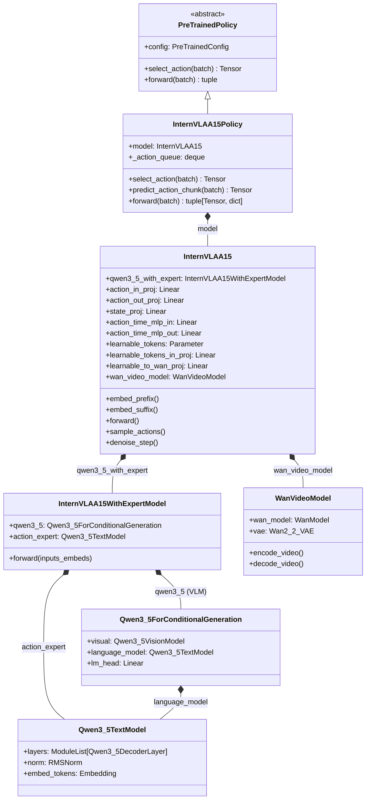

各类的核心职责：

| 类名 | 文件位置 | 职责 |
|------|----------|------|
| `InternVLAA15Policy` | `modeling_internvla_a1_5.py:1368` | 策略包装器：batch I/O 解析、动作队列管理、多路 loss 聚合与加权 |
| `InternVLAA15` | `modeling_internvla_a1_5.py:539` | 核心模型：prefix/suffix embedding、flow matching 训练与推理、video loss 计算 |
| `InternVLAA15WithExpertModel` | `modeling_internvla_a1_5.py:360` | 双解码器引擎：管理 VLM 和 Action Expert 两条 transformer 通路的联合逐层前向传播 |
| `ActionExpertConfig` | `modeling_internvla_a1_5.py:338` | Action Expert 的架构配置（hidden_size、intermediate_size 等） |
| `Qwen3_5ForConditionalGeneration` | `transformers_replace/models/qwen3_5/` | Qwen3.5 VLM：视觉编码器 + 语言模型 + lm_head |
| `Qwen3_5TextModel` | 同上 | Qwen3.5 文本解码器（28 层，hybrid attention），同时作为 VLM language_model 和 Action Expert |
| `WanVideoModel` | `wan_model.py` | WAN2.2 视频模型封装：DiT 生成器 + VAE 编解码器 |

### 13.2 静态架构：模块组成与连接

下图展示 `InternVLAA15` 实例内部所有子模块的组成及数据连接关系。三条虚线框分别标识 VLM 分支（prefix 处理）、Expert 分支（suffix 处理）和 Video 分支（foresight 监督）：

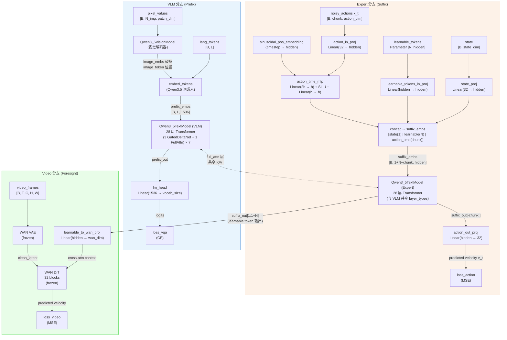

#### 模块维度参数

以下表格列出关键模块的张量维度（基于默认配置）：

| 模块 | 输入维度 | 输出维度 | 参数说明 |
|------|----------|----------|----------|
| `Qwen3_5VisionModel` | `[B*N_img, patch_dim]` | `[B*N_img, 1536]` | InternViT-300M 风格的视觉编码器 |
| `embed_tokens` (VLM) | `[B, L]` (token IDs) | `[B, L, 1536]` | 词嵌入维度 = VLM hidden_size |
| `Qwen3_5TextModel` (VLM) | `[B, L, 1536]` | `[B, L, 1536]` | 28 层，hidden=1536, intermediate=8960, head_dim=128, 12 heads |
| `Qwen3_5TextModel` (Expert) | `[B, S, hidden]` | `[B, S, hidden]` | 28 层，默认 hidden=1024, intermediate=3072（可配置） |
| `action_in_proj` | `[B, chunk, 32]` | `[B, chunk, hidden]` | max_action_dim=32 |
| `action_out_proj` | `[B, chunk, hidden]` | `[B, chunk, 32]` | 预测速度场 |
| `state_proj` | `[B, 32]` | `[B, hidden]` | max_state_dim=32，仅 tokenize_state=False 时使用 |
| `action_time_mlp` | `[B, chunk, 2*hidden]` | `[B, chunk, hidden]` | 拼接 action_emb 和 time_emb 后融合 |
| `learnable_tokens` | — | `[N, hidden]` | Parameter，默认 N=50 |
| `learnable_to_wan_proj` | `[B, N, hidden]` | `[B, N, wan_dim]` | wan_dim=1536（WAN-5B） |
| `lm_head` | `[B, L, 1536]` | `[B, L, vocab_size]` | vocab_size ≈ 250125（含 2048 FAST tokens） |
| `WAN DiT` | latent `[B, 48, T', H', W']` | 同 | 32 blocks, dim=1536, 12 heads |
| `WAN VAE` | pixels `[B, 3, T, H, W]` | latent `[B, 48, T/4, H/32, W/32]` | 48-channel latent，3D causal convolution |

> 注：Action Expert 的 `head_dim`、`num_attention_heads`、`num_key_value_heads`、`layer_types` 等结构参数从 VLM 的 `text_config` 中复制而来，因此两条 transformer 通路的层结构（full_attention vs linear_attention 的交替模式）完全一致，仅在 hidden_size 和 intermediate_size 上可以不同。
> 
> 这一设计来自 `InternVLAA15WithExpertModel.__init__()` (line 388-407)，确保两条通路的每一层都拥有相同的 `layer_type`，从而可以在 `compute_layer_complete()` 中逐层联合处理。

构造代码参见：

```python
# 539:604:src/lerobot/policies/internvla_a1_5/modeling_internvla_a1_5.py
class InternVLAA15(nn.Module):
    def __init__(self, config):
        ...
        self.qwen3_5_with_expert = InternVLAA15WithExpertModel(...)  # 双解码器引擎
        self.action_in_proj = nn.Linear(config.max_action_dim, hidden)
        self.action_out_proj = nn.Linear(hidden, config.max_action_dim)
        self.state_proj = nn.Linear(config.max_state_dim, hidden)  # 仅 tokenize_state=False
        self.action_time_mlp_in = nn.Linear(2 * hidden, hidden)
        self.action_time_mlp_out = nn.Linear(hidden, hidden)
        self.learnable_tokens = nn.Parameter(torch.zeros(N, hidden))  # foresight tokens
        self.learnable_tokens_in_proj = nn.Linear(hidden, hidden)
        if not config.action_loss_only:
            self.wan_video_model = WanVideoModel.from_pretrained(...)
            self.learnable_to_wan_proj = nn.Linear(hidden, wan_dim)
```

### 13.3 Mixture-of-Transformers：VLM 与 Expert 的交互机制

VLM 和 Action Expert 的交互是 InternVLA-A1.5 最核心的架构设计。两条 transformer 通路共享 28 层的深度，但**不共享权重**——它们各自拥有独立的 attention 投影、MLP、LayerNorm 参数。两条通路通过**全局函数 `compute_layer_complete()`** 在每一层进行联合处理。

#### 13.3.1 层类型与交互模式

Qwen3.5-2B 的 28 层 transformer 使用混合注意力架构（hybrid attention），每层的 `layer_type` 为 `full_attention` 或 `linear_attention` 之一。根据 Qwen3.5 的配置，28 层的排列模式为 `(3 linear_attention + 1 full_attention) × 7`，即每 4 层中有 3 层使用 Gated DeltaNet 线性注意力、1 层使用标准全注意力。

两种层类型下，VLM 和 Expert 的交互行为截然不同：

**Linear Attention 层（Gated DeltaNet）**：VLM 和 Expert **完全独立**处理各自的序列。由于线性注意力的循环状态（recurrent state）无法在两条通路间共享，每条通路分别对自己的 hidden states 执行 `input_layernorm → linear_attn → residual → post_attention_layernorm → MLP → residual`。

```python
# 148:181:src/lerobot/policies/internvla_a1_5/modeling_internvla_a1_5.py
if layer_type == "linear_attention":
    outputs_embeds = []
    for i, hidden_states in enumerate(inputs_embeds):  # i=0: VLM, i=1: Expert
        layer = models[i].layers[layer_idx]
        residual = hidden_states
        hidden_states = layer.input_layernorm(hidden_states)
        hidden_states = layer.linear_attn(hidden_states=hidden_states, ...)
        hidden_states = residual + hidden_states
        # ... post_attention_layernorm → MLP → residual ...
        outputs_embeds.append(hidden_states)
    return outputs_embeds
```

**Full Attention 层（标准多头注意力）**：这是 VLM 和 Expert **唯一发生信息交换**的地方。具体过程分为 7 个步骤：

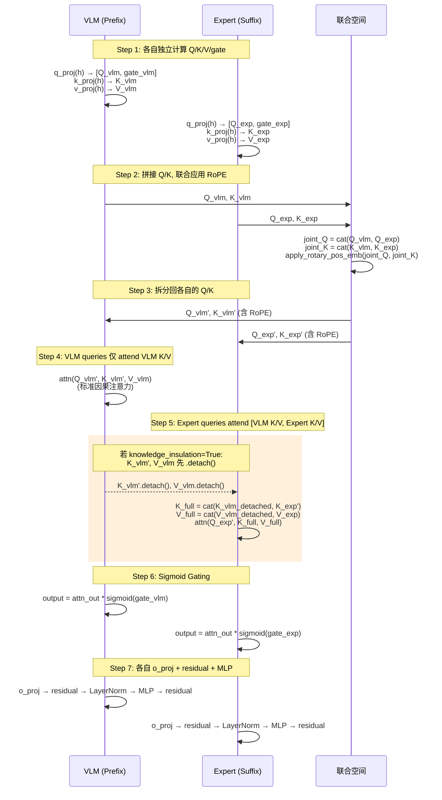

对应的核心代码段（简化）：

```python
# 183:335:src/lerobot/policies/internvla_a1_5/modeling_internvla_a1_5.py
elif layer_type == "full_attention":
    # Step 1: 各自计算 Q/K/V/gate
    for i, hidden_states in enumerate(inputs_embeds):
        layer = models[i].layers[layer_idx]
        hidden_states = layer.input_layernorm(hidden_states)
        q_gate = layer.self_attn.q_proj(hidden_states)  # Qwen3.5 的 Q 投影同时输出 query 和 gate
        query_state, gate = torch.chunk(q_gate, 2, dim=-1)
        query_state = layer.self_attn.q_norm(query_state)  # QK-Norm
        key_state = layer.self_attn.k_norm(layer.self_attn.k_proj(hidden_states))
        value_state = layer.self_attn.v_proj(hidden_states)
        # 保存到列表

    # Step 2-3: 联合 RoPE
    joint_query = torch.cat(query_states, dim=2)   # 沿序列维度拼接
    joint_key = torch.cat(key_states, dim=2)
    cos, sin = qwen3_5.language_model.rotary_emb(dummy_tensor, position_ids)
    joint_query, joint_key = apply_rotary_pos_emb(joint_query, joint_key, cos, sin)
    # 按 prefix_len 拆分回 VLM/Expert

    # Step 4: Prefix 自注意力
    prefix_attn_mask = attention_mask[:, :, :prefix_len, :prefix_len]
    prefix_att_output = F.scaled_dot_product_attention(
        prefix_query, prefix_key, prefix_value, attn_mask=prefix_attn_mask)

    # Step 5: Suffix 跨注意力（含 Knowledge Insulation）
    if knowledge_insulation:
        prefix_key_for_suffix = prefix_key.detach()      # 阻断梯度！
        prefix_value_for_suffix = prefix_value.detach()
    k_for_suffix = torch.cat([prefix_key_for_suffix, suffix_key], dim=2)
    v_for_suffix = torch.cat([prefix_value_for_suffix, suffix_value], dim=2)
    suffix_att_output = F.scaled_dot_product_attention(
        suffix_query, k_for_suffix, v_for_suffix, attn_mask=suffix_attn_mask)

    # Step 6-7: 各自 gating → o_proj → residual → MLP
    for i, hidden_states in enumerate(inputs_embeds):
        att_out_slice = att_output[:, start:end]
        gate_slice = gates_joint[:, start:end]
        att_out_slice = att_out_slice * torch.sigmoid(gate_slice)  # Sigmoid Gating
        out_emb = layer.self_attn.o_proj(att_out_slice)
        out_emb = out_emb + hidden_states  # residual
        out_emb = layer.post_attention_layernorm(out_emb)
        out_emb = layer.mlp(out_emb) + after_first_residual  # MLP + residual
```

#### 13.3.2 联合 RoPE 的意义

为什么需要对 VLM 和 Expert 的 Q/K 联合施加 RoPE？因为 Expert 的 suffix tokens 需要 attend 到 VLM 的 prefix tokens，两者必须处于**同一个位置编码空间**中，才能正确计算注意力权重中的相对位置关系。如果分别独立应用 RoPE，suffix tokens 的位置 ID 会从 0 开始而非从 prefix 之后开始，导致位置编码不一致。

代码中，position_ids 是 prefix 和 suffix 的位置连续拼接的：

```python
# 1178:1182:src/lerobot/policies/internvla_a1_5/modeling_internvla_a1_5.py
suffix_position_ids = (
    torch.arange(1, suffix_len + 1).repeat(3, 1, 1).to(max_input_pos)
    + max_input_pos  # 从 prefix 最大位置之后开始
)
position_ids = torch.cat([prefix_position_ids, suffix_position_ids], dim=-1)
```

> **注意**：position_ids 维度为 `[3, B, L]` 而非 `[B, L]`，这是 Qwen3.5 的 Multi-Resolution RoPE (MRoPE) 特性——3 个维度分别对应 temporal、height、width 三个轴的位置编码，用于正确处理二维图像 token 的空间位置。

#### 13.3.3 `InternVLAA15WithExpertModel.forward()` 的三条执行路径

双解码器引擎的 `forward()` 方法（line 435）通过 `inputs_embeds` 参数（一个 2 元素列表 `[prefix_embs, suffix_embs]`）来决定执行路径：

| 路径 | 触发条件 | 用途 | 行为 |
|------|----------|------|------|
| **Prefix-only** | `inputs_embeds[1] is None` | 推理时 prefix 编码 | 仅执行 VLM 的 `language_model.forward()`，返回 KV cache |
| **Suffix-only** | `inputs_embeds[0] is None` | 推理时 denoising step | 仅执行 `action_expert.forward()`，使用 cached prefix KV |
| **Joint** | 两者均非 None | 训练 forward | 逐层调用 `compute_layer_complete()`，同时处理 VLM 和 Expert |

```python
# 435:536:src/lerobot/policies/internvla_a1_5/modeling_internvla_a1_5.py
def forward(self, ..., inputs_embeds):
    if inputs_embeds[1] is None:     # Prefix-only: 推理编码
        prefix_output = self.qwen3_5.language_model.forward(
            inputs_embeds=inputs_embeds[0], ..., use_cache=True)
        return [prefix_output, None], past_key_values
    elif inputs_embeds[0] is None:   # Suffix-only: 推理 denoise
        suffix_output = self.action_expert.forward(
            inputs_embeds=inputs_embeds[1], ..., past_key_values=past_key_values)
        return [None, suffix_output], None
    else:                            # Joint: 训练
        for layer_idx in range(num_layers):
            inputs_embeds = compute_layer_complete(
                layer_idx, inputs_embeds, ...,
                qwen3_5=self.qwen3_5, action_expert=self.action_expert,
                prefix_len=prefix_len, knowledge_insulation=knowledge_insulation)
        # 最终 norm
        prefix_output = self.qwen3_5.language_model.norm(inputs_embeds[0])
        suffix_output = self.action_expert.norm(inputs_embeds[1])
        return [prefix_output, suffix_output], None
```

### 13.4 Suffix 序列构造与注意力模式

#### 13.4.1 Suffix 的三段式结构

`embed_suffix()` (line 917) 构造 Action Expert 的输入序列，由三个 token 组组成：

$$
\text{suffix} = \underbrace{[\mathbf{s}]}_{\text{state}(1)} \;\|\; \underbrace{[\mathbf{f}_1, \mathbf{f}_2, \ldots, \mathbf{f}_N]}_{\text{learnable tokens}(N)} \;\|\; \underbrace{[\mathbf{a}_1, \mathbf{a}_2, \ldots, \mathbf{a}_H]}_{\text{action+time tokens}(H)}
$$

其中：
- **State token**（1 个）：机器人关节状态经 `state_proj` 投影为 hidden 维度的嵌入向量（当 `tokenize_state=False` 时使用线性投影；为 True 时状态已在 prefix 中离散化编码，此处不再出现）
- **Learnable tokens**（$N$ 个，默认 50）：可学习参数 `self.learnable_tokens` 经 `learnable_tokens_in_proj` 投影后，按 batch 维度广播
- **Action+Time tokens**（$H$ 个，默认 50）：带噪动作 $\mathbf{x}_t$ 经 `action_in_proj` 投影后，与 sinusoidal 时间步嵌入拼接，再经 `action_time_mlp` 融合

```python
# 917:975:src/lerobot/policies/internvla_a1_5/modeling_internvla_a1_5.py
def embed_suffix(self, state, noisy_actions, timestep):
    embs, pad_masks, att_masks = [], [], []
    # 1) State token
    state_emb = self.state_proj(state)          # [B, hidden]
    embs.append(state_emb[:, None, :])          # [B, 1, hidden]
    att_masks += [1]                            # 新 attention block 开始

    # 2) Learnable tokens
    lt_emb = self.learnable_tokens_in_proj(self.learnable_tokens)
    lt_emb = lt_emb[None].expand(bsize, -1, -1) # [B, N, hidden]
    embs.append(lt_emb)
    att_masks += [1] + [0] * (num_lt - 1)       # 一个 block，内部双向

    # 3) Action + time tokens
    action_emb = self.action_in_proj(noisy_actions)  # [B, H, hidden]
    time_emb = sinusoidal_pos_embedding(timestep, hidden, ...)
    action_time_emb = cat([action_emb, time_emb], dim=2)  # [B, H, 2*hidden]
    action_time_emb = self.action_time_mlp_out(F.silu(self.action_time_mlp_in(action_time_emb)))
    embs.append(action_time_emb)
    att_masks += [1] + [0] * (chunk_size - 1)   # 一个 block，内部双向

    return cat(embs, dim=1), cat(pad_masks, dim=1), tensor(att_masks)
```

#### 13.4.2 注意力掩码机制

`att_masks` 使用 `make_att_2d_masks()` (line 100) 将一维的 block 标记转换为二维注意力矩阵。其原理是基于 **cumulative sum** 的 block-causal 机制：

$$
\text{att\_2d}[i, j] = \text{cumsum}(j) \leq \text{cumsum}(i)
$$

其中 `att_masks` 的每个 `1` 表示一个新 attention block 的起始。同一 block 内的 token（连续的 `0`）可以**双向互相 attend**，而只能**因果地 attend 到前面 block** 的 token。

以默认配置 $N=50, H=50$ 为例，suffix 的注意力掩码（简化为 3 个 block）表现为：

```
          state   learnable_1..50   action_1..50
state      ✓         ✗ ... ✗        ✗ ... ✗
learnable  ✓         ✓ ... ✓        ✗ ... ✗
action     ✓         ✓ ... ✓        ✓ ... ✓
```

- State token：仅 attend 自己（和更早的 prefix）
- Learnable tokens：相互双向 attend + attend state（和更早的 prefix）
- Action tokens：相互双向 attend + attend learnable + attend state（和更早的 prefix）

这种设计使得 learnable tokens 能够聚合 VLM 上下文信息，而 action tokens 能够在此基础上进一步整合 learnable tokens 的"未来预见"信息。

#### 13.4.3 FAST Token 屏蔽

当 `block_action_attend_fast_tokens=True`（默认）时，suffix 的 action queries 被进一步阻止 attend prefix 中的 FAST action token 位置。这通过 `_block_suffix_attend_prefix_tokens()` (line 719) 实现：

```python
# 719:732:src/lerobot/policies/internvla_a1_5/modeling_internvla_a1_5.py
def _block_suffix_attend_prefix_tokens(self, att_2d_masks, prefix_len, blocked_prefix_mask):
    att_2d_masks[:, prefix_len:, :prefix_len] &= ~blocked_prefix_mask[:, None, :]
    return att_2d_masks
```

这一设计的目的是**防止 Action Expert 从 prefix 中的 FAST 离散动作 token "抄答案"**——这些 FAST token 编码了相同的动作信息，如果 Expert 可以直接读取它们，就无需通过 flow matching 学习从视觉语言上下文中推理动作。

### 13.5 Forward 调用链与数据流

#### 13.5.1 训练 Forward

训练时的完整调用链如下图所示：

```mermaid
graph TD
    A["InternVLAA15Policy.forward(batch)<br/>line 1572"]
    A --> B["解析 batch 字段<br/>pixel_values, lang_tokens,<br/>state, actions, labels, video_frames"]
    B --> C["InternVLAA15.forward()<br/>line 1099"]

    C --> D["1. 采样噪声与时间步"]
    D --> D1["noise ~ N(0,1)"]
    D --> D2["time ~ Beta(1.5, 1.0) * 0.999 + 0.001"]
    D --> D3["x_t = time * noise + (1-time) * actions<br/>u_t = noise - actions"]

    C --> E["2. embed_prefix()<br/>line 677"]
    E --> E1["visual(pixel_values) → image_embs"]
    E --> E2["embed_tokens(lang_tokens) → embs"]
    E --> E3["embs[image_pos] = image_embs"]
    E --> E4["构建 causal attention mask"]

    C --> F["3. embed_suffix()<br/>line 917"]
    F --> F1["state_proj(state)"]
    F --> F2["learnable_tokens_in_proj(learnable_tokens)"]
    F --> F3["action_in_proj(x_t) + time_emb → action_time_mlp"]
    F --> F4["拼接为 suffix_embs"]

    C --> G["4. 构建联合 mask 与 position_ids"]
    G --> G1["make_att_2d_masks(pad_masks, att_masks)"]
    G --> G2["block FAST tokens (可选)"]
    G --> G3["get_position_ids + suffix 位置拼接"]

    C --> H["5. InternVLAA15WithExpertModel.forward()<br/>line 435 (Joint 路径)"]
    H --> H1["逐层 compute_layer_complete()<br/>× 28 layers<br/>line 119"]
    H1 --> H2["linear_attn: 独立处理"]
    H1 --> H3["full_attn: 联合 RoPE +<br/>prefix 自注意力 +<br/>suffix 跨注意力"]
    H --> H4["各自 final norm"]

    C --> I["6. 三路 Loss 计算"]
    I --> I1["lm_head(prefix_out) → CE loss<br/>(loss_vqa)"]
    I --> I2["action_out_proj(suffix_out[-chunk:]) → MSE(v_t, u_t)<br/>(loss_action)"]
    I --> I3["learnable_to_wan_proj(suffix_out[1:N+1])<br/>→ WAN DiT → MSE<br/>(loss_video)"]

    A --> J["7. Loss 聚合<br/>loss = 10 * loss_action<br/>+ λ_vqa * loss_vlm<br/>+ w_video * loss_video<br/>line 1649"]

    style A fill:#f9f,stroke:#333
    style H fill:#ffd,stroke:#333
    style J fill:#fdd,stroke:#333
```

#### 训练 forward 调用关系表

| 调用层 | 方法 | 行号 | 输入 | 输出 |
|--------|------|------|------|------|
| L0 | `InternVLAA15Policy.forward(batch)` | 1572 | 完整 batch dict | `(loss, loss_dict)` |
| L1 | `InternVLAA15.forward(...)` | 1099 | pixel_values, lang_tokens, state, actions, labels, video_frames | `(loss_action, loss_vqa, video_loss, loss_per_token, token_mask)` |
| L2 | `sample_noise()` | 657 | shape, device | `noise [B, H, D]` |
| L2 | `sample_time()` | 666 | bsize, device | `time [B]`，Beta 分布采样 |
| L2 | `embed_prefix()` | 677 | pixel_values, image_grid_thw, lang_tokens, lang_masks | `(prefix_embs, pad_masks, att_masks)` |
| L3 | `qwen3_5.visual(pixel_values)` | 684 | pixel_values | `image_embs` |
| L3 | `qwen3_5.get_input_embeddings()(lang_tokens)` | 686 | token IDs | `embs [B, L, 1536]` |
| L2 | `embed_suffix()` | 917 | state, x_t, time | `(suffix_embs, pad_masks, att_masks)` |
| L3 | `state_proj(state)` | 927 | `[B, 32]` | `[B, 1, hidden]` |
| L3 | `learnable_tokens_in_proj(learnable_tokens)` | 940 | `[N, hidden]` | `[B, N, hidden]` |
| L3 | `action_in_proj(x_t)` + `action_time_mlp` | 956-963 | `[B, H, 32]` + time | `[B, H, hidden]` |
| L2 | `make_att_2d_masks()` | 100 | pad_masks, att_masks | `att_2d_masks [B, L_total, L_total]` |
| L2 | `get_position_ids()` | 704 | lang_tokens, image_grid_thw, pad_masks | `position_ids [3, B, L_total]` |
| L2 | `InternVLAA15WithExpertModel.forward()` | 435 | `[prefix_embs, suffix_embs]`, mask, pos_ids | `([prefix_out, suffix_out], None)` |
| L3 | `compute_layer_complete()` × 28 | 119 | layer_idx, `[prefix_h, suffix_h]`, mask, ... | `[prefix_h', suffix_h']` |
| L2 | `lm_head(prefix_out)` | 1205 | `[B, L, 1536]` | logits → CE loss |
| L2 | `action_out_proj(suffix_out[-H:])` | 1229 | `[B, H, hidden]` | `v_t [B, H, 32]` → MSE(u_t, v_t) |
| L2 | `_compute_video_loss()` | 1309 | video_frames, learnable_out | `video_loss` (scalar) |
| L3 | `learnable_to_wan_proj()` | 1325 | `[B, N, hidden]` | `wan_context [B, N, wan_dim]` |
| L3 | `wan_video_model.encode_video()` | 1333 | `[B, C, T, H, W]` | `clean_latent` (no_grad) |
| L3 | `wan_dit_forward()` | 1252 | noisy_latent, wan_context, video_t | predicted velocity |

#### 13.5.2 推理 Forward

推理时的调用流程与训练完全不同——prefix 只编码一次并缓存 KV，之后的多步 denoising 仅使用 suffix-only 路径：

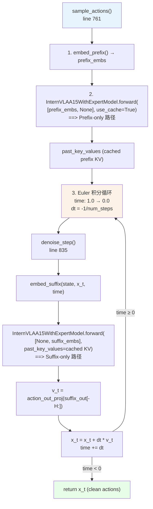

推理的关键优化是 **KV cache 复用**：28 层 full_attention 层的 prefix K/V 在第一次 forward 后被缓存，后续 denoising 步骤中 suffix-only 路径直接使用 `past_key_values` 参数进行交叉注意力，无需重新计算 prefix 的 K/V。

推理时 suffix-only 路径的执行方式与训练时不同——它调用的是 `action_expert.forward()` 而非逐层 `compute_layer_complete()`，这是因为推理时 prefix 的隐状态已通过 KV cache 以 K/V 形式存储，无需再同步逐层处理。

### 13.6 Backward 梯度流与权重更新

#### 13.6.1 总损失与梯度来源

训练时的总损失由三路 loss 加权组成（代码 line 1649-1654）：

$$
\mathcal{L}_{\text{total}} = \underbrace{10 \cdot \mathcal{L}_{\text{action}}}_{\text{Action Expert 分支}} + \underbrace{\lambda_{\text{vqa}} \cdot \mathcal{L}_{\text{vqa}}}_{\text{VLM 分支}} + \underbrace{w_{\text{video}} \cdot \mathcal{L}_{\text{video}}}_{\text{Video 分支}}
$$

其中：
- $\mathcal{L}_{\text{action}} = \text{MSE}(\mathbf{u}_t, \mathbf{v}_t)$，目标速度 $\mathbf{u}_t = \boldsymbol{\epsilon} - \mathbf{a}$，预测速度 $\mathbf{v}_t = \text{action\_out\_proj}(\text{suffix\_out}[-H:])$
- $\mathcal{L}_{\text{vqa}} = \text{CE}(\text{lm\_head}(\text{prefix\_out}), \text{labels})$，包含 subtask 文本 token 和 FAST action token 的交叉熵
- $\mathcal{L}_{\text{video}} = \text{MSE}(\text{WAN\_pred\_velocity}, \text{WAN\_target\_velocity})$

> **注意硬编码的 10× 系数**：action loss 的权重硬编码为 10（而非通过配置项控制），这体现了设计者对动作预测质量的重视。VQA loss 的权重 $\lambda_{\text{vqa}}$ 默认为 1.0，video loss 的权重 $w_{\text{video}}$ 默认为 1.0。

#### 13.6.2 三路梯度路径

下面分别追踪每路 loss 的梯度回传路径：

**路径 A：$\mathcal{L}_{\text{action}}$ 的梯度流**

$$
\mathcal{L}_{\text{action}} \xrightarrow{\nabla} \text{action\_out\_proj} \xrightarrow{\nabla} \text{suffix\_out}[-H:] \xrightarrow{\nabla} \underbrace{\text{Expert layers}}_{\text{28层}} \xrightarrow{\nabla}
\begin{cases}
\text{action\_in\_proj, action\_time\_mlp} & \text{(action 嵌入)} \\
\text{state\_proj} & \text{(state 嵌入)} \\
\text{learnable\_tokens, learnable\_tokens\_in\_proj} & \text{(foresight 嵌入)}
\end{cases}
$$

在 full_attention 层中，如果 **knowledge_insulation=False**（默认），Expert 的 attention 输出对 prefix K/V 有依赖，梯度可以穿过 prefix K/V 的计算路径（`k_proj`, `v_proj`）回传到 VLM 的 hidden states，进而影响 VLM 的所有权重。

如果 **knowledge_insulation=True**，prefix K/V 在提供给 suffix 之前被 `.detach()` 切断，此时 $\mathcal{L}_{\text{action}}$ 的梯度**无法到达 VLM 的任何参数**。

**路径 B：$\mathcal{L}_{\text{vqa}}$ 的梯度流**

$$
\mathcal{L}_{\text{vqa}} \xrightarrow{\nabla} \text{lm\_head} \xrightarrow{\nabla} \text{prefix\_out} \xrightarrow{\nabla} \underbrace{\text{VLM layers}}_{\text{28层}} \xrightarrow{\nabla}
\begin{cases}
\text{embed\_tokens} & \text{(词嵌入)} \\
\text{visual} & \text{(视觉编码器)}
\end{cases}
$$

这条路径完全在 VLM 分支内部，不涉及 Expert 的任何参数。

**路径 C：$\mathcal{L}_{\text{video}}$ 的梯度流**

$$
\mathcal{L}_{\text{video}} \xrightarrow{\nabla} \underbrace{\text{WAN DiT}}_{\text{frozen, 无梯度}} \xleftarrow{\text{cross-attn context}} \text{learnable\_to\_wan\_proj} \xrightarrow{\nabla} \text{suffix\_out}[1:N+1] \xrightarrow{\nabla} \underbrace{\text{Expert layers}}_{\text{28层}} \xrightarrow{\nabla} \text{learnable\_tokens}
$$

WAN DiT 是冻结的，但 video loss 的梯度可以通过 WAN DiT 的 **cross-attention 层**的反向传播到达 `wan_context`（即 `learnable_to_wan_proj` 的输出）。注意，虽然 WAN DiT 的参数不更新，但 cross-attention 对 context 的依赖意味着梯度仍然可以沿着 context 方向回传——这是因为 WAN DiT 虽然 `requires_grad=False`（不接收参数梯度），但前向计算中 context 作为输入变量仍然在计算图中，其梯度是可以回传到 `learnable_to_wan_proj` 的。

#### 13.6.3 冻结配置与各模块受影响的权重

以下表格汇总了各配置 flag 对模块 `requires_grad` 的影响（代码位于 `set_requires_grad()` line 606 和 `_setup_wan_grad()` line 882）：

| 配置 Flag | 影响的模块 | 效果 | 代码位置 |
|-----------|-----------|------|----------|
| `freeze_vision_encoder=True` | `qwen3_5.visual` | 冻结视觉编码器，设为 `eval()` | line 607-610 |
| `train_expert_only=True` | `qwen3_5` (整个 VLM) | 冻结整个 VLM（visual + language_model + lm_head），设为 `eval()` | line 612-615 |
| `freeze_wan_dit=True` (默认) | `wan_video_model.wan_model` | 冻结 WAN DiT，设为 `eval()` | line 891-893 |
| （总是生效） | `wan_video_model.vae.model` | WAN VAE **始终冻结**，设为 `eval()` | line 889-890 |
| `freeze_learnable_tokens=True` | `learnable_tokens`, `learnable_tokens_in_proj`, `learnable_to_wan_proj` | 冻结 foresight tokens 及其所有投影层 | line 883-896 |
| `action_loss_only=True` | `learnable_tokens`, `learnable_tokens_in_proj` | 冻结 foresight tokens 并跳过 WAN 加载 | line 883-884, 887-888 |

**典型训练场景下的权重更新情况**：

| 训练阶段 | VLM Visual | VLM LM | VLM lm_head | Expert | action 投影 | learnable tokens | WAN |
|----------|-----------|--------|-------------|--------|------------|-----------------|-----|
| 预训练 Stage 2 | ✓ 或 ✗ | ✓ | ✓ | ✓ | ✓ | ✓ | ✗ (冻结) |
| 微调 (默认) | ✓ 或 ✗ | ✓ | ✓ | ✓ | ✓ | ✗ (冻结) | ✗ (冻结) |
| 微调 (expert only) | ✗ | ✗ | ✗ | ✓ | ✓ | ✗ (冻结) | ✗ (冻结) |
| 仅 action loss | ✓ 或 ✗ | ✓ | ✓ | ✓ | ✓ | ✗ (冻结) | 不加载 |

> 说明：✓ 表示 `requires_grad=True`（可更新），✗ 表示 `requires_grad=False`（冻结）。"✓ 或 ✗" 取决于 `freeze_vision_encoder` 的设置。

#### 13.6.4 Knowledge Insulation 的梯度阻断效果

下面用简化图示说明 Knowledge Insulation 开启/关闭时的梯度流差异：

**Knowledge Insulation = False（默认）**：

```
loss_action
    ↓ ∇
action_out_proj
    ↓ ∇
Expert full_attn output
    ↓ ∇
suffix_query × [prefix_K/V , suffix_K/V]
    ↓ ∇                ↓ ∇
suffix 参数        prefix K/V (有梯度!)
                       ↓ ∇
                  VLM k_proj, v_proj
                       ↓ ∇
                  VLM hidden states
                       ↓ ∇
                  VLM 所有参数 (包括 visual, embed_tokens)
```

**Knowledge Insulation = True**：

```
loss_action
    ↓ ∇
action_out_proj
    ↓ ∇
Expert full_attn output
    ↓ ∇
suffix_query × [prefix_K/V.detach() , suffix_K/V]
    ↓ ∇                     ✗ 梯度被切断
suffix 参数           VLM 不受 loss_action 影响
```

这个机制的设计意图是**保护 VLM 的预训练表征不被 action loss 的梯度破坏**。当 VLM 已经通过 $\mathcal{L}_{\text{vqa}}$ 获得了充分的语言/视觉监督时，开启 Knowledge Insulation 可以避免 action 分支的梯度干扰 VLM 的表征质量。

### 13.7 Video Foresight 分支详解

Video Foresight 分支是 InternVLA-A1.5 区别于其他 VLA 方法的核心创新之一。它通过冻结的 WAN2.2 视频生成模型提供"未来视觉预见"的监督信号，使 learnable tokens 在训练过程中学会编码对未来视觉状态的预测。

#### 13.7.1 Learnable Tokens → WAN Context 的投影

Learnable tokens 的输出从 Expert 的 suffix_out 中提取后，经过线性投影转换到 WAN 的条件空间：

```python
# 977:980:src/lerobot/policies/internvla_a1_5/modeling_internvla_a1_5.py
def get_learnable_token_output(self, suffix_out):
    start = 1  # 跳过 state token
    end = 1 + self.config.num_learnable_tokens
    return suffix_out[:, start:end]   # [B, N, hidden]

# 在 _compute_video_loss 中:
# 1325:src/lerobot/policies/internvla_a1_5/modeling_internvla_a1_5.py
wan_context = self.learnable_to_wan_proj(learnable_out)  # [B, N, wan_dim]
```

这个投影的设计**替换了 WAN 原生的 text_embedding**——在标准的 WAN2.2 中，文本描述经过 T5 编码器产生 context 序列供 DiT 的 cross-attention 层使用。InternVLA-A1.5 用 learnable tokens 的输出取代了 T5 text embedding 的角色，这意味着 learnable tokens 必须学会编码足够丰富的"未来意图"信息来引导视频生成。

#### 13.7.2 WAN DiT Forward

`wan_dit_forward()` (line 1252) 手动驱动 WAN DiT 的前向传播（而非调用 WAN 模型的标准推理接口），以便将 learnable token 投影作为 cross-attention context 注入：

```python
# 1252:1303:src/lerobot/policies/internvla_a1_5/modeling_internvla_a1_5.py
def wan_dit_forward(self, noisy_video_latent, wan_context, video_timestep):
    wan = self.wan_video_model.wan_model
    # 1. Patch embedding: 3D Conv [B, 48, T', H', W'] → [B, seq_len, dim]
    x = wan.patch_embedding(noisy_video_latent).flatten(2).transpose(1, 2)
    # 2. Time embedding: sinusoidal → MLP → 6 modulation vectors
    e = wan.time_embedding(sinusoidal_embedding_1d(freq_dim, t))
    e0 = wan.time_projection(e).unflatten(2, (6, wan.dim))
    # 3. Cross-attention context = projected learnable tokens (跳过 text_embedding)
    context = wan_context
    # 4. 32 blocks: self_attn(3D RoPE) → cross_attn(context) → FFN
    for block in wan.blocks:
        x = block(x, e=e0, freqs=wan.freqs, context=context, ...)
    # 5. Output head
    x = wan.head(x, e)
    return wan.unpatchify(x, grid_sizes)
```

#### 13.7.3 Video Loss 计算

`_compute_video_loss()` (line 1309) 的计算步骤：

1. **编码视频**：ground-truth 未来视频帧 $\mathbf{v} \in \mathbb{R}^{B \times T \times 3 \times H \times W}$ 经冻结 VAE 编码为 clean latent $\mathbf{z}_1$，第一帧单独编码为 $\mathbf{z}_{\text{cond}}$
2. **Flow matching 加噪**：采样视频时间步 $\sigma$，对 clean latent 加噪（保持 frame 0 不加噪）：
   $$\mathbf{z}_\sigma = (1 - \sigma) \cdot \mathbf{z}_1 + \sigma \cdot \boldsymbol{\epsilon}, \quad \mathbf{z}_\sigma[:, :, 0:1] = \mathbf{z}_{\text{cond}}$$
3. **目标速度**：$\mathbf{u} = \boldsymbol{\epsilon} - \mathbf{z}_1$，frame 0 的目标置零
4. **WAN DiT 预测**：以 projected learnable tokens 为 context，预测速度场 $\hat{\mathbf{u}}$
5. **MSE Loss**：$\mathcal{L}_{\text{video}} = \|\hat{\mathbf{u}} - \mathbf{u}\|_2^2$

```python
# 1309:1361:src/lerobot/policies/internvla_a1_5/modeling_internvla_a1_5.py
def _compute_video_loss(self, video_frames, learnable_out):
    wan_context = self.learnable_to_wan_proj(learnable_out).to(wan_dtype, wan_device)
    with torch.no_grad():
        clean_latent = self.wan_video_model.encode_video(video_bcthw)
        cond_latent = self.wan_video_model.encode_video(first_frame)
    # 加噪 (frame 0 保持 clean)
    noisy_latent = clean_latent * (1 - sigma) + video_noise * sigma
    noisy_latent[:, :, 0:1] = cond_latent
    # 目标 velocity
    video_target = video_noise - clean_latent
    video_target[:, :, 0:1] = 0
    # WAN forward + MSE
    video_pred = self.wan_dit_forward(noisy_latent, wan_context, video_t)
    return F.mse_loss(video_pred.float(), video_target.float(), reduction="mean")
```

#### 13.7.4 推理时的视频生成

推理时可通过 `predict_action_chunk_with_video()` (line 1478) 或 `generate_video()` (line 1040) 生成未来视频。流程是标准的扩散模型采样：

1. 从 denoising loop 的最后一步提取 learnable token 的输出
2. 投影为 WAN context
3. 初始化随机 latent，将 frame 0 替换为条件帧的 latent
4. 迭代 denoising（默认 50 步 Euler integration）
5. 通过 VAE decoder 还原为像素空间视频

### 13.8 优化推理后端

`InternVLAA15Optimized` (定义在 `modeling_internvla_a1_5_optimized.py`) 继承自 `InternVLAA15`，专为低延迟推理设计。它**仅支持推理**（调用 `.train(True)` 会抛出 `RuntimeError`）且要求 `action_loss_only=True`。

#### 标准后端 vs 优化后端对比

| 特性 | 标准后端 (`InternVLAA15`) | 优化后端 (`InternVLAA15Optimized`) |
|------|--------------------------|-----------------------------------|
| 训练支持 | ✓ | ✗（仅推理） |
| WAN 视频分支 | 可选 | 不加载 |
| Action Expert 精度 | bfloat16 | float32（数值稳定性） |
| Attention 实现 | eager / SDPA（可选） | 强制 SDPA |
| suffix mask 缓存 | 每步重建 | `_get_static_suffix_masks()` 按 `(B, device)` 缓存 |
| CUDA Graph | 不使用 | 按 `(B, prefix_len)` 键 capture 并 replay |
| 推理延迟 | 基线 | 显著降低（避免 Python/CUDA kernel launch 开销） |

CUDA Graph 的工作机制（`_capture_graph()` 方法）：
1. 首次对某 `(batch_size, prefix_len)` 执行推理时，预分配所有 GPU buffer（x_t, timestep, state 等）
2. 执行 2 次 warm-up forward
3. 使用 `torch.cuda.CUDAGraph` 录制一次完整的 `_denoise_step_fast()` 调用
4. 后续 denoising 步骤仅需将 x_t 和 timestep 复制到 buffer，然后 replay 已录制的 graph，避免了每步重复的 Python 开销和 CUDA kernel launch

### 13.9 Unified Expert 的 Flow Matching 动作生成机制

Flow Matching（又称 Conditional Flow Matching, CFM）是 InternVLA-A1.5 中 Unified Expert 生成连续动作的核心机制。与离散 token 预测不同，Flow Matching 让 Expert 学习一个**速度场（velocity field）**，在推理时通过求解常微分方程（ODE）将高斯噪声逐步"推"成干净的动作序列。本节从原理、训练、推理三个层面进行代码级解析。

#### 13.9.1 Flow Matching 原理概述

Flow Matching 的核心思想是：在数据分布 $p_1$（干净动作）和先验分布 $p_0$（高斯噪声）之间构造一条**概率流路径**，让神经网络学习沿该路径的速度场。

**直线插值路径**：给定干净动作 $\mathbf{a}$（来自数据集）和噪声 $\boldsymbol{\epsilon} \sim \mathcal{N}(0, I)$，在时间 $t \in [0, 1]$ 处构造插值样本：

$$x_t = (1 - t) \cdot \mathbf{a} + t \cdot \boldsymbol{\epsilon}$$

当 $t = 0$ 时，$x_0 = \mathbf{a}$（干净动作）；当 $t = 1$ 时，$x_1 = \boldsymbol{\epsilon}$（纯噪声）。

**目标速度场**：沿这条直线路径，理想的速度是：

$$u_t = \frac{dx_t}{dt} = \boldsymbol{\epsilon} - \mathbf{a}$$

即从干净动作指向噪声的方向（与 $t$ 无关，恒为常向量）。

**训练目标**：让 Expert 网络 $v_\theta(x_t, t)$ 去拟合 $u_t$，损失函数为均方误差：

$$\mathcal{L}_{\text{action}} = \mathbb{E}_{t, \mathbf{a}, \boldsymbol{\epsilon}} \left\| v_\theta(x_t, t) - u_t \right\|^2$$

**推理过程**：从 $x_1 = \boldsymbol{\epsilon}$（纯噪声）出发，沿学到的速度场 $v_\theta$ 反向积分到 $t = 0$，即可得到干净动作：

$$x_0 = x_1 + \int_1^0 v_\theta(x_t, t) \, dt \approx x_1 + \sum_{k=0}^{K-1} \Delta t \cdot v_\theta(x_{t_k}, t_k)$$

其中 $\Delta t = -1/K < 0$，$K$ 为积分步数（默认 10 步）。

> **与 DDPM 类扩散模型的区别**：Flow Matching 使用直线插值路径（Optimal Transport 路径），而 DDPM 使用方差递增的高斯加噪路径。Flow Matching 的路径更直，因此需要更少的积分步数（10 步 vs 典型扩散的 50-1000 步），推理速度更快。

#### 13.9.2 代码约定与论文约定的对照

代码和论文对时间变量的定义**方向相反**，但数学上完全等价：

| 维度 | 代码约定（`modeling_internvla_a1_5.py`） | 论文约定（InternVLA-A1.5 paper） |
|------|----------------------------------------|--------------------------------|
| 时间变量 | $t$ | $\tau$ |
| 时间方向 | $t=0$ → 干净，$t=1$ → 噪声 | $\tau=0$ → 噪声，$\tau=1$ → 干净 |
| 等价关系 | $t = 1 - \tau$ | $\tau = 1 - t$ |
| 插值公式 | $x_t = t \cdot \boldsymbol{\epsilon} + (1-t) \cdot \mathbf{a}$ | $x_\tau = \tau \cdot \mathbf{a} + (1-\tau) \cdot \boldsymbol{\epsilon}$ |
| 目标速度 | $u_t = \boldsymbol{\epsilon} - \mathbf{a}$ | $u_\tau = \mathbf{a} - \boldsymbol{\epsilon}$ |
| 推理方向 | $t: 1 \to 0$（从噪声到干净） | $\tau: 0 \to 1$（从噪声到干净） |
| 推理步长 | $\Delta t = -1/K < 0$ | $\Delta\tau = +1/K > 0$ |

两种约定描述的是同一条路径、同一个速度场。区别仅在于参数化方向。本节后续**统一使用代码约定**。

#### 13.9.3 训练阶段的 Flow Matching

以下 Mermaid 流程图展示了训练时 flow matching 的完整数据流：

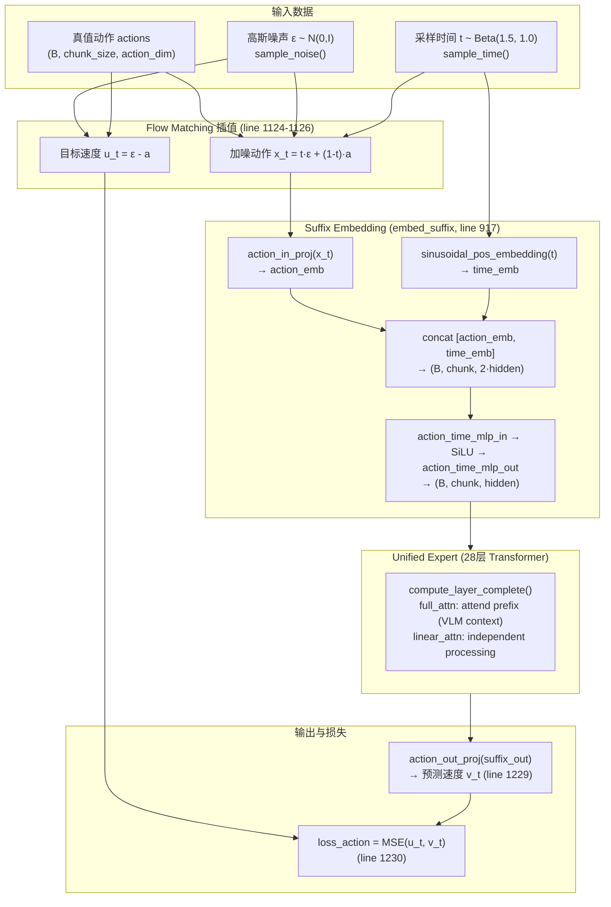

**关键代码走读**（[modeling_internvla_a1_5.py](../../../src/lerobot/policies/internvla_a1_5/modeling_internvla_a1_5.py)）：

**Step 1：采样噪声和时间步**

```python
# line 1119-1122
if noise is None:
    noise = self.sample_noise(actions.shape, actions.device)  # ε ~ N(0, I)
if time is None:
    time = self.sample_time(actions.shape[0], actions.device)  # t ~ Beta(1.5, 1.0)
```

噪声采样（line 657-664）使用标准正态分布。时间步采样（line 666-674）使用 Beta 分布：

```python
# line 666-674
def sample_time(self, bsize, device):
    time_beta = sample_beta(
        self.config.time_sampling_beta_alpha,   # α = 1.5
        self.config.time_sampling_beta_beta,     # β = 1.0
        bsize, device,
    )
    time = time_beta * 0.999 + 0.001  # 将 [0,1] 映射到 [0.001, 1.0], 避免边界
    return time
```

使用 $\text{Beta}(1.5, 1.0)$ 而非均匀分布 $U(0,1)$ 的原因：该分布的概率密度在 $t \to 1$（接近纯噪声）时更高，使模型在训练中更多地关注"从噪声状态开始去噪"这一较难的阶段。

**Step 2：构造插值样本和目标速度**

```python
# line 1124-1126
time_expanded = time[:, None, None]                          # (B,) → (B, 1, 1)
x_t = time_expanded * noise + (1 - time_expanded) * actions  # 加噪动作
u_t = noise - actions                                        # 目标速度（与 t 无关）
```

**Step 3：嵌入加噪动作和时间步**

`embed_suffix()` (line 917-975) 将 $x_t$ 和 $t$ 编码为 Expert 可处理的 token 序列：

```python
# line 948-963
time_emb = create_sinusoidal_pos_embedding(timestep, dim, ...)  # 正弦位置编码
action_emb = self.action_in_proj(noisy_actions)                  # 线性投影
action_time_emb = torch.cat([action_emb, time_emb], dim=2)      # 拼接 → 2×dim
action_time_emb = action_time_mlp_out(SiLU(action_time_mlp_in(action_time_emb)))  # 降维 → dim
```

时间信息通过与动作 embedding 拼接后经 MLP 融合，确保 Expert 在每个 action token 位置都知道当前的噪声水平。

**Step 4：Expert 前向 + 损失计算**

```python
# line 1227-1230
action_out = suffix_out[:, -self.config.chunk_size:]  # 取 suffix 中 action 位置的输出
v_t = self.action_out_proj(action_out)                 # 投影到动作维度 → 预测速度
loss_action = F.mse_loss(u_t, v_t, reduction="none")   # 逐元素 MSE
```

最终 `loss_action` 在 `InternVLAA15Policy.forward()` (line 1649) 中被乘以权重 10：

$$\mathcal{L} = 10 \cdot \mathcal{L}_{\text{action}} + \lambda_{\text{vqa}} \cdot \mathcal{L}_{\text{vqa}} + w_{\text{video}} \cdot \mathcal{L}_{\text{video}}$$

#### 13.9.4 推理阶段的 Flow Matching（Euler ODE 积分）

推理时，Expert 作为已训练好的速度场预测器，通过 Euler 方法求解 ODE，将纯噪声逐步转化为干净动作：

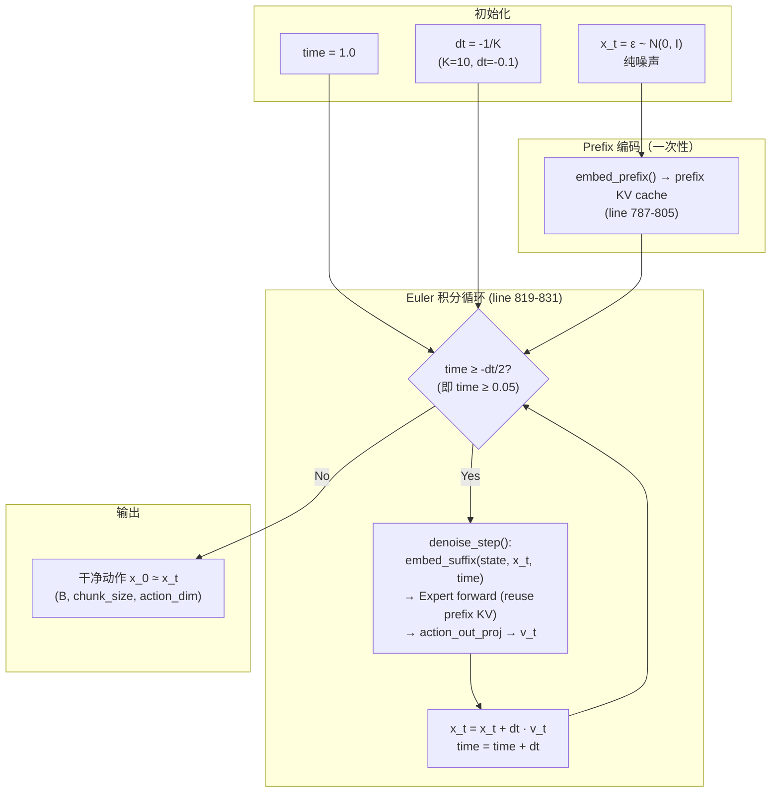

**关键代码走读**（`sample_actions`, line 760-833）：

```python
# line 807-811 — 初始化
dt = -1.0 / num_steps                                     # num_steps=10 → dt=-0.1
dt = torch.tensor(dt, dtype=torch.float32, device=device)
x_t = noise                                                # 从纯噪声开始
time = torch.tensor(1.0, dtype=torch.float32, device=device)

# line 819-831 — Euler 积分循环
while time >= -dt / 2:                                     # 即 time >= 0.05
    expanded_time = time.expand(bsize)
    v_t = self.denoise_step(state, prefix_pad_masks,        # 预测速度场
                            past_key_values, ..., x_t, expanded_time, ...)
    x_t = x_t + dt * v_t                                   # Euler 更新
    time += dt                                              # 时间前进
```

**核心优化**：Prefix KV Cache 复用。在 10 步 Euler 积分中，prefix（图像 + 语言指令）只在循环开始前编码一次（line 798-805），产生 `past_key_values`。循环中每步 `denoise_step()` 仅对 suffix（state + learnable + action+time）做 forward，大幅降低计算量。

#### 13.9.5 具体数值示例

为了直观理解 Euler 积分如何将噪声变为动作，下面以一个简化的 1 维动作、3 步积分为例：

**设定**：
- 真值动作 $\mathbf{a} = 0.8$
- Expert 已完美学习速度场 $v_\theta(x_t, t) = u_t = \boldsymbol{\epsilon} - \mathbf{a}$
- 初始噪声 $\boldsymbol{\epsilon} = -0.5$（采样自 $\mathcal{N}(0,1)$）
- 积分步数 $K = 3$，步长 $\Delta t = -1/3 \approx -0.333$

**理想速度**：$u_t = \boldsymbol{\epsilon} - \mathbf{a} = -0.5 - 0.8 = -1.3$

| 步骤 | $t$ | $x_t$ | $v_\theta(x_t, t)$ | $x_{t+\Delta t} = x_t + \Delta t \cdot v_\theta$ |
|------|-----|--------|---------------------|--------------------------------------------------|
| 初始 | 1.0 | $-0.500$（纯噪声 $\epsilon$） | — | — |
| Step 1 | 1.0 → 0.667 | $-0.500$ | $-1.3$ | $-0.500 + (-0.333) \times (-1.3) = -0.067$ |
| Step 2 | 0.667 → 0.333 | $-0.067$ | $-1.3$ | $-0.067 + (-0.333) \times (-1.3) = 0.367$ |
| Step 3 | 0.333 → 0.0 | $0.367$ | $-1.3$ | $0.367 + (-0.333) \times (-1.3) = 0.800$ |

最终 $x_0 = 0.800 = \mathbf{a}$ ✓。因为直线路径下速度是常数，即使步数很少（3 步）也能精确恢复。这正是 Flow Matching 选用直线插值路径的优势——速度场更平滑、所需积分步数更少。

> **实际情况**：真实的 Expert 并非完美拟合，不同 $(a, \epsilon)$ 对的速度场会有预测误差。但由于直线路径的"平坦"性质，10 步 Euler 积分已经足以得到高质量结果。

#### 13.9.6 时间步编码与条件注入

Expert 需要知道当前的噪声水平 $t$ 才能预测正确的速度。时间步通过两步机制注入到 action token 中：

**第一步：正弦位置编码**。将标量 $t$ 编码为高维向量（维度 = Expert hidden size）：

$$\text{time\_emb}[2i] = \sin\left(\frac{t}{p^{2i/d}}\right), \quad \text{time\_emb}[2i+1] = \cos\left(\frac{t}{p^{2i/d}}\right)$$

其中 $p$ 在 `min_period` 到 `max_period` 之间对数均匀分布。

**第二步：与动作 embedding 融合**。时间 embedding 和动作 embedding 拼接后经过 2 层 MLP（带 SiLU 激活）融合：

$$\text{action\_time\_emb} = W_2 \cdot \text{SiLU}(W_1 \cdot [\text{action\_emb}; \text{time\_emb}])$$

其中 $W_1 \in \mathbb{R}^{2d \to 2d}$，$W_2 \in \mathbb{R}^{2d \to d}$，起降维和非线性融合的作用。

这种设计的好处是每个 action token **独立携带时间信息**，无需额外的全局条件注入机制（如 AdaLN）。

#### 13.9.7 训练与推理的完整对比

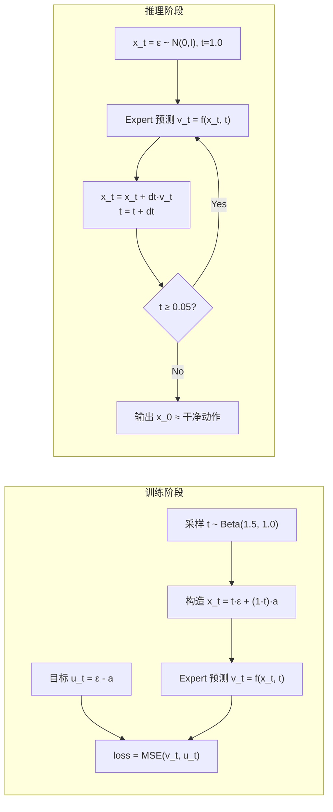

| 维度 | 训练 | 推理 |
|------|------|------|
| 输入 | 真值动作 $\mathbf{a}$ + 采样噪声 $\boldsymbol{\epsilon}$ + 采样时间 $t$ | 仅噪声 $\boldsymbol{\epsilon}$ |
| Expert 调用次数 | 1 次（单个随机 $t$） | $K$ 次（$K=10$，每步一次） |
| 输出 | 预测速度 $v_\theta$ → MSE loss → 反向传播 | $K$ 步 Euler 积分 → 干净动作 $x_0$ |
| Prefix 编码 | 1 次，与 suffix 一起 forward | 1 次，存入 KV cache |
| Suffix 编码 | 1 次 | $K$ 次（每步 $x_t$ 和 $t$ 都在变化） |
| 梯度 | 需要，更新 Expert 权重 | `@torch.no_grad()` 无梯度 |
| 时间步分布 | $\text{Beta}(1.5, 1.0)$，偏向高噪声 | 均匀网格 $\{1.0, 0.9, ..., 0.1\}$ |
| 代码入口 | `InternVLAA15.forward()` (line 1099) | `sample_actions()` (line 761) |

### 13.10 Backward 深度解析：从 loss.backward() 到权重更新

前文 13.6 节以数学公式给出了三路梯度路径的高层概述。本节将**基于实际代码**，从训练循环的 `loss.backward()` 出发，逐层追踪梯度如何流经各模块、在哪里被阻断、哪些参数最终被更新，并通过图和数值示例将这一过程形象化。

#### 13.10.1 训练循环中的 Backward 全流程

每一个 training step 的完整流程定义在 `update_policy()` 函数中（[lerobot_train.py:54-132](../../../src/lerobot/scripts/lerobot_train.py)）：

```mermaid
sequenceDiagram
    participant TL as Training Loop<br/>(update_policy)
    participant ACC as Accelerator
    participant POL as InternVLAA15Policy
    participant OPT as AdamW Optimizer
    participant SCHED as CosineDecay<br/>Scheduler

    TL->>POL: policy.train()
    TL->>ACC: accelerator.autocast()
    ACC->>POL: policy.forward(batch)
    Note over POL: 混合精度 forward<br/>bf16 计算 + float32 loss
    POL-->>ACC: loss, output_dict
    TL->>ACC: accelerator.backward(loss)
    Note over ACC: 调用 loss.backward()<br/>标准 PyTorch autograd<br/>无自定义 backward
    ACC-->>TL: 梯度已填充到所有 .grad
    TL->>ACC: clip_grad_norm_(params, 1.0)
    Note over ACC: 全局梯度裁剪<br/>所有参数统一计算 L2 范数
    TL->>OPT: optimizer.step()
    Note over OPT: AdamW 更新<br/>单一参数组<br/>lr=2.5e-5, betas=(0.9,0.95)<br/>weight_decay=0.01
    TL->>OPT: optimizer.zero_grad()
    TL->>SCHED: lr_scheduler.step()
```

**关键代码**：

```python
# lerobot_train.py line 88-112
with accelerator.autocast():                          # 混合精度 forward
    loss, output_dict = policy.forward(batch)          # 返回标量 loss

accelerator.backward(loss)                             # 标准 autograd backward

if grad_clip_norm > 0:                                 # 默认 grad_clip_norm=1.0
    grad_norm = accelerator.clip_grad_norm_(policy.parameters(), grad_clip_norm)

optimizer.step()                                       # AdamW 权重更新
optimizer.zero_grad()                                  # 清零梯度
lr_scheduler.step()                                    # 学习率调度
```

**工程要点**：

| 特性 | 实现细节 | 代码位置 |
|------|----------|----------|
| 梯度累积 | **无**，每步一 forward + 一 backward | lerobot_train.py line 88-94 |
| 梯度裁剪 | 全局 L2 范数裁剪，阈值 1.0 | configuration line 300, train line 97-98 |
| 优化器 | AdamW，单一参数组，所有可训练参数共享同一 LR | configuration line 394-401 |
| 学习率调度 | Cosine decay with warmup, peak=2.5e-5, decay=2.5e-6, warmup=1000 步 | configuration line 403-409 |
| DDP | `find_unused_parameters=True` | lerobot_train.py line 161 |
| 自定义 backward | 无，完全依赖 PyTorch autograd | — |

> **`find_unused_parameters=True` 的必要性**：由于 `vqa_type` 条件计算（见 13.10.5），不同样本类型会跳过不同的 loss 分支，导致部分参数在某些 forward 中不参与计算。DDP 默认要求所有参数都参与 backward（否则报错），设置 `find_unused_parameters=True` 允许 DDP 自动检测未使用的参数并跳过它们的梯度同步。

#### 13.10.2 三路 Loss 的梯度回传全景图

下面的 Mermaid 图展示了从 `loss_total` 出发的三路梯度回传路径，标注了每个关键阻断/穿透点：

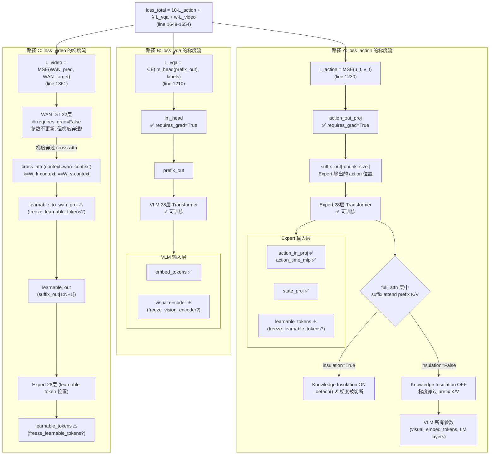

**三种梯度阻断机制的关键区别**：

| 机制 | 代码 | 对参数的效果 | 对梯度传播的效果 | 使用场景 |
|------|------|-------------|-----------------|----------|
| `requires_grad=False` | `p.requires_grad = False` | 参数不会被 optimizer 更新 | 梯度**仍可穿过**该层到达上游输入 | 冻结 WAN DiT, 冻结 vision encoder |
| `.detach()` | `prefix_kv.detach()` | — | 彻底**切断计算图**，梯度无法穿过 | Knowledge Insulation |
| `torch.no_grad()` | `with torch.no_grad():` | — | **不构建**计算图，该区域内无梯度 | WAN VAE 编码 |

> 这三种机制常被混淆。简单记忆：`requires_grad=False` 是对**参数**说"你不需要更新"；`.detach()` 是对**计算图的边**说"从这里断开"；`torch.no_grad()` 是对**一段代码**说"不要记录你做了什么"。

#### 13.10.3 冻结 WAN 的梯度穿透机制

这是 InternVLA-A1.5 梯度流设计中最精妙的部分：WAN DiT 的所有参数被冻结（`requires_grad=False`），但 video loss 的梯度**仍能穿过** WAN 回传到 learnable tokens。下面详细解释这一机制。

**核心原理**：PyTorch autograd 追踪的是**计算图上的操作**，而非参数的 `requires_grad` 属性。当冻结层（如 `nn.Linear(W_frozen)`）接收一个 `requires_grad=True` 的输入 `x` 时：

$$y = W_{\text{frozen}} \cdot x$$

autograd 记录了 $y$ 对 $x$ 的依赖：$\frac{\partial y}{\partial x} = W_{\text{frozen}}^T$。backward 时，梯度沿此路径回传：

$$\frac{\partial \mathcal{L}}{\partial x} = W_{\text{frozen}}^T \cdot \frac{\partial \mathcal{L}}{\partial y}$$

$W_{\text{frozen}}$ 本身不会收到梯度（不会被 optimizer 更新），但 $x$ 会收到梯度。

**类比**：把 WAN DiT 想象成一组**固定的透镜**。透镜本身不会移动（frozen weights），但光（梯度）可以穿过透镜折射到光源（learnable tokens）。训练的目标是调整光源的发光方式（更新 learnable tokens 的值），使得光经过固定透镜后形成期望的图案（正确预测视频帧）。

**在代码中的梯度穿透路径**：

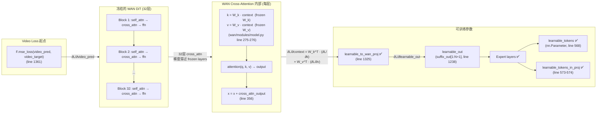

**关键代码走读**：

1. **`_compute_video_loss()`** ([modeling_internvla_a1_5.py:1309-1361](../../../src/lerobot/policies/internvla_a1_5/modeling_internvla_a1_5.py))：

```python
# line 1325 — 可训练投影，梯度在此进入 WAN 的输入
wan_context = self.learnable_to_wan_proj(learnable_out)  # ✅ requires_grad=True

# line 1332-1334 — VAE 编码在 no_grad 下，不产生梯度
with torch.no_grad():
    clean_latent = self.wan_video_model.encode_video(video_bcthw)   # ❌ 无梯度
    cond_latent = self.wan_video_model.encode_video(first_frame_bcthw)

# line 1348-1349 — noisy_latent 由无梯度的 clean_latent 构造
noisy_latent = clean_latent * (1 - sigma) + video_noise * sigma  # ❌ 无梯度

# line 1357-1358 — WAN forward，wan_context 是唯一有梯度的输入
with torch.amp.autocast("cuda", dtype=wan_dtype):
    video_pred = self.wan_dit_forward(noisy_latent, wan_context, video_t)
    # wan_context ✅ → 梯度可以回传
    # noisy_latent ❌ → 无梯度
    # video_t ❌ → 无梯度

# line 1361 — loss
return F.mse_loss(video_pred.float(), video_target.float(), reduction="mean")
```

2. **`WanCrossAttention.forward()`** ([wan/modules/model.py:264-284](../../../src/lerobot/policies/internvla_a1_5/wan/modules/model.py))：

```python
# context = wan_context (有梯度!)
k = self.norm_k(self.k(context)).view(b, -1, n, d)  # self.k 是 frozen Linear
v = self.v(context).view(b, -1, n, d)                # self.v 是 frozen Linear
# 虽然 self.k 和 self.v 的权重 frozen，但 context 有梯度
# autograd 记录：∂k/∂context = W_k^T (用于回传)

x = flash_attention(q, k, v, k_lens=context_lens)    # 注意力计算
x = self.o(x)                                         # 输出投影
```

3. **`WanAttentionBlock.forward()`** ([wan/modules/model.py:324-364](../../../src/lerobot/policies/internvla_a1_5/wan/modules/model.py))：

```python
# line 355-356 — context 通过残差连接进入每一层
x = x + self.cross_attn(self.norm3(x), context, context_lens)
# 32 层 block 中，每一层的 cross_attn 都使用同一个 context
# 梯度从所有 32 层的 cross_attn 汇聚回 context
```

> **梯度汇聚效应**：由于 `context`（即 `wan_context`）被所有 32 层 WAN block 的 cross-attention 共享使用，backward 时来自 32 层的梯度**汇聚累加**到 `wan_context` 上。这意味着 `learnable_to_wan_proj` 和 `learnable_tokens` 收到的梯度信号包含了 WAN 所有层级的反馈。

#### 13.10.4 混合精度与梯度检查点对 Backward 的影响

**混合精度训练**

InternVLA-A1.5 通过 `accelerator.autocast()` 启用混合精度，在 bfloat16 下执行 forward 的矩阵运算，但**所有 loss 都在 float32 下计算**：

| 计算阶段 | 精度 | 代码位置 | 原因 |
|----------|------|----------|------|
| Transformer 层 forward | bf16 | line 1137-1138 | 加速计算，节省显存 |
| action_out_proj | float32 | Policy.to() line 1421 | 动作预测需要高精度 |
| MSE loss (action) | float32 | line 1228 `.to(float32)` | loss 精度影响训练稳定性 |
| CE loss (VQA) | float32 | line 1205 `.to(float32)` | 同上 |
| MSE loss (video) | float32 | line 1361 `.float()` | 同上 |
| Backward 中间梯度 | bf16/float32 混合 | autograd 自动 | AMP autocast 自动处理 |

这种"forward 低精度 + loss 高精度"的设计兼顾了计算效率和数值稳定性。backward 时，PyTorch AMP 自动在 bf16 和 float32 之间转换中间梯度。

**梯度检查点（Gradient Checkpointing）**

梯度检查点通过"用计算换内存"的策略降低训练显存占用。InternVLA-A1.5 在三个层级使用检查点：

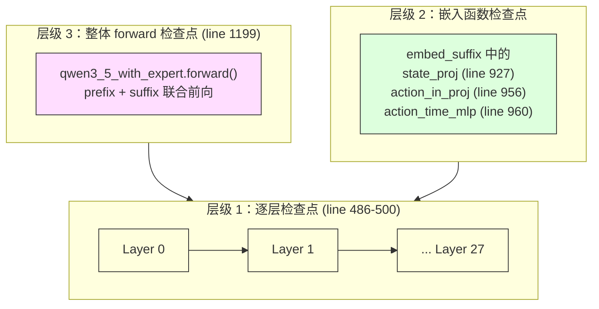

实现代码（[modeling_internvla_a1_5.py:631-636](../../../src/lerobot/policies/internvla_a1_5/modeling_internvla_a1_5.py)）：

```python
def _apply_checkpoint(self, func, *args, **kwargs):
    if self.gradient_checkpointing_enabled and self.training:
        return torch.utils.checkpoint.checkpoint(
            func, *args, use_reentrant=False, preserve_rng_state=False, **kwargs
        )
    return func(*args, **kwargs)
```

工作机制：
- **Forward**：不保存中间激活（如每层的 attention 权重矩阵、MLP 中间值），只保存层的输入
- **Backward**：需要中间激活时，**重新执行** forward 来获取。每层的 forward 被执行 2 次（训练时 1 次 + backward 时重算 1 次）
- **数学等价**：产生的梯度与不使用检查点**完全相同**，不影响训练结果
- **代价**：约增加 30% 的计算时间，但显存占用下降 2-3 倍

启用入口（[modeling_internvla_a1_5.py:617-622](../../../src/lerobot/policies/internvla_a1_5/modeling_internvla_a1_5.py)）：

```python
def gradient_checkpointing_enable(self):
    self.gradient_checkpointing_enabled = True
    self.qwen3_5_with_expert.qwen3_5.language_model.gradient_checkpointing = True   # VLM
    self.qwen3_5_with_expert.qwen3_5.visual.gradient_checkpointing = True            # Vision
    self.qwen3_5_with_expert.action_expert.gradient_checkpointing = True             # Expert
```

#### 13.10.5 per-sample Loss Masking 与梯度的选择性回传

InternVLA-A1.5 支持混合训练：一个 batch 中可以同时包含纯机器人样本、纯 VQA 样本和混合样本。`vqa_type` 字段控制每个样本参与哪些 loss（[modeling_internvla_a1_5.py:1587-1654](../../../src/lerobot/policies/internvla_a1_5/modeling_internvla_a1_5.py)）：

```python
# line 1643-1647
action_mask = (vqa_type == 0) | (vqa_type == 2)  # 机器人样本参与 action loss
vlm_mask = (vqa_type == 1) | (vqa_type == 2)     # VQA 样本参与 VQA loss

loss_fm_action = losses[action_mask].mean()        # 仅机器人样本的 action loss
loss_vlm = losses_vlm[vlm_mask].mean()             # 仅 VQA 样本的 VLM loss
```

不同 `vqa_type` 对各模块梯度的贡献：

| `vqa_type` | 含义 | $\mathcal{L}_{\text{action}}$ | $\mathcal{L}_{\text{vqa}}$ | $\mathcal{L}_{\text{video}}$ | 对 Expert 的梯度 | 对 VLM 的梯度 | 对 learnable tokens 的梯度 |
|------------|------|:-:|:-:|:-:|:-:|:-:|:-:|
| 0 | 纯机器人 | ✓ | ✗ | ✓ (if video) | ✓ (action) | ⚠️ (仅 insulation=False 时) | ✓ (video) |
| 1 | 纯 VQA | ✗ | ✓ | ✗ | ✗ | ✓ (VQA) | ✗ |
| 2 | 混合 | ✓ | ✓ | ✓ (if video) | ✓ (action) | ✓ (VQA + 可能的 action) | ✓ (video) |

> **设计意图**：混合训练允许 VLM 持续获得语言/视觉监督（避免灾难性遗忘），同时 Expert 从机器人数据中学习动作预测。`vqa_type` 机制确保纯 VQA 样本不会产生无意义的 action loss（因为 VQA 样本没有动作标注），纯机器人样本不会产生无意义的 VQA loss（因为没有文本标签）。

#### 13.10.6 Backward 的具体数值示例

为了直观理解梯度如何在 action 分支中回传，下面用一个极简化的例子追踪完整的 forward + backward 过程。

**设定**：简化为 1 维动作、无 learnable tokens、单层 Expert。

- 真值动作 $a = 0.8$，噪声 $\epsilon = -0.5$，时间步 $t = 0.6$
- `action_in_proj`：权重 $W_{\text{in}} = 1.5$（标量简化）
- Expert 单层：权重 $W_{\text{exp}} = 0.8$
- `action_out_proj`：权重 $W_{\text{out}} = 1.2$

**Forward**：

Step 1：构造插值样本和目标速度

$$x_t = t \cdot \epsilon + (1-t) \cdot a = 0.6 \times (-0.5) + 0.4 \times 0.8 = -0.3 + 0.32 = 0.02$$

$$u_t = \epsilon - a = -0.5 - 0.8 = -1.3$$

Step 2：Expert forward

$$h = W_{\text{in}} \cdot x_t = 1.5 \times 0.02 = 0.03 \quad \text{(action\_in\_proj)}$$

$$z = W_{\text{exp}} \cdot h = 0.8 \times 0.03 = 0.024 \quad \text{(Expert 层)}$$

$$v_t = W_{\text{out}} \cdot z = 1.2 \times 0.024 = 0.0288 \quad \text{(action\_out\_proj)}$$

Step 3：MSE loss

$$\mathcal{L} = (u_t - v_t)^2 = (-1.3 - 0.0288)^2 = (-1.3288)^2 = 1.7657$$

**Backward**（链式法则）：

Step 1：$\frac{\partial \mathcal{L}}{\partial v_t}$

$$\frac{\partial \mathcal{L}}{\partial v_t} = 2(v_t - u_t) = 2(0.0288 - (-1.3)) = 2 \times 1.3288 = 2.6576$$

Step 2：$\frac{\partial \mathcal{L}}{\partial W_{\text{out}}}$（action_out_proj 权重更新）

$$\frac{\partial \mathcal{L}}{\partial W_{\text{out}}} = \frac{\partial \mathcal{L}}{\partial v_t} \cdot z = 2.6576 \times 0.024 = 0.0638$$

Step 3：$\frac{\partial \mathcal{L}}{\partial z}$（传到 Expert 层输出）

$$\frac{\partial \mathcal{L}}{\partial z} = \frac{\partial \mathcal{L}}{\partial v_t} \cdot W_{\text{out}} = 2.6576 \times 1.2 = 3.1891$$

Step 4：$\frac{\partial \mathcal{L}}{\partial W_{\text{exp}}}$（Expert 层权重更新）

$$\frac{\partial \mathcal{L}}{\partial W_{\text{exp}}} = \frac{\partial \mathcal{L}}{\partial z} \cdot h = 3.1891 \times 0.03 = 0.0957$$

Step 5：$\frac{\partial \mathcal{L}}{\partial h}$（传到 action_in_proj 输出）

$$\frac{\partial \mathcal{L}}{\partial h} = \frac{\partial \mathcal{L}}{\partial z} \cdot W_{\text{exp}} = 3.1891 \times 0.8 = 2.5513$$

Step 6：$\frac{\partial \mathcal{L}}{\partial W_{\text{in}}}$（action_in_proj 权重更新）

$$\frac{\partial \mathcal{L}}{\partial W_{\text{in}}} = \frac{\partial \mathcal{L}}{\partial h} \cdot x_t = 2.5513 \times 0.02 = 0.0510$$

**梯度汇总**：

| 参数 | 值 | 梯度 $\frac{\partial \mathcal{L}}{\partial W}$ | AdamW 更新方向 |
|------|-----|-------|-------|
| $W_{\text{out}}$ (action_out_proj) | 1.2 | 0.0638 | ↓ 减小 |
| $W_{\text{exp}}$ (Expert 层) | 0.8 | 0.0957 | ↓ 减小 |
| $W_{\text{in}}$ (action_in_proj) | 1.5 | 0.0510 | ↓ 减小 |

三个参数的梯度都为正值，AdamW 会减小这些权重，使 $v_t$ 更接近 $u_t = -1.3$（当前 $v_t = 0.0288$ 远大于目标值 $-1.3$，需要减小才能靠近）。

> **Knowledge Insulation 在此例中的效果**：如果在 Expert 层之前存在一个 full_attention 层，suffix 的 attention 输出依赖 prefix K/V。当 `knowledge_insulation=True` 时，prefix K/V 被 `.detach()`，梯度从 Step 5 开始**只传到 Expert 自己的输入参数**（$W_{\text{in}}$），不会继续穿过 prefix K/V 到达 VLM 的参数。当 `knowledge_insulation=False` 时，梯度会继续穿过 attention 操作传到 VLM 的 $k\_proj$、$v\_proj$ 等参数。

### 13.11 本章小结

本章从代码层面系统剖析了 InternVLA-A1.5 的网络结构：

1. **类层次**：三层嵌套的 `Policy → Model → DualDecoder` 架构，顶层负责 batch I/O 和 loss 聚合，中层负责 embedding 和 flow matching，底层负责 VLM 与 Expert 的逐层联合计算。

2. **MoT 交互机制**：VLM 和 Expert 共享 28 层的深度和 layer_type 布局，在 linear_attention 层独立处理，在 full_attention 层通过联合 RoPE + suffix-attend-prefix 的方式实现信息交换。Knowledge Insulation 通过 `.detach()` 提供梯度层面的隔离选项。

3. **Suffix 设计**：三段式 `[state | learnable | action+time]` 结构配合 block-causal 注意力掩码，确保信息流的层次性——learnable tokens 聚合 VLM 上下文，action tokens 在此基础上进一步整合。

4. **三路 Loss 与梯度流**：$\mathcal{L}_{\text{action}}$ 主要更新 Expert 和投影层（Knowledge Insulation 控制是否影响 VLM），$\mathcal{L}_{\text{vqa}}$ 更新 VLM 分支，$\mathcal{L}_{\text{video}}$ 通过冻结 WAN 的 cross-attention 反向传播更新 learnable tokens 及其投影。

5. **推理优化**：标准后端通过 KV cache 复用避免重复编码 prefix；优化后端进一步通过 CUDA Graph capture/replay 消除 denoising 循环中的 Python 和 kernel launch 开销。

6. **Flow Matching 动作生成**：Unified Expert 通过条件流匹配（CFM）生成连续动作。训练时在干净动作与噪声之间做直线插值，Expert 学习预测速度场 $u_t = \boldsymbol{\epsilon} - \mathbf{a}$；推理时从纯噪声出发，通过 10 步 Euler ODE 积分逐步恢复干净动作。直线路径带来平滑的速度场，使少步积分即可获得高质量结果。时间步通过正弦编码与动作 embedding 融合注入 Expert，prefix KV cache 在积分循环中被完整复用。

7. **Backward 深度解析**：从训练循环的 `accelerator.backward(loss)` 出发，详细追踪了三路 loss 的梯度回传路径，阐明了 `requires_grad=False`（参数不更新但梯度穿透）、`.detach()`（计算图切断）和 `torch.no_grad()`（不构建计算图）三种机制的本质区别。冻结 WAN DiT 通过 cross-attention 对 context 输入的依赖允许梯度穿透回传到 learnable tokens，实现了"固定透镜 + 可调光源"的训练范式。混合精度（bf16 forward + float32 loss）和梯度检查点（重计算换显存）不改变梯度的数学值。per-sample loss masking 通过 `vqa_type` 实现混合训练中不同样本对不同模块的选择性梯度贡献。

---

## 12. 参考文献与引用来源汇总

**论文与主页：**
- InternVLA-A1.5 论文：[arXiv:2607.04988](https://arxiv.org/abs/2607.04988) / [HTML 版](https://arxiv.org/html/2607.04988v1) / 本地 [Markdown](InternVLA-A1.5-paper.md) / 本地 [PDF](InternVLA-A1.5.pdf)
- 项目主页：<https://internrobotics.github.io/internvla-a15.github.io/>
- GitHub 代码库：<https://github.com/InternRobotics/InternVLA-A-series>
- HuggingFace 模型卡：<https://huggingface.co/InternRobotics/InternVLA-A1.5-base>
- 仓库根 [`README.md`](../../../README.md)、[`CLAUDE.md`](../../../CLAUDE.md)

**前序与相关 VLA / 世界模型工作：**
- RT-2：[arXiv:2307.15818](https://arxiv.org/abs/2307.15818)
- OpenVLA：[arXiv:2406.09246](https://arxiv.org/abs/2406.09246)
- OpenVLA-OFT（Optimizing Speed and Success）：[arXiv:2502.19645](https://arxiv.org/abs/2502.19645)
- \(\pi_0\)：Physical Intelligence，[技术报告 PDF](https://www.physicalintelligence.company/download/pi0.pdf)
- \(\pi_{0.5}\)：Physical Intelligence，[技术报告 PDF](https://www.physicalintelligence.company/download/pi05.pdf)
- FAST 动作分词器：[arXiv:2501.09747](https://arxiv.org/abs/2501.09747)
- UniPi（文本条件视频生成规划）：[arXiv:2302.00111](https://arxiv.org/abs/2302.00111)
- Genie：[arXiv:2402.15391](https://arxiv.org/abs/2402.15391)
- UniVLA：[arXiv:2506.19850](https://arxiv.org/abs/2506.19850)，[GitHub](https://github.com/baaivision/UniVLA)，[项目主页](https://robertwyq.github.io/univla.github.io/)
- WorldVLA：[arXiv:2506.21539](https://arxiv.org/abs/2506.21539)
- InternVLA-A1（前作）：[GitHub](https://github.com/InternRobotics/InternVLA-A1)
- Qwen3.5：[Qwen3.6 GitHub 仓库](https://github.com/QwenLM/Qwen3.6)（Qwen3.5 系列模型的官方代码库）
- Gated DeltaNet：[arXiv:2412.06464](https://arxiv.org/abs/2412.06464)
- WAN2.2：[Wan-Video/Wan2.2 GitHub](https://github.com/Wan-Video/Wan2.2)
- ControlNet（冻结底座+轻量适配器范式的参照）：[arXiv:2302.05543](https://arxiv.org/abs/2302.05543)
- IP-Adapter：[arXiv:2308.06721](https://arxiv.org/abs/2308.06721)
- Re-Mix（数据混合权重估计）：[arXiv:2407.20177](https://arxiv.org/abs/2407.20177)

**评测基准：**
- LIBERO：[Liu et al., 2023](https://arxiv.org/abs/2306.03310)
- LIBERO-Plus：[arXiv:2510.13626](https://arxiv.org/abs/2510.13626)（[HTML 版](https://arxiv.org/html/2510.13626)），数据与 leaderboard 见 [HuggingFace 数据集页](https://huggingface.co/datasets/Sylvest/LIBERO-plus)
- RoboTwin 2.0：Chen et al., 2025（论文原文引用为 `chen2025robotwin`）
- DOMINO：Fang et al., 2026（论文原文引用为 `fang2026towards`）

**基础设施：**
- LeRobot 框架：<https://github.com/huggingface/lerobot>
- openpi：<https://github.com/Physical-Intelligence/openpi>

---

*本报告基于仓库当前代码状态（`src/lerobot/policies/internvla_a1_5/` 等目录）与论文公开版本撰写，如后续代码/论文有更新，具体行号引用可能需要相应调整。*


