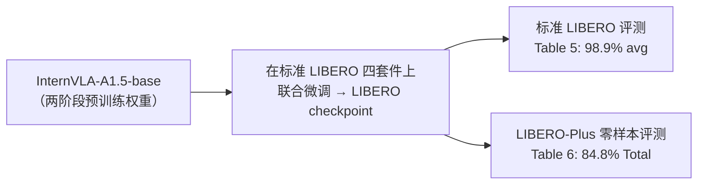
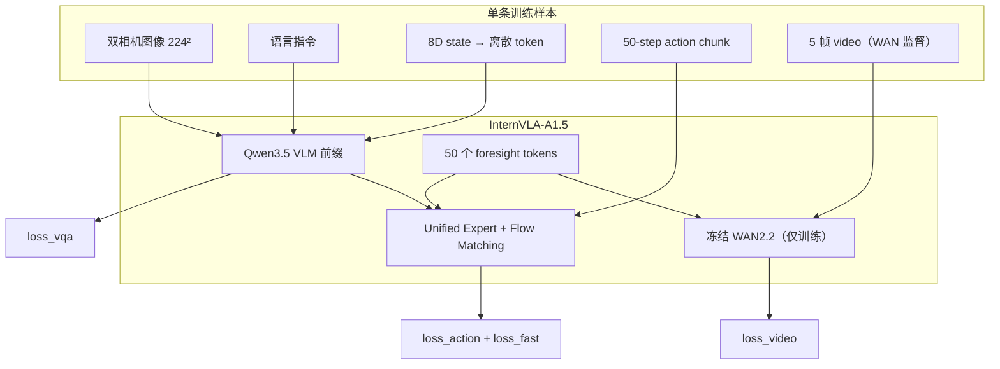
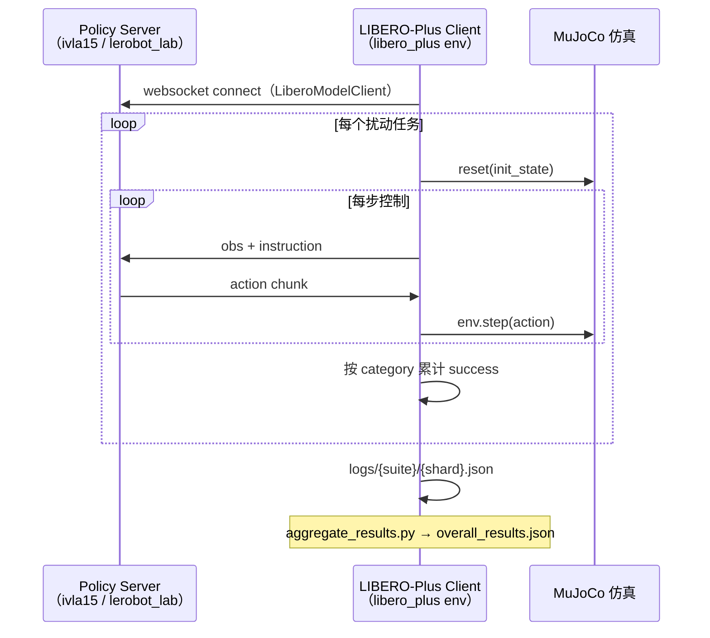
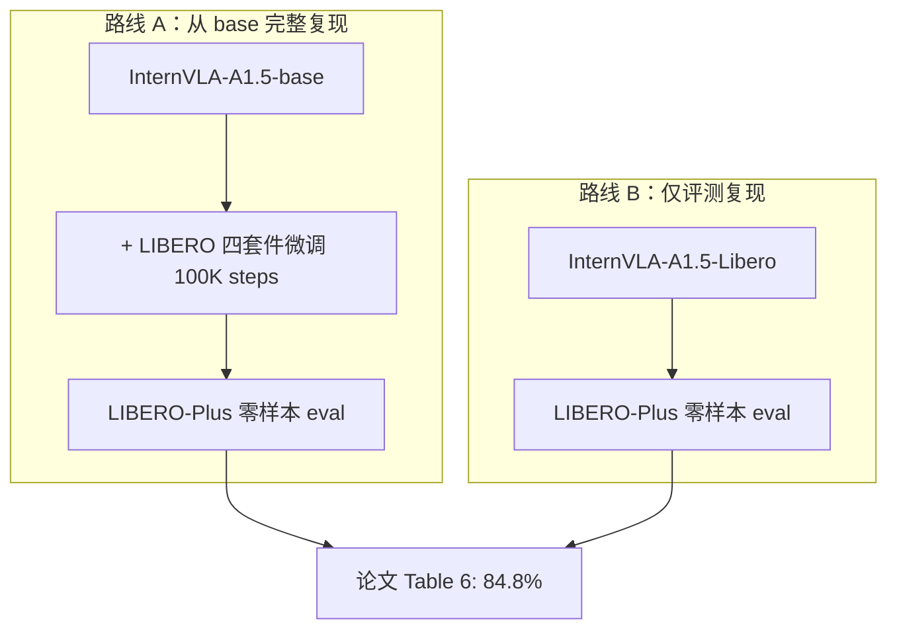

# InternVLA-A1.5 在 LIBERO-Plus 上的训练、评测与复现指南

> 本文基于仓库内论文转录 [`InternVLA-A1.5-paper.md`](InternVLA-A1.5-paper.md)、代码分析 [`paper_code_analyz.md`](paper_code_analyz.md)、以及实际复现记录 [`reprd_liberop_cam_rb.md`](reprd_liberop_cam_rb.md)，结合开源 launch / eval 脚本，系统回答：**InternVLA-A1.5 在 LIBERO-Plus 上如何训练、如何评测、以及如何从 `InternVLA-A1.5-base` 复现论文成绩**。
>
> 论文原文：[InternVLA-A1.5 (arXiv:2607.04988)](https://arxiv.org/abs/2607.04988) | 代码：[InternRobotics/InternVLA-A-series](https://github.com/InternRobotics/InternVLA-A-series) | 权重：[InternVLA-A1.5-base](https://huggingface.co/InternRobotics/InternVLA-A1.5-base) / [InternVLA-A1.5-Libero](https://huggingface.co/InternRobotics/InternVLA-A1.5-Libero)

---

## 目录

1. [核心结论（先读）](#1-核心结论先读)
2. [任务关系：LIBERO vs LIBERO-Plus](#2-任务关系libero-vs-libero-plus)
3. [训练：论文说了什么、代码实际怎么做](#3-训练论文说了什么代码实际怎么做)
4. [训练超参一览表](#4-训练超参一览表)
5. [训练数据与损失函数](#5-训练数据与损失函数)
6. [评测：LIBERO-Plus 协议与论文 Table 6](#6-评测libero-plus-协议与论文-table-6)
7. [从 base 模型复现的完整路径](#7-从-base-模型复现的完整路径)
8. [两条复现路线对比](#8-两条复现路线对比)
9. [已知偏差与排障要点](#9-已知偏差与排障要点)
10. [参考文献](#10-参考文献)

---

## 1. 核心结论（先读）

**InternVLA-A1.5 不在 LIBERO-Plus 数据上训练。** 论文附录 A.2 写得很明确：

> *"We do not train on LIBERO-Plus; instead, we evaluate the LIBERO checkpoint described above in a zero-shot manner and report the success rate."*
> — 出处：[`InternVLA-A1.5-paper.md`](InternVLA-A1.5-paper.md) 附录 A.2（对应 arXiv HTML [A.2 Simulation Benchmark Details](https://arxiv.org/html/2607.04988#A1.SS2)）

因此完整链路是：



| 阶段 | 是否使用 LIBERO-Plus | 说明 |
|------|---------------------|------|
| 预训练 Stage 1/2 | 否 | 大规模机器人 + VQA 混合（论文 §3、§4） |
| LIBERO 下游微调 | 否（用标准 LIBERO） | 四套件混合一个模型 |
| LIBERO-Plus 评测 | 是（仅评测） | 零样本，不再训练 |

论文 Table 6 中 InternVLA-A1.5 的成绩（**零样本**）：

| 扰动类别 | Camera | Robot | Language | Light | Background | Noise | Layout | **Total** |
|---------|--------|-------|----------|-------|------------|-------|--------|-----------|
| InternVLA-A1.5 | **83.1** | 55.1 | 86.9 | 96.4 | **98.2** | **95.6** | 85.2 | **84.8** |

（来源：论文 Table 6，[`InternVLA-A1.5-paper.md`](InternVLA-A1.5-paper.md) 第 253–261 行）

---

## 2. 任务关系：LIBERO vs LIBERO-Plus

### 2.1 标准 LIBERO（训练 + 分布内评测）

- **数据**：4 个套件 `libero_spatial` / `libero_object` / `libero_goal` / `libero_10`，每套件 10 个任务 × 50 条人类遥操作 demo，共 **2,000** 条 demonstration（论文附录 A.2）。
- **训练方式**：**一个模型**在四套件混合数据上联合微调（joint fine-tune），不是每套件单独训四个模型。
- **分布内评测**：每套件单独报成功率；每任务 50 次 rollout，每套件 500 次，四套件平均即 Table 5 的 98.9%。

### 2.2 LIBERO-Plus（仅零样本鲁棒性评测）

- **定位**：在 LIBERO 任务之上，对相机视角、机器人初始状态、语言、光照、背景纹理、传感器噪声、物体布局等 **7 类扰动**做系统化扩展（[LIBERO-Plus 论文 arXiv:2510.13626](https://arxiv.org/abs/2510.13626)）。
- **任务规模**：四套件合计约 **~10,030** 个扰动任务（[`reprd_liberop_cam_rb.md`](reprd_liberop_cam_rb.md) 实测 `task_classification.json` 与论文 Table 7 一致）。
- **与训练数据的关系**：扰动 baked 在 BDDL / init 文件里；**训练阶段从未见过这些扰动变体**。

### 2.3 为何 foresight 机制对 LIBERO-Plus 重要

论文 Table 8 消融（同一预训练模型，改训练/推理配置）：

| 配置 | LIBERO | LIBERO-Plus（零样本） |
|------|--------|----------------------|
| 完整 InternVLA-A1.5 | 98.9 | **84.8** |
| w/o video loss | 97.9 (−1.0) | 78.0 (−**6.8**) |
| w/o foresight tokens | 98.6 (−0.3) | 77.9 (−**6.9**) |

分布内 LIBERO 掉分很小，但 LIBERO-Plus 掉分 **~7 个百分点**——说明隐空间视频前瞻监督的主要收益在 **分布外鲁棒性**，而非单纯拟合标准 LIBERO。

---

## 3. 训练：论文说了什么、代码实际怎么做

### 3.1 论文层面的描述

**起点**：所有 benchmark 微调均从**同一个预训练 checkpoint**（InternVLA-A1.5-base，即论文两阶段预训练产物）出发（正文 §5.2）。

**LIBERO 专用细节**（附录 A.2）仅写明：
- 四套件联合微调一个模型；
- 分布内评测协议（500 rollouts / suite）；
- **未写明** LIBERO 专用的 batch size、GPU 数、step 数、是否冻结 foresight tokens 等。

**通用 post-training 配方**（正文 §3.4 训练表，适用于多个下游 benchmark 的"默认 post-train"叙述）：

| 项目 | Stage 1 预训练 | Stage 2 预训练 | Post-training（通用叙述） |
|------|---------------|---------------|--------------------------|
| Batch size | 1024 | 1024 | **128**（全局） |
| Learning rate | \(5\times10^{-5}\) 常数 | \(5\times10^{-5}\) 常数 | \(5\times10^{-5}\to5\times10^{-6}\) cosine |
| Steps | 300K | 600K | **60K** |
| Warmup | 2000 | 2000 | 2000 |
| Weight decay | 0.01 | 0.01 | 0.01 |
| Grad clip | 1.0 | 1.0 | 1.0 |
| Precision | bf16 | bf16 | bf16 |

> **注意**：RoboTwin 附录给出了更具体的下游配置（100K steps、24 GPU、每卡 batch 16），但 **LIBERO 附录没有同等粒度的公开数字**。开源仓库中的 `launch/internvla_a15_finetune_libero.sh` 是目前最接近官方 LIBERO 复现口径的配置来源。

### 3.2 开源仓库中的 LIBERO 微调脚本

权威配置：`launch/internvla_a15_finetune_libero.sh`（conda 版）及 venv 变体 `launch/internvla_a15_finetune_libero_venv.sh`。

**与通用 `internvla_a15_finetune.sh` 的关键差异**（RoboTwin 等任务常用）：

| 配置项 | LIBERO 脚本 | 通用 finetune 脚本 |
|--------|------------|-------------------|
| `freeze_learnable_tokens` | **`false`**（foresight tokens 继续可训） | `true` |
| `steps` | **100000** | 依任务而定 |
| `batch_size` | **16 / GPU** | 8 / GPU |
| `dataset` | 四套件 `libero_*` 混合 | 单数据集 |
| `action_mode` | **`abs`** | 常 `delta` |

LIBERO 选择 **不冻结 foresight tokens** 是合理设计：LIBERO-Plus 是零样本视觉/布局扰动测试，需要在下游 demo 上继续适配 foresight 查询向量；同时 `action_loss_only=false` 表示 **WAN 视频分支在训练中参与**（需要本地 Wan2.2-TI2V-5B 权重）。

### 3.3 训练步数与 epoch 的换算

论文**未给出** LIBERO 微调的 epoch 数。LeRobot 训练日志按 **frame 样本**统计 epoch（[`reprd_liberop_cam_rb.md`](reprd_liberop_cam_rb.md) 实测）：

- `step=200` 时：`epoch≈0.05`，`sample≈13K`（4 卡 × batch 16 × 200 ≈ 12.8K，吻合）
- 推算 **1 epoch ≈ 4000 steps**（200 / 0.05）
- **100,000 steps ≈ 25 epochs**（100000 / 4000）

训练数据规模（论文）：2,000 episodes；LeRobot v3 格式下总 frame 数取决于每条 demo 长度（LIBERO 常见 ~100–300 步/条），四套件混合后每个 epoch 会遍历等效的全集一次（带 shuffle）。

| 量 | 典型值（开源脚本默认，4×GPU） |
|----|------------------------------|
| 每卡 batch size | 16 |
| GPU 数 | 2（原脚本默认）或 4+（复现常用） |
| **全局 batch size** | **32**（2 卡）或 **64**（4 卡） |
| 总 steps | **100,000** |
| 等效 epoch | **~25**（基于复现日志估算） |
| 总样本访问量 | steps × 全局 batch ≈ **3.2M–6.4M** frame 样本 |

> 官方未公开 LIBERO 微调使用的 GPU 数量；全局 batch 不同会影响收敛，这是复现偏差的主要来源之一（见 [`reprd_liberop_cam_rb.md`](reprd_liberop_cam_rb.md) §7）。

---

## 4. 训练超参一览表

以下汇总 **开源 LIBERO launch 脚本**中的完整训练配置（即复现 LIBERO-Plus 成绩所需的训练阶段配置）：

| 类别 | 参数 | 值 | 代码/脚本出处 |
|------|------|-----|--------------|
| **起点权重** | `policy.pretrained_path` | `InternRobotics/InternVLA-A1.5-base` | `launch/internvla_a15_finetune_libero.sh:66` |
| **VLM** | `policy.vlm_model_name_or_path` | `Qwen/Qwen3.5-2B` | 同上 :69 |
| **WAN（训练用）** | `wan_checkpoint_path` 等 | `Wan-AI/Wan2.2-TI2V-5B` | venv 脚本显式指定本地路径 |
| **优化器** | AdamW | lr = **5e-5** | `policy.optimizer_lr=5e-5` |
| **LR 调度** | cosine decay | warmup **2000** steps；decay **100000** steps；终值 **5e-6** | `scheduler_warmup/decay_steps/decay_lr` |
| **Batch** | 每 GPU | **16** | `--batch_size=16` |
| **总步数** | steps | **100000** | `--steps=100000` |
| **精度** | dtype | bfloat16 | `policy.dtype=bfloat16` |
| **保存** | save_freq | 5000 | `--save_freq=5000` |
| **随机种子** | seed | 42 | `--seed=42` |
| **动作表示** | `dataset.action_mode` | **`abs`**（末端执行器绝对动作） | 脚本 :86 |
| **状态编码** | `tokenize_state` | true（状态离散化进 prompt） | policy + dataset |
| **动作 chunk** | `chunk_size` / `n_action_steps` | **50** / **50** | `configuration_internvla_a1_5.py` |
| **Foresight tokens** | `num_learnable_tokens` | **50** | launch 脚本 |
| **视频损失** | `action_loss_only` | **false**（启用 WAN 分支） | launch 脚本 |
| | `video_loss_weight` | 1 | launch 脚本 |
| **Foresight 是否可训** | `freeze_learnable_tokens` | **false** | LIBERO 专用 |
| **VQA/FAST** | `enable_vqa_loss` / `use_fast_action_tokens` | true / true | launch 脚本 |
| **知识隔离** | `knowledge_insulation` | false | launch 脚本 |
| **图像尺寸** | resize | **224×224** | `configuration_internvla_a1_5.py` |
| **视频帧（WAN 监督）** | `num_video_frames` | 4（+1 当前帧） | dataset config |
| **数据混合** | `dataset.repo_id` | 四套件空格分隔 | `libero_spatial libero_object libero_goal libero_10` |
| **每套件 stats** | `robot_type` 补丁 | 各套件独立 `robot_type` | 脚本自动 patch `meta/info.json` |

### 4.1 多卡与有效 batch

```
有效全局 batch = batch_size_per_gpu × num_processes
```

示例：
- 原脚本默认 `PROC_PER_NODE=2` → 全局 batch **32**
- 复现常用 4 卡 → 全局 batch **64**

论文 post-training 表写的全局 batch **128** 与 LIBERO 开源脚本 **不一致**；应以 **launch 脚本**为准做 LIBERO/LIBERO-Plus 复现。

---

## 5. 训练数据与损失函数

### 5.1 数据格式

推荐使用 HuggingFace **[nvidia/LIBERO_LeRobot_v3](https://huggingface.co/datasets/nvidia/LIBERO_LeRobot_v3)**（LeRobot v3.0），四套件特征名与 `src/lerobot/dataset_schemas/configs/libero.yaml` 一致：

| 原始键 | 语义 |
|--------|------|
| `observation.state` | 8 维 EE 状态（6D pose + 2D gripper） |
| `action` | 7 维 EE 动作 |
| `observation.images.image` | 主相机 agentview |
| `observation.images.wrist_image` | 腕部相机 |

Schema 将图像映射为策略内部的 `image0` / `image1`（[`libero.yaml`](../../src/lerobot/dataset_schemas/configs/libero.yaml)）。

### 5.2 联合损失（训练时）

InternVLA-A1.5 在 LIBERO 微调时同时优化（[`paper_code_analyz.md`](paper_code_analyz.md) §6、`modeling_internvla_a1_5.py`）：

| 损失 | 符号 | 作用 |
|------|------|------|
| Flow-matching 动作损失 | `loss_action` | 连续动作 chunk 主监督 |
| FAST 离散动作 token CE | `loss_fast` | 与 VLM 词表共享的离散动作监督 |
| VQA / 语言 token CE | `loss_vqa` | 保持 VLM 语义与指令跟随 |
| WAN 隐空间视频损失 | `loss_video` | foresight tokens 与冻结 WAN2.2 对齐 |

推理 / LIBERO-Plus 评测时：**WAN 分支不加载**（`--action_loss_only`，见 `evaluation/LIBERO-plus/README.md`），与论文"训练时借用世界模型、推理时丢弃"一致。

### 5.3 训练数据流（简图）



---

## 6. 评测：LIBERO-Plus 协议与论文 Table 6

### 6.1 评测原则

| 项目 | 设置 |
|------|------|
| Checkpoint | **LIBERO 微调后**的模型（非 base） |
| 是否在 LIBERO-Plus 上训练 | **否**（零样本） |
| 仿真环境 | [sylvestf/LIBERO-plus](https://github.com/sylvestf/LIBERO-plus) 仓库 + HF `assets.zip` |
| 观测 / 动作接口 | 与标准 LIBERO **相同**（`agentview_image`、7D EE action） |
| 扰动实现 | 写入各任务的 BDDL / init 文件，**不需要**改 policy 代码 |

### 6.2 评测脚本架构

仓库实现：`evaluation/LIBERO-plus/`（详见 [`README.md`](../../evaluation/LIBERO-plus/README.md)）



**关键推理参数**（与训练对齐）：

| 参数 | 默认值 | 说明 |
|------|--------|------|
| `RESIZE_SIZE` | **224** | 与训练 `resize_with_pad` 一致 |
| `REPLAN_STEPS` | **8** | 每 8 步重新请求 action chunk（chunk_size=50） |
| `NUM_TRIALS_PER_TASK` | **1** | 扰动已编码在任务定义中 |
| `NUM_STEPS_WAIT` | 10 | 开局空动作步，等物体稳定 |
| `STATS_KEY_MODE` / `ROBOT_TYPE_MODE` | **`suite`** | 多套件联合训练 checkpoint 必须按套件绑定 stats |
| `ACTION_LOSS_ONLY_FLAG` | `--action_loss_only` | 推理不加载 WAN |
| `SEED` | 7 | 可复现性 |

**每套件最大步数**（`eval_libero_plus.py`）：

| 套件 | max_steps |
|------|-----------|
| libero_spatial | 220 |
| libero_object | 280 |
| libero_goal | 300 |
| libero_10 | 520 |

### 6.3 指标聚合方式

`aggregate_results.py` 按 **7 个扰动类别**分别统计成功率，再算 Total：

$$\text{SR}_{\text{category}} = \frac{\sum \text{success}}{\sum \text{trials}}$$

论文 Table 6 的 **Total** 列为七类扰动上的综合（与 leaderboard 列顺序：Camera, Robot, Language, Light, Background, Noise, Layout, Total 一致）。

全量评测规模（7 类全开）：
- 约 **10,030** 任务 × 1 trial ≈ **1 万次**仿真 rollout
- 多卡分片：`4 suites × SHARDS_PER_SUITE` 个工作单元（默认 `SHARDS_PER_SUITE=4` 或 8）

### 6.4 客户端环境细节（易踩坑）

`evaluation/LIBERO/model2libero_interface.py` 中的适配逻辑直接影响成功率：

1. **四元数 → 轴角**：仿真 `robot0_eef_quat` 转为训练一致的 8D state；
2. **夹爪符号翻转**：训练数据 `action[6]∈[0,1]`（0 关 / 1 开）与 LIBERO 仿真（+1 关 / −1 开）相反，客户端需取反；
3. **预处理归属**：policy server 声明 `preprocessing_owner: server_canonical`，保证 train-infer parity。

### 6.5 标准 LIBERO 评测（中间验收，非 LIBERO-Plus）

在 LIBERO-Plus 之前，通常用 `evaluation/LIBERO/` 验证 checkpoint：

- `NUM_TRIALS_PER_TASK=50`（默认）
- 四套件各 500 rollouts
- 目标：接近论文 Table 5 **98.9%** 平均

这是 **分布内**指标；**不能**用 LIBERO 分数直接推断 LIBERO-Plus 零样本分数。

---

## 7. 从 base 模型复现的完整路径

### 7.1 路线 A：全流程训练 + 评测（从 base 复现）

#### Step 0：环境与权重

**两个虚拟环境**（numpy / mujoco 版本冲突，不可混用）：

| 环境 | 用途 | 关键依赖 |
|------|------|----------|
| `ivla15` / `lerobot_lab` | 训练 + policy server | torch 2.10, transformers 5.2, flash-attn, **torchcodec 0.10** |
| `ivla15_libero_plus_client` / `libero_plus` | LIBERO-Plus 仿真客户端 | numpy 1.24.4, mujoco 3.2.3, robosuite 1.4.0 |

权重与数据：

```bash
export HF_HOME=/path/to/hf_home

# 1) 基座（训练起点）
hf download InternRobotics/InternVLA-A1.5-base --local-dir /path/to/InternVLA-A1.5-base

# 2) WAN（LIBERO 微调 action_loss_only=false 时必须）
hf download Wan-AI/Wan2.2-TI2V-5B --local-dir /path/to/Wan2.2-TI2V-5B

# 3) LIBERO 训练数据（四套件）
hf download nvidia/LIBERO_LeRobot_v3 --repo-type dataset \
  --include "libero_spatial/*" --include "libero_object/*" \
  --include "libero_goal/*" --include "libero_10/*" \
  --local-dir /path/to/libero_lerobot_v3

# 4) LIBERO-Plus 评测资产
git clone https://github.com/sylvestf/LIBERO-plus /path/to/LIBERO-plus
hf download Sylvest/LIBERO-plus assets.zip --repo-type dataset \
  --local-dir /path/to/LIBERO-plus_assets
# 解压到 LIBERO-plus/libero/libero/assets/（注意 zip 内可能有嵌套路径，见 reprd_liberop_cam_rb.md #2）
```

安装主仓库 + transformers 补丁（见根目录 `CLAUDE.md` / `README.md`）。

#### Step 1：四套件联合微调

```bash
cd /path/to/InternVLA-A-series
export HF_LEROBOT_HOME=/path/to/hf_home/lerobot
# 建立 data/libero_* 软链指向 libero_lerobot_v3 各套件

CUDA_VISIBLE_DEVICES=0,1,2,3 PROC_PER_NODE=4 \
  bash launch/internvla_a15_finetune_libero_venv.sh
```

核心超参已在 §4；训练完成后 checkpoint 位于 `outputs/internvla_a1_5/<job_name>/checkpoints/last`。

**训练监控要点**（来自 [`reprd_liberop_cam_rb.md`](reprd_liberop_cam_rb.md)）：
- 日志中 **`video_decode_error` 必须为 0**（torchcodec 版本不匹配会导致静默全黑帧）；
- 长跑训练避免在脚本内 `nohup & disown` 导致 `accelerate` agent 被杀（见该文档问题 #8）；
- 可用 `launch/internvla_a15_finetune_libero_venv_resume.sh` 从 `checkpoints/last` 续训。

#### Step 2：（可选）标准 LIBERO 验收

```bash
export CKPT_PATH=outputs/internvla_a1_5/<job>/checkpoints/last
export LIBERO_HOME=/path/to/LIBERO   # 标准 LIBERO 仓库
export STATS_KEY_MODE=suite
bash evaluation/LIBERO/run_eval_libero_server_client.sh
```

#### Step 3：LIBERO-Plus 零样本全量评测

```bash
export CKPT_PATH=outputs/internvla_a1_5/<job>/checkpoints/last
export LIBERO_HOME=/path/to/LIBERO-plus
export STATS_KEY_MODE=suite
export ROBOT_TYPE_MODE=suite
export NO_VIDEO_FLAG=--no-save_videos   # 全量 ~10k 任务建议关闭录像

SHARDS_PER_SUITE=8 GPU_IDS=0,1,2,3,4,5,6,7 \
  bash evaluation/LIBERO-plus/run_eval_libero_plus_venv.sh
```

聚合：

```bash
python evaluation/LIBERO-plus/aggregate_results.py \
  --root outputs/sim_eval/libero_plus/<timestamp>_all
```

查看 `overall_results.json` → `leaderboard_summary_percent`。

#### Step 4：与论文对比

| 指标 | 论文 Table 6 | 建议验收 |
|------|-------------|----------|
| Total | **84.8%** | ±5pp 内可视为接近（资源受限复现） |
| Camera | 83.1% | 对训练规模敏感（见下文） |
| Robot | 55.1% | 相对更容易复现 |

[`reprd_liberop_cam_rb.md`](reprd_liberop_cam_rb.md) 一次 4×H200、100K steps 的实测：Robot **50.6%**（达标），Camera **44.6%**（未达标），说明 **评测流程正确时，gap 主要来自训练配方/规模而非 eval bug**。

---

### 7.2 路线 B：跳过训练，直接用官方 LIBERO checkpoint 评测

若目标是 **只复现 LIBERO-Plus 评测分数**、不重复微调：

```bash
hf download InternRobotics/InternVLA-A1.5-Libero --local-dir /path/to/InternVLA-A1.5-Libero

export CKPT_PATH=/path/to/InternVLA-A1.5-Libero
export LIBERO_HOME=/path/to/LIBERO-plus
export STATS_KEY_MODE=suite
bash evaluation/LIBERO-plus/run_eval_libero_plus.sh
```

该路线对应论文已训练好的 **LIBERO checkpoint**，是验证评测栈是否正确的最快方式（见 [`evaluation/LIBERO-plus/README.md`](../../evaluation/LIBERO-plus/README.md)）。

---

## 8. 两条复现路线对比



| 维度 | 路线 A（base → 训练 → eval） | 路线 B（官方 Libero ckpt → eval） |
|------|------------------------------|-----------------------------------|
| 验证训练栈 | ✅ | ❌ |
| 验证评测栈 | ✅ | ✅ |
| 需要 WAN 权重 | ✅（训练阶段） | ❌（推理 `action_loss_only`） |
| 算力 | ~4×GPU × ~27h 训练 + ~4h 全量 eval | 仅 eval |
| 预期 Total | 可能低于 84.8%（见 §9） | 最接近论文 |

---

## 9. 已知偏差与排障要点

### 9.1 论文未公开 vs 开源脚本默认

| 项目 | 论文 | 开源/复现 |
|------|------|-----------|
| LIBERO 专用 batch / steps | **未写** | 16/GPU, 100K steps |
| LIBERO GPU 数 | **未写** | 2（脚本默认）或 4+（复现） |
| Post-train 通用表 | 128 batch, 60K steps | LIBERO 脚本用 100K |
| 训练数据版本 | 未指明是否 no_noops | 常用 `nvidia/LIBERO_LeRobot_v3` |
| 随机种子 | 未写 | seed=42 |

### 9.2 常见故障

| 现象 | 根因 | 修复 |
|------|------|------|
| 训练 loss 下降但 LIBERO-Plus 极低 | `video_decode_error` 静默黑帧 | torchcodec **0.10** + CPU wheel（[`reprd_liberop_cam_rb.md`](reprd_liberop_cam_rb.md) #6） |
| `accelerate` 卡在 TCPStore | 后台启动方式杀死 agent | 用前台长跑 / tmux；`USE_LIBUV=0` |
| eval `UnpicklingError` on init_states | PyTorch≥2.6 `weights_only=True` | `torch.load(..., weights_only=False)` |
| 成功率异常低但无报错 | `STATS_KEY_MODE` 与训练不一致 | 多套件 checkpoint 必须用 **`suite`** |
| Camera 分数远低于论文 | 训练规模 / 数据版本 / 无视角增强 | 增大有效 batch、加长训练、或直接用官方 Libero ckpt |

### 9.3 消融对复现的启示

- 若复制 RoboTwin 通用 finetune 配置（`freeze_learnable_tokens=true`），可能在 LIBERO-Plus 上损失零样本鲁棒性；
- 若设 `action_loss_only=true` **跳过 WAN 训练**，与论文 LIBERO 配方不一致（虽推理本来就不用 WAN）。

---

## 10. 参考文献

| 资料 | 链接 / 路径 |
|------|------------|
| InternVLA-A1.5 论文 | [arXiv:2607.04988](https://arxiv.org/abs/2607.04988)；本地 [`InternVLA-A1.5-paper.md`](InternVLA-A1.5-paper.md) |
| LIBERO-Plus 论文 | [arXiv:2510.13626](https://arxiv.org/abs/2510.13626) |
| LIBERO 基准 | [Liu et al., 2023](https://arxiv.org/abs/2306.03310) |
| 代码分析文档 | [`paper_code_analyz.md`](paper_code_analyz.md) |
| Camera/Robot 复现实录 | [`reprd_liberop_cam_rb.md`](reprd_liberop_cam_rb.md) |
| LIBERO 微调脚本 | [`launch/internvla_a15_finetune_libero.sh`](../../launch/internvla_a15_finetune_libero.sh) |
| LIBERO-Plus 评测 | [`evaluation/LIBERO-plus/README.md`](../../evaluation/LIBERO-plus/README.md) |
| 官方 LIBERO 权重 | [InternRobotics/InternVLA-A1.5-Libero](https://huggingface.co/InternRobotics/InternVLA-A1.5-Libero) |
| 训练数据 | [nvidia/LIBERO_LeRobot_v3](https://huggingface.co/datasets/nvidia/LIBERO_LeRobot_v3) |

---

## 附录：问题速查

**Q: InternVLA-A1.5 在 Libero-Plus 上训练了几个 epoch？**  
A: **没有在 LIBERO-Plus 上训练。** 仅在标准 LIBERO 上微调；开源脚本 100K steps ≈ **25 epochs**（四套件混合，见 §3.3）。

**Q: batch size 和 lr 是多少？**  
A: 每 GPU batch **16**；AdamW lr **5e-5**（cosine 至 **5e-6**）；warmup **2000**；共 **100000** steps（§4）。

**Q: 如何从 base 复现 Table 6？**  
A: base → LIBERO 四套件联合微调（§7.1 Step 1）→ LIBERO-Plus 零样本 eval（Step 3）；或下载 **InternVLA-A1.5-Libero** 只做 eval（§7.2）。

**Q: LIBERO-Plus 评测要不要加载 WAN？**  
A: **不要。** 默认 `--action_loss_only`，推理走 action-only 路径，与论文部署一致。
