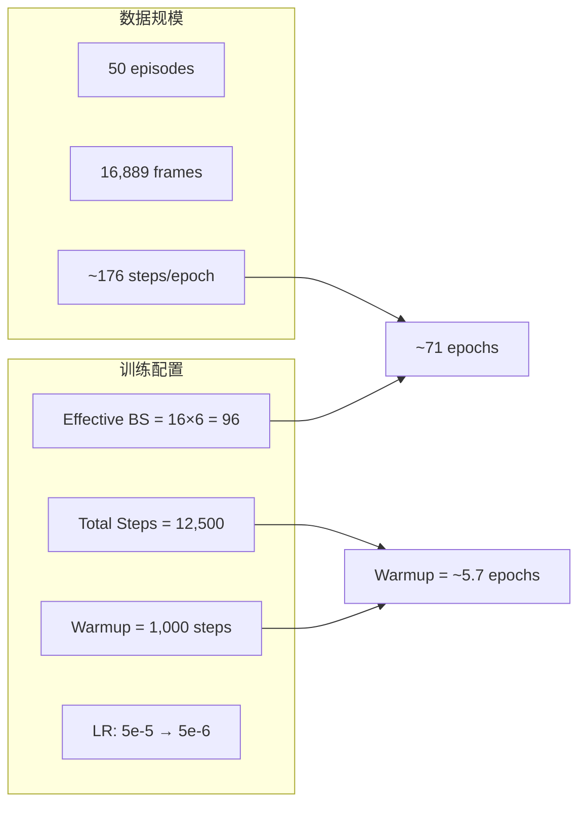

# InternVLA-A1.5 在 RoboTwin hanging_mug 上的微调实施手册

> 目标：基于本地 [InternVLA-A1.5-base](/tmp/itnvla15rbt20/var/hf_home/ckpts/InternVLA-A1.5-base/) 权重，在 RoboTwin 仿真平台的 `hanging_mug`（挂杯子）单任务数据集上进行 fine-tune，然后在 RoboTwin 仿真环境中评测该 checkpoint 的成功率。
>
> 本手册对照 [reprd_rbtwn_stackb3.md](reprd_rbtwn_stackb3.md) 的流程与超参，按**当前机器**的路径重写。数据源是用户指定的 [`/tmp/RunPkg/Dta/RoboTwin-Clean/hanging_mug/`](/tmp/RunPkg/Dta/RoboTwin-Clean/hanging_mug/)（LeRobot **v2.1**），训练前必须转换成 **v3.0**。
>
> 本手册分两部分：**Part A 是可执行的分步操作手册**；**Part B 保留 Session 1 摘要**。本机（6×H200 / 12500 步）的实际执行记录见 [reprd_rbtwn_hngMgLOG.md](reprd_rbtwn_hngMgLOG.md) **Session 2**。

---

## 目录

- [Part A：实施手册](#part-a实施手册)
  - [0. 关键结论与设计依据](#0-关键结论与设计依据)
  - [1. 环境准备](#1-环境准备)
  - [2. 数据准备](#2-数据准备)
  - [3. 训练启动脚本](#3-训练启动脚本)
  - [4. 训练执行与监控](#4-训练执行与监控)
  - [5. 评测](#5-评测)
  - [6. 已知陷阱与对策](#6-已知陷阱与对策来自-stack_bowls_three--libero)
- [Part B：执行记录](#part-b执行记录)
  - [时间线 / 操作日志](#时间线--操作日志)
  - [问题记录（报错 → 根因 → 修复 → 验证）](#问题记录报错--根因--修复--验证)
  - [文件变更清单](#文件变更清单)
  - [最终结果](#最终结果)

---

## Part A：实施手册

### 0. 关键结论与设计依据

1. **任务选择**：`hanging_mug` 是 RoboTwin 2.0 benchmark 的 50 个任务之一（`evaluation/RoboTwin/inference.py` 中 `TASK_NAMES` **index=10**），要求双臂机器人把杯子挂到架子上。数据已清洗完毕，`robot_type=aloha`，与仓库 [`src/lerobot/dataset_schemas/configs/aloha.yaml`](../../src/lerobot/dataset_schemas/configs/aloha.yaml) 完全匹配。

2. **必须先转 v3.0**：本仓库 `LeRobotDataset.CODEBASE_VERSION = "v3.0"`。`hanging_mug` 源数据 `codebase_version=v2.1`，直接加载会抛 `BackwardCompatibilityError`（与 stack_bowls_three 问题 #1 相同）。**不要原地转换** Clean 源数据；复制到 `RoboTwin-Clean-v30` 后再转。

3. **动作模式**：使用 **abs**（绝对关节位置），与官方 [`launch/internvla_a15_finetune_robotwin.sh`](../../launch/internvla_a15_finetune_robotwin.sh) 及 stack_bowls_three 微调一致。

4. **训练配置**：沿用 stack_bowls_three **实际跑通**的 knobs（不是官方脚本默认的 2 GPU / 60k steps），并按**本机 6×H200** 调整：
   - 6 GPU 全开（`CUDA_VISIBLE_DEVICES` / `PROC_PER_NODE` 未设置时由 `nvidia-smi` 自动探测）
   - per-GPU `batch_size=16`（32 在 WAN video loss + 三相机下已验证 OOM）
   - `steps=12500`（环境变量 `STEPS` 可覆盖），`save_freq=2500`
   - `action_loss_only=false`（启用 WAN video loss）
   - `freeze_learnable_tokens=true`
   - `dist_loading=false`（50 episode 小数据集，避免少卡分片过稀）

5. **数据规模**（已实测 parquet）：50 episodes，16889 frames，fps=15。episode 长度 min/median/max = **325 / 335 / 373**，全部 ≥ `chunk_size=50`，计算 stats 时不会跳过 episode。effective batch size=96（16×6）时，每个 epoch ≈ **176** steps，12500 steps ≈ **71** epochs。

6. **Venv**：所有操作在 `/tmp/itnvla15rbt20/` 中执行，**不用 conda**。该环境已安装 torch 2.10.0+cu128、transformers 5.2.0、torchcodec 0.10.0、flash-attn 2.8.3。

7. **External stats**：`use_external_stats=true`。`compute_norm_stats_multi.py` 对 `repo_ids=robotwin/hanging_mug` 的 group 名为 `agg_1repos_4eb657cb6a`（`sha1("robotwin/hanging_mug")[:10]`）。数据集自带的 `meta/stats_gr00t.json` 不能直接用于 InternVLA-A1.5。

8. **评测**：`evaluation/RoboTwin/eval.sh`，`task_idx=10`，`ACTION_MODE=abs`，`INFER_HORIZON=50`。当前 `eval.sh` **只吃 4 个位置参数**（checkpoint / output / task_config / task_idx），动作模式与 horizon 必须用环境变量传入；README / stack_bowls_three 手册里多写的 `abs 50` 位置参数会被忽略。

9. **机器规格**（本机已核对）：**6×NVIDIA H200**（约 143GB），不是 8 卡。单卡足以容纳 base + WAN 及 bs=16 的训练中间状态。上一轮 8 卡 10k 的产物不在本机，不能 resume。

10. **本机启动前必须现做的路径**（不要当成已经存在）：
    - `/tmp/RunPkg/Dta/RoboTwin-Clean-v30/`（v2.1 副本 + v3.0 产物）
    - 仓库根 `data` symlink、`${HF_LEROBOT_HOME}/robotwin/hanging_mug`
    - `${HF_HOME}/lerobot/stats/aloha/abs/agg_1repos_4eb657cb6a/stats.json`
    以上都要按 §2 现做。启动脚本会预检这些路径，缺则直接退出。

11. **不要用错数据目录**：
    - 训练用：从 Clean `hanging_mug` 转换得到的 **v3.0**（见 §2）。
    - 不要把整个 `/tmp/RunPkg/Dta/RoboTwin-Clean/` 当训练集（其余约 50 个任务仍是 v2.1）。
    - `/tmp/RunPkg/Dta/hanging_mug_kptsim_lrbv30/` **本机不存在**；即使在其它机器上它已是 v3.0，也不把它当作默认训练数据。本手册按用户指定的 Clean 源走正式转换。

---

### 1. 环境准备

#### 1.1 路径与约定

| 用途 | 本机路径 |
|---|---|
| 仓库根目录 | `/tmp/SRC/InternVLA-A-series` |
| 虚拟环境 | `/tmp/itnvla15rbt20/` |
| `HF_HOME` | `/tmp/itnvla15rbt20/var/hf_home` |
| `HF_LEROBOT_HOME` | `${HF_HOME}/lerobot` |
| InternVLA-A1.5-base | `${HF_HOME}/ckpts/InternVLA-A1.5-base/`（含 `model.safetensors` 5.1G） |
| Wan2.2-TI2V-5B | `${HF_HOME}/hub/Wan2.2-TI2V-5B/`（含 `Wan2.2_VAE.pth`） |
| Qwen3.5-2B | HF hub 缓存 `models--Qwen--Qwen3.5-2B`（`VLM_MODEL_PATH=Qwen/Qwen3.5-2B`） |
| 源数据（v2.1，只读） | `/tmp/RunPkg/Dta/RoboTwin-Clean/hanging_mug/` |
| 训练数据（v3.0，转换后；**须按 §2 现做**） | `/tmp/RunPkg/Dta/RoboTwin-Clean-v30/hanging_mug_v30/` |
| 启动脚本 | `launch/internvla_a15_finetune_robotwin_hngMg_venv.sh` |

每次新 shell 先执行：

```bash
source /tmp/itnvla15rbt20/bin/activate
export HF_HOME=/tmp/itnvla15rbt20/var/hf_home
export HF_LEROBOT_HOME=${HF_HOME}/lerobot
export PYTHONPATH=/tmp/SRC/InternVLA-A-series/src${PYTHONPATH:+:${PYTHONPATH}}

# torchcodec 0.10 + 本机 CUDA 13 的关键库路径：venv/lib 必须在最前
VENV_ROOT=/tmp/itnvla15rbt20
NV_LIBS="$(find "${VENV_ROOT}/lib/python3.11/site-packages/nvidia" -type d -name lib | paste -sd:)"
export LD_LIBRARY_PATH="${VENV_ROOT}/lib:${NV_LIBS}${LD_LIBRARY_PATH:+:${LD_LIBRARY_PATH}}"
```

> **PYTHONPATH**：当前 venv 里 `internvla-a1-5` 是 editable 安装，指向 **另一个 checkout**（`/tmp/SRC/itvlaGp/src`）。不设置 `PYTHONPATH` 时，`import lerobot` 会用错代码。必须以本仓库 `src/` 为准。

#### 1.2 虚拟环境验证

```bash
source /tmp/itnvla15rbt20/bin/activate
export LD_LIBRARY_PATH="/tmp/itnvla15rbt20/lib:$(find /tmp/itnvla15rbt20/lib/python3.11/site-packages/nvidia -type d -name lib | paste -sd:):${LD_LIBRARY_PATH:-}"

python -c "
import torch; print('torch:', torch.__version__, '| CUDA:', torch.version.cuda)
import transformers; print('transformers:', transformers.__version__)
import torchcodec; print('torchcodec:', torchcodec.__version__)
import flash_attn; print('flash_attn:', flash_attn.__version__)
print('GPU count:', torch.cuda.device_count())
for i in range(torch.cuda.device_count()):
    p = torch.cuda.get_device_properties(i)
    print(f'  GPU{i}: {torch.cuda.get_device_name(i)} ({p.total_memory/1024**3:.0f}GB)')
"
```

预期：

```
torch: 2.10.0+cu128 | CUDA: 12.8
transformers: 5.2.0
torchcodec: 0.10.0+cu128
flash_attn: 2.8.3
GPU count: 6
  GPU0: NVIDIA H200 (140GB)
  ...
```

> **关键检查点**：
> - `torchcodec` 必须是 **0.10.x**（不是 0.15.x）。
> - 本机系统只有 `libnppicc.so.13`（CUDA 13）。不把 venv 的 `nvidia/npp/lib`（`libnppicc.so.12`）和 `venv/lib`（带 `CXXABI_1.3.15` 的 `libstdc++`）放进 `LD_LIBRARY_PATH`，`import torchcodec` 会失败，训练时视频解码会全部 fallback 成全零图。
> - **不要**把 `CUDA_HOME=/usr/local/cuda-12.8` 写进脚本：本机没有该目录；也不要把 CUDA 13 的 `lib64` 插到库路径最前。

#### 1.3 Transformers patch 验证

```bash
TRANSFORMERS_DIR=/tmp/itnvla15rbt20/lib/python3.11/site-packages/transformers/

ls ${TRANSFORMERS_DIR}/models/qwen3_5/modeling_qwen3_5.py

if [ ! -f "${TRANSFORMERS_DIR}/models/qwen3_5/modeling_qwen3_5.py" ]; then
    echo "Patching transformers..."
    cd /tmp/SRC/InternVLA-A-series
    cp -r src/lerobot/policies/pi0/transformers_replace/models ${TRANSFORMERS_DIR}
    cp -r src/lerobot/policies/pi05/transformers_replace/models ${TRANSFORMERS_DIR}
    cp -r src/lerobot/policies/internvla_a1_5/transformers_replace/models ${TRANSFORMERS_DIR}
    echo "Done."
else
    echo "Transformers already patched."
fi
```

本机已存在该文件，无需重复 patch。

#### 1.4 数据根 symlink

仓库根目前**没有** `data` symlink，`${HF_LEROBOT_HOME}` 也可能是空目录。训练脚本通过 `repo_id` 在 `${HF_LEROBOT_HOME}` 下找数据，同时部分文档用 `data/robotwin/...` 做人工核对。创建一次即可：

```bash
export HF_HOME=/tmp/itnvla15rbt20/var/hf_home
mkdir -p ${HF_HOME}/lerobot
ln -sfn ${HF_HOME}/lerobot /tmp/SRC/InternVLA-A-series/data
ls -la /tmp/SRC/InternVLA-A-series/data
```

---

### 2. 数据准备

#### 2.1 源数据核对（v2.1）

源目录 `/tmp/RunPkg/Dta/RoboTwin-Clean/hanging_mug/` 已实测：

| 属性 | 值 | aloha.yaml | 匹配 |
|---|---|---|---|
| codebase_version | **v2.1** | 训练要求 v3.0 | 需转换 |
| robot_type | aloha | aloha | ✓ |
| total_episodes | 50 | — | ✓ |
| total_frames | 16889 | — | ✓ |
| fps | 15 | — | ✓ |
| action / state | shape `[14]` | 14 → reorder 16 | ✓ |
| cameras | cam_high, cam_left_wrist, cam_right_wrist | → image0/1/2 | ✓ |
| 视频 | 640×480 @ 15fps av1 | — | ✓ |
| episode 长度 | 325–373 | 需 ≥ chunk_size 50 | ✓ |

`aloha.yaml` 的 14→16 重排与 stack_bowls_three 相同：

```
原始 14 维: [left_joint(6), left_gripper(1), right_joint(6), right_gripper(1)]
重排 16 维: [left_joint(6), 0, left_gripper(1), right_joint(6), 0, 0, right_gripper(1)]
                          ^6                              ^14 ^15
```

#### 2.2 复制源数据（禁止原地转换）

```bash
mkdir -p /tmp/RunPkg/Dta/RoboTwin-Clean-v30
rsync -a /tmp/RunPkg/Dta/RoboTwin-Clean/hanging_mug/ /tmp/RunPkg/Dta/RoboTwin-Clean-v30/hanging_mug/
```

此时 `RoboTwin-Clean-v30/hanging_mug` 仍是 v2.1 副本（与 stack_bowls_three 那次 rsync 同一策略）。

#### 2.3 创建训练用 symlink（先指向 v2.1 副本，供转换脚本读取）

```bash
export HF_HOME=/tmp/itnvla15rbt20/var/hf_home
export HF_LEROBOT_HOME=${HF_HOME}/lerobot
mkdir -p ${HF_LEROBOT_HOME}/robotwin
ln -sfn /tmp/RunPkg/Dta/RoboTwin-Clean-v30/hanging_mug ${HF_LEROBOT_HOME}/robotwin/hanging_mug
ls -la ${HF_LEROBOT_HOME}/robotwin/hanging_mug/meta/info.json
```

#### 2.4 转换成 LeRobot v3.0

优先用本仓库的本地转换脚本 [`src/lerobot/datasets/v30/convert_my_dataset_v21_to_v30.py`](../../src/lerobot/datasets/v30/convert_my_dataset_v21_to_v30.py)（`--old-repo-id` / `--new-repo-id`，产物写到 `${HF_LEROBOT_HOME}/<new-repo-id>`）。**必须** `--push-to-hub false`，否则默认会尝试推 Hub。

```bash
source /tmp/itnvla15rbt20/bin/activate
export HF_HOME=/tmp/itnvla15rbt20/var/hf_home
export HF_LEROBOT_HOME=${HF_HOME}/lerobot
export PYTHONPATH=/tmp/SRC/InternVLA-A-series/src
VENV_ROOT=/tmp/itnvla15rbt20
NV_LIBS="$(find "${VENV_ROOT}/lib/python3.11/site-packages/nvidia" -type d -name lib | paste -sd:)"
export LD_LIBRARY_PATH="${VENV_ROOT}/lib:${NV_LIBS}${LD_LIBRARY_PATH:+:${LD_LIBRARY_PATH}}"

cd /tmp/SRC/InternVLA-A-series

python src/lerobot/datasets/v30/convert_my_dataset_v21_to_v30.py \
  --old-repo-id robotwin/hanging_mug \
  --new-repo-id robotwin/hanging_mug_v30 \
  --push-to-hub false
```

若改用 `python -m lerobot.datasets.v30.convert_dataset_v21_to_v30`，`--root` 会被拼成 `Path(root) / repo_id`。正确写法是 `--root=${HF_LEROBOT_HOME}`，**不要**把 `--root` 设成 `/tmp/RunPkg/Dta/RoboTwin-Clean-v30`（stack_bowls_three 问题 #2：路径变成不存在的 `.../robotwin/hanging_mug`，脚本会去 Hub 下载并 401）。同样必须 `--push-to-hub=false`。

转换完成后固化到数据盘，并把训练 symlink 改指 v3.0：

```bash
rsync -a ${HF_LEROBOT_HOME}/robotwin/hanging_mug_v30/ \
  /tmp/RunPkg/Dta/RoboTwin-Clean-v30/hanging_mug_v30/

ln -sfn /tmp/RunPkg/Dta/RoboTwin-Clean-v30/hanging_mug_v30 \
  ${HF_LEROBOT_HOME}/robotwin/hanging_mug

python3 -c "
import json
p='${HF_LEROBOT_HOME}/robotwin/hanging_mug/meta/info.json'
info=json.load(open(p))
print('codebase_version', info['codebase_version'])
print('episodes', info['total_episodes'], 'frames', info['total_frames'])
print('data_path', info['data_path'])
"
```

期望：`codebase_version=v3.0`，50 episodes / 16889 frames，`data_path` 为 `data/chunk-{chunk_index:03d}/file-{file_index:03d}.parquet`。

最终路径链：

```
data/robotwin/hanging_mug
  → ${HF_HOME}/lerobot/robotwin/hanging_mug
  → /tmp/RunPkg/Dta/RoboTwin-Clean-v30/hanging_mug_v30
```

用本仓库代码加载验证（必须成功，不能再报 v2.1）：

```bash
python -c "
from lerobot.datasets.lerobot_dataset import LeRobotDataset
ds = LeRobotDataset('robotwin/hanging_mug', root=None, download_videos=False)
print('version', ds.meta._version, 'episodes', ds.meta.total_episodes,
      'frames', ds.meta.total_frames, 'robot', ds.meta.robot_type)
print('cameras', ds.meta.camera_keys)
print('len', len(ds))
"
```

#### 2.5 计算归一化统计量

```bash
cd /tmp/SRC/InternVLA-A-series
python util_scripts/compute_norm_stats_multi.py \
  --action_mode abs \
  --chunk_size 50 \
  --repo_ids robotwin/hanging_mug
```

预期：

```
robot_type: aloha
action_mode: abs
chunk_size: 50
group_name: agg_1repos_4eb657cb6a
output: ${HF_HOME}/lerobot/stats/aloha/abs/agg_1repos_4eb657cb6a/stats.json
total_frames: 16889
total_episodes: 50 (skipped: 0)
```

该 JSON 是原始 14 维特征空间上的 stats；14→16 的 reorder 发生在 transform pipeline 里，会同步映射 stats。这与 stack_bowls_three 手册的补充说明一致。

---

### 3. 训练启动脚本

#### 3.1 脚本位置

已按 stack_bowls_three venv 脚本改写为：

[`launch/internvla_a15_finetune_robotwin_hngMg_venv.sh`](../../launch/internvla_a15_finetune_robotwin_hngMg_venv.sh)

相对官方 [`internvla_a15_finetune_robotwin.sh`](../../launch/internvla_a15_finetune_robotwin.sh) 与 stackb3 脚本的差异：

| 配置项 | 官方 RoboTwin 脚本 | stackb3 脚本 | 本脚本 |
|---|---|---|---|
| 环境 | conda `internvla_a1_5` | `/mnt/r/VENV/ivla15` | `/tmp/itnvla15rbt20` |
| `HF_HOME` | 外部 env | `/mnt/r/CKPT/hf_home` | `/tmp/itnvla15rbt20/var/hf_home` |
| `PRETRAINED_PATH` | HF id | `/mnt/r/CKPT/InternVLA-A1.5-base` | `${HF_HOME}/ckpts/InternVLA-A1.5-base` |
| WAN | HF 默认 | `/mnt/r/CKPT/Wan2.2-TI2V-5B` | `${HF_HOME}/hub/Wan2.2-TI2V-5B` |
| `DATASET_REPO_ID` | `aloha-agilex*` glob | `robotwin/stack_bowls_three` | `robotwin/hanging_mug` |
| external stats | `.../aloha/abs/stats.json` | `agg_1repos_1c27ca3df3` | `agg_1repos_4eb657cb6a` |
| GPU / batch / steps | 2 / 8 / 60000 | 8 / 16 / 10000 | **6 / 16 / 12500**（本机 6×H200；`STEPS` 可覆盖） |
| `PYTHONPATH` | 未设 | 未设 | **强制本仓库 `src/`** |
| `LD_LIBRARY_PATH` | conda + cuda-12.8 | venv/lib + cuda-12.8 | **venv/lib + nvidia pip CUDA 12 库** |
| `USE_LIBUV` | 未设 | 0 | 0 |
| `dist_loading` | true | false | false |
| `MASTER_PORT` | 6379 | 35999 | 36111（避开其它 job） |

#### 3.2 超参数



| 超参数 | 值 | 说明 |
|---|---|---|
| `batch_size` | 16 (per GPU) | 32 在三相机 + WAN 下 OOM（stackb3 已验证） |
| effective batch size | 96 | 16×6 |
| `steps` | **12500**（`STEPS` 环境变量可覆盖） | 相对 8 卡 10k 保持相近 epoch 数 |
| `optimizer_lr` | 5e-5 | 官方 RoboTwin 微调基线 |
| `scheduler_warmup_steps` | 1000 | 随总步数缩短（相对官方 60k） |
| `scheduler_decay_steps` | 与 `STEPS` 相同 | 脚本绑 `${STEPS}` |
| `scheduler_decay_lr` | 5e-6 | 最低学习率 |
| `save_freq` | 2500 | checkpoint：2500 / 5000 / 7500 / 10000 / 12500 |
| `log_freq` | 50 | 小数据集更密的日志 |
| `dtype` | bfloat16 | 混合精度 |
| `gradient_checkpointing` | false | H200 显存足够 |
| `action_loss_only` | false | 启用 WAN video loss |
| `freeze_learnable_tokens` | true | 与官方 RoboTwin 脚本一致 |

**Loss**：`loss_total = 10 × loss_action + 1 × loss_video + 1 × loss_vqa`（`loss_fast` / `loss_subtask` 含在 vqa 中）。

---

### 4. 训练执行与监控

#### 4.1 启动

> **不要**用 `nohup ... & disown` 启 DDP（子进程会被 HUP 杀掉）。用 tmux / screen，或 Cursor Bash 的后台执行。

```bash
tmux new -s robotwin_hngMg

source /tmp/itnvla15rbt20/bin/activate
export HF_HOME=/tmp/itnvla15rbt20/var/hf_home
cd /tmp/SRC/InternVLA-A-series
bash launch/internvla_a15_finetune_robotwin_hngMg_venv.sh
```

如需覆盖：`BATCH_SIZE=8 STEPS=12500 MASTER_PORT=36112 bash launch/internvla_a15_finetune_robotwin_hngMg_venv.sh`。`STEPS` / `BATCH_SIZE` / `SAVE_FREQ` / `PROC_PER_NODE` / `CUDA_VISIBLE_DEVICES` / `MASTER_PORT` 均可环境变量覆盖。

#### 4.2 日志

每 50 步一行，关注：

| 指标 | 正常 | 异常 |
|---|---|---|
| `loss` | 持续下降 | 上升 / NaN |
| `loss_action` | 下降最快 | 持续震荡 |
| `grad_norm` | < 10 | > 100 |
| `video_decode_error` | 0 | > 0（torchcodec / LD_LIBRARY_PATH） |
| 单卡显存 | ~130–136 GiB（stackb3 稳态 ~135.7） | OOM |

若第一步就 OOM：把 `BATCH_SIZE` 降到 8，不要先开 `gradient_checkpointing`（与 stackb3 策略一致）。

#### 4.3 Checkpoint

```
outputs/internvla_a1_5/<job_name>/checkpoints/
├── 002500/
├── 005000/
├── 007500/
├── 010000/
├── 012500/
└── last -> 012500/
```

评测用 `.../checkpoints/last/pretrained_model/`。

---

### 5. 评测

#### 5.1 RoboTwin submodule

当前仓库 **没有** `third_party/` 目录，评测前必须初始化：

```bash
cd /tmp/SRC/InternVLA-A-series
git submodule update --init third_party/RoboTwin
cp evaluation/RoboTwin/requirements.txt third_party/RoboTwin/script/requirements.txt
cd third_party/RoboTwin
bash script/_install.sh
bash script/_download_assets.sh
cd ../..
```

无头机器如缺 EGL，按 RoboTwin 文档安装，或用 `xvfb-run -a`。

运行前确认 index：

```bash
python3 -c "
import sys
sys.path.insert(0, '/tmp/SRC/InternVLA-A-series/evaluation/RoboTwin')
from inference import TASK_NAMES
print('hanging_mug index', TASK_NAMES.index('hanging_mug'))
"
```

期望输出 `10`。

#### 5.2 跑 hanging_mug closed-loop

`inference.py` 在 internvla_a1_5 路径上会把 `config.action_loss_only = True`，推理不加载 WAN。

**当前 `eval.sh` 只解析 `$1..$4`。** 必须用环境变量传 `abs` 和 horizon=50：

```bash
source /tmp/itnvla15rbt20/bin/activate
export HF_HOME=/tmp/itnvla15rbt20/var/hf_home
export PYTHONPATH=/tmp/SRC/InternVLA-A-series/src:/tmp/SRC/InternVLA-A-series/third_party/RoboTwin${PYTHONPATH:+:${PYTHONPATH}}
VENV_ROOT=/tmp/itnvla15rbt20
NV_LIBS="$(find "${VENV_ROOT}/lib/python3.11/site-packages/nvidia" -type d -name lib | paste -sd:)"
export LD_LIBRARY_PATH="${VENV_ROOT}/lib:${NV_LIBS}${LD_LIBRARY_PATH:+:${LD_LIBRARY_PATH}}"

cd /tmp/SRC/InternVLA-A-series
CKPT_PATH=outputs/internvla_a1_5/<job_name>/checkpoints/last/pretrained_model

ACTION_MODE=abs INFER_HORIZON=50 \
bash evaluation/RoboTwin/eval.sh \
  ${CKPT_PATH} \
  outputs/robotwin_eval/hanging_mug \
  demo_clean \
  10
```

| 参数 | 值 | 含义 |
|---|---|---|
| `$1` checkpoint | `${CKPT_PATH}` | 微调后的 `pretrained_model` |
| `$2` output_path | `outputs/robotwin_eval/hanging_mug` | replay 视频 |
| `$3` task_config | `demo_clean` | 干净演示配置 |
| `$4` task_idx | **10** | `hanging_mug` |
| `ACTION_MODE` | `abs` | 与训练一致 |
| `INFER_HORIZON` | `50` | 与 `chunk_size` 一致；脚本默认是 **20** |

中间 checkpoint 可依次评 `002500` / `005000` / `007500` / `010000` / `012500`。

#### 5.3 汇总成功率

```bash
python util_scripts/robotwin_result_stats.py outputs/robotwin_eval/hanging_mug
```

单任务微调的合理期望与 stack_bowls_three 相同：高于 50 任务联合微调的平均成功率（论文约 75%），目标 **>80%**。

---

### 6. 已知陷阱与对策（来自 stack_bowls_three / LIBERO）

| # | 问题 | 本任务怎么处理 |
|---|---|---|
| 1 | 数据是 LeRobot v2.1，代码拒载 | §2.4 转 v3.0；训练 symlink 必须指向 `hanging_mug_v30` |
| 2 | `convert_dataset_v21_to_v30 --root` 再拼 `repo_id` | 用 `convert_my_dataset` 或 `--root=${HF_LEROBOT_HOME}` |
| 3 | `--push-to-hub` 默认 true | 显式 `false` |
| 4 | bs=32 + WAN + 三相机 OOM | 默认 bs=16 |
| 5 | `torchcodec` 0.15 / 缺 `libnppicc.so.12` / 系统 `libstdc++` 太旧 | venv 0.10.0；`LD_LIBRARY_PATH` 以 `venv/lib` + `nvidia/*/lib` 开头 |
| 6 | `USE_LIBUV` 导致 TCPStore 挂死 | 脚本已 `USE_LIBUV=0` |
| 7 | `nohup & disown` 杀 DDP 子进程 | tmux |
| 8 | 官方脚本 `aloha-agilex*` glob 匹配不到 | `DATASET_REPO_ID` 写死 `robotwin/hanging_mug` |
| 9 | 50 episode × 8 卡 `dist_loading=true` 分片过稀 | `dist_loading=false` |
| 10 | venv editable 指向其它 checkout | 强制 `PYTHONPATH=$PROJ_ROOT/src` |
| 11 | `eval.sh` 忽略多余位置参数，默认 horizon=20 | `ACTION_MODE` / `INFER_HORIZON` 用环境变量 |
| 12 | RoboTwin submodule 未初始化 | 评测前 `git submodule update --init third_party/RoboTwin` |
| 13 | 误把整个 Clean 目录当训练集 | 只用转换后的 `hanging_mug_v30` |
| 14 | 本机没有 `/usr/local/cuda-12.8` | 不要沿用 stackb3 脚本里的 CUDA_HOME |

---

## Part B：执行记录

> Session 1 是 8×H200 / 10000 步、在另一台/上一轮环境写下的手册摘要，其 `outputs/` 与 `/tmp/hngMg_logs/` **不在本机**。
> **本机（6×H200 / 12500 步）的完整执行记录见 [reprd_rbtwn_hngMgLOG.md](reprd_rbtwn_hngMgLOG.md) Session 2，以下不覆盖 Session 1。**

### 时间线 / 操作日志

| 时间 (UTC+8) | 操作 | 结果 |
|---|---|---|
| 2026-08-26 | 撰写本手册；核对 venv / GPU / 权重 / `hanging_mug` info.json 与 episode 长度；确认 `TASK_NAMES` index=10；新增 `launch/internvla_a15_finetune_robotwin_hngMg_venv.sh` | 手册与启动脚本已落盘；**数据转换 / stats / 训练未执行** |

### 问题记录（报错 → 根因 → 修复 → 验证）

（执行阶段填写）

### 文件变更清单

| 文件 / 路径 | 操作 | 原因 |
|---|---|---|
| `b/d/p/reprd_rbtwn_hngMg.md` | **新增** | hanging_mug 微调实施手册 |
| `launch/internvla_a15_finetune_robotwin_hngMg_venv.sh` | **新增** | 本机路径的 venv 启动脚本 |
| `/tmp/RunPkg/Dta/RoboTwin-Clean-v30/hanging_mug/` | 待新增（v2.1 副本） | 避免原地转换污染 Clean |
| `/tmp/RunPkg/Dta/RoboTwin-Clean-v30/hanging_mug_v30/` | 待新增（v3.0） | 训练实际读取 |
| `${HF_LEROBOT_HOME}/robotwin/hanging_mug` | 待 symlink | `repo_id=robotwin/hanging_mug` → v3.0 |
| `${HF_HOME}/lerobot/stats/aloha/abs/agg_1repos_4eb657cb6a/stats.json` | 待计算 | external stats |
| `data` → `${HF_LEROBOT_HOME}` | 待 symlink | 仓库根数据入口 |

### 关键路径速查

| 用途 | 路径 |
|---|---|
| 虚拟环境 | `/tmp/itnvla15rbt20/` |
| Base 权重 | `/tmp/itnvla15rbt20/var/hf_home/ckpts/InternVLA-A1.5-base/` |
| WAN 权重 | `/tmp/itnvla15rbt20/var/hf_home/hub/Wan2.2-TI2V-5B/` |
| 原始数据（只读 v2.1） | `/tmp/RunPkg/Dta/RoboTwin-Clean/hanging_mug/` |
| 训练用数据（v3.0） | `/tmp/RunPkg/Dta/RoboTwin-Clean-v30/hanging_mug_v30/` |
| 启动脚本 | `launch/internvla_a15_finetune_robotwin_hngMg_venv.sh` |
| External stats | `${HF_HOME}/lerobot/stats/aloha/abs/agg_1repos_4eb657cb6a/stats.json` |
| 评测 task_idx | **10** |

### 最终结果

| 指标 | 值 |
|---|---|
| 训练总步数（Session 1 计划） | 10000（8 卡；产物不在本机） |
| 本机计划 | **6×H200，steps=12500，effective BS=96** |
| 评测成功率 | 本轮不做评测 |
| 训练状态 | **见 [reprd_rbtwn_hngMgLOG.md](reprd_rbtwn_hngMgLOG.md) Session 2** |
