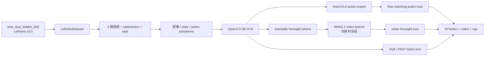

# InternVLA-A1.5 在 RoboTwin 2.0 `pick_dual_bottles` 上的微调实施手册

> 目标：第三方工程师只需按照本文步骤，即可在指定 Python venv 中，使用 RoboTwin 2.0
> 子任务 `pick_dual_bottles` 的 LeRobot v3.0 数据，对 `InternVLA-A1.5-base` 完成一次可复现的
> fine-tune。本文覆盖环境准备、代码核对、数据检查、训练冒烟、正式运行、监控、排错和可选评测。

本文采用仓库已有的通用入口，不再为 `pick_dual_bottles` 复制一份训练脚本：

- 环境公共函数：[`launch/internvla_a15_robotwin_common.sh`](../../launch/internvla_a15_robotwin_common.sh)
- 数据检查/准备：[`launch/internvla_a15_prepare_robotwin.sh`](../../launch/internvla_a15_prepare_robotwin.sh)
- 通用训练入口：[`launch/internvla_a15_finetune_robotwin_comm.sh`](../../launch/internvla_a15_finetune_robotwin_comm.sh)
- RoboTwin 评测参考：[`reprd_rbtwn_stackb3_eval.md`](reprd_rbtwn_stackb3_eval.md)

本文默认只训练 `pick_dual_bottles`，不执行其它任务，也不自动启动 closed-loop 评测。

---

## 目录

- [0. 先看结论](#0-先看结论)
- [1. 路径、变量和输出约定](#1-路径变量和输出约定)
- [2. 数据与模型输入输出说明](#2-数据与模型输入输出说明)
- [3. 环境准备](#3-环境准备)
- [4. 数据检查](#4-数据检查)
- [5. 训练参数与 step 计算](#5-训练参数与-step-计算)
- [6. 训练冒烟](#6-训练冒烟)
- [7. 正式训练](#7-正式训练)
- [8. 训练监控与调试](#8-训练监控与调试)
- [9. 训练完成后的产物检查](#9-训练完成后的产物检查)
- [10. 可选：RoboTwin closed-loop 评测](#10-可选robotwin-closed-loop-评测)
- [11. 常见问题速查](#11-常见问题速查)
- [12. 执行记录模板](#12-执行记录模板)
- [13. 参考资料](#13-参考资料)

---

## 0. 先看结论

### 0.1 本次任务和数据

`pick_dual_bottles` 的含义是双臂分别拾取两个瓶子，属于双手协调/双物体抓取任务。
当前 RoboTwin 任务列表中的索引为 **19**。

本机已经存在对应的 v3.0 数据：

```text
/B/Dta/RoboTwin-Clean/pick_dual_bottles/       # 源目录，v2.1，只读
/B/Dta/RoboTwin-Clean/pick_dual_bottles_lrb3/  # 训练目录，v3.0
```

已核对的关键数据属性：

| 属性 | 值 |
|---|---|
| `codebase_version` | `v3.0`（训练目录） |
| `robot_type` | `aloha` |
| `total_episodes` | 50 |
| `total_frames` | 6129 |
| `fps` | 15 |
| episode 长度 | 112–135 帧，中位数 123 帧 |
| 相机 | `cam_high`、`cam_left_wrist`、`cam_right_wrist` |
| 图像 | 640×480，AV1，15 FPS |
| `observation.state` | `[14]` |
| `action` | `[14]` |

数据已经转换为 v3.0；训练前仍必须检查 v3.0、repo link、相机解码和 stats，不能只看目录名。

### 0.2 推荐的默认训练结果

训练脚本默认自动探测 GPU。若机器暴露 8 张 GPU：

\[
S=\left\lceil\frac{N_{\mathrm{frames}}\times E}{B}\right\rceil
 =\left\lceil\frac{6129\times 76}{128}\right\rceil
 =3640
\]

其中：

- \(N_{\mathrm{frames}}=6129\)：数据帧数；
- \(E=76\)：总 epoch 数；
- \(B=128\)：全局 batch size；
- \(S=3640\)：总更新 step 数。

因此默认配置是：

```text
GPU 数                    8（由 nvidia-smi 自动探测，实际以现场为准）
per-GPU batch             16
global batch              128
NUM_EPOCHS                76
STEPS                     3640
SAVE_FREQ                910
WARMUP_STEPS             364
ACTION_TYPE              abs
DIST_LOADING             false
action_loss_only         false
```

正式训练的 checkpoint 预期为：

```text
000910     # 约 25%
001820     # 约 50%
002730     # 约 75%
003640     # 最终 step
last -> 003640
```

如果 GPU 数不是 8，必须让 `TOTAL_BATCH_SIZE` 能被 GPU 数整除。建议保持
16 samples/GPU，例如 6 卡用 `TOTAL_BATCH_SIZE=96`，4 卡用 `TOTAL_BATCH_SIZE=64`；
脚本会据实际数据量重新计算 `STEPS` 和 `SAVE_FREQ`。

### 0.3 最短执行清单

以下命令是推荐主路径。第一次执行不要设置 `SKIP_PIP_INSTALL=1`，以确保当前 checkout
以 editable 模式安装进指定 venv。

```bash
# 进入本仓库根目录；也可以从任意目录调用脚本
cd /path/to/InternVLA-A-series

export VENV_ROOT=/B/VENV/itnvla15rbt20
source "${VENV_ROOT}/bin/activate"

# 指定任务的 v3.0 数据检查、repo link、视频冒烟、external stats
TASK_NAME=pick_dual_bottles SKIP_CONVERT=1 \
  bash launch/internvla_a15_prepare_robotwin.sh

# 训练冒烟：4 step，step 2 和 4 保存 checkpoint
TASK_NAME=pick_dual_bottles SMOKE=1 \
  bash launch/internvla_a15_finetune_robotwin_comm.sh

# 正式训练：默认 76 epoch / global batch 128
TASK_NAME=pick_dual_bottles \
  bash launch/internvla_a15_finetune_robotwin_comm.sh
```

正式训练前应确认 GPU 空闲。DDP 训练建议放入 `tmux` 或 `screen`，不要使用
`nohup ... & disown`。

---

## 1. 路径、变量和输出约定

### 1.1 路径变量

| 变量 | 默认值 | 作用 |
|---|---|---|
| `PROJ_ROOT` | 由脚本位置推导 | 本仓库根目录，不写死 checkout 路径 |
| `VENV_ROOT` | `/B/VENV/itnvla15rbt20` | Python 虚拟环境 |
| `HF_HOME` | `${VENV_ROOT}/var/hf_home` | Hugging Face 本地缓存 |
| `HF_LEROBOT_HOME` | `${HF_HOME}/lerobot` | LeRobot repo 数据根目录 |
| `ROBOTWIN_CLEAN_ROOT` | `/B/Dta/RoboTwin-Clean` | RoboTwin 清洗数据根目录 |
| `CKPT_BASE` | `/B/Ckp` | 训练输出根目录 |
| `TASK_NAME` | `scan_object` | 任务名；本文必须设为 `pick_dual_bottles` |
| `DATASET_REPO_ID` | `robotwin/${TASK_NAME}` | 可选，直接覆盖 repo id |
| `ACTION_TYPE` | `abs` | `abs` 或 `delta` |
| `CHUNK_SIZE` | `50` | action chunk 长度和 stats 计算阈值 |

本文使用的实际数据路径由变量组合得到：

```bash
export ROBOTWIN_CLEAN_ROOT=/B/Dta/RoboTwin-Clean
export TASK_NAME=pick_dual_bottles
export DATASET_REPO_ID=robotwin/pick_dual_bottles
```

不要把 `ROBOTWIN_CLEAN_ROOT` 直接当作 `LeRobotDataset` 的 root。训练通过
`${HF_LEROBOT_HOME}/${DATASET_REPO_ID}` 查找 repo link。

### 1.2 模型路径

训练脚本默认读取：

```text
${HF_HOME}/ckpts/InternVLA-A1.5-base/model.safetensors
${HF_HOME}/hub/Wan2.2-TI2V-5B/config.json
${HF_HOME}/hub/Wan2.2-TI2V-5B/Wan2.2_VAE.pth
Qwen/Qwen3.5-2B                  # 从 HF 缓存/可访问 Hub 加载
```

如模型实际存放位置不同，可覆盖：

```bash
PRETRAINED_PATH=/path/to/InternVLA-A1.5-base
WAN_CHECKPOINT_PATH=/path/to/Wan2.2-TI2V-5B
WAN_CONFIG_PATH=/path/to/Wan2.2-TI2V-5B
WAN_VAE_PATH=/path/to/Wan2.2-TI2V-5B/Wan2.2_VAE.pth
VLM_MODEL_PATH=Qwen/Qwen3.5-2B
```

### 1.3 输出目录

训练入口会生成：

```text
${CKPT_BASE}/itnVla_<ITNVLA_STAMP>/rbt2/pick_dual_bottles/
├── train_<RUN_STAMP>.log
├── job_<RUN_STAMP>.txt
├── run_<RUN_STAMP>.env
└── ckpt_<RUN_STAMP>/
    ├── checkpoints/
    │   ├── 000910/
    │   ├── 001820/
    │   ├── 002730/
    │   ├── 003640/
    │   └── last -> 003640
    └── wandb/
```

`ITNVLA_STAMP` 和 `RUN_STAMP` 格式都是 `%y%m%d%H%M`，精确到分钟且紧凑。
同一个任务重跑时必须使用新的 `RUN_STAMP`；也可以复用同一个 `ITNVLA_STAMP`，
将多次运行放在同一个任务目录下。

---

## 2. 数据与模型输入输出说明

### 2.1 数据格式

RoboTwin 清洗数据是 ALOHA 双臂关节空间轨迹：

```text
observation.images.cam_high       [3, 480, 640]
observation.images.cam_left_wrist [3, 480, 640]
observation.images.cam_right_wrist[3, 480, 640]
observation.state                  [14]
action                             [14]
task                               文本任务指令
```

LeRobot v3.0 的文件布局为：

```text
pick_dual_bottles_lrb3/
├── data/chunk-000/file-000.parquet
├── videos/observation.images.cam_high/chunk-000/file-000.mp4
├── videos/observation.images.cam_left_wrist/chunk-000/file-000.mp4
├── videos/observation.images.cam_right_wrist/chunk-000/file-000.mp4
└── meta/
    ├── info.json
    ├── episodes/chunk-000/file-000.parquet
    └── tasks.parquet
```

### 2.2 14 维到 16 维的 ALOHA reorder

原始数据中的状态和动作都是 14 维：

```text
[left_joint(6), left_gripper(1), right_joint(6), right_gripper(1)]
```

训练 transform 按 `aloha.yaml` 的约定映射到 16 维：

```text
[left_joint(6), gap(1), left_gripper(1),
 right_joint(6), gap(2), right_gripper(1)]
```

填充位置是目标向量的 index 6、14、15。external stats 计算脚本读取原始
14 维 feature，并由 transform pipeline 在训练时配合 schema 使用；因此 stats 中
`observation.state` 和 `action` 显示为 14 维是正常的，不要手工补成 16 维。

### 2.3 训练的主要处理链



默认训练启用 `action_loss_only=false`，因此会加载 WAN 视频分支并计算 foresight loss；
WAN DiT 权重冻结，但会占用显存。推理阶段则会强制 action-only，不需要 WAN。

---

## 3. 环境准备

### 3.1 推导项目路径并激活 venv

不要只调用 `${VENV_ROOT}/bin/python`。必须先 `source`，因为 activate 脚本还会设置
`HF_HOME`、`HF_LEROBOT_HOME` 和视频解码所需的动态库路径。

```bash
# 该行替换为第三方工程师本机的仓库根目录
cd /path/to/InternVLA-A-series
export PROJ_ROOT="$(pwd)"

export VENV_ROOT="${VENV_ROOT:-/B/VENV/itnvla15rbt20}"
source "${VENV_ROOT}/bin/activate"

# 本任务的要求：使用 venv 内的固定 HF_HOME
export HF_HOME=/B/VENV/itnvla15rbt20/var/hf_home
export HF_LEROBOT_HOME="${HF_HOME}/lerobot"
export PYTHONPATH="${PROJ_ROOT}/src${PYTHONPATH:+:${PYTHONPATH}}"

which python
echo "VIRTUAL_ENV=${VIRTUAL_ENV}"
echo "HF_HOME=${HF_HOME}"
echo "HF_LEROBOT_HOME=${HF_LEROBOT_HOME}"
```

期望 `which python` 指向：

```text
/B/VENV/itnvla15rbt20/bin/python
```

### 3.2 在该 venv 中 editable 重装本仓库

```bash
source "${VENV_ROOT}/bin/activate"
cd "${PROJ_ROOT}"
python -m pip install -e .
```

确认导入的代码来自当前 checkout，而不是 venv 中另一个 editable checkout：

```bash
python - <<'PY'
import inspect
from pathlib import Path
import lerobot

print("lerobot:", Path(inspect.getfile(lerobot)).resolve())
PY
```

输出路径应位于：

```text
${PROJ_ROOT}/src/lerobot/
```

### 3.3 验证关键依赖、Qwen patch 和 GPU

```bash
python - <<'PY'
from pathlib import Path
import torch
import transformers
import torchcodec
import flash_attn

print("torch:", torch.__version__, "CUDA:", torch.version.cuda)
print("transformers:", transformers.__version__)
print("torchcodec:", torchcodec.__version__)
print("flash_attn:", flash_attn.__version__)
print("GPU count:", torch.cuda.device_count())
for i in range(torch.cuda.device_count()):
    p = torch.cuda.get_device_properties(i)
    print(f"GPU{i}: {torch.cuda.get_device_name(i)} ({p.total_memory / 1024**3:.0f} GiB)")

transformers_dir = Path(transformers.__file__).parent
patch = transformers_dir / "models/qwen3_5/modeling_qwen3_5.py"
print("Qwen3.5 patch:", patch, "exists=", patch.is_file())
PY
```

重点检查：

- `torchcodec` 使用 0.10.x；
- `torch` 为 CUDA 12.8 对应版本；
- Qwen3.5 patch 文件存在；
- 至少有一张可用 GPU；
- 当前 shell 没有遗留 `HF_HUB_OFFLINE=1` 或 `TRANSFORMERS_OFFLINE=1`。

通用脚本会在激活 venv 时默认设置：

```bash
export USE_LIBUV=0
export NCCL_TUNER_PLUGIN="${NCCL_TUNER_PLUGIN:-UNUSED}"
```

这用于规避当前容器中缺少 NCCL tuner 配置和 PyTorch TCPStore libuv 的已知问题。

---

## 4. 数据检查

### 4.1 检查源目录和 v3.0 目录

```bash
cd "${PROJ_ROOT}"
export ROBOTWIN_CLEAN_ROOT=/B/Dta/RoboTwin-Clean

ls -ld \
  "${ROBOTWIN_CLEAN_ROOT}/pick_dual_bottles" \
  "${ROBOTWIN_CLEAN_ROOT}/pick_dual_bottles_lrb3"
ls -l \
  "${ROBOTWIN_CLEAN_ROOT}/pick_dual_bottles/meta/info.json" \
  "${ROBOTWIN_CLEAN_ROOT}/pick_dual_bottles_lrb3/meta/info.json"
```

源目录只读，训练目录必须是独立的 `_lrb3` 目录。不要把源目录直接链接成训练 repo。

### 4.2 使用通用准备脚本做数据检查

数据已经处理完成时，使用 `SKIP_CONVERT=1`，脚本会复用 `_lrb3` 目录，并重新完成：

1. venv 激活后的环境核对；
2. editable 安装（除非显式设置 `SKIP_PIP_INSTALL=1`）；
3. `data -> HF_LEROBOT_HOME` 数据根 link；
4. `robotwin/pick_dual_bottles` 和 `_lrb3` link；
5. LeRobotDataset 加载及三路视频非零冒烟；
6. external stats 计算。

```bash
cd "${PROJ_ROOT}"
source "${VENV_ROOT}/bin/activate"

TASK_NAME=pick_dual_bottles \
  SKIP_CONVERT=1 \
  bash launch/internvla_a15_prepare_robotwin.sh
```

如果报错 `SKIP_CONVERT=1 but converted dataset is missing`，说明当前机器缺少 v3.0
产物；确认 `ROBOTWIN_CLEAN_ROOT` 后，去掉 `SKIP_CONVERT=1` 让通用脚本重新转换：

```bash
TASK_NAME=pick_dual_bottles \
  bash launch/internvla_a15_prepare_robotwin.sh
```

转换只读取 `pick_dual_bottles`，输出到 `pick_dual_bottles_lrb3`，不会原地改写源目录。

### 4.3 手工核对元信息

```bash
python - <<'PY'
import json
from pathlib import Path

root = Path("/B/Dta/RoboTwin-Clean/pick_dual_bottles_lrb3")
info = json.loads((root / "meta/info.json").read_text())
for key in ("codebase_version", "robot_type", "total_episodes", "total_frames", "fps"):
    print(key, "=", info[key])
print("data_path =", info["data_path"])
print("video_path =", info["video_path"])
for key, feature in info["features"].items():
    print(key, "=", feature.get("dtype"), feature.get("shape", feature.get("info", "")))

assert info["codebase_version"] == "v3.0"
assert info["robot_type"] == "aloha"
assert info["total_episodes"] == 50
assert info["total_frames"] == 6129
assert info["fps"] == 15
assert info["features"]["observation.state"]["shape"] == [14]
assert info["features"]["action"]["shape"] == [14]
print("INFO_JSON_OK")
PY
```

### 4.4 检查 repo link 和 external stats

```bash
python - <<'PY'
from pathlib import Path
import hashlib
import os

hf = Path("/B/VENV/itnvla15rbt20/var/hf_home/lerobot")
expected = Path("/B/Dta/RoboTwin-Clean/pick_dual_bottles_lrb3").resolve()
for name in ("pick_dual_bottles", "pick_dual_bottles_lrb3"):
    link = hf / "robotwin" / name
    print(link, "->", os.path.realpath(link))
    assert link.is_symlink()
    assert Path(os.path.realpath(link)) == expected

group = "agg_1repos_" + hashlib.sha1(b"robotwin/pick_dual_bottles").hexdigest()[:10]
stats = hf / "stats/aloha/abs" / group / "stats.json"
print("stats =", stats)
assert stats.is_file()
print("LINK_AND_STATS_OK")
PY
```

本任务的 stats 路径应为：

```text
/B/VENV/itnvla15rbt20/var/hf_home/lerobot/stats/aloha/abs/agg_1repos_59c5e8f4cd/stats.json
```

---

## 5. 训练参数与 step 计算

### 5.1 脚本如何得到训练参数

通用训练入口 [`internvla_a15_finetune_robotwin_comm.sh`](../../launch/internvla_a15_finetune_robotwin_comm.sh)
会执行以下逻辑：

1. 保存调用者传入的 `TASK_NAME` / `DATASET_REPO_ID`；
2. source `internvla_a15_robotwin_common.sh` 并激活 venv；
3. 读取 `${HF_LEROBOT_HOME}/${DATASET_REPO_ID}/meta/info.json`；
4. 从 `total_frames` 读取数据量；
5. 自动探测 `CUDA_VISIBLE_DEVICES` 和 `PROC_PER_NODE`；
6. 检查 `TOTAL_BATCH_SIZE % PROC_PER_NODE == 0`；
7. 计算 per-GPU `BATCH_SIZE`、`STEPS` 和 `SAVE_FREQ`；
8. 预检 base、WAN、stats、数据版本；
9. 用 `python -m accelerate.commands.launch` 启动 DDP；
10. 使用 `tee` 将 stdout/stderr 保存为带时间戳的训练日志。

训练入口不会自动把 v2.1 数据转换成 v3.0；数据准备必须先完成。

### 5.2 默认 8 GPU 的具体计算

本任务使用：

```text
NUM_FRAMES=6129
NUM_EPOCHS=76
TOTAL_BATCH_SIZE=128
PROC_PER_NODE=8
BATCH_SIZE=128/8=16
```

计算：

\[
S=\left\lceil\frac{6129\times 76}{128}\right\rceil=3640
\]

\[
F_{\mathrm{save}}=\left\lfloor\frac{3640}{4}\right\rfloor=910
\]

脚本会在 `step % 910 == 0` 或 `step == 3640` 时保存，因此保存点为：
910、1820、2730、3640。

warmup 默认是：

\[
W=\max(1,\lfloor 3640/10\rfloor)=364
\]

### 5.3 其它 GPU 数的设置

脚本要求全局 batch 能被 GPU 数整除。保持 16/GPU 的建议值：

| GPU 数 | `TOTAL_BATCH_SIZE` | per-GPU batch | 默认 step 计算 |
|---:|---:|---:|---:|
| 8 | 128 | 16 | \(\lceil6129×76/128\rceil=3640\) |
| 6 | 96 | 16 | \(\lceil6129×76/96\rceil=4853\) |
| 4 | 64 | 16 | \(\lceil6129×76/64\rceil=7279\) |
| 2 | 32 | 16 | \(\lceil6129×76/32\rceil=14557\) |

如果显存充足，也可以使用其它全局 batch，但应明确记录重新计算后的 steps。

### 5.4 默认 loss 和冻结策略

训练入口传入的关键配置包括：

```text
policy.type=internvla_a1_5
policy.dtype=bfloat16
policy.optimizer_lr=5e-5
policy.scheduler_decay_lr=5e-6
policy.enable_vqa_loss=true
policy.tokenize_state=true
policy.action_loss_only=false
policy.video_loss_only=false
policy.video_loss_weight=1
policy.freeze_learnable_tokens=true
policy.num_learnable_tokens=50
policy.gradient_checkpointing=false
dataset.action_mode=abs
dataset.use_external_stats=true
dataset.dist_loading=false
dataset.use_fast_action_tokens=true
```

总 loss 的实现语义为：

\[
L_{\mathrm{total}}
=10L_{\mathrm{action}}+L_{\mathrm{video}}+L_{\mathrm{vqa}}
\]

WAN 视频 DiT 在训练中冻结；base、视觉编码器、action expert 和其它配置允许训练的参数
按模型实现参与更新。

---

## 6. 训练冒烟

### 6.1 为什么先冒烟

正式训练每次可能运行数小时。冒烟使用相同模型、数据、三路视频、WAN 和 DDP，只把
更新次数改成 4，主要验证：

- accelerate 能启动全部 rank；
- FAST tokenizer 和 Qwen3.5 能加载；
- v3.0 数据和视频能解码；
- 第一个 forward 不 OOM；
- checkpoint 和 wandb 目录能写；
- `NCCL_TUNER_PLUGIN=UNUSED` 生效。

### 6.2 运行冒烟

先确认没有其它训练占用 GPU：

```bash
nvidia-smi
ps -eo pid,etime,cmd | rg 'lerobot_train|accelerate.commands.launch|robotwin.*finetune' || true
```

然后执行：

```bash
cd "${PROJ_ROOT}"
source "${VENV_ROOT}/bin/activate"
unset HF_HUB_OFFLINE TRANSFORMERS_OFFLINE

STAMP="$(date +%y%m%d%H%M)"
TASK_NAME=pick_dual_bottles \
RUN_STAMP="${STAMP}" ITNVLA_STAMP="${STAMP}" \
SMOKE=1 \
  bash launch/internvla_a15_finetune_robotwin_comm.sh
```

冒烟会将：

```text
STEPS=4
SAVE_FREQ=2
LOG_FREQ=1
```

成功标志：

```text
Start offline training
Checkpoint policy after step 2
Checkpoint policy after step 4
End of training
```

对应输出目录类似：

```text
/B/Ckp/itnVla_<stamp>/rbt2/pick_dual_bottles/
├── train_<stamp>.log
└── ckpt_<stamp>/
    └── checkpoints/
        ├── 000002/
        └── 000004/
```

冒烟成功后，正式训练必须换一个 `RUN_STAMP`，不能复用冒烟 output directory。

### 6.3 冒烟失败时的处理

- 在模型加载前失败：先看 `HF_HOME`、Qwen patch、FAST tokenizer 和 editable import 路径。
- NCCL 报 `No NCCL_TUNER_CONFIG_PATH provided`：确认公共脚本设置了
  `NCCL_TUNER_PLUGIN=UNUSED`。
- 第一个 forward CUDA OOM：降低 `TOTAL_BATCH_SIZE`，建议设为 `16 × GPU 数`。
- 视频全零或 torchcodec import 失败：确认已经 `source activate`，不要只调用 venv python。
- 训练目录已存在：更换 `RUN_STAMP`。

---

## 7. 正式训练

### 7.1 推荐启动方式

在独立 `tmux` 会话中执行：

```bash
tmux new -s pick_dual_bottles_ft
```

进入会话后：

```bash
cd "${PROJ_ROOT}"
export VENV_ROOT=/B/VENV/itnvla15rbt20
source "${VENV_ROOT}/bin/activate"

export HF_HOME=/B/VENV/itnvla15rbt20/var/hf_home
export HF_LEROBOT_HOME="${HF_HOME}/lerobot"
unset HF_HUB_OFFLINE TRANSFORMERS_OFFLINE

STAMP="$(date +%y%m%d%H%M)"
TASK_NAME=pick_dual_bottles \
RUN_STAMP="${STAMP}" ITNVLA_STAMP="${STAMP}" \
NUM_EPOCHS=76 TOTAL_BATCH_SIZE=128 \
  bash launch/internvla_a15_finetune_robotwin_comm.sh
```

如果现场不是 8 GPU，按照第 [5.3 节](#53-其它-gpu-数的设置)设置全局 batch。例如
6 GPU：

```bash
TASK_NAME=pick_dual_bottles \
RUN_STAMP="$(date +%y%m%d%H%M)" \
ITNVLA_STAMP="$(date +%y%m%d%H%M)" \
NUM_EPOCHS=76 TOTAL_BATCH_SIZE=96 \
  bash launch/internvla_a15_finetune_robotwin_comm.sh
```

为了避免两个时间戳命令跨分钟不一致，正式运行更推荐先保存 `STAMP` 再同时传入。

### 7.2 需要覆盖的常用变量

```bash
# 改总 epoch，STEPS 和 SAVE_FREQ 自动随之改变
NUM_EPOCHS=100

# 改全局 batch；必须能被 GPU 数整除
TOTAL_BATCH_SIZE=96

# 显式限定 GPU
CUDA_VISIBLE_DEVICES=0,1,2,3,4,5
PROC_PER_NODE=6

# 改通信端口，避免与其它任务冲突
MASTER_PORT=36223

# 改 dataloader worker 数
NUM_WORKERS=8

# 改日志频率
LOG_FREQ=25

# 只有明确需要时才覆盖总 steps / 保存频率
STEPS=5000 SAVE_FREQ=1250
```

通常只需要设置 `TASK_NAME`、`NUM_EPOCHS`、`TOTAL_BATCH_SIZE` 和时间戳；不要无理由
手工覆盖 `STEPS`，否则实际训练 epoch 数将不再等于预期。

### 7.3 正式训练输出示例

默认 8 GPU、当前数据量下，启动日志应接近：

```text
NUM_FRAMES=6129 NUM_EPOCHS=76 TOTAL_BATCH_SIZE=128
BATCH_SIZE(per GPU)=16 PROC_PER_NODE=8 DIST_LOADING=false
STEPS=3640 SAVE_FREQ=910 WARMUP_STEPS=364
OUTPUT_ROOT=/B/Ckp/itnVla_<stamp>/rbt2/pick_dual_bottles
DATASET_REPO_ID=robotwin/pick_dual_bottles
ROBOT_TYPE=aloha
EXTERNAL_STATS_PATH=.../agg_1repos_59c5e8f4cd/stats.json
```

---

## 8. 训练监控与调试

### 8.1 查看日志

训练脚本会把所有 rank 的输出汇总到：

```text
/B/Ckp/itnVla_<ITNVLA_STAMP>/rbt2/pick_dual_bottles/train_<RUN_STAMP>.log
```

在另一个 shell 中：

```bash
LOG=/B/Ckp/itnVla_<ITNVLA_STAMP>/rbt2/pick_dual_bottles/train_<RUN_STAMP>.log
tail -f "${LOG}"
```

日志中重点关注：

| 指标/现象 | 正常表现 | 需要处理 |
|---|---|---|
| `loss` | 总体下降，无 NaN | 持续上升、NaN |
| `loss_action` | 通常较快下降 | 持续震荡或不下降 |
| `loss_video` | 可缓慢下降 | 突然爆炸 |
| `loss_vqa` | 随 token 学习逐步下降 | 突然变大 |
| `grad_norm` | 初期可较高，之后趋稳 | 长期 >100 或 NaN |
| `iters/s` | 稳定 | 突然归零或持续下降 |
| `video_decode_error` | 不出现或为 0 | 大于 0 |
| 显存 | H200 上约 130–136 GiB 量级，因配置而异 | OOM |

不要把某一个任务的单个 loss 数值当作硬性验收标准；优先看趋势、NaN、视频解码错误、
是否完成 checkpoint 和最终 step。

### 8.2 查看 GPU 和进程

```bash
nvidia-smi
ps -eo pid,etime,%cpu,%mem,state,cmd | \
  rg 'lerobot_train|accelerate.commands.launch|pick_dual_bottles'
```

训练过程中不要结束其它 rank，也不要重复启动同一 `RUN_STAMP` 的训练。

### 8.3 WandB / TensorBoard

当前训练配置使用：

```text
--wandb.enable=true
--wandb.mode=offline
```

offline 数据位于：

```text
${CKPT_BASE}/itnVla_<ITNVLA_STAMP>/rbt2/pick_dual_bottles/ckpt_<RUN_STAMP>/wandb/
```

本仓库该训练入口没有 TensorBoard writer；主要使用训练日志和 WandB offline 文件。
需要联网同步时，在训练结束后执行：

```bash
wandb sync \
  "${CKPT_BASE}/itnVla_<ITNVLA_STAMP>/rbt2/pick_dual_bottles/ckpt_<RUN_STAMP>/wandb"
```

### 8.4 典型调参顺序

遇到问题时按以下顺序处理：

1. 数据和视频解码：检查 `source activate`、`LD_LIBRARY_PATH`、v3.0 link；
2. 配置和资源：检查 GPU 数、`TOTAL_BATCH_SIZE` 是否可整除；
3. OOM：先降低到 16/GPU，再考虑其它显存策略；
4. loss/grad 异常：确认 action mode、stats、数据 repo 没有混用；
5. 通信挂死：更换 `MASTER_PORT`，确认 `USE_LIBUV=0`；
6. 目录冲突：使用新的 `RUN_STAMP`，不要删除一个仍在运行的 output。

---

## 9. 训练完成后的产物检查

### 9.1 检查日志和 checkpoint

```bash
ROOT="${CKPT_BASE}/itnVla_<ITNVLA_STAMP>/rbt2/pick_dual_bottles"
LOG="${ROOT}/train_<RUN_STAMP>.log"
CKPT_ROOT="${ROOT}/ckpt_<RUN_STAMP>/checkpoints"

rg -n "End of training|video_decode_error|Traceback|NaN|Checkpoint saved" "${LOG}"
ls -la "${CKPT_ROOT}"
readlink -f "${CKPT_ROOT}/last"
```

默认 8 GPU 的最低验收条件：

```text
日志出现 End of training
000910、001820、002730、003640 均存在
last 指向 003640
没有 OOM、NaN 或持续 video_decode_error
```

### 9.2 检查最终模型文件

```bash
FINAL="${CKPT_ROOT}/last/pretrained_model"
ls -lh \
  "${FINAL}/config.json" \
  "${FINAL}/model.safetensors" \
  "${FINAL}/stats.json"
```

运行上述命令前，将最终 checkpoint 路径通过环境变量传给 Python：

```bash
FINAL="${CKPT_ROOT}/last/pretrained_model"
FINAL_PATH="${FINAL}" python - <<'PY'
import os
import json
from pathlib import Path

final = Path(os.environ["FINAL_PATH"])
config = json.loads((final / "config.json").read_text())
stats = json.loads((final / "stats.json").read_text())
assert config.get("type") == "internvla_a1_5"
assert "aloha" in stats
assert "observation.state" in stats["aloha"]
assert "action" in stats["aloha"]
print("CHECKPOINT_FILES_OK")
PY
```

### 9.3 保存本次运行参数

训练入口已经写入：

```text
${ROOT}/run_<RUN_STAMP>.env
${ROOT}/job_<RUN_STAMP>.txt
```

至少归档以下信息：

```text
TASK_NAME
DATASET_REPO_ID
NUM_FRAMES
NUM_EPOCHS
TOTAL_BATCH_SIZE
BATCH_SIZE
PROC_PER_NODE
STEPS
SAVE_FREQ
EXTERNAL_STATS_PATH
OUTPUT_DIR
```

---

## 10. 可选：RoboTwin closed-loop 评测

训练本身不需要 RoboTwin 仿真 submodule；只有要做 closed-loop 评测时才需要安装。
评测逻辑和注意事项以 [`reprd_rbtwn_stackb3_eval.md`](reprd_rbtwn_stackb3_eval.md) 为准。

### 10.1 准备 RoboTwin submodule 和资产

```bash
cd "${PROJ_ROOT}"
git submodule update --init third_party/RoboTwin
cp evaluation/RoboTwin/requirements.txt \
  third_party/RoboTwin/script/requirements.txt
cd third_party/RoboTwin
bash script/_install.sh
bash script/_download_assets.sh
cd ../..
```

### 10.2 确认 task index

不要永久假设任务索引不会变化：

```bash
python - <<'PY'
import sys
sys.path.insert(0, "evaluation/RoboTwin")
from inference import TASK_NAMES

print("pick_dual_bottles index =", TASK_NAMES.index("pick_dual_bottles"))
PY
```

当前预期为：

```text
pick_dual_bottles index = 19
```

### 10.3 使用 venv 直接运行 inference.py

当前 `evaluation/RoboTwin/eval.sh` 仍包含 conda 激活逻辑；本任务要求使用 venv，
因此推荐直接调用 `inference.py`：

```bash
source "${VENV_ROOT}/bin/activate"
export HF_HOME=/B/VENV/itnvla15rbt20/var/hf_home
export PYTHONPATH="${PROJ_ROOT}/src:${PROJ_ROOT}/third_party/RoboTwin${PYTHONPATH:+:${PYTHONPATH}}"

CKPT="${CKPT_ROOT}/last/pretrained_model"
OUT_ROOT="${PROJ_ROOT}/outputs/robotwin_eval/pick_dual_bottles_ft"

cd "${PROJ_ROOT}/third_party/RoboTwin"
python ../../evaluation/RoboTwin/inference.py \
  --ckpt-path "${CKPT}" \
  --video-dir "${OUT_ROOT}/robotwin/demo_clean/pick_dual_bottles" \
  --task-config demo_clean \
  --task-idx 19 \
  --action-mode abs \
  --infer-horizon 20 \
  --inference-backend standard \
  --num-episodes 100 \
  --resize-size 224
cd ../..
```

推理会把 `action_loss_only` 设为 true，不加载 WAN；`--action-mode abs` 必须与训练一致。
正式论文对比可以再运行 `demo_randomized`，并使用不同的输出目录。

### 10.4 汇总成功率

```bash
python util_scripts/robotwin_result_stats.py \
  "${OUT_ROOT}"
```

不要把不同任务或不同评测配置放到同一个最内层 video directory，因为推理入口可能清理
该目录中的既有视频。

---

## 11. 常见问题速查

| 现象 | 根因 | 处理 |
|---|---|---|
| `BackwardCompatibilityError` | 误加载 v2.1 源目录 | 确认 repo link 指向 `pick_dual_bottles_lrb3` |
| `SKIP_CONVERT=1 ... missing` | v3.0 产物不在当前机器 | 检查数据根，去掉 `SKIP_CONVERT=1` 转换 |
| `accelerate: command not found` | venv 没有 console script | 训练入口已使用 `python -m accelerate.commands.launch` |
| FAST tokenizer 找不到 | 遗留 `HF_HUB_OFFLINE=1` | `unset HF_HUB_OFFLINE TRANSFORMERS_OFFLINE` |
| `No NCCL_TUNER_CONFIG_PATH` | 可选 tuner 插件缺配置 | 确认 `NCCL_TUNER_PLUGIN=UNUSED` |
| 第一步 CUDA OOM | WAN + 三相机 + batch 太大 | `TOTAL_BATCH_SIZE=16×GPU数` |
| `TOTAL_BATCH_SIZE ... not divisible` | 全局 batch 不能被 GPU 数整除 | 调整 `TOTAL_BATCH_SIZE` 或 GPU 数 |
| 视频全零 | 未 source venv，动态库顺序错误 | 重新 `source ${VENV_ROOT}/bin/activate` |
| `FileExistsError` output_dir | 重用了旧 `RUN_STAMP` | 使用新的分钟时间戳 |
| loss 为 NaN | 数据、stats、精度或显存问题 | 检查 stats/repo/action mode，降低 batch |
| DDP TCPStore 挂起 | libuv 或端口冲突 | `USE_LIBUV=0`，更换 `MASTER_PORT` |
| 评测 `No module named envs` | submodule/PYTHONPATH/cwd 不正确 | 初始化 submodule，从 `third_party/RoboTwin` 运行 |
| 评测 task index 不对 | RoboTwin 任务列表变更 | 重新运行 `TASK_NAMES.index(...)` |

### 11.1 不要采用的做法

- 不要只调用 `${VENV_ROOT}/bin/python` 而不 `source activate`；
- 不要把 `/B/Dta/RoboTwin-Clean/pick_dual_bottles` 作为训练目录；
- 不要把整个 `/B/Dta/RoboTwin-Clean` 当成一个 dataset；
- 不要将 `abs` 训练结果用 `delta` 方式评测；
- 不要把 `STEPS=12500` 等其它任务的固定值直接抄过来；
- 不要用 `nohup ... & disown` 启动多进程训练；
- 不要在同一 `OUTPUT_DIR` 上覆盖重跑；
- 不要在正式训练仍运行时删除 checkpoint 或日志目录。

---

## 12. 执行记录模板

第三方工程师实际执行时，建议将以下内容复制到项目实验记录中。

### 12.1 环境记录

| 项目 | 实际值 |
|---|---|
| 执行日期 | |
| `PROJ_ROOT` | |
| `VENV_ROOT` | `/B/VENV/itnvla15rbt20` |
| `HF_HOME` | `/B/VENV/itnvla15rbt20/var/hf_home` |
| `lerobot.__file__` | |
| torch / CUDA | |
| transformers | |
| torchcodec | |
| GPU 数量和型号 | |
| Qwen3.5 patch | |

### 12.2 数据记录

| 项目 | 实际值 |
|---|---|
| 源目录 | `/B/Dta/RoboTwin-Clean/pick_dual_bottles` |
| 训练目录 | `/B/Dta/RoboTwin-Clean/pick_dual_bottles_lrb3` |
| `codebase_version` | |
| episodes / frames | `50 / 6129` |
| robot type | `aloha` |
| repo id | `robotwin/pick_dual_bottles` |
| stats 路径 | `.../agg_1repos_59c5e8f4cd/stats.json` |
| stats skipped episodes | |
| 三路相机冒烟 | |

### 12.3 训练记录

| 项目 | 实际值 |
|---|---|
| `ITNVLA_STAMP` | |
| `RUN_STAMP` | |
| `NUM_EPOCHS` | |
| `TOTAL_BATCH_SIZE` | |
| `PROC_PER_NODE` | |
| per-GPU batch | |
| `STEPS` | |
| `SAVE_FREQ` | |
| `WARMUP_STEPS` | |
| `MASTER_PORT` | |
| output root | |
| log file | |
| 冒烟结果 | |
| 正式训练结果 | |
| 最终 checkpoint | |
| `last` 指向 | |

### 12.4 问题记录

| 时间 | 现象 | 根因 | 修复 | 验证 |
|---|---|---|---|---|
| | | | | |

---

## 13. 参考资料

本文主要依据以下仓库内资料和实际脚本：

1. [`reprd_rbtwn_stackb3.md`](reprd_rbtwn_stackb3.md)：RoboTwin 单任务训练参数、OOM 和 checkpoint 经验；
2. [`reprd_rbtwn_stackb3_eval.md`](reprd_rbtwn_stackb3_eval.md)：RoboTwin 评测流程、动作 reorder 和 task index 说明；
3. [`reprd_rbtwn_hngMg.md`](reprd_rbtwn_hngMg.md)：venv、视频解码、WAN 和 FAST tokenizer 排错经验；
4. [`reprd_rbtwn_hngMgLOG.md`](reprd_rbtwn_hngMgLOG.md)：实际训练启动和失败修复记录；
5. [`reprd_rbtwn_scnObj.md`](reprd_rbtwn_scnObj.md)：分钟时间戳输出布局、动态 step 计算和通用化入口；
6. [`reprd_rbtwn_scnObjLOG.md`](reprd_rbtwn_scnObjLOG.md)：当前机器的完整数据转换及训练验证记录；
7. [`launch/internvla_a15_finetune_robotwin_comm.sh`](../../launch/internvla_a15_finetune_robotwin_comm.sh)：本手册实际调用的训练实现；
8. [`launch/internvla_a15_robotwin_common.sh`](../../launch/internvla_a15_robotwin_common.sh)：venv、HF 路径、GPU 和通信环境实现；
9. [`src/lerobot/dataset_schemas/configs/aloha.yaml`](../../src/lerobot/dataset_schemas/configs/aloha.yaml)：ALOHA feature/action reorder schema；
10. [InternVLA-A1.5 论文](https://arxiv.org/abs/2607.04988)；
11. [RoboTwin 2.0 项目主页](https://robotwin-platform.github.io/)；
12. [InternVLA-A-series GitHub](https://github.com/InternRobotics/InternVLA-A-series)。

