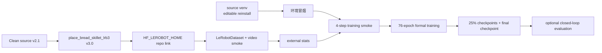

# InternVLA-A1.5 在 RoboTwin 2.0 `place_bread_skillet` 上的微调实施操作手册

> 目标：让没有参与过本项目复现的第三方工程师，仅根据本文档，就能在指定 Python 虚拟环境中，使用 RoboTwin 2.0 的 `place_bread_skillet` 单任务数据，对 `InternVLA-A1.5-base` 完成一次可追踪、可复现的微调训练。
>
> 本手册覆盖：环境激活与 editable 重装、数据核验、LeRobot 数据链接与统计量检查、训练前冒烟、正式训练、日志与显存监控、checkpoint 验证、常见故障处理，以及可选的 RoboTwin closed-loop 评测。
>
> 本手册只编写操作方案，不虚构一次实际训练的最终成功率。正式训练产生的时间线、错误和最终指标，应填写 Part B。

---

## 目录

- [Part A：实施操作手册](#part-a实施操作手册)
  - [0. 先看结论](#0-先看结论)
  - [1. 任务、数据和目录约定](#1-任务数据和目录约定)
  - [2. 训练方案与计算规则](#2-训练方案与计算规则)
  - [3. 大步一：环境准备](#3-大步一环境准备)
  - [4. 大步二：数据准备与数据冒烟](#4-大步二数据准备与数据冒烟)
  - [5. 大步三：训练冒烟](#5-大步三训练冒烟)
  - [6. 大步四：正式训练](#6-大步四正式训练)
  - [7. 训练监控与 checkpoint 管理](#7-训练监控与-checkpoint-管理)
  - [8. checkpoint 验证](#8-checkpoint-验证)
  - [9. 可选：RoboTwin closed-loop 评测](#9-可选robotwin-closed-loop-评测)
  - [10. 常见问题与排错](#10-常见问题与排错)
  - [11. 最短命令清单](#11-最短命令清单)
- [Part B：本次执行记录模板](#part-b本次执行记录模板)
- [参考资料](#参考资料)

---

## Part A：实施操作手册

## 0. 先看结论

### 0.1 任务与已核验数据

本手册的目标任务是 `place_bread_skillet`，中文可理解为“将面包放入平底锅”。它是 RoboTwin 2.0 的 50 个子任务之一，在本仓库 [`evaluation/RoboTwin/inference.py`](../../evaluation/RoboTwin/inference.py) 的 `TASK_NAMES` 中，当前索引为 **23**。

当前机器上的数据状态已经核验如下：

| 项目 | 原始 Clean 数据 | 训练用 `_lrb3` 数据 |
|---|---|---|
| 路径 | `/B/Dta/RoboTwin-Clean/place_bread_skillet/` | `/B/Dta/RoboTwin-Clean/place_bread_skillet_lrb3/` |
| LeRobot 版本 | `v2.1` | `v3.0` |
| robot type | `aloha` | `aloha` |
| episodes | 50 | 50 |
| frames | 8277 | 8277 |
| FPS | 15 | 15 |
| state/action | `[14]` | `[14]` |
| 相机 | `cam_high`、`cam_left_wrist`、`cam_right_wrist` | 同左 |
| 视频 | 640×480、AV1、15 FPS | 640×480、AV1、15 FPS |

原始 Clean 目录必须视为只读。训练和数据检查通过 `HF_LEROBOT_HOME/robotwin/place_bread_skillet` 这个 repo id 链接到 `_lrb3` 目录，不直接在原始 v2.1 数据上训练。

### 0.2 本次不需要新写训练代码

仓库已有通用入口，已经支持通过环境变量选择任意一个准备好的 RoboTwin 单任务：

1. [`launch/internvla_a15_robotwin_common.sh`](../../launch/internvla_a15_robotwin_common.sh)：统一处理虚拟环境、HF 路径、GPU 探测和公共环境变量。
2. [`launch/internvla_a15_prepare_robotwin.sh`](../../launch/internvla_a15_prepare_robotwin.sh)：检查/转换数据、创建 repo id 链接、数据冒烟和计算 external stats。
3. [`launch/internvla_a15_finetune_robotwin_comm.sh`](../../launch/internvla_a15_finetune_robotwin_comm.sh)：计算训练 step、计算保存频率、执行 DDP 训练并保存日志。

因此本任务的“开发编码”阶段主要是确认通用脚本参数与任务数据一致，不要另写一套 `place_bread_skillet` 专用训练循环。除非脚本本身出现缺陷，否则只通过环境变量配置任务、数据根、输出根、epoch、batch 和模型路径。

### 0.3 默认训练结果

默认配置如下：

- 虚拟环境：`/B/VENV/itnvla15rbt20`
- `HF_HOME`：`/B/VENV/itnvla15rbt20/var/hf_home`
- 基座：`$HF_HOME/ckpts/InternVLA-A1.5-base`
- WAN：`$HF_HOME/hub/Wan2.2-TI2V-5B`
- 动作模式：`abs`
- 总 epoch：76
- 全局 batch size：128
- GPU：脚本自动探测；8 张 GPU 时为 16 samples/GPU
- 总训练 step：4915
- checkpoint 保存 step：1228、2456、3684、4912，以及最后一步 4915
- 输出根：`/B/Ckp/itnVla_<时间戳>/rbt2/place_bread_skillet/`

如果机器不是 8 张 GPU，不能机械照抄全局 batch 128。必须重新选择能被 GPU 数整除的全局 batch，并让每张 GPU 的 batch 尽量不超过 16。

### 0.4 总体流程



---

## 1. 任务、数据和目录约定

### 1.1 仓库根目录必须自动推断

本文不把本代码库的绝对路径写进训练命令。请先进入你实际放置本仓库的目录，并把当前目录保存为 `PROJ_ROOT`：

```bash
cd /path/to/InternVLA-A-series
export PROJ_ROOT="$(pwd)"
test -f "${PROJ_ROOT}/launch/internvla_a15_finetune_robotwin_comm.sh"
test -d "${PROJ_ROOT}/src/lerobot"
```

上面的 `/path/to/InternVLA-A-series` 是占位写法，请替换为本机仓库根目录。后文使用 `${PROJ_ROOT}`，不会依赖某一台机器的 checkout 路径。

现有 launch 脚本也会根据自身位置推导仓库根目录，因此从其它目录调用脚本也可以工作；但为了降低误操作概率，建议始终先 `cd "${PROJ_ROOT}"`。

### 1.2 可配置变量

| 变量 | 默认值 | 作用 |
|---|---|---|
| `PROJ_ROOT` | 由 launch 脚本位置推断 | 本代码库根目录 |
| `VENV_ROOT` | `/B/VENV/itnvla15rbt20` | Python venv；必须 source activate |
| `HF_HOME` | `${VENV_ROOT}/var/hf_home` | Hugging Face 和 LeRobot 缓存 |
| `HF_HOME_OVERRIDE` | 未设置 | 在激活 venv 后覆盖 `HF_HOME` |
| `HF_LEROBOT_HOME` | `${HF_HOME}/lerobot` | LeRobot repo id 的本地根目录 |
| `ROBOTWIN_CLEAN_ROOT` | `/B/Dta/RoboTwin-Clean` | RoboTwin Clean 数据根 |
| `CKPT_BASE` | `/B/Ckp` | 所有日志、WandB、checkpoint 的输出根 |
| `TASK_NAME` | `scan_object` | 任务名；本手册必须设置为 `place_bread_skillet` |
| `DATASET_REPO_ID` | `robotwin/${TASK_NAME}` | 训练用 repo id，可覆盖 |
| `ACTION_TYPE` | `abs` | `abs` 或 `delta`；本任务默认 `abs` |
| `CHUNK_SIZE` | `50` | action chunk 长度和 stats 计算长度 |
| `NUM_EPOCHS` | `76` | 总 epoch 数 |
| `TOTAL_BATCH_SIZE` | `128` | 全局 batch，不是单 GPU batch |
| `CUDA_VISIBLE_DEVICES` | 自动探测 | 指定使用哪些 GPU |
| `PROC_PER_NODE` | GPU 数 | 单机进程数 |
| `ITNVLA_STAMP` | 当前时间 `%y%m%d%H%M` | 外层输出目录时间戳 |
| `RUN_STAMP` | 当前时间 `%y%m%d%H%M` | 同一任务不同重跑的时间戳 |
| `SMOKE` | `0` | 设置为 `1` 时执行 4-step 冒烟 |
| `PRETRAINED_PATH` | `${HF_HOME}/ckpts/InternVLA-A1.5-base` | 基座模型路径 |
| `WAN_CHECKPOINT_PATH` | `${HF_HOME}/hub/Wan2.2-TI2V-5B` | WAN 模型目录 |
| `WAN_CONFIG_PATH` | 同 WAN 模型目录 | WAN 配置路径 |
| `WAN_VAE_PATH` | `${WAN_CHECKPOINT_PATH}/Wan2.2_VAE.pth` | WAN VAE 文件 |
| `MASTER_PORT` | `36222` | DDP 通信端口 |

### 1.3 输出目录约定

正式训练不会把结果写到仓库内的 `outputs/`，而是写到：

```text
${CKPT_BASE}/itnVla_${ITNVLA_STAMP}/rbt2/place_bread_skillet/
```

默认就是：

```text
/B/Ckp/itnVla_<YYMMDDHHMM>/rbt2/place_bread_skillet/
```

在任务目录下，每次重跑都有独立的 `RUN_STAMP`：

```text
/B/Ckp/itnVla_2608281219/rbt2/place_bread_skillet/
├── train_2608281219.log
├── job_2608281219.txt
├── run_2608281219.env
└── ckpt_2608281219/
    ├── checkpoints/
    │   ├── 001228/
    │   ├── 002456/
    │   ├── 003684/
    │   ├── 004912/
    │   ├── 004915/
    │   └── last -> 004915
    └── wandb/
```

checkpoint 目录名由训练代码生成，通常为 6 位补零形式。以 `last/pretrained_model/` 为评测入口最稳妥，不要手工猜目录名。

本仓库当前训练入口使用 WandB offline 模式，没有内置 TensorBoard writer。因此不要以是否存在 `events.out.tfevents.*` 判断训练失败；主要查看 `train_*.log` 和 `ckpt_*/wandb/`。如果团队需要 TensorBoard，可在训练结束后将 WandB 数据转换或另行接入，不应在本任务中修改训练主流程。

---

## 2. 训练方案与计算规则

### 2.1 为什么使用 `abs`

RoboTwin 数据中的 action 是双臂 ALOHA 关节空间动作，共 14 维：

```text
[left_joint(6), left_gripper(1), right_joint(6), right_gripper(1)]
```

本任务使用 `abs`，模型直接预测目标关节位置。推理时不需要将预测值加到当前关节位置上。训练和评测必须保持一致：

- 训练：`ACTION_TYPE=abs`、`--dataset.action_mode=abs`
- 评测：`ACTION_MODE=abs`

不要把本任务训练成 `abs` 后再用 `delta` 评测，动作含义不同，会导致结果没有可比性。

### 2.2 14 维数据与模型内部 16 维约定

数据文件中的 state/action 是 14 维，但 `aloha.yaml` 的变换会按照 ALOHA 约定将它们放入 16 维布局：

```text
原始 14 维:
[L0 L1 L2 L3 L4 L5 Lgripper R0 R1 R2 R3 R4 R5 Rgripper]

模型内部 16 维:
[L0 L1 L2 L3 L4 L5 gap Lgripper R0 R1 R2 R3 R4 R5 gap gap Rgripper]
```

第 6、14、15 号位置是约定的空位。`compute_norm_stats_multi.py` 输出的 external stats 仍然针对原始 14 维特征，reorder 在 transform pipeline 中完成。不要因为 `stats.json` 里看到 14 维就认为它不匹配。

### 2.3 总训练 step

设：

- \(N_{\mathrm{frames}}\)：数据集总帧数，本任务为 8277；
- \(E\)：总 epoch 数，默认 76；
- \(B\)：全局 batch size，默认 128；
- \(S\)：总 optimizer update step。

训练脚本使用：

\[
S=\left\lceil\frac{N_{\mathrm{frames}}\times E}{B}\right\rceil
\]

代入本任务默认值：

\[
S=\left\lceil\frac{8277\times76}{128}\right\rceil
 =\left\lceil4914.46875\right\rceil
 =4915
\]

因此不能照抄其它任务的 `10000` 或 `12500` steps。不同任务的帧数不同，必须让训练脚本从 v3.0 `info.json` 读取 `total_frames` 并计算。

### 2.4 checkpoint 保存 step

训练脚本默认使用：

\[
F_{\mathrm{save}}=\left\lfloor\frac{S}{4}\right\rfloor
\]

其中 \(F_{\mathrm{save}}\) 是 `SAVE_FREQ`。本任务：

\[
F_{\mathrm{save}}=\left\lfloor\frac{4915}{4}\right\rfloor=1228
\]

因此会在以下 step 保存：

| 训练进度 | step | 说明 |
|---|---:|---|
| 约 25% | 1228 | `step % SAVE_FREQ == 0` |
| 约 50% | 2456 | `step % SAVE_FREQ == 0` |
| 约 75% | 3684 | `step % SAVE_FREQ == 0` |
| 接近 100% | 4912 | 第四个保存周期 |
| 训练结束 | 4915 | 最后一步强制保存，即使不是 1228 的整数倍 |

脚本会将训练实际使用的 `STEPS`、`SAVE_FREQ`、batch 和数据路径写入 `run_<RUN_STAMP>.env`，后续复核以该文件为准。

### 2.5 GPU 数和全局 batch

全局 batch 与单 GPU batch 的关系为：

\[
b_{\mathrm{gpu}}=\frac{B}{G}
\]

其中 \(G\) 是 GPU 数，\(b_{\mathrm{gpu}}\) 是传给 `--batch_size` 的单 GPU batch。

默认 8 GPU 时：

\[
b_{\mathrm{gpu}}=128/8=16
\]

建议配置：

| GPU 数 | 推荐 `TOTAL_BATCH_SIZE` | 单 GPU batch | 备注 |
|---:|---:|---:|---|
| 8 | 128 | 16 | 本手册默认 |
| 6 | 96 | 16 | 128 不能被 6 整除 |
| 4 | 64 | 16 | 不建议使用 128，因为会变成 32/GPU |
| 2 | 32 | 16 | 显存允许时使用 |

WAN video loss 加上三路相机后，32/GPU 在 H200 上已经有过 OOM 记录。脚本会在 batch 不能整除 GPU 数时直接退出，并在单 GPU batch 大于 16 时发出警告。

---

## 3. 大步一：环境准备

### 3.1 必须 source 激活 venv

这一步不能省略。只调用 `/B/VENV/itnvla15rbt20/bin/python` 不等价于激活虚拟环境，因为 activate 脚本还负责设置 HF 路径和动态库路径。

```bash
export VENV_ROOT="${VENV_ROOT:-/B/VENV/itnvla15rbt20}"
source "${VENV_ROOT}/bin/activate"

which python
echo "VIRTUAL_ENV=${VIRTUAL_ENV}"
echo "HF_HOME=${HF_HOME}"
```

期望：

```text
.../itnvla15rbt20/bin/python
VIRTUAL_ENV=/B/VENV/itnvla15rbt20
HF_HOME=/B/VENV/itnvla15rbt20/var/hf_home
```

如果激活后 `HF_HOME` 不是要求的路径，可以在激活后显式设置：

```bash
export HF_HOME=/B/VENV/itnvla15rbt20/var/hf_home
export HF_LEROBOT_HOME="${HF_HOME}/lerobot"
```

如需把缓存迁移到另一块盘，使用 `HF_HOME_OVERRIDE`，不要改写脚本中的默认值：

```bash
export HF_HOME_OVERRIDE=/some/other/hf_home
```

### 3.2 推导仓库路径并 editable 重装

```bash
cd /path/to/InternVLA-A-series
export PROJ_ROOT="$(pwd)"

source "${VENV_ROOT}/bin/activate"
python -m pip install -e "${PROJ_ROOT}"
```

这一步必须在指定 venv 已 source 的状态下执行。它的目的不是安装一个临时副本，而是让当前 checkout 的 `src/lerobot` 成为 venv 中的 editable 包。

验证导入路径：

```bash
python - <<'PY'
import inspect
from pathlib import Path

import lerobot

path = Path(inspect.getfile(lerobot)).resolve()
print("lerobot:", path)
print("expected prefix:", Path.cwd() / "src" / "lerobot")
assert str(path).startswith(str(Path.cwd() / "src" / "lerobot")), path
PY
```

如果导入路径指向另一个 checkout，先检查 `PYTHONPATH`，然后执行：

```bash
export PYTHONPATH="${PROJ_ROOT}/src${PYTHONPATH:+:${PYTHONPATH}}"
```

准备脚本默认会再次执行 `pip install -e .`。即使已经手动安装，也建议第一次运行时不设置 `SKIP_PIP_INSTALL=1`，这样可以确认当前环境确实绑定到本仓库。

### 3.3 验证关键依赖和 GPU

```bash
python - <<'PY'
import torch
import transformers
import torchcodec
import flash_attn

print("torch:", torch.__version__, "| CUDA:", torch.version.cuda)
print("transformers:", transformers.__version__)
print("torchcodec:", torchcodec.__version__)
print("flash_attn:", flash_attn.__version__)
print("GPU count:", torch.cuda.device_count())
for i in range(torch.cuda.device_count()):
    p = torch.cuda.get_device_properties(i)
    print(f"  GPU{i}: {torch.cuda.get_device_name(i)} ({p.total_memory / 1024**3:.0f} GB)")
PY
```

重点检查：

- `torchcodec` 应为 0.10.x；0.15.x 可能与当前 LeRobot 视频读取接口不兼容。
- `torch.cuda.device_count()` 至少为 1。
- 训练启动前，计划使用的 GPU 应没有其它大显存进程。
- 若看到 `video_decode_error` 或视频变成全零，优先检查 venv 是否 source 以及 `LD_LIBRARY_PATH`，不要先怀疑模型。

### 3.4 验证 Qwen3.5 Transformers patch

InternVLA-A1.5 使用仓库提供的 Qwen3.5 模型代码，需要复制到当前 venv 的 Transformers 安装目录：

```bash
TRANSFORMERS_DIR="$(
  python -c 'import transformers, pathlib; print(pathlib.Path(transformers.__file__).parent)'
)"

if [[ ! -f "${TRANSFORMERS_DIR}/models/qwen3_5/modeling_qwen3_5.py" ]]; then
    cp -r "${PROJ_ROOT}/src/lerobot/policies/pi0/transformers_replace/models" \
        "${TRANSFORMERS_DIR}"
    cp -r "${PROJ_ROOT}/src/lerobot/policies/pi05/transformers_replace/models" \
        "${TRANSFORMERS_DIR}"
    cp -r "${PROJ_ROOT}/src/lerobot/policies/internvla_a1_5/transformers_replace/models" \
        "${TRANSFORMERS_DIR}"
fi

test -f "${TRANSFORMERS_DIR}/models/qwen3_5/modeling_qwen3_5.py"
echo "Qwen3.5 patch: ${TRANSFORMERS_DIR}"
```

准备脚本也会自动检查并补齐 patch。

### 3.5 验证模型文件

```bash
export HF_HOME=/B/VENV/itnvla15rbt20/var/hf_home

ls -lh "${HF_HOME}/ckpts/InternVLA-A1.5-base/model.safetensors"
ls -lh "${HF_HOME}/hub/Wan2.2-TI2V-5B/Wan2.2_VAE.pth"
ls -lh "${HF_HOME}/hub/Wan2.2-TI2V-5B/config.json"
```

如果只有 Hugging Face 的 `.metadata` 文件，而没有真正的 `model.safetensors` 或 `Wan2.2_VAE.pth`，不要启动训练。先完成模型下载或把 `PRETRAINED_PATH`、`WAN_CHECKPOINT_PATH` 等变量指向真实存在的本地目录。

训练启用了 `action_loss_only=false`，因此训练阶段需要 WAN 文件。评测阶段脚本会强制 action-only，不需要再次加载 WAN。

---

## 4. 大步二：数据准备与数据冒烟

### 4.1 先核对原始数据和 `_lrb3` 数据

```bash
export ROBOTWIN_CLEAN_ROOT="${ROBOTWIN_CLEAN_ROOT:-/B/Dta/RoboTwin-Clean}"

test -f "${ROBOTWIN_CLEAN_ROOT}/place_bread_skillet/meta/info.json"
test -f "${ROBOTWIN_CLEAN_ROOT}/place_bread_skillet_lrb3/meta/info.json"

python - <<'PY'
import json
import os
from pathlib import Path

root = Path(os.environ["ROBOTWIN_CLEAN_ROOT"])
for name in ("place_bread_skillet", "place_bread_skillet_lrb3"):
    path = root / name / "meta" / "info.json"
    info = json.loads(path.read_text())
    print(
        name,
        "version=", info.get("codebase_version"),
        "robot=", info.get("robot_type"),
        "episodes=", info.get("total_episodes"),
        "frames=", info.get("total_frames"),
        "fps=", info.get("fps"),
    )
PY
```

期望：

```text
place_bread_skillet version= v2.1 robot= aloha episodes= 50 frames= 8277 fps= 15
place_bread_skillet_lrb3 version= v3.0 robot= aloha episodes= 50 frames= 8277 fps= 15
```

如果 `_lrb3` 目录存在且 `codebase_version=v3.0`，优先复用它，不需要重新转换。若 `_lrb3` 缺失或版本错误，再运行完整准备脚本；脚本会保持源目录不变并重新生成同级 `_lrb3` 目录。

### 4.2 使用通用准备脚本

已处理数据的推荐命令：

```bash
cd "${PROJ_ROOT}"
source "${VENV_ROOT}/bin/activate"

TASK_NAME=place_bread_skillet \
ROBOTWIN_CLEAN_ROOT="${ROBOTWIN_CLEAN_ROOT}" \
  bash launch/internvla_a15_prepare_robotwin.sh
```

该命令会：

1. source 指定 venv；
2. 在该 venv 中执行 `pip install -e .`；
3. 检查或安装 Qwen3.5 patch；
4. 建立仓库根 `data -> ${HF_LEROBOT_HOME}`；
5. 把 `repo_id=robotwin/place_bread_skillet` 指向 `_lrb3` v3.0 数据；
6. 加载一个样本，验证三路相机不是全零 fallback；
7. 计算 external state/action stats。

如果确认 `_lrb3` 已经存在并且只想检查/复用它，可以使用：

```bash
cd "${PROJ_ROOT}"
TASK_NAME=place_bread_skillet \
ROBOTWIN_CLEAN_ROOT="${ROBOTWIN_CLEAN_ROOT}" \
SKIP_CONVERT=1 \
  bash launch/internvla_a15_prepare_robotwin.sh
```

`SKIP_CONVERT=1` 不是跳过全部数据检查，它只跳过 v2.1→v3.0 转换；链接、LeRobot 加载、视频样本检查和 stats 计算仍会执行。

若 `_lrb3` 不存在或不是 v3.0，去掉 `SKIP_CONVERT=1`：

```bash
TASK_NAME=place_bread_skillet \
ROBOTWIN_CLEAN_ROOT="${ROBOTWIN_CLEAN_ROOT}" \
  bash launch/internvla_a15_prepare_robotwin.sh
```

### 4.3 准备阶段的路径结果

完成后应形成以下路径链：

```text
${ROBOTWIN_CLEAN_ROOT}/place_bread_skillet/
    └── 原始 v2.1，保持不变

${ROBOTWIN_CLEAN_ROOT}/place_bread_skillet_lrb3/
    └── 训练用 v3.0

${HF_LEROBOT_HOME}/robotwin/place_bread_skillet
    -> ${ROBOTWIN_CLEAN_ROOT}/place_bread_skillet_lrb3

${PROJ_ROOT}/data
    -> ${HF_LEROBOT_HOME}
```

检查链接：

```bash
readlink -f "${HF_LEROBOT_HOME}/robotwin/place_bread_skillet"
readlink -f "${PROJ_ROOT}/data"
```

### 4.4 数据集冒烟标准

```bash
cd "${PROJ_ROOT}"
source "${VENV_ROOT}/bin/activate"
export PYTHONPATH="${PROJ_ROOT}/src${PYTHONPATH:+:${PYTHONPATH}}"

python - <<'PY'
from lerobot.datasets.lerobot_dataset import LeRobotDataset

ds = LeRobotDataset(
    "robotwin/place_bread_skillet",
    root=None,
    download_videos=False,
)

print("version:", ds.meta._version)
print("episodes:", ds.meta.total_episodes)
print("frames:", ds.meta.total_frames)
print("robot:", ds.meta.robot_type)
print("fps:", ds.meta.fps)
print("cameras:", ds.meta.camera_keys)
print("len:", len(ds))

assert str(ds.meta._version).startswith("3"), ds.meta._version
assert ds.meta.total_episodes == 50
assert ds.meta.total_frames == 8277
assert ds.meta.robot_type == "aloha"

sample = ds[0]
for key in ds.meta.camera_keys:
    image = sample[key]
    print(key, "shape=", tuple(image.shape), "min=", float(image.min()), "max=", float(image.max()))
    assert float(image.max()) > 0, f"{key} appears to be a zero fallback frame"

print("SMOKE_DATASET_OK")
PY
```

如果这里报 `BackwardCompatibilityError`，训练链接仍指向 v2.1；如果相机最大值为 0，优先修复 torchcodec/动态库问题，不要继续训练。

### 4.5 external stats

准备脚本会调用：

```bash
python util_scripts/compute_norm_stats_multi.py \
  --action_mode abs \
  --chunk_size 50 \
  --num_workers 8 \
  --repo_ids robotwin/place_bread_skillet
```

该 repo id 对应的 stats 分组名由以下规则生成：

\[
\text{group}=\texttt{agg\_1repos\_}+\operatorname{sha1}(\texttt{robotwin/place\_bread\_skillet})[:10]
\]

本任务的分组名为：

```text
agg_1repos_fd0737be54
```

因此预期 stats 路径为：

```text
/B/VENV/itnvla15rbt20/var/hf_home/lerobot/stats/aloha/abs/agg_1repos_fd0737be54/stats.json
```

检查：

```bash
export STATS_PATH="${HF_LEROBOT_HOME}/stats/aloha/abs/agg_1repos_fd0737be54/stats.json"
test -f "${STATS_PATH}"

python - <<'PY'
import json
import os

with open(os.environ["STATS_PATH"]) as f:
    stats = json.load(f)

print("stats keys:", list(stats))
for key, value in stats.items():
    if isinstance(value, dict) and "mean" in value:
        print(key, "dim=", len(value["mean"]), "count=", value.get("count"))
PY
```

期望 `observation.state` 和 `action` 的维度都是 14，count 都应与 8277 对齐。数据自带的 `meta/stats_gr00t.json` 是 Gr00t 格式，不能直接替代本仓库 external stats。

---

## 5. 大步三：训练冒烟

### 5.1 为什么要先冒烟

一次正式训练可能需要数小时。冒烟训练只跑 4 step，并把 `SAVE_FREQ` 临时设置为 2，用于验证：

- venv 和 editable 包是否正确；
- `accelerate` 是否能拉起多 GPU DDP；
- NCCL barrier 是否正常；
- 视频是否能正常解码；
- 第一次 forward 是否 OOM；
- WAN、VLM 和 base 权重是否能加载；
- checkpoint 是否能写入；
- 输出路径和运行参数是否符合约定。

### 5.2 冒烟命令

先确认没有其它任务占用计划使用的 GPU：

```bash
nvidia-smi --query-gpu=index,name,memory.used,memory.free --format=csv
```

然后启动 4-step 冒烟：

```bash
cd "${PROJ_ROOT}"
source "${VENV_ROOT}/bin/activate"

TASK_NAME=place_bread_skillet \
SMOKE=1 \
  bash launch/internvla_a15_finetune_robotwin_comm.sh
```

如果同一分钟内已经执行过一次冒烟或输出目录发生冲突，显式指定新的时间戳：

```bash
TASK_NAME=place_bread_skillet \
ITNVLA_STAMP="$(date +%y%m%d%H%M)" \
RUN_STAMP="$(date +%y%m%d%H%M)" \
SMOKE=1 \
  bash launch/internvla_a15_finetune_robotwin_comm.sh
```

### 5.3 冒烟通过标准

日志中应看到：

```text
Effective batch size
SMOKE=1: overriding STEPS=4 SAVE_FREQ=2
Checkpoint policy after step 2
Checkpoint policy after step 4
End of training
```

同时满足：

1. 8 个 rank 或实际 GPU 数对应的 rank 都启动成功；
2. step 1–4 均完成；
3. 没有 CUDA OOM、NCCL traceback、NaN；
4. 没有 `video_decode_error` 增长；
5. `ckpt_<RUN_STAMP>/checkpoints/` 中有 step 2 和 step 4；
6. 命令 exit code 为 0。

WAN 从独立的 `Wan2.2-TI2V-5B` 目录加载，base checkpoint 缺少 WAN key 的 warning 是预期现象，不等同于失败。

### 5.4 冒烟失败后的处理

不要直接复用失败运行的 `ckpt_<RUN_STAMP>/`。训练配置的 `resume=false` 遇到已存在的 output directory 会报错。修复问题后使用新的 `RUN_STAMP` 重跑。

如果第一步 OOM，优先降低全局 batch：

```bash
# 8 GPU
TASK_NAME=place_bread_skillet TOTAL_BATCH_SIZE=64 SMOKE=1 \
  bash launch/internvla_a15_finetune_robotwin_comm.sh
```

这会变成 8/GPU。不要先把 `STEPS` 当成 batch 的替代品；step 计算依据仍然是当前全局 batch。

---

## 6. 大步四：正式训练

### 6.1 推荐用 tmux 或 screen

不要用 `nohup ... & disown` 启动 DDP。已有复现记录表明，父 shell 退出后 HUP 可能杀死 accelerate 的子进程。

```bash
tmux new -s rbtwn_place_bread_skillet
```

在 tmux 会话中执行：

```bash
cd "${PROJ_ROOT}"
source "${VENV_ROOT}/bin/activate"

unset HF_HUB_OFFLINE TRANSFORMERS_OFFLINE

TASK_NAME=place_bread_skillet \
NUM_EPOCHS=76 \
TOTAL_BATCH_SIZE=128 \
  bash launch/internvla_a15_finetune_robotwin_comm.sh
```

退出 tmux 但保持训练：

```text
Ctrl-b，然后按 d
```

重新连接：

```bash
tmux attach -t rbtwn_place_bread_skillet
```

### 6.2 正式启动时脚本会做什么

训练入口 [`internvla_a15_finetune_robotwin_comm.sh`](../../launch/internvla_a15_finetune_robotwin_comm.sh) 的实际步骤如下：

1. source `${VENV_ROOT}/bin/activate`；
2. 设置 `HF_HOME`、`HF_LEROBOT_HOME`、`PYTHONPATH`；
3. 默认设置 `USE_LIBUV=0`，避免 PyTorch 2.10 TCPStore 使用 libuv 时挂死；
4. 默认设置 `NCCL_TUNER_PLUGIN=UNUSED`，避免当前容器加载可选 NCCL tuner 但没有配置文件；
5. 自动探测 GPU，计算 `PROC_PER_NODE`；
6. 从 `info.json` 读取 8277 帧；
7. 计算 `STEPS=4915` 和 `SAVE_FREQ=1228`；
8. 检查 v3.0 数据、base、WAN VAE、WAN config 和 external stats；
9. 创建带 `RUN_STAMP` 的输出目录和参数快照；
10. 使用 `python -m accelerate.commands.launch` 拉起训练；
11. 使用 `tee` 将 stdout/stderr 保存为 `train_<RUN_STAMP>.log`。

当前 venv 可能安装了 `accelerate` Python 包，却没有 `${VENV_ROOT}/bin/accelerate` 命令。因此不要把脚本改回裸 `accelerate launch`；现有入口使用的是更稳妥的：

```bash
"${VENV_ROOT}/bin/python" -m accelerate.commands.launch ...
```

### 6.3 预期启动摘要

8 GPU 和默认参数下，日志开头应接近：

```text
NUM_FRAMES=8277 NUM_EPOCHS=76 TOTAL_BATCH_SIZE=128
BATCH_SIZE(per GPU)=16 PROC_PER_NODE=8 DIST_LOADING=false
STEPS=4915 SAVE_FREQ=1228 WARMUP_STEPS=491
ckpt steps ~= 1228 / 2456 / 3684 / 4915
DATASET_REPO_ID=robotwin/place_bread_skillet
ROBOT_TYPE=aloha
EXTERNAL_STATS_PATH=.../agg_1repos_fd0737be54/stats.json
```

脚本打印的 `ckpt steps ~= ...` 是摘要，不要据此认为只保存四次；最后一步 4915 仍然会强制保存。

### 6.4 改变机器 GPU 数

如果自动探测到的 GPU 数不是 8，先显式计算配置。例如 6 GPU：

```bash
CUDA_VISIBLE_DEVICES=0,1,2,3,4,5 \
PROC_PER_NODE=6 \
TOTAL_BATCH_SIZE=96 \
TASK_NAME=place_bread_skillet \
  bash launch/internvla_a15_finetune_robotwin_comm.sh
```

此时：

\[
S=\left\lceil\frac{8277\times76}{96}\right\rceil=6553
\]

保存频率为：

\[
\left\lfloor6553/4\right\rfloor=1638
\]

因此 GPU 数或全局 batch 变化后，必须重新查看脚本打印的 `STEPS` 和 `SAVE_FREQ`，不能继续使用 4915/1228。

### 6.5 覆盖模型和输出路径

更换 HF 缓存位置：

```bash
HF_HOME_OVERRIDE=/mnt/large_disk/hf_home \
TASK_NAME=place_bread_skillet \
  bash launch/internvla_a15_finetune_robotwin_comm.sh
```

更换输出盘：

```bash
CKPT_BASE=/mnt/large_disk/Ckp \
TASK_NAME=place_bread_skillet \
  bash launch/internvla_a15_finetune_robotwin_comm.sh
```

指定本地 base/WAN：

```bash
PRETRAINED_PATH=/path/to/InternVLA-A1.5-base \
WAN_CHECKPOINT_PATH=/path/to/Wan2.2-TI2V-5B \
WAN_CONFIG_PATH=/path/to/Wan2.2-TI2V-5B \
WAN_VAE_PATH=/path/to/Wan2.2-TI2V-5B/Wan2.2_VAE.pth \
TASK_NAME=place_bread_skillet \
  bash launch/internvla_a15_finetune_robotwin_comm.sh
```

如无明确实验设计，不要手工设置 `STEPS` 或 `SAVE_FREQ` 覆盖自动计算值。只有在恢复实验或做特定对照实验时才这么做，并把覆盖值记录到 Part B。

---

## 7. 训练监控与 checkpoint 管理

### 7.1 定位当前日志

如果本轮使用默认输出根：

```bash
LOG="$(ls -t /B/Ckp/itnVla_*/rbt2/place_bread_skillet/train_*.log | head -1)"
tail -f "${LOG}"
```

如果使用自定义 `CKPT_BASE`，使用：

```bash
LOG="$(ls -t "${CKPT_BASE}"/itnVla_*/rbt2/place_bread_skillet/train_*.log | head -1)"
tail -f "${LOG}"
```

也可以直接在启动时记下脚本打印的 `LOG_FILE`，避免多个运行并存时看错日志。

### 7.2 重点指标

默认每 50 step 记录一次训练日志。重点观察：

| 指标 | 正常现象 | 需要处理的信号 |
|---|---|---|
| `loss` | 前几百 step 总体下降 | 持续上升、NaN、Inf |
| `loss_action` | 通常下降较快 | 长时间不降或明显震荡 |
| `loss_video` | 缓慢下降或平稳 | 突然爆炸 |
| `loss_vqa` | 逐步下降或平稳 | 突然增大 |
| `grad_norm` | 训练稳定后通常较低 | 持续大于 100 |
| `lr` | warmup 后按 scheduler 衰减 | 突然为 0 或 NaN |
| `iters/s` | 进入稳定区间 | 突然降为 0 或长时间不动 |
| `video_decode_error` | 0 或不再增长 | 大于 0 并持续增加 |
| GPU 显存 | WAN+三相机+16/GPU 通常约 130–136 GiB/H200 | OOM 或显存持续异常增长 |

不同任务帧数和动作难度不同，不要把其它任务的单个 loss 数字当成硬性验收阈值。更重要的是：首几百步 loss 是否朝下、action loss 是否下降、是否出现 NaN/解码错误，以及训练是否完整跑到最后一步。

### 7.3 GPU 监控

另开一个 shell，使用同一个机器环境即可：

```bash
nvidia-smi
```

训练中如果 GPU 显存持续保持在高位但利用率周期性为 0，先查看日志中的 step 是否继续增长；DDP 和视频读取可能产生短暂空洞。若 step 长时间不变，再检查进程、NCCL 和数据解码。

不要在正式训练期间运行会抢占显存的测试脚本，例如 `fill_8gpu_vram.py`。

### 7.4 checkpoint 检查

默认正式运行完成后应看到：

```text
/B/Ckp/itnVla_<stamp>/rbt2/place_bread_skillet/ckpt_<run>/checkpoints/
├── 001228/
├── 002456/
├── 003684/
├── 004912/
├── 004915/
└── last -> 004915
```

每个 checkpoint 的模型入口通常为：

```text
<checkpoint_step>/pretrained_model/
```

最终推荐使用：

```text
<output_root>/ckpt_<run>/checkpoints/last/pretrained_model/
```

训练完成标准：

1. 日志出现 `End of training`；
2. 进程 exit code 为 0；
3. `last` 指向最后一步；
4. 最后一步目录含 `pretrained_model`；
5. `video_decode_error` 没有持续增长；
6. 没有 NaN 或未处理 traceback。

### 7.5 WandB offline 数据

WandB 采用 offline 模式，数据位于：

```text
<output_root>/ckpt_<run>/wandb/
```

如需在有网络和认证的环境上传：

```bash
wandb sync <output_root>/ckpt_<run>/wandb/
```

上传前确认使用的是正确的 run 目录，不要把多个任务的 offline 目录混在一起。

---

## 8. checkpoint 验证

### 8.1 文件完整性

设置最终 checkpoint：

```bash
CKPT="${CKPT_BASE}/itnVla_<stamp>/rbt2/place_bread_skillet/ckpt_<run>/checkpoints/last/pretrained_model"
```

检查：

```bash
test -f "${CKPT}/config.json"
test -f "${CKPT}/model.safetensors"
test -f "${CKPT}/stats.json"
ls -lh "${CKPT}/config.json" "${CKPT}/model.safetensors" "${CKPT}/stats.json"
```

`config.json` 应能表明 policy type 为 `internvla_a1_5`；`stats.json` 应包含训练使用的 `aloha` 统计量。若模型文件存在但 stats 缺失，先不要进入 closed-loop 评测。

### 8.2 stats 内容验证

```bash
CKPT="/path/to/pretrained_model"

python - <<PY
import json

with open("${CKPT}/stats.json") as f:
    stats = json.load(f)

print("top-level keys:", list(stats))
assert "aloha" in stats, "stats.json must contain the aloha key"
aloha = stats["aloha"]
print("aloha keys:", list(aloha))
for key in ("observation.state", "action"):
    assert key in aloha, f"missing {key}"
    print(key, "mean dim=", len(aloha[key]["mean"]))
PY
```

注意：不同版本的训练代码可能在 stats 顶层和 `aloha` 下有不同的包装方式。如果评测报 `KeyError: 'aloha'`，不要随意把另一个任务的 stats 拷过来；应确认训练时实际使用的 `EXTERNAL_STATS_PATH`，并检查 checkpoint 生成逻辑。

---

## 9. 可选：RoboTwin closed-loop 评测

本手册的主目标是微调训练。评测不是训练成功的必要条件，但建议至少对最终 checkpoint 运行少量 `demo_clean` episode 做 sanity check。

### 9.1 评测环境准备

本仓库的 RoboTwin 评测使用 [`evaluation/RoboTwin/inference.py`](../../evaluation/RoboTwin/inference.py)，不是上游 LeRobot 的通用 `lerobot-eval --env.type=robotwin`。

如果 submodule 尚未初始化：

```bash
cd "${PROJ_ROOT}"
git submodule update --init third_party/RoboTwin
cp evaluation/RoboTwin/requirements.txt \
    third_party/RoboTwin/script/requirements.txt
cd third_party/RoboTwin
bash script/_install.sh
bash script/_download_assets.sh
cd "${PROJ_ROOT}"
```

无头服务器如果出现 EGL 或 DISPLAY 错误，按 RoboTwin 环境文档配置 EGL；必要时使用 `xvfb-run -a`。

先确认任务索引：

```bash
python - <<'PY'
import sys
sys.path.insert(0, "evaluation/RoboTwin")
from inference import TASK_NAMES

print("place_bread_skillet index:", TASK_NAMES.index("place_bread_skillet"))
assert TASK_NAMES.index("place_bread_skillet") == 23
PY
```

如果 RoboTwin submodule 更新过，必须重新检查 index，不要盲信旧文档。

### 9.2 `demo_clean` 少量评测

`eval.sh` 当前只解析 4 个位置参数：

1. checkpoint；
2. output path；
3. task config；
4. task index。

动作模式和 action horizon 使用环境变量传入，不能把 `abs 50` 当作第五、第六个位置参数追加。

```bash
cd "${PROJ_ROOT}"
source "${VENV_ROOT}/bin/activate"

export HF_HOME=/B/VENV/itnvla15rbt20/var/hf_home
export PYTHONPATH="${PROJ_ROOT}/src:${PROJ_ROOT}/third_party/RoboTwin${PYTHONPATH:+:${PYTHONPATH}}"

CKPT="/path/to/pretrained_model"
EVAL_ROOT="${CKPT_BASE}/itnVla_<stamp>/rbt2/place_bread_skillet/eval_<run>"

ACTION_MODE=abs INFER_HORIZON=50 \
  bash evaluation/RoboTwin/eval.sh \
    "${CKPT}" \
    "${EVAL_ROOT}" \
    demo_clean \
    23
```

`INFER_HORIZON=50` 与训练的 `chunk_size=50` 对齐；调试时可使用更小值，但必须把实际值写入执行记录。

### 9.3 `demo_randomized` 泛化评测

在 `demo_clean` 通过后，可以评估随机化场景：

```bash
ACTION_MODE=abs INFER_HORIZON=50 \
  bash evaluation/RoboTwin/eval.sh \
    "${CKPT}" \
    "${CKPT_BASE}/itnVla_<stamp>/rbt2/place_bread_skillet/eval_<run>_randomized" \
    demo_randomized \
    23
```

正式对比建议每种配置运行 100 episodes；开发阶段可以先运行较少 episode 验证 policy 是否能启动并完成基本动作。

### 9.4 成功率汇总

评测视频应位于：

```text
<eval_root>/robotwin/demo_clean/place_bread_skillet/
```

汇总：

```bash
python util_scripts/robotwin_result_stats.py "${EVAL_ROOT}"
```

不要把不同 checkpoint 或不同 `demo_*` 配置写入同一个会被 `inference.py` 清空的视频目录。每次评测使用新的 `eval_<run>` 目录。

---

## 10. 常见问题与排错

### 10.1 `which python` 不在指定 venv

**现象**：

```text
which python
```

显示的不是 `/B/VENV/itnvla15rbt20/bin/python`。

**处理**：

```bash
source /B/VENV/itnvla15rbt20/bin/activate
which python
echo "${VIRTUAL_ENV}"
```

不要只使用 `${VENV_ROOT}/bin/python` 来代替 `source`。脚本内部虽然使用 venv 的绝对 Python 启动训练，但它仍然先 source activate，以确保环境变量和动态库生效。

### 10.2 editable 包指向另一个 checkout

**现象**：`lerobot.__file__` 指向其它项目目录。

**处理**：

```bash
cd "${PROJ_ROOT}"
source "${VENV_ROOT}/bin/activate"
python -m pip install -e .
export PYTHONPATH="${PROJ_ROOT}/src${PYTHONPATH:+:${PYTHONPATH}}"
```

然后再次检查 `lerobot.__file__`。

### 10.3 `BackwardCompatibilityError` 或数据版本为 v2.1

**原因**：训练代码要求 LeRobot v3.0，但 repo id 仍指向原始 Clean v2.1。

**处理**：

```bash
TASK_NAME=place_bread_skillet \
ROBOTWIN_CLEAN_ROOT=/B/Dta/RoboTwin-Clean \
  bash launch/internvla_a15_prepare_robotwin.sh
```

确认：

```bash
cat /B/Dta/RoboTwin-Clean/place_bread_skillet_lrb3/meta/info.json
readlink -f "${HF_LEROBOT_HOME}/robotwin/place_bread_skillet"
```

不要直接对 `/B/Dta/RoboTwin-Clean/place_bread_skillet` 做原地转换。

### 10.4 转换脚本去 Hugging Face Hub 并报 401

如果手工使用上游 `convert_dataset_v21_to_v30`，`--root` 可能会再拼接 `repo_id`，导致本地路径不匹配，随后错误地去 Hub 下载。

本手册推荐直接使用仓库中的：

```text
src/lerobot/datasets/v30/convert_my_dataset_v21_to_v30.py
```

并由 `launch/internvla_a15_prepare_robotwin.sh` 处理 repo link 和本地转换。不要把 `ROBOTWIN_CLEAN_ROOT` 直接当成 `--root` 传给会自动拼接 repo id 的入口。

### 10.5 `accelerate: command not found`

**原因**：venv 中可能只有 accelerate Python 包，没有 console-script shim。

**处理**：继续使用现有通用训练脚本，它调用：

```bash
"${VENV_ROOT}/bin/python" -m accelerate.commands.launch
```

不要手工改成裸 `accelerate launch`。

### 10.6 `No NCCL_TUNER_CONFIG_PATH provided`

**原因**：容器暴露了可选 NCCL tuner plugin，但没有 tuner 配置文件。

**处理**：公共脚本默认设置：

```bash
NCCL_TUNER_PLUGIN=UNUSED
```

确认没有外部环境变量覆盖它。如果部署环境确实提供了有效 tuner 配置，才显式设置相应 plugin 和配置路径。

### 10.7 `HF_HUB_OFFLINE` 导致 FAST tokenizer 加载失败

数据转换时可以临时使用 `HF_HUB_OFFLINE=1`，但训练前必须取消：

```bash
unset HF_HUB_OFFLINE TRANSFORMERS_OFFLINE
```

原因是 `use_fast_action_tokens=true` 初始化 FAST tokenizer 时仍需要读取 HF 缓存中的文件；错误保留 offline 变量会导致缓存不完整时直接失败。

### 10.8 CUDA OOM

优先检查：

1. 是否是 WAN video loss 和三路相机；
2. 是否为 32/GPU；
3. 是否有其它进程占用显存；
4. 是否重复启动了多个 DDP job。

降 batch 示例：

```bash
# 8 GPU，16/GPU
TOTAL_BATCH_SIZE=128 bash launch/internvla_a15_finetune_robotwin_comm.sh

# 8 GPU，8/GPU
TOTAL_BATCH_SIZE=64 bash launch/internvla_a15_finetune_robotwin_comm.sh
```

改变 batch 后，脚本会重新计算总 step；必须记录新的 `STEPS` 和 `SAVE_FREQ`。

### 10.9 `video_decode_error` 或图像全零

检查：

```bash
source /B/VENV/itnvla15rbt20/bin/activate
python -c "import torchcodec; print(torchcodec.__version__)"
echo "${LD_LIBRARY_PATH}"
```

重点：

- venv 必须先 source；
- `torchcodec` 应为 0.10.x；
- venv/lib 和 venv 中 pip 安装的 NVIDIA 库应在正确位置；
- 不要让宿主机 CUDA 13 的不兼容库优先于 venv 需要的库。

修复后重新运行数据冒烟，不要只重启正式训练。

### 10.10 output directory already exists

**原因**：训练默认 `resume=false`，不会覆盖已有 output directory。

**处理**：

```bash
RUN_STAMP="$(date +%y%m%d%H%M)" \
ITNVLA_STAMP="$(date +%y%m%d%H%M)" \
TASK_NAME=place_bread_skillet \
  bash launch/internvla_a15_finetune_robotwin_comm.sh
```

如果同一分钟内连续运行两次，`date` 可能产生相同分钟戳；请手动设置不同的 `RUN_STAMP`，例如 `RUN_STAMP=2608281219b`。若要严格保持紧凑数字格式，可以使用更晚的一分钟或由调度系统注入唯一值。

### 10.11 训练挂死或 DDP 子进程消失

处理顺序：

1. 在日志中确认最后一个增长的 step；
2. 检查 `nvidia-smi` 和进程；
3. 确认 `MASTER_PORT` 没有被另一任务占用；
4. 确认 `USE_LIBUV=0`；
5. 使用 tmux/screen，不用 `nohup & disown`；
6. 修复后使用新的 `RUN_STAMP` 重跑。

不要在无法确认旧进程已退出时复用同一个 `MASTER_PORT`。

### 10.12 `stats.json` 缺少 `aloha`

**原因**：训练使用的 stats 路径和评测读取的 stats key 不一致，或误用了 Gr00t 格式 stats。

先检查：

```bash
cat "${OUTPUT_ROOT}/run_${RUN_STAMP}.env"
```

确认其中的 `EXTERNAL_STATS_PATH` 是：

```text
.../stats/aloha/abs/agg_1repos_fd0737be54/stats.json
```

不要直接复制其它任务的统计量；即使 robot type 相同，不同数据分布也会改变归一化结果。

---

## 11. 最短命令清单

以下命令假设：

- 你已将当前目录切换到本仓库根；
- `_lrb3` 数据已经存在并通过了基本核验；
- base 和 WAN 权重已在默认 HF_HOME 下；
- 使用 8 张 GPU；
- 正式输出写入 `/B/Ckp`。

### 11.1 环境和数据准备

```bash
cd /path/to/InternVLA-A-series
export PROJ_ROOT="$(pwd)"
export VENV_ROOT=/B/VENV/itnvla15rbt20
source "${VENV_ROOT}/bin/activate"

TASK_NAME=place_bread_skillet \
  bash launch/internvla_a15_prepare_robotwin.sh
```

### 11.2 训练冒烟

```bash
cd "${PROJ_ROOT}"
source "${VENV_ROOT}/bin/activate"

TASK_NAME=place_bread_skillet \
SMOKE=1 \
  bash launch/internvla_a15_finetune_robotwin_comm.sh
```

### 11.3 正式训练

```bash
cd "${PROJ_ROOT}"
source "${VENV_ROOT}/bin/activate"
unset HF_HUB_OFFLINE TRANSFORMERS_OFFLINE

TASK_NAME=place_bread_skillet \
NUM_EPOCHS=76 \
TOTAL_BATCH_SIZE=128 \
  bash launch/internvla_a15_finetune_robotwin_comm.sh
```

### 11.4 关键结果

默认 8 GPU 下：

```text
数据帧数：8277
总 epoch：76
全局 batch：128
单 GPU batch：16
总 step：4915
SAVE_FREQ：1228
checkpoint：1228 / 2456 / 3684 / 4912 / 4915
stats group：agg_1repos_fd0737be54
task index：23
```

---

## Part B：本次执行记录模板

> 本 Part 用于实际执行时追加。不要在训练尚未运行时填写猜测的 loss、耗时、显存峰值或成功率。

### B.1 执行环境

| 项目 | 实际值 |
|---|---|
| 执行时间（含时区） | |
| `PROJ_ROOT` | |
| `VENV_ROOT` | `/B/VENV/itnvla15rbt20` |
| `HF_HOME` | `/B/VENV/itnvla15rbt20/var/hf_home` |
| `ROBOTWIN_CLEAN_ROOT` | `/B/Dta/RoboTwin-Clean` |
| `CKPT_BASE` | `/B/Ckp` |
| GPU 型号和数量 | |
| torch / CUDA | |
| transformers | |
| torchcodec | |
| flash-attn | |
| editable `lerobot.__file__` | |

### B.2 数据核验

| 项目 | 期望 | 实际值 |
|---|---|---|
| 原始路径 | `.../place_bread_skillet/` | |
| 原始版本 | v2.1 | |
| 训练路径 | `.../place_bread_skillet_lrb3/` | |
| 训练版本 | v3.0 | |
| robot type | aloha | |
| episodes | 50 | |
| frames | 8277 | |
| FPS | 15 | |
| 相机数量 | 3 | |
| stats group | `agg_1repos_fd0737be54` | |
| stats count | 8277 | |
| 跳过 episode 数 | 0 | |

### B.3 时间线

| 时间 | 操作 | 结果 |
|---|---|---|
| | source venv | |
| | editable reinstall | |
| | Transformers patch 检查 | |
| | 数据链接/数据冒烟 | |
| | external stats | |
| | 训练冒烟 | |
| | 正式训练启动 | |
| | 25% checkpoint | |
| | 50% checkpoint | |
| | 75% checkpoint | |
| | 4912 checkpoint | |
| | 最后一步 checkpoint | |
| | `End of training` | |
| | 可选闭环评测 | |

### B.4 训练配置快照

| 参数 | 实际值 |
|---|---|
| `TASK_NAME` | `place_bread_skillet` |
| `DATASET_REPO_ID` | `robotwin/place_bread_skillet` |
| `ACTION_TYPE` | `abs` |
| `NUM_EPOCHS` | |
| `NUM_FRAMES` | |
| `TOTAL_BATCH_SIZE` | |
| `BATCH_SIZE` | |
| `PROC_PER_NODE` | |
| `STEPS` | |
| `SAVE_FREQ` | |
| `WARMUP_STEPS` | |
| `DIST_LOADING` | `false` |
| `ITNVLA_STAMP` | |
| `RUN_STAMP` | |
| `OUTPUT_DIR` | |
| `LOG_FILE` | |

### B.5 监控摘录

| 时间 | step | loss | loss_action | loss_video | loss_vqa | grad_norm | lr | iters/s | 显存 | 备注 |
|---|---:|---:|---:|---:|---:|---:|---:|---:|---:|---|
| | | | | | | | | | | |
| | | | | | | | | | | |
| | | | | | | | | | | | |

### B.6 问题记录

| 编号 | 现象/报错 | 根因 | 修复 | 验证结果 |
|---|---|---|---|---|
| | | | | |

### B.7 文件变更清单

本手册预期只新增：

| 路径 | 操作 | 说明 |
|---|---|---|
| `b/d/p/reprd_rbtwn_plcBrdSle.md` | 新增 | `place_bread_skillet` 微调操作手册 |

实际执行时产生的非仓库输出：

| 路径 | 类型 | 说明 |
|---|---|---|
| `/B/Dta/RoboTwin-Clean/place_bread_skillet_lrb3/` | 数据 | v3.0 训练数据 |
| `/B/VENV/itnvla15rbt20/var/hf_home/lerobot/robotwin/place_bread_skillet` | symlink | repo id 链接 |
| `/B/VENV/itnvla15rbt20/var/hf_home/lerobot/stats/aloha/abs/agg_1repos_fd0737be54/stats.json` | stats | external 统计量 |
| `/B/Ckp/itnVla_<stamp>/rbt2/place_bread_skillet/` | 训练输出 | 日志、WandB、checkpoint |

### B.8 最终结果

| 指标 | 实际值 |
|---|---|
| 训练状态 | |
| 最终 step | |
| 最终 checkpoint | |
| 最终 `loss` | |
| 最终 `loss_action` | |
| `video_decode_error` | |
| 训练耗时 | |
| exit code | |
| `demo_clean` episode 数 | |
| `demo_clean` 成功率 | |
| `demo_randomized` episode 数 | |
| `demo_randomized` 成功率 | |

---

## 参考资料

本手册以本地代码和本地复现记录为准，主要参考：

1. [`b/d/p/reprd_rbtwn_scnObj.md`](reprd_rbtwn_scnObj.md)：通用 RoboTwin 单任务微调手册，包含路径参数化、按帧数计算 step、通用准备/训练脚本和输出布局。
2. [`b/d/p/reprd_rbtwn_scnObjLOG.md`](reprd_rbtwn_scnObjLOG.md)：`scan_object` 实际执行记录，包含 NCCL tuner、数据冒烟、训练冒烟和输出目录经验。
3. [`b/d/p/reprd_rbtwn_stackb3.md`](reprd_rbtwn_stackb3.md)：`stack_bowls_three` 微调方案，包含三相机 + WAN 的显存和 batch 经验。
4. [`b/d/p/reprd_rbtwn_hngMg.md`](reprd_rbtwn_hngMg.md)：`hanging_mug` 微调手册，包含 v2.1→v3.0 转换、external stats 和 venv 动态库注意事项。
5. [`b/d/p/reprd_rbtwn_hngMgLOG.md`](reprd_rbtwn_hngMgLOG.md)：`hanging_mug` 实际执行记录，包含 accelerate、HF offline 和 DDP 相关问题。
6. [`b/d/p/reprd_rbtwn_stackb3_eval.md`](reprd_rbtwn_stackb3_eval.md)：RoboTwin closed-loop 评测、task index、action reorder、stats 和视频输出说明。
7. [`launch/internvla_a15_robotwin_common.sh`](../../launch/internvla_a15_robotwin_common.sh)：公共环境和路径实现。
8. [`launch/internvla_a15_prepare_robotwin.sh`](../../launch/internvla_a15_prepare_robotwin.sh)：数据准备、v3.0 检查、视频冒烟和 stats 实现。
9. [`launch/internvla_a15_finetune_robotwin_comm.sh`](../../launch/internvla_a15_finetune_robotwin_comm.sh)：训练 step、保存频率、输出目录、DDP 和训练参数实现。
10. [InternVLA-A1.5 GitHub](https://github.com/InternRobotics/InternVLA-A-series)
11. [InternVLA-A1.5-base](https://huggingface.co/InternRobotics/InternVLA-A1.5-base)
12. [RoboTwin 2.0 官网](https://robotwin-platform.github.io/)

---

# Part C：实际执行日志

> 本部分从实际执行开始按时间顺序追加。时间同时记录 UTC 与 UTC+8，命令中的仓库路径、虚拟环境、数据根和输出根均为本次实际使用值。

## C.1 2026-08-28 15:57（UTC+8）：资源检查与 editable 重装

**操作理由**：正式训练前确认没有其它 `lerobot_train`/DDP 任务占用 GPU，并按照本手册要求在指定 venv 中重新以 editable 模式安装当前 checkout。

**执行命令**：

```bash
source /B/VENV/itnvla15rbt20/bin/activate
cd /B/SRC/InternVLA-A-series
export PROJ_ROOT="$(pwd)"
export VENV_ROOT=/B/VENV/itnvla15rbt20
export HF_HOME=/B/VENV/itnvla15rbt20/var/hf_home
export HF_LEROBOT_HOME="${HF_HOME}/lerobot"
export PYTHONPATH="${PROJ_ROOT}/src${PYTHONPATH:+:${PYTHONPATH}}"

date -u
nvidia-smi --query-gpu=index,name,memory.used,memory.free --format=csv
ps -eo pid,etime,cmd | rg \
  'lerobot_train|accelerate.commands.launch|place_bread_skillet|fill_8gpu_vram|prepare_robotwin' || true
python -m pip install -e "${PROJ_ROOT}"
```

**结果**：

- 8 张 NVIDIA H200 均为 `0 MiB` 已用，约 `143156 MiB` 可用。
- 没有发现已有训练、数据准备或显存占用辅助进程。
- editable 安装成功，包版本为 `internvla-a1-5==1.0.0`。
- 依赖已经满足：torch `2.10.0+cu128`、transformers `5.2.0`、torchcodec `0.10.0+cu128`、accelerate `1.14.0`。
- pip 提示 `huggingface-hub 1.28.0` 不提供 `cli` 和 `hf-transfer` extra；本次安装成功，不影响后续本地训练。

## C.2 2026-08-28 15:57（UTC+8）：复用已转换数据并完成数据冒烟

**操作理由**：用户已确认数据处理完成，因此跳过 v2.1→v3.0 转换，只检查已有 `_lrb3` 数据、repo id 链接、LeRobot 视频读取和 external stats。

**执行命令**：

```bash
source /B/VENV/itnvla15rbt20/bin/activate
cd /B/SRC/InternVLA-A-series
export PROJ_ROOT="$(pwd)"
export VENV_ROOT=/B/VENV/itnvla15rbt20
export HF_HOME=/B/VENV/itnvla15rbt20/var/hf_home
export HF_LEROBOT_HOME=/B/VENV/itnvla15rbt20/var/hf_home/lerobot
export PYTHONPATH="${PROJ_ROOT}/src${PYTHONPATH:+:${PYTHONPATH}}"
unset HF_HUB_OFFLINE TRANSFORMERS_OFFLINE

TASK_NAME=place_bread_skillet \
ROBOTWIN_CLEAN_ROOT=/B/Dta/RoboTwin-Clean \
SKIP_CONVERT=1 \
  bash launch/internvla_a15_prepare_robotwin.sh
```

**结果**：

- 脚本再次完成当前仓库的 editable 安装。
- Qwen3.5 patch 已存在于 `/B/VENV/itnvla15rbt20/lib/python3.11/site-packages/transformers/models/qwen3_5/modeling_qwen3_5.py`。
- 原始 `/B/Dta/RoboTwin-Clean/place_bread_skillet` 保持 v2.1，未被改写。
- `/B/Dta/RoboTwin-Clean/place_bread_skillet_lrb3` 已存在，版本为 v3.0，因此 `SKIP_CONVERT=1` 生效。
- 训练链接建立为：

  ```text
  /B/VENV/itnvla15rbt20/var/hf_home/lerobot/robotwin/place_bread_skillet
    -> /B/Dta/RoboTwin-Clean/place_bread_skillet_lrb3
  ```

- LeRobot 数据冒烟成功：v3.0、50 episodes、8277 frames、`aloha`、15 FPS。
- 三路图像均成功解码且非零：
  - `cam_high`：shape `(3, 480, 640)`，min `0.0784`，max `1.0`；
  - `cam_left_wrist`：shape `(3, 480, 640)`，min `0.0706`，max `1.0`；
  - `cam_right_wrist`：shape `(3, 480, 640)`，min `0.1608`，max `1.0`。
- 数据中的任务文本为：`Place the square-shaped bread piece into the round pan with hole in handle with the left arm.`
- external stats 计算成功：

  ```text
  /B/VENV/itnvla15rbt20/var/hf_home/lerobot/stats/aloha/abs/agg_1repos_fd0737be54/stats.json
  ```

  `observation.state` 和 `action` 都是 14 维、count 为 `[8277]`，跳过 episode 数为 0。
- 产生的非错误警告：PyArrow 的 `FutureWarning` 及 Hugging Face Hub extra warning，均未阻断流程。

## C.3 2026-08-28 15:58（UTC+8）：启动 4-step 训练冒烟

**操作理由**：正式训练预计运行数小时，先验证 DDP、NCCL、WAN/VLM 加载、首步 forward、视频解码和 checkpoint 写入。

**执行命令**：

```bash
source /B/VENV/itnvla15rbt20/bin/activate
cd /B/SRC/InternVLA-A-series
export PROJ_ROOT="$(pwd)"
export VENV_ROOT=/B/VENV/itnvla15rbt20
export HF_HOME=/B/VENV/itnvla15rbt20/var/hf_home
export HF_LEROBOT_HOME=/B/VENV/itnvla15rbt20/var/hf_home/lerobot
export PYTHONPATH="${PROJ_ROOT}/src${PYTHONPATH:+:${PYTHONPATH}}"
unset HF_HUB_OFFLINE TRANSFORMERS_OFFLINE

STAMP="$(date +%y%m%d%H%M)"
TASK_NAME=place_bread_skillet \
ITNVLA_STAMP="${STAMP}" \
RUN_STAMP="${STAMP}sm" \
SMOKE=1 \
  bash launch/internvla_a15_finetune_robotwin_comm.sh
```

**启动摘要**：

```text
CUDA_VISIBLE_DEVICES=0,1,2,3,4,5,6,7 PROC_PER_NODE=8
NUM_FRAMES=8277 NUM_EPOCHS=76 TOTAL_BATCH_SIZE=128
BATCH_SIZE(per GPU)=16 PROC_PER_NODE=8 DIST_LOADING=false
STEPS=4 SAVE_FREQ=2 WARMUP_STEPS=1 LOG_FREQ=1
OUTPUT_ROOT=/B/Ckp/itnVla_2608280758/rbt2/place_bread_skillet
OUTPUT_DIR=/B/Ckp/itnVla_2608280758/rbt2/place_bread_skillet/ckpt_2608280758sm
LOG_FILE=/B/Ckp/itnVla_2608280758/rbt2/place_bread_skillet/train_2608280758sm.log
DATASET_REPO_ID=robotwin/place_bread_skillet
ROBOT_TYPE=aloha
```

进程已成功进入 accelerate 启动阶段。accelerate 仅提示未显式传入 `mixed_precision` 和 `dynamo_backend`，使用默认值 `no`；这不是错误。冒烟的最终 step、checkpoint 和 exit code 待本次运行结束后继续追加。

