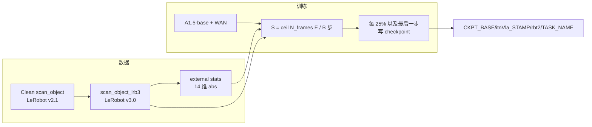

# InternVLA-A1.5 在 RoboTwin 2.0 子任务上的微调操作手册（`scan_object` 示例）

> 目标：让**没跟过前面几次复现的第三方工程师**拿到本文就能按步骤完成：把 RoboTwin 2.0 任一子任务的清洗数据转成 LeRobot **v3.0**，再基于 InternVLA-A1.5-base 做 abs 微调。本文用 `scan_object` 作为已验证示例。
>
> 对照文档（设计依据，不是本任务的逐步命令）：
> - 流程与坑：[`reprd_rbtwn_hngMg.md`](reprd_rbtwn_hngMg.md)、[`reprd_rbtwn_hngMgLOG.md`](reprd_rbtwn_hngMgLOG.md)
> - 超参与 OOM 经验：[`reprd_rbtwn_stackb3.md`](reprd_rbtwn_stackb3.md)
> - 训完后的 closed-loop 评测：[`reprd_rbtwn_stackb3_eval.md`](reprd_rbtwn_stackb3_eval.md)（`scan_object` 的 `task_idx=41`）
>
> 本手册分两部分：**Part A 是可执行操作手册**；**Part B 留给实际执行时填写**。
>
> 配套脚本（仓库内，路径由脚本自己推断，不要写死机器上的仓库绝对路径）：
> - [`launch/internvla_a15_robotwin_common.sh`](../../launch/internvla_a15_robotwin_common.sh) — 公共环境（venv / 路径）
> - [`launch/internvla_a15_prepare_robotwin.sh`](../../launch/internvla_a15_prepare_robotwin.sh) — **通用数据准备**
> - [`launch/internvla_a15_finetune_robotwin_comm.sh`](../../launch/internvla_a15_finetune_robotwin_comm.sh) — **通用正式训练**

---

## 目录

- [Part A：操作手册](#part-a操作手册)
  - [0. 先读：约定、默认值、为什么这样设计](#0-先读约定默认值为什么这样设计)
  - [1. 大步一：环境准备](#1-大步一环境准备)
  - [2. 大步二：数据准备](#2-大步二数据准备)
  - [3. 大步三：正式训练](#3-大步三正式训练)
  - [4. 训练监控与 checkpoint](#4-训练监控与-checkpoint)
  - [5. （可选）评测入口](#5-可选评测入口)
  - [6. 已知陷阱与对策](#6-已知陷阱与对策)
- [Part B：执行记录](#part-b执行记录)

---

## Part A：操作手册

### 0. 先读：约定、默认值、为什么这样设计

#### 0.1 任务是什么

`scan_object` 是 RoboTwin 2.0 的 50 个任务之一（`evaluation/RoboTwin/inference.py` 里 `TASK_NAMES` **index = 41**）：一只手臂拿扫描枪，另一只拿茶叶盒，完成扫描。数据是 `aloha` 双臂、14 维关节 + 三路相机，与仓库 [`src/lerobot/dataset_schemas/configs/aloha.yaml`](../../src/lerobot/dataset_schemas/configs/aloha.yaml) 匹配。

训练脚本 [`internvla_a15_finetune_robotwin_comm.sh`](../../launch/internvla_a15_finetune_robotwin_comm.sh) 已按单个 RoboTwin 子任务参数化，并不限定 `scan_object`：准备好其它任务后，只需设置 `TASK_NAME=<task>`；也可以直接设置 `DATASET_REPO_ID=robotwin/<task>`。默认值仍为 `scan_object`，便于复现本文示例。

源数据（本机已核对 `meta/info.json`）：

| 属性 | 值 | 含义 |
|---|---|---|
| `codebase_version` | **v2.1** | 本仓库 `LeRobotDataset` 要求 **v3.0**，必须转换 |
| `robot_type` | `aloha` | 走 aloha schema，14→16 reorder |
| `total_episodes` | 50 | 小数据集，训练时 `dist_loading=false` |
| `total_frames` | **8463** | 用来算总 step 数（记作 \(N_{\mathrm{frames}}\)） |
| `fps` | 15 | 与其它 RoboTwin 清洗任务一致 |
| action / state | shape `[14]` | transform 里 reorder 到 16 |
| cameras | `cam_high`, `cam_left_wrist`, `cam_right_wrist` | 映射为 image0/1/2 |
| episode 长度 | 约 152–188 帧 | 全部 \(\ge\) `chunk_size=50`，算 stats 不会跳过 episode |

动作模式用 **abs**（绝对关节位置），与官方 [`launch/internvla_a15_finetune_robotwin.sh`](../../launch/internvla_a15_finetune_robotwin.sh) 及 hanging_mug / stack_bowls_three 微调一致。

#### 0.2 路径全部可配置，仓库路径不要写死

**仓库根目录**（下面记作 `PROJ_ROOT`）= 含有 `launch/` 和 `src/lerobot/` 的目录。`launch/*.sh` 用「脚本自己的位置的上一级」自动推出，工程师不要把 `/B/SRC/...` 抄进自己的环境变量，除非你真的在改机器布局。

推荐每次新开一个 shell 后**先进入仓库根**：

```bash
# 你已经 clone / 同步好本仓库。下面这一行请改成「你这台机器上的仓库根」。
# 手册后文一律用 ${PROJ_ROOT}，不再出现写死的仓库绝对路径。
cd /path/to/InternVLA-A-series
export PROJ_ROOT="$(pwd)"
```

若你从任意目录调用脚本，也可以不 `export PROJ_ROOT`：脚本会自己推断。

| 变量 | 默认值 | 作用 |
|---|---|---|
| `PROJ_ROOT` | 由 `launch/` 脚本推断 | 本代码库根 |
| `VENV_ROOT` | `/B/VENV/itnvla15rbt20` | Python 虚拟环境，**必须 `source .../bin/activate`** |
| `HF_HOME` | `${VENV_ROOT}/var/hf_home` | `source activate` 时已自动设置 |
| `HF_LEROBOT_HOME` | `${HF_HOME}/lerobot` | 训练按 `repo_id` 在这里找数据 |
| `ROBOTWIN_CLEAN_ROOT` | `/B/Dta/RoboTwin-Clean` | RoboTwin 2.0 原始清洗数据根 |
| `CKPT_BASE` | `/B/Ckp` | 所有训练输出的 BASE |
| `TASK_NAME` | `scan_object` | 子任务名；可替换为任一已准备任务 |
| `DATASET_REPO_ID` | `robotwin/${TASK_NAME}` | 可选，直接指定训练用 repo id |
| `ROBOT_TYPE` | 从 `info.json` 读取 | 可选覆盖；用于定位对应 external stats |
| `EXTERNAL_STATS_PATH` | 按 repo / robot / action 自动推导 | 可选，直接指定 stats.json |
| `NUM_EPOCHS` | `76` | 总 epoch 数 |
| `TOTAL_BATCH_SIZE` | `128` | **全局** batch（不是 per-GPU） |
| `ITNVLA_STAMP` | `$(date +%y%m%d%H%M)` | 如 `2608281219`，构成 `itnVla_<stamp>` |
| `RUN_STAMP` | 同上 | 同一次任务多次重跑时区分 log / ckpt |

覆盖示例（换机器时几乎只改这几行）：

```bash
export VENV_ROOT=/B/VENV/itnvla15rbt20
export ROBOTWIN_CLEAN_ROOT=/B/Dta/RoboTwin-Clean
export CKPT_BASE=/B/Ckp
export NUM_EPOCHS=76
export TOTAL_BATCH_SIZE=128
```

若要把 `HF_HOME` 指到 venv 默认以外的目录，必须在 `source activate` **之后**设 `HF_HOME_OVERRIDE`（activate 脚本会把 `HF_HOME` 写成 `$VIRTUAL_ENV/var/hf_home`）：

```bash
export HF_HOME_OVERRIDE=/your/other/hf_home
```

#### 0.3 数据落盘约定（不要原地改 Clean）

```
${ROBOTWIN_CLEAN_ROOT}/<task>/          # 原始 v2.1，只读
${ROBOTWIN_CLEAN_ROOT}/<task>_lrb3/     # 转换后的 LeRobot v3.0
```

本文示例中的 `<task>` 是 `scan_object`；其它任务按相同规则替换。

训练并不直接扫 `ROBOTWIN_CLEAN_ROOT`。数据准备脚本会把

```
${HF_LEROBOT_HOME}/robotwin/scan_object  →  ${ROBOTWIN_CLEAN_ROOT}/scan_object_lrb3
```

这样 `repo_id=robotwin/scan_object` 读到的是 v3.0。

#### 0.4 输出落盘约定（时间戳精确到分钟、尽量短）

时间戳格式：`%y%m%d%H%M`，例如 2026-08-28 12:19 → **`2608281219`**。

所有日志、wandb、checkpoint 都进：

```
${CKPT_BASE}/itnVla_<ITNVLA_STAMP>/rbt2/<TASK_NAME>/
```

默认例子：`/B/Ckp/itnVla_2608281219/rbt2/scan_object/`。

同一任务可能多次重跑，所以**这一层里面的 checkpoint 目录和日志文件再加 `RUN_STAMP`**：

```
/B/Ckp/itnVla_2608281219/rbt2/scan_object/
├── train_2608281219.log          # stdout/stderr
├── job_2608281219.txt
├── run_2608281219.env            # 本次 STEPS / SAVE_FREQ 等
└── ckpt_2608281219/              # --output_dir
    ├── checkpoints/
    │   ├── 001256/
    │   ├── 002512/
    │   ├── 003768/
    │   ├── 005025/               # 最后一步（总是保存）
    │   └── last -> 005025
    └── wandb/                    # wandb offline 落在 output_dir 下
```

第二次重跑：保留同一个 `ITNVLA_STAMP`（仍进同一个 `itnVla_*` 目录），换一个 `RUN_STAMP`。本仓库训练代码**没有 TensorBoard writer**，实验曲线看 wandb offline 目录 + `train_*.log`。

#### 0.5 总 step 数怎么算（必须按数据量算，不要抄 hanging_mug 的 12500）

符号：

- \(N_{\mathrm{frames}}\)：该任务 `info.json` 的 `total_frames`（`scan_object` = 8463）
- \(E\)：`NUM_EPOCHS`（默认 76）
- \(B\)：`TOTAL_BATCH_SIZE`（默认 128，全局 batch）
- \(G\)：GPU 数（`PROC_PER_NODE`）
- \(b\)：per-GPU `batch_size`，满足 \(B = b \times G\)，且必须整除

\[
S = \left\lceil \frac{N_{\mathrm{frames}} \cdot E}{B} \right\rceil
\qquad
F_{\mathrm{save}} = \left\lfloor \frac{S}{4} \right\rfloor
\]

其中 \(S\) 是 `--steps`（总更新次数），\(F_{\mathrm{save}}\) 是 `--save_freq`。训练循环在 `step % save_freq == 0` **或** `step == steps` 时存盘，因此：

- 约 25% / 50% / 75% 各存一次
- 跑完全部 epoch（最后一步）再存一次

对默认的 `scan_object`：

\[
S = \lceil 8463 \times 76 / 128 \rceil = 5025,\quad F_{\mathrm{save}} = 1256
\]

预期 checkpoint step：`1256`、`2512`、`3768`、`5024`，以及最后一步 `5025`。

每 GPU 的 batch：\(b = B / G\)。`stack_bowls_three` 在 H200 上 **32/GPU + WAN + 三相机 OOM**，已知可跑的是 **16/GPU**。因此：

| GPU 数 \(G\) | 默认 \(B=128\) 是否整除 | 建议 |
|---|---|---|
| 8 | 是，\(b=16\) | 直接用默认 |
| 6 | **否**（128 不能被 6 整除） | `TOTAL_BATCH_SIZE=96`（16×6），\(S\) 会重算 |
| 4 | 是，但 \(b=32\) | **会 OOM**；改 `TOTAL_BATCH_SIZE=64`（16×4） |

脚本在 \(B \bmod G \neq 0\) 时会直接退出并打印建议。

#### 0.6 训练超参（与已跑通的 RoboTwin 单任务微调对齐）

| 项 | 值 | 说明 |
|---|---|---|
| 基座 | `${HF_HOME}/ckpts/InternVLA-A1.5-base` | 本地权重 |
| WAN | `${HF_HOME}/hub/Wan2.2-TI2V-5B` | `action_loss_only=false`，冻结 DiT |
| lr | \(5\times 10^{-5} \to 5\times 10^{-6}\) | warmup = \(\max(1,\lfloor S/10\rfloor)\) |
| dtype | bfloat16 | |
| `freeze_learnable_tokens` | true | 官方 RoboTwin 微调脚本一致 |
| `dist_loading` | false | 50 episode 太小，避免按 rank 切稀 |
| `USE_LIBUV` | 0 | 避免 PyTorch 2.10 TCPStore 挂死 |
| Loss | \(10\cdot L_{\mathrm{action}} + L_{\mathrm{video}} + L_{\mathrm{vqa}}\) | 与模型实现一致 |



---

### 1. 大步一：环境准备

> 目的：确认你用的是指定 venv、已经 `source activate`、本仓库以 **editable** 装进该 venv、Qwen3.5 patch 在、GPU 看得见。

#### 1.1 必须 `source activate`，不要只用 venv 里的 python

`/B/VENV/itnvla15rbt20/bin/activate` 在激活时会：

1. 把 `HF_HOME` 设成 `$VIRTUAL_ENV/var/hf_home`（即 `/B/VENV/itnvla15rbt20/var/hf_home`）
2. 把 `HF_LEROBOT_HOME` 设成 `$HF_HOME/lerobot`
3. 把 `LD_LIBRARY_PATH` 调成 **venv/lib 在最前** + pip 的 `nvidia/*/lib`（torchcodec 0.10 需要 CUDA 12 的 `libnppicc.so.12`，不能先搜到宿主机 CUDA 13）

只执行 `${VENV_ROOT}/bin/python` **不会**做上述三件事，视频解码会变成全零图或 `import torchcodec` 失败。

```bash
cd "${PROJ_ROOT}"
export VENV_ROOT="${VENV_ROOT:-/B/VENV/itnvla15rbt20}"
source "${VENV_ROOT}/bin/activate"

# 自检：prompt 应带 (itnvla15rbt20)，which python 必须在该 venv 下
which python
echo "HF_HOME=${HF_HOME}"
echo "VIRTUAL_ENV=${VIRTUAL_ENV}"
```

预期：

```
.../itnvla15rbt20/bin/python
HF_HOME=/B/VENV/itnvla15rbt20/var/hf_home
VIRTUAL_ENV=.../itnvla15rbt20
```

#### 1.2 以可编辑模式重装本仓库（每次换机器 / 换 checkout 都做一次）

```bash
source "${VENV_ROOT}/bin/activate"
cd "${PROJ_ROOT}"
python -m pip install -e .
```

数据准备脚本默认也会做这一步。若你确认已经装过且 `import lerobot` 指向**本仓库** `src/lerobot`，可设 `SKIP_PIP_INSTALL=1`。

冒烟：

```bash
python -c "
import torch, transformers, torchcodec, flash_attn, lerobot, inspect
from pathlib import Path
print('python', Path(inspect.getfile(inspect.getmodule(torch))).as_posix())
print('torch', torch.__version__, 'CUDA', torch.version.cuda)
print('transformers', transformers.__version__)
print('torchcodec', torchcodec.__version__)
print('flash_attn', flash_attn.__version__)
print('lerobot', lerobot.__file__)
print('HF_HOME', __import__('os').environ.get('HF_HOME'))
print('GPU', torch.cuda.device_count())
for i in range(torch.cuda.device_count()):
    p = torch.cuda.get_device_properties(i)
    print(f'  GPU{i}: {torch.cuda.get_device_name(i)} ({p.total_memory/1024**3:.0f} GB)')
"
```

核对：

- `torchcodec` 必须是 **0.10.x**（不是 0.15）
- `lerobot.__file__` 必须在 **`${PROJ_ROOT}/src/lerobot/`** 下，不能指向别的 checkout
- GPU 数量后面会用来除 `TOTAL_BATCH_SIZE`

#### 1.3 Transformers Qwen3.5 patch

InternVLA-A1.5 的 Qwen3.5 代码不在上游 transformers 里，必须拷进 site-packages。准备脚本会检查；也可手跑：

```bash
TRANSFORMERS_DIR="$(python -c 'import transformers, pathlib; print(pathlib.Path(transformers.__file__).parent)')"
ls "${TRANSFORMERS_DIR}/models/qwen3_5/modeling_qwen3_5.py" || {
  cp -r src/lerobot/policies/pi0/transformers_replace/models "${TRANSFORMERS_DIR}"
  cp -r src/lerobot/policies/pi05/transformers_replace/models "${TRANSFORMERS_DIR}"
  cp -r src/lerobot/policies/internvla_a1_5/transformers_replace/models "${TRANSFORMERS_DIR}"
}
```

#### 1.4 权重文件必须真实存在（不要只有 HuggingFace 的 `.metadata`）

训练脚本会预检：

| 文件 | 典型大小 |
|---|---|
| `${HF_HOME}/ckpts/InternVLA-A1.5-base/model.safetensors` | ~5.1 GB |
| `${HF_HOME}/hub/Wan2.2-TI2V-5B/Wan2.2_VAE.pth` | ~2.7 GB |
| `${HF_HOME}/hub/Wan2.2-TI2V-5B/config.json` | 小文件 |

```bash
ls -lh "${HF_HOME}/ckpts/InternVLA-A1.5-base/model.safetensors"
ls -lh "${HF_HOME}/hub/Wan2.2-TI2V-5B/Wan2.2_VAE.pth"
```

若只有 `.cache/huggingface/download/*.metadata` 而没有真正的权重，预检会失败。请先按 HuggingFace 流程把 [InternVLA-A1.5-base](https://huggingface.co/InternRobotics/InternVLA-A1.5-base) 和 Wan2.2-TI2V-5B 下全。FAST tokenizer（`physical-intelligence/fast`）和 `Qwen/Qwen3.5-2B` 也需要能从 **本地 HF 缓存**加载；转换数据时可以 `HF_HUB_OFFLINE=1`，**训练前必须 unset**（见坑 #2）。

#### 1.5 环境冒烟通过标准

同时满足再进入数据准备：

1. `source activate` 后 `which python` 在 `VENV_ROOT/bin`
2. `pip install -e .` 成功，`lerobot.__file__` 指向本仓库
3. Qwen3.5 patch 文件存在
4. `torch.cuda.device_count() >= 1`
5. base / WAN 权重文件存在且体积合理

---

### 2. 大步二：数据准备

> 目的：不改 Clean 原目录；得到 `${ROBOTWIN_CLEAN_ROOT}/scan_object_lrb3`（v3.0）；算好 abs stats；能 `LeRobotDataset('robotwin/scan_object')` 读到非全零相机帧。

#### 2.1 开发 / 脚本（已经放进仓库）

不要手写第二套转换逻辑。使用：

```bash
cd "${PROJ_ROOT}"
source "${VENV_ROOT}/bin/activate"
bash launch/internvla_a15_prepare_robotwin.sh
```

脚本做的事（失败会 `set -e` 退出）：

1. `source` venv + `pip install -e .`
2. 检查 / 补 Qwen3.5 patch
3. `ln -sfn ${HF_LEROBOT_HOME} ${PROJ_ROOT}/data`
4. 用 [`convert_my_dataset_v21_to_v30.py`](../../src/lerobot/datasets/v30/convert_my_dataset_v21_to_v30.py) 把 `robotwin/scan_object` 转到 `robotwin/scan_object_lrb3`（`--push-to-hub false`，转换期间 `HF_HUB_OFFLINE=1`）
5. `rsync` 到 `${ROBOTWIN_CLEAN_ROOT}/scan_object_lrb3`
6. 把训练用 symlink 改指 v3.0
7. 加载一个 sample，三路相机 `max > 0`
8. `compute_norm_stats_multi.py --action_mode abs --chunk_size 50`

换数据根或任务名：

```bash
ROBOTWIN_CLEAN_ROOT=/data/RoboTwin-Clean TASK_NAME=scan_object \
  bash launch/internvla_a15_prepare_robotwin.sh
```

已经转过、只想重算 stats：`SKIP_CONVERT=1 bash launch/internvla_a15_prepare_robotwin.sh`  
已经 `pip install -e .` 过：`SKIP_PIP_INSTALL=1 ...`

该脚本现在是 RoboTwin 通用数据准备入口，不限于 `scan_object`。可以显式指定多个任务，
或自动发现 Clean 根目录下所有没有 `_lrb3` 后缀且含有 `meta/info.json` 的直接子目录：

```bash
TASK_NAMES="hanging_mug stack_bowls_two" \
  bash launch/internvla_a15_prepare_robotwin.sh

ALL_TASKS=1 SKIP_PIP_INSTALL=1 \
  bash launch/internvla_a15_prepare_robotwin.sh
```

`ALL_TASKS=1` 会为每个源目录生成同级的 `<task>_lrb3`。v2.1 源使用本仓库转换器，
已经是 v3.0 但尚未有 `_lrb3` 目录的源则直接复制；已有 `_lrb3` 目录不会被自动选中。

#### 2.2 为何不能用官方 `convert_dataset_v21_to_v30 --root=Clean目录`

该入口会做 `root = Path(root) / repo_id`。若 `--root=${ROBOTWIN_CLEAN_ROOT}` 且 `--repo-id=robotwin/scan_object`，实际去找的是不存在的 `${ROBOTWIN_CLEAN_ROOT}/robotwin/scan_object`，然后去 Hub 拉私有/不存在的仓库 → 401。hanging_mug / stack_bowls_three 都踩过。本手册只用 `convert_my_dataset` + `HF_LEROBOT_HOME` 下的 symlink。

#### 2.3 数据准备冒烟（脚本末尾已做；也可手跑）

```bash
source "${VENV_ROOT}/bin/activate"
export PYTHONPATH="${PROJ_ROOT}/src${PYTHONPATH:+:${PYTHONPATH}}"
python -c "
from lerobot.datasets.lerobot_dataset import LeRobotDataset
ds = LeRobotDataset('robotwin/scan_object', download_videos=False)
assert str(ds.meta._version).startswith('3'), ds.meta._version
print(ds.meta.total_episodes, ds.meta.total_frames, ds.meta.robot_type)
"
```

预期：`50 8463 aloha`，`codebase_version=v3.0`。

stats 路径（`repo_id=robotwin/scan_object` 时 group 名为 `sha1` 的前 10 位）：

```
${HF_HOME}/lerobot/stats/aloha/abs/agg_1repos_7488c05b46/stats.json
```

`observation.state` / `action` 应为 **14 维**（reorder 发生在 transform，不发生在这份 JSON 里）。数据集自带的 `meta/stats_gr00t.json` **不能**当 InternVLA-A1.5 的 external stats。

#### 2.4 数据准备通过标准

| 检查 | 期望 |
|---|---|
| Clean 原目录 | 仍是 v2.1，未被改写 |
| `${ROBOTWIN_CLEAN_ROOT}/scan_object_lrb3/meta/info.json` | `codebase_version=v3.0` |
| `${HF_LEROBOT_HOME}/robotwin/scan_object` | 指向 `scan_object_lrb3` |
| `LeRobotDataset` | 50 ep / 8463 frames，三相机非全零 |
| stats.json | 存在，action/state dim=14，skipped episodes=0 |

---

### 3. 大步三：正式训练

#### 3.1 开发：启动脚本已经写好

训练入口：[`launch/internvla_a15_finetune_robotwin_comm.sh`](../../launch/internvla_a15_finetune_robotwin_comm.sh)

它会：

1. 再次 `source "${VENV_ROOT}/bin/activate"`（不依赖你记得 export）
2. 用 `nvidia-smi` 探测 GPU（可用 `CUDA_VISIBLE_DEVICES` 覆盖）
3. 根据 `TASK_NAME` / `DATASET_REPO_ID` 定位任务，读取 v3.0 的 `info.json`，并按 §0.5 计算 `STEPS` / `SAVE_FREQ` / per-GPU `batch_size`
4. 预检 base、WAN、stats、`codebase_version=v3.0`
5. 从 `info.json` 自动读取 `robot_type`，推导对应的 external stats 路径（也可用 `ROBOT_TYPE` / `EXTERNAL_STATS_PATH` 覆盖）
6. 把输出写到 `${CKPT_BASE}/itnVla_<stamp>/rbt2/${TASK_NAME}/`
7. 用 `"${VENV_ROOT}/bin/python" -m accelerate.commands.launch`（本 venv 经常**没有** `bin/accelerate` 可执行文件）
8. `tee` 到带 `RUN_STAMP` 的 log

**不要**用 `nohup ... & disown` 拉 DDP（子进程会被 HUP 杀掉，见 LIBERO / hanging_mug 记录）。用 **tmux / screen**，或在 Cursor 里后台跑该 bash。

#### 3.2 训练冒烟（强烈建议先做，约几分钟级，仍会加载 WAN）

只跑 4 个 step、每 2 步存盘，验证：accelerate 能拉起、数据能解码、第一步 forward 不 OOM、checkpoint 目录能写。

```bash
cd "${PROJ_ROOT}"
source "${VENV_ROOT}/bin/activate"

# 冒烟也走同一套输出布局，只是 STEPS=4
SMOKE=1 bash launch/internvla_a15_finetune_robotwin_comm.sh
```

其它已准备任务的示例：

```bash
TASK_NAME=hanging_mug SMOKE=1 \
  bash launch/internvla_a15_finetune_robotwin_comm.sh
```

成功标志：

- 日志里出现 `Start offline training`、`Effective batch size`
- 出现 `Checkpoint policy after step 2` 和 `step 4`
- `End of training`，进程 exit 0
- `${CKPT_BASE}/itnVla_*/rbt2/${TASK_NAME}/ckpt_*/checkpoints/` 下有带 step 的目录

冒烟目录可以留着对照；正式训练会用**新的** `RUN_STAMP`（同一分钟内连跑两次请手动 `RUN_STAMP=...`）。

若第一步 CUDA OOM：把全局 batch 降到「16 × GPU 数」，例如 8 卡用默认 128，6 卡用 `TOTAL_BATCH_SIZE=96`。不要先开 `gradient_checkpointing`（与 stack_bowls_three 策略一致）。

WAN `Missing key(s) when loading model: model.wan_video_model...` **不是失败**：base checkpoint 不含 WAN，WAN 从 `Wan2.2-TI2V-5B` 另载。DDP `find_unused_parameters=True` 的警告可忽略。

#### 3.3 正式跑 76 epoch

确认冒烟成功、GPU 空闲后：

```bash
tmux new -s rbtwn_ft    # 或 screen -S rbtwn_ft

cd "${PROJ_ROOT}"
source "${VENV_ROOT}/bin/activate"
unset HF_HUB_OFFLINE TRANSFORMERS_OFFLINE CUDA_VISIBLE_DEVICES

# 常用覆盖写在命令前；不写则用默认 76 epoch / 全局 batch 128
NUM_EPOCHS=76 TOTAL_BATCH_SIZE=128 \
  bash launch/internvla_a15_finetune_robotwin_comm.sh
```

例如训练 `hanging_mug`，把任务选择和数据准备保持一致：

```bash
TASK_NAME=hanging_mug NUM_EPOCHS=76 TOTAL_BATCH_SIZE=128 \
  bash launch/internvla_a15_finetune_robotwin_comm.sh
```

8×GPU 时脚本会打印类似：

```
NUM_FRAMES=8463 NUM_EPOCHS=76 TOTAL_BATCH_SIZE=128
BATCH_SIZE(per GPU)=16 PROC_PER_NODE=8
STEPS=5025 SAVE_FREQ=1256
OUTPUT_ROOT=/B/Ckp/itnVla_2608281219/rbt2/scan_object
LOG_FILE   =/B/Ckp/itnVla_2608281219/rbt2/scan_object/train_2608281219.log
```

6×GPU 示例（128 不能被 6 整除，必须改全局 batch；step 数会变）：

```bash
TOTAL_BATCH_SIZE=96 bash launch/internvla_a15_finetune_robotwin_comm.sh
```

同一 `itnVla_*` 目录里再开一轮（例如换 seed 之后——当前脚本 seed 写死 42，若要换请改脚本或加参数）：

```bash
ITNVLA_STAMP=2608281219 RUN_STAMP=$(date +%y%m%d%H%M) \
  bash launch/internvla_a15_finetune_robotwin_comm.sh
```

换输出盘：

```bash
CKPT_BASE=/mnt/big/ckpts bash launch/internvla_a15_finetune_robotwin_comm.sh
```

强制指定总步数（一般不要；会破坏「按 epoch × 数据量」的约定）：

```bash
STEPS=8000 SAVE_FREQ=2000 bash launch/internvla_a15_finetune_robotwin_comm.sh
```

---

### 4. 训练监控与 checkpoint

#### 4.1 看日志

```bash
LOG=$(ls -t "${CKPT_BASE}"/itnVla_*/rbt2/scan_object/train_*.log | head -1)
tail -f "${LOG}"
```

每 `LOG_FREQ`（默认 50）步一行。关注：

| 指标 | 正常 | 异常 |
|---|---|---|
| `loss` / `loss_action` | 前几百步明显下降 | 上升、NaN |
| `grad_norm` | 后期通常 < 10 | 持续 > 100 |
| `video_decode_error` | 不出现或为 0 | > 0 → `LD_LIBRARY_PATH` / torchcodec |
| 单卡显存 | H200 上 WAN+三相机+bs16 约 130–136 GiB | OOM |
| `iters/s` | 约 0.6–1.0（视卡数） | 突然掉到 0（挂死） |

对照 hanging_mug：step 50 时 `loss≈7.3`、`loss_action≈0.26` 量级是合理起点；`scan_object` 帧更少，曲线不必逐点相同。

wandb：`WANDB_MODE=offline`，文件在 `ckpt_<RUN_STAMP>/wandb/`。需要上传时再 `wandb sync` 该目录。

#### 4.2 checkpoint 什么时候出现

对默认 \(S=5025, F=1256\)，日志会出现 `Checkpoint policy after step N`，对应：

| 进度 | step 目录名（6 位补零） |
|---|---|
| ~25% | `001256` |
| ~50% | `002512` |
| ~75% | `003768` |
| ~100%（\(4F\)） | `005024` |
| 真正最后一步 | `005025`（`last` 指向它） |

评测用：

```
${OUTPUT_DIR}/checkpoints/last/pretrained_model/
```

其中必须有 `config.json`、`model.safetensors`、`stats.json`（训练写入的 aloha 统计量）。

#### 4.3 正式训练通过标准

- 进程 exit 0，日志有 `End of training`
- `last` 指向最终 step
- `video_decode_error` 未在日志中累计增长
- 最终 `loss_action` 应落到远小于起始值（hanging_mug 10k 步曾到 ~0.001；本任务步数约 5k，以曲线下降且无 NaN 为准）

---

### 5. （可选）评测入口

本手册主路径是数据 + 训练。closed-loop 细节见 [`reprd_rbtwn_stackb3_eval.md`](reprd_rbtwn_stackb3_eval.md)。`scan_object` 与 hanging_mug 一样：**当前 `eval.sh` 只吃 4 个位置参数**，`abs` 和 horizon 必须用环境变量。

```bash
source "${VENV_ROOT}/bin/activate"
export PYTHONPATH="${PROJ_ROOT}/src:${PROJ_ROOT}/third_party/RoboTwin${PYTHONPATH:+:${PYTHONPATH}}"

CKPT="${CKPT_BASE}/itnVla_<STAMP>/rbt2/scan_object/ckpt_<RUN>/checkpoints/last/pretrained_model"
# task_idx=41 → scan_object；先确认：
python -c "
import sys
sys.path.insert(0, '${PROJ_ROOT}/evaluation/RoboTwin')
from inference import TASK_NAMES
print(TASK_NAMES.index('scan_object'))
"

ACTION_MODE=abs INFER_HORIZON=50 \
  bash evaluation/RoboTwin/eval.sh "${CKPT}" \
  "${CKPT_BASE}/itnVla_<STAMP>/rbt2/scan_object/eval_<RUN>" \
  demo_clean \
  41
```

评测前需要 `git submodule update --init third_party/RoboTwin` 以及 RoboTwin 资产；本仓库若还没有 `third_party/RoboTwin`，不要在训练未完成时插队装仿真。

---

### 6. 已知陷阱与对策

| # | 问题 | 本任务怎么处理 |
|---|---|---|
| 1 | 数据是 LeRobot v2.1 | 准备脚本转到 `scan_object_lrb3`，训练 symlink 必须指 v3.0 |
| 2 | `convert_dataset_v21_to_v30 --root` 再拼 `repo_id` | 只用 `convert_my_dataset` |
| 3 | `--push-to-hub` 默认 true | 脚本传 `false` |
| 4 | 转换时 `HF_HUB_OFFLINE=1` 留在 shell 里 | 准备脚本转换后 unset；训练脚本开头 unset。否则 FAST tokenizer 加载失败 |
| 5 | `accelerate: command not found` | `python -m accelerate.commands.launch` |
| 6 | bs=32 + WAN + 三相机 OOM | 默认按 16/GPU 反推全局 batch；\(b>16\) 时脚本警告 |
| 7 | `torchcodec` 0.15 / 缺 `libnppicc.so.12` | 必须 `source activate`，让 venv 的 `LD_LIBRARY_PATH` 生效 |
| 8 | `USE_LIBUV` 导致 TCPStore 挂死 | 公共脚本已 `USE_LIBUV=0` |
| 9 | `nohup & disown` 杀 DDP 子进程 | tmux / screen |
| 10 | 官方脚本 `aloha-agilex*` glob 匹配不到 RoboTwin 子任务 | 通用脚本显式使用 `TASK_NAME` / `DATASET_REPO_ID`，不依赖 glob |
| 11 | 50 episode × 多卡 `dist_loading=true` 分片过稀 | `dist_loading=false` |
| 12 | editable 指向别的 checkout | 本手册强制 `pip install -e .` + `PYTHONPATH=${PROJ_ROOT}/src` |
| 13 | 误把整个 Clean 当训练集 | 只用 `scan_object_lrb3` |
| 14 | 抄 hanging_mug 的 `STEPS=12500` | **禁止**。必须按 \(S=\lceil N_{\mathrm{frames}} E / B\rceil\) |
| 15 | 输出写进仓库 `outputs/` | 脚本写到 `${CKPT_BASE}/itnVla_*/rbt2/${TASK_NAME}/` |
| 16 | `output_dir` 已存在 | 训练代码 `resume=false` 会 `FileExistsError`；换 `RUN_STAMP` |
| 17 | 6 卡仍设 `TOTAL_BATCH_SIZE=128` | 不能整除，脚本会退出 |

---

### 7. 给第三方的最短命令清单（默认路径、8 卡、76 epoch）

在仓库根、且默认路径都成立时：

```bash
export VENV_ROOT=/B/VENV/itnvla15rbt20
source "${VENV_ROOT}/bin/activate"

# 1) 环境 + 数据（含 pip install -e .、转 v3.0、stats、数据集冒烟）
bash launch/internvla_a15_prepare_robotwin.sh

# 2) 训练冒烟（默认 scan_object；其它任务先设置 TASK_NAME）
SMOKE=1 bash launch/internvla_a15_finetune_robotwin_comm.sh

# 3) 正式训练（tmux 里跑）
unset HF_HUB_OFFLINE TRANSFORMERS_OFFLINE
bash launch/internvla_a15_finetune_robotwin_comm.sh
```

日志与权重：`/B/Ckp/itnVla_<YYMMDDHHMM>/rbt2/scan_object/`。

---

## Part B：执行记录

> 实际跑起来之后按时间填写。下面是空表。

### 时间线 / 操作日志

| 时间 | 操作 | 结果 |
|---|---|---|
| | 撰写本手册与 launch 脚本 | 已落盘；**数据转换 / 训练未在撰写时执行** |
| | | |

### 问题记录（报错 → 根因 → 修复 → 验证）

| # | 报错现象 | 根因 | 修复 | 验证 |
|---|---|---|---|---|
| | | | | |

### 文件变更清单

| 路径 | 操作 | 原因 |
|---|---|---|
| `b/d/p/reprd_rbtwn_scnObj.md` | 新增 | 本操作手册 |
| `launch/internvla_a15_robotwin_common.sh` | 新增 | 可配置 venv / 路径 |
| `launch/internvla_a15_prepare_robotwin.sh` | 新增 | 通用 RoboTwin 数据准备 |
| `launch/internvla_a15_finetune_robotwin_comm.sh` | 新增 | 通用 RoboTwin 单任务正式训练 |
| `${ROBOTWIN_CLEAN_ROOT}/scan_object/` | 只读 | 禁止原地转换 |
| `${ROBOTWIN_CLEAN_ROOT}/scan_object_lrb3/` | 待生成 | v3.0 训练数据 |
| `${CKPT_BASE}/itnVla_*/rbt2/scan_object/` | 待生成 | 日志 / wandb / checkpoint |

### 关键路径速查（默认值）

| 用途 | 路径 |
|---|---|
| 虚拟环境 | `/B/VENV/itnvla15rbt20/`（必须 source） |
| HF_HOME | `/B/VENV/itnvla15rbt20/var/hf_home` |
| Base | `${HF_HOME}/ckpts/InternVLA-A1.5-base/` |
| WAN | `${HF_HOME}/hub/Wan2.2-TI2V-5B/` |
| 原始数据 v2.1 | `/B/Dta/RoboTwin-Clean/scan_object/` |
| 训练数据 v3.0 | `/B/Dta/RoboTwin-Clean/scan_object_lrb3/` |
| External stats | `${HF_HOME}/lerobot/stats/aloha/abs/agg_1repos_7488c05b46/stats.json` |
| 输出 BASE | `/B/Ckp/` |
| 评测 task_idx | **41** |

### 最终结果

| 指标 | 值 |
|---|---|
| 计划 | 76 epoch，全局 batch 128，\(S=\lceil 8463\times 76/128\rceil=5025\) |
| 训练状态 | 未执行（见时间线） |
| 评测成功率 | 本手册不强制评测 |
