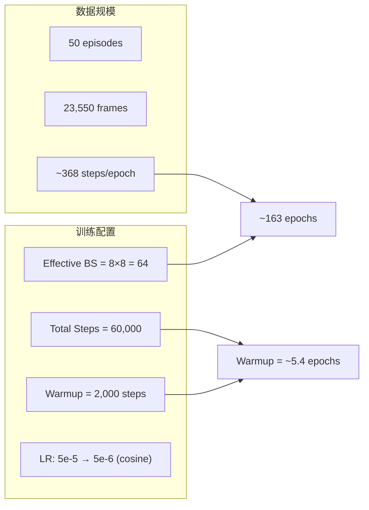

# InternVLA-A1.5 在 RoboTwin stack_bowls_three 上的微调实施手册

> 目标：基于 [InternVLA-A1.5-base](https://huggingface.co/InternRobotics/InternVLA-A1.5-base) 权重，在 RoboTwin 仿真平台的 `stack_bowls_three`（三碗堆叠）单任务数据集上进行 fine-tune，然后在 RoboTwin 仿真环境中评测该 checkpoint 的成功率。
>
> 本手册分两部分：**Part A 是可执行的分步操作手册**（先写后执行）；**Part B 是执行记录**——按时间顺序记录所有实际执行的操作、遇到的每一个报错的根因分析与修复方式、以及全部新增/修改/删除文件清单，最后给出最终结果。

---

## 目录

- [Part A：实施手册](#part-a实施手册)
  - [0. 关键结论与设计依据](#0-关键结论与设计依据)
  - [1. 环境准备](#1-环境准备)
  - [2. 数据准备](#2-数据准备)
  - [3. 训练启动脚本](#3-训练启动脚本)
  - [4. 训练执行与监控](#4-训练执行与监控)
  - [5. 评测](#5-评测)
  - [6. 已知陷阱与对策](#6-已知陷阱与对策来自-libero-复现经验)
- [Part B：执行记录](#part-b执行记录)
  - [时间线 / 操作日志](#时间线--操作日志)
  - [问题记录（报错 → 根因 → 修复 → 验证）](#问题记录报错--根因--修复--验证)
  - [文件变更清单](#文件变更清单)
  - [最终结果](#最终结果)

---

## Part A：实施手册

### 0. 关键结论与设计依据

1. **任务选择**：`stack_bowls_three` 是 RoboTwin 2.0 benchmark 的 50 个任务之一（TASK_NAMES index=46），要求双臂机器人将三个碗按顺序堆叠。选择该任务的原因是其数据已清洗完毕（`/mnt/r/DATA/RoboTwin-Clean/stack_bowls_three/`），且为 `aloha` 双臂机器人类型，与仓库中已有的 `aloha.yaml` schema 完全匹配。

2. **动作模式**：使用 **abs**（绝对关节位置）而非 delta。这与 RoboTwin 官方微调脚本 [`launch/internvla_a15_finetune_robotwin.sh`](../../launch/internvla_a15_finetune_robotwin.sh) 的默认设置一致。abs 模式下，模型直接预测目标关节角度，适合 RoboTwin 这类仿真环境（关节空间确定性高、无需考虑累积误差）。

3. **训练配置对齐**：超参数与 RoboTwin 官方脚本保持一致作为基线（lr=5e-5, warmup 比例、WAN video loss 启用、`freeze_learnable_tokens=true`）。**本次实际执行按用户指令覆盖为**：8 GPU 全开、per-GPU `batch_size` 先试 **32**（OOM）后下调到 **16**、`steps=10000`（详见 Part B）。WAN video loss 启用（`action_loss_only=false`）。

4. **数据规模**：50 episodes, 23550 frames。effective batch size=128（16×8）时，每个 epoch ≈ 184 steps，10k steps ≈ 54 epochs。

5. **Venv 而非 Conda**：所有操作在 `/mnt/r/VENV/ivla15/` 虚拟环境中执行。该环境在 LIBERO-Plus 复现中已验证可工作（参见 [reprd_liberop_cam_rb.md](reprd_liberop_cam_rb.md)），所有依赖已正确安装。

6. **External stats**：RoboTwin 微调使用外部统计量（`use_external_stats=true`），因为训练过程中数据经 `aloha.yaml` 的 `action_reorder` 和 `state_reorder` 从 14 维重排到 16 维，统计量必须在重排后的 16 维空间上计算。仓库提供的 `compute_norm_stats_multi.py` 脚本会自动读取 schema 并在正确的维度上计算。

7. **评测方式**：使用 `evaluation/RoboTwin/eval.sh`，通过 RoboTwin 仿真平台运行 closed-loop 评测。推理时使用 `--action-loss-only`（默认），跳过 WAN 权重加载，只用 action expert 路径，降低推理延迟。

8. **机器规格**：8×NVIDIA H200 (143GB HBM3e)，全部空闲可用。单卡 143GB 足以容纳完整模型（~5.4GB base + ~12GB WAN）及训练中间状态。

---

### 1. 环境准备

#### 1.1 虚拟环境验证

虚拟环境 `/mnt/r/VENV/ivla15/` 在 LIBERO-Plus 复现期间已创建并验证，以下命令确认关键包版本：

```bash
source /mnt/r/VENV/ivla15/bin/activate

python -c "
import torch; print('torch:', torch.__version__, '| CUDA:', torch.version.cuda)
import transformers; print('transformers:', transformers.__version__)
import lerobot; print('lerobot:', lerobot.__version__)
import torchcodec; print('torchcodec:', torchcodec.__version__)
import flash_attn; print('flash_attn:', flash_attn.__version__)
print('GPU count:', torch.cuda.device_count())
for i in range(torch.cuda.device_count()):
    print(f'  GPU{i}: {torch.cuda.get_device_name(i)} ({torch.cuda.get_device_properties(i).total_mem / 1024**3:.0f}GB)')
"
```

预期输出：
```
torch: 2.10.0+cu128 | CUDA: 12.8
transformers: 5.2.0
lerobot: 1.0.0
torchcodec: 0.10.0
flash_attn: 2.8.3
GPU count: 8
  GPU0: NVIDIA H200 (143GB)
  ...
```

> **关键检查点**：`torchcodec` 必须是 **0.10.0**（不是 0.15.x），否则 LeRobot 的视频解码会报 API 不兼容错误（参见 [reprd_liberop_cam_rb.md 问题 #1](reprd_liberop_cam_rb.md#问题-1torchcodec-版本不兼容)）。

#### 1.2 Transformers patch 验证

InternVLA-A1.5 需要将自定义 Qwen3.5 模型代码 patch 到 transformers 包中。验证 patch 是否已应用：

```bash
TRANSFORMERS_DIR=/mnt/r/VENV/ivla15/lib/python3.11/site-packages/transformers/

# 检查 Qwen3.5 模型文件是否存在
ls ${TRANSFORMERS_DIR}/models/qwen3_5/modeling_qwen3_5.py

# 如果不存在，执行 patch
if [ ! -f "${TRANSFORMERS_DIR}/models/qwen3_5/modeling_qwen3_5.py" ]; then
    echo "Patching transformers..."
    cp -r src/lerobot/policies/pi0/transformers_replace/models ${TRANSFORMERS_DIR}
    cp -r src/lerobot/policies/pi05/transformers_replace/models ${TRANSFORMERS_DIR}
    cp -r src/lerobot/policies/internvla_a1_5/transformers_replace/models ${TRANSFORMERS_DIR}
    echo "Done."
else
    echo "Transformers already patched."
fi
```

#### 1.3 环境变量约定

以下环境变量在所有后续操作中使用：

```bash
export HF_HOME=/mnt/r/CKPT/hf_home
export HF_LEROBOT_HOME=${HF_HOME}/lerobot
```

`HF_LEROBOT_HOME` 决定了数据集的搜索根目录。仓库根目录的 `data` symlink 指向 `${HF_LEROBOT_HOME}`：

```
data → /mnt/r/CKPT/hf_home/lerobot = ${HF_LEROBOT_HOME}
```

这个 symlink 已在 LIBERO 复现中创建，无需重复。

---

### 2. 数据准备

#### 2.1 数据集 symlink

数据集位于 `/mnt/r/DATA/RoboTwin-Clean/stack_bowls_three/`，需要创建 symlink 使其能被训练脚本通过 `data/robotwin/stack_bowls_three` 路径访问：

```bash
export HF_HOME=/mnt/r/CKPT/hf_home

# 创建 robotwin 子目录
mkdir -p ${HF_HOME}/lerobot/robotwin

# 创建 symlink
ln -sfn /mnt/r/DATA/RoboTwin-Clean/stack_bowls_three ${HF_HOME}/lerobot/robotwin/stack_bowls_three

# 验证 symlink 链可达
ls -la ${HF_HOME}/lerobot/robotwin/stack_bowls_three/meta/info.json
# 从项目根目录验证
ls -la data/robotwin/stack_bowls_three/meta/info.json
```

最终路径链：

```
data/robotwin/stack_bowls_three
  → /mnt/r/CKPT/hf_home/lerobot/robotwin/stack_bowls_three  (through data symlink)
  → /mnt/r/DATA/RoboTwin-Clean/stack_bowls_three              (through this new symlink)
```

#### 2.2 数据集格式核对

确认数据集的关键属性与 `aloha.yaml` schema 匹配：

```bash
source /mnt/r/VENV/ivla15/bin/activate
python3 -c "
import json
info = json.load(open('data/robotwin/stack_bowls_three/meta/info.json'))
print('codebase_version:', info['codebase_version'])   # 期望: v2.1
print('robot_type:', info['robot_type'])                # 期望: aloha
print('total_episodes:', info['total_episodes'])        # 期望: 50
print('total_frames:', info['total_frames'])            # 期望: 23550
print('fps:', info['fps'])                              # 期望: 15
print()
print('Features:')
for k, v in info['features'].items():
    if v['dtype'] != 'video':
        print(f'  {k}: shape={v[\"shape\"]}, dtype={v[\"dtype\"]}')
    else:
        print(f'  {k}: video {v[\"info\"][\"video.width\"]}x{v[\"info\"][\"video.height\"]} @ {v[\"info\"][\"video.fps\"]}fps ({v[\"info\"][\"video.codec\"]})')
"
```

预期输出：

```
codebase_version: v2.1
robot_type: aloha
total_episodes: 50
total_frames: 23550
fps: 15

Features:
  observation.state: shape=[14], dtype=float32
  action: shape=[14], dtype=float32
  observation.images.cam_high: video 640x480 @ 15fps (av1)
  observation.images.cam_left_wrist: video 640x480 @ 15fps (av1)
  observation.images.cam_right_wrist: video 640x480 @ 15fps (av1)
  timestamp: shape=[1], dtype=float32
  frame_index: shape=[1], dtype=int64
  episode_index: shape=[1], dtype=int64
  index: shape=[1], dtype=int64
  task_index: shape=[1], dtype=int64
```

关键核对点：

| 属性 | 数据集值 | aloha.yaml 要求 | 匹配 |
|---|---|---|---|
| robot_type | aloha | aloha | ✓ |
| action dim | 14 | 14 (reorder → 16) | ✓ |
| state dim | 14 | 14 (reorder → 16) | ✓ |
| cameras | cam_high, cam_left_wrist, cam_right_wrist | → image0, image1, image2 | ✓ |

`aloha.yaml` 中的 `action_reorder` 会自动将 14 维动作重排到 16 维：

```
原始 14 维: [left_joint(6), left_gripper(1), right_joint(6), right_gripper(1)]
重排 16 维: [left_joint(6), 0, left_gripper(1), right_joint(6), 0, 0, right_gripper(1)]
                          ^6                              ^14 ^15
```

> 注意：indices 6, 14, 15 填零是 aloha 物理机器人传统的关节编号习惯（第 7 个关节位和末两个 wrist roll 位留空），仿真数据复用了这个约定。

#### 2.3 计算归一化统计量

数据集自带的 `meta/stats_gr00t.json` 是 Gr00t 格式（`__format_version: 2`，嵌套在 `statistics` 字段下），**不能直接用于 InternVLA-A1.5 训练**。需用本仓库提供的 `compute_norm_stats_multi.py` 重新计算。

该脚本会：
1. 读取数据集 → 识别 robot_type=aloha → 加载 `aloha.yaml` schema
2. 按 schema 的 `feature_mapping` 和 `action_reorder` 处理动作/状态
3. 在重排后的维度空间上计算 `mean`, `std`, `min`, `max`
4. 输出为 InternVLA-A1.5 训练代码可直接读取的 JSON 格式

```bash
source /mnt/r/VENV/ivla15/bin/activate
export HF_HOME=/mnt/r/CKPT/hf_home

cd /home/physical/SRC/Robot/InternVLA-A-series

python util_scripts/compute_norm_stats_multi.py \
  --action_mode abs \
  --chunk_size 50 \
  --repo_ids robotwin/stack_bowls_three
```

预期输出：

```
---------- aggregate stats for 1 datasets ----------
  - robotwin/stack_bowls_three
Computing per-repo stats: 100%|██████████| 1/1 [00:xx<00:00, ...]
---------- done ----------
robot_type: aloha
action_mode: abs
chunk_size: 50
group_name: agg_1repos_1c27ca3df3
output: /mnt/r/CKPT/hf_home/lerobot/stats/aloha/abs/agg_1repos_1c27ca3df3/stats.json
total_frames (sum of episode lengths): 23550
total_episodes: 50 (skipped: 0 episodes with len < chunk_size)
```

> 注意：`chunk_size=50` 是模型的 action chunk 长度（见 `configuration_internvla_a1_5.py` line 263：`chunk_size: int = 50`）。episode 长度必须 ≥ chunk_size 才会被纳入统计。该数据集每 episode 有 23550/50 = 471 帧，远大于 50，所以不会有 episode 被跳过。

统计量文件路径为：

```
/mnt/r/CKPT/hf_home/lerobot/stats/aloha/abs/agg_1repos_1c27ca3df3/stats.json
```

验证统计量内容：

```bash
python3 -c "
import json
stats = json.load(open('/mnt/r/CKPT/hf_home/lerobot/stats/aloha/abs/agg_1repos_1c27ca3df3/stats.json'))
for k, v in stats.items():
    if 'mean' in v:
        print(f'{k}: dim={len(v[\"mean\"])}, count={v[\"count\"]}')
"
```

预期各特征的 dim（重排后）：

| 特征 | 原始 dim | 重排后 dim |
|---|---|---|
| `observation.state` | 14 | 14（state 在 stats 中不重排，重排在 transform pipeline 中） |
| `action` | 14 | 14（同上） |

> **补充说明**：`compute_norm_stats_multi.py` 计算的是**原始特征空间**上的 stats（14 维），而非 reorder 后的 16 维。action/state 的 reorder 发生在 transform pipeline 中（`DeltaActionTransformFn` 或 `NormalizeTransformFn` 阶段），此时会使用 `aloha.yaml` 的 reorder 规则将 14 维 stats 也相应映射到 16 维。所以这里的 14 维 stats 是正确的。

---

### 3. 训练启动脚本

#### 3.1 新建脚本

创建 `launch/internvla_a15_finetune_robotwin_stackb3_venv.sh`，基于已验证可工作的 LIBERO venv 脚本 [`launch/internvla_a15_finetune_libero_venv.sh`](../../launch/internvla_a15_finetune_libero_venv.sh) 改写，同时对齐 RoboTwin 官方脚本 [`launch/internvla_a15_finetune_robotwin.sh`](../../launch/internvla_a15_finetune_robotwin.sh) 的训练超参。

完整脚本内容如下：

```bash
#!/usr/bin/env bash
set -euo pipefail

###############################################################################
# venv-based fine-tune script for InternVLA-A1.5 on RoboTwin stack_bowls_three.
#
# Based on launch/internvla_a15_finetune_libero_venv.sh (verified working) with
# training hyperparameters aligned to launch/internvla_a15_finetune_robotwin.sh.
#
# Key differences from the RoboTwin official script:
#   - Activates venv instead of conda
#   - 8 GPUs instead of default 2
#   - Single dataset (stack_bowls_three) instead of multi-dataset discovery
#   - Local model paths instead of HF repo ids
#   - USE_LIBUV=0 for TCPStore stability
#
# Usage:
#   source /mnt/r/VENV/ivla15/bin/activate
#   bash launch/internvla_a15_finetune_robotwin_stackb3_venv.sh
#
# See b/d/p/reprd_rbtwn_stackb3.md for full context.
###############################################################################

################################# ENV config ##################################

export HF_HOME="${HF_HOME:-/mnt/r/CKPT/hf_home}"
export HF_LEROBOT_HOME="${HF_LEROBOT_HOME:-${HF_HOME}/lerobot}"

VENV_ROOT="${VENV_ROOT:-/mnt/r/VENV/ivla15}"
source "${VENV_ROOT}/bin/activate"

export WANDB_MODE=offline

###############################################################################

export MASTER_ADDR=${MASTER_ADDR:-"127.0.0.1"}
export MASTER_PORT=${MASTER_PORT:-6379}
echo "MASTER_ADDR=${MASTER_ADDR}, MASTER_PORT=${MASTER_PORT}"

# USE_LIBUV=0: fall back to the legacy (non-libuv) TCPStore backend to avoid
# potential hangs in PyTorch 2.10's libuv implementation.
# See b/d/p/reprd_liberop_cam_rb.md problem log #8.
export USE_LIBUV=${USE_LIBUV:-0}

export CUDA_VISIBLE_DEVICES="${CUDA_VISIBLE_DEVICES:-0,1,2,3,4,5,6,7}"
PROC_PER_NODE="${PROC_PER_NODE:-8}"
NODE_COUNT="${NODE_COUNT:-1}"
NODE_RANK="${NODE_RANK:-0}"
NUM_PROCESSES=$((NODE_COUNT * PROC_PER_NODE))

export CUDA_HOME="/usr/local/cuda-12.8"
export LD_LIBRARY_PATH="$CUDA_HOME/lib64:${LD_LIBRARY_PATH:-}"
export LD_LIBRARY_PATH="${VENV_ROOT}/lib:${LD_LIBRARY_PATH}"

export PYTHONUNBUFFERED=1
export OMP_NUM_THREADS=1
export MKL_NUM_THREADS=1
export TOKENIZERS_PARALLELISM=false

############################## TRAINING config ################################

SCRIPT_DIR="$(cd "$(dirname "${BASH_SOURCE[0]}")" && pwd)"
PROJ_ROOT="$(cd "${SCRIPT_DIR}/.." && pwd)"
echo "SCRIPT_DIR = ${SCRIPT_DIR}"
echo "PROJ_ROOT  = ${PROJ_ROOT}"

cd "${PROJ_ROOT}"

# 1. policy config
POLICY="internvla_a1_5"
PRETRAINED_PATH="${PRETRAINED_PATH:-/mnt/r/CKPT/InternVLA-A1.5-base}"
VLM_MODEL_PATH="${VLM_MODEL_PATH:-Qwen/Qwen3.5-2B}"
WAN_CHECKPOINT_PATH="${WAN_CHECKPOINT_PATH:-/mnt/r/CKPT/Wan2.2-TI2V-5B}"
WAN_CONFIG_PATH="${WAN_CONFIG_PATH:-/mnt/r/CKPT/Wan2.2-TI2V-5B}"
WAN_VAE_PATH="${WAN_VAE_PATH:-/mnt/r/CKPT/Wan2.2-TI2V-5B/Wan2.2_VAE.pth}"

# 2. dataset config: single RoboTwin task
DATASET_REPO_ID="${DATASET_REPO_ID:-robotwin/stack_bowls_three}"
ACTION_TYPE=abs
USE_EXTERNAL_STATS=true
EXTERNAL_STATS_PATH="${EXTERNAL_STATS_PATH:-${HF_HOME}/lerobot/stats/aloha/${ACTION_TYPE}/agg_1repos_1c27ca3df3/stats.json}"

echo "DATASET_REPO_ID=${DATASET_REPO_ID}"
echo "EXTERNAL_STATS_PATH=${EXTERNAL_STATS_PATH}"

# 3. output configs
BASE_OUTPUT_DIR="outputs/${POLICY}"
PRETRAINED_DETAIL="a15_base"
JOB_NAME="${JOB_NAME:-$(date +'%Y_%m_%d_%H_%M_%S')-${POLICY}-robotwin-stack_bowls_three-${ACTION_TYPE}-${PRETRAINED_DETAIL}-finetune}"
OUTPUT_DIR="${BASE_OUTPUT_DIR}/${JOB_NAME}"

STEPS="${STEPS:-60000}"
BATCH_SIZE="${BATCH_SIZE:-8}"
SAVE_FREQ="${SAVE_FREQ:-20000}"
LOG_FREQ="${LOG_FREQ:-200}"

ARGS=(
    # ---- Accelerate / distributed ----
    --multi_gpu
    --num_processes="${NUM_PROCESSES}"
    --num_machines="${NODE_COUNT}"
    --machine_rank="${NODE_RANK}"
    --main_process_ip="${MASTER_ADDR}"
    --main_process_port="${MASTER_PORT}"
    src/lerobot/scripts/lerobot_train.py

    # ---- Output ----
    --output_dir="${OUTPUT_DIR}"
    --num_workers=8
    --job_name="${JOB_NAME}"

    # ---- Policy ----
    --policy.type=${POLICY}
    --policy.repo_id=lerobot_lab/${POLICY}
    --policy.pretrained_path=${PRETRAINED_PATH}
    --policy.push_to_hub=false
    --policy.gradient_checkpointing=false
    --policy.dtype=bfloat16
    --policy.optimizer_lr=5e-5
    --policy.scheduler_warmup_steps=2000
    --policy.scheduler_decay_steps=${STEPS}
    --policy.scheduler_decay_lr=5e-6
    --policy.freeze_vision_encoder=false
    --policy.train_expert_only=false
    --policy.vlm_model_name_or_path=${VLM_MODEL_PATH}
    --policy.enable_vqa_loss=true
    --policy.tokenize_state=true
    --policy.knowledge_insulation=false
    --policy.video_loss_only=false
    --policy.video_loss_weight=1
    --policy.action_loss_only=false
    --policy.freeze_learnable_tokens=true
    --policy.num_learnable_tokens=50
    --policy.wan_checkpoint_path=${WAN_CHECKPOINT_PATH}
    --policy.wan_config_path=${WAN_CONFIG_PATH}
    --policy.vae_path=${WAN_VAE_PATH}

    # ---- Dataset ----
    --dataset.type="$POLICY"
    --dataset.repo_id="$DATASET_REPO_ID"
    --dataset.action_mode="$ACTION_TYPE"
    --dataset.use_external_stats="$USE_EXTERNAL_STATS"
    --dataset.external_stats_path=${EXTERNAL_STATS_PATH}
    --dataset.dist_loading=true
    --dataset.tokenize_state=true
    --dataset.use_fast_action_tokens=true

    # ---- Training ----
    --seed=42
    --batch_size=${BATCH_SIZE}
    --steps=${STEPS}
    --save_freq=${SAVE_FREQ}
    --log_freq=${LOG_FREQ}

    # ---- Logging ----
    --wandb.enable=true
    --wandb.project=${POLICY}
    --wandb.mode=offline
)

accelerate launch "${ARGS[@]}"
```

#### 3.2 关键配置说明

下表对比本脚本与 RoboTwin 官方脚本 (`internvla_a15_finetune_robotwin.sh`) 的差异：

| 配置项 | 官方 RoboTwin 脚本 | 本脚本 | 差异原因 |
|---|---|---|---|
| 环境激活 | `conda activate internvla_a1_5` | `source /mnt/r/VENV/ivla15/bin/activate` | 使用 venv 而非 conda |
| GPU 数量 | `PROC_PER_NODE=2` | `PROC_PER_NODE=8` | 全部 8 卡可用 |
| `PRETRAINED_PATH` | `InternRobotics/InternVLA-A1.5-base` (HF id) | `/mnt/r/CKPT/InternVLA-A1.5-base` (本地路径) | 避免重复下载 |
| `DATASET_REPO_ID` | `find -L "data/robotwin" -name "aloha-agilex*"` (auto-discover) | `robotwin/stack_bowls_three` (固定) | 单数据集，目录名不含 `aloha-agilex` 前缀 |
| `external_stats_path` | `${HF_HOME}/lerobot/stats/aloha/${ACTION_TYPE}/stats.json` | `${HF_HOME}/lerobot/stats/aloha/abs/agg_1repos_1c27ca3df3/stats.json` | 单数据集 stats 路径 |
| WAN 路径 | 默认用 `${HF_HOME}/hub/Wan2.2-TI2V-5B` | 显式指向 `/mnt/r/CKPT/Wan2.2-TI2V-5B` | 本地缓存路径不同 |
| VLM 路径 | 默认 `Qwen/Qwen3.5-2B` | 同上（HF 缓存中已有） | - |
| `USE_LIBUV` | 未设置 | `USE_LIBUV=0` | 防止 TCPStore 挂死 |
| `dist_loading` | `true` | `true` | 8 卡分片加载 |
| `freeze_learnable_tokens` | `true` | `true` | 保持一致 |
| `action_loss_only` | `false` | `false` | 保持一致，启用 WAN video loss |
| 其余超参 | - | - | 完全一致 |

#### 3.3 超参数分析



| 超参数 | 值 | 说明 |
|---|---|---|
| `batch_size` | 8 (per GPU) | 每 GPU 每步处理 8 个样本 |
| effective batch size | 64 | 8 GPUs × 8 = 64 |
| `steps` | 60,000 | 总训练步数 |
| `optimizer_lr` | 5e-5 | 峰值学习率（AdamW） |
| `scheduler_warmup_steps` | 2,000 | 线性 warmup 步数 |
| `scheduler_decay_steps` | 60,000 | Cosine decay 终止步 |
| `scheduler_decay_lr` | 5e-6 | 最低学习率 |
| `optimizer_betas` | (0.9, 0.95) | AdamW 动量参数（config 默认值） |
| `optimizer_weight_decay` | 0.01 | 权重衰减（config 默认值） |
| `grad_clip_norm` | 1.0 | 梯度裁剪范数（config 默认值） |
| `save_freq` | 20,000 | 每 20k 步保存 checkpoint |
| `log_freq` | 200 | 每 200 步记录日志 |
| `seed` | 42 | 随机种子 |
| `dtype` | bfloat16 | 混合精度训练 |
| `gradient_checkpointing` | false | 不启用（H200 显存充足） |

Effective batch size 从官方的 16（2 GPU × 8）增至 64（8 GPU × 8）。在 linear scaling rule 下，LR 应按比例放大 4 倍（即 2e-4），但考虑到：
1. 数据集很小（50 episodes），过大的 LR 可能导致震荡
2. 官方脚本的超参是经过调优的基线
3. 作为首次尝试，保持 LR 不变更安全

因此**保持 LR=5e-5 不变**。如果训练后 loss 下降太慢或不收敛，可考虑将 LR 提升至 1e-4 ~ 2e-4。

**Loss 组成**：

| Loss 分量 | 权重 | 来源 | 作用 |
|---|---|---|---|
| `loss_action` | ×10 (代码中硬编码) | Flow matching MSE | 主任务：动作预测 |
| `loss_video` | ×1 (`video_loss_weight=1`) | WAN foresight MSE | 辅助任务：潜空间视频预测 |
| `loss_vqa` | ×1 (`lambda_vqa=1`) | Qwen CE loss on action tokens | 辅助任务：语言理解保持 |
| `loss_fast` | (包含在 vqa) | FAST action token CE | 辅助任务：离散动作预测 |

> `loss_total = 10 × loss_action + 1 × loss_video + 1 × loss_vqa`
>
> 其中 `loss_fast` 和 `loss_subtask` 是 `loss_vqa` 的子项，不额外加权。

---

### 4. 训练执行与监控

#### 4.1 启动训练

> **重要**：不要使用 `nohup ... & disown` 启动 DDP 训练！这会导致子进程被 HUP 信号杀死（参见 [reprd_liberop_cam_rb.md 问题 #9](reprd_liberop_cam_rb.md)）。使用 `tmux` 或 `screen` 保持会话。

```bash
# 在 tmux 中执行
tmux new -s robotwin_train

source /mnt/r/VENV/ivla15/bin/activate
export HF_HOME=/mnt/r/CKPT/hf_home

cd /home/physical/SRC/Robot/InternVLA-A-series
bash launch/internvla_a15_finetune_robotwin_stackb3_venv.sh
```

或者，如果在 Claude Code 中直接使用 Bash tool 的 `run_in_background` 参数（这是 LIBERO 复现中验证过的安全做法）：

```bash
source /mnt/r/VENV/ivla15/bin/activate && \
export HF_HOME=/mnt/r/CKPT/hf_home && \
cd /home/physical/SRC/Robot/InternVLA-A-series && \
bash launch/internvla_a15_finetune_robotwin_stackb3_venv.sh
```

#### 4.2 日志监控

训练日志输出到 stdout（`PYTHONUNBUFFERED=1`），每 200 步打印一行，格式如下：

```
 HH:MM:SS << HH:MM:SS | X.XX iters/s | step=NNNNN loss=X.XXX loss_action=X.XXX loss_video=X.XXX loss_vqa=X.XXX grad_norm=X.XXX lr=X.Xe-X
```

关键指标监控：

| 指标 | 正常范围 | 异常信号 |
|---|---|---|
| `loss` | 持续下降，最终 < 0.5 | 上升或 NaN |
| `loss_action` | 下降最快，最终 < 0.1 | 持续震荡 |
| `loss_video` | 缓慢下降 | 大幅跳变 |
| `loss_vqa` | 相对稳定 | 突然增大 |
| `grad_norm` | < 10 | > 100（不稳定） |
| `iters/s` | 稳定（取决于硬件） | 突然下降（可能 OOM） |

WandB 日志以 offline 模式保存在 `outputs/internvla_a1_5/<job_name>/wandb/` 目录下，训练结束后可用 `wandb sync` 上传。

#### 4.3 Checkpoint 管理

Checkpoint 保存在 `outputs/internvla_a1_5/<job_name>/checkpoints/` 下：

```
checkpoints/
├── 060000/                    # step 60000 (final)
│   ├── pretrained_model/
│   │   ├── config.json
│   │   ├── model.safetensors
│   │   └── stats.json
│   └── training_state.pt      # optimizer/scheduler/step state
├── 040000/                    # step 40000
│   └── ...
├── 020000/                    # step 20000
│   └── ...
└── last -> 060000/            # symlink to latest
```

每个 checkpoint 约 5-6 GB（模型本体）+ optimizer state。8 卡训练下约有 3 个 checkpoint（20k/40k/60k），总磁盘需求约 18-20 GB。

> 注意：`data_stats` 也会随 checkpoint 保存为 `stats.json`，这些是训练时使用的统计量，评测时会自动读取。

---

### 5. 评测

#### 5.1 RoboTwin 环境安装

RoboTwin 仿真平台作为 git submodule 包含在本仓库中：

```bash
cd /home/physical/SRC/Robot/InternVLA-A-series

# 初始化 submodule
git submodule update --init third_party/RoboTwin

# 安装 RoboTwin 依赖
cp evaluation/RoboTwin/requirements.txt third_party/RoboTwin/script/requirements.txt
cd third_party/RoboTwin
bash script/_install.sh
bash script/_download_assets.sh
cd ../..
```

> 如果安装过程中出现渲染依赖问题（如 EGL/Vulkan），参考 RoboTwin 官方文档安装系统级依赖。在无头（headless）服务器上可能需要 `xvfb-run` 或设置 `DISPLAY=:0`。

#### 5.2 运行 stack_bowls_three 评测

```bash
source /mnt/r/VENV/ivla15/bin/activate
export HF_HOME=/mnt/r/CKPT/hf_home

cd /home/physical/SRC/Robot/InternVLA-A-series

# 使用最终 checkpoint（step 60000）
CKPT_PATH=outputs/internvla_a1_5/<job_name>/checkpoints/last/pretrained_model

bash evaluation/RoboTwin/eval.sh \
  ${CKPT_PATH} \
  outputs/robotwin_eval/stack_bowls_three \
  demo_clean \
  46 \
  abs \
  50
```

参数说明：

| 参数 | 值 | 含义 |
|---|---|---|
| `checkpoint` | `${CKPT_PATH}` | 微调后的 checkpoint 路径 |
| `output_path` | `outputs/robotwin_eval/stack_bowls_three` | 评测视频输出目录 |
| `task_config` | `demo_clean` | 任务配置（干净的演示环境） |
| `task_idx` | `46` | `stack_bowls_three` 在 TASK_NAMES 中的索引 |
| `action_type` | `abs` | 绝对动作模式 |
| `horizon` | `50` | 每次 policy 调用预测 50 步动作 |

> `eval.sh` 默认使用 `--action-loss-only` 模式，跳过 WAN 权重加载。这是因为推理阶段不需要 video foresight，只需 action expert 路径，可显著减少 GPU 显存占用和模型加载时间。

如果要评测中间 checkpoint（如 step 20000 和 40000），依次替换 `CKPT_PATH` 即可：

```bash
for step in 020000 040000 060000; do
  CKPT_PATH=outputs/internvla_a1_5/<job_name>/checkpoints/${step}/pretrained_model
  bash evaluation/RoboTwin/eval.sh \
    ${CKPT_PATH} \
    outputs/robotwin_eval/stack_bowls_three/step_${step} \
    demo_clean \
    46 \
    abs \
    50
done
```

#### 5.3 结果汇总

评测完成后，replay 视频保存为 `success_<id>.mp4` 或 `failure_<id>.mp4`。使用仓库提供的工具统计成功率：

```bash
python util_scripts/robotwin_result_stats.py outputs/robotwin_eval/stack_bowls_three
```

或手动统计：

```bash
cd outputs/robotwin_eval/stack_bowls_three
echo "Success: $(ls success_*.mp4 2>/dev/null | wc -l)"
echo "Failure: $(ls failure_*.mp4 2>/dev/null | wc -l)"
echo "Total: $(ls *.mp4 2>/dev/null | wc -l)"
echo "Success rate: $(python3 -c "
import os
s = len([f for f in os.listdir('.') if f.startswith('success_') and f.endswith('.mp4')])
t = len([f for f in os.listdir('.') if f.endswith('.mp4')])
print(f'{s}/{t} = {s/t*100:.1f}%' if t > 0 else 'No results')
")"
```

论文中 InternVLA-A1.5 在 RoboTwin（50 个任务联合微调后）的整体平均成功率约为 75%（Table 3）。**单任务微调**预期成功率应高于联合微调，因为模型只需学习一个任务的动作分布。合理期望：**>80% 成功率**。

---

### 6. 已知陷阱与对策（来自 LIBERO 复现经验）

以下是 LIBERO-Plus 复现过程中遇到的问题及其在 RoboTwin 微调场景中的适用性，详见 [reprd_liberop_cam_rb.md](reprd_liberop_cam_rb.md)。

| # | 问题 | LIBERO 中的表现 | RoboTwin 适用性 | 对策 |
|---|---|---|---|---|
| 1 | `torchcodec` 版本不兼容 | 0.15 → 0.10 才能与 LeRobot 兼容 | ✓ 同样使用 LeRobot 视频解码 | venv 中已安装 0.10.0 |
| 2 | Transformers patch 缺失 | Qwen3.5 自定义代码未 patch | ✓ 同一模型 | 步骤 1.2 已包含验证 |
| 3 | `USE_LIBUV=0` | TCPStore libuv 后端挂死 | ✓ 同一 PyTorch 版本 | 脚本中已设置 |
| 4 | `nohup & disown` 杀子进程 | DDP agent 进程被 HUP 杀死 | ✓ 同样是 DDP 训练 | 使用 tmux 或 Bash tool 的 `run_in_background` |
| 5 | `HF_HOME` 未设置 | 默认路径与本地缓存不匹配 | ✓ 同样依赖 HF 缓存 | 脚本中显式 export |
| 6 | WAN 路径默认用 HF id | 触发重复下载 | ✓ 同样 `action_loss_only=false` | 脚本中显式指定本地路径 |
| 7 | 数据集发现模式不匹配 | `*_no_noops*_lerobot` glob 不匹配 | ✓ `aloha-agilex*` glob 不匹配 | `DATASET_REPO_ID` 写死 |
| 8 | Stats 路径不一致 | 多套件 per-suite stats | ✓ 单数据集 stats 路径 | 显式指定 `EXTERNAL_STATS_PATH` |

**新增注意事项**（RoboTwin 特有）：

9. **RoboTwin submodule 未初始化**：评测前必须 `git submodule update --init third_party/RoboTwin`，否则 `eval.sh` 找不到推理入口。

10. **TASK_NAMES index 变化**：如果 `evaluation/RoboTwin/inference.py` 中的 `TASK_NAMES` 列表发生变化（如版本更新），`stack_bowls_three` 的 index 可能不再是 46。运行前应验证：

```bash
python3 -c "
import sys; sys.path.insert(0, 'evaluation/RoboTwin')
from inference import TASK_NAMES
idx = TASK_NAMES.index('stack_bowls_three')
print(f'stack_bowls_three is at index {idx}')
"
```

11. **RoboTwin 渲染依赖**：RoboTwin 使用 SAPIEN 仿真引擎，需要 OpenGL/EGL 渲染支持。在无头服务器上运行时，可能需要：

```bash
# 安装 EGL 支持
sudo apt-get install -y libegl1-mesa-dev libgles2-mesa-dev

# 或使用 xvfb 虚拟显示
xvfb-run -a bash evaluation/RoboTwin/eval.sh ...
```

12. **`dist_loading=true` 与小数据集**：50 episodes 在 8 卡上按 rank 分片，每卡约 6-7 episodes。如果某个 rank 分到的 episodes 总帧数 < batch_size × chunk_size，可能出现 dataloader 报错。监控第一个 training step 是否正常通过。如出问题，改为 `dist_loading=false`（所有 rank 加载全部数据，由 DDP sampler 分片，更安全但内存占用略高）。

---

## Part B：执行记录

> 以下内容按实际执行时间顺序填写。用户最终训练要求相对 Part A 初稿做了覆盖：`steps=10000`、8 卡、`batch_size` 先试 32（OOM）后下调到 16。

### 时间线 / 操作日志

| 时间 (UTC) | 操作 | 结果 |
|---|---|---|
| 2026-07-31 09:26 | 验证 `/mnt/r/VENV/ivla15`：torch 2.10.0+cu128 / transformers 5.2.0 / torchcodec 0.10.0 / flash_attn 2.8.3；Qwen3.5 transformers patch 已存在；8×H200 空闲 | OK |
| 2026-07-31 09:26 | 创建数据 symlink：`data/robotwin/stack_bowls_three` → `/mnt/r/DATA/RoboTwin-Clean/stack_bowls_three`；核对 `info.json`：v2.1 / aloha / 50 ep / 23550 frames / 3 cams | OK |
| 2026-07-31 09:26 | 首次运行 `compute_norm_stats_multi.py` | **失败**（见问题 #1）：`BackwardCompatibilityError`，数据集是 LeRobot **v2.1**，当前代码要求 **v3.0** |
| 2026-07-31 09:33 | 为避免污染原始 Clean 数据，`rsync` 到 `/mnt/r/DATA/RoboTwin-Clean-v30/stack_bowls_three/`（160MB），symlink 改指向该副本 | OK |
| 2026-07-31 09:33 | `convert_dataset_v21_to_v30 --root=/mnt/r/DATA/RoboTwin-Clean-v30` | **失败**（见问题 #2）：`--root` 会再拼 `repo_id`，路径变成不存在的 `.../robotwin/stack_bowls_three`，脚本回退去 HF Hub 下载 → 401 |
| 2026-07-31 09:34 | 改用 `--root=${HF_LEROBOT_HOME}` 本地转换；产物 `robotwin/stack_bowls_three_v30`（codebase_version=v3.0） | OK |
| 2026-07-31 09:34 | 将 `robotwin/stack_bowls_three` symlink 改指 `/mnt/r/DATA/RoboTwin-Clean-v30/stack_bowls_three_v30`；`LeRobotDataset(...)` 加载成功 | OK |
| 2026-07-31 09:34 | 重新计算 stats → `/mnt/r/CKPT/hf_home/lerobot/stats/aloha/abs/agg_1repos_1c27ca3df3/stats.json`（action/state dim=14, count=23550） | OK |
| 2026-07-31 09:35 | 新建并启动 `launch/internvla_a15_finetune_robotwin_stackb3_venv.sh`：`JOB=a15_robotwin_stackb3_10k_20260731_093528`，`BATCH_SIZE=32`，`STEPS=10000`，8 GPU，`MASTER_PORT=35999` | **失败**（见问题 #3）：第一步 forward 时 CUDA OOM |
| 2026-07-31 09:39 | 删除失败 run 的空输出目录；默认 `BATCH_SIZE` 改为 16；新 job `a15_robotwin_stackb3_10k_bs16_20260731_093918`，`MASTER_PORT=33319` | 启动成功 |
| 2026-07-31 09:43 | step=50：`loss=7.688 loss_action=0.284`；GPU 显存 ~135.7GB/卡；`video_decode_error=0` | 稳定 |
| 2026-07-31 09:44 | step=100：`loss=5.693 loss_action=0.174`，`0.92 iters/s`，ETA ≈3h | **训练进入稳定状态** |
| 2026-07-31 12:54 | step=10000：`loss=0.091 loss_action=0.001`；保存 `checkpoints/010000`；打印 `End of training`；`TRAIN_EXIT:0` | **10k 微调完成** |

### 问题记录（报错 → 根因 → 修复 → 验证）

#### 问题 #1：数据集为 LeRobot v2.1，当前代码拒绝加载

- **报错信息**：
  ```
  lerobot.datasets.backward_compatibility.BackwardCompatibilityError:
  The dataset you requested (robotwin/stack_bowls_three) is in 2.1 format.
  We introduced a new format since v3.0 which is not backward compatible with v2.1.
  Please, update your dataset ... using:
  python -m lerobot.datasets.v30.convert_dataset_v21_to_v30 --repo-id=robotwin/stack_bowls_three
  ```
  在 `multiprocessing.Pool` 场景下还表现为：
  `TypeError: BackwardCompatibilityError.__init__() missing 1 required positional argument: 'version'`（异常跨进程反序列化失败，掩盖了真实根因）。
- **根因分析**：`/mnt/r/DATA/RoboTwin-Clean/stack_bowls_three/meta/info.json` 的 `codebase_version=v2.1`。当前仓库的 `LeRobotDataset` / `CODEBASE_VERSION` 已是 v3.0，会在 `check_version_compatibility` 直接抛错。LIBERO 复现用的 `nvidia/LIBERO_LeRobot_v3` 本身已是 v3.0，所以此前没有踩到这个问题。
- **修复方式**：
  1. 不修改原始 Clean 数据；复制到 `/mnt/r/DATA/RoboTwin-Clean-v30/`。
  2. 用 `python -m lerobot.datasets.v30.convert_dataset_v21_to_v30` 做本地转换（见问题 #2 的路径修正）。
  3. 将训练用的 `data/robotwin/stack_bowls_three` symlink 指向转换后的 v3.0 目录。
- **验证结果**：`LeRobotDataset("robotwin/stack_bowls_three")` 返回 `version=3.0, episodes=50, frames=23550`；stats 计算成功。

#### 问题 #2：`convert_dataset_v21_to_v30` 的 `--root` 路径拼接导致误走 HF Hub

- **报错信息**：
  ```
  RepositoryNotFoundError: 401 Client Error ...
  https://huggingface.co/api/datasets/robotwin/stack_bowls_three/revision/v2.1
  ```
- **根因分析**：脚本逻辑为 `root = Path(root) / repo_id`。传入 `--root=/mnt/r/DATA/RoboTwin-Clean-v30 --repo-id=robotwin/stack_bowls_three` 时，实际查找路径变成  
  `/mnt/r/DATA/RoboTwin-Clean-v30/robotwin/stack_bowls_three`（不存在）。`root.exists()` 为假 → `use_local_dataset=False` → `snapshot_download` 去 Hub 拉一个不存在的私有/不存在 repo → 401。
- **修复方式**：改用  
  `--root=${HF_LEROBOT_HOME}`（即 `/mnt/r/CKPT/hf_home/lerobot`），使  
  `root = ${HF_LEROBOT_HOME}/robotwin/stack_bowls_three` 命中已有 symlink 指向的本地 v2.1 副本。转换产物写到同级目录 `stack_bowls_three_v30`，再 `rsync`/`mv` 到 `/mnt/r/DATA/RoboTwin-Clean-v30/stack_bowls_three_v30` 并更新 symlink。
- **验证结果**：`info.json` 变为 `codebase_version: v3.0`；后续 stats 与训练均可加载。

#### 问题 #3：`BATCH_SIZE=32` + WAN video loss + 三相机 → CUDA OOM

- **报错信息**（8 个 rank 全部）：
  ```
  torch.OutOfMemoryError: CUDA out of memory. Tried to allocate 19.40 GiB.
  GPU X has a total capacity of 139.80 GiB of which ~10 GiB is free.
  ... this process has 129.37 GiB memory in use ...
  ... at modeling_internvla_a1_5.py:1205
  logits = self.qwen3_5_with_expert.qwen3_5.lm_head(prefix_out).to(dtype=torch.float32)
  ```
- **根因分析**：
  1. 启用 `action_loss_only=false` 时会加载冻结的 WAN2.2-5B（约数 + 十 GB 量级）与 VLM+action expert 同卡共存。
  2. RoboTwin 有 **3** 路相机（`cam_high/left_wrist/right_wrist`），比 LIBERO 的 2 路更多视觉 token，激活显存更高。
  3. 模型权重+优化器状态在 H200 上已占 ~127GB；`batch_size=32` 时 `lm_head` 再申请 ~19.4GB 溢出。
  4. 对照：LIBERO 复现 `batch_size=16`、2 相机时稳态约 131GB，刚好可跑；本任务在同等 batch 下更紧。
- **修复方式**：按用户“OOM 再往下调”的指令，将 per-GPU `BATCH_SIZE` 从 32 降到 **16**（effective BS = 16×8 = 128）。脚本默认值与注释同步更新。未开 `gradient_checkpointing`（用户优先降 batch；H200 在 bs=16 下已能稳定跑）。
- **验证结果**：新 job `a15_robotwin_stackb3_10k_bs16_20260731_093918` 在 step 50/100 正常打出 loss，显存约 **135.7GB/卡**，无 OOM、无 `video_decode_error`；吞吐约 `0.9 iters/s`，ETA ~3h 跑完 10k steps。

### 文件变更清单

| 文件 / 路径 | 操作 | 原因 |
|---|---|---|
| `launch/internvla_a15_finetune_robotwin_stackb3_venv.sh` | **新增** | venv 版 RoboTwin `stack_bowls_three` 微调启动脚本：本地 base/WAN 路径、`USE_LIBUV=0`、8 GPU、`steps=10000`、`batch_size` 默认 16（32 OOM 后下调）、`SAVE_FREQ=2500`、`dist_loading=false`、`freeze_learnable_tokens=true`、`action_loss_only=false` |
| `/mnt/r/DATA/RoboTwin-Clean-v30/stack_bowls_three/` | **新增（v2.1 副本）** | 从 Clean 原数据 rsync，避免原地转换污染源数据 |
| `/mnt/r/DATA/RoboTwin-Clean-v30/stack_bowls_three_v30/` | **新增（v3.0 转换结果）** | `convert_dataset_v21_to_v30` 产物；训练实际读取此目录 |
| `${HF_LEROBOT_HOME}/robotwin/stack_bowls_three` | **symlink 增改** | 最终指向 `.../stack_bowls_three_v30`，使 `repo_id=robotwin/stack_bowls_three` 解析到 v3.0 |
| `${HF_HOME}/lerobot/stats/aloha/abs/agg_1repos_1c27ca3df3/stats.json` | **新增** | `compute_norm_stats_multi.py` 产出的外部归一化统计量（`use_external_stats=true`） |
| `/mnt/r/tmp/stackb3_stats.log` / `stackb3_convert_v30.log` / `stackb3_train.log` | **新增（日志）** | stats / 格式转换 / 训练 stdout |
| `/mnt/r/tmp/stackb3_train_jobname.txt` | **新增** | 记录当前正式训练 `JOB_NAME` |
| `outputs/internvla_a1_5/a15_robotwin_stackb3_10k_20260731_093528/` | **删除** | bs=32 OOM 失败 run 的空输出（仅含 wandb），避免 `resume=false` 时目录冲突 |
| `outputs/internvla_a1_5/a15_robotwin_stackb3_10k_bs16_20260731_093918/` | **新增（训练中）** | 正式训练输出目录（checkpoints / wandb offline） |

### 关键路径速查

| 用途 | 路径 |
|---|---|
| 虚拟环境 | `/mnt/r/VENV/ivla15/` |
| Base 权重 | `/mnt/r/CKPT/InternVLA-A1.5-base/` |
| WAN 权重 | `/mnt/r/CKPT/Wan2.2-TI2V-5B/` |
| 原始数据（只读） | `/mnt/r/DATA/RoboTwin-Clean/stack_bowls_three/` |
| 训练用数据（v3.0） | `/mnt/r/DATA/RoboTwin-Clean-v30/stack_bowls_three_v30/` |
| 数据 symlink | `data/robotwin/stack_bowls_three` → 上述 v3.0 |
| External stats | `/mnt/r/CKPT/hf_home/lerobot/stats/aloha/abs/agg_1repos_1c27ca3df3/stats.json` |
| 启动脚本 | `launch/internvla_a15_finetune_robotwin_stackb3_venv.sh` |
| 训练日志 | `/mnt/r/tmp/stackb3_train.log` |
| 当前 JOB | `a15_robotwin_stackb3_10k_bs16_20260731_093918` |
| Checkpoint / wandb | `outputs/internvla_a1_5/a15_robotwin_stackb3_10k_bs16_20260731_093918/` |
| 预期 ckpt 步数 | `002500` / `005000` / `007500` / `010000`（`last` → 最新） |

### 最终结果

| 指标 | 值 |
|---|---|
| 训练总步数 | **10000（完成）** |
| per-GPU batch / effective BS | 16 / 128（32 已验证 OOM） |
| GPU | 8×H200 |
| 显存峰值（稳态） | ~135.7 GiB / 卡 |
| 吞吐 | ~0.9 iters/s |
| 墙钟时长 | ~3h15m（09:39–12:54 UTC） |
| 最终 loss（step 10k） | **0.091**（action 0.001 / video 0.080 / vqa 0.004 / fast 0.004） |
| `video_decode_error` | 0 |
| `exit_code` | 0（`End of training`） |
| Checkpoints | `002500` / `005000` / `007500` / `010000`（`last` → `010000`） |
| Checkpoint 根目录 | `outputs/internvla_a1_5/a15_robotwin_stackb3_10k_bs16_20260731_093918/checkpoints/` |
| 最终权重路径 | `.../checkpoints/010000/pretrained_model/`（或 `.../last/pretrained_model/`） |
| 评测成功率 | （未跑；见 Part A §5，可用上述最终权重） |
| 训练状态 | **已完成** |
